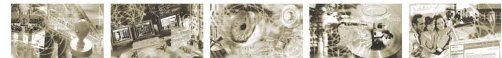

Dokument ist noch aktuell. (Stand 2020)

# TG 03126 - Technical Guidelines for the Secure Use of RFID

TG 03126-3 Application area "NFC based eTicketing"

Authors:

Cord Bartels, NXP Harald Kelter, BSI Rainer Oberweis, BSI Birger Rosenberg, NXP

Federal Office for Information Security P.O. Box 20 03 63 53133 Bonn, Germany Tel.: +49 (0) 228 99 9582 0 E-mail: rfid@bsi.bund.de Website: https://www.bsi.bund.de © Federal Office for Information Security 2009

# **Contents**

| 1     | Description of the application area for "NFC based eTicketing in public                       |    |
|-------|-----------------------------------------------------------------------------------------------|----|
|       | transport"                                                                                    | 13 |
| 2     | Description of services, products and carrier media                                           | 14 |
| 3     | Agreements                                                                                    | 17 |
| 3.1   | Definition of terms                                                                           | 17 |
| 3.2   | Generic modelling of roles and entities                                                       | 18 |
| 3.3   | Allocation of roles and entities in the "eTicketing for public transport" application area | 20 |
| 3.4   | Relationship between carrier media, applications and entitlements                             | 21 |
| 4     | General requirements                                                                          | 23 |
| 4.1   | Function                                                                                      | 23 |
| 4.1.1 | Customer requirements                                                                         | 23 |
| 4.1.2 | Requirements of the product provider and service provider                                     | 23 |
| 4.2   | Economy                                                                                       | 24 |
| 4.3   | Security                                                                                      | 24 |
| 5     | Method of determining security requirements                                                   | 25 |
| 5.1   | Objectives                                                                                    | 25 |
| 5.2   | Method                                                                                        | 25 |
| 5.2.1 | Scope of system considerations                                                                | 25 |
| 5.2.2 | Scalability and flexibility                                                                   | 26 |
| 5.2.3 | Structure of the Technical Guidelines                                                         | 28 |
| 5.2.4 | Explanation of the security concept                                                           | 29 |
| 6     | Generic business processes                                                                    | 31 |
| 6.1   | Process P1 "registering and ordering"                                                         | 31 |
| 6.1.1 | Setting up a customer account, purchasing personalised customer media and entitlements     | 31 |
| 6.1.2 | Purchasing non-personalised carrier media and entitlements                                    | 33 |
| 6.2   | Process P2 "producing and delivering products"                                                | 35 |
| 6.2.1 | Process P2A "producing and delivering personalised carrier media and entitlements"         | 35 |
| 6.2.2 | Process P2B "producing and delivering non-personalised carrier media and entitlements"     | 36 |
| 6.3   | Process P3 "using an entitlement"                                                             | 37 |
| 6.4   | Process P4 "blacklisting entitlements, applications and carrier media"                        | 38 |
| 7     | Use cases                                                                                     | 40 |
| 7.1   | Use case the "Identification when registering and ordering"                                   | 40 |
|       | Federal Office for Information Security                                                       | 3  |

| 7.2    | Use case the "Carrier medium initialisation"              | 40 |
|--------|-----------------------------------------------------------|----|
| 7.3    | Use case the "Application loading"                        | 41 |
| 7.4    | Use case the "Entitlement loading"                        | 42 |
| 7.5    | Use case the "Delivery"                                   | 43 |
| 7.6    | Use case the "Check-in"                                   | 44 |
| 7.7    | Use case the "Entitlement check"                          | 46 |
| 7.8    | Use case the "Offline check-out"                          | 47 |
| 7.9    | Use case the "Blocking"                                   | 47 |
| 7.10   | Use cases the "Key management"                            | 48 |
| 7.10.1 | Key management for the initialisation of carrier media    | 48 |
| 7.10.2 | Key management for loading and personalising applications | 49 |
| 7.10.3 | Key management for loading entitlements                   | 50 |
| 7.10.4 | Key management for use with the service provider          | 51 |
| 7.11   | Use case the "Initialising local transponders"            | 51 |
| 8      | Security considerations                                   | 54 |
| 8.1    | Definitions relating to security and privacy              | 54 |
| 8.2    | Definition of the security targets                        | 56 |
| 8.2.1  | Specific security targets for the customer                | 56 |
|        | Safety 8.2.1.1                                         | 56 |
|        | 8.2.1.2 Information security                           | 57 |
|        | 8.2.1.3 Protection of privacy                          | 58 |
| 8.2.2  | Specific security targets for the product provider        | 58 |
|        | 8.2.2.1 Safety                                         | 58 |
|        | 8.2.2.2 Information security                           | 59 |
|        | 8.2.2.3 Protection of privacy                          | 59 |
| 8.2.3  | Specific security targets for the service provider        | 60 |
|        | 8.2.3.1 Safety                                         | 60 |
|        | 8.2.3.2 Information security                           | 60 |
|        | 8.2.3.3 Protection of privacy                          | 61 |
| 8.2.4  | Summary of the entities' security targets                 | 61 |
| 8.2.5  | Formation of protection demand categories                 | 62 |
| 8.3    | Threats                                                   | 64 |
| 8.3.1  | Threats to the contact-less interface                     | 65 |
| 8.3.2  | Threats to the active NFC Mobile Device                   |    |
| 8.3.3  | Threats to the passive NFC Mobile Device                  |    |
| 8.3.4  | Threats to the local transponder                          |    |
| 8.3.5  | Threats to the reader 69                               |    |
| 8.3.6  | Threats to the key management system                      |    |

| 8.3.7  | Threats to the backend systems                                                                        | 71  |
|--------|-------------------------------------------------------------------------------------------------------|-----|
| 8.4    | Safeguards                                                                                            | 72  |
| 8.4.1  | Selection of cryptographic processes                                                                  | 73  |
| 8.4.2  | Safeguards for the protection of the system as a whole                                                | 73  |
| 8.4.3  | Safeguards relating to the carrier medium (NFC Mobile Device in passive mode)                      | 82  |
| 8.4.4  | Safeguards relating to the active NFC Mobile Device                                                   | 95  |
| 8.4.5  | Safeguards relating to the local transponder during online check-in and check out                  | 97  |
| 8.4.6  | Safeguards relating to the local transponder during offline check-in and check out                 | 97  |
| 8.4.7  | Safeguards relating to the readers                                                                    | 99  |
| 8.4.8  | Safeguards relating to the key management system                                                      | 102 |
| 9      | Definition of product-specific application scenarios                                                  | 110 |
| 9.1    | Application scenario: "Interoperable, personal season entitlement with automatic fare calculation" | 110 |
| 9.2    | Application scenario: "Local multi-ride entitlement"                                                  | 111 |
| 10     | Suggestions on implementing the system as a whole                                                     | 113 |
| 10.1   | Suggestions on implementing the eTicketing infrastructure                                             | 114 |
| 10.1.1 | Determining the protection demand for the eTicketing infrastructure                                   | 114 |
|        | 10.1.2 Interfaces in the system as a whole                                                         |     |
|        | 10.1.2.1 Threats relevant to the eTicketing infrastructure                                         | 117 |
|        | 10.1.2.2 Definition of safeguards for the interfaces of the system as a whole                      | 118 |
|        | 10.1.2.3 Residual risks                                                                            | 120 |
| 10.1.3 | Readers as defined in ISO/IEC14443                                                                    | 120 |
|        | 10.1.3.1 Threats relevant to the readers                                                           | 121 |
|        | 10.1.3.2 Definition of safeguards for the reader and its applications                              | 122 |
|        | 10.1.3.3 Residual risks                                                                            | 123 |
| 10.1.4 | Sale, inspection and management systems                                                               | 124 |
|        | 10.1.4.1 Sales systems                                                                             | 124 |
|        | 10.1.4.2 Ticket system                                                                             | 126 |
|        | 10.1.4.3 Central inspection system                                                                 | 127 |
|        | 10.1.4.4 Service desks                                                                             | 127 |
|        | 10.1.4.5 Management system for NFC Mobile Devices and applications                                 | 128 |
|        | 10.1.4.6 Management system for local transponders                                                  | 128 |
|        | 10.1.4.7 Threats relevant to ticket, inspection and management systems                             | 129 |
|        | 10.1.4.8 Definition of safeguards for ticket, inspection and management systems                    | 130 |
|        | 10.1.4.9 Residual risks                                                                            | 132 |
| 10.1.5 | Key management                                                                                        | 132 |

| 10.1.5.1 Key management for public transport service providers / SAMs for service providers  | 133 |
|----------------------------------------------------------------------------------------------------|-----|
| 10.1.5.2 Threats relevant to the key management system                                          | 133 |
| 10.1.5.3 Definition of safeguards for the key management system                                 | 134 |
| 10.1.5.4 Residual risks                                                                         | 135 |
| 10.2 Local transponders                                                                         | 135 |
| 10.2.1 Initialising local transponders                                                          | 137 |
| 10.2.2 Loading the location information                                                         |     |
| 10.2.3 Determining the protection demand for the local transponder                              | 138 |
| 10.2.4 Threats to the local transponder                                                         | 138 |
| 10.2.5 Definition of specific safeguards                                                        | 139 |
| 10.3 NFC Mobile Device                                                                          | 139 |
| 10.3.1 Characteristics of the NFC Mobile Device                                                 | 139 |
| 10.3.2 Initialising the NFC Mobile Device                                                       | 140 |
| 10.3.3 Personalising the NFC Mobile Device                                                      | 140 |
| 10.3.4 Determining the protection demand for the NFC Mobile Device                              | 140 |
| 10.3.5 Threats to the NFC Mobile Device                                                         | 140 |
| 10.3.5.1 Threats in active mode (PCD mode)                                                      | 140 |
| 10.3.5.2 Threats in passive mode                                                                | 141 |
| 10.3.6 Definition of specific safeguards                                                        | 142 |
| 11 Suggestions on executing the product-specific application scenarios                          | 143 |
| 11.1 Application scenario "Interoperable season entitlement with automatic fare calculation" | 143 |
| 11.1.1 Determining the protection demand category                                               |     |
| 11.1.2 Protecting the passive NFC Mobile Device                                                 | 146 |
| 11.1.2.1 Threats relevant to the passive NFC Mobile Device                                      | 146 |
| 11.1.2.2 Definition of relevant use cases for the passive NMD                                   | 147 |
| 11.1.2.3 Definition of safeguards for the passive NMD                                           | 148 |
| 11.1.3 Protecting the active NFC Mobile Device                                                  | 150 |
| 11.1.3.1 Threats relevant to the active NMD                                                     | 150 |
| 11.1.3.2 Definition of relevant use cases for the passive NMD                                   | 151 |
| 11.1.3.3 Definition of safeguards for the active NMD                                            | 151 |
| 11.1.4 Protecting the local transponder                                                         | 153 |
| 11.1.4.1 Threats relevant to the local transponder                                              | 153 |
| 11.1.4.2 Definition of relevant use cases for the local transponder                             | 153 |
| 11.1.4.3 Definition of safeguards for the local transponder                                     | 154 |
| 11.1.5 Residual risks                                                                           |     |
| 12 List of references                                                                           | 156 |

13 [List of abbreviations 158](#page-157-0)

# **List of Tables**

| Table 2–1  | Overview of sales channels and their features                                                                    | 15 |
|------------|------------------------------------------------------------------------------------------------------------------|----|
| Table 5–1  | Structure of the Technical Guidelines                                                                            | 29 |
| Table 8–1  | Coding scheme of security targets                                                                                | 56 |
| Table 8–2  | Customer specific security targets for safety                                                                    | 57 |
| Table 8–3  | Customer specific security targets for information security                                                      | 57 |
| Table 8–4  | Customer specific security targets for protection of privacy                                                     | 58 |
| Table 8–5  | Product provider specific security targets for safety                                                            | 58 |
| Table 8–6  | Product provider specific security targets for safety information security                                    | 59 |
| Table 8–7  | Product provider specific security targets for protection of privacy                                             | 60 |
| Table 8–8  | Service provider specific security targets for safety                                                            | 60 |
| Table 8–9  | Service provider specific security targets for information security                                              | 61 |
| Table 8–10 | Service provider specific security targets for protection of privacy                                             | 61 |
| Table 8–11 | Overview of the entities' security targets                                                                       | 62 |
| Table 8–12 | Definition of protection demand categories                                                                       | 64 |
| Table 8–13 | Coding scheme of threats                                                                                         | 65 |
| Table 8–14 | Threats to the contact-less interface                                                                            | 65 |
| Table 8–15 | Threats to the active NFC mobile device                                                                          | 67 |
| Table 8–16 | Threats to the passive mobile device                                                                             | 68 |
| Table 8–17 | Threats to the local transponder                                                                                 | 69 |
| Table 8–18 | Threats to the reader                                                                                            | 70 |
| Table 8–19 | Threats to the key management system                                                                             | 71 |
| Table 8–20 | Threats to the backend systems                                                                                   | 72 |
| Table 8–21 | Coding scheme of safeguard measures                                                                              | 73 |
| Table 8–22 | Protection of the system as a whole through introduction of interface tests and approval procedures           | 74 |
| Table 8–23 | Protection of the system as a whole through ensuring the confidentiality of communication                     | 75 |
| Table 8–24 | Protection of the system as a whole through introduction of contact less interface as defined by ISO/IEC14443 | 75 |
| Table 8–25 | Protection of the system as a whole through definition of fallback solutions                                  | 76 |
| Table 8–26 | Protection of the system as a whole through securing the confidentiality of data                              | 76 |
| Table 8–27 | Protection of the system as a whole through confidential storage of data                                      | 77 |
| Table 8–28 | Protection of the system as a whole through securing the data integrity when transmitting data                | 77 |

| Table 8–29 | Protection of the system as a whole through securing data integrity when storing data                         | 78 |
|------------|------------------------------------------------------------------------------------------------------------------|----|
| Table 8–30 | Protection of the system as a whole through securing the system's functions against DoS attacks               | 78 |
| Table 8–31 | Protection of the system as a whole through securing the function of the system against incorrect operation   | 79 |
| Table 8–32 | Protection of the system as a whole through securing the function of the system to prevent technical failures | 79 |
| Table 8–33 | Protection of the system as a whole through specification of the system and the components                    | 80 |
| Table 8–34 | Protection of the system as a whole through ergonomic user instructions                                       | 80 |
| Table 8–35 | Protection of the system as a whole through support                                                              | 81 |
| Table 8–36 | Protection of the system as a whole through separation of applications                                        | 81 |
| Table 8–37 | Protection of the system as a whole through identifying the customer                                             | 82 |
| Table 8–38 | Protection of the system as a whole through satisfying the data minimization obligation                       | 82 |
| Table 8–39 | Protection of the carrier medium through access protection                                                       | 83 |
| Table 8–40 | Protection of the carrier medium against cloning                                                                 | 84 |
| Table 8–41 | Protection of the carrier medium against emulation                                                               | 85 |
| Table 8–42 | Protection of personal data on the carrier medium                                                                | 86 |
| Table 8–43 | Protection of calculation data on the carrier medium                                                             | 87 |
| Table 8–44 | Protection through separation of applications on the carrier medium                                              | 88 |
| Table 8–45 | Protection through specification of carrier medium                                                               | 88 |
| Table 8–46 | Protection through introduction of proximity technology as defined by ISO/IEC14443                            | 89 |
| Table 8–47 | Protection through fallback solution for carrier medium malfunction                                              | 89 |
| Table 8–48 | Protection through securing the authenticity and integrity when loading applications                          | 92 |
| Table 8–49 | Protection through securing the confidentiality when loading applications                                     | 92 |
| Table 8–50 | Protection through securing the authenticity and integrity when loading entitlements                          | 94 |
| Table 8–51 | Protection through securing the confidentiality when loading entitlements                                     | 94 |
| Table 8–52 | Protection of the active NFC Mobile Device through information about procedures and conditions of use         | 95 |
| Table 8–53 | Protection of the active NFC Mobile Device through switching to alternative sales channels                    | 95 |
| Table 8–54 | Protection of the active NFC Mobile Device through protection of data and keys in the NMD                     | 96 |
| Table 8–55 | Protection of the active NFC Mobile Device through protection of the transponder data in the NMD              | 96 |
|            |                                                                                                                  |    |

| Table 8–56  | Protection of the active NFC Mobile Device through checking the function of the NMD/display          | 97  |
|-------------|---------------------------------------------------------------------------------------------------------|-----|
| Table 8–57  | Protection of the local transponder by assuring the authenticity of location information             | 98  |
| Table 8–58  | Protection of the local transponder against vandalism / DoS                                             | 98  |
| Table 8–59  | Protection of the local transponder installation                                                        | 98  |
| Table 8–60  | Protection of readers through introduction of interface tests                                           | 99  |
| Table 8–61  | Protection of readers through protection of reference information                                       | 100 |
| Table 8–62  | Protection of the reader against malfunction                                                            | 101 |
| Table 8–63  | Protection through secure generation and import of keys                                                 | 103 |
| Table 8–64  | Protection through introduction of key management                                                       | 104 |
| Table 8–65  | Protection through access protection for cryptographic keys                                             | 105 |
| Table 8–66  | Protection through securing the function of security components                                         | 106 |
| Table 8–67  | Protection through availability of a key management system                                              | 106 |
| Table 8–68  | Protection through definition of actions when keys are compromised                                      | 107 |
| Table 8–69  | Protection through separation of keys                                                                   | 107 |
| Table 8–70  | Protection through securing the authenticity and integrity when loading keys                         | 109 |
| Table 9–1   | Carrier media for the use of "Interoperable season entitlement with automatic fare calculation"      | 111 |
| Table 9–2   | Relevant processes                                                                                      | 111 |
| Table 9–3   | Carrier media used for local multi-ride entitlements                                                    | 112 |
| Table 9–4   | Relevant processes                                                                                      | 112 |
| Table 10–1  | The system's protection requirements                                                                    | 116 |
| Table 10–2  | Relevant threats to the contact-less interface                                                          | 117 |
| Table 10–3  | Threats relevant to the system                                                                          | 118 |
| Table 10–4  | Safeguards for the system as a whole                                                                    | 120 |
| Table 10–5  | Threats relevant to the contact-less interface                                                          | 121 |
| Table 10–6  | Threats relevant to the reader                                                                          | 122 |
| Table 10–7  | Safeguards for the reader and its applications                                                          | 123 |
| Table 10–8  | Threats relevant to ticket, inspection and management systems                                           | 130 |
| Table 10–9  | Safeguards for ticket, inspection and management systems                                                | 132 |
| Table 10–10 | Threats relevant to the key management system                                                           | 134 |
| Table 10–11 | Safeguards for the key management system                                                                | 135 |
| Table 10–12 | Categorisations of chip products                                                                        | 137 |
| Table 10–13 | Threats relevant to the local transponder                                                               | 138 |
| Table 10–14 | Categorisation of carrier media                                                                         | 139 |
| Table 10–15 | Categorisation of chip products integrated in the NMD                                                   | 140 |
| Table 10–16 | Threats relevant to the active NMD in the "Season ticket with fare calculation" application scenario | 141 |

| Table 10–17 | Threats relevant to the NFC Mobile Device (passive mode)                                                                   | 142 |
|-------------|----------------------------------------------------------------------------------------------------------------------------|-----|
| Table 11–1  | Protection demands for the "season entitlement with automatic fare calculation" application scenario                    | 145 |
| Table 11–2  | Threats relevant to the passive NMD in the "Season entitlement with fare calculation" application scenario              | 147 |
| Table 11–3  | Use cases relevant to the "Season entitlement with fare calculation" application scenario                               | 147 |
| Table 11–4  | Safeguards for a passive NMD in the "Season entitlement with fare calculation" application scenario                     | 150 |
| Table 11–5  | Threats relevant to the active NMD in the "Season ticket with fare calculation" application scenario                    | 150 |
| Table 11–6  | Use cases relevant to the "Season entitlement with fare calculation" application scenario                               | 151 |
| Table 11–7  | Safeguards for the active NMD in the "Season entitlement with fare calculation" application scenario                    | 152 |
| Table 11–8  | Threats relevant to the active local transponder in the "Season entitlement with fare calculation" application scenario | 153 |
| Table 11–9  | Use cases relevant to the "Season entitlement with fare calculation" application scenario                               | 154 |
| Table 11–10 | Safeguards for the local transponder in the "Season entitlement with fare calculation" application scenario             | 155 |

# **List of Illustrations**

| Figure 3–1  | Entities in an application area as defined by ISO 24014 (but extended to include customer medium entities) | 18  |  |  |  |
|-------------|---------------------------------------------------------------------------------------------------------------|-----|--|--|--|
| Figure 3–2  | Entities in the "eTicketing for public transport" application area                                            | 21  |  |  |  |
| Figure 3–3  | Entities in the "VDV Core Application" application scenario                                                   | 21  |  |  |  |
| Figure 3–4  | Carrier media, applications and entitlements                                                                  | 22  |  |  |  |
| Figure 5–1  | Example: Identification of RFID-relevant use cases for eTicketing                                             |     |  |  |  |
| Figure 5–2  | Example of application scenarios and RFID-relevant use cases for eTicketing in public transport            | 27  |  |  |  |
| Figure 5–3  | Hierarchical concept for media, applications and entitlements in eTicketing                                | 27  |  |  |  |
| Figure 5–4  | Security assessment concept                                                                                   | 29  |  |  |  |
| Figure 5–5  | Generic security targets                                                                                      | 30  |  |  |  |
| Figure 6–1  | Process P1A "purchasing personalised customer media and entitlements"                                      | 33  |  |  |  |
| Figure 6–2  | Process P1B "purchasing non-personalised carrier media and entitlements"                                   | 34  |  |  |  |
| Figure 6–3  | Process P2A "producing and delivering personalised carrier media and entitlements"                         | 35  |  |  |  |
| Figure 6–4  | Process P2B "producing and delivering non-personalised carrier media and entitlements"                     | 36  |  |  |  |
| Figure 6–5  | Process P3 "using a CICO entitlement"                                                                         | 38  |  |  |  |
| Figure 7–1  | Use case "Carrier medium initialisation"                                                                      | 41  |  |  |  |
| Figure 7–2  | Use case "Application loading"                                                                                | 42  |  |  |  |
| Figure 7–3  | Use case "Entitlement loading"                                                                                | 43  |  |  |  |
| Figure 7–4  | Use case "Offline check-in"                                                                                   | 45  |  |  |  |
| Figure 7–5  | Use case "Entitlement check"                                                                                  | 46  |  |  |  |
| Figure 7–6  | Use case "Blocking"                                                                                           | 48  |  |  |  |
| Figure 7–7  | Use case "Key management for carrier media"                                                                   | 49  |  |  |  |
| Figure 7–8  | Use case "Key management for applications"                                                                    | 50  |  |  |  |
| Figure 7–9  | Use case "Key management for products/entitlements"                                                           | 51  |  |  |  |
| Figure 7–10 | Use Case "Initialising local transponders"                                                                    | 53  |  |  |  |
| Figure 10–1 | A schematic example of the "NFC-based eTicketing" system as a whole                                        | 113 |  |  |  |
| Figure 10–2 | Diagram of the system involved in the "Touch & Travel" reference set up                                    | 114 |  |  |  |
| Figure 10–3 | Example of a reader with Smart Card or Smart Label                                                            | 121 |  |  |  |
| Figure 10–4 | An example of a ticket system with possible process flows                                                     | 126 |  |  |  |

# **1 Description of the application area for "NFC based eTicketing in public transport"**

In order to use public transport a passenger requires an entitlement, otherwise known as a ticket. This entitlement is traditionally in the form of a paper ticket, to which the passenger gives validity (stamps, validates) when issued or when the journey begins, and which may be checked by an inspector in the vehicle or on the platform.

In the descriptions of the application scenarios for "eTicketing for events" and "eTicketing in public transport", NFC carrier media in "Smart Object Mode" are used – which means media such as Smart Cards and Smart Tickets. In these cases, the NFC carrier medium plays a passive role when communicating with an ISO14443 reader.

However, NFC technology also offers the possibility of the customer medium playing an active role. In such cases, the NFC device functions as an active reader which controls communication with another NFC device or an ISO14443 transponder. Both roles, and the applications they involve, can be implemented together in a single NFC carrier medium.

This active capability of NFC carrier media can be used for certain application scenarios in order to use permanently installed transponders to replace the local recording infrastructure required for chip cards. This in turn makes it possible to establish a complementary, technically interoperable system infrastructure for chip cards and NFC devices.

This is especially attractive in the field of public transport, because the cost of the infrastructure that has to be installed in vehicles and at stations or bus stops is high. Highly frequented areas can continue to be equipped with high-performance local readers (for a further discussion of this see the description of the application area "eTicketing in public transport"). Areas with low passenger frequencies (rural areas and so on) can be covered using an infrastructure consisting of permanently installed transponders. Registration and validation is performed using passengers' mobile NFC devices, which read these transponders and automatically compare data with the ticketing system.

The description of the application area "NFC-based eTicketing" is based on the use of an NFC carrier medium's active function as a reader in the field of public transport.

As mentioned above, the associated application scenarios in public transport should be considered complementary to those of conventional eTicketing using chip cards. As a consequence, the standards and agreements applied in that field may also be used as a basis for describing this application area.

European standardisation authorities have so far introduced three standards to support the emerging IFM systems:

- 1 The functional system architecture and the application scenarios of IFM systems are described in the standard ISO EN 24014-1. This standard was drawn up by the CEN TC 278 WG3 SG5 Work Group.
- 2 The description of the data elements to be used in the medium, and the structure of the data elements (application), are discussed in CEN TC 224 WG11 SG1.
- 3 The EN 1545 standard describes the data elements and EN 15320 describes the data structuring (IOPTA, InterOperable Public Transport Application).

In practice we can expect that, in addition to local implementations of eTicketing in public transport, complementary developments will emerge involving NFC-based eTicketing.

The VDV Core Application (CA) gathers together the existing international system standards into one overall set of technical system specifications.

# **2 Description of services, products and carrier media**

This discussion of products and carrier media intends initially – as also does IOPTA – to delineate the current and predicted state of affairs in Europe. However, emphasis will be placed on the check-in/check-out variation of the CA (CICO), since this is the most highly developed, powerful and flexible of the IOPTA application scenarios. In a CICO system, the passenger registers consciously at the beginning of the journey using the medium, and deregisters consciously at the end.

Customers are provided with services by transport companies, and the following products are offered in connection with that by means of eTicketing:

- 1 Electronic tickets (single-ride tickets, day, month, year and network tickets with defined regional validity, and tickets for regional and long-distance travel).
- 2 Multi-ride entitlements (ticket strips, credits).
- 3 Upgrading or loading a multi-ride entitlement with additional individual entitlements.
- 4 Season tickets (automatic fare calculation, CICO, electronic ticket subscription contract).

The products differ in terms of particular features and characteristics:

- 1 Interoperable or non-interoperable usage.
- 2 Value of entitlement:
	- E-ticket approx. €1 €15,000; e.g. VRR: €6,000, DB AG: €15,000,
	- Stored value … €150
	- Season tickets … >€1,000
- 3 Non-transferable personalised, transferable personalised, anonymous.
- 4 Validity in terms of time and region / non-regulated entitlements.
- 5 Charging variations (account entitlements {pre-/postpaid}, credit entitlements, …).
- 6 Time of fare calculation (pre-pricing, trip-pricing and post-pricing).

In all this, interoperability is defined as when two or more companies accept an entitlement/product (acceptance terminal interfaces have to be standardised; in the VDV CA this means ISO-14443 and the specified data interfaces) and calculate between themselves which services were used and how the takings are shared out. Every transport company association in Germany now operates like this. From the customer's point of view interoperability means that they can purchase and load their media and season entitlements to travel at different customer contract partners, and use them with different service providers.

Automatic fare calculation requires a check-in at the start of the journey on public transport, and a check-out at the end, and this in turn requires CICO (check-in/check-out) infrastructure. Systems that use access barriers can use these for checking in and out. In systems without access barriers (Germany for example), a CICO infrastructure comprising check-in and check-out terminals must be installed on the platforms and in the vehicles.

Basically, the common products that involve checking and checking out or a validation of an entitlement can also be depicted using active NFC carrier media. We will, however, be placing particular emphasis on the NFC-based CICO variation, which has been defined on the basis of the VDV CA.

The "secure NFC Mobile Device" can be used universally as a carrier medium for use on public transport.

The products are sold through the following channels:

- 1 Direct sales by the product provider:
	- a Internet sales
- 2 Sales through retailers:
	- a Internet sales

The following table describes the various sales channels and their features:

| Sales chan nel                                                                                                   | mer Setting up a custo account | Reliable identification | me mer Initialise custo dia on site | Direct output of cus media mer to | Load applications onto media mer ex. custo | ments onto media mer Load entitle ex. custo | ment Methods of pay                                   | Sales staff present | Sale in secure area | Mobile operation | Online link to sales and ms ment syste manage |
|---------------------------------------------------------------------------------------------------------------------|--------------------------------------|-------------------------|----------------------------------------------|--------------------------------------------|-----------------------------------------------------|---------------------------------------------------------|----------------------------------------------------------|---------------------|---------------------|------------------|--------------------------------------------------------|
| Customer centre / sales point                                                                                 | +                                    | +                       | Over-the air                              | +                                          | Over-the air                                     | +                                                       | direct debit cards, Cash,                          | +                   | –                   | +                | +                                                      |
| Service centre (tele phone, Internet)                                                                      | +                                    | –                       | Over-the-air                                 | Postal dis patch                        | Over-the-air                                        | –                                                       | m                                                        | +                   | –                   | –                | +                                                      |
| Internet (via mobile net work)                                                                                | +                                    | –                       | Over-the air                              | –                                          | +                                                   | +                                                       | ment procedures                                          | –                   | –                   | +                | +                                                      |
| Internet (via mobile net work) and registration of customer account using se cure ID to ken | +                                    | +                       | Over-the-air                                 | –                                          | +                                                   | +                                                       | Cards, direct debit, acceptance of syste specific pay | –                   | –                   | +                | +                                                      |

**Table 2–1 Overview of sales channels and their features** 

"+" indicates that the function or characteristic must be taken into account for that sales channel

"–" indicates that there is no relevant relationship between the function/characteristics and the particular sales channel

"+" a symbol highlighted in grey denotes developments expected in the future

1 Sale by personnel

Sales through customer centres and sales points involve a direct interaction between the customer and the personnel of the product provider (CCP).

What these sales channels have in common is that the personnel can identify the customer (e.g. identity card) and that payment methods etc. may be used in a flexible way. Differences arise from the various technical possibilities.

NFC Mobile Devices can be initialised if done "over-the-air" via the mobile network. In any event, customer media can be ordered from the customer centre or sales point and sent to the customer's home. Alternatively, the initialised, personalised customer medium can be set aside for collection at the customer centre.

Loading products and entitlements onto existing personalised and non-personalised NFC Mobile Devices can also be done over-the-air via the mobile network. Alternatively, the NFC interface can be used to load entitlements, which requires direct communication between the customer medium and the sales system via a suitable reader. This is already supported in customer centres and local sales points for personalised and nonpersonalised products. Non-personalised products can also be sold offline using Secure Authentication Modules (SAMs).

2 Service centres (Internet or hotline)

The customer submits personal details, the order, and payment information to a service centre via the Internet (website) or a telephone hotline. The availability of the product and, where applicable, seat reservations can normally be dealt with straight away when ordering from a service centre. Payment is by credit card, direct debit, or similar. Products and customer media are delivered by post or can be made available for collection at a customer centre.

Personal and address information submitted through a website or telephonically is not necessarily considered trustworthy. Checking it reliably involves extra effort. Normally it is checked solely against a current address database, and a credit check is performed.

#### 3 Internet using card-readers and secure proof of identity (e.g. eID)

In future there may be another way in which customers can register and place orders.

It will involve the customer submitting the order and payment information to a service centre via the Internet (website). Data relating to the customer's person (where necessary) will be identified and transmitted online by means of direct communication between the ticket issuer's application server and a secure identity card (electronic identity card, eID). One way of doing this may be the forthcoming electronic Personalausweis (ePA, electronic identity card).

The availability of the product and, where applicable, the choice of seat can normally be dealt with straight away when ordering on the Internet. Payment is by credit card, direct debit, or similar. Products and customer media are delivered by post or can be made available for collection at the venue (sales point, vending machine).

The personal and address information received by communicating with the eID are to be considered trustworthy and reliable. Additional checking is not required.

# **3 Agreements**

## **3.1 Definition of terms**

#### Application area

The area in which the Technical Guidelines are intended to apply; the highest unit in the terminological structure; incorporates one or more applications, the products/services that belong to those applications, and the application scenarios that result from that.

#### Application scenario

A particular way of looking at the application area in terms of the implementation of specific products and services.

#### Operating process

A comprehensive operational procedure in eTicketing. Examples are the sales process, the use of an entitlement, clearing, and so on.

#### Use case

Detailed description of a series of activities that constitute part of an operating process. Examples include initialising a carrier medium and loading an entitlement.

#### Check-in / check-out (CICO)

When using the "automatic fare calculation" product, the passenger must check in at the start of the journey and check out at the end. This requires an appropriate infrastructure, known as a CICO infrastructure. Systems that use access barriers can use these for checking in and out. Otherwise a CICO infrastructure comprising local transponders must be installed on the platforms, at bus stops and in the vehicles.

### Interoperability

Interoperability means that the customer can buy his entitlement from more than one product supplier, pay using the methods agreed on as part of the system, and redeem the entitlement with more than one service provider. The service provider is remunerated for the services provided by the product owner or product supplier, by means of a clearing procedure. Interoperability is required between transport company associations and also between transport companies within such associations. Accounting accuracy is a central aspect of this, since it determines the money received by the service providers. In the past, money was shared out within transport company associations on the basis of traffic flow analyses, statistics and estimates. Technical accounting accuracy can be achieved with the introduction of CICO technology.

### Usage data

The calculation process in the "automatic fare calculation" product is based on data gathered when the customer uses the service. To enable this, the customer checks in at a local transponder using his customer medium and then checks out again when he has finished using the service. The usage data acquired is stored in the recording system and the customer medium. Its reliability is fundamental to the reliable invoicing of customers and to interoperability between service providers.

### Calculation data

The usage data which is used for accounting purposes is referred to as calculation data. Calculation data contains, for example, information about the entitlement, the product owner, the service provider, and the place and time of check-in and check-out. This data may or may not be able to be assigned to the customer, depending on whether personalised or anonymous entitlement is being used. The calculation data is passed on to the product owner by the service provider, who gathers it at the recording system. The authenticity, integrity and confidentiality of the calculation data are extremely important to customers and service providers alike.

### Statistical data

Statistical data provides information about the general use of a product, a line, a vehicle and so on. With an "automatic fare calculation" entitlement, the statistical data can be derived from the usage data. With other products, usage data can be gathered when the entitlement is assessed before entry. Statistical data is stored and utilised in an anonymised and statistically processed form. Statistical data is not used for invoicing customers for services, but rather for the service provider's or product owner's planning purposes, which is why it is only held in anonymised form. Statistical data can, however, be used for a general division of takings between service providers.

## **3.2 Generic modelling of roles and entities**

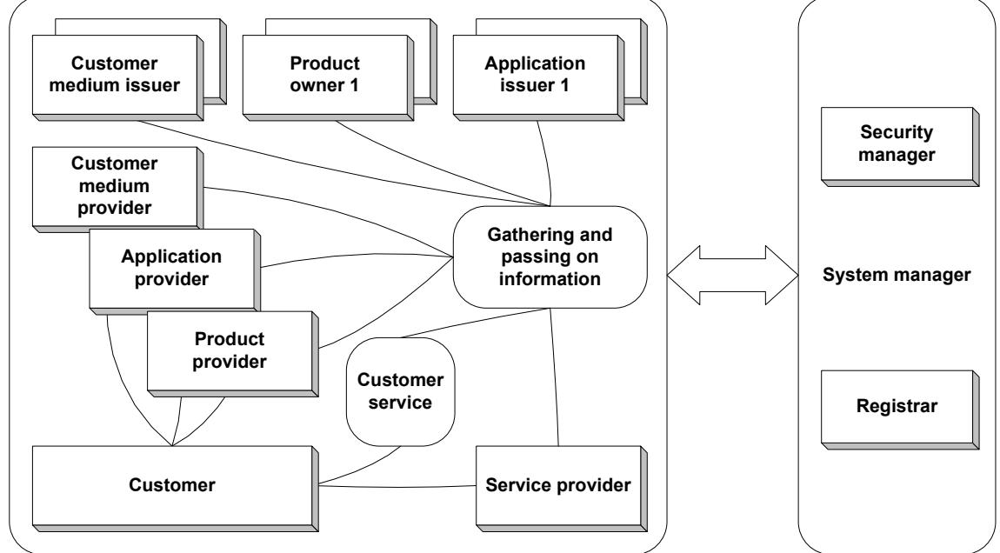

The roles and responsibilities shall be described on the basis of the ISO 24014 standard.

#### **Figure 3–1 Entities in an application area as defined by ISO 24014 (but extended to include customer medium entities)**

ISO 24014 defines entities and assigns roles and responsibilities to them. The implementation for the eTicketing application areas is described in the following:

Actor

An entity that operates in accord with the role assigned to it.

#### Customer

The purchaser of a product and user of the services associated with it. The customer pays money and receives from the product provider an entitlement to use services. This entitlement is redeemed at the service provider.

#### Customer medium

The customer medium is a data carrier in which an electronic entitlement can be stored. The customer medium is held by the customer, and is required by the customer in order to use the entitlement. Other common names for the customer medium are user medium and carrier medium. Examples of customer media include Smart Tickets, chip cards and active and passive NFC Mobile Devices (NMDs). Active NMDs also perform tasks relating to the recording infrastructure and the issue of entitlements.

#### Issuer of customer medium

The issuer of the customer medium configures it for further use. The issuer may market the customer medium through customer media retailers (such as transport companies). Close coordination and a contractual relationship are required between the issuer of the customer medium, the application issuer and the system manager.

#### Provider of customer medium

The provider of the customer medium (e.g. a transport company or mobile phone service provider) markets the customer medium which it has received from the customer medium issuer. The provider of the customer medium normally implements an application as well when issuing the customer medium.

#### Application

The application supports one or more products by providing functions and structures – such as those needed to store entitlements on the carrier medium, in the sales system and in the backend system. The implementation follows the application specification, which normally belongs to the issuer of the application. The issuer of the application may market the application through application providers (such as a regional transport association). As well as the products, the application may also contain customer-specific information.

#### Application issuer

The application issuer is the owner of the application specification. The application issuer may market the application through application providers (e.g. a transport company).

#### Application provider

The application provider (e.g. a transport company or stadium operator) implements and markets the application which it has received from an application issuer (e.g. in licensed form). The application provider also normally issues the carrier medium in conjunction with implementing the application, making him, for instance, the contractual partner to the customer in the eTicketing application area.

#### Product/entitlement/service

The product is a service or object provided by a product owner and which the customer can use in return for payment. The product belongs to the product owner (e.g. a concert organiser) and is offered to customers directly or through a product provider (e.g. travel agent or advance ticket office). When he purchases the product, the customer receives an entitlement to use a service, which he can then redeem at the service provider (e.g. a transport company).

#### Product owner

The owner of the product (e.g. a single entry to a Bundesliga football match). The

product owner defines and markets the product, sometimes through a product provider (e.g. an advance ticket office). In simple scenarios, however, it is quite normal for the product owner to be the product provider as well. The product owner must follow the specifications of the application issuer when he defines his product, in order to ensure that the application can support the product. Furthermore, close collaboration is required between the product owner and the service provider who is to provide the service promised by the product. A contractual relationship is required between the product owner, product provider and service provider.

#### Product provider

Markets the product on behalf of the product owner in return for a fee. The product provider receives the customer's payment and is therefore the only interface for payments. This demands direct coordination and a contractual relationship with the product owner. The product provider places the product (e.g. an entitlement) into the application on the carrier medium. The product provider is the contractual partner to the customer in terms of the entitlements he has purchased to utilise services. In organisational terms the product owner often takes on the role of product provider as well.

#### Service provider

Examples include stadium operators and public transport companies; provides the customer with a service if he presents an entitlement purchased from a product provider (e.g. entry to a stadium). This requires direct coordination and a contractual relationship with the product provider and product owner.

#### System manager

The system manager ensures that the rules of the system are upheld. To this end he draws on the functional entities of security manager and registrar.

#### Registrar

The registrar ensures that unique identifying characteristics are allocated throughout the system. This is necessary in order to clearly identify the entities, carrier media, applications and products/entitlements.

### Security manager

Establishes and coordinates the security regulations in the system; responsible for approving the components of the system; monitors the performance of security-related functions (e.g. key management).

## **3.3 Allocation of roles and entities in the "eTicketing for public transport" application area**

Making the services available which are described in Chapter [2](#page-13-1) demands, in a fully developed configuration, the interaction of diverse and changing entities. For instance, it must be made possible for a service provider to handle products from various different product owners and providers, and to support the invoicing accordingly.

The assignment of entities in this application area is identical to the generic description in section [3.2](#page-17-1). In the following diagram, the main entities defined in the VDV Core Application are also shown to provide an example:

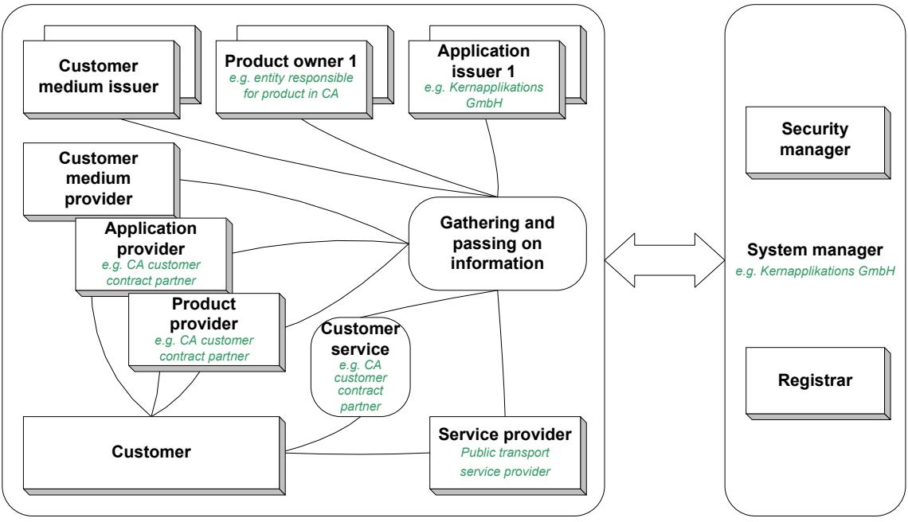

**Figure 3–2 Entities in the "eTicketing for public transport" application area** 

The specifications of the VDV Core Application combine some of the roles together:

- 1 The customer contract partner (CCP) takes on the role of providing the application and product. In certain cases, preconfigured NFC Mobile Device can also be issued as customer media together with applications and entitlements.
- 2 VDV KA GmbH takes on the roles of system manager (including security manager and registrar) and application issuer.

Given these facts, the generic diagram in [Figure 3–2](#page-20-1) is modified to produce the following specific plan:

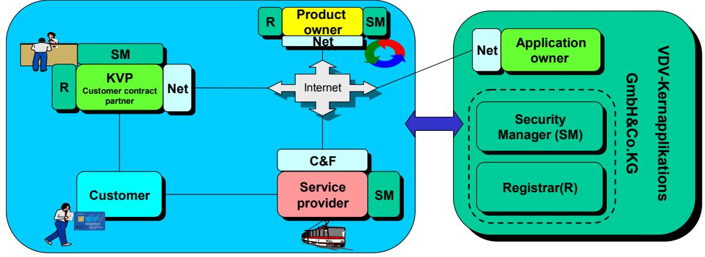

**Figure 3–3 Entities in the "VDV Core Application" application scenario** 

## **3.4 Relationship between carrier media, applications and entitlements**

The model described in sections [3.2](#page-17-1) and [3.3](#page-19-1) supports several product providers, service providers, application issuers and so on.

This means that a large number of different carrier media, applications and products would be conceivable.

The customer or carrier medium is the customer's data carrier on which he stores his entitlements and with the help of which he makes use of the associated services.

Applications provide the structures and functions required to load entitlements onto carrier media, and to make use of the entitlements. The implementation of applications must therefore take account of the features of specific carrier media and entitlements.

The customer can exchange entitlements for services at the service provider.

The following rules apply to the relationships between carrier media, applications and entitlements:

- 1 A carrier medium can contain at least one application. If more than one application can be stored on it, then it is referred to as a multi-application-compatible carrier medium.
- 2 An application can store at least one entitlement. The VDV Core Application simultaneously supports different entitlements of different types, which may originate from different product providers. Personal data and check-in / check-out data may also be stored in the application.
- 3 Applications on one carrier medium can originate from different application issuers and providers.
- 4 Entitlements in one application may originate from different product owners and providers.
- 5 Entitlements of the same type can be stored in different applications.

The following diagram illustrates an example of the relationship between carrier media, applications and entitlements.

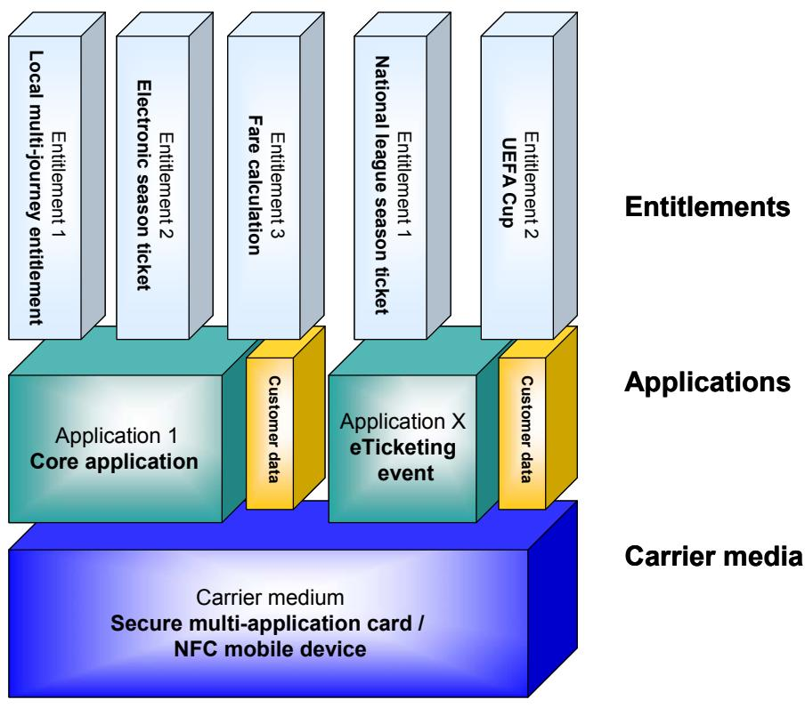

**Figure 3–4 Carrier media, applications and entitlements** 

# **4 General requirements**

The requirements which must be met by the system as a whole and its processes and components can be divided into three categories.

## **4.1 Function**

## **4.1.1 Customer requirements**

Below are some of the features which are required from the customer's point of view:

- The customer media and systems must be easy to use.
- The customer medium must be durable and reliable, and must perform at the required speed.
- The entitlement and the customer medium must be easy and reliable to use, including with different service providers.
- The way "automatic fare calculation" products are invoiced must be reliable and easy to follow.
- It should be possible to replace lost entitlements for an administration fee. The same should apply to exchanging entitlements.
- It must also be possible to purchase anonymous entitlements.
- Reasonable protection must be provided for personal data (where applicable).

Whenever contact-less chip technology is used, the customer should always be kept properly informed of the personal data used, how it is employed, what is done to protect the data, and any risks that remain.

## **4.1.2 Requirements of the product provider and service provider**

Functionality

- It should be easy to explain to customers and personnel how the customer medium and systems are used.
- The way the system components and processes are executed must take into account the conditions particular to public transport. For example, permanent data access to the overall system cannot be guaranteed in vehicles, so it has to be possible to purchase entitlements, redeem them, check-in / check-out and monitor entitlements even when the terminals involved are not online during the entire process.
- It must be possible to blacklist personalised entitlements and customer media, and to issue replacements.
- Access barriers and check-in/check-out systems must allow enough people through in a given period.

Technical compatibility

• The compatibility of system components must be assured even if carrier media, systems and components come from different manufacturers and providers and are used with different service providers.

## **4.2 Economy**

For an eTicketing system to be operated economically, the commercial benefit must be greater than the cost of the processes, systems and security, regardless of how extensively the system is installed. This must apply to all of the entities who invest in the setting-up of the system.

The system as a whole, and its components, should therefore be designed such that the requirements of the relevant application scenarios are met as efficiently as possible. For this reason it is necessary to begin by defining these requirements as accurately as possible.

## **4.3 Security**

This document will deal with the requirements of security separately, from section [8.2](#page-55-1) onwards.

# **5 Method of determining security requirements**

## **5.1 Objectives**

The Technical Guidelines on secure use of RFID should fulfil the following objectives:

- Provide system suppliers and system users with an introductory guide on the correct implementation of specific RFID system solutions, in terms of safety, information security and privacy.
- Raise awareness of and achieve transparency in aspects of security.
- Provide a basis for the system supplier's or operator's declaration of conformity, and for the issuing of quality seals by certification authorities.

The following information is required in order to achieve these aims:

- A definition of the security requirements that must be fulfilled by an RFID system for a given application area.
- A description of the specific risks, appropriate counter-measures, and potential remaining risks.
- A definition of the criteria for a declaration of conformity and for certification.

It is not just security aspects that are relevant to the definition of activities and proposed systems; all of the requirements described in Chapter [4](#page-22-1) also have to be taken into consideration.

## **5.2 Method**

## **5.2.1 Scope of system considerations**

RFID-based systems can be very complex. In most cases, a lot of components not equipped with RFID are part of the system solution. On the other hand it is not sufficient to look only at the media/tags and readers in order to safeguard the system's security.

The Technical Guidelines must cover in detail every aspect of security relevant to RFID. These aspects depend a lot on the application area and the way the system solution is implemented in it. These Technical Guidelines therefore contain detailed descriptions of the application area and the related operational processes (including the sales channels and processes). Based on this information, use cases are identified that are relevant to RFID. Processes and use cases cover the entire life-cycle of a carrier medium or transponder. On the basis of these processes, use cases are defined that are relevant to the security considerations of the RFID system. These use cases are then used as a basis for the identification of threats, and for a detailed system-specific security assessment of RFID-related parts of the system. [Figure 5–1](#page-25-1) shows this approach for the example of eTicketing in public transport.

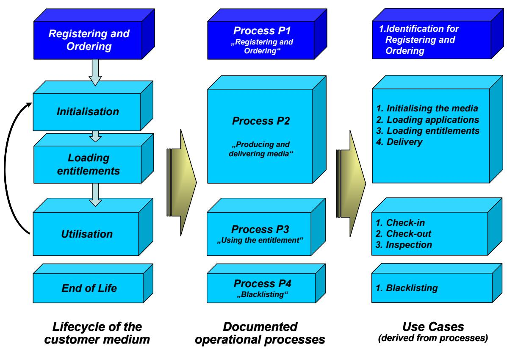

All the other system components are considered only in a fairly general manner. Proposed safeguards follow conventional, open standards of IT security.

This concept focuses on those parts of the system that are relevant to RFID, yet still makes sure that all aspects of security are considered. At the same time, the Technical Guidelines leave room for individual and proprietary IT implementations (back-offices, sales systems, logistic systems and so on), which supports the enhancement of existing systems using RFID technology.

## **5.2.2 Scalability and flexibility**

These Technical Guidelines are intended to address security issues primarily. At the same time, any system based on these Guidelines must be economically viable. This means that the following requirements have to be covered by the Guidelines' approach:

- 1 It must be possible to scale systems in such a way that the costs and benefits are balanced. This means in practice that precautionary measures must be proportional to the need for protection. For example: if only low-cost products are used, which require relatively little protection, then precautions should be designed accordingly. This may allow the use of low-cost media, reducing in turn the cost of implementation and operation of the system.
- 2 The application scenarios that have been chosen for the Technical Guidelines cover a wide range, from small to nationwide and even international systems. It is important that the concept discussed in the Guidelines can be used for system solutions of any size and complexity.
- 3 In many cases a system solution can be made economically viable much more easily if you are able to cooperate with other companies. This applies in particular to eTicketing applications, where it can be very beneficial if media already available to customers

(such as multi-application cards and NFC-enabled phones) can be used for additional applications, products and related services.

The following diagrams provide examples of eTicketing for the cross-system and crossapplication utilisation of customer media and infrastructure.

[Figure 5–2](#page-26-1) shows that various products and application scenarios may have to be supported in one system. Furthermore, these products may be hosted by various types of carrier media.

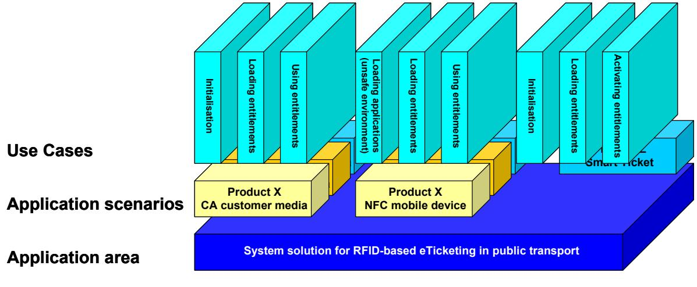

#### **Figure 5–2 Example of application scenarios and RFID-relevant use cases for eTicketing in public transport**

[Figure 5–3](#page-26-2) gives an example of a customer medium for eTicketing that supports applications from two application areas.

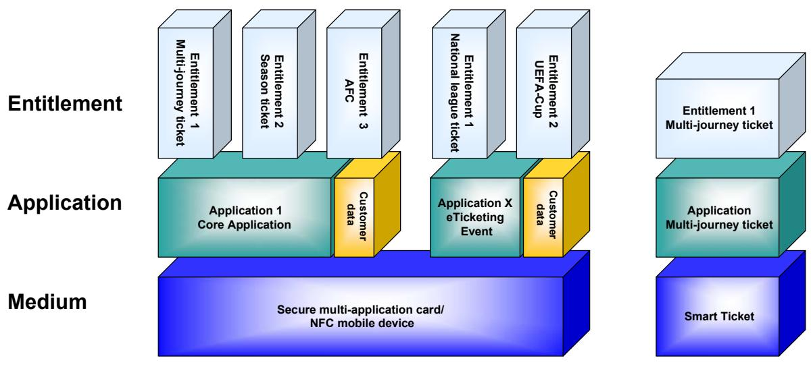

#### **Figure 5–3 Hierarchical concept for media, applications and entitlements in eTicketing**

The following concept is used in these Technical Guidelines in order to address the aforementioned requirements:

- 1 A feasible role model and the structure of certain key components (products, applications and media) are defined in Chapter 3. These models support a scalable, extendable approach.
- 2 The Technical Guidelines have to offer security concepts that cover every combination of application scenarios and media used in an infrastructure. This is achieved by individual security assessments based on the RFID-relevant use cases.
- 3 Identical application areas (in particular in eTicketing) that provide opportunities for cross-application partnerships will be addressed by the respective Technical Guidelines with as much communality as possible. The security assessments are based on similar security objectives, and the safeguards make use of the same mechanisms wherever possible.
- 4 A special challenge to system security exists in partnerships across systems and applications. It must be ensured that the security of one system is not undermined by the weaknesses of another. Normally this requires extensive security assessments in both systems.

The Technical Guidelines address this problem by introducing a scalable and transparent concept for employing safeguards against the identified threats; these are called "protection demand categories". A total of three categories from 1 (normal demand) to 3 (very high demand) are applied. All of the safeguards are divided accordingly into three levels, from normal to advanced protection.

For every individual system implementation, the protection demand category will be defined to begin with, for every security target. These findings will be used to select the appropriate level for the safeguards involved.

This concept provides an easy way to establish secure system cooperation. It remains only to ensure that the protection demand categories of both systems match up.

## **5.2.3 Structure of the Technical Guidelines**

| Chapter                             | Content                                                                                                                                |
|-------------------------------------|----------------------------------------------------------------------------------------------------------------------------------------|
| Description of the application area | Description of the application area: struc ture, services, special peripheral conditions, etc.                                   |
| Products and services               | Description of examples of products and services, and of sales channels                                                             |
| Definitions                         | Models, definition of terms                                                                                                            |
| Introduction to the methodology     | Introduction to the concept and methods that are applied to the security assessment.                                                |
| General requirements                | General requirements of the parties in volved, important points, etc.                                                               |
| Operational processes               | Description of operational processes rele vant to the life-cycle of carrier media                                                   |
| Use cases                           | Definition of RFID-relevant uses cases                                                                                                 |
| Security assessment                 | Introduction to IT security                                                                                                            |
|                                     | Definition of specific security targets, protec tion demand categories, and threats.                                                |
|                                     | Proposed safeguards                                                                                                                    |
| Definition of application scenarios | Definition of examples of application scenar ios. These examples cover the entire range of relevant parameters that may occur in |

[Table 5–1](#page-28-1) shows the structure of all the Technical Guidelines that have so far been drawn up.

| Chapter                                                   | Content                                                                                                                                                         |
|-----------------------------------------------------------|-----------------------------------------------------------------------------------------------------------------------------------------------------------------|
|                                                           | each application area. Users of the Techni cal Guidelines may adapt these scenarios according to their own needs.                                         |
| Proposed implementation of the system solution         | Generic system description including exam ples of how to perform a threat analysis and arrive at feasible safeguards to protect the system components. |
| Implementation proposal for each applica tion scenario | Examples of how to apply the concept to security assessments.                                                                                                |

#### **Table 5–1 Structure of the Technical Guidelines**

### **5.2.4 Explanation of the security concept**

Each set of Technical Guidelines contains examples of how security assessments should be applied to particular application scenarios. These can be adapted to the requirements and peripheral conditions of the particular system implementation in hand.

[Figure 5–4](#page-28-2) shows the security assessment concept used in all of the Technical Guidelines.

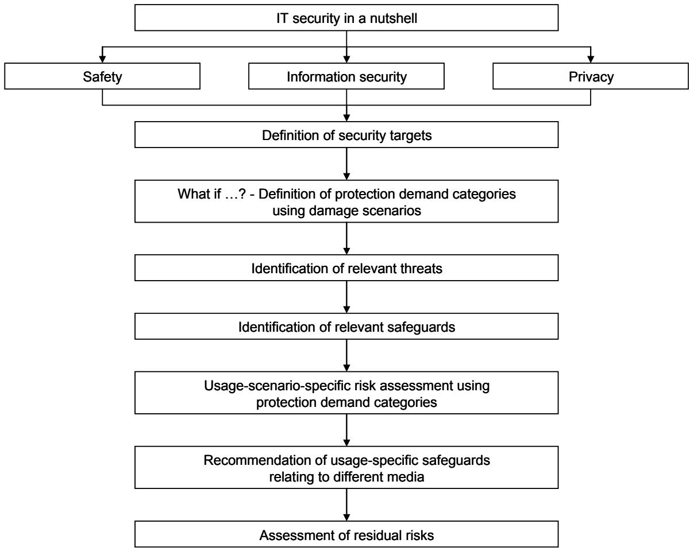

**Figure 5–4 Security assessment concept** 

All considerations are based on the conventional definition of security targets defined in [Figure 5–5.](#page-29-1)

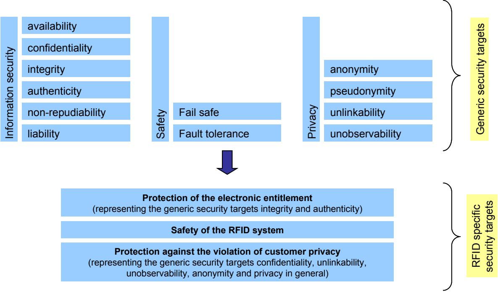

**Figure 5–5 Generic security targets** 

# **6 Generic business processes**

## **6.1 Process P1 "registering and ordering"**

### **6.1.1 Setting up a customer account, purchasing personalised customer media and entitlements**

To set up a customer account and purchase a personalised or non-personalised entitlement, the customer applies to the product provider (or the customer contract partner in the VDV Core Application). If the customer does not possess a carrier medium containing a suitable application, then he can purchase one from the product provider[1](#page-30-0) . To facilitate this, the product provider works together with the providers of the application and the customer medium.

Purchasing customer-related entitlements, applications and carrier media requires that the customer registers. To do this the customer provides the necessary personal information (e.g. name, postal address, payment information) and orders the product required.

It is normally up to the product provider to decide which information is required of the customer for the purposes of determining his identity and address and conducting a credit check.

Let us examine the following processes as examples of registering and ordering:

1 Ordering at a customer centre or a local sales point

The customer visits the sales point (e.g. the customer centre of a transport company, a sales point at a railway station or a travel agent), and orders the product. Assuming the payment is not to be made after the service has been provided (post-paid), then it is made there and then. Ideally, the sales point can load the application onto the customer medium and issue them on the spot. If not, they are delivered by post. Personal data is only required if a customer-specific product or a product with a CA payment method by direct debit is ordered, or if postal delivery is required.

Where necessary, identity and personal data are checked by means such as an identity card.

2 Service centre

The customer submits the necessary personal information, the order and the payment information to a service centre by fax, written application or telephone. The availability of the product and factors such as seat reservations can normally be dealt with straight away when ordering by telephone. Assuming the payment is not to be made after the service has been provided (post-paid), then it is made by credit card, direct debit, etc. The initialised customer media, and the product where relevant, are delivered by post.

Personal and address information submitted by fax or phone is not necessarily considered trustworthy. Checking it reliably involves extra effort. Normally it is checked solely against a current address database, and a credit check is performed.

1 The case of a customer who only wants to purchase a customer medium with an application, but no product, is considered irrelevant and is not discussed here.

3 Internet

The customer submits the necessary personal information, the order and the payment information to a service centre by Internet (website). The availability of the product and factors such as seat reservations can normally be dealt with straight away when ordering by Internet. Assuming the payment is not to be made after the service has been provided (post-paid), then it is made by credit card, direct debit, etc. The initialised customer media, and the product where relevant, are delivered by post.

Personal and address information submitted via the Internet is not necessarily considered trustworthy. Checking it reliably involves extra effort. Normally it is checked solely against a current address database, and a credit check is performed.

4 Internet using card-readers and secure proof of identity (e.g. eID)

In future there may be another way for customers to register and place orders.

It will involve the customer submitting the order and payment information to a service centre via the Internet (website). Personal data (where necessary) will be identified and transmitted online by means of direct communication between the ticket issuer's application server and a secure electronic identity card.

The availability of the product and factors such as seat reservations can normally be dealt with straight away when ordering by Internet. Payment is by credit card, by direct debit, etc.

The personal and address information received by communicating with the eID are to be considered trustworthy and reliable. Additional checking is not required.

If a customer medium is ordered, then this is delivered by post.

If the customer already owns a suitable NFC Mobile Device, then he must stipulate its specifications in order to enable the application to be loaded. The application and the entitlement can be downloaded using the NFC Mobile Device's Internet connection.

The following diagram, [Figure 6–1](#page-32-1), shows Process P1A "purchasing personalised customer media and entitlements"

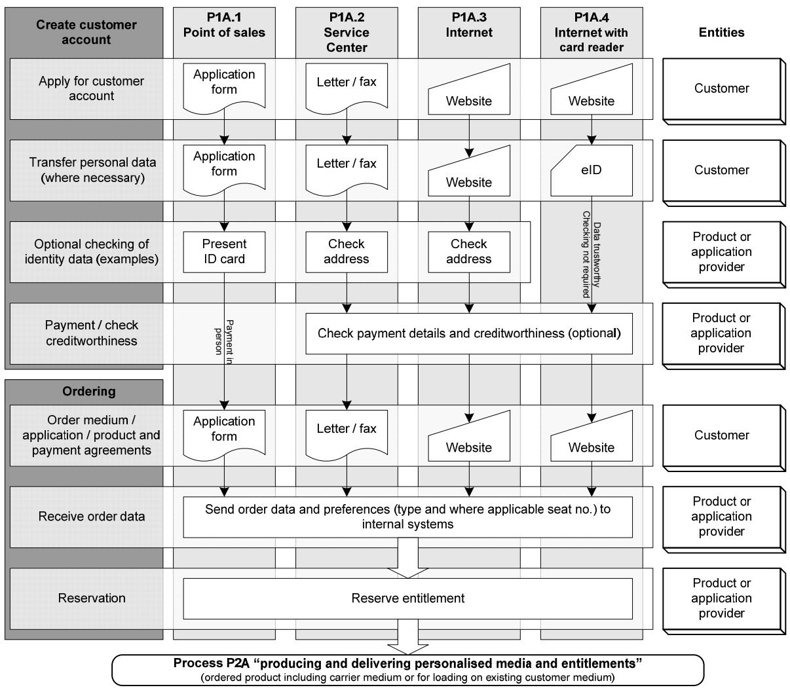

**Figure 6–1 Process P1A "purchasing personalised customer media and entitlements"** 

A customer account can be created and the order placed separately from one another. The customer account is set up once, and all subsequent orders can be placed using that account. In such cases, secure authentication is required in order to access the customer account.

## **6.1.2 Purchasing non-personalised carrier media and entitlements**

Anonymous sales and the sale of non-personalised products are especially important in public transport. In such cases, customer accounts are not set up, and existing customer accounts are not used. The product is supplied on a non-personalised carrier medium or loaded anonymously onto an existing customer card.

Purchasing non-personalised products precludes the possibility of payment by direct debit.

If a product is used which involves determining the journey price after the journey has commenced (e.g. the VDV Core Application), then a pre-paid solution must be used for payment. This can involve an anonymous payment function or a special credits memory on the carrier medium.

The customer must always pay before using the product, or, if the price is determined automatically, he must ensure he has sufficient credit to pay for the transport service he is using. Anonymous sales require that payment is made immediately, and that the carrier medium can be initialised and taken away by the customer. Non-personalised entitlements are generated on site, and loaded onto existing or new customer media. Payment is made in cash, by card, or using an anonymous pre-paid process.

The following sales channels can be used:

1 Sales point/customer centre, travel agent

In the future, non-personalised customer media will be able to be produced on site, and non-personalised entitlements and credits loaded onto existing customer media. Payment is in cash or by card.

2 Vending machine

The sale of tickets by vending machines is common practice for paper tickets. In future it will be possible for vending machines to generate non-personalised entitlements and load them via the NFC interface onto NFC Mobile Devices that have already been suitably initialised. Payment is in cash or by card.

When using entitlements with automatic fare calculation, pre-paid credits can be loaded onto the device at the vending machine (e.g. into a credits memory).

3 Internet

Non-personalised entitlements can be purchased and paid for over the Internet and loaded onto existing customer media. Payment is using a pre-paid process or by card. Both of these applications can be incorporated into an NFC Mobile Device.

Pre-paid credit can also be loaded over the Internet.

The following diagram shows Process P1B, purchasing non-personalised carrier media and entitlements:

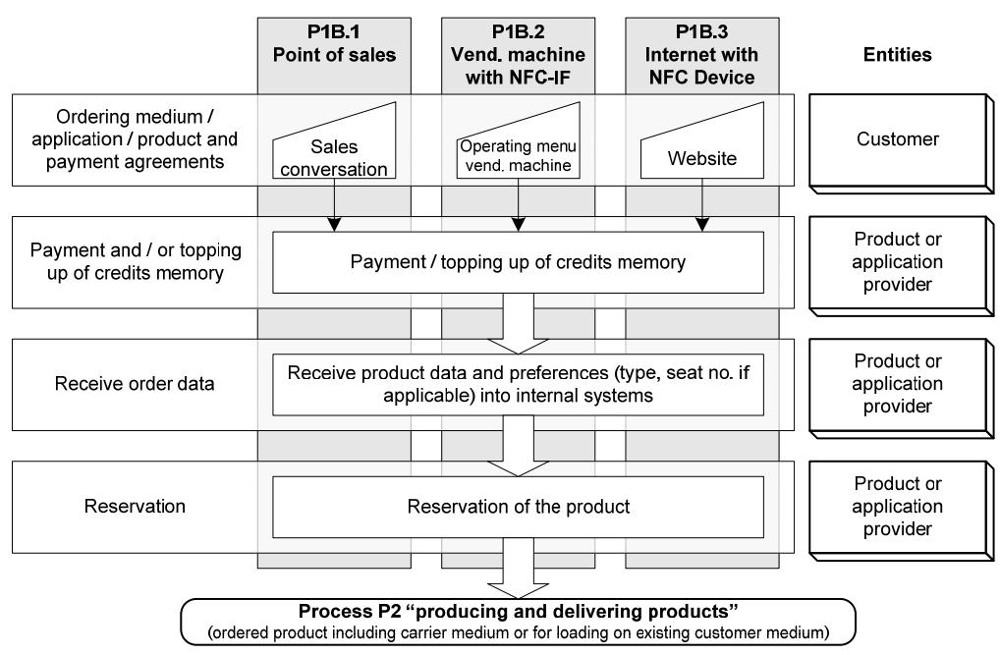

**Figure 6–2 Process P1B "purchasing non-personalised carrier media and entitlements"** 

## **6.2 Process P2 "producing and delivering products"**

### **6.2.1 Process P2A "producing and delivering personalised carrier media and entitlements"**

Two basic cases are to be considered when describing this process:

- 1 Producing and delivering an entitlement together with a specially produced carrier medium.
- 2 Loading an entitlement onto a customer-related NFC Mobile Device already in the possession of the customer.

The following diagram, [Figure 6–3](#page-34-1), shows Process P2A with 4 sub-processes representing the possible ways in which a product may be delivered.

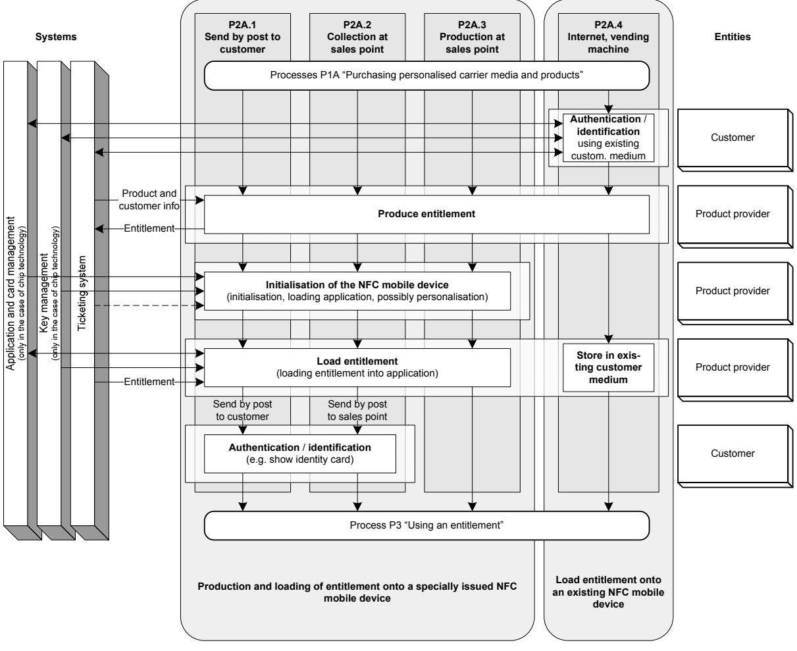

#### **Figure 6–3 Process P2A "producing and delivering personalised carrier media and entitlements"**

In Processes P2A.1 to P2A.3, the entitlement ordered is delivered to the customer on a special carrier medium.

In Process P2A.4 it is assumed that the customer already has a suitable NFC Mobile Device.

The customer medium is used in the first instance to identify and authenticate the customer electronically. If the customer medium does not contain a suitable application, then one must be loaded onto it before the entitlement is loaded on.

### **6.2.2 Process P2B "producing and delivering non-personalised carrier media and entitlements"**

Two basic cases are to be considered when describing this process:

- 1 Producing and delivering an entitlement together with a specially issued NFC Mobile Device.
- 2 Loading an entitlement onto a customer-related NFC Mobile Device already in the possession of the customer.

The following diagram, [Figure 6–4](#page-35-1), shows Process P2B with 3 sub-processes representing the possible ways in which a product may be delivered

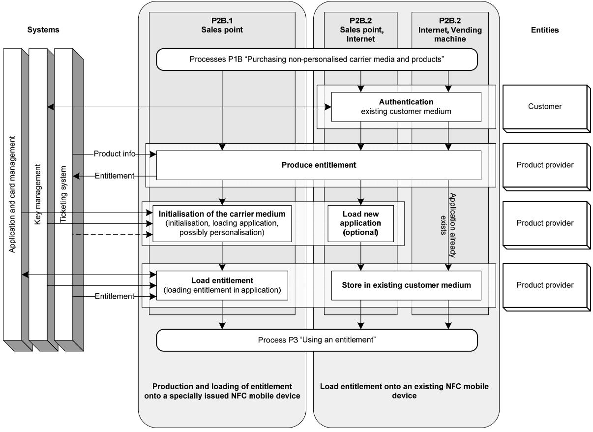

#### **Figure 6–4 Process P2B "producing and delivering non-personalised carrier media and entitlements"**

In Process P2B.1, the application and entitlement ordered are delivered to the customer on a special carrier medium. Provided data that can be related to a person is clearly separated on the carrier medium and application, then a non-personalised entitlement can be loaded onto a personalised carrier medium.

In Process P2B.2 it is assumed that the customer already has a suitable NFC Mobile Device. If the device does not contain a suitable application, then one must be loaded onto it before the entitlement is loaded on.

Process P2B.3 is the same as P2B.2, except that applications cannot be loaded onto the carrier medium. The customer medium must be fully configured to accept the entitlement as a precondition for the customer to use this process.

## **6.3 Process P3 "using an entitlement"**

The entitlement is redeemed by the customer in exchange for a service. The customer must have a carrier medium with an approved application and valid entitlement in order to use the transport.

The CICO infrastructure (tags) and electronic inspection infrastructure are the responsibility of the service provider. The service provider must first do a number of things so as to guarantee the operation of this function:

- 1 The local tag infrastructure must be adapted to the applications and entitlements that are being used.
- 2 The specific key information for reading the entitlements and writing the usage data must be integrated into the recording system's and inspection equipment's key management systems, as well as for the tags to be personalised.
- 3 The list of blocked entitlements (the blacklist) must be transferred from the ticket system into the inspection infrastructure, which requires the approval and installation of a realtime data interface between the product provider's ticket system and the service provider's inspection infrastructure.

When checking in, the entitlement has to be checked. If an "automatic fare calculation" product is being used, then the user must also check out at the end of the journey. At both these points, data relating to the fare is stored in the ticket system and the carrier medium.

When using an automatic fare calculation product (e.g. the Touch&Travel project), then the customer checks in by registering at a stationary tag, which may be installed on the platform or bus stop, for instance. The NFC Mobile Device works in active mode. The tags contain unique location information which, when checking in, is retrieved in secure, non-manipulable form, and sent on to the central recording system, where the actual check-in is completed.

Stationary tags can also be used for activating conventional entitlements (e.g. ticket strips) before beginning a journey.

It cannot be assumed that there will be a constant Internet connection in a vehicle. To enable inspection in the vehicle, check-in data is stored in secure form on the carrier medium before beginning the journey. As soon as this data is on the NFC Mobile Device, the customer is informed by a message on the display that he has checked in successfully or that the entitlement has been activated. Under normal circumstances the customer may not begin the journey until this has happened.

The inspection terminals in the vehicle must also work offline. The NFC Mobile Device behaves in the same way as a passive carrier medium when being inspected using an inspection medium.

Other scenarios are possible in which the inspector uses an "inspection card", a type of passive chip card, in which case the NFC Mobile Device works actively.

The following diagram shows Process P3:

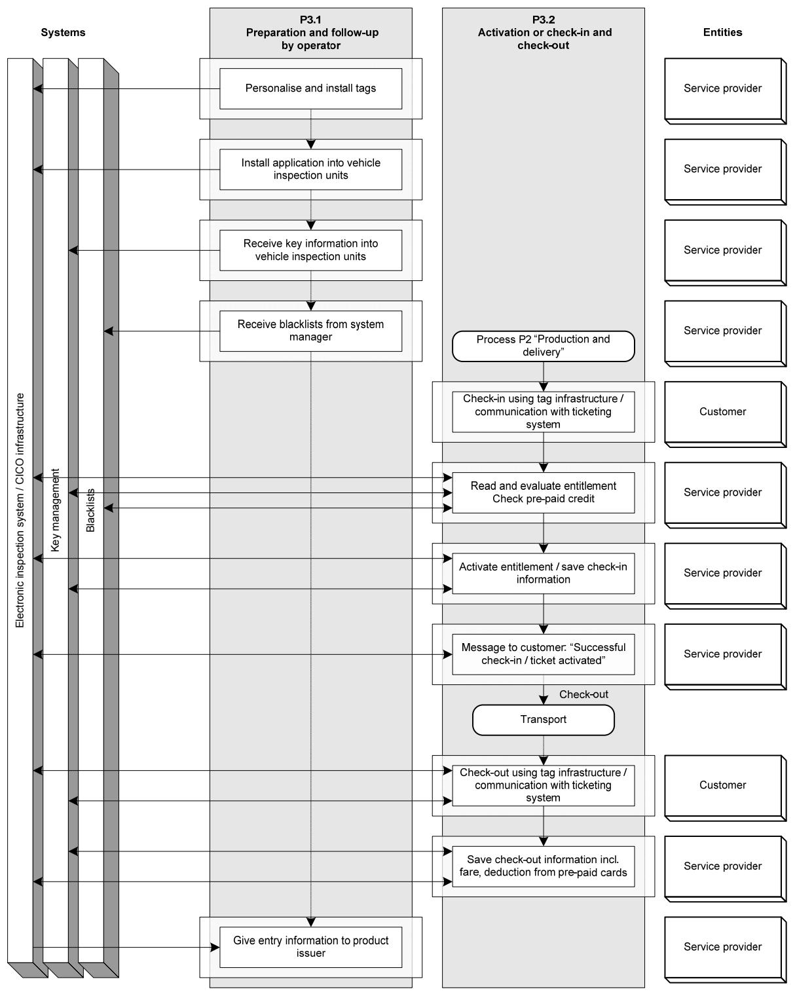

**Figure 6–5 Process P3 "using a CICO entitlement"** 

Fault cases are not dealt with here.

## **6.4 Process P4 "blacklisting entitlements, applications and carrier media"**

It is possible to blacklist entitlements, applications and carrier media securely using chipbased carrier media. This helps the processes of cancelling and exchanging carrier media and entitlements, and enables lost media to be replaced. The following are possible scenarios:

- 1 Defective carrier media are withdrawn. Before issuing a replacement medium it is important to ascertain that a counterfeit has not been presented for replacement, and that a medium has not been declared as defective and submitted.
- 2 In practice, mislaid carrier media can only be blacklisted and replaced if they are personalised and assigned to a customer account (see registration) with a product provider. If this is the case, then the owner can identify himself to the product provider from which he obtained the medium, and state which carrier medium is to be blacklisted. The same procedure can be used to cancel entitlements.
- 3 Mislaid personalised carrier media and the entitlements stored on them can be replaced provided that all the applications and entitlements on them have been blacklisted. It is important to remember that the carrier medium may contain more than one application, and that these may themselves contain entitlements from various product issuers and providers.

# **7 Use cases**

The following sections contain descriptions of use cases that are relevant as we look further at contact-less chip technology in this application area. These use cases have been derived from the generic operating processes described in Chapter [6](#page-30-1).

The descriptions of the use cases are based on an illustrative system architecture which is discussed in more detail in Chapter [10](#page-112-1).

## **7.1 Use case the "Identification when registering and ordering"**

The quality of the process of authenticating and identifying the customer is crucial to the reliability of the data upon which Process P1, "Registering and ordering", is based. Process descriptions P1A.1 – P1A.4 can be used for elucidating this. Using a reliable process, such as one involving a secure personalised customer medium or an electronic identification medium (e.g. an eID), will mean an increase in security and functionality.

## **7.2 Use case the "Carrier medium initialisation"**

The "Carrier medium initialisation" use case depicted in [Figure 7–1](#page-40-1) incorporates the following steps:

- 1 Carrier medium initialisation
	- a Default settings relating to function and security
	- b Setting specific keys
	- c Setting an ID which uniquely identifies the carrier medium
- 2 Loading the applications
	- a Loading the software specific to the applications concerned
	- b Allocating the resources of the carrier medium (setting up file systems and so on)
	- c Setting specific keys for each application
	- d Setting the validity of the application
- 3 Loading the application-specific data
	- a Loading customer data (where required)
	- b Loading the ID of the application provider

As the stages of initialising the carrier medium progress, the information in the management system for carrier media and applications has to be updated.

The various keys, certificates and so on that are used are generated and fed in by a key management system. This system is the responsibility of the system manager (more precisely the security manager and registrar). If the carrier medium's chip is to generate public keys during initialisation, then these also have to be fed into the key management system.

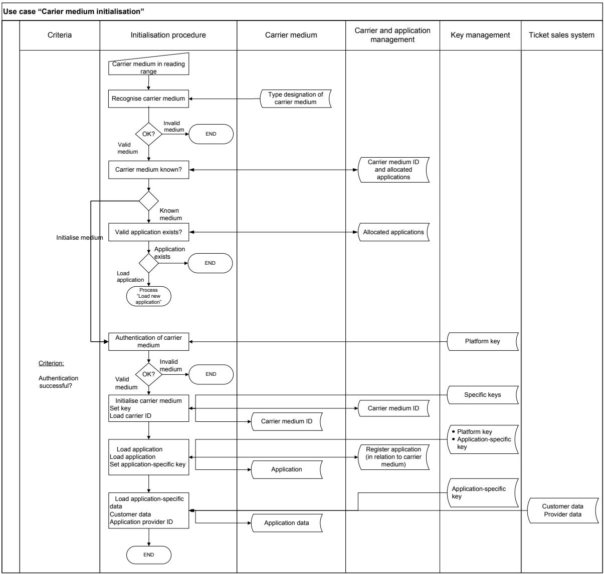

**Figure 7–1 Use case "Carrier medium initialisation"** 

Carrier medium initialisation normally takes place in a secure environment (e.g. in a mass personaliser or in a vending machine).

However, NFC Mobile Devices can also be initialised and applications loaded onto them in any location – i.e. over-the-air. This use case is therefore especially important.

## **7.3 Use case the "Application loading"**

The "Application loading" use case shown in [Figure 7–2](#page-41-1) illustrates the procedure for loading an application onto an NFC Mobile Device already in the possession of a customer.

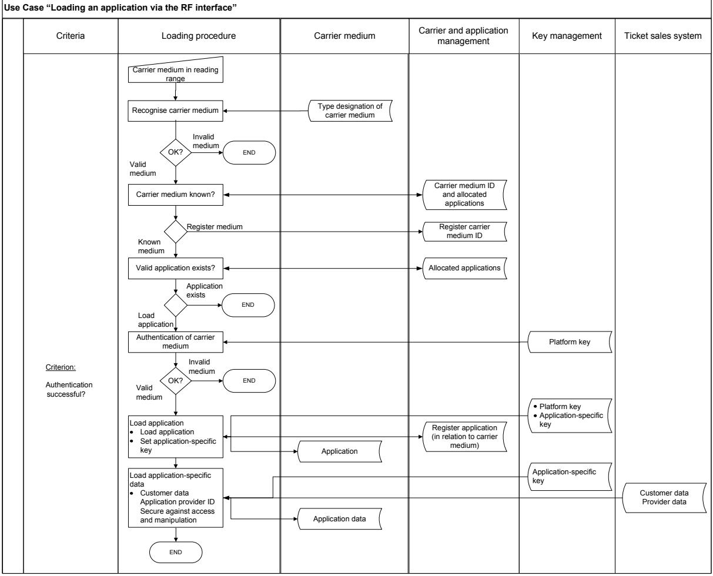

**Figure 7–2 Use case "Application loading"** 

There are various possible scenarios for loading a new application onto an existing carrier medium:

- 1 Loading the application via a contact-less interface in a trustworthy environment.
- 2 Loading the application via a contact-less interface in an insecure environment. For instance, this may occur when loading an application via a reader on a home computer or in an advance ticket office.
- 3 Loading an application "over-the-air" onto an NFC Mobile Device.

When loading the application via the Internet, the process stage "carrier medium in reading area" is replaced by the setting-up of a protected connection between the NFC Mobile Device and the application provider's server.

## **7.4 Use case the "Entitlement loading"**

As soon as the carrier medium has been initialised and the applications installed, entitlements can be loaded onto the applications.

The sale of products is directly dependent on this use case being performed securely and in a way which is easy for customers. The use case is therefore an absolutely crucial one for providers and customers alike. All of the sales channels discussed in the descriptions of Processes P2A and P2B (Section [6.2](#page-34-2)) must be taken into consideration when dealing with the "Entitlement loading" use case depicted in [Figure 7–3](#page-42-1).

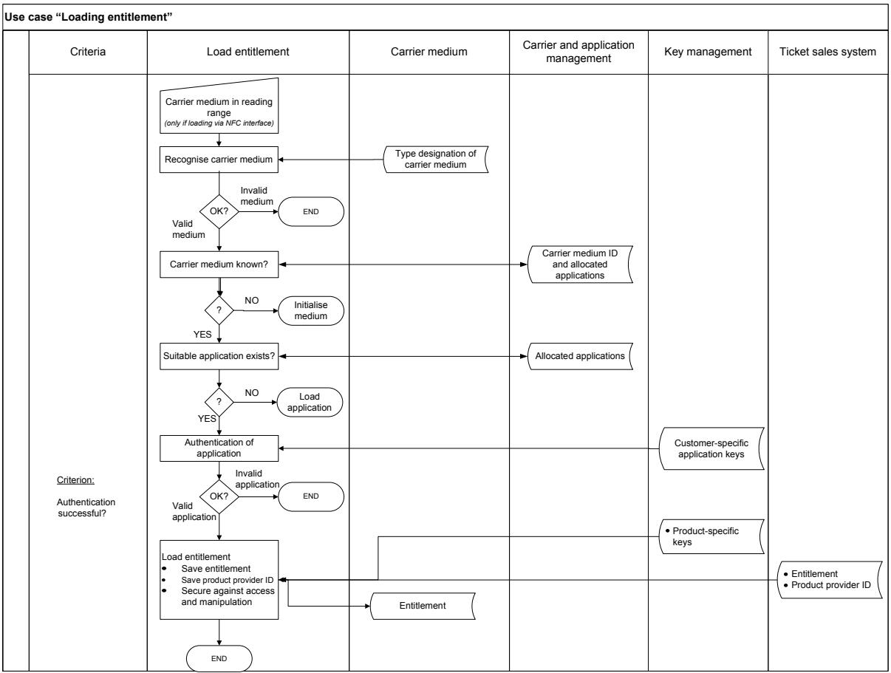

**Figure 7–3 Use case "Entitlement loading"** 

A distinction must be made between the loading of entitlements when the carrier medium is first issued and the loading of entitlements later on. With NFC Mobile Devices, the latter is normally done over-the-air. However, it is also possible to load entitlements via contact-less interfaces at sales points and vending machines.

When loading entitlements via the Internet, the process stage "carrier medium in reading area" is replaced by the setting-up of a protected connection between the NFC Mobile Device and the product provider's server.

## **7.5 Use case the "Delivery"**

Carrier media that have been initialised and loaded with entitlements must then be passed to the delivery point or the customer as described in P2A.1, P2A.2 and P2B. 1.

When delivering, the product provider must also record security-relevant information about the delivery in the ticket system. This includes:

- 1 Addressee,
- 2 ID of carrier media, ID of entitlements,
- 3 Sender,
- 4 Delivery point, special arrangements relating to handing-over.

During evaluation, potential threats (such as theft and cloning, etc.) should be stated and assessed for the various application scenarios.

## **7.6 Use case the "Check-in"**

The "Check-in" use case represents the first part of Process P3.2 in detail.

Checking in or activating the entitlement, and checking out, are done using an infrastructure of permanently installed local transponders (tags), which contain location information or indicators thereof. The local transponders are usually equipped with a contact-less interface as defined in ISO/IEC14443, and assume the passive role of the PICC defined in that standard. The NFC Mobile Device functions in active mode. If the transponders are tags as defined in ISO/IEC14443, then the NFC Mobile Device functions in "PCD mode" as defined in NFCIP2.

There are basically two methods of implementation, the use of which depends on the requirements of the system being put in place:

- 1 In cases in which the process time is non-critical and in which an Internet connection is sure to be available, the check-in can be performed online in direct communication between the backend system's server and the tag, once the connection has been established via the NFC Mobile Device.
- 2 If checking in has to be performed within a limited time, then it makes sense to divide the process up into a number of stages, in which data is stored temporarily on the NMD.

The second case covers all of the requirements of checking in and activating entitlements on public transport, including under difficult conditions, for which reason it shall be described here.

The following diagram shows the procedure. The exact way this is executed depends on the application involved and the data models and algorithms associated with it.

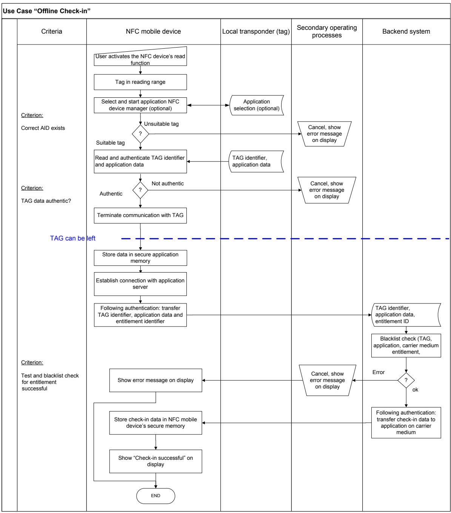

**Figure 7–4 Use case "Offline check-in"** 

The following special variations of this use case must be given particular attention when setting up the system and considering its security aspects:

- 1 If a non-personalised entitlement of the "automatic fare calculation" type is being used, then a non-personal payment procedure (e.g. a credits memory) must also be used. Before the journey begins the system must check whether the customer has sufficient credit, and it must be possible to deduct the right amount when checking out.
- 2 It is conceivable that the evaluation of entitlements, credit levels, and information retrieved from the local transponder, which is done in the backend system, ends in failure. It is also conceivable that the backend system cannot write the check-in information back to the application on the NFC Mobile Device as a result of failures (no mobile network, NMD battery empty).

## **7.7 Use case the "Entitlement check"**

The "Entitlement check" use case represents the technical process of a ticket inspector checking the customer's entitlement to travel. The NFC Mobile Device functions in passive mode, and behaves in the same way as a contact-less chip card. The exact way the process is executed depends on the application involved and the data models and algorithms associated with it. The following diagram shows the procedure.

An entitlement check is normally performed using a mobile inspector's terminal loaded with the necessary SAM and blacklists.

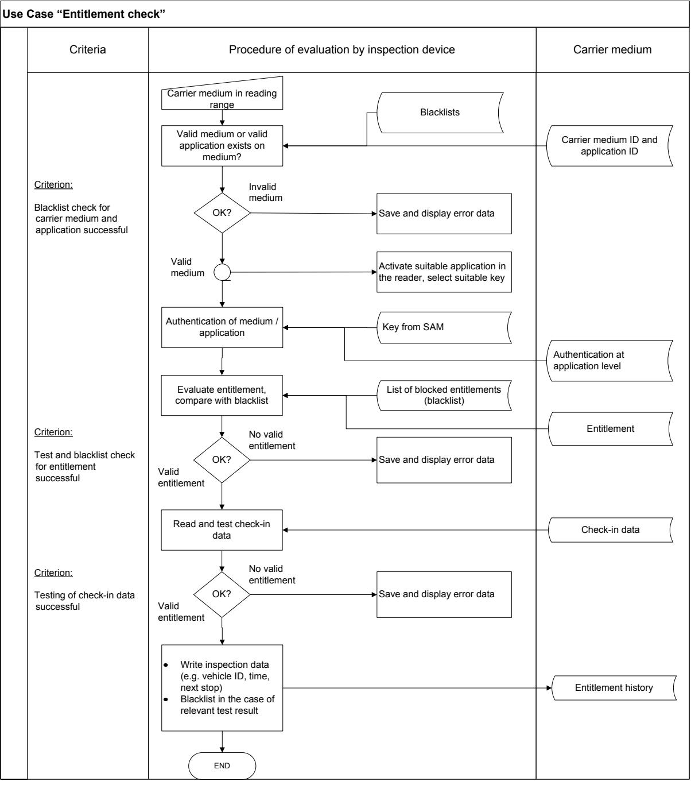

#### **Figure 7–5 Use case "Entitlement check"**

If a fault occurs, the entitlement is normally checked visually.

Where necessary, information needed to check and calculate the fare is written to the application after successful inspection.

## **7.8 Use case the "Offline check-out"**

The "Offline check-out" use case represents the second part of Process P3.2 in detail.

In terms of its procedure, the "offline check-out" use case is the same as the "offline checkin" use case shown in [Figure 7–4](#page-44-1). If automatic fare calculation is being used, then the final or preliminary data is determined for calculation instead of the check-in data.

The data used for invoicing which may have been sent to the application in the NFC Mobile Device during the inspection process is also retrieved and used for calculating the fare.

## **7.9 Use case the "Blocking"**

Carrier media that have been mislaid must be blacklisted. The same applies to defective media and entitlements, assuming they cannot be withdrawn and destroyed.

The blacklisting of a medium and/or the entitlement stored on it is a precondition for the issuing of a replacement medium, or for the transfer of an entitlement to a new owner with a different customer medium.

Blocking can only be performed if it is sufficiently certain that the customer requesting it is the rightful owner of the medium or entitlement. That is why customers may only blacklist media or entitlements in either of the following cases:

- 1 The customer's details were stored when purchasing. Blacklisting is then performed following reliable identification and a legally binding declaration that the customer agrees to the procedure.
- 2 The medium containing the entitlement is presented. Its authenticity can be determined securely.

As well as customers performing blacklisting, other entities in the system can apply for it too. To this end, responsibilities and processes are defined for these entities in the system as a whole. It must be defined which entities may blacklist entitlements, applications and media, and under what circumstances. The same applies to the transfer of applications and entitlements onto other media.

**Figure 7–6 Use case "Blocking"** 

## **7.10 Use cases the "Key management"**

For performance reasons, entitlements on carrier media are usually protected using procedures involving symmetric keys. The security and proper function of the system as a whole is therefore highly dependent on the secure provision and storage of the keys, a job which has to be done by the key management system and the processes assigned to it.

In the following use cases, Secure Authentication Modules (SAMs) are used as secure storage for key information, security mechanisms and diversification algorithms. In principle, other methods may also be feasible.

Carrier medium initialisation and the loading of entitlements require a key management system that recognises the hierarchical relationship between carrier media, applications and products/entitlements.

## **7.10.1 Key management for the initialisation of carrier media**

[Figure 7–7](#page-48-1) illustrates the use case of key management for the initialisation of carrier media. The keys and procedures defined here are also required for the loading of applications.

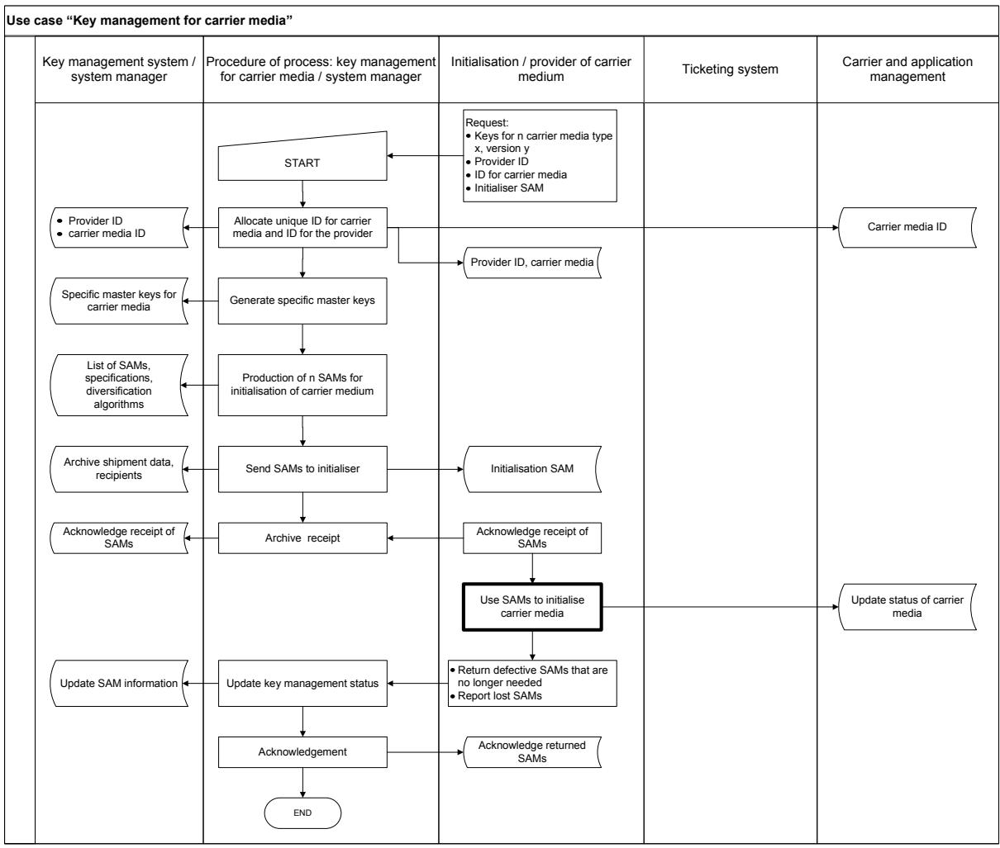

**Figure 7–7 Use case "Key management for carrier media"** 

## **7.10.2 Key management for loading and personalising applications**

In order to secure applications that are loaded when carrier media are produced, or afterwards, special keys and identifiers must be generated for the applications.

[Figure 7–8](#page-49-1) shows the corresponding use cases. The key management system for carrier media also has to be available when the application is loaded onto the carrier medium.

**Figure 7–8 Use case "Key management for applications"** 

## **7.10.3 Key management for loading entitlements**

In order to secure entitlements that are loaded when carrier media are produced, or afterwards, special keys and identifiers must be generated for the products.

[Figure 7–9](#page-50-1) shows the corresponding use cases. The key management system for applications also has to be available when the entitlement is loaded onto the application.

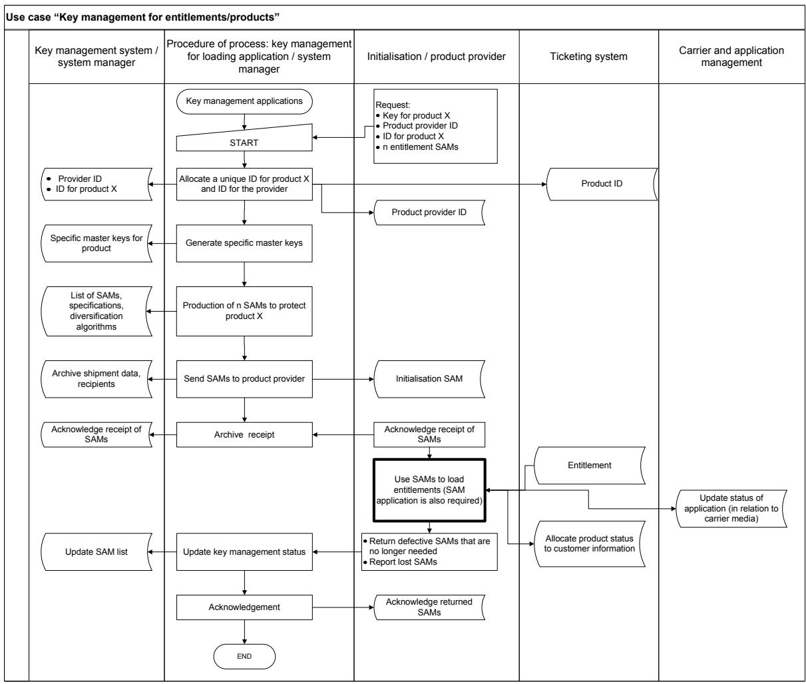

**Figure 7–9 Use case "Key management for products/entitlements"** 

## **7.10.4 Key management for use with the service provider**

Providers and issuers require a key management system to initialise carrier media, load applications and issue entitlements.

The public transport service provider requires the keys and other information necessary to read and evaluate entitlements.

This information has to be available in the inspection system.

To this end, the security manager normally generates and issues specific SAMs (service provider SAMs) for the service provider using the key management system. Service provider SAMs can contain key information from multiple providers of products, applications and carrier media. A selection is put together by the security manager in accordance with the needs of the service provider.

## **7.11 Use case the "Initialising local transponders"**

In systems that make use of the active functionality of the NFC interface, the local transponder (tag) performs certain functions otherwise provided by a conventional reader infrastructure. Basically this means that a locally installed transponder is subject to threats similar to those affecting a reader.

The "initialise local transponder" use case depicted in [Figure 7–10](#page-52-1) covers the following stages:

- 1 Local transponder initialisation
	- a Default settings relating to function and security
	- b Setting specific keys
	- c Setting an ID which uniquely identifies the transponder
	- d Updating key information
- 2 Loading the applications
	- a Loading the software specific to the applications concerned
	- b Allocating the resources of the transponder (setting up file systems and so on)
	- c Setting specific keys for each application
	- d Setting the validity of the application
- 3 Loading the application data
	- a Loading customer data (where required)
	- b Loading the ID of the application provider

As the stages of initialising the local transponder progress, the information in the management system for carrier media and applications has to be updated.

The various keys, certificates and so on that are used are generated and fed in by a key management system. This system is the responsibility of the system manager (more precisely the security manager and registrar). If the carrier medium's chip is to generate public keys during initialisation, then these also have to be fed into the key management system.

Local transponder initialisation normally takes place in a secure environment (e.g. in a mass personaliser).

**Figure 7–10 Use Case "Initialising local transponders"** 

# **8 Security considerations**

## **8.1 Definitions relating to security and privacy**

Security can be divided into three aspects or categories, all of which this document intends to examine. They are:

- Safety
- Information security
- Privacy

These categories can be subdivided as follows:

1 Safety

Safety is not to be confused with reliability/correctness or quality of service. Reliability means that the system works correctly according to its specifications. Experience shows that every technical system is sometimes subject to failure. Safety is understood as the capacity of a system, when it does fail, not to enter uncontrollable states that would endanger the system itself or its environment (fail-safe). At the same time, the system should also continue to respond as far as possible in compliance with its specification (fault tolerance). Safety, therefore, basically implies protection against unintended incidents.

2 Information security

Unlike safety, information security offers protection against intentional attacks. In the field of information security, security targets can be formulated as belonging to the following categories:

- a Confidentiality: confidentiality means protection against the unauthorised disclosure of information. Confidential data and information may only be accessible to authorised people in an authorised manner. Formulated as a protection target this means: stored information and information that is to be communicated is to be protected against access by unauthorised persons.
- b Integrity: integrity means ensuring that data is correct (intact) and that systems function properly. Formulated as a protection target this means: stored information and information that is to be communicated is to be protected against unauthorised modification.
- c Availability: the availability of services, of the functions of an IT system, IT applications and IT networks – and also of information – exists if these things are always available to their users when required. Formulated as a protection target this means: information and operating systems are to be protected against being withheld improperly.
- d Unlinkability: if two communication elements within a system are unlinkable, it means they are not any more or less related to one another than is already known and established. Within the system, no further information about the relationship between these communication elements can be obtained. In practical terms this means that a single user can make use of services and resources more than one time, without third parties being able to see that these access events (in the communication model: messages) are related through the user.
- e Unobservability: an event is unobservable if it cannot be determined whether it has happened or not. Sender-unobservability means it cannot be seen that anything has been sent; recipient-unobservability is the same: it is not possible to ascertain

that something has been received. Relationship-unobservability means that it cannot be seen that anything is sent from the group of possible senders to the group of possible recipients.

- f Anonymity: anonymity is the condition of being unidentifiable within one's anonymity group. Using the term unlinkability, anonymity can be more precisely defined as the unlinkability of the identity of a user and an event initiated by that user. Senderanonymity is therefore unlinkability of sender and message, and recipientanonymity is the unlinkability of message and recipient.
- g Authenticity: the term authenticity designates a situation in which the partner in a communication process is actually the person he claims to be. Authentic information is information that genuinely comes from the stated source. The term is not only used when people's identity is being checked, but also for IT components and applications.
- h Non-repudiation: protection should exist against the possibility of denying that messages have been sent and received by persons whose authenticity has been determined.
- i Binding validity: binding validity joins together the IT security targets of authenticity and non-repudiation. When transmitting information this means that the source of the information has proven its identity and that the receipt of the message cannot be disputed.
- 3 Privacy

The purpose of privacy is to protect against infringements of the personal rights of the individual through the handling of his personal data.

Privacy refers to the protection of personal data against possible misuse by third parties (not to be confused with data security).

The following additional terms will also be used throughout:

1 Security targets

Security targets are the security-related and safety-related objectives undertaken when setting up an IT system. This document lays down specific security targets within the areas of use and application scenarios. Infringing upon the security targets causes direct damage to the entity whose security target is violated.

2 Threats

Threats are immediate risks to the security targets of an application.

These may be the result of an active attack on one or more security targets, or they may take the form of potential vulnerabilities in the system such as the lack of a fallback solution.

3 Safeguards

Safeguards are actual recommended actions that counter one or more threats. The safeguards described in this document are intended to be applied meaningfully and according to need, which means they are suggested on the basis of economic feasibility and resistance to manipulation: how expensive is a safeguard, and what are the financial damages that it can limit or prevent?

4 Residual risk

Generally speaking it is not possible to counteract every single threat in such a way that a system offers perfect security. The residual risk is thus the risk of potential attack that remains after a series of safeguards have been put in place. The extent of this risk depends on the counter-measures that can be applied, how complex they are, and, above all, what the costs are in relation to the benefits for the entity involved. The entity has to take explicit liability for the residual risk.

## **8.2 Definition of the security targets**

It would be very unusual indeed for all of the safety aspects relating to safety, information security and privacy within a given application scenario to be of equal importance, or indeed for every single one of them to be relevant at all. The first challenge when designing a secure RFID system is therefore to formulate specific security targets.

Within the areas of use relating to eTicketing, certain higher level security targets specific to the application area can be recognised, based on the generic security targets mentioned earlier:

- 1 Protection of electronic entitlements (represents the protection targets integrity and authenticity)
- 2 Safety of the RFID system
- 3 Protection of the customer's privacy (represents the protection targets confidentiality, unlinkability, unobservability, anonymity, and privacy as a general requirement)

The lower level security targets listed in Section [8.2.4](#page-60-1) can be derived from the assessments of the entities' security targets contained in the following sections.

| field num ber | 1                   | 2                                       | 3                                                             | 4                |
|------------------|---------------------|-----------------------------------------|---------------------------------------------------------------|------------------|
| field            | security tar get | associated role and its abbreviation | associated generic security target and its abbreviation | index num ber |
| content          | S                   | C := customer                           | S := safety                                                   |                  |
|                  |                     | P := product provider                   | I := information secu rity                                 | 1,  , n          |
|                  |                     | S := service provider                   | P := privacy                                                  |                  |

The following table shows the scheme of security target codes and used abbreviations.

**Table 8–1 Coding scheme of security targets** 

### **8.2.1 Specific security targets for the customer**

The customer's specific security targets are listed in the following sections.

### **8.2.1.1 Safety**

| Security target code and name |                            | Description of security target                                                                                                                                                                                                                                                                                                                                                                                                                                                                             |
|----------------------------------|----------------------------|------------------------------------------------------------------------------------------------------------------------------------------------------------------------------------------------------------------------------------------------------------------------------------------------------------------------------------------------------------------------------------------------------------------------------------------------------------------------------------------------------------|
| SCS1                             | Technical compatibility | The interaction between NFC Mobile Devices, local transpond ers, inspection devices and the backend system must function as specified. This must apply to all of the approved NFC Mobile Devices at all local transponders and inspection devices in the entire system infrastructure. It must take into account the fact that NFC Mobile Devices, local transponders and inspection devices may be supplied by different manufacturers and oper ated by different service providers. |

| Security target code and name |                                                          | Description of security target                                                                                                                                              |
|----------------------------------|----------------------------------------------------------|-----------------------------------------------------------------------------------------------------------------------------------------------------------------------------|
| SCS2                             | Fallback solu tion in the event of mal function | Authorised persons must be able to use the service even when the customer medium or system infrastructure is not working perfectly.                                   |
| SCS3                             | Intuitive, fault tolerant opera tion               | Operation must be self-explanatory where possible, and/or easy to learn. The customer should know at any given time which stage of the operation process he is at. |

| Table 8–2 | Customer specific security targets for safety |
|-----------|-----------------------------------------------|
|           |                                               |

## **8.2.1.2 Information security**

| Security target code and name |                                                       | Description of security target                                                                                                                                                                                                                                                                                                                                                                                                                                       |
|----------------------------------|-------------------------------------------------------|----------------------------------------------------------------------------------------------------------------------------------------------------------------------------------------------------------------------------------------------------------------------------------------------------------------------------------------------------------------------------------------------------------------------------------------------------------------------|
| SCI1                             | Protection of personal data                        | The customer data stored in the system and/or customer me dium is used to identify the customer, make payments, deliver entitlements, and so on.                                                                                                                                                                                                                                                                                                               |
|                                  |                                                       | Misuse, manipulation or passing-on to unauthorised persons could incur commercial damage to the customer along with the loss of safety, and should be prevented.                                                                                                                                                                                                                                                                                               |
| SCI2                             | Protection of entitlements                         | Entitlements may be exposed to DoS attacks and manipulation by third parties. This could cause inconvenience and possible damage to the customer. The damage would normally be lim ited, since usually the service can still be used provided the cus tomer can prove that he purchased a valid entitlement. Manipu lation of the entitlement by unauthorised persons should be pre vented.                                                        |
| SCI3                             | Protection of usage data                           | Usage data is used to invoice the use of the "automatic fare cal culation" product. This data must therefore be reliable.                                                                                                                                                                                                                                                                                                                                         |
| SCI4                             | Reliable in voicing                                | When a service has been used, the customer must be able to see the time of activation and, in the case of check-in / check out, the time, place and service provider.                                                                                                                                                                                                                                                                                          |
|                                  |                                                       | Calculation data (pricing) must be clear and reliable.                                                                                                                                                                                                                                                                                                                                                                                                               |
| SCI5                             | Protection of applications and entitle ments | Customer media can accommodate more than one application, and these applications may belong to different application issu ers. Furthermore, one application can hold multiple entitlements supplied by different product owners. It must be ensured that applications and entitlements are reliably separated from a tech nical point of view, or that agreements exist between the entities that regulate multiple usage and conflict resolution. |

**Table 8–3 Customer specific security targets for information security** 

| Security target code and name |                                                                  | Description of security target                                                                                                                                                       |
|----------------------------------|------------------------------------------------------------------|--------------------------------------------------------------------------------------------------------------------------------------------------------------------------------------|
| SCP1                             | Protection of personal data                                   | Personal data given to the product provider (CCP) must be treated confidentially, and only used for the agreed purposes.                                                          |
| SCP2                             | Protection of usage data                                      | Non-anonymised, personal data about the use of a service may only be employed for the purposes of the product provider or service provider with the agreement of the customer. |
| SCP3                             | Protection against the creation of movement profiles | Third parties must be prevented from utilising RFID technology to generate personal movement profiles.                                                                            |
| SCP4                             | Data minimisa tion                                            | Only the data required for the specified purpose should be gath ered and stored, no more.                                                                                         |
| SCP5                             | Deletion date                                                    | Personal data should be deleted as soon as the purpose for which it was held no longer exists.                                                                                    |

### **8.2.1.3 Protection of privacy**

**Table 8–4 Customer specific security targets for protection of privacy** 

## **8.2.2 Specific security targets for the product provider**

The product provider's specific security targets are listed in the following sections.

## **8.2.2.1 Safety**

| Security target code and name |                                                          | Description of security target                                                                                                                                                                                                                                                                                                                                                                                                                                                                             |
|----------------------------------|----------------------------------------------------------|------------------------------------------------------------------------------------------------------------------------------------------------------------------------------------------------------------------------------------------------------------------------------------------------------------------------------------------------------------------------------------------------------------------------------------------------------------------------------------------------------------|
| SPS1                             | Technical compatibility                               | The interaction between NFC Mobile Devices, local transpond ers, inspection devices and the backend system must function as specified. This must apply to all of the approved NFC Mobile Devices at all local transponders and inspection devices in the entire system infrastructure. It must take into account the fact that NFC Mobile Devices, local transponders and inspection devices may be supplied by different manufacturers and oper ated by different service providers. |
| SPS2                             | Fallback solu tion in the event of mal function | The customer must be able to use the service even when the NFC Mobile Device or system infrastructure is not working per fectly.                                                                                                                                                                                                                                                                                                                                                                     |
| SPS3                             | Intuitive, fault tolerant opera tion               | Little explanation must be required in order to enable the cus tomer to use the service without difficulty. The customer should know at any given time which stage of the operation process he is at.                                                                                                                                                                                                                                                                                             |

#### **Table 8–5 Product provider specific security targets for safety**

| Security target code and name |                                                       | Description of security target                                                                                                                                                                                                                                                                                                                                                                                                                                           |
|----------------------------------|-------------------------------------------------------|--------------------------------------------------------------------------------------------------------------------------------------------------------------------------------------------------------------------------------------------------------------------------------------------------------------------------------------------------------------------------------------------------------------------------------------------------------------------------|
| SPI1                             | Protection of personal data                        | he customer data stored in the system and in the NFC Mobile Device is used to identify the customer, make payments, deliver entitlements, and so on.                                                                                                                                                                                                                                                                                                               |
|                                  |                                                       | Misuse, manipulation or passing-on to unauthorised persons could incur commercial damage to the product provider and a loss of customer acceptance, and could be punished as a viola tion of the law. This must be avoided.                                                                                                                                                                                                                                     |
| SPI2                             | Protection of entitlements                         | The manipulation of, damage to and in particular the counterfeit ing of entitlements could incur considerable commercial damage to the product provider, product owner and service provider.                                                                                                                                                                                                                                                                       |
|                                  |                                                       | Securing entitlements against counterfeiting is an important ob jective for the product owner.                                                                                                                                                                                                                                                                                                                                                                        |
| SPI3                             | Protection of usage data                           | The availability and integrity of usage data is of great value to the product provider, the product owner and the service pro vider. This data is used for invoicing, planning products and ca pacities, and increasing customer loyalty.                                                                                                                                                                                                                       |
| SPI4                             | Reliable in voicing                                | It must be ensured that earnings from the sale of entitlements by the product provider can be allocated correctly to the transport services provided by the service provider.                                                                                                                                                                                                                                                                                      |
| SPI5                             | Protection of applications and entitle ments | NFC Mobile Devices can accommodate more than one applica tion, and these applications may belong to different application issuers. Furthermore, one application can hold multiple entitle ments supplied by different product owners. It must be ensured that applications and entitlements are reliably separated from a technical point of view, or that agreements exist between the entities that regulate multiple usage and conflict resolution. |

## **8.2.2.2 Information security**

**Table 8–6 Product provider specific security targets for safety information security** 

## **8.2.2.3 Protection of privacy**

| Security target code and name |                                | Description of security target                                                                                                                                                                                                                                                                                  |
|----------------------------------|--------------------------------|-----------------------------------------------------------------------------------------------------------------------------------------------------------------------------------------------------------------------------------------------------------------------------------------------------------------|
| SPP1                             | Protection of personal data | Misuse, manipulation or passing-on to unauthorised persons could incur commercial risks for the customer contract partner and result in a loss of customer acceptance, and could also be punished as a violation of the law.                                                                           |
| SPP2                             | Protection of usage data    | Non-anonymised, personal data about the use of a service may only be employed for the purposes of the product provider with the agreement of the customer. The aim for certain products (automatic fare calculation, CICO, etc) is to obtain this consent, so as, for example, to enable invoicing. |

| Security target code and name |                       | Description of security target                                                               |
|----------------------------------|-----------------------|----------------------------------------------------------------------------------------------|
| SPP4                             | Data minimisa tion | Only the data required for the specified purpose should be gath ered and stored, no more. |

**Table 8–7 Product provider specific security targets for protection of privacy** 

### **8.2.3 Specific security targets for the service provider**

The service provider's specific security targets are listed in the following sections.

### **8.2.3.1 Safety**

| Security target code and name |                                                          | Description of security target                                                                                                                                                                                                                                                                                                                                                                                                                  |
|----------------------------------|----------------------------------------------------------|-------------------------------------------------------------------------------------------------------------------------------------------------------------------------------------------------------------------------------------------------------------------------------------------------------------------------------------------------------------------------------------------------------------------------------------------------|
| SSS1                             | Technical in teroperability                           | The entitlements stored in the various NFC Mobile Devices must function as specified together with the backend system. This must apply to all of the approved NFC Mobile Devices at all local transponders and inspection devices in the whole of the service provider's system infrastructure. It must take into account the fact that NFC Mobile Devices and local transponders may be supplied by different manufacturers. |
| SSS2                             | Fallback solu tion in the event of mal function | It must be possible to provide the service even when the NFC Mobile Device or system infrastructure is not working perfectly. It must be possible to prove the existence of an entitlement.                                                                                                                                                                                                                                               |
| SSS3                             | Intuitive, fault tolerant opera tion               | There must be a low incidence of problems when customers use the system. The customer should know at any given time which stage of the operation process he is at.                                                                                                                                                                                                                                                                     |

#### **Table 8–8 Service provider specific security targets for safety**

### **8.2.3.2 Information security**

| Security target code and name |                                | Description of security target                                                                                                                                                                                 |
|----------------------------------|--------------------------------|----------------------------------------------------------------------------------------------------------------------------------------------------------------------------------------------------------------|
| SSI1                             | Protection of personal data | The customer data stored in the system and in the NFC Mobile Device is used to identify the customer, make payments, deliver entitlements, and so on.                                                    |
|                                  |                                | Misuse, manipulation or passing-on to unauthorised persons could incur commercial damage to the service provider and a loss of customer acceptance, and could be punished as a viola tion of the law. |
| SSI2                             | Protection of entitlements  | The manipulation of, damage to and in particular the counterfeit ing of entitlements could incur considerable commercial damage to the product provider, product owner and service provider.             |

| Security target code and name |                                                       | Description of security target                                                                                                                                                                                                                                                                                                                                                                                                                                           |  |
|----------------------------------|-------------------------------------------------------|--------------------------------------------------------------------------------------------------------------------------------------------------------------------------------------------------------------------------------------------------------------------------------------------------------------------------------------------------------------------------------------------------------------------------------------------------------------------------|--|
|                                  |                                                       | Securing entitlements against counterfeiting is an important ob jective for the service provider. Entitlements are also used in the service provider's system infrastructure, and they must be safe guarded there as well.                                                                                                                                                                                                                                      |  |
| SSI3                             | Protection of usage data                           | Usage data is of great value to the service provider. It is used for invoicing and for planning capacities.                                                                                                                                                                                                                                                                                                                                                           |  |
|                                  |                                                       | From the point of view of the customer and for legal reasons, customer-specific usage data must be treated confidentially by the service provider. Contravention of this would cause a loss of customer acceptance and could be punished as a violation of the law.                                                                                                                                                                                          |  |
| SSI4                             | Reliable in voicing                                | It must be ensured that earnings from the sale of entitlements by the product provider can be allocated correctly to the transport services provided by the service provider.                                                                                                                                                                                                                                                                                      |  |
| SSI5                             | Protection of applications and entitle ments | NFC Mobile Devices can accommodate more than one applica tion, and these applications may belong to different application issuers. Furthermore, one application can hold multiple entitle ments supplied by different product owners. It must be ensured that applications and entitlements are reliably separated from a technical point of view, or that agreements exist between the entities that regulate multiple usage and conflict resolution. |  |

**Table 8–9 Service provider specific security targets for information security** 

## **8.2.3.3 Protection of privacy**

| Security target code and name |                                | Description of security target                                                                                                                                                                                                                                                                                  |  |
|----------------------------------|--------------------------------|-----------------------------------------------------------------------------------------------------------------------------------------------------------------------------------------------------------------------------------------------------------------------------------------------------------------|--|
| SSP1                             | Protection of personal data | Misuse, manipulation or passing-on to unauthorised persons could incur commercial risks for the service provider and result in a loss of customer acceptance, and could also be punished as a violation of the law.                                                                                    |  |
| SSP2                             | Protection of usage data    | Non-anonymised, personal data about the use of a service may only be employed for the purposes of the service provider with the agreement of the customer. The aim for certain products (automatic fare calculation, CICO, etc) is to obtain this consent, so as, for example, to enable invoicing. |  |
| SSP4                             | Data minimisa tion          | Only the data required for the specified purpose should be gath ered and stored, no more.                                                                                                                                                                                                                    |  |

**Table 8–10 Service provider specific security targets for protection of privacy** 

## **8.2.4 Summary of the entities' security targets**

The following table sums up the aforementioned security targets of the various actors involved. Role-specific security targets have been summarised to specific security targets associated to the generic security targets safety, information security and privacy. Used abbreviations are:

- SS := specific security target regarding to the generic security target safety
- SI := specific security target regarding to the generic security target information security
- SP := specific security target regarding to the generic security target privacy

| Security target |                                                          | Customer tar gets      | Product pro vider targets | Service pro vider targets |
|-----------------|----------------------------------------------------------|---------------------------|------------------------------|------------------------------|
| SS1             | Technical compatibility                                  | SCS1                      | SPS1                         | SSS1                         |
| SS2             | Fallback solution in the event of malfunction         | SCS2                      | SPS2                         | SSS2                         |
| SS3             | Intuitive, fault-tolerant operation                      | SCS3                      | SPS3                         | SSS3                         |
| SI1             | Protection of personal data                              | SCI1, SCP1                | SPI1, SPP1                   | SSI1, SSP1                   |
| SI2             | Protection of entitlements                               | SCI2                      | SPI2                         | SSI2                         |
| SI3             | Protection of logistical data (anonymised usage data) | SCP4                      | SPI3                         | SSI3                         |
| SI4             | Reliable invoicing                                       | SCI3, SCI4, SCP2, SCP4 | SPI3, SPI4, SPP2          | SSI3, SSI4, SSP2          |
| SI5             | Protection of applications and entitlements           | SCI5                      | SPI5                         | SSI5                         |
| SP3             | Protection against the creation of movement profiles  | SCP3                      |                              |                              |
| SP4             | Data minimisation                                        | SCP4                      | SPP4                         | SSP4                         |

**Table 8–11 Overview of the entities' security targets** 

## **8.2.5 Formation of protection demand categories**

Three protection demand categories are formed on the basis of the security targets described in Section [8.2.4](#page-60-1). Category 1 represents the lowest protection demand, category 3 the highest.

The following table lists the criteria for allocating protection requirements to protection demand categories, these criteria being based on the assumption that no protective measures have been put in place.

| Security target |                             | Protection demand category | Criteria for allocating to protection demand cate gory                                                                                           |
|-----------------|-----------------------------|----------------------------------|-----------------------------------------------------------------------------------------------------------------------------------------------------|
| SS1             | Technical com patibility | 1                                | All of the system components come from the same supplier. The supplier ensures that they are compatible.                                      |
|                 |                             | 2                                | The system has to function with components from a small number of defined suppliers. The system manager or a system integrator ensure compati |

| Security target |                                                                                       | Protection demand category | Criteria for allocating to protection demand cate gory                                                                                                                                                   |  |
|-----------------|---------------------------------------------------------------------------------------|----------------------------------|-------------------------------------------------------------------------------------------------------------------------------------------------------------------------------------------------------------|--|
|                 |                                                                                       |                                  | bility.                                                                                                                                                                                                     |  |
|                 |                                                                                       | 3                                | Open system that has to function with compo nents from any company in the market.                                                                                                                        |  |
| SS2             | Fallback solution in the event of malfunction                                   | 1                                | Malfunction affects only a few customers.                                                                                                                                                                   |  |
|                 |                                                                                       | 2                                | Malfunction affects many customers.                                                                                                                                                                         |  |
|                 |                                                                                       | 3                                | Malfunction affects a large proportion of custom ers.                                                                                                                                                    |  |
| SS3             | Intuitive, fault                                                                      | 1                                | A few customers cannot operate it intuitively.                                                                                                                                                              |  |
|                 | tolerant opera tion                                                                | 2                                | Many customers cannot operate it intuitively.                                                                                                                                                               |  |
|                 |                                                                                       | 3                                | A large proportion of customers cannot operate it intuitively.                                                                                                                                           |  |
| SI1             | Protection of                                                                         | 1                                | Customer's reputation is damaged.                                                                                                                                                                           |  |
|                 | personal data (including per                                                       | 2                                | Customer's social existence is damaged.                                                                                                                                                                     |  |
|                 | sonal usage data) – data becomes known to third parties                      | 3                                | Customer's physical existence is damaged.                                                                                                                                                                   |  |
| SI2             | Protection of entitlements                                                         | 1                                | Predicted product-related loss of sales through counterfeiting, damage or manipulation <0.5%.                                                                                                            |  |
|                 |                                                                                       | 2                                | Predicted product-related loss of sales through counterfeiting, damage or manipulation <3%.                                                                                                              |  |
|                 |                                                                                       | 3                                | Predicted product-related loss of sales through counterfeiting, damage or manipulation >3%.                                                                                                              |  |
| SI3             | Protection of logistical data (anonymised usage data) in ternal invoicing | 1                                | Data becomes known to third parties.                                                                                                                                                                        |  |
|                 |                                                                                       | 2                                | Data is lost.                                                                                                                                                                                               |  |
|                 |                                                                                       | 3                                | Data is falsified.                                                                                                                                                                                          |  |
| SI4             | Reliable invoic ing                                                                | 1                                | Data is not available.                                                                                                                                                                                      |  |
|                 |                                                                                       | 2                                | Data is lost.                                                                                                                                                                                               |  |
|                 |                                                                                       | 3                                | Data is falsified, misused, etc.                                                                                                                                                                            |  |
| SI5             | Protection of applications and entitlements                                     | 1                                | Applications are issued by the same application issuer and entitlements by the same product owner.                                                                                                    |  |
|                 |                                                                                       | 2                                | Applications are issued by a single application issuer but different application providers, and enti tlements come from different product owners, product providers and service providers. Several |  |

| Security target |                                                                 | Protection demand category | Criteria for allocating to protection demand cate gory                                                                                                                                                                                  |
|-----------------|-----------------------------------------------------------------|----------------------------------|--------------------------------------------------------------------------------------------------------------------------------------------------------------------------------------------------------------------------------------------|
|                 |                                                                 |                                  | companies collaborate and "trust" each other in the process.                                                                                                                                                                            |
|                 |                                                                 | 3                                | Applications are issued by different application providers, and entitlements by different product owners, product providers and service providers. Several companies collaborate but do not "trust" each other in the process. |
| SP3             | Protection against the crea tion of move ment profiles | 1                                | Customer's reputation is damaged.                                                                                                                                                                                                          |
|                 |                                                                 | 2                                | Customer's social existence is damaged.                                                                                                                                                                                                    |
|                 |                                                                 | 3                                | Customer's physical existence is damaged.                                                                                                                                                                                                  |
| SP4             | Data minimisa tion                                           | 1                                | Personal data is not used.                                                                                                                                                                                                                 |
|                 |                                                                 | 2                                | Personal data is used, but no usage data is col lected.                                                                                                                                                                                 |
|                 |                                                                 | 3                                | Personal data is used, as is usage and calculation data.                                                                                                                                                                                |

| Table 8–12 | Definition of protection demand categories |  |  |
|------------|--------------------------------------------|--|--|
|            |                                            |  |  |

## **8.3 Threats**

This section deals with potential threats to the security targets described in Section [8.2.](#page-55-1) Threats to the following system components are considered:

| Field Threat associated component and its abbreviation Content T C := contact-less interface NMD := NFC mobil device (active) In active mode, the NFC Mobile Device initiates and controls communication with other system components via the RF inter face (local transponder, vending machine) or an Internet connection (system as a whole). |                  |
|-------------------------------------------------------------------------------------------------------------------------------------------------------------------------------------------------------------------------------------------------------------------------------------------------------------------------------------------------------------------------------------|------------------|
|                                                                                                                                                                                                                                                                                                                                                                                     | Index num ber |
|                                                                                                                                                                                                                                                                                                                                                                                     | 1,  , n          |
|                                                                                                                                                                                                                                                                                                                                                                                     |                  |
| M := carrier medium, NFC mobil device (passive) In passive mode, the NFC Mobile Device behaves in the same way as a passive carrier medium (e.g. a PICC as defined in ISO/IEC 14443). T := local transponder (Tag)                                                                                                                                                |                  |

| Field number | 1 | 2                                                                                                                                                 | 3 |
|--------------|---|---------------------------------------------------------------------------------------------------------------------------------------------------|---|
|              |   | with RD interface. The NFC Mobile Device retrieves data from it when checking in / activating, and when checking out.                       |   |
|              |   | R := reader E.g. mobile inspection unit. During inspec tion it reads the entitlements and check-in data stored in the NFC Mobile Device. |   |
|              |   | K := key management                                                                                                                               |   |
|              |   | S := sales, inspection and backend sys tems                                                                                                    |   |

#### **Table 8–13 Coding scheme of threats**

The potential threats and security targets relating to each system component are described in the following tables.

### **8.3.1 Threats to the contact-less interface**

| Threat code and name |                                                      | Security targets threatened | Description of threat                                                                                                                                                                                                                                                                                                                       |
|----------------------|------------------------------------------------------|-----------------------------------|---------------------------------------------------------------------------------------------------------------------------------------------------------------------------------------------------------------------------------------------------------------------------------------------------------------------------------------------|
| TC1                  | Lack of com patibility be tween inter faces | SS1                               | Lack of compatibility at the NFC Mobile Device – local transponder interface or the carrier me dium – reader interface can prevent the system from working when checking in / activating, inspecting, and so on. The result is similar to a DoS attack on the system. Many customers and/or entitlements may be affected. |
| TC2                  | Eavesdropping                                        | SI1, SI2, SI5                  | Unauthorised listening-in to communication between a carrier medium and a reader.                                                                                                                                                                                                                                                        |
| TC3                  | DoS attack on the RF interface                    | SS1, SS2, SS3                  | 1 Interference in RFID communication (jam ming) 2 Interference in the anti-collision mecha nism for selecting the carrier medium (blocker tag) 3 Blocking the electromagnetic field of the reader (shielding) 4 Altering the resonance frequency of reader or carrier medium (de-tuning)                |

**Table 8–14 Threats to the contact-less interface** 

## **8.3.2 Threats to the active NFC Mobile Device**

| Threat code and name |                                                      | Security targets threatened | Description of threat                                                                                                                                                                                                                                                                                                     |
|----------------------|------------------------------------------------------|-----------------------------------|---------------------------------------------------------------------------------------------------------------------------------------------------------------------------------------------------------------------------------------------------------------------------------------------------------------------------|
| TNMD1                | Lack of com patibility be tween inter faces | SS1                               | Lack of compatibility at the NFC Mobile Device – local transponder interface or the carrier me dium – reader interface can prevent the system from working when checking in / activating, inspecting, and so on.                                                                                              |
| TNMD2                | Failure of the NFC Mobile Device               | SS2                               | The function of the NFC Mobile Device can be interrupted in day-to-day use. Examples: 1 No network available 2 Battery empty This can, for example, threaten the transfer of data from the local transponder to the backend system, or the transfer of check-in data to the NFC Mobile Device. |
| TNMD3                | Handling diffi culties                            | SS3                               | The reading range of the NFC Mobile Device is limited. Furthermore, an "offline check-in" re quires exact knowledge of the system mes sages that are to be expected. For inexperi enced users this can lead to problems with the application.                                                              |
| TNMD4                | Unauthorised scanning of entitlement           | SI2, SI5, SI4                  | Entitlements and information about entitle ments can, for example, be revealed when data is exchanged between the NMD and the backend system.                                                                                                                                                                    |
| TNMD5                | Manipulation of entitlement                       | SI2, SI5, SI4                  | The entitlement or information about the enti tlement could be manipulated, e.g. during data exchange between the NMD and the backend system.                                                                                                                                                                    |
| TNMD6                | Disclosure of location                            | SI4                               | Revealing information retrieved from the tag could lead indirectly to invoicing difficulties, or could be utilised for DoS attacks.                                                                                                                                                                                 |
| TNMD7                | Manipulation of location                          | SI4                               | Manipulating information retrieved from the tag could lead to invoicing difficulties, or could be utilised for DoS attacks.                                                                                                                                                                                         |
| TNMD8                | Protection against DoS attacks                 | SS2                               | An attack on the active functions of the NFC Mobile Device could prevent the tag from being read and the authenticity from being checked, and could block subsequent data exchange with the backend system.                                                                                                   |
| TNMD9                | Protection of personal data                       | SI1                               | If personal data (e.g. movement data) is stored or transferred, then it is exposed to the same risks as entitlements and location information.                                                                                                                                                                      |

|        | Threat code and name            | Security targets threatened | Description of threat                                                                                                                                                              |
|--------|---------------------------------|-----------------------------------|------------------------------------------------------------------------------------------------------------------------------------------------------------------------------------|
| TNMD10 | Manipulation of display text | SS2                               | The customer is informed about the status of checking-in and checking-out processes via the display. If these messages are manipu lated, it could lead to usage problems. |

**Table 8–15 Threats to the active NFC mobile device** 

## **8.3.3 Threats to the passive NFC Mobile Device**

An NFC Mobile Device in passive mode behaves just like a passive carrier medium, which is why the threats listed below are identical to those defined for contact-less passive carrier media.

| Threat code and name |                                                                      | Security targets threatened | Description of threat                                                                                                                                              |
|----------------------|----------------------------------------------------------------------|-----------------------------------|--------------------------------------------------------------------------------------------------------------------------------------------------------------------|
| TM1                  | Unauthorised scanning of entitlement                           | SI2, SI5                          | Unauthorised, active retrieval of data from car rier medium.                                                                                                    |
| TM2                  | Unauthorised overwriting / manipulation of entitlement      | SI2, SI5, SI4                  | Unauthorised writing of data to carrier medium.                                                                                                                    |
| TM3                  | Cloning of me dium including entitlement                       | SI2, SI5, SI4                  | High-precision copy of carrier media, applica tions or entitlements.                                                                                            |
| TM4                  | Emulation of application or entitlement                        | SI2, SI5, SI4                  | Emulating the electrical function of the carrier medium using a programmable device.                                                                            |
| TM5                  | Unauthorised scanning of personal data                         | SI1                               | Unauthorised, active retrieval of personal data stored in the application on a carrier medium. (e.g. movement data).                                         |
| TM6                  | Unauthorised overwriting / manipulation of personal data    | SI1                               | Unauthorised writing of personal data onto the carrier medium. Also includes the usage data that can be stored in the medium (automatic fare calculation) |
| TM7                  | Unauthorised scanning of calculation data                      | SI4                               | Unauthorised, active retrieval of calculation data.                                                                                                             |
| TM8                  | Unauthorised overwriting / manipulation of calculation data | SI4                               | Unauthorised writing of calculation data onto the carrier medium for the purpose of manipu lation and/or compromise of data.                                 |
| TM9                  | Threat through insufficient pro                                   | SI5                               | If multiple entitlements and applications are on one carrier medium, these may be influenced                                                                    |

| Threat code and name |                                                                           | Security targets threatened | Description of threat                                                                                                                                                                                                                                                                                        |
|----------------------|---------------------------------------------------------------------------|-----------------------------------|--------------------------------------------------------------------------------------------------------------------------------------------------------------------------------------------------------------------------------------------------------------------------------------------------------------|
|                      | tection of addi tional applica tions and enti tlements           |                                   | or damaged when used together.                                                                                                                                                                                                                                                                               |
| TM10                 | Carrier medium malfunction                                             | SS1, SS2                          | Carrier medium malfunctions can be caused in a range of scenarios by technical faults, incor rect operation, or DoS attacks:                                                                                                                                                                           |
|                      |                                                                           |                                   | 1 Fault in contact-less interface 2 Fault in reference information (keys, etc.) 3 Fault in application implementation 4 Fault in entitlements 5 Physical destruction                                                                                                              |
| TM11                 | Tracking by means of unau thorised scan ning by third parties | SP3                               | The anti-collision mechanism in the carrier medium sends a non-encrypted identifier to every reader that sends out a request. This can be used by unauthorised persons to re trieve the carrier medium's identifier, and pos sibly to generate movement profiles based on that identifier. |
| TM12                 | Lack of fallback solution in the event of mal function           | SS2                               | The lack of a failsafe method of assessing the genuineness or identity of the medium in the event of a defective chip can cause difficulties when it comes to blacklisting and replacing.                                                                                                           |

**Table 8–16 Threats to the passive mobile device** 

## **8.3.4 Threats to the local transponder**

| Threat code and name |                                                                              | Security targets threatened | Description of threat                                                                   |
|----------------------|------------------------------------------------------------------------------|-----------------------------------|-----------------------------------------------------------------------------------------|
| TT1                  | Unauthorised scanning of location infor mation                      | SI2, SI5                          | Unauthorised active scanning.                                                           |
| TT2                  | Unauthorised overwriting / manipulation of location infor mation | SI2, SI5, SI4                  | Unauthorised writing of data to the carrier me dium.                                 |
| TT3                  | Cloning of local transponder                                              | SI2, SI5, SI4                  | High-precision copy of carrier medium includ ing application and information.        |
| TT4                  | Emulation of local trans                                                  | SI2, SI5, SI4                  | Emulating the electrical function of the carrier medium using a programmable device. |

| Threat code and name |                                                                 | Security targets threatened | Description of threat                                                                                                                                                                                                                                                                                                                 |
|----------------------|-----------------------------------------------------------------|-----------------------------------|---------------------------------------------------------------------------------------------------------------------------------------------------------------------------------------------------------------------------------------------------------------------------------------------------------------------------------------|
|                      | ponder                                                          |                                   |                                                                                                                                                                                                                                                                                                                                       |
| TT5                  | Relocation of local trans ponder                          | SI2, SI5, SI4                  | The removal and relocation of a transponder can lead to invoicing, operational and security problems.                                                                                                                                                                                                                           |
| TT6                  | Placing of addi tional trans ponders                      | SI2, SI5, SI4                  | The issuing of additional transponders with, for example, unknown location identifiers, can lead to operational and security problems -> possible DoS attack.                                                                                                                                                                |
| TT7                  | Malfunction in local trans ponder                         | SS1, SS2                          | Carrier medium malfunctions can be caused in a range of scenarios by technical faults, incor rect operation, or DoS attacks: 1 Fault in contact-less interface 2 Fault in reference information (keys, etc.) 3 Fault in application implementation 4 Fault in data content 5 Physical destruction |
| TT8                  | Lack of fallback solution in the event of mal function | SS2                               | The lack of a fallback solution can lead to a complete system failure, since it may mean that checking in and activating are no longer possible.                                                                                                                                                                             |

**Table 8–17 Threats to the local transponder** 

## **8.3.5 Threats to the reader**

| Threat code and name |                                                              | Security targets threatened | Description of threat                                                                                                                                                                                                                                                            |
|----------------------|--------------------------------------------------------------|-----------------------------------|----------------------------------------------------------------------------------------------------------------------------------------------------------------------------------------------------------------------------------------------------------------------------------|
| TR1                  | Unauthorised manipulation of reference in formation | SI1, SI2, SI3, SI4, SI5     | Manipulation of reference information (keys, evaluation algorithms, blacklists and whitelists) can be employed for unauthorised use and for DoS.                                                                                                                        |
| TR2                  | Unauthorised scanning of reference in formation     | SI1, SI2, SI4, SI5             | The retrieval of reference information (keys, evaluation algorithms, blacklists and whitelists) can be employed for unauthorised use (e.g. counterfeiting of entitlements) and for DoS.                                                                                 |
| TR3                  | Reader mal function                                       | SS1, SS2                          | Reader malfunctions can be caused in a range of scenarios by technical faults, incorrect op eration or DoS attacks: 1 Fault in contact-less interface 2 Fault in reference information (keys, black lists, etc) 3 Fault in application implementation |

| Threat code and name |                              | Security targets threatened | Description of threat                                                                                                                                                                                                             |
|----------------------|------------------------------|-----------------------------------|-----------------------------------------------------------------------------------------------------------------------------------------------------------------------------------------------------------------------------------|
|                      |                              |                                   | 4 Fault in evaluation algorithms for entitle ments 5 Fault in power supply 6 Interruption of the link to the central sys tem 7 Physical destruction 8 Fault in operational instruction functions |
| TR4                  | Lack of user instructions | SS3                               | A lack of user-friendliness at vending machines and the terminals used for activating entitle ments and checking-in / checking-out can cause considerable operative problems.                                            |

**Table 8–18 Threats to the reader** 

### **8.3.6 Threats to the key management system**

| Threat code and name |                                          | Security targets threatened | Description of threat                                                                                                                                                                                                                                                                                                                                                                                |  |
|----------------------|------------------------------------------|-----------------------------------|------------------------------------------------------------------------------------------------------------------------------------------------------------------------------------------------------------------------------------------------------------------------------------------------------------------------------------------------------------------------------------------------------|--|
| TK1                  | Quality of key data                   | SI1, SI2, SI3, SI4, SI5     | Deficient key quality increases the chances of successful attacks.                                                                                                                                                                                                                                                                                                                                |  |
| TK2                  | Unauthorised scanning of key data  | SI1, SI2, SI3, SI4, SI5     | The retrieval of key data by unauthorised per sons can discredit the system and facilitate attacks, e.g. on any cryptographically protected data or functions.                                                                                                                                                                                                                              |  |
| TK3                  | Manipulation of key data              | SI1, SI2, SI3, SI4, SI5     | The manipulation of key data can discredit the system's security concept and facilitate at tacks, e.g. on any cryptographically protected data or functions. Manipulation can affect the generation of keys, the production of key carriers, the transmission of keys and the local use of keys.                                                                                   |  |
| TK4                  | Key manage ment system malfunction | SS1, SS2                          | Key management system malfunctions can be caused in a variety of scenarios by technical faults, incorrect operation or DoS attacks: 1 Fault in local and central systems 2 Lack of availability of local and central systems 3 Fault in data storage 4 Fault in specific application implementa tion 5 Fault in evaluation algorithms for entitle ments |  |

| Threat code and name |                              | Security targets threatened | Description of threat                                                                                                                                                                                                                                       |
|----------------------|------------------------------|-----------------------------------|-------------------------------------------------------------------------------------------------------------------------------------------------------------------------------------------------------------------------------------------------------------|
|                      |                              |                                   | 6 Fault in power supply 7 Interruption of the link to the central sys tem 8 Physical destruction                                                                                                                                          |
| TK5                  | Lack of fallback solution | SS2                               | The availability of the necessary key informa tion is essential if the system as a whole is to work at all. If the key management system mal functions and there is no fallback solution, the function of the entire system will be threatened. |

**Table 8–19 Threats to the key management system** 

## **8.3.7 Threats to the backend systems**

| Threat code and name |                                                    | Security targets threatened  | Description of threat                                                                                                                                                                                                                                                                                                                                                                                     |  |
|----------------------|----------------------------------------------------|------------------------------------|-----------------------------------------------------------------------------------------------------------------------------------------------------------------------------------------------------------------------------------------------------------------------------------------------------------------------------------------------------------------------------------------------------------|--|
| TS1                  | Lack of fallback solution                       | SS2, SI4                           | The lack of a fallback solution when system components fail, such as the ticket sales sys tem, administration system for carrier media and entitlements, and inspection system, can lead to a complete breakdown of services (sales, invoicing, acceptance, etc.).                                                                                                                         |  |
| TS2                  | Unauthorised scanning of reference data      | SS1, SI1, SI2, SI3, SI4, SI5 | The backend systems store information about the media, entitlements and usage, and some times personal data and calculation data. The retrieval of this data by unauthorised persons would discredit the system and enable attacks.                                                                                                                                                           |  |
| TS3                  | Manipulation of reference data in the system | SS1, SI1, SI2, SI3, SI4, SI5 | The background systems store information about the media, entitlements and usage, and sometimes personal data and calculation data. The manipulation of this data by unauthorised persons represents a serious attack.                                                                                                                                                                        |  |
| TS4                  | System mal function                             | SS1, SS2                           | Individual system component malfunctions can be caused in a range of scenarios by technical faults, incorrect operation or DoS attacks: 1 Fault in local and central systems 2 Lack of availability of local and central systems 3 Fault in data storage 4 Fault in power supply 5 Interruption of the link to the central sys tem 6 Physical destruction |  |

| Threat code and name |                                                                                    | Security targets threatened | Description of threat                                                                                                                                                                                                                 |
|----------------------|------------------------------------------------------------------------------------|-----------------------------------|---------------------------------------------------------------------------------------------------------------------------------------------------------------------------------------------------------------------------------------|
| TS5                  | Lack of com patibility be tween interfaces                                   | SS1                               | Lack of compatibility between interfaces causes malfunctions. The result is similar to a DoS attack on the system. Many customers and/or entitlements may be affected.                                                       |
| TS6                  | Unauthorised scanning of sales and calcu lation data                      | SI4                               | Unauthorised, active retrieval of calculation data.                                                                                                                                                                                |
| TS7                  | Unauthorised overwriting / manipulation of sales and calcu lation data | SI4                               | Unauthorised writing of calculation data onto the carrier medium or into backend systems for the purpose of manipulating or compromising data.                                                                               |
| TS8                  | Protection of client-specific applications and entitlements               | SI5                               | If multiple entities are supported by the sys tems with sales data, entitlements and applica tions, these may be influenced or damaged when used mutually.                                                                   |
| TS9                  | Falsification of identity data                                                  | SI2                               | Identification may be required when purchas ing or collecting a product. Using a false iden tity would allow someone to obtain benefits such as entitlements to the detriment of other customers or the product provider. |
| TS10                 | Unjustified gathering and storing of data                                    | SI6                               | Gathering and storing data without justification infringes the stipulation on data minimisation.                                                                                                                                   |

**Table 8–20 Threats to the backend systems** 

## **8.4 Safeguards**

This section describes the safeguards that can be used to counter the threats detailed in Section 8.3. These safeguards are defined in such a way that, when built successively upon each other, they afford increasing levels of security – in cases where different levels are possible. Level 1 represents the lowest security category, level 3 the highest.

Level 3+ is used to denote additional safeguards that increase the security of a system, but whose expense may disproportionately exceed the value of the extra security gained.

The security levels are oriented around the system's protection demand categories. A threat to a security target that has been allocated to protection demand category 3 should be countered by safeguards of security level 3.

The following safeguards are generally not defined as isolated measures, but rather are to be understood as "safeguard packages". As a rule, the security of components and interfaces, and of the system as a whole, can only be increased in a meaningful way if safeguards are employed across the board as packages. Furthermore, alternative possibilities are defined within the security levels; for instance, a secure environment (which generally does not exist) can replace the encrypted storage of data.

The following table shows the scheme of safeguard or measure codes and used abbreviations.

| field number | 1                      | 2                                                  | 3                |
|--------------|------------------------|----------------------------------------------------|------------------|
| field        | safeguard / measure | associated component and its abbreviation          | index num ber |
|              |                        | C := contact-less interface                        |                  |
|              | M                      | NMD := NFC-Mobiltelefon (active)                   | 1,  , n          |
|              |                        | M := carrier medium, NFC-Mobiltelefon (passive) |                  |
| content      |                        | T := tag, local carrier medium                     |                  |
|              |                        | R := reader                                        |                  |
|              |                        | K := key management system                         |                  |
|              |                        | S := sales, inspection and background systems   |                  |

**Table 8–21 Coding scheme of safeguard measures** 

## **8.4.1 Selection of cryptographic processes**

In the following descriptions of safeguards, cryptographic processes as defined in [ALGK\_BSI] are required for new implementations. [ALGK\_BSI] defines suitable processes, suitable key lengths and the predicted life-span of these processes. [ALGK\_BSI] is revised and published by the BSI at appropriate intervals.

Existing implementations should always satisfy [ALGK\_BSI] or [TR\_eCARD]. In the next evolutionary step of a given implementation, [ALGK\_BSI] should be applied. This step should be taken within an appropriate period of time.

The TDES algorithm may be applied to existing system for authentication, encryption and MAC-formation, given the aforementioned conditions.

## **8.4.2 Safeguards for the protection of the system as a whole**

The following safeguards relate to the system as a whole, the focus being on the sales, inspection and management systems, including the associated interfaces.

Separate sections will deal with the RF interface; readers installed in terminals, vending machines and so on; carrier media; and the key management system.

| MS1     | Code and name of safeguard                                                                                                                                                                                                                                                                      | Threats addressed |  |
|---------|-------------------------------------------------------------------------------------------------------------------------------------------------------------------------------------------------------------------------------------------------------------------------------------------------|-------------------|--|
|         | Introduction of interface tests and approval procedures                                                                                                                                                                                                                                      | TS5, TC1, TNMD1   |  |
| General | The aim of introducing interface-based test specifications and performing these tests on all components is to achieve compatibility between components and to enable this to be verified. This process should include all levels of the interfaces (OSI model), including fault cases. |                   |  |

| MS1 | Code and name of safeguard                                                                                                                                                                                                                                                                                                                   | Threats addressed |
|-----|----------------------------------------------------------------------------------------------------------------------------------------------------------------------------------------------------------------------------------------------------------------------------------------------------------------------------------------------|-------------------|
|     | Introduction of interface tests and approval procedures                                                                                                                                                                                                                                                                                   | TS5, TC1, TNMD1   |
|     | Interface test                                                                                                                                                                                                                                                                                                                               |                   |
| 1   | • Apply existing test regulations, such as – and in particular – [BSI_PICC_TestSpec] and [BSI_PCD_TestSpec] for contact-less interfaces as defined by ISO/IEC14443. Test the interface between the NMD (PCD mode) and local transponder, and between the NMD (PICC mode) and con ventional reader as defined by ISO/IEC14443. |                   |
|     | • Draw up and apply specific test regulations for the application-specific func tions of the interfaces between carrier media and readers.                                                                                                                                                                                             |                   |
|     | • Draw up and apply specific test regulations for the protocols and applica tion-specific functions of the interfaces between the rest of the system com ponents.                                                                                                                                                                   |                   |
| 2   | Component approval                                                                                                                                                                                                                                                                                                                           |                   |
|     | • See above, additional component approval (carrier medium, local trans ponder, readers, key management)                                                                                                                                                                                                                               |                   |
| 3   | Certification                                                                                                                                                                                                                                                                                                                                |                   |
|     | • See above, additional certification by an independent institution, for carrier media, readers and, where necessary, other components.                                                                                                                                                                                                |                   |

#### **Table 8–22 Protection of the system as a whole through introduction of interface tests and approval procedures**

| MS2     | Code and name of safeguard                                                                                                                                                                                                                                                          | Threats addressed |
|---------|-------------------------------------------------------------------------------------------------------------------------------------------------------------------------------------------------------------------------------------------------------------------------------------|-------------------|
|         | Ensuring the confidentiality of communication between carrier medium and reader in order to prevent eavesdropping                                                                                                                                                             | TC2, TNMD6, TNMD7 |
| General | This safeguard applies to every implementation of a contact-less interface that exists between the NFC Mobile Device, the local transponder and the readers, such as the ones installed in vending machines, sales terminals, ticket printers and CICO terminals.          |                   |
|         | Transmission security:                                                                                                                                                                                                                                                              |                   |
| 1       | • If a secure channel compliant with MS2.2 or MS2.3 cannot be established, then the data is encrypted by the terminal and sent to the carrier media. Thus the decryption of the data contained in the carrier medium is also done by the terminal.                      |                   |
|         | Mutual authentication during transmission:                                                                                                                                                                                                                                          |                   |
| 2       | • Before data is transmitted, both sides are authenticated using permanent symmetric keys in order to negotiate a common encrypting key. The en crypting key negotiated is used to encrypt the data by means of AES128, TDES or a comparable open encryption algorithm. |                   |
|         | • The type and strength of the mechanism should be adapted to future devel opments in accordance with [ALGK_BSI].                                                                                                                                                             |                   |

| MS2 | Code and name of safeguard                                                                                                                                                                                                                                                 | Threats addressed |  |
|-----|----------------------------------------------------------------------------------------------------------------------------------------------------------------------------------------------------------------------------------------------------------------------------|-------------------|--|
|     | Ensuring the confidentiality of communication between carrier medium and reader in order to prevent eavesdropping                                                                                                                                                    | TC2, TNMD6, TNMD7 |  |
|     | Mutual, dynamic authentication during transmission:                                                                                                                                                                                                                        |                   |  |
|     | • Implementation of a dynamic encryption procedure. Here, before data is transmitted between the carrier medium and reader, a shared key is negotiated using a suitable challenge and response process; this key is then used for communication.               |                   |  |
| 3   | • The algorithms and key lengths should be chosen in accordance with the latest technology. The following can be used currently: Triple-DES, AES128 or comparable open encryption algorithm. For RSA and ECC the actual guidelines have to be used [ALGK_BSI]. |                   |  |
|     | • The type and strength of the mechanism should be adapted to future devel opments in accordance with [ALGK_BSI].                                                                                                                                                    |                   |  |

| Table 8–23 | Protection of the system as a whole through ensuring the confidential |
|------------|-----------------------------------------------------------------------|
|            | ity of communication                                                  |

|     | Code and name of safeguard                                                                                           | Threats addressed |  |
|-----|----------------------------------------------------------------------------------------------------------------------|-------------------|--|
| MS3 | Introduction of contact-less interface as de fined by ISO/IEC14443 / ISO/IEC 21481, or use of field detectors. | TC2, TC3          |  |
| 1   |                                                                                                                      |                   |  |
| 2   | Introduction of contact-less proximity interface as defined by ISO/IEC14443 and ISO/IEC 21481.                    |                   |  |
| 3   |                                                                                                                      |                   |  |
| 3+  | Additional field detectors are used.                                                                                 |                   |  |

#### **Table 8–24 Protection of the system as a whole through introduction of contactless interface as defined by ISO/IEC14443**

| MS4 | Code and name of safeguard                                                                                                                                                                                                                                                | Threats addressed |
|-----|---------------------------------------------------------------------------------------------------------------------------------------------------------------------------------------------------------------------------------------------------------------------------|-------------------|
|     | Definition of fallback solutions in the event of system interface or system component failure                                                                                                                                                                          | TS1, TS4          |
| 1   | Definition of suitable operating processes, offline capability and backup:                                                                                                                                                                                                |                   |
|     | • System components must in principle (at least temporarily) be able to func tion autonomously without a backend system, and if system interfaces fail, or they must demonstrate a defined availability derived from the particular operational requirements. |                   |
| 2   | • Data must be backed up regularly in order to exclude the possibility of a total loss.                                                                                                                                                                             |                   |
|     | • The replacement of defective components must be regulated.                                                                                                                                                                                                           |                   |
|     | • All components and interfaces must have fallback processes that employ operative safeguards to rectify or moderate the operative problems that can arise following the failure of a component.                                                                 |                   |
|     | • Fallback solutions must be specified in the contractual arrangements be-                                                                                                                                                                                             |                   |

| MS4 | Code and name of safeguard                                                                                                                                                                                                      | Threats addressed |
|-----|---------------------------------------------------------------------------------------------------------------------------------------------------------------------------------------------------------------------------------|-------------------|
|     | Definition of fallback solutions in the event of system interface or system component failure                                                                                                                                | TS1, TS4          |
|     | tween customers, service providers and suppliers, and their consequences taken into account.                                                                                                                                 |                   |
| 3   | Implementation according to fallback concept:                                                                                                                                                                                   |                   |
|     | In addition to 1, 2:                                                                                                                                                                                                            |                   |
|     | • A system concept must be developed that defines the availability and fall back solutions explicitly with availability periods and fallback intervals.                                                                   |                   |
|     | • Critical components must have an uninterruptible power supply (UPS) and other security mechanisms (such as a RAID), so that the failure of sub components does not impair the availability of the system as a whole. |                   |
|     | • If necessary, enough replacement system components must be provided to enable the required availability to be upheld.                                                                                                   |                   |

| Table 8–25 | Protection of the system as a whole through definition of fallback solu |
|------------|-------------------------------------------------------------------------|
|            | tions                                                                   |

| MS5 | Code and name of safeguard                                                                                                                                                                                                                                                                                                                                                                                                                                                                                     | Threats addressed                              |
|-----|----------------------------------------------------------------------------------------------------------------------------------------------------------------------------------------------------------------------------------------------------------------------------------------------------------------------------------------------------------------------------------------------------------------------------------------------------------------------------------------------------------------|------------------------------------------------|
|     | Securing the confidentiality of data when com municating within the system                                                                                                                                                                                                                                                                                                                                                                                                                                  | TS2, TS6, TNMD4, TNMD5, TNMD6, TNMD7, TNMD9 |
| 1   | Static encryption for internal communication:                                                                                                                                                                                                                                                                                                                                                                                                                                                                  |                                                |
| 2   | • Data is transmitted in encrypted form; static encryption processes are used. Alternatively, instead of general data encryption, data can be sent via dedi cated networks (closed solution), in which only authorised users are admin istered and allowed. This network would need to be protected against physical attacks from the outside by means of appropriate safeguards (e.g. basic protective measures), and then operated in accordance with an ap propriate security concept. |                                                |
| 3   | Secure communication channel: • Communication between the components of the system is via VPNs or a similar (shielded) solution. Before communication, authentication is per formed by negotiating a key between sender and receiver. The negotiated key is then used for communication.                                                                                                                                                                                                        |                                                |

#### **Table 8–26 Protection of the system as a whole through securing the confidentiality of data**

| MS6 | Code and name of safeguard                                                                                                                                                 | Threats addressed       |
|-----|----------------------------------------------------------------------------------------------------------------------------------------------------------------------------|-------------------------|
|     | Confidential storage of data                                                                                                                                               | TS2, TS3, TS6, TS7, TS8 |
| 1   | Introduction of multi-tenant access protection:                                                                                                                            |                         |
| 2   | • Only a certain, legitimised group of people can access stored data (personal data, sales data, usage data, calculation data, blacklists, approval lists, etc.). |                         |
|     | • Data is stored in an environment protected against unauthorised access. If access protection cannot be guaranteed, then the data should be stored on               |                         |

| MS6 | Code and name of safeguard                                                                                                                                                                                                                                                                                     | Threats addressed       |
|-----|----------------------------------------------------------------------------------------------------------------------------------------------------------------------------------------------------------------------------------------------------------------------------------------------------------------|-------------------------|
|     | Confidential storage of data                                                                                                                                                                                                                                                                                   | TS2, TS3, TS6, TS7, TS8 |
|     | an encrypted data carrier (hard drive encryption tools are used). • Alternatively, other equally effective encryption mechanisms can be used. The algorithm strength must be at least that of the TDES algorithm. • The type and strength of the mechanism must be adjusted in line with future |                         |
|     | developments in accordance with [ALGK_BSI].                                                                                                                                                                                                                                                                    |                         |
|     | Introduction of multi-tenant access protection with a defined role model.                                                                                                                                                                                                                                      |                         |
| 3   | See 1-2, and also:                                                                                                                                                                                                                                                                                             |                         |
|     | • A client concept in the form of a role model is established.                                                                                                                                                                                                                                              |                         |
| 3+  | See 1-3;                                                                                                                                                                                                                                                                                                       |                         |
|     | Sensitive data is given additional encryption in order to protect it against internal attacks; access is only granted under the four-eye principle.                                                                                                                                                         |                         |

| Table 8–27 | Protection of the system as a whole through confidential storage of |
|------------|---------------------------------------------------------------------|
|            | data                                                                |

| MS7 | Code and name of safeguard                                                                                                                                                                                                                                                          | Threats addressed                              |
|-----|-------------------------------------------------------------------------------------------------------------------------------------------------------------------------------------------------------------------------------------------------------------------------------------|------------------------------------------------|
|     | Securing the data integrity in order to protect against manipulation when transmitting data within the system                                                                                                                                                                 | TS3, TS7, TNMD4, TNMD5, TNMD6, TNMD7, TNMD9 |
| 1   | Cryptographic integrity safeguards:                                                                                                                                                                                                                                                 |                                                |
|     | • The integrity of data transmission is guaranteed using MAC protection. The algorithms must be chosen in accordance with [ALGK_BSI]. • The type and strength of the mechanism must be adjusted in line with future 2 developments in accordance with [ALGK_BSI]. |                                                |
|     |                                                                                                                                                                                                                                                                                     |                                                |
|     | • If NFC-based eTicketing systems are based upon existing systems and utilise their data, then it is enough to demonstrate that these existing sys tems offer the appropriate standards of security.                                                                       |                                                |
|     | MAC or signatures:                                                                                                                                                                                                                                                                  |                                                |
| 3   | • The integrity of data transmission is guaranteed by MAC protection or by signatures.                                                                                                                                                                                        |                                                |
|     | • MAC and signature methods must be chosen in accordance with [ALGK_BSI].                                                                                                                                                                                                     |                                                |
|     | • The type and strength of the mechanism must be adjusted in line with future developments in accordance with [ALGK_BSI].                                                                                                                                                     |                                                |
|     | • If NFC-based eTicketing systems are based upon existing systems and utilise their data, then it is enough to demonstrate that these existing sys tems offer the appropriate standards of security.                                                                       |                                                |
|     |                                                                                                                                                                                                                                                                                     |                                                |

#### **Table 8–28 Protection of the system as a whole through securing the data integrity when transmitting data**

| MS8 | Code and name of safeguard                                                                                                                                                                                                                                                                                                                               | Threats addressed |
|-----|----------------------------------------------------------------------------------------------------------------------------------------------------------------------------------------------------------------------------------------------------------------------------------------------------------------------------------------------------------|-------------------|
|     | Securing data integrity when storing data                                                                                                                                                                                                                                                                                                                | TS3, TS7          |
| 1   | Check sums:                                                                                                                                                                                                                                                                                                                                              |                   |
| 2   | • A checksum is used to protect its integrity (CRC, hamming codes, ); this can also be provided by the operating system involved. • If NFC-based eTicketing systems are based upon existing systems and utilise their data, then it is enough to demonstrate that these existing sys tems offer the appropriate standards of security. |                   |
| 3   |                                                                                                                                                                                                                                                                                                                                                          |                   |

| Table 8–29 | Protection of the system as a whole through securing data integrity |
|------------|---------------------------------------------------------------------|
|            | when storing data                                                   |

| MS9     | Code and name of safeguard                                                                                                                                                                                                                 | Threats addressed |
|---------|--------------------------------------------------------------------------------------------------------------------------------------------------------------------------------------------------------------------------------------------|-------------------|
|         | Securing the system's functions against DoS attacks at the interfaces                                                                                                                                                                   | TS4               |
| General | The system can be secured against DoS attacks at the interfaces or on the transmission routes by means of structural, technical and organisational safe guards. Various safeguards can be used, depending on the security level.     |                   |
|         | Simple structural, technical and organisational safeguards:                                                                                                                                                                                |                   |
| 1       | • Structural safeguards: protect the transmission routes against wanton de struction, e.g. by using indestructible materials and shielding data lines. Create secure areas.                                                       |                   |
|         | • Organisational safeguards: simple access control to secure areas (photo ID).                                                                                                                                                       |                   |
|         | Extended structural, technical and organisational safeguards: • Additional organisational safeguards, such as the introduction of a role model with an accompanying entitlement concept. More thorough mechani cal protection. |                   |
| 2       |                                                                                                                                                                                                                                            |                   |
| 3       | Security concept                                                                                                                                                                                                                           |                   |
|         | See 1, enhanced by:                                                                                                                                                                                                                        |                   |
|         | • Implement structural and technical safeguards in accordance with a security concept.                                                                                                                                               |                   |
|         | Technical safeguards: technical safeguarding of access control.                                                                                                                                                                            |                   |

#### **Table 8–30 Protection of the system as a whole through securing the system's functions against DoS attacks**

| MS10                                                                              | Code and name of safeguard                                                                | Threats addressed |
|-----------------------------------------------------------------------------------|-------------------------------------------------------------------------------------------|-------------------|
|                                                                                   | Securing the function of the system against incorrect operation by employees and users | TS4               |
| 1                                                                                 | Tests, personnel and user introductions:                                                  |                   |
| 2                                                                                 | • Define the requirements for user introductions; check the components using           |                   |
| these requirements; empirical tests; employ knowledgeable staff |                                                                                           |                   |

| MS10 | Code and name of safeguard                                                                | Threats addressed |
|------|-------------------------------------------------------------------------------------------|-------------------|
|      | Securing the function of the system against incorrect operation by employees and users | TS4               |
| 3    |                                                                                           |                   |

#### **Table 8–31 Protection of the system as a whole through securing the function of the system against incorrect operation**

| MS11 | Code and name of safeguard                                                                                                      | Threats addressed |
|------|---------------------------------------------------------------------------------------------------------------------------------|-------------------|
|      | Secure the function of the system to prevent the technical failure of components and transmission routes                  | TS4, TS5          |
| 1    | Manufacturer's declaration:                                                                                                     |                   |
|      | • Guarantee safety in accordance with specifications, by means of manufac turer's internal quality assurance.             |                   |
|      | Testing in accordance with test specifications:                                                                                 |                   |
|      | • Draw up test specifications for the various system components.                                                             |                   |
| 2    | • Technical checking of components in accordance with the relevant test specifications.                                   |                   |
|      | • Specification and execution of integration tests in test and actual environ ments.                                      |                   |
|      | Evaluation of components:                                                                                                       |                   |
| 3    | See 2, and also:                                                                                                                |                   |
|      | • The relevant system components (at least the readers and carrier media) are tested by independent testing laboratories. |                   |
|      | • An independent institution certifies the relevant system components.                                                       |                   |
|      | • An approval process is established for the system components.                                                              |                   |
|      |                                                                                                                                 |                   |

**Table 8–32 Protection of the system as a whole through securing the function of the system to prevent technical failures** 

| MS12    | Code and name of safeguard                                                                                                                                                                                                                                                                                                                                                                                                                                                                                                                                                                                                                                                | Threats addressed |
|---------|---------------------------------------------------------------------------------------------------------------------------------------------------------------------------------------------------------------------------------------------------------------------------------------------------------------------------------------------------------------------------------------------------------------------------------------------------------------------------------------------------------------------------------------------------------------------------------------------------------------------------------------------------------------------------|-------------------|
|         | Specifications for system concept and re quirements for components                                                                                                                                                                                                                                                                                                                                                                                                                                                                                                                                                                                                     | TS5               |
| General | The characteristics of a system in relation to its fundamental operating proc esses must be specified and assured. Take note: existing components often have to be integrated, yet the fundamental parameters and characteristics of the system as a whole must be specified and achieved. This applies in particular to the performance and availability of certain processes. To enable this integration into the system as a whole, the requirements for each system component's in teraction with the system as a whole must be specified and upheld. Special attention should be paid to the incorporation of new applications and products. |                   |
| 1       | Manufacturer's declaration:                                                                                                                                                                                                                                                                                                                                                                                                                                                                                                                                                                                                                                               |                   |

| MS12 | Code and name of safeguard                                               | Threats addressed |
|------|--------------------------------------------------------------------------|-------------------|
|      | Specifications for system concept and re quirements for components    | TS5               |
|      | • The manufacturer guarantees that the specifications are adhered to. |                   |
|      | Integration test and declaration of conformity:                          |                   |
| 2    | • Draw up and perform integration tests (see MS11).                   |                   |
|      | • Establish an approval procedure.                                    |                   |
|      | • Conformity must be proven by integration tests.                     |                   |
|      | Interoperability tests according to test concept, evaluation:            |                   |
| 3    | • Draw up and perform integration tests (see MS11).                   |                   |
|      | • Establish an approval procedure.                                    |                   |
|      | • Components evaluated by independent test laboratories.              |                   |
|      | • Certification of components.                                        |                   |

| Table 8–33 | Protection of the system as a whole through specification of the sys |
|------------|----------------------------------------------------------------------|
|            | tem and the components                                               |

| MS13    | Code and name of safeguard                                                                                                                                                                                                                                                                               | Threats addressed |  |
|---------|----------------------------------------------------------------------------------------------------------------------------------------------------------------------------------------------------------------------------------------------------------------------------------------------------------|-------------------|--|
|         | Ergonomic user instructions                                                                                                                                                                                                                                                                              | TS4, TR4, TNMD3   |  |
| General | The design of all hardware components must fulfil certain ergonomic require ments. These include, as well as visual demands (recollection, colour of key pads, legibility of displays, ), requirements relating to operation (including for the severely disabled), and safety against injury.  |                   |  |
|         | Manufacturer's declaration                                                                                                                                                                                                                                                                               |                   |  |
| 1       | • Manufacturer declares that ergonomic principles have been applied. • The relevant use cases from the generic operating processes (e.g. sale, check-in, and so on) are illustrated by the manufacturer to help instruct cus tomers and staff.                                            |                   |  |
|         | Practical testing                                                                                                                                                                                                                                                                                        |                   |  |
| 2       | • Manufacturer declares that ergonomic principles have been applied. • User acceptance is gauged in a practical test.                                                                                                                                                                           |                   |  |
| 3       | Specification, implementation and testing of an overall concept for ergonomics and user instruction:                                                                                                                                                                                                  |                   |  |
|         | • System-wide definitions must be laid down relating to ergonomics and user instructions, and these must guarantee that all of the components within the system satisfy the same standards. Gradual introduction is possible. • Implement uniform user instructions for each application. |                   |  |
|         | • Practical testing for assessing user acceptance.                                                                                                                                                                                                                                                    |                   |  |
|         | • Approval procedure for overall and component specifications.                                                                                                                                                                                                                                        |                   |  |

### **Table 8–34 Protection of the system as a whole through ergonomic user instructions**

| MS14 | Code and name of safeguard                                                                                                                                                                                                                                                                                                             | Threats addressed |
|------|----------------------------------------------------------------------------------------------------------------------------------------------------------------------------------------------------------------------------------------------------------------------------------------------------------------------------------------|-------------------|
|      | Support                                                                                                                                                                                                                                                                                                                                | TS4, TS5          |
| 1    | Manufacturer support • The manufacturer of system components must put measures in place that assist service providers when operating the system (e.g. help desk, 1st, 2nd, 3rd-level support, …). This support is subject to bilateral contractual regulation (SLAs) between the manufacturer and the service provider. |                   |
| 2    | Entity-wide support: • Define a support concept for the system belonging to an entity (e.g. service provider, product provider).                                                                                                                                                                                              |                   |
| 3    | System-wide support: • Define an umbrella support concept that covers the systems belonging to the various entities (see 2) and also defines interfaces to the other entities. The aim is to be able to solve system-wide problems within a defined time frame.                                                         |                   |

| Table 8–35 | Protection of the system as a whole through support |  |
|------------|-----------------------------------------------------|--|
|            |                                                     |  |

| MS15 | Code and name of safeguard                                                                                                                                                                                                                                  | Threats addressed       |
|------|-------------------------------------------------------------------------------------------------------------------------------------------------------------------------------------------------------------------------------------------------------------|-------------------------|
|      | Separation of applications                                                                                                                                                                                                                                  | TS2, TS3, TS6, TS7, TS8 |
| 1    | Separate storing and processing of data                                                                                                                                                                                                                     |                         |
| 2    | • In order to prevent the malfunction and misuse of key materials and data, the applications must be separated in all of the system's components. Chip based components (NFC Mobile Devices, carrier media, SAM) will be dis cussed separately. |                         |
| 3    |                                                                                                                                                                                                                                                             |                         |

#### **Table 8–36 Protection of the system as a whole through separation of applications**

| MS16    | Code and name of safeguard                                                                                                                                                       | Threats addressed |  |
|---------|----------------------------------------------------------------------------------------------------------------------------------------------------------------------------------|-------------------|--|
|         | Identifying the customer when selling and handing over products                                                                                                               | TS9               |  |
| General | The identity of the customer must be established when setting up a customer account, ordering and collecting personalised products, and blacklisting.                         |                   |  |
|         | Declaration by customer:                                                                                                                                                         |                   |  |
| 1       | • The customer submits the details of his or her identity verbally or on the Internet.                                                                                     |                   |  |
|         | Application form, customer cards:                                                                                                                                                |                   |  |
| 2       | • The customer declares himself in writing and signs to confirm his identity. The product provider checks the information using conventional means: • Address check. |                   |  |
|         | • Sending the customer medium to the address given. • Identity data is passed into the system (Internet, vending machine) from an existing secure customer medium.   |                   |  |

| MS16 | Code and name of safeguard                                                                       | Threats addressed |  |
|------|--------------------------------------------------------------------------------------------------|-------------------|--|
|      | Identifying the customer when selling and handing over products                               | TS9               |  |
|      | Identity document check when setting up a customer account and handing over entitlements      |                   |  |
| 3    | • Secure identification with photograph is presented.                                         |                   |  |
|      | • The identity data is taken into the system from a secure electronic identity card (eID). |                   |  |

#### **Table 8–37 Protection of the system as a whole through identifying the customer**

| MS17    | Code and name of safeguard                                                                                                                                          | Threats addressed |  |
|---------|---------------------------------------------------------------------------------------------------------------------------------------------------------------------|-------------------|--|
|         | Satisfying the data minimisation obligation                                                                                                                         | TS10              |  |
| General | Data minimisation must be satisfied in accordance with the applicable legal regulations on privacy.                                                              |                   |  |
| 1       | Satisfying legal requirements:                                                                                                                                      |                   |  |
| 2       | • When the processes and system as a whole are being defined, the principle of data minimisation is applied in accordance with the legal foundations.         |                   |  |
|         | Special safeguards                                                                                                                                                  |                   |  |
|         | Additional to the safeguards in MS17.2 the following measures will be taken:                                                                                        |                   |  |
| 3       | • Precise, purpose-related definition of data content; data and access/usage rights are acquired and stored using the role model of the system as a whole. |                   |  |
|         | • The customer is informed about the purpose-related acquisition, storage and use of personal data.                                                           |                   |  |

**Table 8–38 Protection of the system as a whole through satisfying the data minimization obligation** 

### **8.4.3 Safeguards relating to the carrier medium (NFC Mobile Device in passive mode)**

| MM1 | Code and name of safeguard                                                                                                                                                        | Threats addressed                                                           |
|-----|-----------------------------------------------------------------------------------------------------------------------------------------------------------------------------------|-----------------------------------------------------------------------------|
|     | Hardware and software access protection (read and write access)                                                                                                                | TM1, TM2, TM3, TM4, TM5, TM6, TM7, TM8, TM10, TT1, TT2, TT3, TT4, TT6 |
|     | Write protection                                                                                                                                                                  |                                                                             |
| 1   | • Once imported into the relevant storage areas, the entitlement data and activation data is protected irreversibly against overwriting. Read protection is not applied. |                                                                             |
|     | Simple access protection                                                                                                                                                          |                                                                             |
|     | • Alternatively, or additionally, simple access protection is used. The access protection employs password protection or an authentication mechanism.                       |                                                                             |

| MM1 | Code and name of safeguard                                                                                                                                                                                                                                                                                                                                                        | Threats addressed                                                           |
|-----|-----------------------------------------------------------------------------------------------------------------------------------------------------------------------------------------------------------------------------------------------------------------------------------------------------------------------------------------------------------------------------------|-----------------------------------------------------------------------------|
|     | Hardware and software access protection (read and write access)                                                                                                                                                                                                                                                                                                                | TM1, TM2, TM3, TM4, TM5, TM6, TM7, TM8, TM10, TT1, TT2, TT3, TT4, TT6 |
|     | Specific access protection                                                                                                                                                                                                                                                                                                                                                        |                                                                             |
| 2   | • Perform mutual authentication with the reader before every access, using random numbers and secret keys stored in the carrier medium.                                                                                                                                                                                                                                     |                                                                             |
|     | • Introduce access rights and keys specific to applications and entitlements.                                                                                                                                                                                                                                                                                                  |                                                                             |
|     | • Utilise diversified keys.                                                                                                                                                                                                                                                                                                                                                    |                                                                             |
|     | • Possible authentication methods include TDES, AES128, or a comparable open encryption algorithm. The type and strength of the mechanism must be adjusted in line with future developments in accordance with [ALGK_BSI].                                                                                                                                            |                                                                             |
|     | Advanced access protection                                                                                                                                                                                                                                                                                                                                                        |                                                                             |
| 3   | • Perform mutual authentication with the reader before every access, using random numbers and secret keys stored in the carrier medium.                                                                                                                                                                                                                                     |                                                                             |
|     | • Introduce hierarchical access rights and keys specific to applications and entitlements.                                                                                                                                                                                                                                                                                  |                                                                             |
|     | • Utilise diversified keys.                                                                                                                                                                                                                                                                                                                                                    |                                                                             |
|     | • Possible authentication mechanisms include standardised symmetric meth ods (TDES, AES128 or comparable open encryption algorithm) and asym metric methods (RSA, ECC). RSA and ECC are covered by the latest defini tions in [ALGK_BSI]. The type and strength of the mechanism must be ad justed in line with future developments in accordance with [ALGK_BSI]. |                                                                             |
|     | • Protection mechanisms against hardware attacks are required.                                                                                                                                                                                                                                                                                                                 |                                                                             |
|     | • The chip should be security-certified according to [HW_PP1] or [HW_PP2] or similar protection profiles.                                                                                                                                                                                                                                                                   |                                                                             |

|  | Table 8–39 | Protection of the carrier medium through access protection |  |
|--|------------|------------------------------------------------------------|--|
|--|------------|------------------------------------------------------------|--|

| MM2 | Code and name of safeguard                                                                                                                                                                                                       | Threats addressed |
|-----|----------------------------------------------------------------------------------------------------------------------------------------------------------------------------------------------------------------------------------|-------------------|
|     | Protection against cloning of carrier medium with entitlement                                                                                                                                                                 | TM3, TT3, TT6     |
|     | Simple protection against cloning of carrier medium: • Implementation of access protection in accordance with MM1.1 to prevent the data content from being retrieved.                                                   |                   |
| 1   | • If exist use an UID – a globally unique, unchangeable identifier for the chip, which prevents the carrier medium and entitlement from being duplicated; the UID is integrated into the encryption of the entitlement. |                   |
|     | • Optional introduction of authentication based on a non-retrievable, secret key.                                                                                                                                          |                   |
|     | • Use simple visual security features.                                                                                                                                                                                        |                   |
|     | • Introduce a zero-balance procedure when managing non-personalised car rier media.                                                                                                                                        |                   |
| 2   | Protection against cloning of carrier medium and data content:                                                                                                                                                                   |                   |

| MM2 | Code and name of safeguard                                                                                                                                                                                                         | Threats addressed |
|-----|------------------------------------------------------------------------------------------------------------------------------------------------------------------------------------------------------------------------------------|-------------------|
|     | Protection against cloning of carrier medium with entitlement                                                                                                                                                                   | TM3, TT3, TT6     |
|     | • Implementation of access protection in accordance with MM1.2 to prevent the data content from being retrieved.                                                                                                             |                   |
|     | • Use an UID – a globally unique, unchangeable identifier for the chip, which prevents the carrier medium, applications and entitlement from being dupli cated; the UID is integrated into the access protection concept. |                   |
|     | • Use visual security features.                                                                                                                                                                                                 |                   |
|     | • Introduce authentication based on a non-retrievable, secret key to protect against copying.                                                                                                                                |                   |
|     | • Introduce a zero-balance procedure when managing non-personalised car rier media.                                                                                                                                          |                   |
|     | Advanced protection against cloning of carrier medium                                                                                                                                                                              |                   |
|     | • Implementation of access protection in accordance with MM1.3 to prevent the data content from being retrieved.                                                                                                             |                   |
| 3   | • Use an UID – a globally unique, unchangeable identifier for the chip, which prevents the carrier medium, applications and entitlement from being dupli cated; the UID is integrated into the access protection concept. |                   |
|     | • Use visual security features.                                                                                                                                                                                                 |                   |
|     | • Introduce a zero-balance procedure when managing non-personalised car rier media.                                                                                                                                          |                   |

| Table 8–40 Protection of the carrier medium against cloning |  |
|----------------------------------------------------------------|--|
|----------------------------------------------------------------|--|

| MM3     | Code and name of safeguard                                                                                                                                                                                                                                                     | Threats addressed |
|---------|--------------------------------------------------------------------------------------------------------------------------------------------------------------------------------------------------------------------------------------------------------------------------------|-------------------|
|         | Protection against emulation                                                                                                                                                                                                                                                   | TM4, TT4, TT6     |
|         | The functions of a carrier medium and the data it contains can theoretically be emulated by programmable devices (e.g. PDAs) that use contact-less interfaces.                                                                                                              |                   |
| General | Emulation requires that the complete data content and the full function of the carrier medium, including UID, can be retrieved.                                                                                                                                             |                   |
|         | It is impossible to emulate a simple memory chip using a programmable contact less chip with a card operating system (COS) with commercially available con troller ICs, since the UID cannot be programmed. With special developed hard ware emulation is supposable. |                   |

| MM3 | Code and name of safeguard                                                                                                                                                                                                                 | Threats addressed |
|-----|--------------------------------------------------------------------------------------------------------------------------------------------------------------------------------------------------------------------------------------------|-------------------|
|     | Protection against emulation                                                                                                                                                                                                               | TM4, TT4, TT6     |
|     | Simple emulation protection:                                                                                                                                                                                                               |                   |
| 1   | • Password protection to prevent data from being retrieved, or,                                                                                                                                                                         |                   |
|     | • Introduce authentication based on a non-retrievable, secret key to prevent emulation -> authentication of the emulated medium fails because the se cret key is missing.                                                         |                   |
|     | • Prevent applications and entitlements from being transferred onto a pro grammable chip card by integrating the UID into the access protection con cept.                                                                         |                   |
|     | • Operative safeguards for checking the carrier medium: e.g. inspection by staff, use of carrier medium within view of the driver. Does not work if, for example, NFC Mobile Devices are allowed as a legal carrier medium.       |                   |
|     | Emulation protection:                                                                                                                                                                                                                      |                   |
|     | • Implementation of access protection in accordance with MM1.2 to prevent the data content from being retrieved.                                                                                                                     |                   |
|     | • Utilise secret, non-retrievable keys for authentication.                                                                                                                                                                              |                   |
| 2   | • Prevent applications and entitlements from being transferred onto a pro grammable chip card by integrating the UID into the access protection con cept.                                                                         |                   |
|     | • Monitor the carrier media in system operation.                                                                                                                                                                                        |                   |
|     | • Apply operative safeguards for checking the carrier medium: e.g. inspection by staff, use of carrier medium within view of the driver. Does not work if, for example, NFC Mobile Devices are allowed as a legal carrier medium. |                   |
|     | Advanced emulation protection:                                                                                                                                                                                                             |                   |
|     | • Implementation of access protection in accordance with MM1.3 to prevent the data content from being retrieved.                                                                                                                     |                   |
|     | • Utilise secret, non-retrievable keys for authentication.                                                                                                                                                                              |                   |
| 3   | • Prevent applications and entitlements from being transferred onto a pro grammable chip card by integrating the UID into the access protection con cept.                                                                         |                   |
|     | • Monitoring the carrier media in system operation.                                                                                                                                                                                     |                   |
|     | • Operative safeguards for checking the carrier medium: e.g. inspection by staff, use of carrier medium within view of the driver. Does not work if, for example, NFC Mobile Devices are allowed as a legal carrier medium.       |                   |

**Table 8–41 Protection of the carrier medium against emulation** 

| MM4     | Code and name of safeguard                                                                                                                                                                                                                                                                                                                        | Threats addressed |  |
|---------|---------------------------------------------------------------------------------------------------------------------------------------------------------------------------------------------------------------------------------------------------------------------------------------------------------------------------------------------------|-------------------|--|
|         | Protection of personal data against retrieval and overwriting/manipulation                                                                                                                                                                                                                                                                     | TM5, TM6          |  |
|         | Personal data is:                                                                                                                                                                                                                                                                                                                                 |                   |  |
|         | • Information about a person,                                                                                                                                                                                                                                                                                                                  |                   |  |
| General | • Calculation data (e.g. movement data),                                                                                                                                                                                                                                                                                                       |                   |  |
|         | • Other personal usage data that is generated using the entitlement and sometimes stored in the application on the carrier medium.                                                                                                                                                                                                          |                   |  |
|         | Protection of personal data                                                                                                                                                                                                                                                                                                                       |                   |  |
|         | • Write protection or access protection in accordance with MM1.1.                                                                                                                                                                                                                                                                              |                   |  |
| 1       | • If the chip is to have write protection only, then, as it stands today, the mechanism that is employed to protect personal information must be TDES, AES128 or an open method of similar effectiveness. The type and strength of the mechanism must be adjusted in line with future developments in ac cordance with [ALGK_BSI]. |                   |  |
|         | • Data is transmitted in encrypted form in accordance with MM2.1, and stored in the chip. Personal data and entitlements are protected using various keys.                                                                                                                                                                               |                   |  |
|         | • Diversification of keys.                                                                                                                                                                                                                                                                                                                     |                   |  |
|         | Specific access protection for personal data                                                                                                                                                                                                                                                                                                      |                   |  |
|         | • Access protection in accordance with MM1.2.                                                                                                                                                                                                                                                                                                  |                   |  |
| 2       | • Data is transmitted in secured form in accordance with MS2.2, and stored in the chip specifically for the application. Personal data and entitlements are protected using various keys.                                                                                                                                                |                   |  |
|         | • The data may need to be protected against manipulation on the system side (e.g. using MAC).                                                                                                                                                                                                                                               |                   |  |
|         | • Diversification of keys.                                                                                                                                                                                                                                                                                                                     |                   |  |
|         | Advanced access protection for personal data, interoperability                                                                                                                                                                                                                                                                                    |                   |  |
|         | • Access protection in accordance with MM1.3.                                                                                                                                                                                                                                                                                                  |                   |  |
| 3       | • Data is transmitted in secured form in accordance with MS2.3, and stored in the chip specifically for the application. Personal data and entitlements are protected using various keys.                                                                                                                                                |                   |  |
|         | • The data may need to be protected against manipulation on the system side (e.g. using MAC, signatures). This applies in particular to calculation data if interoperability is required.                                                                                                                                                |                   |  |
|         | • Diversification of keys.                                                                                                                                                                                                                                                                                                                     |                   |  |

| Table 8–42 | Protection of personal data on the carrier medium |
|------------|---------------------------------------------------|
|------------|---------------------------------------------------|

| MM5     | Code and name of safeguard                                                                                                                                           | Threats addressed |
|---------|----------------------------------------------------------------------------------------------------------------------------------------------------------------------|-------------------|
|         | Protection of calculation data against retrieval and overwriting/manipulation                                                                                     | TM7, TM8          |
| General | Calculation data is generated using personal usage data, and is used to calcu late the amount the service provider is to be paid for his services. In the case of |                   |

| MM5 | Code and name of safeguard                                                                                                                                                                                                                         | Threats addressed |  |
|-----|----------------------------------------------------------------------------------------------------------------------------------------------------------------------------------------------------------------------------------------------------|-------------------|--|
|     | Protection of calculation data against retrieval and overwriting/manipulation                                                                                                                                                                   | TM7, TM8          |  |
|     | products with automatic fare calculation, the calculation data is also used to in voice the customer.                                                                                                                                           |                   |  |
|     | In the case of simpler products, the validation information about the entitlement stored in the carrier medium can also be treated as the invoicing date.                                                                                       |                   |  |
|     | Calculation data is stored in the carrier medium and the terminal when beginning a journey or when checking in or out.                                                                                                                          |                   |  |
|     | If interoperability is required, then calculation data must also be protected against internal attacks.                                                                                                                                         |                   |  |
|     | Protection of calculation data                                                                                                                                                                                                                     |                   |  |
|     | • Write protection or access protection in accordance with MM1.1.                                                                                                                                                                               |                   |  |
| 1   | • Data is transmitted in encrypted form in accordance with MS2.1, and stored in the chip. Calculation data and entitlements are protected using various keys.                                                                             |                   |  |
|     | • Diversification of keys.                                                                                                                                                                                                                      |                   |  |
|     | Specific access and manipulation protection                                                                                                                                                                                                        |                   |  |
|     | • Access protection in accordance with MM1.2.                                                                                                                                                                                                   |                   |  |
| 2   | • Data is transmitted in secured form in accordance with MS2.2, and stored in the chip specifically for the application. Calculation data and entitlements are protected using various keys.                                              |                   |  |
|     | • The data may need to be protected against manipulation on the system side (e.g. using MAC).                                                                                                                                                |                   |  |
|     | • Diversification of keys.                                                                                                                                                                                                                      |                   |  |
|     | Access and manipulation protection in the case of interoperability                                                                                                                                                                                 |                   |  |
|     | • Access protection in accordance with MM1.3.                                                                                                                                                                                                   |                   |  |
| 3   | • Data is transmitted in secured form in accordance with MS2.3, and stored in the chip specifically for the application. The various types of calculation data are protected in accordance with a defined role model using defined access |                   |  |
|     | rights and specific, varying keys. • If interoperability is required in the system, then calculation data must be protected against manipulation on the system side (e.g. using MAC, signa tures).                                     |                   |  |
|     | • Diversification of keys.                                                                                                                                                                                                                      |                   |  |

**Table 8–43 Protection of calculation data on the carrier medium** 

| MM6 | Code and name of safeguard                                                          | Threats addressed |
|-----|-------------------------------------------------------------------------------------|-------------------|
|     | Separation of applications                                                          | TM6, TM9          |
| 1   | No particular separation of applications is supported.                              |                   |
| 2   | Separation of applications • Applications are loaded in a secure environment. |                   |
|     |                                                                                     |                   |

| MM6 | Code and name of safeguard Threats addressed                                                                                                                                                                                      |                                                                                                                                                                                                |          |  |
|-----|--------------------------------------------------------------------------------------------------------------------------------------------------------------------------------------------------------------------------------------|------------------------------------------------------------------------------------------------------------------------------------------------------------------------------------------------|----------|--|
|     | Separation of applications                                                                                                                                                                                                           |                                                                                                                                                                                                | TM6, TM9 |  |
|     | • Implementation of an application-specific access concept in accordance with MM1.2. Keys and rights are allocated in accordance with the role model of entities in the system as a whole. • Diversification of keys. |                                                                                                                                                                                                |          |  |
|     | Secure separation of applications                                                                                                                                                                                                    |                                                                                                                                                                                                |          |  |
| 3   | •                                                                                                                                                                                                                                    | Implementation of an application-specific access concept in accordance with MM1.3. Keys and rights are allocated in accordance with the role model of entities in the system as a whole. |          |  |
|     | •                                                                                                                                                                                                                                    | Safeguard MM10a.3 (and possibly MM10b.3) is employed for the secure loading of new applications.                                                                                            |          |  |
|     | •                                                                                                                                                                                                                                    | Diversification of keys.                                                                                                                                                                       |          |  |

| Table 8–44 | Protection through separation of applications on the carrier medium |
|------------|---------------------------------------------------------------------|
|            |                                                                     |

| MM7     | Code and name of safeguard                                                                                                                                                                                                                                                                             | Threats addressed |  |
|---------|--------------------------------------------------------------------------------------------------------------------------------------------------------------------------------------------------------------------------------------------------------------------------------------------------------|-------------------|--|
|         | Specification of carrier medium characteristics                                                                                                                                                                                                                                                        | TM10, TT7         |  |
| General | The characteristics of the carrier medium in relation to the applications and op erating processes that are to be supported must be specified and guaranteed. This applies in particular to: • Performance • Durability under mechanical wear • Protection against DoS attacks |                   |  |
| 1       | Manufacturer's declaration: • The manufacturer guarantees that the specifications are adhered to.                                                                                                                                                                                                |                   |  |
|         | Tests and declaration of conformity:                                                                                                                                                                                                                                                                   |                   |  |
| 2       | • Testing regulations are drawn up, tests performed. • Establish an approval procedure.                                                                                                                                                                                                       |                   |  |
|         | Interoperability tests according to test concept, evaluation:                                                                                                                                                                                                                                          |                   |  |
| 3       | • Draw up testing regulations.                                                                                                                                                                                                                                                                      |                   |  |
|         | • Establish an approval procedure.                                                                                                                                                                                                                                                                  |                   |  |
|         | • Carrier medium evaluated by independent test laboratories. • Certification of components by an independent institution.                                                                                                                                                                     |                   |  |

#### **Table 8–45 Protection through specification of carrier medium**

| MM8 | Code and name of safeguard                                                                                                       | Threats addressed |  |
|-----|----------------------------------------------------------------------------------------------------------------------------------|-------------------|--|
|     | Introduce proximity technology as defined by ISO/IEC14443                                                                     | TM11              |  |
| 1   | Introduce proximity technology as defined by ISO/IEC14443                                                                        |                   |  |
| 2   |                                                                                                                                  |                   |  |
|     | Increased protection                                                                                                             |                   |  |
| 3   | • Utilise random anti-collision code (random UID). • Deactivate the RF interface in the presence of NFC Mobile Devices. |                   |  |

| Table 8–46 | Protection through introduction of proximity technology as defined by |
|------------|-----------------------------------------------------------------------|
|            | ISO/IEC14443                                                          |

| MM9     | Code and name of safeguard                                                                                                                                                       | Threats addressed |  |
|---------|----------------------------------------------------------------------------------------------------------------------------------------------------------------------------------|-------------------|--|
|         | Fallback solution for carrier medium malfunc tion                                                                                                                             | TM12, TT8         |  |
| General | In the event of a malfunction, electronic safeguards in the carrier medium cannot take effect in an emergency, since the chip data can no longer necessarily be retrieved. |                   |  |
|         | To ensure that the security targets are not endangered, it must first be deter mined whether the customer is in possession of a valid entitlement.                            |                   |  |
| 1       | Introduction of appropriate fallback solutions:                                                                                                                                  |                   |  |
| 2       | • In the case of personalised carrier media: visual personalisation.                                                                                                          |                   |  |
|         | • Provide an operative fallback process (e.g. regulations for using the service, service desk for the customer).                                                           |                   |  |
|         | • Fallback solutions must be specified in the contractual arrangements be tween customers, service providers and suppliers, and their consequences taken into account   |                   |  |
|         | • The capacity of the fallback solution must be sufficient to prevent a DoS attack consisting of overloading the fallback solution.                                        |                   |  |
|         | • Store the usage and calculation data in the system.                                                                                                                         |                   |  |
|         | • Back up the applications and entitlements stored in the carrier medium (in cluding the personal data) in the system.                                                     |                   |  |
| 3       | Implementation according to fallback concept:                                                                                                                                    |                   |  |
|         | In addition to 1, 2:                                                                                                                                                             |                   |  |
|         | • A system concept must be developed that explicitly defines the fallback so lutions and availability periods.                                                             |                   |  |
|         | • If necessary, enough replacement carrier media must be provided to enable the required availability to be upheld.                                                        |                   |  |
|         |                                                                                                                                                                                  |                   |  |

**Table 8–47 Protection through fallback solution for carrier medium malfunction** 

| MM10a | Code and name of safeguard                                                                                                                                                                                                                                                                   | Threats addressed |  |
|-------|----------------------------------------------------------------------------------------------------------------------------------------------------------------------------------------------------------------------------------------------------------------------------------------------|-------------------|--|
|       | Loading new applications – securing the au thenticity and integrity of applications                                                                                                                                                                                                       | TM9               |  |
|       | No reloading mechanism                                                                                                                                                                                                                                                                       |                   |  |
| 1     | • A mechanism for loading new applications is not offered. Applications are only issued individually. There is no multi-application compatibility.                                                                                                                                     |                   |  |
| 2     | Implementation of a reloading mechanism as defined by ISO 7816-13 with SM                                                                                                                                                                                                                    |                   |  |
|       | I. Preliminary remarks When new applications are loaded, the following must also be loaded:                                                                                                                                                                                               |                   |  |
|       |                                                                                                                                                                                                                                                                                              |                   |  |
|       | • data structures for the application data and customer data                                                                                                                                                                                                                              |                   |  |
|       | • application keys                                                                                                                                                                                                                                                                        |                   |  |
|       | The necessary separation of applications requires carrier media that are able to support this separation (security boundaries). To do this the carrier medium must contain an appropriate card management application that is able to proc ess the commands defined in ISO 7816-13. |                   |  |
|       | An application can only be loaded if in the possession of the application pro vider. It should be transferred securely, after checking for version, integrity and authenticity.                                                                                                        |                   |  |
|       | II. Loading the new application                                                                                                                                                                                                                                                              |                   |  |
|       | The process of loading new applications uses command sequences defined in the ISO 7816-13 standard. This standard defines the following commands: • Application management request                                                                                                  |                   |  |
| 3     |                                                                                                                                                                                                                                                                                              |                   |  |
|       | • Load Application • Remove Application                                                                                                                                                                                                                                             |                   |  |
|       | The Application management request and Load application commands are therefore required in order to load a new application.                                                                                                                                                               |                   |  |
|       | ISO 7816-13 commands must be executed using secure messaging. This en sures that the new application is authentic when loaded, and can be operated securely. The following section looks more closely at the application of this ISO standard to this use case.                     |                   |  |
|       | Note: New applications can also be loaded without SM. This will not influence the se curity of the existing applications, but it will not secure the authenticity of the new application.                                                                                           |                   |  |
|       | Since the standard ISO7816-13 only provides a general framework in which applications can be loaded onto suitable carrier media, the following specific factors must be taken into account for this use case:                                                                          |                   |  |
|       | • Every application must be given an application ID in order to ensure clear separation between the applications.                                                                                                                                                                      |                   |  |
|       | • Furthermore, all organisations must be given unique organisation IDs to                                                                                                                                                                                                                 |                   |  |

| MM10a | Code and name of safeguard                                                                                                                                                                                                                                                                                                                                                                                                                                                                                                                                                                                     | Threats addressed |  |
|-------|----------------------------------------------------------------------------------------------------------------------------------------------------------------------------------------------------------------------------------------------------------------------------------------------------------------------------------------------------------------------------------------------------------------------------------------------------------------------------------------------------------------------------------------------------------------------------------------------------------------|-------------------|--|
|       | Loading new applications – securing the au thenticity and integrity of applications                                                                                                                                                                                                                                                                                                                                                                                                                                                                                                                         | TM9               |  |
|       | enable clear allocation of keys and application data.                                                                                                                                                                                                                                                                                                                                                                                                                                                                                                                                                          |                   |  |
|       | • Applications are only issued by the application issuer, and not from any other number of sources.                                                                                                                                                                                                                                                                                                                                                                                                                                                                                                      |                   |  |
|       | • The secure messaging key required for secure messaging must be stored in the carrier medium (for all applications) the first time it is personalised so that it is possible to execute the commands. The application provider must also be in possession of this key. Carrier media that do not have this key cannot negotiate session keys with the application provider, which means that data will not be able to be sent in response to the Load application command.                                                                                                               |                   |  |
|       | III. Note on checking the applications for authenticity and integrity.                                                                                                                                                                                                                                                                                                                                                                                                                                                                                                                                         |                   |  |
|       | • Using the secure messaging mechanism requires an online connection to the application provider, or to the source that possesses the SM key for downloading the application. A secure operating environment is not re quired for this.                                                                                                                                                                                                                                                                                                                                                            |                   |  |
|       | • As part of the key management system for the use case described in this document, it must be ensured that the authentication process can take place between the application provider (i.e. the source of the loaded appli cation) and the carrier medium. One way of ensuring this is for the applica tion issuer to give the application provider the SM key for loading new ap plications (unless issuer and provider are one and the same); another is that a trustworthy third source generates this key, and it is put into the se curity modules and carrier media beforehand. |                   |  |
|       | IV. Sample command sequence:                                                                                                                                                                                                                                                                                                                                                                                                                                                                                                                                                                                   |                   |  |
|       | 1 Select <<card manager AID>>                                                                                                                                                                                                                                                                                                                                                                                                                                                                                                                                                                               |                   |  |
|       | Select the card manager application using the AID                                                                                                                                                                                                                                                                                                                                                                                                                                                                                                                                                              |                   |  |
|       | 2 Get Data <<management service template>>                                                                                                                                                                                                                                                                                                                                                                                                                                                                                                                                                                  |                   |  |
|       | Retrieve the card management service template, which contains informa tion about which status of its life-cycle the application is in, and about which other status it may enter.                                                                                                                                                                                                                                                                                                                                                                                                                        |                   |  |
|       | 3 Select <<AID higher-level application>>                                                                                                                                                                                                                                                                                                                                                                                                                                                                                                                                                                   |                   |  |
|       | 4 Authenticate                                                                                                                                                                                                                                                                                                                                                                                                                                                                                                                                                                                              |                   |  |
|       | Mutual authentication can then take place, depending on the security level (of the application).                                                                                                                                                                                                                                                                                                                                                                                                                                                                                                            |                   |  |
|       | 5 Application Management Request                                                                                                                                                                                                                                                                                                                                                                                                                                                                                                                                                                            |                   |  |
|       | Possible passing of the AID of the application being managed, together with the certificate and hash value of the application data, provided by the card issuer. Other data such as application issuer ID, card issuer ID and so on can also be sent to the card.                                                                                                                                                                                                                                                                                                                                     |                   |  |
|       | 6 Load Application                                                                                                                                                                                                                                                                                                                                                                                                                                                                                                                                                                                          |                   |  |
|       | Multi-part command which actually loads the application. The Load Applica tion command contains commands in its data field for setting up the appli cation structure. Since the applications that are to be loaded may have dif-                                                                                                                                                                                                                                                                                                                                                                         |                   |  |

| MM10a | Code and name of safeguard                                                                                                                                                                                                                                                                                                                           | Threats addressed |
|-------|------------------------------------------------------------------------------------------------------------------------------------------------------------------------------------------------------------------------------------------------------------------------------------------------------------------------------------------------------|-------------------|
|       | Loading new applications – securing the au thenticity and integrity of applications                                                                                                                                                                                                                                                               | TM9               |
|       | ferent definitions as well as different security and entitlement requirements and so on, the command may contain a variety of data contents (or chip card commands) depending on the application. The way this command is executed is heavily dependent on the operating system being used, and on the type of application being loaded. |                   |
|       | 7 Application Management Request Sets the status to "operational activated" to enable the application to begin operation, and for the associated specific security states to be set in the carrier medium.                                                                                                                               |                   |
|       | The same procedure can be followed when removing applications on cards that have already been issued. To this end the standard defines the command Re move Application, which is embedded in the aforementioned sequences.                                                                                                                     |                   |

| Table 8–48 | Protection through securing the authenticity and integrity when load |
|------------|----------------------------------------------------------------------|
|            | ing applications                                                     |

| MM10b | Code and name of safeguard                                                                                                                                                                                                                                                                                         | Threats addressed |  |
|-------|--------------------------------------------------------------------------------------------------------------------------------------------------------------------------------------------------------------------------------------------------------------------------------------------------------------------|-------------------|--|
|       | Loading new applications – securing the con fidentiality of applications                                                                                                                                                                                                                                        | TM9               |  |
|       | No reloading mechanism                                                                                                                                                                                                                                                                                             |                   |  |
| 1     | • A mechanism for loading new applications is not offered. Applications are only issued individually. There is no multi-application compatibility. Since the single application is loaded in a secure environment, the confidentiality of the application data is automatically assured.               |                   |  |
| 2     | Implementation of a reloading mechanism as defined by ISO 7816-13 with SM                                                                                                                                                                                                                                          |                   |  |
|       | • See MM10a. In secure messaging, not only is authenticity assured by MACs, but confidentiality is guaranteed by encryption.                                                                                                                                                                                 |                   |  |
| 3     | Note: When new applications are loaded, cryptographic secrets are generally transmit ted along with public data. For this reason, safeguards MM10a and MM10b are normally deployed together (secure messaging with negotiation of one session key for authentication security and one for encryption). |                   |  |

#### **Table 8–49 Protection through securing the confidentiality when loading applications**

| MM11a                                                                                                                                                                                                                                   | Code and name of safeguard                                                             | Threats addressed |
|-----------------------------------------------------------------------------------------------------------------------------------------------------------------------------------------------------------------------------------------|----------------------------------------------------------------------------------------|-------------------|
|                                                                                                                                                                                                                                         | Loading new entitlements – securing the au thenticity and integrity of entitlements | TM2, TM9          |
|                                                                                                                                                                                                                                         | Notes on levels 2 and 3                                                                |                   |
| • It is assumed that the application for which the new entitlements are to be General loaded already exists. If it does not yet exist, then "Loading new entitle ments" can be deferred back to "Loading new applications". |                                                                                        |                   |
|                                                                                                                                                                                                                                         | • It must be ensured that entitlements carry unique references when stored          |                   |

| MM11a | Code and name of safeguard                                                                                                                                                                                                                                                                                                                                                                           | Threats addressed |  |
|-------|------------------------------------------------------------------------------------------------------------------------------------------------------------------------------------------------------------------------------------------------------------------------------------------------------------------------------------------------------------------------------------------------------|-------------------|--|
|       | Loading new entitlements – securing the au thenticity and integrity of entitlements                                                                                                                                                                                                                                                                                                               | TM2, TM9          |  |
|       | on the carrier medium.                                                                                                                                                                                                                                                                                                                                                                               |                   |  |
|       | • If entitlement keys are to be loaded on the carrier medium, then the data must be encrypted in every case (see MM11b).                                                                                                                                                                                                                                                                       |                   |  |
|       | No reloading mechanism:                                                                                                                                                                                                                                                                                                                                                                              |                   |  |
| 1     | • A mechanism for loading new entitlements is not offered; entitlements are only issued individually.                                                                                                                                                                                                                                                                                          |                   |  |
|       | Loading process secured by proprietary cryptographic method:                                                                                                                                                                                                                                                                                                                                         |                   |  |
| 2     | • The integrity of the transmission of entitlement data is guaranteed using MAC protection with static MAC keys. MAC methods have to be chosen according [ALGK_BSI].                                                                                                                                                                                                                        |                   |  |
|       | Complex symmetric authentication concept with negotiation of session keys:                                                                                                                                                                                                                                                                                                                           |                   |  |
| 3     | • The integrity of data transmission is guaranteed using MAC protection with a symmetric MAC key negotiated between the loading terminal and the car rier medium in a highly standardised authentication procedure. Communi cation between terminal and carrier medium can, for instance, use secure messaging-secured standard commands such as Update Record and Up date Binary. |                   |  |
|       | • Possible symmetric algorithms: standardised symmetric authentication with negotiation of session keys according [ALGK_BSI]. MAC methods have also to be chosen according [ALGK_BSI].                                                                                                                                                                                                      |                   |  |
|       | • The type and strength of the mechanism used for loading should be adapted to future developments in accordance with [ALGK_BSI].                                                                                                                                                                                                                                                              |                   |  |
|       | Complex asymmetric authentication concept with negotiation of session keys, introduction of Public Key Infrastructure (PKI):                                                                                                                                                                                                                                                                      |                   |  |
|       | • Every entity in the public transport system is given its own asymmetric au thentication key which has been certified by a certification authority (CA). The system as a whole is subject to a common Root CA.                                                                                                                                                                             |                   |  |
|       | • Prior to authentication, the carrier medium and the security module (SAM) in the system of the application provider must exchange the certificates of their public authentication keys, verify them (e.g. using Verify Certificate), and import the public key of the other entity involved. Authentication is then done using a standardised asymmetric authentication procedure.  |                   |  |
| 3+    | • As in level 3, entitlement data is MAC-secured using session keys negoti ated between the parties.                                                                                                                                                                                                                                                                                           |                   |  |
|       | • Selection of algorithms: authentication with RSA or ECC (key length ac cording [ALGK_BSI]) for authentication keys or CA keys. MAC protection according [ALGK_BSI].                                                                                                                                                                                                                       |                   |  |
|       | • In level 3+, the type and strength of the mechanism used for loading should also be adapted to future developments in accordance with [ALGK_BSI].                                                                                                                                                                                                                                            |                   |  |
|       | Example: VDV Core Application                                                                                                                                                                                                                                                                                                                                                                        |                   |  |
|       | • The VDV Core Application is based on a complex PKI in which every entity (which can mean every VDV SAM and every user medium) has its own cer-                                                                                                                                                                                                                                               |                   |  |

| MM11a | Code and name of safeguard                                                                                                                                                                                                                                                                                                                                                                                                       | Threats addressed |
|-------|----------------------------------------------------------------------------------------------------------------------------------------------------------------------------------------------------------------------------------------------------------------------------------------------------------------------------------------------------------------------------------------------------------------------------------|-------------------|
|       | Loading new entitlements – securing the au thenticity and integrity of entitlements                                                                                                                                                                                                                                                                                                                                           | TM2, TM9          |
|       | tificate for its authentication key signed by a CA.                                                                                                                                                                                                                                                                                                                                                                              |                   |
|       | • When an entitlement is issued, a single- or multi-stage certificate verifica tion process is performed, followed by asymmetric authentication between the VDV user medium and the VDV SAM, in which shared session keys are negotiated for MAC protection and encryption.                                                                                                                                          |                   |
|       | • An entitlement then consists of unique entitlement data and symmetric enti tlement keys. These are stored securely (by secure messaging) on the car rier medium after authentication using the standard command Put Data. The VDV SAM is capable of generating the command messages required for the user media. See also the specifications of the customer medium in the VDV Core Application in [VDV_KM]. |                   |

| Table 8–50 | Protection through securing the authenticity and integrity when load |
|------------|----------------------------------------------------------------------|
|            | ing entitlements                                                     |

| MM11b   | Code and name of safeguard                                                                                                                                                                                                   | Threats addressed |
|---------|------------------------------------------------------------------------------------------------------------------------------------------------------------------------------------------------------------------------------|-------------------|
|         | Loading new entitlements – securing the con fidentiality of entitlements                                                                                                                                                  | TM2, TM9          |
|         | Notes on levels 2 and 3                                                                                                                                                                                                      |                   |
| General | • When new entitlements are loaded, cryptographic secrets are often trans mitted along with public data. For this reason, safeguards MM11a and MM11b are normally deployed together.                                |                   |
| 1       | No reloading mechanism                                                                                                                                                                                                       |                   |
|         | • A mechanism for loading new entitlements is not offered. Entitlements are only issued individually. Since the entitlement is already stored on the car rier medium, its confidentiality is automatically assured. |                   |
| 2       | Loading process secured by proprietary cryptographic method                                                                                                                                                                  |                   |
|         | • See MM11a; in communication between the carrier medium and the exter nal component, not only is authenticity assured by MACs, but confidentiality is also guaranteed by encryption.                               |                   |
|         | • Possible symmetric algorithms: encryption using TDES, AES128 or a com parable open method.                                                                                                                           |                   |
|         | Complex symmetric authentication concept with session key negotiation.                                                                                                                                                       |                   |
| 3       | • See MM11a; as part of authentication between carrier medium and external component, an encrypting key is negotiated as well as the MAC key, thus setting up a secure channel.                                     |                   |
|         | • Possible symmetric algorithms: standardised symmetric authentication with negotiation of session keys using TDES, AES128 or a comparable open method; encryption with TDES, AES128 or a comparable open method.   |                   |
|         | • The type and strength of the mechanism used for loading should be adapted to future developments in accordance with [ALGK_BSI].                                                                                      |                   |

#### **Table 8–51 Protection through securing the confidentiality when loading entitlements**

### **8.4.4 Safeguards relating to the active NFC Mobile Device**

| MNMD1 | Code and name of safeguard                                                                                                                                                                                                                                                                                                                                          | Threats addressed              |
|-------|---------------------------------------------------------------------------------------------------------------------------------------------------------------------------------------------------------------------------------------------------------------------------------------------------------------------------------------------------------------------|--------------------------------|
|       | Inform about procedures and conditions of use                                                                                                                                                                                                                                                                                                                    | TNMD2, TNMD3, TNMD8, TNMD10 |
| 1     | Information when ordering: • When entering into the contract, the customer must be informed about the exact procedure of checking in using an NMD, and the conditions which must be fulfilled before beginning a journey. The legal consequences must be laid out in the General Terms and Conditions of Use, and also explained to the customer. |                                |
| 2     | Information on location: • Information boards put up near the local transponders.                                                                                                                                                                                                                                                                             |                                |
| 3     | Proactive explanation: • Customers are helped by dedicated help desks and check-in stewards.                                                                                                                                                                                                                                                                  |                                |

#### **Table 8–52 Protection of the active NFC Mobile Device through information about procedures and conditions of use**

| MNMD2   | Code and name of safeguard                                                                                                                                                                                            | Threats addressed            |
|---------|-----------------------------------------------------------------------------------------------------------------------------------------------------------------------------------------------------------------------|------------------------------|
|         | Switch to alternative sales channel                                                                                                                                                                                   | TNMD2, TNMD8, TNMD10, TT8 |
| General | An alternative sales channel has to be used. The customer must be informed accordingly. The incomplete booking also has to be cancelled in the inspection system.                                               |                              |
| 1       | Inform customer:                                                                                                                                                                                                      |                              |
|         | • Customer's attention is drawn to alternative sales channel in Conditions of Use and by information on location in the event of a fault.                                                                       |                              |
| 2       | Local information / Reserve capacity:                                                                                                                                                                                 |                              |
| 3       | • Customer's attention is drawn to alternative local sales channel in Condi tions of Use and by information on location in the event of a fault. The nec essary capacity is reserved for this sales channel. |                              |

#### **Table 8–53 Protection of the active NFC Mobile Device through switching to alternative sales channels**

| MNMD3   | Code and name of safeguard                                                                                                                           | Threats addressed   |
|---------|------------------------------------------------------------------------------------------------------------------------------------------------------|---------------------|
|         | Protection of data and keys in NMD                                                                                                                   | TNMD4, TNMD5. TNMD9 |
| General | Applications and entitlements must be stored securely in the NMD. Data from local transponders may also have to be stored temporarily in the NMD. |                     |
| 1       | Data and keys must be stored in a secure memory in the NMD.                                                                                          |                     |
| 2       | Secure memory:                                                                                                                                       |                     |
|         | • Data and keys must be stored in a secure memory in the NMD.                                                                                     |                     |

| MNMD3 | Code and name of safeguard                                                                                                                                                                                                                                                                                                                                                | Threats addressed   |
|-------|---------------------------------------------------------------------------------------------------------------------------------------------------------------------------------------------------------------------------------------------------------------------------------------------------------------------------------------------------------------------------|---------------------|
|       | Protection of data and keys in NMD                                                                                                                                                                                                                                                                                                                                        | TNMD4, TNMD5. TNMD9 |
|       | • Access to data is only permitted after authentication. • Cryptographic algorithms for authentication and encryption of transmission must be held in the NMD.                                                                                                                                                                                                |                     |
| 3     | Secure platform: • Data and keys must be stored in a secure, certified memory in the NMD. Access to data is only permitted after authentication. • Cryptographic algorithms for authentication and encryption of transmission, and the software for controlling the procedures, must be implemented as secure software on a certified chip platform. |                     |

#### **Table 8–54 Protection of the active NFC Mobile Device through protection of data and keys in the NMD**

| MNMD4   | Code and name of safeguard                                                                                                                                                                                                                                                                                                                                                | Threats addressed |
|---------|---------------------------------------------------------------------------------------------------------------------------------------------------------------------------------------------------------------------------------------------------------------------------------------------------------------------------------------------------------------------------|-------------------|
|         | Protecting the transponder data in the NMD                                                                                                                                                                                                                                                                                                                                | TNMD7             |
| General | Data from local transponders may have to be stored temporarily in the NMD.                                                                                                                                                                                                                                                                                                |                   |
| 1       | The data retrieved from local transponders must be stored in a secure memory in the NMD.                                                                                                                                                                                                                                                                               |                   |
| 2       | Secure memory: • The data retrieved from local transponders must be stored in a secure memory in the NMD. Access to data is only permitted after authentication. • Cryptographic algorithms for authentication and encryption of transmission must be held in the NMD.                                                                                  |                   |
| 3       | Secure platform: • Data and keys must be stored in a secure, certified memory in the NMD. Access to data is only permitted after authentication. • Cryptographic algorithms for authentication and encryption of transmission, and the software for controlling the procedures, must be implemented as secure software on a certified chip platform. |                   |

#### **Table 8–55 Protection of the active NFC Mobile Device through protection of the transponder data in the NMD**

| MNMD5   | Code and name of safeguard                                                                                                                                                                                    | Threats addressed |
|---------|---------------------------------------------------------------------------------------------------------------------------------------------------------------------------------------------------------------|-------------------|
|         | Checking the function of the NMD/display                                                                                                                                                                      | TNMD10            |
| General | If it is suspected that the display content is being manipulated, then the function of the NMD, particularly its display, must be checked in conjunction with the corresponding eTicketing application. |                   |
| 1       | The following testing facilities should be made available at special service                                                                                                                                  |                   |
| 2       | points:                                                                                                                                                                                                       |                   |
| 3       | • Check entitlement status using a conventional inspection device.                                                                                                                                         |                   |
|         | • Go through the check-in / check-out procedure using test bookings. The                                                                                                                                   |                   |

| MNMD5 | Code and name of safeguard                            | Threats addressed |
|-------|-------------------------------------------------------|-------------------|
|       | Checking the function of the NMD/display              | TNMD10            |
|       | booking status is shown in the system for every step. |                   |

**Table 8–56 Protection of the active NFC Mobile Device through checking the function of the NMD/display** 

### **8.4.5 Safeguards relating to the local transponder during online check-in and check-out**

When checking in online, direct communication between the inspection server and the local transponder is first established via the Internet, using the NFC Mobile Device (active mode). The inspection server controls the reading process, and normally establishes a secure channel through which the transponder data can then be transmitted securely. The NFC Mobile Device does not come into contact with the transponder data.

After reading and evaluating the transponder data, the recording server establishes a secure channel to the NFC Mobile Device's secure memory, checks the entitlement, and writes the check-in or check-out data to the application in the NFC Mobile Device's secure memory.

The recording server stores all of the necessary keys in its SAM.

### **8.4.6 Safeguards relating to the local transponder during offline check-in and check-out**

The major threats to which local transponders are exposed can be countered using the safeguards that apply to passive carrier media. These safeguards are described in Section [8.4.3.](#page-81-1)

This section therefore only describes safeguards that are specially designed for local transponders.

| MT1     | Code and name of safeguard                                                                                                                                                                                                                                                                                                                                                                                                                              | Threats addressed |
|---------|---------------------------------------------------------------------------------------------------------------------------------------------------------------------------------------------------------------------------------------------------------------------------------------------------------------------------------------------------------------------------------------------------------------------------------------------------------|-------------------|
|         | Assure the authenticity of location information                                                                                                                                                                                                                                                                                                                                                                                                         | TT9               |
| General | It is assumed that only very limited key management is possible in the NMD. This counts out processes involving large numbers of keys or keys that require a high degree of protection.                                                                                                                                                                                                                                                           |                   |
|         | Write-protection                                                                                                                                                                                                                                                                                                                                                                                                                                        |                   |
| 1       | • The data is protected against overwriting in the transponder. Authentication is not secured during transmission.                                                                                                                                                                                                                                                                                                                                |                   |
| 2       | Safeguarding using asymmetric processes:                                                                                                                                                                                                                                                                                                                                                                                                                |                   |
| 3       | • The data is protected against overwriting in the transponder. • When the local transponder communicates with the NFC Mobile Device, the integrity of the location information is secured using a signature. However, to prevent replay attacks, the tag must sign not only the location informa tion, but also a random number generated by the signature-verifying entity (NFC Mobile Device or user medium or backend system). |                   |
|         | • In principle, authenticity can be checked by any entity which has the public key or the transponder's certificate. It is possible, and advisable, for the NFC Mobile Device to check it. If it is checked in the inspection system,                                                                                                                                                                                                          |                   |

| MT1 | Code and name of safeguard                                                                                                                                                                                                                                                                     | Threats addressed |
|-----|------------------------------------------------------------------------------------------------------------------------------------------------------------------------------------------------------------------------------------------------------------------------------------------------|-------------------|
|     | Assure the authenticity of location information                                                                                                                                                                                                                                                | TT9               |
|     | then the transponder's public keys needed for verification can be stored there; if it is checked in the NFC Mobile Device, then the transponder's pub lic keys needed to check the signature must be loaded authentically into the NFC Mobile Device before the signature is checked. |                   |
|     | • The type and strength of the mechanism should be adapted to today's stan dards and to future developments in accordance with [ALGK_BSI].                                                                                                                                               |                   |

| Table 8–57 | Protection of the local transponder by assuring the authenticity of loca |
|------------|--------------------------------------------------------------------------|
|            | tion information                                                         |

| MT2 | Code and name of safeguard                                                                                                                                                                                                                                     | Threats addressed |
|-----|----------------------------------------------------------------------------------------------------------------------------------------------------------------------------------------------------------------------------------------------------------------|-------------------|
|     | Protection against vandalism / DoS                                                                                                                                                                                                                             | TT7, TT5          |
|     | Protection against vandalism / DoS – Easily visible installation location                                                                                                                                                                                      |                   |
| 1   | • The transponders are placed in an easily visible location by trustworthy per sonnel.                                                                                                                                                                   |                   |
| 2   | Protection against vandalism / DoS – Functional testing                                                                                                                                                                                                        |                   |
| 3   | • The usage rates of each transponder are evaluated in the inspection sys tem. If discrepancies emerge for particular transponders (e.g. no usage, very high usage or heavily fluctuating usage), then an individual functional test is performed. |                   |
|     | • A functional test is also performed at fixed intervals (at least once a month) on every local transponder. This includes a test of the data content and se curity functions.                                                                        |                   |

| Table 8–58 | Protection of the local transponder against vandalism / DoS |
|------------|-------------------------------------------------------------|
|            |                                                             |

| MT3     | Code and name of safeguard                                                                                                                                    | Threats addressed |
|---------|---------------------------------------------------------------------------------------------------------------------------------------------------------------|-------------------|
|         | Protection of transponder installation                                                                                                                        | TT7, TT5          |
| General | These safeguards relate to the way the transponder is installed in its location.                                                                              |                   |
| 1       | Permanent installation:                                                                                                                                       |                   |
|         | • The transponder is protected by mechanical means (e.g. adhesive) against removal.                                                                     |                   |
| 2       | Protection of transponder installation – Assuring authenticity                                                                                                |                   |
| 3       | • The transponder is protected by mechanical means (e.g. by installing in permanent installations) against removal.                                     |                   |
|         | • Special safeguards are introduced to counter the placing of additional trans ponders (e.g. regular checks, visual security features on transponders). |                   |
|         | • Registration and introduction of zero-balancing in the manufacture and management of initialised and non-initialised transponders.                    |                   |

| Table 8–59 | Protection of the local transponder installation |
|------------|--------------------------------------------------|
|------------|--------------------------------------------------|

## **8.4.7 Safeguards relating to the readers**

| MR1 | Code and name of safeguard                                                                                              | Threats addressed |
|-----|-------------------------------------------------------------------------------------------------------------------------|-------------------|
|     | Introduction of interface tests and approval procedures                                                              | TC1               |
|     | Interface test:                                                                                                         |                   |
| 1   | • Use the ISO and BSI's existing test regulations for the PCD's contact-less interface according to ISO/IEC14443. |                   |
|     | • Draw up and apply specific test regulations for the application-specific func tions of the reader interface.    |                   |
|     | Component approval:                                                                                                     |                   |
| 2   | • See above, and also component approval (carrier medium, readers, key management).                               |                   |
| 3   | Certification:                                                                                                          |                   |
|     | • See above, and also certification of carrier medium and readers by an inde pendent institution.                 |                   |

#### **Table 8–60 Protection of readers through introduction of interface tests**

| MR2     | Code and name of safeguard                                                                                                                                                                                                                                                                                              | Threats addressed |
|---------|-------------------------------------------------------------------------------------------------------------------------------------------------------------------------------------------------------------------------------------------------------------------------------------------------------------------------|-------------------|
|         | Protection of reference information against retrieval, data errors and manipulation                                                                                                                                                                                                                                  | TR1, TR2          |
| General | Reference information is needed for processes such as communication with the carrier media, for loading and evaluating entitlements, and for generating and storing usage data (CICO data, sales data): • Identifiers (ID) • Keys • Blacklists and whitelists • Algorithms for evaluation |                   |
|         | Reference information and usage data can differ depending on the applications and entitlements.                                                                                                                                                                                                                      |                   |
|         | Checksum and physical protection:                                                                                                                                                                                                                                                                                       |                   |
| 1       | • Appropriate physical access protection for the devices (e.g. encapsulated casing, mechanical separation of LAN cables).                                                                                                                                                                                         |                   |
|         | • Use checksums for data transfer to avoid transmission errors – does not protect against manipulation, since checksums can be calculated automati cally by almost any software and do not rely on secrets.                                                                                                    |                   |
|         | • Save cryptographic keys and algorithms in a SAM or in a protected area of the software.                                                                                                                                                                                                                         |                   |
|         | • Introduce access protection for the reader's data and administration func tions.                                                                                                                                                                                                                                |                   |
| 2       | Authentication, secure transmission:                                                                                                                                                                                                                                                                                    |                   |
|         | • Mechanisms for detecting data manipulation in the device, such as MAC                                                                                                                                                                                                                                              |                   |

| MR2                  | Code and name of safeguard                                                                                                                                                                                                                                                                                                                                                                 | Threats addressed                                                          |  |
|----------------------|--------------------------------------------------------------------------------------------------------------------------------------------------------------------------------------------------------------------------------------------------------------------------------------------------------------------------------------------------------------------------------------------|----------------------------------------------------------------------------|--|
|                      | Protection of reference information against retrieval, data errors and manipulation                                                                                                                                                                                                                                                                                                     | TR1, TR2                                                                   |  |
|                      | secured saving (provided this is possible from a performance point of view).                                                                                                                                                                                                                                                                                                               |                                                                            |  |
|                      | • Data should only be transferred from background systems into the reader after mutual authentication, or at least one-sided authentication of the source transmitting to the reader. • Protected data transmission to the carrier medium, where data is to be ac cepted. • Application-specific separation of algorithms, reference data, usage data and keys. |                                                                            |  |
|                      |                                                                                                                                                                                                                                                                                                                                                                                            |                                                                            |  |
|                      |                                                                                                                                                                                                                                                                                                                                                                                            |                                                                            |  |
|                      | • Save the keys in a SAM or in a protected area of the software.                                                                                                                                                                                                                                                                                                                        |                                                                            |  |
|                      | • administration functions.                                                                                                                                                                                                                                                                                                                                                             | Introduce application-specific access protection for the reader's data and |  |
| Advanced protection: |                                                                                                                                                                                                                                                                                                                                                                                            |                                                                            |  |
|                      | • Mechanisms for detecting data manipulation in the device, such as MAC secured saving (provided this is possible from a performance point of view).                                                                                                                                                                                                                                 |                                                                            |  |
|                      | • Data should only be transferred from backend systems into the reader after mutual authentication between the reader and the source with which it is communicating.                                                                                                                                                                                                              |                                                                            |  |
| 3                    | • Protected data transmission to the carrier medium.                                                                                                                                                                                                                                                                                                                                    |                                                                            |  |
|                      | • Application-specific separation of algorithms, reference data, usage data and keys.                                                                                                                                                                                                                                                                                                |                                                                            |  |
|                      | • Save the keys in an application-specific SAM.                                                                                                                                                                                                                                                                                                                                         |                                                                            |  |
|                      | • Save and execute cryptographic algorithms in an application-specific SAM.                                                                                                                                                                                                                                                                                                             |                                                                            |  |
|                      | • Introduce multi-tenant, application-specific access protection for the reader's data and administrative functions in accordance with the role model.                                                                                                                                                                                                                            |                                                                            |  |

| Table 8–61 | Protection of readers through protection of reference information |
|------------|-------------------------------------------------------------------|
|------------|-------------------------------------------------------------------|

| MR3     | Code and name of safeguard                                                                                                                                                                                                                                                                                  | Threats addressed |
|---------|-------------------------------------------------------------------------------------------------------------------------------------------------------------------------------------------------------------------------------------------------------------------------------------------------------------|-------------------|
|         | Protection of the reader against malfunction                                                                                                                                                                                                                                                                | TR3               |
| General | The general safeguards are: • Draw up specifications describing the characteristics of the reader in terms of performance, availability, procedural management and function. • Draw up test specifications. • Offline capability wherever a data network connection is not guaranteed. |                   |
|         | • It must be possible to store reference data and usage data in a locally secured situation. Capacity must be designed to suit the scenario in which it will be used.                                                                                                                              |                   |
|         | • Introduce uninterruptible power supply (UPS) wherever an external power supply is not guaranteed.                                                                                                                                                                                                   |                   |
|         | • The UPS must at least be capable of bridging a specific period of time.                                                                                                                                                                                                                                |                   |
| 1       | Execution to specifications:                                                                                                                                                                                                                                                                                |                   |

| MR3 | Code and name of safeguard                                                                                                                                                                                                                                                                                                                                                                                                                                | Threats addressed |  |  |
|-----|-----------------------------------------------------------------------------------------------------------------------------------------------------------------------------------------------------------------------------------------------------------------------------------------------------------------------------------------------------------------------------------------------------------------------------------------------------------|-------------------|--|--|
|     |                                                                                                                                                                                                                                                                                                                                                                                                                                                           |                   |  |  |
|     | Protection of the reader against malfunction                                                                                                                                                                                                                                                                                                                                                                                                              | TR3               |  |  |
|     | • Design the system characteristics to accord with the specifications defining performance, availability, procedural management and function (this re quires sufficiently detailed specifications). • Simple integrity security for system software to detect manipulation of soft ware modules (e.g. of entitlement test). • Physical protection of devices (e.g. encapsulated casing, mechanical sepa ration of LAN cables). |                   |  |  |
|     |                                                                                                                                                                                                                                                                                                                                                                                                                                                           |                   |  |  |
|     |                                                                                                                                                                                                                                                                                                                                                                                                                                                           |                   |  |  |
|     | • Simple access protection in the form of passwords and IDs in readers for sensitive tasks such as loading new software versions.                                                                                                                                                                                                                                                                                                                   |                   |  |  |
|     | • Specification and implementation of a process for supporting new entitle ments and carrier media.                                                                                                                                                                                                                                                                                                                                                 |                   |  |  |
|     | Proof of execution:                                                                                                                                                                                                                                                                                                                                                                                                                                       |                   |  |  |
|     | • Integrity security for system software to detect manipulation of software modules (e.g. of entitlement test)                                                                                                                                                                                                                                                                                                                                      |                   |  |  |
|     | • Physical protection of devices (e.g. encapsulated casing, mechanical sepa ration of LAN cables).                                                                                                                                                                                                                                                                                                                                                  |                   |  |  |
| 2   | • Access protection in the form of passwords and IDs in readers for sensitive tasks such as loading new software versions.                                                                                                                                                                                                                                                                                                                          |                   |  |  |
|     | • Specification and implementation of a process for supporting new carrier media, applications and entitlements.                                                                                                                                                                                                                                                                                                                                    |                   |  |  |
|     | • Document the correct implementation of the specifications defining per formance, availability, procedural management and function, using tests that provoke specific malfunctions and operational errors.                                                                                                                                                                                                                                      |                   |  |  |
|     | Evaluation:                                                                                                                                                                                                                                                                                                                                                                                                                                               |                   |  |  |
|     | • Agree on service levels and ensure support in the event of failure so as to limit the effects of malfunctions.                                                                                                                                                                                                                                                                                                                                    |                   |  |  |
|     | • Integrity security for system software to detect manipulation of software modules (e.g. of entitlement test); signatures or MAC with appropriate mechanism strength and key length.                                                                                                                                                                                                                                                            |                   |  |  |
| 3   | • Physical protection of devices (e.g. encapsulated casing, mechanical sepa ration of LAN cables).                                                                                                                                                                                                                                                                                                                                                  |                   |  |  |
|     | • Access to the terminal's administration functions, such as software updates, only after authentication of the source of the request.                                                                                                                                                                                                                                                                                                              |                   |  |  |
|     | • Specification and implementation of a process for supporting new carrier media, applications and entitlements.                                                                                                                                                                                                                                                                                                                                    |                   |  |  |
|     | • Have independent test laboratories evaluate and certify system software and hardware according to defined criteria.                                                                                                                                                                                                                                                                                                                               |                   |  |  |
|     |                                                                                                                                                                                                                                                                                                                                                                                                                                                           |                   |  |  |

#### **Table 8–62 Protection of the reader against malfunction**

Other safeguards relating to the readers are described in Section [8.4.2.](#page-72-1)

| MK1     | Code and name of safeguard                                                                                                                                                                                                                                  | Threats addressed |
|---------|-------------------------------------------------------------------------------------------------------------------------------------------------------------------------------------------------------------------------------------------------------------|-------------------|
|         | Secure generation and import of keys                                                                                                                                                                                                                        | TK1               |
| General | Specification of the necessary keys and key attributes in relation to carrier me dia, applications and entitlements, taking into account the applicable role model.                                                                                      |                   |
|         | Keys generated according to specification                                                                                                                                                                                                                   |                   |
| 1       | • Use a suitable key generator as defined in [GSHB].                                                                                                                                                                                                     |                   |
|         | • All keys are to be generated in a secure environment, stored under crypto graphic protection, and – apart from defined exceptions involving special additional protective measures – loaded onto the carrier medium in a se cure environment. |                   |
|         | • Specific keys are to be generated with defined attributes in accordance with the specifications.                                                                                                                                                    |                   |
|         | • Support the diversification of keys for the application with carrier media, and the information stored there (specification, implementation, testing and pro vision of specific algorithms).                                                     |                   |
|         | • Import the keys to specific SAMs:                                                                                                                                                                                                                      |                   |
|         | • SAMs are based on secure chip hardware in accordance with [HW_PP1] or [HW_PP2].                                                                                                                                                                     |                   |
|         | • Data cannot be retrieved from SAMs.                                                                                                                                                                                                                    |                   |
|         | • Authentication is required to activate a SAM.                                                                                                                                                                                                          |                   |
|         | Evaluation by a testing laboratory                                                                                                                                                                                                                          |                   |
|         | • Use a suitable key generator as defined in [GSHB].                                                                                                                                                                                                     |                   |
| 2       | • All keys are to be generated in a secure environment, stored under crypto graphic protection, and – apart from defined exceptions involving special additional protective measures – loaded onto the carrier medium in a se cure environment. |                   |
|         | • Specific keys are to be generated with defined attributes in accordance with the specifications.                                                                                                                                                    |                   |
|         | • Support the diversification of keys for the application with carrier media, and the information stored there (specification, implementation, testing and pro vision of specific algorithms).                                                     |                   |
|         | • Import the keys to specific SAMs:                                                                                                                                                                                                                      |                   |
|         | • SAMs are based on secure chip hardware in accordance with [HW_PP1] or [HW_PP2].                                                                                                                                                                     |                   |
|         | • Data cannot be retrieved from SAMs.                                                                                                                                                                                                                    |                   |
|         | • Authentication is required to activate a SAM.                                                                                                                                                                                                          |                   |
|         | The quality of the key generator should be confirmed by an independent testing laboratory.                                                                                                                                                               |                   |
| 3       | Evaluate and certify using CC or a process of the same standard                                                                                                                                                                                             |                   |
|         | • Use a suitable key generator as defined in [GSHB].                                                                                                                                                                                                     |                   |
|         | • All keys are to be generated in a secure environment, stored under crypto graphic protection, and – apart from defined exceptions involving special                                                                                                 |                   |

## **8.4.8 Safeguards relating to the key management system**

| MK1 | Code and name of safeguard                                                                                                                                                                              | Threats addressed |
|-----|---------------------------------------------------------------------------------------------------------------------------------------------------------------------------------------------------------|-------------------|
|     | Secure generation and import of keys                                                                                                                                                                    | TK1               |
|     | additional protective measures – loaded onto the carrier medium in a se cure environment.                                                                                                            |                   |
|     | • Specific keys are to be generated with defined attributes in accordance with the specifications.                                                                                                |                   |
|     | • Support the diversification of keys for the application with carrier media, and the information stored there (specification, implementation, testing and pro vision of specific algorithms). |                   |
|     | • Import the keys to specific SAMs:                                                                                                                                                                  |                   |
|     | • SAMs are based on secure chip hardware in accordance with [HW_PP1] or [HW_PP2].                                                                                                                 |                   |
|     | • Data cannot be retrieved from SAMs.                                                                                                                                                                |                   |
|     | • Authentication is required to activate a SAM.                                                                                                                                                      |                   |
|     | All of the requirements must be evaluated and certified in accordance with CC, EAL4 mechanism strength high, or a comparable procedure.                                                              |                   |

| Table 8–63 | Protection through secure generation and import of keys |
|------------|---------------------------------------------------------|
|            |                                                         |

| MK2     | Code and name of safeguard                                                                                                                                                                                                                                                                                                                                                                                                                                                                                                                                                                                                                                                                                                                                                                                                                                                                                                                                                                                                                                                     | Threats addressed |
|---------|--------------------------------------------------------------------------------------------------------------------------------------------------------------------------------------------------------------------------------------------------------------------------------------------------------------------------------------------------------------------------------------------------------------------------------------------------------------------------------------------------------------------------------------------------------------------------------------------------------------------------------------------------------------------------------------------------------------------------------------------------------------------------------------------------------------------------------------------------------------------------------------------------------------------------------------------------------------------------------------------------------------------------------------------------------------------------------|-------------------|
|         | Introduction of key management for symmetric and asymmetric keys with sufficient key length                                                                                                                                                                                                                                                                                                                                                                                                                                                                                                                                                                                                                                                                                                                                                                                                                                                                                                                                                                                 | All TKs           |
| General | A key management system is defined by the following parameters: • Key length • Algorithm used • Key storage (see also MK7) • Generation of keys (see MK1) • Key distribution                                                                                                                                                                                                                                                                                                                                                                                                                                                                                                                                                                                                                                                                                                                                                                                                                                                                     |                   |
|         | • Identification of keys • Technical and organisational intermeshing of safeguards                                                                                                                                                                                                                                                                                                                                                                                                                                                                                                                                                                                                                                                                                                                                                                                                                                                                                                                                                                                    |                   |
| 1       | Key management concept and implementation: • Keys are given unique IDs. • The purpose of the key and the entity to which it belongs is uniquely identi fied (e.g. product provider ID, application ID, service provider ID). • Algorithms for creation of keys have to be chosen according to [ALGK_BSI] (primarily) and [TR_ECARD]. • Static keys can only be used in bordered-off, clearly manageable areas where it is easy for the main components to exchange keys, and where the number of carrier media no longer usable after the exchange is low. If a static method is used, then a secure key reloading process must be defined at the same time which enables keys on the carrier medium to be replaced. We therefore recommend the use of derived keys and unique identification numbers (e.g. chip card ID, UID and a master key). This generates unique keys for each component. • The key length used is chosen and specified separately for each function. In principle [ALGK_BSI] shall be used. |                   |

| MK2 | Code and name of safeguard                                                                                                                                                                                                                                                                                                                                                                                                                           | Threats addressed |
|-----|------------------------------------------------------------------------------------------------------------------------------------------------------------------------------------------------------------------------------------------------------------------------------------------------------------------------------------------------------------------------------------------------------------------------------------------------------|-------------------|
|     | Introduction of key management for symmetric and asymmetric keys with sufficient key length                                                                                                                                                                                                                                                                                                                                                       | All TKs           |
|     | • Keys in readers should always be stored in encapsulated security modules (SAMs). This applies especially to terminals, inspection units and vending machines that can work offline. Keys in backend systems should also pref erably be stored in security modules such as SAMs.                                                                                                                                                        |                   |
|     | • Keys can be distributed in two ways: a personalisation of keys in carrier media and components in a secure environment, and                                                                                                                                                                                                                                                                                                            |                   |
|     | b loading new keys (see MK8 – reloading process) • The key management system is designed by the system manager. The enti ties involved apply a key management concept. This includes nominating people responsible for key management who ensure that it is performed correctly, and who keep abreast of the latest cryptographic developments so as to be able to counteract threats to the system as a whole in good time. |                   |
|     | Key management concept and implementation (higher-level method)                                                                                                                                                                                                                                                                                                                                                                                      |                   |
|     | In addition to the points defined in 1, the following is usually done in level 2:                                                                                                                                                                                                                                                                                                                                                                    |                   |
| 2   | • As well as generating unique keys for each component, communication session keys can also be negotiated that are made dynamic on the basis of adjustable data (e.g. random numbers). This effectively prevents messages from being eavesdropped or re-sent.                                                                                                                                                                            |                   |
| 3   | Secure, flexible key management concept                                                                                                                                                                                                                                                                                                                                                                                                              |                   |
|     | In level 3 the following may be useful in addition to the points defined in 1 and 2:                                                                                                                                                                                                                                                                                                                                                                 |                   |
|     | • A complex asymmetric key management process is used, with a root CA, multiple sub-CAs and certified authentication and encryption keys. • The length of the asymmetric keys shall follow in principle [ALGK_BSI] (pri marily) and [TR_ECARD].                                                                                                                                                                                       |                   |
|     | The type and strength of the mechanism used for loading should be adapted to future developments in accordance with [ALGK_BSI].                                                                                                                                                                                                                                                                                                                   |                   |

| Table 8–64 | Protection through introduction of key management |
|------------|---------------------------------------------------|
|------------|---------------------------------------------------|

| MK3     | Code and name of safeguard                                                                                                                              | Threats addressed |
|---------|---------------------------------------------------------------------------------------------------------------------------------------------------------|-------------------|
|         | Access protection for cryptographic keys (read and write access)                                                                                     | TK2, TK3          |
| General | Specification of the requirements regarding access protection for all the places where keys are used, taking into account the applicable role model. |                   |
| 1       | Manufacturer's declaration:                                                                                                                             |                   |
|         | • Keys and passwords on the carrier media are protected against retrieval and manipulation attacks.                                               |                   |
|         | • Once stored in a SAM or other secure memory for keys in system compo nents, a key becomes irrevocably irretrievable using software.             |                   |

| MK3 | Code and name of safeguard                                                                                                                                                         | Threats addressed |
|-----|------------------------------------------------------------------------------------------------------------------------------------------------------------------------------------|-------------------|
|     | Access protection for cryptographic keys (read and write access)                                                                                                                | TK2, TK3          |
|     | • New keys are loaded in accordance with MK8.                                                                                                                                   |                   |
|     | Access protection is certified by manufacturer's declarations.                                                                                                                     |                   |
|     | Evaluation by testing laboratory:                                                                                                                                                  |                   |
| 2   | • Keys and passwords on the carrier media are protected against retrieval and manipulation attacks.                                                                          |                   |
|     | • Once stored in a SAM or other secure memory for keys in system compo nents, a key becomes irrevocably irretrievable using software.                                        |                   |
|     | • New keys are loaded in accordance with MK8.                                                                                                                                   |                   |
|     | Access protection is certified by test reports from independent testing laborato ries.                                                                                          |                   |
|     | Evaluation and certification in accordance with CC or a procedure of the same standard:                                                                                         |                   |
| 3   | • Keys and passwords on the carrier media are protected against retrieval and manipulation attacks.                                                                          |                   |
|     | • Once stored in a SAM or other secure memory for keys in system compo nents, a key becomes irrevocably irretrievable using software.                                        |                   |
|     | • New keys are loaded in accordance with MK8.                                                                                                                                   |                   |
|     | Access protection is certified by test reports from independent testing laborato ries. Carrier medium and SAM hardware is certified in accordance with [HW_PP1] or [HW_PP2]. |                   |

| Table 8–65 | Protection through access protection for cryptographic keys |  |
|------------|-------------------------------------------------------------|--|
|------------|-------------------------------------------------------------|--|

| MK4     | Code and name of safeguard                                                                                                                                                                                                                                                                                                  | Threats addressed |
|---------|-----------------------------------------------------------------------------------------------------------------------------------------------------------------------------------------------------------------------------------------------------------------------------------------------------------------------------|-------------------|
|         | Securing the function of security components                                                                                                                                                                                                                                                                                | TK4               |
| General | Components used for saving and processing keys – referred to in the following as security components – must be checked to ensure they are trustworthy. There are various safeguards available for this purpose, depending on the level involved.                                                                   |                   |
| 1       | Manufacturer's declarations: • Apply manufacturer's internal quality assurance to guarantee safety in ac cordance with specifications.                                                                                                                                                                             |                   |
| 2       | Testing in accordance with test specifications: • Draw up test specifications for each security component. • Technical checking of components in accordance with the relevant test regulations. • Specification and execution of integration tests in test environments and practical environments. |                   |
| 3       | Evaluation:                                                                                                                                                                                                                                                                                                                 |                   |

| MK4 | Code and name of safeguard                                                             | Threats addressed |
|-----|----------------------------------------------------------------------------------------|-------------------|
|     | Securing the function of security components                                           | TK4               |
|     | See 2, and also:                                                                       |                   |
|     | • Security components are tested by independent test laboratories.                  |                   |
|     | • The relevant security components are certified by an independent institu tion. |                   |
|     | • Establish an approval procedure for the security components.                      |                   |

| Table 8–66 | Protection through securing the function of security components |
|------------|-----------------------------------------------------------------|

| MK5 | Code and name of safeguard                                                                                                                                                                                                                                                                                                                                                                      | Threats addressed |
|-----|-------------------------------------------------------------------------------------------------------------------------------------------------------------------------------------------------------------------------------------------------------------------------------------------------------------------------------------------------------------------------------------------------|-------------------|
|     | Availability of key management system (fall back solution)                                                                                                                                                                                                                                                                                                                                   | TK4, TK5          |
| 1   | Offline capability and secure backup                                                                                                                                                                                                                                                                                                                                                            |                   |
| 2   | • Keys must in principle be available autonomously (at least temporarily), without the backend system, or if system interfaces fail. • System-wide keys must be stored in at least two spatially separate places (original and backup), and in secure environments.2 • It must be ensured that the backup copy fulfils the same security require ments as the original. |                   |
|     | • The replacement of defective key components must be regulated.                                                                                                                                                                                                                                                                                                                             |                   |
|     | Implementation according to fallback concept and backup of keys in a Trust Centre                                                                                                                                                                                                                                                                                                            |                   |
|     | See 1, and also:                                                                                                                                                                                                                                                                                                                                                                                |                   |
| 3   | • A system concept must be drawn up which explicitly defines the availability and fallback solutions together with availability periods, as well as agree ments between the entities.                                                                                                                                                                                                  |                   |
|     | • Critical components must have a UPS and other security mechanisms (such as RAID) so that the failure of sub-components does not impair the avail ability of the system as a whole.                                                                                                                                                                                                   |                   |
|     | • A sufficient number of replacement system components must be kept avail able (in cold or warm standby) so as to ensure the required level of avail ability.                                                                                                                                                                                                                          |                   |
|     | • The Trust Centre must back up the system-wide keys.                                                                                                                                                                                                                                                                                                                                        |                   |

#### **Table 8–67 Protection through availability of a key management system**

| MK6     | Code and name of safeguard                                                     | Threats addressed      |
|---------|--------------------------------------------------------------------------------|------------------------|
|         | Definition of actions in the event of keys being compromised                | TK5, general procedure |
| General | This safeguard is to be treated independently from any safeguards used to pre- |                        |

2 System-wide keys mean all symmetric keys as well as any asymmetric keys not specific to particular cards.

| MK6 | Code and name of safeguard                                                                                                                                                                                                                                                                                                                                                                      | Threats addressed      |
|-----|-------------------------------------------------------------------------------------------------------------------------------------------------------------------------------------------------------------------------------------------------------------------------------------------------------------------------------------------------------------------------------------------------|------------------------|
|     | Definition of actions in the event of keys being compromised                                                                                                                                                                                                                                                                                                                                 | TK5, general procedure |
|     | vent compromises from occurring.                                                                                                                                                                                                                                                                                                                                                                |                        |
| 1   | Compromise of diversified keys:                                                                                                                                                                                                                                                                                                                                                                 |                        |
|     | • The customer medium concerned is withdrawn and blacklisted.                                                                                                                                                                                                                                                                                                                                |                        |
| 2   | Compromise of non-diversified keys:                                                                                                                                                                                                                                                                                                                                                             |                        |
|     | • Regular and emergency versions of every key are stored in the SAMs and carrier media. If compromised, the keys on the security modules are switched so that from that point on, only the emergency version can be used. • Every time an RFID carrier medium communicates with the terminal, the emergency version is used instead of the regular version – assuming this |                        |
| 3   | has not already happened. To this end, suitable mechanisms must be main tained in the carrier medium that prevent the regular version from being used later.                                                                                                                                                                                                                              |                        |
|     | • If the security modules are altogether compromised and an emergency ver sion of the key is not available, then the security modules and therefore the carrier media must be replaced immediately. The data in the system cannot be considered trustworthy until all the security modules and carrier media have been replaced.                                                 |                        |

| Table 8–68 | Protection through definition of actions when keys are compromised |
|------------|--------------------------------------------------------------------|
|------------|--------------------------------------------------------------------|

| MK7 | Code and name of safeguard                                                           | Threats addressed |
|-----|--------------------------------------------------------------------------------------|-------------------|
|     | Separation of keys                                                                   | TK2, TK3          |
| 1   | Separate storage and handling of keys:                                               |                   |
| 2   | • The applications in all of the components of the system must be separated       |                   |
| 3   | from one another in order to prevent malfunctions and the misuse of key material. |                   |

| Table 8–69 | Protection through separation of keys |
|------------|---------------------------------------|
|------------|---------------------------------------|

|         | Code and name of safeguard                                                                                                                                                                                                                                                                                     | Threats addressed |
|---------|----------------------------------------------------------------------------------------------------------------------------------------------------------------------------------------------------------------------------------------------------------------------------------------------------------------|-------------------|
| MK8     | Loading new keys – securing the authenticity and integrity of entitlements                                                                                                                                                                                                                                  | TK3               |
| General | Keys should be associated clearly with an application or an entitlement, and when the application or entitlement is loaded, they should be imported into the carrier medium from the SAM. An autonomous process for loading new keys is especially relevant for SAMs, and is advisable at all levels. |                   |
| 1       | Simple authentication concept                                                                                                                                                                                                                                                                                  |                   |
| 2       | I. Preliminary remarks 1 Keys must each have a unique identifier containing information on the issu ing organisation, a unique ID, and a version number.                                                                                                                                              |                   |

|     | Code and name of safeguard                                                                                                                                                                                                                          | Threats addressed |  |
|-----|-----------------------------------------------------------------------------------------------------------------------------------------------------------------------------------------------------------------------------------------------------|-------------------|--|
| MK8 | Loading new keys – securing the authenticity and integrity of entitlements                                                                                                                                                                       | TK3               |  |
|     | 2 There should be a way of deleting or blocking keys that have been used up. 3 New keys are loaded from a key management system into the SAM by the system manager or someone appointed by him; this requires an online con nection. |                   |  |
|     | 4 Keys must always be loaded under confidential conditions, for which a de cryption key is required in the SAM.                                                                                                                               |                   |  |
|     | 5 A symmetric procedure is used for loading new keys, for which the key is suer has a symmetric master key (KM_Storekey); derived from that, keys that are particular to each card are stored in the SAMs (see II.)                        |                   |  |
|     | II. General procedure                                                                                                                                                                                                                               |                   |  |
|     | 1 New keys are loaded using the following procedure: 2 The carrier medium sends its ID to the terminal, which passes it on to the SAM.                                                                                                  |                   |  |
|     | 3 The SAM uses this to derive the card's specific key, K_Storekey, from the master key (KM_Storekey).                                                                                                                                         |                   |  |
|     | 4 The K_Storekey is used to perform authentication between the SAM and customer medium. A shared session key is negotiated for this purpose.                                                                                                  |                   |  |
|     | 5 Once authentication has been completed successfully, the keys are en crypted using the session key, and stored in the SAM.                                                                                                                  |                   |  |
|     | Complex authentication concept                                                                                                                                                                                                                      |                   |  |
|     | I. Preliminary remarks                                                                                                                                                                                                                              |                   |  |
|     | 1 Keys must each have a unique identifier containing information on the issu ing organisation, a unique ID, and a version number.                                                                                                             |                   |  |
|     | 2 There should be a way of deleting or blocking keys that have been used up.                                                                                                                                                                     |                   |  |
|     | 3 New keys are loaded from a key management system into the SAM by the system manager or someone appointed by him; this requires an online con nection.                                                                                    |                   |  |
|     | 4 Keys must always be loaded under confidential conditions, for which a de cryption key is required in the SAM.                                                                                                                               |                   |  |
| 3   | 5 An asymmetric procedure is used for loading new keys into a SAM, for which a PKI with a CA must be established with which to certify all asym metric keys.                                                                               |                   |  |
|     | II. General procedure                                                                                                                                                                                                                               |                   |  |
|     | New keys are loaded using a procedure such as the following:                                                                                                                                                                                        |                   |  |
|     | 1 The key issuer (or key management system) sends a public key certified by the CA to the terminal.                                                                                                                                           |                   |  |
|     | 2 The SAM verifies the certificate (e.g. with Verify Certificate) and stores the key issuer's public key temporarily.                                                                                                                         |                   |  |
|     | 3 The key issuer encrypts the key that is to be loaded, as well as the other                                                                                                                                                                     |                   |  |

| MK8                                                                                            | Code and name of safeguard                                                                                                                                                                                                                 | Threats addressed |
|------------------------------------------------------------------------------------------------|--------------------------------------------------------------------------------------------------------------------------------------------------------------------------------------------------------------------------------------------|-------------------|
|                                                                                                | Loading new keys – securing the authenticity and integrity of entitlements                                                                                                                                                              | TK3               |
|                                                                                                | information associated with it (key ID, key version, operating counter, …) using the SAM's public encrypting key, signs the cryptogram using its own private key, and sends the cryptogram and signature to the SAM.                 |                   |
|                                                                                                | 4 The SAM checks the signature using the key issuer's public signature key, and if that is successful it decrypts the cryptogram using its own private de cryption key, and saves the key and additional information permanently. |                   |
| Table 8–70 Protection through securing the authenticity and integrity when load ing keys |                                                                                                                                                                                                                                            |                   |

# **9 Definition of product-specific application scenarios**

We will now examine the processes described in Chapters [6](#page-30-1) and [7](#page-39-1) to provide examples of how particular products can be implemented.

We have chosen the kind of product mix that is common in regional and national public transport.

The following products will be discussed:

- 1 Local multi-ride entitlement (value of max. €20, non-interoperable)
- 2 Interoperable fare calculation and multi-application compatibility

The selected application scenarios will be discussed for these products in more detail in Chapter [11](#page-142-1).

## **9.1 Application scenario: "Interoperable, personal season entitlement with automatic fare calculation"**

#### Product

Purchasing this personalised product entitles the customer to utilise any transport service in any area and on any route. The entitlement is interoperable, which means it is valid at all times and with every service provider that supports this special application and product. The customer has to register at the beginning of his journey using his NFC Mobile Device at a local transponder, and check out at the end of the journey. The fare is calculated automatically on the basis of the local fares.

The VDV Core Application provides an example of how this product is implemented. Without having to know the fares or zones, the customer can use the services of any public transport service provider that employs compatible inspection equipment.

#### Commercial value

The commercial value of the entitlement can range from tens of euros to several thousand euros.

#### Carrier media

The following carrier media can be employed when using the entitlement:

| Carrier medium        | Usage model                                                                                                                                               | Characteristics                                                                                                                                                                             |
|-----------------------|-----------------------------------------------------------------------------------------------------------------------------------------------------------|---------------------------------------------------------------------------------------------------------------------------------------------------------------------------------------------|
| NFC Mobile De vice | The personalised application and the entitlement are loaded into a secure memory. New ap plications and products must be loaded in the field. | Data stored: Application including personal data, 1 entitlement, possibly method of payment. Other applications may exist -> multi-application Data shown on the display: |

| Carrier medium | Usage model | Characteristics                                |
|----------------|-------------|------------------------------------------------|
|                |             | area and duration of validity, usage status |

#### **Table 9–1 Carrier media for the use of "Interoperable season entitlement with automatic fare calculation"**

Relevant processes

The normal use case is that of loading an application and an entitlement onto an existing NFC Mobile Device.

However, it is feasible that new NFC Mobile Devices could be issued with these products pre-loaded, so we will also discuss that case as well.

The following processes from Chapter [6](#page-30-1) must be taken into account for each carrier medium:

| Carrier medium | Relevant processes         | Comments                                                                                                                            |
|----------------|----------------------------|-------------------------------------------------------------------------------------------------------------------------------------|
| Secure NFC Mo  | P1A.1, P1A.2, P1A.3, P1A.4 | Loading applications and products over-the-air or via contact-less in terface.                                                |
| bile Device    | P2A.1, P2A.2, P2A.3, P2A.4 |                                                                                                                                     |
|                | P3.2                       | Processes P2A.1 – P2A.3 are only relevant if the NFC Mobile Device is supplied initialised and loaded with an entitlement. |

**Table 9–2 Relevant processes** 

Implementation

In this application scenario it is assumed that an online connection to the inspection server only exists temporarily during the check-in and check-out processes. The "offline check-in" and "offline check-out" use cases are therefore discussed.

## **9.2 Application scenario: "Local multi-ride entitlement"**

#### Entitlement

Purchasing the "local multi-ride entitlement" product entitles the customer to multiple use for single journeys on local transport within an association. Interoperability is not required in this case. The entitlement is non-personalised.

#### Commercial value

The commercial value is normally less than €20. If this value is exceeded, then appropriate solutions should be used for the components.

Carrier media

| Carrier medium        | Usage model                                                                                                                    | Characteristics                                                                                                                                                                    |
|-----------------------|--------------------------------------------------------------------------------------------------------------------------------|------------------------------------------------------------------------------------------------------------------------------------------------------------------------------------|
| NFC Mobile De vice | The anonymous application, the entitlement and the seating in formation are loaded over-the air into a secure memory. | Data stored: Application, 1 entitlement. Other applications may exist -> multi-application Data shown on the display: area and duration of validity, acti vation |

#### **Table 9–3 Carrier media used for local multi-ride entitlements**

### Relevant processes

The normal use case is loading an application and entitlement onto an existing NFC Mobile Device. We do not expect NFC Mobile Devices to be issued pre-loaded with this product, which is why that case will not be discussed.

The following processes from Chapter [6](#page-30-1) must be taken into account for each carrier medium:

| Carrier medium        | Relevant processes                  | Comments                                                                                                                                                     |
|-----------------------|-------------------------------------|--------------------------------------------------------------------------------------------------------------------------------------------------------------|
| NFC Mobile De vice | P1B.1, P1B.2, P1B.3 P2B.2, P2B.3 | Existing personalised NFC Mobile Device. Loading anonymous appli cation and entitlement as described                                                   |
|                       | P3.2                                | in P2B.2 over-the-air or via contact less interface. New entitlements can be loaded using P2B.3 over the-air or via the contact-less inter face. |

**Table 9–4 Relevant processes** 

Implementation

In this application scenario it is assumed that an online connection to the inspection server exists during the entire check-in and check-out processes. The "online check-in" and "online check-out" use cases are therefore discussed.

# **10 Suggestions on implementing the system as a whole**

This Chapter describes, as an example, the entire system for the "NFC-based eTicketing" application area.

The overall system is made up of the eTicketing infrastructure and the carrier media, i.e. the NFC Mobile Devices. The term eTicketing infrastructure refers collectively to all of the system components and associated interfaces installed by the product providers, service providers and system manager.

The solution presented here can cover the aforementioned role descriptions, processes and application scenarios in their maximum complexity. Variations on it are conceivable in the case of specialised implementations in actual use. In particular, simplification of the role model, and reductions in the number of different media, applications, products, and of the public transport entities involved, would also enable simplifications of the system and the processes.

The focus of these considerations and of the suggestions regarding safeguards is on the implementation of the RF interface and the directly connected components NFC Mobile Device, local transponder and inspection device.

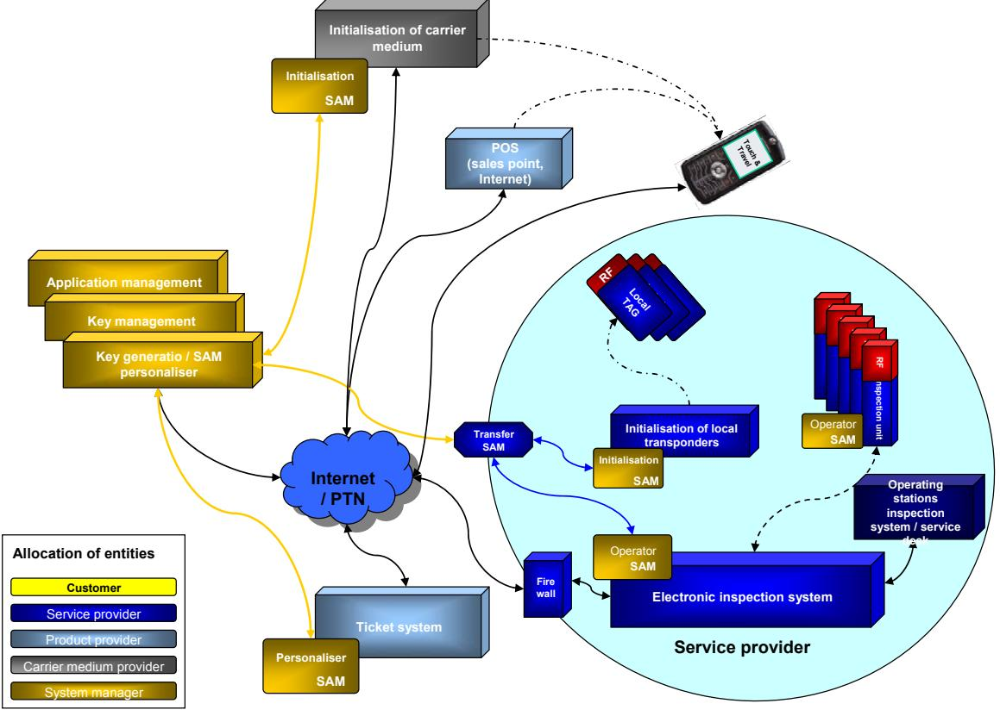

The following diagram shows the system as a whole and its principal components.

#### **Figure 10–1 A schematic example of the "NFC-based eTicketing" system as a whole**

[Figure 10–2](#page-113-1) depicts the system involved in the reference set-up entitled "Touch & Travel":

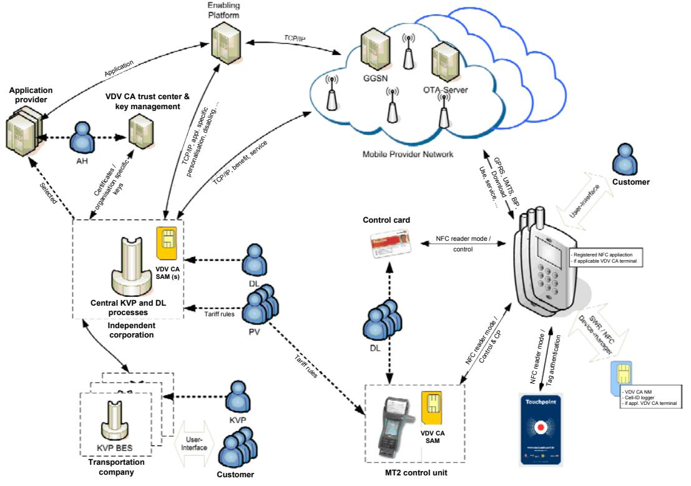

**Figure 10–2 Diagram of the system involved in the "Touch & Travel" reference setup** 

## **10.1 Suggestions on implementing the eTicketing infrastructure**

## **10.1.1 Determining the protection demand for the eTicketing infrastructure**

The following general considerations apply to the eTicketing infrastructure, and these should be included when determining the protection requirements:

- 1 The systems in [Figure 10–1](#page-112-2) should simultaneously support a range of different products, as defined in the proposed application scenarios.
- 2 Data relating to particular persons must be managed and processed.
- 3 Usage data will be generated and must be processed.
- 4 Calculation data must be logged and forwarded if "automatic fare calculation" applications and products are to be supported. Interoperability is required.
- 5 The case of interoperability being assured by agreements between the entities can also be examined as an option.

On the basis of the criteria described in Section [8.2.5](#page-61-1), the eTicketing infrastructure can be assigned to the following protection demand categories:

|     | Security target            | Protection demand category | Criteria for allocating to protection demand category                                                       |
|-----|----------------------------|----------------------------------|-------------------------------------------------------------------------------------------------------------|
| SS1 | Technical compatibility | 1                                | All of the system components are from the same sup plier. The supplier ensures that they are compatible. |
|     |                            | 2                                | The system has to function with components from a                                                           |

| Security target                |                                                                          | Protection demand category | Criteria for allocating to protection demand category                                                                                                                                  |                                                                                                                                                                                               |
|--------------------------------|--------------------------------------------------------------------------|----------------------------------|----------------------------------------------------------------------------------------------------------------------------------------------------------------------------------------|-----------------------------------------------------------------------------------------------------------------------------------------------------------------------------------------------|
|                                |                                                                          |                                  | small number of defined suppliers. The system man ager or an SI ensures compatibility.                                                                                              |                                                                                                                                                                                               |
|                                |                                                                          |                                  | Open system that has to function with components from any company in the market.                                                                                                    |                                                                                                                                                                                               |
|                                |                                                                          | 3                                | System normally acquired by offering out for public tender.                                                                                                                         |                                                                                                                                                                                               |
|                                |                                                                          | 1                                | Malfunction affects only a few customers.                                                                                                                                              |                                                                                                                                                                                               |
|                                |                                                                          | 2                                | Malfunction affects many customers.                                                                                                                                                    |                                                                                                                                                                                               |
| SS2                            | Fallback solu tion in the                                             | 3                                | Malfunction affects a large proportion of customers.                                                                                                                                   |                                                                                                                                                                                               |
|                                | event of mal function                                                 |                                  | System malfunctions (sales system, local transpond ers, mobile phone network, inspection system, key management system) affect a large number of cus tomers and entitlements. |                                                                                                                                                                                               |
|                                |                                                                          | 1                                | A few customers cannot operate it intuitively.                                                                                                                                         |                                                                                                                                                                                               |
|                                | Intuitive, fault                                                         | 2                                | Many customers cannot operate it intuitively.                                                                                                                                          |                                                                                                                                                                                               |
| SS3                            | tolerant op eration                                                   | 3                                | A large proportion of customers cannot operate it intui tively.                                                                                                                     |                                                                                                                                                                                               |
|                                |                                                                          |                                  | The check-in / check-out principle must be familiar to all customers.                                                                                                               |                                                                                                                                                                                               |
|                                |                                                                          | 1                                | Customer's reputation is damaged.                                                                                                                                                      |                                                                                                                                                                                               |
|                                | Protection of personal data (including personal us age data) |                                  | Customer's social existence is damaged.                                                                                                                                                |                                                                                                                                                                                               |
| SI1                            |                                                                          |                                  | 2                                                                                                                                                                                      | If person-related invoicing information or payment de tails stored in the system are stolen or manipulated, the customer may suffer considerable commercial and social consequences. |
|                                |                                                                          | 3                                | Customer's physical existence is damaged.                                                                                                                                              |                                                                                                                                                                                               |
| SI2                            | Protection of entitlements                                            | 1                                | Predicted product-related loss of sales through coun terfeiting, damage or manipulation <0.5%                                                                                       |                                                                                                                                                                                               |
|                                |                                                                          | 2                                | Predicted product-related loss of sales through coun terfeiting, damage or manipulation <3%                                                                                         |                                                                                                                                                                                               |
|                                |                                                                          |                                  | Predicted product-related loss of sales through coun terfeiting, damage or manipulation >3%                                                                                         |                                                                                                                                                                                               |
|                                |                                                                          | 3                                | DoS attacks on the system can lead to a total opera tional breakdown, thus causing considerable commer cial loss.                                                                |                                                                                                                                                                                               |
| SI3                            | Protection of                                                            | 1                                | Data becomes known to third parties.                                                                                                                                                   |                                                                                                                                                                                               |
| logistical data (anonymised |                                                                          | 2                                | Data is lost.                                                                                                                                                                          |                                                                                                                                                                                               |

| Security target |                                                                  | Protection demand category | Criteria for allocating to protection demand category                                                                                                                                                                                        |
|-----------------|------------------------------------------------------------------|----------------------------------|----------------------------------------------------------------------------------------------------------------------------------------------------------------------------------------------------------------------------------------------|
|                 | usage data)                                                      |                                  | The loss of logistical data can also occur through technical defects and can cause operational difficul ties.                                                                                                                          |
|                 |                                                                  | 3                                | Data is falsified.                                                                                                                                                                                                                           |
|                 |                                                                  | 1                                | Data is temporarily unavailable.                                                                                                                                                                                                             |
|                 | Reliable in                                                      | 2                                | Data is lost.                                                                                                                                                                                                                                |
| SI4             | voicing (per                                                     |                                  | Data is falsified, misused, etc.                                                                                                                                                                                                             |
|                 | sonalised)                                                       | 3                                | The possibility of invoicing fraud between the entities cannot be discounted in a system with multiple entities who do not trust one another.                                                                                          |
| SI5             | Protection of applications and entitle ments            | 1                                | Applications are issued by the same application issuer and entitlements by the same product owner.                                                                                                                                        |
|                 |                                                                  | 2                                | Applications are issued by different application issuers and entitlements by different product owners, product providers and service providers. Several companies collaborate and "trust" each other in the process.                |
|                 |                                                                  | 3                                | Applications are issued by different application provid ers, and entitlements by different product owners, product providers and service providers. Several com panies collaborate and do not "trust" each other in the process. |
|                 |                                                                  |                                  | When entitlements are loaded onto NFC Mobile De vices, it must always be assumed that applications from other entities may be present on the customer medium.                                                                       |
|                 | Data minimi sation                                            | 1                                | Personal data is not used.                                                                                                                                                                                                                   |
| SP3             |                                                                  | 2                                | Personal data is used, but no usage data is collected.                                                                                                                                                                                       |
|                 |                                                                  | 3                                | Personal data is used, as is personal usage and calcu lation data.                                                                                                                                                                        |
| SP4             | Protection against the creation of movement profiles | 1                                | Customer's reputation is damaged.                                                                                                                                                                                                            |
|                 |                                                                  | 2                                | Customer's social existence is damaged.                                                                                                                                                                                                      |
|                 |                                                                  | 3                                | Customer's physical existence is damaged.                                                                                                                                                                                                    |

**Table 10–1 The system's protection requirements** 

## **10.1.2 Interfaces in the system as a whole**

The system shown in [Figure 10–1](#page-112-2) is reliant on interaction between all the system components. In order to facilitate the business processes described in Chapter [6](#page-30-1), the technical interfaces and operative interaction between the components have to be specified.

Furthermore, agreements must be made between the entities to regulate the responsibilities and the operational procedures.

### **10.1.2.1 Threats relevant to the eTicketing infrastructure**

The following threats relevant to the interfaces of the system as a whole can be deduced from the security targets used to determine the protection demand in Section [10.1.1.](#page-113-2)

| Threats to the contact-less interface |                                                                                            | Protection demand | Comments                                                                                                                                                                                                                                                                                                                        |
|------------------------------------------|--------------------------------------------------------------------------------------------|----------------------|---------------------------------------------------------------------------------------------------------------------------------------------------------------------------------------------------------------------------------------------------------------------------------------------------------------------------------|
| TC1                                      | Lack of compatibil ity between the interfaces of the carrier medium and reader | 3                    | A lack of compatibility between interfaces pre vents the system from working when loading and using entitlements, checking entitlements, and so on. The result is similar to a DoS attack on the system. Many customers and/or enti tlements may be affected.                                                    |
| TC2                                      | Eavesdropping                                                                              | 3                    | Unauthorised listening-in to communication between a carrier medium and a reader.                                                                                                                                                                                                                                            |
| TC3                                      | DoS attack on the RF interface                                                          | 1                    | 1 Interference in RFID communication (jam ming). 2 Interference in the anti-collision mecha nism for selecting the carrier medium (blocker tag) 3 Blocking the electromagnetic field of the reader (shielding). 4 Altering the resonance frequency of reader or carrier medium (de-tuning). |

**Table 10–2 Relevant threats to the contact-less interface** 

| Threats to the system as a whole |                                                | Protection demand | Comments                                                                                                                                                                                                                                                                                                |
|-------------------------------------|------------------------------------------------|----------------------|---------------------------------------------------------------------------------------------------------------------------------------------------------------------------------------------------------------------------------------------------------------------------------------------------------|
| TS1                                 | Lack of fallback solution                   | 3                    | The lack of a fallback solution when system interfaces fail, such as the ticket sales system, administration system for carrier media and entitlements, or inspection system, can lead to a complete breakdown of services (sales, in voicing, acceptance, etc.).                        |
| TS2                                 | Unauthorised scan ning of reference data | 3                    | Keys, as well as information about the media, entitlements and usage, and sometimes per sonal data and calculation data, are passed between the system components via inter faces. The retrieval of this data by unauthor ised persons would discredit the system and enable attacks. |

| Threats to the system as a whole |                                                    | Protection demand | Comments                                                                                                                                                                                                                                                                                                                                 |  |
|-------------------------------------|----------------------------------------------------|----------------------|------------------------------------------------------------------------------------------------------------------------------------------------------------------------------------------------------------------------------------------------------------------------------------------------------------------------------------------|--|
| TS3                                 | Manipulation of reference data in the system | 3                    | Keys, as well as information about the media, entitlements and usage, and sometimes per sonal data and calculation data, are passed between the system components via inter faces. The manipulation of this data by unau thorised persons represents a serious attack.                                                    |  |
| TS4                                 | System malfunction                                 | 3                    | Malfunctions in the interfaces between the sys tems can be caused in a range of scenarios by technical faults, incorrect operation or DoS attacks: 1 Fault in interfaces 2 Lack of availability of interfaces 3 Fault in power supply 4 Interruption in network connection 5 Physical destruction |  |
| TS5                                 | Lack of compatibil ity between inter faces   | 3                    | A lack of compatibility between interfaces causes malfunctions. The result is similar to a DoS attack on the system. Many customers and/or entitlements may be affected.                                                                                                                                                        |  |
| TS10                                | Unjustified gather ing and storing of data   | 3                    | The automatic fare calculation concept makes use of person-related usage and calculation data.                                                                                                                                                                                                                                     |  |

#### **Table 10–3 Threats relevant to the system**

### **10.1.2.2 Definition of safeguards for the interfaces of the system as a whole**

Based on the relevant threats in the preceding section, this section defines general execution proposals and safeguards for the system as a whole and the system components. These safeguards are described in detail in Section [8.4.](#page-71-1)

| Threat |                                                                                            | Safeguard      |        | Safeguard                                                                                                                                                                                                                                                              |
|--------|--------------------------------------------------------------------------------------------|----------------|--------|------------------------------------------------------------------------------------------------------------------------------------------------------------------------------------------------------------------------------------------------------------------------|
| TC1    | Lack of compati bility between the interfaces of the carrier medium and reader | MS1.3          | 1      | Introduction of interface tests and ap proval procedures – Certification.                                                                                                                                                                                           |
| TC2    | Eavesdropping                                                                              | MS2.3 MS3.3 | 1 2 | Ensuring the confidentiality of commu nication between RFID carrier medium and terminal in order to prevent eaves dropping – Mutual, dynamic authentica tion during transmission. Introduction of contact-less interface as defined by ISO/IEC14443. |
| TC3    | DoS attack on the RF interface                                                          | MS3.1          | 1      | Introduction of contact-less interface as defined by ISO/IEC14443.                                                                                                                                                                                                  |

| Threat     |                                                                                                      | Safeguard                                                     | Safeguard                                                                                                                                                                                                                                                                                                                                                                                                                                                                                                                                                                                                                                             |  |
|------------|------------------------------------------------------------------------------------------------------|---------------------------------------------------------------|-------------------------------------------------------------------------------------------------------------------------------------------------------------------------------------------------------------------------------------------------------------------------------------------------------------------------------------------------------------------------------------------------------------------------------------------------------------------------------------------------------------------------------------------------------------------------------------------------------------------------------------------------------|--|
| TS1        | Lack of fallback solution                                                                         | MS4.3                                                         | 1 Definition of fallback solutions in the event of system interface or system component failure – Implementation according to fallback concept.                                                                                                                                                                                                                                                                                                                                                                                                                                                                                           |  |
| TS2 TS3 | Unauthorised scanning of refer ence data Manipulation of reference data in the system | MS5.3 MS6.3 MS15.3 MS6.3 MS7.3 MS8.3 MS15.3 | 2 Securing the confidentiality of data when communicating within the system – Secure communication channel. 3 Confidential storage of data – Maintain ing privacy using multi-tenant access protection. 4 Separation of applications – Separate storing and processing of data. 1 Confidential storage of data – Multi tenant access protection, role model. 2 Securing data integrity in order to pro tect against manipulation when trans mitting data within the system – MAC or signatures.                                                                                                 |  |
|            |                                                                                                      |                                                               | 3 Securing data integrity when storing data – Checksums. 4 Separation of applications – Separate storing and processing of data.                                                                                                                                                                                                                                                                                                                                                                                                                                                                                                       |  |
| TS4        | System malfunc tion                                                                               | MS4.3 MS9.3 MS10.3 MS11.3 MS13.3 MS14.3        | 1 Definition of fallback solutions in the event of system interface or system component failure – Implementation according to fallback concept. 2 Securing system functions against DOS attacks to the interfaces – Security con cept. 3 Securing the function of the system against incorrect operation by employ ees and users – Tests, personnel and user introductions. 4 Secure the function of the system to prevent the technical failure of compo nents and transmission routes – Evaluation of components. 5 Ergonomic user instructions. 6 Support – System-wide support. |  |
| TS5        | Lack of compati bility between interfaces                                                      | MS1.3 MS11.3 MS12.3                                     | 1 Introduction of interface tests and ap proval procedures – Certification. 2 Secure the function of the system to prevent the technical failure of compo nents and transmission routes – Evaluation of components. 3 Specifications for system concept and requirements for components with the aim of integration and interoperability – interoperability tests in accordance with                                                                                                                                                                                                                              |  |

| Threat |                                                  | Safeguard | Safeguard                                                                  |
|--------|--------------------------------------------------|-----------|----------------------------------------------------------------------------|
|        |                                                  |           | test concept, evaluation.                                                  |
| TS10   | Unjustified gath ering and storing of data | MS17.3    | 1 Satisfying the data minimisation obliga tion – Special safeguards. |

**Table 10–4 Safeguards for the system as a whole** 

#### **10.1.2.3 Residual risks**

For technical and commercial reasons, it is not always possible to eliminate threats completely using safeguards. In such cases a certain risk remains.

The residual risk relating to the key management system should be determined and documented for the implementation concerned.

### **10.1.3 Readers as defined in ISO/IEC14443**

Conventional readers as defined in ISO/IEC14443 are used for inspecting entitlements in the vehicles.

It is also possible use to an ISO/IEC14443 reader that communicates with the NFC Mobile Device's NFC interface to write entitlements and credits to the NFC Mobile Device's secure memory. In both cases the NFC Mobile Device works in passive mode in the same way as a PICC as defined in ISO/IEC 14443.

Readers control the flow of information for reading from and writing to the carrier medium, using a contact-less communication protocol. The reader (PCD as defined by ISO/IEC14443) assumes the active role (master), while the carrier medium (PICC as defined by ISO/IEC14443) is passive (slave).

Readers are integrated into various system components:

- 1 Sales systems at sales points
- 2 Vending machines
- 3 Service desks
- 4 Mobile inspection units (inspection terminals)

The mobile inspection units must have at least the following features:

- 1 Contact-less read/write unit with interface as defined by ISO/IEC14443 A/B Part 1-4.
- 2 Offline capability.
- 3 Capacity to store all usage data until the next data exchange with the central system.
- 4 Parallel support of multiple carrier media, applications and products (selection using ID).
- 5 Basic cryptographic functions.
- 6 Support for SAMs. Multiple SAM slots should be available.
- 7 The result of the validation should be displayed visually.

In principle the same requirements apply to all other readers, such as those installed in vending machines. Offline capability, however, is not always required.

## **10.1.3.1 Threats relevant to the readers**

The following threats relevant to the interfaces of the system as a whole can be deduced from the assumptions used to determine the protection demand in Section [10.1.1.](#page-113-2)

| Threats to the contact-less interface |                                                                                            | Protection demand | Comments                                                                                                                                                                                                                                                                                                                         |  |
|------------------------------------------|--------------------------------------------------------------------------------------------|----------------------|----------------------------------------------------------------------------------------------------------------------------------------------------------------------------------------------------------------------------------------------------------------------------------------------------------------------------------|--|
| TC1                                      | Lack of compatibil ity between the interfaces of the carrier medium and reader | 3                    | A lack of compatibility between interfaces pre vents the system from working when loading and using entitlements, checking entitlements, and so on. The result is similar to a DoS attack on the system. Many customers and/or enti tlements may be affected.                                                     |  |
| TC2                                      | Eavesdropping                                                                              | 3                    | Unauthorised listening-in to communication between a carrier medium and a reader.                                                                                                                                                                                                                                             |  |
| TC3                                      | DoS attack on the RF interface                                                          | 3                    | 1 Interference in RFID communication (jam ming). 2 Interference in the anti-collision mecha nism for selecting the carrier medium (blocker tag). 3 Blocking the electromagnetic field of the reader (shielding). 4 Altering the resonance frequency of reader or carrier medium (de-tuning). |  |

**Table 10–5 Threats relevant to the contact-less interface** 

| Threat to the reader |                                                            | Protection demand | Comments                                                                                                                                                                                                                                                                                                                              |  |
|----------------------|------------------------------------------------------------|----------------------|---------------------------------------------------------------------------------------------------------------------------------------------------------------------------------------------------------------------------------------------------------------------------------------------------------------------------------------|--|
| TR1                  | Unauthorised ma nipulation of refer ence information | 3                    | The manipulation of reference information (keys, evaluation algorithms, blacklists and whitelists) can be employed for unauthorised use or for DoS.                                                                                                                                                                          |  |
| TR2                  | Unauthorised scanning of refer ence information      | 3                    | The retrieval of reference information (keys, evaluation algorithms, blacklists and whitelists) can be employed for unauthorised use (e.g. counterfeiting of entitlements) and for DoS.                                                                                                                                      |  |
| TR3                  | Reader malfunction                                         | 3                    | Reader malfunctions can be caused in a range of scenarios by technical faults, incorrect op eration or DoS attacks:                                                                                                                                                                                                             |  |
|                      |                                                            |                      | 1 Fault in contact-less interface 2 Fault in reference information (keys, black lists, etc) 3 Fault in application implementation 4 Fault in evaluation algorithms for entitle ments 5 Fault in power supply 6 Interruption of the link to the central sys tem 7 Physical destruction |  |
|                      |                                                            |                      | 8 Fault in operational instruction functions                                                                                                                                                                                                                                                                                       |  |
| TR4                  | Lack of user in structions                              | 3                    | A lack of user-friendliness at vending machines and the terminals used for activating entitle ments and checking-in / checking-out can cause considerable operative problems.                                                                                                                                                |  |
| TS1                  | Lack of fallback solution                               | 3                    | The lack of a fallback solution when system interfaces fail, such as the ticket sales system, administration system for carrier media and entitlements, or inspection system, can lead to a complete breakdown of services (sales, in voicing, CICO, etc.).                                                            |  |
| TS5                  | Lack of compatibil ity between inter faces           | 3                    | A lack of compatibility between interfaces causes malfunction. The result is similar to a DoS attack on the system. Many customers and/or entitlements may be affected.                                                                                                                                                      |  |

**Table 10–6 Threats relevant to the reader** 

## **10.1.3.2 Definition of safeguards for the reader and its applications**

Based on the relevant threats in the preceding section, this section defines general execution proposals and safeguards for the reader and its applications. These safeguards are described in detail in Section [8.4](#page-71-1).

| Threat |                                                                                            | Safeguard                 | Safeguard                                                                                                                                                                                                                                                                                                                 |
|--------|--------------------------------------------------------------------------------------------|---------------------------|---------------------------------------------------------------------------------------------------------------------------------------------------------------------------------------------------------------------------------------------------------------------------------------------------------------------------|
| TC1    | Lack of compati bility between the interfaces of the carrier medium and reader | MS1.3 MR1.3            | 1 Introduction of interface tests and ap proval procedures – Certification                                                                                                                                                                                                                                          |
| TC2    | Eavesdropping                                                                              | MS2.3 MS3.3            | 1 Ensure the confidentiality of communi cation between RFID carrier medium and terminal in order to prevent eaves dropping – Mutual, dynamic authentica tion during transmission. 2 Introduction of contact-less interface as defined by ISO/IEC14443                                             |
| TC3    | DoS attack on the RF interface                                                          | MS3.1                     | 1 Introduction of contact-less interface as defined by ISO/IEC14443                                                                                                                                                                                                                                                 |
| TR1    | Unauthorised manipulation of reference infor mation                               | MR2.3                     | 1 Protection of reference information against retrieval, data errors and ma nipulation – Advanced protection                                                                                                                                                                                                     |
| TR2    | Unauthorised scanning of refer ence information                                      | MR2.3                     | 1 Protection of reference information against retrieval, data errors and ma nipulation – Advanced protection                                                                                                                                                                                                     |
| TR3    | Reader malfunc tion                                                                     | MR3.3                     | 1 Protection of the reader against mal function – Evaluation                                                                                                                                                                                                                                                        |
| TR4    | Lack of user in structions                                                              | MS13.3                    | 1 Ergonomic user instructions                                                                                                                                                                                                                                                                                          |
| TS1    | Lack of fallback solution                                                               | MS4.3                     | 1 Definition of fallback solutions in the event of system interface or system component failure – Implementation according to fallback concept                                                                                                                                                                |
| TS5    | Lack of compati bility between interfaces                                            | MS1.3 MS11.3 MS12.3 | 1 Introduction of interface tests and ap proval procedures – Certification 2 Secure the function of the system to prevent the technical failure of compo nents and transmission routes – Evaluation of components 3 Specification of system concept and component requirements – Evaluation |

**Table 10–7 Safeguards for the reader and its applications** 

## **10.1.3.3 Residual risks**

For technical and commercial reasons, it is not always possible to eliminate threats completely using safeguards. In such cases a certain risk remains.

The residual risk relating to the readers should be determined and documented for the implementation concerned.

### **10.1.4 Sale, inspection and management systems**

#### **10.1.4.1 Sales systems**

Access to the products must be easy and inexpensive for all potential customers, which is why a range of points of sale should be supported. These are described in the following:

#### **Sales point**

This could be, for instance, the office of a transport company (e.g. CA customer contract partner) or a travel agent.

#### Sales procedure

The customer visits the sales point in person and purchases the product there:

- Identification, if required, is by identity card.
- The booking is done in dialogue with the customer at the sales point.
- Payment is made at the sales point.

If the entitlement can be loaded onto an existing customer medium (see "Technical equipment"), then the customer can take the product away with him straight away. If not, then the product and the carrier medium are sent by post or held at the sales point, ready for subsequent collection.

#### Technical equipment

The sales point has direct access to the ticket sales system. This is a precondition for services such as seat reservation.

A simple contact-less reader at the sales point can provide a way of loading entitlements onto an existing customer medium. If such a contact-less reader exists, then in future it could become possible to utilise an electronic proof of identity as a means of securely and automatically transferring personal data into the ticket system (e.g. for setting up a customer account), or for secure identification.

The personnel and IT infrastructure at the sales point are not always trustworthy.

#### **Vending machines**

At vending machines, entitlements are sold and issued in a direct interaction between the vending machine and the customer, or credits levels are topped up anonymously.

Vending machines are installed in customer centres, railway stations, bus and tram stops, and also inside vehicles. They are especially suitable for the anonymous sale of products.

Vending machines that are used in vehicles must be able to work offline. The exchange of data with a sales system is only possible at certain intervals.

In the simplest case, entitlements and credits are written to the NFC Mobile Device via a contact-less reader installed in the vending machine.

The customer purchases or collects the product at a vending machine:

• Booking is done at a vending machine.

- Payment is made directly using methods such as Maestro or credit cards, or using a payment procedure specific to the system.
- The entitlement and/or credit is loaded directly onto the NFC Mobile Device.

#### **Internet, call centres, ordering by post**

#### Sales procedure

The customer places the order by telephone, Internet or fax from any location:

- The booking, choice of seat etc. can be made in a direct interaction when using the Internet or telephone. Written orders do not allow this.
- Payment is made by Maestro, credit card or direct debit.
- For secure identification, the personal data sent by the customer and the NFC Mobile Device's key data (contract, technical specifications, etc.) may have to be checked separately.

The loading of applications and entitlements onto an existing NFC Mobile Device can be supported. Loading is done over-the-air. Alternatively, the NFC Mobile Device can be initialised and sent by post together with the required entitlement.

#### Technical equipment

The product provider operates an Internet sales platform or a call centre. The customer does not require any particular technical equipment.

#### **Internet**

#### Sales procedure

The customer places the order interactively by Internet from any location (e.g. at home).

If the customer has a customer medium which already contains the necessary application, then the required product can be loaded onto it. In the case of a NFC Mobile Device, this loading is normally done over-the-air:

- Booking, seat reservation and so on can be done in a direct interaction when using the Internet.
- Identification is done using the customer medium and the personal data stored in the application.
- Payment is made using Maestro, credit card, direct debit, or a payment method specific to the system.

The entitlement is loaded directly into the application on the customer medium.

If the customer does not yet have a customer medium but does have a contact-less reader, then secure identification of the customer may in future be able to take place using an eID, thus enabling the customer medium to be ordered securely and conveniently.

#### Technical equipment

The product provider operates an Internet sales platform, which is connected to the key, carrier and application management systems. The customer requires an NFC Mobile Device

containing the appropriate application, and he may require an eID and contact-less home reader to set up a customer account.

## **10.1.4.2 Ticket system**

The ticket system supports the primary selling and handling processes:

- 1 Registering and ordering
- 2 Creating the entitlement
- 3 Payment, and checking creditworthiness
- 4 Managing the entitlements sold
- 5 Forwarding the necessary data to the inspection system

Customer data and orders are stored in the ticket system. Provided the transport service and product support it, seating can also be allocated using seating plans which are also stored there. The ticket system also incorporates a procedural management system which performs actions such as address comparisons and payment processing including credit checks, recording customer media, and producing and dispatching entitlements.

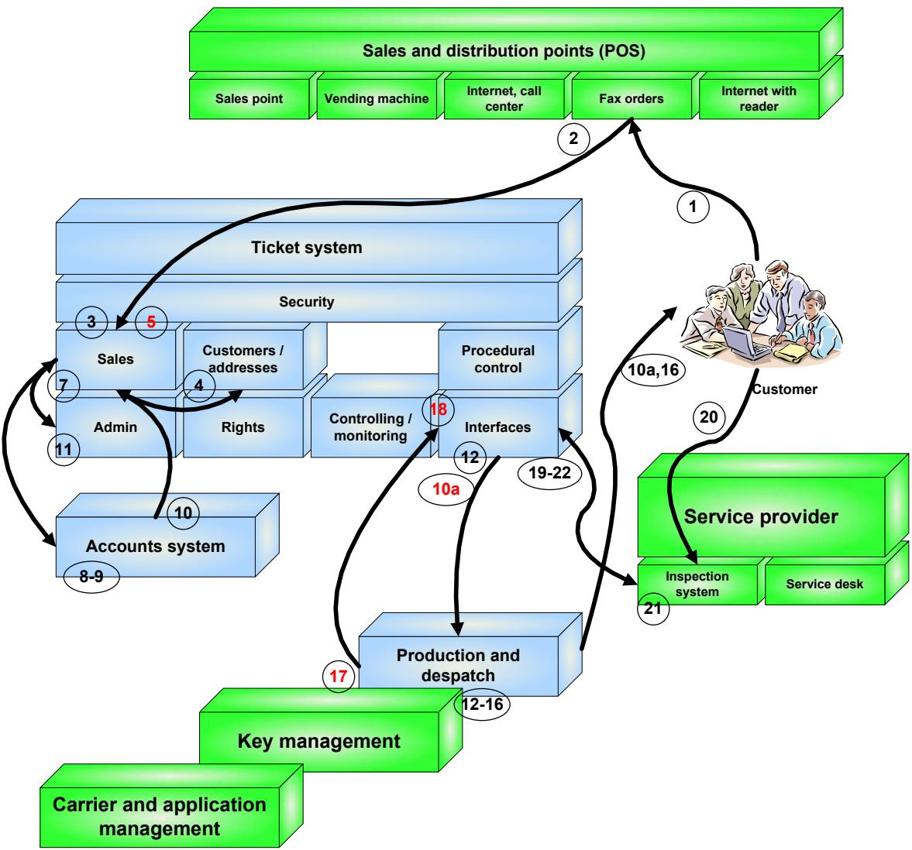

**Figure 10–4 An example of a ticket system with possible process flows** 

A ticket system has interfaces to the key management system and the system which administers the carrier media and applications. All of the information required (apart from the information transferred in the key management system) is gathered together by the ticket system and sent to the service provider via a defined interface.

There are other interfaces to the sales points and the places where the carrier media are produced. This also includes sales and distribution, and the management of loading applications and products onto existing media via the Internet.

It can be assumed that a ticket system will be housed in a secure environment. Personaliser SAMs must be connected to it in order to be able to produce entitlements and load them onto carrier media.

From the point of view of the service provider, more than one ticket system can be used.

### **10.1.4.3 Central inspection system**

The inspection system helps the service provider to check the customers' journey entitlements, and to gather and pass on information relevant to invoicing. This requires the following functions:

- 1 Support of Process P3 for checking in, checking out and if necessary activation.
- 2 Support for the particular carrier media, applications and products.
	- a Implementation of the technical procedures required to use the carrier media, applications and products.
	- b Implementation and management of SAMs.
- 3 Receiving, distributing and utilising the information provided by the ticket systems.
- 4 Receiving, distributing and utilising the keys and identifiers provided by the system manager and registrar.
- 5 Reporting invoicing-related data and usage history to the ticket systems.

The terminals in public transport systems are not usually connected permanently to a data network. This applies especially to inspection devices in vehicles. That means all of the information required for entry, evaluation and activation of entitlements, and where applicable fare calculation, has to be stored locally in these terminals.

### **10.1.4.4 Service desks**

In real-life operation, a certain amount of defective customer media, incorrect operations, attacks on security and fraud attempts is inevitable. The service desk is the point of contact if problems occur when checking in and checking out.

Valid entitlements do not expire when the inspection equipment or customer medium fails, or if the customer does something incorrect. At the service desk, which is run by the service provider or product provider, the customer can receive a replacement entitlement or a refund.

For this to happen it must be possible to perform Process P4, "Blocking entitlements and carrier media", and to issue a replacement medium, quickly and efficiently

The following tasks are undertaken at the service desk:

1 Check the function of the carrier medium and the status of the entitlement. If a fault occurs, then:

2 Check whether the medium is genuine and/or check the identity of the customer. If positive, then:

- 3 Block the medium and entitlement presented.
- 4 Update the information in the ticket system and the carrier and application management systems.
- 5 Transfer the information from the ticket system to the inspection system.

### **10.1.4.5 Management system for NFC Mobile Devices and applications**

For the processes of loading applications and entitlements, and for the processes in which the NFC Mobile Device is used for identification and for utilising transport services, it is important to know the status of the NFC Mobile Device and the applications on it.

For this reason, the life-cycle of any carrier medium used in the system must be documented reliably. To this end a database is used which is connected via interfaces to the ticket system and the key management system. It contains information such as the following for every carrier medium:

- ID of carrier medium
- Type, version
- Provider of carrier medium (ID via registrar)
- Issuer of carrier medium (ID via registrar)
- Customer
- Status (e.g. new/active/blacklisted)
- Stored applications (see below)
- etc.

Similarly, the life-cycle of the applications stored on the carrier medium must also be documented. Several different applications can be stored.

- ID of application
- Type, version, validity
- Application provider (ID via registrar)
- Application issuer (ID via registrar)
- Customer
- Status (e.g. new/active/blacklisted/delete)
- Stored products including ID of product provider
- Active products / deletable products

### **10.1.4.6 Management system for local transponders**

The life-cycle of a local transponder which is to be used in the system area must be documented reliably, for which a database is used. Information such as the following is entered in this database for every local transponder:

- ID of local transponder
- Type, version, validity
- Issuer of local transponder (ID via registrar)
- Service provider
- Status (e.g. not initialised, initialised, blacklisted)
- Applications supported (see below)
- Location allocation

• etc.

Similarly, the life-cycle of the application stored on the NFC Mobile Device must also be documented. It is assumed that local transponders only support one application each.

- ID of application
- Type, version, validity
- Application provider (ID via registrar)
- Application issuer (ID via registrar)
- Customer
- Status (e.g. non-personalised/personalised/active/blacklisted/delete)

#### **10.1.4.7 Threats relevant to ticket, inspection and management systems**

The following threats relevant to the interfaces of the system as a whole can be deduced from the assumptions used to determine the protection demand in Section [10.1.1.](#page-113-2)

| Threats to the sales, inspec tion and management sys tems |                                                    | Protection demand | Comments                                                                                                                                                                                                                                                                                                                                                                                                                                                |  |
|-----------------------------------------------------------------|----------------------------------------------------|----------------------|---------------------------------------------------------------------------------------------------------------------------------------------------------------------------------------------------------------------------------------------------------------------------------------------------------------------------------------------------------------------------------------------------------------------------------------------------------|--|
| TS1                                                             | Lack of fallback solution                       | 3                    | The lack of a fallback solution when system components fail, such as the ticket sales sys tem, administration system for carrier media and entitlements, or inspection system, can lead to a complete breakdown of services (sales, invoicing, CICO, etc).                                                                                                                                                                               |  |
| TS2                                                             | Unauthorised scanning of refer ence data     | 3                    | The backend systems store information about the media, entitlements and usage, and some times personal data and calculation data. The retrieval of this data by unauthorised persons would discredit the system and enable attacks                                                                                                                                                                                                          |  |
| TS3                                                             | Manipulation of reference data in the system | 3                    | The backend systems store information about the media, entitlements and usage, and some times personal data and calculation data. The manipulation of this data by unauthorised per sons represents a serious attack.                                                                                                                                                                                                                       |  |
| TS4                                                             | System malfunction                                 | 3                    | Individual system component malfunctions can be caused in a range of scenarios by technical faults, incorrect operation or DoS attacks: 1 Fault in local and central systems 2 Lack of availability of local and central systems 3 Fault in data storage 4 Fault in power supply 5 Interruption of the link to the central sys tem 6 Protection against physical attacks (dis mantling, destruction) |  |

| Threats to the sales, inspec tion and management sys tems |                                                                                    | Protection demand | Comments                                                                                                                                                                                                                                                                         |
|-----------------------------------------------------------------|------------------------------------------------------------------------------------|----------------------|----------------------------------------------------------------------------------------------------------------------------------------------------------------------------------------------------------------------------------------------------------------------------------|
| TS5                                                             | Lack of compatibil ity between inter faces                                   | 3                    | A lack of compatibility between interfaces causes malfunctions. The result is similar to a DoS attack on the system. Many customers and/or entitlements may be affected.                                                                                                |
| TS6                                                             | Unauthorised scanning of sales and calculation data                       | 3                    | Unauthorised, active retrieval of calculation data.                                                                                                                                                                                                                           |
| TS7                                                             | Unauthorised overwriting / ma nipulation of sales and calculation data | 3                    | Unauthorised writing of calculation data onto the carrier medium for the purpose of manipu lating or compromising data.                                                                                                                                                    |
| TS8                                                             | Protection of client specific applica tions and entitle ments             | 3                    | If multiple entities are supported by the system with sales data, entitlements and applications, these may be influenced or damaged when used mutually.                                                                                                                 |
| TS9                                                             | Falsification of identity data                                                  | 2                    | The customer may need to be identified when setting up a customer account, or purchasing or collecting a product. Using a false identity would allow someone to obtain benefits such as entitlements to the detriment of other cus tomers or the product provider |
|                                                                 |                                                                                    |                      | The protection demand relating to SI2 (protec tion of entitlements) is categorised as 2 in this case, since attacks only affect individual enti tlements.                                                                                                               |
| TS10                                                            | Unjustified gather ing and storing of data                                   | 3                    | The concept of automatic fare calculation util ises personal usage and invoicing data.                                                                                                                                                                                        |

**Table 10–8 Threats relevant to ticket, inspection and management systems** 

### **10.1.4.8 Definition of safeguards for ticket, inspection and management systems**

Based on the relevant threats in the preceding section, this section defines general execution proposals and safeguards. These safeguards are described in detail in Section [8.4](#page-71-1).

| Threat |                                                | Safeguard      | Safeguard                                                                                                                                                   |
|--------|------------------------------------------------|----------------|-------------------------------------------------------------------------------------------------------------------------------------------------------------|
| TS1    | Lack of fallback solution                   | MS4.3          | 1 Definition of a fallback solution in the event of system interface or system component failure – Implementation according to fallback concept |
| TS2    | Unauthorised scanning of refer ence data | MS5.3 MS6.3 | 1 Securing the confidentiality of data when communicating within the system – Secure communication channel                                         |

| Threat |                                                              | Safeguard                                              | Safeguard                                                                                                                                                                                                                                                                                                                                                                                                                                                                                                                                                                                                                                         |
|--------|--------------------------------------------------------------|--------------------------------------------------------|---------------------------------------------------------------------------------------------------------------------------------------------------------------------------------------------------------------------------------------------------------------------------------------------------------------------------------------------------------------------------------------------------------------------------------------------------------------------------------------------------------------------------------------------------------------------------------------------------------------------------------------------------|
|        |                                                              | MS15.3                                                 | 2 Confidential storage of data – Introduc tion of multi-tenant access protection, role model                                                                                                                                                                                                                                                                                                                                                                                                                                                                                                                                             |
|        |                                                              |                                                        | 3 Separation of applications – Separate storing and processing of data                                                                                                                                                                                                                                                                                                                                                                                                                                                                                                                                                                      |
| TS3    | Manipulation of reference data in the system           | MS6.3 MS7.3                                         | 1 Confidential storage of data – Maintain ing privacy using multi-tenant access protection, role model                                                                                                                                                                                                                                                                                                                                                                                                                                                                                                                                   |
|        |                                                              | MS8.3 MS15.3                                        | 2 Securing the data integrity in order to protect against manipulation when transmitting data within the system – MAC or signatures                                                                                                                                                                                                                                                                                                                                                                                                                                                                                                   |
|        |                                                              |                                                        | 3 Securing data integrity when storing data – Checksums                                                                                                                                                                                                                                                                                                                                                                                                                                                                                                                                                                                     |
|        |                                                              |                                                        | 4 Separation of applications – Separate storing and processing of data                                                                                                                                                                                                                                                                                                                                                                                                                                                                                                                                                                      |
| TS4    | System malfunc tion                                       | MS4.3 MS9.3 MS10.3 MS11.3 MS13.3 MS14.3 | 1 Definition of a fallback solution in the event of system interface or system component failure – Implementation according to fallback concept 2 Securing system functions against DOS attacks to the interfaces – Security con cept 3 Securing the function of the system against incorrect operation by employ ees and users – Tests, personnel and user introductions. 4 Secure the function of the system to prevent the technical failure of compo nents and transmission routes – Evaluation of components 5 Ergonomic user instructions 6 Support – System-wide support |
| TS5    | Lack of compati bility between interfaces              | MS1.3 MS11.3 MS12.3                              | 1 Introduction of interface tests and ap proval procedures – Certification 2 Secure the function of the system to prevent the technical failure of compo nents and transmission routes – Evaluation of components 3 Specifications for system concept and requirements for components with the aim of integration and interoperability – interoperability tests in accordance with test concept, evaluation                                                                                                                                                                                                |
| TS6    | Unauthorised scanning of sales and calculation data | MS5.3 MS6.3                                         | 1 Securing the confidentiality of data when communicating within the system – VPN or similar 2 Confidential storage of data – Introduc-                                                                                                                                                                                                                                                                                                                                                                                                                                                                                            |

| Threat |                                                                                    | Safeguard                         | Safeguard                                                                                                                                                                                                                                                                                                                                                                                                                   |
|--------|------------------------------------------------------------------------------------|-----------------------------------|-----------------------------------------------------------------------------------------------------------------------------------------------------------------------------------------------------------------------------------------------------------------------------------------------------------------------------------------------------------------------------------------------------------------------------|
|        |                                                                                    | MS15.3                            | tion of multi-tenant access protection in accordance with role model 3 Separation of applications – Separate storing and processing of data                                                                                                                                                                                                                                                                     |
| TS7    | Unauthorised overwriting / ma nipulation of sales and calculation data | MS6.3 MS7.3 MS8.3 MS15.3 | 1 Confidential storage of data – Introduc tion of multi-tenant access protection in accordance with role model 2 Securing the data integrity in order to protect against manipulation when transmitting data within the system – MAC or signatures 3 Securing data integrity when storing data – Checksums 4 Separation of applications – Separate storing and processing of data |
| TS8    | Protection of cli ent-specific appli cations and enti tlements            | MS6.3 MS15.3                   | 1 Confidential storage of data – Maintain ing privacy using multi-tenant access protection, role model 2 Separation of applications – Separate storing and processing of data                                                                                                                                                                                                                             |
| TS9    | Falsification of identity data                                                  | MS16.2                            | 1 Customer identification – Application form, customer medium                                                                                                                                                                                                                                                                                                                                                         |
| TS10   | Unjustified gath ering and storing of data                                   | MS17.3                            | 1 Satisfying the data minimisation obliga tion – Special safeguards                                                                                                                                                                                                                                                                                                                                                   |

### **Table 10–9 Safeguards for ticket, inspection and management systems**

## **10.1.4.9 Residual risks**

For technical and commercial reasons, it is not always possible to eliminate threats completely using safeguards. In such cases a certain risk remains.

The residual risk relating to key management should be determined and documented for each implementation.

## **10.1.5 Key management**

The job of the key management system is to provide keys used by multiple entities for all of the carrier media, applications and products in the system, and to do so securely and reliably. Key management is the responsibility of the security manager. A number of use cases are described in Section 7.10. [GSHB] can be used as a general guideline for implementation.

Keys are generated individually for each purpose. As far as possible, a distinct key is allocated to each form of interaction (e.g. loading applications, writing entitlements, reading entitlements, writing usage data). The precise characteristics have to be ascertained for each application scenario as part of the creation of a specific security concept that harmonises with the role model.

The keys are generated in a secure environment and stored in a secure database. The various forms of SAM are also produced in this secure environment. The documentation of the life-cycle of the SAMs that are produced and issued is another of the key management system's tasks.

The SAMs and keys are generated by the security manager or his agents as and when users need them. The following types of SAM are basically supported:

| Initialiser SAMs      | Initialiser SAMs are required to initialise carrier media and load applications.                                                 |
|-----------------------|-------------------------------------------------------------------------------------------------------------------------------------|
| Personaliser SAMs     | Personaliser SAMs are required to load entitlements in the ap propriate applications.                                            |
| Service provider SAMs | Service provider SAMs are required by the service provider to read and activate, blacklist and de-blacklist entitlements, and in |

Where required there may also be special SAMs that help transmit the product ID of the suppliers of carrier media, applications and entitlements securely onto the carrier medium.

some cases to send the usage data to the carrier medium.

Key information is normally loaded onto a SAM when the user requires it. The aim of an initialiser is, for example, to enable all of the carrier media that occur in its area to be initialised with the necessary applications without changing the SAM.

This kind of user-specific SAM must be configured under an agreement between the user of the SAM and the system manager.

The SAM should support the secure loading of new keys via a network. Ideally, updating can be done by the security manager directly.

#### **10.1.5.1 Key management for public transport service providers / SAMs for service providers**

Specific key information is required to evaluate entitlements. The reliability and security of the key management system involved in this is of critical importance to the overall concept. If the keys held by the service provider do not correspond with those in the carrier media and entitlements used for entry, then the evaluation of entitlements will not work. If keys are lost or made public, then the entire security concept will be discredited.

In this proposal, special SAMs are issued to the service provider as the operator of the inspection system. These service provider SAMs contain the key information relevant to the services offered, and must be integrated into the terminals.

When service provider SAMs are used, key management is restricted to the handing-over, handling and management of the SAMs. Since the keys are protected against unauthorised reading when using SAMs, the risk – and therefore the extent of the protection required – is limited. The use of standardised SAMs also reduces the expense of adapting to new applications.

### **10.1.5.2 Threats relevant to the key management system**

The following threats relevant to the interfaces of the system as a whole can be deduced from the assumptions used to determine the protection demand in Section [10.1.1.](#page-113-2)

| Threats to the key man agement system |                                         | Protection demand | Comments                                                                                                                                                                                                                                                                                                                                                                                                                                                                                                                   |  |
|------------------------------------------|-----------------------------------------|----------------------|----------------------------------------------------------------------------------------------------------------------------------------------------------------------------------------------------------------------------------------------------------------------------------------------------------------------------------------------------------------------------------------------------------------------------------------------------------------------------------------------------------------------------|--|
| TK1                                      | Lack of key data quality             | 3                    | Deficient key quality increases the chances of successful attacks.                                                                                                                                                                                                                                                                                                                                                                                                                                                      |  |
| TK2                                      | Unauthorised scanning of key data | 3                    | The retrieval of key data by unauthorised per sons can discredit the system and facilitate attacks, e.g. on any cryptographically protected data or functions.                                                                                                                                                                                                                                                                                                                                                    |  |
| TK3                                      | Manipulation of key data             | 3                    | The manipulation of key data can discredit the system's security concept and facilitate at tacks, e.g. on any cryptographically protected data or functions. Manipulation can affect the generation of keys, the production of key carriers, the transmission of keys and the local use of keys.                                                                                                                                                                                                         |  |
| TK4                                      | Key management system malfunction    | 3                    | Key management system malfunctions can be caused in a variety of scenarios by technical faults, incorrect operation or DoS attacks: 1 Fault in local and central systems 2 Lack of availability of local and central systems 3 Fault in data storage 4 Fault in specific application implementa tion 5 Fault in evaluation algorithms for entitle ments 6 Fault in power supply 7 Interruption of the link to the central sys tem 8 Physical destruction |  |
| TK5                                      | Lack of fallback solution            | 3                    | The availability of the necessary key informa tion is essential if the system as a whole is to work at all. If the key management system mal functions and there is no fallback solution, the function of the entire system will be threatened.                                                                                                                                                                                                                                                                |  |

**Table 10–10 Threats relevant to the key management system** 

## **10.1.5.3 Definition of safeguards for the key management system**

Based on the relevant threats in the preceding section, this section defines general execution proposals and safeguards. These safeguards are described in detail in Section [8.4](#page-71-1).

| Threat |                             | Safeguard      | Safeguard                                                                                                                        |  |
|--------|-----------------------------|----------------|----------------------------------------------------------------------------------------------------------------------------------|--|
| TK1    | Lack of key data quality | MK1.3 MK2.3 | 1 Secure generation and import of keys – Evaluation and certification according to CC or a process of the same standard |  |
|        |                             |                | 2 Introduction of key management for                                                                                          |  |

| Threat |                                          | Safeguard               | Safeguard                                                                                                                                                                                                                                                                                                                                                         |  |
|--------|------------------------------------------|-------------------------|-------------------------------------------------------------------------------------------------------------------------------------------------------------------------------------------------------------------------------------------------------------------------------------------------------------------------------------------------------------------|--|
|        |                                          |                         | symmetric and asymmetric keys with sufficient key length – Secure, flexible key management concept                                                                                                                                                                                                                                                          |  |
| TK2    | Unauthorised scanning of key data  | MK3.3 MK7.3          | 1 Access protection for cryptographic keys (read and write access) – Evalua tion and certification according to CC or a process of the same standard 2 Separation of keys – Separate storage and handling of keys                                                                                                                            |  |
| TK3    | Manipulation of key data              | MK3.3 MK7.3 MK8.3 | 1 Access protection for cryptographic keys (read and write access) – Evalua tion and certification according to CC or a process of the same standard 2 Separation of keys – Separate storage and handling of keys 3 Loading new keys – Securing the au thenticity and integrity of entitlements – Complex authentication concept |  |
| TK4    | Key management system malfunc tion | MK4.3 MK5.3          | 1 Specification of performance and the required securing of the function of se curity components – Evaluation 2 Availability of key management system (fallback solution) – Implementation ac cording to fallback concept and back-up of keys in Trust Centre                                                                             |  |
| TK5    | Lack of fallback solution             | MK5.3 MK6.3          | 1 Availability of key management system (fallback solution) – Implementation ac cording to fallback concept and back-up of keys in Trust Centre 2 Definition of actions in the event of keys being compromised – Compromise of non-diversified keys                                                                                       |  |

**Table 10–11 Safeguards for the key management system** 

## **10.1.5.4 Residual risks**

For technical and commercial reasons, it is not always possible to eliminate threats completely using safeguards. In such cases a certain risk remains.

The residual risk relating to key management should be determined and documented for each implementation.

## **10.2 Local transponders**

The local transponder is fixed permanently in a particular place and stores information about its location, which an NFC Mobile Device in active mode can then retrieve. This information is used for checking in and checking-out, or for activation in NFC-based eTicketing.

The electrical function of the local transponder is the same as that of a passive transponder as defined in ISO/IEC14443.

Special requirements are determined by the following facts:

- 1 The local transponder is attached in a publicly accessible, often unsupervised place, which means it is unusually susceptible to vandalism. Intentional attacks on the function and security of data are also likely.
- 2 A malfunctioning local transponder can affect a large number of customers.

Chip products in the following categories can be used for local transponders:

| Chip category                          | Security features                                                                                                                                                                                                                                                                                                        | Functions                                                                                                                                                                                                                                                                                                                                                   | Commercial aspects                                                                                                                                                                                                                                                                                                   |
|----------------------------------------|--------------------------------------------------------------------------------------------------------------------------------------------------------------------------------------------------------------------------------------------------------------------------------------------------------------------------|-------------------------------------------------------------------------------------------------------------------------------------------------------------------------------------------------------------------------------------------------------------------------------------------------------------------------------------------------------------|----------------------------------------------------------------------------------------------------------------------------------------------------------------------------------------------------------------------------------------------------------------------------------------------------------------------|
| Low-cost memory chip                | • Unique identifier (UID) • OTP memory • Write protection in certain areas of memory • Access protection for certain areas of memory                                                                                                                                                 | • Interface as de fined by ISO14443 Parts 1-3 (up to 106 kbit/s) • Unique identifier (UID) • Read/write area organised in fixed blocks. Total < 1 kB • Data stored for max. 2 years                                                                                                                            | • Chip cost < €0.20 • Proprietary inter face and applica tion commands > reader may require adjustment • Proprietary, fixed memory divisions > adjustment may be necessary for entitlements. • Minimal time re quired for initialisa tion and personal isation |
| Secure mem ory chip                 | • Unique identifier (UID) • Symmetric cryp tography (proprie tary, DES, 3DES, AES). • Mutual authenti cate • Secure communi cation (protected by MAC and/or encrypted) • Access protection, individual protec tion for particular files and file sys tems | • Interface as de fined by ISO14443 Parts 1-4 (up to 848 kbit/s) • Data secured when transmitted via contact-less in terface • Read/write area 1 kB – 8 kB • Flexible file han dling • Fixed command set with high per formance • Multi-application • Data stored for min. 10 years | • Chip cost < 1 € • Proprietary appli cation commands > reader may re quire adjustment • Flexible file for mats > enable standardised for mats for entitle ments. • Moderate amount of time required for initialisation and personalisation                       |
| Secure con troller chip with COS | • Unique identifier (UID) • Random UID • Symmetric cryp tography (proprie-                                                                                                                                                                                                                          | • Interface as de fined by ISO14443 Parts 1-4 (up to 848 kbit/s) • Unique identifier                                                                                                                                                                                                                                                      | • Chip cost < €3 (not including software licensing costs) • Cost of COS and application soft                                                                                                                                                                                                       |

| Chip category | Security features                                                                                                                                                                                                                                                                                                                                                                                                                                                                 | Functions                                                                                                                                                                                                                                                                                                                                                                              | Commercial aspects                                                                                                                                                                      |
|---------------|-----------------------------------------------------------------------------------------------------------------------------------------------------------------------------------------------------------------------------------------------------------------------------------------------------------------------------------------------------------------------------------------------------------------------------------------------------------------------------------|----------------------------------------------------------------------------------------------------------------------------------------------------------------------------------------------------------------------------------------------------------------------------------------------------------------------------------------------------------------------------------------|-----------------------------------------------------------------------------------------------------------------------------------------------------------------------------------------|
|               | tary, DES, 3DES, AES) • Asymmetric cryp tography (RSA, ECC) • Mutual authenti cate • Secure communi cation (protected by MAC and/or encrypted) • Access protection, individual protec tion for particular files and file sys tems • Sensors protect against hardware attacks • Secure hardware design • CC certification of chip hardware in accordance with [HW_PP1] or [HW_PP2] | (UID) • Read/write area approx. 10 kB – 150 kB • Flexible file han dling • COS/application software in ROM or EEPROM • Command set can be defined with COS • Multi-application, including secure loading of applica tions in the field (e.g. as defined by Global Platform) • Data stored for min. 10 years | ware • Command set de fined by COS, al lows flexibility • Flexible memory division • High initial ex pense for initialisa tion and personal isation |

**Table 10–12 Categorisations of chip products** 

## **10.2.1 Initialising local transponders**

The initialisation of carrier media is by Process P2 and the use cases described in Section [7.11](#page-50-2). Initialisation is usually done by a special service provider before the transponder is installed.

The actual procedures and processes have to be implemented in the initialisation systems in accordance with the specifications of the carrier medium and the applications. Initialiser SAMs are often used for key management, and these have to be integrated into the initialisation system.

## **10.2.2 Loading the location information**

This is loaded onto the transponder either at the same time as initialisation, or by the service provider shortly before installation.

The actual procedures and processes have to be implemented in the personalisation systems in accordance with the specifications of the carrier medium and the applications. Initialiser SAMs are used for key management, and these have to be integrated into the personalisation system.

## **10.2.3 Determining the protection demand for the local transponder**

The local transponders are part of the eTicketing infrastructure. It is assumed that the transponders for all the products supported by the system are used in the same way, so the considerations on protection demand described in [Table 10–1](#page-115-0) apply.

If product-specific local transponders are used instead, then a specific protection demand analysis for the specific application scenario would be advisable.

### **10.2.4 Threats to the local transponder**

| Threat |                                                                                                           | Protection demand | Comments                          |
|--------|-----------------------------------------------------------------------------------------------------------|----------------------|-----------------------------------|
| TC1    | Lack of compatibil ity between the interfaces of the transponder and the NFC Mobile Device | 3                    |                                   |
| TC2    | Eavesdropping                                                                                             | -                    | Dependent on application scenario |
| TT1    | Unauthorised scanning of loca tion information                                                      | -                    | Dependent on application scenario |
| TT2    | Unauthorised overwriting / ma nipulation of loca tion information                                | 3                    |                                   |
| TT3    | Cloning of local transponder                                                                           | 3                    |                                   |
| TT4    | Emulation of local transponder                                                                         | 3                    |                                   |
| TT5    | Relocation of local transponder                                                                        | 3                    |                                   |
| TT6    | Placing of addi tional transponders                                                                    | 3                    |                                   |
| TT7    | Malfunction in local transponder                                                                       | 3                    |                                   |
| TT8    | Lack of fallback solution in the event of malfunc tion                                           | 3                    |                                   |

The following table lists potential threats to the local transponder.

**Table 10–13 Threats relevant to the local transponder** 

## **10.2.5 Definition of specific safeguards**

The allocation of safeguards is dependent on the application scenario, so it will be dealt with in Chapter [11.](#page-142-1)

## **10.3 NFC Mobile Device**

## **10.3.1 Characteristics of the NFC Mobile Device**

The following two tables describe the characteristics and security functions of the NFC Mobile Device.

| Category                | Characteristics of the carrier medium                                                                                                                                                                                                                                          | Security features of the card itself                                                                                                                                                                |
|-------------------------|--------------------------------------------------------------------------------------------------------------------------------------------------------------------------------------------------------------------------------------------------------------------------------|-----------------------------------------------------------------------------------------------------------------------------------------------------------------------------------------------------|
| NFC Mobile Device | Mobile device with NFC interface: • Display (shows relevant informa tion) • Keyboard • User can modify application data • Over-the-air application manage ment (loading, personalising, de leting, version management) by service provider | • Contact-less interface can be switched on and off by user • SIM card used for identification and authentication • Service provider can block the application over-the-air |

| Table 10–14 | Categorisation of carrier media |
|-------------|---------------------------------|
|             |                                 |

The security functions of the NFC Mobile Device are based on integrated chip products with the following characteristics:

| Chip category                         | Security features                                                                                                                                                                                                                                                                                                                                                                                                                                                                                                                              | Functions                                                                                                                                                                                                                                                                                                                                                                                                                                                        |
|------------------------------------------|------------------------------------------------------------------------------------------------------------------------------------------------------------------------------------------------------------------------------------------------------------------------------------------------------------------------------------------------------------------------------------------------------------------------------------------------------------------------------------------------------------------------------------------------|------------------------------------------------------------------------------------------------------------------------------------------------------------------------------------------------------------------------------------------------------------------------------------------------------------------------------------------------------------------------------------------------------------------------------------------------------------------|
| Secure controller chip with COS | • Unique identifier (UID) • Random UID • Symmetric cryptography (proprie tary, DES, 3DES, AES) • Asymmetric cryptography (RSA, ECC) • Mutual authenticate • Secure communication (protected by MAC and/or encrypted) • Access protection, individual pro tection for particular files and file systems • Sensors protect against hardware attacks • Secure hardware design • CC EAL5+ certification of chip hardware in accordance with [PP_HW1] or [PP_HW2]. | • Interface as defined by ISO14443 Parts 1-4 (up to 848 kbit/s) • Unique identifier (UID) • Read/write area approx. 10 kB – 150 kB • Flexible file handling • COS/application software in ROM or EEPROM • Command set can be defined with COS • Multi-application, including secure loading of applications in the field (e.g. as defined by Global Plat form) • Data stored for min. 10 years |

### **Table 10–15 Categorisation of chip products integrated in the NMD**

## **10.3.2 Initialising the NFC Mobile Device**

The initialisation of carrier media is by Process P2 and the use cases described in Sections [7.2](#page-39-2), [7.3](#page-40-2) and [7.10.2.](#page-48-2) There are different ways of facilitating this:

- 1 Initialisation by a special service provider.
- 2 Initialisation controlled from the ticket system, in vending machines or ticket printers.
- 3 Applications are loaded onto existing customer media under the management of the ticket system.

The actual procedures and processes have to be implemented in the initialisation systems in accordance with the specifications of the carrier medium and the applications. Initialiser SAMs are often used for key management, and these have to be integrated into the initialisation system.

## **10.3.3 Personalising the NFC Mobile Device**

Loading entitlements is by Process P2 and the use cases described in Sections [7.4](#page-41-2) and [7.10.3.](#page-49-2)

The actual procedures and processes have to be implemented in the personalisation systems in accordance with the specifications of the carrier medium and the applications. Initialiser SAMs are used for key management, and these have to be integrated into the personalisation system.

## **10.3.4 Determining the protection demand for the NFC Mobile Device**

The choice of protection demand category is dependent on the application scenario, so it will be dealt with in Chapter [11.](#page-142-1)

## **10.3.5 Threats to the NFC Mobile Device**

The following tables list the threats to the NFC Mobile Device. The allocation of protection categories is highly dependent on the product being supported, and therefore on the application scenario concerned, so it will be dealt with in Chapter [11](#page-142-1).

### **10.3.5.1 Threats in active mode (PCD mode)**

| Threat    |                                                  | Protection demand | Comments                                                         |
|-----------|--------------------------------------------------|----------------------|------------------------------------------------------------------|
| TNM D1 | Lack of compatibil ity between inter faces | 3                    |                                                                  |
| TNM D2 | Failure of the NFC Mobile Device              | 2                    | Things that make faults more probable are: • Empty battery |

The following table lists the threats specific to this application scenario.

| Threat     |                                             | Protection demand | Comments                          |  |
|------------|---------------------------------------------|----------------------|-----------------------------------|--|
|            |                                             |                      | • No mobile phone reception    |  |
| TNM D3  | Handling difficulties                       |                      | Dependent on application scenario |  |
| TNM D4  | Unauthorised scanning of enti tlement |                      | Dependent on application scenario |  |
| TNM D5  | Manipulation of entitlement              |                      | Dependent on application scenario |  |
| TNM D6  | Disclosure of loca tion                  |                      | Dependent on application scenario |  |
| TNM D7  | Manipulation of location                 |                      | Dependent on application scenario |  |
| TNM D8  | Protection against DoS attacks           |                      | Dependent on application scenario |  |
| TNM D9  | Protection of per sonal data             |                      | Dependent on application scenario |  |
| TNM D10 | Manipulation of display text             | 1                    | Only affects a few customers.     |  |

**Table 10–16 Threats relevant to the active NMD in the "Season ticket with fare calculation" application scenario** 

### **10.3.5.2 Threats in passive mode**

|     | Threat                                                                              | Protection demand | Comments                                                                                                                                  |
|-----|-------------------------------------------------------------------------------------|----------------------|-------------------------------------------------------------------------------------------------------------------------------------------|
| TC1 | Lack of compatibility between the interfaces of the carrier medium and reader | 3                    |                                                                                                                                           |
| TC2 | Eavesdropping                                                                       |                      | Dependent on application sce nario. If entitlements are pro tected by MAC there is no threat, and no safeguards are required. |
| TM1 | Unauthorised scanning of entitle ment                                            |                      | Dependent on application sce nario                                                                                                     |
| TM2 | Unauthorised overwriting / ma nipulation of entitlement                          |                      | Dependent on application sce nario                                                                                                     |
| TM3 | Cloning of medium including enti tlement                                         |                      | Dependent on application sce nario                                                                                                     |
| TM4 | Emulation of application or enti-                                                   |                      | Dependent on application sce-                                                                                                             |

|      | Threat                                                          | Protection demand | Comments                              |
|------|-----------------------------------------------------------------|----------------------|---------------------------------------|
|      | tlement                                                         |                      | nario                                 |
| TM5  | Unauthorised scanning of per sonal data                      |                      | Dependent on application sce nario |
| TM6  | Unauthorised overwriting / ma nipulation of personal data    |                      | Dependent on application sce nario |
| TM7  | Unauthorised scanning of calcula tion data                   |                      | Dependent on application sce nario |
| TM8  | Unauthorised overwriting / ma nipulation of calculation data |                      | Dependent on application sce nario |
| TM9  | Protection of additional applica tions and entitlements      |                      | Dependent on application sce nario |
| TM10 | Carrier medium malfunction                                      |                      | Dependent on application sce nario |
| TM11 | Tracking by means of unauthor ised scanning of UID           | 1                    |                                       |
| TM12 | Lack of fallback solution in the event of malfunction        |                      | Dependent on application sce nario |

**Table 10–17 Threats relevant to the NFC Mobile Device (passive mode)** 

## **10.3.6 Definition of specific safeguards**

The allocation of safeguards is dependent on the application scenario, so it will be dealt with in Chapter [11.](#page-142-1)

## **11 Suggestions on executing the product-specific application scenarios**

## **11.1 Application scenario "Interoperable season entitlement with automatic fare calculation"**

## **11.1.1 Determining the protection demand category**

The following conditions apply to the "season entitlement with fare calculation" application scenario and must be taken into consideration when determining the protection demand:

- 1 High commercial value
- 2 Personal data (e.g. data about individuals and personal movement data)
- 3 Interoperability between the entities must be assured technically:
	- a Sales data
	- b Usage data
	- c Calculation data
- 4 The NFC Mobile Device is carrier around all the time by the user.
- 5 It may be combined with other application scenarios and products. The product is combined with lower-value products in the same application area. When determining the protection demand it must be borne in mind that this scenario could be endangered by other product implementations.

#### Conditions particular to this case

For reasons of cost and for operative reasons, it is not feasible that an NFC Mobile Device carrier medium would be issued as a supplement to an entitlement. In this application scenario it is therefore assumed that entitlements of the "Season entitlement with fare calculation" product type will be loaded onto the NFC Mobile Device carrier medium which the customer already owns. This means that a suitable application will also have to be loaded into the NFC Mobile Device's secure memory, assuming it is not already there.

When using an existing NFC Mobile Device, it must always be assumed that other applications and entitlements may already exist on the carrier medium. These other applications and entitlements may originate from different entities who have not necessarily agreed on common rules of usage and behaviour.

In this example, the application is loaded on over-the-air.

The entitlement is loaded over-the-air at the sales point or at a vending machine.

Check-in and check-out can sometimes happen offline, and are described in the "Offline check-in" and "Offline check-out" use cases.

On the basis of the criteria described in Section [8.2.5](#page-61-1), the application scenario can be assigned to the following protection demand categories:

| Security target |                                                                          | Protection demand | Criteria for allocating to protection demand category                                                                                                                                                              |  |  |
|-----------------|--------------------------------------------------------------------------|----------------------|--------------------------------------------------------------------------------------------------------------------------------------------------------------------------------------------------------------------|--|--|
|                 |                                                                          | category             |                                                                                                                                                                                                                    |  |  |
| SS1             | Technical compatibility                                               | 1                    | All of the system components are from the same sup plier. The supplier ensures that they are compatible.                                                                                                        |  |  |
|                 |                                                                          | 2                    | The system has to function with components from a small number of defined suppliers. The system man ager or an SI ensures compatibility.                                                                     |  |  |
|                 |                                                                          | 3                    | Open system that has to function with components from any company in the market.                                                                                                                                |  |  |
|                 |                                                                          |                      | System normally acquired by offering out for public tender.                                                                                                                                                     |  |  |
|                 |                                                                          | 1                    | Malfunction affects only a few customers.                                                                                                                                                                          |  |  |
|                 |                                                                          |                      | Malfunction affects many customers.                                                                                                                                                                                |  |  |
| SS2             | Fallback solu tion in the event of mal function                 | 2                    | With new technologies and usage processes, utilisa tion problems must be reckoned with during the learn ing phase. Frequently occurring faults (such as empty batteries) must also be taken into account. |  |  |
|                 |                                                                          | 3                    | Malfunction affects a large proportion of customers.                                                                                                                                                               |  |  |
|                 | Intuitive, fault tolerant op eration                               | 1                    | A few customers cannot operate it intuitively.                                                                                                                                                                     |  |  |
|                 |                                                                          | 2                    | Many customers cannot operate it intuitively.                                                                                                                                                                      |  |  |
| SS3             |                                                                          |                      | A large proportion of customers cannot operate it intui tively.                                                                                                                                                 |  |  |
|                 |                                                                          | 3                    | The check-in / check-out principle has to be explained clearly to every customer.                                                                                                                               |  |  |
|                 | Protection of personal data (including personal us age data) | 1                    | Customer's reputation is damaged.                                                                                                                                                                                  |  |  |
|                 |                                                                          |                      | Customer's social existence is damaged.                                                                                                                                                                            |  |  |
| SI1             |                                                                          | 2                    | If person-related invoicing information or payment de tails stored in the system are stolen or manipulated, the customer may suffer considerable commercial and social consequences.                      |  |  |
|                 |                                                                          | 3                    | Customer's physical existence is damaged.                                                                                                                                                                          |  |  |
| SI2             | Protection of entitlements                                            | 1                    | Predicted product-related loss of sales through coun terfeiting, damage or manipulation <0.5%                                                                                                                   |  |  |
|                 |                                                                          | 2                    | Predicted product-related loss of sales through coun terfeiting, damage or manipulation <3%                                                                                                                     |  |  |
|                 |                                                                          | 3                    | Predicted product-related loss of sales through coun terfeiting, damage or manipulation >3%                                                                                                                     |  |  |
|                 |                                                                          |                      | DoS attacks on the system can lead to a total opera tional breakdown, thus causing considerable commer                                                                                                          |  |  |

| Security target |                                                                  | Protection demand category | Criteria for allocating to protection demand category                                                                                                                                                                                        |  |  |
|-----------------|------------------------------------------------------------------|----------------------------------|----------------------------------------------------------------------------------------------------------------------------------------------------------------------------------------------------------------------------------------------|--|--|
|                 |                                                                  |                                  | cial loss.                                                                                                                                                                                                                                   |  |  |
|                 |                                                                  | 1                                | Data becomes known to third parties.                                                                                                                                                                                                         |  |  |
|                 | Protection of                                                    |                                  | Data is lost.                                                                                                                                                                                                                                |  |  |
| SI3             | logistical data (anonymised usage data)                    | 2                                | The loss of logistical data can also occur through technical defects and can cause operational difficul ties.                                                                                                                          |  |  |
|                 |                                                                  | 3                                | Data is falsified.                                                                                                                                                                                                                           |  |  |
|                 |                                                                  | 1                                | Data is temporarily unavailable.                                                                                                                                                                                                             |  |  |
|                 | Reliable in                                                      | 2                                | Data is lost.                                                                                                                                                                                                                                |  |  |
| SI4             | voicing (per sonalised)                                       |                                  | Data is falsified, misused, etc.                                                                                                                                                                                                             |  |  |
|                 |                                                                  | 3                                | Invoicing fraud is a possibility in a system with multiple entities who do not trust one another.                                                                                                                                         |  |  |
| SI5             | Protection of applications and entitle ments            | 1                                | Applications are issued by the same application issuer and entitlements by the same product owner.                                                                                                                                        |  |  |
|                 |                                                                  | 2                                | Applications are issued by different application issuers and entitlements by different product owners, product providers and service providers. Several companies collaborate and "trust" each other in the process.                |  |  |
|                 |                                                                  | 3                                | Applications are issued by different application provid ers, and entitlements by different product owners, product providers and service providers. Several com panies collaborate and do not "trust" each other in the process. |  |  |
|                 |                                                                  |                                  | When entitlements are loaded onto NFC Mobile De vices, it must always be assumed that applications from other entities may be present on the customer medium.                                                                       |  |  |
| SP3             | Protection against the creation of movement profiles | 1                                | Customer's reputation is damaged.                                                                                                                                                                                                            |  |  |
|                 |                                                                  | 2                                | Customer's social existence is damaged.                                                                                                                                                                                                      |  |  |
|                 |                                                                  | 3                                | Customer's physical existence is damaged.                                                                                                                                                                                                    |  |  |
| SP4             | Data minimi sation                                            | 1                                | Personal data is not used.                                                                                                                                                                                                                   |  |  |
|                 |                                                                  | 2                                | Personal data is used, but no usage data is collected.                                                                                                                                                                                       |  |  |
|                 |                                                                  | 3                                | Personal data is used, as is personal usage and cal culation data.                                                                                                                                                                        |  |  |

**Table 11–1 Protection demands for the "season entitlement with automatic fare calculation" application scenario** 

## **11.1.2 Protecting the passive NFC Mobile Device**

### **11.1.2.1 Threats relevant to the passive NFC Mobile Device**

The following table lists the threats specific to this application scenario.

| Threat |                                                                                            | Protection demand | Comments                                                                                                           |  |
|--------|--------------------------------------------------------------------------------------------|----------------------|--------------------------------------------------------------------------------------------------------------------|--|
| TC1    | Lack of compatibil ity between the interfaces of the carrier medium and reader | 3                    |                                                                                                                    |  |
| TC2    | Eavesdropping                                                                              | 3                    | If entitlements are protected by MAC there is no threat, and no safeguards are required.                        |  |
| TM1    | Unauthorised scan ning of entitlement                                                   | 3                    |                                                                                                                    |  |
| TM2    | Unauthorised over writing / manipula tion of entitlement                             | 3                    |                                                                                                                    |  |
| TM3    | Cloning of medium including entitle ment                                             | 3                    |                                                                                                                    |  |
| TM4    | Emulation of appli cation or entitle ment                                            | 3                    |                                                                                                                    |  |
| TM5    | Unauthorised scan ning of personal data                                              | 3                    |                                                                                                                    |  |
| TM6    | Unauthorised over writing / manipula tion of personal data                        | 3                    |                                                                                                                    |  |
| TM7    | Unauthorised scan ning of calculation data                                           | 3                    |                                                                                                                    |  |
| TM8    | Unauthorised over writing / manipula tion of calculation data                     | 3                    |                                                                                                                    |  |
| TM9    | Protection of addi tional applications and entitlements                              | 3                    |                                                                                                                    |  |
| TM10   | Carrier medium malfunction                                                              | 1                    | Increased failure rates are only likely with NMDs in active mode. Category 1 is sufficient for passive mode. |  |

| Threat |                                                                 | Protection demand | Comments |
|--------|-----------------------------------------------------------------|----------------------|----------|
| TM11   | Tracking by unau thorised scanning of UID                 | 1                    |          |
| TM12   | Lack of fallback solution in the event of malfunc tion | 1                    |          |

#### **Table 11–2 Threats relevant to the passive NMD in the "Season entitlement with fare calculation" application scenario**

### **11.1.2.2 Definition of relevant use cases for the passive NMD**

The threats described in Section [11.1.2.1](#page-145-1) shall be considered for the following use cases:

| Use case                                         | Rele vance | Comments                                                                                                   |
|--------------------------------------------------|---------------|------------------------------------------------------------------------------------------------------------|
| Identification when regis tering and ordering | +             | Setting up a customer account and ordering the product (possibly together with an NFC Mobile Device) |
| Initialising the NMD                             | +             |                                                                                                            |
| Application loading                              | +             | Normal use case                                                                                            |
| Entitlement loading                              | +             | Preconfigured NFC Mobile Devices may be avail able from the product provider                            |
| Loading new entitlements                         | +             | Normal use case                                                                                            |
| Delivery                                         | +             | Preconfigured NFC Mobile Devices may also be available from the product provider                        |
| Check-in (offline)                               | +             |                                                                                                            |
| Check-out (offline)                              | +             |                                                                                                            |
| Check-in (online)                                | -             |                                                                                                            |
| Check-out (online)                               | -             |                                                                                                            |
| Inspection                                       | +             |                                                                                                            |
| Blacklisting                                     | +             |                                                                                                            |
| Key management                                   | +             |                                                                                                            |

#### **Table 11–3 Use cases relevant to the "Season entitlement with fare calculation" application scenario**

The following sub-sections will define safeguards for each carrier medium, on the basis of the threats described and the relevant use cases.

### **11.1.2.3 Definition of safeguards for the passive NMD**

This section defines specific safeguards on the basis of the relevant threats and use cases described in the two sections above. These safeguards are described in Section 8.4.

| Threat |                                                                                     | Safeguard                   | Safeguard                                                                                                                                                                                                                                                                                                                                                                     |
|--------|-------------------------------------------------------------------------------------|-----------------------------|-------------------------------------------------------------------------------------------------------------------------------------------------------------------------------------------------------------------------------------------------------------------------------------------------------------------------------------------------------------------------------|
| TC1    | Lack of compati bility between interfaces in car rier medium and reader | MS1.3                       | 1 Introduction of interface tests and ap proval procedures – Certification                                                                                                                                                                                                                                                                                              |
| TC2    | Eavesdropping                                                                       | MS2.3 MS3.3              | 1 Ensuring the confidentiality of commu nication between carrier medium and reader in order to prevent eavesdrop ping – Mutual, dynamic authentication during transmission 2 Introduction of contact-less interface as defined by ISO/IEC14443.                                                                                                       |
| TM1    | Unauthorised scanning of enti tlement                                         | MM1.3                       | 1 Hardware and software access protec tion (read and write access) – Ad vanced access protection                                                                                                                                                                                                                                                                     |
| TM2    | Unauthorised overwriting / ma nipulation of enti tlement                   | MM1.3 MM11a.3 MM11b.3 | 1 Hardware and software access protec tion (read and write access) – Ad vanced access protection 2 Loading new entitlements – Securing the authenticity and integrity of the enti tlement – Complex authentication con cept 3 Loading new entitlements – Securing the confidentiality of the entitlement – Complex authentication concept |
| TM3    | Cloning of me dium including entitlement                                      | MM1.3 MM2.3              | 1 Hardware and software access protec tion (read and write access) – Ad vanced access protection 2 Protection against cloning of carrier medium with entitlement – Advanced protection against the cloning of carrier medium and data content                                                                                                         |
| TM4    | Emulation of ap plication and enti tlement                                    | MM1.3 MM3.3              | 1 Hardware and software access protec tion (read and write access) – Ad vanced access protection 2 Protection against emulation – Ad vanced emulation protection                                                                                                                                                                                            |
| TM5    | Unauthorised scanning of per sonal data                                       | MM1.3 MM4.3              | 1 Hardware and software access protec tion (read and write access) – Ad vanced access protection 2 Protection of personal data against re trieval and overwriting/manipulation – Advanced access protection for per                                                                                                                                      |

| Threat |                                                                        | Safeguard                                         | Safeguard                                                                                                                                                                                                                                                                                                                                                                                                                                                                                                                                                                                                                                                                                      |  |
|--------|------------------------------------------------------------------------|---------------------------------------------------|------------------------------------------------------------------------------------------------------------------------------------------------------------------------------------------------------------------------------------------------------------------------------------------------------------------------------------------------------------------------------------------------------------------------------------------------------------------------------------------------------------------------------------------------------------------------------------------------------------------------------------------------------------------------------------------------|--|
|        |                                                                        |                                                   | sonal data                                                                                                                                                                                                                                                                                                                                                                                                                                                                                                                                                                                                                                                                                     |  |
| TM6    | Unauthorised overwriting / ma nipulation of per sonal data    | MM1.3 MM4.3 MM6.3                           | 1 Hardware and software access protec tion (read and write access) – Ad vanced access protection 2 Protection of personal data against re trieval and overwriting/manipulation – Advanced access protection for per sonal data 3 Secure separation of applications                                                                                                                                                                                                                                                                                                                                                                                               |  |
| TM7    | Unauthorised scanning of cal culation data                       | MM1.3 MM5.3                                    | 1 Hardware and software access protec tion (read and write access) – Ad vanced access protection 2 Protection of calculation data against retrieval and overwriting/manipulation – Access and manipulation protection in the case of interoperability                                                                                                                                                                                                                                                                                                                                                                                                                  |  |
| TM8    | Unauthorised overwriting / ma nipulation of cal culation data | MM1.3 MM5.3                                    | 1 Hardware and software access protec tion (read and write access) – Ad vanced access protection 2 Protection of calculation data against retrieval and overwriting/manipulation – Access and manipulation protection in the case of interoperability                                                                                                                                                                                                                                                                                                                                                                                                                  |  |
| TM9    | Protection of ad ditional applica tions and entitle ments     | MM6.3 MM10a.3 MM10b.3 MM11a.3 MM11b.3 | 1 Separation of applications – Secure separation of applications 2 Loading new applications – Securing the authenticity and integrity of applica tions – Implementation of a reloading mechanism as defined by ISO 7816-13 with SM 3 Loading new applications – Securing the confidentiality of applications – Im plementation of a reloading mechanism as defined by ISO 7816-13 with SM 4 Loading new entitlements – Securing the authenticity and integrity of entitle ments – Complex authentication con cept 5 Loading new entitlements – Securing the confidentiality of entitlements – Complex authentication concept |  |
| TM10   | Carrier medium malfunction                                          | MM7.1                                             | 1 Specification of carrier medium charac teristics – Manufacturer's declaration                                                                                                                                                                                                                                                                                                                                                                                                                                                                                                                                                                                                          |  |
| TM11   | Tracking by unau thorised scanning of UID                        | MM8.1                                             | 1 Introduce proximity technology as de fined by ISO/IEC14443 and ISO/IEC 21481                                                                                                                                                                                                                                                                                                                                                                                                                                                                                                                                                                                                        |  |

| Threat |                                                                 | Safeguard | Safeguard                                                                                                     |
|--------|-----------------------------------------------------------------|-----------|---------------------------------------------------------------------------------------------------------------|
| TM12   | Lack of fallback solution in the event of malfunc tion | MM9.1     | 1 Fallback solution for carrier medium malfunction – Introduction of appropri ate fallback solutions |

**Table 11–4 Safeguards for a passive NMD in the "Season entitlement with fare calculation" application scenario** 

## **11.1.3 Protecting the active NFC Mobile Device**

### **11.1.3.1 Threats relevant to the active NMD**

The following table lists the threats specific to this application scenario.

| Threat     |                                                  | Protection demand | Comments                                                                                           |
|------------|--------------------------------------------------|----------------------|----------------------------------------------------------------------------------------------------|
| TNM D1  | Lack of compatibil ity between inter faces | 3                    |                                                                                                    |
| TNM D2  | Failure of the NFC Mobile Device              | 2                    | Things that make faults more probable are: • Empty battery • No mobile phone reception |
| TNM D3  | Handling difficulties                            | 3                    |                                                                                                    |
| TNM D4  | Unauthorised scan ning of entitlement         | 3                    |                                                                                                    |
| TNM D5  | Manipulation of entitlement                   | 3                    |                                                                                                    |
| TNM D6  | Disclosure of loca tion                       | -                    | Not relevant                                                                                       |
| TNM D7  | Manipulation of location                      | 3                    |                                                                                                    |
| TNM D8  | Protection against DoS attacks                | 2                    |                                                                                                    |
| TNM D9  | Protection of per sonal data                  | 3                    |                                                                                                    |
| TNM D10 | Manipulation of display text                  | 1                    | Only affects a few customers.                                                                      |

**Table 11–5 Threats relevant to the active NMD in the "Season ticket with fare calculation" application scenario** 

#### **11.1.3.2 Definition of relevant use cases for the passive NMD**

The threats described in Section [11.1.3.1](#page-149-1) shall be considered for the following use cases:

| Use case            | Rele vance | Comments |
|---------------------|---------------|----------|
| Check-in (offline)  | +             |          |
| Check-out (offline) | +             |          |
| Check-in (online)   | -             |          |
| Check-out (online)  | -             |          |
| Key management      | +             |          |

#### **Table 11–6 Use cases relevant to the "Season entitlement with fare calculation" application scenario**

The following sub-sections will define safeguards for each carrier medium, on the basis of the threats described and the relevant use cases.

#### **11.1.3.3 Definition of safeguards for the active NMD**

This section defines specific safeguards on the basis of the relevant threats and use cases described in the two sections above. These safeguards are described in Section 8.4.

| Threat    |                                                 | Safeguard                 | Safeguard                                                                                                                                                                                                                                                                                                                                                                     |
|-----------|-------------------------------------------------|---------------------------|-------------------------------------------------------------------------------------------------------------------------------------------------------------------------------------------------------------------------------------------------------------------------------------------------------------------------------------------------------------------------------|
| TNMD 1 | Lack of compati bility between interfaces | MS1.3                     | 1 Introduction of interface tests and ap proval procedures – Certification                                                                                                                                                                                                                                                                                              |
| TNMD 2 | Failure of the NFC Mobile De vice         | MNMD1.2 MNMD2.2        | 1 Inform about procedures and conditions of use – Information on location 2 Switch to alternative sales channel – Local information / Reserve capacity                                                                                                                                                                                                         |
| TNMD 3 | Handling difficul ties                       | MNMD1.3 MS13.3         | 1 Inform about procedure and conditions of use – Proactive explanation 2 Ergonomic user instructions – Specifi cation, implementation and testing of an overall concept for ergonomics and user instruction                                                                                                                                              |
| TNMD 4 | Unauthorised scanning of enti tlement     | MNMD3.3 MS5.3 MS7.3 | 1 Protection of data and keys in NMD – Secure platform 2 Securing the confidentiality of data when communicating within the system entitlement regarding confidentiality – Secure communication channel 3 Securing data integrity in order to pro tect against manipulation when trans mitting data within the system – MAC or signatures |

| Threat     |                                   | Safeguard                     | Safeguard                                                                                                                                                                                                                                                                                                                                                                             |
|------------|-----------------------------------|-------------------------------|---------------------------------------------------------------------------------------------------------------------------------------------------------------------------------------------------------------------------------------------------------------------------------------------------------------------------------------------------------------------------------------|
| TNMD 5  | Manipulation of entitlement    | MNMD3.3 MS5.3 MS7.3     | 1 Protection of data and keys in NMD – Secure platform 2 Securing the confidentiality of data when communicating within the system entitlement regarding confidentiality – Secure communication channel 3 Securing data integrity in order to pro tect against manipulation when trans mitting data within the system – MAC or signatures         |
| TNMD 6  | Disclosure of lo cation        |                               | Not relevant                                                                                                                                                                                                                                                                                                                                                                          |
| TNMD 7  | Manipulation of location       | MNMD4.3 MS5.3 MS7.3     | 1 Protecting the transponder data in the NMD – Secure platform 2 Securing the confidentiality of data when communicating within the system entitlement regarding confidentiality – Secure communication channel 3 Securing data integrity in order to pro tect against manipulation when trans mitting data within the system – MAC or signatures |
| TNMD 8  | Protection against DoS attacks | MNMD1.2 MNMD2.2            | 1 Inform about procedure and conditions of use – Information on location 2 Switch to alternative sales channel .- Local information / Reserve capacity                                                                                                                                                                                                                 |
| TNMD 9  | Protection of per sonal data   | MNMD3.3 MS5.3 MS7.3     | 1 Protection of data and keys in NMD – Secure platform 2 Securing the confidentiality of data when communicating within the system entitlement regarding confidentiality – Secure communication channel 3 Securing data integrity in order to pro tect against manipulation when trans mitting data within the system – MAC or signatures         |
| TNMD 10 | Manipulation of display text   | MNMD1.1 MNMD2.1 MNMD5.1 | 1 Inform about procedure and conditions of use – Information when ordering 2 Switch to alternative sales channel .- Local information / Reserve capacity 3 Checking the function of the NMD/display                                                                                                                                                           |

**Table 11–7 Safeguards for the active NMD in the "Season entitlement with fare calculation" application scenario** 

## **11.1.4 Protecting the local transponder**

### **11.1.4.1 Threats relevant to the local transponder**

The following table lists the threats specific to this application scenario.

| Threat |                                                                                                           | Protection demand | Comments                                                                                                                                       |
|--------|-----------------------------------------------------------------------------------------------------------|----------------------|------------------------------------------------------------------------------------------------------------------------------------------------|
| TC1    | Lack of compatibil ity between the interfaces of the transponder and the NFC Mobile Device | 3                    | A lack of compatibility between the interfaces in infrastructure components can affect a large number of customers.                      |
| TC2    | Eavesdropping                                                                                             | -                    | No need for protection, since transponder data is protected against manipulation and the dis closure of transponder data is non-critical |
| TT1    | Unauthorised scan ning of location information                                                      | -                    | No need for protection, since transponder data is protected against manipulation and the dis closure of transponder data is non-critical |
| TT2    | Unauthorised over writing / manipula tion of location in formation                               | 3                    |                                                                                                                                                |
| TT3    | Cloning of local transponder                                                                           | 3                    |                                                                                                                                                |
| TT4    | Emulation of local transponder                                                                         | 3                    |                                                                                                                                                |
| TT5    | Relocation of local transponder                                                                        | 3                    |                                                                                                                                                |
| TT6    | Placing of addi tional transponders                                                                    | 3                    |                                                                                                                                                |
| TT7    | Malfunction in local transponder                                                                       | 3                    |                                                                                                                                                |
| TT8    | Lack of fallback solution in the event of malfunc tion                                           | 3                    |                                                                                                                                                |

**Table 11–8 Threats relevant to the active local transponder in the "Season entitlement with fare calculation" application scenario** 

### **11.1.4.2 Definition of relevant use cases for the local transponder**

The threats described in Section [11.1.3.1](#page-149-1) shall be considered for the following use cases:

| Use Case                                         | Rele vance | Comments                                                                            |
|--------------------------------------------------|---------------|-------------------------------------------------------------------------------------|
| Identification when regis tering and ordering | -             |                                                                                     |
| Initialising the local trans ponder           | +             |                                                                                     |
| Application                                      | -             |                                                                                     |
| Loading location informa tion                 | +             | Possibly also during initialisation                                                 |
| Loading new entitlements                         | -             |                                                                                     |
| Delivery                                         | +             | Preconfigured NFC Mobile Devices may also be available from the product provider |
| Check-in (offline)                               | +             |                                                                                     |
| Check-out (offline)                              | +             |                                                                                     |
| Check-in (online)                                | -             |                                                                                     |
| Check-out (online)                               | -             |                                                                                     |
| Inspection of transponder                        | +             | Simple data retrieval process                                                       |
| Blacklisting transponder                         | +             | In the management system for local transponders                                     |
| Key management                                   | +             |                                                                                     |

#### **Table 11–9 Use cases relevant to the "Season entitlement with fare calculation" application scenario**

## **11.1.4.3 Definition of safeguards for the local transponder**

This section defines specific safeguards on the basis of the relevant threats and use cases described in the two sections above. These safeguards are described in Section 8.4.

| Threat |                                                                                                           | Safeguard | Safeguard                                                                                             |
|--------|-----------------------------------------------------------------------------------------------------------|-----------|-------------------------------------------------------------------------------------------------------|
| TC1    | Lack of compati bility between the interfaces of the transponder and the NFC Mobile Device | MS1.3     | 1 Introduction of interface tests and ap proval procedures – Certification                      |
| TC2    | Eavesdropping                                                                                             |           | not relevant                                                                                          |
| TT1    | Unauthorised scanning of loca tion information                                                      |           | not relevant                                                                                          |
| TT2    | Unauthorised overwriting / ma nipulation of loca                                                    | MT1.3     | 1 Assure the authenticity of location infor mation – Safeguarding using asymmetric processes |

| Threat |                                                                 | Safeguard | Safeguard                                                                                             |
|--------|-----------------------------------------------------------------|-----------|-------------------------------------------------------------------------------------------------------|
|        | tion information                                                |           |                                                                                                       |
| TT3    | Cloning of local transponder                                 | MT1.3     | 1 Assure the authenticity of location infor mation – Safeguarding using asymmetric processes |
| TT4    | Emulation of local transponder                               | MT1.3     | 1 Assure the authenticity of location infor mation – Safeguarding using asymmetric processes |
| TT5    | Relocation of local transponder                              | MT3.3     | 1 Protection of transponder installation – Assuring authenticity                                |
| TT6    | Placing of addi tional transpond ers                      | MT3.3     | 1 Protection of transponder installation – Assuring authenticity                                |
| TT7    | Malfunction in local transponder                             | MT2.3     | 1 Protection against vandalism / DoS – Functional testing                                       |
| TT8    | Lack of fallback solution in the event of malfunc tion | MNMD2.1   | 1 Switch to alternative sales channel – Local information / Reserve capacity                    |

**Table 11–10 Safeguards for the local transponder in the "Season entitlement with fare calculation" application scenario** 

## **11.1.5 Residual risks**

For technical and commercial reasons, it is not always possible to eliminate threats completely using safeguards. In such cases a certain risk remains.

The residual risk should be determined and documented as part of the planning of the actual implementation.

# **12 List of references**

## [RIKCHA]

Federal Office for Information Security: RFID – Security Aspects and Prospective Applications of RFID Systems, [https://www.bsi.bund.de/cln\\_174/ContentBSI/EN/publications/](https://www.bsi.bund.de/cln_174/ContentBSI/EN/publications/%0Brfid/RIKCHA_en_htm.html) [rfid/RIKCHA\\_en\\_htm.html](https://www.bsi.bund.de/cln_174/ContentBSI/EN/publications/%0Brfid/RIKCHA_en_htm.html), download from Sept. 15th 2009

### [GSHB]

Federal Office for Information Security: IT Basic Protection Manual, [https://www.bsi.bund.de/](https://www.bsi.bund.de/%0Bcln_174/ContentBSI/grundschutz/intl/intl.html) [cln\\_174/ContentBSI/grundschutz/intl/intl.html,](https://www.bsi.bund.de/%0Bcln_174/ContentBSI/grundschutz/intl/intl.html) download from Sept. 15th 2009

### [ISO 24014]

International Organization for Standardization: ISO 24014-1:2007 Public transport - Interoperable Fare Management System - Part 1: Architecture, [http://www.iso.org/iso/iso\\_catalogue.htm,](http://www.iso.org/iso/iso_catalogue.htm) download from Sept. 15th 2008

### [IOPTA]

DIN EN15320:2008-02 Identifikationskartensysteme - Landgebundene Transportanwendungen - Interoperable Anwendungen für den öffentlichen Verkehr – Rahmenwerk (German) (Interoperable Public Transport Application - IOPTA),

<http://www.beuth.de/langanzeige/DIN+EN+15320/de/97592959.html>, download from Sept. 15th 2008

### [VDV\_KM]

Verband Deutscher Verkehrsunternehmen (VDV): Spezifikation des Kundenmediums der VDV-Kernapplikation (German)

### [ISO 7816-13]

International Organization for Standardization: ISO 7816-13 Identification Cards - Integrated Circuit Cards - Part 13: Commands for application management in a multi-application environment, [http://www.iso.org/iso/iso\\_catalogue.htm](http://www.iso.org/iso/iso_catalogue.htm), download from Sept. 15th 2008

### [ALGK\_BSI]

Federal Office for Information Security: Technische Richtlinie Kryptographische Verfahren: Empfehlungen und Schlüssellängen (BSI TR-02102, German), [https://www.bsi.bund.de/](https://www.bsi.bund.de/cln_174/ContentBSI/Publikationen/TechnischeRichtlinien/tr02102/index_htm.html) [cln\\_174/ContentBSI/Publikationen/TechnischeRichtlinien/tr02102/index\\_htm.html,](https://www.bsi.bund.de/cln_174/ContentBSI/Publikationen/TechnischeRichtlinien/tr02102/index_htm.html) download from Sept. 15th 2009

### [BSI\_PICC\_TestSpec]

Federal Office for Information Security: Conformity Tests for Official Electronic ID Documents (formerly: ePassport Conformity Testing (TR-ePass)) (BSI TR-03105), Part 2 "Test Plan for ICAO Compliant MRTD with Secure Contactless Integrated Circuit" - Version 2.01.1, [https://www.bsi.bund.de/cln\\_164/ContentBSI/Publikationen/TechnischeRichtlinien/tr03105/in](https://www.bsi.bund.de/cln_164/ContentBSI/Publikationen/TechnischeRichtlinien/tr03105/index_htm.html) [dex\\_htm.html,](https://www.bsi.bund.de/cln_164/ContentBSI/Publikationen/TechnischeRichtlinien/tr03105/index_htm.html) download from Sept. 15th 2009

### [BSI\_PCD\_TestSpec]

Federal Office for Information Security: Conformity Tests for Official Electronic ID Documents (formerly: ePassport Conformity Testing (TR-ePass)) (BSI TR-03105), Part 4 "Test plan for ICAO compliant Proximity Coupling Device (PCD) on Layer 2-4" - Version 2.01.1,

[https://www.bsi.bund.de/cln\\_164/ContentBSI/Publikationen/TechnischeRichtlinien/tr03105/in](https://www.bsi.bund.de/cln_164/ContentBSI/Publikationen/TechnischeRichtlinien/tr03105/index_htm.html) [dex\\_htm.html,](https://www.bsi.bund.de/cln_164/ContentBSI/Publikationen/TechnischeRichtlinien/tr03105/index_htm.html) download from Sept. 15th 2009

#### [NFCIP2]

International Organization for Standardization: [ISO/IEC 21481:2005](http://standards.iso.org/ittf/PubliclyAvailableStandards/c040261_ISO_IEC_21481_2005(E).zip) Information technology - Telecommunications and information exchange between systems - Near Field Communication Interface and Protocol -2 (NFCIP-2), [http://www.iso.org/iso/iso\\_catalogue.htm](http://www.iso.org/iso/iso_catalogue.htm), download from Sept. 15th 2008

#### [HW\_PP1]

Federal Office for Information Security: Smartcard IC Platform Protection Profile BSI-PP-0002-2001 Version 1.0, [https://www.bsi.bund.de/cae/servlet/contentblob/480416/](https://www.bsi.bund.de/cae/servlet/contentblob/480416/%0BpublicationFile/29278/ssvgpp01_pdf.pdf) [publicationFile/29278/ssvgpp01\\_pdf.pdf,](https://www.bsi.bund.de/cae/servlet/contentblob/480416/%0BpublicationFile/29278/ssvgpp01_pdf.pdf) download from Sept. 15th 2009

#### [HW\_PP2]

Federal Office for Information Security: Security IC Platform Protection Profile BSI-PP-0035- 2007 Version 1.0, [https://www.bsi.bund.de/cae/servlet/contentblob/480302/publicationFile/](https://www.bsi.bund.de/cae/servlet/contentblob/480302/publicationFile/%0B29309/pp0035b_pdf.pdf) [29309/pp0035b\\_pdf.pdf](https://www.bsi.bund.de/cae/servlet/contentblob/480302/publicationFile/%0B29309/pp0035b_pdf.pdf), download from Sept. 15th 2009

# **13 List of abbreviations**

| CICO    | Check-in / Check-out - Concept for validation of entitlements and collection of calculation data. The passenger actively in forms the system about the start and the end of his journey by using his customer media at readers installed at the platform or in the vehicle. |  |
|---------|-----------------------------------------------------------------------------------------------------------------------------------------------------------------------------------------------------------------------------------------------------------------------------------------|--|
| ECC     | Elliptic Curve Cryptography                                                                                                                                                                                                                                                             |  |
| EFS     | Electronic Ticket (Elektronischer Fahrschein)                                                                                                                                                                                                                                           |  |
| eID     | Electronic Identity                                                                                                                                                                                                                                                                     |  |
| ePA     | Elektronischer Personalausweis (German identity card)- May be able to assume the function of the eID in the context of these Guidelines.                                                                                                                                          |  |
| IFM     | Interoperable electronic fare management                                                                                                                                                                                                                                                |  |
| KA / CA | Kernapplikation / Core Application - Interoperable concept for automated fare calculation by VDV                                                                                                                                                                                     |  |
| NFC     | Near Field Communication                                                                                                                                                                                                                                                                |  |
| NMD     | NFC Mobile Device, can be used as passive RF carrier medium or control in "PCD-mode" the communication over the contact less interface                                                                                                                                            |  |
| ÖPV     | Public Transport (Öffentlicher Personenverkehr)                                                                                                                                                                                                                                         |  |
| OTA     | Over-The-Air - Technical concept that supports the configura tion of mobile devices over the mobile network                                                                                                                                                                          |  |
| PA      | Personalausweis – the German identity card                                                                                                                                                                                                                                              |  |
| RF      | Radio Frequency                                                                                                                                                                                                                                                                         |  |
| RFID    | Radio Frequency Identification                                                                                                                                                                                                                                                          |  |
| SAM     | Secure Authentication Module                                                                                                                                                                                                                                                            |  |
| UID     | Unique Identifier - A unique, non-changeable code belonging to a chip                                                                                                                                                                                                                |  |
| UPS     | Uninterruptible Power Supply                                                                                                                                                                                                                                                            |  |
| VDV     | Association of German Transport Undertakings - In German: Verband Deutscher Verkehrunternehmen                                                                                                                                                                                       |  |