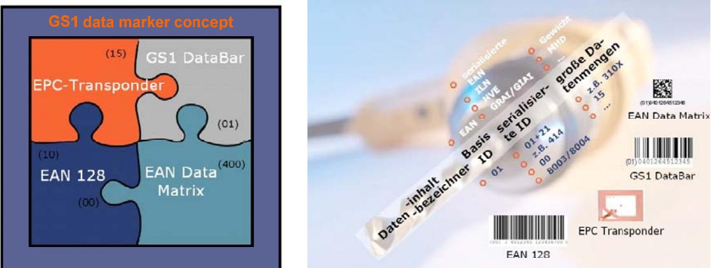

Dokument ist noch aktuell. (Stand 2020)

# TG 03126 - Technical Guidelines for the Secure Use of RFID

TG 03126-4 Application area "trade logistics"

Authors:

Cord Bartels, NXP Harald Kelter, BSI Rainer Oberweis, BSI Birger Rosenberg, NXP

Federal Office for Information Security P.O. Box 20 03 63 53133 Bonn, Germany Tel.: +49 (0)1888 9582 5331 Email: rfid@bsi.bund.de Website: https://www.bsi.bund.de © Federal Office for Information Security 2008

# **Contents**

| 1     | Description of the application area "trade logistics"                    |    |
|-------|--------------------------------------------------------------------------|----|
| 1.1   | Introduction                                                             | 13 |
| 1.2   | Delineation of this Guideline                                            |    |
| 1.3   | Interaction between processes                                            | 14 |
| 2     | Process changes brought about by EPC/RFID                                | 15 |
| 2.1   | The logistics process chain up to the retail outlet                      | 15 |
| 2.1.1 | Initial situation                                                        | 15 |
| 2.1.2 | Scope of analyses                                                        | 15 |
| 2.1.3 | Analysis of selected logistics modules                                   |    |
| 2.1.4 | The ranges, technologies and logistical levels under examination         | 16 |
| 2.1.5 | Assumptions                                                              | 17 |
| 2.1.6 | Summary of results                                                       | 18 |
| 2.1.7 | Conclusions                                                              | 20 |
| 2.2   | The retailer–consumer process chain                                      | 21 |
| 2.2.1 | EPC/RFID application for fresh goods                                     | 22 |
| 2.2.2 | EPC/RFID application for textiles and clothing                           |    |
| 2.2.3 | EPC/RFID use for durable electronic goods                                |    |
| 2.3   | Technological interaction – The GS1 System                               |    |
| 2.3.1 | Orientation of the GS1 system                                            |    |
| 2.3.2 | The components of the GS1 system                                         |    |
|       | 2.3.2.1 Identification systems                                        | 26 |
|       | 2.3.2.2 Data carriers                                                 | 28 |
|       | 2.3.2.3 Data communication                                            | 31 |
|       | 2.3.2.4 Summary                                                       | 34 |
| 3     | Agreements                                                               | 36 |
| 3.1   | Definition of terms                                                      | 36 |
| 3.2   | Allocation of roles and entities in the trade logistics application area | 38 |
| 3.2.1 | The logistics process chain up to the retail outlet                      | 38 |
| 4     | General requirements                                                     | 42 |
| 4.1   | Functional requirements                                                  | 42 |
| 4.1.1 | Product-specific use of transponders at the POS                          |    |
| 4.1.2 | Preventing product counterfeiting                                        |    |
| 4.2   | Economy                                                                  |    |
| 4.3   | Security                                                                 |    |

| 5     | Method of determining security requirements              | 44 |
|-------|----------------------------------------------------------|----|
| 5.1   | Objectives                                               | 44 |
| 5.2   | Method                                                   | 44 |
| 5.2.1 | Scope of system considerations                           | 44 |
| 5.2.2 | Scalability and flexibility                              | 45 |
| 5.2.3 | Structure of the Technical Guidelines                    | 47 |
| 5.2.4 | Explanation of the security concept                      | 48 |
| 6     | Generic business processes                               | 50 |
| 6.1   | Generic description of the supply chain                  | 50 |
| 6.2   | Applying for and delivering the EPC Manager              | 50 |
| 6.3   | Individualising the transponder                          | 51 |
| 6.4   | Attaching the transponder to an object                   | 52 |
| 6.5   | Receipt of goods                                         | 53 |
| 6.6   | Warehousing                                              | 53 |
| 6.7   | Shipment preparation                                     | 54 |
| 6.8   | Despatch of goods                                        | 55 |
| 6.9   | Cross-docking                                            | 56 |
| 6.10  | Use at stationery retailers (no mail order)              | 56 |
| 6.11  | Sales process                                            | 57 |
| 6.12  | After-sales services                                     | 58 |
| 6.13  | Disposal                                                 | 60 |
| 7     | Use cases                                                | 61 |
| 7.1   | Manufacture and delivery of the chips                    | 61 |
| 7.2   | Manufacture and delivery of the transponder              | 62 |
| 7.2.1 | Manufacturing the inlay                                  | 62 |
| 7.2.2 | Manufacturing the transponder                            | 63 |
| 7.3   | Producing and issuing the EPC Manager                    | 64 |
| 7.4   | Individualising the transponder                          | 64 |
| 7.5   | Setting the kill password                                | 66 |
| 7.6   | Attaching the transponder to the product                 | 67 |
| 7.7   | Reading the data stored in the transponder               | 67 |
| 7.8   | Activating the kill command                              | 69 |
| 7.9   | Authenticating the transponder for verifying genuineness | 69 |
| 7.10  | Key management                                           | 70 |
| 8     | Security considerations                                  | 72 |
| 8.1   | Definitions relating to security and privacy             | 72 |
| 8.2   | Definition of the security targets                       | 74 |
| 8.2.1 | Specific security targets for the customer               | 74 |

|        | 8.2.1.1 Safety                                                                        | 74  |  |
|--------|------------------------------------------------------------------------------------------|-----|--|
|        | 8.2.1.2 Information security                                                          | 75  |  |
|        | 8.2.1.3 Protection of privacy                                                         | 75  |  |
| 8.2.2  | Specific security targets for the retailer                                               | 75  |  |
|        | 8.2.2.1 Safety                                                                        | 76  |  |
|        | 8.2.2.2 Information security                                                          | 76  |  |
|        | 8.2.2.3 Protection of privacy                                                         | 77  |  |
| 8.2.3  | Specific security targets for the issuer                                                 | 77  |  |
|        | 8.2.3.1 Safety                                                                        | 77  |  |
|        | 8.2.3.2 Information security                                                          | 78  |  |
|        | 8.2.3.3 Protection of privacy                                                         | 79  |  |
| 8.2.4  | Summary of the entities' security targets                                                | 79  |  |
| 8.2.5  | Formation of protection demand categories                                                | 80  |  |
| 8.3    | Threats                                                                                  | 82  |  |
| 8.3.1  | Threats to the contactless interface                                                     | 84  |  |
| 8.3.2  | Threats to the transponder                                                               |     |  |
| 8.3.3  | Threats to the reader                                                                    | 86  |  |
| 8.3.4  | Threats to the key management system                                                     | 87  |  |
| 8.3.5  | Threats to backend systems                                                               | 88  |  |
| 8.3.6  | Threats to customer data systems                                                         | 89  |  |
| 8.4    | Safeguards                                                                               |     |  |
| 8.4.1  | Safeguards for the protection of the system as a whole                                   | 91  |  |
| 8.4.2  | Safeguards relating to the transponder                                                   | 99  |  |
| 8.4.3  | Safeguards relating to the readers                                                       | 105 |  |
| 8.4.4  | Safeguards relating to the key management system                                         | 108 |  |
| 8.4.5  | Safeguards relating to customer data systems                                             | 115 |  |
| 8.4.6  | Examples of non-standardised safeguards for systems compliant with EPCglobal          | 117 |  |
|        | 8.4.6.1 Examples of diversification and of safeguards for passwords                   | 117 |  |
|        | 8.4.6.2 Example of how data is encrypted in the transponder's extended memory area | 117 |  |
| 9      | Definition of specific application scenarios                                             | 119 |  |
| 9.1    | The "Fast-moving consumer goods" application scenario                                    | 119 |  |
| 9.2    | The "consumer electronics" application scenario                                          | 120 |  |
| 9.3    | The "brand-name clothing" application scenario                                           | 121 |  |
| 10     | Suggestions on implementing the system as a whole                                        | 122 |  |
| 10.1   | Suggestions on implementing the infrastructure                                           | 123 |  |
| 10.1.1 |                                                                                          |     |  |
|        | Determining the protection demand for the logistics infrastructure 123                |     |  |

| 10.1.2 Interfaces in the system as a whole                                             |     |
|-------------------------------------------------------------------------------------------|-----|
| 10.1.2.1 Threats relevant to the logistics infrastructure                              | 126 |
| 10.1.2.2 Definition of safeguards for the interfaces of the system as a whole          | 128 |
| 10.1.2.3 Residual risks                                                                | 129 |
| 10.1.3 Reader                                                                          |     |
| 10.1.3.1 Threats relevant to the readers                                               | 130 |
| 10.1.3.2 Definition of safeguards for the reader                                       | 131 |
| 10.1.3.3 Residual risks                                                                | 132 |
| 10.1.4 Backend systems                                                                 | 132 |
| 10.1.4.1 Threats relevant to the backend systems                                       | 132 |
| 10.1.4.2 Definition of safeguards for the backend systems                              | 134 |
| 10.1.4.3 Residual risks                                                                | 135 |
| 10.1.5 Customer data systems                                                           | 135 |
| 10.1.5.1 Threats relevant to the customer data system                                  | 136 |
| 10.1.5.2 Definition of safeguards for the customer data system                         | 137 |
| 10.1.5.3 Residual risks                                                                | 138 |
| 10.1.6 Key management                                                                  | 138 |
| 10.1.6.1 Threats relevant to the key management system                                 | 139 |
| 10.1.6.2 Definition of safeguards for the key management system                        | 140 |
| 10.1.6.3 Residual risks                                                                | 141 |
| 10.2 Transponders                                                                      | 141 |
| 10.2.1 Initialising transponders                                                       | 141 |
| 10.2.2 Determining the protection demand for the transponder                           | 142 |
| 10.2.3 Threats to the transponder                                                      | 142 |
| 10.2.4 Definition of specific safeguards                                               | 143 |
| 11 Suggestions on executing the product-specific application scenarios                 | 144 |
| 11.1 The "Fast-moving consumer goods" application scenario                             | 144 |
| 11.1.1 Determining the protection demand category                                      | 144 |
| 11.1.2 Relevant threats                                                                | 146 |
| 11.1.3 Definition of specific safeguards                                               | 148 |
| 11.1.4 Residual risks                                                                  | 150 |
| 11.2 The "consumer electronics" application scenario                                   | 151 |
| 11.2.1 Determining the protection demand category                                      | 151 |
| 11.2.2 Relevant threats                                                                | 153 |
| 11.2.3 Definition of specific safeguards                                               | 155 |
| 11.2.4 Residual risks                                                                  | 157 |
| 11.2.4.1 Residual risks arising from "unauthorised deactivation of the transponder" | 157 |

| 11.3 The "brand-name clothing" application scenario |                                                                                           | 158 |
|--------------------------------------------------------|-------------------------------------------------------------------------------------------|-----|
| 11.3.1                                                 | Determining the protection demand category                                                | 158 |
| 11.3.2                                                 | Relevant threats                                                                          | 161 |
| 11.3.3                                                 | Definition of specific safeguards                                                         | 163 |
| 11.3.4 Residual risks                               |                                                                                           | 165 |
|                                                        | 11.3.4.1 Residual risks arising from "unauthorised deactivation of the transponder" | 165 |
|                                                        | 11.3.4.2 Residual risks arising from "tracking"                                        | 166 |
|                                                        |                                                                                           |     |
| 12                                                     | List of references                                                                        | 168 |
| 13                                                     | List of abbreviations                                                                     | 170 |

# **List of Tables**

| Table 8–1  | Coding scheme of security targets                                                                      | 74 |
|------------|--------------------------------------------------------------------------------------------------------|----|
| Table 8–2  | Customer specific security targets for safety                                                          | 75 |
| Table 8–3  | Customer specific security targets for information security                                            | 75 |
| Table 8–4  | Customer specific security targets for protection of privacy                                           | 75 |
| Table 8–5  | Retailer specific security targets for safety                                                          | 76 |
| Table 8–6  | Retailer specific security targets for safety information security                                     | 77 |
| Table 8–7  | Retailer specific security targets for protection of privacy                                           | 77 |
| Table 8–8  | Issuer specific security targets for safety                                                            | 78 |
| Table 8–9  | Issuer specific security targets for information security                                              | 79 |
| Table 8–10 | Service provider specific security targets for protection of privacy                                   | 79 |
| Table 8–11 | Overview of the entities' security targets                                                             | 80 |
| Table 8–12 | Definition of protection demand categories                                                             | 82 |
| Table 8–13 | Coding scheme of threats                                                                               | 83 |
| Table 8–14 | Threats to the contact-less interface                                                                  | 84 |
| Table 8–14 | Threats to the transponder                                                                             | 86 |
| Table 8–16 | Threats to the reader                                                                                  | 87 |
| Table 8–17 | Threats to the key management system                                                                   | 88 |
| Table 8–18 | Threats to the backend system                                                                          | 89 |
| Table 8–19 | Threats to the customer data system                                                                    | 90 |
| Table 8–20 | Coding scheme of safeguard measures                                                                    | 91 |
| Table 8–21 | Protection of the system as a whole through introduction of interface tests and approval procedures | 92 |
| Table 8–22 | Protection of the system as a whole through preventing eavesdropping                                | 92 |
| Table 8–23 | Protection of the system as a whole through assuring reliable transmission                          | 93 |
| Table 8–24 | Protection of the system as a whole through definition of fallback solutions                        | 93 |
| Table 8–25 | Protection of the system as a whole through securing the confidentiality of data                    | 94 |
| Table 8–26 | Protection of the system as a whole through confidential storage of data                            | 94 |
| Table 8–27 | Protection of the system as a whole through securing the data integrity when transmitting data      | 95 |
| Table 8–28 | Protection of the system as a whole through securing data integrity when storing data               | 95 |
| Table 8–29 | Protection of the system as a whole through securing the system's functions against DoS attacks     | 96 |

| Table 8–30 | Protection of the system as a whole through securing the function of the system against incorrect operation   | 96  |
|------------|------------------------------------------------------------------------------------------------------------------|-----|
| Table 8–31 | Protection of the system as a whole through securing the function of the system to prevent technical failures | 97  |
| Table 8–32 | Protection of the system as a whole through specification of the system and the components                    | 97  |
| Table 8–33 | Protection of the system as a whole through ergonomic user instructions                                       | 98  |
| Table 8–34 | Protection of the system as a whole through support                                                              | 98  |
| Table 8–35 | Protection of the system as a whole through EPC usage against product counterfeiting                          | 99  |
| Table 8–36 | Protection of the transponder through access protection for the EPC                                              | 100 |
| Table 8–37 | Protection of the transponder against cloning                                                                    | 100 |
| Table 8–38 | Protection of the transponder against emulation                                                                  | 101 |
| Table 8–39 | Protection of the transponder against removal                                                                    | 101 |
| Table 8–40 | Protection of the transponder against unauthorised attachment                                                    | 102 |
| Table 8–41 | Protection of the transponder against unauthorised deactivation                                                  | 102 |
| Table 8–42 | Protection of the transponder against DoS attacks                                                                | 103 |
| Table 8–43 | Protection of the transponder by defining characteristics                                                        | 104 |
| Table 8–44 | Protection through fallback solution for transponder malfunction                                                 | 104 |
| Table 8–45 | Protection by preventing of movement profile generation                                                          | 105 |
| Table 8–46 | Protection by preventing the assignment of movement profile to people                                         | 105 |
| Table 8–47 | Protection of readers through introduction of interface tests                                                    | 106 |
| Table 8–48 | Protection of readers through protection of reference information                                                | 107 |
| Table 8–49 | Protection of the reader against malfunction                                                                     | 108 |
| Table 8–50 | Protection through secure generation and import of keys                                                          | 110 |
| Table 8–51 | Protection through introduction of key management                                                                | 111 |
| Table 8–52 | Protection through access protection for cryptographic keys                                                      | 112 |
| Table 8–53 | Protection through securing the function of security components                                                  | 112 |
| Table 8–54 | Protection through availability of a key management system                                                       | 113 |
| Table 8–55 | Protection through definition of actions when keys are compromised                                               | 114 |
| Table 8–56 | Protection through client-specific separation of keys                                                            | 114 |
| Table 8–57 | Protection through securing the authenticity and integrity when loading keys                                  | 115 |
| Table 8–58 | Protection of personal data by identification of customers                                                       | 116 |
| Table 8–59 | Protection of personal data by data minimisation                                                                 | 116 |
| Table 8–60 | Protection of personal data by separation of personal data and logistical data                                | 117 |
| Table 10–1 | Protection demand of the entire system of logistical infrastructure                                              | 126 |
| Table 10–2 | Threats relevant to the contactless interface                                                                    | 127 |

| Table 10–3  | Threats relevant to the system interfaces                                         | 127 |
|-------------|-----------------------------------------------------------------------------------|-----|
| Table 10–4  | Safeguards for the interfaces of the system as a whole                            | 129 |
| Table 10–5  | Threats relevant to the contactless interface in the reader                       | 130 |
| Table 10–6  | Threats relevant to the reader                                                    | 131 |
| Table 10–7  | Safeguards for the reader and its applications                                    | 132 |
| Table 10–8  | Threats relevant to the backend systems                                           | 134 |
| Table 10–9  | Safeguards for the backend systems                                                | 135 |
| Table 10–10 | Threats relevant to the customer data system                                      | 137 |
| Table 10–11 | Safeguards for the customer data system                                           | 138 |
| Table 10–12 | Threats relevant to the key management system                                     | 140 |
| Table 10–13 | Safeguards for the key management system                                          | 141 |
| Table 10–14 | Categorisation of transponders for logistics and trade                            | 141 |
| Table 10–15 | Threats relevant to the transponder                                               | 143 |
| Table 11–1  | Protection demand in the "Fast-moving consumer goods" application scenario     | 146 |
| Table 11–2  | Threats relevant to the "Fast-moving consumer goods" application scenario      | 148 |
| Table 11–3  | Use cases relevant to the "Fast-moving consumer goods" application scenario    | 149 |
| Table 11–4  | Safeguards for the "Fast-moving consumer goods" application scenario           | 150 |
| Table 11–5  | Protection demand in the "consumer electronics" application scenario              | 153 |
| Table 11–6  | Threats relevant to the "consumer electronics" application scenario               | 155 |
| Table 11–7  | Use cases relevant to the "consumer electronics" application scenario             | 155 |
| Table 11–8  | Safeguards for the "consumer electronics" application scenario                    | 157 |
| Table 11–9  | Remaining risks for the "consumer electronics" application scenario               | 158 |
| Table 11–10 | Protection demand in the "brand-name clothing" application scenario               | 161 |
| Table 11–11 | Threats relevant to the "brand-name clothing" application scenario                | 162 |
| Table 11–12 | Use cases relevant to the "brand-name clothing" application scenario              | 163 |
| Table 11–13 | Safeguards for the "brand-name clothing" application scenario                     | 165 |
| Table 11–14 | Remaining risks for the "brand-name clothing" application scenario                | 166 |
| Table 11–15 | Remaining risks by tracking for the "brand-name clothing" application scenario | 167 |

# **List of illustrations**

| Figure 1–1  | Forecast of the use of data carrier technology [GS1-1]                                                                      | 13 |
|-------------|-----------------------------------------------------------------------------------------------------------------------------|----|
| Figure 1–2  | Typical examples of process chains in trade logistics [GS1-4]                                                               | 14 |
| Figure 2–1  | Schematic illustration of the process chain under discussion                                                                | 15 |
| Figure 2–2  | Multi-dimensional factors taken into account in process analysis                                                            | 16 |
| Figure 2–3  | Process variations examined, including major features                                                                       | 17 |
| Figure 2–4  | Changes and effects in the "receipt of goods" and "warehousing" logistics modules in comparison with process variation 1 | 18 |
| Figure 2–5  | Changes and effects in the "preparation of shipment" logistical module in comparison with process variation 1            | 19 |
| Figure 2–6  | Changes and effects in the "goods despatch" logistical module in comparison with process variation 1                     | 20 |
| Figure 2–7  | Usage scenarios at the POS (source: GS1 Germany)                                                                            | 22 |
| Figure 2–8  | The GS1 identification system: an overview                                                                                  | 27 |
| Figure 2–9  | Three examples of how the EAN is employed in different technological settings                                            | 27 |
| Figure 2–10 | EPC structure                                                                                                               | 28 |
| Figure 2–11 | GS1 key identification provides access to additional information                                                            | 28 |
| Figure 2–12 | Storage areas in a second generation EPC transponder                                                                        | 30 |
| Figure 2–13 | The GS1 application identifier concept                                                                                      | 31 |
| Figure 2–14 | The GS1 standard portfolio for electronic data interchange – mediators between data processing systems                   | 32 |
| Figure 2–15 | Smooth business processes using EANCOM®                                                                                     | 32 |
| Figure 2–16 | Paradigm-change from outside- to self-management of logistical processes                                                 | 33 |
| Figure 2–17 | The EPCglobal Network: real-time information on request                                                                     | 34 |
| Figure 2–18 | The GS1 system                                                                                                              | 35 |
| Figure 3–1  | Entities in the trade logistics application area                                                                            | 39 |
| Figure 5–1  | Example: identification of RFID-relevant use cases for eTicketing                                                           | 45 |
| Figure 5–2  | Example of application scenarios and relevant use cases for eTicketing in public transport                               | 46 |
| Figure 5–3  | Hierarchical concept for media, applications and tickets in eTicketing                                                      | 46 |
| Figure 5–4  | Concept for security considerations                                                                                         | 49 |
| Figure 5–5  | Generic security targets                                                                                                    | 49 |
| Figure 6–1  | Supply chain                                                                                                                | 50 |
| Figure 6–2  | Process P1, "Applying for and delivering the EPC Manager"                                                                   | 51 |
| Figure 6–3  | Process P2, "Individualising the transponder"                                                                               | 52 |
| Figure 6–4  | Process P3, "Attaching the transponder to an object"                                                                        | 52 |

| Figure 6–5  | Process P4, "Receipt of goods"                                 | 53  |
|-------------|----------------------------------------------------------------|-----|
| Figure 6–6  | Process P5, "Warehousing"                                      | 54  |
| Figure 6–7  | Process P6, "Shipment preparation"                             | 55  |
| Figure 6–8  | Process P7, "Goods despatch"                                   | 56  |
| Figure 6–9  | Process P8, "Stock management"                                 | 57  |
| Figure 6–10 | Process P9, "Sales"                                            | 58  |
| Figure 6–11 | Processes P10.1 "Guarantee" and P10.2 "Maintenance"            | 59  |
| Figure 6–12 | Process P11, "Disposal"                                        | 60  |
| Figure 7–1  | Use Case "Manufacture and delivery of the chip"                | 61  |
| Figure 7–2  | Use Case "Manufacturing the inlay"                             | 62  |
| Figure 7–3  | Use Case "Manufacturing the transponder"                       | 63  |
| Figure 7–4  | Use Case "Individualising the transponder"                     | 65  |
| Figure 7–5  | Use case "Setting the kill password"                           | 66  |
| Figure 7–6  | Use case "Reading the EPC data stored in transponder"          | 68  |
| Figure 7–7  | Use case "Activating the kill command"                         | 69  |
| Figure 7–8  | Use case "Example of authenticity check using EPC transponder" | 70  |
| Figure 7–9  | Use case "Key management"                                      | 71  |
| Figure 8–1  | Example of how security-related information is encrypted       | 118 |
| Figure 10–1 | Differentiation between different IT systems                   | 122 |
| Figure 10–2 | System view of the logistical supply chain                     | 123 |
| Figure 10–3 | Data exchange between entities in the logistical supply chain  | 123 |

# **1 Description of the application area "trade logistics"[1](#page-12-1)**

# **1.1 Introduction**

Radio frequency identification (RFID) is currently developing into one of the key technologies in trade logistics, aimed at making the flow of goods faster and more transparent, and therefore more efficient and secure.[2](#page-12-2) An increasing number of transport containers and logistics units are being fitted with RFID transponders. In the future we can also expect RFID transponders to be fitted to exterior packaging. Product-related tagging (end consumer units) using RFID will become more significant in the long term. Relevant information is stored on a microchip connected to an antenna (known as a transponder), and this information is transmitted to a reader by means of electromagnetic waves. Because radio waves can penetrate materials, the transponders can be attached behind adhesive films, or even inside the packaging or in the product itself. Visual contact with the reader is therefore not necessary.

RFID is expected to supersede the currently widespread bar codes in these areas of use. The long-term parallel use of various automatic ID technologies would lead to a disproportionate relationship between expense and benefit. In open application environments, people would not know which automatic ID technology was being used at which point, which would necessitate precautionary duplication (transponders and bar codes used on the data carrier side, and RFID readers and bar code scanners on the recording side). If RFID technology is reliable enough, then a bar code backup solution will not be necessary. For isolated cases in which backups are required, the more economical option would be to provide the information in plain text. However, while the technology is being migrated, both technologies will have to be operated in parallel, and bar codes will need to serve as backups to transponders.

**Figure 1–1 Forecast of the use of data carrier technology [GS1-1][3](#page-12-3)** 

1 See [GS1-1] and [GS1-2].

2 For a categorisation of RFID applications fields, see http://www.rfid-in-action.eu/public/workpackages/rfidreference-model-1/.

3 The level of usage of different automatic ID technologies in relation to one another is shown as predicted by business experts across the industry. In logistics, for instance, linear bar codes are the most commonly used form. It is assumed that RFID will continue to replace the linear bar code. The function linear bar codes fulfil in backing up RFID will be taken over more and more by 2D codes.

# **1.2 Delineation of this Guideline**

Because this Guideline only discusses the secure use of RFID-based systems in the processes of trade, other automatic ID technologies, such as various forms of bar code, will not be discussed in any more detail. All of our considerations about RFID use in the area of trade logistics will be based on the example of EPCglobal, although, of course, systems structured in a similar way can also be used. Furthermore, the EPCglobal system can also be used in areas similar to, but not the same as, trade logistics. Another restriction is that we will only be looking at applications that are already in use today. Future applications will be integrated into this Guideline as it is updated.

# **1.3 Interaction between processes**

From the point of view of the consumer, two basic process chains can be distinguished in the field of goods supply: the first is the retail process chain with which the consumer comes into contact when he or she buys products; the second is the logistics process chain which comes before it.

**Figure 1–2 Typical examples of process chains in trade logistics [GS1-4]** 

In the next section we will analyse these two process chains more closely using selected application scenarios.

# **2 Process changes brought about by EPC/RFID**

# **2.1 The logistics process chain up to the retail outlet[4](#page-14-1)**

The following information is based on an examination of the affect which EPC/RFID has on the trade logistics processes of GS1 Germany (centralised warehouse supply).

### **2.1.1 Initial situation**

How will EPC/RFID change the processes in the logistics chains?

Experience so far in international and German pilot projects and roll-outs has given people high expectations of the potential benefits of this technology. The retail trade in particular, faced with small profit margins and fierce cost rivalry, is expecting significant increases in efficiency in its logistics procedures, as well as new ways of supporting what is referred to as "smart shopping".

According to the latest findings, the cross-company use of EPC/RFID in the processes of the consumer goods industry offers numerous potential applications – from the receiving of goods and the making-out of production orders, to quality assurance and inventory management, all the way to goods despatch. Furthermore, tagging with RFID transponders is possible across all logistical levels. Generally speaking we differentiate between pallet level, case level and item level.

### **2.1.2 Scope of analyses**

The process analyses cover the logistical chain from the supplier to the manufacturer (upstream) and from the manufacturer to retail (downstream). They are based on a simplified, central-warehouse-oriented process which is illustrated in the following diagram.

#### **Figure 2–1 Schematic illustration of the process chain under discussion**

The dark coloured areas indicate the process modules which are included in the analyses. The analyses do not include drop shipment business or direct supplying, or the crossdocking process.

It is important to take into account the various factors which impact on the RFID processes.

4 See [GS1-3].

The exact form which RFID-based logistics and information processes take depends on the particular area of use concerned. The following factors are important:

- the product ranges and groups involved because of their physical characteristics and their compatibility with RFID;
- the processes which are to be supported because of their specific requirements;
- the logistical level tagged with transponders because of the differences in the types of data content required for the processing of different levels.

Different combinations of these criteria may produce variations in procedural organisation, as well as varying demands on the information processes and RFID technology used.

This gives us a multi-dimensional construct made up of the various factors, which forms a further foundation for our comparative process analyses.

#### **Figure 2–2 Multi-dimensional factors taken into account in process analysis**

#### **2.1.3 Analysis of selected logistics modules**

Because various core processes always appear and reappear within the value-added chain, the following four logistics modules have been selected from the process chain to form a further basis for our analysis:

- Receipt of goods
- Warehousing
- Making-out of production orders
- Despatch of goods

This approach prevents unnecessary duplication in the description of processes.

#### **2.1.4 The ranges, technologies and logistical levels under examination**

The process examinations carried out focus on product ranges which can be transported on pallets and which, because of their physical characteristics, are easy to tag using RFID (such as textiles, leather goods and dry food ranges).

The various processes examined differ in particular as follows:

- In relation to the technology used and the data content:
	- Bar code technologies in conjunction with electronic data interchange (EDI) and the use of an SSCC (serial shipping container code) for the identification of logistical units.
	- RFID technologies in conjunction with electronic data interchange (EDI) and the use of an SSCC for the identification of logistical units, or a serial EAN for the identification of retail units (secondary packaging).
- In relation to logistical hierarchies:
	- Goods carrier / pallet (or tertiary packaging)
	- Box / outside packaging (or secondary packaging)

The matrix below provides an overview of all the process variations examined. Each variation differs in its combination of technology type, coded data content, and tagged logistical level. All of these variations assume the electronic exchange of master data and movement data by means of electronic data interchange (EDI).

**Figure 2–3 Process variations examined, including major features** 

In process versions (2) and (4) it is assumed that logistical units are tagged and identified with RFID transponders (i.e. the goods, including the container or pallet carrying the goods). The logistical units are identified using an SSCC (serial shipping container code). If goods are removed or added to the container or pallet, then a new logistical unit is formed for which a new SSCC must be issued.

Furthermore, it is also possible to tag the object on which the goods are loaded (for example when managing a pool of re-useable transport packaging units). This approach is not considered in the results of our analysis.

#### **2.1.5 Assumptions**

The following assumptions have been made for the comparative analysis of the aforementioned process scenarios:

- • Focus
	- The discussion centres around the consumer goods industry.
	- Cross-company transport processes are not considered in the analyses.
- Conditions relating to the processes
	- The process variations are described in terms of best-practice scenarios, which means that EAN 128 transport labels, serial shipping container codes (SSCC) and electronic data interchange (EDI) are already being used.
	- The availability of an electronic despatch device (DESADV) is assumed.
	- The EANs of the delivery units are the same as the EANs of the ordered units.
	- Received goods are subject to manual quantity control (in relation to the number of secondary packaging units), especially mixed pallets.
- Conditions relating to technology
	- The EPC data standard is used to determine the data content in process variations 2, 3 and 4 (use of RFID technology).
	- It is assumed that defined filter values for logistical hierarchies are available.
	- 100 per cent legibility is aimed for in all process variations.
	- It is assumed that there is a working connection between the RFID hardware and software and the internal systems.

### **2.1.6 Summary of results**

The following overviews provide summaries of the results of the process analyses. They depict the effects and changes which RFID-based processes bring about in comparison with bar code-based process variation (1)

Because of the similarity of the results from process variation (3) (use of tagged boxes or secondary packaging units) and process variation (4) (combined use of tagged goods carriers and tagged boxes), only process variation (4) is taken into account in the results summaries.

The "receipt of goods" and "warehousing" logistics modules

**Figure 2–4 Changes and effects in the "receipt of goods" and "warehousing" logistics modules in comparison with process variation 1** 

In process variation (2) (tagged goods carriers / logistical units), there are no significant changes from the bar code-based process variation (1) in the modules "receipt of goods" and "warehousing". In both cases, the serial shipping container unit (SSCC) encoded in the bar code or transponder is recorded and utilised to identify the logistical units involved. The RFID-based process offers the advantage that the scanning procedure can be done in one movement (that is, the goods carrier is moved through an RFID gate and brought directly to its destination). Furthermore it is possible to read the data stored in the transponder without visual contact between the reader and the transponder.

In process variation (4), fundamental changes to the process were identified which involve significant benefits additional to those of variation (2). For example, detailed manual inspection of the packaging units on the goods carrier is no longer necessary, since every secondary packaging unit is clearly identified by scanning its RFID transponder. In this way, the goods received can be automatically registered following the procedure of fully automatically comparing them with the electronic despatch advice (DESADV). If discrepancies are identified during this comparison, rules can be defined about what to do (exception management).

The "preparation of shipment" logistical module

#### **Figure 2–5 Changes and effects in the "preparation of shipment" logistical module in comparison with process variation 1**

In process variation (2) (handling of goods carriers tagged with RFID transponders), as in the "receipt of goods" and "warehousing" logistics modules, there were no significant changes from the bar code-based process variation (1).

Variation (4) offers advantages when it comes to preparing mixed pallets. It allows the packaging units assembled for shipment to be recorded precisely without manual intervention being necessary; for instance, this can be done when the goods are placed onto the pallet using a reader fitted to the forklift. Manual confirmation of the picking procedure is no longer necessary, and the risk of undetected errors during shipment preparation (such as scanning the right product number but picking the wrong product) is minimised. Quality assurance takes place during the shipment preparation process, which only has to be interrupted in the event of an error in preparation.

There are no particular benefits in the process of preparing shipments of a single type of product on single pallets or goods carriers. Generally speaking, the whole pallet is prepared for loading without a change in logistical unit.

The "goods despatch" logistical module

#### **Figure 2–6 Changes and effects in the "goods despatch" logistical module in comparison with process variation 1**

In process variation (2) (handling of goods carriers tagged with RFID transponders), as in the previous logistics modules, there were no significant changes from the bar code-based process variation (1).

Process variation (4) offers the option of identifying accurately every single secondary packaging unit on the goods carrier, in addition to the SSCC of the logistical unit. This information can be used for a final comparison with the transport order and shipment preparation details, or it can be given to the recipient.

#### Summary

The comparative process analyses revealed that fundamental process changes and affects can be expected in particular when secondary packaging is used that has been tagged with RFID transponders. The possibility of capturing data in bulk (in other words, all of the packing units on a pallet can be recorded in one scanning process without visual contact) means a new level of quality in automated counting and registering processes. This benefit is particularly effective when handling mixed pallets.

#### **2.1.7 Conclusions**

The results of the investigation of the processes produce the following conclusions about conditions required for the use of RFID technology in the logistical chain, and the consequences of that use:

#### Conditions

- A considerable period of time will be required during which RFID and bar code technology are used in parallel.
- Organisational backup solutions are required (such as plain text information or databased precautions).
- IT architecture will have to be expanded, and solutions provided for depicting the electronic product code (EPC)

• RFID should be seen as part of a broader context, because its isolated use in scattered application areas will not produce any real benefits in the long run. It is possible, however, to begin with individual areas.

Effects

- Communication structures may change.
- The benefits would probably be much greater if we were to compare an RFID-based process with a process which is not yet supported by EDI or EAN 128.
- The use of RFID and electronic product codes (EPC) opens up a new level of data management which will enable users to respond more effectively to new and future requirements and regulations (such as the ability to trace the origins of food).
- It can basically be assumed that considerable benefits will be gained by extending tagging to the product or item level.

# **2.2 The retailer–consumer process chain**

The benefits of using RFID at product level in retail outlets can be roughly divided into the following categories: cost reduction, qualitative process improvements, enabling more sales through new services, and protection against counterfeit products and brand piracy. Examples within these categories are as follows:

Cost reduction, e.g. through

- Securing goods
- Simplified inventory management

Process improvements, e.g. through

- Shelf management
- Accurate tracing in the event of goods recalls

New services

- Information terminals
- Intelligent shelves
- Cross-selling services
- Self-checkout
- Paperless goods exchange
- Paperless guarantee services

Protection against counterfeit products and brand piracy

- Prevents loss of sales
- Protects brand image
- Protects against product liability problems, etc.

**Figure 2–7 Usage scenarios at the POS (source: GS1 Germany)** 

An important element in the successful introduction of RFID labels at product level is that the customer perceives a direct benefit. In addition to the new services listed above, one example of such a benefit is the ability to verify the authenticity of a product.

These applications imply that RFID technology will have to fulfil the following requirements:

- 1 Transponders always relate to goods and never to people. Personal data is never stored in a transponder.
- 2 AutoID which means automatic, reliable identification using RFID technology is required. The range may be up to several metres.
- 3 Only very limited amounts of data are stored in the chip, and this data does not have to be modified.
- 4 Product-related use of transponders demands an extremely cost-effective transponder solution in order to be economically viable.

Depending on the product and the area of application, the use of RFID can have a range of implications. In the following, three exemplary scenarios are used to illustrate as many of these as possible.

#### **2.2.1 EPC/RFID application for fresh goods**

Fresh goods are goods which are highly perishable. They are food items which are consumed within a few days. Products or packages fitted with a transponder, if not removed or deactivated during purchasing, would only remain for a short time with the consumer and would be disposed of in the household waste.

RFID can be used in the following different areas:

• In the sales area

The speed benefits of RFID when registering and handling goods mean that the goods can reach retail outlets more quickly, thereby increasing their freshness and availability.

Trust in the quality of goods also plays a very important role. Information terminals coupled with the EPCglobal Network can provide consumers with full documentation of a product's origins. In the case of temperature-controlled logistics, the combination of

RFID and sensors can prove to customers that the correct refrigeration temperature has been maintained throughout the whole supply chain.

• At the checkout

If the sell-by date is encoded on the transponder in addition to the EPC, or if it can be accessed from background systems when the EPC is read, then a discount system can be set up involving reductions for food with less time remaining on it.

• Use after purchase

Provided the transponder is not removed or deactivated when the product is purchased, intelligent electronic household appliances such as RFID-compatible refrigerators can automatically provide consumers with information, such as a warning when best-before dates are about to lapse – provided this date is saved in the transponder or made available by the manufacturer through the EPCglobal Network.

#### **2.2.2 EPC/RFID application for textiles and clothing**

Textiles means fashion products. With these products it is important that the consumer likes them and that they fit properly; more assistance is required when purchasing these products.

Transponders can either be attached to the product label or woven into the material. Transponders fitted to goods, provided they are not removed or deactivated during purchasing, would be removed by the customer at home (in the case of labels) and disposed of in the rubbish. If woven into the fabric, the transponder will remain in the product permanently, although it could be deactivated at a later stage.

Again there are several areas in which RFID can support the purchasing process:

• In the sales area

If shelf areas are equipped with RFID, then inventories can be maintained permanently. Then, for example, it is easy to find out whether the products of the required size are on the shelves or in the stock-room. It is also easier to notice if the products are not in the right place, and this can then be rectified more easily.

Using displays, customers can obtain information about products they are interested in (size, price, care instructions, and so on), which means that they do not have to look for this information on the products themselves. RFID changing rooms can also provide customers with advisory information when they try on the clothes, such as different available colours and combinations with the products they are choosing. Furthermore, the EP-Cglobal Network can be used to provide consumers with full documentation of origin, thus certifying that branded goods are authentic.

• At the checkout

Goods can be registered more quickly, meaning high service levels can be maintained.

• Use after purchase

A transponder on a product could be used as proof of purchase. If a customer does not like a product after all, or if it does not fit, then the process of exchange could be simplified. If a customer asks about exchanging a product, EPC could be used to determine whether the product was really bought there or not.

In this respect it is important to decide whether the transponder is to be fitted to a removable product label which is taken off before use, or whether the transponder remains in the product. If (and only if) the transponder remains in the product, and the product is worn after purchasing, then the RFID tag could be scanned again at the exit when the customer leaves the shop. Under current laws about privacy and consumer protection, it would only be legal at this point to ascertain whether the EPC is or is not part of current stocks; if it is, then this could indicate shoplifting. Without the permission of the customer, the EPC cannot be stored in such cases, which prevents the creation of movement profiles.

A transponder permanently attached to an article of clothing can be used in conjunction with intelligent electronic household appliances. An RFID-compatible washing machine could, for example, warn users if items of clothing are in the machine which should not be washed together, or not at the selected temperature – provided the transponders have not been deactivated. This is also provided that the additional information is either stored in the transponder, or made available by the manufacturer as part of the EP-Cglobal Network for retrieval via an Internet link.

The EPC concept does not envisage the storage of personal data on the transponder.

#### **2.2.3 EPC/RFID use for durable electronic goods**

More durable electronic goods, such as flat-screen televisions, usually already carry a serial number which is attached to the product as a bar code, in order to enable the product to be registered automatically not only during manufacture, but also, if required, during subsequent repair work (and in some products also during servicing).

• Use in the sales area

The EPCglobal Network combined with information terminals could be used to provide consumers with full documentation of origin, thus certifying that branded goods are authentic.

• Use after purchase

A transponder on a product could be used as proof of purchase. If the product does not work properly, a transponder which has not been deactivated can be used to facilitate guarantee claims since it is evidence of purchase.

# **2.3 Technological interaction – The GS1 System**

Information technology systems can only be used smoothly and efficiently to send and receive information between different operational centres if all of the computers which "talk to each other" within an industry, a branch of trade or an information chain support the same organisational model. This means, for example, the same structure of data sets, key variables and content, and so on. In addition to agreements between different operations, it is also important that certain working processes and organisational instruments are standardised.

More than one million companies throughout the world utilise the GS1 standards for identification and communication purposes in commercial processes. They are the most widely accepted standards in trade logistics. The rules of the system have been defined as binding by GS1. Developments which complement and supplement the system are actioned collaboratively by those involved in the project.

### **2.3.1 Orientation of the GS1 system**

The GS1 system provides the technological foundation for countless inter-firm electronic data transactions throughout the world. The philosophy of the system creates a link between the recording and transmitting of data.

• Automatic data capture (ADC) is used to identify goods or services at a particular place in the company (e.g. where the goods are received or in the warehouse).

Automatic data capture makes checkout processes in modern retail operations more rational, faster, and cheaper. It also simplifies the handling of products in warehouses across the market, and on the transport routes between those warehouses. The most important components of this process are clear, unique product and package identification numbers in conjunction with standardised bar code and radio frequency technology.

- Automated electronic data interchange (EDI) is a suitable method of exchanging master and movement data between large numbers of users; this means data which initiates physical processes, accompanies them, and is sent in advance of them and after them. In electronic data interchange, the message generated in the originating computer system – such as an order or an invoice – is sent directly to the recipient computer system. This information does not have to be inputted again in order to be processed, provided the companies involved in this kind of data exchange agree on certain rules of presentation and syntax. Once again, the use of standardised numbering systems for products and locations is an important precondition for the success of rationalisation measures.
- The combination is in this case greater than the sum of its parts. Scanning and radiofrequency reading at numerous points of the entire logistical chain, and electronic communication, must be used in conjunction with one another as part of a comprehensive and sustainable rationalisation approach. Business data can be exchanged quickly, efficiently and securely using this combination of modern recording and transmitting technology.
- The GS1 system therefore places emphasis on the flexibility and openness of applications in a way which can only be achieved on the basis of this system philosophy. This is what differentiates EAN from attempts to overload the identification itself with other information, which in the end leads to restrictions and hindrances (isolated solutions)
- The GS1 system is a widely recognised standard in cross-border applications. It defines scanning technology and data content as well as a clear numbering system. The numbers allocated are globally unique, which enables their use in wide areas of application. These standards have become established internationally for open communication in many sectors.
- The technical GS1 standards are being supplemented steadily by organisational standards governing operational procedures as part of the ECR initiative (ECR = Efficient Consumer Response). These process agreements can aid the application of the standards considerably.

The four basic principles of the GS1 systems are:

1 Open Standards

The aim is to create an open, demand-oriented, integrated system of technical standards for identification and for the transfer of information, in order to facilitate effective supply chain management in any company and any industry, anywhere in the world.

2 Differentiation

The system is based on rules, which, if followed, enable the global, non-duplicating and unique identification of completely different things such as products, transport units, containers, objects and locations.

3 Transparency

GS1 standards have to be relevant and applicable to every supply chain, regardless of who applies, receives or works with the standards. The idea is to make processes uniform, thereby creating potential savings for the benefit of everyone involved. New features are only included in a standard if they open up new areas of application or lead to an improvement in existing applications.

4 Non-Significance

Globally unique EAN identification can only be guaranteed if the standard numbers are handled as a whole. For example, product characteristics or features should not be encoded in the number itself, but rather the EAN number should be used as an access key to obtain that information from a file or another data source.

The GS1 system, therefore, is a comprehensive system of regulations, which:

- is international
- is not industry-specific (multi-industry standard)
- is beneficial at every stage of the value-added chain (raw material supplier, supplier, shipper, wholesale, retail, all the way to the consumer)
- helps to optimise the flow of information and the flow of goods
- utilises a wide range of media to transport its data.

It is possible but not essential to adapt a company's organisation completely to these regulations. The components of the GS1 system can also be seen as a "translation" of the company's internal language into a form of understanding which is not specific to any company, and which can be adopted by business partners into their own corporate worlds.

# **2.3.2 The components of the GS1 system**

The GS1 system is related to RFID in several ways: the electronic product code (EPC) is used for identification, an EPC transponder is used to carry data, and the EPCglobal Network is used for data communication; all these are complimentary elements within the GS1 system as a whole.

### **2.3.2.1 Identification systems**

The GS1 identification system is based on the principle that an object is best identified using a short, globally non-duplicating, non-significant number. This number can be used in turn as an access code for obtaining further information stored in databases under this number – in other words information about the object concerned.

This concept makes identification processes simple, secure and fast, and has proven itself and caught on over recent decades for that reason.

Because there are many different kinds of objects (such as locations, goods carriers, service products), and because these objects have to be identified in very different quantities and contexts by different users, GS1 has created a set of identification numbers with varying capacities.

#### Identification numbers – an overview

All GS1 identification numbers have the same uniform structure. This centres around the GS1 basic number, which GS1 provides to users. To that, the user adds either an object reference, a serial section, or both components.

#### **Figure 2–8 The GS1 identification system: an overview**

The international location number (ILN) is used to identify places and addresses; the international article number (EAN) identifies goods and services; the serial shipping container code (SSCC) identifies logistical units; the global returnable asset identifier (GRAI) identifies reusable goods carriers; and the EAN container number (GIAI) identifies any kind of container. Any of these numbers can also be incorporated into the EPC.

All of these numbers can be incorporated into the EAN, EAN 128, GS1 DataBar, EAN Composite, EAN Data Matrix bar codes, and in the EPC transponder, and can be protected against mistaken identification. The international number allocations are managed by members of GS1, which in Germany means GS1 Germany.

#### Different formats – identical content

Just as "1.0", "100%" and "1/1" are three different ways of presenting the same information, so too are different formats required at different points in the value-added chain in order to facilitate technologically effective use. This simply means that the information is translated into a language which the individual technical equipment understands. GS1 bar codes are based primarily on an application identifier concept, EDI messages from GS1 on a qualifier concept, and EPCglobal Network information is based on a uniform resource identifier concept.

This enables the same information – which is primarily the GS1 key identifier – to be communicated across different technological and company-related interfaces between different business partners. The following diagram shows some examples of this:

#### **Figure 2–9 Three examples of how the EAN is employed in different technological settings**

The following structure is used to store the EPC on a transponder

**Figure 2–10 EPC structure** 

The structure of the EPC, which begins with a defined header, enables different coding schemes to be made unique for all EPC-compliant transponders. A filter variable which is not part of the actual EPC identification, can enable selective and therefore faster filtering during reading and writing processes.

Differentiating between key identifiers and additional information

Dealing with the flow of goods and data at the different process stages requires relevant information which is accessible via a range of information sources (internal/external sources). The GS1 identification numbers act as access keys to enable this information to be addressed accurately.

Important basic rule**:** the best approach, regardless of company, is always the philosophy of "as much information as necessary, but as little as possible, in the data carrier." This means that the identification is encoded in the bar code or transponder, whereas all other information, if at all possible, is held in the master data, in the information which precedes the goods, or is available in real time by data query. This is the only way to guarantee the maximum possible flexibility in communication between applications and companies.

#### **2.3.2.2 Data carriers**

The GS1 system includes bar code and transponder solutions.

• EAN 13 bar code

The EAN 13 bar code is the oldest of the GS1 data carriers. Almost every consumer product carries one. It always contains an EAN article number, and it does not include any other GS1 identifier or any other additional information. The EAN 13 is scanned omnidirectionally – in other words, the direction of scanning is important.

• EAN 128 bar code

The EAN 128 bar code was introduced in the 1990s primarily to enable logistical processes to be automated. The application identifier concept was also developed for this bar code. The EAN 128 standard in conjunction with the application identifier, offered – and still offers – the utmost flexibility. Alongside a unique identification, such as the SSCC or the EAN, it allows additional information to be applied to a product or its packaging in standardised bar code form to accompany the goods – even if only for an interim period until EDI begins to be used and the necessary information is exchanged electronically in advance.[5](#page-28-0) 

EAN 128 has grown enormously in importance in recent years, in particular on account of more stringent demands on the traceability of products.

• GS1 DataBar[6](#page-28-1)

The GS1 DataBar was developed and introduced by GS1 as a worldwide standard because EAN 13 and EAN 128 bar codes take up a relatively large amount of space on a label, especially when identifying products, and because certain applications can therefore not be covered by EAN 13 or EAN 128. The GS1 DataBar also closes gaps in the system of coding consumer units which require, in addition to the EAN article number, additional information in order to enable an efficient process – for example, clear identification of products of varying weight, such as meat.

• EAN Data Matrix

The EAN Data Matrix is the most recent GS1 code. Unlike previous GS1 symbols, the EAN Data Matrix is a two-dimensional symbol in which a very large amount of information can be encoded in a very small space. But because it is a 2D code, the EAN Data Matrix is only suitable for applications in which the appropriate scanning systems are being used. These systems are based on modern image processing technologies, which is why they are also referred to as image scanners.

• EPC/RFID

RFID is an alternative data carrier to the bar code. The electronic product code (EPC) is the generic term for the serialised identification of products, packages, locations, and so on, which is attached to the goods or to another object using a transponder which is compliant with EPC specifications. That in turn is based on the GS1 identification codes ILN, EAN and SSCC.

RFID technology and the EPC offer the following benefits:

- Very quick to read (time saving).
- Visual contact with the reader is not required.
- Highly reliable, even under extreme conditions such as low temperatures or direct sunlight.
- Enables permanent inventory by permanently scanning goods.

5 The identification number placed on the goods can basically always be used as a reference to master data

or to the information provided in advance by EDI.

6 See also ISO/IEC 24724

- • Enables clear exchange of information in real time in combination with cross-company information systems.
- Bulk registering features (fast recording, high level of detail).
- Position of goods can be determined precisely, and the timing of goods despatch can be optimised.
	- The identification function can easily be extended to include additional electronic features such electronic theft prevention and sensors.

While the technology is being migrated, and for backup reasons, it is assumed that RFID and bar codes will be used in parallel for a considerable period of time.

The logical storage allocation in a transponder can be divided into the following segments:

 The reserved storage area can be used to store an access password and a kill password which prevents the kill command from being executed without authorisation.

As well as the actual identification number, or electronic product code (EPC), the EPC storage area contains a checksum for assessing correct data transfer (CRC-16) and protocol control bits which specify variables such as the length of the data stored.

The transponder identification number (Unique Tag ID) is for purely technical purposes, such as the manufacture of integrated circuits. It is also used in certain types of anti-collision process. It is allocated when the chip is manufactured and should be unalterable thereafter.

The application data area can be used to store other data. Standards do not yet exist for this storage area, whose size depends on the transponder used.

RFID systems are radio systems governed by the regulations of the *Bundesnetzagentur für Elektrizität, Gas, Telekommunikation, Post und Eisenbahnen* (German Network Agency for Electricity, Gas, Telecommunications, Post and Railways). Only a small number of frequency bandwidths can be used, and these are distributed across the spectrum from short to ultrashort, all the way to microwave wavelengths. The use of ultra-high frequency (UHF) has proved particularly suitable for trade logistics. The UHF bandwidth upon which the standardisation of EPCglobal is based is between 860 and 960 MHz.

#### The GS1 application identifier concept

An exact definition of data elements enables a wide range of information requirements to be depicted in a structured and automatically recordable form in a variety of EAN bar code and EPC transponder standards. This relates mainly to data which goes beyond pure identification, and which offers many benefits all along the logistical chain – such as batch number, sell-by date, and so on. There are now more than 60 data elements available in the fields of identification, goods tracking, dating, units of measurement, and address information.

The GS1 application identifier concept is based on three pillars:

- Exact definition of data elements (data content).
- Definition of their data formats (field length, available characters).
- The allocation of qualifying application identifiers.

Each application identifier serves to indicate the information which will follow it – in other words, the data element and its format. In this way it forms a basis for the fault-free processing of information. Internationally standardised in ISO/IEC 15418, and incorporated into the protected EAN bar code symbology, the application identifier concept offers the utmost interpretation precision along with maximum data quality.

All modern GS1 data carriers – i.e. bar codes and transponders – utilise a uniform procedure in the form of the application identifier concept described here, to automatically differentiate between GS1 identifiers and the necessary additional information. This concept defines which data is to be encoded in the bar code or transponder. The data content is always processed in the same way, regardless of the data carrier technology. The globally nonduplicating numbering systems ILN, EAN, SSCC, and the EPC developed for their encoding in the transponder, are utilised as references to electronically transmitted messages and data enquiries, such as electronic orders and delivery advices sent by EANCOM® and event management via the EPCglobal Network. The application identifier concept connects together the various information elements in the GS1 data carriers.

This means, conversely, that EPC/RFID data carriers do not include any information which is not already used in bar codes.

**Figure 2–13 The GS1 application identifier concept** 

#### **2.3.2.3 Data communication**

Electronic data interchange (EDI) – the connecting element between automated identification scanning and the flow of goods

The GS1 identification systems and data carrier portfolio are completed by a set of standards for the electronic exchange of data. These standards help companies to streamline their business transactions to the maximum possible extent. Identification systems are often the starting point of an automated procedure, since they are attached to the goods and transmitted electronically to the business partner together with all the relevant accompanying information.

Electronic data interchange (EDI) means the exchange of structured data between computer systems in a standardised format which computers can read. Because it avoids interruptions

in media, EDI makes the communication process faster and also increases the reliability of the content of the messages being sent. One of the factors which makes it economically superior is that it eliminates multiple data entries and the mistakes that can be made when members of the logistics chain enter information manually.

#### **Figure 2–14 The GS1 standard portfolio for electronic data interchange – mediators between data processing systems**

EANCOM® provides users with a standard catalogue of messages with which complete business transactions can be performed electronically.

**Figure 2–15 Smooth business processes using EANCOM®** 

The EPCglobal Network: exchanging real-time information over the Internet

The purpose of the EPCglobal Network is to make large amounts of highly granular information about goods movements and statuses available to all business partners. What it does not include is the exchange of forecast data, invitations to tender, acquisition processes, invoicing procedures, and so on. These are all handled as before using established EDI procedures. This means that the Network is used to initiate data queries about products, transport units, or other objects. In this way the EPCglobal Network represents an ideal supplement to EDI by offering more of the benefits of electronic communication.

The basic principle of the EPCglobal Network is to make product information available at all times using the Internet. It therefore represents a specific application of a concept which is generally referred to as the "Internet of Things". The EPCglobal Network connects peripheral servers containing all of the relevant EPC information (that is, all of the master and movement data relating to a particular EPC). Authorised data transmission is executed over the

Internet. Various Network service components control the servers and authorise access to the information.

#### **Figure 2–16 Paradigm-change from outside- to self-management of logistical processes**

The EPCglobal Network works on the basis of interaction between a range of components for which EPCglobal provides standardised interfaces, including ones for internal company use. The key to the EPCglobal Network is the EPC. The object name service (ONS) is used to find an EPC within the EPCglobal Network. It enables authorised users to locate product information about an EPC in databases. In addition to interfaces for RFID applications, other interfaces belonging to the Network also work using GS1 bar code models.

The benefits of the EPCglobal Network are:

- It provides real-time information.
- It provides clear information all along the entire value-added chain. Without the Network, information transparency is only partially achieved between "neighbouring" interfaces.
- It provides standardised interfaces at *all* data transition points, which means from the transponder to the reader, from the reader to the middleware, from the middleware to the internal application, and from the internal application to the cross-company application.
- It provides a granular representation of the flow of goods.

**Figure 2–17 The EPCglobal Network: real-time information on request** 

All of the other potential benefits associated with the use of RFID (such as prevention of theft and brand piracy, seamless tracking, time-saving, and so on) are derived from the availability of real-time information and improved transparency. This means that the potential benefits of RFID technology can only be fully utilised on the basis of a global communication and information network in which authorised users are able to exchange the data they need.

#### **2.3.2.4 Summary**

The GS1 system is a modular "toolbox" for optimising the flow of information and goods between companies. This system revolves around the GS1 identification systems which are supplemented by data carriers such as bar codes and RFID, along with processes for the electronic exchange of data. All of the tools in this system are compatible with one another, and can be brought together and implemented gradually to create a comprehensive, integrative overall solution for smooth and efficient business transactions.

It is important to note that GS1 provides not only the basic elements such as data content, data carriers and data exchange, but also other services based on these basic elements. These include, for example, the activities associated with EDIINT AS2, which makes EDI more secure over the Internet; and it also includes standardisation services in the field of classification.

Using these instruments as a foundation, recommendations are drawn up to facilitate efficient business processes. Of particular interest among these are the process recommendations which are being produced as part of the Efficient Consumer Response (ECR) initiative.

**Figure 2–18 The GS1 system** 

The GS1 system is continuously being developed by means of new technologies and in response to the demands of industry. But whatever improvements are made to the system, the compatibility between its various standards is preserved.

# **3 Agreements**

# **3.1 Definition of terms**

#### Application

The application provides specific functions and structures to enable a transponder to receive and make available an EPC, and for the EPC to be used in a background system. In this particular area of use, the application is defined by GS1/EPCglobal in the data specifications for the electronic product code (EPC) and the air interface specification EPCglobal Gen2 (equivalent to ISO 18000-6 Rev1.2). The application owner is GS1, which is the provider of EPCglobal.

#### Operating process

A complete set of operational procedures. One example is the way the logistical supply chain is depicted.

#### Cross-selling

Cross-references to other products and product categories.

#### EAN product number (GTIN, Global Trade Item Number)

This international product number is a globally coordinated, standardised, internationally non-duplicating 8, 13 or 14 figure number given to products and services. It forms the basis for the use of scanner technology.

#### EANCOM®

EANCOM® is an invented word combining EAN and COMmunication. It refers to a standard of electronic data exchange which is an official subset of UN/EDIFACT. The standard was developed and evolved by GS1. EANCOM® is the recommended EDI standard for ECR.

#### Efficient Consumer Response (ECR)

ECR is a joint initiative of manufacturers, wholesalers and retailers and other members of the supply chain who have collaborated to improve processes and thus provide consumers with the best possible quality, service and product diversity.

#### Application area

The area in which the Technical Guidelines are intended to apply. The highest unit in the terminological structure. Incorporates one or more applications, the products and application aims supported by those applications, and the application scenarios that result from that.

Application scenario

A particular mode of looking at the application area in terms of how specific application aims are supported.

#### Electronic product code (EPC)

The EPC is a numerical code for the unique identification of objects. The EPC is stored on a transponder which is attached to a product or other goods. Links in the EPCglobal network enable other data belonging to that object to be accessed via the Internet. In trade and logistics, the EPC is based primarily on the GS1 numerical identifiers.

#### EPCglobal

EPCglobal was founded by GS1. This non-profit organisation develops commer-

cial and technical standards for the EPC network and introduces them onto the global market. On a national level, EPCglobal is represented by each country's national GS1 organisation (in Germany's case that means GS1 Germany).

#### EPC Information Services

(EPCIS = EPC Information Services)

EPC Information Services provide a connection between a company and the EPCglobal network. They store the EPC information generated within the company and exchange data between system applications of network members and certain network components. Product information and events can be saved via standard interfaces and made available to network members.

#### EPCglobal network

The EPCglobal network is an infrastructure which enables peripherally stored information about EPCs and the objects associated with them to be made available globally via the Internet. Components of the EPCglobal network include EPC Information Services, EPC Security Services, EPC Discovery Services, and the ONS.

#### EPC manager

The EPC manager provides a globally unique identifier to an entity issuing EPCs, and is given to the company by a national EPCglobal representative institution (GS1 member organisation).

#### Risk transfer

The logistical point at which products are passed from one company to another.

#### GS1

International organisation based in Brussels which promotes and develops the GS1 standards (EAN, ILN, NVE, EANCOM®). Includes more than 100 national GS1 organisations throughout the world, including GS1 Germany.

#### GS1 standards

GS1 standards are globally established, standardised identification and communication processes. The basic elements of the EAN system are:

#### **Identification systems**

(e.g. the identification numbers ILN, EAN, SSCC)

#### **Auto-ID systems**

(automatic data capture based on EAN 13, EAN 128, RSS bar codes and RFID radio frequency technology, etc.)

#### **Electronic communication standards**

(e.g. EANCOM®, WebEDI, XML, etc.)

#### Interoperability

Interoperability means that every transponder will work in every environment that can occur as part of the operating processes defined for a particular implementation of a solution.

#### Delivery advice (DESADV)

EANCOM® message type. The delivery advice contains details of goods sent on agreed terms. Its purpose is to provide the recipient of goods with details of what the shipment contains. The message includes a reference to the place of despatch and one or more places of delivery, and can contain numerous different items, packages and orders. It tells the recipient which goods were sent and when, and enables the recipient to prepare to receive the goods and to compare the delivery details with the details of the order placed.

#### Logistics data

Data generated in conjunction with the use of RFID as part of operating processes defined for a specific logistical implementation. It can include information such as the status and position of a particular item, which is acquired by reading the RFID transponder.

#### Object

In this sense 'object' refers to an item fitted with a transponder and relevant to the trade logistics process. It may be the product itself, or something goods are carried in, a pallet, packaging, a reusable container, and so on.

#### Self-checkout

A checkout till operated by the customer.

#### Serial Shipping Container Code (SSCC)

The Serial Shipping Container Code (SSCC) identifies a transport unit clearly and unmistakably with a standardised 18-figure numerical structure.

#### Statistical data

Statistical data provides information about the general usage of a system.

#### Tracking & tracing

A system for following the movements of a shipment. Tracking refers to determining the current status, tracing follows the ex post progress of the shipment.

#### Transponder

A system comprising a passive RFID chip and an antenna as described in the air interface specification EPCglobal Gen2 (corresponds to ISO 18000-6 Rev1.2). The antenna can be implemented in a variety of ways, and may even be part of the product. The transponder can be attached to a range of materials, and may take a variety of forms.

#### Use case

Detailed description of a series of activities that constitute part of an operating process. One example is the initialisation of a transponder.

## **3.2 Allocation of roles and entities in the trade logistics application area**

#### **3.2.1 The logistics process chain up to the retail outlet**

The roles and responsibilities shall be described on the basis of the specifications and recommendations of GS1.

#### **Figure 3–1 Entities in the trade logistics application area**

Actor

An entity that operates in accord with the role assigned to it.

Application owner

In the trade logistics area, the EPCglobal application is used in the transponder and in the other components of the system as a whole (readers, background systems, etc.). The application owner is GS1, which is the provider of EPCglobal. The application owner markets the application.

#### Chip manufacturer

The chip manufacturer makes the chip used in the transponder, and does so in compliance with the EPCglobal specifications. The chip manufacturer allocates the chip's unique serial number and, where necessary, keys and passwords to protect the chip.

#### Transponder manufacturer

The transponder manufacturer makes the transponders. The transponder manufacturer allocates, where necessary, keys and passwords to protect the chip

Issuer

The issuer brings the transponders into the supply chain. Any of the entities of the supply chain (packaging manufacturer, product manufacturer, wholesaler, retailer) can assume the role of the issuer. The transponder manufacturer supplies the issuer.

#### EPC issuer

Describes the issuer in the terminology of GS1/EPCglobal. Within the numerical range allocated to him on request by GS1, the EPC issuer allocates the EPC to the object being identified (e.g. a product or logistical unit). The general rule is: the company which owns the product's brand name is responsible for allocating the EPC, regardless of who manufactures it and where. The EPC issuer can therefore be

- ... the manufacturer or supplier, if the product is sold under a brand name which the manufacturer or supplier owns.
- ... the importer or wholesaler, if the product is manufactured for that entity and sold under a brand name which it owns, or if the product is modified by the importer or wholesaler (e.g. the packaging)
- ... the retailer themselves, if the product is manufactured for that company and sold under a brand name owned by the company (retailer brand)
- ... (more generally) a customer, if the product is manufactured especially for the customer and can only be ordered by that customer.

#### Exceptions:

- 1 Items that have not yet received EPCs from the brand issuer. Example: if an importer/wholesaler purchases goods which, for whatever reason, have not yet been coded with EPCs on the manufacturer side, then it is possible to form an EPC (temporarily) using the importer/wholesaler's basic number. If the manufacturer/brand owner introduces the GS1 system at a later stage, then the importer/wholesaler's transitional EPC is replaced by the manufacturer's EPC.
- 2 Items without brand names, and generic products. Items without brand names and generic products are given EPCs "at source", i.e. by the manufacturer. This can lead to situations in which items that look identical have different EPCs, especially in the case of generic products, something which can have implications for the structure of databases. Examples of products of this kind include: candles, drinking glasses, etc.

#### Packaging manufacturer

Manufactures the packaging of a product. If the transponder is to be connected to the packaging and not the product itself, then the packaging manufacturer may attach the transponder, and may also load it with the EPC and other information such as a kill password.

#### Manufacturer

Manufactures the product. If the transponder is to be connected to the product itself, then the manufacturer normally attaches the transponder and also loads it with the EPC and other information such as a kill password.

#### Logistics provider

The logistics provider transports, stores and/or distributes the product. It may also provide other services. More than one logistics provider may be used in a product's supply chain in order to connect up the various sections.

#### Wholesaler

The wholesaler sells the product to a range of retailers. The wholesaler is often also the importer of a product and, given this position, can also issue the EPC at the product level.

#### Employee

Employees of the various entities in the supply chain.

#### Retailer

Sells the product to the consumer and arranges customer service.

#### Consumer

Buyer and/or user of the product. Receives the product from the retailer in return for payment; the product may include a transponder.

#### Disposer

At the end of their life cycle, the transponder and products fitted with transponders are sent to the disposer. This entity is responsible for making correct use of the waste products.

#### System manager

GS1 is the system manager and establishes the rules for the use of the system (such as those governing the issuing of EPCs), and also binds the entities involved in the system to abide by those roles. To this end he draws on the functional entities of security manager and registrar.

#### Registrar

As the registrar, GS1 manages and allocates numerical contingents so as to ensure that the identification system is clear and non-duplicating.

#### Security manager

GS1 is the security manager and provides security functions as well as security rules. System participants are responsible for monitoring those rules and applying them properly.

# **4 General requirements**

The following two sections deal with particular aspects of special relevance to security when using transponders for specific products.

# **4.1 Functional requirements**

### **4.1.1 Product-specific use of transponders at the POS**

If products at the POS are tagged with transponders, and also if special after-sales services are offered, then facilities should be put in place that allow the transponders to be deactivated or removed after the product is sold, should the consumer so wish.

Technical deactivation of the transponder is only necessary if it is not attached to a removable label or to the packaging, both of which are removed before use.

One method of technical deactivation is the use of what is known as a "kill command". The kill command is a non-reversible procedure which disables the RFID chip from further communication with a reader. Once completed, the transponder can no longer be read by a reader and the product can no longer be identified by it. Consequently, after-sales services (such as paperless returns and guarantee services) are no longer available either.

The kill command should only be used if the end-customer or retailer wishes to deactivate the transponder. In certain cases the kill command can also be used earlier on, if the transponder is no longer needed in the subsequent supply chain or if there is no guarantee that the command can be executed during the sale.

Damage can be caused if the kill command is initiated by unauthorised persons in the supply chain or at the POS. Executing it too early can prevent subsequent processes from taking place, such as inventories, self-service checkouts and theft prevention. A further complicating factor is that the relatively long range of the RFID technology means that a large number of labels can be destroyed very quickly.

#### **4.1.2 Preventing product counterfeiting**

Product piracy is a widespread, growing and complex problem. An obvious example is that of counterfeit handbags on a street market. But there are also licensed production sites which produce and sell more "original products" than allowed, in what are known as "ghost shifts". Products manufactured in that way can be re-routed through the supply chain if, for instance, country-specific prices apply.

Verification of authenticity aims to ensure that the right products are supplied in the right quantities via the right supply chains, to the right retailers. These checks can be performed automatically in the supply chain if the products are scanned along the way. Controllers can also perform random sampling using mobile readers. Alternatively, the end-consumers themselves can verify the authenticity of a product using suitable scanning devices.

To the owner of a brand name it is worth ensuring:

- that only original/authorised products are sold, and
- that the products produced for a particular market are actually sold there.

To the end-customer it is worth ensuring:

- that a product sold as genuine really is genuine,
- that a product is approved in the country in which it is sold,
- that things like the sell-by date have not been manipulated,
- that a product purchased as "new" really is new.

# **4.2 Economy**

For the system to be operated economically, the commercial benefit must be greater than the cost of the processes, systems and security, regardless of how extensively the system is installed. This must apply to all of the actors who invest in the setting-up of the system.

The system as a whole, and its components, should therefore be designed such that the requirements of the relevant application scenarios are met as efficiently as possible. For this reason it is necessary to begin by defining these requirements as accurately as possible.

# **4.3 Security**

This document will deal with the requirements of security separately, from section [8](#page-71-1) onwards.

# **5 Method of determining security requirements**

# **5.1 Objectives**

The RFID Technical Guidelines should fulfil the following objectives

- Provide system suppliers and system users with an introductory guide on the correct implementation of specific RFID system solutions, in terms of safety, information security and privacy.
- Raise awareness of and achieve transparency in aspects of security.
- Provide a basis for the system supplier's or operator's declaration of conformity, and for the issuing of quality seals by certification authorities.

The following information is required in order to achieve these aims:

- A definition of the security requirements that must be fulfilled by an RFID system for a given application area.
- A description of the specific risks, appropriate counter-measures, and potential remaining risks.
- A definition of the criteria for a declaration of conformity and for certification.

It is not only security aspects that are relevant to the definition of measures and to proposed systems. All of the requirements described in section [4](#page-41-1) must be taken into account.

# **5.2 Method**

### **5.2.1 Scope of system considerations**

RFID-based systems can be very complex. In most cases, many components not equipped with RFID are part of the system solution. On the other hand it is not sufficient to look only at the media/tags and readers in order to safeguard the system's security.

The Technical Guidelines must cover in detail every aspect of security relevant to RFID. These aspects depend a lot on the application area and the way the system solution is implemented in it. These Technical Guidelines therefore contain detailed descriptions of the application area and the related operational processes (including the sales channels and processes). The processes cover the entire life cycle of an RFID medium or transponder. Based on these processes, use cases are defined which are relevant to discussion of the RFID system's security. These use cases are then used as a foundation for the evaluation of threats and a detailed, system-specific security assessment of the areas of the system associated with RFID. [Figure 5–1](#page-44-1) shows this procedure using the example of eTicketing in public transport.

**Figure 5–1 Example: identification of RFID-relevant use cases for eTicketing** 

All the other system components are considered only in a general manner. The proposed safeguards are based on open standards of IT security.

This concept focuses on those parts of the system that are relevant to RFID, yet still makes sure that all aspects of security are considered. On the other hand the Technical Guidelines leave space for individual and proprietary IT implementations (back-offices, sales systems, logistics systems, etc). This supports in particular the enhancement of existing systems with RFID technology.

# **5.2.2 Scalability and flexibility**

These Technical Guidelines are intended primarily to address security issues. At the same time, any system based on these Guidelines must be economically viable. This means that the following requirements have to be covered by the Guidelines' approach:

- 1 It must be possible to implement systems in a way that achieves a balance between the costs and benefits. This means in practice that the safeguards must fulfil but not exceed the protection demand. Example: if only low-cost products are involved, which require relatively little protection, then precautions should be designed accordingly. This may allow the use of low-cost media, reducing in turn the cost of implementing and operating the system.
- 2 The application scenarios that have been chosen for the Technical Guidelines cover a wide range, from small to nationwide and even international systems. It is important that the concept discussed in the Guidelines can be used for system solutions of any size and complexity.
- 3 In many cases a system solution can be made economically viable much more easily if you are able to cooperate with other companies. This applies in particular to eTicketing applications, where it can be very beneficial if media already available to customers

(such as multi-application cards and NFC-enabled phones) can be used for additional applications, products and related services.

The following diagrams provide examples of eTicketing for the cross-system and crossapplication utilisation of customer media and infrastructure.

[Figure 5–2](#page-45-1) shows that various products and application scenarios may have to be supported in one system. Furthermore, these products may be hosted by various types of RFID media.

#### **Figure 5–2 Example of application scenarios and relevant use cases for eTicketing in public transport**

[Figure 5–3](#page-45-2) gives an example of a customer medium for eTicketing that supports applications from two application areas.

#### **Figure 5–3 Hierarchical concept for media, applications and tickets in eTicketing**

The following concept is used in these Technical Guidelines in order to address the aforementioned requirements:

- 1 A feasible role model and the structure of certain key components (products, applications and media) are defined in section 3. This model supports a scalable, extendable approach.
- 2 The Technical Guidelines have to offer security concepts that cover every combination of application scenarios and media used in an infrastructure. This is achieved by individual security assessments based on the relevant use cases.
- 3 Identical application areas (in particular in eTicketing) that provide opportunities for cross-application partnerships will be addressed by the respective Technical Guidelines with as much communality as possible. The security assessments are based on similar security objectives, and the safeguards make use of the same mechanisms wherever possible.
- 4 A special challenge to system security exists in partnerships across systems and applications. It must be ensured that the security of one system is not undermined by the weaknesses of another. Normally this requires extensive security assessments in both systems.

The Technical Guidelines address this problem by introducing a scalable and transparent concept for employing safeguards against identified threats; these are called "protection demand categories". A total of three categories from 1 (normal demand) to 3 (very high demand) are applied. All of the safeguards are divided accordingly into three levels, from normal to advanced protection.

For every individual system implementation, the protection demand category will be defined to begin with, for every security target. These findings will be used to select the appropriate level for the safeguards involved.

This concept provides an easy way to establish secure system cooperation. It remains only to ensure that the protection demand categories of both systems match up.

## **5.2.3 Structure of the Technical Guidelines**

| Chapter                             | Contents                                                                                             |  |
|-------------------------------------|------------------------------------------------------------------------------------------------------|--|
| Description of the application area | Description of the application area: struc ture, services, special peripheral conditions, etc. |  |
| Products and services               | Description of products, services and sales channels                                              |  |
| Definitions                         | Role model, definition of terms                                                                      |  |
| Introduction to the methodology     | Introduction to the concept and methods that are applied to the security considera tions.      |  |
| General requirements                | General requirements of the parties in volved, important points, etc.                             |  |
| Operational processes               | Description of operational processes rele vant to the life-cycle of RFID media                    |  |
| Use cases                           | Definition of RFID-relevant uses cases                                                               |  |
| Security considerations             | Introduction to IT security                                                                          |  |
|                                     | Definition of specific security targets, protec tion demand categories, and threats.              |  |
|                                     | Proposed safeguards                                                                                  |  |
| Definition of application scenarios | Definition of examples for application sce narios. These examples cover the entire                |  |

Table 5-1 shows the structure of all the sections of the Technical Guidelines that have so far been drawn up.

| Chapter                                                   | Contents                                                                                                                                                                           |
|-----------------------------------------------------------|------------------------------------------------------------------------------------------------------------------------------------------------------------------------------------|
|                                                           | range of relevant parameters that may oc cur in this specific application area. Users of the Technical Guidelines may adapt these scenarios according to their own needs. |
| Proposed implementation of the system so lution        | Generic system description including exam ples of how to perform a threat analysis and arrive at feasible safeguards to protect the system components.                    |
| Implementation proposal for each applica tion scenario | Examples of applying the concept to Secu rity considerations in an application-specific way.                                                                                 |

| Table 5–1 | Structure of the Technical Guidelines |
|-----------|---------------------------------------|
|           |                                       |

### **5.2.4 Explanation of the security concept**

The Technical Guidelines contain complete examples of how security considerations should be applied to specific application scenarios. These can be adapted to the requirements and peripheral conditions of the particular system implementation in hand.

[Figure 5–4](#page-48-1) shows the concept for the Security considerations used in all sections of the Technical Guidelines.

All considerations are based on the conventional definition of security targets defined in [Figure 5–5.](#page-48-2)

**Figure 5–5 Generic security targets** 

# **6 Generic business processes**

# **6.1 Generic description of the supply chain**

**Figure 6–1 Supply chain** 

# **6.2 Applying for and delivering the EPC Manager**

The EPC Manager is an item of data by which an issuer can be identified uniquely worldwide. This EPC Manager is issued and managed by the application owner; in the EPCglobal system, this is GS1. The issuer – which is the EPC number issuer in the EPCglobal system – applies for his own EPC Manager from his local GS1 organisation, which sends it to him.

The EPC Manager is part of the EPC which the EPC number issuer allocates to the transponders he puts into circulation. The EPC Manager therefore determines the numerical range available to the EPC number issuer.

**Figure 6–2 Process P1, "Applying for and delivering the EPC Manager"** 

# **6.3 Individualising the transponder**

The chip integrated into the transponder is configured in the factory to receive an EPC, passwords, and so on, in accordance with the specifications of EPCglobal. This data, however, is not yet in the transponder.

Putting transponder-specific data into the chip is known as individualising. Individualising is performed by the EPC number issuer or his agents.

| Figure 6–3 | Process P2, "Individualising the transponder" |  |
|------------|-----------------------------------------------|--|
|            |                                               |  |

# **6.4 Attaching the transponder to an object**

**Figure 6–4 Process P3, "Attaching the transponder to an object"** 

Figure 6.4 illustrates the process of attaching a transponder to an object. This object can be a product, an article of packaging, or a pallet.

The transponders are already initialised and carry an EPC, which should correspond with the packaging hierarchy involved. The issuer, or his agents, attaches the transponder to the logistical unit concerned (pallet, packaging or product).

# **6.5 Receipt of goods**

#### **Figure 6–5 Process P4, "Receipt of goods"**

In the "receipt of goods" process, the objects tagged with transponders and listed in the electronically transmitted despatch advice, are delivered. These objects can be grouped together at a product, packaging or pallet level. The data is gathered using an RFID reading system, which enables large amounts of data to be collected quickly.

This process is monitored by comparing the data collected by RFID with the electronic despatch advice. Should a discrepancy exist between the scanned products and the despatch advice, then corrective measures are set in motion. The actors involved in this procedure include the product manufacturer, wholesaler, retailer, and logistics service provider.

# **6.6 Warehousing**

In warehousing, the use of RFID enables stocks to be registered in real time, which enables real-time monitoring. The data gathered by RFID readers is treated as an "actual" value. The "target" value is calculated as the difference between goods received and goods despatched. This basically eliminates differences between the actual and target figures.

The use of RFID reading systems in this area enables the inventory to be taken electronically instead of physically. The actors involved in the warehousing process include the product manufacturer, wholesaler, retailer, and logistics service provider.

**Figure 6–6 Process P5, "Warehousing"** 

# **6.7 Shipment preparation**

The process of preparing shipment takes place after the logistical process of receiving goods and before that of despatching goods. [Figure 6–7](#page-54-1) defines shipment preparation as part of the goods despatch process.

In the shipment preparation process, certain products are retrieved from the warehouse for the subsequent actors in the supply chain in accordance with a shipment preparation list. A shipment prepared for a downstream entity in the supply chain can consist of a combination of complete pallets, boxes and individual products. It is normally placed in a separate area ready for transport (HGV, containers, and so on).

The actors that can be involved in the shipment preparation process are the product manufacturer, wholesaler, retailer, and logistics service provider.

**Figure 6–7 Process P6, "Shipment preparation"** 

# **6.8 Despatch of goods**

In the goods despatch process, objects are gathered together in accordance with the shipment preparation list for the next actor in the supply chain; this list may originate from a retailer or from a wholesaler. The objects can be products, packages, or even whole pallets. Scanning data by RFID enables mistakes to be detected quickly. If the data gathered does not correspond with the shipment preparation list, corrections can be made before despatch.

The actors that can be involved in the goods despatch process are the product manufacturer, wholesaler and logistics service provider.

**Figure 6–8 Process P7, "Goods despatch"** 

# **6.9 Cross-docking**

In terms of its process, cross-docking involves the same stages as the shipment preparation process described in [Figure 6–7](#page-54-1). We differentiate between single and dual (multiple) stage cross-docking.

In single-stage cross-docking the supplier prepares the goods in logistical units relating to the end-recipient (retailer or consumer). These logistical units are transported unchanged via one or more cross-docking points to the end-recipient.

In dual-stage cross-docking the supplier prepares the goods in logistical units relating to a cross-docking point. These logistical units are then transported unchanged only to the next cross-docking point, where a further preparation takes place to form new logistical units which relate to the end-recipient (retailer or consumer). Additional preparation stages are also possible at additional cross-docking points (multi-stage cross-docking)

# **6.10 Use at stationery retailers (no mail order)**

The use of RFID at product level (item level tagging – ILT) opens up a series of new possibilities for retailers and consumers.

Benefits for the retailer:

1 Real-time stock-taking. An intelligent RFID infrastructure can inform a retailer about his stock levels and product availabilities at any time. If the quantity of a particular product decreases, then the database-based system in the background can automatically order the necessary amounts.

- 2 Guaranteed freshness. In the case of perishable goods, it is possible to store the sell-by date in the transponder memory in addition to the EPC number. This, combined with a database system, can help ensure the goods are sold within the proper time.
- 3 Theft protection. An EAS solution integrated into the transponder, combined with an RFID reading system at the exit, can trigger an alarm in the case of goods that have not been paid for.

Benefits for the consumer:

- 1 Product information: if a consumer is interested in a product, then more information can quickly be provided about its use, any accessories, and the availability of similar models (different colours, sizes).
- 2 Guarantee (handling customer returns): if the customer wishes, the RFID transponder can be left on the product after purchase and not destroyed. Additional information such as the date of purchase can be programmed into the IC, thus enabling the customer to return the goods without a receipt as guarantee.

**Figure 6–9 Process P8, "Stock management"** 

[Figure 6–9](#page-56-1) shows an example of a stock management process. Stocks are monitored regularly by RFID reading systems. This can be done by systems installed permanently in the sales areas, or by the store personnel using manual readers. The retailer's computer infrastructure then checks the actual stock against the expected stock using the amount of goods sold so far. In the event of a discrepancy (e.g. shrinkage or wrongly registered goods), corrective measures can be put in motion. Re-orders can also be activated as part of a smartshelf concept, if the quantity of a particular product in the sales area falls below a defined threshold.

# **6.11 Sales process**

The products on the consumer's shopping list are placed into a suitable means of transport and registered by an RFID reading system at the checkout, either individually or in bulk (automatic recording of all the products in the trolley)

The transponder may be deactivated after the goods have been paid for.

Payment is made using the usual methods (cash or cash-free). The principle actors in the process of sale are the consumer and the retailer.

|                                           | P9.1 Sales                                                                                          | Actors   |
|-------------------------------------------|--------------------------------------------------------------------------------------------------------|----------|
| Register goods                            | Item-by-item registering using RFID Bulk registering using RFID reading reading system system | Retailer |
|                                           |                                                                                                        |          |
| Pay value of goods                        | Payment by customer                                                                                    | Consumer |
|                                           |                                                                                                        |          |
| Optional de-individualisation of goods | Deactivate RFID tag                                                                                    | Retailer |
|                                           |                                                                                                        |          |
|                                           | End                                                                                                    |          |

**Figure 6–10 Process P9, "Sales"** 

# **6.12 After-sales services**

After-sales services include the following areas:

- 1 Intelligent household appliances can, for example, selectively activate, deactivate and optimise their functions on the basis of product information (the temperature at which clothes are washed, for instance).
- 2 Guarantee and warranty

Additional information such as the date of purchase can be programmed into the transponder, thus enabling the customer to return the goods without a receipt as guarantee.

3 Maintenance

Information about maintenance contracts associated with the products can also be stored in the product's data memory, enabling anonymous servicing of the product.

**Figure 6–11 Processes P10.1 "Guarantee" and P10.2 "Maintenance"** 

An example of the maintenance and guarantee business process is depicted in [Figure 6–11.](#page-58-1) Following the payment procedure, the transponder is programmed with guarantee and maintenance information. This enables to consumer to return the goods at a later date and claim guarantee or maintenance services. If a guarantee claim is made, then the information in the transponder has to be changed accordingly. This, of course, is only possible if the transponder was not deactivated after payment.

# **6.13 Disposal**

#### **Figure 6–12 Process P11, "Disposal"**

RFID transponder technology enables an anonymous product disposal process. This process allows consumers to return the product, receive an optional return bonus, and for the product to be fed into environmentally acceptable disposal processes afterwards.

An example of this business process is depicted in [Figure 6–12](#page-59-1). Firstly the EPC in the transponder is read and the product's authenticity verified. The returns information is then retrieved either from the EPC database or from the transponder's data memory. The returns process can then be initiated, and a bonus paid where applicable.

# **7 Use cases**

# **7.1 Manufacture and delivery of the chips**

The use case "manufacture and delivery of the chips" describes the procedure of configuring the chip and sending the chip products and object-related data to the transponder manufacturer.

The following process stages are especially important for the subsequent security assessment:

- 1 Generating, issuing, programming, and the permanent blocking of a unique ID (TID, UID) on the chip.
- 2 Transmission of the wafer data (wafermap) needed for assembly to the transponder manufacturer.

**Figure 7–1 Use Case "Manufacture and delivery of the chip"** 

# **7.2 Manufacture and delivery of the transponder**

The use case "manufacture and delivery of the transponder" incorporates the following stages:

- 1 Manufacturing the inlay
- 2 Manufacturing the transponder

It can also include the transponder manufacturer individualising the transponder and setting the kill command. The transponder manufacturer then acts as the issuer, or on behalf of the issuer. This case is described in sections [7.4](#page-63-1) and [7.5](#page-65-1).

Manufacturing the inlay basically means assembling the chip together with an antenna suited to the application on a suitable carrier substrate.

Manufacturing the transponder includes fitting the inlay into a suitable physical transponder setting, which, depending on the specific end-application, can mean paper or plastic packaging, or incorporation in the form of an adhesive label (wet inlay).

## **7.2.1 Manufacturing the inlay**

**Figure 7–2 Use Case "Manufacturing the inlay"** 

Manufacturing the inlay begins by choosing the type of inlay suited to the application. Different applications (such as a packaging box or clothing label) require different antenna configurations in order to achieve the best possible reading rates. The basis material for an inlay is usually a plastic (e.g. PET) onto which the antenna is applied either by etching a copper layer, printing with silver ink, or stamping (aluminium or copper). This basis material is usually supplied in roles. When the inlay is being manufactured, the chip is applied to the antenna contacts. Alternatively, the chip can be supplied on a carrier substrate together with copper contacts (strap format). The strap with the contacts is then stuck to the antenna in a roll-to-roll process, or mechanically connected (crimping). Once assembled, the inlay is tested, during which an RFID reader is used to verify the transponder's response. Dysfunctional inlays are marked so that they can be separated out in subsequent steps. During this stage of processing, the transponders are usually loaded with a temporary test EPC in order to enable testing. The finished inlays are supplied to the transponder manufacturer in roll form. Because of the different process conditions, inlay production (requires clean-room conditions) and transponder production are usually done in different production facilities.

## **7.2.2 Manufacturing the transponder**

**Figure 7–3 Use Case "Manufacturing the transponder"** 

Once the inlays have been manufactured, they are made into the finished physical format by the transponder manufacturer. Common formats include non-adhesive paper labels (dry labels; e.g. for clothing), plastic labels, and adhesive labels (especially for boxes and individual products). This processing is done using a roll-to-roll method. The transponders may be loaded with a temporary test EPC in order to facilitate subsequent functional testing.

# **7.3 Producing and issuing the EPC Manager**

The issuer applies for an EPC Manager from GS1/EPCglobal. Once EPCglobal has identified the applicant and checked the application, it issues a unique EPC Manager for the issuer.

The issuer receives an EPC Manager from GS1/EPCglobal, enabling him to generate the EPCs which he requires. He issues an EPC from the numerical range allocated to him, to every object tagged with RFID (pallets, boxes, items). The issuer communicates these EPCs and any information relating to them to his business associates in the value-added chain, wherever relevant.

# **7.4 Individualising the transponder**

The "load EPC" use case describes the individualisation of the transponder using a unique EPC. Individualising can be performed by various entities in the system. The variation used by the transponder manufacturer is described in section [7.2.2](#page-62-1). Normally speaking, a transponder is individualised when it is attached to the product or a package. The issuer is responsible for doing this. However, it may be that a transponder manufacturer or packing manufacturer acts on behalf of the issuer.

[Figure 7–4](#page-64-1) shows the use case of loading an EPC into a transponder. Loading an EPC is obligatory under EPCglobal regulations.

Once the UID has been read (optional) the EPC is allocated from the issuer's database for the products involved. The EPC is then programmed into the relevant area of the transponder's memory.

**Figure 7–4 Use Case "Individualising the transponder"** 

In the following, optional steps, the kill password is set (see section [7.5](#page-65-1)), and any other data required is written to the programmable memory area of the transponder.

There are many application scenarios which can benefit greatly by using the free memory area in the EPC chip for storing product-specific information and additional safeguards. There are many ideas on how to go about this, although these Guidelines will not discuss them in detail at the moment because EPCglobal has not incorporated them into their standard, and existing solutions are therefore to be considered proprietary.

# **7.5 Setting the kill password**

**Figure 7–5 Use case "Setting the kill password"** 

EPCglobal-compliant transponders are equipped with a kill command in order to enable them to be deactivated once the product has been purchased. The triggering of the kill command is normally protected using a 32-bit password in order to prevent unauthorised persons from activating the command and deactivating the transponder. This kill password is stored in the transponder's chip. According to ISO18000-6, activation of the kill command assumes that the kill password has been set to a value other than 0.

The kill password is stored in the EPC chip's "reserved memory". The "reserved memory" can be irreversibly protected against reading and overwriting.

The use cases covering the generation, storage and transmission of passwords and keys are described in section [7.10.](#page-69-1)

# **7.6 Attaching the transponder to the product**

There are basically three different ways of applying a transponder to a product: either directly to the outside of the product (e.g. in the form of an adhesive label), inside the packaging, or by integrating it physically into the product.

If the transponder is applied directly to the product, it is firstly individualised. It is then separated out (e.g. cut from a roll), and dysfunctional transponders, which have been marked during individualisation, are sorted out from the rest. The transponders are then applied physically to the product either by sticking (wet inlay), sewing (in a piece of clothing, for example), or shooting (e.g. labels in clothing). The transponder can be applied to the product at the product manufacturer, the manufacturer of the packaging, or at a later stage in the supply chain.

Alternatively, it may be useful to integrate the transponder physically into the product (e.g. by embedding it into an electronic appliance's PCB, or sewing it into a piece of clothing). It must, however, be remembered that mistakes made during integration, and faulty transponders, can lead to higher levels of rejects when producing the product. The "individualising the transponder" and "setting the kill password" use cases are then performed on the integrated transponder – i.e., the product.

# **7.7 Reading the data stored in the transponder**

This use case describes the way the EPC stored in the transponder is read, and the way the logistical data linked to this is processed in accordance with EPCIS.

**Figure 7–6 Use case "Reading the EPC data stored in transponder"** 

[Figure 7–6](#page-67-1) shows an example of how the information stored in the transponder is read. All communication, such as reading the EPC, is performed in compliance with the EPCglobal Class 1 Generation 2 specification.

Additional data can also be stored in the EPC chip's additional storage area. The principle of reading described for the EPC also applies to the reading of data stored in the additional storage area of the EPC chip. An access password may be required to obtain access. Other than that there are no regulations governing the extent and the form in which this data can be made accessible to the system as a whole.

# **7.8 Activating the kill command**

The transponder is normally deactivated in a special place (such as the point of sale) at the request of the consumer, once payment has been made. Deactivation is done using a reader as shown in [Figure 7–7.](#page-68-1)

Once the kill password has been generated, the reader sends a command to establish communication. The tag sends a corresponding communication code (handle) back, by which subsequent communication takes place. The reader then sends the kill command together with the password to the transponder. After this the transponder becomes inactive and no longer responds to commands from a reader.

**Figure 7–7 Use case "Activating the kill command"** 

In practice, key management processes may be used in order, for example, to diversify keys. In this case, processes for deriving the specific keys from the key management system and the readers would have to be depicted.

# **7.9 Authenticating the transponder for verifying genuineness**

The authentication of the transponder is one of the main processes used to prevent the counterfeiting of products and for identifying products that have ended up in the wrong channels (not for the correct market). By issuing a UID during the chip manufacture, which is globally unique and cannot be overwritten, this code can be compared with a suitable database to determine the authenticity of the transponder at the point of sale. The UID can be relied upon in addition to the EPC for its unambiguity.

[Figure 7–8](#page-69-2) depicts an example of a use case for assessing authenticity. The assessment is based on comparing the EPC retrieved from the transponder with logistical data available in a background system. The transponder is considered authentic if the EPC is contained in the background system for the correct issuer and target product. Another step involves checking whether the logistical data stored in the background system for that EPC is plausible.

**Figure 7–8 Use case "Example of authenticity check using EPC transponder"** 

If this assessment reveals any doubt about the authenticity of the EPC, then the process can be repeated using, for example, the UID.

# **7.10 Key management**

In accordance with the latest EPCglobal specifications, passwords are used to protect the kill command and the additional data storage area. The security and functionality of the system as a whole is therefore to a large degree dependent on the secure provision and storage of these keys. This is a task which must be performed by the key management system and the processes related to it.

In the following use cases, **Secure Authentication Modules** (**SAMs**) are used as secure storage for key information, security mechanisms and diversification algorithms. In principle, other methods may also be feasible.

[Figure 7–9](#page-70-1) shows an example of a use case for the key management used in individualising transponders.

**Figure 7–9 Use case "Key management"** 

# **8 Security considerations**

# **8.1 Definitions relating to security and privacy**

Security can be divided into three aspects or categories, all of which this document intends to examine. They are:

- Safety
- Information security
- Privacy

These categories can be subdivided as follows:

1 Safety

Safety is not to be confused with reliability/correctness or quality of service. Reliability means that the system works correctly according to its specifications. Experience shows that every technical system is sometimes subject to failure. Safety is understood as the capacity of a system, when it does fail, not to enter uncontrollable states that would endanger the system itself or its environment (fail-safe). At the same time, the system should also continue to respond as far as possible in compliance with its specification (fault tolerance). Safety, therefore, basically implies protection against unintended incidents.

2 Information security

Unlike safety, information security offers protection against intentional attacks. In the field of information security, security targets can be formulated as belonging to the following categories:

- a Confidentiality: confidentiality means protection against the unauthorised disclosure of information. Confidential data and information may only be accessible to authorised people in an authorised manner. Formulated as a protection target this means: stored information and information that is to be communicated is to be protected against access by unauthorised persons.
- b Integrity: integrity means ensuring that data is correct (intact) and that systems function properly. Formulated as a protection target this means: stored information and information that is to be communicated is to be protected against unauthorised modification.
- c Availability: the availability of services, of the functions of an IT system, IT applications and IT networks – and also of information – exists if these things are always available to their users when required. Formulated as a protection target this means: information and operating systems are to be protected against being withheld improperly.
- d Unlinkability: if two communication elements within a system are unlinkable, it means they are not any more or less related to one another than is already known and established. Within the system, no further information about the relationship between these communication elements can be obtained. In practical terms this means that a single user can make use of services and resources more than one time, without third parties being able to see that these access events (in the communication model: messages) are related through the user.
- e Unobservability: an event is unobservable if it cannot be determined whether it has happened or not. Sender unobservability means that anything that has been sent cannot be seen; recipient unobservability is the same: it is not possible to ascertain

that something has been received. Relationship unobservability means that anything sent from the group of possible senders to the group of possible recipients cannot be seen.

- f Anonymity: anonymity is the condition of being unidentifiable within one's anonymity group. Using the term unlinkability, anonymity can be more precisely defined as the unlinkability of the identity of a user and an event initiated by that user. Sender anonymity is therefore unlinkability of sender and message, and recipient anonymity is the unlinkability of message and recipient.
- g Authenticity: the term authenticity designates a situation in which the partner in a communication process is actually the person he claims to be. Authentic information is information that genuinely comes from the stated source. The term is not only used when people's identity is being checked, but also for IT components and applications.
- h Non-repudiation: protection should exist against the possibility of denying that messages have been sent and received by persons whose authenticity has been determined.
- i Binding validity: binding validity joins together the IT security targets of authenticity and non-repudiation. When transmitting information this means that the source of the information has proven its identity, and that the receipt of the message cannot be disputed.
- 3 Privacy

The purpose of privacy is to protect against infringements of the personal rights of the individual through the handling of his personal data.

Privacy refers to the protection of personal data against possible misuse by third parties (not to be confused with data security).

The following additional terms will also be used throughout:

4 Security targets

Security targets are the security-related and safety-related objectives undertaken when setting up an IT system. This document lays down specific security targets within the areas of use and application scenarios. Infringing upon the security targets causes direct damage to the entity whose security target is violated.

5 Threats

Threats are immediate risks to the security targets of an application.

These may be the result of an active attack on one or more security targets, or they may take the form of potential vulnerabilities in the system such as the lack of a fallback solution.

6 Safeguards

Safeguards are actual recommended actions that counter one or more threats. The safeguards described in this document are intended to be applied meaningfully and according to need, which means they are suggested on the basis of economic feasibility and resistance to manipulation: how expensive is a safeguard, and what are the financial damages that it can limit or prevent?

7 Residual risk

Generally speaking it is not possible to counteract every single threat in such a way that a system offers perfect security. The residual risk is thus the risk of potential attack that remains after a series of safeguards have been put in place. The extent of this risk depends on the countermeasures that can be applied, how complex they are, and, above all, what the costs are in relation to the benefits for the entity involved. The entity has to take explicit liability for the residual risk.

# **8.2 Definition of the security targets**

It would be very unusual for all of the safety aspects relating to safety, information security and privacy within a given application scenario to be of equal importance, or indeed for every single one of them to be relevant at all. The first challenge when designing a secure RFID system is therefore to formulate specific security targets.

Within the areas of use relating to trade logistics, certain *higher level* security targets specific to the application area can be recognised, based on the generic security targets mentioned earlier:

- 1 Protection of electronic object recognition (EPC) (represents the protection targets integrity and authenticity)
- 2 Safety of the RFID system
- 3 Protection of the customer's privacy (represents the protection targets confidentiality, unlinkability, unobservability, anonymity, and privacy as a general requirement)

The lower level security targets listed in section [0](#page-78-1) can be derived from the assessments of the entities' security targets contained in the following sections.

| field num ber | 1                   | 2                                       | 3                                                             | 4                |
|------------------|---------------------|-----------------------------------------|---------------------------------------------------------------|------------------|
| field            | security tar get | associated role and its abbreviation | associated generic security target and its abbreviation | index num ber |
|                  |                     | C := customer                           | S := safety                                                   |                  |
| content          | S                   | R := retailer                           | I := information secu rity                                 | 1,  , n          |
|                  |                     | I := issuer                             | P := privacy                                                  |                  |

The following table shows the scheme of security target codes and used abbreviations.

**Table 8–1 Coding scheme of security targets** 

#### **8.2.1 Specific security targets for the customer**

The customer's specific security targets are listed in the following sections.

#### **8.2.1.1 Safety**

| Security target code and name |                                                          | Description of security target                                                                                                                                                  |
|----------------------------------|----------------------------------------------------------|---------------------------------------------------------------------------------------------------------------------------------------------------------------------------------|
| SCS1                             | Fallback solu tion in the event of mal function | Authorised persons must be able to use the service (e.g. check out, guarantee proof, deactivation) even when the transponder or infrastructure are not working perfectly. |

| and name | Security target code                       | Description of security target                                                                                                                                                                                                                                                                             |  |
|----------|--------------------------------------------|------------------------------------------------------------------------------------------------------------------------------------------------------------------------------------------------------------------------------------------------------------------------------------------------------------|--|
| SCS2     | Intuitive, fault tolerant opera tion | 1 The kill function must be self-explanatory where possible, and/or easy to learn. 2 The self-checkout must be self-explanatory where possible, and/or easy to learn. 3 The customer should be informed after deactivation that the transponder has been deactivated successfully. |  |

#### **Table 8–2 Customer specific security targets for safety**

#### **8.2.1.2 Information security**

| Security target code and name |                                                                      | Description of security target                                                                                                                                                                                                                                                                                                                                                                                                                            |
|----------------------------------|----------------------------------------------------------------------|-----------------------------------------------------------------------------------------------------------------------------------------------------------------------------------------------------------------------------------------------------------------------------------------------------------------------------------------------------------------------------------------------------------------------------------------------------------|
| SCI1                             | Protection of personal data in the cus tomer data system | Personal data is not stored on transponders allocated to objects. The retailer's customer data system may store customer data used to process special methods of payment (e.g. invoice), to deliver products, and so on. This data needs to be protected against unauthorised use and against access by unauthorised persons. Misuse, manipulation and the passing on of data to un authorised persons could carry risks for customers. |
| SCI2                             | Protection of object code                                         | Object codes must be protected against DoS attacks and ma nipulation by unauthorised persons.                                                                                                                                                                                                                                                                                                                                                          |

| Table 8–3 | Customer specific security targets for information security |
|-----------|-------------------------------------------------------------|
|           |                                                             |

#### **8.2.1.3 Protection of privacy**

| Security target code and name |                                                                   | Description of security target                                                                                                    |
|----------------------------------|-------------------------------------------------------------------|-----------------------------------------------------------------------------------------------------------------------------------|
| SCP1                             | Protection of personal data                                    | Personal data submitted to the retailer must be treated by the retailer as confidential and only used for the agreed purposes. |
| SCP2                             | Protection against the creation of movement pro files | Third parties must be prevented from utilising RFID technology to generate personal movement profiles.                         |

**Table 8–4 Customer specific security targets for protection of privacy** 

#### **8.2.2 Specific security targets for the retailer**

The retailer's specific security targets are listed in the following sections.

| Security target code and name |                                                          | Description of security target                                                                                                                                                                                                                                                                                                                                                      |
|----------------------------------|----------------------------------------------------------|-------------------------------------------------------------------------------------------------------------------------------------------------------------------------------------------------------------------------------------------------------------------------------------------------------------------------------------------------------------------------------------|
| SRS1                             | Technical compatibility                               | The interaction between transponders and readers must function as specified. This must apply to all of the approved transponders at all readers in the entire system infrastructure. It must take into account the fact that transponders and infrastructure may be supplied by different manufacturers and run by different entities in the supply chain worldwide. |
|                                  |                                                          | If read-errors cannot be avoided, they must be compensated for using suitable measures.                                                                                                                                                                                                                                                                                          |
| SRS2                             | Fallback solu tion in the event of mal function | The availability and integrity of logistical data must be guaran teed even if the transponder or parts of the system infrastructure are not working perfectly.                                                                                                                                                                                                                |
| SRS3                             | Intuitive, fault tolerant opera tion               | 1 The kill function must be self-explanatory where possible, and/or easy to learn. 2 The self-checkout must be self-explanatory where possible, and/or easy to learn. 3 The customer should be informed after deactivation that the transponder has been deactivated successfully.                                                                          |

#### **8.2.2.1 Safety**

| Table 8–5 | Retailer specific security targets for safety |
|-----------|-----------------------------------------------|
|-----------|-----------------------------------------------|

#### **8.2.2.2 Information security**

| Security target code and name |                                                                      | Description of security target                                                                                                                                                                                                                                                                                                               |
|----------------------------------|----------------------------------------------------------------------|----------------------------------------------------------------------------------------------------------------------------------------------------------------------------------------------------------------------------------------------------------------------------------------------------------------------------------------------|
| SRI1                             | Protection of personal data in the cus tomer data system | Personal data is not stored on transponders allocated to objects. The retailer's customer data system may store customer data used to process special methods of payment (e.g. invoice), to deliver products, and so on. This data needs to be protected against unauthorised use and against access by unauthorised persons. |
| SRI2                             | Protection of object code                                         | Manipulation and, in particular, falsification of object codes could cause considerable commercial damage to the retailer, the is suer and other entities in the supply chain. Security against counterfeiting object codes is an important ob jective for the retailer.                                                         |
| SRI3                             | Protecting the allocation of object and ob ject code        | The removal of the correct allocation of object codes to objects could cause considerable commercial damage to the retailer, the issuer and other entities in the supply chain. Correct allocation of object and object codes is an important ob jective for the retailer.                                                       |
| SRI4                             | Protection of                                                        | The availability and integrity of logistical data is very important to the retailer and issuer. It is used for monitoring the supply chain,                                                                                                                                                                                               |

| Security target code and name |                                                                          | Description of security target                                                                                                                                                                                                                                                                    |
|----------------------------------|--------------------------------------------------------------------------|---------------------------------------------------------------------------------------------------------------------------------------------------------------------------------------------------------------------------------------------------------------------------------------------------|
|                                  | logistical data                                                          | invoicing, and planning capacities.                                                                                                                                                                                                                                                               |
| SRI5                             | Protection against DoS attacks on the RFID system components | RFID system components must be protected against DoS at tacks. Typical DoS attacks include. • Kill command • Jamming transmitters • Blocker tags • EMP • Mechanical destruction • Impairing the function of readers                                        |
| SRI6                             | Protection against spying on goods flow information             | Retailers and issuers rely on the confidentiality of goods flow information. Unauthorised persons must not be given access.                                                                                                                                                                    |
| SRI7                             | Availability of EPC data                                              | The availability of the data must be assured. The following are some of the requirements that must be met: • Sufficient reading rates • Sufficient transponder reliability and durability. This applies especially if the transponder is to be used for post-sales services. |

**Table 8–6 Retailer specific security targets for information security** 

#### **8.2.2.3 Protection of privacy**

| Security target code and name |                                | Description of security target                                                                                                    |
|----------------------------------|--------------------------------|-----------------------------------------------------------------------------------------------------------------------------------|
| SRP1                             | Protection of personal data | Personal data submitted to the retailer must be treated by the retailer as confidential and only used for the agreed purposes. |
| SRP2                             | Data minimisa tion          | Only the data required for the specified purpose should be gath ered and stored, no more.                                      |

**Table 8–7 Retailer specific security targets for protection of privacy** 

#### **8.2.3 Specific security targets for the issuer**

The issuer's specific security targets are listed in the following sections.

#### **8.2.3.1 Safety**

| Security target code and name |                            | Description of security target                                                                                                      |
|----------------------------------|----------------------------|-------------------------------------------------------------------------------------------------------------------------------------|
| SIS1                             | Technical compatibility | The interaction between transponders and readers must function as specified. This must apply to all of the approved transponders |

| Security target code and name |                                                          | Description of security target                                                                                                                                                                                                                                                                                                             |
|----------------------------------|----------------------------------------------------------|--------------------------------------------------------------------------------------------------------------------------------------------------------------------------------------------------------------------------------------------------------------------------------------------------------------------------------------------|
|                                  |                                                          | at all readers in the entire system infrastructure. It must take into account the fact that transponders and infrastructure may be supplied by different manufacturers and run by different entities in the supply chain worldwide. If read-errors cannot be avoided, they must be compensated for using suitable measures. |
| SIS2                             | Fallback solu tion in the event of mal function | The availability and integrity of logistical data must be guaran teed even if the transponder or parts of the system infrastructure are not working perfectly.                                                                                                                                                                       |

| Table 8–8 | Issuer specific security targets for safety |
|-----------|---------------------------------------------|
|           |                                             |

#### **8.2.3.2 Information security**

| Security target code and name |                                                                          | Description of security target                                                                                                                                                                                                                                                       |
|----------------------------------|--------------------------------------------------------------------------|--------------------------------------------------------------------------------------------------------------------------------------------------------------------------------------------------------------------------------------------------------------------------------------|
| SII1                             | Protection of personal data in the cus tomer data system     | Personal data is not stored on the transponders. This security target is only relevant in cases where the issuer and retailer are one and the same. The objectives are then the same as SRI1.                                                                               |
| SII2                             | Protection of object code                                             | Manipulation and, in particular, falsification of object codes could cause considerable commercial damage to the retailer, the is suer and other entities in the supply chain. Security against counterfeiting object codes is an important ob jective for the issuer.   |
| SII3                             | Protecting the allocation of object and ob ject code            | The removal of the correct allocation of object codes to objects could cause considerable commercial damage to the retailer, the issuer and other entities in the supply chain. Correct allocation of object and object codes is an important ob jective for the issuer. |
| SII4                             | Protection of logistical data                                         | The availability and integrity of logistical data is very important to the retailer and issuer. It is used for monitoring the supply chain, invoicing, and planning capacities.                                                                                                |
| SII5                             | Protection against DoS attacks on the RFID system components | RFID system components must be protected against DoS at tacks. Typical DoS attacks include: • Kill command • Jamming transmitters • Blocker tags • EMP • Mechanical destruction • Impairing the function of readers                           |

| Security target code and name |                                                              | Description of security target                                                                                                                                                                                                                                                                    |  |
|----------------------------------|--------------------------------------------------------------|---------------------------------------------------------------------------------------------------------------------------------------------------------------------------------------------------------------------------------------------------------------------------------------------------|--|
| SII6                             | Protection against spying on goods flow information | Retailers and issuers rely on the confidentiality of product and goods flow information. Unauthorised persons must not be given access.                                                                                                                                                     |  |
| SII7                             | Availability of EPC data                                  | The availability of the data must be assured. The following are some of the requirements that must be met: • Sufficient reading rates • Sufficient transponder reliability and durability. This applies especially if the transponder is to be used for post-sales services. |  |

#### **8.2.3.3 Protection of privacy**

| Security target code and name |                                | Description of security target                                                                                                                       |
|----------------------------------|--------------------------------|------------------------------------------------------------------------------------------------------------------------------------------------------|
| SIP1                             | Protection of personal data | Personal data submitted to the retailer by the consumer must be treated by the retailer as confidential and only used for the agreed purposes. |
| SIP2                             | Data minimisa tion          | Only the data required for the specified purpose should be gath ered and stored, no more.                                                         |

**Table 8–10 Service provider specific security targets for protection of privacy** 

#### **8.2.4 Summary of the entities' security targets**

The following table sums up the aforementioned security targets of the various actors involved.

| Security objective |                                                            | Consumer objective | Retailer ob jective | Issuer ob jective |
|--------------------|------------------------------------------------------------|-----------------------|------------------------|----------------------|
| SS1                | Technical compatibility                                    |                       | SRS1                   | SIS1                 |
| SS2                | Fallback solution in the event of malfunction           | SCS1                  | SRS2                   | SIS2                 |
| SS3                | Intuitive, fault-tolerant operation                        | SCS2                  | SRS3                   |                      |
| SI1                | Protection of personal data in the customer data system | SCI1                  | SRI1                   | SII1                 |
| SI2                | Protection of object code                                  | SCI2                  | SRI2                   | SII2                 |
| SI3                | Protecting the allocation of object and object code     |                       | SRI3                   | SII3                 |
| SI4                | Protection of logistical data                              |                       | SRI4                   | SII4                 |

| Security objective |                                                               | Consumer objective | Retailer ob jective | Issuer ob jective |
|--------------------|---------------------------------------------------------------|-----------------------|------------------------|----------------------|
| SI5                | Protection against DoS attacks on the RF system components |                       | SRI5                   | SII5                 |
| SI6                | Protection against spying on goods flow information        |                       | SRI6                   | SII6                 |
| SI7                | Availability of EPC data                                      |                       | SRI7                   | SII7                 |
| SP1                | Protection of personal data                                   | SCI1, SCP1            | SRI1, SRP1             | SRI1, SIP1           |
| SP2                | Data minimisation                                             |                       | SRP2                   | SIP2                 |
| SP3                | Protection against the creation of movement profiles       | SCP2                  |                        |                      |

#### **Table 8–11 Overview of the entities' security targets**

### **8.2.5 Formation of protection demand categories**

Three protection demand categories are formed on the basis of the security targets described in section [0](#page-78-1). Category 1 represents the lowest protection demand, category 3 the highest.

The following table lists the criteria for allocating protection requirements to protection demand categories, these criteria being based on the assumption that no protective measures have been put in place.

| Security objective |                                                     | Protection demand category | Criteria for allocating to protection demand cate gories                                                                                                    |
|--------------------|-----------------------------------------------------|----------------------------------|----------------------------------------------------------------------------------------------------------------------------------------------------------------|
| SS1                | Technical com patibility                         | 1                                | All system components are from the same sup plier. The supplier ensures that they are compati ble.                                                       |
|                    |                                                     | 2                                | The system has to function with components from a small number of defined suppliers. The system manager or a system integrator ensure compati bility. |
|                    |                                                     | 3                                | Open system that has to function with compo nents from any company in the market.                                                                           |
| SS2                | Fallback solution in the event of malfunction | 1                                | Malfunction affects only a few transponders.                                                                                                                   |
|                    |                                                     | 2                                | Malfunction affects many transponders.                                                                                                                         |
|                    |                                                     | 3                                | Malfunction affects most or all transponders.                                                                                                                  |
| SS3                | Intuitive, fault tolerant opera tion          | 1                                | A few consumers cannot operate it intuitively.                                                                                                                 |
|                    |                                                     | 2                                | Many consumers cannot operate it intuitively.                                                                                                                  |
|                    |                                                     | 3                                | A large proportion of consumers cannot operate it intuitively.                                                                                              |

| Security objective |                                                                          | Protection demand category | Criteria for allocating to protection demand cate gories                                                                                                        |
|--------------------|--------------------------------------------------------------------------|----------------------------------|--------------------------------------------------------------------------------------------------------------------------------------------------------------------|
| SI1                | Protection of personal data in the customer data system         | 1                                | Personal data is not gathered during the sales process.                                                                                                         |
|                    |                                                                          | 2                                | A personal link is set up during the sales process by means of a customer card number, but prod uct-related logistical data is not used.                     |
|                    |                                                                          | 3                                | Personal data relating to special methods of pay ment (e.g. invoice) is used during the sales proc ess.                                                      |
| SI2                | Protection of ob ject code                                            | 1                                | Low risk of product counterfeiting, manipulation, DoS, etc.                                                                                                     |
|                    |                                                                          | 2                                | Product counterfeiting, manipulation, DoS, etc. causes limited damage amounting to < 1% of goods value.                                                      |
|                    |                                                                          | 3                                | Product counterfeiting, manipulation, DoS, etc. causes massive damage (danger to people, large losses of sales and image, and so on).                        |
| SI3                | Protecting the allocation of ob ject and object code            | 1                                | No risk of product counterfeiting, DoS, etc.                                                                                                                       |
|                    |                                                                          | 2                                | Product counterfeiting, DoS, etc. causes limited damage amounting to < 1% of goods value.                                                                       |
|                    |                                                                          | 3                                | Product counterfeiting, DoS, etc. causes massive damage (danger to people, large losses of sales and image, and so on).                                      |
| SI4                | Protection of lo gistical data                                        | 1                                | Low dependency on logistical data                                                                                                                                  |
|                    |                                                                          | 2                                | Incorrect or missing logistical data causes limited damage amounting to < 1% of goods value.                                                                    |
|                    |                                                                          | 3                                | Incorrect or missing logistical data causes mas sive damage amounting to > 1% of goods value or danger to persons, significant loss of image, and so on.  |
| SI5                | Protection against DoS at tacks on the RF system compo nents | 1                                | Low risk of DoS attacks                                                                                                                                            |
|                    |                                                                          | 2                                | Medium risk of DoS attacks / DoS attacks cause limited damage amounting to < 1% of goods value.                                                              |
|                    |                                                                          | 3                                | High risk of DoS attacks / DoS attacks cause massive damage amounting to > 1% of goods value or danger to persons, significant loss of im age, and so on. |
| SI6                | Protection against spying on goods flow                            | 1                                | Low risk of spying                                                                                                                                                 |
|                    |                                                                          | 2                                | Medium risk of spying / spying causes limited                                                                                                                      |

| Security objective |                                                                 | Protection demand category | Criteria for allocating to protection demand cate gories                                                                                                                  |
|--------------------|-----------------------------------------------------------------|----------------------------------|------------------------------------------------------------------------------------------------------------------------------------------------------------------------------|
| information        |                                                                 |                                  | damage amounting to < 1% of goods value.                                                                                                                                     |
|                    |                                                                 | 3                                | High risk of spying / spying causes massive dam age amounting to > 1% of goods value or danger to persons, significant loss of image, and so on.                       |
| SI7                | Availability of EPC data                                     | 1                                | Low risk of non-availability                                                                                                                                                 |
|                    |                                                                 | 2                                | Medium risk of non-availability / non-availability causes limited damage amounting to < 1% of goods value.                                                             |
|                    |                                                                 | 3                                | High risk of non-availability / non-availability causes massive damage amounting to > 1% of goods value or danger to persons, significant loss of image, and so on. |
| SP1                | Protection of personal data                                  | 1                                | Customer's reputation is damaged.                                                                                                                                            |
|                    |                                                                 | 2                                | Customer's social existence is damaged.                                                                                                                                      |
|                    |                                                                 | 3                                | Customer's physical existence is damaged.                                                                                                                                    |
| SP2                | Data minimisa tion                                           | 1                                | Personal data is not gathered during the sales process.                                                                                                                   |
|                    |                                                                 | 2                                | A personal link is set up during the sales process by means of a customer card number, but prod uct-related logistical data is not used.                               |
|                    |                                                                 | 3                                | Personal data relating to special methods of pay ment (e.g. invoice) is used during the sales proc ess.                                                                |
| SP3                | Protection against the crea tion of move ment profiles | 1                                | Customer's reputation is damaged.                                                                                                                                            |
|                    |                                                                 | 2                                | Customer's social existence is damaged.                                                                                                                                      |
|                    |                                                                 | 3                                | Customer's physical existence is damaged.                                                                                                                                    |

**Table 8–12 Definition of protection demand categories** 

# **8.3 Threats**

This section deals with potential threats to the security targets described in section [8.2.](#page-73-1) Threats to the following system components are considered:

| field number | 1      | 2                                         | 3                |
|--------------|--------|-------------------------------------------|------------------|
| field        | threat | associated component and its abbreviation | index num ber |

| field number | 1 | 2                                                                                                                                                                                                                                                                                                                                                                                                                                                                                    | 3       |
|--------------|---|--------------------------------------------------------------------------------------------------------------------------------------------------------------------------------------------------------------------------------------------------------------------------------------------------------------------------------------------------------------------------------------------------------------------------------------------------------------------------------------|---------|
|              |   | C := contact-less interface according ISO/IEC18000-6C                                                                                                                                                                                                                                                                                                                                                                                                                             | 1,  , n |
|              |   | T := Transponder (passiv) RFID-Transponder according to EPCglobal Gen2                                                                                                                                                                                                                                                                                                                                                                                                         |         |
|              |   | R := Reader Reader will be used for communication with the transponder during the whole life cycle of the transponder and by all entities in the supply chain.                                                                                                                                                                                                                                                                                                           |         |
|              |   | K := key management Key and password management is neces sary as soon as passwords are used to e.g. secure kill commands or check au thentication for cryptographic methods.                                                                                                                                                                                                                                                                                             |         |
|              |   | S := Background systems                                                                                                                                                                                                                                                                                                                                                                                                                                                              |         |
| Content      | T | 1 IT systems of the trade logistic which ensure the flow of logistic data be tween all entities according to the re quirements of the specific application. To this belongs implementation of functionality according EPCIS, man agement of terminals and locations, functions to correct read errors and supply of information to detect product counterfeits. 2 IT systems of the retailer, which does not process and store personal data. |         |
|              |   | V := Customer data systems of the retailer The customer data systems of the retailer are the only components in the system, which process and store in some cases personal data. Therefore special threats appear which shall be compensated by special countermeasures.                                                                                                                                                                                           |         |
|              |   | In the special implementation these are e.g. CRM systems (e.g. with loyalty cards), systems for controlling and delivery of in voices, check of creditworthiness, etc.                                                                                                                                                                                                                                                                                                      |         |

**Table 8–13 Coding scheme of threats** 

The potential threats and security targets relating to each system component are described in the following tables.

#### **8.3.1 Threats to the contactless interface**

| Code and name of threat |                                                               | Security targets threatened | Description of threat                                                                                                                                                                                                                              |
|-------------------------|---------------------------------------------------------------|-----------------------------------|----------------------------------------------------------------------------------------------------------------------------------------------------------------------------------------------------------------------------------------------------|
| TC1                     | Lack of com patibility be tween the inter faces      | SS1                               | Lack of compatibility between the interfaces of the transponder and reader. The result is simi lar to a DoS attack on the system. It may not be possible to gather logistical data, perform self-checkouts or deactivate transponders. |
| TC2                     | Eavesdropping                                                 | SI4, SI6                          | Unauthorised listening-in to communication between a transponder and a reader.                                                                                                                                                                  |
| TC3                     | DoS attack on the RF interface                             | SI5                               | DoS attacks can take various forms 1 Abuse of the kill command 2 Jamming 3 Blocker tags 4 EMP It may not be possible to gather logistical data, perform self-checkouts or deactivate trans ponders.               |
| TC4                     | Outside influ ence over other existing applica tions | SI7                               | Some other RF applications use the same or neighbouring working frequencies. This can impair function.                                                                                                                                       |

**Table 8–14 Threats to the contact-less interface** 

### **8.3.2 Threats to the transponder**

| Code and name of threat |                                                              | Security targets threatened | Description of threat                                                                                                                                                         |
|-------------------------|--------------------------------------------------------------|-----------------------------------|-------------------------------------------------------------------------------------------------------------------------------------------------------------------------------|
| TT1                     | Unauthorised retrieval of ob ject code                 | SI4, SI6                          | No direct threat. Indirect threats caused by the unauthorised retrieval of object codes are de scribed in TT2, TT3, TT4 and TT10.                                       |
| TT2                     | Unauthorised writing / ma nipulation of object code | SI2, SI3, SI4                  |                                                                                                                                                                               |
| TT3                     | Cloning of transponder                                    | SI2, SI3, SI4                  | High-precision copy of tags, labels, etc.                                                                                                                                     |
| TT4                     | Emulation of transponder                                  | SI2, SI3, SI4                  | Emulating the electrical function of the trans ponder using a programmable device. This could, for example, be used to simulate the checking-out of a tagged object. |

| Code and name of threat |                                                                           | Security targets threatened | Description of threat                                                                                                                                                                                                                                                                                                                                                    |
|-------------------------|---------------------------------------------------------------------------|-----------------------------------|--------------------------------------------------------------------------------------------------------------------------------------------------------------------------------------------------------------------------------------------------------------------------------------------------------------------------------------------------------------------------|
| TT5                     | Removal of transponder                                                 | SI3, SI3, SI4                  | Removing the transponder can remove the as sociation between the object and the object code. A combination of TT5 and TT6 could en able the swapping of object codes.                                                                                                                                                                                           |
| TT6                     | Unauthorised attachment of a transponder                            | SI3, SI4                          | Attaching a new transponder to an object would enable a new code to be given to that object. A combination of TT5 and TT6 could enable the swapping of object codes.                                                                                                                                                                                            |
| TT7                     | Unauthorised deactivation                                              | SI2, SI3, SI4, SI5, SI7     | The unauthorised use of the kill function can permanently deactivate the transponder.                                                                                                                                                                                                                                                                                 |
| TT8                     | DoS attacks                                                               | SI5                               | In addition to the scenario in TT7, a trans ponder can also be destroyed mechanically or by EMP.                                                                                                                                                                                                                                                                   |
| TT9                     | Transponder malfunction                                                | SS1, SS2, SI5, SI7             | Transponder malfunctions can be caused in a range of scenarios by technical faults, incorrect operation, or DoS attacks: 1 Fault in contactless interface 2 Fault in reference information (keys, etc.) 3 Fault in application implementation 4 Fault in object code                                                                       |
| TT10                    | Tracking by means of unau thorised scan ning by third parties | SP3                               | The anti-collision mechanism in the trans ponder sends a non-encrypted identifier to every reader that sends out a request. This can be used by unauthorised persons to re trieve the transponder's identifier, and possibly to generate movement profiles based on that identifier.                                                                   |
| TT11                    | Lack of fallback solution in the event of mal function           | SS2, SI7                          | 1 Logistical data about the object may not be available. 2 Self-checkout and transponder deactiva tion may not work. 3 The lack of a fail-safe method of assessing the genuineness or identity of the trans ponder in the event of a defective chip can cause difficulties when it comes to deter mining the authenticity of an object. |
| TT12                    | Manipulation of UID                                                    | SI3, SI4                          | Manipulations to or faults in the UID or the UID function can threaten the integrity of the logisti cal data, and in particular threaten any protec tion against transponder cloning.                                                                                                                                                                           |
| TT13                    | Incorrectly gen erated UID                                             | SI3, SI4                          | A wrongly allocated UID can threaten the in tegrity of the logistical data, and in particular threaten any protection against transponder                                                                                                                                                                                                                          |

| Code and name of threat |                                                                | Security targets threatened | Description of threat                                                                                                                          |
|-------------------------|----------------------------------------------------------------|-----------------------------------|------------------------------------------------------------------------------------------------------------------------------------------------|
|                         |                                                                |                                   | cloning. Threats can arise from things like: 1 Non-unique UID allocation 2 Incorrect structure 3 Incorrect manufacturer code |
| TT14                    | Unauthorised scanning of per sonal data                  | SI1, SP1                          | Not relevant, since personal data is not stored on the transponder.                                                                         |
| TT15                    | Unauthorised writing / ma nipulation of personal data | SI1, SP1                          | Not relevant, since personal data is not stored on the transponder.                                                                         |

**Table 8–15 Threats to the transponder** 

### **8.3.3 Threats to the reader**

| Code and name of threat |                                                              | Security targets threatened | Description of threat                                                                                                                                                                                                                                                                                                                                                                                                                                                                                                                                   |
|-------------------------|--------------------------------------------------------------|-----------------------------------|---------------------------------------------------------------------------------------------------------------------------------------------------------------------------------------------------------------------------------------------------------------------------------------------------------------------------------------------------------------------------------------------------------------------------------------------------------------------------------------------------------------------------------------------------------|
| TR1                     | Unauthorised manipulation of reference in formation | SI2, SI3, SI4, SI5, SI7     | Manipulation of reference information (keys, evaluation algorithms, blacklists and whitelists) can be employed for unauthorised use and for DoS.                                                                                                                                                                                                                                                                                                                                                                                               |
| TR2                     | Unauthorised scanning of ref erence informa tion    | SI2, SI4, SI5, SI7             | Scanning of reference information (keys, evaluation algorithms, blacklists and whitelists) can be employed for unauthorised use (e.g. counterfeiting of logistical data) and for DoS.                                                                                                                                                                                                                                                                                                                                                          |
| TR3                     | Reader mal function                                       | SS1, SS2, SI5, SI7             | Reader malfunctions can be caused in a range of scenarios by technical faults, incorrect op eration, or DoS attacks: 1 Fault in contactless interface 2 Fault in reference information (keys, black lists, etc.) 3 Fault in application implementation 4 Fault in evaluation algorithms for object codes 5 Interruption in power supply 6 Jamming 7 Blocker tag 8 Interruption of the link to the central sys tem 9 Physical destruction 10 Fault in user instruction functions |

| Code and name of threat |                              | Security targets threatened | Description of threat                                                                                      |
|-------------------------|------------------------------|-----------------------------------|------------------------------------------------------------------------------------------------------------|
| TR4                     | Lack of user instructions | SS3                               | A lack of user-friendliness at checkout or kill terminals can cause considerable operative problems. |

**Table 8–16 Threats to the reader** 

#### **8.3.4 Threats to the key management system**

| Code and name of threat |                                          | Security targets threatened | Description of threat                                                                                                                                                                                                                                                                                                                                                                                                                                                                                                       |
|-------------------------|------------------------------------------|-----------------------------------|-----------------------------------------------------------------------------------------------------------------------------------------------------------------------------------------------------------------------------------------------------------------------------------------------------------------------------------------------------------------------------------------------------------------------------------------------------------------------------------------------------------------------------|
| TK1                     | Quality of key data                   | SI2, SI3, SI4, SI5, SI6     | Deficient key quality increases the chances of successful attacks.                                                                                                                                                                                                                                                                                                                                                                                                                                                       |
| TK2                     | Unauthorised scanning of key data  | SI2, SI3, SI4, SI5, SI6     | The retrieval of key data by unauthorised per sons can discredit the system and facilitate at tacks, e.g. on any cryptographically protected data or functions.                                                                                                                                                                                                                                                                                                                                                    |
| TK3                     | Manipulation of key data              | SI2, SI3, SI4, SI5, SI6     | The manipulation of key data can discredit the system's security concept and facilitate at tacks, e.g. on any cryptographically protected data or functions. Manipulation can affect the generation of keys, the production of key carriers, the transmission of keys and the local use of keys.                                                                                                                                                                                                          |
| TK4                     | Key manage ment system malfunction | SS1, SS2                          | Key management system malfunctions can be caused in a variety of scenarios by technical faults, incorrect operation or DoS attacks: 1 Fault in local and central systems 2 Lack of availability of local and central sys tems 3 Fault in data storage 4 Fault in specific application implementa tion 5 Fault in evaluation algorithms for entitle ments 6 Fault in power supply 7 Interruption of the link to the central sys tem 8 Physical destruction |

| Code and name of threat |                              | Security targets threatened | Description of threat                                                                                                                                                                                                                                       |
|-------------------------|------------------------------|-----------------------------------|-------------------------------------------------------------------------------------------------------------------------------------------------------------------------------------------------------------------------------------------------------------|
| TK5                     | Lack of fallback solution | SS2                               | The availability of the necessary key informa tion is essential if the system as a whole is to work at all. If the key management system mal functions and there is no fallback solution, the function of the entire system will be threatened. |

### **8.3.5 Threats to backend systems**

| Code and name of threat |                                                          | Security targets threatened | Description of threat                                                                                                                                                                                                                                                                                                                                                                                      |
|-------------------------|----------------------------------------------------------|-----------------------------------|------------------------------------------------------------------------------------------------------------------------------------------------------------------------------------------------------------------------------------------------------------------------------------------------------------------------------------------------------------------------------------------------------------|
| TS1                     | Lack of fallback solution                             | SS2, SI4, SI7                  | The lack of a fallback solution when system components fail can lead to a complete break down of services (acquisition and distribution of logistical data, etc.).                                                                                                                                                                                                                                |
| TS2                     | Unauthorised scanning of data in the sys tem    | SS1, SI2, SI3, SI4, SI6     | The backend systems store information about the objects, object codes, readers, warehouse locations and so on. The retrieval of this data by unauthorised persons would discredit the system and enable attacks.                                                                                                                                                                               |
| TS3                     | Manipulation of data in the sys tem                | SS1, SI2, SI3, SI4             | The backend systems store information about the objects, object codes, readers, warehouse locations and so on. The manipulation of this data by unauthorised persons represents a se rious attack.                                                                                                                                                                                             |
| TS4                     | System mal function                                   | SS1, SS2                          | Individual system component malfunctions can be caused in a range of scenarios by technical faults, incorrect operation or DoS attacks: 1 Fault in local and central systems 2 Lack of availability of local and central sys tems 3 Fault in data storage 4 Fault in power supply 5 Interruption of the link to the central sys tem 6 Physical destruction |
| TS5                     | Lack of com patibility be tween the inter faces | SS1                               | Lack of compatibility between interfaces causes malfunctions. The result is similar to a DoS attack on the system. Many objects and/or object codes may be affected.                                                                                                                                                                                                                              |
| TS6                     | Unauthorised retrieval of lo                          | SI4, SI6                          | Unauthorised active retrieval of logistical data.                                                                                                                                                                                                                                                                                                                                                          |

| Code and name of threat |                                                                      | Security targets threatened | Description of threat                                                                                                                                                                                                                                                                                            |
|-------------------------|----------------------------------------------------------------------|-----------------------------------|------------------------------------------------------------------------------------------------------------------------------------------------------------------------------------------------------------------------------------------------------------------------------------------------------------------|
|                         | gistical data                                                        |                                   |                                                                                                                                                                                                                                                                                                                  |
| TS7                     | Unauthorised writing / ma nipulation of logistical data     | SI4                               | Unauthorised writing of logistical data into the backend system for the purpose of manipulat ing or compromising data. This threatens in particular the header, which contains the type of data among other things.                                                                                  |
| TS8                     | Protection of client-specific applications and object codes | SI2, SI3, SI4, SI6             | If multiple entities are supported by the sys tems with objects and applications, then threats may be caused by entities in the sys tem (e.g. rival data may be obtained). It must be assured that the confidentiality, integrity and availability of data is preserved from client to client. |
| TS9                     | Product coun terfeiting                                           | SI2, SI3, SI4                  | Product counterfeiting can cause considerable commercial damage and may even threaten the safety and health of customers.                                                                                                                                                                                  |

**Table 8–18 Threats to the backend system** 

| 8.3.6 |  | Threats to customer data systems |  |  |
|-------|--|----------------------------------|--|--|
|-------|--|----------------------------------|--|--|

| Code and name of threat |                                                          | Security targets threatened | Description of threat                                                                                                                                                                                                                                                                                                                                                                                 |
|-------------------------|----------------------------------------------------------|-----------------------------------|-------------------------------------------------------------------------------------------------------------------------------------------------------------------------------------------------------------------------------------------------------------------------------------------------------------------------------------------------------------------------------------------------------|
| TV1                     | Lack of fallback solution                             | SS2                               | The lack of a fallback solution in the event of a malfunction can lead to a complete breakdown of services (sales, invoicing, bonus calculation, guarantee processing, product delivery, and so on.).                                                                                                                                                                                     |
| TV2                     | System mal function                                   | SS1, SS2                          | Customer data system malfunctions can be caused in a variety of scenarios by technical faults, incorrect operation or DoS attacks: 1 Fault in local and central systems 2 Lack of availability of local and central sys tems 3 Fault in data storage 4 Fault in power supply 5 Interruption of the link to the central sys tem 6 Physical destruction |
| TV3                     | Lack of com patibility be tween the inter faces | SS1                               | Lack of compatibility between interfaces causes malfunctions. The result is similar to a DoS attack on the system. Many customers could be affected.                                                                                                                                                                                                                                         |

| Code and name of threat |                                                                                          | Security targets threatened | Description of threat                                                                                                                                                                                                           |
|-------------------------|------------------------------------------------------------------------------------------|-----------------------------------|---------------------------------------------------------------------------------------------------------------------------------------------------------------------------------------------------------------------------------|
| TV4                     | Unauthorised scanning of sales and in voicing informa tion                   | SI1, SP1                          | Unauthorised active retrieval of invoicing data.                                                                                                                                                                                |
| TV7                     | Unauthorised writing / ma nipulating of sales and in voicing informa tion | SI1, SP1                          | Unauthorised writing of invoicing data into the customer data system for the purpose of ma nipulating or compromising data.                                                                                               |
| TV8                     | Unauthorised scanning of per sonal data                                            | SI1, SP1                          | Disclosure of customer data.                                                                                                                                                                                                    |
| TV9                     | Unauthorised writing / ma nipulation of personal data                           | SI1, SP1                          | Manipulation of customer data.                                                                                                                                                                                                  |
| TV10                    | Falsification of identity data                                                        | SI1, SP1                          | Recipients may have to identify themselves when objects are delivered or collected. Pro ducing a false identity could allow products and services to be obtained at the expense of other customers or the retailer. |
| TV11                    | Unauthorised collection and storage of data                                        | SP2                               | Gathering and storing data without justification infringes the stipulation on data minimisation.                                                                                                                             |
| TV12                    | Unauthorised linking of data                                                          | SP2                               | Unauthorised linking of personal data with in voicing and/or logistical data.                                                                                                                                                |

**Table 8–19 Threats to the customer data system** 

# **8.4 Safeguards**

This section describes the safeguards that can be used to counter the threats detailed in section [8.3.](#page-81-0) These safeguards are defined in such a way that, when built successively upon each other, they afford increasing levels of security in cases where different levels are possible. Level 1 represents the lowest security category, level 3 the highest.

Level 3+ is used to denote additional safeguards that increase the security of a system, but whose expense may disproportionately exceed the value of the extra security gained.

The security levels are oriented around the system's protection demand categories. A threat to a security target that has been allocated to protection demand category 3 should be countered by safeguards of security level 3.

The following safeguards are generally not defined as isolated measures, but rather are to be understood as "safeguard packages". As a rule, the security of components and interfaces,

and of the system as a whole, can only be increased in a meaningful way if safeguards are employed across the board as packages. Furthermore, alternative possibilities are defined within the security levels; for instance, a secure environment (which generally does not exist) can replace the encrypted storage of data.

| field number | 1                      | 2                                                 | 3                |
|--------------|------------------------|---------------------------------------------------|------------------|
| field        | safeguard / measure | associated component and its abbreviation         | index num ber |
| content      | M                      | C := contact-less interface                       | 1,  , n          |
|              |                        | M := carrier medium                               |                  |
|              |                        | R := reader                                       |                  |
|              |                        | K := key management system                        |                  |
|              |                        | S := sales, inspection and background sys tems |                  |
|              |                        | V = customer data systems                         |                  |

**Table 8–20 Coding scheme of safeguard measures** 

#### **8.4.1 Safeguards for the protection of the system as a whole**

The following safeguards relate to the system as a whole, and can basically be applied to all system components. The focus is on the RF interface and the backend systems, including their interfaces.

Separate sections will deal with the readers, key management systems and customer data systems.

| MS1     | Code and name of safeguard                                                                                                                                                                                                                                                                      | Threats addressed |  |
|---------|-------------------------------------------------------------------------------------------------------------------------------------------------------------------------------------------------------------------------------------------------------------------------------------------------|-------------------|--|
|         | Introduction of interface tests and approval procedures                                                                                                                                                                                                                                      | TS5, TC1, TV3     |  |
| General | The aim of introducing interface-based test specifications and performing these tests on all components is to achieve compatibility between components and to enable this to be verified. This process should include all levels of the interfaces (OSI model), including fault cases. |                   |  |
|         | Interface test                                                                                                                                                                                                                                                                                  |                   |  |
| 1       | • Apply existing test regulations for contactless interfaces as defined by ISO/IEC18000-6C.                                                                                                                                                                                               |                   |  |
|         | • Draw up and apply specific test regulations for the application-specific func tions of the interfaces between transponders and readers.                                                                                                                                                 |                   |  |
|         | • Draw up and apply specific test regulations for the protocols and applica tion-specific functions of the interfaces between the rest of the system com ponents.                                                                                                                      |                   |  |
| 2       | Component approval                                                                                                                                                                                                                                                                              |                   |  |
|         | See above, additional component approval (transponders, readers, key man agement).                                                                                                                                                                                                           |                   |  |

| MS1 | Code and name of safeguard                                                                                                            | Threats addressed |  |
|-----|---------------------------------------------------------------------------------------------------------------------------------------|-------------------|--|
|     | Introduction of interface tests and approval procedures                                                                            | TS5, TC1, TV3     |  |
|     | Certification                                                                                                                         |                   |  |
| 3   | See above, additional certification by an independent institute, for transponders, readers and, where necessary, other components. |                   |  |

| Table 8–21 | Protection of the system as a whole through introduction of interface |
|------------|-----------------------------------------------------------------------|
|            | tests and approval procedures                                         |

| MS2     | Code and name of safeguard                                                                                                                                                                                                                                                                                                                                                                                                                                                                                                                                                                                                                                                                                                                                                                                                                                                                                                                       | Threats addressed |  |
|---------|--------------------------------------------------------------------------------------------------------------------------------------------------------------------------------------------------------------------------------------------------------------------------------------------------------------------------------------------------------------------------------------------------------------------------------------------------------------------------------------------------------------------------------------------------------------------------------------------------------------------------------------------------------------------------------------------------------------------------------------------------------------------------------------------------------------------------------------------------------------------------------------------------------------------------------------------------|-------------------|--|
|         | Preventing eavesdropping on data exchange between transponder and reader                                                                                                                                                                                                                                                                                                                                                                                                                                                                                                                                                                                                                                                                                                                                                                                                                                                                      | TC2               |  |
| General | This safeguard applies to every implementation of a contactless interface that exists between the transponder and the readers, such as the ones installed in warehouses, checkout terminals and kill terminals. The current EPCglobal specifications do not provide a means of preventing eavesdropping by means of cryptographic safeguards, since these mechanisms have not yet been specified for transponders in the field of trade logistics. For this reason the safeguards must be infrastructural, personnel-related or organisational, such as: • forbidding the use of RFID readers on the business premises in the opera tor's terms and conditions of business; • checking business premises for readers installed without permission; • fitting suitable shielding around the reader–transponder communication area, where this is structurally possible (both architecturally and from a |                   |  |
|         | functional point of view).                                                                                                                                                                                                                                                                                                                                                                                                                                                                                                                                                                                                                                                                                                                                                                                                                                                                                                                       |                   |  |
|         | Data is sent unencrypted between the terminal and EPCglobal transponder.                                                                                                                                                                                                                                                                                                                                                                                                                                                                                                                                                                                                                                                                                                                                                                                                                                                                         |                   |  |
| 1       | Infrastructural, personnel-related and organisational measures prevent the op eration of enemy systems within a range of five metres of the reader.                                                                                                                                                                                                                                                                                                                                                                                                                                                                                                                                                                                                                                                                                                                                                                                           |                   |  |
| 2       | Data is sent unencrypted between the terminal and EPCglobal transponder.                                                                                                                                                                                                                                                                                                                                                                                                                                                                                                                                                                                                                                                                                                                                                                                                                                                                         |                   |  |
|         | Infrastructural, personnel-related and organisational measures prevent the op eration of enemy systems within a range of twenty metres of the reader.                                                                                                                                                                                                                                                                                                                                                                                                                                                                                                                                                                                                                                                                                                                                                                                         |                   |  |
| 3       | Data is sent unencrypted between the terminal and EPCglobal transponder.                                                                                                                                                                                                                                                                                                                                                                                                                                                                                                                                                                                                                                                                                                                                                                                                                                                                         |                   |  |
|         | Infrastructural, personnel-related and organisational measures prevent the op eration of enemy systems within a range of fifty metres of the reader.                                                                                                                                                                                                                                                                                                                                                                                                                                                                                                                                                                                                                                                                                                                                                                                          |                   |  |

#### **Table 8–22 Protection of the system as a whole through preventing eavesdropping**

| MS3 | Code and name of safeguard                                                                                                                                          | Threats addressed |  |
|-----|---------------------------------------------------------------------------------------------------------------------------------------------------------------------|-------------------|--|
|     | Assuring reliable transmission between termi nal and transponder                                                                                                 | TC2, TC3, TC4     |  |
| 1   | Long-term testing and organisational safeguards                                                                                                                     |                   |  |
|     | • Perform a reality-based, long-term test before assuming working operation. • The location is regularly checked for readers and jammers installed without |                   |  |

| MS3 | Code and name of safeguard                                                                                                                                                              | Threats addressed |
|-----|-----------------------------------------------------------------------------------------------------------------------------------------------------------------------------------------|-------------------|
|     | Assuring reliable transmission between termi nal and transponder                                                                                                                     | TC2, TC3, TC4     |
|     | permission.                                                                                                                                                                             |                   |
|     | • Employees and visitors are not permitted to carry devices that could be used for DoS attacks. Customers are not permitted to use devices that could be used for DoS attacks. |                   |
| 2   | Surveying                                                                                                                                                                               |                   |
| 3   | In addition to the safeguards from MS3.1, the location is surveyed with an eye to jamming, before operation is assumed.                                                              |                   |
|     | Use of field detectors                                                                                                                                                                  |                   |
| 3+  | In addition to the safeguards from MS3.2, field detectors are used to detect temporary jamming devices and DoS attacks.                                                              |                   |

| Table 8–23 | Protection of the system as a whole through assuring reliable trans mission |
|------------|--------------------------------------------------------------------------------|
|            |                                                                                |

| MS4 | Code and name of safeguard                                                                                                                                                                                                                                                                                                                                                                                                                                                                                                                                                                                                                                                                                                       | Threats addressed  |
|-----|----------------------------------------------------------------------------------------------------------------------------------------------------------------------------------------------------------------------------------------------------------------------------------------------------------------------------------------------------------------------------------------------------------------------------------------------------------------------------------------------------------------------------------------------------------------------------------------------------------------------------------------------------------------------------------------------------------------------------------|--------------------|
|     | Definition of fallback solutions in the event of system interface or system component failure                                                                                                                                                                                                                                                                                                                                                                                                                                                                                                                                                                                                                                 | TS1, TS4, TV1, TV2 |
| 1   | Definition of suitable operating processes, offline capability and backup                                                                                                                                                                                                                                                                                                                                                                                                                                                                                                                                                                                                                                                        |                    |
| 2   | • System components must in principle (at least temporarily) be able to func tion autonomously without a backend system or if system interfaces fail. • Data must be backed up regularly in order to exclude the possibility of a to tal loss. • The replacement of defective components must be regulated. • All components and interfaces must have fallback processes that employ operative safeguards to rectify or moderate the operative problems that can arise following the failure of a component. • Fallback solutions must be specified in the contractual arrangements be tween customers, service operators and suppliers, and their consequences taken into account. |                    |
| 3   | Implementation according to fallback concept: In addition to MS4.1, 2: • A system and process concept must be developed that defines the avail ability and fallback solutions explicitly with availability periods and fallback intervals. • Critical components must have an uninterruptible power supply (UPS) and other security mechanisms (such as a RAID), so that the failure of sub components does not impair the availability of the system as a whole. • If necessary, enough replacement system components must be provided to enable the required availability to be upheld.                                                                                                    |                    |

| Table 8–24 | Protection of the system as a whole through definition of fallback solu |
|------------|-------------------------------------------------------------------------|
|            | tions                                                                   |

| MS5 | Code and name of safeguard                                                                                                                                                                                                                                                                                                                                                                                                                                         | Threats addressed  |
|-----|--------------------------------------------------------------------------------------------------------------------------------------------------------------------------------------------------------------------------------------------------------------------------------------------------------------------------------------------------------------------------------------------------------------------------------------------------------------------|--------------------|
|     | Securing the confidentiality of data when communicating within the system                                                                                                                                                                                                                                                                                                                                                                                       | TS2, TS6, TV4, TV8 |
| 1   | Encryption for internal communication:                                                                                                                                                                                                                                                                                                                                                                                                                             |                    |
| 2   | • Data is transmitted in encrypted form. Alternatively, instead of general data encryption, data can be sent via dedicated networks (closed solution), in which only authorised users are administered and allowed. This network would need to be protected against physical attacks from the outside by means of appropriate safeguards (e.g. basic protective measures), and then operated in accordance with an appropriate security concept. |                    |
| 3   | Secure communication channel: • Communication between the components of the system is via VPNs or a similar (shielded) solution. Before communication, authentication is per formed by negotiating a key between sender and receiver. The negotiated key is then used for communication.                                                                                                                                                            |                    |

| Table 8–25 | Protection of the system as a whole through securing the confidential |
|------------|-----------------------------------------------------------------------|
|            | ity of data                                                           |

| MS6                        | Code and name of safeguard                                                                                                                                                                                                        | Threats addressed                              |
|----------------------------|-----------------------------------------------------------------------------------------------------------------------------------------------------------------------------------------------------------------------------------|------------------------------------------------|
|                            | Confidential storage of data                                                                                                                                                                                                      | TS2, TS3, TS6, TS7, TS8, TV4, TV7, TV8, TV9 |
| 1                          | Introduction of multi-tenant access protection:                                                                                                                                                                                   |                                                |
|                            | • Only a certain, legitimised group of people can access stored data (per sonal data, sales data, usage data, invoicing data, blacklists, approval lists, etc.).                                                         |                                                |
| 2                          | • Data is stored in an environment protected against unauthorised access. If access protection cannot be guaranteed, then the data should be stored on an encrypted data carrier (hard drive encryption tools are used). |                                                |
|                            | Alternatively, other equally effective encryption mechanisms can be used. The algorithm strength must be at least that of the 3DES algorithm.                                                                                  |                                                |
|                            | The type and strength of the mechanism should be adapted to future develop ments in accordance with[ALGK_BSI].                                                                                                                 |                                                |
|                            | Introduction of multi-tenant access protection with a defined role model.                                                                                                                                                         |                                                |
| See 1–2, furthermore: 3 |                                                                                                                                                                                                                                   |                                                |
|                            | • A client concept in the form of a role model is to be established.                                                                                                                                                           |                                                |

#### **Table 8–26 Protection of the system as a whole through confidential storage of data**

|     | Code and name of safeguard                                                                                          | Threats addressed  |
|-----|---------------------------------------------------------------------------------------------------------------------|--------------------|
| MS7 | Securing the data integrity in order to protect against manipulation when transmitting data within the system | TS3, TS7, TV7, TV9 |
| 1   | Cryptographic integrity safeguards:                                                                                 |                    |

| MS7 | Code and name of safeguard                                                                                                                                                                                                                                                                                                     | Threats addressed  |
|-----|--------------------------------------------------------------------------------------------------------------------------------------------------------------------------------------------------------------------------------------------------------------------------------------------------------------------------------|--------------------|
|     | Securing the data integrity in order to protect against manipulation when transmitting data within the system                                                                                                                                                                                                            | TS3, TS7, TV7, TV9 |
| 2   | • The integrity of data transmission is guaranteed using MAC protection. The algorithms must be chosen in accordance with [ALGK_BSI]. • The type and strength of the mechanism should be adapted to future devel opments in accordance with[ALGK_BSI].                                                          |                    |
| 3   | MAC or signatures: • The integrity of data transmission is guaranteed using MAC protection or by signatures. MAC and signature processes are to be chosen in accordance with [ALGK_BSI]. • The type and strength of the mechanism should be adapted to future devel opments in accordance with[ALGK_BSI]. |                    |

| Table 8–27 | Protection of the system as a whole through securing the data integrity |
|------------|-------------------------------------------------------------------------|
|            | when transmitting data                                                  |

| MS8 | Code and name of safeguard                                                                                                                                                                 | Threats addressed  |
|-----|--------------------------------------------------------------------------------------------------------------------------------------------------------------------------------------------|--------------------|
|     | Securing data integrity when storing data                                                                                                                                                  | TS3, TS7, TV7, TV9 |
| 1   | Data is stored in a secure environment with access protection as defined in MS6.                                                                                                        |                    |
| 2   |                                                                                                                                                                                            |                    |
| 3   | Checksums: • A checksum is used to protect against technically related integrity failures (CRC, hamming codes, ); this can also be provided by the operating sys tem involved. |                    |

#### **Table 8–28 Protection of the system as a whole through securing data integrity when storing data**

| MS9     | Code and name of safeguard                                                                                                                                                                                                                                                                                                                  | Threats addressed |
|---------|---------------------------------------------------------------------------------------------------------------------------------------------------------------------------------------------------------------------------------------------------------------------------------------------------------------------------------------------|-------------------|
|         | Securing the system's functions against DoS attacks at the interfaces                                                                                                                                                                                                                                                                    | TS4, TV2          |
| General | The system can be secured against DoS attacks at the interfaces or on the transmission routes by means of structural, technical and organisational safe guards. Various safeguards can be used, depending on the security level.                                                                                                      |                   |
| 1       | Simple structural, technical and organisational safeguards: • Structural safeguards: protect the transmission routes against wanton de struction, e.g. by using indestructible materials and shielding data lines. Create secure areas. • Organisational safeguards: simple access control to secure areas (photo ID). |                   |
| 2       | Extended structural, technical and organisational safeguards: • Additional organisational safeguards, such as the introduction of a role model with an accompanying entitlement concept. More thorough mechani-                                                                                                                    |                   |

| MS9 | Code and name of safeguard                                                                   | Threats addressed |  |
|-----|----------------------------------------------------------------------------------------------|-------------------|--|
|     | Securing the system's functions against DoS attacks at the interfaces                     | TS4, TV2          |  |
|     | cal protection.                                                                              |                   |  |
| 3   | Security concept                                                                             |                   |  |
|     | See 1, furthermore:                                                                          |                   |  |
|     | • Implement structural and technical safeguards in accordance with a security concept. |                   |  |
|     | Technical safeguards: technical safeguarding of access control.                              |                   |  |

#### **Table 8–29 Protection of the system as a whole through securing the system's functions against DoS attacks**

| MS10 | Code and name of safeguard                                                                | Threats addressed |
|------|-------------------------------------------------------------------------------------------|-------------------|
|      | Securing the function of the system against incorrect operation by employees and users | TS4               |
| 1    | Tests, personnel and user instructions:                                                   |                   |
| 2    | • Define the requirements for user instructions; check the components using            |                   |
| 3    | these requirements; empirical tests; employ knowledgeable staff.                          |                   |

#### **Table 8–30 Protection of the system as a whole through securing the function of the system against incorrect operation**

|      | Code and name of safeguard                                                                                          | Threats addressed  |
|------|---------------------------------------------------------------------------------------------------------------------|--------------------|
| MS11 | Secure the function of the system to prevent the technical failure of components and transmission routes      | TS4, TS5, TV2, TV3 |
|      | Manufacturer's declaration:                                                                                         |                    |
| 1    | • Guarantee safety in accordance with specifications, by means of manufac turer's internal quality assurance. |                    |
|      | Testing in accordance with test specifications:                                                                     |                    |
| 2    | • Draw up test specifications for the various system components.                                                 |                    |
|      | • Technical checking of components in accordance with the relevant test specifications.                       |                    |
|      | • Specification and execution of integration tests in test and actual environ ments.                          |                    |

|      | Code and name of safeguard                                                                                                      | Threats addressed  |
|------|---------------------------------------------------------------------------------------------------------------------------------|--------------------|
| MS11 | Secure the function of the system to prevent the technical failure of components and transmission routes                  | TS4, TS5, TV2, TV3 |
|      | Evaluation of components:                                                                                                       |                    |
| 3    | See 2, furthermore:                                                                                                             |                    |
|      | • The relevant system components (at least the readers and carrier media) are tested by independent testing laboratories. |                    |
|      | • An independent institute certifies the relevant system components.                                                         |                    |
|      | • An approval process is established for the system components.                                                              |                    |

#### **Table 8–31 Protection of the system as a whole through securing the function of the system to prevent technical failures**

| MS12    | Code and name of safeguard                                                                                                                                                                                                                                                                                                                                                                                                                                                                                                                                                                                                                                               | Threats addressed |  |
|---------|--------------------------------------------------------------------------------------------------------------------------------------------------------------------------------------------------------------------------------------------------------------------------------------------------------------------------------------------------------------------------------------------------------------------------------------------------------------------------------------------------------------------------------------------------------------------------------------------------------------------------------------------------------------------------|-------------------|--|
|         | Specifications for system concept and re quirements for components                                                                                                                                                                                                                                                                                                                                                                                                                                                                                                                                                                                                    | TS5, TV3          |  |
| General | The characteristics of a system in relation to its fundamental operating proc esses must be specified and assured. Take note: existing components often have to be integrated, yet the fundamental parameters and characteristics of the system as a whole must be specified and achieved. This applies in particular to the performance and availability of certain processes. To enable this integration into the system as a whole, the requirements for each system component's in teraction with the system as a whole must be specified and upheld. Special attention should be paid to the incorporation of new applications and objects. |                   |  |
|         | Manufacturer's declaration                                                                                                                                                                                                                                                                                                                                                                                                                                                                                                                                                                                                                                               |                   |  |
| 1       | • The manufacturer guarantees that the specifications are adhered to.                                                                                                                                                                                                                                                                                                                                                                                                                                                                                                                                                                                                 |                   |  |
|         | Integration test and declaration of conformity:                                                                                                                                                                                                                                                                                                                                                                                                                                                                                                                                                                                                                          |                   |  |
| 2       | • Draw up and perform integration tests (see MS11).                                                                                                                                                                                                                                                                                                                                                                                                                                                                                                                                                                                                                   |                   |  |
|         | • Establish an approval procedure. • Conformity must be proven by integration tests.                                                                                                                                                                                                                                                                                                                                                                                                                                                                                                                                                                            |                   |  |
|         | Interoperability tests according to test concept, evaluation:                                                                                                                                                                                                                                                                                                                                                                                                                                                                                                                                                                                                            |                   |  |
| 3       | • Draw up and perform integration tests (see MS11).                                                                                                                                                                                                                                                                                                                                                                                                                                                                                                                                                                                                                   |                   |  |
|         | • Establish an approval procedure.                                                                                                                                                                                                                                                                                                                                                                                                                                                                                                                                                                                                                                    |                   |  |
|         | • Components evaluated by independent test laboratories.                                                                                                                                                                                                                                                                                                                                                                                                                                                                                                                                                                                                              |                   |  |
|         | • Certification of components.                                                                                                                                                                                                                                                                                                                                                                                                                                                                                                                                                                                                                                        |                   |  |

#### **Table 8–32 Protection of the system as a whole through specification of the system and the components**

| MS13    | Code and name of safeguard                                                                                                                                                                                                                                                                                                                                                                                                                                                                                                                    | Threats addressed |
|---------|-----------------------------------------------------------------------------------------------------------------------------------------------------------------------------------------------------------------------------------------------------------------------------------------------------------------------------------------------------------------------------------------------------------------------------------------------------------------------------------------------------------------------------------------------|-------------------|
|         | Ergonomic user instructions                                                                                                                                                                                                                                                                                                                                                                                                                                                                                                                   | TS4, TR4, TV2     |
| General | The design of all hardware components must fulfil certain ergonomic require ments. Alongside visual demands (recollection, colour of keypads, legibility of displays ), these include requirements relating to operation (including for the severely disabled), and safety against injury.                                                                                                                                                                                                                                           |                   |
| 1       | Manufacturer's declaration • Manufacturer declares that ergonomic principles have been applied. • The relevant use cases from the generic operating processes (e.g. sale, self-checkout, deactivation at the kill desk and so on) are illustrated by the manufacturer to help instruct customers and staff.                                                                                                                                                                                                                 |                   |
| 2       | Practical testing • Manufacturer declares that ergonomic principles have been applied. • User acceptance is gauged in a practical test.                                                                                                                                                                                                                                                                                                                                                                                           |                   |
| 3       | Specification, implementation and testing of an overall concept for ergonomics and user instruction: • System-wide definitions must be laid down relating to ergonomics and user instructions, and these must guarantee that all of the components within the system satisfy the same standards. Gradual introduction is possible. • Implement uniform user instructions for each application. • Practical testing to assess user acceptance. • Approval procedure for overall and component specifications. |                   |

| Table 8–33 | Protection of the system as a whole through ergonomic user instruc tions |
|------------|-----------------------------------------------------------------------------|
|            |                                                                             |

| MS14 | Code and name of safeguard                                                                                                                                                                                                                                                                                                              | Threats addressed  |
|------|-----------------------------------------------------------------------------------------------------------------------------------------------------------------------------------------------------------------------------------------------------------------------------------------------------------------------------------------|--------------------|
|      | Support                                                                                                                                                                                                                                                                                                                                 | TS4, TS5, TV2, TV3 |
| 1    | Manufacturer support • The manufacturer of system components must put measures in place that assist service operators when operating the system (e.g. help desk, 1st, 2nd, 3rd-level support, …). This support is subject to bilateral contractual regulations (SLAs) between the manufacturer and the service operator. |                    |
| 2    | Entity-wide support • Define a support concept for the system belonging to an entity (e.g. manu facturer, retailer).                                                                                                                                                                                                           |                    |
| 3    | System-wide support • Define an umbrella support concept that covers the systems belonging to the various entities (see 2) and also identifies defined interfaces to the other entities. The aim is to be able to solve system-wide problems within a de fined time-frame.                                               |                    |

#### **Table 8–34 Protection of the system as a whole through support**

| MS15    | Code and name of safeguard                                                                                                                                                                                                                                                                                               | Threats addressed |  |
|---------|--------------------------------------------------------------------------------------------------------------------------------------------------------------------------------------------------------------------------------------------------------------------------------------------------------------------------|-------------------|--|
|         | Using the EPC to secure against counterfeit products                                                                                                                                                                                                                                                                  | TS9               |  |
| General | In the EPCglobal model, preventing product counterfeiting is one of RFID's fun damental use cases. The unique EPC can be used to this end. It should be noted that the EPC can be applied freely to any commercially available trans ponder by any user – and that also means any attacker. See also [CFP_GS1]. |                   |  |
|         | Additional safeguards must be added in order to assure security against coun terfeiting when the protection demand is higher.                                                                                                                                                                                         |                   |  |
| 1       | Using the chip's EPC                                                                                                                                                                                                                                                                                                     |                   |  |
|         | The authenticity of any transponder can be checked using its unique EPC. This requires the following preconditions:                                                                                                                                                                                                   |                   |  |
|         | • The EPC must be generated in accordance with the EPCglobal regulations for every product that needs protecting.                                                                                                                                                                                                  |                   |  |
|         | • The EPC is not generated consecutively, but instead randomly from a large numerical range. This prevents counterfeiters from guessing valid EPCs.                                                                                                                                                                |                   |  |
| 2       | • The product's logistical data is made available by the backend system at every stage in the supply chain.                                                                                                                                                                                                        |                   |  |
|         | The authenticity of the product is checked by checking the authenticity of the EPC.                                                                                                                                                                                                                                   |                   |  |
|         | • Check whether the product's EPC exists in the logistical data.                                                                                                                                                                                                                                                      |                   |  |
|         | • Check whether the EPC exists in a meaningful way in all the major stages of the supply chain.                                                                                                                                                                                                                    |                   |  |
|         | If both conditions are fulfilled, then the EPC is considered authentic.                                                                                                                                                                                                                                                  |                   |  |
| 3       | Additional use of UID:                                                                                                                                                                                                                                                                                                   |                   |  |
|         | The following safeguards should be applied in addition to those of MS15.1, 2:                                                                                                                                                                                                                                            |                   |  |
|         | • Check the authenticity of the UID in the same way that the EPC is checked in MS15.1, 2.                                                                                                                                                                                                                          |                   |  |
|         | • The UID is generated and implemented as described in MT2.                                                                                                                                                                                                                                                           |                   |  |

**Table 8–35 Protection of the system as a whole through EPC usage against product counterfeiting** 

#### **8.4.2 Safeguards relating to the transponder**

| MT1     | Code and name of safeguard                                                                                                                                                                                                                                                                                                                 | Threats addressed |
|---------|--------------------------------------------------------------------------------------------------------------------------------------------------------------------------------------------------------------------------------------------------------------------------------------------------------------------------------------------|-------------------|
|         | Hardware and software access protection for the EPC (write access)                                                                                                                                                                                                                                                                      | TT2, TT3          |
| General | The current EPCglobal specifications do not allow access protection or crypto graphic protection of the EPC. Advanced safeguards are only possible using proprietary solutions. For this reason, EPCglobal reference implementation for all protection demand categories can only currently be done using the safeguard below. |                   |

| MT1 | Code and name of safeguard                                                        | Threats addressed |
|-----|-----------------------------------------------------------------------------------|-------------------|
|     | Hardware and software access protection for the EPC (write access)             | TT2, TT3          |
| 1   | Write protection for EPC                                                          |                   |
| 2   | • Once written to the specified memory area, the EPC is protected irreversibly |                   |
| 3   | against overwriting. There is no read-protection.                                 |                   |

| Table 8–36 | Protection of the transponder through access protection for the EPC |
|------------|---------------------------------------------------------------------|
|            |                                                                     |

| MT2 | Code and name of safeguard                                                                                                                                                                                                                                              | Threats addressed |
|-----|-------------------------------------------------------------------------------------------------------------------------------------------------------------------------------------------------------------------------------------------------------------------------|-------------------|
|     | Protection against cloning of transponder                                                                                                                                                                                                                               | TT3, TT12, TT13   |
|     | Use of the chip's UID to prevent cloning of transponders                                                                                                                                                                                                                |                   |
| 1   | A unique UID belonging to the chip is used to prevent the transponder from be ing cloned. The EPC is not sufficient for this purpose, since it can be applied freely to any commercially available transponder by any user – and that also means any attacker. |                   |
|     | • The chip manufacturer generates the UID in accordance with [ISO18000-6].                                                                                                                                                                                           |                   |
|     | • The UID is loaded by the chip manufacturer during the wafer test. This is done in a secure, certified environment in accordance with Common Crite ria.                                                                                                       |                   |
|     | • Once written to the specified memory area, the UID is protected irreversibly against overwriting.                                                                                                                                                               |                   |
|     | • Introduce a zero-balance procedure when manufacturing and delivering the chip.                                                                                                                                                                                  |                   |
|     | • Rejects are destroyed or marked.                                                                                                                                                                                                                                   |                   |
|     | • The valid UID of the original transponder must be available in addition to the EPC in order to allow cloned transponders to be found.                                                                                                                           |                   |
|     | Protection against cloning of transponder:                                                                                                                                                                                                                              |                   |
|     | The following safeguards should be applied in addition to those of MT2.1:                                                                                                                                                                                               |                   |
| 2   | • Introduce a zero-balance procedure when manufacturing and delivering the transponder.                                                                                                                                                                           |                   |
|     | • Rejects are destroyed                                                                                                                                                                                                                                              |                   |
|     | • The list of UIDs of non-rejects is delivered to the issuer together with the delivery of chips.                                                                                                                                                                 |                   |
|     | • Use simple visual security features on the transponder.                                                                                                                                                                                                            |                   |
|     | Advanced protection against cloning of transponder:                                                                                                                                                                                                                     |                   |
| 3   | The following safeguards should be applied in addition to those of MT2.2:                                                                                                                                                                                               |                   |
|     | • Use simple visual security features on the transponder (e.g. holograms).                                                                                                                                                                                           |                   |

| Table 8–37 | Protection of the transponder against cloning |
|------------|-----------------------------------------------|
|            |                                               |

| MT3     | Code and name of safeguard                                                                                                                                                                                                          | Threats addressed |
|---------|-------------------------------------------------------------------------------------------------------------------------------------------------------------------------------------------------------------------------------------|-------------------|
|         | Protection against emulation                                                                                                                                                                                                        | TT4               |
| General | The functions of a transponder and an entitlement can theoretically be emulated by programmable devices (e.g. PDAs) that use contactless interfaces.                                                                             |                   |
|         | Emulation requires that the full function of the transponder, including the UID, can be copied.                                                                                                                                  |                   |
|         | It is impossible to emulate a simple memory chip using programmable contact less chips, since chips whose UIDs can be programmed after manufacture are not currently available on the market.                                 |                   |
|         | EPCglobal specifications do not yet include cryptographic emulation protection for transponders. Non-standard safeguards could be applied to a limited extent.                                                                   |                   |
| 1       | Simple emulation protection using UID                                                                                                                                                                                               |                   |
| 2       | • Implementation of safeguards from MT2.1                                                                                                                                                                                        |                   |
|         | Advanced emulation protection                                                                                                                                                                                                       |                   |
| 3       | • Use the access-protected, optional memory area in available EPC trans ponders to implement simple cryptographic safeguards (encryption using derived keys based on the UID, application of electronic signatures, etc.). |                   |

| Table 8–38 | Protection of the transponder against emulation |
|------------|-------------------------------------------------|
|            |                                                 |

| MT4     | Code and name of safeguard                                                                                                                                                                                                                                                                                                                                                   | Threats addressed |  |
|---------|------------------------------------------------------------------------------------------------------------------------------------------------------------------------------------------------------------------------------------------------------------------------------------------------------------------------------------------------------------------------------|-------------------|--|
|         | Protection against removal of transponder                                                                                                                                                                                                                                                                                                                                    | TT5               |  |
| General | Depending on the application scenario, the transponder is more or less perma nently attached to the object. Good protection against removing the transponder is necessary, especially where there is a risk of product counterfeiting and rela belling.                                                                                                             |                   |  |
| 1       | Low-level protection: • The transponder is hung on (e.g. on clothing) or placed loose in the packag ing. • The transponder is made into a label and attached using a particularly strong thread or wire.                                                                                                                                                   |                   |  |
| 2       | Permanent attachment: • The transponder is stuck on                                                                                                                                                                                                                                                                                                                    |                   |  |
| 3       | Specially safeguarded attachment: • The transponder is permanently integrated into the product. Removing the transponder is impossible without damaging the transponder or the product. For example: • Transponder integrated into a device casing; • Transponder sewn into a piece of clothing; • Transponder stuck on as described in MT2.3. |                   |  |

#### **Table 8–39 Protection of the transponder against removal**

| MT5     | Code and name of safeguard                                                                                                                                                                                                                                                                                                                                                                                                                 | Threats addressed |  |
|---------|--------------------------------------------------------------------------------------------------------------------------------------------------------------------------------------------------------------------------------------------------------------------------------------------------------------------------------------------------------------------------------------------------------------------------------------------|-------------------|--|
|         | Protection against unauthorised attachment of a transponder                                                                                                                                                                                                                                                                                                                                                                             | TT6               |  |
| General | The unauthorised attachment of a transponder in conjunction with the removal or deactivation of the original transponder can represent a threat.                                                                                                                                                                                                                                                                                        |                   |  |
| 1       | Low-level protection: • The original transponder is connected to the object as described in MT4.1. • The object is inspected visually to see whether more than one transponder is attached to it.                                                                                                                                                                                                                           |                   |  |
| 2       | Simple protection: • The original transponder is as described in MT2.2. • The original transponder is connected to the object as described in MT4.2. • The object is inspected visually to see whether more than one transponder is attached to it.                                                                                                                                                                   |                   |  |
| 3       | High-level protection: • The original transponder is as described in MT2.3. • The original transponder is connected to the object as described in MT4.3. • The object is inspected visually to see whether more than one transponder is attached to it. If the original transponder is integrated into the product, then what has to be looked out for is an additional transponder that is stuck or tagged on. |                   |  |

| Table 8–40 | Protection of the transponder against unauthorised attachment |
|------------|---------------------------------------------------------------|
|            |                                                               |

| MT6     | Code and name of safeguard                                                                                                                                                                                                                                                                                                                                                                                                                                             | Threats addressed |
|---------|------------------------------------------------------------------------------------------------------------------------------------------------------------------------------------------------------------------------------------------------------------------------------------------------------------------------------------------------------------------------------------------------------------------------------------------------------------------------|-------------------|
|         | Protection against the unauthorised deactiva tion of a transponder                                                                                                                                                                                                                                                                                                                                                                                                  | TT7               |
| General | According to the latest specifications, EPC chips are protected against the unau thorised activation of the kill command by 32-bit passwords. These passwords are transmitted in unprotected form between terminal and transponder. Ad vanced safeguards are only possible using proprietary solutions. For this rea son, EPCglobal reference implementation for all protection demand categories can only currently be done using the safeguard below. |                   |
| 1       | Password protection for the kill command:                                                                                                                                                                                                                                                                                                                                                                                                                              |                   |
| 2       | • Implementing password protection in accordance with EPCglobal.                                                                                                                                                                                                                                                                                                                                                                                                    |                   |
|         | • Diversification of the kill password.                                                                                                                                                                                                                                                                                                                                                                                                                             |                   |
|         | • Apply key management safeguards MK1, MK3, MK4, MK5, MK6, MK7, MK8, MK9 in the appropriate protection demand categories.                                                                                                                                                                                                                                                                                                                                        |                   |
| 3       | • Infrastructural, personnel-related and organisational safeguards such as:                                                                                                                                                                                                                                                                                                                                                                                         |                   |
|         | • forbidding the use of RFID readers on the business premises in the op erator's terms and conditions of business;                                                                                                                                                                                                                                                                                                                                               |                   |
|         | • checking business premises for readers installed without permission.                                                                                                                                                                                                                                                                                                                                                                                              |                   |

| MT7     | Code and name of safeguard                                                                                                                                                                                                                                                                                                                             | Threats addressed |  |
|---------|--------------------------------------------------------------------------------------------------------------------------------------------------------------------------------------------------------------------------------------------------------------------------------------------------------------------------------------------------------|-------------------|--|
|         | Protection against DoS attacks on the trans ponder                                                                                                                                                                                                                                                                                                  | TT8, TT11         |  |
| General | DoS attacks can take various forms: • Mechanical destruction of the antenna or chip. • Electrical destruction by means of strong RF fields. • Disruption of communication between transponder and reader. • Disruption of backend systems, key management, etc.                                                                |                   |  |
| 1       | Basic protection against DoS attacks on the transponder: • Implementation of safeguards from MT8.1. • EMC and mechanical testing of transponder. • Definition of fallback processes.                                                                                                                                                 |                   |  |
| 2       | Additional protection against DoS attacks on the transponder: The following safeguards should be applied in addition to those of MT7.1: • Implementation of safeguards from MT8.2. • Use of transponders that make mechanical destruction more difficult (e.g. chip position not visible). • Definition of fallback processes. |                   |  |
| 3       | Advanced protection against DoS attacks on the transponder: • Implementation of safeguards from MT8.3. • Transponder integrated into the product. • Definition of fallback processes.                                                                                                                                                |                   |  |

#### **Table 8–42 Protection of the transponder against DoS attacks**

| MT8     | Code and name of safeguard                                                                                                                                                                               | Threats addressed |
|---------|----------------------------------------------------------------------------------------------------------------------------------------------------------------------------------------------------------|-------------------|
|         | Specifications defining transponder character istics                                                                                                                                                  | TT8, TT9          |
|         | The characteristics of the transponder in relation to the application scenarios and operating processes that are to be supported must be specified and guaran teed. This applies in particular to: |                   |
| General | • Performance                                                                                                                                                                                         |                   |
|         | • Durability under mechanical wear                                                                                                                                                                    |                   |
|         | • Protection against DoS attacks                                                                                                                                                                      |                   |
| 1       | Manufacturer's declaration                                                                                                                                                                               |                   |
|         | The manufacturer guarantees that the specifications are adhered to.                                                                                                                                      |                   |
| 2       | Tests and declaration of conformity:                                                                                                                                                                     |                   |
|         | • Testing regulations are drawn up and tests performed.                                                                                                                                               |                   |
|         | • Establish an approval procedure.                                                                                                                                                                    |                   |

| MT8 | Code and name of safeguard                                      | Threats addressed |
|-----|-----------------------------------------------------------------|-------------------|
|     | Specifications defining transponder character istics         | TT8, TT9          |
| 3   | Interoperability tests according to test concept, evaluation:   |                   |
|     | Draw up testing regulations. •                               |                   |
|     | Establish an approval procedure. •                           |                   |
|     | • Transponder evaluated by independent test laboratories.    |                   |
|     | • Certification of components by an independent institution. |                   |

| Table 8–43 | Protection of the transponder by defining characteristics |  |
|------------|-----------------------------------------------------------|--|
|            |                                                           |  |

| MT9     | Code and name of safeguard                                                                                                                                                                                                                                                                                                                                                                                                                                                                                                                                                                                                                                                                                     | Threats addressed |  |
|---------|----------------------------------------------------------------------------------------------------------------------------------------------------------------------------------------------------------------------------------------------------------------------------------------------------------------------------------------------------------------------------------------------------------------------------------------------------------------------------------------------------------------------------------------------------------------------------------------------------------------------------------------------------------------------------------------------------------------|-------------------|--|
|         | Fallback solution for transponder malfunction                                                                                                                                                                                                                                                                                                                                                                                                                                                                                                                                                                                                                                                                  | TT11              |  |
| General | In the event of a malfunction, electronic safeguards in the transponder cannot take effect in an emergency, since the retrieval of the chip data can no longer be guaranteed.                                                                                                                                                                                                                                                                                                                                                                                                                                                                                                                            |                   |  |
| 1       | Introduction of appropriate fallback solutions: • Specification and implementation of specific operative fallback processes that can be employed in the event of defective transponders and reading difficulties. Examples of these are: • The use of bar code or plain text information as a fallback solution. • The use of stored logistical data to compensate for reading errors. • Fallback solutions must be specified in the contractual arrangements be tween the entities, and their consequences taken into account. • The capacity of the fallback solution must be sufficient to prevent a DoS at tack consisting of overloading the fallback solution. |                   |  |
| 2       | Visual security features: • In addition to MT9.1, visual security features should be used to check the authenticity of a transponder in the event of a defective chip.                                                                                                                                                                                                                                                                                                                                                                                                                                                                                                                                |                   |  |
| 3       | Implementation according to fallback concept: In addition to MT9.1, 2: • A system concept must be developed that explicitly defines the fallback so lutions and availability periods.                                                                                                                                                                                                                                                                                                                                                                                                                                                                                                              |                   |  |

#### **Table 8–44 Protection through fallback solution for transponder malfunction**

| MT10    | Code and name of safeguard                                                                                                                                                                                                                                                                                                                                                                                                                                                                       | Threats addressed |
|---------|--------------------------------------------------------------------------------------------------------------------------------------------------------------------------------------------------------------------------------------------------------------------------------------------------------------------------------------------------------------------------------------------------------------------------------------------------------------------------------------------------|-------------------|
|         | Preventing the generation of movement profiles                                                                                                                                                                                                                                                                                                                                                                                                                                                   | TT10              |
| General | According to current specifications, EPC chips can include a command (the kill command) which irreversibly deactivates the chip. For this reason, the safe guard below is currently stipulated by EPCglobal in reference implementations for all protection demand categories. Other proprietary methods are conceiv able, these being similarly suitable for preventing the generation of movement profiles. These, however, have not yet been specified by EPCglobal and imple- |                   |

| MT10 | Code and name of safeguard                                                  | Threats addressed |
|------|-----------------------------------------------------------------------------|-------------------|
|      | Preventing the generation of movement profiles                              | TT10              |
|      | mented in the EPC chips.                                                    |                   |
| 1    | Preventing retrieval of data from the transponder                           |                   |
| 2    | • Deactivate the transponder using the kill command when the tagged prod |                   |
| 3    | uct is sold, or use a similarly secure technical method.                    |                   |

| MT11    | Code and name of safeguard                                                                                                                                                                                                                                                                                                                                                                 | Threats addressed |  |
|---------|--------------------------------------------------------------------------------------------------------------------------------------------------------------------------------------------------------------------------------------------------------------------------------------------------------------------------------------------------------------------------------------------|-------------------|--|
|         | Preventing the assignment of movement pro files to people                                                                                                                                                                                                                                                                                                                               | TT10              |  |
| General | The tracking of a transponder after it has been given to the customer is only to be considered a threat if the movement profile can be linked to a particular per son. It should be noted that from a large volume of anonymous movement data that has been suitably aggregated, data can be generated that can be, or in some cases already is, related to particular people. |                   |  |
| 1       | Guaranteed anonymity of sale: • Anonymous sale and handing-over of the product to the customer (anony mous payment procedure, no use of discount or customer cards, no product delivery). • General ban on linking products and personal data in retailers' IT systems. This also applies when customer cards are used.                                               |                   |  |
|         | Certification:                                                                                                                                                                                                                                                                                                                                                                             |                   |  |
| 2       | • Implementation of safeguards from MT11.1. The implementation of these safeguards is also checked and certified by an independent authority.                                                                                                                                                                                                                                        |                   |  |
| 3       | Preventing the generation of movement profiles                                                                                                                                                                                                                                                                                                                                             |                   |  |
|         | • Sufficient protective safeguards cannot be suggested for protection demand category 3. In such cases MT10.3 should be used to prevent the generation of movement profiles.                                                                                                                                                                                                      |                   |  |

#### **Table 8–45 Protection by preventing of movement profile generation**

**Table 8–46 Protection by preventing the assignment of movement profile to people** 

#### **8.4.3 Safeguards relating to the readers**

| MR1 | Code and name of safeguard                                                                                                                                     | Threats addressed |  |
|-----|----------------------------------------------------------------------------------------------------------------------------------------------------------------|-------------------|--|
|     | Introduction of interface tests and approval procedures                                                                                                     | TC1               |  |
|     | Interface test                                                                                                                                                 |                   |  |
| 1   | • Apply existing test regulations for contactless interfaces in terminals as de fined by ISO/IEC18000-6 Rev1.2.                                          |                   |  |
|     | • Draw up and apply specific test regulations for the application-specific func tions of the reader interface, e.g. those of the European EPC Competence |                   |  |

| MR1 | Code and name of safeguard                                                                         | Threats addressed |
|-----|----------------------------------------------------------------------------------------------------|-------------------|
|     | Introduction of interface tests and approval procedures                                         | TC1               |
|     | Center (EECC).                                                                                     |                   |
| 2   | Component approval                                                                                 |                   |
|     | See above, additional component approval (transponders, readers, key man agement).              |                   |
| 3   | Certification                                                                                      |                   |
|     | See above, additional certification of transponders and readers by an independ ent institution. |                   |

| Table 8–47 Protection of readers through introduction of interface tests |
|-----------------------------------------------------------------------------|
|-----------------------------------------------------------------------------|

| MR2     | Code and name of safeguard                                                                                                                                                                                                                                                                                                                                                                                                                                                                                                                                                                  | Threats addressed |  |
|---------|---------------------------------------------------------------------------------------------------------------------------------------------------------------------------------------------------------------------------------------------------------------------------------------------------------------------------------------------------------------------------------------------------------------------------------------------------------------------------------------------------------------------------------------------------------------------------------------------|-------------------|--|
|         | Protection of reference information against retrieval, data errors and manipulation                                                                                                                                                                                                                                                                                                                                                                                                                                                                                                      | TR1, TR2          |  |
| General | Reference information is needed for processes such as counterfeit monitoring, access protection, and initialising and executing the kill command. Reference information includes: • Identifiers (ID) • Key • Blacklists and whitelists • Algorithms for evaluation Reference information and usage data can differ depending on the application scenario.                                                                                                                                                                                               |                   |  |
| 1       | Checksum and physical protection: • Appropriate physical access protection for the devices (e.g. encapsulated casing, mechanical separation of LAN cables). • Use checksums for data transfer to avoid transmission errors – does not protect against manipulation, since checksums can be calculated automati cally by almost any software and do not rely on secrets. • Save cryptographic keys and algorithms in a SAM or in a protected area of the software. • Introduce access protection for the reader's data and administration func tions. |                   |  |
| 2       | Authentication, secure transmission: • Mechanisms for detecting data manipulation in the device, such as MAC secured saving (if performance permits). • Data should only be transferred from backend systems into the reader after mutual authentication, or at least one-sided authentication of the source transmitting to the reader. • Scenario-specific separation of algorithms, reference data, usage data and keys.                                                                                                                                   |                   |  |

| MR2 | Code and name of safeguard                                                                                                                                                                                                                                                                                                                                                                                                                                                                                                                                                                                                                                                                             | Threats addressed |
|-----|--------------------------------------------------------------------------------------------------------------------------------------------------------------------------------------------------------------------------------------------------------------------------------------------------------------------------------------------------------------------------------------------------------------------------------------------------------------------------------------------------------------------------------------------------------------------------------------------------------------------------------------------------------------------------------------------------------|-------------------|
|     | Protection of reference information against retrieval, data errors and manipulation                                                                                                                                                                                                                                                                                                                                                                                                                                                                                                                                                                                                                 | TR1, TR2          |
|     | • Save keys in a SAM or in a protected area of the software. • Introduce scenario-specific access protection for the reader's data and ad ministration functions.                                                                                                                                                                                                                                                                                                                                                                                                                                                                                                                          |                   |
| 3   | Advanced protection • Mechanisms for detecting data manipulation in the device, such as MAC secured saving (if performance permits). • Data should only be transferred from backend systems into the reader after mutual authentication between the reader and the source with which it is communicating. • Scenario-specific separation of algorithms, reference data, usage data and keys. • Save the keys in application-specific SAMs. • Save and execute cryptographic algorithms in specific SAMs. • Introduce multi-tenant, specific access protection for the reader's data and administrative functions in accordance with the role model. |                   |

| Table 8–48 | Protection of readers through protection of reference information |
|------------|-------------------------------------------------------------------|
|            |                                                                   |

| MR3     | Code and name of safeguard                                                                                                                                                                                                                                | Threats addressed |  |
|---------|-----------------------------------------------------------------------------------------------------------------------------------------------------------------------------------------------------------------------------------------------------------|-------------------|--|
|         | Protection of the reader against malfunction                                                                                                                                                                                                              | TR3               |  |
|         | The general safeguards are:                                                                                                                                                                                                                               |                   |  |
| General | • Draw up specifications describing the characteristics of the reader in terms of performance, availability, procedural management and function.                                                                                                    |                   |  |
|         | • Draw up test specifications.                                                                                                                                                                                                                         |                   |  |
|         | • Offline capability wherever a data network connection is not guaranteed.                                                                                                                                                                             |                   |  |
|         | • It must be possible to store reference data and usage data locally. Ca pacity must be designed to suit the scenario in which it will be used.                                                                                                     |                   |  |
|         | • Introduce uninterruptible power supply (UPS) wherever an external power supply is not guaranteed.                                                                                                                                                 |                   |  |
|         | • The UPS must at least be capable of bridging a specific period of time.                                                                                                                                                                              |                   |  |
|         | Execution as per specifications:                                                                                                                                                                                                                          |                   |  |
| 1       | • Design the system characteristics in accordance with the specifications, with particular regard to performance, availability, procedural management and function (this requires the availability of sufficiently detailed specifica tions). |                   |  |
|         | • Simple integrity security for system software to detect manipulation of soft ware modules (e.g. of entitlement test).                                                                                                                             |                   |  |
|         | • Physical protection of devices (e.g. encapsulated casing, mechanical sepa ration of LAN cables).                                                                                                                                                  |                   |  |
|         | • Simple access protection in the form of passwords and IDs in readers for sensitive tasks such as loading new software versions.                                                                                                                   |                   |  |
|         | • Specification and implementation of a process for supporting new entitle-                                                                                                                                                                            |                   |  |

| MR3 | Code and name of safeguard                                                                                                                                                                                           | Threats addressed |  |
|-----|----------------------------------------------------------------------------------------------------------------------------------------------------------------------------------------------------------------------|-------------------|--|
|     | Protection of the reader against malfunction                                                                                                                                                                         | TR3               |  |
|     | ments and carrier media.                                                                                                                                                                                             |                   |  |
|     | Proof of execution:                                                                                                                                                                                                  |                   |  |
|     | • Integrity security for system software to detect manipulation of software modules (e.g. of entitlement test).                                                                                                |                   |  |
|     | • Physical protection of devices (e.g. encapsulated casing, mechanical sepa ration of LAN cables).                                                                                                             |                   |  |
| 2   | • Access protection in the form of passwords and IDs in readers for sensitive tasks such as loading new software versions.                                                                                     |                   |  |
|     | • Specification and implementation of a process for supporting new trans ponders, applications and data formats.                                                                                               |                   |  |
|     | • Document the correct implementation of the specifications defining per formance, availability, procedural management and function, using tests that provoke specific malfunctions and operational errors. |                   |  |
|     | Evaluation:                                                                                                                                                                                                          |                   |  |
|     | • Agree on service levels and ensure support in the event of failure so as to limit the effects of malfunctions.                                                                                               |                   |  |
|     | • Integrity security for system software to detect manipulation of software modules (e.g. of entitlement test); signatures or MACs with appropriate mechanism strength and key length.                      |                   |  |
| 3   | • Physical protection of devices (e.g. encapsulated casing, mechanical sepa ration of LAN cables).                                                                                                             |                   |  |
|     | • Access to the terminal's administration functions, such as software updates, only after authentication of the source of the request.                                                                         |                   |  |
|     | • Specification and implementation of a process for supporting new trans ponders, applications and data formats.                                                                                               |                   |  |
|     | • Have independent test laboratories evaluate and certify system software and hardware according to defined criteria.                                                                                          |                   |  |

**Table 8–49 Protection of the reader against malfunction** 

Other safeguards relating to the readers are described in section [0](#page-90-1).

#### **8.4.4 Safeguards relating to the key management system**

| MK1     | Code and name of safeguard                                                                                                                                                                       | Threats addressed |
|---------|--------------------------------------------------------------------------------------------------------------------------------------------------------------------------------------------------|-------------------|
|         | Secure generation and import of keys                                                                                                                                                             | TK1               |
| General | Specification of the necessary keys and key attributes in relation to transpond ers and the specific application scenarios being supported, taking into account the applicable role model. |                   |
| 1       | Keys generated according to specification                                                                                                                                                        |                   |
|         | • Use a suitable key generator as defined in [GSHB].                                                                                                                                          |                   |

| MK1 | Code and name of safeguard                                                                                                                                                                                                                                                                                                                                                                                                                                                                                                                                                                   | Threats addressed |  |
|-----|----------------------------------------------------------------------------------------------------------------------------------------------------------------------------------------------------------------------------------------------------------------------------------------------------------------------------------------------------------------------------------------------------------------------------------------------------------------------------------------------------------------------------------------------------------------------------------------------|-------------------|--|
|     | Secure generation and import of keys                                                                                                                                                                                                                                                                                                                                                                                                                                                                                                                                                         | TK1               |  |
|     | • All keys are to be generated in a secure environment, stored under crypto graphic protection, and – apart from defined exceptions involving special additional protective measures – loaded onto the transponder in a secure environment. • Specific keys are to be generated with defined attributes in accordance with the specifications. • Develop and use procedures for the secure transport of keys to their place of use. The role model should be observed. • Develop and use procedures for the secure use of keys at their place of use. |                   |  |
|     | Evaluation by a testing laboratory                                                                                                                                                                                                                                                                                                                                                                                                                                                                                                                                                           |                   |  |
|     | • Use a suitable key generator as defined in [GSHB].                                                                                                                                                                                                                                                                                                                                                                                                                                                                                                                                      |                   |  |
|     | • All keys are to be generated in a secure environment, stored under crypto graphic protection, and – apart from defined exceptions involving special additional protective measures – loaded onto the transponder in a secure environment.                                                                                                                                                                                                                                                                                                                                      |                   |  |
|     | • Specific keys are to be generated with defined attributes in accordance with the specifications.                                                                                                                                                                                                                                                                                                                                                                                                                                                                                     |                   |  |
| 2   | • Support the diversification of keys for the application with carrier media, and the information stored there (specification, implementation, testing and pro vision of specific algorithms).                                                                                                                                                                                                                                                                                                                                                                                      |                   |  |
|     | • Import the keys to specific SAMs:                                                                                                                                                                                                                                                                                                                                                                                                                                                                                                                                                       |                   |  |
|     | • SAMs are based on secure chip hardware in accordance with CC EAL5+.                                                                                                                                                                                                                                                                                                                                                                                                                                                                                                                  |                   |  |
|     | • Data cannot be retrieved from SAMs.                                                                                                                                                                                                                                                                                                                                                                                                                                                                                                                                                     |                   |  |
|     | • Authentication is required to activate a SAM.                                                                                                                                                                                                                                                                                                                                                                                                                                                                                                                                           |                   |  |
|     | The quality of the key generator should be confirmed by an independent testing laboratory.                                                                                                                                                                                                                                                                                                                                                                                                                                                                                                |                   |  |
|     | Evaluate and certify in accordance with CC or a process of the same standard                                                                                                                                                                                                                                                                                                                                                                                                                                                                                                                 |                   |  |
|     | • Use a suitable key generator as defined in [GSHB].                                                                                                                                                                                                                                                                                                                                                                                                                                                                                                                                      |                   |  |
| 3   | • All keys are to be generated in a secure environment, stored under crypto graphic protection, and loaded onto the transponder in a secure environ ment.                                                                                                                                                                                                                                                                                                                                                                                                                           |                   |  |
|     | • Specific keys are to be generated with defined attributes in accordance with the specifications.                                                                                                                                                                                                                                                                                                                                                                                                                                                                                     |                   |  |
|     | • Support the diversification of keys for the application with carrier media, and the information stored there (specification, implementation, testing and pro vision of specific algorithms).                                                                                                                                                                                                                                                                                                                                                                                      |                   |  |
|     | • Import the keys to specific SAMs:                                                                                                                                                                                                                                                                                                                                                                                                                                                                                                                                                       |                   |  |
|     | • SAMs are based on secure chip hardware in accordance with CC EAL5+.                                                                                                                                                                                                                                                                                                                                                                                                                                                                                                                  |                   |  |
|     | • Data cannot be retrieved from SAMs.                                                                                                                                                                                                                                                                                                                                                                                                                                                                                                                                                     |                   |  |
|     | • Authentication is required to activate a SAM.                                                                                                                                                                                                                                                                                                                                                                                                                                                                                                                                           |                   |  |

| MK1 | Code and name of safeguard                                                                                                                 | Threats addressed |
|-----|--------------------------------------------------------------------------------------------------------------------------------------------|-------------------|
|     | Secure generation and import of keys                                                                                                       | TK1               |
|     | All of the requirements must be evaluated and certified in accordance with CC, EAL4 mechanism strength high, or a comparable procedure. |                   |

#### **Table 8–50 Protection through secure generation and import of keys**

| MK2     | Code and name of safeguard                                                                                                                                                                                                                                                                                                                                                                    | Threats addressed |  |
|---------|-----------------------------------------------------------------------------------------------------------------------------------------------------------------------------------------------------------------------------------------------------------------------------------------------------------------------------------------------------------------------------------------------|-------------------|--|
|         | Introduction of key management for symmetric and asymmetric keys with sufficient key length                                                                                                                                                                                                                                                                                                | All TKs           |  |
|         | A key management system is defined by the following parameters:                                                                                                                                                                                                                                                                                                                               |                   |  |
|         | • Key length                                                                                                                                                                                                                                                                                                                                                                               |                   |  |
|         | • Algorithm used                                                                                                                                                                                                                                                                                                                                                                           |                   |  |
| General | • Key storage (see also MK7)                                                                                                                                                                                                                                                                                                                                                               |                   |  |
|         | • Generation of keys (see MK1)                                                                                                                                                                                                                                                                                                                                                             |                   |  |
|         | • Key distribution                                                                                                                                                                                                                                                                                                                                                                         |                   |  |
|         | • Identification of keys                                                                                                                                                                                                                                                                                                                                                                   |                   |  |
|         | • Technical and organisational intermeshing of safeguards                                                                                                                                                                                                                                                                                                                                  |                   |  |
|         | Key management concept and implementation                                                                                                                                                                                                                                                                                                                                                     |                   |  |
|         | • Keys are given unique IDs.                                                                                                                                                                                                                                                                                                                                                               |                   |  |
|         | • The purpose of the key and the entity to which it belongs is uniquely identi fied.                                                                                                                                                                                                                                                                                                    |                   |  |
|         | • Algorithms for generating keys are to be selected in accordance with [ALGK_BSI].                                                                                                                                                                                                                                                                                                      |                   |  |
|         | • Static keys can only be used in bordered-off, clearly manageable areas where it is easy for the main components to exchange keys, and where the number of transponders no longer usable after the exchange is low.                                                                                                                                                                 |                   |  |
|         | • We therefore recommend the use of derived keys and unique identification numbers (e.g. UID and a master key). This generates unique keys for each component.                                                                                                                                                                                                                       |                   |  |
| 1       | • The key length used is chosen and specified separately for each function. [ALGK_BSI] should generally be applied.                                                                                                                                                                                                                                                                     |                   |  |
|         | • Keys in readers should always be stored in encapsulated security modules (SAMs). This applies especially to terminals with offline capability. Keys in backend systems should also preferably be stored in security modules such as SAMs.                                                                                                                                       |                   |  |
|         | • Keys can be distributed in two ways:                                                                                                                                                                                                                                                                                                                                                     |                   |  |
|         | a personalisation of keys in carrier media and components in a secure environment, and                                                                                                                                                                                                                                                                                                  |                   |  |
|         | b reloading keys (see MK8 – reloading process)                                                                                                                                                                                                                                                                                                                                             |                   |  |
|         | • The key management system is designed by the system manager. The enti ties involved apply a key management concept. This includes nominating people responsible for key management who ensure that it is performed correctly, and who keep abreast of the latest cryptographic developments so as to be able to counteract threats to the system as a whole in good time. |                   |  |

| MK2 | Code and name of safeguard                                                                                                                                                                                                                                                | Threats addressed |
|-----|---------------------------------------------------------------------------------------------------------------------------------------------------------------------------------------------------------------------------------------------------------------------------|-------------------|
|     | Introduction of key management for symmetric and asymmetric keys with sufficient key length                                                                                                                                                                            | All TKs           |
|     | Key management concept and implementation (higher-level method)                                                                                                                                                                                                           |                   |
| 2   | In addition to the points defined in 1, the following is usually done in level 2:                                                                                                                                                                                         |                   |
|     | • As well as generating unique keys for each component, communication session keys can also be negotiated that are made dynamic on the basis of adjustable data (e.g. random numbers). This effectively prevents messages from being eavesdropped or re-sent. |                   |
|     | Secure, flexible key management concept                                                                                                                                                                                                                                   |                   |
| 3   | In level 3 the following may be useful in addition to the points defined in 1 and 2:                                                                                                                                                                                      |                   |
|     | • A complex asymmetric key management process is used, with a root CA, multiple sub-CAs and certified authentication and encryption keys.                                                                                                                           |                   |
|     | • The lengths of the asymmetric keys should generally accord with [ALGK_BSI] (preferential) and [TR_ECARD].                                                                                                                                                         |                   |
|     | The type and strength of the mechanism used for reloading should be adapted to future developments in accordance with [ALGK_BSI].                                                                                                                                      |                   |

| Table 8–51 | Protection through introduction of key management |
|------------|---------------------------------------------------|
|------------|---------------------------------------------------|

| MK3     | Code and name of safeguard                                                                                                                                                                                                                                                                                                                                                                                                                                      | Threats addressed |  |
|---------|-----------------------------------------------------------------------------------------------------------------------------------------------------------------------------------------------------------------------------------------------------------------------------------------------------------------------------------------------------------------------------------------------------------------------------------------------------------------|-------------------|--|
|         | Access protection for cryptographic keys (read and write access)                                                                                                                                                                                                                                                                                                                                                                                             | TK2, TK3          |  |
| General | Specification of the requirements regarding access protection for all the places where keys are used, taking into account the applicable role model.                                                                                                                                                                                                                                                                                                         |                   |  |
| 1       | Manufacturer's declaration: • Keys and passwords on the transponders are protected against retrieval and manipulation attacks. • Once stored in a SAM or other secure memory for keys in system compo nents, a key becomes irrevocably irretrievable using software. • New keys are loaded into SAMs, terminals or other system components in accordance with MK8. Access protection is certified by manufacturer's declarations. |                   |  |
| 2       | Evaluation by a testing laboratory: • Keys and passwords on the carrier media are protected against retrieval and manipulation attacks. • Once stored in a SAM or other secure memory for keys in system compo nents, a key becomes irrevocably irretrievable using software. • New keys are loaded into SAMs in accordance with MK8. Access protection is certified by test reports from independent testing laborato ries.      |                   |  |
| 3       | Evaluate and certify in accordance with CC or a process of the same standard:                                                                                                                                                                                                                                                                                                                                                                                   |                   |  |

| MK3 | Code and name of safeguard                                                                                                                                                       | Threats addressed |
|-----|----------------------------------------------------------------------------------------------------------------------------------------------------------------------------------|-------------------|
|     | Access protection for cryptographic keys (read and write access)                                                                                                              | TK2, TK3          |
|     | • Keys and passwords on the carrier media are protected against retrieval and manipulation attacks.                                                                        |                   |
|     | • Once stored in a SAM or other secure memory for keys in system compo nents, a key becomes irrevocably irretrievable using software.                                      |                   |
|     | • New keys are loaded into SAMs in accordance with MK8.                                                                                                                       |                   |
|     | Access protection is certified by test reports from independent testing laborato ries. Hardware is certified in accordance with CC EAL5+ for carrier media, keys and SAMs. |                   |

| Table 8–52 | Protection through access protection for cryptographic keys |
|------------|-------------------------------------------------------------|
|            |                                                             |

| MK4     | Code and name of safeguard                                                                                                                                                                                                                                | Threats addressed |  |
|---------|-----------------------------------------------------------------------------------------------------------------------------------------------------------------------------------------------------------------------------------------------------------|-------------------|--|
|         | Securing the function of security components                                                                                                                                                                                                              | TK4               |  |
| General | Components used for saving and processing keys – referred to in the following as security components – must be checked to ensure they are trustworthy. There are various safeguards available for this purpose, depending on the level involved. |                   |  |
| 1       | Manufacturer's declarations                                                                                                                                                                                                                               |                   |  |
|         | • Guarantee safety in accordance with specifications, by means of manufac turer's internal quality assurance.                                                                                                                                       |                   |  |
| 2       | Testing in accordance with test specifications:                                                                                                                                                                                                           |                   |  |
|         | • Draw up test specifications for each security component.                                                                                                                                                                                             |                   |  |
|         | • Technical checking of components in accordance with the relevant test specifications.                                                                                                                                                             |                   |  |
|         | • Specification and execution of integration tests in test and actual environ ments.                                                                                                                                                                |                   |  |
| 3       | Evaluation:                                                                                                                                                                                                                                               |                   |  |
|         | See 2, furthermore:                                                                                                                                                                                                                                       |                   |  |
|         | • Security components are tested by independent test laboratories. • An independent institute certifies the relevant security components. • An approval process is established for the security components.                                |                   |  |

**Table 8–53 Protection through securing the function of security components** 

| MK5 | Code and name of safeguard                                    | Threats addressed |
|-----|---------------------------------------------------------------|-------------------|
|     | Availability of key management system (fall back solution) | TK4, TK5          |
| 1   | Offline capability and secure backup                          |                   |

| MK5 | Code and name of safeguard                                                                                                                                                                                                      | Threats addressed |
|-----|---------------------------------------------------------------------------------------------------------------------------------------------------------------------------------------------------------------------------------|-------------------|
|     | Availability of key management system (fall back solution)                                                                                                                                                                   | TK4, TK5          |
| 2   | • Keys must in principle (at least temporarily) be available autonomously without a backend system or if system interfaces fail.                                                                                          |                   |
|     | • System-wide keys must be stored in at least two spatially separate places (original and backup), and in secure environments.7                                                                                           |                   |
|     | • It must be ensured that the backup copy fulfils the same security require ments as the original.                                                                                                                        |                   |
|     | • The replacement of defective key components must be regulated.                                                                                                                                                             |                   |
| 3   | Implementation according to fallback concept and backup of keys in the Trust Centre                                                                                                                                          |                   |
|     | See 1, furthermore:                                                                                                                                                                                                             |                   |
|     | • A system concept must be drawn up which explicitly defines the availability and fallback solutions together with availability periods, as well as agree ments between the entities.                                  |                   |
|     | • Critical components must have an uninterruptible power supply (UPS) and other security mechanisms (such as a RAID), so that the failure of sub components does not impair the availability of the system as a whole. |                   |
|     | • A sufficient number of replacement system components must be kept avail able (in cold or warm standby) so as to ensure the required level of avail ability.                                                          |                   |
|     | • The Trust Centre must back up the system-wide keys.                                                                                                                                                                        |                   |

| Table 8–54 | Protection through availability of a key management system |
|------------|------------------------------------------------------------|
|------------|------------------------------------------------------------|

| MK6                                                                                                                                                                                                                                                                                                                                                                                                                                                                                                                                         | Code and name of safeguard                                                                                        | Threats addressed      |
|---------------------------------------------------------------------------------------------------------------------------------------------------------------------------------------------------------------------------------------------------------------------------------------------------------------------------------------------------------------------------------------------------------------------------------------------------------------------------------------------------------------------------------------------|-------------------------------------------------------------------------------------------------------------------|------------------------|
|                                                                                                                                                                                                                                                                                                                                                                                                                                                                                                                                             | Definition of action in the event of keys being compromised                                                    | TK5, general procedure |
| General                                                                                                                                                                                                                                                                                                                                                                                                                                                                                                                                     | This safeguard is to be treated independently from any safeguards used to pre vent compromises from occurring. |                        |
| 1                                                                                                                                                                                                                                                                                                                                                                                                                                                                                                                                           | Compromise of diversified keys:                                                                                   |                        |
| 2                                                                                                                                                                                                                                                                                                                                                                                                                                                                                                                                           | The transponder concerned is withdrawn or deactivated. No other safeguards required.                           |                        |
|                                                                                                                                                                                                                                                                                                                                                                                                                                                                                                                                             | Compromise of non-diversified keys:                                                                               |                        |
| If the keys or security modules are altogether compromised and an emergency version of the keys is not available, then the keys in the security modules and in 3 new transponders must be replaced immediately with new keys. The data in the system cannot be considered trustworthy until all the keys have been replaced. Particularly if there is a danger of product counterfeiting, fallback solutions must be implemented which would reveal activities such as the unauthorised deacti vation of transponders: |                                                                                                                   |                        |

7 System-wide keys means all symmetric keys, as well as asymmetric keys not specific to particular cards.

| MK6 | Code and name of safeguard                                                                                                                                                       | Threats addressed      |
|-----|----------------------------------------------------------------------------------------------------------------------------------------------------------------------------------|------------------------|
|     | Definition of action in the event of keys being compromised                                                                                                                   | TK5, general procedure |
|     | • No use of self-checkout. • In the case of products that are liable to counterfeiting, sales personnel visually monitor the transponders' visual security features. |                        |

#### **Table 8–55 Protection through definition of actions when keys are compromised**

| MK7 | Code and name of safeguard                                                                                         | Threats addressed |
|-----|--------------------------------------------------------------------------------------------------------------------|-------------------|
|     | Client-specific separation of keys                                                                                 | TK2, TK3          |
| 1   | Separate storage and handling of keys                                                                              |                   |
| 2   | • Keys originating from different key generators in all of the components of                                    |                   |
| 3   | the system must be separated from one another in order to prevent mal functions and the misuse of key material. |                   |

| Table 8–56 | Protection through client-specific separation of keys |
|------------|-------------------------------------------------------|
|            |                                                       |

| MK8     |                                                                                                                                                                                                                                                                            | Code and name of safeguard                                                                                                                                                                                              | Threats addressed |
|---------|----------------------------------------------------------------------------------------------------------------------------------------------------------------------------------------------------------------------------------------------------------------------------|-------------------------------------------------------------------------------------------------------------------------------------------------------------------------------------------------------------------------|-------------------|
|         |                                                                                                                                                                                                                                                                            | Loading new keys – securing the authenticity and integrity of entitlements                                                                                                                                           | TK3               |
| General | Keys should be associated clearly with an application scenario, and they should be imported into the transponder from the SAM during initialisation. An autono mous process for loading new keys is especially relevant for SAMs and is ad visable at all levels. |                                                                                                                                                                                                                         |                   |
| 1       | Simple authentication concept                                                                                                                                                                                                                                              |                                                                                                                                                                                                                         |                   |
|         | 1                                                                                                                                                                                                                                                                          | Keys must each have a unique identifier containing information on the issu ing organisation, a unique ID, and a version number.                                                                                      |                   |
| 2       | 2                                                                                                                                                                                                                                                                          | There should be ways of deleting or blocking keys that have been used up.                                                                                                                                               |                   |
|         | 3                                                                                                                                                                                                                                                                          | New keys are loaded from a key management system into the SAM by the system manager or someone appointed by him; this requires an online con nection.                                                             |                   |
|         | 4                                                                                                                                                                                                                                                                          | Keys must always be loaded under confidential conditions, for which a de cryption key is required in the SAM.                                                                                                        |                   |
|         | 5                                                                                                                                                                                                                                                                          | A symmetric procedure is used for loading new keys, for which the key is suer has a symmetric master key (KM_Storekey); derived from that, keys that are particular to each card are stored in the SAMs (see II). |                   |
|         | Complex authentication concept                                                                                                                                                                                                                                             |                                                                                                                                                                                                                         |                   |
|         |                                                                                                                                                                                                                                                                            | I. Preliminary remarks                                                                                                                                                                                                  |                   |
| 3       | 1                                                                                                                                                                                                                                                                          | Keys must each have a unique identifier containing information on the issu ing organisation, a unique ID, and a version number.                                                                                      |                   |
|         | 2                                                                                                                                                                                                                                                                          | There should be ways of deleting or blocking keys that have been used up.                                                                                                                                               |                   |
|         | 3                                                                                                                                                                                                                                                                          | New keys are loaded from a key management system into the SAM by the system manager or someone appointed by him; this requires an online con nection.                                                             |                   |

| MK8 |                                                                                                             | Code and name of safeguard                                                                                                                                                                                                                                                                               | Threats addressed |
|-----|-------------------------------------------------------------------------------------------------------------|----------------------------------------------------------------------------------------------------------------------------------------------------------------------------------------------------------------------------------------------------------------------------------------------------------|-------------------|
|     |                                                                                                             | Loading new keys – securing the authenticity and integrity of entitlements                                                                                                                                                                                                                            | TK3               |
|     | 4 5                                                                                                      | Keys must always be loaded under confidential conditions, for which a de cryption key is required in the SAM. An asymmetric procedure is used for loading new keys into a SAM, for which a PKI with a CA must be established with which to certify all asym metric keys.                     |                   |
|     | II. General procedure                                                                                       |                                                                                                                                                                                                                                                                                                          |                   |
|     | New keys can be loaded using a procedure such as the following:                                             |                                                                                                                                                                                                                                                                                                          |                   |
|     | 1 The key issuer (or key management system) sends its public key certified by the CA to the terminal. |                                                                                                                                                                                                                                                                                                          |                   |
|     | 2                                                                                                           | The SAM verifies the certificate (e.g. with Verify Certificate) and stores the key issuer's public key temporarily.                                                                                                                                                                                   |                   |
|     | 3                                                                                                           | The key issuer encrypts the key that is to be loaded, as well as the other information associated with it (key ID, key version, operating counter, …) using the SAM's public encrypting key, signs the cryptogram using its own private key, and sends the cryptogram and signature to the SAM. |                   |
|     | 4                                                                                                           | The SAM checks the signature using the key issuer's public signature key. If that is successful it decrypts the cryptogram using its own private decryp tion key and saves the key and additional information permanently.                                                                         |                   |

**Table 8–57 Protection through securing the authenticity and integrity when loading keys** 

#### **8.4.5 Safeguards relating to customer data systems**

Customer data systems are the only components in the system that may in certain cases use and store personal data. For that reason, special threats may affect them.

General safeguards that address threats to the customer data system are described in section [0.](#page-90-1) The following additional safeguards are stipulated which encourage in particular the secure and legally compliant handling of personal data.

| MV1     | Code and name of safeguard                                                                                                                                  | Threats addressed |  |
|---------|-------------------------------------------------------------------------------------------------------------------------------------------------------------|-------------------|--|
|         | Identifying the customer when selling and handing over products                                                                                          | TV10              |  |
| General | The identity of the customer must be established when setting up a customer account and when delivering or collecting products.                          |                   |  |
| 1       | Declaration by customer:                                                                                                                                    |                   |  |
|         | • The customer submits the details of his or her identity verbally or on the Internet.                                                                |                   |  |
| 2       | Application form when setting up a customer account and issuing a customer card:                                                                         |                   |  |
|         | • The customer identifies himself in writing and signs to confirm his identity. The product retailer checks the information using conventional means: |                   |  |

| MV1 | Code and name of safeguard                                                                       | Threats addressed |
|-----|--------------------------------------------------------------------------------------------------|-------------------|
|     | Identifying the customer when selling and handing over products                               | TV10              |
|     | • Address check. • Sending a confirmation or the customer card to the address given.    |                   |
|     | Identity document check when setting up a customer account and issuing a cus tomer card:      |                   |
| 3   | • Secure photo ID is presented.                                                               |                   |
|     | • The identity data is taken into the system from a secure electronic identity card (eID). |                   |

**Table 8–58 Protection of personal data by identification of customers** 

| MV2                | Code and name of safeguard                                                                                                                                                                                                                                                                 | Threats addressed |  |
|--------------------|--------------------------------------------------------------------------------------------------------------------------------------------------------------------------------------------------------------------------------------------------------------------------------------------|-------------------|--|
|                    | Satisfying the data minimisation obligation                                                                                                                                                                                                                                                | TV11              |  |
| General            | Data minimisation must be satisfied in accordance with the applicable legal regulations on privacy.                                                                                                                                                                                     |                   |  |
| 1                  | Satisfying legal requirements:                                                                                                                                                                                                                                                             |                   |  |
| 2                  | • When the processes and system within the overall system are being de fined, the principle of data minimisation is applied in accordance with the le gal foundations. This includes, in particular, the definition of deadlines for deleting data that is no longer required. |                   |  |
| Special safeguards |                                                                                                                                                                                                                                                                                            |                   |  |
| 3                  | The following safeguards are applied in addition to those specified in MV2.2:                                                                                                                                                                                                              |                   |  |
|                    | • Precise, purpose-related definition of the data content, the acquisition and storage of data, and access and usage rights using the role model of the overall system.                                                                                                           |                   |  |
|                    | • The customer is informed about the purpose-related acquisition, storage and use of personal data.                                                                                                                                                                                  |                   |  |

| Table 8–59 | Protection of personal data by data minimisation |
|------------|--------------------------------------------------|
|------------|--------------------------------------------------|

| MV3     | Code and name of safeguard                                                                                                                                                                      | Threats addressed |  |  |  |
|---------|-------------------------------------------------------------------------------------------------------------------------------------------------------------------------------------------------|-------------------|--|--|--|
|         | Separation of personal data and logistical data                                                                                                                                                 | TV12              |  |  |  |
| General | The allocation of personal customer data to information about the objects fitted with transponders is only permitted with the express approval of the customer and for a defined purpose. |                   |  |  |  |
| 1       | Implementing the separation of personal data and logistical data                                                                                                                                |                   |  |  |  |
| 2       |                                                                                                                                                                                                 |                   |  |  |  |
| 3       | Special safeguards                                                                                                                                                                              |                   |  |  |  |
|         | The following safeguards are applied in addition to those specified in MV3.2:                                                                                                                   |                   |  |  |  |
|         | • The customer is informed about the content of the logistical data used, the                                                                                                                |                   |  |  |  |

| MV3 | Code and name of safeguard                                                                                                                                                                                                                                                                                                                     | Threats addressed |  |  |
|-----|------------------------------------------------------------------------------------------------------------------------------------------------------------------------------------------------------------------------------------------------------------------------------------------------------------------------------------------------|-------------------|--|--|
|     | Separation of personal data and logistical data                                                                                                                                                                                                                                                                                                | TV12              |  |  |
|     | way in which it is linked to personal data, the purpose for which it is used, and the length of time for which it will be stored and used. • The customer is informed about the purpose-related acquisition, storage, duration of storage and use of personal data. • This implementation requires the customer's agreement. |                   |  |  |

#### **Table 8–60 Protection of personal data by separation of personal data and logistical data**

#### **8.4.6 Examples of non-standardised safeguards for systems compliant with EPCglobal**

#### **8.4.6.1 Examples of diversification and of safeguards for passwords**

Passwords are to be generated in relation to each product on the basis of a code which includes the UID and EPC. If required, the transponder's user memory can be protected permanently against overwriting. This prevents any subsequent changes to the user memory. The password can be stored again in encrypted form as an additional safeguard. Encryption takes place offline and the encrypted text is transferred to the memory. The kill command can only be executed if the encrypted text corresponds with the stored password in plain text. Conventional encryption methods (such as RSA, ECC) can be used for offline encryption. At the time this survey was compiled, a generic solution had not yet been approved and released. This procedure is described in more detail in section [8.4.6.2.](#page-116-1)

#### **8.4.6.2 Example of how data is encrypted in the transponder's extended memory area**

As a security measure, the UID can be encrypted and stored in the memory as a signature, thus making it more difficult to copy or clone the user memory. Furthermore, the user memory containing data relating to manufacture can also be optionally stored in encrypted form. In addition, the complete user memory including the encrypted UID can be protected against unauthorised reading using a read-protection password. In a further stage of encryption, a new key (transaction counter) can be generated for each transaction and this key can be stored in encrypted form in the memory and in the database, which can help to counter unmonitored replication of the chip (user memory including UID). At each logistical stage (e.g. shipment preparation -> goods despatch), the transaction counter can be regenerated and stored in the tag memory and in the database. At the next logistical stage (e.g. goods received by retailer), this signature is compared with the database entry and checked. This makes it considerably more difficult to duplicate transponders that are to be used in a longer supply chain. All of these levels rely on the encryption taking place offline within the computer systems of the logistical unit involved. Conventional processes can be used for encryption (such as RSA, ECC), while striving to minimise the key length on account of the limited size of user memory in passive transponders.

**Figure 8–1 Example of how security-related information is encrypted** 

# **9 Definition of specific application scenarios**

We will now examine the processes described in sections [6](#page-49-1) and [7](#page-60-1) to provide examples of how particular products can be implemented.

The aim is to analyse use cases that are important to the security and function of RFID transponders, and on that basis to lay down in the Technical Guidelines suggestions of how the overall system, and its associated operating processes, might be implemented technically.

The following products will be discussed in relation to the use of RFID transponders:

1 The "Fast-moving consumer goods" application scenario

The product is a consumer item which does not demand security against counterfeiting (such as toilet paper). The purpose of using RFID technology is to optimise logistical processes, provide quality assurance, manage stocks at the POS, and facilitate sales processes. Transponders can also be used to secure goods, although this case will not be discussed at this stage.

- 2 The "consumer electronics" application scenario The appliance (such as a flat-screen TV) needs to be protected against counterfeiting in order to protect the consumer. Product piracy is to be expected. Furthermore, RFID technology will be used for post-sales services such as proof of guarantee, proof of purchase, identification for product service (firmware updates and so on).
- 3 The "brand-name clothing" application scenario The product is a highly priced men's suit made by a well known brand. The aim is to protect it against counterfeiting. Product piracy is to be expected. Furthermore, RFID technology will be used for post-sales services such as proof of guarantee and proof of purchase.

It is technically possible to use the transponder as a safeguard against theft. However, the processes involved have not yet been standardised in EPCglobal. The following discussions will not cover the subject of theft protection, which will, however, be included in future updates or revisions to the Guidelines.

The following sections will describe the selected application scenarios for these products in more detail.

# **9.1 The "Fast-moving consumer goods" application scenario**

#### Description

A package containing eight rolls of toilet paper is fitted with a transponder.

#### Requirements

The journey taken by the product from the manufacturer, through the entire supply chain, all the way to the retail outlet, must be controllable and trackable. Its storage in the warehouse and in the retail outlet, in particular, must be able to be monitored and controlled. Additional services such as product information and cross-selling are to be provided in the retail outlet using RFID technology (see section [2.2\)](#page-20-1).

The packaging is generally only used for a few days or weeks. The transponder is not needed after purchase.

Commercial value, risk of product counterfeiting

The sales value is €3. The profit margin is small. There is almost no risk of product counterfeiting.

Use of product

Consumers are expected in the future to purchase this product using self-checkout.

The product and the transponder attached to the packaging will only be carried by the consumer on the way home.

# **9.2 The "consumer electronics" application scenario**

#### Description

A high-quality, flat-screen TV made by a brand-name manufacturer is fitted with a transponder.

#### Requirements

The journey taken by the flat-screen TV from the manufacturer, through the entire supply chain, all the way to the retail outlet, must be controllable and trackable.

Furthermore, its storage in the warehouse and in the retail outlet must be able to be monitored and controlled. Additional services such as product information and cross-selling are to be provided in the retail outlet using RFID technology (see section [2.2](#page-20-1)). Stock monitoring and the additional services provided may relate to the entire retail area or warehouse, or smaller areas thereof (shelves and so on)

Following purchase, the RFID technology must support paperless guarantee handling and paperless exchange procedures, and provide a proof of purchase. The transponder should also serve to identify the appliance after sale for the purpose of firmware updates, identifying the right accessories, and so on.

How long the transponder has to last depends on the length of time for which the appliance will be used; in this case a number of years.

Commercial value, risk of product counterfeiting

The sales value is more than €1,000. There is a considerable risk of product counterfeiting.

#### Use of product

Consumers are not expected to check this product out themselves without any interaction with the sales personnel.

The product and the attached transponder is transported to the customer, where it remains.

# **9.3 The "brand-name clothing" application scenario**

#### Description

A high-quality men's suit made by a brand-name manufacturer is fitted with a transponder.

#### Requirements

The journey taken by the men's suit from the manufacturer, through the entire supply chain, all the way to the retail outlet, must be controllable and trackable. Furthermore, its storage in the warehouse and in the retail outlet must be able to be monitored and controlled. It is especially important to be able to distinguish the type (size, colour, cut), and control availability separately.

Additional services such as product information and cross-selling are to be provided in the retail outlet using RFID technology (see section [2.2\)](#page-20-1).

Following purchase, the RFID technology must support paperless guarantee handling and paperless exchange procedures, and provide a proof of purchase. The availability of different sizes and colours can be made clearer to customers.

How long the transponder has to last depends on the length of time for which the suit will be used; this could be a number of years.

#### Commercial value, risk of product counterfeiting

The sales value is several hundred euros. There is a considerable risk of product counterfeiting because of the manufacturer's brand image.

#### Use of product

Consumers are not expected to check this product out themselves without any interaction with the sales personnel.

The product and the transponder attached to it will be carried around by the consumer for a long period of time. The transponder is integrated into the label, which may be sewn onto the product. Generally speaking the transponder is removed from the product at home and no later. The customer can keep the label at home for paperless guarantee claims.

# **10 Suggestions on implementing the system as a whole**

This section describes, as an example, the entire system for the "trade logistics" application area.

There is a fundamental distinction between the IT systems used in logistics and in retail. Logistics involve primarily the flow of goods and the resulting arrival and departure of products (receipt of goods, preparation of shipment, goods despatch) and the management of warehouses (storage place management), whereas in the field of retail the focus is on drawing up invoices and on the subsequent payment procedure. Warehouse systems are generally supplied with information by EDI (such as electronic despatch advices). In the field of retail, the existing checkout system is often complemented by an additional customer relation management (CRM) system, in which information is stored with the permission of the customer and used for marketing, and for transactions relating to that customer (such as orders).

**Figure 10–1 Differentiation between different IT systems** 

The basic principle of the EPCglobal Network is to make product information available at all times using the Internet. The EPCglobal Network connects peripheral servers containing all of the relevant EPC information (that is, all of the master and logistical data relating to a particular EPC). Data transmission is done via the Internet. Various network service components control the servers and authorise access to the information. The EPCglobal Network is in the process of being set up and initial instances of it are already on the market. The focus of the Network is in the field of logistics (see diagrams below).

These Guidelines discuss the IT systems used in logistics and trade in terms of the security of those systems. The physical and functional implementation of those systems is only relevant inasmuch as it is necessary for the analysis of their security and the definition of safeguards. It is especially important to differentiate between systems which save, process and transmit personal data, and systems which do not come into contact with personal data at all:

- 1 None of the IT systems in logistics handle personal data.
- 2 Some of the backend systems in retail may contain personal data. Retail checkout systems typically contain, including in the case of customer cards, a reference to the customer data set in the retailer's backend system, but not any customer details as such.

**Figure 10–2 System view of the logistical supply chain** 

# **10.1 Suggestions on implementing the infrastructure**

#### **10.1.1 Determining the protection demand for the logistics infrastructure**

The following assumptions apply to the logistics infrastructure, and these should be included when determining the protection requirements:

- 1 The systems described in section [10.1](#page-122-1) should support all of the proposed application scenarios simultaneously. This includes, in particular, supporting safeguards against counterfeiting.
- 2 Personal data should be managed and processed exclusively in backend systems (CRM systems). Customer cards are used.
- 3 Logistical data is generated and must be communicated and processed.

On the basis of the criteria described in section [8.2.5](#page-79-1), the logistics infrastructure can be assigned to the following protection demand categories:

| Security objective |                                                                      | Protec tion de mand category | Criteria for allocating to protection demand categories                                                                                       |
|--------------------|----------------------------------------------------------------------|---------------------------------------|-----------------------------------------------------------------------------------------------------------------------------------------------|
| SS1                | Technical compatibility                                           | 1                                     | All system components are from the same supplier. The supplier ensures that they are compatible.                                           |
|                    |                                                                      | 2                                     | The system has to function with components from a small number of defined suppliers. The system man ager or an SI ensure compatibility. |
|                    |                                                                      | 3                                     | Open system that has to function with components from any company in the market.                                                           |
| SS2                | Fallback solu tion in the event of mal                         | 1                                     | Malfunction affects only a few transponders.                                                                                                  |
|                    |                                                                      | 2                                     | Malfunction affects many transponders.                                                                                                        |
|                    | function                                                             | 3                                     | Malfunction affects most or all transponders.                                                                                                 |
| SS3                | Intuitive, fault tolerant op eration                           | 1                                     | A few consumers cannot operate it intuitively.                                                                                                |
|                    |                                                                      | 2                                     | Many consumers cannot operate it intuitively.                                                                                                 |
|                    |                                                                      | 3                                     | A large proportion of consumers cannot operate it intui tively.                                                                            |
| SI1                | Protection of personal data in the cus tomer data system | 1                                     | Personal data is not gathered during the sales process.                                                                                       |
|                    |                                                                      | 2                                     | A personal link is set up during the sales process by means of a customer card number, but product-related logistical data is not used. |
|                    |                                                                      | 3                                     | Personal data relating to special methods of payment (e.g. invoice) is used during the sales process.                                      |
| SI2                | Protection of object code                                         | 1                                     | No risk of product counterfeiting, manipulation, DoS, etc.                                                                                 |
|                    |                                                                      | 2                                     | Product counterfeiting, manipulation, DoS, etc. causes limited damage amounting to < 1% of goods value.                                    |
|                    |                                                                      | 3                                     | Product counterfeiting, manipulation, DoS, etc. causes massive damage (danger to people, large losses of sales and image, and so on).   |
| SI3                | Protecting the allocation of object and                        | 1                                     | No risk of product counterfeiting, DoS, etc.                                                                                                  |
|                    |                                                                      | 2                                     | Product counterfeiting, DoS, etc. causes limited dam                                                                                          |

| Security objective |                                                                   | Protec tion de mand category | Criteria for allocating to protection demand categories                                                                                                                   |  |  |
|--------------------|-------------------------------------------------------------------|---------------------------------------|---------------------------------------------------------------------------------------------------------------------------------------------------------------------------|--|--|
|                    | object code                                                       |                                       | age amounting to < 1% of goods value.                                                                                                                                     |  |  |
|                    |                                                                   | 3                                     | Product counterfeiting, DoS, etc. causes massive dam age (danger to people, large losses of sales and im age, and so on).                                           |  |  |
| SI4                | Protection of logistical data                                  | 1                                     | Low dependency on logistical data                                                                                                                                         |  |  |
|                    |                                                                   | 2                                     | Incorrect or missing logistical data causes limited dam age amounting to < 1% of goods value.                                                                          |  |  |
|                    |                                                                   | 3                                     | Incorrect or missing logistical data causes massive damage amounting to > 1% of goods value or danger to persons, significant loss of image, and so on.             |  |  |
| SI5                | Protection                                                        | 1                                     | Low risk of DoS attacks                                                                                                                                                   |  |  |
|                    | against DoS attacks on the RF system components          | 2                                     | Medium risk of DoS attacks / DoS attacks cause limited damage amounting to < 1% of goods value.                                                                        |  |  |
|                    |                                                                   | 3                                     | High risk of DoS attacks / DoS attacks cause massive damage amounting to > 1% of goods value or danger to persons, significant loss of image, and so on.            |  |  |
| SI6                | Protection against spy ing on goods flow informa tion | 1                                     | Low risk of spying                                                                                                                                                        |  |  |
|                    |                                                                   | 2                                     | Medium risk of spying / spying causes limited damage amounting to < 1% of goods value.                                                                                 |  |  |
|                    |                                                                   | 3                                     | High risk of spying / spying causes massive damage amounting to > 1% of goods value or danger to per sons, significant loss of image, and so on.                    |  |  |
| SI7                | Availability of EPC data                                       | 1                                     | Low risk of non-availability                                                                                                                                              |  |  |
|                    |                                                                   | 2                                     | Medium risk of non-availability / non-availability causes limited damage amounting to < 1% of goods value.                                                             |  |  |
|                    |                                                                   | 3                                     | High risk of non-availability / non-availability causes massive damage amounting to > 1% of goods value or danger to persons, significant loss of image, and so on. |  |  |
| SP1                | Protection of personal data                                    | 1                                     | Customer's reputation is damaged.                                                                                                                                         |  |  |
|                    |                                                                   | 2                                     | Customer's social existence is damaged.                                                                                                                                   |  |  |
|                    |                                                                   | 3                                     | Customer's physical existence is damaged.                                                                                                                                 |  |  |
| SP2                | Data minimi sation                                             | 1                                     | Personal data is not gathered during the sales process.                                                                                                                   |  |  |
|                    |                                                                   | 2                                     | A personal link is set up during the sales process by means of a customer card number, but product-related logistical data is not used.                             |  |  |
|                    |                                                                   | 3                                     | Personal data relating to special methods of payment                                                                                                                      |  |  |

| Security objective |                                                                  | Protec tion de mand category | Criteria for allocating to protection demand categories |
|--------------------|------------------------------------------------------------------|---------------------------------------|---------------------------------------------------------|
|                    |                                                                  |                                       | (e.g. invoice) is used during the sales process.        |
| SP3                | Protection against the creation of movement profiles | 1                                     | Customer's reputation is damaged.                       |
|                    |                                                                  | 2                                     | Customer's social existence is damaged.                 |
|                    |                                                                  | 3                                     | Customer's physical existence is damaged.               |

**Table 10–1 Protection demand of the entire system of logistical infrastructure** 

#### **10.1.2 Interfaces in the system as a whole**

The system shown in section [10.1](#page-122-1) is reliant on interaction between all the system components. In order to facilitate the business processes described in section [6,](#page-49-1) the technical interfaces and operative interaction between the components have to be specified.

Furthermore, agreements must be made between the entities to regulate the responsibilities and the operational procedures.

#### **10.1.2.1 Threats relevant to the logistics infrastructure**

The following threats relevant to the interfaces of the system as a whole can be deduced from the security targets used to determine the protection demand in section [10.1.1.](#page-122-2)

| Threats to the contactless interface |                                                                                          | Protection demand | Comments                                                                                                                                                                                                                                                                                   |
|-----------------------------------------|------------------------------------------------------------------------------------------|----------------------|--------------------------------------------------------------------------------------------------------------------------------------------------------------------------------------------------------------------------------------------------------------------------------------------|
| TC1                                     | Lack of compatibil ity between the in terfaces of the transponder and reader | 3                    | A lack of compatibility between interfaces pre vents the system from working when reading, writing data, and deactivating. The result is similar to a successful DoS attack on the entire system. The logistical infrastructure could not be guaranteed to function.        |
| TC2                                     | Eavesdropping                                                                            | 3                    | Unauthorised listening-in to communication between a transponder and a reader can be used for purposes such as attacking product codes, passwords and authentication data.                                                                                                        |
| TC3                                     | DoS attack on the RF interface                                                        | 1                    | Interference in RF communication (jamming). Interference in the anti-collision mechanism for selecting the transponder (blocker tag) Blocking the electromagnetic field of the reader (shielding) Altering the resonance frequency of reader or transponder (de-tuning). |

| Threats to the contactless interface |                                                          | Protection demand | Comments                                                                                                                              |
|-----------------------------------------|----------------------------------------------------------|----------------------|---------------------------------------------------------------------------------------------------------------------------------------|
| TC4                                     | Outside influence over other existing applications | 3                    | Some other RF applications use the same or neighbouring working frequencies. This can limit the availability of logistics data. |

| Table 10–2 | Threats relevant to the contactless interface |
|------------|-----------------------------------------------|

| Threats to the system as a whole |                                                               | Protection demand | Comments                                                                                                                                                                                                                                                                                      |
|-------------------------------------|---------------------------------------------------------------|----------------------|-----------------------------------------------------------------------------------------------------------------------------------------------------------------------------------------------------------------------------------------------------------------------------------------------|
| TS1                                 | Lack of fallback so lution                                 | 3                    | The lack of a fallback solution in the event of a failure of system interfaces can lead to a com plete breakdown of the logistics infrastructure.                                                                                                                                       |
| TS2                                 | Unauthorised scan ning of data                             | 3                    | The backend systems store information about the objects, object codes, readers, warehouse locations and so on. Furthermore, customer data systems can contain personal data. The retrieval of this data by unauthorised persons would discredit the system and enable attacks. |
| TS3                                 | Manipulation of data                                       | 3                    | Information about the objects, object codes, readers, warehouse locations and so on is transmitted via the system interfaces. The ma nipulation of this data by unauthorised persons represents a serious attack.                                                                 |
| TS4                                 | System malfunction                                            | 3                    | Malfunctions in the interfaces between the sys tems can be caused in a variety of scenarios by technical faults, incorrect operation or DoS attacks:                                                                                                                                 |
|                                     |                                                               |                      | 1. Fault in interfaces                                                                                                                                                                                                                                                                        |
|                                     |                                                               |                      | 2. Lack of availability of interfaces                                                                                                                                                                                                                                                         |
|                                     |                                                               |                      | 3. Fault in power supply                                                                                                                                                                                                                                                                      |
|                                     |                                                               |                      | 4. Interruption in network connection                                                                                                                                                                                                                                                         |
|                                     |                                                               |                      | 5. Physical destruction                                                                                                                                                                                                                                                                       |
| TS5                                 | Lack of compatibil ity between the in terfaces          | 3                    | Lack of compatibility between interfaces causes malfunctions. The result is similar to a DoS attack on the system. The logistical infra structure would become largely dysfunctional.                                                                                                |
| TS6                                 | Unauthorised re trieval of logistical data              | 3                    | Unauthorised active retrieval of logistical data                                                                                                                                                                                                                                              |
| TS7                                 | Unauthorised writ ing / manipulation of logistical data | 3                    | Unauthorised writing of logistical data into the backend system for the purpose of manipulat ing or compromising data. This threatens in particular the header, which contains the type of data among other things.                                                               |

**Table 10–3 Threats relevant to the system interfaces** 

#### **10.1.2.2 Definition of safeguards for the interfaces of the system as a whole**

Based on the relevant threats in the preceding section, this section defines general execution proposals and safeguards for the system as a whole and the system components. These safeguards are described in detail in section [0.](#page-89-1)

| Threat |                                                                                         | Safeguards                                             | Safeguard                                                                                                                                                                                                                                                                                                                                                                                                                                                                                                                                                                  |
|--------|-----------------------------------------------------------------------------------------|--------------------------------------------------------|----------------------------------------------------------------------------------------------------------------------------------------------------------------------------------------------------------------------------------------------------------------------------------------------------------------------------------------------------------------------------------------------------------------------------------------------------------------------------------------------------------------------------------------------------------------------------|
| TC1    | Lack of compati bility between the interfaces of the transponder and reader | MS1.3                                                  | 1 Introduction of interface tests and ap proval procedures – certification                                                                                                                                                                                                                                                                                                                                                                                                                                                                                           |
| TC2    | Eavesdropping                                                                           | MS2.3 MS3.3                                         | 2 Preventing eavesdropping on data ex change between transponder and reader – advanced safeguards 3 Assuring reliable data transmission be tween terminal and transponder – sur veying                                                                                                                                                                                                                                                                                                                                                                |
| TC3    | DoS attack on the RF interface                                                       | MS3.1                                                  | 1 Assuring reliable data transmission be tween terminal and transponder – long term testing and organisational safe guards                                                                                                                                                                                                                                                                                                                                                                                                                                     |
| TC4    | Outside influence over other exist ing applications                               | MS3.3                                                  | 1 Assuring reliable data transmission be tween terminal and transponder – sur veying                                                                                                                                                                                                                                                                                                                                                                                                                                                                              |
| TS1    | Lack of fallback solution                                                            | MS4.3                                                  | 1 Definition of fallback solutions in the event of system interface or system component failure – implementation ac cording to fallback concept                                                                                                                                                                                                                                                                                                                                                                                                                |
| TS2    | Unauthorised scanning of data                                                        | MS5.3                                                  | 1 Securing the confidentiality of data when communicating within the system – secure communications channel                                                                                                                                                                                                                                                                                                                                                                                                                                                       |
| TS3    | Manipulation of data                                                                 | MS7.3                                                  | 1 Securing the data integrity in order to protect against manipulation when transmitting data within the system – MAC or signatures                                                                                                                                                                                                                                                                                                                                                                                                                            |
| TS4    | System malfunc tion                                                                  | MS4.3 MS9.3 MS10.3 MS11.3 MS13.3 MS14.3 | 1 Definition of a fallback solution in the event of system interface or system component failure – implementation ac cording to failure concept 2 Securing the system's functions against DoS attacks at the interfaces – security concept 3 Securing the function of the system against incorrect operation by employ ees and users – tests, personnel and user instructions 4 Secure the function of the system to prevent the technical failure of compo nents and transmission routes – evaluation of components |

| Threat |                                                                  | Safeguards                | Safeguard                                                                                                                                                                                                                                                                                                                                                                                                                                    |
|--------|------------------------------------------------------------------|---------------------------|----------------------------------------------------------------------------------------------------------------------------------------------------------------------------------------------------------------------------------------------------------------------------------------------------------------------------------------------------------------------------------------------------------------------------------------------|
|        |                                                                  |                           | 5 Ergonomic user instructions 6 Support – system-wide support                                                                                                                                                                                                                                                                                                                                                                       |
| TS5    | Lack of compati bility between the interfaces              | MS1.3 MS11.3 MS12.3 | 1 Introduction of interface tests and ap proval procedures – certification 2 Secure the function of the system to prevent the technical failure of compo nents and transmission routes – evaluation of components 3 Specifications for system concept and requirements for components with the aim of integration and interoperability – interoperability tests according to test concept, evaluation |
| TS6    | Unauthorised re trieval of logistical data                 | MS5.3                     | 1 Securing the confidentiality of data when communicating within the system – secure communications channel                                                                                                                                                                                                                                                                                                                         |
| TS7    | Unauthorised writing / manipu lation of logistical data | MS7.3                     | 1 Securing the data integrity in order to protect against manipulation when transmitting data within the system – MAC or signatures                                                                                                                                                                                                                                                                                              |

**Table 10–4 Safeguards for the interfaces of the system as a whole** 

#### **10.1.2.3 Residual risks**

For technical and commercial reasons, it is not always possible to eliminate threats completely using safeguards. In such cases a certain risk remains.

#### **10.1.3 Reader**

Readers control the flow of information for reading from and writing to the transponder using a contactless communication protocol. The reader assumes the active role (master), while the transponder is passive (slave).

Readers are integrated into various system components:

- 1 Stationary readers for goods flow monitoring
- 2 Mobile readers
- 3 Readers for monitoring stock levels
- 4 Kill terminals
- 5 Self-checkout points

The readers have to have the following features:

- 1 Contactless reading and writing device with interface as defined in ISO/IEC18000-6C.
- 2 Connection to central system or network as per EPCIS.
- 3 Capacity to store all logistical data until the next data exchange with the central system.
- 4 Basic cryptographic functions.
- 5 Defined reading speed and reading probability.

6 Special code as defined by EPCglobal.

#### **10.1.3.1 Threats relevant to the readers**

The following threats relevant to the interfaces of the system as a whole can be deduced from the assumptions used to determine the protection demand in section [10.1.1.](#page-122-2)

| Threats to the contactless interface in the reader |                                                                                          | Protection demand | Comments                                                                                                                                                                                                                                                                                                               |
|-------------------------------------------------------|------------------------------------------------------------------------------------------|----------------------|------------------------------------------------------------------------------------------------------------------------------------------------------------------------------------------------------------------------------------------------------------------------------------------------------------------------|
| TC1                                                   | Lack of compatibil ity between the in terfaces of the transponder and reader | 3                    | A lack of compatibility between interfaces pre vents the system from working when reading, writing data, and deactivating. The result is similar to a successful DoS attack on the entire system. The logistical infrastructure could not be guaranteed to function.                                    |
| TC2                                                   | Eavesdropping                                                                            | 3                    | Unauthorised listening-in to communication between a transponder and a reader can be used for purposes such as attacking product codes, passwords and authentication data.                                                                                                                                    |
| TC3                                                   | DoS attack on the RF interface                                                        | 1                    | 1 Interference in RF communication (jam ming). 2 Interference in the anti-collision mecha nism for selecting the transponder (blocker tag) 3 Blocking the electromagnetic field of the reader (shielding) 4 Altering the resonance frequency of reader or transponder (de-tuning). |
| TC4                                                   | Outside influence over other existing applications                                 | 3                    | Some other RF applications use the same or neighbouring working frequencies. This can limit the availability of logistics data.                                                                                                                                                                                  |

**Table 10–5 Threats relevant to the contactless interface in the reader** 

| Threats to the reader |                                                            | Protection demand | Comments                                                                                                                                                                                         |
|-----------------------|------------------------------------------------------------|----------------------|--------------------------------------------------------------------------------------------------------------------------------------------------------------------------------------------------|
| TR1                   | Unauthorised ma nipulation of refer ence information | 3                    | Manipulation of reference information (keys, evaluation algorithms, blacklists and whitelists) can be employed for unauthorised use and for DoS.                                        |
| TR2                   | Unauthorised scan ning of reference information      | 3                    | The retrieval of reference information (keys, evaluation algorithms, blacklists and whitelists) can be employed for unauthorised use (e.g. counterfeiting of entitlements) and for DoS. |
| TR3                   | Reader malfunction                                         | 3                    | Reader malfunctions can be caused in a range of scenarios by technical faults, incorrect op eration, or DoS attacks:                                                                       |
|                       |                                                            |                      | 1 Fault in contactless interface 2 Fault in reference information (keys, black                                                                                                          |

| Threats to the reader |                                                      | Protection demand | Comments                                                                                                                                                                                                                                                                                                                                    |
|-----------------------|------------------------------------------------------|----------------------|---------------------------------------------------------------------------------------------------------------------------------------------------------------------------------------------------------------------------------------------------------------------------------------------------------------------------------------------|
|                       |                                                      |                      | lists, etc.) 3 Fault in application implementation 4 Fault in evaluation algorithms for object codes and authentications 5 Fault in power supply 6 Jamming 7 Blocker tag 8 Interruption of the link to the central sys tem 9 Physical destruction 10 Fault in user instruction functions |
| TR4                   | Lack of user in structions                        | 2                    | A lack of user-friendliness at checkout or kill terminals can cause considerable operative problems.                                                                                                                                                                                                                                  |
| TS1                   | Lack of fallback so lution                        | 3                    | The lack of a fallback solution in the event of a failure of readers can limit the availability of logistics data and cause limited or even wide spread damage.                                                                                                                                                                    |
| TS5                   | Lack of compatibil ity between the in terfaces | 3                    | Lack of compatibility between interfaces causes malfunctions. The result is similar to a DoS attack on the system. The logistical infra structure would become largely dysfunctional.                                                                                                                                              |

| Table 10–6 Threats relevant to the reader |
|----------------------------------------------|
|----------------------------------------------|

#### **10.1.3.2 Definition of safeguards for the reader**

Based on the relevant threats in the preceding section, this section defines general execution proposals and safeguards for the reader and its applications. These safeguards are described in detail in section [0](#page-89-1).

| Threat |                                                                                         | Safeguards     | Safeguard                                                                                                                                                                                                   |
|--------|-----------------------------------------------------------------------------------------|----------------|-------------------------------------------------------------------------------------------------------------------------------------------------------------------------------------------------------------|
| TC1    | Lack of compati bility between the interfaces of the transponder and reader | MS1.3 MR1.3 | 1 Introduction of interface tests and ap proval procedures – certification                                                                                                                            |
| TC2    | Eavesdropping                                                                           | MS2.3 MS3.3 | 1 Preventing eavesdropping on data ex change between transponder and reader – advanced safeguards 2 Assuring reliable data transmission be tween terminal and transponder – sur veying |
| TC3    | DoS attack on the RF interface                                                       | MS3.1          | 1 Assuring reliable data transmission be tween terminal and transponder – long term testing and organisational safe-                                                                               |

| Threat |                                                              | Safeguards       | Safeguard                                                                                                                                                   |
|--------|--------------------------------------------------------------|------------------|-------------------------------------------------------------------------------------------------------------------------------------------------------------|
|        |                                                              |                  | guards                                                                                                                                                      |
| TC4    | Outside influence over other exist ing applications    | MS3.3            | 1 Assuring reliable data transmission be tween terminal and transponder – sur veying                                                               |
| TR1    | Unauthorised manipulation of reference infor mation | MR2.3            | 1 Protection of reference information against retrieval, data errors and ma nipulation – advanced protection                                       |
| TR2    | Unauthorised scanning of refer ence information        | MR2.3            | 1 Protection of reference information against retrieval, data errors and ma nipulation – advanced protection                                       |
| TR3    | Reader malfunc tion                                       | MR3.3            | 1 Protection of the reader against mal function – evaluation                                                                                          |
| TR4    | Lack of user in structions                                | MS13.2           | 1 Ergonomic user instructions                                                                                                                            |
| TS1    | Lack of fallback solution                                 | MS4.3            | 1 Definition of fallback solutions in the event of system interface or system component failure – implementation ac cording to fallback concept |
| TS5    | Lack of compati bility between the interfaces          | MS1.3            | 1 Introduction of interface tests and ap proval procedures – certification                                                                            |
|        |                                                              | MS11.3 MS12.3 | 2 Secure the function of the system to prevent the technical failure of compo nents and transmission routes – evaluation of components          |
|        |                                                              |                  | 3 Specifications for system concept and requirements for components – evalua tion                                                                  |

**Table 10–7 Safeguards for the reader and its applications** 

#### **10.1.3.3 Residual risks**

For technical and commercial reasons, it is not always possible to eliminate threats completely using safeguards. In such cases a certain risk remains.

### **10.1.4 Backend systems**

This discussion relates to every IT system in logistics and all the backend systems in trade that do not store or handle personal data.

#### **10.1.4.1 Threats relevant to the backend systems**

The following threats relevant to the backend systems can be deduced from the security targets used to determine the protection demand in section [10.1.1.](#page-122-2)

| Threats to backend systems |                                                                       | Protection demand | Comments                                                                                                                                                                                                                                                                                                                                                                                                                                                 |
|----------------------------|-----------------------------------------------------------------------|----------------------|----------------------------------------------------------------------------------------------------------------------------------------------------------------------------------------------------------------------------------------------------------------------------------------------------------------------------------------------------------------------------------------------------------------------------------------------------------|
| TS1                        | Lack of fallback so lution                                         | 3                    | The lack of a fallback solution when system components fail can lead to a complete break down of services (acquisition and distribution of logistical data, etc.).                                                                                                                                                                                                                                                                              |
| TS2                        | Unauthorised scan ning of data in the system                    | 3                    | The backend systems store information about the objects, object codes, readers, warehouse locations and so on. The retrieval of this data by unauthorised persons would discredit the system and enable attacks.                                                                                                                                                                                                                             |
| TS3                        | Manipulation of data in the system                                 | 3                    | The backend systems store information about the objects, object codes, readers, warehouse locations and so on. The manipulation of this data by unauthorised persons represents a se rious attack.                                                                                                                                                                                                                                           |
| TS4                        | System malfunction                                                    | 3                    | Individual system component malfunctions can be caused in a range of scenarios by technical faults, incorrect operation or DoS attacks: 1 Fault in local and central systems 2 Lack of availability of local and central sys tems 3 Fault in data storage 4 Fault in power supply 5 Interruption of the link to the central sys tem 6 Protection against physical attacks (dis mantling, destruction) |
| TS5                        | Lack of compatibil ity between the in terfaces                  | 3                    | Lack of compatibility between interfaces cau ses malfunctions. The result is similar to a DoS attack on the system. Many customers and/or entitlements may be affected.                                                                                                                                                                                                                                                                         |
| TS6                        | Unauthorised re trieval of logistical data                      | 3                    | Unauthorised active retrieval of logistical data                                                                                                                                                                                                                                                                                                                                                                                                         |
| TS7                        | Unauthorised writ ing / manipulation of logistical data         | 3                    | Unauthorised writing of logistical data into the backend system for the purpose of manipulat ing or compromising data. This threatens in particular the header, which contains the type of data among other things.                                                                                                                                                                                                                          |
| TS8                        | Protection of client specific applica tions and object codes | 3                    | If the systems support multiple entities which allocate specific information to the objects, then it must be assured that the confidentiality, integrity and availability of data is preserved from client to client.                                                                                                                                                                                                                        |

| Threats to backend systems |                            | Protection demand | Comments                                                                                                                                             |
|----------------------------|----------------------------|----------------------|------------------------------------------------------------------------------------------------------------------------------------------------------|
| TS9                        | Product counterfeit ing | 3                    | It is assumed that products subject to a high risk of counterfeiting are supported by the sys tem. This risk applies to the entities involved. |

| Table 10–8 | Threats relevant to the backend systems |  |
|------------|-----------------------------------------|--|
|            |                                         |  |

#### **10.1.4.2 Definition of safeguards for the backend systems**

Based on the relevant threats in the preceding section, this section defines general execution proposals and safeguards. These safeguards are described in detail in section [0](#page-89-1).

| Threat |                                                     | Safeguards                                             | Safeguard                                                                                                                                                                                                                                                                                                                                                                                                                                                                                                                                                                                                                                            |  |
|--------|-----------------------------------------------------|--------------------------------------------------------|------------------------------------------------------------------------------------------------------------------------------------------------------------------------------------------------------------------------------------------------------------------------------------------------------------------------------------------------------------------------------------------------------------------------------------------------------------------------------------------------------------------------------------------------------------------------------------------------------------------------------------------------------|--|
| TS1    | Lack of fallback solution                        | MS4.3                                                  | 1 Definition of fallback solutions in the event of system interface or system component failure – implementation ac cording to fallback concept                                                                                                                                                                                                                                                                                                                                                                                                                                                                                          |  |
| TS2    | Unauthorised scanning of data in the system   | MS6.3                                                  | 1 Confidential storage of data – introduc tion of multi-tenant access protection with a defined role model                                                                                                                                                                                                                                                                                                                                                                                                                                                                                                                                  |  |
| TS3    | Manipulation of data in the sys tem           | MS6.3 MS8.3                                         | 1 Confidential storage of data – introduc tion of multi-tenant access protection with a defined role model 2 Securing data integrity when storing data                                                                                                                                                                                                                                                                                                                                                                                                                                                                             |  |
| TS4    | System malfunc tion                              | MS4.3 MS9.3 MS10.3 MS11.3 MS13.3 MS14.3 | 1 Definition of a fallback solution in the event of system interface or system component failure – implementation ac cording to failure concept 2 Securing the system's functions against DoS attacks at the interfaces – security concept 3 Securing the function of the system against incorrect operation by employ ees and users – tests, personnel and user instructions 4 Secure the function of the system to prevent the technical failure of compo nents and transmission routes – evaluation of components 5 Ergonomic user instructions 6 Support – system-wide support |  |
| TS5    | Lack of compati bility between the interfaces | MS1.3 MS11.3 MS12.3                              | 1 Introduction of interface tests and ap proval procedures – certification 2 Secure the function of the system to prevent the technical failure of compo nents and transmission routes – evaluation of components                                                                                                                                                                                                                                                                                                                                                                                                               |  |

| Threat |                                                                         | Safeguards     | Safeguard                                                                                                                                                                                          |  |
|--------|-------------------------------------------------------------------------|----------------|----------------------------------------------------------------------------------------------------------------------------------------------------------------------------------------------------|--|
|        |                                                                         |                | 3 Specifications for system concept and requirements for components with the aim of integration and interoperability – interoperability tests according to test concept, evaluation |  |
| TS6    | Unauthorised re trieval of logistical data                        | MS6.3          | 1 Confidential storage of data – introduc tion of multi-tenant access protection with a defined role model                                                                                |  |
| TS7    | Unauthorised writing / manipu lation of logistical data        | MS6.3 MS8.3 | 1 Confidential storage of data – introduc tion of multi-tenant access protection with a defined role model 2 Securing data integrity when storing data                           |  |
| TS8    | Protection of cli ent-specific appli cations and ob ject codes | MS6.3          | 1 Confidential storage of data – introduc tion of multi-tenant access protection with a defined role model                                                                                |  |
| TS9    | Product counter feiting                                              | MS15.3         | 1 Using the EPC to secure against coun terfeit products – additional use of UID                                                                                                              |  |

**Table 10–9 Safeguards for the backend systems** 

#### **10.1.4.3 Residual risks**

For technical and commercial reasons, it is not always possible to eliminate threats completely using safeguards. In such cases a certain risk remains. This section describes the residual risk for the relevant cases.

#### **10.1.5 Customer data systems**

Retailers use IT systems to help conduct the sale of products to consumers. These systems all support the anonymous sale of, and anonymous payment for, the products purchased. As described in section [10](#page-121-1), retailers may also use customer data systems that may in turn support optional, customer-specific services:

- 1 Delivery of purchased products to customers
- 2 Archiving guarantee information about purchased products
- 3 Processing guarantee claims
- 4 Customer-related bonus and discount schemes.

Personal data is not stored on transponders allocated to objects. The aforementioned optional features of a customer data system, however, may require the use of personal data. The customer data system is therefore the only system component which generates personal data, and which has to be protected against misuse such as the unauthorised linking of the personal data on a customer card with logistics data. If customer cards are used, then only the card number, not personal details, is employed for the payment procedure. The generating of invoices containing customer details takes place in the systems situated behind that system.

#### **10.1.5.1 Threats relevant to the customer data system**

The following threats relevant to the interfaces of the system as a whole can be deduced from the assumptions used to determine the protection demand in section [10.1.1.](#page-122-2)

| Threats to customer data systems |                                                                                   | Protection demand | Comments                                                                                                                                                                                                                                                  |
|-------------------------------------|-----------------------------------------------------------------------------------|----------------------|-----------------------------------------------------------------------------------------------------------------------------------------------------------------------------------------------------------------------------------------------------------|
| TV1                                 | Lack of fallback so lution                                                     | 3                    | The lack of a fallback solution in the event of a customer data system malfunction can lead to a complete breakdown of services (sales, in voicing, bonus calculation, guarantee process ing, product delivery, and so on.).                  |
| TV2                                 | System malfunction                                                                | 3                    | Customer data system malfunctions can be caused in a variety of scenarios by technical faults, incorrect operation or DoS attacks:                                                                                                                  |
|                                     |                                                                                   |                      | 1 Fault in local and central systems 2 Lack of availability of local and central sys tems 3 Fault in data storage 4 Fault in power supply 5 Interruption of the link to the central sys tem 6 Physical destruction |
| TV3                                 | Lack of compatibil ity between the in terfaces                              | 3                    | Lack of compatibility between interfaces cau ses malfunctions. The result is similar to a DoS attack on the system. Many customers could be affected.                                                                                            |
| TV4                                 | Unauthorised scan ning of sales and invoicing informa tion               | 3                    | Unauthorised active retrieval of invoicing data                                                                                                                                                                                                           |
| TV7                                 | Unauthorised writ ing / manipulating of sales and invoic ing information | 3                    | Unauthorised writing of invoicing data into the customer data system for the purpose of ma nipulating or compromising data.                                                                                                                         |
| TV8                                 | Unauthorised scan ning of personal data                                     | 3                    | Disclosure of customer data                                                                                                                                                                                                                               |
| TV9                                 | Unauthorised writ ing / manipulation of personal data                       | 3                    | Manipulation of customer data                                                                                                                                                                                                                             |
| TV10                                | Falsification of identity data                                                 | 3                    | Recipients may have to identify themselves when objects are delivered or collected. Pro ducing a false identity could allow products and services to be obtained at the expense of other customers or the retailer.                           |
| TV11                                | Unauthorised col-                                                                 | 1                    | Gathering and storing personal data without                                                                                                                                                                                                               |

| Threats to customer data systems |                                  | Protection demand | Comments                                                                                                                              |
|-------------------------------------|----------------------------------|----------------------|---------------------------------------------------------------------------------------------------------------------------------------|
|                                     | lection and storage of data   |                      | justification infringes the stipulation on data minimisation.                                                                      |
| TV12                                | Unauthorised link ing of data | 3                    | Unauthorised linking of personal data with in voicing and/or logistical data. It is assumed that customer cards are being used. |

#### **Table 10–10 Threats relevant to the customer data system**

#### **10.1.5.2 Definition of safeguards for the customer data system**

Based on the relevant threats in the preceding section, this section defines general execution proposals and safeguards. These safeguards are described in detail in section [0](#page-89-1).

| Threat |                                                     | Safeguards                                             | Safeguard                                                                                                                                                                                                                                                                                                                                                                                                                                                                                                                                                                                                                                            |  |
|--------|-----------------------------------------------------|--------------------------------------------------------|------------------------------------------------------------------------------------------------------------------------------------------------------------------------------------------------------------------------------------------------------------------------------------------------------------------------------------------------------------------------------------------------------------------------------------------------------------------------------------------------------------------------------------------------------------------------------------------------------------------------------------------------------|--|
| TV1    | Lack of fallback solution                        | MS4.3                                                  | 1 Definition of fallback solutions in the event of system interface or system component failure – implementation ac cording to fallback concept                                                                                                                                                                                                                                                                                                                                                                                                                                                                                          |  |
| TV2    | System malfunc tion                              | MS4.3 MS9.3 MS10.3 MS11.3 MS13.3 MS14.3 | 1 Definition of a fallback solution in the event of system interface or system component failure – implementation ac cording to failure concept 2 Securing the system's functions against DoS attacks at the interfaces – security concept 3 Securing the function of the system against incorrect operation by employ ees and users – tests, personnel and user instructions 4 Secure the function of the system to prevent the technical failure of compo nents and transmission routes – evaluation of components 5 Ergonomic user instructions 6 Support – system-wide support |  |
| TV3    | Lack of compati bility between the interfaces | MS1.3 MS11.3 MS12.3                              | 1 Introduction of interface tests and ap proval procedures – certification 2 Secure the function of the system to prevent the technical failure of compo nents and transmission routes – evaluation of components 3 Specifications for system concept and requirements for components with the aim of integration and interoperability – interoperability tests according to test concept, evaluation                                                                                                                                                                                                         |  |
| TV4    | Unauthorised scanning of sales                   | MS6.3                                                  | 1 Confidential storage of data – introduc tion of multi-tenant access protection                                                                                                                                                                                                                                                                                                                                                                                                                                                                                                                                                               |  |

| Threat |                                                                                      | Safeguards     | Safeguard                                                                                                                                                                |  |
|--------|--------------------------------------------------------------------------------------|----------------|--------------------------------------------------------------------------------------------------------------------------------------------------------------------------|--|
|        | and invoicing in formation                                                        |                | with a defined role model                                                                                                                                                |  |
| TV7    | Unauthorised writing / manipu lating of sales and invoicing in formation | MS6.3 MS8.3 | 1 Confidential storage of data – introduc tion of multi-tenant access protection with a defined role model 2 Securing data integrity when storing data |  |
| TV8    | Unauthorised scanning of per sonal data                                        | MS6.3          | 1 Confidential storage of data – introduc tion of multi-tenant access protection with a defined role model                                                      |  |
| TV9    | Unauthorised writing / manipu lation of personal data                       | MS6.3 MS8.3 | 1 Confidential storage of data – introduc tion of multi-tenant access protection with a defined role model 2 Securing data integrity when storing data |  |
| TV10   | Falsification of identity data                                                    | MV1.3          | 1 Identifying the customer when selling and handing over products – customer declaration                                                                        |  |
| TV11   | Unauthorised col lection and stor age of data                                  | MV2.3          | 1 Satisfying the data minimisation obliga tion – special safeguards                                                                                                |  |
| TV12   | Unauthorised linking of data                                                      | MV3.3          | 1 Separation of personal data and logisti cal data                                                                                                                 |  |

**Table 10–11 Safeguards for the customer data system** 

#### **10.1.5.3 Residual risks**

For technical and commercial reasons, it is not always possible to eliminate threats completely using safeguards. In such cases a certain risk remains. This section describes the residual risk for the relevant cases.

### **10.1.6 Key management**

The job of the key management system is to provide keys used by multiple entities for all of the carrier media, applications and products used in the system, and to do so securely and reliably. Key management is the responsibility of the security manager. [GSHB] can be used as a general guideline for implementation.

Keys are generated individually for each purpose. As far as possible, a distinct key is allocated to each form of interaction (e.g. initialisation, writing authentication data, setting passwords, reading access-protected data, activating the kill command and so on). The precise characteristics have to be ascertained for each application scenario as part of the creation of a specific security concept that harmonises with the role model.

The keys are generated in a secure environment and stored in a secure database. The various forms of SAM are also produced in this secure environment. The documentation of the life cycle of the SAMs that are produced and issued is another of the key management system's tasks.

The SAMs and keys are generated by the security manager or his agents as and when users need them. The following types of SAM are basically supported:

- Initialiser SAMs Initialiser SAMs are required to initialise transponders and load protected information (e.g. authentication data, setting passwords).
- User SAMs Depending on the function required in the application scenario, user SAMs can be needed by the various entities in the supply chain to read and evaluate the data stored in transponders.

Key information is normally loaded onto a SAM as and when the user requires it. The aim of an initialiser is, for example, to enable all of the transponders that occur in its area to be initialised with the necessary applications without changing the SAM.

This kind of user-specific SAM must be configured under an agreement between the user and the system manager.

The SAM should support the secure loading of new keys via a network. Ideally, updating can be done by the security manager directly.

#### **10.1.6.1 Threats relevant to the key management system**

The following threats relevant to the interfaces of the system as a whole can be deduced from the assumptions used to determine the protection demand in section [10.1.1.](#page-122-2)

| Threats to the key man agement system |                                       | Protection demand | Comments                                                                                                                                                                                                                                                                                                                                                                                              |  |
|------------------------------------------|---------------------------------------|----------------------|-------------------------------------------------------------------------------------------------------------------------------------------------------------------------------------------------------------------------------------------------------------------------------------------------------------------------------------------------------------------------------------------------------|--|
| TK1                                      | Insufficient key data quality      | 3                    | Deficient key quality increases the chances of successful attacks.                                                                                                                                                                                                                                                                                                                                 |  |
| TK2                                      | Unauthorised scan ning of key data | 3                    | The retrieval of key data by unauthorised per sons can discredit the system and facilitate at tacks, e.g. on any cryptographically protected data or functions.                                                                                                                                                                                                                              |  |
| TK3                                      | Manipulation of key data           | 3                    | The manipulation of key data can discredit the system's security concept and facilitate at tacks, e.g. on any cryptographically protected data or functions. Manipulation can affect the generation of keys, the production of key carriers, the transmission of keys and the local use of keys.                                                                                    |  |
| TK4                                      | Key management system malfunction  | 3                    | Key management system malfunctions can be caused in a variety of scenarios by technical faults, incorrect operation or DoS attacks: 1 Fault in local and central systems 2 Lack of availability of local and central sys tems 3 Fault in data storage 4 Fault in specific application implementa tion 5 Fault in evaluation algorithms for entitle ments |  |

| Threats to the key man agement system |                               | Protection demand | Comments                                                                                                                                                                                                                                                    |
|------------------------------------------|-------------------------------|----------------------|-------------------------------------------------------------------------------------------------------------------------------------------------------------------------------------------------------------------------------------------------------------|
|                                          |                               |                      | 6 Fault in power supply 7 Interruption of the link to the central sys tem 8 Physical destruction                                                                                                                                          |
| TK5                                      | Lack of fallback so lution | 3                    | The availability of the necessary key informa tion is essential if the system as a whole is to work at all. If the key management system mal functions and there is no fallback solution, the function of the entire system will be threatened. |

#### **Table 10–12 Threats relevant to the key management system**

#### **10.1.6.2 Definition of safeguards for the key management system**

Based on the relevant threats in the preceding section, this section defines general execution proposals and safeguards. These safeguards are described in detail in section [0](#page-89-1).

| Threat |                                          | Safeguards              | Safeguard                                                                                                                                                                                                                                                                                                                                                         |
|--------|------------------------------------------|-------------------------|-------------------------------------------------------------------------------------------------------------------------------------------------------------------------------------------------------------------------------------------------------------------------------------------------------------------------------------------------------------------|
| TK1    | Insufficient key data quality         | MK1.3 MK2.3          | 1 Secure generation and import of keys – evaluate and certify using CC or a process of the same standard 2 Introduction of key management for symmetric and asymmetric keys with sufficient key length – secure, flexible key management concept                                                                                          |
| TK2    | Unauthorised scanning of key data  | MK3.3 MK7.3          | 1 Access protection for cryptographic keys (read and write access) – evaluate and certify using CC or a process of the same standard 2 Separation of keys – separate storage and handling of keys                                                                                                                                            |
| TK3    | Manipulation of key data              | MK3.3 MK7.3 MK8.3 | 1 Access protection for cryptographic keys (read and write access) – evaluate and certify using CC or a process of the same standard 2 Client-specific separation of keys – separate storage and handling of keys 3 Loading new keys – securing the au thenticity and integrity of entitlements – complex authentication concept |
| TK4    | Key management system malfunc tion | MK4.3 MK5.3          | 1 Specifying the performance and the necessary securing of the function of security components – evaluation 2 Availability of key management system (fallback solution) – implementation ac cording to failure concept and backup of keys in the Trust Centre                                                                             |

| Threat |                              | Safeguards     | Safeguard                                                                                                                                                                                                                                                                     |
|--------|------------------------------|----------------|-------------------------------------------------------------------------------------------------------------------------------------------------------------------------------------------------------------------------------------------------------------------------------|
| TK5    | Lack of fallback solution | MK5.3 MK6.3 | 1 Availability of key management system (fallback solution) – implementation ac cording to fallback concept and backup of keys in the Trust Centre 2 Definition of action in the event of keys being compromised – compromise of non-diversified keys |

| Table 10–13 | Safeguards for the key management system |
|-------------|------------------------------------------|
|             |                                          |

#### **10.1.6.3 Residual risks**

For technical and commercial reasons, it is not always possible to eliminate threats completely using safeguards. In such cases a certain risk remains. This section describes the residual risk for the relevant cases.

The technical specifications of chips compatible with EPCglobal only permit limited key lengths, which may not provide secure protection against attacks. It should be considered, for each application scenario, which risks actually apply to which entities.

# **10.2 Transponders**

| Chip category                                             | Security functions                                                                                                                                                                                          | Transponder security functions                                                                                                                                                                                                    | Functions                                                                                                                                                                   |
|-----------------------------------------------------------|-------------------------------------------------------------------------------------------------------------------------------------------------------------------------------------------------------------|--------------------------------------------------------------------------------------------------------------------------------------------------------------------------------------------------------------------------------------|-----------------------------------------------------------------------------------------------------------------------------------------------------------------------------|
| Logistics IC based on EPCglobal Class 1 Gen 2 | UID (read only) Write protection for memory area Access protection for certain areas of mem ory Optional password pro tection for writing func tion Password-protected "Kill" | Simple visual security features, such as secu rity fibres, fluorescent inks More advanced visual security features, such as holograms and microprint; Optional: tamper proofing – "peel off" disabling | Working frequency 860–960 MHz Unique identifier (UID) Read/write area organ ised in fixed blocks. Data stored for 2 to 10 years Data rate max. 640kbit |

| Table 10–14 | Categorisation of transponders for logistics and trade |
|-------------|--------------------------------------------------------|
|-------------|--------------------------------------------------------|

#### **10.2.1 Initialising transponders**

The initialisation of transponders follows the use case described in section [7.](#page-60-1) There are different ways of facilitating this:

- 1 Initialisation by a special service operator.
- 2 Initialisation by one of the entities in the supply chain (e.g. manufacturer).

The actual procedures and processes have to be implemented in the initialisation systems in accordance with the specifications of the transponders and the applications. Initialiser SAMs

are often used for key management, and these have to be integrated into the initialisation system.

#### **10.2.2 Determining the protection demand for the transponder**

The choice of protection demand category is dependent on the application scenario, so it will be dealt with in section [11](#page-143-1).

#### **10.2.3 Threats to the transponder**

The following table lists threats to the transponder. The allocation of protection categories is highly dependent on the product being supported, and therefore on the application scenario concerned, so it will be dealt with in section [11.](#page-143-1)

| Threat |                                                                      | Transponder protec tion demand     | Comments                                                                                                                                                                                        |
|--------|----------------------------------------------------------------------|---------------------------------------|-------------------------------------------------------------------------------------------------------------------------------------------------------------------------------------------------|
| TT1    | Unauthorised re trieval of object code                            | 1                                     | According to the EPCglobal speci fications, the EPC is not protected against reading. Threats that de pend on reading the EPC should be countered using appropriate sa feguards. |
| TT2    | Unauthorised writing / manipulation of ob ject code            | Dependent on appli cation scenario |                                                                                                                                                                                                 |
| TT3    | Cloning of trans ponder                                           | Dependent on appli cation scenario |                                                                                                                                                                                                 |
| TT4    | Emulation of trans ponder                                         | Dependent on appli cation scenario |                                                                                                                                                                                                 |
| TT5    | Removal of trans ponder                                           | Dependent on appli cation scenario |                                                                                                                                                                                                 |
| TT6    | Unauthorised at tachment of a trans ponder                     | Dependent on appli cation scenario |                                                                                                                                                                                                 |
| TT7    | Unauthorised deac tivation                                        | Dependent on appli cation scenario |                                                                                                                                                                                                 |
| TT8    | DoS attacks                                                          | Dependent on appli cation scenario |                                                                                                                                                                                                 |
| TT9    | Transponder mal function                                          | Dependent on appli cation scenario |                                                                                                                                                                                                 |
| TT10   | Tracking by means of unauthorised scanning by third parties | Dependent on appli cation scenario |                                                                                                                                                                                                 |
| TT11   | Lack of fallback so lution in the event of                        | Dependent on appli cation scenario |                                                                                                                                                                                                 |

| Threat |                               | Transponder protec tion demand     | Comments |
|--------|-------------------------------|---------------------------------------|----------|
|        | malfunction                   |                                       |          |
| TT12   | Manipulation of UID           | Dependent on appli cation scenario |          |
| TT13   | Incorrectly gener ated UID | Dependent on appli cation scenario |          |

**Table 10–15 Threats relevant to the transponder** 

### **10.2.4 Definition of specific safeguards**

The allocation of safeguards is dependent on the application scenario, so it will be dealt with in section [11.](#page-143-1)

# **11 Suggestions on executing the product-specific application scenarios**

# **11.1 The "Fast-moving consumer goods" application scenario**

#### **11.1.1 Determining the protection demand category**

The "Fast-moving consumer goods" application scenario is defined in section [9.1.](#page-118-1) A package containing eight rolls of toilet paper is fitted with a transponder and passes through the processes and use cases described in sections [6](#page-49-1) and [7](#page-60-1) in a complete system compliant with EP-Cglobal specifications.

The following aspects are of special importance when considering the system security and determining the protection demand category.

#### Requirements

- 1 The journey taken by the product from the manufacturer, through the entire supply chain, all the way to the retail outlet, must be controllable and trackable.
- 2 Its storage in the warehouse and in the retail outlet, in particular, must be able to be monitored and controlled.
- 3 The packaging generally only lasts for a few days or weeks.
- 4 Product information and post-sales services based on the transponder are not envisaged.

Commercial value, risk of product counterfeiting

The sales value is €3. The profit margin is small. There is no risk of product counterfeiting.

Use of product

- 1 Consumers are expected in the future to check this product out themselves without any interaction with the sales personnel.
- 2 The product and the transponder attached to it will only be carried by consumers on their way home.

On the basis of the criteria described in section [8.2.5](#page-79-1), the application scenario can be assigned to the following protection demand categories:

|     | Security objective         | Protection demand category | Criteria for allocating to protection demand categories                                                                                       |
|-----|----------------------------|----------------------------------|-----------------------------------------------------------------------------------------------------------------------------------------------|
| SS1 | Technical compatibility | 1                                | All system components are from the same supplier. The supplier ensures that they are compatible.                                           |
|     |                            | 2                                | The system has to function with components from a small number of defined suppliers. The system man ager or an SI ensure compatibility. |

| Security objective |                                                                        | Protection demand category | Criteria for allocating to protection demand categories                                                                                                       |  |
|--------------------|------------------------------------------------------------------------|----------------------------------|---------------------------------------------------------------------------------------------------------------------------------------------------------------|--|
|                    |                                                                        | 3                                | Open system that has to function with components from any company in the market.                                                                           |  |
| SS2                | Fallback solu                                                          | 1                                | Malfunction affects only a few transponders.                                                                                                                  |  |
|                    | tion in the event of mal                                            | 2                                | Malfunction affects many transponders.                                                                                                                        |  |
|                    | function                                                               | 3                                | Malfunction affects most or all transponders.                                                                                                                 |  |
| SS3                | Intuitive, fault tolerant op eration                             | 1                                | A few consumers cannot operate it intuitively.                                                                                                                |  |
|                    |                                                                        | 2                                | Many consumers cannot operate it intuitively.                                                                                                                 |  |
|                    |                                                                        | 3                                | A large proportion of consumers cannot operate it in tuitively.                                                                                            |  |
| SI1                | Protection of                                                          | 1                                | Only relevant for customer data systems. Will be han                                                                                                          |  |
|                    | personal data in the cus                                            | 2                                | dled in chapter 10.1.5                                                                                                                                        |  |
|                    | tomer data system                                                   | 3                                |                                                                                                                                                               |  |
| SI2                | Protection of object code                                           | 1                                | No risk of product counterfeiting, manipulation, DoS, etc.                                                                                                 |  |
|                    |                                                                        | 2                                | Product counterfeiting, manipulation, DoS, etc. causes limited damage amounting to < 1% of goods value.                                                    |  |
|                    |                                                                        | 3                                | Product counterfeiting, manipulation, DoS, etc. causes massive damage (danger to people, large losses of sales and image, and so on).                   |  |
| SI3                | Protecting the allocation of object and object code           | 1                                | No risk of product counterfeiting, DoS, etc.                                                                                                                  |  |
|                    |                                                                        | 2                                | Product counterfeiting, DoS, etc. causes limited dam age amounting to < 1% of goods value.                                                                 |  |
|                    |                                                                        | 3                                | Product counterfeiting, DoS, etc. causes massive damage (danger to people, large losses of sales and image, and so on).                                 |  |
| SI4                | Protection of logistical data                                       | 1                                | Low dependency on logistical data                                                                                                                             |  |
|                    |                                                                        | 2                                | Incorrect or missing logistical data causes limited damage amounting to < 1% of goods value.                                                               |  |
|                    |                                                                        | 3                                | Incorrect or missing logistical data causes massive damage amounting to > 1% of goods value or danger to persons, significant loss of image, and so on. |  |
| SI5                | Protection against DoS attacks on the RF system components | 1                                | Low risk of DoS attacks                                                                                                                                       |  |
|                    |                                                                        | 2                                | Medium risk of DoS attacks / DoS attacks cause lim ited damage amounting to < 1% of goods value.                                                           |  |
|                    |                                                                        | 3                                | High risk of DoS attacks / DoS attacks cause massive damage amounting to > 1% of goods value or danger                                                     |  |

| Security objective |                                                                   | Protection demand category | Criteria for allocating to protection demand categories                                                                                                                      |  |
|--------------------|-------------------------------------------------------------------|----------------------------------|------------------------------------------------------------------------------------------------------------------------------------------------------------------------------|--|
|                    |                                                                   |                                  | to persons, significant loss of image, and so on.                                                                                                                            |  |
| SI6                | Protection against spy ing on goods flow informa tion | 1                                | Low risk of spying                                                                                                                                                           |  |
|                    |                                                                   | 2                                | Medium risk of spying / spying causes limited damage amounting to < 1% of goods value.                                                                                    |  |
|                    |                                                                   | 3                                | High risk of spying / spying causes massive damage amounting to > 1% of goods value or danger to per sons, significant loss of image, and so on.                       |  |
| SI7                | Availability of EPC data                                       | 1                                | Low risk of non-availability                                                                                                                                                 |  |
|                    |                                                                   | 2                                | Medium risk of non-availability / non-availability causes limited damage amounting to < 1% of goods value.                                                             |  |
|                    |                                                                   | 3                                | High risk of non-availability / non-availability causes massive damage amounting to > 1% of goods value or danger to persons, significant loss of image, and so on. |  |
| SP1                | Protection of personal data                                    | 1                                | Only relevant for customer data systems. Will be han                                                                                                                         |  |
|                    |                                                                   | 2                                | dled in chapter 10.1.5                                                                                                                                                       |  |
|                    |                                                                   | 3                                |                                                                                                                                                                              |  |
| SP2                | Data minimi sation                                             | 1                                | Only relevant for customer data systems. Will be han                                                                                                                         |  |
|                    |                                                                   | 2                                | dled in chapter 10.1.5                                                                                                                                                       |  |
|                    |                                                                   | 3                                |                                                                                                                                                                              |  |
| SP3                | Protection against the creation of movement profiles  | 1                                | In this application scenario not relevant. A single transport of the product to the place of use does not allow the creation of a movement profile.                    |  |
|                    |                                                                   | 2                                |                                                                                                                                                                              |  |
|                    |                                                                   | 3                                |                                                                                                                                                                              |  |

**Table 11–1 Protection demand in the "Fast-moving consumer goods" application scenario** 

### **11.1.2 Relevant threats**

The following table lists the threats particular to this application scenario.

| Threat |                                              | Trans ponder protection demand | Comments                                                                                                                                    |
|--------|----------------------------------------------|-----------------------------------------|---------------------------------------------------------------------------------------------------------------------------------------------|
| TT1    | Unauthorised re trieval of object code | 2                                       | According to the EPCglobal specifications, the EPC is not protected against reading. Threats that depend on reading the EPC should be |

| Threat |                                                                      | Trans ponder protection demand | Comments                                                                                                                                                                                                                                                                                                                                                                                                              |
|--------|----------------------------------------------------------------------|-----------------------------------------|-----------------------------------------------------------------------------------------------------------------------------------------------------------------------------------------------------------------------------------------------------------------------------------------------------------------------------------------------------------------------------------------------------------------------|
|        |                                                                      |                                         | countered using appropriate safeguards.                                                                                                                                                                                                                                                                                                                                                                               |
| TT2    | Unauthorised writ ing / manipulation of object code            | 2                                       |                                                                                                                                                                                                                                                                                                                                                                                                                       |
| TT3    | Cloning of trans ponder                                           | 2                                       | Unauthorised cloning of genuine transponders would permit activities such as putting counter feit products into circulation, simulating the ex istence of goods in a warehouse or retail out let, redeeming guarantee services illegitimately and so on. If a genuine transponder can be removed or deactivated (TT5, TT6, TT7) then "relabelling" is also possible.                             |
| TT4    | Emulation of trans ponder                                         | 2                                       | The emulation of genuine transponders per mits activities such as simulating the existence of goods in a warehouse or retail outlet. If a genuine transponder can be removed or deac tivated (TT5, TT7) then "relabelling" may also be possible. Unlike in TT3, counterfeit products cannot be put into circulation by emulation. That is why the protection demand is reduced to category 1. |
| TT5    | Removal of trans ponder                                           | 2                                       | Removing the transponder can remove the as sociation between the object and the object code. A combination of TT5 and TT6 could en able the swapping of object codes.                                                                                                                                                                                                                                        |
| TT6    | Unauthorised at tachment of a transponder                      | 2                                       | Attaching a new transponder to an object would enable a new code to be given to that object. A combination of TT5 and TT6 could enable the swapping of object codes.                                                                                                                                                                                                                                         |
| TT7    | Unauthorised deac tivation                                        | 2                                       | The unauthorised use of the kill function can permanently deactivate the transponder. Me chanical destruction is another conceivable method of attack. The deactivation or removal (TT5) of a genuine transponder is the prereq uisite for attacks TT6, TT4 and TT3.                                                                                                                                   |
| TT8    | DoS attacks                                                          | 1                                       | In addition to the scenario in TT7, a trans ponder can also be destroyed mechanically or by EMP.                                                                                                                                                                                                                                                                                                                |
| TT9    | Transponder mal function                                          | 3                                       |                                                                                                                                                                                                                                                                                                                                                                                                                       |
| TT10   | Tracking by means of unauthorised scanning by third parties | -                                       | Threat not relevant in this application scenario. Transporting the product to its place of use does not allow a profile to be generated.                                                                                                                                                                                                                                                                        |

| Threat |                                                              | Trans ponder protection demand | Comments                                                                                                                         |
|--------|--------------------------------------------------------------|-----------------------------------------|----------------------------------------------------------------------------------------------------------------------------------|
| TT11   | Lack of fallback so lution in the event of malfunction | 2                                       |                                                                                                                                  |
| TT12   | Manipulation of UID                                          | 2                                       | The possibility of writing or manipulating the UID of a transponder is the prerequisite for creating a cloned transponder. |
| TT13   | Incorrectly gener ated UID                                | 2                                       | See TT12                                                                                                                         |

#### **Table 11–2 Threats relevant to the "Fast-moving consumer goods" application scenario**

### **11.1.3 Definition of specific safeguards**

Based on the relevant threats in the preceding section, this section defines specific safeguards. It discusses the threats described for the following use cases:

| Use cases                                                        | Trans ponder type | Comments                                                      |
|------------------------------------------------------------------|-------------------------|---------------------------------------------------------------|
| Manufacture and delivery of the chip                          | EPC global           | relevant                                                      |
| Manufacture and delivery of the transponder                   | EPC global           | Relevant                                                      |
| Producing and issuing the EPC Manager                         | EPC global           | Relevant                                                      |
| Individualising the trans ponder                              | EPC global           | Relevant                                                      |
| Setting the kill password                                        | EPC global           | Relevant if EPC chip is to be used with the kill function. |
| Attaching transponder to object                               | EPC global           | Relevant                                                      |
| Reading the data stored in the transponder                    | EPC global           | Not relevant to EPC. There is no other data.                  |
| Activating the kill com mand                                  | EPC global           | Relevant if the kill function is to be used.                  |
| Authenticating the trans ponder for verifying genu ineness | EPC global           | Not relevant                                                  |

| Use cases            | Trans ponder type | Comments                                         |
|----------------------|-------------------------|--------------------------------------------------|
| Key and password man | EPC                     | Relevant if EPC chip is to be used with the kill |
| agement              | global                  | function.                                        |

| Table 11–3 | Use cases relevant to the "Fast-moving consumer goods" application |
|------------|--------------------------------------------------------------------|
|            | scenario                                                           |

The following sub-sections will define safeguards for the transponder and other system components, on the basis of the threats described and the relevant use cases.

#### Definition of safeguards

In the following table, safeguards are assigned to the threats in [Table 11–1.](#page-145-1) These safeguards are intended to compensate for those threats. These safeguards are described in section [0.](#page-89-1)

| Threat |                                                              | Safeguards     | Description of threat                                                                                                                                                                           |
|--------|--------------------------------------------------------------|----------------|-------------------------------------------------------------------------------------------------------------------------------------------------------------------------------------------------|
| TT1    | Unauthorised re trieval of object code                 |                | 1 A read access protection is not avail able for EPC according to actual EP Cglobal specification.                                                                                     |
| TT2    | Unauthorised writing / manipu lation of object code | MT1.2          | 1 Hardware and software access protec tion for the EPC (write access) – write protection for EPC                                                                                       |
| TT3    | Cloning of trans ponder                                   | MT1.2 MT2.2 | 1 Hardware and software access protec tion for the EPC (write access) – write protection for EPC                                                                                       |
|        |                                                              |                | 2 Protection against cloning of trans ponder – simple emulation protection using UID                                                                                                   |
| TT4    | Emulation of transponder                                  | MT3.2          | 1 Hardware and software access protec tion for the EPC (write access) – write protection for EPC                                                                                       |
|        |                                                              |                | 2 Protection against emulation – simple emulation protection using UID                                                                                                                    |
| TT5    | Removal of trans ponder                                   | MT4.2          | 1 Protection against removal of trans ponder – low-level protection                                                                                                                       |
| TT6    | Unauthorised at tachment of a transponder              | MT5.2          | 1 Protection against unauthorised at tachment of a transponder – low-level protection                                                                                                  |
| TT7    | Unauthorised de activation                                | MT6.2 MK6.2 | 1 Protection against the unauthorised de activation of a transponder – password protection for the kill command 2 Definition of action in the event of keys being compromised |
| TT8    | DoS attacks                                                  | MT7.1          | 1 Protection against DoS attacks on the                                                                                                                                                      |

| Threat |                                                                       | Safeguards     | Description of threat                                                                                                                                                                                                                |  |
|--------|-----------------------------------------------------------------------|----------------|--------------------------------------------------------------------------------------------------------------------------------------------------------------------------------------------------------------------------------------|--|
|        |                                                                       | MT8.1          | transponder – basic protection of the transponder against DoS attacks 2 Specifications defining transponder characteristics – manufacturer's decla ration                                                             |  |
| TT9    | Transponder mal function                                           | MT8.3          | 1 Specifications defining transponder characteristics – manufacturer's decla ration                                                                                                                                         |  |
| TT10   | Tracking by means of unau thorised scanning by third parties | --             | 1 Threat not relevant in this application scenario. Transporting the product to its place of use does not allow a profile to be generated.                                                                               |  |
| TT11   | Lack of fallback solution in the event of malfunc tion       | MT7.2 MT9.2 | 1 Protection against DoS attacks on the transponder – basic protection of the transponder against DoS attacks 2 Fallback solution for transponder mal function – introduction of appropriate fallback solutions |  |
| TT12   | Manipulation of UID                                                | MT2.2          | 1 Protection against cloning of trans ponder – protection of the transponder against cloning                                                                                                                                |  |
| TT13   | Incorrectly gener ated UID                                         | MT2.2          | 1 Protection against cloning of trans ponder – protection of the transponder against cloning                                                                                                                                |  |

#### **Table 11–4 Safeguards for the "Fast-moving consumer goods" application scenario**

The grey highlight means that, even after the safeguards have been applied, a risk remains which must be considered.

Note: [Table 11–4](#page-149-1) shows that safeguards are not needed against the generation of movement profiles and their allocation to people. MT10 and MT11 are not used. The chip can remain active after the sale. A chip without a kill function is therefore sufficient in this case; in fact, using a chip of this kind has the advantage of avoiding threat TT7 altogether. Furthermore, key management would then also be unnecessary in this application scenario.

### **11.1.4 Residual risks**

For technical and commercial reasons, it is not always possible to eliminate threats completely using safeguards. In such cases a certain risk remains. This section describes the residual risk for the relevant cases.

# **11.2 The "consumer electronics" application scenario**

#### **11.2.1 Determining the protection demand category**

The "consumer electronics" application scenario is defined in section [9.2.](#page-119-1) A high-value, flatscreen TV is fitted with a transponder and passes through the processes and use cases described in sections [6](#page-49-1) and [7](#page-60-1) in a complete system compliant with EPCglobal specifications.

The following aspects are of special importance when considering the system security and determining the protection demand category.

Requirements

- 1 The journey taken by the flat-screen TV from the manufacturer, through the entire supply chain, all the way to the retail outlet, must be controllable and trackable.
- 2 Its storage in the warehouse and in the retail outlet must be able to be monitored and controlled.
- 3 Additional services such as product information and cross-selling are to be provided in the retail outlet using RFID technology (see section [2.2](#page-20-1)).
- 4 Following purchase, the RFID technology must support paperless guarantee handling and paperless exchange procedures, and provide a proof of purchase. The transponder should also serve to identify the appliance after sale for the purpose of firmware updates, identifying the right accessories, and so on.
- 5 How long the transponder has to last depends on the length of time for which the suit will be used; this could be more than 10 years.

Commercial value, risk of product counterfeiting

The sales value is €1,000–4,000. There is a considerable risk of product counterfeiting.

Use of product

- 1 Consumers are not expected to check this product out themselves without any interaction with the sales personnel.
- 2 The product and the attached transponder is transported to the customer, where it remains.

On the basis of the criteria described in section [8.2.5](#page-79-1), the application scenario can be assigned to the following protection demand categories:

|     | Security objective         | Protection demand category | Criteria for allocating to protection demand categories                                                                                                     |
|-----|----------------------------|----------------------------------|-------------------------------------------------------------------------------------------------------------------------------------------------------------|
| SS1 | Technical compatibility | 1                                | All system components are from the same supplier. The supplier ensures that they are compatible.                                                         |
|     |                            | 2                                | The system has to function with components from a small number of defined suppliers. The system man ager or a system integrator ensure compatibility. |
|     |                            | 3                                | Open system that has to function with components from any company in the market.                                                                         |

| Security objective                                                            |                             | Protection demand category                                                                                                                               | Criteria for allocating to protection demand categories                                                                                                       |
|-------------------------------------------------------------------------------|-----------------------------|----------------------------------------------------------------------------------------------------------------------------------------------------------------|---------------------------------------------------------------------------------------------------------------------------------------------------------------|
| SS2                                                                           | Fallback solu               | 1                                                                                                                                                              | Malfunction affects only a few transponders.                                                                                                                  |
| tion in the event of mal                                                   |                             | 2                                                                                                                                                              | Malfunction affects many transponders.                                                                                                                        |
|                                                                               | function                    | 3                                                                                                                                                              | Malfunction affects most or all transponders.                                                                                                                 |
| SS3                                                                           | Intuitive, fault            | 1                                                                                                                                                              | A few consumers cannot operate it intuitively.                                                                                                                |
|                                                                               | tolerant op eration      | 2                                                                                                                                                              | Many consumers cannot operate it intuitively.                                                                                                                 |
|                                                                               |                             | 3                                                                                                                                                              | A large proportion of consumers cannot operate it in tuitively.                                                                                            |
| SI1                                                                           | Protection of               | 1                                                                                                                                                              | Only relevant for customer data systems. Will be han                                                                                                          |
|                                                                               | personal data in the cus | 2                                                                                                                                                              | dled in chapter 10.1.5                                                                                                                                        |
| tomer data system                                                          | 3                           |                                                                                                                                                                |                                                                                                                                                               |
| SI2 Protection of object code                                           | 1                           | No risk of product counterfeiting, manipulation, DoS, etc.                                                                                                  |                                                                                                                                                               |
|                                                                               |                             | 2                                                                                                                                                              | Product counterfeiting, manipulation, DoS, etc. causes limited damage amounting to < 1% of goods value.                                                    |
|                                                                               |                             | 3                                                                                                                                                              | Product counterfeiting, manipulation, DoS, etc. causes massive damage (danger to people, large losses of sales and image, and so on).                   |
| SI3                                                                           | Protecting the              | 1                                                                                                                                                              | No risk of product counterfeiting, DoS, etc.                                                                                                                  |
| allocation of object and object code                                    | 2                           | Product counterfeiting, DoS, etc. causes limited dam age amounting to < 1% of goods value.                                                                  |                                                                                                                                                               |
|                                                                               |                             | 3                                                                                                                                                              | Product counterfeiting, DoS, etc. causes massive damage (danger to people, large losses of sales and image, and so on).                                 |
| SI4 Protection of logistical data                                       | 1                           | Low dependency on logistical data                                                                                                                              |                                                                                                                                                               |
|                                                                               | 2                           | Incorrect or missing logistical data causes limited damage amounting to < 1% of goods value.                                                                |                                                                                                                                                               |
|                                                                               |                             | 3                                                                                                                                                              | Incorrect or missing logistical data causes massive damage amounting to > 1% of goods value or danger to persons, significant loss of image, and so on. |
| SI5 Protection against DoS attacks on the RF system components |                             | 1                                                                                                                                                              | Low risk of DoS attacks                                                                                                                                       |
|                                                                               |                             | 2                                                                                                                                                              | Medium risk of DoS attacks / DoS attacks cause lim ited damage amounting to < 1% of goods value.                                                           |
|                                                                               | 3                           | High risk of DoS attacks / DoS attacks cause massive damage amounting to > 1% of goods value or danger to persons, significant loss of image, and so on. |                                                                                                                                                               |

| Security objective |                                                                   | Protection demand category | Criteria for allocating to protection demand categories                                                                                                                      |  |
|--------------------|-------------------------------------------------------------------|----------------------------------|------------------------------------------------------------------------------------------------------------------------------------------------------------------------------|--|
| SI6                | Protection against spy ing on goods flow informa tion | 1                                | Low risk of spying                                                                                                                                                           |  |
|                    |                                                                   | 2                                | Medium risk of spying / spying causes limited damage amounting to < 1% of goods value.                                                                                    |  |
|                    |                                                                   | 3                                | High risk of spying / spying causes massive damage amounting to > 1% of goods value or danger to per sons, significant loss of image, and so on.                       |  |
| SI7                | Availability of EPC data                                       | 1                                | Low risk of non-availability                                                                                                                                                 |  |
|                    |                                                                   | 2                                | Medium risk of non-availability / non-availability causes limited damage amounting to < 1% of goods value.                                                             |  |
|                    |                                                                   | 3                                | High risk of non-availability / non-availability causes massive damage amounting to > 1% of goods value or danger to persons, significant loss of image, and so on. |  |
| SP1                | Protection of personal data                                    | 1                                | Only relevant for customer data systems. Will be han                                                                                                                         |  |
|                    |                                                                   | 2                                | dled in chapter 10.1.5                                                                                                                                                       |  |
|                    |                                                                   | 3                                |                                                                                                                                                                              |  |
| SP2                | Data minimi sation                                             | 1                                | Only relevant for customer data systems. Will be han                                                                                                                         |  |
|                    |                                                                   | 2                                | dled in chapter 10.1.5                                                                                                                                                       |  |
|                    |                                                                   | 3                                |                                                                                                                                                                              |  |
| SP3                | Protection against the creation of movement profiles  | 1                                | In this application scenario not relevant. A single transport of the product to the place of use does not allow the creation of a movement profile.                    |  |
|                    |                                                                   | 2                                |                                                                                                                                                                              |  |
|                    |                                                                   | 3                                |                                                                                                                                                                              |  |

| Table 11–5 | Protection demand in the "consumer electronics" application scenario |  |
|------------|----------------------------------------------------------------------|--|
|            |                                                                      |  |

### **11.2.2 Relevant threats**

The following table lists the threats particular to this application scenario.

| Threat |                                              | Trans ponder protection demand | Comments                                                                                                                                                                               |
|--------|----------------------------------------------|-----------------------------------------|----------------------------------------------------------------------------------------------------------------------------------------------------------------------------------------|
| TT1    | Unauthorised re trieval of object code | 2                                       | According to the EPCglobal specifications, the EPC is not protected against reading. Threats that depend on reading the EPC should be countered using appropriate safeguards. |

| Threat |                                                                      | Trans ponder protection demand | Comments                                                                                                                                                                                                                                                                                                                                                                                                              |
|--------|----------------------------------------------------------------------|-----------------------------------------|-----------------------------------------------------------------------------------------------------------------------------------------------------------------------------------------------------------------------------------------------------------------------------------------------------------------------------------------------------------------------------------------------------------------------|
| TT2    | Unauthorised writ ing / manipulation of object code            | 3                                       |                                                                                                                                                                                                                                                                                                                                                                                                                       |
| TT3    | Cloning of trans ponder                                           | 3                                       | Unauthorised cloning of genuine transponders would permit activities such as putting counter feit products into circulation, simulating the ex istence of goods in a warehouse or retail out let, redeeming guarantee services illegitimately and so on. If a genuine transponder can be removed or deactivated (TT5, TT6, TT7) then "relabelling" is also possible.                             |
| TT4    | Emulation of trans ponder                                         | 3                                       | The emulation of genuine transponders per mits activities such as simulating the existence of goods in a warehouse or retail outlet. If a genuine transponder can be removed or deac tivated (TT5, TT7) then "relabelling" may also be possible. Unlike in TT3, counterfeit products cannot be put into circulation by emulation. That is why the protection demand is reduced to category 1. |
| TT5    | Removal of trans ponder                                           | 3                                       | Removing the transponder can remove the as sociation between the object and the object code. A combination of TT5 and TT6 could en able the swapping of object codes.                                                                                                                                                                                                                                        |
| TT6    | Unauthorised at tachment of a transponder                      | 3                                       | Attaching a new transponder to an object would enable a new code to be given to that object. A combination of TT5 and TT6 could enable the swapping of object codes.                                                                                                                                                                                                                                         |
| TT7    | Unauthorised deac tivation                                        | 3                                       | The unauthorised use of the kill function can permanently deactivate the transponder. Me chanical destruction is another conceivable method of attack. The deactivation or removal (TT5) of a genuine transponder is the prereq uisite for attacks TT6, TT4 and TT3.                                                                                                                                   |
| TT8    | DoS attacks                                                          | 3                                       | In addition to the scenario in TT7, a trans ponder can also be destroyed mechanically or by EMP.                                                                                                                                                                                                                                                                                                                |
| TT9    | Transponder mal function                                          | 3                                       |                                                                                                                                                                                                                                                                                                                                                                                                                       |
| TT10   | Tracking by means of unauthorised scanning by third parties | --                                      | Threat not relevant in this application scenario. Transporting the product to its place of use does not allow a profile to be generated.                                                                                                                                                                                                                                                                        |
| TT11   | Lack of fallback so-                                                 | 2                                       |                                                                                                                                                                                                                                                                                                                                                                                                                       |

| Threat |                                       | Trans ponder protection demand | Comments                                                                                                                         |
|--------|---------------------------------------|-----------------------------------------|----------------------------------------------------------------------------------------------------------------------------------|
|        | lution in the event of malfunction |                                         |                                                                                                                                  |
| TT12   | Manipulation of UID                   | 3                                       | The possibility of writing or manipulating the UID of a transponder is the prerequisite for creating a cloned transponder. |
| TT13   | Incorrectly gener ated UID         | 3                                       | See TT12                                                                                                                         |

**Table 11–6 Threats relevant to the "consumer electronics" application scenario** 

### **11.2.3 Definition of specific safeguards**

Based on the relevant threats in the preceding section, this section defines specific safeguards. It discusses the threats described for the following use cases:

| Use cases                                                        | Trans ponder type | Comments                                                      |
|------------------------------------------------------------------|-------------------------|---------------------------------------------------------------|
| Manufacture and delivery of the chip                          | EPC global           | Relevant                                                      |
| Manufacture and delivery of the transponder                   | EPC global           | Relevant                                                      |
| Producing and issuing the EPC Manager                         | EPC global           | Relevant                                                      |
| Individualising the trans ponder                              | EPC global           | Relevant                                                      |
| Setting the kill password                                        | EPC global           | Relevant if EPC chip is to be used with the kill function. |
| Attaching transponder to object                               | EPC global           | Relevant                                                      |
| Reading the data stored in the transponder                    | EPC global           | Relevant                                                      |
| Activating the kill com mand                                  | EPC global           | Relevant if the kill function is to be used.                  |
| Authenticating the trans ponder for verifying genu ineness | EPC global           | Relevant                                                      |
| Key and password man agement                                  | EPC global           | Relevant if EPC chip is to be used with the kill function. |

**Table 11–7 Use cases relevant to the "consumer electronics" application scenario** 

The following sub-sections will define safeguards for the transponder and other system components, on the basis of the threats described and the relevant use cases.

#### Definition of safeguards

In the following table, safeguards are assigned to the threats in [Table 11–5.](#page-152-1) These safeguards are intended to compensate for those threats. These safeguards are described in section [0.](#page-89-1)

| Threat |                                                              | Safeguards     | Description of threat                                                                                                                                                                                                                                      |  |
|--------|--------------------------------------------------------------|----------------|------------------------------------------------------------------------------------------------------------------------------------------------------------------------------------------------------------------------------------------------------------|--|
| TT1    | Unauthorised re trieval of object code                 |                | 1 A read access protection is not avail able for EPC according to actual EP Cglobal specification.                                                                                                                                                |  |
| TT2    | Unauthorised writing / manipu lation of object code | MT1.3          | 1 Hardware and software access protec tion for the EPC (write access) – write protection for EPC                                                                                                                                                  |  |
| TT3    | Cloning of trans ponder                                   | MT1.3 MT2.3 | 1 Hardware and software access protec tion for the EPC (write access) – write protection for EPC                                                                                                                                                  |  |
|        |                                                              |                | 2 Protection against cloning of trans ponder – advanced protection of the transponder against cloning                                                                                                                                             |  |
| TT4    | Emulation of transponder                                  | MT3.3          | 1 Hardware and software access protec tion for the EPC (write access) – write protection for EPC                                                                                                                                                  |  |
|        |                                                              |                | 2 Protection against emulation – simple emulation protection using UID                                                                                                                                                                               |  |
| TT5    | Removal of trans ponder                                   | MT4.3          | 1 Protection against removal of trans ponder – specially safeguarded at tachment                                                                                                                                                                  |  |
| TT6    | Unauthorised at tachment of a transponder              | MT5.3          | 1 Protection against unauthorised at tachment of a transponder – high-level protection                                                                                                                                                            |  |
| TT7    | Unauthorised de activation                                | MT6.3 MK6.3 | 1 Protection against the unauthorised de activation of a transponder – password protection for the kill command 2 Definition of action in the event of keys being compromised                                                            |  |
| TT8    | DoS attacks                                                  | MT7.3 MT8.3 | 1 Protection against DoS attacks on the transponder – advanced protection of the transponder against DoS attacks 2 Specifications defining transponder characteristics – interoperability tests according to test concept, evaluation |  |
| TT9    | Transponder mal function                                  | MT8.3          | 1 Specifications defining transponder characteristics – manufacturer's decla ration                                                                                                                                                               |  |

| Threat |                                                                       | Safeguards     | Description of threat                                                                                                                                                                                                                |
|--------|-----------------------------------------------------------------------|----------------|--------------------------------------------------------------------------------------------------------------------------------------------------------------------------------------------------------------------------------------|
| TT10   | Tracking by means of unau thorised scanning by third parties | --             | 1 Threat not relevant in this application scenario. Transporting the product to its place of use does not allow a profile to be generated.                                                                               |
| TT11   | Lack of fallback solution in the event of malfunc tion       | MT7.2 MT9.2 | 1 Protection against DoS attacks on the transponder – basic protection of the transponder against DoS attacks 2 Fallback solution for transponder mal function – introduction of appropriate fallback solutions |
| TT12   | Manipulation of UID                                                | MT2.3          | 1 Protection against cloning of trans ponder – advanced protection of the transponder against cloning                                                                                                                       |
| TT13   | Incorrectly gener ated UID                                         | MT2.3          | 1 Protection against cloning of trans ponder – advanced protection of the transponder against cloning                                                                                                                       |

#### **Table 11–8 Safeguards for the "consumer electronics" application scenario**

The grey highlight means that, even after the safeguards have been applied, a risk remains which must be considered.

Note: [Table 11–4](#page-149-1) shows that safeguards are not needed against the generation of movement profiles and their allocation to people. MT10 and MT11 are not used. The chip can remain active after the sale. A chip without a kill function is therefore sufficient in this case; in fact, using a chip of this kind has the advantage of avoiding threat TT7 altogether. Furthermore, key management would then also be unnecessary in this application scenario.

#### **11.2.4 Residual risks**

For technical and commercial reasons, it is not always possible to eliminate threats completely using safeguards. In such cases a certain risk remains. This section describes the residual risk for the relevant cases.

In this application scenario, risks still exist after applying the safeguards mentioned in [Table](#page-164-1)  [11–13](#page-164-1) to compensate for threats TT7 and TT10. These are described in the following.

#### **11.2.4.1 Residual risks arising from "unauthorised deactivation of the transponder"**

#### Description of risk

The transponders currently available on the market and compliant with EPCglobal specifications include 32-bit passwords or similar. When the kill command is set and activated, this password is transmitted unprotected between the reader and the transponder. An attacker also has the following possibilities of gaining access to the password:

- 1 Eavesdropping on communication between reader and transponder when the password is loaded and when the kill command is used.
- 2 Brute-force attacks on the transponder, which involve trying out possible passwords until the kill command is successfully activated. The transponder is then deactivated. Be-

cause of the read-times of currently available transponders, a brute-force attack can take more than a whole year.

- 3 Attacks on the key management system or other system components (such as readers) which store and handle passwords.
- 4 Attacks on individualised EPC chips.

#### Potential effects

- 1 Successful attack on the availability of logistics data. This would also compromise protection against counterfeiting.
- 2 Successful attack on the availability of post-sales services.

| Entities that could be affected                                   | Security objectives which could be affected                                                                                                      | Assessment                                                                                                                                                                                                                                  |
|----------------------------------------------------------------------|-----------------------------------------------------------------------------------------------------------------------------------------------------|---------------------------------------------------------------------------------------------------------------------------------------------------------------------------------------------------------------------------------------------|
| All of the entities in the supply chain, especially retailers. | A successful unauthor ised deactivation of the transponder would im pair information security by blocking the avail ability of data. | There is only a risk if passwords are not diversified, since if they are not then more than one transponder could be deactivated with the knowledge of one single password                                                      |
| Customers, if post sales services are agreed on.               | Privacy is not impaired.                                                                                                                            | All in all, however, the risk is low, since an attacker is unlikely to be able to draw commercial benefit from a DoS attack of this kind. There is, however, the risk of isolated attacks aimed at gaining public attention. |

Overview

**Table 11–9 Remaining risks for the "consumer electronics" application scenario** 

# **11.3 The "brand-name clothing" application scenario**

#### **11.3.1 Determining the protection demand category**

The "brand-name clothing" application scenario is defined in section [9.3](#page-120-1). A high-value men's suit made by a brand-name manufacturer is fitted with a transponder and passes through the processes and use cases described in sections [6](#page-49-1) and [7](#page-60-1) in a complete system compliant with EPCglobal specifications.

The following aspects are of special importance when considering the system security and determining the protection demand category.

Requirements

1 The journey taken by the men's suit from the manufacturer, through the entire supply chain, all the way to the retail outlet, must be controllable and trackable. Furthermore, its storage in the warehouse and in the retail outlet must be able to be monitored and controlled.

- 2 Additional services such as product information and cross-selling are to be provided in the retail outlet using RFID technology (see section 2.2).
- 3 Following purchase, the RFID technology must support paperless guarantee handling and paperless exchange procedures, and provide a proof of purchase.
- 4 How long the transponder has to last depends on the length of time for which the suit will be used; this could be more than ten years.

Commercial value, risk of product counterfeiting

The sales value is €700–1,000. There is a considerable risk of product counterfeiting.

Use of product

- 1 Consumers are not expected to check this product out themselves without any interaction with the sales personnel.
- 2 The product and the transponder attached to it will be carried around by the consumer for a long period of time.

On the basis of the criteria described in section [8.2.5](#page-79-1), the application scenario can be assigned to the following protection demand categories:

| Security objective |                                                                     | Protec tion de mand category | Criteria for allocating to protection demand catego ries                                                                                  |
|--------------------|---------------------------------------------------------------------|---------------------------------------|----------------------------------------------------------------------------------------------------------------------------------------------|
| SS1                | Technical compatibility                                          | 1                                     | All system components are from the same supplier. The supplier ensures that they are compatible.                                          |
|                    |                                                                     | 2                                     | The system has to function with components from a small number of defined suppliers. The system manager or an SI ensure compatibility. |
|                    |                                                                     | 3                                     | Open system that has to function with components from any company in the market.                                                          |
| SS2                | Fallback so lution in the event of mal function            | 1                                     | Malfunction affects only a few transponders.                                                                                                 |
|                    |                                                                     | 2                                     | Malfunction affects many transponders.                                                                                                       |
|                    |                                                                     | 3                                     | Malfunction affects most or all transponders.                                                                                                |
| SS3                | Intuitive, fault-tolerant operation                           | 1                                     | A few consumers cannot operate it intuitively.                                                                                               |
|                    |                                                                     | 2                                     | Many consumers cannot operate it intuitively.                                                                                                |
|                    |                                                                     | 3                                     | A large proportion of consumers cannot operate it intuitively.                                                                            |
| SI1                | Protection of personal data in the customer data system | 1                                     | Only relevant for customer data systems. Will be handled in chapter 10.1.5                                                                |
|                    |                                                                     | 2                                     |                                                                                                                                              |
|                    |                                                                     | 3                                     |                                                                                                                                              |
| SI2                | Protection of object code                                        | 1                                     | No risk of product counterfeiting, manipulation, DoS, etc.                                                                                |

| Security objective |                                                                             | Protec tion de mand category | Criteria for allocating to protection demand catego ries                                                                                                        |
|--------------------|-----------------------------------------------------------------------------|---------------------------------------|--------------------------------------------------------------------------------------------------------------------------------------------------------------------|
|                    |                                                                             | 2                                     | Product counterfeiting, manipulation, DoS, etc. causes limited damage amounting to < 1% of goods value.                                                      |
|                    |                                                                             | 3                                     | Product counterfeiting, manipulation, DoS, etc. causes massive damage (danger to people, large losses of sales and image, and so on).                        |
| SI3                | Protecting the allocation of object and object code                | 1                                     | No risk of product counterfeiting, DoS, etc.                                                                                                                       |
|                    |                                                                             | 2                                     | Product counterfeiting, DoS, etc. causes limited damage amounting to < 1% of goods value.                                                                       |
|                    |                                                                             | 3                                     | Product counterfeiting, DoS, etc. causes massive damage (danger to people, large losses of sales and image, and so on).                                      |
| SI4                | Protection of                                                               | 1                                     | Low dependency on logistical data                                                                                                                                  |
|                    | logistical data                                                          | 2                                     | Incorrect or missing logistical data causes limited damage amounting to < 1% of goods value.                                                                    |
|                    |                                                                             | 3                                     | Incorrect or missing logistical data causes massive damage amounting to > 1% of goods value or dan ger to persons, significant loss of image, and so on.     |
| SI5                | Protection against DoS attacks on the RF sys tem compo nents | 1                                     | Low risk of DoS attacks                                                                                                                                            |
|                    |                                                                             | 2                                     | Medium risk of DoS attacks / DoS attacks cause limited damage amounting to < 1% of goods value.                                                                 |
|                    |                                                                             | 3                                     | High risk of DoS attacks / DoS attacks cause mas sive damage amounting to > 1% of goods value or danger to persons, significant loss of image, and so on. |
| SI6                | Protection against spy ing on goods flow informa tion           | 1                                     | Low risk of spying                                                                                                                                                 |
|                    |                                                                             | 2                                     | Medium risk of spying / spying causes limited dam age amounting to < 1% of goods value.                                                                         |
|                    |                                                                             | 3                                     | High risk of spying / spying causes massive dam age amounting to > 1% of goods value or danger to persons, significant loss of image, and so on.             |
| SI7                | Availability of EPC data                                                 | 1                                     | Low risk of non-availability                                                                                                                                       |
|                    |                                                                             | 2                                     | Medium risk of non-availability / non-availability causes limited damage amounting to < 1% of goods value.                                                   |
|                    |                                                                             | 3                                     | High risk of non-availability / non-availability causes massive damage amounting to > 1% of goods value or danger to persons, significant loss of image, and |

| Security objective |                                                                  | Protec tion de mand category | Criteria for allocating to protection demand catego ries                   |
|--------------------|------------------------------------------------------------------|---------------------------------------|-------------------------------------------------------------------------------|
|                    |                                                                  |                                       | so on.                                                                        |
| SP1                | Protection of personal data                                | 1                                     | Only relevant for customer data systems. Will be handled in chapter 10.1.5 |
|                    |                                                                  | 2                                     |                                                                               |
|                    |                                                                  | 3                                     |                                                                               |
| SP2                | Data minimi sation                                            | 1                                     | Only relevant for customer data systems. Will be handled in chapter 10.1.5 |
|                    |                                                                  | 2                                     |                                                                               |
|                    |                                                                  | 3                                     |                                                                               |
| SP3                | Protection against the creation of movement profiles | 1                                     | Customer's reputation is damaged.                                             |
|                    |                                                                  | 2                                     | Customer's social existence is damaged.                                       |
|                    |                                                                  | 3                                     | Customer's physical existence is damaged.                                     |

**Table 11–10 Protection demand in the "brand-name clothing" application scenario** 

### **11.3.2 Relevant threats**

The following table lists the threats particular to this application scenario.

| Threat |                                                           | Trans ponder protec tion de mand | Comments                                                                                                                                                                                                                                                                                                                                                                                  |
|--------|-----------------------------------------------------------|----------------------------------------------|-------------------------------------------------------------------------------------------------------------------------------------------------------------------------------------------------------------------------------------------------------------------------------------------------------------------------------------------------------------------------------------------|
| TT1    | Unauthorised re trieval of object code                 | 2                                            | According to the EPCglobal specifications, the EPC is not protected against reading. Threats that depend on reading the EPC should be countered using appropriate safeguards.                                                                                                                                                                                                    |
| TT2    | Unauthorised writing / manipulation of ob ject code | 3                                            |                                                                                                                                                                                                                                                                                                                                                                                           |
| TT3    | Cloning of trans ponder                                | 3                                            | Unauthorised cloning of genuine transponders would permit activities such as putting counter feit products into circulation, simulating the ex istence of goods in a warehouse or retail out let, redeeming guarantee services illegitimately and so on. If a genuine transponder can be removed or deactivated (TT5, TT6, TT7) then "relabelling" is also possible. |
| TT4    | Emulation of trans ponder                              | 3                                            | The emulation of genuine transponders per mits activities such as simulating the existence of goods in a warehouse or retail outlet. If a                                                                                                                                                                                                                                           |

| Threat |                                                                      | Trans ponder protec tion de mand | Comments                                                                                                                                                                                                                                                                            |
|--------|----------------------------------------------------------------------|----------------------------------------------|-------------------------------------------------------------------------------------------------------------------------------------------------------------------------------------------------------------------------------------------------------------------------------------|
|        |                                                                      |                                              | genuine transponder can be removed or deac tivated (TT5, TT7) then "relabelling" may also be possible. Unlike in TT3, counterfeit products cannot be put into circulation by emulation. That is why the protection demand is reduced to category 1.                  |
| TT5    | Removal of trans ponder                                           | 3                                            | Removing the transponder can remove the as sociation between the object and the object code. A combination of TT5 and TT6 could en able the swapping of object codes.                                                                                                      |
| TT6    | Unauthorised at tachment of a trans ponder                     | 3                                            | Attaching a new transponder to an object would enable a new code to be given to that object. A combination of TT5 and TT6 could enable the swapping of object codes.                                                                                                       |
| TT7    | Unauthorised deac tivation                                        | 3                                            | The unauthorised use of the kill function can permanently deactivate the transponder. Me chanical destruction is another conceivable method of attack. The deactivation or removal (TT5) of a genuine transponder is the prereq uisite for attacks TT6, TT4 and TT3. |
| TT8    | DoS attacks                                                          | 3                                            | In addition to the scenario in TT7, a trans ponder can also be destroyed mechanically or by EMP.                                                                                                                                                                              |
| TT9    | Transponder mal function                                          | 3                                            |                                                                                                                                                                                                                                                                                     |
| TT10   | Tracking by means of unauthorised scanning by third parties | 1                                            | Relevant threat. Commercially available read ers can detect someone who is wearing a suit fitted with a transponder.                                                                                                                                                          |
| TT11   | Lack of fallback so lution in the event of malfunction         | 2                                            |                                                                                                                                                                                                                                                                                     |
| TT12   | Manipulation of UID                                                  | 3                                            | The possibility of writing or manipulating the UID of a transponder is the prerequisite for creating a cloned transponder.                                                                                                                                                    |
| TT13   | Incorrectly gener ated UID                                        | 3                                            | See TT12                                                                                                                                                                                                                                                                            |

**Table 11–11 Threats relevant to the "brand-name clothing" application scenario** 

## **11.3.3 Definition of specific safeguards**

Based on the relevant threats in the preceding section, this section defines specific safeguards. It discusses the threats described for the following use cases:

| Use cases                                                        | Trans ponder type | Comments                                                      |
|------------------------------------------------------------------|-------------------------|---------------------------------------------------------------|
| Manufacture and delivery of the chip                          | EPC global           | Relevant                                                      |
| Manufacture and delivery of the transponder                   | EPC global           | Relevant                                                      |
| Producing and issuing the EPC Manager                         | EPC global           | Relevant                                                      |
| Individualising the trans ponder                              | EPC global           | Relevant                                                      |
| Setting the kill password                                        | EPC global           | Relevant if EPC chip is to be used with the kill function. |
| Attaching transponder to object                               | EPC global           | Relevant                                                      |
| Reading the data stored in the transponder                    | EPC global           | Relevant                                                      |
| Activating the kill com mand                                  | EPC global           | Relevant if the kill function is to be used.                  |
| Authenticating the trans ponder for verifying genu ineness | EPC global           | Relevant                                                      |
| Key and password man EPC agement global                 |                         | Relevant if EPC chip is to be used with the kill function. |

#### **Table 11–12 Use cases relevant to the "brand-name clothing" application scenario**

The following sub-sections will define safeguards for the transponder and other system components, on the basis of the threats described and the relevant use cases.

#### Definition of safeguards

In the following table, safeguards are assigned to the threats in [Table 11–10.](#page-160-1) These safeguards are intended to compensate for those threats. These safeguards are described in section [0.](#page-89-1)

| Threat |                                              | Safeguards | Description of threat                                                                                     |  |
|--------|----------------------------------------------|------------|-----------------------------------------------------------------------------------------------------------|--|
| TT1    | Unauthorised re trieval of object code | MT1.3      | 1 Hardware and software access protec tion for the EPC (write access) – write protection for EPC |  |
| TT2    | Unauthorised writing / manipu             | MT1.3      | 1 Hardware and software access protec tion for the EPC (write access) – write                       |  |

| Threat |                                                                       | Safeguards       | Description of threat                                                                                                                                                                                                                                      |
|--------|-----------------------------------------------------------------------|------------------|------------------------------------------------------------------------------------------------------------------------------------------------------------------------------------------------------------------------------------------------------------|
|        | lation of object code                                              |                  | protection for EPC                                                                                                                                                                                                                                         |
| TT3    | Cloning of trans ponder                                            | MT1.3 MT2.3   | 1 Hardware and software access protec tion for the EPC (write access) – write protection for EPC 2 Protection against cloning of trans ponder – advanced protection of the transponder against cloning                                |
| TT4    | Emulation of transponder                                           | MT3.3            | 1 Hardware and software access protec tion for the EPC (write access) – write protection for EPC 2 Protection against emulation – simple emulation protection using UID                                                                  |
| TT5    | Removal of trans ponder                                            | MT4.3            | 1 Protection against removal of trans ponder – specially safeguarded at tachment                                                                                                                                                                  |
| TT6    | Unauthorised at tachment of a transponder                       | MT5.3            | 1 Protection against unauthorised at tachment of a transponder – high-level protection                                                                                                                                                            |
| TT7    | Unauthorised de activation                                         | MT6.3 MK6.3   | 1 Protection against the unauthorised de activation of a transponder – password protection for the kill command 2 Definition of action in the event of keys being compromised                                                            |
| TT8    | DoS attacks                                                           | MT7.3 MT8.3   | 1 Protection against DoS attacks on the transponder – advanced protection of the transponder against DoS attacks 2 Specifications defining transponder characteristics – interoperability tests according to test concept, evaluation |
| TT9    | Transponder mal function                                           | MT8.3            | 1 Specifications defining transponder characteristics – manufacturer's decla ration                                                                                                                                                               |
| TT10   | Tracking by means of unau thorised scanning by third parties | MT10.1 MT11.1 | 1 Preventing the assignment of move ment profiles to people – anonymity of sale                                                                                                                                                                   |
| TT11   | Lack of fallback solution in the event of malfunc tion       | MT7.2 MT9.2   | 1 Protection against DoS attacks on the transponder – basic protection of the transponder against DoS attacks 2 Fallback solution for transponder mal function – introduction of appropriate fallback solutions                       |
| TT12   | Manipulation of UID                                                | MT2.3            | 1 Protection against cloning of trans ponder – advanced protection of the transponder against cloning                                                                                                                                             |

| Threat |                               | Safeguards | Description of threat                                                                                          |
|--------|-------------------------------|------------|----------------------------------------------------------------------------------------------------------------|
| TT13   | Incorrectly gener ated UID | MT2.3      | 1 Protection against cloning of trans ponder – advanced protection of the transponder against cloning |

**Table 11–13 Safeguards for the "brand-name clothing" application scenario** 

The grey highlight means that, even after the safeguards have been applied, a risk remains which must be considered.

#### **11.3.4 Residual risks**

For technical and commercial reasons, it is not always possible to eliminate threats completely using safeguards. In such cases a certain risk remains. This section describes the residual risk for the relevant cases.

In this application scenario, risks still exist after applying the safeguards mentioned in [Table](#page-164-1)  [11–13](#page-164-1) to compensate for threats TT7 and TT10. These are described in the following.

#### **11.3.4.1 Residual risks arising from "unauthorised deactivation of the transponder"**

#### Description of risk

The transponders currently available on the market and compliant with EPCglobal specifications include 32-bit passwords or similar. When the kill command is set and activated, this password is transmitted unprotected between the reader and the transponder. An attacker also has the following possibilities of gaining access to the password:

- 1 Eavesdropping on communication between reader and transponder when the password is loaded and when the kill command is used.
- 2 Brute-force attacks on the transponder, which involve trying out possible passwords until the kill command is successfully activated. The transponder is then deactivated. Because of the read-times of currently available transponders, a brute-force attack can take more than a whole year.
- 3 Attacks on the key management system or other system components (such as readers) which store and handle passwords.
- 4 Attacks on individualised EPC chips.

#### Potential effects

- 1 Successful attack on the availability of logistics data. This would also compromise protection against counterfeiting.
- 2 Successful attack on the availability of post-sales services.

| Entities that could be affected                     | Security objectives which could be affected                            | Assessment                                                                                                              |
|--------------------------------------------------------|---------------------------------------------------------------------------|-------------------------------------------------------------------------------------------------------------------------|
| All of the entities in the supply chain, especially | A successful unauthor ised deactivation of the transponder would im | There is only a risk if passwords are not diversified, since if they are not then more than one transponder could |

#### Overview

| Entities that could be affected                     | Security objectives which could be affected                         | Assessment                                                                                                                                                                                                                                  |
|--------------------------------------------------------|------------------------------------------------------------------------|---------------------------------------------------------------------------------------------------------------------------------------------------------------------------------------------------------------------------------------------|
| retailers.                                             | pair information security by blocking the avail ability of data. | be deactivated with the knowledge of one single password.                                                                                                                                                                                |
| Customers, if post sales services are agreed on. | Privacy is not impaired.                                               | All in all, however, the risk is low, since an attacker is unlikely to be able to draw commercial benefit from a DoS attack of this kind. There is, however, the risk of isolated attacks aimed at gaining public attention. |

#### **Table 11–14 Remaining risks for the "brand-name clothing" application scenario**

#### **11.3.4.2 Residual risks arising from "tracking"**

#### Description of risk

EPCglobal transponders can be read from distances of up to several metres if they have not been deactivated by physical destruction or using the kill command. The EPC is not accessprotected, and can be retrieved using commercially available readers. The same also applies to the UID, which otherwise plays a minor role in the EPCglobal concept. This means it is technically possible to detect transponders that are not deactivated during sale, and to generate movement profiles for those transponders.

According to privacy laws it is illegal to generate movement profiles without a person's assent.

From the point of view of IT security, movement profiles created for objects (such as a men's suit with a transponder sewn into it) are not critical as such. However, privacy laws can be threatened if, for example, the movement profile of a men's suit can be ascribed to a natural person. It should be mentioned at this point that currently available high-quality clothing is only ever fitted with removable transponders. The scenario described here is hypothetical, since sewn-in versions are only used for clothing rentals and not for end-consumer applications.

If it is neither necessary nor intended to use the transponder after the product is sold, then it can be deactivated during sale, which would prevent the potential illegal creation of movement profiles. In this application scenario, the transponder needs to be used after sale. For this reason, safeguards are applied which prevent the allocation of any illegally created movement profiles to any personal data which may be stored in the retailer's customer data system.

There is a lot of public discussion about data collection systems such as cameras, customer data systems and RFID readers which could potentially be used to generate movement profiles. And indeed, even if safeguard MT11.1 is used, the risk remains that a retailer, or someone else with EPC-compliant readers, could create movement profiles illegally and use other channels to obtain information which could link the transponder's profile to a particular person. For instance, a transponder's movement profile could be compared with movement profiles generated using a camera-based surveillance system incorporating facial recognition. The personal link could then potentially be created by asking other people about the recorded facial image.

Potential effects

Allocation of illegally generated movement profiles to people using information from outside the system.

| Entities that could be affected | Security objectives which could be affected | Assessment                                                                                                                                                                                                                                                                                                                                                                                                                                                                                                                                                                                                                                                                                                                                          |
|------------------------------------|------------------------------------------------|-----------------------------------------------------------------------------------------------------------------------------------------------------------------------------------------------------------------------------------------------------------------------------------------------------------------------------------------------------------------------------------------------------------------------------------------------------------------------------------------------------------------------------------------------------------------------------------------------------------------------------------------------------------------------------------------------------------------------------------------------------|
| Customer                           | Privacy                                        | The allocation of movement profiles to people using information from outside the system would involve, in each separate instance, considerable tech nical effort and manpower. If the re quired safeguards are applied, then scenarios involving automated alloca tion are not conceivable. Whatever the case, such an activity would vio late existing privacy laws.                                                                                                                                                                                                                                                                                                                                                    |
|                                    |                                                | The possibility of isolated attacks cannot be excluded, but they are unlikely because of the difficulty and expense involved, and because of the legal deterrents. Widespread use for purposes such as commercial gain is not to be expected. This is illustrated by the example of a retailer: the lengths to which the retailer would have to go would greatly exceed any benefits that could be gained by rec ognising customers. In addition, there are more effective and simpler ways of achieving the same thing; well trained staff can judge a new cus tomer's potential interest as he or she enters the shop, by observing simple attributes such as clothing, age and appearance. |

#### **Table 11–15 Remaining risks by tracking for the "brand-name clothing" application scenario**

# **12 List of references**

#### [RIKCHA]

Federal Office for Information Security: RFID – Security Aspects and Prospective Applications of RFID Systems, [https://www.bsi.bund.de/cln\\_174/ContentBSI/EN/publications/](https://www.bsi.bund.de/cln_174/ContentBSI/EN/publications/%0Brfid/RIKCHA_en_htm.html) [rfid/RIKCHA\\_en\\_htm.html](https://www.bsi.bund.de/cln_174/ContentBSI/EN/publications/%0Brfid/RIKCHA_en_htm.html), download from Sept. 15th 2009

#### [GSHB]

Federal Office for Information Security: IT Basic Protection Manual, [https://www.bsi.bund.de/](https://www.bsi.bund.de/%0Bcln_174/ContentBSI/grundschutz/intl/intl.html) [cln\\_174/ContentBSI/grundschutz/intl/intl.html,](https://www.bsi.bund.de/%0Bcln_174/ContentBSI/grundschutz/intl/intl.html) download from Sept. 15th 2009

#### [ISO 18000-6]

International Organization for Standardization: ISO 18000-6:2004 Information technology - Radio frequency identification for item management - Part 6: Parameters for air interface communications at 860 MHz to 960 MHz, [http://www.iso.org/iso/iso\\_catalogue.htm,](http://www.iso.org/iso/iso_catalogue.htm) download from Sept. 15th 2008

#### [CFP\_GS1]

Fälschungssicherheit mit EPC (German only), [http://www.gs1-germany.de/content/e39/e466/](http://www.gs1-germany.de/content/e39/e466/%0Be468/datei/epc_rfid/mip_faelschungssicherheit.pdf) [e468/datei/epc\\_rfid/mip\\_faelschungssicherheit.pdf](http://www.gs1-germany.de/content/e39/e466/%0Be468/datei/epc_rfid/mip_faelschungssicherheit.pdf)

#### [EPCIS]

EPC Informationsservice (EPCIS) und Umsetzung im EPCShowcase (German only), [http://www.gs1-germany.de/content/standards/epc\\_rfid/epc\\_informationsservices/](http://www.gs1-germany.de/content/standards/epc_rfid/epc_informationsservices/%0Bepc_showcase/index_ger.html) [epc\\_showcase/index\\_ger.html,](http://www.gs1-germany.de/content/standards/epc_rfid/epc_informationsservices/%0Bepc_showcase/index_ger.html) download from Sept. 15th 2008

#### [ALGK\_BSI]

Federal Office for Information Security: Technische Richtlinie Kryptographische Verfahren: Empfehlungen und Schlüssellängen (BSI TR-02102, German), [https://www.bsi.bund.de/](https://www.bsi.bund.de/%0Bcln_174/ContentBSI/Publikationen/TechnischeRichtlinien/tr02102/index_htm.html) [cln\\_174/ContentBSI/Publikationen/TechnischeRichtlinien/tr02102/index\\_htm.html,](https://www.bsi.bund.de/%0Bcln_174/ContentBSI/Publikationen/TechnischeRichtlinien/tr02102/index_htm.html) download from Sept. 15th 2009

#### [GS1-1]

GS1 Standards – Ein Lösungsportfolio weist in die Zukunft (German only), [http://www.gs1](http://www.gs1-germany.de/internet/content/e39/e466/e468/datei/ean/loesungsportfolio.pdf) [germany.de/internet/content/e39/e466/e468/datei/ean/loesungsportfolio.pdf](http://www.gs1-germany.de/internet/content/e39/e466/e468/datei/ean/loesungsportfolio.pdf), download from Sept. 15th 2008

#### [GS1-2]

GS1 Germany: AutoID-Kompendium Version 7.0 (German only), http://shop.gs1-germany.de/cgi/shop. cgi?ID=0000000000003D0000000000000000005300000000000000000000000000, download from Sept. 15th 2008

#### [GS1-3]

GS1 Germany: Prozessveränderungen durch EPC/RFID in der Supply Chain (Zentrallagerbelieferung) (German only), http://www.gs1-germany.de/internet/content/produkte/ epcglobal/downloads\_service/downloads/index\_ger.html, download from Sept. 15th 2008

[GS1-4]

GS1 Germany & IBM Deutschland: RFID-Kalkulator (German only), [http://www.gs1](http://www.gs1-germany.de/internet/content/e6/e156/e160/index_ger.html) [germany.de/internet/content/e6/e156/e160/index\\_ger.html](http://www.gs1-germany.de/internet/content/e6/e156/e160/index_ger.html), download from Sept. 15th 2008

# **13 List of abbreviations**

| CRM    | Customer relationship management                                                      |
|--------|---------------------------------------------------------------------------------------|
| DESADV | Despatch advice                                                                       |
| DoS    | Denial of Service, attack on the availability of a service or func tion.           |
| EPC    | Electronic Product Code                                                               |
| RFID   | Radio frequency identification                                                        |
| TID    | A transponder's unique identifier (Transponder Identifier), iden tical to the UID. |
| UID    | Unique Identifier (of a chip)                                                         |