Dokument ist noch aktuell. (Stand 2020)

Technical Guideline TR-03126-5

# Technical Guidelines for the Secure Use of RFID (TG RFID)

Subdocument 5: Application area "Electronic Employee ID Card"

Version 1.0

Authors: Dr. Sibylle Hick, secunet Harald Kelter, BSI Rainer Oberweis, BSI Sophia Riede, BSI

Bundesamt für Sicherheit in der Informationstechnik Postfach 20 03 63 53133 Bonn Tel.: +49 22899 9582-0 E-Mail: rfid@bsi.bund.de Internet: http://www.bsi.bund.de © Bundesamt für Sicherheit in der Informationstechnik 2010

| 1              | Introduction11                                                                 |  |
|----------------|--------------------------------------------------------------------------------|--|
| 1.1            | Motivation of the Technical Guideline RFID11                                   |  |
| 1.2            | Structure and Approach of TR RFID12                                            |  |
| 1.3            | Description of the application area for "Electronic Employee ID Card"13        |  |
| 2              | Description of system components14                                             |  |
| 2.1            | System architecture14                                                          |  |
| 2.2            | Considerations and limitation of this Technical Guideline17                    |  |
| 3              | Agreements19                                                                   |  |
| 3.1            | Definition of terms19                                                          |  |
| 3.2            | Generic modelling of roles and entities21                                      |  |
| 3.3            | Relationship between carrier media, applications and entitlements25            |  |
| 4              | General requirements26                                                         |  |
| 4.1            | Range of functionalities26                                                     |  |
| 4.1.1          | Employee requirements26                                                        |  |
| 4.1.2          | Requirements of the organisation and product provider26                        |  |
| 4.2            | Economics27                                                                    |  |
| 4.3            | Security27                                                                     |  |
| 5              | Methodology of determining security requirements28                             |  |
| 5.1            | Objectives28                                                                   |  |
| 5.2            | Methodology28                                                                  |  |
| 5.2.1 5.2.2 | Scope of system considerations28 Scalability and flexibility29              |  |
| 5.2.3          | Explanation of the security concept31                                          |  |
| 6              | Generic business processes36                                                   |  |
| 6.1            | Process P1: Concept phase36                                                    |  |
| 6.2            | Process P2: Registration of an employee36                                      |  |
| 6.3            | Process P3: Personalisation and delivery38                                     |  |
| 6.4            | Process P4: Usage42                                                            |  |
| 6.5            | Process P5: Blocking and Unblocking45                                          |  |
| 6.6            | Process P6: Deregistration46                                                   |  |
| 7              | Use cases48                                                                    |  |
| 7.1            | The "Enrolment" use case49                                                     |  |
| 7.2            | The "Identification of employee" use case49                                    |  |
| 7.3            | The "Create user account or retrieve already existing user account" use case49 |  |
| 7.4            | The "Initialisation of the carrier medium" use case50                          |  |
| 7.5            | The "Delivery" use case53                                                      |  |
| 7.6            | The "Authentication" use case53                                                |  |
| 7.7            | The "Assignment of entitlement" use case54                                     |  |
| 7.8            | The "Loading and activation of new applications" use case55                    |  |

#### Contents

| 7.9    | The "Deactivation of applications and entitlements" use case56                            |  |
|--------|-------------------------------------------------------------------------------------------|--|
| 7.10   | The "Blocking" use case58                                                                 |  |
| 7.11   | The "Unblocking" use case59                                                               |  |
| 7.12   | The "Key management" use case60                                                           |  |
| 7.12.1 | Key management for the initialisation of the carrier medium60                             |  |
| 7.12.2 | Key management for the loading and personalisation of applications61                      |  |
| 7.12.3 | Key management for the loading of entitlements62                                          |  |
| 7.12.4 | Key management for the use in the organisation63                                          |  |
| 7.13   | The "Deregistration" use case64                                                           |  |
| 8      | Security considerations65                                                                 |  |
| 8.1    | Definitions relating to security and privacy65                                            |  |
| 8.2    | Definition of the security targets67                                                      |  |
| 8.2.1  | Specific security targets for the employee68                                              |  |
| 8.2.2  | Specific security targets for the organisation71                                          |  |
| 8.2.3  | Specific security targets for the product provider75                                      |  |
| 8.2.4  | Summary of the entities' security targets78                                               |  |
| 8.2.5  | Definition of protection demand categories79                                              |  |
| 8.3    | Threats82                                                                                 |  |
| 8.3.1  | Threats to the contactless interface (CI)83                                               |  |
| 8.3.2  | Threats to the carrier medium (CM)84                                                      |  |
| 8.3.3  | Threats to the terminal (T)87                                                             |  |
| 8.3.4  | Threats to the key management (KM)89                                                      |  |
| 8.3.5  | Threats to the management system (MS)90                                                   |  |
| 8.4    | Safeguards92                                                                              |  |
| 8.4.1  | Cryptographic parameters93                                                                |  |
| 8.4.2  | Safeguards for the protection of the overall system94                                     |  |
| 8.4.3  | Safeguards regarding the carrier medium107                                                |  |
| 8.4.4  | Safeguards regarding the terminal126                                                      |  |
| 8.4.5  | Safeguards regarding the key management132                                                |  |
| 9      | Definition of product-specific application scenarios142                                   |  |
| 9.1    | Application scenario: "Access Control"143                                                 |  |
| 9.2    | Application scenario: "Time Registration"144                                              |  |
| 9.3    | Application scenario: "Payment"145                                                        |  |
| 9.4    | Application scenario: "IT-log-on"146                                                      |  |
| 10     | Recommendations for implementing the overall system147                                    |  |
| 10.1   | Recommendations of executing the infrastructure of the electronic Employee ID Card148     |  |
| 10.1.1 | Evaluation of the protection demand for the infrastructure of the electronic              |  |
|        | Employee ID Card148                                                                       |  |
| 10.1.2 | Interfaces within the overall system152                                                   |  |
| 10.1.3 | Electronic terminals157                                                                   |  |
| 10.1.4 | Management System for the carrier medium including applications and the backend system162 |  |
| 10.1.5 | Key management166                                                                         |  |
| 10.2   | Recommendations of executing the carrier medium170                                        |  |
| 10.2.1 | Initialisation of the carrier medium172                                                   |  |
| 10.2.2 | Personalising the carrier medium172                                                       |  |
| 10.2.3 | Evaluation of the protection demand of the carrier medium173                              |  |
| 10.2.4 | Threats to the carrier medium173                                                          |  |

| 10.2.5 10.2.6 | Definition of safeguards for the carrier medium174 Residual risks175                          |  |
|------------------|--------------------------------------------------------------------------------------------------|--|
| 11               | Recommendations for executing the product-specific application scenarios176                      |  |
| 11.1             | Application scenario "Access Control"176                                                         |  |
| 11.1.1           | Evaluation of the protection demand categories176                                                |  |
| 11.1.2           | Relevant threats181                                                                              |  |
| 11.1.3           | Definition of specific safeguards183                                                             |  |
| 11.2 11.2.1   | Application scenario "Time Registration"194 Evaluation of the protection demand categories194 |  |
| 11.2.2           | Relevant threats198                                                                              |  |
| 11.2.3           | Definition of specific safeguards200                                                             |  |
| 11.3             | Application scenario "Payment"218                                                                |  |
| 11.3.1           | Evaluation of the protection demand categories218                                                |  |
| 11.3.2           | Relevant threats221                                                                              |  |
| 11.3.3           | Definition of specific safeguards223                                                             |  |
| 11.4             | Application scenario "IT-log-on"229                                                              |  |
| 11.4.1 11.4.2 | Evaluation of the protection demand categories229 Relevant threats232                         |  |
| 11.4.3           | Definition of specific safeguards234                                                             |  |
| 12               | Bibliography245                                                                                  |  |
| 13               | List of abbreviations247                                                                         |  |
| 14               | Annex A249                                                                                       |  |
| 14.1             | Mapping security targets ↔ threats249                                                            |  |
| 14.2             | List of all identified threats251                                                                |  |
| 14.2.1           | Threats to the contactless interface (CI)251                                                     |  |
| 14.2.2           | Threats to the carrier medium (CM)251                                                            |  |
| 14.2.3           | Threats to the terminal (T)251                                                                   |  |
| 14.2.4 14.2.5 | Threats to the key management (KM)252 Threats to the management system (MS)252                |  |
| 14.3             | Mapping Threats ↔ Safeguards253                                                                  |  |
| 14.4             | List of all identified safeguards255                                                             |  |
| 14.4.1           | Safeguards for the protection of the overall system255                                           |  |
| 14.4.2           | Safeguards regarding the carrier medium255                                                       |  |
| 14.4.3           | Safeguards regarding the terminal256                                                             |  |
| 14.4.4           | Safeguards regarding the key management256                                                       |  |

## **List of Figures**

| Figure 1: System components14                                                                                  |  |
|----------------------------------------------------------------------------------------------------------------|--|
| Figure 2: Entities in the application area "Electronic Employee ID Card"21                                     |  |
| Figure 3: Carrier media, applications, and entitlements25                                                      |  |
| Figure 4: Example: Identification of RFID-relevant use cases for the electronic Employee ID Card29          |  |
| Figure 5: Hierarchical concept for media, applications, and entitlements for electronic Employee ID Cards30 |  |
| Figure 6: System model for security considerations32                                                           |  |
| Figure 7: Generic security targets33                                                                           |  |
| Figure 8: Concept of security considerations35                                                                 |  |
| Figure 9: Diagram of Process 2, registration of an employee38                                                  |  |
| Figure 10: Diagram of Process 3, personalisation and delivery40                                                |  |
| Figure 11: Diagram of Process 4, usage42                                                                       |  |
| Figure 12: Diagram of Process 4, usage (activation and deactivation)44                                         |  |
| Figure 13: Diagram of Process 5, blocking and unblocking of entitlements45                                     |  |
| Figure 14: Diagram of Process 6, deregistration46                                                              |  |
| Figure 15: Use case "Initialisation of the carrier medium"52                                                   |  |
| Figure 16: Use Case "Authentication"54                                                                         |  |
| Figure 17: Use Case "Assignment of entitlement"55                                                              |  |
| Figure 18: Use Case "Loading and activation of new application"56                                              |  |
| Figure 19: Use Case "Deactivation of applications and entitlements"57                                          |  |
| Figure 20: Use Case "Blocking"58                                                                               |  |
| Figure 21: Use Case "Unblocking"59                                                                             |  |
| Figure 22: Use case "Key management for the initialisation of the carrier medium"61                            |  |
| Figure 23: Key management for applications62                                                                   |  |
| Figure 24: Use Case: "Key management for entitlements"63                                                       |  |
| Figure 25: Use case "Deregistration"64                                                                         |  |
|                                                                                                                |  |

## **List of Tables**

| Table 1: Overview of the coding of security targets67                                                                                      |  |
|--------------------------------------------------------------------------------------------------------------------------------------------|--|
| Table 2: Security targets of the employee regarding safety68                                                                               |  |
| Table 3: Security targets of the employee regarding information security69                                                                 |  |
| Table 4: Security targets of the employee regarding protection of privacy70                                                                |  |
| Table 5: Security targets of the organisation regarding safety71                                                                           |  |
| Table 6: Security targets of the organisation regarding information security73                                                             |  |
| Table 7: Security targets of the organisation regarding privacy74                                                                          |  |
| Table 8: Security targets of the product provider regarding safety75                                                                       |  |
| Table 9: Security targets of the product provider regarding information security77                                                         |  |
| Table 10: Security targets of the product provider regarding privacy77                                                                     |  |
| Table 11: Overview of the entities' security targets78                                                                                     |  |
| Table 12: Definition of protection demand categories81                                                                                     |  |
| Table 13: Overview of the coding of threats82                                                                                              |  |
| Table 14: Threats to the contactless interface83                                                                                           |  |
| Table 15: Threats to the carrier medium86                                                                                                  |  |
| Table 16: Threats to the terminal88                                                                                                        |  |
| Table 17: Threats to the key management89                                                                                                  |  |
| Table 18: Threats to the management system91                                                                                               |  |
| Table 19: Overview of the coding of safeguards92                                                                                           |  |
| Table 20: Safeguard MS: Introduction of interfaces tests and approval procedures94                                                         |  |
| Table 21: Safeguard MS: Ensuring the confidentiality of communication between carrier medium and terminal95                             |  |
| Table 22: Safeguard MS: Protection of the confidentiality of data communication within the system96                                     |  |
| Table 23: Safeguard MS: Secure acquisition of data during personalisation and/or enrolment97                                               |  |
| Table 24: Safeguard MS: Introduction of contactless interface as defined in ISO/IEC1444397                                                 |  |
| Table 25: Safeguard MS:Confidential storage of data98                                                                                      |  |
| Table 26: Safeguard MS: Securing the data integrity in order to protect against manipulation when transmitting data within the system99 |  |
| Table 27: Safeguard MS: Securing data integrity when storing data100                                                                       |  |
| Table 28: Safeguard MS: Securing the system's functions against DoS attacks regarding the interfaces101                                 |  |
| Table 29: Safeguard MS: Definition of fallback solution in the event of system failure102                                                  |  |

| Table 30: Safeguard MS: Securing the function of the system against incorrect operation by employees and users103                   |  |
|----------------------------------------------------------------------------------------------------------------------------------------|--|
| Table 31: Safeguard MS: Secure the function of the system to prevent the technical failure of components and transmission routes104 |  |
| Table 32: Safeguard MS: Separation of applications105                                                                                  |  |
| Table 33: Safeguard MS: Identifying the employee before delivering the electronic Employee ID Card105                               |  |
| Table 34: Safeguard MS: Satisfying the data minimalisation obligation106                                                               |  |
| Table 35: Safeguard C: Hardware and software access protection108                                                                      |  |
| Table 36: Safeguard C: Protection against cloning of carrier medium with entitlement110                                                |  |
| Table 37: Safeguard C: Protection against emulation111                                                                                 |  |
| Table 38: Safeguard C: Protection of personal data against retrieval and manipulation113                                               |  |
| Table 39: Safeguard C: Support regarding the carrier medium113                                                                         |  |
| Table 40: Safeguard C: Separation of applications114                                                                                   |  |
| Table 41: Safeguard C: Data minimisation115                                                                                            |  |
| Table 42: Safeguard C: Fallback solution117                                                                                            |  |
| Table 43: Safeguard C. Specification of carrier medium characteristics118                                                              |  |
| Table 44: Safeguard C: Introduction of standardised technology118                                                                      |  |
| Table 45: Safeguard C: Loading new applications – securing the authenticity and integrity of applications121                        |  |
| Table 46: Safeguard C: Loading new applications – securing the confidentiality of applications. .122                                   |  |
| Table 47: Safeguard C: Loading new entitlements – securing the authenticity and integrity of entitlements124                        |  |
| Table 48: Safeguard C: Loading new entitlements – securing the confidentiality of entitlements125                                      |  |
| Table 49: Safeguard T: Introduction of interface tests and approval procedures126                                                      |  |
| Table 50: Safeguard T: Protection against the acceptance of fake IDs127                                                                |  |
| Table 51: Safeguard T: Protection of reference information against retrieval, data errors and manipulation128                       |  |
| Table 52: Safeguard T: Protection of the terminal against malfunction130                                                               |  |
| Table 53: Safeguard T: Usability131                                                                                                    |  |
| Table 54: Safeguard KM: Specification of key length, secure generation, and assignment of keys133                                   |  |
| Table 55: Safeguard KM: Establishment of a key management system135                                                                    |  |
| Table 56: Safeguard KM: Access protection for cryptographic keys (read and write access)136                                            |  |
| Table 57: Safeguard KM: Securing of the functional aspects regarding the security components137                                        |  |
| Table 58: Safeguard KM: Availability of the key management (fallback solution)138                                                      |  |

| Table 59: Safeguard KM: Definition of actions in case keys have been compromised139                                |     |
|--------------------------------------------------------------------------------------------------------------------|-----|
| Table 60: Safeguard KM: Administration of separate keys139                                                         |     |
| Table 61: Safeguard KM: Loading of new keys – securing the authenticity and integrity141                           |     |
| Table 62: Protection demand of the system152                                                                       |     |
| Table 63: Threats relevant to the contactless interface within the overall system153                               |     |
| Table 64: Threats relevant to the system interfaces154                                                             |     |
| Table 65: Safeguards for the interfaces of the overall system156                                                   |     |
| Table 66: Threats relevant to the contactless interface of the terminal158                                         |     |
| Table 67: Terminal: Threats relevant to the terminal160                                                            |     |
| Table 68: Safeguards for the interfaces of the terminal162                                                         |     |
| Table 69: Threats relevant to the management system164                                                             |     |
| Table 70: Safeguards for the management system166                                                                  |     |
| Table 71: Threats relevant to the key management168                                                                |     |
| Table 72: Safeguards for the key management169                                                                     |     |
| Table 73: Categorisation of carrier media170                                                                       |     |
| Table 74: Categorisation of the "Electronic Employee ID Card"172                                                   |     |
| Table 75: Threats relevant to the carrier medium174                                                                |     |
| Table 76: Protection demand for the "Access Control" application scenario181                                       |     |
| Table 77: Relevant threats in the "Access Control" application scenario183                                         |     |
| Table 78: Use cases relevant to application scenario "Access Control"185                                           |     |
| Table 79: Safeguards for application scenario "Access Control" entitlement on a "multi-application card"190     |     |
| Table 80: Safeguards for application scenario "Access Control" entitlement on an "eID card"193                     |     |
| Table 81: Protection demand for the "Time Registration" application scenario198                                    |     |
| Table 82: Relevant threats in the "Time Registration" scenario200                                                  |     |
| Table 83: Use cases relevant to application scenario "Time Registration"202                                        |     |
| Table 84: Safeguards for application scenario "Time Registration" entitlement on a "single application card"208 |     |
| Table 85: Safeguards for application scenario "Time Registration" entitlement on a "multi-application card"213  |     |
| Table 86: Safeguards for application scenario "Time Registration" entitlement on an "eID card".                    | 217 |
| Table 87: Protection demand for the "Payment" application scenario221                                              |     |
| Table 88: Relevant threats in the "Payment" scenario223                                                            |     |
| Table 89: Use cases relevant to application scenario "Payment"224                                                  |     |

| Table 90: Safeguards for application scenario "Payment" entitlement on a                 |  |
|------------------------------------------------------------------------------------------|--|
| "multi-application card"228                                                              |  |
| Table 91: Protection demand for the "IT-log-on" application scenario232                  |  |
| Table 92: Relevant threats in the "IT-log-on" application scenario234                    |  |
| Table 93: Use cases relevant to application scenario "IT-log-on"236                      |  |
| Table 94: Safeguards for application scenario "IT-log-on" entitlement on a               |  |
| "multi-application card"241                                                              |  |
| Table 95: Safeguard for application scenario "IT-log-on" entitlement on an "eID card"244 |  |
| Table 96: Overview of the assignment of security targets and threats250                  |  |
| Table 97: Overview of the assignment of safeguards to the regarding threats254           |  |

# **1 Introduction**

## **1.1 Motivation of the Technical Guideline RFID**

Radio Frequency Identification (RFID) has become a key technology in different kinds of applications areas. Due to the fact that it is used in the context of authentication or in combination with personal related data the applied security level is of major concern.

The Federal Office for Information Security (BSI) has published technical guidelines describing generic security considerations regarding RFID in the following referenced to as TR RFID respectively TR 03126. The document in hand represents the fifth part of the technical guideline TR RFID whereas the following application areas have been examined:

- **-** TR 03126-1: Application area "eTicketing in public transport"
- **-** TR 03126-2: Application area "Event-Ticketing"
- **-** TR 03126-3: Application area "NFC-based eTicketing"
- **-** TR 03126-4: Application area "trade logistics"
- **-** TR 03126-5: Application area "Electronic Employee ID Card"

By describing the application area in terms of the system architecture, methodology, security requirements, and risks it is important to take care of a balanced cost-benefit ratio.

## **1.2 Structure and Approach of TR RFID**

In the following, the structure and approach how to read this guideline are introduced. Detailed information in particular how to apply this guideline can be found in section [5.](#page-27-0)

In section [2](#page-13-0) an overview of the initial situation and the system architecture is presented. Here, in particular the different components, services (i.e. applications), products, carrier media and the multilayered backend system are introduced. This includes also system components that are itself not equipped with RFID technology but are necessary for the operation of the overall system.

Further, in section [3,](#page-18-0) a presentation of the terminology is presented in connection with the generic description of the roles, entities, and connected relationships. Whereas this model supports a scalable and expandable approach.

A general consideration of requirements (compare section [4\)](#page-25-0) is followed by the methodology for determining the security requirements in section [5.](#page-27-0) This allows the system to be extended by a security architecture.

The application area "Electronic Employee ID Card" builds the base for the document in hand and therefore the generic business processes are analysed in more detail (compare section [6\)](#page-35-0) and the most important use cases are presented in section [7.](#page-47-0)

The security consideration represents the core element of this technical guideline and is accomplished in section [8.](#page-64-0) Thereby, the specific security targets of the main target groups are identified at first. Afterwards threats and safeguards are described. A realisation is achieved by individual security evaluations that are based on RFID relevant applications. For every individual realisation of a system, the protection demand category have to be defined for every security target. Thereby, the scope of the respective safeguards is returned.

Based on the described generic business processes (compare section [6\)](#page-35-0) and use cases (compare section [7\)](#page-47-0) an exemplary examination of the realisation of product specific application scenarios can be performed in section [9.](#page-141-0)

Finally, recommendations for the implementation of an overall system (compare section [10\)](#page-146-0) and the product specific application scenarios (compare section [11\)](#page-175-0) are presented.

## **1.3 Description of the application area for "Electronic Employee ID Card"**

The use of authentication is widespread in companies and authorities. The membership to an organisation and the access to the related applications and data can be realised in different ways e.g. by the use of identification cards, security tokens, transponders or by the presentation of a biometric feature. In the following, the application of identification cards is considered in more detail.

An important part of an identification card is the visual inspection. Therefore, different visual features e.g. a photo, information regarding the holder, colour codes and further additional information can be applied on the surface area of the card. While the application of those cards was limited to visual inspection at the beginning the introduction of electronic data has found its way into Electronic Employee ID Cards long ago. As a consequence, different kinds of application scenarios have emerged and have been taken into account in order to optimise and support the processes within organisations.

In general, an organisation can choose between the technologies of contact cards and contactless cards. Contact cards – as their name already implies - need to be inserted in a card reader device whereas contactless cards need to be bypassed in a specified distance to a card reader device respectively an electronic terminal. The use of contactless cards within companies can be advantageous in particular, when it comes to time critical use cases and by considerations of usability.

Nowadays, electronic identity documents are increasingly equipped with a contactless chip based on the standard ISO/IEC 14443. In Germany, the electronic Passport (ePassport) has been issued since 2005 and will be followed by the electronic identity card ("elektronischer Personalausweis") and electronic residence permit ("elektronischer Aufenthaltstitel"). Therefore the use of identity documents containing RFID technology is increasing substantially.

Due to the fact that applications of an electronic Employee ID Card are connected to different kinds of entitlements and personal data the security of the stored data is of major concern. In general, a system solution is designed based on the individual requirements of an organisation. Therefore, the costs can vary quiet heavily.

This is to be the basis for the following considerations.

# **2 Description of system components**

The introduction and usage of an electronic Employee ID Card depends heavily on the initial situation as well as the objectives of the according organisation. Although organisations differ in their requirements and preconditions a description of the system architecture can always be characterised based on the components used such as hardware resources, software and applications, networks (e.g. subnetworks and locations), communication relationships as well as roles (compare section [3.2\)](#page-20-0) and processes (compare section [6\)](#page-35-0).

## **2.1 System architecture**

[Figure 1](#page-13-1) gives a generic overview regarding the main components that have to be considered by issuing and operating an electronic Employee ID Card.

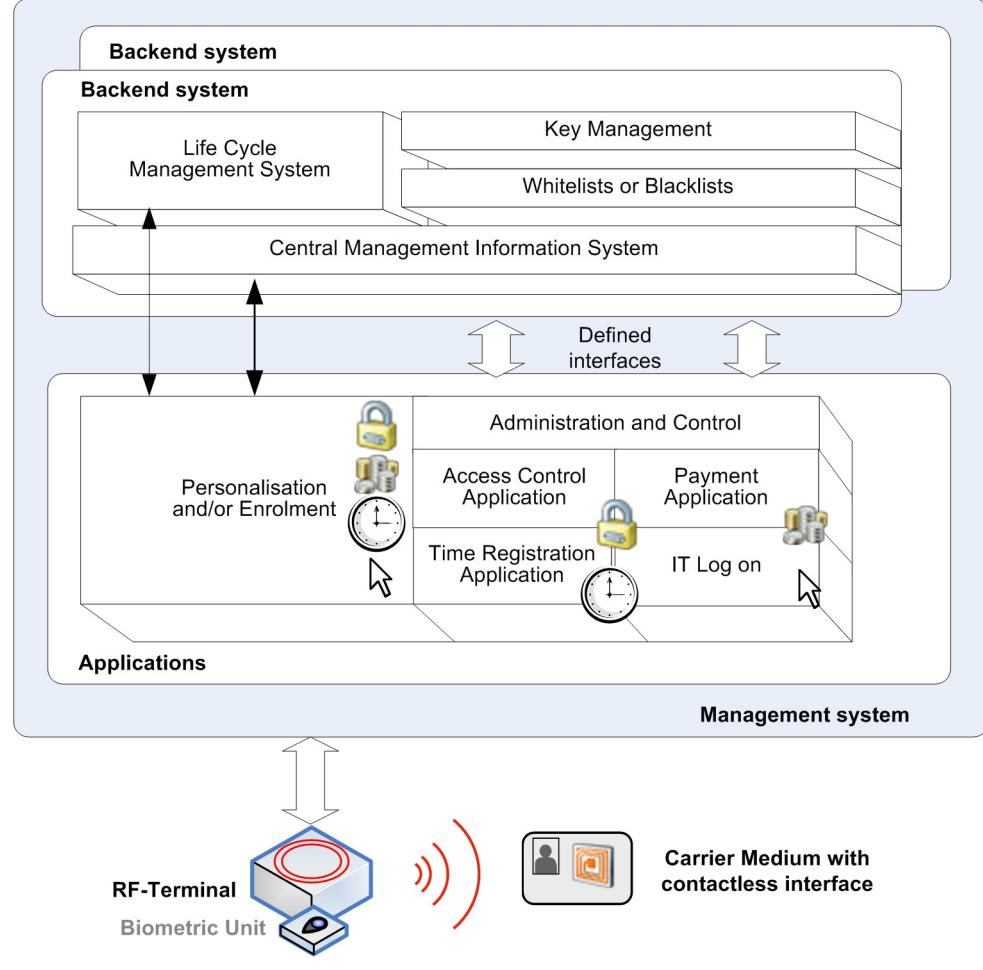

*Figure 1: System components*

At first glance three main system components can be abstracted:

**-** The *carrier medium* equipped *with a contactless interface* is provided as basis for the electronic Employee ID Card. It can enclose card applications, application parameters, and entitlements. Normally, a specific carrier medium is issued by an organisation or if compatible to the

requirements of an organisation a governmental eID document is applied that can be used for eBusiness (i.e. an eID application that supports security mechanisms such as [\[EAC10\]](#page-244-1) or comparable).

- **-** The *RF-Terminal[1](#page-14-0)* works as the interface between the management system that administers all applications, relevant data and functions and the carrier medium that encloses the card applications and entitlements of the employee on the other side.
- **-** The *management system* which encapsulates two main subcomponents.
	- **-** The *application part* is used by the organisation to manage all relevant services that are offered within that organisation. This includes software for the personalisation of new electronic Employee ID Cards[2](#page-14-1) and services that have been established based on the technical, organisational, legal and other requirements. Different levels of entitlements are provided for these software applications. In this technical guideline in particular the following software applications are considered in more detail:
		- **-** Access Control whereas physical access to a building, subsequent divisions and/or even individual rooms in an organisation can be comprised.
		- **-** Time Registration that logs e.g. the working hours, availability, overtime of an employee.
		- **-** Payment of additional services such as cafeterias, kiosks, parking lots, or further cashless applications.
		- **-** Access to IT systems as extension to the physical access modern business processes require access to electronic applications, functions, and data.
	- **-** The administration of all relevant data and functions is combined within the *backend system*. In many cases the backend system is offered by one provider but an organisation can also decide to use services from different service providers at one time. In the second case it can be advantages to store specific data on the carrier medium to enable the use of the document between applications. A closer view on the backend system unveils the following main subparts that are usually enclosed:
		- **-** Life Cycle Management System this component provides all necessary functions that are necessary to personalise, configure, and change the carrier medium with the contactless interface.
		- **-** Key Management encloses all relevant security parameters and cryptographic keys that are needed to provide a specific security level.

1 If the electronic Employee ID Card is used with biometric authentication e.g. via fingerprint matching the RF-Terminal is equipped with an additional biometric unit.

2 And software for the enrolment of biometric data if the electronic Employee ID Card is used e.g. with fingerprint recognition.

**-** Whitelists and blacklists

enclose information regarding the activation or deactivation of entitlements. If offline systems are supported the lists have to be transferred to the respective terminals. Nevertheless of the applied system, those lists are used to administer blocking information of the system.

**-** The Central Management Information System provides all central functions to allow the operating of the different applications and controls the interaction of all relevant system components. Thus, the general operation of the overall system is ensured.

Depending on the requirements of an organisation i.e. which of the afore described application scenarios are realised the product exhibits different kinds of characteristics and arrangements. Therefore, all of the afore described applications can be applied or only selected applications can be implemented. Differences can appear for example in the following areas:

**-** Individual-related personalisation

Product provider can realise different methods for the personalisation of identity cards. A carrier medium can be assigned to a specific person or a group that is connected to a specific set of entitlements.

- **-** Storage of an entitlement matrix on the carrier medium or the corresponding management system.
- **-** Shadow account or stored payment value on the carrier medium.
- **-** Storage of cryptographic keys, mechanisms and parameters.

A carrier media is often used for authentication which can be realised as *ownership* together with or without *knowledge* or *inherence.* The following alternatives are available:

- **-** ID card with contactless interface
- **-** Contact ID card[3](#page-15-0)
- **-** Secure token[4](#page-15-1)
- **-** Biometrics in combination with an electronic Employee ID Card (i.e. biometrics stored on card[5](#page-15-2) or biometrics stored in a reference data base)
- **-** Biometrics without the use of an ID card[6](#page-15-3)

For the use of biometrics for authentication in combination with an electronic Employee ID Card different options exist. Biometrics features can be stored either on the card or in a reference data base. Detailed information regarding the different biometric verification methods can be found in [\[TT06\]](#page-244-5) and [\[BIOP2\].](#page-244-4) In any case the work council or a comparable instance and the data protection official of the respective organisation shall be involved in the complete process from the very beginning. Thereby, comprehensive information can be obtained in [\[TT08\]](#page-244-3) and [\[TT05\].](#page-244-2)

3 This alternative is not considered any further within this technical guideline.

4 This alternative is not considered any further within this technical guideline.

5 The storage on the card offers the advantage that the biometric data is in the possession of the owner.

6 For biometric authentication a reference database can be used. In this technical guideline the storage on the card is mainly considered.

If biometric features are stored on the carrier medium the verification can either be performed on the card i.e. match-on-card or within the terminal, whereas the first case is recommended. If a reference data base is used the verification is performed within the management system.

## **2.2 Considerations and limitation of this Technical Guideline**

In this guideline an electronic Employee ID Card is considered that supports secure usage of RFID based systems. Thereby, the following precondition and limitations of the system shall be considered:

- 1. Visual characteristics are still an important part of an identity document and represent one important application. Often, a facial image is printed on the document which is taken during application or provided by the employee. Nevertheless, physical characteristics are not of main interest in this guideline and will therefore only be considered marginally.
- 2. Other authentication methods such as secure tokens or other technologies e.g. contact smart cards, hybrid cards or dual interface cards are not part of this document and are therefore not considered. The decision to exclude dual interface cards does not mean that the use of these cards is not recommended. In any case additional security targets might be considered.
- 3. Access control can be realised by online and offline systems. While online systems have a direct and immediate connection to the management system, offline or semi-offline scenarios are not directly connected - i.e. a terminal is not connected or only temporarily connected online to a central management system. Although offline systems may be necessary in some cases e.g. due to local conditions such as missing connection possibilities or only less users they can have negative consequences regarding flexibility, simplicity, and security of applications. In this case the actuality of the management of the entitlements has to be realised over the offline or semioffline terminals by using whitelists or blacklists. In particular, blocking of entitlements can be accompanied with delay. In this technical guideline in the first place online scenarios are considered whereas offline scenarios are taken into account if the security level is affected.
- 4. The application scenarios and use cases that are considered in the following are connected with personal information of the employee. For this reason, privacy is very important and must be comprised in every consideration. Further information can be obtained in [\[BK07\].](#page-245-0)
- 5. Payment systems can be open or closed (compare [\[FI08\]\)](#page-244-6). A closed system can be used within the scope of one service provider. In this case the amount of money is usually stored as a value on the carrier medium. Open systems are based on international standards and allow to be applied between different application providers. Hereby, the accounting is realised based on a (shadow) account.
- 6. If an eID document is applied as electronic Employee ID Card only the eID application and if applicable the eSign application are considered. The biometric data stored on the document cannot be used.
- 7. With single-application-cards, including only one application, and multi-application-cards including several applications different products exist. Due to the fact that organisations apply electronic Employee ID Cards in different application scenarios this technical guideline is focused on multi-application-cards.

#### 2 Description of system components

8. In general, besides the technical safeguards described in the following there exist organisational safeguards that may counteract the respective threats in an adequate way. Nevertheless, these organisational safeguards are not described any further within this technical guideline.

# **3 Agreements**

## **3.1 Definition of terms**

| Application          | The electronic Employee ID Card distinguishes different kinds of applications. The carrier medium with the contactless interface encloses applications which represent a defined sector (e.g. file structure on the card) that can be secured by access control. The application itself contains e.g. application parameters and entitlements or further additional information. In the following applications stored on an electronic Employee ID Card are referred to as card applications. |  |  |
|----------------------|--------------------------------------------------------------------------------------------------------------------------------------------------------------------------------------------------------------------------------------------------------------------------------------------------------------------------------------------------------------------------------------------------------------------------------------------------------------------------------------------------------------------|--|--|
|                      | Electronic Employee ID Cards communicate with applications of the organisation which itself are part of the management system. These are called software applications. Due to the fact that the memory of the management system is not subject to restriction as it is the case with identity cards the software applications can be quite large.                                                                                                                                                      |  |  |
| Application area     | The area in which the technical guidelines are intended to be applied. Reflects the highest unit in the terminological structure. Incorporates one or more applications, the products/services that belong to those applications, and the resulting application objectives that result from the application scenarios.                                                                                                                                                                                 |  |  |
| Application scenario | A particular way of looking at the application area in terms of the implementation of specific products and services.                                                                                                                                                                                                                                                                                                                                                                                           |  |  |
| Authentication data  | Authentication can be performed based on unique identifiers, cryptographic keys and/or cryptographic functions and parameters. If biometrics are used to verify a person the biometric feature e.g. in form of a template can be securely stored on the identity card.                                                                                                                                                                                                                                    |  |  |
| Employee data        | The employee data characterises the personal data that is necessary to establish an electronic identity for a specific employee or to accomplish the entitlements for that employee. The master data is administered by human resources and stored mainly in the management system. Due to the restrictions of the carrier medium selected personal data can also be stored within the identity card e.g. biometric data of the employee.                                                        |  |  |
| Interoperability     | Interoperability means that the issuer of electronic Employee ID Cards can rely on applications, carrier media, card reader devices (i.e. terminals), and further components and services that are based on international established standards.                                                                                                                                                                                                                                                          |  |  |
| Operating process    | A comprehensive operational procedure in an application area like electronic Employee ID Cards. Examples are the registration, the use of an entitlement, temporarily or complete suspension i.e. blocking, and so on.                                                                                                                                                                                                                                                                                    |  |  |

| Organisation | This technical guideline uses a generic term that encloses companies as well as governmental authorities. The term is used within this document whenever it is related to both instances. The organisation operates the management system that is used to control and administer all applications within the organisation. Furthermore it is the organisation that issues the carrier medium and the entitlements.                                                                                                     |
|--------------|---------------------------------------------------------------------------------------------------------------------------------------------------------------------------------------------------------------------------------------------------------------------------------------------------------------------------------------------------------------------------------------------------------------------------------------------------------------------------------------------------------------------------------------|
| Usage data   | With usage data all data is described that is necessary for a specific application or service. The data is either stored on the electronic identity card or the terminal. As an example this can be a matrix enclosing entitlements.                                                                                                                                                                                                                                                                                         |
| Use case     | Detailed description of a series of activities that constitute part of an operating process. Examples include initialising a carrier medium and loading an entitlement.                                                                                                                                                                                                                                                                                                                                                         |
| Terminal     | A terminal describes the reader device with which the electronic Employee ID Card is read. Within the scope of EAC [EAC10] different types of terminals are divided. An inspection system is used by an official for governmental applications, while an authentication terminal can be operated by an official but also by private sector organisations. Furthermore a signature terminal has to fulfil specific security requirements in order to provide the respective environment for signature generation. |

## **3.2 Generic modelling of roles and entities**

The roles and responsibilities are visualised based on the descriptions in section [2.](#page-13-0) Since an entity can be assigned to more than one role, the role model has been composed in a generic way as shown in figure [2.](#page-20-1)

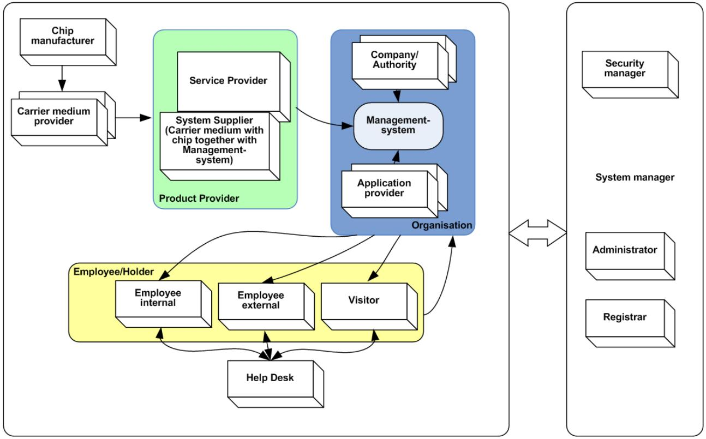

*Figure 2: Entities in the application area "Electronic Employee ID Card"*

#### **The following entities have been identified:**

| Administrator        | The role of the administrator within the application area "Electronic Employee ID Card " is complex because different functions need to be distinguished. These are administration of the carrier media and furthermore the connected data and applications.                                                                                  |
|----------------------|--------------------------------------------------------------------------------------------------------------------------------------------------------------------------------------------------------------------------------------------------------------------------------------------------------------------------------------------------------|
| Application provider | The application provider is the owner of the application specification. The application is connected to the central management system of the organisation through defined interfaces. A software application can be operated by the organisation itself or by suborganisation e.g. cafeterias that are affiliated to that organisation. |

| Authority               | Public authorities that use a (multi-functional) electronic identity card within its organisational units. The authority applies a central management system that controls and administers the overall system solution.                                                                                                                                                                                                                                   |
|-------------------------|--------------------------------------------------------------------------------------------------------------------------------------------------------------------------------------------------------------------------------------------------------------------------------------------------------------------------------------------------------------------------------------------------------------------------------------------------------------------|
| Carrier medium provider | The provider of the carrier medium that markets the carrier medium to the according organisation (e.g. companies and/or authorities).                                                                                                                                                                                                                                                                                                                           |
| Chip manufacturer       | The chip issuer provides the chip that is used within the electronic Employee ID Card.                                                                                                                                                                                                                                                                                                                                                                          |
| Company                 | Company that uses a (multi-functional) electronic identity card within its organisational units. The company applies a central management system that controls and administers the overall system solution.                                                                                                                                                                                                                                               |
| Help Desk               | Contact point where problems during usage can be notified. The help desk works as the connection between system administration and applicants of the carrier medium and can be understood as a first level support. Moreover, questions regarding the usage of the electronic Employee ID Card can be asked.                                                                                                                                           |
| Holder                  | Generic description assigning an ID card of an organisation to a specific person.                                                                                                                                                                                                                                                                                                                                                                               |
| Registrar               | The registrar ensures that unique identifying characteristics are allocated throughout the system. This is necessary in order to clearly identify the entities, carrier media, applications, and products/entitlements. In case biometrics is applied for an identity card the registrar is the operator of the enrolment process.                                                                                                                     |
| Security manager        | The security manager establishes and coordinates the security rules within the system. He is responsible for the authorisation of the system components. He furthermore monitors the performance of security relevant functions (e.g. key management).                                                                                                                                                                                                    |
| Service Provider        | Besides the system components further (management) services can be offered to an organisation for the electronic Employee ID Card. This is in particular of special interest for enhancements and integration of applications from external providers other than the system supplier. Hereby, if access to sensitive data is necessary this has to be agreed with the data protection official and the working council or a comparable instance. |
| System manager          | Within the organisation the system manager ensures that the rules of the system are upheld. For this he operates as the functional entities security manager and registrar.                                                                                                                                                                                                                                                                                  |

| System Supplier                                       | A system supplier offers a system solution that comprises the carrier medium with the contactless interface. Furthermore the necessary software components i.e. the management system is provided for the solution.                                                                                                                                                                                                                                                                                                                                 |
|-------------------------------------------------------|--------------------------------------------------------------------------------------------------------------------------------------------------------------------------------------------------------------------------------------------------------------------------------------------------------------------------------------------------------------------------------------------------------------------------------------------------------------------------------------------------------------------------------------------------------------|
| Visitor                                               | Person that is no member of the organisation i.e. no internal or external employee but is in relationship with the organisation. For visual inspection an identification card is issued temporarily but in general no further entitlements are assigned. In many cases the identification is a paper card.                                                                                                                                                                                                                                       |
| Entities can adopt the following comprehensive roles: |                                                                                                                                                                                                                                                                                                                                                                                                                                                                                                                                                              |
| Employee                                              | The user of the carrier medium and the services that are associated with it. The employee receives entitlements that can be used for the respective services within an organisation. Electronic Employee ID Cards can be assigned to internal and external employees. In general, the difference is displayed by distinct entitlements.                                                                                                                                                                                                          |
| Organisation                                          | Generic term that encloses companies as well as governmental authorities. The term is used within this guideline whenever it is related to both instances. The organisation operates the management system that is used to control and administer all applications within the organisation. Furthermore it is the organisation that issues the carrier medium and the entitlements.                                                                                                                                                           |
| Product Provider                                      | Generic description of the organisational units that provide the different hardware and software components for the electronic Employee ID Card: carrier medium with the embedded chip and the management system to an organisation.                                                                                                                                                                                                                                                                                                                |
|                                                       | Further components shall be considered within the description of entities and roles:                                                                                                                                                                                                                                                                                                                                                                                                                                                                         |
| Application                                           | An application represents one or more defined services of an organisation by providing functions and structures. The access and execution of an application is managed by entitlements. Usually the application is executed in the backend system i.e. management system. The connection to the management system is established over defined interfaces. In some cases application parameters are loaded onto the carrier medium. If applications on the electronic Employee ID Card are referenced the term card application is used. |
| Carrier medium                                        | The electronic Employee ID Card is the medium which is issued to internal and external employees in order to assign entitlements and load and store application parameters. The carrier medium is held by the employee and is required in order to use the entitlement for the different applications in the organisation. Other common names used in this document for the carrier medium are electronic Employee ID Card, user card, electronic identity card, or contactless (smart) card.                                           |

Management System The management is the central system of the organisation with which all applications are administered (compare section [2.1\)](#page-13-2).

For the analysis of security targets (compare section [8.2\)](#page-66-0) the technical guideline has identified three main roles which will be considered in the following sections:

- **-** Product Provider
- **-** Organisation
- **-** Employee.

## **3.3 Relationship between carrier media, applications and entitlements**

The model described in section [3.2](#page-20-0) allows an organisation to choose from different product providers and allows numerous application issuers to be involved.

As a consequence, different carrier media, applications and products (further hardware and software components) are available and can be combined, from which a company or an agency can choose in order to meet the organisational, technical, and legal requirements. In particular the requirements of the individual system architecture of the company have a great impact on the realisation concept. Furthermore (as described later in this guideline) security aspects have to be considered.

For the authorisation of an employee in one of the according application scenarios entitlements are assigned to a carrier medium - the electronic Employee ID Card. Thus, the associated services that are offered in the organisation can be used. An entitlement can be provided either to optimise processes in an organisation or to define a granular right management.

Applications provide the structures and functions required to load, use, block, unblock and withdraw entitlements within the scope of a carrier medium. Since requirements in an organisation can change the introduction of new applications shall be considered from the very beginning and the technical preconditions shall be provided if possible.

The following rules apply to the relationships between carrier media, applications, and entitlements:

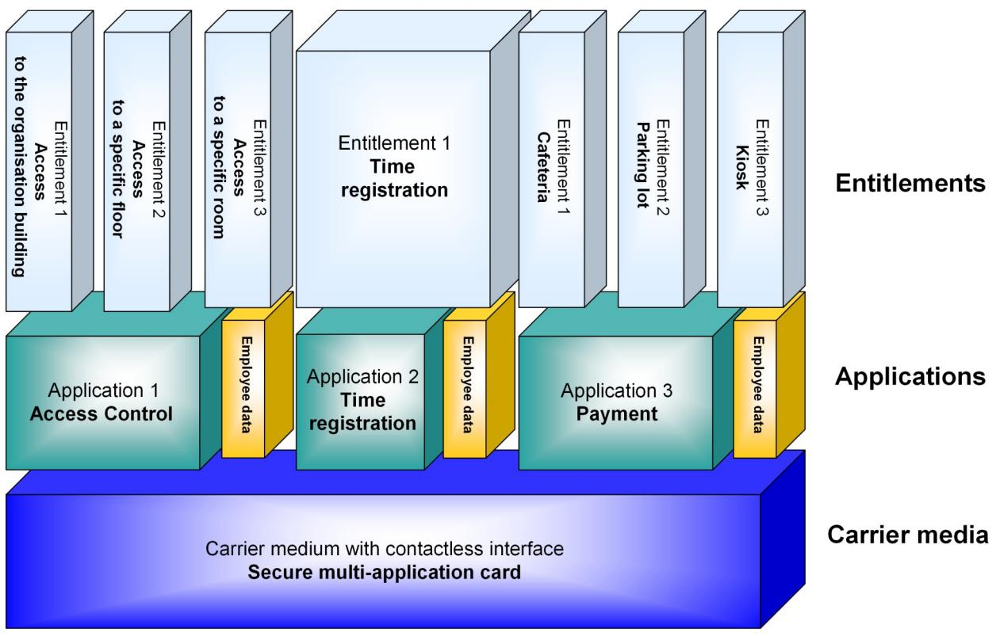

*Figure 3: Carrier media, applications, and entitlements*

# **4 General requirements**

In the following subsections special attention is drawn to the product specific usage of Electronic Employee ID Cards regarding security requirements. These requirements concerning the overall system, the connected processes and components can be divided into three categories:

- **-** Range of functionalities
- **-** Economics
- **-** Security.

## **4.1 Range of functionalities**

This section provides examples regarding the requirements of the target audience.

### **4.1.1 Employee requirements**

From the view of the holder of an Electronic Employee ID Card the following examples of requirements shall be fulfilled:

- **-** The carrier medium shall grant access based on assigned entitlements to activated applications.
- **-** The carrier medium shall be robust, reliable, and shall perform at the required speed.
- **-** The system and the carrier medium must be easy to use and comfortable e.g. processes can be optimised and if possible accelerated.
- **-** Reasonable protection of individual related personal data must be provided.
- **-** Support for the application of the electronic Employee ID Card must be provided e.g. by provision of a website of the organisation.
- **-** A help desk shall be available in case of problems such as temporary or irrecoverable lost of the carrier medium. If the carrier medium is not operational a replacement or fallback method shall be provided.
- **-** Reliable accounting in case of payment applications.
- **-** Convenient fallback mechanisms shall be available

Whenever contactless chip technology is used, the holder shall always be kept properly informed of the individual related data used, how it is employed, what is done to protect the data, and any risks that remain. The handling of personal data must be in accordance with the data protection official of the organisation and if applicable the work council or a comparable instance.

### **4.1.2 Requirements of the organisation and product provider**

At the same time the requirements of the organisation and the product provider shall be fulfilled.

### Functionality

- **-** Access to an organisation's applications must only be allowed to members that are equipped with an Electronic Employee ID Card.
- **-** Precise definition of access control, entitlements and further applications must be possible.
- **-** It must be easy to explain to the employees how the carrier medium, applications and systems are used.
- **-** Optimisation of business processes and thereby achieving of required speed of applications shall be possible.
- **-** The requirements of the organisation infrastructure shall be considered
	- **-** Individual system architecture with different computer systems (i.e. terminals, notebooks, server, etc.) and software components (e.g. operating systems)
	- **-** Integration of different, remote and/or distributed networks
- **-** It must be possible to suspend carrier media and according entitlements temporarily and completely and to issue replacements. Furthermore a reset of a carrier medium that has been blocked needs to be available.

Technical compatibility

- **-** The structure of the carrier medium and the applications shall be designed in a way that further adjustments and enhancements are possible. By this means new services can be integrated in an organisation with already established identification system. In particular flexibility, reusability, and protection of investment can be ensured.
- **-** Interoperability must be assured so that components of the system architecture can be exchanged. I.e. a reading device has to support established communication standards.

## **4.2 Economics**

For an economic operation of the system the commercial benefit for every stage of expansion must be greater than the cost of the processes, systems, and security. This must apply for all of the entities that invest in the installation of the system.

As a consequence, the overall system and the connected components need to be designed in a way that the requirements from all relevant application scenarios are fulfilled efficiently. Furthermore the security architecture shall be designed in a way that investment protection is established. Therefore, the requirements need to be specified as accurately as possible from the very beginning.

## **4.3 Security**

It is the main objective of this technical guideline to allow its users to enhance the individual system architecture by adequate security mechanisms to an according security architecture. Therefore, the individual requirements have to be retrieved and the needed protection demand has to be identified. This document will deal with the requirements of security separately, in particular in section [8](#page-64-0) and following.

# **5 Methodology of determining security requirements**

## **5.1 Objectives**

Within the scope of the Technical Guidelines on secure use of RFID the following objectives are identified:

- **-** Provision of a guidance for system suppliers, operators and/or system users for an appropriate implementation of application specific system solutions regarding information security, safety, and data privacy
- **-** Establishment of awareness and transparency regarding security aspects.
- **-** Provision of a base for system supplier's (i.e. product providers) or operator's declaration of conformity, and for the issuing of quality seals by certification authorities (certificate).
- **-** By describing selected security requirements and defining delimited degrees of freedom products can be compared to each other. Furthermore less complex conformity tests can be specified. As a result higher quality connected with less costs can be achieved.

The following information is required in order to achieve the afore listed objectives:

- **-** A definition of the security requirements that must be fulfilled by a RFID system for a given application area.
- **-** A description of the specific risks, appropriate counter-measures, and potential remaining risks, in following called residual risks.
- **-** A definition of the criteria for declaration of conformity and for certification.

Only by considering all requirements - as specified in section [4](#page-25-0) and the afterwards identified security aspects - a definition of the relevant procedures and proposed systems can be conducted.

## **5.2 Methodology**

### **5.2.1 Scope of system considerations**

RFID-based systems can be very complex. In most cases, a lot of IT components that have no direct relation to RFID are part of the system solution. But at the same time the system security must not only be considered in terms of the carrier medium and the reading devices.

A Technical Guideline on secure use of RFID has to take all relevant technical security aspects into account in detail. These aspects depend heavily on the application area and the respective individual implementation of the system solution. As a consequence, the technical guideline in hand provides detailed information for the according application area and the respective operation processes (including for example the processes for initialisation and implementation of the system). The processes cover the complete life cycle of the carrier medium. Based on these processes use cases are specified that are relevant from the security point of view from the RFID system. The use cases serve as fundamentals for the identification of threats and a detailed, system specific security

evaluation for the area of the system that are used within the scope of RFID. Figure [4](#page-28-0) shows this approach for the example of application electronic Employee ID Card.

*Figure 4: Example: Identification of RFID-relevant use cases for the electronic Employee ID Card*

All other system components are only considered in general. The proposed safeguards are based on open IT security standards.

This concept focuses on the RFID relevant system parts, nevertheless all security aspects are taken into account. Furthermore the technical guideline allows individual and organisation specific IT implementations (specific architectures and infrastructures, applications, etc.) In particular, this approach allows enhancements of existing systems by using RFID technology.

### **5.2.2 Scalability and flexibility**

The technical guidelines address security issues in the first place. At the same time, any system implementation that follows this guideline must be economically viable. As a consequence, the following requirements regarding the methodology shall be considered:

1. It must be possible to implement systems in a way that the costs and benefits are balanced. In practice, this means that safeguards must be proportional to the need for protection i.e. they need to fulfil the protection demands but it is not necessary to exceed them. For example: If only lowcost products are used, that require only a low level of security , the protection demands shall be designed accordingly. This may allow to use low-cost media in order to reduce the costs for the implementation and further handling receptively handling of the system.

- 2. The application scenarios that have been chosen for the technical guideline cover a wide range, from small to nationwide and even international (cross-border) systems. It is important that the concept discussed in the guidelines can be used for system solutions of any size and complexity.
- 3. In many cases a system solution can be made economically viable much more easily if a cooperation with other companies or subunits is possible. This applies in particular to organisation that apply an electronic Employee ID Card, where it can be very beneficial if media are already available to employees (such as multi-application cards). These can be used for additional applications, products and related services e.g. an access card can be used for the cashless payment in cafeteria within this organisation. Nevertheless, in most cases one backend solution is applied.

Figure [5](#page-29-0) gives an example of a carrier medium for the electronic Employee ID Card that supports applications from different areas of use.

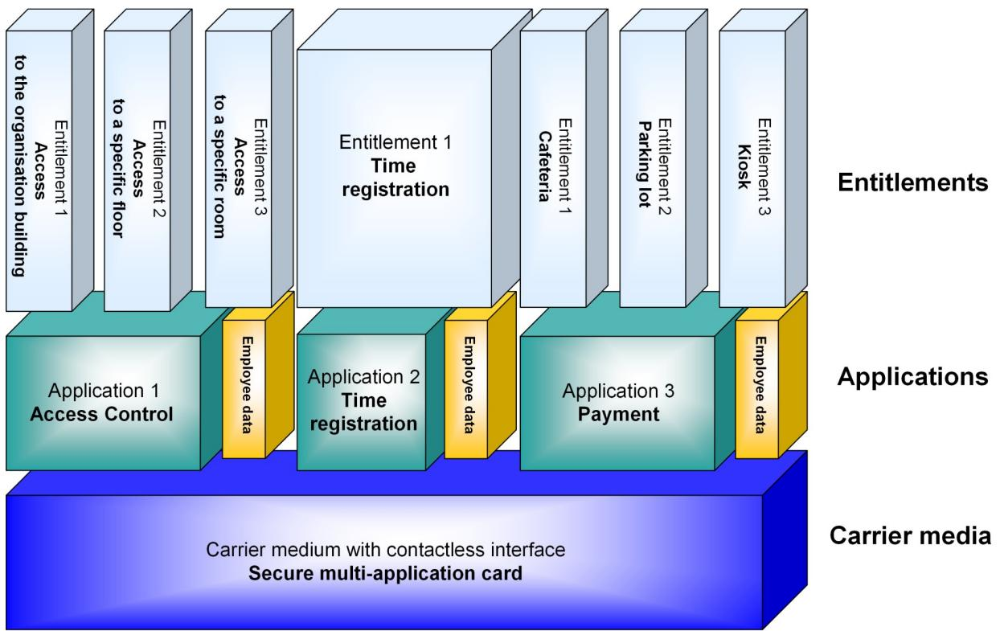

*Figure 5: Hierarchical concept for media, applications, and entitlements for electronic Employee ID Cards*

In order to realise the afore described requirements this technical guideline is based on the following concept:

1. An adequate role model (compare section [3\)](#page-18-0) and the structure of several key components (carrier medium, terminal, and management system) have been described in section [2.](#page-13-0) This model supports a scalable and extendible approach.

- 2. The technical guideline has to offer security concepts that enclose all combinations of application scenarios and media that are used in one infrastructure. This is achieved because of individual security evaluations that take RFID relevant applications into account.
- 3. Similar application scenarios (in particular electronic Employee ID Cards) that offer the possibility for cross-application partnerships are addressed by the respective technical guideline with as much communality as possible. The security evaluation takes similar security targets into account.
- 4. A special challenge exists within the scope of system security that has to be considered when it comes to system or cross-application partnerships. In this case it has to be ensured that the security of one system is not affected by leakages coming from another system[7](#page-30-0) . In general, a comprehensive security evaluation of both systems has to be performed.

The technical guidelines address this by introducing a scalable and transparent concept for applying safeguards against the identified threats, called "protection demand categories". A total of three categories are used starting by 1 (standard requirement) until 3 (high requirement). All safeguards are defined according to three levels starting by standard procedures until extended procedures.

For every individual system implementation the protection demand category has to be defined for every security target. As a result the respective safeguards are identified.

This concept provides an easy way to establish secure system cooperation. In the following it remains to ensure that the protection demand categories of both systems match together.

### **5.2.3 Explanation of the security concept**

Every technical guideline belonging to the TR RFID family contains examples of how security considerations shall be applied to specific application scenarios. These can be adapted to the requirements and peripheral conditions of the particular system implementation in hand (compare [\[KOR09\]\)](#page-244-7).

The security considerations start with the involved system components. These can be divided (e.g. for the application area "Electronic Employee ID Card") in direct components of the **contactless interface**,

- **-** the c**arrier medium** which encloses or activates deposited entitlements
- **-** the applied **terminals** (i.e. reader devices**)**

and the indirect RFID components which are

- **-** the **management systems** (e.g. the software applications and the backend system) as well as
- **- key management** which are always necessary.

Based on these components different kinds of **data** is processed, a **role model** is defined and **functions** that are associated with these roles are described. An overview of these interactions is presented in figure [6.](#page-31-0)

7 Here, the system component that requires the less expenses for attacks have to be considered.

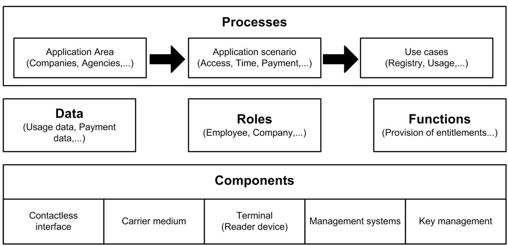

*Figure 6: System model for security considerations*

After the introduction of the initial situation - mainly the system model (compare section [2\)](#page-13-0) and the role model (compare section [3.2\)](#page-20-0) - the processes (compare section [6\)](#page-35-0) have to be analysed and described in more detail. Based on the application area and connected application scenarios a structure for the main processes and use cases (compare section [7\)](#page-47-0) is outlined. Thus, a model is retrieved which allows to identify passive and active attacks as well as threats which are used in the following for description of the relevant safeguards.

In the following sections a more detailed overview of the security consideration is presented. More and example information can be found in [\[KOR09\].](#page-244-7)

### **5.2.3.1 Definition of security targets**

All considerations of TR RFID are based on the classic definition of security targets as shown in figure [7.](#page-32-0)

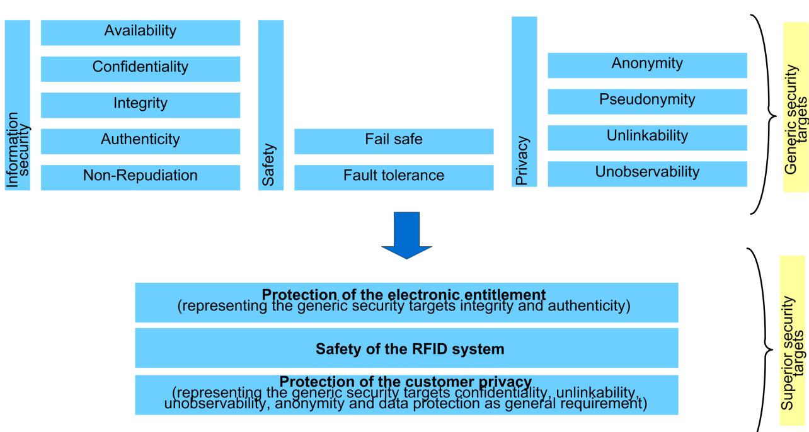

#### *Figure 7: Generic security targets*

In particular the presented superior categories are examined in more detail:

- **-** Safety as protection of unpredictable failures
- **-** Information security as protection against intended attacks
- **-** Privacy as protection of informational self-determination

As a consequence role specific security targets can be defined in a table schema (compare table [1\)](#page-66-1) representing the different objectives of the according instances.

### **5.2.3.2 Estimation of the protection demand**

After identifying all relevant security targets a selection of adequate safeguards can be connected. Hereby, an estimation of the protection demand for every single security target is necessary. This is done by answering the question which damage occurs if a specific security target is negatively affected either by failure of the IT system or by intended attacks.

Possible answers can be found by estimating the damage

- **-** based on the application scenario or
- **-** based on the processed information.

If the afore described analysis is done for all security targets a protection demand table is retrieved that assigns every security target to three protection demand categories. These categories describe which damage has to be expected if the respective security target is violated.

### **5.2.3.3 Determination of threats**

Section [5.2.3.2](#page-32-1) implies that threats have an effect on the considered IT system and as a consequence influence the objectives of the security targets. In order to perform a detailed threat analysis of the system components the following needs to be considered:

- **-** impacts which arise from threats to the overall system and
- **-** which protection demand categories are affected if a specific threat occurs.

The threat analysis returns all relevant threats which are achieved by experts' workshops and established checklists. Within this scope all components that are referenced by the defined use cases have to be considered.

By applying the afore described steps to all components a table (compare table [13\)](#page-81-0) is retrieved that assigns all component specific threats to the violated security targets.

Furthermore a matching table that shows the connection between security targets and threats can be obtained from section [14.](#page-248-0)

#### **5.2.3.4 Overall consideration of the system components**

Within the technical guidelines for RFID some components are realised in every application scenario. These are the backend system and the key management system that are part of the main infrastructure and are therefore related to as infrastructure components.

As a consequence, the security considerations for these components are realised within an overall and global layer.

For the determination of all relevant safeguards the following concept has been developed:

- 1. The security targets are assigned to protection demand categories based on the according infrastructure components.
- 2. The protection demand of the security targets is assigned to the corresponding threats.
- 3. The identified threats are set in contrast with the counteracting safeguards.
- 4. The protection demand is transferred from the threats to the corresponding safeguards such that the mechanisms strength is defined.

By applying the afore described steps to all infrastructure components a table of safeguards including the corresponding mechanism strength is retrieved that is independent from the application scenario.

#### **5.2.3.5 Specification of application specific safeguards**

In accordance with the determination of safeguards for the infrastructure components further safeguards have to be identified for the specific application scenario. This is done as follows:

- 1. The security targets are assigned to protection demand categories based on the according product specific application scenario.
- 2. The protection demand of the security targets is assigned to the corresponding threats.
- 3. The identified threats are set in contrast with the counteracting safeguards.
- 4. The protection demand is transferred from the threats to the corresponding safeguards such that the mechanisms strength is defined.

By applying the afore described steps to all application specific components a list of safeguards including the corresponding mechanism strength is retrieved. This is done in correspondence with the application scenario.

### **5.2.3.6 Conclusion**

After a complete description of the system architecture and a security analysis has been performed the user of this technical guideline receives an easy to use package of safeguards which is suited for the respective application scenario.

As a consequence a user shall only need to perform an explicit security analysis if the available infrastructure or application scenario shows significant differences to the described application areas.

In conclusion the overall procedure for the security consideration is presented in figure [8.](#page-34-0)

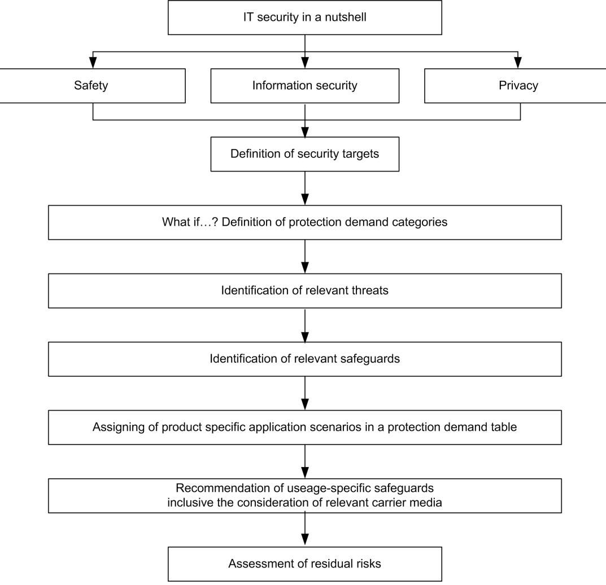

*Figure 8: Concept of security considerations*

# **6 Generic business processes**

## **6.1 Process P1: Concept phase**

Before the introduction of an electronic Employee ID Card within an organisation it is highly recommended to describe all requirements and conditions of the system architecture within a detailed specification.

By this means, an adequate system solution is obtained which can be analysed in particular in the meaning of cost-benefit ratio. Furthermore prospective and strategic objectives can be observed such as expandability, scalability, and interoperability.

This approach allows an organisation on the one hand to identify the specific components, processes, and resources that have to be considered and on the other hand which security level shall be achieved (this is described in more detail in section [8\)](#page-64-0). As a consequence the feasibility of the different requirements can be evaluated based on security considerations that are described within this technical guideline.

The concept of the system solution shall also contain a plan for the provision of the overall system. This includes the delivery period for all hardware (e.g. terminals and computer systems) and software components (e.g. management system and applications of the organisation) as well as information regarding the necessary integration complexity (e.g. description and connection of the different interfaces) for the applications of the organisation.

## **6.2 Process P2: Registration of an employee**

If a new employee joins an organisation his work is connected with different levels of entitlements. The right management is often represented by the issuance of an electronic Employee ID Card. Therefore, at the very beginning, the employee has to register and if biometrics are applied an enrolment is necessary. Based on the established workflow in an organisation different procedures are possible.

In general, two different approaches can be taken into account:

- **-** The organisation can decide to issue a separate electronic Employee ID Card that is specially produced with a separate carrier medium or
- **-** it can be decided to establish a system solution that is based on electronic governmental ID cards providing an eID application[8](#page-35-1) that is usable for eBusiness.

In the following a short overview of the different approaches is given:

1. Service Point

The organisation establishes a service point that is concerned with the registration of new employees and later with changes of entitlements. At first, the employee has to fill out a prepared application form of the organisation or alternatively this can be done electronically by a service terminal. Further information of the ID Card system, privacy information and operating

8 If applicable an eSign application can be used for further application scenarios within an organisation.

guidelines are provided to the employee. Afterwards the data is transferred (if not already done, it is transformed electronically) to the central management information system (CMIS). An electronic Employee ID Card can also be used in connection with biometrics. For example fingerprint recognition is one possibility and for the enrolment one or more fingerprints can be stored on the ID Card. The enrolment shall be performed at the service point under supervision of the service provider. This is necessary in order to assure by organisational means that the actual biometric feature (e.g. fingerprints) of the employee are captured. If biometrics are used the considerations described in section [2.1](#page-13-2) shall be taken into account.

In any case the identity of the employee for the correct assignment of entitlements has to be ensured e.g. by checking the ID card or in coordination with human resources.

2. Webservice

The registration of new employees can also be initiated by a specific automated webservice of the respective organisation. The operation of this service is assigned to the department of human resources. The necessary application data is inserted over a specific website in accordance with the backend systems. The identity check of the employee is performed based on the master data of the human resources.

If visitors are provided with an electronic carrier medium this can be initiated by the entry port by calling a dedicated web site of the organisation.

3. Webservice with eID

If an organisation uses governmental identity documents that can be used for public applications the eID card of an employee has to be registered to the CMIS of the organisation. Due to the security mechanisms of an eID (e.g. Extended Access Control [\[EAC10\]\)](#page-244-1) an explicit identity check is not necessary because this is already done during application of the eID document. Nevertheless, it shall be ensured that the eID document is still valid i.e. not revoked.

[Figure 9](#page-37-0) gives an overview of the different possibilities for registration of an employee. Processes P2.1 to P2.4 require an explicit identification of the employee. This can be achieved by the provision of an identity card e.g. German Personalausweis or comparable.

#### 6 Generic business processes

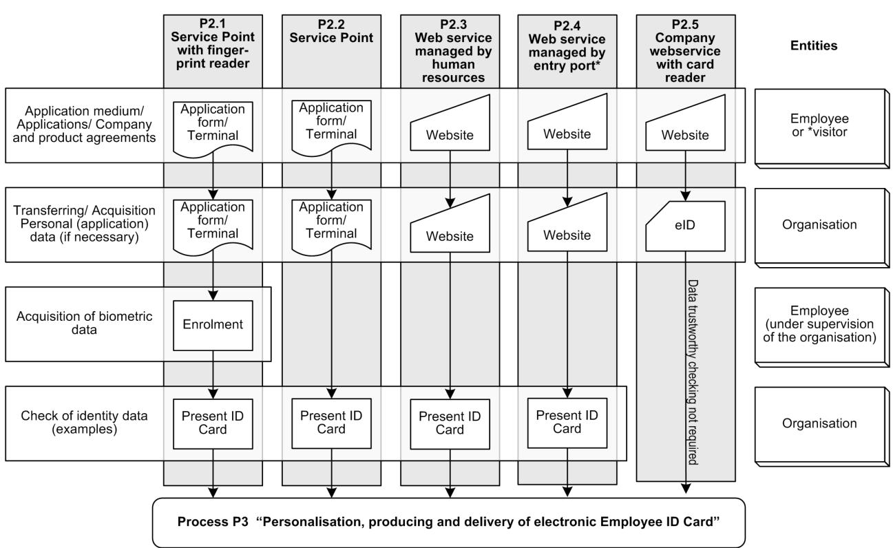

*Figure 9: Diagram of Process 2, registration of an employee*

## **6.3 Process P3: Personalisation and delivery**

Based on process P2 "registration of an employee" two cases for the application of an electronic Employee ID Card are described in the following:

- 1. Production and issuance of an electronic Employee ID Card with separate and specially produced carrier medium (contactless smart card or contactless multi-application card).
- 2. Assignment of the entitlements with an existing eID card.

The personalisation and later usage (compare section [6.4\)](#page-41-0) of the carrier medium, independent of the applied carrier medium, is performed in association with a comprehensive management system. Typically, the management system includes different subsystems. In this technical guideline the subparts of the management system as described in section [2.1](#page-13-2) are applied. Nevertheless in practice, a system solution is in most cases obtained from one source. Thus, the organisation only integrates its applications by requesting defined interfaces of the management system. The backend systems encloses the following subsystems:

**-** Applications of the organisation

The application can be in the possession of the organisation or can be provided by an external product provider as a service. A employee needs an adequate entitlement in order to apply an application.

**-** Life cycle management system

The management of the carrier medium is encapsulated with the life cycle management. All requested services that have influence of the carrier medium are combined within this part (e.g. initialisation, personalisation, loading of application data or writing of entitlements to the carrier medium).

**-** Key Management

The key management provides all functionality that is necessary to establish the adequate security mechanism.

- **-** Central Management Information System (CMIS) The CMIS provides all functionality to control and administer the complete system.
- **-** Whitelists or blacklists

Represent the actual state of entitlements within the overall system. If offline or semi-offline systems are used this mechanism is used to update the right management of the terminals.

**-** Electronic terminal

While the electronic Employee ID Card represents the identity of a specific person the CMIS provides all administration for the control system. The communication between both components is established by the application of electronic terminals. In an online operating system the electronic terminal is directly connected to the management system and obtains recent information. In the offline or semi-offline case revocation information needs to be made available to the terminal explicitly.

[Figure 10](#page-39-0) shows the personalisation and delivery process P3 that represents the description for the setup for a new employee and the delivery steps afterwards:

#### 6 Generic business processes

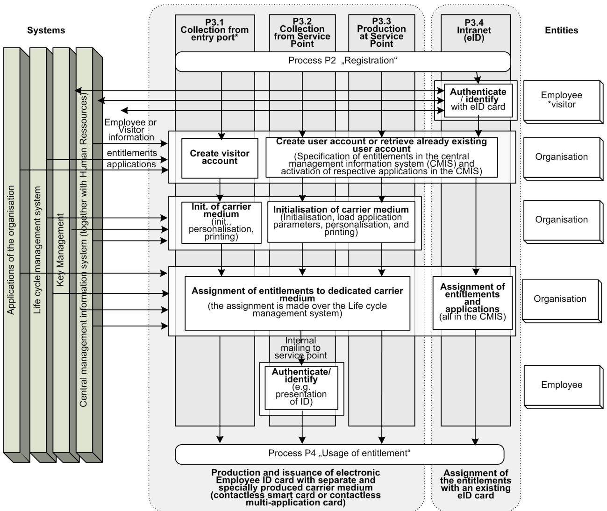

*Figure 10: Diagram of Process 3, personalisation and delivery*

The delivery for the electronic Employee ID Card can be realised as follows:

1. Collection from entry port (by visitors)

In case a visitor shall receive an electronic ID Card of an organisation as shown in process P3.1 a respective entry in the backend system has to be established by creation of a visitor account. Afterwards the carrier medium can be initialised and issued. Usually, in comparison to the standard electronic Employee ID Cards that are issued to the employees entitlements for visitors are restricted such that only specific services are provided e.g. the visitor can use the payment application in a cafeteria of the according organisation. As an example limitation can depend on time or area restrictions.

2. Service Point

Processes P3.2 and P3.3 describe the direct collection of the ID card at the service point within an organisation. The only difference between both processes is the time of pickup direct or later. In the case of process P3.2 an additional authentication check is necessary in order to assure the ID card is submitted to the correct identity[9](#page-39-1) . In general, the personalisation starts with the

9 Note: For process P3.3 this has already been done within process P2.2.

creation of the user account in the central management information system (CMIS). This can be done in advance in accordance with human resources or can be done when the employee registers at the service point. A carrier medium is initialised in particular with application parameters and personalisation information. By consulting the software applications, CMIS, and the connected key management entitlements and card applications are assigned to the carrier medium.

3. Using existing eID card

In case an eID card of the employee - that can be used for eBusiness - is applied no issuance of an additional document is necessary. Nevertheless, a user account for the administration of the employee data needs to be created. Hereby, entitlements and applications can be assigned and stored in the management system since the storage of this data in the eID document is usually not possible since they are not extendible for further applications.

*Note:* Due to privacy reasons it is not recommended to allow the unauthorised and plain exchange of (unique) information which is linked to the single carrier medium (like a UID) or linked to a single application or to a single group of users. Thereby, the possibilities to generate movement profiles by unauthorised parties gets more likely. It is recommended to use a random ID for selecting the carrier medium and to use an authentication with a secret key, followed by an encrypted communication, which guarantees confidentiality of the exchanged data, to retrieve the unique information of the carrier medium like the UID.

Fault cases are not dealt with here.

## **6.4 Process P4: Usage**

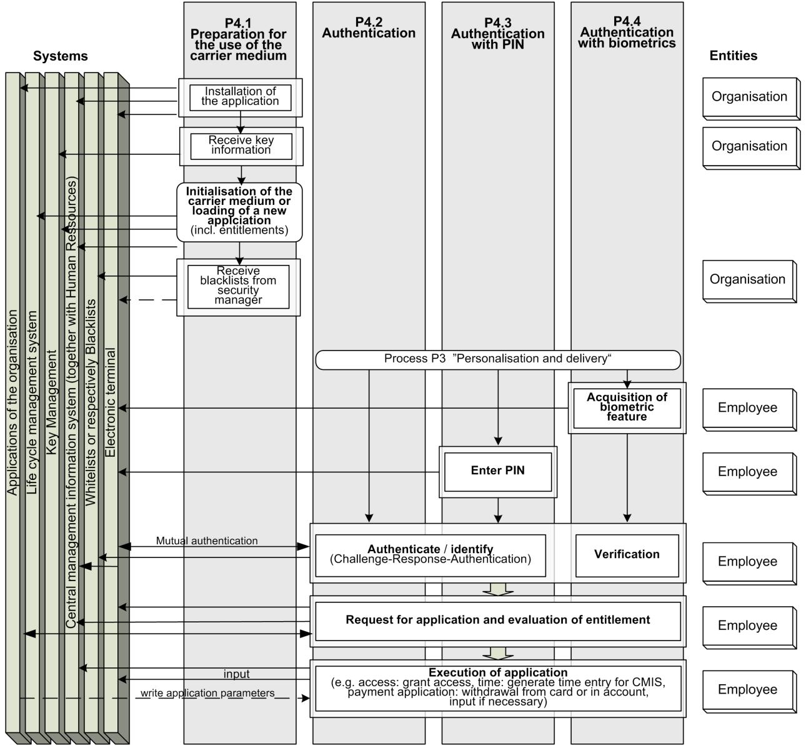

*Figure 11: Diagram of Process 4, usage*

After an employee has received an electronic Employee ID Card (compare process P3) with approved card applications and valid entitlements and the system infrastructure for the applications is set up the services of the organisation can be used. In case an offline or semi-offline scenario is applied the respective blocking information has to be made available to the electronic terminals.

For the correct application of the entitlements the employee has to show the ID Card to a RF-Terminal of the organisation.

In case an eID card is used the authentication is performed based on ownership (i.e. the eID document) and knowledge (i.e. the secret PIN) of the employee. Thus, it can be ensured that only the according employee can use the service.

If a separate electronic Employee ID Card is used three authentication procedures are possible. Based on the security level and the requirements ownership, ownership and knowledge, or ownership and inherence can be used. The identity of the employee and/or his entitlements are checked. If all checks are successful access to the application of the organisation is granted.

In most cases the execution of an application consists mainly of the authentication process since the handling of the application is mainly performed within the management system. In some cases an execution is performed on the carrier medium. As an example the payment application shall be referenced. In this application scenario two different realisation alternatives are possible. The application can either be executed mainly in the management system by keeping a shadow account in the backend system or it can be realised with a prepaid function where a specific amount of payment units is loaded on the carrier medium. This value is decreased when the payment application is applied.

Due to the fact that conditions in an organisation can change applications and entitlements can change over the time. This means that new applications can be introduced in the organisation and respective entitlements need to be issued or the opposite case happens where applications are deactivated. Therefore functionality for the loading and activation of new applications need to be established as well as functionality for the deactivation of applications and entitlements. An overview of these processes is given in figure [12.](#page-43-0)

Fault cases are not dealt with here.

#### Generic business processes

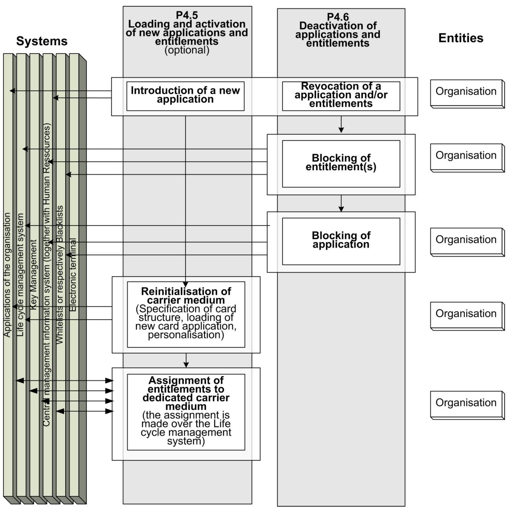

*Figure 12: Diagram of Process 4, usage (activation and deactivation)*

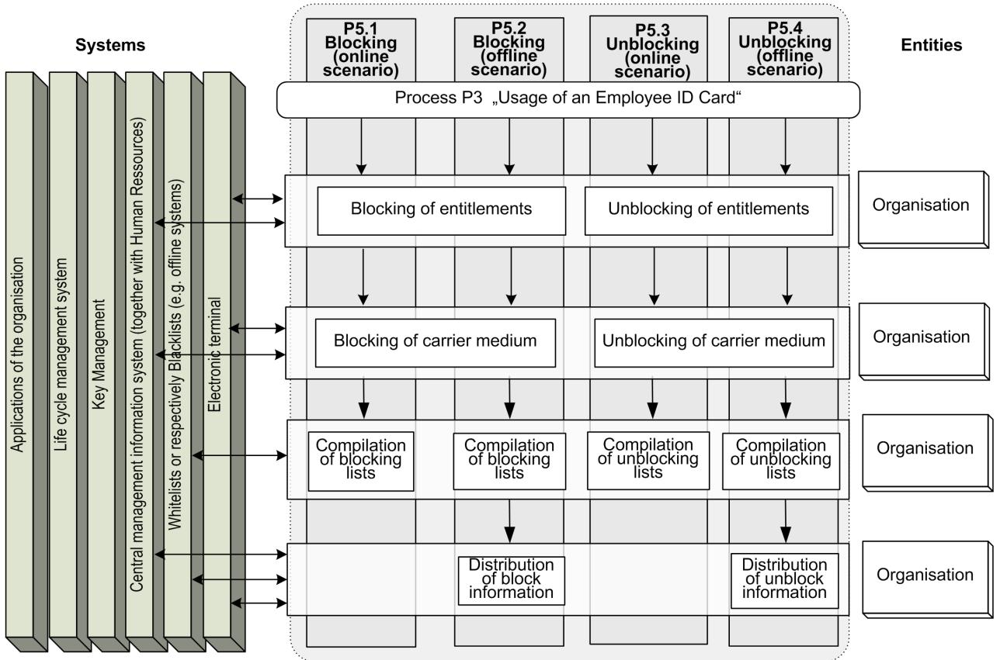

## **6.5 Process P5: Blocking and Unblocking**

*Figure 13: Diagram of Process 5, blocking and unblocking of entitlements*

In order to control the applications and entitlements of an electronic Employee ID Cards, it is advantageous to provide mechanisms to block and unblock entitlements of according applications and carrier media securely. This helps the processes of cancelling and exchanging carrier media and entitlements and enables lost media to be replaces. Within organisations employee ID Cards are often only temporarily unavailable so that fallback solutions - a second identity card - can be issued. If a second carrier medium is assigned to an employee and the respective entitlements are set this is logged within the corresponding user account.

In general, two scenarios are possible:

- 1. A carrier medium is temporarily blocked because it is not available to the employee (e.g. the employee has forgotten the ID Card at home). In this case a logging of the single card activities within the time of two cards of the employee (one temporarily activated and one temporarily deactivated) can be conducted if applicable.
- 2. A carrier medium is lost and therefore completely blocked (i.e. it will not be unblocked). In this case deregistration (compare process P6) is undertaken and a new card will be issued (compare process P2).

For the blocking and unblocking mechanism two different scenarios can be distinguished. If the system works completely online the blocking information is assembled within a list in the CMIS and can be accessed by the terminals. If the system infrastructure uses an offline scenario the blocking information needs to be made available trough manual processes.

## **6.6 Process P6: Deregistration**

If an employee leaves an organisation the carrier medium with the enclosed entitlements and applications has to be returned and the user account is closed. The process is shown in figure [14.](#page-45-0)

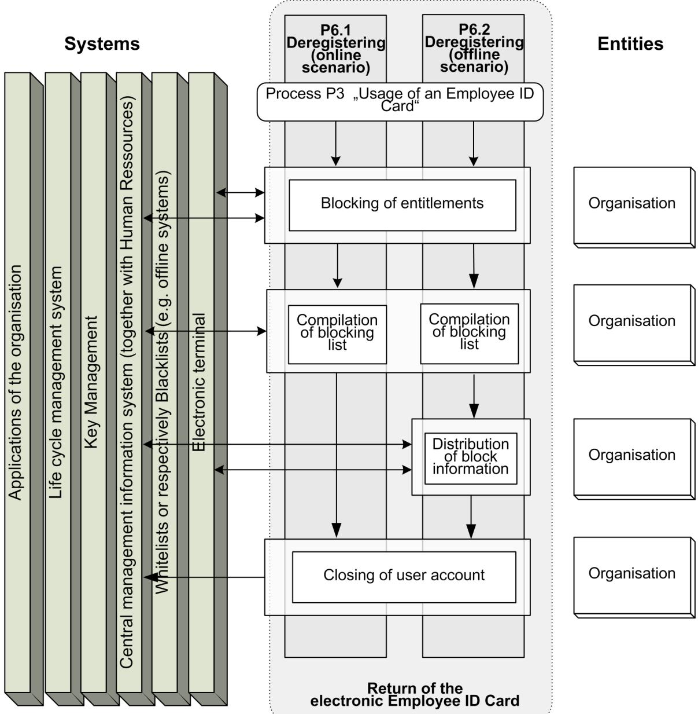

*Figure 14: Diagram of Process 6, deregistration*

At first all entitlements - if not already done - are blocked. The blocking information is compiled in a list and made known to the overall system so that the specific electronic Employee ID Card cannot be used for any service. The explicit distribution is necessary in particular if the system

infrastructure supports offline scenarios. Afterwards the user account is closed. The process of deregistering ends when the carrier medium is returned e.g. if an employee leaves the organisation .

If the carrier medium is lost an additional entry is made in the user account respectively in the CMIS.

# **7 Use cases**

This section describes the main use cases that are considered by applying an electronic Employee ID Card. In particular the carrier medium with the contactless interface is observed in more detail and its interaction with further system components. The use cases are derived from the generic process description in section [6.](#page-35-0)

Since the implementation of the management systems and the connected applications is in large parts dependent of the solution of the respective provider the description of the use cases has example character and is used to illustrate a possible architecture that is discussed in more detail in section [10.](#page-146-0)

In this technical guideline the following use cases are considered:

- **-** Enrolment (optional in case biometrics is taken into account)
- **-** Identification of the employee
- **-** Create user account or retrieve already existing user account
- **-** Initialisation of the carrier medium
- **-** Delivery
- **-** Authentication
- **-** Assignment of entitlement
- **-** Loading and activation of new applications
- **-** Deactivation of applications and entitlements
- **-** Blocking
- **-** Unblocking
- **-** Key management
	- **-** Key management for the initialisation of the carrier medium
	- **-** Key management for the loading and personalisation of applications
	- **-** Key management for the assignment of entitlements
	- **-** Key management for the assignment in the organisation
- **-** Deregistration

## **7.1 The "Enrolment" use case**

In general, the acquisition of biometric features of an employee must be specified in accordance with the working council or a comparable instance and the data protection official of the respective organisation. The acquisition process shall be performed at a computer system which is in the possession of the security manager and can only be accesses by the according entitlement.

In the following an example regarding fingerprints is given. For the acquisition process assistance can be obtained in [\[TT05\]a](#page-244-2)nd [\[TT08\].](#page-244-3) A terminal that encloses a biometric fingerprint sensor is connected to the computer system and an enrolment application is installed that can be administered only by the security manager. An identity card in the reading range of the terminal is coded with a biometric feature e.g. one or two fingerprints are captured with the connected fingerprint sensor and imported in the card as reference. This is done with the help of the enrolment application. The second fingerprint can be captured as a fallback possibility so that matching of one fingerprint is also possible if the other finger is injured.

The security manager has to ensure by organisational means that the enrolment is correct e.g. that the applicant does not use fake fingers. The description of the organisational safeguards is not part of this technical guideline.

## **7.2 The "Identification of employee" use case**

Entitlements are assigned to a specific person in an organisation in order to provide access to applications. Therefore, it is important to ensure that an electronic identity is connected to the right person. As a consequence, the reliability of the employee data and the later correct use of the electronic Employee ID Cards is bounded to a successful identification or authentication of the respective person. The identification is represented through the processes P2.1 – P2.5 whereas in the last case implicit authentication is performed by using an eID application. In the other cases identification is checked e.g. by presenting an identity card. By using a reliable process the increase of security will be ensured.

## **7.3 The "Create user account or retrieve already existing user account" use case**

Since the assignment of entitlements in an organisation is usually provided in long terms the carrier medium is normally not used for only a few applications but for many authentication processes. This may require the storage of employee data (and if applicable personal data of the employee if agreed) that has been received during registration (compare section [6.2\)](#page-35-2) in particular within the management system.

In general, employee data can be stored either in the carrier medium or in the management system. The decision for one or the other possibility depends highly on the requirements of an organisation. Because the storage of data is limited on the carrier medium side and eID documents do normally not support the storage of additional data this technical guideline focuses on the approach to store the employee data in the management system.

The main data is transferred electronically and assigned to an user account that is generated at first. As a consequence, the management system acts as the counterpart of the carrier medium by administrating the important data, functions, and applications for an employee.

If a governmental eID document shall be used within an organisation further requirements need to be established e.g. the German nPA (eID document for public use) is based on [\[EAC10\].](#page-244-1) If the eID application shall be used in an organisation the authority or company needs to apply for an certificate that assigns the according entitlements for the desired applications. With such a certificate and the agreement of the card holder (which is shown by entering the private PIN) services or respectively applications of the organisation can be used. As an example selected data can be exchanged between the eID document of the document holder and the organisation which can be used within the scope of the user account in the following.

## **7.4 The "Initialisation of the carrier medium" use case**

If a separate identity document can be used in an organisation as electronic Employee ID Card it has to be initialised and personalised for a specific employee. All the functions that have to be performed to initialise and manage the carrier medium are accomplished by the Life Cycle Management System. In many cases the carrier media are blank when they are used for initialisation and personalisation. Before or after this process the visual characteristics can be printed e.g. a photo of the employee.

While the initialisation encloses general data (e.g. the structure that is pretended of the organisation) the personalisation phase stores personal data and cryptographic parameters e.g. individual keys on the carrier medium.

The use case "Initialisation of the carrier medium" includes the following phases:

- 1. Setting of the carrier medium
	- **-** Setting of the file structure (e.g. master files and if applicable elementary files) that has been specified within the respective organisation.
	- **-** Setup of the Access Control List which is later used for the access to the applications based on the according entitlements.
	- **-** Setting of an administrator key which allows access of the security manager to the carrier medium.
	- **-** Registration of the carrier medium for a specific employee in the management system (i.e. assignment to the according user account).
	- **-** Note: it can be advantageous already to prepare the carrier medium for future applications.
- 2. Creation card applications
	- **-** Storing the relevant card applications (elementary files) on the carrier medium. This includes the individual structures (dedicated files) and the ID that are defined for a specific application.
	- **-** Registration of the applications in the user account. Thus, the logic connection between the user account and the card applications on the carrier medium is performed. This is important

for the later usage e.g. if the electronic Employee ID Card is lost and the respective applications and connected entitlements shall be blocked.

- **-** Generation and storage of cryptographic keys for the administrator within the scope of the card applications.
- 3. Update
	- **-** After the structure of an application has been generated the application parameters and additional data can be loaded. This can be data regarding the employee and/or IDs that are used for a specific service.In accordance with human resources respectively the data protection official these information is aligned with the user account.
	- **-** The entitlements are assigned and afterwards activated.
	- **-** Specific cryptographic keys of the employee are generated and applied on the carrier medium.

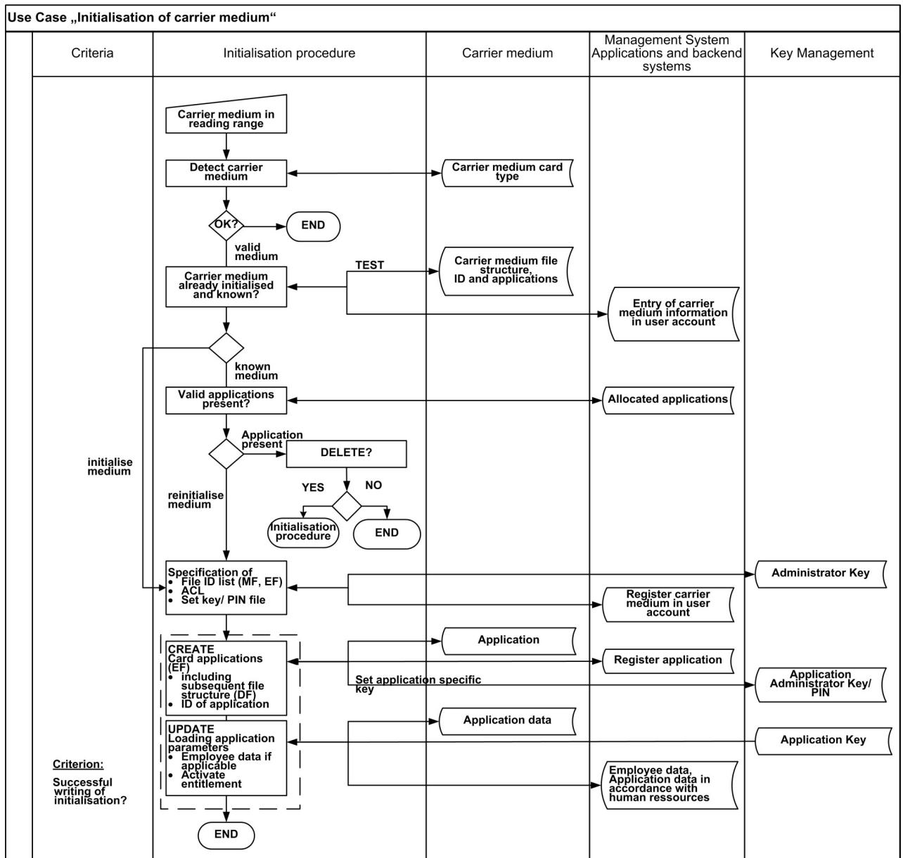

*Figure 15: Use case "Initialisation of the carrier medium"*

The *administrator key* is used for the general administration of the card structure and allows to establish an adequate access control list (ACL).

The *application administrator key* describes the key for a specific application which is in the possession of the application provider and is used to administrate the application.

Finally, the *application key* is used only for the execution of this specific application.

## **7.5 The "Delivery" use case**

Carrier media that have been initialised and loaded with entitlements must finally be passed to the employee. Therefore, the electronic Employee ID Card is delivered to the service point or already produced there. This is described in processes P3.1 – P3.3. After the carrier medium is in possession of the respective holder, the system manager has to register the process in the management system such that the media is in the possession of the employee or a new card has been issued after loss or damage.

In case of a governmental eID document the use case is not applied since the document is already in possession of the holder.

## **7.6 The "Authentication" use case**

In any case an authentication has to be performed in order to enable an electronic terminal to check if an employee owns the entitlements for a specific application.

At first, based on the requirements of the organisation an authentication of the user of the card is expected that uses:

- **-** ownership,
- **-** ownership and knowledge, or
- **-** ownership and inherence
	- **-** verification can be performed on the carrier medium (match-on-card) or within the terminal respectively the management system.

If the authentication is successful, the application can be accessed and a mutual authentication between the carrier medium and the terminal can be performed.

Afterwards the entitlements for this application can be checked and the application can be executed.

In many cases the application only requires a simple authentication of the employee because the logic of the application is included in the management system. Nevertheless, some applications e.g. payment can be connected to further processing steps. If problems are encountered during processing an error is displayed and the user has to contact the help desk for further support.

Fault cases are not considered in this technical guideline but shall be part of the specification of the system.

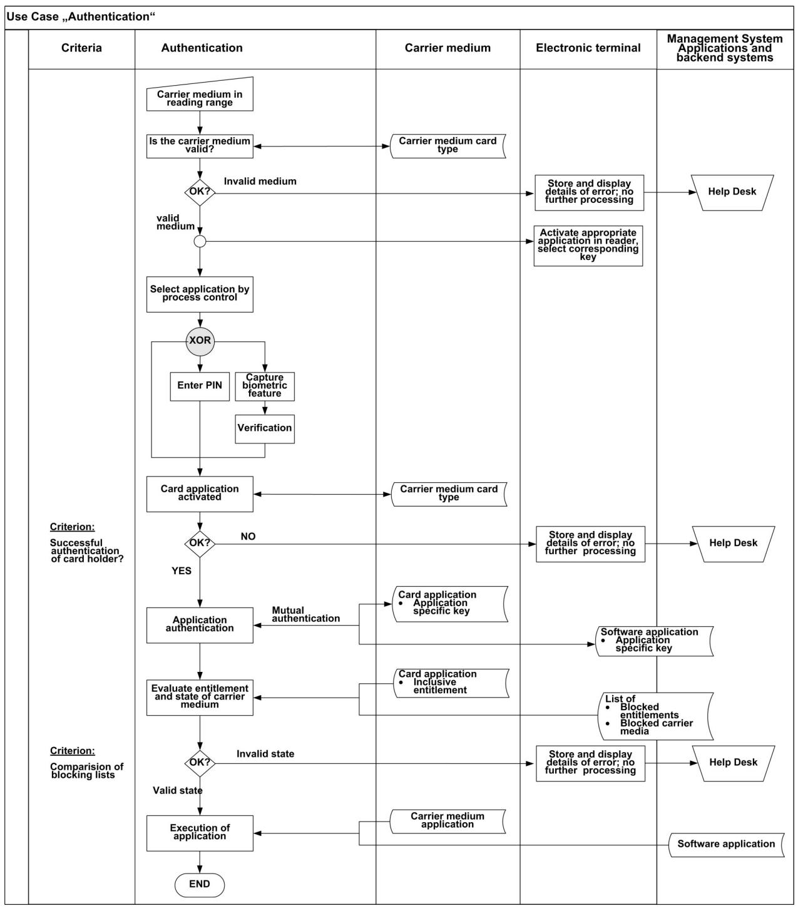

**7.7 The "Assignment of entitlement" use case** *Figure 16: Use Case "Authentication"*

Due to the fact that requirements and conditions in an organisation can be subject of change there exists a need to change entitlements that have been assigned to an employee. The use case is to be distinguished from blocking of entitlements which is described in section [7.10.](#page-57-0)

As an example an employee can be allowed to accede additional areas of the organisation after his responsibilities have been changed or the organisation can decide to grant benefits that shall be indicated with the electronic Employee ID Card. Figure [17](#page-54-0) shows that an authentication with the application has to be performed at first and afterwards the entitlements of an employee but also of the administrator of the application can be adapted.

| Use Case "Assignment of entitlement"       |                                                                                                                                                                                                                                                                                                                                                                                                                                                                                                                            |                                            |                                                                                                     |                                                  |
|--------------------------------------------|----------------------------------------------------------------------------------------------------------------------------------------------------------------------------------------------------------------------------------------------------------------------------------------------------------------------------------------------------------------------------------------------------------------------------------------------------------------------------------------------------------------------------|--------------------------------------------|-----------------------------------------------------------------------------------------------------|--------------------------------------------------|
| Criteria                                   | Assignment of entitlement                                                                                                                                                                                                                                                                                                                                                                                                                                                                                                  | Carrier medium                             | Management System                                                                                   | Key Management                                   |
| Criteria: Authentication successful? | Carrier medium in reading range Detect carrier medium Invalid medium OK?) END Valid medium Carrier medium No ? END Yes Application available? No Install ? application Yes Authenticate application Invalid application <OK? END Valid application Assignment of entitlement Install or change entitlement of holder Install or change entitlement of administrator Ensure against access and manipulation END | Carrier medium card type Entitlement | Carrier medium information in management system (uşer account) Assigned applications | Application Administrator Key Application key |

*Figure 17: Use Case "Assignment of entitlement"*

## **7.8 The "Loading and activation of new applications" use case**

Besides the need to change entitlements during the lifetime of an identification system as described in the use case "assignment of entitlements" (compare section [7.7\)](#page-53-0) it can be necessary to load new applications and to set this new application into operation. This process is described in figure [18.](#page-55-0) Thereby the file structure of the new card application is inserted in the carrier medium and the according entitlements as well as the required application data are set.

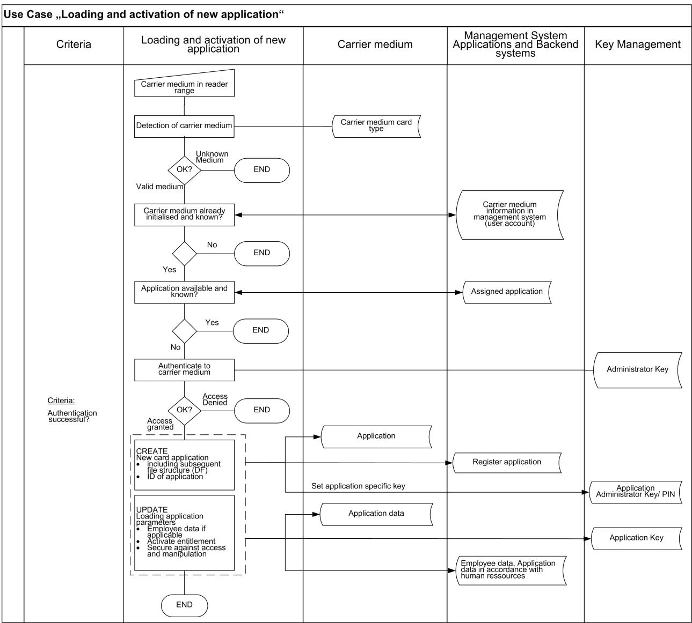

*Figure 18: Use Case "Loading and activation of new application"*

## **7.9 The "Deactivation of applications and entitlements" use case**

As counterpart to the "loading and activation of new applications" use case an operation has to be specified that allows to deregister applications and entitlements. This is achieved by the "deactivation of applications and entitlements" use case. It allows to stop the operation of applications and connected entitlements. The state of the applications and entitlements need to be logged in the user account in order to enable the security manager to retrieve the actual state of the system. The use cases is shown in figure [19.](#page-56-0)

Depending of the requirements of an organisation the use case of deactivation can include the complete deletion of the application or the application might remain on the carrier medium. In any case the application and connected entitlements are blocked.

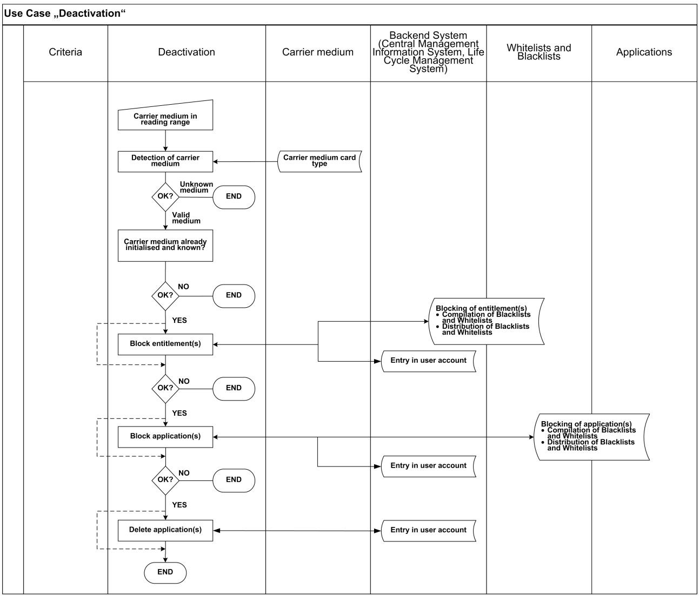

*Figure 19: Use Case "Deactivation of applications and entitlements"*

## **7.10 The "Blocking" use case**

In case an electronic Employee ID Card is not available or is considered to be compromised the holder shall apply for blocking the respective carrier medium. It is in the responsibility of the security manager to provide services for the fast and effective blocking of the entitlement(s), application(s), and/or the complete carrier medium (compare figure [20\)](#page-57-1). The state of the carrier medium has to be written to the user account for later follow up.

The new blocking state of the entitlement, application, and/or carrier medium is then compiled with the help of whitelists and blacklists. If an entitlement, application or the complete carrier medium is withdrawn it is no longer on the whitelist but added to the blacklist. This information is afterwards made available to the overall system. In case of an offline system or an semi-offline system the information has to be distributed explicitly.

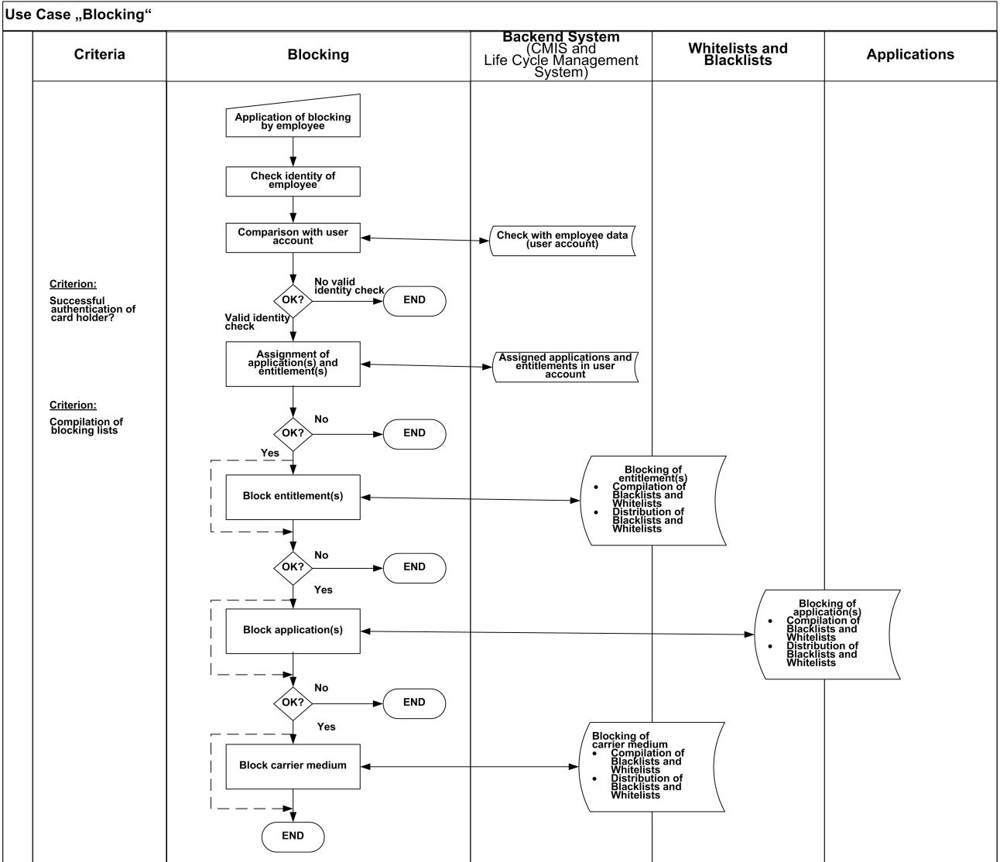

*Figure 20: Use Case "Blocking"*

## **7.11 The "Unblocking" use case**

If the blocking of an electronic Employee ID Card is no longer necessary the process has to be reversed. This is done by unblocking the carrier medium respectively the application or entitlement. Again, it is in the responsibility of the security manager to provide services for the fast and effective unblocking of the entitlement(s), application(s), and/or the complete carrier medium (compare figure [21\)](#page-58-0). The state of the carrier medium has to be written to the user account for later follow up.

The new unblocking state of the entitlement, application, and/or carrier medium is then compiled with the held of whitelists and blacklists. If an entitlement, application, or the complete carrier medium had been withdrawn it is no longer on the blacklist but added to the whitelist. This information is afterwards made available to the overall system. In case of an offline system or a semi-offline system the information has to be distributed explicitly.

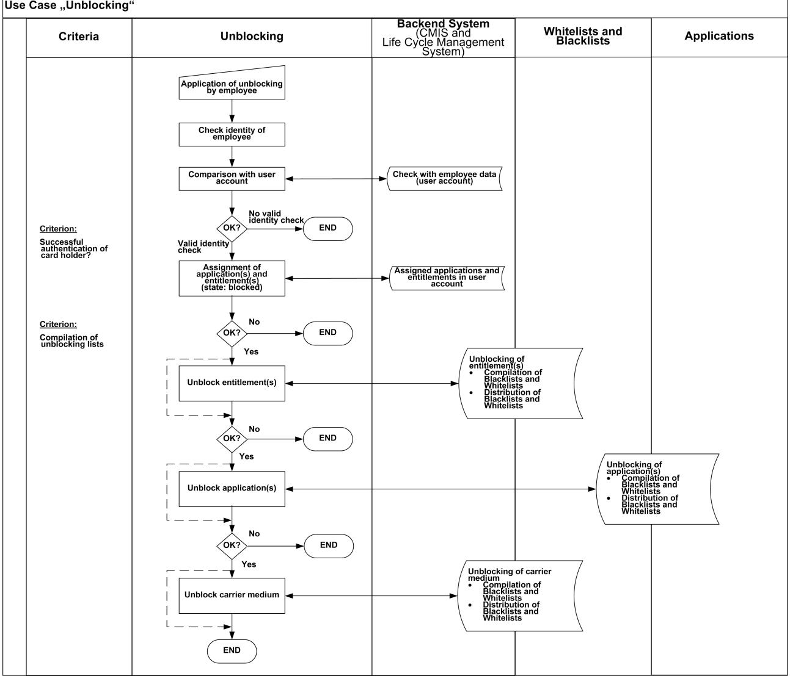

*Figure 21: Use Case "Unblocking"*

## **7.12 The "Key management" use case**

For the protection of entitlements on the carrier medium usually symmetric keys are used due to performance reasons. Therefore, the security and operability of the overall system highly depends on the secure provision and administration of keys. This task has to be performed by the key management and the according processes.

In the following presentation of use cases **Secure Authentication Modules** (**SAM**) are used for secure storage of key information, security mechanisms, and diversification algorithms. In principle, other concepts for proceeding are possible.

For the initialisation of the carrier medium and for the storage of entitlements a key management is necessary that considers the hierarchical relationship regarding the carrier medium, applications, and products/entitlements.

### **7.12.1 Key management for the initialisation of the carrier medium**

Figure [22](#page-60-0) describes the use case key management for the initialisation of the carrier medium. The keys and procedures that are defined in the following are also used for the adding of applications.

Note: Due to privacy reasons it is not recommended to allow the unauthorised and plain exchange of (unique) information which is linked to the single carrier medium (like a UID) or linked to a single application or to a single group of users. Thereby, the possibilities to generate movement profiles by unauthorised parties gets more likely. It is recommended to use a random ID for selecting the carrier medium and to use an authentication with a secret key, followed by an encrypted communication, which guarantees confidentiality of the exchanged data, to retrieve the unique information of the carrier medium like the UID.

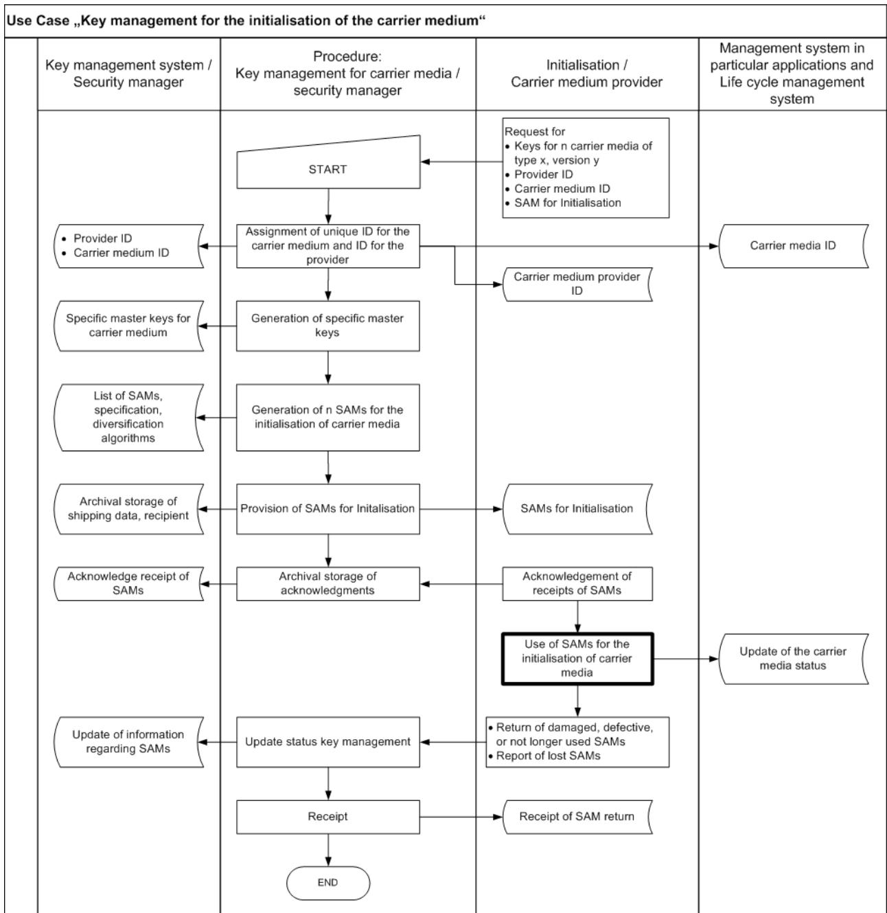

*Figure 22: Use case "Key management for the initialisation of the carrier medium"*

### **7.12.2 Key management for the loading and personalisation of applications**

In order to secure applications that are loaded when carrier media are produced, or afterwards, special keys and identifiers must be generated for the applications.

Figure [23](#page-61-0) shows the corresponding use case. The key management system for carrier media also has to be available when the application is loaded onto the carrier medium.

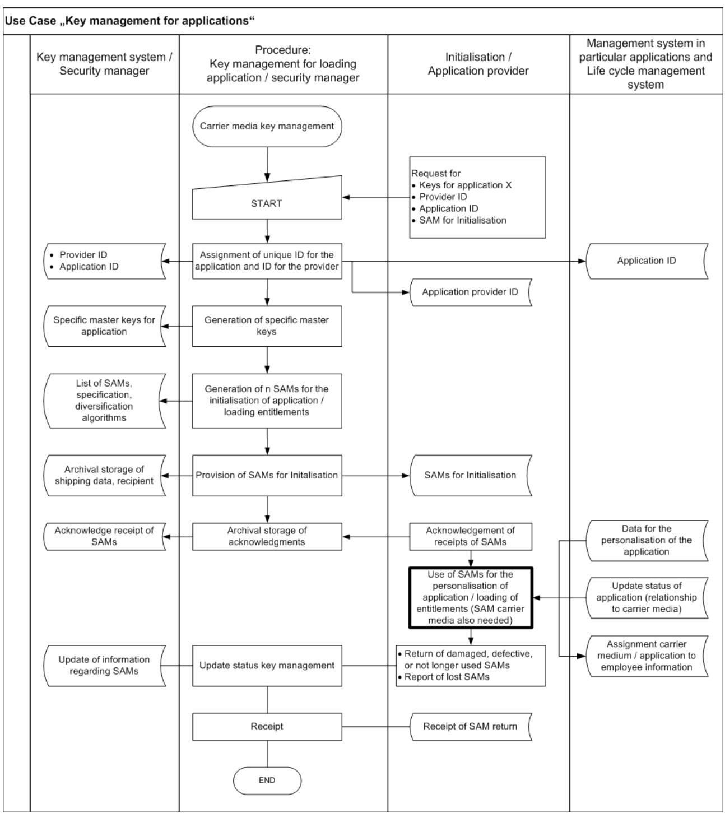

*Figure 23: Key management for applications*

### **7.12.3 Key management for the loading of entitlements**

In order to secure entitlements that are loaded when carrier media are produced, or afterwards, special keys and identifiers must be generated for the products.

Figure [24](#page-62-0) shows the corresponding use case. The key management system for applications also has to be available when the entitlement is loaded onto the application.

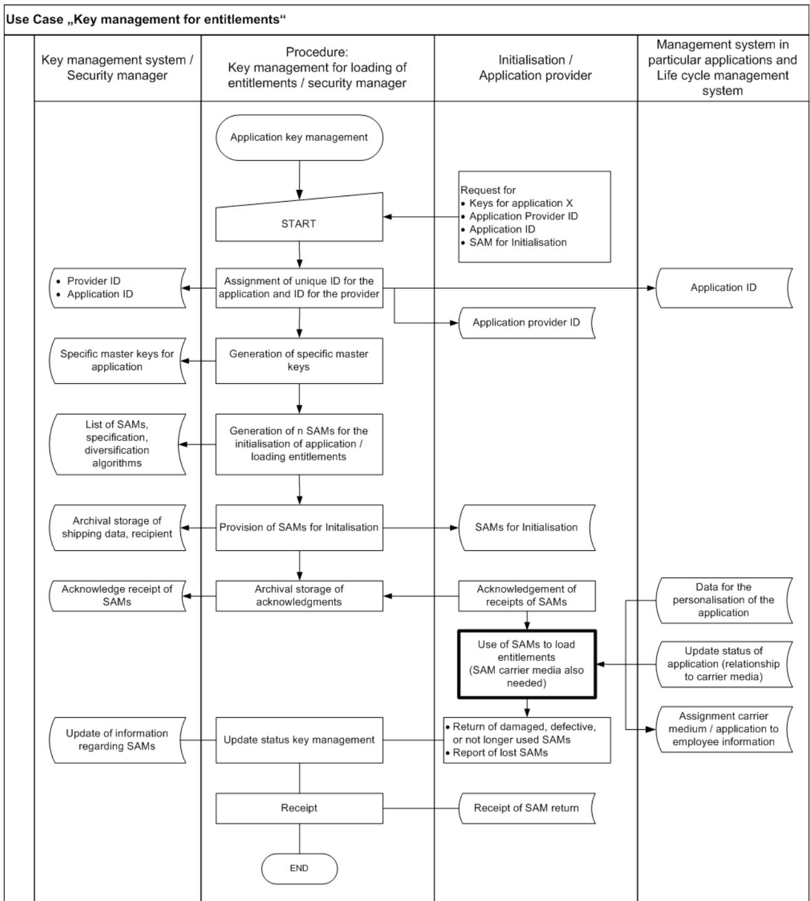

*Figure 24: Use Case: "Key management for entitlements"*

### **7.12.4 Key management for the use in the organisation**

For the application of a system infrastructure that supports secure communication between the electronic Employee ID Card and the management system in an organisation an adequate key management needs to be established. Since the management system consists of the applications and connected backend systems adequate security mechanisms need to be established that allow the initialisation of the carrier medium and the assignment of respective entitlements.

Keys are used within the scope of the electronic terminals and the backend systems. In case of eID documents furthermore certificates with according entitlements need to be available for the organisation and the authorised instances.

The key management is in the responsibility of the security manager. Thus, specific SAMs are provided to offer all functionality that are necessary for key management.

## **7.13 The "Deregistration" use case**

If an employee leaves the organisation the carrier medium needs to be returned in order to avoid unauthorised misuse. This can additionally be regulated by the employees' contract.

Nevertheless, if the carrier medium is available or not the entitlements, applications, and the carrier medium have to be blocked and a deregistration entry is made in the respective user account.

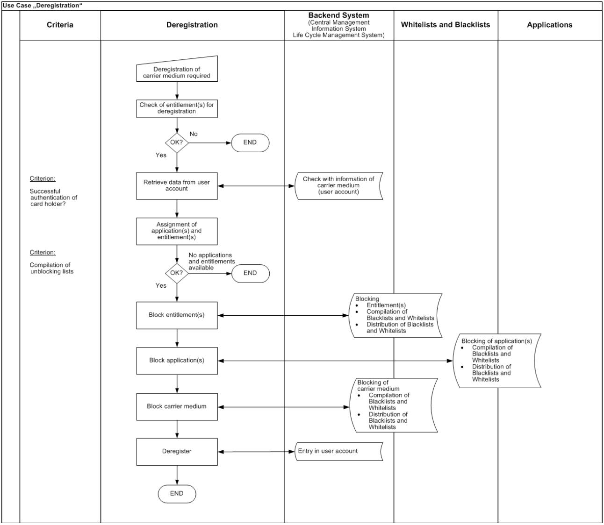

*Figure 25: Use case "Deregistration"*

## **8.1 Definitions relating to security and privacy**

Security can be divided into three aspects or categories, which are all examined in more detail in this document. These are:

- **-** Safety
- **-** Information security
- **-** Data privacy

The afore described categories can be subdivided as follows:

#### 1. **Safety**

Safety is often confused with reliability/correctness or quality of service. Reliability means that the system is operating correctly according to a defined specification. Experiences show that every technical system is sometimes subject to failure. Safety describes the system characteristic that a system does not change in an undefined state if a failure occurs which would lead to a hazard for the system itself or the direct environment (fail-safe). At the same time, the system shall also continue as far as possible in compliance with its specification (fault tolerance). Therefore, safety basically implies protection against unintended incidents.

#### 2. **Information security**

In opposite to safety information security offers protection against internal attacks. In the area of information security security targets are assigned to the following categories:

- a. Confidentiality: confidentiality means protection against the unauthorised disclosure of information. Confidential data and information may only be accessible to authorised people in an authorised manner. Formulated as a protection target this means: stored information or such information that shall be communicated has to be protected against unauthorised access of third parties.
- b. Integrity: integrity means ensuring correctness of data (i.e. that the data is unchanged) and correct functionality of systems. In terms of protection this means: stored information or such information that shall be communicated has to be protected against unauthorised alteration.
- c. Availability: the availability of services, functionality of IT systems, IT applications, or IT networks and even of information, exist if they are always available to their users as required. In terms of protection this means: information and resources have to be protected against improperly withheld.
- d. Unlinkability: unlinkability between two communication elements within one system means that those two communication elements are not any more or less in relationship with each other than it was known before. Within this system no further information regarding the relationship of those two communication elements can be obtained. Practically, this means e.g. that one can make use of services or resources more than one time without any third party knowing that these requests (within a communication model: messages) are related to this user.
- e. Unobservability: an event is unobservable, if it cannot be determined if it is going to happen or not. Therefore, sender-unobservability means that it cannot be recognised if messages are sent at all. Recipient-unobservability is defined in the same way, it cannot be determined if messages are received or not. Relationship-unobservability means that from the set of possible senders it cannot be determined if messages are sent to the possible set of recipients.
- f. Anonymity: anonymity describes the state in which one cannot be identified within an anonymity group. By using the term unlinkability, anonymity can be more precisely defined as the unlinkability of the identity of a user and an event initiated by that user. Therefore sender-anonymity exists as unlinkability between sender and message and recipientanonymity exists as unlinkability between a message and the recipient.
- g. Authenticity: the term authenticity designates a situation in which the communication partner is actually the person that he or she claimed to be. With authenticated information it is ensured that this information comes from the stated source. The term is not only used when people's identity is checked, but also for IT components and applications.
- h. Non-repudiation: Sending or receiving messages from authenticated people has to be ensured against denying later on.
- i. Accountability: accountability joins together the IT security targets authenticity and nonrepudiation. In the context of transmission of information this means that the source of the information has correctly proven its identity and that the receipt of the message cannot be denied.

### **3. Privacy**

The purpose of privacy is to protect against violation of the personal rights of the individual through the handling of his personal data.

Privacy refers to the protection of personal data against possible misuse by third parties (not to be confused with data security) [\[EU\\_REF\].](#page-244-8)

#### **Other definitions**

Furthermore the following additional terms are used uniformly:

#### **1. Security targets**

Security targets represent security relevant objectives that have to be considered by implementing an IT system. In this document specific security targets are identified and specified for the respective application areas and application scenarios. Violations of the security targets causes direct damage to the entity whose security target is violated.

### **2. Threats**

Threats are immediate risks to the security targets of an application.

These may be the result of an active attack on one or more security targets by exploiting the systems weakness, or they may take the form of potential vulnerabilities in the system such as the lack of a fallback solution.

#### **3. Safeguards**

Safeguards are a precise and recommended course of actions that counteract one or more threats. The safeguards described in this document are intended to be applied meaningfully and in accordance with the respective requirements, i.e. they are suggested on the basis of economic

feasibility and resistance to manipulation: (How expensive is the implementation of a safeguard, and what are the financial damages that can be limited or prevented by it?

### **4. Residual risk**

Normally it is not possible to counteract every single threat in such a way that a system offers absolute security. Therefore, the residual risk describes the risk that remains after a set of safeguards have been implemented and attacks are nevertheless possible. The level of this risk depends on the counter-measures that can be applied, how complex they are, and, in particular, what the costs are in relation to the benefits for the entity involved. The entity has to take explicit liability for the residual risk.

## **8.2 Definition of the security targets**

Seldom the security aspects for safety, information security, and privacy are evaluated equally important or even relevant in all cases considering a specific application scenario. The first challenge when designing a secure RFID system is therefore to formulate specific security targets.

Based on the afore described generic security targets (compare figure [7\)](#page-32-0), superior and application area specific security targets are identified for an electronic Employee ID Card:

- 1. Protection of electronic entitlements (represents the protection targets integrity and authenticity)
- 2. Safety of the RFID system
- 3. Protection of the employee's data privacy (representing the protection targets confidentiality, unlinkability, unobservability, anonymity, and privacy as general requirements)

Considering the security targets of the different entities (compare section [8.2\)](#page-66-0) in the following sections an overview of the overall view of security targets can be presented in section [8.2.4.](#page-77-0)

The following table shows the scheme for the coding of security targets as well as used abbreviations.

| Field number | 1               | 2                                                           | 3                                                          | 4            |
|--------------|-----------------|-------------------------------------------------------------|------------------------------------------------------------|--------------|
| Field        | Security target | Associated role and its abbreviation                     | Associated generic security target and its abbreviation | Index number |
| Content      | S               | E: = employee O: = organisation P: = product provider | S: = safety I: = information security P: = privacy   | 1, …, n      |

*Table 1: Overview of the coding of security targets*

### **8.2.1 Specific security targets for the employee**

The specific security targets from the view of an employee are described in the following subsections.

### **8.2.1.1 Safety**

| Security target code and name |                                                     | Description of security target                                                                                                                                                                                                                                                                                                               |  |
|-------------------------------|-----------------------------------------------------|----------------------------------------------------------------------------------------------------------------------------------------------------------------------------------------------------------------------------------------------------------------------------------------------------------------------------------------------|--|
| SES1                          | Technical compatibility                          | The interaction between all electronic Employee ID Cards, terminals and the connected management system(s) that are specified to be part of the solution of the organisation must function as specified. This must apply to all of the approved components (compare section 2) in the entire system infrastructure.           |  |
|                               |                                                     | Thereby the possibility has to be taken into account that system solutions can partly be provided by different supplier or manufacturer (e.g. access control, time registration, payment system, or login to PC). Furthermore components can be administered and operated by different entities within the same organisation. |  |
| SES2                          | Fallback solution in the event of malfunction | The employee must be able to use the service even when the electronic Employee ID Card or system infrastructure is not working properly. Limited usage shall be possible.                                                                                                                                                              |  |
| SES3                          | Intuitive, fault tolerant operation              | 1. Usage of the electronic Employee ID Card must be self explanatory where possible and/or easy to learn.                                                                                                                                                                                                                              |  |
|                               |                                                     | 2. Contact points in case of malfunction, questions of operation, loss, and deregistration shall be available and known to the employee.                                                                                                                                                                                            |  |

*Table 2: Security targets of the employee regarding safety*

### **8.2.1.2 Information security**

| Security target code and name |                                            | Description of security target                                                                                                                                                                                                                                                                                                                                            |  |
|-------------------------------|--------------------------------------------|---------------------------------------------------------------------------------------------------------------------------------------------------------------------------------------------------------------------------------------------------------------------------------------------------------------------------------------------------------------------------|--|
| SEI1                          | Protection of personal data             | The employee data stored in the management system and/or electronic employee ID Card is used to identify and/or verify the employee, in order to grant access, make payments, or deliver entitlements, for example. This applies in particular for biometrics e.g. fingerprint comparison.                                                                    |  |
|                               |                                            | Misuse, manipulation or passing-on to unauthorised people could incur commercial damage to the employee along with the loss of security and privacy, and should be prevented.                                                                                                                                                                                       |  |
| SEI2                          | Protection of entitlements              | 1. Entitlements may be exposed to DoS attacks and manipulation by third parties. This would cause inconvenience and possible damage to the employee e.g. if the payment application is used by a third party. Furthermore the employee can be excluded from his assigned rights and might later be asked to prove that the service was not used by him. |  |
|                               |                                            | 2. A significant target is the unforgeable of entitlements. Manipulation of the entitlement by unauthorised people must be prevented.                                                                                                                                                                                                                            |  |
| SEI3                          | Protection of usage data                | Usage data is applied e.g. for accounting the garage or cafeteria and can also be accumulated for time registration. This data must therefore be reliable, authentic and integer.                                                                                                                                                                                   |  |
| SEI4                          | Avoidance of fraud or coalition attacks | The coalition of several instances (e.g. application providers, product providers and in particular service providers) to achieve information that is usually not available shall not be possible. This is in particular of concern regarding personal data of the employee.                                                                                  |  |

*Table 3: Security targets of the employee regarding information security*

| Security target code and name |                                                            | Description of security target                                                                                                                                                                                                                              |  |
|-------------------------------|------------------------------------------------------------|-------------------------------------------------------------------------------------------------------------------------------------------------------------------------------------------------------------------------------------------------------------|--|
| SEP1                          | Protection of personal data                             | If processing of personal data has been agreed with the data protection official it is provided to the respective instances (e.g. the organisation and/ or service provider) must be treated confidentially and only used for the agreed purposes. |  |
| SEP2                          | Protection against the creation of movement profiles | It must be prevented from utilising RFID technology to generate personal movement profiles beyond the agreement between the parties.                                                                                                                  |  |
| SEP3                          | Protection of usage data                                | Usage data may only be employed for the purpose of the organisation or service provider with the agreement of the employee. No additional data shall be collected or linked.                                                                          |  |

### **8.2.1.3 Protection of privacy**

*Table 4: Security targets of the employee regarding protection of privacy*

## **8.2.2 Specific security targets for the organisation**

The organisation´s specific security targets are listed in the following sections.

### **8.2.2.1 Safety**

| Security target code and name |                                                     | Description of security target                                                                                                                                                                                                                                                                                                                   |
|-------------------------------|-----------------------------------------------------|--------------------------------------------------------------------------------------------------------------------------------------------------------------------------------------------------------------------------------------------------------------------------------------------------------------------------------------------------|
| SOS1                          | Technical interoperability                       | The entitlements stored in the electronic Employee ID Card and the execution of applications of the organisation must function as specified. This must apply to all of the approved components (compare section 2) in the entire system infrastructure.                                                                                 |
|                               |                                                     | Thereby the possibility has to be taken into account that system solutions can partly be provided by different supplier or manufacturer (e.g. for access control, time registration, payment system, or login to PC). Furthermore components can be administered and operated by different entities within the same organisation. |
| SOS2                          | Fallback solution in the event of malfunction | The organisation must be able to provide its services (to a great extent) even when the electronic Employee ID Card or system infrastructure is not working properly. It must be possible to prove the existence of an entitlement.                                                                                                     |
| SOS3                          | Intuitive, fault tolerant operation              | 1. There must be a low incidence of problems when employees use the identity card. Therefore, it must be self-explanatory where possible, and/or easy to learn in order to optimise processes and not to make them more complex.                                                                                                     |
|                               |                                                     | 2. Provision of a contact point in order to solve problems quickly and to be able to respond to malfunctions quickly.                                                                                                                                                                                                                      |

*Table 5: Security targets of the organisation regarding safety*

### **8.2.2.2 Information Security**

| Security target code and name |                                                   | Description of security target                                                                                                                                                                                                                                                                                                                                                                                                                                                                                                                                             |
|-------------------------------|---------------------------------------------------|----------------------------------------------------------------------------------------------------------------------------------------------------------------------------------------------------------------------------------------------------------------------------------------------------------------------------------------------------------------------------------------------------------------------------------------------------------------------------------------------------------------------------------------------------------------------------|
| SOI1                          | Protection of personal data                    | 1. The employee master data is mainly stored in the management system and some data is stored in the electronic Employee ID Cards to identify the employee, make payments, deliver entitlements, and so on. Misuse, manipulation or passing-on to unauthorised people could incur damage to the organisation and its reputation, and should be prevented. From the point of view of the employee and for legal reasons, user-specific data must be treated confidentially by the organisation. Therefore, unauthorised access must not be allowed. |
|                               |                                                   | 2. Passive attacks (i.e. eavesdropping) regarding the personal data must be avoided or made useless.                                                                                                                                                                                                                                                                                                                                                                                                                                                                    |
| SOI3                          | Protection of usage data                       | 1. From the organisations' point of view the usage data accumulated within the management system is of great value and has therefore to be authentic and of integrity in order to guarantee correct processing of the applications e.g. accounting or the acquisition of working hours.                                                                                                                                                                                                                                                                        |
|                               |                                                   | 2. Passive attacks (i.e. eavesdropping) regarding the usage data must be avoided or made useless.                                                                                                                                                                                                                                                                                                                                                                                                                                                                       |
| SOI4                          | Protection of applications and entitlements | 1. Manipulation of, damage to and forgery of entitlements can bring commercial damage to the organisation and its reputation that works with electronic Employee ID Cards. A significant target is the unforgeable of entitlements. Manipulation of the entitlement by unauthorised people must be prevented.                                                                                                                                                                                                                                                  |
|                               |                                                   | 2. Entitlement show that a specific employee has the right to use applications and to access different kinds of resources. If it would not be possible to reproduce which service was used by an authorised person the organisation would not be able to guarantee correct functioning of the system.                                                                                                                                                                                                                                                          |

| Security target code and name |                                                                                        | Description of security target                                                                                                                                                                                                                                                                                                                                                         |
|-------------------------------|----------------------------------------------------------------------------------------|----------------------------------------------------------------------------------------------------------------------------------------------------------------------------------------------------------------------------------------------------------------------------------------------------------------------------------------------------------------------------------------|
| SOI5                          | Protection of the system infrastructure                                          | 1. The management system has to be protected against intrusion and sabotage and must therefore provide authenticity and integrity for the functions and data. E.g. it is applied for accounting and other relevant processes.                                                                                                                                                 |
|                               |                                                                                        | 2. The management system behind the electronic Employee ID Card has to work with high reliability.                                                                                                                                                                                                                                                                                  |
| SOI6                          | Protection against DoS attacks regarding the RFID components, availability | The infrastructure for the electronic Employee ID Card has to be secured against DoS attacks. Typical DoS scenarios are: DoS attacks of the terminals, this can be electronically by too - many requests or mechanically by destroying a reader device. DoS attacks of the management system. - DoS attacks in connection with related web services that are - |
|                               |                                                                                        | used for the different applications.                                                                                                                                                                                                                                                                                                                                                   |
| SOI7                          | Reliable processing of applications                                                 | It must be ensured that processing of applications is trustworthy e.g. that accounting and registration of working time can be allocated correctly. Thus, data and processes have to be reliable.                                                                                                                                                                                |
| SOI8                          | Avoidance of fraud or coalition attacks                                             | The organisation has to make sure that fraud regarding the entitlements or carrier media is as far as possible excluded.                                                                                                                                                                                                                                                            |
|                               |                                                                                        | The coalition of several instances within the introduced role model to achieve information that is usually not available for these parties shall not be possible.                                                                                                                                                                                                                |

*Table 6: Security targets of the organisation regarding information security*

### **8.2.2.3 Protection of privacy**

| Security target code and name |                                | Description of security target                                                                                                                                                                                                                                                                                                                                                  |
|-------------------------------|--------------------------------|---------------------------------------------------------------------------------------------------------------------------------------------------------------------------------------------------------------------------------------------------------------------------------------------------------------------------------------------------------------------------------|
| SOP1                          | Protection of personal data | 1. Misuse, manipulation of the system components or passing on data could incur operational risks for the organisation and could also be punished as a violation of the law.                                                                                                                                                                                              |
|                               |                                | 2. If by agreement of the work council or the respective responsible instances and the data protection official personal data is accessible for subunits or application providers or service providers it is only allowed to be used for the agreed purpose and only by authorised personal. This is based on legal requirements.                                |
| SOP3                          | Protection of usage data    | From the organisations' point of view usage data contains all data that is accumulated by the execution of the applications and the backend system e.g. this can be data received from time registration. Authenticity and integrity of the data is necessary for the correct operation of the organisation. The data shall be available for the agreed context. |
| SOP4                          | Data minimisation              | Only the data required for the specific purpose shall be gathered and stored no more.                                                                                                                                                                                                                                                                                        |

*Table 7: Security targets of the organisation regarding privacy*

## **8.2.3 Specific security targets for the product provider**

The product provider´s specific security targets are listed in the following sections.

### **8.2.3.1 Safety**

| Security target code and name |                                                     | Description of security target                                                                                                                                                                                                                                                                                                                                                               |
|-------------------------------|-----------------------------------------------------|----------------------------------------------------------------------------------------------------------------------------------------------------------------------------------------------------------------------------------------------------------------------------------------------------------------------------------------------------------------------------------------------|
| SPS1                          | Technical compatibility                          | The interaction between the system solutions e.g. the employee's carruer medium and terminal must function as specified. This must apply to all of the approved carrier media of the employees and all of the terminals in the entire system infrastructure. If interoperability between systems of different providers are supported the interfaces shall work as specified. |
| SPS2                          | Fallback solution in the event of malfunction | In case of malfunction of the primary service it has to be assured that fallback solutions are available that allow the provision of services (to a specific extend). The backup of data shall be established.                                                                                                                                                                      |
| SPS3                          | Intuitive, fault tolerant operation              | 1. There must be a low incidence of problems when employees use the carrier medium and the terminals. Therefore, the application must be self-explanatory where possible, and/or easy to learn. A good usability of the system solution is a major objective of the product provider.                                                                                         |
|                               |                                                     | 2. Provision of a contact point in order to solve problems and to be able to respond to malfunctions quickly.                                                                                                                                                                                                                                                                          |

*Table 8: Security targets of the product provider regarding safety*

### **8.2.3.2 Information Security**

| Security target code and name |                                                   | Description of security target                                                                                                                                                                                                                                                                                                                                                                                                                                                                                                                                                                                                                                                                     |
|-------------------------------|---------------------------------------------------|----------------------------------------------------------------------------------------------------------------------------------------------------------------------------------------------------------------------------------------------------------------------------------------------------------------------------------------------------------------------------------------------------------------------------------------------------------------------------------------------------------------------------------------------------------------------------------------------------------------------------------------------------------------------------------------------------|
| SPI1                          | Protection of personal data                    | The employee master data is mainly stored in the management system and some data is stored in the electronic Employee ID Cards to identify the employee, make payments, deliver entitlements, and so on.                                                                                                                                                                                                                                                                                                                                                                                                                                                                                  |
|                               |                                                   | Misuse, manipulation or passing-on of data to unauthorised people could incur commercial damage to the product provider in particular the service provider along with the loss of safety and customer (here: the organisation) acceptance, and could be punished as a violation of the law. This must be avoided.                                                                                                                                                                                                                                                                                                                                                                      |
| SPI2                          | Protection of entitlements                     | The manipulation of, damage to and in particular the counterfeiting of entitlements could incur considerable commercial damage to the product provider, or his contractors.                                                                                                                                                                                                                                                                                                                                                                                                                                                                                                                  |
|                               |                                                   | Securing entitlements against counterfeiting is an important objective for the product owner. Additionally, the entitlements are used in the infrastructure of the organisation. The protection of the entitlement must also work here.                                                                                                                                                                                                                                                                                                                                                                                                                                                   |
| SPI3                          | Protection of usage data                       | 1. The availability and integrity of usage data is of great value to the product provider in particular the service provider, because it comes back to the provided system solution. This data is used for the operation of the organisation and is therefore important within the scope of customers' (here: the organisation) loyalty. From the point of view of the product provider and for legal reasons, organisation-specific usage data must be treated confidentially in particular if processing has been agreed for the service provider. This is a key element for the system solution. 2. Passive attacks (i.e. eavesdropping) regarding the usage data |
|                               |                                                   | must be avoided or made useless.                                                                                                                                                                                                                                                                                                                                                                                                                                                                                                                                                                                                                                                                   |
| SPI4                          | Protection of applications and entitlements | Electronic Employee ID Cards may store more than one application, and these applications may belong to different application issuers. The management system can administer different entitlements for one person. It must be ensured that applications and entitlements are reliably separated form a technical point of view, or that agreements exist between the entities that regulate multiple usage and conflict resolution.                                                                                                                                                                                                                                               |

| Security target code and name |                                                                       | Description of security target                                                                                                                                                                                                                                                                                                                                 |  |
|-------------------------------|-----------------------------------------------------------------------|----------------------------------------------------------------------------------------------------------------------------------------------------------------------------------------------------------------------------------------------------------------------------------------------------------------------------------------------------------------|--|
| SPI6                          | Protection against DoS attacks regarding the RFID components | The infrastructure for the electronic Employee ID Card has to be secured against DoS attacks. Typical DoS scenarios are: DoS of the terminals, this can be electronically by too many - requests or mechanically by destroying a reader device DoS of the management system -                                                                |  |
|                               |                                                                       | DoS in connection with related web services that are used for - the different applications                                                                                                                                                                                                                                                               |  |
| SPI7                          | Reliable processing of applications                                | It must be ensured that e.g. accounting and registration of working time can be allocated correctly. Thus, the data and processes have to be reliable. From the view of the product provider the respective interfaces and functions need to work as specified in order to guarantee the satisfaction of the customer (here: the organisation). |  |

*Table 9: Security targets of the product provider regarding information security*

### **8.2.3.3 Protection of privacy**

| Security target code and name |                                | Description of security target                                                                                                                                                                                                                                                                                                                                                                                                                                                                                                                         |
|-------------------------------|--------------------------------|--------------------------------------------------------------------------------------------------------------------------------------------------------------------------------------------------------------------------------------------------------------------------------------------------------------------------------------------------------------------------------------------------------------------------------------------------------------------------------------------------------------------------------------------------------|
| SPP1                          | Protection of personal data | Misuse, manipulation or passing-on to unauthorised people could incur commercial risks for the product provider here in particular the service provider and result in the loss of the customer (i.e. the organisation) acceptance, and could also be punished as a violation of the law. Therefore all data that has been agreed for the processing of the service provider has to be treated confidentially. For the product provider it is important to provide a reliable technology base for the protection of personal data. |
| SPP3                          | Protection of usage data    | Misuse of usage data to unauthorised people could breach of confidence to the product provider and organisation. If the processing of usage data is agreed for the service provider it is important to provide a reliable technology for the protection of this data.                                                                                                                                                                                                                                                                      |
| SPP4                          | Data minimisation              | Only the data required for the specified and agreed purpose should be gathered and stored, no more.                                                                                                                                                                                                                                                                                                                                                                                                                                                 |

*Table 10: Security targets of the product provider regarding privacy*

### **8.2.4 Summary of the entities' security targets**

The following table sums up the aforementioned security targets of the various entities involved. Role-specific security targets have been summarised to specific security targets associated to the generic security targets safety, information security and privacy. Used abbreviations are:

- SS := generic security target safety
- SI := generic security target information security
- SP := generic security target privacy.

| Code | Security target                                                    | Employee targets | Organisation targets | Product provider targets |
|------|--------------------------------------------------------------------|---------------------|-------------------------|-----------------------------|
| SS1  | Technical compatibility                                            | SES1                | SOS1                    | SPS1                        |
| SS2  | Fallback solution in the event of malfunction                   | SES2                | SOS2                    | SPS2                        |
| SS3  | Intuitive, fault-tolerant operation                             | SES3                | SOS3                    | SPS3                        |
| SI1  | Protection of personal data                                        | SEI1, SEI4, SEP1    | SOI1, SOI8, SOP1        | SPI1, SPP1                  |
| SI2  | Protection of entitlements                                         | SEI2                |                         | SPI2                        |
| SI3  | Protection of usage data                                           | SEI3, SEP3          | SOI3, SOP3              | SPI3, SPP3                  |
| SI4  | Protection of applications and entitlements                     |                     | SOI4                    | SPI4                        |
| SI5  | Protection of the system infrastructure                         |                     | SOI5,                   |                             |
| SI6  | Protection against DoS attacks regarding the RFID components |                     | SOI6                    | SPI6                        |
| SI7  | Reliable processing of applications                             |                     | SOI7                    | SPI7                        |
| SP2  | Protection against the creation of movement profiles            | SEP2                |                         |                             |
| SP4  | Data minimisation                                                  |                     | SOP4                    | SPP4                        |

*Table 11: Overview of the entities' security targets*

## **8.2.5 Definition of protection demand categories**

Three protection demand categories are constituted on the basis of the security targets described in section [8.2.4.](#page-77-0) Category 1 represents the lowest protection demand, category 3 the highest.

The following table lists the criteria for allocating protection requirements to protection demand categories[10](#page-78-0), these criteria being based on the assumption that no protective measures have been put in place.

| Code                              | Security targets                                    | Protection demand category | Criteria for the classification of protection demand categories                                                                                          |
|-----------------------------------|-----------------------------------------------------|----------------------------------|-------------------------------------------------------------------------------------------------------------------------------------------------------------|
| SS1 Technical compatibility |                                                     | 1                                | All system components come from the same supplier. The supplier ensures that they are compatible.                                                        |
|                                   |                                                     | 2                                | The system has to function with components from a small number of defined suppliers. The system manager or a system integrator ensures compatibility. |
|                                   |                                                     | 3                                | Open system that has to function with components from any company in the market.                                                                         |
| SS2                               | Fallback solution in the event of malfunction | 1                                | Malfunction affects only a few employees.                                                                                                                   |
|                                   |                                                     | 2                                | Malfunction affects many employees.                                                                                                                         |
|                                   |                                                     | 3                                | Malfunction affects all employees.                                                                                                                          |
| SS3                               | Intuitive, fault tolerant operation              | 1                                | A few employees cannot operate the system solution intuitively.                                                                                          |
|                                   |                                                     | 2                                | Many employees cannot operate the system solution intuitively.                                                                                           |
|                                   |                                                     | 3                                | Almost all of the employees cannot operate the system solution intuitively.                                                                              |
| SI1                               | Protection of personal data                      | 1                                | Data is lost and/or employee reputation is in menace in short terms.                                                                                     |
|                                   |                                                     | 2                                | Data is falsified and/or employees' social existence is in menace in middle terms.                                                                       |
|                                   |                                                     | 3                                | Data becomes known to third parties and/or employees' social existence is in menace in long terms.                                                       |

10 A protection demand category can either be described as a requirement or by its impact.

| Code | Security targets                                  | Protection demand category | Criteria for the classification of protection demand categories                                                                                                                                                                                                                                                                       |  |
|------|---------------------------------------------------|----------------------------------|------------------------------------------------------------------------------------------------------------------------------------------------------------------------------------------------------------------------------------------------------------------------------------------------------------------------------------------|--|
| SI2  | Protection of entitlements                     | 1                                | Misuse has short term and less monetary or image consequences for the concerned party.                                                                                                                                                                                                                                                |  |
|      |                                                   | 2                                | Misuse has medium term and medium monetary or image consequences for the concerned party.                                                                                                                                                                                                                                             |  |
|      |                                                   | 3                                | Misuse has long term and high monetary or image consequences for the concerned party.                                                                                                                                                                                                                                                 |  |
| SI3  | Protection of usage data                       | 1                                | Data is lost and/or the reputation of the organisation is in menace by short terms.                                                                                                                                                                                                                                                   |  |
|      |                                                   | 2                                | Data is falsified and/or the reputation of the organisation is in menace by middle terms.                                                                                                                                                                                                                                             |  |
|      |                                                   | 3                                | Data becomes known to third parties and/or of the reputation and continuity of the organisation is in menace by long terms.                                                                                                                                                                                                        |  |
| SI4  | Protection of applications and entitlements | 1                                | Applications are issued by the same application issuer and entitlements by the same product owner.                                                                                                                                                                                                                                    |  |
|      |                                                   | 2                                | Applications are provided within one organisation by different application providers but are used with one backend system. The entitlements are connected to the respective applications and are issued from the security manager. Several partner collaborate and "trust" each other in the process.                     |  |
|      |                                                   | 3                                | Applications are provided within one organisation by different application providers and are used with up to more than one backend system. The entitlements are connected to the respective applications and are issued by different instances. Several partner collaborate but do not "trust" each other in the process. |  |
| SI5  | Protection of the system infrastructure     | 1                                | The reputation of the organisation is in menace by short term consequences.                                                                                                                                                                                                                                                           |  |
|      |                                                   | 2                                | The reputation of the organisation is in menace by medium term consequences.                                                                                                                                                                                                                                                          |  |
|      |                                                   | 3                                | Long term consequences have impacts on the reputation and the continuity of the organisation.                                                                                                                                                                                                                                         |  |

| Code | Security targets                                                         | Protection demand category | Criteria for the classification of protection demand categories                                           |  |
|------|--------------------------------------------------------------------------|----------------------------------|--------------------------------------------------------------------------------------------------------------|--|
| SI6  | Protection against DoS attacks regarding the RFID components | 1                                | Low risk of DoS attacks.                                                                                     |  |
|      |                                                                          | 2                                | Medium risk of DoS attacks such that short or middle term effects have to be expected.                    |  |
|      |                                                                          | 3                                | High risk of DoS attacks such that long term effects have to be expected.                                 |  |
| SI7  | Reliable processing of applications                                | 1                                | Data is not available and/or processing of entitlements is temporarily not possible.                      |  |
|      |                                                                          | 2                                | Data is lost and/or processing of entitlement is not possible in middle terms.                            |  |
|      |                                                                          | 3                                | Data is falsified, misused, etc. and/or entitlements cannot be used anymore respectively for a long time. |  |
| SP2  | Protection against the creation of movement profiles         | 1                                | The reputation of the employee is damaged.                                                                   |  |
|      |                                                                          | 2                                | The social existence of the employee is damaged in middle terms.                                          |  |
|      |                                                                          | 3                                | The social existence of the employee is damaged in long terms.                                            |  |
| SP4  | Data minimisation                                                     | 1                                | No personal data or additional data that can be linked to particular people, is used.                     |  |
|      |                                                                          | 2                                | Personal data is used, but no usage data is collected.                                                       |  |
|      |                                                                          | 3                                | Personal data, usage data and/or data for accounting is collected.                                        |  |

*Table 12: Definition of protection demand categories*

## **8.3 Threats**

In this section the potential threats regarding the security targets are described which have been introduced in section [8.2.](#page-66-0) Hereby, the different components of the infrastructure are considered. Those are:

- 1. Contactless Interface
- 2. Carrier medium
- 3. Terminal
- 4. Key Management
- 5. Management System (backend system with applications)

Following the description of the security targets a schema based on tables is used to present the threats in accordance with the respective component. An overview is given in table [13.](#page-81-0)

| Field number | 1      | 2                                                                                                                                                                                                     | 3               |
|--------------|--------|-------------------------------------------------------------------------------------------------------------------------------------------------------------------------------------------------------|-----------------|
| Field        | Threat | Associated component and its abbreviation                                                                                                                                                             | Index number    |
| Content      | T      | CI = contactless interface CM = carrier medium T = terminal KM = key management MS = management system (life cycle management, central management information system, applications) | (1, 2, 3, …, n) |

*Table 13: Overview of the coding of threats*

In general, threats can be multi-layered. In [RAEF08\]](#page-244-10) three layers of attacks are distinguished:

- **-** social attacks
- **-** physical attacks
- **-** and logical attacks.

The description of possible threats is based besides other on the following resources [RAEF08\],](#page-244-10) [\[FI08\],](#page-244-6) and [\[SCH09\].](#page-244-9)

| Threat code and short name |                                                                                     | Threat to security target | Description of threat                                                                                                                                                                                                                                                                                                     |
|----------------------------|-------------------------------------------------------------------------------------|------------------------------|---------------------------------------------------------------------------------------------------------------------------------------------------------------------------------------------------------------------------------------------------------------------------------------------------------------------------|
| TCI1                       | Missing compatibility between interfaces                                      | SS1                          | If compatibility is not provided between the different interfaces the system infrastructure including services and applications cannot be operated successfully. This means e.g. that access to the organisation, payment services, or time registration would not be possible or would be slowed down. |
| TCI2                       | Eavesdropping (Passive Attack)                                                   | SI1,SI2,SI4                  | A third party eavesdrops the communication between the terminal and the electronic Employee ID Card. Thus, unauthorized people could read personal data.                                                                                                                                                         |
| TCI3                       | Availability of the contactless interface - DoS attack on the RF interface | SS1, SS2, SS3, SI6        | Missing availability of the contactless interface leads to a failure of the regular system and of the necessary communication i.e. entry and/or access is no longer possible. No more commodity or service can be provided.                                                                                   |
|                            |                                                                                     |                              | 1. Interference in RFID communication (jamming).                                                                                                                                                                                                                                                                       |
|                            |                                                                                     |                              | 2. Interference in the anti-collision mechanism for selecting the carrier medium (blocker tag).                                                                                                                                                                                                                        |
|                            |                                                                                     |                              | 3. Blocking the electromagnetic field of the terminal (shielding).                                                                                                                                                                                                                                                     |
|                            |                                                                                     |                              | 4. Altering the resonance frequency of reader or carrier medium (de-tuning).                                                                                                                                                                                                                                           |

### **8.3.1 Threats to the contactless interface (CI)**

*Table 14: Threats to the contactless interface*

| Threat code and short name |                                                                  | Threat to security target | Description of threat                                                                                                                                                                                                                                                                                                                          |
|----------------------------|------------------------------------------------------------------|------------------------------|------------------------------------------------------------------------------------------------------------------------------------------------------------------------------------------------------------------------------------------------------------------------------------------------------------------------------------------------|
| TCM1                       | Damage of the carrier medium                                  | SS1, SS2, SI7                | Denial of Service by effecting the field or destruction of the antenna e.g. by folding or punching of the medium.                                                                                                                                                                                                                        |
| TCM2                       | Shielding of the carrier medium                               | SS1, SS2, SI7                | As a result the carrier medium is temporarily unavailable but not damaged (Denial of Service).                                                                                                                                                                                                                                              |
| TCM3                       | Cloning                                                          | SS1, SI2, SI4, SI7        | The carrier medium is read out and copied to another blank card. Thereby, the electronic representation of the carrier medium is doubled inclusive a high-precision copy of the applications or entitlements. If no complex visual characteristics are available also the visual side of the card can be copied.             |
| TCM4                       | Third-party-use                                                  | SI1, SI2, SI4, SI7        | By unauthorised transmission the electronic Employee ID Card is used through an unauthorised person. In case only ownership is needed a third party could be enabled to use a foreign card to access an application. If additionally the PIN has been spied out the application can be used with ownership and knowledge. |
| TCM5                       | Unauthorised scanning of entitlement                       | SI2, SI4, SI5                | Unauthorised, active retrieval of data from carrier medium.                                                                                                                                                                                                                                                                                 |
| TCM6                       | Unauthorised overwriting / manipulation of entitlement  | SI2, SI3, SI4, SI5        | Unauthorised writing of data to carrier medium.                                                                                                                                                                                                                                                                                                |
| TCM7                       | Unauthorised scanning of personal data                     | SI1                          | Unauthorised, active retrieval of personal data stored in the application on the carrier medium.                                                                                                                                                                                                                                            |
| TCM8                       | Unauthorised overwriting/ manipulation of personal data | SI1                          | Unauthorised writing of personal data onto the carrier medium. This can also include the usage data that can be stored in the medium (e.g. if a matrix for entitlements is stored on the carrier medium).                                                                                                                          |

### **8.3.2 Threats to the carrier medium (CM)**

| Threat code and short name |                                                                                                       | Threat to security target | Description of threat                                                                                                                                                                                                                                                                             |
|----------------------------|-------------------------------------------------------------------------------------------------------|------------------------------|---------------------------------------------------------------------------------------------------------------------------------------------------------------------------------------------------------------------------------------------------------------------------------------------------|
| TCM9                       | Unauthorised manipulation of application                                                        | SI4                          | The application data is changed unauthorised. This could have effects e.g. on payment data or information stored for a specific application.                                                                                                                                                |
| TCM10                      | Emulation of application or entitlement                                                         | SI4                          | Emulating the electrical function of the carrier medium using a programmable device.                                                                                                                                                                                                           |
| TCM11                      | Incompatibility between different applications and entitlement within one carrier medium. | SS1, SI1, SI4, SI7        | If multiple entitlements and applications are stored and executed on one carrier medium, these may be influenced or damaged when used together. This is valid in particular if the applications are provided by different instances.                                                  |
| TCM12                      | Erasure of storage, blocking of entitlements or full deactivation                            | SI1, SI2, SI5, SI7        | Unauthorised manipulation of the carrier medium such that the valid state of the card is changed.                                                                                                                                                                                              |
| TCM13                      | Carrier medium malfunction                                                                         | SS1, SS2, SI5                | Carrier medium malfunctions can be caused in a range of scenarios by technical faults, incorrect operation, or DoS attacks:                                                                                                                                                                 |
|                            |                                                                                                       |                              | 1. Fault in contactless interface                                                                                                                                                                                                                                                                 |
|                            |                                                                                                       |                              | 2. Fault in reference information (keys, etc.)                                                                                                                                                                                                                                                    |
|                            |                                                                                                       |                              | 3. Fault in application implementation                                                                                                                                                                                                                                                            |
|                            |                                                                                                       |                              | 4. Fault in entitlements                                                                                                                                                                                                                                                                          |
|                            |                                                                                                       |                              | 5. Physical destruction                                                                                                                                                                                                                                                                           |
|                            |                                                                                                       |                              | 6. Fault in operation system or CPU                                                                                                                                                                                                                                                               |
| TCM14                      | Tracking by means of unauthorised scanning by third parties                                  | SP2                          | The unauthorised and plain exchange of (unique) information which is linked to the single carrier medium (like a UID) or linked to a single application or to a single group of users, can be used by unauthorised people to generate movement profiles based on that information. |

| Threat code and short name |                                                             | Threat to security target | Description of threat                                                                                                                                                                           |
|----------------------------|-------------------------------------------------------------|------------------------------|-------------------------------------------------------------------------------------------------------------------------------------------------------------------------------------------------|
| TCM15                      | Lack of fallback solution in the event of malfunction | SS2                          | The lack of a fail-safe method of assessing the genuineness or identity of the medium in the event of a defective chip can cause difficulties when it comes to blocking and replacing. |

*Table 15: Threats to the carrier medium*

### **8.3.3 Threats to the terminal (T)**

| Threat code and short name |                                                                                                     | Threat to security target                 | Description of threat                                                                                                                    |
|----------------------------|-----------------------------------------------------------------------------------------------------|----------------------------------------------|------------------------------------------------------------------------------------------------------------------------------------------|
| TT1                        | Usage of a fake ID                                                                                  | SS1, SI4, SI7                                | Unauthorised use of applications.                                                                                                        |
| TT2                        | Disturb signal                                                                                      | SS1, SI5, SI6                                | The availability of a terminal can be significantly limited (Denial of Service) if a disturbing signal appears.                    |
| TT3                        | Relay-Attack11                                                                                      | SS1, SI1, SI2, SI3                        | The reading range of a terminal is illegally adjusted so that it is easier for an attacker to read an electronic Employee ID Card. |
| TT4                        | Physical manipulation of the terminal such that it is transferred in an undefined state | SS1, SS2, SI5, SI7                        | Reader malfunctions can be caused in a range of scenarios by technical faults, incorrect operation or DoS attacks:                 |
|                            |                                                                                                     |                                              | 1. Fault in contactless interface                                                                                                        |
|                            |                                                                                                     |                                              | 2. Fault in power supply                                                                                                                 |
|                            |                                                                                                     |                                              | 3. Interrupt of the physical link to the management system                                                                            |
|                            |                                                                                                     |                                              | 4. Physical destruction                                                                                                                  |
|                            |                                                                                                     |                                              | 5. Fault in operational instruction functions                                                                                            |
|                            |                                                                                                     |                                              | 6. Interference in the anti-collision mechanism for selecting the carrier medium (blocker tag).                                    |
| TT5                        | Manipulation of the software and data                                                            | SS1, SI1, SI2, SI3, SI4, SI5, SI6, SI7 | 1. The terminal can be unavailable (DoS).                                                                                                |
|                            |                                                                                                     |                                              | 2. The data in the terminal can be changed e.g. keys, functions and algorithms, blocking information.                              |
|                            |                                                                                                     |                                              | 3. An attacker can receive access to a detected carrier medium.                                                                       |
|                            |                                                                                                     |                                              | 4. Fault in the application implementation.                                                                                              |
|                            |                                                                                                     |                                              | 5. Fault in evaluation algorithms for entitlements.                                                                                      |
|                            |                                                                                                     |                                              | 6. Interrupt of the electronic link to the management system.                                                                         |

11 This thread can furthermore be considered to occur to the terminal and the contactless interface. Therefore also the misuse of the contactless interface of the carrier medium in order to adjust the reading range illegally may be considered.

| Threat code and short name |                                                                                  | Threat to security target | Description of threat                                                                                                                                                                  |
|----------------------------|----------------------------------------------------------------------------------|------------------------------|----------------------------------------------------------------------------------------------------------------------------------------------------------------------------------------|
| TT6                        | Unauthorised readout of personal and/or usage data or other information | SS1, SI1, SI2, SI3        | 1. The data in the terminal can be readout e.g. keys, functions and algorithms, blocking information. 2. An unauthorised link to the management system can be established. |
| TT7                        | Lack of user instruction                                                      | SS3                          | The lack of usability may lead to substantial operation problems.                                                                                                                   |
| TT8                        | Forbidden collection of additional information                             | SI1, SP2, SP4                | If a terminal collects additional information the privacy of the users are violated e.g. the preparation of movement profiles would be possible.                              |

*Table 16: Threats to the terminal*

| Threat code and short name |                                                             | Threat to security target    | Description of threat                                                                                                                                                                                                                                       |
|----------------------------|-------------------------------------------------------------|---------------------------------|-------------------------------------------------------------------------------------------------------------------------------------------------------------------------------------------------------------------------------------------------------------|
| TKM1                       | Quality of key data                                         | SI1, SI2, SI3, SI4, SI5, SI7 | Deficient key quality increases the chances of successful attacks.                                                                                                                                                                                       |
| TKM2                       | Manipulation of key data                                 | SI1, SI2, SI3, SI4, SI5, SI7 | The manipulation of key data can discredit the system's security concept and facilitate attacks. If the security level e.g. algorithms are manipulated access of unauthorised parties is possible.                                                 |
| TKM3                       | Unauthorised scanning of key data                        | SI1, SI2, SI3, SI4, SI5, SI7 | The retrieval of key data by unauthorised people can discredit the system and facilitate attacks, e.g. on any cryptographically protected data or functions.                                                                                       |
| TKM4                       | Key management system malfunction                        | SS1, SS2                        | Technical malfunction, failure of operation or DoS-Attacks to the key management may cause the following threats.                                                                                                                                     |
|                            |                                                             |                                 | 1. Fault in terminal and/or management systems.                                                                                                                                                                                                          |
|                            |                                                             |                                 | 2. Lack of availability of the respective service.                                                                                                                                                                                                       |
|                            |                                                             |                                 | 3. Fault in data storage.                                                                                                                                                                                                                                |
|                            |                                                             |                                 | 4. Fault in specific application implementation.                                                                                                                                                                                                         |
|                            |                                                             |                                 | 5. Fault in evaluation algorithms for entitlements.                                                                                                                                                                                                      |
|                            |                                                             |                                 | 6. Interruption of the link to the management system.                                                                                                                                                                                                 |
|                            |                                                             |                                 | 7. Physical destruction.                                                                                                                                                                                                                                 |
| TKM5                       | Lack of fallback solution in the event of malfunction | SS2                             | The system solution is based on cryptographic parameters and keys. If the respective keys are not available the overall system cannot be operated. This includes all applications and entitlements but also the loading of new applications. |

### **8.3.4 Threats to the key management (KM)**

*Table 17: Threats to the key management*

### **8.3.5 Threats to the management system (MS)**

| Threat code and short name |                                                                   | Threat to security target | Description of threat                                                                                                                                                                                                                                                     |
|----------------------------|-------------------------------------------------------------------|------------------------------|---------------------------------------------------------------------------------------------------------------------------------------------------------------------------------------------------------------------------------------------------------------------------|
| TMS1                       | Malfunction of one or more components                          | SS1, SS2                     | Individual system component malfunctions can be caused by the following threats:                                                                                                                                                                                       |
|                            | of the management system                                       |                              | 1. Fault in applications or backend system.                                                                                                                                                                                                                            |
|                            |                                                                   |                              | 2. Lack of availability of applications or backend system.                                                                                                                                                                                                          |
|                            |                                                                   |                              | 3. Fault in data storage.                                                                                                                                                                                                                                              |
|                            |                                                                   |                              | 4. Interruption of the Link to the management system.                                                                                                                                                                                                               |
|                            |                                                                   |                              | 5. Physical destruction.                                                                                                                                                                                                                                               |
|                            |                                                                   |                              | In case the life cycle management system is compromised arbitrarily new carrier medium could be personalised.                                                                                                                                                       |
| TMS2                       | Missing compatibility of interfaces                         | SS1                          | If the compatibility of interfaces regarding the management system is not provided the system solution cannot operate properly (Denial of Service). This can have negative affect to the employees and the organisation.                                      |
| TMS3                       | Manipulation of personal and/or usage data in the system | SI1, SI3                     | The management system (in particular the backend system) stores information regarding the media, entitlements and usage, and if applicable personal data and usage data. The manipulation of this data by unauthorised people represents a serious threat. |
| TMS4                       | Unauthorised scanning of personal and/or usage data         | SI1, SI3                     | Unauthorised, active retrieval of personal data or usage data that is stored in the management system discredits the overall system and allows the possibility for more attacks.                                                                                 |
| TMS5                       | Lack of fallback solution in the event of malfunction       | SS2                          | If the overall system is concerned with partial or overall problems the lack of a fallback solution leads to the full breakdown of a respective application e.g. no person has access to the building or no employee can access his computer system.       |

| Threat code and short name |                                                                                 | Threat to security target | Description of threat                                                                                                                                                                                                                                                                                       |
|----------------------------|---------------------------------------------------------------------------------|------------------------------|-------------------------------------------------------------------------------------------------------------------------------------------------------------------------------------------------------------------------------------------------------------------------------------------------------------|
| TMS6                       | Protection of applications of the organisation or application provider | SI4, SI7                     | Sensitive data regarding the operation of the applications of an organisation or application provider would become known to third parties.                                                                                                                                                            |
| TMS7                       | Falsification of identity or not allowed usage of an other identity    | SI1, SI2, SI5, SI7        | If an identity of a person is faked respectively a role is used illegally, unauthorised access to constricted applications, processes, or even data storage would be possible. This includes also the authorisation of a foreign electronic Employee ID Card that belongs to another person. |
| TMS8                       | Forbidden collection of additional information                            | SP2                          | If the management system collects additional information the privacy of the users are violated e.g. the preparation of movement profiles would be possible.                                                                                                                                        |
| TMS9                       | Not allowed linking of information                                           | SP4                          | A management system comprises a number of different components and applications. If the applications are provided by different units within one organisation the link of information between different applications (if not explicitly agreed) might violate legal regulations.              |

*Table 18: Threats to the management system*

## **8.4 Safeguards**

This section describes the safeguards that can be used to counter the threats that have been described in section [8.3.](#page-81-1) Since security targets can require different security levels the same is true for the safeguards that are used within the realisation. Therefore, safeguards are defined in a way that different levels are considered that are built successively upon each other. Based on the required security level the specific level of safeguards can be chosen based on a cost-benefit analysis.

Level 1 represents the lowest security category, level 3 the highest. Level 3+ is used to denote additional safeguards that increase the security of a system, but whose expense may exceed the value of the extra security gained disproportionately.

The security levels are aligned with the protection demand categories of the system. A threat to a security target that has been identified as protection demand category 3 shall be countered by safeguards of security level 3. Generally threats of a specific protection demand category can be countered by safeguards of the same or higher protection demand categories.

The following safeguards are generally not defined as isolated measures, but rather are to be understood as "safeguard packages". As a rule, the security of components, interfaces, and the overall system can only be increased in a meaningful way if safeguards are employed across the board as packages. Furthermore, alternative possibilities are defined within the security levels; for instance, a secure environment (which generally does not exist) can replace the encrypted storage of data. Table [19](#page-91-0) shows the scheme of events and the used abbreviations.

| field number | 1         | 2                                                                                                                                                                                  | 3            |
|--------------|-----------|------------------------------------------------------------------------------------------------------------------------------------------------------------------------------------|--------------|
| field        | Safeguard | Associated component and its abbreviation                                                                                                                                          | Index number |
| content      | M         | CM = carrier medium T = Terminal KM = key management 1, …, n MS = management system (life cycle management, central management information system, applications) |              |

*Table 19: Overview of the coding of safeguards*

In this technical guideline safeguards are considered for the system architecture whereas the following components will be considered in more detail:

- **-** the overall system (compare section [8.4.4\)](#page-125-0),
- **-** the carrier medium (compare section [8.4.3\)](#page-106-0)
- **-** terminals (compare section [8.4.4\)](#page-125-0) and
- **-** the key management system (compare section [8.4.5\)](#page-131-0).

### **8.4.1 Cryptographic parameters**

The following safeguards generally require cryptographic methods that shall follow the rules given in [\[ALGK\\_BSI\]. \[ALGK\\_BSI\]](#page-245-1) defines methods, key lengths, and the expectancy of life of those methods. [\[ALGK\\_BSI\]](#page-245-1) will be updated and made available to the public by BSI on a regular basis.

Existing implementations shall comply to the rules given in [\[ALGK\\_BSI\]](#page-245-1) or [\[TR\\_ECARD\].](#page-245-2) With the next evolution step existing systems shall be migrated in order to comply to [\[ALGK\\_BSI\].](#page-245-1) This update has to be carried out in an appropriate period of time.

Under this precondition, the utilisation of the TDES algorithm is still allowed for authentication, encryption and generation of MAC. Moreover the application AES128 is encouraged.

### **8.4.2 Safeguards for the protection of the overall system**

The following safeguards are related to the overall system but can be applied in general to all system components such as the management system including the associated interfaces.

| MMS1            | Code and name of safeguard                                                                                                                                                                                                                                                                                  | Threats addressed |  |  |  |
|-----------------|-------------------------------------------------------------------------------------------------------------------------------------------------------------------------------------------------------------------------------------------------------------------------------------------------------------|-------------------|--|--|--|
|                 | Introduction of interface tests and approval procedures                                                                                                                                                                                                                                                     | TCI1, TMS2        |  |  |  |
| General note | It is the objective to ensure compatibility and to enable verification with the introduction of test specifications regarding all relevant interfaces and according tests for the system components. Thereby, all levels of the interfaces (OSI model), including fault cases shall be considered. |                   |  |  |  |
| 1               | Interface test:                                                                                                                                                                                                                                                                                             |                   |  |  |  |
|                 | For electronic Employee ID Cards in particular the following types of contactless chip - cards apply:                                                                                                                                                                                                 |                   |  |  |  |
|                 | ISO/IEC 14443 proximity coupling (as used for eID documents) -                                                                                                                                                                                                                                           |                   |  |  |  |
|                 | Existing test specifications for contactless interfaces shall be applied e.g. ISO/IEC 10373-6 [ISO01], for eID documents in particular [BSI08a] and [BSI08b] shall be applied.                                                                                                                        |                   |  |  |  |
|                 | Preparation and appliance of specific test regulations for the application-specific • functions of carrier media and reader interfaces.                                                                                                                                                               |                   |  |  |  |
|                 | Preparation and appliance of specific test regulations for the protocols and • application-specific functions of the interfaces between the rest of the system components.                                                                                                                         |                   |  |  |  |
| 2               | Component approval                                                                                                                                                                                                                                                                                          |                   |  |  |  |
|                 | MMS1 level 1 -                                                                                                                                                                                                                                                                                           |                   |  |  |  |
|                 | Additional component approval (carrier medium, terminals, key management). -                                                                                                                                                                                                                             |                   |  |  |  |
| 3               | Certification                                                                                                                                                                                                                                                                                               |                   |  |  |  |
|                 | MMS1 level 1 -                                                                                                                                                                                                                                                                                           |                   |  |  |  |
|                 | Additional certification by an independent institution, for carrier media, terminals, - and where necessary, other components.                                                                                                                                                                        |                   |  |  |  |

*Table 20: Safeguard MS: Introduction of interfaces tests and approval procedures*

| MMS2            | Code and name of safeguard                                                                                                                                                                                                                                                                                                                                                                                                                                                                             | Threats addressed |  |
|-----------------|--------------------------------------------------------------------------------------------------------------------------------------------------------------------------------------------------------------------------------------------------------------------------------------------------------------------------------------------------------------------------------------------------------------------------------------------------------------------------------------------------------|-------------------|--|
|                 | Ensuring the confidentiality of communication between carrier medium and terminal in order to prevent eavesdropping by third parties.                                                                                                                                                                                                                                                                                                                                                            | TCI2              |  |
| General note | This safeguard is concerned with all implementations of the contactless interfaces between the carrier medium and the terminals. A terminal can be located in different places such as the entrance of the organisation area or a computer system.                                                                                                                                                                                                                                               |                   |  |
| 1               | Mutual Authentication between carrier medium and system reader:                                                                                                                                                                                                                                                                                                                                                                                                                                        |                   |  |
|                 | For reliable communication and before data is transmitted, both sides are authenticated using permanent symmetric keys in order to negotiate a common encrypting key. The derived key is used to encrypt the data by means of TDES, AES128 (preferred), or a comparable open encryption algorithm. The type and strength of the mechanism should be adapted to future developments in accordance with [ALGK_BSI] respectively for governmental identity documents according to [EAC10]. |                   |  |
| 2               | Dynamic mutual authentication during transmission:                                                                                                                                                                                                                                                                                                                                                                                                                                                     |                   |  |
| 3               | Implementation of a dynamic encryption procedure. Before data is transmitted from the carrier medium to the terminal or vice versa a shared session key is negotiated by using a challenge-response process.                                                                                                                                                                                                                                                                                     |                   |  |
|                 | The algorithms and key lengths shall be chosen in accordance with the latest technology. The following algorithms can be used currently: TDES, AES128 (preferably), RSA with at least 1024 bit, ECC or comparable.                                                                                                                                                                                                                                                                               |                   |  |
|                 | Note: asymmetric methods are used for key derivation while symmetric methods are mainly used for encryption. The type and strength of the mechanism should be adapted to future developments in accordance with [ALGK_BSI] respectively for governmental identity documents according to [EAC10].                                                                                                                                                                                             |                   |  |

*Table 21: Safeguard MS: Ensuring the confidentiality of communication between carrier medium and terminal*

| MMS3            | Code and name of safeguard                                                                                                                                                                                                                                                                                                                                                                                                                                                      | Threats addressed   |  |
|-----------------|---------------------------------------------------------------------------------------------------------------------------------------------------------------------------------------------------------------------------------------------------------------------------------------------------------------------------------------------------------------------------------------------------------------------------------------------------------------------------------|---------------------|--|
|                 | Protection of the confidentiality of data communication within the system                                                                                                                                                                                                                                                                                                                                                                                                    | TMS3, TMS4, TMS6 |  |
| General note | All personal or usage data that is exchanged within the management system must be transmitted confidentially.                                                                                                                                                                                                                                                                                                                                                                |                     |  |
| 1               | Static encryption for internal communication:                                                                                                                                                                                                                                                                                                                                                                                                                                   |                     |  |
|                 | The data will be transmitted by static encryption. Therefore, the communication channels have to be specified in detail and respective keys need to be exchanged securely.                                                                                                                                                                                                                                                                                                   |                     |  |
|                 | Alternatively, instead of general data encryption, data can be sent via dedicated networks (closed solution), in which only authorised users are administered and allowed. This network needs to be protected against physical attacks from the outside by means of appropriate safeguards (e.g. basic security safeguards), and then operated in accordance with an appropriate security concept.                                                                  |                     |  |
|                 | With the next evolution step existing systems shall be migrated in order to comply to at least to static encryption. This update has to be carried out in an appropriate period of time.                                                                                                                                                                                                                                                                                  |                     |  |
| 2               | Secure communication based on dynamic mechanisms:                                                                                                                                                                                                                                                                                                                                                                                                                               |                     |  |
| 3               | For secure communication standard mechanisms for dynamic encryption (for example SSL or TLS encrypted communication) can be used. If applicable, already established public key infrastructure mechanisms can be supported (e.g. already existing certificates) or the necessary mechanisms need to be introduced which means that well established standard libraries can be applied to provide the respective mechanism (e.g. SSL or TLS ensured connections). |                     |  |
|                 | Alternatively, communication between the components of the system is established via VPNs or similar (shielded) solutions. Before communication, authentication is performed by negotiating a key between sender and receiver. The negotiated key is then used for communication.                                                                                                                                                                                      |                     |  |
|                 | The afore described example mechanisms can only ensure security if adequate algorithms and key lengths are chosen (compare [ALGK_BSI]).                                                                                                                                                                                                                                                                                                                                      |                     |  |

*Table 22: Safeguard MS: Protection of the confidentiality of data communication within the system*

| MMS4 | Code and name of safeguard                                                                                                                                                                                                                                                                                                                                                                                                                       | Threats addressed                                                                                                                                                                                                                                                    |  |
|------|--------------------------------------------------------------------------------------------------------------------------------------------------------------------------------------------------------------------------------------------------------------------------------------------------------------------------------------------------------------------------------------------------------------------------------------------------|----------------------------------------------------------------------------------------------------------------------------------------------------------------------------------------------------------------------------------------------------------------------|--|
|      | Secure acquisition of data during personalisation and/or enrolment                                                                                                                                                                                                                                                                                                                                                                               | TMS3, TMS4, TMS7, TMS8                                                                                                                                                                                                                                            |  |
| 1    | Specific safeguards:                                                                                                                                                                                                                                                                                                                                                                                                                             |                                                                                                                                                                                                                                                                      |  |
| 2    | The acquisition of personal data (this includes also biometric data) is performed under the responsibility of the security manager and can only be conducted by an authorised instance. In general MMS6 shall be applied.                                                                                                                                                                                                                  |                                                                                                                                                                                                                                                                      |  |
|      | The process for the acquisition is designed to capture only agreed personal data. The agreement is made with the working council or a comparable instance and the data protection official. The personal data is stored encrypted in the backend system e.g. the user account. Therefore the communication between the acquisition system and the backend system has to be encrypted by adequate mechanisms following [ALGK_BSI]. |                                                                                                                                                                                                                                                                      |  |
|      |                                                                                                                                                                                                                                                                                                                                                                                                                                                  |                                                                                                                                                                                                                                                                      |  |
|      | applies in particular for biometric data).                                                                                                                                                                                                                                                                                                                                                                                                       | If furthermore data is written to the carrier medium this communication has to be ensured against unauthorised changes or manipulation by encryption (compare MMS2) and the data shall be stored protected by access control and if applicable encrypted (this |  |
|      | For the acquisition of biometric features the security manager shall be trained. The course of instruction shall include the processing in case a biometric feature is not available or cannot be captured.                                                                                                                                                                                                                                |                                                                                                                                                                                                                                                                      |  |
| 3    | Advanced safeguards:                                                                                                                                                                                                                                                                                                                                                                                                                             |                                                                                                                                                                                                                                                                      |  |
|      | MMS4 Level 1 and 2 -                                                                                                                                                                                                                                                                                                                                                                                                                          |                                                                                                                                                                                                                                                                      |  |
|      | The communication between the terminal (if applicable with biometric acquisition - unit) and computer system shall be encrypted.                                                                                                                                                                                                                                                                                                           |                                                                                                                                                                                                                                                                      |  |

*Table 23: Safeguard MS: Secure acquisition of data during personalisation and/or enrolment*

| MMS5 | Code and name of safeguard                                                        | Threats addressed |
|------|-----------------------------------------------------------------------------------|-------------------|
|      | Introduction of contactless interface according to ISO/IEC14443                   | TCI1, TCI2, TCI3  |
| 1    | Introduction of contactless proximity interface as defined by ISO/IEC 14443. - |                   |
| 2    |                                                                                   |                   |
| 3    |                                                                                   |                   |

*Table 24: Safeguard MS: Introduction of contactless interface as defined in ISO/IEC14443*

| MMS6 | Code and name of safeguard                                                                                                                                                                                                       | Threats addressed |
|------|----------------------------------------------------------------------------------------------------------------------------------------------------------------------------------------------------------------------------------|-------------------|
|      | Confidential storage of data                                                                                                                                                                                                     | TMS3, TMS4        |
| 1    | Introduction of a multi-client capable access protection:                                                                                                                                                                        |                   |
| 2    | Only a certain, authorised group of people can access stored data (personal data, • usage data, blacklists and whitelists, etc.)                                                                                           |                   |
|      | Data is stored in an environment protected against unauthorised access. If access • protection cannot be guaranteed, then the data should be stored on an encrypted data carrier (hard drive encryption tools are used) |                   |
|      | Biometric data must be stored encrypted. •                                                                                                                                                                                    |                   |
|      | Alternatively, other equally effective encryption mechanisms can be used. The algorithm strength must be at least that of the TDES algorithm, AES128 is preferred.                                                            |                   |
|      | The type and strength of the mechanism must be adjusted in line with future developments in accordance with [ALGK_BSI].                                                                                                       |                   |
| 3    | Introduction of a multi-client capable access protection with a defined role model: MMS6 level 1 and 2 -                                                                                                                   |                   |
|      | A concept in the form of a role model is established. -                                                                                                                                                                       |                   |

*Table 25: Safeguard MS:Confidential storage of data*

| MMS7 | Code and name of safeguard                                                                                                                                                                                                                                                                           | Threats addressed |
|------|------------------------------------------------------------------------------------------------------------------------------------------------------------------------------------------------------------------------------------------------------------------------------------------------------|-------------------|
|      | Securing the data integrity in order to protect against manipulation when transmitting data within the system                                                                                                                                                                                     | TMS3              |
| 1    | Simple integrity safeguards:                                                                                                                                                                                                                                                                         |                   |
|      | Data is transmitted in dedicated networks unauthorised people cannot access it. With the next evolution step existing systems shall be migrated in order to comply to at least to cryptographic integrity by using MAC. This update has to be carried out in an appropriate period of time. |                   |
| 2    | Cryptographic integrity by using MAC:                                                                                                                                                                                                                                                                |                   |
|      | Message Authentication Code (MAC) is supported in order to ensure integrity of data transmission. The type and strength of the mechanism must be adjusted in line with future developments in accordance with [ALGK_BSI].                                                                      |                   |
| 3    | Cryptographic integrity by using MAC or signatures:                                                                                                                                                                                                                                                  |                   |
|      | For ensuring integrity of data transmission MAC protection or signatures shall be applied. The selected mechanisms shall be selected according to [ALGK_BSI].                                                                                                                                     |                   |
|      | The type and strength of the mechanism must be adjusted in line with future developments in accordance with [ALGK_BSI].                                                                                                                                                                           |                   |

*Table 26: Safeguard MS: Securing the data integrity in order to protect against manipulation when transmitting data within the system*

| MMS8 | Code and name of safeguard                                                                                                                                                                                                                                                                                                                                                          | Threats addressed |  |
|------|-------------------------------------------------------------------------------------------------------------------------------------------------------------------------------------------------------------------------------------------------------------------------------------------------------------------------------------------------------------------------------------|-------------------|--|
|      | Securing data integrity when storing data                                                                                                                                                                                                                                                                                                                                           | TMS3              |  |
| 1    | Simple cryptographic integrity safeguards:                                                                                                                                                                                                                                                                                                                                          |                   |  |
|      | Data is stored in a secure environment where unauthorised people cannot access it (compare safeguard MMS6).                                                                                                                                                                                                                                                                      |                   |  |
|      | Check sums:                                                                                                                                                                                                                                                                                                                                                                         |                   |  |
|      | A checksum is used to protect (CRC, hamming codes, ) against integrity errors that are caused by technical reasons; this can also be provided by the operating system involved.                                                                                                                                                                                                  |                   |  |
| 2    | Advanced cryptographic integrity safeguards:                                                                                                                                                                                                                                                                                                                                        |                   |  |
|      | MMS8 Level 1 -                                                                                                                                                                                                                                                                                                                                                                   |                   |  |
|      | Check sums are only effective for errors that are based on technical failures but not in - case that data is changed unauthorised. In order to store data and enable the administrator to check in the following if data has been changed digital signatures based on hash values but at least MACs shall be used. The used algorithms shall be based on [ALGK_BSI]. |                   |  |
|      | Additional logging mechanisms allow later traceability of changes. -                                                                                                                                                                                                                                                                                                             |                   |  |
| 3    | Extended cryptographic integrity safeguards: MMS8 level 1 and 2 -                                                                                                                                                                                                                                                                                                             |                   |  |
|      | Biometric data is encrypted in the carrier medium or kept in a secure environment in - the backend system and cannot be decrypted by third parties.                                                                                                                                                                                                                           |                   |  |

*Table 27: Safeguard MS: Securing data integrity when storing data*

| MMS9            | Code and name of safeguard                                                                                                                                                                                                                                                                          | Threats addressed |  |
|-----------------|-----------------------------------------------------------------------------------------------------------------------------------------------------------------------------------------------------------------------------------------------------------------------------------------------------|-------------------|--|
|                 | Securing the system's functions against DoS attacks regarding the interfaces                                                                                                                                                                                                                     | TMS1              |  |
| General note | Security mechanisms can be established in order to prevent DoS attacks as far as possible regarding the interfaces or transmission paths. This is achieved by means of structural, technical and organisational safeguards depending of the required security level.                          |                   |  |
| 1               | Basic constructional, organisational, and technical safeguards:                                                                                                                                                                                                                                     |                   |  |
|                 | Constructional safeguards: protection of the transmission paths against destruction on purpose e.g. by using indestructible materials and shielding data lines. Create secure areas.                                                                                                          |                   |  |
|                 | If agreed by the data protection official video monitoring e.g. by the desk officer can be applied.                                                                                                                                                                                              |                   |  |
|                 | Organisational safeguards: simple visual inspection (photo-ID) to secure areas (i.e. access control) by the responsible desk officer.                                                                                                                                                         |                   |  |
|                 | The location is regularly checked for (changed) terminals and jammers installed without permission.                                                                                                                                                                                              |                   |  |
|                 | Technical safeguards:                                                                                                                                                                                                                                                                               |                   |  |
|                 | If applicable (i.e. compatible with the respective application) a delay can be defined such that unauthorised permanent service request can be interrupted e.g. if a brute force attack is assumed.                                                                                           |                   |  |
|                 | The security manager can be alerted (e.g. through logging mechanisms) if an application is permanently requested.                                                                                                                                                                                |                   |  |
|                 | Long-term testing: Perform a reality-based, long-term test before assuming working operation.                                                                                                                                                                                                    |                   |  |
| 2               | Advanced structural, organisational, and technical safeguards:                                                                                                                                                                                                                                      |                   |  |
|                 | MMS9 level 1 -                                                                                                                                                                                                                                                                                   |                   |  |
|                 | Additional organisational safeguards, such as the introduction of a role model with an accompanying entitlement concept. Mechanical protection shall be realised by organisation needs.                                                                                                       |                   |  |
| 3               | Extended safeguards:                                                                                                                                                                                                                                                                                |                   |  |
|                 | MMS9 level 1 and 2 -                                                                                                                                                                                                                                                                             |                   |  |
|                 | Specification of a security concept - Additional to the safeguards that have been described in level 1 and 2 a security concept can address specific use cases and requirements in an organisation and assign adequate safeguards. Every safeguard is assigned to a responsible entity. |                   |  |

*Table 28: Safeguard MS: Securing the system's functions against DoS attacks regarding the interfaces*

| MMS10 | Code and name of safeguard                                                                                                                                                                                                                                                                                                               | Threats addressed |  |
|-------|------------------------------------------------------------------------------------------------------------------------------------------------------------------------------------------------------------------------------------------------------------------------------------------------------------------------------------------|-------------------|--|
|       | Definition of fallback solution in the event of system failure i.e. system components and/or system interfaces                                                                                                                                                                                                                        | TMS1, TMS5        |  |
| 1     | Definition of suitable operating processes, offline capability, and backup:                                                                                                                                                                                                                                                              |                   |  |
|       | The system architecture shall be designed such that limited operation is possible in - case of failure                                                                                                                                                                                                                             |                   |  |
|       | System shall temporary able to function autonomously without a background - system, and if system interfaces fail.                                                                                                                                                                                                                 |                   |  |
|       | E.g. if a payment application is not available temporarily payment with - conventional money is possible.                                                                                                                                                                                                                          |                   |  |
|       | Based on a regularly process data must be backed up in order to exclude the - possibility of a total loss. A backup progress has to be tested in regular intervals.                                                                                                                                                                |                   |  |
|       |                                                                                                                                                                                                                                                                                                                                          |                   |  |
|       | All components and interfaces must have fallback processes. Operating problems to - be caused by component failure must replaced with operational solutions.                                                                                                                                                                       |                   |  |
|       | Fallback solutions shall be specified in the contractual arrangements between - customers (here: organisation) and supplier (here: product provider).                                                                                                                                                                              |                   |  |
|       | In case of biometrics: if applicable a second biometric feature is captured e.g. if two - fingerprints are captured the other finger can be used for authentication in case the first enrolled finger is injured. If fallback of a second biometric feature is not possible another authentication method shall be provided. |                   |  |
| 2     | Implementation according to fallback concept                                                                                                                                                                                                                                                                                             |                   |  |
| 3     | MMS10 level 1 -                                                                                                                                                                                                                                                                                                                       |                   |  |
|       | A system concept must be developed that defines the availability and fallback - solutions explicitly with availability periods and fallback intervals.                                                                                                                                                                             |                   |  |
|       | To minimise the system failure all critical components must be worked as redundant - systems. (For example the use of UPS or RAID-Systems)                                                                                                                                                                                         |                   |  |
|       | If necessary some cold standby systems must be provided. -                                                                                                                                                                                                                                                                            |                   |  |
|       | In case of biometrics: beyond the acquisition of a second biometric feature the - fallback of another method (e.g. using knowledge in place of inherence) must be possible. The change of method shall be easily possible and logged within the user account.                                                                |                   |  |

*Table 29: Safeguard MS: Definition of fallback solution in the event of system failure*

| MMS11 | Code and name of safeguard                                                                                                                                                                                                                                                                                                                                                                                 | Threats addressed |
|-------|------------------------------------------------------------------------------------------------------------------------------------------------------------------------------------------------------------------------------------------------------------------------------------------------------------------------------------------------------------------------------------------------------------|-------------------|
|       | Securing the function of the system against incorrect operation by employees and users                                                                                                                                                                                                                                                                                                                  | TMS1              |
| 1     | Tests and support of the usability:                                                                                                                                                                                                                                                                                                                                                                        |                   |
|       | Provision of instruction sheets to the card holders. - Initial instruction of every employee how to use the system. -                                                                                                                                                                                                                                                                             |                   |
|       | FAQ information e.g. provided over a website of the organisation. -                                                                                                                                                                                                                                                                                                                                     |                   |
|       | Empirical tests. -                                                                                                                                                                                                                                                                                                                                                                                      |                   |
|       | Frequently check of the components (e.g. check of terminals). - The manufacturer of the system components must support the organisation in case of - malfunction of the system. Type and scope of the manufacturer support dependent on the acceptable system downtimes and is defined in the bilateral contractual regulation (SLAs) between the manufacturer and the service provider. |                   |
| 2     | Advanced support for the usability:                                                                                                                                                                                                                                                                                                                                                                        |                   |
|       | MMS11 level 1 -                                                                                                                                                                                                                                                                                                                                                                                         |                   |
|       | Implementation of an user help desk during working hours -                                                                                                                                                                                                                                                                                                                                              |                   |
| 3     | Extended support for the usability:                                                                                                                                                                                                                                                                                                                                                                        |                   |
|       | MMS11 level 1 and 2 -                                                                                                                                                                                                                                                                                                                                                                                   |                   |
|       | Additional supervision of a security service that is available twenty-four-seven -                                                                                                                                                                                                                                                                                                                      |                   |
|       | Define a support concept for the whole electronic Employee ID Card system for all - locations.                                                                                                                                                                                                                                                                                                       |                   |

*Table 30: Safeguard MS: Securing the function of the system against incorrect operation by employees and users*

| MMS12   | Code and name of safeguard                                                                                                                                                                                                                                                                                                                                                                                                  | Threats addressed |  |
|---------|-----------------------------------------------------------------------------------------------------------------------------------------------------------------------------------------------------------------------------------------------------------------------------------------------------------------------------------------------------------------------------------------------------------------------------|-------------------|--|
|         | Secure the function of the system to prevent the technical failure of components and transmission routes                                                                                                                                                                                                                                                                                                                 | TMS1, TMS2        |  |
| General | Section 6.1 has described the need for provision of a system concept.                                                                                                                                                                                                                                                                                                                                                       |                   |  |
| note    | The individual requirements shall be specified and the characteristics of the system architecture shall be analysed and assured.                                                                                                                                                                                                                                                                                         |                   |  |
|         | The system architecture (before the introduction of security mechanisms) can enclose specific characteristics that have to be considered for the integration. This can be related to different networks, hardware and software components, or certain processes. As a consequence not only the components and processes have to be considered but also the interaction and relationship between the components. |                   |  |
|         | The system concept shall take the introduction of prospective applications and system components into account.                                                                                                                                                                                                                                                                                                           |                   |  |
| 1       | Declaration of manufacturer:                                                                                                                                                                                                                                                                                                                                                                                                |                   |  |
|         | Guarantee of the safety of the system components based on specifications and internal established quality assurance mechanisms by the manufacturer.                                                                                                                                                                                                                                                                      |                   |  |
| 2       | Testing in accordance with test specifications:                                                                                                                                                                                                                                                                                                                                                                             |                   |  |
|         | Provision of test specifications for the concerned system components -                                                                                                                                                                                                                                                                                                                                                   |                   |  |
|         | Technical checking of system components in accordance with the relevant test - specifications.                                                                                                                                                                                                                                                                                                                        |                   |  |
|         | Specification and execution integration tests in test and actual environments. If - adequate also pilots schemes (in particular by application of biometrics) are recommended.                                                                                                                                                                                                                                     |                   |  |
| 3       | Evaluation of components:                                                                                                                                                                                                                                                                                                                                                                                                   |                   |  |
|         | MMS12 level 2 -                                                                                                                                                                                                                                                                                                                                                                                                          |                   |  |
|         | The relevant system components at least the terminals and carrier media shall be - tested by independent testing laboratories.                                                                                                                                                                                                                                                                                        |                   |  |
| 3+      | Certification of components:                                                                                                                                                                                                                                                                                                                                                                                                |                   |  |
|         | MMS12 level 3 -                                                                                                                                                                                                                                                                                                                                                                                                          |                   |  |
|         | An independent institution certifies the relevant system components. -                                                                                                                                                                                                                                                                                                                                                   |                   |  |
|         | An approval process is established for the system components. -                                                                                                                                                                                                                                                                                                                                                          |                   |  |

*Table 31: Safeguard MS: Secure the function of the system to prevent the technical failure of components and transmission routes*

| MMS13 | Code and name of safeguard                                                                                                                                              | Threats addressed                       |
|-------|-------------------------------------------------------------------------------------------------------------------------------------------------------------------------|-----------------------------------------|
|       | Separation of applications                                                                                                                                              | TMS3, TMS4, TMS6 TMS7, TMS8, TMS9 |
| 1     | Separate storing and processing of data:                                                                                                                                |                                         |
| 2     | In order to prevent the malfunction and misuse of key materials and data, the - applications must be separated in all of the system's components. Furthermore the |                                         |
| 3     | application might belong to different application providers.                                                                                                            |                                         |
|       | Defined access to applications is established for authorised instances. -                                                                                            |                                         |
|       | Separation of card applications and the keys (carrier media, SAM) are described in the - respective sections.                                                     |                                         |

*Table 32: Safeguard MS: Separation of applications*

| MMS14           | Code and name of safeguard                                                                                                                                                                                                                                     | Threats addressed |
|-----------------|----------------------------------------------------------------------------------------------------------------------------------------------------------------------------------------------------------------------------------------------------------------|-------------------|
|                 | Identifying the employee before delivering the electronic Employee ID Card                                                                                                                                                                                  | TMS7              |
| General note | The registration of an employee can be organised in different ways compare section 6.2. The service points differ only in organisational measures and not in security categories. For authentication of the employee e.g. an identity card is necessary. |                   |
| 1               | Declaration by employee:                                                                                                                                                                                                                                       |                   |
| 2               | Specification of identity: -                                                                                                                                                                                                                                |                   |
| 3               | An employee submits the relevant and agreed information of her or his identity - with an according application form or respectively electronically with the help of an electronic terminal.                                                           |                   |
|                 | Alternatively, the employee information can be given by human resources. -                                                                                                                                                                                  |                   |
|                 | By using an eID document the relevant and agreed information has to be approved - by the employee (i.e. entering the PIN) and the organisation has to provide a certificate with according entitlements.                                              |                   |
|                 | The employee confirms her or his identity by a valid identity document and declares - herself or himself in writing and confirms the identity.                                                                                                           |                   |
|                 | The security manager checks the received data based on the available identity - document, by visual check and in adjustment with human resources. In case of successful check the security manager registers the employee.                            |                   |

*Table 33: Safeguard MS: Identifying the employee before delivering the electronic Employee ID Card*

| MMS15           | Code and name of safeguard                                                                                                                                                                                                                                                                                                          | Threats addressed |  |
|-----------------|-------------------------------------------------------------------------------------------------------------------------------------------------------------------------------------------------------------------------------------------------------------------------------------------------------------------------------------|-------------------|--|
|                 | Satisfying the data minimalisation obligation                                                                                                                                                                                                                                                                                       | TMS8              |  |
| General note | Data minimalisation must be satisfied in accordance with the applicable legal regulations on privacy.                                                                                                                                                                                                                            |                   |  |
| 1               | Definition of relevant data:                                                                                                                                                                                                                                                                                                        |                   |  |
| 2               | It must be specified precisely which data needs to be available of the employee in -                                                                                                                                                                                                                                             |                   |  |
| 3               | order to implement and operate the system. It has to be paid attention to the fact that only minimal necessarily information shall be collected in accordance with the legal requirements.                                                                                                                                    |                   |  |
|                 | Purpose-related definition of data content; data access and usage rights have to be - specified and stored using the role model of the entire system. It is required to specify how long which kind of personal data is stored. Thereby, deadlines for deletion of data that is not needed any more shall be specified. |                   |  |
|                 | The collected data and the period of storage must be agreed with the working council - or a comparable instance and the data protection official.                                                                                                                                                                             |                   |  |
|                 | Furthermore the following applies:                                                                                                                                                                                                                                                                                                  |                   |  |
|                 | The employee is informed about the purpose-related acquisition, storage and use of - personal data and data that can be related to particular people.                                                                                                                                                                         |                   |  |

*Table 34: Safeguard MS: Satisfying the data minimalisation obligation*

### **8.4.3 Safeguards regarding the carrier medium**

The following safeguards are related to the carrier medium.

| MCM1             | Code and name of safeguard                                                                                                                                                                                                                                                                                                                                                                                                                                                                                             | Threats addressed                                               |
|------------------|------------------------------------------------------------------------------------------------------------------------------------------------------------------------------------------------------------------------------------------------------------------------------------------------------------------------------------------------------------------------------------------------------------------------------------------------------------------------------------------------------------------------|-----------------------------------------------------------------|
|                  | Hardware and software access protection (read and write access)                                                                                                                                                                                                                                                                                                                                                                                                                                                        | TCM3, TCM4 TCM5,TCM6, TCM7,TCM8, TCM9, TCM10, TCM12 |
| General notes | The carrier medium is the main component and therefore the administration of the stored and processed data is connected to specific requirements regarding the read and write access of data, functions, and applications.                                                                                                                                                                                                                                                                                       |                                                                 |
| 1                | Basic access protection:                                                                                                                                                                                                                                                                                                                                                                                                                                                                                               |                                                                 |
|                  | Write protection                                                                                                                                                                                                                                                                                                                                                                                                                                                                                                       |                                                                 |
|                  | A defined card structure (e.g. EF, MF, and DF files) is established within an - electronic Employee ID Card in order to allow the provision of different applications. After the structure has been created (compare section 7.4) the according entitlements, application parameters, and employee data are imported respectively loaded. Once imported into the relevant storage areas, this data has to be ensured against unauthorised alteration by irreversibly protection against overwriting. |                                                                 |
|                  | Read protection                                                                                                                                                                                                                                                                                                                                                                                                                                                                                                        |                                                                 |
|                  | No explicit read protection is provided. This is only applied for applications that are - time critical and require less protection e.g. entering of parking lots, or                                                                                                                                                                                                                                                                                                                                            |                                                                 |
|                  | Alternatively, or additionally, simple access protection can be applied. The access - protection may be based on knowledge or an authentication mechanism.                                                                                                                                                                                                                                                                                                                                                       |                                                                 |
|                  | For eID documents write and simple access protection is described by the security mechanisms such as [EAC10].                                                                                                                                                                                                                                                                                                                                                                                                       |                                                                 |
| 2                | Specific access protection:                                                                                                                                                                                                                                                                                                                                                                                                                                                                                            |                                                                 |
|                  | A defined card structure (e.g EF, MF, and DF files) is established within an electronic - Employee ID Card in order to allow the provision of different applications. After the structure has been created (compare section 7.4) the according entitlements, application parameters, and employee data are imported respectively loaded. This data has to be ensured against unauthorised alteration through specific access protection.                                                                |                                                                 |
|                  | Perform mutual authentication with the terminal before every access, using random - numbers and secret keys stored in the carrier medium.                                                                                                                                                                                                                                                                                                                                                                        |                                                                 |
|                  | Introduction of access rights and keys specific to applications and entitlements. -                                                                                                                                                                                                                                                                                                                                                                                                                                 |                                                                 |
|                  | Specification and usage of diversified keys. -                                                                                                                                                                                                                                                                                                                                                                                                                                                                      |                                                                 |

| MCM1 | Code and name of safeguard                                                                                                                                                                                                                                                                                                                                                                                                                                                                                                          | Threats addressed                                               |
|------|-------------------------------------------------------------------------------------------------------------------------------------------------------------------------------------------------------------------------------------------------------------------------------------------------------------------------------------------------------------------------------------------------------------------------------------------------------------------------------------------------------------------------------------|-----------------------------------------------------------------|
|      | Hardware and software access protection (read and write access)                                                                                                                                                                                                                                                                                                                                                                                                                                                                     | TCM3, TCM4 TCM5,TCM6, TCM7,TCM8, TCM9, TCM10, TCM12 |
|      | These keys are used to derive dynamic session keys.                                                                                                                                                                                                                                                                                                                                                                                                                                                                                 |                                                                 |
|      | Possible authentication methods include TDES, AES128 (preferably), or comparable - open methods. The type and strength of the mechanism must be adjusted in line with future developments in accordance with [ALGK_BSI].                                                                                                                                                                                                                                                                                                   |                                                                 |
|      | For eID documents write and specific access protection is described by the security mechanisms such as [EAC10].                                                                                                                                                                                                                                                                                                                                                                                                                  |                                                                 |
| 3    | Advanced access protection:                                                                                                                                                                                                                                                                                                                                                                                                                                                                                                         |                                                                 |
|      | A defined card structure (e.g EF, MF, and DF files) is established within an electronic - Employee ID Card in order to allow the provision of different applications. After the structure has been created (compare section 7.4) the according entitlements, application parameters, and employee data are imported respectively loaded. This data has to be ensured against unauthorised alteration through specific access protection. Explicit read protection is provided through advanced access protection. |                                                                 |
|      | Perform mutual authentication with the terminal before every access, using random - numbers and secret keys stored in the carrier medium.                                                                                                                                                                                                                                                                                                                                                                                     |                                                                 |
|      | Introduction of hierarchical access rights and keys specific to applications and - entitlements.                                                                                                                                                                                                                                                                                                                                                                                                                              |                                                                 |
|      | Specification and usage of diversified keys. - In this case keys are used to derive dynamic session keys.                                                                                                                                                                                                                                                                                                                                                                                                                     |                                                                 |
|      | Possible authentication mechanisms include standardised symmetric methods (TDES, - AES128 or comparable open methods) and asymmetric mechanisms (RSA, ECC). RSA and ECC have to be implemented according to the valid version of [ALGK_BSI].                                                                                                                                                                                                                                                                            |                                                                 |
|      | Note: asymmetric methods are used for key derivation while symmetric methods are mainly used for encryption.                                                                                                                                                                                                                                                                                                                                                                                                                     |                                                                 |
|      | The type and strength of the mechanism must be adjusted in line with future - developments in accordance with [ALGK_BSI].                                                                                                                                                                                                                                                                                                                                                                                                     |                                                                 |
|      | Protection mechanisms against hardware attacks are required. -                                                                                                                                                                                                                                                                                                                                                                                                                                                                   |                                                                 |
|      | The chip should be security-certified according to [ES01] or [BSI01a]. -                                                                                                                                                                                                                                                                                                                                                                                                                                                         |                                                                 |
|      | For eID documents write and advanced access protection is described by the security mechanisms such as [EAC10].                                                                                                                                                                                                                                                                                                                                                                                                                  |                                                                 |

*Table 35: Safeguard C: Hardware and software access protection*

| MCM2            | Code and name of safeguard                                                                                                                                                                                                                                                                                                                                                                                                                                                                                                                                                                                                                                              | Threats addressed |
|-----------------|-------------------------------------------------------------------------------------------------------------------------------------------------------------------------------------------------------------------------------------------------------------------------------------------------------------------------------------------------------------------------------------------------------------------------------------------------------------------------------------------------------------------------------------------------------------------------------------------------------------------------------------------------------------------------|-------------------|
|                 | Protection against cloning of carrier medium with entitlement                                                                                                                                                                                                                                                                                                                                                                                                                                                                                                                                                                                                           | TCM3, TCM10       |
| General Note | A carrier medium contains a defined unchangeable unique identifier (UID) which is set by the manufacturer.                                                                                                                                                                                                                                                                                                                                                                                                                                                                                                                                                           |                   |
|                 | Note: Due to privacy reasons it is not recommended to allow the unauthorised and plain exchange of (unique) information which is linked to the single carrier medium (like a UID) or linked to a single application or to a single group of users. Thereby, the possibilities to generate movement profiles by unauthorised parties gets more likely. It is recommended to use a random ID for selecting the carrier medium and to use an authentication with a secret key, followed by an encrypted communication, which guarantees confidentiality of the exchanged data, to retrieve the unique information of the carrier medium like the UID. |                   |
|                 | It has to be ensured that the data that is enclosed in an electronic Employee ID Card shall not be cloned.                                                                                                                                                                                                                                                                                                                                                                                                                                                                                                                                                           |                   |
| 1               | Simple protection against cloning of carrier medium:                                                                                                                                                                                                                                                                                                                                                                                                                                                                                                                                                                                                                    |                   |
|                 | Access protection as described in MCM1 level 1 shall be applied to secure the stored - data from being retrieved.                                                                                                                                                                                                                                                                                                                                                                                                                                                                                                                                                 |                   |
|                 | Use of an UID – a globally unique, unchangeable identifier for the chip which - prevents the carrier medium and entitlement from being duplicated; the UID is integrated into the encryption of the entitlement. Direct unencrypted access to the UID is not recommended. The UID shall be protected by encryption or secure storage connected with the afore described access protection.                                                                                                                                                                                                                                                               |                   |
|                 | Optional introduction of authentication based on a non-retrievable, secret key. -                                                                                                                                                                                                                                                                                                                                                                                                                                                                                                                                                                                    |                   |
| 2               | Advanced protection against cloning of carrier medium and stored data:                                                                                                                                                                                                                                                                                                                                                                                                                                                                                                                                                                                                  |                   |
|                 | Access protection as described in MCM1 level 2 shall be applied to secure the stored - data from being retrieved.                                                                                                                                                                                                                                                                                                                                                                                                                                                                                                                                                 |                   |
|                 | Use of an UID – a globally unique, unchangeable identifier for the chip which - prevents the carrier medium and entitlement from being duplicated; the UID is integrated into the encryption of the entitlement. Direct unencrypted access to the UID is not recommended. The UID shall be protected by encryption or secure storage connected with the afore described access protection.                                                                                                                                                                                                                                                               |                   |
|                 | Introduction of authentication based on a non-retrievable, secret key to protect against - copying.                                                                                                                                                                                                                                                                                                                                                                                                                                                                                                                                                               |                   |
| 3               | Extended protection against cloning of carrier medium:                                                                                                                                                                                                                                                                                                                                                                                                                                                                                                                                                                                                                  |                   |
|                 | Access protection as described in MCM1 level 3 shall be applied to secure the stored - data from being retrieved.                                                                                                                                                                                                                                                                                                                                                                                                                                                                                                                                                 |                   |
|                 | Use of an UID – a globally unique, unchangeable identifier for the chip which - prevents the carrier medium and entitlement from being duplicated; the UID is                                                                                                                                                                                                                                                                                                                                                                                                                                                                                                     |                   |

| MCM2 | Code and name of safeguard                                                                                                                                                                                                                                                                                                            | Threats addressed |  |
|------|---------------------------------------------------------------------------------------------------------------------------------------------------------------------------------------------------------------------------------------------------------------------------------------------------------------------------------------|-------------------|--|
|      | Protection against cloning of carrier medium with entitlement                                                                                                                                                                                                                                                                         | TCM3, TCM10       |  |
|      | integrated into the encryption of the entitlement. Direct unencrypted access to the UID is not recommended. The UID shall be protected by encryption or secure storage connected with the afore described access protection.                                                                                                    |                   |  |
|      | Introduction of authentication based on a non-retrievable, secret key to protect against - copying or introduction of an asymmetric mechanism that is used to prevent cloning. Asymmetric mechanisms shall be migrated with the next evaluation step. This update has to be carried out in an appropriate period of time. |                   |  |
|      | Note: Within the context of eID documents cloning is prevented by the mechanisms of Chip Authentication (compare [EAC10]) and alternatively Active Authentication are described (compare [ICAO05]).                                                                                                                             |                   |  |

*Table 36: Safeguard C: Protection against cloning of carrier medium with entitlement*

| MCM3            | Code and name of safeguard                                                                                                                                                                                                                                                          | Threats addressed |
|-----------------|-------------------------------------------------------------------------------------------------------------------------------------------------------------------------------------------------------------------------------------------------------------------------------------|-------------------|
|                 | Protection against emulation                                                                                                                                                                                                                                                        | TCM10             |
| General note | The functions of the carrier medium and entitlement can theoretically be emulated by programmable devices (e.g. PDAs) that use contactless interfaces.                                                                                                                           |                   |
|                 | Emulation requires that the complete data content and the full function of the carrier medium, including the corresponding application IDs, can be retrieved.                                                                                                                    |                   |
|                 | Emulating simple memory chips by using commercially available programmable contactless chips with card operating system (COS) is not possible since the UID of the controller chips cannot be programmed. An emulation by using specially developed hardware is thinkable. |                   |
| 1               | Simple emulation protection                                                                                                                                                                                                                                                         |                   |
|                 | Password protection to prevent data from being retrieved, or introduction of - authentication based on a non-retrievable, secret key to prevent emulation → authentication of the emulated medium fails because the secret key is missing.                                 |                   |
|                 | Prevent applications and entitlements from being transferred onto a programmable - chip card by integrating the UID into the access protection concept.                                                                                                                       |                   |
|                 | Operative safeguards shall be applied but will not be explained in more detail within - this technical guideline.                                                                                                                                                             |                   |
| 2               | Advanced Emulation protection                                                                                                                                                                                                                                                       |                   |
|                 | Implementation of access protection in accordance with MCM1 level 2 to prevent the - data content from being retrieved.                                                                                                                                                       |                   |
|                 | Utilise secret, non-retrievable keys for authentication. -                                                                                                                                                                                                                       |                   |
|                 | Prevent applications and entitlements from being transferred onto a programmable - chip card by integrating the UID into the access protection concept.                                                                                                                       |                   |
|                 | Monitor the carrier media during system operation. -                                                                                                                                                                                                                             |                   |
|                 | Operative safeguards shall be applied but will not be explained in more detail within - this technical guideline.                                                                                                                                                             |                   |
| 3               | Extended Emulation protection                                                                                                                                                                                                                                                       |                   |
|                 | Implementation of access protection in accordance with MCM1 level 3 to prevent the - data content from being retrieved.                                                                                                                                                       |                   |
|                 | MCM3 Level 2 -                                                                                                                                                                                                                                                                   |                   |

*Table 37: Safeguard C: Protection against emulation*

| MCM4    | Code and name of safeguard                                                                                                                                                                                                                                                                                      | Threats addressed                          |
|---------|-----------------------------------------------------------------------------------------------------------------------------------------------------------------------------------------------------------------------------------------------------------------------------------------------------------------|--------------------------------------------|
|         | Protection of personal data against retrieval and manipulation                                                                                                                                                                                                                                                  | TCM5, TCM6, TCM7, TCM8, TCM12, TCM14 |
| General | Personal data (as described in § 3 of BDSG ("Bundesdatenschutzgesetz")) comprises                                                                                                                                                                                                                               |                                            |
| Note    | Information about a person (e. g. title, first name, surname, date of birth)                                                                                                                                                                                                                                    |                                            |
|         | Biometric data (e.g. fingerprints) -                                                                                                                                                                                                                                                                         |                                            |
|         | Other personal usage data that is generated using the entitlement and sometimes - stored in the application on the carrier medium.                                                                                                                                                                        |                                            |
| 1       | Protection of personal data                                                                                                                                                                                                                                                                                     |                                            |
|         | Access and write protection in accordance with MCM1 level 1. -                                                                                                                                                                                                                                               |                                            |
|         | If only write protection is provided for the electronic chip, the personal data has to be - protected with TDES, AES128 (preferably) or an open method of similar strength. The type and strength of the mechanism must be adjusted in line with future developments in accordance with [ALGK_BSI]. |                                            |
|         | Data is transmitted in encrypted form in accordance with MMS2 level 1, and will be - stored in the electronic chip. Personal data and entitlements are protected using various keys.                                                                                                                   |                                            |
|         | Usage of diversification keys for the production of session keys. -                                                                                                                                                                                                                                          |                                            |
|         | For eID documents security mechanisms such as e.g. [EAC10] that require certificates with respective entitlements are applied.                                                                                                                                                                               |                                            |
| 2       | Specific access protection for personal data                                                                                                                                                                                                                                                                    |                                            |
|         | Access protection in accordance with MCM1 level 2. -                                                                                                                                                                                                                                                         |                                            |
|         | Data is transmitted in secured form in accordance with MMS2 level 2, and will be - stored in the electronic chip. Personal data and entitlements are protected using various keys.                                                                                                                     |                                            |
|         | The data may need to be protected against manipulation on the system side (e.g. using - MAC).                                                                                                                                                                                                             |                                            |
|         | Usage of diversification keys for the production of session keys. -                                                                                                                                                                                                                                          |                                            |
|         | For eID documents security mechanisms such as e.g. [EAC10] that require certificates with respective entitlements are applied.                                                                                                                                                                               |                                            |
| 3       | Advanced access protection for personal data                                                                                                                                                                                                                                                                    |                                            |
|         | Access protection in accordance with MCM1 level 3. -                                                                                                                                                                                                                                                         |                                            |
|         | Data is transmitted in secured form in accordance with MMS2 level 3, when they will - stored in the electronic chip. Personal data and entitlements are protected using various keys.                                                                                                                  |                                            |

| MCM4 | Code and name of safeguard                                                                                                        | Threats addressed                          |
|------|-----------------------------------------------------------------------------------------------------------------------------------|--------------------------------------------|
|      | Protection of personal data against retrieval and manipulation                                                                    | TCM5, TCM6, TCM7, TCM8, TCM12, TCM14 |
|      | The data may need to be protected against manipulation on the system side (e.g. using - MAC, signatures).                   |                                            |
|      | Usage of Diversification keys for the production of session keys. -                                                            |                                            |
|      | For eID documents security mechanisms such as e.g. [EAC10] that require certificates with respective entitlements are applied. |                                            |

*Table 38: Safeguard C: Protection of personal data against retrieval and manipulation*

| MCM5            | Code and name of safeguard                                                                                                                                                                                                                                                                                      | Threats addressed                   |
|-----------------|-----------------------------------------------------------------------------------------------------------------------------------------------------------------------------------------------------------------------------------------------------------------------------------------------------------------|-------------------------------------|
|                 | Support regarding the carrier medium                                                                                                                                                                                                                                                                            | TCM1, TCM2, TCM4, TCM8, TCM13 |
| General Note | In order to provide a system solution that is as far as possible failure-free the correct usage of the carrier medium and a good usability is necessary.                                                                                                                                                     |                                     |
| 1               | The employee is provided with:                                                                                                                                                                                                                                                                                  |                                     |
| 2               | Comprehensive information regarding the data privacy that is connected to the carrier - medium.                                                                                                                                                                                                           |                                     |
| 3               | Information for the correct usage (e.g. with the help of FAQ lists, websites). -                                                                                                                                                                                                                             |                                     |
|                 | Information regarding the security and responsibilities, e.g. connected to PINs - (knowledge) or the biometric feature (inherence), that are connected to the usage of the carrier medium.                                                                                                             |                                     |
|                 | If applicable additional components to carry the electronic Employee ID Card are - provided, this can be advantageous in order to extend the life of a product. A wrong usage e.g. punching a hole in the card to attach a lanyard or folding the card for transportation might damage the antenna. |                                     |
|                 | Explanation which kinds of applications and entitlements are connected with the - carrier medium.                                                                                                                                                                                                         |                                     |
|                 | A help desk that answers questions in case of error, failure or if the system is not - available.                                                                                                                                                                                                         |                                     |

*Table 39: Safeguard C: Support regarding the carrier medium*

| MCM6 | Code and name of safeguard                                                                                                                                                                               | Threats addressed                                  |  |
|------|----------------------------------------------------------------------------------------------------------------------------------------------------------------------------------------------------------|----------------------------------------------------|--|
|      | Separation of applications                                                                                                                                                                               | TCM5, TCM6, TCM7,TCM8, TCM9, TCM11, TCM14 |  |
| 1    | No particular separation of applications is supported.                                                                                                                                                   |                                                    |  |
| 2    | Separate storing and processing of data:                                                                                                                                                                 |                                                    |  |
|      | Applications are loaded in a secure environment which is under the control of the - security manager.                                                                                              |                                                    |  |
|      | If applications are provided by different application providers the entitlements have to - be clearly separated from each other by a defined card structure.                                       |                                                    |  |
|      | In order to avoid coalition attacks, malfunction, and to ensure privacy the different - card applications shall be provided with separate keys and entitlements for the according applications. |                                                    |  |
|      | Diversification of keys for the provision of individual keys (e.g. session keys.) -                                                                                                                   |                                                    |  |
|      | Implementation of an application-specific access concept in accordance with MCM1 - level 2. Keys and rights are allocated in accordance with the role model of entities in the overall system.  |                                                    |  |
|      | eID documents support separate applications such as e.g. eID and eSign applications.                                                                                                                     |                                                    |  |
| 3    | Secure separation of applications:                                                                                                                                                                       |                                                    |  |
|      | Applications are loaded in a secure environment which is under the control of the - security manager.                                                                                              |                                                    |  |
|      | If applications are provided by different application providers the entitlements have to - be clearly separated from each other by a defined card structure.                                       |                                                    |  |
|      | In order to avoid coalition attacks, malfunction, and to ensure privacy the different - card applications shall be provided with separate keys and entitlements for the according applications. |                                                    |  |
|      | Diversification of keys for the provision of individual keys (e.g. session keys.) -                                                                                                                   |                                                    |  |
|      | Implementation of an application-specific access concept in accordance with MCM1 - level 3. Keys and rights are allocated in accordance with the role model of entities in the overall system.  |                                                    |  |
|      | Safeguards MCM11a and MCM11b are employed for the secure loading of new - applications.                                                                                                            |                                                    |  |
|      | eID documents support separate applications such as e.g. eID and eSign applications.                                                                                                                     |                                                    |  |

*Table 40: Safeguard C: Separation of applications*

| MCM7 | Code and name of safeguard                                                                                                                        | Threats addressed |  |
|------|---------------------------------------------------------------------------------------------------------------------------------------------------|-------------------|--|
|      | Data minimisation                                                                                                                                 | TCM14             |  |
| 1    | Based on legal requirements (e.g. BDSG) the personal data that is used for the                                                                    |                   |  |
| 2    | authentication processes in organisations has to be agreed with the working council or a comparable instance and the data protection official. |                   |  |
| 3    | Therefore, only data that is obligatory shall be included in the carrier medium.                                                                  |                   |  |

*Table 41: Safeguard C: Data minimisation*

| MCM8            | Code and name of safeguard                                                                                                                                                                                                                                                                                                                                                         | Threats addressed                                                                                                                                                              |  |
|-----------------|------------------------------------------------------------------------------------------------------------------------------------------------------------------------------------------------------------------------------------------------------------------------------------------------------------------------------------------------------------------------------------|--------------------------------------------------------------------------------------------------------------------------------------------------------------------------------|--|
|                 | Fallback solution                                                                                                                                                                                                                                                                                                                                                                  | TCM13, TCM15                                                                                                                                                                   |  |
| General Note | the employee to request the according applications.                                                                                                                                                                                                                                                                                                                                | If the carrier medium cannot be used fallback solutions have to be established that allow                                                                                      |  |
|                 | In the event of a malfunction, electronic safeguards in the carrier medium cannot take effect in an emergency, since the chip data can no longer necessarily be retrieved.                                                                                                                                                                                                      |                                                                                                                                                                                |  |
|                 | the help of the user account by the security manager.                                                                                                                                                                                                                                                                                                                              | To ensure that the security targets are not endangered, it must be first determined whether the employee is in possession of a valid entitlement. This can be achieved with |  |
|                 | The safeguards must be applied in accordance with the situation. Thereby different cases e.g. a carrier medium is only temporarily not available (e.g. it is not available for one day) or it is totally lost may be distinguished.                                                                                                                                          |                                                                                                                                                                                |  |
| 1               | Introduction of appropriate fallback mechanisms:                                                                                                                                                                                                                                                                                                                                   |                                                                                                                                                                                |  |
|                 | Provision of a help desk which is assigned with the processing in case of malfunction. -                                                                                                                                                                                                                                                                                        |                                                                                                                                                                                |  |
|                 | Fallback solutions have to be specified -                                                                                                                                                                                                                                                                                                                                       |                                                                                                                                                                                |  |
|                 | Ownership or ownership and knowledge - An alternative different authentication method is provided that is defined by a specific security level. This information and the further handling within the system solution has to be specified and logged in the according user account.                                                                                     |                                                                                                                                                                                |  |
|                 | Ownership and inherence - If biometrics is used in connection with the electronic Employee ID Card a fallback solution (e.g. the use of the carrier medium in connection with knowledge) has to be specified in case the defined biometric feature is not available. If applicable a soft fallback can be established e.g. a second fingerprint can be enrolled. |                                                                                                                                                                                |  |
|                 | Fallback solutions must be specified in the agreements between the product provider, - organisation and the employees and their consequences have to be taken into account.                                                                                                                                                                                                  |                                                                                                                                                                                |  |
|                 | The capacity of the fallback solution must be sufficient to prevent a DoS attack - consisting of overloading the fallback solution.                                                                                                                                                                                                                                          |                                                                                                                                                                                |  |
|                 | Relevant data is also stored in the user account to enable the security manager to - make decisions in case the carrier medium is not available.                                                                                                                                                                                                                             |                                                                                                                                                                                |  |
|                 | Adequate backup mechanisms are specified and realised. -                                                                                                                                                                                                                                                                                                                        |                                                                                                                                                                                |  |
| 2               | Introduction of advanced fallback mechanisms:                                                                                                                                                                                                                                                                                                                                      |                                                                                                                                                                                |  |
|                 | Visual check of personalised carrier medium alone is insufficient. -                                                                                                                                                                                                                                                                                                            |                                                                                                                                                                                |  |
|                 | Provision of a help desk which is assigned with the processing in case of malfunction. -                                                                                                                                                                                                                                                                                        |                                                                                                                                                                                |  |
|                 | Fallback solutions have to be specified -                                                                                                                                                                                                                                                                                                                                       |                                                                                                                                                                                |  |

| MCM8 | Code and name of safeguard                                                                                                                                                                                                                                                                                                                                                                 | Threats addressed |
|------|--------------------------------------------------------------------------------------------------------------------------------------------------------------------------------------------------------------------------------------------------------------------------------------------------------------------------------------------------------------------------------------------|-------------------|
|      | Fallback solution                                                                                                                                                                                                                                                                                                                                                                          | TCM13, TCM15      |
|      | Ownership or ownership and knowledge - An alternative carrier medium is issued. This information and the further handling within the system solution has to be specified and logged in the according user account. The original carrier medium is blocked and the fallback carrier medium is assigned to the user account.                                                  |                   |
|      | Ownership and inherence - If biometrics is used in connection with the electronic Employee ID Card a fallback solution (e.g. the use of a carrier medium in connection with knowledge) has to be specified in case the defined biometric feature is not available. This fallback solution can also be used as fallback mechanism if the carrier medium is not available. |                   |
|      | Fallback solutions must be specified in the agreements between the product provider, - organisation and the employees and their consequences have to be taken into account.                                                                                                                                                                                                          |                   |
|      | The capacity of the fallback solution must be sufficient to prevent a DoS attack - consisting of overloading the fallback solution.                                                                                                                                                                                                                                                  |                   |
|      | Relevant data is also stored in the user account to enable the security manager to - make decisions in case the carrier medium is not available.                                                                                                                                                                                                                                     |                   |
|      | Adequate backup mechanisms are specified and realised. -                                                                                                                                                                                                                                                                                                                                |                   |
| 3    | Implementation according to fallback concept:                                                                                                                                                                                                                                                                                                                                              |                   |
|      | compare MCM8 level 2 -                                                                                                                                                                                                                                                                                                                                                                  |                   |
|      | A system concept must be developed that explicitly defines the fallback solutions and - availability periods.                                                                                                                                                                                                                                                                        |                   |
|      | Responsibilities for the fallback solution have to be specified. -                                                                                                                                                                                                                                                                                                                      |                   |
|      | If necessary, enough replacement carrier media must be provided to enable the - required availability to be upheld.                                                                                                                                                                                                                                                                  |                   |

*Table 42: Safeguard C: Fallback solution*

| MCM09 | Code and name of safeguard                                                                                                                                                                        | Threats addressed |
|-------|---------------------------------------------------------------------------------------------------------------------------------------------------------------------------------------------------|-------------------|
|       | Specification of carrier medium characteristics                                                                                                                                                   | TCM11, TCM13      |
| 1     | The characteristics of the carrier medium in relation to the applications and operating processes that are to be supported must be specified and guaranteed. This applies in particular to: |                   |
|       | Performance -                                                                                                                                                                                  |                   |
|       | Durability under mechanical wear -                                                                                                                                                             |                   |
|       | Protection against DoS attacks. -                                                                                                                                                              |                   |
| 2     | Declaration of the manufacturer                                                                                                                                                                   |                   |
|       | Testing regulations are specified, tests performed. -                                                                                                                                          |                   |
|       | Establishment of an approval procedure. -                                                                                                                                                      |                   |
| 3     | Interoperability tests according to test concept, evaluation:                                                                                                                                     |                   |
|       | Specification of testing regulations. -                                                                                                                                                        |                   |
|       | Establishment of an approval procedure. -                                                                                                                                                      |                   |
|       | Carrier medium evaluated by independent test laboratories. -                                                                                                                                   |                   |
|       | Certification of components by an independent institution. -                                                                                                                                   |                   |
|       |                                                                                                                                                                                                   |                   |

*Table 43: Safeguard C. Specification of carrier medium characteristics*

| MCM10 | Code and name of safeguard                                       | Threats addressed |
|-------|------------------------------------------------------------------|-------------------|
|       | Introduction of standardised technology                          | TCM11, TCM13      |
| 1     | Introduction of proximity technology as defined by ISO/IEC 14443 |                   |
| 2     |                                                                  |                   |
| 3     | Advanced protection:                                             |                   |
|       | Deactivation of free accessible unique ID or serial numbers - |                   |

*Table 44: Safeguard C: Introduction of standardised technology*

| MCM11 | Code and name of safeguard                                                                                                                                                                                                                                                                                                                  | Threats addressed          |  |
|-------|---------------------------------------------------------------------------------------------------------------------------------------------------------------------------------------------------------------------------------------------------------------------------------------------------------------------------------------------|----------------------------|--|
| a     | Loading new applications – securing the authenticity and integrity of applications                                                                                                                                                                                                                                                       | TCM6, TCM8, TCM9, TCM12 |  |
| 1     | No reloading mechanism                                                                                                                                                                                                                                                                                                                      |                            |  |
|       | A mechanism for loading new applications is not offered. Applications are only issued individually. If applications change a new carrier medium with a new defined structure is issued.                                                                                                                                               |                            |  |
| 2     | Implementation of a reloading mechanism as defined by ISO 7816-13 [ISO07] with Secure Messaging or a mechanism that supports comparable mechanisms strength.                                                                                                                                                                             |                            |  |
| 3     | 1. Preliminary remarks                                                                                                                                                                                                                                                                                                                      |                            |  |
|       | When new applications are loaded, the following must also be loaded:                                                                                                                                                                                                                                                                        |                            |  |
|       | data structures on the card for the application data and employee data -                                                                                                                                                                                                                                                                 |                            |  |
|       | application keys - The necessary separation of applications (compare MCM6) requires carrier media that are able to support this separation (security boundaries). To do this the carrier medium must contain an appropriate card management application that is able to process the commands defined in ISO 7816-13 [ISO07]. |                            |  |
|       |                                                                                                                                                                                                                                                                                                                                             |                            |  |
|       | An application can only be loaded if in the possession of the application provider. It should be transferred securely, after checking for version, integrity and authenticity.                                                                                                                                                           |                            |  |
|       | 2. Loading the new application                                                                                                                                                                                                                                                                                                              |                            |  |
|       | The process of loading new applications uses command sequences defined in the ISO 7816-13 standard (compare [ISO07]). This standard defines the following commands: Application management request - Load application - Remove application -                                                                           |                            |  |
|       |                                                                                                                                                                                                                                                                                                                                             |                            |  |
|       |                                                                                                                                                                                                                                                                                                                                             |                            |  |
|       |                                                                                                                                                                                                                                                                                                                                             |                            |  |
|       | The application management request and load application commands are therefore required in order to load a new application.                                                                                                                                                                                                              |                            |  |
|       | ISO 7816-13 [ISO07] commands must be executed using secure messaging. This ensures that the new application is authentic when loaded, and can be operated securely. The following section looks more closely at the application of this ISO standard to this use case.                                                             |                            |  |
|       | Note: New applications can also be loaded without SM. This will not influence the security of the existing applications, but it will not secure the authenticity of the new application.                                                                                                                                              |                            |  |
|       | Since the standard ISO7816-13 [ISO07] only provides a general framework in which                                                                                                                                                                                                                                                            |                            |  |

| MCM11                                                                                                                                                                                                                                                        | Code and name of safeguard                                                                                                                                                                                                                                                                                                                                                                                                                                                                                                                                                                              | Threats addressed          |  |
|--------------------------------------------------------------------------------------------------------------------------------------------------------------------------------------------------------------------------------------------------------------|---------------------------------------------------------------------------------------------------------------------------------------------------------------------------------------------------------------------------------------------------------------------------------------------------------------------------------------------------------------------------------------------------------------------------------------------------------------------------------------------------------------------------------------------------------------------------------------------------------|----------------------------|--|
| a                                                                                                                                                                                                                                                            | Loading new applications – securing the authenticity and integrity of applications                                                                                                                                                                                                                                                                                                                                                                                                                                                                                                                   | TCM6, TCM8, TCM9, TCM12 |  |
|                                                                                                                                                                                                                                                              | applications can be loaded onto suitable carrier media, the following specific factors must be taken into account for this use case:                                                                                                                                                                                                                                                                                                                                                                                                                                                                 |                            |  |
|                                                                                                                                                                                                                                                              | Every application must be given an application ID in order to ensure separation - between the applications.                                                                                                                                                                                                                                                                                                                                                                                                                                                                                       |                            |  |
| Furthermore, if applicable all organisations must be given unique organisation IDs - to enable clear allocation of keys and application data. Note: There may exist coincidences where the organisation ID and the application ID might overlap. |                                                                                                                                                                                                                                                                                                                                                                                                                                                                                                                                                                                                         |                            |  |
|                                                                                                                                                                                                                                                              | Applications are only issued by the application provider, and not from any other - number of sources.                                                                                                                                                                                                                                                                                                                                                                                                                                                                                             |                            |  |
|                                                                                                                                                                                                                                                              | The secure messaging key required for secure messaging must be stored in the - carrier medium (for all applications) the first time it is personalised so that it is possible to execute the commands. The application provider (or application issuer) must also be in possession of this key. Carrier media that do not have this key cannot negotiate session keys with the application provider, which means that data will not be able to be sent in response to the load application command.                                                                                   |                            |  |
|                                                                                                                                                                                                                                                              | 3. Note on checking the applications for authenticity and integrity.                                                                                                                                                                                                                                                                                                                                                                                                                                                                                                                                    |                            |  |
|                                                                                                                                                                                                                                                              | Using the secure messaging mechanism requires an online connection to the - application provider, or to the source that possesses the SM key for downloading the application. A secure operating environment is not required for this.                                                                                                                                                                                                                                                                                                                                                         |                            |  |
|                                                                                                                                                                                                                                                              | As part of the key management system for the use case described in this document, - it must be ensured that the authentication process can take place between the application provider (i.e. the source of the loaded application) and the carrier medium. One way of ensuring this is for the application issuer to give the application provider the SM key for loading new applications (unless issuer and provider are one and the same); another is that a trustworthy third source generates this key, and it is put into the security modules and carrier media beforehand. |                            |  |
|                                                                                                                                                                                                                                                              | 4. Sample command sequence:                                                                                                                                                                                                                                                                                                                                                                                                                                                                                                                                                                             |                            |  |
|                                                                                                                                                                                                                                                              | Select <<card manager AID>>: Select the card manager application using the AID -                                                                                                                                                                                                                                                                                                                                                                                                                                                                                                                     |                            |  |
|                                                                                                                                                                                                                                                              | Get Data <<management service template>>: Retrieve the card management - service template, which contains information about which status of its life-cycle the application is in, and about which other status it may enter.                                                                                                                                                                                                                                                                                                                                                                   |                            |  |
|                                                                                                                                                                                                                                                              | Select <<AID superordinate application>>: Authenticate: Mutual authentication -                                                                                                                                                                                                                                                                                                                                                                                                                                                                                                                      |                            |  |

| MCM11 | Code and name of safeguard                                                                                                                                                                                                                                                                                                                                                                                                                                                                                                                                                                                        | Threats addressed          |
|-------|-------------------------------------------------------------------------------------------------------------------------------------------------------------------------------------------------------------------------------------------------------------------------------------------------------------------------------------------------------------------------------------------------------------------------------------------------------------------------------------------------------------------------------------------------------------------------------------------------------------------|----------------------------|
| a     | Loading new applications – securing the authenticity and integrity of applications                                                                                                                                                                                                                                                                                                                                                                                                                                                                                                                             | TCM6, TCM8, TCM9, TCM12 |
|       | can then take place, depending on the security level (of the application).                                                                                                                                                                                                                                                                                                                                                                                                                                                                                                                                        |                            |
|       | Application Management Request: Possible passing of the AID of the application - being managed, together with the certificate and hash value of the application data, provided by the card issuer (i.e. the organisation). Other data such as application provider ID, organisation (i.e. card issuer) ID and so on can also be sent to the card.                                                                                                                                                                                                                                                  |                            |
|       | Load Application: Multi-part command which actually loads the application. The - load application command contains commands in its data field for setting up the application structure. Since the applications that are to be loaded may have different definitions as well as different security and entitlement requirements and so on, the command may contain a variety of data contents (or chip card commands) depending on the application. The way this command is executed is heavily dependent on the operating system being used, and on the type of application being loaded. |                            |
|       | Application Management Request: Sets the status to "operational activated" to - enable the application to begin operation, and for the associated specific security states to be set in the carrier medium.                                                                                                                                                                                                                                                                                                                                                                                              |                            |
|       | The same procedure can be followed when removing applications on cards that have already been issued. To this end the standard defines the command Remove Application, which is embedded in the aforementioned sequences.                                                                                                                                                                                                                                                                                                                                                                                   |                            |

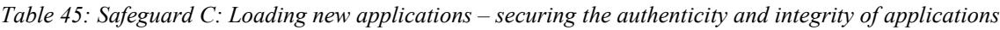

| MCM11  | Code and name of safeguard                                                                                                                                                                                                                                                                                      | Threats addressed   |
|--------|-----------------------------------------------------------------------------------------------------------------------------------------------------------------------------------------------------------------------------------------------------------------------------------------------------------------|---------------------|
| b      | Loading new applications – securing the confidentiality of applications                                                                                                                                                                                                                                      | TCM8,TCM9, TCM12 |
| 1      | No reloading mechanism                                                                                                                                                                                                                                                                                          |                     |
|        | A mechanism for loading new applications is not offered. Applications are only issued individually. A new application is provided by a new carrier medium which encloses the new defined card structure.                                                                                                  |                     |
| 2 3 | Implementation of a reloading mechanism as defined by ISO 7816-13 [ISO07] with Secure Messaging or a mechanism that supports comparable mechanisms strength.                                                                                                                                                 |                     |
|        | See MCM11a. By the application of secure messaging, not only is authenticity assured by MACs, but confidentiality is guaranteed by encryption.                                                                                                                                                               |                     |
|        | Note:When new applications are loaded, cryptographic secrets are generally transmitted along with public data. For this reason, safeguards MCM11a and MCM11b are normally deployed together (secure messaging with negotiation of one session key for authentication security and one for encryption). |                     |

*Table 46: Safeguard C: Loading new applications – securing the confidentiality of applications*

| MCM12   | Code and name of safeguard                                                                                                                                                                                                                                                                                                                                                                | Threats addressed          |  |
|---------|-------------------------------------------------------------------------------------------------------------------------------------------------------------------------------------------------------------------------------------------------------------------------------------------------------------------------------------------------------------------------------------------|----------------------------|--|
| a       | Loading new entitlements – securing the authenticity and integrity of entitlements                                                                                                                                                                                                                                                                                                     | TCM6, TCM8, TCM9, TCM12 |  |
| General | Notes on levels 2 and 3                                                                                                                                                                                                                                                                                                                                                                   |                            |  |
| Note    | It is assumed that the application for which the new entitlements are to be loaded - already exist. If it does not exist yet, then the safeguard "Loading new entitlements" can be referenced (compare MCM11a and MCM11b).                                                                                                                                                       |                            |  |
|         | It must be ensured that entitlements carry unique references when stored on the carrier - medium.                                                                                                                                                                                                                                                                                   |                            |  |
|         | If entitlement keys are to be loaded on the carrier medium, then the data must be - encrypted in every case (see MCM11b).                                                                                                                                                                                                                                                           |                            |  |
| 1       | No reloading mechanism                                                                                                                                                                                                                                                                                                                                                                    |                            |  |
|         | A mechanism for loading new entitlements is not offered; entitlements are only issued individually.                                                                                                                                                                                                                                                                                    |                            |  |
| 2       | Loading process secured by cryptographic methods                                                                                                                                                                                                                                                                                                                                          |                            |  |
|         | The integrity of the transmission of entitlement data is guaranteed using MAC protection with static MAC keys. The integrity of data transmission is supported by MAC protection. The algorithm shall be selected in accordance with [ALGK_BSI].                                                                                                                                    |                            |  |
|         | The type and strength of the mechanism must be adjusted in line with future developments in accordance with [ALGK_BSI].                                                                                                                                                                                                                                                                |                            |  |
| 3       | Complex symmetric authentication concept with session key negotiation                                                                                                                                                                                                                                                                                                                     |                            |  |
|         | The integrity of data transmission is guaranteed using MAC protection with a symmetric MAC key negotiated between the loading terminal and the carrier medium in a highly standardised authentication procedure. Communication between terminal and carrier medium can, for instance, use secure-messaging-secured standard commands such as Update Record and Update Binary. |                            |  |
|         | Possible symmetric algorithms: standardised symmetric authentication using session key negotiation according to [ALGK_BSI]. MAC algorithms have to be selected according to [ALGK_BSI]as well.                                                                                                                                                                                      |                            |  |
|         | The type and strength of the mechanism used for loading should be adapted to future developments in accordance with [ALGK_BSI].                                                                                                                                                                                                                                                        |                            |  |
| 3+      | Complex asymmetric authentication concept in session key negotiation, introduction of Public Key Infrastructure (PKI).                                                                                                                                                                                                                                                                 |                            |  |
|         | Every relevant entity is given its own asymmetric authentication key which has been certified by a certification authority (CA). The overall system is subject to a common Root CA.                                                                                                                                                                                                 |                            |  |
|         | Prior to authentication, the carrier medium and the security module (SAM) in the system                                                                                                                                                                                                                                                                                                   |                            |  |

| MCM12                                                                                                                                                | Code and name of safeguard                                                                                                                                                                                                                                                                                                                                                                                                                                                                                                                                                                 | Threats addressed          |
|------------------------------------------------------------------------------------------------------------------------------------------------------|--------------------------------------------------------------------------------------------------------------------------------------------------------------------------------------------------------------------------------------------------------------------------------------------------------------------------------------------------------------------------------------------------------------------------------------------------------------------------------------------------------------------------------------------------------------------------------------------|----------------------------|
| a                                                                                                                                                    | Loading new entitlements – securing the authenticity and integrity of entitlements                                                                                                                                                                                                                                                                                                                                                                                                                                                                                                      | TCM6, TCM8, TCM9, TCM12 |
|                                                                                                                                                      | of the application provider must exchange the certificates of their public authentication keys, verify them (e.g. using Verify Certificate), and import the public key of the other entity involved. Authentication is then done using a standardised asymmetric authentication procedure. As in level 3, entitlement data is MAC-secured using session keys negotiated between the parties. Selection of algorithms: authentication using RSA or ECC (Key length according to [ALGK_BSI]) for authentication and CA keys; MAC protection according to [ALGK_BSI]. |                            |
|                                                                                                                                                      |                                                                                                                                                                                                                                                                                                                                                                                                                                                                                                                                                                                            |                            |
|                                                                                                                                                      |                                                                                                                                                                                                                                                                                                                                                                                                                                                                                                                                                                                            |                            |
| In level 3+, the type and strength of the mechanism used for loading should also be adapted to future developments in accordance with [ALGK_BSI]. |                                                                                                                                                                                                                                                                                                                                                                                                                                                                                                                                                                                            |                            |

*Table 47: Safeguard C: Loading new entitlements – securing the authenticity and integrity of entitlements*

| MCM12   | Code and name of safeguard                                                                                                                                                                                                                                    | Threats addressed    |  |
|---------|---------------------------------------------------------------------------------------------------------------------------------------------------------------------------------------------------------------------------------------------------------------|----------------------|--|
| b       | Loading new entitlements – securing the confidentiality of entitlements                                                                                                                                                                                    | TCM8, TCM9, TCM12 |  |
| General | Notes on levels 2 and 3                                                                                                                                                                                                                                       |                      |  |
| Note    | When new entitlements are loaded, cryptographic secrets are often transmitted along with public data. For this reason, safeguards MCM12a and MCM12b are normally deployed together.                                                                     |                      |  |
| 1       | No reloading mechanism                                                                                                                                                                                                                                        |                      |  |
|         | A mechanism for loading new entitlements is not offered. Entitlements are only issued individually. Since the entitlement is already stored on the carrier medium, its confidentiality is automatically assured.                                        |                      |  |
| 2       | Loading process secured by cryptographic method                                                                                                                                                                                                               |                      |  |
|         | See MCM11a; in communication between the carrier medium and the external component, not only is authenticity assured by MACs, but confidentiality is also guaranteed by encryption.                                                                     |                      |  |
|         | Possible symmetric algorithms: encryption using TDES, AES128 (preferably) or a comparable open mechanism.                                                                                                                                                  |                      |  |
| 3       | Complex symmetric authentication concept with session key negotiation.                                                                                                                                                                                        |                      |  |
|         | See MCM11a; as part of authentication between carrier medium and external component, an encrypting key is negotiated as well as the MAC key, thus setting up a secure channel.                                                                          |                      |  |
|         | Possible symmetric algorithms: standardised symmetric authentication with session key negotiation by using TDES, AES128 (preferably) or a comparable open mechanism; encryption by using TDES, AES128 (preferably) or a comparable standardised method. |                      |  |
|         | The type and strength of the mechanism used for loading should be adapted to future developments in accordance with [ALGK_BSI].                                                                                                                            |                      |  |

*Table 48: Safeguard C: Loading new entitlements – securing the confidentiality of entitlements*

### **8.4.4 Safeguards regarding the terminal**

The electronic terminals provide the connection between the carrier medium and the management system. Therefore, the description of safeguards regarding the terminal are connected to the overall system (compare section [8.4.2\)](#page-93-1) as well as the carrier medium (compare section [8.4.3\)](#page-106-0). Specific safeguards that depend directly on the terminal are described in the following:

| MT1 | Code and name of safeguard                                                                                                                                                                        | Threats addressed       |
|-----|---------------------------------------------------------------------------------------------------------------------------------------------------------------------------------------------------|-------------------------|
|     | Introduction of interface tests and approval procedures                                                                                                                                           | TCI1, TCI3, TT4, TT8 |
| 1   | Interface test:                                                                                                                                                                                   |                         |
|     | Test of the interfaces of the terminal according to [ISO01], [ISO08a] or if applicable - [BSI08b].                                                                                          |                         |
|     | Definition and usage of specific test specifications for the interfaces regarding the - respective applications.                                                                            |                         |
|     | If applicable test of the interface that is provided in the offline or semi-offline - scenario.                                                                                             |                         |
| 2   | Approval of components:                                                                                                                                                                           |                         |
|     | MT1 level 1 -                                                                                                                                                                                  |                         |
|     | approval of components within the terminal (e.g. key management, secure memory, - applied SAMs, etc.) and components that are used in connection with the terminal (e.g. carrier medium) |                         |
|     | If applicable approval of components that are used in case the terminal is used in an - offline or semi-offline scenario.                                                                   |                         |
| 3   | Certification:                                                                                                                                                                                    |                         |
|     | MT1 level 1 and 2 -                                                                                                                                                                            |                         |
|     | additional certification of the terminal (carrier medium) by and independent - evaluation institution.                                                                                      |                         |

*Table 49: Safeguard T: Introduction of interface tests and approval procedures*

| MT2 | Code and name of safeguard                                                                                                                                       | Threats addressed |
|-----|------------------------------------------------------------------------------------------------------------------------------------------------------------------|-------------------|
|     | Protection against the acceptance of fake IDs                                                                                                                    | TT1               |
| 1   | Only applications which are connected to specific entitlements and are secured by access control (compare MCM1) can successfully communicate with a terminal. |                   |
| 2   | MT2 Level 1 -                                                                                                                                                 |                   |
| 3   | The usage of unencrypted unique identifiers shall not be possible.                                                                                               |                   |

*Table 50: Safeguard T: Protection against the acceptance of fake IDs*

| MT3             | Code and name of safeguard                                                                                                                                                                                                                                                                                              | Threats addressed |
|-----------------|-------------------------------------------------------------------------------------------------------------------------------------------------------------------------------------------------------------------------------------------------------------------------------------------------------------------------|-------------------|
|                 | Protection of reference information against retrieval, data errors and manipulation                                                                                                                                                                                                                                  | TT5, TT6, TT8     |
| General Note | Reference information is processed by the terminal (if applicable in connection with the central information management system) in order to install, activate and deactivate applications and to administer the connected entitlements and application parameters. For example the following data is relevant: |                   |
|                 | (Application, File) identifiers -                                                                                                                                                                                                                                                                                    |                   |
|                 | Keys (e.g. diversification keys, session keys, signature keys) -                                                                                                                                                                                                                                                     |                   |
|                 | Whitelists and Blacklists -                                                                                                                                                                                                                                                                                          |                   |
|                 | Algorithms for evaluation -                                                                                                                                                                                                                                                                                          |                   |
|                 | Based on the applied applications different reference information, employee and usage data is relevant and is processed.                                                                                                                                                                                             |                   |
| 1               | Checksum and physical protection:                                                                                                                                                                                                                                                                                       |                   |
|                 | Appropriate physical access protection for the devices (e.g. encapsulated casing, - mechanical separation of LAN cables).                                                                                                                                                                                         |                   |
|                 | Use checksums for data transfer to avoid transmission errors – does not protect - against manipulation, since checksums can be calculated automatically by almost any software and do not rely on secrets.                                                                                                     |                   |
|                 | Save cryptographic keys and algorithms in a SAM or in a protected area of the - software.                                                                                                                                                                                                                         |                   |
|                 | Introduce access protection for the data within the terminal and administration - functions.                                                                                                                                                                                                                      |                   |
| 2               | Authentication, secure transmission:                                                                                                                                                                                                                                                                                    |                   |
|                 | Mechanisms for detecting data manipulation in the device, such as MAC-secured -                                                                                                                                                                                                                                      |                   |

| MT3 | Code and name of safeguard                                                                                                                                                                                 | Threats addressed                                                                                                                                                              |  |
|-----|------------------------------------------------------------------------------------------------------------------------------------------------------------------------------------------------------------|--------------------------------------------------------------------------------------------------------------------------------------------------------------------------------|--|
|     | Protection of reference information against retrieval, data errors and manipulation                                                                                                                     | TT5, TT6, TT8                                                                                                                                                                  |  |
|     | saving (provided this is possible from a performance point of view).                                                                                                                                       |                                                                                                                                                                                |  |
|     | - reader.                                                                                                                                                                                               | Data should only be transferred from background systems into the reader after mutual authentication, or at least one-sided authentication of the source transmitting to the |  |
|     | Protected data transmission to the carrier medium, where data is to be accepted. -                                                                                                                      |                                                                                                                                                                                |  |
|     | Application-specific separation of algorithms, reference data, usage data and keys. - Save the keys in a SAM or in a protected area of the software. -                                            |                                                                                                                                                                                |  |
|     |                                                                                                                                                                                                            |                                                                                                                                                                                |  |
|     | Introduce application-specific access protection for the reader's data and - administration functions.                                                                                               |                                                                                                                                                                                |  |
| 3   | Advanced protection:                                                                                                                                                                                       |                                                                                                                                                                                |  |
|     | Mechanisms for detecting data manipulation in the device, such as MAC-secured - saving (provided this is possible from a performance point of view).                                                 |                                                                                                                                                                                |  |
|     | Data should only be transferred from management systems into the terminal after - mutual authentication between the terminal and the respective instance with which a communication is performed. |                                                                                                                                                                                |  |
|     | Protected data transmission (i.e. secure messaging) to the carrier medium. -                                                                                                                            |                                                                                                                                                                                |  |
|     | Application-specific separation of algorithms, reference data, usage data and keys. -                                                                                                                   |                                                                                                                                                                                |  |
|     | Save the keys in an application-specific SAMs. -                                                                                                                                                        |                                                                                                                                                                                |  |
|     | Save and execute cryptographic algorithms in an application-specific SAM. -                                                                                                                             |                                                                                                                                                                                |  |
|     | Introduction of multi-tenant, application-specific access protection for the data in the - terminal and administrative functions in accordance with the role model.                                  |                                                                                                                                                                                |  |

*Table 51: Safeguard T: Protection of reference information against retrieval, data errors and manipulation*

| MT4             | Code and name of safeguard                                                                                                                                                                                                                                                                                                                                                                                                                                                                                                                                                                                                                                                                                                                                    | Threats addressed                                                                                                                                                                                                                                                                                                                                                                                                                              |  |
|-----------------|---------------------------------------------------------------------------------------------------------------------------------------------------------------------------------------------------------------------------------------------------------------------------------------------------------------------------------------------------------------------------------------------------------------------------------------------------------------------------------------------------------------------------------------------------------------------------------------------------------------------------------------------------------------------------------------------------------------------------------------------------------------|------------------------------------------------------------------------------------------------------------------------------------------------------------------------------------------------------------------------------------------------------------------------------------------------------------------------------------------------------------------------------------------------------------------------------------------------|--|
|                 | Protection of the terminal against malfunction                                                                                                                                                                                                                                                                                                                                                                                                                                                                                                                                                                                                                                                                                                                | TT2, TT3, TT4                                                                                                                                                                                                                                                                                                                                                                                                                                  |  |
| General Note | The general safeguards are: - the performance, availability, procedural management and function. Definition of test specifications. - - - - not available or temporarily not available.                                                                                                                                                                                                                                                                                                                                                                                                                                                                                                                                               | Provision of a specification that describes the characteristics of the terminal regarding Offline or semi-offline scenario (i.e. data network connection is not available): usage data or data that is necessary for processing shall be secured stored locally. The capacity of the terminal must be adequate for the application scenarios. Introduction of an uninterruptible power supply (UPS) if an external power supply is |  |
|                 | The UPS shall be able to provide a temporarily backup solution (i.e. provision of - power) at least for a specific period of time.                                                                                                                                                                                                                                                                                                                                                                                                                                                                                                                                                                                                                      |                                                                                                                                                                                                                                                                                                                                                                                                                                                |  |
| 1               | Execution to specifications: Based on a concrete specification the system characteristics are realised in particular - for performance, - availability, - procedural management, and - functionality. - Simple ensuring of integrity for system software in order to detect manipulation of - software modules (e.g. testing of entitlements). Physical protection of devices (e.g. encapsulated casing, mechanical separation of - LAN cables). Simple access protection in the form of passwords and IDs in readers for sensitive - tasks such as loading of new software versions. Specification and implementation of a process for supporting new entitlements and - carrier media. |                                                                                                                                                                                                                                                                                                                                                                                                                                                |  |
| 2               | Proof of execution: Ensuring integrity regarding system software to detect manipulation of software - modules (e.g. of entitlement test) Physical protection of devices (e.g. encapsulated casing, mechanical separation of -                                                                                                                                                                                                                                                                                                                                                                                                                                                                                                                  |                                                                                                                                                                                                                                                                                                                                                                                                                                                |  |
|                 | LAN cables).                                                                                                                                                                                                                                                                                                                                                                                                                                                                                                                                                                                                                                                                                                                                                  |                                                                                                                                                                                                                                                                                                                                                                                                                                                |  |

| MT4 | Code and name of safeguard                                                                                                                                                                                                                                                                                                                                            | Threats addressed |
|-----|-----------------------------------------------------------------------------------------------------------------------------------------------------------------------------------------------------------------------------------------------------------------------------------------------------------------------------------------------------------------------|-------------------|
|     | Protection of the terminal against malfunction                                                                                                                                                                                                                                                                                                                        | TT2, TT3, TT4     |
|     | Access protection in the form of passwords and IDs in readers for sensitive tasks such - as loading new software versions. Specification and implementation a process for supporting new carrier media, - applications and entitlements. Documentation of the correct implementation of according specifications defining - performance, - |                   |
|     |                                                                                                                                                                                                                                                                                                                                                                       |                   |
|     |                                                                                                                                                                                                                                                                                                                                                                       |                   |
|     |                                                                                                                                                                                                                                                                                                                                                                       |                   |
|     | availability, -                                                                                                                                                                                                                                                                                                                                                    |                   |
|     | procedural management -                                                                                                                                                                                                                                                                                                                                            |                   |
|     | and functionality -                                                                                                                                                                                                                                                                                                                                                |                   |
|     | using tests that provoke specific malfunctions or operational errors.                                                                                                                                                                                                                                                                                                 |                   |
| 3   | Evaluation:                                                                                                                                                                                                                                                                                                                                                           |                   |
|     | SLA and ensuring support in the event of failure in order to limit the effects of - malfunctions.                                                                                                                                                                                                                                                               |                   |
|     | Ensuring integrity for system software to detect manipulation of software modules - (e.g. test of entitlements); signatures or MAC with appropriate mechanism strength and key length.                                                                                                                                                                       |                   |
|     | Physical protection of devices (e.g. encapsulated casing, mechanical separation of - LAN cables).                                                                                                                                                                                                                                                               |                   |
|     | Access to the terminal's administration functions, such as software updates, only after - authentication of the source of the request.                                                                                                                                                                                                                          |                   |
|     | Specification and implementation of a process for supporting new carrier media, - applications and entitlements.                                                                                                                                                                                                                                                |                   |
|     | Evaluation and certification of system software and hardware by independent test - laboratories according to defined criteria.                                                                                                                                                                                                                                  |                   |

*Table 52: Safeguard T: Protection of the terminal against malfunction*

| MT5 | Code and name of safeguard                                                                                                                                                                                                                                             | Threats addressed |
|-----|------------------------------------------------------------------------------------------------------------------------------------------------------------------------------------------------------------------------------------------------------------------------|-------------------|
|     | Usability                                                                                                                                                                                                                                                              | TT4, TT7          |
| 1   | For the successful operation of the system solution the user acceptance is a very important factor. If the terminal requires not only to hold the carrier medium in the reading range of the terminal but to follow a process control this application has to be |                   |
| 2   |                                                                                                                                                                                                                                                                        |                   |
| 3   | understandable for the employee.                                                                                                                                                                                                                                       |                   |
|     | A well designed process control and the provision of additional information (e.g. with the help of a website) shall support the user.                                                                                                                               |                   |

*Table 53: Safeguard T: Usability*

### **8.4.5 Safeguards regarding the key management**

The following safeguards regarding the key management are introduced and described.

| MKM1    | Code and name of safeguard                                                                                                                                                                                                                                                                                                        | Threats addressed |  |  |
|---------|-----------------------------------------------------------------------------------------------------------------------------------------------------------------------------------------------------------------------------------------------------------------------------------------------------------------------------------|-------------------|--|--|
|         | Specification of key length, secure generation, and assignment of keys                                                                                                                                                                                                                                                         | TKM1, TKM2        |  |  |
| General | The specification of cryptographic keys and parameters is necessary regarding the carrier medium, applications, and the management system in order to provide entitlements within an organisation and to establish an adequate security level. Thereby, the role model as described in section 3.2 has to be considered. |                   |  |  |
| 1       | Specification and generation of cryptographic keys:                                                                                                                                                                                                                                                                               |                   |  |  |
|         | Based on the specification (as described in process P1 in section 6.1) specific keys - with defined characteristics have to be generated.                                                                                                                                                                                   |                   |  |  |
|         | For provision of adequate keys a suitable key generator as defined in M 2.46 [GSHB] - must be used.                                                                                                                                                                                                                         |                   |  |  |
|         | All keys are to be generated in a secure environment and have to be stored by the help - of cryptography. Besides well defined exceptions (where specific and additional safeguards have been specified) the keys are loaded in the carrier medium in a secure environment.                                           |                   |  |  |
|         | Assignment of keys to a specific Security Authentication Module (SAM): -                                                                                                                                                                                                                                                       |                   |  |  |
|         | SAM are based on secure chip hardware as defined by CC EAL 5+ -                                                                                                                                                                                                                                                                |                   |  |  |
|         | Data cannot be retrieved from SAMs -                                                                                                                                                                                                                                                                                           |                   |  |  |
|         | Authentication is required to activate a SAM -                                                                                                                                                                                                                                                                                 |                   |  |  |
|         | In case of eID documents with eID application that can be used for eBusiness (e.g. as electronic Employee ID Card) the key generation is performed by the respective national authority based on the national specifications and technical guidelines (e.g. in Germany [EAC10]).                                         |                   |  |  |
| 2       | Evaluation by a testing laboratory                                                                                                                                                                                                                                                                                                |                   |  |  |
|         | For provision of adequate keys a suitable key generator as defined in M 2.46 [GSHB] - must be used. The quality of the key generator shall be confirmed by an independent testing laboratory.                                                                                                                            |                   |  |  |
|         | All keys are to be generated in a secure environment and have to be stored by the help - of cryptography. Besides well defined exceptions (where specific and additional safeguards have been specified) the keys are loaded in the carrier medium in a secure environment.                                           |                   |  |  |

| MKM1 | Code and name of safeguard                                                                                                                                                                                                                                                                                                        | Threats addressed |  |  |
|------|-----------------------------------------------------------------------------------------------------------------------------------------------------------------------------------------------------------------------------------------------------------------------------------------------------------------------------------|-------------------|--|--|
|      | Specification of key length, secure generation, and assignment of keys                                                                                                                                                                                                                                                         | TKM1, TKM2        |  |  |
|      | Specific keys with defined characteristics have to be generated based on the - specification.                                                                                                                                                                                                                               |                   |  |  |
|      | Assignment of keys to a specific Security Authentication Module (SAM): -                                                                                                                                                                                                                                                       |                   |  |  |
|      | SAM are based on secure chip hardware as defined by CC EAL 5+ -                                                                                                                                                                                                                                                                |                   |  |  |
|      | Data cannot be retrieved from SAMs -                                                                                                                                                                                                                                                                                           |                   |  |  |
|      | Authentication is required to activate a SAM -                                                                                                                                                                                                                                                                                 |                   |  |  |
|      | In case of eID documents with eID application that can be used for eBusiness (e.g. as - electronic Employee ID Card) the correct generation and administration of cryptographic keys and parameters shall be evaluated by the respective national specifications and technical guidelines (e.g. in Germany [BSI09a]). |                   |  |  |
| 3    | Evaluation and certification in accordance with Common Criteria (CC) or applying an equal methodology:                                                                                                                                                                                                                         |                   |  |  |
|      | As defined in MKM1 level 2 -                                                                                                                                                                                                                                                                                                   |                   |  |  |
|      | All requirements must be evaluated and certified in accordance with CC, EAL4 - mechanism strength high, or a comparable procedure.                                                                                                                                                                                          |                   |  |  |
|      | In case of eID documents with eID application that can be used for eBusiness (e.g. as electronic Employee ID Card) the correct generation and administration of cryptographic keys and parameters shall be certified by the respective national specifications and technical guidelines (e.g. in Germany [BSI09a]).      |                   |  |  |

*Table 54: Safeguard KM: Specification of key length, secure generation, and assignment of keys*

| Code and name of safeguard                                                                                                                                                                                                                                                                                                                                                                                                                                                                                                                                                                                                                                                                                                                                                                                                                                                                                                                                                                                                                                                                                                                                                                                                                                                                                                                                                                                                                                                         | Threats addressed   |  |
|------------------------------------------------------------------------------------------------------------------------------------------------------------------------------------------------------------------------------------------------------------------------------------------------------------------------------------------------------------------------------------------------------------------------------------------------------------------------------------------------------------------------------------------------------------------------------------------------------------------------------------------------------------------------------------------------------------------------------------------------------------------------------------------------------------------------------------------------------------------------------------------------------------------------------------------------------------------------------------------------------------------------------------------------------------------------------------------------------------------------------------------------------------------------------------------------------------------------------------------------------------------------------------------------------------------------------------------------------------------------------------------------------------------------------------------------------------------------------------|---------------------|--|
| Establishment of a key management system                                                                                                                                                                                                                                                                                                                                                                                                                                                                                                                                                                                                                                                                                                                                                                                                                                                                                                                                                                                                                                                                                                                                                                                                                                                                                                                                                                                                                                           | TKM1, TKM2, TKM4 |  |
| The key management is defined by the following parameters: Key length - Applied algorithm and cryptographic parameters - Key storage (compare also MKM7) - Generation of keys (compare also MKM1) - Key distribution - Identification of keys - Technical and organisational integration of safeguards - Note: If eID documents are applied, certificate(s) with according entitlements need to be - available to the organisation.                                                                                                                                                                                                                                                                                                                                                                                                                                                                                                                                                                                                                                                                                                                                                                                                                                                                                                                                                                                          |                     |  |
| Key management concept and realisation: Keys are identified by unique IDs - The key usage and the according entities are identified uniquely (e.g. product provider - ID or application ID) Algorithms for the generation of keys have to be selected based on [ALGK_BSI] - (with priority) and [TR_ECARD] In general, static keys shall only be used in well defined clearly manageable areas - where key exchange of the main components is easily possible and the number of unusable components (that are equipped with keys) after the exchange are low. If a static method is used a secure download process of keys shall be defined that allows the exchange of keys in the carrier medium. Therefore, the use of derived keys based on an unique identification number is recommended (e.g. smartcard ID, and a master key). Thus, component specific keys can be generated. The applied key length for the respective function will be individually selected and - specified (compare [ALGK_BSI]). In electronic terminals the keys shall always be stored within encapsulated protected - areas at best secure authentication modules (SAMs) are used. In particular, this is also valid for offline, semi-offline terminals, as well as the corresponding backend systems e.g. keys for the administration of user accounts. Key exchange can be conducted based on two possibilities: - |                     |  |
| personalisation of keys in the carrier medium and components in secure -                                                                                                                                                                                                                                                                                                                                                                                                                                                                                                                                                                                                                                                                                                                                                                                                                                                                                                                                                                                                                                                                                                                                                                                                                                                                                                                                                                                                        |                     |  |
|                                                                                                                                                                                                                                                                                                                                                                                                                                                                                                                                                                                                                                                                                                                                                                                                                                                                                                                                                                                                                                                                                                                                                                                                                                                                                                                                                                                                                                                                                    | environment.        |  |

| MKM2 | Code and name of safeguard                                                                                                                                                                                                                                                                                                                                                                                                                                                                                                                                                                                     | Threats addressed   |  |
|------|----------------------------------------------------------------------------------------------------------------------------------------------------------------------------------------------------------------------------------------------------------------------------------------------------------------------------------------------------------------------------------------------------------------------------------------------------------------------------------------------------------------------------------------------------------------------------------------------------------------|---------------------|--|
|      | Establishment of a key management system                                                                                                                                                                                                                                                                                                                                                                                                                                                                                                                                                                       | TKM1, TKM2, TKM4 |  |
|      | Download of new keys (compare MKM8). -                                                                                                                                                                                                                                                                                                                                                                                                                                                                                                                                                                      |                     |  |
|      | The key management is under the responsibility of the security manager (compare - section 3.2). An adequate security management shall be described within the concept phase and include all involved entities (compare section 6.1) and their assigned keys (history regarding activated, deactivated, and new issued keys). Within this concept the responsible entities are described, and the correct implementation is checked by these entities in the following. Furthermore, enhancements in cryptography are considered in order to be able to respond in advance to new threats. |                     |  |
| 2    | Key management concept and realisation (high-quality methods): Additionally to the described safeguards in MKM2 level 1 the following shall be applied:                                                                                                                                                                                                                                                                                                                                                                                                                                                  |                     |  |
|      |                                                                                                                                                                                                                                                                                                                                                                                                                                                                                                                                                                                                                |                     |  |
|      | In electronic terminals the keys shall always be stored within encapsulated security - authentication modules (SAMs). In particular, this is also valid for offline, semi offline terminals, as well as the corresponding backend systems e.g. keys for the administration of user accounts.                                                                                                                                                                                                                                                                                                       |                     |  |
|      | Besides the generation of component specific keys the exchange of session keys is - performed which are received dynamically based on changeable data (e.g. random number generators). This effectively prevents messages from being eavesdropped.                                                                                                                                                                                                                                                                                                                                                    |                     |  |
| 3    | Secure and flexible key management concept:                                                                                                                                                                                                                                                                                                                                                                                                                                                                                                                                                                    |                     |  |
|      | Additionally to the described safeguards in MKM2 level 1 and 2 the following shall be applied:                                                                                                                                                                                                                                                                                                                                                                                                                                                                                                              |                     |  |
|      | A public key infrastructure with a complex asymmetric key management procedure - with a root CA, several sub-CAs, and certified authentication and encryption keys is realised.                                                                                                                                                                                                                                                                                                                                                                                                                       |                     |  |
|      | The length of the asymmetric keys shall be selected based on [ALGK_BSI] (with - priority) and [TR_ECARD].                                                                                                                                                                                                                                                                                                                                                                                                                                                                                                |                     |  |
|      | The mechanism and strength of the download procedure has to be adopted to future developments in accordance with [ALGK_BSI].                                                                                                                                                                                                                                                                                                                                                                                                                                                                                |                     |  |

| Table 55: Safeguard KM: Establishment of a key management system |  |  |
|------------------------------------------------------------------|--|--|
|------------------------------------------------------------------|--|--|

| MKM3    | Code and name of safeguard                                                                                                                                                                                                                                                                                                                                                                | Threats addressed |  |
|---------|-------------------------------------------------------------------------------------------------------------------------------------------------------------------------------------------------------------------------------------------------------------------------------------------------------------------------------------------------------------------------------------------|-------------------|--|
|         | Access protection for cryptographic keys (read and write access)                                                                                                                                                                                                                                                                                                                          | TKM2, TKM3        |  |
| General | Cryptographic keys are used in the carrier medium, the electronic terminal, and the management system. In all cases adequate mechanisms regarding the access protection have to be specified. Thereby, the role model (compare section 3.2), the concept how keys are regenerated as well as the validity model (i.e. how long entitlements are valid) have to be considered. |                   |  |
| 1       | Manufacturer's declaration:                                                                                                                                                                                                                                                                                                                                                               |                   |  |
|         | Keys and passwords on the carrier media are protected against retrieval and - manipulation attacks.                                                                                                                                                                                                                                                                                 |                   |  |
|         | After a key has been stored in a SAM or any other secure memory for keys within the - system infrastructure, the key cannot be readout by software applications.                                                                                                                                                                                                                    |                   |  |
|         | New keys are loaded in accordance with MKM8. -                                                                                                                                                                                                                                                                                                                                         |                   |  |
|         | The access protection is certified by manufacturer's declarations.                                                                                                                                                                                                                                                                                                                        |                   |  |
| 2       | Evaluation by testing laboratory:                                                                                                                                                                                                                                                                                                                                                         |                   |  |
|         | Keys and passwords on the carrier media are protected against retrieval and - manipulation attacks.                                                                                                                                                                                                                                                                                 |                   |  |
|         | After a key has been stored in a SAM or any other secure memory for keys within the - system infrastructure, the key cannot be readout by software applications.                                                                                                                                                                                                                    |                   |  |
|         | New keys are loaded in accordance with MKM8. -                                                                                                                                                                                                                                                                                                                                         |                   |  |
|         | The access protection is certified by test reports from independent testing laboratories.                                                                                                                                                                                                                                                                                                 |                   |  |
| 3       | Evaluation and certification in accordance with CC or a procedure of the same standard:                                                                                                                                                                                                                                                                                                   |                   |  |
|         | Keys and passwords on the carrier media are protected against retrieval and - manipulation attacks.                                                                                                                                                                                                                                                                                 |                   |  |
|         | After a key has been stored in a SAM or any other secure memory for keys within the - system infrastructure, the key cannot be readout by software applications.                                                                                                                                                                                                                    |                   |  |
|         | New keys are loaded in accordance with MKM8. -                                                                                                                                                                                                                                                                                                                                         |                   |  |
|         | The access protection is certified by test reports from independent testing laboratories. Carrier media, that are used for the transport of keys to offline systems and SAMs are certified in accordance with CC EAL5+.                                                                                                                                                             |                   |  |

*Table 56: Safeguard KM: Access protection for cryptographic keys (read and write access)*

| MKM4    | Code and name of safeguard                                                                                                                                                                                                                                                                                  | Threats addressed |  |
|---------|-------------------------------------------------------------------------------------------------------------------------------------------------------------------------------------------------------------------------------------------------------------------------------------------------------------|-------------------|--|
|         | Securing of the functional aspects regarding the security components                                                                                                                                                                                                                                     | TKM2, TKM3        |  |
| General | Besides the secure generation, storage and protection of the key material the handling of keys has to be considered. This includes all components used for saving and processing keys – referred to in the following as security components – that must be checked to ensure they are trustworthy. |                   |  |
| 1       | Manufacturer's declarations                                                                                                                                                                                                                                                                                 |                   |  |
|         | Verification of the safety based on internal quality assurance mechanisms of the manufacturer.                                                                                                                                                                                                           |                   |  |
| 2       | Testing in accordance with test specifications:                                                                                                                                                                                                                                                             |                   |  |
|         | Definition of test specifications for each security component. -                                                                                                                                                                                                                                         |                   |  |
|         | Technical checking of components in accordance with the relevant test regulations. -                                                                                                                                                                                                                     |                   |  |
|         | Specification and implementation of integration tests in test environments and - practical environments.                                                                                                                                                                                              |                   |  |
| 3       | Evaluation:                                                                                                                                                                                                                                                                                                 |                   |  |
|         | As defined in MKM4 level 2, and also:                                                                                                                                                                                                                                                                       |                   |  |
|         | Security components are tested by independent test laboratories. -                                                                                                                                                                                                                                       |                   |  |
|         | The relevant security components are certified by an independent institution. -                                                                                                                                                                                                                          |                   |  |
|         | Establishment of an approval procedure for the security components. -                                                                                                                                                                                                                                    |                   |  |

*Table 57: Safeguard KM: Securing of the functional aspects regarding the security components*

| MKM5 | Code and name of safeguard                                                                                                                                                                                                                                                                                                                                                                                                                                                                                                                                                  | Threats addressed |
|------|-----------------------------------------------------------------------------------------------------------------------------------------------------------------------------------------------------------------------------------------------------------------------------------------------------------------------------------------------------------------------------------------------------------------------------------------------------------------------------------------------------------------------------------------------------------------------------|-------------------|
|      | Availability of the key management (fallback solution)                                                                                                                                                                                                                                                                                                                                                                                                                                                                                                                      | TKM5              |
| 1    | Offline capability and secure backup in case of blackout of the system:                                                                                                                                                                                                                                                                                                                                                                                                                                                                                                     |                   |
| 2    | Because the security of the system solution depends highly on the key strength the loss of this data is critical. While the loss of a carrier medium has only restricted consequences the loss of data on the management system side is considerable higher. Thus, the management system (in particular the backend system) has to be designed redundant12 such that in the case of failure of the main system the backup system including the key information is available and changes its state as a backup system to an operating state automatically. |                   |
|      | It must be ensured that the backup mechanisms are performed regularly and that they - fulfil the same security requirements as the original.                                                                                                                                                                                                                                                                                                                                                                                                                          |                   |
|      | The system shall be designed in a way that if the key management is temporarily - unavailable (i.e. failure of the backend system or one or several system interfaces) a limited operation is possible. This can be achieved by the provision of units that allow limited access in the offline case.                                                                                                                                                                                                                                                           |                   |
|      | The replacement of defective key components shall be regulated. -                                                                                                                                                                                                                                                                                                                                                                                                                                                                                                        |                   |
|      | A help desk shall be established that can induce adequate mechanisms if it is informed - about the unavailability of the key management.                                                                                                                                                                                                                                                                                                                                                                                                                              |                   |
| 3    | Implementation according to fallback concept and backup of keys in a Trust Centre                                                                                                                                                                                                                                                                                                                                                                                                                                                                                           |                   |
|      | As defined in MKM5 level 1 and 2, and also:                                                                                                                                                                                                                                                                                                                                                                                                                                                                                                                                 |                   |
|      | A disaster recovery plan shall be specified that clearly defines the availability and - fallback solutions together with availability periods, as well as agreements between the entities.                                                                                                                                                                                                                                                                                                                                                                         |                   |
|      | A list for the assignment of the responsible person for every individual task shall be - included in the disaster recovery plan.                                                                                                                                                                                                                                                                                                                                                                                                                                      |                   |
|      | Critical components must have an uninterrupted power supply unit (UPS) and other - security mechanisms (such as RAID) so that the failure of sub-components does not impair the availability of the overall system.                                                                                                                                                                                                                                                                                                                                                |                   |
|      | A sufficient number of replacement system components must be kept available (in - cold or warm standby) so as to ensure the required level of availability.                                                                                                                                                                                                                                                                                                                                                                                                           |                   |
|      | The Trust Centre must back up the system-wide keys. -                                                                                                                                                                                                                                                                                                                                                                                                                                                                                                                    |                   |

*Table 58: Safeguard KM: Availability of the key management (fallback solution)*

12 At least two separate places (original and backup) shall be considered each in secure environments. System- wide keys means all symmetric keys as well as any asymmetric keys not specific to particular cards.

| MKM6    | Code and name of safeguard                                                                                                                                                                                                                                                                                                                  | Threats addressed |
|---------|---------------------------------------------------------------------------------------------------------------------------------------------------------------------------------------------------------------------------------------------------------------------------------------------------------------------------------------------|-------------------|
|         | Definition of actions in case keys have been compromised                                                                                                                                                                                                                                                                                    | TKM4, TKM5        |
| General | This safeguard has to be distinguished from any safeguards used to prevent compromises from occurring.                                                                                                                                                                                                                                   |                   |
| 1       | An individual key has been compromised: If only single electronic Employee ID Cards are compromised they can be blocked individually. An entry is made in the user account for later follow up.                                                                                                                                       |                   |
| 2       | More or essential keys have been compromised:                                                                                                                                                                                                                                                                                               |                   |
| 3       | All keys that are classified as important are provided redundant (i.e. a master and - slave concept is applied). This is true for SAMs and carrier media13. In case of a disaster the state of the system is switched to disaster recovery and the slave key is applied.                                                        |                   |
|         | Every time a RFID carrier medium communicates with the terminal, the emergency - version is used instead of the regular version – assuming this has not already happened. To this end, suitable mechanisms must be maintained in the carrier medium that prevent the regular version from being used later.                     |                   |
|         | The compromised keys shall be made unusable. This can be achieved by blocking all - respective keys, the collection of compromised carrier media and if applicable logging of attempts to use a blocked key.                                                                                                                       |                   |
|         | If the security modules are altogether compromised and an emergency version of the - key is not available, then the security modules and therefore the carrier media must be replaced immediately. The data in the system cannot be considered trustworthy until all the security modules and carrier media have been replaced. |                   |

*Table 59: Safeguard KM: Definition of actions in case keys have been compromised*

| MKM7 | Code and name of safeguard                                                                                                                                                                                                                                                                                              | Threats addressed |
|------|-------------------------------------------------------------------------------------------------------------------------------------------------------------------------------------------------------------------------------------------------------------------------------------------------------------------------|-------------------|
|      | Administration of separate keys                                                                                                                                                                                                                                                                                         | TKM2, TKM4        |
| 1    | Separate storage and handling of keys:                                                                                                                                                                                                                                                                                  |                   |
| 2    | In order to avoid failure or misuse of key material the applications in all components - of the system shall be clearly divided. The administration of keys shall be secured by adequate mechanisms such as access - control. In general, only the security manager can decide about the administration. |                   |
| 3    |                                                                                                                                                                                                                                                                                                                         |                   |

*Table 60: Safeguard KM: Administration of separate keys*

13 In case they are used for comprehensive or higher security functions.

| MKM8    | Code and name of safeguard                                                                                                                                                                                                                                                                                   | Threats addressed |
|---------|--------------------------------------------------------------------------------------------------------------------------------------------------------------------------------------------------------------------------------------------------------------------------------------------------------------|-------------------|
|         | Loading of new keys – securing the authenticity and integrity                                                                                                                                                                                                                                                | TKM1, TKM2        |
| General | Keys shall be associated clearly with an application or an entitlement, and when the application or entitlement is loaded, they shall be imported into the carrier medium from the SAM. An autonomous process for loading new keys is especially relevant for SAMs, and is advisable at all levels. |                   |
|         | Note:                                                                                                                                                                                                                                                                                                        |                   |
|         | If keys are used for central services - e.g. ensuring authenticity of the main mechanisms of the system solution such as generation of new keys, loading of new applications or entitlements or the like - they cannot be changed or overwritten since they build the core elements of the system.  |                   |
| 1       | Simple authentication concept                                                                                                                                                                                                                                                                                |                   |
| 2       | I. Preliminary remarks                                                                                                                                                                                                                                                                                       |                   |
|         | 1. Keys must each have a unique identifier containing information on the issuing organisation, and a version number.                                                                                                                                                                                      |                   |
|         | 2. There shall be a way of deleting or blocking keys that have been expired or are revoked.                                                                                                                                                                                                               |                   |
|         | 3. New keys are loaded from a key management system into the SAM by the security manager or an authorised entity; this requires an online connection.                                                                                                                                                     |                   |
|         | 4. Keys must always be loaded under confidential conditions, for which a decryption key is required in the SAM.                                                                                                                                                                                           |                   |
|         | 5. A symmetric procedure is used for loading new keys, for which the key issuer has a symmetric master key (KM_Storekey); derived from that, keys that are particular to each card are stored in the SAMs (see II.)                                                                                    |                   |
|         | II. General procedure                                                                                                                                                                                                                                                                                        |                   |
|         | New keys are loaded using the following procedure:                                                                                                                                                                                                                                                           |                   |
|         | 1. The carrier medium sends its ID to the terminal, which passes it on to the SAM.                                                                                                                                                                                                                           |                   |
|         | 2. The SAM uses this to derive the card's specific key, K_Storekey, from the master key (KM_Storekey).                                                                                                                                                                                                    |                   |
|         | 3. The K_Storekey is used to perform authentication between the SAM and employee carrier medium. A shared session key is negotiated for this purpose.                                                                                                                                                     |                   |
|         | 4. Once authentication has been completed successfully, the keys are encrypted using the session key, and stored in the SAM.                                                                                                                                                                              |                   |
| 3       | Complex authentication concept                                                                                                                                                                                                                                                                               |                   |
|         | I. Preliminary remarks                                                                                                                                                                                                                                                                                       |                   |
|         | 1. Keys must each have a unique identifier containing information on the issuing                                                                                                                                                                                                                             |                   |

| MKM8 | Code and name of safeguard                                                                                                                                                                                                                                                                                                                                                       | Threats addressed |
|------|----------------------------------------------------------------------------------------------------------------------------------------------------------------------------------------------------------------------------------------------------------------------------------------------------------------------------------------------------------------------------------|-------------------|
|      | Loading of new keys – securing the authenticity and integrity                                                                                                                                                                                                                                                                                                                    | TKM1, TKM2        |
|      | organisation, a unique ID, and a version number.                                                                                                                                                                                                                                                                                                                                 |                   |
|      | 2. There shall be a way of deleting or blocking keys that have been expired or are revoked. 3. New keys are loaded from a key management system into the SAM by the security manager or an authorised entity; this requires an online connection. 4. Keys must always be loaded under confidential conditions, for which a decryption key is required in the SAM. |                   |
|      |                                                                                                                                                                                                                                                                                                                                                                                  |                   |
|      |                                                                                                                                                                                                                                                                                                                                                                                  |                   |
|      | 5. An asymmetric procedure is used for loading new keys into a SAM, for which a PKI with a CA must be established with which to certify all asymmetric keys.                                                                                                                                                                                                                  |                   |
|      | II. General procedure                                                                                                                                                                                                                                                                                                                                                            |                   |
|      | New keys are loaded using a procedure such as the following:                                                                                                                                                                                                                                                                                                                     |                   |
|      | 1. The key issuer (or key management system) sends a public key certified by the CA to the terminal.                                                                                                                                                                                                                                                                          |                   |
|      | 2. The SAM verifies the certificate (e.g. with Verify Certificate) and stores the key issuer's public key temporarily.                                                                                                                                                                                                                                                        |                   |
|      | 3. The key issuer encrypts the keys that are to be loaded, as well as the other information associated with them (key ID, key version, operating counter, …) using the SAM's public encrypting key, signs the cryptogram using its own private key, and sends the cryptogram and signature to the SAM.                                                                  |                   |
|      | 4. The SAM checks the signature using the key issuer's public signature key, and if that is successful it decrypts the cryptogram using its own private decryption key, and saves the key and additional information permanently.                                                                                                                                          |                   |

*Table 61: Safeguard KM: Loading of new keys – securing the authenticity and integrity*

# **9 Definition of product-specific application scenarios**

The processes which have been examined in sections [6](#page-35-0) and [7](#page-47-0) will be considered for the realisation of particular products in the following.

The application scenarios within the field of electronic Employee ID Cards offer a wide range of properties that can be chosen by an individual company or authority solution. It is the objective of this technical guideline to analyse the most common and important application scenarios that have to be considered in the context of safety, information security, and privacy for the application area of an electronic Employee ID Card.

The results of this analysis will be used to specify recommendations for the technical realisation of the overall system and the according business processes.

The following application scenarios will be taken into account:

1. Application scenario "Access Control"

The establishment of adequate access control mechanisms is very important in organisations in order to grant access only to authorised people. Thereby different levels of access can be considered (e.g. to a the property of a company, a specific floor, or room). The objective of an electronic Employee ID Card is to provide an employee easy access to the resources of the organisation.

- 2. Application scenario "Time Registration" RFID technology can be established in an organisation to provide easy-to-use, flexible, and user friendly registration of working hours. The objective is to assign e.g. the registered start and end
	- time to the correct identity of an employee so that the flexibility of accounting can be improved.
- 3. Application scenario "Payment" Different scenarios in an organisation can require the need for secure, fast, and straightforward payment processes e.g. the payment of the cafeteria food shall be established in connection with the calculation of salaries or the copier has to be paid per original.
- 4. Application scenario "IT-log-on"

An electronic Employee ID Card can assist the holder in different electronic processes. Authentic or confidential sending of emails is only one example. This technical guideline focuses on the scenario of secure log on to computer systems.

The electronic Employee ID Card can be considered as a multi application card. If the provision of further applications in an organisation might be possible in the future this shall be considered already by the specification of the system solution.

The following sections provide more detailed information regarding the different application scenarios.

## **9.1 Application scenario: "Access Control"**

### **Description**

By issuing an electronic Employee ID Card the organisation enables a specific employee to access the area of that organisation based on defined entitlements. The use of the carrier medium can be bounded to a single or distributed locations.

The application of access control is often connected to the application of time registration or payment.

### **Requirements**

An entitlement shall be designed in a flexible and modular way such that the access can be assignment according to the specific needs of the organisation.

Performance is a very important factor for the application of access control, since some application scenarios can be considered time-critical e.g. access to a parking lot. Access control with contactless carrier media must be reliable, fast, and secure.

If biometrics are used for the registration (with match-on-card or storage in a backend system) the electronic terminal has to be equipped with a biometric unit.

The storing and processing of personal data has to be performed in agreement with the working council or an assigned instance and the data protection official.

### **Commercial value/Threat of misuse**

The commercial value depends highly on the values that shall be protected by the access control. This can range from operating resources e.g. computer systems, arbitrary hardware, and stored data to industrial secrets. In case these values are lost or stolen the reputation or the advantage in competition can be threatened.

### **Application of the carrier medium**

In many cases a contactless chip card is issued that includes several different applications (e.g. compare section [9.2,](#page-143-0) [9.3](#page-144-0) or [9.4\)](#page-145-0) at the same time. An application can be assigned to one or several entitlements. Besides the electronic stored data visual features e.g. facial image and personal data such as name and job title are often important for the application scenario of access control.

The electronic Employee ID Card is assigned to an employee but is owned by the according organisation. Normally, the cards are in use for several years, therefore the cost of the carrier medium inclusive the calculated number of lost carrier media and the necessary further components (terminals, applications, and management systems) have to be balanced with the values that have to be protected.

Access control can be established for different scenario e.g. physical access to the area of the organisation, elevators, levels, or single rooms.

## **9.2 Application scenario: "Time Registration"**

### **Description**

Modern time registration systems in an organisation are often based on complex accounting models since factors such that planning and administration have to be considered. An electronic Employee ID Card supports easy registration of start and end times as well as different types of work hours i.e. operative time, break, or overtime. A comprehensive system solution for time registration can support human resources.

The application of time registration is often connected with the application of access control and is therefore often based on already established processes. This can also mean that the same software application is used to provide services for access control and time registration.

The storing and processing of personal data has to be performed in agreement with the working council or an assigned instance and the data protection official.

#### **Requirements**

The organisation receives a tool that allows an easy and flexible planing of the human resources. If biometrics are used for the registration (with match-on-card or storage in a backend system) the electronic terminal has to be equipped with a biometric unit.

#### **Commercial value/Threat of misuse**

The possible damage can range from a single accounting error to the false accounting of all employee working hours. The misuse by passing an electronic Employee ID Card to a third person shall not be underestimated. Nevertheless, the transfer can be reduced if more than one application is supported by the carrier medium and the holder is responsible for misuse.

#### **Application of the carrier medium**

In many cases a contactless chip card is issued that includes several different applications (e.g. compare section [9.2,](#page-143-0) [9.3](#page-144-0) or [9.4\)](#page-145-0) at the same time. An application can be assigned to one or several entitlements. Often the time registration is performed at the entrance and exit of the organisation. Different requirements of an organisation can be realised with according software and hardware components.

The employee holds the carrier medium in the reading range of the electronic terminal and thereby starts the process of time registration. If applicable specific configurations can be performed at the electronic terminal e.g. entering of an additional PIN and selection of the working type.

For the application of time registration fallback solutions and exception handling e.g. temporarily no power for the electronic terminals have to be available.

## **9.3 Application scenario: "Payment"**

### **Description**

Cashless payment can be used within an organisation to optimise processes since no change is necessary. In [\[FI08\]](#page-244-6) open and closed payment transaction systems are distinguished. While closed payment transaction systems include all cashless applications within a defined environment (e.g. an organisation) open systems are usually based on established standards such as ISO/IEC 14443 [\[ISO08b\]](#page-245-11) and are used between different instances. Furthermore two concepts for the accounting can be distinguished. A prepaid-system can be applied where a specific value of money is charged at a terminal on the carrier medium. During the payment process this value is decreased. The payment is performed anonymous. Another possibility is to charge a shadow account that can directly be accounted with the calculation of salaries. Thus, bonuses and monetary benefits can easily be calculated.

In this technical guideline closed payment systems within an organisation are considered as well as prepaid systems.

If an eID document is used within an organisation normally no data can be loaded on the underlying carrier medium. In this case an authentication has to be performed so that the payment can be connected to the according shadow account which is administrated in the backend system.

#### **Commercial value/Threat of misuse**

The commercial value is normally less than €100 since the payment is used in a cafeteria, parking lots, or kiosk where the items are comprehensive. Further applications comprise additional resources e.g. copier or gas stations.

By applying prepaid-systems the maximum loss of the commercial value depends on the maximum amount of money that can be loaded on the carrier medium electronically. If a shadow account system is used the maximum loss can be a lot higher. Therefore adequate security mechanisms and blocking mechanisms need to be considered.

The circle of users and visitors is restricted.

#### **Application of the carrier medium**

The electronic Employee ID Card is equipped with a payment application. If a service is only provided for members of an organisation specific entitlements can be assigned to the application (in the case of bonus programs).

Electronic terminals are made available for the charging process and to enable the employee to check the recent state of the payment application i.e. how much money is available at the identity card.

In case of payment the electronic Employee ID Card is brought in the reading range of the cashpoint and the respective amount is subtracted.

For the application of payment fallback solutions and exception handling e.g. temporarily no power for the electronic terminals have to be available.

## **9.4 Application scenario: "IT-log-on"**

### **Description**

Besides physical access to the area of an organisation the storage, processing and handling of electronic data is of major concern. This can range from access to a local system to the access of distributed networks. As a consequence, authentication to a computer system is very important.

The application can be quite complex if Single-Sign-On (SSO) scenarios are considered because different alternatives are possible and are selected according to the requirements of an organisation. In this technical guideline the concept of SSO is not described any further.

#### **Requirements**

An electronic terminal has to be connected to the respective computer system. If biometrics are used for the registration (with match-on-card) the electronic terminal has to be equipped with a biometric unit.

#### **Commercial value/Threat of misuse**

The commercial value depends highly on the value of the electronic data that are stored on the computer system or can be accessed within the network. In general, the described data has to be considered of high value since it builds the know-how of the organisation and offers advantages in competition.

#### **Application of the carrier medium**

An electronic Employee ID Card can provide entitlements that can be used to log on to one or several hardware resources.

For the application of IT-log-on fallback solutions and exception handling e.g. temporarily no power for the electronic terminals have to be available.

# **10 Recommendations for implementing the overall system**

In this section as an example an overall system regarding the application area "Electronic Employee ID Card" is described.

The overall system consist of the system infrastructure of an organisation and the carrier medium (here: electronic Employee ID Card) which are issued to the internal and external employees as well as to visitors. The system infrastructure is based on the individual requirements of the company or authority and thereby roles, processes and components with the connected interfaces have to be considered.

The solution which is presented in the following is based on the role model which was introduced in section [3.2,](#page-20-0) the processes in section [6,](#page-35-0) and the different application scenarios presented in section [9.](#page-141-0) The application area of an electronic Employee ID Card can be arbitrarily complex, since an organisation can chose between a number of applications an every application usually provides different properties from which an organisation can choose of. Thus, this technical guideline cannot describe every possible solution but tries to analyse the scenarios which are often applied. If necessary simplifications e.g. regarding the role model or other conditions within the system infrastructure are made this can lead to affects to other components within the system.

It is the focus of this technical guideline to sensibilise an organisation of the existing threats and identify the security requirements in particular of the handling of personal and usage data. Therefore at first, the protection demand categories are assigned for the overall system (compare section [10.1.1](#page-147-0) in particular table [62\)](#page-151-0) based on the afore introduced general description in section [8.2.5.](#page-78-1) Afterwards a relationship between the protection demand and the relevant threats is established.

*Note:* Within this scope the maximum principle applies which means that in case a threat occurs for several security targets the assigned protection demand is defined based on the highest protection result even though a single security target may require less protection demand. Based on the description of the relevant threats, the safeguards are described. Nevertheless, a lower protection level may be chosen for a safeguard under specific circumstances but shall be documented and motivated.

The following sections consider the overall solution while afterwards section [11](#page-175-0) will emphasise on the specific application scenarios.

## **10.1 Recommendations of executing the infrastructure of the electronic Employee ID Card**

By considering the overall system in relation of the carrier medium the following issues will be addressed in more detail:

- **-** system infrastructure
- **-** interfaces
- **-** electronic terminals
- **-** applications and backend system (i.e. mainly the management system)
- **-** explicitly the key management and
- **-** the carrier medium.

In general, depending on the afore listed components the threats and counteracting safeguards are described and finally the derived residual risks are identified.

### **10.1.1 Evaluation of the protection demand for the infrastructure of the electronic Employee ID Card**

For the application area "Electronic Employee ID Card" the following considerations shall be applied that have an influence on the evaluation of the protection demand regarding the infrastructure:

- 1. It is the objective of the system infrastructure (compare section [10.1\)](#page-147-1) to provide all different application scenarios at the same time. This means that the system architecture and the included components shall be able to be used in different contexts.
- 2. Personal data can either be stored on a carrier medium[14](#page-147-2) or within the management system. In any case the agreed data has to be managed and processed for the provision of individual services.
- 3. Usage data is accumulated by the processing of applications e.g. within the scope of registration. This data has to be analysed, communicated, and sent to the according receiver.

14 This applies in particular if the system infrastructure is designed to support different backend systems.

Based on the criteria defined in section [8.2.5](#page-78-1) the infrastructure for the electronic Employee ID Card can be assigned to the following protection demand categories[15](#page-148-0):

| Code                              | Security targets                                    | Protection demand category | Criteria for the classification of protection demand categories                                                                                                                                                                       |  |
|-----------------------------------|-----------------------------------------------------|----------------------------------|------------------------------------------------------------------------------------------------------------------------------------------------------------------------------------------------------------------------------------------|--|
| SS1 Technical compatibility |                                                     | 1                                | All system components come from the same supplier. The supplier ensures that they are compatible.                                                                                                                                     |  |
|                                   |                                                     | 2                                | The system has to function with components from a small number of defined suppliers. The system manager or a system integrator ensures compatibility.                                                                              |  |
|                                   |                                                     | 3                                | Open system that has to function with components from any company in the market.                                                                                                                                                      |  |
|                                   |                                                     |                                  | The interoperability depends highly on the tender and the scope of the system solution.                                                                                                                                               |  |
| SS2                               | Fallback solution in the event of malfunction | 1                                | Malfunction affects only a few employees.                                                                                                                                                                                                |  |
|                                   |                                                     | 2                                | Malfunction affects many employees.                                                                                                                                                                                                      |  |
|                                   |                                                     | 3                                | Malfunction affects all employees.                                                                                                                                                                                                       |  |
|                                   |                                                     |                                  | System malfunction (e.g. terminals, key management, blocking and unblocking services, or processing units) can affect a large number of employees.                                                                                 |  |
| SS3                               | Intuitive, fault tolerant operation              | 1                                | A few employees cannot operate the system solution intuitively.                                                                                                                                                                       |  |
|                                   |                                                     | 2                                | Many employees cannot operate the system solution intuitively.                                                                                                                                                                        |  |
|                                   |                                                     | 3                                | Almost all of the employees cannot operate the system solution intuitively.                                                                                                                                                           |  |
| SI1                               | Protection of personal data                      | 1                                | Data is lost and/or employee reputation is in menace in short terms.                                                                                                                                                                  |  |
|                                   |                                                     | 2                                | Data is falsified and/or employees' social existence is in menace in middle terms.                                                                                                                                                    |  |
|                                   |                                                     |                                  | If person related data that is used for the processing of applications is stolen or manipulated, the employee may suffer considerable commercial and social consequences. In the case that biometrics is applied the protection |  |

15 A protection demand category can either be described as a requirement or by its impact.

| Code | Security targets                                  | Protection demand category | Criteria for the classification of protection demand categories                                                                                                                                                                                                                                                   |  |
|------|---------------------------------------------------|----------------------------------|----------------------------------------------------------------------------------------------------------------------------------------------------------------------------------------------------------------------------------------------------------------------------------------------------------------------|--|
|      |                                                   |                                  | demand category can be classified even higher!                                                                                                                                                                                                                                                                       |  |
|      |                                                   | 3                                | Data becomes known to third parties and/or employees' social existence is in menace in long terms.                                                                                                                                                                                                                |  |
| SI2  | Protection of entitlements                     | 1                                | Misuse has short term and less monetary or image consequences for the concerned party.                                                                                                                                                                                                                            |  |
|      |                                                   | 2                                | Misuse has medium term and medium monetary or image consequences for the concerned party.                                                                                                                                                                                                                         |  |
|      |                                                   | 3                                | Misuse has long term and high monetary or image consequences for the concerned party.                                                                                                                                                                                                                             |  |
|      |                                                   |                                  | The damage can hardly be described in a monetary way but the consequences for an organisation are to be evaluated as very high, because considerable commercial loss is suffered.                                                                                                                           |  |
| SI3  | Protection of usage data                       | 1                                | Data is lost and/or the reputation of the organisation is in menace by short terms.                                                                                                                                                                                                                               |  |
|      |                                                   | 2                                | Data is falsified and/or the reputation of the organisation is in menace by middle terms.                                                                                                                                                                                                                         |  |
|      |                                                   | 3                                | Data becomes known to third parties and/or the reputation and continuity of the organisation is in menace by long terms.                                                                                                                                                                                       |  |
|      |                                                   |                                  | The usage data is of main concern to the organisation and therefore great advantage in competition would be lost.                                                                                                                                                                                              |  |
| SI4  | Protection of applications and entitlements | 1                                | Applications are issued by the same application issuer and entitlements by the same product owner.                                                                                                                                                                                                                |  |
|      |                                                   | 2                                | Applications are provided within one organisation by different application providers but are used with one backend system. The entitlements are connected to the respective applications and are issued from the security manager. Several partner collaborate and "trust" each other in the process. |  |
|      |                                                   | 3                                | Applications are provided within one organisation by different application providers and are used with up to more than one backend system. The entitlements are connected to                                                                                                                                   |  |

| Code | Security targets                                                         | Protection demand category | Criteria for the classification of protection demand categories                                                                                                                                       |  |
|------|--------------------------------------------------------------------------|----------------------------------|----------------------------------------------------------------------------------------------------------------------------------------------------------------------------------------------------------|--|
|      |                                                                          |                                  | the respective applications and are issued by different instances. Several partner collaborate but do not "trust" each other in the process.                                                       |  |
|      |                                                                          |                                  | When entitlements are loaded onto multi-application cards, it must always be assumed that applications from other entities may be present on the carrier medium.                                   |  |
| SI5  | Protection of the system infrastructure                            | 1                                | The reputation of the organisation is in menace by short term consequences.                                                                                                                           |  |
|      |                                                                          | 2                                | The reputation of the organisation is in menace by medium term consequences.                                                                                                                          |  |
|      |                                                                          | 3                                | Long term consequences have impacts on the reputationand the continuity of the organisation.                                                                                                          |  |
|      |                                                                          |                                  | This requirement is an enhancement of the protection demand of personal data since the system infrastructure has to be secured against attacks to protect data and communication relationships. |  |
| SI6  | Protection against DoS attacks regarding the RFID components | 1                                | Low risk of DoS attacks.                                                                                                                                                                                 |  |
|      |                                                                          | 2                                | Medium risk of DoS attacks such that short or middle term effects have to be expected.                                                                                                                |  |
|      |                                                                          |                                  | Dos attacks triggered by employees are to be expected less than from external people. They do not have to be underestimated but can be reduced to a expectable limit.                              |  |
|      |                                                                          | 3                                | High risk of DoS attacks such that long term effects have to be expected.                                                                                                                             |  |
| SI7  | Reliable processing of applications                                | 1                                | Data is not available and/or processing of entitlements is temporarily not possible.                                                                                                                  |  |
|      |                                                                          | 2                                | Data is lost and/or processing of entitlement is not possible in middle terms.                                                                                                                        |  |
|      |                                                                          | 3                                | Data is falsified, misused, etc. and/or entitlements cannot be used anymore respectively for a long time.                                                                                             |  |
|      |                                                                          |                                  | Applications are introduced to secure and optimise processes. If applications are not available and reliable for a long time this has great influence on the operating of an organisation.      |  |

| Code | Security targets                                                 | Protection demand category | Criteria for the classification of protection demand categories                                 |
|------|------------------------------------------------------------------|----------------------------------|----------------------------------------------------------------------------------------------------|
| SP2  | Protection against the creation of movement profiles | 1                                | The reputation of the employee is damaged in short terms.                                          |
|      |                                                                  | 2                                | The social existence of the employee is damaged in middle terms.                                |
|      |                                                                  |                                  | The results of the movement profile can significantly discredit the employee.                   |
|      |                                                                  | 3                                | The social existence of the employee is damaged in long terms.                                  |
| SP4  | Data minimisation                                             | 1                                | No personal data or additional data that can be linked to particular people, is used.           |
|      |                                                                  | 2                                | Personal data is used, but no usage data is collected.                                             |
|      |                                                                  | 3                                | Personal data, usage data and/or data for accounting is collected.                              |
|      |                                                                  |                                  | Information is collected that is not anticipated for specific instances e.g. here the employer. |

*Table 62: Protection demand of the system*

### **10.1.2 Interfaces within the overall system**

The system which has been described in section [10.1](#page-147-1) relies on the interaction between all system components. In order to be able to provide the business processes which have been described in section [6,](#page-35-0) the technical interfaces and the operative interaction between the system components have to be specified.

Furthermore, agreements must be made between the entities to regulate the responsibilities and the operational procedures.

### **10.1.2.1 Threats relevant to the infrastructure of the electronic Employee ID Card**

Based on the security targets for the evaluation of the protection demand categories as described in section [10.1.1](#page-147-0) the following relevant threats can be identified for the interfaces:

| Threat code and short name |                          | Protection demand | Comments                                                                                            |
|----------------------------|--------------------------|----------------------|-----------------------------------------------------------------------------------------------------|
| TCI1                       | Missing compatibility | 3                    | Lack of compatibility between the interfaces results in not successful reading or writing of the |

| Threat code and short name |                                                     | Protection demand | Comments                                                                                                                                                                           |
|----------------------------|-----------------------------------------------------|----------------------|------------------------------------------------------------------------------------------------------------------------------------------------------------------------------------|
|                            | between interfaces: carrier medium ↔ terminal |                      | carrier medium or further operating options. The result is similar to a DoS attack on the system. No application respectively services would be provided to the employee. |
| TCI2                       | Eavesdropping (Passive Attack)                   | 3                    | Unauthorised listening to communication between a carrier medium and a terminal.                                                                                                |
| TCI3                       | Availability of the contactless interface        | 3                    | 1. Interference in RFID communication (jamming).                                                                                                                                |
|                            | - DoS attack on the RF interface                 |                      | 2. Interference in the anti-collision mechanism for selecting the carrier medium (blocker tag).                                                                                 |
|                            |                                                     |                      | 3. Blocking the electromagnetic field of the terminal (shielding).                                                                                                              |
|                            |                                                     |                      | 4. Altering the resonance frequency of reader or carrier medium (de-tuning).                                                                                                    |

*Table 63: Threats relevant to the contactless interface within the overall system*

| Threat code and short name |                                                                         | Protection demand | Comments                                                                                                                                                                                                                                                                                                             |
|----------------------------|-------------------------------------------------------------------------|----------------------|----------------------------------------------------------------------------------------------------------------------------------------------------------------------------------------------------------------------------------------------------------------------------------------------------------------------|
| TMS1                       | Malfunction of one or more components of the management system | 3                    | Failure of interfaces between the system components can occur because of technical errors, misuse, or DoS attacks: 1. Fault in interfaces. 2. Lack of availability of interfaces. 3. Fault in power supply. 4. Interruption of the Link to the network. 5. Physical destruction. |
| TMS2                       | Missing compatibility of interfaces                               | 3                    | If the compatibility of interfaces regarding the management system is not provided the system solution cannot operate properly (Denial of Service). In particular the infrastructure of the management system would be massive disrupted.                                                                |
| TMS3                       | Manipulation of personal and/or usage data in the system       | 3                    | By using the respective interfaces information regarding the application and involved components are transmitted. If personal or usage data is changed the system is compromised                                                                                                                            |

| 10 Recommendations for implementing the overall system |  |  |  |  |  |  |
|--------------------------------------------------------|--|--|--|--|--|--|
|--------------------------------------------------------|--|--|--|--|--|--|

| Threat code and short name |                                                                                 | Protection demand | Comments                                                                                                                                                                                  |
|----------------------------|---------------------------------------------------------------------------------|----------------------|-------------------------------------------------------------------------------------------------------------------------------------------------------------------------------------------|
|                            |                                                                                 |                      | because the data is used as the base for the processing of applications.                                                                                                               |
| TMS4                       | Unauthorised scanning of personal and/or usage data                       | 3                    | Unauthorised, active retrieval of personal data or usage data that is stored in the management system discredits the overall system and allows the possibility for more attacks. |
| TMS5                       | Lack of fallback solution in the event of malfunction                     | 3                    | If interfaces are not available and no fallback solution is provided the overall system can be totally unavailable.                                                                 |
| TMS6                       | Protection of applications of the organisation or application provider | 3                    | Unauthorised access of interfaces of the applications would disturb the operation of the system.                                                                                    |
| TMS8                       | Forbidden collection of additional information                            | 2                    | If the management system collects additional information the privacy of the users are violated e.g. the preparation of movement profiles would be possible.                      |
| TMS9                       | Not allowed linking of information                                           | 3                    | Applications would be enabled to receive access to data that is not agreed for this usage.                                                                                             |

*Table 64: Threats relevant to the system interfaces*

### **10.1.2.2 Definition of safeguards for the infrastructure of the electronic Employee ID Card**

Based on the relevant threats described afore, this section defines general recommendations and safeguards for the overall system and system components. These safeguards are described in detail in section [8.4.](#page-91-1)

| Threat code and short name |                                                                                 | Safeguard        | Comments                                                                                                                                                |
|----------------------------|---------------------------------------------------------------------------------|------------------|---------------------------------------------------------------------------------------------------------------------------------------------------------|
| TCI1                       | Missing compatibility between interfaces: carrier medium ↔ terminal | MMS1.3 MMS5.3 | 1. Introduction of interface tests and approval procedures – Certification 2. Introduction of contactless interface according to ISO/IEC 14443 |
| TCI2                       | Eavesdropping                                                                   | MMS2.3           | 1. Ensuring the confidentiality of communication between carrier medium and terminal in order                                                        |

| Threat code and short name |                                                                                     | Safeguard                                                 | Comments                                                                                                                                                                                                                                                                                                                                                                                                                                                                                                                                                                                |  |
|----------------------------|-------------------------------------------------------------------------------------|-----------------------------------------------------------|-----------------------------------------------------------------------------------------------------------------------------------------------------------------------------------------------------------------------------------------------------------------------------------------------------------------------------------------------------------------------------------------------------------------------------------------------------------------------------------------------------------------------------------------------------------------------------------------|--|
|                            | (Passive Attack)                                                                    | MMS5.3                                                    | to prevent eavesdropping by third parties – Dynamic mutual authentication during transmission. 2. Introduction of contactless interface according to ISO/IEC 14443                                                                                                                                                                                                                                                                                                                                                                                                          |  |
| TCI3                       | Availability of the contactless interface - DoS attack on the RF interface | MMS5.3                                                    | 1. Introduction of contactless interface according to ISO/IEC 14443                                                                                                                                                                                                                                                                                                                                                                                                                                                                                                                  |  |
| TMS1                       | Malfunction of one or more components of the management system             | MMS9.3 MMS10.3 MMS11.3 MMS12.3                   | 1. Securing the system's functions against DoS attacks regarding the interfaces – Extended safeguards. 2. Definition of fallback solution in the event of system failure i.e. system components and/or system interfaces – Implementation according to fallback concept. 3. Securing the function of the system against incorrect operation by employees and users – Extended support for the usability. 4. Secure the function of the system to prevent the technical failure of components and transmission routes – Evaluation of components. |  |
| TMS2                       | Missing compatibility of interfaces                                           | MMS1.3 MMS12.3                                         | 1. Introduction of interface tests and approval procedures – Certification 2. Secure the function of the system to prevent the technical failure of components and transmission routes – Evaluation of components.                                                                                                                                                                                                                                                                                                                                                       |  |
| TMS3                       | Manipulation of personal and/or usage data in the system                   | MMS3.3 MMS4.2 MMS6.3 MMS7.3 MMS8.3 MMS13.3 | 1. Protection of the confidentiality of data communication within the system – Secure communication based on dynamic mechanisms. 2. Secure acquisition of data during personalisation and/or enrolment - Specific safeguards. Note: Here, security level 2 shall be considered. 3. Confidential storage of data - Introduction of a                                                                                                                                                                                                                             |  |

#### 10 Recommendations for implementing the overall system

| Threat code and short name |                                                                                 | Safeguard                             | Comments                                                                                                                                                                                                                                                                                                                                                                                                                                                    |  |
|----------------------------|---------------------------------------------------------------------------------|---------------------------------------|-------------------------------------------------------------------------------------------------------------------------------------------------------------------------------------------------------------------------------------------------------------------------------------------------------------------------------------------------------------------------------------------------------------------------------------------------------------|--|
|                            |                                                                                 |                                       | multi-client capable access protection with a defined role model. 4. Securing data integrity in order to protect against manipulation when transmitting data within the system – Cryptographic integrity by using MAC or signatures. 5. Securing data integrity when storing data - Extended cryptographic integrity safeguards. 6. Separation of applications.                                                                     |  |
| TMS4                       | Unauthorised scanning of personal and/or usage data                       | MMS3.3 MMS4.2 MMS6.3 MMS13.3 | 1. Protection of the confidentiality of data communication within the system – Secure communication based on dynamic mechanisms. 2. Acquisition of data during personalisation and/or enrolment - Specific safeguards. Note: Here, security level 2 shall be considered. 3. Confidential storage of data - Introduction of a multi-client capable access protection with a defined role model. 4. Separation of applications. |  |
| TMS5                       | Lack of fallback solution in the event of malfunction                     | MMS10.3                               | 1. Definition of fallback solution in the event of system failure i.e. system components and/or system interfaces.                                                                                                                                                                                                                                                                                                                                    |  |
| TMS6                       | Protection of applications of the organisation or application provider | MMS3.3 MMS13.3                     | 1. Protection of the confidentiality of data communication within the system – Secure communication based on dynamic mechanisms. 2. Separation of applications.                                                                                                                                                                                                                                                                                 |  |
| TMS8                       | Forbidden collection of additional information                            | MMS4.2 MMS13.3 MMS15.2          | 1. Acquisition of data during personalisation and/or enrolment - Specific safeguards. Note: Here, security level 2 shall be considered. 2. Separation of applications. 3. Satisfying the data minimalisation obligation – Definition of relevant data.                                                                                                                                                                                       |  |
| TMS9                       | Not allowed linking of information                                           | MMS13.3                               | 1. Separation of applications.                                                                                                                                                                                                                                                                                                                                                                                                                              |  |

*Table 65: Safeguards for the interfaces of the overall system*

### **10.1.2.3 Residual risks**

Due to technical or commercial reasons it is not always possible to eliminate threats completely by applying safeguards. In any case some residual risks remain. A cost-benefit analysis can give information which safeguard shall be applied.

The residual risk shall be determined and documented as part of the planning of the actual implementation.

### **10.1.3 Electronic terminals**

Electronic terminals control the flow of information for reading from and writing to the carrier medium, using a contactless communication protocol. The terminal (PCD as defined by ISO/IEC 14443) has the active role (master), while the carrier medium (PICC as defined by ISO/IEC 14443) is passive (slave).

Terminals are integrated into various system components:

- 1. Permanently installed terminals (i.e. close to doors or at a wall)
- 2. Personalisation/Enrolment PC
- 3. Desktop PC
- 4. Terminals that are used to charge the card for payment
- 5. Help desk
- 6. Mobile terminals that can be attached to desktop PCs.

The terminals shall provide the following properties:

- 1. Contactless read/write unit with interface as defined by ISO/IEC 14443 A/B Part 1-4
- 2. Connection to the management system. If an offline or semi-offline scenario is considered adequate interfaces for the update of blocking information need to be available.
- 3. Parallel support of several applications.
- 4. Provision of cryptographic functions e.g. to establish secure messaging or if applicable signing of data.
- 5. Secure key storage (SAM). Multiple SAM might be necessary for different applications.
- 6. Display for the visualisation of user feedback and error messages.
- 7. Adequate processing time dependent on the application.

### **10.1.3.1 Threats relevant to the electronic terminals**

Based on the preconditions for the evaluation of the protection demand categories (compare section [10.1.1\)](#page-147-0) the following relevant threats can be identified for the terminals:

| Threat code and short name |                                                                                                   | Protection demand | Comments                                                                                                                                                                                                                                                                                                                                                            |
|----------------------------|---------------------------------------------------------------------------------------------------|----------------------|---------------------------------------------------------------------------------------------------------------------------------------------------------------------------------------------------------------------------------------------------------------------------------------------------------------------------------------------------------------------|
| TCI1                       | Missing compatibility between the interface of the carrier medium and the terminal | 3                    | If compatibility is not provided between the interface of the carrier medium and the respective terminal the system infrastructure including services and applications cannot be operated successfully. This means e.g. that access to the organisation, payment services, or time registration would not be possible or would be slowed down. |
| TCI2                       | Eavesdropping (Passive Attack)                                                                 | 3                    | A third party eavesdrops the communication between the terminal and the electronic Employee ID Card. Thus, unauthorized people could read personal data.                                                                                                                                                                                                   |
| TCI3                       | Availability of the contactless interface - DoS attack on the RF interface               | 3                    | 1. Interference in RFID communication (jamming). 2. Interference in the anti-collision mechanism for selecting the carrier medium (blocker tag). 3. Blocking the electromagnetic field of the terminal (shielding).                                                                                                                                  |
|                            |                                                                                                   |                      | 4. Altering the resonance frequency of reader or carrier medium (de-tuning).                                                                                                                                                                                                                                                                                     |

*Table 66: Threats relevant to the contactless interface of the terminal*

| Threat code and short name |                                                                                                     | Protection demand | Comments                                                                                                                                                                                                                                                                                                                                                                                                 |
|----------------------------|-----------------------------------------------------------------------------------------------------|----------------------|----------------------------------------------------------------------------------------------------------------------------------------------------------------------------------------------------------------------------------------------------------------------------------------------------------------------------------------------------------------------------------------------------------|
| TT1                        | Usage of a fake ID                                                                                  | 3                    | Unauthorised use of applications that are provided by this terminal.                                                                                                                                                                                                                                                                                                                                  |
| TT2                        | Disturb signal                                                                                      | 3                    | The availability of a terminal can be significantly limited (Denial of Service) if a disturbing signal appears.                                                                                                                                                                                                                                                                                    |
| TT3                        | Relay-Attack                                                                                        | 3                    | The reading range of a terminal is illegally adjusted so that it is easier for an attacker to read an Employee ID Card.                                                                                                                                                                                                                                                                            |
| TT4                        | Physical manipulation of the terminal such that it is transferred in an undefined state | 3                    | 1. Fault in contactless interface 2. Fault in power supply 3. Interrupt of the physical link to the management system 4. Physical destruction 5. Fault in operational instruction functions 6. Interference in the anti-collision mechanism for selecting the carrier medium (blocker tag).                                                                                      |
| TT5                        | Manipulation of the software and data                                                            | 3                    | 1. The terminal can be unavailable (DoS). 2. The data in the terminal can be changed e.g. keys, functions and algorithms, blocking information. 3. An attacker can receive access to a detected carrier medium. 4. Fault in the application implementation. 5. Fault in evaluation algorithms for entitlements. 6. Interrupt of the electronic link to the management system. |
| TT6                        | Unauthorised readout of personal and/or usage data or other information                    | 3                    | 1. The data in the terminal can be readout e.g. keys, functions and algorithms, blocking information. 2. An unauthorised link to the management system can be established.                                                                                                                                                                                                                   |
| TT7                        | Lack of user instruction                                                                         | 3                    | The lack of usability may lead to substantial operation problems.                                                                                                                                                                                                                                                                                                                                     |

10 Recommendations for implementing the overall system

| Threat code and short name |                                                             | Protection demand | Comments                                                                                                                                                                                                                                                            |
|----------------------------|-------------------------------------------------------------|----------------------|---------------------------------------------------------------------------------------------------------------------------------------------------------------------------------------------------------------------------------------------------------------------|
| TT8                        | Forbidden collection of additional information        | 3                    | If a terminal collects additional information the privacy of the users are violated e.g. the preparation of movement profiles would be possible.                                                                                                           |
| TMS2                       | Missing compatibility of interfaces                   | 3                    | If the compatibility of interfaces regarding the management system is not provided the system solution cannot operate properly (Denial of Service). This can have negative affect to the employees and the organisation.                                |
| TMS5                       | Lack of fallback solution in the event of malfunction | 3                    | If the overall system is concerned with partial or overall problems the lack of a fallback solution leads to the full breakdown of a respective application e.g. no person has access to the building or no employee can access his computer system. |

*Table 67: Terminal: Threats relevant to the terminal*

### **10.1.3.2 Definition of safeguards for the electronic terminals**

| Threat code and short name |                                                                     | Safeguard                 | Comments                                                                                                                                                                                                                                                                           |
|----------------------------|---------------------------------------------------------------------|---------------------------|------------------------------------------------------------------------------------------------------------------------------------------------------------------------------------------------------------------------------------------------------------------------------------|
| TCI1                       | Missing compatibility between interfaces                      | MMS1.3 MMS5.3 MT1.3 | 1. Introduction of interface tests and approval procedures – Certification 2. Introduction of contactless interface according to ISO/IEC 14443 3. Introduction of interface tests and approval procedures – Certification                                           |
| TCI2                       | Eavesdropping (Passive Attack)                                   | MMS2.3 MMS5.3          | 1. Ensuring the confidentiality of communication between carrier medium and terminal in order to prevent eavesdropping by third parties – Dynamic mutual authentication during transmission. 2. Introduction of contactless interface according to ISO/IEC 14443 |
| TCI3                       | Availability of the contactless interface - DoS attack on the | MMS5.3 MT1.3           | 1. Introduction of contactless interface according to ISO/IEC 14443 2. Introduction of interface tests and approval                                                                                                                                                          |

| Threat code and short name |                                                                                                     | Safeguard               | Comments                                                                                                                                                                                                                                                        |
|----------------------------|-----------------------------------------------------------------------------------------------------|-------------------------|-----------------------------------------------------------------------------------------------------------------------------------------------------------------------------------------------------------------------------------------------------------------|
|                            | RF interface                                                                                        |                         | procedures – Certification                                                                                                                                                                                                                                      |
| TT1                        | Usage of a fake ID                                                                                  | MT2.3                   | 1. Protection against the acceptance of fake IDs. - Level 3.                                                                                                                                                                                                 |
| TT2                        | Disturb signal                                                                                      | MT4.3                   | 1. Protection of the terminal against malfunction – Evaluation                                                                                                                                                                                               |
| TT3                        | Relay-Attack                                                                                        | MT4.316                 | 1. Protection of the terminal against malfunction – Evaluation                                                                                                                                                                                               |
| TT4                        | Physical manipulation of the terminal such that it is transferred in an undefined state | MT1.3 MT4.3 MT5.3 | 1. Introduction of interface tests and approval procedures – Certification 2. Protection of the terminal against malfunction – Evaluation 3. Usability                                                                                              |
| TT5                        | Manipulation of the software and data                                                            | MT3.3                   | 1. Protection of reference information against retrieval, data errors, and manipulation – Advanced protection                                                                                                                                             |
| TT6                        | Unauthorised readout of personal and/or usage data or other information                    | MT3.3                   | 1. Protection of reference information against retrieval, data errors, and manipulation – Advanced protection                                                                                                                                             |
| TT7                        | Lack of user instruction                                                                         | MT5.3                   | 1. Usability                                                                                                                                                                                                                                                    |
| TT8                        | Forbidden collection of additional information                                                | MT1.3 MT3.3          | 1. Introduction of interface tests and approval procedures – Certification 2. Protection of reference information against retrieval, data errors, and manipulation – Advanced protection                                                            |
| TMS2                       | Missing compatibility of interfaces                                                           | MMS1.3 MMS12.3       | 1. Introduction of interface tests and approval procedures – Certification 2. Secure the function of the system to prevent the technical failure of components and transmission routes – Certification of components - Evaluation of components. |

16 In order to protect against Relay-Attacks on the side of the contactless interface the safeguard time measurement is recommended. This means that a special proximity check feature supported by the card is recommended to be available.

| Threat code and short name |                                                             | Safeguard | Comments                                                                                                                                                                  |
|----------------------------|-------------------------------------------------------------|-----------|---------------------------------------------------------------------------------------------------------------------------------------------------------------------------|
| TMS5                       | Lack of fallback solution in the event of malfunction | MMS10.3   | 1. Definition of fallback solution in the event of system failure i.e. system components and/or system interfaces – Implementation according to fallback concept |

*Table 68: Safeguards for the interfaces of the terminal*

### **10.1.3.3 Residual risks**

Due to technical or commercial reasons it is not always possible to eliminate threats completely by applying safeguards. In any case residual risks remain. A cost-benefit analysis can give information which safeguard shall be applied.

The residual risk shall be determined and documented as part of the planning of the actual implementation.

### **10.1.4 Management System for the carrier medium including applications and the backend system**

For the application area "Electronic Employee ID Card" the management system builds a very important component because it comprises different subcomponents and works as a whole as counterpart to the carrier medium. A detailed overview of the structure of a management system for electronic Employee ID Cards has been presented in figure [1.](#page-13-1) Based on the chosen application scenario the "logic" of an application including the data that accompanies the processes can be moved in direction of the carrier medium or towards the management system. As an example the payment in the cafeteria might be connected to monetary benefits that are connected with the payroll accounting.

As a consequence, in order to satisfy the security considerations this technical guideline considers the comprehensive handling of personal data within the management system since in general user accounts are established in order to register and change the employee data and entitlements based on the respective situation (e.g. loss of electronic Employee ID Card, deregistration, or extension of entitlements).

### **10.1.4.1 Threats relevant to the management system**

Based on the preconditions for the evaluation of the protection demand categories (compare section [10.1.1\)](#page-147-0) the following relevant threats can be identified for the interfaces:

| Threat code and short name |                                          | Protection demand | Comments                                                                            |
|----------------------------|------------------------------------------|----------------------|-------------------------------------------------------------------------------------|
| TMS1                       | Malfunction of one or more components | 3                    | Individual system component malfunctions can be caused by the following threats: |

| Threat code and short name |                                                                                 | Protection demand | Comments                                                                                                                                                                                                                                                                                                                                                                |
|----------------------------|---------------------------------------------------------------------------------|----------------------|-------------------------------------------------------------------------------------------------------------------------------------------------------------------------------------------------------------------------------------------------------------------------------------------------------------------------------------------------------------------------|
|                            | of the management system                                                     |                      | 1. Fault in applications or backend system. 2. Lack of availability of applications or backend system. 3. Fault in data storage. 4. Interruption of the Link to the management system. 5. Physical destruction. In case the life cycle management system is compromised arbitrarily new carrier medium could be personalised. |
| TMS2                       | Missing compatibility of interfaces                                       | 3                    | If the compatibility of interfaces regarding the management system is not provided the system solution cannot operate properly (Denial of Service). This can have negative affect to the employees and the organisation.                                                                                                                                    |
| TMS3                       | Manipulation of personal and/or usage data in the system               | 3                    | The management system (in particular the backend system) stores information regarding the media, entitlements and usage, and if applicable personal data and usage data. The manipulation of this data by unauthorised people represents a serious threat.                                                                                               |
| TMS4                       | Unauthorised scanning of personal and/or usage data                       | 3                    | Unauthorised, active retrieval of personal data or usage data that is stored in the management system discredits the overall system and allows the possibility for more attacks.                                                                                                                                                                               |
| TMS5                       | Lack of fallback solution in the event of malfunction                     | 3                    | If the overall system is concerned with partial or overall problems the lack of a fallback solution leads to the full breakdown of a respective application e.g. no person has access to the building or no employee can access his computer system.                                                                                                     |
| TMS6                       | Protection of applications of the organisation or application provider | 3                    | Sensitive data regarding the operation of the applications of an organisation or application provider would become known to third parties.                                                                                                                                                                                                                        |
| TMS7                       | Falsification of identity or not                                             | 3                    | If an identity of a person is faked respectively a role is used illegally, unauthorised access to                                                                                                                                                                                                                                                                    |

10 Recommendations for implementing the overall system

| Threat code and short name |                                                      | Protection demand | Comments                                                                                                                                                                                                                                                                                       |
|----------------------------|------------------------------------------------------|----------------------|------------------------------------------------------------------------------------------------------------------------------------------------------------------------------------------------------------------------------------------------------------------------------------------------|
|                            | allowed usage of an other identity                |                      | constricted applications, processes, or even data storage would be possible. This includes also the collection of an electronic Employee ID Card that belongs to another person.                                                                                                      |
| TMS8                       | Forbidden collection of additional information | 2                    | If the management system collects additional information the privacy of the users are violated e.g. the preparation of movement profiles would be possible.                                                                                                                           |
| TMS9                       | Not allowed linking of information                | 3                    | A management system comprises a number of different components and applications. If the applications are provided by different units within one organisation the link of information between different applications (if not explicitly agreed) might violate legal regulations. |

*Table 69: Threats relevant to the management system*

### **10.1.4.2 Definition of safeguards for the management system**

| Threat code and short name |                                                                         | Safeguards                              | Comments                                                                                                                                                                                                                                                                                                                                                                                                                                                                                                                                                                                |
|----------------------------|-------------------------------------------------------------------------|-----------------------------------------|-----------------------------------------------------------------------------------------------------------------------------------------------------------------------------------------------------------------------------------------------------------------------------------------------------------------------------------------------------------------------------------------------------------------------------------------------------------------------------------------------------------------------------------------------------------------------------------------|
| TMS1                       | Malfunction of one or more components of the management system | MMS9.3 MMS10.3 MMS11.3 MMS12.3 | 1. Securing the system's functions against DoS attacks regarding the interfaces – Extended safeguards. 2. Definition of fallback solution in the event of system failure i.e. system components and/or system interfaces – Implementation according to fallback concept. 3. Securing the function of the system against incorrect operation by employees and users – Extended support for the usability. 4. Secure the function of the system to prevent the technical failure of components and transmission routes – Evaluation of components. |
| TMS2                       | Missing compatibility of interfaces                               | MMS1.3 MMS12.3                       | 1. Introduction of interface tests and approval procedures – Certification. 2. Secure the function of the system to prevent the technical failure of components and                                                                                                                                                                                                                                                                                                                                                                                                            |

| Threat code and short name |                                                                                 | Safeguards                                                | Comments                                                                                                                                                                                                                                                                                                                                                                                                                                                                                                                                                                                                                                                                                                                                     |
|----------------------------|---------------------------------------------------------------------------------|-----------------------------------------------------------|----------------------------------------------------------------------------------------------------------------------------------------------------------------------------------------------------------------------------------------------------------------------------------------------------------------------------------------------------------------------------------------------------------------------------------------------------------------------------------------------------------------------------------------------------------------------------------------------------------------------------------------------------------------------------------------------------------------------------------------------|
|                            |                                                                                 |                                                           | transmission routes – Evaluation of components.                                                                                                                                                                                                                                                                                                                                                                                                                                                                                                                                                                                                                                                                                           |
| TMS3                       | Manipulation of personal and/or usage data in the system               | MMS3.3 MMS4.2 MMS6.3 MMS7.3 MMS8.3 MMS13.3 | 1. Protection of the confidentiality of data communication within the system – Secure communication based on dynamic mechanisms. 2. Acquisition of data during personalisation and/or enrolment - Specific safeguards. Note: Here, security level 2 shall be considered. 3. Confidential storage of data - Introduction of a multi-client capable access protection with a defined role model. 4. Securing data integrity in order to protect against manipulation when transmitting data within the system – Cryptographic integrity by using MAC or signatures. 5. Securing data integrity when storing data - Extended cryptographic integrity safeguards. 6. Separation of applications. |
| TMS4                       | Unauthorised scanning of personal and/or usage data                       | MMS3.3 MMS4.2 MMS6.3 MMS13.3                     | 1. Protection of the confidentiality of data communication within the system – Secure communication based on dynamic mechanisms. 2. Acquisition of data during personalisation and/or enrolment - Specific safeguards. Note: Here, security level 2 shall be considered. 3. Confidential storage of data - Introduction of a multi-client capable access protection with a defined role model. 4. Separation of applications.                                                                                                                                                                                                                                                                                  |
| TMS5                       | Lack of fallback solution in the event of malfunction                     | MMS10.3                                                   | 1. Definition of fallback solution in the event of system failure i.e. system components and/or system interfaces – Implementation according to fallback concept.                                                                                                                                                                                                                                                                                                                                                                                                                                                                                                                                                                   |
| TMS6                       | Protection of applications of the organisation or application provider | MMS3.3 MMS13.3                                         | 1. Protection of the confidentiality of data communication within the system – Secure communication based on dynamic mechanisms.                                                                                                                                                                                                                                                                                                                                                                                                                                                                                                                                                                                                    |

10 Recommendations for implementing the overall system

| Threat code and short name |                                                                              | Safeguards                   | Comments                                                                                                                                                                                                                                                                                          |
|----------------------------|------------------------------------------------------------------------------|------------------------------|---------------------------------------------------------------------------------------------------------------------------------------------------------------------------------------------------------------------------------------------------------------------------------------------------|
|                            |                                                                              |                              | 2. Separation of applications.                                                                                                                                                                                                                                                                    |
| TMS7                       | Falsification of identity or not allowed usage of an other identity | MMS4.2 MMS13.3 MMS14.3 | 1. Acquisition of data during personalisation and/or enrolment - Specific safeguards. Note: Here, security level 2 shall be considered. 2. Separation of applications. 3. Identifying the employee before delivering the electronic Employee ID Card – Declaration by employee. |
| TMS8                       | Forbidden collection of additional information                         | MMS4.2 MMS13.3 MMS15.2 | 1. Acquisition of data during personalisation and/or enrolment - Specific safeguards. Note: security level 2 shall be considered. 2. Separation of applications. 3. Satisfying the data minimalisation obligation.                                                                    |
| TMS9                       | Not allowed linking of information                                        | MMS13.3                      | 1. Separation of applications – Separate storing and processing of data.                                                                                                                                                                                                                       |

*Table 70: Safeguards for the management system*

### **10.1.4.3 Residual risks**

Due to technical or commercial reasons it is not always possible to eliminate threats completely by applying safeguards. In any case some residual risks remain. A cost-benefit analysis can give information which safeguard shall be applied.

The residual risk shall be determined and documented as part of the planning of the actual implementation.

### **10.1.5 Key management**

The objective of the key management is to provide keys in a safe and reliable way in the system, that are used by multiple entities, for all used carrier media, applications, and products. The key management is in the responsibility of the security manager. In general, [\[GSHB\]](#page-244-11) can be used as a guideline for implementation.

Keys are generated individual for each purpose. As far as possible, individual keys are assigned to the different forms of interactions (e.g. loading of application, assignment and reading of entitlements, definition of PINs). Specific properties have to be identified for every single application scenario within the scope of specification of a security concept that has to be in accordance with the role model.

The keys are generated in a secure environment and stored in a secure database. The various forms of SAM are also produced in this secure environment. The documentation of the life-cycle of the SAMs that are produced and issued is another of the key management system's tasks.

The SAMs and keys are generated by the security manager or his agents as and when users need them. The following types of SAMs are basically supported:

| Initialiser SAMs:          | Initialiser SAMs are required to initialise carrier media and load applications.                                                                                        |  |
|----------------------------|----------------------------------------------------------------------------------------------------------------------------------------------------------------------------|--|
| Personaliser SAMs:         | Personaliser SAMs are required to load entitlements in the appropriate applications.                                                                                    |  |
| Application Provider SAMs: | Application provider SAMs are required by the application provider to read and activate entitlements, and in some cases to send the sage data to the carrier medium. |  |

Key information is normally loaded onto a SAM when the user requires it. The objective of an initialiser is, for example to enable all of the carrier media that occur in its are to be initialised with the necessary applications without changing the SAM.

This kind of user-specific SAM must be configured under an agreement between the user of the SAM and the security manager.

The SAM shall support the secure loading of new keys via a network. Ideally, updating can be done by the security manager directly.

### **10.1.5.1 Threats relevant to the key management**

Based on the preconditions for the evaluation of the protection demand categories (compare section [10.1.1\)](#page-147-0) the following relevant threats can be identified for the key management:

| Threat code and short name |                                      | Protection demand | Comments                                                                                                                                                                                                    |  |
|----------------------------|--------------------------------------|----------------------|-------------------------------------------------------------------------------------------------------------------------------------------------------------------------------------------------------------|--|
| TKM1                       | Quality of key data                  | 3                    | Deficient key quality increases the chances of successful attacks.                                                                                                                                       |  |
| TKM2                       | Manipulation of key data          | 3                    | The manipulation of key data can discredit the system's security concept and facilitate attacks. If the security level e.g. algorithms are manipulated access of unauthorised parties is possible. |  |
| TKM3                       | Unauthorised scanning of key data | 3                    | The retrieval of key data by unauthorised people can discredit the system and facilitate attacks, e.g. on any cryptographically protected data or functions.                                       |  |
| TKM4                       | Key management system malfunction | 3                    | Technical malfunction, failure of operation or DoS-Attacks to the key management may cause the following threats.                                                                                     |  |

|      |                                                             |   | 1. Fault in terminal and/or management systems. 2. Lack of availability of the respective service. 3. Fault in data storage. 4. Fault in specific application implementation. 5. Fault in evaluation algorithms for entitlements. 6. Interruption of the link to the central system. 7. Physical destruction. |
|------|-------------------------------------------------------------|---|------------------------------------------------------------------------------------------------------------------------------------------------------------------------------------------------------------------------------------------------------------------------------------------------------------------------------------------------------|
| TKM5 | Lack of fallback solution in the event of malfunction | 3 | The system solution is based on cryptographic parameters and keys. If the respective keys are not available the overall system cannot be operated. This includes all applications and entitlements but also the loading of new applications.                                                                                          |

*Table 71: Threats relevant to the key management*

### **10.1.5.2 Definition of safeguards for the key management**

| Threat code and short name |                                      | Safeguards                 | Comments                                                                                                                                                                  |
|----------------------------|--------------------------------------|----------------------------|---------------------------------------------------------------------------------------------------------------------------------------------------------------------------|
| TKM1                       | Quality of key data                  | MKM1.3 MKM2.3 MKM8.3 | 1. Specification of key length, secure generation, ans assignment of keys – Evaluation and certification in accordance with CC or applying an equal methodology. |
|                            |                                      |                            | 2. Establishment of a key management system – Secure and flexible key management concept.                                                                              |
|                            |                                      |                            | 3. Loading of new keys – securing the authenticity and integrity – Complex authentication concept.                                                                  |
| TKM2                       | Manipulation of key data          | MKM3.3 MKM7.3 MKM8.3 | 1. Access protection for cryptographic keys (read and write access) – Evaluation and certification in accordance with CC or a procedure of the same standard.    |
|                            |                                      |                            | 2. Administration of separate keys.                                                                                                                                       |
|                            |                                      |                            | 3. Loading of new keys – securing the authenticity and integrity – Complex authentication concept.                                                                  |
| TKM3                       | Unauthorised scanning of key data | MKM3.3 MKM4.3           | 1. Access protection for cryptographic keys (read and write access) – Evaluation and certification                                                                     |

|      | Threat code and short name                                  | Safeguards       | Comments                                                                                                                                                                                                                                |
|------|-------------------------------------------------------------|------------------|-----------------------------------------------------------------------------------------------------------------------------------------------------------------------------------------------------------------------------------------|
|      |                                                             |                  | in accordance with CC or a procedure of the same standard.                                                                                                                                                                           |
|      |                                                             |                  | 2. Securing of the functional aspects regarding the security components – Evaluation.                                                                                                                                                |
| TKM4 | Key management system malfunction                        | MKM4.3 MKM5.3 | 1. Securing of the functional aspects regarding the security components – Evaluation. 2. Availability of the key management (fallback) – Implementation according to fallback concept and backup of keys in a Trust Centre. |
| TKM5 | Lack of fallback solution in the event of malfunction | MKM5.3 MKM6.3 | 1. Availability of the key management (fallback) – Implementation according to fallback concept and backup of keys in a Trust Centre.                                                                                             |
|      |                                                             |                  | 2. Definition of actions in case keys have been compromised – More or essential keys have been compromised.                                                                                                                       |

*Table 72: Safeguards for the key management*

### **10.1.5.3 Residual risks**

Due to technical or commercial reasons it is not always possible to eliminate threats completely by applying safeguards. In any case some residual risks remain. A cost-benefit analysis can give information which safeguard shall be applied.

The residual risk shall be determined and documented as part of the planning of the actual implementation.

## **10.2 Recommendations of executing the carrier medium**

As described before there exist different kinds of secure tokens that can be used for authentication within an organisation. Here only carrier media that provide a contactless interface and can be used for visual check are considered as presented in table [73](#page-169-0) and [74.](#page-171-0)

| Category                                           | Characteristics of the carrier medium                                                                                                                                                                                                        | Security features of the card itself                                                                                                                                                                   | Matching chip category                                                                                                                                                                                                                                      |
|----------------------------------------------------|-------------------------------------------------------------------------------------------------------------------------------------------------------------------------------------------------------------------------------------------------|-----------------------------------------------------------------------------------------------------------------------------------------------------------------------------------------------------------|-------------------------------------------------------------------------------------------------------------------------------------------------------------------------------------------------------------------------------------------------------------|
| Contactless secure multi application card | Contactless PVC or PC - chip card. Choice of format: usually ID-1 with ID-1 antenna Cost: depends on the - number of cards, the cryptographic elements and the printing Duration: approx. 10 - years [FI08] | The actual card can be - like the "Contactless secure chip card" or a high-quality card (e.g. PC) with visual security features Visual personalisation - Optional display - | Secure controller chip - Secure controller chip - with operating and application software                                                                                                                                                    |
| eID card                                           | Format: ID-1 - Cost: not published yet - Duration: approx. 10 - years                                                                                                                                                         | Visual security features - are specified and cannot be changed by the organisation                                                                                                            | Secure controller chip - with operating and application software; Security features, - functions, and commercial aspects are based on national specifications (e.g. [EAC10] and ICAO). No writing of data - possible |

*Table 73: Categorisation of carrier media*

| Chip category                       | Security features                                                                                                                                                                                                                                                                                                                                                                     | Functions                                                                                                                                                                                                                                                                                                  | Commercial aspects                                                                                                                                                                                                                                                                                                                      |
|-------------------------------------|---------------------------------------------------------------------------------------------------------------------------------------------------------------------------------------------------------------------------------------------------------------------------------------------------------------------------------------------------------------------------------------|------------------------------------------------------------------------------------------------------------------------------------------------------------------------------------------------------------------------------------------------------------------------------------------------------------|-----------------------------------------------------------------------------------------------------------------------------------------------------------------------------------------------------------------------------------------------------------------------------------------------------------------------------------------|
| Secure Chip with fixed COS       | Unique Identifier - (UID)17 Random Number - Generator Symmetric - cryptography (TDES, AES) Mutual authentication - Secure communication - (protected by MAC and/or encrypted) Access protection, - individual protection for files and file systems Evaluation based on - Common Criteria (CC) is recommended | Interfaces as defined - by ISO/IEC 14443 Parts 1 – 4 Read/write area > 1 kB - Fixed command set - with high performance Multi-application - Data stored for min. 10 - years                                                                                         | Chip cost <10€ - Proprietary application - commands > reader may require adjustment Flexible file formats > - enable standardised formats for entitlements Moderate amount of - time required for initialisation and personalisation High performance due - to specialisation. |
| Secure Chip with flexible COS | Unique Identifier - (UID)18 Random Number - Generator Mutual authentication - Diversification keys - Access protection, for - individual protection for particular files and file systems Support of - cryptographic algorithms (symmetric: 3DES, AES (preferably) and                                                    | Interfaces as defined - by ISO/IEC 14443 Parts 1 – 4 Support of multiple - applications that can contain several files Read/write area >10kB - COS/application - software in ROM or EEPROM Command set can be - defined with COS Multi-application - | Chip cost <20€ (not - including software licensing costs) Costs of COS and - application software Command set defined - by COS, allows flexibility Flexible memory - division High initial expense - for initialisation and personalisation                                          |

17 Due to privacy reasons it is not recommended to allow the unauthorised and plain exchange of (unique) information which is linked to the single carrier medium (like a UID) or linked to a single application or to a single group of users. Thereby, the possibilities to generate movement profiles by unauthorised parties gets more likely. It is recommended to use a random ID for selecting the carrier medium and to use an authentication with a secret key, followed by an encrypted communication, which guarantees confidentiality of the exchanged data, to retrieve the unique information of the carrier medium like the UID.

18 See footnote [17.](#page-170-0)

| asymmetric: RSA, or                                          |  |
|--------------------------------------------------------------|--|
| ECC) and secure communication (protected by MAC        |  |
| and/or encryption) Evaluation based on -               |  |
| Common Criteria (CC) EAL5+ (hardware), EAL4 (software) |  |

*Table 74: Categorisation of the "Electronic Employee ID Card"*

### **10.2.1 Initialisation of the carrier medium**

The initialisation of carrier media has been described by Process P3 in section [6.3](#page-37-1) as well as by the use case "Initialisation of the carrier medium" in section [7.4.](#page-49-0) Thereby, different methods for the realisation are possible:

- 1. Initialisation is performed by a special service provider. This is used in particular in cases where large number of chip cards are issued or if specific requirements for the initialisation are required.
- 2. Initialisation is performed by an assigned instance within the organisation.
- 3. Applications are provided by one or more application providers.

The respective procedures and processes have to be implemented in the initialisation system in accordance with the specifications of the carrier medium and the applications. Initialiser SAMs are often used for key management, and these have to be integrated into the initialisation system.

For the use of governmental eID card the initialisation is considered mainly for the side of the management system (i.e. opening of user account). The initialisation of the eID card is not part of the initialisation process of the organisation.

### **10.2.2 Personalising the carrier medium**

The loading of entitlements into a carrier medium has been described by Process P3 in section [6.3](#page-37-1) as well as with the use cases described in sections [7.4](#page-49-0) and [7.7.](#page-53-0) There are different ways of realising this:

- 1. The entitlement is loaded directly during the initialisation by a special service provider. This is used particularly in cases where large numbers of chip cards are issued.
- 2. Entitlement loading is performed by an assigned instance within the organisation e.g. the application provider.
- 3. Entitlements are loaded onto existing applications and employee carrier media under the management of a specific terminal connected to the management system.

The respective procedures and processes have to be implemented in the initialisation system in accordance with the specifications of the carrier medium and the applications. Initialiser SAMs are often used for key management, and these have to be integrated into the personalisation system.

For eID card the entitlements are loaded within the management system.

### **10.2.3 Evaluation of the protection demand of the carrier medium**

The determination of the relevant protection demand category is dependent on the application scenario, therefore, it will be examined in more detail in section [11.](#page-175-0)

### **10.2.4 Threats to the carrier medium**

| Threat code and short name |                                                                 | Threat to security target | Comments                                                                                                                                                  |
|----------------------------|-----------------------------------------------------------------|------------------------------|-----------------------------------------------------------------------------------------------------------------------------------------------------------|
| TCI1                       | Missing compatibility between interfaces                  | MMS1.3 MMS5.3             | 1. Introduction of interface tests and approval procedures – Certification. 2. Introduction of contactless interface according to ISO/IEC 14443. |
| TCI2                       | Eavesdropping (Passive Attack)                               |                              | Dependent on the application scenario.                                                                                                                    |
| TCM1                       | Damage of the carrier medium                                 | MCM5.3                       | 1. Support regarding the carrier medium                                                                                                                   |
| TCM2                       | Shielding of the carrier medium                              | MCM5.3                       | 1. Support regarding the carrier medium                                                                                                                   |
| TCM3                       | Cloning                                                         |                              | Dependent on the application scenario.                                                                                                                    |
| TCM4                       | Third-party-use                                                 |                              | Dependent on the application scenario.                                                                                                                    |
| TCM5                       | Unauthorised scanning of entitlement                      |                              | Dependent on the application scenario.                                                                                                                    |
| TCM6                       | Unauthorised overwriting / manipulation of entitlement |                              | Dependent on the application scenario.                                                                                                                    |
| TCM7                       | Unauthorised scanning of personal data                    |                              | Dependent on the application scenario.                                                                                                                    |

#### 10 Recommendations for implementing the overall system

| Threat code and short name |                                                                                                       | Threat to security target | Comments                                                                                                                                                                                                                                                                                   |
|----------------------------|-------------------------------------------------------------------------------------------------------|------------------------------|--------------------------------------------------------------------------------------------------------------------------------------------------------------------------------------------------------------------------------------------------------------------------------------------|
| TCM8                       | Unauthorised overwriting / manipulation of personal data                                     |                              | Dependent on the application scenario.                                                                                                                                                                                                                                                     |
| TCM9                       | Unauthorised manipulation of application                                                        |                              | Dependent on the application scenario.                                                                                                                                                                                                                                                     |
| TCM10                      | Emulation of application or entitlement                                                         |                              | Dependent on the application scenario.                                                                                                                                                                                                                                                     |
| TCM11                      | Incompatibility between different applications and entitlement within one carrier medium. |                              | If multiple entitlements and applications are stored and executed on one carrier medium, these may be influenced or damaged when used together. This is valid in particular if the applications are provided by different instances. Dependent on the application scenario. |
| TCM12                      | Erasure of storage, blocking of entitlements or full deactivation                            |                              | Dependent on the application scenario.                                                                                                                                                                                                                                                     |
| TCM13                      | Carrier medium malfunction                                                                         |                              | Dependent on the application scenario.                                                                                                                                                                                                                                                     |
| TCM14                      | Tracking by means of unauthorised scanning by third parties                                  |                              | Dependent on the application scenario.                                                                                                                                                                                                                                                     |
| TCM15                      | Lack of fallback solution in the event of malfunction                                           |                              | Dependent on the application scenario.                                                                                                                                                                                                                                                     |

*Table 75: Threats relevant to the carrier medium*

### **10.2.5 Definition of safeguards for the carrier medium**

The assignment of safeguards is dependent on the application scenario, therefore, it will be examined in more detail in section [11.](#page-175-0)

### **10.2.6 Residual risks**

The derivation of the residual risks is dependent on the application scenario, therefore, it will be examined in more detail in section [11.](#page-175-0)

# **11 Recommendations for executing the productspecific application scenarios**

The following sections address in more detail the different application scenarios within the scope of the application area "Electronic Employee ID Card" which have been introduced in section [9.](#page-141-0)

Unlike other application areas the customer (here: the organisation) can choose between a large number of realisation alternatives. It is not possible in all cases to determine which alternative is the most significant one. In many cases the different options mean a shift of the logic in the direction to the carrier medium or the management system.

As a consequence, the following subsections can only represent selected application scenarios. Nevertheless, this technical guideline offers the main tools to determine the respective security considerations for the according application scenario.

*Note:* Within this scope the maximum principle applies which means that in case a threat occurs for several security targets the assigned protection demand is defined based on the highest protection result even though a single security target may require less protection demand. Based on the description of the relevant threats, the safeguards are described. Nevertheless, a lower protection level may be chosen for a safeguard under specific circumstances but shall be documented and motivated.

## **11.1 Application scenario "Access Control"**

The following considerations are based on the application scenario "Access Control" as introduced in section [9.1.](#page-142-0) Access control can be required for different scenarios: while a parking lot requires normally rather low protection the access to the building of an organisation would be considered higher and the access to a single room can be specified as even higher. In the following the access to a building is considered.

### **11.1.1 Evaluation of the protection demand categories**

For application scenario "Access Control" the following constraints shall be considered for the evaluation of the protection demand categories:

- 1. The commercial value that is to be protected is considered high.
- 2. Personal data is required in order to assign the entitlement for access but the action of entering the building is not logged depending on the person.
- 3. No usage data is required. The process consists mainly of opening a door.
- 4. No invoicing is required.
- 5. The entitlements are used multiple times (normally in accordance with the employment relationship). The carrier medium is carried around by the holder.
- 6. The combination with other application scenarios (e.g. time registration or payment), even with the same application scenario but with higher protection demand is possible. For the evaluation

of protection demand this aspect has to be considered because the other application scenario might have an even higher value.

Based on the criteria defined in section [8.2.5](#page-78-1) the following protection demand categories[19](#page-177-0) are assigned for the electronic Employee ID Card:

| Code | Security targets                                    | Protection demand category | Criteria for the classification of protection demand categories                                                                                                                     |
|------|-----------------------------------------------------|----------------------------------|----------------------------------------------------------------------------------------------------------------------------------------------------------------------------------------|
| SS1  | Technical compatibility                          | 1                                | All system components come from the same supplier. The supplier ensures that they are compatible.                                                                                   |
|      |                                                     | 2                                | The system has to function with components from a small number of defined suppliers. The system manager or a system integrator ensures compatibility.                            |
|      |                                                     | 3                                | Open system that has to function with components from any company in the market.                                                                                                    |
|      |                                                     |                                  | System and carrier media are normally acquired by offering out for public tender against the background of compatibility between the system and the carrier medium.           |
| SS2  | Fallback solution in the event of malfunction | 1                                | Malfunction affects only a few employees.                                                                                                                                              |
|      |                                                     | 2                                | Malfunction affects many employees.                                                                                                                                                    |
|      |                                                     | 3                                | Malfunction affects all employees.                                                                                                                                                     |
|      |                                                     |                                  | The entrance to a building is used by all employees.                                                                                                                                   |
| SS3  | Intuitive, fault tolerant operation              | 1                                | A few employees cannot operate the system solution intuitively.                                                                                                                     |
|      |                                                     |                                  | Only holding of the carrier medium in the reading range and if applicable the input of a PIN or acquisition of a biometric feature e.g. fingerprint acquisition is necessary. |
|      |                                                     | 2                                | Many employees cannot operate the system solution intuitively.                                                                                                                      |
|      |                                                     | 3                                | Almost all of the employees cannot operate the system solution intuitively.                                                                                                         |
| SI1  | Protection of personal data                      | 1                                | Data is lost and/or employee reputation is in menace in short terms.                                                                                                                |
|      |                                                     | 2                                | Data is falsified and/or employees' social existence is in menace in middle terms.                                                                                                  |

19 A protection demand category can either be described as a requirement or by its impact.

| Code | Security targets                                  | Protection demand category | Criteria for the classification of protection demand categories                                                                                                                                                                                                                                                                       |
|------|---------------------------------------------------|----------------------------------|------------------------------------------------------------------------------------------------------------------------------------------------------------------------------------------------------------------------------------------------------------------------------------------------------------------------------------------|
|      |                                                   |                                  | Personal data is stored in the user account within the management system.                                                                                                                                                                                                                                                             |
|      |                                                   | 3                                | Data becomes known to third parties and/or employees' social existence is in menace in long terms.                                                                                                                                                                                                                                    |
| SI2  | Protection of entitlements                     | 1                                | Misuse has short term and less monetary or image consequences for the concerned party.                                                                                                                                                                                                                                                |
|      |                                                   | 2                                | Misuse has medium term and medium monetary or image consequences for the concerned party.                                                                                                                                                                                                                                             |
|      |                                                   | 3                                | Misuse has long term and high monetary or image consequences for the concerned party.                                                                                                                                                                                                                                                 |
|      |                                                   |                                  | From the point of view of an attacker the expense of counterfeiting must be bellow the value of the entitlement. Operating resources or information that could be stolen lies in the protection demand category 3.                                                                                                              |
| SI3  | Protection of usage data                       | 1                                | Usage data is not relevant for this application scenario.                                                                                                                                                                                                                                                                                |
|      |                                                   | 2                                |                                                                                                                                                                                                                                                                                                                                          |
|      |                                                   | 3                                |                                                                                                                                                                                                                                                                                                                                          |
| SI4  | Protection of applications and entitlements | 1                                | Applications are issued by the same application issuer and entitlements by the same product owner.                                                                                                                                                                                                                                    |
|      |                                                   | 2                                | Applications are provided within one organisation by different application providers but are used with one backend system. The entitlements are connected to the respective applications and are issued from the security manager. Several partner collaborate and "trust" each other in the process.                     |
|      |                                                   | 3                                | Applications are provided within one organisation by different application providers and are used with up to more than one backend system. The entitlements are connected to the respective applications and are issued by different instances. Several partner collaborate but do not "trust" each other in the process. |
|      |                                                   |                                  | It must always be assumed that applications from other                                                                                                                                                                                                                                                                                   |

| Code | Security targets                                                 | Protection demand category | Criteria for the classification of protection demand categories                                                      |  |
|------|------------------------------------------------------------------|----------------------------------|-------------------------------------------------------------------------------------------------------------------------|--|
|      |                                                                  |                                  | entities will be on the customer medium.20                                                                              |  |
| SI5  | Protection of the system infrastructure                    | 1                                | The reputation of the organisation is in menace by short term consequences.                                          |  |
|      |                                                                  | 2                                | The social existence of the organisation is in menace by middle term consequences.                                   |  |
|      |                                                                  |                                  | The access within the complete organisation can be under attack if the entrance is the only access control point. |  |
|      |                                                                  | 3                                | Long term consequences have impacts on the reputation and the continuity of the organisation.                        |  |
| SI6  | Protection                                                       | 1                                | Low risk of DoS attacks.                                                                                                |  |
|      | against DoS attacks regarding the RFID components       | 2                                | Medium risk of DoS attacks such that short or middle term effects have to be expected.                               |  |
|      |                                                                  |                                  | The entrance is in most cases monitored by a desk officer.                                                           |  |
|      |                                                                  | 3                                | High risk of DoS attacks such that long term effects have to be expected.                                            |  |
| SI7  | Reliable processing of applications                        | 1                                | Data is not available and/or processing of entitlements is temporarily not possible.                                 |  |
|      |                                                                  | 2                                | Data is lost and/or processing of entitlement is not possible in middle terms.                                       |  |
|      |                                                                  | 3                                | Data is falsified, misused, etc. and/or entitlements cannot be used anymore respectively for a long time.            |  |
|      |                                                                  |                                  | If access to the building is not possible the operating of the organisation is not possible.                         |  |
| SP2  | Protection against the creation of movement profiles | 1                                | The reputation of the employee is damaged in short terms.                                                            |  |
|      |                                                                  | 2                                | The social existence of the employee is damaged in middle terms.                                                     |  |
|      |                                                                  | 3                                | The social existence of the employee is damaged in long                                                                 |  |

20 Actually, time registration or payment applications are often combined with access control.

| Code | Security targets                                         | Protection demand category | Criteria for the classification of protection demand categories    |
|------|----------------------------------------------------------|----------------------------------|-----------------------------------------------------------------------|
|      |                                                          |                                  | terms.                                                                |
| SP4  | Data 1 minimisation particular people, is used. |                                  | No personal data or additional data that can be linked to             |
|      |                                                          | 2                                | Personal data is used, but no usage data is collected.                |
|      |                                                          | 3                                | Personal data, usage data and/or data for accounting is collected. |

*Table 76: Protection demand for the "Access Control" application scenario*

## **11.1.2 Relevant threats**

The following table lists the threats specific to this application scenario.

| Threat code and short name |                                                                                     | Carrier medium            |          |                                                 |
|----------------------------|-------------------------------------------------------------------------------------|---------------------------|----------|-------------------------------------------------|
|                            |                                                                                     | Multi-application card | eID card | Comments                                        |
| TCI1                       | Missing compatibility between interfaces                                         | 3                         | 3        |                                                 |
| TCI2                       | Eavesdropping (Passive Attack)                                                   | 3                         | 3        |                                                 |
| TCI3                       | Availability of the contactless interface - DoS attack on the RF interface | 3                         | 3        |                                                 |
| TCM1                       | Damage of the carrier medium                                                     | 3                         | 3        |                                                 |
| TCM2                       | Shielding of the carrier medium                                                  | 2                         | 2        |                                                 |
| TCM3                       | Cloning                                                                             | 3                         | 3        |                                                 |
| TCM4                       | Third-party-use                                                                     | 3                         | 3        |                                                 |
| TCM5                       | Unauthorised scanning of entitlement                                             | 3                         |          | For eID card this may only be considered for |

11 Recommendations for executing the product-specific application scenarios

|       |                                                                                                    |   |   | the side of the management system.                                                                                                                              |
|-------|----------------------------------------------------------------------------------------------------|---|---|--------------------------------------------------------------------------------------------------------------------------------------------------------------------|
| TCM6  | Unauthorised overwriting / manipulation of entitlement                                    | 3 |   | For eID card this may only be considered for the management system since no applications or entitlements can be loaded to the carrier medium. |
| TCM7  | Unauthorised scanning of personal data                                                          | 3 | 3 |                                                                                                                                                                    |
| TCM8  | Unauthorised overwriting / manipulation of personal data                                  | 3 | 3 |                                                                                                                                                                    |
| TCM9  | Unauthorised manipulation of application                                                     | 3 |   | For eID card this may only be considered for the management system because no applications can be written on the carrier medium.                 |
| TCM10 | Emulation of application or entitlement                                                         | 3 | 3 |                                                                                                                                                                    |
| TCM11 | Incompatibility between different applications and entitlement within one carrier medium. | 3 |   |                                                                                                                                                                    |
| TCM12 | Erasure of storage, blocking of entitlements or full deactivation                            | 3 |   | For eID card this may only be considered for the management system because no entitlements can be deactivated or deleted on the carrier medium.  |
| TCM13 | Carrier medium malfunction                                                                      | 1 | 1 |                                                                                                                                                                    |
| TCM14 | Tracking by means of unauthorised scanning by                                                   | 1 | 3 |                                                                                                                                                                    |

|       | third parties                                               |   |   |  |
|-------|-------------------------------------------------------------|---|---|--|
| TCM15 | Lack of fallback solution in the event of malfunction | 3 | 3 |  |

*Table 77: Relevant threats in the "Access Control" application scenario*

### **11.1.3 Definition of specific safeguards**

Based on the relevant threats that have been described before specific safeguards can be defined. Thereby, the specified threats shall be taken into account for the following use cases:

#### 11 Recommendations for executing the product-specific application scenarios

|                                                                     | Carrier medium                        |   |                                                                                                                                                                                    |  |
|---------------------------------------------------------------------|---------------------------------------|---|------------------------------------------------------------------------------------------------------------------------------------------------------------------------------------|--|
| Use Cases                                                           | Multi-application eID card card |   | Comments                                                                                                                                                                           |  |
| Enrolment                                                           | +                                     | - |                                                                                                                                                                                    |  |
| Identification of employee                                       | +                                     | + |                                                                                                                                                                                    |  |
| Create user account or retrieve already existing user account | +                                     | + |                                                                                                                                                                                    |  |
| Initialisation of the carrier medium                             | +                                     | - |                                                                                                                                                                                    |  |
| Delivery                                                            | +                                     | - | eID card is already in the possession of the employee.                                                                                                                          |  |
| Authentication                                                      | +                                     | + |                                                                                                                                                                                    |  |
| Assignment of entitlement                                        | +                                     | - | Entitlement can be assigned within the carrier medium or within the management system. For the eID card only the second case is possible.                              |  |
| Loading and activation of new applications                       | +                                     | - | The applications on the eID card are fixed only applications on the management side can be added.                                                                      |  |
| Deactivation of applications and entitlements                 | +                                     | - | The applications of the eID card cannot be changed. Entitlements that are used in the context of eID card have to be assigned on the side of the management system. |  |
| Blocking                                                            | +                                     | - | For eID blocking can be performed but on the side of the management system.                                                                                                  |  |
| Unblocking                                                          | +                                     | - | For eID unblocking can be performed but on the side of the management system.                                                                                                |  |

| Key management | + | - | The key management of the eID card is predetermined and cannot be changed by an organisation. |
|----------------|---|---|--------------------------------------------------------------------------------------------------------|
| Deregistration | + | - | For eID card the deregistration is arranged on the side of the management system.             |

*Table 78: Use cases relevant to application scenario "Access Control"*

The following subsections will define safeguards for each carrier medium, on the basis of the threats described and the relevant use cases.

### **11.1.3.1 Safeguards for the usage of the carrier medium "Multi-application card"**

#### Conditions particular to this case

Entitlements for the application scenario "Access Control" are in general issued with a carrier medium of product type "multi-application card" or can be assigned to the use of an eID card. For multi-application cards the carrier medium is initialised with the application with one or more entitlements.

In most cases further applications from other application providers within the organisation are stored on the carrier medium. The security mechanisms of the chip usually enclose authentication, access control, and secure communication (compare section [10.2\)](#page-169-1).

The initialisation of the carrier medium is performed together with the personalisation of the entitlements at a service point with the responsibility of the security manager or an authorised instance.

#### Definition of safeguards

In the following table, safeguards are assigned to the threats in table [77.](#page-182-0) These safeguards are described in section [8.4.](#page-91-1)

|      | Threat code and short name                                                          | Safeguards                 | Description                                                                                                                                                                                                                                                    |
|------|-------------------------------------------------------------------------------------|----------------------------|----------------------------------------------------------------------------------------------------------------------------------------------------------------------------------------------------------------------------------------------------------------|
| TCI1 | Missing compatibility between interfaces                                      | MMS1.3 MMS5.3 MT1.3  | 1. Introduction of interface tests and approval procedures – Certification 2. Introduction of contactless interface according to ISO/IEC14443. 3. Introduction of interface tests and approval procedures – Certification.                      |
| TCI2 | Eavesdropping (Passive Attack)                                                   | MMS2.3 MMS5.3           | 1. Ensuring the confidentiality of communication between carrier medium and terminal in order to prevent eavesdropping by third parties - Dynamic mutual authentication during transmission. 2. Introduction of contactless interface according |
| TCI3 | Availability of the contactless interface - DoS attack on the RF interface | MMS5.3 MT1.3            | to ISO/IEC14443. 1. Introduction of contactless interface according to ISO/IEC14443. 2. Introduction of interface tests and approval procedures – Certification.                                                                                   |
| TCM1 | Damage of the carrier medium                                                     | MCM5.3                     | 1. Support regarding the carrier medium.                                                                                                                                                                                                                       |
| TCM2 | Shielding of the carrier medium                                                  | MCM5.3                     | 1. Support regarding the carrier medium.                                                                                                                                                                                                                       |
| TCM3 | Cloning                                                                             | MCM1.3 MCM2.3           | 1. Hardware and software access protection (read and write access) - Advanced access protection. 2. Protection against cloning of carrier medium with entitlement – Extended protection against cloning of carrier medium.                      |
| TCM4 | Third-party-use                                                                     | MCM1.3 MCM5.3           | 1. Hardware and software access protection (read and write access) - Advanced access protection. 2. Support regarding the carrier medium.                                                                                                             |
| TCM5 | Unauthorised scanning of entitlement                                          | MCM1.3 MCM4.3 MCM6.3 | 1. Hardware and software access protection (read and write access) - Advanced access protection. 2. Protection of personal data against retrieval and manipulation - Advanced access protection                                                    |

|      | Threat code and short name                                        | Safeguards                                                                           | Description                                                                                                                                                                                                                                                                                                                                                                                                                                                                                                                                                                                                                                                                           |
|------|-------------------------------------------------------------------|--------------------------------------------------------------------------------------|---------------------------------------------------------------------------------------------------------------------------------------------------------------------------------------------------------------------------------------------------------------------------------------------------------------------------------------------------------------------------------------------------------------------------------------------------------------------------------------------------------------------------------------------------------------------------------------------------------------------------------------------------------------------------------------|
|      |                                                                   |                                                                                      | for personal data. 3. Separation of applications - Secure separation of applications.                                                                                                                                                                                                                                                                                                                                                                                                                                                                                                                                                                                           |
| TCM6 | Unauthorised overwriting / manipulation of entitlement   | MCM1.3 MCM4.3 MCM6.3 MCM11a.3 MCM12a.3                                   | 1. Hardware and software access protection (read and write access) - Advanced access protection. 2. Protection of personal data against retrieval and manipulation - Advanced access protection for personal data. 3. Separation of applications - Secure separation of applications. 4. Loading new applications – securing the authenticity and integrity of applications - Implementation of a reloading mechanism as defined by ISO 7816-13 with Secure Messaging. 5. Loading new entitlements – securing the authenticity and integrity of entitlements - Complex symmetric authentication concept with session key negotiation. |
| TCM7 | Unauthorised scanning of personal data                      | MCM1.3 MCM4.3 MCM6.3                                                           | 1. Hardware and software access protection (read and write access) - Advanced access protection. 2. Protection of personal data against retrieval and manipulation - Advanced access protection for personal data. 3. Separation of applications - Secure separation of applications.                                                                                                                                                                                                                                                                                                                                                                            |
| TCM8 | Unauthorised overwriting / manipulation of personal data | MCM1.3 MCM4.3 MCM5.3 MCM6.3 MCM11a.3 MCM11b.3 MCM12a.3 MCM12b.3 | 1. Hardware and software access protection (read and write access) - Advanced access protection. 2. Protection of personal data against retrieval and manipulation - Advanced access protection for personal data. 3. Support regarding the carrier medium. 4. Separation of applications - Secure separation of applications. 5. Loading new applications – securing the                                                                                                                                                                                                                                                                                  |

|      | Threat code and short name                                                                                                                                              | Safeguards                                                       | Description                                                                                                                                                                                                                                                                                                                                                                                                                                                                                                                                                                                                                                                                                                                                                                                                                                                                                    |
|------|-------------------------------------------------------------------------------------------------------------------------------------------------------------------------|------------------------------------------------------------------|------------------------------------------------------------------------------------------------------------------------------------------------------------------------------------------------------------------------------------------------------------------------------------------------------------------------------------------------------------------------------------------------------------------------------------------------------------------------------------------------------------------------------------------------------------------------------------------------------------------------------------------------------------------------------------------------------------------------------------------------------------------------------------------------------------------------------------------------------------------------------------------------|
|      |                                                                                                                                                                         |                                                                  | authenticity and integrity of applications - Implementation of a reloading mechanism as defined by ISO 7816-13 with Secure Messaging.                                                                                                                                                                                                                                                                                                                                                                                                                                                                                                                                                                                                                                                                                                                                                 |
|      |                                                                                                                                                                         |                                                                  | 6. Loading new applications – securing the confidentiality of applications - Implementation of a reloading mechanism as defined by ISO 7816-13 [ISO07] with Secure Messaging or a mechanism that supports comparable mechanisms strength.                                                                                                                                                                                                                                                                                                                                                                                                                                                                                                                                                                                                                                       |
|      | 7. Loading new entitlements – securing the authenticity and integrity of entitlements - Complex symmetric authentication concept with session key negotiation. |                                                                  |                                                                                                                                                                                                                                                                                                                                                                                                                                                                                                                                                                                                                                                                                                                                                                                                                                                                                                |
|      |                                                                                                                                                                         |                                                                  | 8. Loading new entitlements – securing the confidentiality of entitlements - Complex symmetric authentication concept with session key negotiation.                                                                                                                                                                                                                                                                                                                                                                                                                                                                                                                                                                                                                                                                                                                                   |
| TCM9 | Unauthorised manipulation of application                                                                                                                          | MCM1.3 MCM6.3 MCM11a.3 MCM11b.3 MCM12a.3 MCM12b.3 | 1. Hardware and software access protection (read and write access) - Advanced access protection. 2. Separation of applications - Secure separation of applications. 3. Loading new applications – securing the authenticity and integrity of applications - Implementation of a reloading mechanism as defined by ISO 7816-13 with Secure Messaging. 4. Loading new applications – securing the confidentiality of applications - Implementation of a reloading mechanism as defined by ISO 7816-13 with SM. 5. Loading new entitlements – securing the authenticity and integrity of entitlements - Complex symmetric authentication concept with session key negotiation. 6. Loading new entitlements – securing the confidentiality of entitlements - Complex symmetric authentication concept with session key negotiation. |

|       | Threat code and short name                                                                            | Safeguards                                                       | Description                                                                                                                                                                                                                                                                                                                                                                                                                                                                                                                                                                                                                                                                                                                                                                                                                                                                                                                                                                                                                              |
|-------|-------------------------------------------------------------------------------------------------------|------------------------------------------------------------------|------------------------------------------------------------------------------------------------------------------------------------------------------------------------------------------------------------------------------------------------------------------------------------------------------------------------------------------------------------------------------------------------------------------------------------------------------------------------------------------------------------------------------------------------------------------------------------------------------------------------------------------------------------------------------------------------------------------------------------------------------------------------------------------------------------------------------------------------------------------------------------------------------------------------------------------------------------------------------------------------------------------------------------------|
| TCM10 | Emulation of application or entitlement                                                         | MCM1.3 MCM2.3 MCM3.3                                       | 1. Hardware and software access protection (read and write access) - Advanced access protection. 2. Protection against cloning of carrier medium with entitlement - Extended protection against cloning of carrier medium. 3. Protection against emulation - Extended Emulation protection.                                                                                                                                                                                                                                                                                                                                                                                                                                                                                                                                                                                                                                                                                                                         |
| TCM11 | Incompatibility between different applications and entitlement within one carrier medium. | MCM6.3 MCM9.3 MCM10.3                                      | 1. Separation of applications - Secure separation of applications. 2. Specification of carrier medium characteristics - Interoperability tests according to test concept, evaluation. 3. Introduction of standardised technology.                                                                                                                                                                                                                                                                                                                                                                                                                                                                                                                                                                                                                                                                                                                                                                                         |
| TCM12 | Erasure of storage, blocking of entitlements or full deactivation                            | MCM1.3 MCM4.3 MCM11a.3 MCM11b.3 MCM12a.3 MCM12b.3 | 1. Hardware and software access protection (read and write access) - Advanced access protection. 2. Protection of personal data against retrieval and manipulation - Advanced access protection for personal data. 3. Loading new applications – securing the authenticity and integrity of applications - Implementation of a reloading mechanism as defined by ISO 7816-13 with Secure Messaging. 4. Loading new applications – securing the confidentiality of applications - Implementation of a reloading mechanism as defined by ISO 7816-13 [ISO07] with Secure Messaging or a mechanism that supports comparable mechanisms strength. 5. Loading new entitlements – securing the authenticity and integrity of entitlements - Complex symmetric authentication concept with session key negotiation. 6. Loading new entitlements – securing the confidentiality of entitlements - Complex symmetric authentication concept with session key negotiation. |

11 Recommendations for executing the product-specific application scenarios

| Threat code and short name |                                                                      | Safeguards                            | Description                                                                                                                                                                                                                                                                                       |
|----------------------------|----------------------------------------------------------------------|---------------------------------------|---------------------------------------------------------------------------------------------------------------------------------------------------------------------------------------------------------------------------------------------------------------------------------------------------|
| TCM13                      | Carrier medium malfunction                                        | MCM5.3 MCM8.3 MCM9.3 MCM10.3 | 1. Support regarding the carrier medium. 2. Fallback solution – Implementation according to fallback concept. 3. Specification of carrier medium characteristics - Interoperability tests according to test concept, evaluation. 4. Introduction of standardised technology.    |
| TCM14                      | Tracking by means of unauthorised scanning by third parties | MCM4.3 MCM6.3 MCM7.1            | 1. Protection of personal data against retrieval and manipulation - Advanced access protection for personal data. 2. Separation of applications – Secure separation of applications. Note: This is applied since more than one application is considered. 3. Data minimisation. |
| TCM15                      | Lack of fallback solution in the event of malfunction          | MCM8.3                                | 1. Fallback solution - Implementation according to fallback concept.                                                                                                                                                                                                                           |

*Table 79: Safeguards for application scenario "Access Control" entitlement on a "multi-application card"*

### **11.1.3.2 Residual risks connected to the usage of "Multi-application cards"**

Due to technical or commercial reasons it is not always possible to eliminate threats completely by applying safeguards. In any case some residual risks remain. A cost-benefit analysis can give information which safeguard shall be applied.

The residual risk shall be determined and documented as part of the planning of the actual implementation.

### **11.1.3.3 Safeguards for the usage of the carrier medium "eID card"**

### Conditions particular to this case

By using an eID card for the application scenario "Access Control" the necessary entitlements are stored on the side of the management system since the eID card can usually not enclose further (additional) applications.

In general the eID application is used to authenticate the holder of the document but the communication partner has to provide specific certificates with the respective entitlements to request information from the eID holder.

The initialisation of the eID document is not performed within the organisation but is done already before.

If security mechanisms based on [\[EAC10\]](#page-244-1) are applied the holder of the eID card has to enter a secret PIN for the eID application (with respect to the PACE protocol).

Definition of safeguards

In the following table, safeguards are assigned to the threats in table [77.](#page-182-0) These safeguards are described in section [8.4.](#page-91-1)

| Threat code and short name |                                                                                     | Safeguards                | Description                                                                                                                                                                                                                                                    |
|----------------------------|-------------------------------------------------------------------------------------|---------------------------|----------------------------------------------------------------------------------------------------------------------------------------------------------------------------------------------------------------------------------------------------------------|
| TCI1                       | Missing compatibility between interfaces                                      | MMS1.3 MMS5.3 MT1.3 | 1. Introduction of interface tests and approval procedures – Certification 2. Introduction of contactless interface according to ISO/IEC14443. 3. Introduction of interface tests and approval procedures – Certification.                      |
| TCI2                       | Eavesdropping (Passive Attack)                                                   | MMS2.3 MMS5.3          | 1. Ensuring the confidentiality of communication between carrier medium and terminal in order to prevent eavesdropping by third parties - Dynamic mutual authentication during transmission. 2. Introduction of contactless interface according |
| TCI3                       | Availability of the contactless interface - DoS attack on the RF interface | MMS5.3 MT1.3           | to ISO/IEC14443. 1. Introduction of contactless interface according to ISO/IEC14443 2. Introduction of interface tests and approval procedures – Certification.                                                                                    |
| TCM1                       | Damage of the carrier medium                                                     | MCM5.3                    | 1. Support regarding the carrier medium.                                                                                                                                                                                                                       |
| TCM2                       | Shielding of the carrier medium                                                  | MCM5.3                    | 1. Support regarding the carrier medium.                                                                                                                                                                                                                       |
| TCM3                       | Cloning                                                                             | MCM1.3 MCM2.3          | 1. Hardware and software access protection (read and write access) - Advanced access protection. 2. Protection against cloning of carrier medium with entitlement – Extended protection against cloning of carrier medium.                      |
| TCM4                       | Third-party-use                                                                     | MCM1.3 MCM5.3          | 1. Hardware and software access protection (read and write access) - Advanced access protection. 2. Support regarding the carrier medium.                                                                                                             |

| Threat code and short name |                                                                      | Safeguards                            | Description                                                                                                                                                                                                                                                                                                                                            |
|----------------------------|----------------------------------------------------------------------|---------------------------------------|--------------------------------------------------------------------------------------------------------------------------------------------------------------------------------------------------------------------------------------------------------------------------------------------------------------------------------------------------------|
| TCM7                       | Unauthorised scanning of personal data                         | MCM1.3 MCM4.3 MCM6.3            | 1. Hardware and software access protection (read and write access) - Advanced access protection. 2. Protection of personal data against retrieval and manipulation - Advanced access protection for personal data. 3. Separation of applications - Secure separation of applications.                                             |
| TCM8                       | Unauthorised overwriting / manipulation of personal data    | MCM1.3 MCM4.3 MCM5.3 MCM6.3  | 1. Hardware and software access protection (read and write access) - Advanced access protection. 2. Protection of personal data against retrieval and manipulation - Advanced access protection for personal data. 3. Support regarding the carrier medium. 4. Separation of applications - Secure separation of applications. |
| TCM10                      | Emulation of application or entitlement                        | MCM1.3 MCM2.3 MCM3.3            | 1. Hardware and software access protection (read and write access) - Advanced access protection. 2. Protection against cloning of the carrier medium with entitlement - Extended protection against cloning of carrier medium. 3. Protection against emulation – Extended Emulation protection                                    |
| TCM13                      | Carrier medium malfunction                                        | MCM5.3 MCM8.3 MCM9.3 MCM10.3 | 1. Support regarding the carrier medium. 2. Fallback solution – Implementation according to fallback concept. 3. Specification of carrier medium characteristics - Interoperability tests according to test concept, evaluation. 4. Introduction of standardised technology.                                                         |
| TCM14                      | Tracking by means of unauthorised scanning by third parties | MCM4.3 MCM6.3 MCM7.1            | 1. Protection of personal data against retrieval and manipulation - Advanced access protection for personal data. 2. Separation of applications – Secure separation of applications:                                                                                                                                                       |

| Threat code and short name |                                                             | Safeguards | Description                                                             |
|----------------------------|-------------------------------------------------------------|------------|-------------------------------------------------------------------------|
|                            |                                                             |            | 3. Data minimisation.                                                   |
| TCM15                      | Lack of fallback solution in the event of malfunction | MCM8.3     | 1. Fallback solution - Implementation according to fallback concept. |

*Table 80: Safeguards for application scenario "Access Control" entitlement on an "eID card"*

### **11.1.3.4 Residual risks connected to the usage of "eID cards"**

Due to technical or commercial reasons it is not always possible to eliminate threats completely by applying safeguards. In any case some residual risks remain. A cost-benefit analysis can give information which safeguard shall be applied.

The residual risk shall be determined and documented as part of the planning of the actual implementation.

## **11.2 Application scenario "Time Registration"**

The following considerations are based on the application scenario "Time Registration" as introduced in section [9.2.](#page-143-0) Time registration can be required for accounting the working hours and supporting human resources. In the following the registration of working hours of employees are considered.

### **11.2.1 Evaluation of the protection demand categories**

For application scenario "Time Registration" the following constraints shall be considered for the evaluation of the protection demand categories:

- 1. The commercial value that is to be protected is based on the hourly rate of the organisation.
- 2. Personal data is required in order to assign the entitlement for the application of time registration to the according employee.
- 3. Usage data is required for the calculation of total working time, specific accounting models and so forth.
- 4. No invoicing is required.
- 5. The entitlements are used multiple times (normally in accordance with the employment relationship every working day). The carrier medium is carried around by the holder.
- 6. The combination with other application scenarios (e.g. access control or payment) is possible. For the evaluation of protection demand this aspect has to be considered because the other application scenario might have an even higher value.

Based on the criteria defined in section [8.2.5](#page-78-1) the following protection demand categories[21](#page-193-0) are assigned for the electronic Employee ID Card:

21 A protection demand category can either be described as a requirement or by its impact.

| Code | Security targets                       | Protection demand category | Criteria for the classification of protection demand categories                                                                                          |
|------|----------------------------------------|----------------------------------|-------------------------------------------------------------------------------------------------------------------------------------------------------------|
| SS1  | Technical compatibility             | 1                                | All system components come from the same supplier. The supplier ensures that they are compatible.                                                        |
|      |                                        | 2                                | The system has to function with components from a small number of defined suppliers. The system manager or a system integrator ensures compatibility. |
|      |                                        | 3                                | Open system that has to function with components from any company in the market.                                                                         |
|      |                                        |                                  | System and carrier media are normally acquired by offering out for public tender.                                                                        |
| SS2  | Fallback solution                      | 1                                | Malfunction affects only a few employees.                                                                                                                   |
|      | in the event of malfunction         | 2                                | Malfunction affects many employees.                                                                                                                         |
|      |                                        |                                  | It has to be assumed that not every employee has to use time registration. Nevertheless, plenty of employees may be effected in case of malfunction.  |
|      |                                        | 3                                | Malfunction affects all employees.                                                                                                                          |
| SS3  | Intuitive, fault tolerant operation | 1                                | A few employees cannot operate the system solution intuitively.                                                                                          |
|      |                                        |                                  | Only holding of the carrier medium in the reading range of the terminal and if applicable selection of options for time registration have to be made. |
|      |                                        | 2                                | Many employees cannot operate the system solution intuitively.                                                                                           |
|      |                                        | 3                                | Almost all of the employees cannot operate the system solution intuitively.                                                                              |
| SI1  | Protection of personal data         | 1                                | Data is lost and/or employee reputation is in menace in short terms.                                                                                     |
|      |                                        | 2                                | Data is falsified and/or employees' social existence is in menace in middle terms.                                                                       |
|      |                                        |                                  | Personal data is stored in the user account within the management system.                                                                                |
|      |                                        | 3                                | Data becomes known to third parties and/or employees' social existence is in menace in long terms.                                                       |

| Code | Security targets                                  | Protection demand category | Criteria for the classification of protection demand categories                                                                                                                                                                                                                                                                       |
|------|---------------------------------------------------|----------------------------------|------------------------------------------------------------------------------------------------------------------------------------------------------------------------------------------------------------------------------------------------------------------------------------------------------------------------------------------|
| SI2  | Protection of entitlements                     | 1                                | Misuse has short term and less monetary or image consequences for the concerned party.                                                                                                                                                                                                                                                |
|      |                                                   | 2                                | Misuse has medium term and medium monetary or image consequences for the concerned party.                                                                                                                                                                                                                                             |
|      |                                                   |                                  | From the point of view of an attacker the expense of counterfeiting must be bellow the value of the entitlement. Here, the working rate is taken as base.                                                                                                                                                                          |
|      |                                                   | 3                                | Misuse has long term and high monetary or image consequences for the concerned party.                                                                                                                                                                                                                                                 |
| SI3  | Protection of usage data                       | 1                                | Data is lost and/or the reputation of the organisation is in menace by short terms.                                                                                                                                                                                                                                                   |
|      |                                                   | 2                                | Data is falsified and/or the social existence of the organisation is in menace by middle terms.                                                                                                                                                                                                                                       |
|      |                                                   |                                  | Usage data is an important part of the accounting within the scope of time registration.                                                                                                                                                                                                                                              |
|      |                                                   | 3                                | Data becomes known to third parties and/or the reputation of the organisation is in menace by long terms.                                                                                                                                                                                                                             |
| SI4  | Protection of applications and entitlements | 1                                | Applications are issued by the same application issuer and entitlements by the same product owner.                                                                                                                                                                                                                                    |
|      |                                                   | 2                                | Applications are provided within one organisation by different application providers but are used with one backend system. The entitlements are connected to the respective applications and are issued from the security manager. Several partner collaborate and "trust" each other in the process.                     |
|      |                                                   | 3                                | Applications are provided within one organisation by different application providers and are used with up to more than one backend system. The entitlements are connected to the respective applications and are issued by different instances. Several partner collaborate but do not "trust" each other in the process. |
|      |                                                   |                                  | It must always be assumed that applications from other entities will be on the customer medium.                                                                                                                                                                                                                                       |
| SI5  | Protection of the                                 | 1                                | The reputation of the organisation is in menace by short                                                                                                                                                                                                                                                                                 |

| Code   | Security targets                                                 | Protection demand category | Criteria for the classification of protection demand categories                                                                     |  |  |
|--------|------------------------------------------------------------------|----------------------------------|----------------------------------------------------------------------------------------------------------------------------------------|--|--|
| system |                                                                  |                                  | term consequences.                                                                                                                     |  |  |
|        | infrastructure                                                   | 2                                | The social existence of the organisation is in menace by middle term consequences                                                   |  |  |
|        |                                                                  |                                  | The accounting of working hours is connected to a monetary value.                                                                   |  |  |
|        |                                                                  | 3                                | Long term consequences have impacts on the reputation and the continuity of the organisation.                                       |  |  |
| SI6    | Protection                                                       | 1                                | Low risk of DoS attacks.                                                                                                               |  |  |
|        | against DoS attacks regarding the RFID components       |                                  | The respective terminals are often available at the entrance which are often monitored by a desk officer.                           |  |  |
|        |                                                                  | 2                                | Medium risk of DoS attacks such that short or middle term effects have to be expected.                                              |  |  |
|        |                                                                  | 3                                | High risk of DoS attacks such that long term effects have to be expected.                                                           |  |  |
| SI7    | Reliable processing of applications                        | 1                                | Data is not available and/or processing of entitlements is temporarily not possible.                                                |  |  |
|        |                                                                  | 2                                | Data is lost and/or processing of entitlement is not possible in middle terms.                                                      |  |  |
|        |                                                                  | 3                                | Data is falsified, misused, etc. and/or entitlements cannot be used anymore respectively for a long time.                           |  |  |
|        |                                                                  |                                  | If different applications are used together with one carrier medium the processing of applications must be reliable.             |  |  |
| SP2    | Protection against the creation of movement profiles | 1                                | The reputation of the employee is damaged in short terms.                                                                              |  |  |
|        |                                                                  | 2                                | The social existence of the employee is damaged in middle terms.                                                                    |  |  |
|        |                                                                  | 3                                | The social existence of the employee is damaged in long terms.                                                                      |  |  |
|        |                                                                  |                                  | Critical function because the application of time registration connects a specific employee with a location and a concrete time. |  |  |

| Code | Security targets     | Protection demand category | Criteria for the classification of protection demand categories                                                                                              |
|------|----------------------|----------------------------------|-----------------------------------------------------------------------------------------------------------------------------------------------------------------|
| SP4  | Data minimisation | 1                                | No personal data or additional data that can be linked to particular people, is used.                                                                        |
|      |                      | 2                                | Personal data is used, but no usage data is collected.                                                                                                          |
|      |                      | 3                                | Personal data, usage data and/or data for accounting is collected.                                                                                           |
|      |                      |                                  | The application of time registration can be connected to a lot of information. It has to be ensured that only the necessary and agreed data is processed. |

*Table 81: Protection demand for the "Time Registration" application scenario*

## **11.2.2 Relevant threats**

The following table lists the threats specific to this application scenario.

| Threat code and short name |                                                                                           | Carrier medium             |                           |          |          |
|-------------------------------|-------------------------------------------------------------------------------------------|----------------------------|---------------------------|----------|----------|
|                               |                                                                                           | Single application card | Multi application card | eID card | Comments |
| TCI1                          | Missing compatibility between interfaces                                         | 3                          | 3                         | 3        |          |
| TCI2                          | Eavesdropping (Passive Attack)                                                      | 2                          | 3                         | 3        |          |
| TCI3                          | Availability of the contactless interface - DoS attack on the RF interface | 1                          | 2                         | 2        |          |
| TCM1                          | Damage of the carrier medium                                                           | 2                          | 2                         | 2        |          |
| TCM2                          | Shielding of the carrier                                                               | 1                          | 1                         | 1        |          |

|       | medium                                                               |   |   |   |                                                                                                                                                                       |
|-------|----------------------------------------------------------------------|---|---|---|-----------------------------------------------------------------------------------------------------------------------------------------------------------------------|
| TCM3  | Cloning                                                              | 1 | 3 | 3 |                                                                                                                                                                       |
| TCM4  | Third-party-use                                                      | 2 | 3 | 3 |                                                                                                                                                                       |
| TCM5  | Unauthorised scanning of entitlement                           | 1 | 3 |   | For eID card this may only be considered for the side of the management system.                                                                        |
| TCM6  | Unauthorised overwriting / manipulation of entitlement      | 1 | 3 |   | For eID card this may only be considered for the management system since no applications or entitlements can be loaded to the carrier medium. |
| TCM7  | Unauthorised scanning of personal data                         | 2 | 3 | 3 |                                                                                                                                                                       |
| TCM8  | Unauthorised overwriting / manipulation of personal data | 2 | 3 | 3 |                                                                                                                                                                       |
| TCM9  | Unauthorised manipulation of application                       | 2 | 3 |   | For eID card this may only be considered for the management system because no applications can be written on the carrier medium.                 |
| TCM10 | Emulation of application or entitlement                        | 2 | 3 | 3 |                                                                                                                                                                       |
| TCM11 | Incompatibility between different                              |   | 3 |   |                                                                                                                                                                       |

11 Recommendations for executing the product-specific application scenarios

|       | applications and entitlement within one carrier medium.              |   |   |   |                                                                                                                                                                         |
|-------|----------------------------------------------------------------------------------|---|---|---|-------------------------------------------------------------------------------------------------------------------------------------------------------------------------|
| TCM12 | Erasure of storage, blocking of entitlements or full deactivation | 2 | 3 |   | For eID card this may only be considered for the management system because no entitlements can be deactivated or deleted on the carrier medium. |
| TCM13 | Carrier medium malfunction                                                 | 1 | 1 | 1 |                                                                                                                                                                         |
| TCM14 | Tracking by means of unauthorised scanning by third parties          | 1 | 1 | 3 |                                                                                                                                                                         |
| TCM15 | Lack of fallback solution in the event of malfunction                | 1 | 3 | 3 |                                                                                                                                                                         |

*Table 82: Relevant threats in the "Time Registration" scenario*

### **11.2.3 Definition of specific safeguards**

Based on the relevant threats that have been described before specific safeguards can be defined. Thereby, the specified threats shall be taken into account for the following use cases:

|                   | Carrier medium             |                           |          |          |
|-------------------|----------------------------|---------------------------|----------|----------|
| Use Cases         | Single application card | Multi-application card | eID card | Comments |
| Enrolment         | +                          | +                         | -        |          |
| Identification of | +                          | +                         | +        |          |

|                                                                     | Carrier medium             |                           |          |                                                                                                                                                                 |  |
|---------------------------------------------------------------------|----------------------------|---------------------------|----------|-----------------------------------------------------------------------------------------------------------------------------------------------------------------|--|
| Use Cases                                                           | Single application card | Multi-application card | eID card | Comments                                                                                                                                                        |  |
| employee                                                            |                            |                           |          |                                                                                                                                                                 |  |
| Create user account or retrieve already existing user account | +                          | +                         | +        |                                                                                                                                                                 |  |
| Initialisation of the carrier medium                             | +                          | +                         | -        |                                                                                                                                                                 |  |
| Delivery                                                            | +                          | +                         | -        | eID card is already in the possession of the employee.                                                                                                 |  |
| Authentication                                                      | +                          | +                         | +        |                                                                                                                                                                 |  |
| Assignment of entitlement                                        | +                          | +                         | -        | Entitlement can be assigned within the carrier medium or within the management system. For the eID only the second case is possible. |  |
| Loading and activation of new applications                       | -                          | +                         | -        | The applications on the eID are fixed only applications on the management side can be added.                                               |  |
| Deactivation of applications and entitlements                 | -                          | +                         | -        | The applications of the eID card cannot be changed. Entitlements that are used in                                                             |  |

#### 11 Recommendations for executing the product-specific application scenarios

|                | Carrier medium             |                           |          |                                                                                                                 |  |
|----------------|----------------------------|---------------------------|----------|-----------------------------------------------------------------------------------------------------------------|--|
| Use Cases      | Single application card | Multi-application card | eID card | Comments                                                                                                        |  |
|                |                            |                           |          | the context of eID card have to be assigned on the side of the management system.                |  |
| Blocking       | +                          | +                         | -        | For eID blocking can be performed but on the side of the management system.                      |  |
| Unblocking     | +                          | +                         | -        | For eID unblocking can be performed but on the side of the management system.                 |  |
| Key management | +                          | +                         | -        | The key management of the eID card is predetermined and cannot be changed by an organisation. |  |
| Deregistration | +                          | +                         | -        | For the eID card the deregistration is arranged on the side of the management system.         |  |

*Table 83: Use cases relevant to application scenario "Time Registration"*

### **11.2.3.1 Safeguards for the usage of the carrier medium "Single application card"**

#### Conditions particular to this use case

The application of "Time Registration" is in many cases applied uncoupled from other applications. Here, it is common to use the UID for identification of the respective employee.

|      | Threat code and short name                                                          | Safeguards                 | Description                                                                                                                                                                                                                                                                                                                      |
|------|-------------------------------------------------------------------------------------|----------------------------|----------------------------------------------------------------------------------------------------------------------------------------------------------------------------------------------------------------------------------------------------------------------------------------------------------------------------------|
| TCI1 | Missing compatibility between interfaces                                      | MMS1.3 MMS5.3 MT1.3  | 1. Introduction of interface tests and approval procedures – Certification 2. Introduction of contactless interface according to ISO/IEC14443. 3. Introduction of interface tests and approval procedures – Certification.                                                                                        |
| TCI2 | Eavesdropping (Passive Attack)                                                   | MMS2.2 MMS5.2           | 1. Ensuring the confidentiality of communication between carrier medium and terminal in order to prevent eavesdropping by third parties - Dynamic mutual authentication during transmission. 2. Introduction of contactless interface according to ISO/IEC14443.                                               |
| TCI3 | Availability of the contactless interface - DoS attack on the RF interface | MMS5.3 MT1.3            | 1. Introduction of contactless interface according to ISO/IEC14443. 2. Introduction of interface tests and approval procedures – Certification.                                                                                                                                                                         |
| TCM1 | Damage of the carrier medium                                                     | MCM5.2                     | 1. Support regarding the carrier medium.                                                                                                                                                                                                                                                                                         |
| TCM2 | Shielding of the carrier medium                                                  | MCM5.2                     | 1. Support regarding the carrier medium.                                                                                                                                                                                                                                                                                         |
| TCM3 | Cloning                                                                             | MCM1.2 MCM2.3           | 1. Hardware and software access protection (read and write access) - Specific access protection. 2. Protection against cloning of carrier medium with entitlement – Extended protection against cloning of carrier medium.                                                                                           |
| TCM4 | Third-party-use                                                                     | MCM1.2 MCM5.2           | 1. Hardware and software access protection (read and write access) - Specific access protection. 2. Support regarding the carrier medium.                                                                                                                                                                                  |
| TCM5 | Unauthorised scanning of entitlement                                          | MCM1.2 MCM4.2 MCM6.1 | 1. Hardware and software access protection (read and write access) - Specific access protection 2. Protection of personal data against retrieval and manipulation - Specific access protection for personal data. 3. Separation of applications – No particular separation of applications is supported. Note: |

| Threat code and short name Safeguards |                                                                   |                                                                                      | Description                                                                                                                                                                                                                                                                                                                                                                                                                                                                                                                                                                                                                                                                                                                                                                                                     |  |  |
|------------------------------------------|-------------------------------------------------------------------|--------------------------------------------------------------------------------------|-----------------------------------------------------------------------------------------------------------------------------------------------------------------------------------------------------------------------------------------------------------------------------------------------------------------------------------------------------------------------------------------------------------------------------------------------------------------------------------------------------------------------------------------------------------------------------------------------------------------------------------------------------------------------------------------------------------------------------------------------------------------------------------------------------------------|--|--|
|                                          |                                                                   |                                                                                      | Here, single-application-cards are considered.                                                                                                                                                                                                                                                                                                                                                                                                                                                                                                                                                                                                                                                                                                                                                                  |  |  |
| TCM6                                     | Unauthorised overwriting / manipulation of entitlement   | MCM1.2 MCM4.2 MCM6.1 MCM11a.1 MCM12a.2                                   | 1. Hardware and software access protection (read and write access) - Specific access protection. 2. Protection of personal data against retrieval and manipulation - Specific access protection for personal data. 3. Separation of applications – No particular separation of applications is supported. Note: Here, single-application-cards are considered. 4. Loading new applications – No reloading mechanism. 5. Loading new entitlements – Loading process secured by cryptographic methods                                                                                                                                                                                                                                                                            |  |  |
| TCM7                                     | Unauthorised scanning of personal data                      | MCM1.2 MCM4.2 MCM6.1                                                           | 1. Hardware and software access protection (read and write access) - Specific access protection. 2. Protection of personal data against retrieval and manipulation - Specific access protection for personal data. 3. Separation of applications – No particular separation of applications is supported. Note: Here, single-application-cards are considered.                                                                                                                                                                                                                                                                                                                                                                                                                             |  |  |
| TCM8                                     | Unauthorised overwriting / manipulation of personal data | MCM1.2 MCM4.2 MCM5.2 MCM6.1 MCM11a.1 MCM11b.1 MCM12a.2 MCM12b.2 | 1. Hardware and software access protection (read and write access) - Specific access protection. 2. Protection of personal data against retrieval and manipulation - Specific access protection for personal data. 3. Support regarding the carrier medium. 4. Separation of applications – No particular separation of applications is supported. Note: Here, single-application-cards are considered. 5. Loading new applications – No reloading mechanism. Note: because a single application card is used the security level has been adjusted to level 1 meaning that no further applications are available on the card. 6. Loading new applications – No reloading mechanism. Note: because a single application card is used the security level has been |  |  |

#### 11 Recommendations for executing the product-specific application scenarios

|       | Threat code and short name                     | Safeguards                                                       | Description                                                                                                                                                                                                                                                                                                                                                                                                                                                                                                                                                                                                                                                                                                                                                                                                                                                                                                                                                                                                                                                                                                                                                                                                                                                                                                                                                         |
|-------|------------------------------------------------|------------------------------------------------------------------|---------------------------------------------------------------------------------------------------------------------------------------------------------------------------------------------------------------------------------------------------------------------------------------------------------------------------------------------------------------------------------------------------------------------------------------------------------------------------------------------------------------------------------------------------------------------------------------------------------------------------------------------------------------------------------------------------------------------------------------------------------------------------------------------------------------------------------------------------------------------------------------------------------------------------------------------------------------------------------------------------------------------------------------------------------------------------------------------------------------------------------------------------------------------------------------------------------------------------------------------------------------------------------------------------------------------------------------------------------------------|
| TCM9  | Unauthorised manipulation of application | MCM1.2 MCM6.1 MCM11a.1 MCM11b.1 MCM12a.2 MCM12b.2 | adjusted to level 1 meaning that no further applications are available on the card. 7. Loading new entitlements – securing the authenticity and integrity of entitlements – Loading process secured by cryptographic methods. 8. Loading new entitlements – Loading process secured by cryptographic method. 1. Hardware and software access protection (read and write access) - Specific access protection. 2. Separation of applications – No particular separation of applications is supported. Note: Here, single-application-cards are considered. 3. Loading new applications – No reloading mechanism. Note: because a single application card is used the security level has been adjusted to level 1 meaning that no further applications are available on the card. 4. Loading new applications – No reloading mechanism. Note: because a single application card is used the security level has been adjusted to level 1 meaning that no further applications are available on the card. 5. Loading new entitlements – securing the authenticity and integrity of entitlements – Loading process secured by cryptographic methods. 6. Loading new entitlements – securing the confidentiality of entitlements – Loading process secured by cryptographic method |
| TCM10 | Emulation of application or entitlement  | MCM1.2 MCM2.2 MCM3.2                                       | 1. Hardware and software access protection (read and write access) - Specific access protection. 2. Protection against cloning of carrier medium with entitlement – Advanced protection against cloning of carrier medium and stored data. 3. Protection against emulation - Advanced Emulation protection                                                                                                                                                                                                                                                                                                                                                                                                                                                                                                                                                                                                                                                                                                                                                                                                                                                                                                                                                                                                                                        |
| TCM12 | Erasure of storage, blocking of             | MCM1.2                                                           | 1. Hardware and software access protection (read and write access) - Specific access protection.                                                                                                                                                                                                                                                                                                                                                                                                                                                                                                                                                                                                                                                                                                                                                                                                                                                                                                                                                                                                                                                                                                                                                                                                                                                                 |

| Threat code and short name |                                                                      | Safeguards                                             | Description                                                                                                                                                                                                                                                                                                                                                                                                                                                                                                                                                                                                                                                                                                                                                                                                                                                                                     |
|----------------------------|----------------------------------------------------------------------|--------------------------------------------------------|-------------------------------------------------------------------------------------------------------------------------------------------------------------------------------------------------------------------------------------------------------------------------------------------------------------------------------------------------------------------------------------------------------------------------------------------------------------------------------------------------------------------------------------------------------------------------------------------------------------------------------------------------------------------------------------------------------------------------------------------------------------------------------------------------------------------------------------------------------------------------------------------------|
|                            | entitlements or full deactivation                                 | MCM4.2 MCM11a.1 MCM11b.1 MCM12a.2 MCM12b.2 | 2. Protection of personal data against retrieval and manipulation - Specific access protection for personal data. 3. Loading new applications – No reloading mechanism. Note: because a single application card is used the security level has been adjusted to level 1 meaning that no further applications are available on the card. 4. Loading new applications – No reloading mechanism. Note: because a single application card is used the security level has been adjusted to level 1 meaning that no further applications are available on the card. 5. Loading new entitlements – securing the authenticity and integrity of entitlements – Loading process secured by cryptographic methods. 6. Loading new entitlements – securing the confidentiality of entitlements - Loading process secured by cryptographic methods. |
| TCM13                      | Carrier medium malfunction                                        | MCM5.2 MCM8.1 MCM9.1 MCM10.1                  | 1. Support regarding the carrier medium. 2. Fallback solution – Introduction of appropriate fallback mechanisms. 3. Specification of carrier medium characteristics - The characteristics of the carrier medium in relation to the applications and operating processes that are to be supported must be specified and guaranteed. 4. Introduction of standardised technology.                                                                                                                                                                                                                                                                                                                                                                                                                                                                                          |
| TCM14                      | Tracking by means of unauthorised scanning by third parties | MCM4.2 MCM6.1 MCM7.1                             | 1. Protection of personal data against retrieval and manipulation - Specific access protection for personal data. 2. Separation of applications – No particular separation of applications is supported. Note: Here, single-application-cards are considered. 3. Data minimisation.                                                                                                                                                                                                                                                                                                                                                                                                                                                                                                                                                                                           |
| TCM15                      | Lack of fallback solution in the event of malfunction          | MCM8.1                                                 | 1. Fallback solution – Introduction of appropriate fallback mechanisms.                                                                                                                                                                                                                                                                                                                                                                                                                                                                                                                                                                                                                                                                                                                                                                                                                      |

*Table 84: Safeguards for application scenario "Time Registration" entitlement on a "single application card"*

### **11.2.3.2 Residual risks when utilising the carrier medium "Single application card"**

Due to technical or commercial reasons it is not always possible to eliminate threats completely by applying safeguards. In any case some residual risks remain. A cost-benefit analysis can give information which safeguard shall be applied.

The residual risk shall be determined and documented as part of the planning of the actual implementation.

### **11.2.3.3 Safeguards for the usage of the carrier medium "Multi-application card"**

#### Conditions particular to this case

Entitlements for the application scenario "Time Registration" are often issued with a carrier medium of product type "multi-application card" or can be assigned in the management system in case an eID card is considered. The carrier medium is initialised with the application with one or more entitlements.

In most cases further applications from other application providers within the organisation are stored on the carrier medium. The security mechanisms of the chip usually enclose authentication, access control, and secure communication (compare section [10.2\)](#page-169-1).

The initialisation of the carrier medium is performed together with the personalisation of the entitlements at a service point with the responsibility of the security manager or an authorised instance.

### Definition of safeguards

In the following table, safeguards are assigned to the threats in table [82.](#page-199-0) These safeguards are described in section [8.4.](#page-91-1)

| Threat code and short name |                                                | Safeguards                | Description                                                                                                                                                                                                                                                    |
|----------------------------|------------------------------------------------|---------------------------|----------------------------------------------------------------------------------------------------------------------------------------------------------------------------------------------------------------------------------------------------------------|
| TCI1                       | Missing compatibility between interfaces | MMS1.3 MMS5.3 MT1.3 | 1. Introduction of interface tests and approval procedures – Certification 2. Introduction of contactless interface according to ISO/IEC14443. 3. Introduction of interface tests and approval procedures – Certification.                      |
| TCI2                       | Eavesdropping (Passive Attack)              | MMS2.3 MMS5.3          | 1. Ensuring the confidentiality of communication between carrier medium and terminal in order to prevent eavesdropping by third parties - Dynamic mutual authentication during transmission. 2. Introduction of contactless interface according |
| TCI3                       | Availability of the contactless interface   | MMS5.3                    | to ISO/IEC14443. 1. Introduction of contactless interface according to ISO/IEC14443.                                                                                                                                                                     |
|                            | - DoS attack on the RF interface            | MT1.3                     | 2. Introduction of interface tests and approval procedures – Certification.                                                                                                                                                                                 |
| TCM1                       | Damage of the carrier medium                | MCM5.3                    | 1. Support regarding the carrier medium.                                                                                                                                                                                                                       |
| TCM2                       | Shielding of the carrier medium             | MCM5.3                    | 1. Support regarding the carrier medium.                                                                                                                                                                                                                       |
| TCM3                       | Cloning                                        | MCM1.3 MCM2.3          | 1. Hardware and software access protection (read and write access) - Advanced access protection.                                                                                                                                                         |
|                            |                                                |                           | 2. Protection against cloning of carrier medium with entitlement – Extended protection against cloning of carrier medium.                                                                                                                                |
| TCM4                       | Third-party-use                                | MCM1.3 MCM5.3          | 1. Hardware and software access protection (read and write access) - Advanced access protection. 2. Support regarding the carrier medium.                                                                                                             |
| TCM5                       | Unauthorised                                   | MCM1.3                    | 1. Hardware and software access protection (read                                                                                                                                                                                                               |

| Threat code and short name |                                                                   | Safeguards                                         | Description                                                                                                                                                                                                                                                                                                                                                                                                                                                                                                                                                                                                                                                                           |
|----------------------------|-------------------------------------------------------------------|----------------------------------------------------|---------------------------------------------------------------------------------------------------------------------------------------------------------------------------------------------------------------------------------------------------------------------------------------------------------------------------------------------------------------------------------------------------------------------------------------------------------------------------------------------------------------------------------------------------------------------------------------------------------------------------------------------------------------------------------------|
|                            | scanning of entitlement                                        | MCM4.3 MCM6.3                                   | and write access) - Advanced access protection. 2. Protection of personal data against retrieval and manipulation - Advanced access protection for personal data. 3. Separation of applications - Secure separation of applications.                                                                                                                                                                                                                                                                                                                                                                                                                                |
| TCM6                       | Unauthorised overwriting / manipulation of entitlement   | MCM1.3 MCM4.3 MCM6.3 MCM11a.3 MCM12a.3 | 1. Hardware and software access protection (read and write access) - Advanced access protection. 2. Protection of personal data against retrieval and manipulation - Advanced access protection for personal data. 3. Separation of applications - Secure separation of applications. 4. Loading new applications – securing the authenticity and integrity of applications - Implementation of a reloading mechanism as defined by ISO 7816-13 with Secure Messaging. 5. Loading new entitlements – securing the authenticity and integrity of entitlements - Complex symmetric authentication concept with session key negotiation. |
| TCM7                       | Unauthorised scanning of personal data                      | MCM1.3 MCM4.3 MCM6.3                         | 1. Hardware and software access protection (read and write access) - Advanced access protection. 2. Protection of personal data against retrieval and manipulation - Advanced access protection for personal data. 3. Separation of applications - Secure separation of applications.                                                                                                                                                                                                                                                                                                                                                                            |
| TCM8                       | Unauthorised overwriting / manipulation of personal data | MCM1.3 MCM4.3 MCM5.3 MCM6.3 MCM11a.3   | 1. Hardware and software access protection (read and write access) - Advanced access protection. 2. Protection of personal data against retrieval and manipulation - Advanced access protection for personal data.                                                                                                                                                                                                                                                                                                                                                                                                                                                     |

| Threat code and short name |                                                | Safeguards                       | Description                                                                                                                                                                                                                                                                                                       |
|----------------------------|------------------------------------------------|----------------------------------|-------------------------------------------------------------------------------------------------------------------------------------------------------------------------------------------------------------------------------------------------------------------------------------------------------------------|
|                            |                                                | MCM11b.3 MCM12a.3 MCM12b.3 | 3. Support regarding the carrier medium. 4. Separation of applications - Secure separation of applications. 5. Loading new applications – securing the authenticity and integrity of applications - Implementation of a reloading mechanism as defined by ISO 7816-13 with Secure Messaging. |
|                            |                                                |                                  | 6. Loading new applications – securing the confidentiality of applications - Implementation of a reloading mechanism as defined by ISO 7816-13 with SM.                                                                                                                                                  |
|                            |                                                |                                  | 7. Loading new entitlements – securing the authenticity and integrity of entitlements - Complex symmetric authentication concept with session key negotiation.                                                                                                                                           |
|                            |                                                |                                  | 8. Loading new entitlements – securing the confidentiality of entitlements - Complex symmetric authentication concept with session key negotiation.                                                                                                                                                      |
| TCM9                       | Unauthorised manipulation of application | MCM1.3 MCM6.3 MCM11a.3     | 1. Hardware and software access protection (read and write access) - Advanced access protection.                                                                                                                                                                                                            |
|                            |                                                | MCM11b.3                         | 2. Separation of applications - Secure separation of applications.                                                                                                                                                                                                                                             |
|                            |                                                | MCM12a.3 MCM12b.3             | 3. Loading new applications – securing the authenticity and integrity of applications - Implementation of a reloading mechanism as defined by ISO 7816-13 with Secure Messaging.                                                                                                                      |
|                            |                                                |                                  | 4. Loading new applications – securing the confidentiality of applications - Implementation of a reloading mechanism as defined by ISO 7816-13 with SM.                                                                                                                                                  |
|                            |                                                |                                  | 5. Loading new entitlements – securing the authenticity and integrity of entitlements - Complex symmetric authentication concept with session key negotiation.                                                                                                                                           |
|                            |                                                |                                  | 6. Loading new entitlements – securing the confidentiality of entitlements - Complex                                                                                                                                                                                                                           |

| Threat code and short name |                                                                                                       | Safeguards                                                       | Description                                                                                                                                                                                                                                                                                                                                                                                                                                                                                                                                                                                                                                                                                                                                                                                                                                                                                                                                      |
|----------------------------|-------------------------------------------------------------------------------------------------------|------------------------------------------------------------------|--------------------------------------------------------------------------------------------------------------------------------------------------------------------------------------------------------------------------------------------------------------------------------------------------------------------------------------------------------------------------------------------------------------------------------------------------------------------------------------------------------------------------------------------------------------------------------------------------------------------------------------------------------------------------------------------------------------------------------------------------------------------------------------------------------------------------------------------------------------------------------------------------------------------------------------------------|
|                            |                                                                                                       |                                                                  | symmetric authentication concept with session key negotiation.                                                                                                                                                                                                                                                                                                                                                                                                                                                                                                                                                                                                                                                                                                                                                                                                                                                                                |
| TCM10                      | Emulation of application or entitlement                                                         | MCM1.3 MCM2.3 MCM3.3                                       | 1. Hardware and software access protection (read and write access) - Advanced access protection. 2. Protection against cloning of carrier medium with entitlement. 3. Protection against emulation - Extended Emulation protection.                                                                                                                                                                                                                                                                                                                                                                                                                                                                                                                                                                                                                                                                                            |
| TCM11                      | Incompatibility between different applications and entitlement within one carrier medium. | MCM6.3 MCM9.3 MCM10.3                                      | 1. Separation of applications - Secure separation of applications. 2. Specification of carrier medium characteristics - Interoperability tests according to test concept, evaluation. 3. Introduction of standardised technology - Advanced protection.                                                                                                                                                                                                                                                                                                                                                                                                                                                                                                                                                                                                                                                                        |
| TCM12                      | Erasure of storage, blocking of entitlements or full deactivation                            | MCM1.3 MCM4.3 MCM11a.3 MCM11b.3 MCM12a.3 MCM12b.3 | 1. Hardware and software access protection (read and write access) - Advanced access protection. 2. Protection of personal data against retrieval and manipulation - Advanced access protection for personal data. 3. Loading new applications – securing the authenticity and integrity of applications - Implementation of a reloading mechanism as defined by ISO 7816-13 with Secure Messaging. 4. Loading new applications – securing the confidentiality of applications - Implementation of a reloading mechanism as defined by ISO 7816-13 with SM. 5. Loading new entitlements – securing the authenticity and integrity of entitlements - Complex symmetric authentication concept with session key negotiation. 6. Loading new entitlements – securing the confidentiality of entitlements - Complex symmetric authentication concept with session key negotiation. |

| Recommendations for executing the product-specific application scenarios 11 |
|-----------------------------------------------------------------------------|
|-----------------------------------------------------------------------------|

| Threat code and short name |                                                                      | Safeguards                            | Description                                                                                                                                                                                                                                                                                    |
|----------------------------|----------------------------------------------------------------------|---------------------------------------|------------------------------------------------------------------------------------------------------------------------------------------------------------------------------------------------------------------------------------------------------------------------------------------------|
| TCM13                      | Carrier medium malfunction                                        | MCM5.3 MCM8.3 MCM9.3 MCM10.3 | 1. Support regarding the carrier medium. 2. Fallback solution – Implementation according to fallback concept. 3. Specification of carrier medium characteristics - Interoperability tests according to test concept, evaluation. 4. Introduction of standardised technology. |
| TCM14                      | Tracking by means of unauthorised scanning by third parties | MCM4.3 MCM6.3 MCM7.1            | 1. Protection of personal data against retrieval and manipulation - Advanced access protection for personal data. 2. Separation of applications – Secure separation of applications. 3. Data minimisation.                                                                      |
| TCM15                      | Lack of fallback solution in the event of malfunction          | MCM8.3                                | 1. Fallback solution - Implementation according to fallback concept.                                                                                                                                                                                                                        |

*Table 85: Safeguards for application scenario "Time Registration" entitlement on a "multi-application card"*

### **11.2.3.4 Residual risks connected to the usage of "Multi-application card"**

Due to technical or commercial reasons it is not always possible to eliminate threats completely by applying safeguards. In any case some residual risks remain. A cost-benefit analysis can give information which safeguard shall be applied.

The residual risk shall be determined and documented as part of the planning of the actual implementation.

### **11.2.3.5 Safeguards for the usage of the carrier medium "eID card"**

#### Conditions particular to this case

By using an eID card for the application scenario "Time Registration" the necessary entitlements are stored on the side of the management system since the eID card can usually not enclose further (additional) applications.

In general the eID application is used to authenticate the holder of the document but the communication partner has to provide specific certificates with the respective entitlements to request information from the eID holder.

The initialisation of the eID document is not performed within the organisation but is done within the responsible municipality.

If security mechanisms based on [\[EAC10\]](#page-244-1) the holder of the eID card has to enter a secret PIN for the eID application (with respect to the PACE protocol).

#### Definition of safeguards

In the following table, safeguards are assigned to the threats in table [82.](#page-199-0) These safeguards are described in section [8.4.](#page-91-1)

| Threat code and short name |                                                                                     | Safeguards                 | Description                                                                                                                                                                                                                                                                        |
|----------------------------|-------------------------------------------------------------------------------------|----------------------------|------------------------------------------------------------------------------------------------------------------------------------------------------------------------------------------------------------------------------------------------------------------------------------|
| TCI1                       | Missing compatibility between interfaces                                      | MMS1.3 MMS5.3 MT1.3  | 1. Introduction of interface tests and approval procedures – Certification 2. Introduction of contactless interface according to ISO/IEC14443. 3. Introduction of interface tests and approval procedures – Certification.                                          |
| TCI2                       | Eavesdropping (Passive Attack)                                                   | MMS2.3 MMS5.3           | 1. Ensuring the confidentiality of communication between carrier medium and terminal in order to prevent eavesdropping by third parties - Dynamic mutual authentication during transmission. 2. Introduction of contactless interface according to ISO/IEC14443. |
| TCI3                       | Availability of the contactless interface - DoS attack on the RF interface | MMS5.3 MT1.3            | 1. Introduction of contactless interface according to ISO/IEC14443. 2. Introduction of interface tests and approval procedures – Certification.                                                                                                                           |
| TCM1                       | Damage of the carrier medium                                                     | MCM5.3                     | 1. Support regarding the carrier medium.                                                                                                                                                                                                                                           |
| TCM2                       | Shielding of the carrier medium                                                  | MCM5.3                     | 1. Support regarding the carrier medium.                                                                                                                                                                                                                                           |
| TCM3                       | Cloning                                                                             | MCM1.3 MCM2.3           | 1. Hardware and software access protection (read and write access) - Advanced access protection. 2. Protection against cloning of carrier medium with entitlement – Extended protection against cloning of carrier medium.                                          |
| TCM4                       | Third-party-use                                                                     | MCM1.3 MCM5.3           | 1. Hardware and software access protection (read and write access) - Advanced access protection. 2. Support regarding the carrier medium.                                                                                                                                 |
| TCM7                       | Unauthorised scanning of personal data                                        | MCM1.3 MCM4.3 MCM6.3 | 1. Hardware and software access protection (read and write access) - Advanced access protection. 2. Protection of personal data against retrieval and manipulation - Advanced access protection                                                                        |

| Threat code and short name |                                                                      | Safeguards                            | Description                                                                                                                                                                                                                                                                                                                                                                                         |
|----------------------------|----------------------------------------------------------------------|---------------------------------------|-----------------------------------------------------------------------------------------------------------------------------------------------------------------------------------------------------------------------------------------------------------------------------------------------------------------------------------------------------------------------------------------------------|
|                            |                                                                      |                                       | for personal data. 3. Separation of applications - Secure separation of applications.                                                                                                                                                                                                                                                                                                         |
| TCM8                       | Unauthorised overwriting / manipulation of personal data    | MCM1.3 MCM4.3 MCM5.3 MCM6.3  | 1. Hardware and software access protection (read and write access) - Advanced access protection. 2. Protection of personal data against retrieval and manipulation - Advanced access protection for personal data. 3. Support regarding the carrier medium. 4. Separation of applications - Secure separation of applications.                                              |
| TCM10                      | Emulation of application or entitlement                        | MCM1.3 MCM2.3 MCM3.3            | 1. Hardware and software access protection (read and write access) - Advanced access protection. 2. Protection against cloning of the carrier medium with entitlement - Extended protection against cloning of carrier medium. 3. Protection against emulation – Extended Emulation protection.                                                                                |
| TCM13                      | Carrier medium malfunction                                        | MCM5.3 MCM8.3 MCM9.1 MCM10.1 | 1. Support regarding the carrier medium. 2. Fallback solution – Implementation according to fallback concept. 3. Specification of carrier medium characteristics - The characteristics of the carrier medium in relation to the applications and operating processes that are to be supported must be specified and guaranteed. 4. Introduction of standardised technology. |
| TCM14                      | Tracking by means of unauthorised scanning by third parties | MCM4.3 MCM6.3 MCM7.3            | 1. Protection of personal data against retrieval and manipulation - Advanced access protection for personal data. 2. Separation of applications – Secure separation of applications: 3. Data minimisation.                                                                                                                                                                           |
| TCM15                      | Lack of fallback                                                     | MCM8.3                                | 1. Fallback solution - Implementation according                                                                                                                                                                                                                                                                                                                                                     |

| Threat code and short name |                                         | Safeguards | Description          |
|----------------------------|-----------------------------------------|------------|----------------------|
|                            | solution in the event of malfunction |            | to fallback concept. |

*Table 86: Safeguards for application scenario "Time Registration" entitlement on an "eID card"*

### **11.2.3.6 Residual risks connected to the usage of "eID card"**

Due to technical or commercial reasons it is not always possible to eliminate threats completely by applying safeguards. In any case some residual risks remain. A cost-benefit analysis can give information which safeguard shall be applied.

The residual risk shall be determined and documented as part of the planning of the actual implementation.

## **11.3 Application scenario "Payment"**

The following considerations are based on the application scenario "Payment" as introduced in section [9.3.](#page-144-0) Payment can be required for different scenarios: for the cafeterias and kiosk that are located within an organisation but also for further services that have to be paid e.g. the use of a gas station in an organisation. The organisation can choose between a great number of options such as prepaid scenarios or scenarios which support a shadow account that again can be combined with a large number of properties. In the following a closed scenario that is based on a prepaid system is considered.

### **11.3.1 Evaluation of the protection demand categories**

For application scenario "Payment" the following constraints shall be considered for the evaluation of the protection demand categories:

- 1. The commercial value that is to be protected is considered as the maximum value that can be loaded.
- 2. No personal data is required in order to assign the entitlement for payment in a prepaid scenario.
- 3. Usage data is required, because the available units of value must be known.
- 4. No invoicing is required (for a prepaid scenario).
- 5. The entitlements are used multiple times. The carrier medium is carried around by the holder.
- 6. The combination with other application scenarios (e.g. access or time registration), even with the same application scenario but with higher protection demand is possible. For the evaluation of protection demand this aspect has to be considered because the other application scenario might have an even higher value.

Based on the criteria defined in section [8.2.5](#page-78-1) the following protection demand categories[22](#page-217-0) are assigned for the electronic Employee ID Card:

22 A protection demand category can either be described as a requirement or by its impact.

| Code | Security targets                       | Protection demand category | Criteria for the classification of protection demand categories                                                                                                                                      |
|------|----------------------------------------|----------------------------------|---------------------------------------------------------------------------------------------------------------------------------------------------------------------------------------------------------|
| SS1  | Technical compatibility             | 1                                | All system components come from the same supplier. The supplier ensures that they are compatible.                                                                                                    |
|      |                                        | 2                                | The system has to function with components from a small number of defined suppliers. The system manager or a system integrator ensures compatibility.                                             |
|      |                                        | 3                                | Open system that has to function with components from any company in the market.                                                                                                                     |
|      |                                        |                                  | System and carrier media are normally acquired by offering out for public tender.                                                                                                                    |
| SS2  | Fallback solution                      | 1                                | Malfunction affects only a few employees.                                                                                                                                                               |
|      | in the event of malfunction         | 2                                | Malfunction affects many employees.                                                                                                                                                                     |
|      |                                        |                                  | Malfunction of a large number of media are not to be expected. The circle of employees using the prepaid system is limited (e.g. not every employee uses the cafeteria).                       |
|      |                                        | 3                                | Malfunction affects all employees.                                                                                                                                                                      |
| SS3  | Intuitive, fault tolerant operation | 1                                | A few employees cannot operate the system solution intuitively.                                                                                                                                      |
|      |                                        |                                  | For the prepaid system only monetary values need to be charged on the carrier medium.                                                                                                                |
|      |                                        | 2                                | Many employees cannot operate the system solution intuitively.                                                                                                                                       |
|      |                                        | 3                                | Almost all of the employees cannot operate the system solution intuitively.                                                                                                                          |
| SI1  | Protection of personal data         | 1                                | A prepaid system does not require personal data.                                                                                                                                                        |
|      |                                        | 2                                |                                                                                                                                                                                                         |
|      |                                        | 3                                |                                                                                                                                                                                                         |
| SI2  | Protection of entitlements          | 1                                | Misuse has short term and less monetary or image consequences for the concerned party. The monetary consequences are to be expected less because usually a prepaid system only allows charging |

| Code | Security targets                                  | Protection demand category | Criteria for the classification of protection demand categories                                                                                                                                                                                                                                                                       |  |
|------|---------------------------------------------------|----------------------------------|------------------------------------------------------------------------------------------------------------------------------------------------------------------------------------------------------------------------------------------------------------------------------------------------------------------------------------------|--|
|      |                                                   |                                  | up to a defined value.                                                                                                                                                                                                                                                                                                                   |  |
|      |                                                   | 2                                | Misuse has medium term and medium monetary or image consequences for the concerned party.                                                                                                                                                                                                                                             |  |
|      |                                                   | 3                                | Misuse has long term and high monetary or image consequences for the concerned party.                                                                                                                                                                                                                                                 |  |
| SI3  | Protection of                                     | 1                                | Not relevant for this application scenario.                                                                                                                                                                                                                                                                                              |  |
|      | usage data                                        | 2                                |                                                                                                                                                                                                                                                                                                                                          |  |
|      |                                                   | 3                                |                                                                                                                                                                                                                                                                                                                                          |  |
| SI4  | Protection of applications and entitlements | 1                                | Applications are issued by the same application issuer and entitlements by the same product owner.                                                                                                                                                                                                                                    |  |
|      |                                                   | 2                                | Applications are provided within one organisation by different application providers but are used with one backend system. The entitlements are connected to the respective applications and are issued from the security manager. Several partner collaborate and "trust" each other in the process.                     |  |
|      |                                                   | 3                                | Applications are provided within one organisation by different application providers and are used with up to more than one backend system. The entitlements are connected to the respective applications and are issued by different instances. Several partner collaborate but do not "trust" each other in the process. |  |
|      |                                                   |                                  | When loading the entitlement onto multi-application cards, it must always be assumed that applications from other entities will be on the customer medium.                                                                                                                                                                         |  |
| SI5  | Protection of the system infrastructure     | 1                                | Not relevant for this application scenario.                                                                                                                                                                                                                                                                                              |  |
|      |                                                   | 2                                |                                                                                                                                                                                                                                                                                                                                          |  |
|      |                                                   | 3                                |                                                                                                                                                                                                                                                                                                                                          |  |
| SI6  | Protection against DoS attacks regarding    | 1                                | Low risk of DoS attacks. The contactless payment may temporarily not possible but nothing more is to be expected.                                                                                                                                                                                                                  |  |

| Code | Security targets                                                 | Protection demand category | Criteria for the classification of protection demand categories                                       |
|------|------------------------------------------------------------------|----------------------------------|----------------------------------------------------------------------------------------------------------|
|      | the RFID components                                           | 2                                | Medium risk of DoS attacks such that short or middle term effects have to be expected.                |
|      |                                                                  | 3                                | High risk of DoS attacks such that long term effects have to be expected.                             |
| SI7  | Reliable processing of applications                        | 1                                | Not relevant for this application scenario.                                                              |
|      |                                                                  | 2                                |                                                                                                          |
|      |                                                                  | 3                                |                                                                                                          |
| SP2  | Protection against the creation of movement profiles | 1                                | Information regarding the purchase and the connected monetary value may be acquired but nothing more. |
|      |                                                                  | 2                                | The social existence of the employee is damaged in middle terms.                                      |
|      |                                                                  | 3                                | The social existence of the employee is damaged in long terms.                                        |
| SP4  | Data minimisation                                             | 1                                | Not relevant for the application scenario                                                                |
|      |                                                                  | 2                                |                                                                                                          |
|      |                                                                  | 3                                |                                                                                                          |

*Table 87: Protection demand for the "Payment" application scenario*

## **11.3.2 Relevant threats**

The following table lists the threats specific to this application scenario.

| Threat code and short name |                                             | Carrier medium            |          |          |
|----------------------------|---------------------------------------------|---------------------------|----------|----------|
|                            |                                             | Multi application card | eID card | Comments |
| TCI1                       | Missing compatibility between interfaces | 3                         | -        |          |
| TCI2                       | Eavesdropping (Passive Attack)           | 3                         | -        |          |

#### 11 Recommendations for executing the product-specific application scenarios

| Threat code and short name |                                                                                                    | Carrier medium            |          |          |
|----------------------------|----------------------------------------------------------------------------------------------------|---------------------------|----------|----------|
|                            |                                                                                                    | Multi application card | eID card | Comments |
| TCI3                       | Availability of the contactless interface - DoS attack on the RF interface                | 1                         | -        |          |
| TCM1                       | Damage of the carrier medium                                                                    | 2                         | -        |          |
| TCM2                       | Shielding of the carrier medium                                                                 | 1                         | -        |          |
| TCM3                       | Cloning                                                                                            | 3                         | -        |          |
| TCM4                       | Third-party-use                                                                                    | 3                         | -        |          |
| TCM5                       | Unauthorised scanning of entitlement                                                            | 3                         | -        |          |
| TCM6                       | Unauthorised overwriting / manipulation of entitlement                                    | 3                         | -        |          |
| TCM7                       | Unauthorised scanning of personal data                                                          | -                         | -        |          |
| TCM8                       | Unauthorised overwriting / manipulation of personal data                                  | -                         | -        |          |
| TCM9                       | Unauthorised manipulation of application                                                     | 3                         | -        |          |
| TCM10                      | Emulation of application or entitlement                                                         | 3                         | -        |          |
| TCM11                      | Incompatibility between different applications and entitlement within one carrier medium. | 3                         | -        |          |
| TCM12                      | Erasure of storage,                                                                                | 3                         | -        |          |

| Threat code and short name |                                                                   | Carrier medium            |          |          |
|----------------------------|-------------------------------------------------------------------|---------------------------|----------|----------|
|                            |                                                                   | Multi application card | eID card | Comments |
|                            | blocking of entitlements or full deactivation                  |                           |          |          |
| TCM13                      | Carrier medium malfunction                                     | 1                         | -        |          |
| TCM14                      | Tracking by means of unauthorised scanning by third parties | 1                         | -        |          |
| TCM15                      | Lack of fallback solution in the event of malfunction       | 3                         | -        |          |

*Table 88: Relevant threats in the "Payment" scenario*

## **11.3.3 Definition of specific safeguards**

Based on the relevant threats that have been described before specific safeguards can be defined. Thereby, the specified threats shall be taken into account for the following use cases:

|                                                                     | Carrier medium         |          |          |  |
|---------------------------------------------------------------------|------------------------|----------|----------|--|
| Use Cases                                                           | Multi-application card | eID card | Comments |  |
| Enrolment                                                           | +                      | -        |          |  |
| Identification of employee                                       | +                      | -        |          |  |
| Create user account or retrieve already existing user account | +                      | -        |          |  |
| Initialisation of the carrier medium                             | +                      | -        |          |  |
| Delivery                                                            | +                      | -        |          |  |
| Authentication                                                      | +                      | -        |          |  |
| Assignment of entitlement                                        | +                      | -        |          |  |

#### 11 Recommendations for executing the product-specific application scenarios

|                                                     | Carrier medium         |          |          |  |
|-----------------------------------------------------|------------------------|----------|----------|--|
| Use Cases                                           | Multi-application card | eID card | Comments |  |
| Loading and activation of new applications       | +                      | -        |          |  |
| Deactivation of applications and entitlements | +                      | -        |          |  |
| Blocking                                            | +                      | -        |          |  |
| Unblocking                                          | +                      | -        |          |  |
| Key management                                      | +                      | -        |          |  |
| Deregistration                                      | +                      | -        |          |  |

*Table 89: Use cases relevant to application scenario "Payment"*

### **11.3.3.1 Safeguards for the usage of the carrier medium "Multi-application card"**

#### Conditions particular to this case

Entitlements for the application scenario "Payment" are in general issued with a carrier medium of product type "multi-application card". The carrier medium is initialised with the application with one or ore entitlements.

In most cases further applications from other application providers within the organisation are stored on the carrier medium. The security mechanisms of the chip usually enclose authentication, access control, and secure communication (compare section [10.2\)](#page-169-1).

The initialisation of the carrier medium is performed together with the personalisation of the entitlements at a service point with the responsibility of the security manager or an authorised instance.

The carrier medium is charged at specific terminals (cash machines) and can be used at other specific terminals (cash desks) in order to pay.

#### Definition of safeguards

In the following table, safeguards are assigned to the threats in table [88.](#page-222-0) These safeguards are described in section [8.4.](#page-91-1)

| Threat code and short name |                    | Safeguards | Description                                        |
|----------------------------|--------------------|------------|----------------------------------------------------|
| TCI1                       | Missing            | MMS1.3     | 1. Introduction of interface tests and approval    |
|                            | compatibility      | MMS5.3     | procedures – Certification                         |
|                            | between interfaces | MT1.3      | 2. Introduction of contactless interface according |

| Threat code and short name |                                                                                     | Safeguards                 | Description                                                                                                                                                                                                                                                                                                |
|----------------------------|-------------------------------------------------------------------------------------|----------------------------|------------------------------------------------------------------------------------------------------------------------------------------------------------------------------------------------------------------------------------------------------------------------------------------------------------|
|                            |                                                                                     |                            | to ISO/IEC14443. 3. Introduction of interface tests and approval procedures – Certification.                                                                                                                                                                                                         |
| TCI2                       | Eavesdropping (Passive Attack)                                                   | MMS2.3 MMS5.3           | 1. Ensuring the confidentiality of communication between carrier medium and terminal in order to prevent eavesdropping by third parties - Dynamic mutual authentication during transmission. 2. Introduction of contactless interface according to ISO/IEC14443.                         |
| TCI3                       | Availability of the contactless interface - DoS attack on the RF interface | MMS5.3 MT1.3            | 1. Introduction of contactless interface according to ISO/IEC14443. 2. Introduction of interface tests and approval procedures – Certification.                                                                                                                                                   |
| TCM1                       | Damage of the carrier medium                                                     | MCM5.3                     | 1. Support regarding the carrier medium.                                                                                                                                                                                                                                                                   |
| TCM2                       | Shielding of the carrier medium                                                  | MCM5.3                     | 1. Support regarding the carrier medium.                                                                                                                                                                                                                                                                   |
| TCM3                       | Cloning                                                                             | MCM1.3 MCM2.3           | 1. Hardware and software access protection (read and write access) - Advanced access protection. 2. Protection against cloning of carrier medium with entitlement – Extended protection against cloning of carrier medium.                                                                  |
| TCM4                       | Third-party-use                                                                     | MCM1.3 MCM5.3           | 1. Hardware and software access protection (read and write access) - Advanced access protection. 2. Support regarding the carrier medium.                                                                                                                                                         |
| TCM5                       | Unauthorised scanning of entitlement                                          | MCM1.3 MCM4.3 MCM6.3 | 1. Hardware and software access protection (read and write access) - Advanced access protection. 2. Protection of personal data against retrieval and manipulation - Advanced access protection for personal data. 3. Separation of applications - Secure separation of applications. |

11 Recommendations for executing the product-specific application scenarios

| Threat code and short name |                                                                 | Safeguards                                                       | Description                                                                                                                                                                                                                                                                                                                                                                                                                                                                                                                                                                                                                                                                                                                                                                                                                                                                                                                                                                                         |
|----------------------------|-----------------------------------------------------------------|------------------------------------------------------------------|-----------------------------------------------------------------------------------------------------------------------------------------------------------------------------------------------------------------------------------------------------------------------------------------------------------------------------------------------------------------------------------------------------------------------------------------------------------------------------------------------------------------------------------------------------------------------------------------------------------------------------------------------------------------------------------------------------------------------------------------------------------------------------------------------------------------------------------------------------------------------------------------------------------------------------------------------------------------------------------------------------|
| TCM6                       | Unauthorised overwriting / manipulation of entitlement | MCM1.3 MCM4.3 MCM6.3 MCM11a.3 MCM12a.3               | 1. Hardware and software access protection (read and write access) - Advanced access protection. 2. Protection of personal data against retrieval and manipulation - Advanced access protection for personal data. 3. Separation of applications - Secure separation of applications. 4. Loading new applications – securing the authenticity and integrity of applications - Implementation of a reloading mechanism as defined by ISO 7816-13 with Secure Messaging. 5. Loading new entitlements – securing the authenticity and integrity of entitlements - Complex symmetric authentication concept                                                                                                                                                                                                                                                                                                                                                |
| TCM9                       | Unauthorised manipulation of application                  | MCM1.3 MCM6.3 MCM11a.3 MCM11b.3 MCM12a.3 MCM12b.3 | with session key negotiation. 1. Hardware and software access protection (read and write access) - Advanced access protection. 2. Separation of applications - Secure separation of applications. 3. Loading new applications – securing the authenticity and integrity of applications - Implementation of a reloading mechanism as defined by ISO 7816-13 with Secure Messaging. 4. Loading new applications – securing the confidentiality of applications - Implementation of a reloading mechanism as defined by ISO 7816-13 [ISO07] with Secure Messaging or a mechanism that supports comparable mechanisms strength. 5. Loading new entitlements – securing the authenticity and integrity of entitlements - Complex symmetric authentication concept with session key negotiation. 6. Loading new entitlements – securing the confidentiality of entitlements - Complex symmetric authentication concept with session |

| Threat code and short name |                                                                                                       | Safeguards                                                       | Description                                                                                                                                                                                                                                                                                                                                                                                                                                                                                                                                                                                                                                                                                                                                                                                                                                                                                                                                                                                                          |
|----------------------------|-------------------------------------------------------------------------------------------------------|------------------------------------------------------------------|----------------------------------------------------------------------------------------------------------------------------------------------------------------------------------------------------------------------------------------------------------------------------------------------------------------------------------------------------------------------------------------------------------------------------------------------------------------------------------------------------------------------------------------------------------------------------------------------------------------------------------------------------------------------------------------------------------------------------------------------------------------------------------------------------------------------------------------------------------------------------------------------------------------------------------------------------------------------------------------------------------------------|
|                            |                                                                                                       |                                                                  | key negotiation.                                                                                                                                                                                                                                                                                                                                                                                                                                                                                                                                                                                                                                                                                                                                                                                                                                                                                                                                                                                                     |
| TCM10                      | Emulation of application or entitlement                                                         | MCM1.3 MCM2.3 MCM3.3                                       | 1. Hardware and software access protection (read and write access) - Advanced access protection. 2. Protection against cloning of carrier medium with entitlement - Extended protection against cloning of carrier medium. 3. Protection against emulation - Extended Emulation protection.                                                                                                                                                                                                                                                                                                                                                                                                                                                                                                                                                                                                                                                                                                     |
| TCM11                      | Incompatibility between different applications and entitlement within one carrier medium. | MCM6.3 MCM9.3 MCM10.3                                      | 1. Separation of applications - Secure separation of applications. 2. Specification of carrier medium characteristics - Interoperability tests according to test concept, evaluation. 3. Introduction of standardised technology.                                                                                                                                                                                                                                                                                                                                                                                                                                                                                                                                                                                                                                                                                                                                                                     |
| TCM12                      | Erasure of storage, blocking of entitlements or full deactivation                            | MCM1.3 MCM4.3 MCM11a.3 MCM11b.3 MCM12a.3 MCM12b.3 | 1. Hardware and software access protection (read and write access) - Advanced access protection. 2. Protection of personal data against retrieval and manipulation - Advanced access protection for personal data. 3. Loading new applications – securing the authenticity and integrity of applications - Implementation of a reloading mechanism as defined by ISO 7816-13 with Secure Messaging. 4. Loading new applications – securing the confidentiality of applications - Implementation of a reloading mechanism as defined by ISO 7816-13 [ISO07] with Secure Messaging or a mechanism that supports comparable mechanisms strength. 5. Loading new entitlements – securing the authenticity and integrity of entitlements - Complex symmetric authentication concept with session key negotiation. 6. Loading new entitlements – securing the confidentiality of entitlements - Complex symmetric authentication concept with session |

| Threat code and short name |                                                                      | Safeguards                  | Description                                                                                                                                                                                                               |
|----------------------------|----------------------------------------------------------------------|-----------------------------|---------------------------------------------------------------------------------------------------------------------------------------------------------------------------------------------------------------------------|
| TCM13                      | Carrier medium                                                       | MCM5.3                      | key negotiation. 1. Support regarding the carrier medium.                                                                                                                                                              |
|                            | malfunction                                                          | MCM8.3 MCM9.3 MCM10.3 | 2. Fallback solution – Implementation according to fallback concept. 3. Specification of carrier medium characteristics - Interoperability tests according to test concept, evaluation.                       |
|                            |                                                                      |                             | 4. Introduction of standardised technology.                                                                                                                                                                               |
| TCM14                      | Tracking by means of unauthorised scanning by third parties | MCM4.3 MCM6.3 MCM7.1  | 1. Protection of personal data against retrieval and manipulation - Advanced access protection for personal data. 2. Separation of applications – Secure separation of applications. 3. Data minimisation. |
| TCM15                      | Lack of fallback solution in the event of malfunction          | MCM8.3                      | 1. Fallback solution - Implementation according to fallback concept.                                                                                                                                                   |

*Table 90: Safeguards for application scenario "Payment" entitlement on a "multi-application card"*

### **11.3.3.2 Residual risks connected to the usage of "Multi-application card"**

Due to technical or commercial reasons it is not always possible to eliminate threats completely by applying safeguards. In any case some residual risks remain. A cost-benefit analysis can give information which safeguard shall be applied.

The residual risk shall be determined and documented as part of the planning of the actual implementation.

## **11.4 Application scenario "IT-log-on"**

The following considerations are based on the application scenario "IT-log-on" as introduced in section [9.4.](#page-145-0) IT-log-on can be required for different scenarios: log on to an individual PC, a network, or further resources. Therefore the security level is highly dependent on the selected scenario. In the following the log on to an individual PC is considered.

### **11.4.1 Evaluation of the protection demand categories**

For application scenario "IT-log-on" the following constraints shall be considered for the evaluation of the protection demand categories:

- 1. The commercial value that is to be protected is based on the stored data on the PC.
- 2. Personal data is required in order to assign the entitlement for the application of IT-log-on to the according employee.
- 3. Usage data is not required for simple log on.
- 4. No invoicing is required.
- 5. The entitlements are used multiple times (normally in accordance with the employment relationship). The carrier medium is carried around by the holder.
- 6. The combination with other application scenarios (e.g. access control or payment) is possible. For the evaluation of protection demand this aspect has to be considered because the other application scenario might have an even higher value.

Based on the criteria defined in section [8.2.5](#page-78-1) the following protection demand categories[23](#page-228-0) are assigned for the electronic Employee ID Card:

| Code | Security targets           | Protection demand category | Criteria for the classification of protection demand categories                                                                                          |
|------|----------------------------|----------------------------------|-------------------------------------------------------------------------------------------------------------------------------------------------------------|
| SS1  | Technical compatibility | 1                                | All system components come from the same supplier. The supplier ensures that they are compatible.                                                        |
|      |                            | 2                                | The system has to function with components from a small number of defined suppliers. The system manager or a system integrator ensures compatibility. |
|      |                            | 3                                | Open system that has to function with components from any company in the market.                                                                         |
|      |                            |                                  | System and carrier media are normally acquired by offering out for public tender.                                                                        |
| SS2  | Fallback solution          | 1                                | Malfunction affects only a few employees.                                                                                                                   |

23 A protection demand category can either be described as a requirement or by its impact.

| Code | Security targets                       | Protection demand category | Criteria for the classification of protection demand categories                                                                                                   |  |  |  |
|------|----------------------------------------|----------------------------------|----------------------------------------------------------------------------------------------------------------------------------------------------------------------|--|--|--|
|      | in the event of                        | 2                                | Malfunction affects many employees.                                                                                                                                  |  |  |  |
|      | malfunction                            |                                  | Malfunction affects all employees.                                                                                                                                   |  |  |  |
|      |                                        |                                  | Due to the fact that a lot of actions are connected to the use of a PC it is to be expected that a lot of employees are effected.                              |  |  |  |
| SS3  | Intuitive, fault tolerant operation | 1                                | A few employees cannot operate the system solution intuitively.                                                                                                   |  |  |  |
|      |                                        |                                  | Only holding of the carrier medium in the reading range of the terminal is necessary and if applicable additionally knowledge or inherence shall be presented. |  |  |  |
|      |                                        | 2                                | Many employees cannot operate the system solution intuitively.                                                                                                    |  |  |  |
|      |                                        | 3                                | Almost all of the employees cannot operate the system solution intuitively.                                                                                       |  |  |  |
| SI1  | Protection of 1 personal data    |                                  | Data is lost and/or employee reputation is in menace in short terms.                                                                                              |  |  |  |
|      |                                        | 2                                | Data is falsified and/or employees' social existence is in menace in middle terms.                                                                                |  |  |  |
|      |                                        |                                  | For the application scenario IT-log-on personal data might be stored within the carrier medium and in the system.                                              |  |  |  |
|      |                                        | 3                                | Data becomes known to third parties and/or employees' s social existence is in menace in long terms.                                                              |  |  |  |
| SI2  | Protection of entitlements          | 1                                | Misuse has short term and less monetary or image consequences for the concerned party.                                                                            |  |  |  |
|      |                                        | 2                                | Misuse has medium term and medium monetary or image consequences for the concerned party.                                                                         |  |  |  |
|      |                                        | 3                                | Misuse has medium term and medium monetary or image consequences for the concerned party.                                                                         |  |  |  |
|      |                                        |                                  | From the point of view of an attacker the expense of counterfeiting must be bellow the value of the entitlement. Here, the stored data has to be considered.   |  |  |  |

| Code | Security targets                                                         | Protection demand category | Criteria for the classification of protection demand categories                                                                                                                                                                                                                                                                       |  |  |
|------|--------------------------------------------------------------------------|----------------------------------|------------------------------------------------------------------------------------------------------------------------------------------------------------------------------------------------------------------------------------------------------------------------------------------------------------------------------------------|--|--|
| SI3  | Protection of                                                            | 1                                | Not relevant for this use case.                                                                                                                                                                                                                                                                                                          |  |  |
|      | usage data                                                               | 2                                |                                                                                                                                                                                                                                                                                                                                          |  |  |
|      |                                                                          | 3                                |                                                                                                                                                                                                                                                                                                                                          |  |  |
| SI4  | Protection of applications and                                        | 1                                | Applications are issued by the same application issuer and entitlements by the same product owner.                                                                                                                                                                                                                                    |  |  |
|      | entitlements                                                             | 2                                | Applications are provided within one organisation by different application providers but are used with one backend system. The entitlements are connected to the respective applications and are issued from the security manager. Several partner collaborate and "trust" each other in the process.                     |  |  |
|      |                                                                          | 3                                | Applications are provided within one organisation by different application providers and are used with up to more than one backend system. The entitlements are connected to the respective applications and are issued by different instances. Several partner collaborate but do not "trust" each other in the process. |  |  |
|      |                                                                          |                                  | It must always be assumed that applications from other entities will be on the customer medium.24                                                                                                                                                                                                                                     |  |  |
| SI5  | Protection of the system infrastructure                            | 1                                | The reputation of the organisation is in menace by short term consequences.                                                                                                                                                                                                                                                           |  |  |
|      |                                                                          | 2                                | The social existence of the organisation is in menace by middle term consequences.                                                                                                                                                                                                                                                    |  |  |
|      |                                                                          |                                  | The system infrastructure in particular the connected data is very important for the organisation.                                                                                                                                                                                                                                    |  |  |
|      |                                                                          | 3                                | Long term consequences have impacts on the reputation and the continuity of the organisation.                                                                                                                                                                                                                                         |  |  |
| SI6  | Protection against DoS attacks regarding the RFID components | 1                                | Low risk of DoS attacks.                                                                                                                                                                                                                                                                                                                 |  |  |
|      |                                                                          | 2                                | Medium risk of DoS attacks such that short or middle term effects have to be expected.                                                                                                                                                                                                                                                |  |  |
|      |                                                                          | 3                                | High risk of DoS attacks such that long term effects have to be expected.                                                                                                                                                                                                                                                             |  |  |

24 Actually, access control or payment applications are often combined with access control.

| Code                             | Security targets                                   | Protection demand category | Criteria for the classification of protection demand categories                                                         |
|----------------------------------|----------------------------------------------------|----------------------------------|----------------------------------------------------------------------------------------------------------------------------|
| SI7 Reliable processing of |                                                    | 1                                | Data is not available and/or processing of entitlements is temporarily not possible.                                    |
|                                  | applications                                       | 2                                | Data is lost and/or processing of entitlement is not possible in middle terms.                                          |
|                                  |                                                    | 3                                | Data is falsified, misused, etc. and/or entitlements cannot be used anymore respectively for a long time.               |
|                                  |                                                    |                                  | If different applications are used together with one carrier medium the processing of applications must be reliable. |
| SP2 Protection                |                                                    | 1                                | The reputation of the employee is damaged in short terms.                                                                  |
|                                  | against the creation of movement profiles | 2                                | The social existence of the employee is damaged in middle terms.                                                        |
|                                  |                                                    | 3                                | The social existence of the employee is damaged in long terms.                                                          |
| SP4                              | Data minimisation                               | 1                                | No personal data or additional data that can be linked to particular people, is used.                                   |
|                                  |                                                    | 2                                | Personal data is used, but no usage data is collected.                                                                     |
|                                  |                                                    | 3                                | Personal data, usage data and/or data for accounting is collected.                                                      |

*Table 91: Protection demand for the "IT-log-on" application scenario*

### **11.4.2 Relevant threats**

The following table lists the threats specific to this application scenario.

| Threat code and short name |                                             | Carrier medium            |          |          |
|----------------------------|---------------------------------------------|---------------------------|----------|----------|
|                            |                                             | Multi-application card | eID card | Comments |
| TCI1                       | Missing compatibility between interfaces | 3                         | 3        |          |
| TCI2                       | Eavesdropping                               | 3                         | 3        |          |

| Threat code and short name |                                                                   | Carrier medium            |          |                                                                                                                                          |
|----------------------------|-------------------------------------------------------------------|---------------------------|----------|------------------------------------------------------------------------------------------------------------------------------------------|
|                            |                                                                   | Multi-application card | eID card | Comments                                                                                                                                 |
|                            | (Passive Attack)                                                  |                           |          |                                                                                                                                          |
| TCI3                       | Availability of the contactless interface                      | 3                         | 3        |                                                                                                                                          |
|                            | - DoS attack on the RF interface                               |                           |          |                                                                                                                                          |
| TCM1                       | Damage of the carrier medium                                   | 2                         | 3        |                                                                                                                                          |
| TCM2                       | Shielding of the carrier medium                                | 1                         | 1        |                                                                                                                                          |
| TCM3                       | Cloning                                                           | 3                         | 3        |                                                                                                                                          |
| TCM4                       | Third-party-use                                                   | 3                         | 3        |                                                                                                                                          |
| TCM5                       | Unauthorised scanning of entitlement                           | 3                         |          | For eID card this may only be considered for the side of the management system.                                                 |
| TCM6                       | Unauthorised overwriting / manipulation of entitlement   | 3                         |          | For eID card this may only be considered for the management system since no applications or entitlements can be loaded |
| TCM7                       | Unauthorised scanning of personal data                         | 3                         | 3        |                                                                                                                                          |
| TCM8                       | Unauthorised overwriting / manipulation of personal data | 3                         | 3        |                                                                                                                                          |
| TCM9                       | Unauthorised manipulation of application                    | 3                         |          | For eID card this may only be considered for the management system because no applications can be written on the carrier  |

| 11 Recommendations for executing the product-specific application scenarios |  |  |  |
|-----------------------------------------------------------------------------|--|--|--|
|                                                                             |  |  |  |

| Threat code and short name |                                                                                                    | Carrier medium            |          |                                                                                                                                                                   |
|----------------------------|----------------------------------------------------------------------------------------------------|---------------------------|----------|-------------------------------------------------------------------------------------------------------------------------------------------------------------------|
|                            |                                                                                                    | Multi-application card | eID card | Comments                                                                                                                                                          |
|                            |                                                                                                    |                           |          | medium.                                                                                                                                                           |
| TCM10                      | Emulation of application or entitlement                                                         | 3                         | 3        |                                                                                                                                                                   |
| TCM11                      | Incompatibility between different applications and entitlement within one carrier medium. | 3                         |          |                                                                                                                                                                   |
| TCM12                      | Erasure of storage, blocking of entitlements or full deactivation                            | 3                         |          | For eID card this may only be considered for the management system because no entitlements can be deactivated or deleted on the carrier medium. |
| TCM13                      | Carrier medium malfunction                                                                      | 1                         | 1        |                                                                                                                                                                   |
| TCM14                      | Tracking by means of unauthorised scanning by third parties                                  | 1                         | 3        |                                                                                                                                                                   |
| TCM15                      | Lack of fallback solution in the event of malfunction                                        | 3                         | 3        |                                                                                                                                                                   |

*Table 92: Relevant threats in the "IT-log-on" application scenario*

### **11.4.3 Definition of specific safeguards**

Based on the relevant threats that have been described before specific safeguards can be defined. Thereby, the specified threats shall be taken into account for the following use cases:

|           | Carrier medium            |          |          |  |
|-----------|---------------------------|----------|----------|--|
| Use Cases | Multi-application card | eID card | Comments |  |
| Enrolment | +                         | -        |          |  |

| Identification of employee                                       | + | + |                                                                                                                                                                                    |
|---------------------------------------------------------------------|---|---|------------------------------------------------------------------------------------------------------------------------------------------------------------------------------------|
| Create user account or retrieve already existing user account | + | + |                                                                                                                                                                                    |
| Initialisation of the carrier medium                             | + | - |                                                                                                                                                                                    |
| Delivery                                                            | + | - | eID card is already in the possession of the employee.                                                                                                                          |
| Authentication                                                      | + | + |                                                                                                                                                                                    |
| Assignment of entitlement                                        | + | - | Entitlement can be assigned within the carrier medium or within the management system. For the eID card only the second case is possible.                              |
| Loading and activation of new applications                       | + | - | The applications on the eID card are fixed only applications on the management side can be added.                                                                      |
| Deactivation of applications and entitlements                 | + | - | The applications of the eID card cannot be changed. Entitlements that are used in the context of eID card have to be assigned on the side of the management system. |
| Blocking                                                            | + | - | For eID blocking can be performed but on the side of the management system.                                                                                                  |
| Unblocking                                                          | + | - | For eID unblocking can be performed but on the side of the management system.                                                                                                |
| Key management                                                      | + | - | The key management of the eID card is predetermined and cannot be changed by an organisation.                                                                             |
| Deregistration                                                      | + | - | For eID card the deregistration is arranged on                                                                                                                                  |

#### 11 Recommendations for executing the product-specific application scenarios

| the side of the management system. |
|---------------------------------------|
|---------------------------------------|

*Table 93: Use cases relevant to application scenario "IT-log-on"*

### **11.4.3.1 Safeguards for the usage of the carrier medium "Multi-application card"**

#### Conditions particular to this case

Entitlements for the application scenario "IT-log-on" are in general issued with a carrier medium of product type "multi-application card". The carrier medium is initialised with the application with one or more entitlements.

In most cases further applications from other application providers within the organisation are stored on the carrier medium. The security mechanisms of the chip usually enclose authentication, access control, and secure communication (compare section [10.2\)](#page-169-1).

The initialisation of the carrier medium is performed together with the personalisation of the entitlements at a service point with the responsibility of the security manager or an authorised instance.

#### Definition of safeguards

In the following table, safeguards are assigned to the threats in table [92.](#page-233-0) These safeguards are described in section [8.4.](#page-91-1)

| Threat code and short name |                                                                                     | Safeguards                | Description                                                                                                                                                                                                                                                                        |
|----------------------------|-------------------------------------------------------------------------------------|---------------------------|------------------------------------------------------------------------------------------------------------------------------------------------------------------------------------------------------------------------------------------------------------------------------------|
| TCI1                       | Missing compatibility between interfaces                                      | MMS1.3 MMS5.3 MT1.3 | 1. Introduction of interface tests and approval procedures – Certification 2. Introduction of contactless interface according to ISO/IEC14443. 3. Introduction of interface tests and approval procedures – Certification.                                          |
| TCI2                       | Eavesdropping (Passive Attack)                                                   | MMS2.3 MMS5.3          | 1. Ensuring the confidentiality of communication between carrier medium and terminal in order to prevent eavesdropping by third parties - Dynamic mutual authentication during transmission. 2. Introduction of contactless interface according to ISO/IEC14443. |
| TCI3                       | Availability of the contactless interface - DoS attack on the RF interface | MMS5.3 MT1.3           | 1. Introduction of contactless interface according to ISO/IEC14443. 2. Introduction of interface tests and approval procedures – Certification.                                                                                                                           |

| Threat code and short name |                                                                 | Safeguards                                         | Description                                                                                                                                                                                                                                                                                                                                                                                                                                                                                                                                                                                              |  |
|----------------------------|-----------------------------------------------------------------|----------------------------------------------------|----------------------------------------------------------------------------------------------------------------------------------------------------------------------------------------------------------------------------------------------------------------------------------------------------------------------------------------------------------------------------------------------------------------------------------------------------------------------------------------------------------------------------------------------------------------------------------------------------------|--|
| TCM1                       | Damage of the carrier medium                                 | MCM5.3                                             | 1. Support regarding the carrier medium.                                                                                                                                                                                                                                                                                                                                                                                                                                                                                                                                                                 |  |
| TCM2                       | Shielding of the carrier medium                              | MCM5.3                                             | 1. Support regarding the carrier medium.                                                                                                                                                                                                                                                                                                                                                                                                                                                                                                                                                                 |  |
| TCM3                       | Cloning                                                         | MCM01.3 MCM02.3                                 | 1. Hardware and software access protection (read and write access) - Advanced access protection. 2. Protection against cloning of carrier medium with entitlement – Extended protection against cloning of carrier medium.                                                                                                                                                                                                                                                                                                                                                                |  |
| TCM4                       | Third-party-use                                                 | MCM1.3 MCM5.3                                   | 1. Hardware and software access protection (read and write access) - Advanced access protection. 2. Support regarding the carrier medium.                                                                                                                                                                                                                                                                                                                                                                                                                                                       |  |
| TCM5                       | Unauthorised scanning of entitlement                      | MCM1.3 MCM4.3 MCM6.3                         | 1. Hardware and software access protection (read and write access) - Advanced access protection. 2. Protection of personal data against retrieval and manipulation - Advanced access protection for personal data. 3. Separation of applications - Secure separation of applications.                                                                                                                                                                                                                                                                                               |  |
| TCM6                       | Unauthorised overwriting / manipulation of entitlement | MCM1.3 MCM4.3 MCM6.3 MCM11a.3 MCM12a.3 | 1. Hardware and software access protection (read and write access) - Advanced access protection. 2. Protection of personal data against retrieval and manipulation - Advanced access protection for personal data. 3. Separation of applications - Secure separation of applications. 4. Loading new applications – securing the authenticity and integrity of applications - Implementation of a reloading mechanism as defined by ISO 7816-13 with Secure Messaging. 5. Loading new entitlements – securing the authenticity and integrity of entitlements - |  |

| Threat code and short name |                                                                   | Safeguards                                                                           | Description                                                                                                                                                                                                                                                                                                                                                                                                                                                                                                                                                                                                                                                                                                                                                                                                                                                                                                                                                                                                                                                                                                                                                   |
|----------------------------|-------------------------------------------------------------------|--------------------------------------------------------------------------------------|---------------------------------------------------------------------------------------------------------------------------------------------------------------------------------------------------------------------------------------------------------------------------------------------------------------------------------------------------------------------------------------------------------------------------------------------------------------------------------------------------------------------------------------------------------------------------------------------------------------------------------------------------------------------------------------------------------------------------------------------------------------------------------------------------------------------------------------------------------------------------------------------------------------------------------------------------------------------------------------------------------------------------------------------------------------------------------------------------------------------------------------------------------------|
|                            |                                                                   |                                                                                      | Complex symmetric authentication concept with session key negotiation.                                                                                                                                                                                                                                                                                                                                                                                                                                                                                                                                                                                                                                                                                                                                                                                                                                                                                                                                                                                                                                                                                     |
| TCM7                       | Unauthorised scanning of personal data                      | MCM1.3 MCM4.3 MCM6.3                                                           | 1. Hardware and software access protection (read and write access) - Advanced access protection. 2. Protection of personal data against retrieval and manipulation - Advanced access protection for personal data. 3. Separation of applications - Secure separation of applications.                                                                                                                                                                                                                                                                                                                                                                                                                                                                                                                                                                                                                                                                                                                                                                                                                                                    |
| TCM8                       | Unauthorised overwriting / manipulation of personal data | MCM1.3 MCM4.3 MCM5.3 MCM6.3 MCM11a.3 MCM11b.3 MCM12a.3 MCM12b.3 | 1. Hardware and software access protection (read and write access) - Advanced access protection. 2. Protection of personal data against retrieval and manipulation - Advanced access protection for personal data. 3. Support regarding the carrier medium. 4. Separation of applications - Secure separation of applications. 5. Loading new applications – securing the authenticity and integrity of applications - Implementation of a reloading mechanism as defined by ISO 7816-13 with Secure Messaging. 6. Loading new applications – securing the confidentiality of applications - Implementation of a reloading mechanism as defined by ISO 7816-13 [ISO07] with Secure Messaging or a mechanism that supports comparable mechanisms strength. 7. Loading new entitlements – securing the authenticity and integrity of entitlements - Complex symmetric authentication concept with session key negotiation. 8. Loading new entitlements – securing the confidentiality of entitlements - Complex symmetric authentication concept with session key negotiation. |
| TCM9                       | Unauthorised                                                      | MCM1.3                                                                               | 1. Hardware and software access protection (read                                                                                                                                                                                                                                                                                                                                                                                                                                                                                                                                                                                                                                                                                                                                                                                                                                                                                                                                                                                                                                                                                                              |

| Threat code and short name |                                                                                                       | Safeguards                                             | Description                                                                                                                                                                                                                                                                                                                                                                                                                                                                                                                                                                                                                                                                                                                                                                                                                                                                                                                        |
|----------------------------|-------------------------------------------------------------------------------------------------------|--------------------------------------------------------|------------------------------------------------------------------------------------------------------------------------------------------------------------------------------------------------------------------------------------------------------------------------------------------------------------------------------------------------------------------------------------------------------------------------------------------------------------------------------------------------------------------------------------------------------------------------------------------------------------------------------------------------------------------------------------------------------------------------------------------------------------------------------------------------------------------------------------------------------------------------------------------------------------------------------------|
|                            | manipulation of application                                                                        | MCM6.3 MCM11a.3 MCM11b.3 MCM12a.3 MCM12b.3 | and write access) - Advanced access protection. 2. Separation of applications - Secure separation of applications. 3. Loading new applications – securing the authenticity and integrity of applications - Implementation of a reloading mechanism as defined by ISO 7816-13 with Secure Messaging. 4. Loading new applications – securing the confidentiality of applications - Implementation of a reloading mechanism as defined by ISO 7816-13 [ISO07] with Secure Messaging or a mechanism that supports comparable mechanisms strength. 5. Loading new entitlements – securing the authenticity and integrity of entitlements - Complex symmetric authentication concept with session key negotiation. 6. Loading new entitlements – securing the confidentiality of entitlements - Complex symmetric authentication concept with session key negotiation. |
| TCM10                      | Emulation of application or entitlement                                                         | MCM1.3 MCM2.3 MCM3.3                             | 1. Hardware and software access protection (read and write access) - Advanced access protection. 2. Protection against cloning of carrier medium with entitlement. 3. Protection against emulation - Extended Emulation protection.                                                                                                                                                                                                                                                                                                                                                                                                                                                                                                                                                                                                                                                                              |
| TCM11                      | Incompatibility between different applications and entitlement within one carrier medium. | MCM6.3 MCM9.3 MCM10.3                            | 1. Separation of applications - Secure separation of applications. 2. Specification of carrier medium characteristics - Interoperability tests according to test concept, evaluation. 3. Introduction of standardised technology.                                                                                                                                                                                                                                                                                                                                                                                                                                                                                                                                                                                                                                                                                   |

| 11 Recommendations for executing the product-specific application scenarios |  |  |  |  |  |
|-----------------------------------------------------------------------------|--|--|--|--|--|
|-----------------------------------------------------------------------------|--|--|--|--|--|

| Threat code and short name |                                                                                                       | Safeguards                                                          | Description                                                                                                                                                                                                                                                                                                                                                                                                                                                                                                                                                                                                                                                                                                                                                                                                                                                                                                                                                                                                                              |
|----------------------------|-------------------------------------------------------------------------------------------------------|---------------------------------------------------------------------|------------------------------------------------------------------------------------------------------------------------------------------------------------------------------------------------------------------------------------------------------------------------------------------------------------------------------------------------------------------------------------------------------------------------------------------------------------------------------------------------------------------------------------------------------------------------------------------------------------------------------------------------------------------------------------------------------------------------------------------------------------------------------------------------------------------------------------------------------------------------------------------------------------------------------------------------------------------------------------------------------------------------------------------|
| TCM12                      | Erasure of storage, blocking of entitlements or full deactivation                            | MCM1.3 MCM4.3 MCM11a.3 MCM11b.3 MCM12a.3 MCM12b.3    | 1. Hardware and software access protection (read and write access) - Advanced access protection. 2. Protection of personal data against retrieval and manipulation - Advanced access protection for personal data. 3. Loading new applications – securing the authenticity and integrity of applications - Implementation of a reloading mechanism as defined by ISO 7816-13 with Secure Messaging. 4. Loading new applications – securing the confidentiality of applications - Implementation of a reloading mechanism as defined by ISO 7816-13 [ISO07] with Secure Messaging or a mechanism that supports comparable mechanisms strength. 5. Loading new entitlements – securing the authenticity and integrity of entitlements - Complex symmetric authentication concept with session key negotiation. 6. Loading new entitlements – securing the confidentiality of entitlements - Complex symmetric authentication concept with session key negotiation. |
| TCM13 TCM14             | Carrier medium malfunction Tracking by means of unauthorised scanning by third parties | MCM5.3 MCM8.3 MCM9.3 MCM10.3 MCM4.3 MCM6.3 MCM7.1 | 1. Support regarding the carrier medium. 2. Fallback solution – Implementation according to fallback concept. 3. Specification of carrier medium characteristics - Interoperability tests according to test concept, evaluation. 4. Introduction of standardised technology. 1. Protection of personal data against retrieval and manipulation - Advanced access protection for personal data. 2. Separation of applications – Separate storing                                                                                                                                                                                                                                                                                                                                                                                                                                                                                                                                                            |
|                            |                                                                                                       |                                                                     | and processing of data. 3. Data minimisation.                                                                                                                                                                                                                                                                                                                                                                                                                                                                                                                                                                                                                                                                                                                                                                                                                                                                                                                                                                                         |

| Threat code and short name |                                                             | Safeguards | Description                                                             |
|----------------------------|-------------------------------------------------------------|------------|-------------------------------------------------------------------------|
| TCM15                      | Lack of fallback solution in the event of malfunction | MCM8.3     | 1. Fallback solution - Implementation according to fallback concept. |

*Table 94: Safeguards for application scenario "IT-log-on" entitlement on a "multi-application card"*

### **11.4.3.2 Residual risks connected to the usage of "Multi-application card"**

Due to technical or commercial reasons it is not always possible to eliminate threats completely by applying safeguards. In any case some residual risks remain. A cost-benefit analysis can give information which safeguard shall be applied.

The residual risk shall be determined and documented as part of the planning of the actual implementation.

### **11.4.3.3 Safeguards for the usage of the carrier medium "eID card"**

#### Conditions particular to this case

By using an eID card for the application scenario "IT-log-on" the necessary entitlements are stored on the side of the management system since the eID card can usually not enclose further (additional) applications.

Note: So far the application scenario "IT-log-on" has not been realised with an eID card. In general, with adjustments on the side of the IT resource to which a log on shall be performed the application might be realised by the use of the eID application.

In general the eID application is used to authenticate the holder of the document but the communication partner has to provide specific certificates with the respective entitlements to request information from the eID holder.

The initialisation of the eID document is not performed within the organisation but is done within the responsible municipality.

If security mechanisms based on [\[EAC10\]](#page-244-1) the holder of the eID card has to enter a secret PIN for the eID application (with respect to the PACE protocol).

#### Definition of safeguards

In the following table, safeguards are assigned to the threats in table [92.](#page-233-0) These safeguards are described in section [8.4.](#page-91-1)

| Threat code and short name |                                                | Safeguards                | Description                                                                                                                                             |
|----------------------------|------------------------------------------------|---------------------------|---------------------------------------------------------------------------------------------------------------------------------------------------------|
| TCI1                       | Missing compatibility between interfaces | MMS1.3 MMS5.3 MT1.3 | 1. Introduction of interface tests and approval procedures – Certification 2. Introduction of contactless interface according to ISO/IEC14443. |

| Threat code and short name |                                              | Safeguards                 | Description                                                                                                                                                                                                 |
|----------------------------|----------------------------------------------|----------------------------|-------------------------------------------------------------------------------------------------------------------------------------------------------------------------------------------------------------|
|                            |                                              |                            | 3. Introduction of interface tests and approval procedures – Certification.                                                                                                                              |
| TCI2                       | Eavesdropping (Passive Attack)            | MMS2.3 MMS5.3           | 1. Ensuring the confidentiality of communication between carrier medium and terminal in order to prevent eavesdropping by third parties - Dynamic mutual authentication during transmission.    |
|                            |                                              |                            | 2. Introduction of contactless interface according to ISO/IEC14443.                                                                                                                                      |
| TCI3                       | Availability of the contactless interface | MMS5.3 MT1.3            | 1. Introduction of contactless interface according to ISO/IEC14443.                                                                                                                                      |
|                            | - DoS attack on the RF interface          |                            | 2. Introduction of interface tests and approval procedures – Certification.                                                                                                                              |
| TCM1                       | Damage of the carrier medium              | MCM5.3                     | 1. Support regarding the carrier medium.                                                                                                                                                                    |
| TCM2                       | Shielding of the carrier medium           | MCM5.3                     | 1. Support regarding the carrier medium.                                                                                                                                                                    |
| TCM3                       | Cloning                                      | MCM1.3 MCM2.3           | 1. Hardware and software access protection (read and write access) - Advanced access protection.                                                                                                      |
|                            |                                              |                            | 2. Protection against cloning of carrier medium with entitlement – Extended protection against cloning of carrier medium.                                                                             |
| TCM4                       | Third-party-use                              | MCM1.3 MCM5.3           | 1. Hardware and software access protection (read and write access) - Advanced access protection.                                                                                                      |
|                            |                                              |                            | 2. Support regarding the carrier medium.                                                                                                                                                                    |
| TCM7                       | Unauthorised scanning of personal data | MCM1.3 MCM4.3 MCM6.3 | 1. Hardware and software access protection (read and write access) - Advanced access protection. 2. Protection of personal data against retrieval and manipulation - Advanced access protection |
|                            |                                              |                            | for personal data. 3. Separation of applications - Secure separation of applications.                                                                                                                 |
| TCM8                       | Unauthorised                                 | MCM1.3                     | 1. Hardware and software access protection (read                                                                                                                                                            |

| Threat code and short name |                                                   | Safeguards                                                                 | Description                                                                                                                                                                                                                                                                                                                                                                                                                                                                                                                                                                                                                                                                                                                                                                                                                                                                                                                                                                                                                                                                                               |
|----------------------------|---------------------------------------------------|----------------------------------------------------------------------------|-----------------------------------------------------------------------------------------------------------------------------------------------------------------------------------------------------------------------------------------------------------------------------------------------------------------------------------------------------------------------------------------------------------------------------------------------------------------------------------------------------------------------------------------------------------------------------------------------------------------------------------------------------------------------------------------------------------------------------------------------------------------------------------------------------------------------------------------------------------------------------------------------------------------------------------------------------------------------------------------------------------------------------------------------------------------------------------------------------------|
|                            | overwriting / manipulation of personal data | MCM4.3 MCM5.3 MCM6.3 MCM11a.3 MCM11b.3 MCM12a.3 MCM12b.3 | and write access) - Advanced access protection. 2. Protection of personal data against retrieval and manipulation - Advanced access protection for personal data. 3. Support regarding the carrier medium. 4. Separation of applications - Secure separation of applications. 5. Loading new applications – securing the authenticity and integrity of applications - Implementation of a reloading mechanism as defined by ISO 7816-13 with Secure Messaging. 6. Loading new applications – securing the confidentiality of applications - Implementation of a reloading mechanism as defined by ISO 7816-13 [ISO07] with Secure Messaging or a mechanism that supports comparable mechanisms strength. 7. Loading new entitlements – securing the authenticity and integrity of entitlements - Complex symmetric authentication concept with session key negotiation. 8. Loading new entitlements – securing the confidentiality of entitlements - Complex symmetric authentication concept with session key negotiation. |
| TCM10                      | Emulation of application or entitlement     | MCM1.3 MCM2.3 MCM3.3                                                 | 1. Hardware and software access protection (read and write access) - Advanced access protection. 2. Protection against cloning of carrier medium with entitlement - Extended protection against cloning of carrier medium. 3. Protection against emulation - Extended Emulation protection.                                                                                                                                                                                                                                                                                                                                                                                                                                                                                                                                                                                                                                                                                                                                                                                          |
| TCM13                      | Carrier medium malfunction                     | MCM5.3 MCM8.3 MCM9.3                                                 | 1. Support regarding the carrier medium. 2. Fallback solution – Implementation according to fallback concept.                                                                                                                                                                                                                                                                                                                                                                                                                                                                                                                                                                                                                                                                                                                                                                                                                                                                                                                                                                                       |

11 Recommendations for executing the product-specific application scenarios

| Threat code and short name |                                                                      | Safeguards                 | Description                                                                                                                                                                                                                     |
|----------------------------|----------------------------------------------------------------------|----------------------------|---------------------------------------------------------------------------------------------------------------------------------------------------------------------------------------------------------------------------------|
|                            |                                                                      | MCM10.3                    | 3. Specification of carrier medium characteristics - Interoperability tests according to test concept, evaluation. 4. Introduction of standardised technology.                                                         |
| TCM14                      | Tracking by means of unauthorised scanning by third parties | MCM4.3 MCM6.3 MCM7.1 | 1. Protection of personal data against retrieval and manipulation - Advanced access protection for personal data. 2. Separation of applications – Separate storing and processing of data. 3. Data minimisation. |
| TCM15                      | Lack of fallback solution in the event of malfunction          | MCM8.3                     | 1. Fallback solution - Implementation according to fallback concept.                                                                                                                                                         |

*Table 95: Safeguard for application scenario "IT-log-on" entitlement on an "eID card"*

### **11.4.3.4 Residual risks connected to the usage of "eID card"**

Due to technical or commercial reasons it is not always possible to eliminate threats completely by applying safeguards. In any case some residual risks remain. A cost-benefit analysis can give information which safeguard shall be applied.

The residual risk shall be determined and documented as part of the planning of the actual implementation.

# **12 Bibliography**

| [RAEF08] | Rankl, W., Effing, W.: Handbuch der Chipkarten: Aufbau – Funktionsweise – Einsatz von Smart Cards. 5., überarb. und erw. Aufl. Carl Hanser Verlag, München 2008.                                                                                                                            |
|----------|---------------------------------------------------------------------------------------------------------------------------------------------------------------------------------------------------------------------------------------------------------------------------------------------------|
| [KOR09]  | Kelter, H., Oberweis, R., Rohde, M.: Die Technische Richtlinie für den sicheren RFID-Einsatz. In: Bundesamt für Sicherheit in der Informationstechnik (Hrsg.): Sichere Wege in der vernetzen Welt 11. Dt. IT Sicherheitskongress des BSI 2009. secuMedia Verlag, 2009.                   |
| [EAC10]  | Federal Office for Information Security (BSI): Technical Guideline for Machine Readable Travel Documents – Extended Access Control (EAC), Password Authenticated Connection Establishment (PACE), and Restricted Identification (RI). Version 2.03, 2010.                                |
| [FI08]   | Finkenzeller, K.: RFID Handbuch: Grundlagen und Praktische Anwendungen von Transpondern, Kontaktlosen Chipkarten und NFC. 5. aktual. und erw. Aufl. Carl Hanser Verlag, München 2008.                                                                                                       |
| [EU_REF] | EU data protection directive. Available at: http://eur lex.europa.eu/LexUriServ/LexUriServ.do? uri=CELEX:31995L0046:EN:HTML EU ePrivacy directive. Available at: http://eur lex.europa.eu/LexUriServ/LexUriServ.do? uri=OJ:L:2002:201:0037:0047:EN:PDF                             |
| [SCH09]  | Schmeh, K.: Elektronische Ausweisdokumente. Grundlagen und Praxisbeispiele. Carl Hanser Verlag München, 2009.                                                                                                                                                                                  |
| [TT06]   | TeleTrust Deutschland e.V.: Kriterienkatalog. Bewertungskriterien zur Vergleichbarkeit biometrischer Verfahren. Stand: 18.08.2006. Available at: http://www.teletrust.de                                                                                                                    |
| [TT05]   | TeleTrust Deutschland e.V.: Orientierungshilfe für eine Betriebsvereinbarung beim Einsatz biometrischer Systeme. Stand: 21.09.2005. Available at: http://www.teletrust.de                                                                                                                |
| [TT08]   | TeleTrust Deutschland e.V.: White Paper zum Datenschutz in der Biometrie. Stand: 11.03.2008. Available at: http://www.teletrust.de                                                                                                                                                             |
| [BIOP2]  | Federal Office for Information Security: Studie: "Untersuchung der Leistungsfähigkeit von biometrischen Verifikationssystemen – BioP II". Version 2.0. 23.08.2005. Available at: https://www.bsi.bund.de/cae/servlet/contentblob/486330/publicationFile/3100 4/biopabschluss2_pdf.pdf |
| [GSHB]   | IT Grundschutz International. Available at: https://www.bsi.bund.de/cln_134/ContentBSI/grundschutz/intl/intl.html                                                                                                                                                                              |
| [BSI09a] | Federal Office for Information Security (BSI): Conformity Tests for Official Electronic ID Documents. Part 3.3: "Test plan for eID-Cards with Advanced Security Mechanisms – EAC 2.0". Version 1.0, (in preparation) 2009.                                                                  |

| [BSI08a]   | Federal Office for Information Security (BSI): Conformity Tests for Official Electronic ID Documents. Part 2: "Test plan for ICAO compliant MRTD with Secure Contactless Integrated Circuit". Version 2.01.1, 2008.                                                      |
|------------|--------------------------------------------------------------------------------------------------------------------------------------------------------------------------------------------------------------------------------------------------------------------------------|
| [BSI08b]   | Federal Office for Information Security (BSI): Conformity Tests for Official Electronic ID Documents. Part 4: "Test plan for ICAO compliant Proximity Coupling Device (PCD) on Layer 2-4". Version 2.01.1, (in preparation) 2008.                                        |
| [BSI08c]   | Federal Office for Information Security (BSI): Biometric Verification Mechanisms Protection Profile (BVMPP). BSI-CC-PP0043. Version 1.3, 2008.                                                                                                                           |
| [ALGK_BSI] | Federal Office for Information Security (BSI): Kryptographische Verfahren: Empfehlungen und Schlüssellängen, TR-02102. Version 1.0, 2008.                                                                                                                                   |
| [TR_ECARD] | Federal Office for Information Security (BSI): Technische Richtlinie für die eCard-Projekte der Bundesregierung, TR-03116. Version 3.0, 2009.                                                                                                                               |
| [ISO08b]   | ISO/IEC 14443: Identification cards – Contactless integrated circuit(s) – Proximity cards – Part 1: Physical characteristics.                                                                                                                                               |
| [ISO01]    | ISO/IEC 10373-6: Identification cards – Test methods – Part 6: Proximity cards, 2001.                                                                                                                                                                                       |
| [ISO07]    | ISO/IEC 7816-13: Identification cards – Integrated circuit cards – Part 13: Commands for application management in a multi-application environment, 2007.                                                                                                                |
| [ISO08a]   | ISO/IEC 10373-7: Identification cards – Test methods – Part 7: Vicinity cards, 2008.                                                                                                                                                                                        |
| [ES01]     | European Smart Card Industry Association: Smartcard IC Platform Protection Profile, Version 1.0, July 2001. Available at: https://www.bsi.bund.de/cae/servlet/contentblob/480416/publicationFile/2955 8/ssvgpp01_pdf.pdf                                              |
| [BSI01a]   | Federal Office for Information Security (BSI): Certification Report. BSI-PP 0002-2001 for Smartcard IC Platform Protection Profile, Version 1.0, 2001. Available at: https://www.bsi.bund.de/cae/servlet/contentblob/480414/publicationFile/2965 7/pp0002a_pdf.pdf |
| [BK07]     | BITKOM: Verfahrensverzeichnis und Verarbeitungsübersicht nach BDSG – Ein Praxisleitfaden. Version 2.0, 2007. Available at: http://www.bitkom.org/files/documents/BITKOM_Verfahrensverzeichnis_V_ 2.0.pdf (Note: parts of the document are available in English)       |
| [ICAO05]   | ICAO: Machine Readable Travel Documents – Part 1 Machine Readable Passports Volume 2 Specifications for Electronically Enabled Passports with Biometric Identification Capability; 6th Edition, 2005.                                                                    |

# **13 List of abbreviations**

| Abbreviations | Description                                                                                               |
|---------------|-----------------------------------------------------------------------------------------------------------|
| AES           | Advanced Encryption Standard                                                                              |
| AID           | Application identifier                                                                                    |
| BDSG          | Bundesdatenschutzgesetz                                                                                   |
| BSI           | Bundesamt für Sicherheit in der Informationstechnik (engl. Federal Office for Information Security) |
| C             | Carrier medium                                                                                            |
| CA            | Certification Authority                                                                                   |
| CC            | Common Criteria                                                                                           |
| CI            | Contactless Interface                                                                                     |
| CM            | Carrier Medium                                                                                            |
| CMIS          | Central Management Information System                                                                     |
| COS           | Card operating system                                                                                     |
| CRC           | Cyclic Redundancy Check                                                                                   |
| DoS           | Denial-of-Service                                                                                         |
| DF            | Dedicated File                                                                                            |
| ECC           | Elliptic Curve Cryptography                                                                               |
| EF            | Elementary File                                                                                           |
| eID           | Electronic Identity                                                                                       |
| EPC           | Electronic Product Code                                                                                   |
| FAQ           | Frequently Asked Question                                                                                 |
| GSHB          | Grundschutzkataloge                                                                                       |
| KM            | Key Management                                                                                            |
| LAN           | Local Area Network                                                                                        |

| Abbreviations | Description                              |
|---------------|------------------------------------------|
| MAC           | Message Authentication Code              |
| MF            | Master File                              |
| MS            | Management System                        |
| NFC           | Near Field Communication                 |
| PDA           | Personal Digital Assistant               |
| PIN           | Personal Identification Number           |
| RAID          | Redundant array of independent disks     |
| RFID          | Radio Frequency Identification           |
| RSA           | Rivest Shamir Adleman (Crypto Algorithm) |
| SAM           | Security Authentication Module           |
| SLA           | Service Level Agreement                  |
| SM            | Secure Messaging                         |
| SSL           | Secure Socket Layer                      |
| SSO           | Single-Sign-On                           |
| T             | Terminal                                 |
| TDES          | Triple Data Encryption Standard          |
| TLS           | Transport Layer Security                 |
| UID           | Unique Identifier according to ISO/IEC   |
| UPS           | Uninterrupted power supply unit          |
| VPN           | Virtual Private Network                  |

# **14 Annex A**

For a comprehensive overview of the security considerations the relation between the described security targets, threats, and safeguards is presented in the following sections.

## **14.1 Mapping security targets ↔ threats**

On overview of the assignment of security targets and threats is presented in table [96.](#page-249-0)

| Security targets → | SS1 | SS2 | SS3 | SI1 | SI2 | SI3 | SI4 | SI5 | SI6 | SI7 | SP2 | SP4 |
|--------------------|-----|-----|-----|-----|-----|-----|-----|-----|-----|-----|-----|-----|
| Threats↓           |     |     |     |     |     |     |     |     |     |     |     |     |
| TCI1               | x   |     |     |     |     |     |     |     |     |     |     |     |
| TCI2               |     |     |     | x   | x   |     | x   |     |     |     |     |     |
| TCI3               | x   | x   | x   |     |     |     |     |     | x   |     |     |     |
| TCM1               | x   | x   |     |     |     |     |     |     |     | x   |     |     |
| TCM2               | x   | x   |     |     |     |     |     |     |     | x   |     |     |
| TCM3               | x   |     |     |     | x   |     | x   |     |     | x   |     |     |
| TCM4               |     |     |     | x   | x   |     | x   |     |     | x   |     |     |
| TCM5               |     |     |     |     | x   |     | x   | x   |     |     |     |     |
| TCM6               |     |     |     |     | x   | x   | x   | x   |     |     |     |     |
| TCM7               |     |     |     | x   |     |     |     |     |     |     |     |     |
| TCM8               |     |     |     | x   |     |     |     |     |     |     |     |     |
| TCM9               |     |     |     |     |     |     | x   |     |     |     |     |     |
| TCM10              |     |     |     |     |     |     | x   |     |     |     |     |     |
| TCM11              | x   |     |     | x   |     |     | x   |     |     | x   |     |     |
| TCM12              |     |     |     | x   | x   |     |     | x   |     | x   |     |     |
| TCM13              | x   | x   |     |     |     |     |     | x   |     |     |     |     |
| TCM14              |     |     |     |     |     |     |     |     |     |     | x   |     |
| TCM15              |     | x   |     |     |     |     |     |     |     |     |     |     |

| Security targets → | SS1 | SS2 | SS3 | SI1 | SI2 | SI3 | SI4 | SI5 | SI6 | SI7 | SP2 | SP4 |
|--------------------|-----|-----|-----|-----|-----|-----|-----|-----|-----|-----|-----|-----|
| Threats↓           |     |     |     |     |     |     |     |     |     |     |     |     |
| TT1                | x   |     |     |     |     |     | x   |     |     | x   |     |     |
| TT2                | x   |     |     |     |     |     |     | x   | x   |     |     |     |
| TT3                | x   |     |     | x   | x   | x   |     |     |     |     |     |     |
| TT4                | x   | x   |     |     |     |     |     | x   |     | x   |     |     |
| TT5                | x   |     |     | x   | x   | x   | x   | x   | x   | x   |     |     |
| TT6                | x   |     |     | x   | x   | x   |     |     |     |     |     |     |
| TT7                |     |     | x   |     |     |     |     |     |     |     |     |     |
| TT8                |     |     |     | x   |     |     |     |     |     |     | x   | x   |
| TKM1               |     |     |     | x   | x   | x   | x   | x   |     | x   |     |     |
| TKM2               |     |     |     | x   | x   | x   | x   | x   |     | x   |     |     |
| TKM3               |     |     |     | x   | x   | x   | x   | x   |     | x   |     |     |
| TKM4               | x   | x   |     |     |     |     |     |     |     |     |     |     |
| TKM5               |     | x   |     |     |     |     |     |     |     |     |     |     |
| TMS1               | x   | x   |     |     |     |     |     |     |     |     |     |     |
| TMS2               | x   |     |     |     |     |     |     |     |     |     |     |     |
| TMS3               |     |     |     | x   |     | x   |     |     |     |     |     |     |
| TMS4               |     |     |     | x   |     | x   |     |     |     |     |     |     |
| TMS5               |     | x   |     |     |     |     |     |     |     |     |     |     |
| TMS6               |     |     |     |     |     |     | x   |     |     | x   |     |     |
| TMS7               |     |     |     | x   | x   |     |     | x   |     | x   |     |     |
| TMS8               |     |     |     |     |     |     |     |     |     |     | x   |     |
| TMS9               |     |     |     |     |     |     |     |     |     |     |     | x   |

*Table 96: Overview of the assignment of security targets and threats*

## **14.2 List of all identified threats**

All identified threats are listed in the following subsections.

### **14.2.1 Threats to the contactless interface (CI)**

- **-** TCI1: Missing compatibility between interfaces
- **-** TCI2: Eavesdropping (Passive Attack)
- **-** TCI3: Availability of the contactless interface DoS attack on the RF interface

### **14.2.2 Threats to the carrier medium (CM)**

- **-** TCM1: Damage of the carrier medium
- **-** TCM2: Shielding of the carrier medium
- **-** TCM3: Cloning
- **-** TCM4: Third-party-use
- **-** TCM5: Unauthorised scanning of entitlement
- **-** TCM6: Unauthorised overwriting / manipulation of entitlement
- **-** TCM7: Unauthorised scanning of personal data
- **-** TCM8: Unauthorised overwriting / manipulation of personal data
- **-** TCM9: Unauthorised manipulation of application
- **-** TCM10: Emulation of application or entitlement
- **-** TCM11: Incompatibility between different applications and entitlement within one carrier medium
- **-** TCM12: Erasure of storage, blocking of entitlements or full deactivation
- **-** TCM13: Carrier medium malfunction
- **-** TCM14: Tracking by means of unauthorised scanning by third parties
- **-** TCM15: Lack of fallback solution in the event of malfunction

### **14.2.3 Threats to the terminal (T)**

- **-** TT1: Usage of a fake ID
- **-** TT2: Disturb signal
- **-** TT3: Relay-Attack
- **-** TT4: Physical manipulation of the terminal such that it is transferred in an undefined state

#### 14 Annex A

- **-** TT5: Manipulation of the software and data
- **-** TT6: Unauthorised readout of personal and/or usage data or other information
- **-** TT7: Lack of user instruction
- **-** TT8: Forbidden collection of additional information

### **14.2.4 Threats to the key management (KM)**

- **-** TKM1: Quality of key data
- **-** TKM2: Manipulation of key data
- **-** TKM3: Unauthorised scanning of key data
- **-** TKM4: Key management system malfunction
- **-** TKM5: Lack of fallback solution in the event of malfunction

### **14.2.5 Threats to the management system (MS)**

- **-** TMS1: Malfunction of one or more components of the management system
- **-** TMS2: Missing compatibility of interfaces
- **-** TMS3: Manipulation of personal and/or usage data in the system
- **-** TMS4: Unauthorised scanning of personal and/or usage data
- **-** TMS5: Lack of fallback solution in the event of malfunction
- **-** TMS6: Protection of applications of the organisation or application provider
- **-** TMS7: Falsification of identity or not allowed usage of an other identity
- **-** TMS8: Forbidden collection of additional information
- **-** TMS9: Not allowed linking of information

## **14.3 Mapping Threats ↔ Safeguards**

Finally an overview which safeguards shall be considered if the listed threat occurs is presented in table [97.](#page-253-0)

| Threats | Safeguards                                             |
|---------|--------------------------------------------------------|
| TCI1    | MMS1, MMS5, MT1                                        |
| TCI2    | MMS2, MMS5                                             |
| TCI3    | MMS5, MT1                                              |
| TCM1    | MCM5                                                   |
| TCM2    | MCM5                                                   |
| TCM3    | MCM1, MCM2                                             |
| TCM4    | MCM1, MCM5                                             |
| TCM5    | MCM1, MCM4, MCM6                                       |
| TCM6    | MCM1, MCM4, MCM6, MCM11a, MCM12a                       |
| TCM7    | MCM1, MCM4, MCM6                                       |
| TCM8    | MCM1, MCM4, MCM5, MCM6, MCM11a, MCM11b, MCM12a, MCM12b |
| TCM9    | MCM1, MCM6, MCM11a, MCM11b, MCM12a, MCM12b             |
| TCM10   | MCM1, MCM2, MCM3                                       |
| TCM11   | MCM6, MCM9, MCM10                                      |
| TCM12   | MCM1, MCM4, MCM11a, MCM11b, MCM12a, MCM12b             |
| TCM13   | MCM5, MCM8, MCM9, MCM10                                |
| TCM14   | MCM4, MCM6, MCM7                                       |
| TCM15   | MCM8                                                   |
| TT1     | MT2                                                    |
| TT2     | MT4                                                    |
| TT3     | MT4                                                    |

| TT4  | MT1, MT4, MT5                       |
|------|-------------------------------------|
| TT5  | MT3                                 |
| TT6  | MT3                                 |
| TT7  | MT5                                 |
| TT8  | MT1, MT3                            |
| TKM1 | MKM1, MKM2, MKM8                    |
| TKM2 | MKM1, MKM2, MKM3, MKM4, MKM7, MKM8  |
| TKM3 | MKM3, MKM4                          |
| TKM4 | MKM2, MKM6, MKM7                    |
| TKM5 | MKM5, MKM6                          |
| TMS1 | MMS9, MMS10, MMS11, MMS12           |
| TMS2 | MMS1, MMS12                         |
| TMS3 | MMS3, MMS4, MMS6, MMS7, MMS8, MMS13 |
| TMS4 | MMS3, MMS4, MMS6, MMS13             |
| TMS5 | MMS10                               |
| TMS6 | MMS3, MMS13                         |
| TMS7 | MMS4, MMS13, MMS14                  |
| TMS8 | MMS4, MMS13, MMS15                  |
| TMS9 | MMS13                               |

*Table 97: Overview of the assignment of safeguards to the regarding threats*

## **14.4 List of all identified safeguards**

All described safeguards are listed in the following subsections.

### **14.4.1 Safeguards for the protection of the overall system**

- **-** MMS1: Introduction of interface tests and approval procedures
- **-** MMS2: Ensuring the confidentiality of communication between carrier medium and terminal in order to prevent eavesdropping by third parties
- **-** MMS3: Protection of the confidentiality of data communication within the system
- **-** MMS4: Secure acquisition of data during personalisation and/or enrolment
- **-** MMS5: Introduction of contactless interface according to ISO/IEC 14443.
- **-** MMS6: Confidential storage of data
- **-** MMS7: Securing the data integrity in order to protect against manipulation when transmitting data within the system
- **-** MMS8: Securing data integrity when storing data
- **-** MMS9: Securing the system's functions against DoS attacks regarding the interfaces
- **-** MMS10: Definition of fallback solution in the event of system failure i.e. system components and/or system interfaces
- **-** MMS11: Securing the function of the system against incorrect operation by employees and users
- **-** MMS12: Secure the function of the system to prevent the technical failure of components and transmission routes
- **-** MMS13: Separation of applications
- **-** MMS14: Identifying the employee before delivering the electronic Employee ID Card
- **-** MMS15: Satisfying the data minimisation obligation

### **14.4.2 Safeguards regarding the carrier medium**

- **-** MCM1: Hardware and software access protection (read and write access)
- **-** MCM2: Protection against cloning of carrier medium with entitlement
- **-** MCM3: Protection against emulation
- **-** MCM4: Protection of personal data against retrieval and manipulation
- **-** MCM5: Support regarding the carrier medium
- **-** MCM6: Separation of applications
- **-** MCM7: Data minimalisation
- **-** MCM8: Fallback solution
- **-** MCM9: Specification of carrier medium characteristics
- **-** MCM10: Introduction of standardised technology
- **-** MCM11a: Loading new applications securing the authenticity and integrity of applications
- **-** MCM11b: Loading new applications securing the confidentiality of applications
- **-** MCM12a: Loading new entitlements securing the authenticity and integrity of entitlements
- **-** MCM12b: Loading new entitlements securing the confidentiality of entitlements

### **14.4.3 Safeguards regarding the terminal**

- **-** MT1: Introduction of interface tests and approval procedures
- **-** MT2: Protection against the acceptance of fake IDs
- **-** MT3: Protection of reference information against retrieval, data errors and manipulation
- **-** MT4: Protection of the terminal against malfunction
- **-** MT5: Usability

### **14.4.4 Safeguards regarding the key management**

- **-** MKM1: Specification of key length, secure generation, and assignment of keys
- **-** MKM2: Establishment of a key management system
- **-** MKM3: Access protection for cryptographic keys (read and write access)
- **-** MKM4: Securing the functional aspects regarding the security components
- **-** MKM5: Availability of the key management (fallback solution)
- **-** MKM6: Definition of actions in case keys have been compromised
- **-** MKM7: Administration of separate keys
- **-** MKM8: Loading of new keys securing the authenticity and integrity