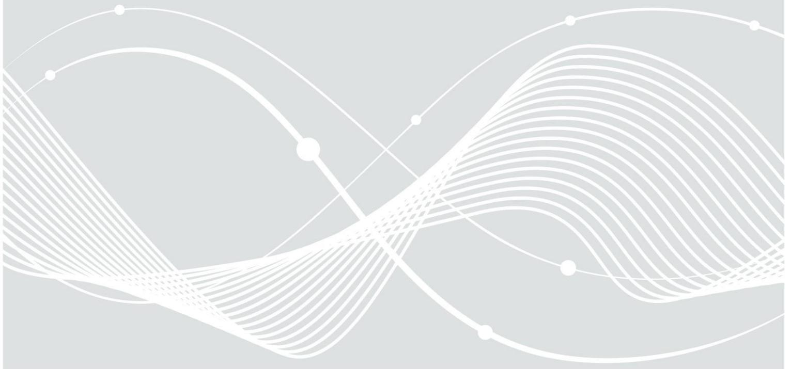
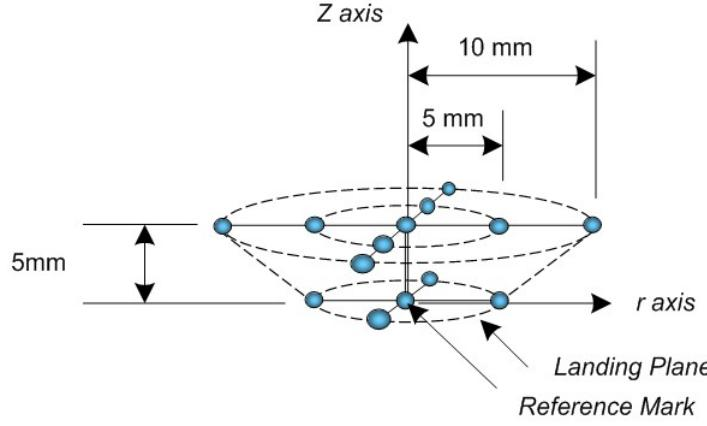
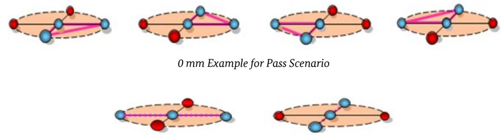
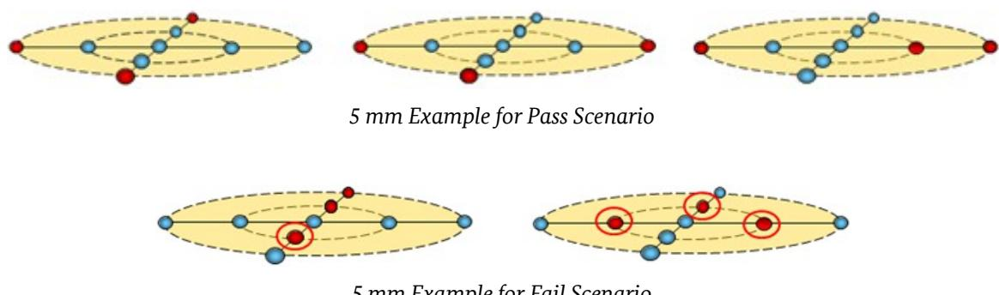
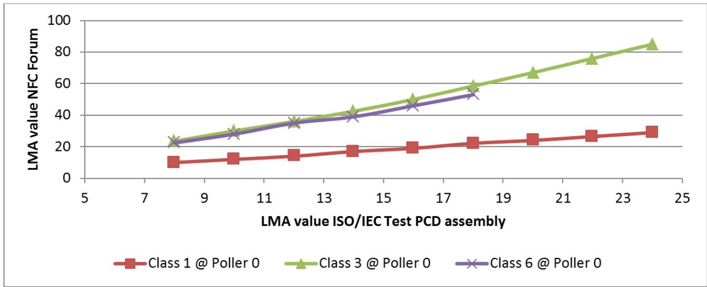
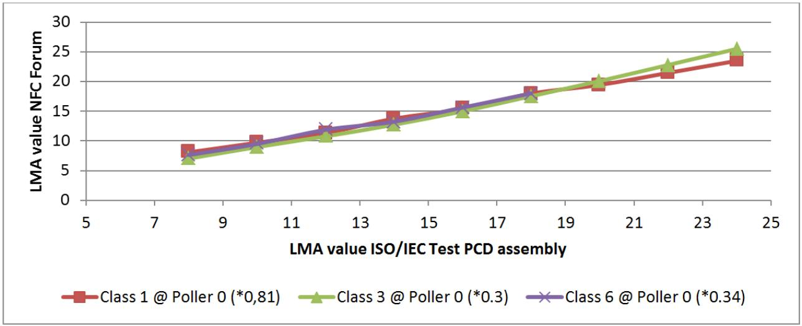
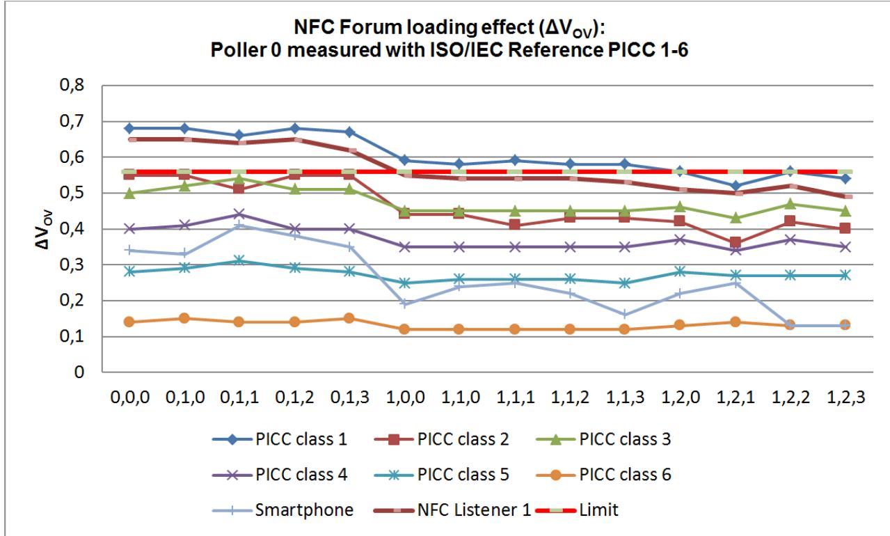
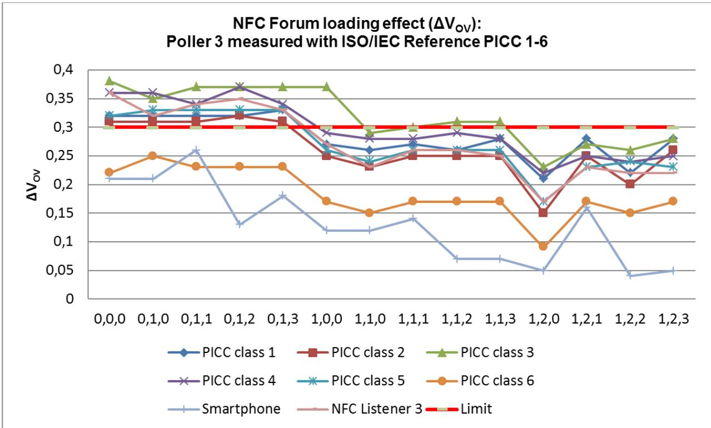
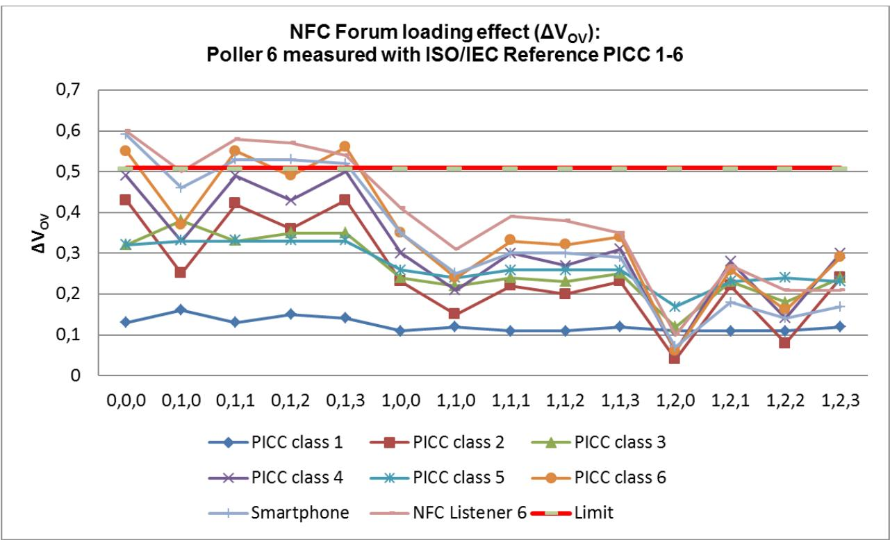

# Test Specification Comparison

ISO/IEC 10373-6:2011 vs. NFC Forum Test Specifications A Detailed View on Both Reader and Card Sides

Federal Office for Information Security Post Box 20 03 63 D-53133 Bonn Internet: https://www.bsi.bund.de © Federal Office for Information Security 2014

| 1              | Introduction 5                                                     |  |
|----------------|--------------------------------------------------------------------|--|
| 1.1            | Structure of this Document 5                                       |  |
| 2              | Project Details 6                                                  |  |
| 2.1            | Motivation 6                                                       |  |
| 2.2            | Limitations 6                                                      |  |
| 2.3            | A Closer Look on … 7                                               |  |
| 2.3.1          | … ISO/IEC (and Extensions) 7                                       |  |
| 2.3.2          | … NFC Forum 8                                                      |  |
| 2.3.3          | … Further Standards 9                                              |  |
| 2.4            | Concrete Goals of this Project 10                                  |  |
| 3              | Test Cases 11                                                      |  |
| 3.1            | General Aspects 11                                                 |  |
| 3.2            | Layer 1+2 / Analog – Reader Testing12                              |  |
| 3.2.1          | Test Specification Coverage 12                                     |  |
| 3.2.2          | Test Cases Defined in ISO/IEC 12                                   |  |
| 3.2.3          | Additional Test Cases Defined in NFC ANA12                         |  |
| 3.2.4          | Summary 12                                                         |  |
| 3.3            | Layer 3+4 / Digital – Reader Testing14                             |  |
| 3.3.1          | Test Specification Coverage 14                                     |  |
| 3.3.2          | Test Cases Defined in ISO/IEC 14                                   |  |
| 3.3.3          | Additional Test Cases Defined in NFC DIG14                         |  |
| 3.3.4          | Summary 14                                                         |  |
| 3.4            | Layer 1+2 / Analog – Card Testing 16                               |  |
| 3.4.1 3.4.2 | Test Specification Coverage 16 Test Cases Defined in ISO/IEC 16 |  |
| 3.4.3          | Additional Test Cases Defined in NFC ANA16                         |  |
| 3.4.4          | Summary 16                                                         |  |
| 3.5            | Layer 3+4 / Digital – Card Testing 18                              |  |
| 3.5.1          | Test Specification Coverage 18                                     |  |
| 3.5.2          | Test Cases Defined in ISO/IEC 18                                   |  |
| 3.5.3          | Additional Test Cases Defined in NFC DIG18                         |  |
| 3.5.4          | Summary 18                                                         |  |
| 4              | Test Requirements and Test Equipment 20                            |  |
| 4.1            | General Aspects 20                                                 |  |
| 4.1.1          | Separation between Reader- and Card-Related Aspects20              |  |
| 4.1.2          | Device Requirements 20                                             |  |
| 4.1.3          | Device Configuration for Testing 22                                |  |
| 4.1.4          | Test Strategies 24                                                 |  |
| 4.1.5          | Certification Issues 26                                            |  |
| 4.2            | Layer 1+2 / Analog 28                                              |  |
| 4.2.1          | Details about ISO/IEC and NFC Forum Approaches28                   |  |
| 4.2.2          | Comparison Measurements 32                                         |  |
| 4.3            | Layer 3+4 / Digital 39                                             |  |
| 4.3.1          | Specific Layer 3+4 / Digital Device Requirements39                 |  |
| 4.3.2          | Layer 3+4 / Digital Test Equipment 41                              |  |

| 5       | Sample Test Performance 45                  |  |
|---------|---------------------------------------------|--|
| 5.1     | General Aspects 45                          |  |
| 5.2     | Layer 1+2 / Analog – Reader Testing46       |  |
| 5.2.1   | Basic Remarks Prior to Testing 46           |  |
| 5.2.2   | Presentation of the Test Samples 46         |  |
| 5.2.3   | Performance of ISO/IEC Tests 47             |  |
| 5.2.4   | Performance of NFC ANA Tests 49             |  |
| 5.3     | Layer 3+4 / Digital – Reader Testing52      |  |
| 5.3.1   | Basic Remarks Prior to Testing 52           |  |
| 5.3.2   | Presentation of the Test Sample 52          |  |
| 5.3.3   | Performance of ISO/IEC Tests 53             |  |
| 5.4     | Layer 1+2 / Analog – Card Testing 57        |  |
| 5.4.1   | Basic Remarks Prior to Testing 57           |  |
| 5.4.2   | Presentation of the Test Samples 57         |  |
| 5.4.3   | Performance of ISO/IEC Tests 58             |  |
| 5.4.4   | Performance of NFC ANA Tests 61             |  |
| 5.5     | Layer 3+4 / Digital – Card Testing 66       |  |
| 5.5.1   | Basic Remarks Prior to Testing 66           |  |
| 5.5.2   | Presentation of the Test Samples 66         |  |
| 5.5.3   | Performance of ISO/IEC Tests 66             |  |
| 5.5.4   | Performance of NFC DIG Tests 72             |  |
| 6       | Result Evaluation and Conclusions 78        |  |
| 6.1     | General Aspects 78                          |  |
| 6.2     | Layer 1+2 / Analog 79                       |  |
| 6.3     | Layer 3+4 / Digital 80                      |  |
| Annex A | Detailed Test Scenario Analysis (Reader)81  |  |
| A.1     | Layer 1+2 / Analog 81                       |  |
| A.1.1   | Test Cases Defined in ISO/IEC 81            |  |
| A.1.2   | Additional Test Cases Defined in NFC ANA86  |  |
| A.2     | Layer 3+4 / Digital 87                      |  |
| A.2.1   | Test Cases Defined in ISO/IEC 87            |  |
| A.2.2   | Additional Test Cases Defined in NFC DIG99  |  |
| Annex B | Detailed Test Scenario Analysis (Card)113   |  |
| B.1     | Layer 1+2 / Analog 113                      |  |
| B.1.1   | Test Cases Defined in ISO/IEC 113           |  |
| B.1.2   | Additional Test Cases Defined in NFC ANA120 |  |
| B.2     | Layer 3+4 / Digital 121                     |  |
| B.2.1   | Test Cases Defined in ISO/IEC 121           |  |
| B.2.2   | Additional Test Cases Defined in NFC DIG150 |  |
|         | Reference Documentation 157                 |  |
|         | Keywords and Abbreviations 159              |  |
|         | Revision History 160                        |  |
|         |                                             |  |

## 1 Introduction

This document is the result of a project which had the purpose to investigate in how far different test specifications for contactless smart cards – and the corresponding reader devices – are comparable[1](#page-4-2) .

Concretely, the ISO/IEC specification ISO/IEC 10373-6:2011 ([\[3\],](#page-156-1) referred to as "ISO/IEC" throughout this document) and the NFC Forum Analog ([\[5\],](#page-156-3) "NFC ANA") and Digital [\(\[6\],](#page-156-2) "NFC DIG") test specifications were selected for this analysis.

The following chapters contain detailed inspections of documents and equipment as well as concrete tests (with both reference equipment and "real" samples) in order to finally get a well-founded statement about the (non-)similarity and (non-)interchangeability of the regarded test standards.

## 1.1 Structure of this Document

Chapter 2 presents the project in more detail, including further information about the areas which shall be compared. It also describes the general goals and limitations of the project.

Chapter 3 contains the comparison on specification level[2](#page-4-3) ; the common features as well as the differences in-between ISO/IEC and NFC ANA/DIG are examined in detail.

The focus of Chapter 4 is how the tests are actually performed. It includes a detailed analysis of test equipment and required configuration of the DUT (in order to establish a "testable" device) for both specifications. Certification aspects (availability, preconditions, device classes, etc.) are also discussed. In addition, some comparison measurements for the Layer 1/2 equipment (antennas, Reference PICCs) are included.

Chapter 5 contains measurements with "real" samples which are tested against both ISO/IEC and NFC ANA/DIG test tools – followed by a detailed analysis of the achieved results.

The final Chapter 6 summarizes the results gained in the preceding chapters; based on this information, a conclusion is drawn on how far ISO/IEC and NFC ANA/DIG test specifications are interchangeable (with focus on interoperability issues).

1 To be more precise: The mentioned project is both follow-up and extension of an earlier work (of July 2013) which was only focused on the reader side. And in contrast to the current project, it was investigated in how far NFC ANA/DIG and BSI TR-03105 Part 4 (instead of ISO/IEC) are comparable.

2 In order to avoid too many details in the main document – which might have negative influence on the readability – the analysis (and comparison) of the individual test scenarios was moved to Annexes A and B.

## 2 Project Details

## 2.1 Motivation

During the past years, the contactless smart card area has quickly evolved: From a technology mainly used in proprietary (and often rather simply constructed) systems (for example, access control systems) to a wide business area offering multiple different applications in many everyday usage scenarios. And in the meantime, there are several different standardization approaches available.

The problem with these approaches (ISO/IEC 14443, NFC Forum, as well as others not yet mentioned) is that they are – although they use the same technology in a very similar way – not fully compatible to each other because there are significant differences in detail. This aspect becomes a real difficulty when compliance testing (possibly in combination with a certification) is the goal: In practice, some product (mobile phone, card reader for PC, …) might be compliant to both ISO/IEC 14443 and NFC Forum specifications but – as it isn't currently possible to make some kind of cross-certification[3](#page-5-3) (or at least cross-recognition) – the product would have to pass two completely independent compliance testing procedures.

In order to ease this situation in the future, the purpose of this project is to examine in detail in how far both reader and card test specifications from ISO/IEC and NFC Forum are similar (or even interchangeable) – thus getting the chance to determine whether a common compliance testing (certification) approach is possible or not.

## 2.2 Limitations

Most contactless smart card standards define a two-party model: The reader (also called terminal, PCD) as the active part (it starts the communication and provides the RF field) and the card (or PICC, tag) as the passive part (responding to reader's requests, depends on the provided RF field). In order to ensure that both sides are correct, it is required to have test specifications for both cards and readers – that's exactly the approach used in ISO/IEC 10373-6:2011 (a combined document providing separate test scenarios for all supported layers).

NFC Forum uses a different approach (see Chapter 2.3.2) which doesn't care much about passive cards (tags) – but it specifies a Card Emulation Mode for NFC Forum Devices (as one of three operation modes, see Chapter 4.1), together with an extensive set of test scenarios. Thus there is no reason why the "card" side shouldn't be included in the investigation. But there are further aspects defined by NFC Forum – like Peer Mode, Type NFC-F, etc. - which have no correspondents in the ISO/IEC 14443 area; thus it was decided to completely exclude these elements from the analyses made within this document.

In general, the focus shall be on the test**i**ng aspects – the differences in the base specifications aren't discussed in much detail (only if they have a direct influence on testing/certification).

The complete analysis presented in this document is based on resources (ISO/IEC, NFC Forum, and others) as available in early March 2014. Future versions (or amendments) of the reviewed standards might contain modifications which make conclusions drawn here either obsolete or even completely wrong.

3 Chapter 4 will describe that a formal certification for ISO/IEC isn't available at all – thus the usage of the term might lead to confusions. But as there are several specifications built upon ISO/IEC basis (as BSI TR-03105, for example) that allow a certification, it might still be useful to keep using this nomenclature – although the term "compliance" might often serve better.

## 2.3 A Closer Look on …

As already mentioned earlier, there exist multiple concurrent standards in the contactless smart card area. Within this section, some of them shall be explicitly pointed out (without giving many technical details).

All approaches presented in the following are based on the so-called "proximity" technology: Contactless smart cards with a reading distance of up to 10 cm[4](#page-6-2) , operating at a frequency of 13.56 MHz. The advantage of this technology is that it allows complex products because available RF power and defined data rates are sufficient to enable high-performance chips which are able to quickly compute and exchange larger amounts of data.

But there are many further technologies available (either defined in public standards or used by proprietary products) which use different frequencies and allow different reading distances. Within this document, these approaches shall not be discussed in more detail.

## 2.3.1 … ISO/IEC (and Extensions)

The base standard ISO/IEC 14443 [\(\[1\],](#page-156-6) [\[2\]\)](#page-156-5) was introduced in 2000/2001 (not all parts were simultaneously released). It defines contactless smart card technology (cards and reader devices) at 13.56 MHz. Some of its most significant features shall be presented in a short overview:

- The standard consists of 4 parts, each part covering a specific layer (comparable to the OSI reference model); starting with physical characteristics, specifications up to the protocol level (where ISO/IEC 7816-4 APDUs are in use) are included.
- Two types of smart cards A and B are defined; they are partially based on earlier proprietary products and they have significant differences in the Layers 2 and 3; but in general, the capabilities of both types are very similar, thus they share the protocol model defined in Layer 4.
- There is a strict separation in-between cards and reader devices with the reader always being the active part (it generates the RF field, it starts the communication with the card by sending welldefined commands).
- ISO/IEC 14443 doesn't specify a certain usage scenario it is thought to be a "general purpose" standard which may be used for multiple different products.

ISO/IEC 14443 is a base standard – it only provides basic specifications and requirements but it doesn't contain any test scenarios. For this purpose, the standard ISO/IEC 10373-6 [\(\[3\],](#page-156-1) [\[4\]\)](#page-156-4) was introduced, providing tests for both cards and readers on all covered layers. Not long ago (in-between 2008 and 2011) both ISO/IEC 14443 and ISO/IEC 10373-6 were revised and are now available as second editions. In addition, there is a continuous process to add further functionality (e.g., higher bit rates) – they are provided as amendments to the existing documents.

As already mentioned, ISO/IEC 14443 doesn't contain/define a typical usage scenario, thus it can be used for an arbitrary type of contactless smart card product[5](#page-6-3) – identification, transport, banking, etc. The requirements of these product groups may significantly differ (e.g., with regard to communication speed or reader device construction) – thus there aren't too many limitations in ISO/IEC 14443, leaving a lot of options/opportunities for constructing a variety of products.

4 This value is a rather theoretical one – in practice, the maximum reading distances are significantly shorter.

5 Provided that the capabilities of the specified smart cards (and readers) match the requirements of the selected product group.

This general policy is continued in ISO/IEC 10373-6 with the consequence that many significant aspects (which are highly important for testing) aren't clearly defined: Typical examples are unspecified measurement positions within the operating volumes of reader devices or the lack of mandatory (test) command sequences. If it is desired to be more restrictive (in order to ensure interoperability within some specific infrastructure), there is no alternative in defining enhancements/specializations to the ISO/IEC specifications[6](#page-7-1) . The concrete construction of such enhancements heavily depends on both technical and political requirements (and thus, the differences in-between various approaches might be significant).

One of the first widespread products based on ISO/IEC 14443 is the electronic passport (ePassport). First introduced (in few countries) in 2004, it extends "classic" passports by the inclusion of a contactless smart card. In preparation of the release of the German ePassport (2005), the BSI issued a group of test specifications (under the reference TR-03105, see [\[9\],](#page-156-9) [\[10\]\)](#page-156-8) with the goal to ensure that the future ePassports and their appropriate reader devices are constructed with respect to the standard.

Being (currently) the only specification in the ISO/IEC 14443 area which includes a certification program, BSI TR-03105 quickly became important for further products (ePassports of other countries, further eID systems, ticketing systems, …). In general, BSI TR is based on ISO/IEC 10373-6[7](#page-7-2) , especially in the Layer 3+4 protocol area it often refers to the this standard. But it also contains some significant extensions/differences to ISO/IEC which – as long as they are relevant – shall also be discussed in the following chapters.

In other business areas – in the public transport sector, for example – further specializations of ISO/IEC are currently under development. The goal is the same as with ePassports: To ensure that a broad portfolio of products (issued by different services providers, in different countries, etc.) complies to certain base requirements. As these common grounds in the transport sector diverge from those in the ePassport/eID area it can be expected that the final specialization/enhancement to ISO/IEC will significantly differ from BSI TR.

### 2.3.2 … NFC Forum

NFC Forum [\(\[8\]\)](#page-156-7) was founded in 2004 with the goal to ensure that products using NFC (Near Field Communication) technology are interoperable. NFC isn't limited to a certain class of products, it can be used in a variety of devices – most important are modern smart phones which provide a large portfolio of technologies in order to be usable as mobile communication platforms. The main role of NFC in this context is to be a mediator. In order to ensure that different device classes can be interoperable, NFC Forum introduced an extensive set of both base and test specifications and also has established a certification program.

Although the NFC Forum specifications are based on the same technology as ISO/IEC 14443, there are some special characteristics which shall be presented in the following:

- The NFC Forum (base) specifications consist of several individual documents, each covering specific topics (Analog, Digital Protocol, Activity, …).
- NFC Forum uses both ISO/IEC 14443 types (A and B) but with several modifications; the most significant is that bit rates are limited to fc/128 (106 kbit/s); in addition, (nearly) all ISO/IEC 14443 names (for commands, parameters, states, etc.) were replaced.
- A third type is in use, NFC-F, which is based on the (proprietary) FeliCa standard; it is the only one in the NFC Forum portfolio which is specified to be used with higher bit rates (fc/64, fc/32).

6 Typically, both ISO/IEC 14443 and ISO/IEC 10373-6 have to be regarded.

7 But it is still based on the first edition of ISO/IEC 10373-6, thus requiring that the products to be tested have to match the requirements of the first edition of ISO/IEC 14443 – which has some significant differences compared to the current second edition.

- NFC Forum doesn't use the "classic" model of clear separation in-between card and reader; instead, it defines so-called NFC Forum Devices which always have to be able to function as a reader; in addition, they might also emulate a card; a third operation mode, Peer-2-Peer, is also mandatory (see Chapter 4.1.1.2 for details).
- In addition to the "multi-purpose" NFC Forum Devices, so-called NFC Tags (passive smart cards) are defined – but they aren't regarded in much detail (and they can't be certified).

Currently, an increasing number of smartphones are equipped with NFC (Forum) technology – although very few of them are actually certified. But the pure presence of these devices enables a vast number of possible every-day usage scenarios.

### 2.3.3 … Further Standards

Both ISO/IEC 14443 and NFC Forum standards aren't limited to a certain usage scenario, they can be used in a variety of different devices. EMVCo Contactless follows a completely different approach as it exclusively focuses on the payment area (more precisely: on credit cards).

EMVCo [\(\[12\]\)](#page-156-10) (an organization owned by 6 major credit card companies) created an extensive portfolio of specifications (base specifications as well as test specifications) to ensure that all components within a global payment system (cards, terminals, software) are interoperable. Multiple technologies are covered (magstripe, contact smart cards), including contactless smart cards (EMVCo contactless).

The specifications are also similar to ISO/IEC 14443, thus a general interoperability (up to a certain point) should be possible here as well. EMVCo has a certification scheme on their own, getting their products certified is mandatory for manufacturers of cards and terminals (if they want to officially support credit card payments).

Finally, two proprietary contactless smart card systems shall be introduced here as well because they heavily influenced both ISO/IEC 14443 and NFC Forum:

- MIFARE [\(\[13\]\)](#page-157-1), developed by NXP Semiconductors (formerly Philips Semiconductors)
- FeliCa [\(\[14\]\)](#page-157-0), developed by Sony

Both of these systems offer a broad portfolio of different products which are in worldwide use (e.g., ticketing in public transport systems).

## 2.4 Concrete Goals of this Project

As presented in the preceding sections of this chapter, there is a variety of systems/regimes which are based on similar (or even identical) technology but follow different approaches, especially regarding testing and certification aspects.

Within this project, it shall be the goal to investigate in detail in how far it is possible to "unify" different approaches in such a way that (ideally) a cross-recognition is enabled: One regime accepts a certificate issued by another regime or – if no formal certification process is available – a compliance test report issued by a reliable test laboratory. If the analyses should show that this goal is unrealistic it shall at least be determined in how far interoperability in-between different systems can be granted.

It is not intended to cover all "major" approaches in the contactless smart card area but only two of them: ISO/IEC and NFC Forum[8](#page-9-1) . As already stated earlier, both card and reader testing parts shall be covered and the main focus shall lie on the testing aspects.

The rest of this document consists of two parts: At first, it is investigated what the actual differences inbetween both test specifications are (Chapters 3, 4, 5) and, finally, these results are used to draw conclusions (Chapter 6).

Due to the fact that both card and reader testing aspects are to be analyzed, the next chapters are split into several parts: Following a general introduction to the subject, a more detailed analysis of all possible combinations of devices (card/reader) and layers (Analog/Digital) will follow. Depending on the concrete subject of investigation, this may appear in form of either completely separated or aggregated sections (if multiple combinations share common aspects).

Apart from this general analysis strategy, it was decided to subsequently investigate three different topics:

- In Chapter 3, the test case definitions (as specified in ISO/IEC and NFC ANA/DIG) are regarded in order to find out if some aspects present in one specification might be missing in the other (and vice versa). In addition, it is checked in how far the test cases – even if they cover the same aspects – differ in significant details (e.g., the lack of higher bit rates within NFC ANA/DIG tests).
- Chapter 4 concentrates on the setup configurations which are actually needed to perform tests. Included are both test tools (as far as reference equipment is specified) and required preparations in order to bring the DUT in a testable condition.
- Chapter 5 presents and analyzes the results which were achieved by performing concrete tests (with "real" samples). For this purpose, test platforms for ISO/IEC (for both card and reader testing) and NFC ANA/DIG were in use.

All these results will finally be combined (in Chapter 6) in order to get to a reliable final statement about the possibility of cross-recognition of test results.

8 Up to some amount – mainly on the test case layer – the ISO/IEC-based BSI TR-03105 shall also be included in the investigation.

## 3 Test Cases

## 3.1 General Aspects

The purpose of this chapter is to actually compare the test cases as presented in ISO/IEC 10373-6:2011 [9](#page-10-2) (referred to as "ISO/IEC" within this document) and NFC Forum Analog ("NFC ANA") and Digital ("NFC DIG") test specifications[10](#page-10-3). It shall be evaluated in how far the test definitions cover (nearly) equal test requirements – although the specifications differ in detail.

A direct comparison of the test cases is hardly feasible because ISO/IEC and NFC Forum follow different approaches – leading to widely differing test scenario structures. Instead it was decided to take ISO/IEC as a basis – i.e., following their test case structure – and subsequently regard the individual scenarios in detail.

With each of the tests (or small groups of tests), the following details are presented: Exact ISO/IEC reference, short test purpose description, corresponding NFC ANA (or NFC DIG) test cases (if available), and – most important – a description of the differences in-between the test definitions (ISO/IEC vs. NFC ANA/DIG). Following the (complete) list of the ISO/IEC cases, additional NFC ANA/DIG test cases (covering test aspects not included in the ISO/IEC specification) are presented as well.

In order to ensure that all relevant test cases are adequately described but also to prevent that widely different aspects (reader vs. card, Analog vs. Digital) are mixed up (which might lead to confusions), this chapter is organized in the following way:

- Chapter 3.2: Layer 1+2 / Analog part of reader (terminal) testing
- Chapter 3.3: Layer 3+4 / Digital part of reader testing
- Chapter 3.4: Layer 1+2 / Analog part of card (tag) testing
- Chapter 3.5: Layer 3+4 / Digital part of card testing

Each of these sections is concluded with a separate summary which presents the most important differences as evaluated in the preceding detailed analysis[11](#page-10-4) .

As the complete presentation of all individual test scenarios requires a lot of space it was decided to move it to the Annexes (A and B) in order to improve the readability of the document (as the very detailed analysis might not be interesting for all readers).

*Please note:* As this comparison is only focused on common aspects shared in-between ISO/IEC and NFC Forum, all those NFC ANA/DIG test cases which have no counterparts in ISO/IEC are excluded (and not to be mentioned in the following sections). This mainly affects Peer Mode and NFC-F test scenarios.

9 Including all amendments published until March 2014.

10 As with ISO/IEC, the versions of the NFC Forum specifications as available in March 2014 were in use.

11 A more comprehensive summary – including results from further chapters – is presented in Chapter 6.

## 3.2 Layer 1+2 / Analog – Reader Testing

## 3.2.1 Test Specification Coverage

All relevant test cases defined in Chapters 6 and 7 of ISO/IEC (PCD tests based on ISO/IEC 14443-1/2 requirements) are covered. Due to the limitations declared above (no Peer Mode, no NFC-F, etc.) only the following test groups of NFC ANA are relevant: 2.1, 2.2, 2.3.

Not all of the NFC ANA scenarios might be directly corresponding to some ISO/IEC test case. As far as these scenarios cover relevant aspects they are regarded in more detail in Chapter 3.2.3. In addition, some BSI TR-03105 Part 4 scenarios are also mentioned – but only if there are significant differences to ISO/IEC or NFC ANA.

Finally, Chapter 3.2.4 provides a summary of the most important differences in-between ISO/IEC (Layer 1/2 part) and NFC ANA specifications.

*Please note:* The original release of ISO/IEC 10373-6:2011 contained two (Layer 2) test scenarios in Chapters 7.1.2 and 7.1.3. In Amd. 1 of 2012, these scenarios were deleted (without replacement) – thus they won't be discussed in the following.

## 3.2.2 Test Cases Defined in ISO/IEC

A detailed analysis of these test scenarios is presented in Annex [A.1.1.](#page-80-0)

## 3.2.3 Additional Test Cases Defined in NFC ANA

A detailed analysis of these test scenarios is presented in Annex [A.1.2.](#page-85-0)

### 3.2.4 Summary

The preceding analysis has shown that there are fundamental differences in the test scenarios for Layer 1+2 / Analog. The following list shall provide a summary of the most important aspects:

- ISO/IEC defines 6 Reference PICCs (always corresponding to one of the specified PICC classes) which are used in different configurations (especially regarding the selected resonance frequencies) for the various tests; in addition, 2 Test PCD assemblies are in use during the setup phases (prior to the actual test procedures)
- NFC ANA defines 3 different Reference PICCs: Reference Listening Devices Listener-1, Listener-3, and Listener-6 with different antenna geometries; the resonance frequency of these devices is always set to 13.56 MHz for all measurements
- In ISO/IEC, the DUT is required to support at least PICC classes 1, 2, and 3 thus the corresponding configurations always have to be tested; in addition, if more PICC classes are supported by DUT, further tests have to be carried out
- In addition to general differences in the operating volume definitions NFC Forum uses a stricter approach than ISO/IEC which leaves the specification to the PCD manufacturer – there are also significant differences in the test case definitions; ISO/IEC requires (for most test scenarios) that they are performed at multiple positions in the operating volume without giving exact measurement positions; in contrast to that, NFC ANA exactly specifies at which positions the tests have to be carried out; in addition, it isn't required for a DUT to successfully complete the test procedures at all positions – a well-defined subset is considered sufficient to pass the tests as a whole
- NFC ANA tests are always limited to a bit rate of fc/128; in some test scenarios, ISO/IEC additionally requires that higher bit rates (up to fc/2) are also tested (if supported by the DUT)
- ISO/IEC doesn't distinguish between tests for Types A and B even in situations where command sequences in use (load modulation reception test) or expected results (modulation and waveform test) significantly differ in-between both types, the test scenarios aren't split up; in contrast to this, NFC ANA defines individual test scenarios for types NFC-A and NFC-B where they are required
- NFC ANA doesn't contain any test scenarios about EMD (electromagnetic disturbance) handling while ISO/IEC doesn't verify correctness of carrier frequency or interference prevention when further reader (polling) devices are active
- Both ISO/IEC and NFC Forum don't define further temperature conditions, all tests shall only be performed at room temperature
- Although BSI TR-03105 Part 4 doesn't define completely new scenarios it yet introduces some additional aspects – further test conditions, (slightly) different test equipment, further temperature conditions, own definitions of operating volumes – which aren't fully covered by even a combination of ISO/IEC and NFC ANA

Due to significant differences in test equipment, test procedures, and basic requirements it is difficult (with some exceptions) to find a direct "translation" of test results in-between ISO/IEC and NFC Forum – thus more detailed analyzes, including cross-measurements (by "mixing" ISO/IEC test equipment and measurement methods), are required. Chapter 4.2 will focus on these aspects.

## 3.3 Layer 3+4 / Digital – Reader Testing

## 3.3.1 Test Specification Coverage

All test cases defined in Annexes H and I of ISO/IEC (PCD tests based on ISO/IEC 14443-3/4 requirements) are covered. Due to the limitations declared in Chapter 3.1 (no Peer Mode, no NFC-F, etc.) only the following test groups of NFC DIG are relevant: 1.1, 2.1, 2.2, 2.7, 2.8.

Within these groups, not all defined test scenarios might be directly corresponding to an ISO/IEC test case. As far as these scenarios cover relevant aspects they are regarded in more detail in Chapter 3.3.3. In addition, some BSI TR-03105 Part 4 scenarios are also mentioned – but only if there are significant differences to ISO/IEC or NFC DIG.

Finally, Chapter 3.3.4 provides a summary of the most important differences in-between ISO/IEC and NFC DIG specifications.

## 3.3.2 Test Cases Defined in ISO/IEC

A detailed analysis of these test scenarios is presented in Annex [A.2.1.](#page-86-0)

## 3.3.3 Additional Test Cases Defined in NFC DIG

A detailed analysis of these test scenarios is presented in Annex [A.2.2.](#page-98-0)

### 3.3.4 Summary

The analysis has shown that there are many test scenarios which ISO/IEC and NFC DIG have in common – but there also some significant differences. The following list shall provide a summary of the most important aspects:

- NFC DIG is only partially covered, tests for features not supported by ISO/IEC are excluded (NFC-F, Peer2Peer, etc.)
- NFC DIG tests are limited to 106 kbit/s (fc/128); both ISO/IEC and BSI TR-03105 Part 4 include test scenarios to be additionally tested with higher bit rates
- NFC DIG contains few explicit timing measurement tests (but timing monitoring and correctness checks are included in (nearly) all test scenarios); instead, it contains timing reception checks which are absent in ISO/IEC
- NFC DIG includes multiple error-free test scenarios while ISO/IEC is mainly focused on test cases covering erroneous scenarios
- NFC DIG doesn't test erroneous S(WTX) frames
- ISO/IEC concentrates on timeout and transmission errors protocol errors are barely covered
- NFC DIG has multiple S(DESELCT) handling tests, ISO/IEC test conditions are very limited here
- NFC DIG error scenarios are often limited in such a way that they only handle a single topic (e.g., chaining, S(DESELECT)) in combination with a specific error type (e.g., transmission errors); in contrast to this, ISO/IEC additionally includes mixed test cases which check multiple error types in combination with multiple topics
- ISO/IEC test scenarios are short (containing very few communications in-between DUT and LT) while NFC DIG test scenarios often consist of dozens of steps – thus covering more conditions within a single test run

A recommendation in how far the Layer 3+4 ISO/IEC tests can be substituted by NFC DIG tests (or vice versa) shall not be given here but in Chapter 6 (in larger context, also including further evaluation results from the other chapters).

## 3.4 Layer 1+2 / Analog – Card Testing

## 3.4.1 Test Specification Coverage

All relevant test cases defined in Chapters 6 and 7 of ISO/IEC (PICC tests based on ISO/IEC 14443-1/2 requirements) are covered. Due to the defined limitations (no Peer Mode, no NFC-F, etc.) only the following test groups of NFC ANA are relevant: 1.1, 1.2, 1.3.

Not all of the NFC ANA scenarios might be directly corresponding to some ISO/IEC test case. As far as these scenarios cover relevant aspects they are regarded in more detail in Chapter 3.4.3. In addition, some BSI TR-03105 Part 2 scenarios are also mentioned – but only if there are significant differences to ISO/IEC or NFC ANA.

Finally, Chapter 3.4.4 provides a summary of the most important differences in-between ISO/IEC (Layer 1/2 part) and NFC ANA specifications.

## 3.4.2 Test Cases Defined in ISO/IEC

A detailed analysis of these test scenarios is presented in Annex [B.1.1.](#page-112-0)

## 3.4.3 Additional Test Cases Defined in NFC ANA

A detailed analysis of these test scenarios is presented in Annex [B.1.2.](#page-119-0)

### 3.4.4 Summary

The preceding analysis has shown that ISO/IEC and NFC ANA have multiple test scenarios in common – although the test structure and the exact number of covered conditions often differ. The following list shall demonstrate the most significant differences:

- ISO/IEC includes (potentially destructive) tests which shall verify that a DUT isn't damaged by exposure to ESD or very high field strengths – similar tests are completely missing in NFC ANA
- ISO/IEC tests are limited to a single measurement position while some NFC ANA tests have to be performed at multiple positions (although not always a "Pass" result is required in order to pass the test as a whole)
- ISO/IEC 14443-2 defines 6 PICC classes (with different properties and parameter limits); prior to ISO/IEC testing it has to be defined (by the manufacturer/applicant) to which of these classes the DUT shall be compliant to (otherwise, some default conditions – similar to Class 1 requirements – are to be applied); depending on this declaration, most of the tests have to be adapted (regarding both equipment to be used and limits to be respected); NFC ANA doesn't define classes – instead, multiple tests are to be performed with more than one polling device in use (thus covering a variety of possible reader behaviors which all have to be correctly handled by the DUT)
- NFC ANA tests are always limited to a bit rate of fc/128 while several tests in ISO/IEC are to be performed using all bit rates supported by the DUT (including very high bit rates up to fc/2)
- Only ISO/IEC defines a test scenario where it is checked that EMD (electromagnetic disturbances) caused by the DUT are within the specified limits (regarding both voltage level and time frame)
- In contrast to NFC ANA, the correct modulation of the DUT responses isn't verified by ISO/IEC only the load modulation levels are determined
- ISO/IEC doesn't check if the DUT is actually able to handle various carrier frequencies (within the limits defined by ISO/IEC 14443-2) – all tests are to be performed with the default value (13.56 MHz)

A recommendation in how far the ISO/IEC tests for Layers 1+2 can be substituted by NFC ANA tests (or vice versa) shall not be given here but in Chapter 6 (in larger context, also including further evaluation results from the other chapters).

## 3.5 Layer 3+4 / Digital – Card Testing

## 3.5.1 Test Specification Coverage

All test cases defined in Annex G of ISO/IEC (PICC tests based on ISO/IEC 14443-3/4 requirements) are covered. Due to the limitations defined in Chapter 3.1 (no Peer Mode, no NFC-F, etc.) only the following test groups of NFC DIG are relevant: 3.1, 3.2, 3.5. In addition, those test scenarios from Group 3.1 which assume that the DUT supports the NFC-DEP protocol are also excluded (as this protocol has no counterpart in the ISO/IEC area).

Not all of the NFC DIG scenarios might be directly corresponding to some ISO/IEC test case. As far as these scenarios cover relevant aspects they are regarded in more detail in Chapter 3.5.3. In addition, some BSI TR-03105 Part 2 scenarios are also mentioned – but only if there are significant differences to ISO/IEC or NFC DIG.

Finally, Chapter 3.5.4 provides a summary of the most important differences in-between ISO/IEC (Layer 3/4 part) and NFC DIG specifications.

## 3.5.2 Test Cases Defined in ISO/IEC

A detailed analysis of these test scenarios is presented in Annex [B.2.1.](#page-120-0)

## 3.5.3 Additional Test Cases Defined in NFC DIG

A detailed analysis of these test scenarios is presented in Annex [B.2.2.](#page-149-0)

### 3.5.4 Summary

The preceding analysis has shown that ISO/IEC and NFC DIG have multiple test scenarios in common – although the test structure and the exact number of covered conditions often differ. The following list shall demonstrate the most significant differences:

- Neither ISO/IEC (in the Layer 3/4 part) nor NFC Forum define test scenarios which have to performed at higher bit rates – all tests are limited to fc/128
- The state transition tests in ISO/IEC contain both correct and erroneous commands while the NFC DIG scenarios are limited to various erroneous conditions; independent from that, positive test cases are also included in NFC DIG (but the contexts differ)
- Although both ISO/IEC 14443-3 and NFC Forum specify two "branches" of READY and ACTIVE states for Type A (NFC-A) – building upon either IDLE or HALT (SLEEP\_A) state – only ISO/IEC defines additional test scenarios for the '\*' branch (NFC DIG tests are limited to the other branch)
- NFC DIG defines a further variation of state transition tests for SLEEP (HALT) states (for both card types).
- ISO/IEC defines two test commands (TEST\_COMMAND2 and TEST\_COMMAND3) which are designed in such a way that they force a DUT to either use PICC chaining or send a request for waiting time extension – as supporting both mechanisms is optional, such test commands might not exist for some given DUT (leaving the corresponding test cases not being applicable); in contrast to this, NFC DIG doesn't define explicit test cases for PICC chaining and S(WTX) – but Scenario 382.A is constructed in such a way that it is dynamically adapted (to provide error scenarios) if the DUT uses one of these mechanisms
- NFC DIG doesn't contain explicit test cases for S(DESELECT) but there are scenarios where the correct handling of this mechanism by the DUT is one of the mandatory criteria (in order to pass the test as a whole)
- As the NFC Forum specifications don't cover PPS, NAD, and S(PARAMETERS) test scenarios for these mechanisms can't be found in NFC DIG
- NFC DIG specifies test scenarios with Extended SENSB\_RES (ATQB) support although this feature is included in ISO/IEC 14443-3 as well, ISO/IEC doesn't contain corresponding test cases
- Especially in the Layer 4 part, NFC DIG tests cover a broader portfolio of error scenarios than ISO/IEC: For example, NFC DIG defines multiple error locations within a CRC checksum while ISO/IEC only requires to use a wrong CRC (without further specifying the error condition)
- NFC DIG defines several test scenarios where it is checked that the handling of frames with incorrect values of RFU bits is correctly performed by the DUT – corresponding test cases are missing in ISO/IEC; most of these test scenarios won't lead to a conflict (as the expected reaction to incorrectly set RFU bits is equally defined in ISO/IEC 14443 and NFC Forum Digital specification) but some tests might be critical (e.g., ISO/IEC 14443-4 doesn't give a clear definition how to handle wrong RFU bits in PCB bytes)
- Although ISO/IEC 14443 and NFC Forum Digital specification aren't equal when defining maximum frame sizes (for both readers and cards), there is no conflict potential in the tests (at least not in the status as they are currently defined) – because ISO/IEC and NFC DIG only expect formally correct DUT reactions to RATS/ATTRIB but without checking if the defined maximum frame sizes can actually be handled
- Regarding timings, there are some minor differences (NFC Forum Digital specification allows some tolerances while ISO/IEC 14443 does not) which may lead to (non-severe) complications when performing tests
- Although both ISO/IEC 14443-3 and NFC Forum Digital Protocol specifications define (equal) anticollision mechanisms for both card types, only ISO/IEC contains corresponding test scenarios.

A recommendation in how far the ISO/IEC tests for Layers 3+4 can be substituted by NFC DIG tests (or vice versa) shall not be given here but in Chapter 6 (in larger context, also including further evaluation results from the other chapters).

## 4 Test Requirements and Test Equipment

## 4.1 General Aspects

In this section, all those aspects shall be discussed which are common for both Layer 1+2 (Analog) and Layer 3+4 (Digital) parts. This includes general test requirements, test strategies, and certification aspects. The following sections will then cover specific aspects (e.g., test equipment).

Throughout this whole chapter, there will always be presentations of both ISO/IEC and NFC Forum approaches in order to allow a direct comparison of different strategies.

## 4.1.1 Separation between Reader- and Card-Related Aspects

Although there certainly are lots of differences in-between reader and card (emulation) modes (including distinctive sets of test scenarios, see Chapter 3) there are also many aspects which both modes have in common – due to this reason, both ISO/IEC and NFC Forum don't have separate (test) specifications for each mode but handle them in combined documents.

A similar approach shall be used in the following: All aspects which affect both reader and card modes will be discussed from a general point of view – only in situations where a clear distinction in-between both modes is present separate analyses will be made.

## 4.1.2 Device Requirements

The most basic requirement for both ISO/IEC and NFC Forum devices is that they are constructed according to the underlying base standards. Although these standards have a common basis (contactless smart card technology at 13.56 MHz) – allowing interoperability up to a certain level – they differ a lot in detail. These differences are continued in the test specifications, thus they shall be regarded in further detail.

#### 4.1.2.1 ISO/IEC Device Requirements

The base standard is ISO/IEC 14443: It consists of 4 parts, starting with physical characteristics and continuing (via signal interface and initialization) up to a definition of the transmission protocol in use. In this context, it is important to mention that there are significant modifications/extensions in the second edition (this version shall be discussed in the following) – thus there might be compatibility issues while dealing with devices which were constructed based on the first edition of ISO/IEC 14443[12](#page-19-4) .

ISO/IEC 14443 defines two general device classes: Contactless smart cards and their appropriate reader devices. Usually, it is not intended that a single device can take both of these roles (card and reader) [13](#page-19-5) – thus there is a clear separation in-between which is continued in the test specification.

12 In situations where these issues might have a significant impact they will be highlighted in more detail.

13 Recently, an extension to ISO/IEC 14443 was published which introduced a mechanism (to be optionally implemented into devices) to switch between card and reader functionality.

In the context of this document, both reader and card sides shall be focused – thus the concrete requirement for all devices discussed in the following is that they have to be contactless smart cards or readers constructed according to the ISO/IEC 14443 specification (all 4 parts are relevant).

It shall be additionally highlighted that this requirement also includes devices which are able to support both modes (depending on the configuration, they can either function as card or as reader); such a flexibility is typical for certain modern mobile phones.

#### 4.1.2.2 NFC Forum Device Requirements

NFC Forum has published an extensive set of base standards [\(\[8\]\)](#page-156-7), covering all relevant aspects – specifications for Analog (signal interface, etc.), definitions for the Digital part (initialization, protocol layer, etc.), introduction of special protocols for inter-device communication, and – finally – providing specifications for different tag types (comparable to cards in the ISO/IEC 14443 area).

In contrast to ISO/IEC 14443, NFC Forum doesn't use a clear separation between cards and readers [14](#page-20-0) – an NFC Forum Device can operate in three different modes:

- NFC Forum Reader/Writer (RW) Mode (mandatory): The device functions as a reader, being able to communicate with NFC Forum Tags and contactless smart cards.
- NFC Forum Peer (P2P) Mode (mandatory): In this mode, two NFC Forum devices communicate with each other – one functions as initiator, the other one has the target role.
- NFC Forum Card Emulation (CE) Mode (optional): The device emulates either an NFC Forum Tag or a contactless smart card – thus being able to communicate with reader devices.

As the list demonstrates, an NFC Forum Device is always able to function as a reader (RW mode) – but it has to additionally support the P2P mode as well (optionally, also the CE mode). Of course it is generally possible to construct a device which only supports CE mode but it couldn't be "officially" called an NFC Forum Device and thus, a certification wouldn't be possible.

This 3-mode approach is continued in the NFC Forum test specifications (NFC ANA and NFC DIG) – thus there are specific test scenarios for all 3 modes of operation.

#### 4.1.2.3 Summary

In order to be ready for testing according to both ISO/IEC and NFC ANA/DIG, devices have to be able to work as a contactless smart card or as a contactless smart card reader (for full NFC Forum compliance, RW Mode and P2P Mode always have to be implemented). This is the only basic requirement – further details on how to "transform" an arbitrary smart card product into a device which is actually in a testable condition are presented in the following sections.

14 NFC Forum Tags are an exception (only card functionality) but they aren't considered as NFC Forum Devices (instead, they form a class of their own).

## 4.1.3 Device Configuration for Testing

Being able to correctly function as a contactless smart card device (i.e., having the ability to communicate with some other card or reader device) is – naturally – the base condition which has to be established before any serious testing should be started. As the following paragraphs will demonstrate, this is already nearly sufficient in order to ensure that the DUT (Device Under Test) is able to cooperate with the test tool in such a way that all specified tests can be performed.

If the DUT is a contactless reader device, the situation is quite complex: In such a scenario, the test tool has to be able to force the DUT into several operation modes which are defined as initial test conditions. These modes differ from the normal operation mode[15](#page-21-1) where the reader performs some polling until a card is found, followed by a step-by-step transition to protocol state when higher layer communication finally is enabled.

The operation modes for testing include multiple scenarios, they mainly have the goal to force the DUT to send some specific data (usually, either as initial polling command or after entering the protocol layer) which form the basis for the actual test. The necessity of these modes is caused by the fact that the DUT (as it is the reader) takes the active (initiative) part in the communication – leaving only the passive role for the test system (which functions as a card, details see later in this chapter). It always has to wait for and react to the commands sent by the DUT, thus it is of crucial importance to be able to influence the DUT behavior at this point.

The next sections will demonstrate that ISO/IEC and NFC Forum use very different approaches to reach the same goal – forcing the DUT into test modes.

The big difference (and, in this context, the big advantage) when dealing with a contactless card (as DUT) instead is that it always has a passive role – it waits until a reader activates its RF field[16](#page-21-2) and only has to react to its (well-defined) commands. By this means, the defined card states (as defined by both ISO/IEC and NFC Forum) are subsequently run through until – finally – a "protocol" state[17](#page-21-3) is reached. In this state, all high level communication (depending on the concrete application in use) is performed.

From a testing point of view, this means that no special effort is needed in order to ensure that the DUT is in a testable condition: It only has to be granted that the test system is able to fulfill the reader (= active) role, giving it the ability to "push" the DUT into the states that have to be tested. A special configuration on DUT side is only partially required in protocol state, in order to ensure that "non-default" functionality (as chaining, etc.) can also be tested.

*Please note:* Neither ISO/IEC nor NFC Forum will force any manufacturer/applicant to extend his device by a special test configuration (this holds for both card and reader testing). Even without any preparations a significant amount of tests may still be performable. But a compliance testing – requiring all mandatory tests to be applicable – might not be possible in such a scenario.

15 Both ISO/IEC and NFC Forum specify this process in detail. The description presented in the text is only thought to be a (general) summary.

16 When passive cards (without external power supply) are in use, the activation of the RF field is the mandatory precondition in order to enable any functionality at all.

17 The concrete procedure to reach this protocol state depends on card type (A or B) and specification (ISO/IEC or NFC Forum) in use.

## 4.1.3.1 ISO/IEC Device Configuration

Although the presence of a precisely specified test environment is of crucial important for reader testing, ISO/IEC only defines some general model which shall be used for Layer 3/4 testing (it will be presented in Chapter 4.3.1.1). ISO/IEC doesn't specify any requirements for Layer 1/2 reader testing.

As ISO/IEC doesn't provide many details on how a reader device should be configured to be ready for (compliance) testing it might happen that a significant amount of work – prior to the actual test performance – needs to be done (by DUT provider, test tool provider, test laboratory) in order to ensure that DUT and test environment can cooperate.

There are several ISO/IEC based specifications (as BSI TR-03105 Part 4) which handle this aspect in more detail by defining/suggesting communication channels between DUT (contactless reader) and test system: By this means, it becomes possible to control the DUT in such a way that the preconditions for testing can be established (e.g., that the reader uses a certain command or is forced to do some kind of chaining).

Two wide-spread approaches shall be described in the following (without giving too many details).

• PC/SC interface: This option is widespread especially among readers (having a USB interface) which are used in Microsoft Windows environments (as it is the typical communication protocol for these devices).

Within a test environment, PC/SC is typically used to control the reader in such a way that it is forced to send well-defined commands via its contactless interface which are then adequately responded by the (emulated) card (which is part of the test system). But as only "raw" commands (without block limiters etc.) are sent via PC/SC it is the task of the reader (the DUT) to prove that it is actually able to perform the communication in an ISO/IEC compliant way – by adding correct block number, CRC, and further information to the command before it is transmitted via the contactless interface.

• Loop-back interface: This is a special mode which is mainly useful for testing (and maybe debugging) purposes, it is independent from "real world" use cases The basic idea of this interface is to define a mechanism which re-uses data provided by the (emulated) card in order to force the DUT into a certain behavior (e.g., usage of chaining). This is mainly useful in the protocol layer – as after initialization is complete, the reader no longer automatically sends commands (maybe except for presence check sequences). In addition to the pure "loop-back", the DUT is required to adequately pack the received data into formally correct frames – checking this ability is actually the main purpose of this kind of testing.

Both approaches have its advantages and disadvantages (which shall not be discussed in further detail here) and it is up to the respective (test) specification to provide a detailed definition which has to be respected by both DUT and test system. In addition to these two examples there exist further approaches (or modifications of the described ones) which all have the same purpose: Provision of a well-defined communication interface in-between DUT and test environment.

If testing of the card functionality is desired, the only configuration requirement for ISO/IEC is the presence of certain test commands which allow access to various functionality of the card (if supported). As all of these aspects – chaining, waiting time extension, etc. - are located in Layer 4, a detailed description shall be postponed to Chapter 4.3.1.1.

### 4.1.3.2 NFC Forum Device Configuration

NFC Forum enforces a strict policy: The only specified test interface is the so-called Device Test Application (DTA) – a loop-back application which is defined in [\[7\].](#page-156-11) Only devices with an implemented DTA[18](#page-23-1) are admitted for certification testing.

While the DTA is a very important component for reader mode testing (as it has to "force" the DUT into some testable state) it only plays a minor role for card testing – as the reader (simulator) is already able to force/control (most of) the DUT behavior without needing further mechanisms to be present on the device.

Independent from that, the fact that the DTA is well-specified (on both card and reader sides) eases the test performance as the test tool already knows in advance which reaction (especially with regard to response format and content) it has to expect from a DUT – thus it can easier detect any unusual (and probably incorrect) behavior.

#### 4.1.3.3 Summary

The most obvious difference in-between ISO/IEC and NFC Forum in this context is the strictness – or the lack of it – of the configuration a device has to provide for testing. While ISO/IEC leaves this aspect rather unspecified (only defining some basic abilities which have to be implemented) NFC Forum exactly defines a single option (DTA) which has to be generally used.

In practice, the strictness of the NFC Forum approach is a big advantage – especially for reader testing – because it both provides a unique solution equal for all kinds of DUT and is usable in combination with multiple device types. On the other hand, the flexibility of the ISO/IEC approach might be more comfortable for device manufacturers as it doesn't require a complex application to be installed. In addition, there is enough room for derived (from ISO/IEC) specifications to enforce their specific requirements (tailored to the relevant device classes in the respective contexts) without getting into conflicts with the basic ISO/IEC specifications.

In contrast to the rather complicated situation on the reader testing side (where the DUT has to be forced to show some behavior in order to enable testing), the card testing perspective is much simpler: The DUT always has a passive role, thus the "active" reader (as part of the test system) can force/control the appropriate test sequences. A special test configuration on the DUT is – from a technical point of view – only required for some few test cases (in the protocol layer).

## 4.1.4 Test Strategies

The preceding section presented the requirements (of both ISO/IEC and NFC Forum) which device manufacturers have to grant in order to bring their DUT into a testable condition. In the following, the necessary preparations (by both applicant and test laboratory) prior to a test run shall be introduced and – finally – some details about the idea behind the test strategies of ISO/IEC and NFC Forum will be discussed.

18 Depending on the device type, the DTA might either be directly installed on the DUT or it is provided by an external component (like a PC) which controls the DUT.

## 4.1.4.1 ISO/IEC Test Strategy

ISO/IEC combines all test-relevant information into a single document[19](#page-24-0) with the actual test case definitions presented in Chapters 6 (Layer 1) and 7 (Layer 2) and in 2 annexes (Layers 3 and 4): Annex G for card testing and Annex H for reader testing. It doesn't give many details about specific test requirements (as minimum number of samples, temperature conditions, etc.).

Typically, some kind of ICS (Implementation Conformance Statement) is used in order to collect basic information about both applicant (name, address, etc.) and DUT (exact product name, hard- and software status) as well as some further technical details about the DUT. But ISO/IEC doesn't define a format for such an ICS (more precisely: It doesn't request it at all) – this task is forwarded to further specifications which may be built upon ISO/IEC (see Chapter 2.3.1 for more information).

There are no special requirements regarding the concrete test performance with the DUT: Provided that all preconditions are granted, it is the test laboratory's decision how to carry out the tests (e.g., there are no restrictions regarding the order in which the test scenarios have to be performed). The presentation of the final test results is also up to the test laboratory – there aren't strict definitions of a test report format but only some general requirements[20](#page-24-1) .

ISO/IEC doesn't focus on test automation – the test laboratory may use test strategies which offer a high level of automation but it isn't required.

### 4.1.4.2 NFC Forum Test Strategy

*Please note:* In addition to Analog and Digital testing, the NFC Forum test plan covers further protocols: LLCP and SNEP[21](#page-24-2). As they don't have counterparts in the ISO/IEC area, they shall not be discussed in the following.

NFC Forum has split up its test-relevant documentation into multiple parts – in all of them, both reader and card (emulation) mode aspects are covered together. The test case definitions for Analog and Digital are handled separately with each of them having ICS, IXIT, and test report templates (see below) on their own[22](#page-24-3) (the only exception is the DTA specification which covers all test areas). In addition, test case mapping tables are provided which present an overview about the available test scenarios, together with conditions under which these are applicable or not.

Together with a correctly configured DUT (equipped with a DTA), the applicant is expected to provide two filled documents: The first one is the ICS which contains – in addition to basic information about applicant, product name, etc. – details about the general capabilities of the device (supported modes etc.). The second document is called IXIT (Implementation eXtra Information for Testing). It includes more implementation details about the DUT, especially asking for concrete values at locations where the specifications allows multiple options (e.g., how often an R(NAK) command is sent in case of a timeout error in the protocol layer).

ICS and IXIT gather many details about the DUT which are used to configure the test tools in an appropriate way. By this means, a high grade of automation is enabled because initial (manual) measurements can be

19 Originally, ISO/IEC 10373-6 was a single document and it shall still be treated as such – but nevertheless, since the release of this document (in 2011) several amendments were introduced which mainly add test scenarios for newer requirements (as specified in ISO/IEC 14443) and, additionally, correct some errors.

20 Annexes G and H contain templates on how an overview table – containing the Layer 3+4 test results (for either card or reader) together with some additional details (as timing measurements) – may look like.

21 LLCP and SNEP are protocols for communication and data exchange in-between NFC Forum devices.

22 Although this separation between Analog and Digital parts is also useful from a technical point of view it probably mainly has historical reasons (see Chapter 4.1.5.2 for details).

spared which would otherwise be required to learn more about the behavior of the DUT. This is an important aspect for NFC Forum because a test automation grade as high as possible shall be achieved, thus nearly eliminating the need for manual interventions during test performance.

A further automation aspect is the creation of complete test reports directly by the test tool, using templates specified by NFC Forum.

#### 4.1.4.3 Summary

Naturally, both ISO/IEC and NFC Forum expect that all performed tests match their basic specifications with regard to test equipment in use, complete and flawless coverage of test case definitions, and correct evaluation and presentation of test results. Apart from these basics, the approaches of ISO/IEC and NFC Forum differ a lot (continuing the general policy which already became obvious in the preceding section).

While ISO/IEC leaves a lot of decisions to the test laboratory (by giving mainly general requirements without defining concrete templates to be used), NFC Forum wants to standardize as many aspects as possible. In addition to a well-defined DTA they also provide very detailed ICS and IXIT templates which shall collect as much information about the DUT as possible, allowing an exact adaptation of the test tool prior to the test start. Finally, the result presentation (in form of a test report) shall also be in form of a precisely specified document.

It is significant that both ISO/IEC and NFC Forum nearly always handle reader and card testing aspects together – while this seems natural for NFC Forum where (often) the same device is able to perform in multiple modes it is more surprising for ISO/IEC where reader and card devices are far more distinctive.

All of the aspects regarded in this section focus on complete tests as required if a full coverage of the test specification is to be achieved. But alternatively, it is also possible to only perform a smaller amount of tests – in such a scenario, the general requirements are only relevant as far as they actually support the testing process.

#### 4.1.5 Certification Issues

#### 4.1.5.1 ISO/IEC Certification Issues

It shall be emphasized that no certification for "pure" ISO/IEC testing is available – thus even a complete successful performance of all relevant tests (either reader-related or card-related) can't result in more than a "pass" report issued by a (generally) qualified test laboratory.

But as already mentioned in Chapter 2.3.1, the ISO/IEC specifications (both 14443 and 10373-6) are often used as basis for more specific applications – with ePassports being a typical example. In this context, a certification is available (issued by the German BSI) which may also be extended to "non-ePassport" products (provided that these are similar enough in order to apply the specific requirements of the BSI TR specifications).

#### 4.1.5.2 NFC Forum Certification Issues

An NFC Forum Device may be anything which is in accordance with the general device requirements (see Chapter 4.1.1.2) – including USB card reader devices (to be connected to a PC), mobile phones, and multiple further device classes. All of these products may be certified by NFC Forum – provided that the manufacturer (or device provider) is NFC Forum member (certification for non-members is generally not possible).

As not all 3 possible operation modes have the same significance (RW and P2P are mandatory, CE only is optional) the NFC Forum certification of a reader device (enhanced by the P2P mode) is possible while the certification of a "pure" card is excluded.

As not all parts of the NFC Forum test standards were simultaneously available (NFC DIG was first, NFC ANA, LLCP, and SNEP followed much later), the certification program started with a first wave, only covering NFC DIG test scenarios. A second wave, including the further test standards, started in 2014 (with the availability of official test tools for all standards).

In addition to these waves, NFC Forum has published so-called certification releases which represent several evolutionary steps – the first releases were limited to NFC DIG (in different versions) but the newer releases include LLCP, SNEP, and/or NFC ANA as well. According to the NFC Forum website, it is thought that certifications are made based on (active) certification releases. Until recently – due to the lack of official test tools for some of the covered specifications – a concrete certification request couldn't exactly follow the described procedures. At the moment (in March 2014), certification release 7 is the newest available – with future updates being highly probable.

In contrast to ISO/IEC, NFC Forum doesn't allow test laboratories to use any tool they consider to be usable for testing purposes. Instead, it is mandatory to only use officially validated tools for certification purposes. It is not required that such a tool has to cover all test aspects – it is sufficient if it focuses on a single specification (e.g., NFC DIG). However, in such a case the test laboratory has to use multiple tools in order to cover the whole NFC Forum test amount.

The process of becoming recognized as a test laboratory is currently changing. Up to now, it was possible to become an "official" NFC Forum lab without needing to prove many further details (or capabilities). Since 2014, the recognition process follows stricter rules: Test laboratories need an ISO/IEC 17025 certification (covering the NFC Forum test specifications) and they have to demonstrate (in form of comparison measurements with some reference sample) that they are actually capable of performing compliance tests. Audits to verify that the desired quality of service is granted by some test laboratory are also intended.

The concrete certification process is clearly defined: The applicant has to send a certification request to the NFC Forum – together with test reports covering all required specifications (depending on the selected certification release) issued by an official test laboratory[23](#page-26-0) .

#### 4.1.5.3 Summary

As ISO/IEC doesn't provide any certification services in this area of testing, the discussion of this aspect was limited to the NFC Forum side. This doesn't mean that certification of ISO/IEC products is impossible in general but it is delegated to special interest branches (like the ePassport/eID sector) which use own specifications (typically, based on modified/extended ISO/IEC specifications) and probably have specific requirements.

It is important to mention that the NFC Forum certification process follows clearly defined rules – allowing only qualified laboratories and tool vendors to participate, thus ensuring that the measurements performed during the qualification process are reliable and reproducible.

23 It is possible that an applicant (in this context, probably a device manufacturer) uses his own test laboratory in order to obtain certificates for his devices – NFC Forum doesn't only approve third-party labs but also firstparty ones.

## 4.2 Layer 1+2 / Analog

## 4.2.1 Details about ISO/IEC and NFC Forum Approaches

Although contactless cards and readers[24](#page-27-2) are fundamentally different (the reader always is the active initiator while the card only passively reacts), there is no difference in the required equipment for Layer 1+2 tests – only in the way who this equipment has to be used (in order to adequately measure the respective DUT types). Both ISO/IEC and NFC Forum define reference card and reader devices – but there are significant differences in their approaches.

The following sections will give more details on the reference devices as they are specified by ISO/IEC (Test PCD assemblies, Reference PICCs) and NFC Forum (Polling Devices, Listening Devices) – and how they are to be used in both reader and card testing environments.

#### 4.2.1.1 Definition of Operating Volume

ISO/IEC doesn't make any concrete specifications on operating volumes – this leaves the definition of details, especially for reader testing, to derived (third-party) specifications (based on their individual requirements)[25](#page-27-3). In the context of card testing, all tests have to be performed at a single DUT position on the Test PCD assembly.

NFC ANA defines an operating volume which includes 14 measurement positions at 2 different heights:

*NFC ANA Operating Volume*

24 As already mentioned earlier, it is possible that a device can serve both roles (reader and card). But from a testing approach, these operation modes are separately handled.

25 For example, BSI TR-03105 Part 4 defines several reader classes which all have individual operating volume definitions (and thus, individual test conditions).

In order to get an overall pass result, it is not needed to pass the tests at all measurement points inside the operating volume. For this purpose, NFC ANA defines a special rule to judge the test case: At z = 0 mm it shall pass 3 out of 5 points (including the center point as mandatory point) and three points must be arranged in a plain triangle:

*0 mm Example for Fail Scenario*

For z = 5 mm it shall pass 6 out of 9 points (including the center point as mandatory point) and no fail point should be within a block of at least 6 pass points. This rule is valid for all test cases (for both polling and listening devices, i.e. reader and card functionality) and the overall result can only be pass if the pass points of the different test cases follow this rule:

*5 mm Example for Fail Scenario*

NFC ANA allows the definition of three different reference positions for the three different polling devices if these positions are inside a circle with 20 mm diameter.

#### 4.2.1.2 Reference Equipment

ISO/IEC defines two different Test PCD assemblies in order to match six different PICC classes. Test PCD assembly 1 must be used in combination with DUTs (card testing) or Reference PICCs (reader testing) that support Class 1, 2, or 3 and Test PCD assembly 2 for Class 4, 5, and 6[26](#page-28-0) .

26 For reader testing, the DUT has to at least support Class 1, 2, and 3 (support of the other classes is optional). In the context of card testing, ISO/IEC requires the DUT to be handled as a Class 1 device if no class is specified (by the manufacturer).

The main differences in-between the two Test PCD assemblies are the diameter of the reader antenna (150 mm for variant 1, 100 mm for variant 2) and the distance between DUT and reader antenna (3.2 mm[27](#page-29-0) plus either 37.5 mm (variant 1) or 23 mm (variant 2)).

An integral part of the Test PCD assembly is the calibration coil: An antenna with a single turn, constructed according to a well-defined geometry. Again, two different models are available in order to be used with either Test PCD assembly 1 or 2. The measured voltage at the calibration coil represents the field strength provided to the DUT/Reference PICC (as the calibration coil is mounted opposite to the DUT, with the exact same distance to the reader antenna).

In order to be able to measure the load modulation of the DUT[28](#page-29-1), both sense coils (1a/1b resp. 2a/2b) are connected to the combination board. This board adds the signals from the sense coils with a phase shift of 180° – resulting in a carrier suppression of typically more than 40 dB. The load modulation value itself is defined as the minimum sideband level calculated on basis of a DFT, using the signal from the combination board.

The second component of the ISO/IEC reference equipment is a set of 6 Reference PICCs, matching PICC classes 1 to 6. The only difference between the devices is the geometry of the antenna part, all active parts are equal. For reader testing, the usage of the Reference PICCs[29](#page-29-2) is an integral part of each test scenario – as the Reference PICCs always have to play the card role (no "real" cards are in use during these tests).

In the ISO/IEC card testing context, the Reference PICC[30](#page-29-3) is only used during the maximum loading effect test where it functions as "worst case" load to be presented to the Test PCD assembly (in comparison to the load generated by the DUT).

NFC ANA defines three different reference polling devices, Poller 0, 1, and 3[31](#page-29-4) as well as three reference listening devices, Listener 1, 3, and 6[32](#page-29-5). Depending on the mode to be tested (Reader/Writer or Card Emulation), the following general procedure has to be carried out:

- DUT is in RW mode: The test scenarios are performed with the Listeners, the Pollers are used during well-defined setup procedures
- DUT is in CE emulation mode: The roles of Listeners (used for setup) and Pollers (used in the actual test procedures) are exchanged

In contrast to ISO/IEC (where only those reference devices are used which match the PICC classes supported by the DUT), NFC ANA requires that always all reference devices are used for testing (Listeners for RW mode tests, Pollers for CE mode tests).

Analog to ISO/IEC, the difference in-between the NFC Forum Listeners only is the antenna geometry, the active components are the same. Every Listener is equipped with three different loads which can be selected by a jumper (the values to be set depend on the test scenarios). The Poller design includes a serial resistor to

27 This is the combined thickness of the two PCBs containing reader antenna and sense coil (variant 1a or 2a, depending on the Test PCD assembly type).

28 In the context of reader testing, the Reference PICC takes the role of the DUT (for example, during the Load Modulation Reception test).

29 As the reader under test has to support at least PICC classes 1, 2, and 3, the usage of the Reference PICCs 1, 2, and 3 always is mandatory. If further PICC classes are supported, the corresponding Reference PICCs also have to be used.

30 Depending on the PICC class the DUT claims compliance to, the correct Reference PICC for this test has to be selected.

31 The full names (as used by NFC Forum) are "NFC Forum – Reference Polling Device Poller-0 (Poller-3, Poller-6)"; as these identifier are a bit unhandy, they are often replaced by the simpler terms "Poller 0 (3, 6)" throughout this document.

32 Analog to the situation with the polling devices, the simpler identifiers "Listener 1 (3, 6)" are used instead of "NFC Forum – Reference Listening Device Listener-1 (Listener-3, Listener-6)" within this document.

derive the voltage which is to be determined for both load modulation amplitude measurement [33](#page-30-0) and loading effect test (measured as ΔVOV).

#### 4.2.1.3 Temperature Range

Both NFC ANA and also ISO/IEC require all measurements to be performed at room temperature – which is defined to be 23 °C ± 3 °C. ISO/IEC additionally allows to extend the temperature range on applicant's request.

#### 4.2.1.4 Further Parameters

After comparing the different analog tests (for both reader and card modes) defined in NFC ANA and ISO/IEC (see Chapters 3.2 and 3.4 for a detailed analysis), three main test aspects could be identified to be present in both specifications:

- Load modulation amplitude: Either as generated by a card or the capability of a reader to detect it
- The capability of a DUT to either create (reader mode) or receive (card mode) commands under different field strength and waveform conditions
- Only relevant for card testing: The maximum loading effect caused by the DUT to a reader

While the comparison of the test procedures for maximum loading effect and the possibility of the DUT to create/receive different reader commands is relatively easy it is rather complicated to compare the load modulation amplitude/reception test procedures – due to totally different measurement approaches defined by ISO/IEC and NFC ANA: In ISO/IEC, upper and lower side band levels of the load modulation will be calculated with a Discrete Fourier Transformation (DFT); in NFC ANA, the pure amplitude modulation is measured.

The load modulation produced by any contactless smart card[34](#page-30-1) is a mixture of amplitude and phase modulation. Important in this context is that the reader sensitivity can be influenced by an unknown phase modulation. But apart from different measurement approaches, it should be possible to define a load modulation amplitude value which guarantees interoperability with all reader devices complying to the existing ISO/IEC and NFC Forum standards.

33 The load modulation amplitude is measured as the amplitude modulation of the output voltage at the Poller. 34 Including card emulation modes in mobiles devices.

## 4.2.2 Comparison Measurements

As reader and card functionality are inseparably entangled (only if both comply to the ISO/IEC resp. NFC Forum specifications a cooperation of devices of both types is possible), comparison measurements – using reference equipment as defined in either ISO/IEC or NFC ANA – shouldn't be limited to a singular perspective (reader or card testing).

Thus, the measurements described in the following sections (except for the maximum loading effect measurement which doesn't have a counterpart on the reader testing side) were performed with the purpose to compare the requirements – of ISO/IEC and NFC Forum – from both (reader and card) perspectives.

#### 4.2.2.1 Load Modulation Amplitude and Reception

As ISO/IEC and NFC ANA define different limits for the load modulation amplitude, the following measurement approach was defined in order to enable a comparison (a more detailed step-by-step description is provided below):

- At first, the load modulation amplitude was measured according to the ISO/IEC definition using Test PCD assembly 1 in combination with Reference PICCs 1 and 3 and Test PCD assembly 2 with Reference PICC 6. All three Reference PICCs were adjusted to produce Vload under minimum field strength conditions. The amplitude of the PICC emulation generator which was needed to obtain a corresponding side band level was recorded.
- Now the load modulation amplitude produced by the previously recorded generator level was measured according to the NFC ANA definition – using NFC Forum Pollers 0, 3, and 6.
- Finally, a scaling factor was defined in order to allow an adaptation of the measured NFC Forum load modulation amplitude values to the corresponding ISO/IEC values.

As mentioned earlier, this description shall introduce the general principle of the comparison measurement for the load modulation amplitude. In order to allow a deeper understanding of the defined method (and to enable its exact reproduction), a step-by-step description shall now be additionally provided:

- 1) Use ISO/IEC Test PCD Assembly 1 and ISO/IEC Reference PICC 1
- 2) Tune the Reference PICC to 13.56 MHz
- 3) Calibrate the Test PCD assembly to produce the Hmin operating condition (measured on the calibration coil)
- 4) Place the Reference PICC in DUT position on the Test PCD assembly; switch the jumper J1 to position b and adjust R2 to obtain a DC voltage of 6 V (4.5 V for Reference PICCs 3 and 6) measured at connector CON3; the operating field condition shall be verified by monitoring the voltage on the calibration coil and adjusted if necessary
- 5) Connect a PICC emulation generator to CON1 and increase the modulation signal until PICC load modulation amplitude values[35](#page-31-1) of 8, 10, 12, 14, 16, 20, 22, 24 mV are (subsequently) measured; store the corresponding amplitude values of the PICC emulation generator
- 6) Place the Reference PICC on the NFC Forum Poller 0 at position (1,0,0)

35 The load modulation amplitude value is calculated as the sum of the measured magnitude values of lower and upper sideband levels, divided by 2 (this procedure is a slight modification of the approach defined by ISO/IEC).

- 7) Adjust the field strength level[36](#page-32-0) generated by Poller 0 in order to measure the same DC voltage as in step 4
- 8) Apply the same modulation signals to CON1 as in step 5
- 9) Measure, according to the NFC ANA procedure, the corresponding load modulation amplitude values
- 10) Repeat steps 1 to 9 with ISO/IEC Reference PICCs 3 and 6 (ensure that the correct corresponding ISO/IEC Test PCD assembly is used)

The following plots demonstrate the achieved results:

*Measured load modulation amplitude values*

*Measured load modulation amplitude values, with scaling factors applied*

36 Variation of the input voltage to the Poller will lead to different field strength levels.

By using these scaling factors it is possible to "transfer" the NFC ANA limits to the ISO/IEC limits. Comparing the scaled results (as demonstrated in the second plot above) leads to the observation that the NFC ANA limits for the load modulation amplitude are below those defined by ISO/IEC.

In ISO/IEC, the load modulation amplitude must be measured within the limits of the operating field strength: [Hmin, Hmax] [37](#page-33-0) . In NFC ANA, the measurement must be performed with Pollers 0, 3 and 6 – but only under normal field strength condition. This condition corresponds (more or less) with the ISO/IEC minimum field strength.

Generally, NFC ANA doesn't require load modulation amplitude measurements to be performed under varying field strength conditions and thus doesn't define LMA value limits for such further conditions. In contrast to this, ISO/IEC uses a well-defined formula (based on the field strength) to specify the minimum LMA values a DUT has to achieve. Concretely, this minimum level requirement decreases with increasing field strength.

In summary, it can be concluded that there is a gap in-between ISO/IEC and NFC ANA in the sense that the minimum required load modulation amplitude in NFC ANA is below the ISO/IEC requirement at minimum field strength condition. In addition, the measurement of the load modulation amplitude at further field strength levels (up to the defined maximum) is not covered by NFC ANA at all.

#### 4.2.2.2 Waveform Characteristics and Field Strength Requirements

In principal, NFC ANA uses the same test conditions for the PICC reception tests (where the DUT is a card) as defined in ISO/IEC. Apart from the timing parameters (which are equal in both standards), the maximum over-and undershoot limits in NFC ANA are 39% while they are only 10% in ISO/IEC. Another difference can be found in the defined range of the modulation index for Type B: In NFC ANA, the (lower and upper) limits are 8% and 19% – in ISO/IEC, they are 7% and 15%.

The general test coverage is also different, due the fact that NFA ANA separates this card test in one scenario under extreme field strength conditions but with nominal waveform shape and a second one with extreme waveform shapes which is only performed at nominal field strength. In ISO/IEC, all combinations of both extreme waveform shapes and field strength conditions must be performed.

In order to setup the correct waveform parameters, NFC ANA uses the three reference listening devices (NFC Forum Listeners 1, 3, and 6) in a well-defined setup procedure. By using these Listeners, the setup is performed with the specified load presented to the NFC Forum Poller. In ISO/IEC, the approach is a bit different: The adjustment of the waveform parameters is performed in free air – without any load presented to the Test PCD assembly.

From a measurement point of view, it only makes sense to compare the different field strength conditions – with the final goal to find a correlation in-between the ISO/IEC and NFC ANA requirements. Equipment and procedures in use are different in both standards: ISO/IEC uses the calibration coil to measure the field strength while NFC ANA uses the three defined Listeners for this purpose[38](#page-33-1) .

In order to be able to compare the different ISO/IEC and NFC ANA approaches, the following measurement procedure was defined:

37 To be more precise: The ISO/IEC measurement procedure is defined such that the measurement shall start with the minimum achievable field strength level which has to be continuously increased until the DUT starts to function. But in order to pass the test, it has to be ensured that the measured load modulation amplitude values are in accordance with the definitions during the whole [Hmin, Hmax] field strength range.

38 Actually, only voltage levels on the Listeners are measured – but these uniquely correspond to certain field strength levels.

- NFC Forum Listeners 1, 3, and 6 were (subsequently) placed in the corresponding ISO/IEC Test PCD assembly (variant 1 for Listeners 1 and 3, variant 2 for Listener 6).
- At first, it was the goal to set the minimal/nominal/maximal field strength requirements defined by NFC ANA. As these requirements correspond to well-defined DC voltages, the field strength at the Test PCD assembly was adjusted (and recorded for later analysis) until the required DC voltage level could be measured at the Listener output.
- In order to enable a mutual comparison of ISO/IEC and NFC ANA parameters, the Test PCD assembly was now set to produce the minimal/maximal ISO/IEC field strength requirements. In this step, the measured DC voltages at the Listener output were recorded.

The following tables demonstrate the results of these measurements:

| Minimal and nominal field strength requirements |                            |                                                          |                            |
|-------------------------------------------------|----------------------------|----------------------------------------------------------|----------------------------|
| NFC Forum Listener                              | Measured DC Voltage [V] | Measured field strength at Test PCD assembly [A/m] | Requirement                |
| 1                                               | 3.73                       | 1.04                                                     | NFC Poller 6, Hmin (setup) |
| 1                                               | 4.10                       | 1.13                                                     | NFC Listener 1, Hmin       |
| 1                                               | 4.15                       | 1.15                                                     | NFC Poller 6, Hnom (setup) |
| 1                                               | 4.24                       | 1.17                                                     | NFC Poller 3, Hmin (setup) |
| 1                                               | 4.70                       | 1.29                                                     | NFC Poller 0, Hmin (setup) |
| 1                                               | 4.72                       | 1.30                                                     | NFC Poller 3, Hnom (setup) |
| 1                                               | 5.22                       | 1.43                                                     | NFC Poller 0, Hnom (setup) |
| 1                                               | 5.51                       | 1.50                                                     | ISO/IEC Class 1, Hmin      |
| 3                                               | 3.14                       | 1.13                                                     | NFC Listener 3, Hmin       |
| 3                                               | 3.26                       | 1.50                                                     | ISO/IEC Class 3, Hmin      |
| 6                                               | 3.79                       | 2.71                                                     | NFC Listener 6, Hmin       |
| 6                                               | 6.33                       | 4.50                                                     | ISO/IEC Class 6, Hmin      |

| Maximal field strength requirements |                            |                                                          |                            |
|-------------------------------------|----------------------------|----------------------------------------------------------|----------------------------|
| NFC Forum Listener                  | Measured DC Voltage [V] | Measured field strength at Test PCD assembly [A/m] | Requirement                |
| 1                                   | 2.84                       | 7.10                                                     | NFC Poller 0, Hmax (setup) |
| 3                                   | 2.22                       | 9.30                                                     | NFC Poller 3, Hmax (setup) |
| 6                                   | 1.82                       | 11.10                                                    | NFC Poller 6, Hmax (setup) |
| 1                                   | 2.96                       | 7.50                                                     | ISO/IEC Class 1, Hmax      |
| 3                                   | 1.96                       | 8.50                                                     | ISO/IEC Class 3, Hmax      |
| 6                                   | 4.32                       | 18.00                                                    | ISO/IEC Class 6, Hmax      |

A second approach had the goal to compare the different loads of NFC ANA Listeners and ISO/IEC Reference PICCs at minimal ISO/IEC field strength requirements:

- The ISO/IEC Reference PICCs 1, 3, and 6 were (subsequently) placed in the corresponding Test PCD assembly. Both field strength (measured at the calibration coil) and load of the Reference PICC (while measuring the corresponding DC voltage) were adjusted in order to grant minimal ISO/IEC field strength requirements.
- Without changing the input power to the Test PCD assembly, the NFC ANA Listener (with load set to 820 Ω) was placed on the Test PCD assembly (thus replacing the Reference PICC) and the corresponding DC voltage was measured.

The following table presents the results of this measurement:

| Load comparison ISO/IEC vs. NFC ANA |                                                 |                                                |  |
|-------------------------------------|-------------------------------------------------|------------------------------------------------|--|
| Setup with ISO/IEC Reference PICC   | Measured DC Voltage @ ISO/IEC Reference PICC | Measured DC Voltage with NFC Forum Listener |  |
| Class 1                             | 6.0 V @ 1.5 A/m                                 | 5.63 V @ NFC Listener 1                        |  |
| Class 3                             | 4.5 V @ 1.5 A/m                                 | 3.35 V @ NFC Listener 3                        |  |
| Class 6                             | 4.5 V @ 4.5 A/m                                 | 6.26 V @ NFC Listener 6                        |  |

This measurement shows that the loads of NFC Forum Listeners 1 and 3 are below the maximal values specified by ISO/IEC while the load of Listener 6 is above.

In summary, a gap was found in-between ISO/IEC and NFC ANA. In order to demonstrate its consequences for both reader and card mode testing aspects, both perspectives shall be separately regarded:

- For an NFC Forum Device in Reader/Writer mode, the minimum required field strength is below the ISO/IEC requirements. The same statement holds for the maximum required field strength.
- The minimum required field strength for an NFC Forum Device in Card Emulation Mode is below the minimum field strength which has to be guaranteed by an ISO/IEC reader device. In addition, the maximum required field strength for an NFC Forum Device (in CE mode) is below the ISO/IEC requirements.

#### 4.2.2.3 PICC Maximum Loading Effect

The purpose of the maximum loading effect measurement is to ensure that the influence of a DUT (either a "real" contactless card or an emulated one) to a reader device is lower than a reference ("worst case") load. While NFC ANA concretely defines this limit (direct approach), ISO/IEC defines a comparison measurement against the Reference PICC (indirect approach).

The procedure described in the following uses the NFC ANA approach: In order to determine the load caused by some DUT, the voltage ∆VOV was measured (at the NFC Forum Poller) and compared against the defined limit. Multiple PICCs (all 6 ISO/IEC Reference PICCs, NFC Forum Listeners, a smartphone) were in use, tested at all 14 defined measurement positions and in combination with all 3 NFC Forum Pollers.

The following diagrams show the results of these measurement series:

The results demonstrate that the loads defined in NFC ANA and ISO/IEC are comparable. As expected, the highest load is created if antenna sizes of reader and PICC match[39](#page-37-0). For ISO/IEC, the loads of the Reference PICCs 1 and 3 are slightly higher than those of NFC ANA Listeners 1 and 3; for Reference PICC 6, the load is slightly lower than the one generated by Listener 6.

At this point, there is a small gap between ISO/IEC and NFC ANA in the sense that the loads of NFC Forum Listeners 1 and 3 are below the maximum loads defined in ISO/IEC.

39 "Matching" in this context means that it is typical to use readers and PICCs with comparable antenna sizes (in practice, it seldom makes sense to user a reader with a large antenna against a card/tag with a very small antenna or vice versa).

## 4.3 Layer 3+4 / Digital

## 4.3.1 Specific Layer 3+4 / Digital Device Requirements

In Chapter 4.1, general device requirements as well as some basic requirements for testing were already presented. In addition to those, there are some further aspects – specific for Layer 3+4 / Digital – which have to be discussed in the following.

As in both preceding sections, the discussion will cover both reader and card testing aspects from a combined point of view as often as possible – only in cases where both perspectives significantly differ they will be separately regarded.

### 4.3.1.1 ISO/IEC Requirements

The problem with reader testing is that many card readers (especially those to be used in combination with a PC) are only able to automatically perform the initialization procedure (i.e., bringing a card from Idle state to Protocol state)[40](#page-38-2). After protocol layer is reached the reader doesn't send any further commands (in form of I-Blocks) unless it is controlled by some (external or internal) application.

For those tests which only affect Layer 3 (e.g., Anticollision tests) this behavior is uncritical but for tests which include protocol layer commands (all Layer 4 tests and some Layer 3 tests as well) it might lead to problems: All test cases are constructed in such a way that the test tool waits for a command sent by the DUT. Without a mechanism forcing such a command in protocol layer, the test would stuck.

In general, ISO/IEC defines a model where the test environment consists of 3 parts:

- The Lower Tester (LT) plays the card role, i.e. it will respond (with appropriate data, depending on the test scenario) to the commands sent by the DUT
- The Implementation Under Test (IUT) the reader device to be tested (in the following, the abbreviation "DUT" will be used to identify this part – just as in the rest of this document)
- The Upper Tester (UT) has the purpose to control the DUT in such a way that it "forces" it into a testable condition – e.g. by providing an APDU in "raw" format (without block number, CRC, etc.) which is expected to be forwarded (modified in order to match the adequate frame format) to the card (in this scenario, the LT).

Concretely, ISO/IEC defines two UT command templates[41](#page-38-3) which might be used during protocol tests:

- "UT\_TEST\_COMMAND1" is a default APDU which should be used for most test scenarios
- "UT\_TEST\_COMMAND2" should be used if PCD chaining is to be tested

The actual reader test system is a combination of UT and LT (see Chapter 4.3.2.2 for details). In order to enable the communication between DUT and UT, an appropriate control interface is required – both alternatives described in Chapter 4.1.3.1 (PC/SC or loop-back) are suitable options as they are able to grant the communication flow (in-between LT, DUT, and UT) defined by ISO/IEC.

40 Some reader devices aren't even able to automatically perform initialization. In such a case, the (external) control has to be applied even earlier than in the "default" scenario described above.

41 ISO/IEC doesn't specify which concrete commands are to be used here (also see below for a further discussion).

In a card testing scenario, the situation is much simpler: As it isn't necessary for a test system to use special control mechanisms in order to force the DUT into the desired behavior it is generally not required for a DUT to provide specific test configurations. In other words: It is (almost) sufficient if the DUT behaves as a (fully functional) contactless smart card.

But especially in the protocol layer – where ISO/IEC doesn't define specific commands but only general command formats (I-block, R-block, etc.) – it is desirable to have well-defined test commands in order to allow a reproducible test performance[42](#page-39-0). In addition, it might be desired to force some DUT behavior which wouldn't be used in a "normal" communication (e.g., chaining).

ISO/IEC has defined the following 3 command templates (similar to the UT APDUs in the context of reader testing) in order to fulfill this purpose:

- TEST\_COMMAND1 is the default I-block which is used in (nearly) all protocol layer test scenarios
- TEST\_COMMAND2 is used if access to larger amounts (up to slightly more than the maximum frame size) of data stored on the DUT is required
- TEST\_COMMAND3 is used to force the DUT to send an S(WTX) request

There is no general ISO/IEC requirement which concrete commands have to be used to implement these templates – as long as it is guaranteed that they lead to the desired behavior. The exact command definitions are made by the applicant as they have to match the DUT capabilities – and there is no requirement that all of these commands have to exist at all (for example, there might be no command which forces the used of S(WTX) or the card might not contain data at all).

It is also thinkable that the test commands – for both reader and card testing – are precisely specified in further specifications based on ISO/IEC[43](#page-39-1). This might be especially helpful if a concrete usage scenario exists – as with ePassports, for example: In this case, the test commands can be adapted to functionality which definitely is supported by the DUT (with general ISO/IEC compliant readers/cards this is difficult as they can be used for many different purposes, thus supporting a variety of commands).

#### 4.3.1.2 NFC Forum Requirements

In contrast to ISO/IEC, NFC Forum has a well-defined DTA which is mandatory to be used for compliance testing. Thus, all test scenarios which require exchanges in the protocol layer are constructed in such a way that they use commands (and responses) as defined in the DTA specification.

But at least for card testing (where the DUT is in CE mode), all protocol test cases offer an alternative: Instead of using the predefined DTA commands, it is also possible to fully perform the tests with alternative command/response pairs as specified in the ICS and IXIT documents (i.e., adapted to the concrete DUT). Although this mechanism isn't usable for certification testing, it is very helpful for debug testing as the implementation of the DTA can be omitted. A similar mechanism for the reader testing side doesn't exist – in this scenario, the presence of a DTA is without alternative.

As presented in the previous section, ISO/IEC includes certain card test commands which might be used to force "uncommon" DUT behavior as chaining or S(WTX) usage (provided that these mechanisms are supported at all). NFC Forum doesn't have similar commands (or command templates) as there are no card

42 Without such precisely defined commands test case definitions would only contain rather general requirements (e.g., "use some I-block"), leading to different implementations in various test tools – and thus, to more complex analyses in case of errors.

43 For example, the BSI TR-03105 Part 2 ePassport test specification defines TEST\_COMMAND1 to be a Select APDU and TEST\_COMMAND2 shall be Read Binary (might be preceded by an adequate authentication procedure).

test scenarios which are especially designed to test such behavior [44](#page-40-1). Again, the situation is different for reader mode testing: In this case, the DTA specification includes variation of commands (or responses, respectively) which are able to force the DUT to use mechanisms like PCD chaining.

#### 4.3.1.3 Summary

From a reader testing perspective, it is necessary that the DUT has some mechanism which forces the transmission of an I-Block after the protocol layer is reached – because this I-Block is the key component within most of the test cases in the Layer 3+4 / Digital area. While NFC Forum defines a DTA for this purpose (mandatory for compliance testing), ISO/IEC doesn't provide a precisely specified solution (it only lists some general requirements).

On the card testing side, the second main difference in-between ISO/IEC and NFC Forum requirements (in addition to lack/presence of a DTA) is the (non-)existence of command (templates) which are able to force certain DUT behavior.

But in general, neither ISO/IEC nor NFC Forum card testing scenarios are so restrictive that they would only function if the DUT was equipped with some special test mode. Basically, it is sufficient if the DUT is able to correctly work as a contactless smart card – having the ability to respond to commands sent by a (simulated) reader device.

## 4.3.2 Layer 3+4 / Digital Test Equipment

In Chapter 4.1 as well as in the preceding section it was always the focus to discuss about some mandatory aspects of DUT preparation (in order to be ready for being tested). In the following, it shall now be examined what efforts are required – with regard to the test system in use – in order to ensure that an adequate test performance can be granted.

#### 4.3.2.1 Basic (Common) Equipment Aspects

As the evaluation (see Chapters 3.3 and 3.5 for details) of the test scenarios included in ISO/IEC and NFC DIG has shown there are many aspects which are (nearly) equal in both specifications – especially with regard to the capabilities an adequate test system has to offer. In this context, there is only one significant difference in-between reader and card testing requirements:

- *Reader testing:* The test system must be able to emulate a card (at least types A and B have to be supported) which can adequately react (with either correct responses or with various errors) to commands sent by the reader (the DUT)
- *Card testing:* The test system must be able to emulate a contactless smart card reader device (supporting at least card types A and B) which can correctly handle all required communication (as defined in the adequate base specifications) to the DUT. This includes the general ability to create an RF field – as a medium for both power transfer and communication signals.

44 But there is one scenario which tests PICC chaining or S(WTX) behavior if "accidentally" used by some DUT (see Chapter 3.3.3.10 for details).

In addition, both reader and card test system have to provide the following capabilities:

- It must be possible to continuously monitor the timings used by the DUT, including verification (either during the communication or afterwards) that they comply to the requirements
- For some test cases, it is additionally required for the card/reader emulator to use predefined timing values in its request frames (e.g., SOF or EGT values may be varied)
- In order to allow a detailed analysis of all performed test cases, an adequate recording (logging) functionality must be implemented in the test tool, containing all communication as well as timings in use

In order to grant all these requirements, a combination of a hardware tool – either a card or a reader emulator – with an appropriate test software (with the ability to completely control the emulator) is required. The logging functionality might be implemented in a third component – a specialized spy tool – but in this case it is required that this device is controlled by the test software as well.

Although such an additional tool may have advantages (e.g., a more precise timing measurement) – compared to a logging mechanism implemented in the card/reader emulator hardware – it is often omitted because its integration might lead to complications (influence of the tool on the RF field, synchronization problems, …).

The general construction of a card emulator hardware always uses some kind of Reference PICC (or Reference Listener Device) – a standardized version of a contactless smart card – in combination with a controller device which ensures that all communication via the Reference PICC (demodulation of reader signals as well as modulation of card signals) can be adequately performed.

A reader emulator hardware consists of some antenna coil (supported by additional hardware components) in combination with a controller device which ensures that all required functionality – provision of an RF field (at 13.56 MHz) as well as modulation/demodulation of signals – can be adequately granted.

Both card and reader emulators have in common that their concrete construction heavily differs inbetween the varying emulator devices (depending on the respective test specification requirements) but the basic mechanisms and capabilities are always similar.

In addition to its interface (to either a Reference PICC or to an antenna device) the card/reader emulator's controller also has to provide a programmable software interface which not only allows the definition of data to be exchanged but also the modification of timing and control parameters. Generally spoken, the emulator not only has to be able to cover all functionality a "real" contactless smart card (reader) is able to offer but, additionally, create various erroneous states as well – in order to enable checks if the DUT is capable to correctly handle them.

Finally, the actual test software is the heart of the test system as it not only includes the test cases but also is the interface to the test operator. Thus it must be able – in addition to control the card/reader emulator hardware – to provide an adequate user interface which allows easy access to both test performance and test evaluation features. Ideally, the software should not only be able to automatically run all (applicable) test cases but also automatically evaluate the results – thus minimizing manual interventions.

On the other hand (apart from automated certification testing), it is also a nice feature if the test tool additionally not only offers manual evaluation features (detailed logs for error analysis) but also manual configuration options which allow manipulations of test conditions or scenarios (e.g., if it shall be checked if some DUT is also able to correctly work in a scenario which isn't officially specified).

Despite these common aspects there are several differences in the details in-between ISO/IEC and NFC DIG specifications which are important with regard to test systems. These specific aspects shall be discussed in the following.

## 4.3.2.2 ISO/IEC Test Equipment

In general, the basic test equipment required to perform the Layer 3+4 (Digital) test scenarios is the same which is defined for the Layer 1+2 (Analog) measurements (see Chapter 4.2.1 for details). Especially, Test PCD assemblies (reader antenna), calibration coils (field strength determination), Reference PICCs (functions as contactless card), and oscilloscope (field strength and signal shape measurement) shall be used.

Beyond these components, ISO/IEC doesn't define concrete hard- and software (regarding card/reader emulator and test tools) which are mandatory to be used: It only has to be guaranteed that the test environment is able to provide the basic capabilities as defined in the previous section.

ISO/IEC requires that the following conditions are met in order to perform the tests in this area:

- All tests have to be performed at room temperature (RT)
- Frame formats and timing values have to be continuously monitored
- There are no exact definitions regarding measurement positions: For reader testing, the Reference PICC (as part of a card emulator device) might be placed at any position within the operating volume of the DUT; if card testing is to be performed instead, the DUT typically is placed at the marked position on the Test PCD assembly (which is part of a reader emulator device)
- For card testing, the field strength to be used (as provided by the Test PCD assembly) isn't further specified (thus, any value in-between Hmin and Hmax is adequate)

In practice, the test laboratory may use any test environment (multiple solutions are available on the market) which is able to comply to these requirements. Depending on the concrete tool in use, it might also be possible to replace Test PCD assemblies or Reference PICCs by simpler constructions (especially designed for protocol testing) which are available as part of the card/reader emulators. By this means, additional hardware devices (as amplifier or oscilloscope) might no longer be required[45](#page-42-0) .

### 4.3.2.3 NFC DIG Test Equipment

NFC Forum doesn't provide much details about the Digital test equipment in general but by reading the requirements presented with the individual test scenarios it becomes obvious that only a combination of card/reader emulator hardware and appropriate software (as defined above) can be regarded as a reasonable tool for the NFC DIG tests.

In addition to the "default" test requirements (data logging, timing evaluation, …), NFC Forum defines the following environmental conditions:

- It has to be granted that external disturbances caused by metal objects or further RF devices in close distance to the test setup– are eliminated
- DUT and card/reader emulator must be brought in a relative position to each other such that a flawless communication is enabled
- The tool for card testing purposes must be able to handle EMD (electromagnetic disturbances) and noise generated by the DUT

Although NFC Forum doesn't specify any particular devices of hard- or software to be used, they clearly declare that only approved test tools shall be used for certification testing purposes. Currently (March 2014), three "official" tools are available for NFC DIG.

45 Although this alternative test setup probably is easier (and less expensive) to use it shall be clarified that it isn't fully compliant to ISO/IEC requirements.

#### 4.3.2.4 Summary

Compared to the Layer 1+2 / Analog part, there are only few specific Layer 3+4 / Digital test equipment requirements. The core point is that it has to be guaranteed that the test tools in use are capable of

- either *(reader testing environment)* imitating the role of a card (or NFC tag) in order to act as the passive device which communicates with the active DUT (contactless smart card reader, NFC Device)
- or *(card testing environment)* imitating the role of a reader in order to act as the active device which controls the communication with the passive DUT (contactless smart card, NFC device in Card Emulation Mode).

In addition, it is important that all results and observations gained during the test performance are recorded and – as far as possible – automatically evaluated.

In contrast to some other areas covered within this document, there are only few differences in-between ISO/IEC and NFC Forum. In practice, very similar test solutions for both specifications are available which only differ in the concrete test case implementations.

*Please note:* Some certification regimes (as, e.g., EMVCo) don't allow that test specifications and/or test tools are freely available in order to prevent manufacturers from developing devices with regard to the test cases (instead of designing them on basis of the general device specifications). Neither ISO/IEC nor NFC Forum follow this approach, they both grant access to all test-relevant information to all interested parties[46](#page-43-0) .

46 With the difference that ISO/IEC is publicly available (for a fee) while the NFC Forum test specifications are only available for members.

## 5 Sample Test Performance

## 5.1 General Aspects

After the preceding parts of this document were mainly focused on rather theoretical analyses (except for the measurements with the reference equipment in Chapter 4.2.2), a closer view on the practical issues shall now be provided.

The main focus will be – as within this whole document – on the compliance level. Concretely, it shall be determined in how far test results – resulting from ISO/IEC and NFC ANA/DIG test runs with real samples – match the expectations with regard to the following main aspects:

- Are the theoretical differences in-between ISO/IEC and NFC ANA/DIG (as evaluated in Chapters 3 and 4) also visible in the test results?
- Is a sample which passes the tests according to one specification (ISO/IEC or NFC ANA/DIG) also able to successfully complete the other one? If it is not, how big is the gap?

It is the purpose of the following sections to give well-founded answers to these questions. All further details (regarding sample(s) in use, test setup, etc.) will be presented in the individual sections.

## 5.2 Layer 1+2 / Analog – Reader Testing

## 5.2.1 Basic Remarks Prior to Testing

As already described in Chapter 5.1, the main purpose of test performances with "real" samples is to identify potential difficulties and conflicts which only appear in practice and thus aren't foreseeable by inspecting test case definitions and reference equipment.

In order to be able to create a well-founded analysis of (non-)comparability of test scenario definitions it was decided to perform a "mutual" testing: An ISO/IEC compliant reader should be tested on NFC Forum test equipment and vice versa.

However, the testing was limited to the "non-matching" pairs of sample type and test specification: The ISO/IEC sample was only tested against NFC ANA and the NFC sample only against ISO/IEC 10373-6. Although none of the samples is certified in its own "domain" (see next section), it wasn't considered necessary to additionally perform the "matching" tests – even if some of these tests would demonstrate failures of a sample (thus showing that its implementation isn't fully correct) – the potential confusion in having to deal with a larger amount of various result overviews was rated as the stronger argument.

## 5.2.2 Presentation of the Test Samples

In order to allow a cross-testing (between NFC ANA and ISO/IEC), two samples were used:

- ISO/IEC compliant reader device (with PC/SC interface and drivers for Microsoft Windows), referred to as "Sample\_Reader\_ISO\_ANA"
- NFC compliant Android smartphone, referred to as "Sample\_Reader\_NFC\_ANA"

All of the listed devices are development versions which aren't available as retail products, their identities shall not be revealed.

As no certification regime exists for ISO/IEC, Sample\_Reader\_ISO\_ANA couldn't be certified (and thus proven to be fully functional according to the specifications) [47](#page-45-3). With the NFC compliant sample, an NFC Forum certification would have been generally possible but wasn't carried out.

Sample\_Reader\_NFC\_ANA wasn't equipped with an NFC Forum compliant DTA (or any other configuration specifically designed for testing purposes) – thus it was also an important aspect to find out in how far the ISO/IEC testing could be performed at all.

47 But Sample\_Reader\_ISO\_ANA has a BSI TR-03105 Part 4 certification – thus it is at least able to completely grant the requirements of a standard "similar" to ISO/IEC.

## 5.2.3 Performance of ISO/IEC Tests

## 5.2.3.1 Presentation of the Test Platform

The test platform was a modified version of the setup which is used by CETECOM for BSI TR-03105 Part 4 compliance testing (as there are some differences to the ISO/IEC specification, some adaptations had to be made).

The core components of the platform are the reference devices – Test PCD assembly and Reference PICC (both in various configurations in order to match all PICC classes and bit rates) – as defined by ISO/IEC. In order to control these devices (and evaluate the achieved test results), various additional hardware items (as RF amplifier, signal generator, etc.) and software tools (CETECOM programs "WavePlayer" and "WaveChecker", running on Microsoft Windows) were additionally used.

#### 5.2.3.2 Test Setup

The test setup in use was the following:

- PC (laptop) with operating system Microsoft Windows XP Professional SP3 (32 bit)
- Test tools "WavePlayer" (generate waveforms) and "WaveChecker" (analyze waveforms)
- ISO/IEC Test PCD assemblies and Reference PICCs
- Additional hardware items (RF amplifier, oscilloscope, waveform generator, power supply) were connected to the reference equipment and controlled by the software tools
- The DUT "Sample\_Reader\_NFC\_ANA" was configured to function as a contactless reader device (a SIM card wasn't in use as this reader functionality is already integrated in the device)
- For each test case, the individual test requirements (regarding use of the reference devices and the positioning of the DUT) were respected

In general, the default configuration of Sample\_Reader\_NFC\_ANA wasn't modified (i.e., no special test application or something else was installed on the device).

### 5.2.3.3 Detailed Test Results

Some of the ISO/IEC test cases include test scenarios for higher bit rates. As such bit rates aren't defined for NFC Forum types A and B, the corresponding tests were skipped. Additionally, it shall be noted that all test performances were limited to the mandatory PICC classes 1, 2, and 3 (tests with the optional PICC classes 4, 5, and 6 weren't made).

Typically – in preparation of the test – an operating volume has to be defined (by the DUT manufacturer/applicant). As such a definition wasn't available here, all tests were performed at a single measurement position.

| Test scenario and reference (ISO/IEC)                                 | Test result               | Remark (see below) |
|-----------------------------------------------------------------------|---------------------------|--------------------|
| Alternating magnetic field Chapter 6.1.1 (1 test condition)     | n/t (1/1)                 | 1)                 |
| PCD field strength Chapter 7.1.1 (3 test conditions)            | Pass (2/3), Fail (1/3) | 2)                 |
| Modulation index and waveform Chapter 7.1.4 (3 test conditions) | Pass (3/3)                | ---                |
| Load modulation reception Chapter 7.1.5 (3 test conditions)     | n/a (3/3)                 | 3)                 |
| PCD EMD immunity test Chapter 7.1.6 (1 test condition)          | n/t (1/1)                 | 1)                 |
| PCD EMD recovery test Chapter 7.1.7 (1 test condition)          | n/t (1/1)                 | 1)                 |

*Remarks:*

- 1) These test cases weren't performed.
- 2) The DUT was able to match the requirements of PICC classes 2 and 3 but it couldn't match those of PICC class 1.
- 3) Due to the lack of an adequate DUT test configuration (e.g., an implemented DTA) it wasn't possible to perform the load modulation reception test.

*Observations during test run:* Not available, the test run could be performed without problems, the DUT didn't show any unusual or unexpected behavior.

#### 5.2.3.4 Summary

Although it wasn't possible to perform all ISO/IEC tests (due to the "typical" reader testing problem that certain well-defined test configurations have to be available on the DUT) it was at least possible to get a glance at results which can be expected when an NFC device is to be tested against ISO/IEC specifications.

As waveform requirements are similar for both NFC Forum and ISO/IEC it was no surprise that the DUT was able to pass this test case. The partial failure at the field strength test is also not unexpected as the DUT probably isn't constructed in such a way that it can easily cooperate with PICC class 1 cards – it performs better if cards (or Reference PICCs, as in the test scenarios) with smaller antennas are in use.

## 5.2.4 Performance of NFC ANA Tests

## 5.2.4.1 Presentation of the Test Platform

The test bench "NFC Forum Analog Test Suite" by Micropross was in use. This platform – which is recognized by the NFC Forum as a certified test tool – is built around a contactless emulator device (MP300 TCL2) which can both function as card or reader (depending on the scenario to be tested). Beyond other components (required to guarantee precise signal generation and adequate measurement capabilities), the NFC Forum reference devices (Pollers and Listeners) are integral parts of the test suite.

In order to control all hardware components, a test software (running in the Microsoft MPManager environment) is installed on a Microsoft Windows PC: It ensures that each NFC ANA test case is correctly prepared (using the defined setup procedures), performed (implementing the steps from the NFC ANA scenarios), and evaluated (verifying that the results match the requirements).

In the context described here (testing of reader functionality), only the "matching" test cases were selected – excluding all non-reader related scenarios (in addition, all NFC-F tests were excluded as well).

#### 5.2.4.2 Test Setup

The test setup in use was the following:

- PC with operating system Microsoft Windows 7 Enterprise SP1 (64 bit)
- Test platform "Micropross NFC Forum Analog Test Suite" in version 2.0.0 (software installed on the mentioned PC, core hardware components as described in the preceding section)
- The DUT "Sample\_Reader\_ISO\_ANA" was connected (via PC/SC) to the PC, adequate drivers were installed

In general, the default configuration of Sample\_Reader\_ISO\_ANA wasn't modified (i.e., no special test application or something else was installed on device or control PC).

#### 5.2.4.3 Detailed Test Results

As (most of) the NFC ANA test cases are designed in such a way that they contain a large number of individual test conditions (which have to be subsequently performed) it was decided to not present them in all details in the following.

Instead, a reduction to only a few crucial test conditions (typically, one condition for each listening device) will be used in the tables in order to ensure an uncomplicated interpretation of the test results.

| Test scenario and reference (NFC ANA)                                                     | Test result               | Remark (see below) |
|-------------------------------------------------------------------------------------------|---------------------------|--------------------|
| Minimum Power Emission Measurement Chapter 9.2.1.1, Scenario 23 (3 test conditions) | Pass (2/3), Fail (1/3) | 1)                 |

| Test scenario and reference (NFC ANA)                                                                        | Test result | Remark (see below) |
|--------------------------------------------------------------------------------------------------------------|-------------|--------------------|
| Maximum Power Emission Measurement Chapter 9.2.1.2, Scenario 24 (3 test conditions)                    | Pass (3/3)  | ---                |
| Carrier Frequency Measurement Chapter 9.2.1.3, Scenario 25 (1 test condition)                          | Pass (1/1)  | ---                |
| Reset Characteristics Measurement Chapter 9.2.1.4, Scenario 26 (1 test condition)                      | n/t (1/1)   | 2)                 |
| Threshold Level Test Chapter 9.2.1.5, Scenario 27 (3 test conditions)                                  | n/t (3/3)   | 2)                 |
| Modulation Polling Device to Listening Device – NFC-A Chapter 9.2.2.1, Scenario 28 (6 test conditions) | Pass (6/6)  | ---                |
| Modulation Polling Device to Listening Device – NFC-B Chapter 9.2.2.2, Scenario 29 (6 test conditions) | Pass (6/6)  | ---                |
| Load Modulation Sensitivity Test for NFC-A Chapter 9.2.3.1, Scenario 31 (3 test conditions)            | Pass (3/3)  | ---                |
| Load Modulation Sensitivity Test for NFC-B Chapter 9.2.3.2, Scenario 32 (3 test conditions)            | Pass (3/3)  | ---                |

#### *Remarks:*

- 1) With NFC Forum Listeners 1 and 3 in use, the performance of the DUT was good at all measurement positions. But with Listener 6 in use, the DUT wasn't able to correctly perform at some positions – thus the overall result for the tests with Listener 6 has to be "Fail".
- 2) These test cases were not performed.

Observations during test run: Not available, the test run could be performed without problems, the DUT didn't show any unusual or unexpected behavior.

#### 5.2.4.4 Summary

In general, the performance of the DUT (Sample\_Reader\_ISO\_ANA) is quite good as it is able to pass most of the NFC Forum ANA test scenarios. Only the minimum power emission test – with Listener 6 in use – has failed (probably because the DUT wasn't designed to be able to flawlessly communicate with a "card" with such a small antenna size).

This verdict is an important indication towards the comparability of NFC ANA and ISO/IEC specifications as it demonstrates that a reader device which was constructed to match ISO/IEC requirements is able to fulfill most of the NFC ANA requirements as well.

## 5.3 Layer 3+4 / Digital – Reader Testing

## 5.3.1 Basic Remarks Prior to Testing

In general, it would have been useful (as it is done in the other sections of this Chapter 5) to perform tests in multiple scenarios – NFC Forum compliant sample on ISO/IEC test bench and ISO/IEC compliant sample on NFC DIG test bench[48](#page-51-3) – but the second part had to be skipped due to the lack of adequate test samples.

There are several ISO/IEC compliant reader devices available on the market which (in general) could be used for testing against NFC DIG requirements – but none of them is equipped with a DTA (according to NFC Forum specification). In consequence (see also Chapter 4.1.3.2), many of the NFC DIG scenarios weren't accessible at all or wouldn't lead to reliable results. Due to this reason it was decided to completely skip this kind of testing.

Thus, the focus was on testing an NFC Forum compliant sample against ISO/IEC requirements.

## 5.3.2 Presentation of the Test Sample

The tests described in the following were performed with a single sample which was provided by the device's manufacturer. As this device isn't freely available on the market in the tested configuration, it shall remain anonymous; within this document, it is referred to as "Sample\_Reader\_NFC\_DIG".

The core part of Sample\_Reader\_NFC\_DIG is its NFC Forum compliant chip which is designed to be used in mobile phones and similar devices. On the other hand, it isn't designed to be used as a reader device connected to a PC, thus it doesn't offer native support for interfaces like USB or PC/SC. In order to yet be able to work as a "typical" PC- compliant reader, the chip is mounted on a circuit board which offers a USB interface. Also part of this board is an antenna enabling the chip to perform communication via contactless interface at all.

To be fully usable under Microsoft Windows operating system, two drivers are required: The first one provides the general communication interface (via USB) to be used in-between operating system and controller chip and the second driver (which is build upon the first one) provides PC/SC functionality. In addition, Sample\_Reader\_NFC\_DIG was provided with a control application which both allows carrying out some tests (most of them beyond the scope of this project) and modifying the chip's behavior. Most useful in this context is the ability to activate (or deactivate) the NFC Forum DTA (without having this option, only a small subset of the tests would be applicable).

Sample\_Reader\_NFC\_DIG already has an NFC Forum certification – limited to NFC DIG (or first certification wave) due to non-availability of official test solutions for further NFC Forum specifications. It is not known if it was already tested (by the manufacturer or some third party) according to ISO/IEC as well.

All of the presented characteristics make Sample\_Reader\_NFC\_DIG an ideal object for tests in the Layer 3+4 area of ISO/IEC – which shall be discussed in the following.

48 In addition to those "asymmetric" scenarios it would have been possible to perform the symmetric ones (like ISO/IEC sample on ISO/IEC test bench) as well – but it was decided to skip these procedures as they would have required a significant amount of additional effort without promising many helpful results in return.

## 5.3.3 Performance of ISO/IEC Tests

## 5.3.3.1 Presentation of the Test Platform

In order to perform the tests, the test software "PCD Testsuite" by CETECOM was in use – in combination with a Micropross MP300 SCL1 card emulator device. This setup is also in use for certification testing according to BSI TR-03105 Part 4. Due to the fact that there are some differences in-between the BSI TR and ISO/IEC specifications for Layer 3/4 testing, a few modifications of the test software had to be applied.

Originally, it was planned to use the test tool in its default configuration – which relies on a PC/SC interface (as described in Chapter 4.1.3.1) – in order to communicate with the DUT. But during the initial preparations (which have to precede each test performance) it was found out that a PC/SC connection couldn't be established (the reasons for this failure weren't resolved in detail). Thus it was decided to switch to a different approach – by using a loop-back application.

As the DUT already passed an NFC Forum certification, an appropriate DTA was available – also matching the general ISO/IEC requirements for a test interface. After applying the necessary modifications to the test software it was now possible to complete all Layer 3+4 test cases as specified in ISO/IEC.

### 5.3.3.2 Test Setup

Concretely, the test setup in use was the following:

- PC (laptop) with operating system Microsoft Windows 7 Enterprise SP1 (32 bit)
- Test software "PCD Testsuite" in especially adapted version (see above)
- Card emulator Micropross MP300 SCL1
- DUT "Sample\_Reader\_NFC\_DIG" was connected via USB (with all required drivers being installed); its control application was always active (as it had to provide the DTA)
- MP300 SCL1 antenna and Sample\_Reader\_NFC\_DIG's antenna were placed in such positions to each other that a flawless communication was enabled

In general, the default configuration of Sample\_Reader\_NFC\_DIG wasn't modified – except for the activation of the DTA and the bit rate limitation described below.

#### 5.3.3.3 Detailed Test Results

The following table lists all test scenarios contained in the Layer 3+4 chapters of ISO/IEC. Those tests which are designed to support both card types were run twice – in order to ensure that the DUT is able to grant the tested functionality, independent if Type A or Type B is in use. (Nearly) all tests were performed but some of them didn't lead to flawless (= Pass) results. In such cases, the reasons for the observed behavior are additionally presented.

*Please note:* The DUT, Sample\_Reader\_NFC\_DIG, was configured in such a way that it indicated support for all bit rates (fc/128, fc/64, fc/32, and fc/16) in its ATQB. During the tests, it could be determined that it actually was able to successfully use all of these bit rates – but due to some stability problems (Sample\_Reader\_NFC\_DIG stopped polling and had to be manually reactivated) the highest data rate (fc/16) was deactivated for most of the test cases[49](#page-53-0) .

| Test scenario and reference (ISO/IEC)                                                                       | Test result               | Remark (see below) |
|-------------------------------------------------------------------------------------------------------------|---------------------------|--------------------|
| Frame delay time PICC to PCD (Type A) Chapter H.2.1 (1 test case)                                     | Pass (1/1)                | ---                |
| Request Guard Time (Type A) Chapter H.2.2 (1 test case)                                               | n/a (1/1)                 | 1)                 |
| Handling of bit collision during ATQA (Type A) Chapter H.2.3 (1 test case)                            | Pass (1/1)                | ---                |
| Handling of anticollision loop (Type A) Chapter H.2.4, Procedures 1-4 (4 test cases)                  | Pass (3/4), Fail (1/4) | 2)                 |
| Handling of RATS and ATS (Type A) Chapter H.2.5, Procedures 1-3 (5 test cases)                        | Pass (3/5), Fail (2/5) | 3)                 |
| Handling of PPS response (Type A) Chapter H.2.6, Procedures 1-2 (3 test cases)                        | n/a (3/3)                 | 4)                 |
| Frame size selection mechanism (Type A) Chapter H.2.7 (1 test case)                                   | Pass (1/1)                | ---                |
| Handling of Start-up Frame Guard Time (Type A) Chapter H.2.8 (1 test case)                            | Pass (1/1)                | ---                |
| Handling of CID during activation by the PCD (Type A) Chapter H.2.9 (4 test cases)                    | Pass (2/4), n/a (2/4)  | 5)                 |
| I/O transmission timing (Type B) Chapter H.3.1 (1 test case)                                          | Pass (1/1)                | ---                |
| Frame size selection mechanism (Type B) Chapter H.3.2 (1 test case)                                   | Pass (1/1)                | ---                |
| Handling of the CD during activation by the PCD (Type B) Chapter H.3.3, Procedures 1-2 (2 test cases) | Pass (2/2)                | ---                |
| Handling of the polling loop (Type A/B) Chapter H.4.1 (1 test case)                                   | Pass (1/1)                | ---                |

49 The reason for the observed stability problems wasn't evaluated in more detail. This behavior was limited to Type B as Sample\_DIG didn't indicate support for higher bit rates in combination with Type A.

| Test scenario and reference (ISO/IEC)                                                                                      | Test result                      | Remark (see below) |
|----------------------------------------------------------------------------------------------------------------------------|----------------------------------|--------------------|
| Reaction of the PCD to request for waiting time extension (Type A/B) Chapter H.4.2, Procedures 1-2 (2 test cases) | Pass (2/2)                       | ---                |
| Error detection and recovery (Type A/B) Chapter H.4.3, Procedures 1-12 (12 test cases)                               | Pass (11/12), Fail (1/12)     | 6)                 |
| Handling of NAD during chaining (Type A/B) Chapter H.4.4 (1 test case)                                               | Pass (1/1)                       | ---                |
| Continuous monitoring of packets sent by the PCD (Type A/B) Chapter H.5 (1 test case)                                | Pass (1/1)                       | 7)                 |
| High bit rate selection test methods for PCD (Type A/B) Chapter I.2, Procedures 1-3 (3 test cases)                   | Inconclusive (1/3), n/a (2/3) | 8), 9)             |

- 1) The DUT doesn't send consecutive REQA commands, thus the test case isn't applicable.
- 2) The test scenario "Full Bitwise Anticollision" (Procedure 4) failed. In NFC Forum specification, it isn't mandatory for a device to support the collision resolution process (which is the basis of the failed test case).
- 3) The test scenario "Procedure 1" failed for both conditions (erroneous ATS and mute). In contrast to ISO/IEC, NFC Forum doesn't require sending a DESELECT request (instead, the RF field shall be deactivated).
- 4) The DUT doesn't send PPS commands at all, thus all 3 test scenarios aren't applicable.
- 5) Two out of the 4 test scenarios are only applicable if the DUT uses a CID not equal to 0 but the DUT didn't use CID at all.
- 6) In the test scenario "Procedure 8" it is required that the DUT still uses the extended FWT value (until the next correct frame) after reception of an incorrect frame. But the DUT fell back to the original (non-extended) FWT. The NFC Forum specification differs here in such a way that it only requires to maintain the extended FWT until the next frame – it isn't additionally required that this frame has to be correct.
- 7) This test case wasn't performed as a separate scenario but the relevant test conditions (correctness of frame formats, RFU bit handling, etc.) were implicitly verified during the performance of the further protocol tests.
- 8) Procedures 1 and 3 aren't applicable as the DUT neither supports higher bit rates (fc/64, fc/32, fc/16) for Type A nor very high bit rates (for both Types A/B).
- 9) Procedure 2 wasn't performed in the exact way as specified by ISO/IEC but in a reduced version as defined by BSI TR. Thus it can't be definitely determined if the DUT fulfills all requirements or only parts of them (the test result of the BSI TR test was positive).

*Observations during test run:* Not available; the test run could be performed without problems, the DUT didn't show any unusual or unexpected behavior.

#### 5.3.3.4 Summary

As the detailed results show, the DUT was able to pass most of the ISO/IEC test cases. Only those which had requirements not covered by – or even contradictory to – the NFC Forum specifications couldn't be correctly performed (either failed or weren't applicable).

The test performance (or rather the preparation required in advance) also demonstrates an aspect with high practical relevance: The availability of adequate test interfaces for both NFC Forum and ISO/IEC is a crucial factor which determines if tests (according to both specifications) are possible at all and at which costs (caused by additional implementation efforts) they can be carried out.

## 5.4 Layer 1+2 / Analog – Card Testing

## 5.4.1 Basic Remarks Prior to Testing

Both motivation (to perform this kind of testing) and general test strategy (mutual testing with samples from both NFC and ISO/IEC origins) were already presented in Chapter 5.2.1 – thus there is no need to repeat this introduction here (the only difference is that now cards instead of readers are to be used).

## 5.4.2 Presentation of the Test Samples

In order to allow an extensive cross-testing, a variety of samples was used:

- ISO/IEC compliant Type A sample, referred to as "Sample\_Card\_ISO-A"
- ISO/IEC compliant Type B sample, referred to as "Sample\_Card\_ISO-B"
- NFC compliant Android smartphone with Type A SIM card, referred to as "Sample\_Card\_NFC-A"
- NFC compliant Android smartphone (same device as described above) with Type B SIM card, referred to as "Sample\_Card\_NFC-B"

All of the listed devices are development versions which aren't available as retail products, their identities shall not be revealed.

As no certification regime exists for ISO/IEC, none of the ISO/IEC compliant samples could be certified (and thus proven to be fully functional according to the specifications) in any way. With the NFC compliant samples, an NFC Forum certification would have been generally possible but wasn't carried out.

On none of the test samples the NFC Forum DTA was present – thus it became also an important aspect in how far the NFC ANA tests can be performed at all: In principle, this shouldn't be too much of an issue as all current test case definitions contain a "non-DTA" alternative. It is discussed below (in Chapter 5.4.4.4) whether this guess matches with the practical observations or not.

## 5.4.3 Performance of ISO/IEC Tests

## 5.4.3.1 Presentation of the Test Platform

In order to perform the Layer 1/2 ISO/IEC testing, the CETECOM test platform "ePassport Testsuite" was in use, in combination with a Micropross reader simulator device, an RF amplifier, and the ISO/IEC Test PCD assembly. In principal, this is a similar configuration which is used for ePassport certification testing (according to BSI TR-03105 Part 2 standard) but some modifications had to be applied.

During the test performance, several software tools (all being part of ePassport Testsuite) were in use – one of them is based on the load modulation amplitude computation algorithm defined by ISO/IEC. For the resonance frequency measurement, an additional hardware device was used: A network analyzer (instead of the equipment used for all other tests).

As the "ePassport Testsuite" follows the BSI TR specification, it is still based on the former version of ISO/IEC. Regarding Layer 1/2 testing, this means that some test cases had to be added/modified in order to achieve compliance to the current version of ISO/IEC (incl. amendments).

#### 5.4.3.2 Test Setup

The test setup in use was the following:

- PC with operating system Windows 7 Professional (32 bit)
- Test software "ePassport Testsuite" (developed by CETECOM) in a modified version (see previous section for details)
- Reader simulator Micropross MP300 TCL1 and RF amplifier MPRFA
- SIM card with either Type A or Type B support was inserted in the DUT
- DUT was placed on the marked position of the Test PCD assembly
- Rohde & Schwarz network analyzer ZVL

The only modification applied to the DUT in use was to force the NFC mode to "Card Emulation only" with either Type A or Type B (depending on the SIM card in use).

#### 5.4.3.3 Detailed Test Results

Typically – prior to the test performance – the manufacturer/supplier of the test sample should define the adequate PICC class the DUT is compliant to: By this means, it is ensured that the test conditions can be correctly set (matching the DUT capabilities) and that the achieved results are reliable.

For this test performance, such a classification wasn't available – thus the "default" mechanism (as defined by ISO/IEC) had to be used, meaning that the DUT had to be handled like a "Class 1" card. For all test performances described in the following, this base condition was set (thus defining the exact configuration of the test equipment in use).

#### 5.4.3.3.1 Results with Sample\_Card\_NFC-A

| Test scenario and reference (ISO/IEC)                                        | Test result               | Remark (see below) |
|------------------------------------------------------------------------------|---------------------------|--------------------|
| Alternating magnetic field Chapter 6.2.1 (1 test condition)            | n/t (1/1)                 | 1)                 |
| Static electricity test Chapter 6.2.2 (2 test conditions)              | n/t (2/2)                 | 1)                 |
| PICC transmission Chapter 7.2.1 (4 test conditions)                    | Pass (2/4), Fail (2/4) | 2)                 |
| PICC EMD level and low EMD time test Chapter 7.2.2 (2 test conditions) | n/t (2/2)                 | 3)                 |
| PICC reception Chapter 7.2.3 (3 test conditions)                       | Pass (3/3)                | ---                |
| PICC resonance frequency Chapter 7.2.4 (1 test condition)              | Inconclusive (1/1)        | 4)                 |
| PICC maximum loading effect Chapter 7.2.5 (1 test condition)           | Pass (1/1)                | ---                |

#### *Remarks:*

- 1) These test scenarios were excluded in order to prevent the DUT from being damaged.
- 2) Under low field strength conditions (at minimum DUT performance level as well as at 1.5 A/m), the measured load modulation values were (far) below those required by ISO/IEC. At higher field strengths (4.5 A/m, 7.5 A/m), the DUT performance was good.
- 3) This test case wasn't performed.
- 4) As ISO/IEC doesn't define limits (neither upper nor lower) for the resonance frequency, a clear test case result couldn't be determined.

Observations during test run: Not available, the test run could be performed without problems, the DUT didn't show any unusual or unexpected behavior.

#### 5.4.3.3.2 Results with Sample\_Card\_NFC-B

| Test scenario and reference (ISO/IEC)                                        | Test result               | Remark (see below) |
|------------------------------------------------------------------------------|---------------------------|--------------------|
| Alternating magnetic field Chapter 6.2.1 (1 test condition)            | n/t (1/1)                 | 1)                 |
| Static electricity test Chapter 6.2.2 (2 test conditions)              | n/t (2/2)                 | 1)                 |
| PICC transmission Chapter 7.2.1 (4 test conditions)                    | Pass (2/4), Fail (2/4) | 2)                 |
| PICC EMD level and low EMD time test Chapter 7.2.2 (2 test conditions) | n/t (2/2)                 | 3)                 |
| PICC reception Chapter 7.2.3 (6 test conditions)                       | Pass (6/6)                | ---                |
| PICC resonance frequency Chapter 7.2.4 (1 test condition)              | Inconclusive (1/1)        | 4)                 |
| PICC maximum loading effect Chapter 7.2.5 (1 test condition)           | Pass (1/1)                | ---                |

#### *Remarks:*

- 1) These test scenarios were excluded in order to prevent the DUT from being damaged.
- 2) Under low field strength conditions (at minimum DUT performance level as well as at 1.5 A/m), the measured load modulation values were (far) below those required by ISO/IEC. At higher field strengths (4.5 A/m, 7.5 A/m), the DUT performance was good.
- 3) This test case wasn't performed.
- 4) As ISO/IEC doesn't define limits (neither upper nor lower) for the resonance frequency, a clear test case result couldn't be determined.

Observations during test run: Not available, the test run could be performed without problems, the DUT didn't show any unusual or unexpected behavior.

#### 5.4.3.4 Summary

The test performance demonstrated that the DUT (in both Type A and Type B configurations) is able to pass most of the ISO/IEC Layer 1/2 test scenarios – except for the PICC transmission at low field strengths. The measured load modulation values under these conditions are significantly lower than the minimum ISO/IEC requirements.

As the DUT were treated as "Class 1" devices the results might improve if compliance to another PICC class is targeted (as this would have an impact on both test system setup and result evaluation).

## 5.4.4 Performance of NFC ANA Tests

#### 5.4.4.1 Presentation of the Test Platform

The test bench "NFC Forum Analog Test Suite" by Micropross was in use. As it was already described in Chapter 5.2.4.1, it shall not be presented here in detail again.

In contrast to the reader testing scenario (see Chapter 5.2.4.1), the selection of the test cases was now limited to the card-related ones (again excluding all NFC-F tests).

#### 5.4.4.2 Test Setup

The test setup in use was the following:

- PC with operating system Microsoft Windows 7 Enterprise SP1 (64 bit)
- Test platform "Micropross NFC Forum Analog Test Suite" in version 2.0.0 (software installed on the mentioned PC, core hardware components as described earlier)
- DUT (contactless smart card, either Sample\_Card\_ISO-A or Sample\_Card\_ISO-B) was placed on the reader simulation antenna of the UT3

As the DUT are "real" smart cards (not simulated ones) they were used in their default configurations (modifications were neither desired nor possible).

### 5.4.4.3 Detailed Test Results

As (most of) the NFC ANA test cases are designed in such a way that they contain a large number of individual test conditions (which have to be subsequently performed) it was decided to not present them in all details in the following.

Instead, a reduction to only a few crucial test conditions (typically, one condition for each polling device) will be used in the tables in order to ensure an uncomplicated interpretation of the test results.

#### 5.4.4.3.1 Results with Sample\_Card\_ISO-A

| Test scenario and reference (NFC ANA)                                                                      | Test result | Remark (see below) |
|------------------------------------------------------------------------------------------------------------|-------------|--------------------|
| Power Reception Test for NFC-A at Minimum Conditions Chapter 9.1.1.1, Scenario 1 (3 test conditions) | Pass (3/3)  | ---                |

| Test scenario and reference (NFC ANA)                                                                                               | Test result                       | Remark (see below) |
|-------------------------------------------------------------------------------------------------------------------------------------|-----------------------------------|--------------------|
| Power Reception Test for NFC-A at Nominal Conditions Chapter 9.1.1.2, Scenario 2 (3 test conditions)                          | Pass (3/3)                        | ---                |
| Power Reception Test for NFC-A at Maximum Conditions Chapter 9.1.1.3, Scenario 3 (3 test conditions)                          | Pass (3/3)                        | ---                |
| Power Reception Test for NFC-B at Minimum Conditions Chapter 9.1.1.4, Scenario 4 (3 test conditions)                          | n/a (3/3)                         | ---                |
| Power Reception Test for NFC-B at Nominal Conditions Chapter 9.1.1.5, Scenario 5 (3 test conditions)                          | n/a (3/3)                         | ---                |
| Power Reception Test for NFC-B at Maximum Conditions Chapter 9.1.1.6, Scenario 6 (3 test conditions)                          | n/a (3/3)                         | ---                |
| Loading Effect Measurement Chapter 9.1.1.10, Scenario 10 (3 test conditions)                                                  | Pass (3/3)                        | ---                |
| Carrier Frequency Test Chapter 9.1.1.11, Scenario 11 (3 test conditions)                                                      | Pass (1/3), Inconclusive (2/3) | 1)                 |
| Power On and Off Test for NFC-A Chapter 9.1.1.12, Scenario 12 (1 test condition)                                              | Pass (1/1)                        | ---                |
| Power On and Off Test for NFC-B Chapter 9.1.1.13, Scenario 13 (1 test condition)                                              | n/a (1/1)                         | ---                |
| Modulation Polling Device to Listening Device at Limit Conditions – NFC-A Chapter 9.1.2.1, Scenario 15 (3 test conditions) | Inconclusive (3/3)                | 2)                 |
| Modulation Polling Device to Listening Device at Limit Conditions – NFC-B Chapter 9.1.2.2, Scenario 16 (3 test conditions) | n/a (3/3)                         | ---                |
| Load Modulation Amplitude for NFC-A Chapter 9.1.3.1, Scenario 18 (3 test conditions)                                          | Pass (2/3), Inconclusive (1/3) | 3)                 |
| Load Modulation Amplitude for NFC-B Chapter 9.1.3.2, Scenario 19 (3 test conditions)                                          | n/a (3/3)                         | ---                |
| Subcarrier Modulation – NFC-A Chapter 9.1.3.4, Scenario 21 (1 test condition)                                                 | Pass (1/1)                        | ---                |

| Test scenario and reference (NFC ANA) | Test result | Remark (see below) |
|---------------------------------------|-------------|--------------------|
| Subcarrier Modulation – NFC-B         | n/a (1/1)   | ---                |
| Chapter 9.1.3.5, Scenario 22          |             |                    |
| (1 test condition)                    |             |                    |

*Remarks:*

- 1) Within this test case, the carrier frequency of all possible card types (NFC-A, NFC-B, NFC-F) was measured. As the DUT only supports type NFC-A, the two remaining conditions were not applicable.
- 2) With all NFC Forum Pollers it could be observed that the DUT performance was not fully within the requirements at some measurement positions – thus a clear "Pass" rating isn't possible for all 3 conditions.
- 3) While the DUT performance was good in combination with Poller 0 and Poller 3, it wasn't fully in accordance with the requirements when Poller 6 was in use.

Observations during test run: Not available, the test run could be performed without problems, the DUT didn't show any unusual or unexpected behavior.

| Test scenario and reference (NFC ANA)                                                                      | Test result                       | Remark (see below) |
|------------------------------------------------------------------------------------------------------------|-----------------------------------|--------------------|
| Power Reception Test for NFC-A at Minimum Conditions Chapter 9.1.1.1, Scenario 1 (3 test conditions) | n/a (3/3)                         | ---                |
| Power Reception Test for NFC-A at Nominal Conditions Chapter 9.1.1.2, Scenario 2 (3 test conditions) | n/a (3/3)                         | ---                |
| Power Reception Test for NFC-A at Maximum Conditions Chapter 9.1.1.3, Scenario 3 (3 test conditions) | n/a (3/3)                         | ---                |
| Power Reception Test for NFC-B at Minimum Conditions Chapter 9.1.1.4, Scenario 4 (3 test conditions) | Pass (3/3)                        | ---                |
| Power Reception Test for NFC-B at Nominal Conditions Chapter 9.1.1.5, Scenario 5 (3 test conditions) | Pass (2/3), Inconclusive (1/3) | 1)                 |
| Power Reception Test for NFC-B at Maximum Conditions Chapter 9.1.1.6, Scenario 6 (3 test conditions) | Pass (1/3), Inconclusive (2/3) | 1)                 |
| Loading Effect Measurement Chapter 9.1.1.10, Scenario 10 (3 test conditions)                         | Pass (3/3)                        | ---                |

#### 5.4.4.3.2 Results with Sample\_Card\_ISO-B

| Test scenario and reference (NFC ANA)                                                                                               | Test result                       | Remark (see below) |
|-------------------------------------------------------------------------------------------------------------------------------------|-----------------------------------|--------------------|
| Carrier Frequency Test Chapter 9.1.1.11, Scenario 11 (3 test conditions)                                                      | n/t (3/3)                         | 2)                 |
| Power On and Off Test for NFC-A Chapter 9.1.1.12, Scenario 12 (1 test condition)                                              | n/a (1/1)                         | ---                |
| Power On and Off Test for NFC-B Chapter 9.1.1.13, Scenario 13 (1 test condition)                                              | n/t (1/1)                         | 2)                 |
| Modulation Polling Device to Listening Device at Limit Conditions – NFC-A Chapter 9.1.2.1, Scenario 15 (3 test conditions) | n/a (3/3)                         | ---                |
| Modulation Polling Device to Listening Device at Limit Conditions – NFC-B Chapter 9.1.2.2, Scenario 16 (3 test conditions) | Pass (1/3), Inconclusive (2/3) | 1)                 |
| Load Modulation Amplitude for NFC-A Chapter 9.1.3.1, Scenario 18 (3 test conditions)                                          | n/a (3/3)                         | ---                |
| Load Modulation Amplitude for NFC-B Chapter 9.1.3.2, Scenario 19 (3 test conditions)                                          | Pass (2/3), Inconclusive (1/3) | 1)                 |
| Subcarrier Modulation – NFC-A Chapter 9.1.3.4, Scenario 21 (1 test condition)                                                 | n/a (1/1)                         | ---                |
| Subcarrier Modulation – NFC-B Chapter 9.1.3.5, Scenario 22 (1 test condition)                                                 | Pass (1/1)                        | ---                |

*Remarks:*

- 1) In all marked test cases it could be observed that the DUT performance wasn't fully correct (according to the test requirements) in some of the covered conditions – thus the final verdict has to be "Inconclusive" in some scenarios.
- 2) These test cases were not performed.

Observations during test run: Not available, the test run could be performed without problems, the DUT didn't show any unusual or unexpected behavior.

#### 5.4.4.4 Summary

The test results demonstrate (for both samples) that ISO/IEC complaint devices are able to pass (most of) the NFC ANA test scenarios as well. But it could also be observed that not always a flawless performance was achieved. This might be caused by the fact that NFC ANA tests are performed at multiple positions within a well-defined operating volume while ISO/IEC card tests typically are limited to a single measurement position.

The lack of a DTA didn't have any negative consequences here at all – the whole NFC ANA test program could be carried out by just using the default behavior of an ISO/IEC compliant card.

## 5.5 Layer 3+4 / Digital – Card Testing

## 5.5.1 Basic Remarks Prior to Testing

Both motivation (to perform this kind of testing) and general test strategy (mutual testing with samples form both NFC and ISO/IEC origins) were already presented in Chapter 5.2.1 – thus there is no need to repeat this introduction here (the only difference is that now cards instead of readers are to be used).

#### 5.5.2 Presentation of the Test Samples

The same samples were used as in the previous section – thus a detailed description of these items isn't repeated here but can be found in Chapter 5.4.2.

In this context, it shall again be highlighted that the lack of a DTA might have a negative influence on the testability – thus this aspect will be examined in detail below.

## 5.5.3 Performance of ISO/IEC Tests

#### 5.5.3.1 Presentation of the Test Platform

In order to perform the Layer 3/4 ISO/IEC testing, the CETECOM test platform "ePassport Testsuite" was in use, in combination with a Micropross reader simulator device. In principal, this is the same configuration which is used for ePassport certification testing (according to BSI TR-03105 Part 2 standard) but some modifications had to be applied.

As the "ePassport Testsuite" follows the BSI TR specification, it is still based on the former version of ISO/IEC. Regarding Layer 3/4 testing, this means that some test cases had to be added/modified in order to achieve compliance to the current version of ISO/IEC (incl. Amendments).

#### 5.5.3.2 Test Setup

The test setup in use was the following:

- PC with operating system Windows 7 Professional (32 bit)
- Test software "ePassport Testsuite" (developed by CETECOM) in a modified version (see previous section for details)
- Reader simulator Micropross MP300 TCL1
- SIM card with either Type A or Type B support was inserted in the DUT
- DUT was placed on the protocol antenna of the Micropross simulator

The only modification applied to the DUT in use was to force the NFC mode to "Card Emulation only" with either Type A or Type B (depending on the SIM card in use).

### 5.5.3.3 Detailed Test Results

#### 5.5.3.3.1 Results with Sample\_Card\_NFC-A

| Test scenario and reference (ISO/IEC)                                                            | Test result                  | Remark (see below) |
|--------------------------------------------------------------------------------------------------|------------------------------|--------------------|
| Polling (Type A) Chapter G.3.2, Scenario G.1 (1 test case)                                 | Pass (1/1)                   | ---                |
| Behavior of PICC Type A in IDLE state Chapter G.3.3.3, Scenario G.2 (12 test cases)        | Pass (12/12)                 | ---                |
| Behavior of PICC Type A in READY(1) state Chapter G.3.3.4, Scenario G.3 (13 test cases)    | Pass (12/13), Fail (1/13) | 1)                 |
| Behavior of PICC Type A in READY(2) state Chapter G.3.3.5, Scenario G.4 (13 test cases)    | n/a (13/13)                  | 2)                 |
| Behavior of PICC Type A in READY(3) state Chapter G.3.3.6, Scenario G.5 (13 test cases)    | n/a (13/13)                  | 2)                 |
| Behavior of PICC Type A in ACTIVE state Chapter G.3.3.7, Scenario G.6 (12 test cases)      | Pass (12/12)                 | ---                |
| Behavior of PICC Type A in HALT state Chapter G.3.3.8, Scenario G.7 (12 test cases)        | Pass (12/12)                 | ---                |
| Behavior of PICC Type A in READY*(1) state Chapter G.3.3.9, Scenario G.8 (13 test cases)   | Pass (12/13), Fail (1/13) | 1)                 |
| Behavior of PICC Type A in READY*(2) state Chapter G.3.3.10, Scenario G9 (13 test cases)   | n/a (13/13)                  | 2)                 |
| Behavior of PICC Type A in READY*(3) state Chapter G.3.3.11, Scenario G.10 (13 test cases) | n/a (13/13)                  | 2)                 |
| Behavior of PICC Type A in ACTIVE* state Chapter G.3.3.12, Scenario G.11 (12 test cases)   | Pass (12/12)                 | ---                |
| Behavior of PICC Type A in PROTOCOL state Chapter G.3.3.13, Scenario G.12 (12 test cases)  | Pass (12/12)                 | ---                |
| Handling of Type A anticollision Chapter G.3.4, Scenario G.13 (1 test case)                | Pass (1/1)                   | ---                |

| Test scenario and reference (ISO/IEC)                                                            | Test result               | Remark (see below) |
|--------------------------------------------------------------------------------------------------|---------------------------|--------------------|
| Handling of PPS request Chapter G.3.6, Scenarios G.17 – G.19 (3 test cases)                | Pass (2/3), Fail (1/3) | 3)                 |
| Handling of FSD Chapter G.3.7, Scenario G.20 (1 test case)                                 | n/a (1/1)                 | 4)                 |
| Exchange of I-blocks Chapter G.5.2, Scenarios G.32, G.38-G.40 (4 test cases)               | Pass (4/4)                | ---                |
| Request for waiting time extension Chapter G.5.2, Scenarios G.33, G.41-G.45 (6 test cases) | n/a (6/6)                 | 5)                 |
| Handling of DESELECT Chapter G.5.2, Scenarios G.34, G.46 (2 test cases)                    | Pass (2/2)                | ---                |
| PCD uses chaining Chapter G.5.2, Scenarios G.35, G.47-G.49 (4 test cases)                  | Pass (4/4)                | ---                |
| PICC uses chaining Chapter G.5.2, Scenarios G.36, G.50-G.52 (4 test cases)                 | n/a (4/4)                 | 4)                 |
| Start of protocol Chapter G.5.2, Scenario G.37 (1 test case)                               | Pass (1/1)                | ---                |
| PICC presence check Chapter G.5.2, Scenarios G.53, G.54 (2 test cases)                     | Pass (2/2)                | ---                |
| Handling of PICC error detection Chapter G.5.3, Scenarios G.55-G.57 (3 test cases)         | Pass (2/3), n/a (1/3)  | 5)                 |
| PICC reaction on CID Chapter G.5.4, Scenarios G.58-G.62, G.66 (6 test cases)               | Fail (3/6), n/a (3/6)  | 4), 5), 6), 7)     |
| PICC reaction on NAD Chapter G.5.5, Scenarios G.63-G.65 (3 test cases)                     | Pass (1/3), n/a (2/3)  | 8)                 |
| PICC reaction on S(PARAMETERS) blocks Chapter G.5.6, Scenarios G.67-G.70 (4 test cases)    | n/a (4/4)                 | 7)                 |

- 1) The DUT doesn't remain mute after Select command (93 70) but responds with SAK.
- 2) The DUT has a 4-byte UID, thus test cases requiring a longer UID (7 or 10 bytes) aren't applicable.
- 3) In scenario G.19 it is expected that the DUT remains mute after reception of the second (correct) PPS request – but it sends a PPS response.
- 4) TEST\_COMMAND2 a C-APDU which forces the DUT to respond with a chained R-APDU isn't defined for the sample in use; thus test cases requiring the existence of this command aren't applicable.
- 5) TEST\_COMMAND3 a C-APDU which forces the DUT to respond with an S(WTX) request isn't defined for the sample in use; thus test cases requiring the existence of this command aren't applicable.
- 6) The DUT isn't able to correctly perform CID handling.
- 7) The DUT doesn't support S(PARAMETERS) frames; thus test cases requiring the existence of this command aren't applicable.
- 8) The DUT doesn't support NAD; thus test cases requiring the existence of this command aren't applicable.

Observations during test run: Not available, the test run could be performed without problems, the DUT didn't show any unusual or unexpected behavior.

| Test scenario and reference (ISO/IEC)                                                                 | Test result                                 | Remark (see below) |
|-------------------------------------------------------------------------------------------------------|---------------------------------------------|--------------------|
| Polling (Type B) Chapter G.4.2, Scenario G.21 (1 test case)                                     | Pass (1/1)                                  | ---                |
| PICC Reception (timing) Chapter G.4.3, Scenario G.22 (1 test case)                              | Pass (1/1)                                  | ---                |
| Behavior of PICC Type B in IDLE state Chapter G.4.4.2, Scenario G.23 (15 test cases)            | Pass (13/15), n/a (2/15)                 | 1)                 |
| Behavior of PICC Type B in READY-REQUESTED state Chapter G.4.4.3, Scenario G.24 (15 test cases) | n/a (15/15)                                 | 1)                 |
| Behavior of PICC Type B in READY-DECLARED state Chapter G.4.4.4, Scenario G.25 (15 test cases)  | Pass (10/15), Fail (3/15), n/a (2/15) | 1), 2), 3)         |
| Behavior of PICC Type B in HALT state Chapter G.4.4.5, Scenario G.26 (13 test cases)            | Pass (11/13), Fail (1/13), n/a (1/13) | 1), 4)             |
| Behavior of PICC Type B in PROTOCOL state Chapter G.4.4.6, Scenario G.27 (13 test cases)        | Pass (13/13)                                | ---                |
| Handling of Type B anticollision Chapter G.4.5, Scenario G.28 (1 test case)                     | n/a (1/1)                                   | ---                |

#### 5.5.3.3.2 Results with Sample\_Card\_NFC-B

| Test scenario and reference (ISO/IEC)                                                            | Test result               | Remark (see below) |
|--------------------------------------------------------------------------------------------------|---------------------------|--------------------|
| Handling of ATTRIB Chapter G.4.6, Scenarios G.29, G.30 (2 test cases)                      | Pass (1/2), Fail (1/2) | 5)                 |
| Handling of Maximum Frame Size Chapter G.4.7, Scenario G.31 (1 test case)                  | n/a (1/1)                 | 6)                 |
| Exchange of I-blocks Chapter G.5.2, Scenarios G.32, G.38-G.40 (4 test cases)               | Pass (4/4)                | ---                |
| Request for waiting time extension Chapter G.5.2, Scenarios G.33, G.41-G.45 (6 test cases) | n/a (6/6)                 | 7)                 |
| Handling of DESELECT Chapter G.5.2, Scenarios G.34, G.46 (2 test cases)                    | Pass (2/2)                | ---                |
| PCD uses chaining Chapter G.5.2, Scenarios G.35, G.47-G.49 (4 test cases)                  | Pass (4/4)                | ---                |
| PICC uses chaining Chapter G.5.2, Scenarios G.36, G.50-G.52 (4 test cases)                 | n/a (4/4)                 | 6)                 |
| Start of protocol Chapter G.5.2, Scenario G.37 (1 test case)                               | Pass (1/1)                | ---                |
| PICC presence check Chapter G.5.2, Scenarios G.53, G.54 (2 test cases)                     | Pass (2/2)                | ---                |
| Handling of PICC error detection Chapter G.5.3, Scenarios G.55-G.57 (3 test cases)         | Pass (2/3), n/a (1/3)  | 7)                 |
| PICC reaction on CID Chapter G.5.4, Scenarios G.58-G.62, G.66 (6 test cases)               | Fail (3/6), n/a (3/6)  | 6), 7), 8), 9)     |
| PICC reaction on NAD Chapter G.5.5, Scenarios G.63-G.65 (3 test cases)                     | Pass (1/3), n/a (2/3)  | 10)                |
| PICC reaction on S(PARAMETERS) blocks Chapter G.5.6, Scenarios G.67-G.70 (4 test cases)    | n/a (4/4)                 | 9)                 |

*Remarks:*

1) The DUT doesn't support the time-slot based anti-collision mechanism: REQB and WUPB commands are only available in the "single slot" version and the Slot-MARKER command isn't supported. Tests requiring these features aren't applicable.

- 2) After reception of an ATTRIB command with a non-matching PUPI, the DUT remains mute (correct reaction) but isn't in READY-DECLARED state afterwards.
- 3) The DUT doesn't remain mute after reception of an ATTRIB command following REQB/WUPB with a non-matching AFI.
- 4) After reception of a WUPB command with a non-matching AFI, the DUT remains mute (correct reaction) but isn't in HALT state afterwards.
- 5) After reception of an ATTRIB command with a non-matching PUPI, the DUT remains mute (correct reaction) but doesn't respond to a correct ATTRIB command afterwards (same error as presented in item 2).
- 6) TEST\_COMMAND2 a C-APDU which forces the DUT to respond with a chained R-APDU isn't defined for the sample in use; thus test cases requiring the existence of this command aren't applicable.
- 7) TEST\_COMMAND3 a C-APDU which forces the DUT to respond with an S(WTX) request isn't defined for the sample in use; thus test cases requiring the existence of this command aren't applicable.
- 8) The DUT isn't able to correctly perform CID handling.
- 9) The DUT doesn't support S(PARAMETERS) frames; thus test cases requiring the existence of this command aren't applicable.
- 10) The DUT doesn't support NAD; thus test cases requiring the existence of this command aren't applicable.

Observations during test run: Not available, the test run could be performed without problems, the DUT didn't show any unusual or unexpected behavior.

#### 5.5.3.4 Summary

The test performance has demonstrated that the DUT (in both Type A and Type B configurations) has problems in correctly handling some mechanisms which are only optional (or even not defined) in NFC DIG – and thus (partly) not implemented in the DUT. Concretely, this could mainly be observed with the Type A PPS handling and the Type B anti-collision mechanism.

In addition, some failures occurred in other scenarios as well (incorrect handling of various erroneous commands in the state transition tests, incorrect CID handling in some cases): The reason for these seems to be the DUT itself (i.e., its implementation isn't fully correct), they can't be explained by differences in ISO/IEC and NFC DIG specifications.

Finally, it is noteworthy that (especially in the protocol layer tests) the general ability to perform certain test scenarios not only depends on the capabilities of the DUT (in case of support of S(WTX) or S(PARAMETERS) mechanisms) but also on the availability of well-defined test commands (if PICC chaining shall be tested, for example).

## 5.5.4 Performance of NFC DIG Tests

#### 5.5.4.1 Presentation of the Test Platform

In order to perform the NFC DIG tests, the test system UT3 by Comprion was in use. This platform is an "allin-one" solution, i.e. it combines both required hardware components (for this kind of testing, a contactless smart card reader simulator is the core part) and test software (containing a complete implementation of the NFC DIG test cases) in a single device.

As the UT3 isn't limited to the Card Emulation mode only (it also supports Reader/Writer Mode and Peer Mode testing as well) its test case list had to be reduced to match the relevant parts of this investigation (additionally skipping NFC-F tests etc.).

#### 5.5.4.2 Test Setup

The test setup in use was the following:

- Test system Comprion UT3 with Device Test Center version 4.2.1
- ICS and IXIT templates (integrated into the UT3 test solution) were filled in according to the DUT capabilities, with special regard to the APDUs required for protocol testing (as the DUT don't support the NFC Forum DTA)
- DUT (contactless smart card, either Sample\_Card\_ISO-A or Sample\_Card\_ISO-B) was placed on the reader simulation antenna of the UT3

As the DUT are "real" smart cards (not simulated ones) they were used in their default configurations (modifications were neither desired nor possible).

#### 5.5.4.3 Detailed Test Results

#### 5.5.4.3.1 Results with Sample\_Card\_ISO-A

| Test scenario and reference (NFC DIG)                                                                                                        | Test result                | Remark (see below) |
|----------------------------------------------------------------------------------------------------------------------------------------------|----------------------------|--------------------|
| Basic NFC-A Exchange and Timings Measurement Chapter 3.3.1, Scenarios 304.A-306.A (3 test cases)                                       | Pass (1/3), n/a (2/3)   | 1)                 |
| Basic NFC-A Exchange with the minimum and longer Frame Delay Time POLL->LISTEN Chapter 3.3.1, Scenarios 307.A-309.A (12 test cases) | Pass (4/12), n/a (8/12) | 1)                 |
| NFC-A Correct Installation with respect to the anti-collision state machine Chapter 3.3.1, Scenarios 310.A-312.A (3 test cases)     | Pass (1/3), n/a (2/3)   | 1)                 |

| Test scenario and reference (NFC DIG)                                                                                                            | Test result                          | Remark (see below) |
|--------------------------------------------------------------------------------------------------------------------------------------------------|--------------------------------------|--------------------|
| NFC-A Handling of RATS Chapter 3.3.1, Scenarios 313.A-318.A (36 test cases)                                                                | Pass (10/36), n/a (26/36)         | 1), 2)             |
| NFC-A Installation with error in the IDLE state Chapter 3.3.1, Scenario 319.A (2 test cases)                                               | Pass (2/2)                           | ---                |
| NFC-A Installation with error in the READY_A state Chapter 3.3.1, Scenario 320.A (17 test cases)                                           | Pass (17/17)                         | ---                |
| NFC-A Installation with error in the READY_A' state Chapter 3.3.1, Scenario 321.A (17 test cases)                                          | n/a (17/17)                          | 1)                 |
| NFC-A Installation with error in the READY_A'' state Chapter 3.3.1, Scenario 322.A (17 test cases)                                         | n/a (17/17)                          | 1)                 |
| NFC-A Installation with error in the ACTIVE_A state Chapter 3.3.1, Scenarios 323.A-325.A (33 test cases)                                   | Pass (11/33), n/a (22/33)         | 1)                 |
| NFC-A Installation with error in the SLEEP_A state following ACTIVE_A Chapter 3.3.1, Scenarios 326.A-328.A (3 test cases)               | Pass (1/3), n/a (2/3)             | 1)                 |
| NFC-A Installation with polling and with Reset Chapter 3.3.1, Scenario 329.A (2 test cases)                                                | Pass (2/2)                           | ---                |
| NFC-A Installation with error in the SLEEP_A state following Card Emulator 4A State Chapter 3.3.1, Scenarios 330.A-332.A (3 test cases) | Pass (1/3), n/a (2/3)             | 1)                 |
| Reception of chained I-Blocks from the LT Chapter 3.3.4, Scenarios 373.A-380.A, 379.B (9 test cases)                                       | Pass (9/9)                           | ---                |
| Error notification on an I-Block not indicating chaining Chapter 3.3.4, Scenario 381.A (2 test cases)                                      | Pass (2/2)                           | ---                |
| Error after reception of a non-chained I-Block Chapter 3.3.4, Scenario 382.A (10 test cases)                                               | Pass (10/10)                         | ---                |
| Error notification and error after reception of a chained I-Block Chapter 3.3.4, Scenarios 383.A-391.A (18 test cases)                     | Pass (14/18), Inconclusive (4/18) | 3), 4)             |
| Block Protocol with Reset Chapter 3.3.4, Scenarios 392.A (1 test case)                                                                     | Pass (1/1)                           | ---                |

| Test scenario and reference (NFC DIG)                                                                                         | Test result | Remark (see below) |
|-------------------------------------------------------------------------------------------------------------------------------|-------------|--------------------|
| Installation commands during Block Protocol Chapter 3.3.4, Scenarios 394.A (1 test case)                                | Pass (1/1)  | ---                |
| Correct block protocol with management of the RFU bits of the blocks PCB Chapter 3.3.4, Scenario 396.A (1 test case) | Fail (1/1)  | 5)                 |
| Error at the beginning of the Block Protocol Chapter 3.3.4, Scenario 397.A (4 test cases)                               | Pass (4/4)  | ---                |

*Remarks:*

- 1) The DUT has NFCID1 size 1 (4 Bytes), thus test cases requiring NFCID1 sizes 2 or 3 aren't applicable.
- 2) Test conditions xy = 04 and xy = 05 in scenario 313.A aren't applicable because the DUT supports DID.
- 3) Scenario 390.A (representing the test conditions with x = 7 and y = 0/1) doesn't seem to be correctly specified if the loop-back functionality isn't supported: The block number to be used in an I-block sent by the test system doesn't match – consequently, the DUT doesn't respond. This reaction is formally correct but not in line with the test case definition and leads to the abortion of the test run. Thus, the correct performance of the test objective couldn't be verified and both test cases of this group have to be rated as "inconclusive".
- 4) Scenario 391.A (representing the test conditions with x = 8 and y = 0/1) is implemented in such a way that the DUT is expected to respond with an R-APDU which contains some data (in addition to the status word). But the concrete DUT in use doesn't provide any data – thus the test case is prematurely aborted, leaving the actual test objective unverified. Both tests from this scenario have to be rated as "inconclusive".
- 5) The test requires that an I-block sent with an incorrect PCB byte (where an RFU bit is set to an undefined value) is responded with a formally correct I-block – but the DUT remains mute instead (not accepting the incorrect request frame).

Observations during test run: Not available, the test run could be performed without problems, the DUT didn't show any unusual or unexpected behavior.

| Test scenario and reference (NFC DIG)                                                                                                | Test result | Remark (see below) |
|--------------------------------------------------------------------------------------------------------------------------------------|-------------|--------------------|
| Basic NFC-B Exchange and Timings Measurement Chapter 3.3.2, Scenario 356.A (1 test case)                                       | Pass (1/1)  | ---                |
| Basic NFC-B Exchange with the minimum and longer Frame Delay Time POLL->LISTEN Chapter 3.3.2, Scenario 357.A (4 test cases) | Pass (4/4)  | ---                |

#### 5.5.4.3.2 Results with Sample\_Card\_ISO-B

| Test scenario and reference (NFC DIG)                                                                                                          | Test result                                          | Remark (see below) |
|------------------------------------------------------------------------------------------------------------------------------------------------|------------------------------------------------------|--------------------|
| Basic NFC-B Exchange with the minimum and the maximum value of EGTPOLL Chapter 3.3.2, Scenario 358.A (2 test cases)                   | Pass (2/2)                                           | ---                |
| Basic NFC-B Exchange with minimum and maximum durations of (S) and (E) sequences Chapter 3.3.2, Scenario 359.A (2 test cases)         | Pass (2/2)                                           | ---                |
| NFC-B Correct Installation with respect to the anti-collision state machine Chapter 3.3.2, Scenario 359.B (1 test cases)              | Pass (1/1)                                           | ---                |
| NFC-B Correct Installation with C-APDU sent in the ATTRIB command Higher Layer INF field Chapter 3.3.2, Scenario 360.A (1 test cases) | Pass (1/1)                                           | ---                |
| NFC-B Installation with error in the IDLE state Chapter 3.3.2, Scenario 361.A (4 test cases)                                             | Pass (4/4)                                           | ---                |
| NFC-B Installation with error in the READY_B_REQU state Chapter 3.3.2, Scenario 362.A (13 test cases)                                    | Pass (10/13), Fail (2/13), Inconclusive (1/13) | 1), 2)             |
| NFC-B Installation with error in the SLEEP_B state Chapter 3.3.2, Scenario 363.A (2 test cases)                                          | Pass (2/2)                                           | ---                |
| NFC-B Installation with polling and with Reset Chapter 3.3.2, Scenario 364.A (4 test cases)                                              | Pass (4/4)                                           | ---                |
| Basic Type B Exchange with the minimum supported SFGT Chapter 3.3.2, Scenario 365.A (2 test cases)                                       | n/a (2/2)                                            | 3)                 |
| Type B Correct Installation with RFU values Chapter 3.3.2, Scenario 366.A (7 test cases)                                                 | Pass (7/7)                                           | ---                |
| NFC-B Installation with error in the SLEEP_B state following Card Emulator 4B State Chapter 3.3.2, Scenario 367.A (2 test cases)      | Pass (2/2)                                           | ---                |
| Reception of chained I-Blocks from the LT Chapter 3.3.4, Scenarios 373.A-380.A, 379.B (9 test cases)                                     | Pass (9/9)                                           | ---                |
| Error notification on an I-Block not indicating chaining Chapter 3.3.4, Scenario 381.A (2 test cases)                                    | Pass (2/2)                                           | ---                |

| Test scenario and reference (NFC DIG)                                                                                         | Test result                       | Remark (see below) |
|-------------------------------------------------------------------------------------------------------------------------------|-----------------------------------|--------------------|
| Error after reception of a non-chained I-Block Chapter 3.3.4, Scenario 382.A (7 test cases)                             | Pass (7/7)                        | ---                |
| Error notification and error after reception of a chained I-Block Chapter 3.3.4, Scenarios 383.A-391.A (9 test cases)   | Pass (7/9), Inconclusive (2/9) | 4), 5)             |
| Block Protocol with Reset Chapter 3.3.4, Scenarios 393.A (1 test case)                                                  | Pass (1/1)                        | ---                |
| Installation commands during Block Protocol Chapter 3.3.4, Scenarios 395.A (1 test case)                                | Pass (1/1)                        | ---                |
| Correct block protocol with management of the RFU bits of the blocks PCB Chapter 3.3.4, Scenario 396.A (1 test case) | Fail (1/1)                        | 6)                 |
| Error at the beginning of the Block Protocol Chapter 3.3.4, Scenario 397.A (3 test cases)                               | Pass (3/3)                        | ---                |

- 1) In all test conditions it is expected that the DUT remains mute after presentation of an incorrect request frame. But the current DUT responds to a wrong ATTRIB command in conditions xy = 10 and xy = 13.
- 2) According to the NFC DIG specification, the test scenario contains 14 sub-cases. One of these conditions (xy=11) shall be ignored (according to the current Test Case Category List) and thus isn't implemented in the test tool. However, a further condition (xy = 06) also isn't implemented but not officially excluded. As this test objective couldn't be verified, the test has to be rated as "inconclusive".
- 3) This test scenario can only be performed if Extended ATQB is supported. But as the current DUT doesn't support this (optional) mechanism, the affected 2 test cases aren't applicable.
- 4) Scenario 390.A (representing the test condition with x = 7 and y = 0) doesn't seem to be correctly specified if the loop-back functionality isn't supported: The block number to be used in an I-block sent by the test system doesn't match – consequently, the DUT doesn't respond. This reaction is formally correct but not in line with the test case definition and leads to the abortion of the test run. Thus, the correct performance of the test objective couldn't be verified and the test case has to be rated as "inconclusive".
- 5) Scenario 391.A (representing the test condition with x = 8 and y = 0) is implemented in such a way that the DUT is expected to respond with an R-APDU which contains some data (in addition to the status word). But the concrete DUT in use doesn't provide any data – thus the test case is prematurely aborted, leaving the actual test objective unverified. This scenario has to be rated as "inconclusive".
- 6) The test requires that an I-block sent with an incorrect PCB byte (where an RFU bit is set to an undefined value) is responded with a formally correct I-block – but the DUT remains mute instead (not accepting the incorrect request frame).

*Observations during test run:* Not available, the test run could be performed without problems, the DUT didn't show any unusual or unexpected behavior.

#### 5.5.4.4 Summary

The test results demonstrate (for both samples) that ISO/IEC complaint devices are able to pass (most of) the NFC DIG test scenarios as well. As already identified in Chapter 3, the most critical tests are those basing on conditions which aren't equally defined in both ISO/IEC and NFC Forum specifications. Concretely, this lead to failed results while dealing with variations of uncommon parameter combinations (as with ATTRIB or in the PCB byte of I-blocks) – these failures probably don't have high practical impact but – nonetheless – shouldn't be ignored.

Another critical aspect was the question in how far the lack of a DTA (see Chapter 4) has a high impact on the testability in general. Fortunately, it could be demonstrated that the consequences are minimal – although the presence of a DTA is a core part of the NFC DIG scenarios its construction still is flexible enough to fully cover the complete amount of tests with alternative commands (to be defined by the applicant in ICS/IXIT).

## 6 Result Evaluation and Conclusions

This chapter summarizes the results from the previous 3 chapters (test case definitions, test equipment, performance of tests), with focus on the differences in-between ISO/IEC and NFC Forum areas. As before, Layer 2 / Analog and Layer 3+4 / Digital parts will be regarded separately – but reader and card aspects will be covered together (as already introduced in Chapter 4) as they are highly correlated[50](#page-77-2) .

The main focus of the following analyses lies on the observations made during the practical tests (including both the tests with "real" samples from and the equipment comparison measurements) as they allow wellfounded statements on how far the "theoretical" differences in-between ISO/IEC and NFC ANA/DIG specifications (regarding both test case definitions and test equipment) lead to complications in practice.

Together with this evaluation, there will already be some suggestions on how a "compromise" – a modification of the ISO/IEC requirements in order to be in line with those of NFC ANA/DIG and vice versa – might look like.

## 6.1 General Aspects

One of the most obvious differences in-between BSI TR and NFC Forum requirements is the support of bit rates higher than fc/128. While ISO/IEC covers bit rates up to fc/2[51](#page-77-3) for both Type A and Type B, NFC Forum doesn't specify higher bit rates for types NFC-A and NFC-B[52](#page-77-4) .

In practice, it might happen that some reader device supports higher bit rates but they wouldn't be regarded during an NFC Forum certification. Thus there will always be a gap in-between NFC ANA/DIG coverage and ISO/IEC requirements. In order to bridge this gap, there are two possible alternatives: Either some additional ISO/IEC tests (mainly Layer 2 tests) are performed to prove that the DUT is actually able to handle the higher bit rates or the ISO/IEC requirement (only for relevant test scenarios) that each supported bit rate shall be tested has to be dropped.

While both ISO/IEC and NFC Forum clearly define the general requirements a device (reader, card, or a combination of both) has to comply to their approaches regarding test definitions and strategies are significantly different: While NFC Forum defines all test-related aspects in much detail (including the requirement to only use certified test equipment) ISO/IEC leaves more room for interpretation. A typical example in this context is the required preparation of a DUT – ISO/IEC only requires that some general test commands have to be available (without defining many details) but NFC Forum strictly defines a mandatory DTA (Device Test Application).

50 It will be clearly highlighted if a certain aspect should be limited to either reader or card side.

51 Future amendments to ISO/IEC 14443 will include even higher bit rates (up to 2fc).

52 Higher bit rates (fc/64 and fc/32) are defined for type NFC-F but this type isn't relevant in BSI TR context.

## 6.2 Layer 1+2 / Analog

Both ISO/IEC and NFC Forum have in common that they assume that devices (readers, cards, combined NFC Forum devices) may follow multiple construction patterns (mainly depending on the use case scenarios) – leading to a broad spectrum of different products. On the other hand, it is still the aim to reach a high grade of interoperability, although the differing designs (especially regarding the varying antenna sizes) make it rather difficult to create common specifications for all (or at least most of) thinkable designs.

In order to reach this goal, ISO/IEC and NFC Forum follow different approaches. The main instrument to cover various different card and reader design on ISO/IEC side is the existence of PICC classes: 6 of them are defined, representing (mainly) different antenna sizes. A card should (at least) be compliant to one of these classes while readers have to support at least PICC classes 1, 2, and 3. The test specifications rely on these class definitions (which are made in the base ISO/IEC 14443 standard).

The NFC Forum approach is different as it doesn't define classes in its base standards but uses sets of reference devices (3 NFC Forum Pollers and 3 NFC Forum Listeners) instead (also characterized by different antenna sizes) which are always mandatory for the NFC ANA testing. In addition, a well-defined operating volume is in use. These measures ensure that each (certified) NFC Forum Device is also able to cooperate with differently constructed counterparts.

These different approaches – together with rather incompliant definitions of "field strengths" (represented by voltage levels in NFC Forum) – make it difficult to directly compare (and mutually accept) ISO/IEC and NFC ANA measurements. But an extensive set of cross-over measurements (using reference equipment, see Chapter 5.2 for details) demonstrated that there actually are mismatches in-between the specifications when field strengths are regarded. This aspect has to be kept in mind if a cross-recognition of measurements is desired.

Another critical aspect is the load modulation where ISO/IEC and NFC Forum significantly differ (and again, there also is a fundamental difference in the defined measurement methods). But in contrast to the field strength issue, it is easier to compare test results as scaling factors (transferring NFC ANA values to ISO/IEC values) might be used. Nonetheless, the differing requirements might be a significant drawback while trying to "unify" both specifications (in the context of cross-recognition of test results).

In contrast to field strength and load modulation, further important parameters in the Layer 1+2 / Analog are uncritical: Although ISO/IEC and NFC Forum requirements for signal shapes and maximum load (from card to reader) don't exactly match (neither do the test methods), the differences are rather uncritical – especially with regard to usage scenarios in practice which allows the cross-recognition of test results without needing many adaptations (or additional measurements).

There is one final aspect which might lead to complications in practice: The presence (ISO/IEC) respectively absence (NFC Forum) of EMD (ElectroMagnetic Disturbances) in both base and test specifications. By defining EMD limits (maximum emission on card side and required tolerance on reader side) it is ensured that device are still able to communicate even in situations where disturbances (during signal transmissions) are present. Thus – as NFC Forum doesn't define such limits – interoperability problems might occur.

Although there are significant gaps (which have to be carefully regarded) the analysis has shown that it should be – in general – possible to cross-recognize results of ISO/IEC and NFC ANA testing, thus proving that a given device is compliant to both specifications.

## 6.3 Layer 3+4 / Digital

As preceding chapters have already demonstrated, there are only minor differences in-between ISO/IEC and NFC DIG requirements (except for higher bit rate support). The defined test equipment is nearly equal and the nature of the test cases is similar as well (although there is a large gap in the number of test scenarios as NFC DIG uses a more complete approach).

The performance of concrete tests with NFC\_DIG (see Chapters 5.3 and 5.5) has demonstrated that there are at least some differences which have to be taken into account (mainly resulting from different requirements in the base specifications). In general, it should be easy to perform some additional test cases (if the DUT already is NFC Forum certified) in order to find out if the specific ISO/IEC requirements are met as well.

But at this point, the biggest gap in-between ISO/IEC and NFC DIG becomes important: While NFC DIG assumes that some well-defined DTA is provided together with the DUT, ISO/IEC doesn't precisely specify a certain test mode but only some test commands (differing for reader and card testing) – whose concrete implementation is up to the DUT provider.

In practice, this might lead to the situation that some DUT would be "forced" to provide a second test interface just to be able to perform a small amount of additional (ISO/IEC specific) tests. But as it is possible to "re-use" the NFC Forum DTA (its capabilities include the functionality defined by the ISO/IEC test commands), there might be no additional implementation effort for the DUT provider.

Except for those few (although important) aspects it can be concluded – in this context, only for the Layer 3+4 / Digital part – that the presence of an NFC Forum compliance certificate (covering at least NFC DIG) should already be (nearly) sufficient if some DUT also claims compliance to ISO/IEC; thus an additional complete performance of the ISO/IEC Layer 3+4 test cases shouldn't be mandatory in such a scenario.

## Annex A Detailed Test Scenario Analysis (Reader)

## A.1 Layer 1+2 / Analog

The selection of the test cases presented in the following is based on the criteria defined in Chapter [3.2;](#page-11-4) a summary of the significant similarities and differences can also be found there.

## A.1.1 Test Cases Defined in ISO/IEC

#### A.1.1.1 Alternating magnetic field (Type A/B)

*ISO/IEC reference(s):* Chapter 6.1.1

*Test purpose:* It shall be checked that the field strength generated by the DUT doesn't exceed the defined limits.

*Corresponding NFC ANA test case(s):* Not available

- The test scenario wasn't updated with the introduction of new PICC classes (in Amd. 1 of 2012), thus it doesn't exactly specify which Reference PICC and Test PCD assembly shall be used; in order to ensure a full coverage of the test objective (defined in ISO/IEC 14443-1 which was updated to match various PICC classes), it would make sense to perform the test with all Reference PICC classes (and corresponding Test PCD assemblies) the DUT claims compliance to (with classes 1, 2, 3 being mandatory)
- The test has to be performed with a Reference PICC tuned to 19 MHz; in the setup procedure, the Test PCD assembly is set to produce the "average" field strength as defined in ISO/IEC 14443-1 (readjustment might be required after placement/setup of the Reference PICC in the defined DUT position)
- In the test case "PCD field strength" (see Annex A.1.1.2), the Hmax measurement procedure is very similar (only differing in the field strength to be used with the Test PCD assembly during setup); the main difference is that the field strength test is limited to the defined operating volume while the alternating magnetic field test has to be performed at any possible PICC position
- Even if the measured voltage exceeds the limit (3 V) there is a possibility for the test to pass corresponding to "average" and "maximum" field strength levels as defined in ISO/IEC 14443

## A.1.1.2 PCD field strength (Type A/B)

#### *ISO/IEC reference(s):* Chapter 7.1.1

*Test purpose:* The purpose of this test is to measure the field strength generated by the DUT in its operating volume.

*Corresponding NFC ANA test case(s):* Chapter 9.2.1, Scenarios 23-24

- The ISO/IEC test consists of two parts: Test procedures for Hmax (corresponding to NFC ANA Scenario 24) and Hmin (NFC ANA Scenario 23) operating conditions; the general test sequence is equal for both but the setup procedures differ (e.g., other resonance frequencies for the Reference PICC)
- The ISO/IEC test scenario was updated (in Amd. 1 of 2012) as new PICC classes were introduced; the main modification is that the test procedure has to be performed multiple times in order to prove compliance to all supported PICC classes (with classes 1, 2, 3 being mandatory); depending on the currently selected condition, the corresponding Reference PICC – together with adequate Test PCD assembly and matching parameter setup – has to be used
- NFC ANA defines 3 different Reference PICCs: Reference Listening Devices Listener-1, Listener-3, and Listener-6 with different antenna geometries; they have to be tuned to 13.56 MHz (in the preparation phase, prior to the performance of both test scenarios)
- ISO/IEC doesn't specify concrete measurement positions: But the test has to confirm the correctness of the DUT operating volume (as defined by the applicant) in general as the measured voltages (for both conditions) always have to be in compliance with the required values; if this condition can't be granted it automatically follows that the definition of the operating volume is inadequate; by this requirement, it is (indirectly) assumed that an adequate set of measurement positions is in use
- NFC ANA precisely defines a set of 14 measurement positions (within the operating volume of the DUT) which all have to be used for testing; but even in case of failure at several positions the test doesn't necessarily fails (as long as a certain pattern of "pass points" is granted, see Chapter 4.2 for details)
- BSI TR-03105 Part 4 contains a test case which is similar to the one defined by ISO/IEC but differs in detail (e.g., modified Reference PICC design, different setup values); similar to NFC ANA, it precisely defines measurement positions to be used (depending on the so-called reader types also defined by BSI TR); in contrast to both ISO/IEC and NFC ANA, BSI TR requires further test performances at extreme temperature conditions (typically, -10 °C and 50 °C)

## A.1.1.3 Modulation index and waveform (Type A/B)

#### *ISO/IEC reference(s):* Chapter 7.1.4

*Test purpose:* This test shall verify if the modulated field of the DUT is conform to the required waveform. The relevant parameters are rise and fall times, modulation index and overshoots.

#### *Corresponding NFC ANA test case(s):* Chapter 9.2.2, Scenarios 28-29

- While ISO/IEC doesn't distinguish between Types A and B but only generally requires that modulation index and waveform characteristic are measured and analyzed, NFC ANA defines two individual tests (Scenario 28 for NFC-A and Scenario 29 for NFC-B) and specifies the parameters to be measured and verified in more detail; in addition, both NFC ANA tests have to be carried out with two different loads (on the NFC Forum Listening Device)
- The ISO/IEC test scenario was updated (in Amd. 1 of 2012) as new PICC classes were introduced; the main modification is that the test procedure has to be performed multiple times in order to prove compliance to all supported PICC classes (with classes 1, 2, 3 being mandatory); depending on the currently selected condition, the corresponding Reference PICC – together with adequate Test PCD assembly and matching parameter setup – has to be used
- NFC ANA defines 3 different Reference PICCs: Reference Listening Devices Listener-1, Listener-3, and Listener-6 with different antenna geometries; they have to be tuned to 13.56 MHz (in the preparation phase, prior to the performance of both test scenarios)
- A second update of the ISO/IEC test scenario was introduced in Amd. 4 (of 2012): Now it is required that the whole test procedure is repeated for all bit rates supported by the DUT (up to fc/2)
- Both NFC ANA scenarios are limited to bit rate fc/128
- ISO/IEC doesn't specify concrete measurement positions it only requires that the measurement is repeated at various positions within the operating volume of the DUT; in order to pass the test, the measured values at all these positions have to match the requirements
- NFC ANA precisely defines a set of 14 measurement positions (within the operating volume of the DUT) which all have to be used for testing; but even in case of failure at several positions the test doesn't necessarily fails (as long as a certain pattern of "pass points" is granted, see Chapter 4.2 for details)
- BSI TR-03105 Part 4 contains two test cases (for Types A and B) which are similar to the one defined by ISO/IEC but differ in detail (e.g., modified Reference PICC design, different setup values); similar to NFC ANA, it precisely defines measurement positions to be used (depending on the so-called reader types also defined by BSI TR); in contrast to both ISO/IEC and NFC ANA, BSI TR requires further test performances at extreme temperature conditions (typically, -10 °C and 50 °C)

### A.1.1.4 Load modulation reception (Type A/B)

*ISO/IEC reference(s):* Chapter 7.1.5

*Test purpose:* The purpose of this test is to determine if the DUT is able to correctly detect the load modulation of a PICC.

*Corresponding NFC ANA test case(s):* Chapter 9.2.3, Scenarios 31-32

- ISO/IEC doesn't distinguish between Types A and B it only generally requires that (via the Reference PICC) responses are given to requests sent by the DUT; NFC ANA defines two individual tests (Scenario 31 for NFC-A and Scenario 32 for NFC-B) and requires that a well-defined commandresponse sequence is performed (specific for each type)
- The ISO/IEC test has to be repeated with a second configuration (other resonance frequency) of the Reference PICC, the NFC ANA tests shall be performed using both minimum and maximum load modulation amplitude setups
- The ISO/IEC test scenario was updated (in Amd. 1 of 2012) as new PICC classes were introduced; the main modification is that the test procedure has to be performed multiple times in order to prove compliance to all supported PICC classes (with classes 1, 2, 3 being mandatory); depending on the currently selected condition, the corresponding Reference PICC – together with adequate Test PCD assembly and matching parameter setup – has to be used
- NFC ANA defines 3 different Reference PICCs: Reference Listening Devices Listener-1, Listener-3, and Listener-6 with different antenna geometries; they have to be tuned to 13.56 MHz (in the preparation phase, prior to the performance of both test scenarios)
- A second update of the ISO/IEC test scenario was introduced in Amd. 4 (of 2012): Now it is required that the whole test procedure is performed not only for bit rate fc/128 but also for fc/8, fc/4, and fc/2 (if supported by the DUT)
- Both NFC ANA scenarios are limited to bit rate fc/128
- ISO/IEC doesn't specify concrete measurement positions it only requires that the measurement is repeated at various positions within the operating volume of the DUT; in order to pass the test, the measured values at all these positions have to match the requirements
- NFC ANA precisely defines a set of 14 measurement positions (within the operating volume of the DUT) which all have to be used for testing; but even in case of failure at several positions the test doesn't necessarily fails (as long as a certain pattern of "pass points" is granted, see Chapter 4.2 for details)
- BSI TR-03105 Part 4 contains a test case which is similar to the one defined by ISO/IEC but differs in detail (e.g., modified Reference PICC design, different setup values); similar to NFC ANA, it precisely defines measurement positions to be used (depending on the so-called reader types also defined by BSI TR)

## A.1.1.5 PCD EMD immunity test (Type A/B)

*ISO/IEC reference(s):* Chapter 7.1.6 (introduced in Amd. 2)

*Test purpose:* The purpose of this test is to verify that the DUT is able to handle electromagnetic disturbances (with regard to voltage levels).

*Corresponding NFC ANA test case(s):* Not available

*Significant differences and remarks:*

- ISO/IEC doesn't give any further information if the test setup shall match specific PICC classes (thus defining the Reference PICC and Test PCD assembly to be used) and/or if higher bit rates shall be in use; in addition, it isn't specified if the test shall be performed for only Type A, only Type B, or both (the test procedure's construction would generally allow all of these options)
- Prior to the actual test performance, the specific setup procedure for EMD tests has to be carried out (including the measurement to check that the test setup matches the noise requirements)
- The test consists of an EMD pattern which is sent directly before a PICC response frame; the voltage level of the pattern is chosen in such a way that the DUT is just able to detect the succeeding PICC response; in order to determine the test result, the set voltage has to be compared with the defined reference value
- The measurement has to be repeated at several positions within the defined operating volume (a further specification isn't given)

## A.1.1.6 PCD EMD recovery test (Type A/B)

*ISO/IEC reference(s):* Chapter 7.1.7 (introduced in Amd. 2)

*Test purpose:* The purpose of this test is to verify that the DUT is able to handle electromagnetic disturbances (with regard to timings).

*Corresponding NFC ANA test case(s):* Not available

- ISO/IEC doesn't give any further information if the test setup shall match specific PICC classes (thus defining the Reference PICC and Test PCD assembly to be used) and/or if higher bit rates shall be in use; in addition, it isn't specified if the test shall be performed for only Type A, only Type B, or both (the test procedure's construction would generally allow all of these options)
- Prior to the actual test performance, the specific setup procedure for EMD tests has to be carried out (including the measurement to check that the test setup matches the noise requirements)
- The test consists of an EMD pattern which is sent shortly before a PICC response frame; the timing in-between the EMD pattern and the PICC frame shall be chosen such that the DUT is able to correctly detect the PICC response; in order to determine the test result, the timing in use has to be compared with the defined reference value
- The test procedure shall be performed 10 times and, additionally, is to be repeated using a different timing setup; test repetitions at further positions aren't specified

## A.1.2 Additional Test Cases Defined in NFC ANA

#### A.1.2.1 Carrier Frequency Measurement

#### *NFC ANA reference(s):* Chapter 9.2.1, Scenario 25

*Test purpose:* The purpose of this test is to determine the carrier frequency of a Polling Device in order to ensure that it remains within the limits expected by a Listening Device.

*Remarks:*

• Needs to be tested only with Reference Listening Device Listener-1 at one position inside the operating volume

#### A.1.2.2 Reset Characteristics Measurement

#### *NFC ANA reference(s):* Chapter 9.2.1, Scenario 26

*Test purpose:* The purpose of this test is to determine if the Operating Field is correctly managed by the Polling Device in order to induce a reset of the Listening Device. Specifically, that any residual carrier emitted by the Polling Device during the reset is sufficiently low that the Listening Device correctly recognizes it as a reset and that the level is maintained at a low state for a sufficient duration to induce a reset.

*Remarks:*

• Needs to be tested only with Reference Listening Device Listener-1 at one position inside the operating volume

#### A.1.2.3 Threshold Level Test

#### *NFC ANA reference(s):* Chapter 9.2.1, Scenario 27

*Test purpose:* The purpose of this test is to ensure that an NFC Device will be prevented from generating a carrier if it is in presence of another Polling device already generating a carrier; by this means, it shall be ensured that it will not cause interference to another Polling Device operating in close proximity.

*Remarks:*

• Needs to be tested with Reference Polling Devices Poller-0, Poller-3, and Poller-6 at one position inside the operating volume

## A.2 Layer 3+4 / Digital

The selection of the test cases presented in the following is based on the criteria defined in Chapter [3.3;](#page-13-4) a summary of the significant similarities and differences can also be found there.

## A.2.1 Test Cases Defined in ISO/IEC

### A.2.1.1 Frame delay time PICC to PCD (Type A)

#### *ISO/IEC reference(s):* Chapter H.2.1

*Test purpose:* It shall be checked that the DUT doesn't send its next frame too early after reception of the PICC response.

*Corresponding NFC DIG test case(s):* Chapter 3.2.1, Scenario 13.A / Chapter 3.2.7, Scenario 88.A

*Significant differences and remarks:*

- NFC DIG Scenario 13.A includes FDT measurements after ATQA and UID, Scenario 88.A defines further measurements after SAK (before RATS) and after I-block responses
- Both NFC DIG scenarios are general test cases with the aim to find out if the communication inbetween DUT and LT works correctly in an error-free scenario; NFC DIG explicitly requires (in the preamble to the scenario definitions) to check if the frames in use are correctly constructed according to the NFC Forum specifications

#### A.2.1.2 Request Guard Time (Type A)

*ISO/IEC reference(s):* Chapter H.2.2

*Test purpose:* It shall be checked if the DUT respects the defined guard time in-between two consecutive REQA/WUPA commands (only relevant if the DUT sends consecutive REQA/WUPA).

*Corresponding NFC DIG test case(s):* Not available

*Significant differences and remarks:*

• As the NFC Forum polling sequence (Poll Mode Resolution Process) doesn't define multiple sequential REQA/WUPA (SENS\_REQ/ALL\_REQ) commands, NFC DIG can't provide a test case for such a behavior

### A.2.1.3 Handling of bit collision during ATQA (Type A)

*ISO/IEC reference(s): Chapter* H.2.3

*Test purpose:* It shall be checked if the DUT is able to correctly handle bit collisions within ATQA responses.

*Corresponding NFC DIG test case(s):* Not available

*Significant differences and remarks:*

• There is no test case in NFC DIG handling the possibility of collisions on ATQA bits

## A.2.1.4 Handling of anticollision loop (Type A)

#### *ISO/IEC reference(s):* H.2.4, Procedures 1-4

*Test purpose:* It shall be checked if the DUT is able to correctly handle collisions (in multiple scenarios).

*Corresponding NFC DIG test case(s):* Chapter 3.2.1, Scenarios 14.A-16.A, 21.A-22.A

- NFC DIG exactly defines UID values to be used while BSI TR only defines the general UID format without giving concrete values to be used
- NFC DIG procedures end with RATS sent by the DUT while BSI TR procedures end one step earlier (SAK sent by the LT)
- For the basic anticollision functionality tests (without actually simulating bit collisions), both specifications define separate procedures for all possible UID sizes (4, 7, or 10 bytes)
- In Procedure 4 (Full Bitwise Anticollision), ISO/IEC requires the LT to simulate a collision on each UID bit while the corresponding NFC DIG test cases (collision resolution in Scenarios 21.A, 22.A) only simulate a collision on a single bit (together with the unavoidable collision in the trailing BCC checksum byte)
- In NFC DIG Scenario 21.A, the collision is located in the middle of a UID byte in Scenario 22.A, it is located at its end

## A.2.1.5 Handling of RATS and ATS (Type A)

#### *ISO/IEC reference(s):* Chapter H.2.5, Procedures 1-3

*Test purpose:* It shall be checked if the DUT is able to correctly perform RATS handling in case of differing ATS responses.

*Corresponding NFC DIG test case(s):* Chapter 3.2.7, Scenario 108.A

*Significant differences and remarks:*

- RATS command isn't specified to be (optionally) repeated in NFC Forum specifications, thus the corresponding test case (ISO/IEC Procedure 3) isn't included in NFC DIG
- The error-free test case (ISO/IEC Procedure 2) isn't included in the referenced NFC DIG scenario but its correct handling is implicitly tested in multiple other scenarios
- NFC DIG doesn't contain a test condition with mute after RATS; but it defines multiple erroneous ATS frames to be used, including transmission errors (parity error, CRC error, …) and protocol errors (incorrect ATS content)

## A.2.1.6 Handling of PPS response (Type A)

*ISO/IEC reference(s):* Chapter H.2.6, Procedures 1-2

*Test purpose:* It shall be checked if the DUT is able to correctly handle PPS responses.

*Corresponding NFC DIG test case(s):* Not available

*Significant differences and remarks:*

• The NFC Forum specifications don't define bit rates higher than fc/128 for Type A, thus there is no PPS command specified

## A.2.1.7 Frame size selection mechanism (Type A)

#### *ISO/IEC reference(s):* Chapter H.2.7

*Test purpose:* It shall be checked if the DUT is able to correctly handle different frame sizes used by the PICC.

*Corresponding NFC DIG test case(s):* Chapter 3.2.7, Scenarios 97.A-104.A

*Significant differences and remarks:*

- ISO/IEC requires (at least) frame sizes of 16, 24, 256, and 4096 bytes to be checked (the highest value was introduced in Amd. 4); NFC DIG defines test scenarios for all frame sizes except for 256 bytes (but the ability of the DUT to send frames longer than 128 bytes is checked in other tests, e.g. in Scenario 96.A)
- The ISO/IEC procedure only contains a single DUT frame which has to use chaining and must not be longer than the FSCI value indicated by the LT; NFC DIG additionally performs some further exchanges (chain consists of 3 parts)
- Although frame sizes greater than 256 bytes aren't defined by NFC Forum, there are no conflicts to be expected by performing the ISO/IEC test case using the maximum value (4096 bytes): In the test, it is only expected that the DUT frames aren't too long (their length doesn't need to exactly match the set maximum value); in addition, NFC Forum specification requires that the DUT is able to correctly handle frame size indicators (as used by a PICC) beyond the specified limit

#### A.2.1.8 Handling of Start-up Frame Guard Time (Type A)

#### *ISO/IEC reference(s):* Chapter H.2.8

*Test purpose:* It shall be checked if the DUT is able to correctly handle Start-up Frame Guard Times indicated by the PICC.

*Corresponding NFC DIG test case(s):* Chapter 3.2.7, Scenario 92.A

- ISO/IEC requires the test to be carried out for (at least) SFGI values of 0, 1, and 14
- NFC DIG defines 11 test conditions, covering multiple SFGT values in-between minimum and maximum frame delay times (as specified in general)
- Both ISO/IEC and NFC DIG test cases are similarly constructed: The LT indicates (in its ATS) a certain SFGI value; it is then verified that the DUT sends the first I-block after entering the protocol layer with respect to the requested SFGT

## A.2.1.9 Handling of CID during activation by the PCD (Type A)

*ISO/IEC reference(s):* Chapter H.2.9

*Test purpose:* It shall be checked if the DUT is able to correctly handle CID during activation.

*Corresponding NFC DIG test case(s):* Chapter 3.2.7, Scenario 94.A

- ISO/IEC separately regards different combinations of CID usage in the RATS (as sent by the DUT) with CID support as indicated in the ATS (as sent by the LT); in general, exactly 2 out of 4 combinations are applicable – depending on the CID value in the RATS (either = 0 or > 0)
- CID (DID) not supported is the default setting in the ATS for NFC DIG; thus the correctness of the DUT behavior in this scenario (blocks must not contain CID) is automatically checked within multiple test scenarios
- In Scenario 94.A, CID support is indicated in the ATS; the test case is only applicable if the DUT actually uses CID – now it is checked that CID is present in I-blocks

## A.2.1.10 I/O transmission timing (Type B)

#### *ISO/IEC reference(s):* Chapter H.3.1

*Test purpose:* It shall be checked that the DUT sends its frames with respect to the timing requirements.

*Corresponding NFC DIG test case(s):* Chapter 3.2.2, Scenarios 44.A, 49.A / Chapter 3.2.8, Scenarios 159.A, 179.A

- The ISO/IEC test case is constructed in such a way that the DUT timing used during a REQB/WUPB command is analyzed – in order to determine if bit boundary, SOF/EOF, and EGT requirements are met
- In order to prove the correct TR2 handling, the timing in-between ATQB (sent by the LT) and ATTRIB (sent by the DUT) is inspected (in both ISO/IEC and NFC Forum test cases); as the TR2 timing requirements depend on settings made in the ATQB, this factor has to be taken into account – but only NFC DIG actually requires the test to be performed with various ATQB settings (ISO/IEC doesn't give any statement about which setting to choose); it is also important to note that the TR2 timing requirements differ in-between ISO/IEC and NFC Forum (only the definition mechanism – two bits within the ATQB – is the same)
- Both NFC DIG TR2 handling test cases Scenarios 49.A and 179.A are marked for deletion (as well as in the current version of the Test Case Category List)
- The main general difference in-between the NFC DIG test cases is that Scenarios 44.A and 49.A are limited to the initialization procedure while Scenarios 159.A and 179.A additionally include protocol layer commands
- The referenced NFC DIG Scenarios 44.A and 159.A don't explicitly describe the measurement of bit boundaries, SOF/EOF, and EGT – they only generally require that frames sent by the DUT shall be checked for correctness
- Further NFC DIG test cases Scenarios 47.A and 161.A covering SoS/EoS (SOF/EOF) handling as well Scenarios 46.A and 162.A covering EGT handling – aren't applicable here because they are focused on the reception capabilities of the DUT; for similar reasons, NFC DIG Scenario 163.A isn't mentioned here as well – it tests TR2 handling but is focused on protocol layer commands and uses different handling rules; see Annex A.2.2 for details about all mentioned commands
- Similar test scenarios are also defined in BSI TR-03105 Part 4: Chapters 6.3, 6.4, 6.5, and 6.7 contain test cases where bit boundaries, SOF/EOF, EGT, and TR2 are measured; in contrast to both ISO/IEC and NFC DIG, all mentioned BSI TR scenarios are additionally performed at bit rates higher than fc/128 (if supported by the DUT)

## A.2.1.11 Frame size selection mechanism (Type B)

*ISO/IEC reference(s):* Chapter H.3.2

*Test purpose:* It shall be checked if the DUT is able to correctly handle different frame sizes used by the PICC.

*Corresponding NFC DIG test case(s):* Chapter 3.2.8, Scenarios 168.A-175.A

*Significant differences and remarks:*

- ISO/IEC requires (at least) frame sizes of 16, 24, 256, and 4096 bytes to be checked (the highest value was introduced in Amd. 4); NFC DIG defines test scenarios for all frame sizes except for 256 bytes (but the ability of the DUT to send frames longer than 128 bytes is checked in other tests, e.g. in Scenario 167.A)
- The ISO/IEC procedure only contains a single DUT frame which has to use chaining and must not be longer than the FSCI value indicated by the LT; NFC DIG additionally performs some further exchanges (chain consists of 3 parts)
- Although frame sizes greater than 256 bytes aren't defined by NFC Forum, there are no conflicts to be expected by performing the ISO/IEC test case using the maximum value (4096 bytes): In the test, it is only expected that the DUT frames aren't too long (their length doesn't need to exactly match the set maximum value); in addition, NFC Forum specification requires that the DUT is able to correctly handle frame size indicators (as used by a PICC) beyond the specified limit

### A.2.1.12 Handling of the CID during activation by the PCD (Type B)

*ISO/IEC reference(s):* Chapter H.3.3, Procedures 1-2

*Test purpose:* It shall be checked if the DUT is able to correctly handle CID during activation.

*Corresponding NFC DIG test case(s):* Chapter 3.2.8, Scenario 165.A

- There is no explicit test case like ISO/IEC Procedure 1 in NFC DIG but the tested behavior (LT is configured to not indicate support of CID(DID)) is the default scenario for most of the T4BT test cases – thus the test requirement is fully covered
- ISO/IEC Procedure 2 and NFC DIG Scenario 165.A are nearly identical (LT indicates CID support, DUT chooses CID in ATTRIB and uses it in the following I-block exchange)

## A.2.1.13 Handling of the polling loop (Type A/B)

#### *ISO/IEC reference(s):* Chapter H.4.1

*Test purpose:* It shall be checked if the DUT correctly behaves during the polling for Type A and Type B PICCs.

*Corresponding NFC DIG test case(s):* Chapter 3.1.1, Scenario 12.A

*Significant differences and remarks:*

- NFC DIG includes test condition for NFC-F
- NFC DIG defines multiple sub-conditions which can be ignored (only relevant for NFC-F); Scenario 12.B can also be ignored
- ISO/IEC focuses on subsequent frames of different types (from A to B and vice versa) while NFC DIG checks that the unmodulated carrier is sent for at least the specified guard time
- NFC DIG doesn't include a scenario where a Type A frame follows a Type B frame (due to the fixed technology detection procedure)

#### A.2.1.14 Reaction of the PCD to request for waiting time extension (Type A/B)

#### *ISO/IEC reference(s):* Chapter H.4.2

*Test purpose:* It shall be checked if the DUT is able to correctly handle Waiting Time Extension (WTX) requests sent by the PICC.

In order to discuss the tests contained in this group in more detail (and to avoid confusions in-between the differing test objectives), the individual test procedures shall be separately analyzed in the following.

#### A.2.1.14.1 Basic waiting time extension mechanism

#### *ISO/IEC reference(s):* Chapter H.4.2, Procedure 1

*Corresponding NFC DIG test case(s):* Chapter 3.2.7, Scenario 105.A (T4AT) / Chapter 3.2.8, Scenario 176.A (T4BT)

- ISO/IEC tests all combinations of 3 FWI values (0, 1, 14) with 3 WTXM values (1, 3, 59); NFC DIG uses a fixed FWI (0) with 3 different WTXM values (2, 27, 59)
- ISO/IEC only checks if the DUT answers an S(WTX) request with a formally correct response; NFC DIG additionally checks that the DUT actually waits the extended FWT

#### A.2.1.14.2 Waiting time extension mechanism with timeout

*ISO/IEC reference(s):* Chapter H.4.2, Procedure 2

*Corresponding NFC DIG test case(s): Group 2.7, Scenario 140.A (T4AT) / Group 2.8, Scenario 212.A (T4BT)*

Significant differences and remarks:

- ISO/IEC tests all combinations of 3 FWI values (0, 1, 14) with 3 WTXM values (1, 3, 59); NFC DIG uses a fixed FWI (0) with 3 different WTXM values (20, 40, 59)
- ISO/IEC and NFC DIG test scenarios are constructed in such a way that it is verified that the DUT actually waits the extended FWT (in addition to checking the formal correctness of the DUT behavior)

#### A.2.1.15 Error detection and recovery (Type A/B)

#### *ISO/IEC reference(s):* Chapter H.4.3

*Test purpose:* It shall be checked if the DUT is able to correctly handle the specified error detection and recovery procedures.

In order to discuss the tests contained in this group in more detail (and to avoid confusions in-between the differing test objectives), the individual test procedures shall be separately analyzed in the following.

#### A.2.1.15.1 Detection and recovery of timeout and transmission errors without chaining

#### *ISO/IEC reference(s):* Chapter H.4.3, Procedures 1-3, 6

*Corresponding NFC DIG test case(s):* Chapter 3.2.7, Scenarios 109.A-117.A (T4AT) / Chapter 3.2.8, Scenarios 181.A-189.A (T4BT)

- ISO/IEC only covers basic communication in-between DUT and LT, no longer command/response chains are tested
- NFC DIG test cases cover numerous possible errors: Error notification tests with various FWT settings (Scenarios 109.A, 181.A), timeout tests with different amounts of R(NAK) used by the DUT (Scenarios 110.A-113.A, 182.A-185.A), and tests with various transmission errors (CRC, parity (T4AT only)) (Scenarios 114.A-117.A, 186.A-189.A)
- NFC DIG doesn't test combinations of timeout and transmission errors (as in ISO/IEC Procedure 6)

#### A.2.1.15.2 Detection and recovery of a protocol error (undue R(ACK))

*ISO/IEC reference(s):* Chapter H.4.3, Procedure 4

*Corresponding NFC DIG test case(s):* Not available

*Significant differences and remarks:*

• NFC DIG doesn't contain any test case where the LT sends R(ACK) in response to an I-block without chaining indication – although the NFC Forum specifications define such a scenario to be treated as a protocol error

#### A.2.1.15.3 Detection and recovery of timeout and transmission errors, PICC uses chaining

*ISO/IEC reference(s):* Chapter H.4.3, Procedures 5, 11

*Corresponding NFC DIG test case(s):* Chapter 3.2.7, Scenarios 130.A-137.A (T4AT) / Chapter 3.2.8, Scenarios 202.A-209.A (T4BT)

*Significant differences and remarks:*

- ISO/IEC only uses few exchanges in-between DUT and LT, no longer command/response chains are tested
- ISO/IEC only tests transmission errors (wrong CRC), tests with timeout errors aren't included
- NFC DIG test cases cover numerous possible errors: Timeout tests with various FWT settings (in combination with different numbers of R(ACK) retries) (Scenarios 130.A-133.A, 202.A-205.A) and tests with various transmission errors (CRC, parity (T4AT only)) (Scenarios 134.A-137.A, 206.A-209.A)

#### A.2.1.15.4 Detection and recovery of transmission errors in the context of frame waiting time extensions

*ISO/IEC reference(s):* Chapter H.4.3, Procedures 7-8

*Corresponding NFC DIG test case(s):* Not available

- NFC DIG doesn't contain a scenario similar to Procedure 7 there is no test case which checks the DUT reaction in case of an incorrect S(WTX) request (neither transmission nor protocol errors are covered)
- A scenario like Procedure 8 isn't contained in NFC DIG although multiple test cases cover S(WTX) handling (including checks that timing requirements are granted), there is no scenario which checks if the frame waiting time is still extended after an incorrect response was sent by the LT

#### A.2.1.15.5 Detection and recovery of timeout and transmission errors, PCD uses chaining

*ISO/IEC reference(s):* Chapter H.4.3, Procedures 9-10

*Corresponding NFC DIG test case(s):* Chapter 3.2.7, Scenarios 120.A-128.A (T4AT) / Chapter 3.2.8, Scenarios 192.A-200.A (T4BT)

*Significant differences and remarks:*

- ISO/IEC only uses few exchanges in-between DUT and LT, no longer command/response chains are tested
- NFC DIG test cases cover numerous possible errors: Error notification tests with various FWT settings (Scenarios 120.A, 192.A), timeout tests with different amounts of R(NAK) used by the DUT (Scenarios 121.A-124.A, 193.A-196.A), and tests with various transmission errors (CRC, parity (T4AT only)) (Scenarios 125.A-128.A, 197.A-200.A)
- ISO/IEC uses R(ACK) for transmission error (wrong CRC), NFC DIG uses S(WTX) request instead

#### A.2.1.15.6 Detection and recovery of multiple consecutive timeout errors

*ISO/IEC reference(s):* Chapter H.4.3, Procedure 12

*Corresponding NFC DIG test case(s):* Not available

*Significant differences and remarks:*

• NFC DIG doesn't contain a test case with a similar structure like Procedure 12 (timeout errors after Iblock, R(NAK), and S(DESELECT)) but the general timeout behavior of the DUT is extensively checked within multiple test scenarios

### A.2.1.16 Handling of NAD during chaining (Type A/B)

*ISO/IEC reference(s):* Chapter H.4.4

*Test purpose:* It shall be verified that the DUT is able to correctly use NAD.

*Corresponding NFC DIG test case(s):* Chapter 3.2.7, Scenario 93.A

- In ISO/IEC, the LT is configured to indicate NAD support (in the ATS or ATQB); it is expected that the DUT either sends a frame with NAD field – but only in the first part of a chain – or sends a frame without NAD
- The NFC DIG test case is limited to NFC-A (Type A); only in condition x = 0 the LT shall indicate NAD support in its ATS; in all conditions (x = 0-3) covered by Scenario 93.A it is expected that the DUT only sends I-blocks without NAD field (even if support is indicated by the PICC)

## A.2.1.17 Continuous monitoring of packets sent by the PCD (Type A/B)

#### *ISO/IEC reference(s):* Chapter H.5

*Test purpose:* It shall be verified that the frames sent by the DUT always are correct (with regard to the specification).

*Corresponding NFC DIG test case(s):* Not available

*Significant differences and remarks:*

- This test case doesn't contain a concrete test procedure but defines the general requirement that all frames sent by the DUT have to be correct with regard to block formats, handling of RFU fields, etc.; it is expected that this verification is performed during the performance of all ISO/IEC test cases
- A similar requirement can be found in the NFC DIG test specification (also as a general requirement to be verified during the performance of each test scenario)

#### A.2.1.18 High bit rate selection test methods for PCD (Type A/B)

*ISO/IEC reference(s):* Chapter I.2, Procedures 1-3

*Test purpose:* It shall be checked if the DUT is able to correctly handle all available bit rate combinations.

*Corresponding NFC DIG test case(s):* Not available

- In ISO/IEC 10373-6:2011/Amd.2:2012, this Annex I was accidentally "overwritten" in ISO/IEC 10373-6:2011/Cor1.:2013, this action was corrected
- In the initial release version of ISO/IEC, only Procedures 1 (Type A) and 2 (Type B) were included they both handle all bit rate combinations up to fc/16; in both procedures, the LT is configured in such a way that ATS (Type A) or ATQB (Type B) indicate various bit rate combinations; in all cases, the DUT has to adequately react (according to defined tables) and use the selected bit rates in the protocol layer
- ISO/IEC 10373-6:2011/Amd.4:2012 introduced a third procedure (for both Types A and B), extending the test coverage to include very high bit rates (up to fc/2) as well; here, the S(PARAMETERS) mechanism is used in order to switch to the selected bit rates
- The NFC Forum specifications don't define higher bit rates to be used with Type B (but a DUT may optionally support them), thus there is no corresponding test scenario available
- BSI TR-03105 Part 4 includes a similar test group (Chapter 7.2.2) with 2 test procedures; in contrast to ISO/IEC, these tests are limited to Type B and they only partially cover the available bit rate combinations (bit rates higher than fc/8 aren't included at all)

## A.2.2 Additional Test Cases Defined in NFC DIG

## A.2.2.1 NFC-A Installation with supported values of SENS\_RES

#### *NFC DIG reference(s):* Chapter 3.2.1, Scenario 17.A

*Test purpose:* It shall be checked if the DUT is able to handle various SENS\_RES (ATQA) frames.

*Remarks:*

- The scenario has to be performed with multiple different SENS\_RES frames (only correct frames in use, no erroneous ones); in all cases, the DUT has to accept SENS\_RES and continue with the initialization sequence (up to RATS)
- The similar Scenario 18.A isn't relevant here because it tests a special SENS\_RES value which has no meaning in the ISO/IEC 14443 area

### A.2.2.2 NFC-A Installation with supported values of SEL\_RES

*NFC DIG reference(s):* Chapter 3.2.1, Scenario 19.A

*Test purpose:* It shall be checked if the DUT is able to handle various SEL\_RES (SAK) frames.

*Remarks:*

- The scenario has to be performed with multiple different SEL\_RES frames (only correct frames in use, no erroneous ones); in all cases, the DUT has to accept SEL\_RES and continue with the initialization sequence (up to RATS)
- The condition with x = 2 as well as the similar Scenario 20.A aren't relevant here because they aim at platform types (T2T, P2P) which have no equivalent in the ISO/IEC 14443 area

### A.2.2.3 NFC-A Installation with Protocol Error after SEL\_REQ during Collision Detection

#### *NFC DIG reference(s):* Chapter 3.2.1, Scenario 23.A

*Test purpose:* It shall be checked if the DUT is able to correctly handle a protocol error after SEL\_REQ (SELECT) during collision detection.

*Remarks:*

• In condition x = 0, a SEL\_REQ frame is responded with a SEL\_RES frame without EoD, condition x = 1 uses a SENS\_RES frame instead; both responses have to be detected as inadequate and the DUT must abort the communication

### A.2.2.4 NFC-A Installation with Protocol Error after ALL\_REQ

*NFC DIG reference(s):* Chapter 3.2.1, Scenario 24.A

*Test purpose:* It shall be checked if the DUT is able to correctly handle a protocol error within SENS\_RES (ATQA).

*Remarks:*

- Conditions x = 0-2 define different erroneous SENS\_RES frames (incorrect values, EoD in use)
- In condition x = 3, a SEL\_RES frame is sent instead of SENS\_RES (not allowed in the current state)

#### A.2.2.5 NFC-A Installation with Protocol Error in SDD\_RES with complete NFCID1

*NFC DIG reference(s):* Chapter 3.2.1, Scenarios 25.A-26.A

*Test purpose:* It shall be checked if the DUT is able to correctly handle a protocol error within SDD\_RES (UID).

*Remarks:*

- All test conditions define incorrect responses to SDD\_REQ (AC) commands
- Conditions x = 0, 2 (Scenario 25.A) are tested within the first cascade level, conditions x = 1, 3 (Scenario 26.A) within the second

#### A.2.2.6 NFC-A Installation with Transmission Error in SDD\_RES during Collision Detection

*NFC DIG reference(s):* Chapter 3.2.1, Scenario 27.A

*Test purpose:* It shall be checked if the DUT is able to correctly handle a transmission error within SDD\_RES (UID) during collision detection.

*Remarks:*

• All test conditions define different error types (incorrect BCC, incomplete BCC, BCC not indicating collision) within the SDD\_RES frame

#### A.2.2.7 NFC-A Installation with Transmission Error in SEL\_RES during Collision Detection

#### *NFC DIG reference(s):* Chapter 3.2.1, Scenario 28.A

*Test purpose:* It shall be checked if the DUT is able to correctly handle a transmission error within SEL\_RES (SAK) during collision detection.

*Remarks:*

• All test conditions define different error types (parity errors, incorrect CRC\_A, missing frame delimiters) within the SEL\_RES frame

### A.2.2.8 NFC-A Installation with Transmission Error during Device Activation

*NFC DIG reference(s):* Chapter 3.2.1, Scenarios 29.A-30.A

*Test purpose:* It shall be checked if the DUT is able to correctly handle a transmission error during device activation.

*Remarks:*

- Conditions x = 0-2 (Scenario 29.A) define erroneous SENS\_RES (ATQA) frames, conditions x = 3-6 (Scenario 30.A) define erroneous SEL\_RES (SAK) frames
- Errors in use are parity errors, CRC\_A errors, and missing frame delimiters

#### A.2.2.9 NFC-A Installation with Timeout Error during Collision

#### *NFC DIG reference(s):* Chapter 3.2.1, Scenarios 31.A-32.A

*Test purpose:* It shall be checked if the DUT is able to correctly handle a timeout error during collision detection.

*Remarks:*

• The LT remains mute after either SDD\_REQ (condition x = 0, Scenario 31.A) or after SEL\_REQ (condition x = 1, Scenario 32.A)

### A.2.2.10 NFC-A Installation with Timeout Error during Device Activation

#### *NFC DIG reference(s):* Chapter 3.2.1, Scenarios 33.A-34.A

*Test purpose:* It shall be checked if the DUT is able to correctly handle a timeout error during device activation.

*Remarks:*

- The LT remains mute after either ALL\_REQ/SENS\_REQ (condition x = 0, Scenario 33.A) or after SEL\_REQ (condition x = 1, Scenario 34.A)
- Scenarios 32.A (see above) and 34.A seem to be identical

#### A.2.2.11 NFC-A Installation with Protocol Error after SEL\_REQ during Collision Resolution

#### *NFC DIG reference(s):* Chapter 3.2.1, Scenario 35.A

*Test purpose:* It shall be checked if the DUT is able to correctly handle a protocol error after SEL\_REQ (SELECT) during collision resolution.

*Remarks:*

• Condition x = 0 defines an erroneous SEL\_RES (SAK) response (EoD is missing), in condition x = 1 a SENS\_RES frame shall be sent (instead of the expected SEL\_RES)

#### A.2.2.12 NFC-A Installation with Protocol Error in SDD\_RES with incomplete NFCID1 during Collision Resolution

#### *NFC DIG reference(s):* Chapter 3.2.1, Scenarios 36.A-38.A

*Test purpose:* It shall be checked if the DUT is able to correctly handle a protocol error within SDD\_RES (UID) during collision resolution.

#### *Remarks:*

• In all conditions, incorrect SDD\_RES responses (additional bit, missing bit, SEL\_RES sent at the wrong position) are given within the second cascade level

#### A.2.2.13 NFC-A Installation with Transmission Error in SDD\_RES during Collision Resolution

#### *NFC DIG reference(s):* Chapter 3.2.1, Scenarios 39.A-40.A

*Test purpose:* It shall be checked if the DUT is able to correctly handle a transmission error within SDD\_RES (UID) during collision resolution.

*Remarks:*

• In both conditions, erroneous BCC values within NFCID1 (either complete or incomplete) are used

#### A.2.2.14 NFC-A Installation with Transmission Error in SEL\_RES during Collision Resolution

#### *NFC DIG reference(s):* Chapter 3.2.1, Scenario 41.A

*Test purpose:* It shall be checked if the DUT is able to correctly handle a transmission error within SEL\_RES (SAK) during collision resolution.

*Remarks:*

• All conditions define errors (parity error, CRC\_A error, missing frame delimiters) in SEL\_RES frames

#### A.2.2.15 NFC-A Installation with Timeout Error during Collision Resolution

#### *NFC DIG reference(s):* Chapter 3.2.1, Scenarios 42.A-43.A

*Test purpose:* It shall be checked if the DUT is able to correctly handle a timeout error during collision resolution.

*Remarks:*

• Timeout errors are simulated either after SDD\_REQ (condition x = 0, Scenario 42.A) or SEL\_REQ (condition x = 1, Scenario 43.A) commands

## A.2.2.16 NFC-B Exchange with the minimum and maximum Frame Delay Time LISTEN → POLL

#### *NFC DIG reference(s):* Chapter 3.2.2, Scenario 45.A

*Test purpose:* It shall be checked if the DUT is able to correctly handle TR0 and TR1 requirements.

#### *Remarks:*

- Two test conditions are defined: In the first one (x = 0), minimal TR0/TR1 values are used by the lower tester; the second condition (x = 1) uses maximal TR0/TR1 values instead
- A similar test case (also verifying the correctness of TR0/TR1 handling) can be found in Scenario 160.A – but there, the focus lies on protocol layer commands
- BSI TR-03105 Part 4 includes a similar test case (in Chapter 6.6): It also tests the acceptance of multiple combinations of minimal and maximal TR0/TR1 values (including some optional scenarios using values slightly beyond the specification); in addition to NFC DIG, the BSI TR test scenario shall also be performed for all supported higher bit rates (up to fc/16)

### A.2.2.17 NFC-B Exchange with the minimum and maximum character to character delay (EGTLISTEN) LISTEN → POLL

#### *NFC DIG reference(s):* Chapter 3.2.2, Scenario 46.A

*Test purpose:* It shall be checked if the DUT is able to correctly handle different EGTLISTEN values used by the LT.

*Remarks:*

- The LT sends a SENSB\_RES (ATQB) response frame with either minimal (condition x = 0) or maximal (condition x = 1) EGTLISTEN timings
- Scenario 162.A is similar to this test case but it is focused on protocol layer commands

#### A.2.2.18 NFC-B Exchange with the supported SoS and EoS LISTEN → POLL

#### *NFC DIG reference(s):* Chapter 3.2.2, Scenario 47.A

*Test purpose:* It shall be checked if the DUT is able to correctly handle different SoS and EoS values used by the LT.

- The LT sends a SENSB\_RES (ATQB) response frame with either minimal (condition x = 0) or maximal (condition x = 1) SoS (SoF) and EoS (EoF) timings
- Scenario 161.A is similar to this test case but it is focused on protocol layer commands

### A.2.2.19 NFC-B Installation with supported values of SENSB\_RES

*NFC DIG reference(s):* Chapter 3.2.2, Scenario 48.A

*Test purpose:* It shall be checked if the DUT is able to correctly handle different SENSB\_RES (ATQB) frames sent by the LT.

*Remarks:*

• In all defined test conditions, the LT sends valid SENSB\_RES frames – with varying parameter settings (different values for ADC, FO, FSC, Bit Rate Capabilities, SFGI, and Supported Protocol\_Type)

### A.2.2.20 NFC-B Installation with Collision Resolution

*NFC DIG reference(s):* Chapter 3.2.2, Scenarios 50.A-65.A

*Test purpose:* It shall be checked if the DUT is able to correctly perform the collision resolution procedure.

*Remarks:*

- In all test conditions, the initial SENSB\_REQ/ALLB\_REQ (REQB/ATQB) isn't responded by the DUT; the following SENSB\_REQ/ALLB\_REQ (providing more than 1 time slot) and (if any) SLOT\_MARKER commands are responded or not according to the concrete condition number
- Depending on the number of slots offered by the DUT (2, 4, 8, or 16), some test conditions might not be applicable

#### A.2.2.21 NFC-B Installation with Protocol Error after ALLB\_REQ

*NFC DIG reference(s):* Chapter 3.2.2, Scenario 66.A

*Test purpose:* It shall be checked if the DUT is able to correctly handle a protocol error after ALLB\_REQ (WUPB) (alternatively SENSB\_REQ (REQB)).

*Remarks:*

• The LT sends an incorrect response (SLPB\_RES = "00") to the SENSB\_REQ/ALLB\_REQ command

### A.2.2.22 NFC-B Installation with Protocol Error after SLPB\_REQ

#### *NFC DIG reference(s):* Chapter 3.2.2, Scenario 67.A

*Test purpose:* It shall be checked if the DUT is able to correctly handle a protocol error after SLPB\_REQ (HLTB).

- Test case description and test procedure script don't match
- According to the description, the LT sends an incorrect response (SENSB\_RES) to the SLPB\_REQ command

#### A.2.2.23 NFC-B Installation with Transmission Error in SENSB\_RES during Collision Detection

#### *NFC DIG reference(s):* Chapter 3.2.2, Scenario 68.A

*Test purpose:* It shall be checked if the DUT is able to correctly handle a transmission error within SENSB\_RES (ATQB) during collision detection.

*Remarks:*

• The LT sends a SENSB\_RES response which is either incomplete (condition x = 0) or contains a CRC error (condition x = 1)

#### A.2.2.24 NFC-B Installation with Transmission Error in SLPB\_RES during Collision Detection

#### *NFC DIG reference(s):* Chapter 3.2.2, Scenario 69.A

*Test purpose:* It shall be checked if the DUT is able to correctly handle a transmission error within SLPB\_RES (HLTB answer) during collision detection.

*Remarks:*

• The LT sends a SLPB\_RES response which is either incomplete (condition x = 0) or contains a CRC error (condition x = 1)

### A.2.2.25 NFC-B Installation with Timeout Error after SLPB\_REQ

#### *NFC DIG reference(s):* Chapter 3.2.2, Scenario 70.A

*Test purpose:* It shall be checked if the DUT is able to correctly handle a timeout error after SLPB\_REQ (HLTB).

*Remarks:*

• The LT doesn't respond to the SLPB\_REQ command sent by the DUT

#### A.2.2.26 NFC-B Installation with Timeout Error during Collision Detection after ALLB\_REQ or SENSB\_REQ

#### *NFC DIG reference(s):* Chapter 3.2.2, Scenario 71.A

*Test purpose:* It shall be checked if the DUT is able to correctly handle a timeout error after SENSB\_REQ/ ALLB\_REQ (REQB/WUPB) during collision detection.

*Remarks:*

• The LT doesn't respond to the SENSB\_REQ/ALLB\_REQ command sent by the DUT

#### A.2.2.27 NFC-B Installation with Protocol Error during Collision Resolution

*NFC DIG reference(s):* Chapter 3.2.2, Scenarios 72.A-73.A

*Test purpose:* It shall be checked if the DUT is able to correctly handle a protocol error during collision resolution.

*Remarks:*

• The LT sends an incorrect SENSB\_RES (ATQB) response (condition x = 0: Frame "00", condition x = 1: RFU bit used) to either a SENSB\_REQ/ALLB\_REQ (condition y = 0) or SLOT\_MARKER (condition y = 1) command

#### A.2.2.28 T4AT Exchange with the minimum and the default maximum Frame Delay Time LISTEN → POLL

#### *NFC DIG reference(s):* Chapter 3.2.7, Scenario 89.A

*Test purpose:* It shall be checked if the DUT is able to correctly handle a PICC response sent within the FDT limits.

*Remarks:*

- The NFC DIG scenario is focused on RATS/ATS and I-block command/response pairs: The LT either uses minimum (condition x = 0) or maximum (x = 1) specified FDT values; further values (as in BSI TR) aren't used
- BSI TR-03105 Part 4 defines (in Chapter 6.1.2) a related test case: In contrast to the NFC DIG scenario, it is mainly focused on initialization commands (REQA is mandatory, further commands are optional); in addition to minimum/maximum specified FDT values, some further settings are tested (for interoperability purposes)

#### A.2.2.29 T4AT End of Activation with Supported ATS Frames

*NFC DIG reference(s):* Chapter 3.2.7, Scenarios 90.A, 91.A

*Test purpose:* It shall be checked if the DUT is able to correctly handle various error-free ATS frames.

*Remarks:*

• In both scenarios the LT is configured to send correct ATS frames to the DUT: Scenario 90.A: Variation of TA(1) byte (4 conditions) Scenario 91.A: Variation of TL and historical bytes (22 conditions)

### A.2.2.30 T4AT/T4BT Error-free non-chained I-Blocks exchanges for all possible values of FWT

*NFC DIG reference(s):* Chapter 3.2.7, Scenario 95.A (T4AT) / Chapter 3.2.8, Scenario 166.A (T4BT) *Test purpose:* It shall be checked if the DUT is able to correctly handle FWT requirements. *Remarks:*

• The LT sends I-block responses with maximum FDT as specified in the test conditions

## A.2.2.31 T4AT/T4BT Error-free chained I-Blocks in both directions for FSC = 256 Bytes

*NFC DIG reference(s):* Chapter 3.2.7, Scenario 96.A (T4AT) / Chapter 3.2.8, Scenario 167.A (T4BT) *Test purpose:* It shall be checked if the DUT is able to correctly exchange chained frames with the LT. *Remarks:*

- The LT exchanges data in chained I-blocks with the DUT; the length of the chained blocks increases during the test procedure
- The test uses different FSCI settings (specified in the individual conditions) which all lead to the same FSC value (256 bytes)

### A.2.2.32 T4AT/T4BT Error-free request for Frame Waiting Time Extension during chaining in both directions

*NFC DIG reference(s):* Chapter 3.2.7, Scenario 106.A (T4AT) / Chapter 3.2.8, Scenario 177.A (T4BT)

*Test purpose:* It shall be checked if the DUT is able to correctly handle Frame Waiting Time Extensions while chaining is in use.

*Remarks:*

- Both DUT and LT use chaining
- Different WTXM settings (but always the same FWI value) are used; it is always checked that the DUT actually respects the extended FWT

### A.2.2.33 T4AT/T4BT Error-free chained I-Blocks reception with rare frame sizes

*NFC DIG reference(s):* Chapter 3.2.7, Scenario 107.A (T4AT) / Chapter 3.2.8, Scenario 178.A (T4BT)

*Test purpose:* It shall be checked if the DUT is able to correctly handle chaining when uncommon frame sizes are in use.

*Remarks:*

• The LT sends I-blocks indicating chaining with uncommon frame sizes (not corresponding with the predefined frame limits used during the maximum frame size declaration)

### A.2.2.34 T4AT/T4BT Protocol Error in response to an I-Block not indicating chaining

*NFC DIG reference(s):* Chapter 3.2.7, Scenario 118.A (T4AT) / Chapter 3.2.8, Scenario 190.A (T4BT)

*Test purpose:* It shall be checked if the DUT is able to correctly handle various protocol errors in an I-block response.

*Remarks:*

• The response sent by the LT contains 6 different protocol errors (each tested in an individual test run): Incorrect PCB, wrong block number in use, I-block with length greater than allowed, R(NAK) block, S(DESELECT) block, S(WTX) request with WTXM = 0

#### A.2.2.35 T4AT/T4BT Protocol Error in response to an I-Block with a DID Field

*NFC DIG reference(s):* Chapter 3.2.7, Scenario 119.A (T4AT) / Chapter 3.2.8, Scenario 191.A (T4BT)

*Test purpose:* It shall be checked if the DUT is able to correctly handle a DID (CID) field error in an I-block response.

*Remarks:*

• The LT uses 3 different RFU values in the DID field of its I-block response

#### A.2.2.36 T4AT/T4BT Protocol Error in response to an I-Block indicating chaining

*NFC DIG reference(s):* Chapter 3.2.7, Scenario 129.A (T4AT) / Chapter 3.2.8, Scenario 201.A (T4BT)

*Test purpose:* It shall be checked if the DUT is able to correctly handle various protocol errors in an I-block response while chaining is indicated.

*Remarks:*

• The response sent by the LT contains 5 different protocol errors (each tested in an individual test run): R(ACK) with incorrect PCB, R(NAK) block, I-block, S(DESELECT) block, S(WTX) request with WTXM = 60

#### A.2.2.37 T4AT/T4BT Protocol Error in response to an R(ACK) Block

*NFC DIG reference(s):* Chapter 3.2.7, Scenario 138.A (T4AT) / Chapter 3.2.8, Scenario 210.A (T4BT)

*Test purpose:* It shall be checked if the DUT is able to correctly handle various protocol errors after an R(ACK) block was sent.

*Remarks:*

• The response sent by the LT contains 7 different protocol errors (each tested in an individual test run): I-block with incorrect PCB, I-block with wrong block number, too long I-block, R(NAK) block, R(ACK) block with wrong block number, S(DESELECT) response, S(WTX) request with WTXM = 63

## A.2.2.38 T4AT/T4BT Single Timeout Error after an S(WTX) Response Block

*NFC DIG reference(s):* Chapter 3.2.7, Scenario 139.A (T4AT) / Chapter 3.2.8, Scenario 211.A (T4BT)

Test purpose: It shall be checked if the DUT is able to correctly handle a single timeout error directly after an S(WTX) block was sent.

*Remarks:*

• Multiple combinations of FWT (all possible values are covered) and WTXM values are used; each test is constructed in such a way that the LT doesn't respond (it should send an I-block response to the DUT) to the S(WTX) response (forcing a timeout error)

#### A.2.2.39 T4AT/T4BT Protocol Error in response to an R(NAK) Block sent to notify a Transmission Error

*NFC DIG reference(s):* Chapter 3.2.7, Scenario 141.A (T4AT) / Chapter 3.2.8, Scenario 213.A (T4BT)

*Test purpose:* It shall be checked if the DUT is able to correctly handle various protocol errors after an R(NAK) block (as reaction to a preceding transmission error) was sent.

*Remarks:*

• The response sent by the LT contains 5 different protocol errors (each tested in an individual test run): I-block with incorrect PCB, I-block with wrong block number, R(NAK) block, S(DESELECT) response, S(WTX) request with WTXM = 61

### A.2.2.40 T4AT/T4BT Consecutive Timeout Errors after S(WTX) Response Blocks

*NFC DIG reference(s):* Chapter 3.2.7, Scenarios 142.A-145.A (T4AT) / Chapter 3.2.8, Scenarios 214.A-217.A (T4BT)

Test purpose: It shall be checked if the DUT is able to correctly handle consecutive timeout errors after S(WTX) response blocks.

*Remarks:*

• The LT doesn't react to S(WTX) response blocks and following R(NAK) blocks (it waits until timeout is reached); the number of consecutive R(NAK) blocks expected from the DUT (2-5) varies in-between the 4 included test scenarios

### A.2.2.41 T4AT/T4BT Protocol Error in response to an S(DESELECT) Command

*NFC DIG reference(s):* Chapter 3.2.7, Scenario 146.A (T4AT) / Chapter 3.2.8, Scenario 218.A (T4BT)

*Test purpose:* It shall be checked if the DUT is able to correctly handle various protocol errors after an S(DESELECT) command was sent.

*Remarks:*

• The response sent by the LT contains 3 different protocol errors (each tested in an individual test run): I-block, S(WTX) request, S(DESELECT) response with incorrect PCB

#### A.2.2.42 T4AT/T4BT Transmission Error in response to an S(DESELECT) Command

*NFC DIG reference(s):* Chapter 3.2.7, Scenarios 147.A-152.A (T4AT) / Chapter 3.2.8, Scenarios 219.A-224.A (T4BT)

Test purpose: It shall be checked if the DUT is able to correctly handle a transmission error after an S(DESELECT) command was sent.

*Remarks:*

- The test case is divided into 6 sub-tests, covering different possible numbers (0-5) of S(DESLECT) retransmissions
- Within each sub-test, 8 (with T4AT only 5 with T4BT) different transmission errors in the response sent by the LT are tested: CRC and parity (only T4AT) errors, incorrect PCB byte, invalid frame (Iblock), continuous modulation at 847.5 kHz

### A.2.2.43 T4AT/T4BT Timeout Error after an S(DESELECT) Command

*NFC DIG reference(s):* Chapter 3.2.7, Scenarios 153.A-158.A (T4AT) / Chapter 3.2.8, Scenarios 225.A-230.A (T4BT)

Test purpose: It shall be checked if the DUT is able to correctly handle a timeout error following an S(DESELECT) command.

*Remarks:*

• The test case is divided into 6 sub-tests, covering different possible numbers (0-5) of S(DESLECT) retransmissions; within each sub-test, none of the S(DESELECT) commands sent by the DUT is responded by the LT

## A.2.2.44 T4BT Exchange with the minimum and the default maximum Frame Delay Time POLL → LISTEN

#### *NFC DIG reference(s):* Chapter 3.2.8, Scenario 160.A

*Test purpose:* It shall be checked if the DUT is able to correctly handle TR0 and TR1 requirements.

#### *Remarks:*

- Two test conditions are defined: In the first one (x = 0), minimal TR0/TR1 values are used by the lower tester; the second condition (x = 1) uses maximal TR0/TR1 values instead
- A similar test case (also verifying the correctness of TR0/TR1 handling) can be found in Scenario 45.A – but there, the focus lies on initialization commands
- BSI TR-03105 Part 4 includes a similar test case (in Chapter 6.6): It also tests the acceptance of multiple combinations of minimal and maximal TR0/TR1 values (including some optional scenarios using values slightly beyond the specification); in addition to NFC DIG, the BSI TR test scenario shall also be performed for all supported higher bit rates (up to fc/16)

### A.2.2.45 T4BT Exchange with the supported SoS and EoS

#### *NFC DIG reference(s):* Chapter 3.2.8, Scenario 161.A

*Test purpose:* It shall be checked if the DUT is able to correctly handle different SoS and EoS values used by the LT.

*Remarks:*

- The LT sends response frames (ATTRIB response, I-blocks) with either minimal (condition x = 0) or maximal (condition x = 1) SoS (SoF) and EoS (EoF) timings
- Scenario 47.A is similar to this test case but it is focused on commands used during initialization

#### A.2.2.46 T4BT Exchange with the minimum and the maximum character-to-character delay

#### *NFC DIG reference(s):* Chapter 3.2.8, Scenario 162.A

*Test purpose:* It shall be checked if the DUT is able to correctly handle different EGTLISTEN values used by the LT.

- The LT sends response frames (ATTRIB response, I-blocks) with either minimal (condition x = 0) or maximal (condition x = 1) EGTLISTEN timings
- Scenario 46.A is similar to this test case but it is focused on commands used during initialization

### A.2.2.47 T4BT Exchange with supported values of TR2 in Protocol\_Type

*NFC DIG reference(s):* Chapter 3.2.8, Scenario 163.A

*Test purpose:* It shall be checked if the DUT is able to correctly handle different TR2 values used by the LT.

*Remarks:*

- The test contains 4 conditions, covering all valid TR2 indications (in the SENSB\_RES (ATQB) as used by the LT)
- In contrast to Scenario 49.A (which is also about TR2 handling) this test is focused on checking the DUT behavior in the protocol layer

#### A.2.2.48 T4BT Exchange with supported values of MBLI

#### *NFC DIG reference(s):* Chapter 3.2.8, Scenario 164.A

*Test purpose:* It shall be checked if the DUT is able to correctly handle different MBLI values used by the LT. *Remarks:*

• The LT sends a correct ATTRIB response, using 5 different values (all not equal to 0) for the MBLI (Maximum Buffer Length Index)

### A.2.2.49 T4BT Activation with an error after ATTRIB

#### *NFC DIG reference(s):* Chapter 2.8, Scenario 180.A

*Test purpose:* It shall be checked if the DUT is able to correctly handle erroneous responses to an ATTRIB command.

*Remarks:*

• The LT responds to the ATTRIB (sent by the DUT) with one of the following 3 frames (all tested in separate test runs): I-block with CRC error, formally correct I-block (undue), too short ATTRIB response

## Annex B Detailed Test Scenario Analysis (Card)

## B.1 Layer 1+2 / Analog

The selection of the test cases presented in the following is based on the criteria defined in Chapter [3.4;](#page-15-4) a summary of the significant similarities and differences can also be found there.

## B.1.1 Test Cases Defined in ISO/IEC

#### B.1.1.1 Alternating magnetic field (Type A/B)

#### *ISO/IEC reference(s):* Chapter 6.2.1

*Test purpose:* The purpose of this test is to check the DUT behavior when exposed to an alternating magnetic field (using very high field strengths).

*Corresponding NFC ANA test case(s):* Not available

- Depending on the class of the DUT, either Test PCD assembly 1 (PICC classes 1, 2, 3, undefined) or Test PCD assembly 2 (PICC classes 4, 5, 6) shall be used; the actual test procedure is equal for all PICC classes, only the concrete values for minimal and maximal field strength (Hmin and Hmax) differ
- The test is performed at the defined DUT position on the Test PCD assembly (no further positions are regarded)
- At first, the DUT is exposed to an RF field strength of 4/3 \* Hmax which remains active for 5 minutes; in the second step, an alternating field is applied (also for 5 min duration): 5 s at 0 A/m, followed by 25 s at 8/5 \* Hmax; finally, it has to be verified that the DUT still correctly functions (if the DUT doesn't claim compliance to any PICC class, fixed field strength values of 10 A/m and 12 A/m shall be used instead)

### B.1.1.2 Static electricity test (Type A/B)

*ISO/IEC reference(s):* Chapter 6.2.2

*Test purpose:* The purpose of this test is to determine how the DUT reacts when exposed to electrostatic discharges (ESD).

*Corresponding NFC ANA test case(s):* Not available

- In order to perform the test, a well-defined ESD generator is required (but nothing of the equipment which is typically in use for ISO/IEC testing)
- On the DUT surface, 20 zones are defined each of them has to be successively exposed to an ESD (+6 kV – the procedure has to be repeated with -6 kV); special care has to be taken if the DUT contains contacts
- After the performance of the test it has to be ensured that the DUT still correctly functions

### B.1.1.3 PICC transmission (Type A/B)

#### *ISO/IEC reference(s):* Chapter 7.2.1

*Test purpose:* The purpose of this test is to determine the load modulation amplitude of the DUT within the operating field range.

*Corresponding NFC ANA test case(s):* Chapter 9.1.3, Scenarios 18 (NFC-A), 19 (NFC-B)

- Depending on the class of the DUT, either Test PCD assembly 1 (PICC classes 1, 2, 3, undefined) or Test PCD assembly 2 (PICC classes 4, 5, 6) shall be used in order to perform the ISO/IEC test; the actual test procedure is equal for all PICC classes, only the concrete values for minimal and maximal field strength (Hmin and Hmax) differ
- The ISO/IEC test is performed at the defined DUT position on the Test PCD assembly (no further positions are regarded)
- ISO/IEC requires the test to be performed with the default bit rate (fc/128) and if supported with the bit rates fc/8, fc/4, fc/2 (further supported bit rates shall not be tested)
- In order to start the test, the field strength shall be continuously increased from 0 A/m in order to check that the DUT is actually able to work not later than Hmin; the test procedure – sending either only REQA/REQB (fc/128) or a communication up to protocol level (including S(PARAMETERS) and a succeeding I-block if higher bit rates are in use) and evaluating the DUT response – is repeated several times (not exactly specified how often) until Hmax is reached; in order to pass the test, the measured levels for upper (fc + fs) and lower sidebands (fc - fs) always have to be in compliance with the ISO/IEC 14443-2 specification (exact requirements differ, depending on the claimed PICC class)
- The NFC ANA test shall be performed using NFC Forum Pollers 0, 3, and 6; the load on the NFC Forum Listener (used during setup) shall be 820 Ω
- NFC ANA defines 14 measurement positions which have to be used but it isn't required that a positive result is achieved on all of them: In order to pass the test as a whole, it is sufficient if a welldefined pattern of "pass-positions" exists
- Independent from the actual bit rate capabilities of the DUT (which may optionally support higher bit rates in case of NFC-B), the test is only performed at fc/128
- The NFC ANA test shall be performed at nominal conditions (power transfer, carrier frequency), using modulation condition 1 (differs for NFC-A and NFC-B); preceding the actual test procedure, the defined setup procedure has to be performed; in order to perform the actual test (to be repeated for all measurement position), the polling device either sends ALL\_REQ/SENS\_REQ (NFC-A) or ALLB\_REQ/SENSB\_REQ (NFC-B) and the load modulation of the DUT response has to be measured/calculated; in order to pass the test, the value must be within the specified limits

## B.1.1.4 PICC EMD level and low EMD time test (Type A/B)

*ISO/IEC reference(s):* Chapter 7.2.2 (introduced in Amd. 2)

*Test purpose:* The purpose of this test is to determine that the DUT does not generate an electromagnetic disturbance amplitude which exceeds the defined limits.

*Corresponding NFC ANA test case(s):* Not available

- Depending on the class of the DUT, either Test PCD assembly 1 (PICC classes 1, 2, 3, undefined) or Test PCD assembly 2 (PICC classes 4, 5, 6) shall be used; the actual test procedure is equal for all PICC classes, only the concrete values for minimal and maximal field strength (Hmin and Hmax) differ
- The test is performed at the defined DUT position on the Test PCD assembly (no further positions are regarded)
- The test is only performed with the default bit rate (fc/128), independent from the concrete bit rate capabilities of the DUT
- The test procedure shall be performed with multiple ISO/IEC 14443-3 commands in use (optionally, higher layer commands may be additionally used); at least the behavior at field strengths Hmin and Hmax shall be tested; the test is performed in such a way that the DUT reaction to the reader commands (the signal at the sense coil) is recorded and evaluated; it has to be ensured that the determined EMD levels are always in compliance with the requirements

## B.1.1.5 PICC reception (Type A/B)

*ISO/IEC reference(s):* Chapter 7.2.3 (renumbered)

*Test purpose:* The purpose of this test is to verify the ability of the DUT to correctly receive PCD commands.

*Corresponding NFC ANA test case(s):* Chapter 9.1.1, Scenarios 1-3 (NFC-A), 4-6 (NFC-B); Chapter 9.1.2, Scenarios 15 (NFC-A), 16 (NFC-B)

- Depending on the class of the DUT, either Test PCD assembly 1 (PICC classes 1, 2, 3, undefined) or Test PCD assembly 2 (PICC classes 4, 5, 6) shall be used in order to perform the ISO/IEC test; the actual test procedure is equal for all PICC classes, only the concrete values for minimal and maximal field strength (Hmin and Hmax) differ
- The ISO/IEC test is performed at the defined DUT position on the Test PCD assembly (no further positions are regarded)
- ISO/IEC requires the test to be performed with all supported bit rates (up to fc/2)
- The ISO/IEC test procedure is split up into several parts (depending on card type and bit rate), each part defining 3 conditions – with different waveform requirements – which have to be used with (at least) Hmin and Hmax; all these defined test methods have in common that condition 1 rather is a default configuration while conditions 2 and 3 use waveforms at the limits of the specification; in all scenarios, it is expected that the DUT is able to correctly understand the presented reader commands (REQA/REQB at fc/128, an I-block at higher bit rates) and has to answer with adequate response data
- The NFC ANA test shall be performed using NFC Forum Pollers 0, 3, and 6; the load on the NFC Forum Listener (used during setup) shall either be 820 Ω (with Scenarios 1-6) or 330 Ω and 820 Ω (to be separately used with Scenarios 15, 16)
- NFC ANA defines 14 measurement positions which have to be used but it isn't required that a positive result is achieved on all of them: In order to pass the test as a whole, it is sufficient if a welldefined pattern of "pass-positions" exists
- Independent from the actual bit rate capabilities of the DUT (which may optionally support higher bit rates in case of NFC-B), the test is only performed at fc/128
- All NFC ANA test scenarios are started with a common (well-defined) setup procedure; the actual test has to be repeated for all defined measurement position and for all defined test conditions (if multiple are defined, as with Scenarios 15, 16): The polling device sends ALL\_REQ/SENS\_REQ (NFC-A) or ALLB\_REQ/SENSB\_REQ (NFC-B) – with the defined field and waveform characteristics (different for the various scenarios, see below) being set – which has to be correctly responded by the DUT
- All NFC ANA scenarios use nominal conditions for the carrier frequency; Scenarios 1-6 use modulation condition 1 (differs for NFC-A and NFC-B), Scenario 15 uses NFC-A conditions 2, 3, 4, and Scenario 16 uses NFC-B conditions 2-7; Regarding the power transfer: Scenarios 2, 5, 15, 16 use nominal condition, Scenarios 1, 4 use minimal condition, Scenarios 3, 6 use maximal condition
- BSI TR-03105 Part 2 defines a corresponding pair of test cases (Operating Field Strength, Chapter 6.2 and Communication Stability, Chapter 6.3) which also have the goal to determine whether a DUT is able to correctly handle different reader waveforms; the difference to both ISO/IEC and NFC ANA isn't limited to different signal forms – BSI TR also requires more field strengths to be tested and defines additional temperature conditions (-10 °C, 50 °C)

## B.1.1.6 PICC resonance frequency (Type A/B)

#### *ISO/IEC reference(s):* Chapter 7.2.4 (renumbered)

*Test purpose:* The purpose of this test is to determine the resonance frequency of the DUT.

*Corresponding NFC ANA test case(s):* Not available

- This test case is declared as informative (i.e. it isn't mandatory but only optional)
- In order to perform the measurement, either a network analyzer or an LCR meter shall be used which has to be connected to a calibration coil (it isn't exactly specified if different calibration coils – depending on the PICC class – shall be used); the DUT is placed on the coil at a distance of 10 mm in order to perform the measurement; the test scenario doesn't define limits for the resonance frequency, it only requires that the measured values shall be listed in the test report (together with the test conditions in use)

## B.1.1.7 PICC maximum loading effect (Type A/B)

#### *ISO/IEC reference(s):* Chapter 7.2.5 (renumbered)

*Test purpose:* The purpose of this test is to check that the DUT influence on the electromagnetic field (generated by the defined PCD) is not too high.

*Corresponding NFC ANA test case(s):* Chapter 9.1.1, Scenario 10

- Depending on the class of the DUT, either Test PCD assembly 1 (PICC classes 1, 2, 3, undefined) or Test PCD assembly 2 (PICC classes 4, 5, 6) – in combination with the adequate Reference PICC – shall be used in order to perform the ISO/IEC test; the actual test procedure is equal for all PICC classes, only the concrete values for minimal field strength (Hmin) and reference voltage Vload differ
- The ISO/IEC test is performed at the defined DUT position on the Test PCD assembly (no further positions are regarded)
- The first step in the ISO/IEC procedure is to set-up the adequate Reference PICC (use "class 1" settings if no particular class is selected) in order to obtain the desired voltage Vload; the actual test is performed by placing the Reference PICC on the Test PCD assembly, re-adjusting the field strength (has to be Hmin), and replacing the Reference PICC by the DUT: The measured field strength must now be greater than Hmin in order to pass the test
- The NFC ANA test shall be performed using NFC Forum Pollers 0, 3, and 6; the load on the NFC Forum Listener (used during setup) shall be 820 Ω
- NFC ANA defines 14 measurement positions which have to be used but it isn't required that a positive result is achieved on all of them: In order to pass the test as a whole, it is sufficient if a welldefined pattern of "pass-positions" exists
- The NFC ANA test shall be performed at minimal power transfer condition and nominal carrier frequency condition; preceding the actual test procedure, the defined setup procedure has to be performed; the first step of the actual test procedure is the measurement of a reference voltage at the polling device (without any listening device present); in the second step, the DUT is placed on the polling device and the voltage measurement is re-performed; in order to pass the test, the difference of the measured voltages has to be in accordance with the specified limits
- BSI TR-03105 Part 2 defines a test case (in Chapter 6.5) with the exact same purpose as the one defined by ISO/IEC but it uses a different procedure: This is caused by the fact that the BSI TR is still based on the first edition of ISO/IEC which contained (in an amendment) a maximum loading effect test case with a different structure

## B.1.2 Additional Test Cases Defined in NFC ANA

#### B.1.2.1 Carrier Frequency Test (NFC-A/B)

#### *NFC ANA reference(s):* Chapter 9.1.1, Scenario 11

*Test purpose:* The purpose of this test is to determine if the DUT is working correctly when the carrier frequency is at the limits.

*Remarks:*

- The test shall be performed using NFC Forum Poller 0; the load on the NFC Forum Listener (used during setup) shall be 820 Ω
- Only a single measurement position is used: The DUT is placed 5 mm above the center position of the polling device
- The test shall be performed at nominal power transfer condition the modulation condition isn't specified; in order to perform the actual test, either the minimal (first run) or the maximal (second run) carrier frequency is set: In both cases, the DUT has to correctly respond to ALL\_REQ/SENS\_REQ (NFC-A) or ALLB\_REQ/SENSB\_REQ (NFC-B) commands sent by the polling device

#### B.1.2.2 Power On and Off Test for (NFC-A/B)

*NFC ANA reference(s):* Chapter 9.1.1, Scenarios 12, 13

*Remarks:*

• Corresponding test scenarios are included in the Layer 3/4 (Digital) part of ISO/IEC; they are discussed in Annexes B.2.1.1 (NFC-A) and B.2.1.16 (NFC-B) of this document

#### B.1.2.3 Subcarrier Modulation (NFC-A/B)

*NFC ANA reference(s):* Chapter 9.1.3, Scenarios 21, 22

*Test purpose:* The purpose of this test is to check that the subcarrier modulation generated by the DUT is compatible with the modulation expected by the Polling Device.

- The test shall be performed using NFC Forum Poller 0; the load on the NFC Forum Listener (used during setup) shall be 820 Ω
- Only a single measurement position is used: The DUT is placed 5 mm above the center position of the polling device
- The test shall be performed at nominal conditions (power transfer, carrier frequency), using modulation condition 1 (differs for NFC-A and NFC-B); preceding the actual test procedure, the defined setup procedure has to be performed; in order to perform the test, an ALL\_REQ/SENS\_REQ (NFC-A) or ALLB\_REQ/SENSB\_REQ (NFC-B) is sent and the DUT response has to be captured; by analyzing this response, it has to be determined if modulation type and subcarrier usage are in compliance with the requirements

## B.2 Layer 3+4 / Digital

The selection of the test cases presented in the following is based on the criteria defined in Chapter [3.5;](#page-17-4) a summary of the significant similarities and differences can also be found there.

## B.2.1 Test Cases Defined in ISO/IEC

### B.2.1.1 Polling (Type A)

*ISO/IEC reference(s):* Chapter G.3.2, Scenario G.1

*Test purpose:* The purpose of this test is to determine if the DUT is able to correctly handle commands sent after the minimum defined start-up time.

*Corresponding NFC ANA test case(s):* Chapter 9.1.1, Scenario 12

*Corresponding NFC DIG test case(s):* Chapter 3.3.1, Scenarios 329.A, 392.A

- ISO/IEC defines the test to consist of 2 parts: In the first, it is checked if the DUT is able to react to a REQA 5 ms after field activation; in the second, a REQB is sent at first and REQA 5 ms later has to be correctly responded as well; prior to and in-between these procedures, the field is switched off for the defined minimal value (5 ms)
- The ISO/IEC test procedure shall be performed at 3 different field strengths (1.5, 4.5, and 7.5 A/m)
- In NFC ANA, the RF field (after a correct basic exchange) is decreased below the defined reset level for a minimal time (5.1 ms); after this reset, an ALL\_REQ (or SENS\_REQ) command is sent with a minimal start-up time (5 ms) – it has to be correctly responded by the DUT
- The NFC ANA test is only performed with Poller 0 at a single measurement position, using nominal conditions
- Scenario 329.A in NFC DIG defines 2 test conditions: The first uses ALL\_REQ (WUPA), the second SENS\_REQ (REQA) – except for that, the test procedures are equal; after a short communication, the RF field is switched off for a minimal time (5 ms), and the following command (also sent after a minimal delay of 5 ms) has to be correctly responded
- In Scenario 392.A, a communication at protocol level (I-block exchange) is performed before the field is switched off for a minimal time (5 ms); after a minimal start-up time (5 ms), the DUT shall correctly react to an ALL\_REQ (WUPA) command

### B.2.1.2 Behavior of PICC Type A in IDLE state

#### *ISO/IEC reference(s):* Chapter G.3.3.3, Scenario G.2

*Test purpose:* The purpose of this test is to determine if the DUT in IDLE state is able to correctly handle commands (correct ones and erroneous ones).

*Corresponding NFC DIG test case(s):* Chapter 3.3.1, Scenario 319.A

- ISO/IEC defines 12 test conditions which have to be separately performed; included are correct commands which shall be responded by the DUT (REQA, WUPA), syntactically correct (but semantically incorrect as they aren't expected in this state) commands which shall not be responded, and erroneous commands (AC and SELECT with unmatched UID, REQA sent in a standard frame) which shall also not be responded
- In addition to the response check (if present, it has to be a formally correct one), ISO/IEC always requires that the target state is verified; in case of the REQA and WUPA commands, it is also checked that the DUT response respects the FDT requirements
- NFC DIG defines 2 test procedures which only have the minor difference that at the end of the test sequence either an ALL\_REQ (WUPA) or SENS\_REQ (REQA) is used
- Within the NFC DIG test sequences, various commands are sent although all of them are syntactically correct, they are semantically wrong (as they aren't expected in this state) and the DUT must not respond; at the end of each sequence, it is expected that the DUT is able to correctly respond to an ALL\_REQ (or SENS\_REQ) command

## B.2.1.3 Behavior of PICC Type A in READY(1) state

#### *ISO/IEC reference(s):* Chapter G.3.3.4, Scenario G.3

*Test purpose:* The purpose of this test is to determine if the DUT in READY(1) state is able to correctly handle commands (correct ones and erroneous ones).

*Corresponding NFC DIG test case(s):* Chapter 3.3.1, Scenarios 310.A, 320.A

- ISO/IEC defines 13 test conditions which have to be separately performed; included are correct commands which shall be responded by the DUT (AC, SELECT), syntactically correct (but semantically incorrect as they aren't expected in this state) commands which shall not be responded, and erroneous commands (AC and SELECT with unmatched UID, SELECT with a wrong CRC\_A) which shall also not be responded
- In addition to the response check (if present, it has to be a formally correct one), ISO/IEC always requires that the target state is verified; in case of the AC and SELECT commands, it is also checked that the DUT response respects the FDT requirements
- NFC DIG defines 17 test conditions which have to be separately performed all of them contain erroneous command of various types: Conditions 00-07 contain SEL\_REQ CL1 ("93 70 ...") frames with a transmission error (either wrong CRC or parity error), conditions 08-13 contain semantically incorrect frames (syntactically correct commands which aren't expected in this state), condition 14 uses a SEL\_REQ CL1 with an unmatched NFCID1 (syntactic error), and conditions 15-16 use SDD\_REQ CL1 ("93 20") frames with parity errors
- Each of the NFC DIG conditions is tested in the same way: After the erroneous command is sent, it is checked that it isn't responded by the DUT; afterwards, it is verified – by sending a correct SDD\_REQ CL1 command which also must not be responded – that the DUT has left READY\_A state; a sequence of correct commands follows in order to ensure that the DUT is still able to correctly function

### B.2.1.4 Behavior of PICC Type A in READY(2) state

#### *ISO/IEC reference(s):* Chapter G.3.3.5, Scenario G.4

*Test purpose:* The purpose of this test is to determine if the DUT in READY(2) state is able to correctly handle commands (correct ones and erroneous ones).

*Corresponding NFC DIG test case(s):* Chapter 3.3.1, Scenarios 311.A, 321.A

- Tests can only be performed if the DUT has a UID with a length of 7 or 10 bytes
- ISO/IEC defines 13 test conditions which have to be separately performed; included are correct commands which shall be responded by the DUT (AC, SELECT), syntactically correct (but semantically incorrect as they aren't expected in this state) commands which shall not be responded, and erroneous commands (AC and SELECT with unmatched UID, SELECT with a wrong CRC\_A) which shall also not be responded
- In addition to the response check (if present, it has to be a formally correct one), ISO/IEC always requires that the target state is verified; in case of the AC and SELECT commands, it is also checked that the DUT response respects the FDT requirements
- NFC DIG defines 17 test conditions which have to be separately performed all of them contain erroneous command of various types: Conditions 00-07 contain SEL\_REQ CL2 ("95 70 ...") frames with a transmission error (either wrong CRC or parity error), conditions 08-13 contain semantically incorrect frames (syntactically correct commands which aren't expected in this state), condition 14 uses a SEL\_REQ CL2 with an unmatched NFCID2 (syntactic error), and conditions 15-16 use SDD\_REQ CL2 ("95 20") frames with parity errors
- Each of the NFC DIG conditions is tested in the same way: After the erroneous command is sent, it is checked that it isn't responded by the DUT; afterwards, it is verified – by sending a correct SEL\_REQ CL2 command which also must not be responded – that the DUT has left READY\_A' state; a sequence of correct commands follows in order to ensure that the DUT is still able to correctly function

## B.2.1.5 Behavior of PICC Type A in READY(3) state

*ISO/IEC reference(s):* Chapter G.3.3.6, Scenario G.5

*Test purpose:* The purpose of this test is to determine if the DUT in READY(3) state is able to correctly handle commands (correct ones and erroneous ones).

*Corresponding NFC DIG test case(s):* Chapter 3.3.1, Scenarios 312.A, 322.A

- Tests can only be performed if the DUT has a UID with a length of 10 bytes
- ISO/IEC defines 13 test conditions which have to be separately performed; included are correct commands which shall be responded by the DUT (AC, SELECT), syntactically correct (but semantically incorrect as they aren't expected in this state) commands which shall not be responded, and erroneous commands (AC and SELECT with unmatched UID, SELECT with a wrong CRC\_A) which shall also not be responded
- In addition to the response check (if present, it has to be a formally correct one), ISO/IEC always requires that the target state is verified; in case of the AC and SELECT commands, it is also checked that the DUT response respects the FDT requirements
- NFC DIG defines 17 test conditions which have to be separately performed all of them contain erroneous command of various types: Conditions 00-07 contain SEL\_REQ CL3 ("97 70 ...") frames with a transmission error (either wrong CRC or parity error), conditions 08-13 contain semantically incorrect frames (syntactically correct commands which aren't expected in this state), condition 14 uses a SEL\_REQ CL3 with an unmatched NFCID3 (syntactic error), and conditions 15-16 use SDD\_REQ CL3 ("97 20") frames with parity errors
- Each of the NFC DIG conditions is tested in the same way: After the erroneous command is sent, it is checked that it isn't responded by the DUT; afterwards, it is verified – by sending a correct SEL\_REQ CL3 command which also must not be responded – that the DUT has left READY\_A'' state; a sequence of correct commands follows in order to ensure that the DUT is still able to correctly function

## B.2.1.6 Behavior of PICC Type A in ACTIVE state

#### *ISO/IEC reference(s):* Chapter G.3.3.7, Scenario G.6

*Test purpose:* The purpose of this test is to determine if the DUT in ACTIVE state is able to correctly handle commands (correct ones and erroneous ones).

*Corresponding NFC DIG test case(s):* Chapter 3.3.1, Scenarios 323.A-325.A

- ISO/IEC defines 12 test conditions which have to be separately performed; included are a correct command which shall be responded by the DUT (RATS), syntactically correct (but semantically incorrect as they aren't expected in this state) commands which shall not be responded, and erroneous commands (AC and SELECT with unmatched UID, RATS with a wrong CRC\_A) which shall also not be responded
- In addition to the response check (if present, it has to be a formally correct one), ISO/IEC always requires that the target state is verified; in case of the RATS command, it is also checked that the DUT response respects the FDT requirements
- NFC DIG defines 3 separate scenarios in order to cover DUT with different NFCID1 (= UID) sizes (may be either 4, 7, or 10 bytes); except for a slightly different initialization procedure (depending on the available cascade levels) and a few minor changes in the test conditions, the scenarios are very similar
- NFC DIG defines 11 test conditions which have to be separately performed all of them contain erroneous command of various types: Conditions 00-06 contain RATS frames with a transmission error (either wrong CRC or parity error), conditions 07-10 contain semantically incorrect frames (syntactically correct commands which aren't expected in this state)
- Each of the NFC DIG conditions is tested in the same way: After the erroneous command is sent, it is checked that it isn't responded by the DUT; afterwards, it is verified – by sending a correct RATS command which also must not be responded – that the DUT has left ACTIVE\_A state; a sequence of correct commands follows in order to ensure that the DUT is still able to correctly function

## B.2.1.7 Behavior of PICC Type A in HALT state

*ISO/IEC reference(s):* Chapter G.3.3.8, Scenario G.7

*Test purpose:* The purpose of this test is to determine if the DUT in HALT state is able to correctly handle commands (correct ones and erroneous ones).

*Corresponding NFC DIG test case(s):* Chapter 3.3.1, Scenarios 326.A-328.A

- ISO/IEC defines 12 test conditions which have to be separately performed; included are a correct command which shall be responded by the DUT (WUPA), syntactically correct (but semantically incorrect as they aren't expected in this state) commands which shall not be responded, and erroneous commands (AC and SELECT with unmatched UID, WUPA sent in a standard frame) which shall also not be responded
- In addition to the response check (if present, it has to be a formally correct one), ISO/IEC always requires that the target state is verified; in case of the WUPA command, it is also checked that the DUT response respects the FDT requirements
- NFC DIG defines 3 separate scenarios in order to cover DUT with different NFCID1 (= UID) sizes (may be either 4, 7, or 10 bytes); except for a slightly different initialization procedure (depending on the available cascade levels) and a few minor changes in the test conditions, the scenarios are very similar
- In contrast to ISO/IEC, NFC DIG defines a further set of test scenarios (330.A-332.A) which also verify the correct behavior of the DUT in SLEEP\_A (= HALT) state but use a different way to reach the TIS (Test Initial State) – via CARD EMULATOR 4A state, see Annex B.2.2.4 for a detailed description – while the scenarios discussed here (326.A-328.A) reach the SLEEP\_A state "directly" via ACTIVE\_A state
- All 3 NFC DIG test scenarios only contain a single test procedure where different semantically erroneous frames (syntactically correct frames not expected in this state) are sequentially sent and must not be responded by the DUT; finally, a correct frame exchange (up to protocol layer) is performed in order to verify that the DUT is still able to correctly function

## B.2.1.8 Behavior of PICC Type A in READY\*(1) state

#### *ISO/IEC reference(s):* Chapter G.3.3.9, Scenario G.8

*Test purpose:* The purpose of this test is to determine if the DUT in READY\*(1) state is able to correctly handle commands (correct ones and erroneous ones).

*Corresponding NFC DIG test case(s):* Not available

- ISO/IEC defines 13 test conditions which have to be separately performed; included are correct commands which shall be responded by the DUT (AC, SELECT), syntactically correct (but semantically incorrect as they aren't expected in this state) commands which shall not be responded, and erroneous commands (AC and SELECT with unmatched UID, SELECT with a wrong CRC\_A) which shall also not be responded
- In addition to the response check (if present, it has to be a formally correct one), ISO/IEC always requires that the target state is verified; in case of the AC and SELECT commands, it is also checked that the DUT response respects the FDT requirements
- NFC DIG doesn't contain corresponding test scenarios although the state is defined in the specification (named READY\_A\*)

## B.2.1.9 Behavior of PICC Type A in READY\*(2) state

#### *ISO/IEC reference(s):* Chapter G.3.3.10, Scenario G.9

*Test purpose:* The purpose of this test is to determine if the DUT in READY\*(2) state is able to correctly handle commands (correct ones and erroneous ones).

*Corresponding NFC DIG test case(s):* Not available

*Significant differences and remarks:*

- Tests can only be performed if the DUT has a UID with a length of 7 or 10 bytes
- ISO/IEC defines 13 test conditions which have to be separately performed; included are correct commands which shall be responded by the DUT (AC, SELECT), syntactically correct (but semantically incorrect as they aren't expected in this state) commands which shall not be responded, and erroneous commands (AC and SELECT with unmatched UID, SELECT with a wrong CRC\_A) which shall also not be responded
- In addition to the response check (if present, it has to be a formally correct one), ISO/IEC always requires that the target state is verified; in case of the AC and SELECT commands, it is also checked that the DUT response respects the FDT requirements
- NFC DIG doesn't contain corresponding test scenarios although the state is defined in the specification (named READY\_A'\*)

#### B.2.1.10 Behavior of PICC Type A in READY\*(3) state

*ISO/IEC reference(s):* Chapter G.3.3.11, Scenario G.10

*Test purpose:* The purpose of this test is to determine if the DUT in READY\*(3) state is able to correctly handle commands (correct ones and erroneous ones).

*Corresponding NFC DIG test case(s):* Not available

- Tests can only be performed if the DUT has a UID with a length of 10 bytes
- ISO/IEC defines 13 test conditions which have to be separately performed; included are correct commands which shall be responded by the DUT (AC, SELECT), syntactically correct (but semantically incorrect as they aren't expected in this state) commands which shall not be responded, and erroneous commands (AC and SELECT with unmatched UID, SELECT with a wrong CRC\_A) which shall also not be responded
- In addition to the response check (if present, it has to be a formally correct one), ISO/IEC always requires that the target state is verified; in case of the AC and SELECT commands, it is also checked that the DUT response respects the FDT requirements
- NFC DIG doesn't contain corresponding test scenarios although the state is defined in the specification (named READY\_A''\*)

## B.2.1.11 Behavior of PICC Type A in ACTIVE\* state

*ISO/IEC reference(s):* Chapter G.3.3.12, Scenario G.11

*Test purpose:* The purpose of this test is to determine if the DUT in ACTIVE\* state is able to correctly handle commands (correct ones and erroneous ones).

*Corresponding NFC DIG test case(s):* Not available

*Significant differences and remarks:*

- ISO/IEC defines 12 test conditions which have to be separately performed; included are a correct command which shall be responded by the DUT (RATS), syntactically correct (but semantically incorrect as they aren't expected in this state) commands which shall not be responded, and erroneous commands (AC and SELECT with unmatched UID, RATS with a wrong CRC\_A) which shall also not be responded
- In addition to the response check (if present, it has to be a formally correct one), ISO/IEC always requires that the target state is verified; in case of the RATS command, it is also checked that the DUT response respects the FDT requirements
- NFC DIG doesn't contain corresponding test scenarios although the state is defined in the specification (named ACTIVE\_A\*)

#### B.2.1.12 Behavior of PICC Type A in PROTOCOL state

#### *ISO/IEC reference(s):* Chapter G.3.3.13, Scenario G.12

*Test purpose:* The purpose of this test is to determine if the DUT in PROTOCOL state is able to correctly handle commands (correct ones and erroneous ones).

*Corresponding NFC DIG test case(s):* Chapter 3.3.4, Scenarios 394.A, 397.A

- ISO/IEC defines 12 test conditions which have to be separately performed; included are correct commands which shall be responded by the DUT (DESELECT, I-block, PPS), syntactically correct (but semantically incorrect as they aren't expected in this state) commands which shall not be responded, and erroneous commands (AC and SELECT with unmatched UID, DESELECT with a wrong CRC\_A) which shall also not be responded
- In addition to the response check (if present, it has to be a formally correct one), ISO/IEC always requires that the target state is verified; in case of the DESELECT and I-block commands, it is also checked that the DUT response respects the FDT requirements
- NFC DIG Scenario 394.A contains a single test procedure where different semantically erroneous frames (syntactically correct frames not expected in this state) are sequentially sent and must not be responded by the DUT; finally, a correct I-block (which has to be responded) is sent in order to determine that the DUT is still in CARD EMULATOR 4A state
- NFC DIG Scenario 397.A defines 4 different error conditions: 2 kinds of transmission errors (wrong CRC and parity error) and 2 semantically incorrect frames (RATS and ATTRIB which are syntactically correct but not expected in this state); it is always required that the erroneous frame isn't responded by the DUT – but it has to respond to the following I-block (although a PCB byte with a set RFU bit is used)

## B.2.1.13 Handling of Type A anticollision

#### *ISO/IEC reference(s):* Chapter G.3.4, Scenario G.13

*Test purpose:* The purpose of this test is to determine if the DUT is able to correctly handle the anticollision procedure.

*Corresponding NFC DIG test case(s):* Not available

*Significant differences and remarks:*

- The complete Type A anticollision procedure is tested; if supported by the DUT (depending on the UID size), the higher cascade levels (2 and 3) are also covered
- For each bit of the UID (the bits in the BCC checksum are excluded) in the current cascade level (1, 2, or 3) it is sequentially verified that the DUT responds to a matching AC frame by sending the rest of the UID while it remains mute in case of a non-matching AC frame (only last UID bit doesn't match)
- The complete procedure is performed using both READY(1) and READY\*(1) as initial states
- The NFC Forum Digital Protocol Specification defines the same anticollision mechanism as ISO/IEC 14443-3 but a corresponding test scenario isn't included in NFC DIG

## B.2.1.14 Handling of PPS request (Type A)

*ISO/IEC reference(s):* Chapter G.3.6, Scenarios G.17-G.19

*Test purpose:* The purpose of this test is to determine if the DUT is able to adequately handle (correct and erroneous) PPS requests.

*Corresponding NFC DIG test case(s):* Not available

- ISO/IEC defines 3 test scenarios: In G.17, a single correct PPS is sent and shall be responded by the DUT (exception see below); Scenario G.18 consists of a sequence of 2 identical PPS commands where only the first one must be responded; Scenario G.19 starts with an erroneous PPS command (wrong CRC\_A) followed by a correct one – both commands must not be responded by the DUT
- As supporting PPS is optional for an ISO/IEC 14443-4 compliant DUT, the responses to all correct PPS commands might also be mute
- NFC Forum doesn't define higher bit rate support for NFC-A, thus there exists no PPS command (and no corresponding test case in NFC DIG, of course)

## B.2.1.15 Handling of FSD (Type A)

#### *ISO/IEC reference(s):* Chapter G.3.7, Scenario G.20

*Test purpose:* The purpose of this test is to determine if the DUT is able to correctly handle different FSD values.

*Corresponding NFC DIG test case(s):* Not available

- In order to perform the ISO/IEC test, the FSDI (PCD maximum frame size indicator) which is part of the RATS command – is set to a defined value (see below for details); in the first step, it is checked that the ATS response respects the set maximum PCD frame size; in the second step, the DUT has to correctly react to an I-block (which contains a request for an amount of data greater than the frame size limit)
- ISO/IEC requires that the test procedure is performed for all FSDI values defined in ISO/IEC 14443-4; As the maximum frame size was extended (in ISO/IEC 14443-4:2008/Amd.2:2012) – from 256 to 4096 bytes (also introducing some further steps in-between) – the test case definition had to be modified as well (in ISO/IEC 10373-6:2011/Amd.4:2012)
- The NFC DIG test scenario "NFC-A Handling of RATS" (partially) covers similar test conditions but due to significant differences in the test structure a direct comparison is hardly possible; thus it is separately regarded in Chapter 3.5.3.3
- Although the ISO/IEC 14443-4 and NFC Forum definitions of the allowed maximum frame sizes don't match (ISO/IEC allows up to 4096 bytes, NFC Forum only up to 256 bytes – and, additionally, uses the FSDI value 'F' in a different way), the performance of the test when an NFC Forum Device (in Card Emulator Mode) is in use won't lead to a conflict: When presented with FSDI values > '8', the device will interpret this as frame size = 256 bytes and will be able to correctly function; as the test only requires that frames no longer than the defined maximum are used by the DUT – without checking if it actually uses frames of the exact maximum length – an NFC Forum Device should also be able to pass

#### B.2.1.16 Polling (Type B)

*ISO/IEC reference(s):* Chapter G.4.2, Scenario G.21

*Test purpose:* The purpose of this test is to determine if the DUT is able to correctly handle commands sent after the minimum defined start-up time.

*Corresponding NFC ANA test case(s):* Chapter 9.1.1, Scenario 13

*Corresponding NFC DIG test case(s):* Chapter 3.3.2, Scenarios 356.A, 364.A, 393.A

- ISO/IEC defines 2 test conditions: In the first, it is checked if the DUT is able to react to a REQB 5 ms after field activation; in the second, a REQA is sent at first and REQB 5 ms later has to be correctly responded as well; prior to and in-between these procedures, the field is switched off for the defined minimal value (5 ms)
- The ISO/IEC test procedure shall be performed at 3 different field strengths (1.5, 4.5, and 7.5 A/m)
- In NFC ANA, the RF field (after a correct NFC-B exchange up to ATTRIB answer) is decreased below the defined reset level for a minimal time (5.1 ms); after this reset, an ALLB\_REQ (or SENSB\_REQ) command is sent with a minimal start-up time (5 ms) – it has to be correctly responded by the DUT
- The NFC ANA test is only performed with Poller 0 at a single measurement position, using nominal conditions
- Scenario 356.A in NFC DIG defines that, after the DUT has correctly responded to an NFC-B request, an ALL\_REQ (i.e. a request of the "wrong" type) is sent (with a minimal delay of 5 ms); now the DUT has to remain mute and must be able to correctly react to the following ALLB\_REQ (a request of the "correct" type) (in addition to this, scenario 356.A contains further test items which are discussed in the following paragraph)
- Scenario 364.A in NFC DIG defines 4 test scenarios: 2 of them use ALLB\_REQ (WUPB), the other 2 SENSB\_REQ (REQB) – either with or without Extended SENSB\_RES support – except for that, the test procedures are equal; after a short communication, the RF field is switched off for a minimal time (5 ms), and the following command (also sent after a minimal delay of 5 ms) has to be correctly responded
- In Scenario 393.A of NFC DIG, a communication at protocol level (I-block exchange) is performed before the field is switched off for a minimal time (5 ms); after a minimal start-up time (5 ms), the DUT shall correctly react to an ALLB\_REQ (WUPB) command

## B.2.1.17 PICC Reception (timings) (Type B)

#### *ISO/IEC reference(s):* Chapter G.4.3, Scenario G.22

*Test purpose:* The purpose of this test is to determine if the DUT is able to correctly handle Type B commands sent while different timing values (SoF, EGT, etc.) are in use.

*Corresponding NFC DIG test case(s):* Chapter 3.3.2, Scenarios 356.A, 358.A, 359.A

- ISO/IEC defines 5 different timing parameter combinations (varying SOF high and low, EOF, EGT) which shall be used by the PCD; the test procedure consists of only a single REQB which has to be responded by the DUT with a formally correct ATQB; in addition, it has to be verified that the SOF (low and high), EOF, TR0, and TR1 timings as well as the turn-off time of the subcarrier are within the defined limits
- In NFC DIG Scenario 356.A, it is verified that all DUT responses (within an NFC-B communication up to protocol layer) are sent with respect to the defined timing requirements: Frame Delay Time (FDT), Start and End Of Communication sequences (S, E), bit duration, Extra Guard Time (EGT), subcarrier turn-off time; in addition, all DUT response frames have to end with 2 correct CRC\_B bytes
- NFC DIG Scenario 358.A consists of 2 individual tests which contain the same test sequence a correct NFC-B exchange up to protocol layer – but use either the minimal (condition x = 0) or the maximal (x = 1) EGTPOLL timing allowed on reader side; in both cases, the DUT is required to correctly respond to all reader frames
- NFC DIG Scenario 359.A consists of 2 individual tests which contain the same test sequence a correct NFC-B exchange up to protocol layer – but use either minimal (condition x = 0) or maximal (x = 1) Start (S) and End (E) Of Communication timings allowed on reader side; in both cases, the DUT is required to correctly respond to all reader frames
- There is a small difference in-between the timing requirements defined by ISO/IEC 14443-3 and NFC DIG: The Start- and End-of-Frame timing limits in ISO/IEC follow exact etu units (e.g. between 10 and 11 etu for the SoF 0 timing) while NFC DIG allows some tolerance (8/fc) at the lower and upper limits; analogues observations can also be made for further timings (as EGT, TR0, TR1) – here is the tolerance up to 16/fc
- Similar test scenarios are also defined by BSI TR-03105 Part 2: Chapters 7.3, 7.4, 7.5, and 7.6 contain test cases which either have the purpose to check if a DUT is able to accept frames sent with different timings on reader side and/or if the DUT responses use the correct timings as defined for the card side; these test scenarios cover SOF, EOF, EGT, TR0, TR1, and subcarrier turn-off timings (a further test case about TR2 timings, defined in BSI TR Chapter 7.7, is separately discussed)

### B.2.1.18 Behavior of PICC Type B in IDLE state

#### *ISO/IEC reference(s):* Chapter G.4.4.2, Scenario G.23

*Test purpose:* The purpose of this test is to determine if the DUT in IDLE state is able to correctly handle commands (correct ones and erroneous ones).

*Corresponding NFC DIG test case(s):* Chapter 3.3.2, Scenario 361.A

- ISO/IEC defines 15 test conditions which have to be separately performed; included are correct commands which shall be responded (REQB and WUPB with 1 slot) by the DUT, correct commands which shall not be responded (REQB and WUPB with 16 slots), syntactically correct (but semantically incorrect as they aren't expected in this state) commands which shall not be responded, and erroneous commands (REQB and WUPB with unmatched AFI, ATTRIB and HLTB with unmatched PUPI, REQB and WUPB with wrong CRC\_B) which shall also not be responded
- In addition to the response check (if present, it has to be a formally correct one), ISO/IEC always requires that the target state is verified
- NFC DIG defines 4 test conditions (which have to be separately performed) whose usage depends on the support of Extended SENS\_B (ATQB) by the DUT; in addition, the final sequence of correct commands contains either an ALLB\_REQ (WUPB) or SENSB\_REQ (REQB) command – except for these differences, the test procedures are equal
- The actual test procedures consists of sequences of erroneous commands which all must not be responded by the DUT: At first, 3 ALLB\_REQ commands are sent with transmission errors (wrong CRC\_B), followed by 4 semantically incorrect commands (syntactically correct commands sent in the wrong state); following the erroneous frames, a correct communication (up to protocol layer) is started in order to determine if the DUT still correctly functions

### B.2.1.19 Behavior of PICC Type B in READY-REQUESTED state

#### *ISO/IEC reference(s):* Chapter G.4.4.3, Scenario G.24

*Test purpose:* The purpose of this test is to determine if the DUT in READY-REQUESTED state is able to correctly handle commands (correct ones and erroneous ones).

#### *Corresponding NFC DIG test case(s):* Not available

- ISO/IEC defines 15 test conditions which have to be separately performed; included are correct commands which shall be responded (REQB and WUPB with 1 slot, SLOTMARKER) by the DUT, correct commands which shall not be responded (REQB and WUPB with 16 slots), syntactically correct (but semantically incorrect as they aren't expected in this state) commands which shall not be responded, and erroneous commands (REQB and WUPB with unmatched AFI, ATTRIB and HLTB with unmatched PUPI, REQB and WUPB with wrong CRC\_B) which shall also not be responded
- In addition to the response check (if present, it has to be a formally correct one), ISO/IEC always requires that the target state is verified
- In NFC DIG, Scenario 362.A (Installation with error in READY\_B\_REQ state) seems to match but a closer look at the test definition reveals that it actually checks DUT behavior in the READY\_B\_DECL state; thus it is discussed not here but in the following paragraph
- Although the time-slot based anticollision mechanism (as defined by ISO/IEC 14443-3) is also present in the NFC Forum specification – and thus the state READY\_B\_REQU exists – there are no corresponding test scenarios in NFC DIG

#### B.2.1.20 Behavior of PICC Type B in READY-DECLARED state

#### *ISO/IEC reference(s):* Chapter G.4.4.4, Scenario G.25

*Test purpose:* The purpose of this test is to determine if the DUT in READY-DECLARED state is able to correctly handle commands (correct ones and erroneous ones).

*Corresponding NFC DIG test case(s):* Chapter 3.3.2, Scenarios 359.B, 362.A

- ISO/IEC defines 15 test conditions which have to be separately performed; included are correct commands which shall be responded (REQB and WUPB with 1 slot, ATTRIB, HLTB) by the DUT, correct commands which shall not be responded (REQB and WUPB with 16 slots), syntactically correct (but semantically incorrect as they aren't expected in this state) commands which shall not be responded, and erroneous commands (REQB and WUPB with unmatched AFI, ATTRIB and HLTB with unmatched PUPI, REQB and WUPB with wrong CRC\_B) which shall also not be responded
- In addition to the response check (if present, it has to be a formally correct one), ISO/IEC always requires that the target state is verified
- Both referenced NFC DIG test cases contain descriptions (with Scenario 362.A even in the name) which indicate that the behavior in the state READY\_B\_REQU shall be tested but the actual test procedures don't match: The ALLB\_REQ command always uses N = 1 (indicating a single time slot) which means that the DUT directly enters READY\_B\_DECL state – as this state is corresponding to READY\_DECLARED in ISO/IEC, the mentioned NFC DIG procedures shall be discussed here
- NFC DIG Scenario 359.B contains an error-free exchange which uses several NFC-B commands (ALLB\_REQ, SLPB\_REQ, ATTRIB) – all sent in the correct states – which shall be correctly responded by the DUT
- NFC DIG Scenario 362.A defines 14 test conditions which have to be separately performed all of them contain erroneous command of various types: Conditions 00-06 contain SLPB\_REQ and ATTRIB frames with a transmission error (wrong CRC), condition 07 contains semantically incorrect frames (an I-block not expected in this state), conditions 08-11 and 13 contain frames with syntactic errors (parameters of SLPB\_REQ and ATTRIB commands aren't adequately set), and condition 12 contains an NFC-A frame (ALL\_REQ, as defined in the scenario but in contrast to the description)
- Each of the NFC DIG conditions is tested in the same way: After the erroneous command is sent, it is checked that it isn't responded by the DUT; afterwards, a sequence of correct commands is sent in order to ensure that the DUT is still able to correctly function

## B.2.1.21 Behavior of PICC Type B in HALT state

#### *ISO/IEC reference(s):* Chapter G.4.4.5, Scenario G.26

*Test purpose:* The purpose of this test is to determine if the DUT in HALT state is able to correctly handle commands (correct ones and erroneous ones).

*Corresponding NFC DIG test case(s):* Chapter 3.3.2, Scenario 363.A

- ISO/IEC defines 13 test conditions which have to be separately performed; included are correct commands which shall be responded (WUPB with 1 slot) by the DUT, correct commands which shall not be responded (WUPB with 16 slots), syntactically correct (but semantically incorrect as they aren't expected in this state) commands which shall not be responded, and erroneous commands (REQB and WUPB with unmatched AFI, ATTRIB and HLTB with unmatched PUPI, WUPB with wrong CRC\_B) which shall also not be responded
- In addition to the response check (if present, it has to be a formally correct one), ISO/IEC always requires that the target state is verified
- In contrast to ISO/IEC, NFC DIG defines a further test scenario (367.A) which also verifies the correct behavior of the DUT in SLEEP\_B (= HALT) state but uses a different way to reach the TIS (Test Initial State) – via CARD EMULATOR 4B state, see Chapter 3.5.3.9 for a detailed description – while the scenario discussed here (363.A) reaches the SLEEP\_B state "directly" via READY\_B\_DECL state
- The NFC DIG test scenario contains 2 test procedures (with differences only in the final sequence but not in the actual test performance) where different erroneous frames are sequentially sent and must not be responded by the DUT: At first, 3 ALLB\_REQ frames are sent with a transmission error (wrong CRC\_B), followed by 5 semantically incorrect frames (including an NFC-A frame); finally, a correct frame exchange (with either indicating that Extended SENSB\_RES is supported or not) is performed in order to verify that the DUT is still able to correctly function

## B.2.1.22 Behavior of PICC Type B in PROTOCOL state

#### *ISO/IEC reference(s):* Chapter G.4.4.6, Scenario G.27

*Test purpose:* The purpose of this test is to determine if the DUT in PROTOCOL state is able to correctly handle commands (correct ones and erroneous ones).

*Corresponding NFC DIG test case(s):* Chapter 3.3.4, Scenarios 395.A, 397.A

- ISO/IEC defines 13 test conditions which have to be separately performed; included are correct commands which shall be responded (I-block, DESELECT) by the DUT, syntactically correct (but semantically incorrect as they aren't expected in this state) commands which shall not be responded, and erroneous commands (REQB and WUPB with unmatched AFI, ATTRIB and HLTB with unmatched PUPI, REQB and WUPB with wrong CRC\_B) which shall also not be responded
- In addition to the response check (if present, it has to be a formally correct one), ISO/IEC always requires that the target state is verified; in case of the I-block commands, it is also checked that the DUT response respects the Frame Delay Time requirements
- NFC DIG Scenario 395.A contains a single test procedure where different semantically erroneous frames (syntactically correct frames not expected in this state) are sequentially sent and must not be responded by the DUT; finally, a correct I-block (which has to be responded) is sent in order to determine that the DUT is still in CARD EMULATOR 4B state
- NFC DIG Scenario 397.A defines 4 different error conditions: 2 kinds of transmission errors (wrong CRC and parity error – but this one isn't applicable here) and 2 semantically incorrect frames (RATS and ATTRIB which are syntactically correct but not expected in this state); it is always required that the erroneous frame isn't responded by the DUT – but it has to respond to the following I-block (although a PCB byte with a set RFU bit is used)

#### B.2.1.23 Handling of Type B anticollision

#### *ISO/IEC reference(s):* Chapter G.4.5, Scenario G.28

*Test purpose:* The purpose of this test is to determine if the DUT is able to correctly handle the anticollision procedure.

*Corresponding NFC DIG test case(s):* Not available

*Significant differences and remarks:*

- The procedure defined by ISO/IEC has the goal to determine if the DUT actually uses a random algorithm to select in which time slot (assumed that more than 1 is available) its response is placed; two values are measured (the frequency of the selection of the first slot and the distribution of the selected slots as a whole) and have to be compared against defined reference values; depending on this, the DUT is either classified into one of 4 available classes or not classified at all (i.e. it fails the test)
- The ISO/IEC test procedure defines a fixed number of maximum slots and sends an appropriate REQB command, followed by as many SLOTMARKER commands as are required to cover all available time slots; it is verified that the DUT responds in exactly one of them and this slot's number is used for further evaluation (see above); this procedure is repeated 256 times
- All possible numbers of time slots greater than 1 (2, 4, 8, 16) are sequentially tested, using the defined procedure (thus leading to a combined number of 1024 individual test runs)
- Although the same time-slot based approach is also defined by NFC Forum, NFC DIG doesn't contain a test scenario which corresponds to the one defined by ISO/IEC

#### B.2.1.24 Handling of ATTRIB (Type B)

*ISO/IEC reference(s):* Chapter G.4.6, Scenarios G.29, G.30

*Test purpose:* The purpose of this test is to determine if the DUT is able to correctly handle (correct and erroneous) ATTRIB commands.

*Corresponding NFC DIG test case(s):* Not available

*Significant differences and remarks:*

• ISO/IEC defines two similar test scenarios, both have in common that (in READY\_DECLARED state) an incorrect ATTRIB command (containing either an unmatched PUPI or a wrong CRC\_B) is followed by a correct one; in both cases, it is expected that the DUT doesn't respond to the first but only to the second of these commands; in addition, it has to be verified that DUT finally is in PROTOCOL state

## B.2.1.25 Handling of Maximum Frame Size (Type B)

*ISO/IEC reference(s):* Chapter G.4.7, Scenario G.31

*Test purpose:* The purpose of this test is to determine if the DUT is able to correctly handle different Maximum Frame Size values.

*Corresponding NFC DIG test case(s):* Not available

- In order to perform the ISO/IEC test, the MFSC (PCD maximum frame size indicator) which is part of the ATTRIB command – is set to a defined value (see below for details); the DUT has to correctly react to an I-block (which contains a request for an amount of data greater than the frame size limit)
- ISO/IEC requires that the test procedure is performed for all MFSC values defined in ISO/IEC 14443- 3; As the maximum frame size was extended (in ISO/IEC 14443-3:2011/Amd.2:2012) – from 256 to 4096 bytes (also introducing some further steps in-between) – the test case definition had to be modified as well (in ISO/IEC 10373-6:2011/Amd.4:2012)
- Although the ISO/IEC 14443-3 and NFC Forum definitions of the allowed maximum frame sizes don't match (ISO/IEC allows up to 4096 bytes, NFC Forum only up to 256 bytes), the performance of the test when an NFC Forum Device (in Card Emulation Mode) is in use won't lead to a conflict: When presented with FSDI values > '8', the device will interpret this as frame size = 256 bytes and will be able to correctly function; as the test only requires that frames no longer than the defined maximum are used by the DUT – without checking if it actually uses frames of the exact maximum length – an NFC Forum Device should also be able to pass

### B.2.1.26 Exchange of I-blocks (Type A/B)

*ISO/IEC reference(s):* Chapter G.5.2, Scenarios G.32, G.38-G.40

*Test purpose:* The purpose of this test is to determine if the DUT is able to correctly handle I-block exchanges.

*Corresponding NFC DIG test case(s):* Chapter 3.3.4, Scenario 381.A

- In both ISO/IEC and NFC DIG, the initialization procedures bringing the DUT to PROTOCOL (ISO/IEC) or CARD EMULATOR 4A/4B (NFC DIG) state – differ for Type A (NFC-A) and Type B (NFC-B) but the actual test procedures are equal
- ISO/IEC defines 4 test scenarios which cover different combinations of I-blocks and R-blocks (correct and erroneous ones) and it is always checked that the DUT reacts appropriately: Either with the adequate response block (which has to use the correct block number) or it has to remain mute (in case of a received block with a wrong CRC)
- The NFC DIG scenario consists of 2 individual test procedures where the reader device (or LT) either sends R(NAK) or R(ACK) commands within a sequence of I-blocks (without chaining); in both cases, it is expected that the DUT retransmits its previous I-block (not using S(WTX), if supported)
- There is a potential conflict: NFC DIG expects that an R(ACK) is responded by the DUT although chaining isn't active – this behavior is in contrast to an ISO/IEC 14443-4 definition (see Chapter 7.5.4.2, Rule 5, Note 1) which forbids the PCD to send an R(ACK) as the PICC reaction is undefined in this case
- NFC DIG Scenario 382.A contains several test conditions which are comparable to those discussed here – but as it also covers multiple further topics, it is separately discussed in Annex B.2.2.10.

## B.2.1.27 Request for waiting time extension (Type A/B)

*ISO/IEC reference(s):* Chapter G.5.2, Scenarios G.33, G.41-G.45

*Test purpose:* The purpose of this test is to determine if the DUT is able to correctly handle waiting time extensions.

*Corresponding NFC DIG test case(s):* Not available

*Significant differences and remarks:*

- The initialization procedure bringing the DUT to PROTOCOL state differs for Type A and Type B but the actual test procedures are equal
- The test cases defined by ISO/IEC are only applicable if a command (in form of an I-block, named TEST\_COMMAND3) exists which forces the DUT to send an S(WTX) (Waiting Time Extension) request; even if a DUT supports the WTX mechanism in general it might be that such a command doesn't exist (in such a scenario, the DUT would only send an S(WTX) request if it actually needs additional computation time)
- ISO/IEC defines 6 test scenarios which cover different combinations of I-blocks, R-blocks, and S(WTX) blocks (correct and erroneous ones) – but each test scenario starts with a TEST\_COMMAND3, followed by an S(WTX) request sent by the DUT; it is always checked that the DUT reacts appropriately to the following blocks: Either with the adequate response block (which has to use the correct block number, if it is an I- or R-block) or it has to remain mute (in case of a received block with a wrong CRC)
- NFC DIG Scenario 382.A contains several test conditions which are comparable to those discussed here – but as it also covers multiple further topics, it is separately discussed in Annex B.2.2.10.

## B.2.1.28 Handling of DESELECT (Type A/B)

*ISO/IEC reference(s):* Chapter G.5.2, Scenarios G.34, G.46

*Test purpose:* The purpose of this test is to determine if the DUT is able to correctly handle DESELECT requests.

*Corresponding NFC DIG test case(s):* Not available

- The initialization procedure bringing the DUT to PROTOCOL state differs for Type A and Type B but the actual test procedures are equal
- ISO/IEC defines two scenarios which are similarly constructed: Following an I-block exchange, the DUT has to correctly respond to an S(DESLECT) request and, finally, it is verified (by using a sequence of REQA/REQB and WUPA/WUPB commands) that the DUT is in the correct target state (HALT); the only difference in-between both scenarios is that the second one uses an additional S(DESLECT) request with a wrong CRC (which must not be responded) right after the initial I-block exchange

### B.2.1.29 PCD uses chaining (Type A/B)

*ISO/IEC reference(s):* Chapter G.5.2, Scenarios G.35, G.47-G.49

*Test purpose:* The purpose of this test is to determine if the DUT is able to correctly handle PCD frames which use chaining.

*Corresponding NFC DIG test case(s):* Chapter 3.3.4, Scenarios 373.A-380.A, 379.B, 383.A-391.A

- In both ISO/IEC and NFC DIG, the initialization procedures bringing the DUT to PROTOCOL (ISO/IEC) or CARD EMULATOR 4A/4B (NFC DIG) state – differ for Type A (NFC-A) and Type B (NFC-B) but the actual test procedures are equal
- ISO/IEC defines 4 test scenarios which cover different variations of PCD chaining (i.e. the reader device sends an I-block where the chaining bit within the PCB byte is set) – the first scenario uses a chain consisting of 2 blocks, the others use a 3-block variant – and it is always checked that the DUT is able to correctly handle the whole chaining mechanism; in addition to an "undisturbed" chain (where the DUT only has to react with R(ACK) to correct I-blocks with chaining indicator), 3 further scenarios containing errors/defects of different types (wrong block number, incorrect CRC, R(NAK) commands) are in use
- In NFC DIG, each of the scenarios 373.A-380.A and 379.B defines a test case (with an error-free communication) for a certain FSC value (maximum frame size of the card) in the range from 16 to 256 bytes (larger frame sizes aren't defined by NFC Forum); although it is intended that only the scenario with the matching frame size is performed for each DUT, the correct performance of the other scenarios is generally possible as well (as long as the DUT frame size isn't less than the frame size used within the scenario); each of these scenarios is similarly constructed: After an initial application selection (either DTA or a proprietary one), the reader device sends frames (with chaining indicator set in the PCB byte) with the exact maximum frame size as defined – it is expected that the DUT responds with an R(ACK); this procedure may be repeated several times (depending on the scenario) and it is concluded by sending a frame without chaining where it is expected that the DUT responds with a correct I-block containing at least a status word (depending on DTA support, response data may also be included)
- NFC DIG Scenarios 383.A-391.A have basically the same construction and purpose as the scenarios described earlier (373.A-380.A and 379.B) but with the major difference that they check the handling of transmission errors during an exchange of chained (on reader side) frames; for each available card frame size (up to 256 bytes), two different transmission errors are covered: An I-block is either send with a wrong CRC or with a parity error (in case of NFC-B, this second error type isn't supported) – in both cases, the DUT must not react to the erroneous frames; in addition, several R(NAK) commands are sent by the reader during the communication in order to verify that the DUT can handle these as well (it has to repeat its R(ACK) response, with respect to the block numbering rules); the general test procedure is similar to the one used by the scenarios discussed earlier: Application selection, followed by chained I-blocks (with and without errors, accompanied by R(NAK)), and finally a nonchained block which has to be responded by a correct I-block with at least a status word

## B.2.1.30 PICC uses chaining (Type A/B)

*ISO/IEC reference(s):* Chapter G.5.2, Scenarios G.36, G.50-G.52

*Test purpose:* The purpose of this test is to determine if the DUT is able to correctly use chaining.

*Corresponding NFC DIG test case(s):* Not available

*Significant differences and remarks:*

- The initialization procedure bringing the DUT to PROTOCOL state differs for Type A and Type B but the actual test procedures are equal
- The ISO/IEC tests are only applicable if an appropriate command (in form of an I-block, named TEST\_COMMAND2) exists which forces the DUT (= PICC) to use chaining – with respect to the maximum PCD frame size, the DUT response data have to be split into either 2 or 3 blocks (depending on the concrete scenario in use)
- ISO/IEC defines 4 test scenarios which cover multiple situations while the DUT uses chaining; in addition to a "flawless" variant (where the reader device sends R(ACK) in order to get the next part of the chain), 3 scenarios with various errors/complications are in use: In case of a CRC error, the DUT has to remain mute; if it receives an R(ACK) with the wrong block number or an R(NAK), it has to retransmit the previous part of the chain; in all scenarios, it has to be ensured that the chaining bit within the PCB of the DUT blocks is correctly used (set within all parts of the chain except for the final one)
- NFC DIG Scenario 382.A contains several test conditions which are comparable to those discussed here – but as it also covers multiple further topics, it is separately discussed in Annex B.2.2.10.

### B.2.1.31 Start of protocol (Type A/B)

*ISO/IEC reference(s):* Chapter G.5.2, Scenario G.37

*Test purpose:* The purpose of this test is to determine if the DUT is able to correctly function after entering the PROTOCOL state.

*Corresponding NFC DIG test case(s):* Not available

- The initialization procedure bringing the DUT to PROTOCOL state differs for Type A and Type B but the actual test procedures are equal
- The test scenario is constructed in such a way that the reader device starts the communication with an erroneous frame (I-block with wrong CRC) which must not be responded, followed by an R(NAK) (to be responded with R(ACK)); afterwards, it is verified that the DUT is still able to correctly exchange I-blocks (especially with respect to alternating block numbers)

### B.2.1.32 PICC presence check (Type A/B)

#### *ISO/IEC reference(s):* Chapter G.5.2, Scenarios G.53, G.54

*Test purpose:* The purpose of this test is to determine if the DUT is able to correctly handle PICC presence check methods.

*Corresponding NFC DIG test case(s):* Not available

- The initialization procedure bringing the DUT to PROTOCOL state differs for Type A and Type B but the actual test procedures are equal
- The scenario numbers used by ISO/IEC (G.53 and G.54) were used for completely different tests in the first edition (ISO/IEC 10373-6:2001) – this situation might lead to confusions (as, for example, the BSI TR-03105 Part 2 is still based on the former ISO/IEC version and thus also contains the test cases which are no longer present)
- The purpose of both ISO/IEC test cases is to determine that the 2 specified PICC Presence Check methods (mechanisms in order to leave a PICC activated although no application was yet selected) are correctly handled by the DUT; in the first scenario, empty I-blocks (containing no data but only frame bytes) are sent and have to be correctly responded; the second scenario uses R(NAK) commands instead which have to be responded by R(ACK) (with inverted block numbers); in both scenarios, it is additionally verified that these mechanisms even work if a non-empty I-block is sent in-between

## B.2.1.33 Handling of PICC error detection (Type A/B)

*ISO/IEC reference(s):* Chapter G.5.3, Scenarios G.55-G.57

*Test purpose:* The purpose of this test is to determine if the DUT is able to correctly handle the defined error detection mechanisms.

*Corresponding NFC DIG test case(s):* Not available

- The initialization procedure bringing the DUT to PROTOCOL state differs for Type A and Type B but the actual test procedures are equal
- In the first edition of ISO/IEC (ISO/IEC 10373-6:2001), two further test scenarios belonged to this group – they were named G.53 and G.54, which now contain completely different test cases (see previous paragraph) – thus there is a potential source of conflict
- Scenario G.57 of ISO/IEC can only be performed if an appropriate command exists which forces the DUT to always use S(WTX) requests (see also Annex B.2.1.27)
- ISO/IEC defines 3 scenarios containing different error conditions which have to be correctly handled by the PICC (according to the rules defined in ISO/IEC 14443-4): Either a non-chained (Scenario G.55), chained (G.56), or S(WTX) response (G.57) frame – always with a wrong CRC – is sent by the reader device and must not be responded by the DUT; but afterwards, the correct versions of these commands have to be correctly responded
- In general, the purpose of this ISO/IEC group of tests has to be questioned as very similar scenarios are already defined within other groups (I-block exchange, PCD chaining, S(WTX) handling)
- NFC DIG Scenario 382.A contains several test conditions which are comparable to those discussed here – but as it also covers multiple further topics, it is separately discussed in Annex B2.2.10.

## B.2.1.34 PICC reaction on CID (Type A/B)

*ISO/IEC reference(s):* Chapter G.5.4, Scenarios G.58-G.62, G.66

*Test purpose:* The purpose of this test is to determine if the DUT is able to correctly perform CID handling.

*Corresponding NFC DIG test case(s):* Not available

- The initialization procedure bringing the DUT to PROTOCOL state differs for Type A and Type B but the actual test procedures are equal
- This group in ISO/IEC originally contained 5 test scenarios but it was extended by a 6th (Scenario G.66) in ISO/IEC 10373-6:2001/Amd.3:2012
- Scenarios G.60 and G.61 are only applicable if the appropriate test commands (TEST\_COMMAND2 and TEST\_COMMAND3) are supported by the DUT (see Annexes B.2.1.27 and B.2.1.30)
- All ISO/IEC scenarios in this group exist in 2 variations depending on the capability of the DUT to support CID or not; if CID is supported, 7 conditions have to be checked within each scenario, otherwise only 4; in all of these sub-scenarios, different combinations of assigned CID (as defined in RATS/ATTRIB) and command CID (as used in the test commands) are covered – depending on the validity (= conformity to the specification) of the combination, the DUT either has to respond (using the correct CID) or has to remain mute
- The 6 defined ISO/IEC scenarios handle the same situations which are covered by the further test groups: I-blocks with and without chaining, R-block following a PICC frame which indicates chaining, S(WTX) frames, and S(PARAMETERS) frames
- The NFC DIG test scenario "NFC-A Handling of RATS" (partially) covers similar test conditions but due to significant differences in the test structure (and due to the limitation to NFC-A) a direct comparison is hardly possible; thus it is separately regarded in Annex B.2.2.3

## B.2.1.35 PICC reaction on NAD (Type A/B)

*ISO/IEC reference(s):* Chapter G.5.5, Scenarios G.63-65

*Test purpose:* The purpose of this test is to determine if the DUT is able to correctly perform NAD handling.

*Corresponding NFC DIG test case(s):* Not available

*Significant differences and remarks:*

- The initialization procedure bringing the DUT to PROTOCOL state differs for Type A and Type B but the actual test procedures are equal
- Scenario G.64 is only applicable if the appropriate test command (TEST\_COMMAND2) is supported by the DUT (see Annex B.2.1.30)
- ISO/IEC defines 3 test scenarios within this group; depending on the capabilities of the DUT, either only the first 2 are applicable (if the DUT supports NAD) or only the last one (if NAD is not supported)
- Scenarios G.63 and G.64 verify that the DUT also uses NAD if it is used by the reader device; in Scenario G.64, it has to be especially checked that – in case of PICC chaining in use – only the first block of the chain contains NAD (for all succeeding blocks, usage of NAD is not allowed); in contrast to this, Scenario G.65 verifies that the DUT (which doesn't support NAD) doesn't respond to an Iblock containing a NAD byte
- According to the NFC Forum Digital specification, NAD isn't supported thus there aren't any test cases for this mechanism in NFC DIG

### B.2.1.36 PICC reaction on S(PARAMETERS) block (Type A/B)

*ISO/IEC reference(s):* Chapter G.5.6, Scenarios G.67-G.70

*Test purpose:* The purpose of this test is to determine if the DUT is able to correctly handle S(PARAMETERS) blocks.

*Corresponding NFC DIG test case(s):* Not available

- The initialization procedure bringing the DUT to PROTOCOL state differs for Type A and Type B but the actual test procedures are equal
- The test scenarios within this group weren't included in the original release of ISO/IEC because the block type S(PARAMETERS) wasn't yet defined (it was introduced in ISO/IEC 14443- 4:2008/Amd.1:2012); they were finally defined in the document ISO/IEC 10373-6:2011/Amd.3:2012
- ISO/IEC defines 4 test scenarios: 3 error-free exchanges with S(PARAMETERS) blocks in use (placed at different locations and in different numbers within the communication) where the DUT is expected to also respond with an S(PARAMETERS) block and one error scenario where a wrong CRC is attached to an S(PARAMETERS) block (in this case, the DUT must not respond)
- NFC DIG doesn't contain similar test scenarios as the usage of S(PARAMETERS) blocks isn't defined by the NFC Forum Digital Protocol specification

## B.2.2 Additional Test Cases Defined in NFC DIG

#### B.2.2.1 Basic NFC-A Exchange and Timing Measurements

#### *NFC DIG reference(s):* Chapter 3.3.1, Scenarios 304.A-306.A

*Test purpose:* The purpose of this test is to check that an NFC-A communication is generally possible and to measure the Frame Delay Time used by the DUT.

*Remarks:*

- The 3 scenarios in this group are very similar, the only difference is the NFCID1 size (4, 7, or 10 bytes) supported by the DUT (thus only one of the scenarios is applicable with a certain DUT) – leading to slightly different test procedures (in the anti-collision handling sequences)
- The purpose of these scenarios is to determine if the DUT is able to perform a correct communication up to protocol layer; in addition, the FDT (Frame Delay Time) values as used by the DUT (in response to the commands sent by the reader device) are evaluated and have to be correct according to the NFC Forum requirements (which only marginally differ from the ISO/IEC 14443-3 requirements)
- A very similar test case is defined in BSI TR-03105 Part 2, Chapter 7.2

### B.2.2.2 Basic NFC-A Exchange with minimum and longer Frame Delay Time POLL→LISTEN

#### *NFC DIG reference(s):* Chapter 3.3.1, Scenarios 307.A-309.A

*Test purpose:* The purpose of this test is to verify that the DUT is able to handle different Frame Delay Time values used by the polling device.

- The 3 scenarios in this group are very similar, the only difference is the NFCID1 size (4, 7, or 10 bytes) supported by the DUT (thus only one of the scenarios is applicable with a certain DUT) – leading to slightly different test procedures (in the anti-collision handling sequences)
- Each scenario is split into 4 different test conditions (which have to be sequentially performed); at first, the reader frames are sent with either minimal (case x = 0) or longer (x = 1) FDT and SFGT (Startup Frame Guard Time) timings – these tests are combined with different reader behavior at the end of the test procedure: It either stops sending the carrier (case y = 0) or it sends an S(DESELECT) (y = 1)
- In each test, the reader device and the DUT perform an error-free communication up to protocol level (provided that the DUT is able to correctly handle the timing settings in use) which is ended by the reader as defined above (carrier off or S(DESELECT)); afterwards, a new communication is started and the DUT has to correctly function again

## B.2.2.3 NFC-A Handling of RATS

*NFC DIG reference(s):* Chapter 3.3.1, Scenarios 313.A-318.A

*Test purpose:* The purpose of this test is to check the correct DUT reaction to variations of the RATS command.

*Remarks:*

- The 6 scenarios in this group can be further split up into 3 pairs which are very similar, the only difference is the NFCID1 size (4, 7, or 10 bytes) supported by the DUT (thus only one of the scenarios is applicable with a certain DUT) – leading to slightly different test procedures (in the anti-collision handling sequences)
- In general, each of the 3 test scenario pairs covers 12 individual test conditions more precisely, 6 different FSDI (maximum frame size on reader side) values which have to be performed in combination with DUT not supporting DID (= CID, as named in ISO/IEC) (cases xy = 00-05, Scenarios 313.A, 315.A, 317.A) and DUT supporting DID (cases xy=10-15, Scenarios 314.A, 316.A, 318.A)
- The test procedure is identical for all scenarios and conditions: After the DUT has reached ACTIVE\_A state, a RATS command (using the defined values for each condition) is sent and has to be responded by the DUT; finally, an I-block (either with or without DID, depending on the scenario) is sent and also has to be responded (with DID or not)
- Although the maximum frame size values defined by NFC Forum differ form those defined in ISO/IEC 14443-4 (see Chapter 3.5.4 for further details), these test scenarios won't lead to a conflict as it is not checked if the selected frame size can actually be handled but it is only verified that the RATS command is correctly responded (which is required for each FSDI value, even for those marked as RFU)

### B.2.2.4 NFC-A Installation with error in SLEEP\_A state following Card Emulator 4A state

#### *NFC DIG reference(s):* Chapter 3.3.1, Scenarios 330.A-332.A

*Test purpose:* The purpose of this test is to determine if the DUT in SLEEP\_A state (following Card Emulator 4A state) is able to correctly handle erroneous commands.

- 3 separate scenarios are defined in order to cover DUT with different NFCID1 (= UID) sizes (may be either 4, 7, or 10 bytes); except for a slightly different initialization procedure (depending on the available cascade levels) and a few minor changes in the test conditions, the scenarios are very similar
- In addition to Scenarios 326.A-328.A (see Chapter 3.5.2.7 for details) and in contrast to ISO/IEC NFC DIG defines a further set of test scenarios which also verify the correct behavior of the DUT in SLEEP\_A (= HALT) state but use a different way to reach the TIS (Test Initial State) – via CARD EMULATOR 4A state (using an S(DESELECT) command)
- All 3 NFC DIG test scenarios contain only a single test procedure where different semantically erroneous frames (syntactically correct frames not expected in this state) are sequentially sent and must not be responded by the DUT; finally, a correct frame exchange (up to protocol layer) is performed in order to verify that the DUT is still able to correctly function

## B.2.2.5 Basic NFC-B Exchange with minimum and longer Frame Delay Time POLL→LISTEN

#### *NFC DIG reference(s):* Chapter 3.3.2, Scenario 357.A

*Test purpose:* The purpose of this test is to check that the DUT is able to correctly handle a communication with different Frame Delay Time values used by the polling device.

*Remarks:*

- The scenario is split into 4 different test conditions (which have to be sequentially performed); at first, the reader frames are sent with either minimal (case x = 0, value is defined as 1792/fc) or longer (x = 1, value is 1s) FDT timings – these tests are combined with different reader behavior at the end of the test procedure: It either stops sending the carrier (case y = 0) or it sends an S(DESELECT) (y = 1)
- The reader device and the DUT perform an error-free communication up to protocol level (provided that the DUT is able to correctly handle the timing settings in use) which is ended by the reader as defined above (carrier off or S(DESELECT)); afterwards, a new communication is started and the DUT has to correctly function again
- A similar test case is defined in BSI TR-03105 Part 2, Chapter 7.7 but using a shorter communication (only up to ATTRIB)
- This test shows a potential conflict in-between ISO/IEC and NFC Forum, as the minimal FDT is fixed to 1792/fc – but an ISO/IEC 14443 card may define a higher minimal TR2 value in its ATQB frame, thus it might not be able to respond in time; although the same mechanism is also defined by NFC Forum (indication of minimum TR2 in the SENSB\_RES), its usage depends on the support of advanced protocol features as indicated by the reader/polling device in its ALLB\_REQ/SENSB\_REQ (if support isn't indicated, the card is required to handle a minimum TR2 value of 1792/fc)

#### B.2.2.6 NFC-B Correct Installation with C-APDU sent in the ATTRIB command Higher Layer INF field

#### *NFC DIG reference(s):* Chapter 3.3.2, Scenario 360.A

*Test purpose:* The purpose of this test is to check if the DUT is able to handle an APDU sent within the ATTRIB command.

*Remarks:*

• In this test, the polling device sends an ATTRIB command which contains a higher layer INF field (which may be used to include a C-APDU); the DUT is expected to accept this ATTRIB command (its ATTRIB response may also include a higher layer response field); afterwards, the DUT has to be able to correctly react to an I-block

## B.2.2.7 Basic Type B Exchange with the minimum supported SFGT

#### *NFC DIG reference(s):* Chapter 3.3.2, Scenario 365.A

*Test purpose:* The purpose of this test is to verify that the DUT is able to accept a frame sent with the minimum SFGT in use.

*Remarks:*

- This test case is only applicable if the DUT supports Extended SENSB\_RES in general and, additionally, actually sends an Extended SENSB\_RES frame in response to ALLB\_REQ/SENSB\_REQ
- Two conditions are used, either sending an ALLB\_REQ (WUPB) or SENSB\_REQ (REQB) command as first step in the communication; within the test, it is verified that the DUT is actually able to handle the minimum SFGT (Start-up Frame Guard Time) it has indicated in its SENSB\_RES frame

### B.2.2.8 Type B Correct Installation with RFU values

#### *NFC DIG reference(s):* Chapter 3.3.2, Scenario 366.A

*Test purpose:* The purpose of this test is to determine if the DUT is able to correctly handle RFU values used by the polling device.

- This test covers 7 different scenarios (to be individually performed) where frames sent by the polling device (either ALLB\_REQ, SENSB\_REQ, or ATTRIB) contain RFU values set to 1; it is always expected that the DUT continues with communication (up to protocol layer) (just as if it had received a correct frame)
- The setting of the RFU bits (b8, b7, b6) in ALLB\_REQ/SENSB\_REQ doesn't lead to a conflict with ISO/IEC – which also defines these bits to be RFU – because ISO/IEC 14443-3 requires that a card shall simply ignore these bits if they are set (and continue with the communication); the same holds for the handling of RFU bits in the "Param 4" byte of ATTRIB (condition x = 6)
- Setting the maximum frame size indicator in the ATTRIB to RFU values is more critical as some values which are defined as RFU by NFC Forum are used to indicate frame sizes > 256 bytes by ISO/IEC 14443-3 – the value '9' used in condition x = 3 is an example for this mismatch; but as the test case doesn't aim at verifying correct handling of maximum frame sizes but only checks if the ATTRIB frame is accepted by the DUT in general, a concrete conflict doesn't appear

#### B.2.2.9 NFC-B Installation with error in SLEEP\_B state following Card Emulator 4B state

#### *NFC DIG reference(s):* Chapter 3.3.2, Scenario 367.A

*Test purpose:* The purpose of this test is to determine if the DUT in SLEEP\_B state (following Card Emulator 4B state) is able to correctly handle erroneous commands.

- In addition to Scenarios 357 (see Chapter 3.5.2.21 for details) and in contrast to ISO/IEC NFC DIG defines a further set of test scenarios which also verify the correct behavior of the DUT in SLEEP\_B (= HALT) state but use a different way to reach the TIS (Test Initial State) – via CARD EMULATOR 4B state (using an S(DESELECT) command)
- The test scenario contains 2 test procedures (with differences only in the final sequence but not in the actual test performance) where different erroneous frames are sequentially sent and must not be responded by the DUT: At first, 3 ALLB\_REQ frames are sent with a transmission error (wrong CRC\_B), followed by 5 semantically incorrect frames (including an NFC-A frame); finally, a correct frame exchange (with either indicating that Extended SENSB\_RES is supported or not) is performed in order to verify that the DUT is still able to correctly function

### B.2.2.10 Error after an I-Block not indicating chaining (NFC-A/B)

#### *NFC DIG reference(s):* Chapter 3.3.4, Scenario 382.A

*Test purpose:* The purpose of this test is to determine if the DUT is able to correctly perform error handling in the protocol layer.

- This test case is very complex as it not only defines 10 different error conditions to be separately tested but is also constructed in such a way that its test conditions are modified in case of some "non-standard" DUT behavior (i.e. usage of chaining or waiting time extension request); all of these possible conditions shall be discussed in the following; all of them have in common that a communication with several errors is performed, including some incorrect block numbers used on reader side which have to be correctly handled by the DUT
- In the default case, the DUT responds to the initial I-block with an I-block response without using S(WTX) or chaining; 6 conditions (xy = 00-05) contain transmission errors where an I-block (not indicating chaining) is sent with wrong CRC or with a parity error (not applicable in case of NFC-B); 2 conditions (xy = 06, xy = 08) contain I-blocks (not indicating chaining) with bits in the PCB byte set to undefined values; in case xy = 07, a (syntactically correct) I-block (indicating chaining) is sent with a length greater than the reader's maximum frame size; condition xy = 09 contains a (syntactically correct) S(WTX) response; all of these erroneous commands are used twice within the test procedure, the DUT must never respond
- The first variation is applied if one of the reader's I-blocks is responded with an I-block indicating chaining; in this case, the test conditions have to be modified in the following way (but the actual test procedure remains unchanged): 6 conditions (xy = 00-05) contain transmission errors where an R(ACK) frame is sent with wrong CRC or with a parity error (not applicable in case of NFC-B); condition xy = 06 contains R(ACK) with an incorrect PCB byte; in case xy = 07, an R(ACK) block is sent which contains an INF field; condition xy = 08 uses a (syntactically correct) I-block (not indicating chaining) with a wrong block number; condition xy = 09 contains a (syntactically correct) S(WTX) response
- The second variation is applied if one of the reader's I-blocks is responded with a waiting time extension request (S(WTX) request); in this case, the test conditions have to be modified in the following way (but the actual test procedure remains unchanged): 6 conditions (xy = 00-05) contain transmission errors where an S(WTX) response frame (with correct WTXM) is sent with wrong CRC or with a parity error (not applicable in case of NFC-B); condition xy = 06 uses an S(WTX) response with a non-matching WTXM; in case xy = 07, an S(WTX) response is sent which contains an invalid INF field; conditions xy = 08 and xy = 09 use (syntactically correct) I-blocks (chaining not indicated) with either correct or incorrect block number
- Some test conditions may lead to conflicts if performed against an ISO/IEC compliant card: Frames with transmission or semantic errors shall also be not responded but the reaction to frames with an incorrect PCB byte (bits not correctly set) isn't clearly defined in ISO/IEC 14443-4

#### B.2.2.11 Correct block protocol with management of the RFU bits of the blocks PCB (NFC-A/B)

#### *NFC DIG reference(s):* Chapter 3.3.4, Scenario 396.A

*Test purpose:* The purpose of this test is to determine if the DUT is able to correctly handle RFU bits used in the PCB of blocks sent by the polling device.

- In this test, the polling device sends I-blocks and R-blocks containing PCB bytes which have some RFU bits set to undefined values; it is expected that the DUT ignores these incorrect settings and continues with the communication (using frames with correct PCB bytes)
- This test case might be problematic when applied to an ISO/IEC 14443-4 compliant card: Although the definition of RFU bits in I- and R-blocks is equal to NFC Forum, there is no precise rule how (reader) frames violating this definition shall be handled (i.e. a card receiving such a frame with RFU bits set to undefined values isn't required to respond)

## Reference Documentation

| [1]  | ISO/IEC Identification cards – Contactless integrated circuit cards – Proximity cards – Part 1: Physical characteristics (including amendments) Part 2: Radio frequency power and signal interface (including amendments) Part 3: Initialization and anticollision (including amendments) Part 4: Transmission protocol (including amendments) Second editions, 2008-2011 (amendments partially of later date) |
|------|----------------------------------------------------------------------------------------------------------------------------------------------------------------------------------------------------------------------------------------------------------------------------------------------------------------------------------------------------------------------------------------------------------------------------------|
| [2]  | ISO/IEC Identification cards – Contactless integrated circuit cards – Proximity cards – Part 1: Physical characteristics Part 2: Radio frequency power and signal interface (including amendments) Part 3: Initialization and anticollision (including amendments) Part 4: Transmission protocol (including amendments) First editions, 2000-2001 (amendments of later date)                                   |
| [3]  | ISO/IEC Identification cards – Test methods – Part 6: Proximity cards (including amendments 1, 2, 3, 4) Second edition, 2011-01-15 (amendments of later date)                                                                                                                                                                                                                                                              |
| [4]  | ISO/IEC Identification cards – Test methods – Part 6: Proximity cards (including amendments 1, 2, 3, 4, 5) First edition, 2001-05-15 (amendments of later date)                                                                                                                                                                                                                                                            |
| [5]  | NFC Forum Test Cases for NFC RF Analog Specification Version 1.0.02, 2013-12-04                                                                                                                                                                                                                                                                                                                                            |
| [6]  | NFC Forum Test Cases for Digital Protocol Version 1.0.05, 2013-12-04                                                                                                                                                                                                                                                                                                                                                       |
| [7]  | NFC Forum Device Test Application Specification Version 2.1.01, 2013-12-23                                                                                                                                                                                                                                                                                                                                                 |
| [8]  | NFC Forum Further specifications and documents www.nfc-forum.org                                                                                                                                                                                                                                                                                                                                                           |
| [9]  | Bundesamt für Sicherheit in der Informationstechnik BSI TR-03105 Part 2 Test Plan for Official Electronic ID Documents with Secure Contactless Integrated Circuit Version 2.2, 2009-12-01                                                                                                                                                                                                                               |
| [10] | Bundesamt für Sicherheit in der Informationstechnik BSI TR-03105 Part 4 Test plan for ICAO compliant Proximity Coupling Device (PCD) on Layer 2-4 Version 2.2, 2010-03-17                                                                                                                                                                                                                                               |
| [11] | PC/SC Workgroup PC/SC specifications www.pcscworkgroup.com                                                                                                                                                                                                                                                                                                                                                                 |
| [12] | EMVCo www.emvco.com                                                                                                                                                                                                                                                                                                                                                                                                           |

- [13] *MIFARE www.mifare.net*
- [14] *FeliCa www.sony.net/Products/felica*

## Keywords and Abbreviations

| BSI     | Bundesamt für Sicherheit in der Informationstechnik (Federal Office for Information Security) |
|---------|--------------------------------------------------------------------------------------------------|
| BSI TR  | BSI TR-03105 Part 2/4 (depending on context)                                                     |
| DUT     | Device Under Test                                                                                |
| ISO/IEC | ISO/IEC 10373-6:2011 (and Amendments)                                                            |
| IUT     | Implementation Under Test                                                                        |
| LT      | Lower Tester                                                                                     |
| NFC     | Near Field Communication                                                                         |
| NFC ANA | NFC Forum Analog Test Cases                                                                      |
| NFC DIG | NFC Forum Digital Test Cases                                                                     |
| PCD     | Proximity Coupling Device                                                                        |
| PICC    | Proximity Integrated Circuit Card                                                                |
| UT      | Upper Tester                                                                                     |

# Revision History

| Document version | Release date | Description                                                                                                              |
|------------------|--------------|--------------------------------------------------------------------------------------------------------------------------|
| 0.1              | 2014-03-26   | Initial draft version, containing Chapters 1, 2, 3                                                                       |
| 0.2              | 2014-06-24   | Chapter 4 added; detailed analysis of test scenarios moved from Chapter 3 to Annexes A and B; minor error corrections |
| 0.3              | 2014-07-31   | Chapters 5 and 6 added; minor corrections; final draft version                                                           |
| 1.0              | 2014-08-08   | Minor adjustments and corrections                                                                                        |