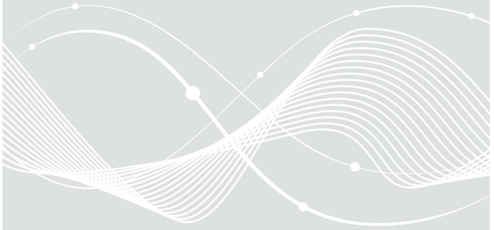

# BSI TR-03105 Part 2

Test Plan for Official Electronic ID Documents with Secure Contactless Integrated Circuit

# Document history

| Version | Date       | Editor | Description                  |
|---------|------------|--------|------------------------------|
| 1.0     | 2006-03-30 | BSI    | Initial release of Edition 1 |
| 2.0     | 2008-01-24 | BSI    | Initial release of Edition 2 |
| 2.2     | 2009-12-01 | BSI    | Update to Edition 2          |
| 3.0     | 2016-11-04 | BSI    | Initial release of Edition 3 |

Federal Office for Information Security Post Box 20 03 63 D-53133 Bonn Internet: https://www.bsi.bund.de © Federal Office for Information Security 2016

|         | Document history 2                                      |  |
|---------|---------------------------------------------------------|--|
| 1       | Introduction 5                                          |  |
| 2       | General Test Requirements 6                             |  |
| 2.1     | Validity of Referenced Documents 6                      |  |
| 2.2     | PICC Class Limitation 6                                 |  |
| 2.3     | Test Setup and Equipment 6                              |  |
| 2.4     | Nominal Values 6                                        |  |
| 2.5     | Report 6                                                |  |
| 2.6     | Test Sequence 7                                         |  |
| 3       | Layer 1 Tests 8                                         |  |
| 3.1     | "Class 1" Verification (Conditional) 8                  |  |
| 3.2     | Static Electricity 8                                    |  |
| 3.3     | Alternating Magnetic Field 8                            |  |
| 4       | Layer 2 Tests 9                                         |  |
| 4.1     | Load Modulation Amplitude 9                             |  |
| 4.2     | Operating Field Strength 9                              |  |
| 4.3     | SCIC Reception 9                                        |  |
| 4.4     | SCIC Resonance Frequency (Optional) 9                   |  |
| 4.5     | SCIC Maximum Loading Effect 10                          |  |
| 4.6     | Low Field Recover Capability 10                         |  |
| 4.7     | SCIC EMD Level and Low EMD Time10                       |  |
| 5       | Layer 3 Timing Tests 11                                 |  |
| 5.1     | Frame Delay Time (Type A only) 11                       |  |
| 5.2     | Detailed Type B Timing Measurements 12                  |  |
| 5.3     | Timing before PCD SOF (TR2) (Type B only)12             |  |
| 6       | Layer 3 and Layer 4 Protocol Tests 13                   |  |
| Annex A | Implementation Conformance Statement14                  |  |
| Annex B | List of Test Command Sequences15                        |  |
| B.1     | General 15                                              |  |
| B.2     | Test Commands for SCIC without Access Control (Plain)15 |  |
| B.3     | Test Commands for SCIC Supporting BAC15                 |  |
| B.4     | Test Commands for SCIC Supporting PACE15                |  |
| B.5     | Test Commands for SCIC Supporting EAC15                 |  |
| B.6     | Test Commands for SCIC Supporting PACE and EAC16        |  |
| B.7     | Test Commands for SCIC Supporting PACE and EAC217       |  |
| B.7.1   | Test Command Sequence 17                                |  |
| B.7.2   | Test Commands 18                                        |  |
| Annex C | Functionality Check 19                                  |  |
| C.1     | General 19                                              |  |

| C.2 | Application Functionality Check (Optional)19 |  |
|-----|----------------------------------------------|--|
| C.3 | Electric Functionality Check (Optional)19    |  |
|     | Reference Documentation 20                   |  |
|     | Keywords and Abbreviations 22                |  |

| Table 1: FDT Test Conditions 11                                    |  |
|--------------------------------------------------------------------|--|
| Table 2: TEST_COMMAND_SEQUENCE1 (with PACE/EAC, PACE-CAM in use)16 |  |
| Table 3: TEST_COMMAND_SEQUENCE1 (with PACE/EAC2, CA v2 in use)17   |  |
| Table 4: TEST_COMMAND_SEQUENCE1 (with PACE/EAC2, CA v3 in use)18   |  |

# 1 Introduction

Passports are a key element of travels between countries. Although the individual document styles differ – depending on the issuing country – it has to be ensured that each passport's construction follows several general rules, in order to guarantee interoperability. These general rules are defined in "Document 9303", published by ICAO (International Civil Aviation Organization).

Traditionally, passports only contained printed data (partially, in machine-readable form) but with the evolving technology of contactless smart card systems it was decided (at the beginning of the 21st century) to allow integration of a contactless chip (together with an appropriate antenna) into the passport document. Consequently, this additional element is also defined in (an extension to) Document 9303.

The underlying technology of a so-called "ePassport" is defined in the ISO/IEC 14443 standard series (parts 1 to 4 covering aspects starting from physical characteristics up to transmission protocol definitions), extended by an application specification defined in Document 9303.

In order to ensure that a given (e)Passport matches its specifications, it is of crucial importance to perform standardized tests. In addition to "traditional" tests of the document itself (e.g., durability tests) the inclusion of smart card technology makes it necessary to test these components, too. For this reason, the specification "TR-03105" was issued by the BSI (initially, in 2005).

BSI TR-03105 is a series of documents which is split up in general requirements (introduction and Part 1), card-testing (Parts 2 and 3.x), and reader-testing (Parts 4 and 5.x) aspects. Both card-testing and readertesting topics consist of lower-layer (Parts 2 and 4) and application-layer (Parts 3.x and 5.x) parts.

Generally, the TR-03105 documents form the basis of certification testing for German ePassports (and, as introduced later, German eID cards) documents and readers. But they can also be applied to foreign ePassports and eID products (as long as it is guaranteed that they are constructed in a standardized way) – thus giving the TR-03105 an importance beyond the German market.

Within this specification, BSI TR-03105 Part 2, the focus is on lower-layer (meaning ISO/IEC 14443-1 .. -4) document testing. Both earlier editions of this specification were based on ISO/IEC 10373-6:2001 (the first edition of the general test standard for ISO/IEC 14443-compliant products) but this third edition is based on the new ePassport testing standard ISO/IEC 18745-2:2016.

The update of TR-03105 Part 2 was necessary in order to ensure that all current technology – ISO/IEC 14443 significantly changed and expanded during the past years – is still covered by this test specification. While former editions contained many unique test case definitions (which were not covered by ISO/IEC 10373-6 at that time), the new third edition is mainly referring to matching ISO/IEC 18745-2:2016 test scenarios (with only few own definitions remaining) in order to ensure a high compatibility to this standard.

# 2 General Test Requirements

#### 2.1 Validity of Referenced Documents

In order to prevent potential conflicts caused by updates of any of the referenced documents (see Annex), no modifications or extensions of these documents occurring after October 01, 2016 are taken into account. This especially holds for (yet unpublished) amendments to specifications which would have automatically become applicable right after publication otherwise.

### 2.2 PICC Class Limitation

Throughout this whole document, it is always assumed that a DUT complies to PICC class 1 definition – it is not considered necessary to additionally cover further PICC classes in this context[1](#page-5-6) . Thus all test scenarios (especially in Layer 2) are to be performed such that only PICC class 1 test setups and limit values are applied.

#### 2.3 Test Setup and Equipment

In general, the definitions given in ISO/IEC 18745-2:2016, Chapters 5.1 ("General test conditions") and 5.1.1 ("Test setup") shall be used without modifications.

If a certain test case requires a different setup, it shall be specified in the context of the individual test case definition.

#### 2.4 Nominal Values

Unless stated otherwise, the values defined in ISO/IEC 18745-2:2016, Chapter 5.1.2 ("Values unless otherwise specified") and Chapter 7.1, Table 6 ("Values for bit rates higher than fc/16") shall be used without modifications.

#### 2.5 Report

The test report shall include the number of passed tests versus the total number of tests. A description of each test, the information if the test was pass or fail, the number of different samples and the date of the tests must be included.

In addition to this general claim, further requirements may be given in the definitions of the individual test scenarios.

1 As ePassports and eID cards typically are equipped with "large" antennas the limitation to only support PICC class 1 is considered reasonable in the context of this document. In case that a DUT should explicitly claim compliance to any other PICC class, it still shall be tested according to PICC class 1 rules (without considering any additional test parameters which might be applicable to the claimed PICC class).

#### 2.6 Test Sequence

As the test sequences highly depend on the test scenarios, they are part of the individual test case definitions in Chapters 2 to 6.

General test commands and command sequences (used for all Layer 4 and several Layer 2 and Layer 3 test scenarios) are defined in [Annex B.](#page-14-5)

## 3 Layer 1 Tests

As defined in ISO/IEC 18745-2:2016, Chapter 5.1, all tests within this group shall be performed with 3 (identical) samples. Each test scenario is only considered "Pass" if all 3 test performances are successfully completed.

#### 3.1 "Class 1" Verification (Conditional)

This test scenario is defined in ISO/IEC 18745-2:2016, Chapter 5.2.1. It shall be performed as described there, without modifications.

#### 3.2 Static Electricity

This test scenario is defined in ISO/IEC 18745-2:2016, Chapter 5.2.2. It shall be performed as described there, without modifications.

#### 3.3 Alternating Magnetic Field

This test scenario is defined in ISO/IEC 18745-2:2016, Chapter 5.2.3. It shall be performed as described there, without modifications.

# 4 Layer 2 Tests

As defined in ISO/IEC 18745-2:2016, Chapter 5.1, all tests within this group shall be performed with 3 (identical) samples. Each test scenario is only considered "Pass" if all 3 test performances are successfully completed.

#### 4.1 Load Modulation Amplitude

This test scenario is defined in ISO/IEC 18745-2:2016, Chapter 5.3.1 ("eMRTD transmission"). It shall be performed as described there, without modifications.

### 4.2 Operating Field Strength

This test scenario is defined in ISO/IEC 18745-2:2016, Chapter 5.3.2 and Chapter 7.2.1. Depending on the bit rate capabilities of the DUT,

- [no bit rates higher than fc/16 are supported] only the scenario defined in Chapter 5.3.2 shall be performed
- [otherwise] both variants of the test case shall be performed

In any case, the test scenario(s) shall be performed as described in ISO/IEC 18745-2, without modifications.

#### 4.3 SCIC Reception

This test scenario is defined in ISO/IEC 18745-2:2016, Chapter 5.3.3 and Chapter 7.2.2. Depending on the bit rate capabilities of the DUT,

- [no bit rates higher than fc/16 are supported] only the scenario defined in Chapter 5.3.3 shall be performed
- [otherwise] both variants of the test case shall be performed

The following modification to the referenced specifications shall be applied:

• Instead of only using TEST\_COMMAND1, it is required that the test is performed using TEST\_COMMAND\_SEQUENCE1 (refer to the "Operating Field Strength" test for further details on how to exactly use this command sequence).

#### 4.4 SCIC Resonance Frequency (Optional)

This test scenario is defined in ISO/IEC 18745-2:2016, Chapter 5.3.4. It shall be performed as described there, without modifications.

#### 4.5 SCIC Maximum Loading Effect

This test scenario is defined in ISO/IEC 18745-2:2016, Chapter 5.3.5. It shall be performed as described there, with the following modification:

• In addition to the specified test procedure (where *Vload = 6 V* has to be set, as defined in ISO/IEC 10373-6:2016, Chapter 7.2.5.2), the test shall be performed a second time with *Vload = 4.5 V* (in order to maximize interoperability with further specifications).

#### 4.6 Low Field Recover Capability

This test shall verify the correct DUT behavior at field strengths below the minimum required operating field strength *Hmin*. The purpose of the test is to verify whether the DUT is capable of recovering from already started and unexpectedly interrupted communication processes at low field strengths. During this test, the DUT doesn't need to operate correctly but it must be able to recover from any state and operate normally after applying a field strength which is in line with the normal operating conditions.

In order to perform this test, test procedure and test conditions from the "Operating Field Strength" test (see Chapter 4.2) shall be used, with the following modifications:

- Independent from the actual bit rate capabilities of the DUT, the test shall only be performed at *fc/128*.
- The test shall be performed at multiple field strengths, starting from 0.1 A/m and continue in steps with at most 0.1 A/m width – until *Hmin* is reached.

Within 5 seconds after completion of the test scenario, a functionality check – using the procedure from the "Operating Field Strength" test – shall be performed at *Hmin*. The DUT has to successfully complete this procedure in order to pass the test.

The test report shall state whether or not the DUT was able to recover from exposure to low field strengths.

### 4.7 SCIC EMD Level and Low EMD Time

This test scenario is defined in ISO/IEC 18745-2:2016, Chapter 7.2.3. It shall be performed as described there, without modifications.

# 5 Layer 3 Timing Tests

Unless further specified, all tests within this group shall be performed

- with 3 (identical) samples
- at RT
- using the following field strengths: *Hmin, 2.5 A/m, 3.5 A/m, 4.5 A/m, 5.5 A/m, 6.5 A/m, Hmax*

#### 5.1 Frame Delay Time (Type A only)

The purpose of this test is to verify that the DUT respects the FDT requirements as defined in ISO/IEC 14443- 3:2016, Chapter 6.2.1.1.

The test shall be performed for various combinations of initial card states and reader commands:

| Condition | Initial State | Command            |
|-----------|---------------|--------------------|
| 1         | IDLE          | REQA               |
| 2         | IDLE          | WUPA               |
| 3         | READY(1)      | AC (ends with '0') |
| 4         | READY(1)      | AC (ends with '1') |
| 5         | READY(1)      | SELECT             |
| 6         | HALT          | WUPA               |
| 7         | READY*(1)     | AC (ends with '0') |
| 8         | READY*(1)     | AC (ends with '1') |
| 9         | READY*(1)     | SELECT             |

#### Table 1: FDT Test Conditions

The following procedure has to be performed for all 9 conditions defined in Table 1:

- 1. The DUT is brought to the test initial state (by using the method defined in ISO/IEC 10373-6:2016, Chapter G.3.3.2.1)
- 2. The test apparatus (PCD simulator) sends the defined command
- 3. Measure the FDT (PCD to PICC) between sent command and received DUT response (if any)
- 4. Deactivate RF field and re-start the procedure (beginning from step 1) until 10 runs were performed

In order to pass this test, the following criteria have to be met:

- The DUT must send a formally correct response to all provided commands
- Each of the 90 individual measurements has to deliver FDT values within the specified limits

#### 5.2 Detailed Type B Timing Measurements

The purpose of this test is to verify that the DUT is able to handle PCD frames with different timings (SOF, EOF, EGT) and that its responses use correct timing values (SOF, EOF, EGT, TR0, TR1) as well.

In order to perform this test, the procedure defined in ISO/IEC 10373-6:2016, Chapter G.4.3 ("Scenario G.22: PICC Reception") shall be used, with the following modifications:

- For each set of frame parameters, 10 consecutive measurements shall be performed
- The test shall be performed with 3 (identical) samples

The test is only considered as "Pass", if all of the performed test runs deliver a positive result.

#### 5.3 Timing before PCD SOF (TR2) (Type B only)

The purpose of this test is to verify that the DUT respects the TR2 requirements as defined in ISO/IEC 14443- 3:2016, Chapter 7.1.7.

In preparation of the actual test performance, the following initial procedure shall be performed:

- 1. The RF power of the test apparatus (PCD simulator) is activated, bringing the DUT to IDLE state
- 2. The test apparatus sends REQB command
- 3. From the ATQB response of the DUT, the bits b3 and b2 of the "Protocol\_Type" field are extracted in order to determine the minimum TR2 coding

After setting the appropriate TR2 value, the following procedure has to be performed:

- 1. The RF power of the test apparatus (PCD simulator) is activated, bringing the DUT to IDLE state
- 2. The test apparatus sends REQB command
- 3. The DUT is expected to respond with a formally correct ATQB
- 4. The test apparatus sends ATTRIB with minimum delay (using the TR2 value determined earlier)
- 5. Record the presence of the DUT response (if any)
- 6. Deactivate RF field and re-start the procedure (beginning from step 1) until 10 runs were performed

In order to pass this test, the DUT always has to provide a formally correct response to the ATTRIB command from step 4.

# 6 Layer 3 and Layer 4 Protocol Tests

The test scenarios defined in ISO/IEC 18745-2:2016, Chapter 5.4 ("Test of ISO/IEC 14443-3 and ISO/IEC 14443-4 parameters") and Chapter 7.4 ("Additional tests of ISO/IEC 14443-3 and ISO/IEC 14443-4 parameters for PICC") shall be performed as described there, without modifications.

# Annex A Implementation Conformance Statement

In order to ensure a proper test setup, it is mandatory for an applicant to provide a completed ICS (Implementation Conformance Statement) document.

"Table 2" as defined in ISO/IEC 18745-2:2016, Chapter 5.1.4 ("Applicant declaration") might be used as a template but the final definition of actual design and content of the ICS form is the task of the test laboratory (in coordination with the BSI).

In any case, the ICS shall contain the following paragraph:

"In case that Extended Access Control (EAC) is supported, please ensure that the following files (in the formats as defined below) are provided:

- Document Verifier (DV) certificate in the format specified in Technical Guideline TR-03110; this certificate has to be signed with the CVCA private key (which must correspond to the CVCA public key stored on the DUT's chip)
- Inspection System (IS) certificate in the format specified in Technical Guideline TR-03110; it has to be signed with the DV private key (which must match the public key as contained in the DV certificate)
- IS private key in pkcs8 format (it has to match the public key contained in the IS certificate)"

In addition to the specification of the technical characteristics of the DUT, the ICS document shall contain the following information:

- Applicant's company name and address
- Contact partner (including name, phone number, and email address)
- DUT's product identifier, hardware version, and software version

It has to be ensured that the completed ICS (at least the technical parts) is provided to the test lab prior to the test start.

# Annex B List of Test Command Sequences

#### B.1 General

This annex contains definitions of test commands and test command sequences on application level; these are used by multiple test scenarios defined in this document: All Layer 4 tests and several Layer 2 and Layer 3 tests.

### B.2 Test Commands for SCIC without Access Control (Plain)

The definitions of test command sequence and test commands given in ISO/IEC 18745-2:2016, Chapter 5.5.1 shall be used without modifications.

#### B.3 Test Commands for SCIC Supporting BAC

The definitions of test command sequence and test commands given in ISO/IEC 18745-2:2016, Chapter 5.5.2 shall be used without modifications.

#### B.4 Test Commands for SCIC Supporting PACE

The definitions of test command sequence and test commands given in ISO/IEC 18745-2:2016, Chapter 5.5.3 shall be used without modifications.

#### B.5 Test Commands for SCIC Supporting EAC

The definitions of test command sequence and test commands given in ISO/IEC 18745-2:2016, Chapter 8.2.1 shall be used without modifications.

#### B.6 Test Commands for SCIC Supporting PACE and EAC

The definitions of test command sequence and test commands given in ISO/IEC 18745-2:2016, Chapter 8.2.2 shall be used, with the following modification:

• If the DUT supports PACE-CAM (Chip Authentication Mapping), use the following definition of TEST\_COMMAND\_SEQUENCE1 (instead of the one contained in ISO/IEC):

| Step | Command                                             | Protocol |
|------|-----------------------------------------------------|----------|
| 1    | READ BINARY (EF.CardAccess)                         |          |
| 2    | MSE: Set AT                                         | PACE-CAM |
| 3    | GENERAL AUTHENTICATE (Encrypted Nonce)              | PACE-CAM |
| 4    | GENERAL AUTHENTICATE (Map Nonce)                    | PACE-CAM |
| 5    | GENERAL AUTHENTICATE (Perform Mutual Key Agreement) | PACE-CAM |
| 6    | GENERAL AUTHENTICATE (Mutual Authentication)        | PACE-CAM |
| 7    | Optional: READ BINARY (EF.CardSecurity)          | PACE-CAM |
| 8    | SELECT (Passport Application)                       |          |
| 9    | READ BINARY (EF.CVCA)                               | TA (v1)  |
| 10   | MSE: Set DST (DV)                                   | TA (v1)  |
| 11   | PSO: Verify Certificate (DV)                        | TA (v1)  |
| 12   | MSE: Set DST (IS)                                   | TA (v1)  |
| 13   | PSO: Verify Certificate (IS)                        | TA (v1)  |
| 14   | MSE: Set AT                                         | TA (v1)  |
| 15   | GET CHALLENGE                                       | TA (v1)  |
| 16   | EXTERNAL AUTHENTICATE                               | TA (v1)  |
| 17   | READ BINARY (EF.DG3)                                |          |

Table 2: TEST\_COMMAND\_SEQUENCE1 (with PACE/EAC, PACE-CAM in use)

The ISO/IEC definitions of TEST\_COMMAND1, TEST\_COMMAND2, and TEST\_COMMAND3 shall be used without modification (independent from the usage of PACE-CAM)).

#### B.7 Test Commands for SCIC Supporting PACE and EAC2

In addition to the "regular" EAC version (currently in use by many ePassports, also used within ISO/IEC 18745-2:2016) exists a second variation (named "EAC2" within this document), defined by the BSI (Technical Guideline TR-03110).

EAC2 – which is, e.g., used by German nPA (national ID card) documents – significantly differs from the "normal" EAC, thus it is required to handle it separately as modified definitions of the test command sequence have to be introduced.

#### B.7.1 Test Command Sequence

Two variations of EAC2 must be regarded: The "Chip Authentication" (CA) protocol may either be used in version 2 or version 3 – depending on that, different test command sequences have to be defined.

| Step | Command                                             | Protocol |
|------|-----------------------------------------------------|----------|
| 1    | READ BINARY (EF.CardAccess)                         |          |
| 2    | MSE: Set AT                                         | PACE     |
| 3    | GENERAL AUTHENTICATE (Encrypted Nonce)              | PACE     |
| 4    | GENERAL AUTHENTICATE (Map Nonce)                    | PACE     |
| 5    | GENERAL AUTHENTICATE (Perform Mutual Key Agreement) | PACE     |
| 6    | GENERAL AUTHENTICATE (Mutual Authentication)        | PACE     |
| 7    | MSE: Set DST (DV)                                   | TA (v2)  |
| 8    | PSO: Verify Certificate (DV)                        | TA (v2)  |
| 9    | MSE: Set DST (IS)                                   | TA (v2)  |
| 10   | PSO: Verify Certificate (IS)                        | TA (v2)  |
| 11   | MSE: Set AT                                         | TA (v2)  |
| 12   | GET CHALLENGE                                       | TA (v2)  |
| 13   | EXTERNAL AUTHENTICATE                               | TA (v2)  |
| 14   | READ BINARY (EF.CardSecurity)                       |          |
| 15   | MSE: Set AT                                         | CA (v2)  |
| 16   | GENERAL AUTHENTICATE (Chip Authentication)          | CA (v2)  |
| 17   | SELECT (Passport Application)                       |          |
| 18   | READ BINARY (EF.DG2)                                |          |
| 19   | Optional: READ BINARY (EF.DG3)                   |          |

In the following, both test command sequence options shall be introduced.

Table 3: TEST\_COMMAND\_SEQUENCE1 (with PACE/EAC2, CA v2 in use)

| Step | Command                                               | Protocol |
|------|-------------------------------------------------------|----------|
| 1    | READ BINARY (EF.CardAccess)                           |          |
| 2    | MSE: Set AT                                           | PACE     |
| 3    | GENERAL AUTHENTICATE (Encrypted Nonce)                | PACE     |
| 4    | GENERAL AUTHENTICATE (Map Nonce)                      | PACE     |
| 5    | GENERAL AUTHENTICATE (Perform Mutual Key Agreement)   | PACE     |
| 6    | GENERAL AUTHENTICATE (Mutual Authentication)          | PACE     |
| 7    | MSE: Set DST (DV)                                     | TA (v2)  |
| 8    | PSO: Verify Certificate (DV)                          | TA (v2)  |
| 9    | MSE: Set DST (IS)                                     | TA (v2)  |
| 10   | PSO: Verify Certificate (IS)                          | TA (v2)  |
| 11   | MSE: Set AT                                           | TA (v2)  |
| 12   | GET CHALLENGE                                         | TA (v2)  |
| 13   | EXTERNAL AUTHENTICATE                                 | TA (v2)  |
| 14   | READ BINARY (EF.CardSecurity)                         |          |
| 15   | MSE: Set AT                                           | CA (v3)  |
| 16   | GENERAL AUTHENTICATE (Perform Key Agreement)          | CA (v3)  |
| 17   | MSE: Set AT                                           | CA (v3)  |
| 18   | GENERAL AUTHENTICATE (Compute Pseudonymous Signature) | CA (v3)  |
| 19   | SELECT (Passport Application)                         |          |
| 20   | READ BINARY (EF.DG2)                                  |          |
| 21   | Optional: READ BINARY (EF.DG3)                     |          |

Table 4: TEST\_COMMAND\_SEQUENCE1 (with PACE/EAC2, CA v3 in use)

#### B.7.2 Test Commands

The definitions of TEST\_COMMAND1, TEST\_COMMAND2, and TEST\_COMMAND3 are equal to those in the "SCIC supporting PACE" scenario (see Annex B.4 of this document or ISO/IEC 18745-2:2016, Chapter 5.5.3).

In cases where TEST\_COMMAND2 is used, it has to be ensured that both PACE and EAC2 have to be successfully performed before the defined test command can be carried out.

# Annex C Functionality Check

#### C.1 General

This annex specifies two optional tests to verify the SCIC/ePassport functionality on electrical and application level.

#### C.2 Application Functionality Check (Optional)

This test scenario is defined in ISO/IEC 18745-2:2016, Chapter 5.6.2. It shall be performed as described there, without modifications.

#### C.3 Electric Functionality Check (Optional)

In any case, the "Operating Field Strength" test (as defined in Chapter 4.2) shall be performed. If the "Resonance Frequency" test (as defined in Chapter 4.4) is applicable, it shall be additionally performed.

# Reference Documentation

| [1] | ISO/IEC ISO/IEC 14443-1:2016 Identification cards – Contactless integrated circuit cards – Proximity cards – Part 1: Physical characteristics Third edition, 2016-03-15                   |
|-----|-------------------------------------------------------------------------------------------------------------------------------------------------------------------------------------------------------|
| [2] | ISO/IEC ISO/IEC 14443-2:2016 Identification cards – Contactless integrated circuit cards – Proximity cards – Part 2: Radio frequency power and signal interface Third edition, 2016-07-15 |
| [3] | ISO/IEC ISO/IEC 14443-3:2016 Identification cards – Contactless integrated circuit cards – Proximity cards – Part 3: Initialization and anticollision Third edition, 2016-06-01           |
| [4] | ISO/IEC ISO/IEC 14443-4:2016 Identification cards – Contactless integrated circuit cards – Proximity cards – Part 4: Transmission protocol Third edition, 2016-06-01                      |
| [5] | ISO/IEC ISO/IEC 10373-6:2016 Identification cards – Test methods – Part 6: Proximity cards Third edition, 2016-07-15                                                                      |
| [6] | ISO/IEC ISO/IEC 18745-2:2016 Test methods for machine readable travel documents (MRTD) and associated readers – Part 2: Test methods for the contactless interface 2016-08-15             |
| [7] | ISO/IEC ISO/IEC 7816-4:2013 Identification cards – Integrated circuit cards – Part 4: Organization, security and commands for interchange Third edition, 2013-04-15                       |
| [8] | ISO/IEC ISO/IEC 7810:2003/Amd.1:2009 Identification cards – Physical characteristics – Criteria for cards containing integrated circuits 2009-12-15                                          |
| [9] | ICAO Document 9303 Machine Readable Travel Documents Parts 1  12 Seventh edition, 2015                                                                                                    |

- [10] *ICAO* Technical Report Supplemental Access Control for Machine Readable Travel Documents *Version 1.01, 2010-11-11*
- [11] *Bundesamt für Sicherheit in der Informationstechnik* Technical Guideline TR-03110 Advanced Security Mechanisms for Machine Readable Travel Documents and eIDAS Token Parts 1 .. 4 *Version 2.20, February 2015*

# Keywords and Abbreviations

| AA   | Active Authentication                           |
|------|-------------------------------------------------|
| ATQA | Answer to request, type A                       |
| ATQB | Answer to request, type B                       |
| ATS  | Answer To Select                                |
| BAC  | Basic Access Control                            |
| CID  | Card Identifier                                 |
| DUT  | Device Under Test                               |
| EAC  | Extended Access Control                         |
| EGT  | Extra Guard Time                                |
| EMD  | Electromagnetic disturbance                     |
| EOF  | End Of Frame                                    |
| ESD  | Electrostatic discharge                         |
| etu  | Elementary time unit                            |
| fc   | Carrier frequency (13.56 MHz)                   |
| FDT  | Frame delay time                                |
| fs   | Subcarrier frequency (847.5 kHz)                |
| Hmax | Maximum operating field strength                |
| Hmin | Minimum operating field strength                |
| ICS  | Implementation Conformance Statement            |
| m    | Modulation index                                |
| MRTD | Machine Readable Travel Document                |
| NAD  | Node address                                    |
| PACE | Password Authenticated Connection Establishment |
| PCD  | Proximity Coupling Device                       |
| PICC | Proximity Integrated Circuit Card               |
| PPS  | Protocol and Parameter Selection                |
| RATS | Request for Answer To Select                    |
| REQA | Request command, type A                         |
| REQB | Request command, type B                         |
| RF   | Radio frequency                                 |
| RT   | Room temperature                                |
| SAC  | Supplemental Access Control                     |
| SCIC | Secure Contactless Integrated Circuit           |
| SOF  | Start Of Frame                                  |

| tr, tf | Rise time, fall time                                                                                                        |
|--------|-----------------------------------------------------------------------------------------------------------------------------|
| TR0    | Guard time between the end of a PCD transmission and the start of the SCIC subcarrier generation                         |
| TR1    | Synchronization time between the start of the SCIC subcarrier generation and the start of the SCIC subcarrier modulation |
| TR2    | Synchronization time between the start of the SCIC's EOF and the start of the PCD's next SOF                             |