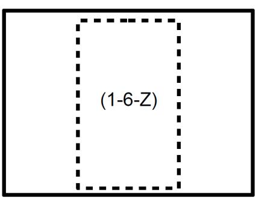

Technical Guideline TR-03105

# Test Plan for ICAO-compliant Proximity Coupling Devices (PCD) on Layers 1-4

Part 4

Version 3.1.1

Federal Office for Information Security PO Box 20 03 63 D- 53133 Bonn E-Mail: [dif-eID@bsi.bund.de](mailto:dif-eID@bsi.bund.de) Internet:<https://www.bsi.bund.de> © 2023 Federal Office for Information Security

# Document history

| Version | Date       | Editor | Description                      |
|---------|------------|--------|----------------------------------|
| 1.0     | 2006-03-30 | BSI    | Initial release of Edition 1     |
| 2.0     | 2008-04-15 | BSI    | Initial release of Edition 2     |
| 2.2     | 2010-03-17 | BSI    | Update to Edition 2              |
| 3.0     | 2016-11-04 | BSI    | Initial release of Edition 3     |
| 3.1     | 2022-10-25 | BSI    | Update to Edition 3              |
| 3.1.1   | 2023-07-06 | BSI    | Resolved comment of CTC advanced |

**Table .1** Document history

| 1   | Introduction                                                   | 1  |
|-----|-------------------------------------------------------------------|----|
| 1.1 | Terminology                                                    | 1  |
| 2   | General Test Requirements                                      | 3  |
| 2.1 | Validity of Reference Documents                                | 3  |
| 2.2 | Test Setup and Equipment                                       | 3  |
| 2.3 | PCD Test Features                                              | 3  |
| 2.4 | Nominal Values                                                 | 5  |
| 2.5 | Definition of Measurement Positions                            | 5  |
| 2.6 | Number of Test Samples                                         | 5  |
| 2.7 | Report                                                         | 5  |
| 3   | Layer 1 Tests                                                  | 6  |
| 3.1 | Alternating Magnetic Field                                     | 6  |
| 4   | Layer 2 Tests                                                  | 7  |
| 4.1 | Test case ISO/IEC 18745 Layer 2 Operation Field Strength       | 7  |
| 4.2 | Test case ISO/IEC 18745 Layer 2 Modulation Index and Waveform  | 7  |
| 4.3 | Test case ISO/IEC 18745 Layer 2 Load Modulation Reception      | 8  |
| 4.4 | Test case ISO/IEC 18745 Layer 2 EMD Immunity Test              | 8  |
| 4.5 | Test case ISO/IEC 18745 Layer 2 EMD Recovery Test              | 9  |
| 5   | Layer 3 Timing Tests                                           | 10 |
| 5.1 | Timing Tests Type A                                            | 10 |
| 5.2 | Timing Tests Type B                                            | 11 |
| 6   | Layer 3 and Layer 4 Protocol Tests                             | 16 |
| A   | Implementation Conformance Statement                           | 17 |
| B   | Reader Design Types and Measurement Positions                  | 18 |
| B.1 | Reader Design Type Definitions                                 | 18 |
| B.2 | Measurement Positions                                          | 19 |
| C   | Extended Test Specifications                                   | 21 |
| C.1 | Frame delay time test conditions                               | 21 |
| C.2 | TR0/TR1 Test Conditions                                        | 21 |
| C.3 | TR2 Coding Options                                             | 21 |
|     | Keywords and Abbreviations                                     | 22 |
|     | Bibliography                                                   | 23 |

# List of figures

| B.1. | Measurement positions Type 11 |  | 20 |
|------|-------------------------------|--|----|
|------|-------------------------------|--|----|

# 1 Introduction

Passports are a key element of travels between countries. Although the individual document styles differ – depending on the issuing country – it has to be ensured that each passport's construction follows several general rules, in order to guarantee interoperability. These general rules are defined in [\[ICAO 9303\]](#page-28-1), published by *[ICAO](#page-27-1)*.

Traditionally, passports only contained printed data (partially, in machine-readable form) but with the evol ving technology of contactless smart card systems it was decided (at the beginning of the 21st century) to allow integration of a contactless chip (together with an appropriate antenna) into the passport document. Consequently, this additional element is also defined in (an extension to) [\[ICAO 9303\]](#page-28-1).

The underlying technology of a so-called "ePassport" is defined in the ISO/IEC 14443 standard series (parts 1 to 4 covering aspects starting from physical characteristics up to transmission protocol definitions), extended by an application specification defined in [\[ICAO 9303\]](#page-28-1).

While reader devices of "traditional" (= non-electronically enhanced) passports only had to be able to optically read documents, an ePassport reader device (often called "inspection system" in this context) additionally has to be able to access the data stored on the document's contactless chip. The technology necessary to provide this functionality also is defined in the ISO/IEC 14443 standard series.

In order to ensure that given ePassport documents and reader devices match their specifications, it is of crucial importance to perform standardized tests. Especially due to the inclusion of smart card technology (which makes it necessary to test these components, too), the specification "TR-03105" was issued by the BSI (initially, in 2005).

BSI TR-03105 is a series of documents which is split up in general requirements (introduction and Part 1), card-testing (Parts 2 and 3.x), and reader-testing (Parts 4 and 5.x) aspects. Both card-testing and readertesting topics consist of lower-layer (Parts 2 and 4) and application-layer (Parts 3.x and 5.x) parts.

Generally, the TR-03105 documents form basis of certification testing for German ePassports (and, as in troduced later, German eID cards) documents and readers. But they can also be applied to foreign ePassports and eID products (as long as it is guaranteed that they are constructed in a standardized way) – thus giving the TR-03105 an importance beyond the German market.

Within this specification, BSI TR-03105 Part 4, the focus is on lower-layer (meaning ISO/IEC 14443-1 .. -4) reader device testing. Both earlier editions of this specification were based on ISO/IEC 10373-6:2001 (the first edition of the general test standard for ISO/IEC 14443-compliant products) but this third edition is based on the new ePassport testing standard [\[ISO/IEC 18745-2:2016\]](#page-28-2).

The update of TR-03105 Part 4 was necessary in order to ensure that all current technology – ISO/IEC 14443 significantly changed and expanded during the past years – is still covered by this test specification. While for mer editions contained many unique test case definitions (which were not covered by [\[ISO/IEC 10373-6:2016\]](#page-28-3) at that time), the new third edition is mainly referring to matching [\[ISO/IEC 18745-2:2016\]](#page-28-2) test scenarios (with only few own definitions remaining) in order to ensure a high compatibility to this standard.

### 1.1 Terminology

The key words "MUST", "SHALL", "REQUIRED", "SHOULD", "RECOMMENDED", and "MAY" in this document are to be interpreted as described in [\[RFC 2119\]](#page-28-4).

| Key word | Description                                                                                                                                                                                                                                                |
|----------|------------------------------------------------------------------------------------------------------------------------------------------------------------------------------------------------------------------------------------------------------------|
| MUST     | This word, or the terms "REQUIRED" "SHALL", mean that definition is an absolute require ment of the specification                                                                                                                                       |
| MUST NOT | This phrase, or the phrase "SHALL NOT", mean that the definition is an absolute prohibition of the specification.                                                                                                                                       |
| SHOULD   | This word, or the adjective "RECOMMENDED", mean that there may exist valid reasons in particu lar circumstances to ignore a particular item, but the full implications must be understood and ca refully weighed before choosing a different course. |

| Key word   | Description                                                                                                                                                                                                                                                                                                                                                                                                                                                                                                                                                                                                                                                                                                                            |
|------------|----------------------------------------------------------------------------------------------------------------------------------------------------------------------------------------------------------------------------------------------------------------------------------------------------------------------------------------------------------------------------------------------------------------------------------------------------------------------------------------------------------------------------------------------------------------------------------------------------------------------------------------------------------------------------------------------------------------------------------------|
| SHOULD NOT | This phrase, or the phrase "NOT RECOMMENDED" mean that there may exist valid reasons in par ticular circumstances when the particular behavior is acceptable or even useful, but full impli cations should be understood and the case carefully weighed before implementing any behavior described with this label.                                                                                                                                                                                                                                                                                                                                                                                                           |
| MAY        | This word, or the adjective "OPTIONAL", mean that an item is truly optional. One vendor may choose to include the item because a particular marketplace requires it or because the vendor feels that it enhances the product while another vendor may omit the same item. An implementation which does not include a particular option MUST be prepared to interoperate with another imple mentation which does include the option, though perhaps with reduced functionality. In the same vein an implementation which does include a particular option MUST be prepared to interoperate with another implementation which does not include the option (except, of course, for the feature the option provides.) |

**Table 1.1** Terminology

# 2 General Test Requirements

## 2.1 Validity of Reference Documents

In order to prevent potential conflicts caused by updates of any of the referenced documents (see Annex), no modifications or extensions of these documents occurring after October 01, 2016 are taken into account. This especially holds for (yet unpublished) amendments to specifications which would have automatically become applicable right after publication otherwise.

## 2.2 Test Setup and Equipment

In general, the definitions given in [\[ISO/IEC 18745-2:2016\],](#page-28-2) Chapters 6.1 ("General test requirements") and 6.1.1 ("Test setup") SHALL be used without modifications.

If a certain test case requires a different setup, it SHALL be specified in the context of the individual test case definition.

## 2.3 PCD Test Features

In order to ensure that all test scenarios defined in this document can be performed without complications it is often not sufficient if the *[DUT](#page-27-2)* functions in its "normal" operation mode. Thus, it is REQUIRED that the *[DUT](#page-27-2)* is equipped with certain test modes.

As the test mode requirements significantly differ between Analog (Layers 1 and 2) and Digital (Layers 3 and 4) parts, they SHALL be separately presented in the following.

Due to different features of *[DUT](#page-27-2)* there are various profiles defined. These profiles can be used to characterize the *[DUT](#page-27-2)* and to select the corresponding test cases. In this document the following profiles are used:

- **•** BASIC: Test case with this profile MUST be performed by all *[DUT](#page-27-2)*
- **•** TYPEA: Test case with this profile MUST be performed by all *[DUT](#page-27-2)* using Type A
- **•** TYPEB: Test case with this profile MUST be performed by all *[DUT](#page-27-2)* using Type B

#### 2.3.1 Test Mode for Layer 1 and Layer 2 Tests

It is not defined how the following characteristics are to be provided by the *[DUT](#page-27-2)* – it MAY either be with an application running on a separate PC which controls (via an arbitrary interface) the reader module or it MAY also be installed on the reader itself (provided that the device has sufficient capabilities, e.g., a graphical user interface). The provision of the test interface is the task of the *[DUT](#page-27-2)* provider.

The Layer 1/2 test mode MUST meet the following requirements:

- **•** The *[DUT](#page-27-2)* MUST be able to send an unmodulated carrier in order to enable field strength measurements.
- **•** The *[DUT](#page-27-2)* MUST be able to send *[REQA](#page-27-3)*/*[REQB](#page-27-4)* (or *[WUPA](#page-27-5)*/*[WUPB](#page-27-6)*) commands at all supported bit rates [1](#page-8-4) in order to enable waveform and reception tests.
- **•** The test interface MUST be able to display responses to *[REQA](#page-27-3)*/*[REQB](#page-27-4)* (or *[WUPA](#page-27-5)*/*[WUPB](#page-27-6)*) commands at all supported bit rates – this capability is needed for reception tests where a feedback is required in order to determine if a *[PICC](#page-27-7)* response was detected by the *[DUT](#page-27-2)* or not.

#### 2.3.2 Test Mode for Layer 3 and Layer 4 Tests

[\[ISO/IEC 18745-2:2016\]](#page-28-2) specifies – in Chapter 6.5 ("List of test command sequences") - various test commands ("UT\_TEST\_COMMAND") which SHALL be used for all tests where transitions at protocol level are made (such transitions occur within several Layer 3 and all Layer 4 tests). In general, this approach SHALL be followed within this document as well – but in a modified way.

1 Usually, *[REQA](#page-27-3)*/*[REQB](#page-27-4)* (or *[WUPA](#page-27-5)*/*[WUPB](#page-27-6)*) MUST only be sent at default bit rate (fc/128). For the purpose of testing, they SHALL (exceptionally) also be available at (all supported) higher bit rates.

The general problem with the "UT\_TEST\_COMMAND" approach is that it is not exactly defined how these test commands have to be provided by the *[DUT](#page-27-2)* [2](#page-9-0) . This leads to the practical problem that no unique test interface is available and a resource-consuming individual adaptation (ensuring that test system and *[DUT](#page-27-2)* are able to correctly interact) is always required.

The definitions provided in the following take "UT\_TEST\_COMMAND" approach into account but addi tionally define how the specified commands SHALL be provided (by the *[DUT](#page-27-2)*) in practice. They may be im plemented on the device itself (provided it has appropriate capabilities) or on an external control device (via an arbitrary interface to the *[DUT](#page-27-2)*). *[DUT](#page-27-2)* and test system only communicate via the contactless interface.

The Layer 3/4 test mode MUST meet the following requirements:

- **•** In general, it is REQUIRED that the *[DUT](#page-27-2)* implements a full polling cycle for both types (A and B) which means it must poll with *[REQA](#page-27-3)* (or *[WUPA](#page-27-5)*) and *[REQB](#page-27-4)* (or *[WUPB](#page-27-6)*) – and, after a correct *[ATQA](#page-27-8)*/*[ATQB](#page-27-9)* was received, it must lead the (simulated) card through all succeeding states until finally PROTOCOL state is reached. As [\[ISO/IEC 14443-3:2016\]](#page-28-5) and [\[ISO/IEC 14443-4:2016\] don't give a fixed definition of such pol](#page-28-6) ling sequence it is up to the *[DUT](#page-27-2)* on how the concrete implementation is constructed (as long as it can suc cessfully and reproducibly lead cards of both types to PROTOCOL state)[3](#page-9-1) .
- **•** Having reached PROTOCOL state (either Type A or Type B) the *[DUT](#page-27-2)* SHALL provide a loopback interface which is defined as follows:
	- **•** The *[DUT](#page-27-2)* sends a SELECT *[APDU](#page-27-10)* of the form <PCB> [<CID>] 00 A4 04 0C 08 F0 42 53 49 20 65 50 50 00 <CRC1> <CRC2> .
	- **•** The card (simulated by the test system) either responds with <PCB> [<CID>] <<NEXT\_COMMAND>> [4](#page-9-2) 90 00 <CRC1> <CRC2> (loopback scenario) or <PCB> [<CID>] FF FF FF FF 90 00 <CRC1> <CRC2> (end loopback mode)
	- **•** The *[DUT](#page-27-2)* MUST react as follows: <PCB> [<CID>] <<NEXT\_COMMAND>> <CRC1> <CRC2> or end communication (switch field off and restart polling cycle)
- **•** This communication mode is continued until either the test system sends the "end loopback" frame or does not respond anymore (in this case, the *[DUT](#page-27-2)* SHALL initialize the communication shutdown measures as defined in [\[ISO/IEC 14443-4:2016\]\)](#page-28-6).
- **•** In either case, the *[DUT](#page-27-2)* is mandated to respect the block handling rules defined by [\[ISO/IEC 14443-4:2016\]](#page-28-6) – especially regarding block numbering, chaining, handling of waiting time extensions, and error handling. These mechanisms will be used (by giving appropriate responses to *[DUT](#page-27-2)* commands) by the test system during the Layer 4 tests.

The ISO/IEC command "UT\_TEST\_COMMAND1" will be the SELECT *[APDU](#page-27-10)* for the loopback application itself ("00 A4 04 0C 08 F0 42 53 49 20 65 50 50 00"). This is a modification of the definition in [\[ISO/IEC 18745-2:2016\]](#page-28-2), Chapter 6.5.1.

The fixed response to UT\_TEST\_COMMAND1 (12 34 90 00, as defined in [\[ISO/IEC 18745-2:2016\]](#page-28-2)) SHALL NOT be used – as it would lead to a conflict with the loopback mechanism rules defined above. Instead, the response SHALL be flexibly chosen – depending on the requirements of the concrete test procedure.

In general, "UT\_TEST\_COMMAND2" SHOULD be similar to the command defined in [\[ISO/IEC 18745-2:2016\]](#page-28-2), Chapter 6.5.2.1 – but with some modifications in order to ensure that it is compliant the loopback me chanism:

2 It is obvious that the test commands have to be provided via the contactless interface but it additionally is REQUIRED that also some trigger mechanism has to be present which allows to distinguish between sending UT\_TEST\_COMMAND1 and UT\_TEST\_COMMAND2.

3 [\[ISO/IEC 18745-2:2016\], Chapter 6.5 uses the abstract term "INITIATE\\_ANTICOLLISION" for this mecha](#page-28-2) nism – it is described in more detail in [\[ISO/IEC 10373-6:2016\],](#page-28-3) Annexes H.1.3 and H.1.8.

4 In general, >>NEXT\_COMMAND<< might be any byte array (including the empty one). Depending on the concrete scenario, it might be useful to place a formally correct Command-*[APDU](#page-27-10)* here.

- **•** UT\_TEST\_COMMAND2 will be (part of) the response to the SELECT loopback *[APDU](#page-27-10)* (i.e., it will play the role of the <<NEXT\_COMMAND>> defined above) [5](#page-10-4) .
- **•** Instead of using a fixed-length command (containing 255 data bytes) length and value of UT\_TEST\_COMMAND2 SHALL be flexibly chosen based on the requirements of the concrete test scenario (there are scenarios where a shorter command is more useful but a longer one might also be needed – if maximum frame sizes larger than 256 bytes have to be considered)[6](#page-10-5) .
- **•** The defined response to UT\_TEST\_COMMAND2 SHALL also be modified in order to both match (individual) test case and loopback requirements.

### 2.4 Nominal Values

In general, the values defined in [\[ISO/IEC 18745-2:2016\],](#page-28-2) Chapter 6.1.2 ("Values unless otherwise specified") SHALL be used.

In contrast to the test temperature definition given in [\[ISO/IEC 18745-2:2016\] \(fixed range which might chan](#page-28-2) ge on applicant's request) it is always mandatory for the applicant to define an individual temperature range. The extreme values of this range, together with room temperature, SHALL be used for testing.

### 2.5 Definition of Measurement Positions

The general requirements as given in [\[ISO/IEC 18745-2:2016\],](#page-28-2) Chapter 6.1.5 ("Definition of measurement points") SHALL be used, without modifications.

As the selection of appropriate measurement positions heavily depends on the construction of the *[DUT](#page-27-2)*, it is mandatory for the applicant to specify an appropriate reader design type (in the *[ICS](#page-27-11)*). Details on this topic are presented in [Appendix B](#page-23-0).

### 2.6 Number of Test Samples

When a product has to be tested according this specification, three samples of the SHALL pro vided (preferably from the normal production line). Out of these three samples, the test laboratory randomly selects one to perform all tests.

This rule is applicable for all test cases in which the number of tested samples is given as "1 out of 3".

#### 2.7 Report

The test report SHALL include the number of passed tests versus the total number of tests. A description of each test, the information if the test was pass or fail, the number of different samples and the date of the test performance MUST be included.

In addition to this general claim, further requirements may be given in the definitions of the individual test scenarios.

5 Implementing UT\_TEST\_COMMAND2 in this way requires a (slight) change in the [\[ISO/IEC 10373-6:2016\]](#page-28-3) Annex H test case definitions: There, the test scenarios define UT\_TEST\_COMMAND2 to be the first command sent by the *[DUT](#page-27-2)* but – in the scenario described above – it will actually be the second (the SELECT loopback *[APDU](#page-27-10)* always SHALL be sent first).

6 As this part of BSI TR is not about application testing, it actually does not make any difference which *[APDU](#page-27-10)*s are selected as test commands – as long as it guaranteed that the goals of the various test cases are met (especially regarding frame handling).

# 3 Layer 1 Tests

All tests within this group SHALL be performed using "1 out of 3" test samples (see Section 2.6 for details).

### 3.1 Alternating Magnetic Field

This test scenario is defined in [\[ISO/IEC 18745-2:2016\]](#page-28-2), Chapter 6.2 ("Test of [\[ISO/IEC 14443-1:2016\]](#page-28-7) parame ters"). It SHALL be performed as described there, without modifications.

# 4 Layer 2 Tests

All tests within this group SHALL be performed using "1 out of 3" test samples (see Section 2.6 for details).

## 4.1 Test case ISO/IEC 18745 Layer 2 Operation Field Strength

| Test-ID               | ISO/IEC_18745_Layer2_1                                                                                                                                                                                                                                                                                                           |
|-----------------------|----------------------------------------------------------------------------------------------------------------------------------------------------------------------------------------------------------------------------------------------------------------------------------------------------------------------------------|
| Reference             | [ISO/IEC 18745-2:2016], Chapter 6.3.1 ("eMRTD reader field strength") and Chapter 7.3.1.                                                                                                                                                                                                                                         |
| Version               |                                                                                                                                                                                                                                                                                                                                  |
| Profil                | BASIC                                                                                                                                                                                                                                                                                                                            |
| Executions conditions | This test case SHALL be performed                                                                                                                                                                                                                                                                                                |
| Purpose               | The purpose of this test is to verify that the DUT respects the operation field strength requirements as defined in [ISO/IEC 18745-2:2016], Chapter 6.3.1 ("eMRTD reader field strength") and Chapter 7.3.1.                                                                                                               |
| Preconditions         |                                                                                                                                                                                                                                                                                                                                  |
| Test scenario         | This test scenario is defined in [ISO/IEC 18745-2:2016], Chapter 6.3.1 ("eMRTD reader field strength") and Chapter 7.3.1.                                                                                                                                                                                                     |
|                       | Depending on the PICC classes supported by the DUT,                                                                                                                                                                                                                                                                              |
|                       | • [only PICC class 1 supported] only the scenario defined in Chapter 6.3.1 SHALL be performed                                                                                                                                                                                                                                 |
|                       | • [further PICC classes supported] both variants of the test case SHALL be performed                                                                                                                                                                                                                                          |
|                       | In any case, no modifications to the [ISO/IEC 18745-2:2016] scenario(s) SHALL be applied. This also implies that the field strength requirements defined there (using Reference PICC 1, Hmin = 2 A/m and Hmax = 7.5 A/m) are valid for all reader design types (see Annex B) – except for Type MO where Hmin = 1.5 A/m. |
| Expected results      |                                                                                                                                                                                                                                                                                                                                  |
| Remarks               |                                                                                                                                                                                                                                                                                                                                  |
| Verdict               | The test result MUST be evaluated as pass or fail.                                                                                                                                                                                                                                                                               |

**Table 4.1** Test case ISO/IEC\_18745\_Layer2\_1

## 4.2 Test case ISO/IEC 18745 Layer 2 Modulation Index and Waveform

| Test-ID               | ISO/IEC_18745_Layer2_2                                                                                                                                                                |
|-----------------------|---------------------------------------------------------------------------------------------------------------------------------------------------------------------------------------|
| Reference             | [ISO/IEC 18745-2:2016], Chapter 6.3.2 and Chapter 7.3.2.                                                                                                                              |
| Version               |                                                                                                                                                                                       |
| Profil                | BASIC                                                                                                                                                                                 |
| Executions conditions | This test case SHALL be performed                                                                                                                                                     |
| Purpose               | The purpose of this test is to verify that the DUT respects the modulation index and waveform re quirements as defined in [ISO/IEC 18745-2:2016], Chapter 6.3.2 and Chapter 7.3.2. |
| Preconditions         |                                                                                                                                                                                       |
| Test scenario         | This test scenario is defined in [ISO/IEC 18745-2:2016], Chapter 6.3.2 and Chapter 7.3.2.                                                                                             |
|                       | Depending on the PICC classes supported by the DUT,                                                                                                                                   |
|                       | [no bit rates higher than fc/16 and only PICC class 1 supported] only the scenario defined in • Chapter 6.3.2 SHALL be performed                                                |
|                       | [any bit rate higher than fc/16 and/or further PICC classes supported] both variants of the test • case SHALL be performed                                                      |
|                       | In any case, no modifications to the [ISO/IEC 18745-2:2016] scenario(s) SHALL be applied.                                                                                             |
| Expected results      |                                                                                                                                                                                       |

| Test-ID | ISO/IEC_18745_Layer2_2                             |
|---------|----------------------------------------------------|
| Remarks |                                                    |
| Verdict | The test result MUST be evaluated as pass or fail. |

**Table 4.2** Test case ISO/IEC\_18745\_Layer2\_2

## 4.3 Test case ISO/IEC 18745 Layer 2 Load Modulation Reception

| Test-ID               | ISO/IEC_18745_Layer2_3                                                                                                                                                            |
|-----------------------|-----------------------------------------------------------------------------------------------------------------------------------------------------------------------------------|
| Reference             | [ISO/IEC 18745-2:2016], Chapter 6.3.3 and Chapter 7.3.3.                                                                                                                          |
| Version               |                                                                                                                                                                                   |
| Profil                | BASIC                                                                                                                                                                             |
| Executions conditions | This test case SHALL be performed                                                                                                                                                 |
| Purpose               | The purpose of this test is to verify that the DUT respects the load modulation reception require ments as defined in [ISO/IEC 18745-2:2016], Chapter 6.3.3 and Chapter 7.3.3. |
| Preconditions         |                                                                                                                                                                                   |
| Test scenario         | This test scenario is defined in [ISO/IEC 18745-2:2016], Chapter 6.3.3 and Chapter 7.3.3.                                                                                         |
|                       | Depending on the PICC classes supported by the DUT,                                                                                                                               |
|                       | • [no bit rates higher than fc/16 and only PICC class 1 supported] only the scenario defined in Chapter 6.3.3 SHALL be performed                                            |
|                       | [any bit rate higher than fc/16 and/or further PICC classes supported] both variants of the test • case SHALL be performed                                                  |
|                       | In any case, no modifications to the [ISO/IEC 18745-2:2016] scenario(s) SHALL be applied.                                                                                         |
| Expected results      |                                                                                                                                                                                   |
| Remarks               |                                                                                                                                                                                   |
| Verdict               | The test result MUST be evaluated as pass or fail.                                                                                                                                |

**Table 4.3** Test case ISO/IEC\_18745\_Layer2\_3

## 4.4 Test case ISO/IEC 18745 Layer 2 EMD Immunity Test

| Test-ID               | ISO/IEC_18745_Layer2_4                                                                                                                        |
|-----------------------|-----------------------------------------------------------------------------------------------------------------------------------------------|
| Reference             | [ISO/IEC 18745-2:2016], Chapter 7.3.4.                                                                                                        |
| Version               |                                                                                                                                               |
| Profil                | BASIC                                                                                                                                         |
| Executions conditions | This test case SHALL be performed                                                                                                             |
| Purpose               | The purpose of this test is to verify that the DUT respects EMD Immunity requirements as defined in [ISO/IEC 18745-2:2016], Chapter 7.3.4. |
| Preconditions         |                                                                                                                                               |
| Test scenario         | This test scenario is defined in [ISO/IEC 18745-2:2016], Chapter 7.3.4.                                                                       |
|                       | It SHALL be performed as described there, without modifications.                                                                              |
| Expected results      |                                                                                                                                               |
| Remarks               |                                                                                                                                               |
| Verdict               | The test result MUST be evaluated as pass or fail.                                                                                            |

**Table 4.4** Test case ISO/IEC\_18745\_Layer2\_4

## 4.5 Test case ISO/IEC 18745 Layer 2 EMD Recovery Test

| Test-ID               | ISO/IEC_18745_Layer2_5                                                                                                                       |
|-----------------------|----------------------------------------------------------------------------------------------------------------------------------------------|
| Reference             | [ISO/IEC 18745-2:2016], Chapter 7.3.5.                                                                                                       |
| Version               |                                                                                                                                              |
| Profil                | BASIC                                                                                                                                        |
| Executions conditions | This test case SHALL be performed                                                                                                            |
| Purpose               | The purpose of this test is to verify that the DUT respects EMD recovery requirements as defined in [ISO/IEC 18745-2:2016], Chapter 7.3.5 |
| Preconditions         |                                                                                                                                              |
| Test scenario         | This test scenario is defined in [ISO/IEC 18745-2:2016], Chapter 7.3.5.                                                                      |
|                       | It SHALL be performed as described there, without modifications.                                                                             |
| Expected results      |                                                                                                                                              |
| Remarks               |                                                                                                                                              |
| Verdict               | The test result MUST be evaluated as pass or fail.                                                                                           |

**Table 4.5** Test case ISO/IEC\_18745\_Layer2\_5

# 5 Layer 3 Timing Tests

Unless further specified, all tests within this group SHALL be performed with one sample at *[RT](#page-27-15)*.

### 5.1 Timing Tests Type A

#### 5.1.1 Test case ISO/IEC 18745 Layer 3 Frame Delay Time PCD to PICC

| Test-ID               | ISO/IEC_18745_Layer3_1                                                                                                                                                                                                                                                                    |
|-----------------------|-------------------------------------------------------------------------------------------------------------------------------------------------------------------------------------------------------------------------------------------------------------------------------------------|
| Reference             | [ISO/IEC 14443-3:2016], Chapter 6.2.1.1.                                                                                                                                                                                                                                                  |
| Version               |                                                                                                                                                                                                                                                                                           |
| Profil                | TYPEA                                                                                                                                                                                                                                                                                     |
| Executions conditions | This test case SHALL be performed                                                                                                                                                                                                                                                         |
| Purpose               | The purpose of this test is to verify that the DUT respects the FDT (PCD to PICC) requirements as defined in [ISO/IEC 14443-3:2016], Chapter 6.2.1.1.                                                                                                                                  |
| Preconditions         |                                                                                                                                                                                                                                                                                           |
| Test scenario         | If the default bit rate (fc/128) is selected, the following procedure SHALL be performed 10 times for all 4 conditions defined in Table C.1:                                                                                                                                        |
|                       | 1. Wait until the DUT sends REQA (or WUPA).                                                                                                                                                                                                                                            |
|                       | 2. The test apparatus (PICC simulator) sends ATQA, using a delay time as defined for the selected condition (see Table C.1).                                                                                                                                                     |
|                       | 3. Wait for the next command (if any) sent by the DUT and record it.                                                                                                                                                                                                                   |
|                       | 4. Ensure that a reset of the DUT is performed (the DUT SHALL re-start its polling cycle).                                                                                                                                                                                             |
|                       | If at least one higher bit rate is supported by the DUT, the following procedure SHALL be additio nally performed 10 times for all 4 conditions in Table C.1 and for all supported bit rates:                                                                                       |
|                       | 1. The protocol activation procedure as defined in [ISO/IEC 10373-6:2016], Annex H.1.8.2 SHALL be performed. During this procedure, it SHALL be ensured that the desired higher bit rate (> fc/128) is set (only symmetric bit rates PCD to PICC and PICC to PCD SHALL be used). |
|                       | 2. Wait until the DUT sends an I-block (using the selected bit rate).                                                                                                                                                                                                                  |
|                       | 3. The test apparatus (PICC simulator) sends an I-block response, using a delay time as defined for the selected condition (see Table C.1).                                                                                                                                      |
|                       | 4. Wait for the next command (if any) sent by the DUT and record it.                                                                                                                                                                                                                   |
|                       | 5. Ensure that a reset of the DUT is performed (the DUT SHALL re-start its polling cycle).                                                                                                                                                                                             |
| Expected results      | In order to pass this test, the following criteria SHALL be met:                                                                                                                                                                                                                          |
|                       | • All individual test runs (performed as defined in both procedures above) SHALL pass (see below for handling of failures while using "optional" conditions).                                                                                                                       |
|                       | • An individual test run is considered "Pass" if the "next command" (see procedure definitions above) is either ANTICOLLISION (default bit rate) or a valid 1 I-block (higher bit rates).                                                                                        |
|                       | • If any of the "optional" conditions fails, it SHALL have no negative influences on the overall test result but it SHALL be remarked in the test report.                                                                                                                           |
| Remarks               |                                                                                                                                                                                                                                                                                           |
| Verdict               | The test result MUST be evaluated as pass or fail.                                                                                                                                                                                                                                        |

**Table 5.1** Test case ISO/IEC\_18745\_Layer3\_1

1 An I-block is considered valid if it constructed according to the definition of loopback test applica tion (see Section 2.3.2) which means it must re-use the data contained in the preceding I-block response.

#### 5.1.2 Test case ISO/IEC 18745 Layer 3 Frame Delay Time PICC to PCD

| Test-ID               | ISO/IEC_18745_Layer3_2                                                                                                                                                                                                                                                                    |
|-----------------------|-------------------------------------------------------------------------------------------------------------------------------------------------------------------------------------------------------------------------------------------------------------------------------------------|
| Reference             | [ISO/IEC 14443-3:2016], Chapter 6.2.1.2.                                                                                                                                                                                                                                                  |
| Version               |                                                                                                                                                                                                                                                                                           |
| Profil                | TYPEA                                                                                                                                                                                                                                                                                     |
| Executions conditions | This test case SHALL be performed                                                                                                                                                                                                                                                         |
| Purpose               | The purpose of this test is to verify that the DUT respects the FDT (PCD to PICC) requirements as defined in [ISO/IEC 14443-3:2016], Chapter 6.2.1.2.                                                                                                                                  |
| Preconditions         |                                                                                                                                                                                                                                                                                           |
| Test scenario         | If the default bit rate (fc/128) is selected, the test procedure defined in [ISO/IEC 10373-6:2016], An nex H.2.1.2 SHALL be used. But it extended (and performed 10 times) such that the follo wing frame delay times are additionally measured 2 :                              |
|                       | Between UID and SELECT •                                                                                                                                                                                                                                                               |
|                       | • Between SAK and RATS                                                                                                                                                                                                                                                                 |
|                       | • Between ATS and the next command sent by the DUT (either PPS or I-block)                                                                                                                                                                                                             |
|                       | If at least one higher bit rate is supported by the DUT, the following procedure SHALL be additio nally performed (10 times) for all supported bit rates:                                                                                                                              |
|                       | 1. The protocol activation procedure as defined in [ISO/IEC 10373-6:2016], Annex H.1.8.2 SHALL be performed. During this procedure, it SHALL be ensured that the desired higher bit rate (> fc/128) is set (only symmetric bit rates PCD to PICC and PICC to PCD SHALL be used). |
|                       | 2. Wait until the DUT sends an I-block (using the selected bit rate).                                                                                                                                                                                                                  |
|                       | 3. The test apparatus (PICC simulator) sends an I-block response.                                                                                                                                                                                                                      |
|                       | 4. Wait until the DUT sends the next I-block.                                                                                                                                                                                                                                          |
|                       | 5. Measure the time between the last modulation transmitted by the PICC (step 3) and the first modulation transmitted by the PCD (step 4).                                                                                                                                          |
|                       | 6. Ensure that a reset of the DUT is performed (the DUT SHALL re-start its polling cycle).                                                                                                                                                                                             |
| Expected results      | In order to pass the test, all measured timings SHALL meet the FDT (PICC to PCD) requirements as defined by [ISO/IEC 14443-3:2016].                                                                                                                                                    |
| Remarks               |                                                                                                                                                                                                                                                                                           |
| Verdict               | The test result MUST be evaluated as pass or fail.                                                                                                                                                                                                                                        |

**Table 5.2** Test case ISO/IEC\_18745\_Layer3\_2

### 5.2 Timing Tests Type B

#### 5.2.1 Test case ISO/IEC\_18745\_Layer3 Bit Boundaries (Type B only)

| Test-ID               | ISO/IEC_18745_Layer3_3                                                                                                                            |
|-----------------------|---------------------------------------------------------------------------------------------------------------------------------------------------|
| Reference             | [ISO/IEC 14443-3:2016], Chapter 7.1.1.                                                                                                            |
| Version               |                                                                                                                                                   |
| Profil                | TYPEB                                                                                                                                             |
| Executions conditions | This test case SHALL be performed                                                                                                                 |
| Purpose               | The purpose of this test is to verify that the DUT respects the bit boundary requirements as defined in [ISO/IEC 14443-3:2016], Chapter 7.1.1. |

2 UID, SAK, and *[ATS](#page-27-18)* are to be sent by the test apparatus (card simulator) as responses to the appropriate commands provided by the *[DUT](#page-27-2)*.

| Test-ID          | ISO/IEC_18745_Layer3_3                                                                                                                                                                                                                                                                         |
|------------------|------------------------------------------------------------------------------------------------------------------------------------------------------------------------------------------------------------------------------------------------------------------------------------------------|
| Preconditions    |                                                                                                                                                                                                                                                                                                |
| Test scenario    | If the default bit rate (fc/128) is selected, the following procedure SHALL be performed 10 times:                                                                                                                                                                                             |
|                  | 1. Wait until the DUT sends REQB (or WUPB).                                                                                                                                                                                                                                                 |
|                  | 2. Measure the duration of all bits contained in the first byte of the received REQB (or WUPB).                                                                                                                                                                                             |
|                  | 3. Ensure that a reset of the DUT is performed (the DUT SHALL re-start its polling cycle).                                                                                                                                                                                                  |
|                  | If at least one higher bit rate is supported by the DUT, the following procedure SHALL be additio nally performed 10 times for all supported bit rates:                                                                                                                                     |
|                  | 1. The protocol activation procedure as defined in [ISO/IEC 10373-6:2016]:2016, Annex H.1.8.3 SHALL be performed. During this procedure, it SHALL be ensured that the desired higher bit rate (> fc/128) is set (only symmetric bit rates PCD to PICC and PICC to PCD SHALL be used). |
|                  | 2. Wait until the DUT sends an I-block (using the selected bit rate).                                                                                                                                                                                                                       |
|                  | 3. Measure the duration of all bits contained in the first byte of the received I-block.                                                                                                                                                                                                    |
|                  | 4. Ensure that a reset of the DUT is performed (the DUT SHALL re-start its polling cycle).                                                                                                                                                                                                  |
| Expected results | In order to pass the test, all measured timings SHALL meet bit boundary requirements as defi ned by [ISO/IEC 14443-3:2016].                                                                                                                                                                 |
| Remarks          |                                                                                                                                                                                                                                                                                                |
| Verdict          | The test result MUST be evaluated as pass or fail.                                                                                                                                                                                                                                             |

**Table 5.3** Test case ISO/IEC\_18745\_Layer3\_3

#### 5.2.2 Test case ISO/IEC 18745\_Layer 3 Start-of-Frame and End-of-Frame Timing (Type B only)

| Test-ID               | ISO/IEC_18745_Layer3_4                                                                                                                                                                                                                                                                    |
|-----------------------|-------------------------------------------------------------------------------------------------------------------------------------------------------------------------------------------------------------------------------------------------------------------------------------------|
| Reference             | [ISO/IEC 14443-3:2016], Chapter 7.1.4 and 7.1.5.                                                                                                                                                                                                                                          |
| Version               |                                                                                                                                                                                                                                                                                           |
| Profil                | TYPEB                                                                                                                                                                                                                                                                                     |
| Executions conditions | This test case SHALL be performed                                                                                                                                                                                                                                                         |
| Purpose               | The purpose of this test is to verify that the DUT respects the SOF and EOF requirements as defined in [ISO/IEC 14443-3:2016], Chapters 7.1.4 and 7.1.5.                                                                                                                               |
| Preconditions         |                                                                                                                                                                                                                                                                                           |
| Test scenario         | If the default bit rate (fc/128) is selected, the following procedure SHALL be performed 10 times:                                                                                                                                                                                        |
|                       | 1. Wait until the DUT sends REQB (or WUPB).                                                                                                                                                                                                                                            |
|                       | 2. Measure the SOF (low and high) and EOF timings of the received REQB (or WUPB).                                                                                                                                                                                                      |
|                       | 3. Ensure that a reset of the DUT is performed (the DUT SHALL re-start its polling cycle).                                                                                                                                                                                             |
|                       | If at least one higher bit rate is supported by the DUT, the following procedure SHALL be additio nally performed 10 times for all supported bit rates:                                                                                                                                |
|                       | 1. The protocol activation procedure as defined in [ISO/IEC 10373-6:2016], Annex H.1.8.3 SHALL be performed. During this procedure, it SHALL be ensured that the desired higher bit rate (> fc/128) is set (only symmetric bit rates PCD to PICC and PICC to PCD SHALL be used). |
|                       | 2. Wait until the DUT sends an I-block (using the selected bit rate).                                                                                                                                                                                                                  |
|                       | 3. Measure the SOF (low and high) and EOF timings of the received I-block.                                                                                                                                                                                                             |
|                       | 4. Ensure that a reset of the DUT is performed (the DUT SHALL re-start its polling cycle).                                                                                                                                                                                             |
| Expected results      | In order to pass the test, all measured timings SHALL meet the SOF and EOF requirements as defi ned by [ISO/IEC 14443-3:2016].                                                                                                                                                         |

| Test-ID | ISO/IEC_18745_Layer3_4                             |
|---------|----------------------------------------------------|
| Remarks |                                                    |
| Verdict | The test result MUST be evaluated as pass or fail. |

**Table 5.4** Test case ISO/IEC\_18745\_Layer3\_4

#### 5.2.3 Test case ISO/IEC 18745\_Layer 3 Extra Guard Time (Type B only)

| Test-ID               | ISO/IEC_18745_Layer3_5                                                                                                                                                                                                                                                                    |
|-----------------------|-------------------------------------------------------------------------------------------------------------------------------------------------------------------------------------------------------------------------------------------------------------------------------------------|
| Reference             | [ISO/IEC 14443-3:2016], Chapter 7.1.2                                                                                                                                                                                                                                                     |
| Version               |                                                                                                                                                                                                                                                                                           |
| Profil                | TYPEB                                                                                                                                                                                                                                                                                     |
| Executions conditions | This test case SHALL be performed                                                                                                                                                                                                                                                         |
| Purpose               | The purpose of this test is to verify that the DUT respects the character separation requirements as defined in [ISO/IEC 14443-3:2016], Chapter 7.1.2.                                                                                                                                 |
| Preconditions         |                                                                                                                                                                                                                                                                                           |
| Test scenario         | If the default bit rate (fc/128) is selected, the following procedure SHALL be performed 10 times:                                                                                                                                                                                        |
|                       | 1. Wait until the DUT sends REQB (or WUPB).                                                                                                                                                                                                                                            |
|                       | 2. Measure the EGT (if any) between the characters of the received REQB (or WUPB).                                                                                                                                                                                                     |
|                       | 3. Ensure that a reset of the DUT is performed (the DUT SHALL re-start its polling cycle).                                                                                                                                                                                             |
|                       | If at least one higher bit rate is supported by the DUT, the following procedure SHALL be additio nally performed 10 times for all supported bit rates:                                                                                                                                |
|                       | 1. The protocol activation procedure as defined in [ISO/IEC 10373-6:2016], Annex H.1.8.3 SHALL be performed. During this procedure, it SHALL be ensured that the desired higher bit rate (> fc/128) is set (only symmetric bit rates PCD to PICC and PICC to PCD SHALL be used). |
|                       | 2. Wait until the DUT sends an I-block (using the selected bit rate).                                                                                                                                                                                                                  |
|                       | 3. Measure the EGT (if any) between the characters of the received I-block.                                                                                                                                                                                                            |
|                       | 4. Ensure that a reset of the DUT is performed (the DUT SHALL re-start its polling cycle).                                                                                                                                                                                             |
| Expected results      | In order to pass the test, all measured timings SHALL meet the EGT requirements as defined by [ISO/IEC 14443-3:2016].                                                                                                                                                                  |
| Remarks               |                                                                                                                                                                                                                                                                                           |
| Verdict               | The test result MUST be evaluated as pass or fail.                                                                                                                                                                                                                                        |

**Table 5.5** Test case ISO/IEC\_18745\_Layer3\_5

#### 5.2.4 Test case ISO/IEC 18745\_Layer 3 Timing before PICC SOF (TR0 and TR1) (Type B only)

| Test-ID               | ISO/IEC_18745_Layer3_6                                                                                                                           |
|-----------------------|--------------------------------------------------------------------------------------------------------------------------------------------------|
| Reference             | [ISO/IEC 14443-3:2016], Chapter 7.1.6                                                                                                            |
| Version               |                                                                                                                                                  |
| Profil                | TYPEB                                                                                                                                            |
| Executions conditions | This test case SHALL be performed                                                                                                                |
| Purpose               | The purpose of this test is to verify that the DUT respects the TR0 and TR1 requirements as defined in [ISO/IEC 14443-3:2016], Chapter 7.1.6. |
| Preconditions         |                                                                                                                                                  |

| Test-ID          | ISO/IEC_18745_Layer3_6                                                                                                                                                                                                                                                                    |
|------------------|-------------------------------------------------------------------------------------------------------------------------------------------------------------------------------------------------------------------------------------------------------------------------------------------|
| Test scenario    | If the default bit rate (fc/128) is selected, the following procedure SHALL be performed 10 times for all 8 conditions defined in Table 2:                                                                                                                                             |
|                  | 1. Wait until the DUT sends REQB (or WUPB).                                                                                                                                                                                                                                            |
|                  | 2. The test apparatus (PICC simulator) sends ATQB, using TR0 and TR1 timings as defined for the selected condition (see Table 2).                                                                                                                                                   |
|                  | 3. Wait for the next command (if any) sent by the DUT and record it.                                                                                                                                                                                                                   |
|                  | 4. Ensure that a reset of the DUT is performed (the DUT SHALL re-start its polling cycle).                                                                                                                                                                                             |
|                  | If at least one higher bit rate is supported by the DUT, the following procedure SHALL be additio nally performed 10 times for all 8 conditions in Table 2 and for all supported bit rates:                                                                                            |
|                  | 1. The protocol activation procedure as defined in [ISO/IEC 10373-6:2016], Annex H.1.8.3 SHALL be performed. During this procedure, it SHALL be ensured that the desired higher bit rate (> fc/128) is set (only symmetric bit rates PCD to PICC and PICC to PCD SHALL be used). |
|                  | 2. Wait until the DUT sends an I-block (using the selected bit rate).                                                                                                                                                                                                                  |
|                  | 3. The test apparatus (PICC simulator) sends an I-block response, using TR0 and TR1 timings as defined for the selected condition (see Table 2).                                                                                                                                    |
|                  | 4. Wait for the next command (if any) sent by the DUT and record it.                                                                                                                                                                                                                   |
|                  | 5. Ensure that a reset of the DUT is performed (the DUT SHALL re-start its polling cycle).                                                                                                                                                                                             |
| Expected results | In order to pass this test, the following criteria SHALL be met:                                                                                                                                                                                                                          |
|                  | All individual test runs (performed as defined in both procedures above) SHALL pass (see below • for handling of failures while using "optional" conditions).                                                                                                                       |
|                  | An individual test run is considered "Pass" if the "next command" (see procedure definitions • above) is either ATTRIB (default bit rate) or a valid 3 I-block (higher bit rates).                                                                                               |
|                  | • If any of the "optional" conditions fails, it SHALL have no negative influences on the overall test result but it SHALL be remarked in the test report.                                                                                                                           |
| Remarks          |                                                                                                                                                                                                                                                                                           |
| Verdict          | The test result MUST be evaluated as pass or fail.                                                                                                                                                                                                                                        |

**Table 5.6** Test case ISO/IEC\_18745\_Layer3\_6

#### 5.2.5 Test case ISO/IEC 18745\_Layer 3 Timing before PCD SOF (TR2) (Type B only)

| Test-ID               | ISO/IEC_18745_Layer3_7                                                                                                                    |
|-----------------------|-------------------------------------------------------------------------------------------------------------------------------------------|
| Reference             | [ISO/IEC 14443-3:2016], Chapter 7.1.7                                                                                                     |
| Version               |                                                                                                                                           |
| Profil                | TYPEB                                                                                                                                     |
| Executions conditions | This test case SHALL be performed                                                                                                         |
| Purpose               | The purpose of this test is to verify that the DUT respects the TR2 requirements as defined in [ISO/ IEC 14443-3:2016], Chapter 7.1.7. |
| Preconditions         |                                                                                                                                           |

3 An I-block is considered valid if it constructed according to the definition of loopback test applica tion (see Section 2.3.2) which means it must re-use the data contained in the preceding I-block response.

| Test-ID          | ISO/IEC_18745_Layer3_7                                                                                                                                                                                                                                                                                                                                                                              |  |  |
|------------------|-----------------------------------------------------------------------------------------------------------------------------------------------------------------------------------------------------------------------------------------------------------------------------------------------------------------------------------------------------------------------------------------------------|--|--|
| Test scenario    | If the default bit rate (fc/128) is selected, the following procedure SHALL be performed 10 times for all 4 conditions defined in Table C.3:                                                                                                                                                                                                                                                  |  |  |
|                  | 1. Wait until the DUT sends REQB (or WUPB).                                                                                                                                                                                                                                                                                                                                                      |  |  |
|                  | 2. The test apparatus (PICC simulator) sends ATQB; it SHALL be ensured that the TR2 coding opti on is set as defined for the selected condition (see Table C.3).                                                                                                                                                                                                                           |  |  |
|                  | 3. Wait until the DUT sends ATTRIB.                                                                                                                                                                                                                                                                                                                                                              |  |  |
|                  | 4. Measure the TR2 timing between ATQB and ATTRIB.                                                                                                                                                                                                                                                                                                                                               |  |  |
|                  | 5. Ensure that a reset of the DUT is performed (the DUT SHALL re-start its polling cycle).                                                                                                                                                                                                                                                                                                       |  |  |
|                  | If at least one higher bit rate is supported by the DUT, the following procedure SHALL be additio nally performed 10 times for all 4 conditions in Table C.3 and for all supported bit rates:                                                                                                                                                                                                 |  |  |
|                  | 1. The protocol activation procedure as defined in [ISO/IEC 10373-6:2016], Annex H.1.8.3 SHALL be performed. During this procedure, it SHALL be ensured that the ATQB is correctly coded (setting the TR2 coding option as defined for selected condition) and that desired hig her bit rate (> fc/128) is set (only symmetric bit rates PCD to PICC and PICC to PCD SHALL be used). |  |  |
|                  | 2. Wait until the DUT sends an I-block (using the selected bit rate).                                                                                                                                                                                                                                                                                                                            |  |  |
|                  | 3. The test apparatus (PICC simulator) sends an I-block response.                                                                                                                                                                                                                                                                                                                                |  |  |
|                  | 4. Wait until the DUT sends the next I-block.                                                                                                                                                                                                                                                                                                                                                    |  |  |
|                  | 5. Measure the TR2 timing between I-block response (step 3) and next I-block (step 4).                                                                                                                                                                                                                                                                                                           |  |  |
|                  | 6. Ensure that a reset of the DUT is performed (the DUT SHALL re-start its polling cycle).                                                                                                                                                                                                                                                                                                       |  |  |
| Expected results | In order to pass the test, all measured timings SHALL meet the TR2 requirements as defined by [ISO/IEC 14443-3:2016].                                                                                                                                                                                                                                                                            |  |  |
| Remarks          |                                                                                                                                                                                                                                                                                                                                                                                                     |  |  |
| Verdict          | The test result MUST be evaluated as pass or fail.                                                                                                                                                                                                                                                                                                                                                  |  |  |

**Table 5.7** Test case ISO/IEC\_18745\_Layer3\_7

# 6 Layer 3 and Layer 4 Protocol Tests

The test scenarios defined in [\[ISO/IEC 18745-2:2016\]](#page-28-2), Chapter 6.4 ("Test of [\[ISO/IEC 14443-3:2016\]](#page-28-5) and [\[ISO/](#page-28-6) [IEC 14443-4:2016\]](#page-28-6) parameters") and Chapter 7.5 ("Additional tests of [\[ISO/IEC 14443-3:2016\]](#page-28-5) and [\[ISO/IEC](#page-28-6) [14443-4:2016\]](#page-28-6) parameters for *[PCD](#page-27-17)*") SHALL be performed as described there, without modifications.

# Appendix A Implementation Conformance Statement

In order to ensure a proper test setup, it is mandatory for an applicant to provide a completed *[ICS](#page-27-11)* (Implemen tation Conformance Statement) document.

"Table 4" as defined in [\[ISO/IEC 18745-2:2016\], Chapter 6.1.4 \("Applicant declaration"\) might be used as a tem](#page-28-2) plate but the final definition of actual design and content of the *[ICS](#page-27-11)* form is the task of the test laboratory (in coordination with the BSI).

In addition to the specification of the technical characteristics of the *[DUT](#page-27-2)*, the *[ICS](#page-27-11)* document SHALL contain the following information:

- **•** Applicant's company name and address
- **•** Contact partner (including name, phone number, and email address)
- **•** *[DUT](#page-27-2)*'s product identifier, hardware version, and software version

It has to be ensured that the completed *[ICS](#page-27-11)* (at least the technical parts) is provided to the test lab prior to the test start.

# Appendix B Reader Design Types and Measurement Positions

In the following, 5 reader design types will be specified. While the general characteristics of each type are described in [Section B.1,](#page-23-2) [Section B.2](#page-24-1) will focus on the positions which SHALL be used for measurement purposes.

# B.1 Reader Design Type Definitions

Each *[DUT](#page-27-2)* SHALL claim compliance to exactly one of the following design types.

### B.1.1 Type 01

A reader of Type 01 is a so-called single step passport reader, it is equipped with two contactless antennas.

The definition given in [\[ISO/IEC 18745-2:2016\],](#page-28-2) Chapter 6.6, Table 5 – design type 1 – SHALL be used without modifications.

### B.1.2 Type 02

A reader of Type 02 is a full page passport reader, with a single contactless antenna.

The definition given in [\[ISO/IEC 18745-2:2016\],](#page-28-2) Chapter 6.6, Table 5 – design type 2 – SHALL be used without modifications.

### B.1.3 Type 11

A Type 11 reader is an eID card reader which supports multiple possible card positions. Its reader volume SHALL comply to the following specification:

| X dimension | Y dimension | Z dimension |
|-------------|-------------|-------------|
| TD1         | TD1         | 10 mm       |

**Table B.1** Volume definition Type 11 reader

#### B.1.4 Type 12

A Type 12 reader also is an eID card reader. In contrast to Type 11, it only supports a single card position. Its operating volume is defined as follows:

| X dimension | Y dimension | Z dimension |
|-------------|-------------|-------------|
| TD1         | TD1         | 0 mm        |

**Table B.2** Volume definition Type 12 reader

In addition, it is REQUIRED that the single card position is clearly indicated on the reader device. This might be done by applying one of the following options:

- **•** A mechanical fixation this might be in form of a slot (where the card has to be plugged in) or by some recess (in the surface of the device)
- **•** A drawing on the surface of the device (in shape and size of a card) indicating the intended card position

#### B.1.5 Type MO

Reader Type MO [1](#page-23-3) is specially designed to allow certification testing for mobile devices (mobile phones, thumb drives, etc.) as they often use antenna constructions which significantly differ from those integrated in "ty

1 Type MO – as defined in this document – is not identical to reader type M as specified in [\[ISO/IEC](#page-28-2) [18745-2:2016\].](#page-28-2)

pical" contactless reader devices. Due to this reason, mobile devices barely comply to any of the previously defined reader design types.

Similar to Type 12, it is also assumed that a Type MO device only supports a single card position. But in this case, it is not required that this position is clearly marked on the device itself – a description (as part of the device's documentation) is also considered sufficient.

In contrast to all other reader design types, the definition of Type MO also includes a reduced set of testing requirements (or, more precisely, a modification/simplification of Pass/Fail-criteria for several test scenarios) in order to ease the certification process of mobile devices (as it can not generally be assumed that they were constructed according to ISO/IEC 14443 specifications). Due to this specialty, it is not allowed that any "nonmobile" device claims compliance to Type MO [2](#page-24-2) .

The following special requirements are to be applied for Type MO readers:

- **•** The minimum required field strength (to be provided by the reader) see Section 4.1 for details is reduced to 1.5 A/m (the "safety margin" of 0.5 A/m, which is mandatory for all other reader types, is removed).
- **•** The limits for over- and undershoots (10% or less, depending on the signal shape) are not strictly applied practical experiences demonstrate that there is a high "tolerance" on card side regarding these parameters, thus the risk of raising interoperability problems remains moderate.

Further deviations from the "default" requirements may be allowed by explicit permission (granted by the BSI). In general, all applied deviations SHALL be clearly indicated in the test report.

As the introduction of design type "MO" mainly aims at mobile phones, it shall be possible to take an existing *[NFC](#page-27-26)* Forum certification into account if the following requirements are met:

- **•** In addition to the *[NFC](#page-27-26)* Forum certificate, the applicant MUST provide a detailed test report which has to indicate all measured values (especially for the *[NFC](#page-27-26)* Forum Analog tests).
- **•** Based on this detailed report, the BSI has to decide if an acceptance is possible in general.
- **•** Additional (BSI TR) tests might have to be performed (this might be necessary if the reported results don't clearly indicate if the *[DUT](#page-27-2)* behavior is generally acceptable or not).

Due to significant differences in-between *[NFC](#page-27-26)* Forum and ISO/IEC 14443 specifications, the decision whether an existing *[NFC](#page-27-26)* Forum certification can be used as a basis for BSI TR always has to indivi dually made by the BSI (on applicant's request) [3](#page-24-3) .

#### B.2 Measurement Positions

#### B.2.1 Type 01

The measurement positions defined in [\[ISO/IEC 18745-2:2016\]](#page-28-2), Chapter 6.6, Table 5 and Figure 1, SHALL be used without modifications.

#### B.2.2 Type 01

The measurement positions defined in [\[ISO/IEC 18745-2:2016\]](#page-28-2), Chapter 6.6, Table 5 and Figure 2, SHALL be used without modifications.

#### B.2.3 Type 11

The measurement positions are defined as follows and SHALL be used:

2 In case of doubt, it is the decision of the BSI if a device qualifies for Type MO or not.

3 In case of a negative BSI decision, the applicant still has the option to perform the complete BSI TR testing process.

| X-Y-plane                                             | Height                                               |
|-------------------------------------------------------|------------------------------------------------------|
| Center position in both X-axis and Y-axis orientation | Z0 = 0 mm                                            |
|                                                       | Z1 = 10 mm                                           |
|                                                       | Zmax as specified by the applicant (if Zmax > 10 mm) |

**Table B.3** Measurement positions Type 11 reader

The following [Figure B.1](#page-25-0) demonstrates the measurement positions to be used:

| 1 1 1 1 | (1-0-Z) |   |
|------------------|---------|---|
|                  |         | 1 |

**Figure B.1.** Measurement positions Type 11

#### B.2.4 Type 12

As only a single card position is defined for a Type 12 reader (which SHALL be clearly marked on the device), this position SHALL also be the only measurement position.

#### B.2.5 Type MO

All tests with a Type MO reader are performed at a single measurement position which is to be defined by the applicant (in contrast to Type 12 readers, it is not required to clearly indicate the desired position on the device itself – an unambiguous description is considered sufficient).

# Appendix C Extended Test Specifications

### C.1 Frame delay time test conditions

[Table C.1](#page-26-4) shows the FTD test conditions for the execution of test case ISO/IEC\_18745\_Layer3\_1 (see [Sec](#page-15-3) [tion 5.1.1](#page-15-3)):

| Condition | FTD                     | Remark   |
|-----------|-------------------------|----------|
| 1         | default                 |          |
| 2         | default + 0.4 μs        |          |
| 3         | default - 1/fc          | optional |
| 4         | default + 0.4 μs + 1/fc | optional |

**Table C.1** FDT test conditions

The "default" *[FDT](#page-27-16)* value is defined in [\[ISO/IEC 14443-3:2016\],](#page-28-5) Chapter 6.2.1.1, Table 2. It depends on selected bit rate and whether the last transmitted bit (by the *[PCD](#page-27-17)*) is 0 or 1.

### C.2 TR0/TR1 Test Conditions

[Table C.2](#page-26-6) shows the TR0/TR1 test conditions for the execution of test case ISO/IEC\_18745\_Layer3\_6 (see [Section 5.2.4\)](#page-18-0):

| Condition | TR0             | TR1            | Remark   |
|-----------|-----------------|----------------|----------|
| 1         | minimum         | minimum        |          |
| 2         | maximum         | maximum        |          |
| 3         | minimum         | maximum        |          |
| 4         | maximum         | minimum        |          |
| 5         | minimum - 16/fc | minimum - 1/fs | optional |
| 6         | maximum + 16/fc | maximum + 1/fs | optional |
| 7         | minimum - 16/fc | maximum + 1/fs | optional |
| 8         | maximum + 16/fc | minimum - 1/fs | optional |

**Table C.2** TR0/TR1 test conditions

The allowed minimum and maximum values for *[TR0](#page-27-22)* and *[TR1](#page-27-23)* are defined in [\[ISO/IEC 14443-3:2016\]](#page-28-5). In case that the *[DUT](#page-27-2)* indicates (in its *[ATTRIB](#page-27-24)* command, see [\[ISO/IEC 14443-3:2016\],](#page-28-5) Chapter 7.10.3) lower minimum values for TR0 and/or *[TR1](#page-27-23)*, these limits SHALL be used instead of the default settings.

# C.3 TR2 Coding Options

[Table C.3](#page-26-5) shows the TR0/TR1 test conditions for the execution of test case ISO/IEC\_18745\_Layer3\_7 (see [Section 5.2.5\)](#page-19-1):

| Condition | b3 | b2 |
|-----------|----|----|
| 1         | 0  | 0  |
| 2         | 0  | 1  |
| 3         | 1  | 0  |
| 4         | 1  | 1  |

**Table C.3** TR2 coding options

The minimum TR2 values matching the test conditions from Table 3 are defined in [\[ISO/IEC 14443-3:2016\]](#page-28-5), Chapter 7.9.4.4, Table 27.

# Keywords and Abbreviations

| APDU   | Application Protocol Data Unit                                                                                              |
|--------|-----------------------------------------------------------------------------------------------------------------------------|
| ATQA   | Answer to request, type A                                                                                                   |
| ATQB   | Answer to request, type B                                                                                                   |
| ATS    | Answer To Select                                                                                                            |
| ATTRIB | PICC selection command, Type B                                                                                              |
| DUT    | Device Unter Test                                                                                                           |
| EGT    | Extra Guard Time                                                                                                            |
| EMD    | Electromagnetic disturbance                                                                                                 |
| EOF    | End Of Frame                                                                                                                |
| FDT    | Frame delay time                                                                                                            |
| Hmax   | Maximum operating field strength                                                                                            |
| Hmin   | Minimum operating field strength                                                                                            |
| ICAO   | International Civil Aviation Organization                                                                                   |
| ICS    | Implementation Conformance Statement                                                                                        |
| NFC    | Near Field Communication                                                                                                    |
| PCD    | Proximity Coupling Device                                                                                                   |
| PICC   | Proximity Integrated Circuit Card                                                                                           |
| REQA   | Request command, type A                                                                                                     |
| REQB   | Request command, type B                                                                                                     |
| RT     | Room temperature                                                                                                            |
| SOF    | Start Of Frame                                                                                                              |
| TR0    | Guard time between the end of a PCD transmission and the start of the SCIC subcarrier generation                         |
| TR1    | Synchronization time between the start of the SCIC subcarrier generation and the start of the SCIC subcarrier modulation |
| TR2    | Synchronization time between the start of the SCIC's EOF and the start of the PCD's next SOF                             |
| WUPA   | Wake-UP Command, Type A                                                                                                     |
| WUPB   | Wake-UP Command, Type B                                                                                                     |

# Bibliography

- [ICAO 9303] *ICAO 9303 Part 1 to 12. Machine Readable Travel Documents.* International Civil Aviation Orga nization.
- [ISO/IEC 10373-6:2016] *ISO/IEC 10373-6:2016. Identification cards – Test methods –Part 6: Proximity cards.* In ternational Organization for Standardization/International Electrotechnical Commission.
- [ISO/IEC 14443-1:2016] *ISO/IEC 14443-1:2016. Identification cards – Contactless integrated circuit Pro ximity cards – Part 1: Physical characteristics.* International Organization for Standardization/International Electrotechnical Commission.
- [ISO/IEC 14443-3:2016] *ISO/IEC 14443-3:2016. Identification cards – Contactless integrated circuit Pro ximity cards – Part 3: Initialization and anticollision.* International Organization for Standardization/Inter national Electrotechnical Commission.
- [ISO/IEC 14443-4:2016] *ISO/IEC 14443-4:2016. Identification cards – Contactless integrated circuit cards – Part 4: Transmission protocol.* International Organization for Standardization/International Electrotechnical Commission.
- [ISO/IEC 18745-2:2016]*ISO/IEC 18745-2:2016. Test methods for machine readable travel documents (MRTD) and associated readers –Part 2: Test methods for the contactless interface.* International Organization for Standar dization/International Electrotechnical Commission.
- [RFC 2119] *RFC 2119. Key words for use in RFCs to indicate requirement levels.* S. Bradner.