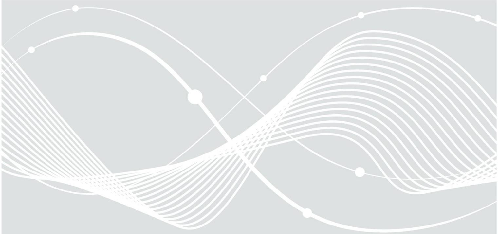
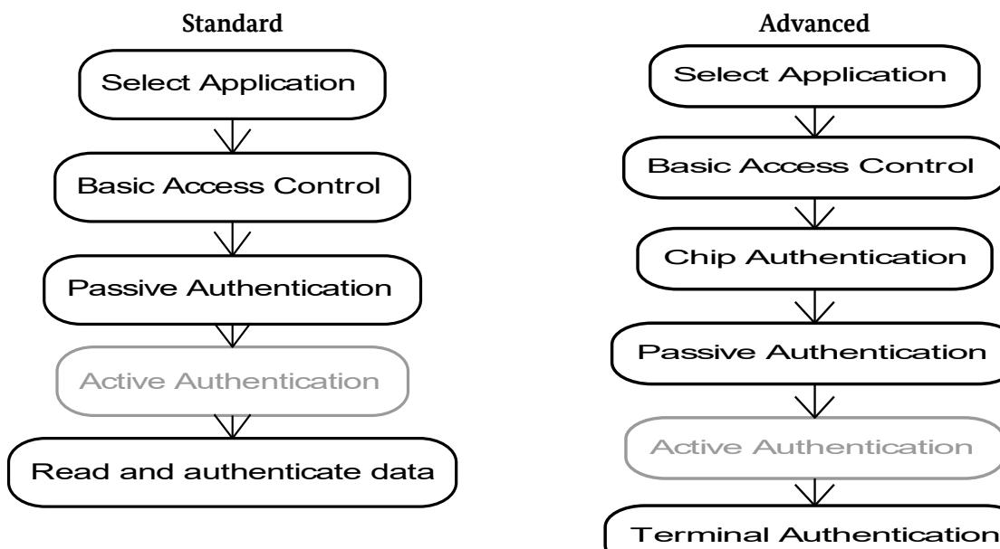
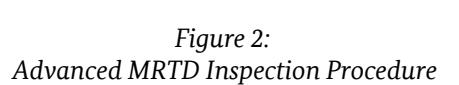
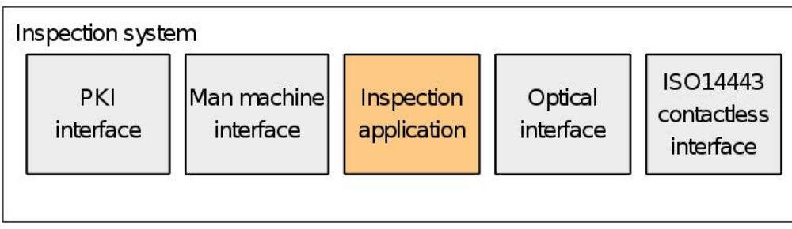
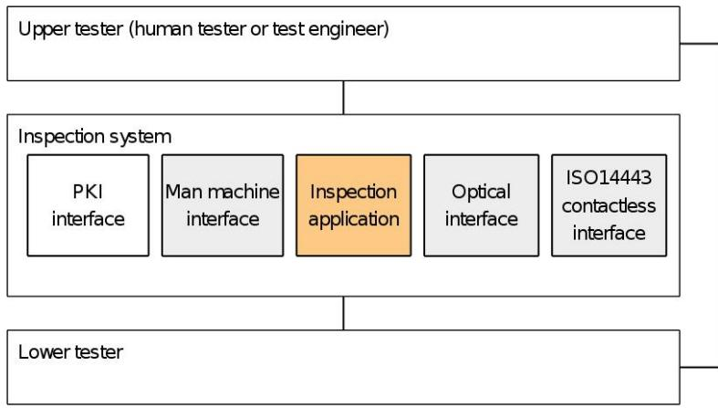
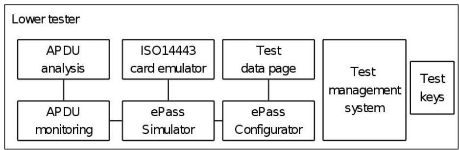
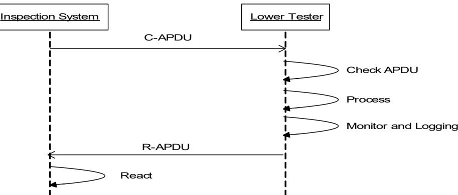

## Technical Guideline TR-03105

# Conformity Tests for Official Electronic ID Documents

Part 5.1: Test plan for ICAO compliant Inspection Systems with EACv1

Version 1.5 February 10th, 2020

**Federal Office for Information Security Post Box 20 03 63 D-53133 Bonn Internet: https://www.bsi.bund.de © Federal Office for Information Security 2019**

## Document history

| Version | Date       | Editor              | Description                                                                                                                                                          |
|---------|------------|---------------------|----------------------------------------------------------------------------------------------------------------------------------------------------------------------|
| 0.1     | 2007-11-10 | Holger Funke        | First version                                                                                                                                                        |
| 0.5     | 2007-11-21 | Dr. Michael Jahnich | Import of the rough concept of version 0.4.1 into an open office document                                                                                         |
| 0.5.1   | 2007-11-30 | Dr. Michael Jahnich | First full version of layer 6 tests                                                                                                                                  |
| 0.6     | 2007-12-20 | Holger Funke        | Resolved comments from BSI Added tests for CA and TA (layer 6)                                                                                                    |
| 0.6.5   | 2008-01-07 | Holger Funke        | Editorial changes                                                                                                                                                    |
| 0.7     | 2008-01-07 | Holger Funke        | New structure of application profiles and personalization profiles                                                                                                |
| 0.8     | 2008-01-10 | Holger Funke        | Tests for layer 7 added                                                                                                                                              |
| 0.8.1   | 2008-01-17 | Holger Funke        | New configuration profile                                                                                                                                            |
| 0.8.2   | 2008-01-19 | Dr. Michael Jahnich | Review of version 0.8.1                                                                                                                                              |
| 0.8.3   | 2008-01-27 | Holger Funke        | Resolved comment from BSI Added importance field to all test cases Added new calculated check digits in DG1                                                    |
| 0.8.4   | 2008-01-29 | Holger Funke        | Added definition of certificates                                                                                                                                     |
| 0.9     | 2008-01-29 | Holger Funke        | First "official" version                                                                                                                                             |
| 0.9.1   | 2008-03-26 | Holger Funke        | Adapted new profile concept Resolved comments of industry                                                                                                         |
| 0.9.2   | 2008-04-01 | Holger Funke        | Adapted to new data set (Mustermann)                                                                                                                                 |
| 0.9.3   | 2008-04-02 | Holger Funke        | Checksums (MD5) for new data groups Added new certificates Added test cases with incomplete birth dates Added failure interface Resolved comments of BSI |
| 0.9.4   | 2008-04-03 | Dr. Michael Jahnich | Editorial changes Changes in assignment of profile to test cases                                                                                                  |
| 1.0     | 2008-04-04 | Holger Funke        | Released version Test case LDS_B_01 changed to MRZ with optional data.                                                                                         |
| 1.0.5   | 2008-10-12 | Holger Funke        | Resolved comments of meeting at BSI                                                                                                                                  |
| 1.1RC1  | 2008-10-16 | Holger Funke        | Resolved comments of meeting at BSI                                                                                                                                  |
| 1.1     | 2008-10-30 | Holger Funke        | Official Release 1.1                                                                                                                                                 |
| 1.1.1   | 2008-11-14 | Tobias Senger       | Added link to reference data set Updated the references to BSI TR-03105                                                                                           |
| 1.2RC1  | 2009-08-06 | Holger Funke        | Solved comments of meeting at BSI New version of transfer interface                                                                                               |
| 1.2     | 2009-09-11 | Holger Funke        | Official Release 1.2                                                                                                                                                 |

Document history

| Version     | Date       | Editor                          | Description                                                                                                                                                         |
|-------------|------------|---------------------------------|---------------------------------------------------------------------------------------------------------------------------------------------------------------------|
| 1.3         | 2013-12-02 | Tobias Senger                   | Updated Expiry Date in MRZ and DG1 data sets                                                                                                                        |
| 1.31        | 2015-07-27 | Tobias Senger                   | Updated correct OIDs for plain signatures in chapter 7.1.2                                                                                                       |
| 1.4         | 2016-01-27 | Holger Funke / Tobias Senger | Added test cases for PACE/SAC Added test cases for LDS 1.8 Editorial changes Resolved comments Updated References Updated to new BSI document format |
| 1.41        | 2016-02-25 | Tobias Senger                   | Deleted test case ISO7816_G_37 Editorial changes                                                                                                                 |
| 1.5 Draft 1 | 2019-08-14 | Holger Funke                    | Several test cases are moved to ICAO Part 4 Removed transfer interface Resolved comments                                                                      |
| 1.5 Draft 2 | 2019-10-18 | Holger Funke                    | Resolved comments of G+D Mobile Security                                                                                                                            |
| 1.5 Draft 3 | 2019-12-16 | Holger Funke                    | Resolved comments of G+D Mobile Security                                                                                                                            |
| 1.5         | 2020-02-10 |                                 | Release                                                                                                                                                             |

|                 | Document history 3                                                                                                                   |  |
|-----------------|--------------------------------------------------------------------------------------------------------------------------------------|--|
| 1               | Introduction 15                                                                                                                      |  |
| 1.1             | Scope and purpose 15                                                                                                                 |  |
| 1.2             | Terminology 15                                                                                                                       |  |
| 1.3             | Definitions and abbreviations 15                                                                                                     |  |
| 2               | General test requirements 18                                                                                                         |  |
| 2.1             | Inspection procedures 18                                                                                                             |  |
| 2.2             | Test item 19                                                                                                                         |  |
| 2.3             | Features not to be tested 20                                                                                                         |  |
| 2.4             | Test environment 20                                                                                                                  |  |
| 2.5             | Test approach 22                                                                                                                     |  |
| 3               | Implementation conformance statement24                                                                                               |  |
| 4               | Definition of configuration sets 26                                                                                                  |  |
| 4.1             | Configuration of default plain passports26                                                                                           |  |
| 4.2             | Configuration of default BAC passports26                                                                                             |  |
| 4.3             | Configuration of default EAC passport 27                                                                                             |  |
| 4.4             | Configuration of default EAC+AA passport28                                                                                           |  |
| 4.5             | Configuration of default PACE passport29                                                                                             |  |
| 4.6             | Configuration of default EAC+PACE passport30                                                                                         |  |
| 5               | Layer 6 tests (Application protocol tests) 32                                                                                        |  |
| 5.1             | Unit ISO7816_A: Tests of Application Selection32                                                                                     |  |
| 5.1.1           | Test case ISO7816_A_01: Positive test with unprotected MRTD32                                                                        |  |
| 5.1.2           | Test case ISO7816_A_02: Positive test with BAC MRTD32                                                                                |  |
| 5.1.3           | Test case ISO7816_A_03: Application selection failure32                                                                              |  |
| 5.2             | Unit ISO7816_B: Tests of Basic Access Control33                                                                                      |  |
| 5.2.1 5.2.2  | Test case ISO7816_B_01: Mutual authentication MAC failure33 Test case ISO7816_B_02: Mutual authentication encryption failure33    |  |
| 5.2.3           | Test case ISO7816_B_03: Mutual authentication failure33                                                                              |  |
| 5.2.4           | Test case ISO7816_B_04: SM failure returned by MRTD33                                                                                |  |
| 5.2.5           | Test case ISO7816_B_05: SM failure – MAC missing33                                                                                   |  |
| 5.2.6           | Test case ISO7816_B_06: SM failure – cryptogram missing33                                                                            |  |
| 5.2.7           | Test case ISO7816_B_07: SM failure – secured status bytes missing33                                                                  |  |
| 5.2.8           | Test case ISO7816_B_08: SM failure – incorrect MAC33                                                                                 |  |
| 5.2.9 5.2.10 | Test case ISO7816_B_09: SM failure – incorrect cryptogram33 Test case ISO7816_B_10: Passive Authentication with revocation list34 |  |
| 5.3             | Unit ISO7816_C: Tests of Reading Binary Files35                                                                                      |  |
| 5.3.1           | Test case ISO7816_C_01: File selection failure35                                                                                     |  |
| 5.3.2           | Test case ISO7816_C_02: Reading large files35                                                                                        |  |
| 5.3.3           | Test case ISO7816_C_03: Reading beyond EOF35                                                                                         |  |
| 5.3.4           | Test case ISO7816_C_04: Reading end of file with status word 6B0035                                                                  |  |
| 5.3.5           | Test case ISO7816_C_05: Reading end of file with status word 628235                                                                  |  |
| 5.3.6           | Test case ISO7816_C_06: Reading end of file with status word 6Cxx35                                                                  |  |
| 5.3.7           | Test case ISO7816_C_07: Reading file with OddIns35                                                                                   |  |
| 5.3.8           | Test case ISO7816_C_08: Reading DG2 with image size 035                                                                              |  |

| 5.4              | Unit ISO7816_D: Tests of Chip Authentication36                                                                                                                                             |  |
|------------------|--------------------------------------------------------------------------------------------------------------------------------------------------------------------------------------------|--|
| 5.4.1            | Test case ISO7816_D_01: Chip authentication with DH36                                                                                                                                      |  |
| 5.4.2            | Test case ISO7816_D_02: Chip authentication with ECDH36                                                                                                                                    |  |
| 5.4.3            | Test case ISO7816_D_03: DG14 with one key reference36                                                                                                                                      |  |
| 5.4.4            | Test case ISO7816_D_04: DG14 with two key references36                                                                                                                                     |  |
| 5.4.5            | Test case ISO7816_D_05: DG14 with three key references36                                                                                                                                   |  |
| 5.4.6            | Test case ISO7816_D_06: DG14 with invalid key reference36                                                                                                                                  |  |
| 5.4.7            | Test case ISO7816_D_07: DG14 with corrupted DH public key36                                                                                                                                |  |
| 5.4.8            | Test case ISO7816_D_08: DG14 with corrupted ECDH public key36                                                                                                                              |  |
| 5.4.9            | Test case ISO7816_D_09: Use old session keys after Chip Authentication36                                                                                                                   |  |
| 5.4.10           | Test case ISO7816_D_10: Verify lifetime of ephemeral keys37                                                                                                                                |  |
| 5.4.11           | Test case ISO7816_D_11: DG14 with invalid DH public key specification37                                                                                                                    |  |
| 5.4.12           | Test case ISO7816_D_12: DG14 with invalid ECDH public key specification37                                                                                                                  |  |
| 5.4.13           | Test case ISO7816_D_13: ChipAuthenticationPublicKeyInfo, key reference does not match key                                                                                                  |  |
|                  | reference in ChipAuthenticationInfo37                                                                                                                                                      |  |
| 5.4.14           | Test case ISO7816_D_14: ChipAuthentication with Extended Length37                                                                                                                          |  |
| 5.4.15           | Test case ISO7816_D_15: ChipAuthentication: Use various status words for invalid key                                                                                                       |  |
|                  | reference 37                                                                                                                                                                               |  |
|                  |                                                                                                                                                                                            |  |
| 5.5              | Unit ISO7816_E: Tests of Terminal Authentication38                                                                                                                                         |  |
| 5.5.1            | Test case ISO7816_E_01: Terminal Authentication with RSAv1.5 and SHA138                                                                                                                    |  |
| 5.5.2            | Test case ISO7816_E_02: Terminal Authentication with RSA v1.5 and SHA25638                                                                                                                 |  |
| 5.5.3            | Test case ISO7816_E_03: Terminal Authentication with RSA-PSS and SHA139                                                                                                                    |  |
| 5.5.4            | Test case ISO7816_E_04: Terminal Authentication with RSA-PSS and SHA25640                                                                                                                  |  |
| 5.5.5            | Test case ISO7816_E_05: Terminal Authentication with ECDSA and SHA140                                                                                                                      |  |
| 5.5.6            | Test case ISO7816_E_06: Terminal Authentication with ECDSA and SHA22441                                                                                                                    |  |
| 5.5.7            | Test case ISO7816_E_07: Terminal Authentication with ECDSA and SHA25642                                                                                                                    |  |
| 5.5.8            | Test case ISO7816_E_08: Verify certificates with wrong CAR in EF.CVCA42                                                                                                                    |  |
| 5.5.9            | Test case ISO7816_E_09: Verify certificates with missing CAR in EF.CVCA42                                                                                                                  |  |
| 5.5.10           | Test case ISO7816_E_10: Verify certificates with 3 CAR in EF.CVCA43                                                                                                                        |  |
| 5.5.11           | Test case ISO7816_E_11: External authenticate with wrong document number44                                                                                                                 |  |
| 5.5.12           | Test case ISO7816_E_12: External authenticate command with shorter challenge (7 bytes)45                                                                                                   |  |
| 5.5.13           | Test case ISO7816_E_13: External authenticate command with longer challenge (9 bytes)45                                                                                                    |  |
| 5.5.14           | Test case ISO7816_E_14: Verify access denied to DG345                                                                                                                                      |  |
| 5.5.15           | Test case ISO7816_E_15: Verify access denied to DG446                                                                                                                                      |  |
| 5.5.16           | Test case ISO7816_E_16: Verify denied access to DG3 and DG446                                                                                                                              |  |
| 5.5.17           | Test case ISO7816_E_17: Verify certificates with wrong signature in DV certificate47                                                                                                       |  |
| 5.5.18           | Test case ISO7816_E_18: Verify certificates with wrong signature in IS certificate47                                                                                                       |  |
| 5.5.19           | Test case ISO7816_E_19: Terminal Authentication with expired certificate chain47                                                                                                           |  |
| 5.5.20           | Test case ISO7816_E_20: Terminal Authentication with expired DV certificate48                                                                                                              |  |
| 5.5.21           | Test case ISO7816_E_21: Terminal Authentication with expired IS certificate48                                                                                                              |  |
| 5.5.22 5.5.23 | Test case ISO7816_E_22: TerminalAuthenticationInfo, file ID does not match FID of EF.CVCA 48 Test case ISO7816_E_23: TerminalAuthenticationInfo, SFID does not match SFID of EF.CVCA 48 |  |
| 5.5.24           | Test case ISO7816_E_24: Terminal Authentication with missing certificates49                                                                                                                |  |
| 5.5.25           | Test case ISO7816_E_25: Terminal Authentication with several certificates49                                                                                                                |  |
| 5.5.26           | Test case ISO7816_E_26: Terminal Authentication with additional data groups (DG11, DG12). .49                                                                                              |  |
| 5.5.27           | Test case ISO7816_E_27: Switch between different algorithms key sizes in CA and TA (RSA, CA                                                                                                |  |
|                  | with 2048 and TA with 1024) 50                                                                                                                                                             |  |
| 5.5.28           | Test case ISO7816_E_28: Switch between different algorithms key sizes in CA and TA (EC, CA                                                                                                 |  |
|                  | with 224 and TA with 256) 51                                                                                                                                                               |  |
| 5.5.29           | Test case ISO7816_E_29: Terminal authentication with DG3 but no DG451                                                                                                                      |  |
| 5.5.30           | Test case ISO7816_E_30: Terminal authentication with DG4 but no DG352                                                                                                                      |  |
| 5.5.31           | Test case ISO7816_E_31: Terminal authentication in combination with PACE to check dynamic                                                                                                  |  |
|                  | binding between protocols 52                                                                                                                                                               |  |
|                  |                                                                                                                                                                                            |  |

| 5.5.32 | Test case ISO7816_E_32: Terminal authentication including trust anchor update53             |  |
|--------|---------------------------------------------------------------------------------------------|--|
| 5.5.33 | Test case ISO7816_E_33: Terminal authentication with two different trust anchor updates53   |  |
| 5.5.34 | Test case ISO7816_E_34: Terminal authentication with offered but not needed trust anchor    |  |
|        | update 54                                                                                   |  |
| 5.5.35 | Test case ISO7816_E_35: Terminal Authentication with RSA v1.5 and SHA51254                  |  |
| 5.5.36 | Test case ISO7816_E_36: Terminal Authentication with RSA-PSS and SHA51255                   |  |
| 5.5.37 | Test case ISO7816_E_37: Terminal Authentication with ECDSA and SHA38456                     |  |
| 5.5.38 | Test case ISO7816_E_38: Terminal Authentication with ECDSA and SHA51256                     |  |
| 5.6    | Unit ISO7816_F: Tests of Active Authentication57                                            |  |
| 5.6.1  | Test case ISO7816_F_01: Performing Active Authentication with RSA-SHA157                    |  |
| 5.6.2  | Test case ISO7816_F_02: Performing Active Authentication with ECDSA57                       |  |
| 5.6.3  | Test case ISO7816_F_03: Performing Active Authentication with RSA-PSS57                     |  |
| 5.6.4  | Test case ISO7816_F_04: Performing Active Authentication with RSA-SHA22457                  |  |
| 5.6.5  | Test case ISO7816_F_05: Performing Active Authentication with RSA-SHA25657                  |  |
| 5.6.6  | Test case ISO7816_F_06: Performing Active Authentication with RSA-SHA38457                  |  |
| 5.6.7  | Test case ISO7816_F_07: Performing Active Authentication with RSA-SHA51258                  |  |
| 5.6.8  | Test case ISO7816_F_08: Performing Active Authentication with wrong trailer58               |  |
| 5.6.9  | Test case ISO7816_F_09: Performing Active Authentication with invalid signature OID58       |  |
| 5.7    | Unit ISO7816_G: Tests of PACE protocol 58                                                   |  |
| 5.7.1  | Test case ISO7816_G_01: Correct execution of PACE protocols58                               |  |
| 5.7.2  | Test case ISO7816_G_02: Check supported standardized domain parameters with Generic         |  |
|        | Mapping 58                                                                                  |  |
| 5.7.3  | Test case ISO7816_G_03: Check supported standardized domain parameters with Integrated      |  |
|        | Mapping 58                                                                                  |  |
| 5.7.4  | Test case ISO7816_G_04: Check supported algorithms59                                        |  |
| 5.7.5  | Test case ISO7816_G_05: Check PACE with additional entries in SecurityInfos59               |  |
| 5.7.6  | Test case ISO7816_G_06: Check selection of standardized Domain Parameters and algorithms 59 |  |
| 5.7.7  | Test case ISO7816_G_07: EF.CardAccess contains two PACEInfo and PACEDomainParameter. 59     |  |
| 5.7.8  | Test case ISO7816_G_08: Abort PACE because of SW error code during MSE:Set AT59             |  |
| 5.7.9  | Test case ISO7816_G_09: Error on the nonce – Value modifications after first General        |  |
|        | Authenticate 59                                                                             |  |
| 5.7.10 | Test case ISO7816_G_10: Error on General Authenticate step 1 command59                      |  |
| 5.7.11 | Test case ISO7816_G_11: Error on General Authenticate step 1 command – bad tag (use 90h     |  |
|        | instead of 80h) 59                                                                          |  |
| 5.7.12 | Test case ISO7816_G_12: Error on General Authenticate step 2 command59                      |  |
| 5.7.13 | Test case ISO7816_G_13: Error on General Authenticate step 2 command bad tag (use 92h       |  |
|        | instead of 82h) 60                                                                          |  |
| 5.7.14 | Test case ISO7816_G_14: Abort PACE because of error in GA step 2 (GM)60                     |  |
| 5.7.15 | Test case ISO7816_G_15: Abort PACE because of error in GA step 2 (IM)60                     |  |
| 5.7.16 | Test case ISO7816_G_16: Error in General Authenticate step 2 command – error on mapping     |  |
|        | data – all ECDH public key components60                                                     |  |
| 5.7.17 | Test case ISO7816_G_17: Error in General Authenticate step 2 command – error on mapping     |  |
|        | data – all DH public key components 60                                                      |  |
| 5.7.18 | Test case ISO7816_G_18: Error in General Authenticate step 3 command60                      |  |
| 5.7.19 | Test case ISO7816_G_19: Error in General Authenticate step 3 command – bad tag (use 94h     |  |
|        | instead of 84h) 60                                                                          |  |
| 5.7.20 | Test case ISO7816_G_20: Abort PACE because of error in GA step 360                          |  |
| 5.7.21 | Test case ISO7816_G_21: Error on General Authenticate step 3 command – error on ephemeral   |  |
|        | public key – all ECDH public key components60                                               |  |
| 5.7.22 | Test case ISO7816_G_22: Error on General Authenticate step 3 command – error on ephemeral   |  |
|        | public key – all DH public key components61                                                 |  |
| 5.7.23 | Test case ISO7816_G_23: Abort PACE because of identical ephemeral public keys61             |  |

| 5.7.24 | Test case ISO7816_G_24: Error on General Authenticate step 4 command61                    |  |
|--------|-------------------------------------------------------------------------------------------|--|
| 5.7.25 | Test case ISO7816_G_25: Error on General Authenticate step 4 command – bad tag (use 96h   |  |
|        | instead of 86h) 61                                                                        |  |
| 5.7.26 | Test case ISO7816_G_26: Abort PACE because of error in GA step 461                        |  |
| 5.7.27 | Test case ISO7816_G_27: Abort PACE because of TLV error on EF.CardAccess61                |  |
| 5.7.28 | Test case ISO7816_G_28: Abort PACE because of incorrect paramterId in PACEInfo61          |  |
| 5.7.29 | Test case ISO7816_G_29: PACE-CAM with missing tag 8Ah but correct ECAD61                  |  |
| 5.7.30 | Test case ISO7816_G_30: PACE-CAM with incorrectly encoded ECAD (no octet string)62        |  |
| 5.7.31 | Test case ISO7816_G_31: PACE-CAM with wrong ECAD62                                        |  |
| 5.7.32 | Test case ISO7816_G_32: PACE-CAM with wrong tag 8Ah (use 8Bh) but correct ECAD62          |  |
| 5.7.33 | Test case ISO7816_G_33: PACE-CAM with correct tag 8Ah but missing ECAD62                  |  |
| 5.7.34 | Test case ISO7816_G_34: PACE-CAM with Passive Authentication62                            |  |
| 5.7.35 | Test case ISO7816_G_35: Return additional tag 8Ah during PACE-GM62                        |  |
| 5.7.36 | Test case ISO7816_G_36: Use invalid OID for PACE-CAM in EF.CardAccess62                   |  |
| 5.7.37 | Test case ISO7816_G_37: Use invalid OID for PACE-CAM in EF.CardAccess63                   |  |
| 5.7.38 | Test case ISO7816_G_38: Use DG14 without SecurityInfo during PACE-CAM63                   |  |
| 5.7.39 | Test case ISO7816_G_39: Use EF.CardSecurity with wrong chipAuthenticationPublicKey during |  |
|        | PACE-CAM 63                                                                               |  |
| 5.7.40 | Test case ISO7816_G_40: Use EF.CardSecurity without ChipAuthenticationPublicKeyInfo       |  |
|        | during PACE-CAM 63                                                                        |  |
| 5.7.41 | Test case ISO7816_G_41: Check supported standardized domain parameters with Chip          |  |
|        | Authentication Mapping 63                                                                 |  |
| 6      | Layer 7 tests (Logical data structures) 64                                                |  |
|        |                                                                                           |  |
| 6.1    | Unit LDS_A: Tests with EF.COM 64                                                          |  |
| 6.1.1  | Test case LDS_A_01: DG tag 60 wrong (use tag 61 instead)64                                |  |
| 6.1.2  | Test case LDS_A_02: DG tag 60 length byte too small64                                     |  |
| 6.1.3  | Test case LDS_A_03: DG tag 60 length byte too big64                                       |  |
| 6.1.4  | Test case LDS_A_04: Incorrect LDS version (use V3.0 instead)64                            |  |
| 6.1.5  | Test case LDS_A_05: Missing LDS version64                                                 |  |
| 6.1.6  | Test case LDS_A_06: Incorrect Unicode version (use V05.00.00 instead)64                   |  |
| 6.1.7  | Test case LDS_A_07: Missing Unicode version64                                             |  |
| 6.1.8  | Test case LDS_A_08: Incorrect DGPM (missing DG1 tag)64                                    |  |
| 6.1.9  | Test case LDS_A_09: Missing DGPM65                                                        |  |
| 6.1.10 | Test case LDS_A_10: EF.COM with LDS Version 1.865                                         |  |
| 6.2    | Unit LDS_B: Tests with EF.DG1 66                                                          |  |
| 6.2.1  | Test case LDS_B_01: MRZ with optional data66                                              |  |
| 6.2.2  | Test case LDS_B_02: Name in MRZ indicates abbreviation of the secondary identifier66      |  |
| 6.2.3  | Test case LDS_B_03: Name in MRZ without secondary identifier66                            |  |
| 6.2.4  | Test case LDS_B_04: No optional data, checksum is '0' instead of '<'66                    |  |
| 6.2.5  | Test case LDS_B_05: DG tag 61 wrong (use tag 62 instead)66                                |  |
| 6.2.6  | Test case LDS_B_06: DG tag 61 length byte too small66                                     |  |
| 6.2.7  | Test case LDS_B_07: DG tag 61 length byte too big66                                       |  |
| 6.2.8  | Test case LDS_B_08: Incorrect MRZ, document type unknown66                                |  |
| 6.2.9  | Test case LDS_B_09: Incorrect MRZ, issuing state syntax error66                           |  |
| 6.2.10 | Test case LDS_B_10: Incorrect MRZ, name is void67                                         |  |
| 6.2.11 | Test case LDS_B_11: Incorrect MRZ, name different from data page67                        |  |
| 6.2.12 | Test case LDS_B_12: Incorrect MRZ, document number different from data page67             |  |
| 6.2.13 | Test case LDS_B_13: Incorrect MRZ, wrong document number checksum67                       |  |
| 6.2.14 | Test case LDS_B_14: Incorrect MRZ, nationality syntax error67                             |  |
| 6.2.15 | Test case LDS_B_15: Incorrect MRZ, date of birth syntax error67                           |  |
| 6.2.16 | Test case LDS_B_16: Incorrect MRZ, date of birth error67                                  |  |
| 6.2.17 | Test case LDS_B_17: Incorrect MRZ, incorrect date of birth checksum67                     |  |

| 6.2.18 | Test case LDS_B_18: Incorrect MRZ, incorrect sex67                                               |  |
|--------|--------------------------------------------------------------------------------------------------|--|
| 6.2.19 | Test case LDS_B_19: Incorrect MRZ, date of expiry syntax error67                                 |  |
| 6.2.20 | Test case LDS_B_20: Incorrect MRZ, date of expiry error68                                        |  |
| 6.2.21 | Test case LDS_B_21: Incorrect MRZ, incorrect date of expiry checksum68                           |  |
| 6.2.22 | Test case LDS_B_22: Incorrect MRZ, incorrect optional data checksum68                            |  |
| 6.2.23 | Test case LDS_B_23: Incorrect MRZ, incorrect checksum68                                          |  |
| 6.2.24 | Test case LDS_B_24: Missing MRZ data object68                                                    |  |
| 6.2.25 | Test case LDS_B_25: Incomplete birth date (missing day)68                                        |  |
| 6.2.26 | Test case LDS_B_26: Incomplete birth date (missing month)68                                      |  |
| 6.2.27 | Test case LDS_B_27: Incomplete birth date (missing year)68                                       |  |
| 6.2.28 | Test case LDS_B_28: Incomplete birth date (missing complete dob)68                               |  |
| 6.3    | Unit LDS_C: Tests with EF.DG2 69                                                                 |  |
| 6.3.1  | Test case LDS_C_01: JPEG2000 image, full frontal69                                               |  |
| 6.3.2  | Test case LDS_C_02: JPEG image, full frontal69                                                   |  |
| 6.3.3  | Test case LDS_C_03: JPEG2000 image, full frontal with additional facial feature points69         |  |
| 6.3.4  | Test case LDS_C_04: DG tag 75 wrong (tag 76 instead)69                                           |  |
| 6.3.5  | Test case LDS_C_05: DG tag 75 length byte too small69                                            |  |
| 6.3.6  | Test case LDS_C_06: DG tag 75 length byte too big69                                              |  |
| 6.3.7  | Test case LDS_C_07: BIT, missing tag for number of instances69                                   |  |
| 6.3.8  | Test case LDS_C_08: BHT, not allowed format owner69                                              |  |
| 6.3.9  | Test case LDS_C_09: BHT, missing format owner69                                                  |  |
| 6.3.10 | Test case LDS_C_10: BHT, not allowed format type70                                               |  |
| 6.3.11 | Test case LDS_C_11: BHT, missing format type70                                                   |  |
| 6.3.12 | Test case LDS_C_12: BHT, deprecated biometric type70                                             |  |
| 6.3.13 | Test case LDS_C_13: BHT, incorrect biometric type70                                              |  |
| 6.3.14 | Test case LDS_C_14: FRH, incorrect format identifier70                                           |  |
| 6.3.15 | Test case LDS_C_15: FRH, incorrect version number70                                              |  |
| 6.3.16 | Test case LDS_C_16: FIB, incorrect Facial Record Data Length due to additional feature points 70 |  |
| 6.3.17 | Test case LDS_C_17: FIB, incorrect gender70                                                      |  |
| 6.3.18 | Test case LDS_C_18: FIB, incorrect eye color70                                                   |  |
| 6.3.19 | Test case LDS_C_19: FIB, incorrect hair color70                                                  |  |
| 6.3.20 | Test case LDS_C_20: FIB, incorrect Pose Angle - Yaw71                                            |  |
| 6.3.21 | Test case LDS_C_21: FIB, incorrect Pose Angle - Pitch71                                          |  |
| 6.3.22 | Test case LDS_C_22: FIB, incorrect Pose Angle - Roll71                                           |  |
| 6.3.23 | Test case LDS_C_23: FIB, incorrect Pose Angle Uncertainty - Yaw71                                |  |
| 6.3.24 | Test case LDS_C_24: FIB, incorrect Pose Angle Uncertainty - Pitch71                              |  |
| 6.3.25 | Test case LDS_C_25: FIB, incorrect Pose Angle Uncertainty - Roll71                               |  |
| 6.3.26 | Test case LDS_C_26: IIB, incorrect face image type71                                             |  |
| 6.3.27 | Test case LDS_C_27: IIB, incorrect image data type71                                             |  |
| 6.3.28 | Test case LDS_C_28: Missing facial image (tag 5F2E)71                                            |  |
| 6.4    | Unit LDS_D: Tests with EF.DG3 71                                                                 |  |
| 6.4.1  | Test case LDS_D_01: Two JPEG2000 fingerprint images71                                            |  |
| 6.4.2  | Test case LDS_D_02: Two WSQ fingerprint images72                                                 |  |
| 6.4.3  | Test case LDS_D_03: Three WSQ fingerprint images72                                               |  |
| 6.4.4  | Test case LDS_D_04: DG tag 63 wrong (tag 64 instead)73                                           |  |
| 6.4.5  | Test case LDS_D_05: DG tag 63 length byte too small73                                            |  |
| 6.4.6  | Test case LDS_D_06: DG tag 63 length byte too big74                                              |  |
| 6.4.7  | Test case LDS_D_07: BIGT, missing number of instances74                                          |  |
| 6.4.8  | Test case LDS_D_08: BHT, not allowed format owner75                                              |  |
| 6.4.9  | Test case LDS_D_09: BHT, missing format owner75                                                  |  |
| 6.4.10 | Test case LDS_D_10: BHT, not allowed format type76                                               |  |
| 6.4.11 | Test case LDS_D_11: BHT, missing format type76                                                   |  |

| 6.4.12         | Test case LDS_D_12: BHT, incorrect biometric subtype77                                                                                                                       |  |
|----------------|------------------------------------------------------------------------------------------------------------------------------------------------------------------------------|--|
| 6.4.13         | Test case LDS_D_13: BHT, missing biometric subtype77                                                                                                                         |  |
| 6.4.14         | Test case LDS_D_14: GRH, incorrect format identifier78                                                                                                                       |  |
| 6.4.15         | Test case LDS_D_15: Missing fingerprint image in instance two (tag 5F2E)78                                                                                                   |  |
| 6.4.16         | Test case LDS_D_16: Two RAW fingerprint images79                                                                                                                             |  |
| 6.5            | Unit LDS_E: Tests with EF.DG4 79                                                                                                                                             |  |
| 6.5.1          | Test case LDS_E_01: Two JPEG2000 iris images79                                                                                                                               |  |
| 6.5.2          | Test case LDS_E_02: Two RAW iris images80                                                                                                                                    |  |
| 6.5.3          | Test case LDS_E_03: DG tag 76 wrong (use tag 77 instead)80                                                                                                                   |  |
| 6.5.4          | Test case LDS_E_04: DG tag 76 length byte too small81                                                                                                                        |  |
| 6.5.5          | Test case LDS_E_05: DG tag 76 length byte too big81                                                                                                                          |  |
| 6.5.6          | Test case LDS_E_06: BIGT, missing number of instances82                                                                                                                      |  |
| 6.5.7          | Test case LDS_E_07: BHT, illegal format owner82                                                                                                                              |  |
| 6.5.8          | Test case LDS_E_08: BHT, missing format owner83                                                                                                                              |  |
| 6.5.9          | Test case LDS_E_09: BHT, not allowed format type83                                                                                                                           |  |
| 6.5.10         | Test case LDS_E_10: BHT, missing format type84                                                                                                                               |  |
| 6.5.11         | Test case LDS_E_11: BHT, incorrect biometric subtype84                                                                                                                       |  |
| 6.5.12         | Test case LDS_E_12: BHT, missing biometric subtype85                                                                                                                         |  |
| 6.5.13         | Test case LDS_E_13: BHT, incorrect format identifier85                                                                                                                       |  |
| 6.5.14         | Test case LDS_E_14: Missing iris image in instance two (tag 5F2E)86                                                                                                          |  |
| 6.6            | Unit LDS_F: Tests with EF.DG14 86                                                                                                                                            |  |
| 6.6.1          | Test case LDS_F_01: DG tag 6E wrong (tag 6F instead)86                                                                                                                       |  |
| 6.6.2          | Test case LDS_F_02: DG tag 6E length byte too small87                                                                                                                        |  |
| 6.6.3          | Test case LDS_F_03: DG tag 6E length byte too big87                                                                                                                          |  |
| 6.6.4          | Test case LDS_F_04: SecurityInfos, illegal chip authentication OID88                                                                                                         |  |
| 6.6.5          | Test case LDS_F_05: SecurityInfos, missing chip authentication OID88                                                                                                         |  |
| 6.6.6          | Test case LDS_F_06: ChipAuthenticationInfo, incorrect version element89                                                                                                      |  |
| 6.6.7          | Test case LDS_F_07: ChipAuthenticationInfo, missing version element89                                                                                                        |  |
| 6.7            | Unit LDS_G: Tests with EF.CVCA 90                                                                                                                                            |  |
| 6.7.1          | Test case LDS_G_01: First CAR not encoded by tag 4290                                                                                                                        |  |
| 6.7.2          | Test case LDS_G_02: Missing CARs, file empty, no trust point implemented90                                                                                                   |  |
|                |                                                                                                                                                                              |  |
| 6.8            | Unit LDS_H: Tests with EF.SOD 91                                                                                                                                             |  |
| 6.8.1          | Test case LDS_H_01: RSASSA-PKCS1_v15 with SHA1, SHA1 DG hash, DS stored inside SOD91                                                                                         |  |
| 6.8.2          | Test case LDS_H_02: RSASSA-PSS with SHA1, SHA1 DG hash, DS stored inside SOD92                                                                                               |  |
| 6.8.3 6.8.4 | Test case LDS_H_03: RSASSA-PSS with SHA256, SHA256 DG hash, DS stored inside SOD92 Test case LDS_H_04: RSASSA-PKCS1_v15 with SHA224, SHA224 DG hash, DS stored inside SOD |  |
|                | 93                                                                                                                                                                           |  |
| 6.8.5          | Test case LDS_H_05: RSASSA-PKCS1_v15 with SHA256, SHA256 DG hash, DS stored inside SOD                                                                                       |  |
|                | 93                                                                                                                                                                           |  |
| 6.8.6          | Test case LDS_H_06: RSASSA-PKCS1_v15 with SHA384, SHA384 DG hash, DS stored inside SOD                                                                                       |  |
|                | 94                                                                                                                                                                           |  |
| 6.8.7          | Test case LDS_H_07: RSASSA-PKCS1_v15 with SHA512, SHA512 DG hash, DS stored inside SOD                                                                                       |  |
|                | 95                                                                                                                                                                           |  |
| 6.8.8          | Test case LDS_H_08: DSA with SHA1, SHA1 DG hash, DS stored inside SOD95                                                                                                      |  |
| 6.8.9          | Test case LDS_H_09: ECDSA with SHA1, SHA1 DG hash, DS stored inside SOD96                                                                                                    |  |
| 6.8.10         | Test case LDS_H_10: ECDSA with SHA1 (BSI OID), SHA1 DG hash, DS stored inside SOD97                                                                                          |  |
| 6.8.11         | Test case LDS_H_11: ECDSA with SHA224 (BSI OID), SHA224 DG hash, DS stored inside SOD. .97                                                                                   |  |
| 6.8.12         | Test case LDS_H_12: ECDSA with SHA256 (BSI OID), SHA256 DG hash, DS stored inside SOD. .98                                                                                   |  |
| 6.8.13         | Test case LDS_H_13: ECDSA with SHA384 (BSI OID), SHA384 DG hash, DS stored inside SOD. .99                                                                                   |  |
| 6.8.14         | Test case LDS_H_14: ECDSA with SHA512 (BSI OID), SHA512 DG hash, DS stored inside SOD. .99                                                                                   |  |
| 6.8.15         | Test case LDS_H_15: RSASSA-PKCS1_v15 with SHA256, SHA256 DG hash, DS NOT stored inside                                                                                       |  |
|                | SOD 100                                                                                                                                                                      |  |

| 6.8.16 | Test case LDS_H_16: ECDSA with SHA224 (BSI OID), SHA224 DG hash, DS NOT stored inside          |  |
|--------|------------------------------------------------------------------------------------------------|--|
|        | SOD 101                                                                                        |  |
| 6.8.17 | Test case LDS_H_17: DG tag 77 wrong (tag 78 instead)101                                        |  |
| 6.8.18 | Test case LDS_H_18: DG tag 77 length byte too small101                                         |  |
| 6.8.19 | Test case LDS_H_19: DG tag 77 length byte too big101                                           |  |
| 6.8.20 | Test case LDS_H_20: SignedData version incorrect101                                            |  |
| 6.8.21 | Test case LDS_H_21: SignedData version missing101                                              |  |
| 6.8.22 | Test case LDS_H_22: SignedData illegal digestAlgorithm (MD5)101                                |  |
| 6.8.23 | Test case LDS_H_23: SignedData missing digestAlgorithm list101                                 |  |
| 6.8.24 | Test case LDS_H_24: SignedData incorrect content type OID for id-icao-ldsSecurityObject101     |  |
| 6.8.25 | Test case LDS_H_25: SignedData missing content type OID for id-icao-ldsSecurityObject102       |  |
| 6.8.26 | Test case LDS_H_26: SignerInfo, incorrect signer info version value102                         |  |
| 6.8.27 | Test case LDS_H_27: SignerInfo, missing signer info version102                                 |  |
| 6.8.28 | Test case LDS_H_28: SignerInfo, Version 1 and incorrect issuerAndSerialNumber102               |  |
| 6.8.29 | Test case LDS_H_29: SignerInfo, Version 3 and incorrect subjectKeyIdentifier102                |  |
| 6.8.30 | Test case LDS_H_30: SignerInfo, illegal digestAlgorithm102                                     |  |
| 6.8.31 | Test case LDS_H_31: SignerInfo, missing digestAlgorithm102                                     |  |
| 6.8.32 | Test case LDS_H_32: SignerInfo, incorrect messageDigest attribute value102                     |  |
| 6.8.33 | Test case LDS_H_33: SignerInfo, missing messageDigest attribute102                             |  |
| 6.8.34 | Test case LDS_H_34: SignerInfo, incorrect/not allowed SigningTime102                           |  |
| 6.8.35 | Test case LDS_H_35: SignerInfo, missing SigningTime103                                         |  |
| 6.8.36 | Test case LDS_H_36: SignerInfo, not allowed signature algorithm103                             |  |
| 6.8.37 | Test case LDS_H_37: SignerInfo, incorrect Signature103                                         |  |
| 6.8.38 | Test case LDS_H_38: SignerInfo, missing Signature103                                           |  |
| 6.8.39 | Test case LDS_H_39: LDS Security Object, incorrect security object version103                  |  |
| 6.8.40 | Test case LDS_H_40: LDS Security Object, missing security object version104                    |  |
| 6.8.41 | Test case LDS_H_41: LDS Security Object, illegal digestAlgorithm104                            |  |
| 6.8.42 | Test case LDS_H_42: LDS Security Object, missing digestAlgorithm104                            |  |
| 6.8.43 | Test case LDS_H_43: LDS Security Object, incorrect DataGroupHash value for DG2104              |  |
| 6.8.44 | Test case LDS_H_44: LDS Security Object, missing DataGroupHash value for DG1104                |  |
| 6.8.45 | Test case LDS_H_45: LDS Security Object, additional DataGroupHash value for DG10104            |  |
| 6.8.46 | Test case LDS_H_46: LDS Security Object, incorrect DataGroupNumber105                          |  |
| 6.8.47 | Test case LDS_H_47: LDS Security Object, missing DataGroupNumber for DG2105                    |  |
| 6.8.48 | Test case LDS_H_48: DS certificate, incorrect certificate version106                           |  |
| 6.8.49 | Test case LDS_H_49: DS certificate, missing certificate version106                             |  |
| 6.8.50 | Test case LDS_H_50: DS certificate, missing serialNumber106                                    |  |
| 6.8.51 | Test case LDS_H_51: DS certificate, signature element does not match SignatureAlgorithm107     |  |
| 6.8.52 | Test case LDS_H_52: DS certificate, missing signature element107                               |  |
| 6.8.53 | Test case LDS_H_53: DS certificate, incorrect issuer element (naming convention does not       |  |
|        | follow ICAO) 108                                                                               |  |
| 6.8.54 | Test case LDS_H_54: DS certificate, issuer element does not match CSCA subject value108        |  |
| 6.8.55 | Test case LDS_H_55: DS certificate, missing issuer element109                                  |  |
| 6.8.56 | Test case LDS_H_56: DS certificate, incorrect validity element109                              |  |
| 6.8.57 | Test case LDS_H_57: DS certificate, missing validity element110                                |  |
| 6.8.58 | Test case LDS_H_58: DS certificate, not allowed subjectPublicKeyInfo111                        |  |
| 6.8.59 | Test case LDS_H_59: DS certificate, missing subjectPublicKeyInfo element111                    |  |
| 6.8.60 | Test case LDS_H_60: DS certificate, incorrect AuthorityKeyIdentifier element (does not contain |  |
|        | keyIdentifier) 112                                                                             |  |
| 6.8.61 | Test case LDS_H_61: DS certificate, missing AuthorityKeyIdentifier element112                  |  |
| 6.8.62 | Test case LDS_H_62: DS certificate, incorrect keyUsage extension113                            |  |
| 6.8.63 | Test case LDS_H_63: DS certificate, incorrect keyUsage Extension (digitalSignature bit not     |  |
|        | asserted) 114                                                                                  |  |
| 6.8.64 | Test case LDS_H_64: DS certificate, missing keyUsage Extension114                              |  |
|        |                                                                                                |  |

| 6.8.65 | Test case LDS_H_65: DS certificate, illegal signatureAlgorithm115                                      |  |
|--------|--------------------------------------------------------------------------------------------------------|--|
| 6.8.66 | Test case LDS_H_66: DS certificate, missing signatureAlgorithm115                                      |  |
| 6.8.67 | Test case LDS_H_67: DS certificate, incorrect signatureValue116                                        |  |
| 6.8.68 | Test case LDS_H_68: DS certificate, missing signatureValue116                                          |  |
| 6.8.69 | Test case LDS_H_69: Check priority of signature check116                                               |  |
| 6.8.70 | Test case LDS_H_70: ECDSA with SHA224 (ANSI OID), SHA224 DG hash, DS stored inside SOD                 |  |
| 6.8.71 | 117 Test case LDS_H_71: ECDSA with SHA256 (ANSI OID), SHA256 DG hash, DS stored inside SOD          |  |
| 6.8.72 | 118 Test case LDS_H_72: ECDSA with SHA384 (ANSI OID), SHA384 DG hash, DS stored inside SOD          |  |
|        | 118                                                                                                    |  |
| 6.8.73 | Test case LDS_H_73: ECDSA with SHA512 (ANSI OID), SHA512 DG hash, DS stored inside SOD 119          |  |
| 6.8.74 | Test case LDS_H_74: LDS Security Object, different digestAlgorithm120                                  |  |
| 6.8.75 | Test case LDS_H_75: Different valid signature algorithms in SOD and DS120                              |  |
| 6.8.76 | Test case LDS_H_76: Different valid signature algorithms in SOD and DS121                              |  |
| 6.8.77 | Test case LDS_H_77: Different valid signature algorithms in SOD and DS121                              |  |
| 6.8.78 | Test case LDS_H_78: Different valid signature algorithms in SOD and DS122                              |  |
| 6.8.79 | Test case LDS_H_79: RSASSA-PKCS1_v15 with SHA1, SHA1 DG hash, DS stored inside SOD, RSA OID 123     |  |
| 6.8.80 | Test case LDS_H_80: RSASSA-PKCS1_v15 with SHA224, SHA224 DG hash, DS stored inside SOD, RSA OID 123 |  |
| 6.8.81 | Test case LDS_H_81: RSASSA-PKCS1_v15 with SHA256, SHA256 DG hash, DS stored inside SOD, RSA OID 124 |  |
| 6.8.82 | Test case LDS_H_82: RSASSA-PKCS1_v15 with SHA384, SHA384 DG hash, DS stored inside SOD, RSA OID 125 |  |
| 6.8.83 | Test case LDS_H_83: RSASSA-PKCS1_v15 with SHA512, SHA512 DG hash, DS stored inside                     |  |
|        | SOD, RSA OID 125                                                                                       |  |
| 6.8.84 | Test case LDS_H_84: SignerInfo, Version 3 and correct issuerAndSerialNumber126                         |  |
| 6.8.85 | Test case LDS_H_85: SignerInfo, Version 1 and correct subjectKeyIdentifier126                          |  |
| 6.8.86 | Test case LDS_H_86: EF.SOD with LDS Version 1.8127                                                     |  |
| 6.8.87 | Test case LDS_H_87: Security Object with LDS Version 1.8 but with wrong version number127              |  |
| 6.8.88 | Test case LDS_H_88: Security Object with LDS Version 1.7 but version number 1127                       |  |
| 6.8.89 | Test case LDS_H_89: EF.SOD with future LDS Version 1.9127                                              |  |
| 6.8.90 | Test case LDS_H_90: EF.SOD inconsistent with EF.COM (more data groups)128                              |  |
| 6.8.91 | Test case LDS_H_91: EF.SOD inconsistent with EF.COM (less data groups)129                              |  |
| 6.8.92 | Test case LDS_H_92: EF.SOD inconsistent with EF.COM (different data groups)130                         |  |
| 6.8.93 | Test case LDS_H_93: EF.SOD with missing checksum of EF.CardSecurity131                                 |  |
| 6.8.94 | Test case LDS_H_94: RSASSA-PSS with SHA224, SHA224 DG hash, DS stored inside SOD132                    |  |
| 6.8.95 | Test case LDS_H_95: RSASSA-PSS with SHA384, SHA384 DG hash, DS stored inside SOD132                    |  |
| 6.8.96 | Test case LDS_H_96: RSASSA-PSS with SHA512, SHA512 DG hash, DS stored inside SOD133                    |  |
| 6.8.97 | Test case LDS_H_97: DSA with SHA224, SHA224 DG hash, DS stored inside SOD134                           |  |
| 6.8.98 | Test case LDS_H_98: DSA with SHA256, SHA256 DG hash, DS stored inside SOD134                           |  |
|        |                                                                                                        |  |
| 6.9    | Unit LDS_I: Tests with EF.DG15 135                                                                     |  |
| 6.9.1  | Test case LDS_I_01: DG tag 6F wrong (use tag 70 instead)135                                            |  |
| 6.9.2  | Test case LDS_I_02: DG tag length too small136                                                         |  |
| 6.9.3  | Test case LDS_I_03: DG tag length too big136                                                           |  |
| 6.10   | Unit LDS_J: Tests with EF.CardSecurity 137                                                             |  |
| 6.10.1 | Test case LDS_J_01: EF.CardSecurity inconsistent with EF.CardAccess (more SecurityInfos)137            |  |
| 6.10.2 | Test case LDS_J_02: EF.CardSecurity inconsistent with EF.CardAccess (less SecurityInfos)137            |  |
| 6.10.3 | Test case LDS_J_03: EF.CardSecurity inconsistent with EF.CardAccess (different SecurityInfos) 138   |  |

| 6.10.4           | Test case LDS_J_04: EF.CardSecurity with incorrect ChipAuthenticationPublicKeyInfo for |  |
|------------------|----------------------------------------------------------------------------------------|--|
|                  | PACE-CAM 138                                                                           |  |
| 6.11             | Unit LDS_K: Tests with EF.ATR/INFO 140                                                 |  |
| 6.11.1           | Test case LDS_K_01: Valid encoding with two bytes length for APDU140                   |  |
| 6.11.2           | Test case LDS_K_02: Valid encoding with three bytes length for APDU140                 |  |
| 6.11.3           | Test case LDS_K_03: Only one valid value for command length141                         |  |
| 6.11.4           | Test case LDS_K_04: Wrong tag 7F66141                                                  |  |
| 7                | Algorithms to be supported by inspection systems142                                    |  |
| 7.1              | Passive authentication 142                                                             |  |
| 7.1.1            | Message digest algorithms 142                                                          |  |
| 7.1.2            | Signature algorithms 142                                                               |  |
| 7.2              | Chip authentication 143                                                                |  |
| 7.2.1            | Key agreement algorithms 143                                                           |  |
| 7.2.2            | Chip Authentication algorithms 143                                                     |  |
| 7.3              | Terminal authentication 144                                                            |  |
| 7.3.1            | Signature algorithms 144                                                               |  |
|                  |                                                                                        |  |
| 7.4              | PACE 144                                                                               |  |
| 8                | Annexes 146                                                                            |  |
| 8.1              | Definition of certificates 146                                                         |  |
| 8.1.1            | CVCA_Cert_01 146                                                                       |  |
| 8.1.2            | CVCA_Cert_02 146                                                                       |  |
| 8.1.3            | CVCA_Cert_03 147                                                                       |  |
| 8.1.4            | CVCA_Cert_04 147                                                                       |  |
| 8.1.5            | CVCA_Cert_05 148                                                                       |  |
| 8.1.6            | CVCA_Cert_06 149                                                                       |  |
| 8.1.7            | CVCA_Cert_07 149                                                                       |  |
| 8.1.8            | CVCA_Cert_08 150                                                                       |  |
| 8.1.9            | DV_Cert_11 151                                                                         |  |
| 8.1.10           | DV_Cert_12 152                                                                         |  |
| 8.1.11           | DV_Cert_13 152                                                                         |  |
| 8.1.12           | DV_Cert_14 153                                                                         |  |
| 8.1.13           | DV_Cert_15 154                                                                         |  |
| 8.1.14           | DV_Cert_16 154                                                                         |  |
| 8.1.15 8.1.16 | IS_Cert_11 155 IS_Cert_12 155                                                       |  |
| 8.1.17           | IS_Cert_13 155                                                                         |  |
| 8.1.18           | IS_Cert_16 155                                                                         |  |
| 8.1.19           | CVCA_Link_Cert_16 156                                                                  |  |
| 8.1.20           | CVCA_Link_Cert_17 157                                                                  |  |
| 8.2              | Definition of biometric data 158                                                       |  |
| 8.2.1            | Facial image 1 158                                                                     |  |
| 8.2.2            | Facial image 2 158                                                                     |  |
| 8.2.3            | Facial image 3 159                                                                     |  |
| 8.2.4            | Facial image 4 159                                                                     |  |
| 8.2.5            | Facial image 5 159                                                                     |  |
| 8.2.6            | Fingerprint image set 1 159                                                            |  |
| 8.2.7            | Fingerprint image set 2 160                                                            |  |
| 8.2.8            | Fingerprint image set 3 160                                                            |  |
| 8.2.9            | Iris image set 1 160                                                                   |  |
| 8.2.10           | Iris image set 2 161                                                                   |  |
|                  |                                                                                        |  |

| 8.3 | Reference Data Set and hash values (MD5) of each data group161 |  |
|-----|----------------------------------------------------------------|--|
|     | Reference Documentation 162                                    |  |

# Figures

| Figure 1: Standard MRTD Inspection Procedure18             |  |
|------------------------------------------------------------|--|
| Figure 2: Advanced MRTD Inspection Procedure18             |  |
| Figure 3: Functional components of the inspection system19 |  |
| Figure 4: Upper and lower tester of the test environment20 |  |
| Figure 5: Functional components of the lower tester21      |  |
| Figure 6: Communication sequence at layer 6 (ISO 7816)22   |  |

## Tables

| Table 1: Quality of steps in inspection procedures 18                     |  |
|---------------------------------------------------------------------------|--|
| Table 2: Profiles to be tested for specified inspection system25          |  |
| Table 3: Implementation conformance table to be filled in by applicants25 |  |

# 1 Introduction

### 1.1 Scope and purpose

An essential element of the new ICAO compliant MRTD is the addition of a Secure Contactless Integrated Circuit (SCIC) that will securely hold biometric data of the passport bearer within the ICAO defined Logical Data Structure (LDS).

Successful integration of the SCIC into the MRTD and the integration of a PCD into an inspection system depend upon active international cooperation between many companies and organizations.

The MRTD and the inspection system have been specified and designed to operate interoperable across a wide variety of infrastructures worldwide. The risk profile for the MRTD and the inspection system indicate a high impact if that design includes a widespread error or fault. Therefore it is essential that all companies and organizations involved make all reasonable efforts to minimize the probability that this error or fault is undetected before the design is approved and inspection systems are issued.

For a fully interoperable MRTD solution, it is not only the PCD hardware with the contactless interface which is important. It is also critical that the application of the inspection system complies with the ISO and ICAO standards (e.g. ISO 7816 and ICAO 9303).Therefore, this document proposes a test plan to verify the application part of the inspection system. The tests comprise the standard inspection procedure for BAC MRTDs and the advanced inspection procedure for EAC MRTDs.

This test plan consists of two separate parts. Layer 6 defines tests for the application protocol based on ISO 7618 issued by the inspection system application and the correct processing of the corresponding passport responses. Layer 7 verifies the correct processing of the logical data structure read from the MRTD.

This test plan is designed to be applicable to existing inspection systems in the marketplace. The tests specified herein are technically feasible, especially the functionality of the lower tester, which is the main test tool to verify the reader's application. The test cases are formulated in such a way that they are independent of any specific system design or implementation.

The test plan is part 5 of the BSI technical report TR 03105. It is aligned with the framework document of this technical report.

### 1.2 Terminology

The key words "MUST", "SHALL", "REQUIRED", "SHOULD", "RECOMMENDED", and "MAY" in this document are to be interpreted as described in [RFC2119].

### 1.3 Definitions and abbreviations

| Full name                            |
|--------------------------------------|
| Active authentication                |
| Application protocol data unit       |
| Basic access control                 |
| Biometric header template            |
| Biometric information template       |
| Biometric information group template |
| Command APDU                         |
|                                      |

#### 1 Introduction

| Abbreviation | Full name                                       |
|--------------|-------------------------------------------------|
| CA           | Chip authentication                             |
| CAR          | Certification authority reference               |
| CHA          | Certificate holder authorization                |
| CHR          | Card holder reference                           |
| DGPM         | Data Group Presence Map                         |
| DH           | Diffie-Hellman                                  |
| DUT          | Device under test                               |
| EAC          | Extended access control                         |
| ECAD         | Encrypted Chip Authentication Data              |
| ECC          | Elliptic curve cryptography                     |
| ECDH         | Elliptic curves Diffie-Hellman                  |
| ECDSA        | Elliptic curve digital signature algorithm      |
| EOF          | End of file                                     |
| FHB          | Facial header block                             |
| FIB          | Facial information block                        |
| FID          | File identifier                                 |
| FRH          | Facial record header                            |
| GRH          | General record header                           |
| ICAO         | International Civil Aviation Organization       |
| IIB          | Image information block                         |
| IS           | Inspection system                               |
| LT           | Lower tester                                    |
| MMI          | Man-machine-interface                           |
| MRTD         | Machine readable travel document                |
| MRZ          | Machine readable zone                           |
| OID          | Object identifier                               |
| PA           | Passive authentication                          |
| PACE         | Password authenticated connection establishment |
| PCD          | Proximity coupling device                       |
| PICC         | Proximity integrated circuit card               |
| R-APDU       | Response APDU                                   |
| RSA          | Rivest-Shamir-Adleman                           |
| SFI          | Short file identifier                           |

| Abbreviation | Full name                   |
|--------------|-----------------------------|
| SHA          | Secure hash algorithm       |
| SM           | Secure messaging            |
| SSC          | Send sequence counter       |
| TA           | Terminal authentication     |
| UT           | Upper tester                |
| WSQ          | Wavelet scalar quantization |
|              |                             |

# 2 General test requirements

### 2.1 Inspection procedures

The specification [TR03110] defines two inspection procedures that an inspection system can support. This includes security mechanisms like BAC (Basic Access Control) and EAC (Extended Access Control). The standard MRTD inspection procedure with BAC is described in figure [1](#page-17-1) and the advanced MRTD inspection procedure with EAC is described in figure [2.](#page-17-3) In both procedures Active Authentication (AA) is optional (see table [1](#page-17-2)).

If the MRTD chip is compliant to the EAC specification [TR03110], the inspection system SHALL use the advanced inspection procedure. In the other case, the standard inspection procedure SHALL be used.

| Step                       | Quality     |
|----------------------------|-------------|
| Select Application         | REQUIRED    |
| Basic Access Control (SIP) | CONDITIONAL |
| Basic Access Control (AIP) | REQUIRED    |
| Passive Authentication     | REQUIRED    |
| Active Authentication      | OPTIONAL    |
| Chip Authentication        | REQUIRED    |
| Terminal Authentication    | REQUIRED    |

*Table 1: Quality of steps in inspection procedures*

*Figure 1: Standard MRTD Inspection Procedure*

Read and authenticate data

### 2.2 Test item

The device under test, which is called test item in the following, is an *inspection system* (IS) that is used to read electronic passports – MRTD – optically and electronically. The inspection system displays the information contained in such an MRTD to the user and/or provides this information or parts of it to a biometric verification application and other subsequent data processing units, such as backend databases, blacklists etc. These subsequent processes are not in the scope of MRTD conformity testing.

The main interface, being subject to conformity testing, is the *inspection application* that performs the contactless application protocol via the contactless reader interface. This application performs all authentication protocols and retrieves the biographic and biometric information from the MRTD. The inspection application performs the *standard inspection procedure* and/or the *advanced inspection procedure* according to [TR03110] for BAC or EAC MRTDs, respectively. According to the test framework's layer model [TR03105-1.1], this test plan specifies tests at test layer 6 (ISO 7816 application protocol) and test layer 7 (logical data structure).

*Figure 3: Functional components of the inspection system*

Therefore, is can be assumed that the inspection system at least provides the functional components which are illustrated in figure [3](#page-18-0) as interfaces to the test environment.

First of all, the inspection system MUST provide a contactless reader interface according to ISO 14443. This interface is realized by a proximity coupling device (PCD). It is assumed that this device and the underlying ISO14443 interface – layers 1 to 4 – has successfully passed the MRTD Conformity Testing as specified in [TR 03105-4].

Moreover, the test item SHOULD provide an optical interface to read the machine readable zone (MRZ) from the MRTDs data page. Alternatively, the inspection system MAY have a keyboard device to enter the MRZ manually. For MRTD Conformity Testing, it is assumed that the inspection system accepts a test data page with test data in the optical inspection procedure. This test data page is specified herein.

The data page MUST contain a MRZ including the data of data group 1. The second MRZ line is necessary to derive the BAC session keys. Additionally there is an antenna necessary to communicate between inspection system and simulator. Both, antenna and data page, MAY be included in one unit.

Verification of optical security features MAY be deactivated. Results of any verification of optical security features are not relevant for this test specification. The chip SHALL be read even if the optical inspection fails.

Although the man-machine-interface (MMI) is not specified by ICAO and is heavily influenced by the specific design of an IS, it is assumed that such an interface exists and provides at least the following information. It MUST signal to its user that some information has been retrieved from the MRTD (layer 6 tests) and that this information is correctly formatted and authentic (layer 7 tests). In the case of a missing failure interface the MMI is the only interface between test system and DUT. Without failure interface it's impossible to deliver specific failure information, so the result of each test case must be reduced to "passed" or "failed". This information must be asked by the test system to log it in test report.

It is RECOMMENDED that the inspection system delivers a logging file. Based on this logging file the test engineer can investigate the found results in a deeper way.

Finally, the inspection system MUST provide an interface to upload certificates for passive authentication and for terminal authentication. Since this interface is not technically specified, it will not be used during the tests. It is rather assumed that all test keys and certificates are preinstalled in the test item and that no online connection needed. The following keys and certificates are assumed to be installed into the test item:

- Terminal authentication test keys (IS private key)
- Test certificate chains for terminal authentication
- Test certificate chains for passive authentication

All keys and certificates are specified in this test plan.

### 2.3 Features not to be tested

There are some optional features in MRTDs that an inspection system may support. Some of the features are not in the scope of this test plan.

The test plan assumes that the ISO 14443 communication (layers 1 to 4) has been successfully tested. No lower layer tests are specified herein.

The inspection system may be connected to a biometric verification system. This verification system is not subject of tests specified here.

The inspection system may be connected to a public-key infrastructure. The interface to this PKI and the communication to download certificates from such a PKI is not in the scope of this test plan.

The optical reader or scanner and optical inspection other than MRZ reading is not in the scope of this test plan. This includes the verification of optical passport security features. Nevertheless, the ability to OCR MRZ data printed on a data page is implicitly part of the test.

Further interfaces or functions, such as database or blacklist checks, are not covered by tests herein. The usability of the man-machine-interface is not subject to the tests. And the test plan does not cover the security of the inspection system.

### 2.4 Test environment

In order to define an appropriate test setup, this test plan follows the concept of an upper and a lower tester – UT and LT – as specified in [ISO10373-6]. These two interfaces are needed because the inspection system initiates and controls the communication sequence. The following figure [4](#page-19-0) illustrates this concept.

*Figure 4: Upper and lower tester of the test environment*

Until an upper test interface to trigger the test procedure cannot be assumed, the upper tester is replaced by a human tester – the test engineer. The test engineer manually starts the tests by placing the lower tester in or onto the inspection system.

The lower tester mainly replaces the MRTD. It simulates an MRTD. In order to perform all specified test cases, the lower tester MUST provide the functional elements shown in the following figure [5.](#page-20-0)

*Figure 5: Functional components of the lower tester*

First of all, the lower tester MUST provide a test data page that contains the test data specified in this test plan. All information MUST be printed in machine readable format. Especially the MRZ SHALL be printed in OCR-B1 according to [9303p3]. Moreover, the test data page MAY contain the antenna of the ISO14443 card emulator.

This emulator SHALL be compliant with ISO14443 type A or type B communication. It SHALL perform all lower layer protocols, provide the received C-APDU to a subsequent simulator and return the R-APDU to the inspection system. The ISO14443 card emulator MAY log the communication as specified in **[ISO10373- 6]**. It SHOULD be able to process bit rates of 424 bit/sec in both directions. When all steps of a test case are done, the simulator stops all communication.

The MRTD simulator simulates the application of a BAC or EAC MRTD. It SHALL be capable of processing each C-APDU that it receives. It SHALL support different configurations with respect to the following features:

- Configurable ISO 7816-4 file system (number and size of files) to store the data groups
- Large ISO 7816-4 binary file with size larger than 32k.
- The ISO 7816-4 application commands defined by [9303p11] and [TR03110].
- Basic access control with ISO secure messaging
- Chip authentication supporting all cryptographic algorithms identified by object identifiers defined in [TR03110].
- Chip authentication with or without explicit key reference.
- Terminal authentication supporting all cryptographic algorithms identified by object identifiers defined in [TR03110].
- Failure simulation as defined in test definitions.

The MRTD configurator sets the configuration of the MRTD simulator according to the data sets defined for each test case. A configuration consists of the layer 6 specifications – the *MRTD application profile* – and the layer 7 data groups – the *MRTD personalization profile*.

The lower tester MUST be able to monitor the communication at the application protocol level. It MUST provide appropriate log files of the communication of each test case performed. Moreover, it SHALL be capable of analysing each C-APDU received for correct syntax. The logging itself is only used for further analysis of failures.

The lower tester SHOULD also consist of a test management system to manage and run test cases and test results. The functionality of such a test management system however is not in the scope of this specification.

### 2.5 Test approach

Due to several different inspection system designs, the test procedure MUST be in line with the "normal" inspection procedure. Therefore, the test cases MUST be designed as pure black box tests. Although no specific failure interface is assumed and all tests can be performed without such an interface.

As a general procedure for layer 6 and layer 7 tests, the tests SHALL be executed in the following sequence:

- 1) As a precondition to each test case, the tester places the test data page of the lower tester on or into the inspection system depending on the optical reading procedure.
- 2) The inspection system reads the MRZ of the sample data page optically; alternatively the MRZ can be typed in by keyboard.
- 3) The inspection system MAY perform a check on the data retrieved optically and check the data pages security features. However, this is not in the scope of the test procedure. It is assumed that the inspection system recognizes the test sample as a valid test MRTD.
- 4) The inspection system powers up and initializes the ISO 14443 card emulator.
- 5) The inspection system starts the ISO 7816-4 communication. It sends a sequence of C-APDUs according to figure [6](#page-21-0) until the application protocol is finished and all data is retrieved.
- 6) The inspection system has retrieved a set of R-APDUs and transforms them into a set of data groups and the security document object. This action MAY happen during the execution of the application protocol.
- 7) The inspection system verifies the authenticity of the data. This action MAY happen during the execution of the application protocol.
- 8) If the data groups are valid and authentic, the inspection system gives a sign that the MRTD is a valid or invalid document.
- 9) The inspection system stops and a final state is reached. At this point, it MAY wait for the next MRTD to be read.

*Figure 6: Communication sequence at layer 6 (ISO 7816)*

It is assumed that if the system detects an MRTD failure, a failure message is displayed. The inspection system MAY not display all of the information retrieved.

According to the general test procedure, the application commands received from the inspection system cannot be tested command by command. Instead the whole inspection procedure MUST be executed even for layer 6 tests.

During the test procedure, the C-APDUs received from the test item MUST be checked for correct syntax, e.g. correct length of the C-APDU.

## 3 Implementation conformance statement

In order to set up the tests properly, an applicant SHALL provide the information specified in table [3](#page-24-0) below.

The specification [TR03110] defines two inspection procedures that an inspection system can support. This includes security mechanisms like BAC and EAC.

As long as the "advanced inspection procedure" (AIP) is optional, it is not possible to define the corresponding tests as mandatory for each inspection system. Therefore, this document specifies a set of profiles. Each profile covers a specific optional element. A tested inspection system SHALL be assigned to the supported profiles in the implementation conformance statement, and a test SHALL only be performed if the inspection system belongs to this profile.

The profile "standard inspection procedure (SIP)" contains the mandatory feature set for compliant inspection systems. Therefore, this profile and its tests are mandatory for all inspection system. To define a better granularity of test cases, the following table shows a list of test profiles.

| Profile-ID     | Profile                                      | Description                                                                                                                                                                                                                                                                                                                                                 |
|----------------|----------------------------------------------|-------------------------------------------------------------------------------------------------------------------------------------------------------------------------------------------------------------------------------------------------------------------------------------------------------------------------------------------------------------|
| SIP            | Standard inspection procedure          | The inspection system is capable of reading passports that are unprotected (plain) or that support BAC/PACE. It verifies the authenticity of the information retrieved from the MRTD using passive authentication.                                                                                                                                 |
| AIP            | Advanced inspection procedure          | The inspection system is capable of reading passports that support extended access control including chip and terminal authentication to read DG3 or DG4. It verifies the authenticity of the information retrieved from the MRTD using passive authentication. The Standard inspection procedure is part of the Advanced inspection procedure. |
| DG1            | Verification of the encoding of DG1       | The inspection system performs checks on the ASN.1 encoding of the retrieved data group 1. These checks comprise the presence for required tags according to LDS1.7 and the usage of correct lengths in DER.                                                                                                                                          |
| DG2            | Verification of the encoding of DG2       | The inspection system performs checks on the ASN.1 encoding of the retrieved data group 2. These checks comprise the presence for required tags according to LDS1.7 and the usage of correct lengths in DER.                                                                                                                                          |
| DG3            | Verification of the encoding of DG3       | The inspection system performs checks on the ASN.1 encoding of the retrieved data group 3. These checks comprise the presence for required tags according to LDS1.7 and the usage of correct lengths in DER.                                                                                                                                          |
| DG4            | Verification of the encoding of DG4       | The inspection system performs checks on the ASN.1 encoding of the retrieved data group 4. These checks comprise the presence for required tags according to LDS1.7 and the usage of correct lengths in DER.                                                                                                                                          |
| ISO19794-5     | Verification of ISO19794-5 information | The inspection system performs checks on the format of the face image data as specified in ISO 19794-5.                                                                                                                                                                                                                                                  |
| ISO19794-4     | Verification of ISO19794-4 information | The inspection system performs checks on the format of the finger image data as specified in ISO 19794-4.                                                                                                                                                                                                                                                |
| ISO19794-6     | Verification of ISO19794-6 information | The inspection system performs checks on the format of the iris image data as specified in ISO 19794-6.                                                                                                                                                                                                                                                  |
| DPRCTD SHA1 | Deprecated SHA1 algorithm                 | In the beginning of electronic passports, BSI and ICAO allowed algorithms and key sizes that are not secure today. So Doc9303 6th                                                                                                                                                                                                                        |

| Profile-ID | Profile | Description                                                                                                                                                                                                                                                                                                                                                                                                                                                                                                                                                                     |
|------------|---------|---------------------------------------------------------------------------------------------------------------------------------------------------------------------------------------------------------------------------------------------------------------------------------------------------------------------------------------------------------------------------------------------------------------------------------------------------------------------------------------------------------------------------------------------------------------------------------|
|            |         | edition and early TR-03110 allowed the usage of SHA-1, but e.g. TR 03116-2 or Doc9303-12 7th edition (2015) clause 4.4.4 does not allow the usage of these algorithms any longer: "SHA-224, SHA-256, SHA-384 and SHA-512, are the only permitted hashing algorithms". Because there are plenty of eMRTDs with CSCA and DS certificates in circulation that follow the 6th edition and make use of SHA-1, an inspection system shall still support SHA-1. To identify test cases with outdated SHA1, these test cases are using the profile DPRCTD-SHA1. |

*Table 2: Profiles to be tested for specified inspection system*

The applicant SHALL fill in the following implementation conformance statement.

| Information for test setup                                                      | Profile-ID   | Applicant declaration |
|---------------------------------------------------------------------------------|--------------|-----------------------|
| Reader design type                                                              | All profiles |                       |
| IS provides optical reading capability to automatically read the printed MRZ | All profiles |                       |
| IS supports standard inspection procedure (mandatory).                          | SIP          |                       |
| IS supports extended access control.                                            | AIP          |                       |
| IS performs checks on DG1 contents.                                             | DG1          |                       |
| IS performs checks on DG2 contents.                                             | DG2          |                       |
| IS performs checks on DG3 contents.                                             | DG3          |                       |
| IS performs checks on DG4 contents.                                             | DG4          |                       |
| IS verifies ISO19794-5 information in DG2.                                      | ISO19794-5   |                       |
| IS verifies ISO19794-4 information in DG3.                                      | ISO19794-4   |                       |
| IS verifies ISO19794-6 information in DG4.                                      | ISO19794-6   |                       |

*Table 3: Implementation conformance table to be filled in by applicants*

## 4 Definition of configuration sets

### 4.1 Configuration of default plain passports

| ID               |        | CFG.DFLT.PLAIN                                                                                                                                                                                                                                                                                                                                                  |  |
|------------------|--------|-----------------------------------------------------------------------------------------------------------------------------------------------------------------------------------------------------------------------------------------------------------------------------------------------------------------------------------------------------------------|--|
| Purpose          |        | This configuration defines a default plain passport.                                                                                                                                                                                                                                                                                                            |  |
| Content          | EF.COM | LDS Version 1.7, Unicode version 4.0.0, Data groups present: 61, 75                                                                                                                                                                                                                                                                                             |  |
|                  |        | Access conditions: read and select always                                                                                                                                                                                                                                                                                                                       |  |
|                  | EF.SOD | LDS security object containing hash values of DG1 and DG2 LDS security object digest algorithm: SHA 256 Digest algorithm: SHA 256 Signature algorithm: RSASSA-PSS with SHA256 DS certificate contained in SOD Signature generation: Country Signer RSA 3072 bit, Document Signer RSA 2048 bit CSCA and DS are based on RSASSA-PSS with SHA256 |  |
|                  |        | Access conditions: read and select always                                                                                                                                                                                                                                                                                                                       |  |
|                  | EF.DG1 | P<D<<MUSTERMANN<<ERIKA<<<<<<<<<<<<<<<<<<<<<< C11T002JM4D<<9608122F2310314<<<<<<<<<<<<<<<4                                                                                                                                                                                                                                                                    |  |
|                  |        | Access conditions: read and select always                                                                                                                                                                                                                                                                                                                       |  |
|                  | EF.DG2 | Facial Image 1 (see annex): JPEG2000 of Erika Mustermann                                                                                                                                                                                                                                                                                                        |  |
|                  |        | Access conditions: read and select always                                                                                                                                                                                                                                                                                                                       |  |
| Data page MRZ |        | P<D<<MUSTERMANN<<ERIKA<<<<<<<<<<<<<<<<<<<<<< C11T002JM4D<<9608122F2310314<<<<<<<<<<<<<<<4                                                                                                                                                                                                                                                                    |  |

### 4.2 Configuration of default BAC passports

| ID      |                                                                               | CFG.DFLT.BAC                                                                                                                                                                                                                                                                                                 |  |
|---------|-------------------------------------------------------------------------------|--------------------------------------------------------------------------------------------------------------------------------------------------------------------------------------------------------------------------------------------------------------------------------------------------------------|--|
| Purpose |                                                                               | This configuration defines a default BAC protected passport.                                                                                                                                                                                                                                                 |  |
| Content | EF.COM LDS Version 1.7, Unicode version 4.0.0, Data groups present: 61, 75 |                                                                                                                                                                                                                                                                                                              |  |
|         |                                                                               | Access conditions: read and select with BAC                                                                                                                                                                                                                                                                  |  |
|         | EF.SOD                                                                        | LDS security object containing hash values of DG1 and DG2 LDS security object digest algorithm: SHA 256 Digest algorithm: SHA 256 Signature algorithm: RSASSA-PSS with SHA256 DS certificate contained in SOD Signature generation: Country Signer RSA 3072 bit, Document Signer RSA 2048 bit |  |
|         |                                                                               | Access conditions: read and select with BAC                                                                                                                                                                                                                                                                  |  |
|         | EF.DG1                                                                        | P<D<<MUSTERMANN<<ERIKA<<<<<<<<<<<<<<<<<<<<<< C11T002JM4D<<9608122F2310314<<<<<<<<<<<<<<<4                                                                                                                                                                                                                 |  |
|         |                                                                               | Access conditions: read and select with BAC                                                                                                                                                                                                                                                                  |  |
|         | EF.DG2                                                                        | Facial Image 1 (see annex): JPEG2000 of Erika Mustermann                                                                                                                                                                                                                                                     |  |
|         |                                                                               | Access conditions: read and select with BAC                                                                                                                                                                                                                                                                  |  |

| Data page | P<D<<MUSTERMANN<<ERIKA<<<<<<<<<<<<<<<<<<<<<< |
|-----------|----------------------------------------------|
| MRZ       | C11T002JM4D<<9608122F2310314<<<<<<<<<<<<<<<4 |

### 4.3 Configuration of default EAC passport

| ID                |                  | CFG.DFLT.EAC                                                                                                                                                                                                                                                                                                                  |
|-------------------|------------------|-------------------------------------------------------------------------------------------------------------------------------------------------------------------------------------------------------------------------------------------------------------------------------------------------------------------------------|
| Purpose           |                  | This configuration defines a default EAC protected passport using ECDSA_SHA256.                                                                                                                                                                                                                                               |
| Content EF.COM |                  | LDS Version 1.7, Unicode version 4.0.0, Data groups present: 61, 63, 6E, 75, 76                                                                                                                                                                                                                                               |
|                   |                  | Access conditions: read and select with BAC                                                                                                                                                                                                                                                                                   |
|                   | EF.SOD           | LDS security object containing hash values of DG1, DG2, DG3, DG4, and DG14 LDS security object digest algorithm: SHA 256 Digest algorithm: SHA 256 Signature algorithm: RSASSA-PSS with SHA256 DS certificate contained in SOD Signature generation: Country Signer RSA 3072 bit, Document Signer RSA 2048 bit |
|                   |                  | Access conditions: read and select with BAC                                                                                                                                                                                                                                                                                   |
|                   | EF.DG1           | P<D<<MUSTERMANN<<ERIKA<<<<<<<<<<<<<<<<<<<<<< C11T002JM4D<<9608122F2310314<<<<<<<<<<<<<<<4                                                                                                                                                                                                                                  |
|                   |                  | Access conditions: read and select with BAC                                                                                                                                                                                                                                                                                   |
|                   | EF.DG2           | Facial image 2 (see annex): JPEG2000 of Erika Mustermann                                                                                                                                                                                                                                                                      |
|                   |                  | Access conditions: read and select with BAC                                                                                                                                                                                                                                                                                   |
|                   | EF.DG3           | Fingerprint image set 1: Two fingerprint images in WSQ format                                                                                                                                                                                                                                                                 |
|                   |                  | Access conditions: read and select with EAC                                                                                                                                                                                                                                                                                   |
|                   | EF.DG4           | Iris image set 1: Two iris images in RAW format                                                                                                                                                                                                                                                                               |
|                   |                  | Access conditions: read and select with EAC                                                                                                                                                                                                                                                                                   |
|                   | EF.DG14          | Key agreement algorithm: id-CA-ECDH-3DES-CBC-CBC ECDH224 as default algorithmKey reference: none                                                                                                                                                                                                                           |
|                   |                  | Access conditions: read and select with BAC                                                                                                                                                                                                                                                                                   |
|                   | Document         | C11T002JM4                                                                                                                                                                                                                                                                                                                    |
|                   | number           | Access conditions: read and select never                                                                                                                                                                                                                                                                                      |
|                   | EF.CVCA          | CAR: one Certification Authority Reference data object, DETESTCVCA00001                                                                                                                                                                                                                                                       |
|                   |                  | Access conditions: read and select with BAC                                                                                                                                                                                                                                                                                   |
|                   | Trust point 1 | Algorithm: id-TA-ECDSA-SHA-256 Key size: 256 bits CHA: CVCA, DG3, DG4 Effective date: dCVCAeff Expiry date: dCVCAexp CHR: DETESTCVCA00001                                                                                                                                                                      |
|                   |                  | Access conditions: read never                                                                                                                                                                                                                                                                                                 |
| Data page MRZ  |                  | P<D<<MUSTERMANN<<ERIKA<<<<<<<<<<<<<<<<<<<<<< C11T002JM4D<<9608122F2310314<<<<<<<<<<<<<<<4                                                                                                                                                                                                                                  |

**Remark**: The document number of this profile is a separate piece of information that SHALL be stored in the lower tester. It SHALL be used by the simulator in terminal authentication and it SHALL NOT be read by the inspection system. Also the trust points are stored separately.

### 4.4 Configuration of default EAC+AA passport

| ID      |                  | CFG.DFLT.EACAA                                                                                                                                                                                                                                                                                                                        |
|---------|------------------|---------------------------------------------------------------------------------------------------------------------------------------------------------------------------------------------------------------------------------------------------------------------------------------------------------------------------------------|
| Purpose |                  | This configuration defines a default EAC protected passport with Active Authentication.                                                                                                                                                                                                                                            |
| Content | EF.COM           | LDS Version 1.7, Unicode version 4.0.0, Data groups present: 61, 63, 6E, 6F, 75, 76                                                                                                                                                                                                                                                   |
|         |                  | Access conditions: read and select with BAC                                                                                                                                                                                                                                                                                           |
|         | EF.SOD           | LDS security object containing hash values of DG1, DG2, DG3, DG4, DG14 and DG15 LDS security object digest algorithm: SHA 256 Digest algorithm: SHA 256 Signature algorithm: RSASSA-PSS with SHA256 DS certificate contained in SOD Signature generation: Country Signer RSA 3072 bit, Document Signer RSA 2048 bit |
|         |                  | Access conditions: read and select with BAC                                                                                                                                                                                                                                                                                           |
|         | EF.DG1           | P<D<<MUSTERMANN<<ERIKA<<<<<<<<<<<<<<<<<<<<<< C11T002JM4D<<9608122F2310314<<<<<<<<<<<<<<<4                                                                                                                                                                                                                                          |
|         |                  | Access conditions: read and select with BAC                                                                                                                                                                                                                                                                                           |
|         | EF.DG2           | Facial image 2 (see annex): JPEG2000 of Erika Mustermann                                                                                                                                                                                                                                                                              |
|         |                  | Access conditions: read and select with BAC                                                                                                                                                                                                                                                                                           |
|         | EF.DG3           | Fingerprint image set 1: Two fingerprint images in WSQ format                                                                                                                                                                                                                                                                         |
|         |                  | Access conditions: read and select with EAC                                                                                                                                                                                                                                                                                           |
|         | EF.DG4           | Iris image set 1: Two iris images in RAW format                                                                                                                                                                                                                                                                                       |
|         |                  | Access conditions: read and select with EAC                                                                                                                                                                                                                                                                                           |
|         | EF.DG14          | Key agreement algorithm: id-CA-ECDH-3DES-CBC-CBC Key reference: none                                                                                                                                                                                                                                                               |
|         |                  | Access conditions: read and select with BAC                                                                                                                                                                                                                                                                                           |
|         | EF.DG15          | Signature algorithm: RSA with SHA256                                                                                                                                                                                                                                                                                                  |
|         |                  | Access conditions: read and select with BAC                                                                                                                                                                                                                                                                                           |
|         | Document         | C11T002JM4                                                                                                                                                                                                                                                                                                                            |
|         | number           | Access conditions: read and select never                                                                                                                                                                                                                                                                                              |
|         | EF.CVCA          | CAR: one Certification Authority Reference data object, DETESTCVCA00001                                                                                                                                                                                                                                                               |
|         |                  | Access conditions: read and select with BAC                                                                                                                                                                                                                                                                                           |
|         | Trust point 1 | Algorithm: id-TA-ECDSA-SHA-256 Key size: 256 bits CHA: CVCA, DG3, DG4 Effective date: dCVCAeff Expiry date: dCVCAexp CHR: DETESTCVCA00001                                                                                                                                                                              |

|           | Access conditions: read never                |
|-----------|----------------------------------------------|
| Data page | P<D<<MUSTERMANN<<ERIKA<<<<<<<<<<<<<<<<<<<<<< |
| MRZ       | C11T002JM4D<<9608122F2310314<<<<<<<<<<<<<<<4 |

### 4.5 Configuration of default PACE passport

| ID            |         | CFG.DFLT.PACE                                                           |
|---------------|---------|-------------------------------------------------------------------------|
| Purpose       |         | This configuration defines a default PACE protected MRTD.               |
| EF.CardAccess |         | one PACEInfo:                                                           |
|               |         | protocol: id-PACE-ECDH-GM-3DES-CBC-CBC                                  |
|               |         | version: 2                                                              |
|               |         | parameterId: 13                                                         |
|               |         | Access conditions: read and select always                               |
| DF.MRTD       |         | Access conditions: select with PACE                                     |
|               | EF.COM  | LDS Version 1.7, Unicode version 4.0.0, Data groups present: 61, 75, 6E |
|               |         | Access conditions: read and select with PACE                            |
|               | EF.SOD  | LDS security object containing hash values of DG1, DG2 and DG14         |
|               |         | LDS security object digest algorithm: SHA 256                           |
|               |         | Digest algorithm: SHA 256                                               |
|               |         | Signature algorithm: RSASSA-PSS with SHA256                             |
|               |         | DS certificate contained in SOD                                         |
|               |         | Signature generation: Country Signer RSA 3072 bit, Document Signer RSA  |
|               |         | 2048 bit                                                                |
|               |         | Access conditions: read and select with PACE                            |
|               | EF.DG1  | P<D<<MUSTERMANN<<ERIKA<<<<<<<<<<<<<<<<<<<<<<                            |
|               |         | C11T002JM4D<<9608122F2310314<<<<<<<<<<<<<<<4                            |
|               |         | Access conditions: read and select with PACE                            |
|               | EF.DG2  | Facial Image 2 (see 0): JPEG2000 of Erika Mustermann                    |
|               |         | Access conditions: read and select with PACE                            |
|               | EF.DG14 | Content of EF.CardAccess                                                |
|               |         | Access conditions: read and select with PACE                            |
| Data page     |         | P<D<<MUSTERMANN<<ERIKA<<<<<<<<<<<<<<<<<<<<<<                            |
| MRZ           |         | C11T002JM4D<<9608122F2310314<<<<<<<<<<<<<<<4                            |

### 4.6 Configuration of default EAC+PACE passport

| ID            |                    | CFG.DFLT.EACPACE                                                                                                                                                                                                                                                                                                              |
|---------------|--------------------|-------------------------------------------------------------------------------------------------------------------------------------------------------------------------------------------------------------------------------------------------------------------------------------------------------------------------------|
| Purpose       |                    | This configuration defines a default EAC protected passport using ECDSA_SHA256 and PACE.                                                                                                                                                                                                                                   |
| EF.CardAccess |                    | one PACEInfo: protocol: id-PACE-ECDH-GM-3DES-CBC-CBC version: 2 parameterId: 13                                                                                                                                                                                                                                      |
|               |                    | Access conditions: read and select always                                                                                                                                                                                                                                                                                     |
| Content       | EF.COM             | LDS Version 1.7, Unicode version 4.0.0, Data groups present: 61, 63, 6E, 75, 76                                                                                                                                                                                                                                               |
|               |                    | Access conditions: read and select with BAC                                                                                                                                                                                                                                                                                   |
|               | EF.SOD             | LDS security object containing hash values of DG1, DG2, DG3, DG4, and DG14 LDS security object digest algorithm: SHA 256 Digest algorithm: SHA 256 Signature algorithm: RSASSA-PSS with SHA256 DS certificate contained in SOD Signature generation: Country Signer RSA 3072 bit, Document Signer RSA 2048 bit |
|               |                    | Access conditions: read and select with BAC                                                                                                                                                                                                                                                                                   |
|               | EF.DG1             | P<D<<MUSTERMANN<<ERIKA<<<<<<<<<<<<<<<<<<<<<< C11T002JM4D<<9608122F2310314<<<<<<<<<<<<<<<4                                                                                                                                                                                                                                  |
|               |                    | Access conditions: read and select with BAC                                                                                                                                                                                                                                                                                   |
|               | EF.DG2             | Facial image 2 (see annex): JPEG2000 of Erika Mustermann                                                                                                                                                                                                                                                                      |
|               |                    | Access conditions: read and select with BAC                                                                                                                                                                                                                                                                                   |
|               | EF.DG3             | Fingerprint image set 1: Two fingerprint images in WSQ format                                                                                                                                                                                                                                                                 |
|               |                    | Access conditions: read and select with EAC                                                                                                                                                                                                                                                                                   |
|               | EF.DG4             | Iris image set 1: Two iris images in RAW format                                                                                                                                                                                                                                                                               |
|               |                    | Access conditions: read and select with EAC                                                                                                                                                                                                                                                                                   |
|               | EF.DG14            | Key agreement algorithm: id-CA-ECDH-3DES-CBC-CBC ECDH224 as default algorithmKey reference: none                                                                                                                                                                                                                           |
|               |                    | Access conditions: read and select with BAC                                                                                                                                                                                                                                                                                   |
|               | Document number | C11T002JM4                                                                                                                                                                                                                                                                                                                    |
|               |                    | Access conditions: read and select never                                                                                                                                                                                                                                                                                      |
|               | EF.CVCA            | CAR: one Certification Authority Reference data object, DETESTCVCA00001                                                                                                                                                                                                                                                       |
|               |                    | Access conditions: read and select with BAC                                                                                                                                                                                                                                                                                   |
|               | Trust point 1   | Algorithm: id-TA-ECDSA-SHA-256 Key size: 256 bits CHA: CVCA, DG3, DG4 Effective date: dCVCAeff Expiry date: dCVCAexp CHR: DETESTCVCA00001                                                                                                                                                                      |

|                  | Access conditions: read never                                                                |
|------------------|----------------------------------------------------------------------------------------------|
| Data page MRZ | P<D<<MUSTERMANN<<ERIKA<<<<<<<<<<<<<<<<<<<<<< C11T002JM4D<<9608122F2310314<<<<<<<<<<<<<<<4 |

## 5 Layer 6 tests (Application protocol tests)

### 5.1 Unit ISO7816\_A: Tests of Application Selection

All test cases specified in this unit and in [ICAO-P4] unit ISO7816\_A must be executed in correspondence to the profiles of the device under test.

#### 5.1.1 Test case ISO7816\_A\_01: Positive test with unprotected MRTD

This test case has been moved into an ICAO guideline. It can now be found in the document [ICAO-P4]. The ICAO test case ID of this test is ISO7816\_A\_01.

#### 5.1.2 Test case ISO7816\_A\_02: Positive test with BAC MRTD

This test case has been moved into an ICAO guideline. It can now be found in the document [ICAO-P4]. The ICAO test case ID of this test is ISO7816\_A\_02.

#### 5.1.3 Test case ISO7816\_A\_03: Application selection failure

This test case has been moved into an ICAO guideline. It can now be found in the document [ICAO-P4]. The ICAO test case ID of this test is ISO7816\_A\_04.

## 5.2 Unit ISO7816\_B: Tests of Basic Access Control

All test cases specified in this unit and in [ICAO-P4] unit ISO7816\_B and ISO7816\_D must be executed in correspondence to the profiles of the device under test.

### 5.2.1 Test case ISO7816\_B\_01: Mutual authentication MAC failure

This test case has been moved into an ICAO guideline. It can now be found in the document [ICAO-P4]. The ICAO test case ID of this test is ISO7816\_B\_01.

### 5.2.2 Test case ISO7816\_B\_02: Mutual authentication encryption failure

This test case has been moved into an ICAO guideline. It can now be found in the document [ICAO-P4]. The ICAO test case ID of this test is ISO7816\_B\_02.

#### 5.2.3 Test case ISO7816\_B\_03: Mutual authentication failure

This test case has been moved into an ICAO guideline. It can now be found in the document [ICAO-P4]. The ICAO test case ID of this test is ISO7816\_B\_03.

### 5.2.4 Test case ISO7816\_B\_04: SM failure returned by MRTD

This test case has been moved into an ICAO guideline. It can now be found in the document [ICAO-P4]. The ICAO test case ID of this test is ISO7816\_D\_01.

### 5.2.5 Test case ISO7816\_B\_05: SM failure – MAC missing

This test case has been moved into an ICAO guideline. It can now be found in the document [ICAO-P4]. The ICAO test case ID of this test is ISO7816\_D\_02.

### 5.2.6 Test case ISO7816\_B\_06: SM failure – cryptogram missing

This test case has been moved into an ICAO guideline. It can now be found in the document [ICAO-P4]. The ICAO test case ID of this test is ISO7816\_D\_03.

### 5.2.7 Test case ISO7816\_B\_07: SM failure – secured status bytes missing

This test case has been moved into an ICAO guideline. It can now be found in the document [ICAO-P4]. The ICAO test case ID of this test is ISO7816\_D\_04.

#### 5.2.8 Test case ISO7816\_B\_08: SM failure – incorrect MAC

This test case has been moved into an ICAO guideline. It can now be found in the document [ICAO-P4]. The ICAO test case ID of this test is ISO7816\_D\_05.

### 5.2.9 Test case ISO7816\_B\_09: SM failure – incorrect cryptogram

This test case has been moved into an ICAO guideline. It can now be found in the document [ICAO-P4]. The ICAO test case ID of this test is ISO7816\_D\_06.

#### 5.2.10 Test case ISO7816\_B\_10: Passive Authentication with revocation list

This test case has been moved into an ICAO guideline. It can now be found in the document [ICAO-P4]. The ICAO test case ID of this test is LDS\_D\_32.

### 5.3 Unit ISO7816\_C: Tests of Reading Binary Files

All test cases specified in this unit and in [ICAO-P4] unit ISO7816\_F must be executed in correspondence to the profiles of the device under test.

#### 5.3.1 Test case ISO7816\_C\_01: File selection failure

This test case has been moved into an ICAO guideline. It can now be found in the document [ICAO-P4]. The ICAO test case ID of this test is ISO7816\_F\_01.

#### 5.3.2 Test case ISO7816\_C\_02: Reading large files

This test case has been moved into an ICAO guideline. It can now be found in the document [ICAO-P4]. The ICAO test case ID of this test is ISO7816\_F\_02.

#### 5.3.3 Test case ISO7816\_C\_03: Reading beyond EOF

This test case has been moved into an ICAO guideline. It can now be found in the document [ICAO-P4]. The ICAO test case ID of this test is ISO7816\_F\_03.

#### 5.3.4 Test case ISO7816\_C\_04: Reading end of file with status word 6B00

This test case has been moved into an ICAO guideline. It can now be found in the document [ICAO-P4]. The ICAO test case ID of this test is ISO7816\_F\_04.

#### 5.3.5 Test case ISO7816\_C\_05: Reading end of file with status word 6282

This test case has been moved into an ICAO guideline. It can now be found in the document [ICAO-P4]. The ICAO test case ID of this test is ISO7816\_F\_05.

#### 5.3.6 Test case ISO7816\_C\_06: Reading end of file with status word 6Cxx

This test case has been moved into an ICAO guideline. It can now be found in the document [ICAO-P4]. The ICAO test case ID of this test is ISO7816\_F\_06.

#### 5.3.7 Test case ISO7816\_C\_07: Reading file with OddIns

This test case has been moved into an ICAO guideline. It can now be found in the document [ICAO-P4]. The ICAO test case ID of this test is ISO7816\_F\_07.

#### 5.3.8 Test case ISO7816\_C\_08: Reading DG2 with image size 0

This test case has been moved into an ICAO guideline. It can now be found in the document [ICAO-P4]. The ICAO test case ID of this test is ISO7816\_F\_08.

## 5.4 Unit ISO7816\_D: Tests of Chip Authentication

All test cases specified in this unit and in [ICAO-P4] unit ISO7816\_G must be executed in correspondence to the profiles of the device under test.

### 5.4.1 Test case ISO7816\_D\_01: Chip authentication with DH

This test case has been moved into an ICAO guideline. It can now be found in the document [ICAO-P4]. The ICAO test case ID of this test is ISO7816\_G\_01.

### 5.4.2 Test case ISO7816\_D\_02: Chip authentication with ECDH

This test case has been moved into an ICAO guideline. It can now be found in the document [ICAO-P4]. The ICAO test case ID of this test is ISO7816\_G\_02.

### 5.4.3 Test case ISO7816\_D\_03: DG14 with one key reference

This test case has been moved into an ICAO guideline. It can now be found in the document [ICAO-P4]. The ICAO test case ID of this test is ISO7816\_G\_03.

#### 5.4.4 Test case ISO7816\_D\_04: DG14 with two key references

This test case has been moved into an ICAO guideline. It can now be found in the document [ICAO-P4]. The ICAO test case ID of this test is ISO7816\_G\_04.

### 5.4.5 Test case ISO7816\_D\_05: DG14 with three key references

This test case has been moved into an ICAO guideline. It can now be found in the document [ICAO-P4]. The ICAO test case ID of this test is ISO7816\_G\_05.

### 5.4.6 Test case ISO7816\_D\_06: DG14 with invalid key reference

This test case has been moved into an ICAO guideline. It can now be found in the document [ICAO-P4]. The ICAO test case ID of this test is ISO7816\_G\_06.

### 5.4.7 Test case ISO7816\_D\_07: DG14 with corrupted DH public key

This test case has been moved into an ICAO guideline. It can now be found in the document [ICAO-P4]. The ICAO test case ID of this test is ISO7816\_G\_07.

#### 5.4.8 Test case ISO7816\_D\_08: DG14 with corrupted ECDH public key

This test case has been moved into an ICAO guideline. It can now be found in the document [ICAO-P4]. The ICAO test case ID of this test is ISO7816\_G\_08.

### 5.4.9 Test case ISO7816\_D\_09: Use old session keys after Chip Authentication

This test case has been moved into an ICAO guideline. It can now be found in the document [ICAO-P4]. The ICAO test case ID of this test is ISO7816\_G\_09.

### 5.4.10 Test case ISO7816\_D\_10: Verify lifetime of ephemeral keys

This test case has been moved into an ICAO guideline. It can now be found in the document [ICAO-P4]. The ICAO test case ID of this test is ISO7816\_G\_10.

#### 5.4.11 Test case ISO7816\_D\_11: DG14 with invalid DH public key specification

This test case has been moved into an ICAO guideline. It can now be found in the document [ICAO-P4]. The ICAO test case ID of this test is ISO7816\_G\_11.

#### 5.4.12 Test case ISO7816\_D\_12: DG14 with invalid ECDH public key specification

This test case has been moved into an ICAO guideline. It can now be found in the document [ICAO-P4]. The ICAO test case ID of this test is ISO7816\_G\_12.

#### 5.4.13 Test case ISO7816\_D\_13: ChipAuthenticationPublicKeyInfo, key reference does not match key reference in ChipAuthenticationInfo

This test case has been moved into an ICAO guideline. It can now be found in the document [ICAO-P4]. The ICAO test case ID of this test is ISO7816\_G\_13.

#### 5.4.14 Test case ISO7816\_D\_14: ChipAuthentication with Extended Length

This test case has been moved into an ICAO guideline. It can now be found in the document [ICAO-P4]. The ICAO test case ID of this test is ISO7816\_G\_14.

#### 5.4.15 Test case ISO7816\_D\_15: ChipAuthentication: Use various status words for invalid key reference

This test case has been moved into an ICAO guideline. It can now be found in the document [ICAO-P4]. The ICAO test case ID of this test is ISO7816\_G\_15.

## 5.5 Unit ISO7816\_E: Tests of Terminal Authentication

#### 5.5.1 Test case ISO7816\_E\_01: Terminal Authentication with RSAv1.5 and SHA1

| Purpose          | This test case verifies that the inspection system performs terminal authentication successfully with d-TA-RSA-v1-5-SHA-1 algorithm. |  |  |
|------------------|-----------------------------------------------------------------------------------------------------------------------------------------|--|--|
| Reference        | [TR03110]                                                                                                                               |  |  |
| Profile          | AIP, DPRCTD-SHA1                                                                                                                        |  |  |
| Importance       | Mandatory                                                                                                                               |  |  |
| Preconditions    | Configuration profile CFG.EAC.ISO7816.E01 is loaded into the MRTD simulator. IS is "ready".                                          |  |  |
| Test scenario    | 1) Place test data page onto the test item. 2) Start inspection procedure if not automatically started.                        |  |  |
| Expected results | IS SHALL respond: "MRTD inspection procedure successful".                                                                               |  |  |

| ID      |                  | CFG.EAC.ISO7816.E01                                                                                                                                                                                                                            |
|---------|------------------|------------------------------------------------------------------------------------------------------------------------------------------------------------------------------------------------------------------------------------------------|
| Purpose |                  | This configuration is based on CFG.DFLT.EAC. The following files are modified as specified below. The hash values of the LDS security object and the signature of the SOD MUST be updated to obtain a valid and authentic configuration. |
| Content | EF.CVCA          | CAR: one Certification Authority Reference data object, DETESTCVCA00003                                                                                                                                                                        |
|         |                  | Access conditions: read and select with BAC                                                                                                                                                                                                    |
|         | Trust point 1 | Algorithm: id-TA-RSA-v1-5-SHA-1 Key size: 1024 bits CHA: CVCA, DG3, DG4 Effective date: dCVCAeff Expiry date: dCVCAeff + 1 month CHR: DETESTCVCA00003                                                                           |
|         |                  | Access conditions: read never                                                                                                                                                                                                                  |

#### 5.5.2 Test case ISO7816\_E\_02: Terminal Authentication with RSA v1.5 and SHA256

| Purpose          | This test case verifies that the inspection system performs terminal authentication successfully with id-TA-RSA-v1-5-SHA-256 algorithm. |  |  |
|------------------|--------------------------------------------------------------------------------------------------------------------------------------------|--|--|
| Reference        | [TR03110]                                                                                                                                  |  |  |
| Profile          | AIP                                                                                                                                        |  |  |
| Importance       | Mandatory                                                                                                                                  |  |  |
| Preconditions    | Configuration profile CFG.EAC.ISO7816.E02 is loaded into the MRTD simulator. IS is "ready".                                             |  |  |
| Test scenario    | 1) Place test data page onto the test item. 2) Start inspection procedure if not automatically started.                           |  |  |
| Expected results | IS SHALL respond: "MRTD inspection procedure successful".                                                                                  |  |  |

| ID      |                  | CFG.EAC.ISO7816.E02                                                                                                                                                                                                                            |
|---------|------------------|------------------------------------------------------------------------------------------------------------------------------------------------------------------------------------------------------------------------------------------------|
| Purpose |                  | This configuration is based on CFG.DFLT.EAC. The following files are modified as specified below. The hash values of the LDS security object and the signature of the SOD MUST be updated to obtain a valid and authentic configuration. |
| Content | EF.CVCA          | CAR: one Certification Authority Reference data object, DETESTCVCA00004                                                                                                                                                                        |
|         |                  | Access conditions: read and select with BAC                                                                                                                                                                                                    |
|         | Trust point 1 | Algorithm: id-TA-RSA-v1-5-SHA-256 Key size: 1024 bits CHA: CVCA, DG3, DG4 Effective date: dCVCAeff Expiry date: dCVCAeff + 1 month CHR: DETESTCVCA00004                                                                         |
|         |                  | Access conditions: read never                                                                                                                                                                                                                  |

#### 5.5.3 Test case ISO7816\_E\_03: Terminal Authentication with RSA-PSS and SHA1

| Purpose          | This test case verifies that the inspection system performs terminal authentication successfully with id-TA-RSA-PSS-SHA-1 algorithm. |  |  |
|------------------|-----------------------------------------------------------------------------------------------------------------------------------------|--|--|
| Reference        | [TR03110]                                                                                                                               |  |  |
| Profile          | AIP, DPRCTD-SHA1                                                                                                                        |  |  |
| Importance       | Mandatory                                                                                                                               |  |  |
| Preconditions    | Configuration profile CFG.EAC.ISO7816.E03 is loaded into the MRTD simulator. Use PP.EF.CVCA.03 in Modification. IS is "ready".    |  |  |
| Test scenario    | 1) Place test data page onto the test item. 2) Start inspection procedure if not automatically started.                        |  |  |
| Expected results | IS SHALL respond: "MRTD inspection procedure successful".                                                                               |  |  |

| ID      |                  | CFG.EAC.ISO7816.E03                                                                                                                                                                                                                            |
|---------|------------------|------------------------------------------------------------------------------------------------------------------------------------------------------------------------------------------------------------------------------------------------|
| Purpose |                  | This configuration is based on CFG.DFLT.EAC. The following files are modified as specified below. The hash values of the LDS security object and the signature of the SOD MUST be updated to obtain a valid and authentic configuration. |
| Content | EF.CVCA          | CAR: one Certification Authority Reference data object, DETESTCVCA00005                                                                                                                                                                        |
|         |                  | Access conditions: read and select with BAC                                                                                                                                                                                                    |
|         | Trust point 1 | Algorithm: id-TA-RSA-PSS-SHA-1 Key size: 1024 bits CHA: CVCA, DG3, DG4 Effective date: dCVCAeff Expiry date: dCVCAeff + 1 month CHR: DETESTCVCA00005                                                                            |
|         |                  | Access conditions: read never                                                                                                                                                                                                                  |

#### 5.5.4 Test case ISO7816\_E\_04: Terminal Authentication with RSA-PSS and SHA256

| Purpose          | This test case verifies that the inspection system performs terminal authentication successfully with id-TA-RSA-PSS-SHA-256 algorithm. |
|------------------|-------------------------------------------------------------------------------------------------------------------------------------------|
| Reference        | [TR03110]                                                                                                                                 |
| Profile          | AIP                                                                                                                                       |
| Importance       | Mandatory                                                                                                                                 |
| Preconditions    | Configuration profile CFG.EAC.ISO7816.E04 is loaded into the MRTD simulator. IS is "ready".                                            |
| Test scenario    | 1) Place test data page onto the test item. 2) Start inspection procedure if not automatically started.                          |
| Expected results | IS SHALL respond: "MRTD inspection procedure successful".                                                                                 |

| ID      |                  | CFG.EAC.ISO7816.E04                                                                                                                                                                                                                            |
|---------|------------------|------------------------------------------------------------------------------------------------------------------------------------------------------------------------------------------------------------------------------------------------|
| Purpose |                  | This configuration is based on CFG.DFLT.EAC. The following files are modified as specified below. The hash values of the LDS security object and the signature of the SOD MUST be updated to obtain a valid and authentic configuration. |
| Content | EF.CVCA          | CAR: one Certification Authority Reference data object, DETESTCVCA00006                                                                                                                                                                        |
|         |                  | Access conditions: read and select with BAC                                                                                                                                                                                                    |
|         | Trust point 1 | Algorithm: id-TA-RSA-PSS-SHA-256 Key size: 1024 bits CHA: CVCA, DG3, DG4 Effective date: dCVCAeff Expiry date: dCVCAeff + 1 month CHR: DETESTCVCA00006                                                                          |
|         |                  | Access conditions: read never                                                                                                                                                                                                                  |

#### 5.5.5 Test case ISO7816\_E\_05: Terminal Authentication with ECDSA and SHA1

| Purpose          | This test case verifies that the inspection system performs terminal authentication successfully with id-TA-ECDSA-SHA-1 algorithm. |
|------------------|---------------------------------------------------------------------------------------------------------------------------------------|
| Reference        | [TR03110]                                                                                                                             |
| Profile          | AIP, DPRCTD-SHA1                                                                                                                      |
| Importance       | Mandatory                                                                                                                             |
| Preconditions    | Configuration profile CFG.EAC.ISO7816.E05 is loaded into the MRTD simulator. IS is "ready".                                        |
| Test scenario    | 1) Place test data page onto the test item. 2) Start inspection procedure if not automatically started.                      |
| Expected results | IS SHALL respond: "MRTD inspection procedure successful".                                                                             |

| ID      |                  | CFG.EAC.ISO7816.E05                                                                                                                                                                                                                            |
|---------|------------------|------------------------------------------------------------------------------------------------------------------------------------------------------------------------------------------------------------------------------------------------|
| Purpose |                  | This configuration is based on CFG.DFLT.EAC. The following files are modified as specified below. The hash values of the LDS security object and the signature of the SOD MUST be updated to obtain a valid and authentic configuration. |
| Content | EF.CVCA          | CAR: one Certification Authority Reference data object, DETESTCVCA00007                                                                                                                                                                        |
|         |                  | Access conditions: read and select with BAC                                                                                                                                                                                                    |
|         | Trust point 1 | Algorithm: id-TA-ECDSA-SHA-1 Key size: 256 bits CHA: CVCA, DG3, DG4 Effective date: dCVCAeff Expiry date: dCVCAeff + 1 month CHR: DETESTCVCA00007                                                                               |
|         |                  | Access conditions: read never                                                                                                                                                                                                                  |

#### 5.5.6 Test case ISO7816\_E\_06: Terminal Authentication with ECDSA and SHA224

| Purpose          | This test case verifies that the inspection system performs terminal authentication successfully with id-TA-ECDSA-SHA-224 algorithm. |
|------------------|-----------------------------------------------------------------------------------------------------------------------------------------|
| Reference        | [TR03110]                                                                                                                               |
| Profile          | AIP                                                                                                                                     |
| Importance       | Mandatory                                                                                                                               |
| Preconditions    | Configuration profile CFG.EAC.ISO7816.E06 is loaded into the MRTD simulator. IS is "ready".                                          |
| Test scenario    | 1) Place test data page onto the test item. 2) Start inspection procedure if not automatically started.                        |
| Expected results | IS SHALL respond: "MRTD inspection procedure successful".                                                                               |

| ID      |                  | CFG.EAC.ISO7816.E06                                                                                                                                                                                                                            |
|---------|------------------|------------------------------------------------------------------------------------------------------------------------------------------------------------------------------------------------------------------------------------------------|
| Purpose |                  | This configuration is based on CFG.DFLT.EAC. The following files are modified as specified below. The hash values of the LDS security object and the signature of the SOD MUST be updated to obtain a valid and authentic configuration. |
| Content | EF.CVCA          | CAR: one Certification Authority Reference data object, DETESTCVCA00008                                                                                                                                                                        |
|         |                  | Access conditions: read and select with BAC                                                                                                                                                                                                    |
|         | Trust point 1 | Algorithm: id-TA-ECDSA-SHA-224 Key size: 256 bits CHA: CVCA, DG3, DG4 Effective date: dCVCAeff Expiry date: dCVCAeff + 1 month CHR: DETESTCVCA00008                                                                             |
|         |                  | Access conditions: read never                                                                                                                                                                                                                  |

#### 5.5.7 Test case ISO7816\_E\_07: Terminal Authentication with ECDSA and SHA256

| Purpose          | This test case verifies that the inspection system performs terminal authentication successfully with id-TA-ECDSA-SHA-256 algorithm. |  |
|------------------|-----------------------------------------------------------------------------------------------------------------------------------------|--|
| Reference        | [TR03110]                                                                                                                               |  |
| Profile          | AIP                                                                                                                                     |  |
| Importance       | Mandatory                                                                                                                               |  |
| Preconditions    | Configuration profile CFG.DFLT.EAC is loaded into the MRTD simulator. IS is "ready".                                                 |  |
| Test scenario    | 1) Place test data page onto the test item. 2) Start inspection procedure if not automatically started.                        |  |
| Expected results | IS SHALL respond: "MRTD inspection procedure successful".                                                                               |  |

#### 5.5.8 Test case ISO7816\_E\_08: Verify certificates with wrong CAR in EF.CVCA

| Purpose          | This test case verifies that the inspection system shows the correct behaviour if EF.CVCA stores a wrong CAR. |  |
|------------------|------------------------------------------------------------------------------------------------------------------|--|
| Reference        | [TR03110]                                                                                                        |  |
| Profile          | AIP                                                                                                              |  |
| Importance       | Mandatory                                                                                                        |  |
| Preconditions    | Configuration profile CFG.EAC.ISO7816.E08 is loaded into the MRTD simulator. IS is "ready".                   |  |
| Test scenario    | 1) Place test data page onto the test item. 2) Start inspection procedure if not automatically started. |  |
| Expected results | IS SHALL respond: "MRTD inspection procedure failed".                                                            |  |

| ID      |         | CFG.EAC.ISO7816.E08                                                     |
|---------|---------|-------------------------------------------------------------------------|
| Purpose |         | This configuration defines a default EAC protected passport.            |
| Content | EF.CVCA | CAR: one Certification Authority Reference data object, DETESTCVCA00002 |
|         |         | Access conditions: read and select with BAC                             |
|         | Trust   | Algorithm: id-TA-ECDSA-SHA-256                                          |
|         | point 1 | Key size: 256 bits                                                      |
|         |         | CHA: CVCA, DG3, DG4                                                     |
|         |         | Effective date: dCVCAeff                                                |
|         |         | Expiry date: dCVCAeff + 1 month                                         |
|         |         | CHR: DETESTCVCA00001                                                    |
|         |         | Access conditions: read never                                           |

#### 5.5.9 Test case ISO7816\_E\_09: Verify certificates with missing CAR in EF.CVCA

| Purpose | This test case verifies that the inspection system shows the correct behaviour if |
|---------|-----------------------------------------------------------------------------------|
|         | EF.CVCA does not contain any CAR.                                                 |

| Reference        | [TR03110]                                                                                                        |  |
|------------------|------------------------------------------------------------------------------------------------------------------|--|
| Profile          | AIP                                                                                                              |  |
| Importance       | Mandatory                                                                                                        |  |
| Preconditions    | Configuration profile CFG.EAC.ISO7816.E09 is loaded into the MRTD simulator. IS is "ready".                   |  |
| Test scenario    | 1) Place test data page onto the test item. 2) Start inspection procedure if not automatically started. |  |
| Expected results | IS SHALL respond: "MRTD inspection procedure failed".                                                            |  |

| ID      |                  | CFG.EAC.ISO7816.E09                                                                                                                                                                                 |
|---------|------------------|-----------------------------------------------------------------------------------------------------------------------------------------------------------------------------------------------------|
| Purpose |                  | This configuration defines a default EAC protected passport.                                                                                                                                        |
| Content | EF.CVCA          | CAR: no Certification Authority Reference data objects                                                                                                                                              |
|         |                  | Access conditions: read and select with BAC 42 00 00 00 00                                                                                                                                       |
|         | Trust point 1 | Algorithm: id-TA-ECDSA-SHA-256 Key size: 256 bits CHA: CVCA, DG3, DG4 Effective date: dCVCAeff Expiry date: dCVCAeff + 1 month CHR: DETESTCVCA00001 Access conditions: read never |

#### 5.5.10 Test case ISO7816\_E\_10: Verify certificates with 3 CAR in EF.CVCA

| Purpose          | This test case verifies that the inspection system shows the correct behaviour if EF.CVCA stores three CAR.                                                         |
|------------------|------------------------------------------------------------------------------------------------------------------------------------------------------------------------|
| Reference        | [TR03110]                                                                                                                                                              |
| Profile          | AIP                                                                                                                                                                    |
| Importance       | Mandatory                                                                                                                                                              |
| Preconditions    | Configuration profile CFG.EAC.ISO7816.E10 is loaded into the MRTD simulator. IS is "ready".                                                                         |
| Test scenario    | 1) Place test data page onto the test item. 2) Start inspection procedure if not automatically started.                                                       |
| Expected results | Either IS SHALL respond: "MRTD inspection procedure successful" or "MRTD inspection procedure failed". In both cases the IS MUST remain in an operational state. |

| ID      |                  | CFG.EAC.ISO7816.E10                                                                                                                                                                 |
|---------|------------------|-------------------------------------------------------------------------------------------------------------------------------------------------------------------------------------|
| Purpose |                  | This configuration defines a default EAC protected passport.                                                                                                                        |
| Content | EF.CVCA          | CAR: three Certification Authority Reference data objects. Use reduced names to store 3 CHRs in EF.CVCA: DECV00001, DECV00002, DECV00003 (see [TR03110] for valid CHR names). |
|         |                  | Access conditions: read and select with BAC                                                                                                                                         |
|         | Trust point 1 | Algorithm: id-TA-ECDSA-SHA-256 Key size: 256 bits CHA: CVCA, DG3, DG4 Effective date: dCVCAeff Expiry date: dCVCAeff + 1 month CHR: DECV00001                        |
|         |                  | Access conditions: read never                                                                                                                                                       |

#### 5.5.11 Test case ISO7816\_E\_11: External authenticate with wrong document number

| Purpose          | This test case verifies that the inspection system shows the correct behaviour if external authentication internally uses a wrong document number. |
|------------------|-------------------------------------------------------------------------------------------------------------------------------------------------------|
| Reference        | [TR03110]                                                                                                                                             |
| Profile          | AIP                                                                                                                                                   |
| Importance       | Mandatory                                                                                                                                             |
| Preconditions    | Configuration profile CFG.EAC.ISO7816.E11 is loaded into the MRTD simulator. IS is "ready".                                                        |
| Test scenario    | 1) Place test data page onto the test item. 2) Start inspection procedure if not automatically started.                                      |
| Expected results | IS SHALL respond: "MRTD inspection procedure failed".                                                                                                 |

| ID      |                    | CFG.EAC.ISO7816.E11                                                                                                                                                |
|---------|--------------------|--------------------------------------------------------------------------------------------------------------------------------------------------------------------|
| Purpose |                    | This configuration is based on CFG.DFLT.EAC. The following files are modified as specified below.                                                               |
| Content | Document number | M11T002JM4                                                                                                                                                         |
|         |                    | This data group is only used internally to store document number.                                                                                                  |
|         | EF.CVCA            | CAR: one Certification Authority Reference data object, DETESTCVCA00001                                                                                            |
|         |                    | Access conditions: read and select with BAC                                                                                                                        |
|         | Trust point 1   | Algorithm: id-TA-ECDSA-SHA-256 Key size: 256 bits CHA: CVCA, DG3, DG4 Effective date: dCVCAeff Expiry date: dCVCAeff + 1 month CHR: DETESTCVCA00001 |
|         |                    | Access conditions: read never                                                                                                                                      |

### 5.5.12 Test case ISO7816\_E\_12: External authenticate command with shorter challenge (7 bytes)

| Purpose          | This test case verifies that the inspection system shows the correct behaviour if GET CHALLENGE command delivers only 7 bytes.                                                                                                |
|------------------|----------------------------------------------------------------------------------------------------------------------------------------------------------------------------------------------------------------------------------|
| Reference        | [TR03110]                                                                                                                                                                                                                        |
| Profile          | AIP                                                                                                                                                                                                                              |
| Importance       | Mandatory                                                                                                                                                                                                                        |
| Preconditions    | Configuration profile CFG.DFLT.EAC is loaded into the MRTD simulator. Modification: The simulator SHALL return a 7 byte challenge in secure messaging mode. For BAC, the simulator SHALL return 8 bytes. IS is "ready". |
| Test scenario    | 1) Place test data page onto the test item. 2) Start inspection procedure if not automatically started. 3) The GET CHALLENGE command delivers 7 bytes during terminal authentication.                          |
| Expected results | IS SHALL respond: "MRTD inspection procedure failed".                                                                                                                                                                            |

#### 5.5.13 Test case ISO7816\_E\_13: External authenticate command with longer challenge (9 bytes)

| Purpose          | This test case verifies that the inspection system shows the correct behaviour if GET CHALLENGE command delivers 9 bytes.                                                                                                     |
|------------------|----------------------------------------------------------------------------------------------------------------------------------------------------------------------------------------------------------------------------------|
| Reference        | [TR03110]                                                                                                                                                                                                                        |
| Profile          | AIP                                                                                                                                                                                                                              |
| Importance       | Mandatory                                                                                                                                                                                                                        |
| Preconditions    | Configuration profile CFG.DFLT.EAC is loaded into the MRTD simulator. Modification: The simulator SHALL return a 9 byte challenge in secure messaging mode. For BAC, the simulator SHALL return 8 bytes. IS is "ready". |
| Test scenario    | 1) Place test data page onto the test item. 2) Start inspection procedure if not automatically started. 3) The GET CHALLENGE command delivers 9 bytes during terminal authentication.                          |
| Expected results | IS SHALL respond: "MRTD inspection procedure failed".                                                                                                                                                                            |

#### 5.5.14 Test case ISO7816\_E\_14: Verify access denied to DG3

| Purpose    | This test case verifies that the inspection system shows the correct behaviour concerning access rights of DG3. |
|------------|--------------------------------------------------------------------------------------------------------------------|
| Reference  | [TR03110]                                                                                                          |
| Profile    | AIP, DG3                                                                                                           |
| Importance | Mandatory                                                                                                          |

| Preconditions    | Configuration profile CFG.DFLT.EAC is loaded into the MRTD simulator. IS is "ready".                                                                                            |
|------------------|------------------------------------------------------------------------------------------------------------------------------------------------------------------------------------|
| Test scenario    | 1) Place test data page onto the test item. 2) Start inspection procedure if not automatically started. 3) Use certificate (DV_Cert_11) which denies access to DG3. |
| Expected results | IS SHALL respond: "MRTD inspection procedure successful" but fingerprints are not displayed.                                                                                    |

#### 5.5.15 Test case ISO7816\_E\_15: Verify access denied to DG4

| Purpose          | This test case verifies that the inspection system shows the correct behaviour concerning access rights of DG4.                                                                 |
|------------------|------------------------------------------------------------------------------------------------------------------------------------------------------------------------------------|
| Reference        | [TR03110]                                                                                                                                                                          |
| Profile          | AIP, DG4                                                                                                                                                                           |
| Importance       | Mandatory                                                                                                                                                                          |
| Preconditions    | Configuration profile CFG.DFLT.EAC is loaded into the MRTD simulator. IS is "ready".                                                                                            |
| Test scenario    | 1) Place test data page onto the test item. 2) Start inspection procedure if not automatically started. 3) Use certificate (DV_Cert_12) which denies access to DG4. |
| Expected results | IS SHALL respond: "MRTD inspection procedure successful" but iris is not displayed.                                                                                                |

#### 5.5.16 Test case ISO7816\_E\_16: Verify denied access to DG3 and DG4

| Purpose          | This test case verifies that the inspection system shows the correct behaviour if no access right to any data group is granted.                                                         |
|------------------|--------------------------------------------------------------------------------------------------------------------------------------------------------------------------------------------|
| Reference        | [TR03110]                                                                                                                                                                                  |
| Profile          | AIP, DG3, DG4                                                                                                                                                                              |
| Importance       | Mandatory                                                                                                                                                                                  |
| Preconditions    | Configuration profile CFG.DFLT.EAC is loaded into the MRTD simulator. IS is "ready".                                                                                                    |
| Test scenario    | 1) Place test data page onto the test item. 2) Start inspection procedure if not automatically started. 3) Use certificate (DV_Cert_13) which denies access to DG3 and DG4. |
| Expected results | IS SHALL respond: "MRTD inspection successful" but no fingerprint and no iris is displayed.                                                                                             |

### 5.5.17 Test case ISO7816\_E\_17: Verify certificates with wrong signature in DV certificate

| Purpose          | This test case verifies that the inspection system shows the correct behaviour if DV certificate contains wrong signature.                                                                      |
|------------------|----------------------------------------------------------------------------------------------------------------------------------------------------------------------------------------------------|
| Reference        | [TR03110]                                                                                                                                                                                          |
| Profile          | AIP                                                                                                                                                                                                |
| Importance       | Mandatory                                                                                                                                                                                          |
| Preconditions    | Configuration profile CFG.DFLT.EAC is loaded into the MRTD simulator. IS is "ready".                                                                                                            |
| Test scenario    | 1) Place test data page onto the test item. 2) Start inspection procedure if not automatically started. 3) Use DV certificate (DV_Cert_14) with wrong signature (modify last byte). |
| Expected results | IS SHALL respond: "MRTD inspection procedure failed".                                                                                                                                              |

#### 5.5.18 Test case ISO7816\_E\_18: Verify certificates with wrong signature in IS certificate

| Purpose          | This test case verifies that the inspection system shows the correct behaviour if IS certificate contains wrong signature.                                                                      |
|------------------|----------------------------------------------------------------------------------------------------------------------------------------------------------------------------------------------------|
| Reference        | [TR03110]                                                                                                                                                                                          |
| Profile          | AIP                                                                                                                                                                                                |
| Importance       | Mandatory                                                                                                                                                                                          |
| Preconditions    | Configuration profile CFG.DFLT.EAC is loaded into the MRTD simulator. IS is "ready".                                                                                                            |
| Test scenario    | 1) Place test data page onto the test item. 2) Start inspection procedure if not automatically started. 3) Use IS certificate (IS_Cert_11) with wrong signature (modify last byte). |
| Expected results | IS SHALL respond: "MRTD inspection procedure failed".                                                                                                                                              |

#### 5.5.19 Test case ISO7816\_E\_19: Terminal Authentication with expired certificate chain

| Purpose       | This test case verifies that the inspection system shows the correct behaviour concerning an outdated certificate chain. The default certificate chain is ignored by the MRTD, if the current date of the simulated MRTD is post-dated by 15 days. |  |
|---------------|----------------------------------------------------------------------------------------------------------------------------------------------------------------------------------------------------------------------------------------------------------|--|
| Reference     | [TR03110]                                                                                                                                                                                                                                                |  |
| Profile       | AIP                                                                                                                                                                                                                                                      |  |
| Importance    | Mandatory                                                                                                                                                                                                                                                |  |
| Preconditions | Configuration profile CFG.DFLT.EAC is loaded into the MRTD simulator. IS is "ready".                                                                                                                                                                  |  |
| Test scenario | 1) Place test data page onto the test item. 2) Start inspection procedure if not automatically started.                                                                                                                                         |  |

|                  | 3) Current date of simulator must be changed: dCVCAeff + 15 days. 4) The IS MUST provide a complete certificate chain (see chapter 8.1, starting with CVCA_Cert_01). |
|------------------|----------------------------------------------------------------------------------------------------------------------------------------------------------------------------------|
| Expected results | IS SHALL respond: "MRTD inspection procedure failed".                                                                                                                            |

#### 5.5.20 Test case ISO7816\_E\_20: Terminal Authentication with expired DV certificate

Deleted in version 1.1

#### 5.5.21 Test case ISO7816\_E\_21: Terminal Authentication with expired IS certificate

Deleted in version 1.1

#### 5.5.22 Test case ISO7816\_E\_22: TerminalAuthenticationInfo, file ID does not match FID of EF.CVCA

| Purpose          | This test case verifies that the inspection system performs correctly if EF.DG14 is wrong (incorrect file ID, that does not match FID of EF.CVCA) |  |
|------------------|------------------------------------------------------------------------------------------------------------------------------------------------------|--|
| Reference        | [TR03110]                                                                                                                                            |  |
| Profile          | AIP                                                                                                                                                  |  |
| Importance       | Mandatory                                                                                                                                            |  |
| Preconditions    | Configuration profile CFG.EAC.ISO7816.E22 is loaded into the MRTD simulator. IS is "ready".                                                       |  |
| Test scenario    | 1) Place test data page onto the test item. 2) Start inspection procedure if not automatically started.                                     |  |
| Expected results | IS SHALL respond: "MRTD inspection procedure failed".                                                                                                |  |

| ID      |         | CFG.EAC.ISO7816.E22                                                                                                                                                                                                                                                           |
|---------|---------|-------------------------------------------------------------------------------------------------------------------------------------------------------------------------------------------------------------------------------------------------------------------------------|
| Purpose |         | This configuration is based on CFG.DFLT.EAC. The following files are modified as specified below. The hash values of the LDS security object and the signature of the SOD MUST be updated to obtain a valid and authentic configuration.                                |
|         | EF.DG14 | Use EF.DG14 with incorrect file ID, that does not match FID of EF.CVCA Key agreement algorithm: id-CA-ECDH-3DES-CBC-CBC Key reference: none The SecurityInfo includes a FID that does not match to the one in EF.CVCA Access conditions: read and select with BAC |

#### 5.5.23 Test case ISO7816\_E\_23: TerminalAuthenticationInfo, SFID does not match SFID of EF.CVCA

| Purpose   | This test case verifies that the inspection system performs correctly if EF.DG14 is wrong (incorrect SFID, which does not match SFID of EF.CVCA) |
|-----------|-----------------------------------------------------------------------------------------------------------------------------------------------------|
| Reference | [TR03110]                                                                                                                                           |

| Profile          | AIP                                                                                                              |
|------------------|------------------------------------------------------------------------------------------------------------------|
| Importance       | Mandatory                                                                                                        |
| Preconditions    | Configuration profile CFG.EAC.ISO7816.E23 is loaded into the MRTD simulator. IS is "ready".                   |
| Test scenario    | 1) Place test data page onto the test item. 2) Start inspection procedure if not automatically started. |
| Expected results | IS SHALL respond: "MRTD inspection procedure failed".                                                            |

| ID      |         | CFG.EAC.ISO7816.E23                                                                                                                                                                                                                                                                |
|---------|---------|------------------------------------------------------------------------------------------------------------------------------------------------------------------------------------------------------------------------------------------------------------------------------------|
| Purpose |         | This configuration is based on CFG.DFLT.EAC. The following files are modified as specified below. The hash values of the LDS security object and the signature of the SOD MUST be updated to obtain a valid and authentic configuration.                                     |
|         | EF.DG14 | Use EF.DG14 with incorrect file SFID, that does not match SFID of EF.CVCA. Key agreement algorithm: id-CA-ECDH-3DES-CBC-CBC Key reference: none The SecurityInfo includes a SFID that does not match to the one in EF.CVCA Access conditions: read and select with BAC |

#### 5.5.24 Test case ISO7816\_E\_24: Terminal Authentication with missing certificates

| Purpose          | This test case verifies that the inspection system performs correctly if the systems tries to read EAC secured data (DG3) but necessary certificates are not loaded in inspection system. |
|------------------|-------------------------------------------------------------------------------------------------------------------------------------------------------------------------------------------------|
| Reference        | [TR03110]                                                                                                                                                                                       |
| Profile          | AIP                                                                                                                                                                                             |
| Importance       | Mandatory                                                                                                                                                                                       |
| Preconditions    | Configuration profile CFG.DFLT.EAC is loaded into the MRTD simulator. IS is "ready". Necessary certificates are NOT loaded in inspection system.                                          |
| Test scenario    | 1) Place test data page onto the test item. 2) Start inspection procedure if not automatically started.                                                                                |
| Expected results | IS SHALL respond: "MRTD inspection procedure failed".                                                                                                                                           |

#### 5.5.25 Test case ISO7816\_E\_25: Terminal Authentication with several certificates

Deleted in version 1.2

#### 5.5.26 Test case ISO7816\_E\_26: Terminal Authentication with additional data groups (DG11, DG12)

| Purpose   | This test case verifies that the inspection system performs correctly if the passport contains additional data groups. |
|-----------|---------------------------------------------------------------------------------------------------------------------------|
| Reference | [TR03110]                                                                                                                 |
| Profile   | AIP                                                                                                                       |

| Importance       | Mandatory                                                                                                        |
|------------------|------------------------------------------------------------------------------------------------------------------|
| Preconditions    | Configuration profile CFG.EAC.ISO7816.E26 is loaded into the MRTD simulator. IS is "ready".                   |
| Test scenario    | 1) Place test data page onto the test item. 2) Start inspection procedure if not automatically started. |
| Expected results | IS SHALL respond: "MRTD inspection procedure successful".                                                        |

| ID      |         | CFG.EAC.ISO7816.E26                                                                                                                                                                                                                            |
|---------|---------|------------------------------------------------------------------------------------------------------------------------------------------------------------------------------------------------------------------------------------------------|
| Purpose |         | This configuration is based on CFG.DFLT.EAC. The following files are modified as specified below. The hash values of the LDS security object and the signature of the SOD MUST be updated to obtain a valid and authentic configuration. |
| Content | EF.COM  | LDS Version 1.7, Unicode version 4.0.0, Data groups present: 61, 63, 6E, 75, 76, 6B, 6C                                                                                                                                                     |
|         |         | Access conditions: read and select with BAC                                                                                                                                                                                                    |
|         | EF.DG11 | Data group with additional personal details                                                                                                                                                                                                    |
|         |         | Access conditions: read and select with EAC                                                                                                                                                                                                    |
|         | EF.DG12 | Data group with additional document details                                                                                                                                                                                                    |
|         |         | Access conditions: read and select with EAC                                                                                                                                                                                                    |

#### 5.5.27 Test case ISO7816\_E\_27: Switch between different algorithms key sizes in CA and TA (RSA, CA with 2048 and TA with 1024)

| Purpose          | This test case verifies that the inspection system performs chip authentication and terminal authentication successfully if there are same algorithms but different key sizes used in CA and TA. |
|------------------|--------------------------------------------------------------------------------------------------------------------------------------------------------------------------------------------------------|
| Reference        | [TR03110]                                                                                                                                                                                              |
| Profile          | AIP                                                                                                                                                                                                    |
| Importance       | Mandatory                                                                                                                                                                                              |
| Preconditions    | Configuration profile CFG.EAC.ISO7816.E27 is loaded into the MRTD simulator. IS is "ready".                                                                                                         |
| Test scenario    | 1) Place test data page onto the test item. 2) Start inspection procedure if not automatically started. 1) Use certificate CVCA_Cert_03 that uses RSA with key size 1024                |
| Expected results | IS SHALL respond: "MRTD inspection procedure successful".                                                                                                                                              |

| ID      |         | CFG.EAC.ISO7816.E27                                                                                                                                                                                                                            |
|---------|---------|------------------------------------------------------------------------------------------------------------------------------------------------------------------------------------------------------------------------------------------------|
| Purpose |         | This configuration is based on CFG.DFLT.EAC. The following files are modified as specified below. The hash values of the LDS security object and the signature of the SOD MUST be updated to obtain a valid and authentic configuration. |
| Content | EF.DG14 | Key agreement algorithm: id-CA-DH-3DES-CBC-CBC Key size: 2048 Key reference: none, implicitly known                                                                                                                                      |

|  | Access conditions: read and select with BAC |
|--|---------------------------------------------|
|--|---------------------------------------------|

#### 5.5.28 Test case ISO7816\_E\_28: Switch between different algorithms key sizes in CA and TA (EC, CA with 224 and TA with 256)

| Purpose          | This test case verifies that the inspection system performs chip authentication and terminal authentication successfully if there are same algorithms but different key sizes used in CA and TA. |
|------------------|--------------------------------------------------------------------------------------------------------------------------------------------------------------------------------------------------------|
| Reference        | [TR03110]                                                                                                                                                                                              |
| Profile          | AIP                                                                                                                                                                                                    |
| Importance       | Mandatory                                                                                                                                                                                              |
| Preconditions    | Configuration profile CFG.EAC.ISO7816.E28 is loaded into the MRTD simulator. IS is "ready".                                                                                                         |
| Test scenario    | 1) Place test data page onto the test item. 2) Start inspection procedure if not automatically started. 1) Use certificate CVCA_Cert_01 that uses ECDSA with key size 256               |
| Expected results | IS SHALL respond: "MRTD inspection procedure successful".                                                                                                                                              |

| ID      |         | CFG.EAC.ISO7816.E28                                                                                                                                                                                                                            |
|---------|---------|------------------------------------------------------------------------------------------------------------------------------------------------------------------------------------------------------------------------------------------------|
| Purpose |         | This configuration is based on CFG.DFLT.EAC. The following files are modified as specified below. The hash values of the LDS security object and the signature of the SOD MUST be updated to obtain a valid and authentic configuration. |
| Content | EF.DG14 | Key agreement algorithm: id-CA-ECDH-3DES-CBC-CBC Key size: 224 Key reference: none, implicitly known Access conditions: read and select with BAC                                                                                      |

#### 5.5.29 Test case ISO7816\_E\_29: Terminal authentication with DG3 but no DG4

| Purpose          | This test case verifies that the inspection system performs correctly if there is only data group DG3 but no data group DG4 available.                                           |
|------------------|-------------------------------------------------------------------------------------------------------------------------------------------------------------------------------------|
| Reference        | [TR03110]                                                                                                                                                                           |
| Profile          | AIP                                                                                                                                                                                 |
| Importance       | Mandatory                                                                                                                                                                           |
| Preconditions    | Configuration profile CFG.EAC.ISO7816.E29 is loaded into the MRTD simulator. IS is "ready".                                                                                      |
| Test scenario    | 1) Place test data page onto the test item. 2) Start inspection procedure if not automatically started. 3) Use certificate DV_Cert_12 that allows access only to DG3 |
| Expected results | IS SHALL respond: "MRTD inspection procedure successful".                                                                                                                           |

| ID      | CFG.EAC.ISO7816.E29                                                              |
|---------|----------------------------------------------------------------------------------|
| Purpose | This configuration is based on CFG.DFLT.EAC. The following files are modified as |

|         |        | specified below. The hash values of the LDS security object and the signature of the SOD MUST be updated to obtain a valid and authentic configuration. |
|---------|--------|------------------------------------------------------------------------------------------------------------------------------------------------------------|
| Content | EF.COM | LDS Version 1.7, Unicode version 4.0.0, Data groups present: 61, 63, 6E, 75 but not 76                                                                  |
|         |        | Access conditions: read and select with BAC                                                                                                                |

#### 5.5.30 Test case ISO7816\_E\_30: Terminal authentication with DG4 but no DG3

| Purpose          | This test case verifies that the inspection system performs correctly if there is only data group DG4 but no data group DG3 available.                                           |  |
|------------------|-------------------------------------------------------------------------------------------------------------------------------------------------------------------------------------|--|
| Reference        | [TR03110]                                                                                                                                                                           |  |
| Profile          | AIP                                                                                                                                                                                 |  |
| Importance       | Mandatory                                                                                                                                                                           |  |
| Preconditions    | Configuration profile CFG.EAC.ISO7816.E30 is loaded into the MRTD simulator. IS is "ready".                                                                                      |  |
| Test scenario    | 1) Place test data page onto the test item. 2) Start inspection procedure if not automatically started. 3) Use certificate DV_Cert_11 that allows access only to DG4 |  |
| Expected results | IS SHALL respond: "MRTD inspection procedure successful".                                                                                                                           |  |

| ID      |        | CFG.EAC.ISO7816.E30                                                                                                                                                                                                                            |
|---------|--------|------------------------------------------------------------------------------------------------------------------------------------------------------------------------------------------------------------------------------------------------|
| Purpose |        | This configuration is based on CFG.DFLT.EAC. The following files are modified as specified below. The hash values of the LDS security object and the signature of the SOD MUST be updated to obtain a valid and authentic configuration. |
| Content | EF.COM | LDS Version 1.7, Unicode version 4.0.0, Data groups present: 61, 6E, 75, 76 but not 63                                                                                                                                                      |
|         |        | Access conditions: read and select with BAC                                                                                                                                                                                                    |

#### 5.5.31 Test case ISO7816\_E\_31: Terminal authentication in combination with PACE to check dynamic binding between protocols

| Purpose          | This test case verifies that the inspection system uses dynamic binding between PACE and TA protocols correctly. Dynamic binding requires, that the identifier of the chip is computed using the MRTD chip's ephemeral PACE public key. |
|------------------|-----------------------------------------------------------------------------------------------------------------------------------------------------------------------------------------------------------------------------------------------|
| Reference        | [TR03110]                                                                                                                                                                                                                                     |
| Profile          | AIP                                                                                                                                                                                                                                           |
| Importance       | Mandatory                                                                                                                                                                                                                                     |
| Preconditions    | Configuration profile CFG.EAC.ISO7816.E31 is loaded into the MRTD simulator. IS is "ready".                                                                                                                                                |
| Test scenario    | 1) Place test data page onto the test item. 2) Start inspection procedure if not automatically started.                                                                                                                              |
| Expected results | IS SHALL respond: "MRTD inspection procedure successful".                                                                                                                                                                                     |

| ID      |  | CFG.EAC.ISO7816.E31                                                                                                                                                                                                                                   |
|---------|--|-------------------------------------------------------------------------------------------------------------------------------------------------------------------------------------------------------------------------------------------------------|
| Purpose |  | This configuration is based on CFG.DFLT.EACPACE. The following files are modified as specified below. The hash values of the LDS security object and the signature of the SOD MUST be updated to obtain a valid and authentic configuration. |
| Content |  | Deactivate BAC to assure that PACE is performed by inspection system                                                                                                                                                                                  |

#### 5.5.32 Test case ISO7816\_E\_32: Terminal authentication including trust anchor update

| Purpose          | This test case verifies that the inspection system performs correctly if trust anchor update is required by using a link certificate.                                                                            |
|------------------|---------------------------------------------------------------------------------------------------------------------------------------------------------------------------------------------------------------------|
| Reference        | [TR03110]                                                                                                                                                                                                           |
| Profile          | AIP                                                                                                                                                                                                                 |
| Importance       | Optional                                                                                                                                                                                                            |
| Preconditions    | Configuration profile CFG.EAC.ISO7816.E32 is loaded into the MRTD simulator. IS is "ready".                                                                                                                      |
| Test scenario    | 1) Place test data page onto the test item. 2) Start inspection procedure if not automatically started. 3) Use certificates CVCA_Link_16, DV_Cert_16 and IS_Cert_16 to start trust anchor update. |
| Expected results | IS SHALL respond: "MRTD inspection procedure successful".                                                                                                                                                           |

| ID      |         | CFG.EAC.ISO7816.E32                                                                                                                                                                                                                            |
|---------|---------|------------------------------------------------------------------------------------------------------------------------------------------------------------------------------------------------------------------------------------------------|
| Purpose |         | This configuration is based on CFG.DFLT.EAC. The following files are modified as specified below. The hash values of the LDS security object and the signature of the SOD MUST be updated to obtain a valid and authentic configuration. |
| Content | EF.CVCA | Must match to CAR of CVCA_Link_Cert to start trust anchor update                                                                                                                                                                               |

#### 5.5.33 Test case ISO7816\_E\_33: Terminal authentication with two different trust anchor updates

| Purpose       | This test case verifies that the inspection system performs correctly if trust anchor updates with two link certificates is required by using a two link certificates.                                                                        |  |
|---------------|--------------------------------------------------------------------------------------------------------------------------------------------------------------------------------------------------------------------------------------------------|--|
| Reference     | [TR03110]                                                                                                                                                                                                                                        |  |
| Profile       | AIP                                                                                                                                                                                                                                              |  |
| Importance    | Optional                                                                                                                                                                                                                                         |  |
| Preconditions | Configuration profile CFG.EAC.ISO7816.E33 is loaded into the MRTD simulator. IS is "ready".                                                                                                                                                   |  |
| Test scenario | 1) Place test data page onto the test item. 2) Start inspection procedure if not automatically started. 3) Use certificates CVCA_Link_16, CVCA_Link_17, DV_Cert_16 and IS_Cert_16 to start two different trust anchor updates. |  |

| Expected results IS SHALL respond: "MRTD inspection procedure successful". |  |
|-------------------------------------------------------------------------------|--|
|-------------------------------------------------------------------------------|--|

| ID      |         | CFG.EAC.ISO7816.E33                                                                                                                                                                                                                            |
|---------|---------|------------------------------------------------------------------------------------------------------------------------------------------------------------------------------------------------------------------------------------------------|
| Purpose |         | This configuration is based on CFG.DFLT.EAC. The following files are modified as specified below. The hash values of the LDS security object and the signature of the SOD MUST be updated to obtain a valid and authentic configuration. |
| Content | EF.CVCA | Must match to CAR of CVCA_Link_Cert to start trust anchor updates                                                                                                                                                                              |

#### 5.5.34 Test case ISO7816\_E\_34: Terminal authentication with offered but not needed trust anchor update

| Purpose          | This test case verifies that the inspection system performs correctly if a trust anchor update with a link certificate is used but EF.CVCA contains CHR of link certificate.                                     |  |
|------------------|---------------------------------------------------------------------------------------------------------------------------------------------------------------------------------------------------------------------|--|
| Reference        | [TR03110]                                                                                                                                                                                                           |  |
| Profile          | AIP                                                                                                                                                                                                                 |  |
| Importance       | Optional                                                                                                                                                                                                            |  |
| Preconditions    | Configuration profile CFG.EAC.ISO7816.E34 is loaded into the MRTD simulator. IS is "ready".                                                                                                                      |  |
| Test scenario    | 1) Place test data page onto the test item. 2) Start inspection procedure if not automatically started. 3) Use certificates CVCA_Link_16, DV_Cert_16 and IS_Cert_16 to start trust anchor update. |  |
| Expected results | IS SHALL respond: "MRTD inspection procedure successful".                                                                                                                                                           |  |

| ID      |         | CFG.EAC.ISO7816.E34                                                                                                                                                                                                                            |
|---------|---------|------------------------------------------------------------------------------------------------------------------------------------------------------------------------------------------------------------------------------------------------|
| Purpose |         | This configuration is based on CFG.DFLT.EAC. The following files are modified as specified below. The hash values of the LDS security object and the signature of the SOD MUST be updated to obtain a valid and authentic configuration. |
| Content | EF.CVCA | Must match to CAR of CVCA_Link_Cert to start trust anchor update                                                                                                                                                                               |

#### 5.5.35 Test case ISO7816\_E\_35: Terminal Authentication with RSA v1.5 and SHA512

| Purpose       | This test case verifies that the inspection system performs terminal authentication successfully with id-TA-RSA-v1-5-SHA-512 algorithm. |  |  |
|---------------|--------------------------------------------------------------------------------------------------------------------------------------------|--|--|
| Reference     | [TR03110]                                                                                                                                  |  |  |
| Profile       | AIP                                                                                                                                        |  |  |
| Importance    | Mandatory                                                                                                                                  |  |  |
| Preconditions | Configuration profile CFG.EAC.ISO7816.E35 is loaded into the MRTD simulator. IS is "ready".                                             |  |  |
| Test scenario | 1) Place test data page onto the test item. 2) Start inspection procedure if not automatically started.                           |  |  |

**Expected results** IS SHALL respond: "MRTD inspection procedure successful".

| ID      |                  | CFG.EAC.ISO7816.E35                                                                                                                                                                                                                            |
|---------|------------------|------------------------------------------------------------------------------------------------------------------------------------------------------------------------------------------------------------------------------------------------|
| Purpose |                  | This configuration is based on CFG.DFLT.EAC. The following files are modified as specified below. The hash values of the LDS security object and the signature of the SOD MUST be updated to obtain a valid and authentic configuration. |
| Content | EF.CVCA          | CAR: one Certification Authority Reference data object, DETESTCVCA00009                                                                                                                                                                        |
|         |                  | Access conditions: read and select with BAC                                                                                                                                                                                                    |
|         | Trust point 1 | Algorithm: id-TA-RSA-v1-5-SHA-512 Key size: 1024 bits CHA: CVCA, DG3, DG4 Effective date: dCVCAeff Expiry date: dCVCAeff + 1 month CHR: DETESTCVCA00009                                                                         |
|         |                  | Access conditions: read never                                                                                                                                                                                                                  |

#### 5.5.36 Test case ISO7816\_E\_36: Terminal Authentication with RSA-PSS and SHA512

| Purpose          | This test case verifies that the inspection system performs terminal authentication successfully with id-TA-RSA-PSS-SHA-512 algorithm. |
|------------------|-------------------------------------------------------------------------------------------------------------------------------------------|
| Reference        | [TR03110]                                                                                                                                 |
| Profile          | AIP                                                                                                                                       |
| Importance       | Mandatory                                                                                                                                 |
| Preconditions    | Configuration profile CFG.EAC.ISO7816.E36 is loaded into the MRTD simulator. IS is "ready".                                            |
| Test scenario    | 1) Place test data page onto the test item. 2) Start inspection procedure if not automatically started.                          |
| Expected results | IS SHALL respond: "MRTD inspection procedure successful".                                                                                 |

| ID      |                  | CFG.EAC.ISO7816.E36                                                                                                                                                                                                                            |
|---------|------------------|------------------------------------------------------------------------------------------------------------------------------------------------------------------------------------------------------------------------------------------------|
| Purpose |                  | This configuration is based on CFG.DFLT.EAC. The following files are modified as specified below. The hash values of the LDS security object and the signature of the SOD MUST be updated to obtain a valid and authentic configuration. |
| Content | EF.CVCA          | CAR: one Certification Authority Reference data object, DETESTCVCA00010                                                                                                                                                                        |
|         |                  | Access conditions: read and select with BAC                                                                                                                                                                                                    |
|         | Trust point 1 | Algorithm: id-TA-RSA-PSS-SHA-512 Key size: 1024 bits CHA: CVCA, DG3, DG4 Effective date: dCVCAeff Expiry date: dCVCAeff + 1 month CHR: DETESTCVCA00010                                                                          |
|         |                  | Access conditions: read never                                                                                                                                                                                                                  |

### 5.5.37 Test case ISO7816\_E\_37: Terminal Authentication with ECDSA and SHA384

| Purpose          | This test case verifies that the inspection system performs terminal authentication successfully with id-TA-ECDSA-SHA-384 algorithm. |
|------------------|-----------------------------------------------------------------------------------------------------------------------------------------|
| Reference        | [TR03110]                                                                                                                               |
| Profile          | AIP                                                                                                                                     |
| Importance       | Mandatory                                                                                                                               |
| Preconditions    | Configuration profile CFG.EAC.ISO7816.E37 is loaded into the MRTD simulator. IS is "ready".                                          |
| Test scenario    | 1) Place test data page onto the test item. 2) Start inspection procedure if not automatically started.                        |
| Expected results | IS SHALL respond: "MRTD inspection procedure successful".                                                                               |

| ID      |                  | CFG.EAC.ISO7816.E37                                                                                                                                                                                                                            |
|---------|------------------|------------------------------------------------------------------------------------------------------------------------------------------------------------------------------------------------------------------------------------------------|
| Purpose |                  | This configuration is based on CFG.DFLT.EAC. The following files are modified as specified below. The hash values of the LDS security object and the signature of the SOD MUST be updated to obtain a valid and authentic configuration. |
| Content | EF.CVCA          | CAR: one Certification Authority Reference data object, DETESTCVCA00011                                                                                                                                                                        |
|         |                  | Access conditions: read and select with BAC                                                                                                                                                                                                    |
|         | Trust point 1 | Algorithm: id-TA-ECDSA-SHA-384 Key size: 256 bits CHA: CVCA, DG3, DG4 Effective date: dCVCAeff Expiry date: dCVCAeff + 1 month CHR: DETESTCVCA00011                                                                             |
|         |                  | Access conditions: read never                                                                                                                                                                                                                  |

#### 5.5.38 Test case ISO7816\_E\_38: Terminal Authentication with ECDSA and SHA512

| Purpose          | This test case verifies that the inspection system performs terminal authentication successfully with id-TA-ECDSA-SHA-512 algorithm. |  |
|------------------|-----------------------------------------------------------------------------------------------------------------------------------------|--|
| Reference        | [TR03110]                                                                                                                               |  |
| Profile          | AIP                                                                                                                                     |  |
| Importance       | Mandatory                                                                                                                               |  |
| Preconditions    | Configuration profile CFG.EAC.ISO7816.E38 is loaded into the MRTD simulator. IS is "ready".                                          |  |
| Test scenario    | 1) Place test data page onto the test item. 2) Start inspection procedure if not automatically started.                        |  |
| Expected results | IS SHALL respond: "MRTD inspection procedure successful".                                                                               |  |

| ID      | CFG.EAC.ISO7816.E38                                                              |
|---------|----------------------------------------------------------------------------------|
| Purpose | This configuration is based on CFG.DFLT.EAC. The following files are modified as |

|         |                  | specified below. The hash values of the LDS security object and the signature of the SOD MUST be updated to obtain a valid and authentic configuration.         |
|---------|------------------|--------------------------------------------------------------------------------------------------------------------------------------------------------------------|
| Content | EF.CVCA          | CAR: one Certification Authority Reference data object, DETESTCVCA00012                                                                                            |
|         |                  | Access conditions: read and select with BAC                                                                                                                        |
|         | Trust point 1 | Algorithm: id-TA-ECDSA-SHA-512 Key size: 256 bits CHA: CVCA, DG3, DG4 Effective date: dCVCAeff Expiry date: dCVCAeff + 1 month CHR: DETESTCVCA00012 |
|         |                  | Access conditions: read never                                                                                                                                      |

### 5.6 Unit ISO7816\_F: Tests of Active Authentication

All test cases specified in this unit and in [ICAO-P4] unit ISO7816\_E must be executed in correspondence to the profiles of the device under test.

### 5.6.1 Test case ISO7816\_F\_01: Performing Active Authentication with RSA-SHA1

This test case has been moved into an ICAO guideline. It can now be found in the document [ICAO-P4]. The ICAO test case ID of this test is ISO7816\_E\_01.

### 5.6.2 Test case ISO7816\_F\_02: Performing Active Authentication with ECDSA

This test case has been moved into an ICAO guideline. It can now be found in the document [ICAO-P4]. The ICAO test case ID of this test is ISO7816\_E\_02.

#### 5.6.3 Test case ISO7816\_F\_03: Performing Active Authentication with RSA-PSS

Deleted in version 1.5.

#### 5.6.4 Test case ISO7816\_F\_04: Performing Active Authentication with RSA-SHA224

This test case has been moved into an ICAO guideline. It can now be found in the document [ICAO-P4]. The ICAO test case ID of this test is ISO7816\_E\_03.

#### 5.6.5 Test case ISO7816\_F\_05: Performing Active Authentication with RSA-SHA256

This test case has been moved into an ICAO guideline. It can now be found in the document [ICAO-P4]. The ICAO test case ID of this test is ISO7816\_E\_04.

#### 5.6.6 Test case ISO7816\_F\_06: Performing Active Authentication with RSA-SHA384

This test case has been moved into an ICAO guideline. It can now be found in the document [ICAO-P4]. The ICAO test case ID of this test is ISO7816\_E\_05.

#### 5.6.7 Test case ISO7816\_F\_07: Performing Active Authentication with RSA-SHA512

This test case has been moved into an ICAO guideline. It can now be found in the document [ICAO-P4]. The ICAO test case ID of this test is ISO7816\_E\_06.

#### 5.6.8 Test case ISO7816\_F\_08: Performing Active Authentication with wrong trailer

This test case has been moved into an ICAO guideline. It can now be found in the document [ICAO-P4]. The ICAO test case ID of this test is ISO7816\_E\_07.

#### 5.6.9 Test case ISO7816\_F\_09: Performing Active Authentication with invalid signature OID

This test case has been moved into an ICAO guideline. It can now be found in the document [ICAO-P4]. The ICAO test case ID of this test is ISO7816\_E\_08.

### 5.7 Unit ISO7816\_G: Tests of PACE protocol

This unit checks the PACE implementation of an Inspection System. An Inspection System that support PACE and BAC SHOULD always first try to perform PACE (see [9303p11 ]).

Note: According to [9303p11] states MUST NOT implement PACE without implementing BAC if interoperability is required. According to clause 4.1 of [9303p11] inspection systems MUST support PACE. Therefore, to ensure that PACE will be performed, the LT SHALL deny the selection of the MRTD-Application in all test cases by returning SW '69 82' until PACE performed successful.

By default the test cases in this unit will be performed with MRZ, but the test lab can choose to use the CAN if entering the MRZ is difficult (e.g. mobile readers).

All test cases specified in this unit and in [ICAO-P4] unit ISO7816\_C must be executed in correspondence to the profiles of the device under test.

### 5.7.1 Test case ISO7816\_G\_01: Correct execution of PACE protocols

This test case has been moved into an ICAO guideline. It can now be found in the document [ICAO-P4]. The ICAO test case ID of this test is ISO7816\_C\_01.

#### 5.7.2 Test case ISO7816\_G\_02: Check supported standardized domain parameters with Generic Mapping

This test case has been moved into an ICAO guideline. It can now be found in the document [ICAO-P4]. The ICAO test case ID of this test is ISO7816\_C\_02.

#### 5.7.3 Test case ISO7816\_G\_03: Check supported standardized domain parameters with Integrated Mapping

This test case has been moved into an ICAO guideline. It can now be found in the document [ICAO-P4]. The ICAO test case ID of this test is ISO7816\_C\_03.

### 5.7.4 Test case ISO7816\_G\_04: Check supported algorithms

This test case has been moved into an ICAO guideline. It can now be found in the document [ICAO-P4]. The ICAO test case ID of this test is ISO7816\_C\_04.

#### 5.7.5 Test case ISO7816\_G\_05: Check PACE with additional entries in SecurityInfos

This test case has been moved into an ICAO guideline. It can now be found in the document [ICAO-P4]. The ICAO test case ID of this test is ISO7816\_C\_05.

#### 5.7.6 Test case ISO7816\_G\_06: Check selection of standardized Domain Parameters and algorithms

This test case has been moved into an ICAO guideline. It can now be found in the document [ICAO-P4]. The ICAO test case ID of this test is ISO7816\_C\_06.

#### 5.7.7 Test case ISO7816\_G\_07: EF.CardAccess contains two PACEInfo and PACEDomainParameter

This test case has been moved into an ICAO guideline. It can now be found in the document [ICAO-P4]. The ICAO test case ID of this test is ISO7816\_C\_07.

#### 5.7.8 Test case ISO7816\_G\_08: Abort PACE because of SW error code during MSE:Set AT

This test case has been moved into an ICAO guideline. It can now be found in the document [ICAO-P4]. The ICAO test case ID of this test is ISO7816\_C\_08.

#### 5.7.9 Test case ISO7816\_G\_09: Error on the nonce – Value modifications after first General Authenticate

This test case has been moved into an ICAO guideline. It can now be found in the document [ICAO-P4]. The ICAO test case ID of this test is ISO7816\_C\_09.

### 5.7.10 Test case ISO7816\_G\_10: Error on General Authenticate step 1 command

This test case has been moved into an ICAO guideline. It can now be found in the document [ICAO-P4]. The ICAO test case ID of this test is ISO7816\_C\_10.

#### 5.7.11 Test case ISO7816\_G\_11: Error on General Authenticate step 1 command – bad tag (use 90h instead of 80h)

This test case has been moved into an ICAO guideline. It can now be found in the document [ICAO-P4]. The ICAO test case ID of this test is ISO7816\_C\_11.

#### 5.7.12 Test case ISO7816\_G\_12: Error on General Authenticate step 2 command

This test case has been moved into an ICAO guideline. It can now be found in the document [ICAO-P4]. The ICAO test case ID of this test is ISO7816\_C\_12.

#### 5.7.13 Test case ISO7816\_G\_13: Error on General Authenticate step 2 command bad tag (use 92h instead of 82h)

This test case has been moved into an ICAO guideline. It can now be found in the document [ICAO-P4]. The ICAO test case ID of this test is ISO7816\_C\_13.

#### 5.7.14 Test case ISO7816\_G\_14: Abort PACE because of error in GA step 2 (GM)

This test case has been moved into an ICAO guideline. It can now be found in the document [ICAO-P4]. The ICAO test case ID of this test is ISO7816\_C\_14.

#### 5.7.15 Test case ISO7816\_G\_15: Abort PACE because of error in GA step 2 (IM)

This test case has been moved into an ICAO guideline. It can now be found in the document [ICAO-P4]. The ICAO test case ID of this test is ISO7816\_C\_15.

#### 5.7.16 Test case ISO7816\_G\_16: Error in General Authenticate step 2 command – error on mapping data – all ECDH public key components

This test case has been moved into an ICAO guideline. It can now be found in the document [ICAO-P4]. The ICAO test case ID of this test is ISO7816\_C\_16.

#### 5.7.17 Test case ISO7816\_G\_17: Error in General Authenticate step 2 command – error on mapping data – all DH public key components

This test case has been moved into an ICAO guideline. It can now be found in the document [ICAO-P4]. The ICAO test case ID of this test is ISO7816\_C\_17.

#### 5.7.18 Test case ISO7816\_G\_18: Error in General Authenticate step 3 command

This test case has been moved into an ICAO guideline. It can now be found in the document [ICAO-P4]. The ICAO test case ID of this test is ISO7816\_C\_18.

#### 5.7.19 Test case ISO7816\_G\_19: Error in General Authenticate step 3 command – bad tag (use 94h instead of 84h)

This test case has been moved into an ICAO guideline. It can now be found in the document [ICAO-P4]. The ICAO test case ID of this test is ISO7816\_C\_19.

#### 5.7.20 Test case ISO7816\_G\_20: Abort PACE because of error in GA step 3

This test case has been moved into an ICAO guideline. It can now be found in the document [ICAO-P4]. The ICAO test case ID of this test is ISO7816\_C\_20.

#### 5.7.21 Test case ISO7816\_G\_21: Error on General Authenticate step 3 command – error on ephemeral public key – all ECDH public key components

This test case has been moved into an ICAO guideline. It can now be found in the document [ICAO-P4]. The ICAO test case ID of this test is ISO7816\_C\_21.

#### 5.7.22 Test case ISO7816\_G\_22: Error on General Authenticate step 3 command – error on ephemeral public key – all DH public key components

This test case has been moved into an ICAO guideline. It can now be found in the document [ICAO-P4]. The ICAO test case ID of this test is ISO7816\_C\_22.

#### 5.7.23 Test case ISO7816\_G\_23: Abort PACE because of identical ephemeral public keys

This test case has been moved into an ICAO guideline. It can now be found in the document [ICAO-P4]. The ICAO test case ID of this test is ISO7816\_C\_23.

### 5.7.24 Test case ISO7816\_G\_24: Error on General Authenticate step 4 command

This test case has been moved into an ICAO guideline. It can now be found in the document [ICAO-P4]. The ICAO test case ID of this test is ISO7816\_C\_24.

#### 5.7.25 Test case ISO7816\_G\_25: Error on General Authenticate step 4 command – bad tag (use 96h instead of 86h)

This test case has been moved into an ICAO guideline. It can now be found in the document [ICAO-P4]. The ICAO test case ID of this test is ISO7816\_C\_25.

#### 5.7.26 Test case ISO7816\_G\_26: Abort PACE because of error in GA step 4

This test case has been moved into an ICAO guideline. It can now be found in the document [ICAO-P4]. The ICAO test case ID of this test is ISO7816\_C\_26.

#### 5.7.27 Test case ISO7816\_G\_27: Abort PACE because of TLV error on EF.CardAccess

This test case has been moved into an ICAO guideline. It can now be found in the document [ICAO-P4]. The ICAO test case ID of this test is ISO7816\_C\_27.

#### 5.7.28 Test case ISO7816\_G\_28: Abort PACE because of incorrect paramterId in PACEInfo

This test case has been moved into an ICAO guideline. It can now be found in the document [ICAO-P4]. The ICAO test case ID of this test is ISO7816\_C\_28.

#### 5.7.29 Test case ISO7816\_G\_29: PACE-CAM with missing tag 8Ah but correct ECAD

This test case has been moved into an ICAO guideline. It can now be found in the document [ICAO-P4]. The ICAO test case ID of this test is ISO7816\_C\_29.

#### 5.7.30 Test case ISO7816\_G\_30: PACE-CAM with incorrectly encoded ECAD (no octet string)

This test case has been moved into an ICAO guideline. It can now be found in the document [ICAO-P4]. The ICAO test case ID of this test is ISO7816\_C\_30.

#### 5.7.31 Test case ISO7816\_G\_31: PACE-CAM with wrong ECAD

This test case has been moved into an ICAO guideline. It can now be found in the document [ICAO-P4]. The ICAO test case ID of this test is ISO7816\_C\_31.

#### 5.7.32 Test case ISO7816\_G\_32: PACE-CAM with wrong tag 8Ah (use 8Bh) but correct ECAD

This test case has been moved into an ICAO guideline. It can now be found in the document [ICAO-P4]. The ICAO test case ID of this test is ISO7816\_C\_32.

#### 5.7.33 Test case ISO7816\_G\_33: PACE-CAM with correct tag 8Ah but missing ECAD

This test case has been moved into an ICAO guideline. It can now be found in the document [ICAO-P4]. The ICAO test case ID of this test is ISO7816\_C\_33.

#### 5.7.34 Test case ISO7816\_G\_34: PACE-CAM with Passive Authentication

This test case has been moved into an ICAO guideline. It can now be found in the document [ICAO-P4]. The ICAO test case ID of this test is ISO7816\_C\_34.

#### 5.7.35 Test case ISO7816\_G\_35: Return additional tag 8Ah during PACE-GM

This test case has been moved into an ICAO guideline. It can now be found in the document [ICAO-P4]. The ICAO test case ID of this test is ISO7816\_C\_35.

### 5.7.36 Test case ISO7816\_G\_36: Use invalid OID for PACE-CAM in EF.CardAccess

| Purpose          | Check that the test object recognizes invalid OID for PACE-CAM during GENERAL AUTHENTICATE and performs PACE without Chip Authentication Mapping instead. The test is executed with the password MRZ or CAN. |  |
|------------------|--------------------------------------------------------------------------------------------------------------------------------------------------------------------------------------------------------------------|--|
| Reference        | [9303p11]                                                                                                                                                                                                          |  |
| Profile          | SIP                                                                                                                                                                                                                |  |
| Importance       | Mandatory                                                                                                                                                                                                          |  |
| Preconditions    | Configuration profile CFG.PACE.ISO7816.G36 is loaded into the MRTD simulator Make MRZ or CAN available.                                                                                                         |  |
| Test scenario    | 1) Place test data page onto the test item. 2) Start inspection procedure if not automatically started.                                                                                                   |  |
| Expected results | 1) - 2) MSE:Set AT command MUST contain: DO80 with valid PACE protocol OID as provided in EF.CardAccess DO83 with value '01' for MRZ or '02' for CAN usage                                                |  |

|  | The test object shall not abort communication to LT PACE protocol due LT provide |
|--|----------------------------------------------------------------------------------|
|  | wrong OID for PACE-CAM but use correct PACE OID instead.                         |
|  | IS SHALL respond: "MRTD inspection procedure successful".                        |

| ID      |                 | CFG.PACE.ISO7816.G36                                                            |
|---------|-----------------|---------------------------------------------------------------------------------|
| Purpose |                 | This configuration is based on CFG.DFLT.PACE. The following files are           |
|         |                 | modified as specified below. The hash values of the LDS security object and the |
|         |                 | signature of the SOD MUST be updated to obtain a valid and authentic            |
|         |                 | configuration.                                                                  |
| Content | EF.CardAccess   | Two PACEInfos:                                                                  |
|         |                 | protocol: id-PACE-ECDH-GM-3DES-CBC-CBC                                          |
|         |                 | protocol: id-PACE-DH-CAM-AES128-CBC-CBC                                         |
|         |                 | Access conditions: read and select always                                       |
|         | EF.DG14         | Content of EF.CardAccess                                                        |
|         |                 | Access conditions: read and select with PACE                                    |
|         | EF.CardSecurity | SecurityInfo containing                                                         |
|         |                 | - ChipAuthenticationPublicKeyInfo as required for PACE-CAM,                     |
|         |                 | - SecurityInfos contained in EF.CardAccess                                      |
|         |                 | Access conditions: read and select with PACE                                    |

#### 5.7.37 Test case ISO7816\_G\_37: Use invalid OID for PACE-CAM in EF.CardAccess

Deleted in version 1.41.

#### 5.7.38 Test case ISO7816\_G\_38: Use DG14 without SecurityInfo during PACE-CAM

This test case has been moved into an ICAO guideline. It can now be found in the document [ICAO-P4]. The ICAO test case ID of this test is ISO7816\_C\_36.

#### 5.7.39 Test case ISO7816\_G\_39: Use EF.CardSecurity with wrong chipAuthenticationPublicKey during PACE-CAM

This test case has been moved into an ICAO guideline. It can now be found in the document [ICAO-P4]. The ICAO test case ID of this test is ISO7816\_C\_37.

#### 5.7.40 Test case ISO7816\_G\_40: Use EF.CardSecurity without ChipAuthenticationPublicKeyInfo during PACE-CAM

This test case has been moved into an ICAO guideline. It can now be found in the document [ICAO-P4]. The ICAO test case ID of this test is ISO7816\_C\_38.

#### 5.7.41 Test case ISO7816\_G\_41: Check supported standardized domain parameters with Chip Authentication Mapping

This test case has been moved into an ICAO guideline. It can now be found in the document [ICAO-P4]. The ICAO test case ID of this test is ISO7816\_C\_39.

## 6 Layer 7 tests (Logical data structures)

### 6.1 Unit LDS\_A: Tests with EF.COM

All test cases specified in this unit and in [ICAO-P4] unit LDS\_A must be executed in correspondence to the profiles of the device under test.

#### 6.1.1 Test case LDS\_A\_01: DG tag 60 wrong (use tag 61 instead)

This test case has been moved into an ICAO guideline. It can now be found in the document [ICAO-P4]. The ICAO test case ID of this test is LDS\_A\_01.

#### 6.1.2 Test case LDS\_A\_02: DG tag 60 length byte too small

This test case has been moved into an ICAO guideline. It can now be found in the document [ICAO-P4]. The ICAO test case ID of this test is LDS\_A\_02.

#### 6.1.3 Test case LDS\_A\_03: DG tag 60 length byte too big

This test case has been moved into an ICAO guideline. It can now be found in the document [ICAO-P4]. The ICAO test case ID of this test is LDS\_A\_03.

#### 6.1.4 Test case LDS\_A\_04: Incorrect LDS version (use V3.0 instead)

This test case has been moved into an ICAO guideline. It can now be found in the document [ICAO-P4]. The ICAO test case ID of this test is LDS\_A\_04.

#### 6.1.5 Test case LDS\_A\_05: Missing LDS version

This test case has been moved into an ICAO guideline. It can now be found in the document [ICAO-P4]. The ICAO test case ID of this test is LDS\_A\_05.

#### 6.1.6 Test case LDS\_A\_06: Incorrect Unicode version (use V05.00.00 instead)

This test case has been moved into an ICAO guideline. It can now be found in the document [ICAO-P4]. The ICAO test case ID of this test is LDS\_A\_06.

#### 6.1.7 Test case LDS\_A\_07: Missing Unicode version

This test case has been moved into an ICAO guideline. It can now be found in the document [ICAO-P4]. The ICAO test case ID of this test is LDS\_A\_07.

### 6.1.8 Test case LDS\_A\_08: Incorrect DGPM (missing DG1 tag)

This test case has been moved into an ICAO guideline. It can now be found in the document [ICAO-P4]. The ICAO test case ID of this test is LDS\_A\_08.

#### 6.1.9 Test case LDS\_A\_09: Missing DGPM

This test case has been moved into an ICAO guideline. It can now be found in the document [ICAO-P4]. The ICAO test case ID of this test is LDS\_A\_09.

#### 6.1.10 Test case LDS\_A\_10: EF.COM with LDS Version 1.8

This test case has been moved into an ICAO guideline. It can now be found in the document [ICAO-P4]. The ICAO test case ID of this test is LDS\_A\_10.

### 6.2 Unit LDS\_B: Tests with EF.DG1

All test cases specified in this unit and in [ICAO-P4] unit LDS\_B must be executed in correspondence to the profiles of the device under test.

#### 6.2.1 Test case LDS\_B\_01: MRZ with optional data

This test case has been moved into an ICAO guideline. It can now be found in the document [ICAO-P4]. The ICAO test case ID of this test is LDS\_B\_01.

#### 6.2.2 Test case LDS\_B\_02: Name in MRZ indicates abbreviation of the secondary identifier

This test case has been moved into an ICAO guideline. It can now be found in the document [ICAO-P4]. The ICAO test case ID of this test is LDS\_B\_02.

#### 6.2.3 Test case LDS\_B\_03: Name in MRZ without secondary identifier

This test case has been moved into an ICAO guideline. It can now be found in the document [ICAO-P4]. The ICAO test case ID of this test is LDS\_B\_03.

#### 6.2.4 Test case LDS\_B\_04: No optional data, checksum is '0' instead of '<'

This test case has been moved into an ICAO guideline. It can now be found in the document [ICAO-P4]. The ICAO test case ID of this test is LDS\_B\_04.

#### 6.2.5 Test case LDS\_B\_05: DG tag 61 wrong (use tag 62 instead)

This test case has been moved into an ICAO guideline. It can now be found in the document [ICAO-P4]. The ICAO test case ID of this test is LDS\_B\_05.

### 6.2.6 Test case LDS\_B\_06: DG tag 61 length byte too small

This test case has been moved into an ICAO guideline. It can now be found in the document [ICAO-P4]. The ICAO test case ID of this test is LDS\_B\_06.

### 6.2.7 Test case LDS\_B\_07: DG tag 61 length byte too big

This test case has been moved into an ICAO guideline. It can now be found in the document [ICAO-P4]. The ICAO test case ID of this test is LDS\_B\_07.

#### 6.2.8 Test case LDS\_B\_08: Incorrect MRZ, document type unknown

This test case has been moved into an ICAO guideline. It can now be found in the document [ICAO-P4]. The ICAO test case ID of this test is LDS\_B\_08.

#### 6.2.9 Test case LDS\_B\_09: Incorrect MRZ, issuing state syntax error

This test case has been moved into an ICAO guideline. It can now be found in the document [ICAO-P4]. The ICAO test case ID of this test is LDS\_B\_09.

### 6.2.10 Test case LDS\_B\_10: Incorrect MRZ, name is void

This test case has been moved into an ICAO guideline. It can now be found in the document [ICAO-P4]. The ICAO test case ID of this test is LDS\_B\_10.

#### 6.2.11 Test case LDS\_B\_11: Incorrect MRZ, name different from data page

This test case has been moved into an ICAO guideline. It can now be found in the document [ICAO-P4]. The ICAO test case ID of this test is LDS\_B\_11.

#### 6.2.12 Test case LDS\_B\_12: Incorrect MRZ, document number different from data page

This test case has been moved into an ICAO guideline. It can now be found in the document [ICAO-P4]. The ICAO test case ID of this test is LDS\_B\_12.

#### 6.2.13 Test case LDS\_B\_13: Incorrect MRZ, wrong document number checksum

This test case has been moved into an ICAO guideline. It can now be found in the document [ICAO-P4]. The ICAO test case ID of this test is LDS\_B\_13.

#### 6.2.14 Test case LDS\_B\_14: Incorrect MRZ, nationality syntax error

This test case has been moved into an ICAO guideline. It can now be found in the document [ICAO-P4]. The ICAO test case ID of this test is LDS\_B\_14.

#### 6.2.15 Test case LDS\_B\_15: Incorrect MRZ, date of birth syntax error

This test case has been moved into an ICAO guideline. It can now be found in the document [ICAO-P4]. The ICAO test case ID of this test is LDS\_B\_15.

#### 6.2.16 Test case LDS\_B\_16: Incorrect MRZ, date of birth error

This test case has been moved into an ICAO guideline. It can now be found in the document [ICAO-P4]. The ICAO test case ID of this test is LDS\_B\_16.

#### 6.2.17 Test case LDS\_B\_17: Incorrect MRZ, incorrect date of birth checksum

This test case has been moved into an ICAO guideline. It can now be found in the document [ICAO-P4]. The ICAO test case ID of this test is LDS\_B\_17.

#### 6.2.18 Test case LDS\_B\_18: Incorrect MRZ, incorrect sex

This test case has been moved into an ICAO guideline. It can now be found in the document [ICAO-P4]. The ICAO test case ID of this test is LDS\_B\_18.

#### 6.2.19 Test case LDS\_B\_19: Incorrect MRZ, date of expiry syntax error

This test case has been moved into an ICAO guideline. It can now be found in the document [ICAO-P4]. The ICAO test case ID of this test is LDS\_B\_19.

#### 6.2.20 Test case LDS\_B\_20: Incorrect MRZ, date of expiry error

This test case has been moved into an ICAO guideline. It can now be found in the document [ICAO-P4]. The ICAO test case ID of this test is LDS\_B\_20.

#### 6.2.21 Test case LDS\_B\_21: Incorrect MRZ, incorrect date of expiry checksum

This test case has been moved into an ICAO guideline. It can now be found in the document [ICAO-P4]. The ICAO test case ID of this test is LDS\_B\_21.

#### 6.2.22 Test case LDS\_B\_22: Incorrect MRZ, incorrect optional data checksum

This test case has been moved into an ICAO guideline. It can now be found in the document [ICAO-P4]. The ICAO test case ID of this test is LDS\_B\_22.

#### 6.2.23 Test case LDS\_B\_23: Incorrect MRZ, incorrect checksum

This test case has been moved into an ICAO guideline. It can now be found in the document [ICAO-P4]. The ICAO test case ID of this test is LDS\_B\_23.

#### 6.2.24 Test case LDS\_B\_24: Missing MRZ data object

This test case has been moved into an ICAO guideline. It can now be found in the document [ICAO-P4]. The ICAO test case ID of this test is LDS\_B\_24.

#### 6.2.25 Test case LDS\_B\_25: Incomplete birth date (missing day)

This test case has been moved into an ICAO guideline. It can now be found in the document [ICAO-P4]. The ICAO test case ID of this test is LDS\_B\_25.

#### 6.2.26 Test case LDS\_B\_26: Incomplete birth date (missing month)

This test case has been moved into an ICAO guideline. It can now be found in the document [ICAO-P4]. The ICAO test case ID of this test is LDS\_B\_26.

#### 6.2.27 Test case LDS\_B\_27: Incomplete birth date (missing year)

This test case has been moved into an ICAO guideline. It can now be found in the document [ICAO-P4]. The ICAO test case ID of this test is LDS\_B\_27.

#### 6.2.28 Test case LDS\_B\_28: Incomplete birth date (missing complete dob)

This test case has been moved into an ICAO guideline. It can now be found in the document [ICAO-P4]. The ICAO test case ID of this test is LDS\_B\_28.

### 6.3 Unit LDS\_C: Tests with EF.DG2

All test cases specified in this unit and in [ICAO-P4] unit LDS\_C must be executed in correspondence to the profiles of the device under test.

### 6.3.1 Test case LDS\_C\_01: JPEG2000 image, full frontal

This test case has been moved into an ICAO guideline. It can now be found in the document [ICAO-P4]. The ICAO test case ID of this test is LDS\_C\_01.

### 6.3.2 Test case LDS\_C\_02: JPEG image, full frontal

This test case has been moved into an ICAO guideline. It can now be found in the document [ICAO-P4]. The ICAO test case ID of this test is LDS\_C\_02.

#### 6.3.3 Test case LDS\_C\_03: JPEG2000 image, full frontal with additional facial feature points

This test case has been moved into an ICAO guideline. It can now be found in the document [ICAO-P4]. The ICAO test case ID of this test is LDS\_C\_03.

#### 6.3.4 Test case LDS\_C\_04: DG tag 75 wrong (tag 76 instead)

This test case has been moved into an ICAO guideline. It can now be found in the document [ICAO-P4]. The ICAO test case ID of this test is LDS\_C\_04.

#### 6.3.5 Test case LDS\_C\_05: DG tag 75 length byte too small

This test case has been moved into an ICAO guideline. It can now be found in the document [ICAO-P4]. The ICAO test case ID of this test is LDS\_C\_05.

### 6.3.6 Test case LDS\_C\_06: DG tag 75 length byte too big

This test case has been moved into an ICAO guideline. It can now be found in the document [ICAO-P4]. The ICAO test case ID of this test is LDS\_C\_06.

#### 6.3.7 Test case LDS\_C\_07: BIT, missing tag for number of instances

This test case has been moved into an ICAO guideline. It can now be found in the document [ICAO-P4]. The ICAO test case ID of this test is LDS\_C\_07.

#### 6.3.8 Test case LDS\_C\_08: BHT, not allowed format owner

This test case has been moved into an ICAO guideline. It can now be found in the document [ICAO-P4]. The ICAO test case ID of this test is LDS\_C\_08.

#### 6.3.9 Test case LDS\_C\_09: BHT, missing format owner

This test case has been moved into an ICAO guideline. It can now be found in the document [ICAO-P4]. The ICAO test case ID of this test is LDS\_C\_09.

### 6.3.10 Test case LDS\_C\_10: BHT, not allowed format type

This test case has been moved into an ICAO guideline. It can now be found in the document [ICAO-P4]. The ICAO test case ID of this test is LDS\_C\_10.

### 6.3.11 Test case LDS\_C\_11: BHT, missing format type

This test case has been moved into an ICAO guideline. It can now be found in the document [ICAO-P4]. The ICAO test case ID of this test is LDS\_C\_11.

#### 6.3.12 Test case LDS\_C\_12: BHT, deprecated biometric type

This test case has been moved into an ICAO guideline. It can now be found in the document [ICAO-P4]. The ICAO test case ID of this test is LDS\_C\_12.

#### 6.3.13 Test case LDS\_C\_13: BHT, incorrect biometric type

This test case has been moved into an ICAO guideline. It can now be found in the document [ICAO-P4]. The ICAO test case ID of this test is LDS\_C\_13.

#### 6.3.14 Test case LDS\_C\_14: FRH, incorrect format identifier

This test case has been moved into an ICAO guideline. It can now be found in the document [ICAO-P4]. The ICAO test case ID of this test is LDS\_C\_14.

#### 6.3.15 Test case LDS\_C\_15: FRH, incorrect version number

This test case has been moved into an ICAO guideline. It can now be found in the document [ICAO-P4]. The ICAO test case ID of this test is LDS\_C\_15.

#### 6.3.16 Test case LDS\_C\_16: FIB, incorrect Facial Record Data Length due to additional feature points

This test case has been moved into an ICAO guideline. It can now be found in the document [ICAO-P4]. The ICAO test case ID of this test is LDS\_C\_16.

#### 6.3.17 Test case LDS\_C\_17: FIB, incorrect gender

This test case has been moved into an ICAO guideline. It can now be found in the document [ICAO-P4]. The ICAO test case ID of this test is LDS\_C\_17.

#### 6.3.18 Test case LDS\_C\_18: FIB, incorrect eye color

This test case has been moved into an ICAO guideline. It can now be found in the document [ICAO-P4]. The ICAO test case ID of this test is LDS\_C\_18.

#### 6.3.19 Test case LDS\_C\_19: FIB, incorrect hair color

This test case has been moved into an ICAO guideline. It can now be found in the document [ICAO-P4]. The ICAO test case ID of this test is LDS\_C\_19.

### 6.3.20 Test case LDS\_C\_20: FIB, incorrect Pose Angle - Yaw

This test case has been moved into an ICAO guideline. It can now be found in the document [ICAO-P4]. The ICAO test case ID of this test is LDS\_C\_20.

#### 6.3.21 Test case LDS\_C\_21: FIB, incorrect Pose Angle - Pitch

This test case has been moved into an ICAO guideline. It can now be found in the document [ICAO-P4]. The ICAO test case ID of this test is LDS\_C\_21.

#### 6.3.22 Test case LDS\_C\_22: FIB, incorrect Pose Angle - Roll

This test case has been moved into an ICAO guideline. It can now be found in the document [ICAO-P4]. The ICAO test case ID of this test is LDS\_C\_22.

#### 6.3.23 Test case LDS\_C\_23: FIB, incorrect Pose Angle Uncertainty - Yaw

This test case has been moved into an ICAO guideline. It can now be found in the document [ICAO-P4]. The ICAO test case ID of this test is LDS\_C\_23.

#### 6.3.24 Test case LDS\_C\_24: FIB, incorrect Pose Angle Uncertainty - Pitch

This test case has been moved into an ICAO guideline. It can now be found in the document [ICAO-P4]. The ICAO test case ID of this test is LDS\_C\_24.

#### 6.3.25 Test case LDS\_C\_25: FIB, incorrect Pose Angle Uncertainty - Roll

This test case has been moved into an ICAO guideline. It can now be found in the document [ICAO-P4]. The ICAO test case ID of this test is LDS\_C\_25.

#### 6.3.26 Test case LDS\_C\_26: IIB, incorrect face image type

This test case has been moved into an ICAO guideline. It can now be found in the document [ICAO-P4]. The ICAO test case ID of this test is LDS\_C\_26.

#### 6.3.27 Test case LDS\_C\_27: IIB, incorrect image data type

This test case has been moved into an ICAO guideline. It can now be found in the document [ICAO-P4]. The ICAO test case ID of this test is LDS\_C\_27.

#### 6.3.28 Test case LDS\_C\_28: Missing facial image (tag 5F2E)

This test case has been moved into an ICAO guideline. It can now be found in the document [ICAO-P4]. The ICAO test case ID of this test is LDS\_C\_28.

### 6.4 Unit LDS\_D: Tests with EF.DG3

#### 6.4.1 Test case LDS\_D\_01: Two JPEG2000 fingerprint images

**Purpose** This test case verifies that the inspection system performs correctly if EF.DG3 contains

|                  | two fingerprints in JPEG2000 format                                                                              |
|------------------|------------------------------------------------------------------------------------------------------------------|
| Reference        | [9303p10]                                                                                                        |
| Profile          | DG3                                                                                                              |
| Importance       | Mandatory                                                                                                        |
| Preconditions    | Configuration profile CFG.EAC.LDS.D01 is loaded into the MRTD simulator. IS is "ready".                       |
| Test scenario    | 1) Place test data page onto the test item. 2) Start inspection procedure if not automatically started. |
| Expected results | IS SHALL respond: "MRTD inspection procedure successful".                                                        |

| ID      |        | CFG.EAC.LDS.D01                                                                                                                                                                                                                                |
|---------|--------|------------------------------------------------------------------------------------------------------------------------------------------------------------------------------------------------------------------------------------------------|
| Purpose |        | This configuration is based on CFG.DFLT.EAC. The following files are modified as specified below. The hash values of the LDS security object and the signature of the SOD MUST be updated to obtain a valid and authentic configuration. |
| Content | EF.DG3 | Fingerprint image set 2: Two fingerprint images in JPEG2000 format                                                                                                                                                                             |
|         |        | Access conditions: read and select with EAC                                                                                                                                                                                                    |

#### 6.4.2 Test case LDS\_D\_02: Two WSQ fingerprint images

| Purpose          | This test case verifies that the inspection system performs correctly if EF.DG3 contains two fingerprints in WSQ format |
|------------------|----------------------------------------------------------------------------------------------------------------------------|
| Reference        | [9303p10]                                                                                                                  |
| Profile          | DG3                                                                                                                        |
| Importance       | Mandatory                                                                                                                  |
| Preconditions    | Configuration profile CFG.DFLT.EAC is loaded into the MRTD simulator. IS is "ready".                                    |
| Test scenario    | 1) Place test data page onto the test item. 2) Start inspection procedure if not automatically started.           |
| Expected results | IS SHALL respond: "MRTD inspection procedure successful".                                                                  |

#### 6.4.3 Test case LDS\_D\_03: Three WSQ fingerprint images

| Purpose          | This test case verifies that the inspection system performs correctly if EF.DG3 contains three fingerprints in WSQ format |
|------------------|------------------------------------------------------------------------------------------------------------------------------|
| Reference        | [9303p10]                                                                                                                    |
| Profile          | DG3                                                                                                                          |
| Importance       | Mandatory                                                                                                                    |
| Preconditions    | Configuration profile CFG.EAC.LDS.D03 is loaded into the MRTD simulator. IS is "ready".                                   |
| Test scenario    | 1) Place test data page onto the test item. 2) Start inspection procedure if not automatically started.             |
| Expected results | IS SHALL respond: "MRTD inspection procedure successful".                                                                    |

| ID      |        | CFG.EAC.LDS.D03                                                                                                                                                                                                                                |
|---------|--------|------------------------------------------------------------------------------------------------------------------------------------------------------------------------------------------------------------------------------------------------|
| Purpose |        | This configuration is based on CFG.DFLT.EAC. The following files are modified as specified below. The hash values of the LDS security object and the signature of the SOD MUST be updated to obtain a valid and authentic configuration. |
| Content | EF.DG3 | Fingerprint image set 3: Use EF.DG3 with three fingerprints in WSQ format                                                                                                                                                                      |
|         |        | Access conditions: read and select with EAC                                                                                                                                                                                                    |

#### 6.4.4 Test case LDS\_D\_04: DG tag 63 wrong (tag 64 instead)

| Purpose          | This test case verifies that the inspection system performs correctly if EF.DG3 is wrong (wrong tag 63, use tag 64 instead) |
|------------------|--------------------------------------------------------------------------------------------------------------------------------|
| Reference        | [9303p10]                                                                                                                      |
| Profile          | DG3                                                                                                                            |
| Importance       | Optional                                                                                                                       |
| Preconditions    | Configuration profile CFG.EAC.LDS.D04 is loaded into the MRTD simulator. IS is "ready".                                     |
| Test scenario    | 1) Place test data page onto the test item. 2) Start inspection procedure if not automatically started.               |
| Expected results | IS SHALL respond: "MRTD inspection procedure failed".                                                                          |

| ID      |        | CFG.EAC.LDS.D04                                                                                                                                                                                                                                |
|---------|--------|------------------------------------------------------------------------------------------------------------------------------------------------------------------------------------------------------------------------------------------------|
| Purpose |        | This configuration is based on CFG.DFLT.EAC. The following files are modified as specified below. The hash values of the LDS security object and the signature of the SOD MUST be updated to obtain a valid and authentic configuration. |
| Content | EF.DG3 | Use EF.DG3 with wrong tag 63, use tag 64 instead: 64827ED87F61827ED30201027F60824048A10E Two fingerprint images in WSQ format Access conditions: read and select with EAC                                                             |

### 6.4.5 Test case LDS\_D\_05: DG tag 63 length byte too small

| Purpose          | This test case verifies that the inspection system performs correctly if EF.DG3 is wrong (length byte of tag 63 is too small) |
|------------------|----------------------------------------------------------------------------------------------------------------------------------|
| Reference        | [9303p10]                                                                                                                        |
| Profile          | DG3                                                                                                                              |
| Importance       | Optional                                                                                                                         |
| Preconditions    | Configuration profile CFG.EAC.LDS.D05 is loaded into the MRTD simulator. IS is "ready".                                       |
| Test scenario    | 1) Place test data page onto the test item. 2) Start inspection procedure if not automatically started.                 |
| Expected results | IS SHALL respond: "MRTD inspection procedure failed".                                                                            |

| ID      |        | CFG.EAC.LDS.D05                                                                                                                                                                                                                                |
|---------|--------|------------------------------------------------------------------------------------------------------------------------------------------------------------------------------------------------------------------------------------------------|
| Purpose |        | This configuration is based on CFG.DFLT.EAC. The following files are modified as specified below. The hash values of the LDS security object and the signature of the SOD MUST be updated to obtain a valid and authentic configuration. |
| Content | EF.DG3 | Use EF.DG3 with length byte of tag 63 is too small: 63827ED77F61827ED30201027F60824048A10E Two fingerprint images in WSQ format                                                                                                          |
|         |        | Access conditions: read and select with EAC                                                                                                                                                                                                    |

#### 6.4.6 Test case LDS\_D\_06: DG tag 63 length byte too big

| Purpose          | This test case verifies that the inspection system performs correctly if EF.DG3 is wrong (length byte of tag 63 is too big) |  |
|------------------|--------------------------------------------------------------------------------------------------------------------------------|--|
| Reference        | [9303p10]                                                                                                                      |  |
| Profile          | DG3                                                                                                                            |  |
| Importance       | Optional                                                                                                                       |  |
| Preconditions    | Configuration profile CFG.EAC.LDS.D06 is loaded into the MRTD simulator. IS is "ready".                                     |  |
| Test scenario    | 1) Place test data page onto the test item. 2) Start inspection procedure if not automatically started.               |  |
| Expected results | IS SHALL respond: "MRTD inspection procedure failed".                                                                          |  |

| ID      |        | CFG.EAC.LDS.D06                                                                                                                                                                                                                                |
|---------|--------|------------------------------------------------------------------------------------------------------------------------------------------------------------------------------------------------------------------------------------------------|
| Purpose |        | This configuration is based on CFG.DFLT.EAC. The following files are modified as specified below. The hash values of the LDS security object and the signature of the SOD MUST be updated to obtain a valid and authentic configuration. |
| Content | EF.DG3 | Use EF.DG3 with length byte of tag 63 is too big: 63827ED97F61827ED30201027F60824048A10E Two fingerprint images in WSQ format                                                                                                            |
|         |        | Access conditions: read and select with EAC                                                                                                                                                                                                    |

#### 6.4.7 Test case LDS\_D\_07: BIGT, missing number of instances

| Purpose          | This test case verifies that the inspection system performs correctly if EF.DG3 is wrong (BIGT, missing number of instances) |
|------------------|---------------------------------------------------------------------------------------------------------------------------------|
| Reference        | [9303p10]                                                                                                                       |
| Profile          | DG3                                                                                                                             |
| Importance       | Mandatory                                                                                                                       |
| Preconditions    | Configuration profile CFG.EAC.LDS.D07 is loaded into the MRTD simulator. IS is "ready".                                      |
| Test scenario    | 1) Place test data page onto the test item. 2) Start inspection procedure if not automatically started.                |
| Expected results | IS SHALL respond: "MRTD inspection procedure failed".                                                                           |

| ID      |        | CFG.EAC.LDS.D07                                                                                                                                                                                                                                |
|---------|--------|------------------------------------------------------------------------------------------------------------------------------------------------------------------------------------------------------------------------------------------------|
| Purpose |        | This configuration is based on CFG.DFLT.EAC. The following files are modified as specified below. The hash values of the LDS security object and the signature of the SOD MUST be updated to obtain a valid and authentic configuration. |
| Content | EF.DG3 | Use EF.DG3 with missing number of instances in BIGT. Two fingerprint images in WSQ format Access conditions: read and select with EAC                                                                                                    |

#### 6.4.8 Test case LDS\_D\_08: BHT, not allowed format owner

| Purpose          | This test case verifies that the inspection system performs correctly if EF.DG3 is wrong (BHT, not allowed format owner) |  |
|------------------|-----------------------------------------------------------------------------------------------------------------------------|--|
| Reference        | [9303p10]                                                                                                                   |  |
| Profile          | DG3                                                                                                                         |  |
| Importance       | Mandatory                                                                                                                   |  |
| Preconditions    | Configuration profile CFG.EAC.LDS.D08 is loaded into the MRTD simulator. IS is "ready".                                  |  |
| Test scenario    | 1) Place test data page onto the test item. 2) Start inspection procedure if not automatically started.            |  |
| Expected results | IS SHALL respond: "MRTD inspection procedure failed".                                                                       |  |

| ID      |        | CFG.EAC.LDS.D08                                                                                                                                                                                                                                |
|---------|--------|------------------------------------------------------------------------------------------------------------------------------------------------------------------------------------------------------------------------------------------------|
| Purpose |        | This configuration is based on CFG.DFLT.EAC. The following files are modified as specified below. The hash values of the LDS security object and the signature of the SOD MUST be updated to obtain a valid and authentic configuration. |
| Content | EF.DG3 | Use EF.DG3 with not allowed format owner (87 02 01 FF) in first instance. Two fingerprint images in WSQ format                                                                                                                              |
|         |        | Access conditions: read and select with EAC                                                                                                                                                                                                    |

#### 6.4.9 Test case LDS\_D\_09: BHT, missing format owner

| Purpose          | This test case verifies that the inspection system performs correctly if EF.DG3 is wrong (BHT, missing format owner) |
|------------------|-------------------------------------------------------------------------------------------------------------------------|
| Reference        | [9303p10]                                                                                                               |
| Profile          | DG3                                                                                                                     |
| Importance       | Mandatory                                                                                                               |
| Preconditions    | Configuration profile CFG.EAC.LDS.D09 is loaded into the MRTD simulator. IS is "ready".                              |
| Test scenario    | 1) Place test data page onto the test item. 2) Start inspection procedure if not automatically started.        |
| Expected results | IS SHALL respond: "MRTD inspection procedure failed".                                                                   |

| ID      |        | CFG.EAC.LDS.D09                                                                                                                                                                                                                                |
|---------|--------|------------------------------------------------------------------------------------------------------------------------------------------------------------------------------------------------------------------------------------------------|
| Purpose |        | This configuration is based on CFG.DFLT.EAC. The following files are modified as specified below. The hash values of the LDS security object and the signature of the SOD MUST be updated to obtain a valid and authentic configuration. |
| Content | EF.DG3 | Use EF.DG3 with missing format owner in first instance. Two fingerprint images in WSQ format Access conditions: read and select with EAC                                                                                                 |

#### 6.4.10 Test case LDS\_D\_10: BHT, not allowed format type

| Purpose          | This test case verifies that the inspection system performs correctly if EF.DG3 is wrong (BHT, not allowed format type) |
|------------------|----------------------------------------------------------------------------------------------------------------------------|
| Reference        | [9303p10]                                                                                                                  |
| Profile          | DG3                                                                                                                        |
| Importance       | Mandatory                                                                                                                  |
| Preconditions    | Configuration profile CFG.EAC.LDS.D10 is loaded into the MRTD simulator. IS is "ready".                                 |
| Test scenario    | 1) Place test data page onto the test item. 2) Start inspection procedure if not automatically started.           |
| Expected results | IS SHALL respond: "MRTD inspection procedure failed".                                                                      |

| ID      |        | CFG.EAC.LDS.D10                                                                                                                                                                                                                                |
|---------|--------|------------------------------------------------------------------------------------------------------------------------------------------------------------------------------------------------------------------------------------------------|
| Purpose |        | This configuration is based on CFG.DFLT.EAC. The following files are modified as specified below. The hash values of the LDS security object and the signature of the SOD MUST be updated to obtain a valid and authentic configuration. |
| Content | EF.DG3 | Use EF.DG3 with not allowed format type (0009) in first instance. Two fingerprint images in WSQ format Access conditions: read and select with EAC                                                                                       |

#### 6.4.11 Test case LDS\_D\_11: BHT, missing format type

| Purpose          | This test case verifies that the inspection system performs correctly if EF.DG3 is wrong (BHT, missing format type) |
|------------------|------------------------------------------------------------------------------------------------------------------------|
| Reference        | [9303p10]                                                                                                              |
| Profile          | DG3                                                                                                                    |
| Importance       | Mandatory                                                                                                              |
| Preconditions    | Configuration profile CFG.EAC.LDS.D11 is loaded into the MRTD simulator. IS is "ready".                             |
| Test scenario    | 1) Place test data page onto the test item. 2) Start inspection procedure if not automatically started.       |
| Expected results | IS SHALL respond: "MRTD inspection procedure failed".                                                                  |

| ID      |        | CFG.EAC.LDS.D11                                                                                                                                                                                                                                |
|---------|--------|------------------------------------------------------------------------------------------------------------------------------------------------------------------------------------------------------------------------------------------------|
| Purpose |        | This configuration is based on CFG.DFLT.EAC. The following files are modified as specified below. The hash values of the LDS security object and the signature of the SOD MUST be updated to obtain a valid and authentic configuration. |
| Content | EF.DG3 | Use EF.DG3 with missing format type in BHT of first instance. Two fingerprint images in WSQ format Access conditions: read and select with EAC                                                                                           |

#### 6.4.12 Test case LDS\_D\_12: BHT, incorrect biometric subtype

| Purpose          | This test case verifies that the inspection system performs correctly if EF.DG3 is wrong (BHT, incorrect biometric subtype) |  |
|------------------|--------------------------------------------------------------------------------------------------------------------------------|--|
| Reference        | [9303p10]                                                                                                                      |  |
| Profile          | DG3                                                                                                                            |  |
| Importance       | Mandatory                                                                                                                      |  |
| Preconditions    | Configuration profile CFG.EAC.LDS.D12 is loaded into the MRTD simulator. IS is "ready".                                     |  |
| Test scenario    | 1) Place test data page onto the test item. 2) Start inspection procedure if not automatically started.               |  |
| Expected results | IS SHALL respond: "MRTD inspection procedure failed".                                                                          |  |

| ID      |        | CFG.EAC.LDS.D12                                                                                                                                                                                                                                |
|---------|--------|------------------------------------------------------------------------------------------------------------------------------------------------------------------------------------------------------------------------------------------------|
| Purpose |        | This configuration is based on CFG.DFLT.EAC. The following files are modified as specified below. The hash values of the LDS security object and the signature of the SOD MUST be updated to obtain a valid and authentic configuration. |
| Content | EF.DG3 | Use EF.DG3 with incorrect biometric subtype in BHT of first instance (FE). Two fingerprint images in WSQ format                                                                                                                             |
|         |        | Access conditions: read and select with EAC                                                                                                                                                                                                    |

#### 6.4.13 Test case LDS\_D\_13: BHT, missing biometric subtype

| Purpose          | This test case verifies that the inspection system performs correctly if EF.DG3 is wrong (BIT, missing biometric subtype) |
|------------------|------------------------------------------------------------------------------------------------------------------------------|
| Reference        | [9303p10]                                                                                                                    |
| Profile          | DG3                                                                                                                          |
| Importance       | Mandatory                                                                                                                    |
| Preconditions    | Configuration profile CFG.EAC.LDS.D13 is loaded into the MRTD simulator. IS is "ready".                                   |
| Test scenario    | 1) Place test data page onto the test item. 2) Start inspection procedure if not automatically started.             |
| Expected results | IS SHALL respond: "MRTD inspection procedure failed".                                                                        |

| ID      |        | CFG.EAC.LDS.D13                                                                                                                                                                                                                                |
|---------|--------|------------------------------------------------------------------------------------------------------------------------------------------------------------------------------------------------------------------------------------------------|
| Purpose |        | This configuration is based on CFG.DFLT.EAC. The following files are modified as specified below. The hash values of the LDS security object and the signature of the SOD MUST be updated to obtain a valid and authentic configuration. |
| Content | EF.DG3 | Use EF.DG3 with missing biometric subtype in BHT of first instance. Two fingerprint images in WSQ format Access conditions: read and select with EAC                                                                                     |

#### 6.4.14 Test case LDS\_D\_14: GRH, incorrect format identifier

| Purpose          | This test case verifies that the inspection system performs correctly if EF.DG3 is wrong (GRH, incorrect format identifier) |  |
|------------------|--------------------------------------------------------------------------------------------------------------------------------|--|
| Reference        | [9303p10]                                                                                                                      |  |
| Profile          | ISO19794-4                                                                                                                     |  |
| Importance       | Mandatory                                                                                                                      |  |
| Preconditions    | Configuration profile CFG.EAC.LDS.D14 is loaded into the MRTD simulator. IS is "ready".                                     |  |
| Test scenario    | 1) Place test data page onto the test item. 2) Start inspection procedure if not automatically started.               |  |
| Expected results | IS SHALL respond: "MRTD inspection procedure failed".                                                                          |  |

| ID      |        | CFG.EAC.LDS.D14                                                                                                                                                                                                                                |
|---------|--------|------------------------------------------------------------------------------------------------------------------------------------------------------------------------------------------------------------------------------------------------|
| Purpose |        | This configuration is based on CFG.DFLT.EAC. The following files are modified as specified below. The hash values of the LDS security object and the signature of the SOD MUST be updated to obtain a valid and authentic configuration. |
| Content | EF.DG3 | Use EF.DG3 with incorrect format identifier in GRH of first instance (50495200) Two fingerprint images in WSQ format                                                                                                                        |
|         |        | Access conditions: read and select with EAC                                                                                                                                                                                                    |

#### 6.4.15 Test case LDS\_D\_15: Missing fingerprint image in instance two (tag 5F2E)

| Purpose          | This test case verifies that the inspection system performs correctly if EF.DG3 is wrong (Missing fingerprint image in instance two (tag 5F2E)) |
|------------------|----------------------------------------------------------------------------------------------------------------------------------------------------|
| Reference        | [9303p10]                                                                                                                                          |
| Profile          | DG3                                                                                                                                                |
| Importance       | Mandatory                                                                                                                                          |
| Preconditions    | Configuration profile CFG.EAC.LDS.D15 is loaded into the MRTD simulator. IS is "ready".                                                         |
| Test scenario    | 1) Place test data page onto the test item. 2) Start inspection procedure if not automatically started.                                   |
| Expected results | IS SHALL respond: "MRTD inspection procedure failed".                                                                                              |

| ID      |        | CFG.EAC.LDS.D15                                                                                                                                                                                                                                |
|---------|--------|------------------------------------------------------------------------------------------------------------------------------------------------------------------------------------------------------------------------------------------------|
| Purpose |        | This configuration is based on CFG.DFLT.EAC. The following files are modified as specified below. The hash values of the LDS security object and the signature of the SOD MUST be updated to obtain a valid and authentic configuration. |
| Content | EF.DG3 | Use EF.DG3 with missing fingerprint image in instance two (tag 5F2E) One fingerprint image in WSQ format Access conditions: read and select with EAC                                                                                     |

#### 6.4.16 Test case LDS\_D\_16: Two RAW fingerprint images

| Purpose          | This test case verifies that the inspection system performs correctly if EF.DG3 contains two fingerprints in RAW format |  |
|------------------|----------------------------------------------------------------------------------------------------------------------------|--|
| Reference        | [9303p10]                                                                                                                  |  |
| Profile          | DG3                                                                                                                        |  |
| Importance       | Mandatory                                                                                                                  |  |
| Preconditions    | Configuration profile CFG.EAC.LDS.D16 is loaded into the MRTD simulator. IS is "ready".                                 |  |
| Test scenario    | 1) Place test data page onto the test item. 2) Start inspection procedure if not automatically started.           |  |
| Expected results | IS SHALL respond: "MRTD inspection procedure successful".                                                                  |  |

| ID      |        | CFG.EAC.LDS.D16                                                                                                                                                                                                                                |
|---------|--------|------------------------------------------------------------------------------------------------------------------------------------------------------------------------------------------------------------------------------------------------|
| Purpose |        | This configuration is based on CFG.DFLT.EAC. The following files are modified as specified below. The hash values of the LDS security object and the signature of the SOD MUST be updated to obtain a valid and authentic configuration. |
| Content | EF.DG3 | Fingerprint image set 2: Two fingerprint images in RAW format                                                                                                                                                                                  |
|         |        | Access conditions: read and select with EAC                                                                                                                                                                                                    |

### 6.5 Unit LDS\_E: Tests with EF.DG4

#### 6.5.1 Test case LDS\_E\_01: Two JPEG2000 iris images

| Purpose       | This test case verifies that the inspection system performs correctly if EF.DG4 contains two iris images in JPEG2000 format                         |  |
|---------------|--------------------------------------------------------------------------------------------------------------------------------------------------------|--|
| Reference     | [9303p10]                                                                                                                                              |  |
| Profile       | DG4                                                                                                                                                    |  |
| Importance    | Mandatory                                                                                                                                              |  |
| Preconditions | Application profile AP.EAC.01 is loaded into the MRTD simulator. Modification: Use EF.DG4 with two iris images in JPEG2000 format IS is "ready". |  |
| Test scenario | 1) Place test data page onto the test item. 2) Start inspection procedure if not automatically started.                                       |  |

**Expected results** IS SHALL respond: "MRTD inspection procedure successful".

| ID      |        | CFG.EAC.LDS.E01                                                                                                                                                                                                                                |
|---------|--------|------------------------------------------------------------------------------------------------------------------------------------------------------------------------------------------------------------------------------------------------|
| Purpose |        | This configuration is based on CFG.DFLT.EAC. The following files are modified as specified below. The hash values of the LDS security object and the signature of the SOD MUST be updated to obtain a valid and authentic configuration. |
| Content | EF.DG4 | Iris image set 2: Two iris images in JPEG2000 format                                                                                                                                                                                           |
|         |        | Access conditions: read and select with EAC                                                                                                                                                                                                    |

#### 6.5.2 Test case LDS\_E\_02: Two RAW iris images

| Purpose          | This test case verifies that the inspection system performs correctly if EF.DG4 contains two iris images in RAW format |  |
|------------------|---------------------------------------------------------------------------------------------------------------------------|--|
| Reference        | [9303p10]                                                                                                                 |  |
| Profile          | DG4                                                                                                                       |  |
| Importance       | Mandatory                                                                                                                 |  |
| Preconditions    | Application profile CFG.DFLT.EAC is loaded into the MRTD simulator. IS is "ready".                                     |  |
| Test scenario    | 1) Place test data page onto the test item. 2) Start inspection procedure if not automatically started.          |  |
| Expected results | IS SHALL respond: "MRTD inspection procedure successful".                                                                 |  |

#### 6.5.3 Test case LDS\_E\_03: DG tag 76 wrong (use tag 77 instead)

| Purpose          | This test case verifies that the inspection system performs correctly if EF.DG4 is wrong (wrong tag 76, use tag 77 instead) |  |
|------------------|--------------------------------------------------------------------------------------------------------------------------------|--|
| Reference        | [9303p10]                                                                                                                      |  |
| Profile          | DG4                                                                                                                            |  |
| Importance       | Optional                                                                                                                       |  |
| Preconditions    | Configuration profile CFG.EAC.LDS.E03 is loaded into the MRTD simulator. IS is "ready".                                     |  |
| Test scenario    | 1) Place test data page onto the test item. 2) Start inspection procedure if not automatically started.               |  |
| Expected results | IS SHALL respond: "MRTD inspection procedure failed".                                                                          |  |

| ID      |        | CFG.EAC.LDS.E03                                                                                                                                                                                                                                |
|---------|--------|------------------------------------------------------------------------------------------------------------------------------------------------------------------------------------------------------------------------------------------------|
| Purpose |        | This configuration is based on CFG.DFLT.EAC. The following files are modified as specified below. The hash values of the LDS security object and the signature of the SOD MUST be updated to obtain a valid and authentic configuration. |
| Content | EF.DG4 | Use EF.DG4 with wrong tag 76, use tag 77 instead: 77xxxxxx7F618233E50201027F60821946A11280 Two iris images in RAW format                                                                                                                 |

| Access conditions: read and select with EAC |  |  |  |
|---------------------------------------------|--|--|--|
|---------------------------------------------|--|--|--|

#### 6.5.4 Test case LDS\_E\_04: DG tag 76 length byte too small

| Purpose          | This test case verifies that the inspection system performs correctly if EF.DG4 is wrong (length byte of tag 76 is too small) |  |
|------------------|----------------------------------------------------------------------------------------------------------------------------------|--|
| Reference        | [9303p10]                                                                                                                        |  |
| Profile          | DG4                                                                                                                              |  |
| Importance       | Optional                                                                                                                         |  |
| Preconditions    | Configuration profile CFG.EAC.LDS.E04 is loaded into the MRTD simulator. IS is "ready".                                       |  |
| Test scenario    | 1) Place test data page onto the test item. 2) Start inspection procedure if not automatically started.                 |  |
| Expected results | IS SHALL respond: "MRTD inspection procedure failed".                                                                            |  |

| ID      |        | CFG.EAC.LDS.E04                                                                                                                                                                                                                                |
|---------|--------|------------------------------------------------------------------------------------------------------------------------------------------------------------------------------------------------------------------------------------------------|
| Purpose |        | This configuration is based on CFG.DFLT.EAC. The following files are modified as specified below. The hash values of the LDS security object and the signature of the SOD MUST be updated to obtain a valid and authentic configuration. |
| Content | EF.DG4 | Use EF.DG4 with length byte of tag 76 is too small: 76xxxxxx7F618233E50201027F60821946A11280 Two iris images in RAW format Access conditions: read and select with EAC                                                                |

#### 6.5.5 Test case LDS\_E\_05: DG tag 76 length byte too big

| Purpose          | This test case verifies that the inspection system performs correctly if EF.DG4 is wrong (length byte of tag 76 is too big) |  |
|------------------|--------------------------------------------------------------------------------------------------------------------------------|--|
| Reference        | [9303p10]                                                                                                                      |  |
| Profile          | DG4                                                                                                                            |  |
| Importance       | Optional                                                                                                                       |  |
| Preconditions    | Configuration profile CFG.EAC.LDS.E05 is loaded into the MRTD simulator. IS is "ready".                                     |  |
| Test scenario    | 1) Place test data page onto the test item. 2) Start inspection procedure if not automatically started.               |  |
| Expected results | IS SHALL respond: "MRTD inspection procedure failed".                                                                          |  |

| ID      |        | CFG.EAC.LDS.E05                                                                                                                                                                                                                                |
|---------|--------|------------------------------------------------------------------------------------------------------------------------------------------------------------------------------------------------------------------------------------------------|
| Purpose |        | This configuration is based on CFG.DFLT.EAC. The following files are modified as specified below. The hash values of the LDS security object and the signature of the SOD MUST be updated to obtain a valid and authentic configuration. |
| Content | EF.DG4 | Use EF.DG4 with length byte of tag 76 is too big: 76xxxxxx7F618233E50201027F60821946A11280                                                                                                                                                  |

| Two iris images in RAW format               |
|---------------------------------------------|
| Access conditions: read and select with EAC |

#### 6.5.6 Test case LDS\_E\_06: BIGT, missing number of instances

| Purpose          | This test case verifies that the inspection system performs correctly if EF.DG4 is wrong (BIGT, missing number of instances) |
|------------------|---------------------------------------------------------------------------------------------------------------------------------|
| Reference        | [9303p10]                                                                                                                       |
| Profile          | DG4                                                                                                                             |
| Importance       | Mandatory                                                                                                                       |
| Preconditions    | Configuration profile CFG.EAC.LDS.E06 is loaded into the MRTD simulator. IS is "ready".                                      |
| Test scenario    | 1) Place test data page onto the test item. 2) Start inspection procedure if not automatically started.                |
| Expected results | IS SHALL respond: "MRTD inspection procedure failed".                                                                           |

| ID      |        | CFG.EAC.LDS.E06                                                                                                                                                                                                                                |
|---------|--------|------------------------------------------------------------------------------------------------------------------------------------------------------------------------------------------------------------------------------------------------|
| Purpose |        | This configuration is based on CFG.DFLT.EAC. The following files are modified as specified below. The hash values of the LDS security object and the signature of the SOD MUST be updated to obtain a valid and authentic configuration. |
| Content | EF.DG4 | Use EF.DG4 with missing number of instances in BIGT Two iris images in RAW format                                                                                                                                                           |
|         |        | Access conditions: read and select with EAC                                                                                                                                                                                                    |

#### 6.5.7 Test case LDS\_E\_07: BHT, illegal format owner

| Purpose          | This test case verifies that the inspection system performs correctly if EF.DG4 is wrong (BHT, not allowed format owner) |
|------------------|-----------------------------------------------------------------------------------------------------------------------------|
| Reference        | [9303p10]                                                                                                                   |
| Profile          | DG4                                                                                                                         |
| Importance       | Mandatory                                                                                                                   |
| Preconditions    | Configuration profile CFG.EAC.LDS.E07 is loaded into the MRTD simulator. IS is "ready".                                  |
| Test scenario    | 1) Place test data page onto the test item. 2) Start inspection procedure if not automatically started.            |
| Expected results | IS SHALL respond: "MRTD inspection procedure failed".                                                                       |

| ID      |        | CFG.EAC.LDS.E07                                                                                                                                                                                                                                |
|---------|--------|------------------------------------------------------------------------------------------------------------------------------------------------------------------------------------------------------------------------------------------------|
| Purpose |        | This configuration is based on CFG.DFLT.EAC. The following files are modified as specified below. The hash values of the LDS security object and the signature of the SOD MUST be updated to obtain a valid and authentic configuration. |
| Content | EF.DG4 | Use EF.DG4 with not allowed format owner in BHT of first instance. Set value to                                                                                                                                                                |

| 87 02 01 FF. Two iris images in RAW format |
|-----------------------------------------------|
| Access conditions: read and select with EAC   |

#### 6.5.8 Test case LDS\_E\_08: BHT, missing format owner

| Purpose          | This test case verifies that the inspection system performs correctly if EF.DG4 is wrong (BHT, missing format owner) |
|------------------|-------------------------------------------------------------------------------------------------------------------------|
| Reference        | [9303p10]                                                                                                               |
| Profile          | DG4                                                                                                                     |
| Importance       | Mandatory                                                                                                               |
| Preconditions    | Configuration profile CFG.EAC.LDS.E08 is loaded into the MRTD simulator. IS is "ready".                              |
| Test scenario    | 1) Place test data page onto the test item. 2) Start inspection procedure if not automatically started.        |
| Expected results | IS SHALL respond: "MRTD inspection procedure failed".                                                                   |

| ID      |        | CFG.EAC.LDS.E08                                                                                                                                                                                                                                |
|---------|--------|------------------------------------------------------------------------------------------------------------------------------------------------------------------------------------------------------------------------------------------------|
| Purpose |        | This configuration is based on CFG.DFLT.EAC. The following files are modified as specified below. The hash values of the LDS security object and the signature of the SOD MUST be updated to obtain a valid and authentic configuration. |
| Content | EF.DG4 | Use EF.DG4 with missing format owner in BHT of first instance. Two iris images in RAW format                                                                                                                                                |
|         |        | Access conditions: read and select with EAC                                                                                                                                                                                                    |

#### 6.5.9 Test case LDS\_E\_09: BHT, not allowed format type

| Purpose          | This test case verifies that the inspection system performs correctly if EF.DG4 is wrong (BHT, not allowed format type) |  |
|------------------|----------------------------------------------------------------------------------------------------------------------------|--|
| Reference        | [9303p10]                                                                                                                  |  |
| Profile          | DG4                                                                                                                        |  |
| Importance       | Mandatory                                                                                                                  |  |
| Preconditions    | Configuration profile CFG.EAC.LDS.E09 is loaded into the MRTD simulator. IS is "ready".                                 |  |
| Test scenario    | 1) Place test data page onto the test item. 2) Start inspection procedure if not automatically started.           |  |
| Expected results | IS SHALL respond: "MRTD inspection procedure failed".                                                                      |  |

| ID      | CFG.EAC.LDS.E09                                                                                                                                                                                                                                |
|---------|------------------------------------------------------------------------------------------------------------------------------------------------------------------------------------------------------------------------------------------------|
| Purpose | This configuration is based on CFG.DFLT.EAC. The following files are modified as specified below. The hash values of the LDS security object and the signature of the SOD MUST be updated to obtain a valid and authentic configuration. |

| Content | EF.DG4 | Use EF.DG4 with not allowed format type of first instance. Set value to 000F. Two iris images in RAW format |
|---------|--------|----------------------------------------------------------------------------------------------------------------|
|         |        | Access conditions: read and select with EAC                                                                    |

#### 6.5.10 Test case LDS\_E\_10: BHT, missing format type

| Purpose          | This test case verifies that the inspection system performs correctly if EF.DG4 is wrong (BHT, missing format type) |  |
|------------------|------------------------------------------------------------------------------------------------------------------------|--|
| Reference        | [9303p10]                                                                                                              |  |
| Profile          | DG4                                                                                                                    |  |
| Importance       | Mandatory                                                                                                              |  |
| Preconditions    | Configuration profile CFG.EAC.LDS.E10 is loaded into the MRTD simulator. IS is "ready".                             |  |
| Test scenario    | 1) Place test data page onto the test item. 2) Start inspection procedure if not automatically started.       |  |
| Expected results | IS SHALL respond: "MRTD inspection procedure failed".                                                                  |  |

| ID      |        | CFG.EAC.LDS.E10                                                                                                                                                                                                                                |
|---------|--------|------------------------------------------------------------------------------------------------------------------------------------------------------------------------------------------------------------------------------------------------|
| Purpose |        | This configuration is based on CFG.DFLT.EAC. The following files are modified as specified below. The hash values of the LDS security object and the signature of the SOD MUST be updated to obtain a valid and authentic configuration. |
| Content | EF.DG4 | Use EF.DG4 with missing format type in BHT of first instance. Two iris images in RAW format                                                                                                                                                 |
|         |        | Access conditions: read and select with EAC                                                                                                                                                                                                    |

#### 6.5.11 Test case LDS\_E\_11: BHT, incorrect biometric subtype

| Purpose          | This test case verifies that the inspection system performs correctly if EF.DG4 is wrong (BHT, incorrect biometric subtype) |
|------------------|--------------------------------------------------------------------------------------------------------------------------------|
| Reference        | [9303p10]                                                                                                                      |
| Profile          | DG4                                                                                                                            |
| Importance       | Mandatory                                                                                                                      |
| Preconditions    | Configuration profile CFG.EAC.LDS.E11 is loaded into the MRTD simulator. IS is "ready".                                     |
| Test scenario    | 1) Place test data page onto the test item. 2) Start inspection procedure if not automatically started.               |
| Expected results | IS SHALL respond: "MRTD inspection procedure failed".                                                                          |

| ID      | CFG.EAC.LDS.E11                                                                                                                                                                                                                                |
|---------|------------------------------------------------------------------------------------------------------------------------------------------------------------------------------------------------------------------------------------------------|
| Purpose | This configuration is based on CFG.DFLT.EAC. The following files are modified as specified below. The hash values of the LDS security object and the signature of the SOD MUST be updated to obtain a valid and authentic configuration. |

| Content | EF.DG4 | Use EF.DG4 with incorrect biometric subtype in BHT of first instance. Set value to FE. |
|---------|--------|-------------------------------------------------------------------------------------------|
|         |        | Two iris images in RAW format                                                             |
|         |        | Access conditions: read and select with EAC                                               |

#### 6.5.12 Test case LDS\_E\_12: BHT, missing biometric subtype

| Purpose          | This test case verifies that the inspection system performs correctly if EF.DG4 is wrong (BHT personalized with missing biometric subtype) |
|------------------|-----------------------------------------------------------------------------------------------------------------------------------------------|
| Reference        | [9303p10]                                                                                                                                     |
| Profile          | DG4                                                                                                                                           |
| Importance       | Mandatory                                                                                                                                     |
| Preconditions    | Configuration profile CFG.EAC.LDS.E12 is loaded into the MRTD simulator. IS is "ready".                                                    |
| Test scenario    | 1) Place test data page onto the test item. 2) Start inspection procedure if not automatically started.                              |
| Expected results | IS SHALL respond: "MRTD inspection procedure failed".                                                                                         |

| ID      |        | CFG.EAC.LDS.E12                                                                                                                                                                                                                                |
|---------|--------|------------------------------------------------------------------------------------------------------------------------------------------------------------------------------------------------------------------------------------------------|
| Purpose |        | This configuration is based on CFG.DFLT.EAC. The following files are modified as specified below. The hash values of the LDS security object and the signature of the SOD MUST be updated to obtain a valid and authentic configuration. |
| Content | EF.DG4 | Use EF.DG4 with missing biometric subtype in BHT of first instance. Two iris images in RAW format                                                                                                                                           |
|         |        | Access conditions: read and select with EAC                                                                                                                                                                                                    |

#### 6.5.13 Test case LDS\_E\_13: BHT, incorrect format identifier

| Purpose          | This test case verifies that the inspection system performs correctly if EF.DG4 is wrong (BHT, incorrect format identifier) |
|------------------|--------------------------------------------------------------------------------------------------------------------------------|
| Reference        | [9303p10]                                                                                                                      |
| Profile          | ISO19794-6                                                                                                                     |
| Importance       | Mandatory                                                                                                                      |
| Preconditions    | Configuration profile CFG.EAC.LDS.E13 is loaded into the MRTD simulator. IS is "ready".                                     |
| Test scenario    | 1) Place test data page onto the test item. 2) Start inspection procedure if not automatically started.               |
| Expected results | IS SHALL respond: "MRTD inspection procedure failed".                                                                          |

| ID      | CFG.EAC.LDS.E13                                                                                                                                                                                                                                |
|---------|------------------------------------------------------------------------------------------------------------------------------------------------------------------------------------------------------------------------------------------------|
| Purpose | This configuration is based on CFG.DFLT.EAC. The following files are modified as specified below. The hash values of the LDS security object and the signature of the SOD MUST be updated to obtain a valid and authentic configuration. |

| Content | EF.DG4 | Use EF.DG4 with incorrect format identifier in BHT of first instance. Set value to 46 49 53 00. |
|---------|--------|----------------------------------------------------------------------------------------------------|
|         |        | Two iris images in RAW format                                                                      |
|         |        | Access conditions: read and select with EAC                                                        |

#### 6.5.14 Test case LDS\_E\_14: Missing iris image in instance two (tag 5F2E)

| Purpose          | This test case verifies that the inspection system performs correctly if EF.DG4 is wrong (Missing iris image in instance two (tag 5F2E)) |  |
|------------------|---------------------------------------------------------------------------------------------------------------------------------------------|--|
| Reference        | [9303p10]                                                                                                                                   |  |
| Profile          | DG4                                                                                                                                         |  |
| Importance       | Mandatory                                                                                                                                   |  |
| Preconditions    | Configuration profile CFG.EAC.LDS.E14 is loaded into the MRTD simulator. IS is "ready".                                                  |  |
| Test scenario    | 1) Place test data page onto the test item. 2) Start inspection procedure if not automatically started.                            |  |
| Expected results | IS SHALL respond: "MRTD inspection procedure failed".                                                                                       |  |

| ID      |        | CFG.EAC.LDS.E14                                                                                                                                                                                                                                |
|---------|--------|------------------------------------------------------------------------------------------------------------------------------------------------------------------------------------------------------------------------------------------------|
| Purpose |        | This configuration is based on CFG.DFLT.EAC. The following files are modified as specified below. The hash values of the LDS security object and the signature of the SOD MUST be updated to obtain a valid and authentic configuration. |
| Content | EF.DG4 | Use EF.DG4 with missing iris image in instance two (tag 5F2E) Two iris images in RAW format Access conditions: read and select with EAC                                                                                                  |

### 6.6 Unit LDS\_F: Tests with EF.DG14

All test cases specified in this unit and in [ICAO-P4] unit LDS\_F must be executed in correspondence to the profiles of the device under test.

### 6.6.1 Test case LDS\_F\_01: DG tag 6E wrong (tag 6F instead)

| Purpose          | This test case verifies that the inspection system performs correctly if EF.DG14 is wrong (tag 6E wrong, use tag 6F instead) |  |
|------------------|---------------------------------------------------------------------------------------------------------------------------------|--|
| Reference        | [TR03110]                                                                                                                       |  |
| Profile          | AIP                                                                                                                             |  |
| Importance       | Mandatory                                                                                                                       |  |
| Preconditions    | Configuration profile CFG.EAC.LDS.F01 is loaded into the MRTD simulator. IS is "ready".                                      |  |
| Test scenario    | 1) Place test data page onto the test item. 2) Start inspection procedure if not automatically started.                |  |
| Expected results | IS SHALL respond: "MRTD inspection procedure failed".                                                                           |  |

| ID      |         | CFG.EAC.LDS.F01                                                                                                                                                                                                                                |
|---------|---------|------------------------------------------------------------------------------------------------------------------------------------------------------------------------------------------------------------------------------------------------|
| Purpose |         | This configuration is based on CFG.DFLT.EAC. The following files are modified as specified below. The hash values of the LDS security object and the signature of the SOD MUST be updated to obtain a valid and authentic configuration. |
| Content | EF.DG14 | Use EF.DG14 with wrong tag 6E, use tag 6F instead: 6F82014A3182014630820122060904007F000702 Key agreement algorithm: id-CA-ECDH-3DES-CBC-CBC Key reference: none Access conditions: read and select with BAC                       |

#### 6.6.2 Test case LDS\_F\_02: DG tag 6E length byte too small

| Purpose          | This test case verifies that the inspection system performs correctly if EF.DG14 is wrong (length byte of tag 6E is too small) |
|------------------|-----------------------------------------------------------------------------------------------------------------------------------|
| Reference        | [TR03110]                                                                                                                         |
| Profile          | AIP                                                                                                                               |
| Importance       | Mandatory                                                                                                                         |
| Preconditions    | Configuration profile CFG.EAC.LDS.F02 is loaded into the MRTD simulator. IS is "ready".                                        |
| Test scenario    | 1) Place test data page onto the test item. 2) Start inspection procedure if not automatically started.                  |
| Expected results | IS SHALL respond: "MRTD inspection procedure failed".                                                                             |

| ID      |         | CFG.EAC.LDS.F02                                                                                                                                                                                                                                |
|---------|---------|------------------------------------------------------------------------------------------------------------------------------------------------------------------------------------------------------------------------------------------------|
| Purpose |         | This configuration is based on CFG.DFLT.EAC. The following files are modified as specified below. The hash values of the LDS security object and the signature of the SOD MUST be updated to obtain a valid and authentic configuration. |
| Content | EF.DG14 | Use EF.DG14 with length byte of tag 6E is too small: 6E8201493182014630820122060904007F000702 Key agreement algorithm: id-CA-ECDH-3DES-CBC-CBC Key reference: none Access conditions: read and select with BAC                     |

#### 6.6.3 Test case LDS\_F\_03: DG tag 6E length byte too big

| Purpose       | This test case verifies that the inspection system performs correctly if EF.DG14 is wrong (length byte of tag 6E is too big) |
|---------------|---------------------------------------------------------------------------------------------------------------------------------|
| Reference     | [TR03110]                                                                                                                       |
| Profile       | AIP                                                                                                                             |
| Importance    | Mandatory                                                                                                                       |
| Preconditions | Configuration profile CFG.EAC.LDS.F03 is loaded into the MRTD simulator. IS is "ready".                                      |
| Test scenario | 1) Place test data page onto the test item.                                                                                  |

|                  | 2) Start inspection procedure if not automatically started. |
|------------------|----------------------------------------------------------------|
| Expected results | IS SHALL respond: "MRTD inspection procedure failed".          |

| ID      |         | CFG.EAC.LDS.F03                                                                                                                                                                                                                                |
|---------|---------|------------------------------------------------------------------------------------------------------------------------------------------------------------------------------------------------------------------------------------------------|
| Purpose |         | This configuration is based on CFG.DFLT.EAC. The following files are modified as specified below. The hash values of the LDS security object and the signature of the SOD MUST be updated to obtain a valid and authentic configuration. |
| Content | EF.DG14 | Use EF.DG14 with length byte of tag 6E is too big: 6E82014B3182014630820122060904007F000702 Key agreement algorithm: id-CA-ECDH-3DES-CBC-CBC Key reference: none Access conditions: read and select with BAC                       |

#### 6.6.4 Test case LDS\_F\_04: SecurityInfos, illegal chip authentication OID

| Purpose          | This test case verifies that the inspection system performs correctly if EF.DG14 is wrong (not allowed chip authentication public key info OID in SecurityInfos) |
|------------------|---------------------------------------------------------------------------------------------------------------------------------------------------------------------|
| Reference        | [TR03110]                                                                                                                                                           |
| Profile          | AIP                                                                                                                                                                 |
| Importance       | Mandatory                                                                                                                                                           |
| Preconditions    | Configuration profile CFG.EAC.LDS.F04 is loaded into the MRTD simulator. IS is "ready".                                                                          |
| Test scenario    | 1) Place test data page onto the test item. 2) Start inspection procedure if not automatically started.                                                    |
| Expected results | IS SHALL respond: "MRTD inspection procedure failed".                                                                                                               |

| ID      |         | CFG.EAC.LDS.F04                                                                                                                                                                                                                                |
|---------|---------|------------------------------------------------------------------------------------------------------------------------------------------------------------------------------------------------------------------------------------------------|
| Purpose |         | This configuration is based on CFG.DFLT.EAC. The following files are modified as specified below. The hash values of the LDS security object and the signature of the SOD MUST be updated to obtain a valid and authentic configuration. |
| Content | EF.DG14 | Use EF.DG14 with not allowed chip authentication public key info OID in SecurityInfos (04007F000702020103) Key agreement algorithm: id-CA-ECDH-3DES-CBC-CBC Key reference: none Access conditions: read and select with BAC        |

#### 6.6.5 Test case LDS\_F\_05: SecurityInfos, missing chip authentication OID

| Purpose    | This test case verifies that the inspection system performs correctly if EF.DG14 is wrong (missing chip authentication OID in SecurityInfos) |
|------------|-------------------------------------------------------------------------------------------------------------------------------------------------|
| Reference  | [TR03110]                                                                                                                                       |
| Profile    | AIP                                                                                                                                             |
| Importance | Mandatory                                                                                                                                       |

| Preconditions    | Configuration profile CFG.EAC.LDS.F05 is loaded into the MRTD simulator. IS is "ready".                       |  |
|------------------|------------------------------------------------------------------------------------------------------------------|--|
| Test scenario    | 1) Place test data page onto the test item. 2) Start inspection procedure if not automatically started. |  |
| Expected results | IS SHALL respond: "MRTD inspection procedure failed".                                                            |  |

| ID      |         | CFG.EAC.LDS.F05                                                                                                                                                                                                                                |
|---------|---------|------------------------------------------------------------------------------------------------------------------------------------------------------------------------------------------------------------------------------------------------|
| Purpose |         | This configuration is based on CFG.DFLT.EAC. The following files are modified as specified below. The hash values of the LDS security object and the signature of the SOD MUST be updated to obtain a valid and authentic configuration. |
| Content | EF.DG14 | Use EF.DG14 with missing chip authentication OID in SecurityInfos. Key agreement algorithm: id-CA-ECDH-3DES-CBC-CBC Key reference: none Access conditions: read and select with BAC                                                   |

#### 6.6.6 Test case LDS\_F\_06: ChipAuthenticationInfo, incorrect version element

| Purpose          | This test case verifies that the inspection system performs correctly if EF.DG14 is wrong (incorrect version element in ChipAuthenticationInfo) |  |
|------------------|----------------------------------------------------------------------------------------------------------------------------------------------------|--|
| Reference        | [TR03110]                                                                                                                                          |  |
| Profile          | AIP                                                                                                                                                |  |
| Importance       | Mandatory                                                                                                                                          |  |
| Preconditions    | Configuration profile CFG.EAC.LDS.F06 is loaded into the MRTD simulator. IS is "ready".                                                         |  |
| Test scenario    | 1) Place test data page onto the test item. 2) Start inspection procedure if not automatically started.                                   |  |
| Expected results | IS SHALL respond: "MRTD inspection procedure failed".                                                                                              |  |

| ID      |         | CFG.EAC.LDS.F06                                                                                                                                                                                                                                |
|---------|---------|------------------------------------------------------------------------------------------------------------------------------------------------------------------------------------------------------------------------------------------------|
| Purpose |         | This configuration is based on CFG.DFLT.EAC. The following files are modified as specified below. The hash values of the LDS security object and the signature of the SOD MUST be updated to obtain a valid and authentic configuration. |
| Content | EF.DG14 | Use EF.DG14 with incorrect version element in ChipAuthenticationInfo. Set value to 10. Key agreement algorithm: id-CA-ECDH-3DES-CBC-CBC Key reference: none                                                                           |
|         |         | Access conditions: read and select with BAC                                                                                                                                                                                                    |

#### 6.6.7 Test case LDS\_F\_07: ChipAuthenticationInfo, missing version element

| Purpose   | This test case verifies that the inspection system performs correctly if EF.DG14 is wrong (missing version element in ChipAuthenticationInfo) |
|-----------|--------------------------------------------------------------------------------------------------------------------------------------------------|
| Reference | [TR03110]                                                                                                                                        |

| Profile          | AIP                                                                                                              |  |
|------------------|------------------------------------------------------------------------------------------------------------------|--|
| Importance       | Mandatory                                                                                                        |  |
| Preconditions    | Configuration profile CFG.EAC.LDS.F07 is loaded into the MRTD simulator. IS is "ready".                       |  |
| Test scenario    | 1) Place test data page onto the test item. 2) Start inspection procedure if not automatically started. |  |
| Expected results | IS SHALL respond: "MRTD inspection procedure failed".                                                            |  |

| ID      |         | CFG.EAC.LDS.F07                                                                                                                                                                                                                                |
|---------|---------|------------------------------------------------------------------------------------------------------------------------------------------------------------------------------------------------------------------------------------------------|
| Purpose |         | This configuration is based on CFG.DFLT.EAC. The following files are modified as specified below. The hash values of the LDS security object and the signature of the SOD MUST be updated to obtain a valid and authentic configuration. |
| Content | EF.DG14 | Use EF.DG14 with missing version element in ChipAuthenticationInfo. Key agreement algorithm: ECDH Key reference: none Access conditions: read and select with BAC                                                                     |

### 6.7 Unit LDS\_G: Tests with EF.CVCA

#### 6.7.1 Test case LDS\_G\_01: First CAR not encoded by tag 42

| Purpose          | This test case verifies that the inspection system performs correctly if EF.CVCA is wrong (first CAR is not encoded by tag 42) |  |
|------------------|-----------------------------------------------------------------------------------------------------------------------------------|--|
| Reference        | [TR03110]                                                                                                                         |  |
| Profile          | AIP                                                                                                                               |  |
| Importance       | Mandatory                                                                                                                         |  |
| Preconditions    | Configuration profile CFG.EAC.LDS.G01 is loaded into the MRTD simulator. IS is "ready".                                        |  |
| Test scenario    | 1) Place test data page onto the test item. 2) Start inspection procedure if not automatically started.                  |  |
| Expected results | IS SHALL respond: "MRTD inspection procedure failed".                                                                             |  |

| ID      |         | CFG.EAC.LDS.G01                                                                                                                  |
|---------|---------|----------------------------------------------------------------------------------------------------------------------------------|
| Purpose |         | This configuration is based on CFG.DFLT.EAC. The following files are modified as specified below.                             |
| Content | EF.CVCA | Use EF.CVCA with first CAR is not encoded by tag 42 (use 0x00 instead) CAR: one Certification Authority Reference data object |
|         |         | Access conditions: read and select with BAC                                                                                      |

#### 6.7.2 Test case LDS\_G\_02: Missing CARs, file empty, no trust point implemented

| Purpose | This test case verifies that the inspection system performs correctly if EF.CVCA is wrong (missing CARs, file empty, no trust point implemented) |
|---------|-----------------------------------------------------------------------------------------------------------------------------------------------------|
|---------|-----------------------------------------------------------------------------------------------------------------------------------------------------|

| Reference        | [TR03110]                                                                                                        |
|------------------|------------------------------------------------------------------------------------------------------------------|
| Profile          | AIP                                                                                                              |
| Importance       | Mandatory                                                                                                        |
| Preconditions    | Configuration profile CFG.EAC.LDS.G02 is loaded into the MRTD simulator. IS is "ready".                       |
| Test scenario    | 1) Place test data page onto the test item. 2) Start inspection procedure if not automatically started. |
| Expected results | IS SHALL respond: "MRTD inspection procedure failed".                                                            |

| ID      |         | CFG.EAC.LDS.G02                                                                                                                                                                                           |
|---------|---------|-----------------------------------------------------------------------------------------------------------------------------------------------------------------------------------------------------------|
| Purpose |         | This configuration is based on CFG.DFLT.EAC. The following files are modified as specified below.                                                                                                      |
| Content | EF.CVCA | Use EF.CVCA with missing CARs, empty files (filled with 0x00) and no implemented trust point. CAR: one Certification Authority Reference data object Access conditions: read and select with BAC |

### 6.8 Unit LDS\_H: Tests with EF.SOD

All test cases specified in this unit and in [ICAO-P4] unit LDS\_D must be executed in correspondence to the profiles of the device under test.

#### 6.8.1 Test case LDS\_H\_01: RSASSA-PKCS1\_v15 with SHA1, SHA1 DG hash, DS stored inside SOD

| Purpose          | This test case verifies that the inspection system performs correctly if EF.SOD contains RSASSA-PKCS1_v15 with SHA1, SHA1 DG hash, DS stored inside SOD |
|------------------|------------------------------------------------------------------------------------------------------------------------------------------------------------|
| Reference        | [9303-p1v2], [9303-p3v2], [9303-sup]                                                                                                                       |
| Profile          | AIP, DPRCTD-SHA1                                                                                                                                           |
| Importance       | Mandatory                                                                                                                                                  |
| Preconditions    | Configuration profile CFG.EAC.LDS.H01 is loaded into the MRTD simulator. IS is "ready".                                                                 |
| Test scenario    | 1) Place test data page onto the test item. 2) Start inspection procedure if not automatically started.                                           |
| Expected results | IS SHALL respond: "MRTD inspection procedure successful".                                                                                                  |

| ID      |        | CFG.EAC.LDS.H01                                                                                                                                                                                                                                |
|---------|--------|------------------------------------------------------------------------------------------------------------------------------------------------------------------------------------------------------------------------------------------------|
| Purpose |        | This configuration is based on CFG.DFLT.EAC. The following files are modified as specified below. The hash values of the LDS security object and the signature of the SOD MUST be updated to obtain a valid and authentic configuration. |
| Content | EF.SOD | LDS security object containing hash values of DG1, DG2, DG3, DG4, and DG14 LDS security object digest algorithm: SHA 1 Digest algorithm: SHA 1                                                                                           |

| Signature algorithm: RSASSA-PKCS1_v15 with SHA1 DS certificate contained in SOD Signature generation: Country Signer RSA 3072 bit, Document Signer RSA 2048 bit CSCA and DS certificates are based on RSASSA-PKCS1_v15 with SHA1 in the complete chain |
|--------------------------------------------------------------------------------------------------------------------------------------------------------------------------------------------------------------------------------------------------------------------|
| Access conditions: read and select with BAC                                                                                                                                                                                                                        |

#### 6.8.2 Test case LDS\_H\_02: RSASSA-PSS with SHA1, SHA1 DG hash, DS stored inside SOD

| Purpose          | This test case verifies that the inspection system performs correctly if EF.SOD contains RSASSA-PSS with SHA1, SHA1 DG hash, DS stored inside SOD                                     |
|------------------|------------------------------------------------------------------------------------------------------------------------------------------------------------------------------------------|
| Reference        | [9303-p1v2], [9303-p3v2], [9303-sup]                                                                                                                                                     |
| Profile          | AIP, DPRCTD-SHA1                                                                                                                                                                         |
| Importance       | Mandatory                                                                                                                                                                                |
| Preconditions    | Configuration profile CFG.EAC.LDS.H02 is loaded into the MRTD simulator. Modification: Use EF.SOD with RSASSA-PSS with SHA1, SHA1 DG hash, DS stored inside SOD. IS is "ready". |
| Test scenario    | 1) Place test data page onto the test item. 2) Start inspection procedure if not automatically started.                                                                         |
| Expected results | IS SHALL respond: "MRTD inspection procedure successful".                                                                                                                                |

| ID      |        | CFG.EAC.LDS.H02                                                                                                                                                                                                                                                                                                                                                                                                                                               |
|---------|--------|---------------------------------------------------------------------------------------------------------------------------------------------------------------------------------------------------------------------------------------------------------------------------------------------------------------------------------------------------------------------------------------------------------------------------------------------------------------|
| Purpose |        | This configuration is based on CFG.DFLT.EAC. The following files are modified as specified below. The hash values of the LDS security object and the signature of the SOD MUST be updated to obtain a valid and authentic configuration.                                                                                                                                                                                                                |
| Content | EF.SOD | LDS security object containing hash values of DG1, DG2, DG3, DG4, and DG14 LDS security object digest algorithm: SHA 1 Digest algorithm: SHA 1 Signature algorithm: RSASSA-PSS with SHA1 DS certificate contained in SOD Signature generation: Country Signer RSA 3072 bit, Document Signer RSA 2048 bit CSCA and DS certificates are based on RSASSA-PSS with SHA1 in the complete chain Access conditions: read and select with BAC |

#### 6.8.3 Test case LDS\_H\_03: RSASSA-PSS with SHA256, SHA256 DG hash, DS stored inside SOD

| Purpose   | This test case verifies that the inspection system performs correctly if EF.SOD contains RSASSA-PSS with SHA256, SHA256 DG hash, DS stored inside SOD |
|-----------|----------------------------------------------------------------------------------------------------------------------------------------------------------|
| Reference | [9303p10]                                                                                                                                                |
| Profile   | AIP                                                                                                                                                      |

| Importance       | Mandatory                                                                                                        |
|------------------|------------------------------------------------------------------------------------------------------------------|
| Preconditions    | Configuration profile CFG.DFLT.EAC is loaded into the MRTD simulator. IS is "ready".                          |
| Test scenario    | 1) Place test data page onto the test item. 2) Start inspection procedure if not automatically started. |
| Expected results | IS SHALL respond: "MRTD inspection procedure successful".                                                        |

#### 6.8.4 Test case LDS\_H\_04: RSASSA-PKCS1\_v15 with SHA224, SHA224 DG hash, DS stored inside SOD

| Purpose          | This test case verifies that the inspection system performs correctly if EF.SOD contains RSASSA-PKCS1_v15 with SHA224, SHA224 DG hash, DS stored inside SOD |
|------------------|----------------------------------------------------------------------------------------------------------------------------------------------------------------|
| Reference        | [9303p10]                                                                                                                                                      |
| Profile          | AIP                                                                                                                                                            |
| Importance       | Mandatory                                                                                                                                                      |
| Preconditions    | Configuration profile CFG.EAC.LDS.H04 is loaded into the MRTD simulator. IS is "ready".                                                                     |
| Test scenario    | 1) Place test data page onto the test item. 2) Start inspection procedure if not automatically started.                                               |
| Expected results | IS SHALL respond: "MRTD inspection procedure successful".                                                                                                      |

| ID      |        | CFG.EAC.LDS.H04                                                                                                                                                                                                                                                                                                                                                                                                                                                                   |
|---------|--------|-----------------------------------------------------------------------------------------------------------------------------------------------------------------------------------------------------------------------------------------------------------------------------------------------------------------------------------------------------------------------------------------------------------------------------------------------------------------------------------|
| Purpose |        | This configuration is based on CFG.DFLT.EAC. The following files are modified as specified below. The hash values of the LDS security object and the signature of the SOD MUST be updated to obtain a valid and authentic configuration.                                                                                                                                                                                                                                    |
| Content | EF.SOD | LDS security object containing hash values of DG1, DG2, DG3, DG4, and DG14 LDS security object digest algorithm: SHA 224 Digest algorithm: SHA 224 Signature algorithm: RSASSA-PKCS1_v15 with SHA224 DS certificate contained in SOD Signature generation: Country Signer RSA 3072 bit, Document Signer RSA 2048 bit CSCA and DS certificates are based on RSASSA-PKCS1_v15 with SHA224 in the complete chain Access conditions: read and select with BAC |

#### 6.8.5 Test case LDS\_H\_05: RSASSA-PKCS1\_v15 with SHA256, SHA256 DG hash, DS stored inside SOD

| Purpose    | This test case verifies that the inspection system performs correctly if EF.SOD contains RSASSA-PKCS1_v15 with SHA256, SHA256 DG hash, DS stored inside SOD |
|------------|----------------------------------------------------------------------------------------------------------------------------------------------------------------|
| Reference  | [9303p10]                                                                                                                                                      |
| Profile    | AIP                                                                                                                                                            |
| Importance | Mandatory                                                                                                                                                      |

| Preconditions    | Configuration profile CFG.EAC.LDS.H05 is loaded into the MRTD simulator. IS is "ready".                       |  |
|------------------|------------------------------------------------------------------------------------------------------------------|--|
| Test scenario    | 1) Place test data page onto the test item. 2) Start inspection procedure if not automatically started. |  |
| Expected results | IS SHALL respond: "MRTD inspection procedure successful".                                                        |  |

| ID      |        | CFG.EAC.LDS.H05                                                                                                                                                                                                                                                                                                                                                                                                                                                                   |
|---------|--------|-----------------------------------------------------------------------------------------------------------------------------------------------------------------------------------------------------------------------------------------------------------------------------------------------------------------------------------------------------------------------------------------------------------------------------------------------------------------------------------|
| Purpose |        | This configuration is based on CFG.DFLT.EAC. The following files are modified as specified below. The hash values of the LDS security object and the signature of the SOD MUST be updated to obtain a valid and authentic configuration.                                                                                                                                                                                                                                    |
| Content | EF.SOD | LDS security object containing hash values of DG1, DG2, DG3, DG4, and DG14 LDS security object digest algorithm: SHA 256 Digest algorithm: SHA 256 Signature algorithm: RSASSA-PKCS1_v15 with SHA256 DS certificate contained in SOD Signature generation: Country Signer RSA 3072 bit, Document Signer RSA 2048 bit CSCA and DS certificates are based on RSASSA-PKCS1_v15 with SHA256 in the complete chain Access conditions: read and select with BAC |

#### 6.8.6 Test case LDS\_H\_06: RSASSA-PKCS1\_v15 with SHA384, SHA384 DG hash, DS stored inside SOD

| Purpose          | This test case verifies that the inspection system performs correctly if EF.SOD contains RSASSA-PKCS1_v15 with SHA384, SHA384 DG hash, DS stored inside SOD |
|------------------|----------------------------------------------------------------------------------------------------------------------------------------------------------------|
| Reference        | [9303p10]                                                                                                                                                      |
| Profile          | AIP                                                                                                                                                            |
| Importance       | Mandatory                                                                                                                                                      |
| Preconditions    | Configuration profile CFG.EAC.LDS.H06 is loaded into the MRTD simulator. IS is "ready".                                                                     |
| Test scenario    | 1) Place test data page onto the test item. 2) Start inspection procedure if not automatically started.                                               |
| Expected results | IS SHALL respond: "MRTD inspection procedure successful".                                                                                                      |

| ID      |        | CFG.EAC.LDS.H06                                                                                                                                                                                                                                                                                                                                                                                                  |
|---------|--------|------------------------------------------------------------------------------------------------------------------------------------------------------------------------------------------------------------------------------------------------------------------------------------------------------------------------------------------------------------------------------------------------------------------|
| Purpose |        | This configuration is based on CFG.DFLT.EAC. The following files are modified as specified below. The hash values of the LDS security object and the signature of the SOD MUST be updated to obtain a valid and authentic configuration.                                                                                                                                                                   |
| Content | EF.SOD | LDS security object containing hash values of DG1, DG2, DG3, DG4, and DG14 LDS security object digest algorithm: SHA 384 Digest algorithm: SHA 384 Signature algorithm: RSASSA-PKCS1_v15 with SHA384 DS certificate contained in SOD Signature generation: Country Signer RSA 3072 bit, Document Signer RSA 2048 bit CSCA and DS certificates are based on RSASSA-PKCS1_v15 with SHA384 in the |

|  | complete chain                              |
|--|---------------------------------------------|
|  | Access conditions: read and select with BAC |

### 6.8.7 Test case LDS\_H\_07: RSASSA-PKCS1\_v15 with SHA512, SHA512 DG hash, DS stored inside SOD

| Purpose          | This test case verifies that the inspection system performs correctly if EF.SOD contains RSASSA-PKCS1_v15 with SHA512, SHA512 DG hash, DS stored inside SOD |
|------------------|----------------------------------------------------------------------------------------------------------------------------------------------------------------|
| Reference        | [9303p10]                                                                                                                                                      |
| Profile          | AIP                                                                                                                                                            |
| Importance       | Mandatory                                                                                                                                                      |
| Preconditions    | Configuration profile CFG.EAC.LDS.H07 is loaded into the MRTD simulator. IS is "ready".                                                                     |
| Test scenario    | 1) Place test data page onto the test item. 2) Start inspection procedure if not automatically started.                                               |
| Expected results | IS SHALL respond: "MRTD inspection procedure successful".                                                                                                      |

| ID      |        | CFG.EAC.LDS.H07                                                                                                                                                                                                                                                                                                                                                                                                                                                                   |
|---------|--------|-----------------------------------------------------------------------------------------------------------------------------------------------------------------------------------------------------------------------------------------------------------------------------------------------------------------------------------------------------------------------------------------------------------------------------------------------------------------------------------|
| Purpose |        | This configuration is based on CFG.DFLT.EAC. The following files are modified as specified below. The hash values of the LDS security object and the signature of the SOD MUST be updated to obtain a valid and authentic configuration.                                                                                                                                                                                                                                    |
| Content | EF.SOD | LDS security object containing hash values of DG1, DG2, DG3, DG4, and DG14 LDS security object digest algorithm: SHA 512 Digest algorithm: SHA 512 Signature algorithm: RSASSA-PKCS1_v15 with SHA512 DS certificate contained in SOD Signature generation: Country Signer RSA 3072 bit, Document Signer RSA 2048 bit CSCA and DS certificates are based on RSASSA-PKCS1_v15 with SHA512 in the complete chain Access conditions: read and select with BAC |

#### 6.8.8 Test case LDS\_H\_08: DSA with SHA1, SHA1 DG hash, DS stored inside SOD

| Purpose       | This test case verifies that the inspection system performs correctly if EF.SOD contains DSA with SHA1, SHA1 DG hash, DS stored inside SOD                                  |  |
|---------------|--------------------------------------------------------------------------------------------------------------------------------------------------------------------------------|--|
| Reference     | [9303-p1v2], [9303-p3v2], [9303-sup]                                                                                                                                           |  |
| Profile       | AIP, DPRCTD-SHA1                                                                                                                                                               |  |
| Importance    | Mandatory                                                                                                                                                                      |  |
| Preconditions | Configuration profile CFG.EAC.LDS.H08 is loaded into the MRTD simulator. Modification: Use EF.SOD with DSA with SHA1, SHA1 DG hash, DS stored inside SOD. IS is "ready". |  |
| Test scenario | 1) Place test data page onto the test item. 2) Start inspection procedure if not automatically started.                                                               |  |

| ID      |        | CFG.EAC.LDS.H08                                                                                                                                                                                                                                                                                                                                                                                                                                 |
|---------|--------|-------------------------------------------------------------------------------------------------------------------------------------------------------------------------------------------------------------------------------------------------------------------------------------------------------------------------------------------------------------------------------------------------------------------------------------------------|
| Purpose |        | This configuration is based on CFG.DFLT.EAC. The following files are modified as specified below. The hash values of the LDS security object and the signature of the SOD MUST be updated to obtain a valid and authentic configuration.                                                                                                                                                                                                  |
| Content | EF.SOD | LDS security object containing hash values of DG1, DG2, DG3, DG4, and DG14 LDS security object digest algorithm: SHA 1 Digest algorithm: SHA 1 Signature algorithm: DSA with SHA1 DS certificate contained in SOD Signature generation: Country Signer DSA 3072 bit, Document Signer DSA 2048 bit CSCA and DS certificates are based on DSA with SHA1 in the complete chain Access conditions: read and select with BAC |

#### 6.8.9 Test case LDS\_H\_09: ECDSA with SHA1, SHA1 DG hash, DS stored inside SOD

| Purpose          | This test case verifies that the inspection system performs correctly if EF.SOD contains ECDSA with SHA1, SHA1 DG hash, DS stored inside SOD                                     |  |
|------------------|-------------------------------------------------------------------------------------------------------------------------------------------------------------------------------------|--|
| Reference        | [9303-p1v2], [9303-p3v2], [9303-sup]                                                                                                                                                |  |
| Profile          | AIP, DPRCTD-SHA1                                                                                                                                                                    |  |
| Importance       | Mandatory                                                                                                                                                                           |  |
| Preconditions    | Configuration profile CFG.EAC.LDS.H09 is loaded into the MRTD simulator. Modification: Use EF.SOD with ECDSA with SHA1, SHA1 DG hash, DS stored inside SOD. IS is "ready". |  |
| Test scenario    | 1) Place test data page onto the test item. 2) Start inspection procedure if not automatically started.                                                                    |  |
| Expected results | IS SHALL respond: "MRTD inspection procedure successful".                                                                                                                           |  |

| ID      |        | CFG.EAC.LDS.H09                                                                                                                                                                                                                                                                                                                                                                                                                                       |
|---------|--------|-------------------------------------------------------------------------------------------------------------------------------------------------------------------------------------------------------------------------------------------------------------------------------------------------------------------------------------------------------------------------------------------------------------------------------------------------------|
| Purpose |        | This configuration is based on CFG.DFLT.EAC. The following files are modified as specified below. The hash values of the LDS security object and the signature of the SOD MUST be updated to obtain a valid and authentic configuration.                                                                                                                                                                                                        |
| Content | EF.SOD | LDS security object containing hash values of DG1, DG2, DG3, DG4, and DG14 LDS security object digest algorithm: SHA 1 Digest algorithm: SHA 1 Signature algorithm: ECDSA with SHA1 DS certificate contained in SOD Signature generation: Country Signer ECDSA 256 bit, Document Signer ECDSA 224 bit CSCA and DS certificates are based on ECDSA with SHA1 in the complete chain Access conditions: read and select with BAC |

### 6.8.10 Test case LDS\_H\_10: ECDSA with SHA1 (BSI OID), SHA1 DG hash, DS stored inside SOD

| Purpose          | This test case verifies that the inspection system performs correctly if EF.SOD contains ECDSA with SHA1 (BSI OID), SHA1 DG hash, DS stored inside SOD                                     |  |  |
|------------------|-----------------------------------------------------------------------------------------------------------------------------------------------------------------------------------------------|--|--|
| Reference        | [TR03110]                                                                                                                                                                                     |  |  |
| Profile          | AIP, DPRCTD-SHA1                                                                                                                                                                              |  |  |
| Importance       | Mandatory                                                                                                                                                                                     |  |  |
| Preconditions    | Configuration profile CFG.EAC.LDS.H10 is loaded into the MRTD simulator. Modification: Use EF.SOD with ECDSA with SHA1 (BSI OID), SHA1 DG hash, DS stored inside SOD. IS is "ready". |  |  |
| Test scenario    | 1) Place test data page onto the test item. 2) Start inspection procedure if not automatically started.                                                                              |  |  |
| Expected results | IS SHALL respond: "MRTD inspection procedure successful".                                                                                                                                     |  |  |

| ID      |        | CFG.EAC.LDS.H10                                                                                                                                                                                                                                                                                                                                                                                                                                                          |
|---------|--------|--------------------------------------------------------------------------------------------------------------------------------------------------------------------------------------------------------------------------------------------------------------------------------------------------------------------------------------------------------------------------------------------------------------------------------------------------------------------------|
| Purpose |        | This configuration is based on CFG.DFLT.EAC. The following files are modified as specified below. The hash values of the LDS security object and the signature of the SOD MUST be updated to obtain a valid and authentic configuration.                                                                                                                                                                                                                           |
| Content | EF.SOD | LDS security object containing hash values of DG1, DG2, DG3, DG4, and DG14 LDS security object digest algorithm: SHA 1 Digest algorithm: SHA 1 Signature algorithm: ECDSA with SHA1 (BSI OID) DS certificate contained in SOD Signature generation: Country Signer ECDSA 256 bit, Document Signer ECDSA 224 bit CSCA and DS certificates are based on ECDSA with SHA1 (BSI) in the complete chain Access conditions: read and select with BAC |

#### 6.8.11 Test case LDS\_H\_11: ECDSA with SHA224 (BSI OID), SHA224 DG hash, DS stored inside SOD

| Purpose          | This test case verifies that the inspection system performs correctly if EF.SOD contains ECDSA with SHA224 (BSI OID), SHA224 DG hash, DS stored inside SOD |  |
|------------------|---------------------------------------------------------------------------------------------------------------------------------------------------------------|--|
| Reference        | [TR03110]                                                                                                                                                     |  |
| Profile          | AIP                                                                                                                                                           |  |
| Importance       | Mandatory                                                                                                                                                     |  |
| Preconditions    | Configuration profile CFG.EAC.LDS.H11 is loaded into the MRTD simulator. IS is "ready".                                                                    |  |
| Test scenario    | 1) Place test data page onto the test item. 2) Start inspection procedure if not automatically started.                                              |  |
| Expected results | IS SHALL respond: "MRTD inspection procedure successful".                                                                                                     |  |

| ID      |        | CFG.EAC.LDS.H11                                                                                                                                                                                                                                                                                                                                                                                                                                                                  |
|---------|--------|----------------------------------------------------------------------------------------------------------------------------------------------------------------------------------------------------------------------------------------------------------------------------------------------------------------------------------------------------------------------------------------------------------------------------------------------------------------------------------|
| Purpose |        | This configuration is based on CFG.DFLT.EAC. The following files are modified as specified below. The hash values of the LDS security object and the signature of the SOD MUST be updated to obtain a valid and authentic configuration.                                                                                                                                                                                                                                   |
| Content | EF.SOD | LDS security object containing hash values of DG1, DG2, DG3, DG4, and DG14 LDS security object digest algorithm: SHA 224 Digest algorithm: SHA 224 Signature algorithm: ECDSA with SHA224 (BSI OID) DS certificate contained in SOD Signature generation: Country Signer ECDSA 256 bit, Document Signer ECDSA 224 bit CSCA and DS certificates are based on ECDSA with SHA224 (BSI) in the complete chain Access conditions: read and select with BAC |

#### 6.8.12 Test case LDS\_H\_12: ECDSA with SHA256 (BSI OID), SHA256 DG hash, DS stored inside SOD

| Purpose          | This test case verifies that the inspection system performs correctly if EF.SOD contains ECDSA with SHA256 (BSI OID), SHA256 DG hash, DS stored inside SOD |
|------------------|---------------------------------------------------------------------------------------------------------------------------------------------------------------|
| Reference        | [TR03110]                                                                                                                                                     |
| Profile          | AIP                                                                                                                                                           |
| Importance       | Mandatory                                                                                                                                                     |
| Preconditions    | Configuration profile CFG.EAC.LDS.H12 is loaded into the MRTD simulator. IS is "ready".                                                                    |
| Test scenario    | 1) Place test data page onto the test item. 2) Start inspection procedure if not automatically started.                                              |
| Expected results | IS SHALL respond: "MRTD inspection procedure successful".                                                                                                     |

| ID      |        | CFG.EAC.LDS.H12                                                                                                                                                                                                                                                                                                                                                                                                                                                                  |
|---------|--------|----------------------------------------------------------------------------------------------------------------------------------------------------------------------------------------------------------------------------------------------------------------------------------------------------------------------------------------------------------------------------------------------------------------------------------------------------------------------------------|
| Purpose |        | This configuration is based on CFG.DFLT.EAC. The following files are modified as specified below. The hash values of the LDS security object and the signature of the SOD MUST be updated to obtain a valid and authentic configuration.                                                                                                                                                                                                                                   |
| Content | EF.SOD | LDS security object containing hash values of DG1, DG2, DG3, DG4, and DG14 LDS security object digest algorithm: SHA 256 Digest algorithm: SHA 256 Signature algorithm: ECDSA with SHA256 (BSI OID) DS certificate contained in SOD Signature generation: Country Signer ECDSA 256 bit, Document Signer ECDSA 256 bit CSCA and DS certificates are based on ECDSA with SHA256 (BSI) in the complete chain Access conditions: read and select with BAC |

### 6.8.13 Test case LDS\_H\_13: ECDSA with SHA384 (BSI OID), SHA384 DG hash, DS stored inside SOD

| Purpose          | This test case verifies that the inspection system performs correctly if EF.SOD contains ECDSA with SHA384 (BSI OID), SHA384 DG hash, DS stored inside SOD |  |
|------------------|---------------------------------------------------------------------------------------------------------------------------------------------------------------|--|
| Reference        | [TR03110]                                                                                                                                                     |  |
| Profile          | AIP                                                                                                                                                           |  |
| Importance       | Mandatory                                                                                                                                                     |  |
| Preconditions    | Configuration profile CFG.EAC.LDS.H13 is loaded into the MRTD simulator. IS is "ready".                                                                    |  |
| Test scenario    | 1) Place test data page onto the test item. 2) Start inspection procedure if not automatically started.                                              |  |
| Expected results | IS SHALL respond: "MRTD inspection procedure successful".                                                                                                     |  |

| ID      |        | CFG.EAC.LDS.H13                                                                                                                                                                                                                                                                                                                                                                                                                                                                  |
|---------|--------|----------------------------------------------------------------------------------------------------------------------------------------------------------------------------------------------------------------------------------------------------------------------------------------------------------------------------------------------------------------------------------------------------------------------------------------------------------------------------------|
| Purpose |        | This configuration is based on CFG.DFLT.EAC. The following files are modified as specified below. The hash values of the LDS security object and the signature of the SOD MUST be updated to obtain a valid and authentic configuration.                                                                                                                                                                                                                                   |
| Content | EF.SOD | LDS security object containing hash values of DG1, DG2, DG3, DG4, and DG14 LDS security object digest algorithm: SHA 384 Digest algorithm: SHA 384 Signature algorithm: ECDSA with SHA384 (BSI OID) DS certificate contained in SOD Signature generation: Country Signer ECDSA 384 bit, Document Signer ECDSA 384 bit CSCA and DS certificates are based on ECDSA with SHA384 (BSI) in the complete chain Access conditions: read and select with BAC |

#### 6.8.14 Test case LDS\_H\_14: ECDSA with SHA512 (BSI OID), SHA512 DG hash, DS stored inside SOD

| Purpose          | This test case verifies that the inspection system performs correctly if EF.SOD contains ECDSA with SHA512 (BSI OID), SHA512 DG hash, DS stored inside SOD |  |  |
|------------------|---------------------------------------------------------------------------------------------------------------------------------------------------------------|--|--|
| Reference        | [TR03110]                                                                                                                                                     |  |  |
| Profile          | AIP                                                                                                                                                           |  |  |
| Importance       | Mandatory                                                                                                                                                     |  |  |
| Preconditions    | Configuration profile CFG.EAC.LDS.H14 is loaded into the MRTD simulator. IS is "ready".                                                                    |  |  |
| Test scenario    | 1) Place test data page onto the test item. 2) Start inspection procedure if not automatically started.                                              |  |  |
| Expected results | IS SHALL respond: "MRTD inspection procedure successful".                                                                                                     |  |  |

| ID      |        | CFG.EAC.LDS.H14                                                                                                                                                                                                                                                                                                                                                                                                                                                                  |
|---------|--------|----------------------------------------------------------------------------------------------------------------------------------------------------------------------------------------------------------------------------------------------------------------------------------------------------------------------------------------------------------------------------------------------------------------------------------------------------------------------------------|
| Purpose |        | This configuration is based on CFG.DFLT.EAC. The following files are modified as specified below. The hash values of the LDS security object and the signature of the SOD MUST be updated to obtain a valid and authentic configuration.                                                                                                                                                                                                                                   |
| Content | EF.SOD | LDS security object containing hash values of DG1, DG2, DG3, DG4, and DG14 LDS security object digest algorithm: SHA 512 Digest algorithm: SHA 512 Signature algorithm: ECDSA with SHA512 (BSI OID) DS certificate contained in SOD Signature generation: Country Signer ECDSA 512 bit, Document Signer ECDSA 512 bit CSCA and DS certificates are based on ECDSA with SHA512 (BSI) in the complete chain Access conditions: read and select with BAC |

#### 6.8.15 Test case LDS\_H\_15: RSASSA-PKCS1\_v15 with SHA256, SHA256 DG hash, DS NOT stored inside SOD

| Purpose          | This test case verifies that the inspection system performs correctly if EF.SOD is correct but does not contain a DS (RSASSA-PKCS1_v15 with SHA256, SHA256 DG hash, DS NOT stored inside SOD) |  |  |
|------------------|-----------------------------------------------------------------------------------------------------------------------------------------------------------------------------------------------------|--|--|
| Reference        | [9303p10]                                                                                                                                                                                           |  |  |
| Profile          | AIP                                                                                                                                                                                                 |  |  |
| Importance       | Optional                                                                                                                                                                                            |  |  |
| Preconditions    | Configuration profile CFG.EAC.LDS.H15 is loaded into the MRTD simulator. IS is "ready".                                                                                                          |  |  |
| Test scenario    | 1) Place test data page onto the test item. 2) Start inspection procedure if not automatically started.                                                                                    |  |  |
| Expected results | IS SHALL respond: "MRTD inspection procedure successful".                                                                                                                                           |  |  |

| ID      |        | CFG.EAC.LDS.H15                                                                                                                                                                                                                                                                                                                                                                        |
|---------|--------|----------------------------------------------------------------------------------------------------------------------------------------------------------------------------------------------------------------------------------------------------------------------------------------------------------------------------------------------------------------------------------------|
| Purpose |        | This configuration is based on CFG.DFLT.EAC. The following files are modified as specified below. The hash values of the LDS security object and the signature of the SOD MUST be updated to obtain a valid and authentic configuration.                                                                                                                                         |
| Content | EF.SOD | LDS security object containing hash values of DG1, DG2, DG3, DG4, and DG14 LDS security object digest algorithm: SHA 256 Digest algorithm: SHA 256 Signature algorithm: RSASSA-PKCS1_v15 with SHA256 DS certificate not contained in SOD Signature generation: Country Signer RSA 3072 bit, Document Signer RSA 2048 bit Access conditions: read and select with BAC |

#### 6.8.16 Test case LDS\_H\_16: ECDSA with SHA224 (BSI OID), SHA224 DG hash, DS NOT stored inside SOD

Deleted in version 1.5.

#### 6.8.17 Test case LDS\_H\_17: DG tag 77 wrong (tag 78 instead)

This test case has been moved into an ICAO guideline. It can now be found in the document [ICAO-P4]. The ICAO test case ID of this test is LDS\_D\_02.

#### 6.8.18 Test case LDS\_H\_18: DG tag 77 length byte too small

This test case has been moved into an ICAO guideline. It can now be found in the document [ICAO-P4]. The ICAO test case ID of this test is LDS\_D\_03.

#### 6.8.19 Test case LDS\_H\_19: DG tag 77 length byte too big

This test case has been moved into an ICAO guideline. It can now be found in the document [ICAO-P4]. The ICAO test case ID of this test is LDS\_D\_04.

#### 6.8.20 Test case LDS\_H\_20: SignedData version incorrect

This test case has been moved into an ICAO guideline. It can now be found in the document [ICAO-P4]. The ICAO test case ID of this test is LDS\_D\_05.

#### 6.8.21 Test case LDS\_H\_21: SignedData version missing

This test case has been moved into an ICAO guideline. It can now be found in the document [ICAO-P4]. The ICAO test case ID of this test is LDS\_D\_06.

#### 6.8.22 Test case LDS\_H\_22: SignedData illegal digestAlgorithm (MD5)

This test case has been moved into an ICAO guideline. It can now be found in the document [ICAO-P4]. The ICAO test case ID of this test is LDS\_D\_07.

#### 6.8.23 Test case LDS\_H\_23: SignedData missing digestAlgorithm list

This test case has been moved into an ICAO guideline. It can now be found in the document [ICAO-P4]. The ICAO test case ID of this test is LDS\_D\_08.

#### 6.8.24 Test case LDS\_H\_24: SignedData incorrect content type OID for id-icaoldsSecurityObject

This test case has been moved into an ICAO guideline. It can now be found in the document [ICAO-P4]. The ICAO test case ID of this test is LDS\_D\_09.

#### 6.8.25 Test case LDS\_H\_25: SignedData missing content type OID for id-icaoldsSecurityObject

This test case has been moved into an ICAO guideline. It can now be found in the document [ICAO-P4]. The ICAO test case ID of this test is LDS\_D\_10.

#### 6.8.26 Test case LDS\_H\_26: SignerInfo, incorrect signer info version value

This test case has been moved into an ICAO guideline. It can now be found in the document [ICAO-P4]. The ICAO test case ID of this test is LDS\_D\_11.

#### 6.8.27 Test case LDS\_H\_27: SignerInfo, missing signer info version

This test case has been moved into an ICAO guideline. It can now be found in the document [ICAO-P4]. The ICAO test case ID of this test is LDS\_D\_12.

#### 6.8.28 Test case LDS\_H\_28: SignerInfo, Version 1 and incorrect issuerAndSerialNumber

This test case has been moved into an ICAO guideline. It can now be found in the document [ICAO-P4]. The ICAO test case ID of this test is LDS\_D\_13.

#### 6.8.29 Test case LDS\_H\_29: SignerInfo, Version 3 and incorrect subjectKeyIdentifier

This test case has been moved into an ICAO guideline. It can now be found in the document [ICAO-P4]. The ICAO test case ID of this test is LDS\_D\_14.

#### 6.8.30 Test case LDS\_H\_30: SignerInfo, illegal digestAlgorithm

This test case has been moved into an ICAO guideline. It can now be found in the document [ICAO-P4]. The ICAO test case ID of this test is LDS\_D\_15.

#### 6.8.31 Test case LDS\_H\_31: SignerInfo, missing digestAlgorithm

This test case has been moved into an ICAO guideline. It can now be found in the document [ICAO-P4]. The ICAO test case ID of this test is LDS\_D\_16.

#### 6.8.32 Test case LDS\_H\_32: SignerInfo, incorrect messageDigest attribute value

This test case has been moved into an ICAO guideline. It can now be found in the document [ICAO-P4]. The ICAO test case ID of this test is LDS\_D\_17.

#### 6.8.33 Test case LDS\_H\_33: SignerInfo, missing messageDigest attribute

This test case has been moved into an ICAO guideline. It can now be found in the document [ICAO-P4]. The ICAO test case ID of this test is LDS\_D\_18.

#### 6.8.34 Test case LDS\_H\_34: SignerInfo, incorrect/not allowed SigningTime

Deleted in version 1.1

### 6.8.35 Test case LDS\_H\_35: SignerInfo, missing SigningTime

Deleted in version 1.1

#### 6.8.36 Test case LDS\_H\_36: SignerInfo, not allowed signature algorithm

| Purpose          | This test case verifies that the inspection system performs correctly if EF.SOD is wrong (SignerInfo, not allowed signatureAlgorithm) |
|------------------|------------------------------------------------------------------------------------------------------------------------------------------|
| Reference        | [9303p10]                                                                                                                                |
| Profile          | AIP                                                                                                                                      |
| Importance       | Mandatory                                                                                                                                |
| Preconditions    | Configuration profile CFG.EAC.LDS.H36 is loaded into the MRTD simulator. IS is "ready".                                               |
| Test scenario    | 1) Place test data page onto the test item. 2) Start inspection procedure if not automatically started.                         |
| Expected results | IS SHALL respond: "MRTD inspection procedure failed".                                                                                    |

| ID      |        | CFG.EAC.LDS.H36                                                                                                                                                                                                                                                                                                                                                                                                                                                                |
|---------|--------|--------------------------------------------------------------------------------------------------------------------------------------------------------------------------------------------------------------------------------------------------------------------------------------------------------------------------------------------------------------------------------------------------------------------------------------------------------------------------------|
| Purpose |        | This configuration is based on CFG.DFLT.EAC. The following files are modified as specified below. The hash values of the LDS security object and the signature of the SOD MUST be updated to obtain a valid and authentic configuration.                                                                                                                                                                                                                                 |
| Content | EF.SOD | Use EF.SOD with not allowed signatureAlgorithm in SignerInfo (RSASSA PKCS1_v15 with MD5) LDS security object containing hash values of DG1, DG2, DG3, DG4, and DG14 LDS security object digest algorithm: SHA 256 Digest algorithm: SHA 256 Signature algorithm: RSASSA-PKCS1_v15 with MD5 DS certificate contained in SOD Signature generation: Country Signer RSA 3072 bit, Document Signer RSA 2048 bit Access conditions: read and select with BAC |

#### 6.8.37 Test case LDS\_H\_37: SignerInfo, incorrect Signature

This test case has been moved into an ICAO guideline. It can now be found in the document [ICAO-P4]. The ICAO test case ID of this test is LDS\_D\_19.

#### 6.8.38 Test case LDS\_H\_38: SignerInfo, missing Signature

This test case has been moved into an ICAO guideline. It can now be found in the document [ICAO-P4]. The ICAO test case ID of this test is LDS\_D\_20.

#### 6.8.39 Test case LDS\_H\_39: LDS Security Object, incorrect security object version

This test case has been moved into an ICAO guideline. It can now be found in the document [ICAO-P4]. The ICAO test case ID of this test is LDS\_D\_21.

#### 6.8.40 Test case LDS\_H\_40: LDS Security Object, missing security object version

This test case has been moved into an ICAO guideline. It can now be found in the document [ICAO-P4]. The ICAO test case ID of this test is LDS\_D\_22.

#### 6.8.41 Test case LDS\_H\_41: LDS Security Object, illegal digestAlgorithm

This test case has been moved into an ICAO guideline. It can now be found in the document [ICAO-P4]. The ICAO test case ID of this test is LDS\_D\_23.

#### 6.8.42 Test case LDS\_H\_42: LDS Security Object, missing digestAlgorithm

This test case has been moved into an ICAO guideline. It can now be found in the document [ICAO-P4]. The ICAO test case ID of this test is LDS\_D\_24.

#### 6.8.43 Test case LDS\_H\_43: LDS Security Object, incorrect DataGroupHash value for DG2

This test case has been moved into an ICAO guideline. It can now be found in the document [ICAO-P4]. The ICAO test case ID of this test is LDS\_D\_25.

#### 6.8.44 Test case LDS\_H\_44: LDS Security Object, missing DataGroupHash value for DG1

This test case has been moved into an ICAO guideline. It can now be found in the document [ICAO-P4]. The ICAO test case ID of this test is LDS\_D\_27.

#### 6.8.45 Test case LDS\_H\_45: LDS Security Object, additional DataGroupHash value for DG10

| Purpose          | This test case verifies that the inspection system performs correctly if EF.SOD is wrong (LDS Security Object, additional DataGroupHash value for DG10) |
|------------------|------------------------------------------------------------------------------------------------------------------------------------------------------------|
| Reference        | [9303p10]                                                                                                                                                  |
| Profile          | AIP                                                                                                                                                        |
| Importance       | Mandatory                                                                                                                                                  |
| Preconditions    | Configuration profile CFG.EAC.LDS.H45 is loaded into the MRTD simulator. IS is "ready".                                                                 |
| Test scenario    | 1) Place test data page onto the test item. 2) Start inspection procedure if not automatically started.                                           |
| Expected results | IS SHALL respond: "MRTD inspection procedure failed".                                                                                                      |

| ID      |        | CFG.EAC.LDS.H45                                                                                                                                                                                                                                |
|---------|--------|------------------------------------------------------------------------------------------------------------------------------------------------------------------------------------------------------------------------------------------------|
| Purpose |        | This configuration is based on CFG.DFLT.EAC. The following files are modified as specified below. The hash values of the LDS security object and the signature of the SOD MUST be updated to obtain a valid and authentic configuration. |
| Content | EF.SOD | Use EF.SOD with additional DataGroupHash value for DG10 in LDS Security                                                                                                                                                                        |

| Object                                                                          |
|---------------------------------------------------------------------------------|
| LDS security object containing hash values of DG1, DG2, DG3, DG4, DG14, and     |
| DG10                                                                            |
| LDS security object digest algorithm: SHA 256                                   |
| Digest algorithm: SHA 256                                                       |
| Signature algorithm: RSASSA-PSS with SHA256                                     |
| DS certificate contained in SOD                                                 |
| Signature generation: Country Signer RSA 3072 bit, Document Signer RSA 2048 bit |
| Access conditions: read and select with BAC                                     |

#### 6.8.46 Test case LDS\_H\_46: LDS Security Object, incorrect DataGroupNumber

| Purpose          | This test case verifies that the inspection system performs correctly if EF.SOD is wrong (LDS Security Object, incorrect DataGroupNumber) |
|------------------|----------------------------------------------------------------------------------------------------------------------------------------------|
| Reference        | [9303p10]                                                                                                                                    |
| Profile          | AIP                                                                                                                                          |
| Importance       | Mandatory                                                                                                                                    |
| Preconditions    | Configuration profile CFG.EAC.LDS.H46 is loaded into the MRTD simulator. IS is "ready".                                                   |
| Test scenario    | 1) Place test data page onto the test item. 2) Start inspection procedure if not automatically started.                             |
| Expected results | IS SHALL respond: "MRTD inspection procedure failed".                                                                                        |

| ID      |        | CFG.EAC.LDS.H46                                                                                                                                                                                                                                                                                                                                                                                                                                                                                          |
|---------|--------|----------------------------------------------------------------------------------------------------------------------------------------------------------------------------------------------------------------------------------------------------------------------------------------------------------------------------------------------------------------------------------------------------------------------------------------------------------------------------------------------------------|
| Purpose |        | This configuration is based on CFG.DFLT.EAC. The following files are modified as specified below. The hash values of the LDS security object and the signature of the SOD MUST be updated to obtain a valid and authentic configuration.                                                                                                                                                                                                                                                           |
| Content | EF.SOD | Use EF.SOD with incorrect DataGroupNumber for DG1 in LDS Security Object. The DataGroupNumber for DG1 is set to 'FF'. LDS security object containing hash values of DG1, DG2, DG3, DG4, and DG14 LDS security object digest algorithm: SHA 256 Digest algorithm: SHA 256 Signature algorithm: RSASSA-PSS with SHA256 DS certificate contained in SOD Signature generation: Country Signer RSA 3072 bit, Document Signer RSA 2048 bit Access conditions: read and select with BAC |

#### 6.8.47 Test case LDS\_H\_47: LDS Security Object, missing DataGroupNumber for DG2

| Purpose    | This test case verifies that the inspection system performs correctly if EF.SOD is wrong (LDS Security Object, missing DataGroupNumber for DG2) |
|------------|----------------------------------------------------------------------------------------------------------------------------------------------------|
| Reference  | [9303p10]                                                                                                                                          |
| Profile    | AIP                                                                                                                                                |
| Importance | Mandatory                                                                                                                                          |

| Preconditions    | Configuration profile CFG.EAC.LDS.H47 is loaded into the MRTD simulator. IS is "ready".                       |  |
|------------------|------------------------------------------------------------------------------------------------------------------|--|
| Test scenario    | 1) Place test data page onto the test item. 2) Start inspection procedure if not automatically started. |  |
| Expected results | IS SHALL respond: "MRTD inspection procedure failed".                                                            |  |

| ID      |        | CFG.EAC.LDS.H47                                                                                                                                                                                                                                                                                                                                                                                                                                        |
|---------|--------|--------------------------------------------------------------------------------------------------------------------------------------------------------------------------------------------------------------------------------------------------------------------------------------------------------------------------------------------------------------------------------------------------------------------------------------------------------|
| Purpose |        | This configuration is based on CFG.DFLT.EAC. The following files are modified as specified below. The hash values of the LDS security object and the signature of the SOD MUST be updated to obtain a valid and authentic configuration.                                                                                                                                                                                                         |
| Content | EF.SOD | Use EF.SOD with missing DataGroupNumber for DG2 in LDS Security Object LDS security object containing hash values of DG1, DG2, DG3, DG4, and DG14 LDS security object digest algorithm: SHA 256 Digest algorithm: SHA 256 Signature algorithm: RSASSA-PSS with SHA256 DS certificate contained in SOD Signature generation: Country Signer RSA 3072 bit, Document Signer RSA 2048 bit Access conditions: read and select with BAC |

#### 6.8.48 Test case LDS\_H\_48: DS certificate, incorrect certificate version

This test case has been moved into an ICAO guideline. It can now be found in the document [ICAO-P4]. The ICAO test case ID of this test is LDS\_D\_27.

#### 6.8.49 Test case LDS\_H\_49: DS certificate, missing certificate version

This test case has been moved into an ICAO guideline. It can now be found in the document [ICAO-P4]. The ICAO test case ID of this test is LDS\_D\_28.

#### 6.8.50 Test case LDS\_H\_50: DS certificate, missing serialNumber

| Purpose          | This test case verifies that the inspection system performs correctly if EF.SOD doesn't contain a serialNumber in DS certificate. |
|------------------|--------------------------------------------------------------------------------------------------------------------------------------|
| Reference        | [9303p10]                                                                                                                            |
| Profile          | AIP                                                                                                                                  |
| Importance       | Mandatory                                                                                                                            |
| Preconditions    | Configuration profile CFG.EAC.LDS.H50 is loaded into the MRTD simulator. IS is "ready".                                           |
| Test scenario    | 1) Place test data page onto the test item. 2) Start inspection procedure if not automatically started.                     |
| Expected results | IS SHALL respond: "MRTD inspection procedure failed".                                                                                |

| ID      | CFG.EAC.LDS.H50                                                                                                                                                          |
|---------|--------------------------------------------------------------------------------------------------------------------------------------------------------------------------|
| Purpose | This configuration is based on CFG.DFLT.EAC. The following files are modified as specified below. The hash values of the LDS security object and the signature of the |

|         |        | SOD MUST be updated to obtain a valid and authentic configuration.                                                                                                                                                                                                                                                                                                                      |
|---------|--------|-----------------------------------------------------------------------------------------------------------------------------------------------------------------------------------------------------------------------------------------------------------------------------------------------------------------------------------------------------------------------------------------|
| Content | EF.SOD | Use EF.SOD with missing serialNumber in DS certificate LDS security object containing hash values of DG1, DG2, DG3, DG4, and DG14 LDS security object digest algorithm: SHA 256 Digest algorithm: SHA 256 Signature algorithm: RSASSA-PSS with SHA256 DS certificate contained in SOD Signature generation: Country Signer RSA 3072 bit, Document Signer RSA 2048 bit |
|         |        | Access conditions: read and select with BAC                                                                                                                                                                                                                                                                                                                                             |

### 6.8.51 Test case LDS\_H\_51: DS certificate, signature element does not match SignatureAlgorithm

| Purpose          | This test case verifies that the inspection system performs correctly if EF.SOD is wrong (DS certificate, signature element does not match SignatureAlgorithm) |
|------------------|-------------------------------------------------------------------------------------------------------------------------------------------------------------------|
| Reference        | [9303p10]                                                                                                                                                         |
| Profile          | AIP                                                                                                                                                               |
| Importance       | Mandatory                                                                                                                                                         |
| Preconditions    | Configuration profile CFG.EAC.LDS.H51 is loaded into the MRTD simulator. IS is "ready".                                                                        |
| Test scenario    | 1) Place test data page onto the test item. 2) Start inspection procedure if not automatically started.                                                  |
| Expected results | IS SHALL respond: "MRTD inspection procedure failed".                                                                                                             |

| ID      |        | CFG.EAC.LDS.H51                                                                                                                                                                                                                                                                                                                                                                                                                                                               |
|---------|--------|-------------------------------------------------------------------------------------------------------------------------------------------------------------------------------------------------------------------------------------------------------------------------------------------------------------------------------------------------------------------------------------------------------------------------------------------------------------------------------|
| Purpose |        | This configuration is based on CFG.DFLT.EAC. The following files are modified as specified below. The hash values of the LDS security object and the signature of the SOD MUST be updated to obtain a valid and authentic configuration.                                                                                                                                                                                                                                |
| Content | EF.SOD | Use EF.SOD with signature element that does not match SignatureAlgorithm in DS certificate LDS security object containing hash values of DG1, DG2, DG3, DG4, and DG14 LDS security object digest algorithm: SHA 256 Digest algorithm: SHA 256 Signature algorithm: RSASSA-PSS with SHA256 DS certificate contained in SOD Signature generation: Country Signer RSA 3072 bit, Document Signer RSA 2048 bit Access conditions: read and select with BAC |

#### 6.8.52 Test case LDS\_H\_52: DS certificate, missing signature element

| Purpose   | This test case verifies that the inspection system performs correctly if EF.SOD is wrong (DS certificate, missing signature element) |
|-----------|-----------------------------------------------------------------------------------------------------------------------------------------|
| Reference | [9303p10]                                                                                                                               |
| Profile   | AIP                                                                                                                                     |

| Importance       | Mandatory                                                                                                        |
|------------------|------------------------------------------------------------------------------------------------------------------|
| Preconditions    | Configuration profile CFG.EAC.LDS.H52 is loaded into the MRTD simulator. IS is "ready".                       |
| Test scenario    | 1) Place test data page onto the test item. 2) Start inspection procedure if not automatically started. |
| Expected results | IS SHALL respond: "MRTD inspection procedure failed".                                                            |

| ID      |        | CFG.EAC.LDS.H52                                                                                                                                                                                                                                                                                                                                                                                                                             |
|---------|--------|---------------------------------------------------------------------------------------------------------------------------------------------------------------------------------------------------------------------------------------------------------------------------------------------------------------------------------------------------------------------------------------------------------------------------------------------|
| Purpose |        | This configuration is based on CFG.DFLT.EAC. The following files are modified as specified below. The hash values of the LDS security object and the signature of the SOD MUST be updated to obtain a valid and authentic configuration.                                                                                                                                                                                              |
| Content | EF.SOD | Use EF.SOD with missing signature element in DS certificate LDS security object containing hash values of DG1, DG2, DG3, DG4, and DG14 LDS security object digest algorithm: SHA 256 Digest algorithm: SHA 256 Signature algorithm: RSASSA-PSS with SHA256 DS certificate contained in SOD Signature generation: Country Signer RSA 3072 bit, Document Signer RSA 2048 bit Access conditions: read and select with BAC |

#### 6.8.53 Test case LDS\_H\_53: DS certificate, incorrect issuer element (naming convention does not follow ICAO)

This test case has been moved into an ICAO guideline. It can now be found in the document [ICAO-P4]. The ICAO test case ID of this test is LDS\_D\_29.

#### 6.8.54 Test case LDS\_H\_54: DS certificate, issuer element does not match CSCA subject value

| Purpose          | This test case verifies that the inspection system performs correctly if EF.SOD is wrong (DS certificate, incorrect issuer element (does not match CSCA subject value)) |  |
|------------------|----------------------------------------------------------------------------------------------------------------------------------------------------------------------------|--|
| Reference        | [9303p10]                                                                                                                                                                  |  |
| Profile          | AIP                                                                                                                                                                        |  |
| Importance       | Mandatory                                                                                                                                                                  |  |
| Preconditions    | Configuration profile CFG.EAC.LDS.H54 is loaded into the MRTD simulator. IS is "ready".                                                                                 |  |
| Test scenario    | 1) Place test data page onto the test item. 2) Start inspection procedure if not automatically started.                                                           |  |
| Expected results | IS SHALL respond: "MRTD inspection procedure failed"                                                                                                                       |  |

| ID      | CFG.EAC.LDS.H54                                                                                                                                                                                                                                |
|---------|------------------------------------------------------------------------------------------------------------------------------------------------------------------------------------------------------------------------------------------------|
| Purpose | This configuration is based on CFG.DFLT.EAC. The following files are modified as specified below. The hash values of the LDS security object and the signature of the SOD MUST be updated to obtain a valid and authentic configuration. |

| Content | EF.SOD | Use EF.SOD with incorrect issuer element (does not match CSCA subject value) in |
|---------|--------|---------------------------------------------------------------------------------|
|         |        | DS certificate                                                                  |
|         |        | LDS security object containing hash values of DG1, DG2, DG3, DG4, and DG14      |
|         |        | LDS security object digest algorithm: SHA 256                                   |
|         |        | Digest algorithm: SHA 256                                                       |
|         |        | Signature algorithm: RSASSA-PSS with SHA256                                     |
|         |        | DS certificate contained in SOD                                                 |
|         |        | Signature generation: Country Signer RSA 3072 bit, Document Signer RSA 2048 bit |
|         |        | Access conditions: read and select with BAC                                     |

#### 6.8.55 Test case LDS\_H\_55: DS certificate, missing issuer element

| Purpose          | This test case verifies that the inspection system performs correctly if EF.SOD is wrong (DS certificate, missing issuer element) |  |  |
|------------------|--------------------------------------------------------------------------------------------------------------------------------------|--|--|
| Reference        | [9303p10]                                                                                                                            |  |  |
| Profile          | AIP                                                                                                                                  |  |  |
| Importance       | Mandatory                                                                                                                            |  |  |
| Preconditions    | Configuration profile CFG.EAC.LDS.H55 is loaded into the MRTD simulator. IS is "ready".                                           |  |  |
| Test scenario    | 1) Place test data page onto the test item. 2) Start inspection procedure if not automatically started.                     |  |  |
| Expected results | IS SHALL respond: "MRTD inspection procedure failed".                                                                                |  |  |

| ID      |        | CFG.EAC.LDS.H55                                                                                                                                                                                                                                                                                                                                                                                                                          |
|---------|--------|------------------------------------------------------------------------------------------------------------------------------------------------------------------------------------------------------------------------------------------------------------------------------------------------------------------------------------------------------------------------------------------------------------------------------------------|
| Purpose |        | This configuration is based on CFG.DFLT.EAC. The following files are modified as specified below. The hash values of the LDS security object and the signature of the SOD MUST be updated to obtain a valid and authentic configuration.                                                                                                                                                                                           |
| Content | EF.SOD | Use EF.SOD with missing issuer element in DS certificate LDS security object containing hash values of DG1, DG2, DG3, DG4, and DG14 LDS security object digest algorithm: SHA 256 Digest algorithm: SHA 256 Signature algorithm: RSASSA-PSS with SHA256 DS certificate contained in SOD Signature generation: Country Signer RSA 3072 bit, Document Signer RSA 2048 bit Access conditions: read and select with BAC |

#### 6.8.56 Test case LDS\_H\_56: DS certificate, incorrect validity element

| Purpose       | This test case verifies that the inspection system performs correctly if EF.SOD is wrong (DS certificate, incorrect validity element (does not use UTC time until 2049 from then on using GeneralisedTime)) |
|---------------|-------------------------------------------------------------------------------------------------------------------------------------------------------------------------------------------------------------------|
| Reference     | [9303p10]                                                                                                                                                                                                         |
| Profile       | AIP                                                                                                                                                                                                               |
| Importance    | Mandatory                                                                                                                                                                                                         |
| Preconditions | Configuration profile CFG.EAC.LDS.H56 is loaded into the MRTD simulator.                                                                                                                                          |

|                  | IS is "ready".                                                                                                   |  |
|------------------|------------------------------------------------------------------------------------------------------------------|--|
| Test scenario    | 1) Place test data page onto the test item. 2) Start inspection procedure if not automatically started. |  |
| Expected results | IS SHALL respond: "MRTD inspection procedure failed".                                                            |  |

| ID      |        | CFG.EAC.LDS.H56                                                                                                                                                                                                                                                                                                                                                                                                                                                                                                                                                |
|---------|--------|----------------------------------------------------------------------------------------------------------------------------------------------------------------------------------------------------------------------------------------------------------------------------------------------------------------------------------------------------------------------------------------------------------------------------------------------------------------------------------------------------------------------------------------------------------------|
| Purpose |        | This configuration is based on CFG.DFLT.EAC. The following files are modified as specified below. The hash values of the LDS security object and the signature of the SOD MUST be updated to obtain a valid and authentic configuration.                                                                                                                                                                                                                                                                                                                 |
| Content | EF.SOD | Use EF.SOD with incorrect validity element (does not use UTC time until 2049 from then on using GeneralisedTime) in DS certificate. YYMMDDHHMMSS becomes YYYYMMDDHHMMSS. LDS security object containing hash values of DG1, DG2, DG3, DG4, and DG14 LDS security object digest algorithm: SHA 256 Digest algorithm: SHA 256 Signature algorithm: RSASSA-PSS with SHA256 DS certificate contained in SOD Signature generation: Country Signer RSA 3072 bit, Document Signer RSA 2048 bit Access conditions: read and select with BAC |

#### 6.8.57 Test case LDS\_H\_57: DS certificate, missing validity element

| Purpose          | This test case verifies that the inspection system performs correctly if EF.SOD is wrong (DS certificate, missing validity element) |  |
|------------------|----------------------------------------------------------------------------------------------------------------------------------------|--|
| Reference        | [9303p10]                                                                                                                              |  |
| Profile          | AIP                                                                                                                                    |  |
| Importance       | Mandatory                                                                                                                              |  |
| Preconditions    | Configuration profile CFG.EAC.LDS.H57 is loaded into the MRTD simulator. IS is "ready".                                             |  |
| Test scenario    | 1) Place test data page onto the test item. 2) Start inspection procedure if not automatically started.                       |  |
| Expected results | IS SHALL respond: "MRTD inspection procedure failed".                                                                                  |  |

| ID      |        | CFG.EAC.LDS.H57                                                                                                                                                                                                                                                                                                                                                                                                                            |
|---------|--------|--------------------------------------------------------------------------------------------------------------------------------------------------------------------------------------------------------------------------------------------------------------------------------------------------------------------------------------------------------------------------------------------------------------------------------------------|
| Purpose |        | This configuration is based on CFG.DFLT.EAC. The following files are modified as specified below. The hash values of the LDS security object and the signature of the SOD MUST be updated to obtain a valid and authentic configuration.                                                                                                                                                                                             |
| Content | EF.SOD | Use EF.SOD with missing validity element in DS certificate LDS security object containing hash values of DG1, DG2, DG3, DG4, and DG14 LDS security object digest algorithm: SHA 256 Digest algorithm: SHA 256 Signature algorithm: RSASSA-PSS with SHA256 DS certificate contained in SOD Signature generation: Country Signer RSA 3072 bit, Document Signer RSA 2048 bit Access conditions: read and select with BAC |

### 6.8.58 Test case LDS\_H\_58: DS certificate, not allowed subjectPublicKeyInfo

| Purpose          | This test case verifies that the inspection system performs correctly if EF.SOD is wrong (DS certificate, not allowed subjectPublicKeyInfo (RSASSA-PKCS1_v15 with MD5)) |  |
|------------------|----------------------------------------------------------------------------------------------------------------------------------------------------------------------------|--|
| Reference        | [9303p10]                                                                                                                                                                  |  |
| Profile          | AIP                                                                                                                                                                        |  |
| Importance       | Mandatory                                                                                                                                                                  |  |
| Preconditions    | Configuration profile CFG.EAC.LDS.H58 is loaded into the MRTD simulator. IS is "ready".                                                                                 |  |
| Test scenario    | 1) Place test data page onto the test item. 2) Start inspection procedure if not automatically started.                                                           |  |
| Expected results | IS SHALL respond: "MRTD inspection procedure failed".                                                                                                                      |  |

| ID      |        | CFG.EAC.LDS.H58                                                                                                                                                                                                                                                                                                                                                                                                                                                                   |
|---------|--------|-----------------------------------------------------------------------------------------------------------------------------------------------------------------------------------------------------------------------------------------------------------------------------------------------------------------------------------------------------------------------------------------------------------------------------------------------------------------------------------|
| Purpose |        | This configuration is based on CFG.DFLT.EAC. The following files are modified as specified below. The hash values of the LDS security object and the signature of the SOD MUST be updated to obtain a valid and authentic configuration.                                                                                                                                                                                                                                    |
| Content | EF.SOD | Use EF.SOD with not allowed subjectPublicKeyInfo (RSASSA-PKCS1_v15 with MD5) in DS certificate LDS security object containing hash values of DG1, DG2, DG3, DG4, and DG14 LDS security object digest algorithm: SHA 256 Digest algorithm: SHA 256 Signature algorithm: RSASSA-PSS with SHA256 DS certificate contained in SOD Signature generation: Country Signer RSA 3072 bit, Document Signer RSA 2048 bit Access conditions: read and select with BAC |

#### 6.8.59 Test case LDS\_H\_59: DS certificate, missing subjectPublicKeyInfo element

| Purpose          | This test case verifies that the inspection system performs correctly if EF.SOD is wrong (DS certificate, missing subjectPublicKeyInfo element) |  |  |
|------------------|----------------------------------------------------------------------------------------------------------------------------------------------------|--|--|
| Reference        | [9303p10]                                                                                                                                          |  |  |
| Profile          | AIP                                                                                                                                                |  |  |
| Importance       | Mandatory                                                                                                                                          |  |  |
| Preconditions    | Configuration profile CFG.EAC.LDS.H59 is loaded into the MRTD simulator. IS is "ready".                                                         |  |  |
| Test scenario    | 1) Place test data page onto the test item. 2) Start inspection procedure if not automatically started.                                   |  |  |
| Expected results | IS SHALL respond: "MRTD inspection procedure failed".                                                                                              |  |  |

| ID      | CFG.EAC.LDS.H59                                                                                                                                                          |
|---------|--------------------------------------------------------------------------------------------------------------------------------------------------------------------------|
| Purpose | This configuration is based on CFG.DFLT.EAC. The following files are modified as specified below. The hash values of the LDS security object and the signature of the |

|         |        | SOD MUST be updated to obtain a valid and authentic configuration.                                                                                                                                                                                                                                                                                                                                      |
|---------|--------|---------------------------------------------------------------------------------------------------------------------------------------------------------------------------------------------------------------------------------------------------------------------------------------------------------------------------------------------------------------------------------------------------------|
| Content | EF.SOD | Use EF.SOD with missing subjectPublicKeyInfo element in DS certificate LDS security object containing hash values of DG1, DG2, DG3, DG4, and DG14 LDS security object digest algorithm: SHA 256 Digest algorithm: SHA 256 Signature algorithm: RSASSA-PSS with SHA256 DS certificate contained in SOD Signature generation: Country Signer RSA 3072 bit, Document Signer RSA 2048 bit |
|         |        | Access conditions: read and select with BAC                                                                                                                                                                                                                                                                                                                                                             |

#### 6.8.60 Test case LDS\_H\_60: DS certificate, incorrect AuthorityKeyIdentifier element (does not contain keyIdentifier)

| Purpose          | This test case verifies that the inspection system performs correctly if EF.SOD is wrong (DS certificate, incorrect AuthorityKeyIdentifier element (does not contain keyIdentifier)) |  |
|------------------|--------------------------------------------------------------------------------------------------------------------------------------------------------------------------------------------|--|
| Reference        | [9303p10]                                                                                                                                                                                  |  |
| Profile          | AIP                                                                                                                                                                                        |  |
| Importance       | Mandatory                                                                                                                                                                                  |  |
| Preconditions    | Configuration profile CFG.EAC.LDS.H60 is loaded into the MRTD simulator. IS is "ready".                                                                                                 |  |
| Test scenario    | 1) Place test data page onto the test item. 2) Start inspection procedure if not automatically started.                                                                           |  |
| Expected results | IS SHALL respond: "MRTD inspection procedure failed".                                                                                                                                      |  |

| ID      |        | CFG.EAC.LDS.H60                                                                                                                                                                                                                                                                                                                                                                                                                                                                                 |
|---------|--------|-------------------------------------------------------------------------------------------------------------------------------------------------------------------------------------------------------------------------------------------------------------------------------------------------------------------------------------------------------------------------------------------------------------------------------------------------------------------------------------------------|
| Purpose |        | This configuration is based on CFG.DFLT.EAC. The following files are modified as specified below. The hash values of the LDS security object and the signature of the SOD MUST be updated to obtain a valid and authentic configuration.                                                                                                                                                                                                                                                  |
| Content | EF.SOD | Use EF.SOD with incorrect AuthorityKeyIdentifier element (does not contain keyIdentifier) in DS certificate. LDS security object containing hash values of DG1, DG2, DG3, DG4, and DG14 LDS security object digest algorithm: SHA 256 Digest algorithm: SHA 256 Signature algorithm: RSASSA-PSS with SHA256 DS certificate contained in SOD Signature generation: Country Signer RSA 3072 bit, Document Signer RSA 2048 bit Access conditions: read and select with BAC |

#### 6.8.61 Test case LDS\_H\_61: DS certificate, missing AuthorityKeyIdentifier element

| Purpose   | This test case verifies that the inspection system performs correctly if EF.SOD is wrong (DS certificate, missing AuthorityKeyIdentifier element) |
|-----------|------------------------------------------------------------------------------------------------------------------------------------------------------|
| Reference | [9303p10]                                                                                                                                            |
| Profile   | AIP                                                                                                                                                  |

| Importance       | Mandatory                                                                                                        |
|------------------|------------------------------------------------------------------------------------------------------------------|
| Preconditions    | Configuration profile CFG.EAC.LDS.H61 is loaded into the MRTD simulator. IS is "ready".                       |
| Test scenario    | 1) Place test data page onto the test item. 2) Start inspection procedure if not automatically started. |
| Expected results | IS SHALL respond: "MRTD inspection procedure failed".                                                            |

| ID      |        | CFG.EAC.LDS.H61                                                                                                                                                                                                                                                                                                                                                                                                                                          |
|---------|--------|----------------------------------------------------------------------------------------------------------------------------------------------------------------------------------------------------------------------------------------------------------------------------------------------------------------------------------------------------------------------------------------------------------------------------------------------------------|
| Purpose |        | This configuration is based on CFG.DFLT.EAC. The following files are modified as specified below. The hash values of the LDS security object and the signature of the SOD MUST be updated to obtain a valid and authentic configuration.                                                                                                                                                                                                           |
| Content | EF.SOD | Use EF.SOD with missing AuthorityKeyIdentifier element in DS certificate LDS security object containing hash values of DG1, DG2, DG3, DG4, and DG14 LDS security object digest algorithm: SHA 256 Digest algorithm: SHA 256 Signature algorithm: RSASSA-PSS with SHA256 DS certificate contained in SOD Signature generation: Country Signer RSA 3072 bit, Document Signer RSA 2048 bit Access conditions: read and select with BAC |

#### 6.8.62 Test case LDS\_H\_62: DS certificate, incorrect keyUsage extension

| Purpose          | This test case verifies that the inspection system performs correctly if EF.SOD is wrong (DS certificate, incorrect keyUsage extension (not marked as critical)) |
|------------------|---------------------------------------------------------------------------------------------------------------------------------------------------------------------|
| Reference        | [9303p10]                                                                                                                                                           |
| Profile          | AIP                                                                                                                                                                 |
| Importance       | Mandatory                                                                                                                                                           |
| Preconditions    | Configuration profile CFG.EAC.LDS.H62 is loaded into the MRTD simulator. IS is "ready".                                                                          |
| Test scenario    | 1) Place test data page onto the test item. 2) Start inspection procedure if not automatically started.                                                    |
| Expected results | IS SHALL respond: "MRTD inspection procedure failed".                                                                                                               |

| ID      |        | CFG.EAC.LDS.H62                                                                                                                                                                                                                                                                                                                                                                                                             |
|---------|--------|-----------------------------------------------------------------------------------------------------------------------------------------------------------------------------------------------------------------------------------------------------------------------------------------------------------------------------------------------------------------------------------------------------------------------------|
| Purpose |        | This configuration is based on CFG.DFLT.EAC. The following files are modified as specified below. The hash values of the LDS security object and the signature of the SOD MUST be updated to obtain a valid and authentic configuration.                                                                                                                                                                              |
| Content | EF.SOD | Use EF.SOD with incorrect keyUsage extension (not marked as critical) in DS certificate LDS security object containing hash values of DG1, DG2, DG3, DG4, and DG14 LDS security object digest algorithm: SHA 256 Digest algorithm: SHA 256 Signature algorithm: RSASSA-PSS with SHA256 DS certificate contained in SOD Signature generation: Country Signer RSA 3072 bit, Document Signer RSA 2048 bit |

|  |  | Access conditions: read and select with BAC |
|--|--|---------------------------------------------|
|--|--|---------------------------------------------|

#### 6.8.63 Test case LDS\_H\_63: DS certificate, incorrect keyUsage Extension (digitalSignature bit not asserted)

| Purpose          | This test case verifies that the inspection system performs correctly if EF.SOD is wrong (DS certificate, incorrect keyUsage extension (digitalSignature bit not asserted)) |
|------------------|--------------------------------------------------------------------------------------------------------------------------------------------------------------------------------|
| Reference        | [9303p10]                                                                                                                                                                      |
| Profile          | AIP                                                                                                                                                                            |
| Importance       | Mandatory                                                                                                                                                                      |
| Preconditions    | Configuration profile CFG.EAC.LDS.H63 is loaded into the MRTD simulator. IS is "ready".                                                                                     |
| Test scenario    | 1) Place test data page onto the test item. 2) Start inspection procedure if not automatically started.                                                               |
| Expected results | IS SHALL respond: "MRTD inspection procedure failed".                                                                                                                          |

| ID      |        | CFG.EAC.LDS.H63                                                                                                                                                                                                                                                                                                                                                                                                                                                                       |
|---------|--------|---------------------------------------------------------------------------------------------------------------------------------------------------------------------------------------------------------------------------------------------------------------------------------------------------------------------------------------------------------------------------------------------------------------------------------------------------------------------------------------|
| Purpose |        | This configuration is based on CFG.DFLT.EAC. The following files are modified as specified below. The hash values of the LDS security object and the signature of the SOD MUST be updated to obtain a valid and authentic configuration.                                                                                                                                                                                                                                        |
| Content | EF.SOD | Use EF.SOD with incorrect keyUsage extension (digitalSignature bit not asserted) in DS certificate LDS security object containing hash values of DG1, DG2, DG3, DG4, and DG14 LDS security object digest algorithm: SHA 256 Digest algorithm: SHA 256 Signature algorithm: RSASSA-PSS with SHA256 DS certificate contained in SOD Signature generation: Country Signer RSA 3072 bit, Document Signer RSA 2048 bit Access conditions: read and select with BAC |

#### 6.8.64 Test case LDS\_H\_64: DS certificate, missing keyUsage Extension

| Purpose          | This test case verifies that the inspection system performs correctly if EF.SOD is wrong (DS certificate, missing keyUsage extension) |  |
|------------------|------------------------------------------------------------------------------------------------------------------------------------------|--|
| Reference        | [9303p10]                                                                                                                                |  |
| Profile          | AIP                                                                                                                                      |  |
| Importance       | Mandatory                                                                                                                                |  |
| Preconditions    | Configuration profile CFG.EAC.LDS.H64 is loaded into the MRTD simulator. IS is "ready".                                               |  |
| Test scenario    | 1) Place test data page onto the test item. 2) Start inspection procedure if not automatically started.                         |  |
| Expected results | IS SHALL respond: "MRTD inspection procedure failed".                                                                                    |  |

| ID      |        | CFG.EAC.LDS.H64                                                                                                                                                                                                                                                                                                                                                                                                                              |
|---------|--------|----------------------------------------------------------------------------------------------------------------------------------------------------------------------------------------------------------------------------------------------------------------------------------------------------------------------------------------------------------------------------------------------------------------------------------------------|
| Purpose |        | This configuration is based on CFG.DFLT.EAC. The following files are modified as specified below. The hash values of the LDS security object and the signature of the SOD MUST be updated to obtain a valid and authentic configuration.                                                                                                                                                                                               |
| Content | EF.SOD | Use EF.SOD with missing keyUsage extension in DS certificate LDS security object containing hash values of DG1, DG2, DG3, DG4, and DG14 LDS security object digest algorithm: SHA 256 Digest algorithm: SHA 256 Signature algorithm: RSASSA-PSS with SHA256 DS certificate contained in SOD Signature generation: Country Signer RSA 3072 bit, Document Signer RSA 2048 bit Access conditions: read and select with BAC |

#### 6.8.65 Test case LDS\_H\_65: DS certificate, illegal signatureAlgorithm

| Purpose          | This test case verifies that the inspection system performs correctly if EF.SOD is wrong (DS certificate, not allowed signatureAlgorithm (RSASSA-PKCS1_v15 with MD5)) |  |
|------------------|--------------------------------------------------------------------------------------------------------------------------------------------------------------------------|--|
| Reference        | [9303p10]                                                                                                                                                                |  |
| Profile          | AIP                                                                                                                                                                      |  |
| Importance       | Mandatory                                                                                                                                                                |  |
| Preconditions    | Configuration profile CFG.EAC.LDS.H65 is loaded into the MRTD simulator. IS is "ready".                                                                               |  |
| Test scenario    | 1) Place test data page onto the test item. 2) Start inspection procedure if not automatically started.                                                         |  |
| Expected results | IS SHALL respond: "MRTD inspection procedure failed".                                                                                                                    |  |

| ID      |        | CFG.EAC.LDS.H65                                                                                                                                                                                                                                                                                                                                                                                                                                                                    |
|---------|--------|------------------------------------------------------------------------------------------------------------------------------------------------------------------------------------------------------------------------------------------------------------------------------------------------------------------------------------------------------------------------------------------------------------------------------------------------------------------------------------|
| Purpose |        | This configuration is based on CFG.DFLT.EAC. The following files are modified as specified below. The hash values of the LDS security object and the signature of the SOD MUST be updated to obtain a valid and authentic configuration.                                                                                                                                                                                                                                     |
| Content | EF.SOD | Use EF.SOD with illegal signatureAlgorithm (RSASSA-PKCS1_v15 with MD5 in the complete chain) LDS security object containing hash values of DG1, DG2, DG3, DG4, and DG14 LDS security object digest algorithm: SHA 256 Digest algorithm: SHA 256 Signature algorithm: RSASSA-PKCS1_v15 with MD5 DS certificate contained in SOD Signature generation: Country Signer RSA 3072 bit, Document Signer RSA 2048 bit Access conditions: read and select with BAC |

#### 6.8.66 Test case LDS\_H\_66: DS certificate, missing signatureAlgorithm

| Purpose   | This test case verifies that the inspection system performs correctly if EF.SOD is wrong (DS certificate, missing signatureAlgorithm) |
|-----------|------------------------------------------------------------------------------------------------------------------------------------------|
| Reference | [9303p10]                                                                                                                                |

| Profile          | AIP                                                                                                              |  |
|------------------|------------------------------------------------------------------------------------------------------------------|--|
| Importance       | Mandatory                                                                                                        |  |
| Preconditions    | Configuration profile CFG.EAC.LDS.H66 is loaded into the MRTD simulator. IS is "ready".                       |  |
| Test scenario    | 1) Place test data page onto the test item. 2) Start inspection procedure if not automatically started. |  |
| Expected results | IS SHALL respond: "MRTD inspection procedure failed".                                                            |  |

| ID      |        | CFG.EAC.LDS.H66                                                                                                                                                                                                                                                                                                                                                                                                                              |
|---------|--------|----------------------------------------------------------------------------------------------------------------------------------------------------------------------------------------------------------------------------------------------------------------------------------------------------------------------------------------------------------------------------------------------------------------------------------------------|
| Purpose |        | This configuration is based on CFG.DFLT.EAC. The following files are modified as specified below. The hash values of the LDS security object and the signature of the SOD MUST be updated to obtain a valid and authentic configuration.                                                                                                                                                                                               |
| Content | EF.SOD | Use EF.SOD with missing signatureAlgorithm in DS certificate LDS security object containing hash values of DG1, DG2, DG3, DG4, and DG14 LDS security object digest algorithm: SHA 256 Digest algorithm: SHA 256 Signature algorithm: RSASSA-PSS with SHA256 DS certificate contained in SOD Signature generation: Country Signer RSA 3072 bit, Document Signer RSA 2048 bit Access conditions: read and select with BAC |

#### 6.8.67 Test case LDS\_H\_67: DS certificate, incorrect signatureValue

This test case has been moved into an ICAO guideline. It can now be found in the document [ICAO-P4]. The ICAO test case ID of this test is LDS\_D\_30.

#### 6.8.68 Test case LDS\_H\_68: DS certificate, missing signatureValue

This test case has been moved into an ICAO guideline. It can now be found in the document [ICAO-P4]. The ICAO test case ID of this test is LDS\_D\_31.

#### 6.8.69 Test case LDS\_H\_69: Check priority of signature check

| Purpose          | This test case verifies that the inspection system displays data after signatures are checked. The encoding MUST be done after signature check, so the IS must declare a failure in SOD. |  |  |
|------------------|------------------------------------------------------------------------------------------------------------------------------------------------------------------------------------------------|--|--|
| Reference        | [9303p10]                                                                                                                                                                                      |  |  |
| Profile          | AIP                                                                                                                                                                                            |  |  |
| Importance       | Mandatory                                                                                                                                                                                      |  |  |
| Preconditions    | Configuration profile CFG.EAC.LDS.H69 is loaded into the MRTD simulator. IS is "ready".                                                                                                     |  |  |
| Test scenario    | 1) Place test data page onto the test item. 2) Start inspection procedure if not automatically started.                                                                               |  |  |
| Expected results | IS SHALL respond: "MRTD inspection procedure failed".                                                                                                                                          |  |  |

| ID      |        | CFG.EAC.LDS.H69                                                                                                                                                                                                                                                                                                                                                                                                         |
|---------|--------|-------------------------------------------------------------------------------------------------------------------------------------------------------------------------------------------------------------------------------------------------------------------------------------------------------------------------------------------------------------------------------------------------------------------------|
| Purpose |        | This configuration is based on CFG.DFLT.EAC. The following files are modified as specified below. The hash values of the LDS security object and the signature of the SOD MUST be updated to obtain a valid and authentic configuration.                                                                                                                                                                          |
| Content | EF.SOD | Use EF.SOD with wrong hash value of DG2 LDS security object containing hash values of DG1, DG2, DG3, DG4, and DG14 LDS security object digest algorithm: SHA 256 Digest algorithm: SHA 256 Signature algorithm: RSASSA-PSS with SHA256 DS certificate contained in SOD Signature generation: Country Signer RSA 3072 bit, Document Signer RSA 2048 bit Access conditions: read and select with BAC |
|         | EF.DG2 | Corrupted DG2 (last byte is switched)                                                                                                                                                                                                                                                                                                                                                                                   |

#### 6.8.70 Test case LDS\_H\_70: ECDSA with SHA224 (ANSI OID), SHA224 DG hash, DS stored inside SOD

| Purpose          | This test case verifies that the inspection system performs correctly if EF.SOD contains ECDSA with SHA224 (ANSI OID), SHA224 DG hash, DS stored inside SOD |  |
|------------------|----------------------------------------------------------------------------------------------------------------------------------------------------------------|--|
| Reference        | [9303p10]                                                                                                                                                      |  |
| Profile          | AIP                                                                                                                                                            |  |
| Importance       | Mandatory                                                                                                                                                      |  |
| Preconditions    | Configuration profile CFG.EAC.LDS.H70 is loaded into the MRTD simulator. IS is "ready".                                                                     |  |
| Test scenario    | 1) Place test data page onto the test item. 2) Start inspection procedure if not automatically started.                                               |  |
| Expected results | IS SHALL respond: "MRTD inspection procedure successful".                                                                                                      |  |

| ID      |        | CFG.EAC.LDS.H70                                                                                                                                                                                                                                                                                                                                                                                                                                                                    |
|---------|--------|------------------------------------------------------------------------------------------------------------------------------------------------------------------------------------------------------------------------------------------------------------------------------------------------------------------------------------------------------------------------------------------------------------------------------------------------------------------------------------|
| Purpose |        | This configuration is based on CFG.DFLT.EAC. The following files are modified as specified below. The hash values of the LDS security object and the signature of the SOD MUST be updated to obtain a valid and authentic configuration.                                                                                                                                                                                                                                     |
| Content | EF.SOD | LDS security object containing hash values of DG1, DG2, DG3, DG4, and DG14 LDS security object digest algorithm: SHA 224 Digest algorithm: SHA 224 Signature algorithm: ECDSA with SHA224 (ANSI OID) DS certificate contained in SOD Signature generation: Country Signer ECDSA 256 bit, Document Signer ECDSA 224 bit CSCA and DS certificates are based on ECDSA with SHA224 (ANSI) in the complete chain Access conditions: read and select with BAC |

### 6.8.71 Test case LDS\_H\_71: ECDSA with SHA256 (ANSI OID), SHA256 DG hash, DS stored inside SOD

| Purpose          | This test case verifies that the inspection system performs correctly if EF.SOD contains ECDSA with SHA256 (ANSI OID), SHA256 DG hash, DS stored inside SOD |  |  |
|------------------|----------------------------------------------------------------------------------------------------------------------------------------------------------------|--|--|
| Reference        | [9303p10]                                                                                                                                                      |  |  |
| Profile          | AIP                                                                                                                                                            |  |  |
| Importance       | Mandatory                                                                                                                                                      |  |  |
| Preconditions    | Configuration profile CFG.EAC.LDS.H71 is loaded into the MRTD simulator. IS is "ready".                                                                     |  |  |
| Test scenario    | 1) Place test data page onto the test item. 2) Start inspection procedure if not automatically started.                                               |  |  |
| Expected results | IS SHALL respond: "MRTD inspection procedure successful".                                                                                                      |  |  |

| ID      |        | CFG.EAC.LDS.H71                                                                                                                                                                                                                                                                                                                                                                                                                                                                    |
|---------|--------|------------------------------------------------------------------------------------------------------------------------------------------------------------------------------------------------------------------------------------------------------------------------------------------------------------------------------------------------------------------------------------------------------------------------------------------------------------------------------------|
| Purpose |        | This configuration is based on CFG.DFLT.EAC. The following files are modified as specified below. The hash values of the LDS security object and the signature of the SOD MUST be updated to obtain a valid and authentic configuration.                                                                                                                                                                                                                                     |
| Content | EF.SOD | LDS security object containing hash values of DG1, DG2, DG3, DG4, and DG14 LDS security object digest algorithm: SHA 256 Digest algorithm: SHA 256 Signature algorithm: ECDSA with SHA256 (ANSI OID) DS certificate contained in SOD Signature generation: Country Signer ECDSA 256 bit, Document Signer ECDSA 256 bit CSCA and DS certificates are based on ECDSA with SHA256 (ANSI) in the complete chain Access conditions: read and select with BAC |

#### 6.8.72 Test case LDS\_H\_72: ECDSA with SHA384 (ANSI OID), SHA384 DG hash, DS stored inside SOD

| Purpose          | This test case verifies that the inspection system performs correctly if EF.SOD contains ECDSA with SHA384 (ANSI OID), SHA384 DG hash, DS stored inside SOD |  |  |
|------------------|----------------------------------------------------------------------------------------------------------------------------------------------------------------|--|--|
| Reference        | [9303p10]                                                                                                                                                      |  |  |
| Profile          | AIP                                                                                                                                                            |  |  |
| Importance       | Mandatory                                                                                                                                                      |  |  |
| Preconditions    | Configuration profile CFG.EAC.LDS.H72 is loaded into the MRTD simulator. IS is "ready".                                                                     |  |  |
| Test scenario    | 1) Place test data page onto the test item. 2) Start inspection procedure if not automatically started.                                               |  |  |
| Expected results | IS SHALL respond: "MRTD inspection procedure successful".                                                                                                      |  |  |

| ID      |        | CFG.EAC.LDS.H72                                                                                                                                                                                                                                                                                                                                                                                                                                                                    |
|---------|--------|------------------------------------------------------------------------------------------------------------------------------------------------------------------------------------------------------------------------------------------------------------------------------------------------------------------------------------------------------------------------------------------------------------------------------------------------------------------------------------|
| Purpose |        | This configuration is based on CFG.DFLT.EAC. The following files are modified as specified below. The hash values of the LDS security object and the signature of the SOD MUST be updated to obtain a valid and authentic configuration.                                                                                                                                                                                                                                     |
| Content | EF.SOD | LDS security object containing hash values of DG1, DG2, DG3, DG4, and DG14 LDS security object digest algorithm: SHA 384 Digest algorithm: SHA 384 Signature algorithm: ECDSA with SHA384 (ANSI OID) DS certificate contained in SOD Signature generation: Country Signer ECDSA 384 bit, Document Signer ECDSA 384 bit CSCA and DS certificates are based on ECDSA with SHA384 (ANSI) in the complete chain Access conditions: read and select with BAC |

#### 6.8.73 Test case LDS\_H\_73: ECDSA with SHA512 (ANSI OID), SHA512 DG hash, DS stored inside SOD

| Purpose          | This test case verifies that the inspection system performs correctly if EF.SOD contains ECDSA with SHA512 (ANSI OID), SHA512 DG hash, DS stored inside SOD |  |  |
|------------------|----------------------------------------------------------------------------------------------------------------------------------------------------------------|--|--|
| Reference        | [9303p10]                                                                                                                                                      |  |  |
| Profile          | AIP                                                                                                                                                            |  |  |
| Importance       | Mandatory                                                                                                                                                      |  |  |
| Preconditions    | Configuration profile CFG.EAC.LDS.H73 is loaded into the MRTD simulator. IS is "ready".                                                                     |  |  |
| Test scenario    | 1) Place test data page onto the test item. 2) Start inspection procedure if not automatically started.                                               |  |  |
| Expected results | IS SHALL respond: "MRTD inspection procedure successful".                                                                                                      |  |  |

| ID      |        | CFG.EAC.LDS.H73                                                                                                                                                                                                                                                                                                                                                                                                                                                                    |
|---------|--------|------------------------------------------------------------------------------------------------------------------------------------------------------------------------------------------------------------------------------------------------------------------------------------------------------------------------------------------------------------------------------------------------------------------------------------------------------------------------------------|
| Purpose |        | This configuration is based on CFG.DFLT.EAC. The following files are modified as specified below. The hash values of the LDS security object and the signature of the SOD MUST be updated to obtain a valid and authentic configuration.                                                                                                                                                                                                                                     |
| Content | EF.SOD | LDS security object containing hash values of DG1, DG2, DG3, DG4, and DG14 LDS security object digest algorithm: SHA 512 Digest algorithm: SHA 512 Signature algorithm: ECDSA with SHA512 (ANSI OID) DS certificate contained in SOD Signature generation: Country Signer ECDSA 512 bit, Document Signer ECDSA 512 bit CSCA and DS certificates are based on ECDSA with SHA512 (ANSI) in the complete chain Access conditions: read and select with BAC |

### 6.8.74 Test case LDS\_H\_74: LDS Security Object, different digestAlgorithm

| Purpose          | This test case verifies that the inspection system performs correctly if EF.SOD use different valid hash algorithms in LDS security object and signature. |
|------------------|--------------------------------------------------------------------------------------------------------------------------------------------------------------|
| Reference        | [9303p10]                                                                                                                                                    |
| Profile          | AIP                                                                                                                                                          |
| Importance       | Mandatory                                                                                                                                                    |
| Preconditions    | Configuration profile CFG.EAC.LDS.H74 is loaded into the MRTD simulator. IS is "ready".                                                                   |
| Test scenario    | 1) Place test data page onto the test item. 2) Start inspection procedure if not automatically started.                                             |
| Expected results | IS SHALL respond: "MRTD inspection procedure successful".                                                                                                    |

| ID      |        | CFG.EAC.LDS.H74                                                                                                                                                                                                                                                                                                                                                                                                                                  |
|---------|--------|--------------------------------------------------------------------------------------------------------------------------------------------------------------------------------------------------------------------------------------------------------------------------------------------------------------------------------------------------------------------------------------------------------------------------------------------------|
| Purpose |        | This configuration is based on CFG.DFLT.EAC. The following files are modified as specified below. The hash values of the LDS security object and the signature of the SOD MUST be updated to obtain a valid and authentic configuration.                                                                                                                                                                                                   |
| Content | EF.SOD | Use EF.SOD with different digestAlgorithm in LDS Security Object LDS security object containing hash values of DG1, DG2, DG3, DG4, and DG14 LDS security object digest algorithm: SHA 224 Digest algorithm: SHA 256 Signature algorithm: RSASSA-PSS with SHA256 DS certificate contained in SOD Signature generation: Country Signer RSA 3072 bit, Document Signer RSA 2048 bit Access conditions: read and select with BAC |

#### 6.8.75 Test case LDS\_H\_75: Different valid signature algorithms in SOD and DS

| Purpose          | This test case verifies that the inspection system performs correctly if EF.SOD contains two different valid signature algorithms in SOD and DS. |
|------------------|-----------------------------------------------------------------------------------------------------------------------------------------------------|
| Reference        | [9303p10]                                                                                                                                           |
| Profile          | AIP                                                                                                                                                 |
| Importance       | Mandatory                                                                                                                                           |
| Preconditions    | Configuration profile CFG.EAC.LDS.H75 is loaded into the MRTD simulator. IS is "ready".                                                          |
| Test scenario    | 1) Place test data page onto the test item. 2) Start inspection procedure if not automatically started.                                    |
| Expected results | IS SHALL respond: "MRTD inspection procedure successful".                                                                                           |

| ID      | CFG.EAC.LDS.H75                                                                                                                                                                                                                                |
|---------|------------------------------------------------------------------------------------------------------------------------------------------------------------------------------------------------------------------------------------------------|
| Purpose | This configuration is based on CFG.DFLT.EAC. The following files are modified as specified below. The hash values of the LDS security object and the signature of the SOD MUST be updated to obtain a valid and authentic configuration. |

| Content | EF.SOD | LDS security object containing hash values of DG1, DG2, DG3, DG4, and DG14      |
|---------|--------|---------------------------------------------------------------------------------|
|         |        |                                                                                 |
|         |        | LDS security object digest algorithm: SHA 224                                   |
|         |        | Digest algorithm: SHA 224                                                       |
|         |        | Signature algorithm to sign SOD: RSASSA-PSS with SHA256                         |
|         |        | DS certificate contained in SOD                                                 |
|         |        | Signature generation: Country Signer RSA 3072 bit, Document Signer RSA 2048 bit |
|         |        | CSCA and DS certificates are signed with RSASSA-PSS with SHA256                 |
|         |        | Access conditions: read and select with BAC                                     |

#### 6.8.76 Test case LDS\_H\_76: Different valid signature algorithms in SOD and DS

| Purpose          | This test case verifies that the inspection system performs correctly if EF.SOD contains two different valid signature algorithms in SOD and DS. |
|------------------|-----------------------------------------------------------------------------------------------------------------------------------------------------|
| Reference        | [9303p10]                                                                                                                                           |
| Profile          | AIP                                                                                                                                                 |
| Importance       | Mandatory                                                                                                                                           |
| Preconditions    | Configuration profile CFG.EAC.LDS.H76 is loaded into the MRTD simulator. IS is "ready".                                                          |
| Test scenario    | 1) Place test data page onto the test item. 2) Start inspection procedure if not automatically started.                                    |
| Expected results | IS SHALL respond: "MRTD inspection procedure successful".                                                                                           |

| ID      |        | CFG.EAC.LDS.H76                                                                                                                                                                                                                                                                                                                                                                                                                                                  |
|---------|--------|------------------------------------------------------------------------------------------------------------------------------------------------------------------------------------------------------------------------------------------------------------------------------------------------------------------------------------------------------------------------------------------------------------------------------------------------------------------|
| Purpose |        | This configuration is based on CFG.DFLT.EAC. The following files are modified as specified below. The hash values of the LDS security object and the signature of the SOD MUST be updated to obtain a valid and authentic configuration.                                                                                                                                                                                                                   |
| Content | EF.SOD | LDS security object containing hash values of DG1, DG2, DG3, DG4, and DG14 LDS security object digest algorithm: SHA 224 Digest algorithm: SHA 224 Signature algorithm to sign SOD: RSASSA-PKCS1_v15 with SHA256 DS certificate contained in SOD Signature generation: Country Signer ECDSA 256 bit, Document Signer RSA 2048 bit CSCA and DS certificates are signed with ECDSA with SHA224 Access conditions: read and select with BAC |

#### 6.8.77 Test case LDS\_H\_77: Different valid signature algorithms in SOD and DS

| Purpose       | This test case verifies that the inspection system performs correctly if EF.SOD contains two different valid signature algorithms in SOD and DS. |
|---------------|-----------------------------------------------------------------------------------------------------------------------------------------------------|
| Reference     | [9303p10]                                                                                                                                           |
| Profile       | AIP                                                                                                                                                 |
| Importance    | Mandatory                                                                                                                                           |
| Preconditions | Configuration profile CFG.EAC.LDS.H77 is loaded into the MRTD simulator.                                                                            |

|                  | IS is "ready".                                                                                                   |  |
|------------------|------------------------------------------------------------------------------------------------------------------|--|
| Test scenario    | 1) Place test data page onto the test item. 2) Start inspection procedure if not automatically started. |  |
| Expected results | IS SHALL respond: "MRTD inspection procedure successful".                                                        |  |

| ID      |        | CFG.EAC.LDS.H77                                                                                                                                                                                                                                                                                                                                                                                                                                          |
|---------|--------|----------------------------------------------------------------------------------------------------------------------------------------------------------------------------------------------------------------------------------------------------------------------------------------------------------------------------------------------------------------------------------------------------------------------------------------------------------|
| Purpose |        | This configuration is based on CFG.DFLT.EAC. The following files are modified as specified below. The hash values of the LDS security object and the signature of the SOD MUST be updated to obtain a valid and authentic configuration.                                                                                                                                                                                                           |
| Content | EF.SOD | LDS security object containing hash values of DG1, DG2, DG3, DG4, and DG14 LDS security object digest algorithm: SHA 256 Digest algorithm: SHA 256 Signature algorithm to sign SOD: RSASSA-PSS with SHA256 DS certificate contained in SOD Signature generation: Country Signer RSA 3072 bit, Document Signer RSA 2048 bit CSCA and DS certificates are signed with RSA-PSS with SHA224 Access conditions: read and select with BAC |

#### 6.8.78 Test case LDS\_H\_78: Different valid signature algorithms in SOD and DS

| Purpose          | This test case verifies that the inspection system performs correctly if EF.SOD contains two different valid signature algorithms in SOD and DS. |  |
|------------------|-----------------------------------------------------------------------------------------------------------------------------------------------------|--|
| Reference        | [9303p10]                                                                                                                                           |  |
| Profile          | AIP                                                                                                                                                 |  |
| Importance       | Mandatory                                                                                                                                           |  |
| Preconditions    | Configuration profile CFG.EAC.LDS.H78 is loaded into the MRTD simulator. IS is "ready".                                                          |  |
| Test scenario    | 1) Place test data page onto the test item. 2) Start inspection procedure if not automatically started.                                    |  |
| Expected results | IS SHALL respond: "MRTD inspection procedure successful".                                                                                           |  |

| ID      |        | CFG.EAC.LDS.H78                                                                                                                                                                                                                                                                                                                                                                                                                                                   |
|---------|--------|-------------------------------------------------------------------------------------------------------------------------------------------------------------------------------------------------------------------------------------------------------------------------------------------------------------------------------------------------------------------------------------------------------------------------------------------------------------------|
| Purpose |        | This configuration is based on CFG.DFLT.EAC. The following files are modified as specified below. The hash values of the LDS security object and the signature of the SOD MUST be updated to obtain a valid and authentic configuration.                                                                                                                                                                                                                    |
| Content | EF.SOD | LDS security object containing hash values of DG1, DG2, DG3, DG4, and DG14 LDS security object digest algorithm: SHA 256 Digest algorithm: SHA 256 Signature algorithm to sign SOD: RSASSA-PSS with SHA256 DS certificate contained in SOD Signature generation: Country Signer RSA 3072 bit, Document Signer RSA 2048 bit CSCA and DS certificates are signed with RSASSA-PKCS1_v15 with SHA256 Access conditions: read and select with BAC |

### 6.8.79 Test case LDS\_H\_79: RSASSA-PKCS1\_v15 with SHA1, SHA1 DG hash, DS stored inside SOD, RSA OID

| Purpose          | This test case verifies that the inspection system performs correctly if EF.SOD contains RSASSA-PKCS1_v15 with SHA1, SHA1 DG hash, DS stored inside SOD |  |  |
|------------------|------------------------------------------------------------------------------------------------------------------------------------------------------------|--|--|
| Reference        | [9303-p1v2], [9303-p3v2], [9303-sup]                                                                                                                       |  |  |
| Profile          | AIP, DPRCTD-SHA1                                                                                                                                           |  |  |
| Importance       | Mandatory                                                                                                                                                  |  |  |
| Preconditions    | Configuration profile CFG.EAC.LDS.H79 is loaded into the MRTD simulator. IS is "ready".                                                                 |  |  |
| Test scenario    | 1) Place test data page onto the test item. 2) Start inspection procedure if not automatically started.                                           |  |  |
| Expected results | IS SHALL respond: "MRTD inspection procedure successful".                                                                                                  |  |  |

| ID      |        | CFG.EAC.LDS.H79                                                                                                                                                                                                                                                                                                                                                                                                                                                                                                                |
|---------|--------|--------------------------------------------------------------------------------------------------------------------------------------------------------------------------------------------------------------------------------------------------------------------------------------------------------------------------------------------------------------------------------------------------------------------------------------------------------------------------------------------------------------------------------|
| Purpose |        | This configuration is based on CFG.DFLT.EAC. The following files are modified as specified below. The hash values of the LDS security object and the signature of the SOD MUST be updated to obtain a valid and authentic configuration.                                                                                                                                                                                                                                                                                 |
| Content | EF.SOD | LDS security object containing hash values of DG1, DG2, DG3, DG4, and DG14 LDS security object digest algorithm: SHA 1 Digest algorithm: SHA 1 Signature algorithm: RSASSA-PKCS1_v15 with SHA1 DS certificate contained in SOD Signature generation: Country Signer RSA 3072 bit, Document Signer RSA 2048 bit CSCA and DS certificates are based on RSASSA-PKCS1_v15 with SHA1 in the complete chain SignerInfo, signatureAlgorithm: RSAEncryption OID Access conditions: read and select with BAC |

#### 6.8.80 Test case LDS\_H\_80: RSASSA-PKCS1\_v15 with SHA224, SHA224 DG hash, DS stored inside SOD, RSA OID

| Purpose          | This test case verifies that the inspection system performs correctly if EF.SOD contains RSASSA-PKCS1_v15 with SHA224, SHA224 DG hash, DS stored inside SOD |  |  |
|------------------|----------------------------------------------------------------------------------------------------------------------------------------------------------------|--|--|
| Reference        | [9303p10]                                                                                                                                                      |  |  |
| Profile          | AIP                                                                                                                                                            |  |  |
| Importance       | Mandatory                                                                                                                                                      |  |  |
| Preconditions    | Configuration profile CFG.EAC.LDS.H80 is loaded into the MRTD simulator. IS is "ready".                                                                     |  |  |
| Test scenario    | 1) Place test data page onto the test item. 2) Start inspection procedure if not automatically started.                                               |  |  |
| Expected results | IS SHALL respond: "MRTD inspection procedure successful".                                                                                                      |  |  |

| ID      |        | CFG.EAC.LDS.H80                                                                                                                                                                                                                                                                                                                                                                                                                                                                                                                  |
|---------|--------|----------------------------------------------------------------------------------------------------------------------------------------------------------------------------------------------------------------------------------------------------------------------------------------------------------------------------------------------------------------------------------------------------------------------------------------------------------------------------------------------------------------------------------|
| Purpose |        | This configuration is based on CFG.DFLT.EAC. The following files are modified as specified below. The hash values of the LDS security object and the signature of the SOD MUST be updated to obtain a valid and authentic configuration.                                                                                                                                                                                                                                                                                   |
| Content | EF.SOD | LDS security object containing hash values of DG1, DG2, DG3, DG4, and DG14 LDS security object digest algorithm: SHA 224 Digest algorithm: SHA 224 Signature algorithm: RSASSA-PPKCS1 with SHA224 DS certificate contained in SOD Signature generation: Country Signer RSA 3072 bit, Document Signer RSA 2048 bit CSCA and DS certificates are based on RSASSA-PPKCS1 with SHA224 in the complete chain SignerInfo, signatureAlgorithm: RSAEncryption OID Access conditions: read and select with BAC |

#### 6.8.81 Test case LDS\_H\_81: RSASSA-PKCS1\_v15 with SHA256, SHA256 DG hash, DS stored inside SOD, RSA OID

| Purpose          | This test case verifies that the inspection system performs correctly if EF.SOD contains RSASSA-PKCS1_v15 with SHA256, SHA256 DG hash, DS stored inside SOD |  |  |
|------------------|----------------------------------------------------------------------------------------------------------------------------------------------------------------|--|--|
| Reference        | [9303p10]                                                                                                                                                      |  |  |
| Profile          | AIP                                                                                                                                                            |  |  |
| Importance       | Mandatory                                                                                                                                                      |  |  |
| Preconditions    | Configuration profile CFG.EAC.LDS.H81 is loaded into the MRTD simulator. IS is "ready".                                                                     |  |  |
| Test scenario    | 1) Place test data page onto the test item. 2) Start inspection procedure if not automatically started.                                               |  |  |
| Expected results | IS SHALL respond: "MRTD inspection procedure successful".                                                                                                      |  |  |

| ID      |        | CFG.EAC.LDS.H81                                                                                                                                                                                                                                                                                                                                                                                                                                                                                                                        |
|---------|--------|----------------------------------------------------------------------------------------------------------------------------------------------------------------------------------------------------------------------------------------------------------------------------------------------------------------------------------------------------------------------------------------------------------------------------------------------------------------------------------------------------------------------------------------|
| Purpose |        | This configuration is based on CFG.DFLT.EAC. The following files are modified as specified below. The hash values of the LDS security object and the signature of the SOD MUST be updated to obtain a valid and authentic configuration.                                                                                                                                                                                                                                                                                         |
| Content | EF.SOD | LDS security object containing hash values of DG1, DG2, DG3, DG4, and DG14 LDS security object digest algorithm: SHA 256 Digest algorithm: SHA 256 Signature algorithm: RSASSA-PKCS1_v15 with SHA256 DS certificate contained in SOD Signature generation: Country Signer RSA 3072 bit, Document Signer RSA 2048 bit CSCA and DS certificates are based on RSASSA-PKCS1_v15 with SHA256 in the complete chain SignerInfo, signatureAlgorithm: RSAEncryption OID Access conditions: read and select with BAC |

### 6.8.82 Test case LDS\_H\_82: RSASSA-PKCS1\_v15 with SHA384, SHA384 DG hash, DS stored inside SOD, RSA OID

| Purpose          | This test case verifies that the inspection system performs correctly if EF.SOD contains RSASSA-PKCS1_v15 with SHA384, SHA384 DG hash, DS stored inside SOD |  |
|------------------|----------------------------------------------------------------------------------------------------------------------------------------------------------------|--|
| Reference        | [9303p10]                                                                                                                                                      |  |
| Profile          | AIP                                                                                                                                                            |  |
| Importance       | Mandatory                                                                                                                                                      |  |
| Preconditions    | Configuration profile CFG.EAC.LDS.H82 is loaded into the MRTD simulator. IS is "ready".                                                                     |  |
| Test scenario    | 1) Place test data page onto the test item. 2) Start inspection procedure if not automatically started.                                               |  |
| Expected results | IS SHALL respond: "MRTD inspection procedure successful".                                                                                                      |  |

| ID      |        | CFG.EAC.LDS.H82                                                                                                                                                                                                                                                                                                                                                                                                                                                                                                                        |
|---------|--------|----------------------------------------------------------------------------------------------------------------------------------------------------------------------------------------------------------------------------------------------------------------------------------------------------------------------------------------------------------------------------------------------------------------------------------------------------------------------------------------------------------------------------------------|
| Purpose |        | This configuration is based on CFG.DFLT.EAC. The following files are modified as specified below. The hash values of the LDS security object and the signature of the SOD MUST be updated to obtain a valid and authentic configuration.                                                                                                                                                                                                                                                                                         |
| Content | EF.SOD | LDS security object containing hash values of DG1, DG2, DG3, DG4, and DG14 LDS security object digest algorithm: SHA 384 Digest algorithm: SHA 384 Signature algorithm: RSASSA-PKCS1_v15 with SHA384 DS certificate contained in SOD Signature generation: Country Signer RSA 3072 bit, Document Signer RSA 2048 bit CSCA and DS certificates are based on RSASSA-PKCS1_v15 with SHA384 in the complete chain SignerInfo, signatureAlgorithm: RSAEncryption OID Access conditions: read and select with BAC |

#### 6.8.83 Test case LDS\_H\_83: RSASSA-PKCS1\_v15 with SHA512, SHA512 DG hash, DS stored inside SOD, RSA OID

| Purpose          | This test case verifies that the inspection system performs correctly if EF.SOD contains RSASSA-PKCS1_v15 with SHA512, SHA512 DG hash, DS stored inside SOD |  |
|------------------|----------------------------------------------------------------------------------------------------------------------------------------------------------------|--|
| Reference        | [9303p10]                                                                                                                                                      |  |
| Profile          | AIP                                                                                                                                                            |  |
| Importance       | Mandatory                                                                                                                                                      |  |
| Preconditions    | Configuration profile CFG.EAC.LDS.H83 is loaded into the MRTD simulator. IS is "ready".                                                                     |  |
| Test scenario    | 1) Place test data page onto the test item. 2) Start inspection procedure if not automatically started.                                               |  |
| Expected results | IS SHALL respond: "MRTD inspection procedure successful".                                                                                                      |  |

| ID      |        | CFG.EAC.LDS.H83                                                                                                                                                                                                                                                                                                                                                                                                                                                                                                                        |
|---------|--------|----------------------------------------------------------------------------------------------------------------------------------------------------------------------------------------------------------------------------------------------------------------------------------------------------------------------------------------------------------------------------------------------------------------------------------------------------------------------------------------------------------------------------------------|
| Purpose |        | This configuration is based on CFG.DFLT.EAC. The following files are modified as specified below. The hash values of the LDS security object and the signature of the SOD MUST be updated to obtain a valid and authentic configuration.                                                                                                                                                                                                                                                                                         |
| Content | EF.SOD | LDS security object containing hash values of DG1, DG2, DG3, DG4, and DG14 LDS security object digest algorithm: SHA 512 Digest algorithm: SHA 512 Signature algorithm: RSASSA-PKCS1_v15 with SHA512 DS certificate contained in SOD Signature generation: Country Signer RSA 3072 bit, Document Signer RSA 2048 bit CSCA and DS certificates are based on RSASSA-PKCS1_v15 with SHA512 in the complete chain SignerInfo, signatureAlgorithm: RSAEncryption OID Access conditions: read and select with BAC |

#### 6.8.84 Test case LDS\_H\_84: SignerInfo, Version 3 and correct issuerAndSerialNumber

| Purpose          | This test case verifies that the inspection system performs correctly if EF.SOD is wrong (SignerInfo, Version 3 with correct issuerAndSerialNumber) |
|------------------|--------------------------------------------------------------------------------------------------------------------------------------------------------|
| Reference        | [9303p10]                                                                                                                                              |
| Profile          | AIP                                                                                                                                                    |
| Importance       | Mandatory                                                                                                                                              |
| Preconditions    | Configuration profile CFG.EAC.LDS.H84 is loaded into the MRTD simulator. IS is "ready".                                                             |
| Test scenario    | 1) Place test data page onto the test item. 2) Start inspection procedure if not automatically started.                                       |
| Expected results | IS SHALL respond: "MRTD inspection procedure failed".                                                                                                  |

| ID      |        | CFG.EAC.LDS.H84                                                                                                                                                                                                                                                                                                                                                                                                                                            |
|---------|--------|------------------------------------------------------------------------------------------------------------------------------------------------------------------------------------------------------------------------------------------------------------------------------------------------------------------------------------------------------------------------------------------------------------------------------------------------------------|
| Purpose |        | This configuration is based on CFG.DFLT.EAC. The following files are modified as specified below. The hash values of the LDS security object and the signature of the SOD MUST be updated to obtain a valid and authentic configuration.                                                                                                                                                                                                             |
| Content | EF.SOD | Use EF.SOD with Version 3 with correct issuerAndSerialNumber in SignerInfo LDS security object containing hash values of DG1, DG2, DG3, DG4, and DG14 LDS security object digest algorithm: SHA 256 Digest algorithm: SHA 256 Signature algorithm: RSASSA-PSS with SHA256 DS certificate contained in SOD Signature generation: Country Signer RSA 3072 bit, Document Signer RSA 2048 bit Access conditions: read and select with BAC |

#### 6.8.85 Test case LDS\_H\_85: SignerInfo, Version 1 and correct subjectKeyIdentifier

| Purpose | This test case verifies that the inspection system performs correctly if EF.SOD is wrong |
|---------|------------------------------------------------------------------------------------------|
|---------|------------------------------------------------------------------------------------------|

|                  | (SignerInfo, Version 1 with correct subjectKeyIdentifier)                                                        |  |
|------------------|------------------------------------------------------------------------------------------------------------------|--|
| Reference        | [9303p10]                                                                                                        |  |
| Profile          | AIP                                                                                                              |  |
| Importance       | Mandatory                                                                                                        |  |
| Preconditions    | Configuration profile CFG.EAC.LDS.H85 is loaded into the MRTD simulator. IS is "ready".                       |  |
| Test scenario    | 1) Place test data page onto the test item. 2) Start inspection procedure if not automatically started. |  |
| Expected results | IS SHALL respond: "MRTD inspection procedure failed".                                                            |  |

| ID      |        | CFG.EAC.LDS.H85                                                                                                                                                                                                                                                                                                                                                                                                                                           |
|---------|--------|-----------------------------------------------------------------------------------------------------------------------------------------------------------------------------------------------------------------------------------------------------------------------------------------------------------------------------------------------------------------------------------------------------------------------------------------------------------|
| Purpose |        | This configuration is based on CFG.DFLT.EAC. The following files are modified as specified below. The hash values of the LDS security object and the signature of the SOD MUST be updated to obtain a valid and authentic configuration.                                                                                                                                                                                                            |
| Content | EF.SOD | Use EF.SOD with Version 1 with correct subjectKeyIdentifier in SignerInfo LDS security object containing hash values of DG1, DG2, DG3, DG4, and DG14 LDS security object digest algorithm: SHA 256 Digest algorithm: SHA 256 Signature algorithm: RSASSA-PSS with SHA256 DS certificate contained in SOD Signature generation: Country Signer RSA 3072 bit, Document Signer RSA 2048 bit Access conditions: read and select with BAC |

#### 6.8.86 Test case LDS\_H\_86: EF.SOD with LDS Version 1.8

This test case has been moved into an ICAO guideline. It can now be found in the document [ICAO-P4]. The ICAO test case ID of this test is LDS\_D\_35.

#### 6.8.87 Test case LDS\_H\_87: Security Object with LDS Version 1.8 but with wrong version number

This test case has been moved into an ICAO guideline. It can now be found in the document [ICAO-P4]. The ICAO test case ID of this test is LDS\_D\_36.

#### 6.8.88 Test case LDS\_H\_88: Security Object with LDS Version 1.7 but version number 1

This test case has been moved into an ICAO guideline. It can now be found in the document [ICAO-P4]. The ICAO test case ID of this test is LDS\_D\_37.

#### 6.8.89 Test case LDS\_H\_89: EF.SOD with future LDS Version 1.9

This test case has been moved into an ICAO guideline. It can now be found in the document [ICAO-P4]. The ICAO test case ID of this test is LDS\_D\_38.

#### 6.8.90 Test case LDS\_H\_90: EF.SOD inconsistent with EF.COM (more data groups)

| Purpose          | This test case verifies that the inspection system performs correctly if there is no consistency between EF.COM and EF.SOD: EF.SOD contains more data groups than EF.COM |  |  |
|------------------|--------------------------------------------------------------------------------------------------------------------------------------------------------------------------------|--|--|
| Reference        | [9303p10]                                                                                                                                                                      |  |  |
| Profile          | AIP                                                                                                                                                                            |  |  |
| Importance       | Mandatory                                                                                                                                                                      |  |  |
| Preconditions    | Configuration profile CFG.EAC.LDS.H90 is loaded into the MRTD simulator. IS is "ready".                                                                                     |  |  |
| Test scenario    | 1) Place test data page onto the test item. 2) Start inspection procedure if not automatically started.                                                               |  |  |
| Expected results | IS SHALL respond: "MRTD inspection procedure failed".                                                                                                                          |  |  |

| ID      |        | CFG.EAC.LDS.H90                                                                                                                                                                                                                                 |
|---------|--------|-------------------------------------------------------------------------------------------------------------------------------------------------------------------------------------------------------------------------------------------------|
| Purpose |        | This configuration is based on CFG.DFLT.PACE. The following files are modified as specified below. The hash values of the LDS security object and the signature of the SOD MUST be updated to obtain a valid and authentic configuration. |
| Content | EF.DG3 | Default content of EF.DG3                                                                                                                                                                                                                       |
|         | EF.SOD | Additional hash value for EF.DG3: In LDSSecurityObject the sequence dataGroupHashValues must be attended by a DataGroupHash for dataGroup3. The content of dataGroupValue can be filled with 'FF' depending on the size.                  |

### 6.8.91 Test case LDS\_H\_91: EF.SOD inconsistent with EF.COM (less data groups)

| Purpose          | This test case verifies that the inspection system performs correctly if there is no consistency between EF.COM and EF.SOD: EF.SOD contains less data groups than EF.COM |  |  |
|------------------|--------------------------------------------------------------------------------------------------------------------------------------------------------------------------------|--|--|
| Reference        | [9303p10]                                                                                                                                                                      |  |  |
| Profile          | AIP                                                                                                                                                                            |  |  |
| Importance       | Mandatory                                                                                                                                                                      |  |  |
| Preconditions    | Configuration profile CFG.EAC.LDS.H91 is loaded into the MRTD simulator. IS is "ready".                                                                                     |  |  |
| Test scenario    | 1) Place test data page onto the test item. 2) Start inspection procedure if not automatically started.                                                               |  |  |
| Expected results | IS SHALL respond: "MRTD inspection procedure failed".                                                                                                                          |  |  |

| ID      |        | CFG.EAC.LDS.H91                                                                                                                                                                                                                                |
|---------|--------|------------------------------------------------------------------------------------------------------------------------------------------------------------------------------------------------------------------------------------------------|
| Purpose |        | This configuration is based on CFG.DFLT.EAC. The following files are modified as specified below. The hash values of the LDS security object and the signature of the SOD MUST be updated to obtain a valid and authentic configuration. |
| Content | EF.SOD | Delete hash value of EF.DG2                                                                                                                                                                                                                    |

### 6.8.92 Test case LDS\_H\_92: EF.SOD inconsistent with EF.COM (different data groups)

| Purpose          | This test case verifies that the inspection system performs correctly if there is no consistency between EF.COM and EF.SOD: EF.SOD contains different data groups than EF.COM but the same number of data groups |
|------------------|------------------------------------------------------------------------------------------------------------------------------------------------------------------------------------------------------------------------|
| Reference        | [9303p10]                                                                                                                                                                                                              |
| Profile          | AIP                                                                                                                                                                                                                    |
| Importance       | Mandatory                                                                                                                                                                                                              |
| Preconditions    | Configuration profile CFG.EAC.LDS.H92 is loaded into the MRTD simulator. IS is "ready".                                                                                                                             |
| Test scenario    | 1) Place test data page onto the test item. 2) Start inspection procedure if not automatically started.                                                                                                       |
| Expected results | IS SHALL respond: "MRTD inspection procedure failed".                                                                                                                                                                  |

| ID      |        | CFG.EAC.LDS.H92                                                                                                                                                                                                                                 |
|---------|--------|-------------------------------------------------------------------------------------------------------------------------------------------------------------------------------------------------------------------------------------------------|
| Purpose |        | This configuration is based on CFG.DFLT.PACE. The following files are modified as specified below. The hash values of the LDS security object and the signature of the SOD MUST be updated to obtain a valid and authentic configuration. |
| Content | EF.SOD | Replace SOD content of data group 2 by content of data group 3                                                                                                                                                                                  |
|         | EF.DG3 | Default content of EF.DG3                                                                                                                                                                                                                       |

### 6.8.93 Test case LDS\_H\_93: EF.SOD with missing checksum of EF.CardSecurity

| Purpose          | This test case verifies that the inspection system checks the signature of EF.CardSecurity. To verify that the inspection system verifies the checksum of this file, the SOD contains an incorrect hash value. |
|------------------|----------------------------------------------------------------------------------------------------------------------------------------------------------------------------------------------------------------------|
| Reference        | [9303p10]                                                                                                                                                                                                            |
| Profile          | AIP                                                                                                                                                                                                                  |
| Importance       | Mandatory                                                                                                                                                                                                            |
| Preconditions    | Configuration profile CFG.EAC.LDS.H93 is loaded into the MRTD simulator. IS is "ready".                                                                                                                           |
| Test scenario    | 1) Place test data page onto the test item. 2) Start inspection procedure if not automatically started.                                                                                                     |
| Expected results | IS SHALL respond: "MRTD inspection procedure failed".                                                                                                                                                                |

| ID      |        | CFG.EAC.LDS.H93                                                                                                                                                                                                                                 |
|---------|--------|-------------------------------------------------------------------------------------------------------------------------------------------------------------------------------------------------------------------------------------------------|
| Purpose |        | This configuration is based on CFG.DFLT.PACE. The following files are modified as specified below. The hash values of the LDS security object and the signature of the SOD MUST be updated to obtain a valid and authentic configuration. |
| Content | EF.SOD | EF.SOD contains incorrect signature of EF.CardSecurity                                                                                                                                                                                          |

#### 6.8.94 Test case LDS\_H\_94: RSASSA-PSS with SHA224, SHA224 DG hash, DS stored inside SOD

| Purpose          | This test case verifies that the inspection system performs correctly if EF.SOD contains RSASSA-PSS with SHA224, SHA224 DG hash, DS stored inside SOD                                     |
|------------------|----------------------------------------------------------------------------------------------------------------------------------------------------------------------------------------------|
| Reference        | [9303p10]                                                                                                                                                                                    |
| Profile          | AIP                                                                                                                                                                                          |
| Importance       | Mandatory                                                                                                                                                                                    |
| Preconditions    | Configuration profile CFG.EAC.LDS.H94 is loaded into the MRTD simulator. Modification: Use EF.SOD with RSASSA-PSS with SHA224, SHA224 DG hash, DS stored inside SOD. IS is "ready". |
| Test scenario    | 1) Place test data page onto the test item. 2) Start inspection procedure if not automatically started.                                                                             |
| Expected results | IS SHALL respond: "MRTD inspection procedure successful".                                                                                                                                    |

| ID      |        | CFG.EAC.LDS.H94                                                                                                                                                                                                                                                                                                                                                                                                                                                     |
|---------|--------|---------------------------------------------------------------------------------------------------------------------------------------------------------------------------------------------------------------------------------------------------------------------------------------------------------------------------------------------------------------------------------------------------------------------------------------------------------------------|
| Purpose |        | This configuration is based on CFG.DFLT.EAC. The following files are modified as specified below. The hash values of the LDS security object and the signature of the SOD MUST be updated to obtain a valid and authentic configuration.                                                                                                                                                                                                                      |
| Content | EF.SOD | LDS security object containing hash values of DG1, DG2, DG3, DG4, and DG14 LDS security object digest algorithm: SHA224 Digest algorithm: SHA224 Signature algorithm: RSASSA-PSS with SHA224 DS certificate contained in SOD Signature generation: Country Signer RSA 3072 bit, Document Signer RSA 2048 bit CSCA and DS certificates are based on RSASSA-PSS with SHA224 in the complete chain Access conditions: read and select with BAC |

#### 6.8.95 Test case LDS\_H\_95: RSASSA-PSS with SHA384, SHA384 DG hash, DS stored inside SOD

| Purpose       | This test case verifies that the inspection system performs correctly if EF.SOD contains RSASSA-PSS with SHA384, SHA384 DG hash, DS stored inside SOD                                     |
|---------------|----------------------------------------------------------------------------------------------------------------------------------------------------------------------------------------------|
| Reference     | [9303p10]                                                                                                                                                                                    |
| Profile       | AIP                                                                                                                                                                                          |
| Importance    | Mandatory                                                                                                                                                                                    |
| Preconditions | Configuration profile CFG.EAC.LDS.H95 is loaded into the MRTD simulator. Modification: Use EF.SOD with RSASSA-PSS with SHA384, SHA384 DG hash, DS stored inside SOD. IS is "ready". |
| Test scenario | 1) Place test data page onto the test item.                                                                                                                                               |

|                  | 2) Start inspection procedure if not automatically started. |  |
|------------------|----------------------------------------------------------------|--|
| Expected results | IS SHALL respond: "MRTD inspection procedure successful".      |  |

| ID      |        | CFG.EAC.LDS.H95                                                                                                                                                                                                                                                                                                                                                                                                                                                     |
|---------|--------|---------------------------------------------------------------------------------------------------------------------------------------------------------------------------------------------------------------------------------------------------------------------------------------------------------------------------------------------------------------------------------------------------------------------------------------------------------------------|
| Purpose |        | This configuration is based on CFG.DFLT.EAC. The following files are modified as specified below. The hash values of the LDS security object and the signature of the SOD MUST be updated to obtain a valid and authentic configuration.                                                                                                                                                                                                                      |
| Content | EF.SOD | LDS security object containing hash values of DG1, DG2, DG3, DG4, and DG14 LDS security object digest algorithm: SHA384 Digest algorithm: SHA384 Signature algorithm: RSASSA-PSS with SHA384 DS certificate contained in SOD Signature generation: Country Signer RSA 3072 bit, Document Signer RSA 2048 bit CSCA and DS certificates are based on RSASSA-PSS with SHA384 in the complete chain Access conditions: read and select with BAC |

#### 6.8.96 Test case LDS\_H\_96: RSASSA-PSS with SHA512, SHA512 DG hash, DS stored inside SOD

| Purpose          | This test case verifies that the inspection system performs correctly if EF.SOD contains RSASSA-PSS with SHA512, SHA512 DG hash, DS stored inside SOD                                     |  |
|------------------|----------------------------------------------------------------------------------------------------------------------------------------------------------------------------------------------|--|
| Reference        | [9303p10]                                                                                                                                                                                    |  |
| Profile          | AIP                                                                                                                                                                                          |  |
| Importance       | Mandatory                                                                                                                                                                                    |  |
| Preconditions    | Configuration profile CFG.EAC.LDS.H96 is loaded into the MRTD simulator. Modification: Use EF.SOD with RSASSA-PSS with SHA512, SHA512 DG hash, DS stored inside SOD. IS is "ready". |  |
| Test scenario    | 1) Place test data page onto the test item. 2) Start inspection procedure if not automatically started.                                                                             |  |
| Expected results | IS SHALL respond: "MRTD inspection procedure successful".                                                                                                                                    |  |

| ID      |        | CFG.EAC.LDS.H96                                                                                                                                                                                                                                                                                                                                                                                                      |
|---------|--------|----------------------------------------------------------------------------------------------------------------------------------------------------------------------------------------------------------------------------------------------------------------------------------------------------------------------------------------------------------------------------------------------------------------------|
| Purpose |        | This configuration is based on CFG.DFLT.EAC. The following files are modified as specified below. The hash values of the LDS security object and the signature of the SOD MUST be updated to obtain a valid and authentic configuration.                                                                                                                                                                       |
| Content | EF.SOD | LDS security object containing hash values of DG1, DG2, DG3, DG4, and DG14 LDS security object digest algorithm: SHA512 Digest algorithm: SHA512 Signature algorithm: RSASSA-PSS with SHA512 DS certificate contained in SOD Signature generation: Country Signer RSA 3072 bit, Document Signer RSA 2048 bit CSCA and DS certificates are based on RSASSA-PSS with SHA512 in the complete chain |

Access conditions: read and select with BAC

#### 6.8.97 Test case LDS\_H\_97: DSA with SHA224, SHA224 DG hash, DS stored inside SOD

| Purpose          | This test case verifies that the inspection system performs correctly if EF.SOD contains DSA with SHA224, SHA224 DG hash, DS stored inside SOD                                     |  |  |
|------------------|---------------------------------------------------------------------------------------------------------------------------------------------------------------------------------------|--|--|
| Reference        | [9303p12]                                                                                                                                                                             |  |  |
| Profile          | AIP                                                                                                                                                                                   |  |  |
| Importance       | Mandatory                                                                                                                                                                             |  |  |
| Preconditions    | Configuration profile CFG.EAC.LDS.H97 is loaded into the MRTD simulator. Modification: Use EF.SOD with DSA with SHA224, SHA224 DG hash, DS stored inside SOD. IS is "ready". |  |  |
| Test scenario    | 1) Place test data page onto the test item. 2) Start inspection procedure if not automatically started.                                                                      |  |  |
| Expected results | IS SHALL respond: "MRTD inspection procedure successful".                                                                                                                             |  |  |

| ID      |        | CFG.EAC.LDS.H97                                                                                                                                                                                                                                                                                                                                                                                                                                       |
|---------|--------|-------------------------------------------------------------------------------------------------------------------------------------------------------------------------------------------------------------------------------------------------------------------------------------------------------------------------------------------------------------------------------------------------------------------------------------------------------|
| Purpose |        | This configuration is based on CFG.DFLT.EAC. The following files are modified as specified below. The hash values of the LDS security object and the signature of the SOD MUST be updated to obtain a valid and authentic configuration.                                                                                                                                                                                                        |
| Content | EF.SOD | LDS security object containing hash values of DG1, DG2, DG3, DG4, and DG14 LDS security object digest algorithm: SHA224 Digest algorithm: SHA224 Signature algorithm: DSA with SHA224 DS certificate contained in SOD Signature generation: Country Signer DSA 3072 bit, Document Signer DSA 2048 bit CSCA and DS certificates are based on DSA with SHA224 in the complete chain Access conditions: read and select with BAC |

#### 6.8.98 Test case LDS\_H\_98: DSA with SHA256, SHA256 DG hash, DS stored inside SOD

| Purpose       | This test case verifies that the inspection system performs correctly if EF.SOD contains DSA with SHA256, SHA256 DG hash, DS stored inside SOD                                     |  |
|---------------|---------------------------------------------------------------------------------------------------------------------------------------------------------------------------------------|--|
| Reference     | [9303p12]                                                                                                                                                                             |  |
| Profile       | AIP                                                                                                                                                                                   |  |
| Importance    | Mandatory                                                                                                                                                                             |  |
| Preconditions | Configuration profile CFG.EAC.LDS.H98 is loaded into the MRTD simulator. Modification: Use EF.SOD with DSA with SHA256, SHA256 DG hash, DS stored inside SOD. IS is "ready". |  |

| Test scenario    |        | 1) Place test data page onto the test item. 2) Start inspection procedure if not automatically started.                                                                                                                                                                                                                                                                                                                                      |
|------------------|--------|-------------------------------------------------------------------------------------------------------------------------------------------------------------------------------------------------------------------------------------------------------------------------------------------------------------------------------------------------------------------------------------------------------------------------------------------------------|
| Expected results |        | IS SHALL respond: "MRTD inspection procedure successful".                                                                                                                                                                                                                                                                                                                                                                                             |
| ID               |        | CFG.EAC.LDS.H97                                                                                                                                                                                                                                                                                                                                                                                                                                       |
| Purpose          |        | This configuration is based on CFG.DFLT.EAC. The following files are modified as specified below. The hash values of the LDS security object and the signature of the SOD MUST be updated to obtain a valid and authentic configuration.                                                                                                                                                                                                        |
| Content          | EF.SOD | LDS security object containing hash values of DG1, DG2, DG3, DG4, and DG14 LDS security object digest algorithm: SHA256 Digest algorithm: SHA256 Signature algorithm: DSA with SHA256 DS certificate contained in SOD Signature generation: Country Signer DSA 3072 bit, Document Signer DSA 2048 bit CSCA and DS certificates are based on DSA with SHA256 in the complete chain Access conditions: read and select with BAC |

### 6.9 Unit LDS\_I: Tests with EF.DG15

#### 6.9.1 Test case LDS\_I\_01: DG tag 6F wrong (use tag 70 instead)

| Purpose          | This test case verifies that the inspection system performs correctly if EF.DG15 contains a wrong tag.        |  |  |
|------------------|------------------------------------------------------------------------------------------------------------------|--|--|
| Reference        | [9303p10]                                                                                                        |  |  |
| Profile          | AIP                                                                                                              |  |  |
| Importance       | Mandatory                                                                                                        |  |  |
| Preconditions    | Configuration profile CFG.EAC.LDS.I01 is loaded into the MRTD simulator. IS is "ready".                       |  |  |
| Test scenario    | 1) Place test data page onto the test item. 2) Start inspection procedure if not automatically started. |  |  |
| Expected results | IS SHALL respond: "MRTD inspection procedure failed".                                                            |  |  |

| ID      |         | CFG.EAC.LDS.I01                                                                                                                                                                                                     |
|---------|---------|---------------------------------------------------------------------------------------------------------------------------------------------------------------------------------------------------------------------|
| Purpose |         | This configuration is based on CFG.DFLT.EACAA. The following files are modified as specified below. The hash values of the LDS security object MUST be updated to obtain a valid and authentic configuration. |
| Content | EF.DG15 | Use EF.DG15 with wrong tag: 7081A130819E300D0609 Signature algorithm: RSA with SHA224 Access conditions: read and select with BAC                                                                          |

### 6.9.2 Test case LDS\_I\_02: DG tag length too small

| Purpose          | This test case verifies that the inspection system performs correctly if EF.DG15 is wrong (length byte of tag 6F is too small). |  |
|------------------|------------------------------------------------------------------------------------------------------------------------------------|--|
| Reference        | [9303p10]                                                                                                                          |  |
| Profile          | AIP                                                                                                                                |  |
| Importance       | Mandatory                                                                                                                          |  |
| Preconditions    | Configuration profile CFG.EAC.LDS.I01 is loaded into the MRTD simulator. IS is "ready".                                         |  |
| Test scenario    | 1) Place test data page onto the test item. 2) Start inspection procedure if not automatically started.                   |  |
| Expected results | IS SHALL respond: "MRTD inspection procedure failed".                                                                              |  |

| ID      |         | CFG.EAC.LDS.I02                                                                                                                                                                                                     |
|---------|---------|---------------------------------------------------------------------------------------------------------------------------------------------------------------------------------------------------------------------|
| Purpose |         | This configuration is based on CFG.DFLT.EACAA. The following files are modified as specified below. The hash values of the LDS security object MUST be updated to obtain a valid and authentic configuration. |
| Content | EF.DG15 | Use EF.DG15 with tag length too small: 6781A030819E300D0609 Signature algorithm: RSA with SHA224 Access conditions: read and select with BAC                                                               |

### 6.9.3 Test case LDS\_I\_03: DG tag length too big

| Purpose          | This test case verifies that the inspection system performs correctly if EF.DG15 is wrong (length byte of tag 6F is too big). |  |
|------------------|----------------------------------------------------------------------------------------------------------------------------------|--|
| Reference        | [9303p10]                                                                                                                        |  |
| Profile          | AIP                                                                                                                              |  |
| Importance       | Mandatory                                                                                                                        |  |
| Preconditions    | Configuration profile CFG.EAC.LDS.I03 is loaded into the MRTD simulator. IS is "ready".                                       |  |
| Test scenario    | 1) Place test data page onto the test item. 2) Start inspection procedure if not automatically started.                 |  |
| Expected results | IS SHALL respond: "MRTD inspection procedure failed".                                                                            |  |

| ID      |         | CFG.EAC.LDS.I03                                                                                                                                                                                                     |
|---------|---------|---------------------------------------------------------------------------------------------------------------------------------------------------------------------------------------------------------------------|
| Purpose |         | This configuration is based on CFG.DFLT.EACAA. The following files are modified as specified below. The hash values of the LDS security object MUST be updated to obtain a valid and authentic configuration. |
| Content | EF.DG15 | Use EF.DG15 with tag length too big: 6781A230819E300D0609 Signature algorithm: RSA with SHA224 Access conditions: read and select with BAC                                                                 |

### 6.10 Unit LDS\_J: Tests with EF.CardSecurity

#### 6.10.1 Test case LDS\_J\_01: EF.CardSecurity inconsistent with EF.CardAccess (more SecurityInfos)

| Purpose          | This test case verifies that the inspection system performs correctly if there are more SecurityInfos in EF.CardSecurity than in EF.CardAccess |  |
|------------------|---------------------------------------------------------------------------------------------------------------------------------------------------|--|
| Reference        | [9303p10]                                                                                                                                         |  |
| Profile          | AIP                                                                                                                                               |  |
| Importance       | Mandatory                                                                                                                                         |  |
| Preconditions    | Configuration profile CFG.EAC.LDS.J01 is loaded into the MRTD simulator. IS is "ready".                                                        |  |
| Test scenario    | 1) Place test data page onto the test item. 2) Start inspection procedure if not automatically started.                                  |  |
| Expected results | IS SHALL respond: "MRTD inspection procedure successful".                                                                                         |  |

| ID      |                     | CFG.EAC.LDS.J01                                                                                                                                                                                                   |
|---------|---------------------|-------------------------------------------------------------------------------------------------------------------------------------------------------------------------------------------------------------------|
| Purpose |                     | This configuration is based on CFG.DFLT.EAC. The following files are modified as specified below. The hash values of the LDS security object MUST be updated to obtain a valid and authentic configuration. |
| Content | EF.Card Security | Add an additional SecurityInfo                                                                                                                                                                                    |

#### 6.10.2 Test case LDS\_J\_02: EF.CardSecurity inconsistent with EF.CardAccess (less SecurityInfos)

| Purpose       | This test case verifies that the inspection system performs correctly if there are less SecurityInfos in EF.CardSecurity than in EF.CardAccess |
|---------------|---------------------------------------------------------------------------------------------------------------------------------------------------|
| Reference     | [9303p10]                                                                                                                                         |
| Profile       | AIP                                                                                                                                               |
| Importance    | Mandatory                                                                                                                                         |
| Preconditions | Configuration profile CFG.EAC.LDS.J02 is loaded into the MRTD simulator. IS is "ready".                                                        |

| Test scenario    | 1) Place test data page onto the test item. 2) Start inspection procedure if not automatically started. |
|------------------|------------------------------------------------------------------------------------------------------------------|
| Expected results | IS SHALL respond: "MRTD inspection procedure failed".                                                            |

| ID      |                     | CFG.EAC.LDS.J02                                                                                                                                                                                                   |
|---------|---------------------|-------------------------------------------------------------------------------------------------------------------------------------------------------------------------------------------------------------------|
| Purpose |                     | This configuration is based on CFG.DFLT.EAC. The following files are modified as specified below. The hash values of the LDS security object MUST be updated to obtain a valid and authentic configuration. |
| Content | EF.Card Security | Remove one of the existing SecurityInfos                                                                                                                                                                          |

#### 6.10.3 Test case LDS\_J\_03: EF.CardSecurity inconsistent with EF.CardAccess (different SecurityInfos)

| Purpose          | This test case verifies that the inspection system performs correctly if there are different SecurityInfos in EF.CardSecurity and in EF.CardAccess but the same number of SecurityInfos |  |
|------------------|-----------------------------------------------------------------------------------------------------------------------------------------------------------------------------------------------|--|
| Reference        | [9303p10]                                                                                                                                                                                     |  |
| Profile          | AIP                                                                                                                                                                                           |  |
| Importance       | Mandatory                                                                                                                                                                                     |  |
| Preconditions    | Configuration profile CFG.EAC.LDS.J03 is loaded into the MRTD simulator. IS is "ready".                                                                                                    |  |
| Test scenario    | 1) Place test data page onto the test item. 2) Start inspection procedure if not automatically started.                                                                              |  |
| Expected results | IS SHALL respond: "MRTD inspection procedure failed".                                                                                                                                         |  |
|                  |                                                                                                                                                                                               |  |
|                  |                                                                                                                                                                                               |  |

| ID      |                     | CFG.EAC.LDS.J03                                                                                                                                                                                                   |
|---------|---------------------|-------------------------------------------------------------------------------------------------------------------------------------------------------------------------------------------------------------------|
| Purpose |                     | This configuration is based on CFG.DFLT.EAC. The following files are modified as specified below. The hash values of the LDS security object MUST be updated to obtain a valid and authentic configuration. |
| Content | EF.Card Security | Change the algorithm identifier (domain parameter) in data structure PACEDomainParameterInfo                                                                                                                   |

#### 6.10.4 Test case LDS\_J\_04: EF.CardSecurity with incorrect ChipAuthenticationPublicKeyInfo for PACE-CAM

| Purpose       | This test case verifies that the inspection system performs correctly if there is used an incorrect ChipAuthenticationPublicKeyInfo in EF.CardSecurity |
|---------------|-----------------------------------------------------------------------------------------------------------------------------------------------------------|
| Reference     | [9303p10]                                                                                                                                                 |
| Profile       | AIP                                                                                                                                                       |
| Importance    | Mandatory                                                                                                                                                 |
| Preconditions | Configuration profile CFG.EAC.LDS.J04 is loaded into the MRTD simulator. IS is "ready".                                                                |

| Test scenario    | 1) Place test data page onto the test item. 2) Start inspection procedure if not automatically started.                                                                                                   |  |
|------------------|--------------------------------------------------------------------------------------------------------------------------------------------------------------------------------------------------------------------|--|
| Expected results | IS SHALL respond: "MRTD inspection procedure failed".                                                                                                                                                              |  |
|                  |                                                                                                                                                                                                                    |  |
| ID               | CFG.EAC.LDS.J04                                                                                                                                                                                                    |  |
| Purpose          | This configuration is based on CFG.DFLT.PACE. The following files are modified as specified below. The hash values of the LDS security object MUST be updated to obtain a valid and authentic configuration. |  |

Remove protocol and corresponding OID in ChipAuthenticationPublicKeyInfo

**Content EF.Card-**

**Security**

## 6.11 Unit LDS\_K: Tests with EF.ATR/INFO

#### 6.11.1 Test case LDS\_K\_01: Valid encoding with two bytes length for APDU

| Purpose          | This test case verifies that the inspection system performs correctly if the length of C APDU and R-APDU are encoded with two byte length |  |  |
|------------------|----------------------------------------------------------------------------------------------------------------------------------------------|--|--|
| Reference        | [9303p10]                                                                                                                                    |  |  |
| Profile          | AIP                                                                                                                                          |  |  |
| Importance       | Mandatory                                                                                                                                    |  |  |
| Preconditions    | Configuration profile CFG.EAC.LDS.K01 is loaded into the MRTD simulator. IS is "ready".                                                   |  |  |
| Test scenario    | 1) Place test data page onto the test item. 2) Start inspection procedure if not automatically started.                             |  |  |
| Expected results | IS SHALL respond: "MRTD inspection procedure passed".                                                                                        |  |  |

| ID      |                 | CFG.EAC.LDS.K01                                                                                                                                                                                                   |
|---------|-----------------|-------------------------------------------------------------------------------------------------------------------------------------------------------------------------------------------------------------------|
| Purpose |                 | This configuration is based on CFG.DFLT.EAC. The following files are modified as specified below. The hash values of the LDS security object MUST be updated to obtain a valid and authentic configuration. |
| Content | EF.ATR/ INFO | Add elementary file EF.ATR/INFO with at least the following content: 7F 66 08 02 02 07 80 02 02 07 80                                                                                                          |

### 6.11.2 Test case LDS\_K\_02: Valid encoding with three bytes length for APDU

| Purpose          |                                                       | This test case verifies that the inspection system performs correctly if the length of C APDU and R-APDU are encoded with three byte length                                                                    |  |  |
|------------------|-------------------------------------------------------|-------------------------------------------------------------------------------------------------------------------------------------------------------------------------------------------------------------------|--|--|
| Reference        |                                                       | [9303p10]                                                                                                                                                                                                         |  |  |
| Profile          | AIP                                                   |                                                                                                                                                                                                                   |  |  |
| Importance       |                                                       | Mandatory                                                                                                                                                                                                         |  |  |
| Preconditions    |                                                       | Configuration profile CFG.EAC.LDS.K02 is loaded into the MRTD simulator. IS is "ready".                                                                                                                        |  |  |
| Test scenario    |                                                       | 1) Place test data page onto the test item. 2) Start inspection procedure if not automatically started.                                                                                                  |  |  |
| Expected results | IS SHALL respond: "MRTD inspection procedure passed". |                                                                                                                                                                                                                   |  |  |
|                  |                                                       |                                                                                                                                                                                                                   |  |  |
| ID               |                                                       | CFG.EAC.LDS.K02                                                                                                                                                                                                   |  |  |
| Purpose          |                                                       | This configuration is based on CFG.DFLT.EAC. The following files are modified as specified below. The hash values of the LDS security object MUST be updated to obtain a valid and authentic configuration. |  |  |
|                  |                                                       |                                                                                                                                                                                                                   |  |  |

### 6.11.3 Test case LDS\_K\_03: Only one valid value for command length

| Purpose          | This test case verifies that the inspection system performs correctly if there is only one command length encoded instead of two lengths. |  |  |
|------------------|----------------------------------------------------------------------------------------------------------------------------------------------|--|--|
| Reference        | [9303p10]                                                                                                                                    |  |  |
| Profile          | AIP                                                                                                                                          |  |  |
| Importance       | Mandatory                                                                                                                                    |  |  |
| Preconditions    | Configuration profile CFG.EAC.LDS.K03 is loaded into the MRTD simulator. IS is "ready".                                                   |  |  |
| Test scenario    | 1) Place test data page onto the test item. 2) Start inspection procedure if not automatically started.                             |  |  |
| Expected results | IS SHALL respond: "MRTD inspection procedure failed".                                                                                        |  |  |

| ID      |                 | CFG.EAC.LDS.K03                                                                                                                                                                                                   |
|---------|-----------------|-------------------------------------------------------------------------------------------------------------------------------------------------------------------------------------------------------------------|
| Purpose |                 | This configuration is based on CFG.DFLT.EAC. The following files are modified as specified below. The hash values of the LDS security object MUST be updated to obtain a valid and authentic configuration. |
| Content | EF.ATR/ INFO | Add elementary file EF.ATR/INFO with at least following content: 7F 66 04 02 02 07 80                                                                                                                          |

#### 6.11.4 Test case LDS\_K\_04: Wrong tag 7F66

| Purpose          | This test case verifies that the inspection system performs correctly if the tag 7F66 is encoded wrong (7F65 instead of 7F66) |  |
|------------------|----------------------------------------------------------------------------------------------------------------------------------|--|
| Reference        | [9303p10]                                                                                                                        |  |
| Profile          | AIP                                                                                                                              |  |
| Importance       | Mandatory                                                                                                                        |  |
| Preconditions    | Configuration profile CFG.EAC.LDS.K04 is loaded into the MRTD simulator. IS is "ready".                                       |  |
| Test scenario    | 1) Place test data page onto the test item. 2) Start inspection procedure if not automatically started.                 |  |
| Expected results | IS SHALL respond: "MRTD inspection procedure failed".                                                                            |  |

| ID CFG.EAC.LDS.K04 |                 |                                                                                                                                                                                                                   |  |
|-----------------------|-----------------|-------------------------------------------------------------------------------------------------------------------------------------------------------------------------------------------------------------------|--|
| Purpose               |                 | This configuration is based on CFG.DFLT.EAC. The following files are modified as specified below. The hash values of the LDS security object MUST be updated to obtain a valid and authentic configuration. |  |
| Content               | EF.ATR/ INFO | Add elementary file EF.ATR/INFO with at least following content: 7F 65 08 02 02 07 80 02 02 07 80 The file SHALL NOT contain a data object with tag 7F 66.                                                  |  |

## 7 Algorithms to be supported by inspection systems

### 7.1 Passive authentication

#### 7.1.1 Message digest algorithms

The following digest algorithms for passive authentication SHALL be supported by an inspection system providing the standard and advanced inspection procedure. The following algorithms are in accordance with [**9303p12**]:

| Algorithm | OID                    |
|-----------|------------------------|
| SHA224    | 2.16.840.1.101.3.4.2.4 |
| SHA256    | 2.16.840.1.101.3.4.2.1 |
| SHA384    | 2.16.840.1.101.3.4.2.2 |
| SHA512    | 2.16.840.1.101.3.4.2.3 |
|           |                        |

The following algorithm is in accordance with **[9303-p1v2]**, **[9303-p3v2]** and **[9303-sup]**:

| Algorithm | OID           |
|-----------|---------------|
| SHA1      | 1.3.14.3.2.26 |

#### 7.1.2 Signature algorithms

The following signature algorithms for passive authentication SHALL be supported by an inspection system providing the standard and advanced inspection procedure. The following algorithms are in accordance with [**9303p12**]:

| Algorithm                    | OID                                         |
|------------------------------|---------------------------------------------|
| RSASSA-PSS                   | 1.2.840.113549.1.1.10 (PKCS #1 Version 2.1) |
| RSASSA-PKCS1_v15 with SHA224 | 1.2.840.113549.1.1.14                       |
| RSASSA-PKCS1_v15 with SHA256 | 1.2.840.113549.1.1.11                       |
| RSASSA-PKCS1_v15 with SHA384 | 1.2.840.113549.1.1.12                       |
| RSASSA-PKCS1_v15 with SHA512 | 1.2.840.113549.1.1.13                       |
| DSA with SHA224              | 2.16.840.1.101.3.4.3.1                      |
| DSA with SHA256              | 2.16.840.1.101.3.4.3.2                      |
| ECDSA with SHA224            | 1.2.840.10045.4.3.1 (ANSI X9.62)            |
| ECDSA with SHA256            | 1.2.840.10045.4.3.2 (ANSI X9.62)            |
| ECDSA with SHA384            | 1.2.840.10045.4.3.3 (ANSI X9.62)            |
| ECDSA with SHA512            | 1.2.840.10045.4.3.4 (ANSI X9.62)            |

The following algorithms are in accordance with **[TR03110]**:

| Algorithm         | OID                           |
|-------------------|-------------------------------|
| ECDSA with SHA1   | 0.4.0.127.0.7.1.1.4.1.1 (BSI) |
| ECDSA with SHA224 | 0.4.0.127.0.7.1.1.4.1.2 (BSI) |
| ECDSA with SHA256 | 0.4.0.127.0.7.1.1.4.1.3 (BSI) |
| ECDSA with SHA384 | 0.4.0.127.0.7.1.1.4.1.4 (BSI) |
| ECDSA with SHA512 | 0.4.0.127.0.7.1.1.4.1.5 (BSI) |

The following algorithms are in accordance with **[9303-p1v2]**, **[9303-p3v2]** and **[9303-sup]**:

| Algorithm                  | OID                            |
|----------------------------|--------------------------------|
| RSA with SHA1              | 1.2.840.113549.1.1.1           |
| RSASSA-PKCS1_v15 with SHA1 | 1.2.840.113549.1.1.5           |
| DSA with SHA1              | 1.2.840.10040.4.3              |
| ECDSA with SHA1            | 1.2.840.10045.4.1 (ANSI X9.62) |

### 7.2 Chip authentication

#### 7.2.1 Key agreement algorithms

The following key agreement algorithms for chip authentication SHALL be supported by an inspection system providing the advanced inspection procedure. The algorithms are in accordance with clause A.1.1.2 in [**TR03110**] and clause 9.2.5 in **[9303p11]**.

| OID                     |
|-------------------------|
| 0.4.0.127.0.7.2.2.3.1.1 |
| 0.4.0.127.0.7.2.2.3.1.2 |
| 0.4.0.127.0.7.2.2.3.1.3 |
| 0.4.0.127.0.7.2.2.3.1.4 |
| 0.4.0.127.0.7.2.2.3.2.1 |
| 0.4.0.127.0.7.2.2.3.2.2 |
| 0.4.0.127.0.7.2.2.3.2.3 |
| 0.4.0.127.0.7.2.2.3.2.4 |
|                         |

#### 7.2.2 Chip Authentication algorithms

The following algorithms for chip authentication SHALL be supported by an inspection system providing the advanced inspection procedure. The algorithms are in accordance with clause A.1.1.2 in [**TR03110**].

| Algorithm  | OID                   |
|------------|-----------------------|
| id-CA-DH   | 0.4.0.127.0.7.2.2.3.1 |
| id-CA-ECDH | 0.4.0.127.0.7.2.2.3.2 |

| Algorithm  | OID                   |
|------------|-----------------------|
| id-PK-DH   | 0.4.0.127.0.7.2.2.1.1 |
| id-PK-ECDH | 0.4.0.127.0.7.2.2.1.2 |

#### 7.3 Terminal authentication

#### 7.3.1 Signature algorithms

The following signature algorithms for terminal authentication SHALL be supported by an inspection system providing the advanced inspection procedure. The algorithms are in accordance with clause A.1.1.3 in [**TR03110**].

| Algorithm              | OID                     |
|------------------------|-------------------------|
| id-TA-RSA-v1-5-SHA-1   | 0.4.0.127.0.7.2.2.2.1.1 |
| id-TA-RSA-v1-5-SHA-256 | 0.4.0.127.0.7.2.2.2.1.2 |
| id-TA-RSA-PSS-SHA-1    | 0.4.0.127.0.7.2.2.2.1.3 |
| id-TA-RSA-PSS-SHA-256  | 0.4.0.127.0.7.2.2.2.1.4 |
| id-TA-RSA-v1-5-SHA512  | 0.4.0.127.0.7.2.2.2.1.5 |
| id-TA-RSA-PSS-SHA512   | 0.4.0.127.0.7.2.2.2.1.6 |
| id-TA-ECDSA-SHA-1      | 0.4.0.127.0.7.2.2.2.2.1 |
| id-TA-ECDSA-SHA-224    | 0.4.0.127.0.7.2.2.2.2.2 |
| id-TA-ECDSA-SHA-256    | 0.4.0.127.0.7.2.2.2.2.3 |
| id-TA-ECDSA-SHA-384    | 0.4.0.127.0.7.2.2.2.2.4 |
| id-TA-ECDSA-SHA-512    | 0.4.0.127.0.7.2.2.2.2.5 |

### 7.4 PACE

The following algorithms for Password Authentication Connection Establishment SHALL be supported by an inspection system providing the advanced inspection procedure. The algorithms are in accordance with clause A.1.1.1 in [**TR03110**] and clause 4.4.3.1 and 4.4.3.2 in [**9303p11**].

| Algorithm id-PACE-DH-GM-3DES-CBC-CBC | OID 0.4.0.127.0.7.2.2.4.1.1 |
|-----------------------------------------|--------------------------------|
| id-PACE-DH-GM-AES-CBC-CMAC-128          | 0.4.0.127.0.7.2.2.4.1.2        |
| id-PACE-DH-GM-AES-CBC-CMAC-192          | 0.4.0.127.0.7.2.2.4.1.3        |
| id-PACE-DH-GM-AES-CBC-CMAC-256          | 0.4.0.127.0.7.2.2.4.1.4        |
| id-PACE-ECDH-GM-3DES-CBC-CBC            | 0.4.0.127.0.7.2.2.4.2.1        |
| id-PACE-ECDH-GM-AES-CBC-CMAC-128        | 0.4.0.127.0.7.2.2.4.2.2        |
| id-PACE-ECDH-GM-AES-CBC-CMAC-192        | 0.4.0.127.0.7.2.2.4.2.3        |
| id-PACE-ECDH-GM-AES-CBC-CMAC-256        | 0.4.0.127.0.7.2.2.4.2.4        |
| id-PACE-DH-IM-3DES-CBC-CBC              | 0.4.0.127.0.7.2.2.4.3.1        |

#### **Algorithm OID**

id-PACE-DH-GM-AES-CBC-CMAC-128 0.4.0.127.0.7.2.2.4.3.2 id-PACE-DH-GM-AES-CBC-CMAC-192 0.4.0.127.0.7.2.2.4.3.3 id-PACE-DH-GM-AES-CBC-CMAC-256 0.4.0.127.0.7.2.2.4.3.4 id-PACE-ECDH-IM-3DES-CBC-CBC 0.4.0.127.0.7.2.2.4.4.1 id-PACE-ECDH-GM-AES-CBC-CMAC-128 0.4.0.127.0.7.2.2.4.4.2 id-PACE-ECDH-GM-AES-CBC-CMAC-192 0.4.0.127.0.7.2.2.4.4.3 id-PACE-ECDH-GM-AES-CBC-CMAC-256 0.4.0.127.0.7.2.2.4.4.4 id-PACE-ECDH-CAM-AES-CBC-CMAC-128 0.4.0.127.0.7.2.2.4.6.2 id-PACE-ECDH-CAM-AES-CBC-CMAC-192 0.4.0.127.0.7.2.2.4.6.3 id-PACE-ECDH-CAM-AES-CBC-CMAC-256 0.4.0.127.0.7.2.2.4.6.4

## 8 Annexes

### 8.1 Definition of certificates

All certificates include the remaining certificates of the chain which are not defined here, e.g. for CVCA\_Cert\_01 the corresponding DV\_Cert and IS\_Cert must be generated. The numeration SHOULD be based on the certificate(s) ranked above. Dates MUST be adopted as described in [TR03110].

### 8.1.1 CVCA\_Cert\_01

| ID                    | CVCA_Cert_01                                                                                                                                                                                                                                                                                                                                                                                                                                                                                                                                                                                                                                                                                                                                                                                                                                       |                                                                                                                                                                                                                   |
|-----------------------|----------------------------------------------------------------------------------------------------------------------------------------------------------------------------------------------------------------------------------------------------------------------------------------------------------------------------------------------------------------------------------------------------------------------------------------------------------------------------------------------------------------------------------------------------------------------------------------------------------------------------------------------------------------------------------------------------------------------------------------------------------------------------------------------------------------------------------------------------|-------------------------------------------------------------------------------------------------------------------------------------------------------------------------------------------------------------------|
| Purpose               | This certificate is a regular CVCA certificate with ECDSA_SHA256.                                                                                                                                                                                                                                                                                                                                                                                                                                                                                                                                                                                                                                                                                                                                                                                  |                                                                                                                                                                                                                   |
| Content definition | 7F 21 aa 7F 4E bb 5F 29 01 00 42 cc dd 7F 49 ee ff 5F 20 xx yy 5F 25 06 gg 5F 24 06 hh 5F 37 ii jj bb is the encoded length the certificate body object cc is the encoded length of the Certification Authority Reference dd is the placeholder for the Certification Authority Reference (cc bytes) ee is the encoded length of the certificates public key ff is the placeholder for the certificates public key bytes (ee bytes) xx is the encoded length of the Certificate Holder Reference yy is the placeholder for the Certificate Holder Reference (xx bytes) gg is the placeholder for the BCD encoded effective date of the certificate ii is the encoded length of the certificates signature object jj is the placeholder for the certificates signature (ii bytes) | 7F 4C 0E 06 09 04 00 7F 00 07 03 01 02 01 53 01 C3 aa is the encoded combined length of certificate body and signature objects hh is the placeholder for the BCD encoded expiration date of the certificate |
| Parameter             | Certification Authority Reference                                                                                                                                                                                                                                                                                                                                                                                                                                                                                                                                                                                                                                                                                                                                                                                                                  | DETESTCVCADE00001                                                                                                                                                                                                 |
|                       | Certificate Holder Reference                                                                                                                                                                                                                                                                                                                                                                                                                                                                                                                                                                                                                                                                                                                                                                                                                       | DETESTCVCA00001                                                                                                                                                                                                   |
|                       | Certificate Holder Authorisation                                                                                                                                                                                                                                                                                                                                                                                                                                                                                                                                                                                                                                                                                                                                                                                                                   | CVCA, DG3, DG4                                                                                                                                                                                                    |
|                       | Certificate effective date                                                                                                                                                                                                                                                                                                                                                                                                                                                                                                                                                                                                                                                                                                                                                                                                                         | CVCAeff                                                                                                                                                                                                           |
|                       | Certificate expiration date                                                                                                                                                                                                                                                                                                                                                                                                                                                                                                                                                                                                                                                                                                                                                                                                                        | CVCAexp                                                                                                                                                                                                           |
|                       | Public key reference                                                                                                                                                                                                                                                                                                                                                                                                                                                                                                                                                                                                                                                                                                                                                                                                                               | Public key of CVCA_KEY_01                                                                                                                                                                                         |
|                       | Signing key reference                                                                                                                                                                                                                                                                                                                                                                                                                                                                                                                                                                                                                                                                                                                                                                                                                              | Private key of CVCA_KEY_01                                                                                                                                                                                        |

### 8.1.2 CVCA\_Cert\_02

Deleted because identical to CVCA\_Cert\_01

#### 8.1.3 CVCA\_Cert\_03

| ID                    | CVCA_Cert_03                                                                                                                                                                                                                                                                                                                                                                                                                                                                                                                                                                                                                                                                                                                                                                                                                                       |                                                                                                                                                                                                                   |
|-----------------------|----------------------------------------------------------------------------------------------------------------------------------------------------------------------------------------------------------------------------------------------------------------------------------------------------------------------------------------------------------------------------------------------------------------------------------------------------------------------------------------------------------------------------------------------------------------------------------------------------------------------------------------------------------------------------------------------------------------------------------------------------------------------------------------------------------------------------------------------------|-------------------------------------------------------------------------------------------------------------------------------------------------------------------------------------------------------------------|
| Purpose               | This certificate is a regular CVCA certificate with RSA-v1_5-SHA1.                                                                                                                                                                                                                                                                                                                                                                                                                                                                                                                                                                                                                                                                                                                                                                                 |                                                                                                                                                                                                                   |
| Content definition | 7F 21 aa 7F 4E bb 5F 29 01 00 42 cc dd 7F 49 ee ff 5F 20 xx yy 5F 25 06 gg 5F 24 06 hh 5F 37 ii jj bb is the encoded length the certificate body object cc is the encoded length of the Certification Authority Reference dd is the placeholder for the Certification Authority Reference (cc bytes) ee is the encoded length of the certificates public key ff is the placeholder for the certificates public key bytes (ee bytes) xx is the encoded length of the Certificate Holder Reference yy is the placeholder for the Certificate Holder Reference (xx bytes) gg is the placeholder for the BCD encoded effective date of the certificate ii is the encoded length of the certificates signature object jj is the placeholder for the certificates signature (ii bytes) | 7F 4C 0E 06 09 04 00 7F 00 07 03 01 02 01 53 01 C3 aa is the encoded combined length of certificate body and signature objects hh is the placeholder for the BCD encoded expiration date of the certificate |
| Parameter             | Certification Authority Reference DETESTCVCADE00003                                                                                                                                                                                                                                                                                                                                                                                                                                                                                                                                                                                                                                                                                                                                                                                             |                                                                                                                                                                                                                   |
|                       | Certificate Holder Reference                                                                                                                                                                                                                                                                                                                                                                                                                                                                                                                                                                                                                                                                                                                                                                                                                       | DETESTCVCA00003                                                                                                                                                                                                   |
|                       | Certificate Holder Authorisation                                                                                                                                                                                                                                                                                                                                                                                                                                                                                                                                                                                                                                                                                                                                                                                                                   | CVCA, DG3, DG4                                                                                                                                                                                                    |
|                       | Certificate effective date                                                                                                                                                                                                                                                                                                                                                                                                                                                                                                                                                                                                                                                                                                                                                                                                                         | CVCAeff                                                                                                                                                                                                           |
|                       | Certificate expiration date                                                                                                                                                                                                                                                                                                                                                                                                                                                                                                                                                                                                                                                                                                                                                                                                                        | CVCAexp                                                                                                                                                                                                           |
|                       | Public key reference                                                                                                                                                                                                                                                                                                                                                                                                                                                                                                                                                                                                                                                                                                                                                                                                                               | Public key of CVCA_KEY_03                                                                                                                                                                                         |
|                       | Signing key reference                                                                                                                                                                                                                                                                                                                                                                                                                                                                                                                                                                                                                                                                                                                                                                                                                              | Private key of CVCA_KEY_03                                                                                                                                                                                        |

### 8.1.4 CVCA\_Cert\_04

| ID                    | CVCA_Cert_04                                                                                                                                                                  |  |
|-----------------------|-------------------------------------------------------------------------------------------------------------------------------------------------------------------------------|--|
| Purpose               | This certificate is a regular CVCA certificate with RSA-v1_5-SHA256.                                                                                                          |  |
| Content definition | 7F 21 aa 7F 4E bb 5F 29 01 00 42 cc dd 7F 49 ee ff 5F 20 xx yy 7F 4C 0E 06 09 04 00 7F 00 07 03 01 02 01 53 01 C3 5F 25 06 gg 5F 24 06 hh |  |

|           | 5F 37 ii jj                                                                  |                            |  |
|-----------|------------------------------------------------------------------------------|----------------------------|--|
|           | aa is the encoded combined length of certificate body and signature objects  |                            |  |
|           | bb is the encoded length the certificate body object                         |                            |  |
|           | cc is the encoded length of the Certification Authority Reference            |                            |  |
|           | dd is the placeholder for the Certification Authority Reference (cc bytes)   |                            |  |
|           | ee is the encoded length of the certificates public key                      |                            |  |
|           | ff is the placeholder for the certificates public key bytes (ee bytes)       |                            |  |
|           | xx is the encoded length of the Certificate Holder Reference                 |                            |  |
|           | yy is the placeholder for the Certificate Holder Reference (xx bytes)        |                            |  |
|           | gg is the placeholder for the BCD encoded effective date of the certificate  |                            |  |
|           | hh is the placeholder for the BCD encoded expiration date of the certificate |                            |  |
|           | ii is the encoded length of the certificates signature object                |                            |  |
|           | jj is the placeholder for the certificates signature (ii bytes)              |                            |  |
| Parameter | Certification Authority Reference                                            | DETESTCVCADE00004          |  |
|           | Certificate Holder Reference                                                 | DETESTCVCA00004            |  |
|           | Certificate Holder Authorisation                                             | CVCA, DG3, DG4             |  |
|           | Certificate effective date                                                   | CVCAeff                    |  |
|           | Certificate expiration date                                                  | CVCAexp                    |  |
|           | Public key reference                                                         | Public key of CVCA_KEY_04  |  |
|           | Signing key reference                                                        | Private key of CVCA_KEY_04 |  |

#### 8.1.5 CVCA\_Cert\_05

| ID                    | CVCA_Cert_05                                                                                                                                                                                                                                                                                                                                                                                                                                                                                                                                                                                                                                                                                                                                                                                                                                                                                                                                                                                                                                                            |  |
|-----------------------|-------------------------------------------------------------------------------------------------------------------------------------------------------------------------------------------------------------------------------------------------------------------------------------------------------------------------------------------------------------------------------------------------------------------------------------------------------------------------------------------------------------------------------------------------------------------------------------------------------------------------------------------------------------------------------------------------------------------------------------------------------------------------------------------------------------------------------------------------------------------------------------------------------------------------------------------------------------------------------------------------------------------------------------------------------------------------|--|
| Purpose               | This certificate is a regular CVCA certificate with RSA_PSS_SHA1.                                                                                                                                                                                                                                                                                                                                                                                                                                                                                                                                                                                                                                                                                                                                                                                                                                                                                                                                                                                                       |  |
| Content definition | 7F 21 aa 7F 4E bb 5F 29 01 00 42 cc dd 7F 49 ee ff 5F 20 xx yy 7F 4C 0E 06 09 04 00 7F 00 07 03 01 02 01 53 01 C3 5F 25 06 gg 5F 24 06 hh 5F 37 ii jj aa is the encoded combined length of certificate body and signature objects bb is the encoded length the certificate body object cc is the encoded length of the Certification Authority Reference dd is the placeholder for the Certification Authority Reference (cc bytes) ee is the encoded length of the certificates public key ff is the placeholder for the certificates public key bytes (ee bytes) xx is the encoded length of the Certificate Holder Reference yy is the placeholder for the Certificate Holder Reference (xx bytes) gg is the placeholder for the BCD encoded effective date of the certificate hh is the placeholder for the BCD encoded expiration date of the certificate ii is the encoded length of the certificates signature object jj is the placeholder for the certificates signature (ii bytes) |  |
| Parameter             | Certification Authority Reference DETESTCVCADE00005                                                                                                                                                                                                                                                                                                                                                                                                                                                                                                                                                                                                                                                                                                                                                                                                                                                                                                                                                                                                                  |  |

| Certificate Holder Reference     | DETESTCVCA00005            |
|----------------------------------|----------------------------|
| Certificate Holder Authorisation | CVCA, DG3, DG4             |
| Certificate effective date       | CVCAeff                    |
| Certificate expiration date      | CVCAexp                    |
| Public key reference             | Public key of CVCA_KEY_05  |
| Signing key reference            | Private key of CVCA_KEY_05 |

### 8.1.6 CVCA\_Cert\_06

| ID                    | CVCA_Cert_06                                                                                                                                                                                                                                                                                                                                                                                                                                                                                                                                                                                                                                                                                                                                                                                                                                       |                                                                                                                                                                                                                   |
|-----------------------|----------------------------------------------------------------------------------------------------------------------------------------------------------------------------------------------------------------------------------------------------------------------------------------------------------------------------------------------------------------------------------------------------------------------------------------------------------------------------------------------------------------------------------------------------------------------------------------------------------------------------------------------------------------------------------------------------------------------------------------------------------------------------------------------------------------------------------------------------|-------------------------------------------------------------------------------------------------------------------------------------------------------------------------------------------------------------------|
| Purpose               | This certificate is a regular CVCA certificate with RSA_PSS_SHA256.                                                                                                                                                                                                                                                                                                                                                                                                                                                                                                                                                                                                                                                                                                                                                                                |                                                                                                                                                                                                                   |
| Content definition | 7F 21 aa 7F 4E bb 5F 29 01 00 42 cc dd 7F 49 ee ff 5F 20 xx yy 5F 25 06 gg 5F 24 06 hh 5F 37 ii jj bb is the encoded length the certificate body object cc is the encoded length of the Certification Authority Reference dd is the placeholder for the Certification Authority Reference (cc bytes) ee is the encoded length of the certificates public key ff is the placeholder for the certificates public key bytes (ee bytes) xx is the encoded length of the Certificate Holder Reference yy is the placeholder for the Certificate Holder Reference (xx bytes) gg is the placeholder for the BCD encoded effective date of the certificate ii is the encoded length of the certificates signature object jj is the placeholder for the certificates signature (ii bytes) | 7F 4C 0E 06 09 04 00 7F 00 07 03 01 02 01 53 01 C3 aa is the encoded combined length of certificate body and signature objects hh is the placeholder for the BCD encoded expiration date of the certificate |
| Parameter             | Certification Authority Reference                                                                                                                                                                                                                                                                                                                                                                                                                                                                                                                                                                                                                                                                                                                                                                                                                  | DETESTCVCADE00006                                                                                                                                                                                                 |
|                       | Certificate Holder Reference                                                                                                                                                                                                                                                                                                                                                                                                                                                                                                                                                                                                                                                                                                                                                                                                                       | DETESTCVCA00006                                                                                                                                                                                                   |
|                       | Certificate Holder Authorisation                                                                                                                                                                                                                                                                                                                                                                                                                                                                                                                                                                                                                                                                                                                                                                                                                   | CVCA, DG3, DG4                                                                                                                                                                                                    |
|                       | Certificate effective date                                                                                                                                                                                                                                                                                                                                                                                                                                                                                                                                                                                                                                                                                                                                                                                                                         | CVCAeff                                                                                                                                                                                                           |
|                       | Certificate expiration date                                                                                                                                                                                                                                                                                                                                                                                                                                                                                                                                                                                                                                                                                                                                                                                                                        | CVCAexp                                                                                                                                                                                                           |
|                       | Public key reference                                                                                                                                                                                                                                                                                                                                                                                                                                                                                                                                                                                                                                                                                                                                                                                                                               | Public key of CVCA_KEY_06                                                                                                                                                                                         |
|                       | Signing key reference                                                                                                                                                                                                                                                                                                                                                                                                                                                                                                                                                                                                                                                                                                                                                                                                                              | Private key of CVCA_KEY_06                                                                                                                                                                                        |

#### 8.1.7 CVCA\_Cert\_07

| ID      | CVCA_Cert_07                                                    |  |
|---------|-----------------------------------------------------------------|--|
| Purpose | This certificate is a regular CVCA certificate with ECDSA-SHA1. |  |

8 Annexes

| Content definition | 7F 21 aa 7F 4E bb 5F 29 01 00 42 cc dd 7F 49 ee ff 5F 20 xx yy                                                                                                                                                                                                                                                                                                                                                                                                                                                                                                                                                                                                                                                                                                                                                                               | 7F 4C 0E 06 09 04 00 7F 00 07 03 01 02 01 53 01 C3 |  |
|-----------------------|-------------------------------------------------------------------------------------------------------------------------------------------------------------------------------------------------------------------------------------------------------------------------------------------------------------------------------------------------------------------------------------------------------------------------------------------------------------------------------------------------------------------------------------------------------------------------------------------------------------------------------------------------------------------------------------------------------------------------------------------------------------------------------------------------------------------------------------------------------------------------|----------------------------------------------------|--|
|                       | 5F 25 06 gg 5F 24 06 hh 5F 37 ii jj                                                                                                                                                                                                                                                                                                                                                                                                                                                                                                                                                                                                                                                                                                                                                                                                                               |                                                    |  |
|                       | aa is the encoded combined length of certificate body and signature objects bb is the encoded length the certificate body object cc is the encoded length of the Certification Authority Reference dd is the placeholder for the Certification Authority Reference (cc bytes) ee is the encoded length of the certificates public key ff is the placeholder for the certificates public key bytes (ee bytes) xx is the encoded length of the Certificate Holder Reference yy is the placeholder for the Certificate Holder Reference (xx bytes) gg is the placeholder for the BCD encoded effective date of the certificate hh is the placeholder for the BCD encoded expiration date of the certificate ii is the encoded length of the certificates signature object jj is the placeholder for the certificates signature (ii bytes) |                                                    |  |
| Parameter             | Certification Authority Reference                                                                                                                                                                                                                                                                                                                                                                                                                                                                                                                                                                                                                                                                                                                                                                                                                                       | DETESTCVCADE00007                                  |  |
|                       | Certificate Holder Reference Certificate Holder Authorisation                                                                                                                                                                                                                                                                                                                                                                                                                                                                                                                                                                                                                                                                                                                                                                                                        | DETESTCVCA00007 CVCA, DG3, DG4                  |  |
|                       | Certificate effective date                                                                                                                                                                                                                                                                                                                                                                                                                                                                                                                                                                                                                                                                                                                                                                                                                                              | CVCAeff                                            |  |
|                       | Certificate expiration date                                                                                                                                                                                                                                                                                                                                                                                                                                                                                                                                                                                                                                                                                                                                                                                                                                             | CVCAexp                                            |  |
|                       | Public key reference                                                                                                                                                                                                                                                                                                                                                                                                                                                                                                                                                                                                                                                                                                                                                                                                                                                    | Public key of CVCA_KEY_07                          |  |
|                       | Signing key reference                                                                                                                                                                                                                                                                                                                                                                                                                                                                                                                                                                                                                                                                                                                                                                                                                                                   | Private key of CVCA_KEY_07                         |  |

### 8.1.8 CVCA\_Cert\_08

| ID                    | CVCA_Cert_08                                                                                                                                                                                                                                                                                                                                                     |  |  |
|-----------------------|------------------------------------------------------------------------------------------------------------------------------------------------------------------------------------------------------------------------------------------------------------------------------------------------------------------------------------------------------------------|--|--|
| Purpose               | This certificate is a regular CVCA certificate with ECDSA-SHA224.                                                                                                                                                                                                                                                                                                |  |  |
| Content definition | 7F 21 aa 7F 4E bb 5F 29 01 00 42 cc dd                                                                                                                                                                                                                                                                                                         |  |  |
|                       | 7F 49 ee ff 5F 20 xx yy 7F 4C 0E 06 09 04 00 7F 00 07 03 01 02 01 53 01 C3 5F 25 06 gg 5F 24 06 hh                                                                                                                                                                                                                                                |  |  |
|                       | 5F 37 ii jj aa is the encoded combined length of certificate body and signature objects bb is the encoded length the certificate body object cc is the encoded length of the Certification Authority Reference dd is the placeholder for the Certification Authority Reference (cc bytes) ee is the encoded length of the certificates public key |  |  |

|           | ff is the placeholder for the certificates public key bytes (ee bytes) xx is the encoded length of the Certificate Holder Reference yy is the placeholder for the Certificate Holder Reference (xx bytes) gg is the placeholder for the BCD encoded effective date of the certificate hh is the placeholder for the BCD encoded expiration date of the certificate ii is the encoded length of the certificates signature object jj is the placeholder for the certificates signature (ii bytes) |                            |
|-----------|--------------------------------------------------------------------------------------------------------------------------------------------------------------------------------------------------------------------------------------------------------------------------------------------------------------------------------------------------------------------------------------------------------------------------------------------------------------------------------------------------------------------|----------------------------|
| Parameter | Certification Authority Reference                                                                                                                                                                                                                                                                                                                                                                                                                                                                                  | DETESTCVCA00008            |
|           | Certificate Holder Reference                                                                                                                                                                                                                                                                                                                                                                                                                                                                                       | DETESTCVCA00008            |
|           | Certificate Holder Authorisation                                                                                                                                                                                                                                                                                                                                                                                                                                                                                   | CVCA, DG3, DG4             |
|           | Certificate effective date                                                                                                                                                                                                                                                                                                                                                                                                                                                                                         | CVCAeff                    |
|           | Certificate expiration date                                                                                                                                                                                                                                                                                                                                                                                                                                                                                        | CVCAexp                    |
|           | Public key reference                                                                                                                                                                                                                                                                                                                                                                                                                                                                                               | Public key of CVCA_KEY_08  |
|           | Signing key reference                                                                                                                                                                                                                                                                                                                                                                                                                                                                                              | Private key of CVCA_KEY_08 |

#### 8.1.9 DV\_Cert\_11

|  | Public key reference  | Public key of DV_KEY_11    |
|--|-----------------------|----------------------------|
|  | Signing key reference | Private key of CVCA_KEY_01 |

#### 8.1.10 DV\_Cert\_12

| ID                    | DV_Cert_12                                                                                                                                                                                                                                                                                                                                                                                                                                                                                                                                                                                                                                                                                                                                                                                                                                         |                                                                                                                                                                                                                   |
|-----------------------|----------------------------------------------------------------------------------------------------------------------------------------------------------------------------------------------------------------------------------------------------------------------------------------------------------------------------------------------------------------------------------------------------------------------------------------------------------------------------------------------------------------------------------------------------------------------------------------------------------------------------------------------------------------------------------------------------------------------------------------------------------------------------------------------------------------------------------------------------|-------------------------------------------------------------------------------------------------------------------------------------------------------------------------------------------------------------------|
| Purpose               | This certificate is a regular DV certificate.                                                                                                                                                                                                                                                                                                                                                                                                                                                                                                                                                                                                                                                                                                                                                                                                      |                                                                                                                                                                                                                   |
| Content definition | 7F 21 aa 7F 4E bb 5F 29 01 00 42 cc dd 7F 49 ee ff 5F 20 xx yy 5F 25 06 gg 5F 24 06 hh 5F 37 ii jj bb is the encoded length the certificate body object cc is the encoded length of the Certification Authority Reference dd is the placeholder for the Certification Authority Reference (cc bytes) ee is the encoded length of the certificates public key ff is the placeholder for the certificates public key bytes (ee bytes) xx is the encoded length of the Certificate Holder Reference yy is the placeholder for the Certificate Holder Reference (xx bytes) gg is the placeholder for the BCD encoded effective date of the certificate ii is the encoded length of the certificates signature object jj is the placeholder for the certificates signature (ii bytes) | 7F 4C 0E 06 09 04 00 7F 00 07 03 01 02 01 53 01 81 aa is the encoded combined length of certificate body and signature objects hh is the placeholder for the BCD encoded expiration date of the certificate |
| Parameter             | Certification Authority Reference                                                                                                                                                                                                                                                                                                                                                                                                                                                                                                                                                                                                                                                                                                                                                                                                                  | DETESTCVCA00001                                                                                                                                                                                                   |
|                       | Certificate Holder Reference                                                                                                                                                                                                                                                                                                                                                                                                                                                                                                                                                                                                                                                                                                                                                                                                                       | DETESTDVDE00012                                                                                                                                                                                                   |
|                       | Certificate Holder Authorisation                                                                                                                                                                                                                                                                                                                                                                                                                                                                                                                                                                                                                                                                                                                                                                                                                   | Domestic DV, DG3                                                                                                                                                                                                  |
|                       | Certificate effective date                                                                                                                                                                                                                                                                                                                                                                                                                                                                                                                                                                                                                                                                                                                                                                                                                         | CVCAeff                                                                                                                                                                                                           |
|                       | Certificate expiration date                                                                                                                                                                                                                                                                                                                                                                                                                                                                                                                                                                                                                                                                                                                                                                                                                        | CVCAeff+ 1 month                                                                                                                                                                                                  |
|                       | Public key reference                                                                                                                                                                                                                                                                                                                                                                                                                                                                                                                                                                                                                                                                                                                                                                                                                               | Public key of DV_KEY_12                                                                                                                                                                                           |
|                       | Signing key reference                                                                                                                                                                                                                                                                                                                                                                                                                                                                                                                                                                                                                                                                                                                                                                                                                              | Private key of CVCA_KEY_01                                                                                                                                                                                        |

#### 8.1.11 DV\_Cert\_13

| ID                    | DV_Cert_13                                                                                |  |
|-----------------------|-------------------------------------------------------------------------------------------|--|
| Purpose               | This certificate is a regular DV certificate.                                             |  |
| Content definition | 7F 21 aa 7F 4E bb 5F 29 01 00 42 cc dd 7F 49 ee ff 5F 20 xx yy |  |

|           | 5F 25 06 gg                                                                                                                                                                                                                                                                                                                                       | 7F 4C 0E 06 09 04 00 7F 00 07 03 01 02 01 53 01 80 |  |
|-----------|---------------------------------------------------------------------------------------------------------------------------------------------------------------------------------------------------------------------------------------------------------------------------------------------------------------------------------------------------|----------------------------------------------------|--|
|           | 5F 24 06 hh                                                                                                                                                                                                                                                                                                                                       |                                                    |  |
|           | 5F 37 ii jj                                                                                                                                                                                                                                                                                                                                       |                                                    |  |
|           | aa is the encoded combined length of certificate body and signature objects bb is the encoded length the certificate body object cc is the encoded length of the Certification Authority Reference dd is the placeholder for the Certification Authority Reference (cc bytes) ee is the encoded length of the certificates public key |                                                    |  |
|           |                                                                                                                                                                                                                                                                                                                                                   |                                                    |  |
|           |                                                                                                                                                                                                                                                                                                                                                   |                                                    |  |
|           |                                                                                                                                                                                                                                                                                                                                                   |                                                    |  |
|           | ff is the placeholder for the certificates public key bytes (ee bytes)                                                                                                                                                                                                                                                                            |                                                    |  |
|           | xx is the encoded length of the Certificate Holder Reference                                                                                                                                                                                                                                                                                      |                                                    |  |
|           | yy is the placeholder for the Certificate Holder Reference (xx bytes)                                                                                                                                                                                                                                                                             |                                                    |  |
|           | gg is the placeholder for the BCD encoded effective date of the certificate                                                                                                                                                                                                                                                                       |                                                    |  |
|           | hh is the placeholder for the BCD encoded expiration date of the certificate                                                                                                                                                                                                                                                                      |                                                    |  |
|           | ii is the encoded length of the certificates signature object jj is the placeholder for the certificates signature (ii bytes)                                                                                                                                                                                                                  |                                                    |  |
| Parameter | Certification Authority Reference                                                                                                                                                                                                                                                                                                                 | DETESTCVCA00001                                    |  |
|           | Certificate Holder Reference                                                                                                                                                                                                                                                                                                                      | DETESTDVDE00013                                    |  |
|           | Certificate Holder Authorisation                                                                                                                                                                                                                                                                                                                  | Domestic DV                                        |  |
|           | Certificate effective date                                                                                                                                                                                                                                                                                                                        | CVCAeff                                            |  |
|           | Certificate expiration date                                                                                                                                                                                                                                                                                                                       | CVCAeff+ 1 month                                   |  |
|           | Public key reference                                                                                                                                                                                                                                                                                                                              | Public key of DV_KEY_13                            |  |
|           | Signing key reference                                                                                                                                                                                                                                                                                                                             | Private key of CVCA_KEY_01                         |  |

#### 8.1.12 DV\_Cert\_14

|           | ii is the encoded length of the certificates signature object jj is the placeholder for the wrong certificates signature (ii bytes) |                            |
|-----------|----------------------------------------------------------------------------------------------------------------------------------------|----------------------------|
| Parameter | Certification Authority Reference                                                                                                      | DETESTCVCA00001            |
|           | Certificate Holder Reference                                                                                                           | DETESTDVDE00014            |
|           | Certificate Holder Authorisation                                                                                                       | Domestic DV, DG3, DG4      |
|           | Certificate effective date                                                                                                             | CVCAeff                    |
|           | Certificate expiration date                                                                                                            | CVCAeff + 1 month          |
|           | Public key reference                                                                                                                   | Public key of DV_KEY_14    |
|           | Signing key reference                                                                                                                  | Private key of CVCA_KEY_01 |

#### 8.1.13 DV\_Cert\_15

Deleted in version 1.1

#### 8.1.14 DV\_Cert\_16

| ID                    | DV_Cert_16                                                                                                                                                                                                                                                                                                                                                                                                                                                                                                                                                                                                                                                                                                                                                                                                                                                                             |                                                        |  |
|-----------------------|----------------------------------------------------------------------------------------------------------------------------------------------------------------------------------------------------------------------------------------------------------------------------------------------------------------------------------------------------------------------------------------------------------------------------------------------------------------------------------------------------------------------------------------------------------------------------------------------------------------------------------------------------------------------------------------------------------------------------------------------------------------------------------------------------------------------------------------------------------------------------------------|--------------------------------------------------------|--|
| Purpose               | This certificate is a regular DV certificate.                                                                                                                                                                                                                                                                                                                                                                                                                                                                                                                                                                                                                                                                                                                                                                                                                                          |                                                        |  |
| Content definition | 7F 21 aa 7F 4E bb 5F 29 01 00 42 cc dd                                                                                                                                                                                                                                                                                                                                                                                                                                                                                                                                                                                                                                                                                                                                                                                                                               |                                                        |  |
|                       | 7F 49 ee ff 5F 20 xx yy 5F 25 06 gg 5F 24 06 hh                                                                                                                                                                                                                                                                                                                                                                                                                                                                                                                                                                                                                                                                                                                                                                                                                         | 7F 4C 0E 06 09 04 00 7F 00 07 03 01 02 01 53 01 82     |  |
|                       | 5F 37 ii jj aa is the encoded combined length of certificate body and signature objects bb is the encoded length the certificate body object cc is the encoded length of the Certification Authority Reference dd is the placeholder for the Certification Authority Reference (cc bytes) ee is the encoded length of the certificates public key ff is the placeholder for the certificates public key bytes (ee bytes) xx is the encoded length of the Certificate Holder Reference yy is the placeholder for the Certificate Holder Reference (xx bytes) gg is the placeholder for the BCD encoded effective date of the certificate hh is the placeholder for the BCD encoded expiration date of the certificate ii is the encoded length of the certificates signature object jj is the placeholder for the certificates signature (ii bytes) |                                                        |  |
| Parameter             | Certification Authority Reference Certificate Holder Reference Certificate Holder Authorisation                                                                                                                                                                                                                                                                                                                                                                                                                                                                                                                                                                                                                                                                                                                                                                                  | DETESTCVCA00001 DETESTDVDE00016 Domestic DV, DG4 |  |
|                       | Certificate effective date                                                                                                                                                                                                                                                                                                                                                                                                                                                                                                                                                                                                                                                                                                                                                                                                                                                             | CVCAeff + 1 day                                        |  |
|                       | Certificate expiration date                                                                                                                                                                                                                                                                                                                                                                                                                                                                                                                                                                                                                                                                                                                                                                                                                                                            | CVCAeff + 1 month                                      |  |
|                       | Public key reference                                                                                                                                                                                                                                                                                                                                                                                                                                                                                                                                                                                                                                                                                                                                                                                                                                                                   | Public key of DV_KEY_11                                |  |

Signing key reference Private key of CVCA\_KEY\_01

#### 8.1.15 IS\_Cert\_11

| ID                    | IS_Cert_11                                                                                                                                                                                                                                                                                                                                                                                                                                                                                                                                                                                                                                                                                                                                                                                                                                                                                                                                                                                                                                                                    |                          |
|-----------------------|-------------------------------------------------------------------------------------------------------------------------------------------------------------------------------------------------------------------------------------------------------------------------------------------------------------------------------------------------------------------------------------------------------------------------------------------------------------------------------------------------------------------------------------------------------------------------------------------------------------------------------------------------------------------------------------------------------------------------------------------------------------------------------------------------------------------------------------------------------------------------------------------------------------------------------------------------------------------------------------------------------------------------------------------------------------------------------|--------------------------|
| Purpose               | This certificate is a wrong IS certificate.                                                                                                                                                                                                                                                                                                                                                                                                                                                                                                                                                                                                                                                                                                                                                                                                                                                                                                                                                                                                                                   |                          |
| Content definition | 7F 21 aa 7F 4E bb 5F 29 01 00 42 cc dd 7F 49 ee ff 5F 20 xx yy 7F 4C 0E 06 09 04 00 7F 00 07 03 01 02 01 53 01 03 5F 25 06 gg 5F 24 06 hh 5F 37 ii jj aa is the encoded combined length of certificate body and signature objects bb is the encoded length the certificate body object cc is the encoded length of the Certification Authority Reference dd is the placeholder for the Certification Authority Reference (cc bytes) ee is the encoded length of the certificates public key ff is the placeholder for the certificates public key bytes (ee bytes) xx is the encoded length of the Certificate Holder Reference yy is the placeholder for the Certificate Holder Reference (xx bytes) gg is the placeholder for the BCD encoded effective date of the certificate hh is the placeholder for the BCD encoded expiration date of the certificate ii is the encoded length of the certificates signature object jj is the placeholder for the wrong certificates signature (ii bytes) |                          |
| Parameter             | Certification Authority Reference                                                                                                                                                                                                                                                                                                                                                                                                                                                                                                                                                                                                                                                                                                                                                                                                                                                                                                                                                                                                                                             | DETESTDVDE00001          |
|                       | Certificate Holder Reference                                                                                                                                                                                                                                                                                                                                                                                                                                                                                                                                                                                                                                                                                                                                                                                                                                                                                                                                                                                                                                                  | DETESTISDE00011          |
|                       | Certificate Holder Authorisation                                                                                                                                                                                                                                                                                                                                                                                                                                                                                                                                                                                                                                                                                                                                                                                                                                                                                                                                                                                                                                              | IS, DG3, DG4             |
|                       | Certificate effective date                                                                                                                                                                                                                                                                                                                                                                                                                                                                                                                                                                                                                                                                                                                                                                                                                                                                                                                                                                                                                                                    | CVCAeff                  |
|                       | Certificate expiration date                                                                                                                                                                                                                                                                                                                                                                                                                                                                                                                                                                                                                                                                                                                                                                                                                                                                                                                                                                                                                                                   | CVCAeff+ 14 days         |
|                       | Public key reference                                                                                                                                                                                                                                                                                                                                                                                                                                                                                                                                                                                                                                                                                                                                                                                                                                                                                                                                                                                                                                                          | Public key of IS_KEY_111 |
|                       | Signing key reference                                                                                                                                                                                                                                                                                                                                                                                                                                                                                                                                                                                                                                                                                                                                                                                                                                                                                                                                                                                                                                                         | Private key of DV_KEY_01 |

#### 8.1.16 IS\_Cert\_12

Deleted in version 1.1

#### 8.1.17 IS\_Cert\_13

Deleted in version 1.1

#### 8.1.18 IS\_Cert\_16

| ID IS_Cert_16 |
|------------------|
|------------------|

| Purpose               | This certificate is a standard IS certificate.                                                                                                                                                                                                                                                                                                                                                                                                                                                                                                                                                                                                                                                                                                                                                                                                                                                                                                                                                       |                          |
|-----------------------|------------------------------------------------------------------------------------------------------------------------------------------------------------------------------------------------------------------------------------------------------------------------------------------------------------------------------------------------------------------------------------------------------------------------------------------------------------------------------------------------------------------------------------------------------------------------------------------------------------------------------------------------------------------------------------------------------------------------------------------------------------------------------------------------------------------------------------------------------------------------------------------------------------------------------------------------------------------------------------------------------|--------------------------|
| Content definition | 7F 21 aa 7F 4E bb 5F 29 01 00 42 cc dd 7F 49 ee ff 5F 20 xx yy 7F 4C 0E 06 09 04 00 7F 00 07 03 01 02 01 53 01 03 5F 25 06 gg 5F 24 06 hh 5F 37 ii jj aa is the encoded combined length of certificate body and signature objects bb is the encoded length the certificate body object cc is the encoded length of the Certification Authority Reference dd is the placeholder for the Certification Authority Reference (cc bytes) ee is the encoded length of the certificates public key ff is the placeholder for the certificates public key bytes (ee bytes) xx is the encoded length of the Certificate Holder Reference yy is the placeholder for the Certificate Holder Reference (xx bytes) gg is the placeholder for the BCD encoded effective date of the certificate hh is the placeholder for the BCD encoded expiration date of the certificate ii is the encoded length of the certificates signature object |                          |
| Parameter             | Certification Authority Reference                                                                                                                                                                                                                                                                                                                                                                                                                                                                                                                                                                                                                                                                                                                                                                                                                                                                                                                                                                    | DETESTDVDE00001          |
|                       | Certificate Holder Reference                                                                                                                                                                                                                                                                                                                                                                                                                                                                                                                                                                                                                                                                                                                                                                                                                                                                                                                                                                         | DETESTISDE00016          |
|                       | Certificate Holder Authorisation                                                                                                                                                                                                                                                                                                                                                                                                                                                                                                                                                                                                                                                                                                                                                                                                                                                                                                                                                                     | IS, DG3, DG4             |
|                       | Certificate effective date                                                                                                                                                                                                                                                                                                                                                                                                                                                                                                                                                                                                                                                                                                                                                                                                                                                                                                                                                                           | CVCAeff                  |
|                       | Certificate expiration date                                                                                                                                                                                                                                                                                                                                                                                                                                                                                                                                                                                                                                                                                                                                                                                                                                                                                                                                                                          | CVCAeff+ 14 days         |
|                       | Public key reference                                                                                                                                                                                                                                                                                                                                                                                                                                                                                                                                                                                                                                                                                                                                                                                                                                                                                                                                                                                 | Public key of IS_KEY_111 |
|                       | Signing key reference                                                                                                                                                                                                                                                                                                                                                                                                                                                                                                                                                                                                                                                                                                                                                                                                                                                                                                                                                                                | Private key of DV_KEY_01 |

### 8.1.19 CVCA\_Link\_Cert\_16

| ID                    | CVCA_Link_Cert_16                                                                                                                                                                                                                                                                                                                   |  |
|-----------------------|-------------------------------------------------------------------------------------------------------------------------------------------------------------------------------------------------------------------------------------------------------------------------------------------------------------------------------------|--|
| Purpose               | This certificate is a link CVCA certificate with ECDSA_SHA256, which validity period starts one day before the original CVCA certificate expires.                                                                                                                                                                                |  |
| Content definition | 7F 21 aa 7F 4E bb 5F 29 01 00 42 cc dd 7F 49 ee ff 5F 20 xx yy 7F 4C 0E 06 09 04 00 7F 00 07 03 01 02 01 53 01 C3 5F 25 06 gg 5F 24 06 hh 5F 37 ii jj aa is the encoded combined length of certificate body and signature objects bb is the encoded length the certificate body object |  |

|           | cc is the encoded length of the Certification Authority Reference dd is the placeholder for the Certification Authority Reference (cc bytes) ee is the encoded length of the certificates public key ff is the placeholder for the certificates public key bytes (ee bytes) xx is the encoded length of the Certificate Holder Reference yy is the placeholder for the Certificate Holder Reference (xx bytes) gg is the placeholder for the BCD encoded effective date of the certificate hh is the placeholder for the BCD encoded expiration date of the certificate |                            |
|-----------|----------------------------------------------------------------------------------------------------------------------------------------------------------------------------------------------------------------------------------------------------------------------------------------------------------------------------------------------------------------------------------------------------------------------------------------------------------------------------------------------------------------------------------------------------------------------------------------------|----------------------------|
|           | ii is the encoded length of the certificates signature object jj is the placeholder for the certificates signature (ii bytes)                                                                                                                                                                                                                                                                                                                                                                                                                                                             |                            |
| Parameter | Certification Authority Reference                                                                                                                                                                                                                                                                                                                                                                                                                                                                                                                                                            | DETESTLINKDE00016          |
|           | Certificate Holder Reference                                                                                                                                                                                                                                                                                                                                                                                                                                                                                                                                                                 | DETESTLINK00016            |
|           | Certificate Holder Authorisation                                                                                                                                                                                                                                                                                                                                                                                                                                                                                                                                                             | CVCA, DG3, DG4             |
|           | Certificate effective date                                                                                                                                                                                                                                                                                                                                                                                                                                                                                                                                                                   | CVCAexp -1 day             |
|           | Certificate expiration date                                                                                                                                                                                                                                                                                                                                                                                                                                                                                                                                                                  | CVCAexp + 2 months         |
|           | Public key reference                                                                                                                                                                                                                                                                                                                                                                                                                                                                                                                                                                         | Public key of CVCA_KEY_01  |
|           | Signing key reference                                                                                                                                                                                                                                                                                                                                                                                                                                                                                                                                                                        | Private key of CVCA_KEY_01 |

#### 8.1.20 CVCA\_Link\_Cert\_17

| ID                    | CVCA_Link_Cert_17                                                                                                                                                                                                                                                                                                                                                                                                                                                                                                                                                                                                                                                                                                                                                                                                                                  |                                                                                                                                                                                                                   |
|-----------------------|----------------------------------------------------------------------------------------------------------------------------------------------------------------------------------------------------------------------------------------------------------------------------------------------------------------------------------------------------------------------------------------------------------------------------------------------------------------------------------------------------------------------------------------------------------------------------------------------------------------------------------------------------------------------------------------------------------------------------------------------------------------------------------------------------------------------------------------------------|-------------------------------------------------------------------------------------------------------------------------------------------------------------------------------------------------------------------|
| Purpose               | one day before certificate CVCA_Link_Cert_16 expires.                                                                                                                                                                                                                                                                                                                                                                                                                                                                                                                                                                                                                                                                                                                                                                                              | This certificate is a link CVCA certificate with ECDSA_SHA256, which validity period starts                                                                                                                       |
| Content definition | 7F 21 aa 7F 4E bb 5F 29 01 00 42 cc dd 7F 49 ee ff 5F 20 xx yy 5F 25 06 gg 5F 24 06 hh 5F 37 ii jj bb is the encoded length the certificate body object cc is the encoded length of the Certification Authority Reference dd is the placeholder for the Certification Authority Reference (cc bytes) ee is the encoded length of the certificates public key ff is the placeholder for the certificates public key bytes (ee bytes) xx is the encoded length of the Certificate Holder Reference yy is the placeholder for the Certificate Holder Reference (xx bytes) gg is the placeholder for the BCD encoded effective date of the certificate ii is the encoded length of the certificates signature object jj is the placeholder for the certificates signature (ii bytes) | 7F 4C 0E 06 09 04 00 7F 00 07 03 01 02 01 53 01 C3 aa is the encoded combined length of certificate body and signature objects hh is the placeholder for the BCD encoded expiration date of the certificate |
| Parameter             | Certification Authority Reference                                                                                                                                                                                                                                                                                                                                                                                                                                                                                                                                                                                                                                                                                                                                                                                                                  | DETESTLINKDE00017                                                                                                                                                                                                 |
|                       | Certificate Holder Reference                                                                                                                                                                                                                                                                                                                                                                                                                                                                                                                                                                                                                                                                                                                                                                                                                       | DETESTLINK00017                                                                                                                                                                                                   |

|  | Certificate Holder Authorisation | CVCA, DG3, DG4              |  |
|--|----------------------------------|-----------------------------|--|
|  | Certificate effective date       | CVCA_Link_Cert_16exp -1 day |  |
|  | Certificate expiration date      | CVCAexp + 4 months          |  |
|  | Public key reference             | Public key of CVCA_KEY_01   |  |
|  | Signing key reference            | Private key of CVCA_KEY_01  |  |

### 8.2 Definition of biometric data

#### 8.2.1 Facial image 1

Facial Image 1: JPEG of Erika Mustermann

Biometric Header Template

- Biometric type '00 00 02'
- Format owner '01 01'
- Format type '00 08'

The CBEFF header SHALL not contain further tags.

Biometric data block

- Number of feature points set to 0
- Gender set to unspecified, value '00'
- Eye colour set to unspecified, value '00'
- Hair colour set to unspecified, value '00'
- Feature mask set to unspecified, value '00 00 00'
- Expression set to unspecified, value '00'
- Pose angles set to unspecified, value '00'
- Pose angles uncertainties set to unspecified, value '00'
- Face image type set to "full frontal" encoded as "01"
- Image data type set to "JPEG" encoded as "00"
- Height and width set to the actual value of the JPEG image

#### 8.2.2 Facial image 2

Facial Image 2: JPEG2000 of Erika Mustermann

Biometric Header Template

- Biometric type '00 00 02'
- Format owner '01 01'
- Format type '00 08'

The CBEFF header SHALL not contain further tags. Biometric data block

• Number of feature points set to 0

- Gender set to unspecified, value '00'
- Eye colour set to unspecified, value '00'
- Hair colour set to unspecified, value '00'
- Feature mask set to unspecified, value '00 00 00'
- Expression set to unspecified, value '00'
- Pose angles set to unspecified, value '00'
- Pose angles uncertainties set to unspecified, value '00'
- Face image type set to "full frontal" encoded as "01"
- Image data type set to "JPEG2000" encoded as "01"
- Height and width set to the actual value of the JPEG2000 image

#### 8.2.3 Facial image 3

Facial Image 3: JPEG2000 of Erika Mustermann

As facial image 2 but with a higher resolution so that the size of the image is greater than 32 kbytes.

#### 8.2.4 Facial image 4

Facial Image 4: JPEG2000 of Erika Mustermann As facial image 2 but with the JPEG2000 image including header is cut to the first 200 bytes image.

#### 8.2.5 Facial image 5

Facial Image 5: JPEG2000 of Erika Mustermann

As facial image 2 but with 2 additional feature points for the middle of the eyes (tbd).

#### 8.2.6 Fingerprint image set 1

Fingerprint Image set 1: 2 WSQ fingerprint images,

Biometric Header Template (for each instance)

- Biometric type '00 00 08'
- Biometric subtype, '09' and '0A' (right and left pointer finger)
- Format owner '01 01'
- Format type '00 08'

The CBEFF header SHALL not contain further tags.

Biometric data block (for each instance)

- Live-plain fingerprints
- Image data type set to "WSQ" encoded as "02"
- Height and width set to the actual value of the WSQ image

#### 8.2.7 Fingerprint image set 2

Fingerprint Image set 2: 2 JPEG 2000 fingerprint images,

Biometric Header Template (for each instance)

- Biometric type '00 00 08'
- Biometric subtype, '09' and '0A' (right and left pointer finger)
- Format owner '01 01'
- Format type '00 08'

The CBEFF header SHALL not contain further tags. Biometric data block (for each instance)

- Live-plain fingerprints
- Image data type set to "JPEG2000" encoded as "04"
- Height and width set to the actual value of the JPEG2000 image

#### 8.2.8 Fingerprint image set 3

Fingerprint Image set 2: 3 WSQ fingerprint images,

Biometric Header Template (for each instance)

- Biometric type '00 00 08'
- Biometric subtype, '09', '0A', and '05' (right and left pointer finger, right thumb)
- Format owner '01 01'
- Format type '00 08'

The CBEFF header SHALL not contain further tags.

Biometric data block (for each instance)

- Live-plain fingerprints
- Image data type set to "WSQ" encoded as "02"
- Height and width set to the actual value of the WSQ image

#### 8.2.9 Iris image set 1

Iris image set 1: 2 RAW iris images,

Biometric Header Template (for each instance)

- Biometric type '00 00 10'
- Biometric subtype, (right and left eye)
- Format owner '01 01'
- Format type '00 08'

The CBEFF header SHALL not contain further tags.

Biometric data block (for each instance)

• Image data type set to "RAW" encoded as "02" or "04"

• Height and width set to the actual value of the raw image

#### 8.2.10 Iris image set 2

Iris image set 2: 2 JPEG2000 iris images,

Biometric Header Template (for each instance)

- Biometric type '00 00 10'
- Biometric subtype, (right and left eye)
- Format owner '01 01'
- Format type '00 08'

The CBEFF header SHALL not contain further tags. Biometric data block (for each instance)

- Image data type set to "JPEG2000" encoded as "04"
- Height and width set to the actual value of the JPEG2000 image

### 8.3 Reference Data Set and hash values (MD5) of each data group

The data groups used in this test specification can be downloaded from the BSI web page:

https://www.bsi.bund.de/SharedDocs/Downloads/DE/BSI/Publikationen/TechnischeRichtlinien/ TR03105/BSI\_TR-03105-5\_ReferenceDataSet\_zip.zip

| File            | MD5 hash value                   |
|-----------------|----------------------------------|
| EF_COM.bin      | 28e69ed295661b03006ea94b1cc40bbc |
| Datagroup1.bin  | 67368d5066d125bc5397abdf14ce6167 |
| Datagroup2.bin  | 6e09fbbfa2d28ba035195b9b76fe0e7c |
| Datagroup3.bin  | e263b8efeb2c9ac710be750542413412 |
| Datagroup4.bin1 | 1707f5d903ae93569e615935b15fc1dc |
| DG14_pk.bin     | 23a859dfacd3dac7a784310db2504b39 |
| DG14_sk.pkcs8   | 67ee079a876435c3be25235f69029652 |
| DG15_pk.bin     | 86f0a022e8e488da698e4d1445ced035 |
| DG15_sk.pkcs8   | 496e5cb3d1c6cdde2f46d37ca8815d79 |
| EF_SOD.bin      | 0cc8dbccb856c1d15f511827f9520e3b |

1 Permission of this iris image is granted to copy, distribute and/or modify this image under the terms of the **[GNU Free](http://en.wikipedia.org/wiki/GNU_Free_Documentation_License)  [Documentation License](http://en.wikipedia.org/wiki/GNU_Free_Documentation_License)**, Version 1.2 or any later version published by the Free Software Foundation.

## Reference Documentation

The following documentation serves as a reference for this technical report:

| [9303p3]      | International Civil Aviation Organization: Doc 9303, Machine Readable Travel Documents. Part 3: Specifications Common to all MRTDs, Seventh Edition, 2015.                                                                                                        |
|---------------|----------------------------------------------------------------------------------------------------------------------------------------------------------------------------------------------------------------------------------------------------------------------|
| [9303p10]     | International Civil Aviation Organization: Doc 9303, Machine Readable Travel Documents. Part 10: Logical Data Structure (LDS) for Storage of Biometrics and Other Data in the Contactless Integrated Circuit (IC), Seventh Edition, 2015.                      |
| [9303p11]     | International Civil Aviation Organization: Doc 9303, Machine Readable Travel Documents. Part 11: Security Mechanisms, Seventh Edition, 2015.                                                                                                                      |
| [9303p12]     | International Civil Aviation Organization: Doc 9303, Machine Readable Travel Documents. Part 12: Public Key Infrastructures for MRTDs                                                                                                                             |
| [9303-p1v2]   | International Civil Aviation Organization: Doc 9303, Machine Readable Travel Documents. Part 1 Machine Readable Passports, Volume 2 Specifications for Electronically Enabled Passports with Biometric Identification Capability, Sixth Edition — 2006      |
| [9303-p3v2]   | International Civil Aviation Organization: Doc 9303, Machine Readable Travel Documents. Machine Readable Official Travel Documents, Volume 2´Specifications for Electronically Enabled MRTDs with Biometric Identification Capability, Sixth Edition — 2006 |
| [9303-sup]    | International Civil Aviation Organization: Supplement to Doc 9303, Release 14, May 13th 2014                                                                                                                                                                      |
| [RFC2119]     | Network Working Group: Key words for use in RFCs to indicate requirement levels, BCP 14, RFC 2119, March 1997.                                                                                                                                                    |
| [TR03105-1.1] | BSI TR-03105 Part 1.1 A framework for MRTD conformity tests – Version 1.03.1, 2008- 01-30.                                                                                                                                                                        |
| [TR03105-4]   | BSI TR-03105 Part 4 Test plan for ICAO compliant Proximity Coupling Device (PCD) on Layer 2-4                                                                                                                                                                     |
| [TR03110]     | BSI: Technical Guideline TR-03110 Advanced Security Mechanisms for Machine Readable Travel Documents                                                                                                                                                              |
| [ISO19794-4]  | ISO/IEC 19794-4:2005 Information technology -- Biometric data interchange formats -- Part 4: Finger image data.                                                                                                                                                   |
| [ISO19794-5]  | ISO/IEC 19794-5:2005 Information technology -- Biometric data interchange formats -- Part 5: Face image data.                                                                                                                                                     |
| [ISO19794-6]  | ISO/IEC 19794-6:2005 Information technology -- Biometric data interchange formats -- Part 6: Iris image data.                                                                                                                                                     |
| [ISO10373-6]  | ISO/IEC 10373-6:2016 -- Identification cards – Test methods – Proximity cards.                                                                                                                                                                                       |
| [ICAO-P4]     | ICAO: Technical Report – Radio Frequency and Protocol Testing – Part 4 – Conformity Test for Inspection Systems, Version 2.11, March 2018                                                                                                                         |