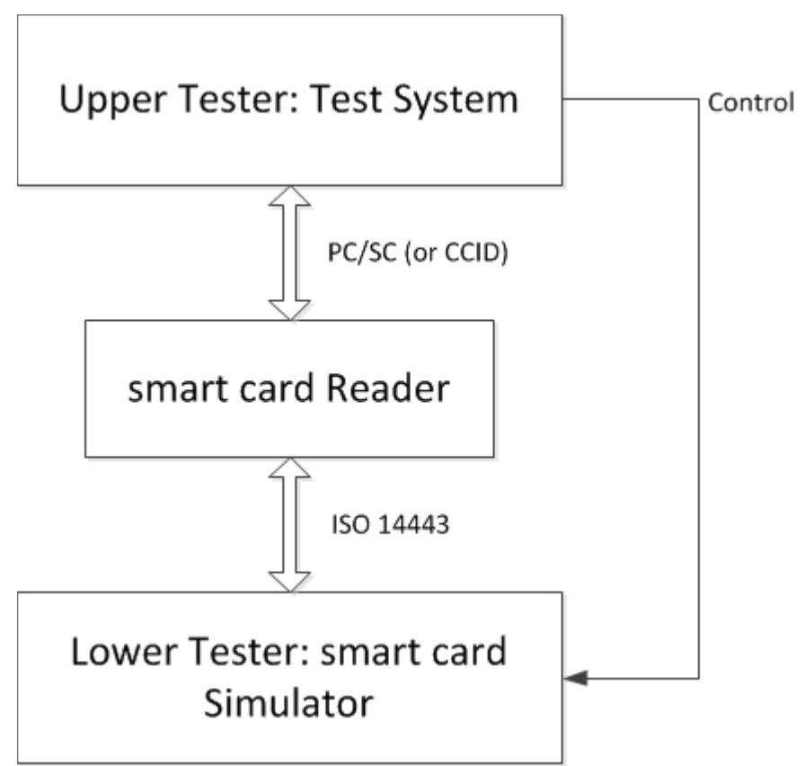

## Technical Guideline BSI TR-03105 Part 5.2

# Test plan for eID and eSign compliant smart card readers with integrated EACv2

| Version: | 2.0        |
|----------|------------|
| Date:    | 2015-05-22 |
|          |            |
|          |            |
|          |            |
|          |            |
|          |            |
|          |            |

Bundesamt für Sicherheit in der Informationstechnik Postfach 20 03 63 53133 Bonn Internet: https://www.bsi.bund.de © Bundesamt für Sicherheit in der Informationstechnik 2014 

| 1                  | Introduction 7                                                         |  |
|--------------------|------------------------------------------------------------------------|--|
| 2                  | Validation Rules 8                                                     |  |
| 2.1                | General Definitions 8                                                  |  |
| 2.1.1              | Verification Task and Scope 8                                          |  |
| 2.1.2              | Test Object 8                                                          |  |
| 2.1.3              | Test Track 8                                                           |  |
| 2.1.4              | Functions, Options and Profiles 9                                      |  |
| 2.1.5              | Description of Verification Requirements10                             |  |
| 2.2                | Verification Requirements 13                                           |  |
| 2.2.1              | Transparent Mode 13                                                    |  |
| 2.2.1.1            | List of Verification Requirements 13                                   |  |
| 2.2.2              | PACE 13                                                                |  |
| 2.2.2.1 2.2.2.2 | General Preliminary Remarks 13 List of Verification Requirements 13 |  |
| 2.2.3              | Terminal Authentication 15                                             |  |
| 2.2.3.1            | General Preliminary Remarks 15                                         |  |
| 2.2.3.2            | List of Verification Requirements 15                                   |  |
| 2.2.4              | Chip Authentication 17                                                 |  |
| 2.2.4.1            | General Preliminary Remarks 17                                         |  |
| 2.2.4.2            | List of Verification Requirements 17                                   |  |
| 2.2.5              | Access to the eID Application 18                                       |  |
| 2.2.5.1            | General Preliminary Remarks 18                                         |  |
| 2.2.5.2            | List of Verification Requirements 18                                   |  |
| 2.2.6              | Access to Biometric Data 20                                            |  |
| 2.2.6.1            | General Preliminary Remarks 20                                         |  |
| 2.2.6.2            | List of Verification Requirements 20                                   |  |
| 2.2.7              | Use of the Digital Signature Application20                             |  |
| 2.2.7.1            | General Preliminary Remarks 20                                         |  |
| 2.2.7.2            | List of Verification Requirements 21                                   |  |
| 3                  | Implementation Conformance Statement25                                 |  |
| 3.1                | Supported profiles and functions 25                                    |  |
| 3.1.1              | Profiles 25                                                            |  |
| 3.1.2              | Functions 26                                                           |  |
| 3.2                | Cryptographic algorithms 26                                            |  |
| 3.3                | Terminal type 26                                                       |  |
| 3.4                | Passwords 27                                                           |  |
| 4                  | Definition of Configuration Data for the Tests28                       |  |
| 4.1                | Terminal Certificates 28                                               |  |
| 4.2                | Extension of PC/SC Interface 30                                        |  |
| 4.2.1              | InBuffer (for GetReadersPACECapabilities)30                            |  |
| 4.2.2              | OutBuffer (for GetReadersPACECapabilities)30                           |  |
| 4.2.3              | InBuffer (for EstablishPACEChannel)30                                  |  |
| 4.2.4              | OutBuffer (for EstablishPACEChannel)32                                 |  |
| 4.3                | Communication Steps at the Card Interface32                            |  |
| 4.3.1              | PACE 32                                                                |  |
| 4.3.2              | Terminal Authentication 33                                             |  |
| 4.3.3              | Chip Authentication 34                                                 |  |

| 4.3.4   | Select the eSign Application 34                                                    |  |
|---------|------------------------------------------------------------------------------------|--|
| 4.3.5   | Reading Data from the eID Application35                                            |  |
| 4.3.6   | Writing Data into the eID Application35                                            |  |
| 4.3.7   | Restricted Identification 36                                                       |  |
| 4.3.8   | Auxiliary Data Verification 36                                                     |  |
| 4.3.9   | PIN Management 36                                                                  |  |
| 4.3.9.1 | Changing password 36                                                               |  |
| 4.3.9.2 | Unblocking password 36                                                             |  |
| 4.3.9.3 | Activating / Deactivating password37                                               |  |
| 4.3.10  | Reading Data from the ePassport Application37                                      |  |
| 5       | Test Specification 38                                                              |  |
| 5.1     | Transparent Mode 38                                                                |  |
| 5.1.1   | R_Tra_1 – Correct Reading of smart card Data in Transparent Mode38                 |  |
| 5.2     | PACE 39                                                                            |  |
| 5.2.1   | R_PACE_1 – Correct Execution of PACE Protocol39                                    |  |
| 5.2.2   | R_PACE_2 – Abort of PACE Protocol because of Internal LT Error45                   |  |
| 5.2.3   | R_PACE_3 – Abort of PACE Protocol because of Incorrect LT Data49                   |  |
| 5.2.4   | R_PACE_4 – Abort of PACE Protocol because of Incorrect UT Data56                   |  |
| 5.3     | Terminal Authentication 62                                                         |  |
| 5.3.1   | R_TA_1 – Correct Execution of Terminal Authentication Protocol63                   |  |
| 5.3.2   | R_TA_2 – Abort because of Inconsistent Reader Data64                               |  |
| 5.3.3   | R_TA_3 – Abort because of Internal LT Error65                                      |  |
| 5.3.4   | R_TA_4 – Abort because of Secure Messaging Error68                                 |  |
| 5.4     | Chip Authentication 72                                                             |  |
| 5.4.1   | R_CA_1 – Correct Execution of Chip Authentication Protocol73                       |  |
| 5.4.2   | R_CA_2 – Abort because of Internal LT Error76                                      |  |
| 5.4.3   | R_CA_3 – Abort because of Incorrect LT Data78                                      |  |
|         |                                                                                    |  |
| 5.5     | Access to the eID Application 82                                                   |  |
| 5.5.1   | R_eID_1 – Correct Reading Access to eID Data with EAC82                            |  |
| 5.5.2   | R_eID_2 – Correct Writing Access to eID Data with EAC84                            |  |
| 5.5.3   | R_eID_3 – Correct Execution of Internal eID Functions85                            |  |
| 5.5.4   | R_eID_4 – Password Management Functions for Authenticated Terminals86              |  |
| 5.5.5   | R_eID_5 – Password Management Functions for Unauthenticated Terminals after PACE89 |  |
| 5.6     | Access to Biometric Data 94                                                        |  |
| 5.6.1   | R_bio_1 – Correct Reading Access to Biometric Data with EAC94                      |  |
| 5.7     | Use of the Digital Signature Application95                                         |  |
| 5.7.1   | R_Sig_1 – Successful Key Pair Generation95                                         |  |
| 5.7.2   | R_Sig_2 – Abort Key Pair Generation100                                             |  |
| 5.7.3   | R_Sig_3 – Successful Signature Generation107                                       |  |
| 5.7.4   | R_Sig_4 – Abort Signature Generation110                                            |  |
| 5.7.5   | R_Sig_5 – Successful Password Management Functions116                              |  |
| 5.7.6   | R_Sig_6 – Abort Password Management Functions121                                   |  |
| 5.7.7   | R_Sig_7 – Successful Termination of the Signature Function132                      |  |
| 5.7.8   | R_Sig_8 – Abort Termination of the Signature Function135                           |  |
|         | Annex 140                                                                          |  |
|         | Bibliography 140                                                                   |  |
|         |                                                                                    |  |

| Table 1: Functions of the whole system 9                                                     |  |
|----------------------------------------------------------------------------------------------|--|
| Table 2: Options of the whole system 10                                                      |  |
| Table 3: Profiles defined for the test object 10                                             |  |
| Table 4: Test classes for parameters and their selection modes11                             |  |
| Table 5: Structure of a table to define verification requirements12                          |  |
| Table 6: Verification requirements for transparent mode, execution in the DUT13              |  |
| Table 7: Verification requirements for PACE, execution in the DUT15                          |  |
| Table 8: Verification requirements for terminal authentication, execution in the DUT16       |  |
| Table 9: Verification requirements for chip authentication, execution in the DUT18           |  |
| Table 10: Verification requirements for eID application, execution in the DUT20              |  |
| Table 11: Verification requirements for access to biometric data, execution in the DUT20     |  |
| Table 12: Verification Requirements use of the signature application, execution in the DUT24 |  |
| Table 13: Profiles for the DUT 25                                                            |  |
| Table 14: Functions for the DUT 26                                                           |  |
| Table 15: Supported algorithms 26                                                            |  |
| Table 16: Supported terminal roles 26                                                        |  |
| Table 17: Matrix for the supported passwords dependent on the terminal role27                |  |
| Table 18: Structure of a certificate 28                                                      |  |
| Table 19: Choice of access rights for Inspection Systems29                                   |  |
| Table 20: Choice of access rights for Authentication Terminals29                             |  |
| Table 21: Choice of access rights for Signature Terminals29                                  |  |
| Table 22: Choice of access rights for CA certificates (Inspection Systems)29                 |  |
| Table 23: Choice of access rights for CA certificates (Authentication Terminals)30           |  |
| Table 24: Choice of access rights for CA certificates (Signature Terminals)30                |  |
| Table 25: Example for CERT_DESC 31                                                           |  |
| Table 26: Structure of the CHAT data object 31                                               |  |
| Table 27: Bitmap for functions supported by the DUT32                                        |  |
| Table 28: Structure of a test case description 38                                            |  |
| Table 29: Test case R_PACE_1.1 40                                                            |  |
| Table 30: Test case R_PACE_1.2 41                                                            |  |
| Table 31: Test case R_PACE_1.3 42                                                            |  |
| Table 32: Test case R_PACE_1.4 43                                                            |  |
| Table 33: Test case R_PACE_2.1 46                                                            |  |
| Table 34: Test case R_PACE_2.3 48                                                            |  |
| Table 35: Test case R_PACE_2.4 49                                                            |  |
| Table 36: Test case R_PACE_3.1 50                                                            |  |
| Table 37: Test case R_PACE_3.2 51                                                            |  |
| Table 38: Test case R_PACE_3.3 52                                                            |  |
| Table 39: Test case R_PACE_3.4 53                                                            |  |
| Table 40: Test case R_PACE_3.5 54                                                            |  |
| Table 41: Test case R_PACE_3.6 56                                                            |  |
| Table 42: Test case R_PACE_4.1 56                                                            |  |
| Table 43: Test case R_PACE_4.2 57                                                            |  |
| Table 44: Test case R_PACE_4.3 58                                                            |  |
| Table 45: Test case R_eID_1.3 84                                                             |  |
| Table 46: Test case R_Sig_6.3 124                                                            |  |
| Table 47: Test case R_Sig_8.1 136                                                            |  |
| Table 48: Test case R_Sig_8.2 137                                                            |  |
| Table 49: Test case R_Sig_8.3 139                                                            |  |

# 1 Introduction

This Technical Guideline describes conformity criteria for eID and eSign compliant smart card readers. An eID and eSign compliant terminal with EACv2 uses a reader that directly accesses the interface of the smart card. Depending on the architecture, parts of the terminal functions may be implemented outside of the reader, e.g., in software on a host PC. We call this functionality terminal software. In the case all functions are integrated in a single system, we call this an Inspection System. This Technical Guideline primarily focus on readers, which means that all the tested terminal functionalities are implemented within the physical reader. We assume a possibility to access the reader by a PC/SC or CCID interface. For criteria related to terminal software as well as for Inspection Systems, we refer to [TR-03105-5.3].

This Technical Guideline contains the parts validation rules and test specification.

The validation rules comprise the description of the test object reader, its test interfaces and its functions as well as the verification requirements. The test specification contains the general structure of test cases and the test cases themselves together with the necessary steps for test preparation, test execution and evaluation of the test results.

The conformity tests defined in this Technical Guideline are functional tests that shall guarantee the interoperability between eID and eSign compliant smart cards and the reader. They do not address security issues. These topics are treated elsewhere.

The conformity criteria of this Technical Guideline hold for OSI layers 6 and 7 and are based on the EACv2 specification [TR-03110-2] and on the specification of the contactless interface for signature generation [TR-03117].

Specific properties of the readers as the PC/SC or CCID functionality for the PACE protocol follow the Technical Guideline to requirements on smart card readers that support ePA applications [TR-03119].

# 2 Validation Rules

### 2.1 General Definitions

### 2.1.1 Verification Task and Scope

The verification task consists in proving interoperability between readers and host applications that access reader functions. Here conformity to the EACv2 specification [TR-03110-2] and to the specification of the contactless interface for signature generation [TR-03117] must be proven. The scope for the verification task can be outlined as follows:

- prove conformity of interfaces exclusively for OSI layers 6 and 7,
- verify exclusively reader functions, that are needed for access to eID and biometric data as well as for QES over the contactless interface,
- restrict focus to PC/SC or CCID for the interface between host PC and reader, other interfaces as CT-API and SICCT are not relevant in this framework,
- do not examine the behaviour of the reader at other interfaces, especially at the display and at the contact interface.

If a manufacturer does not use a PC/SC or CCID interface, he has to provide an appropriate adapter to perform the tests.

### 2.1.2 Test Object

Due to different hardware and software architectures for the readers, parts of the terminal functions may be implemented outside the reader. These parts of terminal functions are implemented in the host PC and called terminal software in the following. A possible implementation is the eCard API framework as specified in [TR-03112-1].

The decision, whether a function of a test object must be included into a test or not, depends on the relevance of this function for the contactless reader interface. Thus, functions for signature generation are incorporated into the tests, but functions for signature verification are not.

The conformity tests for readers must ensure the correct behaviour at the interfaces for PACE, terminal authentication and chip authentication protocols, for accessing eID and biometric data, as well as for signature generation. The following sections will describe in detail which functionality has to be verified. The Test Object Reader will be referred to as device under test (DUT) in the following.

### 2.1.3 Test Track

In order to access eID and biometric data, as well as to use QES, the DUT supports two technical interfaces:

- 1. the PC/SC (or CCID) interface for access by the host PC,
- 2. the contactless interface (e.g. ISO 14443) for communication with a smart card.

To test the functionality of one interface, an appropriate behaviour at the other interface is necessary. Therefore a test system is needed, where the DUT is situated between an upper tester (UT) and a lower tester (LT). The resulting test track is shown in Figure [1.](#page-8-0)

UT sends commands to the DUT by a call of the PC/SC (or CCID) interface. The DUT generates an expected command sequence that it sends to the smart card. Instead of a physical smart card, the contactless interface at LT uses a smart card simulation. LT analyses a command received by the DUT and generates an answer message for the DUT, with or without incorrect data and/or error code, according to the simulator configuration. The DUT transmits the answer received from LT back to UT which checks it against the expected result. If a card DUT supports the PC/SC interface as well as the CCID interface, the client application should use the PC/SC interface.

#### *Figure 1: Test track*

Thus, an appropriate configuration of the LT is necessary for test execution. This configuration may be manually or automatically triggered by UT.

#### 2.1.4 Functions, Options and Profiles

According to the overall hardware and software architecture for DUT and host PC parts of the functionality are provided by the DUT and/or the terminal software.

Such a distinguished functionality will be called function in the following.

The functions of the whole system, whose conformity has to be proved, are listed in table [1.](#page-8-1)

| Function       | Task                                                                                 |
|----------------|--------------------------------------------------------------------------------------|
| Transparent    | Transmission of card commands over the PC/SC reader interface to the smart card      |
| PACE           | Execution of PACE protocol according to [TR-03110-2], 3.2                            |
| TA             | Execution of terminal authentication protocol according to [TR-03110-2], 3.4         |
| CA             | Execution of chip authentication protocol (version 2) according to [TR-03110-2], 3.3 |
| eID            | Access to eID application                                                            |
| Biometric data | Access to biometric data in the smart card                                           |
| QES            | Generation of qualified electronic signatures according to [TR-03117]                |

Table 1: Functions of the whole system

The functions of the whole system are taken as a basis to structure the verification requirements (see chapter [2.1.5\)](#page-9-0).

A functionality which may be supported optionally by the whole system will be called an option. The options allowed are listed in table [2.](#page-9-2)

| Option          | Task                                                              |
|-----------------|-------------------------------------------------------------------|
| Change_PIN      | Password management function to change the PIN                    |
| Change_CAN      | Password management function to change the CAN                    |
| Unblock_PIN_PUK | Password management function to unblock the PIN after using PUK   |
| PIN_MGT_AT      | PIN management functions for Authentication Terminals             |
| PIN_MGT_uT      | PIN management functions for unauthenticated terminals after PACE |
| Write_eID       | Writing Access to eID data with EAC                               |

Table 2: Options of the whole system

The profiles allowed for the DUT are listed in table [3.](#page-9-1)

| Profile        | Function       | Option                |
|----------------|----------------|-----------------------|
| R_Tra          | Transparent    |                       |
| R_PACE         | PACE           |                       |
| R_TA           | TA             |                       |
| R_CA           | CA             |                       |
| R_eID          | eID            |                       |
| R_bio          | Biometric data |                       |
| R_Sig          | QES            |                       |
| R_Chg_PIN      |                | Change PIN            |
| R_Chg_CAN      |                | Change CAN            |
| R_UNLK_PIN_PUK |                | Unblock PIN after PUK |
| R_PIN_MGT_AT   |                | PIN_MGT_AT            |
| R_PIN_MGT_uT   |                | PIN_MGT_uT            |

Table 3: Profiles defined for the test object

#### 2.1.5 Description of Verification Requirements

Special verification requirements are defined for the test object that describe which aspects must be validated with respect to the behaviour of the test object at the relevant interfaces. The verification requirements are structured along the functions in separate sections.

A verification requirement handles a special aspect of the specification (e. g. the special part age verification in the eID application) and assigns to this aspect a test parameter or a defined combination of test parameters resp. preconditions as verification focus.

Moreover a verification requirement determines whether the test is a positive or a negative one and according to which principles the test parameters have to be chosen. Table [4](#page-10-0) lists the test classes that define different selection modes for test parameters.

| Test class | Description   | Selection mode of a positive test                                                                                                                                    | Selection mode of a negative test                                                       |
|---------------|---------------|-------------------------------------------------------------------------------------------------------------------------------------------------------------------------|--------------------------------------------------------------------------------------------|
| CT            | Complete test | Check all admitted values of a test parameter                                                                                                                        | Check all forbidden values of a test parameter                                          |
| LM            | Limit test    | Check limits of the admitted value range of a test parameter. Apart from the lower and upper limits LL and UL, the values UL-1 and LL+1 are tested as well. | Check limits of the value range of a test parameter, where UL+1 and LL-1 are tested. |
| SA            | Sample Test   | Check appropriate values within the range of a test parameter                                                                                                        | Check appropriate values outside the range of a test parameter                          |

Table 4: Test classes for parameters and their selection modes

The test classes LM and SA may be combined if necessary.

The verification requirements of the same section are described in one table. Table [5](#page-11-0) shows the structure of such a table.

| Name in table column | Contents                                                                                                                                                        |  |
|----------------------|-----------------------------------------------------------------------------------------------------------------------------------------------------------------|--|
| RQ_no                | Identifier for verification requirement built up as follows: <code test object>_<code function>_<No. VR>.<No. para> <code test object>: R (for reader) |  |
|                      | <code function>:                                                                                                                                                |  |
|                      | Tra (for transparent mode)                                                                                                                                      |  |
|                      | PACE (for PACE protocol)                                                                                                                                        |  |
|                      | TA (for terminal authentication protocol)                                                                                                                       |  |
|                      | CA (for chip authentication protocol)                                                                                                                           |  |
|                      | eID (for eID application)                                                                                                                                       |  |
|                      | bio (for biometric data)                                                                                                                                        |  |
|                      | Sig (for eSign application)                                                                                                                                     |  |
|                      | <No. VR> (verification requirement number): 1, 2, 3                                                                                                             |  |
|                      | <No. para> (distinguish parameters within a verification requirement): 1, 2, 3                                                                               |  |
| Description          | Short description of the verification requirement                                                                                                               |  |
| Parameter            | Parameter in focus of examination; this also includes combinations of parameters                                                                             |  |
| Reference            | Chapters in the specification which define the verification requirement                                                                                         |  |
| PR                   | Test classes for positive tests ("positive requirement"); if this field is empty, there are no positive tests for the considered parameters                  |  |
| NR                   | Test classes for negative tests ("negative requirement"); if this field is empty, there are no negative tests for the considered parameters                  |  |
| IF                   | Interface of test objects that are in focus of examination: UT – Upper Tester LT – Lower Tester                                                           |  |

Table 5: Structure of a table to define verification requirements

## 2.2 Verification Requirements

#### 2.2.1 Transparent Mode

#### 2.2.1.1 List of Verification Requirements

| RQ_no R_Tra_ | Description                                                                            | Parameter                                                                                                                                                                                                                                                                             | Reference                | PR | NR | IF       |
|-----------------|----------------------------------------------------------------------------------------|---------------------------------------------------------------------------------------------------------------------------------------------------------------------------------------------------------------------------------------------------------------------------------------|--------------------------|----|----|----------|
| 1.1             | Check correct transmission of card commands to the DUT in transparent mode | UT sends card command to the DUT via PC/SC interface to read data from smart card which are freely accessible. It is checked that the DUT transmits command message to LT and transmits to UT response message received from LT, both without modifications.        | [TR-03110-3], A.1.1.6 | SA |    | UT LT |
| 1.2             |                                                                                        | UT sends card command to the DUT via PC/SC interface to read data from smart card for which access is not allowed. It is checked that the DUT transmits command message to LT and transmits to UT response message received from LT, both without modifications. | [TR-03110-3], A.1.1.6 |    | SA | UT LT |

Table 6: Verification requirements for transparent mode, execution in the DUT

### 2.2.2 PACE

#### 2.2.2.1 General Preliminary Remarks

The PACE protocol is the first part of the EAC protocol that is used to access eID or signature function in the smart card. In order to perform PACE protocol, the PC/SC function GET\_FEATURE\_REQUEST ([PCSC10], 2.2) extended by the feature FEATURE\_EXECUTE\_PACE is called in the DUT. The structure to this feature is named EstablishPACEChannel ([TR-03119], D.3).

InputData of EstablishPACEChannel consist of ([TR-03119], D.1.2):

- Password-ID for user authentication,
- CHAT (Card Holder Authorization Template),
- Password (if transmitted by host PC) and
- complete description of terminal certificate.

#### 2.2.2.2 List of Verification Requirements

| RQ_no R_PACE_ | Description                                               | Parameter                                                                                                   | Reference                                   | PR | NR | IF |
|------------------|-----------------------------------------------------------|-------------------------------------------------------------------------------------------------------------|---------------------------------------------|----|----|----|
| 1.1-1.3          | Check correct execution of PACE protocol in the DUT | Use certificate roles (Inspection System, Authentication Terminal, Signature Terminal) with specified | [TR-03110-2], 2.3, 3.2, [TR-03110-4], | SA |    | UT |

| RQ_no R_PACE_ | Description                                                                                                      | Parameter                                                                                                                                                                                                                                                                                                   | Reference                                                              | PR | NR | IF |
|------------------|------------------------------------------------------------------------------------------------------------------|-------------------------------------------------------------------------------------------------------------------------------------------------------------------------------------------------------------------------------------------------------------------------------------------------------------|------------------------------------------------------------------------|----|----|----|
|                  |                                                                                                                  | access rights. Use appropriate certificates for Document Verifier Use all possible combinations of certificate role: Inspection System: Password-ID = CAN and MRZ password Authentication Terminal: Password-ID = PIN, CAN Signature Terminal: Password-ID = CAN, PIN and PUK | 2.1.3.2, 2.2.3.2, 2.3, [TR-03119], D.3                        |    |    |    |
| 1.4              |                                                                                                                  | Use unauthenticated terminals with CAN, PIN and PUK                                                                                                                                                                                                                                                      | [TR-03110-2], 2.4.1, 3.2, [TR-03119], D.3                     | SA |    | UT |
| 1.5, 1.6         |                                                                                                                  | Use of different algorithms                                                                                                                                                                                                                                                                                 | [TR-03110-2], 3.2, [TR-03110-3], A.1.1.1, A.1.2, A.3, B.1  | SA |    | LT |
| 2.1, 2.2         | Check that the DUT aborts PACE protocol when detecting internal error or error communicated by LT | LT derives cryptographic key from password (PIN, CAN, MRZ-Password, PUK) incorrectly                                                                                                                                                                                                                  | [TR-03110-2], 3.2, [TR-03119], D.3.1                          |    | SA | LT |
| 2.3              |                                                                                                                  | LT returns error code to command MSE: Set AT                                                                                                                                                                                                                                                             | [TR-03119], D.3.1                                                   |    | SA | LT |
| 2.4              |                                                                                                                  | LT transmits incorrect data for mapping function Map in answer to card command General Authenticate (Step 2).                                                                                                                                                                                      | [TR-03110-2], 3.2, [TR-03110-3], B.1, [TR-03119], D.3.1 |    | SA | LT |
| 3.1, 3.2         | Check that the DUT aborts PACE protocol when the DUT receives incorrect data from LT                 | Transmission of incorrect PACE parameters from LT                                                                                                                                                                                                                                                        | [TR-03110-2], 3.2, [TR-03119], D.3.1                          |    | SA | LT |
| 3.3              |                                                                                                                  | Incorrect cryptogram in response message to card command General Authenticate (Step 1)                                                                                                                                                                                                                | [TR-03110-2], 3.2, [TR-03110-3], B.1, [TR-03119], D.3.1 |    | SA | LT |
| 3.4              |                                                                                                                  | Ephemeral public key received from                                                                                                                                                                                                                                                                          | [TR-03110-2],                                                          |    | SA | LT |

| RQ_no R_PACE_ | Description                                                                                     | Parameter                                                                                                                                                                 | Reference                                                             | PR | NR       | IF |
|------------------|-------------------------------------------------------------------------------------------------|---------------------------------------------------------------------------------------------------------------------------------------------------------------------------|-----------------------------------------------------------------------|----|----------|----|
|                  |                                                                                                 | LT is identical to ephemeral public key generated by the DUT                                                                                                           | 3.2                                                                   |    |          |    |
| 3.5              |                                                                                                 | LT transmits incorrect cryptogram that has been generated with derived SM key data                                                                                  | [TR-03110-2], 3.2                                                  |    | SA       | LT |
| 3.6              |                                                                                                 | LT transmits authentication token that has been generated with an algorithm that differs from the algorithm used by the DUT                                      | [TR-03110-2], 3.2, [TR-03110-3], A.1.1.1, A.1.2, A.3, B.1 |    | SA       | LT |
| 4.1, 4.2         | Check that the DUT aborts PACE protocol when receiving incorrect input data from UT | Incorrect Password-ID in input of PC/SC function                                                                                                                       | [TR-03119], D.1.2                                                  |    | LM SA | UT |
| 4.3-4,5          |                                                                                                 | Incorrect password (PIN, CAN, MRZ password, PUK) in input of PC/SC function or in user input                                                                        | [TR-03110-2], 3.2, [TR-03119], D.1.2                         |    | SA       | UT |
| 4.6-4.8          |                                                                                                 | Incorrect combination of Password-ID and CHAT in input of PC/SC function (e. g. Password-ID addresses CAN; Authentication Terminal not authorized to use CAN) | [TR-03110-2], 3.2, [TR-03119], D.1.2                         |    | SA       | UT |

Table 7: Verification requirements for PACE, execution in the DUT

### 2.2.3 Terminal Authentication

#### 2.2.3.1 General Preliminary Remarks

The terminal authentication protocol is the second part of the EAC protocol. It is executed only in Signature Terminals. In Authentication Terminals command messages and answer messages for the smart card used in the protocol are transmitted between UT and LT. Here the DUT merely performs SM using the session keys as derived in PACE protocol.

#### 2.2.3.2 List of Verification Requirements

| RQ_no R_TA_ | Description                                                                        | Parameter                                                                                                                     | Reference                                                                                | PR | NR | IF |
|----------------|------------------------------------------------------------------------------------|-------------------------------------------------------------------------------------------------------------------------------|------------------------------------------------------------------------------------------|----|----|----|
| 1.1-1.3        | Check correct execution of terminal authentication protocol in the DUT | Use certificate roles Inspection System, Authentication Terminal and Signature Terminal with specified access rights | [TR-03110-2], 2.3, 3.4, [TR-03110-3], B.3, [TR-03110-4] 2.1.3.2, 2.2.3.2, | SA |    | UT |

| RQ_no R_TA_ | Description                                                                                                                | Parameter                                                                                                                              | Reference                                                             | PR | NR | IF |
|----------------|----------------------------------------------------------------------------------------------------------------------------|----------------------------------------------------------------------------------------------------------------------------------------|-----------------------------------------------------------------------|----|----|----|
|                |                                                                                                                            |                                                                                                                                        | 2.3, [TR-03119], D.3                                            |    |    |    |
| 2.1            | Check that the DUT aborts terminal authentication when discovering inconsistent internal data               | Terminal certificate CHAT used in terminal authentication different from CHAT used in PACE protocol                              | [TR-03110-2], 3.4, [TR-03110-3] B.3, [TR-03119], A.5.1 |    | SA | UT |
| 3.1            | Check that the DUT aborts terminal authentication when detecting internal error or error communicated by LT | LT returns error code to command MSE: Set DST (setting public key for certificate verification)                                  | [TR-03110-2], 3.4, [TR-03110-3], B.3                         |    | SA | LT |
| 3.2            |                                                                                                                            | LT returns error code to command PSO: Verify Certificate when verifying terminal certificates                                    | [TR-03110-2], 3.4, [TR-03110-3], B.3                         |    | SA | LT |
| 3.3            |                                                                                                                            | LT returns error code to command MSE: Set AT (transmitting parameters for terminal authentication to LT)                         | [TR-03110-2], 3.4, [TR-03110-3], B.3                         |    | SA | LT |
| 3.4            |                                                                                                                            | LT returns error code to command Get Challenge (random number for terminal authentication)                                       | [TR-03110-2], 3.4, [TR-03110-3], B.3                         |    | SA | LT |
| 3.5            |                                                                                                                            | LT returns error code to command External Authenticate when checking signed data from UT in terminal authentication protocol. | [TR-03110-2], 3.4, [TR-03110-3], B.3                         |    | SA | LT |
| 4.1            | Check that the DUT aborts terminal authentication on Secure Messaging error in LT                              | Reader does not receive SM data objects from LT in answer messages of LT                                                         | [TR-03110-2], 3.4, [TR-03110-3], B.3                         |    | SA | LT |
| 4.2, 4.3       |                                                                                                                            | Reader receives incorrect SM data objects from LT in answer messages of LT                                                       | [TR-03110-2], 3.4, [TR-03110-3], B.3                         |    | SA | LT |
| 4.4,4.5        |                                                                                                                            | The DUT aborts terminal authentication, if it receives that wrong SM data from LT in response APDU to command MSE: Set DST    | [TR-03110-2]                                                          |    | SA | LT |

Table 8: Verification requirements for terminal authentication, execution in the DUT

### 2.2.4 Chip Authentication

#### 2.2.4.1 General Preliminary Remarks

The chip authentication protocol is the third part of the EAC protocol. It is executed completely only in Signature Terminals. In Authentication Terminals command messages and answer messages for the smart card used in the protocol are transmitted between UT and LT. Here the DUT merely performs SM using the session keys as derived in PACE protocol.

| 2.2.4.2 |  |  | List of Verification Requirements |
|---------|--|--|-----------------------------------|
|---------|--|--|-----------------------------------|

| RQ_no R_CA_ | Description                                                                                                                | Parameter                                                                                                                     | Reference                                                                                                             | PR | NR | IF |
|----------------|----------------------------------------------------------------------------------------------------------------------------|-------------------------------------------------------------------------------------------------------------------------------|-----------------------------------------------------------------------------------------------------------------------|----|----|----|
| 1.1-1.3        | Check correct execution of chip authentication protocol in the DUT                                                | Use certificate roles Inspection System, Authentication Terminal and Signature Terminal with specified access rights | [TR-03110-2], 2.3, 3.3, [TR-03110-3], B.2, [TR-03110-4] 2.1.3.2, 2.2.3.2, 2.3 [TR-03119], D.3 | SA |    | UT |
| 1.4, 1.5       |                                                                                                                            | Use of different algorithms and multiple key pairs                                                                         | [TR-03110-2], 3.3, [TR-03110-3], A.1.1.2, A.4, B.2                                                        | SA |    | LT |
| 2.1            | Check that the DUT aborts chip authen-tication when detecting internal error or error communicated by LT | LT returns error code to command MSE: Set AT (transmitting parameters for chip authentication to LT)                    | [TR-03110-2], 3.3, [TR-03110-3], B.2                                                                         |    | SA | LT |
| 2.2            |                                                                                                                            | LT returns error code to command General Authenticate when verifying the ephemeral public key of the DUT                | [TR-03110-2], 3.3, [TR-03110-3], B.2                                                                         |    | SA | LT |
| 2.3            |                                                                                                                            | LT computes incorrect key data for SM                                                                                         | [TR-03110-2], 3.3, [TR-03110-3], B.2                                                                         |    | SA | LT |
| 3.1            | Check that the DUT aborts chip authen-tication when receiving incorrect data from LT                        | LT returns incorrect random number in answer message to command General Authenticate                                    | [TR-03110-2], 3.3, [TR-03110-3], B.2                                                                         |    | SA | LT |
| 3.2            |                                                                                                                            | LT returns incorrect cryptogram in                                                                                            | [TR-03110-2],                                                                                                         |    | SA | LT |

| RQ_no R_CA_ | Description | Parameter                                                                                                                            | Reference                                                      | PR | NR | IF |
|----------------|-------------|--------------------------------------------------------------------------------------------------------------------------------------|----------------------------------------------------------------|----|----|----|
|                |             | answer message to command General Authenticate                                                                                    | 3.3, [TR-03110-3], B.2                                   |    |    |    |
| 3.3            |             | LT transmits authentication token that has been generated with an algorithm that differs from the algorithm used by the DUT | [TR-03110-2], 3.3, [TR-03110-3], A.1.1.2, A.4, B.2 |    | SA | LT |
| 3.4            |             | LT transmits authentication token that has been generated with a wrong static key pair.                                        | [TR-03110-2], 3.3, [TR-03110-3], A.1.1.2, A.4, B.2 |    | SA | LT |

Table 9: Verification requirements for chip authentication, execution in the DUT

### 2.2.5 Access to the eID Application

#### 2.2.5.1 General Preliminary Remarks

The access to the eID application is only admitted after successful execution of the EAC protocol (General Authentication Procedure). UT must have been using the DUT to authenticated to LT with certificate role Inspection System or Authentication Terminal. After performing EAC, the SM channel is established between UT and LT, i. e. the commands for the eID application are transmitted by the DUT in transparent mode. Therefore the verification requirements for the eID application exclusively handle positive tests.

#### 2.2.5.2 List of Verification Requirements

| RQ_no R_eID_ | Description                                                        | Parameter                                                                    | Reference                                                  | PR | NR | IF |
|-----------------|--------------------------------------------------------------------|------------------------------------------------------------------------------|------------------------------------------------------------|----|----|----|
| 1.1             | Check correct reading access to eID data with EAC by the DUT | Use certificate role Inspection System with specified access rights       | [TR-03110-4], 2.2, [TR-03110-4], 2.1.3.2          | CT |    | UT |
| 1.2             |                                                                    | Use certificate role Authentication Terminal with specified access rights | [TR-03110-2], E.1, [TR-03110-4], 2.2.3.2          | CT |    | UT |
| 1.3             |                                                                    | Use of different algorithms for Secure Messaging                          | [TR-03110-4], 2.2, [TR-03110-3] A.4, 2.2.3.2, E.2 | SA |    | LT |
| 2.1             | Check correct writing access to eID data with EAC by the DUT | Use certificate role Authentication Terminal with specified access rights | [TR-03110-4], 2.2, [TR-03110-3], 2.2.3.2          | CT |    | UT |

| RQ_no R_eID_ | Description                                                                                          | Parameter                                                                                                                                            | Reference                                           | PR       | NR | IF |
|-----------------|------------------------------------------------------------------------------------------------------|------------------------------------------------------------------------------------------------------------------------------------------------------|-----------------------------------------------------|----------|----|----|
| 3.1             | Check correct execution of internal eID functions that have been called in LT by the DUT | Certificate role Authentication Terminal with access right restricted identification: Execute restricted identification protocol         | [TR-03110-2], 3.5, [TR-03110-4], 2.2.3.2   | SA       |    | UT |
| 3.2             |                                                                                                      | Certificate role Authentication Terminal with access right age verification: Execute age verification for card holder                    | [TR-03110-4], 2.2.3.2                            | SA LM |    | UT |
| 3.3             |                                                                                                      | Certificate role Authentication Terminal with access right community ID verification: Execute verification of card holder's community ID | [TR-03110-4], 2.2.3.2                            | SA       |    | UT |
| 4.1             | Password management functions for authenticated terminals                                      | Certificate role Authentication Terminal with access right password management: Changing PIN in LT optional (if supported by terminal)   | [TR-03110-2], 2.4.2, [TR-03110-4], 2.2.3.2 | SA       |    | UT |
| 4.2             |                                                                                                      | Certificate role Authentication Terminal with access right password management: Changing CAN in LT optional (if supported by terminal)   | [TR-03110-2], 2.4.2, [TR-03110-4], 2.2.3.2 | SA       |    | UT |
| 4.3             |                                                                                                      | Certificate role Authentication Terminal with access right password management: Unblock PIN in LT optional (if supported by terminal)    | [TR-03110-2], 2.4.2, [TR-03110-4], 2.2.3.2 | SA       |    | UT |
| 4.4             |                                                                                                      | Certificate role Authentication Terminal with access right password management: Activate PIN in LT                                          | [TR-03110-2], 2.4.2, [TR-03110-4], 2.2.3.2 | SA       |    | UT |
| 4.5             |                                                                                                      | Certificate role Authentication Terminal with access right password management: Deactivate PIN in LT                                        | [TR-03110-2], 2.4.2, [TR-03110-4], 2.2.3.2 | SA       |    | UT |
| 5.1, 5.2        | Password management functions for unauthenticated terminals after PACE                      | Setting a new PIN using the currently valid PIN Consider the special case that the current PIN is a transport PIN                           | [TR-03110-2], 2.4.1                              | SA       |    | UT |
| 5.3             |                                                                                                      | Resetting retry counter for PIN using PUK                                                                                                         | [TR-03110-2], 2.4.1                              | SA       |    | UT |
| 5.4             |                                                                                                      | Setting a new PIN using PUK optional (if supported by the DUT)                                                                                    | [TR-03110-2], 2.4.1                              | SA       |    | UT |

| RQ_no R_eID_ | Description | Parameter                                                        | Reference              | PR | NR | IF |
|-----------------|-------------|------------------------------------------------------------------|------------------------|----|----|----|
| 5.5             |             | Resume temporarily a PIN using CAN                            | [TR-03110-2], 2.4.1 | SA |    | UT |
| 5.6-5.8         |             | Resume a temporarily resumed PIN by using it in PACE protocol | [TR-03110-2], 2.4.1 | SA |    | UT |

Table 10: Verification requirements for eID application, execution in the DUT

#### 2.2.6 Access to Biometric Data

#### 2.2.6.1 General Preliminary Remarks

The access to the data groups of the ePassport application containing biometric data is admitted for Inspection Systems with appropriate access rights after successful execution of the EAC protocol (General Authentication Procedure).

#### 2.2.6.2 List of Verification Requirements

| RQ_no R_bio_ | Description                                                              | Parameter                                                                                                                               | Reference                | PR | NR | IF |
|-----------------|--------------------------------------------------------------------------|-----------------------------------------------------------------------------------------------------------------------------------------|--------------------------|----|----|----|
| 1.1             | Check correct reading access to biometric data with EAC by the DUT | Use certificate role Inspection System with access rights for DG 3 (Fingerprint) and DG 4 (Iris) of the ePassport application. | [TR-03110-4], 2.1.3.2 | CT |    | UT |

Table 11: Verification requirements for access to biometric data, execution in the DUT

### 2.2.7 Use of the Digital Signature Application

#### 2.2.7.1 General Preliminary Remarks

In this section verification requirements will be defined that focus on the correct behaviour of the DUT during the processing of functions related to qualified electronic signatures according to [TR-03117]. In this application the DUT is part of a so-called "signature application component" and the smart card is a secure signature creation device (SSCD) according to the German digital signature act [SigG] and the signature ordinance [SigV].

According to the Technical Guideline [TR-03117] that defines requirements for the DUT and the smart card, the following functions and procedures have to be considered:

- 1 Activation of the smart card as SSCD including
	- a Setting of the operational user authentication data (Setting of the eSign-PIN, see also management of user authentication data)
	- b Generation of the signature key pair by the certification authority (QCA) issuing qualified certificates
- 2 Operational use of the smart card as SSCD
	- a Options for entering the CAN
	- b Generation of qualified electronic signatures
	- c Management of the user authentication data
- i Setting a new eSign-PIN
- ii Changing the eSign-PIN
- iii Unblocking the eSign-PIN
- d Termination of the signature function
	- i Terminating the eSign-PIN
	- ii Terminating the signature key

For the processing of these procedures it is necessary to use the roles authentication reader and signature reader. According to [TR-03117], Annex A2, Table 1 Inspection Systems have no access to the eSign application.

Authentication readers must have the access right "Install Qualified Certificate" and signature readers the access right "Generate qualified electronic signature". With the exception of access rights requirements for advanced signatures are not specified yet in [TR-03117], so this document at hand does not define any test requirement for advanced signatures.

| RQ_no R_Sig_ | Description                                                                                    | Parameter                                                                                                                                                                                                                                                                                                                                                                          | Reference                      | PR | NR | IF |
|-----------------|------------------------------------------------------------------------------------------------|------------------------------------------------------------------------------------------------------------------------------------------------------------------------------------------------------------------------------------------------------------------------------------------------------------------------------------------------------------------------------------|--------------------------------|----|----|----|
| 1.1             | Verification of the correct execution of the key pair generation initiated by the QCA | Use of the role Authentication Terminal (of the QCA) with the access rights to read personal data of the smart card user as well as for issuing and installation of the qualified certificate ("Install Qualified Certificate") Use of the PIN for the PACE protocol between the Signature Terminal and the LT.                                         | [TR-03117], 4.3.2           | CT |    | UT |
| 1.2             |                                                                                                | Access with the Authentication Terminal of the QCA to the necessary identification data of the smart card user (stored in the smart card) according to §5 clause 1 SigG and §3 clause 1 SigV (where necessary DG1 to DG21). Select the eID application Read personal data                                                                                  | [TR-03117], 4.3.2           | CT |    | UT |
| 1.3             |                                                                                                | Access with the Authentication Terminal to the eSign application (Select the eSign application) Transmission of the command Generate Asymmetric Key Pair for the generation of the key pair from the UT via authentication and Signature Terminal to the LT. The Authentication Terminal reads the generated signature verification key from the LT. | [TR-03117], 4.3.2, A.2.5 | CT |    | UT |

#### 2.2.7.2 List of Verification Requirements

| RQ_no R_Sig_ | Description                                                                                                                       | Parameter                                                                                                                                                                                                                                                                                                                                                                                  | Reference                      | PR | NR | IF |
|-----------------|-----------------------------------------------------------------------------------------------------------------------------------|--------------------------------------------------------------------------------------------------------------------------------------------------------------------------------------------------------------------------------------------------------------------------------------------------------------------------------------------------------------------------------------------|--------------------------------|----|----|----|
| 2.1, 2.2        | Verification that the DUT aborts the key pair generation when detecting internal error or error communicated by LT | Authentication terminal does not have the access right "Install Qualified Certificate" Use of a wrong password for the PACE protocol                                                                                                                                                                                                                                           | [TR-03117], 4.3.2           |    | SA | UT |
| 2.3, 2.4        |                                                                                                                                   | The LT returns that the eSign application could not be selected The LT returns an error code to the command Generate Asymmetric Key Pair: The private key or the related eSign-PIN is not terminated                                                                                                                                                                     | [TR-03117], 4.3.2, A.2.5 |    | SA | LT |
| 3.1             | Verification of the correct execution of a signature generation                                                             | Use of a Signature Terminal (of the smart card user) with the access right "Generate qualified electronic signature" Use of the CAN for the PACE protocol between Signature Terminal and LT                                                                                                                                                                              | [TR-03117], 4.4.2           | CT |    | UT |
| 3.2             |                                                                                                                                   | The UT selects the eSign application and requires via the Signature Terminal the smart card user to enter the eSign-PIN at the Signature Terminal Entering the eSign-PIN at the Signature Terminal Transmission of the command Verify for the successful verification of the eSign-PIN to the LT Response from the LT to the Signature Terminal or the UT | [TR-03117], 4.4.2, A.2.1 | CT |    | UT |
| 3.3             |                                                                                                                                   | The UT transfers the command PSO:Compute Digital Signature for the generation of a digital signature to the Signature Terminal Transfer of the command by the Signature Terminal to the LT Return of the generated signature from the LT to the Signature Terminal Return of the received signature by the Signature Terminal to the UT                      | [TR-03117], 4.4.2, A.2.4 | SA |    | UT |
| 4.1-4.4         | Verification that the DUT aborts the signature generation when detecting internal error or error                      | Signature terminal does not have the access right "Generate qualified electronic signature" Use of password for the PACE protocol which doesn't have the                                                                                                                                                                                                                       | [TR-03117], 4.4.2           |    | SA | UT |

| RQ_no R_Sig_ | Description                                                                                                                                                  | Parameter                                                                                                                                                                                                                                                                                                                                                                     | Reference                                | PR | NR | IF |
|-----------------|--------------------------------------------------------------------------------------------------------------------------------------------------------------|-------------------------------------------------------------------------------------------------------------------------------------------------------------------------------------------------------------------------------------------------------------------------------------------------------------------------------------------------------------------------------|------------------------------------------|----|----|----|
|                 | communicated by LT                                                                                                                                           | required permits.                                                                                                                                                                                                                                                                                                                                                             |                                          |    |    |    |
| 4.5, 4.6        |                                                                                                                                                              | The LT returns that the eSign application could not be selected The LT returns an error code to the command Verify: Failed user authentication, X further attempts The error counter of the eSign-PIN is expired (no further attempts for user authentication possible) The eSign-PIN is terminated The referenced password is not available | [TR-03117], 4.4.2, A.2.1, A.2.4 |    | CT | LT |
|                 |                                                                                                                                                              | The LT returns an error code to the command PSO:Compute Digital Signature: The related eSign-PIN was not verified successfully The signature key is terminated Incorrect command data                                                                                                                                                                       |                                          |    |    |    |
| 5.1             | Password management functions for Signature Terminals                                                                                                  | Use of a Signature Terminal (of the smart card user) with the access right "Generate qualified electronic signature" Setting eSign-PIN in LT using PIN                                                                                                                                                                                                            | [TR-03117], 4.4.3, A.2.2           | SA |    | UT |
| 5.2             |                                                                                                                                                              | Use of a Signature Terminal (of the smart card user) with the access right "Generate qualified electronic signature" Changing eSign-PIN in LT using CAN                                                                                                                                                                                                        | [TR-03117], 4.4.3, A.2.2           | SA |    | UT |
| 5.3             |                                                                                                                                                              | Use of a Signature Terminal (of the smart card user) with the access right "Generate qualified electronic signature" Resetting retry counter for eSign-PIN using PUK                                                                                                                                                                                           | [TR-03117], 4.4.3, A.2.3           | SA |    | UT |
| 6.1, 6.2        | Verification that the Signature Terminal aborts the password management function when detecting internal error or error communicated by LT | Setting the eSign-PIN Signature terminal does not have the access right "Generate qualified electronic signature" Use of password for the PACE protocol which doesn't have the required permits.                                                                                                                                                            | [TR-03117], 4.4.3                     |    | SA | UT |
| 6.3, 6.4        |                                                                                                                                                              | Setting the eSign-PIN The LT returns that the eSign                                                                                                                                                                                                                                                                                                                        | [TR-03117], 4.4.3,                    |    | SA | LT |

| RQ_no R_Sig_ | Description                                                                                                                                        | Parameter                                                                                                                                                                                                                                         | Reference                      | PR | NR | IF |
|-----------------|----------------------------------------------------------------------------------------------------------------------------------------------------|---------------------------------------------------------------------------------------------------------------------------------------------------------------------------------------------------------------------------------------------------|--------------------------------|----|----|----|
|                 |                                                                                                                                                    | application could not be selected The LT returns an error code to the command Change Reference Data                                                                                                                                         | A.2.2                          |    |    |    |
| 6.5, 6.6        |                                                                                                                                                    | Changing the eSign-PIN Signature terminal does not have the access right "Generate qualified electronic signature" Use of password for the PACE protocol which doesn't have the required permits.                               | [TR-03117], 4.4.3           |    | SA | UT |
| 6.7             |                                                                                                                                                    | Changing the eSign-PIN The LT returns an error code to the command Change Reference Data                                                                                                                                                    | [TR-03117], 4.4.3, A.2.2 |    | SA | LT |
| 6.8, 6.9        |                                                                                                                                                    | Resetting Retry Counter of eSign-PIN Signature terminal does not have the access right "Generate qualified electronic signature" Use of password for the PACE protocol which doesn't have the required permits.              | [TR-03117], 4.4.3, A.2.3 |    | SA | UT |
| 6.10            |                                                                                                                                                    | Resetting Retry Counter of eSign-PIN The LT returns an error code to the command Reset Retry Counter                                                                                                                                     | [TR-03117], 4.4.3           |    | SA | LT |
| 7.1, 7.2        | Verification of the correct execution of the termination of the signature function                                                        | Use of a sSgnature Terminal (of the smart card user) with the access right "Generate qualified electronic signature" Termination of the eSign-PIN or the signature key with PIN                                                    | [TR-03117], 4.4.4, A.2.6 | CT |    | UT |
| 8.1, 8.2        | Verification that the Signature Terminal aborts a termination function when detecting internal error or error communicated by LT | Termination of the eSign-PIN or the signature key Signature terminal does not have the access right "Generate qualified electronic signature" Use of password for the PACE protocol which doesn't have the required permits. | [TR-03117], 4.4.4           |    | SA | UT |
| 8.3             |                                                                                                                                                    | The LT returns an error code to the command Terminate                                                                                                                                                                                          | [TR-03117], 4.4.4, A.2.6 |    | SA | LT |

Table 12: Verification Requirements use of the signature application, execution in the DUT

# 3 Implementation Conformance Statement

The purpose of the Implementation Conformance Statement is the declaration of optional functionality of the product to be approved by the applicant. The declarations of the applicant are used for the determination of the set of test cases appropriated to the functionality of the product.

The Implementation Conformance Statement must be filled completely by the applicant. The information of the filled ICS must be documented in the test report.

The test result will only cover the function declared in this statement.

### 3.1 Supported profiles and functions

All test cases of a profile which is declared with "Yes" by the applicant, have to be performed completely. The test coverage can be limited by declarations in chapter [3.3](#page-25-0) and [3.4.](#page-26-0)

| Profile | Task                                                                                                        | Applicant declaration (Yes / No) |
|---------|-------------------------------------------------------------------------------------------------------------|----------------------------------------|
| R_Tra   | Reader supports transmission of card commands over the PC/SC interface to the smart card                 |                                        |
| R_PACE  | Reader supports execution of PACE protocol according to [TR-03110-2], 3.2                                |                                        |
| R_TA    | Reader supports execution of terminal authentication protocol according to [TR-03110-2], 3.4             |                                        |
| R_CA    | Reader supports execution of chip authentication protocol (version 2) according to [TR-03110-2], 3.3.1.2 |                                        |
| R_eID   | Reader supports access to eID application                                                                   |                                        |
| R_bio   | Reader supports access to biometric data in the smart card                                                  |                                        |
| R_Sig   | Reader supports generation of qualified electronic signatures according to [TR-03117]                    |                                        |

### 3.1.1 Profiles

Table 13: Profiles for the DUT

### 3.1.2 Functions

| Profile                                                                                                       | Task                                                                                        | Applicant declaration (Yes / No) |
|---------------------------------------------------------------------------------------------------------------|---------------------------------------------------------------------------------------------|----------------------------------------|
| R_Chg_PIN                                                                                                     | Password management function to change the PIN is supported by the DUT.                  |                                        |
| R_Chg_CAN                                                                                                     | Password management function to change the CAN is supported by the DUT.                  |                                        |
| R_UNLK_PIN_PUK                                                                                                | Password management function to unblock the PIN after using PUK is supported by the DUT. |                                        |
| R_PIN_MGT_AT                                                                                                  | PIN management functions for Authentication Terminals is supported by the DUT.           |                                        |
| R_PIN_MGT_uT PIN management functions for unauthenticated terminals after PACE is supported by the DUT. |                                                                                             |                                        |

Table 14: Functions for the DUT

### 3.2 Cryptographic algorithms

The applicant of the DUT SHALL declare all supported algorithms used to perform the PACE and Chip- and Terminal-Authentication and eSign(QES) if applicable. The algorithm identifiers as defined in [TR-03110-3] have to be used (e.g. PACE-ECDH-GM-AES-CBC-CMAC-128, ...).

| Protocol | supported algorithms |
|----------|----------------------|
| PACE     |                      |
| TA       |                      |
| CA       |                      |
| eSign    |                      |

Table 15: Supported algorithms

### 3.3 Terminal type

The applicant of the DUT SHALL declare the supported terminal roles.

| Terminal Type                | Applicant declaration (Yes / No) |
|------------------------------|----------------------------------|
| Inspection System (IS)       |                                  |
| Authentication Terminal (AT) |                                  |
| Signature Terminal (ST)      |                                  |

Table 16: Supported terminal roles

### 3.4 Passwords

The DUT can accept different types of passwords for the PACE protocol. Some DUTs may accept the password via a PC/SC command, while others block passwords from the host. The allowed input channel may also be dependent on the terminal type.

|                   |     | IS | AT | ST |
|-------------------|-----|----|----|----|
| allows input from | MRZ |    |    |    |
| host              | CAN |    |    |    |
|                   | PIN |    |    |    |
|                   | PUK |    |    |    |
| allows input from | MRZ |    |    |    |
| PIN pad           | CAN |    |    |    |
|                   | PIN |    |    |    |
|                   | PUK |    |    |    |

Table 17: Matrix for the supported passwords dependent on the terminal role

# 4 Definition of Configuration Data for the Tests

### 4.1 Terminal Certificates

Terminal certificates used in the tests are built up as follows:

| '7F 21' | var.    |                                      |      |      |      |                                    | Certificate template (tag, length)                                                                                                |
|---------|---------|--------------------------------------|------|------|------|------------------------------------|-----------------------------------------------------------------------------------------------------------------------------------|
|         | '7F 4E' | 'XX'                                 |      |      |      |                                    | Certificate body (tag, length)                                                                                                    |
|         |         | '5F 29'                              | '01' |      |      | 'XX'                               | Certificate profile identifier                                                                                                    |
|         |         | '42'                                 | var. |      |      | 'XX  XX'                           | Certificate authority reference                                                                                                   |
|         |         | '7F 49'                              | var. |      |      | 'XX  XX'                           | Public key                                                                                                                        |
|         |         | '5F 20'                              | var. |      |      | 'XX  XX'                           | Certificate holder reference                                                                                                      |
|         |         | '7F 4C'                              | var. |      |      |                                    | Certificate Holder Authorization Template (CHAT) (tag, length)                                                                 |
|         |         |                                      | '06' | '09' |      | '04 00 7F 00 07 03 01 02           | Object identifier for role RR:                                                                                                    |
|         |         |                                      |      |      |      | RR'                                | RR = 01: Inspection System RR = 02: Authentication Terminal RR = 03: Signature Terminal                                     |
|         |         |                                      | '53' | 'LZ' |      | 'XX  XX'                           | Discretionary data (access rights) Value see tables 19 to 24 = 01, if RR = 01 LZ = 05, if RR = 02 LZ = 01, if RR = 03 |
|         |         | '5F 25'                              | '06' |      |      | 'XX  XX'                           | Certificate effective date                                                                                                        |
|         |         | '5F 24'                              | '06' |      |      | 'XX  XX'                           | Certificate expiration date                                                                                                       |
|         |         | '65'                                 | var. |      |      |                                    | Certificate extensions (Tag, Length)                                                                                              |
|         |         |                                      | '73' | var. |      |                                    | Discretionary Data Template (Tag, Length)                                                                                      |
|         |         |                                      |      | '06' | '0A' | '04 00 7F 00 07 03 01 03 01 01' | Object identifier for certificate description (plain text format)                                                              |
|         |         |                                      |      | '80' | var. | 'XX  XX'                           | Hash value over certificate description                                                                                        |
|         |         |                                      | '73' | var. |      |                                    | Discretionary data template (tag, length)                                                                                      |
|         |         |                                      |      | '06' | '09' | '04 00 7F 00 07 03 01 03 02'    | Object identifier for terminal sector                                                                                             |
|         |         |                                      |      | '80' | var. | 'XX  XX'                           | Hash value over public key DO 1st sector                                                                                       |
|         |         |                                      |      | '81' | var. | 'XX  XX'                           | Hash value over public key DO 2nd sector                                                                                       |
|         | '5F 37' | var.                                 |      |      |      | 'XX  XX'                           | Certificate signature                                                                                                             |
|         |         | Table 18: Structure of a certificate |      |      |      |                                    |                                                                                                                                   |

| No. | Value | Description                                                        |  |  |
|-----|-------|--------------------------------------------------------------------|--|--|
| 1   | '03'  | Universal rights: Reading access to biometric data of ePassport |  |  |
| 2   | '00'  | No access to eID- and ePassport functions                          |  |  |

Table 19: Choice of access rights for Inspection Systems

| No. | Value            | Description                                                                                                                                                                                                                                                                                                                                                            |
|-----|------------------|------------------------------------------------------------------------------------------------------------------------------------------------------------------------------------------------------------------------------------------------------------------------------------------------------------------------------------------------------------------------|
| 1   | '3E 1F FF FF F7' | Universal rights: Write access to DG 17 – DG 21 Read access to DG 1 – DG 21 Right to install qualified certificates Right to install certificates Right to execute password management functions Right to use CAN Right to perform restricted identification Right to perform community ID verification Right to perform age identification |
| 2   | '30 00 00 00 02' | Write access to DG 17 and DG 18 Right to perform community ID verification                                                                                                                                                                                                                                                                                          |
| 3   | '3E 1F FF FF 17' | Write access to DG 17 – DG 21 Read access to DG 1 – DG 21 Right to use CAN Right to perform restricted identification Right to perform community ID verification Right to perform age identification                                                                                                                                                    |
| 4   | '00 01 13 FB 07' | Read access to DG 1, DG 2, DG 4 – DG 10, DG 13 and DG 17 Right to perform restricted identification Right to perform community ID verification Right to perform age identification                                                                                                                                                                            |

Table 20: Choice of access rights for Authentication Terminals

| No. | Value | Description                                     |
|-----|-------|-------------------------------------------------|
| 1   | '03'  | Universal rights: Right to generate ES + QES |
| 2   | '00'  | No signature generation                         |

Table 21: Choice of access rights for Signature Terminals

| No. | Value | Description                           |
|-----|-------|---------------------------------------|
| 1   | C3    | CVCA                                  |
| 2   | '83'  | Document Verifier (official domestic) |

Table 22: Choice of access rights for CA certificates (Inspection Systems)

| No. | Value            | Description                                |
|-----|------------------|--------------------------------------------|
| 1   | 'FE 1F FF FF F7' | CVCA                                       |
| 2   | '7E 1F FF FF F7' | Document Verifier (non official / foreign) |

Table 23: Choice of access rights for CA certificates (Authentication Terminals)

| No. | Value | Description                                        |
|-----|-------|----------------------------------------------------|
| 1   | 'C3'  | CVCA                                               |
| 2   | '43'  | Document Verifier (certification service provider) |

Table 24: Choice of access rights for CA certificates (Signature Terminals)

### 4.2 Extension of PC/SC Interface

According to [TR-03119], D.2, the call of the PC/SC function SCardControl from [PCSC10] is extended by GetReadersPACECapabilities and EstablishPACEChannel. InBuffer und OutBuffer of SCardControl are specified as follows:

#### 4.2.1 InBuffer (for GetReadersPACECapabilities)

According to [TR-03119], D.3, D1.1, the value for InBuffer in GetReadersPACECapabilities is: 01 00 00

#### 4.2.2 OutBuffer (for GetReadersPACECapabilities)

According to [TR-03119], D.2, D.1.1. the value for OutBuffer in GetReadersPACECapabilities is: <Result\_Code> 00 02 01 <Bit\_Map> Result\_Code: Result code according to [TR-03119], D.1.2 Bit\_Map: Bit map according to table [27](#page-31-0)

### 4.2.3 InBuffer (for EstablishPACEChannel)

According to [TR-03119], D.3, D.1.2, the value for InBuffer in EstablishPACEChannel is: 02 <L\_inputData> <Password-ID> <L\_CHAT> <CHAT> <L\_PIN> <PIN> <L\_CERT\_DESC> <CERT\_DESC> Password-ID: '01' (MRZ-Password), '02' (CAN), '03' (PIN) or '04' (PUK) CHAT: Restricted CHAT for terminal certificate (coding see table [26\)](#page-30-1) or empty PIN: if provided by host; e. g. CAN CERT\_DESC: complete description of certificate as described in [TR-03119], D.1.2, and [TR-03110-4], 2.2.6. See table [25](#page-30-0) for an example.

| T  | L          | Value |      |   |          |  |                                                                                                                                                                                                                                                                                                                                                                                                                                                                                              |  |  |  |  |  |  |  |  |                      |
|----|------------|-------|------|---|----------|--|----------------------------------------------------------------------------------------------------------------------------------------------------------------------------------------------------------------------------------------------------------------------------------------------------------------------------------------------------------------------------------------------------------------------------------------------------------------------------------------------|--|--|--|--|--|--|--|--|----------------------|
| 30 | 82 01 02 T |       | L    | V |          |  |                                                                                                                                                                                                                                                                                                                                                                                                                                                                                              |  |  |  |  |  |  |  |  | Comment              |
|    |            | 06    | 0A   |   |          |  | 04 00 7F 00 07 03 01 03 01 01                                                                                                                                                                                                                                                                                                                                                                                                                                                                |  |  |  |  |  |  |  |  | descriptio nType  |
|    |            | A1    | 11   |   | 0C 0F    |  | 54 65 73 74 69 73 73 75 65 72 20 47 6D 62 48                                                                                                                                                                                                                                                                                                                                                                                                                                                 |  |  |  |  |  |  |  |  | issuerName [1]    |
|    |            | A2    | 1A   |   | 13 18    |  | 68 74 74 70 3A 2F 2F 77 77 77 2E 74 65 73 74 69 73 73 75 65 72 2E 64 65                                                                                                                                                                                                                                                                                                                                                                                                                   |  |  |  |  |  |  |  |  | issuerURL [2]     |
|    |            | A3    | 0F   |   | 0C 0D    |  | 54 65 73 74 68 61 75 73 20 47 6D 62 48                                                                                                                                                                                                                                                                                                                                                                                                                                                       |  |  |  |  |  |  |  |  | subjectNam e [3]  |
|    |            | A4    | 18   |   | 13 16    |  | 68 74 74 70 3A 2F 2F 77 77 77 2E 74 65 73 74 68 61 75 73 2E 64 65                                                                                                                                                                                                                                                                                                                                                                                                                         |  |  |  |  |  |  |  |  | subjectURL [4]    |
|    |            | A5    | 8199 |   | 0C 81 96 |  | 41 6E 73 63 68 72 69 66 74 3A 20 0D 0A 54 65 73 74 68 61 75 73 20 47 6D 62 48 0D 0A 51 75 61 6C 69 74 C3 A4 74 73 73 74 72 2E 20 31 0D 0A 33 33 31 30 30 20 50 61 64 65 72 62 6F 72 6E 0D 0A 0D 0A 45 2D 4D 61 69 6C 2D 41 64 72 65 73 73 65 3A 20 0D 0A 6E 70 61 40 74 65 73 74 68 61 75 73 2E 64 65 0D 0A 0D 0A 5A 77 65 63 6B 20 64 65 73 20 41 75 73 6C 65 73 65 76 6F 72 67 61 6E 67 73 3A 20 0D 0A 54 65 73 74 20 64 65 72 20 54 65 72 6D 69 6E 61 6C 73 2E |  |  |  |  |  |  |  |  | termsOfUsa ge [5] |

Table 25: Example for CERT\_DESC

| Pos. | Length (in Bytes) | Value                           | Description                                                                                                                     |
|------|-------------------------|---------------------------------|---------------------------------------------------------------------------------------------------------------------------------|
| 1    | 1                       | '06'                            | Tag for Object Identifier (Role)                                                                                                |
| 2    | 1                       | '09'                            | Length for Object Identifier (Role)                                                                                             |
| 3    | 9                       | '04 00 7F 00 07 03 01 02 RR' | Object identifier for role RR: RR = 01: Inspection System RR = 02: Authentication Terminal RR = 03: Signature Terminal |
| 4    | 1                       | '53'                            | Tag for discretionary data (access rights)                                                                                      |
| 5    | 1                       | 'XX'                            | Length for discretionary data (access rights): XX = 01, if RR = 01 XX = 05, if RR = 02 XX = 01, if RR = 03             |
| 6    | var.                    | 'XX  XX'                        | Discretionary data (access rights) Value see tables 19 to 21                                                                 |

Table 26: Structure of the CHAT data object

### 4.2.4 OutBuffer (for EstablishPACEChannel)

According to [TR-03119], D.3, D.1.2, the value for OutBuffer in EstablishPACEChannel is: <Result\_Code> <L\_outputData> <status\_mse> <L\_dca> <data\_card\_acc> <L\_CAR1> <CAR1> <L\_CAR2> <CAR2> <L\_IDPICC> <IDPICC> Result\_Code: Result code according to [TR-03119], D.1.2 status\_mse: Status bytes in response to MSE: Set AT data\_card\_acc: Data for card access CAR1: Current certificate authority reference (CAR) CAR2: Previous certificate authority reference (CAR) IDPICC: ID\_PICC, necessary for TA

Remark: If the DUT uses a certificate with role Signature Terminal, the data objects <CAR1> , <CAR2> and <IDPICC> are omitted according to [TR-03119], D.2, since the secure channel between smart card and DUT will be established automatically.

| b7 | b6 | b5 | b4 | b3 | b2 | b1 | b0 |                              |
|----|----|----|----|----|----|----|----|------------------------------|
| 0  |    |    |    |    |    |    |    | RFU                          |
|    | 1  |    |    |    |    |    |    | PACE supported               |
|    |    | 1  |    |    |    |    |    | eID-function supported       |
|    |    |    | 1  |    |    |    |    | Signature function supported |
|    |    |    |    | 0  | 0  | 0  | 0  | RFU                          |

Table 27: Bitmap for functions supported by the DUT

### 4.3 Communication Steps at the Card Interface

The following protocol descriptions have to be executed at the card interface. Some of them can be called directly from the UT while other must not be called from the UT directly but from the DUT. If not described in an other way, all passwords have to be entered directly on the DUTs PIN Pad [\(4.3.1](#page-31-1) PACE and [4.3.9](#page-35-0) PIN Management).

### 4.3.1 PACE

The PACE protocol can be executed without or with Secure Messaging. If executed with Secure Messaging the SM keys have been derived by a former PACE protocol. If not explicitly mentioned otherwise, the PACE protocol is performed without SM in the test cases.

In the following a showcase for the protocol steps of PACE is given. Details on the steps and a normative description and sequence can be found in [TR-03110-3], B1.

| Step | Description                                                                                                                       |                                                       |  |  |  |  |  |  |  |
|------|-----------------------------------------------------------------------------------------------------------------------------------|-------------------------------------------------------|--|--|--|--|--|--|--|
| 1    | DUT gets content of EF.CardAccess.                                                                                                |                                                       |  |  |  |  |  |  |  |
| 2    | LT receives command                                                                                                               | MSE: Set AT (mutual authentication in PACE)           |  |  |  |  |  |  |  |
| 3    | LT sends response to                                                                                                              | Parameters: OID, Password-ID, OID-Role, Access Rights |  |  |  |  |  |  |  |
| 4    | LT receives command General Authenticate (Step 1)                                                                              |                                                       |  |  |  |  |  |  |  |
| 5    | LT derives encryption key K_pi from smart card password, generates nonce s and computes encrypted nonce encNonce = E(K_pi, s). |                                                       |  |  |  |  |  |  |  |
| 6    | LT sends response to General Authenticate (Step 1)                                                                             |                                                       |  |  |  |  |  |  |  |

| 7  | LT receives command                                                                                                                                                                                                          | General Authenticate (Step 2) |
|----|------------------------------------------------------------------------------------------------------------------------------------------------------------------------------------------------------------------------------|-------------------------------|
| 8  | LT sends response to                                                                                                                                                                                                         |                               |
| 9  | LT receives command                                                                                                                                                                                                          | General Authenticate (Step 3) |
| 10 | LT generates data Deph = Map(D_PICC, s) and, using Deph, the ephemeral key pair (SKeph_PICC, PKeph_PICC). LT checks that PKeph_ICC is different from PKeph_PCD.                                                           |                               |
| 11 | LT sends response to                                                                                                                                                                                                         | General Authenticate (Step 3) |
| 12 | LT receives command                                                                                                                                                                                                          | General Authenticate (Step 4) |
| 13 | LT computes key material KA(SKeph_PICC, PKeph_PCD, Deph), extracts Kmac from key material and checks that T_PCD is identical to MAC(Kmac, PKeph_PICC). LT computes authentication token T_PICC = MAC(Kmac, PKeph_PCD). |                               |
| 14 | LT sends response to                                                                                                                                                                                                         | General Authenticate (Step 4) |

### 4.3.2 Terminal Authentication

A showcase for the protocol steps for Terminal Authentication is given in the follwoing. Details on the steps and a normative description and sequence can be found in [TR-03110-3], B3.

| Step                                                                                                                          | Description                                                                                                                                                   |                                           |  |
|-------------------------------------------------------------------------------------------------------------------------------|---------------------------------------------------------------------------------------------------------------------------------------------------------------|-------------------------------------------|--|
| 1                                                                                                                             | UT sends command                                                                                                                                              | MSE: Set DST for certificate verification |  |
| 2                                                                                                                             | LT receives command                                                                                                                                           |                                           |  |
| 3                                                                                                                             | LT sends response to                                                                                                                                          |                                           |  |
| 4                                                                                                                             | UT receives response to                                                                                                                                       |                                           |  |
| 5                                                                                                                             | UT sends command                                                                                                                                              | PSO: Verify Certificate                   |  |
| 6                                                                                                                             | LT receives command                                                                                                                                           |                                           |  |
| 7                                                                                                                             | LT sends response to                                                                                                                                          |                                           |  |
| 8                                                                                                                             | UT receives response to                                                                                                                                       |                                           |  |
| The steps 1-8 are performed for all certificates in the certificate chain, i. e. CA certificates and terminal certificate. |                                                                                                                                                               |                                           |  |
| 9                                                                                                                             | UT generates new ephemeral key pair (SKeph_PCD, PKeph_PCD) and computes Comp(PKeph_PCD). Moreover UT provides auxiliary data for key exchange A_PCD.       |                                           |  |
| 10                                                                                                                            | UT sends command                                                                                                                                              | MSE: Set AT for external authentication   |  |
| 11                                                                                                                            | LT receives command                                                                                                                                           |                                           |  |
| 12                                                                                                                            | LT sends response to                                                                                                                                          |                                           |  |
| 13                                                                                                                            | UT receives response to                                                                                                                                       |                                           |  |
| 14                                                                                                                            | UT sends command                                                                                                                                              | Get Challenge                             |  |
| 15                                                                                                                            | LT receives command                                                                                                                                           |                                           |  |
| 16                                                                                                                            | LT sends response to                                                                                                                                          |                                           |  |
| 17                                                                                                                            | UT receives response to                                                                                                                                       |                                           |  |
| 18                                                                                                                            | UT computes s_PCD = Sign(SKeph_PCD, ID_PICC   r1_PICC   Comp(PKeph_PCD)   A_PCD). (Hint: ID_PICC has been provided to UT at the end of the PACE protocol). |                                           |  |

| 19 | UT sends command        | External Authenticate |
|----|-------------------------|-----------------------|
| 20 | LT receives command     |                       |
| 21 | LT sends response to    |                       |
| 22 | UT receives response to |                       |

### 4.3.3 Chip Authentication

Before performing Chip Authentication the EF.CardSecurity shall be read and Passive Authentication with the Security Object shall be performed. A showcase for the protocol steps is given in the follwoing. Details on the steps and a normative description and sequence can be found in [TR-03110-3], B2.

| Step | Description                                                                                                                                                                                                                                                                                                                                                            |                                         |  |
|------|------------------------------------------------------------------------------------------------------------------------------------------------------------------------------------------------------------------------------------------------------------------------------------------------------------------------------------------------------------------------|-----------------------------------------|--|
| 1    | UT sends command                                                                                                                                                                                                                                                                                                                                                       | MSE: Set AT for internal authentication |  |
| 2    | LT receives command                                                                                                                                                                                                                                                                                                                                                    |                                         |  |
| 3    | LT sends response to                                                                                                                                                                                                                                                                                                                                                   |                                         |  |
| 4    | UT receives response to                                                                                                                                                                                                                                                                                                                                                |                                         |  |
| 5    | UT sends command                                                                                                                                                                                                                                                                                                                                                       | General Authenticate                    |  |
| 6    | LT receives command                                                                                                                                                                                                                                                                                                                                                    |                                         |  |
| 7    | LT generates random number r2_PICC and computes key material K = KA(SK_PICC, PKeph_PCD, D_PICC), K_MAC = KDF_MAC(K, r2_PICC), K_ENC = KDF_ENC(K, r2_PICC) and T_PICC = MAC(K_MAC, PKeph_PCD).                                                                                                                                                                    |                                         |  |
| 8    | LT sends response to                                                                                                                                                                                                                                                                                                                                                   | General Authenticate                    |  |
| 9    | UT receives response to                                                                                                                                                                                                                                                                                                                                                |                                         |  |
| 10   | UT computes K = KA(SKeph_PCD, PK_PICC, D_PICC), K_MAC = KDF_MAC(K, r2_PICC), K_ENC = KDF_ENC(K, r2_PICC) and checks that T_PICC is identical to MAC(K_MAC, PKeph_PCD). K_MAC and K_ENC are the session keys for secure messaging when generating digital signatures or for access to the eID application that ask for authentication with PACE, TA and CA. |                                         |  |

### 4.3.4 Select the eSign Application

The following table presents a showcase for selecting the eSign Application. Further details can be found in [ISO-7816].

| Step | Description             |                                            |
|------|-------------------------|--------------------------------------------|
| 1    | UT sends command        | Select                                     |
| 2    | LT receives command     | Parameter AID of the eSign application: |
| 3    | LT sends response to    | 'A0 00 00 01 67 45 53 49 47 4E'            |
| 4    | UT receives response to |                                            |

### 4.3.5 Reading Data from the eID Application

| Step | Description             |                                                                                                                                                                                                              |  |
|------|-------------------------|--------------------------------------------------------------------------------------------------------------------------------------------------------------------------------------------------------------|--|
| 1    | UT sends command        | Select                                                                                                                                                                                                       |  |
| 2    | LT receives command     | Parameter AID of eID application: 'E8 07 04 00 7F 00 07 03 02'                                                                                                                                            |  |
| 3    | LT sends response to    |                                                                                                                                                                                                              |  |
| 4    | UT receives response to |                                                                                                                                                                                                              |  |
| 5    | UT sends command        | Read Binary                                                                                                                                                                                                  |  |
| 6    | LT receives command     | Parameter P1: '81' (SFI '01' for DG1)                                                                                                                                                                  |  |
| 7    | LT sends response to    | '82' (SFI '02' for DG2)                                                                                                                                                                                   |  |
| 8    | UT receives response    | '83' (SFI '03' for DG3)   '89' (SFI '09' for DG9) '8A' (SFI '0A' for DG10)   '8F' (SFI '0F' for DG15) '90' (SFI '10' for DG16)   '95' (SFI '15' for DG21) |  |

The following table presents a showcase for reading data from the eID Application. Further details can be found in [ISO-7816].

### 4.3.6 Writing Data into the eID Application

The following table presents a showcase for writing data into the eID Application. Further details can be found in [ISO-7816].

| Step | Description          |                                                                      |                                                                                                                                      |
|------|----------------------|----------------------------------------------------------------------|--------------------------------------------------------------------------------------------------------------------------------------|
| 1    | UT sends command     | Select                                                               |                                                                                                                                      |
| 2    | LT receives command  | Parameter AID of eID application: 'E8 07 04 00 7F 00 07 03 02'    |                                                                                                                                      |
| 3    | LT sends response to |                                                                      |                                                                                                                                      |
| 4    | UT receives response |                                                                      |                                                                                                                                      |
| 5    | UT sends command     | Update Binary                                                        |                                                                                                                                      |
| 6    | LT receives command  | Parameter P1: '81'                                                | (SFI '01' for DG1)                                                                                                                   |
| 7    | LT sends response to | '82'                                                                 | (SFI '02' for DG2)                                                                                                                   |
| 8    | UT receives response | '83'   '89' '8A'   '8F' '90'   '95' | (SFI '03' for DG3) (SFI '09' for DG9) (SFI '0A' for DG10) (SFI '0F' for DG15) (SFI '10' for DG16) (SFI '15' for DG21) |

### 4.3.7 Restricted Identification

| Step | Description                                                                        |                                                              |  |
|------|------------------------------------------------------------------------------------|--------------------------------------------------------------|--|
| 1    | UT sends command                                                                   | MSE: Set AT for internal authentication                      |  |
| 2    | LT receives secured command                                                        | Parameter: OID: OID for RI                                |  |
| 3    | LT sends response to                                                               | sk_id_ref: Reference to private key SK_ID in the smart       |  |
| 4    | UT receives response to                                                            | card, used for RI                                            |  |
| 5    | UT sends command                                                                   | General Authenticate                                         |  |
| 6    | LT receives secured command                                                        | Parameter: pk_sec: public key of the sector (PK_Sector)   |  |
| 7    | LT generates its sector specific identifier I_sector_ID using SK_ID and PK_Sector. |                                                              |  |
| 8    | LT sends response to                                                               | General Authenticate                                         |  |
| 9    | UT receives secured response to                                                 | Parameter: sec_id: sector specific identifier I_sector_ID |  |

The following table is a showcase for restricted identification. Further details can be found in [ISO-7816].

### 4.3.8 Auxiliary Data Verification

The following table is a showcase for auxiliary data verification. Further details can be found in [ISO-7816].

| Step | Description                 |                                                                                                                                                   |
|------|-----------------------------|---------------------------------------------------------------------------------------------------------------------------------------------------|
| 1    | UT sends command            | Verify                                                                                                                                            |
| 2    | LT receives secured command | Parameter: OID: OID of the auxiliary data to be verified (age verification, document validity verification or community ID verification) |
| 3    | LT sends response to        |                                                                                                                                                   |
| 4    | UT receives response to     |                                                                                                                                                   |

#### 4.3.9 PIN Management

In the following tables different showcases for PIN management are given. Further details can be found in [ISO-7816]. The PIN management routines are initiated by the UT. Depending on whether the DUT comprises a PIN pad, the UT sends a PC/SC command or directly an APDU with appropriate parameters.

#### 4.3.9.1 Changing password

| Step | Description                                     |                                                                   |
|------|-------------------------------------------------|-------------------------------------------------------------------|
| 1    | LT receives secured command Reset Retry Counter |                                                                   |
| 2    | LT sends response to                            | Parameter P2: '02' (for changing CAN), '03' (for changing PIN) |
| 3    | UT receives response to                         |                                                                   |

#### 4.3.9.2 Unblocking password

| Step Description |
|---------------------|
|---------------------|

| 2 | LT receives secured command Reset Retry Counter |  |
|---|-------------------------------------------------|--|
| 3 | LT sends response to                            |  |
| 4 | UT receives response to                         |  |

#### 4.3.9.3 Activating / Deactivating password

| Step | Description                 |                                                              |
|------|-----------------------------|--------------------------------------------------------------|
| 1    | UT sends command            | Activate / Deactivate                                        |
| 2    | LT receives secured command | Parameter INS: '44' (for Activate), '04' (for Deactivate) |
| 3    | LT sends response to        |                                                              |
| 4    | UT receives response to     |                                                              |

#### 4.3.10 Reading Data from the ePassport Application

The following table is a showcase for reading data from the ePassport application. Further details can be found in [ISO-7816].

| Step | Description             |                                             |
|------|-------------------------|---------------------------------------------|
| 1    | UT sends command        | Select                                      |
| 2    | LT receives command     | Parameter: AID of ePassport application  |
| 3    | LT sends response to    |                                             |
| 4    | UT receives response to |                                             |
| 5    | UT sends command        | Read Binary                                 |
| 6    | LT receives command     | Parameter: P1: 80 + <SFI__DF_to_be_read> |
| 7    | LT sends response to    |                                             |
| 8    | UT receives response to |                                             |

# 5 Test Specification

The test cases are derived from verification requirements. They refine these requirements by defining a test goal, all conditions, test steps and verifications that are necessary for the implementation and execution of a test.

The structure of this chapter follows the structure of the verification requirements whereas for each requirement number (RQ\_no) an additional structuring level is defined that enumerates the test cases which are assigned to the verification requirement. Each test case is described by a table. The structure of such a table is shown in table [28.](#page-37-0)

| Name in table column | Contents                                                                                                                                                                                                                                                                                                                    |
|----------------------|-----------------------------------------------------------------------------------------------------------------------------------------------------------------------------------------------------------------------------------------------------------------------------------------------------------------------------|
| Test ID              | Identifier for the test case in the form <code test object>_<code function>_<No. VR>.<No. para>. <No. test case> <No. test case> (distinguishes test cases within a verification requirement): 1, 2, 3 The meaning of <code test object>, <code function>, <No. VR> and <No. para> is defined in table 5. |
| Purpose              | What shall be tested, which aspect of the verification requirement?                                                                                                                                                                                                                                                         |
| Reference            | Reference to the specification requirement                                                                                                                                                                                                                                                                                  |
| Profiles             | Set of profiles required for test execution. The profiles allowed are declared in the ICS (see table 22). Profiles may be logical connected by AND, OR and NOT.                                                                                                                                                       |
| Preconditions        | Roles and access rights of the terminal certificates needed for test execution and other preparatory steps, if necessary.                                                                                                                                                                                                |
| Test scenario        | List of all necessary steps to reach the Purpose                                                                                                                                                                                                                                                                            |
| Expected results     | Verification steps and expected results                                                                                                                                                                                                                                                                                     |
| Post processing      | If necessary, steps after test execution to ensure execution of further test cases.                                                                                                                                                                                                                                      |

Table 28: Structure of a test case description

For all test cases where no terminal role and password type is defined, these parameters can be chosen from these which are supported by the DUT (see chapter [3.3](#page-25-0) [Terminal type\)](#page-25-0).

If no terminal type and/or password is defined, the priority of the terminal type to use in the test cases are: AT, IS and ST. The priority of the password to use in the test cases are CAN, PIN and MRZ. That does mean, first select the first supported terminal type then select the first supported password type which is supported in combination with the terminal type.

**The used terminal type and password type must be documented in the test report.**

### 5.1 Transparent Mode

### 5.1.1 R\_Tra\_1 – Correct Reading of smart card Data in Transparent Mode

| Test ID | R_Tra_1.1                                                                                   |
|---------|---------------------------------------------------------------------------------------------|
| Purpose | Check the DUT for correct reading access to smart card data which are freely accessible. |

| References       | [TR-03110-2]                                                                                                                                                                                                                                                                                                                                                   |
|------------------|----------------------------------------------------------------------------------------------------------------------------------------------------------------------------------------------------------------------------------------------------------------------------------------------------------------------------------------------------------------|
| Profiles         | R_Tra                                                                                                                                                                                                                                                                                                                                                          |
| Preconditions    | -                                                                                                                                                                                                                                                                                                                                                              |
| Test scenario    | 1. UT sends command Read Binary SFI '1C' (EF.CardAccess) to the DUT: 00 B0 9C 00 <Le> (Le: Number of Bytes in answer message) 2. Reader transmits command received from UT to LT. 3. LT sends response to Read Binary to the DUT: <Data> 90 00 (Data: Data from EF.CardAccess) 4. Reader transmits response received from LT to UT. |
| Expected results | 1. - 2. The command APDU received at LT is correctly coded and coincides with the command APDU sent by UT. 3. - 4. The response APDU received at UT is correctly coded and coincides with the response APDU sent by LT.                                                                                                             |
| Post processing  | Reset of smart card and the DUT                                                                                                                                                                                                                                                                                                                                |

| Test ID          | R_Tra_1.2                                                                                                                                                                                                                                                                                                                                                   |  |
|------------------|-------------------------------------------------------------------------------------------------------------------------------------------------------------------------------------------------------------------------------------------------------------------------------------------------------------------------------------------------------------|--|
| Purpose          | Check for an abort when trying to read smart card data, which are not freely accessible, without authentication.                                                                                                                                                                                                                                         |  |
| References       | [TR-03110-2]                                                                                                                                                                                                                                                                                                                                                |  |
| Profiles         | R_Tra                                                                                                                                                                                                                                                                                                                                                       |  |
| Preconditions    | -                                                                                                                                                                                                                                                                                                                                                           |  |
| Test scenario    | 1. UT sends command Read Binary SFI '1D' (EF.CardSecurity) to the DUT: 00 B0 9D 00 <Le> (Le: Number of Bytes in answer message) 2. Reader transmits command received from UT to LT. 3. LT sends response to Read Binary to the DUT: <SW1SW2> (SW1SW2: negative Return Code) 4. Reader transmits response received from LT to UT. |  |
| Expected results | 1. - 2. The command APDU received at LT is correctly coded and coincides with the command APDU sent by UT. 3. - 4. The response APDU received at UT is correctly coded and coincides with the response APDU sent by LT.                                                                                                          |  |
| Post processing  | Reset of smart card and the DUT                                                                                                                                                                                                                                                                                                                             |  |

### 5.2 PACE

### 5.2.1 R\_PACE\_1 – Correct Execution of PACE Protocol

| Test ID | R_PACE_1.1_template                                                                                                                                                                       |
|---------|-------------------------------------------------------------------------------------------------------------------------------------------------------------------------------------------|
| Purpose | Check correct execution of PACE protocol in the DUT. Use certificate with role Inspection System. The test is executed with the passwords CAN and MRZ. It calls an extension of the |

| References Profiles Preconditions | PC/SC function SCardControl where the password is transmitted in the InBuffer for EstablishPACEChannel. [TR-03110-2], 3.2, [TR-03110-4],2.1.3.2, [TR-03119], D.3 R_PACE Certificate with role Inspection System and access rights according to table 19, No. 1; CA certificates according to table 22, No. 1, 2 Make certificates and the password (CAN resp. MRZ-Password) available in UT 1. UT calls PC/SC function SCardControl with InBuffer for EstablishPACEChannel                                                                                                                                                                                                                                                                                                                                                                                                                                                                                                                                                                                   |
|-----------------------------------------|--------------------------------------------------------------------------------------------------------------------------------------------------------------------------------------------------------------------------------------------------------------------------------------------------------------------------------------------------------------------------------------------------------------------------------------------------------------------------------------------------------------------------------------------------------------------------------------------------------------------------------------------------------------------------------------------------------------------------------------------------------------------------------------------------------------------------------------------------------------------------------------------------------------------------------------------------------------------------------------------------------------------------------------------------------------------------------------|
|                                         |                                                                                                                                                                                                                                                                                                                                                                                                                                                                                                                                                                                                                                                                                                                                                                                                                                                                                                                                                                                                                                                                                      |
|                                         |                                                                                                                                                                                                                                                                                                                                                                                                                                                                                                                                                                                                                                                                                                                                                                                                                                                                                                                                                                                                                                                                                      |
|                                         |                                                                                                                                                                                                                                                                                                                                                                                                                                                                                                                                                                                                                                                                                                                                                                                                                                                                                                                                                                                                                                                                                      |
|                                         |                                                                                                                                                                                                                                                                                                                                                                                                                                                                                                                                                                                                                                                                                                                                                                                                                                                                                                                                                                                                                                                                                      |
| Test scenario                           | (see chapter 4.2.3), where the positions in InBuffer are defined as follows: • <Password-ID>: as defined in table 29 • <CHAT>: Restricted CHAT for terminal certificate as specified in Profiles • <PIN>: value of the password • <CERT_DESC>: List of certificates as specified in Profiles 2. LT receives command APDUs from the DUT and sends response APDUs back to the DUT as described in chapter 4.3.1. The return codes in all response APDUs are positive ('90 00'). 3. UT receives OutBuffer of SCardControl (see chapter 4.2.4).                                                                                                                                                                                                                                                                                                                                                                                                                                                                                                |
| Expected results                        | 1. - 2. The command APDUs which LT receives from the DUT are built up as described in chapter 4.3.1 with the following additions: • The <Password-ID> in command APDU to MSE: Set AT as defined in table 29. • The role in <OID-Role> in command APDU to MSE: Set AT is '01' (Inspection System). • The <access rights> in command APDU to MSE: Set AT are as defined in table 19, No. 1. • All command APDUs received by the LT are correctly coded and secured by SM from the DUT. 3. For the OutBuffer of SCardControl, that UT receives (see chapter 4.2.4), the following holds: • <Result_Code>: The result code is positive (i. e. '00 00 00 00'). • <status_mse>: The status code for command MSE: Set AT is '90 00'. • <data_card_acc>: The transmitted smart card data for card access coincide with the data of EF.CardAccess in LT. • <CAR1> and <CAR2>: The current and previous CAR are as defined in the smart card. • <IDPICC>: The field contains the correct ID_PICC. |
| Post processing                         | Reset of smart card and the DUT                                                                                                                                                                                                                                                                                                                                                                                                                                                                                                                                                                                                                                                                                                                                                                                                                                                                                                                                                                                                                                                      |

| Test case ID | Password          | <Password-ID> |
|--------------|-------------------|---------------|
| R_PACE_1.1a  | Use PACE with MRZ | '01'          |
| R_PACE_1.1b  | Use PACE with CAN | '02'          |

#### *Table* 29: Test case R\_PACE\_1.1

| Test ID | R_PACE_1.2_template                                                            |
|---------|--------------------------------------------------------------------------------|
| Purpose | Check correct execution of PACE protocol in the DUT. Use certificate with role |

|                  | Authentication Terminal. The test is executed with the passwords PIN and CAN. It calls an extension of the PC/SC function SCardControl where the password is transmitted as user input via the PIN Pad of the DUT.                                                                                                                                                                                                                                                                                                                                                                                                                                                                                                                                                                                                                                                                                                                                                                                                                                                               |  |  |
|------------------|-------------------------------------------------------------------------------------------------------------------------------------------------------------------------------------------------------------------------------------------------------------------------------------------------------------------------------------------------------------------------------------------------------------------------------------------------------------------------------------------------------------------------------------------------------------------------------------------------------------------------------------------------------------------------------------------------------------------------------------------------------------------------------------------------------------------------------------------------------------------------------------------------------------------------------------------------------------------------------------------------------------------------------------------------------------------------------------------|--|--|
| References       | [TR-03110-2], 3.2, [TR-03110-4],2.2.3.2, [TR-03119], D.3                                                                                                                                                                                                                                                                                                                                                                                                                                                                                                                                                                                                                                                                                                                                                                                                                                                                                                                                                                                                                                  |  |  |
| Profiles         | R_PACE                                                                                                                                                                                                                                                                                                                                                                                                                                                                                                                                                                                                                                                                                                                                                                                                                                                                                                                                                                                                                                                                                    |  |  |
| Preconditions    | Certificate with role Authentication Terminal and access rights according to table 20, No. 1; CA certificates according to table 23, No. 1, 2 Make certificates and the password (PIN and CAN) available in UT                                                                                                                                                                                                                                                                                                                                                                                                                                                                                                                                                                                                                                                                                                                                                                                                                                                                      |  |  |
| Test scenario    | 1. UT calls PC/SC function SCardControl with InBuffer for EstablishPACEChannel (see chapter 4.2.3), where the positions in InBuffer are defined as follows: • <Password-ID>: as defined in table 30 • <CHAT>: Restricted CHAT for terminal certificate as specified in Profiles • <PIN>: empty, password is entered via PIN Pad of the DUT • <CERT_DESC>: List of certificates as specified in Profiles 2. LT receives command APDUs from the DUT and sends response APDUs back to the DUT as described in chapter 4.3.1. The return codes in all response APDUs are positive ('90 00'). 3. UT receives OutBuffer of SCardControl (see chapter 4.2.4).                                                                                                                                                                                                                                                                                                                                                                                    |  |  |
| Expected results | 1. - 2. The command APDUs which LT receives from the DUT are built up as described in chapter 4.3.1 with the following additions: • The <Password-ID> in command APDU to MSE: Set AT as defined in table 30 • The role in <OID-Role> in command APDU to MSE: Set AT is '02' (Authentication Terminal). • The <access rights> in command APDU to MSE: Set AT are as defined in table 20, No. 1. • All command APDUs received by the LT are correctly coded and secured by SM from the DUT. 3. For the OutBuffer of SCardControl, that UT receives (see chapter 4.2.4), the following holds: • <Result_Code>: The result code is positive (i. e. '00 00 00 00'). • <status_mse>: The status code for command MSE: Set AT is '90 00'. • <data_card_acc>: The transmitted smart card data for card access coincide with the data of EF.CardAccess in LT. • <CAR1> and <CAR2>: The current and previous CAR are as defined in the smart card. • <IDPICC>: The field contains the correct ID_PICC. |  |  |
| Post processing  | Reset of smart card and the DUT                                                                                                                                                                                                                                                                                                                                                                                                                                                                                                                                                                                                                                                                                                                                                                                                                                                                                                                                                                                                                                                           |  |  |

| Test case ID | Password          | <Password-ID> |
|--------------|-------------------|---------------|
| R_PACE_1.2a  | Use PACE with CAN | '02'          |
| R_PACE_1.2b  | Use PACE with PIN | '03'          |

*Table* 30: Test case R\_PACE\_1.2

Test ID R\_PACE\_1.3\_template

| Purpose          | Check correct execution of PACE protocol in the DUT. Use certificate with role Signature Terminal. The test is executed with the passwords CAN and PIN. It calls an extension of the PC/SC function SCardControl where the password is transmitted as user input via the PIN Pad of the DUT. All supported possibilities to provide the password have to be tested.                                                                                                                                                                                                                                                                                                                                                                                                                                                                                                                                                                                                                                                                                                   |
|------------------|--------------------------------------------------------------------------------------------------------------------------------------------------------------------------------------------------------------------------------------------------------------------------------------------------------------------------------------------------------------------------------------------------------------------------------------------------------------------------------------------------------------------------------------------------------------------------------------------------------------------------------------------------------------------------------------------------------------------------------------------------------------------------------------------------------------------------------------------------------------------------------------------------------------------------------------------------------------------------------------------------------------------------------------------------------------------------------------|
| References       | [TR-03110-2], 3.2, [TR-03110-4],2.3, [TR-03119], D.3                                                                                                                                                                                                                                                                                                                                                                                                                                                                                                                                                                                                                                                                                                                                                                                                                                                                                                                                                                                                                                 |
| Profiles         | R_PACE                                                                                                                                                                                                                                                                                                                                                                                                                                                                                                                                                                                                                                                                                                                                                                                                                                                                                                                                                                                                                                                                               |
| Preconditions    | Certificate with role Signature Terminal and access rights according to table 21, No. 1; CA certificates according to table 24, No. 1, 2 Make certificates and the password (CAN and. PIN) available in UT                                                                                                                                                                                                                                                                                                                                                                                                                                                                                                                                                                                                                                                                                                                                                                                                                                                                     |
| Test scenario    | 1. UT calls PC/SC function SCardControl with InBuffer for EstablishPACEChannel (see chapter 4.2.3), where the positions in InBuffer are defined as follows: • <Password-ID>: as defined in table 31 • <CHAT>: Restricted CHAT for terminal certificate as specified in Profiles • <PIN>: empty, password is entered via PIN Pad of the DUT • <CERT_DESC>: List of certificates as specified in Profiles 2. LT receives command APDUs from the DUT and sends response APDUs back to the DUT as described in chapter 4.3.1, 4.3.2 and 4.3.3. The return codes in all response APDUs are positive ('90 00'). 3. UT receives OutBuffer of SCardControl (see chapter 4.2.4).                                                                                                                                                                                                                                                                                                                                                              |
| Expected results | 1. - 2. The command APDUs which LT receives from the DUT are built up as described in chapter 4.3.1 with the following additions: • The <Password-ID> in command APDU to MSE: Set AT as defined in table 31 • The role in <OID-Role> in command APDU to MSE: Set AT is '03' (Signature Terminal). • The <access rights> in command APDU to MSE: Set AT are as defined in table 21, No. 1. • All command APDUs received by the LT are correctly coded and secured by SM from the DUT. 3. For the OutBuffer of SCardControl, that UT receives (see chapter 4.2.4), the following holds: • <Result_Code>: The result code is positive (i. e. '00 00 00 00'). • <status_mse>: The status code for command MSE: Set AT is '90 00'. • <data_card_acc>: The transmitted smart card data for card access coincide with the data of EF.CardAccess in LT. • <CAR1> and <CAR2>: The current and previous CAR are as defined in the smart card. • <IDPICC>: The field contains the correct ID_PICC. |
| Post processing  | Reset of smart card and the DUT                                                                                                                                                                                                                                                                                                                                                                                                                                                                                                                                                                                                                                                                                                                                                                                                                                                                                                                                                                                                                                                      |

| Test case ID | Password          | <Password-ID> |
|--------------|-------------------|---------------|
| R_PACE_1.3a  | Use PACE with CAN | '02'          |
| R_PACE_1.3b  | Use PACE with PIN | '03'          |

*Table* 31: Test case R\_PACE\_1.3

| Test ID          | R_PACE_1.4_template                                                                                                                                                                                                                                                                                                                                                                                                                                                                                                                                                                                                                                                                                                                                                                                                                                                                                                                                                                             |
|------------------|-------------------------------------------------------------------------------------------------------------------------------------------------------------------------------------------------------------------------------------------------------------------------------------------------------------------------------------------------------------------------------------------------------------------------------------------------------------------------------------------------------------------------------------------------------------------------------------------------------------------------------------------------------------------------------------------------------------------------------------------------------------------------------------------------------------------------------------------------------------------------------------------------------------------------------------------------------------------------------------------------|
| Purpose          | Check correct execution of PACE protocol in the DUT. Use an unauthenticated terminal. The test is executed with the passwords CAN, PIN and PUK. It calls an extension of the PC/SC function SCardControl where the password is transmitted as user input via the PIN Pad of the DUT.                                                                                                                                                                                                                                                                                                                                                                                                                                                                                                                                                                                                                                                                                                |
| References       | [TR-03110-2], 2.4.1, 3.2, [TR-03119], D.3                                                                                                                                                                                                                                                                                                                                                                                                                                                                                                                                                                                                                                                                                                                                                                                                                                                                                                                                                       |
| Profiles         | R_PACE                                                                                                                                                                                                                                                                                                                                                                                                                                                                                                                                                                                                                                                                                                                                                                                                                                                                                                                                                                                          |
| Preconditions    | -                                                                                                                                                                                                                                                                                                                                                                                                                                                                                                                                                                                                                                                                                                                                                                                                                                                                                                                                                                                               |
| Test scenario    | 1. UT calls PC/SC function SCardControl with InBuffer for EstablishPACEChannel (see chapter 4.2.3), where the positions in InBuffer are defined as follows: • <Password-ID>:as defined in table 32 • <CHAT>: empty • <PIN>: empty, password is entered via PIN Pad of the DUT • <CERT_DESC>: empty 2. LT receives command APDUs from the DUT and sends response APDUs back to the DUT as described in chapter 4.3.1. The return codes in all response APDUs are positive ('90 00'). 3. UT receives OutBuffer of SCardControl (see chapter 4.2.4).                                                                                                                                                                                                                                                                                                                                                                                               |
| Expected results | 1. - 2. The command APDUs which LT receives from the DUT are built up as described in chapter 4.3.1 with the following additions: • The <Password-ID> in command APDU to MSE: Set AT as defined in table 32 • The data object with tag 7F 4C is missing in command APDU to MSE: Set AT (since CHAT is empty). • All command APDUs received by the LT are correctly coded and secured by SM from the DUT. 3. For the OutBuffer of SCardControl, that UT receives (see chapter 4.2.4), the following holds: • <Result_Code>: The result code is positive (i. e. '00 00 00 00'). • <status_mse>: The status code for command MSE: Set AT is '90 00'. • <data_card_acc>: The transmitted smart card data for card access coincide with the data of EF.CardAccess in LT. • <CAR1> and <CAR2>: The current and previous CAR are as defined in the smart card. • <IDPICC>: The field contains the correct ID_PICC. |
| Post processing  | Reset of smart card and the DUT                                                                                                                                                                                                                                                                                                                                                                                                                                                                                                                                                                                                                                                                                                                                                                                                                                                                                                                                                                 |

| Test case ID | Password          | <Password-ID> |
|--------------|-------------------|---------------|
| R_PACE_1.4a  | Use PACE with CAN | '02'          |
| R_PACE_1.4b  | Use PACE with PIN | '03'          |
| R_PACE_1.4c  | Use PACE with PUK | '04'          |

*Table* 32: Test case R\_PACE\_1.4

Test ID R\_PACE\_1.5

| Purpose          | Check correct execution of PACE protocol in the DUT. Use of several algorithms for the PACE protocol. The values for PACEInfo and PACEDomainParameterInfo within EF.CardAccess of the LT indicates that LT supports exactly one algorithm. The test has to be executed for each PACE algorithm specified in the manufacturer's conformance statement (chapter 3.2 Cryptographic algorithms). This test case is only rated as a PASS if all passes are completed successfully. The test is executed with the password CAN. It calls an extension of the PC/SC function SCardControl where the password is transmitted in the InBuffer for EstablishPACEChannel.                                                                                                                                                                                                                                                                                               |
|------------------|--------------------------------------------------------------------------------------------------------------------------------------------------------------------------------------------------------------------------------------------------------------------------------------------------------------------------------------------------------------------------------------------------------------------------------------------------------------------------------------------------------------------------------------------------------------------------------------------------------------------------------------------------------------------------------------------------------------------------------------------------------------------------------------------------------------------------------------------------------------------------------------------------------------------------------------------------------------------------------------|
| References       | [TR-03110-2], 3.2, [TR-03110-3], A.1.1.1, A.1.2, A.3, B.1                                                                                                                                                                                                                                                                                                                                                                                                                                                                                                                                                                                                                                                                                                                                                                                                                                                                                                                            |
| Profiles         | R_PACE                                                                                                                                                                                                                                                                                                                                                                                                                                                                                                                                                                                                                                                                                                                                                                                                                                                                                                                                                                               |
| Preconditions    | Certificate with role Authentication Terminal and access rights according to table 20, No. 1; CA certificates according to table 23, No. 1, 2 Make certificates and the password CAN available in UT Make valid values for PACEInfo and PACEDomainParameterInfo within EF.CardAccess available in LT.                                                                                                                                                                                                                                                                                                                                                                                                                                                                                                                                                                                                                                                                    |
| Test scenario    | 1. UT calls PC/SC function SCardControl with InBuffer for EstablishPACEChannel (see chapter 4.2.3), where the positions in InBuffer are defined as follows: • <Password-ID>: '02' (CAN is used) • <CHAT>: Restricted CHAT for terminal certificate as specified in Profiles • <PIN>: value of the password • <CERT_DESC>: List of certificates as specified in Profiles 2. LT receives command APDUs from the DUT and sends response APDUs back to the DUT as described in chapter 4.3.1. The return codes in all response APDUs are positive ('90 00'). 3. UT receives OutBuffer of SCardControl (see chapter 4.2.4).                                                                                                                                                                                                                                                                                                               |
| Expected results | 1. - 2. The command APDUs which LT receives from the DUT are built up as described in chapter 4.3.1 with the following additions: • The <Password-ID> in command APDU to MSE: Set AT is '02', CAN is used. • The role in <OID-Role> in command APDU to MSE: Set AT is '02' (Authentication Terminal). • The <access rights> in command APDU to MSE: Set AT are as defined in table 20, No. 1. 3. For the OutBuffer of SCardControl, that UT receives (see chapter 4.2.4), the following holds: • <Result_Code>: The result code is positive (i. e. '00 00 00 00'). • <status_mse>: The status code for command MSE: Set AT is '90 00'. • <data_card_acc>: The transmitted smart card data for card access coincide with the data of EF.CardAccess in LT. • <CAR1> and <CAR2>: The current and previous CAR are as defined in the smart card. • <IDPICC>: The field contains the correct ID_PICC. |
| Post processing  | Reset of smart card and the DUT                                                                                                                                                                                                                                                                                                                                                                                                                                                                                                                                                                                                                                                                                                                                                                                                                                                                                                                                                      |

| Test ID | R_PACE_1.6                                                                                                                                                       |
|---------|------------------------------------------------------------------------------------------------------------------------------------------------------------------|
| Purpose | Check correct execution of PACE protocol in the DUT, if LT supports several algorithms for PACE. Use three different PACEInfo in EF.CardAccess with different |

|                  | algorithms and standardized domain parameters. Use algorithms and domain parameters which are supported by the DUT (chapter 3.2 Cryptographic algorithms). Don't use a PACEDomainParameterInfo within EF.CardAccess. The test is executed with the password CAN. It calls an extension of the PC/SC function SCardControl where the password is transmitted in the InBuffer for EstablishPACEChannel.                                                                                                                                                                                                                                                                                                                                                                                                                                                                                                                                                                    |
|------------------|-----------------------------------------------------------------------------------------------------------------------------------------------------------------------------------------------------------------------------------------------------------------------------------------------------------------------------------------------------------------------------------------------------------------------------------------------------------------------------------------------------------------------------------------------------------------------------------------------------------------------------------------------------------------------------------------------------------------------------------------------------------------------------------------------------------------------------------------------------------------------------------------------------------------------------------------------------------------------------------------|
| References       | [TR-03110-2], 3.2, [TR-03110-3], A.1.1.1, A.1.2, A.3, B.1                                                                                                                                                                                                                                                                                                                                                                                                                                                                                                                                                                                                                                                                                                                                                                                                                                                                                                                               |
| Profiles         | R_PACE                                                                                                                                                                                                                                                                                                                                                                                                                                                                                                                                                                                                                                                                                                                                                                                                                                                                                                                                                                                  |
| Preconditions    | Certificate with role Authentication Terminal and access rights according to table 20, No. 1; CA certificates according to table 23, No. 1, 2 Make certificates and the password CAN available in UT Make valid values for PACEInfo and PACEDomainParameterInfo within EF.CardAccess available in LT.                                                                                                                                                                                                                                                                                                                                                                                                                                                                                                                                                                                                                                                                       |
| Test scenario    | 1. UT calls PC/SC function SCardControl with InBuffer for EstablishPACEChannel (see chapter 4.2.3), where the positions in InBuffer are defined as follows: • <Password-ID>: '02' (CAN is used) • <CHAT>: Restricted CHAT for terminal certificate as specified in Profiles • <PIN>: value of the password • <CERT_DESC>: List of certificates as specified in Profiles 2. LT receives command APDUs from the DUT and sends response APDUs back to the DUT as described in chapter 4.3.1. The return codes in all response APDUs are positive ('90 00'). 3. UT receives OutBuffer of SCardControl (see chapter 4.2.4).                                                                                                                                                                                                                                                                                                                  |
| Expected results | 1. - 2. The command APDUs which LT receives from the DUT are built up as described in chapter 4.3.1 with the following additions: • The <Password-ID> in command APDU to MSE: Set AT is '02', CAN is used. • The role in <OID-Role> in command APDU to MSE: Set AT is '02' (Authentication Terminal). • The <access rights> in command APDU to MSE: Set AT are as defined in table 20, No. 1. 3. For the OutBuffer of SCardControl, that UT receives (see chapter 4.2.4), the following holds: • <Result_Code>: The result code is positive (i. e. '00 00 00 00'). • <status_mse>: The status code for command MSE: Set AT is '90 00'. • <data_card_acc>: The transmitted smart card data for card access coincide with the data of EF.CardAccess in LT. • <CAR1> and <CAR2>: The current and previous CAR are as defined in the smart card. • <IDPICC>: The field contains the correct ID_PICC. |
| Post processing  | Reset of smart card and the DUT                                                                                                                                                                                                                                                                                                                                                                                                                                                                                                                                                                                                                                                                                                                                                                                                                                                                                                                                                         |

### 5.2.2 R\_PACE\_2 – Abort of PACE Protocol because of Internal LT Error

| Test ID | R_PACE_2.1_template                                                                                         |
|---------|-------------------------------------------------------------------------------------------------------------|
| Purpose | Check that the DUT aborts PACE protocol when LT derives cryptographic key from CAN-Password incorrectly. |

|                  | The test is executed with the password CAN. It calls an extension of the PC/SC function SCardControl where the password is transmitted in the InBuffer for EstablishPACEChannel.                                                                                                                                                                                                                                                                                                                                                                                                                                                                                                                                                                                                                                                                                                                                                                                                                       |
|------------------|--------------------------------------------------------------------------------------------------------------------------------------------------------------------------------------------------------------------------------------------------------------------------------------------------------------------------------------------------------------------------------------------------------------------------------------------------------------------------------------------------------------------------------------------------------------------------------------------------------------------------------------------------------------------------------------------------------------------------------------------------------------------------------------------------------------------------------------------------------------------------------------------------------------------------------------------------------------------------------------------------------------|
| References       | [TR-03110-2], 3.2, [TR-03110-4], 2.1.3.2, [TR-03119], D.3                                                                                                                                                                                                                                                                                                                                                                                                                                                                                                                                                                                                                                                                                                                                                                                                                                                                                                                                                    |
| Profiles         | R_PACE                                                                                                                                                                                                                                                                                                                                                                                                                                                                                                                                                                                                                                                                                                                                                                                                                                                                                                                                                                                                       |
| Preconditions    | Certificates as described in table 33. Make certificates and the CAN available in UT                                                                                                                                                                                                                                                                                                                                                                                                                                                                                                                                                                                                                                                                                                                                                                                                                                                                                                                      |
| Test scenario    | 1. UT calls PC/SC function SCardControl with InBuffer for EstablishPACEChannel (see chapter 4.2.3), where the positions in InBuffer are defined as follows: • <Password-ID>:'02' (CAN is used) • <CHAT>: Restricted CHAT for terminal certificate as specified in Profiles • <PIN>: value of the password • <CERT_DESC>: List of certificates as specified in Profiles 2. LT receives command APDUs from the DUT and sends response APDUs back to the DUT as described in chapter 4.3.1. LT derives an incorrect encryption key K_pi from the password stored in the smart card. The return codes in the response APDUs of all commands apart from General Authenticate (Step 4) are positive ('90 00'). The return code in the response APDU to General Authenticate (Step 4) (if this message is sent) is an error code ('63 XX') indicating that the authentication has failed. 3. UT receives OutBuffer of SCardControl (see chapter 4.2.4). |
| Expected results | 1. - 2. The command APDUs which LT receives from the DUT are built up as described in chapter 4.3.1 with the following additions: • The <Password-ID> in command APDU to MSE: Set AT is ''02' (CAN is used). • The role in <OID-Role> in command APDU to MSE: Set AT as described in table 33. • The <access rights> in command APDU to MSE: Set AT as described in table 33. 3. For the OutBuffer of SCardControl, that UT receives (see chapter 4.2.4), the following holds: • <Result_Code>: The result code is negative, 'F0 06 63 XX', if LT sends return code '63 XX' in response to General Authenticate (Step 4) • <status_mse>: The status code for command MSE: Set AT is '90 00'.                                                                                                                                                                                                                                                  |
| Post processing  | Reset of smart card and the DUT                                                                                                                                                                                                                                                                                                                                                                                                                                                                                                                                                                                                                                                                                                                                                                                                                                                                                                                                                                              |

| Test case ID | Terminal type                                                                                                                                       | <OID-Role> |
|--------------|-----------------------------------------------------------------------------------------------------------------------------------------------------|------------|
| R_PACE_2.1a  | Certificate with role Inspection System and access rights according to table 19, No. 1; CA certificates according to table 22, No. 1, 2          | '01'       |
| R_PACE_2.1b  | Certificate with role Authentication Terminal and access rights according to table 20, No. 1; CA certificates according to table 23, No. 1, 2 | '02'       |

#### Table 33: Test case R\_PACE\_2.1

| Test ID | R_PACE_2.2                                                                     |
|---------|--------------------------------------------------------------------------------|
| Purpose | Check that the DUT aborts PACE protocol when LT derives cryptographic key from |

|                  | PIN incorrectly. The test is executed with the passwords PIN. It calls an extension of the PC/SC function SCardControl where the password is transmitted as user input via the PIN Pad of the DUT.                                                                                                                                                                                                                                                                                                                                                                                                                                                                                                                                                                                                                                                                                                                                                                                    |
|------------------|------------------------------------------------------------------------------------------------------------------------------------------------------------------------------------------------------------------------------------------------------------------------------------------------------------------------------------------------------------------------------------------------------------------------------------------------------------------------------------------------------------------------------------------------------------------------------------------------------------------------------------------------------------------------------------------------------------------------------------------------------------------------------------------------------------------------------------------------------------------------------------------------------------------------------------------------------------------------------------------------|
| References       | [TR-03110-2], 3.2, [TR-03110-4], 2.2.3.2, [TR-03119], D.3                                                                                                                                                                                                                                                                                                                                                                                                                                                                                                                                                                                                                                                                                                                                                                                                                                                                                                                                      |
| Profiles         | R_PACE                                                                                                                                                                                                                                                                                                                                                                                                                                                                                                                                                                                                                                                                                                                                                                                                                                                                                                                                                                                         |
| Preconditions    | Certificate with role Authentication Terminal and access rights according to table 20, No. 1; CA certificates according to table 23, No. 1, 2 Make certificates and the password (PIN) available in UT                                                                                                                                                                                                                                                                                                                                                                                                                                                                                                                                                                                                                                                                                                                                                                                   |
| Test scenario    | 1. UT calls PC/SC function SCardControl with InBuffer for EstablishPACEChannel (see chapter 4.2.3), where the positions in InBuffer are defined as follows: • <Password-ID>: '03' • <CHAT>: Restricted CHAT for terminal certificate as specified in Profiles • <PIN>: empty, password is entered via PIN Pad of the DUT • <CERT_DESC>: List of certificates as specified in Profiles 2. LT receives command APDUs from the DUT and sends response APDUs back to the DUT as described in chapter 4.3.1. LT derives an incorrect encryption key K_pi from the password stored in the smart card. The return codes in the response APDUs of all commands apart from General Authenticate (Step 4) are positive ('90 00'). The return code in the response APDU to General Authenticate (Step 4) is an error code ('63 XX') indicating that the authentication has failed. 3. UT receives OutBuffer of SCardControl (see chapter 4.2.4). |
| Expected results | 1. - 2. The command APDUs which LT receives from the DUT are built up as described in chapter 4.3.1 with the following additions: • The <Password-ID> in command APDU to MSE: Set AT is '03'. • The role in <OID-Role> in command APDU to MSE: Set AT is '02' • The <access rights> in command APDU to MSE: Set AT as defined in table 20, No. 1. 3. For the OutBuffer of SCardControl, that UT receives (see chapter 4.2.4), the following holds: • <Result_Code>: The result code is negative, i. e. 'F0 06 63 XX', if LT sends return code '63 XX' in response to General Authenticate (Step 4), or 'F0 10 00 01', if the DUT aborts communication with LT. • <status_mse>: The status code for command MSE: Set AT is '90 00'.                                                                                                                                                                                                 |
| Post processing  | Reset of smart card and the DUT                                                                                                                                                                                                                                                                                                                                                                                                                                                                                                                                                                                                                                                                                                                                                                                                                                                                                                                                                                |

| Test ID       | R_PACE_2.3_template                                                                                                                                                                                                                                                                     |
|---------------|-----------------------------------------------------------------------------------------------------------------------------------------------------------------------------------------------------------------------------------------------------------------------------------------|
| Purpose       | Check that the DUT aborts PACE protocol when LT returns error code to command MSE: Set AT. The test is executed with the password CAN. It calls an extension of the PC/SC function SCardControl where the password is transmitted in the InBuffer for EstablishPACEChannel. |
| References    | [TR-03110-2], 3.2, [TR-03110-4], 2.1.3.2, [TR-03119], D.3                                                                                                                                                                                                                               |
| Profiles      | R_PACE                                                                                                                                                                                                                                                                                  |
| Preconditions | Certificates as described in table 34. Make certificates and the password (CAN) available in UT.                                                                                                                                                                                     |

| Test scenario    | 1. UT calls PC/SC function SCardControl with InBuffer for EstablishPACEChannel (see chapter 4.2.3), where the positions in InBuffer are defined as follows: • <Password-ID>: '02' (CAN is used) • <CHAT>: Restricted CHAT for terminal certificate as specified in Profiles • <PIN>: value of the password • <CERT_DESC>: List of certificates as specified in Profiles 2. LT receives command APDUs from the DUT and sends response APDUs back to the DUT as described in chapter 4.3.1. LT sends the negative return code '6A 88' in answer message to MSE: Set AT back to the DUT. It is expected that the DUT aborts protocol execution after receiving this return code. 3. UT receives OutBuffer of SCardControl (see chapter 4.2.4).                                                                                      |
|------------------|-------------------------------------------------------------------------------------------------------------------------------------------------------------------------------------------------------------------------------------------------------------------------------------------------------------------------------------------------------------------------------------------------------------------------------------------------------------------------------------------------------------------------------------------------------------------------------------------------------------------------------------------------------------------------------------------------------------------------------------------------------------------------------------------------------------------------------------------------------------------------------------|
| Expected results | 1. - 2. The command APDUs which LT receives from the DUT are built up as described in chapter 4.3.1 with the following additions: • The <Password-ID> in command APDU to MSE: Set AT is '02', since CAN is used. • The role in <OID-Role> in command APDU to MSE: Set AT as described in table 34. • The <access rights> in command APDU to MSE: Set AT as described in table 34. • The command APDUs for General Authenticate (Step 1, 2, 3, 4) are missing, since the DUT must abort communication to LT after receiving the specified error code to MSE: Set AT. 3. For the OutBuffer of SCardControl, that UT receives (see chapter 4.2.4), the following holds: • <Result_Code>: The result code is negative, i. e. 'F0 02 6A 88'. • <status_mse>: The status code for command MSE: Set AT is '6A 88'. |
| Post processing  | Reset of smart card and the DUT.                                                                                                                                                                                                                                                                                                                                                                                                                                                                                                                                                                                                                                                                                                                                                                                                                                                    |

| Test case ID | Terminal type                                                                                                                                       | <OID-Role> |
|--------------|-----------------------------------------------------------------------------------------------------------------------------------------------------|------------|
| R_PACE_2.3a  | Certificate with role Inspection System and access rights according to table 19, No. 1; CA certificates according to table 22, No. 1, 2          | '01'       |
| R_PACE_2.3b  | Certificate with role Authentication Terminal and access rights according to table 20, No. 1; CA certificates according to table 23, No. 1, 2 | '02'       |

#### Table 34: Test case R\_PACE\_2.3

| Test ID       | R_PACE_2.4_template                                                                                                                                                                                                                                                                                                                                     |
|---------------|---------------------------------------------------------------------------------------------------------------------------------------------------------------------------------------------------------------------------------------------------------------------------------------------------------------------------------------------------------|
| Purpose       | Check that the DUT aborts PACE protocol when LT transmits incorrect data for mapping function Map in answer to card command General Authenticate (Step 2). The test is executed with the password CAN. It calls an extension of the PC/SC function SCardControl where the password is transmitted in the InBuffer for EstablishPACEChannel. |
| References    | [TR-03110-2], 3.2, [TR-03110-3], B.1, [TR-03110-4], 2.2.3.2, [TR-03119], D.3                                                                                                                                                                                                                                                                            |
| Profiles      | R_PACE                                                                                                                                                                                                                                                                                                                                                  |
| Preconditions | Certificates as described in table 35. Make certificates and the CAN available in UT.                                                                                                                                                                                                                                                                |

| Test scenario    | 1. UT calls PC/SC function SCardControl with InBuffer for EstablishPACEChannel (see chapter 4.2.3), where the positions in InBuffer are defined as follows: • <Password-ID>: '02' (CAN is used) • <CHAT>: Restricted CHAT for terminal certificate as specified in Profiles • <PIN>: value of the password • <CERT_DESC>: List of certificates as specified in Profiles 2. LT receives command APDUs from the DUT and sends response APDUs back to the DUT as described in chapter 4.3.1. LT receives card command General Authenticate (Step 2) with Mapping Data of the terminal from the DUT via CLI. LT sends incorrect Mapping data of the smart card (D_PICC) in the response APDU to card command General Authenticate (Step 2) back to the DUT. The return codes in the response APDUs of all commands apart from General Authenticate (Step 4) are positive ('90 00'). The return code in the response APDU to General Authenticate (Step 4) is an error code ('63 XX') indicating that the authentication has failed. |
|------------------|---------------------------------------------------------------------------------------------------------------------------------------------------------------------------------------------------------------------------------------------------------------------------------------------------------------------------------------------------------------------------------------------------------------------------------------------------------------------------------------------------------------------------------------------------------------------------------------------------------------------------------------------------------------------------------------------------------------------------------------------------------------------------------------------------------------------------------------------------------------------------------------------------------------------------------------------------------------------------------------------------------------------------------------------------------------------------------------------|
|                  | 3. UT receives OutBuffer of SCardControl (see chapter 4.2.4).                                                                                                                                                                                                                                                                                                                                                                                                                                                                                                                                                                                                                                                                                                                                                                                                                                                                                                                                                                                                                            |
| Expected results | 1. - 2. The command APDUs which LT receives from the DUT are built up as described in chapter 4.3.1 with the following additions: • The <Password-ID> in command APDU to MSE: Set AT is '02' since CAN is used. • The role in <OID-Role> in command APDU to MSE: Set AT as described in table 35. • The <access rights> in command APDU to MSE: Set AT as described in table 35. 3. For the OutBuffer of SCardControl, that UT receives (see chapter 4.2.4), the following holds: • <Result_Code>: The result code is negative, i. e. 'F0 06 63 XX', if LT sends return code '63 XX' in response to General Authenticate (Step 4), or 'F0 10 00 01', if the DUT aborts communication with LT. • <status_mse>: The status code for command MSE: Set AT is '90 00'.                                                                                                                                                                                                                                                         |
| Post processing  | Reset of smart card and the DUT.                                                                                                                                                                                                                                                                                                                                                                                                                                                                                                                                                                                                                                                                                                                                                                                                                                                                                                                                                                                                                                                            |

| Test case ID | Terminal type                                                                                                                                       | <OID-Role> |
|--------------|-----------------------------------------------------------------------------------------------------------------------------------------------------|------------|
| R_PACE_2.4a  | Certificate with role Inspection System and access rights according to table 19, No. 1; CA certificates according to table 22, No. 1, 2          | '01'       |
| R_PACE_2.4b  | Certificate with role Authentication Terminal and access rights according to table 20, No. 1; CA certificates according to table 23, No. 1, 2 | '02'       |

Table 35: Test case R\_PACE\_2.4

### 5.2.3 R\_PACE\_3 – Abort of PACE Protocol because of Incorrect LT Data

| Test ID | R_PACE_3.1_template                                                                                                                                                                                                                                                                                                       |
|---------|---------------------------------------------------------------------------------------------------------------------------------------------------------------------------------------------------------------------------------------------------------------------------------------------------------------------------|
| Purpose | Check that the DUT aborts PACE protocol when LT transmits incorrect PACE parameters (inconsistent data in these parameters). The test is executed with the password CAN. It calls an extension of the PC/SC function SCardControl where the password is transmitted in the InBuffer for EstablishPACEChannel. |

| References       | [TR-03110-2], 3.2, [TR-03110-4], 2.1.3.2, [TR-03119], D.3                                                                                                                                                                                                                                                                                                                                                                                                                                                                                                                                                                                                                                                                                                                                                                                                                                                 |
|------------------|-----------------------------------------------------------------------------------------------------------------------------------------------------------------------------------------------------------------------------------------------------------------------------------------------------------------------------------------------------------------------------------------------------------------------------------------------------------------------------------------------------------------------------------------------------------------------------------------------------------------------------------------------------------------------------------------------------------------------------------------------------------------------------------------------------------------------------------------------------------------------------------------------------------|
| Profiles         | R_PACE                                                                                                                                                                                                                                                                                                                                                                                                                                                                                                                                                                                                                                                                                                                                                                                                                                                                                                    |
| Preconditions    | Certificates as described in table 36. Make certificates and the CAN available in UT.                                                                                                                                                                                                                                                                                                                                                                                                                                                                                                                                                                                                                                                                                                                                                                                                                  |
| Test scenario    | 1. UT calls PC/SC function SCardControl with InBuffer for EstablishPACEChannel (see chapter 4.2.3), where the positions in InBuffer are defined as follows: • <Password-ID>: '02' (CAN is used) • <CHAT>: Restricted CHAT for terminal certificate as specified in Profiles • <PIN>: empty, password is entered via PIN Pad of the DUT • <CERT_DESC>: List of certificates as specified in Profiles 2. LT receives command APDUs from the DUT and sends response APDUs back to the DUT as described in chapter 4.3.1. LT sends inconsistent data as data from EF.CardAccess in response APDU to command Read Binary with the following change: In SecurityInfo PACEInfo change length byte of tag "version" from '01' to '02': 30 0F 06 0A 04 00 7F 00 07 02 02 04 02 02 02 02 01. 3. UT receives OutBuffer of SCardControl (see chapter 4.2.4). |
| Expected results | 1. - 2. The command APDUs which LT receives from the DUT are built up as described in chapter 4.3.1 with the following additions: • The command APDUs for MSE: Set AT, General Authenticate (Step 1, 2, 3, 4) are missing, since the DUT must abort communication to LT after receiving the inconsistent data in response APDU to Read Binary. 3. For the OutBuffer of SCardControl, that UT receives (see chapter 4.2.4), the following holds: • <Result_Code>: The result code is negative, i. e. 'E0 00 00 01'.                                                                                                                                                                                                                                                                                                                                                 |
| Post processing  | Reset of smart card and the DUT.                                                                                                                                                                                                                                                                                                                                                                                                                                                                                                                                                                                                                                                                                                                                                                                                                                                                          |

| Test case ID | Terminal type                                                                                                                                       | <OID-Role> |
|--------------|-----------------------------------------------------------------------------------------------------------------------------------------------------|------------|
| R_PACE_3.1a  | Certificate with role Inspection System and access rights according to table 19, No. 1; CA certificates according to table 22, No. 1, 2          | '01'       |
| R_PACE_3.1b  | Certificate with role Authentication Terminal and access rights according to table 20, No. 1; CA certificates according to table 23, No. 1, 2 | '02'       |

Table 36: Test case R\_PACE\_3.1

| Test ID       | R_PACE_3.2_template                                                                                                                                                                                                                                                                                                                                                 |
|---------------|---------------------------------------------------------------------------------------------------------------------------------------------------------------------------------------------------------------------------------------------------------------------------------------------------------------------------------------------------------------------|
| Purpose       | Check that the DUT aborts PACE protocol when LT transmits incorrect PACE parameters (algorithm ID contained in these parameters which is not supported by the DUT). The test is executed with the password CAN. It calls an extension of the PC/SC function SCardControl where the password is transmitted in the InBuffer for EstablishPACEChannel. |
| References    | [TR-03110-2], 3.2, [TR-03110-4], 2.1.3.2, [TR-03119], D.3                                                                                                                                                                                                                                                                                                           |
| Profiles      | R_PACE                                                                                                                                                                                                                                                                                                                                                              |
| Preconditions | Certificates as described in table 37.                                                                                                                                                                                                                                                                                                                              |

|                  | Make certificates and the CAN available in UT.                                                                                                                                                                                                                                                                                                                                                                                                                                                                                                                                                                                                                                                                                                                                                                                                            |
|------------------|-----------------------------------------------------------------------------------------------------------------------------------------------------------------------------------------------------------------------------------------------------------------------------------------------------------------------------------------------------------------------------------------------------------------------------------------------------------------------------------------------------------------------------------------------------------------------------------------------------------------------------------------------------------------------------------------------------------------------------------------------------------------------------------------------------------------------------------------------------------|
| Test scenario    | 1. UT calls PC/SC function SCardControl with InBuffer for EstablishPACEChannel (see chapter 4.2.3), where the positions in InBuffer are defined as follows: • <Password-ID>: '03' (PIN is used) • <CHAT>: Restricted CHAT for terminal certificate as specified in Profiles • <PIN>: value of the password • <CERT_DESC>: List of certificates as specified in Profiles 2. LT receives command APDUs from the DUT and sends response APDUs back to the DUT as described in chapter 4.3.1. LT sends data from EF.CardAccess with an algorithm-ID in the PACE parameters, which is not supported by the DUT, in response APDU to command Read Binary. It is expected that the DUT aborts protocol execution after receiving these data. 3. UT receives OutBuffer of SCardControl (see chapter 4.2.4). |
| Expected results | 1. - 2. The command APDUs which LT receives from the DUT are built up as described in chapter 4.3.1 with the following additions: • The command APDUs for MSE: Set AT, General Authenticate (Step 1, 2, 3, 4) are missing, since the DUT must abort communication to LT after receiving the response APDU to Read Binary. 3. For the OutBuffer of SCardControl, that UT receives (see chapter 4.2.4), the following holds: • <Result_Code>: The result code is negative, i. e. 'E0 00 00 02'.                                                                                                                                                                                                                                                                                                                      |
| Post processing  | Reset of smart card and the DUT.                                                                                                                                                                                                                                                                                                                                                                                                                                                                                                                                                                                                                                                                                                                                                                                                                          |

| Test case ID | Terminal type                                                                                                                                       | <OID-Role> |
|--------------|-----------------------------------------------------------------------------------------------------------------------------------------------------|------------|
| R_PACE_3.2a  | Certificate with role Inspection System and access rights according to table 19, No. 1; CA certificates according to table 22, No. 1, 2          | '01'       |
| R_PACE_3.2b  | Certificate with role Authentication Terminal and access rights according to table 20, No. 1; CA certificates according to table 23, No. 1, 2 | '02'       |

#### Table 37: Test case R\_PACE\_3.2

| Test ID       | R_PACE_3.3_template                                                                                                                                                                                                                                                                                                                               |
|---------------|---------------------------------------------------------------------------------------------------------------------------------------------------------------------------------------------------------------------------------------------------------------------------------------------------------------------------------------------------|
| Purpose       | Check that the DUT aborts PACE protocol when LT transmits an incorrect cryptogram in response message to card command General Authenticate (Step 1). The test is executed with the password CAN. It calls an extension of the PC/SC function SCardControl where the password is transmitted in the InBuffer for EstablishPACEChannel. |
| References    | [TR-03110-2], 3.2, [TR-03110-3], B.1, [TR-03110-4], 2.1.3.2, [TR-03119], D.3                                                                                                                                                                                                                                                                      |
| Profiles      | R_PACE                                                                                                                                                                                                                                                                                                                                            |
| Preconditions | Certificates as described in table 38. Make certificates and the CAN available in UT.                                                                                                                                                                                                                                                          |
| Test scenario | 1. UT calls PC/SC function SCardControl with InBuffer for EstablishPACEChannel (see chapter 4.2.3), where the positions in InBuffer are defined as follows: • <Password-ID>: '02' (CAN is used) • <CHAT>: Restricted CHAT for terminal certificate as specified in Profiles                                                     |

|                  | • <PIN>: value of the password • <CERT_DESC>: List of certificates as specified in Profiles 2. LT receives command APDUs from the DUT and sends response APDUs back to the DUT as described in chapter 4.3.1. LT computes the encrypted nonce encNonce incorrectly, i. e. different from E(K_pi, s).The return codes in the response APDUs of all commands apart from General Authenticate (Step 4) are positive ('90 00'). The return code in the response APDU to General Authenticate (Step 4) (if this message is sent) is an error code ('63 XX') indicating that the authentication has failed. 3. UT receives OutBuffer of SCardControl (see chapter 4.2.4).                                                                                                                           |
|------------------|--------------------------------------------------------------------------------------------------------------------------------------------------------------------------------------------------------------------------------------------------------------------------------------------------------------------------------------------------------------------------------------------------------------------------------------------------------------------------------------------------------------------------------------------------------------------------------------------------------------------------------------------------------------------------------------------------------------------------------------------------------------------------------------------------------------------------------------|
| Expected results | 1. - 2. The command APDUs which LT receives from the DUT are built up as described in chapter 4.3.1 with the following additions: • The <Password-ID> in command APDU to MSE: Set AT is '02', since CAN is used. • The role in <OID-Role> in command APDU to MSE: Set AT as described in table 38. • The <access rights> in command APDU to MSE: Set AT as described in table 38. 3. For the OutBuffer of SCardControl, that UT receives (see chapter 4.2.4), the following holds: • <Result_Code>: The result code is negative, i. e. 'F0 06 63 XX', if LT sends return code '63 XX' in response to General Authenticate (Step 4), or 'F0 10 00 01', if the DUT aborts communication with LT. • <status_mse>: The status code for command MSE: Set AT is '90 00'. |
| Post processing  | Reset of smart card and the DUT.                                                                                                                                                                                                                                                                                                                                                                                                                                                                                                                                                                                                                                                                                                                                                                                                     |

| Test case ID | Terminal type                                                                                                                                       | <OID-Role> |
|--------------|-----------------------------------------------------------------------------------------------------------------------------------------------------|------------|
| R_PACE_3.3a  | Certificate with role Inspection System and access rights according to table 19, No. 1; CA certificates according to table 22, No. 1, 2          | '01'       |
| R_PACE_3.3b  | Certificate with role Authentication Terminal and access rights according to table 20, No. 1; CA certificates according to table 23, No. 1, 2 | '02'       |

#### Table 38: Test case R\_PACE\_3.3

| Test ID       | R_PACE_3.4_template                                                                                                                                                                                                                                                                                                                                                                                                                                             |
|---------------|-----------------------------------------------------------------------------------------------------------------------------------------------------------------------------------------------------------------------------------------------------------------------------------------------------------------------------------------------------------------------------------------------------------------------------------------------------------------|
| Purpose       | Check that the DUT aborts PACE protocol when LT transmits an ephemeral public key in response message to card command General Authenticate (Step 3) that coincides with the ephemeral public key transmitted by the DUT in the command APDU to this command. The test is executed with the password CAN. It calls an extension of the PC/SC function SCardControl where the password is transmitted in the InBuffer for EstablishPACEChannel. |
| References    | [TR-03110-2], 3.2, [TR-03110-3], B.1, [TR-03110-4], 2.1.3.2, [TR-03119], D.3                                                                                                                                                                                                                                                                                                                                                                                    |
| Profiles      | R_PACE                                                                                                                                                                                                                                                                                                                                                                                                                                                          |
| Preconditions | Certificates as described in table 39. Make certificates and the CAN available in UT.                                                                                                                                                                                                                                                                                                                                                                        |

| Test scenario    | 1. UT calls PC/SC function SCardControl with InBuffer for EstablishPACEChannel (see chapter 4.2.3), where the positions in InBuffer are defined as follows: • <Password-ID>: '02' (CAN is used) • <CHAT>: Restricted CHAT for terminal certificate as specified in Profiles • <PIN>: value of the password • <CERT_DESC>: List of certificates as specified in Profiles 2. LT receives command APDUs from the DUT and sends response APDUs back to the DUT as described in chapter 4.3.1. LT generates the ephemeral key pair correctly but transmits in response message to card command General Authenticate (Step 3) the ephemeral public key received from the DUT. It is expected that the DUT aborts protocol execution after receiving the ephemeral public key in response APDU to General Authenticate (Step 3). 3. UT receives OutBuffer of SCardControl (see chapter 4.2.4). |
|------------------|--------------------------------------------------------------------------------------------------------------------------------------------------------------------------------------------------------------------------------------------------------------------------------------------------------------------------------------------------------------------------------------------------------------------------------------------------------------------------------------------------------------------------------------------------------------------------------------------------------------------------------------------------------------------------------------------------------------------------------------------------------------------------------------------------------------------------------------------------------------------------------------------------------------------------------------------------|
| Expected results | 1. - 2. The command APDUs which LT receives from the DUT are built up as described in chapter 4.3.1 with the following additions: • The <Password-ID> in command APDU to MSE: Set AT is '02', since CAN is used. • The role in <OID-Role> in command APDU to MSE: Set AT as described in table 39. • The <access rights> in command APDU to MSE: Set AT as described in table 39. • The command APDU for General Authenticate (Step 4) must be missing. 3. For the OutBuffer of SCardControl, that UT receives (see chapter 4.2.4), the following holds: • <Result_Code>: The result code is negative, i. e. 'F0 10 00 01', since the DUT aborts communication with LT. • <status_mse>: The status code for command MSE: Set AT is '90 00'.                                                                                                                                 |
| Post processing  | Reset of smart card and the DUT.                                                                                                                                                                                                                                                                                                                                                                                                                                                                                                                                                                                                                                                                                                                                                                                                                                                                                                                 |

| Test case ID | Terminal type                                                                                                                                       | <OID-Role> |
|--------------|-----------------------------------------------------------------------------------------------------------------------------------------------------|------------|
| R_PACE_3.4a  | Certificate with role Inspection System and access rights according to table 19, No. 1; CA certificates according to table 22, No. 1, 2          | '01'       |
| R_PACE_3.4b  | Certificate with role Authentication Terminal and access rights according to table 20, No. 1; CA certificates according to table 23, No. 1, 2 | '02'       |

#### Table 39: Test case R\_PACE\_3.4

| Test ID    | R_PACE_3.5_template                                                                                                                                                                                                                                                                                                                                                                                   |
|------------|-------------------------------------------------------------------------------------------------------------------------------------------------------------------------------------------------------------------------------------------------------------------------------------------------------------------------------------------------------------------------------------------------------|
| Purpose    | Check that the DUT aborts PACE protocol when LT transmits an incorrect cryptogram, that it has generated with derived SM key data, in response message to card command General Authenticate (Step 4). The test is executed with the password CAN. It calls an extension of the PC/SC function SCardControl where the password is transmitted in the InBuffer for EstablishPACEChannel. |
| References | [TR-03110-2], 3.2, [TR-03110-4], 2.1.3.2, [TR-03119], D.3                                                                                                                                                                                                                                                                                                                                             |
| Profiles   | R_PACE                                                                                                                                                                                                                                                                                                                                                                                                |

| Preconditions    | Certificates as described in table 40. Make certificates and the CAN available in UT.                                                                                                                                                                                                                                                                                                                                                                                                                                                                                                                                                                                                                                                                                                  |
|------------------|-------------------------------------------------------------------------------------------------------------------------------------------------------------------------------------------------------------------------------------------------------------------------------------------------------------------------------------------------------------------------------------------------------------------------------------------------------------------------------------------------------------------------------------------------------------------------------------------------------------------------------------------------------------------------------------------------------------------------------------------------------------------------------------------|
| Test scenario    | 1. UT calls PC/SC function SCardControl with InBuffer for EstablishPACEChannel (see chapter 4.2.3), where the positions in InBuffer are defined as follows: • <Password-ID>: '02' (CAN is used) • <CHAT>: Restricted CHAT for terminal certificate as specified in Profiles • <PIN>: value of the password • <CERT_DESC>: List of certificates as specified in Profiles 2. LT receives command APDUs from the DUT and sends response APDUs back to the DUT as described in chapter 4.3.1. LT computes authentication token T_PICC incorrectly, i. e. different from MAC(Kmac, PKeph_PCD). The return codes in the response APDUs of all commands are positive ('90 00'). 3. UT receives OutBuffer of SCardControl (see chapter 4.2.4). |
| Expected results | 1. - 2. The command APDUs which LT receives from the DUT are built up as described in chapter 4.3.1 with the following additions: • The <Password-ID> in command APDU to MSE: Set AT is '02', since CAN is used. • The role in <OID-Role> in command APDU to MSE: Set AT as described in table 40. • The <access rights> in command APDU to MSE: Set AT as described in table 40. 3. For the OutBuffer of SCardControl, that UT receives (see chapter 4.2.4), the following holds: • <Result_Code>: The result code is negative ('0xE0 00 00 06'). • <status_mse>: The status code for command MSE: Set AT is '90 00'.                                                                                                        |
| Post processing  | Reset of smart card and the DUT.                                                                                                                                                                                                                                                                                                                                                                                                                                                                                                                                                                                                                                                                                                                                                          |

| Test case ID | Terminal type                                                                                                                                       | <OID-Role> |
|--------------|-----------------------------------------------------------------------------------------------------------------------------------------------------|------------|
| R_PACE_3.5a  | Certificate with role Inspection System and access rights according to table 19, No. 1; CA certificates according to table 22, No. 1, 2          | '01'       |
| R_PACE_3.5b  | Certificate with role Authentication Terminal and access rights according to table 20, No. 1; CA certificates according to table 23, No. 1, 2 | '02'       |

#### Table 40: Test case R\_PACE\_3.5

| Test ID | R_PACE_3.6_template                                                                                                                                                                                                                                                                                                                                                                                                                                                                                                                                                                                                                                                                                                                     |
|---------|-----------------------------------------------------------------------------------------------------------------------------------------------------------------------------------------------------------------------------------------------------------------------------------------------------------------------------------------------------------------------------------------------------------------------------------------------------------------------------------------------------------------------------------------------------------------------------------------------------------------------------------------------------------------------------------------------------------------------------------------|
| Purpose | Check that the DUT aborts PACE protocol when LT transmits an authentication token (T_PICC), that it has generated with a wrong algorithm, in response message to card command General Authenticate (Step 4). The values for PACEInfo and PACEDomainParameterInfo within EF.CardAccess of the LT indicates that LT supports exactly one algorithm. But for the generation of T_PICC LT uses another algorithm. The test has to be executed for each algorithm specified in the manufacturer's conformance statement. The following substitutions have to be used (algorithm indicated in EF.CardAccess, algorithm used by LT): – id-PACE-DH-GM 1, id-PACE-DH-GM 2 – id-PACE-DH-GM 2, id-PACE-DH-GM 1 |

|                  | – id-PACE-DH-GM 3, id-PACE-DH-GM 1 – id-PACE-DH-GM 4, id-PACE-DH-GM 1 – id-PACE-ECDH-GM 1, id-PACE-ECDH-GM 2 – id-PACE-ECDH-GM 2, id-PACE-ECDH-GM 1 – id-PACE-ECDH-GM 3, id-PACE-ECDH-GM 1 – id-PACE-ECDH-GM 4, id-PACE-ECDH-GM 1 – id-PACE-DH-IM 1, id-PACE-DH-IM 2 – id-PACE-DH-IM 2, id-PACE-DH-IM 1 – id-PACE-DH-IM 3, id-PACE-DH-IM 1 – id-PACE-DH-IM 4, id-PACE-DH-IM 1 – id-PACE-ECDH-IM 1, id-PACE-ECDH-IM 2 – id-PACE-ECDH-IM 2, id-PACE-ECDH-IM 1 – id-PACE-ECDH-IM 3, id-PACE-ECDH-IM 1 – id-PACE-ECDH-IM 4, id-PACE-ECDH-IM 1 The test is executed with the CAN. It calls an extension of the PC/SC function SCardControl where the password is transmitted in the InBuffer for EstablishPACEChannel. |
|------------------|-------------------------------------------------------------------------------------------------------------------------------------------------------------------------------------------------------------------------------------------------------------------------------------------------------------------------------------------------------------------------------------------------------------------------------------------------------------------------------------------------------------------------------------------------------------------------------------------------------------------------------------------------------------------------------------------------------------------------------------------------------------------------------------------------------------|
| References       | [TR-03110-2], 3.2, [TR-03110-3], A.1.1.1, A.1.2, A.3, B.1                                                                                                                                                                                                                                                                                                                                                                                                                                                                                                                                                                                                                                                                                                                                                   |
| Profiles         | R_PACE                                                                                                                                                                                                                                                                                                                                                                                                                                                                                                                                                                                                                                                                                                                                                                                                      |
| Preconditions    | Certificates as described in table 41. Make certificates and the CAN available in UT.                                                                                                                                                                                                                                                                                                                                                                                                                                                                                                                                                                                                                                                                                                                    |
| Test scenario    | 1. UT calls PC/SC function SCardControl with InBuffer for EstablishPACEChannel (see chapter 4.2.3), where the positions in InBuffer are defined as follows: • <Password-ID>: '02' (CAN is used) • <CHAT>: Restricted CHAT for terminal certificate as specified in Profiles • <PIN>: value of the password • <CERT_DESC>: List of certificates as specified in Profiles 2. LT receives command APDUs from the DUT and sends response APDUs back to the DUT as described in chapter 4.3.1. LT computes authentication token T_PICC incorrectly, with a wrong algorithm. The return codes in the response APDUs of all commands are positive ('90 00'). 3. UT receives OutBuffer of SCardControl (see chapter 4.2.4).                                      |
| Expected results | 1. - 2. The command APDUs which LT receives from the DUT are built up as described in chapter 4.3.1 with the following additions: • The <Password-ID> in command APDU to MSE: Set AT is '02', since CAN is used. • The role in <OID-Role> in command APDU to MSE: Set AT as described in table 41. • The <access rights> in command APDU to MSE: Set AT as described in table 41. 3. For the OutBuffer of SCardControl, that UT receives (see chapter 4.2.4), the following holds: • <Result_Code>: The result code is negative ('0xE0 00 00 06'). • <status_mse>: The status code for command MSE: Set AT is '90 00'.                                                                                                                          |
| Post processing  | Reset of smart card and the DUT.                                                                                                                                                                                                                                                                                                                                                                                                                                                                                                                                                                                                                                                                                                                                                                            |

| Test case ID | Terminal type                                                                                                                                       | <OID-Role> |
|--------------|-----------------------------------------------------------------------------------------------------------------------------------------------------|------------|
| R_PACE_3.6a  | Certificate with role Inspection System and access rights according to table 19, No. 1; CA certificates according to table 22, No. 1, 2          | '01'       |
| R_PACE_3.6b  | Certificate with role Authentication Terminal and access rights according to table 20, No. 1; CA certificates according to table 23, No. 1, 2 | '02'       |

Table 41: Test case R\_PACE\_3.6

### 5.2.4 R\_PACE\_4 – Abort of PACE Protocol because of Incorrect UT Data

| Test ID          | R_PACE_4.1_template                                                                                                                                                                                                                                                                                                                                                                                                                                                                   |  |
|------------------|---------------------------------------------------------------------------------------------------------------------------------------------------------------------------------------------------------------------------------------------------------------------------------------------------------------------------------------------------------------------------------------------------------------------------------------------------------------------------------------|--|
| Purpose          | Check that the DUT aborts PACE protocol when UT transmits an incorrect Password-ID in the input of the PC/SC function. The test is performed subsequently with the incorrect Password-IDs '00', '05' and '11'.                                                                                                                                                                                                                                                                  |  |
| References       | [TR-03110-2], 3.2, [TR-03110-4], 2.1.3.2, [TR-03119], D.3                                                                                                                                                                                                                                                                                                                                                                                                                             |  |
| Profiles         | R_PACE                                                                                                                                                                                                                                                                                                                                                                                                                                                                                |  |
| Preconditions    | Certificate with role Authentication Terminal and access rights according to table 20, No. 1; CA certificates according to table 23, No. 1, 2 Make certificates available in UT.                                                                                                                                                                                                                                                                                                |  |
| Test scenario    | 1. UT calls PC/SC function SCardControl with InBuffer for EstablishPACEChannel (see chapter 4.2.3), where the positions in InBuffer are defined as follows: • <Password-ID>: see table 42 • <CHAT>: Restricted CHAT for terminal certificate as specified in Profiles • <PIN>: empty (all executions) • <CERT_DESC>: List of certificates as specified in Profiles (all executions) 2. UT receives OutBuffer of SCardControl (see chapter 4.2.4). |  |
| Expected results | 1. - 2. For the OutBuffer of SCardControl, that UT receives (see chapter 4.2.4), the following holds: • <Result_Code>: The result code is negative, '0xE00000003' or '0xD00000002' or '0xD00000003'.                                                                                                                                                                                                                                                             |  |
| Post processing  | Reset of smart card and the DUT.                                                                                                                                                                                                                                                                                                                                                                                                                                                      |  |

| Test case ID | <Password-ID> |
|--------------|---------------|
| R_PACE_4.1a  | '00'          |
| R_PACE_4.1b  | '05'          |
| R_PACE_4.1c  | '11'          |

#### Table 42: Test case R\_PACE\_4.1

| Test ID | R_PACE_4.2_template                                                                                                                                                                                                  |
|---------|----------------------------------------------------------------------------------------------------------------------------------------------------------------------------------------------------------------------|
| Purpose | Check that the DUT aborts PACE protocol when UT transmits an incorrect Password-ID in the input of the PC/SC function. The test is performed subsequently with the incorrect Password-IDs '00', '05' and '11'. |

| References       | [TR-03110-2], 3.2, [TR-03110-4], 2.1.3.2, [TR-03119], D.3                                                                                                                                                                                                                                                                                                                                                                                                                             |  |
|------------------|---------------------------------------------------------------------------------------------------------------------------------------------------------------------------------------------------------------------------------------------------------------------------------------------------------------------------------------------------------------------------------------------------------------------------------------------------------------------------------------|--|
| Profiles         | R_PACE                                                                                                                                                                                                                                                                                                                                                                                                                                                                                |  |
| Preconditions    | Certificate with role Inspection System and access rights according to table 19, No. 1; CA certificates according to table 22, No. 1, 2 Make certificates available in UT.                                                                                                                                                                                                                                                                                                      |  |
| Test scenario    | 1. UT calls PC/SC function SCardControl with InBuffer for EstablishPACEChannel (see chapter 4.2.3), where the positions in InBuffer are defined as follows: • <Password-ID>: see table 43 • <CHAT>: Restricted CHAT for terminal certificate as specified in Profiles • <PIN>: empty (all executions) • <CERT_DESC>: List of certificates as specified in Profiles (all executions) 2. UT receives OutBuffer of SCardControl (see chapter 4.2.4). |  |
| Expected results | 1. - 2. For the OutBuffer of SCardControl, that UT receives (see chapter 4.2.4), the following holds: • <Result_Code>: The result code is negative, '0xE00000003' or '0xD00000002' or '0xD00000003'.                                                                                                                                                                                                                                                             |  |
| Post processing  | Reset of smart card and the DUT.                                                                                                                                                                                                                                                                                                                                                                                                                                                      |  |

| Test case ID | <Password-ID> |
|--------------|---------------|
| R_PACE_4.2a  | '00'          |
| R_PACE_4.2b  | '05'          |
| R_PACE_4.2c  | '11'          |

#### Table 43: Test case R\_PACE\_4.2

| Test ID       | R_PACE_4.3_template                                                                                                                                                                                                                                                                                                                                                                                                                                                                                                                                                                                                                                                                                                                                     |
|---------------|---------------------------------------------------------------------------------------------------------------------------------------------------------------------------------------------------------------------------------------------------------------------------------------------------------------------------------------------------------------------------------------------------------------------------------------------------------------------------------------------------------------------------------------------------------------------------------------------------------------------------------------------------------------------------------------------------------------------------------------------------------|
| Purpose       | Check that the DUT aborts PACE protocol when an incorrect password is transmitted. The test is executed with the password CAN. It calls an extension of the PC/SC function SCardControl where the password is transmitted in the InBuffer for EstablishPACEChannel.                                                                                                                                                                                                                                                                                                                                                                                                                                                                         |
| References    | [TR-03110-2], 3.2, [TR-03110-4], 2.1.3.2, [TR-03119], D.3                                                                                                                                                                                                                                                                                                                                                                                                                                                                                                                                                                                                                                                                                               |
| Profiles      | R_PACE                                                                                                                                                                                                                                                                                                                                                                                                                                                                                                                                                                                                                                                                                                                                                  |
| Preconditions | Certificate as described in table 44. Make certificates and the CAN available in UT.                                                                                                                                                                                                                                                                                                                                                                                                                                                                                                                                                                                                                                                                 |
| Test scenario | 1. UT calls PC/SC function SCardControl with InBuffer for EstablishPACEChannel (see chapter 4.2.3), where the positions in InBuffer are defined as follows: • <Password-ID>: '02' (CAN is used) • <CHAT>: Restricted CHAT for terminal certificate as specified in Profiles • <PIN>:incorrect value of the password • <CERT_DESC>: List of certificates as specified in Profiles 2. LT receives command APDUs from the DUT and sends response APDUs back to the DUT as described in chapter 4.3.1. LT derives an encryption key K_pi from the password stored in the smart card that differs from the encryption key derived from the wrong password in the DUT. The return codes in the response APDUs of |

|                  | all commands apart from General Authenticate (Step 4) are positive ('90 00'). The return code in the response APDU to General Authenticate (Step 4) is an error code ('63 XX') indicating that the authentication has failed. 3. UT receives OutBuffer of SCardControl (see chapter 4.2.4).                                                                                                                                                                                                                                                                                                                                                                          |
|------------------|----------------------------------------------------------------------------------------------------------------------------------------------------------------------------------------------------------------------------------------------------------------------------------------------------------------------------------------------------------------------------------------------------------------------------------------------------------------------------------------------------------------------------------------------------------------------------------------------------------------------------------------------------------------------------------|
| Expected results | 1. - 2. The command APDUs which LT receives from the DUT are built up as described in chapter 4.3.1 with the following additions: • The <Password-ID> in command APDU to MSE: Set AT is '02' (CAN is used). • The role in <OID-Role> in command APDU to MSE: Set AT as described in table 44. • The <access rights> in command APDU to MSE: Set AT as described in table 44. 3. For the OutBuffer of SCardControl, that UT receives (see chapter 4.2.4), the following holds: • <Result_Code>: The result code is negative, i. e. 'F0 06 63 XX'. • <status_mse>: The status code for command MSE: Set AT is '90 00'. |
| Post processing  | Reset of smart card and the DUT.                                                                                                                                                                                                                                                                                                                                                                                                                                                                                                                                                                                                                                                 |

| Test case ID | Terminal type                                                                                                                                       | <OID-Role> |
|--------------|-----------------------------------------------------------------------------------------------------------------------------------------------------|------------|
| R_PACE_4.3a  | Certificate with role Inspection System and access rights according to table 19, No. 1; CA certificates according to table 22, No. 1, 2          | '01'       |
| R_PACE_4.3b  | Certificate with role Authentication Terminal and access rights according to table 20, No. 1; CA certificates according to table 23, No. 1, 2 | '02'       |

#### Table 44: Test case R\_PACE\_4.3

| Test ID       | R_PACE_4.4                                                                                                                                                                                                                                                                                                                                                                                                                                                                                                                                                                                                                                                                                                                                                                |
|---------------|---------------------------------------------------------------------------------------------------------------------------------------------------------------------------------------------------------------------------------------------------------------------------------------------------------------------------------------------------------------------------------------------------------------------------------------------------------------------------------------------------------------------------------------------------------------------------------------------------------------------------------------------------------------------------------------------------------------------------------------------------------------------------|
| Purpose       | Check that the DUT aborts PACE protocol when an incorrect password is transmitted. The test is executed with the passwords PIN. It calls an extension of the PC/SC function SCardControl where the password is transmitted as user input via the PIN Pad of the DUT.                                                                                                                                                                                                                                                                                                                                                                                                                                                                                          |
| References    | [TR-03110-2], 3.2, [TR-03110-4], 2.2.3.2, [TR-03119], D.3                                                                                                                                                                                                                                                                                                                                                                                                                                                                                                                                                                                                                                                                                                                 |
| Profiles      | R_PACE                                                                                                                                                                                                                                                                                                                                                                                                                                                                                                                                                                                                                                                                                                                                                                    |
| Preconditions | Certificate with role Authentication Terminal and access rights according to table 20, No. 1; CA certificates according to table 23, No. 1, 2 Make certificates and the password PIN available in UT.                                                                                                                                                                                                                                                                                                                                                                                                                                                                                                                                                               |
| Test scenario | 1. UT calls PC/SC function SCardControl with InBuffer for EstablishPACEChannel (see chapter 4.2.3), where the positions in InBuffer are defined as follows: • <Password-ID>: '03' • <CHAT>: Restricted CHAT for terminal certificate as specified in Profiles • <PIN>: empty, an incorrect password is entered via PIN Pad of the DUT • <CERT_DESC>: List of certificates as specified in Profiles 2. LT receives command APDUs from the DUT and sends response APDUs back to the DUT as described in chapter 4.3.1. LT derives an encryption key K_pi from the password stored in the smart card that differs from the encryption key derived from the wrong password in the DUT. The return codes in the response APDUs of |

|                  | all commands apart from General Authenticate (Step 4) are positive ('90 00'). The return code in the response APDU to General Authenticate (Step 4) (if this message is sent) is an error code ('63 XX') indicating that the authentication has failed. 3. UT receives OutBuffer of SCardControl (see chapter 4.2.4).                                                                                                                                                                                                                                                                                                                 |
|------------------|------------------------------------------------------------------------------------------------------------------------------------------------------------------------------------------------------------------------------------------------------------------------------------------------------------------------------------------------------------------------------------------------------------------------------------------------------------------------------------------------------------------------------------------------------------------------------------------------------------------------------------------------------|
| Expected results | 1. - 2. The command APDUs which LT receives from the DUT are built up as described in chapter 4.3.1 with the following additions: • The <Password-ID> in command APDU to MSE: Set AT is '03'. • The role in <OID-Role> in command APDU to MSE: Set AT is '02'. • The <access rights> in command APDU to MSE: Set AT are as defined in table 20, No. 1. 3. For the OutBuffer of SCardControl, that UT receives (see chapter 4.2.4), the following holds: • <Result_Code>: The result code is negative, i. e. 'F0 06 63 XX'. • <status_mse>: The status code for command MSE: Set AT is '90 00'. |
| Post processing  | Reset of smart card and the DUT.                                                                                                                                                                                                                                                                                                                                                                                                                                                                                                                                                                                                                     |

| Test ID          | R_PACE_4.5                                                                                                                                                                                                                                                                                                                                                                                                                                                                                                                                                                                                                                                                                                                                                                                                                                                                                                                                                                                                                                                                                  |
|------------------|---------------------------------------------------------------------------------------------------------------------------------------------------------------------------------------------------------------------------------------------------------------------------------------------------------------------------------------------------------------------------------------------------------------------------------------------------------------------------------------------------------------------------------------------------------------------------------------------------------------------------------------------------------------------------------------------------------------------------------------------------------------------------------------------------------------------------------------------------------------------------------------------------------------------------------------------------------------------------------------------------------------------------------------------------------------------------------------------|
| Purpose          | Check that the DUT aborts PACE protocol when an incorrect password (MRZ) is transmitted. The test is executed with password MRZ. It calls an extension of the PC/SC function SCardControl where the password is transmitted in the InBuffer for EstablishPACEChannel.                                                                                                                                                                                                                                                                                                                                                                                                                                                                                                                                                                                                                                                                                                                                                                                                           |
| References       | [TR-03110-2], 3.2, [TR-03110-4], 2.2.3.2, [TR-03119], D.3                                                                                                                                                                                                                                                                                                                                                                                                                                                                                                                                                                                                                                                                                                                                                                                                                                                                                                                                                                                                                                   |
| Profiles         | R_PACE                                                                                                                                                                                                                                                                                                                                                                                                                                                                                                                                                                                                                                                                                                                                                                                                                                                                                                                                                                                                                                                                                      |
| Preconditions    | Certificate with role Inspection System and access rights according to table 19, No. 1; CA certificates according to table 22, No. 1, 2 Make certificates and the password (MRZ) available in UT.                                                                                                                                                                                                                                                                                                                                                                                                                                                                                                                                                                                                                                                                                                                                                                                                                                                                                     |
| Test scenario    | 1. UT calls PC/SC function SCardControl with InBuffer for EstablishPACEChannel (see chapter 4.2.3), where the positions in InBuffer are defined as follows: • <Password-ID>: '01' (MRZ is used) • <CHAT>: Restricted CHAT for terminal certificate as specified in Profiles • <PIN>: wrong value of the password • <CERT_DESC>: List of certificates as specified in Profiles 2. LT receives command APDUs from the DUT and sends response APDUs back to the DUT as described in chapter 4.3.1. LT derives an encryption key K_pi from the password stored in the smart card that differs from the encryption key derived from the transport PIN in the DUT. The return codes in the response APDUs of all commands apart from General Authenticate (Step 4) are positive ('90 00'). The return code in the response APDU to General Authenticate (Step 4) (if this message is sent) is an error code ('63 XX') indicating that the authentication has failed. 3. UT receives OutBuffer of SCardControl (see chapter 4.2.4). |
| Expected results | 1. - 2. The command APDUs which LT receives from the DUT are built up as described in chapter 4.3.1 with the following additions (only if these commands have been transmitted by the DUT): • The <Password-ID> in command APDU to MSE: Set AT is '01' (MRZ is                                                                                                                                                                                                                                                                                                                                                                                                                                                                                                                                                                                                                                                                                                                                                                                                         |

|                 | used). • The role in <OID-Role> in command APDU to MSE: Set AT is '01' (Inspection System). • The <access rights> in command APDU to MSE: Set AT are as defined in table 19, No. 1. 3. For the OutBuffer of SCardControl, that UT receives (see chapter 4.2.4), the following holds: • <Result_Code>: The result code is negative, i. e. 'D0 00 00 02'. • <status_mse>: The status code for command MSE: Set AT is '90 00', if this command has been transmitted, and not specified, otherwise. |
|-----------------|-------------------------------------------------------------------------------------------------------------------------------------------------------------------------------------------------------------------------------------------------------------------------------------------------------------------------------------------------------------------------------------------------------------------------------------------------------------------------------------------------------------------------------------------|
| Post processing | Reset of smart card and the DUT.                                                                                                                                                                                                                                                                                                                                                                                                                                                                                                          |

| Test ID          | R_PACE_4.6                                                                                                                                                                                                                                                                                                                                                                                                                                                                                                                                                                                                                                                                                                                                                                                                                                                                                                                                                                                                                                  |
|------------------|---------------------------------------------------------------------------------------------------------------------------------------------------------------------------------------------------------------------------------------------------------------------------------------------------------------------------------------------------------------------------------------------------------------------------------------------------------------------------------------------------------------------------------------------------------------------------------------------------------------------------------------------------------------------------------------------------------------------------------------------------------------------------------------------------------------------------------------------------------------------------------------------------------------------------------------------------------------------------------------------------------------------------------------------|
| Purpose          | Check that the DUT aborts PACE protocol when an incorrect combination of Password-ID and CHAT is transmitted in input of PC/SC function. The Password-ID addresses CAN. Use certificate with role Authentication Terminal, that is not authorized to use the CAN. The test is executed with the password CAN. It calls an extension of the PC/SC function SCardControl where the password is transmitted in the InBuffer for EstablishPACEChannel.                                                                                                                                                                                                                                                                                                                                                                                                                                                                                                                                                                     |
| References       | [TR-03110-2], 3.2, [TR-03110-4], 2.2.3.2, [TR-03119], D.3                                                                                                                                                                                                                                                                                                                                                                                                                                                                                                                                                                                                                                                                                                                                                                                                                                                                                                                                                                                   |
| Profiles         | R_PACE                                                                                                                                                                                                                                                                                                                                                                                                                                                                                                                                                                                                                                                                                                                                                                                                                                                                                                                                                                                                                                      |
| Preconditions    | Certificate with role Authentication Terminal and access rights according to table 20, No. 2 (not authorized to use CAN); CA certificates according to table 23, No. 1, 2 Make certificates and the CAN available in UT.                                                                                                                                                                                                                                                                                                                                                                                                                                                                                                                                                                                                                                                                                                                                                                                                           |
| Test scenario    | 1. UT calls PC/SC function SCardControl with InBuffer for EstablishPACEChannel (see chapter 4.2.3), where the positions in InBuffer are defined as follows: • <Password-ID>: '02' (CAN is used) • <CHAT>: Restricted CHAT for terminal certificate as specified in Profiles • <PIN>: value of the password • <CERT_DESC>: List of certificates as specified in Profiles 2. LT receives command APDUs from the DUT and sends response APDUs back to the DUT as described in chapter 4.3.1. LT sends the negative return code '6A 80', indicating that the terminal type referenced by the CHAT is not authorized to use the referenced password (CAN), in answer message to MSE: Set AT back to the DUT. It is expected that the DUT aborts protocol execution after receiving this return code. Alternatively, the DUT may detect the inconsistency between CHAT and password and thus does not send MSE: Set AT. 3. UT receives OutBuffer of SCardControl (see chapter 4.2.4). |
| Expected results | 1. - 2. The command APDUs which LT receives from the DUT are built up as described in chapter 4.3.1 with the following additions: • The <Password-ID> in command APDU to MSE: Set AT is '02' since CAN is used, if this command is sent. • The role in <OID-Role> in command APDU to MSE: Set AT is '02' (Authentication Terminal), if this command is sent. • The <access rights> in command APDU to MSE: Set AT are as defined                                                                                                                                                                                                                                                                                                                                                                                                                                                                                                                                                                        |

|                 | in table 20, No. 2, if this command is sent. • The command APDUs for General Authenticate (Step 1, 2, 3, 4) are missing, since the DUT must abort communication to LT after receiving the specified error code to MSE: Set AT. 3. For the OutBuffer of SCardControl, that UT receives (see chapter 4.2.4), the following holds: • <Result_Code>: The result code is negative in all cases. It is 'F0 02 6A 80', if MSE: Set AT is sent, and 'D0 00 00 03', otherwise. • <status_mse>: The status code for command MSE: Set AT is '6A 80', if this command is sent, and not specified, otherwise. |
|-----------------|-----------------------------------------------------------------------------------------------------------------------------------------------------------------------------------------------------------------------------------------------------------------------------------------------------------------------------------------------------------------------------------------------------------------------------------------------------------------------------------------------------------------------------------------------------------------------------------------------------------------------------------------|
| Post processing | Reset of smart card and the DUT.                                                                                                                                                                                                                                                                                                                                                                                                                                                                                                                                                                                                        |

| Test ID          | R_PACE_4.7                                                                                                                                                                                                                                                                                                                                                                                                                                                                                                                                                                                                                                                                                                                                                                                                                                                                                                                                                                                                                                                        |
|------------------|-------------------------------------------------------------------------------------------------------------------------------------------------------------------------------------------------------------------------------------------------------------------------------------------------------------------------------------------------------------------------------------------------------------------------------------------------------------------------------------------------------------------------------------------------------------------------------------------------------------------------------------------------------------------------------------------------------------------------------------------------------------------------------------------------------------------------------------------------------------------------------------------------------------------------------------------------------------------------------------------------------------------------------------------------------------------|
| Purpose          | Check that the DUT aborts PACE protocol when an incorrect combination of Password-ID and CHAT is transmitted in input of PC/SC function. The Password-ID addresses PIN. Use certificate with role Inspection System (IS are not authorized to use PIN). The test is executed with the PIN. It calls an extension of the PC/SC function SCardControl where the password is transmitted as user input via the PIN Pad of the DUT.                                                                                                                                                                                                                                                                                                                                                                                                                                                                                                                                                                                                                 |
| References       | [TR-03110-2], 3.2, [TR-03110-4], 2.1.3.2, [TR-03119], D.3                                                                                                                                                                                                                                                                                                                                                                                                                                                                                                                                                                                                                                                                                                                                                                                                                                                                                                                                                                                                         |
| Profiles         | R_PACE                                                                                                                                                                                                                                                                                                                                                                                                                                                                                                                                                                                                                                                                                                                                                                                                                                                                                                                                                                                                                                                            |
| Preconditions    | Certificate with role Inspection System and access rights according to table 19, No. 1; CA certificates according to table 22, No. 1, 2 Make certificates and the PIN available in UT.                                                                                                                                                                                                                                                                                                                                                                                                                                                                                                                                                                                                                                                                                                                                                                                                                                                                      |
| Test scenario    | 1. UT calls PC/SC function SCardControl with InBuffer for EstablishPACEChannel (see chapter 4.2.3), where the positions in InBuffer are defined as follows: • <Password-ID>: '03' (PIN is used) • <CHAT>: Restricted CHAT for terminal certificate as specified in Profiles • <PIN>: empty, password is entered via PIN Pad of the DUT • <CERT_DESC>: List of certificates as specified in Profiles 2. LT receives command APDUs from the DUT and sends response APDUs back to the DUT as described in chapter 4.3.1. LT sends the negative return code '6A 80', indicating that the terminal type referenced by the CHAT is not authorized to use the referenced password, in answer message to MSE: Set AT back to the DUT. It is expected that the DUT aborts protocol execution after receiving this return code. Alternatively, the DUT may detect the inconsistence between CHAT and password and thus does not send MSE: Set AT. 3. UT receives OutBuffer of SCardControl (see chapter 4.2.4). |
| Expected results | 1. - 2. The command APDUs which LT receives from the DUT are built up as described in chapter 4.3.1 with the following additions: • The <Password-ID> in command APDU to MSE: Set AT is '03' since PIN is used, if this command is sent. • The role in <OID-Role> in command APDU to MSE: Set AT is '01' (Inspection System), if this command is sent. • The <access rights> in command APDU to MSE: Set AT are as defined in table 19, No. 1, if this command is sent. • The command APDUs for General Authenticate (Step 1, 2, 3, 4) are missing,                                                                                                                                                                                                                                                                                                                                                                                                                                                                  |

|                 | since the DUT must abort communication to LT after receiving the specified error code to MSE: Set AT. 3. For the OutBuffer of SCardControl, that UT receives (see chapter 4.2.4), the following holds:                                                              |
|-----------------|---------------------------------------------------------------------------------------------------------------------------------------------------------------------------------------------------------------------------------------------------------------------------------|
|                 | • <Result_Code>: The result code is negative in all cases. It is 'F0 02 6A 80', if MSE: Set AT is sent, and 'D0 00 00 03', otherwise. • <status_mse>: The status code for command MSE: Set AT is '6A 80', if this command is sent, and not specified, otherwise. |
| Post processing | Reset of smart card and the DUT.                                                                                                                                                                                                                                                |

| Test ID          | R_PACE_4.8                                                                                                                                                                                                                                                                                                                                                                                                                                                                          |
|------------------|-------------------------------------------------------------------------------------------------------------------------------------------------------------------------------------------------------------------------------------------------------------------------------------------------------------------------------------------------------------------------------------------------------------------------------------------------------------------------------------|
| Purpose          | Check that the DUT aborts PACE protocol when UT transmit the PIN via PC/SC command. The test is executed with the eID-PIN. It calls an extension of the PC/SC function SCardControl where the password is transmitted in the InBuffer for EstablishPACEChannel.                                                                                                                                                                                                         |
| References       | [TR-03110-2], 3.2, [TR-03110-4], 2.2.3.2, [TR-03119]                                                                                                                                                                                                                                                                                                                                                                                                                                |
| Profiles         | R_PACE                                                                                                                                                                                                                                                                                                                                                                                                                                                                              |
| Preconditions    | Certificate with role Authentication Terminal and access rights according to table 20, No. 1; CA certificates according to table 23, No. 1, 2 Make certificates and the password (eID-PIN) available in UT.                                                                                                                                                                                                                                                                   |
| Test scenario    | 1. UT calls PC/SC function SCardControl with InBuffer for EstablishPACEChannel (see chapter 4.2.3), where the positions in InBuffer are defined as follows: • <Password-ID>: '03' (PIN is used) • <CHAT>: Restricted CHAT for terminal certificate as specified in Profiles • <PIN>: value of the password (eID-PIN) • <CERT_DESC>: List of certificates as specified in Profiles 2. UT receives OutBuffer of SCardControl (see chapter 4.2.4). |
| Expected results | 1. - 2. For the OutBuffer of SCardControl, that UT receives (see chapter 4.2.4), the following holds: • <Result_Code>: The result code is negative, i. e. 'D0 00 00 03'. • <status_mse>: The status code for command MSE: Set AT is '90 00'.                                                                                                                                                                                                                |
| Post processing  | Reset of smart card and the DUT.                                                                                                                                                                                                                                                                                                                                                                                                                                                    |

### 5.3 Terminal Authentication

For all test cases for terminal authentication the precondition is to successful establish a PACE channel. Where no terminal role and password type is defined, these parameters can be chosen from these which are supported by the DUT (see chapter [3.3](#page-25-0) [Terminal type\)](#page-25-0).

If no terminal type and/or password is defined, the priority of the terminal type to use in the test cases are. AT, IS and ST. The priority of the password to use -in the test cases are CAN, PIN and MRZ. That does mean, first select the first supported terminal type then select the first supported password type which is supported in combination with the terminal type.

**The used terminal type and password must be documented in the test report.**

### 5.3.1 R\_TA\_1 – Correct Execution of Terminal Authentication Protocol

| Test ID          | R_TA_1.1                                                                                                                                                                                                                                                                                                                                                                                                                                                                                                                                                            |
|------------------|---------------------------------------------------------------------------------------------------------------------------------------------------------------------------------------------------------------------------------------------------------------------------------------------------------------------------------------------------------------------------------------------------------------------------------------------------------------------------------------------------------------------------------------------------------------------|
| Purpose          | Check the DUT for correct execution of terminal authentication protocol. Use certificate with role Inspection System.                                                                                                                                                                                                                                                                                                                                                                                                                                            |
| References       | [TR-03110-2], 3.4, [TR-03110-3],B.3, [TR-03110-4], 2.1.3.2                                                                                                                                                                                                                                                                                                                                                                                                                                                                                                          |
| Profiles         | R_PACE AND R_TA                                                                                                                                                                                                                                                                                                                                                                                                                                                                                                                                                     |
| Preconditions    | Certificate with role Inspection System and access rights according to table 19, No. 1; CA certificates according to table 22, No. 1, 2 The PACE protocol has been executed successfully with CAN in the DUT. After PACE protocol especially the following smart card data are available in UT: – PK_PICC (public key of the smart card) – D_PICC (static domain parameters of the smart card) – ID_PICC (identification of the smart card) A Secure Messaging Channel (SM) is established between DUT and LT after PACE protocol. |
| Test scenario    | The execution steps have to be performed as described in chapter 4.3.2: UT sends command APDUs to the DUT via PC/SC (without SM). LT receives command APDUs (with SM) from the DUT and sends response APDUs (with SM) back to the DUT. UT receives response APDUs from the DUT via PC/SC (without SM). The return codes in all response APDUs are positive ('90 00').                                                                                                                                                                                   |
| Expected results | Each command APDU received at LT is correctly coded and secured by SM and coincides apart from SM with the command APDU sent by UT directly before. The SM in the command APDU generated by the DUT and received by LT is correct. Each response APDU received at UT is correctly coded without SM and coincides apart from SM with the response APDU sent by LT directly before.                                                                                                                                                                       |
| Post processing  | Reset of smart card and the DUT.                                                                                                                                                                                                                                                                                                                                                                                                                                                                                                                                    |

| Test ID       | R_TA_1.2                                                                                                                                                                                                                                                                                                                                                                                                                                                                                                                                                                  |
|---------------|---------------------------------------------------------------------------------------------------------------------------------------------------------------------------------------------------------------------------------------------------------------------------------------------------------------------------------------------------------------------------------------------------------------------------------------------------------------------------------------------------------------------------------------------------------------------------|
| Purpose       | Check the DUT for correct execution of terminal authentication protocol. Use certificate with role Authentication Terminal.                                                                                                                                                                                                                                                                                                                                                                                                                                            |
| References    | [TR-03110-2], 3.4, [TR-03110-3], B.3, [TR-03110-4], 2.2.3.2                                                                                                                                                                                                                                                                                                                                                                                                                                                                                                               |
| Profiles      | R_PACE AND R_TA                                                                                                                                                                                                                                                                                                                                                                                                                                                                                                                                                           |
| Preconditions | Certificate with role Authentication Terminal and access rights according to table 20, No. 1; CA certificates according to table 23, No. 1, 2 The PACE protocol has been executed successfully with PIN in the DUT. After PACE protocol especially the following smart card data are available in UT: – PK_PICC (public key of the smart card) – D_PICC (static domain parameters of the smart card) – ID_PICC (identification of the smart card) A Secure Messaging Channel (SM) is established between DUT and LT after PACE protocol. |
| Test scenario | The execution steps have to be performed as described in chapter 4.3.2: UT sends command APDUs to the DUT via PC/SC (without SM). LT receives command APDUs (with SM) from the DUT and sends response APDUs (with SM) back to the DUT. UT receives response APDUs from the DUT via PC/SC (without SM). The return codes in all response APDUs are positive ('90 00').                                                                                                                                                                                         |

| Expected results | Each command APDU received at LT is correctly coded and secured by SM and coincides apart from SM with the command APDU sent by UT directly before. The SM in the command APDU generated by the DUT and received by LT is correct. Each response APDU received at UT is correctly coded without SM and coincides apart from SM with the response APDU sent by LT directly before. |
|------------------|-----------------------------------------------------------------------------------------------------------------------------------------------------------------------------------------------------------------------------------------------------------------------------------------------------------------------------------------------------------------------------------------------|
| Post processing  | Reset of smart card and the DUT.                                                                                                                                                                                                                                                                                                                                                              |

| Test ID          | R_TA_1.3                                                                                                                                                                                                                                                                                                                                                                                                                                                                                                                                                                                                                                                                                                                                                                                                                                                |
|------------------|---------------------------------------------------------------------------------------------------------------------------------------------------------------------------------------------------------------------------------------------------------------------------------------------------------------------------------------------------------------------------------------------------------------------------------------------------------------------------------------------------------------------------------------------------------------------------------------------------------------------------------------------------------------------------------------------------------------------------------------------------------------------------------------------------------------------------------------------------------|
| Purpose          | Check the DUT for correct execution of terminal authentication protocol. Use certificate with role Signature Terminal.                                                                                                                                                                                                                                                                                                                                                                                                                                                                                                                                                                                                                                                                                                                               |
| References       | [TR-03110-2], 3.4, [TR-03110-3], B.3, [TR-03110-4], 2.3                                                                                                                                                                                                                                                                                                                                                                                                                                                                                                                                                                                                                                                                                                                                                                                                 |
| Profiles         | R_PACE AND R_TA                                                                                                                                                                                                                                                                                                                                                                                                                                                                                                                                                                                                                                                                                                                                                                                                                                         |
| Preconditions    | Certificate with role Signature Terminal and access rights according to table 21, No. 1; CA certificates according to table 24, No. 1, 2 The PACE protocol has been executed successfully with CAN in the DUT. After PACE protocol especially the following smart card data are available in the DUT: – PK_PICC (public key of the smart card) – D_PICC (static domain parameters of the smart card) – ID_PICC (identification of the smart card) A Secure Messaging Channel (SM) is established between DUT and LT after PACE protocol.                                                                                                                                                                                                                                                                               |
| Test scenario    | The execution steps have to be performed as described in chapter 4.3.2 and 4.3.3: All command steps for Terminal Authentication have to be executed directly from the DUT without sending commands from the UT.                                                                                                                                                                                                                                                                                                                                                                                                                                                                                                                                                                                                                                   |
| Expected results | Each command APDU received at LT is correctly coded and secured by SM. The SM in the command APDU generated by the DUT and received by LT is correct. For the OutBuffer of SCardControl, that UT receives (see chapter 5.2.4), the following holds: • <Result_Code>: The result code is positive (i. e. '00 00 00 00'). • <status_mse>: The status code for command MSE: Set AT is '90 00'. • <data_card_acc>: The transmitted smart card data for card access coincide with the data of EF.CardAccess in LT. • <CAR1> and <CAR2>: The current and previous CAR are as defined in the smart card. • <IDPICC>: The field contains the correct ID_PICC. Each response APDU received at UT is correctly coded without SM and coincides apart from SM with the response APDU sent by LT directly before. |
| Post processing  | Reset of smart card and the DUT.                                                                                                                                                                                                                                                                                                                                                                                                                                                                                                                                                                                                                                                                                                                                                                                                                        |

### 5.3.2 R\_TA\_2 – Abort because of Inconsistent Reader Data

| Test ID    | R_TA_2.1                                                                                                                                                                                                                       |
|------------|--------------------------------------------------------------------------------------------------------------------------------------------------------------------------------------------------------------------------------|
| Purpose    | Check that the DUT aborts terminal authentication if the terminal certificate description used in the terminal authentication protocol is different from the terminal certificate description used in the PACE protocol. |
| References | [TR-03110-2], 3.4, [TR-03110-3], B.3, [TR-03110-4], 2.1.3.2, [TR-03119]                                                                                                                                                        |
| Profiles   | R_PACE                                                                                                                                                                                                                         |

| Preconditions    | Certificate with role Authentication Terminal and access rights according to table 20, No. 1; CA certificates according to table 23, No. 1, 2 The PACE protocol has been executed successfully with CAN in the DUT. EstablishPACEChannel must contain a complete certificate description (CERT_DESC) as described in chapter 4.2.3. After PACE protocol especially the following smart card data are available in UT: – PK_PICC (public key of the smart card) – D_PICC (static domain parameters of the smart card) – ID_PICC (identification of the smart card) A Secure Messaging Channel (SM) is established between DUT and LT after PACE protocol.                                                                                                                           |
|------------------|---------------------------------------------------------------------------------------------------------------------------------------------------------------------------------------------------------------------------------------------------------------------------------------------------------------------------------------------------------------------------------------------------------------------------------------------------------------------------------------------------------------------------------------------------------------------------------------------------------------------------------------------------------------------------------------------------------------------------------------------------------------------------------------------------------------------------|
| Test scenario    | The execution steps have to be performed as described in chapter 4.3.2: UT sends command APDUs to the DUT via PC/SC (without SM). LT receives command APDUs (with SM) from the DUT and sends response APDUs (with SM) back to the DUT. UT receives response APDUs from the DUT via PC/SC (without SM). The return codes in all response APDUs are positive ('90 00'). The hash value of the terminal certificate description submitted by UT in the command APDU to PSO: Verify Certificate is different from the hash value which the DUT had to calculate from the terminal certificate description (CERT_DESC) used in the PACE protocol.                                                                                                                                                      |
| Expected results | Each command APDU received at LT is correctly coded and secured by SM and coincides apart from SM with the command APDU sent by UT directly before. The SM in the command APDU generated by the DUT and received by LT is correct. UT receives response APDUs to the commands MSE: Set DST and PSO: Verify Certificate for all certificates of the certificate chain which are correctly coded without SM. The response APDUs to MSE: Set DST and PSO: Verify Certificate (for the CV certificates) coincide apart from SM with the response APDU sent by LT directly before. The response APDU to PSO: Verify for the terminal certificate received by UT consists of the negative return code '69 85'. It is expected that the DUT aborts protocol execution after sending this return code. |
| Post processing  | Reset of smart card and the DUT.                                                                                                                                                                                                                                                                                                                                                                                                                                                                                                                                                                                                                                                                                                                                                                                          |

### 5.3.3 R\_TA\_3 – Abort because of Internal LT Error

| Test ID       | R_TA_3.1                                                                                                                                                                                                                                                                                                                                                                                                                                                       |
|---------------|----------------------------------------------------------------------------------------------------------------------------------------------------------------------------------------------------------------------------------------------------------------------------------------------------------------------------------------------------------------------------------------------------------------------------------------------------------------|
| Purpose       | Check that the DUT aborts terminal authentication when LT returns error code to command MSE: Set DST (setting public key for certificate verification).                                                                                                                                                                                                                                                                                                     |
| References    | [TR-03110-2], 3.4, [TR-03110-3], B.3, [TR-03110-4], 2.1.3.2                                                                                                                                                                                                                                                                                                                                                                                                    |
| Profiles      | R_PACE AND R_TA                                                                                                                                                                                                                                                                                                                                                                                                                                                |
| Preconditions | Certificate with universal access rights. The PACE protocol has been executed successfully in the DUT. After PACE protocol especially the following smart card data are available in the DUT: – PK_PICC (public key of the smart card) – D_PICC (static domain parameters of the smart card) – ID_PICC (identification of the smart card) A Secure Messaging Channel (SM) is established between DUT and LT after PACE protocol. |
| Test scenario | The execution steps have to be performed as described in chapter 4.3.2:                                                                                                                                                                                                                                                                                                                                                                                        |

|                  | All steps for Terminal Authentication have to be executed directly by the DUT without sending commands from the UT. When LT receive the first command APDU MSE: Set DST the return code in response APDU send from the LT shall be negative ('6A 80').                                                                              |
|------------------|----------------------------------------------------------------------------------------------------------------------------------------------------------------------------------------------------------------------------------------------------------------------------------------------------------------------------------------------|
| Expected results | Each command APDU received at LT is correctly coded and secured by SM. The SM in the command APDU generated by the DUT and received by LT is correct. When the DUT receives the negative response to MSE: Set DST, the Terminal Authentication must be aborted. The expected result code is '0xF8 00 6A 80' (see chapter 4.2.4). |
| Post processing  | Reset of smart card and the DUT.                                                                                                                                                                                                                                                                                                             |

| Test ID          | R_TA_3.2                                                                                                                                                                                                                                                                                                                                                                                                                                                       |
|------------------|----------------------------------------------------------------------------------------------------------------------------------------------------------------------------------------------------------------------------------------------------------------------------------------------------------------------------------------------------------------------------------------------------------------------------------------------------------------|
| Purpose          | Check that the DUT aborts terminal authentication when LT returns error code to command PSO: Verify Certificate when verifying the terminal certificate.                                                                                                                                                                                                                                                                                                    |
| References       | [TR-03110-2], 3.4, [TR-03110-3], B.3, [TR-03110-4], 2.1.3.2                                                                                                                                                                                                                                                                                                                                                                                                    |
| Profiles         | R_PACE AND R_TA                                                                                                                                                                                                                                                                                                                                                                                                                                                |
| Preconditions    | Certificate with universal access rights. The PACE protocol has been executed successfully in the DUT. After PACE protocol especially the following smart card data are available in the DUT: – PK_PICC (public key of the smart card) – D_PICC (static domain parameters of the smart card) – ID_PICC (identification of the smart card) A Secure Messaging Channel (SM) is established between DUT and LT after PACE protocol. |
| Test scenario    | The execution steps have to be performed as described in chapter 4.3.2: All command steps for Terminal Authentication have to be executed directly by the DUT without sending commands from the UT. The LT sends negative return code ('6A 80') to the first PSO: Verify Certificate command received from the DUT. The return codes to all other commands sent by the DUT are positive ('90 00').                                              |
| Expected results | Each command APDU received at LT is correctly coded and secured by SM. The SM in the command APDU generated by the DUT and received by LT is correct. When the DUT receives the negative response to PSO: Verify Certificate, the Terminal Authentication must be aborted. The expected result code is '0xF8 01 6A 80' (see chapter 4.2.4).                                                                                                        |
| Post processing  | Reset of smart card and the DUT.                                                                                                                                                                                                                                                                                                                                                                                                                               |

| Test ID       | R_TA_3.3                                                                                                                                                                                                                                           |
|---------------|----------------------------------------------------------------------------------------------------------------------------------------------------------------------------------------------------------------------------------------------------|
| Purpose       | Check that the DUT aborts terminal authentication when LT returns error code to command MSE: Set AT (transmitting parameters for terminal authentication to LT).                                                                                |
| References    | [TR-03110-2], 3.4, [TR-03110-3], B.3, [TR-03110-4], 2.1.3.2                                                                                                                                                                                        |
| Profiles      | R_PACE AND R_TA                                                                                                                                                                                                                                    |
| Preconditions | Certificate with universal access rights. The PACE protocol has been executed successfully in the DUT. After PACE protocol especially the following smart card data are available in the DUT: – PK_PICC (public key of the smart card) |

|                  | – D_PICC (static domain parameters of the smart card) – ID_PICC (identification of the smart card) A Secure Messaging Channel (SM) is established between DUT and LT after PACE protocol.                                                                                                                                                                              |
|------------------|---------------------------------------------------------------------------------------------------------------------------------------------------------------------------------------------------------------------------------------------------------------------------------------------------------------------------------------------------------------------------------------|
| Test scenario    | The execution steps have to be performed as described in chapter 4.3.2: All command steps for Terminal Authentication have to be executed directly by the DUT without sending commands from the UT. The LT sends negative return code ('6A 88') in response APDU to the first MSE: Set AT. The return codes to all other commands sent by the DUT are positive ('90 00'). |
| Expected results | Each command APDU received at LT is correctly coded and secured by SM. The SM in the command APDU generated by the DUT and received by LT is correct. When the DUT receives the negative response to MSE: Set AT, the Terminal Authentication must be aborted. The expected result code is '0xF8 06 6A 88' (see chapter 4.2.4).                                           |
| Post processing  | Reset of smart card and the DUT.                                                                                                                                                                                                                                                                                                                                                      |

| Test ID          | R_TA_3.4                                                                                                                                                                                                                                                                                                                                                                                                                                                       |
|------------------|----------------------------------------------------------------------------------------------------------------------------------------------------------------------------------------------------------------------------------------------------------------------------------------------------------------------------------------------------------------------------------------------------------------------------------------------------------------|
| Purpose          | Check that the DUT aborts terminal authentication when LT returns error code to command Get Challenge (random number for terminal authentication).                                                                                                                                                                                                                                                                                                          |
| References       | [TR-03110-2], 3.4, [TR-03110-3], B.3, [TR-03110-4], 2.1.3.2                                                                                                                                                                                                                                                                                                                                                                                                    |
| Profiles         | R_PACE AND R_TA                                                                                                                                                                                                                                                                                                                                                                                                                                                |
| Preconditions    | Certificate with universal access rights. The PACE protocol has been executed successfully in the DUT. After PACE protocol especially the following smart card data are available in the DUT: – PK_PICC (public key of the smart card) – D_PICC (static domain parameters of the smart card) – ID_PICC (identification of the smart card) A Secure Messaging Channel (SM) is established between DUT and LT after PACE protocol. |
| Test scenario    | The execution steps have to be performed as described in chapter 4.3.2: All command steps for Terminal Authentication have to be executed directly by the DUT without sending commands from the UT. The LT sends negative return code ('ZZ ZZ', the actual value depends on the smart card operating system) in response APDU to Get Challenge. The return codes to all other commands sent by the DUT are positive ('90 00').                  |
| Expected results | Each command APDU received at LT is correctly coded and secured by SM. The SM in the command APDU generated by the DUT and received by LT is correct. When the DUT receives the negative response to Get Challenge command, the Terminal Authentication must be aborted. The expected result code is '0xF8 07 ZZ ZZ' (see chapter 4.2.4).                                                                                                          |
| Post processing  | Reset of smart card and the DUT.                                                                                                                                                                                                                                                                                                                                                                                                                               |

| Test ID | R_TA_3.5                                                                                                                                                                                        |
|---------|-------------------------------------------------------------------------------------------------------------------------------------------------------------------------------------------------|
| Purpose | Check that the DUT aborts terminal authentication when LT returns error code to command External Authenticate when checking signed data from the DUT in terminal authentication protocol. |

| References       | [TR-03110-2], 3.4, [TR-03110-3], B.3, [TR-03110-4] 2.1.3.2                                                                                                                                                                                                                                                                                                                                                                                                     |
|------------------|----------------------------------------------------------------------------------------------------------------------------------------------------------------------------------------------------------------------------------------------------------------------------------------------------------------------------------------------------------------------------------------------------------------------------------------------------------------|
| Profiles         | R_PACE AND R_TA                                                                                                                                                                                                                                                                                                                                                                                                                                                |
| Preconditions    | Certificate with universal access rights. The PACE protocol has been executed successfully in the DUT. After PACE protocol especially the following smart card data are available in the DUT: – PK_PICC (public key of the smart card) – D_PICC (static domain parameters of the smart card) – ID_PICC (identification of the smart card) A Secure Messaging Channel (SM) is established between DUT and LT after PACE protocol. |
| Test scenario    | The execution steps have to be performed as described in chapter 4.3.2: All command steps for Terminal Authentication have to be executed directly by the DUT without sending commands from the UT. The LT sends negative return code ('69 85') in response APDU to External Authenticate. The return codes to all other commands sent by the DUT are positive ('90 00').                                                                       |
| Expected results | Each command APDU received at LT is correctly coded and secured by SM. The SM in the command APDU generated by the DUT and received by LT is correct. When the DUT receives the negative response to External Authenticate command, the Terminal Authentication must be aborted. The expected result code is '0xF8 08 69 85' (see chapter 4.2.4).                                                                                                  |
| Post processing  | Reset of smart card and the DUT.                                                                                                                                                                                                                                                                                                                                                                                                                               |

#### 5.3.4 R\_TA\_4 – Abort because of Secure Messaging Error

| Test ID          | R_TA_4.1                                                                                                                                                                                                                                                                                                                                                                                                                                                                                                                            |
|------------------|-------------------------------------------------------------------------------------------------------------------------------------------------------------------------------------------------------------------------------------------------------------------------------------------------------------------------------------------------------------------------------------------------------------------------------------------------------------------------------------------------------------------------------------|
| Purpose          | Check that the DUT aborts terminal authentication if it does not receive SM data objects from LT in response APDU to command Get Challenge.                                                                                                                                                                                                                                                                                                                                                                                      |
| References       | [TR-03110-2], 3.4, [TR-03110-3], B.3, [TR-03110-4], 2.1.3.2                                                                                                                                                                                                                                                                                                                                                                                                                                                                         |
| Profiles         | R_PACE AND R_TA                                                                                                                                                                                                                                                                                                                                                                                                                                                                                                                     |
| Preconditions    | Certificate with universal access rights. The PACE protocol has been executed successfully in the DUT. After PACE protocol especially the following smart card data are available in the DUT: – PK_PICC (public key of the smart card) – D_PICC (static domain parameters of the smart card) – ID_PICC (identification of the smart card) A Secure Messaging Channel (SM) is established between DUT and LT after PACE protocol.                                                                      |
| Test scenario    | The execution steps have to be performed as described in chapter 4.3.2: All command steps for Terminal Authentication have to be executed directly by the DUT without sending commands from the UT LT receives command APDUs (with SM) from the DUT. LT sends response APDUs (with SM) back to the DUT for the commands MSE: Set DST, PSO: Verify Certificate for all certificates of the certificate chain and MSE: Set AT. LT sends response APDUs without SM back to the DUT for the command Get Challenge. |
| Expected results | Each command APDU received at LT is correctly coded and secured by SM The SM in                                                                                                                                                                                                                                                                                                                                                                                                                                                     |

|                 | the command APDU generated by the DUT and received by LT is correct. The LT receive the command APDUs: • MSE: Set DST • PSO: Verify Certificate (for all certificates in the certificate chain) • MSE: Set AT and • Get ChallengeIt is expected that the DUT detects the missing SM in response APDU to Get Challenge received from LT and aborts command execution. The Terminal Authentication must be aborted. UT receives result code 'F0 10 00 01'. |
|-----------------|----------------------------------------------------------------------------------------------------------------------------------------------------------------------------------------------------------------------------------------------------------------------------------------------------------------------------------------------------------------------------------------------------------------------------------------------------------------------------------------------|
| Post processing | Reset of smart card and the DUT.                                                                                                                                                                                                                                                                                                                                                                                                                                                             |

| Test ID          | R_TA_4.2                                                                                                                                                                                                                                                                                                                                                                                                                                                                                 |
|------------------|------------------------------------------------------------------------------------------------------------------------------------------------------------------------------------------------------------------------------------------------------------------------------------------------------------------------------------------------------------------------------------------------------------------------------------------------------------------------------------------|
| Purpose          | Check that the DUT aborts terminal authentication if it receives incorrect SM data objects from LT in response APDU to command MSE: Set DST (wrong tag '98' instead of '99' for the processing status).                                                                                                                                                                                                                                                                            |
| References       | [TR-03110-2], 3.4, [TR-03110-3], B.3, [TR-03110-4], 2.1.3.2                                                                                                                                                                                                                                                                                                                                                                                                                              |
| Profiles         | R_PACE AND R_TA                                                                                                                                                                                                                                                                                                                                                                                                                                                                          |
| Preconditions    | Certificate with universal access rights. The PACE protocol has been executed successfully in the DUT. After PACE protocol especially the following smart card data are available in the DUT: – PK_PICC (public key of the smart card) – D_PICC (static domain parameters of the smart card) – ID_PICC (identification of the smart card) A Secure Messaging Channel (SM) is established between DUT and LT after PACE protocol.                           |
| Test scenario    | The execution steps have to be performed as described in chapter 4.3.2: All command steps for Terminal Authentication have to be executed directly by the DUT without sending commands from the UT.LT receives command MSE: Set DST (with SM) from the DUT. LT sends response APDU with incorrect SM (wrong tag '98' instead of '99' for the processing status) back to the DUT for this command. The return code in response APDU to MSE: Set DST is positive ('90 00'). |
| Expected results | The command APDU to MSE: Set DST received at LT is correctly coded and secured by SM. It is expected that the DUT detects the incorrect SM in response APDU to MSE: Set DST received from LT and aborts command execution. The Terminal Authentication must be aborted. UT receives result code 'F0 10 00 01'.                                                                                                                                                            |
| Post processing  | Reset of smart card and the DUT.                                                                                                                                                                                                                                                                                                                                                                                                                                                         |

| Test ID       | R_TA_4.3                                                                                                                                                                                     |
|---------------|----------------------------------------------------------------------------------------------------------------------------------------------------------------------------------------------|
| Purpose       | Check that the DUT aborts terminal authentication if it receives incorrect SM data objects from LT in response APDU to command MSE: Set DST (wrong cryptogram in the MAC data object). |
| References    | [TR-03110-2], 3.4, [TR-03110-3], B.3, [TR-03110-4], 2.1.3.2                                                                                                                                  |
| Profiles      | R_PACE AND R_TA                                                                                                                                                                              |
| Preconditions | Certificate with universal access rights. The PACE protocol has been executed successfully in the DUT. After PACE protocol                                                                |

|                  | especially the following smart card data are available in the DUT: – PK_PICC (public key of the smart card) – D_PICC (static domain parameters of the smart card) – ID_PICC (identification of the smart card) A Secure Messaging Channel (SM) is established between DUT and LT after PACE protocol.                                                                                                                                                 |
|------------------|-------------------------------------------------------------------------------------------------------------------------------------------------------------------------------------------------------------------------------------------------------------------------------------------------------------------------------------------------------------------------------------------------------------------------------------------------------------------------------|
| Test scenario    | The execution steps have to be performed as described in chapter 4.3.2: All command steps for Terminal Authentication have to be executed directly by the DUT without sending commands from the UT. LT receives command APDU MSE: Set DST (with SM) from the DUT. LT sends response APDU with incorrect SM (wrong cryptogram in the MAC data object) back to the DUT for this command. The return code in response APDU to MSE: Set DST is positive ('90 00'). |
| Expected results | The command APDU to MSE: Set DST received at LT is correctly coded and secured by SM. It is expected that the DUT detects the incorrect SM in response APDU to MSE: Set DST received from LT and aborts command execution. The Terminal Authentication must be aborted. UT receives result code 'F0 10 00 01'.                                                                                                                                                 |
| Post processing  | Reset of smart card and the DUT.                                                                                                                                                                                                                                                                                                                                                                                                                                              |

| Test ID       | R_TA_4.4                                                                                                                                                                                                                                                                                                                                                                                                                                                                                                                                                                                                                                                                                                                                                                                                                                                                                                                                                                                                                                                                                                                                                                                                                       |
|---------------|--------------------------------------------------------------------------------------------------------------------------------------------------------------------------------------------------------------------------------------------------------------------------------------------------------------------------------------------------------------------------------------------------------------------------------------------------------------------------------------------------------------------------------------------------------------------------------------------------------------------------------------------------------------------------------------------------------------------------------------------------------------------------------------------------------------------------------------------------------------------------------------------------------------------------------------------------------------------------------------------------------------------------------------------------------------------------------------------------------------------------------------------------------------------------------------------------------------------------------|
| Purpose       | The DUT aborts terminal authentication, if it receives that SM data objects are missing from LT in response APDU to command MSE: Set DST (wrong tag '98' instead of '99' for the processing status). Check that the session keys are deleted after error in secure messaging handling (69 87). The PACE protocol is executed with password CAN.                                                                                                                                                                                                                                                                                                                                                                                                                                                                                                                                                                                                                                                                                                                                                                                                                                                                 |
| References    | [TR-03110-2]                                                                                                                                                                                                                                                                                                                                                                                                                                                                                                                                                                                                                                                                                                                                                                                                                                                                                                                                                                                                                                                                                                                                                                                                                   |
| Profiles      | R_PACE AND R_Sig                                                                                                                                                                                                                                                                                                                                                                                                                                                                                                                                                                                                                                                                                                                                                                                                                                                                                                                                                                                                                                                                                                                                                                                                               |
| Preconditions | Certificate with role Signature Terminal and access rights according to table 21, No. 1; CA certificates according to table 24, No. 1, 2 Make certificates and the password CAN available in UT.                                                                                                                                                                                                                                                                                                                                                                                                                                                                                                                                                                                                                                                                                                                                                                                                                                                                                                                                                                                                                         |
| Test scenario | 1. UT calls PC/SC function SCardControl with InBuffer for EstablishPACEChannel (see chapter 4.2.3), where the positions in InBuffer are defined as follows: • <Password-ID>: '02' (CAN is used) • <CHAT>: Restricted CHAT: at least "Generate qualified electronic signature" • <PIN>: empty, because password (CAN) is entered via PIN Pad of the DUT 2. Entering the correct CAN into the DUT 3. LT receives command APDUs without SM from the DUT and sends response APDUs without SM back to the DUT as described in chapter 4.3.1. The return codes in all response APDUs are positive ('90 00'). 4. LT receives command MSE: Set DST with SM as described in chapter 4.3.2 and sends response APDUs with incorrect SM (wrong tag '98' instead of '99' for the processing status) back to the DUT for this command. Response APDU: 98 02 <SW1SW2> 8E 08 <MAC> <SW1SW2> The return code in response APDU to MSE: Set DST is positive ('90 00'). 5. UT calls PC/SC function SCardControl with InBuffer for EstablishPACEChannel (see chapter 4.2.3), where the positions in InBuffer are defined as follows: • <Password-ID>: '02' (CAN is used) |

|                  | • <CHAT>: Restricted CHAT: at least "Generate qualified electronic signature" • <PIN>: empty, because password (CAN) is entered via PIN Pad of the DUT 6. Entering the correct CAN into the DUT 7. LT receives command APDUs from the DUT and sends response APDUs back to the DUT as described in chapters 4.3.1 (without SM), 4.3.2 (with SM) and 4.3.3 (with SM). The return codes in all response APDUs are positive ('90 00'). In case of a Signature Terminal all authentication protocols (PACE, TA and CA) are completely performed within EstablishPACEChannel between the DUT and LT. 8. UT receives OutBuffer of ScardControl (see chapter 4.2.4).                                                                                                                                                                                                                                                                                                                                                                                                                                                                                                                                                                                                                                                                                                                                                                                                                                                                                                             |
|------------------|------------------------------------------------------------------------------------------------------------------------------------------------------------------------------------------------------------------------------------------------------------------------------------------------------------------------------------------------------------------------------------------------------------------------------------------------------------------------------------------------------------------------------------------------------------------------------------------------------------------------------------------------------------------------------------------------------------------------------------------------------------------------------------------------------------------------------------------------------------------------------------------------------------------------------------------------------------------------------------------------------------------------------------------------------------------------------------------------------------------------------------------------------------------------------------------------------------------------------------------------------------------------------------------------------------------------------------------------------------------------------------------------------------------------------------------------------------------------------------------------------------------------------------------------------------------------------------------------------------------|
| Expected results | 1. – 2. – 3. The command APDUs for the PACE protocols which LT receives from the DUT are built up as described in chapters 4.3.1. For the PACE protocol with the following additions: • The <Password-ID> in command APDU to MSE: Set AT is '02' (CAN). • The role in <OID-Role> in command APDU to MSE: Set AT is '03' (Signature Terminal). • The <access rights> in command APDU to MSE: Set AT are as defined in table 21, No. 1. 4. UT receives a returncode from Terminal, that shows, that an expected SM Data object is missing • <Result_Code>: The result code is negative (i.e. 'XX YY 69 87'). 5. – 6. – 7. The command APDUs for the authentication protocols which LT receives from the DUT are built up as described in chapters 4.3.1 (without SM), 4.3.2 (with SM) and 4.3.3 (with SM). For the PACE protocol with the following additions: • The <Password-ID> in command APDU to MSE: Set AT is '02' (CAN). • The role in <OID-Role> in command APDU to MSE: Set AT is '03' (Signature Terminal). • The <access rights> in command APDU to MSE: Set AT are as defined in Table 21, No. 1. 8. For the OutBuffer of ScardControl, that UT receives (see chapter 4.2.4), the following holds: • <Result_Code>: The result code is positive (i.e. '00 00 00 00'). • <status_mse>: The status code for command MSE: Set AT is '90 00'. • <data_card_acc>: The transmitted smart card data for card access coincide with the data of EF.CardAccess in LT. |
| Post processing  | Reset of smart card and the DUT.                                                                                                                                                                                                                                                                                                                                                                                                                                                                                                                                                                                                                                                                                                                                                                                                                                                                                                                                                                                                                                                                                                                                                                                                                                                                                                                                                                                                                                                                                                                                                                                 |

| Test ID       | R_TA_4.5                                                                                                                                                                                                                                                                                                                                        |
|---------------|-------------------------------------------------------------------------------------------------------------------------------------------------------------------------------------------------------------------------------------------------------------------------------------------------------------------------------------------------|
| Purpose       | The DUT aborts terminal authentication if it receives an incorrect SM data objects from LT in response APDU to command MSE: Set DST (tag '8E' has false length, '07' instead if '08'). Check that the session keys are deleted after error in secure messaging handling (6988). The PACE protocol is executed with password CAN. |
| References    | [TR-03110-2]                                                                                                                                                                                                                                                                                                                                    |
| Profiles      | R_PACE                                                                                                                                                                                                                                                                                                                                          |
| Preconditions | Certificate with role Signature Terminal and access rights according to table 21, No.                                                                                                                                                                                                                                                           |

|                  | 1; CA certificates according to table 24, No. 1, 2 Make certificates and the password CAN available in UT. The PACE protocol has been executed successfully with Password-IDs CAN in the DUT. After PACE protocol especially the following smart card data are available in UT: -PK_PICC (public key of the smart card) -D_PICC (static domain parameters of the smart card) -ID_PICC (identification of the smart card) A Secure Messaging Channel (SM) is established between DUT and LT after PACE protocol.                                                                                                                                                                                                                                                                                                                                                                                                                                                                                                                |
|------------------|-----------------------------------------------------------------------------------------------------------------------------------------------------------------------------------------------------------------------------------------------------------------------------------------------------------------------------------------------------------------------------------------------------------------------------------------------------------------------------------------------------------------------------------------------------------------------------------------------------------------------------------------------------------------------------------------------------------------------------------------------------------------------------------------------------------------------------------------------------------------------------------------------------------------------------------------------------------------------------------------------------------------------------------------------------------|
| Test scenario    | 1. LT receives command MSE: Set DST with SM as described in chapter 4.3.2 and sends response APDUs with incorrect SM (MAC tag '8E' has only 7 bytes data) back to the DUT for this command. Response APDU: 99 02 <SW1SW2> 8E 07 <MAC> <SW1SW2> The return code in response APDU to MSE: Set DST is positive ('9000'). 2. UT calls PC/SC function SCardControl with InBuffer for EstablishPACEChannel (see chapter 4.2.3), where the positions in InBuffer are defined as follows: • <Password-ID>: '02' (CAN is used) • <CHAT>: Restricted CHAT for terminal certificate as specified in Profiles • <PIN>: value of the password 3. LT receives command APDUs without SM from the DUT and sends response APDUs without SM back to the DUT as described in chapter 4.3.1. The return codes in all response APDUs are positive ('90 00'). 4. UT receives OutBuffer of SCardControl (see chapter 4.2.4).                                                                                      |
| Expected results | 1. UT received an error code 'F0 10 00 01' (Communication abort). 2. – 3. The command APDUs which LT receives from the DUT are built up as described in chapter 4.3.1 with the following additions: • The <Password-ID> in command APDU to MSE: Set AT is '02', CAN is used. • The role in <OID-Role> in command APDU to MSE: Set AT is '02' (Authentication Terminal). • The <access rights> in command APDU to MSE: Set AT are as defined in table 20, No. 1. 4. For the OutBuffer of SCardControl, that UT receives (see chapter 4.2.4), the following holds: • <Result_Code>: The result code is positive (i. e. '00 00 00 00'). • <status_mse>: The status code for command MSE: Set AT is '90 00'. • <data_card_acc>: The transmitted smart card data for card access coincide with the data of EF.CardAccess in LT. • <CAR1> and <CAR2>: The current and previous CAR are as defined in the smart card. • <IDPICC>: The field contains the correct ID_PICC. |
| Post processing  | Reset of smart card and the DUT.                                                                                                                                                                                                                                                                                                                                                                                                                                                                                                                                                                                                                                                                                                                                                                                                                                                                                                                                                                                                                          |

### 5.4 Chip Authentication

For all test cases for chip authentication the precondition is to successful establish a PACE channel. Where no terminal role and password type is defined, these parameters can be chosen from those which are supported by the DUT (see chapter [3.3](#page-25-0) [Terminal type\)](#page-25-0).

If no terminal type and/or password is defined, the priority of the terminal type to use in the test cases are AT, IS and ST. The priority of the password to use -in the test cases are CAN, PIN and MRZ. That means, first select the first supported terminal type, then select the first supported password type which is supported in combination with the terminal type.

**The used terminal type and password must be documented in the test report.**

| Test ID          | R_CA_1.1                                                                                                                                                                                                                                                                                                                                                                                                                                                                                                                                                                                                                                                                                         |
|------------------|--------------------------------------------------------------------------------------------------------------------------------------------------------------------------------------------------------------------------------------------------------------------------------------------------------------------------------------------------------------------------------------------------------------------------------------------------------------------------------------------------------------------------------------------------------------------------------------------------------------------------------------------------------------------------------------------------|
| Purpose          | Check the DUT for correct execution of chip authentication protocol. Use certificate with role Inspection System.                                                                                                                                                                                                                                                                                                                                                                                                                                                                                                                                                                             |
| References       | [TR-03110-2], 3.3, [TR-03110-3], B.2, [TR-03110-4], 2.1.3.2                                                                                                                                                                                                                                                                                                                                                                                                                                                                                                                                                                                                                                      |
| Profiles         | R_PACE AND R_CA                                                                                                                                                                                                                                                                                                                                                                                                                                                                                                                                                                                                                                                                                  |
| Preconditions    | Certificate with role Inspection System and access rights according to table 19, No. 1; CA certificates according to table 22, No. 1, 2 The PACE and terminal authentication protocols have been executed successfully with CAN. After execution of these protocols especially the following smart card and terminal data are available in UT: – ephemeral terminal key pair (SKeph_PCD, PKeph_PCD) – PK_PICC (public key of the smart card) – D_PICC (static domain parameters of the smart card) A Secure Messaging Channel (SM) is established between DUT and LT after PACE protocol. Terminal Authentication has been successful executed by the UT. |
| Test scenario    | The execution steps have to be performed as described in chapter 4.3.3: UT sends command APDUs to the DUT via PC/SC (without SM). LT receives command APDUs (with SM) from the DUT and sends response APDUs (with SM) back to the DUT. UT receives response APDUs from the DUT via PC/SC (without SM). The return codes in all response APDUs are positive ('90 00'). Moreover UT generates the keys K_MAC and K_ENC for subsequent secure messaging as described in step 10 of chapter 4.3.3.                                                                                                                                                                                 |
| Expected results | Each command APDU received at LT is correctly coded and secured by SM and coincides apart from SM with the command APDU sent by UT directly before. The SM in the command APDU generated by the DUT and received by LT is correct. Each response APDU received at UT is correctly coded without SM and coincides apart from SM with the response APDU sent by LT directly before.                                                                                                                                                                                                                                                                                                    |
| Post processing  | Reset of smart card and the DUT.                                                                                                                                                                                                                                                                                                                                                                                                                                                                                                                                                                                                                                                                 |

### 5.4.1 R\_CA\_1 – Correct Execution of Chip Authentication Protocol

| Test ID       | R_CA_1.2                                                                                                                                                                                                                                                                                                                   |
|---------------|----------------------------------------------------------------------------------------------------------------------------------------------------------------------------------------------------------------------------------------------------------------------------------------------------------------------------|
| Purpose       | Check the DUT for correct execution of chip authentication protocol. Use certificate with role Authentication Terminal.                                                                                                                                                                                                 |
| References    | [TR-03110-2], 3.3, [TR-03110-3], B.2, [TR-03110-4], 2.2.3.2                                                                                                                                                                                                                                                                |
| Profiles      | R_PACE AND R_CA                                                                                                                                                                                                                                                                                                            |
| Preconditions | Certificate with role Authentication Terminal and access rights according to table 20, No. 1; CA certificates according to table 23, No. 1, 2 The PACE and terminal authentication protocols have been executed successfully with PIN. After execution of these protocols especially the following smart card and |

|                  | terminal data are available in UT: – ephemeral terminal key pair (SKeph_PCD, PKeph_PCD) – PK_PICC (public key of the smart card) – D_PICC (static domain parameters of the smart card) A Secure Messaging Channel (SM) is established between DUT and LT after PACE protocol. Terminal Authentication has been successful executed by the UT.                                                                                                                                         |
|------------------|------------------------------------------------------------------------------------------------------------------------------------------------------------------------------------------------------------------------------------------------------------------------------------------------------------------------------------------------------------------------------------------------------------------------------------------------------------------------------------------------------------------|
| Test scenario    | The execution steps have to be performed as described in chapter 4.3.3: UT sends command APDUs to the DUT via PC/SC (without SM). LT receives command APDUs (with SM) from the DUT and sends response APDUs (with SM) back to the DUT. UT receives response APDUs from the DUT via PC/SC (without SM). The return codes in all response APDUs are positive ('90 00'). Moreover UT generates the keys K_MAC and K_ENC for subsequent secure messaging as described in step 10 of chapter 4.3.3. |
| Expected results | Each command APDU received at LT is correctly coded and secured by SM and coincides apart from SM with the command APDU sent by UT directly before. The SM in the command APDU generated by the DUT and received by LT is correct. Each response APDU received at UT is correctly coded without SM and coincides apart from SM with the response APDU sent by LT directly before.                                                                                                                    |
| Post processing  | Reset of smart card and the DUT.                                                                                                                                                                                                                                                                                                                                                                                                                                                                                 |

| Test ID          | R_CA_1.3                                                                                                                                                                                                                                                                                                                                                                                                                                                                                                                                                                                                                                                                                                |
|------------------|---------------------------------------------------------------------------------------------------------------------------------------------------------------------------------------------------------------------------------------------------------------------------------------------------------------------------------------------------------------------------------------------------------------------------------------------------------------------------------------------------------------------------------------------------------------------------------------------------------------------------------------------------------------------------------------------------------|
| Purpose          | Check the DUT for correct execution of chip authentication protocol. Use certificate with role Signature Terminal.                                                                                                                                                                                                                                                                                                                                                                                                                                                                                                                                                                                   |
| References       | [TR-03110-2], 3.3, [TR-03110-3], B.2, [TR-03110-4], 2.3                                                                                                                                                                                                                                                                                                                                                                                                                                                                                                                                                                                                                                                 |
| Profiles         | R_PACE AND R_CA                                                                                                                                                                                                                                                                                                                                                                                                                                                                                                                                                                                                                                                                                         |
| Preconditions    | Certificate with role Signature Terminal and access rights according to table 21, No. 1; CA certificates according to table 24, No. 1, 2 The PACE and terminal authentication protocols have been executed successfully with CAN. After execution of these protocols especially the following smart card and terminal data are available in the DUT: – ephemeral terminal key pair (SKeph_PCD, PKeph_PCD) – PK_PICC (public key of the smart card) – D_PICC (static domain parameters of the smart card) A Secure Messaging Channel (SM) is established between DUT and LT after PACE protocol. Terminal Authentication has been successful executed by the DUT. |
| Test scenario    | The execution steps have to be performed as described in chapter 4.3.3: All command steps for Chip Authentication have to be executed directly by the DUT without sending commands from the UT. LT receives command APDUs (with SM) from the DUT and sends response APDUs (with SM) back to the DUT. The return codes in all response APDUs are positive ('90 00'). Moreover Reader and LT generates the keys K_MAC and K_ENC for subsequent secure messaging as described in step 10 of chapter 4.3.3.                                                                                                                                                                               |
| Expected results | Each command APDU received at LT is correctly coded and secured by SM. The SM in the command APDU generated by the DUT and received by LT is correct. For the OutBuffer of SCardControl, that UT receives (see chapter 4.2.4), the following holds:                                                                                                                                                                                                                                                                                                                                                                                                                                            |

|                 | • <Result_Code>: The result code is positive (i. e. '00 00 00 00'). • <status_mse>: The status code for command MSE: Set AT is '90 00'. • <data_card_acc>: The transmitted smart card data for card access coincide with the data of EF.CardAccess in LT. • <CAR1> and <CAR2>: The current and previous CAR are as defined in the smart card. • <IDPICC>: The field contains the correct ID_PICC. |
|-----------------|------------------------------------------------------------------------------------------------------------------------------------------------------------------------------------------------------------------------------------------------------------------------------------------------------------------------------------------------------------------------------------------------------------------------------------|
| Post processing | Reset of smart card and the DUT.                                                                                                                                                                                                                                                                                                                                                                                                   |

| Test ID          | R_CA_1.4                                                                                                                                                                                                                                                                                                                                                                                                                                                                                                                                                                                                                                                                                                      |
|------------------|---------------------------------------------------------------------------------------------------------------------------------------------------------------------------------------------------------------------------------------------------------------------------------------------------------------------------------------------------------------------------------------------------------------------------------------------------------------------------------------------------------------------------------------------------------------------------------------------------------------------------------------------------------------------------------------------------------------|
| Purpose          | Check the DUT for correct execution of chip authentication protocol. Use of several algorithms for the chip authentication protocol. The values for ChipAuthenticationInfo and ChipAuthenticationDomainParameterInfo within EF.CardAccess of the LT indicates that LT supports exactly one algorithm and one static key pair. This means that only one data object ChipAuthenticationPublicKeyInfo is available in EF.CardSecurity. The test has to be executed for each chip authentication algorithm specified in the manufacturer's conformance statement (chapter 3.2 Cryptographic algorithms). This test case is only rated as a PASS if all passes are completed successfully. |
| References       | [TR-03110-2], 3.3, [TR-03110-3], A.1.1.2, A.4, B.2                                                                                                                                                                                                                                                                                                                                                                                                                                                                                                                                                                                                                                                            |
| Profiles         | R_PACE AND R_CA                                                                                                                                                                                                                                                                                                                                                                                                                                                                                                                                                                                                                                                                                               |
| Preconditions    | Certificate with universal access rights. The PACE and terminal authentication protocols have been executed successfully in the DUT. After execution of these protocols especially the following smart card and terminal data are available in the DUT: – ephemeral terminal key pair (SKeph_PCD, PKeph_PCD) – PK_PICC (public key of the smart card) – D_PICC (static domain parameters of the smart card) A Secure Messaging Channel (SM) is established between DUT and LT after PACE protocol. Terminal Authentication has been successful executed by the DUT.                                                                                                       |
| Test scenario    | The execution steps have to be performed as described in chapter 4.3.3: All command steps for Chip Authentication have to be executed directly by the DUT without sending commands from the UT. Moreover the DUT and LT generates the keys K_MAC and K_ENC for subsequent secure messaging as described in step 10 of chapter 4.3.3.                                                                                                                                                                                                                                                                                                                                                              |
| Expected results | The following results are expected: Each command APDU received at LT is correctly coded and secured by SM. The SM in the command APDU generated by the DUT and received by LT is correct. Chip Authentication performs correct and the DUT returns positive Result code to UT.                                                                                                                                                                                                                                                                                                                                                                                                                    |
| Post processing  | Reset of smart card and the DUT.                                                                                                                                                                                                                                                                                                                                                                                                                                                                                                                                                                                                                                                                              |

| Test ID | R_CA_1.5                                                                                                                                                                                                                                                                                                   |
|---------|------------------------------------------------------------------------------------------------------------------------------------------------------------------------------------------------------------------------------------------------------------------------------------------------------------|
| Purpose | Check the DUT for correct execution of chip authentication protocol. Use of several algorithms and multiple keys for the chip authentication protocol. LT stores two static key pairs for chip authentication. This means that in EF.CardAccess two SecurityInfos with ChipAuthenticationInfo and |

|                  | ChipAuthenticationDomainParameterInfo are available and that EF.CardSecurity contains two public keys. For this the related algorithms are identical but the static key pairs are different. The test has to be executed for one chip authentication algorithm specified in the manufacturer's conformance statement (chapter 3.2 Cryptographic algorithms). This test case is only rated as a PASS if all passes are completed successfully.                                                                                                                                                                                                                                                  |
|------------------|---------------------------------------------------------------------------------------------------------------------------------------------------------------------------------------------------------------------------------------------------------------------------------------------------------------------------------------------------------------------------------------------------------------------------------------------------------------------------------------------------------------------------------------------------------------------------------------------------------------------------------------------------------------------------------------------------------------|
| References       | [TR-03110-2], 3.3, [TR-03110-3], A.1.1.2, A.4, B.2                                                                                                                                                                                                                                                                                                                                                                                                                                                                                                                                                                                                                                                            |
| Profiles         | R_PACE AND R_CA                                                                                                                                                                                                                                                                                                                                                                                                                                                                                                                                                                                                                                                                                               |
| Preconditions    | Certificate with universal access rights according. The PACE and terminal authentication protocols have been executed successfully in the DUT. After execution of these protocols especially the following smart card and terminal data are available in the DUT: – ephemeral terminal key pair (SKeph_PCD, PKeph_PCD) – PK_PICC_1 and PK_PICC_2 (public keys of the smart card) – keyId_1 and keyId_2 of the related static key pairs – D_PICC_1 and D_PICC_2 (static domain parameters of the smart card) A Secure Messaging Channel (SM) is established between DUT and LT after PACE protocol. Terminal Authentication has been successful executed by the DUT. |
| Test scenario    | The execution steps have to be performed as described in chapter 4.3.3: All command steps for Chip Authentication have to be executed directly by the DUT without sending commands from the UT. LT receives command APDUs (with SM) from the DUT and sends response APDUs (with SM) back to the DUT. The return codes in all response APDUs are positive ('90 00'). Moreover the DUT and LT generates the keys K_MAC and K_ENC for subsequent secure messaging as described in step 10 of chapter 4.3.3.                                                                                                                                                                                    |
| Expected results | The following results are expected: Each command APDU received at LT is correctly coded and secured by SM. The SM in the command APDU generated by the DUT and received by LT is correct. Chip Authentication performs correct and the DUT returns positive Result code to UT.                                                                                                                                                                                                                                                                                                                                                                                                                    |
| Post processing  | Reset of smart card and the DUT.                                                                                                                                                                                                                                                                                                                                                                                                                                                                                                                                                                                                                                                                              |

### 5.4.2 R\_CA\_2 – Abort because of Internal LT Error

| Test ID       | R_CA_2.1                                                                                                                                                                                                                                                                                                                                                                                                                          |
|---------------|-----------------------------------------------------------------------------------------------------------------------------------------------------------------------------------------------------------------------------------------------------------------------------------------------------------------------------------------------------------------------------------------------------------------------------------|
| Purpose       | Check that the DUT aborts chip authentication when LT returns error code to command MSE: Set AT (transmitting parameters for chip authentication to LT).                                                                                                                                                                                                                                                                       |
| References    | [TR-03110-2], 3.3, [TR-03110-3], B.2, [TR-03110-4], 2.1.3.2                                                                                                                                                                                                                                                                                                                                                                       |
| Profiles      | R_PACE AND R_CA                                                                                                                                                                                                                                                                                                                                                                                                                   |
| Preconditions | Certificate universal access rights. The PACE and terminal authentication protocols have been executed successfully in the DUT. After execution of these protocols especially the following smart card and terminal data are available in the DUT: – ephemeral terminal key pair (SKeph_PCD, PKeph_PCD) – PK_PICC (public key of the smart card) – D_PICC (static domain parameters of the smart card) |

|                  | A Secure Messaging Channel (SM) is established between DUT and LT after PACE protocol. Terminal Authentication has been successful executed by the DUT.                                                                                                                                                                                                                                                                                                                             |
|------------------|-------------------------------------------------------------------------------------------------------------------------------------------------------------------------------------------------------------------------------------------------------------------------------------------------------------------------------------------------------------------------------------------------------------------------------------------------------------------------------------------|
| Test scenario    | The execution steps have to be performed as described in chapter 4.3.3: All command steps for Chip Authentication have to be executed directly by the DUT without sending commands from the UT. LT receives command APDUs (with SM) from the DUT and sends response APDUs (with SM) back to the DUT. The LT sends negative return code ('6A 88') in response APDU to the first MSE: Set AT. The return codes to all other commands sent by the DUT are positive ('90 00'). |
| Expected results | Each command APDU received at LT is correctly coded and secured by SM. The SM in the command APDU generated by the DUT and received by LT is correct. When the DUT receives the negative response to MSE: Set AT, the Chip Authentication must be aborted. UT receives negative result code. The expected result code is '0xF8 0B 6A 88' (see chapter 4.2.4).                                                                                                                 |
| Post processing  | Reset of smart card and the DUT.                                                                                                                                                                                                                                                                                                                                                                                                                                                          |

| Test ID          | R_CA_2.2                                                                                                                                                                                                                                                                                                                                                                                                                                                                                                                                                                                                            |
|------------------|---------------------------------------------------------------------------------------------------------------------------------------------------------------------------------------------------------------------------------------------------------------------------------------------------------------------------------------------------------------------------------------------------------------------------------------------------------------------------------------------------------------------------------------------------------------------------------------------------------------------|
| Purpose          | Check that the DUT aborts chip authentication when LT returns error code to command General Authenticate when verifying the ephemeral public key of the DUT.                                                                                                                                                                                                                                                                                                                                                                                                                                                  |
| References       | [TR-03110-2], 3.3, [TR-03110-3], B.2, [TR-03110-4], 2.1.3.2                                                                                                                                                                                                                                                                                                                                                                                                                                                                                                                                                         |
| Profiles         | R_PACE AND R_CA                                                                                                                                                                                                                                                                                                                                                                                                                                                                                                                                                                                                     |
| Preconditions    | Certificate with universal access rights according. The PACE and terminal authentication protocols have been executed successfully with the DUT. After execution of these protocols especially the following smart card and terminal data are available in the DUT: – ephemeral terminal key pair (SKeph_PCD, PKeph_PCD) – PK_PICC (public key of the smart card) – D_PICC (static domain parameters of the smart card) A Secure Messaging Channel (SM) is established between DUT and LT after PACE protocol. Terminal Authentication has been successful executed by the DUT. |
| Test scenario    | The execution steps have to be performed as described in chapter 4.3.3: All command steps for Chip Authentication have to be executed directly by the DUT without sending commands from the UT. LT receives command APDUs (with SM) from the DUT and sends response APDUs (with SM) back to the DUT. The return code to MSE: Set AT command sent by the DUT is positive ('90 00'). The LT sends negative return code ('6A 80') in response APDU to the General Authenticate command.                                                                                                              |
| Expected results | Each command APDU received at LT is correctly coded and secured by SM. The SM in the command APDU generated by the DUT and received by LT is correct. When the DUT receives the negative response to General Authenticate command, the Chip Authentication must be aborted. UT receives negative result code. The expected result code is '0xF8 0C 6A 80' (see chapter 4.2.4).                                                                                                                                                                                                                          |
| Post processing  | Reset of smart card and the DUT.                                                                                                                                                                                                                                                                                                                                                                                                                                                                                                                                                                                    |
|                  |                                                                                                                                                                                                                                                                                                                                                                                                                                                                                                                                                                                                                     |
| Test ID          | R_CA_2.3                                                                                                                                                                                                                                                                                                                                                                                                                                                                                                                                                                                                            |

| Purpose          | Check that the DUT aborts chip authentication when LT computes incorrect key data for SM.                                                                                                                                                                                                                                                                                                                                                                                                                                                                                                                                                                                                                                                                                                                                                                                                                                                    |
|------------------|-------------------------------------------------------------------------------------------------------------------------------------------------------------------------------------------------------------------------------------------------------------------------------------------------------------------------------------------------------------------------------------------------------------------------------------------------------------------------------------------------------------------------------------------------------------------------------------------------------------------------------------------------------------------------------------------------------------------------------------------------------------------------------------------------------------------------------------------------------------------------------------------------------------------------------------------------|
| References       | [TR-03110-2], 3.3, [TR-03110-3], B.2, [TR-03110-4], 2.1.3.2                                                                                                                                                                                                                                                                                                                                                                                                                                                                                                                                                                                                                                                                                                                                                                                                                                                                                     |
| Profiles         | R_PACE AND R_CA                                                                                                                                                                                                                                                                                                                                                                                                                                                                                                                                                                                                                                                                                                                                                                                                                                                                                                                                 |
| Preconditions    | Certificate with universal access rights. The PACE and terminal authentication protocols have been executed successfully in the DUT. After execution of these protocols especially the following smart card and terminal data are available in the DUT: – ephemeral terminal key pair (SKeph_PCD, PKeph_PCD) – PK_PICC (public key of the smart card) – D_PICC (static domain parameters of the smart card) A Secure Messaging Channel (SM) is established between DUT and LT after PACE protocol. Terminal Authentication has been successful executed by the DUT.                                                                                                                                                                                                                                                                                                                                         |
| Test scenario    | The execution steps have to be performed as described in chapter 4.3.3: All command steps for Chip Authentication have to be executed directly by the DUT without sending commands from the UT. LT receives command APDUs (with SM) from the DUT and sends response APDUs (with SM) back to the DUT The return codes in all response APDUs are positive ('90 00'). LT generates random number r2_PICC and – according to step 7 in chapter 4.3.3 – computes key material K = KA(SK_PICC, PKeph_PCD, D_PICC) correctly, but derives a wrong K_MAC', i. e. different from KDF_MAC(K, r2_PICC), and computes a wrong T_PICC' = MAC(K_MAC', PKeph_PCD). The DUT receives random number r2_PICC and authentication token T_PICC' in response APDU to General Authenticate. The DUT derives key material K = KA(SKeph_PCD, PK_PICC, D_PICC), keys K_MAC = KDF_MAC(K, r2_PICC) and computes MAC(K_MAC, PKeph_PCD). |
| Expected results | Each command APDU received at LT is correctly coded and secured by SM. The SM in the command APDU generated by the DUT and received by LT is correct. The DUT checks that the received T_PICC' is different from the computed MAC(K_MAC, PKeph_PCD). The Chip Authentication must be aborted. UT receives negative result code. The expected result code is '0xE0 00 00 0A' (see chapter 4.2.4).                                                                                                                                                                                                                                                                                                                                                                                                                                                                                                                                 |
| Post processing  | Reset of smart card and the DUT.                                                                                                                                                                                                                                                                                                                                                                                                                                                                                                                                                                                                                                                                                                                                                                                                                                                                                                                |

### 5.4.3 R\_CA\_3 – Abort because of Incorrect LT Data

| Test ID       | R_CA_3.1                                                                                                                                                                                                                                                                                                                                                                   |
|---------------|----------------------------------------------------------------------------------------------------------------------------------------------------------------------------------------------------------------------------------------------------------------------------------------------------------------------------------------------------------------------------|
| Purpose       | Check that the DUT aborts chip authentication when LT returns an incorrect response APDU to command General Authenticate.                                                                                                                                                                                                                                               |
| References    | [TR-03110-2], 3.3, [TR-03110-3], B.2, [TR-03110-4], 2.1.3.2                                                                                                                                                                                                                                                                                                                |
| Profiles      | R_PACE AND R_CA                                                                                                                                                                                                                                                                                                                                                            |
| Preconditions | Certificate with universal access rights. The PACE and terminal authentication protocols have been executed successfully in the DUT. After execution of these protocols especially the following smart card and terminal data are available in the DUT: – ephemeral terminal key pair (SKeph_PCD, PKeph_PCD) – PK_PICC (public key of the smart card) |

|                  | – D_PICC (static domain parameters of the smart card) A Secure Messaging Channel (SM) is established between DUT and LT after PACE protocol. Terminal Authentication has been successful executed by the DUT.                                                                                                                                                                                                                                                                                                                                                                                                                                                                                                                                                                                                                                                                                                                                                |
|------------------|--------------------------------------------------------------------------------------------------------------------------------------------------------------------------------------------------------------------------------------------------------------------------------------------------------------------------------------------------------------------------------------------------------------------------------------------------------------------------------------------------------------------------------------------------------------------------------------------------------------------------------------------------------------------------------------------------------------------------------------------------------------------------------------------------------------------------------------------------------------------------------------------------------------------------------------------------------------------------|
| Test scenario    | The execution steps have to be performed as described in chapter 4.3.3: All command steps for Chip Authentication have to be executed directly by the DUT without sending commands from the UT. LT receives command APDUs (with SM) from the DUT and sends response APDUs (with SM) back to the DUT. The return codes in all response APDUs are positive ('90 00'). LT generates random number r2_PICC and – according to step 7 in chapter 4.3.3 – computes key material K = KA(SK_PICC, PKeph_PCD, D_PICC), key K_MAC = KDF_MAC(K, r2_PICC) and T_PICC = MAC(K_MAC, PKeph_PCD) correctly. LT transmits an incorrect r2_PICC', i. e. different from r2_PICC, to the DUT. The DUT receives random number r2_PICC' and authentication token T_PICC in response APDU to General Authenticate. The DUT derives key material K = KA(SKeph_PCD, PK_PICC, D_PICC), keys K_MAC' = KDF_MAC(K, r2_PICC') and computes MAC(K_MAC', PKeph_PCD). |
| Expected results | Each command APDU received at LT is correctly coded and secured by SM. The SM in the command APDU generated by the DUT and received by LT is correct. The DUT checks that the received T_PICC is different from the computed MAC(K_MAC', PKeph_PCD). The Chip Authentication must be aborted. UT receives negative result code. The expected result code is '0xE0 00 00 0A' (see chapter 4.2.4).                                                                                                                                                                                                                                                                                                                                                                                                                                                                                                                                                          |
| Post processing  | Reset of smart card and the DUT.                                                                                                                                                                                                                                                                                                                                                                                                                                                                                                                                                                                                                                                                                                                                                                                                                                                                                                                                         |

| Test ID       | R_CA_3.2                                                                                                                                                                                                                                                                                                                                                                                                                                                                                                                                                                                                                                                                                        |
|---------------|-------------------------------------------------------------------------------------------------------------------------------------------------------------------------------------------------------------------------------------------------------------------------------------------------------------------------------------------------------------------------------------------------------------------------------------------------------------------------------------------------------------------------------------------------------------------------------------------------------------------------------------------------------------------------------------------------|
| Purpose       | Check that the DUT aborts chip authentication when LT returns an incorrect cryptogram in response APDU to command General Authenticate.                                                                                                                                                                                                                                                                                                                                                                                                                                                                                                                                                      |
| References    | [TR-03110-2], 3.3, [TR-03110-3], B.2, [TR-03110-4], 2.1.3.2                                                                                                                                                                                                                                                                                                                                                                                                                                                                                                                                                                                                                                     |
| Profiles      | R_PACE AND R_CA                                                                                                                                                                                                                                                                                                                                                                                                                                                                                                                                                                                                                                                                                 |
| Preconditions | Certificate with universal access rights. The PACE and terminal authentication protocols have been executed successfully in the DUT. After execution of these protocols especially the following smart card and terminal data are available in the DUT: – ephemeral terminal key pair (SKeph_PCD, PKeph_PCD) – PK_PICC (public key of the smart card) – D_PICC (static domain parameters of the smart card) A Secure Messaging Channel (SM) is established between DUT and LT after PACE protocol. Terminal Authentication has been successful executed by the DUT.                                                                                         |
| Test scenario | The execution steps have to be performed as described in chapter 4.3.3: All command steps for Chip Authentication have to be executed directly by the DUT without sending commands from the UT. LT receives command APDUs (with SM) from the DUT and sends response APDUs (with SM) back to the DUT. The return codes in all response APDUs are positive ('90 00'). LT generates random number r2_PICC and – according to step 7 in chapter 4.3.3 – computes key material K = KA(SK_PICC, PKeph_PCD, D_PICC), key K_MAC = KDF_MAC(K, r2_PICC) and T_PICC = MAC(K_MAC, PKeph_PCD) correctly. LT transmits an incorrect T_PICC', i. e. different from T_PICC, to the DUT. |

|                  | The DUT receives random number r2_PICC and authentication token T_PICC' in response APDU to General Authenticate. The DUT derives key material K = KA(SKeph_PCD, PK_PICC, D_PICC), keys K_MAC = KDF_MAC(K, r2_PICC) and computes MAC(K_MAC, PKeph_PCD).                                                                                                                                                |
|------------------|-----------------------------------------------------------------------------------------------------------------------------------------------------------------------------------------------------------------------------------------------------------------------------------------------------------------------------------------------------------------------------------------------------------------|
| Expected results | Each command APDU received at LT is correctly coded and secured by SM. The SM in the command APDU generated by the DUT and received by LT is correct. The DUT checks that the received T_PICC' is different from the computed MAC(K_MAC, PKeph_PCD). The Chip Authentication must be aborted. UT receives negative result code. The expected result code is '0xE0 00 00 0A' (see chapter 4.2.4). |
| Post processing  | Reset of smart card and the DUT.                                                                                                                                                                                                                                                                                                                                                                                |

| Test ID       | R_CA_3.3                                                                                                                                                                                                                                                                                                                                                                                                                                                                                                                                                                                                                                                                                                                                                                                                                                                                                                                                                              |
|---------------|-----------------------------------------------------------------------------------------------------------------------------------------------------------------------------------------------------------------------------------------------------------------------------------------------------------------------------------------------------------------------------------------------------------------------------------------------------------------------------------------------------------------------------------------------------------------------------------------------------------------------------------------------------------------------------------------------------------------------------------------------------------------------------------------------------------------------------------------------------------------------------------------------------------------------------------------------------------------------|
| Purpose       | Check that the DUT aborts chip authentication when LT returns an incorrect cryptogram generated with a wrong algorithm in response APDU to command General Authenticate. The values for ChipAuthenticationInfo and ChipAuthenticationDomainParameterInfo within EF.CardAccess of the LT indicates that LT supports exactly one algorithm. But for the generation of T_PICC LT uses another algorithm. The test has to be executed for one algorithm specified in the manufacturer's conformance statement (see chapter 3.2 Cryptographic algorithms). The following substitutions have to be used (algorithm indicated in EF.CardAccess, algorithm used by LT): – id-CA-DH 1, id-CA-DH 2 – id-CA-DH 2, id-CA-DH 1 – id-CA-DH 3, id-CA-DH 1 – id-CA-DH 4, id-CA-DH 1 – id-CA-ECDH 1, id-CA-ECDH 2 – id-CA-ECDH 2, id-CA-ECDH 1 – id-CA-ECDH 3, id-CA-ECDH 1 – id-CA-ECDH 4, id-CA-ECDH 1 |
| References    | [TR-03110-2], 3.3, [TR-03110-3], A.1.1.2, A.4, B.2                                                                                                                                                                                                                                                                                                                                                                                                                                                                                                                                                                                                                                                                                                                                                                                                                                                                                                                    |
| Profiles      | R_PACE AND R_CA                                                                                                                                                                                                                                                                                                                                                                                                                                                                                                                                                                                                                                                                                                                                                                                                                                                                                                                                                       |
| Preconditions | Certificate with universal access rights. The PACE and terminal authentication protocols have been executed successfully in the DUT. After execution of these protocols especially the following smart card and terminal data are available in the DUT: – ephemeral terminal key pair (SKeph_PCD, PKeph_PCD) – PK_PICC (public key of the smart card) – D_PICC (static domain parameters of the smart card) A Secure Messaging Channel (SM) is established between DUT and LT after PACE protocol. Terminal Authentication has been successful executed by the DUT.                                                                                                                                                                                                                                                                                                                                                               |
| Test scenario | The execution steps have to be performed as described in chapter 4.3.3: All command steps for Chip Authentication have to be executed directly by the DUT without sending commands from the UT. LT receives command APDUs (with SM) from the DUT and sends response APDUs (with SM) back to the DUT. The return codes in all response APDUs are positive ('90 00').                                                                                                                                                                                                                                                                                                                                                                                                                                                                                                                                                                                       |

|                  | LT generates random number r2_PICC and – according to step 7 in chapter 4.3.3 – computes key material K = KA(SK_PICC, PKeph_PCD, D_PICC), key K_MAC = KDF_MAC(K, r2_PICC) correctly and T_PICC' = MAC(K_MAC, PKeph_PCD) also correctly, but with a wrong algorithm. LT transmits this incorrect T_PICC' to the DUT. The DUT receives random number r2_PICC and authentication token T_PICC' in response APDU to General Authenticate. The DUT derives key material K = KA(SKeph_PCD, PK_PICC, D_PICC), keys K_MAC = KDF_MAC(K, r2_PICC) and computes MAC(K_MAC, PKeph_PCD). |
|------------------|-----------------------------------------------------------------------------------------------------------------------------------------------------------------------------------------------------------------------------------------------------------------------------------------------------------------------------------------------------------------------------------------------------------------------------------------------------------------------------------------------------------------------------------------------------------------------------------------------------|
| Expected results | Each command APDU received at LT is correctly coded and secured by SM. The SM in the command APDU generated by the DUT and received by LT is correct. The DUT checks that the received T_PICC' is different from the computed MAC(K_MAC, PKeph_PCD). The Chip Authentication must be aborted. UT receives negative result code. The expected result code is '0xE0 00 00 0A' (see chapter 4.2.4).                                                                                                                                                                                     |
| Post processing  | Reset of smart card and the DUT.                                                                                                                                                                                                                                                                                                                                                                                                                                                                                                                                                                    |

| Test ID       | R_CA_3.4                                                                                                                                                                                                                                                                                                                                                                                                                                                                                                                                                                                                                                                                                                                                                                               |
|---------------|----------------------------------------------------------------------------------------------------------------------------------------------------------------------------------------------------------------------------------------------------------------------------------------------------------------------------------------------------------------------------------------------------------------------------------------------------------------------------------------------------------------------------------------------------------------------------------------------------------------------------------------------------------------------------------------------------------------------------------------------------------------------------------------|
| Purpose       | Check that the DUT aborts chip authentication when LT returns an incorrect cryptogram in response APDU to command General Authenticate. The generation of the cryptogram is based on the correct algorithm but LT uses a wrong static key pair. LT stores two static key pairs for chip authentication. This means that in EF.CardAccess two SecurityInfos with ChipAuthenticationInfo and ChipAuthenticationDomainParameterInfo are available and that EF.CardSecurity contains two public keys. For this the related algorithms are identical but the static key pairs are different. The test has to be executed for one chip authentication algorithm specified in the manufacturer's conformance statement (see chapter 3.2 Cryptographic algorithms). |
| References    | [TR-03110-2], 3.3, [TR-03110-3], A.1.1.2, A.4, B.2                                                                                                                                                                                                                                                                                                                                                                                                                                                                                                                                                                                                                                                                                                                                     |
| Profiles      | R_PACE AND R_CA                                                                                                                                                                                                                                                                                                                                                                                                                                                                                                                                                                                                                                                                                                                                                                        |
| Preconditions | Certificate with universal access rights. The PACE and terminal authentication protocols have been executed successfully in the DUT. After execution of these protocols especially the following smart card and terminal data are available in the DUT: – ephemeral terminal key pair (SKeph_PCD, PKeph_PCD) – PK_PICC_1 and PK_PICC_2 (public key of the smart card) – keyId_1 and keyId_2 of the related static key pairs – D_PICC_1 and D_PICC_2 (static domain parameters of the smart card) A Secure Messaging Channel (SM) is established between DUT and LT after PACE protocol. Terminal Authentication has been successful executed by the DUT.                                                                                     |
| Test scenario | The execution steps have to be performed as described in chapter 4.3.3: All command steps for Chip Authentication have to be executed directly by the DUT without sending commands from the UT. LT receives command APDUs (with SM) from the DUT and sends response APDUs (with SM) back to the DUT. The return codes in all response APDUs are positive ('90 00'). LT generates random number r2_PICC and – according to step 7 in chapter 4.3.3 – computes key material K = KA(SK_PICC_2, PKeph_PCD, D_PICC), if UT identifies keyId_1, or                                                                                                                                                                                                                      |

|                  | K = KA(SK_PICC_1, PKeph_PCD, D_PICC), if UT identifies keyId_2 key K_MAC = KDF_MAC(K, r2_PICC) and T_PICC' = MAC(K_MAC, PKeph_PCD) correctly. LT transmits T_PICC' to the DUT. The DUT receives random number r2_PICC and authentication token T_PICC' in response APDU to General Authenticate. UT derives key material K = KA(SKeph_PCD, PK_PICC_1, D_PICC), if the DUT identified keyId_1, or K = KA(SKeph_PCD, PK_PICC_2, D_PICC), if the DUT identified keyId_2, keys K_MAC = KDF_MAC(K, r2_PICC) and computes MAC(K_MAC, PKeph_PCD). |
|------------------|-----------------------------------------------------------------------------------------------------------------------------------------------------------------------------------------------------------------------------------------------------------------------------------------------------------------------------------------------------------------------------------------------------------------------------------------------------------------------------------------------------------------------------------------------------------------|
| Expected results | The following results are expected: Each command APDU received at LT is correctly coded and secured by SM. The SM in the command APDU generated by the DUT and received by LT is correct. The DUT checks that the received T_PICC' is different from the computed MAC(K_MAC, PKeph_PCD). The Chip Authentication must be aborted. UT receives negative result code. The expected result code is '0xE0 00 00 0A' (see chapter 4.2.4).                                                                                                          |
| Post processing  | Reset of smart card and the DUT.                                                                                                                                                                                                                                                                                                                                                                                                                                                                                                                                |

### 5.5 Access to the eID Application

### 5.5.1 R\_eID\_1 – Correct Reading Access to eID Data with EAC

| Test ID          | R_eID_1.1                                                                                                                                                                                                                                                                                                                                                                                                                                                                                                                              |
|------------------|----------------------------------------------------------------------------------------------------------------------------------------------------------------------------------------------------------------------------------------------------------------------------------------------------------------------------------------------------------------------------------------------------------------------------------------------------------------------------------------------------------------------------------------|
| Purpose          | Check the DUT for correct reading access to eID data with EAC. Use certificate with role Inspection System.                                                                                                                                                                                                                                                                                                                                                                                                                         |
| References       | [TR-03110-4], 2.2, 2.1.3.2                                                                                                                                                                                                                                                                                                                                                                                                                                                                                                             |
| Profiles         | R_PACE AND R_eID                                                                                                                                                                                                                                                                                                                                                                                                                                                                                                                       |
| Preconditions    | Certificate with role Inspection System and access rights according to table 19, No. 1; CA certificates according to table 22, No. 1, 2 The PACE, terminal authentication and chip authentication protocols have been executed successfully with MRZ-Password via InBuffer for EstablishPACEChannel. After execution of these protocols, a Secure Messaging Channel (SM) is established between UT and LT.                                                                                                              |
| Test scenario    | The execution steps have to be performed as described in chapter 4.3.5: The command sequence described there is subsequently performed with SFIs '01', , '0C' and '11', , '15' (referencing data groups DG1,, DG12 and DG17,, DG21). UT sends command APDUs to the DUT via PC/SC with SM. LT receives command APDUs with SM from the DUT and sends response APDUs with SM back to the DUT. UT receives response APDUs from the DUT via PC/SC with SM. The return codes in all response APDUs are positive ('90 00'). |
| Expected results | Each command APDU received at LT is correctly coded and secured by SM and coincides with the command APDU sent by UT directly before. Each response APDU received at UT is correctly coded and secured by SM and coincides with the response APDU sent by LT directly before.                                                                                                                                                                                                                                                 |
| Post processing  | Reset of smart card and the DUT.                                                                                                                                                                                                                                                                                                                                                                                                                                                                                                       |
|                  |                                                                                                                                                                                                                                                                                                                                                                                                                                                                                                                                        |
| Test ID          | R_eID_1.2                                                                                                                                                                                                                                                                                                                                                                                                                                                                                                                              |

Purpose Check the DUT for correct reading access to eID data with EAC. Use certificate with

|                  | role Authentication Terminal.                                                                                                                                                                                                                                                                                                                                                                                                                                                                                                          |
|------------------|----------------------------------------------------------------------------------------------------------------------------------------------------------------------------------------------------------------------------------------------------------------------------------------------------------------------------------------------------------------------------------------------------------------------------------------------------------------------------------------------------------------------------------------|
| References       | [TR-03110-4], 2.2, 2.2.3.2                                                                                                                                                                                                                                                                                                                                                                                                                                                                                                             |
| Profiles         | R_PACE AND R_eID                                                                                                                                                                                                                                                                                                                                                                                                                                                                                                                       |
| Preconditions    | Certificate with role Authentication Terminal and access rights according to table 20, No. 1, 2; CA certificates according to table 23, No. 1, 2 The PACE, terminal authentication and chip authentication protocols have been executed successfully with PIN as user input via PIN Pad. After execution of these protocols, a Secure Messaging Channel (SM) is established between UT and LT.                                                                                                                             |
| Test scenario    | The execution steps have to be performed as described in chapter 4.3.5: The command sequence described there is subsequently performed with SFIs '01', , '0C' and '11', , '15' (referencing data groups DG1,, DG12 and DG17,, DG21). UT sends command APDUs to the DUT via PC/SC with SM. LT receives command APDUs with SM from the DUT and sends response APDUs with SM back to the DUT. UT receives response APDUs from the DUT via PC/SC with SM. The return codes in all response APDUs are positive ('90 00'). |
| Expected results | Each command APDU received at LT is correctly coded and secured by SM and coincides with the command APDU sent by UT directly before. Each response APDU received at UT is correctly coded and secured by SM and coincides with the response APDU sent by LT directly before.                                                                                                                                                                                                                                                 |
| Post processing  | Reset of smart card and the DUT.                                                                                                                                                                                                                                                                                                                                                                                                                                                                                                       |

| Test ID       | R_eID_1.3_template                                                                                                                                                                                                                                                                                                                                                                                                                                                                                                                     |
|---------------|----------------------------------------------------------------------------------------------------------------------------------------------------------------------------------------------------------------------------------------------------------------------------------------------------------------------------------------------------------------------------------------------------------------------------------------------------------------------------------------------------------------------------------------|
| Purpose       | Check the DUT for correct reading access to eID data with EAC. Use certificate with role Authentication Terminal. In compliance to the Implementation Conformance Statement different algorithms for secure messaging have to be used. The algorithms – 3DES – AES – 128 – AES – 192 – AES – 256 have to be tested if supported by the DUT The test has to be performed for each supported algorithm.                                                                                           |
| References    | [TR-03110-4], 2.2, 2.2.3.2, [TR-03110-3], A.4, E.2                                                                                                                                                                                                                                                                                                                                                                                                                                                                                     |
| Profiles      | R_PACE AND R_eID                                                                                                                                                                                                                                                                                                                                                                                                                                                                                                                       |
| Preconditions | Certificate with role Authentication Terminal and access rights according to table 20, No. 1, 2; CA certificates according to table 23, No. 1, 2 The PACE, terminal authentication and chip authentication protocols have been executed successfully with password CAN or PIN as user input via PIN Pad. After execution of these protocols, a Secure Messaging Channel (SM) is established between UT and LT.                                                                                                          |
| Test scenario | The execution steps have to be performed as described in chapter 4.3.5: The command sequence described there is subsequently performed with SFIs '01', , '0C' and '11', , '15' (referencing data groups DG1,, DG12 and DG17,, DG21). UT sends command APDUs to the DUT via PC/SC with SM. LT receives command APDUs with SM from the DUT and sends response APDUs with SM back to the DUT. UT receives response APDUs from the DUT via PC/SC with SM. The return codes in all response APDUs are positive ('90 00'). |

| Expected results | The following results are expected: Each command APDU received at LT is correctly coded and secured by SM and coincides with the command APDU sent by UT directly before. Each response APDU received at UT is correctly coded and secured by SM and coincides with the response APDU sent by LT directly before. |
|------------------|-------------------------------------------------------------------------------------------------------------------------------------------------------------------------------------------------------------------------------------------------------------------------------------------------------------------------------|
| Post processing  | Reset of smart card and the DUT.                                                                                                                                                                                                                                                                                              |

| Test case ID | Algorithm |
|--------------|-----------|
| R_eID_1.3a   | 3DES      |
| R_eID_1.3b   | AES – 128 |
| R_eID_1.3c   | AES – 192 |
| R_eID_1.3d   | AES – 256 |

Table 45: Test case R\_eID\_1.3

### 5.5.2 R\_eID\_2 – Correct Writing Access to eID Data with EAC

| Test ID          | R_eID_2.1                                                                                                                                                                                                                                                                                                                                                                                                                                                                                                                                                                                               |
|------------------|---------------------------------------------------------------------------------------------------------------------------------------------------------------------------------------------------------------------------------------------------------------------------------------------------------------------------------------------------------------------------------------------------------------------------------------------------------------------------------------------------------------------------------------------------------------------------------------------------------|
| Purpose          | Check the DUT for correct writing access to eID data with EAC. Use certificate with role Authentication Terminal.                                                                                                                                                                                                                                                                                                                                                                                                                                                                                    |
| References       | [TR-03110-4], 2.2, 2.2.3.2                                                                                                                                                                                                                                                                                                                                                                                                                                                                                                                                                                              |
| Profiles         | R_PACE AND R_eID                                                                                                                                                                                                                                                                                                                                                                                                                                                                                                                                                                                        |
| Preconditions    | Certificate with role Authentication Terminal and access rights according to table 20, No. 1; CA certificates according to table 23, No. 1, 2 The PACE, terminal authentication and chip authentication protocols have been executed successfully with CAN or PIN as user input via PIN Pad. After execution of these protocols, a Secure Messaging Channel (SM) is established between UT and LT. The contents of data groups DG17,, DG21 of the smart card at LT are known in UT.                                                                                                      |
| Test scenario    | The execution steps have to be performed as described in chapter 4.3.6: The command sequence described there is subsequently performed with SFIs '11', , '15' (referencing data groups DG17,, DG21). Use new data for each DG. Check the correct execution of the UPDATE BINARY by reading the DG. UT sends command APDUs to the DUT via PC/SC with SM. LT receives command APDUs with SM from the DUT and sends response APDUs with SM back to the DUT. UT receives response APDUs from the DUT via PC/SC with SM. The return codes in all response APDUs are positive ('90 00'). |
| Expected results | Each command APDU received at LT is correctly coded and secured by SM and coincides with the command APDU sent by UT directly before. Each response APDU received at UT is correctly coded and secured by SM and coincides with the response APDU sent by LT directly before. Check that the new data in the updated DGs corresponds with the data that was used in the UPDATE BINARY command.                                                                                                                                                                                           |
| Post processing  | The original contents of DG17, , DG21 in the smart card at LT is restored using the command sequence from chapter 4.3.6. Reset of smart card and the DUT.                                                                                                                                                                                                                                                                                                                                                                                                                                         |

### 5.5.3 R\_eID\_3 – Correct Execution of Internal eID Functions

| Test ID          | R_eID_3.1                                                                                                                                                                                                                                                                                                                                                                                                                      |
|------------------|--------------------------------------------------------------------------------------------------------------------------------------------------------------------------------------------------------------------------------------------------------------------------------------------------------------------------------------------------------------------------------------------------------------------------------|
| Purpose          | Check the DUT for correct execution of restricted identification for smart cards. Use certificate with role Authentication Terminal.                                                                                                                                                                                                                                                                                        |
| References       | [TR-03110-2], 3.5, [TR-03110-4], 2.2.3.2                                                                                                                                                                                                                                                                                                                                                                                       |
| Profiles         | R_PACE AND R_eID                                                                                                                                                                                                                                                                                                                                                                                                               |
| Preconditions    | Certificate with role Authentication Terminal and access rights according to table 20, No. 1; CA certificates according to table 23, No. 1, 2 The PACE, terminal authentication and chip authentication protocols have been executed successfully with Password-IDs CAN or PIN as user input via PIN Pad. After execution of these protocols, a Secure Messaging Channel (SM) is established between UT and LT. |
| Test scenario    | The execution steps have to be performed as described in chapter 4.3.7: UT sends command APDUs to the DUT via PC/SC with SM. LT receives command APDUs with SM from the DUT and sends response APDUs with SM back to the DUT. UT receives response APDUs from the DUT via PC/SC with SM. The return codes in all response APDUs are positive ('90 00').                                                            |
| Expected results | Each command APDU received at LT is correctly coded and secured by SM and coincides with the command APDU sent by UT directly before. Each response APDU received at UT is correctly coded and secured by SM and coincides with the response APDU sent by LT directly before.                                                                                                                                         |
| Post processing  | Reset of smart card and the DUT.                                                                                                                                                                                                                                                                                                                                                                                               |

| Test ID       | R_eID_3.2                                                                                                                                                                                                                                                                                                                                                                                                                                                                                                                                                                                                                                                                                                                                                              |
|---------------|------------------------------------------------------------------------------------------------------------------------------------------------------------------------------------------------------------------------------------------------------------------------------------------------------------------------------------------------------------------------------------------------------------------------------------------------------------------------------------------------------------------------------------------------------------------------------------------------------------------------------------------------------------------------------------------------------------------------------------------------------------------------|
| Purpose       | Check the DUT for correct age verification for card holder. Use certificate with role Authentication Terminal. The test case is performed in several variants for the date of birth to be checked: – date of birth to be checked is smaller than date of birth in smart card – 1 – date of birth to be checked coincides with date of birth in smart card – 1 – date of birth to be checked coincides with date of birth – date of birth to be checked coincides with date of birth in smart card + 1 – date of birth to be checked is greater than date of birth in smart card + 1 This test case is only rated as a PASS if all passes are completed successfully.                                                            |
| References    | [TR-03110-4], 2.2.3.2                                                                                                                                                                                                                                                                                                                                                                                                                                                                                                                                                                                                                                                                                                                                                  |
| Profiles      | R_PACE AND R_eID                                                                                                                                                                                                                                                                                                                                                                                                                                                                                                                                                                                                                                                                                                                                                       |
| Preconditions | Certificate with role Authentication Terminal and access rights according to table 20, No. 1; CA certificates according to table 23, No. 1, 2 The PACE, terminal authentication and chip authentication protocols have been executed successfully with Password-IDs CAN or PIN as user input via PIN Pad. After execution of these protocols, a Secure Messaging Channel (SM) is established between UT and LT. In the MSE: Set AT command of the terminal authentication protocol (see chapter 4.3.2) the field <aux_data> must be mapped to the following value: 73 <L_73> 06 <L_06> <OID> 53 <L_53> <disc_data> OID: OID for age verification disc_data: date of birth to be checked (the variants to be checked are defined under |

|                  | Purpose)                                                                                                                                                                                                                                                                                                                                                                                                                         |
|------------------|----------------------------------------------------------------------------------------------------------------------------------------------------------------------------------------------------------------------------------------------------------------------------------------------------------------------------------------------------------------------------------------------------------------------------------|
| Test scenario    | The execution steps have to be performed as described in chapter 4.3.8 (one execution for each variant as defined under Purpose): UT sends command APDUs to the DUT via PC/SC with SM. LT receives command APDUs with SM from the DUT and sends response APDUs with SM back to the DUT. UT receives response APDUs from the DUT via PC/SC with SM. The return codes in all response APDUs are positive ('90 00'). |
| Expected results | Each command APDU received at LT is correctly coded and secured by SM and coincides with the command APDU sent by UT directly before. Each response APDU received at UT is correctly coded and secured by SM and coincides with the response APDU sent by LT directly before.                                                                                                                                           |
| Post processing  | Reset of smart card and the DUT.                                                                                                                                                                                                                                                                                                                                                                                                 |

| Test ID          | R_eID_3.3                                                                                                                                                                                                                                                                                                                                                                                                                                                                                                                                                                                                                                                                                                        |
|------------------|------------------------------------------------------------------------------------------------------------------------------------------------------------------------------------------------------------------------------------------------------------------------------------------------------------------------------------------------------------------------------------------------------------------------------------------------------------------------------------------------------------------------------------------------------------------------------------------------------------------------------------------------------------------------------------------------------------------|
| Purpose          | Check the DUT for correct verification of card holder's community ID. Use certificate with role Authentication Terminal.                                                                                                                                                                                                                                                                                                                                                                                                                                                                                                                                                                                      |
| References       | [TR-03110-4], 2.2.3.2                                                                                                                                                                                                                                                                                                                                                                                                                                                                                                                                                                                                                                                                                            |
| Profiles         | R_PACE AND R_eID                                                                                                                                                                                                                                                                                                                                                                                                                                                                                                                                                                                                                                                                                                 |
| Preconditions    | Certificate with role Authentication Terminal and access rights according to table 20, No. 1; CA certificates according to table 23, No. 1, 2 The PACE, terminal authentication and chip authentication protocols have been executed successfully with CAN or PIN as user input via PIN Pad. After execution of these protocols, a Secure Messaging Channel (SM) is established between UT and LT. In the MSE: Set AT command of the terminal authentication protocol (see chapter 4.3.2) the field <aux_data> must be mapped to the following value: 73 <L_73> 06 <L_06> <OID> 53 <L_53> <disc_data> OID: OID for community ID verification disc_data: community ID to be checked |
| Test scenario    | The execution steps have to be performed as described in chapter 4.3.8: UT sends command APDUs to the DUT via PC/SC with SM. LT receives command APDUs with SM from the DUT and sends response APDUs with SM back to the DUT. UT receives response APDUs from the DUT via PC/SC with SM. The return codes in all response APDUs are positive ('90 00').                                                                                                                                                                                                                                                                                                                                              |
| Expected results | Each command APDU received at LT is correctly coded and secured by SM and coincides with the command APDU sent by UT directly before. Each response APDU received at UT is correctly coded and secured by SM and coincides with the response APDU sent by LT directly before.                                                                                                                                                                                                                                                                                                                                                                                                                           |
| Post processing  | Reset of smart card and the DUT.                                                                                                                                                                                                                                                                                                                                                                                                                                                                                                                                                                                                                                                                                 |

### 5.5.4 R\_eID\_4 – Password Management Functions for Authenticated Terminals

The test case in this chapter are only for DUTs which can handle the PIN management function direct and accept AT certificates which have enabled the bit "PIN Management".

| Test ID | R_eID_4.1                                                                                                                                               |
|---------|---------------------------------------------------------------------------------------------------------------------------------------------------------|
| Purpose | Check that an authenticated terminal supports the password management function to change the PIN. Use certificate with role Authentication Terminal. |

| References       | [TR-03110-2], 2.4.2, [TR-03110-4], 2.2.3.2,                                                                                                                                                                                                                                                                                                                                                                                                                    |
|------------------|----------------------------------------------------------------------------------------------------------------------------------------------------------------------------------------------------------------------------------------------------------------------------------------------------------------------------------------------------------------------------------------------------------------------------------------------------------------|
| Profiles         | R_PACE AND R_eID AND (R_Chg_PIN OR R_PIN_MGT_AT)                                                                                                                                                                                                                                                                                                                                                                                                               |
| Preconditions    | Certificate with role Authentication Terminal and access rights according to table 20, No. 1; CA certificates according to table 23, No. 1, 2 The PACE, terminal authentication and chip authentication protocols have been executed successfully with PIN as user input via PIN Pad. After execution of these protocols, a Secure Messaging Channel (SM) is established between UT and LT.                                                        |
| Test scenario    | The execution steps have to be performed as described in chapter 4.3.9.1, where the command Reset Retry Counter is performed with P2 = '03' (for changing PIN): UT sends command APDUs to the DUT via PC/SC with SM. LT receives command APDUs with SM from the DUT and sends response APDUs with SM back to the DUT. UT receives response APDUs from the DUT via PC/SC with SM. The return codes in all response APDUs are positive ('90 00'). |
| Expected results | Each command APDU received at LT is correctly coded and secured by SM and coincides with the command APDU sent by UT directly before. Each response APDU received at UT is correctly coded and coincides with the response APDU sent by LT directly before.                                                                                                                                                                                           |
| Post processing  | The original PIN is restored in the smart card. Reset of smart card and the DUT.                                                                                                                                                                                                                                                                                                                                                                            |

| Test ID          | R_eID_4.2                                                                                                                                                                                                                                                                                                                                                                                                                                                      |
|------------------|----------------------------------------------------------------------------------------------------------------------------------------------------------------------------------------------------------------------------------------------------------------------------------------------------------------------------------------------------------------------------------------------------------------------------------------------------------------|
| Purpose          | Check that an authenticated terminal supports the password management function to change the CAN. Use certificate with role Authentication Terminal.                                                                                                                                                                                                                                                                                                        |
| References       | [TR-03110-2], 2.4.2, [TR-03110-4], 2.2.3.2                                                                                                                                                                                                                                                                                                                                                                                                                     |
| Profiles         | R_PACE AND R_eID AND R_Chg_CAN                                                                                                                                                                                                                                                                                                                                                                                                                                 |
| Preconditions    | Certificate with role Authentication Terminal and access rights according to table 20, No. 1; CA certificates according to table 23, No. 1, 2 The PACE, terminal authentication and chip authentication protocols have been executed successfully with Password-ID CAN as user input via PIN Pad. After execution of these protocols, a Secure Messaging Channel (SM) is established between UT and LT.                                         |
| Test scenario    | The execution steps have to be performed as described in chapter 4.3.9.1, where the command Reset Retry Counter is performed with P2 = '02' (for changing CAN): UT sends command APDUs to the DUT via PC/SC with SM. LT receives command APDUs with SM from the DUT and sends response APDUs with SM back to the DUT. UT receives response APDUs from the DUT via PC/SC with SM. The return codes in all response APDUs are positive ('90 00'). |
| Expected results | Each command APDU received at LT is correctly coded and secured by SM and coincides with the command APDU sent by UT directly before. Each response APDU received at UT is correctly coded and coincides with the response APDU sent by LT directly before.                                                                                                                                                                                           |
| Post processing  | The original CAN is restored in the smart card. Reset of smart card and the DUT.                                                                                                                                                                                                                                                                                                                                                                            |
|                  |                                                                                                                                                                                                                                                                                                                                                                                                                                                                |

| Test ID | R_eID_4.3                                                                      |
|---------|--------------------------------------------------------------------------------|
| Purpose | Check that an authenticated terminal supports the password management function |

|                  | to unblock the PIN. Use certificate with role Authentication Terminal.                                                                                                                                                                                                                                                                                                                                                                           |
|------------------|--------------------------------------------------------------------------------------------------------------------------------------------------------------------------------------------------------------------------------------------------------------------------------------------------------------------------------------------------------------------------------------------------------------------------------------------------|
| References       | [TR-03110-2], 2.4.2, [TR-03110-4], 2.2.3.2                                                                                                                                                                                                                                                                                                                                                                                                       |
| Profiles         | R_PACE AND R_eID AND R_PIN_MGT_AT                                                                                                                                                                                                                                                                                                                                                                                                                |
| Preconditions    | Certificate with role Authentication Terminal and access rights according to table 20, No. 1; CA certificates according to table 23, No. 1, 2 The PIN is blocked in the smart card. The PACE, terminal authentication and chip authentication protocols have been executed successfully with CAN as user input via PIN Pad. After execution of these protocols, a Secure Messaging Channel (SM) is established between UT and LT. |
| Test scenario    | The execution steps have to be performed as described in chapter 4.3.9.2: UT sends command APDUs to the DUT via PC/SC with SM. LT receives command APDUs with SM from the DUT and sends response APDUs with SM back to the DUT. UT receives response APDUs from the DUT via PC/SC with SM. The return codes in all response APDUs are positive ('90 00').                                                                            |
| Expected results | Each command APDU received at LT is correctly coded and secured by SM and coincides with the command APDU sent by UT directly before. Each response APDU received at UT is correctly coded and coincides with the response APDU sent by LT directly before.                                                                                                                                                                             |
| Post processing  | Reset of smart card and the DUT.                                                                                                                                                                                                                                                                                                                                                                                                                 |

| Test ID          | R_eID_4.4                                                                                                                                                                                                                                                                                                                                                                                                                                            |
|------------------|------------------------------------------------------------------------------------------------------------------------------------------------------------------------------------------------------------------------------------------------------------------------------------------------------------------------------------------------------------------------------------------------------------------------------------------------------|
| Purpose          | Check that an authenticated terminal supports the password management function to activate the PIN. Use certificate with role Authentication Terminal.                                                                                                                                                                                                                                                                                            |
| References       | [TR-03110-2], 2.4.2, [TR-03110-4], 2.2.3.2                                                                                                                                                                                                                                                                                                                                                                                                           |
| Profiles         | R_PACE AND R_eID AND R_PIN_MGT_AT                                                                                                                                                                                                                                                                                                                                                                                                                    |
| Preconditions    | Certificate with role Authentication Terminal and access rights according to table 20, No. 1; CA certificates according to table 23, No. 1, 2 The PIN is deactivated in the smart card. The PACE, terminal authentication and chip authentication protocols have been executed successfully with CAN as user input via PIN Pad. After execution of these protocols, a Secure Messaging Channel (SM) is established between UT and LT. |
| Test scenario    | The execution steps have to be performed as described in chapter 4.3.9.3, where the command Activate is performed with (Byte INS = '44'): UT sends command APDUs to the DUT via PC/SC with SM. LT receives command APDUs with SM from the DUT and sends response APDUs with SM back to the DUT. UT receives response APDUs from the DUT via PC/SC with SM. The return codes in all response APDUs are positive ('90 00').             |
| Expected results | Each command APDU received at LT is correctly coded and secured by SM and coincides with the command APDU sent by UT directly before. Each response APDU received at UT is correctly coded and secured by SM and coincides with the response APDU sent by LT directly before.                                                                                                                                                               |
| Post processing  | Reset of smart card and the DUT.                                                                                                                                                                                                                                                                                                                                                                                                                     |

| Test ID | R_eID_4.5                                                                                                                                                   |
|---------|-------------------------------------------------------------------------------------------------------------------------------------------------------------|
| Purpose | Check that an authenticated terminal supports the password management function to deactivate the PIN. Use certificate with role Authentication Terminal. |

| References       | [TR-03110-2], 2.4.2, [TR-03110-4], 2.2.3.2                                                                                                                                                                                                                                                                                                                                                                                                 |
|------------------|--------------------------------------------------------------------------------------------------------------------------------------------------------------------------------------------------------------------------------------------------------------------------------------------------------------------------------------------------------------------------------------------------------------------------------------------|
| Profiles         | R_PACE AND R_eID AND R_PIN_MGT_AT                                                                                                                                                                                                                                                                                                                                                                                                          |
| Preconditions    | Certificate with role Authentication Terminal and access rights according to table 20, No. 1; CA certificates according to table 23, No. 1, 2 The PACE, terminal authentication and chip authentication protocols have been executed successfully with PIN as user input via PIN Pad. After execution of these protocols, a Secure Messaging Channel (SM) is established between UT and LT.                                    |
| Test scenario    | The execution steps have to be performed as described in chapter 4.3.9.3, where the command Deactivate is performed with (Byte INS = '04'): UT sends command APDUs to the DUT via PC/SC with SM. LT receives command APDUs with SM from the DUT and sends response APDUs with SM back to the DUT. UT receives response APDUs from the DUT via PC/SC with SM. The return codes in all response APDUs are positive ('90 00'). |
| Expected results | Each command APDU received at LT is correctly coded and secured by SM and coincides with the command APDU sent by UT directly before. Each response APDU received at UT is correctly coded and secured by SM and coincides with the response APDU sent by LT directly before.                                                                                                                                                     |
| Post processing  | The deactivated PIN is activated again. Reset of smart card and the DUT.                                                                                                                                                                                                                                                                                                                                                                |

#### 5.5.5 R\_eID\_5 – Password Management Functions for Unauthenticated Terminals after PACE

| Test ID          | R_eID_5.1                                                                                                                                                                                                                                                                                                                                                                                                              |
|------------------|------------------------------------------------------------------------------------------------------------------------------------------------------------------------------------------------------------------------------------------------------------------------------------------------------------------------------------------------------------------------------------------------------------------------|
| Purpose          | Check that an unauthenticated terminal supports the password management function to change the PIN. The current PIN is not a transport PIN.                                                                                                                                                                                                                                                                         |
| References       | [TR-03110-2], 2.4.1, [PCSC10]                                                                                                                                                                                                                                                                                                                                                                                          |
| Profiles         | R_PACE AND R_eID AND R_PIN_MGT_uT                                                                                                                                                                                                                                                                                                                                                                                      |
| Preconditions    | The PACE protocol has been executed successfully with PIN as user input via PIN Pad, where the PIN is not a transport PIN. After execution of this protocol, a Secure Messaging Channel (SM) is established between DUT and LT.                                                                                                                                                                                  |
| Test scenario    | UT sends command FEATURE_MODIFY_PIN_DIRECT to the DUT via PC/SC. Since the SM channel is established with the current active PIN, only the new PIN shall be requested as user input. LT receives command APDUs with SM from the DUT and sends response APDUs with SM back to the DUT. UT receives response APDUs from the DUT via PC/SC. The return codes in all response APDUs are positive ('90 00'). |
| Expected results | Each command APDU received at LT is correctly coded and secured by SM and coincides with the command APDU sent by UT directly before. Each response APDU received at UT is correctly coded and coincides with the response APDU sent by LT directly before.                                                                                                                                                   |
| Post processing  | The original PIN is restored in the smart card. Reset of smart card and the DUT.                                                                                                                                                                                                                                                                                                                                    |
|                  |                                                                                                                                                                                                                                                                                                                                                                                                                        |
| Test ID          | R_eID_5.2                                                                                                                                                                                                                                                                                                                                                                                                              |

|                  | function to change the PIN. The current PIN is a transport PIN.                                                                                                                                                                                                                                                                                                                                                        |
|------------------|------------------------------------------------------------------------------------------------------------------------------------------------------------------------------------------------------------------------------------------------------------------------------------------------------------------------------------------------------------------------------------------------------------------------|
| References       | [TR-03110-2], 2.4.1; [PCSC10]                                                                                                                                                                                                                                                                                                                                                                                          |
| Profiles         | R_PACE AND R_eID AND R_PIN_MGT_uT                                                                                                                                                                                                                                                                                                                                                                                      |
| Preconditions    | The PACE protocol has been executed successfully with PIN as user input via PIN Pad, where the PIN is a transport PIN. After execution of this protocol, a Secure Messaging Channel (SM) is established between DUT and LT.                                                                                                                                                                                      |
| Test scenario    | UT sends command FEATURE_MODIFY_PIN_DIRECT to the DUT via PC/SC. Since the SM channel is established with the current active PIN, only the new PIN shall be requested as user input. LT receives command APDUs with SM from the DUT and sends response APDUs with SM back to the DUT. UT receives response APDUs from the DUT via PC/SC. The return codes in all response APDUs are positive ('90 00'). |
| Expected results | Each command APDU received at LT is correctly coded and secured by SM and coincides with the command APDU sent by UT directly before. Each response APDU received at UT is correctly coded and coincides with the response APDU sent by LT directly before.                                                                                                                                                   |
| Post processing  | Reset of smart card and the DUT.                                                                                                                                                                                                                                                                                                                                                                                       |

| Test ID          | R_eID_5.3                                                                                                                                                                                                                                                                                      |
|------------------|------------------------------------------------------------------------------------------------------------------------------------------------------------------------------------------------------------------------------------------------------------------------------------------------|
| Purpose          | Check that an unauthenticated terminal supports the password management function to reset the retry counter for the PIN using the PUK.                                                                                                                                                      |
| References       | [TR-03110-2], 2.4.1, [PCSC10]                                                                                                                                                                                                                                                                  |
| Profiles         | R_PACE AND R_eID AND R_PIN_MGT_uT                                                                                                                                                                                                                                                              |
| Preconditions    | The PIN is blocked in the smart card. The PACE protocol has been executed successfully with PUK as user input via PIN Pad. After execution of this protocol, a Secure Messaging Channel (SM) is established between DUT and LT.                                                       |
| Test scenario    | UT sends command APDU "Reset Retry Counter" without SM to the DUT. LT receives command APDUs with SM from the DUT and sends response APDUs with SM back to the DUT. UT receives response APDUs from the DUT via PC/SC. The return codes in all response APDUs are positive ('90 00'). |
| Expected results | Each command APDU received at LT is correctly coded and secured by SM and coincides with the command APDU sent by UT directly before. Each response APDU received at UT is correctly coded and coincides with the response APDU sent by LT directly before.                           |
| Post processing  | Reset of smart card and the DUT.                                                                                                                                                                                                                                                               |

| Test ID       | R_eID_5.4                                                                                                                                                                |
|---------------|--------------------------------------------------------------------------------------------------------------------------------------------------------------------------|
| Purpose       | Check that an unauthenticated terminal supports the password management function to set a new PIN using the PUK.                                                      |
| References    | [TR-03110-2], 2.4.1, [PCSC10]                                                                                                                                            |
| Profiles      | R_PACE AND R_eID AND R_UNLK_PIN_PUK                                                                                                                                      |
| Preconditions | The PACE protocol has been executed successfully with PUK as user input via PIN Pad. After execution of this protocol, a Secure Messaging Channel (SM) is established |

|                  | between DUT and LT.                                                                                                                                                                                                                                                                                                                                                                                     |
|------------------|---------------------------------------------------------------------------------------------------------------------------------------------------------------------------------------------------------------------------------------------------------------------------------------------------------------------------------------------------------------------------------------------------------|
| Test scenario    | UT sends command FEATURE_MODIFY_PIN_DIRECT to the DUT via PC/SC. Since the SM channel is established with the PUK, only the new PIN shall be requested as user input. LT receives command APDUs with SM from the DUT and sends response APDUs with SM back to the DUT. UT receives response APDUs from the DUT via PC/SC. The return codes in all response APDUs are positive ('90 00'). |
| Expected results | Each command APDU received at LT is correctly coded and secured by SM and coincides with the command APDU sent by UT directly before. Each response APDU received at UT is correctly coded and coincides with the response APDU sent by LT directly before.                                                                                                                                    |
| Post processing  | The original PIN is restored in the smart card. Reset of smart card and the DUT.                                                                                                                                                                                                                                                                                                                     |

| Test ID          | R_eID_5.5                                                                                                                                                                                                                                                                                                                                                                                                                                                                                                                                                                                                                                                                                                                                                                                                                                                                                        |
|------------------|--------------------------------------------------------------------------------------------------------------------------------------------------------------------------------------------------------------------------------------------------------------------------------------------------------------------------------------------------------------------------------------------------------------------------------------------------------------------------------------------------------------------------------------------------------------------------------------------------------------------------------------------------------------------------------------------------------------------------------------------------------------------------------------------------------------------------------------------------------------------------------------------------|
| Purpose          | Check that an unauthenticated terminal resumes temporarily a PIN using the CAN. The test is executed with the CAN. It calls an extension of the PC/SC function SCardControl where the CAN is transmitted as user input via the PIN Pad of the DUT.                                                                                                                                                                                                                                                                                                                                                                                                                                                                                                                                                                                                                                      |
| References       | [TR-03110-2], 2.4.1                                                                                                                                                                                                                                                                                                                                                                                                                                                                                                                                                                                                                                                                                                                                                                                                                                                                              |
| Profiles         | R_PACE AND R_eID AND R_PIN_MGT_uT                                                                                                                                                                                                                                                                                                                                                                                                                                                                                                                                                                                                                                                                                                                                                                                                                                                                |
| Preconditions    | The PIN is suspended (retry counter = 1).                                                                                                                                                                                                                                                                                                                                                                                                                                                                                                                                                                                                                                                                                                                                                                                                                                                        |
| Test scenario    | 1. UT calls PC/SC function SCardControl with InBuffer for EstablishPACEChannel (see chapter 4.2.3), where the positions in InBuffer are defined as follows: • <Password-ID>: '02' (since CAN is used) • <CHAT>: empty • <PIN>: empty, password is entered via PIN Pad of the DUT • <CERT_DESC>: empty 2. LT receives command APDUs from the DUT and sends response APDUs back to the DUT as described in chapter 4.3.1. The return codes in all response APDUs are positive ('90 00'). 3. UT receives OutBuffer of SCardControl (see chapter 4.2.4).                                                                                                                                                                                                                                                                                             |
| Expected results | 1. - 2. The command APDUs which LT receives from the DUT are built up as described in chapter 4.3.1 with the following additions: • The <Password-ID> in command APDU to MSE: Set AT is '02', since CAN is used. • The data object with tag 7F 4C is missing in command APDU to MSE: Set AT (since CHAT is empty). 3. For the OutBuffer of SCardControl, that UT receives (see chapter 4.2.4), the following holds: • <Result_Code>: The result code is positive (i. e. '00 00 00 00'). • <status_mse>: The status code for command MSE: Set AT is '90 00'. • <data_card_acc>: The transmitted smart card data for card access coincide with the data of EF.CardAccess in LT. • <CAR1> and <CAR2>: The current and previous CAR are as defined in the smart card. • <IDPICC>: The field contains the correct ID_PICC. |

| Post processing  | Reset of smart card and the DUT.                                                                                                                                                                                                                                                                                                                                                                                                                                                                                                                                                                                                                                                                                                                                                                                                                                                                                                                                        |
|------------------|-------------------------------------------------------------------------------------------------------------------------------------------------------------------------------------------------------------------------------------------------------------------------------------------------------------------------------------------------------------------------------------------------------------------------------------------------------------------------------------------------------------------------------------------------------------------------------------------------------------------------------------------------------------------------------------------------------------------------------------------------------------------------------------------------------------------------------------------------------------------------------------------------------------------------------------------------------------------------|
|                  |                                                                                                                                                                                                                                                                                                                                                                                                                                                                                                                                                                                                                                                                                                                                                                                                                                                                                                                                                                         |
| Test ID          | R_eID_5.6                                                                                                                                                                                                                                                                                                                                                                                                                                                                                                                                                                                                                                                                                                                                                                                                                                                                                                                                                               |
| Purpose          | Check that an unauthenticated terminal resumes a temporarily resumed PIN by using it in PACE protocol. This PACE protocol is performed with Secure Messaging (SM) where the SM keys have been derived by execution of another PACE protocol with the CAN. The test case assumes, as specified in the Precondition, that the PACE protocol with CAN has been executed before test start. The test is executed with the PIN. It calls an extension of the PC/SC function SCardControl where the PIN is transmitted as user input via the PIN Pad of the DUT.                                                                                                                                                                                                                                                                                                                                                                                            |
| References       | [TR-03110-2], 2.4.1                                                                                                                                                                                                                                                                                                                                                                                                                                                                                                                                                                                                                                                                                                                                                                                                                                                                                                                                                     |
| Profiles         | R_PACE AND R_eID AND R_PIN_MGT_uT                                                                                                                                                                                                                                                                                                                                                                                                                                                                                                                                                                                                                                                                                                                                                                                                                                                                                                                                       |
| Preconditions    | First a suspended PIN has been used (i. e. retry counter = 1). Then the PACE protocol has been executed successfully with Password-ID CAN to temporarily resume the PIN. After execution of this protocol, a Secure Messaging Channel (SM) is established between DUT and LT.                                                                                                                                                                                                                                                                                                                                                                                                                                                                                                                                                                                                                                                                                  |
| Test scenario    | 1. UT calls PC/SC function SCardControl with InBuffer for EstablishPACEChannel (see chapter 4.2.3), where the positions in InBuffer are defined as follows: • <Password-ID>: '03' (since PIN is used) • <CHAT>: empty • <PIN>:empty, password is entered via PIN Pad of the DUT • <CERT_DESC>: empty 2. LT receives command APDUs from the DUT and sends response APDUs back to the DUT as described in chapter 4.3.1. The return codes in all response APDUs are positive ('90 00'). All command and response APDUs are secured with Secure Messaging where SM keys are used that have have been derived in the PACE protocol with CAN according to Precondition. 3. UT receives OutBuffer of SCardControl (see chapter 4.2.4).                                                                                                                                                                                  |
| Expected results | 1. - 2. The command APDUs which LT receives from the DUT are built up as described in chapter 4.3.1 with the following additions: • The <Password-ID> in command APDU to MSE: Set AT is '03', since PIN is used. • The data object with tag 7F 4C is missing in command APDU to MSE: Set AT (since CHAT is empty). • All command APDUs are secured correctly with Secure Messaging. 3. For the OutBuffer of SCardControl, that UT receives (see chapter 4.2.4), the following holds: • <Result_Code>: The result code is positive (i. e. '00 00 00 00'). • <status_mse>: The status code for command MSE: Set AT is '63 C1'. • <data_card_acc>: The transmitted smart card data for card access coincide with the data of EF.CardAccess in LT. • <CAR1> and <CAR2>: The current and previous CAR are as defined in the smart card. • <IDPICC>: The field contains the correct ID_PICC. |
| Post processing  | Reset of smart card and the DUT.                                                                                                                                                                                                                                                                                                                                                                                                                                                                                                                                                                                                                                                                                                                                                                                                                                                                                                                                        |
|                  |                                                                                                                                                                                                                                                                                                                                                                                                                                                                                                                                                                                                                                                                                                                                                                                                                                                                                                                                                                         |

92 Bundesamt für Sicherheit in der Informationstechnik

Test ID R\_eID\_5.7

| Purpose          | Check that an unauthenticated terminal resumes a temporarily resumed PIN by using it in PACE protocol. This PACE protocol is performed with Secure Messaging (SM) where the SM keys have been derived by execution of another PACE protocol with the CAN. The test case assumes, as specified in the Precondition, that the PACE protocol with CAN has been executed before test start. In the test case a first attempt to resume the temporarily resumed PIN is answered by an error code from LT. A second attempt to resume the PIN shall be performed with the SM keys derived in the PACE protocol with the CAN. The test is executed with the PIN. It calls an extension of the PC/SC function SCardControl where the PIN is transmitted as user input via the PIN Pad of the DUT.                                                                                                                                                                                                                                                                                                                                                                                                                                                                                                                                                                                                                                                                                                                                                                                          |
|------------------|---------------------------------------------------------------------------------------------------------------------------------------------------------------------------------------------------------------------------------------------------------------------------------------------------------------------------------------------------------------------------------------------------------------------------------------------------------------------------------------------------------------------------------------------------------------------------------------------------------------------------------------------------------------------------------------------------------------------------------------------------------------------------------------------------------------------------------------------------------------------------------------------------------------------------------------------------------------------------------------------------------------------------------------------------------------------------------------------------------------------------------------------------------------------------------------------------------------------------------------------------------------------------------------------------------------------------------------------------------------------------------------------------------------------------------------------------------------------------------------------------------------------------------------------------------------------------------------------------------------|
| References       | [TR-03110-2], 2.4.1                                                                                                                                                                                                                                                                                                                                                                                                                                                                                                                                                                                                                                                                                                                                                                                                                                                                                                                                                                                                                                                                                                                                                                                                                                                                                                                                                                                                                                                                                                                                                                                           |
| Profiles         | R_PACE AND R_eID AND R_PIN_MGT_uT                                                                                                                                                                                                                                                                                                                                                                                                                                                                                                                                                                                                                                                                                                                                                                                                                                                                                                                                                                                                                                                                                                                                                                                                                                                                                                                                                                                                                                                                                                                                                                             |
| Preconditions    | First a suspended PIN has been used (i. e. retry counter = 1). Then the PACE protocol has been executed successfully with Password-ID CAN to temporarily resume the PIN. After execution of this protocol, a Secure Messaging Channel (SM) is established between DUT and LT.                                                                                                                                                                                                                                                                                                                                                                                                                                                                                                                                                                                                                                                                                                                                                                                                                                                                                                                                                                                                                                                                                                                                                                                                                                                                                                                        |
| Test scenario    | 1. UT calls PC/SC function SCardControl with InBuffer for EstablishPACEChannel (see chapter 4.2.3), where the positions in InBuffer are defined as follows (first attempt to resume PIN): • <Password-ID>: '03' (since PIN is used) • <CHAT>: empty • <PIN>: empty, password is entered via PIN Pad of the DUT • <CERT_DESC>: empty 2. LT receives command APDUs from the DUT and sends response APDUs back to the DUT as described in chapter 4.3.1. The return code in the response APDU to MSE: Set AT is negative ('6A 00'). The command and response APDU to MSE: Set AT are secured with Secure Messaging where SM keys are used that have have been derived in the PACE protocol with CAN according to Precondition. 3. UT receives OutBuffer of SCardControl (see chapter 4.2.4). 4. UT calls PC/SC function SCardControl with InBuffer for EstablishPACEChannel (see chapter 4.2.3), where the positions in InBuffer are defined as follows (second attempt to resume PIN): • <Password-ID>: '03' (since PIN is used) • <CHAT>: empty • <PIN>: empty, password is entered via PIN Pad of the DUT • <CERT_DESC>: empty 5. LT receives command APDUs from the DUT and sends response APDUs back to the DUT as described in chapter 4.3.1. All command and response APDUs are secured with Secure Messaging where SM keys are used that have have been derived in the PACE protocol with CAN according to Precondition. 6. UT receives OutBuffer of SCardControl (see chapter 4.2.4). |
| Expected results | 1. - 2. The command APDUs which LT receives from the DUT are built up as described in chapter 4.3.1 with the following additions: • The command APDU to MSE: Set AT is sent by the DUT. • The command APDU to MSE: Set AT is secured correctly with Secure Messaging. 3. For the OutBuffer of SCardControl, that UT receives (see chapter 4.2.4), the following holds: • <Result_Code>: The result code is negative.                                                                                                                                                                                                                                                                                                                                                                                                                                                                                                                                                                                                                                                                                                                                                                                                                                                                                                                                                                                                                                                                                                                                                |

|                 | • <data_card_acc>, <CAR1>, <CAR2> and <IDPICC>: The fields are empty. 4. -                                                                                                                                                                                                                                                                                                                                                                                                                                                                                                                                                                                                                                                                                                                                                                                                                                          |
|-----------------|------------------------------------------------------------------------------------------------------------------------------------------------------------------------------------------------------------------------------------------------------------------------------------------------------------------------------------------------------------------------------------------------------------------------------------------------------------------------------------------------------------------------------------------------------------------------------------------------------------------------------------------------------------------------------------------------------------------------------------------------------------------------------------------------------------------------------------------------------------------------------------------------------------------------------------|
|                 | 5. The command APDUs which LT receives from the DUT are built up as described in chapter 4.3.1 with the following additions: • The <Password-ID> in command APDU to MSE: Set AT is '03', since PIN is used. • The data object with tag 7F 4C is missing in command APDU to MSE: Set AT (since CHAT is empty). • All command APDUs are secured correctly with Secure Messaging where the SM keys are the same as in step 2. 6. For the OutBuffer of SCardControl, that UT receives (see chapter 4.2.4), the following holds: • <Result_Code>: The result code is positive (i. e. '00 00 00 00'). • <status_mse>: The status code for command MSE: Set AT is '63 C1'. • <data_card_acc>: The transmitted smart card data for card access coincide with the data of EF.CardAccess in LT. • <CAR1> and <CAR2>: The current and previous CAR are as defined in the |
|                 | smart card. • <IDPICC>: The field contains the correct ID_PICC.                                                                                                                                                                                                                                                                                                                                                                                                                                                                                                                                                                                                                                                                                                                                                                                                                                                              |
| Post processing | Reset of smart card and the DUT.                                                                                                                                                                                                                                                                                                                                                                                                                                                                                                                                                                                                                                                                                                                                                                                                                                                                                                   |

| Test ID          | R_eID_5.8                                                                                                                                                                                               |
|------------------|---------------------------------------------------------------------------------------------------------------------------------------------------------------------------------------------------------|
| Purpose          | Check that an unauthenticated terminal aborts the password management function to change the PIN if the new PIN was submitted by the UT.                                                             |
| References       | [TR-03110-2], 2.4.1                                                                                                                                                                                     |
| Profiles         | R_PACE AND R_eID AND R_PIN_MGT_uT                                                                                                                                                                       |
| Preconditions    | The PACE protocol has been executed successfully with eID-PIN as user input via PIN Pad. After execution of this protocol, a Secure Messaging Channel (SM) is established between DUT and LT.     |
| Test scenario    | UT sends command APDU "Reset Retry Counter" with new PIN as described in chapter 4.3.9.1 (P2 = '03') without SM to the DUT. The DUT receives the command APDU sends response APDU back to the UT. |
| Expected results | The DUT returns error code 0x6982.                                                                                                                                                                      |
| Post processing  | Reset of smart card and the DUT.                                                                                                                                                                        |

### 5.6 Access to Biometric Data

#### 5.6.1 R\_bio\_1 – Correct Reading Access to Biometric Data with EAC

| Test ID    | R_bio_1.1                                                                                                                                                                               |
|------------|-----------------------------------------------------------------------------------------------------------------------------------------------------------------------------------------|
| Purpose    | Check the DUT for correct reading access to biometric data Fingerprint (DG 3) and Iris (DG 4) of the ePassport application with EAC. Use certificate with role Inspection System. |
| References | [TR-03110-4], 2.1.3.2                                                                                                                                                                   |
| Profiles   | R_PACE AND R_bio                                                                                                                                                                        |

| Preconditions    | Certificate with role Inspection System and access rights according to table 19, No. 1; CA certificates according to table 22, No. 1, 2 The PACE, terminal authentication and chip authentication protocols have been executed successfully with CAN. After execution of these protocols, a Secure Messaging Channel (SM) is established between UT and LT.                                                                                                                                         |
|------------------|-----------------------------------------------------------------------------------------------------------------------------------------------------------------------------------------------------------------------------------------------------------------------------------------------------------------------------------------------------------------------------------------------------------------------------------------------------------------------------------------------------------------|
| Test scenario    | The execution steps have to be performed as described in chapter 4.3.10: The command sequence described there is subsequently performed with SFIs referencing data groups DG 3 (Fingerprint) and DG 4 (Iris). UT sends command APDUs to the DUT via PC/SC with SM. LT receives command APDUs with SM from the DUT and sends response APDUs with SM back to the DUT. UT receives response APDUs from the DUT via PC/SC with SM. The return codes in all response APDUs are positive ('90 00'). |
| Expected results | Each command APDU received at LT is correctly coded and secured by SM and coincides with the command APDU sent by UT directly before. Each response APDU received at UT is correctly coded and secured by SM and coincides with the response APDU sent by LT directly before.                                                                                                                                                                                                                          |
| Post processing  | Reset of smart card and the DUT.                                                                                                                                                                                                                                                                                                                                                                                                                                                                                |

### 5.7 Use of the Digital Signature Application

### 5.7.1 R\_Sig\_1 – Successful Key Pair Generation

| Test ID       | R_Sig_1.1                                                                                                                                                                                                                                                                                                                                                                                                                                                                                                                                                                                                                                                                                                                                                                                                                                                                                                                                             |
|---------------|-------------------------------------------------------------------------------------------------------------------------------------------------------------------------------------------------------------------------------------------------------------------------------------------------------------------------------------------------------------------------------------------------------------------------------------------------------------------------------------------------------------------------------------------------------------------------------------------------------------------------------------------------------------------------------------------------------------------------------------------------------------------------------------------------------------------------------------------------------------------------------------------------------------------------------------------------------|
| Purpose       | Check correct execution of authentication protocols PACE, TA and CA with Authentication Terminal of the QCA and LT. PACE between the DUT and LT, TA and CA between Authentication Terminal and LT. Use of certificate with role Authentication Terminal with access right "Install Qualified Certificate". The test for the PACE protocol is executed with Password-ID PIN.                                                                                                                                                                                                                                                                                                                                                                                                                                                                                                                                                            |
| References    | [TR-03117], 4.3.2                                                                                                                                                                                                                                                                                                                                                                                                                                                                                                                                                                                                                                                                                                                                                                                                                                                                                                                                     |
| Profiles      | R_PACE AND R_Sig                                                                                                                                                                                                                                                                                                                                                                                                                                                                                                                                                                                                                                                                                                                                                                                                                                                                                                                                      |
| Preconditions | Certificate with role Authentication Terminal and access rights according to table 20, No. 1; CA certificates according to table 23, No. 1, 2 Make certificates available in UT.                                                                                                                                                                                                                                                                                                                                                                                                                                                                                                                                                                                                                                                                                                                                                                |
| Test scenario | 1. UT calls PC/SC function SCardControl with InBuffer for EstablishPACEChannel (see chapter 4.2.3), where the positions in InBuffer are defined as follows: • <Password-ID>: '03' (PIN is used) • <CHAT>: Restricted CHAT: at least "Install Qualified Certificate" and the smart card-User related data requested from the QCA (DG1 to DG21) • <PIN>: empty, because password (PIN) is entered via PIN Pad of the DUT • <CERT_DESC>: List of certificates as specified in Profiles 2. Entering the correct PIN into the DUT. 3. LT receives command APDUs from the DUT and sends response APDUs back to the DUT as described in chapter 4.3.1. The return codes in all response APDUs are positive ('90 00'). 4. UT receives OutBuffer of ScardControl (see chapter 4.2.4). 5. The execution steps for terminal authentication have to be performed as described in chapter 4.3.2: |

|                  | UT sends command APDUs to the DUT via PC/SC (without SM). LT receives command APDUs (with SM) from the DUT and sends response APDUs (with SM) back to the DUT. UT receives response APDUs from the DUT via PC/SC (without SM). The return codes in all response APDUs are positive ('90 00'). 6. The execution steps for chip authentication have to be performed as described in chapter 4.3.3: UT sends command APDUs to the DUT via PC/SC (without SM). LT receives command APDUs (with SM) from the DUT and sends response APDUs (with SM) back to the DUT. UT receives response APDUs from the DUT via PC/SC (without SM). The return codes in all response APDUs are positive ('90 00'). Moreover UT generates the keys K_MAC and K_ENC for subsequent secure messaging as described in step 10 of chapter 4.3.3.                                                                                                                                                                                                                                                                                                                                                                                                                                                                                                                                                                                                                                                                                                                                                                                                                                                                                                                                              |
|------------------|----------------------------------------------------------------------------------------------------------------------------------------------------------------------------------------------------------------------------------------------------------------------------------------------------------------------------------------------------------------------------------------------------------------------------------------------------------------------------------------------------------------------------------------------------------------------------------------------------------------------------------------------------------------------------------------------------------------------------------------------------------------------------------------------------------------------------------------------------------------------------------------------------------------------------------------------------------------------------------------------------------------------------------------------------------------------------------------------------------------------------------------------------------------------------------------------------------------------------------------------------------------------------------------------------------------------------------------------------------------------------------------------------------------------------------------------------------------------------------------------------------------------------------------------------------------------------------------------------------------------------------------------------------------------------------------------------------------------------------------------------------------------------------------------------------|
| Expected results | 1. - 2. - 3. The command APDUs which LT receives from the DUT are built up as described in chapter 4.3.1 with the following additions: • The <Password-ID> in command APDU to MSE: Set AT is '03' (PIN). • The role in <OID-Role> in command APDU to MSE: Set AT is '02' (Authentication Terminal). • The <access rights> in command APDU to MSE: Set AT are as defined in table 20, No. 1. 4. For the OutBuffer of ScardControl, that UT receives (see chapter 4.2.4), the following holds: • <Result_Code>: The result code is positive (i.e. '00 00 00 00'). • <status_mse>: The status code for command MSE: Set AT is '90 00'. • <data_card_acc>: The transmitted smart card data for card access coincide with the data of EF.CardAccess in LT. • <CAR1> and <CAR2>: The current and previous CAR are as defined in the smart card. • <IDPICC>: The field contains the correct ID_PICC. 5. Each command APDU received at LT is correctly coded and secured by SM and coincides apart from SM with the command APDU sent by UT directly before. The SM in the command APDU generated by the DUT and received by LT is correct. Each response APDU received at UT is correctly coded without SM and coincides apart from SM with the response APDU sent by LT directly before. 6. Each command APDU received at LT is correctly coded and secured by SM and coincides apart from SM with the command APDU sent by UT directly before. The SM in the command APDU generated by the DUT and received by LT is correct. Each response APDU received at UT is correctly coded without SM and coincides apart from SM with the response APDU sent by LT directly before. |
| Post processing  | Reset of smart card and the DUT.                                                                                                                                                                                                                                                                                                                                                                                                                                                                                                                                                                                                                                                                                                                                                                                                                                                                                                                                                                                                                                                                                                                                                                                                                                                                                                                                                                                                                                                                                                                                                                                                                                                                                                                                                                         |

| Test ID | R_Sig_1.2                                                                                                                                                                                                                                                                                                                                                                                     |
|---------|-----------------------------------------------------------------------------------------------------------------------------------------------------------------------------------------------------------------------------------------------------------------------------------------------------------------------------------------------------------------------------------------------|
| Purpose | Check access with the Authentication Terminal of the QCA to the necessary identification data of the smart card-User (DG1 to DG21). PACE between the DUT and LT, TA and CA between Authentication Terminal and LT. Use of certificate with role Authentication Terminal with access right "Install Qualified Certificate". The PACE protocol is executed with Password-ID PIN. |

| References       | [TR-03110-4], 2.2, [TR-03117], 4.3.2                                                                                                                                                                                                                                                                                                                                                                                                                                                                                                                                                                                                                                                                                                                                                                                                                                                                                                                                                                                                                                                                                                                                                                                                                                                                                                                                                                                                                                                                                                                                                                                                                                                                                                                                                                                                                                                                                                                                                                                                                                                                                                                                                                                                                         |
|------------------|--------------------------------------------------------------------------------------------------------------------------------------------------------------------------------------------------------------------------------------------------------------------------------------------------------------------------------------------------------------------------------------------------------------------------------------------------------------------------------------------------------------------------------------------------------------------------------------------------------------------------------------------------------------------------------------------------------------------------------------------------------------------------------------------------------------------------------------------------------------------------------------------------------------------------------------------------------------------------------------------------------------------------------------------------------------------------------------------------------------------------------------------------------------------------------------------------------------------------------------------------------------------------------------------------------------------------------------------------------------------------------------------------------------------------------------------------------------------------------------------------------------------------------------------------------------------------------------------------------------------------------------------------------------------------------------------------------------------------------------------------------------------------------------------------------------------------------------------------------------------------------------------------------------------------------------------------------------------------------------------------------------------------------------------------------------------------------------------------------------------------------------------------------------------------------------------------------------------------------------------------------------|
| Profiles         | R_PACE AND R_Sig                                                                                                                                                                                                                                                                                                                                                                                                                                                                                                                                                                                                                                                                                                                                                                                                                                                                                                                                                                                                                                                                                                                                                                                                                                                                                                                                                                                                                                                                                                                                                                                                                                                                                                                                                                                                                                                                                                                                                                                                                                                                                                                                                                                                                                             |
| Preconditions    | Certificate with role Authentication Terminal and access rights according to table 20, No. 1; CA certificates according to table 23, No. 1, 2 Make certificates available in UT.                                                                                                                                                                                                                                                                                                                                                                                                                                                                                                                                                                                                                                                                                                                                                                                                                                                                                                                                                                                                                                                                                                                                                                                                                                                                                                                                                                                                                                                                                                                                                                                                                                                                                                                                                                                                                                                                                                                                                                                                                                                                       |
| Test scenario    | 1. UT calls PC/SC function SCardControl with InBuffer for EstablishPACEChannel (see chapter 4.2.3), where the positions in InBuffer are defined as follows: • <Password-ID>: '03' (PIN is used) • <CHAT>: Restricted CHAT: at least "Install Qualified Certificate" and the smart card-User related data (DG1 to DG21) • <PIN>: empty, because password (PIN) is entered via PIN Pad of the DUT • <CERT_DESC>: List of certificates as specified in Profiles 2. Entering the correct PIN into the DUT. 3. LT receives command APDUs from the DUT and sends response APDUs back to the DUT as described in chapter 4.3.1. The return codes in all response APDUs are positive ('90 00'). 4. UT receives OutBuffer of ScardControl (see chapter 4.2.4). 5. The execution steps for terminal authentication have to be performed as described in chapter 4.3.2: UT sends command APDUs to the DUT via PC/SC (without SM). LT receives command APDUs (with SM) from the DUT and sends response APDUs (with SM) back to the DUT. UT receives response APDUs from the DUT via PC/SC (without SM). The return codes in all response APDUs are positive ('90 00'). 6. The execution steps for chip authentication have to be performed as described in chapter 4.3.3: UT sends command APDUs to the DUT via PC/SC (without SM). LT receives command APDUs (with SM) from the DUT and sends response APDUs (with SM) back to the DUT. UT receives response APDUs from the DUT via PC/SC (without SM). The return codes in all response APDUs are positive ('90 00'). Moreover UT generates the keys K_MAC and K_ENC for subsequent secure messaging as described in step 10 of chapter 4.3.3. 7. UT sends command SELECT to the smart card: '0C A4 04 0C <Lc> 87 <L87> 01 <Cryptogram> 8E 08 <MAC> 00' with 'E80704007F00070302' = AID of DF.eID 8. UT sends READ BINARY commands to the smart card to retrieve data DG1 to DG21 from the eID application: READ BINARY: '0C B0 P1 00 <Lc> 97 01 00 8E 08 <MAC> 00' with P1 = '8 <SFI>'. Read all Data Groups which are available on the chip (usually DG1 to 12 and 17 to 21). |
| Expected results | 1. - 2. - 3. The command APDUs which LT receives from the DUT are built up as described in chapter 4.3.1 with the following additions: • The <Password-ID> in command APDU to MSE: Set AT is '03' (PIN). • The role in <OID-Role> in command APDU to MSE: Set AT is '02' (Authentication Terminal). • The <access rights> in command APDU to MSE: Set AT are as defined in table 20, No. 1. 4. For the OutBuffer of ScardControl, that UT receives (see chapter 4.2.4), the following holds: • <Result_Code>: The result code is positive (i.e. '00 00 00 00').                                                                                                                                                                                                                                                                                                                                                                                                                                                                                                                                                                                                                                                                                                                                                                                                                                                                                                                                                                                                                                                                                                                                                                                                                                                                                                                                                                                                                                                                                                                                                                                                                                     |

|                 | • <status_mse>: The status code for command MSE: Set AT is '90 00'. • <data_card_acc>: The transmitted smart card data for card access coincide with the data of EF.CardAccess in LT. • <CAR1> and <CAR2>: The current and previous CAR are as defined in the smart card. • <IDPICC>: The field contains the correct ID_PICC.                                               |
|-----------------|--------------------------------------------------------------------------------------------------------------------------------------------------------------------------------------------------------------------------------------------------------------------------------------------------------------------------------------------------------------------------------------------------------|
|                 | 5. Each command APDU received at LT is correctly coded and secured by SM and coincides apart from SM with the command APDU sent by UT directly before. The SM in the command APDU generated by the DUT and received by LT is correct. Each response APDU received at UT is correctly coded without SM and coincides apart from SM with the response APDU sent by LT directly before. |
|                 | 6. Each command APDU received at LT is correctly coded and secured by SM and coincides apart from SM with the command APDU sent by UT directly before. The SM in the command APDU generated by the DUT and received by LT is correct. Each response APDU received at UT is correctly coded without SM and coincides                                                                     |
|                 | apart from SM with the response APDU sent by LT directly before. 7. The response APDU of the command SELECT is positive. Response APDU for SELECT is:                                                                                                                                                                                                                                         |
|                 | 99 02 90 00 8E 08 <MAC> 90 00 8. The response APDUs of the READ BINARY commands are all positive. Response APDU for READ BINARY DG_x is: 87 <L87> 01 <Cryptogram of DG_x> 99 02 90 00 8E 08 <MAC> 90 00                                                                                                                                                                                    |
| Post processing | The decrypted and reformatted data coincide with the related data of DG_x in LT. Reset of smart card and the DUT                                                                                                                                                                                                                                                                                    |
|                 |                                                                                                                                                                                                                                                                                                                                                                                                        |

| Test ID       | R_Sig_1.3                                                                                                                                                                                                                                                                                                                                                                                                                                                                                                                                     |
|---------------|-----------------------------------------------------------------------------------------------------------------------------------------------------------------------------------------------------------------------------------------------------------------------------------------------------------------------------------------------------------------------------------------------------------------------------------------------------------------------------------------------------------------------------------------------|
| Purpose       | Check access with the Authentication Terminal of the QCA to the signature application of the smart card for key generation. PACE between the DUT and LT, TA and CA between Authentication Terminal and LT. Use of certificate with role Authentication Terminal with access right "Install Qualified Certificate". The PACE protocol is executed with Password-ID PIN.                                                                                                                                                         |
| References    | [TR-03117], 4.3.2, A.2.5                                                                                                                                                                                                                                                                                                                                                                                                                                                                                                                      |
| Profiles      | R_PACE AND R_Sig                                                                                                                                                                                                                                                                                                                                                                                                                                                                                                                              |
| Preconditions | Certificate with role Authentication Terminal and access rights according to table 20, No. 1; CA certificates according to table 23, No. 1, 2 Make certificates available in UT. Status of eSign-PIN in LT is "operational". Status of signature key in LT is "terminated".                                                                                                                                                                                                                                                       |
| Test scenario | 1. UT calls PC/SC function SCardControl with InBuffer for EstablishPACEChannel (see chapter 4.2.3), where the positions in InBuffer are defined as follows: • <Password-ID>: '03' (PIN is used) • <CHAT>: Restricted CHAT: at least "Install Qualified Certificate" and the smart card-User related data (DG1 to DG21) • <PIN>: empty, because password (PIN) is entered via PIN Pad of the DUT • <CERT_DESC>: List of certificates as specified in Profiles 2. Entering the correct PIN into the DUT. |

|                  | 3. LT receives command APDUs from the DUT and sends response APDUs back to the DUT as described in chapter 4.3.1. The return codes in all response APDUs are positive ('90 00'). 4. UT receives OutBuffer of ScardControl (see chapter 4.2.4). 5. The execution steps for terminal authentication have to be performed as described in chapter 4.3.2: UT sends command APDUs to the DUT via PC/SC (without SM). LT receives command APDUs (with SM) from the DUT and sends response APDUs (with SM) back to the DUT. UT receives response APDUs from the DUT via PC/SC (without |
|------------------|------------------------------------------------------------------------------------------------------------------------------------------------------------------------------------------------------------------------------------------------------------------------------------------------------------------------------------------------------------------------------------------------------------------------------------------------------------------------------------------------------------------------------------------------------------------------------------------------------------------|
|                  | SM). The return codes in all response APDUs are positive ('90 00'). 6. The execution steps for chip authentication have to be performed as described in                                                                                                                                                                                                                                                                                                                                                                                                                                                    |
|                  | chapter 4.3.3: UT sends command APDUs to the DUT via PC/SC (without SM). LT receives command APDUs (with SM) from the DUT and sends response APDUs (with SM) back to the DUT. UT receives response APDUs from the DUT via PC/SC (without SM). The return codes in all response APDUs are positive ('90 00'). Moreover UT generates the keys K_MAC and K_ENC for subsequent secure messaging as described in step 10 of chapter 4.3.3. 7. UT sends SELECT to the smart card:                                                                                                              |
|                  | '0C A4 04 0C <Lc> 87 <L87> 01 <Cryptogram> 8E 08 <MAC> 00' with 'A0 00 00 01 67 45 53 49 47 4E' = AID of DF.eSign                                                                                                                                                                                                                                                                                                                                                                                                                                                                                             |
|                  | 8. UT sends the command GENERATE ASYMMETRIC KEY PAIR to the smart card Command APDU GENERATE ASYMMETRIC KEY PAIR: '0C 47 82 00 <Lc> 87 <L87> 01 <Cryptogram> 97 <L97> <Le> 8E 08 <MAC> 00' with Data (in plaintext): B6 <LB6> 84 <L84> <private key reference>    '7F 49': data related to the key to be generated (optional)                                                                                                                                                                                                                                                                  |
| Expected results | 1. - 2. -                                                                                                                                                                                                                                                                                                                                                                                                                                                                                                                                                                                               |
|                  | 3. The command APDUs which LT receives from the DUT are built up as described in chapter 4.3.1 with the following additions: • The <Password-ID> in command APDU to MSE: Set AT is '03' (PIN). • The role in <OID-Role> in command APDU to MSE: Set AT is '02' (Authentication Terminal). • The <access rights> in command APDU to MSE: Set AT are as defined in table 20, No. 1.                                                                                                                                                                                                  |
|                  | 4. For the OutBuffer of ScardControl, that UT receives (see chapter 4.2.4), the                                                                                                                                                                                                                                                                                                                                                                                                                                                                                                                               |
|                  | following holds: • <Result_Code>: The result code is positive (i.e. '00 00 00 00'). • <status_mse>: The status code for command MSE: Set AT is '90 00'. • <data_card_acc>: The transmitted smart card data for card access coincide with the data of EF.CardAccess in LT. • <CAR1> and <CAR2>: The current and previous CAR are as defined in the smart card.                                                                                                                                                                                                                      |
|                  | • <IDPICC>: The field contains the correct ID_PICC. 5. Each command APDU received at LT is correctly coded and secured by SM and coincides apart from SM with the command APDU sent by UT directly before. The SM in the command APDU generated by the DUT and received by LT is correct. Each response APDU received at UT is correctly coded without SM and coincides apart from SM with the response APDU sent by LT directly before. 6. Each command APDU received at LT is correctly coded and secured by SM and                                                              |

|                 | coincides apart from SM with the command APDU sent by UT directly before. The SM in the command APDU generated by the DUT and received by LT is correct. |
|-----------------|----------------------------------------------------------------------------------------------------------------------------------------------------------------|
|                 | Each response APDU received at UT is correctly coded without SM and coincides apart from SM with the response APDU sent by LT directly before.              |
|                 | 7. The response of the command SELECT is positive. Response APDU for SELECT is:                                                                             |
|                 | '99 02 90 00 8E 08 <MAC> 90 00'                                                                                                                                |
|                 | 8. The response of the command GENERATE ASYMMETRIC KEY PAIR is positive: Response APDU for GENERATE ASYMMETRIC KEY PAIR is:                              |
|                 | 87 <L87> 01 <Cryptogram of Public Key Data Object> 99 02 90 00 8E 08 <MAC> 90 00                                                                            |
|                 | Public Key Data Object:                                                                                                                                        |
|                 | '7F 49' <L7F 49> <Public Key>                                                                                                                                  |
|                 | The decrypted and reformatted data coincide with the public key data object of the signature key in the eSign application in LT.                            |
| Post processing | Termination of the signature key in the smart card. Reset of smart card and the DUT.                                                                        |

#### 5.7.2 R\_Sig\_2 – Abort Key Pair Generation

| Test ID       | R_Sig_2.1                                                                                                                                                                                                                                                                                                                                                                                                                                                                                                                                                                                                                                                                                                                                                                                                                                                       |
|---------------|-----------------------------------------------------------------------------------------------------------------------------------------------------------------------------------------------------------------------------------------------------------------------------------------------------------------------------------------------------------------------------------------------------------------------------------------------------------------------------------------------------------------------------------------------------------------------------------------------------------------------------------------------------------------------------------------------------------------------------------------------------------------------------------------------------------------------------------------------------------------|
| Purpose       | Check that the DUT aborts key pair generation if it the Authentication Terminal does not have the access right "Install Qualified Certificate". PACE between the DUT and LT, TA and CA between Authentication Terminal and LT. Use of certificate with role Authentication Terminal without access right "Install Qualified Certificate". The PACE protocol is executed with Password-ID PIN.                                                                                                                                                                                                                                                                                                                                                                                                                                                    |
| References    | [TR-03117], 4.3.2, A.2.5                                                                                                                                                                                                                                                                                                                                                                                                                                                                                                                                                                                                                                                                                                                                                                                                                                        |
| Profiles      | R_PACE AND R_Sig                                                                                                                                                                                                                                                                                                                                                                                                                                                                                                                                                                                                                                                                                                                                                                                                                                                |
| Preconditions | Certificate with role Authentication Terminal and access rights according to table 20, No. 3; CA certificates according to table 23, No. 1, 2 Make certificates available in UT. Status of eSign-PIN in LT is "operational". Status of signature key in LT is "terminated".                                                                                                                                                                                                                                                                                                                                                                                                                                                                                                                                                                         |
| Test scenario | 1. UT calls PC/SC function SCardControl with InBuffer for EstablishPACEChannel (see chapter 4.2.3), where the positions in InBuffer are defined as follows: • <Password-ID>: '03' (PIN is used) • <CHAT>: Restricted CHAT: at least the smart card-User related data (DG1 to DG21) • <PIN>: empty, because password (PIN) is entered via PIN Pad of the DUT • <CERT_DESC>: List of certificates as specified in Profiles 2. Entering the correct PIN into the the DUT. 3. LT receives command APDUs from the DUT and sends response APDUs back to the DUT as described in chapter 4.3.1. The return codes in all response APDUs are positive ('90 00'). 4. UT receives OutBuffer of ScardControl (see chapter 4.2.4). 5. The execution steps for terminal authentication have to be performed as |

|                  | described in chapter 4.3.2: UT sends command APDUs to the DUT via PC/SC (without SM). LT receives command APDUs (with SM) from the DUT and sends response APDUs (with SM) back to the DUT. UT receives response APDUs from the DUT via PC/SC (without SM). The return codes in all response APDUs are positive ('90 00'). 6. The execution steps for chip authentication have to be performed as described in chapter 4.3.3: UT sends command APDUs to the DUT via PC/SC (without SM). LT receives command APDUs (with SM) from the DUT and sends response APDUs (with SM) back to the DUT. UT receives response APDUs from the DUT via PC/SC (without SM). The return codes in all response APDUs are positive ('90 00'). Moreover UT generates the keys K_MAC and K_ENC for subsequent secure messaging as described in step 10 of chapter 4.3.3. 7. UT sends the command SELECT to the smart card: '0C A4 04 0C <Lc> 87 <L87> 01 <Cryptogram> 8E 08 <MAC> 00' with 'A0 00 00 01 67 45 53 49 47 4E' = AID of DF.eSign 8. UT sends command GENERATE ASYMMETRIC KEY PAIR to the smart card: '0C 47 82 00 <Lc> 87 <L87> 01 <Cryptogram> 97 <L97> <Le> 8E 08 <MAC> 00' with Data (in plaintext): B6 <LB6> 84 <L84> <private key reference>    '7F 49': data related to the key to be generated (optional) |
|------------------|------------------------------------------------------------------------------------------------------------------------------------------------------------------------------------------------------------------------------------------------------------------------------------------------------------------------------------------------------------------------------------------------------------------------------------------------------------------------------------------------------------------------------------------------------------------------------------------------------------------------------------------------------------------------------------------------------------------------------------------------------------------------------------------------------------------------------------------------------------------------------------------------------------------------------------------------------------------------------------------------------------------------------------------------------------------------------------------------------------------------------------------------------------------------------------------------------------------------------------------------------------------------------------------------------------------------------------------------------------------------------|
| Expected results | 1. - 2. -                                                                                                                                                                                                                                                                                                                                                                                                                                                                                                                                                                                                                                                                                                                                                                                                                                                                                                                                                                                                                                                                                                                                                                                                                                                                                                                                                           |
|                  | 3. The command APDUs which LT receives from the DUT are built up as described                                                                                                                                                                                                                                                                                                                                                                                                                                                                                                                                                                                                                                                                                                                                                                                                                                                                                                                                                                                                                                                                                                                                                                                                                                                                                             |
|                  | in chapter 4.3.1 with the following additions: • The <Password-ID> in command APDU to MSE: Set AT is '03' (PIN).                                                                                                                                                                                                                                                                                                                                                                                                                                                                                                                                                                                                                                                                                                                                                                                                                                                                                                                                                                                                                                                                                                                                                                                                                                                       |
|                  | • The role in <OID-Role> in command APDU to MSE: Set AT is '02' (Authentication Terminal).                                                                                                                                                                                                                                                                                                                                                                                                                                                                                                                                                                                                                                                                                                                                                                                                                                                                                                                                                                                                                                                                                                                                                                                                                                                                             |
|                  | • The <access rights> in command APDU to MSE: Set AT are as defined in table 20, No. 3.                                                                                                                                                                                                                                                                                                                                                                                                                                                                                                                                                                                                                                                                                                                                                                                                                                                                                                                                                                                                                                                                                                                                                                                                                                                                                |
|                  | 4. For the OutBuffer of ScardControl, that UT receives (see chapter 4.2.4), the following holds:                                                                                                                                                                                                                                                                                                                                                                                                                                                                                                                                                                                                                                                                                                                                                                                                                                                                                                                                                                                                                                                                                                                                                                                                                                                                       |
|                  | • <Result_Code>: The result code is positive (i.e. '00 00 00 00').                                                                                                                                                                                                                                                                                                                                                                                                                                                                                                                                                                                                                                                                                                                                                                                                                                                                                                                                                                                                                                                                                                                                                                                                                                                                                                        |
|                  | • <status_mse>: The status code for command MSE: Set AT is '90 00'.                                                                                                                                                                                                                                                                                                                                                                                                                                                                                                                                                                                                                                                                                                                                                                                                                                                                                                                                                                                                                                                                                                                                                                                                                                                                                                       |
|                  | • <data_card_acc>: The transmitted smart card data for card access coincide with the data of EF.CardAccess in LT.                                                                                                                                                                                                                                                                                                                                                                                                                                                                                                                                                                                                                                                                                                                                                                                                                                                                                                                                                                                                                                                                                                                                                                                                                                                      |
|                  | • <CAR1> and <CAR2>: The current and previous CAR are as defined in the                                                                                                                                                                                                                                                                                                                                                                                                                                                                                                                                                                                                                                                                                                                                                                                                                                                                                                                                                                                                                                                                                                                                                                                                                                                                                                   |
|                  | smart card.                                                                                                                                                                                                                                                                                                                                                                                                                                                                                                                                                                                                                                                                                                                                                                                                                                                                                                                                                                                                                                                                                                                                                                                                                                                                                                                                                                  |
|                  | • <IDPICC>: The field contains the correct ID_PICC. 5. Each command APDU received at LT is correctly coded and secured by SM and                                                                                                                                                                                                                                                                                                                                                                                                                                                                                                                                                                                                                                                                                                                                                                                                                                                                                                                                                                                                                                                                                                                                                                                                                                    |
|                  | coincides apart from SM with the command APDU sent by UT directly before. The SM in the command APDU generated by the DUT and received by LT is correct.                                                                                                                                                                                                                                                                                                                                                                                                                                                                                                                                                                                                                                                                                                                                                                                                                                                                                                                                                                                                                                                                                                                                                                                                               |
|                  | Each response APDU received at UT is correctly coded without SM and coincides                                                                                                                                                                                                                                                                                                                                                                                                                                                                                                                                                                                                                                                                                                                                                                                                                                                                                                                                                                                                                                                                                                                                                                                                                                                                                                |
|                  | apart from SM with the response APDU sent by LT directly before.                                                                                                                                                                                                                                                                                                                                                                                                                                                                                                                                                                                                                                                                                                                                                                                                                                                                                                                                                                                                                                                                                                                                                                                                                                                                                                             |
|                  | 6. Each command APDU received at LT is correctly coded and secured by SM and coincides apart from SM with the command APDU sent by UT directly before.                                                                                                                                                                                                                                                                                                                                                                                                                                                                                                                                                                                                                                                                                                                                                                                                                                                                                                                                                                                                                                                                                                                                                                                                                 |
|                  | The SM in the command APDU generated by the DUT and received by LT is                                                                                                                                                                                                                                                                                                                                                                                                                                                                                                                                                                                                                                                                                                                                                                                                                                                                                                                                                                                                                                                                                                                                                                                                                                                                                                        |
|                  | correct.                                                                                                                                                                                                                                                                                                                                                                                                                                                                                                                                                                                                                                                                                                                                                                                                                                                                                                                                                                                                                                                                                                                                                                                                                                                                                                                                                                     |
|                  | Each response APDU received at UT is correctly coded without SM and coincides apart from SM with the response APDU sent by LT directly before.                                                                                                                                                                                                                                                                                                                                                                                                                                                                                                                                                                                                                                                                                                                                                                                                                                                                                                                                                                                                                                                                                                                                                                                                                            |
|                  | 7. The response of the command SELECT is positive. Response APDU for SELECT is:                                                                                                                                                                                                                                                                                                                                                                                                                                                                                                                                                                                                                                                                                                                                                                                                                                                                                                                                                                                                                                                                                                                                                                                                                                                                                           |

|                 | '99 02 90 00 8E 08 <MAC> 90 00' 8. The response APDU of the command GENERATE ASYMMETRIC KEY PAIR is negative ('69 82', Security Status not satisfied). Response APDU for GENERATE ASYMMETRIC KEY PAIR is: 99 02 69 82 8E 08 <MAC> 69 82 |
|-----------------|--------------------------------------------------------------------------------------------------------------------------------------------------------------------------------------------------------------------------------------------------------|
| Post processing | Reset of smart card and the DUT.                                                                                                                                                                                                                       |

| Test ID       | R_Sig_2.2                                                                                                                                                                                                                                                                                                                                                                                                                                                                                                                                                                                                                                                                                                                                                                                                                                                                                                                                                                                                                                                                                                                                                                                                                                                                                                                                                                                                                                                                                                                                                                                                                                                                                                                                                                                     |
|---------------|-----------------------------------------------------------------------------------------------------------------------------------------------------------------------------------------------------------------------------------------------------------------------------------------------------------------------------------------------------------------------------------------------------------------------------------------------------------------------------------------------------------------------------------------------------------------------------------------------------------------------------------------------------------------------------------------------------------------------------------------------------------------------------------------------------------------------------------------------------------------------------------------------------------------------------------------------------------------------------------------------------------------------------------------------------------------------------------------------------------------------------------------------------------------------------------------------------------------------------------------------------------------------------------------------------------------------------------------------------------------------------------------------------------------------------------------------------------------------------------------------------------------------------------------------------------------------------------------------------------------------------------------------------------------------------------------------------------------------------------------------------------------------------------------------|
| Purpose       | Check that the DUT aborts key pair generation if the Authentication Terminal have the access right "Install Qualified Certificate" but the PACE protocol is performed with the CAN (instead of the PIN). PACE between the DUT and LT, TA and CA between Authentication Terminal and LT. Use of certificate with role Authentication Terminal with access right "Install Qualified Certificate". The PACE protocol is executed with Password-ID CAN.                                                                                                                                                                                                                                                                                                                                                                                                                                                                                                                                                                                                                                                                                                                                                                                                                                                                                                                                                                                                                                                                                                                                                                                                                                                                                                                         |
| References    | [TR-03117], 4.3.2, A.2.5                                                                                                                                                                                                                                                                                                                                                                                                                                                                                                                                                                                                                                                                                                                                                                                                                                                                                                                                                                                                                                                                                                                                                                                                                                                                                                                                                                                                                                                                                                                                                                                                                                                                                                                                                                      |
| Profiles      | R_PACE AND R_Sig                                                                                                                                                                                                                                                                                                                                                                                                                                                                                                                                                                                                                                                                                                                                                                                                                                                                                                                                                                                                                                                                                                                                                                                                                                                                                                                                                                                                                                                                                                                                                                                                                                                                                                                                                                              |
| Preconditions | Certificate with role Authentication Terminal and access rights according to table 20, No. 1; CA certificates according to table 23, No. 1, 2 Make certificates available in UT. Status of eSign-PIN in LT is "operational". Status of signature key in LT is "terminated".                                                                                                                                                                                                                                                                                                                                                                                                                                                                                                                                                                                                                                                                                                                                                                                                                                                                                                                                                                                                                                                                                                                                                                                                                                                                                                                                                                                                                                                                                                       |
| Test scenario | 1. UT calls PC/SC function SCardControl with InBuffer for EstablishPACEChannel (see chapter 4.2.3), where the positions in InBuffer are defined as follows: • <Password-ID>: '02' (CAN is used) • <CHAT>: Restricted CHAT: at least "Install Qualified Certificate" and the smart card-User related data (DG1 to DG21) • <PIN>: empty, because password (CAN) is entered via PIN Pad of the DUT • <CERT_DESC>: List of certificates as specified in Profiles 2. Entering the correct CAN into the DUT. 3. LT receives command APDUs from the DUT and sends response APDUs back to the DUT as described in chapter 4.3.1. The return codes in all response APDUs are positive ('90 00'). 4. UT receives OutBuffer of ScardControl (see chapter 4.2.4). 5. The execution steps for terminal authentication have to be performed as described in chapter 4.3.2: UT sends command APDUs to the DUT via PC/SC (without SM). LT receives command APDUs (with SM) from the DUT and sends response APDUs (with SM) back to the DUT. UT receives response APDUs from the DUT via PC/SC (without SM). The return codes in all response APDUs are positive ('90 00'). 6. The execution steps for chip authentication have to be performed as described in chapter 4.3.3: UT sends command APDUs to the DUT via PC/SC (without SM). LT receives command APDUs (with SM) from the DUT and sends response APDUs (with SM) back to the DUT. UT receives response APDUs from the DUT via PC/SC (without SM). The return codes in all response APDUs are positive ('90 00'). Moreover UT generates the keys K_MAC and K_ENC for subsequent secure messaging as described in step 10 of chapter 4.3.3. |

|                  | 7. UT sends command SELECT to the smart card: '0C A4 04 0C <Lc> 87 <L87> 01 <Cryptogram> 8E 08 <MAC> 00' with 'A0 00 00 01 67 45 53 49 47 4E' = AID of DF.eSign 8. UT sends command GENERATE ASYMMETRIC KEY PAIR to the smart card: '0C 47 82 00 <Lc> 87 <L87> 01 <Cryptogram> 97 <L97> <Le> 8E 08 <MAC> 00' with Data (in plaintext): B6 <LB6> 84 <L84> <private key reference>    '7F 49': data related to the key to be generated (optional)                                                                                                                                                                                                                                                                                                                                                                                                                                                                                                                                                                                                                                                                                                                                                                                                                                                                                                                                                                                                                                                                                                                                                                                                                                                                                                                                                                                                                                                                                                                                                                                                                                                               |
|------------------|------------------------------------------------------------------------------------------------------------------------------------------------------------------------------------------------------------------------------------------------------------------------------------------------------------------------------------------------------------------------------------------------------------------------------------------------------------------------------------------------------------------------------------------------------------------------------------------------------------------------------------------------------------------------------------------------------------------------------------------------------------------------------------------------------------------------------------------------------------------------------------------------------------------------------------------------------------------------------------------------------------------------------------------------------------------------------------------------------------------------------------------------------------------------------------------------------------------------------------------------------------------------------------------------------------------------------------------------------------------------------------------------------------------------------------------------------------------------------------------------------------------------------------------------------------------------------------------------------------------------------------------------------------------------------------------------------------------------------------------------------------------------------------------------------------------------------------------------------------------------------------------------------------------------------------------------------------------------------------------------------------------------------------------------------------------------------------------------------------------------------------------|
| Expected results | 1. -                                                                                                                                                                                                                                                                                                                                                                                                                                                                                                                                                                                                                                                                                                                                                                                                                                                                                                                                                                                                                                                                                                                                                                                                                                                                                                                                                                                                                                                                                                                                                                                                                                                                                                                                                                                                                                                                                                                                                                                                                                                                                                                                  |
|                  | 2. - 3. The command APDUs which LT receives from the DUT are built up as described in chapter 4.3.1 with the following additions: • The <Password-ID> in command APDU to MSE: Set AT is '02' (CAN). • The role in <OID-Role> in command APDU to MSE: Set AT is '02' (Authentication Terminal). • The <access rights> in command APDU to MSE: Set AT are as defined in table 20, No. 1. 4. For the OutBuffer of ScardControl, that UT receives (see chapter 4.2.4), the following holds: • <Result_Code>: The result code is positive (i.e. '00 00 00 00'). • <status_mse>: The status code for command MSE: Set AT is '90 00'. • <data_card_acc>: The transmitted smart card data for card access coincide with the data of EF.CardAccess in LT. • <CAR1> and <CAR2>: The current and previous CAR are as defined in the smart card. • <IDPICC>: The field contains the correct ID_PICC. 5. Each command APDU received at LT is correctly coded and secured by SM and coincides apart from SM with the command APDU sent by UT directly before. The SM in the command APDU generated by the DUT and received by LT is correct. Each response APDU received at UT is correctly coded without SM and coincides apart from SM with the response APDU sent by LT directly before. 6. Each command APDU received at LT is correctly coded and secured by SM and coincides apart from SM with the command APDU sent by UT directly before. The SM in the command APDU generated by the DUT and received by LT is correct. Each response APDU received at UT is correctly coded without SM and coincides apart from SM with the response APDU sent by LT directly before. 7. The response of the command SELECT is positive. Response APDU for SELECT is: '99 02 90 00 8E 08 <MAC> 90 00' 8. The response of the command GENERATE ASYMMETRIC KEY PAIR is negative ('69 82', Security Status not satisfied). Response APDU for GENERATE ASYMMETRIC KEY PAIR is: 99 02 69 82 8E 08 <MAC> 69 82 |
| Post processing  | Reset of smart card and the DUT.                                                                                                                                                                                                                                                                                                                                                                                                                                                                                                                                                                                                                                                                                                                                                                                                                                                                                                                                                                                                                                                                                                                                                                                                                                                                                                                                                                                                                                                                                                                                                                                                                                                                                                                                                                                                                                                                                                                                                                                                                                                                                                         |
|                  |                                                                                                                                                                                                                                                                                                                                                                                                                                                                                                                                                                                                                                                                                                                                                                                                                                                                                                                                                                                                                                                                                                                                                                                                                                                                                                                                                                                                                                                                                                                                                                                                                                                                                                                                                                                                                                                                                                                                                                                                                                                                                                                                          |
| Test ID          | R_Sig_2.3                                                                                                                                                                                                                                                                                                                                                                                                                                                                                                                                                                                                                                                                                                                                                                                                                                                                                                                                                                                                                                                                                                                                                                                                                                                                                                                                                                                                                                                                                                                                                                                                                                                                                                                                                                                                                                                                                                                                                                                                                                                                                                                                |

| Purpose | Check that the DUT aborts key pair generation if the eSign application could not be |
|---------|-------------------------------------------------------------------------------------|
|         | selected.                                                                           |
|         | PACE between the DUT and LT, TA and CA between Authentication Terminal and LT.      |

|                  | Use of certificate with role Authentication Terminal with access right "Install Qualified Certificate". The PACE protocol is executed with Password-ID PIN.                                                                                                                                                                                                                                                                                                                                                                                                                                                                                                                                                                                                                                                                                                                                                                                                                                                                                                                                                                                                                                                                                                                                                                                                                                                                                                                                                                                                                                                                                                                                                                                                                                                                                                                                                                                                                       |
|------------------|-----------------------------------------------------------------------------------------------------------------------------------------------------------------------------------------------------------------------------------------------------------------------------------------------------------------------------------------------------------------------------------------------------------------------------------------------------------------------------------------------------------------------------------------------------------------------------------------------------------------------------------------------------------------------------------------------------------------------------------------------------------------------------------------------------------------------------------------------------------------------------------------------------------------------------------------------------------------------------------------------------------------------------------------------------------------------------------------------------------------------------------------------------------------------------------------------------------------------------------------------------------------------------------------------------------------------------------------------------------------------------------------------------------------------------------------------------------------------------------------------------------------------------------------------------------------------------------------------------------------------------------------------------------------------------------------------------------------------------------------------------------------------------------------------------------------------------------------------------------------------------------------------------------------------------------------------------------------------------------------|
| References       | [TR-03117], 4.3.2, A.2.5                                                                                                                                                                                                                                                                                                                                                                                                                                                                                                                                                                                                                                                                                                                                                                                                                                                                                                                                                                                                                                                                                                                                                                                                                                                                                                                                                                                                                                                                                                                                                                                                                                                                                                                                                                                                                                                                                                                                                                |
| Profiles         | R_PACE AND R_Sig                                                                                                                                                                                                                                                                                                                                                                                                                                                                                                                                                                                                                                                                                                                                                                                                                                                                                                                                                                                                                                                                                                                                                                                                                                                                                                                                                                                                                                                                                                                                                                                                                                                                                                                                                                                                                                                                                                                                                                        |
| Preconditions    | Certificate with role Authentication Terminal and access rights according to table 20, No. 1; CA certificates according to table 23, No. 1, 2 Make certificates available in UT. Status of eSign-PIN in LT is "operational". Status of signature key in LT is "terminated".                                                                                                                                                                                                                                                                                                                                                                                                                                                                                                                                                                                                                                                                                                                                                                                                                                                                                                                                                                                                                                                                                                                                                                                                                                                                                                                                                                                                                                                                                                                                                                                                                                                                                                 |
| Test scenario    | 1. UT calls PC/SC function SCardControl with InBuffer for EstablishPACEChannel (see chapter 4.2.3), where the positions in InBuffer are defined as follows: • <Password-ID>: '03' (PIN is used) • <CHAT>: Restricted CHAT: at least "Install Qualified Certificate" and the smart card-User related data (DG1 to DG21) • <PIN>: empty, because password (PIN) is entered via PIN Pad of the DUT • <CERT_DESC>: List of certificates as specified in Profiles 2. Entering the correct PIN into the the DUT. 3. LT receives command APDUs from the DUT and sends response APDUs back to the DUT as described in chapter 4.3.1. The return codes in all response APDUs are positive ('90 00'). 4. UT receives OutBuffer of ScardControl (see chapter 4.2.4). 5. The execution steps for terminal authentication have to be performed as described in chapter 4.3.2: UT sends command APDUs to the DUT via PC/SC (without SM). LT receives command APDUs (with SM) from the DUT and sends response APDUs (with SM) back to the DUT. UT receives response APDUs from the DUT via PC/SC (without SM). The return codes in all response APDUs are positive ('90 00'). 6. The execution steps for chip authentication have to be performed as described in chapter 4.3.3: UT sends command APDUs to the DUT via PC/SC (without SM). LT receives command APDUs (with SM) from the DUT and sends response APDUs (with SM) back to the DUT. UT receives response APDUs from the DUT via PC/SC (without SM). The return codes in all response APDUs are positive ('90 00'). Moreover UT generates the keys K_MAC and K_ENC for subsequent secure messaging as described in step 10 of chapter 4.3.3. 7. UT sends command SELECT to the smart card: '0C A4 04 0C <Lc> 87 <L87> 01 <Cryptogram> 8E 08 <MAC> 00' with '4E 47 49 53 45 67 01 00 00 A0' = Incorrect AID of DF.eSign |
| Expected results | 1. - 2. - 3. The command APDUs which LT receives from the DUT are built up as described                                                                                                                                                                                                                                                                                                                                                                                                                                                                                                                                                                                                                                                                                                                                                                                                                                                                                                                                                                                                                                                                                                                                                                                                                                                                                                                                                                                                                                                                                                                                                                                                                                                                                                                                                                                                                                                                                  |
|                  | in chapter 4.3.1 with the following additions: • The <Password-ID> in command APDU to MSE: Set AT is '03' (PIN). • The role in <OID-Role> in command APDU to MSE: Set AT is '02' (Authentication Terminal). • The <access rights> in command APDU to MSE: Set AT are as defined in table 20, No. 1. 4. For the OutBuffer of ScardControl, that UT receives (see chapter 4.2.4), the following holds:                                                                                                                                                                                                                                                                                                                                                                                                                                                                                                                                                                                                                                                                                                                                                                                                                                                                                                                                                                                                                                                                                                                                                                                                                                                                                                                                                                                                                                                                                                                                                   |

|                 | • <Result_Code>: The result code is positive (i.e. '00 00 00 00'). • <status_mse>: The status code for command MSE: Set AT is '90 00'. • <data_card_acc>: The transmitted smart card data for card access coincide with the data of EF.CardAccess in LT. • <CAR1> and <CAR2>: The current and previous CAR are as defined in the smart card. • <IDPICC>: The field contains the correct ID_PICC. 5. Each command APDU received at LT is correctly coded and secured by SM and coincides apart from SM with the command APDU sent by UT directly before. The SM in the command APDU generated by the DUT and received by LT is correct. Each response APDU received at UT is correctly coded without SM and coincides apart from SM with the response APDU sent by LT directly before. 6. Each command APDU received at LT is correctly coded and secured by SM and coincides apart from SM with the command APDU sent by UT directly before. The SM in the command APDU generated by the DUT and received by LT is correct. Each response APDU received at UT is correctly coded without SM and coincides apart from SM with the response APDU sent by LT directly before. 7. The response APDU of the command SELECT is negative('6A 82', File or application not found). Response APDU for SELECT is: '99 02 6A 82 8E 08 <MAC> 6A 82' |
|-----------------|--------------------------------------------------------------------------------------------------------------------------------------------------------------------------------------------------------------------------------------------------------------------------------------------------------------------------------------------------------------------------------------------------------------------------------------------------------------------------------------------------------------------------------------------------------------------------------------------------------------------------------------------------------------------------------------------------------------------------------------------------------------------------------------------------------------------------------------------------------------------------------------------------------------------------------------------------------------------------------------------------------------------------------------------------------------------------------------------------------------------------------------------------------------------------------------------------------------------------------------------------------------------------------------------------------------------------------------------------------------------------------------------------------------------------------|
| Post processing | Reset of smart card and the DUT.                                                                                                                                                                                                                                                                                                                                                                                                                                                                                                                                                                                                                                                                                                                                                                                                                                                                                                                                                                                                                                                                                                                                                                                                                                                                                                                                                                                               |

| Test ID       | R_Sig_2.4                                                                                                                                                                                                                                                                                                                                                                                                                                                                                                                                                                                                                                                                                                                                                                                                                                                                                       |
|---------------|-------------------------------------------------------------------------------------------------------------------------------------------------------------------------------------------------------------------------------------------------------------------------------------------------------------------------------------------------------------------------------------------------------------------------------------------------------------------------------------------------------------------------------------------------------------------------------------------------------------------------------------------------------------------------------------------------------------------------------------------------------------------------------------------------------------------------------------------------------------------------------------------------|
| Purpose       | Check that the DUT aborts key pair generation if the LT returns an error code to the command Generate Asymmetric Key Pair. PACE between the DUT and LT, TA and CA between Authentication Terminal and LT. Use of certificate with role Authentication Terminal with access right "Install Qualified Certificate". The PACE protocol is executed with Password-ID PIN.                                                                                                                                                                                                                                                                                                                                                                                                                                                                                                            |
| References    | [TR-03117], 4.3.2, A.2.5                                                                                                                                                                                                                                                                                                                                                                                                                                                                                                                                                                                                                                                                                                                                                                                                                                                                        |
| Profiles      | R_PACE AND R_Sig                                                                                                                                                                                                                                                                                                                                                                                                                                                                                                                                                                                                                                                                                                                                                                                                                                                                                |
| Preconditions | Certificate with role Authentication Terminal and access rights according to table 20, No. 1; CA certificates according to table 23, No. 1, 2 Make certificates available in UT.                                                                                                                                                                                                                                                                                                                                                                                                                                                                                                                                                                                                                                                                                                          |
| Test scenario | 1. UT calls PC/SC function SCardControl with InBuffer for EstablishPACEChannel (see chapter 4.2.3), where the positions in InBuffer are defined as follows: • <Password-ID>: '03' (PIN is used) • <CHAT>: Restricted CHAT: at least "Install Qualified Certificate" and the smart card-User related data (DG1 to DG21) • <PIN>: empty, because password (PIN) is entered via PIN Pad of the DUT • <CERT_DESC>: List of certificates as specified in Profiles 2. Entering the correct PIN into the DUT. 3. LT receives command APDUs from the DUT and sends response APDUs back to the DUT as described in chapter 4.3.1. The return codes in all response APDUs are positive ('90 00'). 4. UT receives OutBuffer of ScardControl (see chapter 4.2.4). 5. The execution steps for terminal authentication have to be performed as |

|                  | described in chapter 4.3.2: UT sends command APDUs to the DUT via PC/SC (without SM). LT receives command APDUs (with SM) from the DUT and sends response APDUs (with SM) back to the DUT. UT receives response APDUs from the DUT via PC/SC (without SM). The return codes in all response APDUs are positive ('90 00'). 6. The execution steps for chip authentication have to be performed as described in chapter 4.3.3: UT sends command APDUs to the DUT via PC/SC (without SM). LT receives command APDUs (with SM) from the DUT and sends response APDUs (with SM) back to the DUT. UT receives response APDUs from the DUT via PC/SC (without SM). The return codes in all response APDUs are positive ('90 00'). Moreover UT generates the keys K_MAC and K_ENC for subsequent secure messaging as described in step 10 of chapter 4.3.3. 7. UT sends command SELECT to the smart card: '0C A4 04 0C <Lc> 87 <L87> 01 <Cryptogram> 8E 08 <MAC> 00' with 'A0 00 00 01 67 45 53 49 47 4E' = AID of DF.eSign 8. UT sends command GENERATE ASYMMETRIC KEY PAIR to the smart card: '0C 47 82 00 <Lc> 87 <L87> 01 <Cryptogram> 97 <L97> <Le> 8E 08 <MAC> 00' with Data (in plaintext): B6 <LB6> 84 <L84> <private key reference>    '7F 49': data related to the key to be generated (optional) 9. The LT returns an error code to the DUT, the response APDU is built up as follows: '99 02 SW1 SW2 8E 08 <MAC> SW1 SW2' with SW1 SW2 = '69 84' (Reference data not usable) or SW1 SW2 = '6A 88' (Referenced data not found) |
|------------------|--------------------------------------------------------------------------------------------------------------------------------------------------------------------------------------------------------------------------------------------------------------------------------------------------------------------------------------------------------------------------------------------------------------------------------------------------------------------------------------------------------------------------------------------------------------------------------------------------------------------------------------------------------------------------------------------------------------------------------------------------------------------------------------------------------------------------------------------------------------------------------------------------------------------------------------------------------------------------------------------------------------------------------------------------------------------------------------------------------------------------------------------------------------------------------------------------------------------------------------------------------------------------------------------------------------------------------------------------------------------------------------------------------------------------------------------------------------------------------------------------------------------------------------------------------------------------------------------------------------------------|
| Expected results | 1. - 2. -                                                                                                                                                                                                                                                                                                                                                                                                                                                                                                                                                                                                                                                                                                                                                                                                                                                                                                                                                                                                                                                                                                                                                                                                                                                                                                                                                                                                                                                                                                                                                                                                       |
|                  | 3. The command APDUs which LT receives from the DUT are built up as described in chapter 4.3.1 with the following additions: • The <Password-ID> in command APDU to MSE: Set AT is '03' (PIN). • The role in <OID-Role> in command APDU to MSE: Set AT is '02' (Authentication Terminal). • The <access rights> in command APDU to MSE: Set AT are as defined                                                                                                                                                                                                                                                                                                                                                                                                                                                                                                                                                                                                                                                                                                                                                                                                                                                                                                                                                                                                                                                                                                                                                                                                                                 |
|                  | in table 20, No. 1. 4. For the OutBuffer of ScardControl, that UT receives (see chapter 4.2.4), the following holds:                                                                                                                                                                                                                                                                                                                                                                                                                                                                                                                                                                                                                                                                                                                                                                                                                                                                                                                                                                                                                                                                                                                                                                                                                                                                                                                                                                                                                                                                                            |
|                  | • <Result_Code>: The result code is positive (i.e. '00 00 00 00'). • <status_mse>: The status code for command MSE: Set AT is '90 00'. • <data_card_acc>: The transmitted smart card data for card access coincide with the data of EF.CardAccess in LT. • <CAR1> and <CAR2>: The current and previous CAR are as defined in the                                                                                                                                                                                                                                                                                                                                                                                                                                                                                                                                                                                                                                                                                                                                                                                                                                                                                                                                                                                                                                                                                                                                                                                                                                                                 |
|                  | smart card. • <IDPICC>: The field contains the correct ID_PICC. 5. Each command APDU received at LT is correctly coded and secured by SM and coincides apart from SM with the command APDU sent by UT directly before. The SM in the command APDU generated by the DUT and received by LT is                                                                                                                                                                                                                                                                                                                                                                                                                                                                                                                                                                                                                                                                                                                                                                                                                                                                                                                                                                                                                                                                                                                                                                                                                                                                                                           |
|                  | correct. Each response APDU received at UT is correctly coded without SM and coincides apart from SM with the response APDU sent by LT directly before. 6. Each command APDU received at LT is correctly coded and secured by SM and coincides apart from SM with the command APDU sent by UT directly before.                                                                                                                                                                                                                                                                                                                                                                                                                                                                                                                                                                                                                                                                                                                                                                                                                                                                                                                                                                                                                                                                                                                                                                                                                                                                                            |

|                 | The SM in the command APDU generated by the DUT and received by LT is correct.                                                                 |
|-----------------|---------------------------------------------------------------------------------------------------------------------------------------------------|
|                 | Each response APDU received at UT is correctly coded without SM and coincides apart from SM with the response APDU sent by LT directly before. |
|                 | 7. The response APDU of the command SELECT is positive. Response APDU for SELECT is:                                                        |
|                 | '99 02 90 00 8E 08 <MAC> 90 00'                                                                                                                   |
|                 | 8. The LT receives the secured command GENERATE ASYMMETRIC KEY PAIR as sent by the UT.                                                      |
|                 | 9. The response APDU of the command GENERATE ASYMMETRIC KEY PAIR is negative. Response APDU for GENERATE ASYMMETRIC KEY PAIR as sent by LT. |
| Post processing | Reset of smart card and the DUT.                                                                                                                  |

### 5.7.3 R\_Sig\_3 – Successful Signature Generation

| Test ID          | R_Sig_3.1                                                                                                                                                                                                                                                                                                                                                                                                                                                                                                                                                                                                                                                                                                                                                                                                                                                                           |
|------------------|-------------------------------------------------------------------------------------------------------------------------------------------------------------------------------------------------------------------------------------------------------------------------------------------------------------------------------------------------------------------------------------------------------------------------------------------------------------------------------------------------------------------------------------------------------------------------------------------------------------------------------------------------------------------------------------------------------------------------------------------------------------------------------------------------------------------------------------------------------------------------------------|
| Purpose          | Check correct execution of the PACE protocol, TA and CA with a Signature Terminal. PACE, TA and CA between Signature Terminal and LT. Use of certificate with role Signature Terminal with access right "Generate qualified electronic signature". The test for the PACE protocol is executed with Password-ID CAN which is entered via the PIN Pad of the Signature Terminal.                                                                                                                                                                                                                                                                                                                                                                                                                                                                                          |
| References       | [TR-03117], 4.4.2                                                                                                                                                                                                                                                                                                                                                                                                                                                                                                                                                                                                                                                                                                                                                                                                                                                                   |
| Profiles         | R_PACE AND R_TA AND R_CA AND R_Sig                                                                                                                                                                                                                                                                                                                                                                                                                                                                                                                                                                                                                                                                                                                                                                                                                                                  |
| Preconditions    | Certificate with role Signature Terminal and access rights according to table 21, No. 1; CA certificates according to table 24, No. 1, 2 Make certificates available in UT.                                                                                                                                                                                                                                                                                                                                                                                                                                                                                                                                                                                                                                                                                                   |
| Test scenario    | 1. UT calls PC/SC function SCardControl with InBuffer for EstablishPACEChannel (see chapter 4.2.3), where the positions in InBuffer are defined as follows: • <Password-ID>: '02' (CAN is used) • <CHAT>: Restricted CHAT: at least "Generate qualified electronic signature" • <PIN>: empty, because password (CAN) is entered via PIN Pad of the DUT 2. Entering the correct CAN into the DUT. 3. LT receives command APDUs from the DUT and sends response APDUs back to the DUT as described in chapters 4.3.1, 4.3.2 and 4.3.3. The return codes in all response APDUs are positive ('90 00'). In case of a Signature Terminal all authentication protocols (PACE, TA and CA) are completely performed within EstablishPACEChannel between the DUT and LT. 4. UT receives OutBuffer of ScardControl (see chapter 4.2.4). |
| Expected results | 1. - 2. - 3. The command APDUs for the authentication protocols which LT receives from the DUT are built up as described in chapters 4.3.1, 4.3.2 and 4.3.3. For the PACE protocol with the following additions: • The <Password-ID> in command APDU to MSE: Set AT is '02' (CAN). • The role in <OID-Role> in command APDU to MSE: Set AT is '03' (Signature Terminal). • The <access rights> in command APDU to MSE: Set AT are as defined                                                                                                                                                                                                                                                                                                                                                                                              |

|                 | in table 21, No. 1. 4. For the OutBuffer of ScardControl, that UT receives (see chapter 4.2.4), the following holds:                                                                                                                                              |
|-----------------|----------------------------------------------------------------------------------------------------------------------------------------------------------------------------------------------------------------------------------------------------------------------------|
|                 | • <Result_Code>: The result code is positive (i.e. '00 00 00 00'). • <status_mse>: The status code for command MSE: Set AT is '90 00'. • <data_card_acc>: The transmitted smart card data for card access coincide with the data of EF.CardAccess in LT. |
| Post processing | Reset of smart card and the DUT.                                                                                                                                                                                                                                           |

| Test ID          | R_Sig_3.2                                                                                                                                                                                                                                                                                                                                                                                                                                                                                                                                                                                                                                                                                                                                                                                                                                                                                                                                                                                                                                                                                                                                                     |
|------------------|---------------------------------------------------------------------------------------------------------------------------------------------------------------------------------------------------------------------------------------------------------------------------------------------------------------------------------------------------------------------------------------------------------------------------------------------------------------------------------------------------------------------------------------------------------------------------------------------------------------------------------------------------------------------------------------------------------------------------------------------------------------------------------------------------------------------------------------------------------------------------------------------------------------------------------------------------------------------------------------------------------------------------------------------------------------------------------------------------------------------------------------------------------------|
| Purpose          | Check correct execution of the eSign-PIN verification with a Signature Terminal. PACE, TA and CA between Signature Terminal and LT. Use of certificate with role Signature Terminal with access right "Generate qualified electronic signature". The PACE protocol is executed with Password-ID CAN which is transmitted by the UT to the Signature Terminal.                                                                                                                                                                                                                                                                                                                                                                                                                                                                                                                                                                                                                                                                                                                                                                                     |
| References       | [TR-03117], 4.4.2, A.2.1                                                                                                                                                                                                                                                                                                                                                                                                                                                                                                                                                                                                                                                                                                                                                                                                                                                                                                                                                                                                                                                                                                                                      |
| Profiles         | R_PACE AND R_TA AND R_CA AND R_Sig                                                                                                                                                                                                                                                                                                                                                                                                                                                                                                                                                                                                                                                                                                                                                                                                                                                                                                                                                                                                                                                                                                                            |
| Preconditions    | Certificate with role Signature Terminal and access rights according to table 21, No. 1; CA certificates according to table 24, No. 1, 2 Make certificates available in UT. Successful PACE protocol with CAN, TA and CA between Signature Terminal and LT with establishment of a trusted channel. eSign-PIN is valid, in status "operational" and not blocked. Reference eSign-PIN is retrieved from DF.CIA stored in LT.                                                                                                                                                                                                                                                                                                                                                                                                                                                                                                                                                                                                                                                                                                                 |
| Test scenario    | 1. The execution steps for the selection of the eSign application have to be performed as described in chapter 4.3.4: UT sends command APDUs to the DUT via PC/SC (without SM). LT receives command APDUs (with SM) from the DUT and sends response APDUs (with SM) back to the DUT. UT receives response APDUs from the DUT via PC/SC (without SM). The return codes in all response APDUs are positive ('90 00'). 2. UT calls PC/SC function FEATURE_VERIFY_PIN_DIRECT of the Signature Terminal. 3. The Signature Terminal requests for entering the password. 4. The correct eSign-PIN is entered successfully into the Signature Terminal. 5. The Signature Terminal generates the secured command APDU for the Verify command and transmits it to the LT. 6. The LT verifies the secured command APDU for the Verify command. 7. The LT sends the secured response APDU back to the Signature Terminal; Secured Response APDU for Verify: '99 02 90 00 8E 08 <MAC> 90 00' 8. The Signature Terminal sends the unsecured response APDU for the VERIFY command back to the UT. |
| Expected results | 1. Each command APDU received at LT is correctly coded and secured by SM and coincides apart from SM with the command APDU sent by UT directly before. The SM in the command APDU generated by the DUT and received by LT is correct. Each response APDU received at UT is correctly coded without SM and coincides apart from SM with the response APDU sent by LT directly before. 2. -                                                                                                                                                                                                                                                                                                                                                                                                                                                                                                                                                                                                                                                                                                                                             |

|                 | 3. The Signature Terminal requests the password entry.                       |
|-----------------|---------------------------------------------------------------------------------|
|                 | 4. -                                                                         |
|                 | 5. -                                                                         |
|                 | 6. The secured command APDU for the VERIFY which LT receives from the DUT is |
|                 | built up as follows; Secured command APDU Verify:                            |
|                 | '0C 20 00 P2 <Lc> 87 <L87> 01 <Cryptogram> 8E 08 <MAC> 00';                     |
|                 | P2: Reference of the eSign-PIN                                                  |
|                 | with Data (in plaintext): eSign-PIN                                             |
|                 | 7. -                                                                         |
|                 | 8. The unsecured response APDU for the VERIFY which UT receives from the DUT |
|                 | is built up as follows:                                                         |
|                 | Unsecured response APDU Verify:                                                 |
|                 | '90 00'                                                                         |
| Post processing | Reset of smart card and the DUT.                                                |

| Test ID          | R_Sig_3.3                                                                                                                                                                                                                                                                                                                                                                                                                                                                                                                                                                                                                                                                                                                                                                                                                                                                                                                                                                           |
|------------------|-------------------------------------------------------------------------------------------------------------------------------------------------------------------------------------------------------------------------------------------------------------------------------------------------------------------------------------------------------------------------------------------------------------------------------------------------------------------------------------------------------------------------------------------------------------------------------------------------------------------------------------------------------------------------------------------------------------------------------------------------------------------------------------------------------------------------------------------------------------------------------------------------------------------------------------------------------------------------------------|
| Purpose          | Check correct execution of the signature generation with a Signature Terminal. PACE, TA and CA between Signature Terminal and LT. Use of certificate with role Signature Terminal with access right "Generate qualified electronic signature". The PACE protocol is executed with Password-ID CAN which is transmitted by the UT to the Signature Terminal.                                                                                                                                                                                                                                                                                                                                                                                                                                                                                                                                                                                                             |
| References       | [TR-03117], 4.4.2, A.2.4                                                                                                                                                                                                                                                                                                                                                                                                                                                                                                                                                                                                                                                                                                                                                                                                                                                                                                                                                            |
| Profiles         | R_PACE AND R_TA AND R_CA AND R_Sig                                                                                                                                                                                                                                                                                                                                                                                                                                                                                                                                                                                                                                                                                                                                                                                                                                                                                                                                                  |
| Preconditions    | Certificate with role Signature Terminal and access rights according to table 21, No. 1; CA certificates according to table 24, No. 1, 2 Make certificates available in UT. Successful PACE protocol with CAN, TA and CA between Signature Terminal and LT with establishment of a trusted channel. eSign application is selected and the eSign-PIN was successfully verified. Private signature key is in status "operational".                                                                                                                                                                                                                                                                                                                                                                                                                                                                                                                                  |
| Test scenario    | 1. UT sends unsecured command APDU for the PSO : Compute Digital Signature command to the Signature Terminal: Unsecured command APDU for PSO : Compute Digital Signature: '00 2A 9E 9A <Lc> <Hash value of the data to be signed> <Le>'. 2. The Signature Terminal generates the secured command APDU for the PSO : Compute Digital Signature command and transmits it to the LT. 3. The LT verifies the secured command APDU for the PSO : Compute Digital Signature command. 4. The LT sends the secured response APDU for the PSO : Compute Digital Signature command with the generated signature back to the Signature Terminal; Secured response APDU for PSO : Compute Digital Signature: '87 <L87> 01 <Cryptogram> 99 02 90 00 8E 08 <MAC> 90 00'; Cryptogram: Encrypted Signature. 5. The Signature Terminal sends the unsecured response APDU for the PSO : Compute Digital Signature command back to the UT. |
| Expected results | 1. - 2. -                                                                                                                                                                                                                                                                                                                                                                                                                                                                                                                                                                                                                                                                                                                                                                                                                                                                                                                                                                  |

|                 | 3. The secured command APDU for the PSO : Compute Digital Signature command which LT receives from the DUT is built up as follows; Secured command APDU PSO : Compute Digital Signature: Select: '0C 2A 9E 9A <Lc> 87 <L87> 01 <Cryptogram> 8E 08 <MAC> 00'; Cryptogram: Encrypted hash value of the data to be signed. 4. - 5. The unsecured response APDU for the PSO : Compute Digital Signature which |
|-----------------|--------------------------------------------------------------------------------------------------------------------------------------------------------------------------------------------------------------------------------------------------------------------------------------------------------------------------------------------------------------------------------------------------------------------------------------|
|                 | UT receives from the DUT is built up as follows: Unsecured response APDU PSO : Compute Digital Signature: '<Digital Signature> 90 00';                                                                                                                                                                                                                                                                                         |
| Post processing | Reset of smart card and the DUT.                                                                                                                                                                                                                                                                                                                                                                                                     |

#### 5.7.4 R\_Sig\_4 – Abort Signature Generation

| Test ID       | R_Sig_4.1                                                                                                                                                                                                                                                                                                                                                                                                                                                                                                                                                                                                                                                                                                                                                                                                                                                                                                                                                                                                                                                                                                                                                                           |
|---------------|-------------------------------------------------------------------------------------------------------------------------------------------------------------------------------------------------------------------------------------------------------------------------------------------------------------------------------------------------------------------------------------------------------------------------------------------------------------------------------------------------------------------------------------------------------------------------------------------------------------------------------------------------------------------------------------------------------------------------------------------------------------------------------------------------------------------------------------------------------------------------------------------------------------------------------------------------------------------------------------------------------------------------------------------------------------------------------------------------------------------------------------------------------------------------------------|
| Purpose       | Check that the DUT aborts eSign-PIN verification if the Signature Terminal does not have a certificate with the access right "Generate qualified electronic signature". PACE, TA and CA between Signature Terminal and LT. Use of certificate with role Signature Terminal without access right "Generate qualified electronic signature". The PACE protocol is executed with Password-ID CAN which is transmitted by the UT to the Signature Terminal.                                                                                                                                                                                                                                                                                                                                                                                                                                                                                                                                                                                                                                                                                                              |
| References    | [TR-03117], 4.4.2, A.2.1                                                                                                                                                                                                                                                                                                                                                                                                                                                                                                                                                                                                                                                                                                                                                                                                                                                                                                                                                                                                                                                                                                                                                            |
| Profiles      | R_PACE AND R_TA AND R_CA AND R_Sig                                                                                                                                                                                                                                                                                                                                                                                                                                                                                                                                                                                                                                                                                                                                                                                                                                                                                                                                                                                                                                                                                                                                                  |
| Preconditions | Certificate with role Signature Terminal and access rights according to table 21, No. 2; CA certificates according to table 24, No. 1, 2 Make certificates available in UT. Successful PACE protocol with CAN, TA and CA between Signature Terminal and LT with establishment of a trusted channel. eSign-PIN is valid, in status "operational" and not blocked. Reference eSign-PIN is retrieved from DF.CIA stored in LT.                                                                                                                                                                                                                                                                                                                                                                                                                                                                                                                                                                                                                                                                                                                                       |
| Test scenario | 1. The execution steps for the selection of the eSign application have to be performed as described in chapter 4.3.4: UT sends command APDUs to the DUT via PC/SC (without SM). LT receives command APDUs (with SM) from the DUT and sends response APDUs (with SM) back to the DUT. UT receives response APDUs from the DUT via PC/SC (without SM). The return codes in all response APDUs are positive ('90 00'). 2. UT calls PC/SC function FEATURE_VERIFY_PIN_DIRECT of the Signature Terminal. 3. The Signature Terminal requests for entering the password. 4. The correct eSign-PIN is entered successfully into the Signature Terminal. 5. The Signature Terminal generates the secured command APDU for the VERIFY command and transmits it to the LT. 6. The LT verifies the secured command APDU for the VERIFY command. 7. The LT sends the secured response APDU indicating an error back to the Signature Terminal; Secured Response APDU for VERIFY with status code '69 82': '99 02 69 82 8E 08 <MAC> 69 82'. 8. The Signature Terminal sends the unsecured response APDU for the VERIFY |

|                  | command back to the UT.                                                                                                                                                                                                                                                                                                                                                                                                                                                                                                                                                                                                                                                                                                                                                                                                                                                                                                                                     |
|------------------|-------------------------------------------------------------------------------------------------------------------------------------------------------------------------------------------------------------------------------------------------------------------------------------------------------------------------------------------------------------------------------------------------------------------------------------------------------------------------------------------------------------------------------------------------------------------------------------------------------------------------------------------------------------------------------------------------------------------------------------------------------------------------------------------------------------------------------------------------------------------------------------------------------------------------------------------------------------|
| Expected results | 1. Each command APDU received at LT is correctly coded and secured by SM and coincides apart from SM with the command APDU sent by UT directly before. The SM in the command APDU generated by the DUT and received by LT is correct. Each response APDU received at UT is correctly coded without SM and coincides apart from SM with the response APDU sent by LT directly before. 2. - 3. The Signature Terminal requests the password entry. 4. - 5. - 6. The secured command APDU for the VERIFY which LT receives from the DUT is built up as follows; Secured command APDU Verify: '0C 20 00 P2 <Lc> 87 <L87> 01 <Cryptogram> 8E 08 <MAC> 00'; P2: Reference of the eSign-PIN with Data (in plaintext): eSign-PIN 7. - 8. The unsecured response APDU for the Verify which UT receives from the DUT is built up as follows: Unsecured response APDU Verify: '69 82' |
| Post processing  | Reset of smart card and the DUT.                                                                                                                                                                                                                                                                                                                                                                                                                                                                                                                                                                                                                                                                                                                                                                                                                                                                                                                            |

| Test ID       | R_Sig_4.2                                                                                                                                                                                                                                                                                                                                                                                                                                                                                                                                                                                 |
|---------------|-------------------------------------------------------------------------------------------------------------------------------------------------------------------------------------------------------------------------------------------------------------------------------------------------------------------------------------------------------------------------------------------------------------------------------------------------------------------------------------------------------------------------------------------------------------------------------------------|
| Purpose       | Check that the DUT aborts signature generation if the Signature Terminal does not have a certificate with the access right "Generate qualified electronic signature". PACE, TA and CA between Signature Terminal and LT. Use of certificate with role Signature Terminal without access right "Generate qualified electronic signature". The PACE protocol is executed with Password-ID CAN which is transmitted by the UT to the Signature Terminal.                                                                                                                      |
| References    | [TR-03117], 4.4.2, A.2.4                                                                                                                                                                                                                                                                                                                                                                                                                                                                                                                                                                  |
| Profiles      | R_PACE AND R_TA AND R_CA AND R_Sig                                                                                                                                                                                                                                                                                                                                                                                                                                                                                                                                                        |
| Preconditions | Certificate with role Signature Terminal and access rights according to table 21, No. 2; CA certificates according to table 24, No. 1, 2 Make certificates available in UT. Successful PACE protocol with CAN, TA and CA between Signature Terminal and LT with establishment of a trusted channel. eSign application is selected and the eSign-PIN was successfully verified (status have to be set in LT). Private signature key is in status "operational".                                                                                                       |
| Test scenario | 1. UT sends unsecured command APDU for the PSO : Compute Digital Signature command to the Signature Terminal: Unsecured command APDU for PSO : Compute Digital Signature: '00 2A 9E 9A <Lc> <Hash value of the data to be signed> <Le>' 2. The Signature Terminal generates the secured command APDU for the PSO : Compute Digital Signature command and transmits it to the LT. 3. The LT verifies the secured command APDU for the PSO : Compute Digital Signature command. 4. The LT sends the secured response APDU for the PSO : Compute Digital |

|                  | Signature command with the an error code back to the Signature Terminal; Secured response APDU for PSO : Compute Digital Signature: '99 02 69 82 8E 08 <MAC> 69 82 5. The Signature Terminal sends the unsecured response APDU for the PSO : Compute Digital Signature command back to the UT.                                                                                                                                                                                                                                                                         |
|------------------|---------------------------------------------------------------------------------------------------------------------------------------------------------------------------------------------------------------------------------------------------------------------------------------------------------------------------------------------------------------------------------------------------------------------------------------------------------------------------------------------------------------------------------------------------------------------------------------|
| Expected results | 1. - 2. - 3. The secured command APDU for the PSO : Compute Digital Signature command which LT receives from the DUT is built up as follows; Secured command APDU PSO : Compute Digital Signature: Select: '0C 2A 9E 9A <Lc> 87 <L87> 01 <Cryptogram> 8E 08 <MAC> 00'; Cryptogram: Encrypted hash value of the data to be signed. 4. - 5. The unsecured response APDU for the PSO : Compute Digital Signature which UT receives from the DUT is built up as follows: Unsecured response APDU PSO : Compute Digital Signature: '69 82' |
| Post processing  | Reset of smart card and the DUT.                                                                                                                                                                                                                                                                                                                                                                                                                                                                                                                                                      |

| Test ID       | R_Sig_4.3                                                                                                                                                                                                                                                                                                                                                                                                                                                                                                                                                                                                                                                                                                                                                                                                                                                                                                                                                                 |
|---------------|---------------------------------------------------------------------------------------------------------------------------------------------------------------------------------------------------------------------------------------------------------------------------------------------------------------------------------------------------------------------------------------------------------------------------------------------------------------------------------------------------------------------------------------------------------------------------------------------------------------------------------------------------------------------------------------------------------------------------------------------------------------------------------------------------------------------------------------------------------------------------------------------------------------------------------------------------------------------------|
| Purpose       | Check that the DUT aborts eSign-PIN verification if the password which is used for the PACE protocol doesn't provide the required permits. PACE, TA and CA between Signature Terminal and LT. Use of certificate with role Signature Terminal with access right "Generate qualified electronic signature". The PACE protocol is executed with Password-ID PIN which is transmitted as user input via the PIN pad.                                                                                                                                                                                                                                                                                                                                                                                                                                                                                                                                          |
| References    | [TR-03117], 4.4.2, A.2.1                                                                                                                                                                                                                                                                                                                                                                                                                                                                                                                                                                                                                                                                                                                                                                                                                                                                                                                                                  |
| Profiles      | R_PACE AND R_TA AND R_CA AND R_Sig                                                                                                                                                                                                                                                                                                                                                                                                                                                                                                                                                                                                                                                                                                                                                                                                                                                                                                                                        |
| Preconditions | Certificate with role Signature Terminal and access rights according to table 21, No. 1; CA certificates according to table 24, No. 1, 2 Make certificates available in UT. Successful PACE protocol with PIN, TA and CA between Signature Terminal and LT with establishment of a trusted channel. eSign-PIN is valid, in status "operational" and not blocked. Reference eSign-PIN is retrieved from DF.CIA stored in LT.                                                                                                                                                                                                                                                                                                                                                                                                                                                                                                                             |
| Test scenario | 1. The execution steps for the selection of the eSign application have to be performed as described in chapter 4.3.4: UT sends command APDUs to the DUT via PC/SC (without SM). LT receives command APDUs (with SM) from the DUT and sends response APDUs (with SM) back to the DUT. UT receives response APDUs from the DUT via PC/SC (without SM). The return codes in all response APDUs are positive ('90 00'). 2. UT calls PC/SC function FEATURE_VERIFY_PIN_DIRECT of the Signature Terminal. 3. The Signature Terminal requests for entering the password. 4. The correct eSign-PIN is entered successfully into the Signature Terminal. 5. The Signature Terminal generates the secured command APDU for the VERIFY command and transmits it to the LT. 6. The LT verifies the secured command APDU for the VERIFY command. 7. The LT sends the secured response APDU indicating an error back to the |

|                  | Signature Terminal; Secured Response APDU for VERIFY with status code '69 82': '99 02 69 82 8E 08 <MAC> 69 82'. 8. The Signature Terminal sends the unsecured response APDU for the VERIFY command back to the UT.                                                                                                                                                                                                                                                                                                                                                                                                                                                                                                                                                                                                                                                                                                                              |
|------------------|----------------------------------------------------------------------------------------------------------------------------------------------------------------------------------------------------------------------------------------------------------------------------------------------------------------------------------------------------------------------------------------------------------------------------------------------------------------------------------------------------------------------------------------------------------------------------------------------------------------------------------------------------------------------------------------------------------------------------------------------------------------------------------------------------------------------------------------------------------------------------------------------------------------------------------------------------------------|
| Expected results | 1. Each command APDU received at LT is correctly coded and secured by SM and coincides apart from SM with the command APDU sent by UT directly before. The SM in the command APDU generated by the DUT and received by LT is correct. Each response APDU received at UT is correctly coded without SM and coincides apart from SM with the response APDU sent by LT directly before. 2. - 3. The Signature Terminal requests the password entry. 4. - 5. - 6. The secured command APDU for the VERIFY which LT receives from the DUT is built up as follows; Secured command APDU Verify: '0C 20 00 P2 <Lc> 87 <L87> 01 <Cryptogram> 8E 08 <MAC> 00'; P2: Reference of the eSign-PIN with Data (in plaintext): eSign-PIN 7. - 8. The unsecured response APDU for the VERIFY which UT receives from the DUT is built up as follows: Unsecured response APDU Verify: '69 82' |
| Post processing  | Reset of smart card and the DUT.                                                                                                                                                                                                                                                                                                                                                                                                                                                                                                                                                                                                                                                                                                                                                                                                                                                                                                                               |

| Test ID       | R_Sig_4.4                                                                                                                                                                                                                                                                                                                                                                                                                                                                           |
|---------------|-------------------------------------------------------------------------------------------------------------------------------------------------------------------------------------------------------------------------------------------------------------------------------------------------------------------------------------------------------------------------------------------------------------------------------------------------------------------------------------|
| Purpose       | Check that the DUT aborts signature generation if the password which is used for the PACE protocol doesn't provide the required permits. PACE, TA and CA between Signature Terminal and LT. Use of certificate with role Signature Terminal with access right "Generate qualified electronic signature". The PACE protocol is executed with Password-ID PIN which is transmitted as user input via the PIN pad.                                                      |
| References    | [TR-03117], 4.4.2, A.2.4                                                                                                                                                                                                                                                                                                                                                                                                                                                            |
| Profiles      | R_PACE AND R_TA AND R_CA AND R_Sig                                                                                                                                                                                                                                                                                                                                                                                                                                                  |
| Preconditions | Certificate with role Signature Terminal and access rights according to table 21, No. 1; CA certificates according to table 24, No. 1, 2 Make certificates available in UT. Successful PACE protocol with PIN, TA and CA between Signature Terminal and LT with establishment of a trusted channel. eSign application is selected and the eSign-PIN was successfully verified (status have to be set in LT). Private signature key is in status "operational". |
| Test scenario | 1. UT sends unsecured command APDU for the PSO : Compute Digital Signature command to the Signature Terminal: Unsecured command APDU for PSO : Compute Digital Signature: '00 2A 9E 9A <Lc> <Hash value of the data to be signed> <Le>'.                                                                                                                                                                                                                                |

|                  | 2. The Signature Terminal generates the secured command APDU for the PSO : Compute Digital Signature command and transmits it to the LT. 3. The LT verifies the secured command APDU for the PSO : Compute Digital Signature command. 4. The LT sends the secured response APDU for the PSO : Compute Digital Signature command with the an error code back to the Signature Terminal; Secured response APDU for PSO : Compute Digital Signature: '99 02 69 82 8E 08 <MAC> 69 82. 5. The Signature Terminal sends the unsecured response APDU for the PSO : Compute Digital Signature command back to the UT. |
|------------------|------------------------------------------------------------------------------------------------------------------------------------------------------------------------------------------------------------------------------------------------------------------------------------------------------------------------------------------------------------------------------------------------------------------------------------------------------------------------------------------------------------------------------------------------------------------------------------------------------------------------------------------------------|
| Expected results | 1. - 2. - 3. The secured command APDU for the PSO : Compute Digital Signature command which LT receives from the DUT is built up as follows; Secured command APDU PSO : Compute Digital Signature: Select: '0C 2A 9E 9A <Lc> 87 <L87> 01 <Cryptogram> 8E 08 <MAC> 00'; Cryptogram: Encrypted hash value of the data to be signed. 4. - 5. The unsecured response APDU for the PSO : Compute Digital Signature which UT receives from the DUT is built up as follows: Unsecured response APDU PSO : Compute Digital Signature: '69 82'                                                                |
| Post processing  | Reset of smart card and the DUT.                                                                                                                                                                                                                                                                                                                                                                                                                                                                                                                                                                                                                     |

| Test ID       | R_Sig_4.5                                                                                                                                                                                                                                                                                                                                                                                                                                                                                                                                                                                                                                                                              |
|---------------|----------------------------------------------------------------------------------------------------------------------------------------------------------------------------------------------------------------------------------------------------------------------------------------------------------------------------------------------------------------------------------------------------------------------------------------------------------------------------------------------------------------------------------------------------------------------------------------------------------------------------------------------------------------------------------------|
| Purpose       | Check that the DUT aborts eSign-PIN verification if the LT sends an error code. PACE, TA and CA between Signature Terminal and LT. Use of certificate with role Signature Terminal with access right "Generate qualified electronic signature". The PACE protocol is executed with Password-ID CAN which is transmitted by the UT to the Signature Terminal.                                                                                                                                                                                                                                                                                                               |
| References    | [TR-03117], 4.4.2, A.2.1                                                                                                                                                                                                                                                                                                                                                                                                                                                                                                                                                                                                                                                               |
| Profiles      | R_PACE AND R_TA AND R_CA AND R_Sig                                                                                                                                                                                                                                                                                                                                                                                                                                                                                                                                                                                                                                                     |
| Preconditions | Certificate with role Signature Terminal and access rights according to table 21, No. 1; CA certificates according to table 24, No. 1, 2 Make certificates available in UT. Successful PACE protocol with CAN, TA and CA between Signature Terminal and LT with establishment of a trusted channel. eSign-PIN is valid, in status "operational" and not blocked. Reference eSign-PIN is retrieved from DF.CIA stored in LT.                                                                                                                                                                                                                                          |
| Test scenario | 1. The execution steps for the selection of the eSign application have to be performed as described in chapter 4.3.4: UT sends command APDUs to the DUT via PC/SC (without SM). LT receives command APDUs (with SM) from the DUT and sends response APDUs (with SM) back to the DUT. UT receives response APDUs from the DUT via PC/SC (without SM). The return codes in all response APDUs are positive ('90 00'). 2. UT calls PC/SC function FEATURE_VERIFY_PIN_DIRECT of the Signature Terminal. 3. The Signature Terminal requests for entering the password. 4. The correct eSign-PIN is entered successfully into the Signature Terminal. |

|                  | 5. The Signature Terminal generates the secured command APDU for the VERIFY command and transmits it to the LT. 6. The LT verifies the secured command APDU for the VERIFY command. 7. The LT sends the secured response APDU indicating an error back to the Signature Terminal; Secured Response APDU for Verify with status code SW1 SW2: '99 02 SW1 SW2 8E 08 <MAC> SW1 SW2' and SW1 SW2 = '63C2' (Verification failed) or SW1 SW2 = '69 83' (Authentication method blocked) or SW1 SW2 = '69 84' (Reference data not usable) or SW1 SW2 = '6A 88' (Referenced data not found). 8. The Signature Terminal sends the unsecured response APDU for the VERIFY command back to the UT.                                                                                                                                                                                                                                                                                                                                                                                                                                        |
|------------------|-------------------------------------------------------------------------------------------------------------------------------------------------------------------------------------------------------------------------------------------------------------------------------------------------------------------------------------------------------------------------------------------------------------------------------------------------------------------------------------------------------------------------------------------------------------------------------------------------------------------------------------------------------------------------------------------------------------------------------------------------------------------------------------------------------------------------------------------------------------------------------------------------------------------------------------------------------------------------------------------------------------------------------------------------------------------------------------------------------------------------------------------------------------------------------|
| Expected results | 1. Each command APDU received at LT is correctly coded and secured by SM and coincides apart from SM with the command APDU sent by UT directly before. The SM in the command APDU generated by the DUT and received by LT is correct. Each response APDU received at UT is correctly coded without SM and coincides apart from SM with the response APDU sent by LT directly before. 2. - 3. The Signature Terminal requests the password entry. 4. - 5. - 6. The secured command APDU for the VERIFY which LT receives from the DUT is built up as follows; Secured command APDU VERIFY: '0C 20 00 P2 <Lc> 87 <L87> 01 <Cryptogram> 8E 08 <MAC> 00'; P2: Reference of the eSign-PIN with Data (in plaintext): eSign-PIN. 7. - 8. The unsecured response APDU for the VERIFY which UT receives from the DUT is built up as follows: Unsecured response APDU Verify: SW1 SW2 with: SW1 SW2 = '63C2' (Verification failed) or SW1 SW2 = '69 83' (Authentication method blocked) or SW1 SW2 = '69 84' (Reference data not usable) or SW1 SW2 = '6A 88' (Referenced data not found). |
| Post processing  | Reset of smart card and the DUT.                                                                                                                                                                                                                                                                                                                                                                                                                                                                                                                                                                                                                                                                                                                                                                                                                                                                                                                                                                                                                                                                                                                                              |

| Test ID       | R_Sig_4.6                                                                                                                                                                                                                                                                                                                                                              |
|---------------|------------------------------------------------------------------------------------------------------------------------------------------------------------------------------------------------------------------------------------------------------------------------------------------------------------------------------------------------------------------------|
| Purpose       | Check that the DUT aborts signature generation if the LT sends an error code. PACE, TA and CA between Signature Terminal and LT. Use of certificate with role Signature Terminal with access right "Generate qualified electronic signature". The PACE protocol is executed with Password-ID CAN which is transmitted by the UT to the Signature Terminal. |
| References    | [TR-03117], 4.4.2, A.2.4                                                                                                                                                                                                                                                                                                                                               |
| Profiles      | R_PACE AND R_TA AND R_CA AND R_Sig                                                                                                                                                                                                                                                                                                                                     |
| Preconditions | Certificate with role Signature Terminal and access rights according to table 21, No. 1; CA certificates according to table 24, No. 1, 2 Make certificates available in UT.                                                                                                                                                                                      |

|                  | Successful PACE protocol with CAN, TA and CA between Signature Terminal and LT with establishment of a trusted channel. eSign application is selected and the eSign-PIN was successfully verified (status have to be set in LT). Private signature key is in status "operational".                                                                                                                                                                                                                                                                                                                                                                                                                                                                                                                                                                                                                                                                                                                                       |
|------------------|--------------------------------------------------------------------------------------------------------------------------------------------------------------------------------------------------------------------------------------------------------------------------------------------------------------------------------------------------------------------------------------------------------------------------------------------------------------------------------------------------------------------------------------------------------------------------------------------------------------------------------------------------------------------------------------------------------------------------------------------------------------------------------------------------------------------------------------------------------------------------------------------------------------------------------------------------------------------------------------------------------------------------------------|
| Test scenario    | 1. UT sends unsecured command APDU for the PSO : Compute Digital Signature command to the Signature Terminal: Unsecured command APDU for PSO : Compute Digital Signature: '00 2A 9E 9A <Lc> <Hash value of the data to be signed> <Le>'. 2. The Signature Terminal generates the secured command APDU for the PSO : Compute Digital Signature command and transmits it to the LT. 3. The LT verifies the secured command APDU for the PSO : Compute Digital Signature command. 4. The LT sends the secured response APDU for the PSO : Compute Digital Signature command with the an error code back to the Signature Terminal; Secured response APDU for PSO : Compute Digital Signature: '99 02 SW1 SW2 8E 08 <MAC> 69 82 with or SW1 SW2 = '69 84' (Reference data not usable) or SW1 SW2 = '6A 80' (Incorrect parameters in data field). 5. The Signature Terminal sends the unsecured response APDU for the PSO : Compute Digital Signature command back to the UT. |
| Expected results | 1. - 2. - 3. The secured command APDU for the PSO : Compute Digital Signature command which LT receives from the DUT is built up as follows; Secured command APDU PSO : Compute Digital Signature: Select: '0C 2A 9E 9A <Lc> 87 <L87> 01 <Cryptogram> 8E 08 <MAC> 00'; Cryptogram: Encrypted hash value of the data to be signed. 4. - 5. The unsecured response APDU for the PSO : Compute Digital Signature which UT receives from the DUT is built up as follows: Unsecured response APDU PSO : Compute Digital Signature: '69 84' (Reference data not usable) or '6A 80' (Incorrect parameters in data field)                                                                                                                                                                                                                                                                                                                                                                 |
| Post processing  | Reset of smart card and the DUT.                                                                                                                                                                                                                                                                                                                                                                                                                                                                                                                                                                                                                                                                                                                                                                                                                                                                                                                                                                                                     |

### 5.7.5 R\_Sig\_5 – Successful Password Management Functions

| Test ID       | R_Sig_5.1                                                                                                                                                                                                                                                                                                                                                                           |
|---------------|-------------------------------------------------------------------------------------------------------------------------------------------------------------------------------------------------------------------------------------------------------------------------------------------------------------------------------------------------------------------------------------|
| Purpose       | Check correct execution of setting the eSign-PIN with a Signature Terminal. PACE, TA and CA between Signature Terminal and LT. Use of certificate with role Signature Terminal with access right "Generate qualified electronic signature". The test for the PACE protocol is executed with Password-ID PIN which is entered via the PIN Pad of the Signature Terminal. |
| References    | [TR-03117], 4.4.3, A.2.2                                                                                                                                                                                                                                                                                                                                                            |
| Profiles      | R_PACE AND R_TA AND R_CA AND R_Sig                                                                                                                                                                                                                                                                                                                                                  |
| Preconditions | Certificate with role Signature Terminal and access rights according to table 21, No. 1; CA certificates according to table 24, No. 1, 2                                                                                                                                                                                                                                         |

|                  | Make certificates available in UT. Status of the eSign-PIN is "terminated". Status of the private signature key is "terminated". Reference eSign-PIN is retrieved from DF.CIA stored in LT.                                                                                                                                                                                                                                                                                                                                                                                                                                                                                                                                                                                                                                                                                                                                                                                                                                                                                                                                                                                                                                                                                                                                                                                                                                                                                                                                                                                                                                                                                                                                                                                                                                                                                                                                                                                                                                                                                                                   |
|------------------|------------------------------------------------------------------------------------------------------------------------------------------------------------------------------------------------------------------------------------------------------------------------------------------------------------------------------------------------------------------------------------------------------------------------------------------------------------------------------------------------------------------------------------------------------------------------------------------------------------------------------------------------------------------------------------------------------------------------------------------------------------------------------------------------------------------------------------------------------------------------------------------------------------------------------------------------------------------------------------------------------------------------------------------------------------------------------------------------------------------------------------------------------------------------------------------------------------------------------------------------------------------------------------------------------------------------------------------------------------------------------------------------------------------------------------------------------------------------------------------------------------------------------------------------------------------------------------------------------------------------------------------------------------------------------------------------------------------------------------------------------------------------------------------------------------------------------------------------------------------------------------------------------------------------------------------------------------------------------------------------------------------------------------------------------------------------------------------------------------------------|
| Test scenario    | 1. UT calls PC/SC function SCardControl with InBuffer for EstablishPACEChannel (see chapter 4.2.3), where the positions in InBuffer are defined as follows: • <Password-ID>: '03' (PIN is used) • <CHAT>: Restricted CHAT: at least "Generate qualified electronic signature" • <PIN>: empty, because password (PIN) is entered via PIN Pad of the DUT 2. Entering the correct PIN into the DUT. 3. LT receives command APDUs from the DUT and sends response APDUs back to the DUT as described in chapters 4.3.1, 4.3.2 and 4.3.3. The return codes in all response APDUs are positive ('90 00'). In case of a Signature Terminal all authentication protocols (PACE, TA and CA) are completely performed within EstablishPACEChannel between the DUT and LT. 4. UT receives OutBuffer of ScardControl (see chapter 4.2.4). 5. The execution steps for the selection of the eSign application have to be performed as described in chapter 4.3.4: UT sends command APDUs to the DUT via PC/SC (without SM). LT receives command APDUs (with SM) from the DUT and sends response APDUs (with SM) back to the DUT. UT receives response APDUs from the DUT via PC/SC (without SM). The return codes in all response APDUs are positive ('90 00'). 6. UT calls PC/SC function FEATURE_MODIFY_PIN_DIRECT of the Signature Terminal. 7. The Signature Terminal requests for entering the new password. 8. The correct new eSign-PIN is entered successfully into the Signature Terminal. 9. The Signature Terminal generates the secured command APDU for the CHANGE REFERENCE DATA command and transmits it to the LT. 10. The LT verifies the secured command APDU for the CHANGE REFERENCE DATA command. 11. The LT sends the secured response APDU back to the Signature Terminal; Secured Response APDU for Change Reference Data: '99 02 90 00 8E 08 <MAC> 90 00'. 12. The Signature Terminal sends the unsecured response APDU for the Change Reference Data command back to the UT. |
| Expected results | 1. - 2. - 3. The command APDUs for the authentication protocols which LT receives from the DUT are built up as described in chapters 4.3.1, 4.3.2 and 4.3.3. For the PACE protocol with the following additions: • The <Password-ID> in command APDU to MSE: Set AT is '03' (PIN). • The role in <OID-Role> in command APDU to MSE: Set AT is '03' (Signature Terminal). • The <access rights> in command APDU to MSE: Set AT are as defined in table 21, No. 1. 4. For the OutBuffer of ScardControl, that UT receives (see chapter 4.2.4), the following holds: • <Result_Code>: The result code is positive (i. e. '00 00 00 00'). • <status_mse>: The status code for command MSE: Set AT is '90 00'. • <data_card_acc>: The transmitted smart card data for card access coincide with the data of EF.CardAccess in LT. 5. Each command APDU received at LT is correctly coded and secured by SM and                                                                                                                                                                                                                                                                                                                                                                                                                                                                                                                                                                                                                                                                                                                                                                                                                                                                                                                                                                                                                                                                                                                              |

|                 | coincides apart from SM with the command APDU sent by UT directly before. The SM in the command APDU generated by the DUT and received by LT is correct. Each response APDU received at UT is correctly coded without SM and coincides apart from SM with the response APDU sent by LT directly before. 6. - 7. The Signature Terminal requests the entry for the new password. 8. - 9. - 10. The secured command APDU for the CHANGE REFERENCE DATA which LT receives from the DUT is built up as follows; Secured command APDU Change Reference Data: '0C 24 01 P2 <Lc> 87 <L87> 01 <Cryptogram> 8E 08 <MAC> 00'; P2: Reference of the eSign-PIN with Data (in plaintext): new eSign-PIN. 11.- 12. The unsecured response APDU for the CHANGE REFERENCE DATA which UT receives from the DUT is built up as follows: Unsecured response APDU Change Reference Data: |
|-----------------|----------------------------------------------------------------------------------------------------------------------------------------------------------------------------------------------------------------------------------------------------------------------------------------------------------------------------------------------------------------------------------------------------------------------------------------------------------------------------------------------------------------------------------------------------------------------------------------------------------------------------------------------------------------------------------------------------------------------------------------------------------------------------------------------------------------------------------------------------------------------------------------------------------------------------------------|
|                 | '90 00'.                                                                                                                                                                                                                                                                                                                                                                                                                                                                                                                                                                                                                                                                                                                                                                                                                                                                                                                               |
| Post processing | Reset of smart card and the DUT.                                                                                                                                                                                                                                                                                                                                                                                                                                                                                                                                                                                                                                                                                                                                                                                                                                                                                                       |

| Test ID       | R_Sig_5.2                                                                                                                                                                                                                                                                                                                                                                                                                                                                                                                                                                                                                                                                                                                                                                                                                                                                                                                                                                                                                                            |
|---------------|------------------------------------------------------------------------------------------------------------------------------------------------------------------------------------------------------------------------------------------------------------------------------------------------------------------------------------------------------------------------------------------------------------------------------------------------------------------------------------------------------------------------------------------------------------------------------------------------------------------------------------------------------------------------------------------------------------------------------------------------------------------------------------------------------------------------------------------------------------------------------------------------------------------------------------------------------------------------------------------------------------------------------------------------------|
| Purpose       | Check correct execution of changing the eSign-PIN with a Signature Terminal. PACE, TA and CA between Signature Terminal and LT. Use of certificate with role Signature Terminal with access right "Generate qualified electronic signature". The test for the PACE protocol is executed with Password-ID CAN which is entered via the PIN Pad of the Signature Terminal.                                                                                                                                                                                                                                                                                                                                                                                                                                                                                                                                                                                                                                                                 |
| References    | [TR-03117], 4.4.3, A.2.2                                                                                                                                                                                                                                                                                                                                                                                                                                                                                                                                                                                                                                                                                                                                                                                                                                                                                                                                                                                                                             |
| Profiles      | R_PACE AND R_TA AND R_CA AND R_Sig                                                                                                                                                                                                                                                                                                                                                                                                                                                                                                                                                                                                                                                                                                                                                                                                                                                                                                                                                                                                                   |
| Preconditions | Certificate with role Signature Terminal and access rights according to table 21, No. 1; CA certificates according to table 24, No. 1, 2 Make certificates available in UT. Status of the eSign-PIN is "operational" and not blocked. Reference eSign-PIN is retrieved from DF.CIA stored in LT.                                                                                                                                                                                                                                                                                                                                                                                                                                                                                                                                                                                                                                                                                                                                         |
| Test scenario | 1. UT calls PC/SC function SCardControl with InBuffer for EstablishPACEChannel (see chapter 4.2.3), where the positions in InBuffer are defined as follows: • <Password-ID>: '02' (CAN is used) • <CHAT>: Restricted CHAT: at least "Generate qualified electronic signature" • <PIN>: empty, because password (CAN) is entered via PIN Pad of the DUT 2. Entering the correct CAN into the DUT. 3. LT receives command APDUs from the DUT and sends response APDUs back to the DUT as described in chapters 4.3.1, 4.3.2 and 4.3.3. The return codes in all response APDUs are positive ('90 00'). In case of a Signature Terminal all authentication protocols (PACE, TA and CA) are completely performed within EstablishPACEChannel between the DUT and LT. 4. UT receives OutBuffer of ScardControl (see chapter 4.2.4). 5. The execution steps for the selection of the eSign application have to be performed as described in chapter 4.3.4: UT sends command APDUs to the DUT |

|                  | via PC/SC (without SM). LT receives command APDUs (with SM) from the DUT and sends response APDUs (with SM) back to the DUT. UT receives response APDUs from the DUT via PC/SC (without SM). The return codes in all response APDUs are positive ('90 00'). 6. UT calls PC/SC function FEATURE_MODIFY_PIN_DIRECT of the Signature Terminal. 7. The Signature Terminal requests for entering the old and the new password. 8. The correct old and the new eSign-PIN are entered successfully into the Signature Terminal. 9. The Signature Terminal generates the secured command APDU for the CHANGE REFERENCE DATA command and transmits it to the LT. 10. The LT verifies the secured command APDU for the Change Reference Data command. 11. The LT sends the secured response APDU back to the Signature Terminal; Secured Response APDU for CHANGE REFERENCE DATA: '99 02 90 00 8E 08 <MAC> 90 00'. 12. The Signature Terminal sends the unsecured response APDU for the CHANGE REFERENCE DATA command back to the UT.                                                                                                                                                   |
|------------------|----------------------------------------------------------------------------------------------------------------------------------------------------------------------------------------------------------------------------------------------------------------------------------------------------------------------------------------------------------------------------------------------------------------------------------------------------------------------------------------------------------------------------------------------------------------------------------------------------------------------------------------------------------------------------------------------------------------------------------------------------------------------------------------------------------------------------------------------------------------------------------------------------------------------------------------------------------------------------------------------------------------------------------------------------------------------------------------------------------------------------------------------------------------------------------------------------------------------------------------------|
| Expected results | 1. - 2. - 3. The command APDUs for the authentication protocols which LT receives from the DUT are built up as described in chapters 4.3.1, 4.3.2 and 4.3.3. For the PACE protocol with the following additions: • The <Password-ID> in command APDU to MSE: Set AT is '02' (CAN). • The role in <OID-Role> in command APDU to MSE: Set AT is '03' (Signature Terminal). • The <access rights> in command APDU to MSE: Set AT are as defined in table 21, No. 1. 4. For the OutBuffer of ScardControl, that UT receives (see chapter 4.2.4), the following holds: • <Result_Code>: The result code is positive (i. e. '00 00 00 00'). • <status_mse>: The status code for command MSE: Set AT is '90 00'. • <data_card_acc>: The transmitted smart card data for card access coincide with the data of EF.CardAccess in LT. 5. Each command APDU received at LT is correctly coded and secured by SM and coincides apart from SM with the command APDU sent by UT directly before. The SM in the command APDU generated by the DUT and received by LT is correct. Each response APDU received at UT is correctly coded without SM and coincides |
|                  | apart from SM with the response APDU sent by LT directly before. 6. - 7. The Signature Terminal requests the entry for the old and new password. 8. - 9. - 10. The secured command APDU for the CHANGE REFERENCE DATA which LT receives from the DUT is built up as follows; Secured command APDU CHANGE REFERENCE DATA: '0C 24 00 P2 <Lc> 87 <L87> 01 <Cryptogram> 8E 08 <MAC> 00'; P2: Reference of the eSign-PIN with Data (in plaintext): old eSign-PIN    new eSign-PIN. 11.- 12. The unsecured response APDU for the CHANGE REFERENCE DATA which UT                                                                                                                                                                                                                                                                                                                                                                                                                                                                                                                                                                                                                                    |

|                 | receives from the DUT is built up as follows: Unsecured response APDU Change Reference Data: '90 00'. |
|-----------------|-------------------------------------------------------------------------------------------------------------|
| Post processing | Reset of smart card and the DUT.                                                                            |

| Test ID       | R_Sig_5.3                                                                                                                                                                                                                                                                                                                                                                                                                                                                                                                                                                                                                                                                                                                                                                                                                                                                                                                                                                                                                                                                                                                                                                                                                                                                                                                                                                                                                                                                                                                                                                                                                                                                                                                                                                                                                                                       |
|---------------|-----------------------------------------------------------------------------------------------------------------------------------------------------------------------------------------------------------------------------------------------------------------------------------------------------------------------------------------------------------------------------------------------------------------------------------------------------------------------------------------------------------------------------------------------------------------------------------------------------------------------------------------------------------------------------------------------------------------------------------------------------------------------------------------------------------------------------------------------------------------------------------------------------------------------------------------------------------------------------------------------------------------------------------------------------------------------------------------------------------------------------------------------------------------------------------------------------------------------------------------------------------------------------------------------------------------------------------------------------------------------------------------------------------------------------------------------------------------------------------------------------------------------------------------------------------------------------------------------------------------------------------------------------------------------------------------------------------------------------------------------------------------------------------------------------------------------------------------------------------------|
| Purpose       | Check correct execution of resetting the retry counter of the eSign-PIN with a Signature Terminal. PACE, TA and CA between Signature Terminal and LT. Use of certificate with role Signature Terminal with access right "Generate qualified electronic signature". The test for the PACE protocol is executed with Password-ID PUK which is entered via the PIN Pad of the Signature Terminal.                                                                                                                                                                                                                                                                                                                                                                                                                                                                                                                                                                                                                                                                                                                                                                                                                                                                                                                                                                                                                                                                                                                                                                                                                                                                                                                                                                                                                                                   |
| References    | [TR-03117], 4.4.3, A.2.3                                                                                                                                                                                                                                                                                                                                                                                                                                                                                                                                                                                                                                                                                                                                                                                                                                                                                                                                                                                                                                                                                                                                                                                                                                                                                                                                                                                                                                                                                                                                                                                                                                                                                                                                                                                                                                        |
| Profiles      | R_PACE AND R_TA AND R_CA AND R_Sig                                                                                                                                                                                                                                                                                                                                                                                                                                                                                                                                                                                                                                                                                                                                                                                                                                                                                                                                                                                                                                                                                                                                                                                                                                                                                                                                                                                                                                                                                                                                                                                                                                                                                                                                                                                                                              |
| Preconditions | Certificate with role Signature Terminal and access rights according to table 21, No. 1; CA certificates according to table 24, No. 1, 2 Make certificates available in UT. Status of the eSign-PIN is "operational" and blocked. Use counter of the PUK is not zero, i.e. the processing of a further reset retry counter is possible. Reference eSign-PIN is retrieved from DF.CIA stored in LT.                                                                                                                                                                                                                                                                                                                                                                                                                                                                                                                                                                                                                                                                                                                                                                                                                                                                                                                                                                                                                                                                                                                                                                                                                                                                                                                                                                                                                                            |
| Test scenario | 1. UT calls PC/SC function SCardControl with InBuffer for EstablishPACEChannel (see chapter 4.2.3), where the positions in InBuffer are defined as follows: • <Password-ID>: '04' (PUK is used) • <CHAT>: Restricted CHAT: at least "Generate qualified electronic signature" • <PIN>: empty, because password (PUK) is entered via PIN Pad of the DUT 2. Entering the correct PUK into the DUT. 3. LT receives command APDUs from the DUT and sends response APDUs back to the DUT as described in chapters 4.3.1, 4.3.2 and 4.3.3. The return codes in all response APDUs are positive ('90 00'). In case of a Signature Terminal all authentication protocols (PACE, TA and CA) are completely performed within EstablishPACEChannel between the DUT and LT. 4. UT receives OutBuffer of ScardControl (see chapter 4.2.4). 5. The execution steps for the selection of the eSign application have to be performed as described in chapter 4.3.4: UT sends command APDUs to the DUT via PC/SC (without SM). LT receives command APDUs (with SM) from the DUT and sends response APDUs (with SM) back to the DUT. UT receives response APDUs from the DUT via PC/SC (without SM). The return codes in all response APDUs are positive ('90 00'). 6. UT sends the unsecured command RESET RETRY COUNTER to the Signature Terminal. Unsecured command APDU for Reset Retry Counter: '00 2C 03 P2 <Lc> <data is empty>'; P2: Reference to eSign-PIN. 7. The Signature Terminal generates the secured command APDU for the RESET RETRY COUNTER command and transmits it to the LT. 8. The LT verifies the secured command APDU for the RESET RETRY COUNTER command. 9. The LT sends the secured response APDU back to the Signature Terminal; |

|                  | Secured Response APDU for RESET RETRY COUNTER: '99 02 90 00 8E 08 <MAC> 90 00'.                                                                                                                                                                |
|------------------|---------------------------------------------------------------------------------------------------------------------------------------------------------------------------------------------------------------------------------------------------|
|                  | 10. The Signature Terminal sends the unsecured response APDU for the RESET                                                                                                                                                                        |
|                  | RETRY COUNTER command back to the UT.                                                                                                                                                                                                             |
| Expected results | 1. - 2. -                                                                                                                                                                                                                                |
|                  | 3. The command APDUs for the authentication protocols which LT receives from the DUT are built up as described in chapters 4.3.1, 4.3.2 and 4.3.3. For the PACE protocol with the following additions:                                   |
|                  | • The <Password-ID> in command APDU to MSE: Set AT is '04' (PUK). • The role in <OID-Role> in command APDU to MSE: Set AT is '03'                                                                                                        |
|                  | (Signature Terminal). • The <access rights> in command APDU to MSE: Set AT are as defined                                                                                                                                                   |
|                  | in table 21, No. 1. 4. For the OutBuffer of ScardControl, that UT receives (see chapter 4.2.4), the following holds:                                                                                                                     |
|                  | • <Result_Code>: The result code is positive (i. e. '00 00 00 00').                                                                                                                                                                            |
|                  | • <status_mse>: The status code for command MSE: Set AT is '90 00'. • <data_card_acc>: The transmitted smart card data for card access coincide with the data of EF.CardAccess in LT.                                                 |
|                  | 5. Each command APDU received at LT is correctly coded and secured by SM and coincides apart from SM with the command APDU sent by UT directly before. The SM in the command APDU generated by the DUT and received by LT is correct. |
|                  | Each response APDU received at UT is correctly coded without SM and coincides apart from SM with the response APDU sent by LT directly before.                                                                                                 |
|                  | 6. - 7. -                                                                                                                                                                                                                                |
|                  | 8. The secured command APDU for the RESET RETRY COUNTER which LT receives from the DUT is built up as follows;                                                                                                                              |
|                  | Secured command APDU RESET RETRY COUNTER: '0C 2C 03 P2 <Lc> 8E 08 <MAC> 00';                                                                                                                                                                   |
|                  | P2: Reference of the eSign-PIN. 9. -                                                                                                                                                                                                        |
|                  | 10. The unsecured response APDU for the RESET RETRY COUNTER which UT receives from the DUT is built up as follows:                                                                                                                             |
|                  | Unsecured response APDU RESET RETRY COUNTER: '90 00';                                                                                                                                                                                          |
|                  | The error counter of the eSign-PIN in LT is set to its initial value.                                                                                                                                                                             |
| Post processing  | Reset of smart card and the DUT.                                                                                                                                                                                                                  |

### 5.7.6 R\_Sig\_6 – Abort Password Management Functions

| Test ID | R_Sig_6.1                                                                                                                                                                                                                                                                                                                                                                                                                                                                  |
|---------|----------------------------------------------------------------------------------------------------------------------------------------------------------------------------------------------------------------------------------------------------------------------------------------------------------------------------------------------------------------------------------------------------------------------------------------------------------------------------|
| Purpose | Check that the DUT aborts setting of the eSign-PIN if the Signature Terminal does not have a certificate with the access right "Generate qualified electronic signature". PACE, TA and CA between Signature Terminal and LT. Use of certificate with role Signature Terminal without access right "Generate qualified electronic signature". The PACE protocol is executed with Password-ID PIN which is entered via the PIN Pad of the Signature Terminal. |

| References       | [TR-03117], 4.4.3, A.2.2                                                                                                                                                                                                                                                                                                                                                                                                                                                                                                                                                                                                                                                                                                                                                                                           |
|------------------|--------------------------------------------------------------------------------------------------------------------------------------------------------------------------------------------------------------------------------------------------------------------------------------------------------------------------------------------------------------------------------------------------------------------------------------------------------------------------------------------------------------------------------------------------------------------------------------------------------------------------------------------------------------------------------------------------------------------------------------------------------------------------------------------------------------------|
| Profiles         | R_PACE AND R_TA AND R_CA AND R_Sig                                                                                                                                                                                                                                                                                                                                                                                                                                                                                                                                                                                                                                                                                                                                                                                 |
| Preconditions    | Certificate with role Signature Terminal and access rights according to table 21, No. 2; CA certificates according to table 24, No. 1, 2 Make certificates available in UT. Status of the eSign-PIN is "terminated". Status of the private signature key is "terminated". Successful PACE protocol with PIN, TA and CA between Signature Terminal and LT with establishment of a trusted channel. The eSign application was successfully selected. Reference eSign-PIN is retrieved from DF.CIA stored in LT.                                                                                                                                                                                                                                                                              |
| Test scenario    | 1. UT calls PC/SC function FEATURE_MODIFY_PIN_DIRECT of the Signature Terminal. 2. The Signature Terminal requests for entering the new password. 3. The correct new eSign-PIN is entered successfully into the Signature Terminal. 4. The Signature Terminal generates the secured command APDU for the CHANGE REFERENCE DATA command and transmits it to the LT. 5. The LT verifies the secured command APDU for the CHANGE REFERENCE DATA COMMAND. 6. The LT sends the secured response APDU with an error code back to the Signature Terminal; Secured Response APDU for CHANGE REFERENCE DATA: '99 02 69 82 8E 08 <MAC> 69 82'. 7. The Signature Terminal sends the unsecured response APDU for the CHANGE REFERENCE DATA command back to the UT. |
| Expected results | 1. - 2. The Signature Terminal requests the entry for the new password. 3. - 4. - 5. The secured command APDU for the CHANGE REFERENCE DATA which LT receives from the DUT is built up as follows; Secured command APDU CHANGE REFERENCE DATA: '0C 24 01 P2 <Lc> 87 <L87> 01 <Cryptogram> 8E 08 <MAC> 00'; P2: Reference of the eSign-PIN with Data (in plaintext): new eSign-PIN. 6. - 7. The unsecured response APDU for the CHANGE REFERENCE DATA which UT receives from the DUT is built up as follows: Unsecured response APDU CHANGE REFERENCE DATA: '69 82'.                                                                                                                                                                                 |
| Post processing  | Reset of smart card and the DUT.                                                                                                                                                                                                                                                                                                                                                                                                                                                                                                                                                                                                                                                                                                                                                                                   |

| Test ID | R_Sig_6.2                                                                                                                                                                                                                                                                                                                                                                                                                                               |
|---------|---------------------------------------------------------------------------------------------------------------------------------------------------------------------------------------------------------------------------------------------------------------------------------------------------------------------------------------------------------------------------------------------------------------------------------------------------------|
| Purpose | Check that the DUT aborts setting of the eSign-PIN if the password which is used for the PACE protocol doesn't provide the required permits. PACE, TA and CA between Signature Terminal and LT. Use of certificate with role Signature Terminal with access right "Generate qualified electronic signature". The test for the PACE protocol is executed with Password-ID CAN which is entered via the PIN Pad of the Signature Terminal. |

| References       | [TR-03117], 4.4.3, A.2.2                                                                                                                                                                                                                                                                                                                                                                                                                                                                                                                                                                                                                                                                                                                                                                                           |  |  |
|------------------|--------------------------------------------------------------------------------------------------------------------------------------------------------------------------------------------------------------------------------------------------------------------------------------------------------------------------------------------------------------------------------------------------------------------------------------------------------------------------------------------------------------------------------------------------------------------------------------------------------------------------------------------------------------------------------------------------------------------------------------------------------------------------------------------------------------------|--|--|
| Profiles         | R_PACE AND R_TA AND R_CA AND R_Sig                                                                                                                                                                                                                                                                                                                                                                                                                                                                                                                                                                                                                                                                                                                                                                                 |  |  |
| Preconditions    | Certificate with role Signature Terminal and access rights according to table 21, No. 1; CA certificates according to table 24, No. 1, 2 Make certificates available in UT. Status of the eSign-PIN is "terminated". Status of the private signature key is "terminated". Successful PACE protocol with CAN, TA and CA between Signature Terminal and LT with establishment of a trusted channel. The eSign application was successfully selected. Reference eSign-PIN is retrieved from DF.CIA stored in LT.                                                                                                                                                                                                                                                                              |  |  |
| Test scenario    | 1. UT calls PC/SC function FEATURE_MODIFY_PIN_DIRECT of the Signature Terminal. 2. The Signature Terminal requests for entering the new password. 3. The correct new eSign-PIN is entered successfully into the Signature Terminal. 4. The Signature Terminal generates the secured command APDU for the CHANGE REFERENCE DATA command and transmits it to the LT. 5. The LT verifies the secured command APDU for the CHANGE REFERENCE DATA command. 6. The LT sends the secured response APDU with an error code back to the Signature Terminal; Secured Response APDU for CHANGE REFERENCE DATA: '99 02 69 82 8E 08 <MAC> 69 82'. 7. The Signature Terminal sends the unsecured response APDU for the CHANGE REFERENCE DATA command back to the UT. |  |  |
| Expected results | 1. - 2. The Signature Terminal requests the entry for the new password. 3. - 4. - 5. The secured command APDU for the CHANGE REFERENCE DATA which LT receives from the DUT is built up as follows; Secured command APDU CHANGE REFERENCE DATA: '0C 24 01 P2 <Lc> 87 <L87> 01 <Cryptogram> 8E 08 <MAC> 00'; P2: Reference of the eSign-PIN with Data (in plaintext): new eSign-PIN. 6. - 7. The unsecured response APDU for the CHANGE REFERENCE DATA which UT receives from the DUT is built up as follows: Unsecured response APDU CHANGE REFERENCE DATA: '69 82'.                                                                                                                                                                                    |  |  |
| Post processing  | Reset of smart card and the DUT.                                                                                                                                                                                                                                                                                                                                                                                                                                                                                                                                                                                                                                                                                                                                                                                   |  |  |

| Test ID | R_Sig_6.3_template                                                                                                                                                                                                                                                                                                                                                                                                                                                                                                                                          |
|---------|-------------------------------------------------------------------------------------------------------------------------------------------------------------------------------------------------------------------------------------------------------------------------------------------------------------------------------------------------------------------------------------------------------------------------------------------------------------------------------------------------------------------------------------------------------------|
| Purpose | Check that the DUT aborts password management function if the eSign application could not be selected. PACE, TA and CA between Signature Terminal and LT. Use of certificate with role Signature Terminal with access right "Generate qualified electronic signature". The test for the PACE protocol is executed with different Password-IDs: PIN, CAN and PUK. The specific password is entered via the PIN Pad of the Signature Terminal. So this test case covers three variants: – PIN: abort in case of setting the eSign-PIN |

|                  | – CAN: abort in case of changing the eSign-PIN – PUK: abort in case of resetting the retry counter of the eSign-PIN.                                                                                                                                                                                                                                                                                                                                                                                                                                                                                                                  |  |  |
|------------------|------------------------------------------------------------------------------------------------------------------------------------------------------------------------------------------------------------------------------------------------------------------------------------------------------------------------------------------------------------------------------------------------------------------------------------------------------------------------------------------------------------------------------------------------------------------------------------------------------------------------------------------------|--|--|
| References       | [TR-03117], 4.4.3                                                                                                                                                                                                                                                                                                                                                                                                                                                                                                                                                                                                                              |  |  |
| Profiles         | R_PACE AND R_TA AND R_CA AND R_Sig                                                                                                                                                                                                                                                                                                                                                                                                                                                                                                                                                                                                             |  |  |
| Preconditions    | Certificate with role Signature Terminal and access rights according to table 21, No. 1; CA certificates according to table 24, No. 1, 2 Make certificates available in UT. Status of the eSign-PIN is "terminated". Status of the private signature key is "terminated". Successful PACE protocol with PIN, CAN or PUK (see table 46), TA and CA between Signature Terminal and LT with establishment of a trusted channel.                                                                                                                                                                                                 |  |  |
| Test scenario    | 1. UT starts function (see table 46) by sending unsecured command SELECT to the Signature Terminal: Unsecured command APDU for Select: '00 A4 04 0C <Lc> <AID of eSign application>'; 'A0 00 00 01 67 45 53 49 47 4E' = AID of eSign application. 2. The LT receives the secured command APDU for the command SELECT. 3. The LT sends the secured response APDU with an error code to the DUT. The secured response APDU for the SELECT is built up as follows: '99 02 6A 82 8E 08 <MAC> 6A 82'; '6A 82': File or application not found. 4. The UT receives the response code to the command SELECT. |  |  |
| Expected results | 1. - 2. The secured command APDU for the SELECT command which LT receives from the DUT is built up as follows; Secured command APDU SELECT: '0C A4 04 0C <Lc> 87 <L87> 01 <Cryptogram> 8E 08 <MAC> 00' with Data (in plaintext): AID = 'A0 00 00 01 67 45 53 49 47 4E' AID of eSign application. 3. - 4. The unsecured response APDU for the SELECT command which UT receives from the DUT is built up as follows: Unsecured response APDU SELECT: '6A 82'.                                                                                                                                       |  |  |
| Post processing  | Reset of smart card and the DUT.                                                                                                                                                                                                                                                                                                                                                                                                                                                                                                                                                                                                               |  |  |

| Test case  | Password | Function                                      |
|------------|----------|-----------------------------------------------|
| R_Sig_6.3a | PIN      | Setting the eSign-PIN.                        |
| R_Sig_6.3b | CAN      | Changing the eSign-PIN.                       |
| R_Sig_6.3c | PUK      | Resetting the retry counter of the eSign-PIN. |

Table 46: Test case R\_Sig\_6.3

| Test ID | R_Sig_6.4                                                                                                                                                                                                      |
|---------|----------------------------------------------------------------------------------------------------------------------------------------------------------------------------------------------------------------|
| Purpose | Check that the DUT aborts setting of the eSign-PIN if the LT returns an error code to the command Change Reference Data. PACE, TA and CA between Signature Terminal and LT. Use of certificate with role |

|                  | Signature Terminal with access right "Generate qualified electronic signature". The test for the PACE protocol is executed with Password-ID PIN which is entered via the PIN Pad of the Signature Terminal.                                                                                                                                                                                                                                                                                                                                                                                                                                                                                                                                                                                                                                                                                                                                                                                                                                     |
|------------------|-------------------------------------------------------------------------------------------------------------------------------------------------------------------------------------------------------------------------------------------------------------------------------------------------------------------------------------------------------------------------------------------------------------------------------------------------------------------------------------------------------------------------------------------------------------------------------------------------------------------------------------------------------------------------------------------------------------------------------------------------------------------------------------------------------------------------------------------------------------------------------------------------------------------------------------------------------------------------------------------------------------------------------------------------------|
| References       | [TR-03117], 4.4.3, A.2.2                                                                                                                                                                                                                                                                                                                                                                                                                                                                                                                                                                                                                                                                                                                                                                                                                                                                                                                                                                                                                              |
| Profiles         | R_PACE AND R_TA AND R_CA AND R_Sig                                                                                                                                                                                                                                                                                                                                                                                                                                                                                                                                                                                                                                                                                                                                                                                                                                                                                                                                                                                                                    |
| Preconditions    | Certificate with role Signature Terminal and access rights according to table 21, No. 1; CA certificates according to table 24, No. 1, 2 Make certificates available in UT. Successful PACE protocol with PIN, TA and CA between Signature Terminal and LT with establishment of a trusted channel. The eSign application was successfully selected. Reference eSign-PIN is retrieved from DF.CIA stored in LT.                                                                                                                                                                                                                                                                                                                                                                                                                                                                                                                                                                                                                     |
| Test scenario    | 1. UT calls PC/SC function FEATURE_MODIFY_PIN_DIRECT of the Signature Terminal. 2. The Signature Terminal requests for entering the new password. 3. The correct new eSign-PIN is entered successfully into the Signature Terminal. 4. The Signature Terminal generates the secured command APDU for the CHANGE REFERENCE DATA command and transmits it to the LT. 5. The LT verifies the secured command APDU for the CHANGE REFERENCE DATA command. 6. The LT sends the secured response APDU with an error code back to the Signature Terminal; Secured Response APDU for CHANGE REFERENCE DATA: '99 02 SW1 SW2 8E 08 <MAC> SW1 SW2' with SW1 SW2 = '69 83' (Authentication method blocked) or SW1 SW2 = '69 84' (Reference data not usable) or SW1 SW2 = '6A 80' (Incorrect parameters in data field) or SW1 SW2 = '69 88' (Referenced data not found). 7. The Signature Terminal sends the unsecured response APDU for the CHANGE REFERENCE DATA command back to the UT. |
| Expected results | 1. - 2. The Signature Terminal requests the entry for the new password. 3. - 4. - 5. The secured command APDU for the CHANGE REFERENCE DATA which LT receives from the DUT is built up as follows; Secured command APDU CHANGE REFERENCE DATA: '0C 24 01 P2 <Lc> 87 <L87> 01 <Cryptogram> 8E 08 <MAC> 00'; P2: Reference of the eSign-PIN with Data (in plaintext): new eSign-PIN. 6. - 7. The unsecured response APDU for the CHANGE REFERENCE DATA which UT receives from the DUT is built up as follows: Unsecured response APDU CHANGE REFERENCE DATA: SW1 SW2 with SW1 SW2 = '69 83' (Authentication method blocked) or SW1 SW2 = '69 84' (Reference data not usable) or SW1 SW2 = '6A 80' (Incorrect parameters in data field) or SW1 SW2 = '69 88' (Referenced data not found).                                                                                                                                                                                        |
| Post processing  | Reset of smart card and the DUT.                                                                                                                                                                                                                                                                                                                                                                                                                                                                                                                                                                                                                                                                                                                                                                                                                                                                                                                                                                                                                      |

| Test ID          | R_Sig_6.5                                                                                                                                                                                                                                                                                                                                                                                                                                                                                                                                                                                                                                                                                                                                                                                                                                      |
|------------------|------------------------------------------------------------------------------------------------------------------------------------------------------------------------------------------------------------------------------------------------------------------------------------------------------------------------------------------------------------------------------------------------------------------------------------------------------------------------------------------------------------------------------------------------------------------------------------------------------------------------------------------------------------------------------------------------------------------------------------------------------------------------------------------------------------------------------------------------|
| Purpose          | Check that the DUT aborts changing the eSign-PIN if the Signature Terminal does not have a certificate with the access right "Generate qualified electronic signature". PACE, TA and CA between Signature Terminal and LT. Use of certificate with role Signature Terminal without access right "Generate qualified electronic signature". The test for the PACE protocol is executed with Password-ID CAN which is entered via the PIN Pad of the Signature Terminal.                                                                                                                                                                                                                                                                                                                                                          |
| References       | [TR-03117], 4.4.3, A.2.2                                                                                                                                                                                                                                                                                                                                                                                                                                                                                                                                                                                                                                                                                                                                                                                                                       |
| Profiles         | R_PACE AND R_TA AND R_CA AND R_Sig                                                                                                                                                                                                                                                                                                                                                                                                                                                                                                                                                                                                                                                                                                                                                                                                             |
| Preconditions    | Certificate with role Signature Terminal and access rights according to table 21, No. 2; CA certificates according to table 24, No. 1, 2 Make certificates available in UT. Status of the eSign-PIN is "operational" and not blocked. Successful PACE protocol with CAN, TA and CA between Signature Terminal and LT with establishment of a trusted channel. The eSign application was successfully selected. Reference eSign-PIN is retrieved from DF.CIA stored in LT.                                                                                                                                                                                                                                                                                                                                                 |
| Test scenario    | 1. UT calls PC/SC function FEATURE_MODIFY_PIN_DIRECT of the Signature Terminal. 2. The Signature Terminal requests for entering the old and the new password. 3. The correct old and the new eSign-PIN are entered successfully into the Signature Terminal. 4. The Signature Terminal generates the secured command APDU for the CHANGE REFERENCE DATA command and transmits it to the LT. 5. The LT verifies the secured command APDU for the CHANGE REFERENCE DATA command. 6. The LT sends the secured response APDU with an error code back to the Signature Terminal; Secured Response APDU for CHANGE REFERENCE DATA: '99 02 69 82 8E 08 <MAC> 69 82'. 7. The Signature Terminal sends the unsecured response APDU for the CHANGE REFERENCE DATA command back to the UT. |
| Expected results | 1. - 2. The Signature Terminal requests the entry for the old and new password. 3. - 4. - 5. The secured command APDU for the CHANGE REFERENCE DATA which LT receives from the DUT is built up as follows; Secured command APDU CHANGE REFERENCE DATA: '0C 24 00 P2 <Lc> 87 <L87> 01 <Cryptogram> 8E 08 <MAC> 00'; P2: Reference of the eSign-PIN with Data (in plaintext): old eSign-PIN    new eSign-PIN. 6. - 7. The unsecured response APDU for the CHANGE REFERENCE DATA with an error code which UT receives from the DUT is built up as follows: Unsecured response APDU CHANGE REFERENCE DATA: '69 82'.                                                                                                                                                                 |
| Post processing  | Reset of smart card and the DUT.                                                                                                                                                                                                                                                                                                                                                                                                                                                                                                                                                                                                                                                                                                                                                                                                               |

| Test ID          | R_Sig_6.6                                                                                                                                                                                                                                                                                                                                                                                                                                                                                                                                                                                                                                                                                                                                                                                                                                      |
|------------------|------------------------------------------------------------------------------------------------------------------------------------------------------------------------------------------------------------------------------------------------------------------------------------------------------------------------------------------------------------------------------------------------------------------------------------------------------------------------------------------------------------------------------------------------------------------------------------------------------------------------------------------------------------------------------------------------------------------------------------------------------------------------------------------------------------------------------------------------|
| Purpose          | Check that the DUT aborts changing the eSign-PIN if the password which is used for the PACE protocol doesn't provide the required permits. PACE, TA and CA between Signature Terminal and LT. Use of certificate with role Signature Terminal with access right "Generate qualified electronic signature". The test for the PACE protocol is executed with Password-ID PIN which is entered via the PIN Pad of the Signature Terminal.                                                                                                                                                                                                                                                                                                                                                                                          |
| References       | [TR-03117], 4.4.3, A.2.2                                                                                                                                                                                                                                                                                                                                                                                                                                                                                                                                                                                                                                                                                                                                                                                                                       |
| Profiles         | R_PACE AND R_TA AND R_CA AND R_Sig                                                                                                                                                                                                                                                                                                                                                                                                                                                                                                                                                                                                                                                                                                                                                                                                             |
| Preconditions    | Certificate with role Signature Terminal and access rights according to table 21, No. 1; CA certificates according to table 24, No. 1, 2 Make certificates available in UT. Status of the eSign-PIN is "operational" and not blocked. Successful PACE protocol with PIN, TA and CA between Signature Terminal and LT with establishment of a trusted channel. The eSign application was successfully selected. Reference eSign-PIN is retrieved from DF.CIA stored in LT.                                                                                                                                                                                                                                                                                                                                                 |
| Test scenario    | 1. UT calls PC/SC function FEATURE_MODIFY_PIN_DIRECT of the Signature Terminal. 2. The Signature Terminal requests for entering the old and the new password. 3. The correct old and the new eSign-PIN are entered successfully into the Signature Terminal. 4. The Signature Terminal generates the secured command APDU for the CHANGE REFERENCE DATA command and transmits it to the LT. 5. The LT verifies the secured command APDU for the CHANGE REFERENCE DATA command. 6. The LT sends the secured response APDU with an error code back to the Signature Terminal; Secured Response APDU for CHANGE REFERENCE DATA: '99 02 69 82 8E 08 <MAC> 69 82'. 7. The Signature Terminal sends the unsecured response APDU for the CHANGE REFERENCE DATA command back to the UT. |
| Expected results | 1. - 2. The Signature Terminal requests the entry for the old and new password. 3. - 4. - 5. The secured command APDU for the CHANGE REFERENCE DATA which LT receives from the DUT is built up as follows; Secured command APDU CHANGE REFERENCE DATA: '0C 24 00 P2 <Lc> 87 <L87> 01 <Cryptogram> 8E 08 <MAC> 00'; P2: Reference of the eSign-PIN with Data (in plaintext): old eSign-PIN    new eSign-PIN. 6. - 7. The unsecured response APDU for the CHANGE REFERENCE DATA with an error code which UT receives from the DUT is built up as follows: Unsecured response APDU CHANGE REFERENCE DATA: '69 82'.                                                                                                                                                                 |
| Post processing  | Reset of smart card and the DUT.                                                                                                                                                                                                                                                                                                                                                                                                                                                                                                                                                                                                                                                                                                                                                                                                               |

| Test ID          | R_Sig_6.7                                                                                                                                                                                                                                                                                                                                                                                                                                                                                                                                                                                                                                                                                                                                                                                                                                                                                                                                                                                                                                                                         |
|------------------|-----------------------------------------------------------------------------------------------------------------------------------------------------------------------------------------------------------------------------------------------------------------------------------------------------------------------------------------------------------------------------------------------------------------------------------------------------------------------------------------------------------------------------------------------------------------------------------------------------------------------------------------------------------------------------------------------------------------------------------------------------------------------------------------------------------------------------------------------------------------------------------------------------------------------------------------------------------------------------------------------------------------------------------------------------------------------------------|
| Purpose          | Check that the DUT aborts changing the eSign-PIN if the LT returns an error code to the command Change Reference Data. PACE, TA and CA between Signature Terminal and LT. Use of certificate with role Signature Terminal with access right "Generate qualified electronic signature". The test for the PACE protocol is executed with Password-ID CAN which is entered via the PIN Pad of the Signature Terminal.                                                                                                                                                                                                                                                                                                                                                                                                                                                                                                                                                                                                                                                 |
| References       | [TR-03117], 4.4.3, A.2.2                                                                                                                                                                                                                                                                                                                                                                                                                                                                                                                                                                                                                                                                                                                                                                                                                                                                                                                                                                                                                                                          |
| Profiles         | R_PACE AND R_TA AND R_CA AND R_Sig                                                                                                                                                                                                                                                                                                                                                                                                                                                                                                                                                                                                                                                                                                                                                                                                                                                                                                                                                                                                                                                |
| Preconditions    | Certificate with role Signature Terminal and access rights according to table 21, No. 1; CA certificates according to table 24, No. 1, 2 Make certificates available in UT. Status of the eSign-PIN is "operational" and not blocked. Successful PACE protocol with PIN, TA and CA between Signature Terminal and LT with establishment of a trusted channel. The eSign application was successfully selected. Reference eSign-PIN is retrieved from DF.CIA stored in LT.                                                                                                                                                                                                                                                                                                                                                                                                                                                                                                                                                                                    |
| Test scenario    | 1. UT calls PC/SC function FEATURE_MODIFY_PIN_DIRECT of the Signature Terminal. 2. The Signature Terminal requests for entering the old and the new password. 3. The correct old and the new eSign-PIN are entered successfully into the Signature Terminal. 4. The Signature Terminal generates the secured command APDU for the CHANGE REFERENCE DATA command and transmits it to the LT. 5. The LT verifies the secured command APDU for the CHANGE REFERENCE DATA command. 6. The LT sends the secured response APDU with an error code back to the Signature Terminal; Secured Response APDU for CHANGE REFERENCE DATA: '99 02 SW1 SW2 8E 08 <MAC> SW1 SW2' with SW1 SW2 = '69 83' (Authentication method blocked) or SW1 SW2 = '69 84' (Reference data not usable) or SW1 SW2 = '6A 80' (Incorrect parameters in data field) or SW1 SW2 = '69 88' (Referenced data not found). 7. The Signature Terminal sends the unsecured response APDU for the CHANGE REFERENCE DATA command back to the UT. |
| Expected results | 1. - 2. The Signature Terminal requests the entry for the old and new password. 3. - 4. - 5. The secured command APDU for the CHANGE REFERENCE DATA which LT receives from the DUT is built up as follows; Secured command APDU CHANGE REFERENCE DATA: '0C 24 00 P2 <Lc> 87 <L87> 01 <Cryptogram> 8E 08 <MAC> 00'; P2: Reference of the eSign-PIN with Data (in plaintext): old eSign-PIN    new eSign-PIN. 6. - 7. The unsecured response APDU for the CHANGE REFERENCE DATA with an error code which UT receives from the DUT is built up as follows: Unsecured response APDU CHANGE REFERENCE DATA:                                                                                                                                                                                                                                                                                                                                                                                                                |

|                 | SW1 SW2 with SW1 SW2 = '69 83' (Authentication method blocked) or SW1 SW2 = '69 84' (Reference data not usable) or SW1 SW2 = '6A 80' (Incorrect parameters in data field) or SW1 SW2 = '69 88' (Referenced data not found). |
|-----------------|-----------------------------------------------------------------------------------------------------------------------------------------------------------------------------------------------------------------------------------------|
| Post processing | Reset of smart card and the DUT.                                                                                                                                                                                                        |

| Test ID          | R_Sig_6.8                                                                                                                                                                                                                                                                                                                                                                                                                                                                                                                                                                                                                                                                                                                                                            |
|------------------|----------------------------------------------------------------------------------------------------------------------------------------------------------------------------------------------------------------------------------------------------------------------------------------------------------------------------------------------------------------------------------------------------------------------------------------------------------------------------------------------------------------------------------------------------------------------------------------------------------------------------------------------------------------------------------------------------------------------------------------------------------------------|
| Purpose          | Check that the DUT aborts resetting the retry counter of the eSign-PIN if the Signature Terminal does not have a certificate with the access right "Generate qualified electronic signature". PACE, TA and CA between Signature Terminal and LT. Use of certificate with role Signature Terminal without access right "Generate qualified electronic signature". The test for the PACE protocol is executed with Password-ID PUK which is entered via the PIN Pad of the Signature Terminal.                                                                                                                                                                                                                                                       |
| References       | [TR-03117], 4.4.3, A.2.3, [TR-03110-3] B6.1, B.11.9                                                                                                                                                                                                                                                                                                                                                                                                                                                                                                                                                                                                                                                                                                                  |
| Profiles         | R_PACE AND R_TA AND R_CA AND R_Sig                                                                                                                                                                                                                                                                                                                                                                                                                                                                                                                                                                                                                                                                                                                                   |
| Preconditions    | Certificate with role Signature Terminal and access rights according to table 21, No. 2; CA certificates according to table 24, No. 1, 2 Make certificates available in UT. Status of the eSign-PIN is "operational" and blocked. Use counter of the PUK is not zero, i.e. the processing of a further reset retry counter is possible. Successful PACE protocol with PUK, TA and CA between Signature Terminal and LT with establishment of a trusted channel. The eSign application was successfully selected. Reference eSign-PIN is retrieved from DF.CIA stored in LT.                                                                                                                                                               |
| Test scenario    | 1. UT sends the unsecured command RESET RETRY COUNTER to the Signature Terminal. Unsecured command APDU for Reset Retry Counter: '00 2C 03 P2 <Lc> <data is empty>'; P2: Reference to eSign-PIN. 2. The Signature Terminal generates the secured command APDU for the RESET RETRY COUNTER command and transmits it to the LT. 3. The LT verifies the secured command APDU for the RESET RETRY COUNTER command. 4. The LT sends the secured response APDU with an error code back to the Signature Terminal; Secured Response APDU for RESET RETRY COUNTER: '99 02 69 82 8E 08 <MAC> 69 82'. 5. The Signature Terminal sends the unsecured response APDU for the RESET RETRY COUNTER command back to the UT. |
| Expected results | 1. - 2. - 3. The secured command APDU for the RESET RETRY COUNTER which LT receives from the DUT is built up as follows; Secured command APDU RESET RETRY COUNTER: '0C 2C 03 P2 <Lc> 8E 08 <MAC> 00'; P2: Reference of the eSign-PIN.                                                                                                                                                                                                                                                                                                                                                                                                                                                                                                     |

|                 | 4. - 5. The unsecured response APDU for the RESET RETRY COUNTER with an error code which UT receives from the DUT is built up as follows: Unsecured response APDU RESET RETRY COUNTER: '69 82'. |
|-----------------|-------------------------------------------------------------------------------------------------------------------------------------------------------------------------------------------------------------------|
| Post processing | Reset of smart card and the DUT.                                                                                                                                                                                  |

| Test ID          | R_Sig_6.9                                                                                                                                                                                                                                                                                                                                                                                                                                                                                                                                                                                                                                                                                                                                                             |
|------------------|-----------------------------------------------------------------------------------------------------------------------------------------------------------------------------------------------------------------------------------------------------------------------------------------------------------------------------------------------------------------------------------------------------------------------------------------------------------------------------------------------------------------------------------------------------------------------------------------------------------------------------------------------------------------------------------------------------------------------------------------------------------------------|
| Purpose          | Check that the DUT aborts resetting the retry counter of the eSign-PIN if the password which is used for the PACE protocol doesn't provide the required permits. PACE, TA and CA between Signature Terminal and LT. Use of certificate with role Signature Terminal with access right "Generate qualified electronic signature". The test for the PACE protocol is executed with Password-ID CAN which is entered via the PIN Pad of the Signature Terminal.                                                                                                                                                                                                                                                                                           |
| References       | [TR-03117], 4.4.3, A.2.3, [TR-03110-3] B.6.1, B.11.6                                                                                                                                                                                                                                                                                                                                                                                                                                                                                                                                                                                                                                                                                                                  |
| Profiles         | R_PACE AND R_TA AND R_CA AND R_Sig                                                                                                                                                                                                                                                                                                                                                                                                                                                                                                                                                                                                                                                                                                                                    |
| Preconditions    | Certificate with role Signature Terminal and access rights according to table 21, No. 1; CA certificates according to table 24, No. 1, 2 Make certificates available in UT. Status of the eSign-PIN is "operational" and blocked. Use counter of the PUK is not zero, i.e. the processing of a further reset retry counter is possible. Successful PACE protocol with CAN, TA and CA between Signature Terminal and LT with establishment of a trusted channel. The eSign application was successfully selected. Reference eSign-PIN is retrieved from DF.CIA stored in LT.                                                                                                                                                                |
| Test scenario    | 1. UT sends the unsecured command RESET RETRY COUNTER to the Signature Terminal.: Unsecured command APDU for RESET RETRY COUNTER: '00 2C 03 P2 <Lc> <data is empty>'; P2: Reference to eSign-PIN. 2. The Signature Terminal generates the secured command APDU for the RESET RETRY COUNTER command and transmits it to the LT. 3. The LT verifies the secured command APDU for the RESET RETRY COUNTER command. 4. The LT sends the secured response APDU with an error code back to the Signature Terminal; Secured Response APDU for RESET RETRY COUNTER: '99 02 69 82 8E 08 <MAC> 69 82'. 5. The Signature Terminal sends the unsecured response APDU for the RESET RETRY COUNTER command back to the UT. |
| Expected results | 1. - 2. - 3. The secured command APDU for the RESET RETRY COUNTER which LT receives from the DUT is built up as follows; Secured command APDU RESET RETRY COUNTER: '0C 2C 03 P2 <Lc> 8E 08 <MAC> 00'; P2: Reference of the eSign-PIN. 4. -                                                                                                                                                                                                                                                                                                                                                                                                                                                                                           |

|                 | 5. The unsecured response APDU for the RESET RETRY COUNTER with an error code which UT receives from the DUT is built up as follows: Unsecured response APDU RESET RETRY COUNTER: '69 82'. |
|-----------------|--------------------------------------------------------------------------------------------------------------------------------------------------------------------------------------------------------|
| Post processing | Reset of smart card and the DUT.                                                                                                                                                                       |

| Test ID          | R_Sig_6.10                                                                                                                                                                                                                                                                                                                                                                                                                                                                                                                                                                                                                                                                                                                                                                                                                                                                            |
|------------------|---------------------------------------------------------------------------------------------------------------------------------------------------------------------------------------------------------------------------------------------------------------------------------------------------------------------------------------------------------------------------------------------------------------------------------------------------------------------------------------------------------------------------------------------------------------------------------------------------------------------------------------------------------------------------------------------------------------------------------------------------------------------------------------------------------------------------------------------------------------------------------------|
| Purpose          | Check that the DUT aborts resetting the retry counter of the eSign-PIN if the LT returns an error code to the command Reset Retry Counter. PACE, TA and CA between Signature Terminal and LT. Use of certificate with role Signature Terminal with access right "Generate qualified electronic signature". The test for the PACE protocol is executed with Password-ID PUK which is entered via the PIN Pad of the Signature Terminal.                                                                                                                                                                                                                                                                                                                                                                                                                                 |
| References       | [TR-03117], 4.4.3, A.2.3, [TR-03110-3] B.6.1, B.11.6                                                                                                                                                                                                                                                                                                                                                                                                                                                                                                                                                                                                                                                                                                                                                                                                                                  |
| Profiles         | R_PACE AND R_TA AND R_CA AND R_Sig                                                                                                                                                                                                                                                                                                                                                                                                                                                                                                                                                                                                                                                                                                                                                                                                                                                    |
| Preconditions    | Certificate with role Signature Terminal and access rights according to table 21, No. 1; CA certificates according to table 24, No. 1, 2 Make certificates available in UT. Successful PACE protocol with PUK, TA and CA between Signature Terminal and LT with establishment of a trusted channel. The eSign application was successfully selected. Reference eSign-PIN is retrieved from DF.CIA stored in LT.                                                                                                                                                                                                                                                                                                                                                                                                                                                     |
| Test scenario    | 1. UT sends the unsecured command RESET RETRY COUNTER to the Signature Terminal.: Unsecured command APDU for RESET RETRY COUNTER: '00 2C 03 P2 <Lc> <data is empty>'; P2: Reference to eSign-PIN. 2. The Signature Terminal generates the secured command APDU for the RESET RETRY COUNTER command and transmits it to the LT. 3. The LT verifies the secured command APDU for the RESET RETRY COUNTER command. 4. The LT sends the secured response APDU with an error code back to the Signature Terminal; Secured Response APDU for RESET RETRY COUNTER: '99 02 SW1 SW2 8E 08 <MAC> SW1 SW2' with SW1 SW2 = '69 84' (Referenced data invalidated) or SW1 SW2 = '6A 88' (Referenced data not found). 5. The Signature Terminal sends the unsecured response APDU for the RESET RETRY COUNTER command back to the UT. |
| Expected results | 1. - 2. - 3. The secured command APDU for the RESET RETRY COUNTER which LT receives from the DUT is built up as follows; Secured command APDU RESET RETRY COUNTER: '0C 2C 03 P2 <Lc> 8E 08 <MAC> 00'; P2: Reference of the eSign-PIN. 4. - 5. The unsecured response APDU for the RESET RETRY COUNTER with an error code which UT receives from the DUT is built up as follows:                                                                                                                                                                                                                                                                                                                                                                                                                                                             |

|                 | Unsecured response APDU RESET RETRY COUNTER: SW1 SW2 with SW1 SW2 = '69 84' (Referenced data invalidated) or SW1 SW2 = '6A 88' (Referenced data not found). |
|-----------------|----------------------------------------------------------------------------------------------------------------------------------------------------------------------|
| Post processing | Reset of smart card and the DUT.                                                                                                                                     |

### 5.7.7 R\_Sig\_7 – Successful Termination of the Signature Function

| Test ID       | R_Sig_7.1                                                                                                                                                                                                                                                                                                                                                                                                                                                                                                                                                                                                                                                                                                                                                                                                                                                                                                                                                                                                                                                                                                                                                                                                                                                                                                                                                                                                                                                                                                                                                                                                                                                                                                                                                                                                                                           |
|---------------|-----------------------------------------------------------------------------------------------------------------------------------------------------------------------------------------------------------------------------------------------------------------------------------------------------------------------------------------------------------------------------------------------------------------------------------------------------------------------------------------------------------------------------------------------------------------------------------------------------------------------------------------------------------------------------------------------------------------------------------------------------------------------------------------------------------------------------------------------------------------------------------------------------------------------------------------------------------------------------------------------------------------------------------------------------------------------------------------------------------------------------------------------------------------------------------------------------------------------------------------------------------------------------------------------------------------------------------------------------------------------------------------------------------------------------------------------------------------------------------------------------------------------------------------------------------------------------------------------------------------------------------------------------------------------------------------------------------------------------------------------------------------------------------------------------------------------------------------------------|
| Purpose       | Check correct execution of the termination of the eSign-PIN with a Signature Terminal. PACE, TA and CA between Signature Terminal and LT. Use of certificate with role Signature Terminal with access right "Generate qualified electronic signature". The test for the PACE protocol is executed with Password-ID PIN which is entered via the PIN Pad of the Signature Terminal.                                                                                                                                                                                                                                                                                                                                                                                                                                                                                                                                                                                                                                                                                                                                                                                                                                                                                                                                                                                                                                                                                                                                                                                                                                                                                                                                                                                                                                                   |
| References    | [TR-03117], 4.4.4, A.2.6                                                                                                                                                                                                                                                                                                                                                                                                                                                                                                                                                                                                                                                                                                                                                                                                                                                                                                                                                                                                                                                                                                                                                                                                                                                                                                                                                                                                                                                                                                                                                                                                                                                                                                                                                                                                                            |
| Profiles      | R_PACE AND R_TA AND R_CA AND R_Sig                                                                                                                                                                                                                                                                                                                                                                                                                                                                                                                                                                                                                                                                                                                                                                                                                                                                                                                                                                                                                                                                                                                                                                                                                                                                                                                                                                                                                                                                                                                                                                                                                                                                                                                                                                                                                  |
| Preconditions | Certificate with role Signature Terminal and access rights according to table 21, No. 1; CA certificates according to table 24, No. 1, 2 Make certificates available in UT. Reference eSign-PIN is retrieved from DF.CIA stored in LT.                                                                                                                                                                                                                                                                                                                                                                                                                                                                                                                                                                                                                                                                                                                                                                                                                                                                                                                                                                                                                                                                                                                                                                                                                                                                                                                                                                                                                                                                                                                                                                                                     |
| Test scenario | 1. UT calls PC/SC function SCardControl with InBuffer for EstablishPACEChannel (see chapter 4.2.3), where the positions in InBuffer are defined as follows: • <Password-ID>: '03' (PIN is used) • <CHAT>: Restricted CHAT: at least "Generate qualified electronic signature" • <PIN>: empty, because password (PIN) is entered via PIN Pad of the DUT. 2. Entering the correct PIN into the DUT. 3. LT receives command APDUs from the DUT and sends response APDUs back to the DUT as described in chapters 4.3.1, 4.3.2 and 4.3.3. The return codes in all response APDUs are positive ('90 00'). In case of a Signature Terminal all authentication protocols (PACE, TA and CA) are completely performed within EstablishPACEChannel between the DUT and LT. 4. UT receives OutBuffer of ScardControl (see chapter 4.2.4). 5. The execution steps for the selection of the eSign application have to be performed as described in chapter 4.3.4: UT sends command APDUs to the DUT via PC/SC (without SM). LT receives command APDUs (with SM) from the DUT and sends response APDUs (with SM) back to the DUT. UT receives response APDUs from the DUT via PC/SC (without SM). The return codes in all response APDUs are positive ('90 00'). 6. UT sends unsecured command TERMINATE to the Signature Terminal: Unsecured command APDU for Terminate: '00 E6 10 P2 <Lc> <data empty>'; P2: Reference to eSign-PIN. 7. The Signature Terminal generates the secured command APDU for the TERMINATE command and transmits it to the LT. 8. The LT verifies the secured command APDU for the TERMINATE command. 9. The LT sends the secured response APDU back to the Signature Terminal; Secured Response APDU for TERMINATE: |

|                  | '99 02 90 00 8E 08 <MAC> 90 00'. 10. The Signature Terminal sends the unsecured response APDU for the TERMINATE command back to the UT.                                                                                                                                                                                                                                                                                                                                                                                                                                                                                                                                                                                                                                                                                                                                                                                                                                                                                                                                                                                                                                                                                                                                                                                                                                                                                                                                                                                                                                                                                                                                                                                                   |
|------------------|-------------------------------------------------------------------------------------------------------------------------------------------------------------------------------------------------------------------------------------------------------------------------------------------------------------------------------------------------------------------------------------------------------------------------------------------------------------------------------------------------------------------------------------------------------------------------------------------------------------------------------------------------------------------------------------------------------------------------------------------------------------------------------------------------------------------------------------------------------------------------------------------------------------------------------------------------------------------------------------------------------------------------------------------------------------------------------------------------------------------------------------------------------------------------------------------------------------------------------------------------------------------------------------------------------------------------------------------------------------------------------------------------------------------------------------------------------------------------------------------------------------------------------------------------------------------------------------------------------------------------------------------------------------------------------------------------------------------------------------------------|
| Expected results | 1. - 2. - 3. The command APDUs for the authentication protocols which LT receives from the DUT are built up as described in chapters 4.3.1, 4.3.2 and 4.3.3. For the PACE protocol with the following additions: • The <Password-ID> in command APDU to MSE: Set AT is '03' (PIN). • The role in <OID-Role> in command APDU to MSE: Set AT is '03' (Signature Terminal). • The <access rights> in command APDU to MSE: Set AT are as defined in table 21, No. 1. 4. For the OutBuffer of ScardControl, that UT receives (see chapter 4.2.4), the following holds: • <Result_Code>: The result code is positive (i.e. '00 00 00 00'). • <status_mse>: The status code for command MSE: Set AT is '90 00'. • <data_card_acc>: The transmitted smart card data for card access coincide with the data of EF.CardAccess in LT. 5. Each command APDU received at LT is correctly coded and secured by SM and coincides apart from SM with the command APDU sent by UT directly before. The SM in the command APDU generated by the DUT and received by LT is correct. Each response APDU received at UT is correctly coded without SM and coincides apart from SM with the response APDU sent by LT directly before. 6. - 7. - 8. The secured command APDU for the TERMINATE command which LT receives from the DUT is built up as follows; Secured command APDU TERMINATE: '0C E6 10 P2 <Lc> 8E 08 <MAC> 00'; P2: Reference of the eSign-PIN. 9. - 10. The unsecured response APDU for the TERMINATE command which UT receives from the DUT is built up as follows: Unsecured response APDU TERMINATE: |
| Post processing  | '90 00'. Reset of smart card and the DUT.                                                                                                                                                                                                                                                                                                                                                                                                                                                                                                                                                                                                                                                                                                                                                                                                                                                                                                                                                                                                                                                                                                                                                                                                                                                                                                                                                                                                                                                                                                                                                                                                                                                                                                    |

| Test ID       | R_Sig_7.2                                                                                                                                                                                                                                                                                                                                                                                                     |
|---------------|---------------------------------------------------------------------------------------------------------------------------------------------------------------------------------------------------------------------------------------------------------------------------------------------------------------------------------------------------------------------------------------------------------------|
| Purpose       | Check correct execution of the termination of the private signature key with a Signature Terminal. PACE, TA and CA between Signature Terminal and LT. Use of certificate with role Signature Terminal with access right "Generate qualified electronic signature". The test for the PACE protocol is executed with Password-ID PIN which is entered via the PIN Pad of the Signature Terminal. |
| References    | [TR-03117], 4.4.4, A.2.6                                                                                                                                                                                                                                                                                                                                                                                      |
| Profiles      | R_PACE AND R_TA AND R_CA AND R_Sig                                                                                                                                                                                                                                                                                                                                                                            |
| Preconditions | Certificate with role Signature Terminal and access rights according to table 21, No. 1; CA certificates according to table 24, No. 1, 2                                                                                                                                                                                                                                                                   |

|                  | Make certificates available in UT                                                                                                                                                                                                                                                                                                                                                                                                                                                                                                                                                                                                                                                                                                                                                                                                                                                                                                                                                                                                                                                                                                                                                                                                                                                                                                                                                                                                                                                                                                                                                                                                                                                                                                                                                                                                                                                                                                                                                                                                                       |
|------------------|---------------------------------------------------------------------------------------------------------------------------------------------------------------------------------------------------------------------------------------------------------------------------------------------------------------------------------------------------------------------------------------------------------------------------------------------------------------------------------------------------------------------------------------------------------------------------------------------------------------------------------------------------------------------------------------------------------------------------------------------------------------------------------------------------------------------------------------------------------------------------------------------------------------------------------------------------------------------------------------------------------------------------------------------------------------------------------------------------------------------------------------------------------------------------------------------------------------------------------------------------------------------------------------------------------------------------------------------------------------------------------------------------------------------------------------------------------------------------------------------------------------------------------------------------------------------------------------------------------------------------------------------------------------------------------------------------------------------------------------------------------------------------------------------------------------------------------------------------------------------------------------------------------------------------------------------------------------------------------------------------------------------------------------------------------|
| Test scenario    | 1. UT calls PC/SC function SCardControl with InBuffer for EstablishPACEChannel (see chapter 4.2.3), where the positions in InBuffer are defined as follows: • <Password-ID>: '03' (PIN is used) • <CHAT>: Restricted CHAT: at least "Generate qualified electronic signature" • <PIN>: empty, because password (PIN) is entered via PIN Pad of the DUT. 2. Entering the correct PIN into the DUT. 3. LT receives command APDUs from the DUT and sends response APDUs back to the DUT as described in chapters 4.3.1, 4.3.2 and 4.3.3. The return codes in all response APDUs are positive ('90 00'). In case of a Signature Terminal all authentication protocols (PACE, TA and CA) are completely performed within EstablishPACEChannel between the DUT and LT. 4. UT receives OutBuffer of ScardControl (see chapter 4.2.4). 5. The execution steps for the selection of the eSign application have to be performed as described in chapter 4.3.4: UT sends command APDUs to the DUT via PC/SC (without SM). LT receives command APDUs (with SM) from the DUT and sends response APDUs (with SM) back to the DUT. UT receives response APDUs from the DUT via PC/SC (without SM). The return codes in all response APDUs are positive ('90 00'). 6. UT sends unsecured command TERMINATE to the Signature Terminal: Unsecured command APDU for Terminate: '00 E6 21 00 <Lc> <DST with reference to the signature key>'; DST with reference to the signature key: B6 <LB6> 84 <L84> <private key reference>. 7. The Signature Terminal generates the secured command APDU for the TERMINATE command and transmits it to the LT. 8. The LT verifies the secured command APDU for the TERMINATE command. 9. The LT sends the secured response APDU back to the Signature Terminal; Secured Response APDU for TERMINATE: '99 02 90 00 8E 08 <MAC> 90 00'. 10. The Signature Terminal sends the unsecured response APDU for the |
|                  | TERMINATE command back to the UT.                                                                                                                                                                                                                                                                                                                                                                                                                                                                                                                                                                                                                                                                                                                                                                                                                                                                                                                                                                                                                                                                                                                                                                                                                                                                                                                                                                                                                                                                                                                                                                                                                                                                                                                                                                                                                                                                                                                                                                                                                       |
| Expected results | 1. - 2. - 3. The command APDUs for the authentication protocols which LT receives from the DUT are built up as described in chapters 4.3.1, 4.3.2 and 4.3.3. For the PACE protocol with the following additions: • The <Password-ID> in command APDU to MSE: Set AT is '03' (PIN). • The role in <OID-Role> in command APDU to MSE: Set AT is '03' (Signature Terminal). • The <access rights> in command APDU to MSE: Set AT are as defined in table 21, No. 1. 4. For the OutBuffer of ScardControl, that UT receives (see chapter 4.2.4), the following holds: • <Result_Code>: The result code is positive (i.e. '00 00 00 00'). • <status_mse>: The status code for command MSE: Set AT is '90 00'. • <data_card_acc>: The transmitted smart card data for card access coincide with the data of EF.CardAccess in LT. 5. Each command APDU received at LT is correctly coded and secured by SM and coincides apart from SM with the command APDU sent by UT directly before. The SM in the command APDU generated by the DUT and received by LT is                                                                                                                                                                                                                                                                                                                                                                                                                                                                                                                                                                                                                                                                                                                                                                                                                                                                                                          |

|                 | correct. Each response APDU received at UT is correctly coded without SM and coincides apart from SM with the response APDU sent by LT directly before. 6. - 7. - 8. The secured command APDU for the TERMINATE command which LT receives from the DUT is built up as follows; Secured command APDU TERMINATE: '0C E6 21 00 <Lc> 87 <L87> <Cryptogram> 8E 08 <MAC> 00'; Cryptogram: Encrypted DST with reference to the private signature key: DST with reference to the signature key: B6 <LB6> 84 <L84> <private key reference>. 9. - 10. The unsecured response APDU for the TERMINATE command which UT receives from the DUT is built up as follows: Unsecured response APDU TERMINATE: '90 00'. |
|-----------------|------------------------------------------------------------------------------------------------------------------------------------------------------------------------------------------------------------------------------------------------------------------------------------------------------------------------------------------------------------------------------------------------------------------------------------------------------------------------------------------------------------------------------------------------------------------------------------------------------------------------------------------------------------------------------------------------------------------------------------------------------------------|
| Post processing | Reset of smart card and the DUT.                                                                                                                                                                                                                                                                                                                                                                                                                                                                                                                                                                                                                                                                                                                                 |

#### 5.7.8 R\_Sig\_8 – Abort Termination of the Signature Function

| Test ID       | R_Sig_8.1_template                                                                                                                                                                                                                                                                                                                                                                                                                                                                                                                                                                                                                       |
|---------------|------------------------------------------------------------------------------------------------------------------------------------------------------------------------------------------------------------------------------------------------------------------------------------------------------------------------------------------------------------------------------------------------------------------------------------------------------------------------------------------------------------------------------------------------------------------------------------------------------------------------------------------|
| Purpose       | Check that the DUT aborts termination of the signature function if the Signature Terminal does not have a certificate with the access right "Generate qualified electronic signature". The test case covers the two variants – termination of the eSign-PIN and – termination of the private signature key. PACE, TA and CA between Signature Terminal and LT. Use of certificate with role Signature Terminal without access right "Generate qualified electronic signature". The test for the PACE protocol is executed with Password-ID PIN which is entered via the PIN Pad of the Signature Terminal. |
| References    | [TR-03117], 4.4.4, A.2.6                                                                                                                                                                                                                                                                                                                                                                                                                                                                                                                                                                                                                 |
| Profiles      | R_PACE AND R_TA AND R_CA AND R_Sig                                                                                                                                                                                                                                                                                                                                                                                                                                                                                                                                                                                                       |
| Preconditions | Certificate with role Signature Terminal and access rights according to table 21, No. 2; CA certificates according to table 24, No. 1, 2 Make certificates available in UT. Successful PACE protocol with PIN, TA and CA between Signature Terminal and LT with establishment of a trusted channel. The eSign application was successfully selected. Reference eSign-PIN is retrieved from DF.CIA stored in LT.                                                                                                                                                                                                        |
| Test scenario | 1. UT calls function (see table 47) bysending unsecured command TERMINATE. 2. The Signature Terminal generates the secured command APDU for the TERMINATE command and transmits it to the LT. 3. The LT verifies the secured command APDU for the TERMINATE command. 4. The LT sends the secured response APDU with an error code back to the Signature Terminal; Secured Response APDU for TERMINATE: '99 02 69 82 8E 08 <MAC> 69 82'. 5. The Signature Terminal sends the unsecured response APDU for the                                                                                       |

|                  | TERMINATE command back to the UT.                                                                                                                                                                                                                                                                                                                               |
|------------------|-----------------------------------------------------------------------------------------------------------------------------------------------------------------------------------------------------------------------------------------------------------------------------------------------------------------------------------------------------------------|
| Expected results | 1. - 2. - 3. The secured command APDU for the TERMINATE command which LT receives from the DUT is built up as described in table 47. 4. - 5. The unsecured response APDU with an error code for the TERMINATE command which UT receives from the DUT is built up as follows: Unsecured response APDU TERMINATE: '69 82'. |
| Post processing  | Reset of smart card and the DUT.                                                                                                                                                                                                                                                                                                                                |

| Test case  | Function                                     | Test scenario (Step 1)                                                                                                                                                                                                                          | Expected results (Step 3)                                                                                                                                                                                                                                                                                     |
|------------|----------------------------------------------|-------------------------------------------------------------------------------------------------------------------------------------------------------------------------------------------------------------------------------------------------|---------------------------------------------------------------------------------------------------------------------------------------------------------------------------------------------------------------------------------------------------------------------------------------------------------------|
| R_Sig_8.1a | Termination of the eSign-PIN.             | Unsecured command APDU for TERMINATE the eSign-PIN: '00 E6 10 P2 <Lc> <data empty>' with P2: Reference to eSign-PIN;                                                                                                                | Secured command APDU TERMINATE the eSign-PIN: '0C E6 10 P2 <Lc> 8E 08 <MAC> 00'; P2: Reference of the eSign-PIN                                                                                                                                                                                   |
| R_Sig_8.1b | Termination of the private signature key. | Unsecured command APDU for TERMINATE the private signature key: '00 E6 21 00 <Lc> <DST with reference to the signature key>' with DST with reference to the signature key: B6 <LB6> 84 <L84> <private key reference> | Secured command APDU TERMINATE the private signature key: '0C E6 21 00 <Lc> 87 <L87> <Cryptogram> 8E 08 <MAC> 00'; Cryptogram: Encrypted DST with reference to the private signature key: DST with reference to the signature key: B6 <LB6> 84 <L84> <private key reference> |

#### Table 47: Test case R\_Sig\_8.1

| Test ID       | R_Sig_8.2_template                                                                                                                                                                                                                                                                                                                                                                                                                                                                                                                                                                                       |
|---------------|----------------------------------------------------------------------------------------------------------------------------------------------------------------------------------------------------------------------------------------------------------------------------------------------------------------------------------------------------------------------------------------------------------------------------------------------------------------------------------------------------------------------------------------------------------------------------------------------------------|
| Purpose       | Check that the DUT aborts termination of the signature function if the password which is used for the PACE protocol doesn't provide the required permits. The test case covers the two variants – termination of the eSign-PIN and – termination of the private signature key. PACE, TA and CA between Signature Terminal and LT. Use of certificate with role Signature Terminal with access right "Generate qualified electronic signature". The test for the PACE protocol is executed with Password-ID CAN which is entered via the PIN Pad of the Signature Terminal. |
| References    | [TR-03117], 4.4.4, A.2.6                                                                                                                                                                                                                                                                                                                                                                                                                                                                                                                                                                                 |
| Profiles      | R_PACE AND R_TA AND R_CA AND R_Sig                                                                                                                                                                                                                                                                                                                                                                                                                                                                                                                                                                       |
| Preconditions | Certificate with role Signature Terminal and access rights according to table 21, No. 1; CA certificates according to table 24, No. 1, 2 Make certificates available in UT.                                                                                                                                                                                                                                                                                                                                                                                                                        |

|                  | Successful PACE protocol with CAN, TA and CA between Signature Terminal and LT with establishment of a trusted channel. The eSign application was successfully selected. Reference eSign-PIN is retrieved from DF.CIA stored in LT.                                                                                                                                                                                                                                                                                                                                                                          |  |
|------------------|-----------------------------------------------------------------------------------------------------------------------------------------------------------------------------------------------------------------------------------------------------------------------------------------------------------------------------------------------------------------------------------------------------------------------------------------------------------------------------------------------------------------------------------------------------------------------------------------------------------------------|--|
| Test scenario    | 1. UT calls function (see table 48) by sending unsecured command TERMINATE to the Signature Terminal. 2. The Signature Terminal generates the secured command APDU for the TERMINATE command and transmits it to the LT. 3. The LT verifies the secured command APDU for the TERMINATE command. 4. The LT sends the secured response APDU with an error code back to the Signature Terminal; Secured Response APDU for TERMINATE: '99 02 69 82 8E 08 <MAC> 69 82'. 5. The Signature Terminal sends the unsecured response APDU for the TERMINATE command back to the UT. |  |
| Expected results | 1. - 2. - 3. The secured command APDU for the TERMINATE command which LT receives from the DUT is built up as described in table 48. 4. - 5. The unsecured response APDU with an error code for the TERMINATE command which UT receives from the DUT is built up as follows: Unsecured response APDU TERMINATE: '69 82'.                                                                                                                                                                                                                                                       |  |
| Post processing  | Reset of smart card and the DUT.                                                                                                                                                                                                                                                                                                                                                                                                                                                                                                                                                                                      |  |

| Test case  | Function                                     | Test scenario (Step 1)                                                                                                                                                                                                                          | Expected results (Step 3)                                                                                                                                                                                                                                                                                     |
|------------|----------------------------------------------|-------------------------------------------------------------------------------------------------------------------------------------------------------------------------------------------------------------------------------------------------|---------------------------------------------------------------------------------------------------------------------------------------------------------------------------------------------------------------------------------------------------------------------------------------------------------------|
| R_Sig_8.2a | Termination of the eSign-PIN.             | Unsecured command APDU for Terminate the eSign-PIN: '00 E6 10 P2 <Lc> <data empty>' with P2: Reference to eSign-PIN;                                                                                                                | Secured command APDU TERMINATE the eSign-PIN: '0C E6 10 P2 <Lc> 8E 08 <MAC> 00'; P2: Reference of the eSign-PIN                                                                                                                                                                                   |
| R_Sig_8.2b | Termination of the private signature key. | Unsecured command APDU for TERMINATE the private signature key: '00 E6 21 00 <Lc> <DST with reference to the signature key>' with DST with reference to the signature key: B6 <LB6> 84 <L84> <private key reference> | Secured command APDU TERMINATE the private signature key: '0C E6 21 00 <Lc> 87 <L87> <Cryptogram> 8E 08 <MAC> 00'; Cryptogram: Encrypted DST with reference to the private signature key: DST with reference to the signature key: B6 <LB6> 84 <L84> <private key reference> |

Table 48: Test case R\_Sig\_8.2

| Test ID | R_Sig_8.3_template                                                                   |
|---------|--------------------------------------------------------------------------------------|
| Purpose | Check that the DUT aborts termination of the signature function if the LT returns an |

|                  | error code to the command Terminate. The test case covers the two variants – termination of the eSign-PIN and – termination of the private signature key. PACE, TA and CA between Signature Terminal and LT. Use of certificate with role Signature Terminal with access right "Generate qualified electronic signature". The test for the PACE protocol is executed with Password-ID PIN which is entered via the PIN Pad of the Signature Terminal.                                                                                                                                                                                                                                                       |  |
|------------------|-------------------------------------------------------------------------------------------------------------------------------------------------------------------------------------------------------------------------------------------------------------------------------------------------------------------------------------------------------------------------------------------------------------------------------------------------------------------------------------------------------------------------------------------------------------------------------------------------------------------------------------------------------------------------------------------------------------------------------------|--|
| References       | [TR-03110-2], 3.4.4, [TR-03110-3], A.2.6                                                                                                                                                                                                                                                                                                                                                                                                                                                                                                                                                                                                                                                                                            |  |
| Profiles         | R_PACE AND R_TA AND R_CA AND R_Sig                                                                                                                                                                                                                                                                                                                                                                                                                                                                                                                                                                                                                                                                                                  |  |
| Preconditions    | Certificate with role Signature Terminal and access rights according to table 21, No. 1; CA certificates according to table 24, No. 1, 2 Make certificates available in UT. Successful PACE protocol with CAN, TA and CA between Signature Terminal and LT with establishment of a trusted channel. The eSign application was successfully selected. Reference eSign-PIN is retrieved from DF.CIA stored in LT.                                                                                                                                                                                                                                                                                                   |  |
| Test scenario    | 1. UT calls function (see table 49) by sending unsecured command TERMINATE to the Signature Terminal. 2. The Signature Terminal generates the secured command APDU for the TERMINATE command and transmits it to the LT. 3. The LT verifies the secured command APDU for the TERMINATE command. 4. The LT sends the secured response APDU with an error code back to the Signature Terminal; Secured Response APDU for TERMINATE: '99 02 SW1 SW2 8E 08 <MAC> SW1 SW2' with SW1 SW2 = '69 84' (Reference data not usable) or SW1 SW2 = '6A 88' (Referenced data not found). 5. The Signature Terminal sends the unsecured response APDU for the TERMINATE command back to the UT. |  |
| Expected results | 1. - 2. - 3. The secured command APDU for the Terminate command which LT receives from the DUT is built up as described in table 49. 4. - 5. The unsecured response APDU with an error code for the TERMINATE command which UT receives from the DUT is built up as follows: Unsecured response APDU TERMINATE: SW1 SW2 with SW1 SW2 = '69 84' (Reference data not usable) or SW1 SW2 = '6A 88' (Referenced data not found).                                                                                                                                                                                                                                                           |  |
| Post processing  | Reset of smart card and the DUT.                                                                                                                                                                                                                                                                                                                                                                                                                                                                                                                                                                                                                                                                                                    |  |

| Test case  | Function                                     | Test scenario (Step 1)                                                                                                                                                                                                                          | Expected results (Step 3)                                                                                                                                                                                                                                                                                     |
|------------|----------------------------------------------|-------------------------------------------------------------------------------------------------------------------------------------------------------------------------------------------------------------------------------------------------|---------------------------------------------------------------------------------------------------------------------------------------------------------------------------------------------------------------------------------------------------------------------------------------------------------------|
| R_Sig_8.3a | Termination of the eSign-PIN.             | Unsecured command APDU for Terminate the eSign-PIN: '00 E6 10 P2 <Lc> <data empty>' with P2: Reference to eSign-PIN;                                                                                                                | Secured command APDU TERMINATE the eSign-PIN: '0C E6 10 P2 <Lc> 8E 08 <MAC> 00'; P2: Reference of the eSign-PIN                                                                                                                                                                                   |
| R_Sig_8.3b | Termination of the private signature key. | Unsecured command APDU for TERMINATE the private signature key: '00 E6 21 00 <Lc> <DST with reference to the signature key>' with DST with reference to the signature key: B6 <LB6> 84 <L84> <private key reference> | Secured command APDU TERMINATE the private signature key: '0C E6 21 00 <Lc> 87 <L87> <Cryptogram> 8E 08 <MAC> 00'; Cryptogram: Encrypted DST with reference to the private signature key: DST with reference to the signature key: B6 <LB6> 84 <L84> <private key reference> |

Table 49: Test case R\_Sig\_8.3

## Annex

### Bibliography

| TR-03105-5.3 | BSI:Technical Guideline TR-03105 Test plan for eID and eSign compliant eCard reader        |  |
|--------------|--------------------------------------------------------------------------------------------|--|
|              | systems with EACv2 - Terminal Software, Part 5.3, Version 1.2                              |  |
| TR-03110-2   | BSI:Technical Guideline TR-03110-2 Advanced Security Mechanisms for Machine                |  |
|              | Readable Travel Documents and eIDAS Token –Part 2 – Protocols for electronic               |  |
|              | IDentification, Authentication and trust Services (eIDAS)                                  |  |
| TR-03117     | BSI: Technische Richtlinie TR-03117, eCards mit kontaktloser Schnittstelle als sichere     |  |
|              | Signaturerstellungseinheit; Version 1.0                                                    |  |
| TR-03119     | BSI: Technische Richtlinie TR-03119, Requirements for Smart Card Readers Supporting        |  |
|              | eID and eSign Based on Extended Access Control, Version 1.3                                |  |
| TR-03112-1   | BSI: Technische Richtlinie BSI TR-03112-1, eCard-API-Framework                             |  |
| TR-03110-3   | BSI:Technical Guideline TR-03110-3 Advanced Security Mechanisms for Machine                |  |
|              | Readable Travel Documents and eIDAS Token –Part 3 – Common Specifications                  |  |
| PCSC10       | Apple etc.:Interoperability Specifications for ICCs and Personal Computer Systems, Part    |  |
|              | 10 IFDs with Secure PIN Entry Capabilities, Revision 2.02.06, April 2009                   |  |
| TR-03110-4   | BSI:Technical Guideline TR-03110-4 Advanced Security Mechanisms for Machine                |  |
|              | Readable Travel Documents and eIDAS Token –Part 4 – Applications and Document              |  |
|              | Profiles                                                                                   |  |
| SigG         | Gesetz über die Rahmenbedingungen für elektronische Signaturen (Signaturgesetz –           |  |
|              | SigG) vom 16. Mai 2001 (BGBl. I S. 876), zuletzt geändert durch Artikel 4 des Gesetzes vom |  |
|              | 17. Juli 2009                                                                              |  |
| SigV         | Verordnung zur elektronischen Signatur (Signaturverordnung – SigV) vom 16. November        |  |
|              | 2001 (BGBl. I S. 3074), zuletzt geändert durch Verordnung vom 17. Dezember 2009            |  |
| ISO-7816     | ISO 7816: Identification Cards - Integrated Circuit Cards with Contacts                    |  |
|              |                                                                                            |  |

| Abbreviation | Explanation                                     |
|--------------|-------------------------------------------------|
| AID          | Application Identification                      |
| API          | Application Programming Interface               |
| AT           | Authentication Template                         |
| CA           | Chip Authentication                             |
| CAN          | Card Access Number                              |
| CHAT         | Card Holder Authorization Template              |
| CIA          | Cryptographic Information Application           |
| CLI          | Contactless Interface                           |
| CT-API       | Card Terminal API                               |
| CVCA         | Country Verifying Certification Authority       |
| DF           | Dedicated File                                  |
| DG           | Data Group                                      |
| DST          | Digital Signature Template                      |
| DUT          | Device Under Test                               |
| EAC          | Extended Access Control                         |
| eID          | Electronic Identity                             |
| ID           | Identifier                                      |
| LT           | Lower Tester                                    |
| MRZ          | Machine Readable Zone                           |
| MSE          | Manage Security Environment                     |
| OSI          | Open Systems Interconnection Reference Model    |
| PACE         | Password Authenticated Connection Establishment |
| PC/SC        | Personal Computer / Smart card                  |
| PIN          | Personal Identification Number                  |

| Abbreviation | Explanation                                            |
|--------------|--------------------------------------------------------|
| PSO          | Perform Security Operation                             |
| PUK          | PIN Unblocking Key                                     |
| RI           | Restricted Identification                              |
| QCA          | Certification Authority issuing qualified certificates |
| QES          | Qualified Electronic Signature                         |
| SICCT        | Secure Interoperable Chip Card Terminal                |
| SigG         | Digital Signature Act (German)                         |
| SigV         | Digital Signature Ordinance (German)                   |
| SM           | Secure Messaging                                       |
| SSCD         | Secure Signature Creation Device                       |
| TA           | Terminal Authentication                                |
| UT           | Upper Tester                                           |