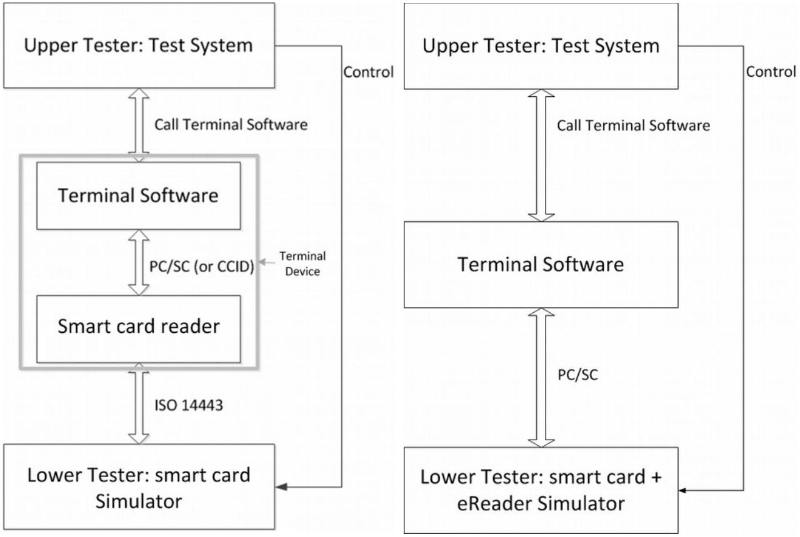
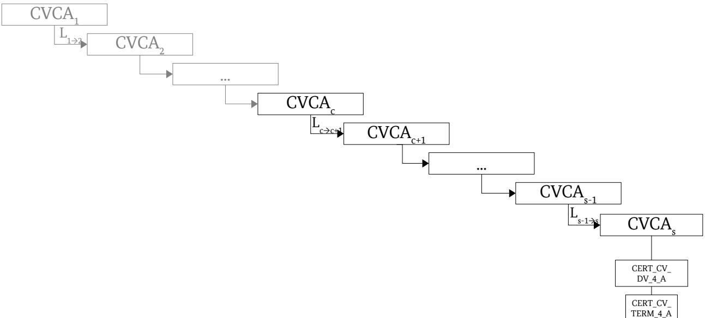

Technical Guideline BSI TR-03105 Part 5.3

# Test plan for eID and eSign compliant terminal software with EACv2

| Version: 2.0 |            |  |  |
|-----------------|------------|--|--|
| Date:           | 2015-05-22 |  |  |
|                 |            |  |  |
|                 |            |  |  |
|                 |            |  |  |
|                 |            |  |  |
|                 |            |  |  |
|                 |            |  |  |
|                 |            |  |  |
|                 |            |  |  |

Bundesamt für Sicherheit in der Informationstechnik Postfach 20 03 63 53133 Bonn Internet: https://www.bsi.bund.de © Bundesamt für Sicherheit in der Informationstechnik 2015

| 1                | Introduction 7                                                                 |  |
|------------------|--------------------------------------------------------------------------------|--|
| 2                | Validation Rules 8                                                             |  |
| 2.1              | Verification Task and Scope 8                                                  |  |
| 2.2              | Test Object 8                                                                  |  |
| 2.3              | Test Track 8                                                                   |  |
| 2.3.1            | Testing over the PS/SC Interface or CCID Interface9                            |  |
| 2.4              | Functions, Options and Profiles 10                                             |  |
| 2.5              | eID-Clients 11                                                                 |  |
| 3                | Implementation Conformance Statement12                                         |  |
| 3.1              | Supported profiles and functions 12                                            |  |
| 3.2              | Cryptographic algorithms 13                                                    |  |
| 3.3              | Terminal type 13                                                               |  |
| 3.4              | Passwords 13                                                                   |  |
|                  |                                                                                |  |
| 4                | Definition of Configuration Data for the Tests15                               |  |
| 4.1              | Certificates 15                                                                |  |
| 4.1.1            | Terminal Certificates 15                                                       |  |
| 4.1.2 4.1.2.1 | Certificate specification for Terminal Authentication17 CERT_CV_TERM_4_A 18 |  |
| 4.1.2.2          | CERT_CV_DV_4_A 18                                                              |  |
| 4.1.2.3          | CERT_CV_LINK_4_* 19                                                            |  |
| 4.1.2.4          | CERT_CV_CVCA_4_* 19                                                            |  |
|                  |                                                                                |  |
| 4.2 4.2.1     | Extension of PC/SC Interface 19 InBuffer (for GetReadersPACECapabilities)19 |  |
| 4.2.2            | OutBuffer (for GetReadersPACECapabilities)20                                   |  |
| 4.2.3            | InBuffer (for EstablishPACEChannel)20                                          |  |
| 4.2.4            | OutBuffer (for EstablishPACEChannel)21                                         |  |
| 4.3              | Communication Steps at the Card Interface22                                    |  |
| 4.3.1            | PACE 22                                                                        |  |
| 4.3.2            | Terminal Authentication 22                                                     |  |
| 4.3.3            | Chip Authentication 23                                                         |  |
| 4.3.4            | Select the eSign Application 24                                                |  |
| 4.3.5            | Reading Data from the eID Application24                                        |  |
| 4.3.6            | Writing Data into the eID Application25                                        |  |
| 4.3.7            | Restricted Identification 25                                                   |  |
| 4.3.8            | Auxiliary Data Verification 26                                                 |  |
| 4.3.9            | PIN Management 26                                                              |  |
| 4.3.9.1          | Changing password 26                                                           |  |
| 4.3.9.2          | Unblocking password 26                                                         |  |
| 4.3.9.3          | Activating / Deactivating password26                                           |  |
| 4.3.10           | Reading Data from the ePassport Application27                                  |  |
| 5                | Test Specification 28                                                          |  |
| 5.1              | PACE 29                                                                        |  |
| 5.1.1            | List of Test Cases 29                                                          |  |
| 5.2              | PCSC/CCID Support 35                                                           |  |
| 5.2.1            | General Preliminary Remarks 35                                                 |  |

| 5.2.2          | List of Test Cases 36                                              |  |
|----------------|--------------------------------------------------------------------|--|
| 5.3            | Terminal Authentication 37                                         |  |
| 5.3.1 5.3.2 | General Preliminary Remarks 37 List of Test Cases 37            |  |
| 5.4            | Certificates for Terminal Authentication39                         |  |
| 5.4.1          | General Preliminary Remarks 39                                     |  |
| 5.4.2          | List of Test Cases 39                                              |  |
| 5.5            | Chip Authentication 40                                             |  |
| 5.5.1          | General Preliminary Remarks 40                                     |  |
| 5.5.1          | List of Test Cases 40                                              |  |
| 5.6 5.6.1   | Access to the eID Application 41 General Preliminary Remarks 41 |  |
| 5.6.2          | List of Test Cases 42                                              |  |
| 5.7            | Access to Biometric Data 43                                        |  |
| 5.7.1          | General Preliminary Remarks 43                                     |  |
| 5.7.2          | List of Test Cases 44                                              |  |
| 5.8            | Use of the Signature Application 44                                |  |
| 5.8.1 5.8.2 | General Preliminary Remarks 44 List of Test Cases 44            |  |
| 5.9            | Reading Binary Files 47                                            |  |
| 5.9.1          | General Preliminary Remarks 47                                     |  |
| 5.9.2          | List of Test Cases 48                                              |  |
|                | Annex 49                                                           |  |
|                | Bibliography 49                                                    |  |

| Figure 1: Test track for the terminal software: (left) Terminal Device (right) Terminal Software9 |  |
|---------------------------------------------------------------------------------------------------|--|
| Figure 2: Certificates of CERT_SET_4 18                                                           |  |
|                                                                                                   |  |

| Table 1: Functions of the whole system 10                                           |  |
|-------------------------------------------------------------------------------------|--|
| Table 2: Options of the whole system 10                                             |  |
| Table 3: Profiles defined for DUT 11                                                |  |
| Table 4: Profiles for DUT 12                                                        |  |
| Table 5: Supported Interfaces of the DUT 12                                         |  |
| Table 6: Functions for DUT 13                                                       |  |
| Table 7: Supported algorithms 13                                                    |  |
| Table 8: Supported terminal roles 13                                                |  |
| Table 9: Matrix for the passwords dependent on the terminal role supported by DUT14 |  |
| Table 10: Structure of a certificate 16                                             |  |
| Table 11: Choice of access rights for Inspection Systems16                          |  |
| Table 12: Choice of access rights for Authentication Terminals16                    |  |
| Table 13: Choice of access rights for Signature Terminals16                         |  |
| Table 14: Choice of access rights for CA certificates (Inspection Systems)17        |  |
| Table 15: Choice of access rights for CA certificates (Authentication Terminals)17  |  |
| Table 16: Choice of access rights for CA certificates (Signature Terminals)17       |  |
| Table 17: Description of CERT_CV_TERM_4_A18                                         |  |
| Table 18: Description of CERT_CV_DV_4_A 19                                          |  |
| Table 19: Description of CERT_CV_LINK_4_* 19                                        |  |
|                                                                                     |  |

| Table 20: Description of CERT_CV_CVCA_4_* 19 Table 21: Example for CERT_DESC 20 Table 22: Structure of the CHAT data object 21 |  |
|--------------------------------------------------------------------------------------------------------------------------------------|--|
|                                                                                                                                      |  |
|                                                                                                                                      |  |
|                                                                                                                                      |  |
| Table 23: Bitmap for functions supported by the reader21                                                                             |  |
| Table 24: Structure of a table to define test cases29                                                                                |  |
| Table 25: Verification requirements for PACE, execution in DUT35                                                                     |  |
| Table 26: Verification requirements for PC/SC, CCID interfaces36                                                                     |  |
| Table 27: Verification requirements for Terminal Authentication, execution in DUT39                                                  |  |
| Table 28: Verification requirements for Certificate handling of Terminal Authentication40                                            |  |
| Table 29: Verification requirements for chip authentication, execution in DUT41                                                      |  |
| Table 30: Verification requirements for eID application, execution in DUT43                                                          |  |
| Table 31: Verification requirements for access to biometric data, execution in DUT44                                                 |  |
| Table 32: Verification requirements use of the signature application, execution in DUT47                                             |  |
| Table 33: Verification requirements for reading binary files, execution in DUT48                                                     |  |

# 1 Introduction

This Technical Guideline describes conformity criteria for eID and eSign compliant reader systems with EACv2. Its focus is on terminal functionalities implemented outside the physical smart card reader. The functions executed outside the hardware actually performing the reading operations on the smart card are grouped into a software component called Terminal Software. Terminal Software may occur in different variations, i.e., in form of an eID client as part of the Online Authentication or as integrated software of an inspection device.

The conformity tests defined in this Technical Guideline are functional tests that shall guarantee the interoperability between smart cards and Terminal Software. Security issues are not considered, these topics are treated elsewhere. The criteria in this document hold for OSI layers 6 and 7 and are based on the EACv2 specification [TR-03110-2] and on the specification of the contactless interface for signature generation [TR-03117]. Specific criteria for Terminal Software supporting PC/SC or CCID interfaces are based on the specifications of [TR-03119].

The document is organized in 5 chapters. Chapter 2 contains validation rules, i.e. a description of the test object Terminal Software, its test interfaces and its functions as well as the verification requirements. Chapter 2 states the information needed for the Implementation Conformance Statement. In chapter 3 the configuration of the test device and showcases for the protocol runs are given. The test specification in chapter 4 contains the general structure of test cases. Chapter 5 describes the test cases, states which parameters to use and specifies the profiles for which they are relevant. The test cases themselves together with the necessary steps for test preparation, test execution and evaluation of the test results are described in a set of XML files.

# 2 Validation Rules

# 2.1 Verification Task and Scope

The verification task consists in proving interoperability between smart card readers and host applications that access that reader functions. Here conformity to the EACv2 specification [TR-03110-2] and to the specification of the contactless interface for signature generation [TR-03117] must be proven. The scope for the verification task can be outlined as follows:

- prove conformity of interfaces exclusively for OSI layers 6 and 7,
- verify exclusively functions, that are needed for access to eID and biometric data as well as for QES over the contactless interface,
- restrict focus to PC/SC (or CCID) for the interface between host PC and reader or the ISO 14443 interface between PC and smart card for Terminal Devices, respectively, other interfaces as CT-API and SICCT are not relevant in this framework,
- do not examine the behavior of the smart card reader at other interfaces, especially at the display and at the contact interface.

If a test case cannot be run because of certain reasons, e. g. if an eID-Client is used and pre-verification fails, the test case shall be marked as "not feasible". If a manufacturer does not use a PC/SC (or CCID) interface, he has to provide an appropriate adapter to perform the tests.

# 2.2 Test Object

Parts of the terminal functions that may be implemented outside the reader are implemented in the host PC and called Terminal Software. A system that comprises Terminal Software as well as a reader in a closed environment is called *Terminal Device* (See Figure [1\)](#page-8-0). A possible Terminal Software implementation is the eCard API framework as specified in [TR-03112-1].

The decision, whether a function of a test object must be included into a test or not, depends on the relevance of this function for the contactless reader interface. Thus, functions for signature generation are incorporated into the tests, but functions for signature verification are not.

Depending on the reader architecture, PACE, terminal authentication and chip authentication protocols as well as the access to the eID application, biometric data and the eSign application have to be performed as a whole or in parts by the Terminal Software and are therefore subject to the conformity tests.

Test Object Terminal Software and Test Object Terminal Device will be referred to as Device Under Test (DUT) in the following.

# 2.3 Test Track

The DUT has a test track which will be described in the following.

In order to access eID and biometric data as well as to use QES, the DUT supports two technical interfaces:

- 1. the interface via the calling host PC application,
- 2. an interface via PC/SC (or CCID) or if this interface is not accessible, an interface via ISO 14443.

Thus, the test system consists of an Upper Tester (UT) at the interface of the calling host PC application and a Lower Tester (LT) that either simulates both the reader and the smart card, in case the DUT is a Terminal Software, or simulates directly the smart card, in case the DUT is a Terminal Device. The resulting test track for testing the DUT is shown in Figure [1,](#page-8-0) left for Terminal Device, right for Terminal Software only.

Upper Tester (UT) calls a function of the DUT. The DUT generates an expected command sequence which will be received by the Lower Tester either at the PC/SC (or CCID) or the ISO 14443 interface*.* Reader and/or smart card are simulated by a test system as Lower Tester (LT).

The LT analyzes the instructions received by the DUT and generates an answer message for the DUT, with or without incorrect data and/or error code, according to LT configuration. The DUT sends this answer message back to UT.

*Figure 1: Test track for the terminal software:* (*left*) Terminal Device (*right*) Terminal Software

Thus, a triggering mechanism between UT and LT is needed to appropriately configure LT for test execution. Since the implementations of UT and LT are based on software solutions, it is recommended to implement this mechanism in software.

Note that in some test cases the UT is operated by a human tester. Therefore the tester must get instructions how to activate the necessary functions in the software.

### 2.3.1 Testing over the PS/SC Interface or CCID Interface

As described in the previous section, the DUT can be tested over the PS/SC interface/CCID interface if it is supported for the host platform. In this case, the LT is directly connected to the PC/SC (or CCID) interface, allowing measurement of exchanged protocol data units over it. If the interface is being used for testing, it is necessary to ensure a correct execution of the according test scenario. For that purpose, the possibility to analyse the PC/SC or CCID commands, as described in [TR-03119] D.2, is introduced in order make sure that the DUT supports this interface. The corresponding Profile for these Tests is TS\_PCSC\_support. The correct execution of the Password Authenticated Connection Establishment (PACE) protocol over the PC/SC or

CCID is being tested. In this way, it is possible to check the DUT for correct execution of the PS/SC commands/CCID command.

If neither the PS/SC nor the CCID profile is included, then the DUT shall be only tested over the ISO 14443 interface (Terminal Device).

# 2.4 Functions, Options and Profiles

According to the overall hardware and software architecture for reader and host PC parts of the functionality are provided by the reader and/or the DUT.

Such a distinguished functionality will be called function in the following.

The functions of the whole system, whose conformity has to be proved, are listed in table [1.](#page-9-2)

| Function       | Task                                                                                 |
|----------------|--------------------------------------------------------------------------------------|
| PACE           | Execution of PACE protocol according to [TR-03110-2], 3.2                            |
| TA             | Execution of terminal authentication protocol according to [TR-03110-2], 3.4         |
| CA             | Execution of chip authentication protocol (version 2) according to [TR-03110-2], 3.3 |
| eID            | Access to eID application                                                            |
| Biometric data | Access to biometric data in the smart card                                           |
| QES            | Generation of qualified electronic signatures according to [TR-03117]                |

Table 1: Functions of the whole system

The functions of the whole system are taken as a basis to structure the test cases (see chapter [Fehler:](#page-9-1)  [Referenz nicht gefunden\)](#page-9-1).

A functionality which may be supported optionally by the whole system will be called an option. The options allowed are listed in table [2.](#page-9-0)

| Option          | Task                                                                                                    |
|-----------------|---------------------------------------------------------------------------------------------------------|
| Change_PIN      | Password management function to change the PIN                                                          |
| Change_CAN      | Password management function to change the CAN                                                          |
| Unblock_PIN_PUK | Password management function to unblock the PIN after using PUK                                         |
| PIN_MGT_AT      | PIN management functions for Authentication Terminals                                                   |
| Type_AT         | The Terminal supports certificates of type Authentication Terminal (in conformity with [TR-03110-2]) |
| Type_IS         | The Terminal supports certificates of type Inspection System (in conformity with [TR-03110-2])       |
| Type_ST         | The Terminal supports certificates of type Signature Terminal (in conformity with [TR-03110-2])      |
| PIN_MGT_uT      | PIN management functions for unauthenticated terminals after PACE                                       |
| Write_eID       | Writing Access to eID data with EAC                                                                     |
| NO_eID_Client   | The test case is not applicable for eID clients                                                         |
| PCSC/CCID       | The Terminal Software supports the PC/SC Card Reader Interface or CCID Interface                     |

Table 2: Options of the whole system

| Profile          | Function       | Option                |
|------------------|----------------|-----------------------|
| TS_PACE          | PACE           |                       |
| TS_TA            | TA             |                       |
| TS_CTA           | TA             |                       |
| TS_CA            | CA             |                       |
| TS_eID           | eID            |                       |
| TS_bio           | Biometric data |                       |
| TS_Sig           | QES            |                       |
| TS_Chg_PIN       |                | Change PIN            |
| TS_Chg_CAN       |                | Change CAN            |
| TS_UNLK_PIN_PUK  |                | Unblock_PIN after PUK |
| TS_PIN_MGT_AT    |                | PIN_MGT_AT            |
| TS_PIN_MGT_uT    |                | PIN_MGT_uT            |
| TS_Write_eID     |                | Write_eID             |
| TS_NO_eID_Client |                | NO_eID_Client         |
| TS_Type_AT       |                | Type_AT               |
| TS_Type_IS       |                | Type_IS               |
| TS_Type_ST       |                | Type_ST               |
| TS_PCSC_support  |                | PCSC_support          |

For the build-up of the tests it is essential whether a function or an option is implemented in the DUT. Therefore, a profile defines the assignment of a function or option to test object. The profiles allowed are listed in table [3.](#page-10-0)

Table 3: Profiles defined for DUT

# 2.5 eID-Clients

Some DUTs , especially eID-Clients, support a pre-verification mechanism (see [TR-03112-7], Part 7, Section 3.6.4.1). In this case, the DUT checks the Terminal Authentication certificate chain before establishing a communication channel with the LT. If this pre-verification fails, no connection is established with the LT, leading to the non-execution of further protocols such as PACE. Hence pre-verification can influence test results and shall be taken into consideration when analyzing test results.

A good example would be a test case where PACE is expected to be successfully executed, but the DUT does not even establish communication with the LT because of pre-verification. In this case the test case would have negative results even though PACE could not be executed at all (neither failed nor successful execution of PACE).

If a test case cannot be run because of pre-verification, the test case shall be marked as "not feasible".

Furthermore, eID-Clients may modify the access rights in the CV-Certificate received by the UT before passing it to the LT. In particular, an eID-Client has to clear all bits which are not presented to the user during the CHAT dialogue.

# 3 Implementation Conformance Statement

The purpose of the Implementation Conformance Statement is the declaration of optional functionality of the product to be approved by the applicant. The declarations of the applicant are used for the determination of the set of test cases appropriated to the functionality of the product.

The Implementation Conformance Statement must be filled completely by the applicant. The information of the filled ICS must be documented in the test report.

The test result will only cover the function declared in this statement.

# 3.1 Supported profiles and functions

All test cases of a profile which is declared with "Yes" by the applicant, have to be performed completely. The test coverage can be limited by declarations in chapter [3.3](#page-12-1) and [3.4.](#page-12-0)

| Profile          | Task                                                                                                                                                                      | Applicant declaration (Yes / No) |
|------------------|---------------------------------------------------------------------------------------------------------------------------------------------------------------------------|----------------------------------------|
| TS_PACE          | DUT supports execution of PACE protocol according to [TR-03110-2], 3.2                                                                                                 |                                        |
| TS_TA / TS_CTA   | DUT supports execution of terminal authentication protocol according to [TR-03110-2], 3.4. This implies that the profile TS_TA and the profile TS_CTA is performed. |                                        |
| TS_CA            | DUT supports execution of chip authentication protocol (version 2) according to [TR-03110-2], 3.3                                                                      |                                        |
| TS_eID           | DUT supports access to eID application                                                                                                                                    |                                        |
| TS_ePass         | DUT supports access to biometric data in the smart card                                                                                                                   |                                        |
| TS_Sig           | DUT supports generation of qualified electronic signatures according to [TR-03117]                                                                                     |                                        |
| TS_NO_eID_Client | DUT is not an eID-Client                                                                                                                                                  |                                        |
| TS_PCSC_support  | DUT accessible via PC/SC and/or CCID interface                                                                                                                            |                                        |

#### Table 4: Profiles for DUT

In case the DUT supports the TS\_PCSC\_support profile, i.e., provides either a PC/SC or an CCID interface, the applicant has to declare in Table [12](#page-11-0) which interface is supported. In case PC/SC and CCID is provided, the tests for the Profile TS\_PCSC\_support have to be executed once for each interface.

| Supported Interfaces         | Applicant declaration (Yes / No) |
|------------------------------|----------------------------------|
| PC/SC interface is supported |                                  |
| CCID interface is supported  |                                  |

Table 5: Supported Interfaces of the DUT

| Profile         | Task                                                                                          | Applicant declaration (Yes / No) |
|-----------------|-----------------------------------------------------------------------------------------------|----------------------------------------|
| TS_Chg_PIN      | Password management function to change the PIN is supported by the DUT.                    |                                        |
| TS_Chg_CAN      | Password management function to change the CAN is supported by the DUT.                    |                                        |
| TS_UNLK_PIN_PUK | Password management function to unblock the PIN after using PUK is supported by the DUT.   |                                        |
| TS_PIN_MGT_AT   | PIN management functions for Authentication Terminals is supported by the DUT.             |                                        |
| TS_PIN_MGT_uT   | PIN management functions for unauthenticated terminals after PACE is supported by the DUT. |                                        |
| TS_Write_eID    | Writing Access to eID data with EAC is supported by the DUT.                                  |                                        |

Table 6: Functions for DUT

# 3.2 Cryptographic algorithms

The applicant of the DUT*-* SHALL declare all supported algorithms used to perform the PACE and Chip- and Terminal-Authentication and eSign(QES) if applicable. The algorithm identifiers as defined in [TR-03110-3] have to be used (e.g. PACE-ECDH-GM-AES-CBC-CMAC-128, ...).

| Protocol | supported algorithms |
|----------|----------------------|
| PACE     |                      |
| TA       |                      |
| CA       |                      |
| eSign    |                      |

Table 7: Supported algorithms

# 3.3 Terminal type

The applicant of the DUT SHALL declare the supported terminal roles.

| Terminal Type                | Profile    | Applicant declaration (Yes / No) |
|------------------------------|------------|----------------------------------|
| Inspection System (IS)       | TS_Type_IS |                                  |
| Authentication Terminal (AT) | TS_Type_AT |                                  |
| Signature Terminal (ST)      | TS_Type_ST |                                  |

Table 8: Supported terminal roles

#### 3.4 Passwords

For the profiles TS\_PACE, TS\_TA, TS\_CA, TS\_eID, t TS\_Chg\_PIN, TS\_Chg\_CAN, TS\_UNLK\_PIN\_PUK and TS\_PIN\_MGT\_AT the tests MUST be applied using the supported passwords as stated in the following table.

#### 3 Implementation Conformance Statement

| Password | IS | AT | ST |
|----------|----|----|----|
| MRZ      |    |    |    |
| CAN      |    |    |    |
| PIN      |    |    |    |
| PUK      |    |    |    |

Table 9: Matrix for the passwords dependent on the terminal role supported by DUT

However, for the other profiles the tests MUST be applied with all passwords as stated in the corresponding test cases.

# 4 Definition of Configuration Data for the Tests

#### 4.1 Certificates

#### 4.1.1 Terminal Certificates

Terminal certificates used in the tests are built up as follows: '7F 21' var. Certificate template (tag, length)

| '7F 4E' | 'XX'    |      |      |      |                                    | Certificate body (tag, length)                                                                                                    |
|---------|---------|------|------|------|------------------------------------|-----------------------------------------------------------------------------------------------------------------------------------|
|         | '5F 29' | '01' |      |      | 'XX'                               | Certificate profile identifier                                                                                                    |
|         | '42'    | var. |      |      | 'XX  XX'                           | Certificate authority reference                                                                                                   |
|         | '7F 49' | var. |      |      | 'XX  XX'                           | Public key                                                                                                                        |
|         | '5F 20' | var. |      |      | 'XX  XX'                           | Certificate holder reference                                                                                                      |
|         | '7F 4C' | var. |      |      |                                    | Certificate Holder Authorization Template (CHAT) (tag, length)                                                                 |
|         |         | '06' | '09' |      | '04 00 7F 00 07 03 01 02           | Object identifier for role RR:                                                                                                    |
|         |         |      |      |      | RR'                                | RR = 01: Inspection System RR = 02: Authentication Terminal RR = 03: Signature Terminal                                     |
|         |         | '53' | 'LZ' |      | 'XX  XX'                           | Discretionary data (access rights) Value see tables 11 to 16 = 01, if RR = 01 LZ = 05, if RR = 02 LZ = 01, if RR = 03 |
|         | '5F 25' | '06' |      |      | 'XX  XX'                           | Certificate effective date                                                                                                        |
|         | '5F 24' | '06' |      |      | 'XX  XX'                           | Certificate expiration date                                                                                                       |
|         | '65'    | var. |      |      |                                    | Certificate extensions (Tag, Length)                                                                                              |
|         |         | '73' | var. |      |                                    | Discretionary Data Template (Tag, Length)                                                                                      |
|         |         |      | '06' | '0A' | '04 00 7F 00 07 03 01 03 01 01' | Object identifier for certificate description (plain text format)                                                              |
|         |         |      | '80' | var. | 'XX  XX'                           | Hash value over certificate description                                                                                        |
|         |         | '73' | var. |      |                                    | Discretionary data template (tag, length)                                                                                      |
|         |         |      | '06' | '09' | '04 00 7F 00 07 03 01 03 02'    | Object identifier for terminal sector                                                                                             |
|         |         |      | '80' | var. | 'XX  XX'                           | Hash value over public key DO 1st sector                                                                                       |
|         |         |      | '81' | var. | 'XX  XX'                           | Hash value over public key DO 2nd sector                                                                                       |
| '5F 37' | var.    |      |      |      | 'XX  XX'                           | Certificate signature                                                                                                             |
|         |         |      |      |      |                                    |                                                                                                                                   |

#### Table 10: Structure of a certificate

| No. | Value | Description                                                        |  |  |  |  |
|-----|-------|--------------------------------------------------------------------|--|--|--|--|
| 1   | '03'  | Universal rights: Reading access to biometric data of ePassport |  |  |  |  |
| 2   | '00'  | No access to eID- and ePassport functions                          |  |  |  |  |

Table 11: Choice of access rights for Inspection Systems

| No.    | Value            | Description                                                                                                                                                                                                                                                                                                                                                            |
|--------|------------------|------------------------------------------------------------------------------------------------------------------------------------------------------------------------------------------------------------------------------------------------------------------------------------------------------------------------------------------------------------------------|
| 1      | '3E 1F FF FF F7' | Universal rights: Write access to DG 17 – DG 21 Read access to DG 1 – DG 21 Right to install qualified certificates Right to install certificates Right to execute password management functions Right to use CAN Right to perform restricted identification Right to perform community ID verification Right to perform age identification |
| 2      | '30 00 00 00 02' | Write access to DG 17 and DG 18 Right to perform community ID verification                                                                                                                                                                                                                                                                                          |
| 3      | '3E 1F FF FF 17' | Write access to DG 17 – DG 21 Read access to DG 1 – DG 21 Right to use CAN Right to perform restricted identification Right to perform community ID verification Right to perform age identification                                                                                                                                                    |
| 1 4 | '00 01 13 FB 07' | Read access to DG 1, DG 2, DG 4 – DG 10, DG 13 and DG 17 Right to perform restricted identification Right to perform community ID verification Right to perform age identification                                                                                                                                                                            |

#### Table 12: Choice of access rights for Authentication Terminals

| No. | Value | Description                                     |
|-----|-------|-------------------------------------------------|
| 1   | '03'  | Universal rights: Right to generate ES + QES |
| 2   | '00'  | No signature generation                         |

Table 13: Choice of access rights for Signature Terminals

1 The tests for an eID-Client should be performed with the access rights set in No 1 and the eID-Client is expected to clear unnecessary access bits. However, if the tests with the settings in No 1 fail, the access rights of No 4 may be used.

| No. | Value | Description                           |
|-----|-------|---------------------------------------|
| 1   | C3    | CVCA                                  |
| 2   | '83'  | Document Verifier (official domestic) |

Table 14: Choice of access rights for CA certificates (Inspection Systems)

| No. | Value            | Description                                |
|-----|------------------|--------------------------------------------|
| 1   | 'FE 1F FF FF F7' | CVCA                                       |
| 2   | '7E 1F FF FF F7' | Document Verifier (non official / foreign) |

Table 15: Choice of access rights for CA certificates (Authentication Terminals)

| No. | Value | Description                                        |  |
|-----|-------|----------------------------------------------------|--|
| 1   | 'C3'  | CVCA                                               |  |
| 2   | '43'  | Document Verifier (certification service provider) |  |

Table 16: Choice of access rights for CA certificates (Signature Terminals)

#### 4.1.2 Certificate specification for Terminal Authentication

This section provides a description of the certificates required to perform certificate tests for Terminal Authentication for different trust point setups (cf. TS\_CTA).

The intention of this certificate set is to provide the DUT with the certificates corresponding to the trust store of the test object. The content of the trust store MUST therefore be provided in the ICS.

Consequently only certificate templates can be defined here as every DUT can have different trust points in its trust store. These templates are resolved into specific certificates during the preparation stage. For any particular conformity test the certificates CVCAc (*C*ard) and CVCAs (*S*erver) have to be determined. The remaining intermediate root and link certificates are generated accordingly.

The following notation is used to denote certificates within this set (see figure [2\)](#page-17-0):

- *CVCA1* is the initial self signed root CVCA certificate. It may no longer be valid.
- *CVCA2* is a self signed root CVCA certificate replacing CVCA1. It may no longer be valid.
- *CVCAc* is the oldest self signed root CVCA certificate in the trust store that is still valid.
- *CVCAs* is the most current self signed CVCA root certificate used by the eService to perform the Online-Authentication.
- *L1*→*2* is the link CVCA certificate chaining CVCA1 with CVCA2.
- *Ls-1*→*s* is the link CVCA certificate chaining CVCAs-1 with CVCAs.
- *CERT\_CV\_DV\_4\_A* is the current DV certificate of the eService.
- *CERT\_CV\_TERM\_4\_A* is the current AT certificate of the eService.

*Figure 2: Certificates of CERT\_SET\_4*

Note that the certificates previous to CVCAc are obsolete and therefore in general not relevant for the test series.

Further note that for the sake of convenience the notation used here is shortened. The certificate IDs to be used are CERT\_CV\_CVCA\_4\_\* and CERT\_CV\_LINK\_4\_\*, where \* is a specific sequence number. For link certificates this number represents the older certificate, e. g. CERT\_CV\_LINK\_4\_1 is used for a link certificate L1→2 in figure [2.](#page-17-0)

In case the DUT is an eID-Client, the appropriate TLS certificates have to be specified, cf. [TR-03124-2], 4.2. Furthermore, the hashes of the TLS certificates have to be included in the CertificateDescription of the CV certificate of the eService.

#### 4.1.2.1 CERT\_CV\_TERM\_4\_A

Table [17](#page-17-1) describes a CV certificate.

| ID          | CERT_CV_TERM_4_A                                                                                                                                                                                                                                                                                                    |
|-------------|---------------------------------------------------------------------------------------------------------------------------------------------------------------------------------------------------------------------------------------------------------------------------------------------------------------------|
| Purpose     | This certificate is used as a regular CV certificate.                                                                                                                                                                                                                                                               |
| Description | This certificate is signed with the private key that corresponds to the public key of the certificate [CERT_CV_DV_4_A]. It is a valid CV certificate accepted by the DUT. The access rights granted by this certificate are not relevant for the test series and are therefore not further addressed here. |

*Table 17: Description of CERT\_CV\_TERM\_4\_A*

#### 4.1.2.2 CERT\_CV\_DV\_4\_A

Table [18](#page-18-0) describes a CV certificate.

| ID          | CERT_CV_DV_4_A                                                                                                                                                                                                                                      |
|-------------|-----------------------------------------------------------------------------------------------------------------------------------------------------------------------------------------------------------------------------------------------------|
| Purpose     | This certificate is used as a regular DV certificate.                                                                                                                                                                                               |
| Description | This certificate is signed with the private key of the certificate CERT_CV_CVCA_4_s. It is a valid CV certificate accepted by the DUT. This certificate can be used to successfully verify the certificate [CERT_CV_TERM_4_A] of this set. |

*Table 18: Description of CERT\_CV\_DV\_4\_A*

#### 4.1.2.3 CERT\_CV\_LINK\_4\_\*

Table [19](#page-18-2) describes a CV certificate.

| ID          | CERT_CV_LINK_4_*                                                                                                                                                                                                                                                                                                                                                                                                                                                                                                  |
|-------------|-------------------------------------------------------------------------------------------------------------------------------------------------------------------------------------------------------------------------------------------------------------------------------------------------------------------------------------------------------------------------------------------------------------------------------------------------------------------------------------------------------------------|
| Purpose     | This certificate is used as regular CVCA link certificate.                                                                                                                                                                                                                                                                                                                                                                                                                                                        |
| Description | This is a template CVCA certificate representing all link certificates within this set. All link certificates chain older self signed root certificates with the successors and have the same properties. They are signed with the respective private key of the older self signed root certificate. Further these are valid CV certificates accepted by the DUT. The most current certificate CERT_CV_LINK_4_s-1 can be used to successfully verify the certificate [CERT_CV_DV_4_A] of this set. |

*Table 19: Description of CERT\_CV\_LINK\_4\_\**

#### 4.1.2.4 CERT\_CV\_CVCA\_4\_\*

Table [20](#page-18-1) describes a CV certificate.

| ID          | CERT_CV_CVCA_4_*                                                                                                                                                                                                                                                                                                                                            |
|-------------|-------------------------------------------------------------------------------------------------------------------------------------------------------------------------------------------------------------------------------------------------------------------------------------------------------------------------------------------------------------|
| Purpose     | This certificate is used as a regular self signed root CVCA certificate.                                                                                                                                                                                                                                                                                    |
| Description | This is a template self signed root CVCA certificate representing all root certificates within this set. All root certificates have the same properties. They are valid CV certificates accepted by the DUT. The most current certificate CERT_CV_CVCA_4_s can be used to successfully verify the certificate [CERT_CV_LINK_4_s-1] of this set. |

*Table 20: Description of CERT\_CV\_CVCA\_4\_\**

# 4.2 Extension of PC/SC Interface

According to [TR-03119], D.2 the call of the PC/SC function SCardControl from [PCSC10] is extended by GetReadersPACECapabilities and EstablishPACEChannel. InBuffer und OutBuffer of SCardControl are specified as follows:

#### 4.2.1 InBuffer (for GetReadersPACECapabilities)

According to [TR-03119], D.3, D1.1. the value for InBuffer in GetReadersPACECapabilities is: 01 00 00

#### 4.2.2 OutBuffer (for GetReadersPACECapabilities)

According to [TR-03119], D.2, D.1.1. the value for OutBuffer in GetReadersPACECapabilities is: <Result\_Code> 00 02 01 <Bit\_Map> Result\_Code: Result code according to [TR-03119], D.1.2 Bit\_Map: Bit map according to table [23](#page-20-1)

#### 4.2.3 InBuffer (for EstablishPACEChannel)

According to [TR-03119], D.3, D.1.2. the value for InBuffer in EstablishPACEChannel is:

02 <L\_inputData> <Password-ID> <L\_CHAT> <CHAT> <L\_PIN> <PIN> <L\_CERT\_DESC> <CERT\_DESC> Password-ID: '01' (MRZ-Password), '02' (CAN), '03' (PIN) or '04' (PUK)

CHAT: Restricted CHAT for terminal certificate (coding see table [22\)](#page-20-0) or empty

PIN: if provided by host; e. g. CAN

CERT\_DESC: complete description of certificate as described in [TR-03119] D.1.2 and [TR-03110-4] 2.2.6 See table [21](#page-19-0) for an example.

| T  | L |            |    |      |    |          |                                        |       |                   | Value |  |                                                                                                                                                                                                                                                                                                                                                                                                                                                                         |  |                                                 |  |                   |
|----|---|------------|----|------|----|----------|----------------------------------------|-------|-------------------|-------|--|-------------------------------------------------------------------------------------------------------------------------------------------------------------------------------------------------------------------------------------------------------------------------------------------------------------------------------------------------------------------------------------------------------------------------------------------------------------------------|--|-------------------------------------------------|--|-------------------|
| 30 |   | 82 01 02 T |    | L    | V  |          |                                        |       |                   |       |  |                                                                                                                                                                                                                                                                                                                                                                                                                                                                         |  | Comment                                         |  |                   |
|    |   |            | 06 | 0A   |    |          | 04 00 7F 00 07 03 01 03 01 01          |       |                   |       |  |                                                                                                                                                                                                                                                                                                                                                                                                                                                                         |  | descriptio nType                             |  |                   |
|    |   |            | A1 | 11   |    | 0C 0F    |                                        |       |                   |       |  | 54 65 73 74 69 73 73 75 65 72 20 47 6D 62 48                                                                                                                                                                                                                                                                                                                                                                                                                            |  | issuerName [1]                               |  |                   |
|    |   |            | A2 | 1A   |    | 13 18    | 73 73 75 65 72 2E 64 65                |       |                   |       |  | 68 74 74 70 3A 2F 2F 77 77 77 2E 74 65 73 74 69                                                                                                                                                                                                                                                                                                                                                                                                                         |  | issuerURL [2]                                |  |                   |
|    |   |            | A3 | 0F   |    | 0C 0D    | 54 65 73 74 68 61 75 73 20 47 6D 62 48 |       |                   |       |  |                                                                                                                                                                                                                                                                                                                                                                                                                                                                         |  | subjectNam e [3]                             |  |                   |
|    |   |            |    |      | A4 | 18       |                                        | 13 16 | 61 75 73 2E 64 65 |       |  |                                                                                                                                                                                                                                                                                                                                                                                                                                                                         |  | 68 74 74 70 3A 2F 2F 77 77 77 2E 74 65 73 74 68 |  | subjectURL [4] |
|    |   |            | A5 | 8199 |    | 0C 81 96 | 69 6E 61 6C 73 2E                      |       |                   |       |  | 41 6E 73 63 68 72 69 66 74 3A 20 0D 0A 54 65 73 74 68 61 75 73 20 47 6D 62 48 0D 0A 51 75 61 6C 69 74 C3 A4 74 73 73 74 72 2E 20 31 0D 0A 33 33 31 30 30 20 50 61 64 65 72 62 6F 72 6E 0D 0A 0D 0A 45 2D 4D 61 69 6C 2D 41 64 72 65 73 73 65 3A 20 0D 0A 6E 70 61 40 74 65 73 74 68 61 75 73 2E 64 65 0D 0A 0D 0A 5A 77 65 63 6B 20 64 65 73 20 41 75 73 6C 65 73 65 76 6F 72 67 61 6E 67 73 3A 20 0D 0A 54 65 73 74 20 64 65 72 20 54 65 72 6D |  | termsOfUsa ge [5]                            |  |                   |

Table 21: Example for CERT\_DESC

| Pos. | Length (in Bytes) | Value                           | Description                                                                                                                     |
|------|-------------------------|---------------------------------|---------------------------------------------------------------------------------------------------------------------------------|
| 1    | 1                       | '06'                            | Tag for Object Identifier (Role)                                                                                                |
| 2    | 1                       | '09'                            | Length for Object Identifier (Role)                                                                                             |
| 3    | 9                       | '04 00 7F 00 07 03 01 02 RR' | Object identifier for role RR: RR = 01: Inspection System RR = 02: Authentication Terminal RR = 03: Signature Terminal |
| 4    | 1                       | '53'                            | Tag for discretionary data (access rights)                                                                                      |
| 5    | 1                       | 'XX'                            | Length for discretionary data (access rights): XX = 01, if RR = 01 XX = 05, if RR = 02 XX = 01, if RR = 03             |
| 6    | var.                    | 'XX  XX'                        | Discretionary data (access rights) Value see tables 11 to 13                                                                 |

Table 22: Structure of the CHAT data object

### 4.2.4 OutBuffer (for EstablishPACEChannel)

According to [TR-03119], D.3, D.1.2. the value for OutBuffer in EstablishPACEChannel is: <Result\_Code> <L\_outputData> <status\_mse> <L\_dca> <data\_card\_acc> <L\_CAR1> <CAR1> <L\_CAR2> <CAR2> <L\_IDPICC> <IDPICC> Result\_Code: Result code according to [TR-03119], D1.2 status\_mse: Status bytes in response to MSE: Set AT data\_card\_acc: Data for card access CAR1: Current certificate authority reference (CAR) CAR2: Previous certificate authority reference (CAR) IDPICC: ID\_PICC, necessary for TA

Remark: If the reader uses a certificate with role Signature Terminal, the data objects <CAR1>, <CAR2> and <IDPICC> are omitted according to [TR-03119], D.2, since the secure channel between smart card and reader will be established automatically.

| b7 | b6 | b5 | b4 | b3 | b2 | b1 | b0 |                              |
|----|----|----|----|----|----|----|----|------------------------------|
| 0  |    |    |    |    |    |    |    | RFU                          |
|    | 1  |    |    |    |    |    |    | PACE supported               |
|    |    | 1  |    |    |    |    |    | eID-function supported       |
|    |    |    | 1  |    |    |    |    | Signature function supported |
|    |    |    |    | 0  | 0  | 0  | 0  | RFU                          |

Table 23: Bitmap for functions supported by the reader

# 4.3 Communication Steps at the Card Interface

The following protocol descriptions have to be executed at the card interface. Some of them can be called directly from the UT while other must not be called from the UT directly but from the reader. If not described in an other way, all passwords have to be entered directly on the readers PIN Pad [\(4.3.1](#page-21-0) PACE an[d](#page-25-0) [4.3.9](#page-25-0) PIN Management).

## 4.3.1 PACE

The PACE protocol can be executed without or with Secure Messaging. If executed with Secure Messaging the SM keys have been derived by a former PACE protocol. If not explicitly mentioned otherwise, the PACE protocol is performed without SM in the test cases.

In the following, a showcase for the protocol steps of PACE is given. Details on the steps and a normative description and sequence can be found in [TR-03110-3], B.1.

| Step | Description                                                                                                                                                                                                                  |                                                        |  |  |  |  |  |  |  |
|------|------------------------------------------------------------------------------------------------------------------------------------------------------------------------------------------------------------------------------|--------------------------------------------------------|--|--|--|--|--|--|--|
| 1    | DUT gets content of EF.CardAccess.                                                                                                                                                                                           |                                                        |  |  |  |  |  |  |  |
| 2    | LT receives command                                                                                                                                                                                                          | MSE: Set AT (mutual authentication in PACE)            |  |  |  |  |  |  |  |
| 3    | LT sends response to                                                                                                                                                                                                         | Parameters: OID, Password-ID, OID-Role, Access Rights2 |  |  |  |  |  |  |  |
| 4    | LT receives command                                                                                                                                                                                                          | General Authenticate (Step 1)                          |  |  |  |  |  |  |  |
| 5    | LT derives encryption key K_pi from smart card password, generates nonce s and computes encrypted nonce encNonce = E(K_pi, s).                                                                                            |                                                        |  |  |  |  |  |  |  |
| 6    | LT sends response to                                                                                                                                                                                                         | General Authenticate (Step 1)                          |  |  |  |  |  |  |  |
| 7    | LT receives command                                                                                                                                                                                                          | General Authenticate (Step 2)                          |  |  |  |  |  |  |  |
| 8    | LT sends response to                                                                                                                                                                                                         |                                                        |  |  |  |  |  |  |  |
| 9    | LT receives command                                                                                                                                                                                                          | General Authenticate (Step 3)                          |  |  |  |  |  |  |  |
| 10   | LT generates data Deph = Map(D_PICC, s) and, using Deph, the ephemeral key pair (SKeph_PICC, PKeph_PICC). LT checks that PKeph_ICC is different from PKeph_PCD.                                                           |                                                        |  |  |  |  |  |  |  |
| 11   | LT sends response to                                                                                                                                                                                                         | General Authenticate (Step 3)                          |  |  |  |  |  |  |  |
| 12   | LT receives command                                                                                                                                                                                                          | General Authenticate (Step 4)                          |  |  |  |  |  |  |  |
| 13   | LT computes key material KA(SKeph_PICC, PKeph_PCD, Deph), extracts Kmac from key material and checks that T_PCD is identical to MAC(Kmac, PKeph_PICC). LT computes authentication token T_PICC = MAC(Kmac, PKeph_PCD). |                                                        |  |  |  |  |  |  |  |
| 14   | LT sends response to General Authenticate (Step 4)                                                                                                                                                                        |                                                        |  |  |  |  |  |  |  |

### 4.3.2 Terminal Authentication

A showcase for the protocol steps for Terminal Authentication is given in the following. Note that the DUT might process the received messages from the LT directly without interaction with the UT. Hence, in this case, the UT neither can nor needs to perform the Steps 5, 10, 15 and/or 19. Details on the steps and a normative description and sequence can be found in [TR-03110-3], B.3.

| Step Description |
|---------------------|
|---------------------|

2 The DUT may modify the access rights by setting bits to zero, see Section [2.5,](#page-10-1)

| 1            | The UT initiates Terminal Authentication.                                                                                                                       |                                                                                                               |  |  |
|--------------|-----------------------------------------------------------------------------------------------------------------------------------------------------------------|---------------------------------------------------------------------------------------------------------------|--|--|
| 2            | LT receives command                                                                                                                                             | MSE: Set DST for certificate verification                                                                     |  |  |
| 3            | LT sends response to                                                                                                                                            |                                                                                                               |  |  |
| 4            | UT receives response to                                                                                                                                         |                                                                                                               |  |  |
| 5            | UT sends/initiates command                                                                                                                                      | PSO: Verify Certificate                                                                                       |  |  |
| 6            | LT receives command                                                                                                                                             |                                                                                                               |  |  |
| 7            | LT sends response to                                                                                                                                            |                                                                                                               |  |  |
| 8            | UT receives response to                                                                                                                                         |                                                                                                               |  |  |
| certificate. |                                                                                                                                                                 | The steps 1-8 are performed for all certificates in the certificate chain, i. e. CA certificates and terminal |  |  |
| 9            | DUT generates new ephemeral key pair (SKeph_PCD, PKeph_PCD) and computes Comp(PKeph_PCD). Moreover DUT provides auxiliary data for key exchange A_PCD.       |                                                                                                               |  |  |
| 10           | UT initiates command                                                                                                                                            | MSE: Set AT for external authentication                                                                       |  |  |
| 11           | LT receives command                                                                                                                                             |                                                                                                               |  |  |
| 12           | LT sends response to                                                                                                                                            |                                                                                                               |  |  |
| 13           | UT receives response to                                                                                                                                         |                                                                                                               |  |  |
| 14           | UT initiates command                                                                                                                                            | Get Challenge3                                                                                                |  |  |
| 15           | LT receives command                                                                                                                                             |                                                                                                               |  |  |
| 16           | LT sends response to                                                                                                                                            |                                                                                                               |  |  |
| 17           | UT receives response to                                                                                                                                         |                                                                                                               |  |  |
| 18           | DUT computes s_PCD = Sign(SKeph_PCD, ID_PICC   r1_PICC   Comp(PKeph_PCD)   A_PCD). (Hint: ID_PICC has been provided to DUT at the end of the PACE protocol). |                                                                                                               |  |  |
| 19           | UT initiates command                                                                                                                                            | External Authenticate                                                                                         |  |  |
| 20           | LT receives command                                                                                                                                             |                                                                                                               |  |  |
| 21           | LT sends response to                                                                                                                                            |                                                                                                               |  |  |
| 22           | UT receives response to                                                                                                                                         |                                                                                                               |  |  |

### 4.3.3 Chip Authentication

Before performing Chip Authentication the EF.CardSecurity shall be read and Passive Authentication with the Security Object shall be performed. A showcase for the protocol steps is given in the following. Note that the DUT might process the received messages from the LT directly without interaction with the UT. Hence, in this case, the UT neither can nor needs to perform Step 5. Details on the steps and a normative description and sequence can be found in [TR-03110-3], B.2.

| Step | Description                          |                                         |
|------|--------------------------------------|-----------------------------------------|
| 1    | The UT initiates Chip Authentication |                                         |
| 2    | LT receives command                  | MSE: Set AT for internal authentication |
| 3    | LT sends response to                 |                                         |

Note that the position of the "Get Challange" command within this sequence may change.

| 4  | UT receives response to                                                                                                                                                                                                                                                                                                                                                 |                      |
|----|-------------------------------------------------------------------------------------------------------------------------------------------------------------------------------------------------------------------------------------------------------------------------------------------------------------------------------------------------------------------------|----------------------|
| 5  | UT initiates command                                                                                                                                                                                                                                                                                                                                                    | General Authenticate |
| 6  | LT receives command                                                                                                                                                                                                                                                                                                                                                     |                      |
| 7  | LT generates random number r2_PICC and computes key material K = KA(SK_PICC, PKeph_PCD, D_PICC), K_MAC = KDF_MAC(K, r2_PICC), K_ENC = KDF_ENC(K, r2_PICC) and T_PICC = MAC(K_MAC, PKeph_PCD).                                                                                                                                                                     |                      |
| 8  | LT sends response to                                                                                                                                                                                                                                                                                                                                                    | General Authenticate |
| 9  | UT receives response to                                                                                                                                                                                                                                                                                                                                                 |                      |
| 10 | DUT computes K = KA(SKeph_PCD, PK_PICC, D_PICC), K_MAC = KDF_MAC(K, r2_PICC), K_ENC = KDF_ENC(K, r2_PICC) and checks that T_PICC is identical to MAC(K_MAC, PKeph_PCD). K_MAC and K_ENC are the session keys for secure messaging when generating digital signatures or for access to the eID application that ask for authentication with PACE, TA and CA. |                      |

#### 4.3.4 Select the eSign Application

The following table presents a showcase for selecting the eSign Application. Further details can be found in [ISO-7816].

| Step | Description                |                                            |
|------|----------------------------|--------------------------------------------|
| 1    | UT sends/initiates command | Select                                     |
| 2    | LT receives command        | Parameter AID of the eSign application: |
| 3    | LT sends response to       | 'A0 00 00 01 67 45 53 49 47 4E'            |
| 4    | UT receives response to    |                                            |

### 4.3.5 Reading Data from the eID Application

The following table presents a showcase for reading data from the eID Application. Further details can be found in [ISO-7816].

| Step | Description                |                                                                             |  |
|------|----------------------------|-----------------------------------------------------------------------------|--|
| 1    | UT sends/initiates command | Select Parameter AID of eID application: 'E8 07 04 00 7F 00 07 03 02' |  |
| 2    | LT receives command        |                                                                             |  |
| 3    | LT sends response to       |                                                                             |  |
| 4    | UT receives response to    |                                                                             |  |
| 5    | UT sends/initiates command | Read Binary Parameter P1: '81' (SFI '01' for DG1)                  |  |
| 6    | LT receives command        |                                                                             |  |
| 7    | LT sends response to       | '82' (SFI '02' for DG2)                                                  |  |
| 8    | UT receives response       | '83' (SFI '03' for DG3)                                            |  |
|      |                            | '89' (SFI '09' for DG9)                                                  |  |
|      |                            | '8A' (SFI '0A' for DG10)                                                 |  |
|      |                            |                                                                          |  |

|  | '8F' '90' | (SFI '0F' for DG15) (SFI '10' for DG16) |
|--|--------------|--------------------------------------------|
|  |  '95'     |  (SFI '15' for DG21)                    |

#### 4.3.6 Writing Data into the eID Application

The following table presents a showcase for writing data into the eID Application. Further details can be found in [ISO-7816].

| Step | Description                |                                                                   |                         |
|------|----------------------------|-------------------------------------------------------------------|-------------------------|
| 1    | UT sends/initiates command | Select                                                            |                         |
| 2    | LT receives command        | Parameter AID of eID application: 'E8 07 04 00 7F 00 07 03 02' |                         |
| 3    | LT sends response to       |                                                                   |                         |
| 4    | UT receives response       |                                                                   |                         |
| 5    | UT sends/initiates command | Update Binary                                                     |                         |
| 6    | LT receives command        | Parameter P1: '81'                                             | (SFI '01' for DG1)      |
| 7    | LT sends response to       | '82'                                                              | (SFI '02' for DG2)      |
| 8    | UT receives response       | '83'                                                              | (SFI '03' for DG3)      |
|      |                            |  '89'                                                          |  (SFI '09' for DG9)  |
|      |                            | '8A'                                                           | (SFI '0A' for DG10)  |
|      |                            | '8F'                                                              | (SFI '0F' for DG15)     |
|      |                            | '90'                                                              | (SFI '10' for DG16)     |
|      |                            |  '95'                                                          |  (SFI '15' for DG21) |

### 4.3.7 Restricted Identification

The following table is a showcase for restricted identification. Further details can be found in [ISO-7816].

| Step | Description                                                                        |                                                                                      |
|------|------------------------------------------------------------------------------------|--------------------------------------------------------------------------------------|
| 1    | UT sends/initiates command                                                         | MSE: Set AT for internal authentication                                              |
| 2    | LT receives secured command                                                        | Parameter: OID: OID for RI                                                        |
| 3    | LT sends response to                                                               | sk_id_ref: Reference to private key SK_ID in the smart                               |
| 4    | UT receives response to                                                            | card, used for RI                                                                    |
| 5    | UT sends/initiates command                                                         | General Authenticate                                                                 |
| 6    | LT receives secured command                                                        | Parameter: pk_sec: public key of the sector (PK_Sector)                           |
| 7    | LT generates its sector specific identifier I_sector_ID using SK_ID and PK_Sector. |                                                                                      |
| 8    | LT sends response to                                                               | General Authenticate Parameter: sec_id: sector specific identifier I_sector_ID |
| 9    | UT receives secured response to                                                 |                                                                                      |

#### 4.3.8 Auxiliary Data Verification

| Step | Description                 |                                                                                                                                                             |
|------|-----------------------------|-------------------------------------------------------------------------------------------------------------------------------------------------------------|
| 1    | UT sends/initiates command  | Verify Parameter: OID: OID of the auxiliary data to be verified (age verification, document validity verification or community ID verification) |
| 2    | LT receives secured command |                                                                                                                                                             |
| 3    | LT sends response to        |                                                                                                                                                             |
| 4    | UT receives response to     |                                                                                                                                                             |

The following table is a showcase for auxiliary data verification. Further details can be found in [ISO-7816].

#### 4.3.9 PIN Management

In the following tables different showcases for PIN management are given. Further details can be found in [ISO-7816]. The PIN management routines are initiated by the UT. Depending on whether the DUT comprises a PIN pad, the UT sends a PC/SC command or directly an APDU with appropriate parameters.

#### 4.3.9.1 Changing password

| Step | Description                                     |  |
|------|-------------------------------------------------|--|
| 1    | LT receives secured command Reset Retry Counter |  |
| 2    | LT sends response to                            |  |
| 3    | UT receives response to                         |  |

#### 4.3.9.2 Unblocking password

| Step | Description                                     |  |
|------|-------------------------------------------------|--|
| 1    | LT receives secured command Reset Retry Counter |  |
| 2    | LT sends response to                            |  |
| 3    | UT receives response to                         |  |

#### 4.3.9.3 Activating / Deactivating password

| Step | Description                 |                                                              |
|------|-----------------------------|--------------------------------------------------------------|
| 1    | UT sends/initiates command  | Activate / Deactivate                                        |
| 2    | LT receives secured command | Parameter INS: '44' (for Activate), '04' (for Deactivate) |
| 3    | LT sends response to        |                                                              |
| 4    | UT receives response to     |                                                              |

## 4.3.10 Reading Data from the ePassport Application

The following table is a showcase for reading data from the ePassport application. Further details can be found in [ISO-7816].

| Step | Description                |                                             |
|------|----------------------------|---------------------------------------------|
| 1    | UT sends/initiates command | Select                                      |
| 2    | LT receives command        | Parameter: AID of ePassport application  |
| 3    | LT sends response to       |                                             |
| 4    | UT receives response to    |                                             |
| 5    | UT sends/initiates command | Read Binary                                 |
| 6    | LT receives command        | Parameter: P1: 80 + <SFI__DF_to_be_read> |
| 7    | LT sends response to       |                                             |
| 8    | UT receives response to    |                                             |

# 5 Test Specification

They refine these requirements by defining a test goal, all conditions, test steps and verifications that are necessary for the implementation and execution of a test. All test cases are described within a set of XML files. An overview over the corresponding XML scheme is given in the following. Each test is an object of the type TestCase. All test cases are organized

hierarchically which is realized in XML using the abstract base type called TestHierarchy.

Each TestCase object has a unique id attribute and contains the following elements:

- **•** Title: title of the test case.
- **•** Version: current version of the test case.
- **•** Purpose: a short description of the intention of the test.
- **•** Profile: links to all relevant profiles.
- **•** Reference: optional reference to any kind of specification this test case is based on.
- **•** Precondition: all requirements which need to be fulfilled before running the test.
- **•** TestStep: this XML element is a complex type and consists of the different sub-elements addressed below.
- **•** MetaData: optional elements in form of key-value pairs containing meta information.

If a test has been moved or deleted, the body of TestCase only contains a Title and a respective description in the Comment element. The TestStep object of type ActionStep is used at least once and contains the elements:

- **•** Command: represents the actual action that is performed within a single step.
- **•** TechnicalCommand: can optionally be used to specify a technical representation of the command to be able to process the step automatically by some testing suite.
- **•** TestDataReference: If the step refers to some predefined test data, such as certificates, the data element is referred using this element.
- **•** Description: adds further information about the command that is performed in the step.
- **•** ExpectedResult: denotes the behavior of the test object in order to pass the test.

For all test cases where no terminal role and password type is defined, these parameters can be chosen from these which are supported by the DUT (see chapter [3.3](#page-12-1) [Terminal type\)](#page-12-1).

If no terminal type and/or password is defined, the priority of the terminal type to use in the test cases are: AT, IS and ST. The priority of the password to use in the test cases are CAN, PIN and MRZ. That does mean, first select the first supported terminal type then select the first supported password type which is supported in combination with the terminal type.

#### **The used terminal type and password must be documented in the test report.**

An overview of all test cases is given in the following sections, which are structured along the functions in separate sections of the following overview and in different directories of the XML files. They describe which aspects must be validated with respect to the behavior of the DUT at the relevant interfaces.

The test cases of the same section/directory are described in one table. Table [24](#page-28-0) shows the structure of such a table:

| Name in table column | Contents                                                                                                                                                                                                                           |
|----------------------|------------------------------------------------------------------------------------------------------------------------------------------------------------------------------------------------------------------------------------|
| Test_ID              | Identifier for test ID built up as follows: <code test object>_<code function>_<No. VR>.<No. para> <code test object>: TS (for Terminal Software)                                                                         |
|                      | <code function>:                                                                                                                                                                                                                   |
|                      | PACE (for PACE protocol)                                                                                                                                                                                                           |
|                      | PCSC (for the PC/SC or CCID interface)                                                                                                                                                                                             |
|                      | TA (for terminal authentication protocol)                                                                                                                                                                                          |
|                      | CTA (for the certificates for terminal authentication)                                                                                                                                                                             |
|                      | CA (for chip authentication protocol)                                                                                                                                                                                              |
|                      | eID (for eID application)                                                                                                                                                                                                          |
|                      | ePass (for biometric data)                                                                                                                                                                                                         |
|                      | Sig (for eSign application)                                                                                                                                                                                                        |
|                      | READ_BINARY (for accessing binary files)                                                                                                                                                                                           |
|                      | <No. VR> (verification objective number): 1, 2, 3                                                                                                                                                                                  |
|                      | <No. para> (distinguish parameters within a verification objective): 1, 2, 3 …                                                                                                                                                     |
|                      | The actual name of the XML file is the Test_ID followed by a letter indicating the used terminal type (a= TS_Type_IS, b=TS_Type_AT, c=TS_Type_ST) and a number indicating the used password (1=MRZ, 2=CAN, 3=PIN, 4=MRZ). |
| Description          | Short description of the test case                                                                                                                                                                                                 |
| Parameter            | Parameter in focus of examination; this also includes combinations of parameters                                                                                                                                                |
| Profiles             | Profiles for which the test case is relevant.                                                                                                                                                                                      |

Table 24: Structure of a table to define test cases

# 5.1 PACE

#### 5.1.1 List of Test Cases

| Test ID TS_PACE_ | Description                                               | Parameter                                                                                                                                                             | Profiles                            |
|---------------------|-----------------------------------------------------------|-----------------------------------------------------------------------------------------------------------------------------------------------------------------------|-------------------------------------|
| 1.1                 | Check correct execution of PACE protocol in the DUT | Use certificate role Inspection System with specified access rights and Password-ID = MRZ and CAN. Use appropriate certificates for Document Verifier.          | TS_PACE AND TS_NO_eID_Clie nt |
| 1.2                 |                                                           | Use certificate role Authentication Terminal with specified access rights and Password-ID = CAN and PIN. Use appropriate certificates for Document Verifier. | TS_PACE                             |
| 1.3                 |                                                           | Use certificate role Signature Terminal with specified                                                                                                                | TS_PACE AND                         |

| Test ID TS_PACE_ | Description                                                                                                                                                                                                                                        | Parameter                                                                                                                                                        | Profiles             |
|---------------------|----------------------------------------------------------------------------------------------------------------------------------------------------------------------------------------------------------------------------------------------------|------------------------------------------------------------------------------------------------------------------------------------------------------------------|----------------------|
|                     |                                                                                                                                                                                                                                                    | access rights and Password-ID = CAN, PIN and PUK. Use appropriate certificates for Document Verifier.                                                         | TS_NO_eID_Clie nt |
| 1.4                 |                                                                                                                                                                                                                                                    | Use an unauthenticated terminal with CAN, PIN and PUK                                                                                                         | TS_PACE              |
| 1.5                 | Check correct execution of PACE protocol in the DUT. Use of different algorithms. Use exact one PACEInfo with standardized domain parameter                                                                                   | Use certificate role Inspection System and Authentication Terminal with specified access rights and Password-ID = CAN and PIN.                             | TS_PACE              |
| 1.6                 | Check correct execution of PACE protocol in the DUT. Use three different PACEInfo in EF.CardAccess with different algorithms and standardized domain parameters                                                            | Use certificate role Inspection System and Authentication Terminal with specified access rights and Password-ID = CAN and PIN.                             | TS_PACE              |
| 1.7                 | Check correct execution of PACE protocol in the DUT. Use one PACEInfo with standardized domain parameters and one PACEInfo with proprietary domain parameters in PACEDomainParam eterInfo within EF.CardAccess | Use certificate role Inspection System and Authentication Terminal with specified access rights and Password-ID = CAN and PIN.                             | TS_PACE              |
| 1.8                 | Check correct execution of PACE protocol in the DUT                                                                                                                                                                                          | Use certificate role Inspection System, Authentication Terminal and Signature Terminal with specified access rights and Password-ID = MRZ, CAN and PIN. | TS_PACE              |
| 1.9                 | Check correct execution of PACE protocol in the DUT. The PACE protocol is executed twice. Check that the ephemeral key is not in both executions the                                                                       | Use certificate role Inspection System and Authentication Terminal with specified access rights and Password-ID = MRZ, CAN and PIN.                        | TS_PACE              |

| Test ID TS_PACE_ | Description                                                                                                                                                                                                          | Parameter                                                                                                                                                             | Profiles                            |
|---------------------|----------------------------------------------------------------------------------------------------------------------------------------------------------------------------------------------------------------------|-----------------------------------------------------------------------------------------------------------------------------------------------------------------------|-------------------------------------|
|                     | same.                                                                                                                                                                                                                |                                                                                                                                                                       |                                     |
| 1.10                | Check correct execution of PACE protocol in the DUT. The test is executed with additional entries in SecurityInfos which should be ignored by the DUT                                        | Use certificate role Inspection System, Authentication Terminal and Signature Terminal with specified access rights and Password-ID = MRZ, CAN, PIN and PUK. | TS_PACE                             |
| 1.11                | The test is executed with EF.CardAccess containing two PACEInfo and one PACEDomainParam eter. Check that DUT can handle two different PACE parameters and perform one possible option. | Use certificate role Inspection System, Authentication Terminal and Signature Terminal with specified access rights and Password-ID = MRZ, CAN, PIN and PUK. | TS_PACE                             |
| 2.1                 | Check that DUT aborts PACE protocol when LT derives cryptographic key from CAN incorrectly                                                                                                         | Use certificate role Inspection System and Authentication Terminal with specified access rights and Password-ID = CAN.                                          | TS_PACE AND TS_NO_eID_Clie nt |
| 2.2                 | Check that DUT aborts PACE protocol when LT derives cryptographic key from PIN incorrectly                                                                                                         | Use certificate role Authentication Terminal with specified access rights and Password-ID = PIN.                                                                   | TS_PACE                             |
| 2.3                 | Check that DUT aborts PACE protocol when LT returns error code to command MSE: Set AT                                                                                                                 | Use certificate role Inspection System and Authentication Terminal with specified access rights and Password-ID = CAN and PIN.                                  | TS_PACE                             |
| 2.4                 | LT transmits incorrect data for mapping function Map in answer to card command General                                                                                                                | Use certificate role Inspection System and Authentication Terminal with specified access rights and Password-ID = CAN and PIN.                                  | TS_PACE                             |

| Test ID TS_PACE_ | Description                                                                                                | Parameter                                                                                                                                                                                                                                               | Profiles                            |
|---------------------|------------------------------------------------------------------------------------------------------------|---------------------------------------------------------------------------------------------------------------------------------------------------------------------------------------------------------------------------------------------------------|-------------------------------------|
|                     | Authenticate (Step 2).                                                                                  |                                                                                                                                                                                                                                                         |                                     |
| 2.5                 | LT generates incorrect internal data with function Map.                                           | Use certificate role Inspection System and Authentication Terminal with specified access rights and Password-ID = CAN and PIN.                                                                                                                    | TS_PACE                             |
| 2.6                 | LT computes key data for secure messaging (SM) incorrectly.                                       | Use certificate role Inspection System and Authentication Terminal with specified access rights and Password-ID = CAN and PIN.                                                                                                                    | TS_PACE                             |
| 3.1                 | Check that DUT aborts PACE protocol when LT transmits incorrect                                   | Inconsistent data in these parameters. Use certificate role Inspection System and Authentication Terminal with specified access rights and Password-ID = CAN and PIN.                                                                          | TS_PACE                             |
| 3.2                 | PACE parameters                                                                                            | Standardized domain parameter identifier contained in these parameters which is not supported by the DUT. Use certificate role Inspection System and Authentication Terminal with specified access rights and Password-ID = CAN and PIN. | TS_PACE                             |
| 3.3                 | Incorrect cryptogram in response message to card command General Authenticate (Step 1)   | Use certificate role Inspection System and Authentication Terminal with specified access rights and Password-ID = CAN and PIN.                                                                                                                    |                                     |
| 3.4                 | Ephemeral public key received from LT is identical to ephemeral public key generated by DUT | Use certificate role Inspection System and Authentication Terminal with specified access rights and Password-ID = CAN and PIN.                                                                                                                    | TS_PACE                             |
| 3.5                 | LT transmits incorrect cryptogram that has been generated with derived SM key data             | Use certificate role Inspection System and Authentication Terminal with specified access rights and Password-ID = CAN and PIN.                                                                                                                    | TS_PACE                             |
| 3.6                 | LT transmits authentication token that has been generated with a wrong algorithm               | Use certificate role Inspection System and Authentication Terminal with specified access rights and Password-ID = CAN.                                                                                                                            | TS_PACE AND TS_NO_eID_Clie nt |
| 3.7                 | Test that DUT aborts PACE when LT transmits an                                                       | Use certificate role Inspection System and TS_PACE Authentication Terminal with specified access rights and Password-ID = CAN and PIN.                                                                                                         |                                     |

| Test ID TS_PACE_ | Description                                                                                                                                                                       | Parameter                                                                                                                                 | Profiles |
|---------------------|-----------------------------------------------------------------------------------------------------------------------------------------------------------------------------------|-------------------------------------------------------------------------------------------------------------------------------------------|----------|
|                     | invalid ephemeral public key in response message to card command General Authenticate (Step 3).                                                                 |                                                                                                                                           |          |
| 3.8                 | Test that DUT aborts PACE when LT transmits an invalid response message to card command General Authenticate (Step 1).                                       | Use certificate role Inspection System and Authentication Terminal with specified access rights and Password-ID = MRZ, CAN and PIN. | TS_PACE  |
| 3.9                 | Test that DUT aborts PACE when LT transmits an invalid response message to card command General Authenticate (Step 2).                                       | Use certificate role Inspection System and Authentication Terminal with specified access rights and Password-ID = MRZ, CAN and PIN. | TS_PACE  |
| 3.10                | Test that DUT aborts PACE when LT transmits an invalid response message to card command General Authenticate (Step 2) (wrong tag '92h' instead of '82h'). | Use certificate role Inspection System and Authentication Terminal with specified access rights and Password-ID = MRZ, CAN and PIN. | TS_PACE  |
| 3.11                | Test that DUT aborts PACE when LT transmits an invalid response message to card command General Authenticate (Step 3).                                       | Use certificate role Inspection System and Authentication Terminal with specified access rights and Password-ID = MRZ, CAN and PIN. | TS_PACE  |
| 3.12                | Test that DUT aborts PACE when LT transmits an invalid response message to card command General Authenticate (Step 3) (wrong tag '94h'                       | Use certificate role Inspection System and Authentication Terminal with specified access rights and Password-ID = MRZ, CAN and PIN. | TS_PACE  |

| Test ID TS_PACE_ | Description                                                                                                                                                                       | Parameter                                                                                                                                              | Profiles                            |
|---------------------|-----------------------------------------------------------------------------------------------------------------------------------------------------------------------------------|--------------------------------------------------------------------------------------------------------------------------------------------------------|-------------------------------------|
|                     | instead of '84h').                                                                                                                                                                |                                                                                                                                                        |                                     |
| 3.13                | Test that DUT aborts PACE when LT transmits an invalid response message to card command General Authenticate (Step 3) (error on ephemeral public key). | Use certificate role Inspection System and Authentication Terminal with specified access rights and Password-ID = MRZ, CAN and PIN.              | TS_PACE                             |
| 3.14                | Test that DUT aborts PACE when LT transmits an invalid response message to card command General Authenticate (Step 4).                                       | Use certificate role Inspection System and Authentication Terminal with specified access rights and Password-ID = MRZ, CAN and PIN.              | TS_PACE                             |
| 3.15                | Test that DUT aborts PACE when LT transmits an invalid response message to card command General Authenticate (Step 4) (wrong tag '96h' instead of '86h'). | Use certificate role Inspection System and Authentication Terminal with specified access rights and Password-ID = MRZ, CAN and PIN.              | TS_PACE                             |
| 3.16                | Test that DUT aborts PACE when LT transmits an incorrect parameterId in PACEInfo.                                                                                  | Use certificate role Inspection System and Authentication Terminal with specified access rights and Password-ID = MRZ, CAN and PIN.              | TS_PACE                             |
| 4.1                 | Check that DUT aborts PACE protocol when receiving incorrect                                                                                                             | Incorrect password CAN Use certificate role Inspection System and Authentication Terminal with specified access rights and Password-ID = CAN. | TS_PACE AND TS_NO_eID_Clie nt |
| 4.2                 | input data from UT                                                                                                                                                                | Use certificate role Authentication Terminal with specified access rights and Incorrect password PIN.                                               | TS_PACE                             |
| 4.3                 |                                                                                                                                                                                   | Use certificate role Inspection System with specified access rights and Incorrect password MRZ.                                                     | TS_PACE AND TS_NO_eID_Clie nt |
| 4.4                 | Check that DUT aborts PACE protocol when an                                                                                                                                 | Use certificate with role Authentication Terminal, that is not authorized to use the CAN.                                                           | TS_PACE AND TS_NO_eID_Clie nt |

| Test ID TS_PACE_ | Description                                                                    | Parameter                                                                              | Profiles                            |
|---------------------|--------------------------------------------------------------------------------|----------------------------------------------------------------------------------------|-------------------------------------|
| 4.5                 | incorrect combination of Password-ID and CHAT is transmitted by UT | Use certificate with role Inspection System, that is not authorized to use the PIN. | TS_PACE AND TS_NO_eID_Clie nt |

Table 25: Verification requirements for PACE, execution in DUT

# 5.2 PCSC/CCID Support

#### 5.2.1 General Preliminary Remarks

The following test cases verify the correct execution of PC/SC or CCID commands in case the DUT supports a PC/SC and/or a CCID interface (TS\_PCSC\_support in Table [4\)](#page-11-1). The tests have to be performed for the interfaces specified in Table [5.](#page-11-0) If PC/SC and CCID interfaces are provided, all tests in this section have to be performed twice: for each interface once.

#### 5.2.2 List of Test Cases

| Test ID TS_PSCS_ | Description                                                                                                                                                                                | Parameter                                                              | Profiles                           |
|---------------------|--------------------------------------------------------------------------------------------------------------------------------------------------------------------------------------------|------------------------------------------------------------------------|------------------------------------|
| 1.1                 | The command GetReaderPACECap abilities is used to query the PACE features supported by the DUT                                                                              | This command takes no input and returns the supported capabilities. | TS_PACE AND TS_PCSC_suppor t |
| 1.2                 | The function EstablishPACEChan nel is used to establish a password authenticated secure channel via the PACE protocol including the necessary user interaction. |                                                                        | TS_PACE AND TS_PCSC_suppor t |
| 1.3                 | The command VerifyPIN is used to verify a PIN inside a pre-established secure channel.                                                                                         |                                                                        | TS_PACE AND TS_PCSC_suppor t |
| 1.4                 | The command Modify PIN is used to modify a PIN inside a pre-established secure channel.                                                                                     |                                                                        | TS_PACE AND TS_PCSC_suppor t |
| 1.5                 | The command DestroyPACEChann el is used to close an established PACE channel. Thereby, the session keys of the channel are deleted.                                   |                                                                        | TS_PACE AND TS_PCSC_suppor t |
| 2.1                 | LT returns an error on command FEATURE_VERIFY_ PIN_DIRECT                                                                                                                         |                                                                        | TS_PACE AND TS_PCSC_suppor t |
| 2.2                 | LT returns an error on command FEATURE_MODIFY _PIN_DIRECT                                                                                                                         |                                                                        | TS_PACE AND TS_PCSC_suppor t |

Table 26: Verification requirements for PC/SC, CCID interfaces

# 5.3 Terminal Authentication

#### 5.3.1 General Preliminary Remarks

The following testcases verify the correct execution of the protocol for Terminal Authentication. For all test cases for terminal authentication the precondition is to successful establish a PACE channel. Where no terminal role and password type is defined, these parameters can be chosen from these which are supported by the DUT (see chapter [3.3](#page-12-1) [Terminal type\)](#page-12-1).

If no terminal type and/or password is defined, the priority of the terminal type to use in the test cases are: AT, IS and ST. The priority of the password to use in the test cases are CAN, PIN and MRZ. That does mean, first select the first supported terminal type then select the first supported password type which is supported in combination with the terminal type.

#### **The used terminal type and password must be documented in the test report.**

If this test unit is used for testing eID-Clients according to [TR-03124-2], then all certificates with role Authentication Terminal and access rights according to table table [12,](#page-15-3) No. **1** MAY be replaced with the certificates with access rights according to table [12,](#page-15-3) No. **4**.

| Test ID TS_TA_ | Description                                                                                                                  | Parameter                                                                                                                                                             | Profiles                                  |
|-------------------|------------------------------------------------------------------------------------------------------------------------------|-----------------------------------------------------------------------------------------------------------------------------------------------------------------------|-------------------------------------------|
| 1.1               | Check correct execution of Terminal Authentication protocol in the DUT                                           | Use certificate role Inspection System with specified access rights                                                                                                | TS_PACE AND TS_TA AND TS_NO_eID_Client |
| 1.2               |                                                                                                                              | Use certificate role Authentication Terminal with specified access rights                                                                                          | TS_PACE AND TS_TA AND TS_NO_eID_Client |
| 1.3               |                                                                                                                              | Use certificate role Signature Terminal with specified access rights                                                                                               | TS_PACE AND TS_TA AND TS_NO_eID_Client |
| 1.4               |                                                                                                                              | Use of different algorithms for terminal authentication.                                                                                                           | TS_PACE AND TS_TA                         |
| 2.1               | Check that DUT aborts terminal authentication when discovering inconsistent internal data                     | CHAT of terminal certificate used in Terminal Authentication different from CHAT used in PACE protocol. Use OID for Authentication Terminal in PACE CHAT. | TS_PACE AND TS_TA                         |
| 3.1               | Check that DUT aborts Terminal Authentication when detecting internal error or error communicated by LT | LT returns error code to command MSE: Set DST (setting public key for certificate verification)                                                                 | TS_PACE AND TS_TA                         |
| 3.2               |                                                                                                                              | LT returns error code to command PSO: Verify Certificate when verifying terminal certificates                                                                   | TS_PACE AND TS_TA                         |
| 3.3               |                                                                                                                              | LT returns error code to command MSE: Set AT (transmitting parameters for                                                                                          | TS_PACE AND TS_TA                         |

#### 5.3.2 List of Test Cases

| Test ID TS_TA_ | Description                                                                                                                                                      | Parameter                                                                                                                              | Profiles          |
|-------------------|------------------------------------------------------------------------------------------------------------------------------------------------------------------|----------------------------------------------------------------------------------------------------------------------------------------|-------------------|
|                   |                                                                                                                                                                  | Terminal Authentication to LT)                                                                                                         |                   |
| 3.4               |                                                                                                                                                                  | LT returns error code to command Get Challenge (random number for Terminal Authentication)                                       | TS_PACE AND TS_TA |
| 3.5               |                                                                                                                                                                  | LT returns error code to command External Authenticate when checking signed data from UT in Terminal Authentication protocol. | TS_PACE AND TS_TA |
| 4.1               | Check that DUT aborts Terminal Authentication on Secure Messaging error in LT                                                                        | DUT does not receive SM data objects from LT in answer messages of LT                                                               | TS_PACE AND TS_TA |
| 4.2               | Check that the DUT aborts terminal authentication if it receives incorrect SM data objects from LT in response to the command Get Challenge | wrong tag '98' instead of '99' for the processing status                                                                            | TS_PACE AND TS_TA |
| 4.3               |                                                                                                                                                                  | wrong cryptogram in the MAC data object                                                                                                | TS_PACE AND TS_TA |
| 4.4               | Test that DUT recognizes a SM error generated by the LT.                                                                                                | Use certificate role Inspection System with specified access rights                                                                 | TS_PACE AND TS_TA |
| 4.5               | Test that DUT recognizes incorrect secure messaging data in response to command Get Challenge (MAC missing).                                   | Use certificate role Inspection System with specified access rights                                                                 | TS_PACE AND TS_TA |
| 4.6               | Test that DUT recognizes incorrect secure messaging data in response to command Get Challenge (cryptogram missing).                         | Use certificate role Inspection System with specified access rights                                                                 | TS_PACE AND TS_TA |
| 4.7               | Test that DUT recognizes incorrect secure messaging data in response to command Get Challenge (missing                                            | Use certificate role Inspection System with specified access rights                                                                 | TS_PACE AND TS_TA |

| Test ID TS_TA_ | Description                                                                                                                                              | Parameter                                                              | Profiles          |
|-------------------|----------------------------------------------------------------------------------------------------------------------------------------------------------|------------------------------------------------------------------------|-------------------|
|                   | tag '99' for the processing status).                                                                                                                  |                                                                        |                   |
| 4.8               | Test that DUT recognizes incorrect secure messaging data in response to command Get Challenge (using padding '00' instead of '80'). | Use certificate role Inspection System with specified access rights | TS_PACE AND TS_TA |

Table 27: Verification requirements for Terminal Authentication, execution in DUT

### 5.4 Certificates for Terminal Authentication

#### 5.4.1 General Preliminary Remarks

The following testcases verify the correct handling of certificates when performing Terminal Authentication. For all test cases the precondition is to successful establish a PACE channel. Where no terminal role and password type is defined, these parameters can be chosen from these which are supported by the DUT (see chapter [3.3](#page-12-1) [Terminal type\)](#page-12-1).

If no terminal type and/or password is defined, the priority of the terminal type to use in the test cases are: AT, IS and ST. The priority of the password to use in the test cases are CAN, PIN and MRZ. That does mean, first select the first supported terminal type then select the first supported password type which is supported in combination with the terminal type.

#### **The used terminal type and password must be documented in the test report.**

If this test unit is used for testing eID-Clients according to [TR-03124-2], then all certificates with role Authentication Terminal and access rights according to table table [12,](#page-15-3) No. 1 MAY be replaced with the certificates with access rights according to table [12,](#page-15-3) No. 4.

| Test ID TS_CTA_ | Description                                                                                                                          | Parameter                                                                                                                                                                         | Profiles                        |
|--------------------|--------------------------------------------------------------------------------------------------------------------------------------|-----------------------------------------------------------------------------------------------------------------------------------------------------------------------------------|---------------------------------|
| 1.1                | Check correct execution of Terminal Authentication protocol in the DUT when the LT sends different trust points | The LT is configured to have an old trust point. Use certificate role Inspection System, Authentication Terminal and Signature Terminal with specified access rights. | TS_PACE AND TS_TA AND TS_CTA |
| 1.2                |                                                                                                                                      | The LT is configured to have a new trust point. Use certificate role Inspection System, Authentication Terminal and Signature Terminal with specified access rights.  | TS_PACE AND TS_TA AND TS_CTA |
| 1.3                |                                                                                                                                      | The LT is configured to have the two newest trust points. Use certificate role Inspection System, Authentication                                                            | TS_PACE AND TS_TA AND TS_CTA |

#### 5.4.2 List of Test Cases

| Test ID TS_CTA_ | Description | Parameter                                                        | Profiles |
|--------------------|-------------|------------------------------------------------------------------|----------|
|                    |             | Terminal and Signature Terminal with specified access rights. |          |

Table 28: Verification requirements for Certificate handling of Terminal Authentication

## 5.5 Chip Authentication

#### 5.5.1 General Preliminary Remarks

For all test cases for chip authentication the precondition is to successful establish a PACE channel. Where no terminal role and password type is defined, these parameters can be chosen from these which are supported by the DUT (see chapter [3.3](#page-12-1) [Terminal type\)](#page-12-1).

If no terminal type and/or password is defined, the priority of the terminal type to use in the test cases are: AT, IS and ST. The priority of the password to use in the test cases are CAN, PIN and MRZ. That does mean, first select the first supported terminal type then select the first supported password type which is supported in combination with the terminal type.

**The used terminal type and password must be documented in the test report.**

If this test unit is used for testing eID-Clients according to , then all certificates with role Authentication Terminal and access rights according to table table [12,](#page-15-3) No. **1** MAY be replaced with the certificates with access rights according to table [12,](#page-15-3) No. **4**.

| Test ID TS_CA_ | Description                                                                 | Parameter                                                                                                                                                                                                                                                       | Profiles                                               |
|-------------------|-----------------------------------------------------------------------------|-----------------------------------------------------------------------------------------------------------------------------------------------------------------------------------------------------------------------------------------------------------------|--------------------------------------------------------|
| 1.1               | Check correct execution of chip authentication protocol in the DUT | Use certificate role Inspection System with specified access rights                                                                                                                                                                                          | TS_PACE AND TS_TA AND TS_CA AND TS_NO_eID_Client |
| 1.2               |                                                                             | Use certificate role Authentication Terminal with specified access rights                                                                                                                                                                                    | TS_PACE AND TS_TA AND TS_CA                         |
| 1.3               |                                                                             | Use certificate role Signature Terminal with specified access rights                                                                                                                                                                                         | TS_PACE AND TS_TA AND TS_CA AND TS_NO_eID_Client |
| 1.4               |                                                                             | Use of different algorithms and multiple key pairs. The values for ChipAuthenticationInfo and ChipAuthenticationDomainParameterInf o within EF.CardAccess of the LT indicates that LT supports exactly one algorithm and one static key pair. | TS_PACE AND TS_TA AND TS_CA                         |
| 1.5               |                                                                             | Use of several algorithms and multiple keys for the chip authentication protocol. This means that in EF.CardAccess two SecurityInfos with                                                                                                              | TS_PACE AND TS_TA AND TS_CA AND TS_NO_eID_Client |

#### 5.5.1 List of Test Cases

| Test ID TS_CA_ | Description                                                                                                               | Parameter                                                                                                                                   | Profiles                                               |
|-------------------|---------------------------------------------------------------------------------------------------------------------------|---------------------------------------------------------------------------------------------------------------------------------------------|--------------------------------------------------------|
|                   |                                                                                                                           | ChipAuthenticationInfo and ChipAuthenticationDomainParameterInf o are available and that EF.CardSecurity contains two public keys. |                                                        |
| 1.6               | Check for correct selection of key in chip authentication protocol in the DUT                                    | The chip is personalized with two keys for chip authentication. First key is supported by DUT while second key is not supported       | TS_PACE AND TS_TA AND TS_CA                         |
| 2.1               | Check that DUT aborts chip authen-tication when detecting internal error or error communicated by LT | LT returns error code to command MSE: Set AT (transmitting parameters for chip authentication to LT)                                  | TS_PACE AND TS_TA AND TS_CA                         |
| 2.2               |                                                                                                                           | LT returns error code to command General Authenticate when verifying the ephemeral public key of the reader                           | TS_PACE AND TS_TA AND TS_CA                         |
| 3.1               | Check that DUT aborts chip authen-tication when receiving incorrect data from LT                           | LT returns incorrect random number in answer message to command General Authenticate                                                  | TS_PACE AND TS_TA AND TS_CA AND TS_NO_eID_Client |
| 3.2               |                                                                                                                           | LT transmits authentication token that has been generated with a wrong algorithm                                                         | TS_PACE AND TS_TA AND TS_CA AND TS_NO_eID_Client |
| 3.3               |                                                                                                                           | LT transmits authentication token that has been generated with a wrong static key pair                                                | TS_PACE AND TS_TA AND TS_CA AND TS_NO_eID_Client |

Table 29: Verification requirements for chip authentication, execution in DUT

# 5.6 Access to the eID Application

#### 5.6.1 General Preliminary Remarks

The access to the eID application is only admitted after successful execution of the EAC protocol (General Authentication Procedure). Here using the DUT, UT must have been authenticated to LT with certificate role Inspection System or Authentication Terminal. After performing EAC the SM channel is established between UT and LT, i. e. the commands for the eID application are transmitted by the DUT in transparent mode. Therefore the verification requirements for the eID application exclusively handle positive tests.

If this test unit is used for testing eID-Clients according to [TR-03124-1], then all certificates with role Authentication Terminal and access rights according to table table [12,](#page-15-3) No. **1** MAY be replaced with the certificates with access rights according to table [12,](#page-15-3) No. **4**.

#### 5.6.2 List of Test Cases

| Test ID TS_eID_ | Description                                                                                                    | Parameter                                                                                                                                                                                                          | Profiles                                                                                                  |
|--------------------|----------------------------------------------------------------------------------------------------------------|--------------------------------------------------------------------------------------------------------------------------------------------------------------------------------------------------------------------|-----------------------------------------------------------------------------------------------------------|
| 1.1                | Check correct reading access to eID data with EAC by the DUT                                             | Use certificate role Inspection System with specified access rights.                                                                                                                                            | TS_PACE AND TS_TA AND TS_CA AND TS_eID AND TS_NO_eID_Client                                         |
| 1.2                |                                                                                                                | Use certificate role Authentication Terminal with specified access rights.                                                                                                                                      | TS_PACE AND TS_TA AND TS_CA AND TS_eID                                                                 |
| 1.3                |                                                                                                                | Use of different algorithms for Secure Messaging. Use certificate role Authentication Terminal.                                                                                                           | TS_PACE AND TS_TA AND TS_CA AND TS_eID                                                                 |
| 2.1                | Check correct writing access to eID data with EAC by the DUT                                             | Use certificate role Authentication Terminal with specified access rights                                                                                                                                       | TS_PACE AND TS_TA AND TS_CA AND TS_eID AND Write_eID AND TS_NO_eID_Client                        |
| 3.1                | Check DUT for correct execution of restricted identification for sector-specific revocation     | Certificate role Authentication Terminal with access right for restricted identification                                                                                                                     | TS_PACE AND TS_TA AND TS_CA AND TS_eID                                                                 |
| 3.2                |                                                                                                                | Certificate role Authentication Terminal with access right age verification: Execute age verification for card holder                                                                                        | TS_PACE AND TS_TA AND TS_CA AND TS_eID                                                                 |
| 3.3                |                                                                                                                | Certificate role Authentication Terminal with access right community ID verification: Execute verification of card holder's community ID                                                               | TS_PACE AND TS_TA AND TS_CA AND TS_eID AND TS_NO_eID_Client                                         |
| 3.4                | Check DUT for correct execution of restricted identification for sector-specific identification | Certificate with access right for restricted identification. The PACE, terminal authentication and chip authentication protocols have been executed successfully with role Authentication Terminal. | TS_PACE AND TS_TA AND TS_CA AND TS_eID                                                                 |
| 4.1                | Password management functions for authenticated terminals                                          | Certificate role Authentication Terminal with access right password management: Changing PIN in LT optional (if supported by terminal)                                                                    | TS_PACE AND TS_TA AND TS_CA AND TS_eID AND (TS_Chg_PIN OR TS_PIN_MGT_AT) AND TS_NO_eID_Client |
| 4.2                |                                                                                                                | Certificate role Authentication Terminal with access right password management: Changing CAN in LT optional (if supported by terminal)                                                                    | TS_PACE AND TS_TA AND TS_CA AND TS_eID AND TS_Chg_CAN AND TS_NO_eID_Client                       |
| 4.3                |                                                                                                                | Certificate role Authentication Terminal                                                                                                                                                                           | TS_PACE AND TS_TA AND                                                                                     |

| Test ID TS_eID_ | Description                                                                        | Parameter                                                                                                                      | Profiles                                                                               |
|--------------------|------------------------------------------------------------------------------------|--------------------------------------------------------------------------------------------------------------------------------|----------------------------------------------------------------------------------------|
|                    |                                                                                    | with access right password management: Unblock PIN in LT                                                                    | TS_CA AND TS_eID AND TS_PIN_MGT_AT AND TS_NO_eID_Client                          |
| 4.4                |                                                                                    | Certificate role Authentication Terminal with access right password management: Activate PIN in LT                       | TS_PACE AND TS_TA AND TS_CA AND TS_eID AND TS_PIN_MGT_AT AND TS_NO_eID_Client |
| 4.5                |                                                                                    | Certificate role Authentication Terminal with access right password management: Deactivate PIN in LT                     | TS_PACE AND TS_TA AND TS_CA AND TS_eID AND TS_PIN_MGT_AT AND TS_NO_eID_Client |
| 5.1                | Password management functions for unauthenticated terminals after PACE | Setting a new PIN using the currently valid PIN Consider the special case that the current PIN is not a transport PIN | TS_PACE AND TS_eID AND TS_PIN_MGT_uT                                                |
| 5.2                |                                                                                    | Setting a new PIN using the currently valid PIN Consider the special case that the current PIN is a transport PIN     | TS_PACE AND TS_eID AND TS_PIN_MGT_uT                                                |
| 5.3                |                                                                                    | Resetting retry counter for PIN using PUK                                                                                      | TS_PACE AND TS_eID AND TS_PIN_MGT_uT                                                |
| 5.4                |                                                                                    | Setting a new PIN using PUK optional (if supported by reader)                                                               | TS_PACE AND TS_eID AND TS_UNLK_PIN_PUK AND TS_NO_eID_Client                      |
| 5.5                |                                                                                    | Resume temporarily a PIN using CAN                                                                                             | TS_PACE AND TS_eID AND TS_PIN_MGT_uT AND TS_NO_eID_Client                        |
| 5.6                |                                                                                    | Resume a temporarily resumed PIN by using it in PACE protocol                                                               | TS_PACE AND TS_eID AND TS_PIN_MGT_uT AND TS_NO_eID_Client                        |

Table 30: Verification requirements for eID application, execution in DUT

# 5.7 Access to Biometric Data

#### 5.7.1 General Preliminary Remarks

The access to the data groups of the ePassport application containing biometric data is admitted for Inspection Systems with appropriate access rights after successful execution of the EAC protocol (General Authentication Procedure).

#### 5.7.2 List of Test Cases

| Test ID TS_ePass_ | Description                                                                 | Parameter                                                                                                                              | Profiles                                                          |
|----------------------|-----------------------------------------------------------------------------|----------------------------------------------------------------------------------------------------------------------------------------|-------------------------------------------------------------------|
| 1.1                  | Check correct reading access to biometric data with EAC by the DUT | Use certificate role Inspection System with access rights for DG 3 (Fingerprint) and DG 4 (Iris) of the ePassport application | TS_PACE AND TS_TA AND TS_CA AND TS_bio AND TS_NO_eID_Client |

Table 31: Verification requirements for access to biometric data, execution in DUT

# 5.8 Use of the Signature Application

#### 5.8.1 General Preliminary Remarks

The access to the eSign application is admitted for Authentication and Signature Terminals with appropriate access rights "Install Qualified Certificate" for Authentication Terminals and "Generate qualified electronic signature" for Signature Terminals. The successful authentications PACE, Terminal Authentication and Chip Authentication are preconditions for the execution of functions concerning the qualified electronic signature.

### 5.8.2 List of Test Cases

| Test ID TS_Sig_ | Description                                                                                    | Parameter                                                                                                                                                                                                                                                                              | Profiles                       |
|--------------------|------------------------------------------------------------------------------------------------|----------------------------------------------------------------------------------------------------------------------------------------------------------------------------------------------------------------------------------------------------------------------------------------|--------------------------------|
| 1.1                | Verification of the correct execution of the key pair generation initiated by the QCA | Use of the role Authentication Terminal (of the QCA) with the access rights to read personal data of the smart card-User as well as for issuing and installation of the qualified certificate ("Install Qualified Certificate") Use of the PIN for the PACE protocol | TS_Sig AND TS_NO_eID_Client |
| 1.2                |                                                                                                | Access with the Authentication Terminal of the QCA to the necessary identification data of the smart card-User (stored in the smart card) according to §5 clause 1 SigG and §3 clause 1 SigV (where necessary DG1 to DG21) Retrieval of personal data                | TS_Sig AND TS_NO_eID_Client |
| 1.3                |                                                                                                | Access with the Authentication Terminal to the eSign application Key pair generation and retrieval of public key                                                                                                                                                              | TS_Sig AND TS_NO_eID_Client |
| 2.1                | Verification that the DUT handles the key pair generation properly when               | Authentication Terminal does not have the access right "Install Qualified Certificate" Use Password-ID PIN                                                                                                                                                                    | TS_Sig AND TS_NO_eID_Client |

| Test ID TS_Sig_ | Description                                                                                                                                                                                | Parameter                                                                                                                                                                                                                            | Profiles                       |
|--------------------|--------------------------------------------------------------------------------------------------------------------------------------------------------------------------------------------|--------------------------------------------------------------------------------------------------------------------------------------------------------------------------------------------------------------------------------------|--------------------------------|
| 2.2                | detecting internal error or error communicated by LT                                                                                                                                 | Authentication Terminal does not have the access right "Install Qualified Certificate" PACE protocol is performed with the CAN (instead of the PIN)                                                                      | TS_Sig AND TS_NO_eID_Client |
| 2.3                | Check that the DUT of an Authenticaton Terminal of the QCA aborts key pair generation if the eSign application could not be selected                                     | Authentication Terminal with access right "Install Qualified Certificate" Execute PACE protocol with Password-ID PIN                                                                                                        | TS_Sig AND TS_NO_eID_Client |
| 2.4                | Check that the DUT of an Authenticaton Terminal of the QCA aborts key pair generation if the LT returns an error code to the command Generate Asymmetric Key Pair. | Authentication Terminal with access right "Install Qualified Certificate" Execute PACE protocol with Password-ID PIN                                                                                                        | TS_Sig AND TS_NO_eID_Client |
| 3.1                | Verification of the correct execution of a signature generation                                                                                                                      | Use of a Signature Terminal (of the smart card-User) with the access right "Generate qualified electronic signature"                                                                                                           | TS_Sig AND TS_NO_eID_Client |
| 3.2                | Check correct execution of the eSign-PIN verification via the DUT of a Signature Terminal                                                                                      | The UT selects the eSign application and requires a password verification via the Signature Terminal Response from the LT to the software and transfer the UT                                                            | TS_Sig AND TS_NO_eID_Client |
| 3.3                | Check correct execution of a signature generation via the DUT of a Signature Terminal                                                                                          | The UT requires the generation of a digital signature Return of the generated signature from the LT to the software and transfer to the UT                                                                               | TS_Sig AND TS_NO_eID_Client |
| 4.1                | Verification that the DUT handles the signature generation properly when detecting internal error or error communicated by LT                                            | Signature Terminal does not have the access right "Generate qualified electronic signature"                                                                                                                                    | TS_Sig AND TS_NO_eID_Client |
| 4.2                | Check that the execution of a signature generation via the DUT of a Signature Terminal is                                                                                      | Use of certificate with role Signature Terminal with access right "Generate qualified electronic signature". The test for the PACE protocol is executed with Password-ID CAN which is transmitted by the UT to the LT | TS_Sig AND TS_NO_eID_Client |

| Test ID TS_Sig_ | Description                                                                                                                                             | Parameter                                                                                                                                                                                                                            | Profiles                       |
|--------------------|---------------------------------------------------------------------------------------------------------------------------------------------------------|--------------------------------------------------------------------------------------------------------------------------------------------------------------------------------------------------------------------------------------|--------------------------------|
| 4.3                | aborted if the signature generation fails                                                                                                            | Use of certificate with role Signature Terminal with access right "Generate qualified electronic signature". The test for the PACE protocol is executed with Password-ID CAN which is transmitted by the UT to the LT | TS_Sig AND TS_NO_eID_Client |
| 5.1                | Verification of the correct execution of eSign-PIN management functions                                                                     | Use of a Signature Terminal (of the smart card-User) with the access right "Generate qualified electronic signature" Setting eSign-PIN in LT with PIN                                                                       | TS_Sig AND TS_NO_eID_Client |
| 5.2                |                                                                                                                                                         | Use of a Signature Terminal (of the smart card-User) with the access right "Generate qualified electronic signature" Changing eSign-PIN in LT with CAN                                                                      | TS_Sig AND TS_NO_eID_Client |
| 5.3                |                                                                                                                                                         | Use of a Signature Terminal (of the smart card-User) with the access right "Generate qualified electronic signature" Resetting retry counter for eSign-PIN in LT with PUK                                                | TS_Sig AND TS_NO_eID_Client |
| 6.1                | Verification that the DUT handles the password management function properly when detecting internal error or error communicated by LT | Use of a Signature Terminal with the access right "Generate qualified electronic signature". The test for the PACE protocol is executed with Password-ID PUK                                                             | TS_Sig AND TS_NO_eID_Client |
| 6.2                |                                                                                                                                                         | Use of certificate with role Signature Terminal with access right "Generate qualified electronic signature". The test for the PACE protocol is executed with Password-ID PUK                                             | TS_Sig AND TS_NO_eID_Client |
| 7.1                | Check correct execution of the termination of the eSign-PIN via the DUT of a Signature Terminal                                             | Use of certificate with role Signature Terminal with access right "Generate qualified electronic signature". The test for the PACE protocol is executed with Password-ID PIN which is transmitted by the UT to the LT | TS_Sig AND TS_NO_eID_Client |
| 7.2                | Check correct execution of the termination of the private signature key via the DUT of a Signature Terminal                              | Use of certificate with role Signature Terminal with access right "Generate qualified electronic signature". The test for the PACE protocol is executed with Password-ID PIN which is transmitted by the UT to the LT | TS_Sig AND TS_NO_eID_Client |

| Test ID TS_Sig_ | Description                                                                                                                                                           | Parameter                                                                                                                                                                                                                            | Profiles                       |
|--------------------|-----------------------------------------------------------------------------------------------------------------------------------------------------------------------|--------------------------------------------------------------------------------------------------------------------------------------------------------------------------------------------------------------------------------------|--------------------------------|
| 8.1                | Check that the execution of the termination of the eSign-PIN via the DUT of a Signature Terminal is aborted if the termination fails                | Use of certificate with role Signature Terminal with access right "Generate qualified electronic signature". The test for the PACE protocol is executed with Password-ID PIN which is transmitted by the UT to the LT | TS_Sig AND TS_NO_eID_Client |
| 8.2                | Check that the execution of the termination of the private signature key via the DUT of a Signature Terminal is aborted if the termination fails | Use of certificate with role Signature Terminal with access right "Generate qualified electronic signature". The test for the PACE protocol is executed with Password-ID PIN which is transmitted by the UT to the LT | TS_Sig AND TS_NO_eID_Client |

Table 32: Verification requirements use of the signature application, execution in DUT

# 5.9 Reading Binary Files

#### 5.9.1 General Preliminary Remarks

The access to the binary files of the ePassport application is admitted for Inspection Systems with appropriate access rights after successful execution of the EAC protocol (General Authentication Procedure).

#### 5.9.2 List of Test Cases

| Test ID TS_READ_ BINARY | Description                                                                                                                                        | Parameter                                                                                                                                                                      | Profiles                        |
|-------------------------------|----------------------------------------------------------------------------------------------------------------------------------------------------|--------------------------------------------------------------------------------------------------------------------------------------------------------------------------------|---------------------------------|
| 1.1                           | Check that DUT recognizes a file selection failure due to a data group declared in EF.COM but does not exist in the file system. | Use terminal type Inspection System, password MRZ and CAN.                                                                                                                  | TS_PACE AND TS_NO_eID_Client |
| 1.2                           | Check that DUT is capable of reading large binary files.                                                                                     | Use terminal type Inspection System, password MRZ and CAN. Use a face image of size larger than 32k.                                                                     | TS_PACE AND TS_NO_eID_Client |
| 1.3                           | Check that DUT recognizes the end of a binary file.                                                                                          | Use terminal type Inspection System, password MRZ and CAN. DG 2 contains parts of a face image stored in a binary file that is too small for the whole image data. | TS_PACE AND TS_NO_eID_Client |
| 1.4                           | Check that DUT is capable of using odd instruction bytes (odd ins).                                                                       | Use terminal type Inspection System, password MRZ and CAN.                                                                                                                  | TS_PACE AND TS_NO_eID_Client |
| 1.5                           | Check that DUT is capable of reading data groups with empty files.                                                                        | Use terminal type Inspection System, password MRZ and CAN. DG 2 contains parts of a face image with size 0.                                                           | TS_PACE AND TS_NO_eID_Client |

*Table 33: Verification requirements for reading binary files, execution in* DUT

# Annex

## Bibliography

| TR-03110-2 | BSI: Technical Guideline TR-03110-2 Advanced Security Mechanisms for Machine            |
|------------|-----------------------------------------------------------------------------------------|
|            | Readable Travel Documents and eIDAS Token –Part 2 – Protocols for electronic            |
|            | IDentification, Authentication and trust Services (eIDAS)                               |
| TR-03117   | BSI: Technische Richtlinie TR-03117, eCards mit kontaktloser Schnittstelle als sichere  |
|            | Signaturerstellungseinheit; Version 1.0                                                 |
| TR-03112-1 | BSI: Technische Richtlinie BSI TR-03112-1, eCard-API-Framework                          |
| TR-03119   | BSI: Technische Richtlinie TR-03119, Requirements for Smart Card Readers Supporting     |
|            | eID and eSign Based on Extended Access Control, Version 1.3                             |
| TR-03112-7 | BSI: Technical Guideline TR-03112-7, eCard-API-Framework – Protocols, Version 1.1.4     |
| TR-03110-3 | BSI: Technical Guideline TR-03110-3 Advanced Security Mechanisms for Machine            |
|            | Readable Travel Documents and eIDAS Token –Part 3 – Common Specifications               |
| PCSC10     | Apple etc.:Interoperability Specifications for ICCs and Personal Computer Systems, Part |
|            | 10 IFDs with Secure PIN Entry Capabilities, Revision 2.02.06, April 2009                |
| TR-03110-4 | BSI: Technical Guideline TR-03110-4 Advanced Security Mechanisms for Machine            |
|            | Readable Travel Documents and eIDAS Token –Part 4 – Applications and Document           |
|            | Profiles                                                                                |
| ISO-7816   | ISO 7816: Identification Cards - Integrated Circuit Cards with Contacts                 |
| TR-03124-2 | BSITechnical Guideline TR-03124-2: eID-Client – Part 2: ConformanceTest Specification,  |
|            | Version 1.2                                                                             |
| TR-03124-1 | BSITechnical Guideline TR-03124-1: eID-Client –Part 1: Specifications, Version 1.2      |

| Abbreviation | Explanation                                     |
|--------------|-------------------------------------------------|
| AID          | Application Identification                      |
| API          | Application Programming Interface               |
| AT           | Authentication Template                         |
| CA           | Chip Authentication                             |
| CAN          | Card Access Number                              |
| CHAT         | Card Holder Authorization Template              |
| CIA          | Cryptographic Information Application           |
| CLI          | Contactless Interface                           |
| CT-API       | Card Terminal API                               |
| CVCA         | Country Verifying Certification Authority       |
| DF           | Dedicated File                                  |
| DG           | Data Group                                      |
| DST          | Digital Signature Template                      |
| DUT          | Device Under Test                               |
| EAC          | Extended Access Control                         |
| eID          | Electronic Identity                             |
| ID           | Identifier                                      |
| LT           | Lower Tester                                    |
| MRZ          | Machine Readable Zone                           |
| MSE          | Manage Security Environment                     |
| OSI          | Open Systems Interconnection Reference Model    |
| PACE         | Password Authenticated Connection Establishment |
| PC/SC        | Personal Computer / Smart card                  |
| PIN          | Personal Identification Number                  |

| Abbreviation | Explanation                                            |
|--------------|--------------------------------------------------------|
| PSO          | Perform Security Operation                             |
| PUK          | PIN Unblocking Key                                     |
| QCA          | Certification Authority issuing qualified certificates |
| QES          | Qualified Electronic Signature                         |
| RI           | Restricted Identification                              |
| SICCT        | Secure Interoperable Chip Card Terminal                |
| SigG         | Digital Signature Act (German)                         |
| SigV         | Digital Signature Ordinance (German)                   |
| SM           | Secure Messaging                                       |
| SSCD         | Secure Signature Creation Device                       |
| TA           | Terminal Authentication                                |
| UT           | Upper Tester                                           |