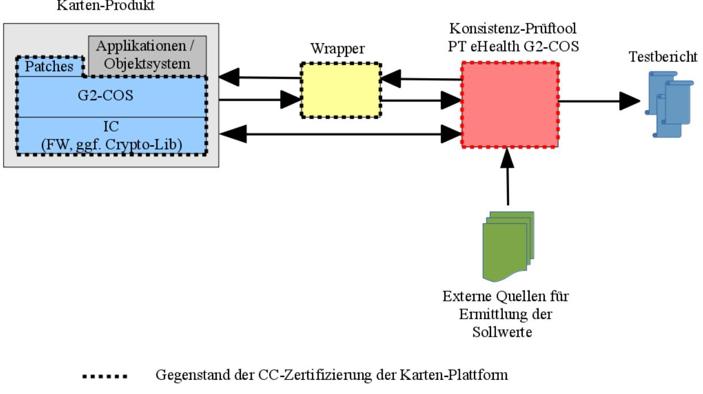

**Technische Richtlinie BSI TR-03106**

# **eHealth – Zertifizierungskonzept für Karten der Generation G2**

**Version 1.2 – 27.07.2017**

Bundesamt für Sicherheit in der Informationstechnik Postfach 20 03 63 53133 Bonn E-Mai[l: bsi@bsi.bund.de](mailto:bsi@bsi.bund.de) Internet:<https://www.bsi.bund.de> © Bundesamt für Sicherheit in der Informationstechnik 2017

# **Inhaltsverzeichnis**

| 1              | Einleitung5                                                                                 |  |
|----------------|---------------------------------------------------------------------------------------------|--|
| 1.1            | Gegenstand, Zielsetzung und Übersicht der Technischen Richtlinie5                           |  |
| 1.2            | Einordnung des Dokuments7                                                                   |  |
| 1.3            | Terminologie7                                                                               |  |
| 1.4            | Abkürzungen7                                                                                |  |
| 1.5            | Änderungshistorie9                                                                          |  |
| 2              | Zertifizierungskonzept für die Kartengeneration G210                                        |  |
| 2.1            | Voraussetzungen und Annahmen10                                                              |  |
| 2.2            | Bezeichnungen10                                                                             |  |
| 2.3            | Hinweise12                                                                                  |  |
| 2.3.1          | Hersteller von Karten-Plattformen und Karten-Produkten12                                    |  |
| 2.3.2          | Kooperationskonzept der gematik für die Kartengeneration G212                               |  |
| 2.3.3          | JAVA-Implementierung des G2-COS13                                                           |  |
| 2.4            | CC-Sicherheitszertifizierung der Karten-Plattform13                                         |  |
| 2.5            | Spezifikationen für das G2-COS und die Objektsysteme und ihre Prüfung19                     |  |
| 2.5.1          | G2-COS-Spezifikation19                                                                      |  |
| 2.5.2 2.5.3 | Objektsystem-Spezifikationen19 Prüfungen der Spezifikationen unter Sicherheitsaspekten21 |  |
| 2.6            | Objektsysteme der Kartentypen, Objekttypen und ihre Sicherheitsattribute im G2-COS22        |  |
| 2.6.1          | Objektsysteme, Objekttypen und ihre Sicherheitsattribute22                                  |  |
| 2.6.2          | Installation und Initialisierung von Objektsystemen, Objekten und Sicherheitsattributen23   |  |
| 2.7            | Konsistenzabgleich von Karten-Produkten gegen die Objektsystem-Spezifikationen24            |  |
| 2.7.1 2.7.2 | Zielsetzung und Überblick24 Prüfgegenstand für den Konsistenzabgleich26                  |  |
| 2.7.3          | Werkzeuge für den Konsistenzabgleich und ihre Funktionsweise27                              |  |
| 2.7.3.1        | Auslese-Schnittstelle und Wrapper der Karten-Plattform27                                    |  |
| 2.7.3.2        | Konsistenz-Prüftool "PT eHealth G2-COS"32                                                   |  |
| 2.8            | Abgleich des Fingerprints der Implementierung des G2-COS38                                  |  |
| 2.9            | Zertifizierung von Karten-Produkten nach der Technischen Richtlinie BSI TR-0314441          |  |
| 2.9.1          | Anforderungen an den Prüfgegenstand41                                                       |  |
| 2.9.2          | TR-Prüfstelle42                                                                             |  |
| 2.9.3 2.9.4 | Sicherungsmechanismen42 Prüfgegenstand und -werkzeuge42                                  |  |
| 2.9.5          | Prüfaspekte, -aufgaben und -schritte43                                                      |  |
| 2.9.6          | TR-Zertifikat und TR-Konformitätsreport eines Karten-Produktes49                            |  |
| 2.10           | Sicherheitstechnische Eignung von Karten-Produkten49                                        |  |
| 2.11           | Weitere Tests im Rahmen der Zulassung von Karten-Plattformen und Karten-Produkten52         |  |
| 2.11.1         | Funktionale Tests52                                                                         |  |
| 2.11.2         | Verwendung von Karten-Produkten des Kartentyps Testlaborkarte53                             |  |
| 2.11.3         | Verwendung von Karten-Produkten des Kartentyps Testkarte54                                  |  |
| 2.12           | Weitergehende Nutzung des Konsistenz-Prüftools der gematik54                                |  |
| 3              | CC-Zertifizierung von Karten-Produkten55                                                    |  |
|                | Literaturverzeichnis57                                                                      |  |

### **Abbildungsverzeichnis**

| Abbildung 1: Konsistenzabgleich mittels Konsistenz-Prüftool25 |  |
|---------------------------------------------------------------|--|
|---------------------------------------------------------------|--|

### **Tabellenverzeichnis**

| Tabelle 1: Änderungshistorie9 |
|-------------------------------|
|-------------------------------|

# **1 Einleitung**

# **1.1 Gegenstand, Zielsetzung und Übersicht der Technischen Richtlinie**

Gegenstand der vorliegenden Technischen Richtlinie BSI TR-03106 ist das Zertifizierungskonzept für die eHealth-Karten der Generation G2.

#### **Ziel**

Zielsetzung ist es, ein flexibles, effizientes und transparentes Zertifizierungskonzept für die eHealth-Karten der Generation G2 aufzusetzen und auszugestalten.

#### **Hintergrund**

Hintergrund der weiteren Überlegungen und Ausführungen ist folgender:

Die verschiedenen Karten-Produkte der Kartengeneration G2 bauen auf einer gemeinsamen Spezifikation des Kartenbetriebssystems auf, die als relativ stabil anzusehen ist und die relativ selten (größeren) Änderungen unterliegt, während die darauf aufsetzenden eHealth-Applikationen, die die verschiedenen Kartentypen ausmachen, häufiger Anpassungen und Änderungen erfahren (z.B. durch das Hinzufügen neuer Datenfelder, durch den Wegfall von Datenfeldern, durch Anpassungen der Größe von Datenfeldern, durch Änderungen an den Zugriffsregeln usw.). Entsprechende Erfahrungen liegen aus der Kartengeneration G1 vor.

Das bislang für die eHealth-Karten der Generation G1 bestehende und praktizierte Zertifizierungskonzept erfordert für die Karten-Produkte eine CC-Sicherheitszertifizierung, die das komplette Karten-Produkt, also Halbleiter-, Betriebssystem- und Applikationsebene, umfasst. Bei den eHealth-Karten der Generation G1 gibt es dabei für jeden Kartentyp jeweils ein spezifisches Protection Profile (PP), auf dessen Grundlage die eHealth-Karten zertifiziert werden. Für jede Änderung an der Spezifikation der eHealth-Applikationen durchlaufen die Karten-Produkte zumindest eine Re-Zertifizierung oder ein Maintenance-Verfahren. Auch ist bei Änderungen an der Spezifikation der eHealth-Applikationen das betreffende Kartentyp-spezifische PP auf Änderungsbedarf hin zu überprüfen und ggf. zu überarbeiten, womit in letzterem Fall noch eine anschließende (Re-) Zertifizierung bzw. ein Maintenance-Verfahren für das PP erforderlich wird.

Vor diesem Hintergrund entstand auf Seiten der gematik, der Karten-Hersteller und des BSI der Wunsch nach einem flexibleren, transparenten Zertifizierungskonzept für die G2-Karten-Produkte verbunden mit dem Wunsch nach einer Reduzierung der Kosten- und Zeitaufwände.

#### **Gesetzesgrundlage**

Heranzuziehen sind: [SGB V 291b], [eHealth-G]

Auszug aus SGB V, § 291b:

"(1a) […] Die Gesellschaft für Telematik prüft die Funktionsfähigkeit und Interoperabilität auf der Grundlage der von ihr veröffentlichten Prüfkriterien. Der Nachweis der Sicherheit erfolgt nach den Vorgaben des Bundesamtes für Sicherheit in der Informationstechnik durch eine Sicherheitszertifizierung. Hierzu entwickelt das Bundesamt für Sicherheit in der Informationstechnik geeignete Prüfvorschriften und veröffentlicht diese im Bundesanzeiger. Das Nähere zum Zulassungsverfahren und zu den Prüfkriterien wird von der Gesellschaft für Telematik in Abstimmung mit dem Bundesamt für Sicherheit in der Informationstechnik beschlossen. [...]"

Für das neue Zertifizierungskonzept für die eHealth-Karten der Generation G2 ist zu berücksichtigen, dass die vorstehend genannten dem BSI zugewiesenen gesetzlichen Aufgaben weiterhin erfüllt bleiben und bei den Prüfungen der Karten-Produkte bzgl. ihrer Sicherheit keine Lücken im Prüfprozess bzw. in den Prüfaussagen entstehen.

#### **Stellenwert und Vorteile des neuen Zertifizierungskonzepts**

Das neue Zertifizierungskonzept für die eHealth-Karten der Generation G2 zeichnet sich dadurch aus, dass es im Vergleich zum aktuell gelebten Zertifizierungskonzept für die Karten der Generation G1 insgesamt gesehen mehr Effizienz, Flexibilität und Transparenz bietet. So können insbesondere an vielen Stellen Prozess- und Prüfaufwände reduziert oder vereinfacht sowie auch erlangte Prozess- und Prüfergebnisse für weitere nachfolgende Zulassungsverfahren wiederverwendet werden.

Kernpunkte des neuen Zertifizierungskonzepts sind

- **•** die CC-Sicherheitszertifizierung von Karten-Plattformen verbunden mit einem Konsistenzabgleich darauf aufbauender Karten-Produkte gegen die Kartentyp-spezifischen Objektsystem-Spezifikationen sowie
- **•** die speziell darauf zugeschnittenen Prüfmechanismen und -werkzeuge.

Das neue Zertifizierungskonzept ersetzt hierdurch die bisher im Bereich von Karten-Produkten der Generation G1 durchgeführte CC-Sicherheitszertifizierung von Karten-Produkten.

Auf den ersten Blick betrachtet kann eine CC-Sicherheitszertifizierung einer Karten-Plattform für die Karten-Hersteller – je nachdem wie diese in der Vergangenheit insbesondere für die Kartengeneration G1 ihre Karten-Produkte und zugehörigen Evaluierungsverfahren und -dokumente aufgesetzt haben – einen gewissen Mehraufwand im Vergleich zu einer CC-Sicherheitszertifizierung eines Karten-Produktes in der Ausprägung HBA, eGK u.a. bedeuten. Gleichermaßen kann in Nachfolge dessen auch mit einem Mehraufwand auf Seiten der Prüfstellen und auch auf Seiten der Zertifizierungsstelle zu rechnen sein. Dieser Mehraufwand relativiert sich jedoch erheblich im Hinblick auf die zu erwartende Vielzahl von verschiedenen Kartentypen und Karten-Produkten, da für eine Aussage zur sicherheitstechnischen Eignung solcher Karten-Produkte auf die CC-Sicherheitszertifizierung der jeweils unterliegenden Karten-Plattform zurückgegriffen werden kann und dort nur ein einmaliger Aufwand entsteht (sofern von einer stabilen Betriebssystem-Spezifikation ausgegangen wird). Für die eHealth-Applikationen in den Karten-Produkten kann sich darauf aufbauend nun ein schlanker, effizienter und flexibler Prüfprozess anschließen.

Weiterhin verlangt das neue Zertifizierungskonzept nur nach der Erstellung und Pflege eines einzigen Protection Profile, nämlich desjenigen für die Karten-Plattform, anstelle der Erfordernis, wie bei den Karten der Generation G1, Protection Profiles für jeden einzelnen Kartentyp aufsetzen und beständig aktualisieren und re-zertifizieren bzw. einem Maintenance-Verfahren unterziehen zu müssen. Auch hier können zum einen beträchtliche Aufwände reduziert werden. Zum anderen kann mit dem nun schlankeren Prüfprozess für die eHealth-Applikationen der Karten-Produkte flexibler und zeitnäher auf Änderungen in den Objektsystem-Spezifikationen für die Karten-Produkte reagiert werden.

Nicht zuletzt wird das neue Zertifizierungskonzept, das in erster Linie Sicherheitsaspekte von Karten-Plattformen und Karten-Produkten für die Generation G2 im Fokus hat und sich mit Sicherheitsprüfungen und dem Erlangen von diesbzgl. Sicherheitsnachweisen und -aussagen für diese Karten beschäftigt, auch Zulassungsprozesse für Karten-Produkte auf Seiten der gematik im Bereich ihrer funktionalen Tests, Anwendungstests und sonstigen Zulassungstests vereinfachen, beschleunigen und solider gestalten. So ist daran gedacht, einzelne Komponenten und Prüfmechanismen des Zertifizierungskonzepts für die G2-Karten auch für die Tests der gematik im Rahmen von Zulassungsprozessen für die G2-Karten wiederzuverwenden.

# **1.2 Einordnung des Dokuments**

Das vorliegende Dokument trägt den Charakter eines Konzeptpapiers und beschreibt die grundsätzlichen Eckpfeiler, Vorgehensweisen und Randbedingungen des neuen Zertifizierungskonzepts für die eHealth-Karten der Generation G2. Ergebnisse weitergehender Detailarbeiten sind Gegenstand nachgelagerter Dokumentation, wie z.B. des Common Criteria Protection Profile für das G2- Kartenbetriebssystem ([PP-0082], siehe auch Kap. [2.4](#page-12-0) des vorliegenden Dokuments), der Spezifikation für den Wrapper ([COS-WRAP], siehe auch Kap. [2.7.3.1](#page-26-0) des vorliegenden Dokuments), der Technischen Richtlinie BSI TR-03143 für das im Rahmen der Konformitätsprüfung von Karten-Produkten eingesetzte Konsistenz-Prüftool ([TR-03143], siehe auch Kap. [2.7.3.2](#page-31-0) und [2.8](#page-37-0) des vorliegenden Dokuments), der Technischen Richtlinie BSI TR-03144 für die Konformitätsprüfung von Karten-Produkten ([TR-03144] und [TR-03144 A], siehe auch Kap. [2.9](#page-40-0) des vorliegenden Dokuments) und der Dokumentation zum Zulassungsverfahren der gematik für Karten-Plattformen und Karten-Produkte der Kartengeneration G2.

### **1.3 Terminologie**

Diese Technische Richtlinie BSI TR-03106 ist grundsätzlich als normativ anzusehen. Informative Teile werden explizit als solche gekennzeichnet (mit dem Vermerk "informativ" oder "Hinweis").

Für die Definition der Begriffe "TR-Prüfstelle" und "TR-Zertifizierungsstelle" sei auf die Dokumente [VB-Produkte] und [TR-Produkte] verwiesen. Die dortigen Bezeichnungen "Prüfstelle" bzw. "Zertifizierungsstelle" werden in der vorliegenden Technischen Richtlinie zwecks Klarstellung mit den Bezeichnungen "TR-Prüfstelle" bzw. "TR-Zertifizierungsstelle" belegt. Darüber hinaus bestehende Besonderheiten hinsichtlich der Verwendung des Begriffs "TR-Prüfstelle" im vorliegenden Dokument sind in Kap. [2.9.2](#page-41-0) genannt.

### **1.4 Abkürzungen**

In dieser Technischen Richtlinie BSI TR-03106 und der nachgelagerten Dokumente [TR-03144], [TR-03144 A] und [TR-03143] werden folgende Abkürzungen verwendet:

| A    | Application                      |
|------|----------------------------------|
| ADF  | Application Dedicated File       |
| APDU | Application Protocol Data Unit   |
| ATR  | Answer To Reset                  |
| BMG  | Bundesministerium für Gesundheit |
|      |                                  |

| BSI     | Bundesamt für Sicherheit in der Informationstechnik                                       |
|---------|-------------------------------------------------------------------------------------------|
| CC      | Common Criteria                                                                           |
| CMS     | Card Management System                                                                    |
| COS     | Card Operating System                                                                     |
| DF      | Dedicated File                                                                            |
| EF      | Elementary File                                                                           |
| eGK     | elektronische Gesundheitskarte                                                            |
| eIDAS   | Verordnung (EU) Nr. 910/2014 über elektronische Identifizierung und Vertrauens dienste |
| FW      | Firmware                                                                                  |
| G1      | Kartengeneration G1                                                                       |
| G2      | Kartengeneration G2                                                                       |
| gSMC-K  | gerätespezifische Security Module Card Typ K                                              |
| gSMC-KT | gerätespezifische Security Module Card Typ KT                                             |
| HBA     | Heilberufsausweis                                                                         |
| IC      | Integrated Circuit                                                                        |
| PDF     | Portable Document Format                                                                  |
| PIN     | Personal Identification Number                                                            |
| PKI     | Public Key Infrastructure                                                                 |
| PP      | Protection Profile                                                                        |
| PT      | Prüftool                                                                                  |
| PTV     | Produkttypversion                                                                         |
| PUK     | Personal Unblocking Key                                                                   |
| QES     | Qualified Electronic Signature                                                            |
| RSA     | Rivest, Shamir, Adleman                                                                   |
| SAK     | Signaturanwendungskomponente                                                              |
| SFR     | Security Functional Requirement                                                           |
| SGB     | Sozialgesetzbuch                                                                          |
| SHA     | Secure Hash Algorithm                                                                     |
| SMC-B   | Security Module Card Typ B                                                                |
| SSCD    | Secure Signature Creation Device                                                          |
| SSEE    | Sichere Signaturerstellungseinheit                                                        |
| TI      | Telematikinfrastruktur                                                                    |
| TOE     | Target Of Evaluation                                                                      |
| TR      | Technische Richtlinie                                                                     |
| VSDD    | Versichertenstammdatendienst                                                              |

| XML | Extensible Markup Language     |
|-----|--------------------------------|
| ZDA | Zertifizierungsdiensteanbieter |

# **1.5 Änderungshistorie**

| Version | Datum      | Änderung                                                                                                                                                   |
|---------|------------|------------------------------------------------------------------------------------------------------------------------------------------------------------|
| v0.1    | 31.03.2014 | Erstausgabe                                                                                                                                                |
| v1.0    | 03.06.2014 | Veröffentlichung                                                                                                                                           |
| v1.1    | 22.05.2015 | Anpassung an BSI TR-03143, einzelne inhaltliche Ergänzungen und Klarstellungen in verschiedenen Kapiteln                                                |
| v1.2    | 27.07.2017 | Anpassung an das Update der BSI TR-03143 (Version 1.1, 2017), Bugfixing, Einfügung von Klarstellungen, Aktualisierung von Referenzen und bzgl. eIDAS |
|         |            |                                                                                                                                                            |
|         |            |                                                                                                                                                            |

Tabelle 1: Änderungshistorie

# **2 Zertifizierungskonzept für die Kartengeneration G2**

Das Zertifizierungskonzept für die eHealth-Karten der Generation G2 sieht die im Folgenden beschriebenen Eckpunkte und Vorgehensweisen vor.

# **2.1 Voraussetzungen und Annahmen**

Die verschiedenen Kartentypen der Kartengeneration G2 – (derzeit) in der Ausprägung eGK, HBA, SMC-B, gSMC-KT und gSMC-K – bauen auf einem gemeinsamen G2-Kartenbetriebssystem (im Folgenden kurz "G2-COS" für "G2 Card Operating System" genannt) auf, d.h. unabhängig von den verschiedenen Kartentypen gibt es für die Generation G2 eine gemeinsame Spezifikation für das Kartenbetriebssystem (im weiteren "G2-COS-Spezifikation" genannt). Neben verpflichtenden Anteilen beinhaltet die G2-COS-Spezifikation optionale Funktionspakete wie z.B. (derzeit) Krypto-Box (Option\_Kryptobox), Logische Kanäle (Option\_logische\_Kanäle), PACE-PCD (Option\_PACE\_PCD), Kontaktlos-Schnittstelle (Option\_kontaktlose\_Schnittstelle), USB Schnittstelle (Option\_USB\_Schnittstelle) und RSA-CVC (Option\_RSA\_CVC), deren Vorhandensein in der Implementierung einer G2-Karten-Plattform nicht für jeden darauf aufbauenden Kartentyp erforderlich ist.

Hinweis: Für weitere Kartentypen, die evtl. zukünftig spezifiziert werden, sieht es nach derzeitigem Stand so aus, dass auch diese verpflichtend auf der Spezifikation für das G2-COS aufsetzen.

Je Kartentyp gibt es jeweils eine eigene Spezifikation der Kartenkonfiguration, die sogenannte Objektsystem-Spezifikation. Diese beschreibt insbesondere das Objektsystem des jeweiligen Kartentyps mit den zugehörigen dedizierten Zugriffsregeln und dem zugehörigen dedizierten Keyund PIN-Management. Die Zugriffsregeln beinhalten insbesondere die Authentisierungsanforderungen für den jeweiligen Objekt-Zugriff. Ferner legt die Objektsystem-Spezifikation für einen Kartentyp fest, welche der optionalen Funktionspakete der G2-COS-Spezifikation in der Implementierung einer unterliegenden Karten-Plattform vorhanden sein müssen. Siehe hierzu auch die Ausführungen in Kap. [2.5.2.](#page-18-0)

# **2.2 Bezeichnungen**

Im Folgenden wird zwischen den Begriffen "Karten-Plattform" und "Karten-Produkt" unterschieden, genauer wie folgt:

#### **• Karten-Plattform**:

Kombination aus Halbleiter und einem auf diesem Halbleiter implementierten G2-COS (inkl. ggf. vorhandener Patches)

#### **• Karten-Produkt**:

Karten-Plattform mit eHealth-Applikation(en)

Unterschieden werden hinsichtlich des Lebenszyklus des Karten-Produktes:

#### **◦ initialisiertes Karten-Produkt**:

initialisierte, noch nicht personalisierte Karte mit eHealth-Applikation(en) (derzeit in der Typausprägung eGK, HBA, SMC-B, gSMC-KT oder gSMC-K)

#### **◦ personalisiertes Karten-Produkt**:

initialisiertes Karten-Produkt, das im Rahmen der Personalisierung mit Personalisierungsdaten (ggf. Test-Personalisierungsdaten) befüllt wurde

Als **Initialisierung einer Karten-Plattform** wird im weiteren das Laden der zur Karten-Plattform ggf. vorhandenen Patches und ggf. benötigten Konfigurationsinformationen zur Komplettierung der Implementierung des COS bezeichnet.

Unter der **Initialisierung eines Karten-Produktes** wird das Laden der zugehörigen Kartentypspezifischen festen und personenunabhängigen Daten der jeweiligen eHealth-Applikationen auf die Karten-Plattform verstanden. Insbesondere werden bei der Initialisierung des Karten-Produktes die wesentlichen Sicherheitsstrukturen der jeweiligen eHealth-Applikationen aufgebracht. Relevant ist die betreffende Kartentyp-spezifische Objektsystem-Spezifikation, die genaue Informationen darüber beinhaltet, welche Objekte, Sicherheitsattribute und öffentliche Schlüsseldaten für den betreffenden Kartentyp zu initialisieren sind.

Je nach Ausgestaltung der Lebenszyklus-Phasen von Karten-Plattform und Karten-Produkt kann die Initialisierung der einem Karten-Produkt unterliegenden Karten-Plattform (also das Laden der zur Karten-Plattform ggf. vorhandenen Patches und ggf. benötigten Konfigurationsinformationen) in einem eigenen Initialisierungsprozess für die Karten-Plattform vor der Initialisierung eines Karten-Produktes erfolgen oder aber in die Initialisierung eines Karten-Produktes integriert sein (z.B. in Form des Ladens eines Initialisierungsfiles, das die Patches und/oder Konfigurationsinformationen zum COS sowie die eHealth-Applikationen enthält).

Von der Initialisierung eines Karten-Produktes zu unterscheiden ist die **Personalisierung eines Karten-Produktes**, bei der zur Individualisierung eines initialisierten Karten-Produktes die personenbezogenen Daten in die jeweiligen eHealth-Applikationen des Karten-Produktes geladen werden.

Hinweis: Neben Karten-Produkten mit eHealth-Applikation(en) gibt es im Umfeld der Zulassung von Karten-Produkten der Kartengeneration G2 durch die gematik auch Karten-Produkte vom Typ Testlaborkarte (nach den Vorgaben bzw. diesbzgl. Spezifikationen der gematik). Karten-Produkte vom Typ Testlaborkarte stehen nicht im Fokus des G2-Zertifizierungskonzepts bzw. der vorliegenden Technischen Richtlinie BSI TR-03106.

Wird im Folgenden von über die G2-COS-Spezifikation hinausgehenden, zusätzlichen Funktionalitäten und Strukturen (wie z.B. Kommandos oder Kommando-Varianten, Objekttypen, Sicherheitsattributen usw.) gesprochen, so ist dies in dem Sinne zu verstehen, als dass Funktionalitäten und Strukturen in der Implementierung eines Kartenbetriebssystems gemeint sind, die außerhalb der von der G2-COS-Spezifikation als verpflichtend ausgewiesenen Funktionalitäten und Strukturen sowie außerhalb der optionalen Funktionspakete der G2-COS-Spezifikation liegen.

# **2.3 Hinweise**

### **2.3.1 Hersteller von Karten-Plattformen und Karten-Produkten**

Das Zertifizierungskonzept für die Karten der Generation G2 lässt prinzipiell eine Differenzierung zwischen dem Hersteller einer Karten-Plattform und dem Hersteller eines Karten-Produktes zu, d.h. der Hersteller eines Karten-Produktes kann von dem Hersteller der diesem Karten-Produkt unterliegenden Karten-Plattform verschieden sein.

Ist der Hersteller des Karten-Produktes vom Hersteller der Karten-Plattform verschieden, so ist wegen der größeren Anzahl der am Zulassungsverfahren des Karten-Produktes beteiligten Parteien mit erhöhten Aufwänden zu rechnen. Insbesondere ist besonderes Augenmerk auf sichere Produktions-, Initialisierungs- und Auslieferungsprozesse bzgl. der Sicherheitsziele Integrität, Authentizität bzw. Vertraulichkeit zu richten.

### **2.3.2 Kooperationskonzept der gematik für die Kartengeneration G2**

Unter dem Begriff "Kooperationskonzept für die Kartengeneration G2" (ehemals benannt als "Zulassungskonzept für die Kartengeneration G2"[1](#page-11-0) ) ist im weiteren Verlauf des vorliegenden Dokuments die Vorgehens- und Verfahrensweise für die Zulassung von Karten-Plattformen und Karten-Produkten der Kartengeneration G2 für deren Einsatz in der Telematikinfrastruktur im deutschen Gesundheitswesen durch die gematik (Gesellschaft für Telematikanwendungen der Gesundheitskarte mbH) zu verstehen.

Das G2-Zertifizierungskonzept hat die neu gestaltete Sicherheitszertifizierung der eHealth-Karten der Generation G2 im Fokus und ist als Teil des Kooperationskonzepts zwischen gematik und BSI für die Karten der Generation G2 zu betrachten. Die folgenden Ausführungen im vorliegenden Dokument konzentrieren sich auf das Zertifizierungskonzept der eHealth-Karten der Generation G2. Aspekte und Fragen der Zulassung der eHealth-Karten der Generation G2 werden im weiteren nur insoweit adressiert als diese in direktem Zusammenhang mit der Sicherheitszertifizierung stehen.

Das Kooperationskonzept für die eHealth-Karten der Generation G2 integriert das G2-Zertifizierungskonzept und wird entsprechend diesem neuen Zertifizierungskonzept aufgesetzt. Hierzu können bereits für die Kartengeneration G1 etablierte Zulassungsverfahren und -prozesse (oder Teile daraus) wiederverwendet und das neue Zertifizierungskonzept geeignet in diese Verfahren und Prozesse integriert werden. Die Integration des neuen Zertifizierungskonzepts in das Kooperationskonzept erfolgt in Abstimmung zwischen BSI und gematik.

Hinsichtlich des Kooperationskonzepts gilt: Für das Zulassungsverfahren ist zwischen dem Zulassungsverfahren einer G2-COS Karten-Plattform und dem Zulassungsverfahren eines G2- Karten-Produktes zu unterscheiden. Die Zulassung einer G2-COS Karten-Plattform erfordert eine vorhergehende CC-Zertifizierung dieser Karten-Plattform; insbesondere können die Zulassungstests der Karten-Plattform erst dann abgeschlossen und eine Zulassung für die Karten-Plattform durch die gematik ausgesprochen werden, wenn das CC-Zertifikat der Karten-Plattform (siehe Kap. [2.4\)](#page-12-0) erteilt wurde und dieses zum Zeitpunkt der Zulassung der Karten-Plattform gültig ist. Die Zulassung eines Karten-Produktes durch die gematik wiederum setzt eine gültige Zulassung der

1 Hinweis: Eine Anpassung der Begrifflichkeiten wurde zwecks Vermeidung von Missverständnissen erforderlich, da der ehemals verwendete Begriff "Zulassungskonzept" im Laufe der Erstellung des vorliegenden Dokuments von der gematik mit anderen Inhalten belegt wurde.

unterliegenden Karten-Plattform durch die gematik voraus und erfordert weiterhin ein für das Karten-Produkt erteiltes und gültiges TR-Zertifikat (siehe Kap. [2.9\)](#page-40-0).

### **2.3.3 JAVA-Implementierung des G2-COS**

Das neue Zertifizierungskonzept für die eHealth-Karten der Generation G2 ist vornehmlich auf eine native Implementierung des G2-COS abgestimmt.

Andererseits macht die Spezifikation des G2-COS keine Einschränkungen hinsichtlich der technischen Realisierung des G2-COS in einer Karten-Plattform, so dass insbesondere auch eine JAVA-Implementierung des G2-COS zulässig ist. JAVA-Applets können neben dem Part für das Objektsystem der eHealth-Applikationen auch einen Part mit ausführbarem Code beinhalten. Somit enthalten Applets mit ausführbarem Code zum einen ggf. Anteile des zertifizierungsrelevanten G2- COS. Zum anderen ist das Nachladen von JAVA-Applets im Rahmen des neuen Zertifizierungskonzepts als sicherheitskritisch einzustufen, da in diesem Fall die Möglichkeit besteht, dass Code der bereits zertifizierten Implementierung des G2-COS überschrieben bzw. ersetzt oder auch sonstiger Schadcode eingebracht wird.

Das G2-Zertifizierungskonzept soll prinzipiell auch für JAVA-Implementierungen des G2-COS anwendbar sein, um nicht über das Zertifizierungskonzept technische Einschränkungen an die Karten-Plattform, die von Seiten der Spezifikation des G2-COS nicht vorgesehen sind, einzubringen. Eine Anwendung des G2-Zertifizierungskonzepts auf JAVA-Implementierungen ist unter folgenden Randbedingungen möglich: In die CC-Zertifizierung der Karten-Plattform gehen auch die Anteile der Applets für die eHealth-Applikationen ein, die ausführbaren Code beinhalten. Ferner ist ein Nachladen von Applets mit ausführbarem Code nicht zulässig.

Entsprechende Anforderungen von Seiten des G2-Zertifizierungskonzepts bestehen für den Fall einer Implementierung des G2-COS mit dem (gemäß Spezifikation des G2-COS als optional gekennzeichneten und damit prinzipiell zulässigen) Kommando LOAD CODE.

# **2.4 CC-Sicherheitszertifizierung der Karten-Plattform**

Nach Common Criteria (CC) zertifiziert wird zukünftig die Karten-Plattform, d.h. die Kombination aus der Implementierung des G2-COS (inkl. ggf. vorhandener Patches) zusammen mit dem darunter liegenden Halbleiter. In der Regel wird diese Zertifizierung als Composite-Verfahren unter Nutzung des CC-Zertifikats für den Halbleiter ausgeführt.

Für die CC-Zertifizierung der Karten-Plattform wird ein Protection Profile (PP) für die Karten-Plattform erstellt, das die eHealth-spezifischen (Sicherheits-) Aspekte und Anforderungen sowie die dem G2-COS hinterliegenden generellen Strukturen, Funktionalitäten und (Sicherheits-) Mechanismen adäquat und ausreichend adressiert ([PP-0082], im Folgenden G2-COS-PP genannt). Das G2- COS-PP selbst wird CC-zertifiziert (Zertifizierungs-ID: BSI-CC-PP-0082 bzw. Folge-IDs für nachfolgende Maintenance-Verfahren und Re-Zertifizierungen des PPs). Für die Erstellung des G2- COS-PP wird auf andere, bereits existierende Plattform-PPs zurückgegriffen; auch werden die bisher für die einzelnen Kartentypen in der Kartengeneration G1 bestehenden PPs für die Erstellung des G2-COS-PP herangezogen und geeignete Teile dieser PPs wiederverwendet. Ferner wird die Technische Richtlinie BSI TR-03116-1 ([TR-03116-1]) für das G2-COS-PP berücksichtigt. Für eine effiziente Erstellung und CC-Zertifizierung des G2-COS-PP sowie für eine effiziente CC-Zertifizierung der Karten-Plattform wird das G2-COS-PP in englischer Sprache verfasst. Als Evaluierungslevel ist EAL 4+ mit den Augmentierungen ALC\_DVS.2, ATE\_DPT.2 und AVA\_VAN.5 vorgesehen. Gründe für die Augmentierungen ALC\_DVS.2 und ATE\_DPT.2 sind, dass mit dem G2Zertifizierungskonzept der Gedanke der Zertifizierung einer offenen Plattform verfolgt wird und daher die Evaluierungstiefe, insbesondere bzgl. der Aspekte Test und Lebenszyklus (inklusive Sicherheit der Entwicklungsumgebung und -prozesse, Auslieferung), ausreichend tief zu gestalten ist. Die Augmentierung AVA\_VAN.5 resultiert aus der Forderung im eHealth-Bereich nach einem Schutz gegen hohes Angriffspotential.

Die Verwendung des G2-COS-PP ist für die CC-Zertifizierung der Karten-Plattform verpflichtend. Das G2-COS-PP verlangt *strikte* Konformität im Sinne der CC.

Für die CC-Zertifizierung des einer Karten-Plattform unterliegenden Halbleiters wird das zertifizierte Protection Profile PP-0035 (Zertifizierungs-ID BSI-PP-0035) bzw. dessen zertifizierter Nachfolger PP-0084 (Zertifizierungs-ID BSI-CC-PP-0084) vorgeschrieben, also PPs, auf denen die Halbleiter-Hersteller bereits üblicherweise aufsetzen. Hierzu enthält das G2-COS-PP einen entsprechenden Claim auf PP-0035 bzw. PP-0084. Die oben genannten Augmentierungen im G2-COS-PP passen zum Claim auf PP-0035 bzw. PP-0084 und den dort enthaltenen Augmentierungen. Im Fall, dass die zu zertifizierende Karten-Plattform auf einem Halbleiter aufsetzt, der auf Basis des PP-0084 zertifiziert wurde, das G2-COS-PP aber einen Claim auf PP-0035 enthält, oder aber umgekehrt der Halbleiter auf Basis von PP-0035 zertifiziert wurde und das G2-COS-PP einen Claim auf PP-0084 enthält, so sind die bestehenden Übergangsregelungen für den Übergang von PP-0035 zum neuen PP-0084 im Rahmen von Composite-Verfahren zu beachten und anzuwenden.

Die Karten-Plattform bietet mindestens Sicherheitsmechanismen für die Separierung von Applikationen sowie einen ausreichend abgesicherten Zugriffsregel-Mechanismus für die Prüfung und Aus-/Verwertung von Zugriffsregeln (und den in diesen insbesondere hinterlegten Authentisierungsanforderungen), die dem für den eHealth-Bereich angenommenen Angriffspotential angemessen sind. Dies ist entsprechend im G2-COS-PP modelliert und ist damit Gegenstand der CC-Zertifizierung der Karten-Plattform.

Die Spezifikation für das G2-COS sieht neben einer verpflichtenden Basisfunktionalität verschiedene weitere optionale Funktionspakete wie z.B. (derzeit) Krypto-Box (Option\_Kryptobox), Logische Kanäle (Option\_logische\_Kanäle), PACE-PCD (Option\_PACE\_PCD), Kontaktlos-Schnittstelle (Option\_kontaktlose\_Schnittstelle), USB Schnittstelle (Option\_USB\_Schnittstelle) und RSA-CVC (Option\_RSA\_CVC) vor, deren Vorhandensein in der Implementierung einer Karten-Plattform nicht für jeden darauf aufbauenden Kartentyp erforderlich ist. Diese Modularisierung des G2-COS – die in der Spezifikation des G2-COS als verpflichtend vorgeschriebene Basisfunktionalität und die als optional ausgewiesenen Funktionspakete – wird im G2-COS-PP mittels des sogenannten Package-Konzepts abgebildet. Die vom Hersteller für seine Karten-Plattform konkret getroffene Auswahl an Funktionspaketen der G2-COS-Spezifikation spiegelt sich im Security Target (Sicherheitsvorgaben) zur Karten-Plattform in der entsprechenden konkreten Auswahl an Packages aus dem G2-COS-PP wider. (Hinweis: Es ist bereits gängige Zertifizierungspraxis, verschiedene Produktvarianten in einer Evaluierung betrachten zu können, also insbesondere auch mit optionalen Packages eines PPs im Security Target für Karten-Plattformen arbeiten zu können. Das G2-COS-PP wird gerade im Hinblick darauf modular ausgelegt und strukturiert.)

Weiterhin wird für das G2-COS-PP speziell Folgendes berücksichtigt: Der Aspekt des Schlüsselwechsels sowie insbesondere des Wechsels von Root-Zertifikaten/-Schlüsseln im Feld wird geeignet im G2-COS-PP abgebildet.

Bedingt durch das Zertifizierungskonzept für die Karten der Generation G2 werden für die CC-Sicherheitszertifizierung der Karten-Plattform weitere spezielle Aspekte für den Evaluierungsgegenstand relevant, die im G2-COS-PP entsprechend verankert werden. So hat die Karten-Plattform insbesondere eine Auslese-Schnittstelle zum Auslesen von Sicherheitsattributen und öffentlichen Schlüsseldaten der vom G2-COS verwalteten Objekte eines auf der Karten-Plattform aufbauenden Karten-Produktes sowie ggf. zum Auslesen sonstiger Hersteller-spezifischer sicherheitsrelevanter Attribute bereitzustellen. Ferner wird die Karten-Plattform um einen sogenannten Wrapper ergänzt, der eine Aufbereitung der über die Auslese-Schnittstelle der Karten-Plattform ausgelesenen Daten in ein speziell vorgegebenes Format zu ihrer weiteren Verwendung und Auswertung vornimmt. Darüber hinaus stellt die Karten-Plattform einen sogenannten Fingerprint-Mechanismus bereit, über den ein Integritäts- und Authentizitätsnachweis der Karten-Plattform geliefert werden kann. Die Auslese-Schnittstelle, der Wrapper wie auch der Fingerprint-Mechanismus der Karten-Plattform sind Gegenstand der CC-Zertifizierung der Karten-Plattform und werden im G2-COS-PP geeignet modelliert; insbesondere werden hierzu im G2-COS-PP entsprechende SFRs für den Datenexport, die konsistente Interpretation der Ausgabedaten der Karten-Plattform sowie für den Fingerprint-Mechanismus aufgenommen. Siehe hierzu auch die Ausführungen und Anforderungen in Kap. [2.7](#page-23-0) und [2.8.](#page-37-0)

Optional kann – zwecks Unterstützung des späteren automatisierten Konsistenzabgleichs von auf dieser Karten-Plattform aufbauenden Karten-Produkten durch das Konsistenz-Prüftool (siehe Kap. [2.7](#page-23-0) und [2.9.5\)](#page-42-0) – zur Karten-Plattform eine sogenannte Übersetzungstabelle im Sinne der Technischen Richtlinie BSI TR-03143 ([TR-03143]) erstellt und in die CC-Evaluierung und -Zertifizierung der Karten-Plattform einbezogen werden. Bei der Erstellung und Evaluierung einer solchen Übersetzungstabelle der Karten-Plattform ist auf deren Korrektheit zu achten, wobei insbesondere die Technische Richtlinie BSI TR-03143 ([TR-03143]) mit ihren Vorgaben für Übersetzungstabellen sowie die Hersteller-spezifischen Besonderheiten der Karten-Plattform (wie z.B. Zusatzfunktionalität der Karten-Plattform über die G2-COS-Spezifikation hinaus) zu berücksichtigen sind. Im Hinblick auf die spätere Verwendung der Übersetzungstabelle durch das Konsistenz-Prüftool für Karten-Produkte ist dafür Sorge zu tragen, dass aus Sicherheitssicht für die Karten-Produkte und ihre Objektsysteme keine Falschaussagen oder Sicherheitslücken in dem mittels des Konsistenz-Prüftools unter Verwendung der Übersetzungstabelle durchgeführten Konsistenzabgleich entstehen. Die Übersetzungstabelle der Karten-Plattform fällt aus Sicht der CC in die Kategorie der "SFRsupporting Subsystems / Modules" (CC-Aspekt ADV) und wird im G2-COS-PP verankert und geeignet modelliert.

Bei der Evaluierung der Karten-Plattform im Rahmen ihrer CC-Sicherheitszertifizierung werden insbesondere Prüfungen dahingehend vorgenommen, inwieweit in der Karten-Plattform Herstellerspezifisch zusätzliche, über die G2-COS-Spezifikation und ihre (innerhalb des Funktionspakets mit der Basisfunktionalität und der optionalen Funktionspakete) verpflichtenden Anteile hinausgehende Funktionalitäten und Strukturen (wie z.B. weitere Kommandos oder Kommando-Varianten, weitere Sicherheitsattribute des Objektsystems, weitere Sicherheitsattribute der in der G2-COS-Spezifikation spezifizierten Objekttypen, weitere Objekttypen, sonstige weitere sicherheitsrelevante Attribute der Karten-Plattform usw.) durch den Hersteller der Karten-Plattform implementiert wurden. Informationen über zusätzliche Funktionalitäten und Strukturen der Karten-Plattform, die Einfluss auf die auf der Karten-Plattform aufbauenden Karten-Produkte und ihre Sicherheit nehmen (können), sind zu ihrer weiteren Verwendung, insbesondere für die TR-Konformitätsprüfung initialisierter Karten-Produkte wie in Kap. [2.9](#page-40-0) beschrieben, in geeigneter Form weiterzugeben (z.B. über die Benutzerdokumentation und/oder den CC-Zertifizierungsreport zur Karten-Plattform).

Weiterhin werden bei der Evaluierung der Karten-Plattform im Rahmen ihrer CC-Sicherheitszertifizierung insbesondere Prüfungen dahingehend vorgenommen, inwieweit die Karten-Plattform die Änderung von im Rahmen der Initialisierung eines auf dieser Karten-Plattform aufbauenden Karten-Produktes initialisierten Sicherheitsattributen und öffentlichen Schlüsseldaten des Objektsystems und seiner Objekte zulässt. Siehe hierzu die Ausführungen in Kap. [2.6.2.](#page-22-0)

Die CC-Zertifizierung der Karten-Plattform umfasst verpflichtend die Initialisierung der Karten-Plattform und darauf aufbauender Karten-Produkte in dem Sinne, als dass der für die Karten-Plattform und darauf aufbauende Karten-Produkte vorgesehene Hersteller-spezifische Initialisierungsprozess mit seinen Initialisierungskommandos, Sicherheitsstrukturen und -mechanismen verpflichtend Gegenstand der Evaluierung ist. In der Regel enthält die Karten-Plattform Herstellerspezifische spezielle Initialisierungskommandos und sonstiges Sicherungsmaterial für die Durchführung und Absicherung der Initialisierung von Karten-Plattform und darauf aufbauenden Karten-Produkten. Optional kann die eigentliche Durchführung der Initialisierung einer Karten-Plattform und darauf aufbauender Karten-Produkte beim Initialisierer inkl. seiner Initialisierungsumgebung mit in die CC-Zertifizierung der Karten-Plattform einbezogen werden.

Aspekte der Personalisierung von Karten-Produkten werden nur insoweit in die CC-Zertifizierung der unterliegenden Karten-Plattform einbezogen als diese die (ggf. Hersteller-spezifischen) Personalisierungskommandos und sonstige grundsätzliche Sicherheitsstrukturen und -mechanismen für die Personalisierung eines Karten-Produktes betreffen. Falls darüber hinaus (z.B. auf Herstellerwunsch) weitergehende Aspekte der Personalisierungsprozesse über die CC-Zertifizierung der Karten-Plattform abgedeckt werden sollen, ist ggf. eine Abstimmung mit der gematik durchzuführen.

Soweit im G2-COS-PP selbst die Aspekte der Initialisierung und Personalisierung nicht schon adressiert sind, sind diese im Rahmen der Produktzertifizierung einer Karten-Plattform im Security Target (Sicherheitsvorgaben) geeignet durch den Hersteller zu ergänzen und modellieren. Das G2- COS-PP enthält entsprechende diesbzgl. Hinweise für die Autoren von Security Targets zu Karten-Plattformen.

Die Implementierung des G2-COS in einer Karten-Plattform kann das Löschen spezieller, Hersteller-spezifischer Initialisierungs- und/oder Personalisierungskommandos, etwa mit Ausführung der Löschung der entsprechenden Code-Teile z.B. zum Abschluss der Initialisierung oder Personalisierung eines auf der Karten-Plattform aufbauenden Karten-Produktes, beinhalten. Ist in der Implementierung des G2-COS ein solches Löschen spezieller, Hersteller-spezifischer Initialisierungs- und/oder Personalisierungskommandos vorhanden, so ist der betreffende Löschmechanismus im Rahmen der CC-Zertifizierung der Karten-Plattform zu testen und evaluieren. Insbesondere muss die Evaluierung den Nachweis erbringen, dass die Implementierung des G2-COS in der Karten-Plattform nach dem Löschen der betreffenden Initialisierungs- und/oder Personalisierungskommandos unverändert die G2-COS-Spezifikation wie für den Wirkbetrieb vorgesehen und in der Evaluierung geprüft implementiert.

Im Fall einer Kontaktlos-Schnittstelle der Karten-Plattform ist die Inlay-Fertigung nicht notwendig Gegenstand der CC-Sicherheitszertifizierung der Karten-Plattform. Ist die Inlay-Fertigung nicht Bestandteil der CC-Zertifizierung der Karten-Plattform, so ist diese trotzdem im Lebenszyklus-Modell der Karten-Plattform zu berücksichtigen und durch geeignete Annahmen an die Fertigungsumgebung und an die Auslieferungsprozesse abzudecken.

Für die CC-Zertifizierung der Karten-Plattform werden für den Test der Karten-Plattform (CC-Aspekte ATE und AVA) zum einen generische Testfälle, d.h. generelle Tests für die Karten-Plattform unabhängig von konkreten eHealth-Applikationen, wie zum anderen auch eHealth-spezifische Testfälle im Hinblick auf die derzeit bekannten eHealth-Applikationen vorspezifiziert und für die CC-Zertifizierung der Karten-Plattform verpflichtend als Mindestmenge an durchzuführenden Tests vorgeschrieben (Verankerung im G2-COS-PP). Hierzu gehören auch mindestens zu betrachtende Use Cases, die für den eHealth-Bereich relevant und auf die derzeit bekannten eHealth-Applikationen (insbesondere auch im Hinblick auf nach eIDAS ([eIDAS-VO]) erforderliche CC-Zertifizierungen von Karten-Produkten) abgestimmt sind. Die für den Test einer Karten-Plattform zu betrachtenden Use Cases berücksichtigen das Paket-Konzept der G2-COS-Spezifikation bzw. des G2-COS-PP, d.h. für den Test einer Karten-Plattform werden nur solche Testfälle und Use Cases relevant, die den verpflichtenden Anteil der G2-COS-Spezifikation und die für die Karten-Plattform

ausgewählten optionalen Funktionspakete der G2-COS-Spezifikation betreffen. Zielsetzung für das Heranziehen von generischen Testfällen, eHealth-spezifischen Testfällen und Use Cases ist, die Tests der Karten-Plattform im Rahmen ihrer CC-Sicherheitszertifizierung gezielt, strukturiert, ausreichend, effizient und vergleichbar zu gestalten.

Dabei erfolgt grundsätzlich ein *kompletter* Test der Karten-Plattform bzgl. des in der G2-COS-Spezifikation vorgesehenen verpflichtenden Funktionspakets mit der Basisfunktionalität sowie bzgl. der vom Hersteller der Karten-Plattform ausgewählten optionalen Funktionspakete (siehe hierzu die in der G2-COS-Spezifikation als optional gekennzeichneten Funktionspakete wie (derzeit) Krypto-Box (Option\_Kryptobox), Logische Kanäle (Option\_logische\_Kanäle), PACE-PCD (Option\_PACE\_PCD), Kontaktlos-Schnittstelle (Option\_kontaktlose\_Schnittstelle), USB Schnittstelle (Option\_USB\_Schnittstelle) und RSA-CVC (Option\_RSA\_CVC)). Unabhängig davon, welche Kartentypen konkret der Hersteller der Karten-Plattform für auf dieser Karten-Plattform aufsetzende Karten-Produkte ggf. vorgesehen hat, ist also ein kompletter Test aller in der jeweiligen Karten-Plattform implementierten Funktionspakete erforderlich; dies gilt auch in dem Fall, dass evtl. spätere auf einer solchen Karten-Plattform aufsetzende Karten-Produkte nicht die komplette von der Karten-Plattform in ihren Funktionspaketen angebotene Funktionalität nutzen.

Auch wenn der Hersteller der Karten-Plattform (z.B. im ST) angibt, später nur einen speziellen G2- Kartentyp auf der zertifizierten Karten-Plattform aufsetzen zu wollen, dürfen Sicherheitsmechanismen in der Implementierung des G2-COS (insbesondere im Bereich der Krypto-Funktionalität) auch trotz eines Hinweises auf ein späteres spezielles Objektsystem nicht reduziert und die Nutzung der Karten-Plattform diesbzgl. mit einschränkenden Auflagen versehen werden. Gleichermaßen ist in diesem Zusammenhang eine Reduzierung des Testumfangs sowohl auf Seiten des Herstellers für das funktionale Testen sowie auf Seiten der Prüfstelle für das Independent und Penetration Testing nicht zulässig.

Hinsichtlich des Testaspektes ist eine komplette Entkopplung des G2-COS und darauf aufsetzender Objektsysteme generell nicht möglich, soll aber soweit als möglich unterstützt werden. Hierzu sollen die derzeit bekannten Kartentypen eGK, HBA, SMC-B, gSMC-KT und gSMC-K und deren Objektsystem-Spezifikationen genauer betrachtet und analysiert werden und aus deren derzeit vorgesehenen Sicherheitsstrukturen und -mechanismen entsprechende eHealth-spezifische Testfälle und Use Cases abstrahiert und in der Plattform-Evaluierung abgeprüft werden, um eine aussagekräftige sicherheitstechnische Aussage für Karten-Produkte vom Typ eGK, HBA, SMC-B, gSMC-KT und gSMC-K erlangen zu können. Hierbei wird darauf geachtet, dass diese eHealthspezifischen Testfälle und Use Cases möglichst allgemeingültig gewählt werden und insbesondere Änderungen an den Objektsystem-Spezifikationen möglichst nicht eine erneute CC-Zertifizierung einer Karten-Plattform bedingen. Sollten sich zukünftig Kartentypen entwickeln, die mit gänzlich neuen Sicherheitsstrukturen und -mechanismen aufwarten, die über die in der Evaluierung einer Karten-Plattform betrachteten eHealth-spezifischen Testfälle und Use Cases hinausgehen oder über diese gänzlich nicht abgedeckt sind, so ist zu überprüfen, ob eine entsprechende Re-Evaluierung bzw. Re-Zertifizierung der Karten-Plattform angezeigt ist.

Hinweis: Für die CC-Zertifizierung von Karten-Plattformen im Bereich der G2-Karten wird die Festsetzung der Mindestmenge an im Testbereich zu berücksichtigenden generischen Testfällen, eHealth-spezifischen Testfällen und Use Cases zunächst im Rahmen der Testplanung des jeweiligen Zertifizierungsverfahrens der Karten-Plattform in Abstimmung mit der CC-Prüfstelle und der Zertifizierungsstelle des BSI erfolgen. Zukünftig ist für die Unterstützung einer effektiven und effizienten Testplanung zusätzlich vorgesehen, eine Hersteller- bzw. Zertifizierungsverfahren-unabhängige Dokumentation bzgl. der Mindestmenge an im Testbereich zu berücksichtigenden generischen Testfällen, eHealth-spezifischen Testfällen und Use Cases aufzusetzen und zu verwenden, wobei in die Erstellung dieser Testdokumentation insbesondere die in den CC-Produktzertifizierungsverfahren von Karten-Plattformen im Bereich der derzeitigen Ausschreibung von G2- Karten gesammelten Erfahrungen einfließen sollen. In diesem Zusammenhang bietet es sich ferner an, geeignete Testapplikationen zu spezifizieren sowie ggf. eine entsprechende Testsuite zu implementieren und diese im Rahmen der Evaluierung der Karten-Plattformen einzusetzen.

Die von der gematik im Rahmen der Zulassungstests für funktionale Tests der Karten-Plattform bzw. der (personalisierten) Karten-Produkte eingesetzte sogenannte gematik-Testsuite kann prinzipiell auf Seiten der CC-Prüfstelle für Evaluierungszwecke (Stichwort: "Unabhängiges Testen der Prüfstelle") eingesetzt werden. Ziel ist hierbei, die Effizienz der Tests auf Prüfstellenseite und damit die Effizienz der Zertifizierungsprozesse zu erhöhen. Die Wiederverwendung der Testsuite auf Seiten der CC-Prüfstelle wird von der gematik unterstützt. Um evtl. bestehende Probleme mit Lizenz- und Nutzungsrechten bzgl. der gematik-Testsuite zu begegnen, besteht auf Seiten der gematik die Bereitschaft dazu, dass die CC-Prüfstelle die gematik-Testsuite im Rahmen der Evaluierung einer Karten-Plattform bei der gematik vor Ort nutzt. Um beurteilen zu können, inwieweit die gematik-Testsuite die Evaluierungsansprüche der CC-Prüfstelle bzgl. ihrer Prüfstellentests abdeckt, benötigt die CC-Prüfstelle entsprechenden Einblick in die gematik-Testsuite und die dort implementierten Tests. Die gematik unterstützt eine solche Einsichtnahme der CC-Prüfstelle in die gematik-Testsuite.

Die gematik-Testsuite soll explizit jedoch nicht den Herstellern der Karten-Plattformen zur Verfügung gestellt werden, um hier den Grundgedanken der CC einer Qualitätssicherung der Produkte durch die Hersteller selbst nicht zu unterlaufen und ein Entwickeln der Produkte allein gegen die Testsuite (anstelle eines Entwickelns auf Basis der Spezifikation des G2-COS) nicht zu fördern.

Die CC-Zertifizierung der Karten-Plattform soll zukünftig durch weitere Maßnahmen unterstützt werden:

So soll zum einen zur Spezifikation des G2-COS und zum G2-COS-PP passend ein wiederverwendbares FSP-Template erstellt und den Herstellern von Karten-Plattformen und den CC-Prüfstellen zur Verfügung gestellt werden. Das FSP-Template enthält ein bereits vordefiniertes Mapping zwischen den Kommandos der Spezifikation des G2-COS und den SFRs des G2-COS-PP (inkl. Rationale). Das FSP-Template ist durch den Hersteller der Karten-Plattform für seine FSP-Evaluierungsdokumentation zu seiner Karten-Plattform passend zu vervollständigen. Die Verwendung eines FSP-Templates erleichtert auf Seiten des Herstellers, der CC-Prüfstelle und der Zertifizierungsstelle die Erstellung und Prüfung von Evaluierungsdokumentation (hier im Bereich ADV\_FSP) und senkt damit insbesondere Aufwände und Kosten für die Sicherheitszertifizierung der Karten-Plattform. Hinweis: Das FSP-Template wird erst zukünftig Verwendung finden und ist insbesondere noch nicht relevant für die CC-Zertifizierung von Karten-Plattformen im Rahmen der derzeitigen Ausschreibung von G2-Karten.

Weiterhin soll zum anderen ein wiederverwendbares Template für den sogenannten Crypto Disclaimer erstellt und den Herstellern von Karten-Plattformen und den CC-Prüfstellen zur Verfügung gestellt werden. Das Template für den Crypto Disclaimer enthält eine bereits vordefinierte Übersicht über die seitens der G2-COS-Spezifikation vorgegebene und im G2-COS-PP modellierte Krypto-Funktionalität einer G2-Karten-Plattform; hierbei erfolgt der G2-COS-Spezifikation bzw. dem G2-COS-PP entsprechend eine Gliederung nach dem verpflichtenden Funktionsumfang und den optionalen Funktionspaketen. Das Template für den Crypto Disclaimer ist durch den Hersteller der Karten-Plattform für seine Evaluierungsdokumentation zu seiner Karten-Plattform passend zu vervollständigen. Das ausgefüllte Template ist durch die CC-Prüfstelle der betreffenden Karten-Plattform auf Vollständigkeit und Konsistenz zur Karten-Plattform und Herstellerdokumentation zu prüfen. Weitere Details zum Crypto Disclaimer sind Gegenstand des CC-Zertifizierungsschemas des BSI und werden jeweils im Produktzertifizierungsverfahren zwischen Hersteller, CC-Prüfstelle und CC-Zertifizierungsstelle abgestimmt.

Hinsichtlich nach eIDAS ([eIDAS-VO]) erforderlicher CC-Zertifizierungen von Karten-Produkten werden bereits in der CC-Sicherheitszertifizierung der Karten-Plattform relevante Aspekte im Umfeld der Signaturgenerierung und -verifikation berücksichtigt und im G2-COS-PP aufgenommen. Siehe hierzu auch Kap. [3.](#page-54-0)

# **2.5 Spezifikationen für das G2-COS und die Objektsysteme und ihre Prüfung**

Hinsichtlich der Kartentypen beziehen sich nachstehende Aussagen in diesem Kapitel ausschließlich auf die verschiedenen Kartentypen der G2, d.h. (derzeit) in der Ausprägung eGK, HBA, SMC-B, gSMC-KT und gSMC-K, und die zugehörigen Objektsystem-Spezifikationen. Explizit nicht betrachtet wird der von der gematik in ihren Zulassungsverfahren bzw. -tests eingesetzte Kartentyp Testlaborkarte nebst zugehörigen (Objektsystem-) Spezifikationen.

### **2.5.1 G2-COS-Spezifikation**

Den verschiedenen Kartentypen der Kartengeneration G2 – (derzeit) in der Ausprägung eGK, HBA, SMC-B, gSMC-KT und gSMC-K – unterliegt eine gemeinsame Spezifikation des G2-Kartenbetriebssystems. Die Spezifikation dieses Kartentyp-unabhängigen Kartenbetriebssystems ist mit der sogenannten G2-COS-Spezifikation der gematik gegeben.

Die Erstellung und Veröffentlichung der G2-COS-Spezifikation erfolgt durch die gematik. Die G2- COS-Spezifikation liegt hierbei (derzeit) im PDF-Format vor.

### **2.5.2 Objektsystem-Spezifikationen**

Die Gesamtheit der Spezifikation zu einem Kartentyp (d.h. die Gesamtheit aller Anforderungen an einen Kartentyp) wird durch eine führende Objektsystem-Spezifikation, begleitende / mitgeltende Spezifikationen (alles geklammert durch den jeweiligen Produkttypsteckbrief) sowie zugehörige Errata-Dokumente (letztere "überschreiben" ausgewiesene Anforderungen innerhalb der im Errata adressierten Spezifikationsdokumente) definiert. Die Gesamtheit der Anforderungen an einen Kartentyp ist eindeutig durch die mitveröffentlichte sogenannte Produkttypversion eines Kartentyps adressierbar.

In der vorliegenden Technischen Richtlinie BSI TR-03106 wird mit dem Begriff "Objektsystem-Spezifikation" die Gesamtheit der Spezifikation zu einem Kartentyp, wie diese im vorigen Absatz beschrieben ist, bezeichnet.

Die Konfiguration der verschiedenen Kartentypen der Kartengeneration G2 – (derzeit) in der Ausprägung eGK, HBA, SMC-B, gSMC-KT und gSMC-K – wird jeweils in einer eigenen Spezifikation, der sogenannten Objektsystem-Spezifikation der gematik festgelegt. Eine Objektsystem-Spezifikation beschreibt insbesondere das Objektsystem des jeweiligen Kartentyps mit seiner hierarchischen Struktur, seinen Objekten sowie den zugehörigen Sicherheitsattributen. Die Sicherheitsattribute umfassen dabei insbesondere die dedizierten Zugriffsregeln für den Zugriff auf die Objekte des Objektsystems und regeln das zugehörige dedizierte Key- und PIN-Management. Ferner legt die Objektsystem-Spezifikation für einen Kartentyp fest, welche der optionalen Funktionspakete der G2-COS-Spezifikation in der Implementierung einer unterliegenden Karten-Plattform vorhanden sein müssen.

Im Rahmen des G2-Zertifizierungskonzepts sind für die Objektsystem-Spezifikationen der verschiedenen Kartentypen jeweils die folgenden beiden Darstellungsformen von Relevanz:

- **•** Objektsystem-Spezifikation im PDF-Format
- **•** Objektsystem-Spezifikation als XML-Datei

Die Erstellung und Veröffentlichung der Objektsystem-Spezifikationen für die verschiedenen Kartentypen im PDF-Format erfolgt durch die gematik.

Für Zwecke der TR-Konformitätsprüfung und -Zertifizierung von Karten-Produkten nach der Technischen Richtlinie BSI TR-03144 ([TR-03144]) generiert die gematik zu jeder Objektsystem-Spezifikation im PDF-Format eine korrespondierende Datei der Objektsystem-Spezifikation im XML-Format. Diese spezifische XML-Datei der Objektsystem-Spezifikation trägt den Charakter einer Master-Datei und wird im Folgenden kurz als "XML-Master" bezeichnet.

Je nach Kartentyp kann es dabei für eine solche Master-Datei zur Objektsystem-Spezifikation sinnvoll sein, für verschiedene Konfigurationen des betreffenden Kartentyps (wie z.B. beim Kartentyp eGK für die Konfigurationen "kontakt-behaftete Karte" und "dual interface-Karte") jeweils einen eigenen XML-Master bereitzustellen, so dass es in diesem Fall zu einer Objektsystem-Spezifikation mehrere XML-Master-Dateien gibt. Im weiteren wird hier diesbzgl. keine Unterscheidung getroffen und allgemein nur vom (Kartentyp-spezifischen) XML-Master einer Objektsystem-Spezifikation gesprochen.

Ferner kann eine solche Master-Datei zur Objektsystem-Spezifikation bzgl. der Darstellung der Zugriffsart in Zugriffsregeln eine unterschiedliche Ausprägung annehmen: Die Master-Datei kann für die Darstellung der Zugriffsart die "klassische" Darstellung mittels APDU-Header wählen oder aber zwecks einer Unterstützung der Verwendung von sogenannten Übersetzungstabellen im Sinne der Technischen Richtlinie BSI TR-03143 ([TR-03143]) mit "sprechenden Namen" zur Adressierung der Zugriffsart arbeiten. Ggf. kann es daher zu einer Objektsystem-Spezifikation zwei XML-Master-Dateien, d.h. eine mit der einen und eine weitere mit der anderen Ausprägung, geben. Im weiteren wird hier diesbzgl. – sofern unerheblich – keine Unterscheidung getroffen und allgemein nur vom (Kartentyp-spezifischen) XML-Master einer Objektsystem-Spezifikation gesprochen.

Die (Kartentyp-spezifischen) XML-Master der Objektsystem-Spezifikationen der gematik werden beim automatisierten Konsistenzabgleich von Karten-Produkten gegen die Vorgaben der relevanten Objektsystem-Spezifikation im Rahmen der TR-Konformitätsprüfung und -Zertifizierung von Karten-Produkten nach der Technischen Richtlinie BSI TR-03144 ([TR-03144]) benötigt und eingesetzt. Für weitere Informationen zur diesbzgl. Verwendung und Nutzung der (Kartentypspezifischen) XML-Master der Objektsystem-Spezifikationen sei auf die Beschreibungen in Kap. [2.9](#page-40-0) und insbesondere Kap. [2.9.5](#page-42-0) der vorliegenden Technischen Richtlinie verwiesen.

Der XML-Master einer Objektsystem-Spezifikation entspricht dem vom Konsistenz-Prüftool "PT eHealth G2-COS" bzw. von der Technischen Richtlinie BSI TR-03143 ([TR-03143]) vorgegebenen XML-Schema für Objektsystem-Spezifikationen (siehe Kap. [2.7.3.2\)](#page-31-0) und beinhaltet alle von der Objektsystem-Spezifikation im PDF-Format vorgegebenen Strukturen und Werte, die für einen Konsistenzabgleich von *initialisierten* Karten-Produkten des betreffenden Kartentyps durch das Konsistenz-Prüftool "PT eHealth G2-COS" erforderlich sind.

Für die Konsistenz zwischen der Objektsystem-Spezifikation im PDF-Format und ihrem XML-Master zeichnet sich die gematik verantwortlich. Der XML-Master der Objektsystem-Spezifikation wird von der gematik signiert (siehe Kap. [2.9.3](#page-41-1) sowie Anhang [TR-03144 A] zur Technischen Richtlinie BSI TR-03144 ([TR-03144])) und durch die gematik veröffentlicht.

Dem BSI steht grundsätzlich die Berechtigung zu, bei festgestellten Inkonsistenzen zwischen der Objektsystem-Spezifikation im PDF-Format und dem von der gematik bereitgestellten XML-Master der Objektsystem-Spezifikation die Verwendung dieses XML-Master für Zwecke der TR-Konformitätsprüfung und -Zertifizierung von Karten-Produkten des betreffenden Kartentyps nach der Technischen Richtlinie BSI TR-03144 ([TR-03144]) abzulehnen.

Hinweis: Das in Kap. [2.7.3.2](#page-31-0) beschriebene Konsistenz-Prüftool "PT eHealth G2-COS" kann auch anderweitig außerhalb der TR-Konformitätsprüfung und -Zertifizierung von Karten-Produkten nach der Technischen Richtlinie BSI TR-03144 ([TR-03144]) für den automatisierten Konsistenzabgleich eines Karten-Produktes gegen eine Objektsystem-Spezifikation eingesetzt werden. Das Konsistenz-Prüftool "PT eHealth G2-COS" benötigt hierfür die Objektsystem-Spezifikation ebenfalls in einem Schema-konformen XML-Format, wobei diese XML-Datei je nach Bedarf signiert sein kann. Weitergehende Fragestellungen, insbesondere bzgl. der Erstellung solcher XML-Dateien der Objektsystem-Spezifikationen, bzgl. der Verantwortung der Konsistenz der Objektsystem-Spezifikationen im PDF- und XML-Format sowie bzgl. der Erfordernis einer Signatur der XML-Dateien der Objektsystem-Spezifikationen liegen außerhalb der vorliegenden Technischen Richtlinie zum G2-Zertifizierungskonzept.

#### **2.5.3 Prüfungen der Spezifikationen unter Sicherheitsaspekten**

Auf Seiten des BSI erfolgt aufgrund der Anforderungen im SGB V, §291b ([SGB V 291b], siehe Kap. [1.1\)](#page-4-1) auf Anfrage des BMG eine generelle Prüfung der G2-COS-Spezifikation (als PDF) sowie der Objektsystem-Spezifikationen (als PDF) unter Sicherheitsaspekten. Die Prüfung der G2-COS-Spezifikation (als PDF) hat insbesondere die für das G2-COS definierten generellen Strukturen, Funktionalitäten und (Sicherheits-) Mechanismen des G2-Kartenbetriebssystems im Fokus. Die Prüfung der Objektsystem-Spezifikationen (als PDF) erfolgt unter Berücksichtigung der Spezifika des G2-COS und hat insbesondere die für die einzelnen Kartentypen definierten spezifischen Objektsysteme mit ihren Objekten und deren Sicherheitsattributen (insbesondere Zugriffsregeln, siehe Kap. [2.6\)](#page-21-0) im Zentrum.

Diese Prüfung der G2-COS-Spezifikation (als PDF) und der Objektsystem-Spezifikationen (als PDF) für die einzelnen Kartentypen unter Sicherheitsaspekten durch das BSI erfolgt im Vorfeld und unabhängig von Zulassungsverfahren konkreter Karten-Plattformen und Karten-Produkte. Diese Prüfung kann als eine Art "einmalige Offline-Prüfung" betrachtet werden und entspricht den derzeitigen vom BSI bereits im Umfeld der Kartengeneration G1 wahrgenommenen Aufgaben. Im Rahmen dieser Prüfung vom BSI erzielte Prüfergebnisse werden vom BSI an das BMG zur weiteren Verwendung zurückgemeldet. Es erfolgt keine offizielle Abnahme der G2-COS-Spezifikation (als PDF) oder der Objektsystem-Spezifikationen (als PDF) durch das BSI.

Mit Freigabe der Objektsystem-Spezifikationen (als PDF) durch die Gesellschafter werden insbesondere die Kartentyp-spezifischen Objektsysteme mit ihren Strukturen und Objekten sowie deren sicherheitstechnische Eigenschaften festgelegt.

Hinsichtlich der Sicherstellung der Konsistenz zwischen dem PDF-Format einer Objektsystem-Spezifikation und ihrem XML-Master siehe die Ausführungen in Kap. [2.5.2.](#page-18-0)

Es erfolgt keine generelle Prüfung und Bewertung der XML-Master der Objektsystem-Spezifikationen der gematik unter Sicherheitsaspekten durch das BSI. Es besteht jedoch seitens des BSI Mitspracherecht bzgl. der Verwendung der XML-Master der Objektsystem-Spezifikationen für Zwecke der TR-Konformitätsprüfung und -Zertifizierung von Karten-Produkten nach der Technischen Richtlinie BSI TR-03144 ([TR-03144]). Siehe hierzu die Ausführungen in Kap. [2.5.2.](#page-18-0)

# **2.6 Objektsysteme der Kartentypen, Objekttypen und ihre Sicherheitsattribute im G2-COS**

### **2.6.1 Objektsysteme, Objekttypen und ihre Sicherheitsattribute**

Das Kartenbetriebssystem der G2 verwaltet generell folgende Typen von Objekten:

- **•** Folder (Ordner in der Ausprägung Dedicated File (DF), Application (A) und Application Dedicated File (ADF))
- **•** Files (Elementary Files (EF) / Datenfelder in der Ausprägung transparentes EF und Recordorientiertes EF)
- **•** Key-Objekte (verschiedener Ausprägung für symmetrische und asymmetrische Kryptographie)
- **•** PIN-Objekte (verschiedener Ausprägung, z.B. reguläre PIN, Multireferenz-PIN, PUK)

Neben den eigentlichen Nutzdaten (wie z.B. Schlüsseldaten bei Key-Objekten) werden für die Objekte der genannten Objekttypen jeweils zusätzliche Objekttyp-spezifische Sicherheitsattribute abgelegt, vom Kartenbetriebssystem verwaltet und im laufenden Betrieb bei der Ausführung von Karten-Kommandos ausgewertet und ggf. bearbeitet. Über diese Sicherheitsattribute werden die Sicherheitsstrukturen des jeweiligen Kartentyps (z.B. einer eGK, eines HBA usw.) bestimmt, womit diesen Sicherheitsattributen eine besondere Rolle zukommt. Zu den Sicherheitsattributen zählen insbesondere Zugriffsregeln, Life Cycle-Informationen sowie Key- und PIN-Zusatzattribute wie Objekt- und Algorithmen-Identifier, Fehlbedienungszähler usw.

Bestimmte Sicherheitsattribute dieser Objekte bzw. Objekttypen haben *dynamischen* Charakter, d.h. werden erst im laufenden Betrieb eines Karten-Produktes im Rahmen der Ausführung von Karten-Kommandos gesetzt. Andere Sicherheitsattribute hingegen – im weiteren als *statische* Sicherheitsattribute bezeichnet – werden zum Zeitpunkt der Produktion (z.B. Initialisierung) oder Personalisierung eines Karten-Produktes aufgebracht oder nachfolgend im Rahmen des Managements eines personalisierten Karten-Produktes geschrieben. Genauere Informationen zu den Sicherheitsattributen der vom Kartenbetriebssystem verwalteten Objekttypen generell finden sich in der Spezifikation des G2-COS; genauere Informationen zur konkreten Belegung der Sicherheitsattribute der für den jeweiligen Kartentyp relevanten Objekte sind den Objektsystem-Spezifikationen für die einzelnen Kartentypen zu entnehmen.

In vergleichbarer Weise ist auch das Objektsystem eines Karten-Produktes selbst seitens der G2- COS-Spezifikation mit Sicherheitsattributen versehen und erfolgt eine Nutzung und Verarbeitung des Objektsystems durch das G2-Kartenbetriebssystem unter Auswertung seiner Sicherheitsattribute. Auch hier tragen die Sicherheitsattribute des Objektsystems zur Sicherheitsstruktur des jeweiligen Kartentyps bei, ebenso wie die von Seiten der betreffenden Objektsystem-Spezifikation intendierte hierarchische Struktur des Objektsystems.

In den weiteren Kapiteln des vorliegenden Dokuments werden für Objektsysteme und die verschiedenen Objekte bzw. Objekttypen nur ihre *statischen* Sicherheitsattribute betrachtet und diese kurz als Sicherheitsattribute bezeichnet.

### **2.6.2 Installation und Initialisierung von Objektsystemen, Objekten und Sicherheitsattributen**

Nachstehende Aussagen in diesem Kapitel beziehen sich ausschließlich auf Karten-Produkte der verschiedenen Kartentypen der G2, d.h. (derzeit) in der Ausprägung eGK, HBA, SMC-B, gSMC-KT und gSMC-K. Von der gematik in ihren Zulassungsverfahren bzw. -tests eingesetzte Karten-Produkte vom Kartentyp Testlaborkarte sind nicht betroffen.

Aus Sicherheitssicht ist es zunächst erforderlich, alle Objekte des Kartentyp-spezifischen Objektsystems, wie sie nach Abschluss der Personalisierung und damit für den Beginn des Wirkbetriebs (End Usage Phase) des jeweiligen Karten-Produktes in der betreffenden Objektsystem-Spezifikation vorgesehen sind, bereits im Rahmen der Initialisierung des Karten-Produktes gemäß der für den Kartentyp vorgesehenen hierarchischen Struktur des Objektsystems zu installieren. Die Installation von Objekten bedeutet dabei zunächst die grundsätzliche Anlage dieser Objekte im seitens der Objektsystem-Spezifikation vorgesehenen Objektsystem mit der für sie seitens der G2- COS-Spezifikation vorgesehenen Objektstruktur (Objekttyp-spezifische Sicherheitsattribute) unter Berücksichtigung der ggf. bestehenden Hersteller- bzw. Karten-Plattform-spezifischen Besonderheiten.

Aus Sicherheitssicht ist es darüber hinaus erforderlich, auch einige der Sicherheitsattribute des Kartentyp-spezifischen Objektsystems und der Objekte dieses Objektsystems, wie sie nach Abschluss der Personalisierung und damit für den Beginn des Wirkbetriebs (End Usage Phase) des jeweiligen Karten-Produktes in der betreffenden Objektsystem-Spezifikation vorgesehen sind, bereits im Rahmen der Initialisierung des Karten-Produktes aufzubringen. Hierzu gehören diejenigen Sicherheitsattribute des Objektsystems und der Objekte, die die Sicherheitsstruktur des Kartentyp-spezifischen Objektsystems bestimmen, also mindestens die Zugriffsregeln sowie weitere Sicherheitsattribute der Key- und PIN-Objekte wie Identifier dieser Objekte und Identifier für Krypto-Algorithmen.

Ferner wird es aus Sicherheitssicht auch erforderlich, gewisse öffentliche Schlüssel(daten) bereits zu initialisieren. (Hinweis: Nach aktuellem Diskussionsstand soll der Root-Schlüssel der TI im Rahmen der Initialisierung eingebracht werden, während Root-Schlüssel, die im Rahmen der Administration der Karten-Produkte Anwendung finden, wie z.B. für CMS, VSDD usw., nicht initialisiert werden sollen.)

Informationen zu dem für ein Karten-Produkt (mindestens) zu installierenden Objektsystem mit seinen zu initialisierenden Sicherheitsattributen und seiner hierarchischen Struktur sowie zu den (mindestens) zu installierenden Objekten mit ihren zu initialisierenden Sicherheitsattributen und öffentlichen Schlüsseldaten sind in den Objektsystem-Spezifikationen der einzelnen Kartentypen enthalten. Diese Kartentyp-spezifischen Objektsystem-Spezifikationen bilden eine externe Input-Quelle für das in der Technischen Richtlinie BSI TR-03143 "eHealth – G2-COS Konsistenz-Prüftool" ([TR-03143]) spezifizierte und im Rahmen des Konsistenzabgleichs von Karten-Produkten eingesetzte Konsistenz-Prüftool "PT eHealth G2-COS" (siehe Kap. [2.7.3.2\)](#page-31-0).

Im Rahmen der Initialisierung eines Karten-Produktes aufgebrachte Sicherheitsattribute – wie insbesondere Zugriffsregeln – sind nachfolgend nicht mehr veränderbar, insbesondere auch nicht durch zusätzliche, über die G2-COS-Spezifikation hinausgehende Hersteller-spezifische Kommandos. Ausnahme hiervon bilden lediglich diejenigen Sicherheitsattribute, die im laufenden Betrieb eines Karten-Produktes über die regulären Betriebssystem-Kommandos der G2-COS-Spezifikation verändert oder neu angelegt werden (können), z.B. über ein CMS. Die Änderung oder Neuanlage solcher Sicherheitsattribute erfolgt dann wie von der G2-COS-Spezifikation und den jeweiligen Objektsystem-Spezifikationen vorgesehen. Beispielsweise sind für ein PIN-Objekt die Sicherheitsattribute "initialer FBZ" und "aktueller FBZ" zu initialisieren; das Sicherheitsattribut "initialer FBZ" ist dabei unveränderbar, während das Sicherheitsattribut "aktueller FBZ" im laufenden Betrieb des Karten-Produktes Änderungen unterliegen kann und z.B. bei der Abarbeitung des Kommandos VERIFY bei einem Fehlversuch der Benutzerauthentisierung dekrementiert wird.

Hintergrund für diese Anforderungen bzgl. der Installation und Initialisierung des Objektsystems, der Objekte und der zugehörigen Sicherheitsattribute ist, dass wie bisher bei den Karten der Generation G1, wo initialisierte Karten Gegenstand der CC-Zertifizierung sind und dort insbesondere die wesentlichen Sicherheitsstrukturen der eHealth-Applikationen (wie z.B. das Kartentypspezifische Objektsystem mit seiner hierarchischen Struktur, seinen Objekten und Zugriffsregeln) und ihre Implementierung im Rahmen der Evaluierung geprüft werden, für die G2-Karten-Produkte eine vergleichbare Sicherheitsaussage erzielt werden soll. Vom Aufbringen bzw. Setzen gewisser Sicherheitsattribute (wie z.B. Zugriffsregeln) durch den Personalisierer im Rahmen der Personalisierung von Karten-Produkten ist daher abzusehen. Entsprechendes gilt auch für das Anlegen des Kartentyp-spezifischen Objektsystems mit seiner hierarchischen Struktur und seinen Objekten, wie es gemäß betreffender Objektsystem-Spezifikation vordefiniert ist. Wie schon bei den Karten der Generation G1 erfolgt diese Abwägung einerseits unter dem Aspekt, dass anderenfalls dem Personalisierer zu viel Freiheiten – auch im Hinblick auf eine möglicherweise unbeabsichtigte oder beabsichtigte fehlerhafte, nicht-spezifikationskonforme Personalisierung von Objekten oder von Sicherheitsattributen – zugebilligt werden. Darüber hinaus ist auch in Betracht zu ziehen, dass es für ein initialisiertes Karten-Produkt in der Regel mehrere Personalisierungsstellen geben kann, so dass es aus Effizienzgründen, aber auch aus Gründen der Trennung von Verantwortlichkeiten sinnvoll ist, eine Sicherheitsaussage über initialisierte Karten-Produkte zu erreichen und Aussagen über personalisierte Karten-Produkte davon abzutrennen.

# **2.7 Konsistenzabgleich von Karten-Produkten gegen die Objektsystem-Spezifikationen**

Nachstehende Aussagen in diesem Kapitel beziehen sich ausschließlich auf Karten-Produkte der verschiedenen Kartentypen der G2, d.h. (derzeit) in der Ausprägung eGK, HBA, SMC-B, gSMC-KT und gSMC-K. Für von der gematik in ihren Zulassungsverfahren bzw. -tests eingesetzte Karten-Produkte vom Kartentyp Testlaborkarte siehe Kap. [2.11.2.](#page-52-0)

### **2.7.1 Zielsetzung und Überblick**

Zunächst ist sicherzustellen, dass für ein Karten-Produkt das in der entsprechenden Objektsystem-Spezifikation vordefinierte Objektsystem vollständig und gemäß der dort vorgesehenen hierarchischen Struktur im Karten-Produkt implementiert ist, d.h. alle für das jeweilige Objektsystem in der Objektsystem-Spezifikation als verpflichtend ausgewiesenen Objekte im Karten-Produkt vorhanden und in der hierarchischen Struktur des implementierten Objektsystems korrekt angesiedelt sind.

Die den einzelnen Kartentypen und ihren spezifischen eHealth-Applikationen hinterliegenden Zugriffsregeln (inkl. der dort hinterlegten Authentisierungsanforderungen) bilden die zentralen Sicherheitsstrukturen des jeweiligen Kartentyps. Die in den Objektsystem-Spezifikationen definierten Zugriffsregeln sind mithin als sicherheitskritische Werte einzustufen, und es ist über einen Konsistenzabgleich sicherzustellen, dass die konkrete Implementierung der Zugriffsregeln im Karten-Produkt spezifikationskonform, d.h. konform zur Objektsystem-Spezifikation des relevanten Kartentyps, erfolgt. Wesentlich ist dabei die Integrität und Konformität der im Karten-Produkt implementierten Zugriffsregeln zur betreffenden Objektsystem-Spezifikation, während eine Anforderung nach der Vertraulichkeit der Zugriffsregeln nicht besteht, da die Objektsystem-Spezifikationen öffentlich verfügbar sind.

Entsprechende Aussagen gelten für die übrigen sicherheitsrelevanten (statischen) Sicherheitsattribute der für die einzelnen Kartentypen relevanten Objekte ihres Objektsystems. Auch hier ist ein Konsistenzabgleich der Implementierung der Sicherheitsattribute gegen die entsprechende Objektsystem-Spezifikation mit dem Ziel eines Korrektheitsnachweises der Implementierung des Objektsystems im Karten-Produkt erforderlich. Insbesondere ist es erforderlich zu überprüfen, ob im Karten-Produkt die Key- und PIN-Attribute spezifikationskonform gesetzt sind.

Ebenso gelten vorstehende Aussagen zum Konsistenzabgleich gegen die betreffende Objektsystem-Spezifikation auch für die Sicherheitsattribute des Objektsystems selbst.

Weiterhin bestimmen auch Public Key-Objekte, die für Authentisierungszwecke verwendet werden, die Sicherheitsstruktur der verschiedenen Kartentypen. Dies gilt insbesondere für Root-Schlüssel, die den Sicherheitsanker jeder darunter aufgehängten PKI bilden. Insofern ist – neben einem Konsistenzabgleich der Sicherheitsattribute solcher Public Key-Objekte – auch die spezifikationskonforme Implementierung der eigentlichen Schlüsseldaten solcher Public Key-Objekte im Karten-Produkt zu überprüfen, also ein Konsistenzabgleich der implementierten Schlüsseldaten gegen die betreffende Objektsystem-Spezifikation durchzuführen.

Für diesen Konsistenzabgleich von Karten-Produkten gegen die jeweils relevante Objektsystem-Spezifikation des entsprechenden Kartentyps ist Folgendes vorgesehen, wie in nachfolgender Grafik veranschaulicht:

Abbildung 1: Konsistenzabgleich mittels Konsistenz-Prüftool

Eine Detailbeschreibung der für den Konsistenzabgleich eines Karten-Produktes eingesetzten Werkzeuge und erforderlichen Teilprozesse ist Gegenstand der folgenden Unterkapitel.

### **2.7.2 Prüfgegenstand für den Konsistenzabgleich**

Im Rahmen der Zulassung eines Karten-Produktes durch die gematik, genauer für das Erreichen einer Aussage zur sicherheitstechnischen Eignung eines Karten-Produktes für seinen Einsatz in der Telematikinfrastruktur im deutschen Gesundheitswesen (siehe Kap. [2.9](#page-40-0) und [2.10\)](#page-48-0), erfolgt insbesondere ein Konsistenzabgleich des im *initialisierten* Karten-Produkt implementierten Objektsystems gegen die betreffende Objektsystem-Spezifikation. D.h.: Für ein *initialisiertes* Karten-Produkt wird eine Überprüfung der Vollständigkeit und Korrektheit der hierarchischen Struktur des implementierten Objektsystems sowie ein Abgleich der für die einzelnen Objekte dieses Objektsystems implementierten (statischen) Sicherheitsattribute und ein Abgleich der implementierten Schlüsseldaten von Public Key-Objekten gegen die Vorgaben der Objektsystem-Spezifikation durchgeführt. Hierbei wird die jeweils relevante Objektsystem-Spezifikation des entsprechenden Kartentyps, die insbesondere Informationen zu den zu initialisierenden Objekten, Sicherheitsattributen und Schlüsseldaten von Public Key-Objekten bereitstellt, herangezogen. Genauer wird dabei aus technischer Sicht der Konsistenzabgleich eines *initialisierten* Karten-Produktes gegen den XML-Master der betreffenden Objektsystem-Spezifikation (siehe Kap. [2.5.2\)](#page-18-0) durchgeführt.

Der im vorhergehenden Absatz dargestellte Konsistenzabgleich des im *initialisierten* Karten-Produkt implementierten Objektsystems gegen die relevante Objektsystem-Spezifikation (XML-Master) ist – neben der CC-Sicherheitszertifizierung und des Fingerprint-Abgleichs der unterliegenden Karten-Plattform – ein wesentlicher Teilschritt zur Erlangung einer Aussage zur sicherheitstechnischen Eignung des betreffenden Karten-Produktes.

Darüber hinaus ist es auf Seiten der gematik im Rahmen der Zulassung von Karten-Produkten, z.B. für Tests im Bereich der Anwendungstests und der sogenannten Personalisierungsvalidierung, auch angedacht, einen Konsistenzabgleich *personalisierter* Karten-Produkte gegen die Objektsystem-Spezifikationen durchzuführen.

Weiter verallgemeinernd ist vorgesehen, auf Seiten der gematik die Möglichkeit zu haben, Karten-Produkte in beliebigem Lebenszykluszustand, also z.B. Karten-Produkte in initialisiertem, vor-personalisiertem oder personalisiertem Zustand oder auch Karten-Produkte im Wirkbetrieb, bei Bedarf einer Konsistenzprüfung unterziehen zu können.

Für solche Konsistenzabgleiche sollen unabhängig vom Lebenszykluszustand des Karten-Produktes dieselben Werkzeuge, Mechanismen und Vorgehensweisen zum Einsatz kommen. Insbesondere bedeutet dies, dass die Auslese-Schnittstelle der Karten-Plattform, der Wrapper zur Karten-Plattform und das Konsistenz-Prüftool "PT eHealth G2-COS" für Objektsysteme, Objekte, Sicherheitsattribute und öffentliche Schlüsseldaten von Karten-Produkten in beliebigem Lebenszykluszustand auszulegen sind und verwendet werden können müssen.

Hinsichtlich der Überführung der Objektsystem-Spezifikationen aus ihrem PDF-Format in ein vom Konsistenz-Prüftool "PT eHealth G2-COS" verarbeitbares XML-Format sei – insbesondere im Hinblick auf die TR-Konformitätsprüfung von Karten-Produkten nach der Technischen Richtlinie BSI TR-03144 ([TR-03144]) – auf die Ausführungen in Kap. [2.5.2](#page-18-0) verwiesen.

Im Rahmen der TR-Konformitätsprüfung von Karten-Produkten nach der Technischen Richtlinie BSI TR-03144 ([TR-03144]) können ggf. sogenannte XML-Derivate, die aus dem XML-Master der Objektsystem-Spezifikation generiert werden, ins Spiel kommen. Siehe hierzu weiterhin die Ausführungen in Kap. [2.9.5.](#page-42-0)

Im Rahmen der TR-Konformitätsprüfung von Karten-Produkten nach der Technischen Richtlinie BSI TR-03144 ([TR-03144]) können ferner ggf. sogenannte Übersetzungstabellen im Sinne der Technischen Richtlinie BSI TR-03143 ([TR-03143]) Verwendung finden. Übersetzungstabellen dienen einem Mapping der Zugriffsarten in Zugriffsregeln von der "klassischen" Darstellung in Form eines APDU-Headers zu einem "sprechenden" Namen. Übersetzungstabellen können verschiedener Herkunft sein:

Eine Übersetzungstabelle kann zum einen direkt aus der CC-Zertifizierung der dem Karten-Produkt unterliegenden Karten-Plattform stammen und ist damit unabhängig vom konkreten Karten-Produkt. Im Folgenden wird eine solche Übersetzungstabelle als "Übersetzungstabelle der Karten-Plattform" bezeichnet.

Eine Übersetzungstabelle kann zum anderen im Rahmen der TR-Konformitätsprüfung eines Karten-Produktes speziell für dieses Karten-Produkt angefertigt werden. Hierbei kann es sich um eine auf das Karten-Produkt zugeschnittene neu erstellte Übersetzungstabelle oder auch um eine Anpassung einer ggf. aus der CC-Zertifizierung der Karten-Plattform bereits vorhandenen Übersetzungstabelle handeln. Im Folgenden wird eine solche Übersetzungstabelle als "Übersetzungstabelle des Karten-Produktes" bezeichnet.

Siehe hierzu weiterhin die Ausführungen in Kap. [2.9.5.](#page-42-0)

Hinweis: Unbenommen von den vorstehenden Ausführungen können XML-Derivate und Übersetzungstabellen auch außerhalb der TR-Konformitätsprüfung von Karten-Produkten zusammen mit dem Konsistenz-Prüftool "PT eHealth G2-COS" verwendet werden.

Weitere Informationen zu den für den (automatisierten) Konsistenzabgleich eingesetzten Werkzeugen und deren Funktionsweise können den folgenden Kapiteln [2.7.3,](#page-26-1) [2.7.3.1](#page-26-0) und [2.7.3.2](#page-31-0) entnommen werden.

#### **2.7.3 Werkzeuge für den Konsistenzabgleich und ihre Funktionsweise**

Für den Konsistenzabgleich eines Karten-Produktes kommen spezielle, aufeinander abgestimmte Werkzeuge mit spezifischen Funktionalitäten und Schnittstellen wie folgt zum Einsatz.

Der Konsistenzabgleich eines Karten-Produktes wird über eine Hersteller-spezifische Auslese-Schnittstelle der Karten-Plattform zusammen mit einem Hersteller-spezifischen Wrapper zur Karten-Plattform unter Verwendung des Konsistenz-Prüftools "PT eHealth G2-COS" realisiert. Zur Detailbeschreibung der Auslese-Schnittstelle und des Wrappers der Karten-Plattform sowie des Konsistenz-Prüftools "PT eHealth G2-COS" siehe die nachfolgenden Ausführungen in den Kapiteln [2.7.3.1](#page-26-0) und [2.7.3.2.](#page-31-0)

Die Namensgebung "PT eHealth G2-COS" für das Konsistenz-Prüftool soll ausdrücken, dass es sich um ein Prüftool handelt, das im Umfeld der eHealth-Kartengeneration G2 bzw. von G2-Karten-Plattformen Verwendung findet.

#### **2.7.3.1 Auslese-Schnittstelle und Wrapper der Karten-Plattform**

Für die Auslese-Schnittstelle und den Wrapper der Karten-Plattform sind folgende Eigenschaften, Funktionalitäten, Schnittstellen und Nutzungsweisen vorgesehen:

Die Karten-Plattform stellt Hersteller-spezifisch eine geeignete Auslese-Schnittstelle zum Auslesen der seitens der G2-COS-Spezifikation prinzipiell vorgesehenen und im Karten-Produkt für sein Objektsystem und seine Objekte konkret implementierten Sicherheitsattribute und öffentlichen Schlüsseldaten bereit.

Wird für den Konformitätsnachweis eines Karten-Produktes im Rahmen seiner TR-Zertifizierung (siehe Kap. [2.9\)](#page-40-0) darüber hinaus ein Auslesen zusätzlicher, über die G2-COS-Spezifikation hinausgehender Hersteller-spezifisch implementierter sicherheitsrelevanter Attribute (wie z.B. zusätzlicher interner Sicherheitsattribute des Objektsystems oder von Objekten, Sicherheitsattribute neuer Objekttypen usw.) erforderlich, so wird dies ebenfalls durch die Auslese-Schnittstelle der Karten-Plattform unterstützt. Im Rahmen der CC-Evaluierung der Karten-Plattform wird geprüft, ob ein Auslesen zusätzlicher Hersteller-spezifischer sicherheitsrelevanter Attribute für spätere TR-Konformitätsprüfungen von Karten-Produkten auf der betreffenden Karten-Plattform erforderlich wird und wenn ja bestimmt, welche Daten hiervon betroffen sind.

Die Auslese-Schnittstelle der Karten-Plattform zum Auslesen der in einem Karten-Produkt implementierten Sicherheitsattribute und öffentlichen Schlüsseldaten des Objektsystems und seiner Objekte und ggf. zum Auslesen weiterer implementierter sicherheitsrelevanter Attribute sowie die Dokumentation dieser Auslese-Schnittstelle sind verpflichtend Gegenstand der CC-Zertifizierung der Karten-Plattform. Dieser Aspekt wird im G2-COS-PP verankert und geeignet modelliert. Die User Guidance (Benutzerdokumentation) für die Karten-Plattform enthält eine Beschreibung der Auslese-Schnittstelle und liefert entsprechende Interpretationsregeln und -hilfen. Die User Guidance für die Karten-Plattform gehört im Rahmen der CC-Sicherheitszertifizierung der Karten-Plattform generell zu den Auslieferungsgegenständen (CC-Aspekt ALC\_DEL).

Für den Konsistenzabgleich eines Karten-Produktes gegen die relevante Objektsystem-Spezifikation werden die im Karten-Produkt für das Objektsystem und seine Objekte implementierten Sicherheitsattribute und öffentlichen Schlüsseldaten sowie die ggf. weiteren implementierten sicherheitsrelevanten Attribute mittels eines sogenannten Wrappers über die o.g. Auslese-Schnittstelle der Karten-Plattform ausgelesen, geeignet aufbereitet und an das Konsistenz-Prüftool "PT eHealth G2-COS" zur Prüfung gegen die Vorgaben der betreffenden Objektsystem-Spezifikation übergeben.

Der Wrapper dient als Werkzeug zum Auslesen der im Karten-Produkt für das Objektsystem und seine Objekte implementierten Sicherheitsattribute und öffentlichen Schlüsseldaten und ggf. der weiteren implementierten sicherheitsrelevanten Attribute (unter Nutzung der Auslese-Schnittstelle der Karten-Plattform), zur Aufbereitung der ausgelesenen Daten für das Konsistenz-Prüftool "PT eHealth G2-COS" sowie zur Weitergabe der aufbereiteten Daten an das Konsistenz-Prüftool "PT eHealth G2-COS" zur dortigen weiteren Verarbeitung bzw. Auswertung. Der Wrapper setzt insbesondere das Hersteller-spezifische Format der im Karten-Produkt implementierten und über die o.g. Auslese-Schnittstelle der Karten-Plattform ausgelesenen Sicherheitsattribute und öffentlichen Schlüsseldaten des Objektsystems und seiner Objekte in ein vom Konsistenz-Prüftool "PT eHealth G2-COS" vorgegebenes Format um.

Hinweis: Hintergrund für die Erfordernis eines Wrappers ist, dass die Spezifikation des G2-COS keine (technischen) Vorgaben für die Implementierung der Sicherheitsattribute und öffentlichen Schlüsseldaten des Objektsystems und seiner Objekte macht und somit in aller Regel eine Hersteller-spezifische G2-COS-interne Codierung und Ausgabe der Sicherheitsattribute und öffentlichen Schlüsseldaten des Objektsystems und seiner Objekte erfolgt. Das Konsistenz-Prüftool "PT eHealth G2-COS" soll andererseits eine einheitliche, Hersteller unabhängige bzw. Karten-Plattform/Karten-Produkt unabhängige Schnittstelle besitzen.

Über die Auslese-Schnittstelle und den Wrapper der Karten-Plattform können *sämtliche* Sicherheitsattribute *des Objektsystems* eines Karten-Produktes ausgelesen werden. Dies gilt für alle in der Spezifikation des G2-COS als verpflichtend vorgegebenen Sicherheitsattribute des Objektsystems, aber auch für alle weiteren Sicherheitsattribute, die vom Hersteller über die G2-COS-Spezifikation hinaus zusätzlich in die Implementierung des Kartenbetriebssystems aufgenommen wurden. Die Auslese-Schnittstelle und der Wrapper der Karten-Plattform unterstützen diese Anforderung an ein vollständiges Auslesen aller Sicherheitsattribute des Objektsystems entsprechend.

Weiterhin können über die Auslese-Schnittstelle und den Wrapper der Karten-Plattform *für jedes beliebige Objekt* im Objektsystem eines Karten-Produktes *sämtliche* Sicherheitsattribute *vollständig* ausgelesen werden. Dies gilt zum einen für alle in der jeweiligen Objektsystem-Spezifikation als verpflichtend vorgegebenen Objekte des Karten-Produktes, aber auch für alle weiteren Objekte, die im Karten-Produkt vom Hersteller über die Objektsystem-Spezifikation hinaus zusätzlich eingebracht wurden. Zum anderen gilt dies für alle in der Spezifikation des G2-COS als verpflichtend vorgegebenen Sicherheitsattribute der verschiedenen Objekttypen, aber auch für alle weiteren Objekttypen und Sicherheitsattribute, die vom Hersteller über die G2-COS-Spezifikation hinaus zusätzlich in die Implementierung des Kartenbetriebssystems aufgenommen wurden. Die Auslese-Schnittstelle und der Wrapper der Karten-Plattform unterstützen diese Anforderung an ein vollständiges Auslesen aller Sicherheitsattribute beliebiger Objekte entsprechend.

Ferner können über die Auslese-Schnittstelle und den Wrapper der Karten-Plattform *für jedes beliebige Public Key-Objekt* im Objektsystem eines Karten-Produktes seine Schlüsseldaten *vollständig* ausgelesen werden. Dies gilt zum einen für alle in der jeweiligen Objektsystem-Spezifikation als verpflichtend vorgegebenen Public Key-Objekte des Karten-Produktes, aber auch für alle weiteren Public Key-Objekte, die im Karten-Produkt vom Hersteller über die Objektsystem-Spezifikation hinaus zusätzlich eingebracht wurden. Die Auslese-Schnittstelle und der Wrapper der Karten-Plattform unterstützen diese Anforderung an ein vollständiges Auslesen der Schlüsseldaten beliebiger Public Key-Objekte entsprechend.

Aus Effizienzgründen und zur Vermeidung von Fehlerquellen erfolgt stets eine *vollständige* Ausgabe der Sicherheitsattribute von Objektsystemen und Objekten. Etwaig noch nicht mit Inhalt befüllte Sicherheitsattribute werden mit einem geeigneten Wert (gemäß der Spezifikation für den Wrapper, siehe unten) gekennzeichnet ausgegeben. Entsprechendes gilt für Schlüsseldaten von Public Key-Objekten.

Über die Auslese-Schnittstelle und den Wrapper der Karten-Plattform wird ermöglicht, für ein auf dieser Karten-Plattform aufbauendes Karten-Produkt eine komplette Übersicht über das im Karten-Produkt implementierte Objektsystem inklusive seiner hierarchischen Struktur, seiner Objekte und deren Sicherheitsattribute bzw. öffentlichen Schlüsseldaten zu erhalten.

Je nach Erfordernis, d.h. im Hinblick auf spätere TR-Konformitätsprüfungen von auf der betreffenden Karten-Plattform aufbauenden Karten-Produkten (siehe Kap. [2.9\)](#page-40-0) ermöglichen die Auslese-Schnittstelle und der Wrapper der Karten-Plattform darüber hinaus ein Auslesen zusätzlicher, über die G2-COS-Spezifikation hinausgehender Hersteller-spezifisch implementierter sicherheitsrelevanter Attribute (wie z.B. zusätzlicher interner Sicherheitsattribute des Objektsystems oder von Objekten, Sicherheitsattribute neuer Objekttypen usw.), sofern diese für den für ein Karten-Produkt angestrebten Konsistenzabgleich bzw. für die sicherheitstechnische Bewertung der Implementierung des Objektsystems im Karten-Produkt von Relevanz sind.

Der Wrapper besitzt die folgenden beiden Schnittstellen:

1. Schnittstelle zum Konsistenz-Prüftool "PT eHealth G2-COS":

Diese Schnittstelle wird von der gematik passend zum Konsistenz-Prüftool "PT eHealth G2-COS" vorgegeben und als XML-basierte Schnittstelle ausgelegt.

Über diese Schnittstelle ruft das Konsistenz-Prüftool "PT eHealth G2-COS" den Wrapper auf und teilt dabei mit, für welches Objekt des Karten-Produktes seine Sicherheitsattribute bzw. öffentlichen Schlüsseldaten ausgelesen werden sollen. Die Antwort des Wrappers enthält das komplette Set an Sicherheitsattributen bzw. die kompletten öffentlichen Schlüsseldaten des adressierten Objektes in einer vom Konsistenz-Prüftool "PT eHealth G2-COS" vorgegebenen Form. Insbesondere erfolgt hierbei über diese Schnittstelle auch die Übergabe der zusätzlichen Hersteller-spezifisch implementierten sicherheitsrelevanten Attribute zum Konsistenz-Prüftool.

Weiterhin erfolgt in gleicher Weise über diese Schnittstelle auch das Auslesen und die Übergabe aller Sicherheitsattribute des Objektsystems des Karten-Produktes.

2. Schnittstelle zur Karten-Plattform bzw. zum Karten-Produkt:

Diese Schnittstelle ist Hersteller-spezifisch ausgelegt und dient der Kommunikation des Wrappers mit der Karten-Plattform bzw. dem Karten-Produkt.

Der Wrapper liest über diese Schnittstelle die angeforderten Informationen (Sicherheitsattribute, öffentliche Schlüsseldaten, ggf. zusätzliche Hersteller-spezifisch implementierte sicherheitsrelevante Attribute) aus dem Karten-Produkt aus.

Von der gematik wird in Zusammenarbeit mit dem BSI eine Spezifikation für den Wrapper und seine beiden Schnittstellen erstellt ([COS-WRAP]), die von den Herstellern der Karten-Plattform für ihre Implementierung des Wrappers verpflichtend einzuhalten ist. Die Wrapper-Spezifikation ([COS-WRAP]) fließt in die Technische Richtlinie BSI TR-03143 "eHealth – G2-COS Konsistenz-Prüftool" ([TR-03143]), die insbesondere der Spezifikation des Konsistenz-Prüftools "PT eHealth G2-COS" dient (siehe Kap. [2.7.3.2\)](#page-31-0), als Referenz ein.

Da die Schnittstelle des Wrappers zur Karten-Plattform bzw. zum Karten-Produkt Herstellerspezifisch gestaltet ist, erfolgt in der Wrapper-Spezifikation ([COS-WRAP]) keine Detailspezifikation dieser Schnittstelle.

Die Schnittstelle des Wrappers zum Konsistenz-Prüftool "PT eHealth G2-COS" hingegen wird in der Wrapper-Spezifikation ([COS-WRAP]) insoweit spezifiziert, als dass für seitens der G2-COS-Spezifikation vorgesehene Objekttypen die Codierung der Sicherheitsattribute und öffentlichen Schlüsseldaten an der Ausgabeschnittstelle des Wrappers vorgegeben wird und für Herstellerspezifische zusätzliche Objekttypen, Sicherheitsattribute und sonstige zusätzliche sicherheitsrelevante Attribute eine Ausgabe in Hersteller-spezifischer Codierung (innerhalb des von der Wrapper-Spezifikation vorgegebenen XML-Formats) erfolgt. Entsprechendes gilt für Objektsysteme und ihre Sicherheitsattribute.

Der Wrapper wird vom Hersteller der Karten-Plattform auf Basis der o.g. Wrapper-Spezifikation ([COS-WRAP]) implementiert.

Der Wrapper wird der Stelle, die den Konsistenzabgleich des Karten-Produktes durchführt, vom Hersteller der Karten-Plattform als jar-Datei, die in einer Java-Laufzeitumgebung entsprechend der Vorgaben in der Benutzerdokumentation zum Konsistenz-Prüftool "PT eHealth G2-COS" lauffähig ist, zur Verfügung gestellt.

Der vom Hersteller der Karten-Plattform implementierte und ausgelieferte Wrapper wird der Stelle, die den Konsistenzabgleich des Karten-Produktes durchführt, integer und authentisch zur Verfügung gestellt. Die den Wrapper nutzende Stelle hat nach Übermittlung des Wrappers für das sichere Handling des Wrappers bzgl. seiner Integrität und Authentizität im Rahmen der Nutzung für den Konsistenzabgleich eines Karten-Produktes Sorge zu tragen. Hierzu gehört insbesondere eine Integritäts- und Authentizitätsprüfung des vom Hersteller der Karten-Plattform übergebenen Wrappers. Die Integritätsprüfung wird über eine Prüfsumme des Wrappers (also über seine jar-Datei) ermöglicht (siehe unten).

Der Wrapper ist Gegenstand der CC-Sicherheitszertifizierung der Karten-Plattform.

Im Rahmen der CC-Zertifizierung der Karten-Plattform wird der Wrapper durch die CC-Prüfstelle, die die Evaluierung der Karten-Plattform durchführt, auf seine funktionale Korrektheit und Vollständigkeit hin geprüft. Die CC-Prüfstelle bestätigt, dass der Wrapper bzgl. der Umformatierung des Datenformats der über die Auslese-Schnittstelle der Karten-Plattform ausgelesenen Sicherheitsattribute, öffentlichen Schlüsseldaten und ggf. weiteren sicherheitsrelevanten Attribute vom Hersteller-spezifischen Format der Karten-Plattform in das vom Konsistenz-Prüftool "PT eHealth G2-COS" geforderte Datenformat korrekt funktioniert und die Ein- und Ausgabeschnittstellen des Wrappers bzgl. der vom Wrapper geforderten Eingaben und erzeugten Ausgaben den Anforderungen von gematik und BSI wie in der Wrapper-Spezifikation ([COS-WRAP]) und in der Technischen Richtlinie BSI TR-03143 "eHealth – G2-COS Konsistenz-Prüftool" ([TR-03143], siehe auch Kap. [2.7.3.2](#page-31-0) des vorliegenden Dokuments) definiert entsprechen. Die CC-Prüfstelle bestätigt weiterhin, dass der Wrapper das vollständige Auslesen von Sicherheitsattributen, von öffentlichen Schlüsseldaten und von den ggf. weiteren sicherheitsrelevanten Attributen, soweit diese im Rahmen der TR-Zertifizierung von Karten-Produkten auf der betreffenden Karten-Plattform (siehe Kap. [2.9\)](#page-40-0) für den für ein Karten-Produkt angestrebten Konsistenzabgleich bzw. für die sicherheitstechnische Bewertung der Implementierung des Objektsystems im Karten-Produkt relevant sind, unterstützt.

Die Prüfaussage der CC-Prüfstelle zur Korrektheit des Wrappers wird vom BSI im Rahmen der CC-Zertifizierung der Karten-Plattform abgenommen. Die Dokumentation der Abnahme des BSI ist zusammen mit der Prüfsumme des abgenommenen Wrappers (zum Zweck der späteren Integritätsund Authentizitätsprüfung des Wrappers durch die den Wrapper nutzende Stelle) Gegenstand des CC-Zertifizierungsreports zur Karten-Plattform. Der Zertifizierungsreport des BSI mit den Informationen zum Wrapper und seiner Prüfsumme geht in das Zulassungsverfahren der gematik für die Karten-Plattform ein.

Der Wrapper fällt aus Sicht der CC in die Kategorie der "SFR-supporting Subsystems / Modules" (CC-Aspekt ADV) und wird im G2-COS-PP verankert und geeignet modelliert.

Weiterhin gehört der Wrapper (inklusive seiner Prüfsumme) aus Sicht der CC zum Auslieferungsgegenstand der CC-zertifizierten Karten-Plattform (CC-Aspekt ALC\_DEL). Insbesondere fällt der Integritäts- und Authentizitätsschutz des Wrappers im Sinne eines sicheren Auslieferungsprozesses in die CC-Zertifizierung der Karten-Plattform. Auch dies wird im G2-COS-PP verankert und geeignet adressiert.

Bei nachfolgenden Änderungen am Wrapper – bedingt z.B. durch Bugfixing oder durch eine Änderung in der Wrapper-Spezifikation ([COS-WRAP]) – durch den Hersteller der Karten-Plattform ist im Einzelfall zu prüfen und entscheiden, inwieweit das BSI und/oder die CC-Prüfstelle zu involvieren sind. Ggf. wird eine Prüfung des geänderten Wrappers durch die CC-Prüfstelle mit anschließender Abnahme der neuen Prüfaussage der CC-Prüfstelle durch das BSI erforderlich.

Die Auslese-Schnittstelle der Karten-Plattform zum Auslesen von Sicherheitsattributen, öffentlichen Schlüsseldaten und ggf. weiteren Hersteller-spezifisch implementierten sicherheitsrelevanten Attributen sowie der Wrapper selbst sollen im Rahmen von Zulassungsprozessen der gematik für Karten-Produkte in gesicherter Einsatzumgebung verwendet werden. Es bestehen daher von Seiten der vorliegenden Technischen Richtlinie keine weiteren Anforderungen sicherheitstechnischer Art nach einem Integritäts- und Vertraulichkeitsschutz des Datentransfers zwischen Wrapper und Karten-Produkt oder der Datenaufbereitung durch den Wrapper. Die Einsatzumgebung hat bzgl. Integrität und Vertraulichkeit bei der Nutzung der Auslese-Schnittstelle der Karten-Plattform und des Wrappers ausreichende und wirksame technische und/oder organisatorische Sicherheitsmaßnahmen bereitzustellen und zu nutzen.

Das Auslesen von Sicherheitsattributen und öffentlichen Schlüsseldaten aus einem Karten-Produkt über die Auslese-Schnittstelle und den Wrapper der dem Karten-Produkt unterliegenden Karten-Plattform, wie diese in den öffentlich verfügbaren Objektsystem-Spezifikationen hinterlegt sind, darf keinen (Zugriffs-) Beschränkungen unterliegen.

Wird für den Konformitätsnachweis eines Karten-Produktes im Rahmen seiner TR-Zertifizierung (siehe Kap. [2.9\)](#page-40-0) darüber hinaus ein Auslesen zusätzlicher, über die G2-COS-Spezifikation hinausgehender Hersteller-spezifisch implementierter sicherheitsrelevanter Attribute (wie z.B. zusätzlicher interner Sicherheitsattribute des Objektsystems oder von Objekten, Sicherheitsattribute neuer Objekttypen usw.) erforderlich, so kann dieses Auslesen Hersteller-spezifisch abgesichert werden. Etwaig bestehende weitere Hersteller-spezifische Beschränkungen der Karten-Plattform bzw. des Karten-Produktes hinsichtlich der Nutzung der Auslese-Schnittstelle und des Wrappers der unterliegenden Karten-Plattform zum Auslesen von zusätzlichen sicherheitsrelevanten Attributen, des Zugriffs auf diese Daten sowie des Datentransfers zwischen Karte und Wrapper dürfen aber das Auslesen dieser Daten auf Seiten des Konsistenz-Prüftools "PT eHealth G2-COS" nicht behindern. Bestehende zusätzliche Sicherungsmaßnahmen der Karten-Plattform bzw. des Karten-Produktes wie z.B. Freischaltemechanismen liegen außerhalb der Verarbeitungsmöglichkeiten bzw. der Funktionalität des Konsistenz-Prüftools "PT eHealth G2-COS" und sind daher durch den Hersteller der Karten-Plattform bzw. des Karten-Produktes anderweitig selbst zu regeln (z.B. über zusätzliche, dem Konsistenz-Prüftool vorzuschaltende Software wie etwa in Form einer entsprechenden Middleware, eines geeigneten Adapters o.ä.).

### **2.7.3.2 Konsistenz-Prüftool "PT eHealth G2-COS"**

Für das Konsistenz-Prüftool "PT eHealth G2-COS" sind folgende Eigenschaften, Funktionalitäten, Schnittstellen und Nutzungsweisen vorgesehen:

Das Konsistenz-Prüftool "PT eHealth G2-COS" führt für Karten-Produkte einen Konsistenzabgleich des im Karten-Produkt implementierten Objektsystems mit seinen Sicherheitsattributen, seiner hierarchischen Struktur, seinen Objekten und deren Sicherheitsattributen sowie den Schlüsseldaten seiner Public Key-Objekte gegen die entsprechende Objektsystem-Spezifikation (als XML-Datei) durch. Für das Auslesen und Aufbereiten (Umformatieren) der Sicherheitsattribute und öffentlichen Schlüsseldaten des im Karten-Produkt implementierten Objektsystems und seiner Objekte bedient sich das Konsistenz-Prüftool "PT eHealth G2-COS" der Auslese-Schnittstelle und des Hersteller-spezifischen Wrappers der unterliegenden Karten-Plattform (siehe Kap. [2.7.3.1\)](#page-26-0).

Der vom Konsistenz-Prüftool "PT eHealth G2-COS" durchgeführte Konsistenzabgleich prüft die Vollständigkeit und Korrektheit der hierarchischen Struktur des implementierten Objektsystems und seiner Objekte sowie die Vollständigkeit und Korrektheit der implementierten Sicherheitsattribute und öffentlichen Schlüsseldaten des implementierten Objektsystems und aller seiner implementierten Objekte gegen die Vorgaben der entsprechenden Objektsystem-Spezifikation (als XML-Datei).

Das Konsistenz-Prüftool "PT eHealth G2-COS" erkennt im implementierten Objektsystem des Karten-Produktes das Vorhandensein zusätzlicher Objekte, Objekttypen, Sicherheitsattribute, öffentlicher Schlüsseldaten und sonstiger zusätzlicher Hersteller-spezifisch implementierter sicherheitsrelevanter Attribute, die über die G2-COS-Spezifikation und die relevante Objektsystem-Spezifikation (als XML-Datei) hinausgehen, soweit dies von der Auslese-Schnittstelle und vom Wrapper der dem Karten-Produkt unterliegenden Karten-Plattform unterstützt wird (siehe Kap. [2.7.3.1\)](#page-26-0).

Für diesen Konsistenzabgleich prüft das Konsistenz-Prüftool "PT eHealth G2-COS" gegen Sollwert-Vorgaben, die das Konsistenz-Prüftool aus folgenden externen Input-Quellen bezieht:

- **•** Lebenszyklus-Phase/-Status des zu prüfenden Karten-Produktes
- **•** Kartentyp des zu prüfenden Karten-Produktes
- **•** Objektsystem-Spezifikation des für das betreffende Karten-Produkt relevanten Kartentyps in der relevanten Version als XML-Datei

Aus den zuvor genannten externen Input-Quellen stellt das Konsistenz-Prüftool "PT eHealth G2- COS" intern die für den Konsistenzabgleich benötigten Sollwert-Vorgaben zusammen, gegen die das zu prüfende Karten-Produkt geprüft wird. (Hinweis: Das Konsistenz-Prüftool bezieht seine Sollwert-Vorgaben im wesentlichen direkt aus den externen Input-Quellen und stellt für die Zusammenstellung dieser Sollwert-Vorgaben keine eigene "intelligente" Logik bereit. Jedoch wird im Konsistenz-Prüftool zumindest ein Filtermechanismus zur Zusammenstellung und Aufbereitung der Sollwert-Vorgaben aus den Daten, die von den externen Input-Quellen importiert werden, benötigt.)

Für die Integrität und Authentizität der o.g. externen Input-Quellen und deren an das Konsistenz-Prüftool "PT eHealth G2-COS" übermittelten Daten ist über technische und/oder organisatorische Maßnahmen Sorge zu tragen.

Das Konsistenz-Prüftool "PT eHealth G2-COS" besitzt folgende vier Schnittstellen:

1. Schnittstelle zum Wrapper:

Über diese Schnittstelle ruft das Konsistenz-Prüftool "PT eHealth G2-COS" den Wrapper auf und teilt dabei mit, für welches Objekt des Karten-Produktes seine Sicherheitsattribute bzw. öffentlichen Schlüsseldaten ausgelesen werden sollen. Die Antwort des Wrappers enthält das komplette Set an Sicherheitsattributen bzw. die kompletten öffentlichen Schlüsseldaten des adressierten Objektes in einer vom Konsistenz-Prüftool "PT eHealth G2-COS" vorgegebenen Form und wird vom Konsistenz-Prüftool "PT eHealth G2-COS" im Rahmen des Konsistenzabgleichs des Karten-Produktes weiter ausgewertet. Insbesondere erfolgt hierbei über diese Schnittstelle auch die Übergabe der zusätzlichen Hersteller-spezifisch implementierten sicherheitsrelevanten Attribute vom Wrapper zum Konsistenz-Prüftool.

Weiterhin erfolgt in gleicher Weise über diese Schnittstelle auch das Auslesen und die Übergabe aller Sicherheitsattribute des Objektsystems des Karten-Produktes.

2. Schnittstelle zur Karten-Plattform bzw. zum Karten-Produkt:

Zur Ermittlung eines vollständigen Abbilds des im Karten-Produkt implementierten Objektsystems benötigt das Konsistenz-Prüftool "PT eHealth G2-COS" einen direkten Zugriff auf die Karten-Plattform bzw. das Karten-Produkt über dessen reguläre Kommando-Schnittstelle (im wesentlichen Nutzung des SELECT-Kommandos zur Selektion von Objekten im Karten-Produkt).

3. Schnittstelle zum Import von Input aus externen Quellen:

Über diese Schnittstelle bezieht das Konsistenz-Prüftool "PT eHealth G2-COS" Input aus externen Quellen, aus denen das Prüftool intern die für den Konsistenzabgleich eines Karten-Produktes benötigten Sollwert-Vorgaben zusammenstellt.

Das Konsistenz-Prüftool "PT eHealth G2-COS" ermöglicht über diese Schnittstelle ferner den Import von sogenannten Übersetzungstabellen im Sinne der Technischen Richtlinie BSI TR-03143 ([TR-03143]).

Darüber hinaus werden über diese Schnittstelle Signaturen über vom Konsistenz-Prüftool "PT eHealth G2-COS" benötigte Dateien (wie z.B. über die XML-Datei der Objektsystem-Spezifikation und über die XML-Schemata des Konsistenz-Prüftools, siehe unten) importiert. Siehe hierzu auch Kap. [2.9.3.](#page-41-1)

4. Schnittstelle zur Ausgabe von Testberichten:

Diese Schnittstelle dient der Ausgabe von Testberichten mit den Ergebnissen des im Konsistenz-Prüftool "PT eHealth G2-COS" für ein Karten-Produkt durchgeführten Konsistenzabgleichs.

Alle vorgenannten Schnittstellen des Konsistenz-Prüftools "PT eHealth G2-COS" bis auf diejenige für den direkten Zugriff auf die Karten-Plattform bzw. das Karten-Produkt (siehe Punkt 2.) werden XML-basiert ausgestaltet.

Für den Konsistenzabgleich eines zu prüfenden Karten-Produktes wird ferner die G2-COS-Spezifikation herangezogen. Die G2-COS-Spezifikation wird hierzu in einem entsprechenden XML-Schema abgebildet, das Bestandteil des Konsistenz-Prüftools "PT eHealth G2-COS" ist.

Im Gegensatz zu den Objektsystem-Spezifikationen ist es nicht beabsichtigt, die G2-COS-Spezifikation als XML-Datei aufzusetzen. Vielmehr sollen die grundsätzlichen (Sicherheits-) Strukturen des G2-COS, seine Funktionalität und die von ihm verwalteten Objekte, also das grundsätzliche Regelwerk des G2-COS in ein XML-Schema umgesetzt werden. Da dieses Regelwerk als grundsätzliche Prüfbasis für den Konsistenzabgleich eines Karten-Produktes zu betrachten ist, auf dem die Istwert-Sollwert-Vergleiche des Karten-Produktes gegen die relevante Objektsystem-Spezifikation (als XML-Datei) im Konsistenz-Prüftool durchgeführt werden, bildet das XML-Schema zur Abbildung des Regelwerks der G2-COS-Spezifikation – neben den Vergleichsoperationen im Konsistenz-Prüftool – einen wesentlichen Bestandteil des Konsistenz-Prüftools.

Die Inhalts- und Formatvorgabe für die in das Konsistenz-Prüftool "PT eHealth G2-COS" zu importierenden Objektsystem-Spezifikationen wird als XML-Schema ausgestaltet, das Bestandteil des Konsistenz-Prüftools "PT eHealth G2-COS" ist.

Die Inhalts- und Formatvorgabe für die in das Konsistenz-Prüftool "PT eHealth G2-COS" zu importierenden Übersetzungstabellen wird als XML-Schema ausgestaltet, das Bestandteil des Konsistenz-Prüftools "PT eHealth G2-COS" ist.

Die Inhalts- und Formatvorgabe für die vom Konsistenz-Prüftool "PT eHealth G2-COS" für Karten-Produkte ausgegebenen Testberichte wird als XML-Schema ausgestaltet, das ebenfalls Bestandteil des Konsistenz-Prüftools "PT eHealth G2-COS" ist.

Das Konsistenz-Prüftool "PT eHealth G2-COS" liegt in der Verantwortung der gematik. Insbesondere ist die gematik verantwortlich für die Implementierung und Pflege des Konsistenz-Prüftools "PT eHealth G2-COS" auf Basis der in der Technischen Richtlinie BSI TR-03143 ([TR-03143]) enthaltenen Spezifikation des Prüftools (siehe unten). Für das Konsistenz-Prüftool "PT eHealth G2- COS" und seine Implementierung sollen bereits bei der gematik vorhandene Tools so weit als möglich ohne Anpassungen wiederverwendet werden (können).

Für die beiden Schnittstellen des Konsistenz-Prüftools "PT eHealth G2-COS" zum Wrapper und zum Karten-Produkt trägt die gematik Sorge dafür, dass diese Schnittstellen möglichst stabil bleiben und weitestgehend keine Veränderungen erfahren, also Änderungen am Konsistenz-Prüftool "PT eHealth G2-COS" möglichst gekapselt sind und diese sich nicht auf die externen Schnittstellen zum Wrapper und Karten-Produkt durchschlagen.

Das Konsistenz-Prüftool "PT eHealth G2-COS" generiert ausreichend detaillierte Testberichte zu dem für ein Karten-Produkt durchgeführten Konsistenzabgleich gegen die betreffende Objektsystem-Spezifikation (als XML-Datei) und teilt das Prüfergebnis mit.

Protokolliert werden mindestens die vom Wrapper an das Konsistenz-Prüftool "PT eHealth G2- COS" zum Konsistenzabgleich übergebenen Sicherheitsattribute (in einem für das Konsistenz-Prüftool gemäß der Wrapper-Spezifikation ([COS-WRAP]) aufbereiteten Format), der Erwartungswert (Sollwert) des Konsistenzabgleichs der Sicherheitsattribute sowie das Ergebnis des Vergleichs der Ist-Werte gegen die Sollwert-Vorgaben. Entsprechendes gilt für den Konsistenzabgleich der Schlüsseldaten von Public Key-Objekten.

Der Testbericht weist insbesondere vom Konsistenz-Prüftool "PT eHealth G2-COS" im implementierten Objektsystem des Karten-Produktes erkannte zusätzliche Objekte, Objekttypen, Sicherheitsattribute, öffentliche Schlüsseldaten und sonstige zusätzliche Hersteller-spezifisch implementierte sicherheitsrelevante Attribute aus, die über die G2-COS-Spezifikation und die relevante Objektsystem-Spezifikation (als XML-Datei) hinausgehen, soweit dies von der Auslese-Schnittstelle und vom Wrapper der dem Karten-Produkt unterliegenden Karten-Plattform unterstützt wird (siehe Kap. [2.7.3.1\)](#page-26-0).

Für den Fall, dass die Auslese-Schnittstelle und der Wrapper der einem Karten-Produkt unterliegenden Karten-Plattform das Auslesen zusätzlicher, über die G2-COS-Spezifikation hinausgehender Hersteller-spezifisch implementierter sicherheitsrelevanter Attribute (wie z.B. zusätzlicher interner Sicherheitsattribute des Objektsystems oder von Objekten, Sicherheitsattribute neuer Objekttypen usw.) ermöglicht, hierfür aber von Seiten des Herstellers der Karten-Plattform und/oder des Karten-Produktes (Zugriffs-) Beschränkungen eingerichtet wurden: Ist das Auslesen der zusätzlichen Hersteller-spezifischen sicherheitsrelevanten Attribute freigegeben (z.B. durch Erfüllung entsprechender Zugriffsbedingungen), so erfolgt eine Ausgabe der Daten aus dem Karten-Produkt und eine Weiterverarbeitung durch das Konsistenz-Prüftool "PT eHealth G2-COS" mit einer Ausgabe dieser Daten im zum getesteten Karten-Produkt ausgegebenen Testbericht. Ist das Auslesen hingegen nicht freigegeben, so weist das Konsistenz-Prüftool "PT eHealth G2-COS" bzw. der von diesem zum getesteten Karten-Produkt ausgegebene Testbericht aus, dass zusätzliche Hersteller-spezifische sicherheitsrelevante Attribute im Karten-Produkt vorhanden sind, diese aber nicht vom Karten-Produkt ausgegeben wurden.

Die weitere Aus- und Bewertung der Testberichte zu einem Karten-Produkt liegt außerhalb der Funktionalität des Konsistenz-Prüftools "PT eHealth G2-COS" und erfolgt durch eine geeignete externe Stelle. Für initialisierte Karten-Produkte und ihren Konsistenzabgleich im Rahmen der Zertifizierung nach Technischer Richtlinie siehe Kap. [2.9.](#page-40-0)

Der Anwender des Konsistenz-Prüftools "PT eHealth G2-COS" sowie der Auslese-Schnittstelle und des Wrappers der dem Karten-Produkt unterliegenden Karten-Plattform ist verantwortlich für deren korrekte und sichere Nutzung gemäß der für das Konsistenz-Prüftool, die Auslese-Schnittstelle und den Wrapper bestehenden Annahmen und Auflagen an die Einsatzumgebung sowie sonstigen Nutzungsbedingungen.

Das Konsistenz-Prüftool "PT eHealth G2-COS" sowie seine Schema-Dateien für Objektsystem-Spezifikationen, Übersetzungstabellen und Testberichte werden zwecks Integritäts- und Authentizitätsschutz signiert (siehe Kap. [2.9.3\)](#page-41-1).

Das Konsistenz-Prüftool "PT eHealth G2-COS" selbst unterliegt einer Prüfung und Zertifizierung nach Technischer Richtlinie (TR) durch das BSI.

Hinweis: Bei der Prüfung und Zertifizierung nach TR handelt es sich um ein seit vielen Jahren beim BSI etabliertes und allgemein anerkanntes Zertifizierungsverfahren (Konformitätsnachweis). Siehe auch die beiden Dokumente [VB-Produkte] und [TR-Produkte].

Die TR für das Konsistenz-Prüftool "PT eHealth G2-COS", die vom BSI in Zusammenarbeit mit der gematik erstellt wird, trägt den Titel "eHealth – G2-COS Konsistenz-Prüftool" und wird unter der TR-Nummer BSI TR-03143 ([TR-03143]) registriert.

Die Technische Richtlinie BSI TR-03143 ([TR-03143]) beinhaltet funktionale Anforderungen und Sicherheitsanforderungen an das Konsistenz-Prüftool "PT eHealth G2-COS" und seine Verwendung. Insbesondere finden sich in der Technischen Richtlinie BSI TR-03143 ([TR-03143]) die Spezifikation der Testfälle für den Konsistenzabgleich der über die Auslese-Schnittstelle und den Wrapper der dem Karten-Produkt unterliegenden Karten-Plattform eingelesenen Sicherheitsattribute, öffentlichen Schlüsseldaten und ggf. weiteren sicherheitsrelevanten Attribute gegen die XML-Dateien der Objektsystem-Spezifikationen (Vergleichsoperationen, interne Auswerteregeln und -logik des Prüftools), die Spezifikation der Schnittstelle des Prüftools zum Wrapper, die Spezifikation der Schnittstelle des Prüftools zum Karten-Produkt, die Spezifikation der Import-Schnittstelle des Prüftools für externe Input-Quellen, Anforderungen an die Generierung und Ausgabe von Testberichten durch das Prüftool sowie Anforderungen an die Einsatzumgebung des Prüftools. Siehe auch unten zu weiterführenden Angaben zur Technischen Richtlinie BSI TR-03143 ([TR-03143]) und ihren Inhalten.

Die Implementierung des Konsistenz-Prüftools "PT eHealth G2-COS" inklusive der internen Prüflogik, der Generierung von Testberichten sowie der Schnittstellen zum Anfordern und Einlesen von Daten des Wrappers bzw. des Karten-Produktes, zum direkten Zugriff auf das Karten-Produkt, zum Import externer Input-Quellen und zur Ausgabe von Testberichten wird im Rahmen einer Prüfung und Zertifizierung nach der Technischen Richtlinie BSI TR-03143 ([TR-03143]) durch das BSI abgenommen. Die Technische Richtlinie BSI TR-03143 ([TR-03143]) enthält hierzu insbesondere eine entsprechende Prüfspezifikation für die TR-Konformitätsprüfung des Konsistenz-Prüftools "PT eHealth G2-COS".

Für die Zertifizierung des Konsistenz-Prüftools "PT eHealth G2-COS" nach der Technischen Richtlinie BSI TR-03143 ([TR-03143]) stellt die gematik (oder ein von der gematik beauftragter Dritter) einen entsprechenden Zertifizierungsantrag beim BSI und beauftragt für die TR-Konformitätsprüfung des Konsistenz-Prüftools eine der im deutschen Zertifizierungsschema für Common Criteria anerkannten Prüfstellen, die in den Bereichen Smartcards & Similar Devices sowie eHealth entsprechendes Know How besitzen und dort aktiv tätig sind, als TR-Prüfstelle. Diese Vorgehensweise bzgl. einer TR-Konformitätsprüfung nach der Technischen Richtlinie BSI TR-03143 ([TR-03143]) wird in der übergreifenden Verfahrensbeschreibung des BSI zu Konformitätsprüfungen nach Technischer Richtlinie verankert, siehe [VB-Produkte] und [TR-Produkte].

Die Abnahme bzw. Zertifizierung des Konsistenz-Prüftools "PT eHealth G2-COS" nach der Technischen Richtlinie BSI TR-03143 ([TR-03143]) durch das BSI ist generelle Bedingung zur Durchführung des erforderlichen Konsistenzabgleichs *initialisierter* Karten-Produkte im Rahmen der Zertifizierung der Karten-Produkte nach Technischer Richtlinie (siehe Kap. [2.9\)](#page-40-0) bzw. deren Zulassung durch die gematik und wird entsprechend im Zulassungsverfahren für Karten-Produkte verankert.

Bei nachfolgenden Änderungen am TR-zertifizierten Konsistenz-Prüftool "PT eHealth G2-COS" (inklusive seiner zugehörigen Schema-Dateien) – bedingt z.B. durch Bugfixing oder durch eine Änderung an der G2-COS-Spezifikation, die sich auf die Implementierung des Konsistenz-Prüftools durchschlägt – ist im Einzelfall zu prüfen und entscheiden, inwieweit das BSI und/oder die TR-Prüfstelle zu involvieren sind. Ggf. wird eine (Re-) Zertifizierung des geänderten Konsistenz-Prüftools "PT eHealth G2-COS" erforderlich.

In der Technischen Richtlinie BSI TR-03143 "eHealth – G2-COS Konsistenz-Prüftool" ([TR-03143]) abzudeckende Aspekte und Inhalte – unter Berücksichtigung der vorstehenden Ausführungen zum Konsistenzabgleich von Karten-Produkten – sind mindestens die folgenden:

- **•** Beschreibung der Ziele, Aufgaben und grundsätzlichen Arbeitsweise des Konsistenz-Prüftools "PT eHealth G2-COS" inklusive einer Einordnung des Konsistenz-Prüftools in das G2-Zertifizierungskonzept (entsprechend der oben stehenden Beschreibungen zum Konsistenzabgleich von Karten-Produkten)
- **•** Beschreibung und Detail-Spezifikation des Regelwerks, nach denen das Konsistenz-Prüftool "PT eHealth G2-COS" intern arbeitet (interne Prüflogik), also insbesondere Spezifikation der Umsetzung der G2-COS-Spezifikation und der Objektsystem-Spezifikationen (als XML-Datei) in entsprechende Konsistenz-Prüffälle, der Zusammenstellung der erforderlichen Sollwert-Vorgaben aus den externen Input-Quellen, der Anfrage der für den Konsistenzabgleich relevanten Sicherheitsattribute, öffentlichen Schlüsseldaten und ggf. weiteren sicherheitsrelevanten Attribute aus dem im Karten-Produkt implementierten Objektsystem und seinen Objekten über den Wrapper der Karten-Plattform, der Durchführung des Konsistenzabgleichs selbst (Aufbereitung der vom Wrapper gelieferten Daten, Vergleichsoperationen) sowie der Aufbereitung der Prüftool-intern erhaltenen Prüfergebnisse zu den vom Prüftool auszugebenden Testberichten
- **•** Beschreibung und Detail-Spezifikation der vier Schnittstellen des Konsistenz-Prüftools "PT eHealth G2-COS":
	- 1. Schnittstelle zum Wrapper
	- 2. Schnittstelle zur Karten-Plattform bzw. zum Karten-Produkt
	- 3. Schnittstelle zum Import von Input aus externen Quellen
	- 4. Schnittstelle zur Ausgabe von Testberichten
- **•** Beschreibung und Detail-Spezifikation der vom Konsistenz-Prüftool "PT eHealth G2-COS" zu erstellenden und auszugebenden Testberichte
- **•** Annahmen und Auflagen an die korrekte und sichere Nutzung des Konsistenz-Prüftools "PT eHealth G2-COS"
- **•** Abgrenzung des Prüfumfangs im Rahmen der Konformitätsprüfung und Zertifizierung (Konformitätsnachweis) des Konsistenz-Prüftools "PT eHealth G2-COS" nach Technischer Richtlinie auf Basis der BSI TR-03143
- **•** Prüfspezifikation für die Konformitätsprüfung und Zertifizierung (Konformitätsnachweis) des Konsistenz-Prüftools "PT eHealth G2-COS" nach Technischer Richtlinie auf Basis der BSI TR-03143
- **•** Festlegung der für das Konsistenz-Prüftool "PT eHealth G2-COS" und seine Konformitätsprüfung und Zertifizierung nach Technischer Richtlinie bereitzustellenden Nutzer-, Design-,

Implementierungs- und Testdokumentation sowie des bereitzustellenden Implementierungs-Codes

- **•** Angabe von Bedingungen, unter denen bei Änderungen am Konsistenz-Prüftool "PT eHealth G2-COS" eine erneute Zertifizierung nach Technischer Richtlinie (ggf. Re-Zertifizierung) erforderlich wird
- **•** Versionierung des Konsistenz-Prüftools "PT eHealth G2-COS"
- **•** Integritäts- und Authentizitätsmerkmale des Konsistenz-Prüftools "PT eHealth G2-COS"

### **2.8 Abgleich des Fingerprints der Implementierung des G2-COS**

Nachstehende Aussagen in diesem Kapitel beziehen sich ausschließlich auf G2-Karten-Plattformen sowie Karten-Produkte der verschiedenen Kartentypen der G2, d.h. (derzeit) in der Ausprägung eGK, HBA, SMC-B, gSMC-KT und gSMC-K. Für von der gematik in ihren Zulassungsverfahren bzw. -tests eingesetzte Karten-Produkte vom Kartentyp Testlaborkarte siehe Kap. [2.11.2.](#page-52-0)

Im Rahmen der Zulassung von Karten-Plattformen wird es erforderlich, ihre Integrität und Authentizität zu überprüfen. Ebenso wird es für Karten-Produkte im Rahmen ihrer Zulassung bzw. TR-Zertifizierung (siehe Kap. [2.9](#page-40-0) und [2.10\)](#page-48-0) erforderlich, die Integrität und Authentizität der unterliegenden Karten-Plattform zu überprüfen. Dies betrifft die Implementierung des G2-COS in der Karten-Plattform inklusive zugehöriger Patches und Konfigurationsinformationen.

Insbesondere wird es für Karten-Produkte erforderlich zu überprüfen, ob ggf. vorhandene Patches des implementierten G2-COS im Rahmen der Initialisierung der Karten-Plattform bzw. des Karten-Produktes korrekt eingebracht wurden, mit den im Rahmen der CC-Sicherheitszertifizierung der Karten-Plattform geprüften Patches übereinstimmen und sich dieses im Karten-Produkt und seiner unterliegenden Karten-Plattform unverändert wiederfindet. Eine diesbzgl. Herstellererklärung wird aus Sicherheitssicht als nicht ausreichend erachtet, da Patches auf das im Festspeicher (ROM o.ä.) hinterlegte G2-COS zugreifen und über Patches die Möglichkeit besteht, das COS zu manipulieren oder weiteren ausführbaren Code (insbesondere Schadcode) einzubringen. Auch wird eine einfache Prüfung beispielsweise der ID der Patches als unzureichend angesehen. Entsprechendes wie für Patches gilt auch für die zur G2-COS Implementierung zugehörigen Konfigurationsinformationen.

Für die Integritäts- und Authentizitätsprüfung der (einem Karten-Produkt unterliegenden) Karten-Plattform ist Folgendes vorgesehen:

Die Karten-Plattform stellt einen geeigneten, nicht-manipulierbaren technischen Mechanismus bereit, der die Integritäts- und Authentizitätsprüfung der (einem Karten-Produkt unterliegenden) Karten-Plattform inklusive der im Rahmen der Produktion bzw. Initialisierung eingebrachten Patches und Konfigurationsinformationen ermöglicht. Dieser technische Mechanismus realisiert die Berechnung eines sogenannten Fingerprints über die gesamte Implementierung des G2-COS (ausführbarer Code), also über den fixen Anteil des implementierten G2-COS (in der Regel im ROM o.ä. hinterlegt) und den Anteil mit den ergänzenden Patches zum fixen Implementierungsanteil (sofern vorhanden), sowie über die zur G2-COS Implementierung zugehörigen Konfigurationsinformationen.

Der Fingerprint-Mechanismus wird im Karten-Kommando FINGERPRINT der Spezifikation des G2-COS als Challenge-Response-Verfahren implementiert, ist Hersteller-spezifisch ausgelegt (z.B. als Hash-Funktion oder als MAC-Berechnung) und integriert einen variablen Input für die Garantie der Freshness des späteren Integritäts- und Authentizitätschecks der Karten-Plattform.

Der von der Karten-Plattform bereitgestellte Fingerprint-Mechanismus (Kommando FINGER-PRINT) ist Gegenstand der CC-Sicherheitszertifizierung der Karten-Plattform und wird daher insbesondere von der CC-Prüfstelle in der Evaluierung der Karten-Plattform auf seine Wirksamkeit (korrekte Funktionalität) und Sicherheit geprüft. Die Resistenz des Kommandos FINGERPRINT gegen Side Channel Analysen und Fault Injection ist dabei in Betracht zu ziehen. Der Fingerprint-Mechanismus wird im G2-COS-PP ([PP-0082]) verankert und geeignet modelliert.

Der Wrapper zur Karten-Plattform (siehe Kap. [2.7.3.1](#page-26-0) und [2.7.3.2](#page-31-0) sowie die Wrapper-Spezifikation [COS-WRAP]) wird um eine Funktionalität zur Vorbereitung der (einem Karten-Produkt unterliegenden) Karten-Plattform für deren Integritäts- und Authentizitätsprüfung mittels Fingerprint-Abgleich ergänzt.

Das in Kap. [2.7.3.2](#page-31-0) beschriebene Konsistenz-Prüftool "PT eHealth G2-COS" wird um eine Funktionalität zur Integritäts- und Authentizitätsprüfung der (einem Karten-Produkt unterliegenden) Karten-Plattform inklusive einer entsprechenden Anpassung der Schnittstellen des Konsistenz-Prüftools wie folgt erweitert:

Das Konsistenz-Prüftool "PT eHealth G2-COS" ermöglicht über seine Schnittstelle zum Import von Input aus externen Quellen zusätzlich den Import von signierten Challenge/Fingerprint-Referenzwert-Paaren. Zur Herkunft dieser signierten Challenge/Fingerprint-Referenzwert-Paare siehe untenstehende Ausführungen.

Für die Integritäts- und Authentizitätsprüfung der (einem Karten-Produkt unterliegenden) Karten-Plattform wird im Konsistenz-Prüftool "PT eHealth G2-COS" ein entsprechendes, zuvor importiertes Challenge/Fingerprint-Referenzwert-Paar ausgewählt. Das Konsistenz-Prüftool "PT eHealth G2-COS" greift über den zur Karten-Plattform zugehörigen Wrapper auf die Karten-Plattform bzw. das Karten-Produkt zu und bereitet diese bzw. dieses mittels der entsprechenden Funktionalität des Wrappers für den folgenden Fingerprint-Abgleich vor (Nutzung der Schnittstelle zum Wrapper). Das Konsistenz-Prüftool "PT eHealth G2-COS" übergibt die Challenge über ein geeignetes Kommunikationstool direkt an den Fingerprint-Mechanismus der Karten-Plattform (Nutzung der Schnittstelle zur Karten-Plattform bzw. zum Karten-Produkt), der einen Fingerprint über das implementierte G2-COS (mit seinen Patches) unter Verwendung der übergebenen Challenge berechnet und den berechneten Fingerprint über das Kommunikationstool an das Konsistenz-Prüftool "PT eHealth G2-COS" als Response zurückgibt. Das Konsistenz-Prüftool "PT eHealth G2- COS" nutzt hierzu das in die Evaluierung der Karten-Plattform eingegangene Kartenkommando FINGERPRINT der Spezifikation des G2-COS. Das Konsistenz-Prüftool "PT eHealth G2-COS" führt anschließend einen Abgleich des neu berechneten Fingerprints gegen den zur Challenge gehörigen Fingerprint-Referenzwert durch und teilt das Vergleichsergebnis mit.

Die signierten Challenge/Fingerprint-Referenzwert-Paare bilden eine weitere externe Input-Quelle für das Konsistenz-Prüftool "PT eHealth G2-COS" zur Bereitstellung der Sollwert-Vorgaben für einen Konsistenzabgleich einer Karten-Plattform bzw. eines Karten-Produktes.

Die Formatvorgabe für die in das Konsistenz-Prüftool "PT eHealth G2-COS" zu importierenden Challenge/Fingerprint-Referenzwert-Paare wird als XML-Schema ausgestaltet, das Bestandteil des Konsistenz-Prüftools "PT eHealth G2-COS" ist. Zwecks Integritäts- und Authentizitätsschutz wird diese Schema-Datei für die Fingerprint-Sollwerte signiert (siehe Kap. [2.9.3\)](#page-41-1).

Die Funktionalität zur Integritäts- und Authentizitätsprüfung mittels Fingerprint-Abgleich im Konsistenz-Prüftool "PT eHealth G2-COS" inklusive des Imports signierter Challenge/Fingerprint-Referenzwert-Paare in das Prüftool ist ebenfalls über die Technische Richtlinie BSI TR-03143 ([TR-03143]) geregelt und Gegenstand der TR-Zertifizierung des Prüftools nach der vorgenannten Technischen Richtlinie.

Etwaig bestehende Hersteller-spezifische (Zugriffs-) Beschränkungen der Karten-Plattform bzw. des Karten-Produktes hinsichtlich der Nutzung des Fingerprint-Mechanismus dürfen den Fingerprint-Abgleich auf Seite des Konsistenz-Prüftools "PT eHealth G2-COS" nicht behindern. Bestehende zusätzliche Sicherungsmaßnahmen der Karten-Plattform bzw. des Karten-Produktes wie z.B. Freischaltemechanismen liegen außerhalb der Verarbeitungsmöglichkeiten bzw. der Funktionalität des Konsistenz-Prüftools "PT eHealth G2-COS" und sind durch den Hersteller der Karten-Plattform bzw. des Karten-Produktes anderweitig selbst zu regeln (z.B. über eine dem Prüftool vorgeschaltete Software wie etwa in Form einer geeigneten Middleware, eines geeigneten Adapters o.ä.).

Zur Herkunft der Challenge/Fingerprint-Referenzwert-Paare:

Im Rahmen der CC-Zertifizierung der Karten-Plattform generiert die CC-Prüfstelle, die die Evaluierung der Karten-Plattform durchführt, eine ausreichende Anzahl von Challenge/Fingerprint-Referenzwert-Paaren (mit Challenges ausreichender Länge), die in Listen von mehreren solcher Paare zusammengefasst werden können und an den Hersteller der Karten-Plattform ausgeliefert werden. Falls später weitere Challenge/Fingerprint-Referenzwert-Paare zur Karten-Plattform benötigt werden, können diese durch die CC-Prüfstelle nachgeneriert werden.

Ist in der Implementierung des G2-COS in der Karten-Plattform das Löschen spezieller, Herstellerspezifischer Initialisierungs- und/oder Personalisierungskommandos vorhanden, so wird es wegen des Löschens von entsprechenden Code-Teilen aus der Implementierung des G2-COS zu einer Veränderung der Karten-Plattform in ihrem Lebenszyklus und damit zu unterschiedlichen Challenge/Fingerprint-Referenzwert-Paaren zur Karten-Plattform in Abhängigkeit vom Lebenszyklus-Zustand der Karten-Plattform und ihrer Implementierung des G2-COS kommen. In diesem Fall sind Challenge/Fingerprint-Referenzwert-Paare für jeden Zustand der Karten-Plattform in ihrem Lebenszyklus zu generieren und bereitzustellen.

Jedes Challenge/Fingerprint-Referenzwert-Paar wird von der CC-Prüfstelle signiert, wobei ein Signaturalgorithmus mit ausreichender Schlüssellänge verwendet wird (siehe Kap. [2.9.3\)](#page-41-1).

Die Übermittlung der Challenge/Fingerprint-Referenzwert-Paare mit ihren Signaturen von der CC-Prüfstelle an den Hersteller der Karten-Plattform erfolgt auf vertraulichem Weg. Der Hersteller der Karten-Plattform verpflichtet sich, die signierten Challenge/Fingerprint-Referenzwert-Paare vertraulich aufzubewahren und auf vertraulichem Weg an die weiter nutzenden Stelle(n) zu übermitteln. Darüber hinaus darf ein und dasselbe Challenge/Fingerprint-Referenzwert-Paar nicht an mehrere Stellen ausgeliefert werden.

Der Signaturprüfschlüssel zur Verifikation der Signaturen der Challenge/Fingerprint-Referenzwert-Paare wird im Zertifizierungsreport zur Karten-Plattform veröffentlicht. Beim Import eines signierten Challenge/Fingerprint-Referenzwert-Paars in das Konsistenz-Prüftool "PT eHealth G2- COS" erfolgt unter Verwendung des Signaturprüfschlüssels eine Prüfung der Signatur über das zu importierende Challenge/Fingerprint-Referenzwert-Paar.

Die Stelle, die einen Fingerprint-Abgleich der Karten-Plattform durchführen möchte, ist verantwortlich für die korrekte und sichere Nutzung des Konsistenz-Prüftools "PT eHealth G2-COS" gemäß der für das Konsistenz-Prüftool bestehenden Annahmen und Auflagen an die Einsatzumgebung sowie sonstigen Nutzungsbedingungen.

Ferner: Die Stelle, die einen Fingerprint-Abgleich der Karten-Plattform durchführen möchte, bezieht beim Hersteller der Karten-Plattform Challenge/Fingerprint-Referenzwert-Paare, die von der CC-Prüfstelle der Karten-Plattform zuvor generiert und signiert wurden. Hierbei ist auf einen vertraulichen Auslieferungsweg zu achten. Die Stelle, die einen Fingerprint-Abgleich durchführen möchte, ist ferner verantwortlich für die korrekte und sichere Nutzung der Challenge/Fingerprint-Referenzwert-Paare.

### **2.9 Zertifizierung von Karten-Produkten nach der Technischen Richtlinie BSI TR-03144**

Zur Erlangung einer Aussage zur sicherheitstechnischen Eignung eines Karten-Produktes wird das Karten-Produkt in *initialisiertem* Zustand einer Prüfung und Zertifizierung nach Technischer Richtlinie (TR) durch das BSI unterzogen. Hierzu wird die Technische Richtlinie BSI TR-03144 "eHealth – Konformitätsnachweis für Karten-Produkte der Kartengeneration G2" ([TR-03144]) herangezogen.

Hinweis: Bei der Prüfung und Zertifizierung nach TR handelt es sich um ein seit vielen Jahren beim BSI etabliertes und allgemein anerkanntes Zertifizierungsverfahren (Konformitätsnachweis). Siehe hierzu auch die beiden Dokumente [VB-Produkte] und [TR-Produkte].

### **2.9.1 Anforderungen an den Prüfgegenstand**

Für den Prüfgegenstand gelten folgende Voraussetzungen und Anforderungen:

**•** Prüfgegenstand für die Konformitätsprüfung und Zertifizierung nach der Technischen Richtlinie BSI TR-03144 "eHealth – Konformitätsnachweis für Karten-Produkte der Kartengeneration G2" ([TR-03144]) und damit insbesondere Prüfling für das Konsistenz-Prüftool "PT eHealth G2-COS" für den Konsistenzabgleich des implementierten Objektsystems des Karten-Produktes gegen die relevante Objektsystem-Spezifikation (XML-Master) sowie für den Fingerprint-Abgleich der G2-COS-Implementierung der unterliegenden Karten-Plattform bildet ein Karten-Produkt der Kartengeneration G2 in *initialisiertem* Zustand wie in Kap. [2.2](#page-9-1) definiert.

Hinweis: Gegenstand der derzeitigen CC-Zertifizierung von eHealth-Karten der Generation G1 sind ebenfalls *initialisierte* Karten-Produkte. Unter der Zielsetzung für das G2-Zertifizierungskonzept, sich an die für G1-Karten gelebte Verfahrensweise anzulehnen, also wie bisher *initialisierte* Karten-Produkte einer Sicherheitsbegutachtung und -bewertung zu unterziehen und eine diesbzgl. Prüfaussage zu erzielen sowie wie bisher eine saubere Trennung zwischen initialisierten und personalisierten Karten-Produkten in der Sicherheitsbegutachtung und Zulassung zu erreichen, werden für die G2-Karten-Produkte und ihren Konsistenzabgleich gegen die Objektsystem-Spezifikationen *initialisierte* Prüflinge erforderlich.

Hinweis: Testlaborkarten unterliegen keiner Zertifizierung nach der Technischen Richtlinie BSI TR-03144 ([TR-03144]).

- **•** Der Prüfgegenstand "*initialisiertes* Karten-Produkt" beinhaltet unveränderbare und auslesbare Identifikationsdaten, die eine eindeutige Identifikation eines solchen Karten-Produktes zulassen. Die Identifikationsdaten des *initialisierten* Karten-Produktes werden im Rahmen seiner Produktion bzw. Initialisierung aufgebracht.
- **•** Für die dem Karten-Produkt unterliegende Karten-Plattform liegt ein gültiges CC-Zertifikat (ggf. Nachweise über nachfolgende Maintenance-Verfahren oder Re-Assessments der Karten-Plattform) vor.

Die CC-Zertifizierung der Karten-Plattform weist *strikte* Konformität zum G2-COS-PP

(passend zur für die Karten-Plattform relevanten G2-COS-Spezifikation, siehe Kap. [2.4\)](#page-12-0) nach.

### **2.9.2 TR-Prüfstelle**

Für die Zertifizierung eines Karten-Produktes nach der Technischen Richtlinie BSI TR-03144 ([TR-03144]) stellt der Hersteller des Karten-Produktes einen entsprechenden Zertifizierungsantrag beim BSI (siehe [VB-Produkte] und [TR-Produkte]) und beauftragt für die TR-Konformitätsprüfung des Karten-Produktes eine der im deutschen Zertifizierungsschema für Common Criteria anerkannten Prüfstellen, die in den Bereichen Smartcards & Similar Devices sowie eHealth (G2-Karten) entsprechendes Know How besitzen und dort aktiv tätig sind, als TR-Prüfstelle. Idealerweise ist die für die TR-Konformitätsprüfung des betreffenden Karten-Produktes vorgesehene TR-Prüfstelle diejenige Prüfstelle, die die CC-Evaluierung der dem betreffenden Karten-Produkt unterliegenden Karten-Plattform durchgeführt hat.

Diese Vorgehensweise bzgl. der TR-Prüfstelle im Rahmen einer TR-Konformitätsprüfung eines Karten-Produktes nach der Technischen Richtlinie BSI TR-03144 ([TR-03144]) wird in der übergreifenden Verfahrensbeschreibung des BSI zu Konformitätsprüfungen nach Technischer Richtlinie verankert (siehe [VB-Produkte] und [TR-Produkte]).

### **2.9.3 Sicherungsmechanismen**

Im Rahmen der TR-Konformitätsprüfung von Karten-Produkten nach der Technischen Richtlinie BSI TR-03144 ([TR-03144]) werden aus Sicherheitsgründen heraus an verschiedenen Stellen Sicherungsmechanismen wie z.B. Signaturen verwendet. Die Details hierzu regelt der Anhang [TR-03144 A] zur Technischen Richtlinie BSI TR-03144 ([TR-03144]).

### **2.9.4 Prüfgegenstand und -werkzeuge**

Die TR-Konformitätsprüfung eines Karten-Produktes auf Basis der Technischen Richtlinie BSI TR-03144 ([TR-03144]) setzt voraus, dass auf Seiten der vom Hersteller des Karten-Produktes beauftragten TR-Prüfstelle mindestens folgende Objekte und Dokumentation zur Verfügung stehen:

- **•** Prüfgegenstand (hier: *initialisiertes* Karten-Produkt)
- **•** Wrapper zu der dem Karten-Produkt unterliegenden Karten-Plattform (Auslieferungsgegenstand aus der CC-Zertifizierung der Karten-Plattform)
- **•** Signierte Übersetzungstabelle der dem Karten-Produkt unterliegenden Karten-Plattform sowie zugehöriger Signaturprüfschlüssel für die Prüfung der Signatur über die Übersetzungstabelle, sofern diese Übersetzungstabelle aus der CC-Zertifizierung der Karten-Plattform vorhanden und für den Prüfgegenstand relevant ist (in diesem Fall Auslieferungsgegenstand aus der CC-Zertifizierung der Karten-Plattform)
- **•** Benutzerdokumentation zum Karten-Produkt
- **•** Benutzerdokumentation zu der dem Karten-Produkt unterliegenden Karten-Plattform, ihres zugehörigen Wrappers und ihrer zugehörigen Übersetzungstabelle (sofern vorhanden) (Auslieferungsgegenstand aus der CC-Zertifizierung der Karten-Plattform)
- **•** CC-Zertifikat und Zertifizierungsreport zu der dem Karten-Produkt unterliegenden Karten-Plattform (ggf. Nachweise über nachfolgende Maintenance-Verfahren oder Re-Assessments der Karten-Plattform)
- **•** Ggf.: Für die Nutzung der Karten-Plattform bzw. des Karten-Produktes erforderliches Hersteller-spezifisches Sicherungsmaterial (wie z.B. Schlüssel zur Freischaltung des Karten-Produktes, des FINGERPRINT-Kommandos, o.ä.)
- **•** Signiertes Challenge/Fingerprint-Referenzwert-Paar für den Fingerprint-Abgleich der dem Karten-Produkt unterliegenden Karten-Plattform sowie zugehöriger Signaturprüfschlüssel für die Prüfung der Signatur über das Challenge/Fingerprint-Referenzwert-Paar
- **•** Signiertes Konsistenz-Prüftool "PT eHealth G2-COS" der gematik mit seinen signierten XML-Schemata für Objektsystem-Spezifikationen, Fingerprint-Sollwerte, Übersetzungstabellen und Testberichte
- **•** Spezifikation, Benutzerdokumentation und sonstige nachgelagerte Dokumentation zum Konsistenz-Prüftool "PT eHealth G2-COS" (aus der TR-Zertifizierung des Prüftools nach der Technischen Richtlinie BSI TR-03143 ([TR-03143]))
- **•** TR-Zertifikat und TR-Konformitätsreport zum Konsistenz-Prüftool "PT eHealth G2-COS"
- **•** Signierter XML-Master der für das Karten-Produkt relevanten Objektsystem-Spezifikation des betreffenden Kartentyps in der relevanten Version (siehe Kap. [2.5.2\)](#page-18-0) sowie zugehöriger Signaturprüfschlüssel für die Prüfung der Signatur über den XML-Master

Die vorgenannten Objekte und Dokumentation werden der TR-Prüfstelle vom Hersteller des Karten-Produktes, vom Hersteller der Karten-Plattform bzw. von der gematik bereitgestellt. Dabei ist für eine sichere (d.h. integre, authentische und ggf. vertrauliche) Auslieferung dieser Objekte und Dokumentation zur TR-Prüfstelle Sorge zu tragen. Auf Seiten der TR-Prüfstelle wiederum ist ein sicheres Handling dieser Objekte und Dokumentation (bzgl. Integrität, Authentizität und ggf. Vertraulichkeit) unter Berücksichtigung der an die Einsatzumgebung bestehenden Annahmen und Auflagen sowie der sonstigen Nutzungsbedingungen zu gewährleisten.

Die Benutzerdokumentation zum Karten-Produkt gehört zu den Auslieferungsgegenständen des späteren TR-zertifizierten Karten-Produktes und wird im TR-Konformitätsreport zum Karten-Produkt als solche aufgeführt. Die Benutzerdokumentation zum Karten-Produkt kann, sofern sinnvoll, Bezug auf die Benutzerdokumentation zur unterliegenden Karten-Plattform nehmen. In diesem Fall gehört diese Benutzerdokumentation dann ebenfalls zu den Auslieferungsgegenständen des TR-zertifizierten Karten-Produktes.

### **2.9.5 Prüfaspekte, -aufgaben und -schritte**

Die Prüfung des *initialisierten* Karten-Produktes nach der Technischen Richtlinie BSI TR-03144 ([TR-03144]) umfasst folgende Prüfaspekte, -schritte und -aufgaben:

- **•** Identifikation des zu prüfenden Karten-Produktes und seiner unterliegenden Karten-Plattform.
- **•** Prüfung, ob alle für die TR-Konformitätsprüfung des Karten-Produktes erforderlichen Objekte und Dokumentation sämtlich und vollständig bei der TR-Prüfstelle vorliegen (siehe Kap. [2.9.4\)](#page-41-2).
- **•** Formaler Konsistenzabgleich der für die Prüfung des initialisierten Karten-Produktes verwendeten Objekte und Dokumentation (siehe Kap. [2.9.4\)](#page-41-2).

**•** Prüfung, ob die in die CC-Zertifizierung der Karten-Plattform eingegangenen optionalen Funktionspakete der G2-COS-Spezifikation den Erfordernissen des Karten-Produktes bzw. seines Kartentyps entsprechen.

Zu prüfen ist, ob die für die Implementierung des G2-COS ausgewählten und in die CC-Zertifizierung der Karten-Plattform eingegangenen optionalen Funktionspakete der G2- COS-Spezifikation die Anforderungen des Kartentyps des Karten-Produktes abdecken, d.h. alle Funktionspakete, die der betreffende Kartentyp des Karten-Produktes erfordert, in der Implementierung des G2-COS in der Karten-Plattform enthalten sind und im Rahmen der CC-Zertifizierung der Karten-Plattform evaluiert wurden.

**•** Fingerprint-Abgleich der Karten-Plattform.

Die Prüfung erfolgt unter Verwendung des Konsistenz-Prüftools "PT eHealth G2-COS" und des zur Karten-Plattform zugehörigen Wrappers (siehe Kap. [2.8\)](#page-37-0).

Der Fingerprint-Abgleich erfolgt mit dem Ziel eines Integritäts- und Authentizitätsnachweises der dem Karten-Produkt unterliegenden CC-zertifizierten Karten-Plattform und ihrer G2-COS-Implementierung.

Das von der TR-Prüfstelle für den Fingerprint-Abgleich benötigte signierte Challenge/Fingerprint-Referenzwert-Paar wird vom Hersteller der Karten-Plattform bezogen (siehe Kap. [2.8\)](#page-37-0).

**•** Verifizierung der Sicherheit der dem Karten-Produkt unterliegenden Karten-Plattform auf Basis des CC-Zertifikats der Karten-Plattform (unter Berücksichtigung von Nachweisen über ggf. nachfolgende Maintenance-Verfahren oder Re-Assessments der Karten-Plattform).

Hier erfolgt nur eine formale Prüfung, dass für die dem Karten-Produkt unterliegende Karten-Plattform ein gültiges CC-Zertifikat vorliegt. Ggf. werden Nachweise über nachfolgende Maintenance-Verfahren oder Re-Assessments der Karten-Plattform einbezogen. Es erfolgt an dieser Stelle keine erneute Schwachstellenanalyse und -bewertung der Karten-Plattform.

- **•** Verifizierung, dass die CC-Zertifizierung der Karten-Plattform *strikte* Konformität zum G2- COS-PP (passend zur für die Karten-Plattform relevanten G2-COS-Spezifikation) nachweist.
- **•** Konsistenzabgleich des Karten-Produktes gegen die relevante Objektsystem-Spezifikation des betreffenden Kartentyps in der relevanten Version (XML-Master).

Der Konsistenzabgleich erfolgt mittels des Konsistenz-Prüftools "PT eHealth G2-COS" unter Nutzung der Auslese-Schnittstelle und des Wrappers der dem Karten-Produkt unterliegenden Karten-Plattform sowie der für das Konsistenz-Prüftool vorgesehenen Input-Quellen (siehe Kap. [2.7\)](#page-23-0). Insbesondere findet der Konsistenzabgleich des zu prüfenden Karten-Produktes im Konsistenz-Prüftool auf Basis der G2-COS-Spezifikation sowie der für das Karten-Produkt relevanten Objektsystem-Spezifikation des betreffenden Kartentyps in der relevanten Version (XML-Master), die Informationen zu dem zu initialisierenden Objektsystem, den zu initialisierenden Objekten, Sicherheitsattributen und öffentlichen Schlüsseldaten beinhaltet, statt.

Der Konsistenzabgleich des Karten-Produktes mittels des Konsistenz-Prüftools "PT eHealth G2-COS" beginnt in jedem Fall *initial* unter Verwendung des XML-Master der Objektsystem-Spezifikation.

Zur Unterstützung des Konsistenzabgleichs des Karten-Produktes durch das Konsistenz-

Prüftool "PT eHealth G2-COS" und der Aus- und Bewertung des von diesem zum Karten-Produkt ausgegebenen Testberichtes kann die TR-Prüfstelle den XML-Master der Objektsystem-Spezifikation Karten-Produkt-spezifisch anpassen, also für das betreffende Karten-Produkt aus dem XML-Master ein sogenanntes XML-Derivat ableiten, und das Konsistenz-Prüftool nachfolgend nochmals auf das zu prüfende Karten-Produkt mit dem XML-Derivat als Sollwert-Datei anwenden. Die Karten-Produkt-spezifische Anpassung des XML-Master zum XML-Derivat kann mit der Zielsetzung erfolgen, den Umfang der im Testbericht des Konsistenz-Prüftools ausgewiesenen Abweichungen des Karten-Produktes zu reduzieren und damit mit dem Abweichungsumfang verbundene Aufwände der manuellen Aus- und Bewertung der Abweichungen zu verringern.

Bei der Karten-Produkt-spezifischen Ableitung des XML-Derivat aus dem XML-Master der Objektsystem-Spezifikation hat die TR-Prüfstelle dafür Sorge zu tragen, dass das XML-Derivat in seinem Delta zum XML-Master an den geänderten Stellen aus semantischer Sicht konsistent zum XML-Master ist bzw. an den Stellen, wo Inkonsistenz zum XML-Master auftritt, aus semantischer Sicht Konsistenz zur Objektsystem-Spezifikation im PDF-Format gegeben ist. Die TR-Prüfstelle hat hierbei insbesondere dafür Sorge zu tragen, dass das XML-Derivat die Hersteller-spezifischen Besonderheiten der dem Karten-Produkt unterliegenden Karten-Plattform berücksichtigt und aus Sicherheitssicht für das Karten-Produkt und sein Objektsystem keine Falschaussagen oder Sicherheitslücken in dem mittels des Konsistenz-Prüftools "PT eHealth G2-COS" unter Verwendung des XML-Derivat durchgeführten Konsistenzabgleich entstehen. So darf insbesondere durch die Verwendung eines mangelhaften XML-Derivat im Konsistenzabgleich durch das Konsistenz-Prüftool nicht der Fall eintreten, dass tatsächlich gegenüber der Objektsystem-Spezifikation im PDF-Format im Karten-Produkt bestehende Abweichungen nicht als solche im Testbericht zum Karten-Produkt ausgewiesen werden.

Sofern ein solches XML-Derivat im Rahmen der Konformitätsprüfung des Karten-Produktes nach der Technischen Richtlinie BSI TR-03144 ([TR-03144]) Anwendung finden soll, ist dieses XML-Derivat von der TR-Prüfstelle für die gematik bereitzustellen. Die gematik nimmt eine Prüfung des XML-Derivat aus funktionaler (semantischer) Sicht gegenüber den Vorgaben der Objektsystem-Spezifikation im PDF-Format bzw. gegenüber dem korrespondierenden XML-Master vor. Bei positivem Prüfergebnis signiert die gematik das betreffende XML-Derivat (siehe Kap. [2.9.3](#page-41-1) sowie Anhang [TR-03144 A] zur Technischen Richtlinie BSI TR-03144 ([TR-03144])) als Zeichen des Einverständnisses, dass aus Sicht der gematik das XML-Derivat im Rahmen der Konformitätsprüfung des Karten-Produktes nach der Technischen Richtlinie BSI TR-03144 ([TR-03144]) verwendet werden kann.

Das BSI hat im Rahmen der Prüfbegleitung im TR-Zertifizierungsverfahren für das Karten-Produkt nach der Technischen Richtlinie BSI TR-03144 ([TR-03144]) die Berechtigung, aus fachlichen Gründen die Verwendung des XML-Derivat abzulehnen.

Beim Konsistenzabgleich des Karten-Produktes durch das Konsistenz-Prüftool "PT eHealth G2-COS" können ferner sogenannte Übersetzungstabellen mit "sprechenden Namen" im Sinne der Technischen Richtlinie BSI TR-03143 ([TR-03143]) zum Einsatz kommen. Übersetzungstabellen können prinzipiell bei Prüfläufen des Konsistenz-Prüftools gegen eine Sollwert-Datei vom Typ XML-Master oder XML-Derivat Verwendung finden. Übersetzungstabellen können einerseits aus der CC-Zertifizierung der dem Karten-Produkt unterliegenden Karten-Plattform stammen oder aber im Rahmen der Konformitätsprüfung des Karten-Produktes durch die TR-Prüfstelle auf den vorliegenden Prüfgegenstand hin zugeschnitten generiert werden (als neu erstellte Übersetzungstabelle oder als Anpassung einer aus der CC-Zertifizierung der Karten-Plattform stammenden Übersetzungstabelle). Bei Übersetzungstabellen sind grundsätzlich Hersteller-spezifische Besonderheiten der Karten-Plattform zu beachten und ist dafür Sorge zu tragen, dass aus Sicherheitssicht für das Karten-Produkt und sein Objektsystem keine Falschaussagen oder Sicherheitslücken in dem mittels des Konsistenz-Prüftools "PT eHealth G2-COS" unter Verwendung der Übersetzungstabelle durchgeführten Konsistenzabgleich entstehen. So darf insbesondere durch die Verwendung einer mangelhaften Übersetzungstabelle im Konsistenzabgleich durch das Konsistenz-Prüftool nicht der Fall eintreten, dass tatsächlich gegenüber der Objektsystem-Spezifikation im XML-Format und letztlich im PDF-Format im Karten-Produkt bestehende Abweichungen nicht als solche im Testbericht zum Karten-Produkt ausgewiesen werden.

Der Konsistenzabgleich des Karten-Produktes erfolgt insgesamt mit dem Ziel eines Nachweises einer spezifikationskonformen Implementierung des Objektsystems im Karten-Produkt.

Dem Konsistenzabgleich soll die Integritäts- und Authentizitätsprüfung der unterliegenden Karten-Plattform (Fingerprint-Prüfung, siehe oben) vorangehen.

- **•** Prüfung, ob die Vorgaben und Anforderungen aus der für das Karten-Produkt relevanten Objektsystem-Spezifikation im PDF-Format, die im XML-Master (oder XML-Derivat) der Objektsystem-Spezifikation *nicht* abbildbar oder *nicht* abgebildet sind, im Karten-Produkt selbst umgesetzt sind oder ggf. über die Benutzerdokumentation zum Karten-Produkt mit entsprechenden geeigneten Auflagen abgefangen werden.
- **•** Prüfung, ob für das Karten-Produkt die Auflagen aus der Benutzerdokumentation und aus der CC-Sicherheitszertifizierung der dem Karten-Produkt unterliegenden Karten-Plattform, soweit diese Auflagen für das Karten-Produkt Relevanz haben, erfüllt sind, d.h. eine Umsetzung dieser Auflagen entweder in der Implementierung des Karten-Produktes selbst oder ggf. über die Formulierung entsprechender geeigneter Auflagen in der Benutzerdokumentation zum Karten-Produkt erfolgt ("Composite-Aspekt").
- **•** Betrachtung des Karten-Produktes auf mögliche Schwachstellen hin, z.B. hinsichtlich für die dem Karten-Produkt unterliegende Karten-Plattform bzw. für das darauf aufbauende Karten-Produkt relevanter, in der Zeit seit der Erteilung des CC-Zertifikats für die Karten-Plattform (ggf. nachfolgender Re-Assessments der Karten-Plattform) neu bekannt gewordener Angriffsszenarien.

Es erfolgt an dieser Stelle keine erneute Schwachstellenanalyse und -bewertung der Karten-Plattform.

**•** Prüfung der Benutzerdokumentation zum Karten-Produkt daraufhin, ob diese Dokumentation eine verständliche, konsistente und vollständige Beschreibung des Karten-Produktes beinhaltet.

Die Beschreibung des Karten-Produktes in der Benutzerdokumentation gibt insbesondere Auskunft zum Typ des Karten-Produktes (d.h. eHealth Kartentyp des Karten-Produktes, derzeit in der Ausprägung eGK, HBA, SMC-B, gSMC-KT oder gSMC-K), zur Konfiguration des Karten-Produktes (mit Bezug zu der für das Karten-Produkt relevanten Objektsystem-Spezifikation) sowie zum für das Karten-Produkt relevanten Produkttypsteckbrief mit Produkttypversion (PTV) der gematik.

Prüfung der Benutzerdokumentation zum Karten-Produkt daraufhin, ob diese Dokumentation alle erforderlichen Benutzungshinweise und Auflagen für das Karten-Produkt – insbesondere für die Personalisierung des Karten-Produktes (Personalisierer, Personalisierungsdaten, Personalisierungsumgebung, Personalisierungsprozess usw.), für den Einsatz des Karten-Produktes im Wirkbetrieb sowie für die Kartenadministration – benennt.

Die TR-Konformitätsprüfung des *initialisierten* Karten-Produktes durch die TR-Prüfstelle wird mit einer Aus- und Bewertung der Prüfergebnisse der vorgenannten Teilprüfungen und einer entsprechenden Dokumentation der durchgeführten Teilprüfungen, der zugehörigen Prüfergebnisse und der Aus- und Bewertung der Prüfergebnisse in Form eines TR-Prüfberichtes der TR-Prüfstelle zum Karten-Produkt abgeschlossen.

Die Aus- und Bewertung der Prüfergebnisse durch die TR-Prüfstelle umfasst insbesondere eine Aus- und Bewertung des vom Konsistenz-Prüftool "PT eHealth G2-COS" zum geprüften Karten-Produkt ausgegebenen Testberichtes. Ggf., insbesondere z.B. bei erforderlichen manuellen Nachprüfungen von im Testbericht ausgewiesenen Abweichungen des Karten-Produktes oder bei anderen Produkt-bedingten Gegebenheiten, kann es erforderlich werden, das vom Konsistenz-Prüftool "PT eHealth G2-COS" für das Karten-Produkt ausgegebene Kommunikationsprotokoll bei der Aus- und Bewertung des Testberichtes hinzuzuziehen.

Eine erfolgreiche Prüfung des Karten-Produktes erwartet in jedem Falle einen erfolgreichen Fingerprint-Abgleich der unterliegenden Karten-Plattform, d.h. der Fingerprint-Abgleich ergibt keine Abweichung vom Sollwert, der im Rahmen der CC-Evaluierung der Karten-Plattform ermittelt wurde.

Im Prüfaspekt des Konsistenzabgleichs des im Karten-Produkt implementierten Objektsystems gegen die relevante Objektsystem-Spezifikation (XML-Master, ggf. XML-Derivat) weist der Testbericht, der vom Konsistenz-Prüftool "PT eHealth G2-COS" zum geprüften *initialisierten* Karten-Produkt ausgegeben wurde, idealerweise kein Delta gegenüber den Sollwerten für den Konsistenzabgleich aus.

Weist der vom Konsistenz-Prüftool "PT eHealth G2-COS" für das getestete *initialisierte* Karten-Produkt ausgegebene Testbericht hingegen ein Delta gegenüber den Sollwerten für den Konsistenzabgleich aus, so ist dieses Delta durch die TR-Prüfstelle unter sicherheitstechnischen Aspekten zu bewerten. Hierbei sind insbesondere die aus der CC-Zertifizierung der Karten-Plattform stammenden Informationen zu den Hersteller-spezifischen zusätzlichen, über die G2-COS-Spezifikation mit ihrem verpflichtenden Anteil in der Basisfunktionalität und den optionalen Funktionspaketen hinausgehend in der Karten-Plattform implementierten Funktionalitäten und Strukturen (wie z.B. weitere Kommandos oder Kommando-Varianten, weitere Sicherheitsattribute des Objektsystems, weitere Sicherheitsattribute der in der G2-COS-Spezifikation spezifizierten Objekttypen, weitere Objekttypen, sonstige weitere sicherheitsrelevante Attribute der Karten-Plattform usw.) mit in die Bewertung einzubeziehen. Gleichermaßen sind auch die zusätzlichen, über die relevante Objektsystem-Spezifikation (XML-Master) hinausgehenden im Karten-Produkt implementierten Strukturen (wie z.B. weitere Objekte im implementierten Objektsystem) zu betrachten und bewerten. Heranzuziehen sind ggf. die Benutzerdokumentationen zur Karten-Plattform bzw. zum Karten-Produkt sowie ggf. der Zertifizierungsreport zur Karten-Plattform. Ferner ist ggf. das vom Konsistenz-Prüftool zum Karten-Produkt ausgegebene Kommunikationsprotokoll für die manuelle Nachbewertung einzubeziehen. Für die Bewertung des Deltas ist eine Abstimmung mit dem BSI als TR-Zertifizierungsstelle herbeizuführen. Ggf. ist die gematik und/oder die CC-Prüfstelle, die die Evaluierung der Karten-Plattform durchgeführt hat, in diese Abstimmung einzubeziehen.

Wird im Rahmen des Konsistenzabgleichs des Karten-Produktes seitens der TR-Prüfstelle die Möglichkeit genutzt, aus dem XML-Master der Objektsystem-Spezifikation Karten-Produktspezifisch ein XML-Derivat abzuleiten und dieses für den Konsistenzabgleich des Karten-Produktes mittels des Konsistenz-Prüftools "PT eHealth G2-COS" einzusetzen, so hat die TR-Prüfstelle im TR-Prüfbericht dies entsprechend auszuweisen, in geeigneter Detailtiefe darzustellen und das Delta zwischen dem XML-Master und dem XML-Derivat zu beschreiben, analysieren und bewerten. Hierbei ist ggf. die zum XML-Master korrespondierende Objektsystem-Spezifikation im PDF-Format heranzuziehen. Die Beschreibung, Analyse und Bewertung des Deltas zwischen dem XML-Master und dem XML-Derivat betrifft insbesondere die Frage nach der semantischen Übereinstimmung des XML-Derivat mit den Sollwert-Vorgaben des XML-Master bzw. der Objektsystem-Spezifikation im PDF-Format sowie die Frage nach Sicherheitsaspekten. Siehe hierzu auch die oben stehenden Ausführungen zu den Prüfaspekten und -schritten bzgl. des XML-Derivat.

Wird im Rahmen des Konsistenzabgleichs des Karten-Produktes seitens der TR-Prüfstelle die Möglichkeit genutzt, für den Konsistenzabgleich des Karten-Produktes mittels des Konsistenz-Prüftools "PT eHealth G2-COS" Übersetzungstabellen einzusetzen, so hat die TR-Prüfstelle im TR-Prüfbericht dies entsprechend auszuweisen und in geeigneter Detailtiefe darzustellen. Generiert die TR-Prüfstelle selbst im Rahmen der Konformitätsprüfung des Karten-Produktes eine auf das Karten-Produkt zugeschnittene Übersetzungstabelle, so ist diese Übersetzungstabelle begründet (z.B. mit entsprechenden Verweisen auf die Benutzerdokumentation zu der dem Karten-Produkt unterliegenden Karten-Plattform) darzustellen. Dies betrifft sowohl die Neuerstellung einer Übersetzungstabelle als auch die Anpassung einer bereits aus der CC-Zertifizierung der Karten-Plattform vorhandenen Übersetzungstabelle für das Karten-Produkt durch die TR-Prüfstelle. In letzterem Fall ist zusätzlich das Delta zwischen der originären Übersetzungstabelle aus der CC-Zertifizierung der Karten-Plattform und der für die Konformitätsprüfung des Karten-Produktes angepassten Übersetzungstabelle darzulegen.

Dem TR-Prüfbericht der TR-Prüfstelle ist der komplette vom Konsistenz-Prüftool "PT eHealth G2- COS" für das Karten-Produkt bzgl. des XML-Master der Objektsystem-Spezifikation ausgegebene Testbericht beizufügen. Sofern ein XML-Derivat beim Konsistenzabgleich Verwendung findet und zu den Prüfergebnissen beiträgt, sind ferner das betreffende signierte XML-Derivat (mit der Signatur der gematik) sowie der komplette vom Konsistenz-Prüftool für das Karten-Produkt bzgl. des XML-Derivat ausgegebene Testbericht dem TR-Prüfbericht beizufügen.

Sofern Übersetzungstabellen beim Konsistenzabgleich Verwendung finden und zu den Prüfergebnissen beitragen (wie z.B. eine Übersetzungstabelle aus der CC-Zertifizierung der Karten-Plattform oder eine für das Karten-Produkt durch die TR-Prüfstelle angepasste oder neu generierte Übersetzungstabelle), sind darüber hinaus *alle* betreffenden signierten Übersetzungstabellen dem TR-Prüfbericht beizufügen.

Eine erfolgreiche Prüfung des Karten-Produktes erwartet darüber hinaus in jedem Falle ein positives Prüfergebnis bzgl. der Erfüllung aller Auflagen aus der Benutzerdokumentation und aus der CC-Sicherheitszertifizierung der dem Karten-Produkt unterliegenden Karten-Plattform für das betreffende Karten-Produkt, soweit diese Auflagen für das Karten-Produkt von Relevanz sind. Dies bedeutet, dass eine Umsetzung dieser Auflagen entweder in der Implementierung des Karten-Produktes selbst oder ggf. über die Formulierung entsprechender geeigneter Auflagen in der Benutzerdokumentation zum Karten-Produkt erfolgt. Dies betrifft insbesondere die Auflagen bzgl. der zusätzlichen, über die G2-COS-Spezifikation hinausgehenden in der Karten-Plattform implementierten Funktionalitäten und Strukturen (wie z.B. weitere Kommandos oder Kommando-Varianten, weitere Sicherheitsattribute des Objektsystems, weitere Sicherheitsattribute der in der G2-COS-Spezifikation spezifizierten Objekttypen, weitere Objekttypen, sonstige weitere sicherheitsrelevante Attribute der Karten-Plattform usw.), soweit diese zusätzlichen Funktionalitäten und Strukturen in der Karten-Plattform für das zu prüfende Karten-Produkt aus sicherheitstechnischer Sicht relevant sind.

Der TR-Prüfbericht enthält ferner Hinweise der TR-Prüfstelle auf mögliche Schwachstellen des Karten-Produktes, z.B. hinsichtlich relevanter, in der Zeit seit der Erteilung des CC-Zertifikats (ggf.

nachfolgender Re-Assessments) für die dem Karten-Produkt unterliegende Karten-Plattform neu bekannt gewordener Angriffsszenarien.

Der TR-Prüfbericht der TR-Prüfstelle zum geprüften Karten-Produkt geht im Rahmen der TR-Zertifizierung des Karten-Produktes nach der Technischen Richtlinie BSI TR-03144 ([TR-03144]) dem BSI als TR-Zertifizierungsstelle zur weiteren Prüfung und Bewertung zu.

### **2.9.6 TR-Zertifikat und TR-Konformitätsreport eines Karten-Produktes**

Bei positiver Bewertung des TR-Prüfberichtes der TR-Prüfstelle zum Karten-Produkt durch das BSI als TR-Zertifizierungsstelle auf Basis der Technischen Richtlinie BSI TR-03144 ([TR-03144]) wird für das Karten-Produkt ein TR-Zertifikat mit zugehörigem TR-Konformitätsreport ausgestellt und dieses (ganz oder auszugsweise) auf den Webseiten des BSI veröffentlicht.

Das TR-Zertifikat für ein Karten-Produkt dient dem Konformitätsnachweis des Karten-Produktes gegenüber den für den betreffenden Kartentyp relevanten Spezifikationen der gematik und trägt zu einer Aussage zur sicherheitstechnischen Eignung dieses Karten-Produktes im Rahmen der Zulassung von Karten-Produkten durch die gematik bei. Für Details hierzu sei auf Kap. [2.10](#page-48-0) der vorliegenden Technischen Richtlinie verwiesen.

Das TR-Zertifikat des Karten-Produktes mit zugehörigem TR-Konformitätsreport geht als Nachweis in die gematik-Zulassung dieses Karten-Produktes für seinen Einsatz im deutschen Gesundheitswesen und dessen Telematikinfrastruktur ein.

### **2.10 Sicherheitstechnische Eignung von Karten-Produkten**

Das G2-Zertifizierungskonzept liefert für *initialisierte* Karten-Produkte der verschiedenen Kartentypen der Generation G2, d.h. (derzeit) in der Ausprägung eGK, HBA, SMC-B, gSMC-KT und gSMC-K, eine Aussage hinsichtlich ihrer sicherheitstechnischen Eignung für den Einsatz in der Telematikinfrastruktur im deutschen Gesundheitswesen wie im Folgenden dargestellt. Diese Sicherheitsaussage gliedert sich dabei in mehrere Teilaussagen auf:

1. Sicherheitsaussage zu der dem *initialisierten* Karten-Produkt unterliegenden Karten-Plattform:

Diese Sicherheitsaussage wird über das gültige CC-Zertifikat (und ggf. nachfolgende Maintenance-Verfahren oder Re-Assessments) für die Karten-Plattform (siehe Kap. [2.4\)](#page-12-0) sowie eine erfolgreiche Fingerprint-Prüfung des initialisierten Karten-Produktes mittels des Konsistenz-Prüftools "PT eHealth G2-COS" im Rahmen der TR-Konformitätsprüfung des Karten-Produktes (siehe Kap. [2.8](#page-37-0) und [2.9\)](#page-40-0) erreicht. Im Detail:

Die Karten-Plattform, auf der das im Rahmen der Konformitätsprüfung getestete initialisierte Karten-Produkt aufbaut, unterliegt einer CC-Sicherheitszertifizierung auf Basis des zertifizierten Protection Profile G2-COS-PP ([PP-0082]) für das G2-COS. Für die Karten-Plattform liegt ein gültiges CC-Zertifikat (und ggf. nachfolgende Maintenance-Verfahren oder Re-Assessments) vor. Das CC-Zertifikat für eine solche Karten-Plattform beinhaltet, dass diese Karten-Plattform in ihren Sicherheitseigenschaften den Anforderungen und Vorgaben des G2-COS-PP entspricht. Im G2-COS-PP wiederum, das selbst einer CC-Zertifizierung unterliegt, sind die sicherheitstechnischen Belange einer G2-COS basierten Karten-Plattform adäquat und ausreichend adressiert und modelliert. Siehe hierzu auch Kap. [2.4.](#page-12-0)

Die Implementierung des G2-COS in der dem im Rahmen der TR-Konformitätsprüfung getesteten initialisierten Karten-Produkt unterliegenden Karten-Plattform (inklusive der im Rahmen der Initialisierung der Karten-Plattform ggf. eingebrachten Patches) ist integer und authentisch und entspricht unverändert den über das CC-Zertifikat der Karten-Plattform abgedeckten Evaluierungsbestandteilen.

Die Sicherheitsaussage wird über eine erfolgreiche Prüfung des initialisierten Karten-Produktes mittels des Konsistenz-Prüftools "PT eHealth G2-COS", genauer die Prüfung des Fingerprints über die Implementierung des G2-COS inklusive ggf. zugehöriger Patches in der Karten-Plattform, nachgewiesen.

Die das initialisierte Karten-Produkt prüfende TR-Prüfstelle ist verantwortlich für die korrekte und sichere Nutzung des Konsistenz-Prüftools "PT eHealth G2-COS" und seiner Input-Quellen gemäß der für das Prüftool und seine Input-Quellen bestehenden Annahmen und Auflagen an die Einsatzumgebung sowie sonstigen Nutzungsbedingungen.

Das Konsistenz-Prüftool "PT eHealth G2-COS" selbst unterliegt einer TR-Zertifizierung (Konformitätsnachweis) nach der Technischen Richtlinie BSI TR-03143 "eHealth – G2- COS Konsistenz-Prüftool" ([TR-03143]) und trägt damit inhärent als Sicherheitsanker auf prozessoraler Ebene zur Sicherheitsaussage zur Karten-Plattform bei. Die Fingerprint-Prüfung ist Gegenstand der TR-Konformitätsprüfung des initialisierten Karten-Produktes nach der Technischen Richtlinie BSI TR-03144 "eHealth – Konformitätsnachweis für Karten-Produkte der Kartengeneration G2" ([TR-03144]). Siehe hierzu auch Kap. [2.8](#page-37-0) und [2.9.](#page-40-0)

2. Sicherheitsaussage zum Objektsystem des *initialisierten* Karten-Produktes:

Diese Sicherheitsaussage wird über eine erfolgreiche Prüfung des initialisierten Karten-Produktes mittels des Konsistenz-Prüftools "PT eHealth G2-COS" im Rahmen der TR-Konformitätsprüfung des Karten-Produktes unter Verwendung der Auslese-Schnittstelle und des Hersteller-spezifischen Wrappers der unterliegenden Karten-Plattform und unter Nutzung der für das Konsistenz-Prüftool vorgesehenen Input-Quellen (siehe Kap. [2.7](#page-23-0) und [2.9\)](#page-40-0) erreicht. Im Detail:

Das Objektsystem des getesteten initialisierten Karten-Produktes widerspricht nicht den Vorgaben der für das Karten-Produkt relevanten Objektsystem-Spezifikation für Karten-Produkte des betreffenden Kartentyps in der relevanten Version (XML-Master). Die Konformitätsaussage bezieht sich hierbei explizit auf den von der gematik erstellten und signierten XML-Master der Objektsystem-Spezifikation.

Vorstehende Sicherheitsaussage betrifft genauer folgende Aspekte: Vollständigkeit des implementierten Objektsystems (bezogen auf die in der Objektsystem-Spezifikation (XML-Master) als verpflichtend vorgegebenen Objekte), Korrektheit der hierarchischen Struktur des implementierten Objektsystems (bezogen auf die in der Objektsystem-Spezifikation (XML-Master) als verpflichtend vorgegebene hierarchische Struktur des Objektsystems), Vollständigkeit und Korrektheit der Implementierung der zu initialisierenden Sicherheitsattribute des Objektsystems der Objektsystem-Spezifikation (XML-Master), Vollständigkeit und Korrektheit der Implementierung der zu initialisierenden Sicherheitsattribute aller verpflichtenden Objekte der Objektsystem-Spezifikation (XML-Master), Vollständigkeit und Korrektheit der Implementierung der zu initialisierenden Schlüsseldaten aller gemäß der Objektsystem-Spezifikation (XML-Master) verpflichtenden Public Key-Objekte.

Die Sicherheitsaussage wird über eine erfolgreiche Prüfung des initialisierten Karten-Produktes mittels des Konsistenz-Prüftools "PT eHealth G2-COS", genauer über den Konsistenzabgleich des initialisierten Karten-Produktes gegen die relevante Objektsystem-Spezifikation des betreffenden Kartentyps in der relevanten Version (XML-Master) unter Nutzung der Auslese-Schnittstelle und des Hersteller-spezifischen Wrappers der Karten-Plattform zum Auslesen der Sicherheitsattribute und öffentlichen Schlüsseldaten aus dem initialisierten Karten-Produkt mit anschließender Aufbereitung für das Konsistenz-Prüftool nachgewiesen. Sollwert-Vorgaben bezieht das Konsistenz-Prüftool aus der G2-COS-Spezifikation sowie aus der für das zu prüfende Karten-Produkt relevanten Objektsystem-Spezifikation (XML-Master), die Vorgaben für *initialisierte* Karten-Produkte, genauer Vorgaben für die zu initialisierenden Objekte, Sicherheitsattribute und Schlüsseldaten beinhaltet.

Die das initialisierte Karten-Produkt prüfende TR-Prüfstelle ist verantwortlich für die korrekte und sichere Nutzung des Konsistenz-Prüftools "PT eHealth G2-COS" und seiner Input-Quellen, der Auslese-Schnittstelle und des Wrappers der Karten-Plattform gemäß der für das Konsistenz-Prüftool, die Input-Quellen, die Auslese-Schnittstelle und den Wrapper bestehenden Annahmen und Auflagen an die Einsatzumgebung sowie sonstigen Nutzungsbedingungen.

Die Auslese-Schnittstelle und der Wrapper der Karten-Plattform selbst sind Gegenstand der CC-Sicherheitszertifizierung der Karten-Plattform, während das Konsistenz-Prüftool "PT eHealth G2-COS" einer TR-Zertifizierung (Konformitätsnachweis) nach der Technischen Richtlinie BSI TR-03143 "eHealth – G2-COS Konsistenz-Prüftool" ([TR-03143]) unterliegt. Auslese-Schnittstelle und Wrapper der Karten-Plattform sowie das Konsistenz-Prüftool, deren Zusammenwirken nachgewiesen aufeinander abgestimmt ist, liefern damit inhärent als Sicherheitsanker auf prozessoraler Ebene die Sicherheitsaussage zum Objektsystem des initialisierten Karten-Produktes. Der Konsistenzabgleich des Objektsystems ist Gegenstand der TR-Konformitätsprüfung des initialisierten Karten-Produktes nach der Technischen Richtlinie BSI TR-03144 "eHealth – Konformitätsnachweis für Karten-Produkte der Kartengeneration G2" ([TR-03144]). Siehe hierzu auch Kap. [2.7](#page-23-0) und [2.9.](#page-40-0)

3. Sicherheitsaussage zur Kombination aus Karten-Plattform und Objektsystem des *initialisierten* Karten-Produktes:

Im Rahmen der TR-Konformitätsprüfung des initialisierten Karten-Produktes nach der Technischen Richtlinie BSI TR-03144 "eHealth – Konformitätsnachweis für Karten-Produkte der Kartengeneration G2" ([TR-03144]) erfolgt eine Prüfung, dass die in der dem Karten-Produkt unterliegenden Karten-Plattform implementierten optionalen Funktionspakete der G2-COS-Spezifikation für den Kartentyp des Karten-Produktes geeignet und Gegenstand der CC-Zertifizierung der Karten-Plattform sind.

Weiterhin erfolgt eine Prüfung, dass die Eigenschaften des getesteten initialisierten Karten-Produktes nicht den Auflagen aus der CC-Sicherheitszertifizierung der dem Karten-Produkt unterliegenden Karten-Plattform widersprechen. (Hinweis: Bzgl. der Prüfungen kann es evtl. Überschneidungen mit vorstehendem Punkt 2. geben).

Siehe hierzu auch Kap. [2.9.](#page-40-0)

Die Aussage zur sicherheitstechnischen Eignung eines Karten-Produktes für seinen Einsatz in der Telematikinfrastruktur im deutschen Gesundheitswesen bezieht sich grundsätzlich nur auf Karten-Produkte in *initialisiertem* Zustand. Hierbei wird die Aussage zur sicherheitstechnischen Eignung eines *initialisierten* Karten-Produktes für seinen Einsatz in der Telematikinfrastruktur im deutschen Gesundheitswesen in Form eines vom BSI für das betreffende Karten-Produkt auf Basis der Technischen Richtlinie BSI TR-03144 "eHealth – Konformitätsnachweis für Karten-Produkte der Kartengeneration G2" ([TR-03144]) ausgestellten TR-Zertifikats wie in Kap. [2.9](#page-40-0) dargestellt getroffen.

Es erfolgen über die oben gemachten Aussagen hinaus für initialisierte Karten-Produkte der Generation G2 *keine* weiteren Aussagen zur sicherheitstechnischen Eignung solcher Karten-Produkte. Dies bedeutet insbesondere Folgendes:

- **•** Insbesondere beinhaltet eine für ein initialisiertes Karten-Produkt ausgesprochene Aussage zu seiner sicherheitstechnischen Eignung weder direkt noch indirekt eine Aussage des BSI zur generellen Sicherheitsbewertung der G2-COS-Spezifikation (als PDF) und/oder der Objektsystem-Spezifikationen (als PDF). Entsprechendes gilt auch für XML-Formate der Objektsystem-Spezifikationen (insbesondere XML-Master). Für solche Aspekte siehe die Ausführungen in Kap. [2.5.3.](#page-20-0)
- **•** Insbesondere beinhaltet eine für ein initialisiertes Karten-Produkt ausgesprochene Aussage zu seiner sicherheitstechnischen Eignung weder direkt noch indirekt eine Aussage des BSI zur Konsistenz einer Objektsystem-Spezifikation zwischen ihrem PDF-Format und einer Darstellung im XML-Format (insbesondere XML-Master). Für solche Aspekte siehe die Ausführungen in Kap. [2.5.2.](#page-18-0)
- **•** Insbesondere beinhaltet eine für ein initialisiertes Karten-Produkt ausgesprochene Aussage zu seiner sicherheitstechnischen Eignung weder direkt noch indirekt eine Aussage des BSI zu den evtl. im Karten-Produkt über die G2-COS-Spezifikation und die betreffende Objektsystem-Spezifikation hinausgehend zusätzlich enthaltenen Strukturen, Funktionalitäten, Objekten, Objekttypen, Sicherheitsattributen, öffentlichen Schlüsseldaten und sonstigen Hersteller-spezifischen sicherheitsrelevanten Attributen, zu deren Wertebelegung und bei Objekten zu deren hierarchischen Anordnung im Objektsystem, sofern diese nicht Hersteller-spezifisch direkt der Umsetzung der betreffenden Objektsystem-Spezifikation dienen und nicht grundsätzlich über die Evaluierung der dem Karten-Produkt unterliegenden Karten-Plattform abgedeckt sind.

Personalisierungsaspekte werden an dieser Stelle von Sicherheitsaussagen explizit ausgenommen. Ausgeschlossen wird explizit eine Aussage zur sicherheitstechnischen Eignung von *personalisierten* Karten-Produkten der Generation G2, auch wenn z.B. die Auslese-Schnittstelle und der Wrapper der Karten-Plattform und das Konsistenz-Prüftool "PT eHealth G2-COS" auf personalisierte Karten-Produkte prinzipiell anwendbar sind und personalisierte Karten-Produkte ggf. vergleichbaren Prüfungen wie im Umfeld initialisierter Karten-Produkte unterzogen werden.

Es erfolgt weiterhin keine Aussage zur sicherheitstechnischen Eignung von Karten-Produkten des Kartentyps Testlaborkarte, wie sie von der gematik im Rahmen ihrer Zulassungsverfahren und -tests von G2-Karten-Produkten eingesetzt werden.

Aussagen zur sicherheitstechnischen Eignung eines initialisierten Karten-Produktes, das als Sichere Signaturerstellungseinheit (SSEE) für qualifizierte elektronische Signaturen eingesetzt werden soll, ersetzen nicht dessen erforderliche CC-Zertifizierung nach eIDAS ([eIDAS-VO]). Siehe hierzu auch die Ausführungen in Kap. [3.](#page-54-0)

### **2.11 Weitere Tests im Rahmen der Zulassung von Karten-Plattformen und Karten-Produkten**

### **2.11.1 Funktionale Tests**

Im Rahmen der Zulassungsverfahren von G2-Karten-Plattformen und G2-Karten-Produkten werden weiterhin – wie bereits jetzt für die Karten der Generation G1 üblich – funktionale Tests für die

Karten-Plattformen und Karten-Produkte durch die gematik durchgeführt. Diese funktionalen Tests betreffen insbesondere die eHealth-Applikationen im Karten-Produkt und dienen u.a. einer funktionalen Überprüfung der spezifikationskonformen Implementierung der G2-COS-Spezifikation sowie der betreffenden Objektsystem-Spezifikation in der Karten-Plattform bzw. im Karten-Produkt.

Die vorgenannten funktionalen Tests gehören zu den Zulassungstests der gematik und entsprechen den derzeit schon im Bereich der G1-Karten vorhandenen und gelebten Prozessen in den Zulassungsverfahren von Karten-Plattformen und Karten-Produkten. Das vorliegende G2-Zertifizierungskonzept wird von diesen Zulassungstests der gematik nicht berührt, und insbesondere ist das BSI in diese Zulassungstests der gematik und die zugehörige Aus- und Verwertung der Testergebnisse durch die gematik nicht involviert.

Es bleibt ungeachtet dessen jedoch Folgendes zu beachten: Geht in die oben genannten funktionalen Tests eine Karten-Plattform bzw. ein Karten-Produkt mit einer unterliegenden Karten-Plattform ein, für die die CC-Sicherheitszertifizierung noch nicht abgeschlossen wurde und die ggf. zusätzliche Testfunktionalität beinhaltet, die in der späteren zertifizierten Karten-Plattform nicht mehr vorhanden ist, so ist dies adäquat im Lebenszyklus-Modell sowie in der Schwachstellenanalyse und -bewertung der in Zertifizierung befindlichen Karten-Plattform zu berücksichtigen.

### **2.11.2 Verwendung von Karten-Produkten des Kartentyps Testlaborkarte**

Im Rahmen der Zulassung von G2-Karten-Produkten kommen auf Seiten der gematik in ihren Zulassungsverfahren und -tests auch Karten-Produkte vom Kartentyp Testlaborkarte in verschiedenster Ausprägung, z.B. initialisierte oder personalisierte Karten-Produkte mit spezifischen Test-Applikationen zum Einsatz.

Auch hier sollen ggf. die in Kap. [2.7](#page-23-0) und [2.8](#page-37-0) beschriebenen Werkzeuge, Mechanismen und Vorgehensweisen für einen Konsistenzabgleich gegen die relevanten Spezifikationen und für einen Fingerprint-Abgleich der unterliegenden Karten-Plattform genutzt werden können. Insbesondere bedeutet dies, dass der Wrapper und das Konsistenz-Prüftool "PT eHealth G2-COS" auch für Objektsysteme, Objekte, Sicherheitsattribute und öffentliche Schlüsseldaten von Karten-Produkten des Kartentyps Testlaborkarte auszulegen sind und für den Konsistenzabgleich von solchen Testlaborkarten verwendet werden können. Die Inhalte von Kap. [2.7,](#page-23-0) insbesondere bzgl. der Funktionsweise der für den Konsistenzabgleich eingesetzten Werkzeuge, bzgl. der an diese Werkzeuge gestellten Anforderungen und bzgl. der für diese Werkzeuge geforderten Sicherheitsnachweise, gelten entsprechend für Karten-Produkte des Kartentyps Testlaborkarte und deren Objekte, Sicherheitsattribute und öffentliche Schlüsseldaten. Entsprechendes gilt auch für die Übertragung der Inhalte von Kap. [2.8](#page-37-0) auf Testlaborkarten.

Das vorliegende G2-Zertifizierungskonzept wird von Tests der gematik mit Testlaborkarten nicht berührt, und insbesondere ist das BSI in diese Tests der gematik mit Testlaborkarten und die zugehörige Aus- und Verwertung der zugehörigen Testergebnisse durch die gematik nicht involviert.

Es bleibt ungeachtet dessen jedoch Folgendes zu beachten: Testlaborkarten sind im Falle einer noch nicht abgeschlossenen CC-Sicherheitszertifizierung der unterliegenden Karten-Plattform sowie im Falle einer unterliegenden Karten-Plattform, die gegenüber der CC-zertifizierten Karten-Plattform für G2-Karten-Produkte mit eHealth-Applikationen Abweichungen aufweist (z.B. in Form zusätzlicher Testfunktionalität, die in der späteren zertifizierten Karten-Plattform nicht mehr vorhanden ist), adäquat im Lebenszyklus-Modell sowie in der Schwachstellenanalyse und -bewertung der (in Zertifizierung befindlichen) Karten-Plattform zu berücksichtigen.

### **2.11.3 Verwendung von Karten-Produkten des Kartentyps Testkarte**

Im Umfeld des Tests von G2-Karten-Produkten und anderen Komponenten kommen auch Karten-Produkte vom Kartentyp Testkarte in verschiedenster Ausprägung zum Einsatz.

Das vorliegende G2-Zertifizierungskonzept wird von Tests mit Testkarten nicht berührt, und insbesondere ist das BSI in diese Tests mit Testkarten und die zugehörige Aus- und Verwertung der zugehörigen Testergebnisse nicht involviert.

Hierbei ist zu beachten: Testkarten sind im Falle einer noch nicht abgeschlossenen CC-Sicherheitszertifizierung der unterliegenden Karten-Plattform sowie im Falle einer unterliegenden Karten-Plattform, die gegenüber der CC-zertifizierten Karten-Plattform für G2-Karten-Produkte mit eHealth-Applikationen Abweichungen aufweist (z.B. in Form zusätzlicher Testfunktionalität, die in der späteren zertifizierten Karten-Plattform nicht mehr vorhanden ist), adäquat im Lebenszyklus-Modell sowie in der Schwachstellenanalyse und -bewertung der (in Zertifizierung befindlichen) Karten-Plattform zu berücksichtigen.

# **2.12 Weitergehende Nutzung des Konsistenz-Prüftools der gematik**

Bei einer weitergehenden Verwendung des Konsistenz-Prüftools "PT eHealth G2-COS" außerhalb von Zulassungsverfahren für Karten-Plattformen und Karten-Produkte durch die gematik sind der vorgesehene Nutzerkreis und die vorgesehene Einsatzumgebung für das Prüftool, ggf. die Erfordernis einer Weitergabe des Prüftools und ggf. Nutzungs-/Lizenzrechte zu berücksichtigen.

# **3 CC-Zertifizierung von Karten-Produkten**

Für den Kartentyp HBA ist bzgl. der Signatur-Applikation für qualifizierte elektronische Signaturen (QES-Applikation) eine CC-Zertifizierung des HBA-Karten-Produktes als Signaturkarte (Sichere Signaturerstellungseinheit, SSEE) nach eIDAS ([eIDAS-VO]) erforderlich.

Entsprechendes wie für den Kartentyp HBA gilt für den Kartentyp eGK, sofern das eGK-Karten-Produkt die Signatur-Applikation für qualifizierte elektronische Signaturen enthält und das Karten-Produkt als Signaturkarte gemäß eIDAS ([eIDAS-VO]) eingesetzt werden soll.

Für Karten-Produkte, die als Signaturkarte für qualifizierte elektronische Signaturen eine CC-Zertifizierung nach eIDAS ([eIDAS-VO]) erforderlich machen, kann unter Nutzung des oben beschriebenen G2-Zertifizierungskonzepts für deren CC-Zertifizierung als Signaturkarte effizient wie folgt verfahren werden:

**•** Für die CC-Zertifizierung des Karten-Produktes werden die Hersteller- und Prüfstellen-Dokumentation und zugehörigen Evaluierungsnachweise und -ergebnisse aus der CC-Zertifizierung der dem Karten-Produkt unterliegenden Karten-Plattform wiederverwendet und es wird eine Delta-Evaluierung für das Gesamtprodukt als Signaturkarte durchgeführt. Diese Delta-Evaluierung wird sehr schlank ausfallen, da alle von der Signatur-Applikation benötigten Karten-Kommandos und (Sicherheits-)Mechanismen der Karten-Plattform bereits im Rahmen der CC-Zertifizierung der Karten-Plattform evaluiert und bewertet wurden und die Delta-Evaluierung sich daher auf die Signatur-Applikation konzentrieren kann.

Alternativ kann auch ein (ebenfalls sehr schlankes) Composite-Verfahren für die Signatur-Applikation bzw. Signaturkarte unter Verwendung des CC-Zertifikats der Karten-Plattform durchgeführt werden.

- **•** Sofern ein TR-Zertifikat für das Karten-Produkt auf Basis der Technischen Richtlinie BSI TR-03144 ([TR-03144]) vorliegt und dieses die Signatur-Applikation einschließt, kann dieses TR-Zertifikat in die CC-Zertifizierung des Karten-Produktes als Signaturkarte einfließen. Dies kann z.B. für den Nachweis der spezifikationskonformen Implementierung der Signatur-Applikation im Karten-Produkt oder als Beitrag für den Nachweis der sicherheitstechnischen Eignung des Karten-Produktes als Signaturkarte erfolgen.
- **•** Zur Reduzierung von Evaluierungsaufwänden soll das Konsistenz-Prüftool "PT eHealth G2- COS" auch den CC-Prüfstellen zur Nutzung für Evaluierungszwecke in CC-Zertifizierungsverfahren von Karten-Produkten als Signaturkarte von der gematik zur Verfügung gestellt werden. Das Konsistenz-Prüftool kann an dieser Stelle für eine effiziente Überprüfung der korrekten Implementierung der Signatur-Applikation und ihres Objektsystems eingesetzt werden.

Die Klärung etwaiger Lizenzfragen und die Festlegung von Nutzungsbedingungen bzgl. der Weitergabe des Konsistenz-Prüftools an Dritte und der Verwendung dieses Prüftools durch Dritte liegen in den Händen der gematik. Siehe auch die Ausführungen in Kap. [2.12.](#page-53-0)

**•** Für die CC-Zertifizierung von Signaturkarten nach eIDAS ([eIDAS-VO]) sind gemäß des zugehörigen Durchführungsrechtsakts ([eIDAS-DR]) die SSCD-PPs aus der Normenreihe EU 419 211 zu verwenden.

Zur Unterstützung der o.g. Delta-/Composite-Evaluierungsverfahren enthält das G2-COS-PP ([PP-0082]) in einem informativen Anhang detaillierte Hinweise, wie die SSCD-PPs in Security Targets, die auf dem G2-COS-PP basieren, integriert werden können.

Hinweis: Dieser informative Anhang im G2-COS-PP ([PP-0082]) orientiert sich an entsprechenden Informationen in den PPs für die Kartentypen der Kartengeneration G1, die ebenfalls bereits im Anhang Hinweise zur Integration der SSCD-PPs enthielten.

Für CC-Zertifizierungsverfahren von Karten-Produkten als SSEE ist eine rechtzeitige Einbindung eines ZDAs (Zertifizierungsdiensteanbieter) zu berücksichtigen. Hintergrund hier ist, dass zum einen CC-zertifizierte Karten-Produkte für ihre Nutzung im Umfeld eIDAS ([eIDAS-VO]) Auflagen für ZDAs stellen; die Einsatzbedingungen (generischer Art) werden im CC-Zertifizierungsreport zum Karten-Produkt benannt. Zum anderen haben ZDAs das jeweils von ihnen eingesetzte CC-zertifizierte Karten-Produkt in ihr Sicherheitskonzept einzubinden.

Karten-Produkte vom Kartentyp gSMC-K sind Teil der SAK im Konnektor (Nutzung im Rahmen von Stapelsignaturen). Karten-Produkte vom Kartentyp gSMC-KT werden im Kartenterminal verwendet und sind damit ebenfalls als SAK einzustufen. Für die Anwendungen im Gesundheitswesen ist generell die CC-Zertifizierung der Konnektoren und Kartenterminals vorgesehen. Falls die Karten-Produkte vom Kartentyp gSMC-K bzw. gSMC-KT zu einer solchen CC-Zertifizierung von Konnektoren bzw. Kartenterminals vollständig oder mit ihrem SAK-Anteil dazugehören, können auch hier vergleichbare Ansätze und Vorgehensweisen wie oben für Signaturkarten dargestellt genutzt werden.

# **Literaturverzeichnis**

| BSI TR-03144 eHealth - Konformitätsnachweis für Karten-Produkte der Kartengeneration G2, aktuelle Fassung, BSI                                                                                                                                                                                                                                                                                                                                                                        |  |
|------------------------------------------------------------------------------------------------------------------------------------------------------------------------------------------------------------------------------------------------------------------------------------------------------------------------------------------------------------------------------------------------------------------------------------------------------------------------------------------|--|
| BSI TR-03144 Anhang eHealth - Sicherungsmechanismen im Umfeld der TR Zertifizierung von G2-Karten-Produkten, aktuelle Fassung, BSI                                                                                                                                                                                                                                                                                                                                                    |  |
| BSI TR-03143 eHealth - G2-COS Konsistenz-Prüftool, aktuelle Fassung, BSI                                                                                                                                                                                                                                                                                                                                                                                                                 |  |
| Verfahrensbeschreibung zur Zertifizierung von Produkten, VB-Produkte, aktuelle Fassung, BSI                                                                                                                                                                                                                                                                                                                                                                                           |  |
| Anforderungen für Antragsteller zur Zertifizierung von Produkten nach Technischen Richtlinien, TR-Produkte, aktuelle Fassung, BSI                                                                                                                                                                                                                                                                                                                                                     |  |
| BSI TR-03116-1: Kryptographische Vorgaben für Projekte der Bundesregierung, Teil 1: Telematikinfrastruktur, aktuelle Fassung, BSI                                                                                                                                                                                                                                                                                                                                                     |  |
| Common Criteria Protection Profile "Card Operating System Generation 2 (PP COS G2)", BSI-CC-PP-0082 (bzw. Folge-IDs für Maintenance-Verfahren und Re Zertifizierungen des PPs), BSI                                                                                                                                                                                                                                                                                                |  |
| Spezifikation Wrapper, aktuelle Fassung, gematik mbH                                                                                                                                                                                                                                                                                                                                                                                                                                     |  |
| Sozialgesetzbuch (SGB) Fünftes Buch (V) - Gesetzliche Krankenversicherung - (Artikel 1 des Gesetzes v. 20. Dezember 1988, BGBl. I S. 2477) § 291b Gesellschaft für Telematik                                                                                                                                                                                                                                                                                                       |  |
| Gesetz für sichere digitale Kommunikation und Anwendungen im Gesundheitswesen sowie zur Änderung weiterer Gesetze, 21. Dezember 2015, Bundesgesetzblatt Jahrgang 2015 Teil I Nr. 54, ausgegeben zu Bonn am 28. Dezember 2015                                                                                                                                                                                                                                                    |  |
| VERORDNUNG (EU) Nr. 910/2014 DES EUROPÄISCHEN PARLAMENTS UND DES RATES vom 23. Juli 2014 über elektronische Identifizierung und Vertrauensdienste für elektronische Transaktionen im Binnenmarkt und zur Aufhebung der Richtlinie 1999/93/EG, Amtsblatt der Europäischen Union, L 257/73                                                                                                                                                                                     |  |
| DURCHFÜHRUNGSBESCHLUSS (EU) 2016/650 DER KOMMISSION vom 25. April 2016 zur Festlegung von Normen für die Sicherheitsbewertung qualifizierter Signatur- und Siegelerstellungseinheiten gemäß Artikel 30 Absatz 3 und Artikel 39 Absatz 2 der Verordnung (EU) Nr. 910/2014 des Europäischen Parlaments und des Rates über elektronische Identifizierung und Vertrauensdienste für elektronische Transaktionen im Binnenmarkt, Amtsblatt der Europäischen Union, L 109/40 |  |
|                                                                                                                                                                                                                                                                                                                                                                                                                                                                                          |  |