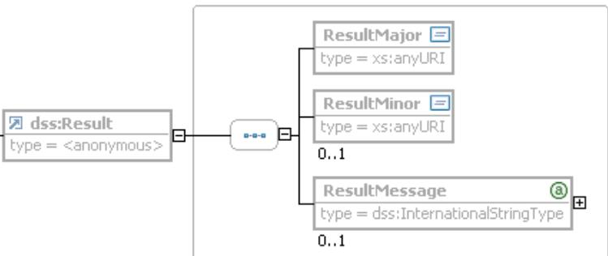

# Technical Guideline TR-03112-1 eCard-API-Framework – Overview Version 1.1.5 draft 7. April 2015

Bundesamt für Sicherheit in der Informationstechnik Postfach 20 03 63 53133 Bonn

E-Mail: ecard.api@bsi.bund.de Internet: https://www.bsi.bund.de © Bundesamt für Sicherheit in der Informationstechnik 2015

| 1              | Overview of the eCard-API-Framework5                                              |  |
|----------------|-----------------------------------------------------------------------------------|--|
| 1.1            | Key Words5                                                                        |  |
| 1.2            | XML-Schema6                                                                       |  |
| 1.3            | Overview (Part 1)6                                                                |  |
| 1.4            | eCard-Interface (Part 2)6                                                         |  |
| 1.4.1          | Functions for identity management6                                                |  |
| 1.4.2          | Signature functions6                                                              |  |
| 1.4.3          | Encryption functions7                                                             |  |
| 1.5<br>1.5.1   | Management-Interface (Part 3)7<br>Management of the eCard-API-Framework7          |  |
| 1.5.2          | Card management8                                                                  |  |
| 1.5.3          | Card terminal management8                                                         |  |
| 1.5.4          | Trusted viewer management9                                                        |  |
| 1.5.5<br>1.5.6 | Identity management9<br>Service management10                                      |  |
| 1.6            | ISO24727-3-Interface (Part 4)10                                                   |  |
| 1.6.1          | Card Application Service Access10                                                 |  |
| 1.6.2          | Connection service11                                                              |  |
| 1.6.3          | Card Application Service11                                                        |  |
| 1.6.4          | Named data service12                                                              |  |
| 1.6.5<br>1.6.6 | Cryptographic service12<br>Differential identity service13                        |  |
| 1.6.7          | Authorization service13                                                           |  |
| 1.7            | Support-Interface (Part 5)14                                                      |  |
| 1.8            | IFD-Interface (Part 6)14                                                          |  |
| 1.8.1          | Card terminal functions15                                                         |  |
| 1.8.2          | Card functions15                                                                  |  |
| 1.8.3<br>1.8.4 | User interaction functions16<br>IFD callback interface for card terminal events16 |  |
| 1.9            | Protocols (Part 7)16                                                              |  |
| 2              | Web Service interface18                                                           |  |
| 2.1            | Structure of the WSDL files18                                                     |  |
| 2.2            | Web service binding18                                                             |  |
| 2.3            | Structure of and links between the XSD and WSDL files19                           |  |
| 3              | Other programming interfaces21                                                    |  |
| 3.1            | C-Language Binding for ExecuteAPI21                                               |  |
| 3.2            | Java-Language Binding for ExecuteAPI function22                                   |  |
| 4              | Basic definitions23                                                               |  |
| 4.1            | Request- and ResponseType23                                                       |  |
| 4.1.1          | RequestType23                                                                     |  |
| 4.1.2          | ResponseType23                                                                    |  |
| 4.2<br>4.2.1   | Codes for errors and warnings25<br>Error codes from the Application-Layer25       |  |
| 4.2.2          | Error codes from the Dispatcher27                                                 |  |
| 4.2.3          | Error codes from the Identity-Layer28                                             |  |
|                |                                                                                   |  |

| 4.2.4 | Error codes from the Service-Access-Layer32       |  |
|-------|---------------------------------------------------|--|
| 4.2.5 | Error codes from the Terminal-Layer34             |  |
| 4.3   | Additional URI definitions36                      |  |
| 4.3.1 | Protocols36                                       |  |
| 4.3.2 | Properties36                                      |  |
| 4.3.3 | CardInfo36                                        |  |
| 4.4   | Mandatory use of Profile-attribute in responses36 |  |
| 5     | List of Abbreviations37                           |  |
| 6     | Index of XML data types38                         |  |

|  |  | Figure 1: The dss:Result element24 |
|--|--|------------------------------------|
|--|--|------------------------------------|

# <span id="page-4-0"></span>**1 Overview of the eCard-API-Framework**

The objective of the eCard-API-Framework is the provision of a simple and homogeneous interface to enable standardised use of the various smart cards (eCards) for different applications.

The eCard-API-Framework is sub-divided into the following layers:

- **•** Application-Layer
- **•** Identity-Layer
- **•** Service-Access-Layer
- **•** Terminal-Layer

The **Application-Layer** contains the various applications which use the eCard-API-Framework to access the eCards and their associated functions. Application-specific "convenience interfaces", in which the recurring invocation sequences may be encapsulated in application-specific calls, may also exist in this layer. However, these interfaces are currently *not* within the scope of the e-Card-API-framework.

The **Identity-Layer** comprises the eCard-Interface and the Management interface, and therefore functions for the use and management of electronic identities as well as for management of the eCard-API-Framework.

The *eCard-Interface* (refer to [TR-03112-2]) allows to request certificates as well as the encryption, signature and time-stamping of documents.

In the M*anagement-Interface* (refer to [TR-03112-3]), functions for updating the framework and the management of trusted identities, smart cards, card terminals, and default behaviour are available.

The **Service-Access-Layer** provides, in particular, functions for cryptographic primitives and biometric mechanisms in connection with cryptographic tokens, and comprises the ISO24727-3-Interface and the Support-Interface.

The *ISO24727-3-Interface* defined in the present document is a webservice-based implementation of the standard of the same name [ISO24727-3]. This interface contains functions to establish (cryptographically protected) connections to smart cards, to manage card applications, to read or write data, to perform cryptographic operations and to manage the respective key material (in the form of so-called "differential identities"). In the process, all functions which use or manage "differential identities" are parameterised by means of protocol-specific object identifiers so that the different protocols which are defined in the present document MAY be used with a standardised interface (refer to [TR-03112-7]).

The S*upport-Interface* (refer to [TR-03112-5]) contains a range of supporting functions.

The **Terminal-Layer** primarily contains the *IFD-Interface* (refer to [TR-03112-6]). This layer takes over the generalisation of specific card terminal types and various interfaces as well as communication with the smart card. For the user it is unimportant whether the card is addressed by PC/SC, a SICCT terminal or a proprietary interface, or whether it has contacts or is contact-less.

# **1.1 Key Words**

The key words "MUST", "MUST NOT", "REQUIRED", "SHALL", "SHALL NOT", "SHOULD", "SHOULD NOT", "RECOMMENDED", "MAY", and "OPTIONAL" in this document are to be interpreted as described in [RFC2119]. The key word "CONDITIONAL" is to be interpreted as follows:

CONDITIONAL: The usage of an item is dependent on the usage of other items. It is therefore further qualified under which conditions the item is REQUIRED or RECOMMENDED.

# **1.2 XML-Schema**

A XML-Schema is provided together with this Technical Guideline. In case of incongruencies, the specifications in this text take precedence. The graphical representations of the XML-Schema illustrate the schema. Note that the text of this Guideline might further restrict the presence or mulitplicity of elements as compared to the schema definition.

# **1.3 Overview (Part 1)**

This document is Part 1 of the document series, which provides an overview and general definitions.

# <span id="page-5-0"></span>**1.4 eCard-Interface (Part 2)**

The eCard-Interface encapsulates the main functions of the eCard-API-Framework in an application-orientated manner.

The eCard-Interface is specified in Part 2 of the document series and encapsulates the main functions of the eCard-API-Framework. For this purpose the eCard-Interface provides the following function groups:

- **•** Functions for identity management
- **•** Signature functions
- **•** Encryption functions

With the GetCertificate function, certificate applications can be transferred to a certification authority, from where they obtain their certificates.

In addition, the invocations specified by [DSS] can be used for the creation and verification of (qualified) electronic signatures in the formats according to [RFC3275] and [RFC3369], as well as the corresponding extensions from ETSI. This functional group also contains an interface to a trustworthy display component which can be used in particular for the displaying the data and test results requiring a signature.

Finally, with the encryption functions documents can be easily encrypted and decrypted in accordance with [RFC3369] and [XMLEnc] by simple function invocations.

# **1.4.1 Functions for identity management**

### **GetCertificate**

With the GetCertificate function, certificate applications can be transferred to a certification authority, from where they obtain their certificates.

# **1.4.2 Signature functions**

### **SignRequest**

The SignRequest function conforms with [DSS], and permits the creation of (qualified) electronic signatures in popular high-level formats such as XML-DSig in accordance with [RFC3275], or cryptographic message syntax in accordance with [RFC3369]. These signatures can also contain time stamps which can also be requested separately with this function.

### **VerifyRequest**

The VerifyRequest function conforms with [DSS] and enables verification of signed objects (e.g. signatures, time stamps, certificates, CRLs, OCSP-responses and evidence records).

### **ShowViewer**

This function enables trustworthy display of documents which can be used for the creation and verification of signatures.

# **1.4.3 Encryption functions**

### **EncryptRequest**

The EncryptRequest function enables encryption of data in accordance with [XMLEnc] and [RFC3369].

### **DecryptRequest**

The DecryptRequest function enables decryption of data encrypted in accordance with [XMLEnc] and [RFC3369].

# <span id="page-6-0"></span>**1.5 Management-Interface (Part 3)**

The Management-Interface provides important administration functions for the eCard-API-Framework.

The Management-Interface provides the following function groups:

- **•** Management of the eCard-API-Framework
- **•** Card management
- **•** Card terminal management
- **•** Trusted viewer management
- **•** Identity management
- **•** Service management

# **1.5.1 Management of the eCard-API-Framework**

This function group includes functions for the management of the eCard-API framework itself:

### **InitializeFramework**

The InitializeFramework function ensures initialisation of the eCard-API-Framework.

### **TerminateFramework**

The TerminateFramework function terminates all sessions and services of the eCard-API-Framework.

### **APIACLList**

The APIACLList function is OPTIONAL and MAY provide the currently defined access control regulations for access to the individual functions of the eCard-API-Framework. This function MAY ONLY be made available to the *administrator* who is authenticated in accordance with the security policies applicable for operation of the eCard framework.

### **APIACLModify**

The ACLModify function is OPTIONAL and MAY be used to modify the access control rules which govern the access to the functions of the eCard-API-Framework. Via this access control mechanism it is possible, for example, to grant or refuse access of an application to the Transmit function in the IFD interface (also refer to [TR-03112-6]) for the implementation of a "transparent channel" to a card. As a consequence, it is also possible to define whether and under which circumstances remote eCard-API-Frameworks are permitted access to a local eCard-API-Framework.

If this function is supported it MAY ONLY be made available to the *administrator* who is authenticated in accordance with the security policies applicable for operation of the eCard framework.

### **FrameworkUpdate**

The FrameworkUpdate function checks whether an update is available for the eCard-API-Framework and performs such an update if necessary. The detailed processes during execution of this function are protocol-specific (refer to [TR-03112-7]).

### **GetDefaultParameters**

Default behaviour can be specified for the eCard-API-Framework to also permit the easiest possible invocations by the client application for potentially complex operations (e.g. for creating and verifying electronic signatures, refer to [TR-03112-2], section 3.2.1-3.2.2). The currently specified default parameters MAY be read out with the GetDefaultParameters function.

### **SetDefaultParameters**

The SetDefaultParameters function is used to write the default parameters, which then determine the standard behaviour of the eCard-API-Framework.

# **1.5.2 Card management**

### **GetCardInfoList**

The GetCardInfoList function supplies the list of card types which are known from the CardInfo files.

### **SetCardInfoList**

The SetCardInfoList function saves an ordered list of card types in form of URIs, which determine the steps during the card recognition procedure.

### **AddCardInfoFiles**

With the AddCardInfoFiles function it is possible to add a series of CardInfo files.

### **DeleteCardInfoFiles**

The DeleteCardInfoFiles function deletes a series of CardInfo files.

# **1.5.3 Card terminal management**

### **RegisterIFD**

With the RegisterIFD function it is possible to add a card terminal with all configuration information.

### **UnregisterIFD**

The UnregisterIFD function deletes a card terminal.

# **1.5.4 Trusted viewer management**

### **GetTrustedViewerList**

The GetTrustedViewerList function provides a list of available trustworthy display components (trusted viewer).

### **GetTrustedViewerConfiguration**

The GetTrustedViewerConfiguration function reads the configuration information for a specific trusted viewer which is saved in the eCard-API-Framework.

#### **SetTrustedViewerConfiguration**

The SetTrustedViewerConfiguration function writes the configuration information for a specific trusted viewer.

### **AddTrustedViewer**

With the AddTrustedViewer function, a trusted viewer can be added with all configuration information.

#### **DeleteTrustedViewer**

The DeleteTrustedViewer function deletes a trusted viewer.

# **1.5.5 Identity management**

#### **GetTrustedIdentities**

The GetTrustedIdentities function supplies a list of the trustworthy identities in form of trust-service status list (TSL) and trustworthy certificates.

#### **AddTrustedCertificate**

With the AddTrustedCertificate function, a certificate can be added to the list of trusted certificates.

### **AddCertificate**

With the AddCertificate function, a non-trustworthy certificate which can be used for signature verification or encryption can be added to the certificate database.

#### **ExportCertificate**

With the ExportCertificate function, a (trustworthy or non-trustworthy) certificate can be exported.

#### **DeleteCertificate**

The DeleteCertificate function deletes an existing (trustworthy or non-trustworthy) certificate from the certificate database.

#### **AddTSL**

With the AddTSL function, a trust-service status list can be added to the eCard-API-Framework.

#### **ExportTSL**

With the ExportTSL function, a trust-service status list can be exported.

#### **DeleteTSL**

With the DeleteTSL function, a trust-service status list can be deleted from the list of trustworthy identities.

# **1.5.6 Service management**

### **GetOCSPServices**

The GetOCSPServices function reads the list of available OCSP responders together with the corresponding configuration information.

### **SetOCSPServices**

The SetOCSPServices function writes the list of available OCSP responders together with the corresponding configuration information.

### **GetDirectoryServices**

The GetDirectoyServices function reads the list of the directory services accessible via LDAP or HTTP with all corresponding configuration information.

### **SetDirectoryServices**

The SetDirectoyServices function writes a list of the directory services accessible via LDAP or HTTP with all corresponding configuration information.

### **GetTSServices**

The GetTSServices function reads the list of time stamp services with all corresponding configuration information.

### **SetTSServices**

The SetTSServices function writes a list of the time stamp services together with all corresponding configuration information.

# <span id="page-9-0"></span>**1.6 ISO24727-3-Interface (Part 4)**

The ISO24727-3-Interface provides a generic interface for all card-based functions of the various eCards.

The ISO24727-3-Interface provides the following function groups:

- **•** Card Application Service Access
- **•** Connection Service
- **•** Card Application Service
- **•** Named data service
- **•** Cryptographic service
- **•** Authorization service

# **1.6.1 Card Application Service Access**

### **Initialize**

The Initialize function is executed when the ISO24727-3-Interface is invoked for the first time. The interface is initialised with this function.

### **Terminate**

The Terminate function is executed when the ISO24727-3-Interface is terminated. This function closes all processes.

### **CardApplicationPath**

The CardApplicationPath function determines the path between a client application and a card application.

# **1.6.2 Connection service**

### **CardApplicationConnect**

The CardApplicationConnect function establishes an unauthenticated connection between the client application and the card application.

### **CardApplicationDisconnect**

The CardApplicationDisconnect function terminates the connection between the client application and the card application.

#### **CardApplicationStartSession**

The CardApplicationStartSession function starts an authenticated session between the client application and the card application.

#### **CardApplicationEndSession**

The CardApplicationEndSession function closes an authenticated session between the client application and the card application.

# **1.6.3 Card Application Service**

### **CardApplicationList**

The CardApplicationList function returns the list of available card applications of an eCard as a list.

### **CardApplicationCreate**

The CardApplicationCreate function creates a new card application.

### **CardAppicationDelete**

The CardApplicationDelete function deletes a card application on an eCard.

### **CardApplicationServiceList**

The CardApplicationServiceList function returns a list of the available services of a card application on an eCard.

### **CardApplicationServiceCreate**

The CardApplicationServiceCreate function creates a new service for the card application on an eCard.

### **CardApplicationServiceLoad**

The CardApplicationServiceLoad function loads executable code, which can be executed within a service of a card application on the eCard.

#### **CardApplicationServiceDelete**

The CardApplicationServiceDelete function deletes a service in a card application on an eCard.

### **CardApplicationServiceDescribe**

The invocation parameters of a service of a card application can be determined with the CardApplicationServiceDescribe function.

### **ExecuteAction**

The ExecuteAction function permits the execution of an action of a service which has been loaded into a card application on an eCard with the CardApplicationServiceLoad function.

# **1.6.4 Named data service**

### **DataSetList**

The DataSetList function supplies a list of data sets in a card application on an eCard.

### **DataSetCreate**

The DataSetCreate function creates a new data set in a selected card application on an eCard.

### **DataSetSelect**

The DataSetSelect function selects a data set of a card application on an eCard.

#### **DataSetDelete**

The DataSetDelete function deletes a data set of a card application on an eCard.

#### **DSIList**

The DSIList function returns a list of data structures for interoperability (DSIs) in the currently selected data set of a card application.

#### **DSICreate**

The DSICreate function creates a DSI in the currently selected data set of a card application.

### **DSIDelete**

The DSIDelete function deletes a DSI in the currently selected data set of a card application.

### **DSIWrite**

The DSIWrite function writes specific content into a DSI in a currently selected data set of an application.

### **DSIRead**

The DSIRead function reads the content of a DSI in the currently selected data set of a card application.

# **1.6.5 Cryptographic service**

The detailed functionality of the cryptographic service is determined by the protocol of the differential identity employed. Various protocols and especially the Generic Cryptography protocol are defined in [TR-03112-7].

### **GetRandom**

The GetRandom function returns a random number which can be used, for example, for authentication.

### **VerifySignature**

The VerifySignature function checks a digital signature.

### **VerifyCertificate**

The VerifyCertificate function validates a certificate.

### **Sign**

The Sign function generates a signature for a communicated binary message.

### **Encipher**

The Encipher function encrypts a transmitted plain text.

### **Decipher**

The Decipher function decrypts a transmitted cipher text.

### **Hash**

The Hash function calculates the hash value of a transmitted message.

# **1.6.6 Differential identity service**

The detailed functionality of the DIDCreate, DIDGet, DIDUpdate and DIDAuthenticate functions is determined by the protocol (also refer to [TR-03112-7]) of the employed differential identity.

### **DIDList**

The DIDList function returns a list of the existing differential identities (DIDs) in the card application of an eCard.

### **DIDCreate**

The DIDCreate function creates a new differential identity in a card application of an eCard.

### **DIDGet**

The DIDGet function determines the publicly accessible information (e.g. key reference) of a differential identity in a card application of an eCard.

### **DIDUpdate**

The DIDUpdate function generates a new key (marker) for a differential identity in a card application of an eCard.

### **DIDDelete**

The DIDDelete function deletes a given differential identity in a card application of an eCard.

### **DIDAuthenticate**

Using one or more differential identities, the DIDAuthenticate function executes an authentication protocol which is implicitly specified by these identities.

# **1.6.7 Authorization service**

### **ACLList**

The ACLList function returns the currently defined access control rules for accessing a card application.

### **ACLModify**

The ACLModify function permits modification of a certain access control rule for access to a card application.

# <span id="page-13-1"></span>**1.7 Support-Interface (Part 5)**

The Support-Interface contains a series of supporting functions which are typically not executed on an eCard. This comprises the following functions.

### **Encode**

The Encode function encodes data. This function is also used, for example, for data compression.

### **Decode**

The Decode function decodes data. This function is also used, for example, for data decompression.

### **ValidateXMLDocument**

The ValidateXMLDocument function validates an XML document on the basis of a schema.

### **GetCardInfoOrACD**

The GetCardInfoOrACD function may be used to retrieve CardInfo-files as specified in [TR-03112-4] and [CEN15480-3] or equivalent Application Capability Descriptions (ACD) according to [ISO24727-2], which allow to perform the mapping of generic calls at the ISO24727-3-Interface to card-specific APDUs.

# <span id="page-13-0"></span>**1.8 IFD-Interface (Part 6)**

The IFD-Interface provides the following function groups:

- **•** Card terminal functions
- **•** Card functions
- **•** User interaction functions

In addition, there is an IFD-Callback-Interface for card terminal events and additional functions for the management of card terminals which are specified in the Management-Interface [TR-03112-3]:

### **RegisterIFD**

With the RegisterIFD function it is possible to add a card terminal with all configuration information.

### **UnregisterIFD**

The UnregisterIFD function deletes a card terminal.

# **1.8.1 Card terminal functions**

### **EstablishContext**

The EstablishContext function opens a session with the Terminal-Layer and returns a ContextHandle which is used in other invoked functions to address this session.

### **ReleaseContext**

The ReleaseContext function terminates a session with the Terminal-Layer addressed by means of a ContextHandle.

### **ListIFDs**

With the ListIFDs function a list of available card terminals is returned to the calling layer.

### **GetIFDCapabilities**

The GetIFDCapabilities function provides information about a specific card terminal and its functional units to the calling layer.

### **GetStatus**

The GetStatus function determines the current status of the card terminal.

#### **Wait**

With the Wait function the invoking layer can be informed about card terminal events by the return of the Wait function or by means of the SignalEvent callback function.

#### **Cancel**

The Cancel function terminates the waiting procedure for card terminal events, or attempts to cancel processing of the last command sent by means of the current handle on a specific card terminal. In this case, success depends on the type of command and the point of time at which Cancel was invoked.

### **ControlIFD**

The ControlIFD function sends a (proprietary) command to the card reader. This serves to permit access to proprietary and application-specific functions for which there is no separate command in the IFD-Interface without changing the interface.

# **1.8.2 Card functions**

### **Connect**

The Connect function activates an eCard registered by the IFD and returns a CardHandle with which it can be addressed in future.

### **Disconnect**

The Disconnect function invalidates a CardHandle and optionally executes an additional operation (e.g. ejection of the eCard, if the IFD has the corresponding mechanical functionality).

### **BeginTransaction**

The BeginTransaction function starts a transaction within the framework of which several commands can be sent to the eCard. If an error occurs, the transaction is cancelled and any modifications performed are reset.

### **EndTransaction**

The EndTransaction function terminates an existing transaction.

### **Transmit**

The Transmit function sends APDUs to an eCard addressed by means of a CardHandle.

# **1.8.3 User interaction functions**

### **VerifyUser**

The VerifyUser function verifies a user by means of a PIN or a biometric characteristic.

### **ModifyVerificationData**

The ModifyVerificationData function modifies the identification data (PIN or biometric characteristic).

### **Output**

The Output function serves to control the output units of a card terminal.

# <span id="page-15-0"></span>**1.8.4 IFD callback interface for card terminal events**

### **SignalEvent**

With the SignalEvent function, layers above the Terminal-Layer can be informed about card terminal events. To this purpose the SignalEvent function MUST be provided as a web service by these layers.

# **1.9 Protocols (Part 7)**

[TR-03112-7] contains specifications for ISO/IEC 24727 protocols as well as protocols for GetCertificate and FrameworkUpdate.

The ISO/IEC 24727 protocols define Crypto and Differential Identity Services for some authentication protocols as required for the use of typical signature cards, electronic health insurance cards, healthcare professional ID cards and the planned electronic identity cards:

**PIN Compare**: This protocol defines the authentication of a user performed by means of a PIN, which is also specified in abridged form in Annex A.9 of [ISO24727-3].

**Mutual Authentication**: This protocol is specified in similar form in Annex A.12 of [ISO24727-3], Section 16.1.1of [eGK-1] and Section 8.8 of [EN14890-1] and provides the framework for mutual authentication with the exchange of keys using symmetric algorithms.

**Extended Access Control**: This protocol specified in [TR-03110] forms the framework for mutual authentication with key exchange using the Extended Access Control protocol.

**RSA Authentication**: This protocol is specified in a similar form in Annex A.15 of [ISO24727-3], Section 16 of [eGK-1] and Section 8.4 of [EN14890-1] and provides the framework for mutual authentication with an optional exchange of keys using the RSA algorithm.

**Generic Cryptography**: This generic protocol specifies how cryptographic operations can be used independently of specific authentication procedures.

In addition to that, [TR-03112-7] defines the connection establishment for SOAP and PAOS bindings whereas the use of the PAOS binding requires a more complex process to establish the connection. In this context [TR-03112-7] defines the functions

### **TC\_API\_OPEN**

The function TC\_API\_Open can be used to initiate the establishment of a connection with a specific binding (e.g. [PAOSv2.0]) between two systems.

### **TC\_API\_CLOSE**

The function TC\_API\_Close MAY be used to actively close down a previously established connection between two systems.

### **StartPAOS**

The function StartPAOS is used for the establishment of a PAOS connection according to [PAOSv2.0].

# <span id="page-17-0"></span>**2 Web Service interface**

[WSDL] is used for interface description so that web services can be defined independently of the transport layer.

# **2.1 Structure of the WSDL files**

On the basis of the definition – independently of the transport layer – the WSDL files comprise, on the one hand, XML elements which describe the service abstractly, and, on the other one, elements which specify compliance with a concrete transport protocol.

The WSDL files comply with the [WSDL] specification and have the following structure:

```
<?xml version="1.0" encoding="UTF-8"?>
<wsdl:definitions targetNamespace="http://www.bsi.bund.de/eCard"
      … >
      <wsdl:types>
      …
      </wsdl:types>
      <wsdl:message name="Function ">
      …
      </wsdl:message>
      …
      <wsdl:portType name="Interface">
            <wsdl:operation name="Function">
            </wsdl:operation>
            …
      </wsdl:portType>
      <wsdl:binding name="IFD" type="ec:IFD">
      </wsdl:binding>
      <wsdl:service name="Interface">
            <wsdl:port name="InterfacePort" binding="ec:Interface">
                  <soap:address location="http://127.0.0.1:24727" />
            </wsdl:port>
      </wsdl:service>
</wsdl:definitions>
```
The name-space prefixes are defined in the definitions root element of the WSDL files. The following element types defines the data types. The defined XSD schemata are also integrated at this point. These constitute the basis for the message element. This contains a description of the message which is processed as an inquiry or output as a response. The portType element specifies a logical grouping of operations which are described by the operation element.

The binding element is used for defining protocols and data formats. This contains a description of all information required for depicting communication on an existing transport protocol. In addition, the binding also describes encoding of the messages which transmits the input and output values for the existing operations. The actual service is described in the service element. A service comprises at least one port element. A port specifies an address for a binding.

# <span id="page-17-1"></span>**2.2 Web service binding**

The following web service bindings MUST at least be supported for the interfaces defined by [TR-03112-WSDL]:

- **•** <http://schemas.xmlsoap.org/soap/http> SOAP via HTTP according to [SOAPv1.1], Section 6
- **•** urn:liberty:paos:2006-08 Reverse http Binding for SOAP (PAOS) according to [PAOSv2.0]

In addition, other bindings as well as language-specific interfaces derived from the [TR-03112-WSDL] WSDL descriptions MAY also be supported (also refer to Section [3\)](#page-20-0).

While http-requests and SOAP-requests or responses result directly in a "standard binding" in accordance with [SOAPv1.1] (Section 6), with a "PAOS binding" the remote framework (in this case typically a server system) sends its SOAP requests with the respective http-responses to the local framework (in this case typically a client system).

As a result of this binding it is possible to send web service invocations to client systems which do not permit *any incoming* http-connections. The PAOS binding can, for example, be used for the electronic personal ID for authentication and identification on the internet.

# <span id="page-18-0"></span>**2.3 Structure of and links between the XSD and WSDL files**

There is a corresponding WSDL file (.wsdl) for each interface (the eCard-, Management-, ISO24727-3-, ISO24727-Protocols, Support-, IFD-, and IFDCallback-Interface) in which the corresponding (primary) schema files (.xsd) are integrated:

- **•** eCard.{xsd,wsdl} contains the definition of the structures for the eCard-Interface (also refer to Section [1.4](#page-5-0) and [TR-03112-2]).
- **•** Management.{xsd,wsdl} contains the definition of the structures for the Management-Interface (also refer to Section [1.5](#page-6-0) and [TR-03112-3]).
- **•** ISO24727-3.{xsd,wsdl} contains the definition of the structures for the ISO24727-3-Interface (also refer to Section [1.6,](#page-9-0) [TR-03112-4] and [ISO24727-3]).
- **•** ISO24727-Protocols.{xsd,wsdl} defines the specific card protocols and the functions for connection establishment according to [TR-03112-7] (TC\_API\_Open, TC\_API\_Close and StartPAOS).
- **•** Support.{xsd,wsdl} contains the definition of the structures for the Support-Interface (also refer to Section [1.7](#page-13-1) and [TR-03112-5]).
- **•** ISOIFD.{xsd,wsdl} contains the definition of the structures for the IFD-Interface (also refer to Section [1.8,](#page-13-0) [TR-03112-6] and [ISO24727-4]).
- **•** ISOIFDCallback.{xsd,wsdl} contains the definition of the structures for the IFD-Callback-Interface (also refer to Section [1.8.4](#page-15-0) and [TR-03112-6]).

In addition, there are the following additional XSD- and WSDL-files, which correspond to supporting services:

- **•** UpdateService.wsdl defines the interface to an update service for the basic update protocol specified in [TR-03112-7].
- **•** CardInfoRepository.{xsd,wsdl} defines the interface to the CardInfo-Repository (also refer to [TR-03112-5], Section 3).

Moreover, the following (secondary) schemata exist within the eCard-API-Framework which are integrated into the above-mentioned schema files:

- **•** ISOCommon.xsd defines basic structures (refer to Section [4\)](#page-22-0),
- **•** CardInfo.xsd defines the CardInfo-structure (also refer to [TR-03112-4], Annex A and [CEN15480-3]) and

**•** eCard-Protocols.xsd – defines other protocols (e.g. for GetCertificate) (also refer to [TR-03112-7]).

These schemata developed in the scope of this Guideline are, in turn, for example based on the following standard schemata:

- **•** ecdsa.xsd contains definitions necessary for the handling of data structures related to elliptic curves.
- **•** oasis-dssx-1.0-profiles-encryption-0.5.xsd a profile for encryption and decryption.
- **•** xmlers-schema-draft-v0.3.xsd contains definitions for XML-based evidence records as used in in the comprehensive verification report profile.

An index of XML data types is provided as Annex of this document.

# <span id="page-20-0"></span>**3 Other programming interfaces**

In addition to the web service bindings mentioned in Section [2.2,](#page-17-1) language-specific programming interfaces derived from the WSDL specifications MAY be offered for the functions of the eCard-API-Framework.

# **3.1 C-Language Binding for ExecuteAPI**

This function serves as a C-language binding for the functions defined in this specification. It is the only entry point for the C-programming language. It processes XML encoded function calls and returns XML encoded function call responses.

#### **Prototype**

```
wchar_t* ExecuteAPI (
      IN const wchar_t* FunctionCall,
      IN/OUT StatusType* Status
);
```
#### **Parameters**

FunctionCall

XML encoded function call as a Null-terminated buffer containing the XML payload.

Status

Receives the status of the function call to be executed. This parameter can have one of the following values:

| Data Type         | Description                                                  |
|-------------------|--------------------------------------------------------------|
| API_OK            | Function executed successfully.                              |
| API_SMALL_BUFFER  | Application allocated buffer for response data is too small. |
| API_XML_ERROR     | Error in parsing XML encoded function call.                  |
| API_GENERIC_ERROR | Unknown error.                                               |

#### **Return values**

Upon successful completion, the function returns the XML encoded function call response as a Null-terminated buffer.

#### **Prototype**

```
void freeAPIExecuteResponse (
      IN wchar_t* Response);
```
#### **Parameters**

Response

A pointer to a Null-terminated buffer containing the XML encoded function call response to be freed.

#### **Return values**

None.

# **3.2 Java-Language Binding for ExecuteAPI function**

The APIJavaBinding class serves as a Java-language binding for the functions defined in this document series. It has only one method ExecuteAPI which processes XML encoded function calls and returns XML encoded function call responses.

### **Prototype**

```
public class APIJavaBinding {
 public static String ExecuteAPI (String functionCall) throws APIException {}
}
```
#### **Parameters**

functionCall

XML encoded function call as a Java String.

#### **Returns**

XML encoded function call response as a Java String.

#### **Throws**

```
public class APIException extends Exception {
 public enum APIExceptionReason {ApiXmlError, ApiGenericError};
 APIExceptionReason reason;
 public APIException(APIExceptionReason reason) {
 this.reason = reason;
 }
 public APIExceptionReason getReason() {
 return reason;
 }
 public String getMessage() {
 switch (reason) {
 case ApiXmlError:
 return "Error in parsing XML encoded function call.";
 default:
 return "Generic error.";
 }
 }
}
```
# <span id="page-22-0"></span>**4 Basic definitions**

# **4.1 Request- and ResponseType**

The RequestType used in the eCard-API-Framework and in [ISO24727-3] and [ISO24727-4] is based on the RequestBaseType defined in the [DSS] (with restrictions), and as a ResponseType uses the ResponseBaseType defined in [DSS]. Thus, trouble-free combination of the interfaces from [ISO24727-3] and [ISO24727-4] is possible with those of [DSS] and related profiles.

# **4.1.1 RequestType**

The RequestType used in the eCard-API-Framework and in ISO/IEC 24727 is defined as follows:

```
<complexType name="RequestType">
      <complexContent>
            <restriction base="dss:RequestBaseType">
            </restriction>
      </complexContent>
</complexType>
```
# **4.1.2 ResponseType**

The ResponseType used in the eCard-API-Framework and in ISO/IEC 24727 is based on [DSS] and is defined as follows:

```
<complexType name="ResponseType">
      <complexContent>
            <restriction base="dss:ResponseBaseType">
                  <sequence>
                        <element ref="dss:Result"/>
                  </sequence>
            </restriction>
      </complexContent>
</complexType>
```
As a result, of the functions standardised by ISO/IEC only the dss:Result element of [DSS] is used in the ResponseType, which contains the respective status information and is described in more detail below.

With the [DSS] compliant functions in [CEN15480-3], the ResponseType is used directly from [DSS] so that the optional parameter dss:OptionalOutputs is also available.



*Figure 1: The dss:Result element*

The Result element contains a mandatory ResultMajor element as a URI and MAY additionally contain a ResultMinor element as an URI, and with the ResultMessage, also an additional message. The URIs used in the ResponseType of the eCard-API-Framework have the prefix [http://www.bsi.bund.de/ecard/api/1.1,](http://www.bsi.bund.de/ecard/api/1.0) which is supplemented by a corresponding identifier.

The following URIs therefore result for ResultMajor, the meaning of which is described in detail below:

- **•** [http://www.bsi.bund.de/ecard/api/1.1/resultmajor#ok](http://www.bsi.bund.de/ecard/api/1.0/resultmajor#ok)
- **•** [http://www.bsi.bund.de/ecard/api/1.1/resultmajor#error](http://www.bsi.bund.de/ecard/api/1.0/resultmajor#error)
- **•** [http://www.bsi.bund.de/ecard/api/1.1/resultmajor#warning](http://www.bsi.bund.de/ecard/api/1.0/resultmajor#warning)

The error messages in the ResultMinor element have the prefix

http://www.bsi.bund.de/ecard/api/1.1/resultminor/, and are supplemented by the respective error code.

The URI http://www.bsi.bund.de/ecard/api/1.1/resultminor/al/common#noPermission shows, for example, that the use of the function by the Client application is not permitted (refer to Section [4.2\)](#page-24-0).

| ResultMajor   | The following values are defined for the ResultMajor element:                                                                                                                                                                                                                         |  |
|---------------|---------------------------------------------------------------------------------------------------------------------------------------------------------------------------------------------------------------------------------------------------------------------------------------|--|
|               | •<br>http://www.bsi.bund.de/ecard/api/1.1/resultmajor#ok<br>No error occurred during execution of the operation.                                                                                                                                                                      |  |
|               | •<br>http://www.bsi.bund.de/ecard/api/1.1/resultmajor#error<br>An error occurred during execution of the operation. The reason for the<br>error is shown by the URI (or the respective error code) for<br>ResultMinor.                                                                |  |
|               | •<br>http://www.bsi.bund.de/ecard/api/1.1/resultmajor#warning<br>If the result of the operation is in principle OK, but there is a detail<br>which may require closer investigation, a warning is given as a<br>response.                                                             |  |
|               | •<br>http://www.bsi.bund.de/ecard/api/1.1/resultmajor#nextRequest<br>This result appears if at least one more request is expected within a<br>protocol.                                                                                                                               |  |
|               | Stating the ResultMajor element is REQUIRED. If no error has occurred,<br>the message …/resultmajor#ok is output. If, however, a warning or error has<br>occurred, a description MUST be given in the ResultMinor element.                                                            |  |
| ResultMinor   | If the ResultMajor-element contains the value …/resultmajor#error or<br>…/resultmajor#warning<br>is displayed in the ResultMajor element, a more<br>detailed description MUST be given with the ResultMinor element. The<br>URIs returned in this element are defined in Section 4.2. |  |
| ResultMessage | MAY contain additional URIs if necessary (if several errors or warnings occur)                                                                                                                                                                                                        |  |

| or more detailed information on the error which has occurred. The required |
|----------------------------------------------------------------------------|
| xml:lang-Attribute SHOULD be set according to [ISO639-1].                  |

# <span id="page-24-0"></span>**4.2 Codes for errors and warnings**

The occurring errors are assigned to the levels of the eCard-API-Framework with the aid of the prefixes of the URI as follows:

- **•** [http://www.bsi.bund.de/ecard/api/1.1/resultminor/al](http://www.bsi.bund.de/ecard/api/1.0/resultminor/al)  The cause of the error must be assigned to the application layer.
- **•** http://www.bsi.bund.de/ecard/api/1.1/resultminor/dp The cause of the error must be assigned to the dispatcher.
- **•** http://www.bsi.bund.de/ecard/api/1.1/resultminor/il The cause of the error must be assigned to the identity layer.
- **•** [http://www.bsi.bund.de/ecard/api/1.1/resultminor/sal](http://www.bsi.bund.de/ecard/api/1.0/resultminor/sal)  The cause of the error must be assigned to the service access layer.
- **•** [http://www.bsi.bund.de/ecard/api/1.1/resultminor/ifdl](http://www.bsi.bund.de/ecard/api/1.0/resultminor/ifdl)  The cause of the error must be assigned to the Terminal-Layer.

In addition, the errors or warnings are grouped in the respective interface, if necessary by an additional directory level.

The error descriptions stated in round brackets (API\_xyz) correspond to those defined in [CEN15480-3], [ISO24727-3] or [ISO24727-4].

# **4.2.1 Error codes from the Application-Layer**

The error codes assigned to this layer indicate operation errors of the applications using the eCard-API-Framework. These include in particular incorrect or faulty (configuration) data.

### **4.2.1.1 CardInfo**

The error codes of the errors which can occur in conjunction with faulty invocations of the management functions for CardInfo structures are grouped in the CardInfo category.

| Error code                      | Error description                |
|---------------------------------|----------------------------------|
| …/al/CardInfo#addNotPossible    | CardInfo file cannot be added    |
| …/al/CardInfo#notExisting       | CardInfo file does not exist     |
| …/al/CardInfo#deleteNotPossible | CardInfo file cannot be deleted  |
| …/al/CardInfo#alreadyExisting   | The CardInfo file already exists |
| …/al/CardInfo#incorrectFile     | The CardInfo file is incorrect   |

The following table contains the error codes and the corresponding description.

# **4.2.1.2 Common**

This section describes error codes caused by incorrect use of the API functions in general and which cannot be assigned to any particular range of functions.

| Error code                           | Error description                                                                                                                                                                                              |
|--------------------------------------|----------------------------------------------------------------------------------------------------------------------------------------------------------------------------------------------------------------|
| …/al/common#unknownError             | There was some unknown error                                                                                                                                                                                   |
|                                      | An unexpected error has occurred during processing<br>which cannot be represented by the standard codes or<br>specific service error codes. The error and detail texts<br>can describe the error more closely. |
|                                      | (API_UNKNOWN_ERROR)                                                                                                                                                                                            |
| …/al/common#noPermission             | Use of the function by the client application is not<br>permitted                                                                                                                                              |
| …/al/common#internalError            | Internal error                                                                                                                                                                                                 |
| …/al/common#incorrectParameter       | Parameter error                                                                                                                                                                                                |
|                                      | There was some problem with a provided or omitted<br>parameter.                                                                                                                                                |
|                                      | (API_INCORRECT_PARAMETER)                                                                                                                                                                                      |
| …/al/common#unknownAPIFunction       | API function unknown                                                                                                                                                                                           |
| …/al/common#notInitialized           | Framework or layer not initialised                                                                                                                                                                             |
| …/al/common#                         | Warning indicating termination of an active session                                                                                                                                                            |
| warningConnectionDisconnected        | (API_WARNING_CONNECTION_DISCONNECTED)                                                                                                                                                                          |
| …/al/common#SessionTerminatedWarning | Warning indicating termination of an active session                                                                                                                                                            |
|                                      | (API_WARNING_SESSION_ENDED)                                                                                                                                                                                    |

The following table contains the error codes and the corresponding description.

### **4.2.1.3 FrameworkUpdate**

This section describes the error codes which can occur during execution of a framework update.

The following table contains the error codes and the corresponding description.

| Error code                                          | Error description                 |
|-----------------------------------------------------|-----------------------------------|
| …/al/FrameworkUpdate#serviceNotAvailable            | Update service is not accessible  |
| …/al/FrameworkUpdate#unknownModule                  | Unknown module                    |
| …/al/FrameworkUpdate#invalidVersionNumber           | Invalid version number for module |
| …/al/FrameworkUpdate#operationSystemNotSupported    | Operating system not supported    |
| …/al/FrameworkUpdate#noSpaceAvailable               | No available space                |
| …/al/FrameworkUpdate#securityConditionsNotSatisfied | Access denied                     |

# **4.2.1.4 IFD**

The following errors can occur as the result of incorrect information during management of card terminals. These errors are grouped in the IFD category.

The following table contains the error codes and the corresponding description.

| Error code                             | Error description                                 |
|----------------------------------------|---------------------------------------------------|
| …/al/IFD#writeConfigurationNotPossible | The card terminal configuration cannot be written |
| …/al/IFD#couldNotAdd                   | The card terminal cannot be added                 |
| …/al/IFD#deleteNotPossible             | The card terminal cannot be deleted               |
| …/al/IFD#addNotPossible                | The card terminal already exists                  |

### **4.2.1.5 Trusted viewer**

The following errors can occur during use of the management functions for trusted viewers.

### The following table contains the error codes and the corresponding description.

### **4.2.1.6 TSL**

The following error codes are generated by the functions for management of trust service status lists (TSLs).

| Error code                               | Error description                                                                                                          |
|------------------------------------------|----------------------------------------------------------------------------------------------------------------------------|
| …/al/TSL#TSLSequenceNumberIgnoredWarning | TSLSequenceNumber has been ignored                                                                                         |
|                                          | As only a TSLSequenceNumber but no<br>SchemeName has been specified, the<br>TSLSequenceNumber-element has been<br>ignored. |

The following table contains the error codes and the corresponding description.

# **4.2.2 Error codes from the Dispatcher**

The errors caused by communication to and from the eCard-API-Framework are described here.

| The following table contains the error codes and the corresponding description. |                         |  |
|---------------------------------------------------------------------------------|-------------------------|--|
| Error code                                                                      | Error description       |  |
| /dp#timeoutError                                                                | Time exceeded (timeout) |  |

|                                       | The operation was terminated as the set time was<br>exceeded. |
|---------------------------------------|---------------------------------------------------------------|
| /dp#invalidChannelHandle              | Invalid channel handle                                        |
| /dp#communicationError                | Communication error                                           |
|                                       | (API_COMMUNICATION_FAILURE)                                   |
| /dp#trustedChannelEstablishmentFailed | Failure to open a trusted channel                             |
| /dp#unknownProtocol                   | Unknown protocol                                              |
| /dp#unknownCipherSuite                | Unknown cipher suite                                          |
| /dp#unknownWebserviceBinding          | Unknown web service binding                                   |
| …/dp#nodeNotReachable                 | Node not reachable                                            |

# **4.2.3 Error codes from the Identity-Layer**

Errors caused by the identity layer of the eCard-API-Framework are assigned to the identity layer.

# **4.2.3.1 Algorithm**

The errors of the identity layer caused by the algorithms stated for use are described in the following table.

| Error code                                    | Error description                      |
|-----------------------------------------------|----------------------------------------|
| …/il/algorithm#hashAlgorithmNotSupported      | Stated hash algorithm is not supported |
| …/il/algorithm#signatureAlgorithmNotSupported | The stated signature algorithm is not  |
|                                               | supported                              |

# **4.2.3.2 CertificateRequest**

The errors of the identity layer which can occur when a certificate is requested are grouped in this category.

|  | The following table contains the error codes and the corresponding description. |
|--|---------------------------------------------------------------------------------|
|  |                                                                                 |

| Error code                                                     | Error description                                   |
|----------------------------------------------------------------|-----------------------------------------------------|
| …/il/certificateRequest#unknownAttribute                       | Unknown attribute in the certificate<br>application |
| …/il/certificateRequest#<br>creationOfCertificateRequestFailed | Generation of the certificate application<br>failed |
| …/il/certificateRequest#submissionFailed                       | Submission of the certificate application<br>failed |
| …/il/certificateRequest#unknownTransactionID                   | Unknown transaction identifier                      |
| …/il/certificateRequest#certificateDownloadFailed              | Not possible to collect the certificate             |
| …/il/certificateRequest#subjectMissing                         | No subject specified in request                     |

# **4.2.3.3 Encryption**

The Encryption category contains the errors of the identity layer which occur during encryption or decryption.

**Error code Error description** …/il/encryption#encryptionOfCertainNodes OnlyForXMLDocuments **Specific nodes can only be encrypted in case of an XML document** …/il/encryption#encryptionFormatNotSupported **The encryption format is not supported** …/il/encryption#invalidCertificate **The encryption certificate of an intended recipient is invalid**

The following table contains the error codes and the corresponding description.

### **4.2.3.4 Key**

The errors of the identity layer which can occur when a key is generated or keys are used are grouped in this category.

The following table contains the error codes and the corresponding description.

| Error code                               | Error description                                |
|------------------------------------------|--------------------------------------------------|
| …/il/key#keyGenerationNotPossible        | Key generation is not possible                   |
| …/il/key#encryptionAlgorithmNotSupported | The stated encryption algorithm is not supported |

### **4.2.3.5 Service**

The Service category contains the errors of the identity layer which occur due to the non-accessibility of the service to be used.

| Error code                               | Error description                      |
|------------------------------------------|----------------------------------------|
| …/il/service#ocspResponderUnreachable    | The OCSP responder is inaccessible     |
| …/il/service#directoryServiceUnreachable | The directory service is inaccessible  |
| …/il/service#timeStampServiceUnreachable | The time stamp service is inaccessible |

The following table contains the error codes and the corresponding description.

### **4.2.3.6 Signature**

All errors and warnings of the identity layer which occur during signature generation or signature verification are assigned to the Signature category.

The following table contains the error codes and the corresponding description.

| Error code                                 | Error description                                              |
|--------------------------------------------|----------------------------------------------------------------|
| …/il/signature#signatureFormatNotSupported | The signature format is not supported                          |
|                                            | The stated signature or time stamp format<br>is not supported. |

| …/il/signature#PDFSignatureForNonPDFDocument         | PDF signature for non-PDF document<br>requested                                                                                                                                          |
|------------------------------------------------------|------------------------------------------------------------------------------------------------------------------------------------------------------------------------------------------|
| …/il/signature#unableToIncludeEContentWarning        | IncludeEContent not possible                                                                                                                                                             |
|                                                      | This warning is returned if the<br>IncludeEContent flag is set when a<br>PDF signature or a time stamp is generated,<br>or when a hash value is transmitted for<br>signature generation. |
| …/il/signature#ignoredSignaturePlacementFlagWarning  | The SignaturePlacement flag was<br>ignored                                                                                                                                               |
|                                                      | This warning is returned when the<br>SignaturePlacement flag was set for<br>a non-XML-based signature.                                                                                   |
| …/il/signature#certificateNotFound                   | The certificate is not available                                                                                                                                                         |
|                                                      | The stated certificate is not available for the<br>function. This could be due to an incorrect<br>reference or a deleted data field.                                                     |
| …/il/signature#certificateFormatNotCorrect           | The certificate cannot be interpreted                                                                                                                                                    |
|                                                      | The format of the stated certificate is<br>unknown and cannot be interpreted.                                                                                                            |
| …/il/signature#invalidCertificateReference           | Invalid certificate reference                                                                                                                                                            |
| …/il/signature#certificateChainInterrupted           | The certificate chain is interrupted                                                                                                                                                     |
|                                                      | The stated certificate chain is interrupted. It<br>is therefore not possible to complete full<br>verification up to the root certificate.                                                |
| …/il/signature#resolutionOfObjectReferenceImpossible | It was not possible to resolve the object<br>reference                                                                                                                                   |
| …/il/signature#transformationAlgorithmNotSupported   | The transformation algorithm is not<br>supported                                                                                                                                         |
| …/il/signature#unknownViewer                         | The viewer is unknown or not available                                                                                                                                                   |
| …/il/signature#certificatePathNotValidated           | The certificate path was not checked                                                                                                                                                     |
|                                                      | Due to some problems it was not possible<br>to validate the certificate path.                                                                                                            |
| …/il/signature#certificateStatusNotChecked           | The certificate status was not checked                                                                                                                                                   |
|                                                      | Due to some problems it was not possible<br>to check the certificate status.                                                                                                             |
| …/il/signature#signatureManifestNotCheckedWarning    | The signature manifest was not verified                                                                                                                                                  |
|                                                      | This is a warning.                                                                                                                                                                       |
| …/il/signature#suitabilityOfAlgorithmsNotChecked     | The suitability of the signature and hash<br>algorithms was not checked                                                                                                                  |
| …/il/signature#detachedSignatureWithoutEContent      | No signature-related data were found<br>(detached signature without EContent)                                                                                                            |

| …/il/signature#improperRevocationInformation                                    | It is not possible to interpret revocation<br>information                                                                                                                                                                                                                                                                                                                                                                     |
|---------------------------------------------------------------------------------|-------------------------------------------------------------------------------------------------------------------------------------------------------------------------------------------------------------------------------------------------------------------------------------------------------------------------------------------------------------------------------------------------------------------------------|
| …/il/signature#invalidSignatureFormat                                           | The signature format is incorrect                                                                                                                                                                                                                                                                                                                                                                                             |
|                                                                                 | The format of the transmitted signature<br>does not correspond to the respective<br>specification. This error occurs when a<br>supported format is recognised (e.g. in<br>accordance with [RFC3275] or<br>[RFC3369]), but the signature does not<br>meet the respective form requirements. If<br>the transmitted format was already not<br>recognised, error /<br>…/il/signature#signatureFormatNotSupport<br>ed is returned. |
| …/il/signature#signatureAlgorithmNotSuitable                                    | The security of the signature algorithm is<br>not suitable at the relevant point of time.                                                                                                                                                                                                                                                                                                                                     |
| …/il/signature#hashAlgorithmNotSuitable                                         | The security of the hash algorithm is not<br>suitable at the relevant point of time.                                                                                                                                                                                                                                                                                                                                          |
| …/il/signature#invalidCertificatePath                                           | The certificate path is invalid                                                                                                                                                                                                                                                                                                                                                                                               |
| …/il/signature#certificateRevoked                                               | The certificate has been revoked                                                                                                                                                                                                                                                                                                                                                                                              |
| …/il/signature#<br>referenceTimeNotWithinCertificateValidityPeriod              | The reference time is outside the validity<br>period of a certificate                                                                                                                                                                                                                                                                                                                                                         |
| …/il/signature#invalidCertificateExtension                                      | Invalid extensions in a certificate                                                                                                                                                                                                                                                                                                                                                                                           |
| …/il/signature#signatureManifestNotCorrect                                      | Verification of a signature manifest has<br>failed                                                                                                                                                                                                                                                                                                                                                                            |
| …/il/signature#signatureTypeDoesNotSupport<br>SignatureFormClarificationWarning | The stated SignatureType does not<br>support SignatureForm parameter                                                                                                                                                                                                                                                                                                                                                          |
| …/il/signature#unknownSignatureForm                                             | Unknown SignatureForm                                                                                                                                                                                                                                                                                                                                                                                                         |
| …/il/signature#includeObjectOnlyForXML<br>SignatureAllowedWarning               | IncludeObject only permitted with<br>XML signatures                                                                                                                                                                                                                                                                                                                                                                           |
| …/il/signature#xPathEvaluationError                                             | It was not possible to resolve the XPath<br>expression                                                                                                                                                                                                                                                                                                                                                                        |
| … /il/signature#wrongMessageDigest                                              | Wrong message digest                                                                                                                                                                                                                                                                                                                                                                                                          |
|                                                                                 | The calculated digest of the message is not<br>equal to the message digest in the<br>MessageDigest-attribute of the<br>CMS-Signature or the<br>DigestValue-element of the<br>XML-signature respectively.                                                                                                                                                                                                                      |
| …/il/signature#IFDInconsistency                                                 | IFD inconsistency                                                                                                                                                                                                                                                                                                                                                                                                             |
|                                                                                 | The compatibility-check with the present<br>IFD failed.                                                                                                                                                                                                                                                                                                                                                                       |

# **4.2.3.7 Viewer**

The Viewer category contains the errors which occur in connection with the trusted viewer within the identity layer.

| Error code                                  | Error description                                             |
|---------------------------------------------|---------------------------------------------------------------|
| …/il/viewer#unsuitableStylesheetForDocument | Unsuitable stylesheet<br>for transmitted<br>document          |
| …/il/viewer#cancellationByUser              | Cancellation by the viewer                                    |
| …/il/viewer#timeout                         | Time exceeded (timeout)                                       |
|                                             | The operation was terminated as the set time was<br>exceeded. |
| …/il/viewer#viewerMessageTooLong            | The ViewerMessage is too long                                 |

The following table contains the error codes and the corresponding description.

# **4.2.4 Error codes from the Service-Access-Layer**

Errors resulting from the Support-Interface or the ISO24727-3-Interface are assigned to the Service-Access-Layer.

# **4.2.4.1 Support-Interface**

| Error code                                  | Error description                                      |
|---------------------------------------------|--------------------------------------------------------|
| /sal/support#encodingError                  | Encoding not possible                                  |
| /sal/support#decodingError                  | Decoding not possible                                  |
| /sal/support#schemaValidationError          | Validation of the schema has failed                    |
| /sal/support#schemaValidationWarning        | A warning occurred during validation of the<br>schema. |
| /sal/support#noAppropriateSchema            | No suitable schema is available                        |
| …/sal/support#cardInfoRepositoryUnreachable | The CardInfo repository server is not<br>accessible    |

The following table contains the error codes and the corresponding description.

# **4.2.4.2 ISO24727-3-Interface**

The following table contains the error codes and the corresponding description.

*Note: SAL-Protocols (see Part 7 of this Guideline) may define additional protocol specific error and warning codes.*

| Error code              | Error description        |
|-------------------------|--------------------------|
| /sal#cancellationByUser | Cancellation by the user |

|                                     | A necessary user intervention (e.g. PIN entry<br>or confirmation of the signature generation in<br>the trusted viewer) was terminated by<br>cancellation. |
|-------------------------------------|-----------------------------------------------------------------------------------------------------------------------------------------------------------|
|                                     | (API_CANCELLATION_BY_USER)                                                                                                                                |
| /sal#nameExists                     | The name already exists                                                                                                                                   |
|                                     | (API_NAME_EXISTS)                                                                                                                                         |
| /sal#prerequisitesNotSatisfied      | The prerequisite is not met                                                                                                                               |
|                                     | (API_PREREQUISITES_NOT_SATISFIED)                                                                                                                         |
| /sal#protocolNotRecognized          | Unknown protocol                                                                                                                                          |
|                                     | (API_PROTOCOL_NOT_RECOGNIZED)                                                                                                                             |
| /sal#inappropriateProtocolForAction | Unsuitable protocol for the required action                                                                                                               |
|                                     | (API_INAPPROPRIATE_PROTOCOL_FOR_<br>ACTION)                                                                                                               |
| /sal#invalidSignature               | The verified signature is not valid                                                                                                                       |
|                                     | (API_INVALID_SIGNATURE)                                                                                                                                   |
| /sal#invalidKey                     | The selected key is not valid                                                                                                                             |
|                                     | (API_INVALID_KEY)                                                                                                                                         |
| /sal#notInitialized                 | No initialisation carried out                                                                                                                             |
|                                     | The used operation requires initialisation                                                                                                                |
|                                     | (API_NOT_INITIALIZED)                                                                                                                                     |
| /sal#tooManyResults                 | Warning - Too many results                                                                                                                                |
|                                     | (API_TOO_MANY_RESULTS)                                                                                                                                    |
| /sal#warningConnectionDisconnected  | Warning - The connection has been<br>disconnected                                                                                                         |
|                                     | (API_WARNING_CONNECTION_DISCON<br>NECTED)                                                                                                                 |
| /sal#warningSessionEnded            | Warning – An established session was<br>terminated                                                                                                        |
|                                     | (API_WARNING_SESSION_ENDED)                                                                                                                               |
| /sal#namedEntityNotFound            | The name does not exist                                                                                                                                   |
|                                     | The stated name of a card application service,<br>DID, Data Set etc. does not exist.                                                                      |
|                                     | (API_NAMED_ENTITY_NOT_FOUND)                                                                                                                              |
| /sal#insufficientResources          | The resources are insufficient                                                                                                                            |
|                                     | (API_INSUFFICIENT_RESOURCES)                                                                                                                              |
| /sal#securityConditionsNotSatisfied | Access denied                                                                                                                                             |
|                                     | (API_SECURITY_CONDITION_NOT_<br>SATISFIED)                                                                                                                |

| …/sal#exclusiveNotAvailable           | Exclusive reservation is not possible<br>Exclusive reservation of the eCard is not<br>possible, because other applications are<br>currently accessing the eCard.<br>(API_EXCLUSIVE_NOT_AVAILABLE) |
|---------------------------------------|---------------------------------------------------------------------------------------------------------------------------------------------------------------------------------------------------|
| …/sal#noActiveSession                 | Warning - there is no active session<br>This warning indicates that there is no active<br>session, which can be terminated with<br>CardApplicationEndSession.                                     |
| …/sal#decryptionNotPossible           | Decryption not possible<br>No suitable keys for decryption found                                                                                                                                  |
| …/sal#invalidAccessControlInformation | Invalid access control information                                                                                                                                                                |
| …/sal#unknownProtocol                 | Unknown protocol<br>The requested protocol is unknown                                                                                                                                             |
| …/sal#unknownCardType                 | Unknown card type<br>Unknown card type specified                                                                                                                                                  |
| …/sal#unknownDIDName                  | Unknown DID name<br>Unknown DID name specified                                                                                                                                                    |
| …/sal#fileNotFound                    | File not found                                                                                                                                                                                    |

# **4.2.5 Error codes from the Terminal-Layer**

Errors which occur in connection with the card terminal are assigned to the Terminal-Layer.

# **4.2.5.1 Common**

The errors of the Terminal-Layer which are not assigned to any specific function are grouped in the Common category.

|  |  | The following table contains the error codes and the corresponding description. |  |
|--|--|---------------------------------------------------------------------------------|--|
|  |  |                                                                                 |  |

| Error code                         | Error description                                                                 |
|------------------------------------|-----------------------------------------------------------------------------------|
| …/ifdl/common#timeoutError         | Time exceeded (timeout)                                                           |
|                                    | The operation was terminated as the set time was<br>exceeded.                     |
|                                    | (API_TIMEOUT_ERROR)                                                               |
| …/ifdl/common#invalidContextHandle | Unknown context handle                                                            |
|                                    | (IFD_INVALID_CONTEXT_HANDLE)                                                      |
| /ifdl/common#cancellationByUser    | Cancellation by the user                                                          |
|                                    | A necessary user intervention (e.g. PIN entry)<br>was terminated by cancellation. |

|                                        | (IFD_CANCELLATION_BY_USER) |
|----------------------------------------|----------------------------|
| …/ifdl/common#unknownSessionIdentifier | Unknown session identifier |
| …/ifdl/common#invalidSlotHandle        | Unknown slot handle        |
|                                        | (IFD_INVALID_SLOT_HANDLE)  |

# **4.2.5.2 IO**

The errors of the Terminal-Layer which occur in connection with the input or output of data on the terminal are grouped in the IO category.

The following table contains the error codes and the corresponding description.

| Error code                        | Error description                                             |
|-----------------------------------|---------------------------------------------------------------|
| …/ifdl/IO#unknownInputUnit        | Unknown input unit                                            |
|                                   | (IFD_UNKNOWN_INPUT_UNIT)                                      |
| …/ifdl/IO#unknownDisplayIndex     | Unknown display index                                         |
|                                   | (IFD_UNKNOWN_DISPLAY_INDEX)                                   |
| …/ifdl/IO#cancelNotPossible       | It is not possible to cancel the command                      |
|                                   | (IFD_CANCEL_NOT_POSSIBLE)                                     |
| …/ifdl/IO#noTransactionStarted    | No smart card transaction has been started                    |
|                                   | (IFD_NO_TRANSACTION_STARTED)                                  |
| …/ifdl/IO#repeatedDataMismatch    | Newly recorded identification data do not<br>correspond       |
|                                   | (IFD_REPEATED_DATA_MISMATCH)                                  |
| …/ifdl/IO#unknownPINFormat        | Unknown pin format<br>(IFD_UNKNOWN_PIN_FORMAT)                |
| …/ifdl/IO#unknownOutputDevice     | Unknwon output device                                         |
| …/ifdl/IO#unknownBiometricSubtype | Unknown biometric sub-type<br>(IFD_UNKNOWN_BIOMETRIC_SUBTYPE) |

### **4.2.5.3 Terminal**

The Terminal category groups the errors which occur due to the status or properties of the terminal.

| The following table contains the error codes and the corresponding description. |  |  |
|---------------------------------------------------------------------------------|--|--|
|---------------------------------------------------------------------------------|--|--|

| Error code                 | Error description                                    |
|----------------------------|------------------------------------------------------|
| …/ifdl/terminal#unknownIFD | The card terminal does not exist                     |
|                            | The addressed card terminal (IFDName) is<br>unknown. |
|                            | (IFD_UNKNOWN_IFD)                                    |
| …/ifdl/terminal#noCard     | No eCard available                                   |
|                            | The request was not successful, because there is     |

|                                    | no card captured by the indicated slot.                                                                           |
|------------------------------------|-------------------------------------------------------------------------------------------------------------------|
|                                    | (IFD_NO_CARD)                                                                                                     |
| …/ifdl/terminal#IFDSharingVolation | The request was not successful, because the<br>card is already used by another process<br>(IFD_SHARING_VIOLATION) |
| …/ifdl/terminal#unknownAction      | Unknown Action                                                                                                    |
|                                    | The requested action to be performed is<br>unknown.<br>(IFD_UNKNOWN_ACTION)                                       |
| …/ifdl/terminal#unknownSlot        | Unknown Slot                                                                                                      |
| …/ifdl/terminal#accessError        | Access Error                                                                                                      |

# **4.3 Additional URI definitions**

This section contains other URI definitions.

# **4.3.1 Protocols**

In addition to the protocols stipulated by ISO/IEC, the following protocols are also defined in [TR-03112-7]: [http://www.bsi.bund.de/ecard/api/1.1/protocols/GetCertificate#SimpleEnrollmentProtocol](http://www.bsi.bund.de/ecard/api/1.0/protocols/GetCertificate#SimpleEnrollmentProtocol) [http://www.bsi.bund.de/ecard/api/1.1/protocols/FrameworkUpdate#BasicUpdateProtocol](http://www.bsi.bund.de/ecard/api/1.0/protocols/FrameworkUpdate#BasicUpdateProtocol)

# **4.3.2 Properties**

In addition to the URI defined for Properties in [DSS] and [AdES], the following are also used in SignRequest from [CEN15480-3]: [http://www.bsi.bund.de/ecard/api/1.1/properties/previousTimeStampHash](http://www.bsi.bund.de/ecard/api/1.0/properties/previousTimeStampHash)

# **4.3.3 CardInfo**

In the GetCardInfoOrACD function from [TR-03112-5], the actions to be executed are specified with the following URIs:

[http://www.bsi.bund.de/ecard/api/1.1/cardinfo/action#getSpecifiedFile](http://www.bsi.bund.de/ecard/api/1.0/cardinfo/action#getSpecifiedFile) [http://www.bsi.bund.de/ecard/api/1.1/cardinfo/action#getRelatedFiles](http://www.bsi.bund.de/ecard/api/1.0/cardinfo/action#getRelatedFiles) [http://www.bsi.bund.de/ecard/api/1.1/cardinfo/action#getOtherFiles](http://www.bsi.bund.de/ecard/api/1.0/cardinfo/action#getOtherFiles)

# **4.4 Mandatory use of Profile-attribute in responses**

As specified in Section 2.10 of [DSS] any request MAY contain a Profile-attribute. All responses defined in the present specification MUST include a Profile-attribute equal to

[http://www.bsi.bund.de/ecard/api/1.1.](http://www.bsi.bund.de/ecard/api/1.1)

# <span id="page-36-0"></span>**5 List of Abbreviations**

| ACL   | Access Control List                    |
|-------|----------------------------------------|
| ATR   | Answer to Reset                        |
| ATS   | Answer to Select                       |
| CAMS  | Card Application Management System     |
| DID   | Differential-Identity                  |
| DSI   | Data Structure for Interoperability    |
| ICC   | Integrated Circuit Card                |
| ICCSN | ICC Serial Number                      |
| IFD   | Interface Device                       |
| OAEP  | Optimal Asymmetric Encryption Padding  |
| OCSP  | Online Certificate Status Protocol     |
| PAN   | Primary Account Number                 |
| PCD   | Proximity Coupling Device              |
| PIN   | Personal Identification Number         |
| PUK   | Personal Unblocking Key                |
| SAL   | Service Access Layer                   |
| SICCT | Secure Interoperable Chipcard Terminal |
| SSL   | Secure Sockets Layer                   |
| TLS   | Transport Layer Security               |
| TSL   | Trusted Service List                   |
| TSP   | Time Stamping Protocol                 |
| WSDL  | Webservice Description Language        |
| XSD   | XML Schema Definition                  |

# <span id="page-37-0"></span>**6 Index of XML data types**

<span id="page-37-1"></span>The following list of XML data types provides a reference to the schema definition file (cf. Section [2.3](#page-18-0)[\)](#page-37-1) in which the respective data type (complexType and simpleType) is defined.

| APIAccessControlListType         |  | → (complex) Management.xsd                                      |
|----------------------------------|--|-----------------------------------------------------------------|
| APIAccessControlRuleType         |  | → (complex) Management.xsd                                      |
| APIAccessEntryPointName          |  | → (simple) ISO24727-3.xsd                                       |
| APIAccessRuleType                |  | → (complex) Management.xsd                                      |
| APIAuthenticationStateType       |  | → (complex) Management.xsd                                      |
| APISecurityConditionType         |  | → (complex) Management.xsd                                      |
| ATRInterfaceBytesType            |  | → (complex) CardInfo.xsd                                        |
| ATRType                          |  | → (complex) CardInfo.xsd                                        |
| ATSInterfaceBytesType            |  | → (complex) CardInfo.xsd                                        |
| ATSType                          |  | → (complex) CardInfo.xsd                                        |
| AccessControlListType            |  | → (complex) ISO24727-3.xsd                                      |
| AccessRuleType                   |  | → (complex) ISO24727-3.xsd                                      |
| ActionNameType                   |  | → (complex) ISO24727-3.xsd                                      |
| ActionType                       |  | → (complex) oasis-sstc-saml-schema-protocol-1.xsd               |
| ActionType                       |  | → (complex) saml-schema-assertion-2.0.xsd                       |
| ActionType                       |  | → (simple) ISOIFD.xsd                                           |
| AddCertificateOptionsType        |  | → (complex) Management.xsd                                      |
| AdditionalInformationType        |  | → (complex) draft_ts102231v020101xsd.xsd                        |
| AdditionalInformationType        |  | → (complex) gematik-TSL-02231v2.xsd                             |
| AdditionalInformationType        |  | → (complex) ts_102231v030102_xsd.xsd                            |
| AdditionalServiceInformationType |  | → (complex) ts_102231v030102_xsd.xsd                            |
| AdditionalTimeInfoType           |  | → (complex) oasis-dss-core-schema-v1.0-os.xsd                   |
| AddressType                      |  | → (complex) draft_ts102231v020101xsd.xsd                        |
| AddressType                      |  | → (complex) gematik-TSL-02231v2.xsd                             |
| AddressType                      |  | → (complex) ts_102231v030102_xsd.xsd                            |
| AdviceType                       |  | → (complex) oasis-sstc-saml-schema-protocol-1.xsd               |
| AdviceType                       |  | → (complex) saml-schema-assertion-2.0.xsd                       |
| AgreementMethodType              |  | → (complex) xenc-schema.xsd                                     |
| AlgorithmIdentifierType          |  | → (complex) ISO24727-Protocols.xsd                              |
| AlgorithmInfoType                |  | → (complex) ISO24727-Protocols.xsd                              |
| AlgorithmValidityType            |  | → (complex) oasis-dssx-1.0-profiles-verification-report-cs1.xsd |
| AltMVDMessagesType               |  | → (complex) ISOIFD.xsd                                          |
| AltVUMessagesType                |  | → (complex) ISOIFD.xsd                                          |
| AnyType                          |  | → (complex) XAdES-1-3-2.xsd                                     |
| AnyType                          |  | → (complex) draft_ts102231v020101xsd.xsd                        |
| AnyType                          |  | → (complex) gematik-TSL-02231v2.xsd                             |
| AnyType                          |  | → (complex) oasis-dss-core-schema-v1.0-os.xsd                   |
| AnyType                          |  | → (complex) ts_102231v030102_xsd.xsd                            |
| ApplicationCapabilitiesType      |  | → (complex) CardInfo.xsd                                        |
| ApplicationDataRefType           |  | → (complex) CardInfo.xsd                                        |
| ApplicationIdentifierType        |  | → (simple) ISO24727-3.xsd                                       |
| ArchiveTimeStampValidityType     |  | → (complex) oasis-dssx-1.0-profiles-verification-report-cs1.xsd |
| AssertionType                    |  | → (complex) oasis-sstc-saml-schema-protocol-1.xsd               |

| AssertionType                      |                       | → (complex) saml-schema-assertion-2.0.xsd                       |
|------------------------------------|-----------------------|-----------------------------------------------------------------|
| AttachmentReferenceType            |                       | → (complex) oasis-dss-core-schema-v1.0-os.xsd                   |
| AttrCertIDType                     |                       | → (complex) oasis-dssx-1.0-profiles-verification-report-cs1.xsd |
| Attribute                          |                       | → (complex) xmlers-schema-draft-v0.3.xsd                        |
| AttributeCertificateContentType    |                       | → (complex) oasis-dssx-1.0-profiles-verification-report-cs1.xsd |
| AttributeCertificateValidityType   |                       | → (complex) oasis-dssx-1.0-profiles-verification-report-cs1.xsd |
| AttributeDesignatorType            |                       | → (complex) oasis-sstc-saml-schema-protocol-1.xsd               |
| AttributeStatementType             |                       | → (complex) oasis-sstc-saml-schema-protocol-1.xsd               |
| AttributeStatementType             |                       | → (complex) saml-schema-assertion-2.0.xsd                       |
| AttributeType                      |                       | → (complex) oasis-dssx-1.0-profiles-verification-report-cs1.xsd |
| AttributeType                      |                       | → (complex) oasis-sstc-saml-schema-protocol-1.xsd               |
| AttributeType                      |                       | → (complex) saml-schema-assertion-2.0.xsd                       |
| AttributeValue                     |                       | → (complex) xmlers-schema-draft-v0.3.xsd                        |
| Attributes                         |                       | → (complex) xmlers-schema-draft-v0.3.xsd                        |
| AudienceRestrictionConditionType   |                       | → (complex) oasis-sstc-saml-schema-protocol-1.xsd               |
| AudienceRestrictionType            |                       | → (complex) saml-schema-assertion-2.0.xsd                       |
| AuthenticationStatementType        |                       | → (complex) oasis-sstc-saml-schema-protocol-1.xsd               |
| AuthnContextType                   |                       | → (complex) saml-schema-assertion-2.0.xsd                       |
| AuthnStatementType                 |                       | → (complex) saml-schema-assertion-2.0.xsd                       |
| AuthorityBindingType               |                       | → (complex) oasis-sstc-saml-schema-protocol-1.xsd               |
| AuthorizationDecisionStatementType |                       | → (complex) oasis-sstc-saml-schema-protocol-1.xsd               |
| AuthorizationServiceActionName     |                       | → (simple) ISO24727-3.xsd                                       |
| AuthzDecisionStatementType         |                       | → (complex) saml-schema-assertion-2.0.xsd                       |
| BaseIDAbstractType                 |                       | → (complex) saml-schema-assertion-2.0.xsd                       |
| BasePointParamsType                | → (complex) ecdsa.xsd |                                                                 |
| BasicRequirementsType              |                       | → (simple) CardInfo.xsd                                         |
| BioSensorCapabilityType            |                       | → (complex) ISOIFD.xsd                                          |
| BiometricInputType                 |                       | → (complex) ISOIFD.xsd                                          |
| BitReqType                         |                       | → (complex) CardInfo.xsd                                        |
| BitString                          |                       | → (simple) ISOIFD.xsd                                           |
| ByteMaskType                       |                       | → (complex) CardInfo.xsd                                        |
| ByteType                           |                       | → (simple) ISO24727-Protocols.xsd                               |
| CAAuthenticationTokenType          |                       | → (complex) ISO24727-Protocols.xsd                              |
| CADIDCreateDataType                |                       | → (complex) ISO24727-Protocols.xsd                              |
| CADIDUpdateDataType                |                       | → (complex) ISO24727-Protocols.xsd                              |
| CAInputType                        |                       | → (complex) ISO24727-Protocols.xsd                              |
| CAKeyInfoType                      |                       | → (complex) ISO24727-Protocols.xsd                              |
| CAMarkerType                       |                       | → (complex) ISO24727-Protocols.xsd                              |
| CRLContentType                     |                       | → (complex) oasis-dssx-1.0-profiles-verification-report-cs1.xsd |
| CRLIdentifierType                  |                       | → (complex) XAdES-1-3-2.xsd                                     |
| CRLRefType                         |                       | → (complex) XAdES-1-3-2.xsd                                     |
| CRLRefsType                        |                       | → (complex) XAdES-1-3-2.xsd                                     |
| CRLValidityType                    |                       | → (complex) oasis-dssx-1.0-profiles-verification-report-cs1.xsd |
| CRLValuesType                      |                       | → (complex) XAdES-1-3-2.xsd                                     |
| CanonicalizationMethodType         |                       | → (complex) xmldsig-core-schema.xsd                             |
| CanonicalizationMethodType         |                       | → (complex) xmlers-schema-draft-v0.3.xsd                        |
| CapabilityInfoType                 |                       | → (complex) CardInfoRepository.xsd                              |
| CardApplicationPathType            |                       | → (complex) ISO24727-3.xsd                                      |

| CardApplicationServiceActionName      |                       | → (simple) ISO24727-3.xsd                                                                             |
|---------------------------------------|-----------------------|-------------------------------------------------------------------------------------------------------|
| CardApplicationServiceDescriptionType |                       | → (complex) ISO24727-3.xsd                                                                            |
| CardApplicationServiceLoadPackageType |                       | → (simple) ISO24727-3.xsd                                                                             |
| CardApplicationServiceType            |                       | → (complex) CardInfo.xsd                                                                              |
| CardApplicationType                   |                       | → (complex) CardInfo.xsd                                                                              |
| CardCallSequenceType                  |                       | → (complex) ISO24727-Protocols.xsd                                                                    |
| CardCallType                          |                       | → (complex) ISO24727-Protocols.xsd                                                                    |
| CardCapabilitiesType                  |                       | → (complex) CardInfo.xsd                                                                              |
| CardIdentificationType                |                       | → (complex) CardInfo.xsd                                                                              |
| CardInfoType                          |                       | → (complex) CardInfo.xsd                                                                              |
| CardTypeType                          |                       | → (complex) CardInfo.xsd                                                                              |
| CertIDListType                        |                       | → (complex) XAdES-1-3-2.xsd                                                                           |
| CertIDType                            |                       | → (complex) XAdES-1-3-2.xsd                                                                           |
| CertificateContentType                |                       | → (complex) oasis-dssx-1.0-profiles-verification-report-cs1.xsd                                       |
| CertificatePathValidityType           |                       | → (complex) oasis-dssx-1.0-profiles-verification-report-cs1.xsd                                       |
|                                       |                       | CertificatePathValidityVerificationDetailType → (complex) oasis-dssx-1.0-profiles-ver.-report-cs1.xsd |
| CertificateRefType                    |                       | → (complex) ISO24727-Protocols.xsd                                                                    |
| CertificateStatusType                 |                       | → (complex) oasis-dssx-1.0-profiles-verification-report-cs1.xsd                                       |
| CertificateValidityType               |                       | → (complex) oasis-dssx-1.0-profiles-verification-report-cs1.xsd                                       |
| CertificateValuesType                 |                       | → (complex) XAdES-1-3-2.xsd                                                                           |
| CertificateValuesType                 |                       | → (complex) oasis-dssx-1.0-profiles-verification-report-cs1.xsd                                       |
| CertifiedRolesListType                |                       | → (complex) XAdES-1-3-2.xsd                                                                           |
| CertifiedRolesListType                |                       | → (complex) oasis-dssx-1.0-profiles-verification-report-cs1.xsd                                       |
| ChannelHandleType                     |                       | → (complex) ISOCommon.xsd                                                                             |
| CharTwoFieldElemType                  | → (complex) ecdsa.xsd |                                                                                                       |
| CharTwoFieldParamsType                | → (complex) ecdsa.xsd |                                                                                                       |
| CipherDataType                        |                       | → (complex) xenc-schema.xsd                                                                           |
| CipherReferenceType                   |                       | → (complex) xenc-schema.xsd                                                                           |
| ClaimedRolesListType                  |                       | → (complex) XAdES-1-3-2.xsd                                                                           |
| CommandSpecificLengthInfoType         |                       | → (complex) CardInfo.xsd                                                                              |
| CommitmentTypeIndicationType          |                       | → (complex) XAdES-1-3-2.xsd                                                                           |
| CommitmentTypeQualifiersListType      |                       | → (complex) XAdES-1-3-2.xsd                                                                           |
| CompleteCertificateRefsType           |                       | → (complex) XAdES-1-3-2.xsd                                                                           |
| CompleteRevocationRefsType            |                       | → (complex) XAdES-1-3-2.xsd                                                                           |
| ConclusionType                        |                       | → (complex) ISO24727-Protocols.xsd                                                                    |
| ConditionAbstractType                 |                       | → (complex) oasis-sstc-saml-schema-protocol-1.xsd                                                     |
| ConditionAbstractType                 |                       | → (complex) saml-schema-assertion-2.0.xsd                                                             |
| ConditionsType                        |                       | → (complex) oasis-sstc-saml-schema-protocol-1.xsd                                                     |
| ConditionsType                        |                       | → (complex) saml-schema-assertion-2.0.xsd                                                             |
| ConnectionHandleType                  |                       | → (complex) ISO24727-3.xsd                                                                            |
| ConnectionServiceActionName           |                       | → (simple) ISO24727-3.xsd                                                                             |
| ContextHandleType                     |                       | → (simple) ISOCommon.xsd                                                                              |
| CounterSignatureType                  |                       | → (complex) XAdES-1-3-2.xsd                                                                           |
| CryptoBinary                          |                       | → (simple) xmldsig-core-schema.xsd                                                                    |
| CryptoDIDUpdateDataType               |                       | → (complex) ISO24727-Protocols.xsd                                                                    |
| CryptoKeyInfoType                     |                       | → (complex) ISO24727-Protocols.xsd                                                                    |
| CryptoMarkerType                      |                       | → (complex) ISO24727-Protocols.xsd                                                                    |
| CryptographicServiceActionName        |                       | → (simple) ISO24727-3.xsd                                                                             |

| CurveParamsType                       |  | → (complex) ecdsa.xsd                                           |
|---------------------------------------|--|-----------------------------------------------------------------|
| DIDAbstractMarkerType                 |  | → (complex) ISO24727-3.xsd                                      |
| DIDAuthenticationDataType             |  | → (complex) ISO24727-3.xsd                                      |
| DIDAuthenticationStateType            |  | → (complex) ISO24727-3.xsd                                      |
| DIDInfoType                           |  | → (complex) CardInfo.xsd                                        |
| DIDMarkerType                         |  | → (complex) ISO24727-Protocols.xsd                              |
| DIDNameListType                       |  | → (complex) ISO24727-3.xsd                                      |
| DIDNameType                           |  | → (simple) ISO24727-3.xsd                                       |
| DIDQualifierType                      |  | → (complex) ISO24727-3.xsd                                      |
| DIDScopeType                          |  | → (simple) ISO24727-3.xsd                                       |
| DIDStructureType                      |  | → (complex) ISO24727-3.xsd                                      |
| DIDUpdateDataType                     |  | → (complex) ISO24727-3.xsd                                      |
| DSAKeyValueType                       |  | → (complex) xmldsig-core-schema.xsd                             |
| DSINameListType                       |  | → (complex) ISO24727-3.xsd                                      |
| DSINameType                           |  | → (simple) ISO24727-3.xsd                                       |
| DSIType                               |  | → (complex) CardInfo.xsd                                        |
| DataMaskType                          |  | → (complex) ISO24727-Protocols.xsd                              |
| DataObjectFormatType                  |  | → (complex) XAdES-1-3-2.xsd                                     |
| DataRefType                           |  | → (complex) ISO24727-Protocols.xsd                              |
| DataSetInfoType                       |  | → (complex) CardInfo.xsd                                        |
| DataSetNameListType                   |  | → (complex) ISO24727-3.xsd                                      |
| DataSetNameType                       |  | → (simple) ISO24727-3.xsd                                       |
| DecisionType                          |  | → (simple) oasis-sstc-saml-schema-protocol-1.xsd                |
| DecisionType                          |  | → (simple) saml-schema-assertion-2.0.xsd                        |
| DefaultParametersType                 |  | → (complex) Management.xsd                                      |
| DestinationSelectorType               |  | → (complex) oasis-dssx-1.0-profiles-encryption-0.5.xsd          |
| DetailType                            |  | → (complex) oasis-dss-core-schema-v1.0-os.xsd                   |
| DetailedSignatureReportType           |  | → (complex) oasis-dssx-1.0-profiles-verification-report-cs1.xsd |
| DifferentialIdentityServiceActionName |  | → (simple) ISO24727-3.xsd                                       |
| DifferentialIdentityType              |  | → (complex) CardInfo.xsd                                        |
| DigestAlgAndValueType                 |  | → (complex) XAdES-1-3-2.xsd                                     |
| DigestMethodType                      |  | → (complex) xmldsig-core-schema.xsd                             |
| DigestMethodType                      |  | → (complex) xmlers-schema-draft-v0.3.xsd                        |
| DigestValueType                       |  | → (simple) xmldsig-core-schema.xsd                              |
|                                       |  |                                                                 |
| DigitalIdentityListType               |  | → (complex) draft_ts102231v020101xsd.xsd                        |
| DigitalIdentityListType               |  | → (complex) gematik-TSL-02231v2.xsd                             |
| DigitalIdentityListType               |  | → (complex) ts_102231v030102_xsd.xsd                            |
| DigitalIdentityType                   |  | → (complex) draft_ts102231v020101xsd.xsd                        |
| DigitalIdentityType                   |  | → (complex) gematik-TSL-02231v2.xsd                             |
| DigitalIdentityType                   |  | → (complex) ts_102231v030102_xsd.xsd                            |
| DisplayCapabilityType                 |  | → (complex) ISOIFD.xsd                                          |
| DoNotCacheConditionType               |  | → (complex) oasis-sstc-saml-schema-protocol-1.xsd               |
| DocFormatType                         |  | → (complex) oasis-dss-profiles-AdES-schema-v1.0-os.xsd          |
| DocReferenceType                      |  | → (complex) oasis-dss-profiles-AdES-schema-v1.0-os.xsd          |
| DocReferencesType                     |  | → (complex) oasis-dss-profiles-AdES-schema-v1.0-os.xsd          |
| DocsFormatType                        |  | → (complex) oasis-dss-profiles-AdES-schema-v1.0-os.xsd          |
| DocumentBaseType                      |  | → (complex) oasis-dss-core-schema-v1.0-os.xsd                   |
| DocumentType                          |  | → (complex) oasis-dss-core-schema-v1.0-os.xsd                   |

| DocumentationReferencesType   |                       | → (complex) XAdES-1-3-2.xsd                                     |
|-------------------------------|-----------------------|-----------------------------------------------------------------|
| DomainParamsType              | → (complex) ecdsa.xsd |                                                                 |
| EAC1InputType                 |                       | → (complex) ISO24727-Protocols.xsd                              |
| EAC1OutputType                |                       | → (complex) ISO24727-Protocols.xsd                              |
| EAC2InputType                 |                       | → (complex) ISO24727-Protocols.xsd                              |
| EAC2OutputType                |                       | → (complex) ISO24727-Protocols.xsd                              |
| EACAdditionalInputType        |                       | → (complex) ISO24727-Protocols.xsd                              |
| EACMarkerType                 |                       | → (complex) ISO24727-Protocols.xsd                              |
| EACSessionInputType           |                       | → (complex) ISO24727-Protocols.xsd                              |
| EACSessionOutputType          |                       | → (complex) ISO24727-Protocols.xsd                              |
| ECDSAKeyValueType             | → (complex) ecdsa.xsd |                                                                 |
| ECPointType                   | → (complex) ecdsa.xsd |                                                                 |
| EFATRorINFOType               |                       | → (complex) CardInfo.xsd                                        |
| ElectronicAddressType         |                       | → (complex) draft_ts102231v020101xsd.xsd                        |
| ElectronicAddressType         |                       | → (complex) gematik-TSL-02231v2.xsd                             |
| ElectronicAddressType         |                       | → (complex) ts_102231v030102_xsd.xsd                            |
| EmptyResponseDataType         |                       | → (complex) ISO24727-Protocols.xsd                              |
| EncapsulatedPKIDataType       |                       | → (complex) XAdES-1-3-2.xsd                                     |
| EncryptedDataType             |                       | → (complex) xenc-schema.xsd                                     |
| EncryptedDocumentType         |                       | → (complex) oasis-dssx-1.0-profiles-encryption-0.5.xsd          |
| EncryptedElementType          |                       | → (complex) saml-schema-assertion-2.0.xsd                       |
| EncryptedKeyType              |                       | → (complex) xenc-schema.xsd                                     |
| EncryptedType                 |                       | → (complex) xenc-schema.xsd                                     |
| EncryptionContentType         |                       | → (complex) oasis-dssx-1.0-profiles-encryption-0.5.xsd          |
| EncryptionInfo                |                       | → (complex) xmlers-schema-draft-v0.3.xsd                        |
| EncryptionKeySelectorType     |                       | → (complex) oasis-dssx-1.0-profiles-encryption-0.5.xsd          |
| EncryptionMethodType          |                       | → (complex) xenc-schema.xsd                                     |
| EncryptionPropertiesType      |                       | → (complex) xenc-schema.xsd                                     |
| EncryptionPropertyType        |                       | → (complex) xenc-schema.xsd                                     |
| EntityType                    |                       | → (complex) oasis-dssx-1.0-profiles-verification-report-cs1.xsd |
| EvidenceRecordType            | → (complex) eCard.xsd |                                                                 |
| EvidenceRecordType            |                       | → (complex) xmlers-schema-draft-v0.3.xsd                        |
| EvidenceRecordValidityType    |                       | → (complex) oasis-dssx-1.0-profiles-verification-report-cs1.xsd |
| EvidenceType                  |                       | → (complex) oasis-sstc-saml-schema-protocol-1.xsd               |
| EvidenceType                  |                       | → (complex) saml-schema-assertion-2.0.xsd                       |
| ExecuteActionConfirmationType |                       | → (simple) ISO24727-3.xsd                                       |
| ExecuteActionRequestType      |                       | → (simple) ISO24727-3.xsd                                       |
| ExplicitParamsType            | → (complex) ecdsa.xsd |                                                                 |
| ExtendedLengthInfoType        |                       | → (complex) CardInfo.xsd                                        |
| ExtensionType                 |                       | → (complex) draft_ts102231v020101xsd.xsd                        |
| ExtensionType                 |                       | → (complex) gematik-TSL-02231v2.xsd                             |
| ExtensionType                 |                       | → (complex) oasis-dssx-1.0-profiles-verification-report-cs1.xsd |
| ExtensionType                 |                       | → (complex) ts_102231v030102_xsd.xsd                            |
| ExtensionsListType            |                       | → (complex) draft_ts102231v020101xsd.xsd                        |
| ExtensionsListType            |                       | → (complex) gematik-TSL-02231v2.xsd                             |
| ExtensionsListType            |                       | → (complex) ts_102231v030102_xsd.xsd                            |
| ExtensionsType                |                       | → (complex) oasis-dssx-1.0-profiles-verification-report-cs1.xsd |
| FalseType                     |                       | → (simple) ISO24727-3.xsd                                       |

| FieldElemType                  |  | → (complex) ecdsa.xsd                                           |
|--------------------------------|--|-----------------------------------------------------------------|
| FieldParamsType                |  | → (complex) ecdsa.xsd                                           |
| FileRefReqType                 |  | → (complex) CardInfo.xsd                                        |
| GenericTimeStampType           |  | → (complex) XAdES-1-3-2.xsd                                     |
| HMACOutputLengthType           |  | → (simple) xmldsig-core-schema.xsd                              |
| HashGenerationInfoType         |  | → (simple) ISO24727-Protocols.xsd                               |
| HashHandleType                 |  | → (simple) ISO24727-Protocols.xsd                               |
| HashInputType                  |  | → (complex) ISO24727-Protocols.xsd                              |
| HashOutputType                 |  | → (complex) ISO24727-Protocols.xsd                              |
| HashTreeType                   |  | → (complex) xmlers-schema-draft-v0.3.xsd                        |
| HashValueType                  |  | → (complex) oasis-dssx-1.0-profiles-verification-report-cs1.xsd |
| IFDCapabilitiesType            |  | → (complex) ISOIFD.xsd                                          |
| IFDConfigurationType           |  | → (complex) Management.xsd                                      |
| IFDStatusType                  |  | → (complex) ISOIFD.xsd                                          |
| ISO7816-4-CardCapabilitiesType |  | → (complex) CardInfo.xsd                                        |
| ISO7816-4-CardServiceDataType  |  | → (complex) CardInfo.xsd                                        |
| IdentifierType                 |  | → (complex) XAdES-1-3-2.xsd                                     |
| IdentifierType                 |  | → (complex) oasis-dssx-1.0-profiles-verification-report-cs1.xsd |
| IncludeType                    |  | → (complex) XAdES-1-3-2.xsd                                     |
| IndividualReportType           |  | → (complex) oasis-dssx-1.0-profiles-verification-report-cs1.xsd |
| InlineXMLType                  |  | → (complex) oasis-dss-core-schema-v1.0-os.xsd                   |
| InputAPDUInfoType              |  | → (complex) ISOIFD.xsd                                          |
| InputUnitType                  |  | → (complex) ISOIFD.xsd                                          |
| InsertEncryptedDataType        |  | → (complex) oasis-dssx-1.0-profiles-encryption-0.5.xsd          |
| InstalledModuleInfoType        |  | → (complex) eCard-Protocols.xsd                                 |
| IntegerListType                |  | → (complex) XAdES-1-3-2.xsd                                     |
| InternationalNamesType         |  | → (complex) draft_ts102231v020101xsd.xsd                        |
| InternationalNamesType         |  | → (complex) gematik-TSL-02231v2.xsd                             |
| InternationalNamesType         |  | → (complex) ts_102231v030102_xsd.xsd                            |
| InternationalStringType        |  | → (complex) oasis-dss-core-schema-v1.0-os.xsd                   |
| KeyInfoConfirmationDataType    |  | → (complex) saml-schema-assertion-2.0.xsd                       |
| KeyInfoType                    |  | → (complex) xmldsig-core-schema.xsd                             |
| KeyPadCapabilityType           |  | → (complex) ISOIFD.xsd                                          |
| KeyRefType                     |  | → (complex) ISO24727-Protocols.xsd                              |
| KeySizeType                    |  | → (simple) xenc-schema.xsd                                      |
| KeyValueType                   |  | → (complex) ISO24727-Protocols.xsd                              |
| KeyValueType                   |  | → (complex) xmldsig-core-schema.xsd                             |
| LengthInfoType                 |  | → (complex) CardInfo.xsd                                        |
| LocalizedMessagesType          |  | → (complex) Management.xsd                                      |
| ManifestType                   |  | → (complex) xmldsig-core-schema.xsd                             |
| MatchingDataType               |  | → (complex) ISO24727-Protocols.xsd                              |
| MatchingRuleType               |  | → (simple) ISO24727-Protocols.xsd                               |
| ModuleInfoType                 |  | → (complex) eCard-Protocols.xsd                                 |
| MultiLangNormStringType        |  | → (complex) draft_ts102231v020101xsd.xsd                        |
| MultiLangNormStringType        |  | → (complex) gematik-TSL-02231v2.xsd                             |
| MultiLangNormStringType        |  | → (complex) ts_102231v030102_xsd.xsd                            |
| MultiLangStringType            |  | → (complex) draft_ts102231v020101xsd.xsd                        |
| MultiLangStringType            |  | → (complex) gematik-TSL-02231v2.xsd                             |

| MultiLangStringType               |                       | → (complex) ts_102231v030102_xsd.xsd                            |
|-----------------------------------|-----------------------|-----------------------------------------------------------------|
| MutualAuthDIDAuthExternalAuthType |                       | → (complex) ISO24727-Protocols.xsd                              |
| MutualAuthDIDAuthInternalAuthType |                       | → (complex) ISO24727-Protocols.xsd                              |
| MutualAuthDIDAuthMutualAuthType   |                       | → (complex) ISO24727-Protocols.xsd                              |
| MutualAuthDIDUpdateDataType       |                       | → (complex) ISO24727-Protocols.xsd                              |
| MutualAuthMarkerType              |                       | → (complex) ISO24727-Protocols.xsd                              |
| NULL                              |                       | → (complex) ISO24727-3.xsd                                      |
| NameIDType                        |                       | → (complex) saml-schema-assertion-2.0.xsd                       |
| NameIdentifierType                |                       | → (complex) oasis-sstc-saml-schema-protocol-1.xsd               |
| NameType                          |                       | → (simple) ISO24727-3.xsd                                       |
| NamedDataServiceActionName        |                       | → (simple) ISO24727-3.xsd                                       |
| NextUpdateType                    |                       | → (complex) draft_ts102231v020101xsd.xsd                        |
| NextUpdateType                    |                       | → (complex) gematik-TSL-02231v2.xsd                             |
| NextUpdateType                    |                       | → (complex) ts_102231v030102_xsd.xsd                            |
| NonEmptyMultiLangURIListType      |                       | → (complex) draft_ts102231v020101xsd.xsd                        |
| NonEmptyMultiLangURIListType      |                       | → (complex) gematik-TSL-02231v2.xsd                             |
| NonEmptyMultiLangURIListType      |                       | → (complex) ts_102231v030102_xsd.xsd                            |
| NonEmptyMultiLangURIType          |                       | → (complex) draft_ts102231v020101xsd.xsd                        |
| NonEmptyMultiLangURIType          |                       | → (complex) gematik-TSL-02231v2.xsd                             |
| NonEmptyMultiLangURIType          |                       | → (complex) ts_102231v030102_xsd.xsd                            |
| NonEmptyNormalizedString          |                       | → (simple) draft_ts102231v020101xsd.xsd                         |
| NonEmptyNormalizedString          |                       | → (simple) gematik-TSL-02231v2.xsd                              |
| NonEmptyNormalizedString          |                       | → (simple) ts_102231v030102_xsd.xsd                             |
| NonEmptyString                    |                       | → (simple) draft_ts102231v020101xsd.xsd                         |
| NonEmptyString                    |                       | → (simple) gematik-TSL-02231v2.xsd                              |
| NonEmptyString                    |                       | → (simple) ts_102231v030102_xsd.xsd                             |
| NonEmptyURIListType               |                       | → (complex) draft_ts102231v020101xsd.xsd                        |
| NonEmptyURIListType               |                       | → (complex) gematik-TSL-02231v2.xsd                             |
| NonEmptyURIListType               |                       | → (complex) ts_102231v030102_xsd.xsd                            |
| NonEmptyURIType                   |                       | → (simple) draft_ts102231v020101xsd.xsd                         |
| NonEmptyURIType                   |                       | → (simple) gematik-TSL-02231v2.xsd                              |
| NonEmptyURIType                   |                       | → (simple) ts_102231v030102_xsd.xsd                             |
| NoticeReferenceType               |                       | → (complex) XAdES-1-3-2.xsd                                     |
| OCSPContentType                   |                       | → (complex) oasis-dssx-1.0-profiles-verification-report-cs1.xsd |
| OCSPIdentifierType                |                       | → (complex) XAdES-1-3-2.xsd                                     |
| OCSPRefType                       |                       | → (complex) XAdES-1-3-2.xsd                                     |
| OCSPRefsType                      |                       | → (complex) XAdES-1-3-2.xsd                                     |
| OCSPValidityType                  |                       | → (complex) oasis-dssx-1.0-profiles-verification-report-cs1.xsd |
| OCSPValuesType                    |                       | → (complex) XAdES-1-3-2.xsd                                     |
| ObjectIdentifier                  |                       | → (simple) xmlers-schema-draft-v0.3.xsd                         |
| ObjectIdentifierType              |                       | → (complex) XAdES-1-3-2.xsd                                     |
| ObjectType                        |                       | → (complex) xmldsig-core-schema.xsd                             |
| OddCharExtensionFieldElemType     | → (complex) ecdsa.xsd |                                                                 |
| OddCharExtensionFieldParamsType   | → (complex) ecdsa.xsd |                                                                 |
| OneTimeUseType                    |                       | → (complex) saml-schema-assertion-2.0.xsd                       |
| OpenType                          |                       | → (complex) xmlers-schema-draft-v0.3.xsd                        |
| OtherCertStatusRefsType           |                       | → (complex) XAdES-1-3-2.xsd                                     |
| OtherCertStatusValuesType         |                       | → (complex) XAdES-1-3-2.xsd                                     |
|                                   |                       |                                                                 |

| OtherTSLPointerType                 |  | → (complex) draft_ts102231v020101xsd.xsd                        |
|-------------------------------------|--|-----------------------------------------------------------------|
| OtherTSLPointerType                 |  | → (complex) gematik-TSL-02231v2.xsd                             |
| OtherTSLPointerType                 |  | → (complex) ts_102231v030102_xsd.xsd                            |
| OtherTSLPointersType                |  | → (complex) draft_ts102231v020101xsd.xsd                        |
| OtherTSLPointersType                |  | → (complex) gematik-TSL-02231v2.xsd                             |
| OtherTSLPointersType                |  | → (complex) ts_102231v030102_xsd.xsd                            |
| OtherTimeStampType                  |  | → (complex) XAdES-1-3-2.xsd                                     |
| OutputInfoType                      |  | → (complex) ISOIFD.xsd                                          |
| PACEDIDAuthenticateInputType        |  | → (complex) ISO24727-Protocols.xsd                              |
| PACEDIDAuthenticateOutputType       |  | → (complex) ISO24727-Protocols.xsd                              |
| PACEDIDUpdateDataType               |  | → (complex) ISO24727-Protocols.xsd                              |
| PACEMarkerType                      |  | → (complex) ISO24727-Protocols.xsd                              |
| PGPDataType                         |  | → (complex) xmldsig-core-schema.xsd                             |
| PSSParameterType                    |  | → (complex) ISO24727-Protocols.xsd                              |
| PadCharType                         |  | → (simple) ISOIFD.xsd                                           |
| PasswordAttributesType              |  | → (complex) ISOIFD.xsd                                          |
| PasswordFlagsType                   |  | → (simple) ISOIFD.xsd                                           |
| PasswordTypeType                    |  | → (simple) ISOIFD.xsd                                           |
| PathSecurityType                    |  | → (complex) ISOCommon.xsd                                       |
| PathType                            |  | → (complex) ISO24727-3.xsd                                      |
| PinCompareDIDAuthenticateInputType  |  | → (complex) ISO24727-Protocols.xsd                              |
| PinCompareDIDAuthenticateOutputType |  | → (complex) ISO24727-Protocols.xsd                              |
| PinCompareDIDUpdateDataType         |  | → (complex) ISO24727-Protocols.xsd                              |
| PinCompareMarkerType                |  | → (complex) ISO24727-Protocols.xsd                              |
| PinInputType                        |  | → (complex) ISOIFD.xsd                                          |
| PnBFieldParamsType                  |  | → (complex) ecdsa.xsd                                           |
| PolicyOrLegalnoticeType             |  | → (complex) draft_ts102231v020101xsd.xsd                        |
| PolicyOrLegalnoticeType             |  | → (complex) gematik-TSL-02231v2.xsd                             |
| PolicyOrLegalnoticeType             |  | → (complex) ts_102231v030102_xsd.xsd                            |
| PolicySignaturePairType             |  | → (complex) oasis-dssx-1.0-profiles-sigpolicy-schema-cd01.xsd   |
| PolicySignaturePairsType            |  | → (complex) oasis-dssx-1.0-profiles-sigpolicy-schema-cd01.xsd   |
| PostalAddressListType               |  | → (complex) draft_ts102231v020101xsd.xsd                        |
| PostalAddressListType               |  | → (complex) gematik-TSL-02231v2.xsd                             |
| PostalAddressListType               |  | → (complex) ts_102231v030102_xsd.xsd                            |
| PostalAddressType                   |  | → (complex) draft_ts102231v020101xsd.xsd                        |
| PostalAddressType                   |  | → (complex) gematik-TSL-02231v2.xsd                             |
| PostalAddressType                   |  | → (complex) ts_102231v030102_xsd.xsd                            |
| PrimeFieldElemType                  |  | → (complex) ecdsa.xsd                                           |
| PrimeFieldParamsType                |  | → (complex) ecdsa.xsd                                           |
| ProfilingType                       |  | → (simple) CardInfo.xsd                                         |
| PropertiesType                      |  | → (complex) oasis-dss-core-schema-v1.0-os.xsd                   |
| PropertiesType                      |  | → (complex) oasis-dssx-1.0-profiles-verification-report-cs1.xsd |
| ProtocolDataType                    |  | → (complex) eCard.xsd                                           |
| ProxyRestrictionType                |  | → (complex) saml-schema-assertion-2.0.xsd                       |
| QualifierType                       |  | → (simple) XAdES-1-3-2.xsd                                      |
| QualifyingPropertiesReferenceType   |  | → (complex) XAdES-1-3-2.xsd                                     |
| QualifyingPropertiesType            |  | → (complex) XAdES-1-3-2.xsd                                     |
| RIDIDAuthInputType                  |  | → (complex) ISO24727-Protocols.xsd                              |

| RIDIDAuthOutputType            |  | → (complex) ISO24727-Protocols.xsd                              |
|--------------------------------|--|-----------------------------------------------------------------|
| RIDIDUpdateDataType            |  | → (complex) ISO24727-Protocols.xsd                              |
| RIMarkerType                   |  | → (complex) ISO24727-Protocols.xsd                              |
| RSAAuthDIDAuthExternalAuthType |  | → (complex) ISO24727-Protocols.xsd                              |
| RSAAuthDIDAuthInternalAuthType |  | → (complex) ISO24727-Protocols.xsd                              |
| RSAAuthDIDAuthMutualAuthType   |  | → (complex) ISO24727-Protocols.xsd                              |
| RSAAuthDIDAuthVerifyCertsType  |  | → (complex) ISO24727-Protocols.xsd                              |
| RSAAuthDIDUpdateDataType       |  | → (complex) ISO24727-Protocols.xsd                              |
| RSAAuthMarkerType              |  | → (complex) ISO24727-Protocols.xsd                              |
| RSAKeyValueType                |  | → (complex) xmldsig-core-schema.xsd                             |
| ReferenceInfoType              |  | → (complex) XAdES-1-3-2.xsd                                     |
| ReferenceType                  |  | → (complex) xenc-schema.xsd                                     |
| ReferenceType                  |  | → (complex) xmldsig-core-schema.xsd                             |
| RequestBaseType                |  | → (complex) oasis-dss-core-schema-v1.0-os.xsd                   |
| RequestType                    |  | → (complex) ISOCommon.xsd                                       |
| RequirementsType               |  | → (complex) CardInfo.xsd                                        |
| ResponderIDType                |  | → (complex) XAdES-1-3-2.xsd                                     |
| ResponseAPDUType               |  | → (complex) ISO24727-Protocols.xsd                              |
| ResponseBaseType               |  | → (complex) oasis-dss-core-schema-v1.0-os.xsd                   |
| ResponseType                   |  | → (complex) ISOCommon.xsd                                       |
| RetrievalMethodType            |  | → (complex) xmldsig-core-schema.xsd                             |
| RevocationValuesType           |  | → (complex) XAdES-1-3-2.xsd                                     |
| RevocationValuesType           |  | → (complex) oasis-dssx-1.0-profiles-verification-report-cs1.xsd |
| SPKIDataType                   |  | → (complex) xmldsig-core-schema.xsd                             |
| SPUserNoticeType               |  | → (complex) XAdES-1-3-2.xsd                                     |
| SchemasType                    |  | → (complex) oasis-dss-core-schema-v1.0-os.xsd                   |
| SchemeTerritoryType            |  | → (simple) draft_ts102231v020101xsd.xsd                         |
| SchemeTerritoryType            |  | → (simple) gematik-TSL-02231v2.xsd                              |
| SchemeTerritoryType            |  | → (simple) ts_102231v030102_xsd.xsd                             |
| SecurityConditionType          |  | → (complex) ISO24727-3.xsd                                      |
| SelectorType                   |  | → (complex) oasis-dssx-1.0-profiles-encryption-0.5.xsd          |
| ServiceDigitalIdentityListType |  | → (complex) ts_102231v030102_xsd.xsd                            |
| ServiceHistoryInstanceType     |  | → (complex) draft_ts102231v020101xsd.xsd                        |
| ServiceHistoryInstanceType     |  | → (complex) gematik-TSL-02231v2.xsd                             |
| ServiceHistoryInstanceType     |  | → (complex) ts_102231v030102_xsd.xsd                            |
| ServiceHistoryType             |  | → (complex) draft_ts102231v020101xsd.xsd                        |
| ServiceHistoryType             |  | → (complex) gematik-TSL-02231v2.xsd                             |
| ServiceHistoryType             |  | → (complex) ts_102231v030102_xsd.xsd                            |
| ServiceSupplyPointsType        |  | → (complex) draft_ts102231v020101xsd.xsd                        |
| ServiceSupplyPointsType        |  | → (complex) gematik-TSL-02231v2.xsd                             |
| ServiceSupplyPointsType        |  | → (complex) ts_102231v030102_xsd.xsd                            |
| ServiceType                    |  | → (complex) Management.xsd                                      |
| SigPolicyQualifiersListType    |  | → (complex) XAdES-1-3-2.xsd                                     |
| SignOptionsType                |  | → (complex) Management.xsd                                      |
| SignatureGenerationType        |  | → (simple) ISO24727-Protocols.xsd                               |
| SignatureMethodType            |  | → (complex) xmldsig-core-schema.xsd                             |
| SignaturePolicyDetailsType     |  | → (complex) oasis-dssx-1.0-profiles-sigpolicy-schema-cd01.xsd   |
| SignaturePolicyIdType          |  | → (complex) XAdES-1-3-2.xsd                                     |

| SignaturePolicyIdentifierType  |  | → (complex) XAdES-1-3-2.xsd                                     |
|--------------------------------|--|-----------------------------------------------------------------|
| SignatureProductionPlaceType   |  | → (complex) XAdES-1-3-2.xsd                                     |
| SignaturePropertiesType        |  | → (complex) xmldsig-core-schema.xsd                             |
| SignaturePropertyType          |  | → (complex) xmldsig-core-schema.xsd                             |
| SignatureType                  |  | → (complex) xmldsig-core-schema.xsd                             |
| SignatureValidityType          |  | → (complex) oasis-dssx-1.0-profiles-verification-report-cs1.xsd |
| SignatureValueType             |  | → (complex) xmldsig-core-schema.xsd                             |
| SignedDataObjectPropertiesType |  | → (complex) XAdES-1-3-2.xsd                                     |
| SignedDataObjectPropertiesType |  | → (complex) oasis-dssx-1.0-profiles-verification-report-cs1.xsd |
| SignedInfoType                 |  | → (complex) xmldsig-core-schema.xsd                             |
| SignedObjectIdentifierType     |  | → (complex) oasis-dssx-1.0-profiles-verification-report-cs1.xsd |
| SignedPropertiesType           |  | → (complex) XAdES-1-3-2.xsd                                     |
| SignedPropertiesType           |  | → (complex) oasis-dssx-1.0-profiles-verification-report-cs1.xsd |
| SignedSignaturePropertiesType  |  | → (complex) XAdES-1-3-2.xsd                                     |
| SignedSignaturePropertiesType  |  | → (complex) oasis-dssx-1.0-profiles-verification-report-cs1.xsd |
| SignerRoleType                 |  | → (complex) XAdES-1-3-2.xsd                                     |
| SignerRoleType                 |  | → (complex) oasis-dssx-1.0-profiles-verification-report-cs1.xsd |
| SigningTimeInfoType            |  | → (complex) oasis-dss-core-schema-v1.0-os.xsd                   |
| SimpleEnrollmentInputType      |  | → (complex) eCard-Protocols.xsd                                 |
| SimpleEnrollmentOutputType     |  | → (complex) eCard-Protocols.xsd                                 |
| SimpleFUStatusType             |  | → (complex) ISOIFD.xsd                                          |
| SingleResponseType             |  | → (complex) oasis-dssx-1.0-profiles-verification-report-cs1.xsd |
| SlotCapabilityType             |  | → (complex) ISOIFD.xsd                                          |
| SlotHandleType                 |  | → (simple) ISOCommon.xsd                                        |
| SlotStatusType                 |  | → (complex) ISOIFD.xsd                                          |
| StartSessionInputType          |  | → (complex) ISO24727-Protocols.xsd                              |
| StartSessionOutputType         |  | → (complex) ISO24727-Protocols.xsd                              |
| StateClassType                 |  | → (simple) ISO24727-Protocols.xsd                               |
| StateInfoType                  |  | → (complex) ISO24727-Protocols.xsd                              |
| StateTransitionType            |  | → (complex) ISO24727-Protocols.xsd                              |
| StateType                      |  | → (complex) ISO24727-Protocols.xsd                              |
| StatementAbstractType          |  | → (complex) oasis-sstc-saml-schema-protocol-1.xsd               |
| StatementAbstractType          |  | → (complex) saml-schema-assertion-2.0.xsd                       |
| StyleSheetType                 |  | → (complex) eCard.xsd                                           |
| SubjectConfirmationDataType    |  | → (complex) saml-schema-assertion-2.0.xsd                       |
| SubjectConfirmationType        |  | → (complex) oasis-sstc-saml-schema-protocol-1.xsd               |
| SubjectConfirmationType        |  | → (complex) saml-schema-assertion-2.0.xsd                       |
| SubjectLocalityType            |  | → (complex) oasis-sstc-saml-schema-protocol-1.xsd               |
| SubjectLocalityType            |  | → (complex) saml-schema-assertion-2.0.xsd                       |
| SubjectPublicKeyInfoType       |  | → (complex) ISO24727-Protocols.xsd                              |
| SubjectStatementAbstractType   |  | → (complex) oasis-sstc-saml-schema-protocol-1.xsd               |
| SubjectType                    |  | → (complex) oasis-sstc-saml-schema-protocol-1.xsd               |
| SubjectType                    |  | → (complex) saml-schema-assertion-2.0.xsd                       |
| SupportedOperationsType        |  | → (simple) ISO24727-Protocols.xsd                               |
| TAAuxInputType                 |  | → (complex) ISO24727-Protocols.xsd                              |
| TADIDAuthExternalAuthType      |  | → (complex) ISO24727-Protocols.xsd                              |
| TADIDAuthInputType             |  | → (complex) ISO24727-Protocols.xsd                              |
| TADIDAuthOutputType            |  | → (complex) ISO24727-Protocols.xsd                              |
|                                |  |                                                                 |

| TADIDUpdateDataType              |  | → (complex) ISO24727-Protocols.xsd                              |
|----------------------------------|--|-----------------------------------------------------------------|
| TAMarkerType                     |  | → (complex) ISO24727-Protocols.xsd                              |
| TLS_PSK_ParametersType           |  | → (complex) ISO24727-Protocols.xsd                              |
| TSLSchemeInformationType         |  | → (complex) draft_ts102231v020101xsd.xsd                        |
| TSLSchemeInformationType         |  | → (complex) gematik-TSL-02231v2.xsd                             |
| TSLSchemeInformationType         |  | → (complex) ts_102231v030102_xsd.xsd                            |
| TSLTagType                       |  | → (simple) draft_ts102231v020101xsd.xsd                         |
| TSLTagType                       |  | → (simple) gematik-TSL-02231v2.xsd                              |
| TSLTagType                       |  | → (simple) ts_102231v030102_xsd.xsd                             |
| TSLType                          |  | → (complex) Management.xsd                                      |
| TSPInformationType               |  | → (complex) draft_ts102231v020101xsd.xsd                        |
| TSPInformationType               |  | → (complex) gematik-TSL-02231v2.xsd                             |
| TSPInformationType               |  | → (complex) ts_102231v030102_xsd.xsd                            |
| TSPServiceInformationType        |  | → (complex) draft_ts102231v020101xsd.xsd                        |
| TSPServiceInformationType        |  | → (complex) gematik-TSL-02231v2.xsd                             |
| TSPServiceInformationType        |  | → (complex) ts_102231v030102_xsd.xsd                            |
| TSPServiceType                   |  | → (complex) draft_ts102231v020101xsd.xsd                        |
| TSPServiceType                   |  | → (complex) gematik-TSL-02231v2.xsd                             |
| TSPServiceType                   |  | → (complex) ts_102231v030102_xsd.xsd                            |
| TSPServicesListType              |  | → (complex) draft_ts102231v020101xsd.xsd                        |
| TSPServicesListType              |  | → (complex) gematik-TSL-02231v2.xsd                             |
| TSPServicesListType              |  | → (complex) ts_102231v030102_xsd.xsd                            |
| TSPType                          |  | → (complex) draft_ts102231v020101xsd.xsd                        |
| TSPType                          |  | → (complex) gematik-TSL-02231v2.xsd                             |
| TSPType                          |  | → (complex) ts_102231v030102_xsd.xsd                            |
| TSServiceType                    |  | → (complex) Management.xsd                                      |
| TargetNameType                   |  | → (complex) ISO24727-3.xsd                                      |
| TimeSignatureInstructionType     |  | → (complex) oasis-dss-core-schema-v1.0-os.xsd                   |
| TimeStampValidityType            |  | → (complex) oasis-dssx-1.0-profiles-verification-report-cs1.xsd |
| TnBFieldParamsType               |  | → (complex) ecdsa.xsd                                           |
| TransformType                    |  | → (complex) xmldsig-core-schema.xsd                             |
| TransformsType                   |  | → (complex) xenc-schema.xsd                                     |
| TransformsType                   |  | → (complex) xmldsig-core-schema.xsd                             |
| TrueType                         |  | → (simple) ISO24727-3.xsd                                       |
| TrustServiceProviderListType     |  | → (complex) draft_ts102231v020101xsd.xsd                        |
| TrustServiceProviderListType     |  | → (complex) gematik-TSL-02231v2.xsd                             |
| TrustServiceProviderListType     |  | → (complex) ts_102231v030102_xsd.xsd                            |
| TrustStatusListType              |  | → (complex) draft_ts102231v020101xsd.xsd                        |
| TrustStatusListType              |  | → (complex) gematik-TSL-02231v2.xsd                             |
| TrustStatusListType              |  | → (complex) ts_102231v030102_xsd.xsd                            |
| TrustedViewerIdType              |  | → (simple) eCard.xsd                                            |
| TrustedViewerInfoType            |  | → (complex) eCard.xsd                                           |
| TstContentType                   |  | → (complex) oasis-dssx-1.0-profiles-verification-report-cs1.xsd |
| UnregisterIFDModeType            |  | → (simple) Management.xsd                                       |
| UnsignedDataObjectPropertiesType |  | → (complex) XAdES-1-3-2.xsd                                     |
| UnsignedPropertiesType           |  | → (complex) XAdES-1-3-2.xsd                                     |
| UnsignedPropertiesType           |  | → (complex) oasis-dssx-1.0-profiles-verification-report-cs1.xsd |
| UnsignedSignaturePropertiesType  |  | → (complex) XAdES-1-3-2.xsd                                     |
|                                  |  |                                                                 |

| UnsignedSignaturePropertiesType  |  | → (complex) oasis-dssx-1.0-profiles-verification-report-cs1.xsd |
|----------------------------------|--|-----------------------------------------------------------------|
| UpdateActionType                 |  | → (simple) eCard-Protocols.xsd                                  |
| UpdateCounterType                |  | → (complex) ISO24727-Protocols.xsd                              |
| UpdateModuleInfoType             |  | → (complex) eCard-Protocols.xsd                                 |
| UpdatePriorityType               |  | → (simple) eCard-Protocols.xsd                                  |
| UpdateSignatureInstructionType   |  | → (complex) oasis-dss-core-schema-v1.0-os.xsd                   |
| UpdatedSignatureType             |  | → (complex) oasis-dss-core-schema-v1.0-os.xsd                   |
| UseVerificationTimeType          |  | → (complex) oasis-dss-core-schema-v1.0-os.xsd                   |
| ValidityPeriodType               |  | → (complex) oasis-dssx-1.0-profiles-verification-report-cs1.xsd |
| VariantIndicatorType             |  | → (simple) CardInfo.xsd                                         |
| VerificationReportType           |  | → (complex) oasis-dssx-1.0-profiles-verification-report-cs1.xsd |
| VerificationResultType           |  | → (complex) oasis-dssx-1.0-profiles-verification-report-cs1.xsd |
| VerificationTimeInfoType         |  | → (complex) oasis-dss-core-schema-v1.0-os.xsd                   |
| VerifiedUnderSignaturePolicyType |  | → (complex) oasis-dssx-1.0-profiles-sigpolicy-schema-cd01.xsd   |
| VerifyManifestResultsType        |  | → (complex) oasis-dss-core-schema-v1.0-os.xsd                   |
| VerifyUnderSignaturePolicyType   |  | → (complex) oasis-dssx-1.0-profiles-sigpolicy-schema-cd01.xsd   |
| ViewerConfigurationType          |  | → (complex) Management.xsd                                      |
| WriteBehaviourType               |  | → (simple) CardInfo.xsd                                         |
| X509DataType                     |  | → (complex) xmldsig-core-schema.xsd                             |
| X509IssuerSerialType             |  | → (complex) xmldsig-core-schema.xsd                             |
| XAdESTimeStampType               |  | → (complex) XAdES-1-3-2.xsd                                     |
|                                  |  |                                                                 |

# **References**

| [TR-03110]      | BSI: TR-03110: Advanced Security Mechanisms for Machine Readable Travel<br>Documents - Extended Access Control (EAC), Password Authenticated Connection<br>Establishment (PACE) and Restricted Identification (RI) |
|-----------------|--------------------------------------------------------------------------------------------------------------------------------------------------------------------------------------------------------------------|
| [TR-03112-2]    | BSI: TR-03112-2: eCard-API-Framework – Part 2: eCard-Interface                                                                                                                                                     |
| [TR-03112-3]    | BSI: TR-03112-3: eCard-API-Framework – Part 3: Management-Interface                                                                                                                                                |
| [TR-03112-4]    | BSI: TR-03112-4: eCard-API-Framework – Part 4: ISO24727-3-Interface                                                                                                                                                |
| [TR-03112-5]    | BSI: TR-03112-5: eCard-API Framework – Part 5: Suppor- Interface                                                                                                                                                   |
| [TR-03112-6]    | BSI: TR-03112-6: eCard-API-Framework – Part 6: IFD-Interface                                                                                                                                                       |
| [TR-03112-7]    | BSI: TR-03112-7: eCard-API-Framework – Part 7: Protocols                                                                                                                                                           |
| [TR-03112-WSDL] | BSI: TR-03112-WSDL: eCard-API-Framework – Web Services Description<br>Language Specifications                                                                                                                      |
| [EN14890-1]     | CEN: EN14890-1: Application Interface for smart cards used as secure signature creation<br>devices - Part 1: Basic services                                                                                        |
| [CEN15480-3]    | CEN: TS 15480-3: Identification card systems —European Citizen Card — Part 3:<br>European Citizen Card Interoperability using an application interface                                                             |
| [eGK-1]         | gematik: Specification of the electronic health insurance card - Part 1: Commands,<br>algorithms and functions of the operating system platform, Version 2.2.2                                                     |
| [RFC2119]       | IETF: RFC 2119: S. Bradner: Key words for use in RFCs to Indicate Requirement Levels                                                                                                                               |
| [RFC3275]       | IETF: RFC 3275: D. Eastlage, J. Reagle, D. Solo: (Extensible Markup Language)<br>XMLSignature Syntax and Processing                                                                                                |
| [RFC3369]       | IETF: RFC 3369: R. Housley: Cryptographic Message Syntax (CMS)                                                                                                                                                     |
| [ISO24727-2]    | ISO: ISO/IEC 24727-2: Identification Cards — Integrated Circuit Cards Programming<br>Interfaces — Part 2: Generic card interface                                                                                   |
| [ISO24727-3]    | ISO: ISO/IEC 24727-3: Identification Cards — Integrated Circuit Cards Programming<br>Interfaces — Part 3: Application Interface                                                                                    |
| [ISO24727-4]    | ISO: ISO/IEC 24727-4: Identification Cards — Integrated Circuit Cards Programming<br>Interfaces — Part 4: Application programming interface (API) administration                                                   |
| [ISO639-1]      | ISO/IEC: ISO 639-1: Codes for the representation of names of languages - Part 1:<br>Alpha-2 code                                                                                                                   |
| [PAOSv2.0]      | Liberty Alliance Project: Liberty Reverse HTTP Binding for SOAP Specification, Version<br>v2.0                                                                                                                     |
| [AdES]          | OASIS: Advanced Electronic Signature Profiles of the OASIS Digital Signature Service<br>Version 1.0                                                                                                                |
| [DSS]           | OASIS: Digital Signature Service Core Protocols, Elements, and Bindings                                                                                                                                            |
| [SOAPv1.1]      | W3C: W3C Note: Simple Object Access Protocol (SOAP) 1.1                                                                                                                                                            |
| [WSDL]          | W3C: W3C Recommendation: Web Services Description Language (WSDL) Version 1.1                                                                                                                                      |
| [XMLEnc]        | W3C: W3C Recommendation: XML Encryption Syntax and Processing                                                                                                                                                      |
|                 |                                                                                                                                                                                                                    |