# Technical Guideline TR-03112-2 eCard-API-Framework – eCard-Interface Version 1.1.5

7. April 2015

Bundesamt für Sicherheit in der Informationstechnik Postfach 20 03 63 53133 Bonn

E-Mail: ecard.api@bsi.bund.de Internet: https://www.bsi.bund.de © Bundesamt für Sicherheit in der Informationstechnik 2015

| 1              | Overview of the eCard-API-Framework4  |  |
|----------------|---------------------------------------|--|
| 1.1            | Key Words4                            |  |
| 1.2            | XML-Schema5                           |  |
| 2              | Overview of the eCard-Interface6      |  |
| 2.1            | Objective6                            |  |
| 2.2            | Functions6                            |  |
| 2.2.1          | Functions for identity management6    |  |
| 2.2.2          | Signature functions6                  |  |
| 2.2.3          | Encryption functions7                 |  |
|                |                                       |  |
| 3              | Specification of the eCard-Interface8 |  |
| 3.1            | Functions for identity management8    |  |
| 3.1.1          | GetCertificate8                       |  |
| 3.2            | Signature functions9                  |  |
| 3.2.1          | SignRequest9                          |  |
| 3.2.2          | VerifyRequest22                       |  |
| 3.2.3          | ShowViewer32                          |  |
| 3.3            | Encryption functions35                |  |
| 3.3.1 3.3.2 | EncryptRequest35 DecryptRequest43  |  |

# **1 Overview of the eCard-API-Framework**

The objective of the eCard-API-Framework is the provision of a simple and homogeneous interface to enable standardised use of the various smart cards (eCards) for different applications.

The eCard-API-Framework is sub-divided into the following layers:

- **•** Application-Layer
- **•** Identity-Layer
- **•** Service-Access-Layer
- **•** Terminal-Layer

The **Application-Layer** contains the various applications which use the eCard-API-Framework to access the eCards and their associated functions. Application-specific "convenience interfaces", in which the recurring invocation sequences may be encapsulated in application-specific calls, may also exist in this layer. However, these interfaces are currently *not* within the scope of the e-Card-API-framework.

The **Identity-Layer** comprises the eCard-Interface and the Management interface, and therefore functions for the use and management of electronic identities as well as for management of the eCard-API-Framework.

The *eCard-Interface* (refer to [TR-03112-2]) allows to request certificates as well as the encryption, signature and time-stamping of documents.

In the M*anagement-Interface* (refer to [TR-03112-3]), functions for updating the framework and the management of trusted identities, smart cards, card terminals, and default behaviour are available.

The **Service-Access-Layer** provides, in particular, functions for cryptographic primitives and biometric mechanisms in connection with cryptographic tokens, and comprises the ISO24727-3-Interface and the Support-Interface.

The *ISO24727-3-Interface* defined in the present document is a webservice-based implementation of the standard of the same name [ISO24727-3]. This interface contains functions to establish (cryptographically protected) connections to smart cards, to manage card applications, to read or write data, to perform cryptographic operations and to manage the respective key material (in the form of so-called "differential identities"). In the process, all functions which use or manage "differential identities" are parameterised by means of protocol-specific object identifiers so that the different protocols which are defined in the present document MAY be used with a standardised interface (refer to [TR-03112-7]).

The S*upport-Interface* (refer to [TR-03112-5]) contains a range of supporting functions.

The **Terminal-Layer** primarily contains the *IFD-Interface* (refer to [TR-03112-6]). This layer takes over the generalisation of specific card terminal types and various interfaces as well as communication with the smart card. For the user it is unimportant whether the card is addressed by PC/SC, a SICCT terminal or a proprietary interface, or whether it has contacts or is contact-less.

# **1.1 Key Words**

The key words "MUST", "MUST NOT", "REQUIRED", "SHALL", "SHALL NOT", "SHOULD", "SHOULD NOT", "RECOMMENDED", "MAY", and "OPTIONAL" in this document are to be interpreted as described in [RFC2119]. The key word "CONDITIONAL" is to be interpreted as follows:

CONDITIONAL: The usage of an item is dependent on the usage of other items. It is therefore further qualified under which conditions the item is REQUIRED or RECOMMENDED.

## **1.2 XML-Schema**

A XML-Schema is provided together with this Technical Guideline. In case of incongruencies, the specifications in this text take precedence. The graphical representations of the XML-Schema illustrate the schema. Note that the text of this Guideline might further restrict the presence or mulitplicity of elements as compared to the schema definition.

# **2 Overview of the eCard-Interface**

# **2.1 Objective**

The eCard-Interface encapsulates important document related functions of the eCard-API-Framework in an application-orientated manner.

### **2.2 Functions**

The eCard-Interface encapsulates the main functions of the eCard-API-Framework in an application-orientated manner. For this purpose the eCard-Interface provides the following function groups:

- **•** Functions for identity management
- **•** Signature functions
- **•** Encryption functions

With the GetCertificate function, certificate applications can be transferred to a certification authority, from where they obtain their certificates.

In addition, the invocations specified by [DSS] can be used for the creation and verification of (qualified) electronic signatures in the formats according to [RFC3275] and [RFC3369], as well as the corresponding extensions from ETSI. This functional group also contains an interface to a trustworthy display component which can be used in particular for the displaying the data and test results requiring a signature.

Finally, with the encryption functions documents can be easily encrypted and decrypted in accordance with [RFC3369] and [XMLEnc] by simple function invocations.

#### **2.2.1 Functions for identity management**

**•** With the GetCertificate function, certificate applications can be transferred to a certification authority, from which certificates are obtained.

### **2.2.2 Signature functions**

- **•** The SignRequest function conforms with [DSS], and related profiles and permits the creation of (qualified) electronic signatures in popular high-level formats such as XML-DSig in accordance with [RFC3275], or cryptographic message syntax in accordance with [RFC3369]. These signatures may also contain time stamps, which can also be requested separately with this function.
- **•** The VerifyRequest function conforms with [DSS] and related profiles and enables verification of signed objects (e.g. signatures, time stamps, certificates, blacklists).
- **•** Th ShowViewer function enables display of documents in a trustworthy manner, which can be used for the creation and verification of signatures.

### **2.2.3 Encryption functions**

- **•** The EncryptRequest function enables encryption of data in accordance with [XMLEnc] or [RFC3369].
- **•** The DecryptRequest function enables decryption of data encrypted in accordance with [XMLEnc] or [RFC3369].

# **3 Specification of the eCard-Interface**

# **3.1 Functions for identity management**

### **3.1.1 GetCertificate**

| Name                     | GetCertificate                                                                                                                                                                                  |                                                                                              |                                                                                                                                                                                                                                                                                                                                                                  |
|--------------------------|-------------------------------------------------------------------------------------------------------------------------------------------------------------------------------------------------|----------------------------------------------------------------------------------------------|------------------------------------------------------------------------------------------------------------------------------------------------------------------------------------------------------------------------------------------------------------------------------------------------------------------------------------------------------------------|
| Description              | The GetCertificate function is used to request and obtain certificates. A wide range of protocols can be used for this purpose. Please refer to [TR-03112-7] for protocol specifications. |                                                                                              |                                                                                                                                                                                                                                                                                                                                                                  |
| Invocation parameters | Invocation of the GetCertificate function.                                                                                                                                                      |                                                                                              |                                                                                                                                                                                                                                                                                                                                                                  |
|                          | Name                                                                                                                                                                                            | Description                                                                                  |                                                                                                                                                                                                                                                                                                                                                                  |
|                          | Input                                                                                                                                                                                           | <complexContent> use="required" /> </extension> </complexContent> </complexType> | Contains the protocol's input parameters and is of the abstract ProtocolDataType, which is defined as follows: <complexType name="ProtocolDataType" abstract="true"> <extension base="anyType"> <attribute name="Protocol" type="anyURI" The input format depends on the protocol used for certificate enquiries (also refer to [TR-03112-7]). |
| Return                   |                                                                                                                                                                                                 | Return of the CardUpdate function.                                                           |                                                                                                                                                                                                                                                                                                                                                                  |
|                          | Name                                                                                                                                                                                            |                                                                                              | Description                                                                                                                                                                                                                                                                                                                                                      |
|                          | dss:Result                                                                                                                                                                                      |                                                                                              | Contains the status information and the errors of an executed action. This element is described in more detail below.                                                                                                                                                                                                                                      |

|                     | Output                                                                                                  | Contains the protocol's output parameters and is of the abstract ProtocolDataType (see above).         |  |
|---------------------|---------------------------------------------------------------------------------------------------------|-----------------------------------------------------------------------------------------------------------|--|
|                     |                                                                                                         | The output format depends on the protocol used for certificate enquiries (also refer to [TR-03112-7]). |  |
|                     | Status information and errors with GetCertificate (also refer to [TR-03112-1] Sections 4.1 and 4.2). |                                                                                                           |  |
| Name Error codes |                                                                                                         |                                                                                                           |  |
| ResultMajor         |                                                                                                         | • /resultmajor#ok                                                                                      |  |
|                     |                                                                                                         | • /resultmajor#error                                                                                   |  |
|                     |                                                                                                         | • /resultmajor#warning                                                                                 |  |
|                     | ResultMinor                                                                                             | • /resultminor/al/common#noPermission                                                                  |  |
|                     |                                                                                                         | • /resultminor/al/common#internalError                                                                 |  |
|                     |                                                                                                         | • /resultminor/al/common#parameterError                                                                |  |
|                     |                                                                                                         | In addition, other specific protocol error messages MAY exist.                                         |  |
|                     | ResultMessage                                                                                           | MAY contain more detailed information on the occurred error if required.                               |  |
| Precondition        |                                                                                                         |                                                                                                           |  |
| Postcondition       |                                                                                                         |                                                                                                           |  |
| Note                |                                                                                                         |                                                                                                           |  |

# **3.2 Signature functions**

### **3.2.1 SignRequest**

| Name        | SignRequest                                                                                                                                                                                    |
|-------------|------------------------------------------------------------------------------------------------------------------------------------------------------------------------------------------------|
| Description | The SignRequest function conforms largely1 with [DSS], [AdES], [SigGer] and [SigPol] and serves to create (qualified) electronic signatures or time stamps for transmitted documents. |

1 Deviations are due to the resolution of restrictions which seem to be unnecessary. For example, according to [DSS] (refer to section 3.2) only one dss:SignatureObject may be returned and the return of dss:Timestamp elements is not permitted in accordance with [AdES] (refer to section 3.4.1.2). The necessity of these restrictions is currently being discussed in the OASIS DSS-X working group.

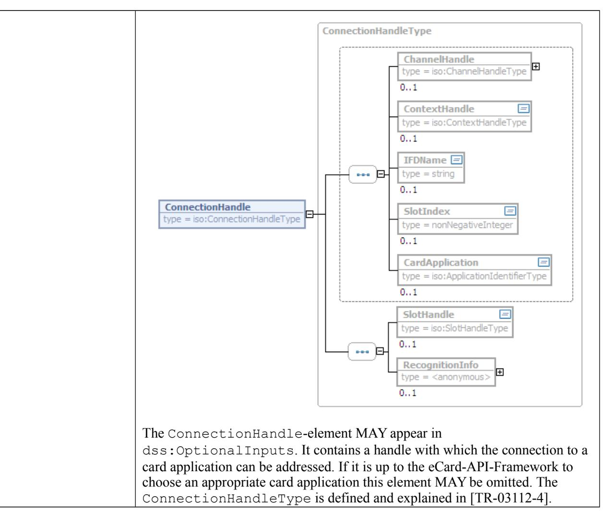

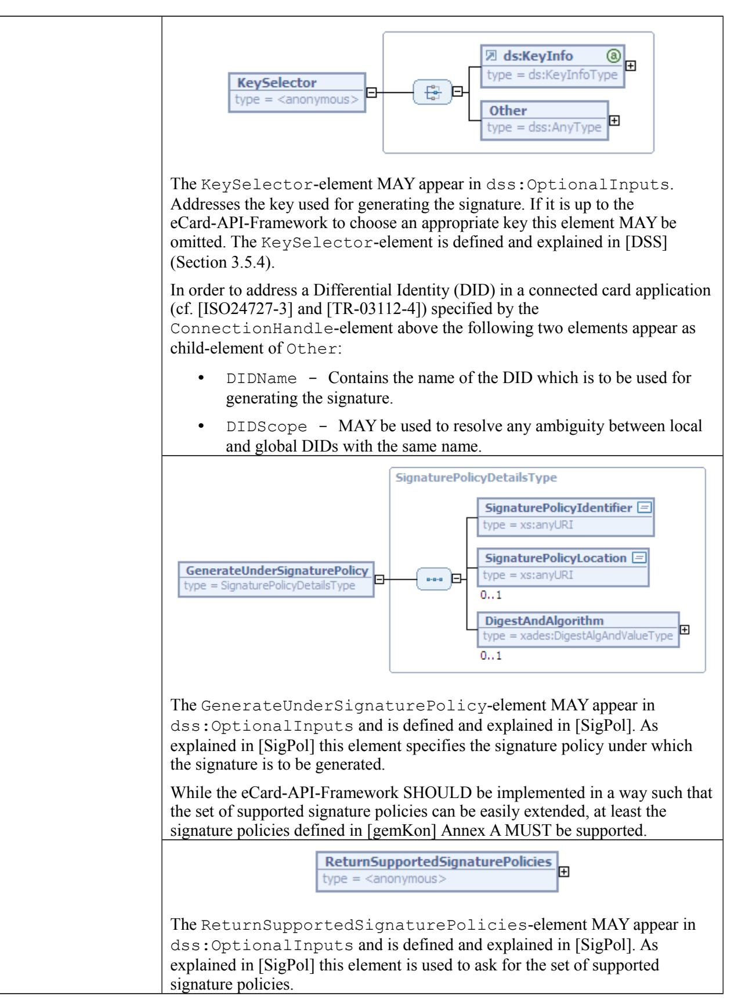

| The SignatureForm-element MAY appear in dss:OptionalInputs and is defined and explained in [AdES].                                                                                                                                                                                                                                                                                                                                                 |
|-------------------------------------------------------------------------------------------------------------------------------------------------------------------------------------------------------------------------------------------------------------------------------------------------------------------------------------------------------------------------------------------------------------------------------------------------------|
| If the SignatureType–element defined below is urn:ietf:rfc:3275 or urn:ietf:rfc:3369 the SignatureForm-element, can be used to specify more precisely which form of the advanced electronic signature is to be generated according to [XAdES] or [TS101733] for XML and CMS signatures. With other SignatureTypes a warning /resultminor/il/signature#signatureTypeDoesNotSupportSignatureFormClarific ationWarning is returned. |
| The URI specified in Section 7.1 of [AdES] MUST be used for specification of the SignatureForm. Other URIs produce an error message /resultminor/il/signature#unknownSignatureForm.                                                                                                                                                                                                                                                             |

| The SignatureType-element MAY appear in dss:OptionalInputs and is defined in [DSS].                                                                                                                                                                                                                                                                                                                                          |
|---------------------------------------------------------------------------------------------------------------------------------------------------------------------------------------------------------------------------------------------------------------------------------------------------------------------------------------------------------------------------------------------------------------------------------|
| As explained in [DSS] (Section 3.5.1) it is used to specify the type of signature or time stamp, which is to be created. The following types of signatures and time stamps are supported:                                                                                                                                                                                                                                 |
| 1. Signature types                                                                                                                                                                                                                                                                                                                                                                                                              |
| • XML signature. If the URI urn:ietf:rfc:3275 is transmitted, the generation of an XML signature is initiated in accordance with [RFC3275] (or in connection with the SignatureForm described above in accordance with [XAdES]). Such a signature is returned as a ds:Signature element.                                                                                                                         |
| • CMS signature. If the URI urn:ietf:rfc:3369 is transmitted, a CMS signature according to [RFC3369] (or in connection with the SignatureForm described above in accordance with [TS101733]) is requested, whereby the signature is returned as a dss:Base64Signature with the URI stated above as Type.                                                                                                         |
| • PDF signature. If the URI http://ns.adobe.com/pdf is transmitted, an integrated PDF signature is initiated in accordance with [PDF], whereby the signature is returned as dss:Base64Signature with the URI stated above as Type. If the transmitted document is not a Base64Data element with MIME type "application/pdf", an error /resultminor/il/signature#PDFSignatureForNonPDFDocument is returned. |
| 2. Time stamp types                                                                                                                                                                                                                                                                                                                                                                                                             |
| All time stamps are returned as a dss:Timestamp element in accordance with [DSS] Section 5.1, whereby the eCard-API-Framework creates the requested time stamp itself or MAY use an external time stamping service depending on the default configuration (also refer to [TR-03112-3]). In this context, it is necessary to distinguish between the following cases:                                                |
| • RFC3161 time stamp. If the URI urn:ietf:rfc:3161 is transmitted, the creation of a time stamp for each transmitted document is initiated in accordance with [RFC3161] and returned in the child element RFC3161TimeStampToken of Timestamp.                                                                                                                                                                       |
| • XML time stamp. If the URI urn:oasis:names:tc:dss:1.0:core:schema:XMLTimeStampToken is transmitted, the creation of an XML-based time stamp according to [DSS] Section 5.1.1 is initiated and the time stamp is returned as a ds:Signature element.                                                                                                                                                            |

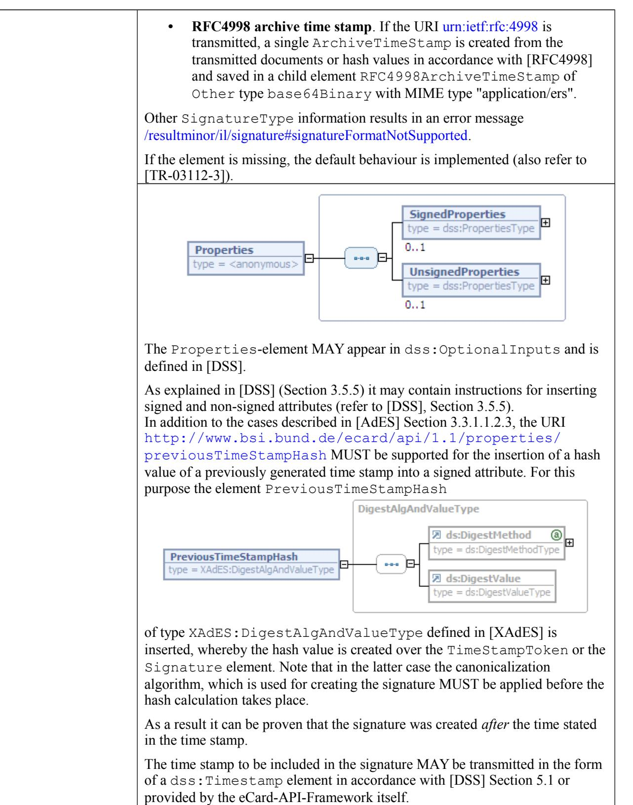

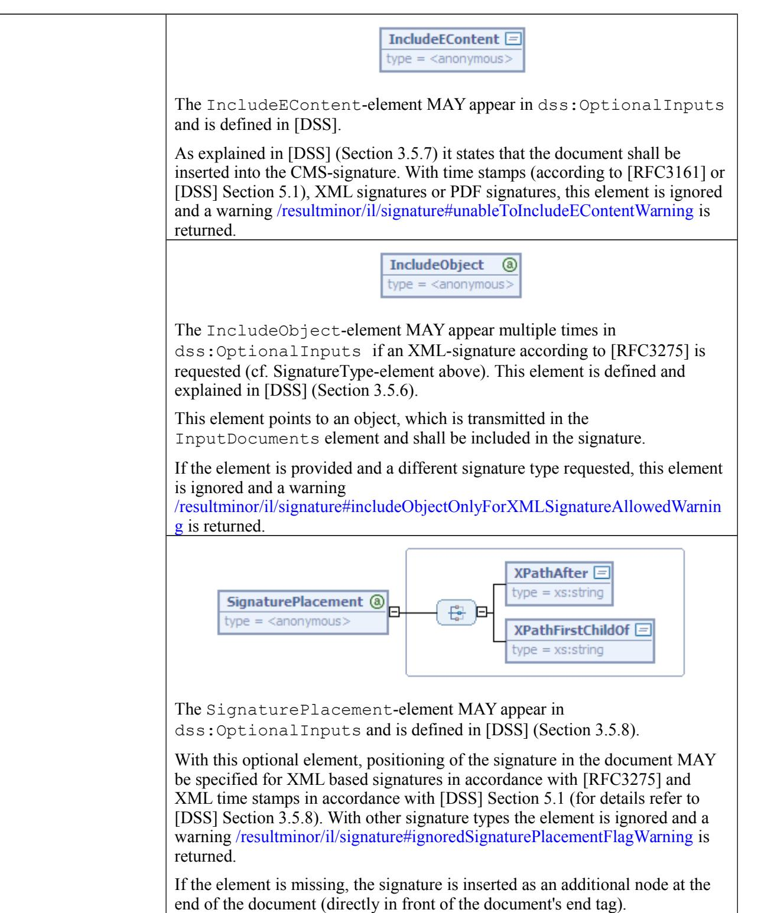

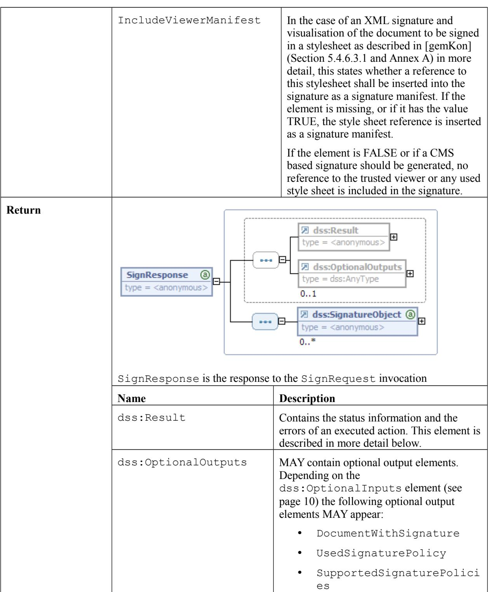

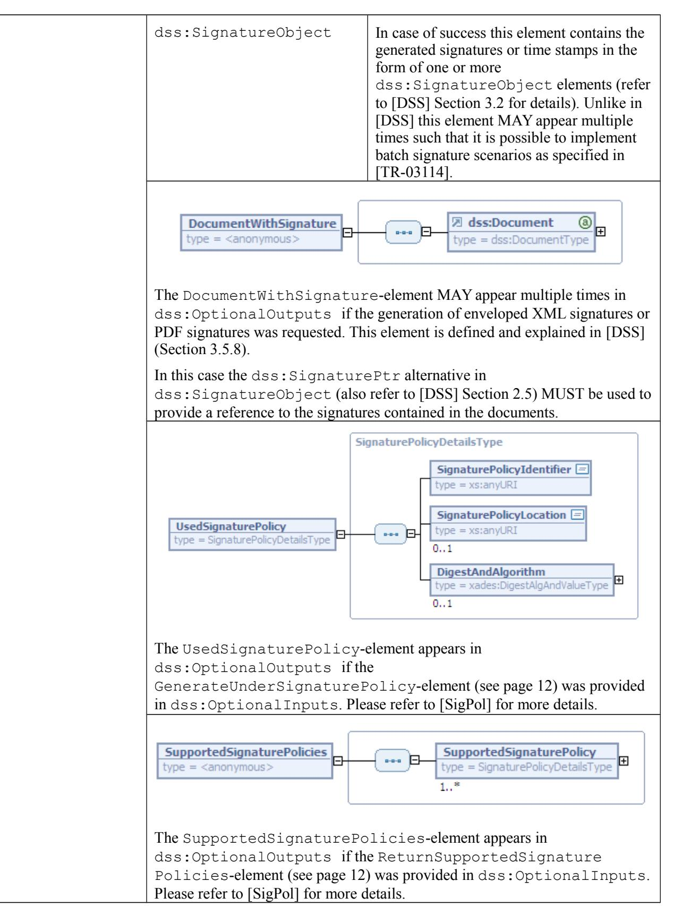

| Status information and errors with SignResponse (also refer to [TR-03112-1] Sections 4.1 and 4.2). |                           |
|-------------------------------------------------------------------------------------------------------|---------------------------|
| Name                                                                                                  | Error code                |
| ResultMajor                                                                                           | • /resultmajor#ok      |
|                                                                                                       | • /resultmajor#error   |
|                                                                                                       | • /resultmajor#warning |

| ResultMinor                                         | • /resultminor/al/common#noPermission                                                        |
|-----------------------------------------------------|-------------------------------------------------------------------------------------------------|
|                                                     | • /resultminor/al/common#internalError                                                       |
|                                                     | • /resultminor/al/common#parameterError                                                      |
|                                                     | • /resultminor/dp#unknownChannelHandle                                                       |
|                                                     | • /resultminor/dp#communicationError                                                         |
|                                                     | • /resultminor/dp# trustedChannelEstablishmentFailed                                      |
|                                                     | • /resultminor/dp#unknownProtocol                                                            |
|                                                     | • /resultminor/dp#unknownWebserviceBinding                                                   |
|                                                     | • /resultminor/sal#unknownDIDName                                                            |
|                                                     | • /resultminor/sal#unknownDataSetName                                                        |
|                                                     | • /resultminor/sal#unknownDSIName                                                            |
|                                                     | • /resultminor/il/signature# signatureFormatNotSupported                                  |
|                                                     | • /resultminor/il/signature# PDFSignatureForNonPDFDocument                                |
|                                                     | • /resultminor/il/signature# unableToIncludeEContent                                      |
|                                                     | • /resultminor/il/signature# ignoredSignaturePlacementFlag                                |
|                                                     | • /resultminor/il/signature#certificateNotFound                                              |
|                                                     | • /resultminor/il/service# timeStampServiceUnreachable                                    |
|                                                     | • /resultminor/il/signature# resolutionOfObjectReferenceImpossible                        |
|                                                     | • /resultminor/il/signature# transformationAlgorithmNotSupported                          |
|                                                     | • /resultminor/il/signature#unknownViewer                                                    |
|                                                     | • /resultminor/il/signature#signatureTypeDoes NotSupportSignatureFormClarificationWarning |
|                                                     | • /resultminor/il/signature# unknownSignatureForm                                         |
|                                                     | • /resultminor/il/signature#includeObjectOnly ForXMLSignatureAllowedWarning               |
|                                                     | • /resultminor/il/algorithm# hashAlgorithmNotSupported                                    |
|                                                     | • /resultminor/il/signature# hashAlgorithmNotSuitable                                     |
|                                                     | • /resultminor/il/algorithm# signatureAlgorithmNotSupported                               |
|                                                     | • /resultminor/il/signature#signatureAlgorithm NotSuitable                                |
|                                                     |                                                                                                 |
| Bundesamt für Sicherheit in der Informationstechnik |                                                                                                 |

|               | ResultMessage                                                                                                                                                                                                                                                                                                                          | MAY contain more detailed information on the error that occurred if required.                                                                                                                                                                                                                       |  |
|---------------|----------------------------------------------------------------------------------------------------------------------------------------------------------------------------------------------------------------------------------------------------------------------------------------------------------------------------------------|--------------------------------------------------------------------------------------------------------------------------------------------------------------------------------------------------------------------------------------------------------------------------------------------------------|--|
| Precondition  | to [TR-03112-4]).                                                                                                                                                                                                                                                                                                                      | The ConnectionHandle MAY address a linked card application or a signature service. In the first case, the respective DID and a corresponding authorisation for use of the key MUST be provided or be obtainable by implicitly initiated authentication steps with DIDAuthenticate (also refer |  |
| Postcondition |                                                                                                                                                                                                                                                                                                                                        | Signatures or time stamps are created for the transmitted documents in accordance with the transmitted child elements of dss:OptionalInputs and returned in dss:SignatureObject or dss:DocumentWithSignature elements.                                                                        |  |
| Note          | The SignRequest function invokes the functions Sign, Hash and, if applicable (for reading the certificates to be included in the signatures) DataSetSelect and DSIRead (also refer to [ISO24727-3] and [TR-03112-4]) and, if required, the ShowViewer function (refer to Section 3.2.3).                                   |                                                                                                                                                                                                                                                                                                        |  |
|               | Note that the eCard-API-Framework MUST return a warning message (… {hash/signature}AlgorithmNotSuitable), if the applied algorithms do not fulfil the requirements for qualified electronic signatures as defined by the BSI (Federal Office for Information Security) and the Bundesnetzagentur (Federal Network Agency). |                                                                                                                                                                                                                                                                                                        |  |

### **3.2.2 VerifyRequest**

| Name        | VerifyRequest                                                                                                                                                                                                                                                                                                                                                                                         |
|-------------|-------------------------------------------------------------------------------------------------------------------------------------------------------------------------------------------------------------------------------------------------------------------------------------------------------------------------------------------------------------------------------------------------------|
| Description | The VerifyRequest function is used to verify signed objects (signatures, time stamps, certificates, etc.). In some circumstances, a number of different verification operations must be performed. Depending on the transmitted dss:OptionalInputs or the configured default VerifyOptions (refer to [TR-03112-3]) the results of these individual verification steps MAY be returned. |

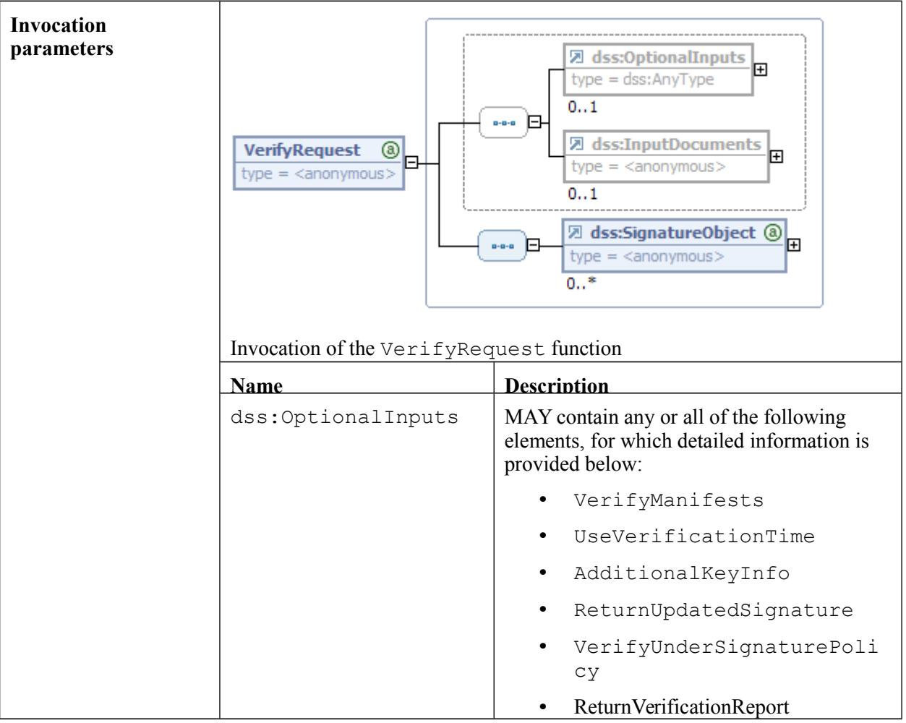

| dss:InputDocuments MAY contain the documents required for verification of the signatures or time stamps if the respective documents are not part of the signatures transmitted in dss:SignatureObject.                                                           |
|---------------------------------------------------------------------------------------------------------------------------------------------------------------------------------------------------------------------------------------------------------------------------------|
| This element MAY also contain XML-signatures according to [RFC3275] wrapped in a dss:Document-element with a child element dss:Base64XML- or dss:EscapedXML.                                                                                                        |
| In this case there MUST be a corresponding dss:SignaturePtr-element which indicates the presence of such an XML-signature. This option is necessary to avoid verification failures due to namespace rewriting (please refer to the note on page 39 of [DSS]). |
| Details on the dss:InputDocuments-element can be found in Section 2.4 of [DSS].                                                                                                                                                                                           |

| dss:SignatureObject2 | Contains the signed object which is to be verified. The following signed objects MUST be supported:                                                                                                                                                                                               |
|----------------------|---------------------------------------------------------------------------------------------------------------------------------------------------------------------------------------------------------------------------------------------------------------------------------------------------------|
|                      | • XML-based signatures according to [RFC3275] (and possibly [XAdES]) indicated by a dss:SignaturePointer-eleme nt, which points to a ds:Signature-element wrapped in a dss:Base64XML- or dss:EscapedXML-element inside the dss:InputDocuments-element specified above, |
|                      | • a time stamp according to [RFC3161] or [DSS] (Section 5.1.1) in a single dss:Timestamp-element,                                                                                                                                                                                           |
|                      | • CMS-based signatures according to [RFC3369] (and possibly [TS101733]) in the dss:Base64Signature-element ,                                                                                                                                                                             |
|                      | • Certificates (e.g. according to [RFC3280] or [RFC3281]) in a child-element CertificateValues (cf. [XAdES]) of the Other-element,                                                                                                                                                       |
|                      | • OCSP-Responses according to [RFC2560] and CRLs according to [RFC3280] in a child-element RevocationValues (cf. [XAdES]) of the Other-element,                                                                                                                                          |
|                      | • an Evidence Record according to [RFC4998] or [RFC6283] in a child-element EvidenceRecord (see below) of the Other-element, which protects the content of all dss:Document-elements provided in the dss:InputDocuments-element above.                                       |

2 Note that unlike in the VerifyRequest specified in [DSS] the dss:SignatureObject-element MAY in case of non-detached signatures, certificates or OCSP-responses appear multiple times here such that it is possible to verify a batch of signed objects with a single request. For the verification of a detached signature, a time-stamp or an evidence record there MUST exactly be one dss:SignatureObject or an error (/resultminor/al/common#parameterError) is returned.

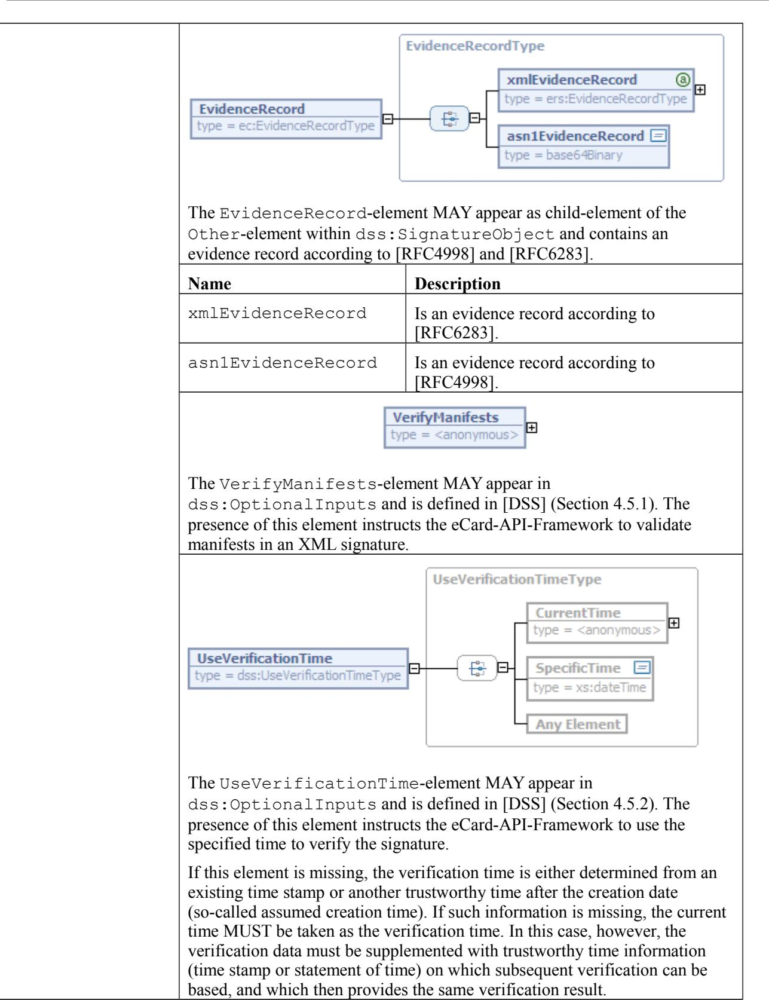

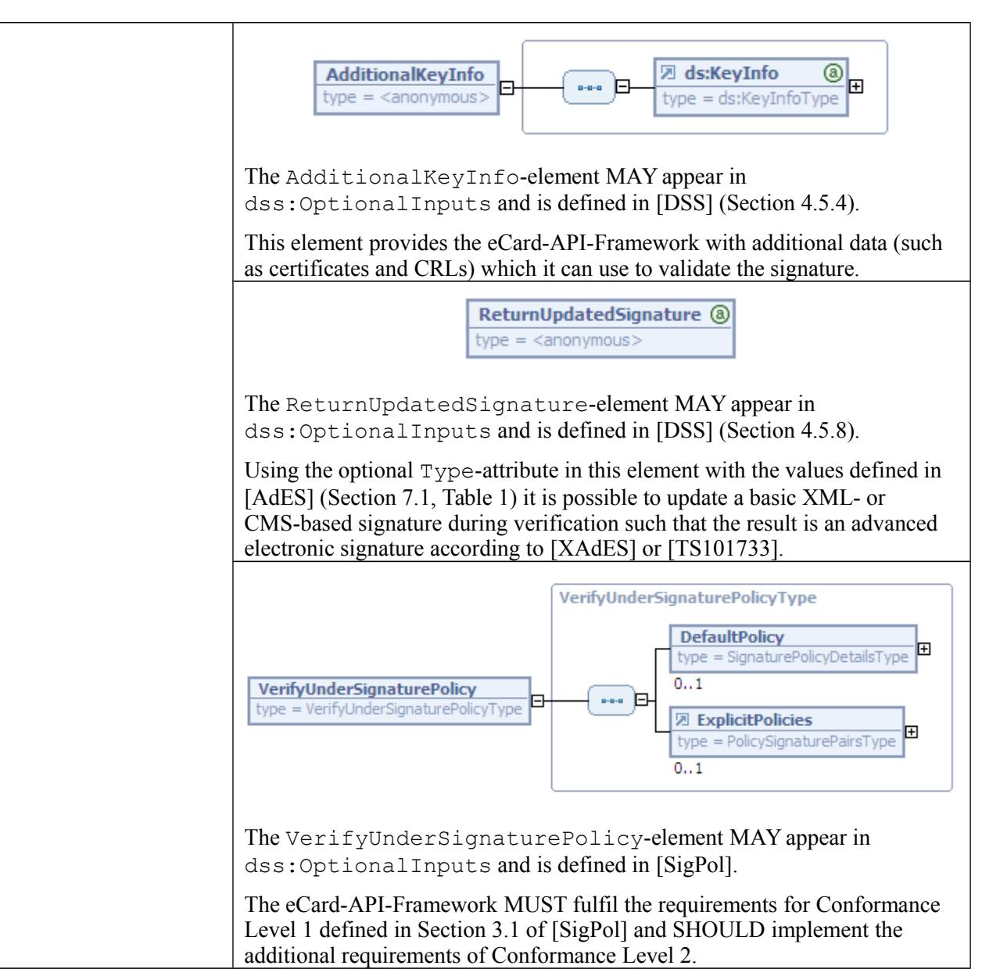

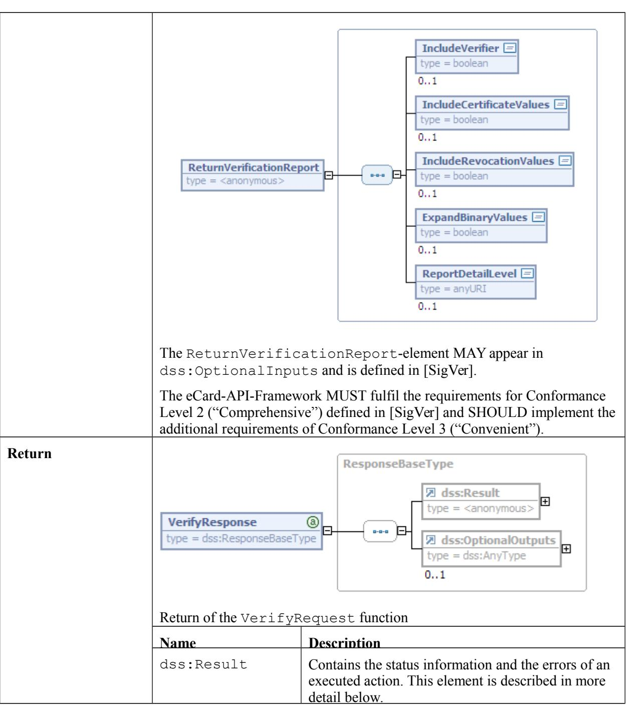

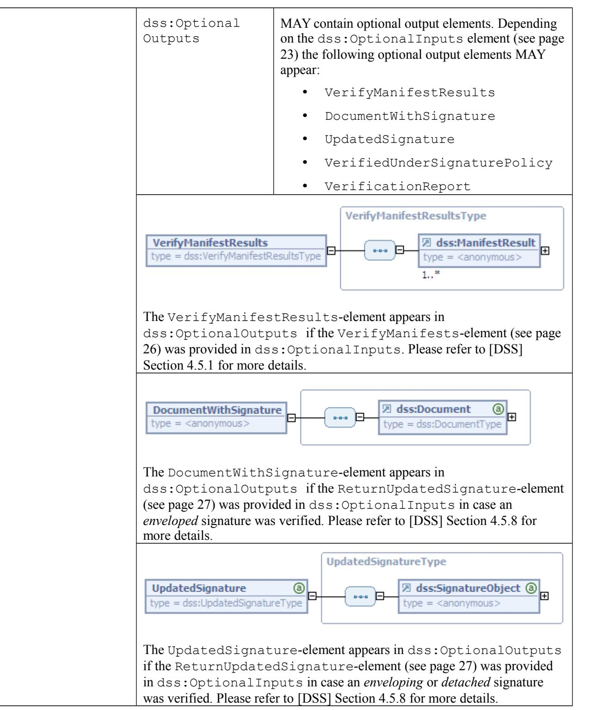

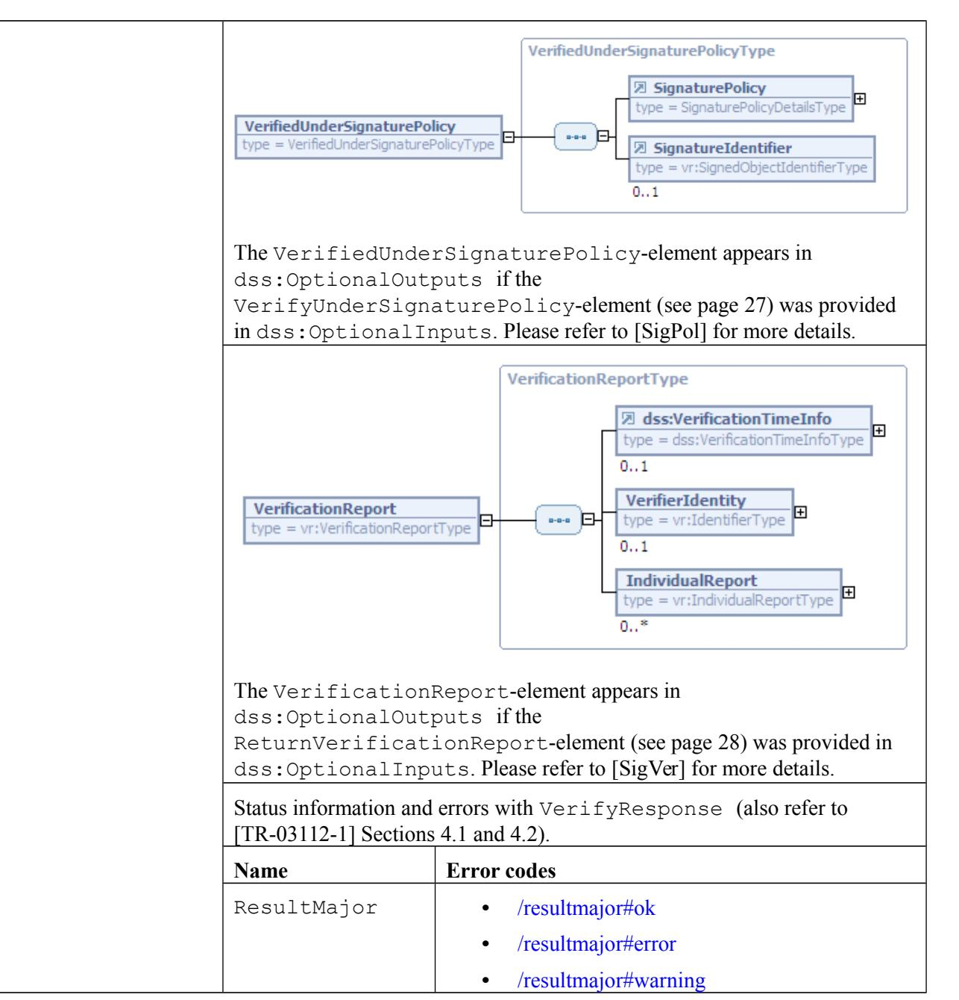

| ResultMinor | • /resultminor/al/common#noPermission                                 |
|-------------|--------------------------------------------------------------------------|
|             | • /resultminor/al/common#internalError                                |
|             | • /resultminor/al/common#parameterError                               |
|             | • /resultminor/dp#communicationError                                  |
|             | • /resultminor/il/signature# certificateNotFound                   |
|             | • /resultminor/il/signature# certificateFormatNotCorrect           |
|             | • /resultminor/il/signature# invalidCertificateReference           |
|             | • /resultminor/il/signature# certificateChainInterrupted           |
|             | • /resultminor/il/signature# resolutionOfObjectReferenceImpossible |
|             | • /resultminor/il/signature# transformationAlgorithmNotSupported   |
|             | • /resultminor/il/signature#unknownViewer                             |
|             | • /resultminor/il/signature# certificatePathNotValidated           |
|             | • /resultminor/il/signature# certificateStatusNotChecked           |
|             | • /resultminor/il/signature# signatureManifestNotCheckedWarning    |
|             | • /resultminor/il/signature# suitabilityOfAlgorithmsNotChecked     |
|             | • /resultminor/il/signature# detachedSignatureWithoutEContent      |
|             | • /resultminor/il/signature# improperRevocationInformation         |
|             | • /resultminor/il/signature# SignatureManifestNotCorrect           |
|             | • /resultminor/il/algorithm# hashAlgorithmNotSupported             |
|             | • /resultminor/il/algorithm# signatureAlgorithmNotSupported        |
|             | • /resultminor/il/signature# signatureAlgorithmNotSuitable         |
|             | • /resultminor/il/signature# hashAlgorithmNotSuitable              |
|             | • /resultminor/il/signature# wrongMessageDigest                    |
|             | • /resultminor/sal#invalidSignature                                   |

|               | ResultMessage                                                                                                                                                                                                                                                                                                                                        | MAY contain more detailed information on the occurred error if required. |
|---------------|------------------------------------------------------------------------------------------------------------------------------------------------------------------------------------------------------------------------------------------------------------------------------------------------------------------------------------------------------|-----------------------------------------------------------------------------|
| Precondition  |                                                                                                                                                                                                                                                                                                                                                      |                                                                             |
| Postcondition | The signed objects transmitted in VerifyRequest are verified in accordance to the provided dss:OptionalInputs-element.                                                                                                                                                                                                                            |                                                                             |
| Note          | Note that the eCard-API-Framework MUST return a warning message (… {hash/signature}AlgorithmNotSuitable), if the algorithms used in the signature do not fulfil the requirements for qualified electronic signatures as defined by the BSI (Federal Office for Information Security) and the Bundesnetzagentur (Federal Network Agency). |                                                                             |

### **3.2.3 ShowViewer**

| Name                     | ShowViewer                                                                                                                                                                                                                                                                                                                                                                                                                                                                   |  |  |
|--------------------------|------------------------------------------------------------------------------------------------------------------------------------------------------------------------------------------------------------------------------------------------------------------------------------------------------------------------------------------------------------------------------------------------------------------------------------------------------------------------------|--|--|
| Description              | With the ShowViewer function, documents (refer to [DSS], Section 2.4.2), signed objects (refer to dss:SignatureObject on page 25) or corresponding verification results in form of a VerificationReport element according to [SigVer] MAY be displayed in a trustworthy manner. This functionality MAY, for example, be used in SignRequest (for displaying the signed data) or in the VerifyRequest function (for displaying signed objects and verification |  |  |
| Invocation parameters | results). Invocation of the ShowViewer function. Name Description                                                                                                                                                                                                                                                                                                                                                                                                   |  |  |

| ChannelHandle                                                                                                            | Optional parameter with which a remote system can be addressed (also refer to CardApplicationPath in [TR-03112-4]). If the local system is to be addressed, the parameter is omitted.                                                                                                                                                                                  |
|--------------------------------------------------------------------------------------------------------------------------|---------------------------------------------------------------------------------------------------------------------------------------------------------------------------------------------------------------------------------------------------------------------------------------------------------------------------------------------------------------------------------|
| TrustedViewerId                                                                                                          | Contains the unique ID of the trusted viewer used for display purposes. If this element is missing, the configured default viewer is used (also refer to [TR-03112-3]).                                                                                                                                                                                                |
| Document                                                                                                                 | The Document element, which MAY occur several times, contains a document for display (for details refer to [DSS], Section 2.4.2). If this is permitted by the applicable security policy, equivalent documents MAY be shown in an overview list (also refer to [gemKon]) or only a certain random sample of the transmitted documents can be fully displayed. |
| StyleSheetContent                                                                                                        | An XSL stylesheet MAY be transmitted in this element which MAY be used to display XML documents. If the transmitted stylesheet is not suitable for displaying the transmitted documents, a corresponding error message /resultminor/il/viewer#unsuiteableSylesheetForDocum ent is returned.                                                                      |
| ViewerMessage                                                                                                            | MAY contain additional, short messages which the trusted viewer displays in addition to the used data (see below for details). If a transmitted message is too long to be displayed by the viewer (e.g. at the top of the window), this produces the error message /resultminor/il/viewer#viewerMessageTooLong.                                                  |
|                                                                                                                          | If this element is missing, corresponding standard messages are used by the trusted viewer.                                                                                                                                                                                                                                                                                  |
| Timeout                                                                                                                  | States whether the display on the viewer should be switched off automatically after a specific time (in seconds) in the event of no user interaction. If this element is missing, the display SHOULD be cancelled after 30 seconds.                                                                                                                                 |
|                                                                                                                          |                                                                                                                                                                                                                                                                                                                                                                                 |
| With the ViewerMessage element the trusted viewer MAY be given additional messages for the top or body of the window. |                                                                                                                                                                                                                                                                                                                                                                                 |
| Name                                                                                                                     | Description                                                                                                                                                                                                                                                                                                                                                                     |
| FrameMessage                                                                                                             | MAY contain a text which is displayed at the top of a window.                                                                                                                                                                                                                                                                                                                |
|                                                                                                                          |                                                                                                                                                                                                                                                                                                                                                                                 |

|               | BodyMessage                                                                                                                                                                                             | window. | MAY contain a text which is displayed in the body of a                                                |  |
|---------------|---------------------------------------------------------------------------------------------------------------------------------------------------------------------------------------------------------|---------|-------------------------------------------------------------------------------------------------------|--|
| Return        |                                                                                                                                                                                                         |         |                                                                                                       |  |
|               | Return of the ShowViewer function.                                                                                                                                                                      |         |                                                                                                       |  |
|               | Name Description dss:Result more detail below. Status information and errors with ShowViewerResponse (also refer to [TR-03112-1] Sections 4.1 and 4.2).                                  |         |                                                                                                       |  |
|               |                                                                                                                                                                                                         |         | Contains the status information and the errors of an executed action. This element is described in |  |
|               |                                                                                                                                                                                                         |         |                                                                                                       |  |
|               | Name Error code                                                                                                                                                                                      |         |                                                                                                       |  |
|               | ResultMajor                                                                                                                                                                                             | •       | /resultmajor#ok                                                                                       |  |
|               |                                                                                                                                                                                                         | •       | /resultmajor#error                                                                                    |  |
|               |                                                                                                                                                                                                         | •       | /resultmajor#warning                                                                                  |  |
|               | ResultMinor                                                                                                                                                                                             | •       | /resultminor/al/common#noPermission                                                                   |  |
|               |                                                                                                                                                                                                         | •       | /resultminor/al/common#internalError                                                                  |  |
|               |                                                                                                                                                                                                         | •       | /resultminor/al/common#parameterError                                                                 |  |
|               |                                                                                                                                                                                                         | •       | /resultminor/dp#unknownChannelHandle                                                                  |  |
|               |                                                                                                                                                                                                         | •       | /resultminor/dp#communicationError                                                                    |  |
|               |                                                                                                                                                                                                         | • •  | /resultminor/dp#trustedChannelEstablishmentFailed /resultminor/dp#unknownProtocol                  |  |
|               |                                                                                                                                                                                                         | •       | /resultminor/dp#unknownWebserviceBinding                                                              |  |
|               |                                                                                                                                                                                                         | •       | /resultminor/il/viewer#timeout                                                                        |  |
|               |                                                                                                                                                                                                         | •       | /resultminor/il/viewer#cancelationByUser                                                              |  |
|               |                                                                                                                                                                                                         | •       | /resultminor/il/signature#unknownViewer                                                               |  |
|               |                                                                                                                                                                                                         | •       | /resultminor/il/viewer# unsuiteableSylesheetForDocument                                            |  |
|               |                                                                                                                                                                                                         | •       | /resultminor/il/viewer#viewerMessageTooLong                                                           |  |
|               | ResultMessage                                                                                                                                                                                           |         | MAY contain more detailed information on the error that occurred if required.                      |  |
| Precondition  |                                                                                                                                                                                                         |         |                                                                                                       |  |
| Postcondition |                                                                                                                                                                                                         |         |                                                                                                       |  |
| Note          | For security reasons this function SHOULD NOT be made available to the Client application, but only be invoked in a precisely defined context within the functions SignRequest and VerifyRequest. |         |                                                                                                       |  |

Note that the user interface of the eCard-API-Framework in the ShowViewer-function MUST provide an appropriate warning message to the user, if the algorithms related to a qualified electronic signature do not fulfil the requirements defined by the BSI (Federal Office for Information Security) and the Bundesnetzagentur (Federal Network Agency).

# **3.3 Encryption functions**

### **3.3.1 EncryptRequest**

| Name                     | EncryptRequest                                                           |                                                                                                                                                                                                                                   |
|--------------------------|--------------------------------------------------------------------------|-----------------------------------------------------------------------------------------------------------------------------------------------------------------------------------------------------------------------------------|
| Description              | Transmitted documents are encrypted with the EncryptDocument function.   |                                                                                                                                                                                                                                   |
| Invocation parameters | Invocation of the EncryptRequest function. Name dss:OptionalInputs | Description MAY contain any or all of the following elements, for which detailed information is provided below: • ConnectionHandle • EncryptionKey • ContentEncryptionMethod • EncryptionContent |
|                          | dss:InputDocuments                                                       | Contains a series of dss:Document elements, which are to be (partly) encrypted (refer to [DSS], Section 2.4.2).                                                                                                             |

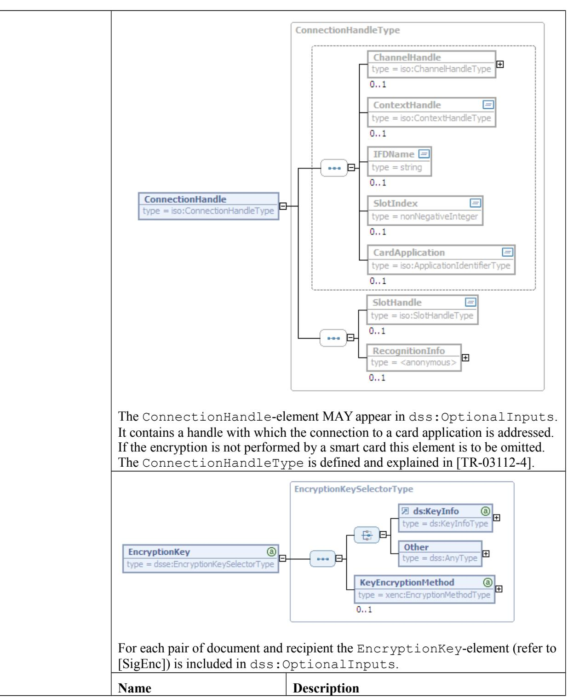

| ds:KeyInfo          | Specifies the key of the recipient. Refer to [RFC3275] for details concerning the structure of this element. Among the various possibilities at least the following two options MUST be supported:                                            |
|---------------------|-----------------------------------------------------------------------------------------------------------------------------------------------------------------------------------------------------------------------------------------------------------|
|                     | • ds:KeyValue contains a symmetric key, which serves as content encryption key used for ciphering the data and MUST be suitable for the applied ContentEncryptionMethod (see below).                                                    |
|                     | • ds:X509Data/ds:X509Certific ate contains an X.509-certificate, which is used for encrypting the content encryption key, which is either provided in the ds:KeyValue-element mentioned above or generated at random.                |
| Other               | Specifies the key of the recipient using some other means. This document specifies two possibilities:                                                                                                                                               |
|                     | • In order to address a Differential Identity (DID) in a connected card application (cf. [ISO24727-3] and [TR-03112-4]) specified by the ConnectionHandle-element above the following two elements appear as child-element of Other: |
|                     | • Contains the name of the DIDName - DID which is to be used for generating the signature.                                                                                                                                                    |
|                     | • MAY be used to resolve DIDScope - any ambiguity between local and global DIDs with the same name.                                                                                                                                           |
|                     | • In order to address a certificate stored on a connected card application the CertificateRef-element appears as child-element of Other. Please refer to [TR-03112-7] for details with respect to the CertificateRef-element.           |
| KeyEncryptionMethod | This element is optional and MAY be used to specify how the content encryption key is to be enciphered.                                                                                                                                             |

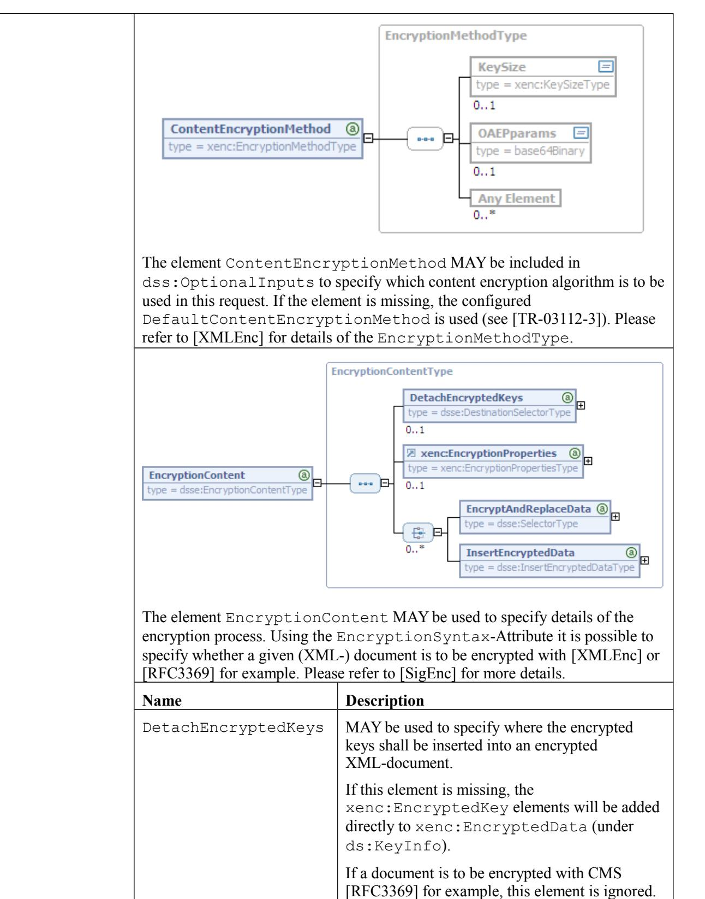

|        | xenc:Encryption Properties                                                | MAY be used to provide more information on the generation of the xenc:EncryptedData or xenc:EncryptedKey-elements. Please refer to [XMLEnc] Section 3.7 for details.                                                                                  |
|--------|------------------------------------------------------------------------------|----------------------------------------------------------------------------------------------------------------------------------------------------------------------------------------------------------------------------------------------------------------|
|        | EncryptAndReplace Data                                                    | States which parts of a transmitted XML document should be encrypted. Details on the dsse:SelectorType can be found in [SigEnc].                                                                                                                      |
|        |                                                                              | If a document is to be encrypted with CMS [RFC3369] for example, this element is ignored.                                                                                                                                                                   |
|        | InsertEncryptedData                                                          | References an input content to be encrypted and specifies where to insert the resulting xenc:EncryptedData within the dsse:EncryptedDocument, which is to be returned. Details on the dsse:InsertEncryptedDataType can be found in [SigEnc]. |
|        |                                                                              | If a document is to be encrypted with CMS [RFC3369] for example, this element is ignored.                                                                                                                                                                   |
| Return |                                                                              |                                                                                                                                                                                                                                                                |
|        | The EncryptResponse element is the return of the function EncryptRequest. |                                                                                                                                                                                                                                                                |
|        | Name                                                                         | Description                                                                                                                                                                                                                                                    |
|        | dss:Result                                                                   | Contains the status information and the errors of an executed action. This element is described in more detail below.                                                                                                                                    |
|        | dss:OptionalOutputs                                                          | The optional element dss:OptionalOutputs contains the results of the encryption process in form of EncryptedDocument-elements.                                                                                                                        |

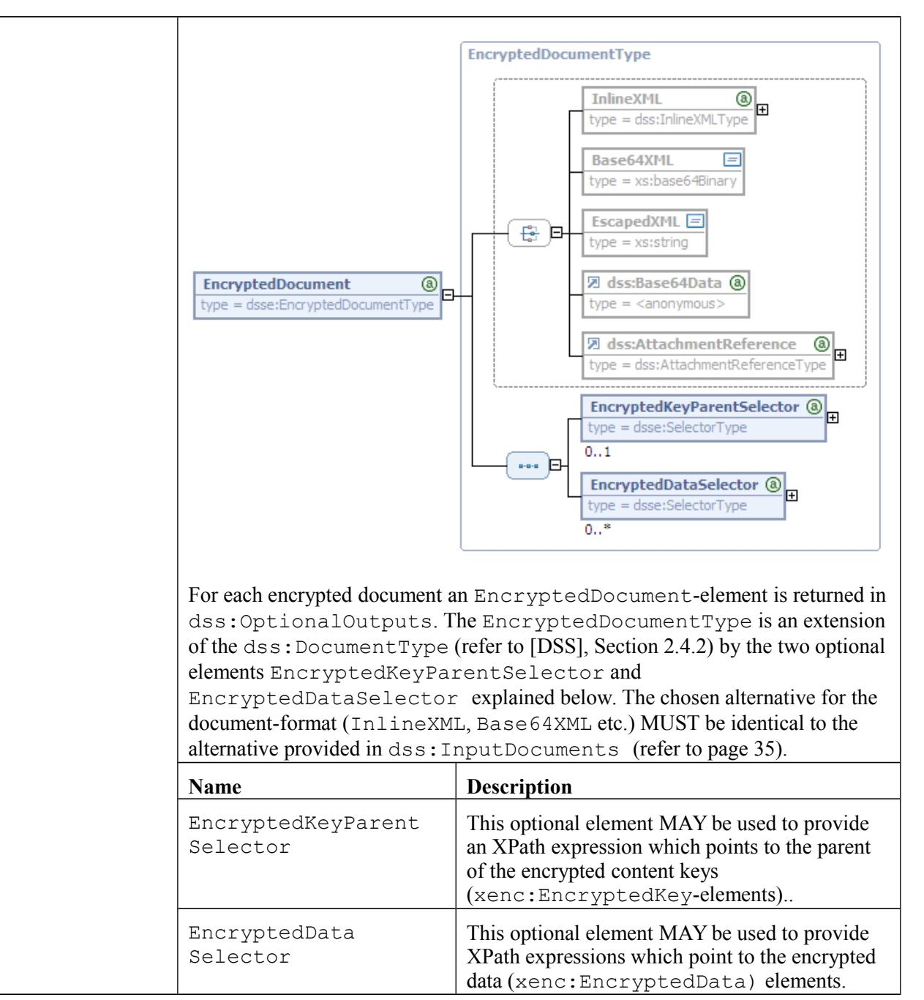

| Status information and errors with EncryptResponse (also refer to [TR-03112-1] Sections 4.1 and 4.2). |                           |
|----------------------------------------------------------------------------------------------------------|---------------------------|
| Name                                                                                                     | Error codes               |
| ResultMajor                                                                                              | • /resultmajor#ok      |
|                                                                                                          | • /resultmajor#error   |
|                                                                                                          | • /resultmajor#warning |

|    | ResultMinor | • /resultminor/al/common#noPermission                                           |
|----|-------------|------------------------------------------------------------------------------------|
|    |             | • /resultminor/al/common#internalError                                          |
|    |             | • /resultminor/al/common#parameterError                                         |
|    |             | • /resultminor/dp#unknownChannelHandle                                          |
|    |             | • /resultminor/dp#communicationError                                            |
|    |             | • /resultminor/dp#                                                              |
|    |             | trustedChannelEstablishmentFailed                                                  |
|    |             | • /resultminor/dp#unknownProtocol                                               |
|    |             | • /resultminor/dp#unknownWebserviceBinding                                      |
|    |             | • /resultminor/sal#unknownDataSetName                                           |
|    |             | • /resultminor/sal#unknownDSIName                                               |
|    |             | • /resultminor/il/signature#certificateNotFound                                 |
|    |             | • /resultminor/il/signature# certificateFormatNotCorrect                     |
|    |             | • /resultminor/il/signature# invalidCertificateReference                     |
|    |             | • /resultminor/il/signature# certificateChainInterrupted                     |
|    |             | • /resultminor/il/service# ocspResponderUnreachable                          |
|    |             | • /resultminor/il/service# directoryServiceUnreachable                       |
|    |             | • /resultminor/il/signature# certificatePathNotValidated                     |
|    |             | • /resultminor/il/signature# certificateStatusNotChecked                     |
|    |             | • /resultminor/sal#digitalSignatureNotCorrect                                   |
|    |             | • /resultminor/il/signature# signatureAlgorithmNotSuitable                   |
|    |             | • /resultminor/il/signature#invalidCertificatePath                              |
|    |             | • /resultminor/il/signature#certificateRevoked                                  |
|    |             | • /resultminor/il/signature#referenceTime NotWithinCertificateValidityPeriod |
|    |             | • /resultminor/il/encryption#encryptionO fCertainNodesOnlyForXMLDocuments    |
|    |             | • /resultminor/il/encryption# encryptionFormatNotSupported                   |
|    |             | • /resultminor/il/encryption#invalidCertificate                                 |
|    |             | • /resultminor/il/key#keyGenerationNotPossible                                  |
|    |             | • /resultminor/il/key# encryptionAlgorithmNotSupported                       |
|    |             |                                                                                    |
| 42 |             | Bundesamt für Sicherheit in der Informationstechnik                                |

|               | ResultMessage                                                                                                                                                                                                                           | MAY contain more detailed information on the error that occurred if required. |
|---------------|-----------------------------------------------------------------------------------------------------------------------------------------------------------------------------------------------------------------------------------------|----------------------------------------------------------------------------------|
| Precondition  | If the encryption is to be performed for or with a connected card, a corresponding, valid ConnectionHandle MUST exist.                                                                                                               |                                                                                  |
| Postcondition | The encrypted documents are returned in form of EncryptedDocument elements.                                                                                                                                                          |                                                                                  |
| Note          | This function MAY use the [ISO24727-3] functions Encipher, DIDGet, DataSetSelect, DSIRead and, for generation of message keys, GetRandom (also refer to [TR-03112-4]). Also refer to the EncryptDocument function in [gemKon]. |                                                                                  |

### **3.3.2 DecryptRequest**

| Name                     | DecryptRequest                             |                                                                                                                                                                                                                                                                |
|--------------------------|--------------------------------------------|----------------------------------------------------------------------------------------------------------------------------------------------------------------------------------------------------------------------------------------------------------------|
| Description              |                                            | Encrypted documents are decrypted with the DecryptDocument function.                                                                                                                                                                                           |
| Invocation parameters |                                            |                                                                                                                                                                                                                                                                |
|                          | Invocation of the DecryptRequest function. |                                                                                                                                                                                                                                                                |
|                          | Name                                       | Description                                                                                                                                                                                                                                                    |
|                          | dss:OptionalInputs                         | MAY contain any or all of the following elements, for which detailed information is provided below:                                                                                                                                                         |
|                          |                                            | • ConnectionHandle                                                                                                                                                                                                                                          |
|                          |                                            | • KeySelector                                                                                                                                                                                                                                               |
|                          |                                            | If these elements are missing, the eCard-API-Framework MUST try to determine suitable keys in the connected card applications for decrypting the data. If this fails, a corresponding error /resultminor/sal#decryptionNotPossible is returned. |
|                          | dss:InputDocuments                         | Contains a sequence of dss:Document elements, which are to be decrypted (refer to [DSS], Section 2.4.2).                                                                                                                                                 |

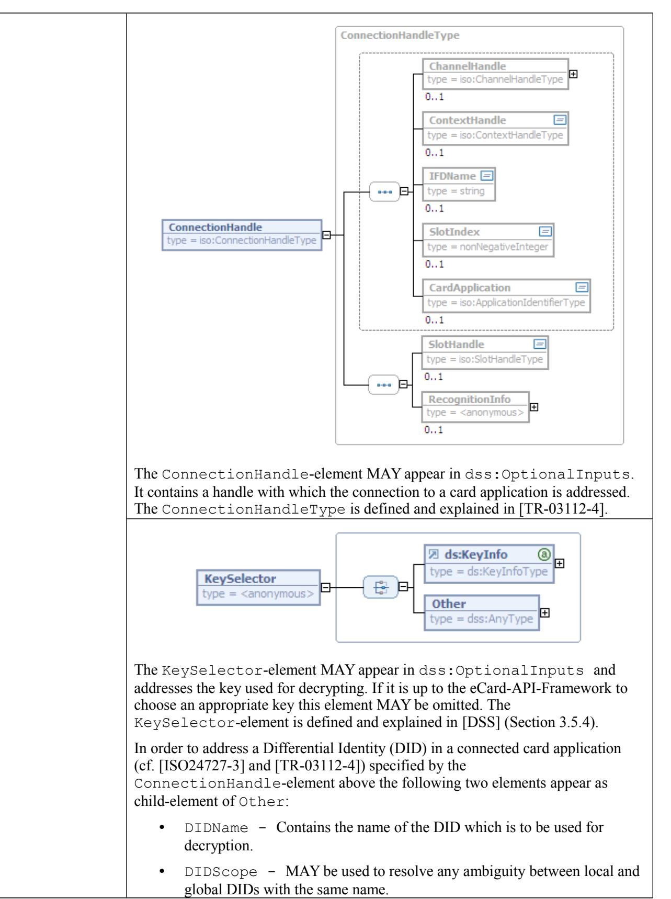

| Return       |                                         |                    |                                                                                                                                             |
|--------------|-----------------------------------------|--------------------|---------------------------------------------------------------------------------------------------------------------------------------------|
|              |                                         |                    |                                                                                                                                             |
|              | Return of the DecryptResponse function. |                    |                                                                                                                                             |
|              | Name                                    |                    | Description                                                                                                                                 |
|              | dss:Result                              |                    | Contains the status information and the errors of an executed action. This element is described in more detail below.                 |
|              | dss:OptionalOutputs                     |                    | The element dss:OptionalOutputs contains the decrypted documents in form of dss:Document-elements (refer to [DSS], Section 2.4.2). |
|              | [TR-03112-1] Sections 4.1 and 4.2).     |                    | Status information and errors with DecryptResponse (also refer to                                                                           |
|              | Name                                    | Error code         |                                                                                                                                             |
|              | ResultMajor                             | •                  | /resultmajor#ok                                                                                                                             |
|              |                                         | •                  | /resultmajor#error                                                                                                                          |
|              | ResultMinor                             | •                  | /resultminor/al/common#noPermission                                                                                                         |
|              |                                         | •                  | /resultminor/al/common#internalError                                                                                                        |
|              |                                         | •                  | /resultminor/al/common#parameterError                                                                                                       |
|              |                                         | •                  | /resultminor/dp#unknownChannelHandle                                                                                                        |
|              |                                         | •                  | /resultminor/dp#communicationError                                                                                                          |
|              |                                         | •                  | /resultminor/dp# trustedChannelEstablishmentFailed                                                                                       |
|              |                                         | •                  | /resultminor/dp#unknownProtocol                                                                                                             |
|              |                                         | •                  | /resultminor/dp#unknownWebserviceBinding                                                                                                    |
|              |                                         | •                  | /resultminor/sal#namedEntityNotFound                                                                                                        |
|              |                                         | •                  | /resultminor/il/encryption# encryptionFormatNotSupported                                                                                 |
|              |                                         | •                  | /resultminor/sal#decryptionNotPossible                                                                                                      |
|              |                                         | •                  | /resultminor/sal#securityConditionsNotSatisfied                                                                                             |
|              |                                         | •                  | /resultminor/ifdl/terminal#noCard                                                                                                           |
|              | ResultMessage                           | error if required. | MAY contain more detailed information on the occurred                                                                                       |
| Precondition |                                         |                    | Suitable keys MUST be available to the eCard-API-Framework for decryption of                                                                |

|               | the documents as differential identity on a connected card application.                |
|---------------|----------------------------------------------------------------------------------------|
| Postcondition | The decrypted documents are returned.                                                  |
| Note          | This function uses the [ISO24727-3] function Decipher (also refer to [TR-03112-4]). |
|               | Also refer to the DecryptDocument function in [gemKon].                                |

### **References**

| [SigEnc]     | A-SIT: C. Orthacker: Proposal for an Encryption Profile for OASIS DSS (including schema)                                                                     |
|--------------|-----------------------------------------------------------------------------------------------------------------------------------------------------------------|
| [PDF]        | Adobe: Portable Document Format Reference Manual                                                                                                                |
| [TR-03112-1] | BSI: TR-03112-1: eCard-API-Framework – Part 1: Overview and Generic Mechanisms                                                                                  |
| [TR-03112-2] | BSI: TR-03112-2: eCard-API-Framework – Part 2: eCard-Interface                                                                                                  |
| [TR-03112-3] | BSI: TR-03112-3: eCard-API-Framework – Part 3: Management-Interface                                                                                             |
| [TR-03112-4] | BSI: TR-03112-4: eCard-API-Framework – Part 4: ISO24727-3-Interface                                                                                             |
| [TR-03112-5] | BSI: TR-03112-5: eCard-API Framework – Part 5: Suppor- Interface                                                                                                |
| [TR-03112-6] | BSI: TR-03112-6: eCard-API-Framework – Part 6: IFD-Interface                                                                                                    |
| [TR-03112-7] | BSI: TR-03112-7: eCard-API-Framework – Part 7: Protocols                                                                                                        |
| [TR-03114]   | BSI: TR-03114: Stapelsignatur mit dem Heilberufsausweis                                                                                                         |
| [TS101733]   | ETSI: TS 101 733: Electronic Signature Formats, Electronic Signatures and Infrastructures (ESI) – Technical Specification                                    |
| [gemKon]     | gematik: Connector specification                                                                                                                                |
| [RFC2119]    | IETF: RFC 2119: S. Bradner: Key words for use in RFCs to Indicate Requirement Levels                                                                            |
| [RFC2560]    | IETF: RFC 2560: M. Myers, R. Ankney, A. Malpani, S. Galperin, C. Adams: X.509 Internet Public Key Infrastructure - Online Certificate Status Protocol – OCSP |
| [RFC3161]    | IETF: RFC 3161: C. Adams, P. Cain, D. Pinkas, R. Zuccherato: Internet X.509 Public Key Infrastructure Time-Stamp Protocol (TSP)                              |
| [RFC3275]    | IETF: RFC 3275: D. Eastlage, J. Reagle, D. Solo: (Extensible Markup Language) XMLSignature Syntax and Processing                                             |
| [RFC3280]    | IETF: RFC 3280: R. Housley, W. Polk, W. Ford, D. Solo: Internet X.509 Public Key Infrastructure, Certificate and Certificate Revocation List (CRL) Profile   |
| [RFC3281]    | IETF: RFC 3281: S. Farrell, R. Housley: An Internet Attribute Certificate Profile for Authorization                                                          |
| [RFC3369]    | IETF: RFC 3369: R. Housley: Cryptographic Message Syntax (CMS)                                                                                                  |
| [RFC4998]    | IETF: RFC 4998: T. Gondrom, R. Brandner, U. Pordesch: Evidence Record Syntax (ERS)                                                                              |
| [RFC6283]    | IETF: RFC 6283: A. Jerman Blazic, S. Saljic, T. Gondrom: Extensible Markup Language Evidence Record Syntax                                                   |
| [ISO24727-3] | ISO: ISO/IEC 24727-3: Identification Cards — Integrated Circuit Cards Programming Interfaces — Part 3: Application Interface                                 |
| [AdES]       | OASIS: Advanced Electronic Signature Profiles of the OASIS Digital Signature Service Version 1.0                                                             |
| [DSS]        | OASIS: Digital Signature Service Core Protocols, Elements, and Bindings                                                                                         |
| [SigGer]     | OASIS: German Signature Law Profile of the OASIS Digital Signature Service                                                                                      |
| [SigVer]     | OASIS: Profile for comprehensive multi-signature verification reports for OASIS Digital Signature Services                                                   |
|              |                                                                                                                                                                 |

| [SigPol] | OASIS: Signature Policy Profile of the OASIS Digital Signature Services |
|----------|-------------------------------------------------------------------------|
| [XAdES]  | W3C: W3C Note: XML Advanced Electronic Signatures (XAdES)               |
| [XMLEnc] | W3C: W3C Recommendation: XML Encryption Syntax and Processing           |