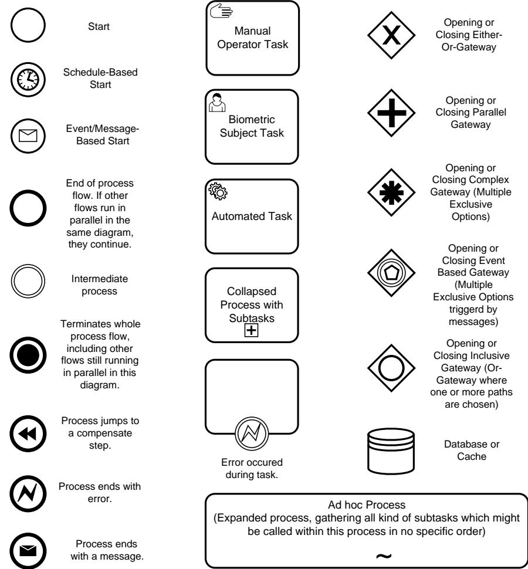
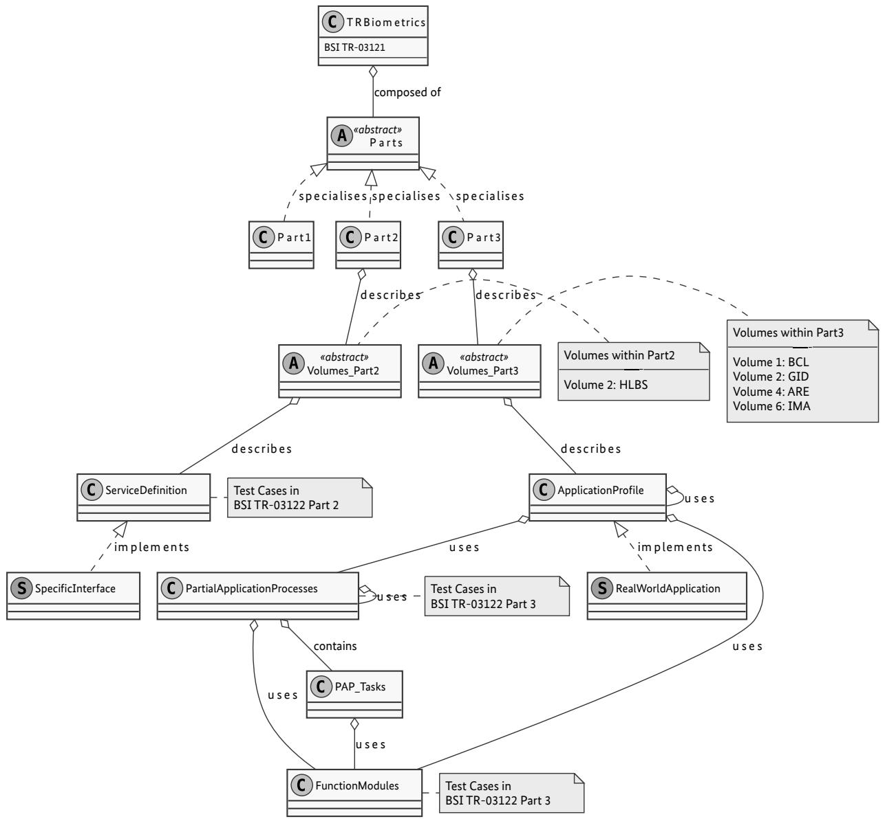

BSI Technical Guideline TR-03121-1

# Biometrics for Public Sector Applications

Part 1: Framework

Version 6.0

Federal Office for Information Security P.O. Box 20 03 63 53133 Bonn E-Mail: trbiometrics@bsi.bund.de Internet: https://www.bsi.bund.de © Federal Office for Information Security 2023

| 1.   | Changelog                                                    | 1  |
|------|-----------------------------------------------------------------|----|
| 1.1. | Changelog Version 5.4-draft1                                 | 1  |
| 1.2. | Changelog Version 5.4-draft2                                 | 4  |
| 1.3. | Changelog Version 6.0                                        | 8  |
| 2.   | Introduction                                                 | 12 |
| 2.1. | Motivation and Objectives of Technical Guideline Biometrics  | 12 |
| 2.2. | Target Audience and User                                     | 12 |
| 2.3. | Terminology                                                  | 13 |
| 2.4. | Business Process Modelling Notation (BPMN)                   | 13 |
| 3.   | Structure of Technical Guideline Biometrics                  | 14 |
| 4.   | How to use this Technical Guideline                          | 16 |
| 5.   | Logging scheme                                               | 17 |
| 5.1. | Use cases                                                    | 17 |
| 5.2. | XML schemas                                                  | 17 |
| 6.   | Application Profiles                                         | 18 |
| 7.   | Organisation of the Function Modules                         | 19 |
| 8.   | Organisation of the Partial Application Processes            | 22 |
|      | List of Abbreviations                                        | 23 |
|      | Bibliography                                                 | 24 |

### **List of Figures**

| 2.1. | BPMN Symbols used for the Process Modelling  | 13 |
|------|-------------------------------------------------|----|
| 3.1. | Class Diagram of the Technical Guidelines    | 15 |

### **1. Changelog**

The following tables present the changes introduced to this Technical Guideline since version 5.2. chan gelog lists the changes grouped per part of this Technical Guideline, and per building block [\(Application Pro](#page-26-1) [file \(AP\),](#page-26-1) [Partial Application Process \(PAP\)](#page-26-2), Task, [Function Module \(FM\)](#page-26-3)) or element (section, table, figure):

- **•** *Added* for new features
- **•** *Changed* for changes in existing functionality
- **•** *Deprecated* for soon-to-be removed features
- **•** *Removed* for now removed features
- **•** *Fixed* for any bug fixes
- **•** *Security* in case of vulnerabilities

#### **1.1. Changelog Version 5.4-draft1**

This chapter includes all changes between Version 5.3 and Version 5.4-draft1.

#### **1.1.1. Changelog BSI TR-03121, General**

| Element Name | Type of Change | Change Description                             |
|--------------|-------------------|------------------------------------------------|
| Schema       | Changed           | Changed schema version to 5v1 for all volumes. |

**Table 1.1** Changelog BSI TR-03121, General

#### **1.1.2. Changelog BSI TR-03121, Part 1**

| Element Name   | Type of Change | Change Description                                    |
|----------------|-------------------|-------------------------------------------------------|
| Logging scheme | Changed           | Updated chapter according to new usage of schema 5v1. |

**Table 1.2** Changelog BSI TR-03121, Part 1

#### **1.1.3. Changelog BSI TR-03121, Part 2, Volume HLBS**

| Element Name                                                   | Type of Change | Change Description                   |
|----------------------------------------------------------------|-------------------|--------------------------------------|
| Service Definition Faci al Image Acquisition Sys tem     | Changed           | Usage of schema 5v1 for all volumes. |
| Service Definition Basic Facial Image Acquisition System | Changed           | Usage of schema 5v1 for all volumes. |
| Service Definition Finger print Acquisition                 | Changed           | Usage of schema 5v1 for all volumes. |
| Service Definition Rolled Fingerprint Acquisition           | Changed           | Usage of schema 5v1 for all volumes. |

| Element Name                              | Type of Change | Change Description                   |
|-------------------------------------------|-------------------|--------------------------------------|
| Service Definition Self Service System | Changed           | Usage of schema 5v1 for all volumes. |

**Table 1.3** Changelog BSI TR-03121, Part 2

#### **1.1.4. Changelog BSI TR-03121, Part 3**

| TR Volume             | Block / Section / Type | Name                            | Type of Change | Change Description                                                                    |
|-----------------------|------------------------------|---------------------------------|-------------------|---------------------------------------------------------------------------------------|
| ARE, BCL, GID, IMA | FM                           | LOG-ALL GENERIC              | Changed           | Changed requirements for IDs.                                                         |
| ARE, BCL, GID, IMA | FM                           | LOG-FI GENERIC               | Changed           | Introduced Delivery Element and tradd:BinaryData.                                     |
| GID                   | FM                           | LOG-FP GENERIC               | Changed           | Introduced Delivery Element and tradd:BinaryData.                                     |
| GID                   | FM                           | LOG-FI GID2                  | Changed           | Introduced Delivery Element and tradd:BinaryData.                                     |
| GID                   | FM                           | LOG-FP GID2                  | Changed           | Introduced tradd:BinaryData Element.                                                  |
| GID                   | FM                           | COD-FI GENERIC               | Changed           | Introduced Delivery Element.                                                          |
| GID                   | Basics                       | Legal Re quire ments      | Changed           | Added bibliography reference to EU regulation 1157/2019.                              |
| BCL, IMA              | FM                           | COM FI-BCL, COM-FI IMA | Changed           | Changing description of compression ratio                                             |
| ARE, IMA              | FM                           | COM-FP WSQE                  | Changed           | Changing description of compression ratio                                             |
| GID                   | FM                           | BIP-FI GID                   | Changed           | Updated requirements                                                                  |
| ARE                   | PAP Task                     | ACQ FPR-1                    | Changed           | Logging of each quality value of a capture attempt                                    |
| IMA                   | FM                           | COM-FP IMA                   | Changed           | GSAT3 format for SIS instead of NIST file                                             |
| ARE                   | FM                           | COD-ALL ARE                  | Changed           | Changed root element to are-log for new schema version 5v1.                           |
| BCL                   | FM                           | COD-ALL BCL                  | Changed           | Changed schema version to 5v1.                                                        |
| GID                   | FM                           | COD-ALL GID                  | Changed           | Changed root element to gid-log for new schema version 5v1.                           |
| IMA                   | FM                           | COD-ALL IMA                  | Changed           | Changed schema version to 5v1.                                                        |
| ARE, BCL, GID, IMA | FM                           | COD-FI GENERIC               | Changed           | Changed schema version 5v1 for all volumes.                                           |
| BCL                   | FM                           | COD-FI VER                   | Changed           | Fixed element to log for verifications bcl-log and example refe rence accordingly. |

| TR Volume             | Block / Section / Type | Name                         | Type of Change     | Change Description                                                                                                                                                                                                                                                                                                                                            |
|-----------------------|------------------------------|------------------------------|-----------------------|---------------------------------------------------------------------------------------------------------------------------------------------------------------------------------------------------------------------------------------------------------------------------------------------------------------------------------------------------------------|
| BCL                   | FM                           | COD-FP VER                | Changed               | Fixed element to log for verifications bcl-log and example refe rence accordingly.                                                                                                                                                                                                                                                                         |
| ARE                   | FM                           | LOG-ALL ARE               | Changed               | Reduced information in LOG FM and moved to schema documenta tion.                                                                                                                                                                                                                                                                                          |
| ARE, BCL, GID, IMA | FM                           | LOG-ALL GENERIC           | Changed               | Reduced information in LOG FM and moved to schema documenta tion.                                                                                                                                                                                                                                                                                          |
| GID                   | FM                           | LOG-ALL GID               | Changed               | Added application profile log information.                                                                                                                                                                                                                                                                                                                    |
| ARE, BCL, GID, IMA | FM                           | LOG-FI GENERIC            | Changed               | Added FaceDelivery. Removed information from FM, as they are al ready defined in the schema. Restructured left information.                                                                                                                                                                                                                                |
| ARE, BCL, GID, IMA | FM                           | LOG-FP GENERIC            | Changed               | Added FaceDelivery. Removed information from FM, as they are al ready defined in the schema. Restructured left information.                                                                                                                                                                                                                                |
| GID                   | FM                           | LOG-FP GID                | Changed               | Restructured FM.                                                                                                                                                                                                                                                                                                                                              |
| GID                   | FM                           | LOG-FI GID                | Changed               | Resturctured FM.                                                                                                                                                                                                                                                                                                                                              |
| ARE                   | FM                           | LOG-ALL ARE               | Changed               | Added ApplicationProfile information.                                                                                                                                                                                                                                                                                                                         |
| GID                   | AP                           | AP Scan of Photo graph | Ad ded/Chan ged | Application Profile "Scan of Photograph" was added again to Volume GID since there will be a few special cases, in which scanning of pho tographs is still permitted after 1st of May 2025. The scan shall result in a facial image of 622x800 pixels (meaning scan with 600 dpi) to be compliant with the future passport production procedures. |
| GID                   | FM                           | COD-FI PRD                | Changed               | All facial images which are delivered to the German passport pro duction shall have a size of 622x800 pixels, no matter the source of the image (live enrolled, delivered, scanned).                                                                                                                                                                    |
| GID                   | FM                           | COD-FI ROR                | Changed               | Images captured live or delivered to the authority are stored in the Register of Residents with a resolution of at least 1244x1600 pixels. Scanned images are stored with a resolution of at least 622x800 pi xels.                                                                                                                                  |
| GID                   | FM                           | COD-FI GID/GID2           | Renamed               | COD-FI-GID was renamed to COD-FI-CHIP. COD-FI-GID2 re named to COD-FI-GID.                                                                                                                                                                                                                                                                                 |
| GID                   | FM                           | QA-FI GID                 | Changed               | Quality assessment was adapted to the new scanning scenario: The quality assessment is to be conducted on the original image. For live captured and delivered images, the original image has a size of 1244x1600 pixels (with an IED of at least 300 pixels), for scanned images, the size is 622x800 pixels (with an IED of at least 90 pixels). |
| GID                   | FM                           | LOG-FI GID2               | Changed               | Facial images are stored as JPEG in the future. File type "icao-cbeff bit-bdb-19794-5" was therefore replaced with "JPEG".                                                                                                                                                                                                                                 |
| ARE, BCL, GID, IMA | FM                           | Different FMs             | Changed               | For facial images in colour, the colour space "sRGB" with a colour depth of 24 bit is now mandatory in all Volumes. For grey scale images 8 bit sRGB is used.                                                                                                                                                                                           |
| ARE, BCL, GID, IMA | FM                           | UI-FI-BSJ                    | Partly Remo ved    | UI-FI-BSJ ist only required in scenarios with automated facial image acquisition. FM was consequently removed from all scenarios in which a digital camera is used.                                                                                                                                                                                     |
| BCL, GID              | FM                           | AH-FI ICS/ICS2            | Changed               | Mandatory Digital Mirror: The feedback screen (digital mirror) is now mandatory in all scenarios where facial images are captured au tomatically (i.e. SSS, FIAS and ABC in Volumes BCL and GID).                                                                                                                                                       |

| TR Volume             | Block / Section / Type | Name                                                                              | Type of Change | Change Description                                                                                                                                                                                                                                            |
|-----------------------|------------------------------|-----------------------------------------------------------------------------------|-------------------|---------------------------------------------------------------------------------------------------------------------------------------------------------------------------------------------------------------------------------------------------------------|
| GID                   | AP                           | AP Bio metric Da ta Selec tion                                           | Changed           | AP Biometric Data Selection now includes the control verification of fingerprint images which was previously part of AP Unsupervised Self-Service Fingerprint Acquisition System.                                                                       |
| GID                   | AP                           | AP Unsu pervised Self-Ser vice Fin gerprint Acquisiti on System | Changed           | The control verification of fingerprint images was moved from AP Unsupervised Self-Service Fingerprint Acquisition System to AP Bio metric Data Selection.                                                                                              |
| GID                   | AP                           | AP Super vised Fin gerprint Acquisiti on                              | Changed           | UI-FP-BSJ is no longer part of AP SUpervised Fingerprint Acquisiti on, because in supervised scenarios, no feedback for biometric sub jects is needed.                                                                                                  |
| GID                   | FM                           | COM-FI JP2                                                                     | Changed           | The chip image shall have a file size of 17 kB including header infor mation.                                                                                                                                                                              |
| ARE, BCL, GID, IMA | PAP                          | Different PAPs                                                                 | Changed           | HLBS has been included as a possible interface in all matching PAPs. HLBS is optional when capturing facial images and fingerprints. However, if HLBS is used, then the corresponding service definition from Volume 2, Part 2 shall be implemented. |
| GID                   | AP                           | AP De Mail                                                                     | Deleted           | Delivery of facial images via De-Mail is no longer permitted from May 2025 on. Therefore, the corresponding Application Profile was deleted.                                                                                                            |

**Table 1.4** Changelog BSI TR-03121, Part 3

#### **1.2. Changelog Version 5.4-draft2**

This chapter includes all changes between Version 5.4-draft1 and Version 5.4-draft2.

#### **1.2.1. Changelog BSI TR-03121, General**

| Element Name | Type of Change | Change Description   |
|--------------|-------------------|----------------------|
| NFIQ Version | Changed           | Use NFIQ Version 2.2 |

**Table 1.5** Changelog BSI TR-03121, General

#### **1.2.2. Changelog BSI TR-03121, Part 1**

| Element Name                                         | Type of Change | Change Description                                          |
|------------------------------------------------------|-------------------|-------------------------------------------------------------|
| Organisation of Partial Applicati on Processes | Changed           | Added DEL (Delivery) to table of primary information items. |

**Table 1.6** Changelog BSI TR-03121, Part 1

#### **1.2.3. Changelog BSI TR-03121, Part 2, Volume HLBS**

| Element Name                     | Type of Change | Change Description                                         |
|----------------------------------|-------------------|------------------------------------------------------------|
| Data Type Application Profile | Changed           | Considered new application profile name of GID Basic FIAS. |

**Table 1.7** Changelog BSI TR-03121, Part 2

#### **1.2.4. Changelog BSI TR-03121, Part 3**

| TR Volume | Block / Section / Type | Name                                                  | Type of Change | Change Description                                                                                                                                                                                                                                                                  |
|-----------|------------------------------|-------------------------------------------------------|-------------------|-------------------------------------------------------------------------------------------------------------------------------------------------------------------------------------------------------------------------------------------------------------------------------------|
| GID       | FM                           | AH-FI ICS2, AH FI-SSS2                          | Changed           | Added sitting position for SSS in context GID as alternative to stan ding position. The biometric subject can now be standing upright in front of the camera or sitting upright in front of the camera. In both cases, a body height range of 140-200 cm shall be covered. |
| GID       | FM                           | AH-FI ICS2                                         | Changed           | Added clarification, that adaption to environmental lighting condi tions is only expected within common environmental setting and with normal lighting conditions (no direct light from windows etc.).                                                                        |
| GID       | FM                           | QA-FI GID                                          | Changed           | Inter-eye distance of scanned facial mages was set to (minimum) 120 pixels.                                                                                                                                                                                                      |
| GID       | AP                           | Facial Image Di gital De livery via Cloud | Changed           | Added clarification for requirements of facial images delivered via cloud. Capture has to be conducted by natural person who ensures quality of facial image and the exlusion of presenation attacks.                                                                         |
| GID       | AP                           | Facial Image Di gital De livery via Cloud | Changed           | Added clarification for requirements of facial images delivered via cloud. Facial images taken be the enrolee him- or herself (selfie) and facial images taken by a non-professional photographer shall not be used.                                                       |
| GID       | AP                           | Self Ser vice Sys tems                          | Changed           | Application Profiles "Unsupervised Self-Service Facial Image Acqui sition System" and "Unsupervised Self-Service Fingerprint Acquisiti on System" were clarified to only be used for systems located within agencies and connected directly to the agency's network.       |
| GID       | AP                           | Biometric Data Selection                        | Changed           | Added clarification on which sources of facial images exist.                                                                                                                                                                                                                        |
| All       | FM                           | PAD-FI APP/APP1                                    | Changed           | Added requirement of 2% false-alarm-rate maximum.                                                                                                                                                                                                                                   |
| All       | FM                           | PAD-FP APP/APP1                                    | Changed           | Added requirement of 2% false-alarm-rate maximum.                                                                                                                                                                                                                                   |
| GID       | FM                           | AH-FI ICS2                                         | Changed           | For automated facial images acquisitions systems, the requirement to display a feedback screen (digital mirror) was changed from man datory to optional.                                                                                                                      |
| IMA       | FM                           | COD-ALL IMA                                        | Changed           | Added alternative to log GSAT container as base64 encoded Binary Record.                                                                                                                                                                                                         |
| ARE       | FM                           | COD-ALL ARE                                        | Changed           | Changed Record to BinaryRecord (was renamed in schema).                                                                                                                                                                                                                             |

| TR Volume             | Block / Section / Type | Name                                                        | Type of Change | Change Description                                                                                                                                                                                                                                   |
|-----------------------|------------------------------|-------------------------------------------------------------|-------------------|------------------------------------------------------------------------------------------------------------------------------------------------------------------------------------------------------------------------------------------------------|
| GID                   | FM                           | Different FMs                                            | Changed           | Removed grey scale images for all live captured and cloud images. Only in the case of scanning, grey scale photographs can be scanned in grey scale (photographs in colour shall be scanned in colour, not grey scale).                     |
| GID                   | AP                           | AP Super vised Ba sic Facial Image Ac quisition | Changed           | Renamed Application Profile "Supervised Facial Image Acquisition with Digital Camera" to "Supervised Basic Facial Image Acquisition" to clarify scope of AP.                                                                                   |
| GID                   | AP                           | AP Facial Image De livery by Digital Ca mera    | Added             | Added new Application Profile for Facial Image Delivery by Digital Camera that is detached from the operators application.                                                                                                                        |
| GID                   | FM                           | COM-FI JP2                                               | Changed           | Renamed to COM-FI-CHIP to make usage clearer.                                                                                                                                                                                                        |
| GID                   | FM                           | COD-FI PRD                                               | Changed           | Changed image format to JPEG 2000. The facial image is coded as JPEG 2000 before data transmission to the central document pro duction. The highest possible quality level (i.e. the least compression possible) shall be used.             |
| GID                   | General                      | Basics                                                      | Changed           | Changed introduction text to clarify that for fingerprints, a repeated quality assessment at the counter is not necessary. For fingerprints, quality assessment is only done during the enrolment process, not during control verification. |
| GID                   | PAP                          | DEL-FI SV-1                                              | Added             | Added new PAP for digital delivered facial images.                                                                                                                                                                                                   |
| GID                   | FM                           | LOG-ALL GID                                              | Changed           | Changed ApplicationProfile entries according to name changes of application profiles.                                                                                                                                                             |
| ARE, BCL, GID, IMA | FM                           | UI-FI-OP                                                    | Changed           | Added requirements to display PAD warning and result the opera tor if PAD was detected.                                                                                                                                                           |
| GID                   | FM                           | O-ALL USV                                                | Changed           | Added requirement that within the application scenario GID, de vice shall be set up in such a way that it can permanently obser ved by an official.                                                                                            |
| GID                   | FM                           | AS-FI-FBS                                                   | Changed           | Requirement "no compression" was sharpened to the effect, that apart from the compression of JPEG itself, no prior or further com pression shall be applied.                                                                                   |
| GID                   | PAP                          | ACQ-FI AUTO-1                                            | Changed           | Added distinction regarding time limits of the acquisition process: Within the application context GID, the overall acquisition process shall not exceed 30 seconds.                                                                           |
| GID                   | FM                           | QA-FI GID                                                | Changed           | The dimensions of the images (width and height in pixels) may now be +/- 10 pixels.                                                                                                                                                               |
| ARE                   | FM                           | LOG-ALL ARE                                              | Changed           | Precised logging for facial images from CIR.                                                                                                                                                                                                         |
| BCL                   | FM                           | LOG-ALL BCL                                              | Changed           | Adapted FM to current schema version.                                                                                                                                                                                                                |
| GID                   | FM                           | LOG-ALL GID                                              | Changed           | Removed Processing for Document Production from Application Profile list for logging.                                                                                                                                                             |
| GID                   | FM                           | LOG-FI GID2                                              | Changed           | Adapted FM to current schema version.                                                                                                                                                                                                                |

| TR Volume        | Block / Section / Type | Name                                                     | Type of Change | Change Description                                                                                                                                                                                                                                                                   |
|------------------|------------------------------|----------------------------------------------------------|-------------------|--------------------------------------------------------------------------------------------------------------------------------------------------------------------------------------------------------------------------------------------------------------------------------------|
| GID              | FM                           | LOG-FP GID2                                           | Changed           | Adapted FM to current schema version.                                                                                                                                                                                                                                                |
| GID              | AP                           | Biometric Data Selection                           | Changed           | Clarified wording about the resolution of facial images. Also, post processing of facial images (repeated rotation and cropping) is no longer a step of the Facial Image Selection Procedure.                                                                                  |
| BCL, GID         | PAP Task                     | ACQ-FPP USV-1                                         | Changed           | Simplified timeouts: Only one timeout.                                                                                                                                                                                                                                               |
| BCL, GID         | PAP Task                     | ACQ-FPS USV-1                                         | Changed           | Simplified timeouts: Only one timeout.                                                                                                                                                                                                                                               |
| BCL, GID         | PAP Task                     | ACQ-FPS USV-1                                         | Changed           | Add configurable number of retries, if wrong slap is detected.                                                                                                                                                                                                                       |
| GID              | General                      | Basics                                                   | Changed           | Changed text regarding sources of facial images because the intro duction of AP Facial Image Delivery by Digital Camera. The distinc tion between live images and delivered images is updated to cover all possible image origins.                                          |
| GID              | FM                           | COD-FI GID and COD-FI ROR                       | Changed           | Added requirement that the highest possible quality level (i.e. the least compression possible) shall be used.                                                                                                                                                                    |
| GID              | FM                           | REF-FI GID                                            | Changed           | Added requirements for storage of location where the facial image was taken ("lichtbildaufnehmende Stelle").                                                                                                                                                                      |
| GID              | AP                           | Supervi sed Facial Image Ac quisition System | Changed           | Added clarification that system is not required to provide a manual mode. In this case, other means to capture a facial image manually must be available within the agency (Basic Facial Image Acquisition System and/or Facial Image Digital Delivery via Digital Camera). |
| GID              | FM                           | COM-FI CHIP                                           | Changed           | Deleted requirement of test interface as compression of JPEG2000 is no longer a task that performed within the agency but in docu ment production only.                                                                                                                        |
| GID              | FM                           | LOG-FI GID and LOG-FI GID2                      | Changed           | Renamed LOG-FI-GID to LOG-FI-CHIP to make usage in document production clearer. Renamed LOG-FI-GID2 to LOG-FI-GID for con sistency.                                                                                                                                            |
| GID              | FM                           | LOG-FP GID and LOG-FP GID2                      | Changed           | Renamed LOG-FP-GID to LOG-FP-CHIP to make usage in document production clearer. Renamed LOG-FP-GID2 to LOG-FP-GID for con sistency.                                                                                                                                            |
| GID              | AP                           | Biometric Data Selection                           | Changed           | Added reference to AP Supervised Fingerprint Acquisition to be used during control verification. When conducting a control verification, no quality thresholds are to be applied during the repeated acquisiti on of fingerprints.                                          |
| GID              | FM                           | AH-FI DC2 and AH-FI ICS2                        | Changed           | Added reference to ICAO Technical Guideline "Portrait Quality". Wi de-agle setting must not be used.                                                                                                                                                                              |
| ARE, BCL, IMA | FM                           | AH-FI-DC and AH FI-ICS                             | Changed           | Added reference to ICAO Technical Guideline "Portrait Quality". Wi de-agle setting must not be used.                                                                                                                                                                              |
| GID              | FM                           | AS-FI ICS2                                            | Changed           | Clarified uniform background greyscale in case of elimination of the original background.                                                                                                                                                                                         |

| TR Volume | Block / Section / Type | Name                           | Type of Change      | Change Description                                                                                                                                                                                                                                                                                     |
|-----------|------------------------------|--------------------------------|------------------------|--------------------------------------------------------------------------------------------------------------------------------------------------------------------------------------------------------------------------------------------------------------------------------------------------------|
| GID       | AP                           | Biometric Data Selection | Changed                | Modified the figure concerning the process of control verification of fingerprints: added the operator's task to control biometric sub ject's fingers in case of PAD alarms.                                                                                                                     |
| GID       | FM                           | EVA-* and EVA-ALL APP    | Deleted resp. Added | Deleted current EVA-FMs from GID volume. The quality statistics that are to be created by the document manufacturer shall be build according to an annex of this TR in the future. This annex will be specified in a future version of this TR. Added EVA-ALL-APP as link to future annex. |

**Table 1.8** Changelog BSI TR-03121, Part 3

#### **1.3. Changelog Version 6.0**

This chapter includes all changes between Version 5.4-draft2 and Version 6.0.

#### **1.3.1. Changelog BSI TR-03121, General**

| Element Name | Type of Change | Change Description |
|--------------|-------------------|--------------------|
|              |                   |                    |

**Table 1.9** Changelog BSI TR-03121, General

#### **1.3.2. Changelog BSI TR-03121, Part 1**

| Element Name | Type of Change | Change Description |
|--------------|-------------------|--------------------|
|              |                   |                    |

**Table 1.10** Changelog BSI TR-03121, Part 1

#### **1.3.3. Changelog BSI TR-03121, Part 2, Volume HLBS**

| Element Name                                 | Type of Change | Change Description            |
|----------------------------------------------|-------------------|-------------------------------|
| Service Definition Facial Delivery System | Added             | Added new service definition. |

**Table 1.11** Changelog BSI TR-03121, Part 2

#### **1.3.4. Changelog BSI TR-03121, Part 3**

| TR Volume | Block / Section / Type | Name                           | Type of Change | Change Description                                                                                                                    |
|-----------|------------------------------|--------------------------------|-------------------|---------------------------------------------------------------------------------------------------------------------------------------|
| GID       | FM                           | AS-FI ICS3                  | Changed           | Replaced the distance measurement by a face recognition property: process terminates if a face completely leaves the capture area. |
| GID       | AP                           | Biometric Data Selection | Changed           | Modified two figures to be compliant with the TR regulations.                                                                         |
| BCL, GID  | FM                           | O-ALL USV                   | Changed           | Edited requirements to make specifications of 'visible' and 'observa ble' clearer.                                                 |
| GID       | FM                           | AH-FI SSS2                  | Changed           | Added the definition of Frankfurt Horizon.                                                                                            |

| TR Volume             | Block / Section / Type | Name                                                                          | Type of Change | Change Description                                                                                                                                                                                                                       |  |
|-----------------------|------------------------------|-------------------------------------------------------------------------------|-------------------|------------------------------------------------------------------------------------------------------------------------------------------------------------------------------------------------------------------------------------------|--|
| GID                   | AP                           | Unsu pervised Self-Ser vice Faci al Image Acquistion System | Changed           | Added a clarifying footnote that the selection of acquired facial images by the biometric subject is allowed under certain conditions.                                                                                                |  |
| GID                   | AP                           | Biometric Data Selection                                                | Changed           | Modified and simplified process flow of figure "Process Facial Image Selection Procedure for German Identity Documents purposes". Ad justed some wording.                                                                          |  |
| GID                   | AP                           | Biometric Data Selection                                                | Changed           | Modified and simplified process flow of figure "Overview Process of Control Verification of Fingerprints".                                                                                                                            |  |
| GID                   | AP                           | Biometric Data Selection                                                | Changed           | Added required function modules to the table.                                                                                                                                                                                            |  |
| GID                   | AP                           | Biometric Data Selection                                                | Changed           | Rephrased and clarified text regarding Mandatory Process of Finger print Images.                                                                                                                                                      |  |
| GID                   | FM                           | PAD-FI APP1                                                                | Changed           | Deleted relation to fingerprints.                                                                                                                                                                                                        |  |
| GID                   | AP                           | Biometric Data Selection                                                | Changed           | Modified figure "Process Facial Image Selection Procedure for Ger man Identity Documents purposes" regarding referenced FMs at first task box. Added accidentally deleted text in Mandatory Process re garding both modalities. |  |
| BCL, GID, ARE, IMA | FM                           | LOG-FP GENERIC                                                             | Changed           | Added configured pixel density of fingerprint scanner to log as Con figurationInformation.                                                                                                                                            |  |
| GID                   | FM                           | LOG-FI GID                                                                 | Changed           | Added configured pixel density to log for scanned images as Confi gurationInformation.                                                                                                                                                |  |
| GID                   | AP                           | Unsuper vised Self Service Finger print Ac quisition System | Changed           | Removed unnecessary FM (FM UI-FP-OP) from table with Mandato ry Function Modules.                                                                                                                                                     |  |
| GID                   | AP                           | Unsuper vised Self Service Finger print Ac quisition System | Changed           | Added necessary FM (FM COD-FP-CHIP) in table with Mandatory Function Modules.                                                                                                                                                         |  |
| GID                   | General                      | Basics                                                                        | Changed           | Added an example how multiple processes can be reduced.                                                                                                                                                                                  |  |
| GID                   | FM                           | QA-FI GENERIC                                                              | Changed           | Deleted the explicit mention of the file format JPEG2000.                                                                                                                                                                                |  |
| GID                   | FM                           | COD-FI CHIP                                                                | Changed           | Added Source Type as information to be stored together with facial image in the chip.                                                                                                                                                 |  |

| TR Volume             | Block / Section / Type | Name                                          | Type of Change | Change Description                                                                                                                                                                 |  |
|-----------------------|------------------------------|-----------------------------------------------|-------------------|------------------------------------------------------------------------------------------------------------------------------------------------------------------------------------|--|
| GID                   | FM                           | AH-FI DC2, AH FI-ICS2, AS-FI ICS2 | Changed           | Added reference to 'ICAO Technical Report Portrait Quality' regar ding uniform background. Also, added recommendation that uni form background should be grey.               |  |
| ARE, BCL, IMA      | FM                           | AH-FI-DC                                      | Changed           | Added reference to 'ICAO Technical Report Portrait Quality' regar ding uniform background. Also, added recommendation that uni form background should be grey.               |  |
| GID                   | FM                           | QA-FI GID                                  | Changed           | Removed range of +/- 10 pixels for image height and image width, as there is no tolerance necessary for these criteria.                                                         |  |
| GID                   | General                      | ---                                           | Changed           | Renamed Register of Residents to Register of Documents.                                                                                                                            |  |
| GID                   | FM                           | LOG-ALL GID                                | Changed           | Renamed RegisterOfResidents to RegisterOfDocuments.                                                                                                                                |  |
| GID                   | FM                           | LOG-ALL GID                                | Changed           | Added information on StartTime and EndTime of enrolment ele ment as well as the information that all collected data are to be maintained if not explicitly stated otherwise. |  |
| GID                   | FM                           | LOG-FP GID                                 | Changed           | Changed allowance of appreance Finger element to FingerAcqui sition.                                                                                                            |  |
| GID                   | FM                           | COD-FI ROR                                 | Changed           | Renamed to COD-FI-ROD (Register of Documents)                                                                                                                                      |  |
| GID                   | FM                           | REF-FI GID                                 | Changed           | Added detailed information on the location, where the facial image was captured (lichtbildaufnehmende Stelle).                                                                  |  |
| BCL, GID              | PAP Task                     | ACQ-FPS USV-1                              | Changed           | Modified describing text to bring it in line with corresponding mo del.                                                                                                         |  |
| BCL, GID              | PAP                          | ACQ-FI SV-5                                | Changed           | Modified describing text regarding software based QA and manual review of the operator to bring it in line with corresponding model.                                            |  |
| BCL, GID              | PAP                          | ACQ-FI SV-5                                | Changed           | The support of a manual service mode is optional within the applica tion context GID but mandatory otherweise.                                                                  |  |
| ARE                   | AP                           | Arrival At testation Document           | Changed           | Precised overview process and introduced PAP Supervised Facial Image Digital Delivery.                                                                                          |  |
| ARE                   | AP                           | Arrival At testation Document           | Changed           | Precised overview process and introduced PAP Supervised Facial Image Digital Delivery.                                                                                          |  |
| ARE, GID              | PAP                          | DEL-FI SV-1                                | Changed           | Added interface requirements.                                                                                                                                                      |  |
| BCL                   | ---                          | Bibliogra phy                              | Changed           | Updates EES Interface Control Document to version 0.7.2.                                                                                                                           |  |
| ARE                   | PAP                          | ACQ FP442- SV-2                         | Changed           | Modified model regarding addition of selection option right before capture of thumbs.                                                                                           |  |
| BCL, GID, ARE, IMA | FM                           | UI-FI-OP                                      | Changed           | Added requirements regarding displaying PAD alarms to the opera tor.                                                                                                            |  |
| BCL                   | FM                           | QA-FI BCL                                  | Changed           | Deleted ratio of image width and height of 3:4 as quality criterion.                                                                                                               |  |
| ARE, BCL, GID, IMA | FM                           | BIP-FP APP                                 | Changed           | Resolution of 1000 ppi was missing.                                                                                                                                                |  |

| TR Volume        | Block / Section / Type | Name                                                                                            | Type of Change | Change Description                                                                                                                                                                                                                     |
|------------------|------------------------------|-------------------------------------------------------------------------------------------------|-------------------|----------------------------------------------------------------------------------------------------------------------------------------------------------------------------------------------------------------------------------------|
| GID              | FM                           | AS-FI ICS2                                                                                   | Changed           | Marked background elimination as full alternative for using a uni form background (removed disclaimer).                                                                                                                             |
| GID              | AP                           | Biometric Data Selection                                                                  | Changed           | All biometric data from a SSS are to be retrieved together (not sepa rated in facial images and fingerprints).                                                                                                                      |
| IMA              | APs                          | Multi modal Processing in Immi gration Autho rities for EES and for SIS | Changed           | Added FM AS-FP-SF for processes where single-finger scanner are used as backup.                                                                                                                                                     |
| GID              | FM                           | PAD-FI APP1                                                                                  | Changed           | Changed interpretation of PAD score. In dependence on the ISO/IEC 30107-2:2017 the value 0 is bona fide, 1 (not 100) an attack. The va lue range/data type is kept to [0,1] and double, in order to keep more interim values. |
| ARE, GID, IMA | FM                           | PAD-FP APP                                                                                   | Changed           | Changed interpretation of PAD score. In dependence on the ISO/IEC 30107-2:2017 the value 0 is bona fide, 1 (not 100) an attack. The va lue range/data type is kept to [0,1] and double, in order to keep more interim values. |
| BCL              | FM                           | PAD-FI APP                                                                                   | Changed           | Changed interpretation of PAD score. In dependence on the ISO/IEC 30107-2:2017 the value 0 is bona fide, 1 (not 100) an attack. The va lue range/data type is kept to [0,1] and double, in order to keep more interim values. |
| BCL              | FM                           | PAD-FP APP1                                                                                  | Changed           | Changed interpretation of PAD score. In dependence on the ISO/IEC 30107-2:2017 the value 0 is bona fide, 1 (not 100) an attack. The va lue range/data type is kept to [0,1] and double, in order to keep more interim values. |

**Table 1.12** Changelog BSI TR-03121, Part 3

## **2. Introduction**

#### **2.1. Motivation and Objectives of Technical Guideline Biometrics**

Biometric methods are used in many different areas of applications. The solutions and systems available on the market are able to serve a broad range regarding performance, security, usability and standard confor mance. For public sector applications, it is necessary to define precise requirements and general conditions. Furthermore, the systems have to be defined in a way which allows for extension in future developments.

The objective of this Technical Guideline (TR Biometrics) is to offer a basis for a consistent and comparable quality of public sector applications and for building a common architecture.

This guideline has the following objectives:

- **•** *Modularity:* The complete guideline is built from several single guideline modules. For a single application area only the respective modules have to be taken into account. This is done in order to avoid side effects between different kinds of applications which would occur due to changes of special functions.
- **•** *Clarity:* The concept of this guideline follows a well structured framework. With this framework it is easily understandable which kind of guideline modules are valid for the respective application scenario.
- **•** *Expandability:* Modularity is the key component of expandability in the scope of this guideline. This is valid regarding new applications as well as new functional units.
- **•** *Standard conformance:* The Technical Guideline takes national and international standards and guidelines into account and deploys them for governmental applications.
- **•** *Conformance and certification:* The guideline modules are designed in such a way that requirements and conditions for single functional units are clearly separated from each other. Products for single functional units are clearly defined regarding the interfaces and the range of their functionality so that they can be tested for conformance with this guideline and certified.
- **•** *Ability to reference:* The use of functional units allows to specify precise requirements for products that are used in according application scenarios. Therefore, this guideline can be used as a reference e.g. for tenders.
- **•** *Market orientation:* The definition of functional units is related to the products that can be found on the market. Requirements of the guideline can be unambiguously assigned to respective systems and com ponents.

It should be noted that the content of this guideline is limited to aspects biometric characteristics. In terfaces to further technologies (e.g. connection of optical or electronic document readers) are out of scope of this document.

#### **2.2. Target Audience and User**

Audience for this guideline are institutions that are dealing with projects using biometric characteristics in public sector applications. These include:

- **•** Agencies that are issuing identity documents or visas, e.g. passport agencies of the local authorities mis sions abroad of the Federal Foreign Office.
- **•** Public Authorities using biometric applications for identity verification of people, e.g. the German Federal Police (Polizeien des Bundes) or the Police of the Federal States (Polizeien der Länder), the German Customs Administration (Bundeszollverwaltung) or the Federal Administrative Office (Bundesverwaltungsamt).

Beside these users, this guideline also addresses vendors of biometric systems as well integrators and app lication developers.

#### **2.3. Terminology**

The key words "MUST", MUST NOT", "REQUIRED", "SHALL", "SHALL NOT", "SHOULD", "SHOULD NOT", "RECOMMENDED", "MAY", and "OPTIONAL" in this Technical Guideline are to be interpreted as described in [\[BIB\\_RFC2119\]](#page-27-1).

#### **2.4. Business Process Modelling Notation (BPMN)**

The processes in this Technical Guideline are modelled using the Business Process Modelling Notation (BPMN). [Figure 2.1](#page-16-2) gives an overview over the relevant icons herein.

### **3. Structure of Technical Guideline Biometrics**

This Technical Guideline consists of the following parts:

**•** Part 1: Framework (TR-03121-1)

TR-03121-1 is the framework document of the guideline. It explains the concept and the relation between the different parts.

**•** Part 2: Software Architecture (TR-03121-2)

The [High Level Biometric Services \(HLBS\)](#page-26-4) as well as Service Definitions for specific use cases are specified here.

- **•** Part 3: Application Profiles, Function Modules and Processes (TR-03121-3)
	- **•** In the third part, the different Application Profiles with corresponding Partial Application Processes and Function Modules are defined. These contain the detailed technical requirements for each of com ponents.
		- **•** Application Profiles may reference Function Modules, Partial Processes and Service De finitions (refer to Part 2).
		- **•** Partial Application Processes may refer to Function Module Categories and may be comprised of *Tasks*. Tasks are processes which are part of more than one Partial Application Process.
	- **•** For practical purposes, this part is split up in different volumes to serve different user groups.
		- **•** [Border Control \(BCL\)](#page-26-5)
		- **•** [German Identity Documents \(GID\)](#page-26-6)
		- **•** [Alien Register Enrolment \(ARE\)](#page-26-7)
		- **•** [Immigration Authorities \(IMA\)](#page-26-8)

Please refer to [Figure 3.1](#page-18-0) for a class diagram of the structure described above.

**Figure 3.1.** Class Diagram of the Technical Guidelines

Additionally, the Technical Guideline BSI-TR 03122 "Conformance Test Specification for Technical Guideline TR-03121 Biometrics for Public Sector Applications" describes the requirements that are essential to declare conformance or to declare the absence of conformance. It consists of the following parts:

- **•** Part 1: Framework (TR-03122-1)
- **•** Part 3: Test Cases for Function Modules and Processes (TR-03122-3)

### **4. How to use this Technical Guideline**

This chapter gives a short overview how to read and apply this guideline step by step.

- 1. The user chooses the desired Application Profile. With the help of the Application Profile the user can get a deeper insight into the application, the required software architecture components and the described functionality. TR-03121-2 offers further information about the software architecture component model.
- 2. Based on the Application Profile, the mandatory Partial Application Processes and Function Modules are identified. One profile can link to several Partial Application Processes and Function Modules due dif ferent kinds of underlying biometric characteristics or the fact that different technologies (e.g. scanners or digital cameras for the digitisation of a photo) are used.

Function Modules are referenced by an explicit identifier, e.g. AH-FP-GID. The first part identifies the requirement type (e.g. Hardware), the second part represents the biometric characteristic (e.g. fingerprint), and the last part denotes a further descriptor, typically the scope (e.g. German Identity Document).

Function Modules for different biometric characteristics are divided by a comma while a choice between different technologies is denoted by a slash (e.g. AH-FP-FTR, AH-PH-FBS/AH-PH-DC).

If a Function Module is denoted with a placeholder between a less-than and greater-than sign (< >) the actual referenced Function Module is dependant on the context in which the Function Module has been mentioned. For example the Function Module AH-FI-<VL> has been mentioned within a Partial Applica tion Process used in the [BCL volume, then the actual referenced Function Module is AH-FI-BCL. The sa](#page-26-5) me procedure holds for Application Profiles denoted as <AP> analogously. If no specific Function Module applies, then there are no further requirements defined for this context.

Partial Application Processes are referenced by an explicit identifier, refer to Partial Application Profile section.

3. On the basis of identifier according Function Module and Partial Application Processes can be ex amined. Every Function Module and Partial Application Process provides detailed technical requirements and recommendations. Note, each reference to a Function Module or Partial Application Processes is a link within the document.

### **5. Logging scheme**

#### **5.1. Use cases**

This chapter specifies a logging scheme, which allows to document all technical activities performed. The schema files contain additional and mandatory information on technical requirements. Such a logging sche me SHALL be used to measure the quality of the biometric processes across different systems, regardless of the used hard- or software. This enables the possibility of an operational monitoring for technical as well as functional processes and evaluations.

#### **5.2. XML schemas**

The logging scheme is based on a transactional logging format which collects performance and evaluation results from the different application domains. The schema file trbio5v1.xsd imports all other schema files and as such the main file used for validation.

A separate XML schema definition exists for each volume of TR-03121-3, which SHALL be used within the respective application area. [Table 5.1](#page-20-3) gives an overview of the different XML schema files.

| Application domain             | Schemafile      | Namespace                         |
|--------------------------------|-----------------|-----------------------------------|
| Alien register enrolment       | are5v1.xsd      | http://trbio.bsi.bund.de/are/5    |
| Border control log             | bcl5v1.xsd      | http://trbio.bsi.bund.de/bcl/5    |
| Type definitions               | biotypes5v1.xsd | http://trbio.bsi.bund.de/base/5   |
| German identity documents      | gid5v1.xsd      | http://trbio.bsi.bund.de/gid/5    |
| High level biometric services  | hlbs5v1.xsd     | http://trbio.bsi.bund.de/hlbs/5   |
| Immigration authorities        | ima5v1.xsd      | http://trbio.bsi.bund.de/ima/5    |
| Conformance test specification | biocts5v1.xsd   | http://trbio.bsi.bund.de/biocts/5 |

**Table 5.1** Overview XML schema files

### **6. Application Profiles**

Different areas in which this guideline can be used are defined in separate Application Profiles. Application Profiles can have mandatory status, e.g. through published regulations and laws or by requirements given in tenders. Besides, such Application Profiles can also be considered as Best Practices. Thus, the certification process SHALL use one or more seperate Application Profiles.

An Application Profile is described with the following items:

- **•** Introduction (legal requirements)
- **•** Process overview
	- **•** Target audience
	- **•** Users
- **•** Relevant standards and conditions
- **•** List of
	- **•** mandatory Function Modules
	- **•** mandatory Partial Application Processes

### **7. Organisation of the Function Modules**

Specific technical requirements are structured in Function Modules. They contain detailed require ments for the respective component. Function Modules are aligned to the products on the market and to the targets of evaluation. Every Function Module is built of one or more subclauses which are assigned to unique identifiers. Within the subclauses requirements and recommendations are specified in detail.

Function Modules are referenced by their ID, which can contain up to three information items pointing to its contents. The basic structure of an ID is: "FM AAA-BBB-CCC".

Here, *AAA* is the primary information item, pointing to the main contents. *BBB* and *CCC* are optional infor mation items, which can further specify the Function Module. These information items may be two to seven alphanumeric digits. [Table 7.1](#page-22-1) gives an overview of the different primary information items used for Func tion Module categories. [Table 7.2](#page-23-0) gives an overview of the different optional information items *BBB* used for Function Module categories.

| Primary Information Item | Function Module Category   | Description                                                                                                                                                                                                                                                                                                                                                                                                                                                                                              |
|--------------------------|----------------------------|----------------------------------------------------------------------------------------------------------------------------------------------------------------------------------------------------------------------------------------------------------------------------------------------------------------------------------------------------------------------------------------------------------------------------------------------------------------------------------------------------------|
| AH                       | Acquisition Hardware       | Devices that are used for digitising phy sical representable biometric characte ristics are called Acquisition Hardware. Scanners for capturing photographs, di gital cameras to capture facial images, fingerprint sensors, or signature tablets can be named as examples.                                                                                                                                                                                                            |
| AS                       | Acquisition Software       | Acquisition Software encapsulates all functionality regarding image proces sing except for biometric purposes. The refore, this module usually contains de vice driver software for the Acquisiti on Hardware or in general software that is very close to the physical hardware. Furthermore, colour management and image enhancement mechanisms are often part of this software layer.                                                                                      |
| BIP                      | Biometric Image Processing | The module Biometric Image Proces sing provides the extraction of all rele vant biometric information from the data, which is provided by the Acquisi tion Hardware or the Acquisition Soft ware layer. Thus, a proprietary data block is transformed to a digital image of a biometric characteristic. In gene ral, specific image processing for bio metric characteristics is addressed he re e.g. provision of full frontal images or segmentation of fingerprints. |

| Primary Information Item | Function Module Category      | Description                                                                                                                                                                                                                                                                                                              |
|--------------------------|-------------------------------|--------------------------------------------------------------------------------------------------------------------------------------------------------------------------------------------------------------------------------------------------------------------------------------------------------------------------|
| CMP                      | Biometric Comparison          | The module Biometric Comparison en closes the mechanisms and algorithms to verify or identify an identity based on a one-to-one or one-to-many biometric comparison between reference data and a current biometric sample (usually a live presented image) no matter where the reference is stored. |
| COD                      | Coding                        | This module contains the procedures to code logging data as well as biometric data in defined formats. Interoperability is provided by means of standard comp liant coding.                                                                                                                                  |
| COM                      | Compression                   | The objective of the module Compres sion is to keep the biometric data be low a feasible size without losing too much quality for biometric verification or identification.                                                                                                                                  |
| EVA                      | Evaluation                    | Methods and interfaces which are used in the scope of evaluation are con tent of this module.                                                                                                                                                                                                                      |
| LOG                      | Logging                       | The module Logging contains require ments how and in which modality data has to be logged.                                                                                                                                                                                                                         |
| O                        | Operation                     | Within the module Operation, the working process is specified for the re spective operator.                                                                                                                                                                                                                        |
| PAD                      | Presentation Attack Detection | The Presentation Attack Detection mo dules give requirements on fake detec tion. This encloses, among other things, functionality and certification require ments.                                                                                                                                           |
| QA                       | Quality Assessment            | This module contains all kinds of me chanisms and procedures to check the quality of the biometric data or to select the best quality data out of multiple in stances. Quality Assessment is typical ly used in evaluation of an application's performance over time.                                  |
| REF                      | Reference Storage             | The objective of this module is to store biometric data in a way that it can be used for reference purposes later on.                                                                                                                                                                                              |
| UI                       | User Interface                | The User Interface modules give requi rements on visualization and user in teraction. This encloses, among other things, functionality, quality assurance information, and veto messages.                                                                                                                    |

**Table 7.1** Overview FM Categories Primary Information Items

| Optional Information Item | Function Module Category                        |
|---------------------------|-------------------------------------------------|
| ALL                       | Overall                                         |
| CCTV                      | Closed Circuit Television (Surveillance Camera) |

| Optional Information Item | Function Module Category |
|---------------------------|--------------------------|
| FI                        | Facial Image             |
| FP                        | Fingerprint              |

**Table 7.2** Overview FM Categories Optional Information Items

### **8. Organisation of the Partial Application Processes**

Partial Application Processes are referenced by their ID, which can contain up to three information items pointing to its contents. The basic structure of an ID is: "PAP (Task) AAA-BBB-CCC-#".

Here, "Task" is optional and is only used if the *PAP* is a task. *AAA* is the primary information item, pointing to the main contents. *BBB* and *CCC* are optional information items, which can further specify the [PAP](#page-26-2). These information items may be one to six alphanumeric digits. The abbreviations used for the [PAP](#page-26-2) IDs are listed in [Table 8.1](#page-25-1) and [Table 8.2](#page-25-2). All [PAP](#page-26-2) IDs end with a number *#*. This number is usually 1, unless multiple IDs with similar preceding information items exist. In this case, they are enumerated increasingly.

| Primary Information Item | Description    |
|--------------------------|----------------|
| ACQ                      | Acquisition    |
| ASS                      | Assessment     |
| DEL                      | Delivery       |
| EVA                      | Evaluation     |
| ID                       | Identification |
| UPD                      | Update         |
| VER                      | Verification   |

**Table 8.1** Overview PAP ID Primary Information Items

| Optional Information Item | Description                                 |
|---------------------------|---------------------------------------------|
| ALL                       | Overall                                     |
| AUTO                      | Automated                                   |
| B                         | Biometrics (fingerprints and facial images) |
| EES                       | Entry-Exit-System                           |
| FI                        | Facial Image                                |
| FP10R                     | Fingerprint 10 Finger Rolled                |
| FP2P                      | 2 Plain Fingerprints                        |
| FP4141                    | Fingerprint 4-1-4-1                         |
| FP442                     | Fingerprint 4-4-2                           |
| FPS                       | Single Slap Fingerprint Image               |
| ID                        | Identification                              |
| nCIR                      | no Connected Identity Register              |
| SV                        | Supervised                                  |
| USV                       | Unsupervised                                |
| VER                       | Verification                                |
| wCIR                      | with Connected Identity Register            |

**Table 8.2** Overview PAP ID Optional Information Items

### **List of Abbreviations**

| Abbreviation | Description                   |
|--------------|-------------------------------|
| AP           | Application Profile           |
| ARE          | Alien Register Enrolment      |
| BCL          | Border Control                |
| FM           | Function Module               |
| GID          | German Identity Documents     |
| HLBS         | High Level Biometric Services |
| IMA          | Immigration Authorities       |
| PAP          | Partial Application Process   |

##  **Bibliography**

[BIB\_RFC2119] *RFC 2119: Key words for use in RFCs to Indicate Requirement Levels.*