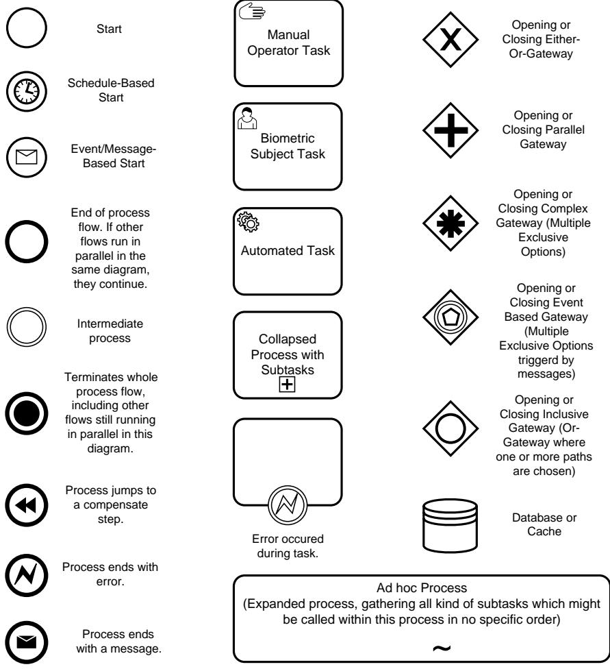
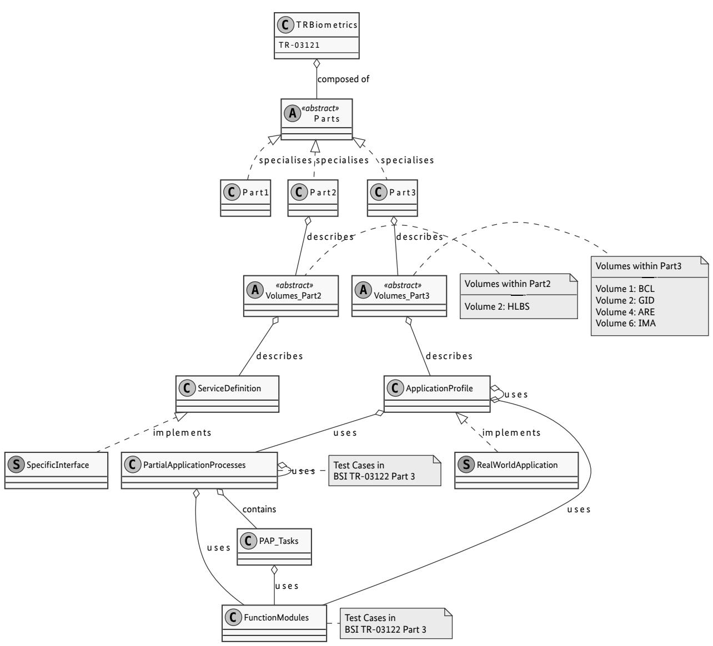

#### BSI Technical Guideline TR-03121-1

# Biometrics for Public Sector Applications

Part 1: Framework

Version 5.2.1

Federal Office for Information Security PO Box 20 03 63 53133 Bonn E-Mail: [TRBiometrics@bsi.bund.de](mailto:TRBiometrics@bsi.bund.de) Internet:<https://www.bsi.bund.de> © Federal Office for Information Security 2021

| 1   | Changelog  1                                                    |
|-----|-----------------------------------------------------------------------|
| 1.1 | Changelog Version 5.2-draft1  1                                 |
| 1.2 | Changelog Version 5.2-draft2  1                                 |
| 1.3 | Changelog Version 5.2-draft3  4                                 |
| 1.4 | Changelog Version 5.2  7                                        |
| 1.5 | Changelog Version 5.2.1  8                                      |
| 2   | Introduction  10                                                |
| 2.1 | Motivation and Objectives of Technical Guideline Biometrics  10 |
| 2.2 | Target Audience and User  10                                    |
| 2.3 | Terminology  10                                                 |
| 2.4 | Business Process Modelling Notation (BPMN)  11                  |
| 3   | Structure of Technical Guideline Biometrics  12                 |
| 4   | How to use this Technical Guideline  14                         |
| 5   | Logging scheme  15                                              |
| 5.1 | Use cases  15                                                   |
| 5.2 | XML schemas  15                                                 |
| 6   | Application Profiles  16                                        |
| 7   | Function Modules  17                                            |
| 7.1 | Organisation of the Function Modules  17                        |
| 7.2 | Function Module Classes  17                                     |
| 8   | Partial Application Processes  19                               |
| 8.1 | Organisation of the Partial Application Processes  19           |
|     | List of Abbreviations  20                                       |
|     | Bibliography  21                                                |

### List of figures

| 2.1. | BPMN Symbols used for the Process Modelling  | 11 |
|------|-------------------------------------------------|----|
| 3.1. | Class Diagram of the Technical Guidelines    | 13 |

## 1 Changelog

The following tables present the changes introduced to this Technical Guideline since version 5.1. chan gelog lists the changes grouped per part of this Technical Guideline, per building block [\(Application Profile](#page-25-1) [\(AP\)](#page-25-1), [Partial Application Process \(PAP\),](#page-25-2) Task, [Function Module \(FM\)\)](#page-25-3) or element (section, table, figure).

#### 1.1 Changelog Version 5.2-draft1

This chapter includes all changes between Version 5.1 and Version 5.2-draft1.

#### 1.1.1 Changelog BSI TR-03121, Part 3

| TR Volume | Block / Section / Type | Name | Type of Change | Change Description                                                   |
|-----------|------------------------------|------|-------------------|----------------------------------------------------------------------|
| IMA       | -                            | -    | Added             | Initial release of volume BSI TR-03121-3.6 (Immigration Authorities) |
|           |                              |      |                   |                                                                      |

**Table 1.1** Changelog BSI TR-03121, Part 3

#### 1.2 Changelog Version 5.2-draft2

This chapter includes all changes between Version 5.2-draft1 and Version 5.2-draft2.

#### 1.2.1 Changelog BSI TR-03121, Part 1

| Element Name | Type of Change | Change Description |
|--------------|-------------------|--------------------|
| -            | -                 | No Changes         |

**Table 1.2** Changelog BSI TR-03121, Part 1

#### 1.2.2 Changelog BSI TR-03121, Part 2, Volume HLBS

| Element Name                                                                                                                       | Type of Change | Change Description                                                                                                                                                                                                                 |  |
|------------------------------------------------------------------------------------------------------------------------------------|-------------------|------------------------------------------------------------------------------------------------------------------------------------------------------------------------------------------------------------------------------------|--|
| Service Definition "Faci al Image Acquisition Sys tem"                                                                       | Changed           | Added User Command "RotateManually" and feedback "QACroppedFacialImageRo tation". Added information for feedback "QAEntireFacialImage" that the ImageRe gion SHALL be used for marking the area of the cropped facial image. |  |
| Service Definition "Basic Facial Image Acquisition System"                                                                   | Added             | Service Definition Basic Facial Image Acquisition System added.                                                                                                                                                                    |  |
| Service Definition "Faci al Image Acquisition Sys tem"                                                                       | Changed           | Changed possbile value annotation for feedback images from "Image in a common data format (jpeg, bmp or png) expected" to "Image in a common data format (e.g. jpeg or bmp) expected".                                       |  |
| Service Definition "Fin gerprint Acquisition"                                                                                   | Changed           | Changed possbile value annotation for feedback images from "Image in a common data format (jpeg, bmp or png) expected" to "Image in a common data format (e.g. jpeg or bmp) expected".                                       |  |
| Service Definition for Changed "Self Service System"                                                                         |                   | Changed possbile value annotation for feedback images from "Image in a common data format (jpeg, bmp or png) expected" to "Image in a common data format (e.g. jpeg or bmp) expected".                                       |  |
| Data Types "Application Profile"                                                                                                | Added             | Format Restriction added: "IMA_MultiModalProcessingImmigrationAuthori tiesEES "                                                                                                                                                 |  |
| Data Types "Application Added Format Restriction added: "IMA_MultiModalProcessingImmigrationAuthori Profile" tiesSIS " |                   |                                                                                                                                                                                                                                    |  |

**Table 1.3** Changelog BSI TR-03121, Part 2

#### 1.2.3 Changelog BSI TR-03121, Part 3

| TR Volume             | Block / Section / Type | Name                                                                | Type of Change   | Change Description                                                                                                                    |
|-----------------------|------------------------------|---------------------------------------------------------------------|---------------------|---------------------------------------------------------------------------------------------------------------------------------------|
| BCL                   | FM                           | UI-FI-BSJ                                                           | Fixed               | Requirements for the UI of the feedback screen take only effect, if another FM requires the system to have such a feedback screen. |
| BCL, GID, ARE, IMA | FM                           | QA-FI-SB                                                            | Changed, Renamed | Removed volume specific information (threshold requirements) and renamed FM to QA-FI-GENERIC.                                      |
| BCL                   | FM                           | QA-FI-BCL                                                           | Added               | Volume specific threshold requirements added to this FM.                                                                              |
| GID                   | FM                           | QA-FI-GID                                                           | Added               | Volume specific threshold requirements added to this FM.                                                                              |
| ARE                   | FM                           | QA-FI-ARE                                                           | Added               | Volume specific threshold requirements added to this FM.                                                                              |
| IMA                   | FM                           | QA-FI IMA                                                        | Added               | Volume specific threshold requirements added to this FM.                                                                              |
| BCL, IMA              | FM                           | COM-FI EES                                                       | Removed             | Removed FM from volumes BCL and IMA.                                                                                                  |
| BCL                   | FM                           | COM-FI BCL                                                       | Added               | Added compression requirements for entire volume.                                                                                     |
| IMA                   | FM                           | COM-FI IMA                                                       | Added               | Added compression requirements for entire volume.                                                                                     |
| BCL, IMA              | FM                           | COM-FP EES                                                       | Removed             | Removed FM from volumes BCL and IMA.                                                                                                  |
| BCL                   | FM                           | COM-FP BCL                                                       | Added               | Added compression requirements for entire volume.                                                                                     |
| IMA                   | FM                           | COM-FP IMA                                                       | Added               | Added compression requirements for entire volume.                                                                                     |
| IMA                   | FM                           | REF-FI AAD                                                       | Removed             | Removed FM from volume IMA.                                                                                                           |
| IMA                   | FM                           | REF-FP AAD                                                       | Removed             | Removed FM from volume IMA.                                                                                                           |
| IMA                   | FM                           | O-ALL USV                                                        | Removed             | Removed FM from volume IMA.                                                                                                           |
| IMA                   | FM                           | COM-FP WSQ                                                       | Removed             | Removed FM from volume IMA.                                                                                                           |
| IMA                   | AP                           | Multi modal Pro cessing in Immigrati on Autho rities | Changed             | "elongation of resident permits" changed to "renewal per mits".                                                                    |
| IMA                   | PAP                          | ACQ-FI SV-4                                                      | Changed             | Reference in Fig. fixed.                                                                                                              |
| IMA                   | PAP Task                     | ACQ-FPS SV-1                                                     | Changed             | "Increment i" added in Fig.                                                                                                           |
| GID                   | FM                           | EVA-FI GENERIC                                                   | Changed             | Detailed description in Tab.                                                                                                          |
| GID                   | FM                           | EVA-FP GENERIC                                                   | Changed             | Detailed description in Tab.                                                                                                          |
| BCL                   | FM                           | AS-FP-MF                                                            | Removed             | PNG as return format.                                                                                                                 |
| BCL                   | FM                           | AS-FI-ICS                                                           | Removed             | PNG as return format.                                                                                                                 |
| BCL                   | FM                           | AS-FP-SLP                                                           | Changed             | Classification threshold only for more than two classes.                                                                              |

| TR Volume             | Block / Section / Type | Name                                                                                            | Type of Change | Change Description                                                                                                                                                                           |
|-----------------------|------------------------------|-------------------------------------------------------------------------------------------------|-------------------|----------------------------------------------------------------------------------------------------------------------------------------------------------------------------------------------|
| BCL, GID, ARE, IMA | FM                           | LOG-ALL GENERIC                                                                              | Changed           | Added Application Profile element.                                                                                                                                                           |
| BCL, GID, ARE, IMA | FM                           | LOG-FI GENERIC                                                                               | Changed           | Added Application Profile and time out, element. For each capture added the operation mode, vertical position, illumination level and focus distance attribute.                        |
| BCL, GID, ARE, IMA | FM                           | LOG-FP GENERIC                                                                               | Changed           | Added Application Profile and time out element.                                                                                                                                              |
| IMA                   | PAP                          | ACQ-FI SV-4                                                                                  | Changed           | Adapted Capture Process to new HLBS Service Definition Basic Faci al Image Acquisition System                                                                                             |
| BCL, IMA              | PAP Task                     | ACQ-FI-1                                                                                        | Changed           | Removed annotation with used FMs on "Retrieve image from hard ware", due to ambiguous mapping of FMs in Volumes where FM is not used.                                                  |
| BCL, GID, ARE, IMA | PAP                          | Introduc tion                                                                                | Changed           | Removed example FM categories that may apply for Application Profiles, as not all of them are existing in each Volume.                                                                    |
| IMA                   | FM                           | COD-ALL IMA                                                                                  | Added             | Added new log schema for immigration authorities.                                                                                                                                            |
| IMA                   | AP                           | Multi modal Pro cessing in Immigrati on Autho rities                             | Changed           | Removed rolled finger acquisition and facial image acquisition from overall process.                                                                                                      |
| IMA                   | FM                           | AH-FI-ICS                                                                                       | Removed           | Not relevant for IMA Volume.                                                                                                                                                                 |
| IMA                   | FM                           | AS-FI-ICS                                                                                       | Removed           | Not relevant for IMA Volume.                                                                                                                                                                 |
| IMA                   | FM                           | AS-FP ROLL                                                                                   | Removed           | Not relevant for IMA Volume.                                                                                                                                                                 |
| IMA                   | PAP                          | ACQ-FI M-1                                                                                   | Removed           | Not relevant for IMA Volume.                                                                                                                                                                 |
| IMA                   | PAP                          | ACQ FP10R SV-1                                                                            | Removed           | Not relevant for IMA Volume.                                                                                                                                                                 |
| IMA                   | PAP                          | ACQ FP4141- SV-1                                                                          | Changed           | HLBS Service Definition to implement referenced.                                                                                                                                             |
| IMA                   | PAP                          | ACQ FP442- SV-1                                                                           | Changed           | HLBS Service Definition to implement referenced.                                                                                                                                             |
| IMA                   | AP                           | Applicati on Profi le Multi modal Pro cessing in Immigrati on Autho rities | Changed           | Split into two APs: "Application Profile Multimodal Processing in Immigration Authorities for EES" and "Application Profile Multi modal Processing in Immigration Authorities for SIS" |
| IMA                   | Introduc tion             | Introduc tion                                                                                | Changed           | Introduction taken from "Application Profile Multimodal Processing in Immigration Authorities"                                                                                            |
| BCL, IMA              | FM                           | BIP-FI BCL                                                                                   | Renamed           | Renamed FM BIP-FI-BCL to BIP-FI-APP.                                                                                                                                                         |
| BCL, IMA              | FM                           | BIP-FI APP                                                                                   | Changed           | Generalised wording (e.g. passenger to biometric subject) to better suit for more volumes.                                                                                                |

| TR Volume                     | Block / Section / Type | Name                                                                                                       | Type of Change | Change Description                                                                                      |
|-------------------------------|------------------------------|------------------------------------------------------------------------------------------------------------|-------------------|---------------------------------------------------------------------------------------------------------|
| BCL                           | FM                           | LOG-ALL BCL                                                                                             | Changed           | Added recommendation to log record image also separately.                                               |
| IMA                           | FM                           | LOG-ALL IMA                                                                                             | Added             | Added new FM to IMA Volume.                                                                             |
| BCL, IMA                      | FM                           | COD-ALL EES                                                                                             | Added             | Added new FM to BCL and IMA Volume.                                                                     |
| IMA                           | FM                           | COD-ALL GSAT3                                                                                           | Added             | Added new FM to IMA Volume.                                                                             |
| BCL, IMA                      | PAP                          | ACQ-FPS SV-1                                                                                            | Changed           | Shortened to technical aspects and renamed "Supervised Acquisi tion Single Slap".                    |
| BCL, IMA                      | PAP                          | ACQ-FPS SV-1                                                                                            | Changed           | HLBS Service Definition to implement referenced.                                                        |
| -                             | Bibliogra phy             | EES_ICD_FP Removed                                                                                         |                   | -                                                                                                       |
| -                             | Bibliogra phy             | EES_ICD_FI Removed                                                                                         |                   | -                                                                                                       |
| -                             | Bibliogra phy             | EES_ICD                                                                                                    | Added             | Version 06_00_00, 2021                                                                                  |
| BCL, GID, VIS, GIS, IMA | FM                           | AS-FP-SLP                                                                                                  | Changed           | This FM only applies, when the scanner runs in slap acquisition mo de.                               |
| IMA                           | AP                           | Applicati on Profi le Multi modal Pro cessing in Immigra tion Aut horities for SIS | Changed           | FI acquisition removed.                                                                                 |
| BCL, IMA                      | PAP Task                     | ACQ-FPP SV-2                                                                                            | Changed           | Added the operator decision to accept or recapture a fingerprint of the process diagram in the text. |

**Table 1.4** Changelog BSI TR-03121, Part 3

#### 1.3 Changelog Version 5.2-draft3

This chapter includes all changes between Version 5.2-draft2 and Version 5.2-draft3.

#### 1.3.1 Changelog BSI TR-03121, General

| Element Name | Type of Change | Change Description |
|--------------|-------------------|--------------------|
| -            | -                 | No Changes         |

**Table 1.5** Changelog BSI TR-03121, Part 1

#### 1.3.2 Changelog BSI TR-03121, Part 1

| Element Name | Type of Change | Change Description |
|--------------|-------------------|--------------------|
| -            | -                 | No Changes         |

**Table 1.6** Changelog BSI TR-03121, Part 1

#### 1.3.3 Changelog BSI TR-03121, Part 2, Volume HLBS

| Element Name                              | Type of Change | Change Description                                                                                                      |
|-------------------------------------------|-------------------|-------------------------------------------------------------------------------------------------------------------------|
| Service Definition Self Service System | Changed           | Removed ReferenceImage configuration parameter for SSS Service Definition (Au tomated Acquisition of Facial Images). |
| Client-Server Connection Scenarios     | Added             | Figure for logical HLBS Architecture.                                                                                   |

**Table 1.7** Changelog BSI TR-03121, Part 2

#### 1.3.4 Changelog BSI TR-03121, Part 3

| TR Volume                          | Block / Section / Type | Name                                                                                          | Type of Change | Change Description                                                                                                                                                      |
|------------------------------------|------------------------------|-----------------------------------------------------------------------------------------------|-------------------|-------------------------------------------------------------------------------------------------------------------------------------------------------------------------|
| BCL                                | FM                           | AH-ALL SSS                                                                                 | Changed           | Clarified that the identification of multiple persons is required du ring the capture of fingerprints.                                                               |
| BCL, IMA                           | PAP Task                     | ACQ-FPS SV-1                                                                               | Fixed             | Uniformed information of text and process diagram (added more in formation about counter handling in the text).                                                      |
| ARE                                | PAP Task                     | ACQ-FPS SV-2                                                                               | Fixed             | Uniformed information of text and process diagram (added more in formation about counter handling in the text).                                                      |
| BCL, GID                           | PAP Task                     | ACQ-FPP SV-2                                                                               | Fixed             | Uniformed information of text and process diagram (added more in formation about counter handling in the text).                                                      |
| ARE                                | PAP Task                     | ACQ-FPS SV-2                                                                               | Changed           | Slap classifier added.                                                                                                                                                  |
| ARE                                | AP                           | Applicati on Profile Arrival At testation Document                                | Changed           | FM AS-FP-SLP added to List of Mandatory Function Modules.                                                                                                               |
| BCL                                | AP                           | Applicati on Profile Automa ted Border Control (Face-Ve rification Only) | Changed           | FM COD-FI-GENERIC added to List of Mandatory Function Modu les.                                                                                                      |
| BCL, VIS, IMA                   | FM                           | COD-ALL GENERIC                                                                            | Removed           |                                                                                                                                                                         |
| BCL                                | FM                           | AH-FI BCL                                                                                  | Changed           | Background blurring removed.                                                                                                                                            |
| BCL, GID, VIS, ARE, GIS, IMA | FM                           | QA-FI-SB                                                                                      | Removed           | All references to FM QA-FI-SB changed to FM QA-FI-GENERIC and FM QA-FI-<VL>                                                                                          |
| BCL                                | PAP                          | ACQ-FI M-1                                                                                 | Renamed           | The process was renamed from PAP ACQ-FI-M-1 "Manual Facial Image Acquisition System" to PAP ACQ-FI-SV-5 "Supervised Facial Image Acquisition System".             |
| BCL                                | PAP                          | ACQ-FI SV-5                                                                                | Changed           | Specified process to perform cropping and de-rotation face auto matically with the option for the operator to optimise the cropping and the de-rotation manually. |
| BCL                                | PAP                          | ACQ-FI AUTO-1                                                                              | Changed           | Specified process to perform cropping and de-rotation face auto matically.                                                                                           |
| BCL                                | PAP                          | ACQ-FI USV-1                                                                               | Changed           | Specified process to perform cropping and de-rotation face auto matically.                                                                                           |

| TR Volume             | Block / Section / Type | Name                                                                         | Type of Change | Change Description                                                                                                                                  |
|-----------------------|------------------------------|------------------------------------------------------------------------------|-------------------|-----------------------------------------------------------------------------------------------------------------------------------------------------|
| BCL                   | PAP Task                     | Slap Ac quisition Request EES                                       | Removed           |                                                                                                                                                     |
| BCL                   | PAP                          | ACQ-FPS USV-1                                                             | Changed           | Process simplified. Title changed to: "Unsupervised Acquisition Slap" and process description added.                                             |
| ARE                   | FM                           | COD-ALL AAD                                                               | Renamed           | Renamed FM COD-ALL-AAD to FM COD-ALL-ARE.                                                                                                           |
| ARE                   | FM                           | COD-ALL ARE                                                               | Changed           | The name of corresponding schema file for logging changed from aadXvX.xsd to areXvX.xsd and the root element changed from aad-app to are-log. |
| ARE                   | FM                           | EVA-ALL AAD                                                               | Renamed           | Renamed FM EVA-ALL-AAD to FM EVA-ALL-ARE.                                                                                                           |
| ARE                   | FM                           | EVA-FI AAD                                                                | Renamed           | Renamed FM EVA-FI-AAD to FM EVA-FI-ARE.                                                                                                             |
| ARE                   | FM                           | EVA-FP AAD                                                                | Renamed           | Renamed FM EVA-FP-AAD to FM EVA-FP-ARE.                                                                                                             |
| ARE                   | FM                           | LOG-ALL AAD                                                               | Renamed           | Renamed FM LOG-ALL-AAD to FM LOG-ALL-ARE.                                                                                                           |
| ARE                   | FM                           | REF-FI AAD                                                                | Renamed           | Renamed FM REF-FI-AAD to FM REF-FI-ARE.                                                                                                             |
| ARE                   | FM                           | REF-FP AAD                                                                | Renamed           | Renamed FM REF-FP-AAD to FM REF-FP-ARE.                                                                                                             |
| GID, ARE, GIS, IMA | FM                           | AS-FI-DC                                                                     | Changed           | Camera resolution SHALL be chosen to acquire a facial image of at least 1200 x 1600 pixels with an inter eye distance of at 120 pi xels.      |
| GID, VIS              | PAP Task                     | ACQ-FPP USV-1                                                             | Added             | Display warning message to user, if sequence check fails.                                                                                           |
| BCL                   | FM                           | AS-FI-ICS                                                                    | Removed           | Export requirements for uncompressed images removed.                                                                                                |
| GID                   | FM                           | COD-FI GID2                                                               | Added             |                                                                                                                                                     |
| GID                   | AP                           | Facial Images Cloud                                                    | Added             | Initial Release.                                                                                                                                    |
| GID                   | AP                           | Biometric Data Selection Procedure                                  | Added             | Initial Release.                                                                                                                                    |
| GID                   | FM                           | PAD-FI APP1                                                               | Added             |                                                                                                                                                     |
| BCL                   | AP                           | Applicati on Profile Semi-Mo bile Ma nual Bor der Con trol | Added             | Initial Release.                                                                                                                                    |
| BCL                   | AP                           | Applicati on Profi le Update Process                                | Removed           | Removed empty application profile.                                                                                                                  |

| TR Volume        | Block / Section / Type | Name                                                                                                         | Type of Change | Change Description                                                                                     |
|------------------|------------------------------|--------------------------------------------------------------------------------------------------------------|-------------------|--------------------------------------------------------------------------------------------------------|
| BCL              | AP                           | Applicati on Profile Second Li ne                                                                   | Removed           | Removed unused application profile. See application profile MBC or Semi-Mobile MBC as replacements. |
| IMA              | AP                           | Applica tion Pro file Mul timodal Processing in Immi gration Autho rities for EES | Changed           | FM QA-FI-PG is no requirement anymore within this application profile.                              |
| BCL, GID, ARE | PAP                          | General Process Require ments                                                                       | Removed           |                                                                                                        |
| BCL, GID, ARE | FM                           | Category Biometric Compari son                                                                      | Changed           | FM is now recommended.                                                                                 |
| BCL              | PAP                          | VER-FP-1                                                                                                     | Removed           |                                                                                                        |

**Table 1.8** Changelog BSI TR-03121, Part 3

#### 1.4 Changelog Version 5.2

This chapter includes all changes between Version 5.2-draft3 and Version 5.2.

#### 1.4.1 Changelog BSI TR-03121, General

| Element Name | Type of Change | Change Description |
|--------------|-------------------|--------------------|
| -            | -                 | No Changes         |

**Table 1.9** Changelog BSI TR-03121, Part 1

#### 1.4.2 Changelog BSI TR-03121, Part 1

| Element Name                | Type of Change | Change Description                       |
|-----------------------------|-------------------|------------------------------------------|
| Function Modu le Classes | Add               | Primary Information Item added to table. |

**Table 1.10** Changelog BSI TR-03121, Part 1

#### 1.4.3 Changelog BSI TR-03121, Part 2, Volume HLBS

| Element Name                          | Type of Change | Change Description                                                                                                                                                         |
|---------------------------------------|-------------------|----------------------------------------------------------------------------------------------------------------------------------------------------------------------------|
| API DataType "Applicati onProfile" | Changed           | Added elements "BCL_SemiMobileManualBorderControl" and "BCL_SelfService System". Removed "VIS_ManualCounter" and "GIS_MultimodalIndenticiationWi thWatchlistChecks". |

**Table 1.11** Changelog BSI TR-03121, Part 2

#### 1.4.4 Changelog BSI TR-03121, Part 3

| TR Volume             | Block / Section / Type | Name              | Type of Change | Change Description                                                                                                                                                                                         |
|-----------------------|------------------------------|-------------------|-------------------|------------------------------------------------------------------------------------------------------------------------------------------------------------------------------------------------------------|
| GID                   | FM                           | QA-FI-PT          | Clarified         | The way template gets on the image is variable (e.g. manually done by supervisor or automatically done by software) and the medium of the template is not fixed (it can be physically or digitally). |
| GID                   | FM                           | COD-ALL GID    | Changed           | Relevant schema version is 4v6 for this release.                                                                                                                                                           |
| ARE                   | FM                           | COD-ALL ARE    | Changed           | Relevant schema version is 4v6 for this release.                                                                                                                                                           |
| BCL, GID, ARE, IMA | FM                           | COD-FI GENERIC | Changed           | Relevant schema version for volumes BCL and IMA is 4v7. Relevant schema version for volumes GID and ARE is 4v6.                                                                                         |
| BCL                   | FM                           | LOG-ALL BCL    | Changed           | Added mapping of BCL Application Profiles to ApplicationProfi le-element for logging.                                                                                                                   |
| IMA                   | FM                           | LOG-ALL IMA    | Changed           | Added mapping of IMA Application Profiles to ApplicationProfi le-element for logging. Removed requriement to not log purpose in case purpose is ambiguous (purpose "other" may be used now).         |
| BCL, GID, ARE, IMA | FM                           | QA-FI GENERIC  | Changed           | Clarified that the image type to process depends on require ments of the application profile to implement.                                                                                              |
| BCL, GID, ARE, IMA | FM                           | LOG               | Changed           | Clarified that the logging modules and schema-requirements apply both.                                                                                                                                  |
| BCL, GID, ARE, IMA | FM                           | LOG-FP GENERIC | Changed           | Reference to probe SHALL be logged.                                                                                                                                                                        |
| BCL                   | FM                           | COD-ALL BCL    | Changed           | Optional schema elements/attributes SHALL be considered as far as possible.                                                                                                                             |
| GID                   | FM                           | COD-ALL GID    | Changed           | Optional schema elements/attributes SHALL be considered as far as possible.                                                                                                                             |
| ARE                   | FM                           | COD-ALL ARE    | Changed           | Optional schema elements/attributes SHALL be considered as far as possible.                                                                                                                             |
| IMA                   | FM                           | COD-ALL IMA    | Changed           | Optional schema elements/attributes SHALL be considered as far as possible.                                                                                                                             |
| BCL, GID              | PAP Task                     | ACQ-FPS USV-1  | Changed           | Harmonized BPMN-process with process description (sequence check only required for acquisitions of multiple slaps).                                                                                     |

**Table 1.12** Changelog BSI TR-03121, Part 3

#### 1.5 Changelog Version 5.2.1

This chapter includes all changes between Version 5.2 and Version 5.2.1.

#### 1.5.1 Changelog BSI TR-03121, General

| Element Name | Type of Change | Change Description |
|--------------|-------------------|--------------------|
| -            | -                 | No Changes         |

**Table 1.13** Changelog BSI TR-03121, Part 1

#### 1.5.2 Changelog BSI TR-03121, Part 1

| Element Name | Type of Change | Change Description |
|--------------|-------------------|--------------------|
| -            | -                 | No Changes         |

**Table 1.14** Changelog BSI TR-03121, Part 1

#### 1.5.3 Changelog BSI TR-03121, Part 2, Volume HLBS

| Element Name | Type of Change | Change Description |
|--------------|-------------------|--------------------|
| -            | -                 | No Changes         |

**Table 1.15** Changelog BSI TR-03121, Part 2

#### 1.5.4 Changelog BSI TR-03121, Part 3

| TR Volume | Block / Section / Type | Name                                        | Type of Change | Change Description                                               |
|-----------|------------------------------|---------------------------------------------|-------------------|------------------------------------------------------------------|
| GID       | AP                           | Facial Images Cloud                   | Removed           | AP only required for Live Enrolment May 2025.                    |
| GID       | AP                           | Biometric Data Selection Procedure | Removed           | AP only required for Live Enrolment May 2025.                    |
| GID       | FM                           | COD-FI GID2                              | Removed           | Part of AP Facial Images Cloud and therefore not needed anymore. |
| GID       | FM                           | COD-FI EXIF                              | Removed           | Part of AP Facial Images Cloud and therefore not needed anymore. |

**Table 1.16** Changelog BSI TR-03121, Part 3

### 2 Introduction

### 2.1 Motivation and Objectives of Technical Guideline Biometrics

Biometric methods are used in many different areas of applications. The solutions and systems available on the market are able to serve a broad range regarding performance, security, usability and standard confor mance. For public sector applications, it is necessary to define precise requirements and general conditions. Furthermore, the systems have to be defined in a way which allows for extension in future developments.

The objective of this Technical Guideline (TR Biometrics) is to offer a basis for a consistent and comparable quality of public sector applications and for building a common architecture.

This guideline has the following objectives:

- **•** *Modularity:* The complete guideline is built from several single guideline modules. For a single application area only the respective modules have to be taken into account. This is done in order to avoid side effects between different kinds of applications which would occur due to changes of special functions.
- **•** *Clarity:* The concept of this guideline follows a well structured framework. With this framework it is easily understandable which kind of guideline modules are valid for the respective application scenario.
- **•** *Expandability:* Modularity is the key component of expandability in the scope of this guideline. This is valid regarding new applications as well as new functional units.
- **•** *Standard conformance:* The Technical Guideline takes national and international standards and guidelines into account and deploys them for governmental applications.
- **•** *Conformance and certification:* The guideline modules are designed in such a way that requirements and conditions for single functional units are clearly separated from each other. Products for single functional units are clearly defined regarding the interfaces and the range of their functionality so that they can be tested for conformance with this guideline and certified.
- **•** *Ability to reference:* The use of functional units allows to specify precise requirements for products that are used in according application scenarios. Therefore, this guideline can be used as a reference e.g. for tenders.
- **•** *Market orientation:* The definition of functional units is related to the products that can be found on the market. Requirements of the guideline can be unambiguously assigned to respective systems and com ponents.

It should be noted that the content of this guideline is limited to aspects biometric characteristics. In terfaces to further technologies (e.g. connection of optical or electronic document readers) are out of scope of this document.

#### 2.2 Target Audience and User

Audience for this guideline are institutions that are dealing with projects using biometric characteristics in public sector applications. These include:

- **•** Agencies that are issuing identity documents or visas, e.g. passport agencies of the local authorities mis sions abroad of the Federal Foreign Office.
- **•** Public Authorities using biometric applications for identity verification of people, e.g. the German Federal Police (Polizeien des Bundes) or the Police of the Federal States (Polizeien der Länder), the German Customs Administration (Bundeszollverwaltung) or the Federal Administrative Office (Bundesverwaltungsamt).

Beside these users, this guideline also addresses vendors of biometric systems as well integrators and app lication developers.

#### 2.3 Terminology

The key words "MUST", MUST NOT", "REQUIRED", "SHALL", "SHALL NOT", "SHOULD", "SHOULD NOT", "RECOMMENDED", "MAY", and "OPTIONAL" in this Technical Guideline are to be interpreted as described in [\[BIB\\_RFC2119\]](#page-26-1).

#### 2.4 Business Process Modelling Notation (BPMN)

The processes in this Technical Guideline are modelled using the Business Process Modelling Notation (BPMN). [Figure 2.1](#page-16-1) gives an overview over the relevant icons herein.

**Figure 2.1.** BPMN Symbols used for the Process Modelling

### 3 Structure of Technical Guideline Biometrics

This Technical Guideline consists of the following parts:

**•** Part 1: Framework (TR-03121-1)

TR-03121-1 is the framework document of the guideline. It explains the concept and the relation between the different parts.

**•** Part 2: Software Architecture (TR-03121-2)

The [High Level Biometric Services \(HLBS\)](#page-25-4) as well as Service Definitions for specific use cases are specified here.

- **•** Part 3: Application Profiles, Function Modules and Processes (TR-03121-3)
	- **•** In the third part, the different Application Profiles with corresponding Partial Application Processes and Function Modules are defined. These contain the detailed technical requirements for each of com ponents.
		- **•** Application Profiles may reference Function Modules, Partial Processes and Service De finitions (refer to Part 2).
		- **•** Partial Application Processes may refer to Function Module Categories and may be comprised of *Tasks*. Tasks are processes which are part of more than one Partial Application Process.
	- **•** For practical purposes, this part is split up in different volumes to serve different user groups.

Please refer to [Figure 3.1](#page-18-0) for a class diagram of the structure described above.

**Figure 3.1.** Class Diagram of the Technical Guidelines

Additionally, the Technical Guideline BSI-TR 03122 "Conformance Test Specification for Technical Guideline TR-03121 Biometrics for Public Sector Applications" describes the requirements that are essential to declare conformance or to declare the absence of conformance. It consists of the following parts:

- **•** Part 1: Framework (TR-03122-1)
- **•** Part 3: Test Cases for Function Modules and Processes (TR-03122-3)
- **•** Part 4: Additional Test Cases (TR-03122-4)

### 4 How to use this Technical Guideline

This chapter gives a short overview how to read and apply this guideline step by step.

- 1. The user chooses the desired Application Profile. With the help of the Application Profile the user can get a deeper insight into the application, the required software architecture components and the described functionality. TR-03121-2 offers further information about the software architecture component model.
- 2. Based on the Application Profile, the mandatory Partial Application Processes and Function Modules are identified. One profile can link to several Partial Application Processes and Function Modules due dif ferent kinds of underlying biometric characteristics or the fact that different technologies (e.g. scanners or digital cameras for the digitisation of a photo) are used.

Function Modules are referenced by an explicit identifier, e.g. AH-FP-GID. The first part identifies the requirement type (e.g. Hardware), the second part represents the biometric characteristic (e.g. fingerprint), and the last part denotes a further descriptor, typically the scope (e.g. German Identity Document).

Function Modules for different biometric characteristics are divided by a comma while a choice between different technologies is denoted by a slash (e.g. AH-FP-FTR, AH-PH-FBS/AH-PH-DC).

If a Function Module is denoted with a placeholder between a less-than and greater-than sign (< >) the actual referenced Function Module is dependant on the context in which the Function Module has been mentioned. For example the Function Module AH-FI-<VL> has been mentioned within a Partial Applica tion Process used in the Border Control (BCL) volume, then the actual referenced Function Module is AH-FI-BCL. The same procedure holds for Application Profiles denoted as <AP> analogously. If no specific Function Module applies, then there are no further requirements defined for this context.

Partial Application Processes are referenced by an explicit identifier, refer to Partial Application Profile section.

3. On the basis of identifier according Function Module and Partial Application Processes can be ex amined. Every Function Module and Partial Application Process provides detailed technical requirements and recommendations. Note, each reference to an Function Module or Partial Application Processes is a link within the document.

### 5 Logging scheme

#### 5.1 Use cases

This chapter specifies a logging scheme, which allows to document all technical activities performed. The schema files contain additional and mandatory information on technical requirements.

#### 5.2 XML schemas

The schema file trbio4v7.xsd imports all other schema files and as such the main file used for validation.

[Table 5.1](#page-20-3) gives an overview of the different XML schema files.

| Application domain             | Schemafile      | Namespace                         |
|--------------------------------|-----------------|-----------------------------------|
| Alien register enrolment       | aad4v6.xsd      | http://trbio.bsi.bund.de/aad/4    |
| Border control log             | bcl4v7.xsd      | http://trbio.bsi.bund.de/bcl/4    |
| Type definitions               | biotypes4v7.xsd | http://trbio.bsi.bund.de/base/4   |
| German identity documents      | gid4v6.xsd      | http://trbio.bsi.bund.de/gid/4    |
| High level biometric services  | hlbs4v7.xsd     | http://trbio.bsi.bund.de/hlbs/4   |
| Immigration authorities        | ima4v7.xsd      | http://trbio.bsi.bund.de/ima/4    |
| Conformance test specification | biocts4v7.xsd   | http://trbio.bsi.bund.de/biocts/4 |

**Table 5.1** Overview XML schema files

### 6 Application Profiles

Different areas in which this guideline can be used are defined in separate Application Profiles. Application Profiles can have mandatory status, e.g. through published regulations and laws or by requirements given in tenders. Besides, such Application Profiles can also be considered as Best Practices.

An Application Profile is described with the following items:

- **•** Introduction (legal requirements)
- **•** Process overview
	- **•** Target audience
	- **•** Users
- **•** Relevant standards and conditions
- **•** List of
	- **•** mandatory Function Modules
	- **•** mandatory Partial Application Processes

### 7 Function Modules

#### 7.1 Organisation of the Function Modules

Specific technical requirements are structured in Function Modules. They contain detailed require ments for the respective component.

Function Modules are aligned to the products on the market and to the targets of evaluation.

Every Function Module is built of one or more sub-clauses which are assigned to unique identifiers. Within the sub-clauses requirements and recommendations are specified in detail.

Partial Application Processes are referenced by their ID, which can contain up to three information items pointing to its contents.

The basic structure of an ID is: "FM AAA-BBB-CCC", where "AAA" is the so-called primary information item (see: [Table 7.1\)](#page-22-3).

#### 7.2 Function Module Classes

[Table 7.1](#page-22-3) gives an overview of the different Function Module categories.

| Function Module Category   | Primary Information Item | Description                                                                                                                                                                                                                                                                                                                                                                                                                                                                                              |
|----------------------------|--------------------------|----------------------------------------------------------------------------------------------------------------------------------------------------------------------------------------------------------------------------------------------------------------------------------------------------------------------------------------------------------------------------------------------------------------------------------------------------------------------------------------------------------|
| Acquisition Hardware       | AH                       | Devices that are used for digitising phy sical representable biometric characte ristics are called Acquisition Hardware. Scanners for capturing photographs, di gital cameras to capture facial images, fingerprint sensors, or signature tablets can be named as examples.                                                                                                                                                                                                            |
| Acquisition Software       | AS                       | Acquisition Software encapsulates all functionality regarding image proces sing except for biometric purposes. The refore, this module usually contains de vice driver software for the Acquisiti on Hardware or in general software that is very close to the physical hardware. Furthermore, colour management and image enhancement mechanisms are often part of this software layer.                                                                                      |
| Biometric Image Processing | BIP                      | The module Biometric Image Proces sing provides the extraction of all rele vant biometric information from the data, which is provided by the Acquisi tion Hardware or the Acquisition Soft ware layer. Thus, a proprietary data block is transformed to a digital image of a biometric characteristic. In gene ral, specific image processing for bio metric characteristics is addressed he re e.g. provision of full frontal images or segmentation of fingerprints. |
| Biometric Comparison       | CMP                      | The module Biometric Comparison en closes the mechanisms and algorithms to verify or identify an identity based on a one-to-one or one-to-many biometric comparison between reference data and a current biometric sample (usually a live presented image) no matter where the reference is stored.                                                                                                                                                                                 |

| Function Module Category      | Primary Information Item | Description                                                                                                                                                                                                                                                                             |
|-------------------------------|--------------------------|-----------------------------------------------------------------------------------------------------------------------------------------------------------------------------------------------------------------------------------------------------------------------------------------|
| Coding                        | COD                      | This module contains the procedures to code logging data as well as biometric data in defined formats. Interoperability is provided by means of standard comp liant coding.                                                                                                 |
| Compression                   | COM                      | The objective of the module Compres sion is to keep the biometric data be low a feasible size without losing too much quality for biometric verification or identification.                                                                                                 |
| Evaluation                    | EVA                      | Methods and interfaces which are used in the scope of evaluation are con tent of this module.                                                                                                                                                                                     |
| Logging                       | LOG                      | The module Logging contains require ments how and in which modality data has to be logged.                                                                                                                                                                                        |
| Operation                     | O                        | Within the module Operation, the working process is specified for the re spective operator.                                                                                                                                                                                       |
| Presentation Attack Detection | PAD                      | The Presentation Attack Detection mo dules give requirements on fake detec tion. This encloses, among other things, functionality and certification require ments.                                                                                                          |
| Quality Assessment            | QA                       | This module contains all kinds of me chanisms and procedures to check the quality of the biometric data or to select the best quality data out of multiple in stances. Quality Assessment is typical ly used in evaluation of an application's performance over time. |
| Reference Storage             | REF                      | The objective of this module is to store biometric data in a way that it can be used for reference purposes later on.                                                                                                                                                             |
| User Interface                | UI                       | The User Interface modules give requi rements on visualization and user in teraction. This encloses, among other things, functionality, quality assurance information, and veto messages.                                                                                   |

**Table 7.1** Overview Function Module Categories

### 8 Partial Application Processes

#### 8.1 Organisation of the Partial Application Processes

Partial Application Processes are referenced by their ID, which can contain up to three information items pointing to its contents.

The basic structure of an ID is: "PAP (Task) AAA-BBB-CCC-#".

Here, "Task" is optional and is only used if the PAP is a task. *AAA* is the primary information item, pointing to the main contents. *BBB* and *CCC* are optional information items, which can further specify the [PAP](#page-25-2). These information items may be 1-6 alphanumeric digits. The abbreviations used for the [PAP](#page-25-2) ID are listed in [Ta](#page-24-2) [ble 8.1](#page-24-2) and [Table 8.2.](#page-24-3) All [PAP](#page-25-2) IDs end with a number *#*. This number is usually 1, unless multiple IDs with similar preceding information items exist. In this case, they are enumerated increasingly.

| Primary Information Item | Description    |
|--------------------------|----------------|
| ACQ                      | Acquisition    |
| ASS                      | Assessment     |
| EVA                      | Evaluation     |
| ID                       | Identification |
| LNK                      | Linking        |
| REQ                      | Request        |
| UPD                      | Update         |
| VER                      | Verification   |

**Table 8.1** Overview PAP ID Primary Information Items

| Optional Information Item | Description                                 |
|---------------------------|---------------------------------------------|
| B                         | Biometrics (fingerprints and facial images) |
| CL                        | Candidate List                              |
| FI                        | Facial Image                                |
| FP                        | Fingerprint                                 |
| FP1P                      | 1 Plain Fingerprint                         |
| FP2P                      | 2 Plain Fingerprints                        |
| FP4141                    | Fingerprint 4-1-4-1                         |
| FP442                     | Fingerprint 4-4-2                           |
| FPP                       | Plain Fingerprint                           |
| FPR                       | Rolled Fingerprint                          |
| FPS                       | Single Slap Fingerprint Image               |
| ID                        | Identification                              |
| nCIR                      | no Connected Identity Register              |
| SV                        | Supervised                                  |
| TF                        | Traveller File                              |
| USV                       | Unsupervised                                |
| VER                       | Verification                                |
| wCIR                      | with Connected Identity Register            |

**Table 8.2** Overview PAP ID Optional Information Items

### List of Abbreviations

| Abbreviation | Description                   |
|--------------|-------------------------------|
| AP           | Application Profile           |
| FM           | Function Module               |
| HLBS         | High Level Biometric Services |
| PAP          | Partial Application Process   |

### Bibliography

[BIB\_RFC2119] *RFC 2119: Key words for use in RFCs to Indicate Requirement Levels.*