## Technische Richtlinie – XML-Datenaustauschformat für hoheitliche Dokumente (TR XhD)

3 - Funktionsmodule

Version 1.5.2

12.03.2020

BSI TR-03123-3

 Bundesamt für Sicherheit in der Informationstechnik Postfach 20 03 63 53133 Bonn Tel.: +49 22899 9582-0 E-Mail: xhd@bsi.bund.de Internet: https://www.bsi.bund.de © Bundesamt für Sicherheit in der Informationstechnik 2020

 

| Versionshistorie 1                                       |    |  |  |  |
|----------------------------------------------------------|----|--|--|--|
| 1 Struktur                                               | 3  |  |  |  |
| 2 Nachrichten                                            | 5  |  |  |  |
| 2.1 Übersicht 5                                          |    |  |  |  |
| 2.2 AbstrakteNachrichtType 5                             |    |  |  |  |
| 2.3 BestellungDokument 6                                 |    |  |  |  |
| 2.4 BestellungSeriennummern 7                            |    |  |  |  |
| 2.5 Auftragsinformation 8                                |    |  |  |  |
| 2.6 Reklamationsinformation 9                            |    |  |  |  |
| 2.7 Lieferinformation 10                                 |    |  |  |  |
| 2.8 Quittierung                                          | 11 |  |  |  |
| 2.9 Fehlerinformation 12                                 |    |  |  |  |
| 3 Baukasten 15                                           |    |  |  |  |
| 3.1 Nachrichtenmodule 15                                 |    |  |  |  |
| 3.1.1 Übersicht                                          | 15 |  |  |  |
| 3.1.2 NachrichtenkopfType 18                             |    |  |  |  |
| 3.1.3 AntraegeType 20                                    |    |  |  |  |
| 3.1.4 AntragsbezogeneDatenType 21                        |    |  |  |  |
| 3.1.5 AntragsdatensatzType                               | 21 |  |  |  |
| 3.1.6 AntragsdatensatzDokumentType 22                    |    |  |  |  |
| 3.1.7 AntragsdatensatzPassbuchType                       | 23 |  |  |  |
| 3.1.8 AntragsdatensatzPassType                           | 23 |  |  |  |
| 3.1.9 AntragsdatensatzReiseausweisType 24                |    |  |  |  |
| 3.1.10 AntragsdatensatzEIDDokumentType 25                |    |  |  |  |
| 3.1.11 AntragsdatensatzEIDKarteUBType                    | 26 |  |  |  |
| 3.1.12 AntragsdatensatzPersonalausweisType 26            |    |  |  |  |
| 3.1.13 AntragsdatensatzAufenthaltstitelType 27           |    |  |  |  |
| 3.1.14 AufenthaltstiteldatenType 27                      |    |  |  |  |
| 3.1.15 AnmerkungenRechtsgrundlagenUndPassdokumentType 28 |    |  |  |  |
| 3.1.16 AnmerkungenErwerbstaetigkeitType 29               |    |  |  |  |
| 3.1.17 FehlerbeschreibungType                            | 30 |  |  |  |
| 3.1.18 LieferinformationInhaltType 30                    |    |  |  |  |
| 3.1.19 LieferinformationSeriennummerType                 | 31 |  |  |  |
| 3.1.20 LieferinformationDokumentType                     | 32 |  |  |  |
| 3.1.21 RueckmeldungType 33                               |    |  |  |  |
| 3.2 Datenmodule 34                                       |    |  |  |  |
| 3.2.1 BehoerdenadresseType 34                            |    |  |  |  |
| 3.2.2 DienstinfoType 34                                  |    |  |  |  |
| 3.2.3 CTYPE_AuftragsinformationType                      | 35 |  |  |  |
| 3.2.4 CTYPE_Bestellungen_SeriennummerType 36             |    |  |  |  |
| 3.2.5 CTYPE_BestellungenType                             | 37 |  |  |  |
| 3.2.6 CTYPE_FehlerinformationType                        | 38 |  |  |  |
| 3.2.7 CTYPE_LieferinformationType                        | 39 |  |  |  |
| 3.2.8 CTYPE_NachrichtenType 39                           |    |  |  |  |
| 3.2.9 CTYPE_QuittierungType 40                           |    |  |  |  |
| 3.2.10 CTYPE_ReklamationsinformationType                 | 40 |  |  |  |
| 3.2.11 DokumentendatenType                               | 42 |  |  |  |
| 3.2.12 DruckrepraesentationType 43                       |    |  |  |  |
| 3.2.13 ElektronischeIDType                               | 44 |  |  |  |
| 3.2.14 GeburtType                                        | 45 |  |  |  |

| 3.2.15 OptionaleEintragungenType 45       |          |  |  |  |
|-------------------------------------------|----------|--|--|--|
| 3.2.16 PersonendatenType 47               |          |  |  |  |
| 3.2.17 PINAdresseType 48                  |          |  |  |  |
| 3.2.18 PINDatenType                       | 48       |  |  |  |
| 3.2.19 ReklamationType 49                 |          |  |  |  |
| 3.2.20 ReklamationsgrundType              | 50 51 |  |  |  |
| 3.2.21 TRBiometricsXMLType                |          |  |  |  |
| 3.2.22 ZertifizierteKomponentenType 51    |          |  |  |  |
| 3.2.23 ZertifizierteKomponenteType 52     |          |  |  |  |
| 3.3 XÖV-Module                            | 52       |  |  |  |
| 3.3.1 AllgemeinerNameType 52              |          |  |  |  |
| 3.3.2 AnschriftType 53                    |          |  |  |  |
| 3.3.3 GeschlechtType                      | 54       |  |  |  |
| 3.3.4 NameNatuerlichePersonType 54        |          |  |  |  |
| 3.3.5 NameOrganisationType 56             |          |  |  |  |
| 3.3.6 NatuerlichePersonType               | 56       |  |  |  |
| 3.3.7 StaatType 57                        |          |  |  |  |
| 4 Datentypen 59                           |          |  |  |  |
| 4.1 Übersicht                             | 59       |  |  |  |
| 4.2 BildType                              | 59       |  |  |  |
| 4.3 DruckzeileType 60                     |          |  |  |  |
| 4.4 GroesseType 61                        |          |  |  |  |
| 4.5 String.LatinXhD                       | 61       |  |  |  |
| 4.6 TestflagType 62                       |          |  |  |  |
|                                           |          |  |  |  |
| 4.7 Übersicht über die Code-Datentypen 62 |          |  |  |  |
| 4.7.1 AufenthaltstitelartCodeType         | 62       |  |  |  |
| 4.7.2 DokumentenartCodeType 63            |          |  |  |  |
| 4.7.3 DruckzeilenCodeType                 | 63       |  |  |  |
| 4.7.4 GeschlechterCodeType                | 63       |  |  |  |
| 4.7.5 OptionaltextCodeType 63             |          |  |  |  |
| 4.7.6 PassartCodeType 63                  |          |  |  |  |
| 4.7.7 ReiseausweisartCodeType             | 64       |  |  |  |
| 4.7.8 ReklamationsklasseCodeType 64       |          |  |  |  |
| 4.7.9 StaatenCodeType 64                  |          |  |  |  |
| 5 Codelisten                              | 65       |  |  |  |
| 5.1 Überblick                             | 65       |  |  |  |
| 5.2 Details                               | 65       |  |  |  |
| 5.2.1 Codeliste Art des Aufenthaltstitels | 65       |  |  |  |
| 5.2.2 Codeliste Art des Dokuments         | 67       |  |  |  |
| 5.2.3 Codeliste Art des Passes 68         |          |  |  |  |
| 5.2.4 Codeliste Art des Reiseausweises 69 |          |  |  |  |
| 5.2.5 Codeliste Geschlechter 70           |          |  |  |  |
| 5.2.6 Codeliste Klasse der Reklamation 71 |          |  |  |  |
| 5.2.7 Codeliste Optionaltext 72           |          |  |  |  |
| 5.2.8 Codeliste Typ der Druckzeile 73     |          |  |  |  |
| 6 Referenzen                              | 75       |  |  |  |
| 7 Eingebundene externe Modelle 77         |          |  |  |  |
| 7.1 TR Bio                                | 77       |  |  |  |
| 7.2 XÖV-Bibliothek 77                     |          |  |  |  |
|                                           |          |  |  |  |

| 1.1 Struktur der TRXhD-Schemata 3                   |    |
|-----------------------------------------------------|----|
| 2.1 Nachrichten Übersicht                           | 5  |
| 2.2 AbstrakteNachrichtType 6                        |    |
| 2.3 BestellungDokument 7                            |    |
| 2.4 BestellungSeriennummern 8                       |    |
| 2.5 Auftragsinformation 9                           |    |
| 2.6 Reklamationsinformation                         | 10 |
| 2.7 Lieferinformation 11                            |    |
| 2.8 Quittierung                                     | 12 |
| 2.9 Fehlerinformation 13                            |    |
| 3.1 Übersicht Nachrichtenmodule 15                  |    |
| 3.2 Übersicht Antragsdatensatz 16                   |    |
| 3.3 AntragsdatensatzDokumentType                    | 17 |
| 3.4 Übersicht Lieferinformationen 18                |    |
| 3.5 NachrichtenkopfType 19                          |    |
| 3.6 AntraegeType                                    | 21 |
| 3.7 AntragsbezogeneDatenType                        | 21 |
| 3.8 AntragsdatensatzDokumentType                    | 22 |
| 3.9 AntragsdatensatzPassType 24                     |    |
| 3.10 AntragsdatensatzReiseausweisType 25            |    |
| 3.11 AntragsdatensatzEIDDokumentType                | 26 |
| 3.12 AntragsdatensatzAufenthaltstitelType 27        |    |
| 3.13 AufenthaltstiteldatenType                      | 28 |
| 3.14 AnmerkungenRechtsgrundlagenUndPassdokumentType | 29 |
| 3.15 AnmerkungenErwerbstaetigkeitType 29            |    |
| 3.16 FehlerbeschreibungType 30                      |    |
|                                                     |    |
| 3.17 LieferinformationInhaltType                    | 31 |
| 3.18 LieferinformationSeriennummerType 31           |    |
| 3.19 LieferinformationDokumentType 32               |    |
| 3.20 RueckmeldungType 33                            |    |
| 3.21 BehoerdenadresseType 34                        |    |
| 3.22 DienstinfoType 35                              |    |
| 3.23 CTYPE_AuftragsinformationType 36               |    |
| 3.24 CTYPE_Bestellungen_SeriennummerType            | 36 |
| 3.25 CTYPE_BestellungenType 37                      |    |
| 3.26 CTYPE_FehlerinformationType 38                 |    |
| 3.27 CTYPE_LieferinformationType 39                 |    |
| 3.28 CTYPE_NachrichtenType 40                       |    |
| 3.29 CTYPE_QuittierungType 40                       |    |
| 3.30 CTYPE_ReklamationsinformationType 41           |    |
| 3.31 DokumentendatenType 42                         |    |
| 3.32 DruckrepraesentationType                       | 43 |
| 3.33 ElektronischeIDType 44                         |    |
| 3.34 GeburtType 45                                  |    |
| 3.35 OptionaleEintragungenType 46                   |    |
| 3.36 PersonendatenType                              | 47 |
| 3.37 PINAdresseType 48                              |    |
| 3.38 PINDatenType                                   | 49 |
| 3.39 ReklamationType                                | 49 |
| 3.40 ReklamationsgrundType 50                       |    |

| 3.41 TRBiometricsXMLType          | 51 |
|-----------------------------------|----|
| 3.42 ZertifizierteKomponentenType | 51 |
| 3.43 ZertifizierteKomponenteType  | 52 |
| 3.44 AllgemeinerNameType 53       |    |
| 3.45 AnschriftType                | 53 |
| 3.46 GeschlechtType 54            |    |
| 3.47 NameNatuerlichePersonType 55 |    |
| 3.48 NameOrganisationType 56      |    |
| 3.49 NatuerlichePersonType 57     |    |
| 3.50 StaatType                    | 57 |
| 4.1 Datentypen                    | 59 |
| 4.2 BildType                      | 60 |
| 4.3 DruckzeileType 60             |    |
| 5.1 Codelisten                    | 65 |
|                                   |    |

| Version | Datum      | Kommentar                                                                                                                                               |
|---------|------------|---------------------------------------------------------------------------------------------------------------------------------------------------------|
| 1.3     | 15.05.2012 | Migration auf die XÖV-Produktionsumgebung V1.05.                                                                                                        |
| 1.3.1   | 14.12.2012 | Keine Änderungen an der TR XhD. Austausch der importierten Datei bio_face.xsd. Abbil dungen 3.8, 3.12 und 3.27 hinzugefügt.                          |
| 1.4     | 18.11.2013 | Einführung des abstrakten Typ AntragsdatensatzPassbuchType und dessen Element AmtlicherVermerk vom Typ AmtlicherVermerkType.                         |
|         |            | AntragsdatensatzPassbuchType ist der neue Basistyp von AntragsdatensatzReiseausweis Type und AntragsdatensatzPassType.                               |
|         |            | Erweiterung der Codeliste DruckzeilenCodeContentType um den Eintrag AmtlicherVer merk.                                                               |
|         |            | Erweiterung des AntragsdatensatzAufenthaltstitelType um das Element Aufenthaltsti telDokumentGueltigVon.                                             |
|         |            | Entfernen der Elemente Zusatzinformationen und StatusCode aus dem Datentyp AntragsbezogeneDatenType.                                                 |
|         |            | Entfernen aus dem Model des Basisdatentyps ZusatzinformationType.                                                                                       |
|         |            | Entfernen des Wertes Andere aus der Codeliste AufenthaltstitelartCodeContentType.                                                                       |
|         |            | Anpassung des Kommentars zu dem Element Aufenthaltstitelart in dem Datentyp AntragsdatensatzAufenthaltstitelType.                                    |
|         |            | Austausch der importierten Datei bio_face.xsd (das Element bio_face:qa_face ist optional).                                                              |
|         |            | Das Element AmtlicherVermerk im Datentyp xhd:AntragsdatensatzPassbuchType ist optional.                                                              |
|         |            | Das Element Vermerk im Datentyp xhd:AmtlicherVermerkType ist entfernt worden.                                                                           |
|         |            | Der Wert Andere ist aus der Codeliste DruckzeilenCodeContentType entfernt worden.                                                                       |
|         |            | Die Beschreibung des Elements xhd:AntragsdatensatzAufenthaltstitelType/Aufenthalts titelDokumentGueltigVon ist angepasst worden.                     |
|         |            | Hinzufügen des Wertes Kostenpflichtig zur Codeliste ReklamationsklasseCodeContent Type.                                                              |
|         |            | Hinzufügen des Wertes unbekanntes Geschlecht zur Codeliste GeschlechterCodeCon tentType.                                                             |
|         |            | Das Element Verfahrenskennung im Datentyp NachrichtenkopfType ist verpflichtend.                                                                        |
| 1.4.1   | 18.11.2014 | Portierung auf das XöV-Handbuch 2.0.                                                                                                                    |
| 1.4.2   | 28.09.2017 | Ergänzung der Aufenthaltstitelarten ICT-Karte und Mobiler-ICT-Karte.                                                                                    |
| 1.5     | 26.10.2018 | Änderungsanträge der TechAG:                                                                                                                            |
|         |            | Ergänzung des Codewerts "Geburtsname" in der Codeliste "DruckzeileCodeContentTy pe".                                                                 |
|         |            | Erweiterung der Codeliste ReklamationsklasseCodeContentType um die Codewerte "VersandVerlust" und "VersandSchaden".                                  |
|         |            | Anreicherung des Datentyps ReklamationType um die Elemente "Kontaktdaten", "aus gehaendigt" und "NichterhaltBINBrief".                               |
|         |            | Anreicherung des Datentyps CTYPE_ReklamationsinformationType um die Elemente "kostenUebernahmeHersteller", "ruecksendungAnBehoerde" und "Infoblatt". |
|         |            | Entfernung des Datentyps "AmtlicherVermerk" sowie des entsprechenden Druckzei len-Typs.                                                              |
|         |            | Typänderung des Elements "Ruecksendeadresse" im Datentyp PinDatenType. Entspre chend Entfernung des Druckzeilentyps RuecksendeAdressePIN             |

#### Versionshistorie

| Version | Datum      | Kommentar                                                                                                                                                                                                                                                                                                                                                                                |
|---------|------------|------------------------------------------------------------------------------------------------------------------------------------------------------------------------------------------------------------------------------------------------------------------------------------------------------------------------------------------------------------------------------------------|
|         |            | Anpassungen des Datentyps OptionaleEintragungenType: Anpassung von Multiplizitä ten der Länderangaben "land" und "land_ausname", sowie deren Gruppierung mit "guel tigfueralle" in einem Auswahl-Block.                                                                                                                                                                            |
|         |            | Abbildung von Normtexten ("optionaltext") über die Codeliste OptionaltextCodeCon tentType.                                                                                                                                                                                                                                                                                            |
|         |            | Typänderung des Elements "unterlagen" in Druckrepräsentation sowie Ergänzung eines entsprechenden Druckzeilen-Typs;                                                                                                                                                                                                                                                                   |
|         |            | Änderungen am elektronischen Aufenthaltstitel (eAT):                                                                                                                                                                                                                                                                                                                                     |
|         |            | Entfernung des Codewerts NF (Niederlassungserlaubnis Familienangehöriger) aus der Codeliste AufenthaltstitelartCodeContentType.                                                                                                                                                                                                                                                       |
|         |            | Entfernung der Elemente "Unbefristet" und "AufenthaltstitelDokumentGueltigVon" aus dem Datentyp AntragsdatensatzAufenthaltstitelType.                                                                                                                                                                                                                                                 |
|         |            | Ergänzung der Elemente "AnmerkungenRechtsgrundlagenUndPassdokument", "AnmerkungenErwerbstätigkeit" jeweils als Unterelemente vom Typ Druckrepräsen tation im Datentyp AntragsdatensatzAufenthaltstitelType, Entfernung des Elements "Anmerkungen" sowie des Druckzeilen-Typs "Anmerkungen". Entfernung des Elements AufenthaltstitelDatenType.Druckrepraesentation. |
|         |            | Erweiterung der Codeliste "DruckzeileCodeContentType" um die Codewerte "Behörden nameKurzeZeile", "AnmerkungenRechtsgrundlagenUndPassdokument", "Anmerkun genErwerbstätigkeit".                                                                                                                                                                                                    |
|         |            | Erweiterung von Personalausweis eAT und eID-UB um eine Auslandsanschrift: Ergän zung des Elements "Staat" in den Anschriften. Anpassung von Feldlängen für Namen, Anschrift, Anmerkungen und weitere.                                                                                                                                                                              |
|         |            | Die Elemente ElektronischeIDType.WohnortAusland sowie PINDaten.PINBriefLand wurden daher entfernt, ebenso wie der Druckzeilen-Typ PINBriefLand.                                                                                                                                                                                                                                       |
|         |            | Ergänzung der eID-Karte für Unionsbürger (eID-UB):                                                                                                                                                                                                                                                                                                                                       |
|         |            | Darstellung der neuen Dokumentenart eID-Karte für Unionsbürger (eID-UB).                                                                                                                                                                                                                                                                                                                 |
|         |            | Weitere Änderungen:                                                                                                                                                                                                                                                                                                                                                                      |
|         |            | Aktualisierung der Biometrie-Bestandteile (gemäß BSI TR-03121): Ersetzung der Elemen te bio-face und bio-finger durch Element gid-app in biometrischen Merkmalen.                                                                                                                                                                                                                     |
|         |            | Zusammenlegung von Straße und Hausnummer in AnschriftType zu StrasseUndHaus nummer, außerdem Ergänzung des Elements Region.                                                                                                                                                                                                                                                           |
| 1.5.2   | 12.03.2020 | Ergänzung der Aufenthaltsdokumentarten nach Artikel 50 EUV.                                                                                                                                                                                                                                                                                                                              |

# **1 Struktur**

Die TR XhD besteht, entsprechend den Vorgaben und Empfehlungen der XÖV-Standardisierung, aus den vier XML-Schemata Nachrichten.xsd, Baukasten.xsd, Datentypen.xsd und Codelisten.xsd. Die folgende Abbildung zeigt die Abhängigkeiten der einzelnen Schemata der TR XhD:

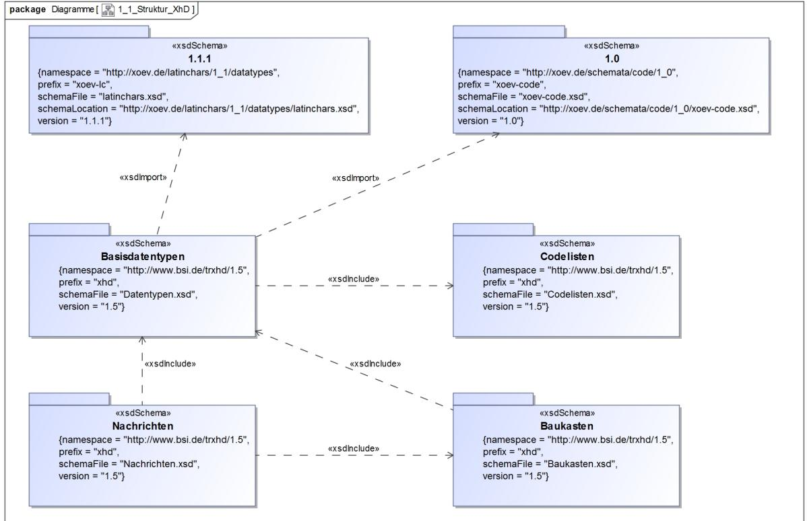

| Nachrichten | Enthält alle in der TR XhD elektronisch ausgetauschten Nachrichten.                                                                                                                                                                                                                                                                                                                                                                                                                                                              |
|-------------|----------------------------------------------------------------------------------------------------------------------------------------------------------------------------------------------------------------------------------------------------------------------------------------------------------------------------------------------------------------------------------------------------------------------------------------------------------------------------------------------------------------------------------|
| Baukasten   | Enthält alle projektspezifisch erstellten Schema-Typen, die direkt oder indirekt in den Nach richten verwendet werden.                                                                                                                                                                                                                                                                                                                                                                                                        |
|             | Die Typen im Schema Baukasten lassen sich weiter in die Gruppen Nachrichtenmodule, Daten module und XÖV-Module unterteilen. Diese Gruppierung wird in dieser Dokumentation zum leichteren Verständnis verwendet und ist, analog den XÖV-Standardisierungsempfehlungen, nicht im Schema abgebildet.                                                                                                                                                                                                                      |
|             | Dabei sind Nachrichtenmodule Schema-Typen, die direkt in den Nachrichten verwendet wer den. Die Nachrichtenmodule setzen sich aus den Schema-Typen der Datenmodule, XÖV Module und der Typen aus dem Schema Datentypen zusammen. In der Gruppe der Datenmo dule sind komplexe Schema-Typen enthalten, die nicht direkt in den Nachrichten verwendet werden und auch nicht von XÖV-Komponenten abgeleitet sind. In der Gruppe XÖV-Module sind die Schema-Typen enthalten, die von XÖV-Komponenten abgeleitet sind. |

| Datentypen                           | Enthält alle projektspezifisch erstellten Datentypen einfachen Inhalts, z. B. begrenzte Zeichen ketten, die im Baukasten und in den Nachrichten verwendet werden. |
|--------------------------------------|----------------------------------------------------------------------------------------------------------------------------------------------------------------------|
| Codelisten                           | Enthält alle projektspezifisch erstellten Wertelisten, Codelisten, Schlüsseltabellen, etc., die in der TR XhD verwendet werden.                                   |
| Komponenten der XÖV-Bibliothek | Die Schemata latinchars.xsd (1.1.1) sowie xoev-code.xsd (1.0) enthalten XÖV-Spezifische Daten typen für die Abbildung von Strings und Katalogen/Codelisten        |

Die Version der XML-Schemata (Nachrichten.xsd, Baukasten.xsd, Datentypen.xsd und Codelisten.xsd) wird im Namespace der Schema-Dateien (targetNamespace) festgelegt. Erfolgen Schemaänderungen, die Inkompatibilitäten zur Folge haben, wird die Versionsnummer im Namespace hochgezählt.

# **2 Nachrichten**

## 2.1 Übersicht

## **Abbildung 2.1. Nachrichten Übersicht**

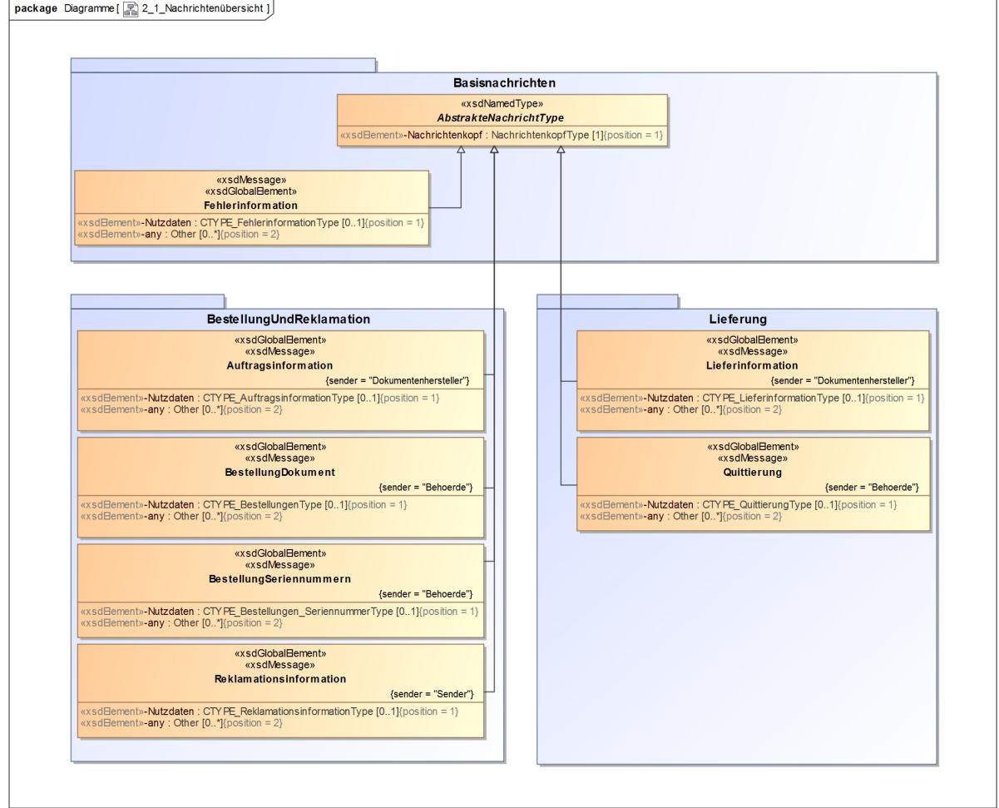

## 2.2 AbstrakteNachrichtType

| Eigenschaft             | Wert                   |
|-------------------------|------------------------|
| Name im XML-Schema      | AbstrakteNachrichtType |
| Implementierungshinweis | -                      |

#### 2 Nachrichten

| Eigenschaft               | Wert                                                                                                                                                                                                                                                                                                                                    |
|---------------------------|-----------------------------------------------------------------------------------------------------------------------------------------------------------------------------------------------------------------------------------------------------------------------------------------------------------------------------------------|
| Inhaltsmodell             | komplexer Typ                                                                                                                                                                                                                                                                                                                           |
| Elementmodell             | Sequenz                                                                                                                                                                                                                                                                                                                                 |
| Verwendet in              | -                                                                                                                                                                                                                                                                                                                                       |
| Zur Ableitung genutzt von | - xhd:Quittierung (globales Element) - xhd:Lieferinformation (globales Element) - xhd:Fehlerinformation (globales Element) - xhd:Auftragsinformation (globales Element) - xhd:BestellungSeriennummern (globales Element) - xhd:BestellungDokument (globales Element) - xhd:Reklamationsinformation (globales Element) |

Die AbstrakteNachricht ist das Basiselement aller Nachrichten, von der alle Nachrichten abgeleitet werden. Eine AbstrakteNachricht wird nie selbst versendet. Sie fasst die gemeinsamen Elemente, wie Nachrichtenkopf und Zusatzinformationen, aller Nachrichten zusammen.

## **Abbildung 2.2. AbstrakteNachrichtType**

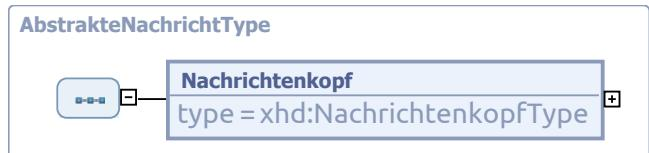

| Kindelement von AbstrakteNachrichtType               |                     |      |       |       |  |  |
|------------------------------------------------------|---------------------|------|-------|-------|--|--|
| Kindelement                                          | Typ                 | Anz. | Ref.  | Seite |  |  |
| Nachrichtenkopf                                      | NachrichtenkopfType | 1    | 3.1.2 | 18    |  |  |
| Der allgemeine Nachrichtenkopf für alle Nachrichten. |                     |      |       |       |  |  |

## 2.3 BestellungDokument

| Eigenschaft             | Wert                                  |
|-------------------------|---------------------------------------|
| Name im XML-Schema      | BestellungDokument (globales Element) |
| Implementierungshinweis | -                                     |
| Inhaltsmodell           | komplexer Typ                         |
| Elementmodell           | Sequenz                               |
| Sender (allgemein)      | Behoerde                              |
| Empfänger (allgemein)   | -                                     |
| Rechtsgrundlagen        | -                                     |
| Erweiterung von         | xhd:AbstrakteNachrichtType            |
| Verwendet in            | -                                     |

Mit der Nachricht Bestellung bestellt die Behörde Dokumente beim Dokumentenhersteller.

#### **Abbildung 2.3. BestellungDokument**

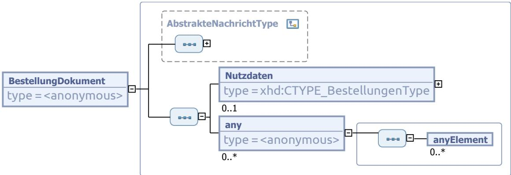

Diese Nachricht ist eine Erweiterung des Basistyps **AbstrakteNachrichtType** (siehe [Abschnitt 2.2 auf](#page-10-2) [Seite 5\)](#page-10-2).

| Kindelemente von BestellungDokument                                      |                        |      |       |       |
|--------------------------------------------------------------------------|------------------------|------|-------|-------|
| Kindelement                                                              | Typ                    | Anz. | Ref.  | Seite |
| Nutzdaten                                                                | CTYPE_BestellungenType | 01   | 3.2.5 | 37    |
| Nutzdaten für die Nachrichten vom Typ "Bestellungen".                    |                        |      |       |       |
| any                                                                      |                        | 0n   |       |       |
| Dieses Element kann für Signatur und Schemaerweiterungen genutzt werden. |                        |      |       |       |

## 2.4 BestellungSeriennummern

| Eigenschaft             | Wert                                       |
|-------------------------|--------------------------------------------|
| Name im XML-Schema      | BestellungSeriennummern (globales Element) |
| Implementierungshinweis | -                                          |
| Inhaltsmodell           | komplexer Typ                              |
| Elementmodell           | Sequenz                                    |
| Sender (allgemein)      | Behoerde                                   |
| Empfänger (allgemein)   | -                                          |
| Rechtsgrundlagen        | -                                          |
| Erweiterung von         | xhd:AbstrakteNachrichtType                 |
| Verwendet in            | -                                          |

Mit der Nachricht Bestellung bestellt die Behörde Seriennummern beim Dokumentenhersteller.

#### 2 Nachrichten

#### **Abbildung 2.4. BestellungSeriennummern**

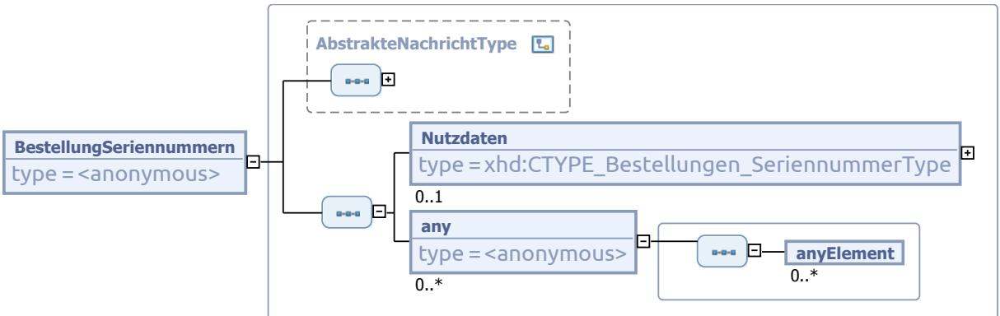

Diese Nachricht ist eine Erweiterung des Basistyps **AbstrakteNachrichtType** (siehe [Abschnitt 2.2 auf](#page-10-2) [Seite 5\)](#page-10-2).

| Kindelemente von BestellungSeriennummern                                 |                                         |      |       |       |
|--------------------------------------------------------------------------|-----------------------------------------|------|-------|-------|
| Kindelement                                                              | Typ                                     | Anz. | Ref.  | Seite |
| Nutzdaten                                                                | CTYPE_Bestellungen_ SeriennummerType | 01   | 3.2.4 | 36    |
| Nutzdaten für die Nachrichten zur Bestellung von Seriennummern.          |                                         |      |       |       |
| any                                                                      |                                         | 0n   |       |       |
| Dieses Element kann für Signatur und Schemaerweiterungen genutzt werden. |                                         |      |       |       |

## 2.5 Auftragsinformation

| Eigenschaft             | Wert                                   |
|-------------------------|----------------------------------------|
| Name im XML-Schema      | Auftragsinformation (globales Element) |
| Implementierungshinweis | -                                      |
| Inhaltsmodell           | komplexer Typ                          |
| Elementmodell           | Sequenz                                |
| Sender (allgemein)      | Dokumentenhersteller                   |
| Empfänger (allgemein)   | -                                      |
| Rechtsgrundlagen        | -                                      |
| Erweiterung von         | xhd:AbstrakteNachrichtType             |
| Verwendet in            | -                                      |

Die Nachricht Auftragsinformation wird vom Dokumentenhersteller als Antwort auf die Nachricht Bestellung gesendet. Mit der Nachricht werden die bestellten Positionen bestätigt oder Fehlerinformationen zu Positionen übertragen.

#### **Abbildung 2.5. Auftragsinformation**

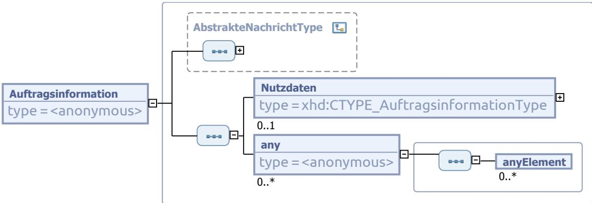

Diese Nachricht ist eine Erweiterung des Basistyps **AbstrakteNachrichtType** (siehe [Abschnitt 2.2 auf](#page-10-2) [Seite 5\)](#page-10-2).

| Kindelemente von Auftragsinformation                                     |                               |      |       |       |
|--------------------------------------------------------------------------|-------------------------------|------|-------|-------|
| Kindelement                                                              | Typ                           | Anz. | Ref.  | Seite |
| Nutzdaten                                                                | CTYPE_AuftragsinformationType | 01   | 3.2.3 | 35    |
| Nutzdaten für die Nachrichten vom Typ "Auftragsinformation".             |                               |      |       |       |
| any                                                                      |                               | 0n   |       |       |
| Dieses Element kann für Signatur und Schemaerweiterungen genutzt werden. |                               |      |       |       |

## 2.6 Reklamationsinformation

| Eigenschaft             | Wert                                       |
|-------------------------|--------------------------------------------|
| Name im XML-Schema      | Reklamationsinformation (globales Element) |
| Implementierungshinweis | -                                          |
| Inhaltsmodell           | komplexer Typ                              |
| Elementmodell           | Sequenz                                    |
| Sender (allgemein)      | Sender                                     |
| Empfänger (allgemein)   | -                                          |
| Rechtsgrundlagen        | -                                          |
| Erweiterung von         | xhd:AbstrakteNachrichtType                 |
| Verwendet in            | -                                          |

Mit der Nachricht Reklamationsinformation sendet der Dokumentenhersteller die Informationen, ob eine Reklamation anerkannt oder abgelehnt wird. Reklamationen können sich nur auf Dokumente beziehen.

#### 2 Nachrichten

#### **Abbildung 2.6. Reklamationsinformation**

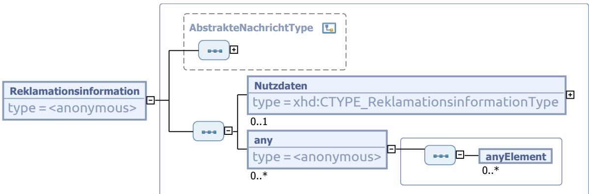

Diese Nachricht ist eine Erweiterung des Basistyps **AbstrakteNachrichtType** (siehe [Abschnitt 2.2 auf](#page-10-2) [Seite 5\)](#page-10-2).

| Kindelemente von Reklamationsinformation                                 |                                   |      |        |       |
|--------------------------------------------------------------------------|-----------------------------------|------|--------|-------|
| Kindelement                                                              | Typ                               | Anz. | Ref.   | Seite |
| Nutzdaten                                                                | CTYPE_ReklamationsinformationType | 01   | 3.2.10 | 40    |
| Nutzdaten für die Nachrichten vom Typ "Reklamation".                     |                                   |      |        |       |
| any                                                                      |                                   | 0n   |        |       |
| Dieses Element kann für Signatur und Schemaerweiterungen genutzt werden. |                                   |      |        |       |

## 2.7 Lieferinformation

| Eigenschaft             | Wert                                 |
|-------------------------|--------------------------------------|
| Name im XML-Schema      | Lieferinformation (globales Element) |
| Implementierungshinweis | -                                    |
| Inhaltsmodell           | komplexer Typ                        |
| Elementmodell           | Sequenz                              |
| Sender (allgemein)      | Dokumentenhersteller                 |
| Empfänger (allgemein)   | -                                    |
| Rechtsgrundlagen        | -                                    |
| Erweiterung von         | xhd:AbstrakteNachrichtType           |
| Verwendet in            | -                                    |

Die Lieferinformation wird vom Dokumentenhersteller an die Behörde gesendet. Sie ist bestellorientiert, d.h. sie enthält Informationen zu genau einer Bestellung.

### **Abbildung 2.7. Lieferinformation**

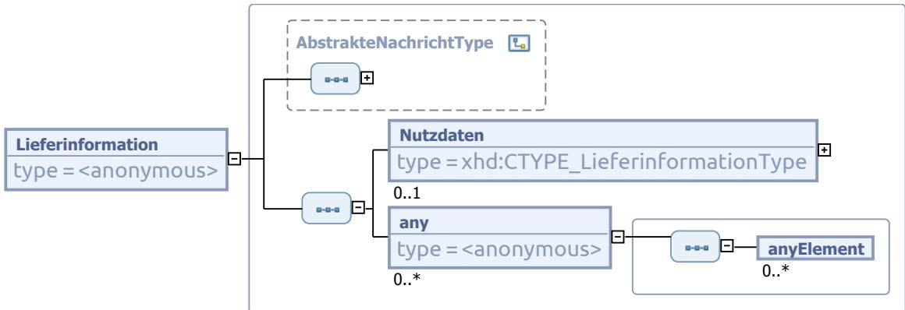

Diese Nachricht ist eine Erweiterung des Basistyps **AbstrakteNachrichtType** (siehe [Abschnitt 2.2 auf](#page-10-2) [Seite 5\)](#page-10-2).

| Kindelemente von Lieferinformation                                       |                             |      |       |       |
|--------------------------------------------------------------------------|-----------------------------|------|-------|-------|
| Kindelement                                                              | Typ                         | Anz. | Ref.  | Seite |
| Nutzdaten                                                                | CTYPE_LieferinformationType | 01   | 3.2.7 | 39    |
| Nutzdaten für die Nachrichten vom Typ "Lieferinformation".               |                             |      |       |       |
| any                                                                      |                             | 0n   |       |       |
| Dieses Element kann für Signatur und Schemaerweiterungen genutzt werden. |                             |      |       |       |

## 2.8 Quittierung

| Eigenschaft             | Wert                           |
|-------------------------|--------------------------------|
| Name im XML-Schema      | Quittierung (globales Element) |
| Implementierungshinweis | -                              |
| Inhaltsmodell           | komplexer Typ                  |
| Elementmodell           | Sequenz                        |
| Sender (allgemein)      | Behoerde                       |
| Empfänger (allgemein)   | -                              |
| Rechtsgrundlagen        | -                              |
| Erweiterung von         | xhd:AbstrakteNachrichtType     |
| Verwendet in            | -                              |

Mit der Nachricht Quittierung bestätigt die Behörde den Empfang und die Verarbeitung von Lieferinformationen des Dokumentenherstellers.

#### 2 Nachrichten

## **Abbildung 2.8. Quittierung**

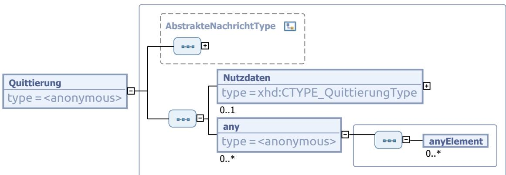

Diese Nachricht ist eine Erweiterung des Basistyps **AbstrakteNachrichtType** (siehe [Abschnitt 2.2 auf](#page-10-2) [Seite 5\)](#page-10-2).

| Kindelemente von Quittierung                                             |                       |      |       |       |
|--------------------------------------------------------------------------|-----------------------|------|-------|-------|
| Kindelement                                                              | Typ                   | Anz. | Ref.  | Seite |
| Nutzdaten                                                                | CTYPE_QuittierungType | 01   | 3.2.9 | 40    |
| Nutzdaten für die Nachrichten vom Typ "Quittierung".                     |                       |      |       |       |
| any                                                                      |                       | 0n   |       |       |
| Dieses Element kann für Signatur und Schemaerweiterungen genutzt werden. |                       |      |       |       |

## 2.9 Fehlerinformation

| Eigenschaft             | Wert                                 |
|-------------------------|--------------------------------------|
| Name im XML-Schema      | Fehlerinformation (globales Element) |
| Implementierungshinweis | -                                    |
| Inhaltsmodell           | komplexer Typ                        |
| Elementmodell           | Sequenz                              |
| Sender (allgemein)      | -                                    |
| Empfänger (allgemein)   | -                                    |
| Rechtsgrundlagen        | -                                    |
| Erweiterung von         | xhd:AbstrakteNachrichtType           |
| Verwendet in            | -                                    |

Eine Fehlerinformation ist eine Rückmeldung an einen Sender auf eine Nachricht, deren Inhalt aus technischen Gründen nicht verarbeitet werden konnte (siehe TR SiSKohD) z. B. weil die Nachricht nicht wohlgeformt, valide oder von einem unbekannten Typ ist. Inhaltliche Fehler werden nicht durch eine Fehlerinformation, sondern durch die Rückmeldungen auf die gesendeten Nachrichten übermittelt.

#### **Abbildung 2.9. Fehlerinformation**

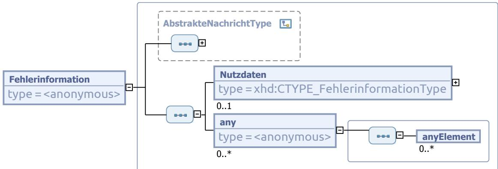

Diese Nachricht ist eine Erweiterung des Basistyps **AbstrakteNachrichtType** (siehe [Abschnitt 2.2 auf](#page-10-2) [Seite 5\)](#page-10-2).

| Kindelemente von Fehlerinformation                                                                                                                                                                 |                             |  |      |       |       |
|----------------------------------------------------------------------------------------------------------------------------------------------------------------------------------------------------|-----------------------------|--|------|-------|-------|
| Kindelement                                                                                                                                                                                        | Typ                         |  | Anz. | Ref.  | Seite |
| Nutzdaten                                                                                                                                                                                          | CTYPE_FehlerinformationType |  | 01   | 3.2.6 | 38    |
| Nutzdaten für die Nachrichten vom Typ "Fehlerinformation". Das Element "FehlerhafteNachricht" enthält die ursprüngliche Nachricht (deren NachrichtenID zur Identifikation genutzt werden kann). |                             |  |      |       |       |
| any                                                                                                                                                                                                |                             |  | 0n   |       |       |
| Dieses Element kann für Signatur und Schemaerweiterungen genutzt werden.                                                                                                                           |                             |  |      |       |       |

## 3.1 Nachrichtenmodule

## 3.1.1 Übersicht

## **Abbildung 3.1. Übersicht Nachrichtenmodule**

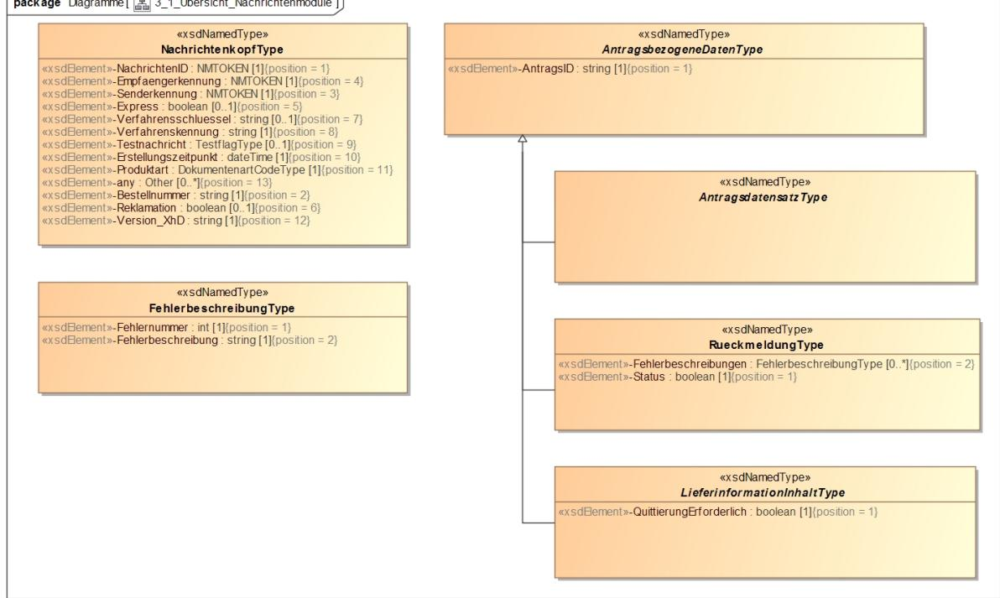

#### 3.1.1.1 Übersicht Antragsdatensatz

#### **Abbildung 3.2. Übersicht Antragsdatensatz**

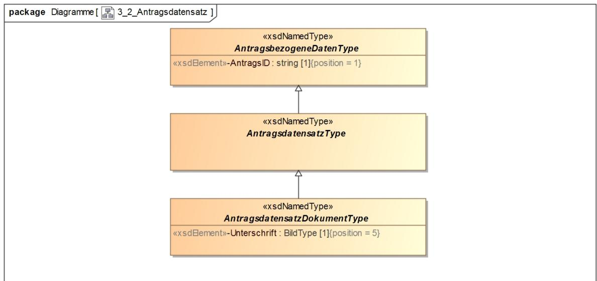

#### 3.1.1.1.1 Übersicht AntragsdatensatzDokument

#### **Abbildung 3.3. AntragsdatensatzDokumentType**

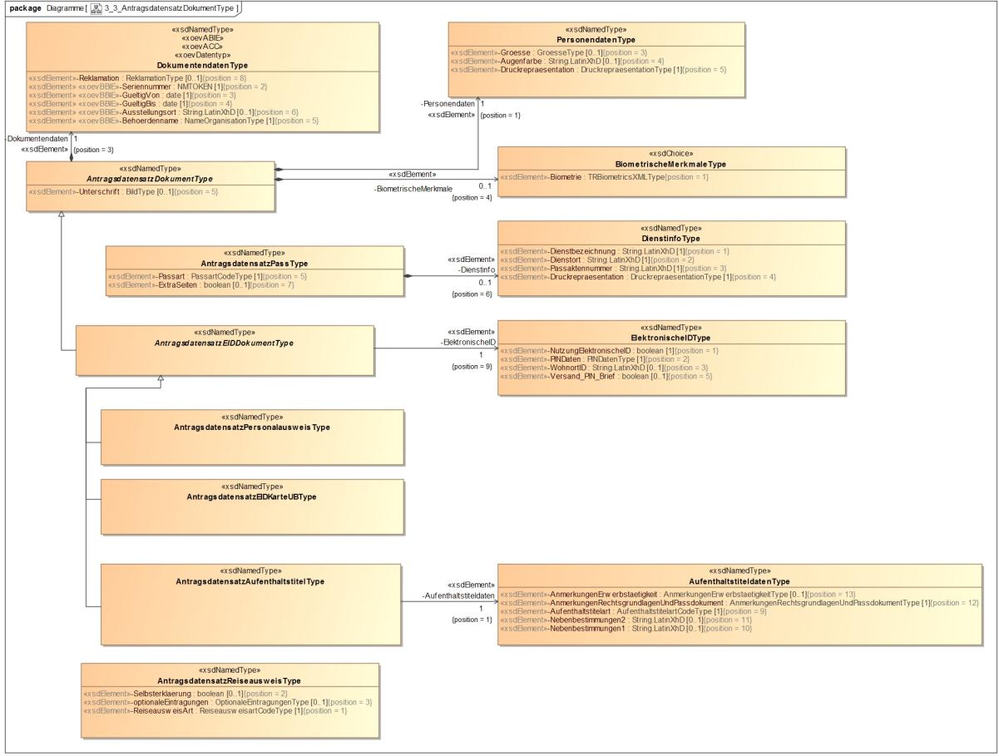

#### 3.1.1.2 Übersicht Lieferinformationen

#### **Abbildung 3.4. Übersicht Lieferinformationen**

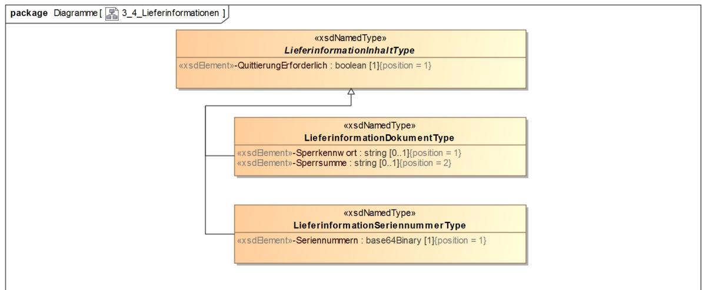

## 3.1.2 NachrichtenkopfType

| Eigenschaft             | Wert                         |
|-------------------------|------------------------------|
| Name im XML-Schema      | NachrichtenkopfType          |
| Implementierungshinweis | -                            |
| Inhaltsmodell           | komplexer Typ                |
| Elementmodell           | Sequenz                      |
| Verwendet in            | - xhd:AbstrakteNachrichtType |

Der allgemeine Nachrichtenkopf für alle Nachrichten.

#### **Abbildung 3.5. NachrichtenkopfType**

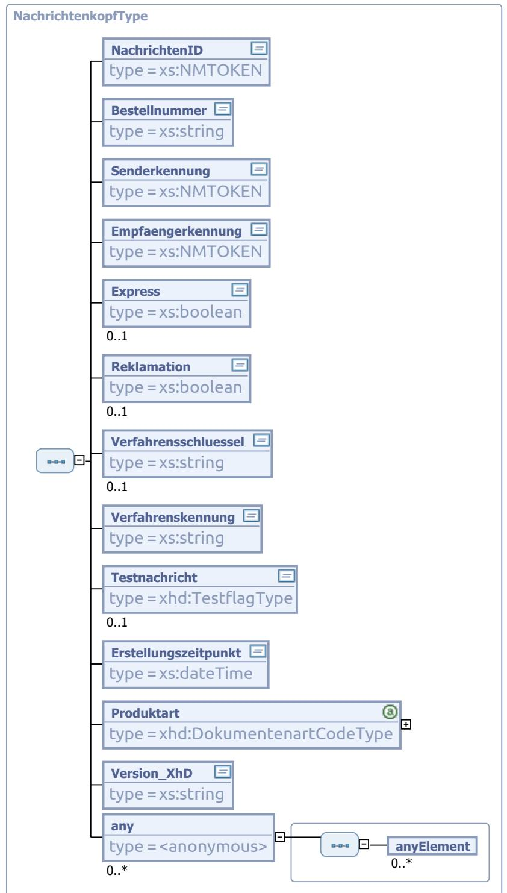

| Kindelemente von NachrichtenkopfType                                                                                                                                |                                                                                                                                                                                                                                           |      |       |       |
|---------------------------------------------------------------------------------------------------------------------------------------------------------------------|-------------------------------------------------------------------------------------------------------------------------------------------------------------------------------------------------------------------------------------------|------|-------|-------|
| Kindelement                                                                                                                                                         | Typ                                                                                                                                                                                                                                       | Anz. | Ref.  | Seite |
| NachrichtenID                                                                                                                                                       | xs:NMTOKEN                                                                                                                                                                                                                                | 1    |       |       |
| Die Verwendung des Felds ist dem Sender überlassen.                                                                                                                 | Die NachrichtenID in Verbindung mit der Senderkennung ist ein eindeutiger Schlüssel für jede Nachricht eines Senders.                                                                                                                     |      |       |       |
| Bestellnummer                                                                                                                                                       | xs:string                                                                                                                                                                                                                                 | 1    |       |       |
| Die Bestellnummer der Bestellung, für die die Nachricht generiert wird.                                                                                             |                                                                                                                                                                                                                                           |      |       |       |
| Senderkennung                                                                                                                                                       | xs:NMTOKEN                                                                                                                                                                                                                                | 1    |       |       |
| Die Kennung des Senders der Nachricht (DVDV-Identifier).                                                                                                            |                                                                                                                                                                                                                                           |      |       |       |
| Empfaengerkennung                                                                                                                                                   | xs:NMTOKEN                                                                                                                                                                                                                                | 1    |       |       |
| Die Kennung des Empfängers der Nachricht (DVDV-Identifier).                                                                                                         |                                                                                                                                                                                                                                           |      |       |       |
| Express                                                                                                                                                             | xs:boolean                                                                                                                                                                                                                                | 01   |       |       |
|                                                                                                                                                                     | Hat dieses Element den Wert "true", so bezieht sich die Nachricht auf eine Expressbestellung.                                                                                                                                             |      |       |       |
| Reklamation                                                                                                                                                         | xs:boolean                                                                                                                                                                                                                                | 01   |       |       |
|                                                                                                                                                                     | Hat dieses Element den Wert "true", so bezieht sich die Nachricht auf eine Reklamationsbestellung.                                                                                                                                        |      |       |       |
| Verfahrensschluessel                                                                                                                                                | xs:string                                                                                                                                                                                                                                 | 01   |       |       |
| sel dient der Behörde zum Zuordnen von Nachrichten zu einer Bestellung.                                                                                             | Der Verfahrensschlüssel ist ein Kennzeichen der beantragenden Behörde für eine Bestellung. Dieses Kennzeichen muss vom Dokumentenhersteller für jede Nachricht, die die Bestellung betrifft, mitgeschickt werden. Der Verfahrensschlüs |      |       |       |
| Verfahrenskennung                                                                                                                                                   | xs:string                                                                                                                                                                                                                                 | 1    |       |       |
| Identifier der sendenden Anwendung.                                                                                                                                 |                                                                                                                                                                                                                                           |      |       |       |
| Testnachricht                                                                                                                                                       | TestflagType                                                                                                                                                                                                                              | 01   | 4.6   | 62    |
| Exisitiert dieses Element im Nachrichtenkopf, so handelt es sich um eine Testnachricht. Die Art der Testnachricht wird über den Wert dieses Elements festgelegt. |                                                                                                                                                                                                                                           |      |       |       |
| Erstellungszeitpunkt                                                                                                                                                | xs:dateTime                                                                                                                                                                                                                               | 1    |       |       |
| Zeitpunkt der Erstellung der Nachricht.                                                                                                                             |                                                                                                                                                                                                                                           |      |       |       |
| Produktart                                                                                                                                                          | DokumentenartCodeType                                                                                                                                                                                                                     | 1    | 4.7.2 | 63    |
| Art der bestellten hoheitlichen Dokumente                                                                                                                           |                                                                                                                                                                                                                                           |      |       |       |
| Version_XhD                                                                                                                                                         | xs:string                                                                                                                                                                                                                                 | 1    |       |       |
| Die Version des XhD-Schemas, auf dessen Basis die Nachricht erstellt wurde.                                                                                         |                                                                                                                                                                                                                                           |      |       |       |
| any                                                                                                                                                                 |                                                                                                                                                                                                                                           | 0n   |       |       |
| Dieses Element kann für Erweiterungen genutzt werden.                                                                                                               |                                                                                                                                                                                                                                           |      |       |       |

## 3.1.3 AntraegeType

| Eigenschaft             | Wert                         |
|-------------------------|------------------------------|
| Name im XML-Schema      | AntraegeType                 |
| Implementierungshinweis | -                            |
| Inhaltsmodell           | komplexer Typ                |
| Elementmodell           | Sequenz                      |
| Verwendet in            | - xhd:CTYPE_BestellungenType |

Enthält mindestens einen und maximal 150 Antragsdatensätze.

#### **Abbildung 3.6. AntraegeType**

| Kindelement von AntraegeType                                                                             |                      |      |       |       |
|----------------------------------------------------------------------------------------------------------|----------------------|------|-------|-------|
| Kindelement                                                                                              | Typ                  | Anz. | Ref.  | Seite |
| Antrag                                                                                                   | AntragsdatensatzType | 1150 | 3.1.5 | 21    |
| Das Element Antragsdatensatz ist das abstrakte Basiselement für alle Elemente die Bestelldaten abbilden. |                      |      |       |       |

## 3.1.4 AntragsbezogeneDatenType

| Eigenschaft               | Wert                                                                                      |
|---------------------------|-------------------------------------------------------------------------------------------|
| Name im XML-Schema        | AntragsbezogeneDatenType                                                                  |
| Implementierungshinweis   | -                                                                                         |
| Inhaltsmodell             | komplexer Typ                                                                             |
| Elementmodell             | Sequenz                                                                                   |
| Verwendet in              | -                                                                                         |
| Zur Ableitung genutzt von | - xhd:AntragsdatensatzType - xhd:LieferinformationInhaltType - xhd:RueckmeldungType |

Das Element AntragsbezogeneDaten ist das abstrakte Basiselement für alle Elemente die Daten eines Antrages abbilden.

#### **Abbildung 3.7. AntragsbezogeneDatenType**

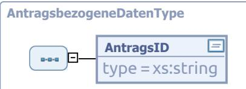

| Kindelement von AntragsbezogeneDatenType                                                                                                  |           |      |      |       |
|-------------------------------------------------------------------------------------------------------------------------------------------|-----------|------|------|-------|
| Kindelement                                                                                                                               | Typ       | Anz. | Ref. | Seite |
| AntragsID                                                                                                                                 | xs:string | 1    |      |       |
| Die AntragsID wird von der Behörde bei der Bestellung vergeben, um einen Antrag innerhalb einer Nachricht eindeutig zu identifizieren. |           |      |      |       |

#### 3.1.5 AntragsdatensatzType

| Eigenschaft        | Wert                 |
|--------------------|----------------------|
| Name im XML-Schema | AntragsdatensatzType |

| Eigenschaft               | Wert                               |
|---------------------------|------------------------------------|
| Implementierungshinweis   | -                                  |
| Inhaltsmodell             | komplexer Typ                      |
| Elementmodell             | Sequenz                            |
| Erweiterung von           | xhd:AntragsbezogeneDatenType       |
| Verwendet in              | - xhd:AntraegeType                 |
| Zur Ableitung genutzt von | - xhd:AntragsdatensatzDokumentType |

Das Element Antragsdatensatz ist das abstrakte Basiselement für alle Elemente die Bestelldaten abbilden.

Dieser Typ ist eine Erweiterung des Basistyps **AntragsbezogeneDatenType** (siehe [Abschnitt 3.1.4 auf](#page-26-0) [Seite 21\)](#page-26-0).

## 3.1.6 AntragsdatensatzDokumentType

| Eigenschaft               | Wert                                                                        |
|---------------------------|-----------------------------------------------------------------------------|
| Name im XML-Schema        | AntragsdatensatzDokumentType                                                |
| Implementierungshinweis   | -                                                                           |
| Inhaltsmodell             | komplexer Typ                                                               |
| Elementmodell             | Sequenz                                                                     |
| Erweiterung von           | xhd:AntragsdatensatzType                                                    |
| Verwendet in              | -                                                                           |
| Zur Ableitung genutzt von | - xhd:AntragsdatensatzEIDDokumentType - xhd:AntragsdatensatzPassbuchType |

Ein generisches Element zur Abbildung der Antragsdaten für ein hoheitliches Dokument.

## **Abbildung 3.8. AntragsdatensatzDokumentType**

Dieser Typ ist eine Erweiterung des Basistyps **AntragsdatensatzType** (siehe [Abschnitt 3.1.5 auf Sei](#page-26-1)[te 21](#page-26-1)).

| Kindelemente von AntragsdatensatzDokumentType                                                                              |                     |      |        |       |
|----------------------------------------------------------------------------------------------------------------------------|---------------------|------|--------|-------|
| Kindelement                                                                                                                | Typ                 | Anz. | Ref.   | Seite |
| Personendaten                                                                                                              | PersonendatenType   | 1    | 3.2.16 | 47    |
| Bildet Personen-bezogene Daten ab, die in allen hoheitlichen Dokumenten benötigt werden.                                   |                     |      |        |       |
| Dokumentendaten                                                                                                            | DokumentendatenType | 1    | 3.2.11 | 42    |
| Das Element Dokumentendaten fasst nicht-personenbezogene Daten und Verfahrenshinweise zur Herstellung des Dokuments ab. |                     |      |        |       |
| BiometrischeMerkmale                                                                                                       |                     | 01   |        |       |
| Beinhaltet die biometrischen Merkmale zur Beantragung von hoheitlichen Dokumenten.                                         |                     |      |        |       |
| Biometrie                                                                                                                  | TRBiometricsXMLType | 1    | 3.2.21 | 51    |
| Beinhaltet die biometrischen Merkmale zur Beantragung von hoheitlichen Dokumenten.                                         |                     |      |        |       |
| Unterschrift                                                                                                               | BildType            | 01   | 4.2    | 59    |
| Ein Element zum Übertragen von Bilddaten.                                                                                  |                     |      |        |       |

## 3.1.7 AntragsdatensatzPassbuchType

| Eigenschaft               | Wert                                                                     |
|---------------------------|--------------------------------------------------------------------------|
| Name im XML-Schema        | AntragsdatensatzPassbuchType                                             |
| Implementierungshinweis   | -                                                                        |
| Inhaltsmodell             | komplexer Typ                                                            |
| Elementmodell             | Sequenz                                                                  |
| Erweiterung von           | xhd:AntragsdatensatzDokumentType                                         |
| Verwendet in              | -                                                                        |
| Zur Ableitung genutzt von | - xhd:AntragsdatensatzReiseausweisType - xhd:AntragsdatensatzPassType |

Abstrakter Basistyp für alle Antragsdaten von Dokumenten mit einem amtlichen Vermerk.

Dieser Typ ist eine Erweiterung des Basistyps **AntragsdatensatzDokumentType** (siehe [Abschnitt 3.1.](#page-27-0) [6 auf Seite 22\)](#page-27-0).

## 3.1.8 AntragsdatensatzPassType

| Eigenschaft             | Wert                             |
|-------------------------|----------------------------------|
| Name im XML-Schema      | AntragsdatensatzPassType         |
| Implementierungshinweis | -                                |
| Inhaltsmodell           | komplexer Typ                    |
| Elementmodell           | Sequenz                          |
| Erweiterung von         | xhd:AntragsdatensatzPassbuchType |
| Verwendet in            | -                                |

Beinhaltet die Pass-spezifischen Daten.

#### **Abbildung 3.9. AntragsdatensatzPassType**

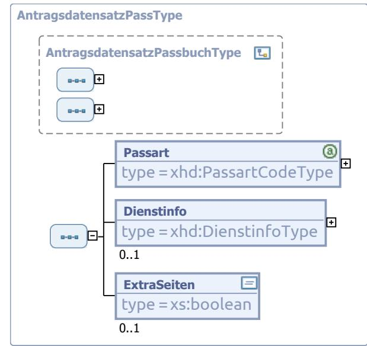

Dieser Typ ist eine Erweiterung des Basistyps **AntragsdatensatzPassbuchType** (siehe [Abschnitt 3.1.](#page-28-0) [7 auf Seite 23\)](#page-28-0).

| Kindelemente von AntragsdatensatzPassType                                                                                            |                 |      |       |       |
|--------------------------------------------------------------------------------------------------------------------------------------|-----------------|------|-------|-------|
| Kindelement                                                                                                                          | Typ             | Anz. | Ref.  | Seite |
| Passart                                                                                                                              | PassartCodeType | 1    | 4.7.6 | 63    |
| Wenn die Passart den Wert "PO" für Dienstpass bzw. "PD" für Diplomatenpass besitzt, muss das Feld Dienstinfo über mittelt werden. |                 |      |       |       |
| Dienstinfo                                                                                                                           | DienstinfoType  | 01   | 3.2.2 | 34    |
| Das Feld Dienstinfo ist verpflichtend, wenn die Passart den Wert PO für Dienstpass besitzt. Ansonsten ist das Feld nicht erlaubt. |                 |      |       |       |
| ExtraSeiten                                                                                                                          | xs:boolean      | 01   |       |       |
| Wenn das Feld ExtraSeiten den Wert true hat, wird ein Reisepass bestellt der zusätzliche Seiten beinhaltet.                          |                 |      |       |       |

## 3.1.9 AntragsdatensatzReiseausweisType

| Eigenschaft             | Wert                             |
|-------------------------|----------------------------------|
| Name im XML-Schema      | AntragsdatensatzReiseausweisType |
| Implementierungshinweis | -                                |
| Inhaltsmodell           | komplexer Typ                    |
| Elementmodell           | Sequenz                          |
| Erweiterung von         | xhd:AntragsdatensatzPassbuchType |
| Verwendet in            | -                                |

Beinhaltet die Reiseausweis-spezifischen Daten.

#### **Abbildung 3.10. AntragsdatensatzReiseausweisType**

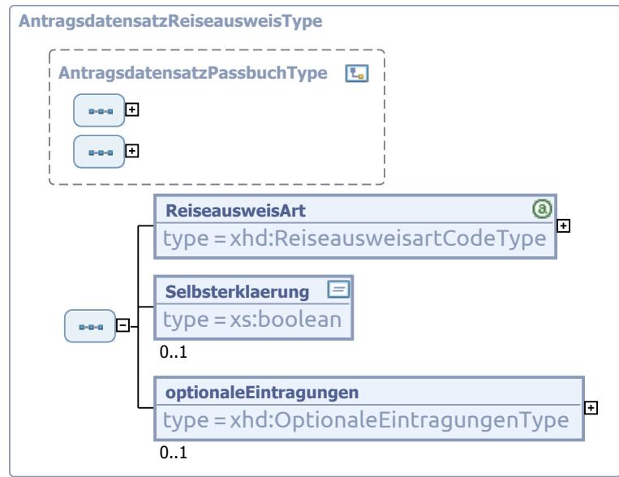

Dieser Typ ist eine Erweiterung des Basistyps **AntragsdatensatzPassbuchType** (siehe [Abschnitt 3.1.](#page-28-0) [7 auf Seite 23\)](#page-28-0).

| Kindelemente von AntragsdatensatzReiseausweisType                                                                                                    |                           |      |        |       |
|------------------------------------------------------------------------------------------------------------------------------------------------------|---------------------------|------|--------|-------|
| Kindelement                                                                                                                                          | Typ                       | Anz. | Ref.   | Seite |
| ReiseausweisArt                                                                                                                                      | ReiseausweisartCodeType   | 1    | 4.7.7  | 64    |
| Ein Datentyp zur Angabe der Art eines Reiseausweise.                                                                                                 |                           |      |        |       |
| Selbsterklaerung                                                                                                                                     | xs:boolean                | 01   |        |       |
| Mit der Selbsterklärung und dem Wert true wird der Hinweis übermittelt, dass die Persondaten auf den eigenen Anga ben des Antragstellers beruhen. |                           |      |        |       |
| optionaleEintragungen                                                                                                                                | OptionaleEintragungenType | 01   | 3.2.15 | 45    |
| Enthält die optionalen Daten für die Reisausweise.                                                                                                   |                           |      |        |       |

## 3.1.10 AntragsdatensatzEIDDokumentType

| Eigenschaft               | Wert                                                                                                                            |
|---------------------------|---------------------------------------------------------------------------------------------------------------------------------|
| Name im XML-Schema        | AntragsdatensatzEIDDokumentType                                                                                                 |
| Implementierungshinweis   | -                                                                                                                               |
| Inhaltsmodell             | komplexer Typ                                                                                                                   |
| Elementmodell             | Sequenz                                                                                                                         |
| Erweiterung von           | xhd:AntragsdatensatzDokumentType                                                                                                |
| Verwendet in              | -                                                                                                                               |
| Zur Ableitung genutzt von | - xhd:AntragsdatensatzPersonalausweisType - xhd:AntragsdatensatzEIDKarteUBType - xhd:AntragsdatensatzAufenthaltstitelType |

Antragsdaten zur Bestellung eines hoheitlichen Dokumentes mit eID-Funktion

#### **Abbildung 3.11. AntragsdatensatzEIDDokumentType**

| AntragsdatensatzEIDDokumentType |
|---------------------------------|
| AntragsdatensatzDokumentType    |
|                                 |
| ElektronischeID                 |
| type = xhd:ElektronischeIDType  |

Dieser Typ ist eine Erweiterung des Basistyps **AntragsdatensatzDokumentType** (siehe [Abschnitt 3.1.](#page-27-0) [6 auf Seite 22\)](#page-27-0).

| Kindelement von AntragsdatensatzEIDDokumentType |  |                     |  |      |        |       |
|-------------------------------------------------|--|---------------------|--|------|--------|-------|
| Kindelement                                     |  | Typ                 |  | Anz. | Ref.   | Seite |
| ElektronischeID                                 |  | ElektronischeIDType |  | 1    | 3.2.13 | 44    |
| Elektronische ID                                |  |                     |  |      |        |       |

## 3.1.11 AntragsdatensatzEIDKarteUBType

| Eigenschaft             | Wert                                |
|-------------------------|-------------------------------------|
| Name im XML-Schema      | AntragsdatensatzEIDKarteUBType      |
| Implementierungshinweis | -                                   |
| Inhaltsmodell           | komplexer Typ                       |
| Elementmodell           | Sequenz                             |
| Erweiterung von         | xhd:AntragsdatensatzEIDDokumentType |
| Verwendet in            | -                                   |

Beinhaltet die spezifischen Daten der eID-Karte für Unionsbürger.

Dieser Typ ist eine Erweiterung des Basistyps **AntragsdatensatzEIDDokumentType** (siehe [Abschnitt](#page-30-0) [3.1.10 auf Seite 25\)](#page-30-0).

#### 3.1.12 AntragsdatensatzPersonalausweisType

| Eigenschaft             | Wert                                |
|-------------------------|-------------------------------------|
| Name im XML-Schema      | AntragsdatensatzPersonalausweisType |
| Implementierungshinweis | -                                   |
| Inhaltsmodell           | komplexer Typ                       |
| Elementmodell           | Sequenz                             |
| Erweiterung von         | xhd:AntragsdatensatzEIDDokumentType |
| Verwendet in            | -                                   |

Beinhaltet die Personalausweis-spezifischen Daten.

Dieser Typ ist eine Erweiterung des Basistyps **AntragsdatensatzEIDDokumentType** (siehe [Abschnitt](#page-30-0) [3.1.10 auf Seite 25\)](#page-30-0).

## 3.1.13 AntragsdatensatzAufenthaltstitelType

| Eigenschaft             | Wert                                 |
|-------------------------|--------------------------------------|
| Name im XML-Schema      | AntragsdatensatzAufenthaltstitelType |
| Implementierungshinweis | -                                    |
| Inhaltsmodell           | komplexer Typ                        |
| Elementmodell           | Sequenz                              |
| Erweiterung von         | xhd:AntragsdatensatzEIDDokumentType  |
| Verwendet in            | -                                    |

Beinhaltet die Aufenthaltstitel-spezifischen Daten.

#### **Abbildung 3.12. AntragsdatensatzAufenthaltstitelType**

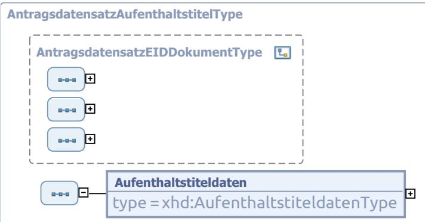

Dieser Typ ist eine Erweiterung des Basistyps **AntragsdatensatzEIDDokumentType** (siehe [Abschnitt](#page-30-0) [3.1.10 auf Seite 25\)](#page-30-0).

| Kindelement von AntragsdatensatzAufenthaltstitelType |                           |      |        |       |
|------------------------------------------------------|---------------------------|------|--------|-------|
| Kindelement                                          | Typ                       | Anz. | Ref.   | Seite |
| Aufenthaltstiteldaten                                | AufenthaltstiteldatenType | 1    | 3.1.14 | 27    |
| Angaben zum Aufenthaltstitel.                        |                           |      |        |       |

## 3.1.14 AufenthaltstiteldatenType

| Eigenschaft             | Wert                      |
|-------------------------|---------------------------|
| Name im XML-Schema      | AufenthaltstiteldatenType |
| Implementierungshinweis | -                         |
| Inhaltsmodell           | komplexer Typ             |

| Eigenschaft   | Wert                                       |
|---------------|--------------------------------------------|
| Elementmodell | Sequenz                                    |
| Verwendet in  | - xhd:AntragsdatensatzAufenthaltstitelType |

Daten zum Aufenthaltstitel.

#### **Abbildung 3.13. AufenthaltstiteldatenType**

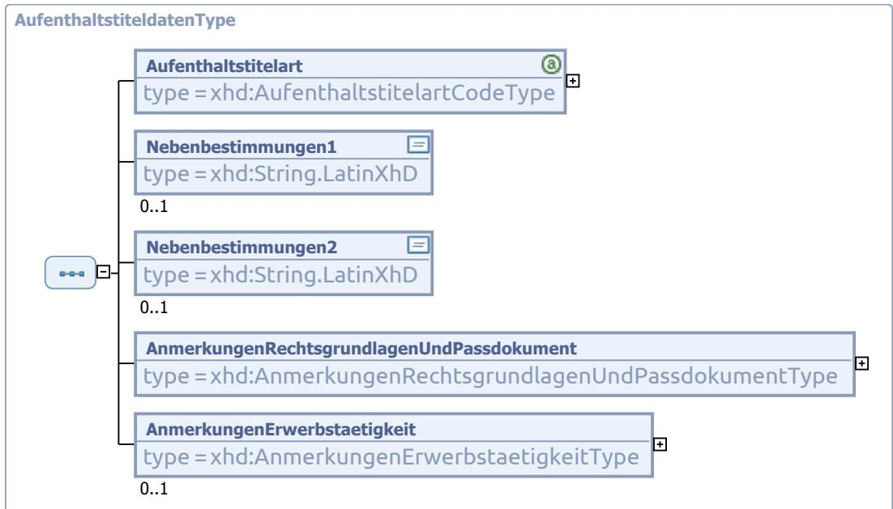

| Kindelemente von AufenthaltstiteldatenType            |                                                    |      |        |       |  |  |
|-------------------------------------------------------|----------------------------------------------------|------|--------|-------|--|--|
| Kindelement                                           | Typ                                                | Anz. | Ref.   | Seite |  |  |
| Aufenthaltstitelart                                   | AufenthaltstitelartCodeType                        | 1    | 4.7.1  | 62    |  |  |
| Die Art des bestellten Aufenthaltstitels.             |                                                    |      |        |       |  |  |
| Nebenbestimmungen1                                    | String.LatinXhD                                    | 01   | 4.5    | 61    |  |  |
| Erstes Datenfeld zur Erfassung der Nebenbestimmungen  |                                                    |      |        |       |  |  |
| Nebenbestimmungen2                                    | String.LatinXhD                                    | 01   | 4.5    | 61    |  |  |
| Zweites Datenfeld zur Erfassung der Nebenbestimmungen |                                                    |      |        |       |  |  |
| AnmerkungenRechtsgrundlagenUnd Passdokument        | AnmerkungenRechtsgrundlagenUnd PassdokumentType | 1    | 3.1.15 | 28    |  |  |
| Anmerkungsfeld auf der Vorderseite des Dokuments.     |                                                    |      |        |       |  |  |
| AnmerkungenErwerbstaetigkeit                          | AnmerkungenErwerbstaetigkeitType                   | 01   | 3.1.16 | 29    |  |  |
| Anmerkungsfeld auf der Rückseite des Dokuments.       |                                                    |      |        |       |  |  |

## 3.1.15 AnmerkungenRechtsgrundlagenUndPassdokumentType

| Eigenschaft        | Wert                                           |
|--------------------|------------------------------------------------|
| Name im XML-Schema | AnmerkungenRechtsgrundlagenUndPassdokumentType |

| Eigenschaft             | Wert                            |
|-------------------------|---------------------------------|
| Implementierungshinweis | -                               |
| Inhaltsmodell           | komplexer Typ                   |
| Elementmodell           | Sequenz                         |
| Verwendet in            | - xhd:AufenthaltstiteldatenType |

Anmerkungsfeld auf der Vorderseite des elektronischen Aufenthaltstitels.

## **Abbildung 3.14. AnmerkungenRechtsgrundlagenUndPassdokumentType**

| AnmerkungenRechtsgrundlagenUndPassdokumentType |  |
|------------------------------------------------|--|
| Druckrepraesentation                           |  |
| type = xhd:DruckrepraesentationType            |  |

| Kindelement von AnmerkungenRechtsgrundlagenUndPassdokumentType |                          |      |        |       |
|----------------------------------------------------------------|--------------------------|------|--------|-------|
| Kindelement                                                    | Typ                      | Anz. | Ref.   | Seite |
| Druckrepraesentation                                           | DruckrepraesentationType | 1    | 3.2.12 | 43    |
| Druckrepräsentation der Anmerkungen.                           |                          |      |        |       |

## 3.1.16 AnmerkungenErwerbstaetigkeitType

| Eigenschaft             | Wert                             |
|-------------------------|----------------------------------|
| Name im XML-Schema      | AnmerkungenErwerbstaetigkeitType |
| Implementierungshinweis | -                                |
| Inhaltsmodell           | komplexer Typ                    |
| Elementmodell           | Sequenz                          |
| Verwendet in            | - xhd:AufenthaltstiteldatenType  |

Anmerkungsfeld auf der Rückseite des elektronischen Aufenthaltstitels.

## **Abbildung 3.15. AnmerkungenErwerbstaetigkeitType**

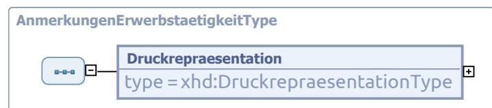

| Kindelement von AnmerkungenErwerbstaetigkeitType |                          |      |        |       |  |
|--------------------------------------------------|--------------------------|------|--------|-------|--|
| Kindelement                                      | Typ                      | Anz. | Ref.   | Seite |  |
| Druckrepraesentation                             | DruckrepraesentationType | 1    | 3.2.12 | 43    |  |
| Druckrepräsentation der Anmerkungen.             |                          |      |        |       |  |

## 3.1.17 FehlerbeschreibungType

| Eigenschaft             | Wert                                                        |
|-------------------------|-------------------------------------------------------------|
| Name im XML-Schema      | FehlerbeschreibungType                                      |
| Implementierungshinweis | -                                                           |
| Inhaltsmodell           | komplexer Typ                                               |
| Elementmodell           | Sequenz                                                     |
| Verwendet in            | - xhd:CTYPE_FehlerinformationType - xhd:RueckmeldungType |

Eine Fehlerbeschreibung ist ein Element mit dem allgemein Fehler beschrieben werden können. Worauf sich eine Fehlerbeschreibung bezieht ist abhängig vom Kontext in dem das Element verwendet wird und muss im Kontext definiert werden.

Eine Fehlerbeschreibung besteht immer aus einer Fehlernummer zur Klassifizierung des Fehlers und einer textuellen Beschreibung der Fehlerursache.

#### **Abbildung 3.16. FehlerbeschreibungType**

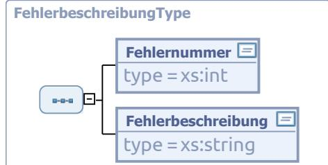

| Kindelemente von FehlerbeschreibungType |  |           |                                                                                                              |      |      |       |
|-----------------------------------------|--|-----------|--------------------------------------------------------------------------------------------------------------|------|------|-------|
| Kindelement                             |  | Typ       |                                                                                                              | Anz. | Ref. | Seite |
| Fehlernummer                            |  | xs:int    |                                                                                                              | 1    |      |       |
| tenhersteller festgelegt.               |  |           | Eine Fehlernummer klassifiziert eine Fehlerbeschreibung. Die Fehlernummern werden von dem jeweiligen Dokumen |      |      |       |
| Fehlerbeschreibung                      |  | xs:string |                                                                                                              | 1    |      |       |
|                                         |  |           | Die Fehlerbeschreibung enthält eine prägnante, textuelle Beschreibung der Fehlerursache.                     |      |      |       |

## 3.1.18 LieferinformationInhaltType

| Eigenschaft               | Wert                                                                           |
|---------------------------|--------------------------------------------------------------------------------|
| Name im XML-Schema        | LieferinformationInhaltType                                                    |
| Implementierungshinweis   | -                                                                              |
| Inhaltsmodell             | komplexer Typ                                                                  |
| Elementmodell             | Sequenz                                                                        |
| Erweiterung von           | xhd:AntragsbezogeneDatenType                                                   |
| Verwendet in              | - xhd:CTYPE_LieferinformationType                                              |
| Zur Ableitung genutzt von | - xhd:LieferinformationDokumentType - xhd:LieferinformationSeriennummerType |

Eine Lieferinformation bildet das abstrakte Basiselement für alle Elemente die Daten über für die Lieferung einer bestellten Position abbilden.

## **Abbildung 3.17. LieferinformationInhaltType**

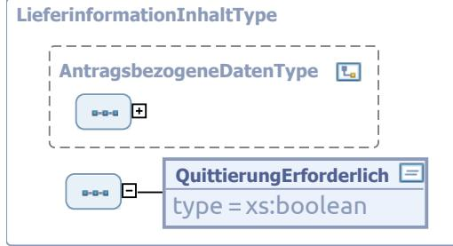

Dieser Typ ist eine Erweiterung des Basistyps **AntragsbezogeneDatenType** (siehe [Abschnitt 3.1.4 auf](#page-26-0) [Seite 21\)](#page-26-0).

| Kindelement von LieferinformationInhaltType                                                         |            |      |      |       |  |  |
|-----------------------------------------------------------------------------------------------------|------------|------|------|-------|--|--|
| Kindelement                                                                                         | Typ        | Anz. | Ref. | Seite |  |  |
| QuittierungErforderlich                                                                             | xs:boolean | 1    |      |       |  |  |
| Gibt an, ob der Erhalt der Lieferinformation mit einer Quittierungsnachricht bestätigt werden muss. |            |      |      |       |  |  |

## 3.1.19 LieferinformationSeriennummerType

| Eigenschaft             | Wert                              |
|-------------------------|-----------------------------------|
| Name im XML-Schema      | LieferinformationSeriennummerType |
| Implementierungshinweis | -                                 |
| Inhaltsmodell           | komplexer Typ                     |
| Elementmodell           | Sequenz                           |
| Erweiterung von         | xhd:LieferinformationInhaltType   |
| Verwendet in            | -                                 |

Enthält die Lieferinformation für ein bestellte Seriennummern.

#### **Abbildung 3.18. LieferinformationSeriennummerType**

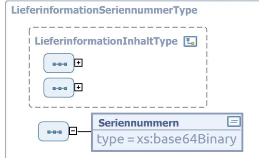

#### Dieser Typ ist eine Erweiterung des Basistyps **LieferinformationInhaltType** (siehe [Abschnitt 3.1.18](#page-35-1) [auf Seite 30](#page-35-1)).

| Kindelement von LieferinformationSeriennummerType                                                                 |                 |  |      |      |       |
|-------------------------------------------------------------------------------------------------------------------|-----------------|--|------|------|-------|
| Kindelement                                                                                                       | Typ             |  | Anz. | Ref. | Seite |
| Seriennummern                                                                                                     | xs:base64Binary |  | 1    |      |       |
| Die Seriennummern werden in einer Liste geliefert. In dieser Liste werden die einzelnen 5-stelligen Seriennummern |                 |  |      |      |       |
| (ohne BKZ und ohne Prüfziffer) durch ein Semikolon getrennt.                                                      |                 |  |      |      |       |

## 3.1.20 LieferinformationDokumentType

| Eigenschaft             | Wert                            |
|-------------------------|---------------------------------|
| Name im XML-Schema      | LieferinformationDokumentType   |
| Implementierungshinweis | -                               |
| Inhaltsmodell           | komplexer Typ                   |
| Elementmodell           | Sequenz                         |
| Erweiterung von         | xhd:LieferinformationInhaltType |
| Verwendet in            | -                               |

Enthält die Lieferinformation für ein bestelltes Dokument.

## **Abbildung 3.19. LieferinformationDokumentType**

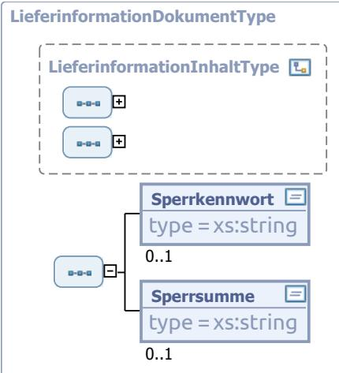

Dieser Typ ist eine Erweiterung des Basistyps **LieferinformationInhaltType** (siehe [Abschnitt 3.1.18](#page-35-1) [auf Seite 30](#page-35-1)).

| Kindelemente von LieferinformationDokumentType                                         |           |      |      |       |
|----------------------------------------------------------------------------------------|-----------|------|------|-------|
| Kindelement                                                                            | Typ       | Anz. | Ref. | Seite |
| Sperrkennwort                                                                          | xs:string | 01   |      |       |
| Das Sperrkennwort wird nur für Dokumente mit einer ElektronischenID Funktion benötigt. |           |      |      |       |

| Kindelemente von LieferinformationDokumentType                                      |           |      |      |       |
|-------------------------------------------------------------------------------------|-----------|------|------|-------|
| Kindelement                                                                         | Typ       | Anz. | Ref. | Seite |
| Sperrsumme                                                                          | xs:string | 01   |      |       |
| Die Sperrsumme wird nur für Dokumente mit einer ElektronischenID Funktion benötigt. |           |      |      |       |

## 3.1.21 RueckmeldungType

| Eigenschaft             | Wert                                                                                                          |
|-------------------------|---------------------------------------------------------------------------------------------------------------|
| Name im XML-Schema      | RueckmeldungType                                                                                              |
| Implementierungshinweis | -                                                                                                             |
| Inhaltsmodell           | komplexer Typ                                                                                                 |
| Elementmodell           | Sequenz                                                                                                       |
| Erweiterung von         | xhd:AntragsbezogeneDatenType                                                                                  |
| Verwendet in            | - xhd:CTYPE_AuftragsinformationType - xhd:CTYPE_QuittierungType - xhd:CTYPE_ReklamationsinformationType |

Mit einer Rückmeldung wird eine zuvor gesendete Information bestätigt oder abgelehnt. Die Bedeutung der Rückmeldung ist abhängig vom Kontext in dem die Rückmeldung verwendet wird.

#### **Abbildung 3.20. RueckmeldungType**

| RueckmeldungType                                          |
|-----------------------------------------------------------|
| AntragsbezogeneDatenType                                  |
| Status type = xs:boolean                               |
| Fehlerbeschreibungen type = xhd:FehlerbeschreibungType |
| 0*                                                        |

Dieser Typ ist eine Erweiterung des Basistyps **AntragsbezogeneDatenType** (siehe [Abschnitt 3.1.4 auf](#page-26-0) [Seite 21\)](#page-26-0).

| Kindelemente von RueckmeldungType                                                                                                                                                                                                       |                        |      |        |       |  |
|-----------------------------------------------------------------------------------------------------------------------------------------------------------------------------------------------------------------------------------------|------------------------|------|--------|-------|--|
| Kindelement                                                                                                                                                                                                                             | Typ                    | Anz. | Ref.   | Seite |  |
| Status                                                                                                                                                                                                                                  | xs:boolean             | 1    |        |       |  |
| Wenn eine Rückmeldung positiv ist, hat das Feld Status den Wert true. Ist die Rückmeldung negativ, so ist das Feld Status false und im Element Fehlerbeschreibung müssen die Gründe für die negative Rückmeldung beschrieben werden. |                        |      |        |       |  |
| Fehlerbeschreibungen                                                                                                                                                                                                                    | FehlerbeschreibungType | 0n   | 3.1.17 | 30    |  |
| Fehlerbeschreibungen werden in einer Rückmeldung nur übermittelt wenn diese negativ ist.                                                                                                                                                |                        |      |        |       |  |

## 3.2 Datenmodule

## 3.2.1 BehoerdenadresseType

| Eigenschaft             | Wert                         |
|-------------------------|------------------------------|
| Name im XML-Schema      | BehoerdenadresseType         |
| Implementierungshinweis | -                            |
| Inhaltsmodell           | komplexer Typ                |
| Elementmodell           | Sequenz                      |
| Verwendet in            | - xhd:CTYPE_BestellungenType |

Die Adresse einer Behörde.

#### **Abbildung 3.21. BehoerdenadresseType**

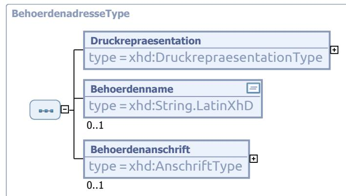

| Kindelemente von BehoerdenadresseType                                                                                       |                          |      |        |       |  |
|-----------------------------------------------------------------------------------------------------------------------------|--------------------------|------|--------|-------|--|
| Kindelement                                                                                                                 | Typ                      | Anz. | Ref.   | Seite |  |
| Druckrepraesentation                                                                                                        | DruckrepraesentationType | 1    | 3.2.12 | 43    |  |
| Enthält die druckbare Adresse.                                                                                              |                          |      |        |       |  |
| Behoerdenname                                                                                                               | String.LatinXhD          | 01   | 4.5    | 61    |  |
| Enthält den Namen der Behörde zur Prüfung der Zustellbarkeit.                                                               |                          |      |        |       |  |
| Behoerdenanschrift                                                                                                          | AnschriftType            | 01   | 3.3.2  | 53    |  |
| Enthält die Anschrift der Behörde zur Prüfung der Zustellbarkeit. Als Anschrift kann auch ein Postfach angegeben wer den |                          |      |        |       |  |

## 3.2.2 DienstinfoType

| Eigenschaft             | Wert           |
|-------------------------|----------------|
| Name im XML-Schema      | DienstinfoType |
| Implementierungshinweis | -              |

| Eigenschaft   | Wert                           |
|---------------|--------------------------------|
| Inhaltsmodell | komplexer Typ                  |
| Elementmodell | Sequenz                        |
| Verwendet in  | - xhd:AntragsdatensatzPassType |

Beinhaltet Informationen zur Dienstbezeichnung und dem Dienstort des Dokumentenbesitzers.

## **Abbildung 3.22. DienstinfoType**

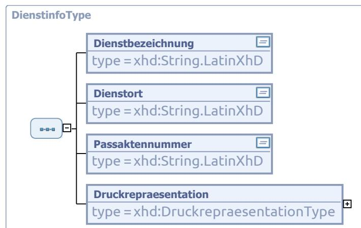

| Kindelemente von DienstinfoType                    |                               |      |        |    |
|----------------------------------------------------|-------------------------------|------|--------|----|
| Kindelement                                        | Typ                           | Ref. | Seite  |    |
| Dienstbezeichnung                                  | String.LatinXhD               |      | 4.5    | 61 |
| Die Dienstbezeichnung des Dokumenteninhabers       |                               |      |        |    |
| Dienstort                                          | 1 String.LatinXhD          |      | 4.5    | 61 |
| Der Dienstort des Dokumenteninhabers               |                               |      |        |    |
| 4.5 Passaktennummer String.LatinXhD 1     |                               | 61   |        |    |
| Die Passaktennummer des Dokuments                  |                               |      |        |    |
| Druckrepraesentation                               | DruckrepraesentationType 1 |      | 3.2.12 | 43 |
| Repräsentation der Druckdarstellung der Dienstinfo |                               |      |        |    |

## 3.2.3 CTYPE\_AuftragsinformationType

| Eigenschaft             | Wert                                         |  |
|-------------------------|----------------------------------------------|--|
| Name im XML-Schema      | CTYPE_AuftragsinformationType                |  |
| Implementierungshinweis | -                                            |  |
| Inhaltsmodell           | komplexer Typ                                |  |
| Elementmodell           | Sequenz                                      |  |
| Erweiterung von         | xhd:CTYPE_NachrichtenType                    |  |
| Verwendet in            | - xhd:Auftragsinformation (globales Element) |  |

Nutzdaten für die Nachrichten vom Typ "Auftragsinformation".

## **Abbildung 3.23. CTYPE\_AuftragsinformationType**

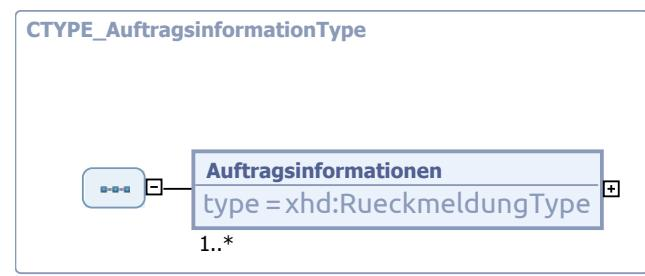

Dieser Typ ist eine Erweiterung des Basistyps **CTYPE\_NachrichtenType** (siehe [Abschnitt 3.2.8 auf Sei](#page-44-1)[te 39](#page-44-1)).

| Kindelement von CTYPE_AuftragsinformationType                                                                                                                                                       |                  |      |        |       |
|-----------------------------------------------------------------------------------------------------------------------------------------------------------------------------------------------------|------------------|------|--------|-------|
| Kindelement                                                                                                                                                                                         | Typ              | Anz. | Ref.   | Seite |
| Auftragsinformationen                                                                                                                                                                               | RueckmeldungType | 1n   | 3.1.21 | 33    |
| Mit den Auftragsinformationen werden die zuvor übermittelten Bestelldatensätze bestätigt oder Informationen zu Feh lern übermittelt, die bei der Verarbeitung der Bestelldaten aufgetreten sind. |                  |      |        |       |

## 3.2.4 CTYPE\_Bestellungen\_SeriennummerType

| Eigenschaft             | Wert                                             |  |
|-------------------------|--------------------------------------------------|--|
| Name im XML-Schema      | CTYPE_Bestellungen_SeriennummerType              |  |
| Implementierungshinweis | -                                                |  |
| Inhaltsmodell           | komplexer Typ                                    |  |
| Elementmodell           | Sequenz                                          |  |
| Erweiterung von         | xhd:CTYPE_NachrichtenType                        |  |
| Verwendet in            | - xhd:BestellungSeriennummern (globales Element) |  |

Nutzdaten für die Nachrichten zur Bestellung von Seriennummern

#### **Abbildung 3.24. CTYPE\_Bestellungen\_SeriennummerType**

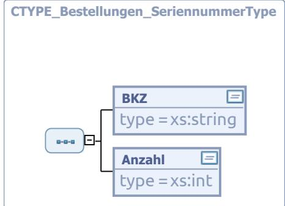

Dieser Typ ist eine Erweiterung des Basistyps **CTYPE\_NachrichtenType** (siehe [Abschnitt 3.2.8 auf Sei](#page-44-1)[te 39](#page-44-1)).

| Kindelemente von CTYPE_Bestellungen_SeriennummerType        |                     |           |  |       |  |  |
|-------------------------------------------------------------|---------------------|-----------|--|-------|--|--|
| Kindelement                                                 | Typ Anz. Ref. |           |  | Seite |  |  |
| BKZ                                                         |                     | xs:string |  | 1     |  |  |
| BKZ der bestellenden Behörde.                               |                     |           |  |       |  |  |
| Anzahl xs:int                                            |                     | 1         |  |       |  |  |
| Anzahl der bestellten Seriennummern zwischen 1 und 100.000. |                     |           |  |       |  |  |

## 3.2.5 CTYPE\_BestellungenType

| Eigenschaft             | Wert                                        |
|-------------------------|---------------------------------------------|
| Name im XML-Schema      | CTYPE_BestellungenType                      |
| Implementierungshinweis | -                                           |
| Inhaltsmodell           | komplexer Typ                               |
| Elementmodell           | Sequenz                                     |
| Erweiterung von         | xhd:CTYPE_NachrichtenType                   |
| Verwendet in            | - xhd:BestellungDokument (globales Element) |

Nutzdaten für die Nachrichten vom Typ "Bestellungen".

## **Abbildung 3.25. CTYPE\_BestellungenType**

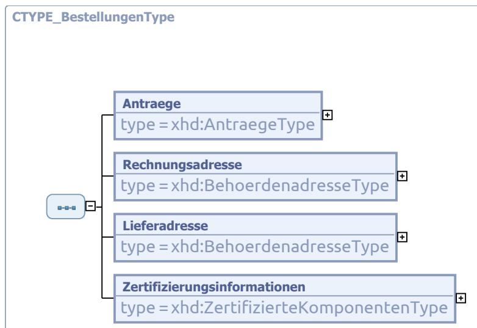

Dieser Typ ist eine Erweiterung des Basistyps **CTYPE\_NachrichtenType** (siehe [Abschnitt 3.2.8 auf Sei](#page-44-1)[te 39](#page-44-1)).

| Kindelemente von CTYPE_BestellungenType                                                |                              |      |        |       |
|----------------------------------------------------------------------------------------|------------------------------|------|--------|-------|
| Kindelement                                                                            | Typ                          | Anz. | Ref.   | Seite |
| Antraege                                                                               | AntraegeType                 | 1    | 3.1.3  | 20    |
| Enthält die Anträge der Bestellung.                                                    |                              |      |        |       |
| Rechnungsadresse                                                                       | BehoerdenadresseType         | 1    | 3.2.1  | 34    |
| Enthält die Rechnungsadresse.                                                          |                              |      |        |       |
| Lieferadresse                                                                          | BehoerdenadresseType         | 1    | 3.2.1  | 34    |
| Enthält die Lieferadresse.                                                             |                              |      |        |       |
| Zertifizierungsinformationen                                                           | ZertifizierteKomponentenType | 1    | 3.2.22 | 51    |
| Informationen über die für den Bestellprozess eingesetzten zertifizierten Komponenten. |                              |      |        |       |

## 3.2.6 CTYPE\_FehlerinformationType

| Eigenschaft             | Wert                                       |
|-------------------------|--------------------------------------------|
| Name im XML-Schema      | CTYPE_FehlerinformationType                |
| Implementierungshinweis | -                                          |
| Inhaltsmodell           | komplexer Typ                              |
| Elementmodell           | Sequenz                                    |
| Verwendet in            | - xhd:Fehlerinformation (globales Element) |

Nutzdaten für die Nachrichten vom Typ "Fehlerinformation". Das Element "FehlerhafteNachricht" enthält die ursprüngliche Nachricht (deren NachrichtenID zur Identifikation genutzt werden kann).

## **Abbildung 3.26. CTYPE\_FehlerinformationType**

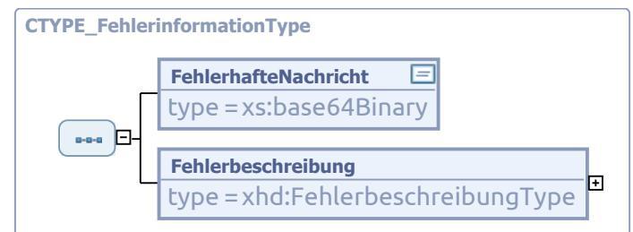

| Kindelemente von CTYPE_FehlerinformationType                                            |                        |      |        |       |
|-----------------------------------------------------------------------------------------|------------------------|------|--------|-------|
| Kindelement                                                                             | Typ                    | Anz. | Ref.   | Seite |
| FehlerhafteNachricht                                                                    | xs:base64Binary        | 1    |        |       |
| Enthält die Nachricht, die den Fehler hervorgerufen hat bzw. beinhaltet                 |                        |      |        |       |
| Fehlerbeschreibung                                                                      | FehlerbeschreibungType | 1    | 3.1.17 | 30    |
| Die Fehlerbeschreibung beinhaltet die textuelle Beschreibung des aufgetretenen Fehlers. |                        |      |        |       |

## 3.2.7 CTYPE\_LieferinformationType

| Eigenschaft             | Wert                                       |
|-------------------------|--------------------------------------------|
| Name im XML-Schema      | CTYPE_LieferinformationType                |
| Implementierungshinweis | -                                          |
| Inhaltsmodell           | komplexer Typ                              |
| Elementmodell           | Sequenz                                    |
| Erweiterung von         | xhd:CTYPE_NachrichtenType                  |
| Verwendet in            | - xhd:Lieferinformation (globales Element) |

Nutzdaten für die Nachrichten vom Typ "Lieferinformation".

## **Abbildung 3.27. CTYPE\_LieferinformationType**

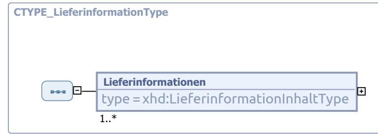

Dieser Typ ist eine Erweiterung des Basistyps **CTYPE\_NachrichtenType** (siehe [Abschnitt 3.2.8 auf Sei](#page-44-1)[te 39](#page-44-1)).

| Kindelement von CTYPE_LieferinformationType                              |                             |      |        |       |
|--------------------------------------------------------------------------|-----------------------------|------|--------|-------|
| Kindelement                                                              | Typ                         | Anz. | Ref.   | Seite |
| Lieferinformationen                                                      | LieferinformationInhaltType | 1n   | 3.1.18 | 30    |
| Eine Lieferinformation bildet Daten über eine zu lieferende Position ab. |                             |      |        |       |

## 3.2.8 CTYPE\_NachrichtenType

| Eigenschaft               | Wert                                                                                                                                                                                            |
|---------------------------|-------------------------------------------------------------------------------------------------------------------------------------------------------------------------------------------------|
| Name im XML-Schema        | CTYPE_NachrichtenType                                                                                                                                                                           |
| Implementierungshinweis   | -                                                                                                                                                                                               |
| Inhaltsmodell             | komplexer Typ                                                                                                                                                                                   |
| Elementmodell             | Sequenz                                                                                                                                                                                         |
| Verwendet in              | -                                                                                                                                                                                               |
| Zur Ableitung genutzt von | - xhd:CTYPE_QuittierungType - xhd:CTYPE_AuftragsinformationType - xhd:CTYPE_ReklamationsinformationType - xhd:CTYPE_Bestellungen_SeriennummerType - xhd:CTYPE_LieferinformationType |

| Eigenschaft | Wert                         |
|-------------|------------------------------|
|             | - xhd:CTYPE_BestellungenType |

Abstraktes Element für die Nutzdaten von Nachrichten

## **Abbildung 3.28. CTYPE\_NachrichtenType**

## 3.2.9 CTYPE\_QuittierungType

| Eigenschaft             | Wert                                 |
|-------------------------|--------------------------------------|
| Name im XML-Schema      | CTYPE_QuittierungType                |
| Implementierungshinweis | -                                    |
| Inhaltsmodell           | komplexer Typ                        |
| Elementmodell           | Sequenz                              |
| Erweiterung von         | xhd:CTYPE_NachrichtenType            |
| Verwendet in            | - xhd:Quittierung (globales Element) |

Nutzdaten für die Nachrichten vom Typ "Quittierung".

## **Abbildung 3.29. CTYPE\_QuittierungType**

Dieser Typ ist eine Erweiterung des Basistyps **CTYPE\_NachrichtenType** (siehe [Abschnitt 3.2.8 auf Sei](#page-44-1)[te 39](#page-44-1)).

| Kindelement von CTYPE_QuittierungType                         |                  |      |        |       |  |  |  |
|---------------------------------------------------------------|------------------|------|--------|-------|--|--|--|
| Kindelement                                                   | Typ              | Anz. | Ref.   | Seite |  |  |  |
| Quittierungen                                                 | RueckmeldungType | 1n   | 3.1.21 | 33    |  |  |  |
| Enthält Quittierungen für die erhaltenen Lieferinformationen. |                  |      |        |       |  |  |  |

## 3.2.10 CTYPE\_ReklamationsinformationType

| Eigenschaft        | Wert                              |
|--------------------|-----------------------------------|
| Name im XML-Schema | CTYPE_ReklamationsinformationType |

| Eigenschaft             | Wert                                             |
|-------------------------|--------------------------------------------------|
| Implementierungshinweis | -                                                |
| Inhaltsmodell           | komplexer Typ                                    |
| Elementmodell           | Sequenz                                          |
| Erweiterung von         | xhd:CTYPE_NachrichtenType                        |
| Verwendet in            | - xhd:Reklamationsinformation (globales Element) |

Nutzdaten für die Nachrichten vom Typ "Reklamation".

## **Abbildung 3.30. CTYPE\_ReklamationsinformationType**

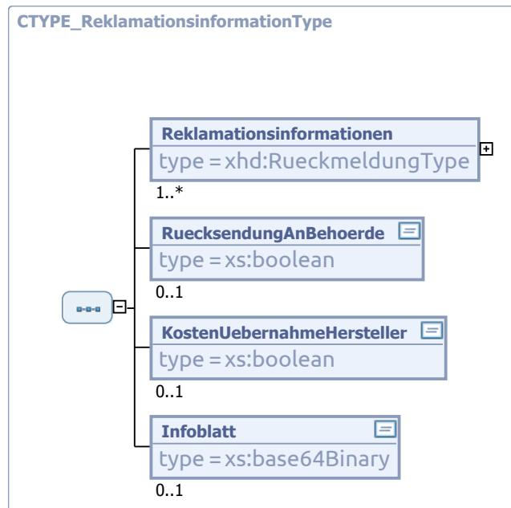

Dieser Typ ist eine Erweiterung des Basistyps **CTYPE\_NachrichtenType** (siehe [Abschnitt 3.2.8 auf Sei](#page-44-1)[te 39](#page-44-1)).

| Kindelemente von CTYPE_ReklamationsinformationType                                                                                                        |                  |      |        |       |  |  |  |
|-----------------------------------------------------------------------------------------------------------------------------------------------------------|------------------|------|--------|-------|--|--|--|
| Kindelement                                                                                                                                               | Typ              | Anz. | Ref.   | Seite |  |  |  |
| Reklamationsinformationen                                                                                                                                 | RueckmeldungType | 1n   | 3.1.21 | 33    |  |  |  |
| Die Reklamationsinformationen beinhalteten die Bestätigungen oder Zurückweisungen der Reklamationen.                                                      |                  |      |        |       |  |  |  |
| RuecksendungAnBehoerde                                                                                                                                    | xs:boolean       | 01   |        |       |  |  |  |
| Information, ob der Hersteller das Dokument zurücksendet. WAHR: Hersteller sendet das Dokument zurück. FALSCH: Hersteller behält das Dokument ein.     |                  |      |        |       |  |  |  |
| KostenUebernahmeHersteller                                                                                                                                | xs:boolean       | 01   |        |       |  |  |  |
| Information, ob der Hersteller die Kosten der Reklamation übernimmt. WAHR: Hersteller übernimmt die Kosten. FALSCH: Hersteller übernimmt Kosten nicht. |                  |      |        |       |  |  |  |
| Infoblatt                                                                                                                                                 | xs:base64Binary  | 01   |        |       |  |  |  |

| Kindelemente von CTYPE_ReklamationsinformationType |     |      |      |       |  |
|----------------------------------------------------|-----|------|------|-------|--|
| Kindelement                                        | Typ | Anz. | Ref. | Seite |  |
| Anhang eines Informationsblatts als PDF            |     |      |      |       |  |

## 3.2.11 DokumentendatenType

| Eigenschaft             | Wert                               |
|-------------------------|------------------------------------|
| Name im XML-Schema      | DokumentendatenType                |
| Implementierungshinweis | -                                  |
| Inhaltsmodell           | komplexer Typ                      |
| Elementmodell           | Sequenz                            |
| Verwendet in            | - xhd:AntragsdatensatzDokumentType |

Das Element Dokumentendaten fasst nicht-personenbezogene Daten und Verfahrenshinweise zur Herstellung des Dokuments ab.

## **Abbildung 3.31. DokumentendatenType**

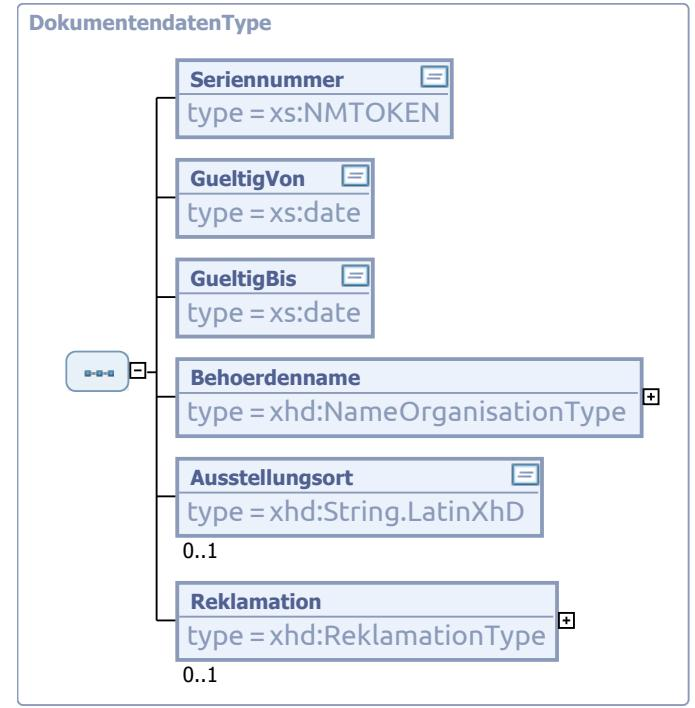

| Kindelemente von DokumentendatenType                                                                      |            |      |      |       |  |
|-----------------------------------------------------------------------------------------------------------|------------|------|------|-------|--|
| Kindelement                                                                                               | Typ        | Anz. | Ref. | Seite |  |
| Seriennummer                                                                                              | xs:NMTOKEN | 1    |      |       |  |
| 10-stellige Seriennummer des Dokumentes (9-stellige Seriennumer gemäß ICAO 9303 + 1-stellige Prüfziffer). |            |      |      |       |  |
| GueltigVon                                                                                                | xs:date    | 1    |      |       |  |

| Kindelemente von DokumentendatenType                                                                                     |                      |      |        |       |  |
|--------------------------------------------------------------------------------------------------------------------------|----------------------|------|--------|-------|--|
| Kindelement                                                                                                              | Typ                  | Anz. | Ref.   | Seite |  |
| Das Datum der Antragsstellung durch den Bürger. Dieses Datum wird zur Berechnung der Regelgültigkeit herangezo gen.   |                      |      |        |       |  |
| GueltigBis                                                                                                               | xs:date              | 1    |        |       |  |
| Das Datum bis wann das Dokument gültig ist. Die Festlegung dieses Datums liegt im Verantwortungsbereich der Behör de. |                      |      |        |       |  |
| Behoerdenname                                                                                                            | NameOrganisationType | 1    | 3.3.5  | 56    |  |
| Name und Bezeichnung der ausstellenden Behörde                                                                           |                      |      |        |       |  |
| Ausstellungsort                                                                                                          | String.LatinXhD      | 01   | 4.5    | 61    |  |
| Ort der Ausstellung des Dokumentes.                                                                                      |                      |      |        |       |  |
| Reklamation                                                                                                              | ReklamationType      | 01   | 3.2.19 | 49    |  |
| Enthält Informationen, die bei der Reklamation von Dokumenten übertragen werden.                                         |                      |      |        |       |  |

## 3.2.12 DruckrepraesentationType

| Eigenschaft             | Wert                                                                                                                                                                                                                                                                     |
|-------------------------|--------------------------------------------------------------------------------------------------------------------------------------------------------------------------------------------------------------------------------------------------------------------------|
| Name im XML-Schema      | DruckrepraesentationType                                                                                                                                                                                                                                                 |
| Implementierungshinweis | -                                                                                                                                                                                                                                                                        |
| Inhaltsmodell           | komplexer Typ                                                                                                                                                                                                                                                            |
| Elementmodell           | Sequenz                                                                                                                                                                                                                                                                  |
| Verwendet in            | - xhd:AnmerkungenErwerbstaetigkeitType - xhd:AnmerkungenRechtsgrundlagenUndPassdokumentType - xhd:BehoerdenadresseType - xhd:DienstinfoType - xhd:NameOrganisationType - xhd:OptionaleEintragungenType - xhd:PINAdresseType - xhd:PersonendatenType |

Die Druckrepraesentation wird zur Übertragung von mehrzeiligen Daten genutzt. 1.) Für Personendaten / Dokumentendaten 2.) Für Adressen die (z.B. auf Briefe) gedruckt werden.

#### **Abbildung 3.32. DruckrepraesentationType**

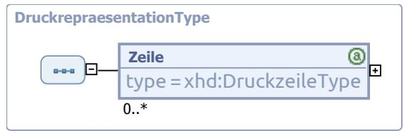

| Kindelement von DruckrepraesentationType |                |      |      |       |
|------------------------------------------|----------------|------|------|-------|
| Kindelement                              | Typ            | Anz. | Ref. | Seite |
| Zeile                                    | DruckzeileType | 0n   | 4.3  | 60    |

| Kindelement von DruckrepraesentationType       |     |      |      |       |  |
|------------------------------------------------|-----|------|------|-------|--|
| Kindelement                                    | Typ | Anz. | Ref. | Seite |  |
| Eine einzelne Zeile einer Druckrepraesentation |     |      |      |       |  |

## 3.2.13 ElektronischeIDType

| Eigenschaft             | Wert                                  |
|-------------------------|---------------------------------------|
| Name im XML-Schema      | ElektronischeIDType                   |
| Implementierungshinweis | -                                     |
| Inhaltsmodell           | komplexer Typ                         |
| Elementmodell           | Sequenz                               |
| Verwendet in            | - xhd:AntragsdatensatzEIDDokumentType |

Typ Elektronische ID

## **Abbildung 3.33. ElektronischeIDType**

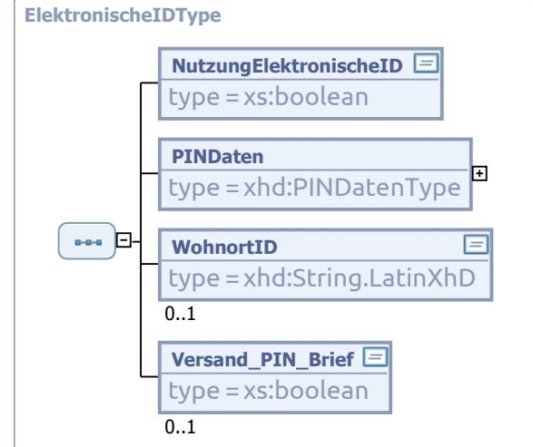

| Kindelemente von ElektronischeIDType                                                                                                                                                                                               |                 |      |        |       |  |
|------------------------------------------------------------------------------------------------------------------------------------------------------------------------------------------------------------------------------------|-----------------|------|--------|-------|--|
| Kindelement                                                                                                                                                                                                                        | Typ             | Anz. | Ref.   | Seite |  |
| NutzungElektronischeID                                                                                                                                                                                                             | xs:boolean      | 1    |        |       |  |
| Das Feld "NutzungElektronischeID" bestimmt, ob das Dokument mit der ElektronischenID Funktion erstellt wird. Die ses Flag muss verpflichtend durch die Behörde bzw. das Fachverfahren gesetzt werden.                           |                 |      |        |       |  |
| PINDaten                                                                                                                                                                                                                           | PINDatenType    | 1    | 3.2.18 | 48    |  |
| Enthält die Adressen für Lieferung und Rücksendung der PIN-Briefe.                                                                                                                                                                 |                 |      |        |       |  |
| WohnortID                                                                                                                                                                                                                          | String.LatinXhD | 01   | 4.5    | 61    |  |
| Enthält den Identifikator für den Wohnort des Antragstellers. Dieses Element dient zur Nutzung der eID-Anwendung "Abfrage Wohnort" und muss angegeben werden, wenn sich der Wohnort des Antragstellers in Deutschland befindet. |                 |      |        |       |  |
| Versand_PIN_Brief                                                                                                                                                                                                                  | xs:boolean      | 01   |        |       |  |

| Kindelemente von ElektronischeIDType                           |     |      |      |       |  |
|----------------------------------------------------------------|-----|------|------|-------|--|
| Kindelement                                                    | Typ | Anz. | Ref. | Seite |  |
| Hat dieses Feld den Wert "false" wird kein PIN-Brief versandt. |     |      |      |       |  |

## 3.2.14 GeburtType

| Eigenschaft             | Wert                    |
|-------------------------|-------------------------|
| Name im XML-Schema      | GeburtType              |
| Implementierungshinweis | -                       |
| Inhaltsmodell           | komplexer Typ           |
| Elementmodell           | Sequenz                 |
| Verwendet in            | - xhd:PersonendatenType |

Das Element Geburt beinhaltet das Geburtsdatum und den Geburtsort. Aufgrund des abweichenden Datentyps Geburtsdatum wurde nicht die XÖV-Kernkomponente Geburt verwendet.

#### **Abbildung 3.34. GeburtType**

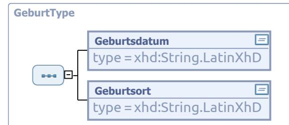

| Kindelemente von GeburtType                                                                  |                 |  |      |      |       |
|----------------------------------------------------------------------------------------------|-----------------|--|------|------|-------|
| Kindelement                                                                                  | Typ             |  | Anz. | Ref. | Seite |
| Geburtsdatum                                                                                 | String.LatinXhD |  | 1    | 4.5  | 61    |
| Der reduzierte String.Latin Zeichensatz ohne Steuerlemente der in der TR XhD verwendet wird. |                 |  |      |      |       |
| Geburtsort                                                                                   | String.LatinXhD |  | 1    | 4.5  | 61    |
| Der Geburtsort des Antragsstellers ohne Länder- oder Staatsangabe.                           |                 |  |      |      |       |

## 3.2.15 OptionaleEintragungenType

| Eigenschaft             | Wert                      |
|-------------------------|---------------------------|
| Name im XML-Schema      | OptionaleEintragungenType |
| Implementierungshinweis | -                         |
| Inhaltsmodell           | komplexer Typ             |
| Elementmodell           | Sequenz                   |

| Eigenschaft  | Wert                                   |
|--------------|----------------------------------------|
| Verwendet in | - xhd:AntragsdatensatzReiseausweisType |

Enthält die optionalen Daten für die Reiseausweise.

#### **Abbildung 3.35. OptionaleEintragungenType**

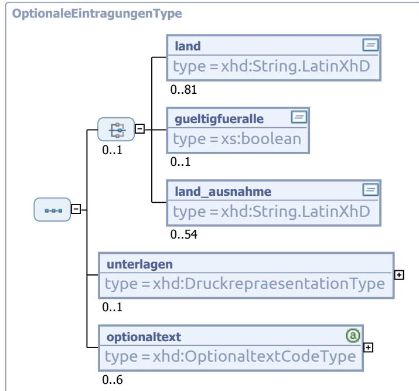

| Kindelemente von OptionaleEintragungenType                                                                                                                                                  |                                                                                                                                                                                                                                                                   |                 |      |      |       |  |
|---------------------------------------------------------------------------------------------------------------------------------------------------------------------------------------------|-------------------------------------------------------------------------------------------------------------------------------------------------------------------------------------------------------------------------------------------------------------------|-----------------|------|------|-------|--|
|                                                                                                                                                                                             | Kindelement                                                                                                                                                                                                                                                       | Typ             | Anz. | Ref. | Seite |  |
| laenderangaben                                                                                                                                                                              |                                                                                                                                                                                                                                                                   |                 | 01   |      |       |  |
|                                                                                                                                                                                             | Auswahl-Optionen für Länderangaben in den optionalen Eintragungen eines Reiseausweises.                                                                                                                                                                           |                 |      |      |       |  |
|                                                                                                                                                                                             | land                                                                                                                                                                                                                                                              | String.LatinXhD | 081  | 4.5  | 61    |  |
|                                                                                                                                                                                             | Hier sind nur Abkürzungen für die Staaten nach dreistelligem ICAO-Code nach folgenden Vorgaben einzutragen:                                                                                                                                                       |                 |      |      |       |  |
|                                                                                                                                                                                             | Reiseausweis für Ausländer - Staaten für welche der Reiseausweis gültig ist.                                                                                                                                                                                      |                 |      |      |       |  |
|                                                                                                                                                                                             | Reiseausweis für Flüchtlinge und Staatenlose - Staaten für welche der Reiseausweis nicht gültig ist.                                                                                                                                                              |                 |      |      |       |  |
|                                                                                                                                                                                             | gueltigfueralle                                                                                                                                                                                                                                                   | xs:boolean      | 01   |      |       |  |
|                                                                                                                                                                                             | Hinweis: Dieses Feld gilt nur für den Reiseausweis für Ausländer. Dieses Feld ist nur als 'true' zu setzen, wenn der Reiseausweis für alle Länder gültig ist.                                                                                                  |                 |      |      |       |  |
|                                                                                                                                                                                             | land_ausnahme                                                                                                                                                                                                                                                     | String.LatinXhD | 054  | 4.5  | 61    |  |
|                                                                                                                                                                                             | Hinweis: Dieses Feld darf nur beim Reiseausweis für Ausländer genutzt werden. Hier sind nur Abkürzungen für die Staaten nach dreistelligem ICAO-Code einzutragen für welche der Reiseausweis nicht gültig ist. Es können maximal 54 Staaten genannt werden. |                 |      |      |       |  |
| unterlagen 01 3.2.12 DruckrepraesentationType                                                                                                                                      |                                                                                                                                                                                                                                                                   |                 | 43   |      |       |  |
| Dieser Datentyp repräsentiert innerhalb der optionalen Daten für Reiseausweise die Angaben der Behörde für das Feld "Dieser Ausweis wird auf Grund der folgenden Unterlagen ausgestellt" |                                                                                                                                                                                                                                                                   |                 |      |      |       |  |
|                                                                                                                                                                                             | 4.7.5 63 optionaltext OptionaltextCodeType 06                                                                                                                                                                                                         |                 |      |      |       |  |

| Kindelemente von OptionaleEintragungenType                                                                                                                               |     |      |      |       |  |
|--------------------------------------------------------------------------------------------------------------------------------------------------------------------------|-----|------|------|-------|--|
| Kindelement                                                                                                                                                              | Typ | Anz. | Ref. | Seite |  |
| Optionale Eintragungen (Seite 3 des Reiseausweises). Es können bis zu 6 Werte angegeben werden. Für die Verwendung gelten die entsprechenden gesetzlichen Regelungen. |     |      |      |       |  |

## 3.2.16 PersonendatenType

| Eigenschaft             | Wert                               |
|-------------------------|------------------------------------|
| Name im XML-Schema      | PersonendatenType                  |
| Implementierungshinweis | -                                  |
| Inhaltsmodell           | komplexer Typ                      |
| Elementmodell           | Sequenz                            |
| Verwendet in            | - xhd:AntragsdatensatzDokumentType |

Bildet Personen-bezogene Daten ab, die in allen hoheitlichen Dokumenten benötigt werden.

#### **Abbildung 3.36. PersonendatenType**

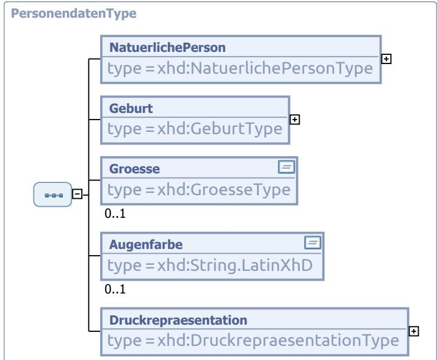

| Kindelemente von PersonendatenType                                                                                                                                          |                       |      |        |       |  |  |
|-----------------------------------------------------------------------------------------------------------------------------------------------------------------------------|-----------------------|------|--------|-------|--|--|
| Kindelement                                                                                                                                                                 | Typ                   | Anz. | Ref.   | Seite |  |  |
| NatuerlichePerson                                                                                                                                                           | NatuerlichePersonType | 1    | 3.3.6  | 56    |  |  |
| Bildet die Daten einer natürlichen Person ab.                                                                                                                               |                       |      |        |       |  |  |
| Geburt                                                                                                                                                                      | GeburtType            | 1    | 3.2.14 | 45    |  |  |
| Das Element Geburt beinhaltet das Geburtsdatum und den Geburtsort. Aufgrund des abweichenden Datentyps Geburtsdatum wurde nicht die XÖV-Kernkomponente Geburt verwendet. |                       |      |        |       |  |  |
| Groesse                                                                                                                                                                     | GroesseType           | 01   | 4.4    | 61    |  |  |
| Groesse in Zentimetern                                                                                                                                                      |                       |      |        |       |  |  |
| Augenfarbe                                                                                                                                                                  | String.LatinXhD       | 01   | 4.5    | 61    |  |  |

| Kindelemente von PersonendatenType                                                                                             |                          |      |        |       |
|--------------------------------------------------------------------------------------------------------------------------------|--------------------------|------|--------|-------|
| Kindelement                                                                                                                    | Typ                      | Anz. | Ref.   | Seite |
| Der reduzierte String.Latin Zeichensatz ohne Steuerlemente der in der TR XhD verwendet wird.                                   |                          |      |        |       |
| Druckrepraesentation                                                                                                           | DruckrepraesentationType | 1    | 3.2.12 | 43    |
| Druckrepraesentation der Personendaten zur Spezifikation der Inhalte der Druckzeilen für das jeweilige beantragte Dokument. |                          |      |        |       |

## 3.2.17 PINAdresseType

| Eigenschaft             | Wert               |
|-------------------------|--------------------|
| Name im XML-Schema      | PINAdresseType     |
| Implementierungshinweis | -                  |
| Inhaltsmodell           | komplexer Typ      |
| Elementmodell           | Sequenz            |
| Verwendet in            | - xhd:PINDatenType |

Typ PIN-Adresse

## **Abbildung 3.37. PINAdresseType**

| Kindelemente von PINAdresseType |                                                                                                             |      |        |       |
|---------------------------------|-------------------------------------------------------------------------------------------------------------|------|--------|-------|
| Kindelement                     | Typ                                                                                                         | Anz. | Ref.   | Seite |
| Druckrepraesentation            | DruckrepraesentationType                                                                                    | 1    | 3.2.12 | 43    |
| Enthält die druckbare Adresse.  |                                                                                                             |      |        |       |
| Anschrift                       | AnschriftType                                                                                               | 01   | 3.3.2  | 53    |
|                                 | Enthält die Anschrift zur Prüfung der Zustellbarkeit. Als Anschrift kann auch ein Postfach angegeben werden |      |        |       |

## 3.2.18 PINDatenType

| Eigenschaft             | Wert                      |
|-------------------------|---------------------------|
| Name im XML-Schema      | PINDatenType              |
| Implementierungshinweis | -                         |
| Inhaltsmodell           | komplexer Typ             |
| Elementmodell           | Sequenz                   |
| Verwendet in            | - xhd:ElektronischeIDType |

Enthält Liefer- und Rücksendeadresse für den PIN-Brief eines hoheitlichen Dokumentes mit eID-Funktion

#### **Abbildung 3.38. PINDatenType**

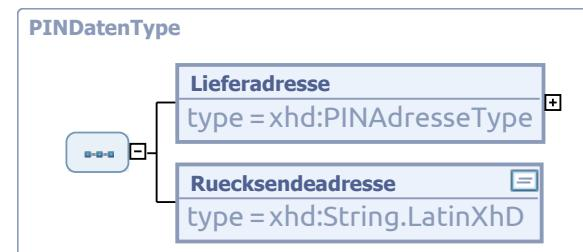

| Kindelemente von PINDatenType                                                                        |                 |      |        |       |
|------------------------------------------------------------------------------------------------------|-----------------|------|--------|-------|
| Kindelement                                                                                          | Typ             | Anz. | Ref.   | Seite |
| Lieferadresse                                                                                        | PINAdresseType  | 1    | 3.2.17 | 48    |
| Die Adresse zur Auslieferung des PIN-Briefes.                                                        |                 |      |        |       |
| Ruecksendeadresse                                                                                    | String.LatinXhD | 1    | 4.5    | 61    |
| Die Adresse zur Rücksendung des PIN-Briefes für den Fall, das dieser nicht ausgeliefert werden kann. |                 |      |        |       |

## 3.2.19 ReklamationType

| Eigenschaft             | Wert                      |
|-------------------------|---------------------------|
| Name im XML-Schema      | ReklamationType           |
| Implementierungshinweis | -                         |
| Inhaltsmodell           | komplexer Typ             |
| Elementmodell           | Sequenz                   |
| Verwendet in            | - xhd:DokumentendatenType |

Enthält Informationen zur Reklamtionen eines hoheitlichen Dokumentes.

#### **Abbildung 3.39. ReklamationType**

| ReklamationType |                                                       |  |  |
|-----------------|-------------------------------------------------------|--|--|
|                 | Seriennummer type = xs:NMTOKEN                     |  |  |
|                 | Reklamationsgrund type = xhd:ReklamationsgrundType |  |  |
|                 | Kontaktdaten                                          |  |  |
|                 | type = xhd:String.LatinXhD 01                      |  |  |
|                 | Ausgehaendigt type = xs:boolean                    |  |  |
|                 | 01 NichterhaltPINBrief                             |  |  |
|                 | type = xs:boolean                                     |  |  |
|                 | 01                                                    |  |  |

| Kindelemente von ReklamationType                                                                                                                                    |                       |      |        |       |  |
|---------------------------------------------------------------------------------------------------------------------------------------------------------------------|-----------------------|------|--------|-------|--|
| Kindelement                                                                                                                                                         | Typ                   | Anz. | Ref.   | Seite |  |
| Seriennummer                                                                                                                                                        | xs:NMTOKEN            | 1    |        |       |  |
| Die Seriennummer des reklamierten Dokuments.                                                                                                                        |                       |      |        |       |  |
| Reklamationsgrund                                                                                                                                                   | ReklamationsgrundType | 1    | 3.2.20 | 50    |  |
| Zu einer Reklamation muss immer mindestens einen Reklamationsgrund angegeben werden.                                                                                |                       |      |        |       |  |
| Kontaktdaten                                                                                                                                                        | String.LatinXhD       | 01   | 4.5    | 61    |  |
| Kontaktdaten eines direkten Ansprechpartners falls der Dokumentenhersteller Rückfragen zur Reklamation hat.                                                         |                       |      |        |       |  |
| Ausgehaendigt                                                                                                                                                       | xs:boolean            | 01   |        |       |  |
| Information, ob das Dokument an den Bürger ausgehändigt wurde. WAHR - Dokument war an den Bürger ausgehän digt. FALSCH - Dokument wurde noch nicht ausgehändigt. |                       |      |        |       |  |
| NichterhaltPINBrief                                                                                                                                                 | xs:boolean            | 01   |        |       |  |
| Information, ob eine Erklärung zum Nichterhalt des PIN-Briefs vorliegt. WAHR - Erklärung liegt vor. FALSCH - Erklä rung liegt nicht vor.                         |                       |      |        |       |  |

## 3.2.20 ReklamationsgrundType

| Eigenschaft             | Wert                  |
|-------------------------|-----------------------|
| Name im XML-Schema      | ReklamationsgrundType |
| Implementierungshinweis | -                     |
| Inhaltsmodell           | komplexer Typ         |
| Elementmodell           | Sequenz               |
| Verwendet in            | - xhd:ReklamationType |

Beschreibung eines Reklamationsgrundes für ein hoheitliches Dokument.

## **Abbildung 3.40. ReklamationsgrundType**

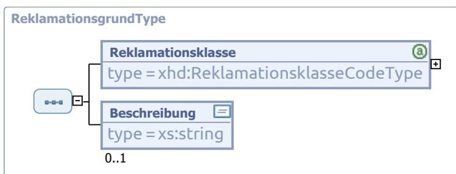

| Kindelemente von ReklamationsgrundType                                       |                            |      |      |       |  |  |
|------------------------------------------------------------------------------|----------------------------|------|------|-------|--|--|
| Kindelement                                                                  | Typ                        | Anz. | Ref. | Seite |  |  |
| Reklamationsklasse                                                           | ReklamationsklasseCodeType | 1    |      | 64    |  |  |
| Ein Datentyp zur Klassifizierung einer Reklamation.                          |                            |      |      |       |  |  |
| Beschreibung                                                                 | xs:string                  | 01   |      |       |  |  |
| Die Beschreibung beinhaltet zusätzliche Informationen zum Reklamationsgrund. |                            |      |      |       |  |  |

## 3.2.21 TRBiometricsXMLType

| Eigenschaft                        | Wert                               |
|------------------------------------|------------------------------------|
| Name im XML-Schema                 | TRBiometricsXMLType                |
| Implementierungshinweis            | -                                  |
| Inhaltsmodell                      | komplexer Typ                      |
| Elementmodell                      | Sequenz                            |
| Über Schachtelung verwen det in | - xhd:AntragsdatensatzDokumentType |

Beinhaltet die biometrischen Merkmale zur Beantragung von hoheitlichen Dokumenten.

## **Abbildung 3.41. TRBiometricsXMLType**

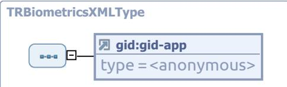

| Kindelement von TRBiometricsXMLType         |  |     |  |      |      |       |
|---------------------------------------------|--|-----|--|------|------|-------|
| Kindelement                                 |  | Typ |  | Anz. | Ref. | Seite |
| gid-app (ref)                               |  |     |  | 1    | 7.1  | 77    |
| Referenz auf http://trbio.bsi.bund.de/gid/4 |  |     |  |      |      |       |

## 3.2.22 ZertifizierteKomponentenType

| Eigenschaft             | Wert                         |
|-------------------------|------------------------------|
| Name im XML-Schema      | ZertifizierteKomponentenType |
| Implementierungshinweis | -                            |
| Inhaltsmodell           | komplexer Typ                |
| Elementmodell           | Sequenz                      |
| Verwendet in            | - xhd:CTYPE_BestellungenType |

Typ Zertifizierte Komponenten

#### **Abbildung 3.42. ZertifizierteKomponentenType**

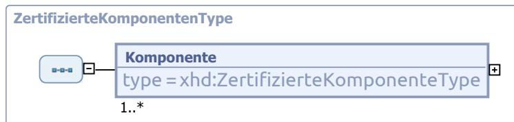

| Kindelement von ZertifizierteKomponentenType                                                |                             |      |        |       |
|---------------------------------------------------------------------------------------------|-----------------------------|------|--------|-------|
| Kindelement                                                                                 | Typ                         | Anz. | Ref.   | Seite |
| Komponente                                                                                  | ZertifizierteKomponenteType | 1n   | 3.2.23 | 52    |
| Informationen zur Zertifizierung der für die Beantragungsprozesse eingesetzten Komponenten. |                             |      |        |       |

## 3.2.23 ZertifizierteKomponenteType

| Eigenschaft             | Wert                               |
|-------------------------|------------------------------------|
| Name im XML-Schema      | ZertifizierteKomponenteType        |
| Implementierungshinweis | -                                  |
| Inhaltsmodell           | komplexer Typ                      |
| Elementmodell           | Sequenz                            |
| Verwendet in            | - xhd:ZertifizierteKomponentenType |

Informationen zur Zertifizierung der für die Beantragungsprozesse eingesetzten Komponenten.

## **Abbildung 3.43. ZertifizierteKomponenteType**

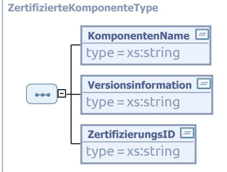

| Kindelemente von ZertifizierteKomponenteType |           |      |      |       |
|----------------------------------------------|-----------|------|------|-------|
| Kindelement                                  | Typ       | Anz. | Ref. | Seite |
| KomponentenName                              | xs:string | 1    |      |       |
| Name der zertifizierten Komponente           |           |      |      |       |
| Versionsinformation                          | xs:string | 1    |      |       |
| Version der zeritfizierten Komponente        |           |      |      |       |
| ZertifizierungsID                            | xs:string | 1    |      |       |
| Die ID der Zeritfizierungsbescheinigung      |           |      |      |       |

## 3.3 XÖV-Module

## 3.3.1 AllgemeinerNameType

| Eigenschaft             | Wert                            |
|-------------------------|---------------------------------|
| Name im XML-Schema      | AllgemeinerNameType             |
| Implementierungshinweis | -                               |
| Inhaltsmodell           | komplexer Typ                   |
| Elementmodell           | Sequenz                         |
| Verwendet in            | - xhd:NameNatuerlichePersonType |

Das Element AllgemeinerName ist von der gleichnamigen XÖV-Kernkomponente abgeleitet und bildet die Basis für alle Personen-bezogenen Namensfelder.

#### **Abbildung 3.44. AllgemeinerNameType**

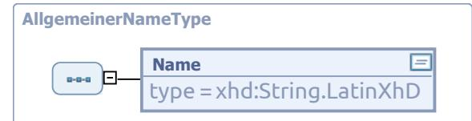

| Kindelement von AllgemeinerNameType                                                          |                 |      |      |       |
|----------------------------------------------------------------------------------------------|-----------------|------|------|-------|
| Kindelement                                                                                  | Typ             | Anz. | Ref. | Seite |
| Name                                                                                         | String.LatinXhD | 1    | 4.5  | 61    |
| Der reduzierte String.Latin Zeichensatz ohne Steuerlemente der in der TR XhD verwendet wird. |                 |      |      |       |

## 3.3.2 AnschriftType

| Eigenschaft             | Wert                                                                              |
|-------------------------|-----------------------------------------------------------------------------------|
| Name im XML-Schema      | AnschriftType                                                                     |
| Implementierungshinweis | -                                                                                 |
| Inhaltsmodell           | komplexer Typ                                                                     |
| Elementmodell           | Sequenz                                                                           |
| Verwendet in            | - xhd:BehoerdenadresseType - xhd:NatuerlichePersonType - xhd:PINAdresseType |

#### Element zur Erfassung einer Anschrift

#### **Abbildung 3.45. AnschriftType**

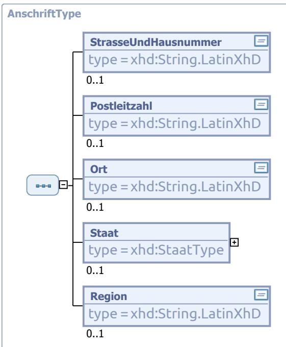

| Kindelemente von AnschriftType              |                                                                                                                                                                                                              |      |       |       |
|---------------------------------------------|--------------------------------------------------------------------------------------------------------------------------------------------------------------------------------------------------------------|------|-------|-------|
| Kindelement                                 | Typ                                                                                                                                                                                                          | Anz. | Ref.  | Seite |
| StrasseUndHausnummer                        | String.LatinXhD                                                                                                                                                                                              | 01   | 4.5   | 61    |
|                                             | Die Straße und Hausnummer der Adresse ggf. inklusiv notwendiger Zusätze in üblicher Reihenfolge des Staates.                                                                                                 |      |       |       |
| Postleitzahl                                | String.LatinXhD                                                                                                                                                                                              | 01   | 4.5   | 61    |
|                                             | Postleitzahl als Angabe, um postalische Zustellgebiete unabhängig von Gebietskörperschaften (Gemeinde, Kreis, ?) zu bezeichnen. Möglich sind Zahlen und Buchstaben, in üblicher Schreibweise des Staates. |      |       |       |
| Ort                                         | String.LatinXhD                                                                                                                                                                                              | 01   | 4.5   | 61    |
| Der Ort der Adresse                         |                                                                                                                                                                                                              |      |       |       |
| Staat                                       | StaatType                                                                                                                                                                                                    | 01   | 3.3.7 | 57    |
| Der Codewert des Staates der Anschrift.     |                                                                                                                                                                                                              |      |       |       |
| Region                                      | String.LatinXhD                                                                                                                                                                                              | 01   | 4.5   | 61    |
| "County" oder einer ähnlichen Unterteilung. | Regionale Unterteilung des Staates. Entspricht je nach Staat einer Region, einem Land, einem Bundesland, "State",                                                                                            |      |       |       |

## 3.3.3 GeschlechtType

| Eigenschaft             | Wert                        |
|-------------------------|-----------------------------|
| Name im XML-Schema      | GeschlechtType              |
| Implementierungshinweis | -                           |
| Inhaltsmodell           | komplexer Typ               |
| Elementmodell           | Sequenz                     |
| Verwendet in            | - xhd:NatuerlichePersonType |

Datentyp für das Geschlecht einer natürlichen Person

## **Abbildung 3.46. GeschlechtType**

| GeschlechtType |                                 |  |
|----------------|---------------------------------|--|
|                | Geschlecht                      |  |
|                | type = xhd:GeschlechterCodeType |  |

| Kindelement von GeschlechtType       |                      |      |       |       |
|--------------------------------------|----------------------|------|-------|-------|
| Kindelement                          | Typ                  | Anz. | Ref.  | Seite |
| Geschlecht                           | GeschlechterCodeType | 1    | 4.7.4 | 63    |
| Datentyp zur Angabe des Geschlechtes |                      |      |       |       |

## 3.3.4 NameNatuerlichePersonType

| Eigenschaft        | Wert                      |
|--------------------|---------------------------|
| Name im XML-Schema | NameNatuerlichePersonType |

| Eigenschaft             | Wert                        |
|-------------------------|-----------------------------|
| Implementierungshinweis | -                           |
| Inhaltsmodell           | komplexer Typ               |
| Elementmodell           | Sequenz                     |
| Verwendet in            | - xhd:NatuerlichePersonType |

Diese Komponente basiert auf der gleichnamigen XÖV-Kernkomponente

## **Abbildung 3.47. NameNatuerlichePersonType**

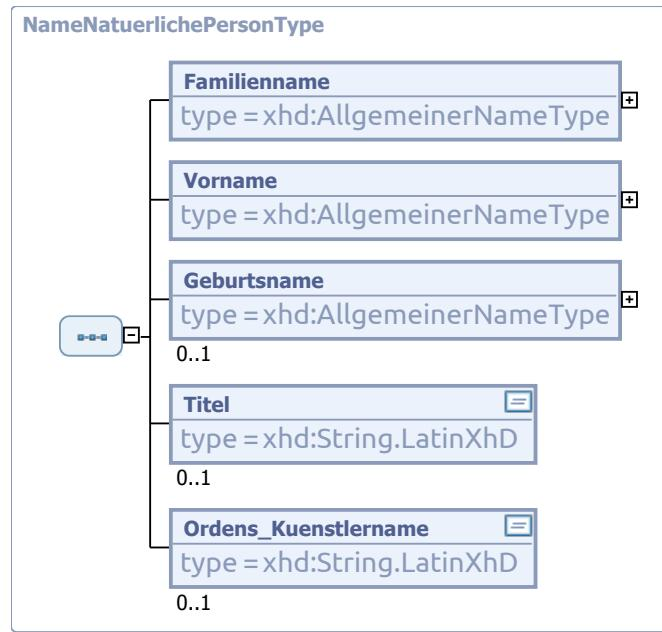

| Kindelemente von NameNatuerlichePersonType                                                                                                            |                     |      |       |       |  |
|-------------------------------------------------------------------------------------------------------------------------------------------------------|---------------------|------|-------|-------|--|
| Kindelement                                                                                                                                           | Typ                 | Anz. | Ref.  | Seite |  |
| Familienname                                                                                                                                          | AllgemeinerNameType | 1    | 3.3.1 | 52    |  |
| Das Element AllgemeinerName ist von der gleichnamigen XÖV-Kernkomponente abgeleitet und bildet die Basis für alle Personen-bezogenen Namensfelder. |                     |      |       |       |  |
| Vorname                                                                                                                                               | AllgemeinerNameType | 1    | 3.3.1 | 52    |  |
| Das Element AllgemeinerName ist von der gleichnamigen XÖV-Kernkomponente abgeleitet und bildet die Basis für alle Personen-bezogenen Namensfelder. |                     |      |       |       |  |
| Geburtsname                                                                                                                                           | AllgemeinerNameType | 01   | 3.3.1 | 52    |  |
| Das Element AllgemeinerName ist von der gleichnamigen XÖV-Kernkomponente abgeleitet und bildet die Basis für alle Personen-bezogenen Namensfelder. |                     |      |       |       |  |
| Titel                                                                                                                                                 | String.LatinXhD     | 01   | 4.5   | 61    |  |
| Der reduzierte String.Latin Zeichensatz ohne Steuerlemente der in der TR XhD verwendet wird.                                                          |                     |      |       |       |  |
| Ordens_Kuenstlername                                                                                                                                  | String.LatinXhD     | 01   | 4.5   | 61    |  |
| Der reduzierte String.Latin Zeichensatz ohne Steuerlemente der in der TR XhD verwendet wird.                                                          |                     |      |       |       |  |

## 3.3.5 NameOrganisationType

| Eigenschaft             | Wert                      |
|-------------------------|---------------------------|
| Name im XML-Schema      | NameOrganisationType      |
| Implementierungshinweis | -                         |
| Inhaltsmodell           | komplexer Typ             |
| Elementmodell           | Sequenz                   |
| Verwendet in            | - xhd:DokumentendatenType |

Wird zur Abbildung des Namens einer Behörde verwendet.

#### **Abbildung 3.48. NameOrganisationType**

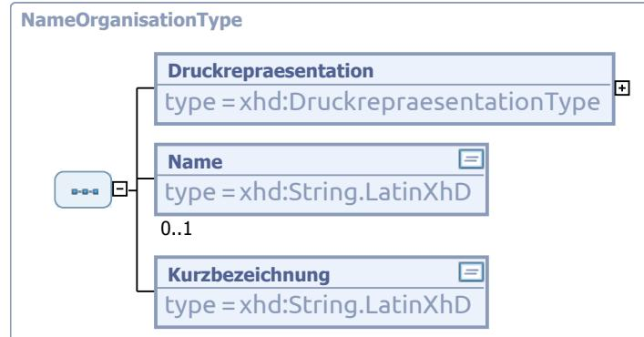

| Kindelemente von NameOrganisationType               |                          |      |        |       |  |
|-----------------------------------------------------|--------------------------|------|--------|-------|--|
| Kindelement                                         | Typ                      | Anz. | Ref.   | Seite |  |
| Druckrepraesentation                                | DruckrepraesentationType | 1    | 3.2.12 | 43    |  |
| Die Druckrepraesentation der Behoerdenbezeichnung   |                          |      |        |       |  |
| Name                                                | String.LatinXhD          | 01   | 4.5    | 61    |  |
| Der offizielle und vollständige Name einer Behörde. |                          |      |        |       |  |
| Kurzbezeichnung                                     | String.LatinXhD          | 1    | 4.5    | 61    |  |
| Die Kurzbezeichnung einer Behoerde                  |                          |      |        |       |  |

## 3.3.6 NatuerlichePersonType

| Eigenschaft             | Wert                    |
|-------------------------|-------------------------|
| Name im XML-Schema      | NatuerlichePersonType   |
| Implementierungshinweis | -                       |
| Inhaltsmodell           | komplexer Typ           |
| Elementmodell           | Sequenz                 |
| Verwendet in            | - xhd:PersonendatenType |

Bildet die Daten einer natürlichen Person ab.

#### **Abbildung 3.49. NatuerlichePersonType**

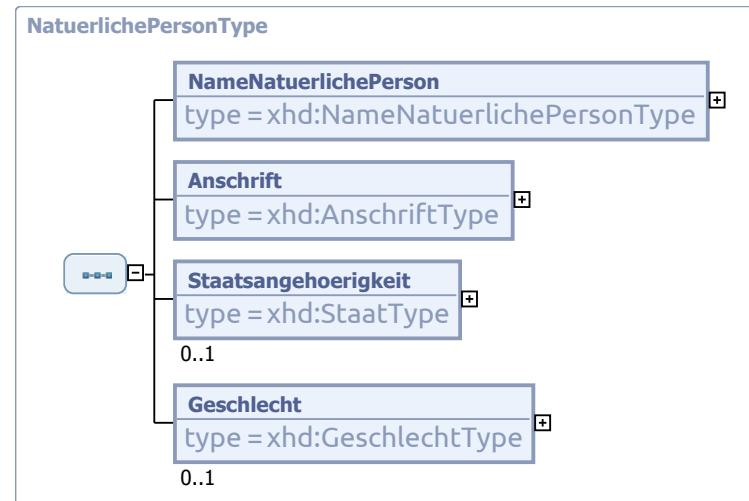

| Kindelemente von NatuerlichePersonType                            |                           |      |       |       |  |
|-------------------------------------------------------------------|---------------------------|------|-------|-------|--|
| Kindelement                                                       | Typ                       | Anz. | Ref.  | Seite |  |
| NameNatuerlichePerson                                             | NameNatuerlichePersonType | 1    | 3.3.4 | 54    |  |
| Diese Komponente basiert auf der gleichnamigen XÖV-Kernkomponente |                           |      |       |       |  |
| Anschrift                                                         | AnschriftType             | 1    | 3.3.2 | 53    |  |
| Element zur Erfassung einer Anschrift                             |                           |      |       |       |  |
| Staatsangehoerigkeit                                              | StaatType                 | 01   | 3.3.7 | 57    |  |
| Staaten nach ICAO Doc 9303, Part 3 Chapter 5                      |                           |      |       |       |  |
| Geschlecht                                                        | GeschlechtType            | 01   | 3.3.3 | 54    |  |
| Datentyp für das Geschlecht einer natürlichen Person              |                           |      |       |       |  |

## 3.3.7 StaatType

| Eigenschaft             | Wert                                               |
|-------------------------|----------------------------------------------------|
| Name im XML-Schema      | StaatType                                          |
| Implementierungshinweis | -                                                  |
| Inhaltsmodell           | komplexer Typ                                      |
| Elementmodell           | Sequenz                                            |
| Verwendet in            | - xhd:AnschriftType - xhd:NatuerlichePersonType |

Staaten nach ICAO Doc 9303, Part 3 Chapter 5. Abweichungen der Codes werden durch das BMI geregelt.

## **Abbildung 3.50. StaatType**

| StaatType |                                     |
|-----------|-------------------------------------|
|           | Staat type = xhd:StaatenCodeType |

| Kindelement von StaatType                    |                 |  |      |       |       |  |
|----------------------------------------------|-----------------|--|------|-------|-------|--|
| Kindelement                                  | Typ             |  | Anz. | Ref.  | Seite |  |
| Staat                                        | StaatenCodeType |  | 1    | 4.7.9 | 64    |  |
| Staaten nach ICAO Doc 9303, Part 3 Chapter 5 |                 |  |      |       |       |  |

## **4 Datentypen**

## 4.1 Übersicht

## **Abbildung 4.1. Datentypen**

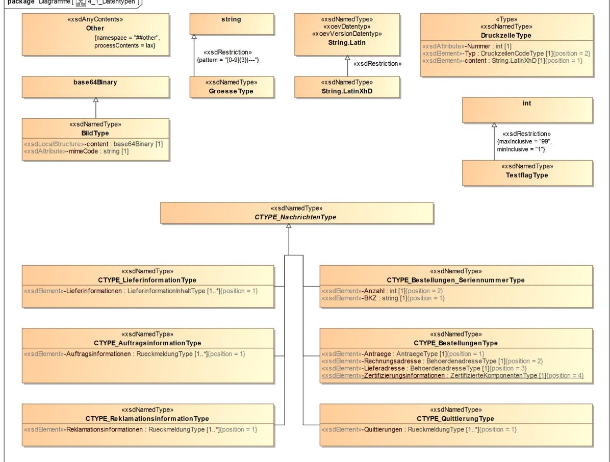

## 4.2 BildType

| Eigenschaft             | Wert                                                   |
|-------------------------|--------------------------------------------------------|
| Name im XML-Schema      | BildType                                               |
| Implementierungshinweis | -                                                      |
| Inhaltsmodell           | komplexer Typ                                          |
| Elementmodell           | Sequenz                                                |
| Erweiterung von         | xs:base64Binary (http://www.w3.org/2001/XMLSchema.xsd) |

Bundesamt für Sicherheit in der Informationstechnik 59

## 4 Datentypen

| Eigenschaft  | Wert                               |
|--------------|------------------------------------|
| Verwendet in | - xhd:AntragsdatensatzDokumentType |

Ein Element zum Übertragen von Bilddaten.

#### **Abbildung 4.2. BildType**

| BildType |            |  |
|----------|------------|--|
|          | attributes |  |
|          | mimeCode   |  |

Dieser Typ ist eine Erweiterung des Basistyps **xs:base64Binary**.

| Kindelemente von BildType                               |                 |      |      |       |
|---------------------------------------------------------|-----------------|------|------|-------|
| Kindelement                                             | Typ             | Anz. | Ref. | Seite |
| mimeCode                                                | xs:string       | 1    |      |       |
| Zulässige MimeType Werte sind image/jpeg und image/jp2. |                 |      |      |       |
| content                                                 | xs:base64Binary | 1    |      |       |
| Das Bild im Binärformat.                                |                 |      |      |       |

## 4.3 DruckzeileType

| Eigenschaft             | Wert                           |
|-------------------------|--------------------------------|
| Name im XML-Schema      | DruckzeileType                 |
| Implementierungshinweis | -                              |
| Inhaltsmodell           | komplexer Typ                  |
| Elementmodell           | Sequenz                        |
| Verwendet in            | - xhd:DruckrepraesentationType |

Typ Druckzeile

#### **Abbildung 4.3. DruckzeileType**

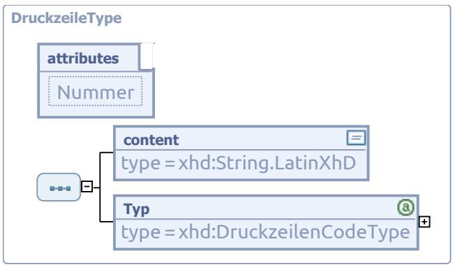

| Kindelemente von DruckzeileType                                                                                                                  |                     |      |       |       |
|--------------------------------------------------------------------------------------------------------------------------------------------------|---------------------|------|-------|-------|
| Kindelement                                                                                                                                      | Typ                 | Anz. | Ref.  | Seite |
| Nummer                                                                                                                                           | xs:int              | 1    |       |       |
| Nummer                                                                                                                                           |                     |      |       |       |
| content                                                                                                                                          | String.LatinXhD     | 1    | 4.5   | 61    |
| Der reduzierte String.Latin Zeichensatz ohne Steuerlemente der in der TR XhD verwendet wird.                                                     |                     |      |       |       |
| Typ                                                                                                                                              | DruckzeilenCodeType | 1    | 4.7.3 | 63    |
| Der Typ einer Druckzeile. Wird der Werte "Andere" genutzt, so muss in der Zusatzinformation angegeben werden, um welchen Typ es sich handelt. |                     |      |       |       |

## 4.4 GroesseType

| Eigenschaft             | Wert                                             |
|-------------------------|--------------------------------------------------|
| Name im XML-Schema      | GroesseType                                      |
| Implementierungshinweis | -                                                |
| Inhaltsmodell           | einfacher Typ                                    |
| Abgeleitet von          | xs:string (http://www.w3.org/2001/XMLSchema.xsd) |
| Verwendet in            | - xhd:PersonendatenType                          |

Typ Größe

Dieser Typ ist eine Einschränkung des Basistyps **xs:string**.

Die Werte müssen dem Muster '[0-9]{3}|---' entsprechen.

## 4.5 String.LatinXhD

| Eigenschaft                        | Wert                                                                                                                                                                                                                                                                                                                                                                                       |
|------------------------------------|--------------------------------------------------------------------------------------------------------------------------------------------------------------------------------------------------------------------------------------------------------------------------------------------------------------------------------------------------------------------------------------------|
| Name im XML-Schema                 | String.LatinXhD                                                                                                                                                                                                                                                                                                                                                                            |
| Implementierungshinweis            | -                                                                                                                                                                                                                                                                                                                                                                                          |
| Inhaltsmodell                      | einfacher Typ                                                                                                                                                                                                                                                                                                                                                                              |
| Abgeleitet von                     | xoev-lc:String.Latin (http://xoev.de/latinchars/1_1/datatypes/latinchars.xsd)                                                                                                                                                                                                                                                                                                              |
| Verwendet in                       | - xhd:AllgemeinerNameType - xhd:AnschriftType - xhd:AufenthaltstiteldatenType - xhd:BehoerdenadresseType - xhd:DienstinfoType - xhd:DokumentendatenType - xhd:DruckzeileType - xhd:ElektronischeIDType - xhd:GeburtType - xhd:NameNatuerlichePersonType - xhd:NameOrganisationType - xhd:PINDatenType - xhd:PersonendatenType - xhd:ReklamationType |
| Über Schachtelung verwen det in | - xhd:NameNatuerlichePersonType - xhd:BehoerdenadresseType                                                                                                                                                                                                                                                                                                                              |

#### 4 Datentypen

| Eigenschaft | Wert                                       |
|-------------|--------------------------------------------|
|             | - xhd:NatuerlichePersonType                |
|             | - xhd:PINAdresseType                       |
|             | - xhd:AntragsdatensatzAufenthaltstitelType |
|             | - xhd:CTYPE_BestellungenType               |
|             | - xhd:AntragsdatensatzPassType             |
|             | - xhd:AntragsdatensatzDokumentType         |
|             | - xhd:DruckrepraesentationType             |
|             | - xhd:AntragsdatensatzEIDDokumentType      |
|             | - xhd:PersonendatenType                    |
|             | - xhd:OptionaleEintragungenType            |
|             | - xhd:NatuerlichePersonType                |
|             | - xhd:DokumentendatenType                  |
|             | - xhd:ElektronischeIDType                  |
|             | - xhd:AntragsdatensatzDokumentType         |
|             | - xhd:DokumentendatenType                  |

Der reduzierte String.Latin Zeichensatz ohne Steuerlemente der in der TR XhD verwendet wird.

Dieser Typ ist eine Einschränkung des Basistyps **String.Latin** (siehe [Abschnitt 7.2 auf Seite 77\)](#page-82-2).

Die Werte müssen dem Muster '(([ -~¡-¬®-ćĊ-ěĞ ģĦ-ıĴ-śŞ-ūŮ-žƏƠ ơƯ-ưƷǍ-ǔǞ-ǟǤ-ǰǴ ǵǺ-ǿȘ-țȞ-ȟȪ-ȫȮ ȳəʒḂ-ḃḊ-ḋḐ-ḑḞ ḡḤ-ḧḰ-ḱṀ-ṁṄ-ṅṖ ṗṠ-ṣṪ-ṫẀ-ẅẌ ẓẞẠ-ầẪ-ẬẮ-ềỄ-ồỖ ờỤ-ỹ€])|(M̂|N̂|m̂|n̂| D̂|d̂|J̌|L̂|l̂))\*' entsprechen.

## 4.6 TestflagType

| Eigenschaft             | Wert                                          |
|-------------------------|-----------------------------------------------|
| Name im XML-Schema      | TestflagType                                  |
| Implementierungshinweis | -                                             |
| Inhaltsmodell           | einfacher Typ                                 |
| Abgeleitet von          | xs:int (http://www.w3.org/2001/XMLSchema.xsd) |
| Verwendet in            | - xhd:NachrichtenkopfType                     |

Ein Testflag (ein Integer größer 0)

Dieser Typ ist eine Einschränkung des Basistyps **xs:int**.

Beschränkungen (XML-Schema-Facetten): maxInclusive:99; minInclusive:1

## 4.7 Übersicht über die Code-Datentypen

## 4.7.1 AufenthaltstitelartCodeType

| Code         | AufenthaltstitelartCodeType                              |
|--------------|----------------------------------------------------------|
| Beschreibung | Ein Datentyp zur Angabe der Art eines Aufenthaltstitels. |

| Code               | AufenthaltstitelartCodeType                           |
|--------------------|-------------------------------------------------------|
| Codelisten-Nutzung | Typ: 1, Inhalte der Codeliste siehe Seite 65          |
| Codelisten-URI     | urn:de:xhd:codelisten:aufenthaltstitelcodecontenttype |
| Codelisten-Version | 1.0                                                   |

## 4.7.2 DokumentenartCodeType

| Code               | DokumentenartCodeType                                          |
|--------------------|----------------------------------------------------------------|
| Beschreibung       | Ein Datentyp zur Angabe der Art eines hoheitlichen Dokumentes. |
| Codelisten-Nutzung | Typ: 1, Inhalte der Codeliste siehe Seite 67                   |
| Codelisten-URI     | urn:de:xhd:codelisten:dokumentenartcodecontenttype             |
| Codelisten-Version | 1.0                                                            |

## 4.7.3 DruckzeilenCodeType

| Code               | DruckzeilenCodeType                                                                                                                               |
|--------------------|---------------------------------------------------------------------------------------------------------------------------------------------------|
| Beschreibung       | Der Typ einer Druckzeile. Wird der Werte "Andere" genutzt, so muss in der Zusatzinfor mation angegeben werden, um welchen Typ es sich handelt. |
| Codelisten-Nutzung | Typ: 1, Inhalte der Codeliste siehe Seite 73                                                                                                      |
| Codelisten-URI     | urn:de:xhd:codelisten:druckzeilencodecontenttype                                                                                                  |
| Codelisten-Version | 1.0                                                                                                                                               |

## 4.7.4 GeschlechterCodeType

| Code               | GeschlechterCodeType                              |
|--------------------|---------------------------------------------------|
| Beschreibung       | Datentyp zur Angabe des Geschlechtes              |
| Codelisten-Nutzung | Typ: 1, Inhalte der Codeliste siehe Seite 70      |
| Codelisten-URI     | urn:de:xhd:codelisten:geschlechtercodecontenttype |
| Codelisten-Version | 1.0                                               |

## 4.7.5 OptionaltextCodeType

| Code               | OptionaltextCodeType                               |
|--------------------|----------------------------------------------------|
| Beschreibung       | Ein Datentyp zur Angabe der Art eines Reisepasses. |
| Codelisten-Nutzung | Typ: 1, Inhalte der Codeliste siehe Seite 72       |
| Codelisten-URI     | urn:de:xhd:codelisten:optionaltextcodecontenttype  |
| Codelisten-Version | 1.0                                                |

## 4.7.6 PassartCodeType

| Code               | PassartCodeType                                    |
|--------------------|----------------------------------------------------|
| Beschreibung       | Ein Datentyp zur Angabe der Art eines Reisepasses. |
| Codelisten-Nutzung | Typ: 1, Inhalte der Codeliste siehe Seite 68       |
| Codelisten-URI     | urn:de:xhd:codelisten:passartcodecontenttype       |

### 4 Datentypen

| Code               | PassartCodeType |
|--------------------|-----------------|
| Codelisten-Version | 1.0             |

## 4.7.7 ReiseausweisartCodeType

| Code               | ReiseausweisartCodeType                              |
|--------------------|------------------------------------------------------|
| Beschreibung       | Ein Datentyp zur Angabe der Art eines Reiseausweise. |
| Codelisten-Nutzung | Typ: 1, Inhalte der Codeliste siehe Seite 69         |
| Codelisten-URI     | urn:de:xhd:codelisten:reiseausweiscodecontenttype    |
| Codelisten-Version | 1.0                                                  |

## 4.7.8 ReklamationsklasseCodeType

| Code               | ReklamationsklasseCodeType                              |
|--------------------|---------------------------------------------------------|
| Beschreibung       | Ein Datentyp zur Klassifizierung einer Reklamation.     |
| Codelisten-Nutzung | Typ: 1, Inhalte der Codeliste siehe Seite 71            |
| Codelisten-URI     | urn:de:xhd:codelisten:reklamationsklassecodecontenttype |
| Codelisten-Version | 1.0                                                     |

## 4.7.9 StaatenCodeType

| Code               | StaatenCodeType                                                                                        |
|--------------------|--------------------------------------------------------------------------------------------------------|
| Beschreibung       | Staaten nach ICAO Doc 9303, Part 3 Chapter 5. Abweichungen der Codes werden durch das BMI geregelt. |
| Codelisten-Nutzung | Typ: 3, siehe Beschreibung                                                                             |
| Codelisten-URI     | urn:de.xhd.codelisten.staaten                                                                          |
| Codelisten-Version | 1.0                                                                                                    |

## **5 Codelisten**

## 5.1 Überblick

## **Abbildung 5.1. Codelisten**

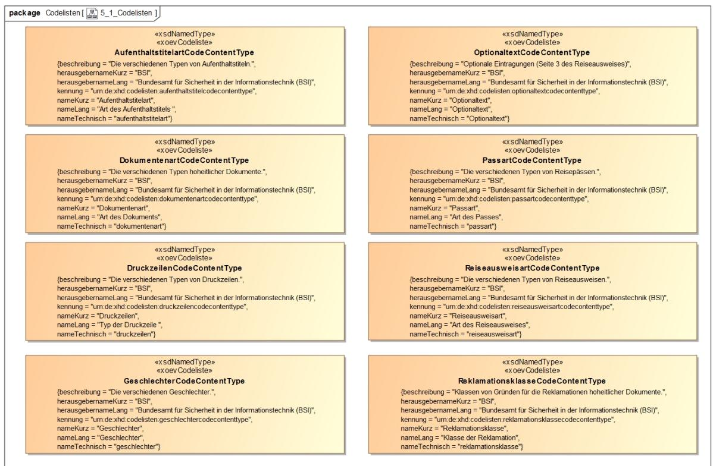

## 5.2 Details

## 5.2.1 Codeliste Art des Aufenthaltstitels

| Codeliste    | Art des Aufenthaltstitels (urn:de:xhd:codelisten:aufenthaltstitelcodecontenttype) |                                                                                                                                                                                                                                          |
|--------------|-----------------------------------------------------------------------------------|------------------------------------------------------------------------------------------------------------------------------------------------------------------------------------------------------------------------------------------|
| Herausgeber  | BSI                                                                               |                                                                                                                                                                                                                                          |
| Beschreibung | Die verschiedenen Typen von Aufenthaltstiteln.                                    |                                                                                                                                                                                                                                          |
| Code         | Beschreibung                                                                      | Beschreibung                                                                                                                                                                                                                             |
| AE           | Aufenthaltserlaubnis                                                              | Aufenthaltserlaubnis nach § 4 Abs. 5, § 7 Abs. 1 S. 3, § 16 Abs. 1, 5, 6, 7 und 9, § 16b Abs. 1 und 3, § 17 Abs. 1 und 3, § 17a Abs. 1, 4 und 5, § 17b Abs. 1, § 18 Abs. 3, 4 S. 1 und 2 sowie Abs. 4a, § 18a Abs. 1 Nr. 1 A, B |

| Codeliste    | Art des Aufenthaltstitels (urn:de:xhd:codelisten:aufenthaltstitelcodecontenttype) |                                                                                                                                                                                                                                                                                                                                                                                                                                                                                 |
|--------------|-----------------------------------------------------------------------------------|---------------------------------------------------------------------------------------------------------------------------------------------------------------------------------------------------------------------------------------------------------------------------------------------------------------------------------------------------------------------------------------------------------------------------------------------------------------------------------|
| Herausgeber  | BSI                                                                               |                                                                                                                                                                                                                                                                                                                                                                                                                                                                                 |
| Beschreibung | Die verschiedenen Typen von Aufenthaltstiteln.                                    |                                                                                                                                                                                                                                                                                                                                                                                                                                                                                 |
| Code         | Beschreibung                                                                      | Beschreibung                                                                                                                                                                                                                                                                                                                                                                                                                                                                    |
|              |                                                                                   | und C, § 18c, § 18d, § 20 Abs. 1 und 8, § 20b, § 21 Abs. 1, 2, 2a und 5, § 22 S. 1 und 2, § 23 Abs. 1, 2 und 4, § 23a, § 24, § 25 Abs. 1, 2, 3, 4 S. 1 und 2 sowie Abs. 4a und 5, § 25a Abs. 1 sowie Abs. 2 S. 1, 2, 3 und 5, § 25b Abs. 1 S. 1 sowie Abs. 4, § 30, § 31 Abs. 1, 2 und 4, § 32 Abs. 1, 2, 3 und 4, § 33, § 34 Abs. 2, § 36 Abs. 1 und 2, § 37 Abs. 1 und 5, § 38 Abs. 1 Nr. 2 sowie Abs. 2 und 5, § 38a des Aufenthaltsgesetzes (AufenthG) |
| NE           | Niederlassungserlaubnis                                                           | Niederlassungserlaubnis gemäß §9, § 18b, § 19 Abs. 1, 2 Nr. 1 und 2, § 19a Ab 6 S. 1 und 3, § 21 Abs. 4, § 23 Abs. 2, § 26. Abs. 2, 3 S. 1 und 2 sowie Abs. 3 und 4, §28 Abs. 2, § 31 Abs. 3, § 35, § 38 Abs. 1 Nr. 1 des Aufenthaltsgesetzes (AufenthG)                                                                                                                                                                                                            |
| DE           | Erlaubnis zum Daueraufenthalt-EU                                                  | Erlaubnis zum Daueraufenthalt-EU (§ 9a Aufen thG)                                                                                                                                                                                                                                                                                                                                                                                                                            |
| AS           | Aufenthaltserlaubnis CH                                                           | Aufenthaltserlaubnis für Staatsangehörige der Schweizerischen Eidgenossenschaft und ihre Fami lienangehörigen, die nicht Staatsangehörige der Schweizerischen Eidgenossenschaft sind (§28 Auf enthV)                                                                                                                                                                                                                                                       |
| AK           | Aufenthaltskarte (Familienangehöriger EU)                                         | Aufenthaltskarte für (drittstaatsangehörige) Fami lienangehörige eines Unionsbürgers oder eines Staatsangehörigen eines EWR-Staates (§ 5 Abs. 1 FreizügG/EU)                                                                                                                                                                                                                                                                                                           |
| DA           | Daueraufenthaltskarte (Familienangehöriger EU)                              | Daueraufenthaltskarte für (drittstaatsangehörige) Familienangehörige von Unionsbürgern oder von Staatsangehörigen eines EWR-Staates (§5 Abs. 5 FreizügG/EU)                                                                                                                                                                                                                                                                                                            |
| BK           | Blaue Karte EU                                                                    | Aufenthaltstitel nach § 19 a AufenthG                                                                                                                                                                                                                                                                                                                                                                                                                                           |
| AF           | Aufenthaltserlaubnis (Familienangehöriger)                                        | Aufenthaltserlaubnis nach § 28 Abs. 1 S. 1 Nr. 1, 2 und 3 sowie Abs. 4 AufenthG                                                                                                                                                                                                                                                                                                                                                                                              |
| IC           | ICT-Karte                                                                         | ICT-Karte für unternehmensintern transferierte Arbeitnehmer gemäß §19b AufenthG                                                                                                                                                                                                                                                                                                                                                                                              |
| MI           | Mobiler-ICT-Karte                                                                 | Mobiler-ICT-Karte gemäß §19d AufenthG                                                                                                                                                                                                                                                                                                                                                                                                                                           |
| XA           | Artikel 50 EUV                                                                    | Aufenthaltsdokument für Personen, die nach einem Abkommen der EU mit einem Staat, der nach Artikel 50 des Vertrags über die Europäische Union aus der EU ausgeschieden ist, eine besondere aufenthaltsrechtliche Stellung innehaben.                                                                                                                                                                                                                                |
| XG           | Artikel 50 EUV - Grenzgänger                                                      | Aufenthaltserlaubnis für Grenzgänger, nach einem Abkommen der EU mit einem Staat, der nach Arti kel 50 des Vertrags über die Europäische Union aus der EU ausgeschieden ist, eine besondere Berech tigung zur Erwerbstätigkeit in Deutschland haben, und die außerhalb Deutschlands leben.                                                                                                                                                                       |

## 5.2.2 Codeliste Art des Dokuments

| Codeliste    | Art des Dokuments (urn:de:xhd:codelisten:dokumentenartcodecontenttype) |                                 |
|--------------|------------------------------------------------------------------------|---------------------------------|
| Herausgeber  | BSI                                                                    |                                 |
| Beschreibung | Die verschiedenen Typen hoheitlicher Dokumente.                        |                                 |
| Code         | Beschreibung                                                           | Beschreibung                    |
| PA           | Personalausweis                                                        | Personalausweis gemäß PAuswG    |
| RP           | Reisepass                                                              | Reisepass gemäß PassG           |
| RA           | Reiseausweis                                                           | Reiseausweis gemäß AufenthG     |
| AT           | Aufenthaltstitel                                                       | Aufenthaltstitel gemäß AufenthG |
| UB           | eID-Karte für Unionsbürger                                             | eID-Karte für Unionsbürger      |

## 5.2.3 Codeliste Art des Passes

| Codeliste    | Art des Passes (urn:de:xhd:codelisten:passartcodecontenttype) |                |
|--------------|---------------------------------------------------------------|----------------|
| Herausgeber  | BSI                                                           |                |
| Beschreibung | Die verschiedenen Typen von Reisepässen.                      |                |
| Code         | Beschreibung                                                  | Beschreibung   |
| P            | Reisepass                                                     | Reisepass      |
| PO           | Dienstpass                                                    | Dienstpass     |
| PD           | Diplomatenpass                                                | Diplomatenpass |

| 5.2.4 Codeliste Art des Reiseausweises |
|----------------------------------------|
|----------------------------------------|

| Codeliste    | Art des Reiseausweises (urn:de:xhd:codelisten:reiseausweisartcodecontenttype) |                                             |
|--------------|-------------------------------------------------------------------------------|---------------------------------------------|
| Herausgeber  | BSI                                                                           |                                             |
| Beschreibung | Die verschiedenen Typen von Reiseausweisen.                                   |                                             |
| Code         | Beschreibung                                                                  | Beschreibung                                |
| RA           | Reiseausweis für Ausländer                                                    | Reiseausweis für Ausländer gemäß AufenthG   |
| RF           | Reiseausweis für Flüchtlinge                                                  | Reiseausweis für Flüchtlinge gemäß AufenthG |
| RS           | Reiseausweis für Staatenlose                                                  | Reiseausweis für Staatenlose gemäß AufenthG |

## 5.2.5 Codeliste Geschlechter

| Codeliste    | Geschlechter (urn:de:xhd:codelisten:geschlechtercodecontenttype) |                                                                                            |  |
|--------------|------------------------------------------------------------------|--------------------------------------------------------------------------------------------|--|
| Herausgeber  | BSI                                                              |                                                                                            |  |
| Beschreibung | Die verschiedenen Geschlechter.                                  |                                                                                            |  |
| Code         | Beschreibung                                                     | Beschreibung                                                                               |  |
| 001          | weiblich                                                         | Geschlecht der Ausweisinhaberin weiblich                                                   |  |
| 002          | männlich                                                         | Geschlecht des Ausweisinhabers männlich                                                    |  |
| 003          | unbekanntes Geschlecht                                           | Geschlecht des/der Ausweisinhabers/-in weder als weiblich noch als männlich einzutragen |  |

| Codeliste       | Klasse der Reklamation (urn:de:xhd:codelisten:reklamationsklassecodecontenttype) |                                        |  |
|-----------------|----------------------------------------------------------------------------------|----------------------------------------|--|
| Herausgeber     | BSI                                                                              |                                        |  |
| Beschreibung    | Klassen von Gründen für die Reklamationen hoheitlicher Dokumente.                |                                        |  |
| Code            | Beschreibung                                                                     | Beschreibung                           |  |
| Chip            | Chip                                                                             | Chip                                   |  |
| Daten           | Daten                                                                            | Daten                                  |  |
| Material        | Material                                                                         | Material                               |  |
| Bild            | Bild                                                                             | Lichtbild des/der Ausweisinhabers/-in. |  |
| Unterschrift    | Unterschrift                                                                     | Unterschrift                           |  |
| Sonstiges       | Sonstiges                                                                        | Sonstiges                              |  |
| PIN-Brief       | PIN-Brief                                                                        | Nicht-zustellbarer PIN-Brief           |  |
| Kostenpflichtig | Kostenpflichtig                                                                  | Kostenpflichtig                        |  |
| VersandSchaden  | Versandschaden                                                                   | Beschädigung während des Versands      |  |
| VersandVerlust  | Versandverlust                                                                   | Verlust während des Versands           |  |

## 5.2.6 Codeliste Klasse der Reklamation

## 5.2.7 Codeliste Optionaltext

| Codeliste      | Optionaltext (urn:de:xhd:codelisten:optionaltextcodecontenttype) |                                                                                                                                                                                                                                                                                           |  |
|----------------|------------------------------------------------------------------|-------------------------------------------------------------------------------------------------------------------------------------------------------------------------------------------------------------------------------------------------------------------------------------------|--|
| Herausgeber    | BSI                                                              |                                                                                                                                                                                                                                                                                           |  |
| Beschreibung   | Optionale Eintragungen (Seite 3 des Reiseausweises)              |                                                                                                                                                                                                                                                                                           |  |
| Code           | Beschreibung                                                     | Beschreibung                                                                                                                                                                                                                                                                              |  |
| Asylberechtigt | Asylberechtigt                                                   | Der Inhaber / Die Inhaberin dieses Reiseausweises ist als Asylberechtigter anerkannt.                                                                                                                                                                                                  |  |
| Fluechtling    | Fluechtling                                                      | Der Inhaber / Die Inhaberin dieses Reiseausweises ist Flüchtling im Sinne des Abkommens über die Rechtsstellung der Flüchtlinge.                                                                                                                                                    |  |
| Heimatlos      | Heimatlos                                                        | Der Inhaber / Die Inhaberin dieses Reiseausweises ist heimatloser Ausländer nach dem Gesetz über die Rechtsstellung heimatloser Ausländer im Bundes gebiet vom 25. April 1951 und zum Aufenthalt im Gebiet der Bundesrepublik Deutschland berechtigt.                         |  |
| Humanitaer     | Humanitaer                                                       | Der Ausweisinhaber / Die Ausweisinhaberin ist als ausländischer Flüchtling nach § 1 Abs. 1 des Geset zes über Maßnahmen im Rahmen humanitärer Hilfsaktionen, das am 1. Januar 2005 außer Kraft trat, aufgenommen worden. Die Rechtsstellung gilt nach § 103 AufenthG fort. |  |
| Ausserhalb     | Ausserhalb                                                       | Der Inhaber / Die Inhaberin dieses Reiseauswei ses hat außerhalb des Gebietes der Bundesrepublik Deutschland Anerkennung als Flüchtling nach dem Abkommen über die Rechtsstellung der Flüchtlin ge gefunden.                                                                  |  |
| Nationalpass   | Nationalpass                                                     | Der Inhaber / Die Inhaberin ist auch Inhaber eines Nationalpasses.                                                                                                                                                                                                                     |  |

| 5.2.8 Codeliste Typ der Druckzeile |  |  |
|------------------------------------|--|--|
|------------------------------------|--|--|

| Codeliste                                              | Typ der Druckzeile (urn:de:xhd:codelisten:druckzeilencodecontenttype) |                                                                                                                                                                   |  |
|--------------------------------------------------------|-----------------------------------------------------------------------|-------------------------------------------------------------------------------------------------------------------------------------------------------------------|--|
| Herausgeber                                            | BSI                                                                   |                                                                                                                                                                   |  |
| Beschreibung                                           | Die verschiedenen Typen von Druckzeilen.                              |                                                                                                                                                                   |  |
| Code                                                   | Beschreibung                                                          | Beschreibung                                                                                                                                                      |  |
| Namensblock                                            | Namensblock                                                           | Familienname des/der Ausweisinhabers/-in                                                                                                                          |  |
|                                                        | Vornamensblock Vornamensblock                                         | Vorname(n) des/der Ausweisinhabers/-in                                                                                                                            |  |
| Ordens_ Kuenstlername                               | Ordens_Kuenstlername                                                  | Ordens- oder Künstlername des/der Ausweisinha bers/-in.                                                                                                        |  |
| Wohnort                                                | Wohnort                                                               | Wohnort des/der Ausweisinhabers/-in                                                                                                                               |  |
| Strasse_ Hausnummer                                 | Strasse_Hausnummer                                                    | Zeile für die Druckrepräsentation der Straße und Hausnummer                                                                                                    |  |
| Geburtsort                                             | Geburtsort                                                            | Geburtsort                                                                                                                                                        |  |
| Behoerdenname                                          | Behoerdenname                                                         | Name der ausstellenden Behörde                                                                                                                                    |  |
|                                                        | LieferadressePIN LieferadressePIN                                     | Lieferadresse für den PIN-Brief                                                                                                                                   |  |
| Rechnungs adresse                                   | Rechnungsadresse                                                      | Rechnungsadresse                                                                                                                                                  |  |
| Lieferadresse                                          | Lieferadresse                                                         | Lieferadresse für das Ausweisdokument                                                                                                                             |  |
| Dienstinfo                                             | Dienstinfo                                                            | Das Feld Dienstinfo ist verpflichtend für die Passar ten PO (Dienstpass) und PD (Diplomatenpass). Für die Passart P (Reisepass) ist das Feld nicht erlaubt. |  |
| Geburtsname                                            | Geburtsname                                                           | Geburtsname                                                                                                                                                       |  |
| Behoerdenna meKurzeZeile                            | BehoerdennameKurzeZeile                                               | Kurze Zeile zum Druck im Kombi-Feld Ausstel lungsdatum/-Behörde                                                                                                |  |
| Anmerkungen Erwerbstaetig keit                   | AnmerkungenErwerbstaetigkeit                                          | Anmerkungen auf der Rückseite des elektroni schen Aufenthaltstitels                                                                                            |  |
| Anmerkungen Rechtsgrundla genUndPassdo kument | AnmerkungenRechtsgrundlagenUndPassdo kument                        | Anmerkungen auf der Vorderseite des elektroni schen Aufenthaltstitels                                                                                          |  |
| Unterlagen                                             | Unterlagen                                                            | Unterlagen                                                                                                                                                        |  |

## **6 Referenzen**

[TR SiSKohD] BSI Technische Richtlinie Sichere Szenarien fuer Kommunikationsprozesse im Bereich hoheitlicher Dokumente (BSI TR-03132)

# **7 Eingebundene externe Modelle**

Folgende externe Modelle werden in dieser Spezifikation verwendet:

## 7.1 TR Bio

TR\_Bio

Folgende Datentypen aus dem externen Modell werden in dieser Spezifikation verwendet:

• gid-app

## 7.2 XÖV-Bibliothek

XOEV-Bibliothek; Fassung 2017-08-01

Folgende Datentypen aus dem externen Modell werden in dieser Spezifikation verwendet:

- Code
- String.Latin