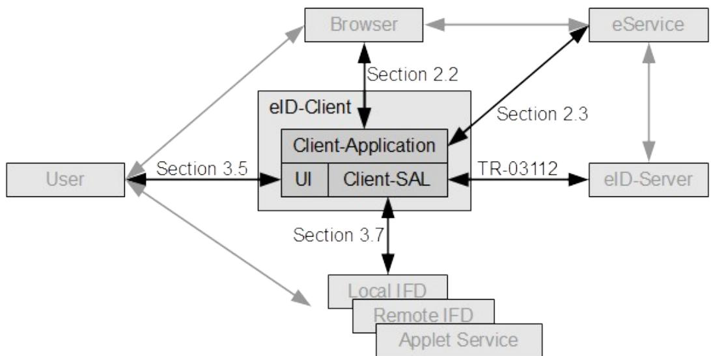
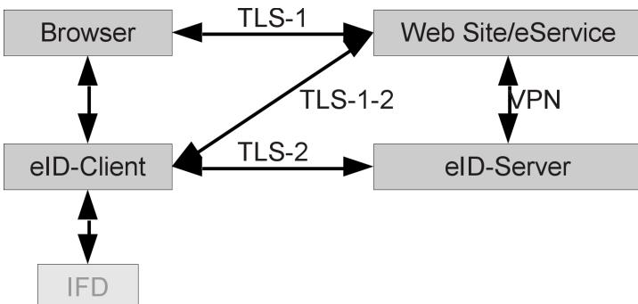
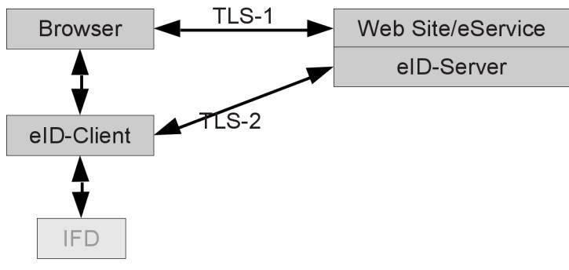
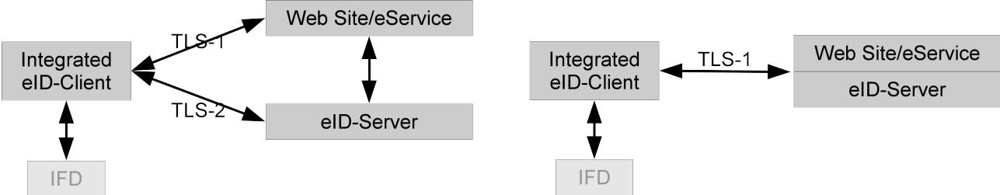
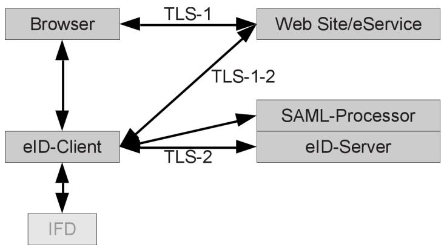
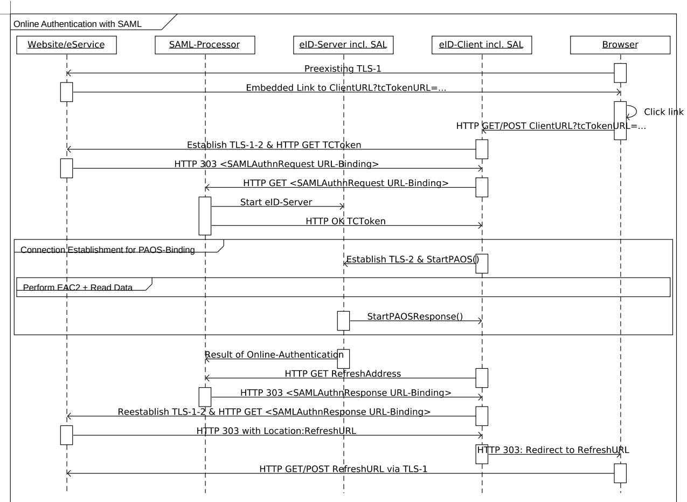
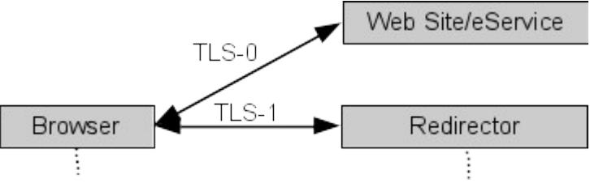
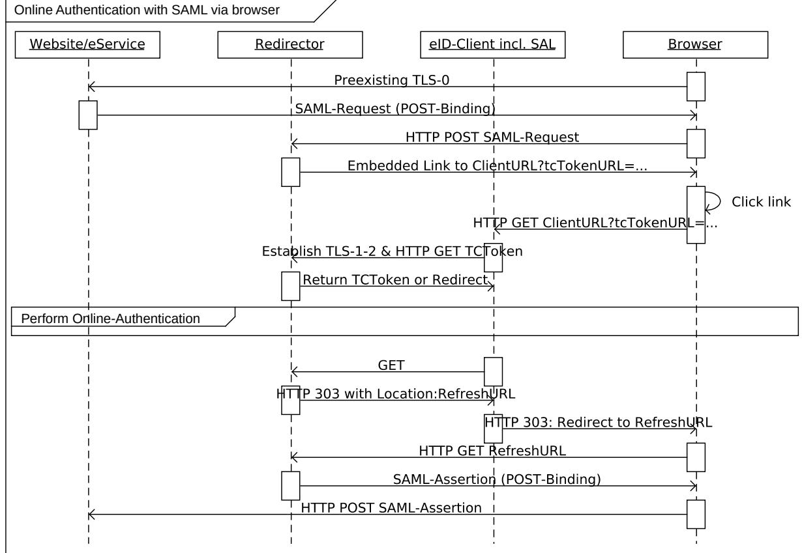

# Technical Guideline TR-03124-1 – eID-Client

Part 1: Specifications

Version 1.4 8. October 2021


Federal Office for Information Security Post Box 20 03 63 D-53133 Bonn Phone: +49 22899 9582-0 E-Mail: eid@bsi.bund.de Internet: https://www.bsi.bund.de © Federal Office for Information Security 2021

| 1              | Introduction 5                                           |  |
|----------------|----------------------------------------------------------|--|
| 1.1            | Modules 5                                                |  |
| 1.2            | Key Words 6                                              |  |
| 1.3            | Robustness Principle 6                                   |  |
| 2              | Online-Authentication based on EAC2 7                    |  |
| 2.1            | Communication Model 7                                    |  |
| 2.2            | Full eID-Client 8                                        |  |
| 2.2.1          | Actions 8                                                |  |
| 2.2.2          | Invocation and Response 9                                |  |
| 2.3            | Website Integration 10                                   |  |
| 2.3.1          | Embedded Link 10                                         |  |
| 2.3.2          | MIME-Type 10                                             |  |
| 2.4            | eID-Kernel 11                                            |  |
| 2.5            | IFD Service 11                                           |  |
| 2.6            | TC Token 11                                              |  |
| 2.7            | Online-Authentication 14                                 |  |
| 2.7.1          | Retrieval of TC Token 14                                 |  |
| 2.7.2          | Connection Establishment 15                              |  |
| 2.7.3<br>2.7.4 | Online-Authentication 15<br>Return to the caller 16      |  |
|                |                                                          |  |
| 2.8            | SAML 18                                                  |  |
| 2.9            | Session Binding 20                                       |  |
| 3              | Functional Requirements for an eID-Client21              |  |
| 3.1            | Supported eID-Cards 21                                   |  |
| 3.2            | Client Interface 21                                      |  |
| 3.3            | Online-Authentication 21                                 |  |
| 3.4            | PIN-Management 21                                        |  |
| 3.5            | eCard-API-Profile 22                                     |  |
| 3.6            | HTTP Communication 22                                    |  |
| 3.7            | IFDs 23                                                  |  |
| 3.7.1          | Host Platforms with External / Integrated Card Readers23 |  |
| 3.7.2          | Host Platforms with Embedded Card Readers23              |  |
| 3.7.3          | Local IFD / Remote IFD 23                                |  |
| 3.7.4<br>3.8   | eID-Applet 23<br>User Interface 24                       |  |
|                |                                                          |  |
| 3.9            | Developer Mode 25                                        |  |
| 4              | Security Requirements for an eID-Client 26               |  |
| 4.1            | Interfaces 26                                            |  |
| 4.2            | Active Web Content 26                                    |  |
| 4.3            | Functionalities 26                                       |  |
| 4.4            | Support for PACE 26                                      |  |
| 4.5            | TLS 26                                                   |  |

| 4.6 | Updates 27                              |
|-----|-----------------------------------------|
|     | Annex A  SAML via Browser (informative) |
|     | 28                                      |
|     | Reference Documentation 30              |

| Figure 1: Modules of an eID-Client 5                                                             |  |
|--------------------------------------------------------------------------------------------------|--|
| Figure 2: Generic Communication Model 7                                                          |  |
| Figure 3: Attached eID-Server 7                                                                  |  |
| Figure 4: Integrated eID-Client in the Generic Communication Model and with Attached eID-Server8 |  |
| Figure 5: Online-Authentication (Simplified)14                                                   |  |
| Figure 6: Communication Model for SAML based Authentication19                                    |  |
| Figure 7: Online-Authentication with SAML (Simplified)20                                         |  |
| Figure 8: Communication model SAML via browser28                                                 |  |
| Figure 9: Online-Authentication with SAML via the browser29                                      |  |
|                                                                                                  |  |

### 1 Introduction

This Technial Guideline specifies the eID-Client software for Online-Authentication based on Extended Access Control Version 2 (EAC2) between an eService and an eID document. An **eID document** can, for example, be

- an **eID Card**, e.g. the German eID-Card or the German electronic Residence Permit (see [TR-03127]),
- a **Smart-eID**, i.e. a an identification means directly hosted on a mobile device, as an **eID-Applet** hosted on an Secure Element of a mobile device (see [TR-03159]).

The eID-Client implements the client side of this authentication. The server side is implemented by the eID-Server, see [TR-03130], part 1.

The same software can also support other functionalities and interfaces, like signature creation or support of other smart cards. This is out of scope of this document, as is the use of an eID-Card for offline authentication.

The eID-Client is based on the eCard-API-Framework ([TR-03112]) and implements at least the functions of this API necessary to support Online-Authentication, listed in section [3.5.](#page-21-0) Both the eID-Client and the eID-Server contain at least a Service Access Layer (SAL) according to part 4 of [TR-03112], called Client-SAL and Server-SAL, respectively, in the following.

The eID-Client contains also the necessary functions to access an eID-Card via a card reader or a Smart-eID directly via device internal communication according to section [3.7.](#page-22-0)

#### 1.1 Modules

The eID-Client can be implemented as a single product, or split up into different modules. This Guideline uses the following conventions:

**•** The term **eID-Client** denotes the complete client-software necessary to perform Online-Authentication, either implemented as a single product or as separate modules.



*Figure 1: Modules of an eID-Client*

- **•** The term **Client-Application** denotes the part/module(s) of the eID-Client which implements the communication with the web-browser/user agent, if applicable, and the eService according to section [2.](#page-6-0)
- **•** The term **Client-SAL** denotes the part/module(s) of the eID-Client which implements the necessary functions of the eCard-API-Framework [TR-03112] according to section [3.5](#page-21-0). The functions necessary to access a card reader can be implemented as a separate module *IFD-Interface* according to part 6 of [TR-03112] or as part of the Client-SAL. For the purpose of this Guideline, the IFD-Interface (if present) is treated as part of the Client-SAL.
- **•** The **User Interface (UI)** contains all elements necessary for user interaction, see section [3.8](#page-23-0).

The eID-Client can be implemented comprising different set of modules:

- **•** A **Full eID-Client** is a stand-alone application, which can be called by browser or other user agents to perform the Online-Authentication. A Full eID-Client comprises the Client-Application, the Client-SAL and the User Interface.
- **•** The **eID-Kernel** comprises the Client-Application and the Client-SAL, and can be used by application/user agent developers to directly integrate an eID-Client into their product. The UI is provided by the user agent.
	- **◦** An **Internal eID-Kernel** is directly incorporated into the user agent. The resulting combined product is an **Integrated eID-Client**.
	- **◦** An **External eID-Kernel** is an eID-Kernel not directly incorporated into a user agent, but accessed by an user agent via inter process communication.

The set of requirements to be implemented by different types of eID-Clients is detailed in section [3.](#page-20-0)

#### 1.2 Key Words

The key words "MUST", "MUST NOT", "REQUIRED", "SHALL", "SHALL NOT", "SHOULD", "SHOULD NOT", "RECOMMENDED", "MAY", and "OPTIONAL" in this document are to be interpreted as described in [RFC2119]. The key word "CONDITIONAL" is to be interpreted as follows:

CONDITIONAL: The usage of an item is dependent on the usage of other items. It is therefore further qualified under which conditions the item is REQUIRED or RECOMMENDED.

#### 1.3 Robustness Principle

Implementations according to this Technical Guideline SHALL follow the robustness principle, also known as Postel's Law:

> **"Implementations should follow a general principle of robustness: be conservative in what you do, be liberal in what you accept from others."**

### <span id="page-6-0"></span>2 Online-Authentication based on EAC2

This section specifies the establishment of a connection between eID-Client and eID-Server, including binding to a preexisting connection between browser and eService, for performing Online-Authentication based on Extended Access Control Version 2.

*Note: This specification uses the word "browser" for the local application / user agent of the user. This can be any local application utilizing the Online-Authentication by calling an eID-Client and is not restricted to webbrowsers.*

#### <span id="page-6-1"></span>2.1 Communication Model

The Online-Authentication starts from an existing TLS channel named "TLS-1" between the browser of the user and the website of the eService. The Online-Authentication is performed between the eID-Client and the eID-Server of the eService using a second TLS channel "TLS-2".

*Note: In the following "channel" is used to generically describe a communication relationship, while "session" is used to denote a TLS session in the meaning of [RFC5246].*



*Figure 2: Generic Communication Model*

In general, TLS-1 and TLS-2 terminate at different domains. An intermediary TLS channel "TLS-1-2" between eID-Client and eService is necessary to allow the binding of TLS-1 and TLS-2. The eService and the eID-Server MUST communicate using an encrypted and integrity-protected mutually authenticated connection, see [TR-03130], part 1.

In the special case of both channels TLS-1 and TLS-2 terminating at the same domain ("*Attached eID-Server*"), the intermediary channel TLS-1-2 is not necessary. Usage of the attached model is indicated by the eService via the absence of a pre-shared key in the TC Token (see sections [2.6](#page-10-0) and [2.7.2](#page-14-0)).



*Figure 3: Attached eID-Server*

The eService MUST use the same TLS certificate for TLS-1 and TLS-1-2. If TLS-1-2 is not used, the same TLS certificate MUST be used by the eService/eID-Server for both channels TLS-1 and TLS-2.

For Integrated eID-Clients TLS-1 and TLS-1-2 MAY be the same channel, or a single TLS channel can be used in the case of an Integrated eID-Client communicating with an Attached eID-Server, see [4.](#page-7-0)



<span id="page-7-0"></span>*Figure 4: Integrated eID-Client in the Generic Communication Model and with Attached eID-Server*

#### <span id="page-7-3"></span>2.2 Full eID-Client

*Note: This sections is not relevant for eID-Kernels / Integrated eID-Clients.*

The eID-Client offers its services at the ClientURL defined as

- **•** http://127.0.0.1:24727/eID-Client for classical operating systems[1](#page-7-1) , and
- **•** eid://127.0.0.1:24727/eID-Client for mobile operating systems[2](#page-7-2) .

It is RECOMMENDED that eID-Clients offer both URLs whenever possible.

This interface MUST NOT be available to external callers, i.e. must only be open locally.

*Note: In principle,* http://localhost:24727/eID-Client *could also be used as* ClientURL*. Currently, browser support seems to be better for the variant with explicit IP address, but this might change in the future. Therefore eID-Clients SHOULD support both variants. eServices MAY use the User Agent of the browser to send different* ClientURL*s to enhance interoperability.* 

#### 2.2.1 Actions

The following actions are defined for the Client-Interface.

#### 2.2.1.1 Connect to eID-Server

The following action SHALL be implemented by the eID-Client to start an authentication procedure:

**•** [ClientURL]?tcTokenURL=*URL*

This action instructs the eID-Client to retrieve a TC Token, open the connection described by the retrieved TC Token and establish PAOS communication, thereby handing over control to the eID-Server (see section [2.7](#page-13-0)). Here *URL* is a (properly encoded) https-URL where the TC Token (see section [2.6\)](#page-10-0) for this process can be retrieved.

<span id="page-7-1"></span><sup>1</sup> E.g. Windows, MacOS, Linux

<span id="page-7-2"></span><sup>2</sup> E.g. android, iOS

#### <span id="page-8-1"></span>2.2.1.2 Query Status Information

For a web server based Client-Interface, the eID-Client SHOULD implement the following action to return status information to the caller:

**•** [ClientURL]?Status

Implementation for intent based Client-Interfaces is not necessary, since the corresponding information are available via the operating system.

#### 2.2.1.3 Open User Interface

The following action SHOULD be implemented by the eID-Client to open the User Interface (see section [3.8](#page-23-0)):

**•** [ClientURL]?ShowUI=*Module*

If *Module* is set, this value defines the module of the UI to be displayed. Currently, the following values are defined:

- **•** PINManagement: the eID-Client SHALL open the UI for PIN-Management.
- **•** Settings: the eID-Client SHALL open the settings dialogue, if present.
- **•** Smart-eID: the eID-Client SHALL open the UI for creating and managing a Smart-eID, if available.

If *Module* is not set or set to an unknown value, the eID-Client SHALL open the default view of the UI.

#### <span id="page-8-2"></span>2.2.2 Invocation and Response

The exact method implemented by the eID-Client to offer the Client-Interface can be operating system specific. Depending on the available mechanisms the Client-Interface can encompass e.g. a (reduced) web server or registering an intent with the browser/operating system. On Unix-like systems using a daemon like inetd or similar methods to handle the call is also possible.

#### 2.2.2.1 Web Server

The eID-Client offers its services by implementing a local web server and is invoked by the browser by sending a HTTP GET (see [RFC2616]) to the [ClientURL](http://127.0.0.1:24727/eID-ClientClientURL).

The response of the eID-Client is transmitted as a HTTP Response according to [RFC2616]. The responses used in sections [2.7.4.2](#page-16-0) and [2.7.4.3](#page-17-0) are mapped to HTTP return codes as follows:

- **•** If the response is a URL, the URL SHALL be transmitted as destination of a redirect "303 See Other".
- **•** If the response is an error, it SHALL be returned as the corresponding HTTP Error Code (i.e. "400 Bad Request" / "404 Not Found"). The eID-Client SHOULD include a meaningful human-readable error message/description into the body of the response.

If present, the Server response-header field SHALL include the name of the eID-Client and its version (see [RFC2616]). The comment field SHALL indicate the version(s) of this Technical Guideline the eID-Client is compliant to by including TR-03124-1/*TR-version* for each version[3](#page-8-0) . Compliance with this version of the Technical Guideline is indicated by TR-03124-1/1.4. The comment field MAY include further indications for compliance to other specifications; this is out of scope of this Technical Guideline.

```
3 Example:
  Server: eIDApp/2.0 (TR-03124-1/1.1 TR-03124-1/1.2)
```
The Server response-header SHALL be present for the Status action (see section [2.2.1.2\)](#page-8-1), and SHOULD be present for all other actions.

The response to the Status action (see section [2.2.1.2\)](#page-8-1) MAY contain a Access-Control-Allow-Origin response-header (see [CORS]). All other actions defined here MUST NOT return CORS-headers.

*Note: In general, URLs (including parameters) used in or intended for use in HTTP commands processed by the browser SHOULD NOT exceed a size of 2kB, since some browsers reject longer URLs.*

#### 2.2.2.2 Intent

The eID-Client registers the ClientURL as an intent with the operating system and is invoked by the browser/operating system by calling the intent.

The response of the eID-Client is transmitted

- **•** in case of a URL as an intent to the calling application;
- **•** in case of an error as a suitable error in the response to the intent invocation.

The exact mechanism is operating system dependent.

#### <span id="page-9-0"></span>2.3 Website Integration

*Note: This sections is not relevant for eID-Kernels / Integrated eID-Clients.*

To embed a call to the eID-Client into the website of an eService, two mechanisms are available:

- Embedded Link
- MIME-Type

The mechanisms only differ in the integration of the call to the eID-Client into the website, the interface of the eID-Client is the same for both. The mechanisms are described in the following.

#### 2.3.1 Embedded Link

The website contains an embedded link (or a FORM submit-button) pointing to the ClientURL as defined above.

This method has the advantage that no components installed in the browser (e.g. plugins, extensions) are necessary. All platforms which allow to install software and to open or register port 24727 locally (or register an intent for this URL) can be supported independently of the browser.

Disadvantages are:

- **•** Some browsers might warn the user if he activates the link that he is connecting to an insecure site (http instead of https used for TLS-1).
- **•** If no eID-Client is available, the error message to the user is "website not found", which does not convey the actual problem.

#### 2.3.2 MIME-Type

Alternatively, the website can embed an <object> (see [HTML]) of MIME type application/vnd.eidclient. In this case, a handler for this MIME type must be available in the browser.

The data-attribute of this object MUST contain the URL of the TC Token.

The text in the body of the object (which is displayed in case no handler for this MIME type is available) SHOULD contain a meaningful text and an embedded link as described above, so that the MIME typemethod falls back gracefully to the embedded link-method in this case.

The handler for this MIME type MUST perform the following:

- **•** Call [ClientURL]?tcTokenURL=*URL*, where *URL* is the (properly encoded) content of the data attribute of the <object>. Unknown attributes MUST be ignored. If no eID-Client is available, a meaningful error message SHOULD be displayed to the user.
- **•** The HTTP Response to the above call is a redirect. The handler directs the browser to load this page.

The main advantage of this method is the possibility of the handler to display a meaningful message to the user in case no eID-Client is available. The main disadvantage is the dependency on a (browser specific) handler for this MIME type available in the browser.

An example of an embedded object is given below:

```
<object type="application/vnd.eid-client" 
 data="https://service.example.de/tctoken?A876 ... 64CD">
 <a href = "http://127.0.0.1:24727/eID-Client?tcTokenURL=
 https%3A%2F%2Fservice.example.de%2Ftctoken%3FA876 ... 64CD"> Start eID 
 </a>
</object>
```
#### 2.4 eID-Kernel

An External eID-Kernel offers the functionalities of the Client Application and the Client-SAL via operating system specific inter process communication to other eID-Clients. The User Interface (UI) is not part of the eID-Kernel.

In general, an External eID-Kernel interface is eID-Client specific.

#### <span id="page-10-1"></span>2.5 IFD Service

Access to IFDs managed by an eID-Client MAY also be offered directly as a low level IFD Service as defined in amendment *IFD Service* of [TR-03112], part 6. An IFD Service can be accessed locally or remotely, i.e. from a different device than the one operating the IFD Service. The latter case can e.g. be used to enable the use of the NFC interface of a smart phone as reader for a classical desktop/laptop.

The local IFD Service can be e.g. used to access a Smart-eID from a different eID-Client than the one managing the Smart-eID. Since the implementation of a Smart-eID is coupled to the eID-Client provided by government (see Section [3.7.4](#page-22-1)), the IFD Service must be used by other eID-Client implementations to access the Smart-eID.

### <span id="page-10-0"></span>2.6 TC Token

The TC Token is used to convey the necessary information for setting up a Trusted Channel (see [TR-03112], Part 7) between eID-Client and eID-Server from the eService to the eID-Client. Furthermore, the retrieval of the TC Token and the setting up of the Trusted Channel is part of the session binding mechanism to bind TLS-1 and TLS-2 (see section [2.9](#page-19-0)).

The TC Token MUST be provided by the eService at the Token URL given in the embedded link or the data attribute of the <object>. The Token is an XML Fragment (without prolog, e.g. document type or namespace declarations) of TCTokenType:

|                | <complexType name="TCTokenType">                                         |  |  |  |  |
|----------------|--------------------------------------------------------------------------|--|--|--|--|
| <sequence>     |                                                                          |  |  |  |  |
|                | <element name="ServerAddress" type="anyURI" />                           |  |  |  |  |
|                | <element name="SessionIdentifier" type="string" />                       |  |  |  |  |
|                | <element name="RefreshAddress" type="anyURI" />                          |  |  |  |  |
|                | <element name="CommunicationErrorAddress" type="anyURI" minOccurs="0" /> |  |  |  |  |
|                | <element name="Binding" type="anyURI" />                                 |  |  |  |  |
|                | <element name="PathSecurity-Protocol" type="anyURI" minOccurs="0" />     |  |  |  |  |
|                | <element name="PathSecurity-Parameters" minOccurs="0">                   |  |  |  |  |
|                | <complexType>                                                            |  |  |  |  |
| <choice>       |                                                                          |  |  |  |  |
|                | <element name="PSK" type="hexBinary" />                                  |  |  |  |  |
|                | </choice>                                                                |  |  |  |  |
|                | </complexType>                                                           |  |  |  |  |
| </element>     |                                                                          |  |  |  |  |
| </sequence>    |                                                                          |  |  |  |  |
| </complexType> |                                                                          |  |  |  |  |

*Note: The definition as* <sequence> *requires the eService to include the elements in the given order. Nevertheless, for interoperability reasons, the eID-Client SHOULD accept the elements in any order.*

The contents of the elements are defined as follows:

- **•** ServerAddress [anyURI] (REQUIRED) MUST contain a https-URL which will be used by the eID-Client to connect to the eID-Server (see section [2.7.2](#page-14-0)).
- **•** SessionIdentifier [string] (REQUIRED) MUST contain a unique identifier of the current authentication session. Note that the Session-Identifier is used as psk\_identity in the generic communication model and therefore transmitted in clear between Client SAL and Server SAL.
- **•** RefreshAddress [anyURI] (REQUIRED) MUST be a https-URL. The eID-Client redirects the browser to this URL (or the URL retrieved by following redirects starting from this URL, see section [2.7.4](#page-15-0)) after conclusion of the Online-Authentication. The RefreshAddress (and, if applicable, all URLs encountered as redirect URLs in the procedure described in section [2.7.4](#page-15-0)) SHOULD be unpredictable, i.e. contain a randomly generated sessionID or similar, which SHOULD NOT be derivable from any information transmitted in TLS-1, including session cookies or similar.
- **•** CommunicationErrorAddress [anyURI, 0..1] (OPTIONAL) If present, this URL SHOULD be a http- or https-URL. The eID-Client redirects the browser to this URL if a communication error occurred and no valid refreshURL could be determined, see section [2.7.4.3](#page-17-0)). The URL MAY contain a session ID.
- **•** Binding [anyURI] (REQUIRED) MUST be set to urn:liberty:paos:2006-08 to indicate PAOS v2.0 binding.
- **•** PathSecurity-Protocol [anyURI, 0..1] (CONDITIONAL) This element MUST be present if two channels TLS-1-2 and TLS-2 are used (see section [2.1\)](#page-6-1). If present, the content of this element MUST be set to urn:ietf:rfc:4279 to indicate TLS with cipher suite using a pre-shared key. Note that also PSK cipher suites from subsequent RFCs to RFC 4279 MAY be negotiated during the TLS handshake.
- **•** PathSecurity-Parameters [0..1] (CONDITIONAL) MUST be present if PathSecurity-Protocol is present. In this case, SHALL contain additional parameters for PathSecurity, depending on the protocol indicated in PathSecurity-Protocol. Since only TLS with pre-shared key is allowed currently, only one choice is available:

**◦** PSK [hexBinary] (REQUIRED)

MUST contain a pre-shared key which will be used for connection establishment between client SAL and server SAL. The PSK SHALL be unpredictable and cryptographically strong. The PSK MUST NOT be derivable from any information transmitted in TLS-1, including session cookies or similar.

An example of a TC Token is given below:

```
<TCTokenType>
 <ServerAddress> https://eid-server.example.de/entrypoint </ServerAddress>
 <SessionIdentifier> 1A2B ... B129 </SessionIdentifier>
 <RefreshAddress>
 https://service.example.de/loggedin?7eb3...9f62
 </RefreshAddress>
 <CommunicationErrorAddress>
 https://service.example.de/ComError?7eb3...9f62
 </CommunicationErrorAddress>
 <Binding> urn:liberty:paos:2006-08 </Binding>
 <PathSecurity-Protocol> urn:ietf:rfc:4279 </PathSecurity-Protocol>
 <PathSecurity-Parameters>
 <PSK> 4BC1 … A0B5 </PSK>
 </PathSecurity-Parameters>
</TCTokenType>
```
*Note: The retrieval of the TC Token via the channel TLS-1-2 ensures that the relevant data are retrieved from a source whose authenticity can be checked by the eID-Client by comparing the server certificate of TLS-1-2 against the eService CV certificate checked by the Terminal Authentication.*

#### <span id="page-13-0"></span>2.7 Online-Authentication

After invocation via the Client-Interface, Online-Authentication is performed by the following steps (see also Figure [5\)](#page-13-1):

#### <span id="page-13-2"></span>2.7.1 Retrieval of TC Token

Starting with the TC Token-URL submitted to the eID-Client via the Client-Interface as described in section [2.2](#page-7-3) in case of a Full eID-Client, or via a direct call in case of an Integrated eID-Client, the following SHALL be performed:

1. The eID-Client connects to the URL and submits a HTTP GET. The server certificate retrieved during the TLS handshake SHALL be stored by the eID-Client to be used for the certificate check as de-

| Online Authentication                     |  |  |
|-------------------------------------------|--|--|
|                                           |  |  |
|                                           |  |  |
|                                           |  |  |
|                                           |  |  |
|                                           |  |  |
|                                           |  |  |
|                                           |  |  |
| Connection Establishment for PAOS-Binding |  |  |
| Perform EAC2 + Read Data                  |  |  |
|                                           |  |  |
|                                           |  |  |
|                                           |  |  |
|                                           |  |  |

<span id="page-13-1"></span>*Figure 5: Online-Authentication (Simplified)*

scribed in section [2.7.3.](#page-14-1) An additional chain verification of the certificate SHOULD NOT be performed[4](#page-14-2) , the authenticity of the certificate is checked via the mechanism described in section [2.7.3](#page-14-1).

2. If a redirect ("302 Found", "303 See Other" or "307 Temporary Redirect") is returned, the procedure is repeated from step 1 with the URL given in the "Location" of the redirect.

The HTTP response containing the TC Token SHALL have Content-Type: text/xml and charset=utf-8. The response SHALL NOT contain any further content besides the TC Token.

*Note: To enhance interoperability, it is advisable that the eID-Client does not check the correct format of the HTTP response and the received TC Token but accept malformed responses from the eService as far as possible.*

If any of the URLs encountered during this procedure, including the RefreshAddress contained in the TC Token, is not a https-URL, the eID-Client MUST NOT connect to this URL, SHALL abort the procedure, and SHALL report a communication error as described in section [2.7.4.3.](#page-17-0)

If the TC Token cannot be retrieved by this procedure, the eID-Client SHALL return an error "Not Found" to the caller (see section [2.2.2](#page-8-2)).

If the eService encounters an error during generation of the TC Token (e.g. the eID-Server could not be reached), the eService MAY return a TC Token with empty elements except the CommunicationError-Address. In this case, the eID-Client SHALL return a communication error as described in section [2.7.4.3.](#page-17-0)

The eService MAY use the request for a TC Token by the eID-Client as a signal to activate the eID-Server as specified in [TR-03130], part 1.

*Note: The redirect mechanism described above is used to facilitate indirect communication between eService and eID-Server, e.g. using SAML with redirect binding as described in section [2.8.](#page-17-1) Other communication protocols which can be mapped to redirect binding are also possible.*

#### <span id="page-14-0"></span>2.7.2 Connection Establishment

The eID-Server and the eID-Client send a TC\_API\_Open to the Server-SAL and the Client-SAL, respectively, as specified in [TR-03112], part 7. The eID-Client SHALL use ServerAddress, SessionIdentifier, Binding, PathSecurity-Protocol and PSK as extracted from the retrieved TC Token as parameters for connection establishment.

*Note: If eID-Client and Client-SAL (or eID-Server and Server-SAL) are an integrated component, no explicit call to TC\_API\_Open in the client (or in the server) is necessary.*

A TLS session between Client-SAL and Server-SAL is negotiated and a PAOS connection using StartPAOS established. If a PSK is given in the TC Token, a PSK Cipher Suite MUST be used. If no PSK is given in the TC Token, the same TLS session as established to retrieve the TC Token MUST be used for the PAOS connection, i.e. a new session MUST NOT be established.

If the TCToken contains an empty ServerAddress or any error occurs during connection establishment, the eID-Client SHALL return to the web session (see section [2.7.4\)](#page-15-0) indicating the error.

#### <span id="page-14-1"></span>2.7.3 Online-Authentication

Online-Authentication is performed using the Extended Access Control protocol as specified [TR-03112], part 7, section 3.6.

As part of the Online-Authentication the eID-Client MUST perform the following checks to ensure the authenticity of the TLS certificates immediately after the eService certificate is sent to the eID-Client:

<span id="page-14-2"></span>4 A chain verification of the server (TLS-) certificate would require a store of trusted roots for TLS-certificates in the eID-Client, which would need to be maintained by the eID-Client vendor. Additionally, since different eID-Client implementations could have different root stores, this would lead to unpredictable results.

- **•** The eID-Client MUST check that the hash of the CertificateDescription matches the hash stored in the received eService certificate.
- **•** The eID-Client MUST check that the hashes of all server certificates stored according to section [2.7.1](#page-13-2) and the hash of the server certificate of the eID-Server are contained in the Certificate-Description extension of the eService certificate.
- **•** The eID-Client MUST check that the TC Token-URL submitted to the eID-Client and the subjectURL contained in the CertificateDescription extension of the eService certificate conform to the Same-origin policy according to [RFC6454].

If any of these checks fails, the eID-Client SHALL abort the Online-Authentication and return to the web session (see [2.7.4\)](#page-15-0) indicating the error.

*Note: Depending on the operating system and the browser, it can be advisable that the eID-Client employs suitable mechanisms to avoid the browser to time out during Online-Authentication. Examples of possible mechanisms if using the web server based invocation method are*

- **•** *Sending a HTTP Response Header after invocation*
- **•** *Sending a HTTP "303 See Other" pointing back to the eID-Client in regular intervals*
- <span id="page-15-0"></span>**•** *Sending a HTTP "102 Processing" after invocation[5](#page-15-1) .*

#### 2.7.4 Return to the caller

Returning to the caller (e.g. the calling browser in case of a Full eID-Client) comprises the following steps:

- **•** If a TC Token including a non-empty RefreshAddress was successfully retrieved, the eID-Client SHALL determine the refreshURL as specified in section [2.7.4.1;](#page-16-1)
- **•** If a valid refreshURL was determined, the eID-Client SHALL direct the caller to the eService (section [2.7.4.2](#page-16-0));
- **•** If no valid refreshURL could be determined, the eID-Client SHALL report a communication error (section [2.7.4.3](#page-17-0)).

*Note: The mechanism described in this section ensures that the user/browser is redirected to a website which is confirmed to belong to the holder of the eService certificate, i.e. the channel TLS-1 is bound to the (successful) Online-Authentication.*

*The channel TLS-1 before and after the Online-Authentication might not be the same session if the TLS-1 session is dropped by either the browser or the web server during Online-Authentication. The session binding mechanism connects the Online-Authentication only to TLS-1 after the authentication.*

*The eService is responsible to provide continuity (if necessary) of the channel TLS-1 before and after the authentication and therefore SHOULD employ suitable mechanisms, e.g. cryptographically strong session cookies.*

#### <span id="page-15-1"></span>5 Example: The eID-Client sends the following as response after GET:

```
HTTP/1.1 102
Content-Length: 0
Connection: close
Server: eID-Client
```
After finishing the Online-Authentication the client sends the following as Content of the first answer:

```
HTTP/1.1 303 See Other
Content-Length: 0
Connection: close
Location: https://service.example.de/loggedin?7eb3...9f62
```
#### <span id="page-16-1"></span>2.7.4.1 Determination of the refreshURL

The following procedure SHALL be performed to determine the refresh URL (see section [2.7.4.2](#page-16-0)):

- **•** If the RefreshAddress given in the TC Token and the subjectURL contained in the CertificateDescription extension of the eService certificate conform to the Same-origin policy according to [RFC6454], the RefreshAddress is used as refresh URL.
- **•** Otherwise, the eID-Client SHALL use the following algorithm to determine the refresh URL:
	- 1. Set the variable workingURL to the URL given as RefreshAddress in the TC Token.
	- 2. Establish a connection to the workingURL and perform a HTTP GET to the workingURL. If the response is not a redirect ("302 Found", "303 See Other" or "307 Temporary Redirect"), the procedure is aborted and the eID-Client SHALL report a communication error as described in section [2.7.4.3.](#page-17-0)
	- 3. If the workingURL and the subjectURL contained in the CertificateDescription extension of the eService certificate conform to the Same-origin policy according to [RFC6454], the procedure is finished with the URL given in the Location header of the redirect as refresh URL, otherwise repeat from step 2 with the URL given in the Location header of the redirect as new workingURL.

*Note: For eID-Kernels which are only used for integration into Integrated Clients where it is ensured that the condition of the first case is always fulfilled, implementation of the second case MAY be omitted; the condition of the first case MUST still be checked.*

The eID-Client SHALL establish a TLS session (i.e. perform a TLS handshake without HTTP interaction) to the server of the refresh URL to retrieve the server certificate of this server. This step MAY be skipped if a session to the server of the refresh URL was already established as part of the procedure described above.

If any of the URLs (including the refresh URL) encountered during this procedure

- **•** is not a https-URL, or
- **•** the hash of the retrieved server certificate is not contained in the CertificateDescription extension of the eService certificate,

the eID-Client SHALL abort the procedure, and SHALL report a communication error as described in section [2.7.4.3.](#page-17-0) An additional chain verification of the certificates SHOULD NOT be performed (see also section [4.4](#page-25-0)).

If the subjectURL is not known, e.g. because the Online-Authentication was aborted before the eService certificate is known to the eID-Client, the TCToken-URL as delivered to the eID-Client by the calling application SHALL be used in the procedure above instead of the subjectURL for the checks according to the Same-origin policy, and the check against the CertificateDescription extension of the eService certificate SHALL be skipped.

*Note: The redirect mechanism described above is used to facilitate indirect communication between eService and eID-Server, e.g. using SAML with redirect binding as described in section [2.8.](#page-17-1) Other communication protocols which can be mapped to a redirect binding are also possible.*

#### <span id="page-16-0"></span>2.7.4.2 Redirecting the Caller to the eService

If a refresh URL was successfully determined, the eID-Client SHALL direct the caller (see section [2.2.2](#page-8-2)) to the URL composed of the refresh URL determined by the above procedure, with added URL-parameter

**•** ResultMajor=ok, if no error has occurred, or

- **•** ResultMajor=error&ResultMinor=*res\_min*, if an error occurred; the following error codes for *res\_min* are defined:
	- **◦** trustedChannelEstablishmentFailed The eID-Client failed to set up a trusted channel to the eID-Server.
	- **◦** cancellationByUser The user aborted the authentication. This includes abortion due to entering a wrong PIN or no card present.
	- **◦** serverError The eID-Server encountered an error. The exact error is communicated to the eService directly by the eID-Server.
	- **◦** clientError Any error not covered by the other error codes occurred.

It is RECOMMENDED to include an additional parameter ResultMessage=*tls\_alert\_description* parameter using a value defined in [TLS-Alerts], if the error is due to a TLS-related problem.[6](#page-17-2)

*Note: In the case of an eID-Kernel, the explicit direction of the caller to the refreshURL MAY be replaced by other means which ensure that the corresponding Integrated Client is using the correct address.*

#### <span id="page-17-0"></span>2.7.4.3 Communication error without refreshURL

If no refresh URL could be determined, the eID-Client SHALL report a communication error:

- **•** if a CommunicationErrorAddress from the TC Token is available, the eID-Client SHALL direct the browser to the CommunicationErrorAddress with added URL-Parameter ResultMajor=error&ResultMinor=communicationError;
- **•** if no CommunicationErrorAddress is available, the eID-Client SHALL return an error "Bad Request" to the caller (see section [2.2.2](#page-8-2)).

In both cases, the failure to determine a valid refreshURL MUST be signaled clearly and unambiguously to the user by the eID-Client.

#### <span id="page-17-1"></span>2.8 SAML

This section describes the embedding of the Online-Authentication into a SAML (see [SAML-Core]) based authentication framework as an example of the redirect-mechanism described in sections [2.7.1](#page-13-2) and [2.7.4](#page-15-0).

<span id="page-17-2"></span>6 Example: An unknown psk\_identity will yield the following error: ResultMajor=error&ResultMinor=trustedChannelEstablishmentFailed&ResultMessage=unknown\_psk\_identity.



*Figure 6: Communication Model for SAML based Authentication*

The process flow is as follows:

- **•** The Online-Authentication is invoked as described in section [2.2](#page-7-3).
- **•** The eID-Client tries to retrieve the TC Token from the eService. The eService responds with a redirect to the SAML-Processor containing a SAML Authentication Request in HTTP Redirect Binding (see [SAML-Binding]). The eID-Client connects to the SAML-Processor with the URL provided by the eService and retrieves the TC Token. See section [2.7.1](#page-13-2).
- **•** Online-Authentication is performed as described in sections [2.7.2](#page-14-0) and [2.7.3.](#page-14-1)
- **•** The RefreshAddress in the TCToken points to the SAML-Processor. Since this URL and the subjectURL from the eService certificate do not share the same origin, the eID-Client connects to the RefreshAddress. The SAML-Processor returns a redirect to the eService, containing the SAML Authentication Response in HTTP Redirect Binding (see [SAML-Binding]). The eID-Client connects to the eService using this URL and thereby transmitting the result of the authentication to the eService. The eService returns a redirect, which is sent by the eID-Client to the browser. See section [2.7.4](#page-15-0).

The communication between eService and SAML-Processor (i.e. the SAML-Request and the SAML-Response) MUST be end-to-end encrypted and authenticated. It is RECOMMENDED to carefully consider the well known security aspects of SAML-based systems (see [SAML-Sec]).



*Figure 7: Online-Authentication with SAML (Simplified)*

The eService is responsible to ensure that the SAML-Response is received through the same TLS channel (i.e. the same communication endpoint) as the SAML-Request was sent. Depending on the details of the eService implementation, this can in particular involve appropriate configuration of the TLS session cache parameters.

For further details on using SAML, including Request and Response format, see [TR-03130], part 1.

#### <span id="page-19-0"></span>2.9 Session Binding

This section discusses the security of the binding of TLS-1 to the EAC2-based Online-Authentication.

In the generic communication model, a pre-shared key (PSK) is transmitted in TLS-1-2 which is used to establish the session TLS-2. Provided TLS-1-2 is not attacked by a man-in-the-middle (which would be detected later on by the check of the server-certificate of TLS-1-2 against the CV certificate of the eService), the PSK is only known to the eID-Client, the eService and the eID-Server (the latter two communicate trustworthy). Therefore TLS-1-2 and TLS-2 are strongly bound and it suffices to consider the Attached eID-Server model, where TLS-1 and TLS-2 are terminating at the same domain.

In the Attached eID-Server model, the following ingredients bind TLS-1 and TLS-2:

- **•** The eID-Client checks the URL of TLS-2 and the refresh URL determined according to section [2.7.4](#page-15-0) against the subjectURL from the eService CV certificate
- **•** The eID-Client checks the TLS certificate of TLS-2 against the eService CV certificate

**•** The eID-Client redirects the browser to the refresh URL after Online-Authentication.

Since the refresh URL is specific for a single authentication session, this not only binds the endpoints of TLS-1 and TLS-2, but also the specific sessions.

In principle, the following attack remains possible: An attacker could try to intercept the redirect to the refresh URL either locally (as a man-in-the-browser) or remotely (by DNS-Spoofing combined with a faked certificate for the refresh URL). The local attack can only be thwarted by using a non-compromised browser. The remote attack requires a very high attack potential and access to the DNS resolver of the user[7](#page-20-5) as well as a rogue TLS-CA, which is accepted by the used browser. This potential attack is subverted if DNSSEC is used.

## <span id="page-20-0"></span>3 Functional Requirements for an eID-Client

| Section                   | Full eID-Client | eID-Kernel   | Integrated eID-Client |
|---------------------------|-----------------|--------------|-----------------------|
| 3.1 Supported eID-Cards   | REQUIRED        | REQUIRED     | REQUIRED              |
| 3.2 Client Interface      | REQUIRED        | out of scope | MUST NOT              |
| 3.3 Online-Authentication | REQUIRED        | REQUIRED     | REQUIRED              |
| 3.4 PIN-Management        | REQUIRED        | OPTIONAL     | OPTIONAL              |
| 3.5 eCard-API-Profile     | REQUIRED        | REQUIRED     | REQUIRED              |
| 3.6 HTTP Communication    | REQUIRED        | REQUIRED     | REQUIRED              |
| 3.7 IFDs                  | REQUIRED        | REQUIRED     | REQUIRED              |
| 3.8 User Interface        | REQUIRED        | out of scope | OPTIONAL              |
| 3.9 Developer Mode        | RECOMMENDED     | RECOMMENDED  | RECOMMENDED           |

Conforming eID-Clients MUST implement the following parts of this specification:

#### <span id="page-20-4"></span>3.1 Supported eID-Cards

The eID-Client MUST support all eID-Cards containing an eID-Application compliant to [TR-03127]. Cards compliant to that specification are identified by the presence of the Application Identifier 0xE80704007F00070302 in the file EF.DIR (see [TR-03110]).

#### <span id="page-20-3"></span>3.2 Client Interface

A Full eID-Client SHALL implement the Client Interface as specified in section [2.2](#page-7-3).

#### <span id="page-20-2"></span>3.3 Online-Authentication

The eID-Client SHALL support the method for Connection Establishment for Online-Authentication as specified in section [2.7](#page-13-0).

#### <span id="page-20-1"></span>3.4 PIN-Management

A Full eID-Client SHALL support PIN-Management of eID-Cards based on EAC2, i.e.

<span id="page-20-5"></span>7 The attacker needs to answer the query of the eID-Client for the IP address of the refresh URL with the correct answer, while providing the spoofed answer to the same query from the browser. Due to the caching of queries, e.g. in the network stack of the computer, access to a random DNS server is not sufficient.

- **•** setting a PIN using the transport PIN delivered to the citizen by letter,
- **•** setting a new PIN using the current PIN (this includes setting an operational PIN using the transport PIN),
- **•** resuming a suspended PIN using the CAN, and
- <span id="page-21-0"></span>**•** unblocking a blocked PIN using the PUK.

#### 3.5 eCard-API-Profile

The eID-Client SHALL implement at least the following commands of the eCard-API [TR-03112] to support Online-Authentication:

- **•** As caller:
	- **◦** StartPAOS ([TR-03112], Part 7) (REQUIRED)
- **•** As callee:
	- **◦** InitializeFramework ([TR-03112], Part 3)[8](#page-21-2) (RECOMMENDED) Since the eCard-API-Framework is already initialized at the time a connection between the eID-Server and the eID-Client is established, the eID-Server SHOULD NOT send this command.
	- **◦** DIDAuthenticate ([TR-03112], Part 4) with support for AuthenticationProtocolData of type EAC1InputType, EAC2InputType and EACAdditionalInputType ([TR-03112], Part 7) (REQUIRED)
	- **◦** Transmit ([TR-03112], Part 6) (REQUIRED)

If the eID-Client offers access to an eID-Applet (either directly or by connecting to an IFD Service), the eID-Client MUST support Amendment *eIDType Signalling for Extended Access Control* of [TR-03112], Part 7, to facilitate selection of accepted eIDs by the eID-Server. The eID Type of the given eID-Applet MUST be derived from the EF.CardAccess according to Amendment *Protocol extensions and specifications for Smart-eID* to [TR-03110], if not already known to the eID-Client.

If Client-Application and Client-SAL are implemented as separate modules, the following commands SHALL be implemented by the Client-Application as caller and the Client-SAL as callee:

- **•** Initialize/Terminate ([TR-03112], Part 4) (CONDITIONAL)
- **•** CardApplicationPath/CardApplicationConnect/CardApplicationDisconnect ([TR-03112], Part 4) (CONDITIONAL)
- **•** TC\_API\_Open/TC\_API\_Close ([TR-03112], Part 7) (CONDITIONAL)
- **•** DIDUpdate ([TR-03112], Part 4) with support for DIDMarker of type PACEMarkerType ([TR-03112], Part 7) (CONDITIONAL)

#### <span id="page-21-1"></span>3.6 HTTP Communication

All HTTP communication (interfaces to browser, eService and eID-Server) SHALL follow [RFC2616] and [RFC2818], where applicable. This includes the ability to communicate via a CONNECT-proxy to the eService and the eID-Server. In Full eID-Clients, appropriate configuration options SHOULD be available to configure the proxy settings.

<span id="page-21-2"></span>8 The version information returned by InitializeFramework is also contained in StartPaos. The usage of the information from StartPaos is RECOMMENDED over the use of information from Initialize-Framework.

### <span id="page-22-0"></span>3.7 IFDs

The eID-Client MAY support different card reader types. This specification supports the following reader types.

#### 3.7.1 Host Platforms with External / Integrated Card Readers

External and integrated readers are defined in [TR-03119].

The eID-Client SHALL support at least all card readers compliant to [TR-03119] intended for use with the host platforms the eID-Client supports.

The Technical Guideline [TR-03119] specifies communication with the card reader via PC/SC and via CCID for External and Integrated Smart Card Readers (see section A.1 of [TR-03119] for definitions). On platforms intended to be used with External or Integrated Smart Card Readers the eID-Client SHOULD support both interfaces.

The eID-Client SHALL support the following calls as caller if different card readers can be used:

| • | GetReaderPACECapabilities               | (REQUIRED)                                 |
|---|-----------------------------------------|--------------------------------------------|
| • | EstablishPACEChannel/DestroyPACEChannel | (REQUIRED)                                 |
| • | ModifyPIN                               | (CONDITIONAL, if section 3.4 is supported) |

#### 3.7.2 Host Platforms with Embedded Card Readers

Embedded card readers are defined in [TR-03119].

In case of devices with Embedded Smart Card Readers (e.g. smart phones with NFC interface), the communication of the eID-Client with the reader is reader specific. In this case, the eID-Client SHALL support the reader specific interface.

#### <span id="page-22-3"></span>3.7.3 Local IFD / Remote IFD

IFDs attached to a different device than the device hosting the eID-Client can be accessed as "remote IFD". The primary use case for this is using the NFC interface of a mobile device to access a card from an eID-Client on another device, e.g. a classical computer without card reader.

The same interface can also be used to access an IFD locally, e.g. if the reader interface is not implemented by the eID-Client itself, but the reader interface from another eID-Client (or eID-Kernel) is used.

The interface is specified in the Amendment *IFD Service* to [TR-03112], Part 6.

#### <span id="page-22-1"></span>3.7.4 eID-Applet

For governance reasons, an eID-Applet hosted on an Secure Element offering Online-Authentication based on Extended Access Control Version 2 must be provisioned, personalized or deleted by only one defined app (subsequently named the "Applet Service"). Due to constraints of the underlying operating system and the needed cryptographic binding between eID-Applet and App, the eID-Applet can only be accessed by this Applet Service (see [TR-03159] for details).

Currently, the Applet Service for the eID-Applet of the German eID scheme "Smart-eID" is implemented as part of the government-provided eID-client implementation *AusweisApp2*[9](#page-22-2) . Other eID-Clients or eID-Ker-

<span id="page-22-2"></span>9 See [www.ausweisapp.bund.de](http://www.ausweisapp.bund.de/) and <https://github.com/Governikus/AusweisApp2>.

nels can access the Applet Service / the eID-Applet via the *Local IFD Service* and the *Remote IFD Service* of the AusweisApp2 as defined in the Amendment *IFD Service* of [TR-03112], Part 6. See also sections [2.5](#page-10-1)[/3.7.3](#page-22-3).

To identify an IFD Service offering access to a Smart-eID, this IFD Service SHALL use the SlotName "Smart-eID" (see Amendment *IFD Service* of [TR-03112], Part 6 ) and MAY also transmit technical information by using "Smart-eID (type)" instead, where type is one of the identifiers defined in section 4 of [TR-03159].

An IFD Service supporting a Smart-eID, but the Smart-eID has not been personalized by the user yet or is currently not accessible SHALL indicate this by setting CardAvailable to FALSE (see Amendment *IFD Service* of [TR-03112], Part 6 ). An IFD Service with no or currently unknown support for a Smart-eID on the given device MAY indicate this by still offering a Reader-Slot using the SlotName "Smart-eID", but setting ConnectedReader to FALSE.

#### <span id="page-23-0"></span>3.8 User Interface

A Full eID-Client SHALL provide a suitable user interface to support Online-Authentication and PIN-Management, as detailed below. The user interface MUST be clearly distinguishable from the browser by the user.

If the eID-Client offers access to different types of eID documents (e.g. an eID Card and an eID-Applet (see previous section)), the eID-Client SHALL provide a user interface to the user to select an eID document. If the eID-Server restricts the accepted IFDs/eID document types (see Amendment *eIDType Signalling for Extended Access Control* of [TR-03112], Part 7), e.g. not accepting authentication via an eID-Applet, not accepted IFDs SHOULD NOT be selectable.

While the Online-Authentication requires the entry of the PIN of the user, for special applications (e.g. remote activation of the PIN according to [TR-03128], Part 3), the Card Access Number (CAN) is accepted in place of the PIN.

The eID-Client SHALL provide the following user interface as part of Phase 1 of the Extended Access Control protocol (see [TR-03112], Part 7, Section 3.6) before the user enters his PIN/CAN:

- **•** The eID-Client SHALL offer (as part of the default sequence or optionally upon request by the user) an interface to the user to display and to restrict access rights requested by the eService ("CHAT dialogue").
	- **◦** Access rights for data groups or functions not defined in [TR-03127] SHALL NOT be available.
	- **◦** The eID-Client SHALL use the texts from [TR-03127], Annex C, to denote the access rights.
	- **◦** The eID-Client SHOULD preselect all access rights given in the RequiredCHAT- or OptionalCHAT-elements in EAC1InputType (if present). If these elements are not present, the eID-Client SHOULD preselect all access rights contained in the CHAT of the eService certificate.
	- **◦** The eID-Client SHALL allow the user to deselect the access rights if and only if they are not contained in RequiredCHAT (if present), or of all access rights if no RequiredCHAT is present.
	- **◦** The eID-Client SHOULD NOT allow selection of rights which are not granted in the CHAT of the eService certificate.

The restricted CHAT SHALL be transmitted to the card as part of PACE and to the eID-Server in the CertificateHolderAuthorizationTemplate element of EAC1OutputType. Access rights in the CHAT which are not presented to the user during the CHAT dialogue (e.g. no suitable display texts are available) MUST be set to zero by the eID-Client.

**•** The eID-Client SHALL display the following information extracted from the data transmitted from the eID-Server:

- **◦** the Holder of the certificate as contained in the CertificateDescription (subjectName and subjectURL);
- **◦** if Age Verification is requested, the intended comparison data from AuthenticatedAuxiliaryData. The eID-Client SHALL ensure that the AuthenticatedAuxiliaryData transmitted during Terminal Authentication match the comparison data presented to the user.

Additionally, the following information extracted from the data transmitted from the Server-SAL MAY be displayed and MUST be displayed upon request by the user:

- **◦** further information on the eService, the purpose of data transmission and information regarding the responsible office for data protection as contained in the termsOfUsage[10](#page-24-1) in the CertificateDescription;
- **◦** information regarding the issuing Document Verifier (DV) of the certificate (issuerName and issuerURL (if present) in the CertificateDescription).

The eID-Client SHALL ensure that the eService certificate used during Terminal Authentication is identical to the certificate presented to the user.

The eID-Client SHALL provide a clear interface which

- **•** informs the user about the current status of the Online-Authentication,
- **•** informs the user about communication errors, e.g. failure to determine a valid refreshURL, and
- **•** informs the user if connection establishment (including the specified checks) as described in sectio[n](#page-6-0) [2](#page-6-0) or the authentication (especially Terminal Authentication) fails.

As part of Online-Authentication and PIN Management, the eID-Client SHALL

- **•** restrict the PIN/CAN entry to decimal digits;
- **•** inform the user about the current value of the retry counter of the PIN if PIN verification fails;
- **•** enable the user to retry PIN/CAN verification, and
- **•** enable the user to resume the PIN by entering the CAN if the PIN is suspended.

If a card terminal with secure PIN entry (PIN Pad) is available, this MUST be used to enter PIN, CAN or PUK. Otherwise, the keyboard of the host of the eID-Client can be used.

For security reasons, the eID-Client SHALL advise the user to remove the card from the reader as soon as a process (Online-Authentication, PIN Management) has finished.

#### <span id="page-24-0"></span>3.9 Developer Mode

To support developers of hardware and software intended to communicate with the eID-Client, it is REC-OMMENDED to implement a Developer Mode as follows:

- **•** If any of the security checks specified in section [2](#page-6-0) fails, the eID-Client SHOULD, instead of aborting the procedure, continue if possible and inform the user about the exact reason of the failure.
- **•** If the eID-Client implements the optional pre-verification of the eService certificate (see [TR-03112], Part 7, Section 3.6.4.1), the pre-verification SHOULD be based on a test-PKI.
- **•** The Developer Mode SHOULD provide enhanced user accessible log data. Log data MAY also be provided outside of the Developer Mode.

The Developer Mode MAY be implemented as a separate executable or as a configuration option. In both cases the Developer Mode MUST be clearly signaled to the user.

<span id="page-24-1"></span>10 Note that the Certificate Policy restricts the format of the termsOfUsage to the Plain Text Format.

## 4 Security Requirements for an eID-Client

An attacker SHOULD be considered to be able to send arbitrary commands/data to publicly accessible interfaces. In this context, interfaces protected by access control are to be considered public until access control has been performed properly.

An implementor can consider the underlying operating system to be not compromised. Nevertheless, security mechanisms and heuristics SHOULD be implemented which mitigate the effects if the operating system or other third party components are compromised.

#### 4.1 Interfaces

Calls to the eCard-API web service interface (if present/see [TR-03112], Part 1) and to the Client-Interface of the eID-Client (see Section [2.2](#page-7-3)) from origins other than localhost MUST NOT be accepted.

The eID-Client SHOULD restrict the available calls to the minimum required for the desired functionality. This includes restrictive access conditions depending on the current state of the eID-Client.

#### <span id="page-25-1"></span>4.2 Active Web Content

The eID-Client MUST NOT rely on active web content for required functional or security features. In this context active web content is defined as code downloaded as part of a website which is executed on the host computer without prior installation, e.g. java-applets. JavaScript MAY be used for non security critical operations in web browsers supporting sand-boxing, a fall-back without JavaScript SHOULD be available.

#### 4.3 Functionalities

The eID-Client implements the following security relevant functionalities:

- **•** If a User Interface (section [3.8](#page-23-0)) is part of the eID-Client:
	- **◦** PIN-Pad for card readers without secure PIN entry (i.e. a "basic reader" according to [TR-03119])
	- **◦** Display of information from the eService certificate/Restriction of access rights (see Section [3.8](#page-23-0))
- **•** For all eID-Clients:
	- **◦** Connection establishment and session binding for Online-Authentication (see Section [2\)](#page-6-0)
	- **◦** (OPTIONAL) Pre-verification of the eService certificate prior to display (see [TR-03112], Part 7, Section 3.6.4.1).

These functionalities MUST be suitably protected against manipulation.

#### <span id="page-25-0"></span>4.4 Support for PACE

For support of card readers without secure PIN entry, PACE with the cryptographic algorithms and the requirements from Section "Terminals" given in [TR-03116], Part 2, MUST be implemented.

#### 4.5 TLS

For all TLS sessions, the requirements from [TR-03116], Part 4, MUST be fulfilled. This includes the TLS version to be supported and the selection of supported Cipher Suites. To enhance interoperability, it is RECOM-MENDED to support further Cipher Suites compliant to [TR-03116], Part 4.

In deviation from [TR-03116], Part 4, the cipher suite TLS\_RSA\_PSK\_WITH\_AES\_256\_CBC\_SHA MUST be supported for TLS-2 in the generic communication model. Additional TLS\_RSA\_PSK\_\* cipher suites according to [TR-03116], Part 4, MAY be supported. Other cipher suites MUST NOT be supported.

Since the authenticity of the TLS certificate is checked via the mechanism described in section [2.7.3,](#page-14-1) an additional chain verification of the TLS certificate is not necessary and SHOULD NOT be performed.

The eID-Client MUST check the host name against the server identity contained in the host certificate according to [RFC2818], section 3.1 "Server Identity", and MUST abort if the check fails.

Session resumption SHOULD be supported for all TLS sessions. If TLS is required for different communication channels with the same server, the same TLS session SHOULD be used.

#### 4.6 Updates

The vendor of the eID-Client SHALL supply necessary security updates.

For eID-Clients installed as separate components (e.h. Full eID-Clients), the update mechanism MUST be cryptographically protected against manipulation. If the host operating system offers a protected update mechanism, this mechanism SHOULD be used.

For eID-Clients supplied to third party vendors, security updates MUST be supplied directly to the third party vendors.

### Annex A SAML via Browser (informative)

In deployments where the eService expects to receive the SAML-Assertion[11](#page-27-0) via the TLS channel between browser and eService, this can be accomplished by using a Redirector, creating a SAML-Assertion from the response of the eID-Server and sending this Assertion via the browser to the eService. This communication scenario is utilized by the eIDAS integration of the German eID-Card, see Part 3 of [TR-03130].



*Figure 8: Communication model SAML via browser*

*Notes:* 

- *The Redirector must reside at a URL fulfilling the Same-origin policy ([RFC6454]) with respect to the*  subjectURL *of the eService certificate, otherwise the eID-Client will not redirect the browser to this URL.*
- *The eID-Client cannot check the target of the SAML-Assertion, i.e. the URL or certificate of the eService. From the view of the eID-Client, the Redirector is the entity receiving the results of the Online-Authentication. Therefore a strong authentication of the final recipient is not part of the Online-Authentication and must be achieved by other means[12](#page-27-1) .*
- *Depending on the SAML binding used, additional user interaction might be required (e.g. POST-binding). While the transmission of SAML request and assertion via POST-binding could also be accomplished by using java-script, the eService should provide functionality to forward the SAML data without java-script (e.g. using FORMs), cf. section [4.2.](#page-25-1)*

<span id="page-27-1"></span><span id="page-27-0"></span>11 This Annex can be equally used to integrate other browser-communication based single sign on frameworks. 12 Therefore this procedure does not fulfill the requirements of §3a VwVfG as specified in [TR-03107-2].

The communication flow for this procedure is described below:

- 1. The eService sends the SAML-Request to the browser. Usually, HTTP POST-Binding (see [SAML-Binding]) is used in this scenario, but other bindings can also be suitable (e.g. Artifact-Binding).
- 2. The browser sends the SAML-Request to a Redirector. The Redirector responds with a web page containing an activation URL for the eID-Client (see section [2.3](#page-9-0)).
- 3. The eID-Client is activated by the user, and Online-Authentication is performed as described in section [2.7](#page-13-0) (or section [2.8](#page-17-1) if the eID-Server is connected via SAML). The Redirector takes the role of the eService and answers with a TCToken or a redirect (see section [2.7.1\)](#page-13-2). After Online-Authentication, the Redirector returns a refresh URL (see section [2.7.4.2\)](#page-16-0) pointing back to the Redirector. The eID-Client directs the browser to the refresh URL.
- 4. The browser sends a HTTP GET to the refresh URL, i.e. the Redirector, which answers with a web page containing the SAML-Assertion, using the same binding as used in step 1.
- 5. The browser sends the SAML-Assertion to the eService via TLS-1.



*Figure 9: Online-Authentication with SAML via the browser*

### Reference Documentation

| TR-03107-2   | BSI: Technische Richtlinie TR-03107-2: Elektronische Identitäten und Vertrauensdienste                                                            |  |
|--------------|---------------------------------------------------------------------------------------------------------------------------------------------------|--|
|              | im E-Government -- Teil 2: Schriftformersatz mit elektronischem Identitätsnachweis                                                                |  |
| TR-03110     | BSI: Technische Richtlinie TR-03110, Advanced Security Mechanisms for Machine Read<br>able Travel Documents                                       |  |
| TR-03112     | BSI: Technische Richtlinie TR-03112, eCard-API-Framework                                                                                          |  |
| TR-03116     | BSI: Technische Richtlinie TR-03116, Kryptographische Vorgaben für Projekte der Bun<br>desregierung                                               |  |
| TR-03119     | BSI: Technische Richtlinie TR-03119: Requirements for Smart Card Readers supporting<br>eID and eSign based on Extended Access Control             |  |
| TR-03127     | BSI: Technische Richtlinie TR-03127, eID-Karten mit eID- und eSign-Anwendung<br>basierend auf Extended Access Control                             |  |
| TR-03128     | BSI: Technische Richtlinie TR-03128: Diensteanbieter für die eID-Funktion                                                                         |  |
| TR-03130     | BSI: Technische Richtlinie TR-03130: eID-Server                                                                                                   |  |
| TR-03159     | BSI: Technische Richtlinie TR-03159, Mobile Identities                                                                                            |  |
| TLS-Alerts   | IANA: TLS Alert Registry                                                                                                                          |  |
| RFC2119      | IETF: RFC 2119: S. Bradner: Key words for use in RFCs to Indicate Requirement Levels                                                              |  |
| RFC2616      | IETF: RFC 2616: R. Fielding, J. Gettys, J. Mogul, H. Frystykc, L. Masinter, P. Leach, T. Bern<br>ers-Lee: Hypertext Transfer Protocol -- HTTP/1.1 |  |
| RFC2818      | IETF: RFC 2818: E. Rescorla: HTTP Over TLS                                                                                                        |  |
| RFC5246      | IETF: RFC 5246: T. Dierks, E. Rescorla: The Transport Layer Security (TLS) Protocol Ver<br>sion 1.2                                               |  |
| RFC6454      | IETF: RFC 6454: A. Barth: The Web Origin Concept                                                                                                  |  |
| SAML-Core    | OASIS: Assertions and Protocols for the OASIS Security Assertion Markup Language                                                                  |  |
|              | (SAML) V2.0                                                                                                                                       |  |
| SAML-Binding | OASIS: Bindings for the OASIS Security Assertion Markup Language (SAML) V2.0                                                                      |  |
| SAML-Sec     | OASIS: F. Hirsch, R. Philpott, E. Maler: Security and Privacy Considerations for the OASIS                                                        |  |
|              | Security Assertion Markup Language (SAML) V2.0                                                                                                    |  |
| CORS         | W3C: Cross-Origin Resource Sharing                                                                                                                |  |
| HTML         | W3C: HTML 4.01 Specification                                                                                                                      |  |