# Technical Guideline TR-03130 eID-Server

Part 1: Functional Specification

Version 2.4.0 02.08.2021


# <span id="page-1-0"></span>Document history

| Version     | Date                    | Changes                                                                                                                                                                                                                                |  |
|-------------|-------------------------|----------------------------------------------------------------------------------------------------------------------------------------------------------------------------------------------------------------------------------------|--|
| 2.0 Draft   | July<br>20.07.2012      | English translation, complete restructuring and deletion of redundant parts, eID<br>Activation as specified in [TR-03112] starting from Version 1.1.2                                                                                  |  |
| 2.0 RC1     | September<br>21.09.2012 | Correction of signature in SAML context, Introduction of NotOnChip flag for<br>attributes, Correction and standardization of various examples and lists,<br>Correction of several references, Optimization of message flow description |  |
| 2.0         | October<br>24.10.2012   | Minor corrections, Code examples labeled and listed                                                                                                                                                                                    |  |
| 2.0.1 RC    | December<br>2.12.2013   | Conversion to new CD, No more Unions in XML-Structure, Default-Values for<br>Attributes in OperationsTypes, Minor corrections, Updated References                                                                                      |  |
| 2.0.1       | January<br>15.,01.2014  | Boolean values corrected to lower-case, Minor corrections                                                                                                                                                                              |  |
| 2.0.2       | November<br>16.11.2016  | Improved Description for Error Handling, Incorporation of feedback from<br>specification of conformity tests (cf. Part 4 of this Technical Guideline)                                                                                  |  |
| 2.1.1 Draft | 26.07.2017              | Added changes for use in the context of eIDAS, Added new types of service<br>providers, General corrections and revisions                                                                                                              |  |
| 2.1.2       | 25.10.2017              | Specified eIDAS Attribute Mapping, removed "Design Decisions", Minor<br>revisions, Updated References.                                                                                                                                 |  |
| 2.2.0       | 16.12.2019              | Added changes regarding the eID-Card for Union Citizens. Updated and<br>improved section about infrastructure.                                                                                                                         |  |
| 2.3.0       | 19.06.2020              | Added support for legal persons via eIDAS, additional transaction attestation and<br>different levels of assurance on the national level.                                                                                              |  |
| 2.4.0       | 02.08.2021              | Added support for multiple eID Types, TransactionInfo and CommunityID.<br>Minor corrections.                                                                                                                                           |  |

Federal Office for Information Security Post Box 20 03 63 D-53133 Bonn Phone: +49 22899 9582-0 E-Mail: eid@bsi.bund.de Internet: https://www.bsi.bund.de © Federal Office for Information Security 2021

|                | Document history 2                             |  |
|----------------|------------------------------------------------|--|
| 1              | Introduction 9                                 |  |
| 1.1            | Out of Scope 9                                 |  |
| 1.2            | Key Words 10                                   |  |
| 2              | Infrastructure and general regulations11       |  |
| 2.1            | Description 11                                 |  |
| 2.1.1          | eService 11                                    |  |
| 2.1.2          | eID-Server 11                                  |  |
| 2.2            | Communication Model 12                         |  |
| 2.3            | Interfaces 14                                  |  |
| 2.3.1          | eService Communication 14                      |  |
| 2.3.2          | Communication to eID-Client and eID-Document15 |  |
| 2.3.3          | Public Key Infrastructure 15                   |  |
| 2.3.4          | eIDAS Connector 16                             |  |
| 2.4            | Document Validity Verification 16              |  |
| 2.4.1          | CSCA Certificate Trust Store 16                |  |
| 2.4.2          | Certificate Revocation Lists 17                |  |
| 2.4.3          | Validation of Signed Objects 17                |  |
| 2.4.4          | Black Lists 18                                 |  |
| 2.4.5          | Defect Lists 18                                |  |
| 2.4.6          | Document Validation Procedure 18               |  |
| 3              | eID-Interface (SOAP) 19                        |  |
| 3.1            | General Message Flow 19                        |  |
| 3.1.1          | Initiation 19                                  |  |
| 3.1.2          | Interaction 20                                 |  |
| 3.1.3          | Completion 21                                  |  |
| 3.2            | Functions 21                                   |  |
| 3.2.1          | useID 22                                       |  |
| 3.2.2          | getResult 25                                   |  |
| 3.2.3          | getServerInfo 27                               |  |
| 3.3            | Data types 28                                  |  |
| 3.3.1          | SessionType 28                                 |  |
| 3.3.2<br>3.3.3 | RestrictedIDType 28<br>PersonalDataType 29     |  |
| 3.3.4          | GeneralPlaceType 29                            |  |
| 3.3.5          | PlaceType 30                                   |  |
| 3.3.6          | OperationsSelectorType 31                      |  |
| 3.3.7          | OperationsRequestorType 32                     |  |
| 3.3.8          | OperationsResponderType 33                     |  |
| 3.3.9          | AgeVerificationRequestType 33                  |  |
| 3.3.10         | PlaceVerificationRequestType 34                |  |
| 3.3.11         | TransactionAttestationRequestType34            |  |
| 3.3.12         | LevelOfAssuranceType 35                        |  |
| 3.3.13         | EIDTypeRequestType 35                          |  |
| 3.3.14         | VersionType 36                                 |  |
| 3.3.15         | VerificationResultType 36                      |  |
| 3.3.16         | TransactionAttestationResponseType37           |  |

| 3.3.17 | EIDTypeResponseType 37                |  |
|--------|---------------------------------------|--|
| 3.3.18 | PreSharedKeyType 38                   |  |
| 3.3.19 | GeneralDateType 39                    |  |
| 3.3.20 | AttributeSelectionType 39             |  |
| 3.3.21 | AttributeRequestType 39               |  |
| 3.3.22 | AttributeResponseType 39              |  |
| 3.3.23 | EIDTypeSelectionType 40               |  |
| 3.3.24 | EIDTypeUsedType 40                    |  |
| 3.4    | Error Handling 41                     |  |
| 3.4.1  | Error Codes 41                        |  |
| 3.5    | Security Measures 43                  |  |
| 3.5.1  | Encryption 43                         |  |
| 3.5.2  | Signature 43                          |  |
| 3.5.3  | Session Binding 44                    |  |
| 3.6    | Examples 45                           |  |
| 3.6.1  | Call of Functions useID 45            |  |
| 3.6.2  | Call of Function getResult 46         |  |
| 3.6.3  | Call of Function getServerInfo 48     |  |
| 4      | SAML-Profile 50                       |  |
| 4.1    | Basic Commitments 50                  |  |
| 4.2    | General Message Flow 51               |  |
| 4.2.1  | Initiation 51                         |  |
| 4.2.2  | Interaction 52                        |  |
| 4.2.3  | Completion 52                         |  |
| 4.3    | Attributes 53                         |  |
| 4.3.1  | Request Attributes 54                 |  |
| 4.3.2  | Response Attributes 55                |  |
| 4.4    | Data types 55                         |  |
| 4.4.1  | PlaceVerificationResultType 55        |  |
| 4.4.2  | AgeVerificationResultType 56          |  |
| 4.4.3  | DocumentValidityResultType 56         |  |
| 4.4.4  | RequestedAttributesType 58            |  |
| 4.4.5  | AuthnRequestExtensionType58           |  |
| 4.5    | Additional Elements 59                |  |
| 4.5.1  | AuthnRequestExtension 59              |  |
| 4.5.2  | EncryptedAuthnRequestExtension 59     |  |
| 4.6    | Additional Attributes 60              |  |
| 4.6.1  | RequiredAttribute 60                  |  |
| 4.6.2  | AttributeNotOnChip 60                 |  |
| 4.7    | SAML Messages 60                      |  |
| 4.7.1  | AuthnRequest 60                       |  |
| 4.7.2  | AuthnRequestExtension 61              |  |
| 4.7.3  | Response 62                           |  |
| 4.7.4  | Assertion 63                          |  |
| 4.8    | Error Handling 66                     |  |
| 4.8.1  | General and Security Related Errors66 |  |
| 4.8.2  | Sending SAML Error Messages 67        |  |
| 4.9    | Security Measures 68                  |  |
| 4.9.1  | Encryption 69                         |  |
| 4.9.2  | Signature 69                          |  |
|        |                                       |  |

| 4.9.3  | Channel Binding 70                          |  |
|--------|---------------------------------------------|--|
| 4.10   | Examples 70                                 |  |
| 4.10.1 | AuthnRequest 70                             |  |
| 4.10.2 | AuthnRequestExtension 71                    |  |
| 4.10.3 | Response 72                                 |  |
| 4.10.4 | Assertion 73                                |  |
| 5      | eIDAS-Extension and eSAML Profile77         |  |
| 5.1    | Infrastructure Adaption to eIDAS context77  |  |
| 5.2    | eIDAS Message Flow 78                       |  |
| 5.2.1  | Initiation 79                               |  |
| 5.2.2  | eIDAS authentication process 80             |  |
| 5.2.3  | Completion 80                               |  |
| 5.3    | Additional Attributes in eSAML 81           |  |
| 5.3.1  | Request Attributes 82                       |  |
| 5.3.2  | Response Attributes 82                      |  |
| 5.4    | Additional Data Types in eSAML 83           |  |
| 5.4.1  | EidasExtensionType 83                       |  |
| 5.4.2  | LevelOfAssuranceType 84                     |  |
| 5.4.3  | SendingMemberStateType 84                   |  |
| 5.4.4  | ICAOSex 85                                  |  |
| 5.4.5  | IdentityFlavourType 85                      |  |
| 5.5    | Attribute Mapping 85                        |  |
| 5.5.1  | eIDAS Minimum Data Set for natural person85 |  |
| 5.5.2  | eIDAS Minimum Data Set for legal person86   |  |
| 5.5.3  | Further Attributes 86                       |  |
| 5.5.4  | Non-Latin Characters 86                     |  |
| 5.5.5  | RestrictedID 87                             |  |
| 5.5.6  | BirthName 87                                |  |
| 5.5.7  | PlaceOfResidence 87                         |  |
| 5.6    | Error Handling 88                           |  |
|        | References 89                               |  |

| Figure 1: Interfaces and surrounding Components11                                                 |  |
|---------------------------------------------------------------------------------------------------|--|
| Figure 2: Generic Communication Model (eID-Interface)12                                           |  |
| Figure 3: Communication Model for SAML based Authentication13                                     |  |
| Figure 4: Communication with Attached eID-Server13                                                |  |
| Figure 5: Integrated eID-Client in the Generic Communication Model and with Attached eID-Server13 |  |
| Figure 6: Overview of the relevant interfaces 14                                                  |  |
| Figure 7: General message flow during initiation (SOAP)19                                         |  |
| Figure 8: General message flow during interaction (SOAP)20                                        |  |
| Figure 9: General message flow during completion (SOAP)21                                         |  |
| Figure 10: Webservice overview 22                                                                 |  |
| Figure 11: Function useID Request 22                                                              |  |
| Figure 12: Function useID Response 24                                                             |  |
| Figure 13: Function getResult Request 25                                                          |  |
| Figure 14: Function getResult Response 26                                                         |  |
| Figure 15: Function getServerInfo Response 27                                                     |  |
| Figure 16: Data type SessionType 28                                                               |  |
|                                                                                                   |  |

| Figure 17: Data type RestrictedIDType 28                              |  |
|-----------------------------------------------------------------------|--|
| Figure 18: Data type PersonalDataType 29                              |  |
| Figure 19: Data type GeneralPlaceType 30                              |  |
| Figure 20: Data type PlaceType 30                                     |  |
| Figure 21: Data type OperationsSelectorType31                         |  |
| Figure 22: Data type OperationsRequestorType32                        |  |
| Figure 23: Data type OperationsResponderType33                        |  |
| Figure 24: Data type AgeVerificationRequestType34                     |  |
| Figure 25: Data type PlaceVerificationRequestType34                   |  |
| Figure 26: Data type TransactionAttestationRequestType34              |  |
| Figure 27: Data type EIDTypeRequestType 36                            |  |
| Figure 28: Data type VersionType 36                                   |  |
| Figure 29: Data type VerificationResultType 37                        |  |
| Figure 30: Data type TransactionAttestationResponseType37             |  |
| Figure 31: Data type EIDTypeResponseType38                            |  |
| Figure 32: Data type PreSharedKeyType 38                              |  |
| Figure 33: Data type GeneralDateType 39                               |  |
| Figure 34: Element Result 41                                          |  |
| Figure 35: Communication channel overview (SOAP)43                    |  |
| Figure 36: General message flow during initiation (SAML)51            |  |
| Figure 37: General message flow during interaction (SAML)52           |  |
| Figure 38: General message flow during completion (SAML)53            |  |
| Figure 39: Data type PlaceVerificationResultType56                    |  |
| Figure 40: Data type AgeVerificationResultType56                      |  |
| Figure 41: Data type DocumentValidityResultType57                     |  |
| Figure 42: Data type RequestedAttributesType 58                       |  |
| Figure 43: Data type AuthnRequestExtensionType58                      |  |
| Figure 44: Element AuthnRequestExtension59                            |  |
| Figure 45: Element EncryptedAuthnRequestExtension60                   |  |
| Figure 46: Procedure for general and security related errors (SAML)66 |  |
| Figure 47: Procedure for sending SAML error messages67                |  |
| Figure 48: Communication channel overview (SAML)68                    |  |
| Figure 49: eID-Server infrastructure adapted to eIDAS context78       |  |
| Figure 50: General message flow during initiation (eIDAS)79           |  |
| Figure 51: General message flow during interaction (eIDAS)80          |  |
| Figure 52: General message flow during completion (eIDAS)81           |  |
| Figure 53: Data Type EidasExtensionType 84                            |  |

| Table 1: Function useID Parameters 23                                           |  |
|---------------------------------------------------------------------------------|--|
| Table 2: Function useID Return Values 25                                        |  |
| Table 3: Function getResult Parameters 25                                       |  |
| Table 4: Function getResult Return Values 27                                    |  |
| Table 5: Function getServerInfo Return Values 28                                |  |
| Table 6: List of Error Codes 42                                                 |  |
| Table 7: Mapping of eID-Infrastructure and SAML Specification roles50           |  |
| Table 8: SAML Request Attributes 54                                             |  |
| Table 9: SAML Response Attributes 55                                            |  |
| Table 10: Attributes and Elements of the Data type DocumentValidityResultType57 |  |
| Table 11: Attribute and Elements of the Data type AuthnRequestExtensionType59   |  |
| Table 12: Elements and Attributes of the AuthnRequest61                         |  |
| Table 13: Elements and Attributes of the AuthnRequestExtension62                |  |
|                                                                                 |  |

| Table 14: Elements and Attributes of the Response63                                              |  |
|--------------------------------------------------------------------------------------------------|--|
| Table 15: Elements and Attributes of the Assertion65                                             |  |
| Table 16: Supplementing SAML Request attributes for eIDAS usage82                                |  |
| Table 17: Supplementing SAML response attributes for eIDAS usage83                               |  |
| Table 18: Elements of the Data Type EidasExtensionType and their usage in Request and Response84 |  |
| Table 19: Attribute Mapping of the Minimum Data Set for natural person86                         |  |
| Table 20: Handling of Attributes not in the eIDAS Minimum Data Set86                             |  |
| Table 21: Examples for handling of the name mapping87                                            |  |
| Table 22: Mapping of address elements 88                                                         |  |
|                                                                                                  |  |

| Example 1: InitiatorToken 44           |  |
|----------------------------------------|--|
| Example 2: RecipientToken 44           |  |
| Example 3: useIDRequest 46             |  |
| Example 4: useIDResponse 46            |  |
| Example 5: getResultRequest 46         |  |
| Example 6: getResultResponse 48        |  |
| Example 7: getServerInfoRequest 48     |  |
| Example 8: getServerInfoResponse 49    |  |
| Example 9: URL-Encoded SAML-Message 69 |  |
| Example 10: AuthnRequest 71            |  |
| Example 11: AuthnRequestExtension 72   |  |
| Example 12: Response 73                |  |
| Example 13: Assertion 76               |  |

# <span id="page-8-1"></span>1 Introduction

In the course of the digitization of business and governmental processes, secure electronic identification is of crucial importance in order to enable trust in electronic services.

This Technical Guideline specifies the eID-Server for Online-Authentication based on Extended Access Control Version 2 (EAC2) between an eService and an eIDAS token, e.g. the German National Identity Card, the German electronic Residence Permit, the eID-Card for Union Citizens or an EAC-compatible mobile eID based on secure storage on a mobile device, that was derived from one of the former documents (in the following all these eID types are subsumed under the term "eID document"). The eID-Server implements the server side of this authentication. The client side is specified by [TR-03124].

The eID-Server serves to encapsulate the complexity of Online-Authentication into a dedicated component and provides interfaces for eServices and eID-Clients and uses the interface to the eID Public Key Infrastructure (PKI). If the eID-Server should be able to provide cross-border authentication in the context of the eIDAS regulation, the eID-Server will communicate to an eIDAS Service over an eIDAS Connector. The eID-Client and eID-Server are based on the eCard-API-Framework and support a subset of functions specified by this framework.

The eID-Server is operated by the Service Provider itself or by a dedicated eID-Service. The term Service Provider in the context of this Technical Guideline includes also the Identification Service Provider (compare [TR-03128]) unless further mentioned. The eID-Server may also be used by a "Service Provider for On-Site Reading among Attendees" as described in [TR-03128].

This Technical Guideline specifies the external interfaces the eID-Server may provide to the Service Provider, i.e. eID-Interface (SOAP) and the SAML-Profile. When used in the eIDAS context an extended SAML-Profile (eSAML) is provided to the Service Provider and the eID-Server communicates with the eIDAS Connector.

While Part 1 of this guideline contains the Functional Specification, Part 2 contains a Security Framework for the secure operation of eID-Servers. Part 2 is especially intended to assist the Service Provider in creating a security concept based on IT-Grundschutz[1](#page-8-2) . Part 3 describes the eID-Server based eIDAS-Middleware for providing authentication of German eID tokens in the context of the eIDAS regulation. Part 4 specifies conformance tests according to the requirements of Part 1 and Part 3 of the Technical Guideline.

# <span id="page-8-0"></span>1.1 Out of Scope

This technical guideline describes no organizational process flows in the eID-Server's operation and no requirements for general administration. Change management of the eID-Document is not considered in this guideline either. This means there is only read access to the eID-Function's data groups and functions. Requirements for integrating the eID-Server into an identity management are only described in the context of SAML.

Transaction attestation is an option to transmit additional context information regarding the transaction and/or enables the eID-Server to return an attestation response containing e.g. a receipt, depending on the use case even signed. If transaction attestation should be used, the contents and formats of the attestation response must be defined externally and identified by an URI. The format has to be implemented by eID-Server and service provider accordingly.

Furthermore some components of the eID-Server are described in separate guidelines. This concerns especially:

- The eID-Server's communication with the eID-Client MUST be implemented according to the eCard-API-Framework which is specified in [TR-03112].
- <span id="page-8-2"></span>1 [https://www.bsi.bund.de/EN/Topics/ITGrundschutz/itgrundschutz](https://www.bsi.bund.de/EN/Topics/ITGrundschutz/itgrundschutz_node.html)\_node.html
- The eID-Client's functionalities are described in [TR-03124].
- The communication of the eIDAS Connector with eIDAS Services MUST be implemented according to [eIDAS-Interop].
- While the technical communication with the components of the Public Key Infrastructure (PKI) is specified in [TR-03129] the general organization of the PKI used for the eID-Function and the requirements for every participant of the PKI are specified in [CP-eID].

# <span id="page-9-0"></span>1.2 Key Words

The key words "MUST", "MUST NOT", "REQUIRED", "SHALL", "SHALL NOT", "SHOULD", "SHOULD NOT", "RECOMMENDED", "MAY", and "OPTIONAL" in this document are to be interpreted as described in [RFC2119]. The key words "CONDITIONAL" and "IF" are to be interpreted as follows:

CONDITIONAL/IF: The usage of an item is dependent on the usage of other items. It is therefore further qualified under which conditions the item is REQUIRED or RECOMMENDED.

In some cases these key words may occur without directly referring to the eID-Server in this document and are then written in lower case only.

# <span id="page-10-3"></span>2 Infrastructure and general regulations

In this section the services offered by the eID-Server and the requirements placed on its operational environment are described. In addition this section describes all further components relevant in the eID-Server's context and the interfaces they share.

# <span id="page-10-2"></span>2.1 Description

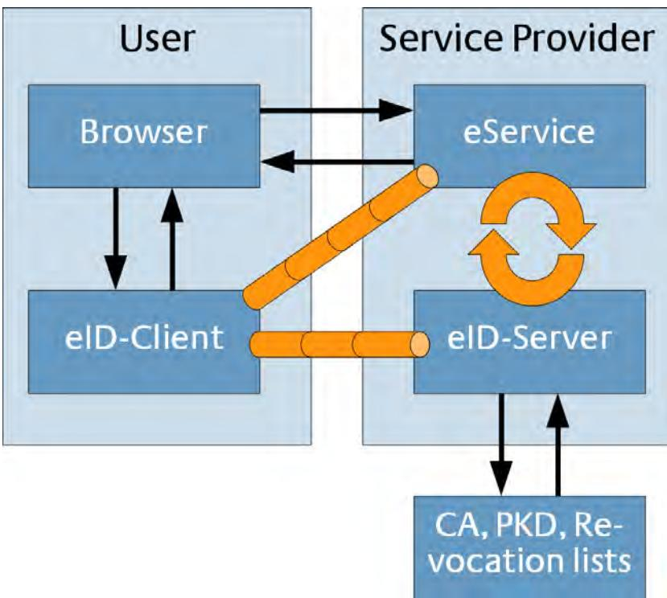

# <span id="page-10-1"></span>2.1.1 eService

The eService implements the application logic of the web application presented in the user's Browser. The application itself offered by the eService is out of scope of this guideline. In this context, it is only important that the eService uses the eID-Server to offer mutual Online-Authentication for its users. This especially means that the eService must implement the protocols specified in [TR-03124] *Part 1, Section 2: Online-Authentication based on EAC2*.

<span id="page-10-4"></span>*Figure 1: Interfaces and surrounding Components*

# <span id="page-10-0"></span>2.1.2 eID-Server

As a hard- and software component, the eID-Server implements the server-side eCard-API-Framework as specified in [TR-03112] and establishes communication to the client-side eCard-API-Framework implementation (eID-Client). See Section [2.3.2](#page-14-1) for the profile of the eCard-API-Framework to be implemented. It also takes over communication for calling terminal authorization certificates, revocation lists and CSCA certificates (see *[Figure 1: Interfaces and surrounding Components](#page-10-4)*) from the Public Key Infrastructure (PKI).

For these purposes the application logic controlling the process flow and all relevant security algorithms and features SHALL be implemented according to this specification. The eID-Server must have access to all counterparts of the interfaces listed in *Section [2.3: Interfaces](#page-13-1)*.

The eID-Server saves and manages authentication certificates on the Service Provider's behalf and MUST protect the Service Provider's terminal authorization certificates from misuse.

The eID-Server MAY be implemented as a logically autonomous server so that several eServices (clients) are able to use it and it MAY also be operated by a third party. The data exchanged between eService and eID-Server is always signed and SHALL be encrypted if it is sent through an open network to secure the processed data's confidentiality, authenticity and integrity.

This technical guideline specifies the eID-Server's external communication with the eService. The eID-Interface's main objective is mutual authentication and preparation of data from the user's eID-Document for the eService.

# <span id="page-11-0"></span>2.2 Communication Model

The Online-Authentication starts from an existing TLS channel named "TLS-1" between the browser of the user and the website of the eService. The Online-Authentication is performed between the eID-Client and the eID-Server of the eService using a second TLS channel "TLS-2".

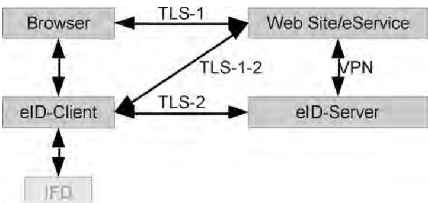

<span id="page-11-1"></span>*Figure 2: Generic Communication Model (eID-Interface)*

In general, TLS-1 and TLS-2 terminate at different domains. An intermediary TLS channel "TLS-1-2" between eID-Client and eService is necessary to allow the binding of TLS-1 and TLS-2. The eService and the eID-Server MUST communicate using an encrypted and integrity-protected mutually authenticated connection, which is described in this guideline (see *Section [2.3.1](#page-13-0)*).

The communication can use a direct connection between eService and eID-Server e.g. over a VPN as shown in *[Figure 2: Generic Communication Model \(eID-Interface\)](#page-11-1)*. This interface is described in *Section [3](#page-18-2) [eID-](#page-18-2)[Interface \(SOAP\)](#page-18-2)*.

Alternatively or additionally a SAML communication relayed by the eID-Client can be used, as shown in *[Figure 3: Communication Model for SAML based Authentication](#page-12-0)* and described in *Section [4](#page-49-1) [SAML-Profile](#page-49-1).*

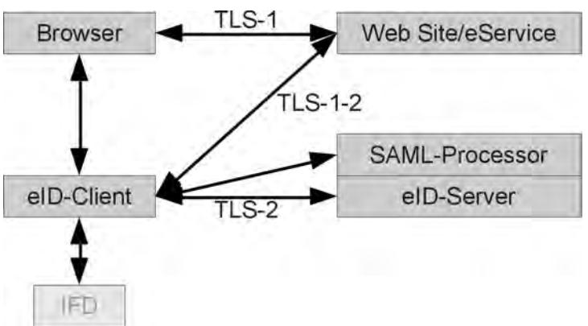

<span id="page-12-0"></span>*Figure 3: Communication Model for SAML based Authentication*

The eService and eID-Server MAY be operated as a single component ("Attached eID-Server") as shown in *[Figure 4: Communication with Attached eID-Server](#page-12-2)*. In this case the intermediary channel TLS-1-2 is not necessary and the requirements according to [TR-03124] *Part 1, Section 2.1 Communication Model* and *2.7 Session Binding* MUST be fulfilled.

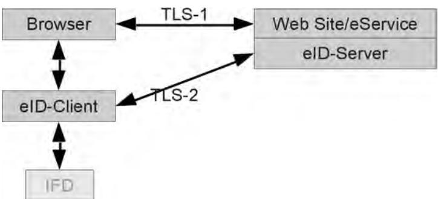

<span id="page-12-2"></span>*Figure 4: Communication with Attached eID-Server*

For Integrated eID-Clients TLS-1 and TLS-1-2 MAY be the same channel, or a single TLS channel can be used in the case of an Integrated eID-Client communicating with an Attached eID-Server as shown in *[Figure](#page-12-1) [5: Integrated eID-Client in the Generic Communication Model and with Attached eID-Server](#page-12-1)*.

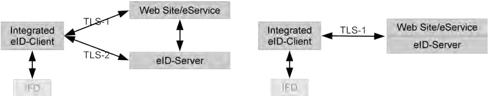

<span id="page-12-1"></span>*Figure 5: Integrated eID-Client in the Generic Communication Model and with Attached eID-Server*

# <span id="page-13-1"></span>2.3 Interfaces

The eID-Server communicates with other entities via several interfaces:

- **•** to the eService, see section [2.3.1](#page-13-0);
- **•** to the eID-Client and eID-Document, see section [2.3.2](#page-14-1);
- **•** to the Public Key Infrastructure (PKI), see section [2.3.3](#page-14-0); and
- **•** OPTIONALLY to the eIDAS Network, see section [2.3.4](#page-15-2).

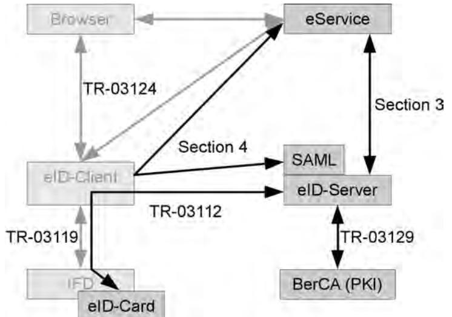

*Figure 6: Overview of the relevant interfaces*

The eID-Server's interfaces are based on web services and can thus generally be addressed through open networks. Additional services of the eID-Server MAY also be provided through additional interfaces. One example is an Administration Interface for the Service Provider which the eID-Server MAY offer.

# <span id="page-13-0"></span>2.3.1 eService Communication

The eService invokes the eID-Server, and the eID-Server in turn returns the read personal data via one of the following interfaces:

- **•** a SOAP based *eID-Interface* as specified in *Section [3](#page-18-2)*; or
- **•** a SAML based interface offered by a *SAML processor* communicating to or being directly attached to the eID-Server as specified in *Section [4](#page-49-1)*. This interface supports identification via other European eID schemes utilizing the eIDAS network in addition to the eID function of the German eID system, see *Section [5](#page-76-1)*.
- **•** an internal interface, if an eID-Server is directly attached to an eService, i.e. the communication between eService and eID-Server is purely internal communication. This interface is out of scope of this specification.

The eService receives or generates a random Pre-Shared Key (PSK) and a unique identifier for the PSK for each Online-Authentication to bind the eCard-API-Framework and eID-Interface communication to the web-session. The PSK must be randomly generated exclusively for each Online-Authentication that the eID-Server performs for the eService. The eService and eID-Server MUST ensure the PSK's confidentiality while transferring it to the eID-Client with the help of the TC Token.

# <span id="page-14-1"></span>2.3.2 Communication to eID-Client and eID-Document

The eID-Server communicates to the eID-Client (see [TR-03124]) via the eCard API as specified in [TR-03112] in order to read the data from the eID Document, that is presented by the user. This communication comprises SOAP/PAOS based command exchange encapsulated in TLS.

The eID-Client responds to the requests it receives via the user's browser and subsequently connects itself to the eID-Server. To do this, the client establishes a connection to the eID-Server's eCard-API-Framework interface which is then used to read out data and perform operations.

Communication is initiated by the eID-Client via negotiating a TLS channel to the eID-Server. For this channel, the eID-Server SHALL support the cipher suite TLS\_RSA\_PSK\_WITH\_AES\_256\_CBC\_SHA (compare section 4.5 of [TR-03124]). Additional TLS\_RSA\_PSK\_\* cipher suites according to [TR-03116], Part 4, MAY be supported. Other cipher suites MUST NOT be supported. The eID-Server SHALL support session resumption.

The eID-Server SHALL implement at least the following commands of the eCard-API [TR-03112] to support Online-Authentication (compare section 3.5 of [TR-03124]):

- **•** As callee:
	- **◦** StartPAOS ([TR-03112], Part 7) (REQUIRED)
- **•** As caller:
	- **◦** DIDAuthenticate ([TR-03112], Part 4) with support for AuthenticationProtocolData of type EAC1InputType, EAC2InputType and EACAdditionalInputType ([TR-03112], Part 7) (REQUIRED)
	- **◦** Transmit ([TR-03112], Part 6) (REQUIRED)

Accepted eID Types SHOULD be indicated in EAC1InputType as described in Amendment *eIDType Signalling for Extended Access Control* to [TR-03112] Part 7 in order to enable improvement of the user experience by the eID-Client. This also comprises supported eID Types, that are implicitly accepted, because they match or surpass the requested level of assurance and are not explicitly denied.

The actual eID Type used in an authentication MUST be derived from the EF.CardSecurity according to Amendment *Protocol extensions and specifications for Smart-eID* to [TR-03110].

# <span id="page-14-0"></span>2.3.3 Public Key Infrastructure

The German eID system utilizes two public key infrastructures (PKIs), one to ensure the authenticity of eID Documents (and the data contained therein), the other to control access to eID Documents.

For document authenticity, the German eID system uses the ICAO PKI for eMRTDs as specified in [ICAO 9303], Part 12. The root of this PKI (*Country Signing Certificate Authority – CSCA*) is operated by the BSI. The procedure to check the validity of an eID Document is described in *Section [2.4](#page-15-1)*.

The access control PKI is specified in Section 2 of [TR-03110], Part 2, and the corresponding Certificate Policy [CP-eID]. This PKI enables the eID Document (and the eID-Client) to check the identity of the eService and provides access control to the data stored on the chip. The root of this PKI (*Country Verifying Certificate Authority – CVCA*) is operated by the BSI. The eID-Server retrieves the necessary terminal authorization certificates on behalf of the eService from a subordinate CA (*Berechtigungs-CA or BerCA*). The eID-Server MUST protect the private keys of these certificates according to the requirements from[CP-eID]. To simplify communication, the BerCA offers all necessary PKI related communication via a common web service based interface specified in [TR-03129].

The eID-Server SHALL implement the following web service methods from Part 1 of [TR-03129], including the corresponding call backs, where applicable:

- **•** RequestCertificate
- **•** GetMasterList
- **•** GetSectorPublicKey
- **•** GetBlackList
- **•** GetDefectList (CONDITIONAL, if Defect Lists are processed by the eID-Server)

# <span id="page-15-2"></span>2.3.4 eIDAS Connector

In order to accept identification via other European eID schemes utilizing the eIDAS network as a relying party, the eID-Server MAY implement an eIDAS Connector as described in the eIDAS Interoperability Framework [eIDAS-Interop]. Over the eIDAS Connector the user's authentication session invoked by the eService via the Extended SAML Profile as described in *Section [5](#page-76-1)* is then forwarded towards the eIDAS Service.

The eIDAS Connector interface SHALL implement SAML communication according to [eIDAS-SAML]. Trust and responsibility within the eIDAS network is ensured by the exchange of signed SAML metadata between eIDAS Connectors and eIDAS Services. The metadata for each Connector is signed with a Metadata-Signer certificate (see [CP-eID]), which is obtained from the BerCA. The signed metadata MUST be made publicly available under a HTTPS URL.

# <span id="page-15-1"></span>2.4 Document Validity Verification

An eID-Document is *valid* if it is checked to be genuine (a real document), authentic and not expired/not revoked. The eID-Server MUST check the validity of the eID-Document by

- **•** performing Chip Authentication,
- **•** performing Passive Authentication,
- **•** checking Black List(s),
- **•** checking validity date,

and additionally

**•** the eID-Server MAY use defect-lists provided.

See also Section 4.7 of [TR-03127].

# <span id="page-15-0"></span>2.4.1 CSCA Certificate Trust Store

In order to perform validity verification of cryptographically secured objects, the eID-Server SHALL maintain a *Trust Store* of trusted CSCA Root certificates.

Upon deployment of the eID-Server software, the Trust Store contains the trusted CSCA Root certificates available at that time. To update the Trust Store after deployment, several mechanisms are available:

**•** Update via CSCA Link certificates. The CSCA issues Link certificates linking a new CSCA Root certificate to the previous one, i.e. if the previous CSCA Root certificate is trusted, the eID-Server can establish trust in the new CSCA Root certificate via validating the CSCA Link certificate. Retrieving CSCA Link certificates is out of scope of this specification.

- **•** Update via Master Lists. The CSCA provides (via the BerCA) a Master List (see [TR-03129]) containing all valid CSCA Root certificates and CSCA Link certificates issued by that CSCA. The eID-Server downloads the Master List on a regular basis, validates the Master List according to section [2.4.3](#page-16-0) and imports any CSCA Root certificates not yet known into the Trust Store.
- **•** Manual configuration. The Trust Store can also be updated via careful manual configuration by the operator.

Compliant eID-Server SHALL support Trust Store update via Master Lists and MAY support Trust Store update via CSCA Link certificates and manual configuration.

The eID-Server MAY remove expired CSCA certificates from the Trust Store.

### <span id="page-16-1"></span>2.4.2 Certificate Revocation Lists

To check the revocation state of CSCA certificates and Signer certificates, the eID-Server SHALL use the Certificate Revocation List provided by the CSCA and check the revocation state in compliance with section 6.2 of [ICAO 9303], Part 12.

It is not necessary to retrieve the CRL during each certificate validation. The CRL MAY be cached by the eID-Server for a defined time, e.g. 24h.

Note: Revoked CSCA certificates are not automatically removed from the Master List, i.e. explicit revocation check of CSCA certificates via the Certificate Revocation List is necessary.

# <span id="page-16-0"></span>2.4.3 Validation of Signed Objects

Document Security Objects, Master Lists and Defect Lists share a common structure, i.e. they are all signed CMS containers. Therefore, the validation procedure for these Signed Objects is the same, as detailed below. To verify the validity of a Signed Object, the following steps MUST be performed:

- **1.** The eID-Server SHALL extract the Signer Certificate (i.e. Document Signer certificate, Master List Signer certificate, or Defect List signer certificate) from the CMS object.
- **2.** The eID-Server SHALL check if the CSCA certificate used to sign the Signer certificate is present in the Trust Store. If not, the validation procedure fails.
- **3.** The eID-Server SHALL perform a path validation of the certificate path CSCA Root certificate → Signer certificate according to Section 6.2 of [ICAO 9303], Part 12. A mapping to the path validation procedure of the Web PKI according to Section 6.1 of [RFC 5280] is given in Appendix D of [ICAO 9303], Part 12.

As part of the path validation the following checks are performed:

- **1.** check if the CSCA certificate is valid, i.e. not expired and not revoked;
- **2.** verify the signature of the Signer certificate;
- **3.** check if the Signer certificate is valid, i.e. not expired and not revoked;

If any of these checks fails, the path validation procedure fails.

**4.** The eID-Server SHALL verify the signature of the Signed Object using the public key from the validated Signer certificate.

# <span id="page-17-2"></span>2.4.4 Black Lists

The revocation state of eID-Documents is communicated via Black Lists according to Appendix B of [TR-03129]. The eID-Server SHALL retrieve a fresh Black List on a regular basis.

# <span id="page-17-1"></span>2.4.5 Defect Lists

The CSCA provides Defect Lists containing information about defect or non-compliant document series, see Appendix A of [TR-03129]. The eID-Server MAY use Defect Lists for further indications of correct processing of eID-Documents.

# <span id="page-17-0"></span>2.4.6 Document Validation Procedure

Validation of an eID-Document is part of the General Authentication Procedure as specified in section 2.3.5 of [TR-03110], Part 2, and comprises Passive Authentication and Chip Authentication. To validate an eID-Document, the eID-Server SHALL perform the following steps as part of the General Authentication Procedure:

- **1.** Perform Passive Authentication, i.e. validate the Document Security Object retrieved from the eID-Document as described in section [2.4.3;](#page-16-0)
- **2.** Perform Chip Authentication;
- **3.** Check if the eID Document is expired;
- **4.** Check the revocation state of the eID Document via the Black List (see section [2.4.4](#page-17-2)).

Depending on the interface being used by the eService to communicate with the eID-Server the eID-Server MUST send an error code according to *Section [3.4.1: Error Codes](#page-40-0)* or show the documents validity status in the element described in *Section [4.4.3](#page-55-0): [DocumentValidityResultType](#page-55-0)*.

# <span id="page-18-2"></span>3 eID-Interface (SOAP)

The eID-Interface is a web service formally described in Web Services Description Language (WSDL). The corresponding WSDL-File is attached to this technical guideline as file TR-03130eID-Server.wsdl. The data types, attributes and elements used by the eID-Interface are described separately as an XML Schema Definition (XSD) in the XSD-File TR-03130eID-Server.xsd. Both files are formally attached to this technical guideline.

The general message flow, functions and data types, as well as the error handling and security measurements are described in the following sections.

# <span id="page-18-1"></span>3.1 General Message Flow

The following sections demonstrate the general message flow as it is intended by the author of this technical guideline. However participants of the eID-Infrastructure may differ from this sequence if (missing) technical dependencies allow them to do so.

# <span id="page-18-0"></span>3.1.1 Initiation

The following *[Figure 7: General message flow during initiation \(SOAP\)](#page-18-3)* shows the steps of the message flow as it is described in [TR-03124] *Part 1, Section 2.1: Communication Model*.

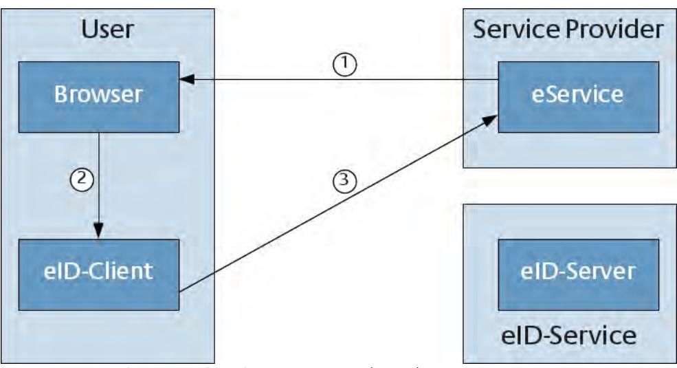

<span id="page-18-3"></span>*Figure 7: General message flow during initiation (SOAP)*

The above steps have to be completed for the initiation of the Online-Authentication and are part of the Service Provider's scope of responsibilities. Each step is described in the following.

#### **1. Generate link to tcTokenURL**

The eService SHALL generate a link for the user's eID-Client containing the URL where the TC Token may be received according to [TR-03124] *Part 1, Section 2.2: Client-Interface*.

### **2. Forward tcTokenURL to eID-Client**

The user actively decides to use the eID-Function for Online-Authentication by clicking on the formerly generated link and thus forwarding the tcTokenURL to his local instance of the eID-Client.

#### **3. Call tcTokenURL**

The eID-Client calls the tcTokenURL at the eService.

# <span id="page-19-0"></span>3.1.2 Interaction

The following *[Figure 8: General message flow during interaction \(SOAP\)](#page-19-1)* shows the steps of the message flow at the eID-Interface that SHALL be implemented by the eService and the eID-Server and the context of the steps described in [TR-03124] *Part 1, Section 2.5: Online-Authentication*. In this description "Step 5. Call RefreshAddress" is used to trigger the call of the getResult function at the eID-Interface. The eService MAY as well use other appropriate events as a trigger.

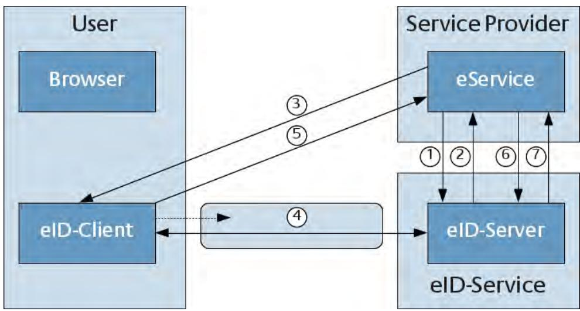

<span id="page-19-1"></span>*Figure 8: General message flow during interaction (SOAP)*

The above steps have to be completed for the Online-Authentication and are part of the Service Provider's and the eID-Service's scope of responsibilities. Each step is described in the following.

#### **1. eID-Interface: useID Request**

The eService calls the function useID (see *Section [3.2.1.1: Request](#page-21-1)*) at the eID-Interface of the eID-Server to request a valid session.

#### **2. eID-Interface: useID Response**

The eID-Server responds to the call of the function useID (see *Section [3.2.1.2: Response](#page-22-0)*) and opens a new session if the request was legitimate.

#### **3. Transmit TC Token**

The eService answers the former request of the eID-Client by sending the TC Token including the necessary connection parameters for the eID-Client in accordance to [TR-03124] *Part 1, Section 2.5.1: Retrieval of TC Token*.

#### **4. Establish secure authentication channel**

The eID-Client establishes a secure channel to the eID-Server as described in [TR-03124] *Part 1, Section 2.5.2: Connection Establishment*.

#### **5. Call RefreshAddress**

After the eCard-API-Framework specific communication between the eID-Client and the eID-Server has been finished the eID-Client re-connects to the RefreshAddress.

#### **6. eID-Interface: getResult Request**

The eService calls the function getResult (see *Section [3.2.2.1: Request](#page-24-1)*) at the eID-Interface of the eID-Server to request the Online-Authentication's result.

#### **7. eID-Interface: getResult Response**

The eID-Server responds to the call of the function getResult (see *Section [3.2.2.2: Response](#page-25-0)*) by sending the results of the Online-Authentication to the eService.

# <span id="page-20-1"></span>3.1.3 Completion

The following *[Figure 9: General message flow during completion \(SOAP\)](#page-20-2)* shows the steps of the message flow at the eID-Interface's functions and the context of the steps described in [TR-03124] *Part 1, Section 2.5.4 Return to the caller*.

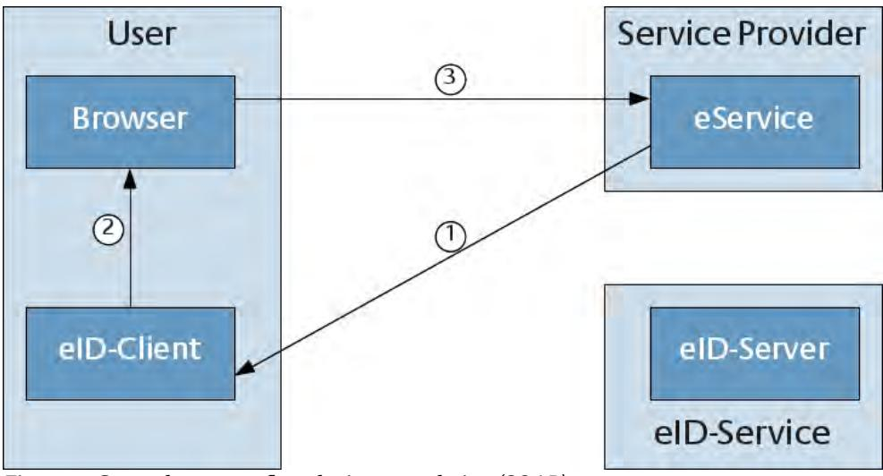

<span id="page-20-2"></span>*Figure 9: General message flow during completion (SOAP)*

The above steps have to be completed for the completion of the Online-Authentication and are part of the Service Provider's scope of responsibilities. Each step is described in the following.

#### **1. Response from eService**

The eService answers the re-connect of the eID-Client.

#### **2. Forward Browser to RefreshAddress**

The eID-Client forwards the verified RefreshAddress to the Browser.

#### **3. Surf to RefreshAddress**

The Browser calls the RefreshAddress at the eService.

# <span id="page-20-0"></span>3.2 Functions

In the following section all functions of the eID-Interface the eID-Server SHALL offer are described. Technically this web service is described in the corresponding WSDL-File.

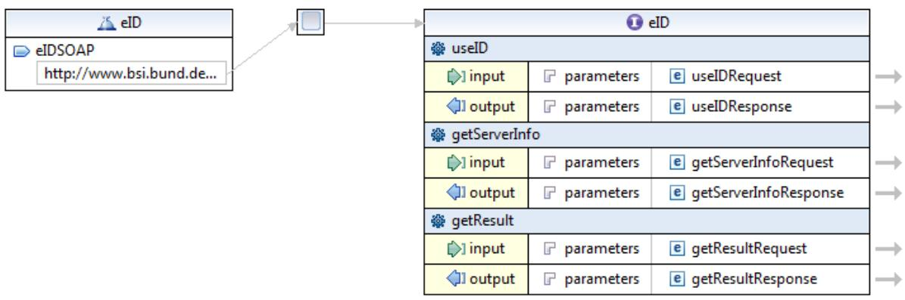

#### <span id="page-21-3"></span>*Figure 10: Webservice overview*

#### <span id="page-21-0"></span>3.2.1 useID

The function useID MUST be used by the eService to initialize a new Online-Authentication.

#### <span id="page-21-1"></span>3.2.1.1 Request

| e use DRequest | [@ use]DRequestType |                             |        |                                                                           |
|----------------|---------------------|-----------------------------|--------|---------------------------------------------------------------------------|
|                |                     | e UseOperations             |        | OperationsRequestorType                                                   |
|                |                     | e   AgeVerificationRequest  |        | [0.1] AgeVerificationRequestType                                          |
| nad            |                     | e PlaceVerificationRequest  |        | [0.1] PlaceVerificationRequestType                                        |
|                |                     | TransactionInfo<br>e        | [0  1] | string                                                                    |
|                |                     |                             |        | [e] TransactionAttestationRequest [0.1] TransactionAttestationRequestType |
|                |                     | e   LevelOfAssuranceRequest |        | [0  1] LevelOfAssuranceType                                               |
|                |                     | e EIDTypeRequest            |        | [0.1] EIDTypeRequestType                                                  |
|                |                     | e PSK                       |        | [01] PreSharedKeyType                                                     |

#### <span id="page-21-2"></span>*Figure 11: Function useID Request*

The eService MUST use the call of the function useID to select operations the eID-Server SHALL perform with the user's eID-Document. The operations consist of reading out selected data groups and performing age or place verification. If age or place verification is selected the eService MUST transmit additional parameters. Additonally a transaction attestation or a minimum level of assurance, that is expect for the authentication can be requested. Instead or in combination with requesting a minimum level of assurance or certain eID types can be included or excluded for the authentication. The useID function SHALL only be called once during each session. Independently from the selected operations the eID-Server MUST perform a validity check of the eID-Document. The parameters of the function are shown in *[Figure 11: Function](#page-21-2)  [useID Request](#page-21-2)* and *[Table 1: Function useID Parameters](#page-22-1)*.

| Parameter     | Description                                          |
|---------------|------------------------------------------------------|
| UseOperations | This parameter is used by the eService to define the |

| Parameter                     | Description                                                                                                                                                                                                                                                                                                                                                                |
|-------------------------------|----------------------------------------------------------------------------------------------------------------------------------------------------------------------------------------------------------------------------------------------------------------------------------------------------------------------------------------------------------------------------|
|                               | data groups and functions the eID-Server SHALL try<br>to read from the eID-Document                                                                                                                                                                                                                                                                                        |
| AgeVerificationRequest        | When an age verification request is executed, this<br>parameter gives the year of life (Age) the eID<br>Document's owner is supposed to have completed.<br>This parameter must be present when<br>AgeVerification is requested in the<br>UseOperations parameter. If requested by the<br>eService, the eID-Server MUST use this parameter<br>and perform age verification. |
| PlaceVerificationRequest      | When a place verification request is executed, this<br>parameter gives the CommunityID to be verified.<br>This parameter must be present when the<br>PlaceVerification is requested in the<br>UseOperations parameter. The eID-Server MUST<br>use this parameter to perform place verification.                                                                            |
| TransactionInfo               | This parameter MAY be used, to transmit additional<br>transaction information, which MUST be added to<br>EAC1InputType and is shown to the user (cf. [TR<br>03112] Part 7 section 3.6.4.1).                                                                                                                                                                                |
| TransactionAttestationRequest | This parameter MAY be used, when additional<br>transaction information is needed. It submits<br>context information and requests an attestation<br>result, whose format is defined by the submitted<br>URI.                                                                                                                                                                |
| LevelOfAssuranceRequest       | This parameter MAY be used to indicate the needed<br>level of assurance, IF supported by the eID-Server.                                                                                                                                                                                                                                                                   |
| EIDTypeRequest                | This parameter MAY be used to explicitly allow or<br>deny certain eID types supported by the eID-Server.                                                                                                                                                                                                                                                                   |
| PSK                           | IF the eID-Server supports this feature the eService<br>MAY use this element for the initial transmission of<br>the Pre-Shared Key (PSK) and the eID-Server MUST<br>then use the same PSK in the useIDResponse.<br>This represents a simplification in some scenarios.                                                                                                     |

<span id="page-22-1"></span>Table 1: Function useID Parameters

#### <span id="page-22-0"></span>3.2.1.2 Response

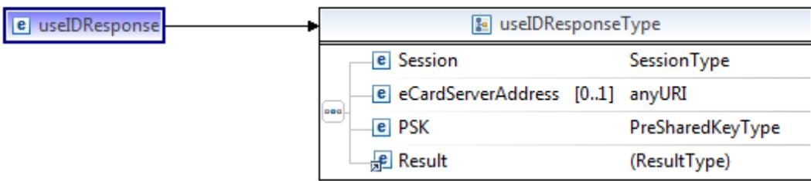

#### <span id="page-23-0"></span>*Figure 12: Function useID Response*

The response to the function useID shows the eService if the eID-Server was able to open a session for the requested Online-Authentication. The return values of the function are shown in *[Figure 12: Function useID](#page-23-0)  [Response](#page-23-0)* and *[Table 2: Function useID Return Values](#page-24-2)*.

The eID-Interface allows a maximum number of simultaneously active sessions for each eService. It is advisable to set an appropriate value for that maximum so that heavy loading of individual eServices does not lead to restricted availability of other eServices. If the maximum number of simultaneous sessions for one eService is exceeded, the eID-Server MUST send an error message in the Result element with the ResultMinor URI .../useID#tooManyOpenSessions (see *Section [3.4.1: Error Codes](#page-40-0)*).

| Return Value       | Description                                                                                                                                                                                                                                                                                                                                                                                                                                                                                                                   |
|--------------------|-------------------------------------------------------------------------------------------------------------------------------------------------------------------------------------------------------------------------------------------------------------------------------------------------------------------------------------------------------------------------------------------------------------------------------------------------------------------------------------------------------------------------------|
| Session            | The Session ID connects the useID function call<br>with the getResult function call and MUST be<br>present in this message. It MUST be uniquely<br>generated by the eID-Service for each specific<br>Online-Authentication.                                                                                                                                                                                                                                                                                                   |
| eCardServerAddress | With this element the eID-Server MAY inform the<br>eService about the target address under which the<br>eID-Server's eCard-API-Framework component<br>SHOULD be contacted if the address isn't static. The<br>eService MUST place exactly this target address<br>inside the element ServerAddress in the TC<br>Token. Therefore only URIs conforming [RFC2818]<br>Section 2.4: URI Format SHALL be transmitted.                                                                                                               |
| PSK                | The PSK is the initial key for the encrypted channel<br>between the eID-Client and the eID-Server as shown<br>in Figure 10: Webservice overview. The eService<br>MUST use exactly this PSK for the TC Token. If a<br>PSK has already been transmitted to the eID-Server<br>during the eService's call to the function useID, the<br>same PSK MUST be part of the eID-Server's<br>response. If the PSK sent in this message differs from<br>the PSK sent in the request the eService SHALL<br>abort the Online-Authentication. |
| Result             | MUST show whether it was possible to process the<br>request or an error occurred.                                                                                                                                                                                                                                                                                                                                                                                                                                             |

<span id="page-24-2"></span>Table 2: Function useID Return Values

### <span id="page-24-0"></span>3.2.2 getResult

The function getResult MUST be used by the eService to request a result for an earlier call of the function useID.

#### <span id="page-24-1"></span>3.2.2.1 Request

| e getResultRequest |       | [80] getResultRequestType |              |
|--------------------|-------|---------------------------|--------------|
|                    | 0-0-0 | - Session                 | Session Type |
|                    |       | e RequestCounter          | int          |

#### <span id="page-24-4"></span>*Figure 13: Function getResult Request*

A request's result is retrieved via the getResult function. The parameters of the function are shown in *[Figure 13: Function getResult Request](#page-24-4)* and *[Table 3: Function getResult Parameters](#page-24-3)*.

The getResult function MAY potentially be called multiple times within one Online-Authentication. The eService MUST call the function within an Online-Authentication until it no longer gets the .../getResult#noResultYet error. If the request of the function getResult is answered with a message not containing .../getResult#noResultYet error the session SHALL no longer be used by the eService. The session SHOULD also expire if the time between the call of the function useID and the call of the function getResult exceeds a time limit defined by the eID-Server depending on it's operational requirements.

| Parameter      | Description                                                                                                                                                                                                                                                                           |
|----------------|---------------------------------------------------------------------------------------------------------------------------------------------------------------------------------------------------------------------------------------------------------------------------------------|
| Session        | MUST provide the Session ID of the Online<br>Authentication for this function call.                                                                                                                                                                                                   |
| RequestCounter | A counter that MUST make function calls within an<br>Online-Authentication uniquely identifiable. This<br>value MUST be incremented by 1 for each<br>getResult function call within an Online<br>Authentication. This procedure prevents replay<br>attacks on the getResult function. |

<span id="page-24-3"></span>Table 3: Function getResult Parameters

### <span id="page-25-0"></span>3.2.2.2 Response

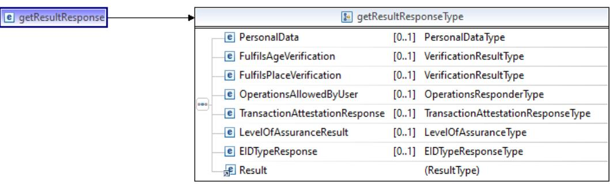

#### <span id="page-25-1"></span>*Figure 14: Function getResult Response*

The response of the function getResult gives the eService the result of the requested Online-Authentication, if the result is present at the eID-Server. After the function has been executed without error, the session becomes invalid and the server MUST delete the queried data. If the call of the function getResult is answered by the eID-Server with a message other than containing the noResultYet error the session (ID) MUST be invalidated and SHALL no longer be accepted by the eID-Server. The session SHOULD also expire if the time between the call of the function useID and the call of the function getResult exceeds a time limit defined by the eID-Server depending on the operational requirements.

The return values of the function are shown in *[Figure 14: Function getResult Response](#page-25-1)* and *[Table 4: Function](#page-26-1)  [getResult Return Values](#page-26-1)*.

| Return Value             | Description                                                                                                                                                                                                                                                                                                                                                |
|--------------------------|------------------------------------------------------------------------------------------------------------------------------------------------------------------------------------------------------------------------------------------------------------------------------------------------------------------------------------------------------------|
| PersonalData             | MUST contain the data groups read from the eID<br>Document by the eID-Server, if the Online<br>Authentication was successfully processed.                                                                                                                                                                                                                  |
| FulfilsAgeVerification   | If age verification was performed the eID-Server<br>MUST include the element FulfilsAge<br>Verification in the response of the function<br>getResult. The value of the element SHALL be<br>true if the eID-Document's owner has attained the<br>requested age and SHALL be false if the eID<br>Document's owner has not yet attained the<br>requested age. |
| FulfilsPlaceVerification | The place verification's result MUST be contained in<br>this return value, if place verification was activated<br>in the UseOperations parameter and the<br>function call was successful.                                                                                                                                                                  |
| OperationsAllowedByUser  | Defines the data groups and functions that could<br>effectively be read from the eID-Document after the<br>terminal authorization certificate and the user's<br>selection have been applied. The element MUST be<br>present, if the Online-Authentication was<br>successfully processed by the eID-Server.                                                 |

| Return Value                   | Description                                                                                                                                                                                     |
|--------------------------------|-------------------------------------------------------------------------------------------------------------------------------------------------------------------------------------------------|
| TransactionAttestationResponse | This element MUST be present, if transaction<br>attestation was requested and the Online<br>Authentication was successfully processed by the<br>eID-Server.                                     |
| LevelOfAssuranceResult         | This element MUST be present, if the required level<br>of assurance was requested. It transmits the actual<br>LoA for the given authentication process.                                         |
| EIDTypeResponse                | This element MUST be present, if eID types were<br>allowed or denied in UseID. It transmits the eID<br>Type actually used for the authentication.                                               |
| Result                         | MUST show whether it was possible to process the<br>request or an error has occurred.<br>In particular, the error<br>/getResult#noResultYet<br>may occur here (see Section 3.4.1: Error Codes). |

<span id="page-26-1"></span>Table 4: Function getResult Return Values

# <span id="page-26-0"></span>3.2.3 getServerInfo

The function getServerInfo MUST offer information about the eID-Server to the eService. The eService MAY check the eID-Server's configuration with the help of this

#### 3.2.3.1 Request

The function's parameter is an element of type nullType. This type contains no information at all and serves only to enable the function to be called correctly. It may be called by the eService at anytime and is therefore not included in the overview of the general message flow in *Section [3.1](#page-18-1): [General Message Flow](#page-18-1)*.

#### 3.2.3.2 Response

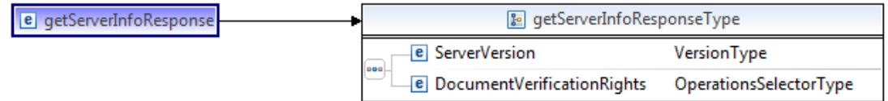

#### <span id="page-26-2"></span>*Figure 15: Function getServerInfo Response*

The return values of the function are shown in *[Figure 15: Function getServerInfo Response](#page-26-2)* and *[Table 5:](#page-27-3)  [Function getServerInfo Return Values](#page-27-3)*.

| Return Values              | Description                                                                        |
|----------------------------|------------------------------------------------------------------------------------|
| ServerVersion              | MUST show the version of the eID-Interface the<br>eID-Server currently implements. |
| DocumentVerificationRights | MUST show the operations the eService MAY use                                      |

| Return Values | Description                                                          |
|---------------|----------------------------------------------------------------------|
|               | with the currently configured terminal<br>authorization certificate. |

<span id="page-27-3"></span>Table 5: Function getServerInfo Return Values

# <span id="page-27-2"></span>3.3 Data types

The data types used at the eID-Interface are described in this section. The data types involve mostly complex data types defined in the XML Schema Definition (XSD). The corresponding XSD-File TR-03130eID-Server.xsd is attached to this guideline.

# <span id="page-27-1"></span>3.3.1 SessionType

|        | Session Type  | = (IDType) |
|--------|---------------|------------|
| ប្រយៈព | e ID (IDType) |            |

#### *Figure 16: Data type SessionType*

The type SessionType SHALL be used to uniquely identify a request to the eID-Interface. The eID-Server MUST generate values for the ID element to identify different requests for Online-Authentication. The value of the element ID MUST be random and at least 32 characters long in hexadecimal representation so that it's not easy to guess. The software component generating the random numbers used as IDs SHALL fulfill the requirements described in [TR-03116-4] *Section 6.2: Zufallszahlen* and the eID-Service MUST ensure that no active sessions using identical IDs exist in the same context.

The eService SHALL only use valid session IDs for calls of the function getResult.

# <span id="page-27-0"></span>3.3.2 RestrictedIDType

|       |      | RestrictedIDType      |
|-------|------|-----------------------|
| 0-0-0 | e ID | hexBinary             |
|       |      | e ID2 [0.1] hexBinary |

#### *Figure 17: Data type RestrictedIDType*

The data type RestrictedIDType MUST contain a (from the Service Provider's perspective) card-specific attribute as specified in [TR-03110] *Part 2 Section 3.6: Restricted Identification*. The ID is unique for each

eService's user and MAY thus be used by the eService to recognize an existing user. If the eService's terminal authorization certificate contains a second terminal sector, a second ID is generated on the eID-Document's chip and SHALL be contained in the element ID2.

# <span id="page-28-1"></span>3.3.3 PersonalDataType

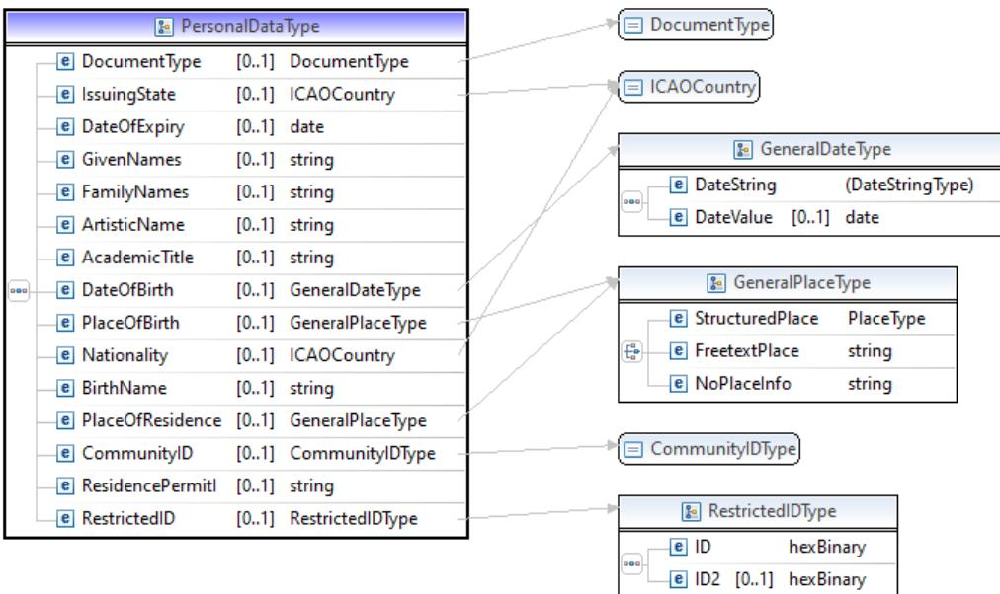

#### *Figure 18: Data type PersonalDataType*

The data type PersonalDataType describes the data that can be read from the eID-Document using the eID-Function. The data type's elements correspond to the eID-Function's data groups specified in [TR-03110] *Part 4 Section 2.2.3: Data Groups and Generic Attributes*. The data types DocumentType and ICAOCountry are derived from the simple type string and restrict the allowed characters as specified in [TR-03110] *Part 4*. The data types GeneralDateType and GeneralPlaceType are also basically XML translations of the data groups Date and GeneralPlace specified in [TR-03110] *Part 4*. The data type CommunityIDType is derived from the simple type string and restricted to the possible values as described for the Wohnort-ID in [TR-03127]. It contains at least a leading zero and three decimal numbers representing the country according to ISO 3166-1 numeric.

# <span id="page-28-0"></span>3.3.4 GeneralPlaceType

|       | GeneralPlaceType  |           |       |           | PlaceType |              |
|-------|-------------------|-----------|-------|-----------|-----------|--------------|
|       | e StructuredPlace | PlaceType |       | e Street  |           | [0  ] string |
| ್ಕೆ ಒ | E FreetextPlace   | string    |       | City      |           | string       |
|       | e NoPlaceInfo     | string    | සන්‍ය | e State   | [0  1]    | string       |
|       |                   |           |       | e Country |           | ICAOCountry  |

*Figure 19: Data type GeneralPlaceType*

The data type GeneralPlaceType corresponds to the eID Application's GeneralPlace data group specified in [TR-03110] *Part 4 Section 2.2.3: Data Groups and Generic Attributes* . This data type describes various formats in which the user's addresses MAY exist. Especially the element StructuredPlace of the data type PlaceType (see *Section [3.3.5: PlaceType](#page-29-0)*) is common in this context.

### <span id="page-29-0"></span>3.3.5 PlaceType

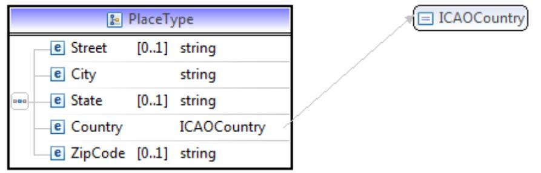

#### *Figure 20: Data type PlaceType*

The data type PlaceType corresponds to the eID Application's Place data group specified in [TR-03110] *Part 4 Section 2.2.3: Data Groups and Generic Attributes* . This data type is a structured representation of a person's residence.

# <span id="page-30-0"></span>3.3.6 OperationsSelectorType

|     | OperationsSelectorType |                         |
|-----|------------------------|-------------------------|
|     | e Document Type        | AttributeSelectionType  |
|     | IssuingState<br>e      | AttributeSelectionType  |
|     | DateOfExpiry<br>e      | AttributeSelectionType  |
|     | GivenNames<br>e        | AttributeSelectionType  |
|     | FamilyNames<br>e       | AttributeSelectionType  |
|     | Artistic Name<br>e     | AttributeSelectionType  |
| uaa | Academic Title<br>e    | AttributeSelection lype |
|     | DateOfBirth<br>e       | AttributeSelectionType  |
|     | PlaceOfBirth<br>e      | AttributeSelectionType  |
|     | Nationality<br>e       | AttributeSelectionType  |
|     | Birth Name<br>e        | AttributeSelectionType  |
|     | PlaceOfResidence<br>e  | AttributeSelectionType  |
|     | CommunityID<br>e       | AttributeSelectionType  |
|     | ResidencePermitl<br>e  | AttributeSelectionType  |
|     | Restricted D<br>e      | AttributeSelectionType  |
|     | AgeVerification<br>e   | AttributeSelectionType  |
|     | PlaceVerification<br>e | AttributeSelectionType  |

*Figure 21: Data type OperationsSelectorType*

The data type OperationsSelectorType represents the possible operations offered by the eID-Function taking in to account the rights encoded in the configured terminal authorization certificate. Therefore it uses several elements of the data type AttributeSelectionType (see *Section [3.3.20:](#page-38-2) [AttributeSelectionType](#page-38-2)*). The default value for all elements in this data type is PROHIBITED so only differing values have to be set explicitly. The names of the elements correspond to the eID Application's data groups specified in [TR-03110] *Part 4 Section 2.2.3: Data Groups and Generic Attributes*.

# <span id="page-31-0"></span>3.3.7 OperationsRequestorType

|     | & OperationsRequestorType |                       |
|-----|---------------------------|-----------------------|
|     | e Document Type           | AttributeRequestType  |
|     | e<br>IssuingState         | AttributeRequestType  |
|     | DateOfExpiry<br>e         | AttributeRequestType  |
|     | GivenNames<br>e           | AttributeRequestType  |
|     | FamilyNames<br>e          | AttributeRequestType  |
|     | e<br>Artistic Name        | AttributeRequestType  |
|     | Academic Title<br>e       | AttributeRequestType  |
|     | DateOfBirth<br>e          | AttributeRequestType  |
| uau | PlaceOfBirth<br>e         | AttributeRequest lype |
|     | Nationality<br>e          | AttributeRequestType  |
|     | Birth Name<br>e           | AttributeRequestType  |
|     | PlaceOfResidence<br>e     | AttributeRequestType  |
|     | Community ID<br>e         | AttributeRequestType  |
|     | ResidencePermitl<br>e     | AttributeRequestType  |
|     | Restricted D<br>e         | AttributeRequestType  |
|     | AgeVerification<br>e      | AttributeRequestType  |
|     | e PlaceVerification       | AttributeRequestType  |

*Figure 22: Data type OperationsRequestorType*

The data type OperationsRequestorType allows the selection of operations offered by the eID-Function. Therefore it uses several elements of the data type AttributeRequestType (see *Section [3.3.21](#page-38-1): [AttributeRequestType](#page-38-1)*).The default value for all elements in this data type is PROHIBITED so only differing values have to be set explicitly. The names of the elements correspond to the eID Application's data groups specified in [TR-03110] *Part 4 Section 2.2.3: Data Groups and Generic Attributes*.

# <span id="page-32-1"></span>3.3.8 OperationsResponderType

|     | & OperationsResponderType |                       |
|-----|---------------------------|-----------------------|
|     | e Document Type           | AttributeResponseType |
|     | IssuingState<br>e         | AttributeResponseType |
|     | DateOfExpiry<br>e         | AttributeResponseType |
|     | GivenNames<br>e           | AttributeResponseType |
|     | FamilyNames<br>e          | AttributeResponseType |
|     | Artistic Name<br>e        | AttributeResponseType |
|     | Academic Title<br>e       | AttributeResponseType |
|     | DateOfBirth<br>e          | AttributeResponseType |
| uaa | PlaceOfBirth<br>e         | AttributeResponseType |
|     | Nationality<br>e          | AttributeResponseType |
|     | Birth Name<br>e           | AttributeResponseType |
|     | PlaceOfResidence<br>e     | AttributeResponseType |
|     | Community ID<br>e         | AttributeResponseType |
|     | ResidencePermitl<br>e     | AttributeResponselype |
|     | Restricted D<br>e         | AttributeResponseType |
|     | AgeVerification<br>e      | AttributeResponseType |
|     | PlaceVerification<br>e    | AttributeResponseType |

#### *Figure 23: Data type OperationsResponderType*

The data type OperationsResponderType represents the selected operations performed by the eID-Function based on the configured terminal authorization certificate and the potential further restriction by the user. Therefore it uses several elements of the data type AttributeResponseType (see *Section [3.3.22:](#page-38-0) [AttributeResponseType](#page-38-0)*).The default value for all elements in this data type is PROHIBITED so only differing values have to be set explicitly. The names of the elements correspond to the eID Application's data groups specified in [TR-03110] *Part 4 Section 2.2.3: Data Groups and Generic Attributes*.

### <span id="page-32-0"></span>3.3.9 AgeVerificationRequestType

|  | & AgeVerificationRequestType | -> (AgeType) |
|--|------------------------------|--------------|
|  | Boa e Age (AgeType)          |              |

#### *Figure 24: Data type AgeVerificationRequestType*

The data type AgeVerificationRequestType represents the parameter for age verification, which MAY be requested using the function useID. The Age element MUST contain the year of life that the eID-Document's owner is supposed to have attained.

## <span id="page-33-1"></span>3.3.10 PlaceVerificationRequestType

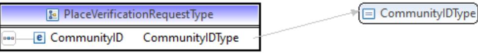

#### *Figure 25: Data type PlaceVerificationRequestType*

The data type PlaceVerificationRequestType contains the parameter for place verification, which MAY be requested using the function useID. The element CommunityID corresponds to the Wohnort-ID described in [TR-03127] and is compared with the CommunityID stored on the eID-Document's chip.

### <span id="page-33-0"></span>3.3.11 TransactionAttestationRequestType

| & TransactionAttestationRequestType |                                 |        |  |  |
|-------------------------------------|---------------------------------|--------|--|--|
|                                     | e  TransactionAttestationFormat | anyURI |  |  |
| 000                                 | e TransactionContext            | strına |  |  |

#### *Figure 26: Data type TransactionAttestationRequestType*

The data type TransactionAttestationRequestType is used to request an additional transaction attestation. The element TransactionAttestationFormat identifies the expected format for the transaction attestation by naming the corresponding URI. The URIs and formats of the attestation message are not defined within this document, different formats may be supported depending on the use case. The element TransactionContext MAY be used to transmit context information like an ID or a hash.

# <span id="page-34-1"></span>3.3.12 LevelOfAssuranceType

The data type LevelOfAssuranceType is used for transmitting the Level of Assurance and is based on the data type anyURI restricted to the following allowed values representing the corresponding LoA.

- [http://bsi.bund.de/eID/LoA/u](http://bsi.bund.de/eID/LoA/normal)ndefined
- <http://bsi.bund.de/eID/LoA/normal>
- [http://bsi.bund.de/eID/LoA/s](http://bsi.bund.de/eID/LoA/normal)ubstantiell
- <http://bsi.bund.de/eID/LoA/hoch>
- http://eidas.europa.eu/LoA/low
- http://eidas.europa.eu/LoA/substantial
- http://eidas.europa.eu/LoA/high

When used in a national context only the values from the authority bsi.bund.de SHALL be used, which correspond to the levels[2](#page-34-2) as defined in [TR-03107-1]. The value

["http://bsi.bund.de/eID/LoA/](http://bsi.bund.de/eID/LoA/normal)undefined" SHALL be used, to indicate an undefined level of assurance.

When used in the context of eIDAS with the eSAML profile (see *Section [5](#page-76-1) [eIDAS-Extension and eSAML](#page-76-1)  [Profile\)](#page-76-1)* only the values from the authority eidas.europa.eu according to [eIDAS-SAML] SHALL be used.

IF a minimum level of assurance is requested by the eService (i.e. the element

LevelOfAssuranceRequest is not empty in UseID), the eID-Server MUST NOT accept an authentication by an eID Type with a lower or undefined level of assurance, unless the eService explicitly allowed that eID Type by the means of EIDTypeRequest. An eID Type matching or surpassing the requested minimum level of assurance SHALL be accepted, unless the eService explicitly denied that eID Type by the means of EIDTypeRequest. Supported and accepted eID Types SHOULD be indicated in the EAC1InputType message of DIDAuthenticate as described in Amendment *eIDType Signalling for Extended Access Control* to [TR-03112] Part 7*.*

# <span id="page-34-0"></span>3.3.13 EIDTypeRequestType

The data type EIDTypeRequestType is used for allowing or denying the use of certain eID Types, when using the function useID. It uses elements of the data type EIDTypeSelectionType (see section [3.3.23:](#page-39-1) [EIDTypeSelectionType\)](#page-39-1) to declare which eID Types should be either allowed or denied. The names of the elements correspond to the different eID types defined in Amendment *Protocol extensions and specifications for Smart-eID* to [TR-03110].

<span id="page-34-2"></span><sup>2</sup> Please note the spelling of "substantiell" in the URI.

| [8] EIDTypeRequestType |               |  |                                          |  |
|------------------------|---------------|--|------------------------------------------|--|
|                        |               |  | CardCertified [0.1] EIDTypeSelectionType |  |
|                        | e SECertified |  | [01] EIDTypeSelectionType                |  |
|                        |               |  | [e] SEEndorsed [01] EIDTypeSelectionType |  |
|                        |               |  | e HWKeyStore [0.1] EIDTypeSelectionType  |  |

#### *Figure 27: Data type EIDTypeRequestType*

This functionality can be used additionally or independently of requesting a level of assurance (cf. Section [3.3.12:](#page-34-1) [LevelOfAssuranceType\)](#page-34-1).

## <span id="page-35-1"></span>3.3.14 VersionType

|  | & VersionType   |        |     |
|--|-----------------|--------|-----|
|  | e VersionString | string |     |
|  | Major<br>e      | Int    |     |
|  | Minor<br>e      |        | int |
|  | e Bugfix        | [0  1] | int |

#### *Figure 28: Data type VersionType*

The data type VersionType describes the version of the eID-Interface. It contains a readable textual description in the VersionString element. The format of the text string is not predefined, but it SHOULD correspond to the content of the elements Major, Minor and Bugfix as well as it SHOULD contain a release date (see *Section [3.6.3](#page-47-0): [Call of Function getServerInfo](#page-47-0)* for an example). The Major element MUST identify the main version and the Minor element SHALL be used for the sub-versions. An optional Bugfix identifier MAY also be transmitted here. This identifies specification corrections that have already been implemented on the eID-Server. Changes of the Major and Minor version are usually not backwards compatible.

# <span id="page-35-0"></span>3.3.15 VerificationResultType

| & VerificationResultType |                  |         |
|--------------------------|------------------|---------|
| 088                      | e FulfilsRequest | boolean |

*Figure 29: Data type VerificationResultType*

The data type VerificationResultType represents the result of a verification performed on the eID-Document. The element FulfilsRequest indicates whether or not the request ended with a positive result.

# <span id="page-36-0"></span>3.3.16 TransactionAttestationResponseType

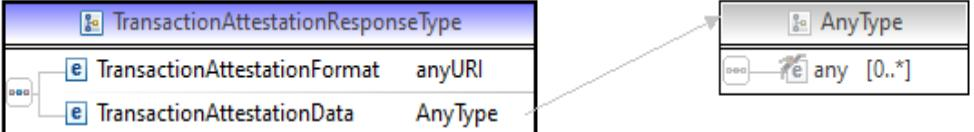

#### *Figure 30: Data type TransactionAttestationResponseType*

The data type TransactionAttestationResponseType transmits the transaction attestation with content and format according to the URI named in TransactionAttestationFormat.

# <span id="page-36-1"></span>3.3.17 EIDTypeResponseType

The data type EIDTypeResponseType is used to transmit the eID Type used for the authentication in getResultResponse, IF the element EIDTypeRequest was present and not empty in useID. It uses elements of the data type EIDTypeUsedType (see section [3.3.24: EIDTypeUsedType](#page-39-0)) to declare which eID Type has been used for the authentication. The names of the elements correspond to the different eID types defined in Amendment *Protocol extensions and specifications for Smart-eID* to [TR-03110].

|   | EIDTypeResponseType |                 |  |  |
|---|---------------------|-----------------|--|--|
|   | e Card Certified    | EIDTypeUsedType |  |  |
| ಿ | e SECertified       | EIDTypeUsedType |  |  |
|   | e SEEndorsed        | EIDTypeUsedType |  |  |
|   | e   HWKeyStore      | EIDTypeUsedType |  |  |

*Figure 31: Data type EIDTypeResponseType*

# <span id="page-37-0"></span>3.3.18 PreSharedKeyType

|     | 8 PreSharedKeyType |                 |  | 国 (IDType)  |
|-----|--------------------|-----------------|--|-------------|
|     | e ID               | (IDType)        |  |             |
| nau |                    | e Key (KeyType) |  | * (KeyType) |

#### *Figure 32: Data type PreSharedKeyType*

The data type PreSharedKeyType contains the randomly generated Pre-Shared Key (PSK) itself in the element Key and a unique identifier in the element ID. The PSK is required to initialize the communication as specified in [TR-03112] *Part 7, Section 2.4.1.2: TLS with pre-shared keys*. The identifier SHALL be used as psk\_identity for the communication mentioned above and MUST therefore be encoded to the element SessionIdentifier in the TC Token.

# <span id="page-38-3"></span>3.3.19 GeneralDateType

| ಿ GeneralDateType       |  |                  | 글 (DateStringType) |  |
|-------------------------|--|------------------|--------------------|--|
| e DateString            |  | (DateStringType) |                    |  |
| - e DateValue [01] date |  |                  |                    |  |

*Figure 33: Data type GeneralDateType*

The data type GeneralDateType MUST contain the date representation read directly from the chip in the DateString element. An 8-place string SHALL be used here that MUST contain spaces as well as numerical values (0-9). It's transmitted in the yyyymmdd format (4 places for the year, 2 places for the month and 2 places for the day) as specified in [TR-03110] *Part 2 Annex A: ASN.1 Specifications*. The optional element DateValue of the simple type date MUST only be present if the eID-Server was able to read a complete date from the eID Application.

# <span id="page-38-2"></span>3.3.20 AttributeSelectionType

The data type AttributeSelectionType is derived from the simple data type string. It allows the following values:

- ALLOWED
- PROHIBITED

The data type is used to represent the selection of individual attributes with the aid of the data type OperationsSelectorType (see *Section [3.3.6](#page-30-0): [OperationsSelectorType](#page-30-0)*).

# <span id="page-38-1"></span>3.3.21 AttributeRequestType

The data type AttributeRequestType is derived from the simple data type string. It allows the following values:

- ALLOWED
- PROHIBITED
- REQUIRED

The data type is used to represent the selection of individual attributes with the aid of the data type OperationsRequestorType (see *Section [3.3.7](#page-31-0): [OperationsRequestorType](#page-31-0)*). Requested attributes marked with the value REQUIRED MUST be used for the RequiredCHAT according to [TR-03112] *Part 7*. Requested attributes marked with the value ALLOWED MUST be used for the OptionalCHAT according to [TR-03112] *Part 7*. Requested attributes marked with the value PROHIBITED MUST NOT be requested.

# <span id="page-38-0"></span>3.3.22 AttributeResponseType

The data type AttributeResponseType is derived from the simple data type string. It allows the following values:

- ALLOWED
- PROHIBITED
- NOTONCHIP

The data type is used to represent the availability of individual attributes with the aid of the data type OperationsResponderType (see *Section [3.3.8](#page-32-1): [OperationsResponderType](#page-32-1)*).

The value PROHIBITED MUST be used for attributes that could not be read because of missing rights in the terminal authorization certificate and/or the user has restricted the document reading rights. The value NOTONCHIP MUST be used in the response to identify requested attributes that could not be read from the eID-Document, because the eID-Document does not support this attribute.

# <span id="page-39-1"></span>3.3.23 EIDTypeSelectionType

The data type EIDTypeSelectionType is derived from the simple data type string. It allows the following values:

- ALLOWED
- DENIED

The data type is used to represent the acceptance of certain eID Types with the aid of the data type EIDTypeRequestType (see *Section [3.3.13](#page-34-0): [EIDTypeRequestType](#page-34-0)*). eID Types marked with the value ALLOWED SHOULD be indicated in the EAC1InputType message of DIDAuthenticate as described in Amendment *eIDType Signalling for Extended Access Control* to [TR-03112] Part 7 and MUST be accepted by the eID-Server, regardless of the level of assurance. Requested attributes marked with the value DENIED SHOULD be indicated in the EAC1InputType message of DIDAuthenticate as described in Amendment *eIDType Signalling for Extended Access Control* to [TR-03112] Part 7 and MUST NOT be accepted by the eID-Server, regardless of the level of assurance.

# <span id="page-39-0"></span>3.3.24 EIDTypeUsedType

The data type EIDTypeUsedType is derived from the simple data type string. It allows the following value:

USED

The data type is used to represent the actually used eID Type with the aid of the data type EIDTypeResponseType.

# <span id="page-40-1"></span>3.4 Error Handling

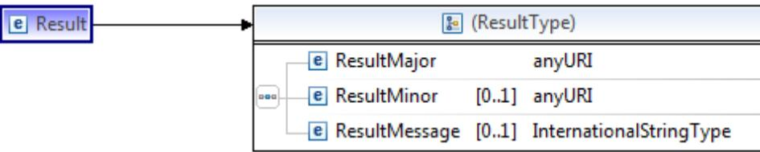

*Figure 34: Element Result*

Error conditions that arise while the eID-Server processes a request MUST be reported to the eService. Therefore the element Result as specified in [DSS] and referenced in [TR-03112] *Part 1, Section 4.1.2* SHALL be used.

In addition to the error codes described in [TR-03112] *Part 1, Section 4.2* the eID-Server MUST use the URI

http://www.bsi.bund.de/eid/server/2.0/resultminor/

in the element ResultMinor to indicate errors that arise at the eID-Server.

The element ResultMajor MUST NOT contain other values than specified in [TR-03112] *Part 1, Section 4.1.2*.

The optional element ResultMessage MAY be used to deliver a textual description of the error.

### <span id="page-40-0"></span>3.4.1 Error Codes

| Error Code                 | Description / Conditions                                                                                                                                      |
|----------------------------|---------------------------------------------------------------------------------------------------------------------------------------------------------------|
| /common#internalError      | Internal error<br>This error code MUST be used, IF an error occurs,<br>that can not be mapped with any of the following<br>more detailed error codes.         |
| /common#schemaViolation    | Schema violation<br>This error code MUST be used, IF the eService's<br>request does not validate to the schema used by the<br>eID-Server.                     |
| /useID#invalidPSK          | Initial PSK is invalid<br>This error code MUST be used, IF the PSK<br>transmitted from the eService to the eID-Server is<br>invalid and can not be processed. |
| /useID#tooManyOpenSessions | Maximum number of sessions is reached<br>This error code MUST be used, IF the request can not<br>be processed due to excessive eID-Server loading.            |
| /useID#missingArgument     | Parameters are missing<br>This error code MUST be used, IF the<br>AgeVerification or PlaceVerification                                                        |

| Error Code                   | Description / Conditions                                                                                                                                                                                                                 |
|------------------------------|------------------------------------------------------------------------------------------------------------------------------------------------------------------------------------------------------------------------------------------|
|                              | function was selected but the corresponding Request<br>elements are missing.                                                                                                                                                             |
| /useID#missingTerminalRights | Necessary permissions are missing<br>This error code MUST be used, IF the permissions<br>necessary to process the request are missing in the<br>terminal authorization certificate.                                                      |
| /getResult#noResultYet       | Request still has not been completed<br>This error code MUST be used, IF the eID-Server<br>does not have the result of the request yet. The<br>function call may succeed at a later time.                                                |
| /getResult#invalidSession    | Used session ID is invalid<br>This error code MUST be used, IF the session has<br>expired or was replied to and has thus been deleted.                                                                                                   |
| /getResult#invalidCounter    | RequestCounter incremented incorrectly<br>This error code MUST be used, IF the request's<br>requestCounter value is invalid (e.g. less or equal<br>to that of a previous request) and will not be<br>processed.                          |
| /getResult#deniedDocument    | Used eID-Document did not match level of<br>assurance or has been denied<br>This error code MUST be used, IF the used eID Type<br>has an undefined or lower level of assurance than<br>requested OR has been explicitly denied in useID. |
| /getResult#invalidDocument   | Used eID-Document is invalid<br>This error code MUST be used, IF passive<br>authentication of the eID-Document or the<br>revocation list check has determined that the eID<br>Document used is invalid.                                  |

Table 6: List of Error Codes

# <span id="page-42-2"></span>3.5 Security Measures

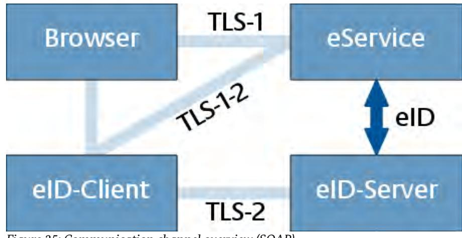

*Figure 35: Communication channel overview (SOAP)*

<span id="page-42-3"></span>This section describes the Security Measures the eService and the eID-Server MUST take to ensure secure communication at the eID-Interface. The eID-Interface is represented by the arrow in *[Figure 35:](#page-42-3)  [Communication channel overview \(SOAP\)](#page-42-3)* connecting the eService and the eID-Server. Encryption at the transport level and signature of the XML-Messages are used to guarantee the confidentiality, integrity and authenticity of the transmitted data and function calls.

# <span id="page-42-1"></span>3.5.1 Encryption

Because the eService and the eID-Server are directly connected with each other and no third entity is involved in the communication, encryption at the transport level is sufficient. IF the eService and the eID-Server communicate through an otherwise open network (e.g. Internet), they MUST communicate using TLS-secured connections in compliance to [TR-03116-4] Section 2: Vorgaben für SSL/TLS. Due to the trust relationship between the eService and the eID-Server, Client- and Server-Authentication must be implemented. The connection MUST be refused by the eID-Server, IF the Client-Authentication fails.

# <span id="page-42-0"></span>3.5.2 Signature

The eService and the eID-Server MUST apply XML-Signatures to all XML-Messages that are sent using the eID-Interface. Therefore the InitiatorToken and a RecipientToken as specified by the web service described in the file TR-03130eID-Server.wsdl MUST be used. The algorithm suites used for XML-Signatures MUST comply to the requirements of [TR-03116-4] *Section 4.3: XML-Signature*. Currently this means one of the following suites MUST be used:

- Basic256Sha256
- Basic192Sha256
- Basic128Sha256

XML-Messages received by the eID-Server with invalid XML-Signatures MUST be answered with the error code …/common#internalError only.

### 3.5.2.1 InitiatorToken

```
<sp:InitiatorToken>
     <wsp:Policy>
           <sp:X509Token sp:IncludeToken="http://schemas.xmlsoap.org/
```

```
ws/2005/07/securitypolicy/IncludeToken/Never">
                  <wsp:Policy>
                        <sp:RequireIssuerSerialReference/>
                        <sp:WssX509V3Token10 />
                  </wsp:Policy>
            </sp:X509Token>
     </wsp:Policy>
</sp:InitiatorToken>
```
*Example 1: InitiatorToken*

The InitiatorToken is a X.509 certificate that MUST be used by the eService to sign each request to the eID-Interface of the eID-Server. The eID-Server SHALL check the signature's validity and separate different clients with the aid of their X.509 certificates. The eID-Server MUST NOT answer to requests signed with an invalid X.509 certificate or not signed at all.

#### 3.5.2.2 RecipientToken

```
<sp:RecipientToken>
     <wsp:Policy>
            <sp:X509Token sp:IncludeToken="http://schemas.xmlsoap.org/
            ws/2005/07/securitypolicy/IncludeToken/Never">
                  <wsp:Policy>
                        <sp:RequireIssuerSerialReference/>
                        <sp:WssX509V3Token10 />
                  </wsp:Policy>
            </sp:X509Token>
     </wsp:Policy>
</sp:RecipientToken>
```
#### *Example 2: RecipientToken*

The RecipientToken is the X.509 certificate that MUST be used by the eID-Server to sign each response send to the eService using the eID-Interface. The eService SHALL check the signature's validity and SHALL not process data that is signed with an invalid X.509 certificate or not signed at all.

# <span id="page-43-0"></span>3.5.3 Session Binding

The eService MUST use the PSK negotiated at the eID-Interface (see *Section [3.2.1.2: Response](#page-22-0)*) for the creation of the TC Token as specified in [TR-03124] *Part 1, Section 2.4: TC Token*. Further measures which SHALL be implemented for channel binding, but do not directly affect the eID-Interface, are described in [TR-03124] *Part 1, Section 2.7: Session Binding*. Both are necessary to reach the final goal of binding the channel TLS-1 between the Browser and the eService to the channel TLS-2 between the eID-Client and the eID-Server represented in *[Figure 35: Communication channel overview \(SOAP\)](#page-42-3)*.

The eService SHALL only accept and process valid responses from the eID-Server that are bound to an existing web-session. The eID-Server SHALL only accept and process valid requests from authorized eServices and MUST ensure only valid requests at the eCard-API Interface are accepted. For this purpose the eID-Server MUST verify that each SessionIdentifier of a PSK used by an eID-Client to initialize eCard-API-Framework communication matches a PSK ID previously negotiated at the eID-Interface for one specific session and a secure connection can be established according to [TR-03112] Part7, *Section 2.3.1: Setting up a Trusted Channel*.

# <span id="page-44-1"></span>3.6 Examples

The example in the following sections illustrates the message flow as specified in *Section [3.1: General](#page-18-1)  [Message Flow](#page-18-1)*. Because the eService waited for the eID-Client to re-connect the first call of the function getResult is already successful.

# <span id="page-44-0"></span>3.6.1 Call of Functions useID

The following sample code shows a useID function call. In the example, the eService mandatorily asks for all operations except reading out the ArtisticName and AcademicTitle,which are marked as optional, by calling the function useID. The ResidencePermitI and the direct read out of CommunityID is not requested. The eService requests transaction attestation and a certain level of assurance, but also allows some eID Types regardless of their LoA.

```
<?xml version="1.0" encoding="UTF-8"?>
<soapenv:Envelope
xmlns:soapenv="http://schemas.xmlsoap.org/soap/envelope/"
xmlns:eid="http://bsi.bund.de/eID/">
     <soapenv:Header />
     <soapenv:Body>
           <eid:useIDRequest>
                 <eid:UseOperations>
                        <eid:DocumentType>REQUIRED</eid:DocumentType>
                        <eid:IssuingState>REQUIRED</eid:IssuingState>
                        <eid:DateOfExpiry>REQUIRED</eid:DateOfExpiry>
                        <eid:GivenNames>REQUIRED</eid:GivenNames>
                        <eid:FamilyNames>REQUIRED</eid:FamilyNames>
                        <eid:ArtisticName>ALLOWED</eid:ArtisticName>
                        <eid:AcademicTitle>ALLOWED</eid:AcademicTitle>
                        <eid:DateOfBirth>REQUIRED</eid:DateOfBirth>
                        <eid:PlaceOfBirth>REQUIRED</eid:PlaceOfBirth>
                        <eid:Nationality>REQUIRED</eid:Nationality>
                        <eid:BirthName>REQUIRED</eid:BirthName>
                        <eid:PlaceOfResidence>REQUIRED</eid:PlaceOfResidence>
                        <eid:CommunityID />
                        <eid:ResidencePermitI />
                        <eid:RestrictedID>REQUIRED</eid:RestrictedID>
                        <eid:AgeVerification>REQUIRED</eid:AgeVerification>
                        <eid:PlaceVerification>REQUIRED</eid:PlaceVerification>
                 </eid:UseOperations>
                 <eid:AgeVerificationRequest>
                        <eid:Age>18</eid:Age>
                 </eid:AgeVerificationRequest>
                 <eid:PlaceVerificationRequest>
                        <eid:CommunityID>027605</eid:CommunityID>
                 </eid:PlaceVerificationRequest>
                 <eid:TransactionAttestationRequest>
                        <eid:TransactionAttestationFormat>
                              http://bsi.bund.de/eID/ExampleAttestationFormat
                        </eid:TransactionAttestationFormat>
     <eid:TransactionContext>id599456-df</eid:TransactionContext>
                 </eid:TransactionAttestationRequest>
                 <eid:LevelOfAssuranceRequest>
                        http://bsi.bund.de/eID/LoA/hoch
                 </eid:LevelOfAssuranceRequest>
                 <eid:EIDTypeRequest>
```

```
<eid:SECertified>ALLOWED</eid:SECertified>
                        <eid:SEEndorsed>ALLOWED</eid:SEEndorsed>
                  </eid:EIDTypeRequest>
           </eid:useIDRequest>
     </soapenv:Body>
</soapenv:Envelope>
```
#### *Example 3: useIDRequest*

The response of the eID-Server contains the Session and PSK elements. The Result element contains no error message in this case.

```
<?xml version="1.0" encoding="UTF-8"?>
<soapenv:Envelope 
xmlns:soapenv="http://schemas.xmlsoap.org/soap/envelope/"
xmlns:eid="http://bsi.bund.de/eID/"
xmlns:dss="urn:oasis:names:tc:dss:1.0:core:schema">
     <soapenv:Header />
     <soapenv:Body>
           <eid:useIDResponse>
                  <eid:Session>
                        <eid:ID>1234567890abcdef1234567890abcdef</eid:ID>
                  </eid:Session>
                  <eid:PSK>
                        <eid:ID>0987654321abcdef1234567890abcdef</eid:ID>
                        <eid:Key>fedcba0987654321fedcba0987654321</eid:Key>
                  </eid:PSK>
                  <dss:Result>
                        <ResultMajor>
                        http://www.bsi.bund.de/ecard/api/1.1/resultmajor#ok
                        </ResultMajor>
                  </dss:Result>
           </eid:useIDResponse>
     </soapenv:Body>
</soapenv:Envelope>
```
*Example 4: useIDResponse*

# <span id="page-45-0"></span>3.6.2 Call of Function getResult

The following code example shows the getResult call by the eService.

```
<?xml version="1.0" encoding="UTF-8"?>
<soapenv:Envelope 
xmlns:soapenv="http://schemas.xmlsoap.org/soap/envelope/"
xmlns:eid="http://bsi.bund.de/eID/">
     <soapenv:Header />
     <soapenv:Body>
           <eid:getResultRequest>
                  <eid:Session>
                        <eid:ID>1234567890abcdef1234567890abcdef</eid:ID>
                  </eid:Session>
                  <eid:RequestCounter>1</eid:RequestCounter>
           </eid:getResultRequest>
     </soapenv:Body>
</soapenv:Envelope>
```
#### *Example 5: getResultRequest*

Because the results are available at the eID-Server, this call delivers the matching return values. Transmission of the artistic name was deselected by the user (see OperationsAllowedByUser element in the example). Additionally the eID-Server was not able to read the BirthName because this data group was not available on the eID-Document's chip. The EIDTypeResponse indicates the usage of a physical identity card, which implicitly has been allowed because it meets the requested level of assurance. How the eService deals with the user's and document's restrictions is up to the Service Provider.

```
<?xml version="1.0" encoding="UTF-8"?>
<soapenv:Envelope
xmlns:soapenv="http://schemas.xmlsoap.org/soap/envelope/"
xmlns:eid="http://bsi.bund.de/eID/"
xmlns:dss="urn:oasis:names:tc:dss:1.0:core:schema" >
     <soapenv:Header />
     <soapenv:Body>
           <eid:getResultResponse>
                  <eid:PersonalData>
                        <eid:DocumentType>ID</eid:DocumentType>
                        <eid:IssuingState>D</eid:IssuingState>
                        <eid:DateOfExpiry>2029-10-31</eid:DateOfExpiry>
                        <eid:GivenNames>ERIKA</eid:GivenNames>
                        <eid:FamilyNames>MUSTERMANN</eid:FamilyNames>
                        <eid:AcademicTitle></eid:AcademicTitle>
                        <eid:DateOfBirth>
                              <eid:DateString>19640812</eid:DateString>
                              <eid:DateValue>1964-08-12</eid:DateValue>
                        </eid:DateOfBirth>
                        <eid:PlaceOfBirth>
                              <eid:FreetextPlace>BERLIN</eid:FreetextPlace>
                        </eid:PlaceOfBirth>
                        <eid:Nationality>D</eid:Nationality>
                        <eid:PlaceOfResidence>
                              <eid:StructuredPlace>
                                    <eid:Street>HEIDESTRASSE 17</eid:Street>
                                    <eid:City>KÖLN</eid:City>
                                    <eid:Country>D</eid:Country>
                                    <eid:ZipCode>51147</eid:ZipCode>
                              </eid:StructuredPlace>
                        </eid:PlaceOfResidence>
                        <eid:RestrictedID>
                              <eid:ID>
                  01A4FB509CEBC6595151A4FB5F9C75C6FE01A4FB59CB655A4FB5F9C75C6FEE
                              </eid:ID>
                              <eid:ID2>
                  5C6FE01A4FB59CB655A4FB5F9C75C6FEE01A4FB509CEBC6595151A4FB5F9C7
                              </eid:ID2>
                        </eid:RestrictedID>
                  </eid:PersonalData>
                  <eid:FulfilsAgeVerification>
                        <eid:FulfilsRequest>true</eid:FulfilsRequest>
                  </eid:FulfilsAgeVerification>
                  <eid:FulfilsPlaceVerification>
                        <eid:FulfilsRequest>true</eid:FulfilsRequest>
                  </eid:FulfilsPlaceVerification>
                  <eid:OperationsAllowedByUser>
                        <eid:DocumentType>ALLOWED</eid:DocumentType>
                        <eid:IssuingState>ALLOWED</eid:IssuingState>
                        <eid:DateOfExpiry>ALLOWED</eid:DateOfExpiry>
                        <eid:GivenNames>ALLOWED</eid:GivenNames>
                        <eid:FamilyNames>ALLOWED</eid:FamilyNames>
```
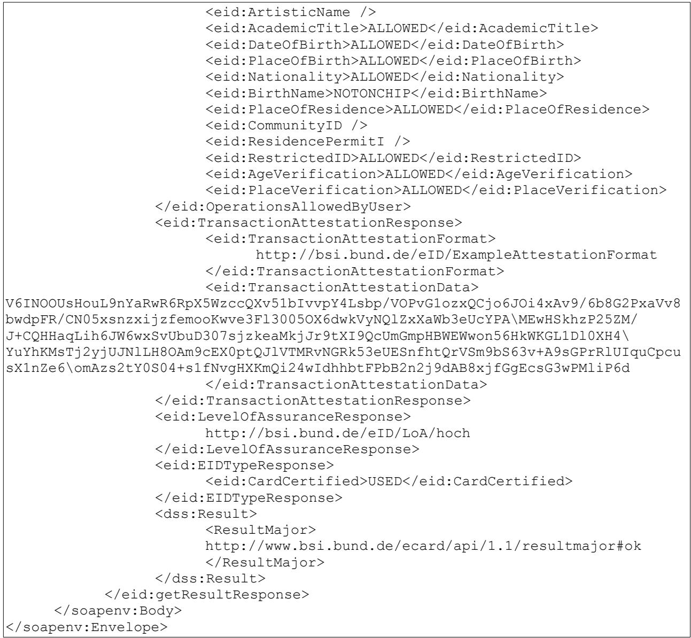

*Example 6: getResultResponse*

# <span id="page-47-0"></span>3.6.3 Call of Function getServerInfo

The following code example shows the getServerInfo call by the eService.

```
<?xml version="1.0" encoding="UTF-8"?>
<soapenv:Envelope
xmlns:soapenv="http://schemas.xmlsoap.org/soap/envelope/"
xmlns:eid="http://bsi.bund.de/eID/">
     <soapenv:Header />
     <soapenv:Body>
           <getServerInfoRequest />
     </soapenv:Body>
</soapenv:Envelope>
```
*Example 7: getServerInfoRequest*

In addition to the version of the eID-Interface which the eID-Server currently supports (see element ServerVersion), the rights of the terminal authorization certificate currently stored on the eID-Server (see element DocumentVerificationRights) are included in the response.

```
<?xml version="1.0" encoding="UTF-8"?>
<soapenv:Envelope
xmlns:soapenv="http://schemas.xmlsoap.org/soap/envelope/"
xmlns:eid="http://bsi.bund.de/eID/">
     <soapenv:Header />
     <soapenv:Body>
           <eid:getServerInfoResponse>
                 <eid:ServerVersion>
                        <eid:VersionString>
                              Version 2.4.0 02.08.2021
                        </eid:VersionString>
                        <eid:Major>2</eid:Major>
                        <eid:Minor>4</eid:Minor>
                        <eid:Bugfix>0</eid:Bugfix>
                 </eid:ServerVersion>
                 <eid:DocumentVerificationRights>
                        <eid:DocumentType>ALLOWED</eid:DocumentType>
                        <eid:IssuingState>ALLOWED</eid:IssuingState>
                        <eid:DateOfExpiry>ALLOWED</eid:DateOfExpiry>
                        <eid:GivenNames>ALLOWED</eid:GivenNames>
                        <eid:FamilyNames>ALLOWED</eid:FamilyNames>
                        <eid:ArtisticName>ALLOWED</eid:ArtisticName>
                        <eid:AcademicTitle>ALLOWED</eid:AcademicTitle>
                        <eid:DateOfBirth>ALLOWED</eid:DateOfBirth>
                        <eid:PlaceOfBirth>ALLOWED</eid:PlaceOfBirth>
                        <eid:Nationality>ALLOWED</eid:Nationality>
                        <eid:BirthName>ALLOWED</eid:BirthName>
                        <eid:PlaceOfResidence>ALLOWED</eid:PlaceOfResidence>
                        <eid:CommunityID />
                        <eid:ResidencePermitI />
                        <eid:RestrictedID>ALLOWED</eid:RestrictedID>
                        <eid:AgeVerification>ALLOWED</eid:AgeVerification>
                        <eid:PlaceVerification>ALLOWED</eid:PlaceVerification>
                 </eid:DocumentVerificationRights>
           </eid:getServerInfoResponse>
     </soapenv:Body>
</soapenv:Envelope>
```
*Example 8: getServerInfoResponse*

# <span id="page-49-1"></span>4 SAML-Profile

The Security Assertion Markup Language defined in [SAML] is a recognized standard in an identity provider's and in the international context. However, SAML cannot be applied to the eID-Interface directly, because it contradicts two fundamental principles of the eID-Function.

The authentication protocols implemented by the eID-Document assume exactly two entities communicating with each other. These entities represent on the one side the citizen (with his eID-Document) and on the other side the Service Provider (with his terminal authorization certificate). An additional authentication protocol principle is that the authentication's security results from the eID-Document and the protocols it implements, not from the surrounding infrastructure.

By default SAML protocols assume a three-entity model and are based on the trust relationship between two of them (Identity Provider and Service Provider).

However, it is possible to use SAML so that the principles of the authentication protocol remain intact and a secure, legally compliant authentication can be achieved. The basis for this is that the Service Provider MAY delegate Online-Authentication to be performed by a third party.

This section defines a specific SAML-Profile which considers the design decisions made for the eID-Infrastructure. This SAML-Profile SHOULD be implemented by the eID-Service if SAML is offered as an alternative to the eID-Interface specified in *Section [3: eID-Interface \(SOAP\)](#page-18-2)*. In this case, this alternative SHALL be provided by the "SAML Processor" as described in the following section.

# <span id="page-49-0"></span>4.1 Basic Commitments

The basis for the SAML-Profile implemented by the eID-Service MUST be the Web Browser Single Sign-On (Web Browser SSO) profile specified in [SAML] *Profiles, Section 4.1: Web Browser SSO Profile*. Because the eService and the eID-Service MUST use the transport mechanisms specified in [TR-03124] *Part 1, Section 2.6: SAML* the HTTP-Redirect Binding SHALL be implemented. The SAML messages MUST be transferred URL-Encoded in the Location header field of the redirect (see *Section [4.9.2.1: URL-Encoding](#page-68-2)* for an example).

For usage with this profile the Authentication Request Protocol specified in [SAML] *Assertions and Protocols, Section 3.4: Authentication Request Protocol* MUST be used as described in this section. The following table shows the mapping of the roles defined in [SAML] to the roles of the eID-Infrastructure that appear in this context.

| eID-Infrastructure | SAML Specification      | Description                                                                                                                                                                  |
|--------------------|-------------------------|------------------------------------------------------------------------------------------------------------------------------------------------------------------------------|
| User               | User                    | The user uses the components Browser and<br>eID-Client for contacting and authenticating at the<br>Service Provider as well as verifying the Service<br>Provider's identity. |
| eID-Client         | User Agent              | The eID-Client offers the functionality of the User<br>Agent and guides the user through the process of<br>Online-Authentication.                                            |
| Service Provider   | Service Provider (SP)   | The Service Provider is also called Relying Party and<br>uses the eID-Service for verifying the user's identity and<br>authenticating himself.                               |
| eID-Service        | Identity Provider (IdP) | The eID-Service performs Online-Authentication on<br>behalf of the Service Provider.                                                                                         |

Table 7: Mapping of eID-Infrastructure and SAML Specification roles

# <span id="page-50-1"></span>4.2 General Message Flow

The SAML-Profile for the eID-Server uses exactly the communication mechanisms described in [TR-03124] *Part 1, Section 2.6: SAML* and MUST be implemented complying. The general communication flow is described in the following sections.

# <span id="page-50-0"></span>4.2.1 Initiation

The following *[Figure 36: General message flow during initiation \(SAML\)](#page-50-2)* shows the steps of the message flow as it is described in [TR-03124] *Part 1, Section 2.6: SAML*.

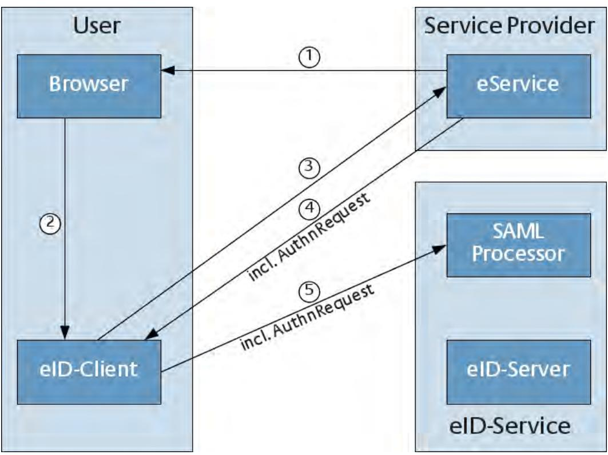

<span id="page-50-2"></span>*Figure 36: General message flow during initiation (SAML)*

The above steps have to be completed for the initiation of the Online-Authentication. While step 1 to 3 are part of the Service Provider's scope of responsibilities the steps 4 and 5 also rely on the secure communication channel between the eService and the SAML Processor (see *Section [4.9](#page-67-0): [Security Measures](#page-67-0)*). Each step is described in the following.

### **1. Generate link to presumed tcTokenURL**

The eService MUST generate a link for the user's eID-Client containing the presumed URL where the TC Token SHALL be received according to [TR-03124] *Part 1, Section 2.2: Client-Interface*.

#### **2. Forward presumed tcTokenURL to eID-Client**

The user decides to use the eID-Function for Online-Authentication by actively clicking on the formerly generated link and thus forwarding the presumed tcTokenURL to his locally running instance of the eID-Client.

#### **3. Call tcTokenURL at eService**

The eID-Client calls the presumed tcTokenURL at the eService.

#### **4. Redirect to SAML Processor incl. AuthnRequest**

In this context the eService MUST answer the call of the eID-Client with a redirect to the SAML Processor according to [TR-03124] *Part 1, Section 2.5.1: Retrieval of the TC Token*. The AuthnRequest (see *Section [4.7.1: AuthnRequest](#page-59-0)*) SHALL be included in the Location field of the redirect (see *Section [4.9.2.1](#page-68-2): [URL-](#page-68-2)[Encoding](#page-68-2)* for an example).

#### **5. Call of SAML Processor incl. AuthnRequest**

Following the redirect from the eService to the SAML Processor the eID-Client calls the SAML Processor according to [TR-03124] *Part 1, Section 2.6: SAML* with the URL-Encoded (see *Section [4.9.2.1](#page-68-2): [URL-Encoding](#page-68-2)* for an example) AuthnRequest (see *Section [4.7.1:](#page-59-0) [AuthnRequest](#page-59-0)*).

# <span id="page-51-1"></span>4.2.2 Interaction

The following *[Figure 37: General message flow during interaction \(SAML\)](#page-51-2)* shows the steps of the message flow of the eID-Interface's functions in the context of an existing SAML Processor as an example of how the SAML Processor MAY communicate with the eID-Client and the eID-Server. The SAML Processor MAY also be operated attached to the eID-Server thus using just one communication channel to the eID-Client.

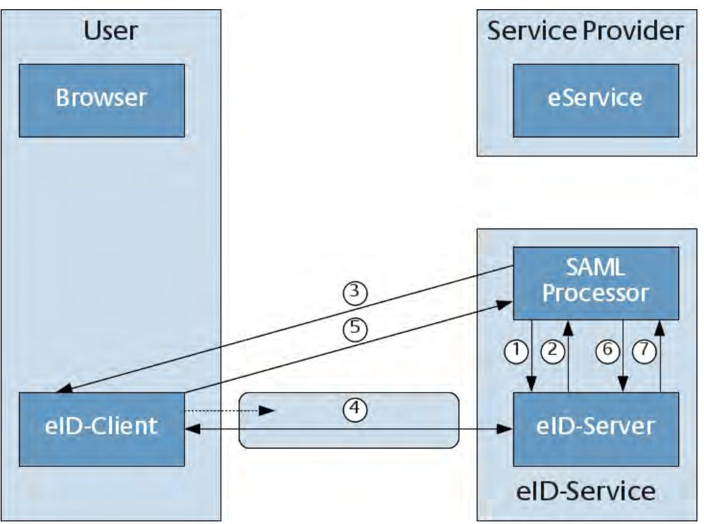

<span id="page-51-2"></span>*Figure 37: General message flow during interaction (SAML)*

The above steps MUST be completed for the Online-Authentication and are part of the eID-Service's scope of responsibilities. The steps itself are not described in this section. They are equivalent to the steps described in *Section [3.1.2: Interaction](#page-19-0)* with the SAML Processor fulfilling the part of the eService in this context and MUST be performed accordingly. Implementation of the eID-Interface according to *Section [3:](#page-18-2) [eID-Interface \(SOAP\)](#page-18-2)* of this technical guideline is not required in this scenario.

# <span id="page-51-0"></span>4.2.3 Completion

The following *[Figure 38: General message flow during completion \(SAML\)](#page-52-1)* shows the steps of the message flow as described in [TR-03124] *Part 1, Section 2.5.4: Return to the caller*.

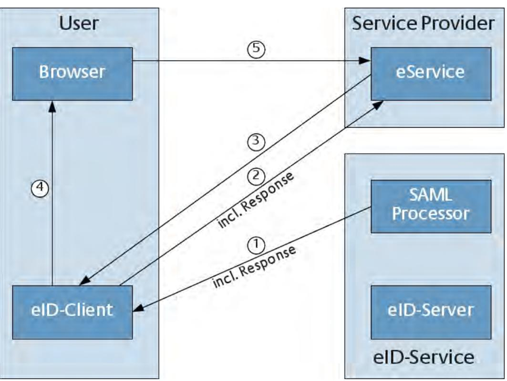

<span id="page-52-1"></span>*Figure 38: General message flow during completion (SAML)*

The above steps MUST be performed for the completion of the Online-Authentication. While step 1 and 2 rely on the secure communication channel between the eService and the SAML Processor (see *Section [4.9:](#page-67-0) [Security Measures](#page-67-0)*) the steps 3 to 5 are part of the eService's scope of responsibilities. Each step is described in the following.

#### **1. Redirect from SAML Processor incl. Response**

The SAML Processor answers the call of the eID-Client with a redirect to the eService. This redirect SHALL include the URL-Encoded (see *Section [4.9.2.1](#page-68-2): [URL-Encoding](#page-68-2)* for an example) Response (see *Section [4.7.3](#page-61-0): [Response](#page-61-0)*) in the Location field.

#### **2. Call of eService incl.** Response

The eID-Client calls the eService with the URL-Encoded (see *Section [4.9.2.1](#page-68-2): [URL-Encoding](#page-68-2)* for an example) Response (see *Section [4.7.3](#page-61-0): [Response](#page-61-0)*).

#### **3. Response from eService**

The eService answers the call from the eID-Client.

#### **4. Forward Browser to eService**

The eID-Client forwards the Browser to the verified URL of the eService.

#### **5. Calling the eService**

The Browser calls the URL of the eService and returns to the web-session.

# <span id="page-52-0"></span>4.3 Attributes

In the following section the attributes that SHALL be used in the context of eID-Documents are listed. The SAML-Profile has a more modular design compared to the eID-Interface. Therefore the attribute's names

are needed to uniquely identify the relevant attributes. Additional attributes MAY be used if specified by the Service Provider and the eID-Service.

The tables also contain information about the data types that MUST be used to transmit values upon requests and responses. The data type is either a built-in primitive type, identified below by the 'xs:' prefix, or a data type defined in the XSD-File TR-03130eID-Server.xsd attached to this technical guideline represented with the 'eid:' prefix.

# <span id="page-53-0"></span>4.3.1 Request Attributes

The following table contains all attributes the Service Provider may request from the eID-Service. Attributes marked with "-" do not require input values. For these attributes input values must not be transmitted in the request. The eID-Server MUST try to perform the operations requested by the eService IF the terminal authorization certificate of the eService allows the eID-Server to do so. The eID-Document's validity MUST be checked by the eID-Service during every Online-Authentication.

| Attribute name         | Data type used for value in request   |
|------------------------|---------------------------------------|
| DocumentValidity       | -                                     |
| DocumentType           | -                                     |
| IssuingState           | -                                     |
| DateOfExpiry           | -                                     |
| GivenNames             | -                                     |
| FamilyNames            | -                                     |
| ArtisticName           | -                                     |
| AcademicTitle          | -                                     |
| DateOfBirth            | -                                     |
| PlaceOfBirth           | -                                     |
| Nationality            | -                                     |
| BirthName              | -                                     |
| PlaceOfResidence       | -                                     |
| CommunityID            | -                                     |
| ResidencePermitI       | -                                     |
| RestrictedID           | -                                     |
| AgeVerification        | eid:AgeVerificationRequestType        |
| PlaceVerification      | eid:PlaceVerificationRequestType      |
| TransactionInfo        | xs:string                             |
| TransactionAttestation | eid:TransactionAttestationRequestType |
| LevelOfAssurance       | eid:LevelOfAssuranceType              |
| EIDType                | eid:EIDTypeRequestType                |

<span id="page-53-1"></span>Table 8: SAML Request Attributes

# <span id="page-54-2"></span>4.3.2 Response Attributes

The following table contains all attributes the eID-Service MAY transmit to the Service Provider depending on the request from the Service Provider. The same names that have been used in the request SHALL be used here. The eID-Document's validity MUST be checked by the eID-Service during every Online-Authentication. The result therefore MUST be included in every response.

| Attribute name         | Data type used for value in response   |
|------------------------|----------------------------------------|
| DocumentValidity       | eid:DocumentValidityResultType         |
| DocumentType           | eid:DocumentType                       |
| IssuingState           | eid:ICAOCountry                        |
| DateOfExpiry           | xs:date                                |
| GivenNames             | xs:string                              |
| FamilyNames            | xs:string                              |
| ArtisticName           | xs:string                              |
| AcademicTitle          | xs:string                              |
| DateOfBirth            | eid:GeneralDateType                    |
| PlaceOfBirth           | eid:GeneralPlaceType                   |
| Nationality            | eid:ICAOCountry                        |
| BirthName              | xs:string                              |
| PlaceOfResidence       | eid:GeneralPlaceType                   |
| CommunityID            | eid:CommunityIDType                    |
| ResidencePermitI       | xs:string                              |
| RestrictedID           | eid:RestrictedIDType                   |
| AgeVerification        | eid:AgeVerificationResultType          |
| PlaceVerification      | eid:PlaceVerificationResultType        |
| TransactionAttestation | eid:TransactionAttestationResponseType |
| LevelOfAssurance       | eid:LevelOfAssuranceType               |
| EIDType                | eid:EIDTypeResponseType                |

<span id="page-54-3"></span>Table 9: SAML Response Attributes

# <span id="page-54-1"></span>4.4 Data types

In addition to the general data types described in *Section [3.3: Data types](#page-27-2)* several SAML-specific data types are specified in the XML-Schema TR-03130eID-Server.xsd and SHALL be used as described in the following section.

# <span id="page-54-0"></span>4.4.1 PlaceVerificationResultType

|    |           | & PlaceVerificationResultType |  | PlaceVerificationRequestType |                   |  |
|----|-----------|-------------------------------|--|------------------------------|-------------------|--|
| 日日 | e Request | PlaceVerificationRequestType  |  | e CommunityID                | (CommunityIDType) |  |
|    | e Result  | VerificationResultType        |  |                              |                   |  |
|    |           |                               |  | 물 VerificationResultType     |                   |  |
|    |           |                               |  | e FulfilsRequest boolean     |                   |  |

*Figure 39: Data type PlaceVerificationResultType*

This data type SHALL be used for transmitting the result of a place verification from the SAML Processor to the eService in an assertion. The Request element contains the requested comparison value (CommunityID) and the Result element the verification's result (FulfilsRequest).

### <span id="page-55-1"></span>4.4.2 AgeVerificationResultType

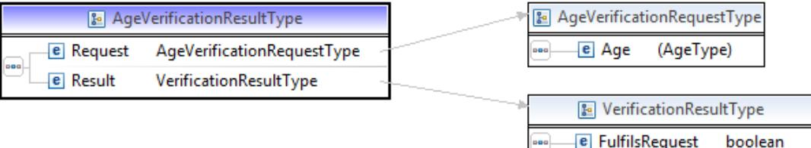

#### *Figure 40: Data type AgeVerificationResultType*

This data type SHALL be used for transmitting the result of an age verification from the SAML Processor to the eService in an assertion. The Request element contains the requested comparison value (Age) and the Result element the verification's result (FulfilsRequest).

### <span id="page-55-0"></span>4.4.3 DocumentValidityResultType

| ം DocumentValidityResultType |                   |                 |
|------------------------------|-------------------|-----------------|
|                              | (8)<br>Version    | positiveInteger |
|                              | (a) any Attribute |                 |
| 000                          | e ReferenceDate   | date            |
|                              | Status<br>e       | string          |

#### *Figure 41: Data type DocumentValidityResultType*

This data type SHALL be used for transmitting information about the version of the SAML Processors interface and the validity of the eID-Document used for the specific authentication.

| Attribute/Element | Description                                                                                                                                                                                                                                                                                                                          |
|-------------------|--------------------------------------------------------------------------------------------------------------------------------------------------------------------------------------------------------------------------------------------------------------------------------------------------------------------------------------|
| Version           | Indicates the version of the data representation the<br>eID-Service implements.                                                                                                                                                                                                                                                      |
|                   | Version '1' SHOULD typically be used here.                                                                                                                                                                                                                                                                                           |
|                   | Note that this version relates only to the content and<br>semantics of the authentication response's data. The<br>version of the schema itself SHALL be managed<br>through other mechanisms such as schema<br>namespace.                                                                                                             |
| ReferenceDate     | The exact date the eID-Document's validity (expiry<br>date and revocation status) was determined. In<br>principle this should be the date of the request, but<br>this value may be needed under certain conditions<br>(e.g. day change during Online-Authentication).                                                                |
| Status            | MUST contain the result of the document validation<br>test using the following values:<br>valid:<br>Document is valid.<br>failed:<br>Test has failed.                                                                                                                                                                                |
|                   | Additionally, the following values MAY be<br>implemented:<br>expired:<br>Document has expired.<br>revoked:<br>Document is revoked.<br>notAuthentic:<br>Document is not authentic.<br>If the document isn't valid (the status is other than<br>valid), none of the attributes to be read from the<br>eID-Document MAY be transmitted. |

Table 10: Attributes and Elements of the Data type DocumentValidityResultType

# <span id="page-57-1"></span>4.4.4 RequestedAttributesType

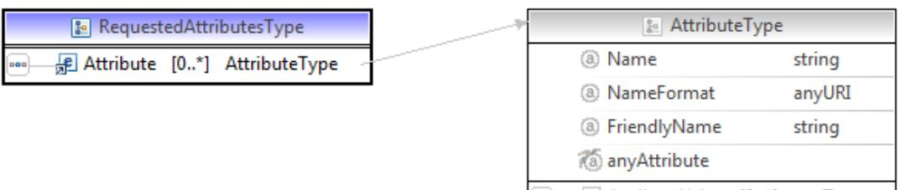

#### *Figure 42: Data type RequestedAttributesType*

This data type contains the requested attributes and the request values for verification functions. It MAY contain several attributes from the data type AttributeType specified in [SAML]. The identifiers specified in *Section [4.3.1: Request Attributes](#page-53-0)* SHALL be used for the attribute Name. Additional attributes with other identifiers MAY be used if specified by the Service Provider and the eID-Service.

Each attribute element contained in the AuthnRequestExtension MAY contain the attribute RequiredAttribute to identify mandatory fields. This attribute is also defined by the schema (see *Section [4.6.1](#page-59-3): [RequiredAttribute](#page-59-3)*). If the attribute RequiredAttribute is not present, the eID-Service SHALL assume the requested attribute is required for the specific use case.

Each attribute element contained in the Assertion MAY contain the attribute AttributeNotOnChip to identify data groups not supported by the eID-Document's chip. This attribute is also defined by the schema (see *Section [4.6.2](#page-59-2): [AttributeNotOnChip](#page-59-2)*). If the attribute AttributeNotOnChip is not present, the eService SHALL assume the requested attribute is present on the eID-Document's chip.

# <span id="page-57-0"></span>4.4.5 AuthnRequestExtensionType

| &   AuthnRequestExtensionType |                           |
|-------------------------------|---------------------------|
| a) Version                    | positiveInteger           |
| (a) any Attribute             |                           |
| e RequestedAttributes<br>aaa  | Requested Attributes Type |

| & RequestedAttributesType |  |  |                                    |  |  |
|---------------------------|--|--|------------------------------------|--|--|
| neu                       |  |  | - # Attribute [0 * ] AttributeType |  |  |
|                           |  |  |                                    |  |  |

#### *Figure 43: Data type AuthnRequestExtensionType*

This data type is the basis for the authentication request. In addition to the version of the interface it contains a list of the attributes requested by the eService.

| Attribute/Element | Description                                                                          |
|-------------------|--------------------------------------------------------------------------------------|
| Version           | Indicates the version of the data representation the<br>Service Provider implements. |

| Attribute/Element   | Description                                                                                                                                                                                                                       |  |  |
|---------------------|-----------------------------------------------------------------------------------------------------------------------------------------------------------------------------------------------------------------------------------|--|--|
|                     | Version '2' SHOULD typically be used here.                                                                                                                                                                                        |  |  |
|                     | Note that this version relates only to the content and<br>semantics of the authentication request's data. The<br>version of the schema itself SHALL be managed<br>through other mechanisms such as using the<br>schema namespace. |  |  |
| RequestedAttributes | The list of attributes that are requested containing<br>additional input if needed for verification functions.                                                                                                                    |  |  |

<span id="page-58-3"></span>Table 11: Attribute and Elements of the Data type AuthnRequestExtensionType

# <span id="page-58-2"></span>4.5 Additional Elements

The following elements are used for the SAML Messages (see *Section [4.7: SAML Messages](#page-59-1)*) and have been defined in the XSD-File TR-03130eID-Server.xsd attached to this technical guideline.

# <span id="page-58-1"></span>4.5.1 AuthnRequestExtension

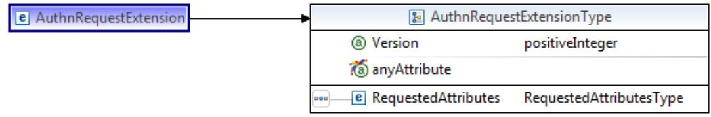

#### *Figure 44: Element AuthnRequestExtension*

The AuthnRequestExtension element is of the AuthnRequestExtensionType data type defined in this schema (see *Section [4.4.5](#page-57-0): [AuthnRequestExtensionType](#page-57-0)*) and includes the transport information for the AuthnRequest.

# <span id="page-58-0"></span>4.5.2 EncryptedAuthnRequestExtension

| e EncryptedAuthnRequestExtension | & EncryptedElementType |                   |  |                                          |
|----------------------------------|------------------------|-------------------|--|------------------------------------------|
|                                  |                        | --- EncryptedData |  | EncryptedDataType                        |
|                                  |                        |                   |  | - £ EncryptedKey [0 *] EncryptedKey lype |

#### *Figure 45: Element EncryptedAuthnRequestExtension*

The EncryptedAuthnRequestExtension is of the EncryptedElementType data type defined in [SAML]. It MUST contain the encrypted AuthnRequestExtension (see *Section [4.4.5:](#page-57-0) [AuthnRequestExtensionType](#page-57-0)*) in the EncryptedData element as specified in [XML-Enc].

# <span id="page-59-4"></span>4.6 Additional Attributes

Some SAML components allow the definition of specific attributes for a use case using the anyAttribute placeholder. The attributes in this section have been specified in the XSD-File TR-03130eID-Server.xsd attached to this technical guideline for such cases.

# <span id="page-59-3"></span>4.6.1 RequiredAttribute

The attribute RequiredAttribute uses the simple data type boolean without further restrictions. It MAY be used in the request to identify attributes as mandatory (true) or optional (false). The default value for this attribute is mandatory (true). Requested attributes marked with this attribute MUST be used for the RequiredCHAT according to [TR-03112] *Part 7*. Requested attributes that are not marked with this attribute MUST be used for the OptionalCHAT according to [TR-03112] *Part 7*.

# <span id="page-59-2"></span>4.6.2 AttributeNotOnChip

The attribute AttributeNotOnChip uses the simple data type boolean without further restrictions. It MUST be used in the response to identify attributes that could not be read from the eID-Document, because the eID-Document does not support this attribute (true). It MUST NOT be used for attributes that could not be read because of missing rights in the terminal authorization certificate and/or the user has restricted the document reading rights. Generally it is assumed that the requested attribute is supported by the eID-Document. Therefore the default and expected (e.g. if the attribute is not present) value for this attribute is false.

# <span id="page-59-1"></span>4.7 SAML Messages

The following sections define individual SAML Messages that MUST be used to meet this SAML-Profile. The scenario described in *Section [4.1](#page-49-0): [Basic Commitments](#page-49-0)* as well as the overview described in *Section [4.2](#page-50-1): [General](#page-50-1) [Message Flow](#page-50-1)* and the data types and elements defined in *Section [4.4: Data types](#page-54-1)* form the basis for this messages.

### <span id="page-59-0"></span>4.7.1 AuthnRequest

The AuthnRequest must contain the following XML elements (<element>) and attributes (*attribute*). Unless otherwise indicated, all data presented here are mandatory fields.

| Element/Attribute                | Description                                                                                                                                                                                                                                   |  |  |
|----------------------------------|-----------------------------------------------------------------------------------------------------------------------------------------------------------------------------------------------------------------------------------------------|--|--|
| <AuthnRequest>                   |                                                                                                                                                                                                                                               |  |  |
| Version                          | Specifies the SAML-Version being used and MUST<br>have the value '2.0'.                                                                                                                                                                       |  |  |
| ID                               | Uniquely identifies the request and MUST fulfill the<br>same requirements as the session ID described in<br>Section 3.3.1: SessionType.                                                                                                       |  |  |
| IssueInstant                     | MUST contain the time of issue of the request in<br>compliance to [SAML]                                                                                                                                                                      |  |  |
| Destination                      | MUST contain the URL of the eID-Service which<br>SHALL perform the Online-Authentication for the<br>eService.                                                                                                                                 |  |  |
| ProtocolBinding                  | Since the binding being used is already defined in<br>the technical guideline this attribute is optional, but<br>MUST have the value 'urn:oasis:names:tc:<br>SAML:2.0:bindings:HTTP-Redirect' if<br>present.                                  |  |  |
| AssertionConsumerServiceURL      | Contains the exact URL of the eService where the<br>Response SHALL be sent. The attribute is optional<br>IF the eService has a default URL configured at the<br>eID-Service. The eService MAY use this URL to differ<br>from the default URL. |  |  |
| ProviderName                     | This element MAY be used by the eService to submit<br>a textual identifier of the eService to the eID-Service.                                                                                                                                |  |  |
| <Issuer>                         | MUST contain the eServices URL and SHALL be used<br>by the eID-Service to identify the eService.                                                                                                                                              |  |  |
| <Extensions>                     | This element MUST be present to encapsulate all<br>extensions defined or referenced in this specific<br>profile.                                                                                                                              |  |  |
| <EncryptedAuthnRequestExtension> | This element MUST be present to encapsulate the<br>extension containing the encrypted<br>AuthnRequestExtension. The element is<br>defined in Section 4.5.2:<br>EncryptedAuthnRequestExtension.                                                |  |  |
| <EncryptedData>                  | Using XML-Encryption as referenced in [SAML] this<br>element MUST contain the encrypted<br>AuthnRequestExtension (see Section 4.7.2:<br>AuthnRequestExtension).                                                                               |  |  |

Table 12: Elements and Attributes of the AuthnRequest

# <span id="page-60-0"></span>4.7.2 AuthnRequestExtension

The AuthnRequestExtension is of the data type AuthnRequestExtensionType and MUST contain the following XML elements (<element>) and attributes (*attribute*). Unless otherwise indicated, all data presented here are mandatory fields.

|         | Element/Attribute       | Description                                                                                                                                                                                                                                                           |
|---------|-------------------------|-----------------------------------------------------------------------------------------------------------------------------------------------------------------------------------------------------------------------------------------------------------------------|
|         | <AuthnRequestExtension> |                                                                                                                                                                                                                                                                       |
| Version |                         | Specifies the version of the extension structure being<br>used and SHOULD have the value '2'.                                                                                                                                                                         |
|         | <RequestedAttributes>   | This element MUST encapsulate at least one<br>Attribute element in compliance with [SAML]<br>and as defined in Section 4.4.4:<br>RequestedAttributesType.                                                                                                             |
|         | <Attribute>             | For each attribute requested by the eService this<br>element MUST be present and used in compliance to<br>[SAML].                                                                                                                                                     |
|         | Name                    | Identifier of the requested attribute in compliance<br>with [SAML]. Usage of the attribute names defined<br>under Section 4.3.1: Request Attributes MUST be<br>supported. Additional elements MAY be allowed if<br>specified by the Service Provider and eID-Service. |
|         | RequiredAttribute       | Contains optional information about whether the<br>attribute is required for the eService's use case or<br>not. If no value is presented the default value 'true'<br>SHALL be assumed by the SAML Processor.                                                          |
|         | <AttributeValue>        | If a requested attribute requires input the input<br>SHALL be contained in this element using the data<br>type as specified in Section 4.3.1: Request Attributes.                                                                                                     |

Table 13: Elements and Attributes of the AuthnRequestExtension

### <span id="page-61-0"></span>4.7.3 Response

The Response must contain the following XML elements (<element>) and attributes (*attribute*). Unless otherwise indicated, all data presented here are mandatory fields.

| Element/Attribute | Description                                                                                                                                                                                                            |
|-------------------|------------------------------------------------------------------------------------------------------------------------------------------------------------------------------------------------------------------------|
| <Response>        |                                                                                                                                                                                                                        |
| Version           | Specifies the SAML-Version being used and MUST<br>have the value '2.0'.                                                                                                                                                |
| ID                | Uniquely identifies the response and MUST fulfill<br>the same requirements as the session ID described in<br>Section 3.3.1: SessionType.                                                                               |
| InResponseTo      | MUST contain the ID submitted in the initial request<br>to which the eID-Service is responding.                                                                                                                        |
| IssueInstant      | MUST contain the time of issue of the response in<br>compliance to [SAML].                                                                                                                                             |
| Destination       | URL of the eService to which the response is being<br>sent. Especially the value of the<br>AssertionConsumerServiceURL attribute<br>from the response SHOULD be used here.<br>Alternatively a default URL MAY be used. |

| Element/Attribute    | Description                                                                                                                                                                              |
|----------------------|------------------------------------------------------------------------------------------------------------------------------------------------------------------------------------------|
| <Issuer>             | MUST contain the eID-Services URL and SHALL be<br>used by the eService to identify the eID-Service.                                                                                      |
| <Status>             | MUST contain general information about the status<br>of the Online-Authentication.                                                                                                       |
| <StatusCode>         | This element MUST contain the primary StatusCode<br>of the response.                                                                                                                     |
| Value                | If the request was processed successfully the value<br>'urn:oasis:names:tc:SAML:2.0:status:Su<br>ccess' MUST be used. All other values identify a<br>case of an error during processing. |
| <StatusCode>         | Subordinate StatusCode in compliance with<br>[SAML]. This element is optional and MAY only be<br>used in case of an error.                                                               |
| Value                | The values transmitted in case of an error are<br>application specific and SHOULD enable the<br>eService to generate a textual message to the user.                                      |
| <StatusMessage>      | This element is optional and MAY be used only in<br>case of an error. It contains a textual description for<br>the eService and is thus unsuitable for display to the<br>user.           |
| <EncryptedAssertion> | This element contains the encrypted assertion as<br>defined in [SAML].                                                                                                                   |
| <EncryptedData>      | Using XML-Encryption as referenced in [SAML] this<br>element MUST contain the encrypted Assertion (see<br>Section 4.7.4: Assertion).                                                     |

Table 14: Elements and Attributes of the Response

# <span id="page-62-0"></span>4.7.4 Assertion

The encrypted Assertion inside of the response must contain the following XML elements (<element>) and attributes (*attribute*). Unless otherwise indicated, all data presented here are mandatory fields.

| Element/Attribute | Description                                                                                                                               |
|-------------------|-------------------------------------------------------------------------------------------------------------------------------------------|
| <Assertion>       |                                                                                                                                           |
| Version           | Specifies the SAML-Version being used and MUST<br>have the value '2.0'.                                                                   |
| ID                | Uniquely identifies the assertion and MUST fulfill<br>the same requirements as the<br>session ID described in Section 3.3.1: SessionType. |
| IssueInstant      | MUST contain the time of issue of the assertion in<br>compliance to [SAML].                                                               |
| <Issuer>          | MUST contain the eID-Services URL and SHALL be<br>used by the eService to identify the eID-Service.                                       |
| <Subject>         | This element MUST be present so the eService is able                                                                                      |

| Element/Attribute         | Description                                                                                                                                                                                                                                                               |
|---------------------------|---------------------------------------------------------------------------------------------------------------------------------------------------------------------------------------------------------------------------------------------------------------------------|
|                           | to verify the assertion's validity.                                                                                                                                                                                                                                       |
| <NameID>                  | This element contains a random ID in compliance<br>with [SAML].                                                                                                                                                                                                           |
| Format                    | The format 'urn:oasis:names:tc:SAML:2.0:<br>nameid-format:transient' SHALL be used in<br>this context                                                                                                                                                                     |
| <SubjectConfirmation>     | Encapsulates the information about the subject of<br>the assertion.                                                                                                                                                                                                       |
| Method                    | The method 'urn:oasis:names:tc:SAML:2.0:<br>cm:bearer' SHALL be used for confirmation in this<br>context.                                                                                                                                                                 |
| <SubjectConfirmationData> | MUST contain information to confirm the subject of<br>the assertion.                                                                                                                                                                                                      |
| Address                   | MUST contain the IP address of the user client the<br>SAML processor is communicating with. To this<br>connection special security requirements as<br>described in Section 4.9.3: Channel Binding MUST be<br>fulfilled.                                                   |
| InResponseTo              | MUST contain the ID submitted in the initial<br>request to which the eID-Service is responding.                                                                                                                                                                           |
| NotOnOrAfter              | Since the Online-Authentication is only valid for a<br>specific moment the time the assertion becomes<br>invalid MUST NOT be longer then 5 minutes after<br>the creation of the assertion.                                                                                |
| Recipient                 | URL of the eService to which the response is being<br>sent. Especially the value of the Assertion<br>ConsumerServiceURL attribute from the<br>response SHOULD be used here. Alternatively a<br>default URL or a specific endpoint address at the<br>eService MAY be used. |
| <Conditions>              | This element describes the conditions that apply for<br>the usage of the assertion.                                                                                                                                                                                       |
| <AudienceRestriction>     | Describes the audience to which the assertion is<br>addressed.                                                                                                                                                                                                            |
| <Audience>                | URL that identifies the eService to whom the<br>assertion SHALL be sent. Especially the value of the<br>Issuer element from the response SHOULD be<br>used here.                                                                                                          |
| <OneTimeUse>              | This element MUST be present, because Online<br>Authentication with the eID-Function is valid only<br>at the time of authentication.                                                                                                                                      |
| <AuthnStatement>          | Describes basic conditions under which the<br>assertion was created by the eID-Service.                                                                                                                                                                                   |
| AuthnInstant              | MUST contain the time the Online-Authentication<br>took place in compliance to [SAML].                                                                                                                                                                                    |

| Element/Attribute     | Description                                                                                                                                                                                                                                                                |
|-----------------------|----------------------------------------------------------------------------------------------------------------------------------------------------------------------------------------------------------------------------------------------------------------------------|
| <AuthnContext>        | Encapsulates the context in which the Online<br>Authentication took place.                                                                                                                                                                                                 |
| <AuthnContextDeclRef> | Since eID-Documents are basically Smartcards with<br>a PKI the fixed value 'urn:oasis:names:tc:<br>SAML:2.0:ac:classes:SmartcardPKI'<br>SHALL be used.                                                                                                                     |
| <AttributeStatement>  | The element contains a set of Attribute elements<br>with AttributeValue sub-elements containing<br>the user's personal information. Use of the<br>identifiers defined in Section 4.3.2: Response<br>Attributes is mandatory for the eID function's<br>attributes here too. |
| <Attribute>           | For each successfully read data field an Attribute<br>element MUST be transmitted.                                                                                                                                                                                         |
| Name                  | The identifiers listed in Section 4.3.2: Response<br>Attributes MUST be used for here. Additional names<br>MAY be allowed if specified by the eService and eID<br>Service.                                                                                                 |
| AttributeNotOnChip    | Contains optional information if reading of the<br>attribute was not supported by the eID-Document's<br>chip. If no value is present the default value 'false'<br>SHALL be assumed by the eService.                                                                        |
| <AttributeValue>      | Contains the Value of the requested data field.                                                                                                                                                                                                                            |
| xsi:type              | The types listed in Section 4.3.2: Response Attributes<br>MUST be used here. Additional types for further<br>attributes MAY be allowed if specified by the<br>eService and eID-Service.                                                                                    |
| <Attribute>           |                                                                                                                                                                                                                                                                            |
| Name                  | An attribute 'DocumentValidity' MUST be<br>present if the Service Provider's request was<br>generally processed.                                                                                                                                                           |
| <AttributeValue>      |                                                                                                                                                                                                                                                                            |
| xsi:type              | This attribute MUST be of the data type<br>'eid:DocumentValidityResultType'.                                                                                                                                                                                               |
| Version               | Specifies the version of the assertion structure being<br>used and SHOULD have the value '1'.                                                                                                                                                                              |
| <ReferenceDate>       | This element MUST contain the exact date the<br>verification of the eID-Document was done.                                                                                                                                                                                 |
| <Status>              | This element MUST contain the result of the<br>verification of the eID-Document as specified in<br>Section 4.4.3: DocumentValidityResultType.                                                                                                                              |

Table 15: Elements and Attributes of the Assertion

# <span id="page-65-1"></span>4.8 Error Handling

The SAML Processor of the eID-Service has two options when dealing with invalid SAML Requests. Both options and the conditions under which they are to be chosen are described in the following sections.

# <span id="page-65-0"></span>4.8.1 General and Security Related Errors

If the SAML Processor is unable to verify the validity of a SAML Request (e.g. signature verification failed, scheme validation failed) the SAML Processor MUST abort the communication with the eID-Client using the HTTP status code 400 Bad Request according to [TR-03124] *Part 1, Section 2.5.4.3: Communication error without refreshURL* as described in the following *[Figure 46: Procedure for general and security related](#page-65-2)  [errors \(SAML\)](#page-65-2)*.

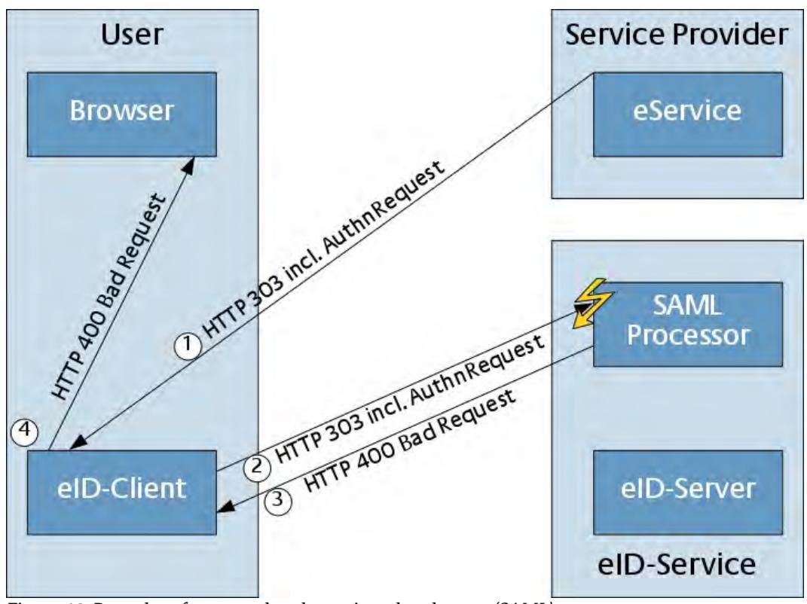

<span id="page-65-2"></span>*Figure 46: Procedure for general and security related errors (SAML)*

If a general or security related (e.g. signature verification failed, scheme validation failed) error appears the following procedure SHALL be implemented by the eID-Server.

#### **1. Redirect to SAML Processor incl. AuthnRequest**

As described in *Section [4.2.1:](#page-50-0) [Initiation](#page-50-0) Step 4* the eID-Client receives a redirect to the SAML Processor including the AuthnRequest from the eService.

#### **2. Call of SAML Processor incl. AuthnRequest**

As described in *Section [4.2.1:](#page-50-0) [Initiation](#page-50-0) Step 5* the eID-Client calls SAML Processor with the AuthnRequest.

#### **3. Answer with HTTP Code 400 Bad Request**

The SAML Processor answers the invalid request with the HTTP status code 400 Bad Request.

#### **4. Forward Browser to HTTP Code 400 Bad Request**

As described in [TR-03124] *Section 2.5.4.3: Communication error without refreshURL* the eID-Client SHALL convey a HTTP status code 400 Bad Request including a meaningful human-readable error message.

# <span id="page-66-0"></span>4.8.2 Sending SAML Error Messages

Error messages according to [SAML] *Assertions and Protocols, Section 3.2.2.2: Element <StatusCode>* MAY only be sent from the SAML Processor to the eService using the procedure described in this section IF

- **1.** the SAML Processor was able to verify that the SAML Request was sent by an authorized eService AND
- **2.** the SAML Processor was able to interpret the SAML Request according to this specification.

If both conditions apply the eID-Server may act as shown in the following *[Figure 47: Procedure for sending](#page-66-1)  [SAML error messages](#page-66-1)* in all other cases the procedure described in *Section[4.8.1](#page-65-0): [General and Security Related](#page-65-0)  [Errors](#page-65-0)* SHALL be used.

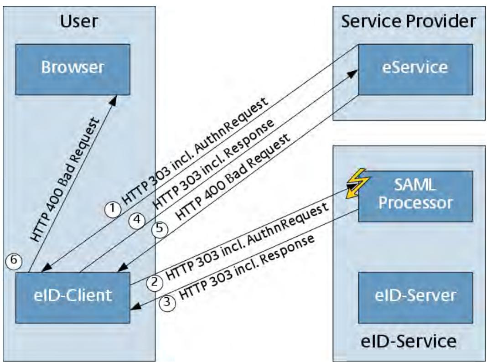

<span id="page-66-1"></span>*Figure 47: Procedure for sending SAML error messages*

The procedure for sending SAML error messages in form of status codes includes the following steps.

#### **1. Redirect to SAML Processor incl. AuthnRequest**

As described in *Section [4.2.1:](#page-50-0) [Initiation](#page-50-0) Step 4* the eID-Client receives a redirect to the SAML Processor including the AuthnRequest from the eService.

#### **2. Call of SAML Processor incl. AuthnRequest**

As described in *Section [4.2.1:](#page-50-0) [Initiation](#page-50-0) Step 5* the eID-Client calls SAML Processor with the AuthnRequest.

#### **3. Redirect to eService incl. Response with error code**

The SAML processor answers the call of the eID-Client with a redirect to the eService including a SAML Response with an error code according to [SAML] *Assertions and Protocols, Section 3.2.2.2: Element <StatusCode>*.

#### **4. Call of eService incl. Response with error code**

The eID-Client calls the eService including the Response from the SAML processor.

#### **5. Answer with HTTP status code 400 Bad Request**

The eService answers the call with the HTTP status code 400 Bad Request.

#### **6. Forward Browser to HTTP status code 400 Bad Request**

As described in [TR-03124] *Section 2.5.4.3: Communication error without refreshURL* the eID-Client SHALL convey a HTTP status code 400 Bad Request including a meaningful human-readable error message.

# <span id="page-67-0"></span>4.9 Security Measures

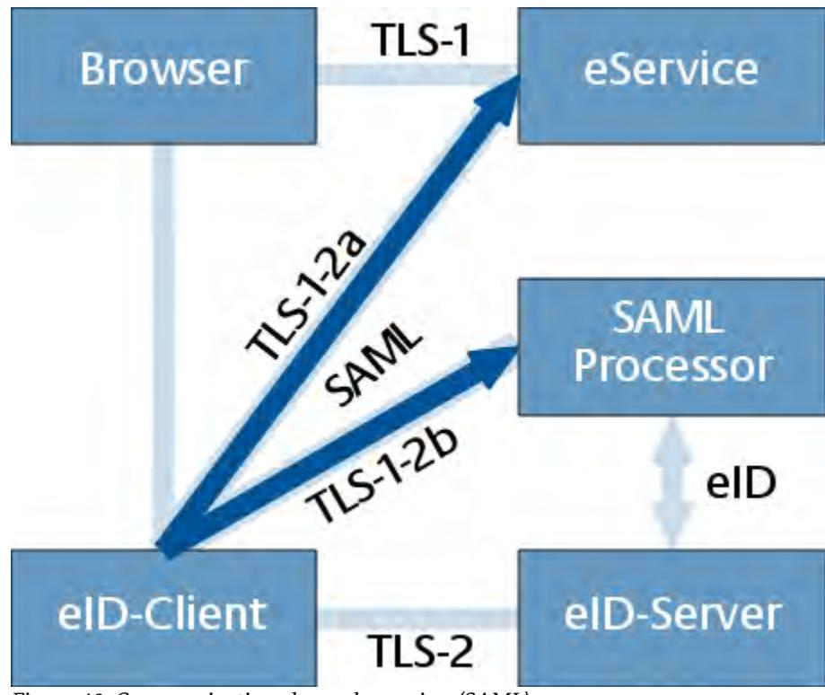

<span id="page-67-1"></span>*Figure 48: Communication channel overview (SAML)*

This section describes the security measures that the communication partners MUST take if they use the SAML-Profile described in this technical guideline. These measures result in particular from the trust relationship between the eID-Service and the Service Provider as well as general security requirements to the transport layer.

All security relevant communication channels are shown in *[Figure 48: Communication channel overview](#page-67-1)  [\(SAML\)](#page-67-1)*. The communication channels TLS-1-2a and TLS-1-2b ending at the user's eID-Client are used for the transport of the SAML messages. As specified in [TR-03124] *Part 1, Section 4.5: TLS* all of these channels SHALL be secured using TLS connections in conformance to [TR-03116-4] *Section 2: Vorgaben für SSL/TLS* to secure the exchange of the SAML messages. To prevent misuse of these channels on renewal the eService and the SAML Processor SHOULD keep these connections alive for the transport of all messages that are part of one Online-Authentication.

The threats cited in [SAML] *Security and Privacy Considerations* especially *Section 6.4: HTTP Redirect/POST Binding and Section 7.1.1: SSO Profiles* SHALL also be considered. The necessary elements for the countermeasures to the threats are included in this SAML-Profile and MUST be used by all communication

partners. Especially all relevant checks described in [SAML] *Security and Privacy Considerations* SHALL be performed by the Service Provider and the eID-Service.

The SAML communication itself is represented by the dark blue arrow in *[Figure 48: Communication channel](#page-67-1)  [overview \(SAML\)](#page-67-1)* connecting the eService and the SAML Processor. The security measures for this communication channel are described in the following sections.

# <span id="page-68-1"></span>4.9.1 Encryption

During establishment of the trust relationship between the Service Provider and the eID-Service, both parties MUST exchange the necessary keys for encrypting SAML messages on a secure way. Each party MUST create an individual encryption-key pair, which MUST be different from the signature-key pair. Only algorithms and key sizes recommended by [TR-03116-4] *Section 4.4: XML Encryption* SHALL be used.

The extension containing the requested data groups is encrypted in the SAML request. The element AuthnRequestExtension MUST be encrypted as specified in [XML-Enc] and placed inside the element EncryptedData in the element EncryptedAuthnRequestExtension (see *Section [4.5.2:](#page-58-0) [EncryptedAuthnRequestExtension](#page-58-0)*).

The assertion SHALL also be encrypted as specified in [XML-Enc] and MUST be placed inside the element EncryptedData in the element EncryptedAssertion of the response (see *Section [4.7.3](#page-61-0): [Response](#page-61-0)*) as described in [SAML] *Assertions and Protocols, Section 6: SAML and XML Encryption Syntax and Processing*.

Since SAML messages are highly structured static symmetric keys MUST NOT be used for encryption. The original encryption keys used during negotiation of the trust relationship MUST NOT be transmitted in any message. Suitably encoded transient or temporary keys SHALL be transmitted if the encryption technology, for instance hybrid encryption, requires so. Hybrid encryption methods with random keys SHOULD be used.

# <span id="page-68-0"></span>4.9.2 Signature

During establishment of the trust relationship between the Service Provider and the eID-Service, both parties MUST exchange the necessary keys for signing SAML messages on a secure way. Each party MUST create an individual signature-key pair, which MUST be different from the encryption-key pair. Only algorithms and key sizes recommended by [TR-03116-4] *Section 4.3: XML Signature* SHALL be used.

The original signature-keys used during establishment of the trust relationship MUST NOT be transmitted in any message. The respective receivers MUST check the signatures before processing a SAML message.

# <span id="page-68-2"></span>4.9.2.1 URL-Encoding

A signature SHALL be applied to every SAML message exchanged using this profile. Since this profile uses the HTTP Redirect Binding as specified in [SAML] *Bindings, Section 3.4 HTTP Redirect Binding* the signature SHALL be applied to the parameters URL-Encoded in the Location field of the redirects. The AuthnRequest and the Response as well as the URI identifying the signature algorithm (SigAlg) MUST be encoded and signed as specified in [SAML] *Bindings, Section 3.4.4.1 DEFLATE Encoding*. An example with fictional values is shown in the following code example.

```
HTTP/1.1 303 See Other
Content Length: 0
Connection: close
Location: https://www.eid-service.bund.de/processRequest/Request?SAMLRequest=F8
K3...5AM1&SigAlg=http%3A%2F%2Fwww.w3.org%2F2001%2F04%2Fxmldsig-more%23rsa-sha25
6&Signature=F8K3...S16N
```
#### *Example 9: URL-Encoded SAML-Message*

Only algorithms and key sizes recommended by [TR-03116-4] *Section 4.3: XML Signature* SHALL be used. The assertion itself SHOULD not be signed separately as it is embedded in the signed Response.

# <span id="page-69-2"></span>4.9.3 Channel Binding

The channel binding of the channel TLS-1-2a between the eID-Client and the eService and the channel TLS-1-2b between the eID-Client and the SAML Processor SHALL be secured using the SAML protocol as defined in this profile. The eService SHALL only accept and process valid assertions from the eID-Service that are bound to an existing web-session. The eID-Service SHALL only accept and process valid requests from authorized eServices.

The channel binding of the channel TLS-1-2b between the SAML Processor and the eID-Client and the channel TLS-2 between the eID-Server and the eID-Client represented in *[Figure 48: Communication channel](#page-67-1)  [overview \(SAML\)](#page-67-1)* MUST fulfill the same requirements as the channel binding of the eID-Interface described in *Section [3.5.3: Session Binding](#page-43-0)* with the SAML Processor fulfilling the role of the eService in this scenario.

# <span id="page-69-1"></span>4.10 Examples

The following code shows an example process flow of an authentication using the SAML Profile specified in this section. The code samples contain carriage returns and indentations for better readability. These usually do not occur in actual messages.

# <span id="page-69-0"></span>4.10.1 AuthnRequest

This code sample shows an example of an AuthnRequest in compliance with *Section [4.7.1](#page-59-0): [AuthnRequest](#page-59-0)*.

```
<?xml version="1.0" encoding="UTF-8"?>
<samlp:AuthnRequest
AssertionConsumerServiceURL="https://www.eservice.bund.de/processResponse"
Destination="https://www.eid-service.bund.de/processRequest"
ID="1234567890abcdef1234567890abcdef"
IssueInstant="2021-08-12T12:00:00Z"
Version="2.0"
xmlns:ds="http://www.w3.org/2000/09/xmldsig#"
xmlns:saml2="urn:oasis:names:tc:SAML:2.0:assertion"
xmlns:samlp="urn:oasis:names:tc:SAML:2.0:protocol"
xmlns:xenc="http://www.w3.org/2001/04/xmlenc#"
xmlns:xsi="http://www.w3.org/2001/XMLSchema-instance"
xmlns:eid="http://bsi.bund.de/eID/">
     <saml2:Issuer>https://www.eservice.bund.de</saml2:Issuer>
     <samlp:Extensions>
           <eid:EncryptedAuthnRequestExtension>
                 <xenc:EncryptedData
                 Type="http://www.w3.org/2001/04/xmlenc#Element">
                       <xenc:EncryptionMethod
                 Algorithm="http://www.w3.org/2001/04/xmlenc#aes128-cbc" />
                       <ds:KeyInfo>
                              <xenc:EncryptedKey>
                                    <xenc:EncryptionMethod
                       Algorithm="http://www.w3.org/2001/04/xmlenc#rsa-1_5" />
                                    <xenc:CipherData>
                                          <xenc:CipherValue>
RqsJKl9XTbZkxrj2d0o4TCgwAJhOTqZfzywOPO9Tj4Gwz4zPcnq15n+viEjKSp0l4MpwnKtm8OGx
3fP/RQyJkOCeGelcleB3iJJadDongQe5p0PEUiGrzP8sqm/SSqWnmYw7hroG1Xm61jGhE0ynVgdO
ac9kdw98qXdm8VtfzZM=
                                          </xenc:CipherValue>
```

```
</xenc:CipherData>
                              </xenc:EncryptedKey>
                       </ds:KeyInfo>
                       <xenc:CipherData
                       xmlns:xenc="http://www.w3.org/2001/04/xmlenc#">
                              <xenc:CipherValue>
Pyh3WvmaP3YKS+LfROIMuPKqZBjWcHn22JiH+uoPwKcw7n+4ySZlBKuK8sV84Nf1TR8ktllxJw26
W8E6T9W+3iDu4wH7Ai70lW2BLAAUcl4FYgnlDirkYbk+Wb84RQBhBw6yBcDi/0lnpPJjGMtMEPAf
wcqMJ0PQLQ+YgEN3wEbe+j/5rpJYL9ur1EDXpbySz9xFR9Tr+tqJVUe7kjyz5Xzya8h1Fl2J9FpC
eQY+zMfGKHiWCQ5yQR8zPB+SJcXzM66Z/cuozqgLoxgV09fqhq0l2gSnQJkK5lwDkc96JdNrhB+z
oHkOWdEq4ag1GN5j/M7qJ7vB0oWaOaTUUDldloQTqIuC2+SuvV9fnF/RuaK6L3LNJFWxXxR2kHpi
3AuKF1DmBS1dAUuwifn7wsAh8QZh+rs=
                              </xenc:CipherValue>
                       </xenc:CipherData>
                 </xenc:EncryptedData>
           </eid:EncryptedAuthnRequestExtension>
     </samlp:Extensions>
</samlp:AuthnRequest>
```
*Example 10: AuthnRequest*

# <span id="page-70-0"></span>4.10.2 AuthnRequestExtension

This code sample shows the AuthnRequestExtension, which is encrypted and then embedded in the previously described AuthnRequest, as defined in *Section [4.7.2](#page-60-0): [AuthnRequestExtension](#page-60-0)*. The AuthnRequestExtension contains the data fields and operations defined in *Section [4.3.1: Request](#page-53-0)  [Attributes](#page-53-0)* that are requested by the eService. In this example all of the data fields and operations except CommunityID and ResidencePermitI are requested. All requested data fields except ArtisticName and AcademicTitle are marked as mandatory. Additionally the eService requests transaction attestation and a certain level of assurance, but also allows some eID Types regardless of their LoA.

```
<?xml version="1.0" encoding="UTF-8"?>
<eid:AuthnRequestExtension
Version="2"
xmlns:eid="http://bsi.bund.de/eID/"
xmlns:saml2="urn:oasis:names:tc:SAML:2.0:assertion"
xmlns:xs="http://www.w3.org/2001/XMLSchema"
xmlns:xsi="http://www.w3.org/2001/XMLSchema-instance">
     <eid:RequestedAttributes>
           <saml2:Attribute Name="DocumentType" eid:RequiredAttribute="true" />
           <saml2:Attribute Name="IssuingState" eid:RequiredAttribute="true" />
           <saml2:Attribute Name="DateOfExpiry" eid:RequiredAttribute="true" />
           <saml2:Attribute Name="GivenNames" eid:RequiredAttribute="true" />
           <saml2:Attribute Name="FamilyNames" eid:RequiredAttribute="true" />
           <saml2:Attribute Name="ArtisticName"
           eid:RequiredAttribute="false" />
           <saml2:Attribute Name="AcademicTitle"
           eid:RequiredAttribute="false" />
           <saml2:Attribute Name="DateOfBirth" eid:RequiredAttribute="true" />
           <saml2:Attribute Name="PlaceOfBirth" eid:RequiredAttribute="true" />
           <saml2:Attribute Name="Nationality" eid:RequiredAttribute="true" />
           <saml2:Attribute Name="BirthName" eid:RequiredAttribute="true" />
           <saml2:Attribute Name="PlaceOfResidence"
           eid:RequiredAttribute="true" />
           <saml2:Attribute Name="RestrictedID" eid:RequiredAttribute="true" />
           <saml2:Attribute Name="AgeVerification"
           eid:RequiredAttribute="true">
                 <saml2:AttributeValue
```

```
4 SAML-Profile
```

```
xsi:type="eid:AgeVerificationRequestType">
                        <eid:Age>
                              18
                        </eid:Age>
                  </saml2:AttributeValue>
           </saml2:Attribute>
           <saml2:Attribute Name="PlaceVerification"
           eid:RequiredAttribute="true">
                  <saml2:AttributeValue
                  xsi:type="eid:PlaceVerificationRequestType">
                        <eid:CommunityID>
                              027605
                        </eid:CommunityID>
                  </saml2:AttributeValue>
           </saml2:Attribute>
           <saml2:Attribute Name="TransactionAttestation">
                  <saml2:AttributeValue
                  xsi:type="eid:TransactionAttestationRequestType">
                        <eid:TransactionAttestationFormat>
                              http://bsi.bund.de/eID/ExampleAttestationFormat
                        </eid:TransactionAttestationFormat>
     <eid:TransactionContext>id599456-df</eid:TransactionContext>
                  </saml2:AttributeValue>
           </saml2:Attribute>
           <saml2:Attribute Name="LevelOfAssurance">
                  <saml2:AttributeValue
                  xsi:type="eid:LevelOfAssuranceType">
                        http://bsi.bund.de/eID/LoA/hoch
                  </saml2:AttributeValue>
           </saml2:Attribute>
           <saml2:Attribute Name="EIDType">
                  <saml2:AttributeValue
                  xsi:type="eid:EIDTypeRequestType">
                        <eid:SECertified>ALLOWED</eid:SECertified>
                        <eid:SEEndorsed>ALLOWED</eid:SEEndorsed>
                  </saml2:AttributeValue>
           </saml2:Attribute>
     </eid:RequestedAttributes>
</eid:AuthnRequestExtension>
```
*Example 11: AuthnRequestExtension*

# <span id="page-71-0"></span>4.10.3 Response

This code sample shows an example of a Response in compliance with *Section [4.7.3: Response](#page-61-0)*.

```
<?xml version="1.0" encoding="UTF-8"?>
<samlp:Response
Destination="https://www.eservice.bund.de/processResponse"
ID="0987654321fedcba0987654321fedcba"
InResponseTo="1234567890abcdef1234567890abcdef"
IssueInstant="2021-08-12T12:00:00"
Version="2.0"
xmlns:ds="http://www.w3.org/2000/09/xmldsig#"
xmlns:saml2="urn:oasis:names:tc:SAML:2.0:assertion"
xmlns:samlp="urn:oasis:names:tc:SAML:2.0:protocol"
xmlns:xenc="http://www.w3.org/2001/04/xmlenc#"
xmlns:xsi="http://www.w3.org/2001/XMLSchema-instance">
```

```
<saml2:Issuer>https://www.eid-service.bund.de</saml2:Issuer>
     <samlp:Status>
           <samlp:StatusCode
           Value="urn:oasis:names:tc:SAML:2.0:status:Success" />
     </samlp:Status>
     <saml2:EncryptedAssertion>
           <xenc:EncryptedData Type="http://www.w3.org/2001/04/xmlenc#Element">
                 <xenc:EncryptionMethod
                 Algorithm="http://www.w3.org/2001/04/xmlenc#aes128-cbc" />
                 <ds:KeyInfo>
                       <xenc:EncryptedKey>
                              <xenc:EncryptionMethod
                       Algorithm="http://www.w3.org/2001/04/xmlenc#rsa-1_5" />
                              <xenc:CipherData>
                                    <xenc:CipherValue>
RqsJKl9XTbZkxrj2d0o4TCgwAJhOTqZfzywOPO9Tj4Gwz4zPcnq15n+viEjKSp0l4MpwnKtm8OGx
3fP/RQyJkOCeGelcleB3iJJadDongQe5p0PEUiGrzP8sqm/SSqWnmYw7hroG1Xm61jGhE0ynVgdO
ac9kdw98qXdm8VtfzZM=
                                    </xenc:CipherValue>
                              </xenc:CipherData>
                       </xenc:EncryptedKey>
                 </ds:KeyInfo>
                 <xenc:CipherData
                 xmlns:xenc="http://www.w3.org/2001/04/xmlenc#">
                       <xenc:CipherValue>
Pyh3WvmaP3YKS+LfROIMuPKqZBjWcHn22JiH+uoPwKcw7n+4ySZlBKuK8sV84Nf1TR8ktllxJw26
W8E6T9W+3iDu4wH7Ai70lW2BLAAUcl4FYgnlDirkYbk+Wb84RQBhBw6yBcDi/0lnpPJjGMtMEPAf
wcqMJ0PQLQ+YgEN3wEbe+j/5rpJYL9ur1EDXpbySz9xFR9Tr+tqJVUe7kjyz5Xzya8h1Fl2J9FpC
eQY+zMfGKHiWCQ5yQR8zPB+SJcXzM66Z/cuozqgLoxgV09fqhq0l2gSnQJkK5lwDkc96JdNrhB+z
oHkOWdEq4ag1GN5j/M7qJ7vB0oWaOaTUUDldloQTqIuC2+SuvV9fnF/RuaK6L3LNJFWxXxR2kHpi
3AuKF1DmBS1dAUuwifn7wsAh8QZh+rs=
                       </xenc:CipherValue>
                 </xenc:CipherData>
           </xenc:EncryptedData>
     </saml2:EncryptedAssertion>
</samlp:Response>
```
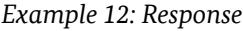

# <span id="page-72-0"></span>4.10.4 Assertion

This code sample shows the Assertion, which is embedded encrypted in the previously described Response. It contains the successfully completed authentication's return values as specified in *Section [4.3.2: Response Attributes](#page-54-2)*. The assertion was constructed according to requirements from *Section [4.7.4:](#page-62-0) [Assertion](#page-62-0)*. Transmission of the artistic name was deselected by the user (thus missing in the Assertion). Additionally the eID-Server was not able to read the BirthName because this data group was not available on the eID-Document's chip. The EIDType indicates the usage of a physical identity card, which implicitly has been allowed because it meets the requested level of assurance.

```
<?xml version="1.0" encoding="UTF-8"?>
<saml2:Assertion
ID="0987654321fedcbaabcdef123467890"
IssueInstant="2021-08-02T12:00:00Z"
Version="2.0"
xmlns:ds="http://www.w3.org/2000/09/xmldsig#"
xmlns:saml2="urn:oasis:names:tc:SAML:2.0:assertion"
xmlns:eid="http://bsi.bund.de/eID/"
xmlns:xenc="http://www.w3.org/2001/04/xmlenc#"
```

```
xmlns:xsi="http://www.w3.org/2001/XMLSchema-instance"
xmlns:xs="http://www.w3.org/2001/XMLSchema">
     <saml2:Issuer>https://www.eid-service.bund.de</saml2:Issuer>
     <saml2:Subject>
           <saml2:NameID
           Format="urn:oasis:names:tc:SAML:2.0:nameid-format:transient">
                  _6b69710c2d804b48356209c9788a661f
           </saml2:NameID>
           <saml2:SubjectConfirmation
           Method="urn:oasis:names:tc:SAML:2.0:cm:bearer">
                  <saml2:SubjectConfirmationData
                  Address="127.0.0.1"
                  InResponseTo="1234567890abcdef1234567890abcdef"
                  NotOnOrAfter="2021-08-02T12:05:00Z"
                  Recipient="https://www.eservice.bund.de/processResponse" />
                  </saml2:SubjectConfirmation>
     </saml2:Subject>
     <saml2:Conditions>
           <saml2:AudienceRestriction>
                  <saml2:Audience>
                        https://www.eservice.bund.de
                  </saml2:Audience>
           </saml2:AudienceRestriction>
           <saml2:OneTimeUse />
     </saml2:Conditions>
     <saml2:AuthnStatement AuthnInstant="2021-08-02T12:00:00Z">
           <saml2:AuthnContext>
                  <saml2:AuthnContextDeclRef>
                        urn:oasis:names:tc:SAML:2.0:ac:classes:SmartcardPKI
                  </saml2:AuthnContextDeclRef>
           </saml2:AuthnContext>
     </saml2:AuthnStatement>
     <saml2:AttributeStatement>
           <saml2:Attribute Name="DocumentValidity">
                  <saml2:AttributeValue
                  xsi:type="eid:DocumentValidityResultType"
                  Version="1">
                        <eid:ReferenceDate>2021-08-02</eid:ReferenceDate>
                        <eid:Status>VALID</eid:Status>
                  </saml2:AttributeValue>
           </saml2:Attribute>
           <saml2:Attribute Name="DocumentType">
                  <saml2:AttributeValue xsi:type="xs:string">
                        ID
                  </saml2:AttributeValue>
           </saml2:Attribute>
           <saml2:Attribute Name="IssuingState">
                  <saml2:AttributeValue xsi:type="xs:string">
                        D
                  </saml2:AttributeValue>
           </saml2:Attribute>
           <saml2:Attribute Name="DateOfExpiry">
                  <saml2:AttributeValue xsi:type="xs:date">
                        2029-10-3
                  </saml2:AttributeValue>
           </saml2:Attribute>
           <saml2:Attribute Name="GivenNames">
                  <saml2:AttributeValue xsi:type="xs:string">
                        ERIKA
```

```
</saml2:AttributeValue>
</saml2:Attribute>
<saml2:Attribute Name="FamilyNames">
      <saml2:AttributeValue xsi:type="xs:string">
            MUSTERMANN
      </saml2:AttributeValue>
</saml2:Attribute>
<saml2:Attribute Name="AcademicTitle">
      <saml2:AttributeValue xsi:type="xs:string" />
</saml2:Attribute>
<saml2:Attribute Name="DateOfBirth">
      <saml2:AttributeValue xsi:type="eid:GeneralDateType">
            <eid:DateString>19640812</eid:DateString>
            <eid:DateValue>1964-08-12</eid:DateValue>
      </saml2:AttributeValue>
</saml2:Attribute>
<saml2:Attribute Name="PlaceOfBirth">
      <saml2:AttributeValue xsi:type="eid:GeneralPlaceType">
            <eid:FreetextPlace>
                  BERLIN
            </eid:FreetextPlace>
      </saml2:AttributeValue>
</saml2:Attribute>
<saml2:Attribute Name="Nationality">
      <saml2:AttributeValue xsi:type="xs:string">
            D
      </saml2:AttributeValue>
</saml2:Attribute>
<saml2:Attribute Name="BirthName" AttributeNotOnChip="true">
      <saml2:AttributeValue xsi:type="xs:string" />
</saml2:Attribute>
<saml2:Attribute Name="PlaceOfResidence">
      <saml2:AttributeValue xsi:type="eid:GeneralPlaceType">
            <eid:StructuredPlace>
                  <eid:Street>HEIDESTRASSE 17</eid:Street>
                  <eid:City>KÖLN</eid:City>
                  <eid:Country>D</eid:Country>
                  <eid:ZipCode>51147</eid:ZipCode>
            </eid:StructuredPlace>
      </saml2:AttributeValue>
</saml2:Attribute>
<saml2:Attribute Name="RestrictedID">
      <saml2:AttributeValue xsi:type="eid:RestrictedIDType">
            <eid:ID>
      01A4FB509CEBC6595151A4FB5F9C75C6FE01A4FB59CB655A4FB5F9C75C6FEE
            </eid:ID>
            <eid:ID2>
      5C6FE01A4FB59CB655A4FB5F9C75C6FEE01A4FB509CEBC6595151A4FB5F9C7
            </eid:ID2>
      </saml2:AttributeValue>
</saml2:Attribute>
<saml2:Attribute Name="AgeVerification">
      <saml2:AttributeValue
      xsi:type="eid:AgeVerificationResultType">
            <eid:Request>
                  <eid:Age>
                        18
                  </eid:Age>
            </eid:Request>
```
<eid:Result> <eid:FulfilsRequest> true </eid:FulfilsRequest> </eid:Result> </saml2:AttributeValue> </saml2:Attribute> <saml2:Attribute Name="PlaceVerification"> <saml2:AttributeValue xsi:type="eid:PlaceVerificationResultType"> <eid:Request> <eid:CommunityID> 027605 </eid:CommunityID> </eid:Request> <eid:Result> <eid:FulfilsRequest> true </eid:FulfilsRequest> </eid:Result> </saml2:AttributeValue> </saml2:Attribute> <saml2:Attribute Name="TransactionAttestation"> <saml2:AttributeValue xsi:type="eid:TransactionAttestationResponseType"> <eid:TransactionAttestationFormat> <http://bsi.bund.de/eID/ExampleAttestationFormat> </eid:TransactionAttestationFormat> <eid:TransactionAttestationData> V6INOOUsHouL9nYaRwR6RpX5WzccQXv51bIvvpY4Lsbp/VOPvG1ozxQCjo6JOi4xAv9/6b8G2PxaVv8 bwdpFR/CN05xsnzxijzfemooKwve3Fl3005OX6dwkVyNQlZxXaWb3eUcYPA\MEwHSkhzP25ZM/ J+CQHHaqLih6JW6wxSvUbuD307sjzkeaMkjJr9tXI9QcUmGmpHBWEWwon56HkWKGL1Dl0XH4\ YuYhKMsTj2yjUJNlLH8OAm9cEX0ptQJlVTMRvNGRk53eUESnfhtQrVSm9bS63v+A9sGPrRlUIquCpcu sX1nZe6\omAzs2tY0S04+s1fNvgHXKmQi24wIdhhbtFPbB2n2j9dAB8xjfGgEcsG3wPMliP6d </eid:TransactionAttestationData> </saml2:AttributeValue> </saml2:Attribute> <saml2:Attribute Name="LevelOfAssurance"> <saml2:AttributeValue xsi:type="eid:LevelOfAssuranceType"> <http://bsi.bund.de/eID/LoA/hoch> </saml2:AttributeValue> </saml2:Attribute> <saml2:Attribute Name="EIDType"> <saml2:AttributeValue xsi:type="eid:EIDTypeResponseType"> <eid:CardCertified>USED</eid:CardCertified> </saml2:AttributeValue> </saml2:Attribute> </saml2:AttributeStatement> </saml2:Assertion>

*Example 13: Assertion*

# <span id="page-76-1"></span>5 eIDAS-Extension and eSAML Profile

In order to enhance trust and interoperability of electronic transactions in the EU, the eIDAS regulation sets the regulatory framework for the mutual recognition of electronic identification means.

According to eIDAS, European Member States may notify their eID systems to the European Commission. While the notification is optional, recognition of notified schemes is mandatory under the terms and conditions of the regulation.

The choice of the identification means depends on the level of assurance (LoA) required by the service of the relying party. For that purpose, eIDAS distinguishes between three levels of assurance (LoA), i.e. 'low', 'substantial' and 'high'.

Interoperability is achieved via the eIDAS Interoperability Framework [eIDAS-Interop] consisting of socalled eIDAS Nodes. The framework distinguishes between eIDAS Connectors (on the side of the receiving Member State) and eIDAS Services (on the side of the sending Member State). The eIDAS Nodes forming the eIDAS Network ensure the confidentiality, the authenticity and integrity of the transmitted personal data as well as the secure identification of the end points.

The eIDAS regulation distinguishes between the identification of natural persons, legal persons and legal persons with a natural person representing the former. The sending Member State determines which of those "identity flavours" are available cross-border.[3](#page-76-2) Thus, all three of those "identity flavours" SHOULD be supported and can be requested, if the Service Provider supports them.

In this section, the additional measures are described, which are needed to enable the eID-Server to forward the user's authentication session over the eIDAS Connector towards the eIDAS Service. The main difference is that the authentication happening between eID-Client and eID-Server is replaced by the authentication conducted within the eIDAS Network and the response is provided back to the relying party.

For an eIDAS-compliant cross-border authentication the receiving Member State must request the attributes of the general natural or the legal person's Minimum Data Set (see [eIDAS-Attributes]) and the sending Member State must answer with the corresponding specific Minimum Data Set (usually a subset of the general natural or the legal person's Minimum Data Set[4](#page-76-3) ). When requesting an eIDAS authentication, the Service Provider therefore should request all attributes from one or the other general Minimum Data Set and has to process the responded attributes from the specific Minimum Data Set. If a legally eIDAS compliant authentication is not needed, the Service Provider MAY also only request and process a subset of the Minimum Data Set.

# <span id="page-76-0"></span>5.1 Infrastructure Adaption to eIDAS context

The goal is, to direct the user session into the eIDAS Network and provide the result back to the relying party.

This is achieved by adapting the national communication with the eID-Server as specified in this document and using the eIDAS Connector (interface) as specified in [eIDAS-Interop]. As the eIDAS-process relies strongly on SAML [eIDAS-SAML] and therefore the advantages of the eID-Interface (SOAP) described in *Chapter [3:](#page-18-2) [eID-Interface \(SOAP\)](#page-18-2)* are mitigated, support for SOAP in the eIDAS-context is dropped and only SAML is used.

The SAML-Profile described in *Chapter [4](#page-49-1) [SAML-Profile](#page-49-1)* is adapted and supplemented in order to comply with the different circumstances. The extended SAML-Profile (eSAML) as described in the following sections SHALL be implemented if the eID-Server is to be used as eIDAS Node.

<span id="page-76-2"></span>3 https://ec.europa.eu/cefdigital/wiki/display/EIDCOMMUNITY/Overview+of+available+attributes+of+prenotified+and+notified+eID+schemes

<span id="page-76-3"></span>4 For representation cases (e.g. a natural person representing a legal person) the SAML response MAY contain additional attributes of a representative not requested.

In contrast to *Chapter [4](#page-49-1): [SAML-Profile](#page-49-1),* HTTP-Post Binding as specified in *[SAML] Bindings* SHALL be used in the context of eIDAS. Deviating from the roles as defined in *[Table 11: Attribute and Elements of the Data type](#page-58-3)  [AuthnRequestExtensionType](#page-58-3),* the user's browser acts as the user agent regarding the SAML messages towards the eID-Server and the eIDAS Network. By using encrypted SAML Assertions eService and eID-Server as well as eID-Server and eIDAS-Service respectively are enabled to perform secured communication with each other (depicted in *[Figure 49: eID-Server infrastructure adapted to eIDAS context](#page-77-1)* with circular arrows)*.*

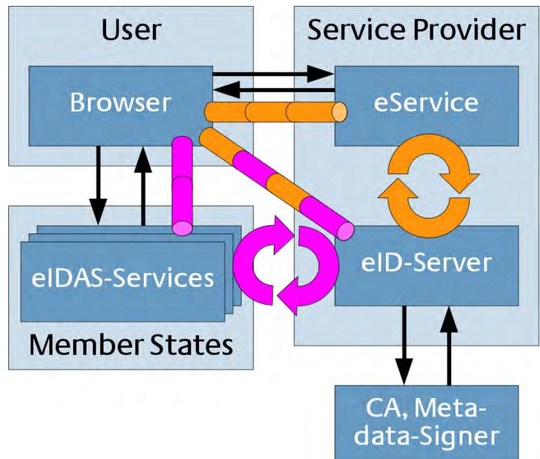

<span id="page-77-1"></span>*Figure 49: eID-Server infrastructure adapted to eIDAS context*

# <span id="page-77-0"></span>5.2 eIDAS Message Flow

The message flow on the national part of an eIDAS authentication is adapted from the SAML profile described in *Section [4.2](#page-50-1): [General Message Flow](#page-50-1)*.

In the following the eIDAS Connector is depicted as a component on its own, but MAY usually be integrated into the eID-Server, as it also needs contact to the background infrastructure for retrieving e.g. Metadata Signer certificates.

In analogy to *Section [4: SAML-Profile](#page-49-1)* the descriptions in *Section [5.2.1](#page-78-0) [Initiation](#page-78-0)* and *Section [5.2.3](#page-79-0) [Completion](#page-79-0)* assume, that the eSAML messages used for communication with the eService are sent over a dedicated SAML Processor. The SAML Processor MAY be the same component as used in the national protocol and MAY also be directly attached to the eID-Server. Alternatively the eSAML-Profile MAY also be implemented directly by the eIDAS Connector.

The description in *Section [5.2.2](#page-79-1) [eIDAS authentication process](#page-79-1)* assumes, that the eIDAS-SAML messages used for communication with the eIDAS Service are sent directly from the eIDAS Connector (component), but MAY also be sent over a dedicated SAML Processor (i.e. the same component as above).

# <span id="page-78-0"></span>5.2.1 Initiation

The following *[Figure 50: General message flow during initiation \(eIDAS\)](#page-78-1)* shows the initiation of an eIDAS authentication process. Instead of providing a local link for the eID-Client the eService provides a POST form to the browser in order to forward the SAML request to the eID-Server.

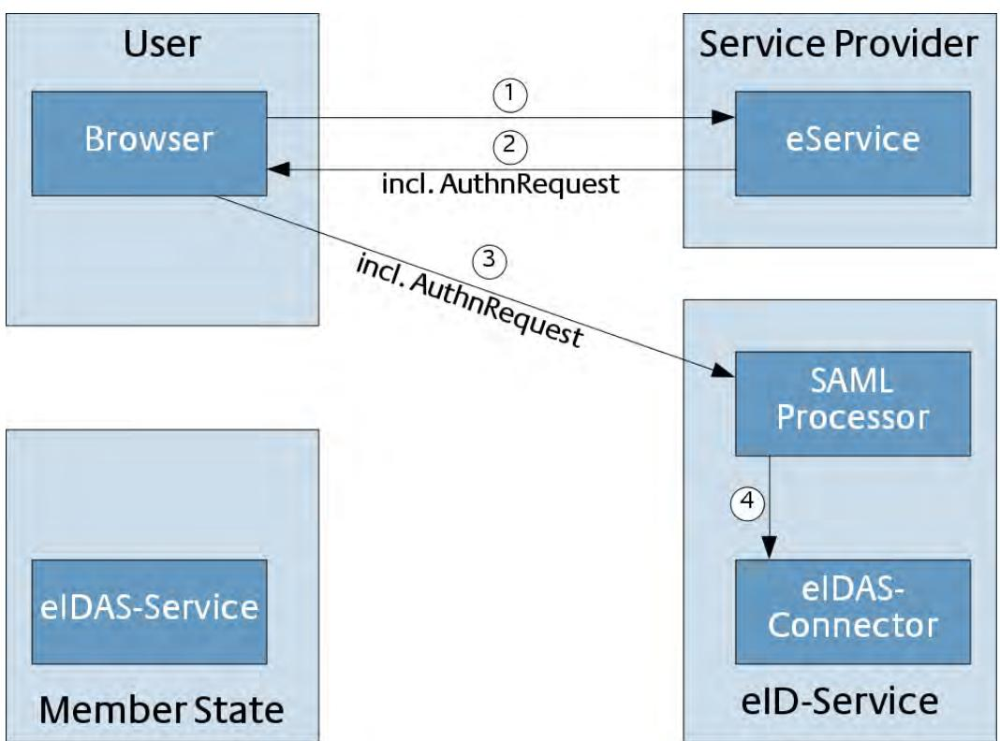

<span id="page-78-1"></span>*Figure 50: General message flow during initiation (eIDAS)*

#### **1. Access eService**

The user accesses the eService via the browser and chooses to use eIDAS authentication. An option for selecting the Sending Member State MAY be provided to the user.

#### **2. Provide POST form incl. AuthnRequest**

The resource provided by the eService MUST include a XHTML form with POST. That POST MUST be targeted to the SAML Processor and MUST contain the SAML Authentication Request (see [SAML] *Bindings*).

#### **3. Submit POST to SAML Processor incl. AuthnRequest**

The included AuthnRequest (compare *Section [4.7.1: AuthnRequest](#page-59-0)*) is submitted to the SAML Processor via POST.

#### **4. Request eIDAS session**

The SAML Processor connects to the eIDAS Connector to request an authentication session. The attributes from the AuthnRequest SHALL be mapped to the eIDAS request according to *Section [5.5](#page-84-1): [Attribute](#page-84-1)  [Mapping](#page-84-1)*. If not already provided within the AuthnRequest, the eIDAS Connector MUST present a possibility to select the sending member state.

# <span id="page-79-1"></span>5.2.2 eIDAS authentication process

The following *[Figure 51: General message flow during interaction \(eIDAS\)](#page-79-2)* shows the authentication process within the eIDAS Network. It is shown here only for reference. The technical details are provided in [eIDAS-Interop], [eIDAS-SAML] and [eIDAS-Attributes]. Within the eIDAS Network mostly HTTP POST Binding is used, but eIDAS Services must also support HTTP Redirect Binding for eIDAS-Requests [eIDAS-Interop]. The eIDAS Connector SHOULD use HTTP Redirect Binding for the eIDAS-AuthnRequest if the request is short enough (depending on e.g. the browser limiting URL length)[5](#page-79-3) .

Regardless of the eID attributes originally requested in the eSAML AuthnRequest, the eIDAS-AuthnRequest MUST request all attributes of the general Minimum Data Set as defined in [eIDAS-SAML].

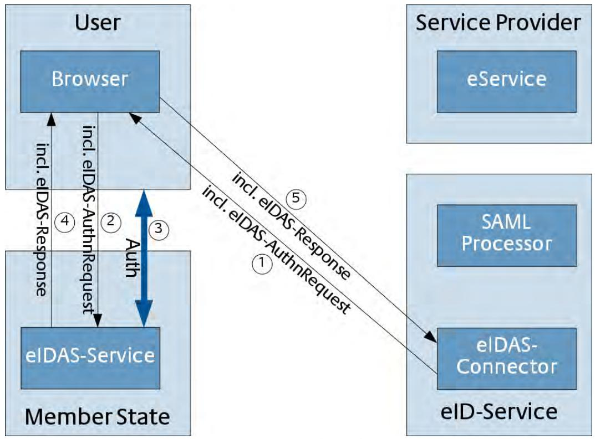

<span id="page-79-2"></span>*Figure 51: General message flow during interaction (eIDAS)*

- **1. Redirect/Provide POST to eIDAS Service incl. eIDAS- AuthnRequest**
- **2. Call of/Submit POST to eIDAS Service incl. eIDAS-AuthnRequest**
- **3. Authentication by the chosen means**
- **4. Provide POST to SAML-Processor incl eIDAS-Response**
- <span id="page-79-0"></span>**5. Submit POST to SAML-Processor incl. eIDAS-Response**

# 5.2.3 Completion

The following *[Figure 52: General message flow during completion \(eIDAS\)](#page-80-1)* shows the completion of the authentication process. The result of the eIDAS authentication is provided back to the eService.

<span id="page-79-3"></span>5 This recommendation is aimed at reducing latency (redirect processing is usually faster than POSTprocessing) and enhancing usability in environments where java-script is not available, e.g. corporate networks.

If the LoA supplied in the eIDAS response is lower than the LoA of the request, the eID-Server MUST abort the authentication and provide an error to the eService.

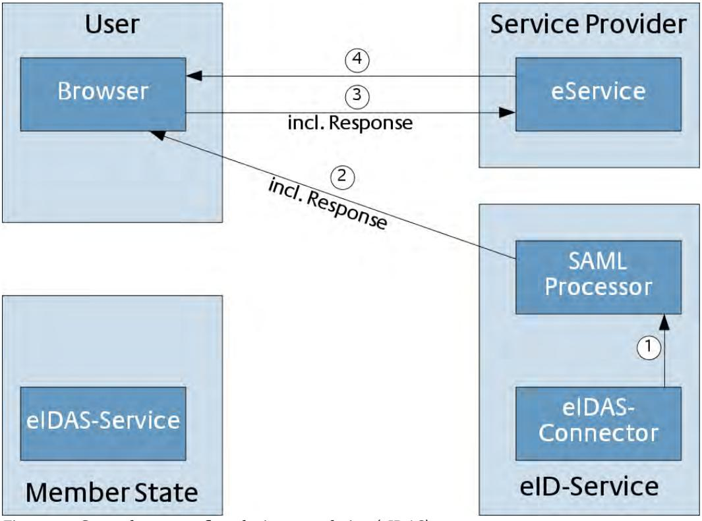

<span id="page-80-1"></span>*Figure 52: General message flow during completion (eIDAS)*

#### **1. Respond with eIDAS-Result**

The eIDAS Connector provides the result of the authentication to the SAML Processor. The attributes from the eIDAS-Response SHALL be mapped back to the Response according to *Section [5.5](#page-84-1): [Attribute Mapping](#page-84-1)*

#### **2. Provide POST form incl. Response**

The SAML Processor MUST provide the SAML response in an XHTML form with POST. That POST MUST be targeted to the eService and MUST contain the SAML Authentication Request (see [SAML] *Bindings*).

#### **3. Submit POST to eService incl. Response**

The included Response (compare *Section [4.7.3](#page-61-0): [Response](#page-61-0)*) is submitted to the eService via POST.

#### **4. Proceed**

The Browser proceeds with the websession at the eService.

# <span id="page-80-0"></span>5.3 Additional Attributes in eSAML

The SAML attributes defined in *Section [4.3](#page-52-0): [Attributes](#page-52-0)* SHALL be used for communication. They are supplemented by attributes providing the additionally needed information for using the eIDAS Network.

The tables below also contain information about the data types that MUST be used to transmit values upon requests and responses.

# <span id="page-81-1"></span>5.3.1 Request Attributes

The following table contains additional attributes (supplementing *[Table 8: SAML Request Attributes](#page-53-1)*) the Service Provider MAY use, when sending a request to the eID-Service. In order to request an authentication within the eIDAS Network rather than a national eID usage, the attribute UseEidas MUST be used and set to "true". The attribute EidasExtension is CONDITIONAL. It MUST be used, if UseEidas is set to "true" and the contained elements (see *Section [5.4.1](#page-82-0): [EidasExtensionType](#page-82-0)*) are used to transmit additional information. Otherwise, it SHOULD be omitted.

The attribute IdentityFlavour is OPTIONAL and declares the expected type of identification. Its default value is NaturalPerson. The attribute Sex MAY additionally be used in a request for a natural person. In a request for legal persons the corresponding additonal attributes defined in *[Table 16:](#page-81-2)  [Supplementing SAML Request attributes for eIDAS usage](#page-81-2)* SHALL be used.

As noted above the eService's request should include all attributes from the general Minimum Data Set (natural person vs. legal person respectively), if an eIDAS compliant authentication is needed. Regardless of the attributes requested the eID-Server SHALL however always request the full Minimum Data Set from the eIDAS Service. Note: Natural persons attributes of the legal persons representative MUST NOT be requested explicitly according to eIDAS specifications.

| Attribute name        | Data type used for value in request |
|-----------------------|-------------------------------------|
| UseEidas              | xs:boolean                          |
| EidasExtension        | eid:EidasExtensionType              |
| IdentityFlavour       | eid:IdentityFlavourType             |
| Sex                   | -                                   |
| LegalName             | -                                   |
| LegalPersonIdentifier | -                                   |
| LegalAddress          | -                                   |
| VATRegistration       | -                                   |
| TaxReference          | -                                   |
| BusinessCodes         | -                                   |
| LEI                   | -                                   |
| EORI                  | -                                   |
| SEED                  | -                                   |
| SIC                   | -                                   |

<span id="page-81-2"></span>Table 16: Supplementing SAML Request attributes for eIDAS usage

# <span id="page-81-0"></span>5.3.2 Response Attributes

The following table contains additional attributes (supplementing *[Table 9: SAML Response Attributes](#page-54-3)*) the eID-Service SHALL transmit to the Service Provider. The attributes UseEidas, EidasExtension and IdentityFlavour are MANDATORY if the attribute UseEidas was set to "true" in the request. In this case the attribute UseEidas MUST also be set to "true" in the response and both contained elements in the attribute EidasExtension (see *Section [5.4.1](#page-82-0): [EidasExtensionType](#page-82-0)*) MUST be set according to the result of the eIDAS authentication. The attribute IdentityFlavour MUST contain the person type of the eIDAS authentication.

The attribute Sex is CONDITIONAL and SHALL be used, if the gender is provided in the Minimum Data Set of the Sending Member State. In case of a legal person the additional attributes defined below SHALL be used. Natural persons attributes of the legal persons representative (indicated by the eIDAS attribute names beginning with "Representative") SHALL be provided as natural person attributes additional to the legal person attributes. Additionally, the attribute EidasExtension MAY also include the original eIDAS-Attributes (names and values) from the eIDAS-Response.

If the eService only requested a subset of the Minimum Data Set, the eID-Server's response SHOULD only provide the attributes requested. Further Minimum Data Set attributes from the eIDAS response MAY then be discarded..

| Attribute name        | Data type used for value in response |
|-----------------------|--------------------------------------|
| UseEidas              | xs:boolean                           |
| EidasExtension        | eid:EidasExtensionType               |
| IdentityFlavour       | eid:IdentityFlavourType              |
| Sex                   | eid:ICAOSex                          |
| LegalName             | xs:string                            |
| LegalPersonIdentifier | xs:string                            |
| LegalAddress          | eid:GeneralPlaceType                 |
| VATRegistration       | xs:string                            |
| TaxReference          | xs:string                            |
| BusinessCodes         | xs:string                            |
| LEI                   | xs:string                            |
| EORI                  | xs:string                            |
| SEED                  | xs:string                            |
| SIC                   | xs:string                            |

Table 17: Supplementing SAML response attributes for eIDAS usage

# <span id="page-82-1"></span>5.4 Additional Data Types in eSAML

Additional data types when using the eSAML Profile are also specified in the XML-Schema TR-03130eID-Server.xsd and SHALL be used as described in the following section.

# <span id="page-82-0"></span>5.4.1 EidasExtensionType

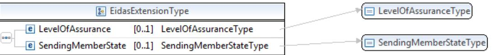

#### *Figure 53: Data Type EidasExtensionType*

This data type SHALL be used for transmitting the additional information needed within the eIDAS Network in an assertion. It contains the elements LevelOfAssurance and SendingMemberState which SHALL be used in AuthnRequest and Response as described in *[Table 18: Elements of the Data](#page-83-2)  [Type EidasExtensionType and their usage in Request and Response](#page-83-2)*. When used in a Response it MAY also contain the original eIDAS-attributes from the eIDAS-Response for reference as defined in [eIDAS-Attributes].

| Element            | Usage in AuthnRequest                                                                                                                                                                                                                         | Usage in Response                                                                                                                   |  |
|--------------------|-----------------------------------------------------------------------------------------------------------------------------------------------------------------------------------------------------------------------------------------------|-------------------------------------------------------------------------------------------------------------------------------------|--|
| LevelOfAssurance   | Element is OPTIONAL and<br>contains the minimal Level of<br>Assurance (LoA) desired by the<br>Service Provider. If not provided<br>the eID-Server MUST assume the<br>highest LoA. Only the eIDAS-LoAs<br>are allowed in this context.         | Element is MANDATORY and<br>contains the LoA of the actually<br>used eID-system, as reported by<br>the corresponding eIDAS Service. |  |
| SendingMemberState | Element is OPTIONAL and<br>contains the (preselected) Member<br>State, whose eIDAS Service should<br>be used for authentication. If not<br>provided, a possibility to select the<br>sending MS has to be presented by<br>the eIDAS Connector. | Element is MANDATORY and<br>contains the sending Member<br>State as reported by the eIDAS<br>Service.                               |  |

<span id="page-83-2"></span>Table 18: Elements of the Data Type EidasExtensionType and their usage in Request and Response

# <span id="page-83-1"></span>5.4.2 LevelOfAssuranceType

[definition has been moved to [3.3.12](#page-34-1) [LevelOfAssuranceType](#page-34-1)]

# <span id="page-83-0"></span>5.4.3 SendingMemberStateType

This data type is used for transmitting the Sending Member State in the element SendingMemberState and is a string restricted to a two-digit country code (ISO 3166-1 alpha-2) as used for eIDAS and described in [eIDAS-Attributes].

# <span id="page-84-3"></span>5.4.4 ICAOSex

This data type is used for transmitting the sex in the element Sex and is a string restricted to the following values (see [TR-03110] *Part 4 Section 2.2.3: Data Groups and Generic Attributes*):

- M
- F
- <span id="page-84-2"></span>" " (space, without the quotation marks)

# 5.4.5 IdentityFlavourType

This data type is used for transmitting the Person Type of the identification in the element IdentityFlavour and is a string restricted to the following values:

- NaturalPerson
- LegalPerson
- <span id="page-84-1"></span>LegalPersonRepresentative

# 5.5 Attribute Mapping

The SAML attribute profile used in the eIDAS Network is specified in [eIDAS-Attributes] and MUST be implemented by the eIDAS Connector. Thus, the eIDAS attributes MUST be mapped to the eID attributes used in the eSAML Profile (see *Section [4.3](#page-52-0): [Attributes](#page-52-0)* and *Section [5.3](#page-80-0): [Additional Attributes in eSAML](#page-80-0))* by the eID-Server.

# <span id="page-84-0"></span>5.5.1 eIDAS Minimum Data Set for natural person

If the attribute IdentityFlavour is not present or set to NaturalPerson the mapping rules for natural persons apply. The counterpart of every Minimum Data Set attribute provided in the eIDAS-Response MUST be included in the eSAML Response, IF it was included in the eSAML AuthnRequest. The mapping SHALL occur as follows:

| eID Attribute                                 | eIDAS Attribute  | Remark                                                                                  |  |  |
|-----------------------------------------------|------------------|-----------------------------------------------------------------------------------------|--|--|
| Attributes mandatory according to [eIDAS IF]6 |                  |                                                                                         |  |  |
| GivenNames                                    | FirstName        | Latin string as received from eIDAS Network (see<br>Section 5.5.4 Non-Latin Characters) |  |  |
| FamilyNames                                   | FamilyName       | Latin string as received from eIDAS Network (see<br>Section 5.5.4 Non-Latin Characters) |  |  |
| DateOfBirth                                   | DateOfBirth      | eIDAS format YYYY-MM-DD SHALL be mapped to eID<br>format YYYYMMDD.                      |  |  |
| RestrictedID                                  | PersonIdentifier | See Section 5.5.5 RestrictedID                                                          |  |  |
| Attributes optional according to [eIDAS IF]   |                  |                                                                                         |  |  |
| PlaceOfBirth                                  | PlaceOfBirth     | String as received from eIDAS Network                                                   |  |  |
| BirthName                                     | BirthName        | See Section 5.5.6 BirthName                                                             |  |  |
| PlaceOfResidence                              | CurrentAddress   | See Section 5.5.7 PlaceOfResidence                                                      |  |  |
| Sex                                           | Gender           | eIDAS ("Male", "Female", "Unspecified") SHALL                                           |  |  |

<span id="page-84-4"></span>6 Please note, that the term "mandatory" does not have a technical meaning here

| eID Attribute | eIDAS Attribute | Remark                                        |
|---------------|-----------------|-----------------------------------------------|
|               |                 | be mapped to eID ("M", "F", " ") respectively |

<span id="page-85-3"></span>Table 19: Attribute Mapping of the Minimum Data Set for natural person

# <span id="page-85-2"></span>5.5.2 eIDAS Minimum Data Set for legal person

For identifying a legal person, thus IdentityFlavour was set to LegalPerson or LegalPersonRepresentative in the request, the counterpart of every Minimum Data Set attribute provided in the eIDAS-Response MUST be included in the eSAML Response, IF it was included in the eSAML AuthnRequest. The mapping SHALL directly occur to the equivalent eID attributes as defined in *Section [5.3.2](#page-81-0) [Response Attributes.](#page-81-0)* 

While mapping the attribute LegalAddress the data SHALL be converted according to *Section [5.5.7](#page-86-0) [PlaceOfResidence.](#page-86-0)*IF the eIDAS authentication includes data for a representative, which is indicated by natural persons attribute names beginning with "Representative", the attributes SHALL be mapped according to the rules for natural persons (see *Section [5.5.1](#page-84-0) [eIDAS Minimum Data Set for natural person](#page-84-0)).*

# <span id="page-85-1"></span>5.5.3 Further Attributes

Attributes, that were included in the eSAML AuthnRequest but can not be mapped using *[Table 19:](#page-85-3)  [Attribute Mapping of the Minimum Data Set for natural person](#page-85-3)* SHALL be handled as follows:

| eID Attribute     | Remark                                                                                                                                                                                                            |  |
|-------------------|-------------------------------------------------------------------------------------------------------------------------------------------------------------------------------------------------------------------|--|
| DocumentValidity  | Status MUST be set to valid, when eIDAS authentication was successful                                                                                                                                             |  |
| DocumentType      | Unsupported, AttributeNotOnChip SHALL be set to true                                                                                                                                                              |  |
| IssuingState      | Unsupported, AttributeNotOnChip SHALL be set to true                                                                                                                                                              |  |
| DateOfExpiry      | Unsupported, AttributeNotOnChip SHALL be set to true                                                                                                                                                              |  |
| ArtisticName      | Unsupported, AttributeNotOnChip SHALL be set to true                                                                                                                                                              |  |
| AcademicTitle     | Unsupported, AttributeNotOnChip SHALL be set to true                                                                                                                                                              |  |
| Nationality       | Unsupported, AttributeNotOnChip SHALL be set to true                                                                                                                                                              |  |
| ResidencePermitI  | Unsupported, AttributeNotOnChip SHALL be set to true                                                                                                                                                              |  |
| AgeVerification   | Age verification SHOULD be mimicked by the eID-Server by checking the<br>supposed age against the date of birth and providing a boolean answer in<br>FulfilsRequest (see Section 4.4.2 AgeVerificationResultType) |  |
| PlaceVerification | Unsupported, AttributeNotOnChip SHALL be set to true                                                                                                                                                              |  |

Table 20: Handling of Attributes not in the eIDAS Minimum Data Set

Member States may include further attributes in their eIDAS response. Those attributes MAY be mapped to the according counterparts of the above attributes.

# <span id="page-85-0"></span>5.5.4 Non-Latin Characters

The eIDAS attributes GivenNames, FamilyNames and BirthName may contain Non-Latin script variants [eIDAS-Attributes]. In this case only the latin transliteration SHALL be mapped to the according eID attributes. If only the Non-Latin script variant is provided by the eIDAS Service the transliteration SHALL be performed by the eID-Server.

As stated in *Section [5.3.2](#page-81-0) [Response Attributes](#page-81-0)* the original eIDAS attributes including the Non-Latin variant MAY additionally be included within the attribute EidasExtension.

# <span id="page-86-2"></span>5.5.5 RestrictedID

The eIDAS attribute PersonIdentifier is encoded as UTF-8 string and SHALL be mapped to the eID attribute RestrictedID, which is encoded in hexBinary.

# <span id="page-86-1"></span>5.5.6 BirthName

The eIDAS attribute BirthName does also contain the first name at birth and is filled, even if the family name has not changed since birth [eIDAS-Attributes].

In order to mostly match the values expected in german eID scheme, the first name(s) or first and last names SHALL be removed from BirthName, if they match the current name(s). If the first name(s) in BirthName does not match the current name, BirthName SHALL be mapped unaltered, even if the last name at birth matches the current FamilyName. For examples see *[Table 21: Examples for handling of the name mapping.](#page-86-3)*

| eIDAS     |            |                    | eID                |
|-----------|------------|--------------------|--------------------|
| FirstName | FamilyName | BirthName          | BirthName          |
| Erika     | Mustermann | Erika Gabler       | Gabler             |
| André     | Mustermann | André Mustermann   |                    |
| Peter     | Müller     | Hans Müller        | Hans Müller        |
| Frieda    | Maier      | Friedlinde Schmidt | Friedlinde Schmidt |

<span id="page-86-3"></span>Table 21: Examples for handling of the name mapping

# <span id="page-86-0"></span>5.5.7 PlaceOfResidence

In eIDAS the attribute CurrentAddress (for natural persons) or LegalAddress (for legal persons) carries the street address in a base64 encoded XML sequence of xs:string elements following the Core ISA Vocabulary [eIDAS-Attributes]. These elements SHALL be mapped to elements of the data type StructuredPlace in the eID attribute PlaceOfResidence. The following table provides a guidance.

Depending on the exact usage of the elements by the Sending Memberstates the eID-Server MAY (slightly) deviate from the proposed mapping, in order to provide a better matching.

| eID address element | eIDAS address element(s)       | Remark                                                                                        |
|---------------------|--------------------------------|-----------------------------------------------------------------------------------------------|
| Street              | Thoroughfare LocatorDesignator | Choice depending on the provided<br>elements. Order SHOULD be<br>reversed for some countries. |
|                     | Thoroughfare, LocatorName      |                                                                                               |
|                     | PoBox                          |                                                                                               |
| City                | PostName, CvaddressArea        | CVaddressArea MAY be<br>missing                                                               |
| State               | AdminUnitSecondline            | MAY be missing                                                                                |
| Country             | AdminUnitFirstline             | MUST be mapped to the type<br>ICAOCountry, if not provided as<br>such                         |
| ZipCode             | PostCode                       | MAY be missing                                                                                |

#### <span id="page-87-1"></span>Table 22: Mapping of address elements

If the eIDAS attribute CurrentAddress (or LegalAddress respectively) includes the element FullAddress (providing the full address as formatted or unformatted string) its content MAY be mapped to the data type FreetextPlace in the eID attribute PlaceOfResidence.

If the mapping described in *[Table 22: Mapping of address elements](#page-87-1)* can not be performed because of critical elements missing or other errors (e.g. Country could not be mapped), the data type FreetextPlace in the eID attribute PlaceOfResidence MUST be used. The content is mapped CONDITIONALLY either from the element FullAddress, IF present, as described above or SHALL consist of a concatenation of the provided other address elements in the following layout. Missing values SHALL be omitted:

```
Thoroughfare LocatorDesignator, LocatorName, PoBox
Postcode Postname, CvaddressArea
AdminUnitSecondline
AdminUnitFirstline
```
# <span id="page-87-0"></span>5.6 Error Handling

Additionally to the Error Handling described in *Section [4.8](#page-65-1): [Error Handling](#page-65-1)* errors occurring during the eIDAS Authentication SHALL be reported to the eService.

# <span id="page-88-0"></span>References

| [CP-eID]        | BSI: Certificate Policy für die Country Verifying Certification Authority - eID<br>Anwendung |
|-----------------|----------------------------------------------------------------------------------------------|
| [DSS]           | OASIS: Digital Signature Services (DSS)                                                      |
| [eIDAS IF]      | COMMISSION IMPLEMENTING REGULATION (EU) 2015/1501 of 8 September 2015 on                     |
|                 | the interoperability framework pursuant to Article 12(8) of Regulation (EU) No 910/2014      |
|                 | of the European Parliament and of the Council on electronic identification and trust         |
|                 | services for electronic transactions in the internal market                                  |
|                 | [eIDAS-Attributes] eIDAS: SAML Attribute Profile                                             |
| [eIDAS-Interop] | eIDAS: Interoperability Architecture                                                         |
| [eIDAS-SAML]    | eIDAS: SAML Message Format                                                                   |
| [ICAO 9303]     | ICAO: Doc 9303, Machine Readable Travel Documents                                            |
| [RFC 5280]      | IETF: D. Cooper, S. Santesson, S. Farrell, S. Boyen, R. Housley, W. Polk, RFC 5280 Internet  |
|                 | X.509 Public Key Infrastructure Certificate and Certificate Revocation List (CRL) Profile,   |
|                 | 2008                                                                                         |
| [RFC2119]       | IETF: RFC 2119, S. Bradner: Key words for use in RFCs to Indicate Requirement Levels         |
| [RFC2818]       | IETF: RFC 2818, E. Rescorla: HTTP Over TLS                                                   |
| [SAML]          | OASIS: Security Assertion Markup Language (SAML) V2.0                                        |
| [TR-03107-1]    | BSI: Technische Richtline TR-03107-1, Elektronische Identitäten und Vertrauensdienste        |
|                 | im E-Government                                                                              |
| [TR-03110]      | BSI: Technische Richtlinie TR-03110, Advanced Security Mechanisms for Machine                |
|                 | Readable Travel Documents and eIDAS Token                                                    |
| [TR-03112]      | BSI: Technical Guideline TR-03112, eCard-API-Framework                                       |
| [TR-03116]      | BSI: Technische Richtlinie TR-03116, Kryptographische Vorgaben für Projekte der              |
|                 | Bundesregierung                                                                              |
| [TR-03116-4]    | BSI: Technische Richtlinie TR-03116, Kryptographische Vorgaben für Projekte der              |
|                 | Bundesregierung, Teil 4 - Kommunikationsverfahren in Anwendungen                             |
| [TR-03124]      | BSI: Technical Guideline TR-03124, eID-Client                                                |
| [TR-03127]      | BSI: Technische Richtlinie TR-03127, eID-Karten mit eID- und eSign-Anwendung                 |
|                 | basierend auf Extended Access Control                                                        |
| [TR-03128]      | BSI: Technische Richtlinie TR-03128, Diensteanbieter für die eID-Funktion                    |
| [TR-03129]      | BSI: Technical Guideline TR-03129, PKIs for Machine Readable Travel Documents                |
| [XML-Enc]       | W3C: XML Encryption Syntax and Processing                                                    |