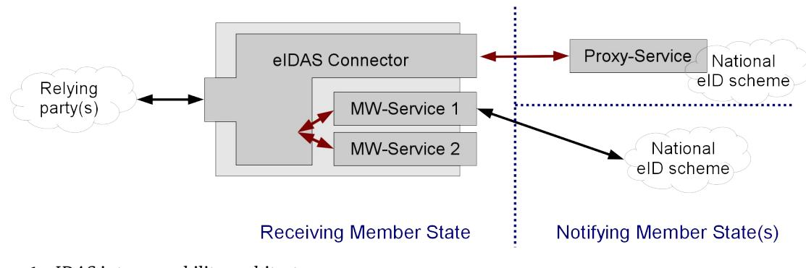
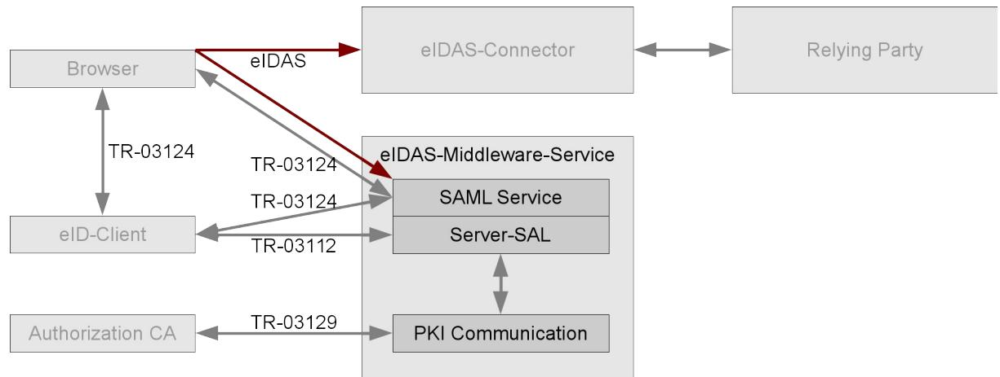
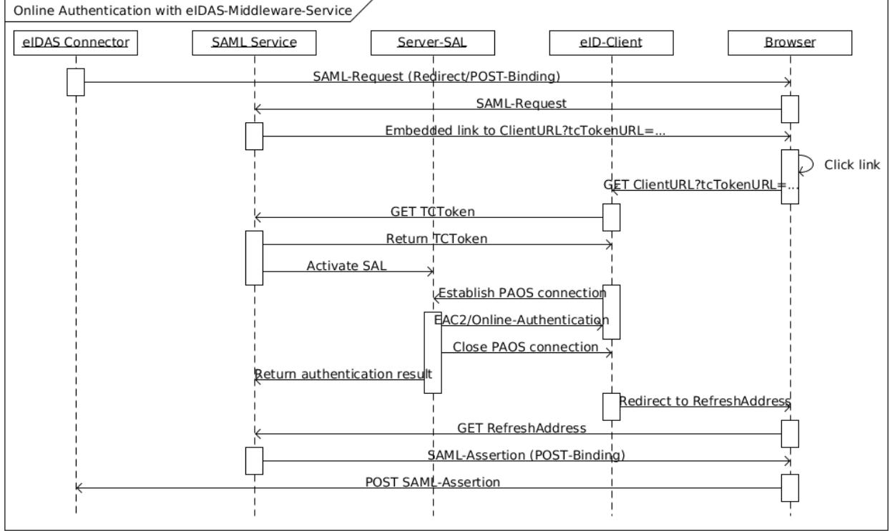

# Technical Guideline TR-03130-3 eID-Server – Part 3: eIDAS-Middleware-Service for eIDAS-Token

Version 1.2 2. December 2022

Federal Office for Information Security Post Box 20 03 63 D-53133 Bonn Phone: +49 22899 9582-0 E-Mail: eid@bsi.bund.de Internet: https://www.bsi.bund.de © Federal Office for Information Security 2022

| 1     | Introduction 4                       |  |  |
|-------|--------------------------------------|--|--|
| 1.1   | Key Words 4                          |  |  |
| 1.2   | Robustness Principle 4               |  |  |
| 2     | Interfaces 5                         |  |  |
| 2.1   | SAML Service 5                       |  |  |
| 2.1.1 | Activation Link 5                    |  |  |
| 2.1.2 | TC Token 6                           |  |  |
| 2.2   | Server-SAL 6                         |  |  |
| 2.3   | PKI Communication 7                  |  |  |
| 3     | Authentication 7                     |  |  |
| 3.1   | Process Flow 7                       |  |  |
| 3.2   | Attribute Mapping 8                  |  |  |
| 4     | General Requirements 10              |  |  |
| 4.1   | Compliance to the eIDAS Regulation10 |  |  |
| 4.2   | Supported eID-Documents 10           |  |  |
| 4.3   | Interfaces 11                        |  |  |
| 4.4   | HTTP Communication 11                |  |  |
| 4.5   | SAML 11                              |  |  |
| 4.6   | TLS 11                               |  |  |
| 4.7   | Key Generation and Storage 11        |  |  |
| 4.8   | Deployment 11                        |  |  |
| 4.9   | Active Web Content 12                |  |  |
| 4.10  | Developer Mode 12                    |  |  |
| 4.11  | Updates 12                           |  |  |
|       | Reference Documentation 13           |  |  |

| Figure 1: eIDAS interoperability architecture 4 |  |
|-------------------------------------------------|--|
| Figure 2: Components and interfaces 5           |  |
| Figure 3: Authentication Flow 8                 |  |

| Tabelle 1: Mandatory attributes according to [eIDAS IF]9         |  |
|------------------------------------------------------------------|--|
| Tabelle 2: Optional attributes according to [eIDAS IF]10         |  |
| Tabelle 3: Additional attributes according to [eIDAS CommAttr]10 |  |

# 1 Introduction

This Technial Guideline specifies the eIDAS-Middleware-Service for the integration of eIDAS-Token based eID schemes (EAC2 – see [TR-03110]) into the European Interoperability Framework according to the eIDAS regulation (see [eIDAS]), the implementing act defining the interoperability framework (see [eIDAS IF]) and the corresponding technical specifications (see [eIDAS Arch], [eIDAS Message], [eIDAS Attributes] and [eI-DAS Crypto]).

The eIDAS-Middleware-Service is based on the eCard-API-Framework and implements the functions of this API necessary to support Online-Authentication as the counterpart of the eID-Client used by the citizen. Furthermore, the eIDAS-Middleware-Service communicates with the Authorization CA to retrieve authorization certificates and block lists.

This specification supports the identification of natural persons according to [eIDAS IF]. Organizational processes, e.g. delivery of the software or registering with an Authorization CA are out of scope of this document.

# 1.1 Key Words

The key words "MUST", "MUST NOT", "REQUIRED", "SHALL", "SHALL NOT", "SHOULD", "SHOULD NOT", "RECOMMENDED", "MAY", and "OPTIONAL" in this document are to be interpreted as described in [RFC2119]. The key word "CONDITIONAL" is to be interpreted as follows:

CONDITIONAL: The usage of an item is dependent on the usage of other items. It is therefore further qualified under which conditions the item is REQUIRED or RECOMMENDED.

# 1.2 Robustness Principle

Implementations according to this Technical Guideline SHALL follow the robustness principle, also known as Postel's Law:

# 2 Interfaces

The eIDAS Middleware comprises three interface components:

- **•** The **SAML Service** component communicates with the eIDAS Connector where the eIDAS Middleware Service is deployed. The communication is SAML-based and specified in [eIDAS Arch]/[eIDAS Message]. Further, it takes the role of the eService as specified in [TR-03124], part 1, i.e. delivers the invocation link to activate the eID-Client to the browser and the TC Token to the eID-Client.
- **•** The **Server-SAL** operates as Attached eID-Server (see [TR-03124], part 1), implements the necessary functionality from [TR-03112] and communicates with the Client-SAL (as part of the eID-Client) according to that Technical guideline.
- **•** The **PKI communication** component for communication with the Authorization CA according to [TR-03129] to retrieve authorization certificates and block lists.

The internal architecture of the eIDAS Middleware Service is out of scope of this Technical Guideline.

*Figure 2: Components and interfaces* 

# 2.1 SAML Service

The SAML Service component SHALL implement the interface to the eIDAS Connector as specified in [eI-DAS Arch]. The interface is based on SAML (see [SAML-Core]). Both Redirect and POST-Binding SHALL be supported for receiving SAML-Requests. POST-Binding SHALL be supported to return the SAML-Assertion (see [SAML-Binding]).

### 2.1.1 Activation Link

The SAML Service component SHALL provide web pages containing activation links according to [TR-03124] part 1, section 2.3.

**•** The tcTokenURL contained in the link SHALL contain a freshly generated random identifier.

### 2.1.2 TC Token

The SAML Service component SHALL provide TC Tokens according to [TR-03124] part 1, section 2.6, with the following elements:

| • | ServerAddress                           | (REQUIRED) |
|---|-----------------------------------------|------------|
|   | MUST point to the Server-SAL component. |            |

- **•** SessionIdentifier (REQUIRED) **•** RefreshAddress (REQUIRED) MUST point back to the SAML Service. The RefreshAddress SHALL contain a randomly generated identifier.
- **•** CommunicationErrorAddress (OPTIONAL)
- PathSecurity-Protocol and PathSecurity-Parameters MUST NOT be present since the attached communication model is used.

The SAML Service MUST enforce the binding between the SAML communication, the communication to the browser/to the eID-Client using the identifiers contained in the SAML-Request, the activation link and the RefreshAddress / SessionIdentifier.

# 2.2 Server-SAL

The Server-SAL SHALL operate as an Attached eID-Server according to [TR-03124], part 1, and implement the server side of Online Authentication according to [TR-03124], part 1, section 2.7.

The Server-SAL SHALL implement the following commands of the eCard-API [TR-03112]:

- **•** As callee:
	- **◦** StartPAOS ([TR-03112], part 7) (REQUIRED)
- **•** As caller:
	- **◦** DIDAuthenticate ([TR-03112], part 4) with support for AuthenticationProtocolData of type EAC1InputType and EAC2InputType ([TR-03112], part 7) (REQUIRED)
	- **◦** Transmit ([TR-03112], part 6), including batched transmission of APDUs (REQUIRED)

Accepted eID Types according to section [4.2](#page-9-0) SHOULD be indicated in EAC1InputType as described in Amendment eIDType Signalling for Extended Access Control to [TR-03112] Part 7 in order to enable improvement of the user experience by the eID-Client.

When performing an eID Type indication towards the eID-Client, the Server-SAL SHALL indicate those supported eID Types that match or surpass the eIDAS level of assurance (LoA), which is given by the eIDAS Connector or is assumed by the eIDAS Middleware in case the eIDAS Connector does not specify details regarding the LoA.

The actual eID Type used in an authentication MUST be determined by using the DocumentType extension of the Document Signer of the corresponding eID Document. In case that the eID Type indicates a notified Smart-eID, the specific eID Type of the notified Smart-eID MUST be derived from the EF.CardSecurity according to Amendment Protocol extensions and specifications for Smart-eID to [TR-03110].

**•** Binding (REQUIRED)

# 2.3 PKI Communication

The eIDAS Middleware-Service SHALL implement a communication interface according to [TR-03129] including the use of Request Signer Certificates in compliance with [CP-eID]and [CP-eID-Annex] . The Middleware-Service MUST

- **•** renew the authorization certificates,
- **•** download block, defect and master lists,
- **•** download trust point updates

on a regular basis.

By default, the middleware SHOULD request authorization certificates signed by Request Signer Certificates. If this is not possible, the middleware MUST renew the authorization certificates using the valid authoriza tion certificate to sign the request.

As of 2024, the eIDAS-Middleware MUST support [TR-03129-3], including the use of Request-Signer-Certificate in order to

- renew the TLS client certificates to enable the communication with the DV,
- transmit the TLS server certificates to enable the entanglement with the authorization certificate,
- transmit the Request-Signer Certificates to replace the previous Request-Signer Certificate registered in the DV.

*Note: Since the attached communication model is used, the subjectURL of the CertificateDescription contained in the authorization certificates and the URL of the SAML Service MUST conform to the Same-origin policy according to [RFC6454].*

# 3 Authentication

# 3.1 Process Flow

The framework for an authentication process is defined in [eIDAS Arch]. After the eIDAS Connector was invoked by the relying party, the national part of the Online Authentication is performed as follows:

- 1. The eIDAS Connector calls the SAML Service with a SAML-Request as specified in [eIDAS Message].
	- The SAML-Request is sent using Redirect or POST-Binding, i.e. transported via the browser of the citizen.
	- The SAML Service SHALL verify the signature of the SAML-Request. SAML-Requests not originating at the eIDAS Connector where the Middleware Service is deployed MUST be rejected.
- 2. The SAML Service SHALL respond to the HTTP GET/POST, which transported the SAML-Request to the SAML Service, with a web page containing an activation link for the eID-Client as specified in [TR-03124], part 1, section 2.3.
	- The tcTokenURL contained in this link SHALL point to the SAML Service.
- 3. The user activates the eID-Client via the activation link. The eID-Client uses the tcTokenURL from the activation link to request a TC Token from the SAML Service. The SAML Service SHALL respond with a TC Token as specified in [TR-03124], part 1, section 2.6 and activate the Server-SAL.

*Figure 3: Authentication Flow*

- 4. The eID-Client initiates connection establishment between Client-SAL and Server-SAL and the Online-Authentication is performed ([TR-03124], part 1, section 2.7).
	- As part of the Online Authentication, the Server-SAL SHALL perform Passive Authentication and Revocation Check of the authenticated eID-Card according to Section 2.4 of Part 1 of this Technical Guideline.

After Online-Authentication is concluded, the eID-Client redirects the browser to the RefreshAddress contained in the TC Token, which points back to the SAML Service.

5. The SAML Service SHALL respond to this HTTP GET with a signed and encrypted SAML-Assertion containing the result of the Online-Authentication in POST-Binding, which is sent via the browser to the eIDAS Connector.

*Note: The eIDAS-Middleware-Service MUST NOT transmit SAML attributes to the eIDAS Connecter which were not requested in the SAML-Request. Unknown SAML attributes in the SAML-Request MUST be ignored.*

The final result of the authentication is returned to the requesting relying party by the eIDAS Connector.

See [3](#page-7-0) for a sequence diagram of the authentication flow.

*Note: This authentication flow provides eID-Client based channel binding only to the SAML Service, not the relying party connected to the eIDAS Connector. See also [TR-03124], part 1, Annex A.*

## 3.2 Attribute Mapping

The attributes retrieved from the eID Card (see [TR-03110], part 4 and [TR-03127]) are mapped to the eIDAS attributes (see [eIDAS Attributes]) according to Table [1,](#page-8-0) [2,](#page-9-2) [3](#page-9-1).

| eIDAS attribute  | eID Card attribute | Remark                                                                                                                                                                                                                                                    |
|------------------|--------------------|-----------------------------------------------------------------------------------------------------------------------------------------------------------------------------------------------------------------------------------------------------------|
| FirstName        | DG4 – GivenNames   | String as retrieved from eID Card                                                                                                                                                                                                                         |
| FamilyName       | DG5 – FamilyNames  | String as retrieved from eID Card                                                                                                                                                                                                                         |
| DateOfBirth      | DG8 – DateOfBirth  | The date retrieved from the eID Card is converted to the format YYYY-MM-DD.                                                                                                                                                                            |
|                  |                    | Note: In rare cases, the month or day of birth might be unknown. In these cases, MM or DD are set to 00.                                                                                                                                               |
| PersonIdentifier | RestrictedID       | The PersonIdentifier is a string constructed as DE/xx/yyyy, where xx is the two-letter coun try code of the destination country or international organization and yyyy is the return value of the RestrictedID function encoded as hexBinary. |
|                  |                    | Note: For private sector relying parties, the Restricte dID is specific to the private sector body, i.e. the Per sonIdentifier is incomparable between relying parties.                                                                          |

### Tabelle 1: Mandatory attributes according to [eIDAS IF]

| eIDAS attribute | eID Card attribute                                           | Remark                                                                                                                                                                                                                        |
|-----------------|--------------------------------------------------------------|-------------------------------------------------------------------------------------------------------------------------------------------------------------------------------------------------------------------------------|
| PlaceOfBirth    | DG9 – PlaceOfBirth                                           | If the PlaceOfBirth stored on the eID Card is encoded as structuredPlace, only the compo nent city is used. If the PlaceOfBirth is en coded as freetextPlace, the string is used as re trieved from the eID Card. |
| BirthName       | DG4 – GivenNames DG13 – BirthName or DG5 – FamilyNames | If DG13 is empty (implying that the current last name is the same as the name at birth), the con catenation of the contents of DG4 (first names) and DG5 (last name) is returned.                                    |
|                 |                                                              | If DG13 is non-empty, the concatenation of the contents of DG4 (first names) and DG13 (last name at birth) is returned.                                                                                                 |
|                 |                                                              | Note: German ID Cards issued before Q2/2012 and German Residence Permits issued before Q4/2014 do not contain a DG13/BirthName. In these cases, an empty BirthName is returned.                                      |
| CurrentAddress  | DG17 – PlaceOfResidence                                   | If the data group contains a structuredPlace, the CurrentAddress is constructed as follows:                                                                                                                                |
|                 |                                                              | • AdminunitFirstline is set to the con tent of the element country;                                                                                                                                                     |
|                 |                                                              | • AdminunitSecondline is set to the content of the element state, if present;                                                                                                                                           |
|                 |                                                              | • PostName is set to the content of the ele ment city;                                                                                                                                                                  |

| eIDAS attribute | eID Card attribute | Remark                                                                                    |
|-----------------|--------------------|-------------------------------------------------------------------------------------------|
|                 |                    | • PostCode is set to the content of the ele ment zipCode;                           |
|                 |                    | • ThouroughFare is set to the content of element street.                            |
|                 |                    | If the data group contains the noPlaceInfo alter native, an empty address is returned. |
| Gender          | N/A                | The eIDAS attribute Gender is not supported.                                              |

Tabelle 2: Optional attributes according to [eIDAS IF]

| eIDAS attribute | eID Card attribute | Remark                                                                                                                                                                                                                      |
|-----------------|--------------------|-----------------------------------------------------------------------------------------------------------------------------------------------------------------------------------------------------------------------------|
| Nationality     | DG10 – Nationality | Contains the nationality. If the eID Card contains no or an empty DG10 Ger man nationality is returned in case of German ID Cards, and unknown nationality (i.e. an empty ele ment) in case of other eID Cards. |

Tabelle 3: Additional attributes according to [eIDAS CommAttr]

The eIDAS-Middleware-Service SHALL include the card attributes GivenNames, FamilyNames, BirthName, DateOfBirth, PlaceOfBirth and RestrictedID in the RequiredCHAT send to the eID-Client, and the attribute PlaceOfResidence in the OptionalCHAT. The Nationality SHALL be included in the OptionalCHAT if and only if the Nationality is requested by the relying party.

# 4 General Requirements

# 4.1 Compliance to the eIDAS Regulation

All operational and security related requirements from [eIDAS Arch] and specifications referenced therein MUST be fulfilled. This includes requirements on configuration, logging, delivery model and supporting documentation.

# 4.2 Supported eID-Documents

The eIDAS Middleware Service MUST support exactly those eID-Documents that

- contain an eID-Application compliant to [TR-03127], indicated by the presence of the Application Identifier 0xE80704007F00070302 in the file EF.DIR (see [TR-03110]), and
- are published in the official list of notified eID schemes published in the Official Journal of the EU [OJEU].

# 4.3 Interfaces

An attacker SHOULD be considered to be able to send arbitrary commands/data to publicly accessible interfaces. In this context, interfaces protected by access control are to be considered public until access control has been performed properly.

# 4.4 HTTP Communication

All HTTP communication SHALL follow [RFC2616] and [RFC2818], where applicable.

# 4.5 SAML

SAML is used for communication with the eIDAS Connector.

The format of messages and attributes from [eIDAS Message] and [eIDAS Attributes] MUST be used.

The cryptographic requirements from [eIDAS Crypto] MUST be fulfilled.

The well known security aspects of SAML-based systems MUST be taken into account (see [SAML-Sec]).

# 4.6 TLS

TLS is used for communication with the browser, the eID-Client and the Authorization CA.

For communication with the browser, the requirements from [eIDAS Crypto] MUST be fulfilled. For all other TLS sessions, the requirements from [TR-03116], Part 4, MUST be fulfilled. This includes the TLS version to be supported and the selection of supported Cipher Suites. To enhance interoperability, it is RECOM-MENDED to support further Cipher Suites compliant to [TR-03116], Part 4.

Session resumption SHOULD be supported for all TLS sessions. If TLS is required for different communication channels with the same end point, the same TLS session MAY be used.

# 4.7 Key Generation and Storage

Cryptographic keys MUST be generated using random numbers of sufficient entropy.

Private cryptographic keys MUST be protected against breach of confidentiality. Public cryptographic keys MUST be protected against breach of integrity.

# 4.8 Deployment

The eIDAS-Middleware-Service SHOULD be delivered with configuration options for trust points for Passive Authentication and the Authorization PKI for test and production environments. A Middleware-Service configured for the production environment MUST NOT accept eID Cards from the test environment.

The eIDAS-Middleware-Service SHOULD be accompanied with an initialization script or tool which performs all necessary configurations, including:

- configuring the Middleware-Service for test or production environment, i.e. activating the corresponding trust points;
- personalization of URLs;
- generating key pairs for TLS and SAML, generating the corresponding certificate requests and importing the signed certificates, including the certificate chains necessary to verify the certificates;
- generating and exporting an initial certificate request for the Authorization CA;
- exporting SAML Metadata describing the Middleware instance and importing the SAML Metadata of the Connector according to [eIDAS Message].

To ease backup of configuration data, it is RECOMMENDED to store all configuration data in a single directory or directory hierarchy.

## 4.9 Active Web Content

The eIDAS Middleware-Service MUST NOT use active web content. In this context active web content is defined as code downloaded as part of a web page which is executed on the host computer without prior installation, e.g. java-applets.

JavaScript MAY be used if an additional fall-back without JavaScript is available.

## 4.10 Developer Mode

It is RECOMMENDED to implement a Developer Mode as follows:

- **•** If any of the security checks specified in this document fails, the eIDAS Middleware-Service SHOULD, instead of aborting the procedure, continue if possible and inform the user about the exact reason of the failure.
- **•** The Developer Mode SHOULD provide enhanced user accessible log data. Log data MAY also be provided outside of the Developer Mode.

The Developer Mode MAY be implemented as a separate executable or as a configuration option.

### 4.11 Updates

The vendor of the eIDAS-Middleware-Service SHALL supply necessary security updates.

# Reference Documentation

| CP-eID-Annex     | BSI: Annex zur CVCA-eID CP Vorgaben für die Ausgabe von Berechtigungszertifikaten             |
|------------------|-----------------------------------------------------------------------------------------------|
|                  | an andere EU-Mitgliedstaaten                                                                  |
| CP-eID           | BSI: Certificate Policy für die Country Verifying Certification Authority eID-Anwendung       |
|                  | Elektronischer Identitätsnachweis und Vor-Ort-Auslesen mit hoheitlichen Ausweis               |
|                  | dokumenten                                                                                    |
| TR-03110         | BSI: Technische Richtlinie TR-03110, Advanced Security Mechanisms for Machine Read            |
|                  | able Travel Documents and eIDAS token                                                         |
| TR-03112         | BSI: Technische Richtlinie TR-03112, eCard-API-Framework                                      |
| TR-03116         | BSI: Technische Richtlinie TR-03116, Kryptographische Vorgaben für Projekte der Bun           |
|                  | desregierung                                                                                  |
| TR-03124         | BSI: Technische Richtlinie TR-03124, eID-Client                                               |
| TR-03127         | BSI: Technische Richtlinie TR-03127, eID-Karten mit eID- und eSign-Anwendung                  |
|                  | basierend auf Extended Access Control                                                         |
| TR-03129-3       | BSI: Technische Richtlinie TR-03129-3,Protocols for the Management of Certificates and        |
|                  | CRLs in Public-Key-Infrastructures (PKIs) Part 3: Electronic Identity (eID) documents         |
|                  | based on Extended Access Control (EAC) v1.40                                                  |
| TR-03129         | BSI: Technische Richtlinie TR-03129, PKIs for Machine Readable Travel Documents --            |
|                  | Protocols for the Management of Certificates and CRLs v1.10                                   |
| eIDAS CommAttr   | eIDAS: Common Attributes                                                                      |
| eIDAS Crypto     | eIDAS: Cryptographic Requirements for TLS and SAML                                            |
| eIDAS Arch       | eIDAS: Interoperability Architecture                                                          |
| eIDAS Message    | eIDAS: Message Format                                                                         |
| eIDAS Attributes | eIDAS: SAML Attribute Profile                                                                 |
| eIDAS IF         | EU: COMMISSION IMPLEMENTING REGULATION (EU) 2015/1501 of 8 September 2015                     |
|                  | on the interoperability framework pursuant to Article 12(8) of Regulation (EU) No             |
|                  | 910/2014 of the European Parliament and of the Council on electronic identification and       |
|                  | trust services for electronic transactions in the internal market                             |
| eIDAS            | EU: REGULATION (EU) No 910/2014 OF THE EUROPEAN PARLIAMENT AND OF THE                         |
|                  | COUNCIL of 23 July 2014 on electronic identification and trust services for electronic        |
|                  | transactions in the internal market and repealing Directive 1999/93/EC                        |
| RFC2119          | IETF: RFC 2119: S. Bradner: Key words for use in RFCs to Indicate Requirement Levels          |
| RFC2616          | IETF: RFC 2616: R. Fielding, J. Gettys, J. Mogul, H. Frystykc, L. Masinter, P. Leach, T. Bern |
|                  | ers-Lee: Hypertext Transfer Protocol -- HTTP/1.1                                              |
| RFC2818          | IETF: RFC 2818: E. Rescorla: HTTP Over TLS                                                    |
| RFC6454          | IETF: RFC 6454: A. Barth: The Web Origin Concept                                              |
| SAML-Core        | OASIS: Assertions and Protocols for the OASIS Security Assertion Markup Language              |
|                  | (SAML) V2.0                                                                                   |
| SAML-Binding     | OASIS: Bindings for the OASIS Security Assertion Markup Language (SAML) V2.0                  |
| SAML-Sec         | OASIS: F. Hirsch, R. Philpott, E. Maler: Security and Privacy Considerations for the OASIS    |
|                  | Security Assertion Markup Language (SAML) V2.0                                                |
| OJEU             | OPOCE: OJ C 241, 24.6.2022, p. 13–19                                                          |