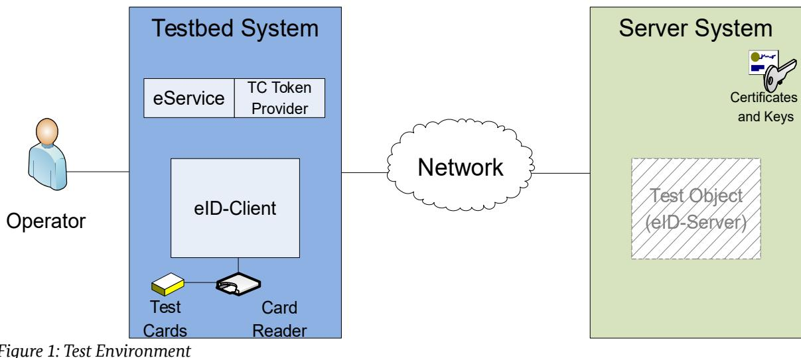
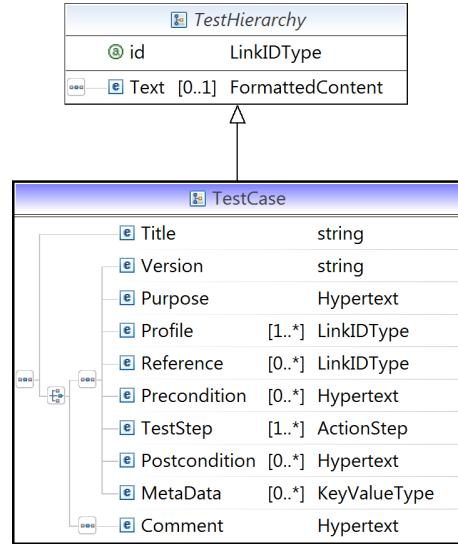

# Technical Guideline TR-03130 eID-Server

# Part 4: Conformance Test Specification

Version 1.2 17. March 2021


Federal Office for Information Security Post Box 20 03 63 D-53133 Bonn

Phone: +49 22899 9582-0 E-Mail: eid@bsi.bund.de Internet: https://www.bsi.bund.de © Federal Office for Information Security 2021

| 1      | Introduction 7                             |  |
|--------|--------------------------------------------|--|
| 1.1    | Terminology 8                              |  |
| 2      | Test Requirements 9                        |  |
| 2.1    | Test Environment 9                         |  |
| 2.1.1  | Overview 9                                 |  |
| 2.1.2  | Server System 9                            |  |
| 2.1.3  | Testbed System 10                          |  |
| 2.1.4  | Network 10                                 |  |
| 2.2    | Test Profiles 10                           |  |
| 2.2.1  | Basic Profiles 10                          |  |
| 2.2.2  | Optional/Recommended Profiles 11           |  |
| 3      | Implementation Conformance Statement12     |  |
| 3.1    | Software Version 12                        |  |
| 3.2    | Supported API Versions 12                  |  |
| 3.3    | Support of Multiple eServices 12           |  |
| 3.4    | Profiles 13                                |  |
| 3.5    | Server Address 14                          |  |
| 3.6    | Supported Cryptography 14                  |  |
| 3.6.1  | eCard API 14                               |  |
| 3.6.2  | eID-Interface 15                           |  |
| 3.6.3  | SAML Profile 15                            |  |
| 3.6.4  | EIDAS_MW profile 17                        |  |
| 3.6.5  | Certificates 18                            |  |
| 3.6.6  | Chip Authentication Algorithms 18          |  |
| 4      | Definition of Configuration Data 20        |  |
| 4.1    | Test Setup 20                              |  |
| 4.2    | Certificate Specification 21               |  |
| 4.2.1  | CERT_SET_1 21                              |  |
| 4.2.2  | CERT_SET_2 31                              |  |
| 4.3    | eID-Cards 34                               |  |
| 4.3.1  | Card Profiles for [CERT_SET_1] 34          |  |
| 4.3.2  | Card Profiles for [CERT_SET_2] 35          |  |
| 5      | Definition for Test Cases 37               |  |
| 5.1    | Test Case Notation 37                      |  |
| 5.2    | Commonly Used Elements 38                  |  |
| 5.2.1  | TC Token 39                                |  |
| 5.2.2  | StartPAOS 40                               |  |
| 5.2.3  | InitializeFramework 40                     |  |
| 5.2.4  | InitializeFrameworkResponse 40             |  |
| 5.2.5  | DIDAuthenticate_EAC1InputType 41           |  |
| 5.2.6  | DIDAuthenticateResponse_EAC1OutputType42   |  |
| 5.2.7  | DIDAuthenticate_EAC2InputType 43           |  |
| 5.2.8  | DIDAuthenticateResponse_EAC2OutputType_A44 |  |
| 5.2.9  | DIDAuthenticateResponse_EAC2OutputType_B44 |  |
| 5.2.10 | Transmit 45                                |  |

| 5.2.11 | TransmitResponse 45                                             |  |
|--------|-----------------------------------------------------------------|--|
| 5.2.12 | StartPAOSResponse 45                                            |  |
| 5.2.13 | useIDRequest 46                                                 |  |
| 5.2.14 | useIDResponse 47                                                |  |
| 5.2.15 | getResultRequest 47                                             |  |
| 5.2.16 | getResultResponse 48                                            |  |
| 5.2.17 | getServerInfoRequest 49                                         |  |
| 5.2.18 | getServerInfoResponse 49                                        |  |
| 6      | Test Specification 50                                           |  |
| 6.1    | Module A: eID-Interface 50                                      |  |
| 6.1.1  | Module A1: eID-Interface - Functional eID-Interface Operation50 |  |
| 6.1.2  | Module A2: eID-Interface – XML Security54                       |  |
| 6.1.3  | Module A3: eID-Interface - TLS 55                               |  |
| 6.2    | Module B: SAML-Interface 55                                     |  |
| 6.2.1  | Module B1: SAML-Interface – Functional Operational55            |  |
| 6.2.2  | Module B2: SAML-Interface - XML Security61                      |  |
| 6.2.3  | Module B3: TLS – SAML 63                                        |  |
| 6.3    | Module C: eCard-API Interface 63                                |  |
| 6.3.1  | Module C1: eCard-API Interface – Functional Operation63         |  |
| 6.3.2  | Module C2: TLS – eCard-API 68                                   |  |
| 6.4    | Module D: eIDAS Middleware Mode 69                              |  |
| 6.4.1  | Module D1: eIDAS Middleware Mode – Functional eIDAS Operation69 |  |
| 6.4.2  | Module D2: eIDAS Middleware Mode - XML Security70               |  |
| 6.4.3  | Module D3: eIDAS Middleware Mode - TLS71                        |  |
| 6.5    | Parameters 71                                                   |  |
|        | References 73                                                   |  |
|        |                                                                 |  |

| Figure 1: Test Environment 9       |  |
|------------------------------------|--|
| Figure 2: XML Schema Test Case 37  |  |
| Figure 3: XML Schema ActionStep 38 |  |
|                                    |  |

| Table 1: Mandatory test profiles 11                                     |  |
|-------------------------------------------------------------------------|--|
| Table 2: Optional/Recommended test profiles 11                          |  |
| Table 3: Software Version 12                                            |  |
| Table 4: Supported API Versions 12                                      |  |
| Table 5: Multi-Client Capability 12                                     |  |
| Table 6: Supported Basic Test Profiles 13                               |  |
| Table 7: Supported Optional/Recommended Test Profiles14                 |  |
| Table 8: Addresses of the eID-Server 14                                 |  |
| Table 9: Supported XML signature algorithms for SOAP communication15    |  |
| Table 10: Supported XML signature algorithms for SAML communication16   |  |
| Table 11: Supported XML encryption algorithms for SAML communication17  |  |
| Table 12: Supported XML signature algorithms for eIDAS communication17  |  |
| Table 13: Supported XML encryption algorithms for eIDAS communication18 |  |
| Table 14: Supported algorithms for Chip Authentication18                |  |
| Table 15: Variables referenced by the test cases21                      |  |
| Table 16: Description of CERT_ECARD_CV_CVCA_122                         |  |
|                                                                         |  |

| Table 17: Description of CERT_ECARD_CV_DV_1_A22                   |  |
|-------------------------------------------------------------------|--|
| Table 18: Description of CERT_ECARD_CV_TERM_1_A22                 |  |
| Table 19: Description of CERT_ECARD_CV_TERM_1_B23                 |  |
| Table 20: Description of CERT_ECARD_CV_TERM_1_C23                 |  |
| Table 21: Description of CERT_ECARD_CV_TERM_1_D24                 |  |
| Table 22: Description of CERT_ECARD_CV_TERM_1_E_*24               |  |
| Table 23: Description of CERT_ECARD_CV_TERM_1_F24                 |  |
| Table 24: Description of CERT_ECARD_CV_TERM_1_G25                 |  |
| Table 25: Description of CERT_ECARD_TLS_EIDSERVER_1_*25           |  |
| Table 26: Description of CERT_ECARD_TLS_SAMLPROCESSOR_1_*25       |  |
| Table 27: Description of BLACKLIST_ECARD_EIDCARDS_TERM_1_<X>26    |  |
| Table 28: Description of BLACKLIST_ECARD_EIDCARDS_TERM_1_D26      |  |
| Table 29: Description of BLACKLIST_ECARD_EIDCARDS_TERM_1_E_*26    |  |
| Table 30: Description of CERT_EID_TLS_ESERVICE_1_<X>27            |  |
| Table 31: Description of CERT_EID_TLS_ESERVICE_1_E_*27            |  |
| Table 32: Description of CERT_EID_TLS_EIDSERVER_1_*27             |  |
| Table 33: Description of CERT_EID_XMLSIG_ESERVICE_1_<X>27         |  |
| Table 34: Description of CERT_EID_XMLSIG_ESERVICE_1_E_*28         |  |
| Table 35: Description of CERT_EID_XMLSIG_EIDSERVER_1_*28          |  |
| Table 36: Description of CERT_SAML_XMLSIG_ESERVICE_1_<X>28        |  |
| Table 37: Description of CERT_SAML_XMLSIG_ESERVICE_1_E_*29        |  |
| Table 38: Description of CERT_SAML_XMLSIG_EIDSERVER_1_*29         |  |
| Table 39: Description of CERT_SAML_XMLENC_ESERVICE_1_<X>29        |  |
| Table 40: Description of CERT_SAML_XMLENC_ESERVICE_1_E_*29        |  |
| Table 41: Description of CERT_SAML_XMLENC_EIDSERVER_1_*30         |  |
|                                                                   |  |
| Table 42: Description of CERT_ECARD_CSCA_1 30                     |  |
| Table 43: Description of CERT_ECARD_DS_1_A30                      |  |
| Table 44: Description of CERT_ECARD_DS_1_B31                      |  |
| Table 45: Description of CERT_ECARD_CV_CVCA_2_A31                 |  |
| Table 46: Description of CERT_ECARD_CV_CVCA_2_B31                 |  |
| Table 47: Description of CERT_ECARD_CV_CVCA_2_C32                 |  |
| Table 48: Description of CERT_ECARD_CV_LINK_2_A32                 |  |
| Table 49: Description of CERT_ECARD_CV_LINK_2_B32                 |  |
| Table 50: Description of CERT_ECARD_CV_DV_2_A33                   |  |
| Table 51: Description of CERT_ECARD_CV_TERM_2_A33                 |  |
| Table 52: Description of CERT_TLS_EIDSERVER_233                   |  |
| Table 53: Description of CERT_ECARD_CSCA_2 34                     |  |
| Table 54: Description of CERT_ECARD_DS_2 34                       |  |
| Table 55: eID-Cards for [CERT_SET_1] used during the tests35      |  |
| Table 56: eID-Cards for [CERT_SET_2] used during the tests36      |  |
| Table 57: Structure of a TC Token 39                              |  |
| Table 58: Structure of a StartPAOS message 40                     |  |
| Table 59: Structure of an InitializeFrameworkResponse message41   |  |
| Table 60: Structure of DIDAuthenticate_EAC1InputType42            |  |
| Table 61: Structure of DIDAuthenticateResponse_EAC1OutputType43   |  |
| Table 62: Structure of DIDAuthenticate_EAC2InputType44            |  |
| Table 63: Structure of DIDAuthenticateResponse_EAC2OutputType_A44 |  |
| Table 64: Structure of DIDAuthenticateResponse_EAC2OutputType_B45 |  |
| Table 65: Structure of Transmit 45                                |  |
| Table 66: Structure of TransmitResponse 45                        |  |
| Table 67: Structure of StartPAOSResponse 46                       |  |
| Table 68: Structure of useIDRequest 46                            |  |
| Table 69: Structure of useIDResponse 47                           |  |
|                                                                   |  |

| Table 70: Structure of getResultRequest 48         |  |
|----------------------------------------------------|--|
| Table 71: Structure of getResultResponse 48        |  |
| Table 72: Structure of getServerInfoResponse 49    |  |
| Table 73: Test Cases of Module A1_1 51             |  |
| Table 74: Test Cases of Module A1_2 52             |  |
| Table 75: Test Cases of Module A1_3 52             |  |
| Table 76: Test Cases of Module A1_4 54             |  |
| Table 77: Test Cases of Module A2 55               |  |
| Table 78: Test cases of Module B1_1 56             |  |
| Table 79: Test cases of Module B1_2 57             |  |
| Table 80: Test Cases of Module B1_3 58             |  |
| Table 81: Test cases of Module B1_4 59             |  |
| Table 82: Test cases of Module B1_5 60             |  |
| Table 83: Test Cases of Module B1_6 61             |  |
| Table 84: Test Cases of Module B2_1 62             |  |
| Table 85: Test Cases of Module B2_2 63             |  |
| Table 86: Test Cases of Module C1_1 65             |  |
| Table 87: Test Cases of Module C1_2 67             |  |
| Table 88: Test Cases of Module C1_3 68             |  |
| Table 89: Test cases of Module D1_1 69             |  |
| Table 90: Test cases of Module D1_2 70             |  |
| Table 91: Test Cases of Module D2 71               |  |
| Table 92: Signature algorithms for XML Signature72 |  |

# <span id="page-6-0"></span>1 Introduction

For Online-Authentication based on Extended Access Control Version 2 between an eService and an eID-Card (e.g. the German National Identity Card, the German electronic Residence Permit or the eID-Card for Union Citizens), the eService uses an eID-Server to integrate the corresponding functionality into the IT systems.

The eID-Server is specified in [TR-03130-1] and can be implemented by different vendors. It offers an interface to the eService and communicates with the eID-Client [TR-03124-1], the eID Card [TR-03127] and the corresponding Public Key Infrastructure (PKI) [CP-eID]. Both, eID-Client and eID-Server are based on the eCard-API-Framework [TR-03112] and support a subset of functions specified by this framework.

This Technical Guideline specifies conformity tests for eID-Servers according to [TR-03130-1]. The conformity tests are functional blackbox tests at the external interfaces of the eID-Server. The objective is to offer a basis for consistent and comparable quality assurance regarding the different eID-Server implementations. This shall guarantee conformity to the underlying specifications [TR-03130-1] and ensure interoperability with other components of the eID-Infrastructure.

The focus of the tests lies on the following functionalities and interfaces to the eService and the eID-Client, i.e.

• the eID-Interface:

The eID-Interface is a direct communication interface between the Service Provider and the eID-Server as is specified in [TR-03130-1] that may be offered by the eID-Server. The tests verify the fulfilment of the requirements specified in [TR-03130-1]. This includes the SOAP messages and their correct usage as well as the cryptographic requirements for TLS and XML at this interface

• the SAML-Interface:

SAML-Interface is a communication interface between the Service Provider and the eID-Server if Online- Authentication is embedded into a SAML-based authentication framework. In this case, the eID-Server contains a SAML-Processor that processes authentication requests and responses. The tests verify the correct implementation of the SAML profile according to [TR-03130-1]. This includes cryptographic requirements for TLS and XML at this interface

• the eCard-API:

The eCard-API is the interface between the eID-Server and the eID-Client and is specified in [TR-03112]. The tests verify the correct implementation of this interface. This includes the correct execution of EAC as remote part of the Authentication Terminal according to [TR-03110], the PAOS communication with the eID-Client according to [TR-03112] and the fulfilment of cryptographic requirements for TLS according to [TR-03130-1].

• the attached mode:

Besides, an eID-Server can be realised as a separate component or be attached to a Service Provider and/or SAML-Processor according to the attached model as described in [TR-03124-1]. The conformity tests cover both realisation scenarios.

• the eIDAS middleware mode:

Additionally, the use of an eID-Server as eIDAS middleware according to [TR-03130-3] is covered by this test specification.

The following aspects are not within the scope of the conformance tests:

• Security checks which are not explicitly required by [TR-03130-1].

- Interface to the corresponding Public Key Infrastructures (for the retrieval and renewal of certificates, revocation lists[1](#page-7-0) , master lists or defect lists).
- Configuration of the eID-Server with the correct certificates and revocation lists in operational mode.
- Correct behaviour of the Service Provider, in particular in case the eID-Server is attached to the Service Provider.

This Technical Guideline is organized into 6 chapters. Chapter 2 describes the test environment to be used by test laboratories and the test profiles. The Implementation Conformance Statement that has to be filled by the applicant in order to determine the necessary test set is contained in Chapter 3. Subsequently, Chapter 4 specifies the configuration data for the tests and chapter 5 defines the structure of the test cases and commonly used elements. Finally, chapter 6 lists the test cases. The test cases themselves, including the necessary steps for test preparation, test execution and evaluation of the test results, are described in a set of XML files.

# 1.1 Terminology

The key words "MUST", "MUST NOT", "REQUIRED", "SHALL", "SHALL NOT", "SHOULD", "SHOULD NOT", "RECOMMENDED", "MAY", and "OPTIONAL" in this document are to be interpreted as described in [RFC2119]. The key word "CONDITIONAL" is to be interpreted as follows:

CONDITIONAL: The usage of an item is dependent on the usage of other items. It is therefore further qualified under which conditions the item is REQUIRED or RECOMMENDED.

<span id="page-7-0"></span>1 In [TR-03130-1] also called blacklists.

# <span id="page-8-0"></span>2 Test Requirements

Each party willing to conduct the test series according to this document is going to need appropriate equipment and materials. This chapter introduces the general test requirements.

# 2.1 Test Environment

The set up consists of several parts that MUST be prepared prior to starting the test series. These parts will be introduced and explained in this section. The concrete implementation of the testing environment is not within the scope of this Technical Guideline.

# 2.1.1 Overview



In general, Figure [1](#page-8-1) depicts the most important parts of the environment.

<span id="page-8-1"></span>*Figure 1: Test Environment*

# 2.1.2 Server System

The eID-Server software, which is the test object, MAY either reside inside the test laboratory or at a remote location. In the latter case, the entire communication is transmitted over the internet. It is RECOMMENDED to supply a separate test instance of the eID-Server for the test procedure. The server MAY be run in a virtual environment.

In general, the used host requires at least two working network interfaces, since the communication with the eService (eID-Interface) and the eID-Client (eCard API Interface) is performed simultaneously.

Several tests require to configure the test object in an appropriate way. The manufacturer of the eID-Server MUST support the test laboratory to configure options for the tests as needed. In particular, the manufacturer MUST support the test laboratory by trustworthily storing the generated certificate material or revocation lists for different test settings on the test object in order to be able to perform the tests. Furthermore, the support also includes to set timeout values and the maximum number of simultaneous connections to reasonably small values unless the test object does not provide to configure these values.

A special communication model is the Attached eID-Server, cf. [TR-03124-1]. The scenario may arise if the eID-Server is combined with

• an eService, or

• the SAML Processor (including the TC Token Provider) into a single system.

If the eID-Server is attached to an eService, the communication between this eService and the eID-Server is carried out internally and the corresponding messages are out of scope. In this case, no TLS-1-2 and no preshared key is needed for communication between eID-Client and the corresponding eService, i.e. the corresponding channel TLS-2 is not based on a RSA\_PSK cipher suite.

If the eID-Server supports the SAML profile, the eID-Server might be attached to the SAML Processor. In this case, TLS-1-2 is not necessary for communication with the SAML-Processor and no pre-shared key is needed, i.e. the corresponding channel TLS-2 is not based on a RSA\_PSK cipher suite.

# 2.1.3 Testbed System

The testbed system comprises the necessary functionality of the eService, the eID-Client and the eID-Card interfaces to perform the test series. The tesbed system MUST support at least two network interfaces in order to be able to simulate the communication of the eID-Server with both, the eService (eID-Interface resp. SAML) and the eID-Client (eCard API Interface). Both interfaces SHOULD usually terminate in different domains. Furthermore, the testbed system SHOULD support a suitable interfaces to ease installation of certificate material on the eID-Server system, e.g. basic communication functionality according to [TR-03129].

The test laboratory MUST make all necessary provisions to exclude any negative effect on the test series. In particular, the test laboratory has to validate and confirm the test results after completion.

Because a number of tests require the usage of certificates created using different keys, it has to be ensured that no two keys are created equal.

#### 2.1.4 Network

The test subject MAY be located either at a remote location (usually the site of its manufacturer) and only be accessible through the internet, or available in the test laboratory in a separate network. The latter configuration may be treated as a simplification of the online test. The preparation of the test laboratory therefore includes requesting the necessary IP addresses and DNS entries by the personnel.

# 2.2 Test Profiles

Test profiles describe preconditions and settings which may be enabled by the test laboratory in order to set up the environment for some of the test cases. Two separate profile categories exist: basic and optional.

# 2.2.1 Basic Profiles

The basic test profiles describe requirements defined in [TR-03130-1] and the underlying specifications which MUST be implemented by the manufacturer of conforming eID-Servers.

| Profile ID   | Description                                                                                 |
|--------------|---------------------------------------------------------------------------------------------|
| PAOS         | The eID-Server has implemented Reverse SOAP (=PAOS) communication.                          |
| EAC          | The eID-Server has implemented Extended Access Control protocol according to [TR<br>03112]. |
| EID_ACCESS   | The eID-Server is able to manage access to requested attributes                             |
| REVOKED_CARD | The eID-Server has implemented revocation check and is capable to detect a revoked          |

| Profile ID    | Description                                                                                      |
|---------------|--------------------------------------------------------------------------------------------------|
|               | eID-Card based on sector-specific identifiers.                                                   |
| EXPIRED_CARD  | The eID-Server is capable to detect an expired eID-Card (via Document Validity<br>Verification). |
| NONAUTH_CARD  | The eID-Server is capable to recognise a non-authentic eID-Card.                                 |
| CRYPTO        | The eID-Server has implemented all requirements of [TR-03130-1] regarding the<br>cryptography.   |
| DG_VARIATIONS | The eID-Server is able to process eID-Cards with missing or empty data groups.                   |

*Table 1: Mandatory test profiles*

### 2.2.2 Optional/Recommended Profiles

The different implementations may not match all optional specifications and recommendations. For this reason, optional test profiles describe specifications defined in [TR-03130-1] which MAY or SHOULD be implemented by the manufacturer of the eID-Server.

| Profile ID    | Description                                                                                                                                                                      |
|---------------|----------------------------------------------------------------------------------------------------------------------------------------------------------------------------------|
| SOAP          | The eID-Server offers an (external) eID-Interface as described in [TR-03130-1].                                                                                                  |
| SOAP_TLS      | The eID-Server meets SOAP profile and supports TLS during the SOAP communication<br>on the eID-Interface if communicating through an otherwise open network (e. g.<br>Internet). |
| SAML          | The eID-Server supports SAML-Profile Web Browser Single Sign-On (Web Browser SSO)<br>profile specified in [SAML] Profiles, Section 4.1: Web Browser SSO Profile.                 |
| SAML_ATTACHED | The eID-Server meets SAML and is attached to the SAML-Processor and operates<br>according to the Attached eID-Server Model as described in [TR-03124-1] for SAML.                |
| ESER_ATTACHED | The eID-Server is attached to an eService and operates according to the Attached eID<br>Server Model as described in [TR-03124-1] for the eService.                              |
| EIDAS_MW      | The eID-Server operates in eIDAS middleware mode as described in [TR-03130-3].                                                                                                   |
| TLS_PSK       | The eID-Server has implemented TLS-2 based on RSA_PSK cipher suites at the eCard<br>API, i.e. the eID-Server meets the SOAP or SAML profiles.                                    |
| ALL_LINK      | The eID-Server sends a complete link certificate chain to the eID-Client as<br>recommended in [TR-03112].                                                                        |
| RI_MIGRATION  | The eID-Server is able to handle two sector public keys in the terminal's CV certificate<br>and supports migration of sector-specific identifiers.                               |
| CONF_MAX_SE   | The eID-Server meets SOAP and supports configuration of the maximum number of<br>simultaneous sessions for one eService.                                                         |
| CONF_TM_OUT   | The eID-Server meets SOAP and supports configuration of the time after which a<br>session for SOAP communication at the eID-Interface expires.                                   |

*Table 2: Optional/Recommended test profiles*

Manufacturers are obliged to state which profiles are supported by their implementation through an Implementation Conformance Statement (ICS).

# <span id="page-11-0"></span>3 Implementation Conformance Statement

The purpose of the Implementation Conformance Statement is the declaration of supported functionality of the eID-Server to be approved by the applicant. The declarations of the applicant are used for the determination of the set of test cases to be performed.

The Implementation Conformance Statement MUST be filled completely by the applicant. The information of the filled ICS MUST be documented in the test report.

# 3.1 Software Version

An applicant SHALL provide a declaration containing version of the software under test. Table [3](#page-11-2) describes the required structure.

| Element         | Value |
|-----------------|-------|
| Name            |       |
| Vendor          |       |
| VersionMajor    |       |
| VersionMinor    |       |
| VersionSubminor |       |

<span id="page-11-2"></span>*Table 3: Software Version*

# 3.2 Supported API Versions

An applicant SHALL also provide a declaration containing API versions supported by the software under test. Table [4](#page-11-1) describes the required structure. This declaration MUST contain at least one version and provide the same information as the element ServerVersion sent in the getServerInfoResponse message to the eService if the eID-Interface (SOAP) is tested.

| Element           | Value |
|-------------------|-------|
| Major             |       |
| Minor             |       |
| Subminor (Bugfix) |       |

<span id="page-11-1"></span>*Table 4: Supported API Versions*

# 3.3 Support of Multiple eServices

If the eID-Server is able to support different eServices and can utilize different terminal certificates respectively (multi-client capability), this MUST be declared here. In this case the vendor MUST support the testing laboratory in introducing the test certificates into the eID-Server and creating new clients.

| Element                       | Yes / No |
|-------------------------------|----------|
| Support of multiple eServices |          |

*Table 5: Multi-Client Capability*

# 3.4 Profiles

An applicant SHALL provide a declaration containing information of the supported profiles. Table [6](#page-12-0) describes the required basic test profiles.

| Profile ID    | Description                                                                                                                          | Yes / No |
|---------------|--------------------------------------------------------------------------------------------------------------------------------------|----------|
| PAOS          | The eID-Server has implemented Reverse SOAP (=PAOS) communication.                                                                   |          |
| EAC           | The eID-Server has implemented Extended Access Control protocol<br>according to [TR-03112].                                          |          |
| EID_ACCESS    | The eID-Server is able to manage access to requested attributes                                                                      |          |
| REVOKED_CARD  | The eID-Server has implemented revocation check and is capable to detect<br>a revoked eID-Card based on sector-specific identifiers. |          |
| EXPIRED_CARD  | The eID-Server is capable to detect an expired eID-Card (via Document<br>Validity Verification).                                     |          |
| NONAUTH_CARD  | The eID-Server is capable to recognise a non-authentic eID-Card.                                                                     |          |
| CRYPTO        | The eID-Server has implemented all requirements of [TR-03130-1]<br>regarding the cryptography.                                       |          |
| DG_VARIATIONS | The eID-Server is able to process eID-Cards with missing or empty data<br>groups.                                                    |          |

<span id="page-12-0"></span>*Table 6: Supported Basic Test Profiles*

In addition, the applicant MUST specify which optional profiles are met. Table [7](#page-13-0) describes the required structure of this declaration.

| Profile ID    | Description                                                                                                                                                              | Yes / No |
|---------------|--------------------------------------------------------------------------------------------------------------------------------------------------------------------------|----------|
| SOAP          | The eID-Server offers an (external) eID-Interface as described in [TR-03130-<br>1].                                                                                      |          |
| SOAP_TLS      | The eID-Server meets SOAP and supports TLS during the SOAP<br>communication on the eID-Interface if communicating through an<br>otherwise open network (e. g. Internet). |          |
| SAML          | The eID-Server supports SAML-Profile Web Browser Single Sign-On (Web<br>Browser SSO) profile specified in [SAML] Profiles, Section 4.1: Web Browser<br>SSO Profile.      |          |
| SAML_ATTACHED | The eID-Server meets SAML and is attached to the SAML-Processor and<br>operates according to the Attached eID-Server Model as described in [TR<br>03124-1] for SAML.     |          |
| ESER_ATTACHED | The eID-Server is attached to an eService and operates according to the<br>Attached eID-Server Model as described in [TR-03124-1] for the eService.                      |          |
| EIDAS_MW      | The eID-Server operates in eIDAS middleware mode as described in [TR<br>03130-3].                                                                                        |          |
| TLS_PSK       | The eID-Server has implemented TLS-2 based on RSA_PSK cipher suites at<br>the eCard-API, i.e. the eID-Server supports meets SOAP or not<br>SAML_ATTACHED.                |          |
| ALL_LINK      | The eID-Server sends a complete link certificate chain to the eID-Client as                                                                                              |          |

| Profile ID   | Description                                                                                                                                        | Yes / No |
|--------------|----------------------------------------------------------------------------------------------------------------------------------------------------|----------|
|              | recommended in [TR-03112].                                                                                                                         |          |
| RI_MIGRATION | The eID-Server is able to handle two sector public keys in the terminal's CV<br>certificate and supports migration of sector-specific identifiers. |          |
| CONF_MAX_SE  | The eID-Server meets SOAP and supports configuration of the maximum<br>number of simultaneous sessions for one eService.                           |          |
| CONF_TM_OUT  | The eID-Server meets SOAP and supports configuration of the time after<br>which a session for SOAP communication at the eID-Interface expires.     |          |

<span id="page-13-0"></span>*Table 7: Supported Optional/Recommended Test Profiles*

If the eID-Server does not meet the profile CONF\_MAX\_SE, the applicant MUST provide a declaration confirming that the behaviour of the test object conforms with the requirements of [TR-03130-1] in case the maximum number of simultaneous sessions is exceeded.

If the eID-Server does not meet the profile CONF\_TM\_OUT, the applicant MUST provide a declaration confirming that the behaviour of the test object conforms with the requirements of [TR-03130-1] in case the session timeout occurs.

# 3.5 Server Address

The applicant MAY choose to perform the conformity tests with a test object placed at a remote location. In this case, the applicant SHALL provide a declaration of consent that data necessary to perform the test cases is exchanged over the internet. In order to be able to perform online tests, the manufacturer has to state the relevant addresses of the eID-Server instance to be tested. This structure contains four key-value pairs as depicted in Table [8.](#page-13-1)

| Element                                      | Value |
|----------------------------------------------|-------|
| eCard-API URI                                |       |
| eID-Interface URI                            |       |
| TC Token URI (if operating in attached mode) |       |
| SAML-Processor-URI (if applicable)           |       |

<span id="page-13-1"></span>*Table 8: Addresses of the eID-Server*

# 3.6 Supported Cryptography

#### 3.6.1 eCard API

An applicant SHALL provide a declaration containing information on the supported cryptography for TLS for communication between eID-Server and eID-Client. The declaration MUST be filled completely with all cryptographic parameters that are supported by the test object, i. e. other cryptographic parameters than listed in the ICS SHALL NOT be supported.

The applicant MUST use the ICS of [TR-03116-TS] to provide that declaration. The applicable parts of that ICS MUST be determined using the Mapping Document [TR-03116-TS-MD], chapter "eID-Server", more

precisely, the table "ICS data for eID-Servers". The column 'Mandatory ICS Data' lists information that MUST be provided, the column 'Optional ICS Data' lists information that MAY be provided.

### 3.6.2 eID-Interface

If the profile SOAP is met, the applicant SHALL provide information about the supported cryptography for the eID-Interface.

#### 3.6.2.1 TLS

If the profile SOAP\_TLS is met, the applicant SHALL provide a declaration containing information on the supported cryptography for TLS. The declaration MUST be filled completely with all cryptographic parameters that are supported by the test object, i. e. other cryptographic parameters than listed in the ICS SHALL NOT be supported.

The applicant MUST use the ICS of [TR-03116-TS] to provide that declaration. The applicable parts of that ICS MUST be determined using the Mapping Document [TR-03116-TS-MD], chapter "eID-Server", more precisely, the table "ICS data for eID-Servers". The column 'Mandatory ICS Data' lists information that MUST be provided, the column 'Optional ICS Data' lists information that MAY be provided.

#### 3.6.2.2 XML Signature

XML signatures are mandatory for SOAP communication with the eService. The applicant SHALL provide information about the supported signature and digest algorithms supported for XML signatures during SOAP communication. If the supported algorithms for generation and verification of signatures differ, the declaration MUST be filled for each method, separately.

Table [9](#page-14-0) describes the structure of this declaration.

| Signature method (URI) | Digest method | Canonicalization | Parameters (supported<br>key lengths, elliptic<br>curves, etc.) |
|------------------------|---------------|------------------|-----------------------------------------------------------------|
|                        |               |                  |                                                                 |
|                        |               |                  |                                                                 |
|                        |               |                  |                                                                 |

<span id="page-14-0"></span>*Table 9: Supported XML signature algorithms for SOAP communication*

Prior to the actual testing, the test laboratory MUST evaluate the statements of the ICS against the requirements of [TR-03130-1]. The result MUST be documented in the test report.

#### 3.6.3 SAML Profile

If the profile SAML is met, the applicant SHALL provide information about the supported cryptography for the SAML profile. This includes transport protection via TLS supported by the SAML Processor and protection on content layer of the SAML communication via XML signatures and XML encryption.

#### 3.6.3.1 TLS

The applicant SHALL provide a declaration containing information on the supported cryptography for TLS supported by the SAML-Processor. The declaration MUST be filled completely with all cryptographic

parameters that are supported by the test object, i. e. other cryptographic parameters than listed in the ICS SHALL NOT be supported.

The applicant MUST use the ICS of [TR-03116-TS] to provide that declaration. The applicable parts of that ICS MUST be determined using the Mapping Document [TR-03116-TS-MD], chapter "eID-Server", more precisely, the table "ICS data for eID-Servers". The column 'Mandatory ICS Data' lists information that MUST be provided, the column 'Optional ICS Data' lists information that MAY be provided.

#### 3.6.3.2 Signature Algorithms

The applicant SHALL provide information about the XML signature and digest algorithms supported for SAML messages. If the supported algorithms for generation and verification of signatures differ, the declaration MUST filled for each, separately.

Table [10](#page-15-0) describes the structure of this declaration.

| Signature method (URI) | Digest method | Canonicalization | Parameters (supported<br>key lengths, elliptic<br>curves, etc.) |
|------------------------|---------------|------------------|-----------------------------------------------------------------|
|                        |               |                  |                                                                 |
|                        |               |                  |                                                                 |
|                        |               |                  |                                                                 |

<span id="page-15-0"></span>*Table 10: Supported XML signature algorithms for SAML communication*

Prior to the actual testing, the test laboratory MUST evaluate the statements of the ICS against the requirements of [TR-03130-1]. The result MUST be documented in the test report.

#### 3.6.3.3 XML Encryption

If the SAML Profile is supported by the test object, the applicant SHALL provide information about algorithms supported for SAML encryption. This includes key encryption, as well as content encryption of the data. If the supported algorithms for encryption and decryption differ, the declaration MUST be filled for each, separately. Each algorithm MUST be represented by the same URI that is used in the SAML message.

Table [11](#page-16-0) describes the structure of this declaration.

| Key Encryption algorithms           |            |                                 |
|-------------------------------------|------------|---------------------------------|
| Key Transport algorithm (URI)       | Parameters |                                 |
|                                     |            |                                 |
|                                     |            |                                 |
|                                     |            |                                 |
| Key Agreement algorithm (URI)       | Parameters | Key Wrapping algorithm<br>(URI) |
|                                     |            |                                 |
|                                     |            |                                 |
|                                     |            |                                 |
| Content Encryption Algorithms (URI) |            |                                 |
|                                     |            |                                 |

<span id="page-16-0"></span>*Table 11: Supported XML encryption algorithms for SAML communication*

The test laboratory MUST verify that the declaration of the applicant is conform to the requirements of [TR-03130-1]. The result of the verification MUST be documented in the test report.

### 3.6.4 EIDAS\_MW profile

If the profile EIDAS\_MW is met, the applicant SHALL provide information about the supported cryptography. This includes protection on content layer of the eIDAS communication via XML signature and encryption.

#### 3.6.4.1 TLS

As the eIDAS interface always operates as an attached eID-Server, it has to declare its supported TLS cryptography.

The declaration MUST be filled completely with all cryptographic parameters that are supported by the test object, i. e. other cryptographic parameters than listed in the ICS SHALL NOT be supported.

The applicant MUST use the ICS of [TR-03116-TS] to provide that declaration. The applicable parts of that ICS MUST be determined using the Mapping Document [TR-03116-TS-MD], chapter "eID-Server", more precisely, the table "ICS data for eID-Servers".The column 'Mandatory ICS Data' lists information that MUST be provided, the column 'Optional ICS Data' lists information that MAY be provided.

#### 3.6.4.2 XML Signature

The applicant SHALL provide information about the XML signature and digest algorithms supported for SAML messages. If the supported algorithms for generation and verification of signatures differ, the declaration MUST filled for each, separately.

Table [12](#page-16-1) describes the structure of this declaration.

| Signature method (URI) | Digest method | Canonicalization | Parameters (supported<br>key lengths, elliptic<br>curves, etc.) |
|------------------------|---------------|------------------|-----------------------------------------------------------------|
|                        |               |                  |                                                                 |
|                        |               |                  |                                                                 |
|                        |               |                  |                                                                 |

<span id="page-16-1"></span>*Table 12: Supported XML signature algorithms for eIDAS communication*

Prior to the actual testing, the test laboratory MUST evaluate the statements of the ICS against the requirements of [TR-03130-3]. The result MUST be documented in the test report.

#### 3.6.4.3 XML Encryption

The applicant SHALL provide information about algorithms supported for SAML encryption. This includes key encryption, as well as content encryption of the data. If the supported algorithms for encryption and decryption differ, the declaration MUST filled for each, separately. Each algorithm MUST be represented by the same URI that is used in the SAML message.

Table [13](#page-17-1) describes the structure of this declaration.

| Key Encryption algorithms           |            |                                 |
|-------------------------------------|------------|---------------------------------|
| Key Transport algorithm (URI)       | Parameters |                                 |
|                                     |            |                                 |
|                                     |            |                                 |
|                                     |            |                                 |
| Key Agreement algorithm (URI)       | Parameters | Key Wrapping algorithm<br>(URI) |
|                                     |            |                                 |
|                                     |            |                                 |
|                                     |            |                                 |
| Content Encryption Algorithms (URI) |            |                                 |
|                                     |            |                                 |
|                                     |            |                                 |
|                                     |            |                                 |

<span id="page-17-1"></span>*Table 13: Supported XML encryption algorithms for eIDAS communication*

The test laboratory MUST verify that the declaration of the applicant is conform to the requirements of [TR-03130-3]. The result of the verification MUST be documented in the test report.

#### 3.6.5 Certificates

For XML Signatures and SAML Encryption, eService and eID-Server need to exchange appropriate X.509 certificates. The applicant MUST declare that only certificates are accepted that fulfil the cryptographic requirements of [TR-03130-1] and/or [TR-03130-3]. This applies for all external communication interfaces of the test object, like eID-Interface message signatures or SAML security.

#### 3.6.6 Chip Authentication Algorithms

The applicant SHALL provide a declaration containing the supported algorithms for Chip Authentication and domain parameters according to [TR-03110]. The declaration MUST be filled completely with all parameters that are supported by the test object, i.e. other cryptographic parameters than listed in the Table [14](#page-17-0) SHALL NOT be supported.

Table [14](#page-17-0) describes the structure of this declaration.

| Algorithms        |  |
|-------------------|--|
|                   |  |
|                   |  |
| Domain Parameters |  |
|                   |  |
|                   |  |

<span id="page-17-0"></span>*Table 14: Supported algorithms for Chip Authentication* 

The test laboratory MUST verify that the declaration of the applicant is conform to the requirements of [TR-03116-2]. The result of the verification MUST be documented in the test report.

# <span id="page-19-0"></span>4 Definition of Configuration Data

# <span id="page-19-1"></span>4.1 Test Setup

This section presents the testing environment parameters to be used in the test setup of the conformance tests, see Table [15](#page-20-0). These parameters are configured prior to the test begin and are constant for the complete test series.

| Variable                    | Description                                                                                                                                                                                 |  |
|-----------------------------|---------------------------------------------------------------------------------------------------------------------------------------------------------------------------------------------|--|
| AGE                         | A valid year of life (Age) the owner of the eID-Card has completed.                                                                                                                         |  |
| AGE_NOK                     | A year of life (Age) the owner of the eID-Card has not yet completed.                                                                                                                       |  |
| ATTRIBUTE_A                 | Valid attribute present on the eID-Card.                                                                                                                                                    |  |
| ATTRIBUTE_ALL               | Set of all data groups relevant for Online-Authentication, i.e. all attributes defined in the<br>OperationsRequestorType.                                                                   |  |
| ATTRIBUTE_SET_EID<br>AS     | The eIDAS minimum dataset, mapped to the attributes of the German eID-Card as<br>specified by [TR-03130-3]. This set contains all supported attributes.                                     |  |
| ATTRIBUTE_SET_EID<br>AS_REQ | A subset of ATTRIBUTE_SET_EIDAS that only contains required attributes as specified<br>by [TR-03130-3].                                                                                     |  |
| ATTRIBUTE_SET_EID<br>AS_OPT | A subset of ATTRIBUTE_SET_EIDAS that only contains optional attributes as specified<br>by [TR-03130-3].                                                                                     |  |
| ATTRIBUTE_NONMI<br>NIMUM    | The delta between the eIDAS minimum dataset and the attributes present on the<br>German eID-Cards.                                                                                          |  |
| ATTRIBUTE_SET1              | Set of the following attributes: Family Name, RestrictedID, Age Verification,<br>CommunityID Verification.                                                                                  |  |
| ATTRIBUTE_DEN               | Single attribute to which access is restricted by the user during the Online<br>Authentication.                                                                                             |  |
| ATTRIBUTE_OC                | Set of attributes present on the eID-Card.                                                                                                                                                  |  |
| ATTRIBUTE_NOC               | Set of attributes not present on the eID-Card.                                                                                                                                              |  |
| COMMUNITYID                 | A valid CommunityID that is equal to the ID stored on the eID-Card.                                                                                                                         |  |
|                             | COMMUNITYID_NOK A valid CommunityID that is not equal to the ID stored on the eID-Card.                                                                                                     |  |
| DGROUP_B                    | This is a valid data group that is present on the eID-Card and not equal to<br>[ATTRIBUTE_DEN]. It is selected randomly from the set of remaining data groups<br>available on the eID-Card. |  |
| DGROUP_5                    | Data group 5 (Family Name) of the eID application.                                                                                                                                          |  |
| ESERVICEURL                 | Contains the exact valid URL of the eService which is used by the eID-Server to identify<br>the eService.                                                                                   |  |
| ESERVICEURL_2               | Another valid URL of the eService. It must differ from [ESERVICEURL].                                                                                                                       |  |
| ESERVICEURL_NOK             | Contains an URL that differs from the correct eService URL. It is a syntactically valid<br>URL that is not known to the eID-Server.                                                         |  |
| PSK                         | Variable containing a valid Pre Shared Key.                                                                                                                                                 |  |
| PSK_ODD                     | Variable containing [PSK] which, however, has been manipulated to have an odd<br>number of HEX digits.                                                                                      |  |
| PSK_ID                      | Variable containing a unique random psk_identifier assigned to the PSK used in the                                                                                                          |  |

|           | current session. This value is encoded to the element SessionIdentifier in the TC Token.                                                                                                                                                                                                                                                                                                     |
|-----------|----------------------------------------------------------------------------------------------------------------------------------------------------------------------------------------------------------------------------------------------------------------------------------------------------------------------------------------------------------------------------------------------|
| PSK_INV   | Variable containing [PSK] which, however, has been manipulated to have non HEX<br>characters.                                                                                                                                                                                                                                                                                                |
| PSK_NOK   | Variable containing random data with the same length as the expected [PSK].                                                                                                                                                                                                                                                                                                                  |
| PSK_SHORT | Variable containing less than 16 bytes, which is too short according to the schema<br>definition shipped with [TR-03130-1].                                                                                                                                                                                                                                                                  |
| RADDRESS  | A https-URL including the default port number submitted to the eID-Client in the TC<br>Token. It is used by the eID-Client to redirect the browser after conclusion of the Online<br>Authentication.<br>This address is conform to the Same-origin policy according to [RFC6454] with the<br>subjectURL contained in the CertificateDescription extension of the eService CV<br>certificate. |
| RC        | Counter variable that contains an integer. The selection of this number lies in the<br>discretion of the sender. It is used to identify subsequent requests, which means that it is<br>mandatory to properly increment it before sending a new message.                                                                                                                                      |
| SID       | Variable containing the valid session ID used by the eID-Server in the useID response<br>and the eService in the getResult call to identify the Online-Authentication session.                                                                                                                                                                                                               |

<span id="page-20-0"></span>*Table 15: Variables referenced by the test cases*

# 4.2 Certificate Specification

Due to the communication model specified in [TR-03130-1], sets of certificates and/or revocation lists for each supported interface are required. The required set of certificates includes CV as well as X.509 certificates.

This document defines unique names for certificates in order to present a clear description of the tests and the materials used thereby. Those names are placeholders and MAY differ from the ones used within a concrete testing environment.

The naming conventions are:

```
• CERT_<interface>_<type>_<position>_<# of set>_{letter of 
variation}_[{subvariant of template}]
```
• BLACKLIST\_<interface>\_<type>\_<position>\_<# of set>\_{letter of variation}\_[{subvariant of template}]

# <span id="page-20-2"></span>4.2.1 CERT\_SET\_1

This certificate set is the basic set of valid CV and X.509 certificates which are used in all test cases except EIDSERVER\_C1\_1\_11.

To allow tests of all parameters listed in the ICS[2](#page-20-1) , it is necessary to perform the tests with differently configured eServices. For this purpose, the set contains template certificates. In order to perform all necessary test cases, the test laboratory MUST generate all relevant instances of these templates.

This certificate set defines several service providers that are used for different testing scenarios. If the test object is not multi-client capable, it may be necessary that the number of terminal certificates and revocation lists present in the test object is limited to one eService. In this case, only the certificates and revocation lists relevant for the particular test cases MUST be installed on the test object.

<span id="page-20-1"></span>2 E.g. for tests with varying crypto parameters.

# 4.2.1.1 Certificates for the eCard-API Interface and Card Communication

### 4.2.1.1.1 CERT\_ECARD\_CV\_CVCA\_1

Table [16](#page-21-2) describes a CV certificate.

| ID          | CERT_ECARD_CV_CVCA_1                                                                                                                                                                                                                                                                                                                                                                                                                                                            |
|-------------|---------------------------------------------------------------------------------------------------------------------------------------------------------------------------------------------------------------------------------------------------------------------------------------------------------------------------------------------------------------------------------------------------------------------------------------------------------------------------------|
| Purpose     | This certificate is used as a regular CVCA certificate.                                                                                                                                                                                                                                                                                                                                                                                                                         |
| Description | This certificate is self-signed. It is a valid CV certificate stored as a Trust Point on the eID-Card.<br>This certificate can be used to successfully verify the certificate [CERT_ECARD_CV_DV_1_A] of<br>this set.<br>The CertificateHolderAuthorizationTemplate contains the flags allowing to issue<br>certificates for Authentication Terminals with authorization to get access to all the attributes<br>listed in the OperationsRequestorType according to [TR-03130-1]. |

<span id="page-21-2"></span>*Table 16: Description of CERT\_ECARD\_CV\_CVCA\_1*

#### 4.2.1.1.2 CERT\_ECARD\_CV\_DV\_1\_A

Table [17](#page-21-1) describes a CV certificate.

| ID          | CERT_ECARD_CV_DV_1_A                                                                                                                                                                                                                                                                                                                                                                                                                                                                                                        |
|-------------|-----------------------------------------------------------------------------------------------------------------------------------------------------------------------------------------------------------------------------------------------------------------------------------------------------------------------------------------------------------------------------------------------------------------------------------------------------------------------------------------------------------------------------|
| Purpose     | This certificate is used as a regular DV certificate.                                                                                                                                                                                                                                                                                                                                                                                                                                                                       |
| Description | This certificate is signed with the corresponding private key of the certificate<br>[CERT_ECARD_CV_CVCA_1]. It is a valid CV certificate accepted by the eID-Client.<br>This certificate can be used to successfully verify Service CV certificates of this set.<br>The CertificateHolderAuthorizationTemplate contains the flags allowing to issue<br>certificates for Authentication Terminals with authorization to get access to all the attributes<br>listed in the OperationsRequestorType according to [TR-03130-1]. |

<span id="page-21-1"></span>*Table 17: Description of CERT\_ECARD\_CV\_DV\_1\_A*

#### 4.2.1.1.3 CERT\_ECARD\_CV\_TERM\_1\_A

Table [18](#page-21-0) describes a CV certificate.

| ID          | CERT_ECARD_CV_TERM_1_A                                                                                                                                                                                                                                                                                                                                                                                                                                                                                                                                                                                                                                                                                                                                                                                                          |
|-------------|---------------------------------------------------------------------------------------------------------------------------------------------------------------------------------------------------------------------------------------------------------------------------------------------------------------------------------------------------------------------------------------------------------------------------------------------------------------------------------------------------------------------------------------------------------------------------------------------------------------------------------------------------------------------------------------------------------------------------------------------------------------------------------------------------------------------------------|
| Purpose     | This certificate is used as a regular eService CV certificate issued for eService A.                                                                                                                                                                                                                                                                                                                                                                                                                                                                                                                                                                                                                                                                                                                                            |
| Description | This certificate is issued for eService A and signed with the corresponding private key of the<br>certificate [CERT_ECARD_CV_DV_1_A]. It is a valid CV certificate accepted by the eID-Client.<br>The CertificateDescription of this eService certificate contains the hash of the TLS<br>certificate defined within this set.<br>The RefreshAddress [RADDRESS] given in the TC Token and the subjectURL contained in<br>the CertificateDescription extension of the eService certificate conform to the Same<br>origin policy according to [RFC6454].<br>The hash of CertificateDescription is correctly stored in the appropriate extension.<br>The CertificateHolderAuthorizationTemplate contains the authorization to get<br>access to all the attributes listed in the OperationsRequestorType according to [TR-03130-1]. |

<span id="page-21-0"></span>*Table 18: Description of CERT\_ECARD\_CV\_TERM\_1\_A*

#### 4.2.1.1.4 CERT\_ECARD\_CV\_TERM\_1\_B

Table [19](#page-22-1) describes a CV certificate.

| ID          | CERT_ECARD_CV_TERM_1_B                                                                                                                                                                                                                                                                                                                                                                                                                                                                                                                                                                                                                                                                                                                                                                                                                 |
|-------------|----------------------------------------------------------------------------------------------------------------------------------------------------------------------------------------------------------------------------------------------------------------------------------------------------------------------------------------------------------------------------------------------------------------------------------------------------------------------------------------------------------------------------------------------------------------------------------------------------------------------------------------------------------------------------------------------------------------------------------------------------------------------------------------------------------------------------------------|
| Purpose     | This certificate is used as a regular eService CV certificate for eService B.                                                                                                                                                                                                                                                                                                                                                                                                                                                                                                                                                                                                                                                                                                                                                          |
| Description | This certificate is signed with the corresponding private key of the certificate<br>[CERT_ECARD_CV_DV_1_A]. It is a valid CV certificate accepted by the eID-Client.<br>The CertificateDescription of this eService certificate contains the hash of the TLS<br>certificate defined within this set.<br>The RefreshAddress [RADDRESS] given in the TC Token and the subjectURL contained in<br>the CertificateDescription extension of the eService certificate conform to the Same<br>origin policy according to [RFC6454].<br>The hash of CertificateDescription is correctly stored in the appropriate extension.<br>The CertificateHolderAuthorizationTemplate contains the authorization to get<br>access to the following attributes: Family Name; Restricted Identification, Age Verification and<br>Community ID Verification. |

<span id="page-22-1"></span>*Table 19: Description of CERT\_ECARD\_CV\_TERM\_1\_B*

#### 4.2.1.1.5 CERT\_ECARD\_CV\_TERM\_1\_C

Table [20](#page-22-0) describes a CV certificate.

| ID          | CERT_ECARD_CV_TERM_1_C                                                                                                                                                                                                                                                                                                                                                                                                                                                                                                                                                                                                                                                                                                                                                               |
|-------------|--------------------------------------------------------------------------------------------------------------------------------------------------------------------------------------------------------------------------------------------------------------------------------------------------------------------------------------------------------------------------------------------------------------------------------------------------------------------------------------------------------------------------------------------------------------------------------------------------------------------------------------------------------------------------------------------------------------------------------------------------------------------------------------|
| Purpose     | This certificate is used as a regular eService CV certificate issued for eService C.                                                                                                                                                                                                                                                                                                                                                                                                                                                                                                                                                                                                                                                                                                 |
| Description | This certificate is issued for eService C and signed with the corresponding private key of the<br>certificate [CERT_ECARD_CV_DV_1_A]. It is a valid CV certificate accepted by the eID-Client.<br>The CertificateDescription of this eService certificate contains the hash of the TLS<br>certificate defined within this set.<br>The RefreshAddress [RADDRESS] given in the TC Token and the subjectURL contained in<br>the CertificateDescription extension of the eService certificate conform to the Same<br>origin policy according to [RFC6454].<br>The hash of CertificateDescription is correctly stored in the appropriate extension.<br>The CertificateHolderAuthorizationTemplate does not allow to read any of the 21<br>data groups or to perform any special function. |

<span id="page-22-0"></span>*Table 20: Description of CERT\_ECARD\_CV\_TERM\_1\_C*

#### 4.2.1.1.6 CERT\_ECARD\_CV\_TERM\_1\_D

Table [21](#page-23-0) describes a CV certificate.

| ID          | CERT_ECARD_CV_TERM_1_D                                                                                                                                                                                                                                                                                                                                                                                                                                                                                                                                 |
|-------------|--------------------------------------------------------------------------------------------------------------------------------------------------------------------------------------------------------------------------------------------------------------------------------------------------------------------------------------------------------------------------------------------------------------------------------------------------------------------------------------------------------------------------------------------------------|
| Purpose     | This certificate is used as a regular CV certificate for eService D.                                                                                                                                                                                                                                                                                                                                                                                                                                                                                   |
| Description | This certificate is issued for eService D and signed with the corresponding private key of the<br>certificate [CERT_ECARD_CV_DV_1_A]. It is a valid CV certificate accepted by the eID-Client.<br>The CertificateDescription of this eService certificate contains the hash of the TLS<br>certificate defined within this set.<br>The RefreshAddress [RADDRESS] given in the TC Token and the subjectURL contained in<br>the CertificateDescription extension of the eService certificate conform to the Same<br>origin policy according to [RFC6454]. |

| The hash of CertificateDescription is correctly stored in the appropriate extension.          |
|-----------------------------------------------------------------------------------------------|
| The CertificateHolderAuthorizationTemplate contains the authorization to perform              |
|                                                                                               |
| This certificate contains a second terminal sector for Restricted Identification (pseudonym). |
| Restricted Identifiaction.                                                                    |

<span id="page-23-0"></span>*Table 21: Description of CERT\_ECARD\_CV\_TERM\_1\_D*

# 4.2.1.1.7 CERT\_ECARD\_CV\_TERM\_1\_E\_\*

Table [22](#page-23-2) describes a CV certificate.

| ID          | CERT_ECARD_CV_TERM_1_E_*                                                                                                                                                                                                                                                                                                                                                                                                                                                                                                                                                                                                                                                                                                                                                                                                                                                                                                                                                                                                    |
|-------------|-----------------------------------------------------------------------------------------------------------------------------------------------------------------------------------------------------------------------------------------------------------------------------------------------------------------------------------------------------------------------------------------------------------------------------------------------------------------------------------------------------------------------------------------------------------------------------------------------------------------------------------------------------------------------------------------------------------------------------------------------------------------------------------------------------------------------------------------------------------------------------------------------------------------------------------------------------------------------------------------------------------------------------|
| Purpose     | This certificate is used as a regular CV certificate for eService E.                                                                                                                                                                                                                                                                                                                                                                                                                                                                                                                                                                                                                                                                                                                                                                                                                                                                                                                                                        |
| Description | This certificate is a template CV certificate representing all CV terminal certificates for eServices<br>E_* used within the XML security tests according to the Modules Module A2: eID-Interface – XML<br>Security and Module B2: SAML-Interface - XML Security.<br>The certificate is signed with the corresponding private key of the certificate<br>[CERT_ECARD_CV_DV_1_A]. It is a valid CV certificate accepted by the eID-Client.<br>The CertificateDescription of this eService certificate contains the hash of the TLS<br>certificate defined within this set.<br>The RefreshAddress [RADDRESS] given in the TC Token and the subjectURL contained in<br>the CertificateDescription extension of the eService certificate conform to the Same<br>origin policy according to [RFC6454].<br>The hash of CertificateDescription is correctly stored in the appropriate extension.<br>The CertificateHolderAuthorizationTemplate contains the authorization to get<br>access to the following attribute: Family Name. |

<span id="page-23-2"></span>*Table 22: Description of CERT\_ECARD\_CV\_TERM\_1\_E\_\**

#### 4.2.1.1.8 CERT\_ECARD\_CV\_TERM\_1\_F

Table [23](#page-23-1) describes a CV certificate.

| ID          | CERT_ECARD_CV_TERM_1_F                                                                                                                                                                                                                                                                                                                                                                                                                                                                                                                                                                                                                                                                                                                                              |
|-------------|---------------------------------------------------------------------------------------------------------------------------------------------------------------------------------------------------------------------------------------------------------------------------------------------------------------------------------------------------------------------------------------------------------------------------------------------------------------------------------------------------------------------------------------------------------------------------------------------------------------------------------------------------------------------------------------------------------------------------------------------------------------------|
| Purpose     | This certificate is used as a regular CV certificate for eService F.                                                                                                                                                                                                                                                                                                                                                                                                                                                                                                                                                                                                                                                                                                |
| Description | This certificate is issued for eServices F and signed with the corresponding private key of the<br>certificate [CERT_ECARD_CV_DV_1_A]. It is a valid CV certificate accepted by the eID-Client.<br>The CertificateDescription of this eService certificate contains the hash of the TLS<br>certificate defined within this set.<br>The RefreshAddress [RADDRESS] given in the TC Token and the subjectURL contained in<br>the CertificateDescription extension of the eService certificate conform to the Same<br>origin policy according to [RFC6454].<br>The hash of CertificateDescription is correctly stored in the appropriate extension.<br>The CertificateHolderAuthorizationTemplate contains the authorization to get<br>access to [ATTRIBUTE_SET_EIDAS]. |

<span id="page-23-1"></span>*Table 23: Description of CERT\_ECARD\_CV\_TERM\_1\_F*

# 4.2.1.1.9 CERT\_ECARD\_CV\_TERM\_1\_G

Table [24](#page-24-0) describes a CV certificate.

| ID          | CERT_ECARD_CV_TERM_1_G                                                                                                                                                                                                                                                                                                                                                                                                                                                                                                                                                                                                                                                                                                                            |
|-------------|---------------------------------------------------------------------------------------------------------------------------------------------------------------------------------------------------------------------------------------------------------------------------------------------------------------------------------------------------------------------------------------------------------------------------------------------------------------------------------------------------------------------------------------------------------------------------------------------------------------------------------------------------------------------------------------------------------------------------------------------------|
| Purpose     | This certificate is used as a regular CV certificate for eService G                                                                                                                                                                                                                                                                                                                                                                                                                                                                                                                                                                                                                                                                               |
| Description | This certificate is issued for eServices G and signed with the corresponding private key of the<br>certificate [CERT_ECARD_CV_DV_1_A]. It is a valid CV certificate accepted by the eID-Client.<br>The CertificateDescription of this eService certificate contains the hash of the TLS<br>certificate defined within this set.<br>The RefreshAddress [RADDRESS] given in the TC Token and the subjectURL contained in<br>the CertificateDescription extension of the eService certificate conform to the Same<br>origin policy according to [RFC6454].<br>The hash of CertificateDescription is correctly stored in the appropriate extension.<br>The CertificateHolderAuthorizationTemplate contains the authorization to get<br>access to DG5. |

<span id="page-24-0"></span>*Table 24: Description of CERT\_ECARD\_CV\_TERM\_1\_G*

#### 4.2.1.1.10 CERT\_ECARD\_TLS\_EIDSERVER\_1\_\*

Table [25](#page-24-2) describes a TLS certificate.

| ID          | CERT_ECARD_TLS_EIDSERVER_1_*                                                                                                                                                                                                                                                                   |
|-------------|------------------------------------------------------------------------------------------------------------------------------------------------------------------------------------------------------------------------------------------------------------------------------------------------|
| Purpose     | This certificate is used for a regular TLS-2 connection establishment between the eID-Client<br>and the eID-Server.                                                                                                                                                                            |
| Description | This is a template certificate representing all X.509 certificate installed on the eID-Server3<br>The certificate is valid and accepted by the eID-Client. The hash of this certificate is contained in<br>the CertificateDescription of the eService CV certificates defined within this set. |

<span id="page-24-2"></span>*Table 25: Description of CERT\_ECARD\_TLS\_EIDSERVER\_1\_\**

#### 4.2.1.1.11 CERT\_ECARD\_TLS\_SAMLPROCESSOR\_1\_\*

Table [26](#page-24-1) describes a TLS certificate if the eID-Server supports the profile SAML.

| ID          | CERT_ECARD_TLS_SAMLPROCESSOR_1_*                                                                                                                                                                                                                                                                                                                                                                                                                                                                                              |
|-------------|-------------------------------------------------------------------------------------------------------------------------------------------------------------------------------------------------------------------------------------------------------------------------------------------------------------------------------------------------------------------------------------------------------------------------------------------------------------------------------------------------------------------------------|
| Purpose     | This certificate is used for a regular TLS connection establishment between the eID-Client<br>and the eID-Server's SAML-Processor.                                                                                                                                                                                                                                                                                                                                                                                            |
| Description | This is a template certificate respresenting all X.509 certificate installed on the eID-Server's SAML<br>Processor. Depending on the cipher suites supported by the SAML-Processor, this set of<br>certificates MAY consist of several certificates, e.g. containing domain paramters for RSA, DSA, or<br>ECDSA public keys.<br>The certificate is valid and accepted by the eID-Clients. The hash of this certificate is contained in<br>the CertificateDescription of the eService CV certificates defined within this set. |

<span id="page-24-1"></span>*Table 26: Description of CERT\_ECARD\_TLS\_SAMLPROCESSOR\_1\_\**

#### 4.2.1.1.12 BLACKLIST\_ECARD\_EIDCARDS\_TERM\_1\_<X>

Table [27](#page-25-0) describes a revocation list of revoked eID-Cards for the eServices A, B, and C.

<span id="page-24-3"></span>3 If the eID-Server offers an eID-Interface (i.e. the eID-Server is not attached to the eService), this set usually consists of a single certificate based on RSA domain parameters. If the eID-Server is attached to the eService the set of certificates MAY consist of several certificates depending on the supported cipher suites, e.g. containing domain parameters for RSA, DSA, or ECDSA public keys.

| ID          | BLACKLIST_EIDCARDS_TERM_1_<X>                                                                                                                                                                                                                                                                                                 |
|-------------|-------------------------------------------------------------------------------------------------------------------------------------------------------------------------------------------------------------------------------------------------------------------------------------------------------------------------------|
| Purpose     | This revocation list is as a regular revocation list of revoked eID-Cards for eService <X>.                                                                                                                                                                                                                                   |
| Description | This is a template for a valid revocation list of revoked eID-Cards to enable the eID-Server to<br>check the revocation status of the eID-Cards within the test series. It MUST be generated at least<br>for eService B within this set. The revocation list contains the sector-specific revocation token of<br>[EIDCARD_8]. |

<span id="page-25-0"></span>*Table 27: Description of BLACKLIST\_ECARD\_EIDCARDS\_TERM\_1\_<X>*

#### 4.2.1.1.13 BLACKLIST\_ECARD\_EIDCARDS\_TERM\_1\_D

Table [28](#page-25-2) describes a revocation list of revoked eID-Cards for the eService D.

| ID          | BLACKLIST_EIDCARDS_TERM_1_D                                                                                                                                                                                                                                                                                                                                                                                                               |
|-------------|-------------------------------------------------------------------------------------------------------------------------------------------------------------------------------------------------------------------------------------------------------------------------------------------------------------------------------------------------------------------------------------------------------------------------------------------|
| Purpose     | This revocation list is as a regular revocation list of revoked eID-Cards for eService D.                                                                                                                                                                                                                                                                                                                                                 |
| Description | This is a valid revocation list of revoked eID-Cards to enable the eID-Server to check the<br>revocation status of the eID-Cards within the test series. The revocation list contains the first<br>sector-specific revocation token of [EIDCARD_8], i.e. the current revocation token of this ID-Card.<br>Additionally, this revocation list contains a revocation token that coincides with the old4<br>revocation token of [EIDCARD_1]. |

<span id="page-25-2"></span>*Table 28: Description of BLACKLIST\_ECARD\_EIDCARDS\_TERM\_1\_D*

#### 4.2.1.1.14 BLACKLIST\_ECARD\_EIDCARDS\_TERM\_1\_E\_\*

Table [29](#page-25-1) describes a revocation list of revoked eID-Cards for the eServices E\_\*.

| ID          | BLACKLIST_EIDCARDS_TERM_1_E_*                                                                                                                                                                                                                                                                 |
|-------------|-----------------------------------------------------------------------------------------------------------------------------------------------------------------------------------------------------------------------------------------------------------------------------------------------|
| Purpose     | This revocation list is as a regular revocation list of revoked eID-Cards for eService E_*.                                                                                                                                                                                                   |
| Description | This is a template for a valid revocation list of revoked eID-Cards to enable the eID-Server to<br>check the revocation status of the eID-Cards within the test series. It MUST be generated, if the<br>eID-Server requires revocation lists for each eService. The revocation list is empty. |

<span id="page-25-1"></span>*Table 29: Description of BLACKLIST\_ECARD\_EIDCARDS\_TERM\_1\_E\_\**

#### 4.2.1.2 Certificates for eID-Interface

#### 4.2.1.2.1 CERT\_EID\_TLS\_ESERVICE\_1\_<X>

Table [30](#page-26-0) describes TLS certificates for the eServices A, B, C, and D. They are used if the profile SOAP\_TLS is met.

| ID          | CERT_EID_TLS_ESERVICE_1_<X>                                                                                                                                 |
|-------------|-------------------------------------------------------------------------------------------------------------------------------------------------------------|
| Purpose     | This certificate is used for a regular TLS connection establishment between eService <X><br>and the eID-Server for SOAP communication at the eID-Interface. |
| Description | This is a valid certificate accepted by the eID-Server for TLS at the eID-Interface, if SOAP_TLS is                                                         |

<span id="page-25-3"></span>4 i.e. the revocation token that is calculated using the second sector public key in the Terminal sector extension of eService D.

met.

<span id="page-26-0"></span>*Table 30: Description of CERT\_EID\_TLS\_ESERVICE\_1\_<X>*

#### 4.2.1.2.2 CERT\_EID\_TLS\_ESERVICE\_1\_E\_\*

Table [31](#page-26-3) describes the TLS certificates for eService E\_\* that are used if the profile SOAP\_TLS is met.

| ID          | CERT_EID_TLS_ESERVICE_1_E_*                                        |
|-------------|--------------------------------------------------------------------|
| Purpose     | Removed                                                            |
| Description | Obsolete since version 1.1 (corresponding test cases were removed) |

<span id="page-26-3"></span>*Table 31: Description of CERT\_EID\_TLS\_ESERVICE\_1\_E\_\**

#### 4.2.1.2.3 CERT\_EID\_TLS\_EIDSERVER\_1\_\*

Table [32](#page-26-2) describes a TLS certificate that is used if the profile SOAP\_TLS is met.

| ID          | CERT_EID_TLS_EIDSERVER_1_*                                                                                                                                                                                                                                                                                                                                                                                                                                                |
|-------------|---------------------------------------------------------------------------------------------------------------------------------------------------------------------------------------------------------------------------------------------------------------------------------------------------------------------------------------------------------------------------------------------------------------------------------------------------------------------------|
| Purpose     | This certificate is used for regular TLS connection establishment between eService and the eID<br>Server for SOAP communication at the eID-Interface.                                                                                                                                                                                                                                                                                                                     |
| Description | This is a template certificate representing all TLS certificates with a private key used by the eID<br>Server for TLS at the eID-Interface.<br>This is a valid certificate accepted by the eService for TLS at the eID-Interface, if SOAP_TLS is met.<br>Depending on the cipher suites supported for TLS at the eID-interface, this set of certificates MAY<br>consist of several certificates, e.g. containing domain parameters for RSA, DSA, or ECDSA public<br>keys. |

<span id="page-26-2"></span>*Table 32: Description of CERT\_EID\_TLS\_EIDSERVER\_1\_\**

#### 4.2.1.2.4 CERT\_EID\_XMLSIG\_ESERVICE\_1\_<X>

Table [33](#page-26-1) describes an X.509 certificate for the eServices A, B, C, and D. They are used if the profile SOAP is met.

| ID          | CERT_EID_XMLSIG_ESERVICE_1_<X>                                                                                                                   |  |  |  |  |  |  |
|-------------|--------------------------------------------------------------------------------------------------------------------------------------------------|--|--|--|--|--|--|
| Purpose     | This certificate is used to verify regular XML signatures of eService <X> during SOAP<br>communication with the eID-Server at the eID-Interface. |  |  |  |  |  |  |
| Description | This is a valid certificate accepted by the eID-Server for XML signatures at the eID-Interface.                                                  |  |  |  |  |  |  |

<span id="page-26-1"></span>*Table 33: Description of CERT\_EID\_XMLSIG\_ESERVICE\_1\_<X>*

#### 4.2.1.2.5 CERT\_EID\_XMLSIG\_ESERVICE\_1\_E\_\*

Table [34](#page-27-0) describes the X.509 certificates for eService E\_\* that are used if the profile SOAP is met.

| ID          | CERT_EID_XMLSIG_ESERVICE_1_E_*                                                                                                                                                                                                                                                                                                                                       |
|-------------|----------------------------------------------------------------------------------------------------------------------------------------------------------------------------------------------------------------------------------------------------------------------------------------------------------------------------------------------------------------------|
| Purpose     | This certificate is used to verify regular XML signatures of eService E_* during SOAP<br>communication with the eID-Server at the eID-Interface.                                                                                                                                                                                                                     |
| Description | This certificate is a template XML certificate representing all certificates of the eServices E_*.<br>This is a valid c self-signed certificate accepted by the eID-Server for verification of XML<br>signatures at the eID-Interface, if the profile SOAP is met. It is used within the XML security tests<br>according to Module A2: eID-Interface – XML Security. |

<span id="page-27-0"></span>*Table 34: Description of CERT\_EID\_XMLSIG\_ESERVICE\_1\_E\_\**

#### 4.2.1.2.6 CERT\_EID\_XMLSIG\_EIDSERVER\_1\_\*

Table [35](#page-27-2) describes X.509 certificates for XML Signature that are used if the profile SOAP is met.

| ID          | CERT_EID_XMLSIG_EIDSERVER_1_*                                                                                                                                                                                                                                                                                                                                                                                                                                                     |
|-------------|-----------------------------------------------------------------------------------------------------------------------------------------------------------------------------------------------------------------------------------------------------------------------------------------------------------------------------------------------------------------------------------------------------------------------------------------------------------------------------------|
| Purpose     | This certificate is used for regular XML signatures of the eID-Server during SOAP communication<br>with the eService at the eID-Interface.                                                                                                                                                                                                                                                                                                                                        |
| Description | This is a template certificate representing all XML certificates with a private key used by the eID<br>Server for XML signatures at the eID-Interface.<br>This is a valid certificate accepted by the eService for XML signatures, if SOAP is met. Depending<br>on the signature algorithms supported by the eID-Server for generation, this set of certificates<br>MAY consist of several certificates, e.g. containing domain parameters for RSA, DSA, or ECDSA<br>public keys. |

<span id="page-27-2"></span>*Table 35: Description of CERT\_EID\_XMLSIG\_EIDSERVER\_1\_\**

#### 4.2.1.3 Certificates for the SAML interface

#### 4.2.1.3.1 CERT\_SAML\_XMLSIG\_ESERVICE\_1\_<X>

Table [36](#page-27-1) describes an X.509 certificate for the eServices A, B, C, and D. They are used if the profile SAML is met.

| ID          | CERT_SAML_XMLSIG_ESERVICE_1_<X>                                                                                                                        |
|-------------|--------------------------------------------------------------------------------------------------------------------------------------------------------|
| Purpose     | This certificate is used for regular XML signatures of eService <X> during communication with the<br>eID-Server via SAML .                             |
| Description | This is a valid certificate accepted by the eID-Server's SAML-Processor for validation of XML<br>signatures of eService <X> during SAML communication. |

<span id="page-27-1"></span>*Table 36: Description of CERT\_SAML\_XMLSIG\_ESERVICE\_1\_<X>*

#### 4.2.1.3.2 CERT\_SAML\_XMLSIG\_ESERVICE\_1\_E\_\*

Table [37](#page-28-0) describes an X.509 certificate for the eServices E. They are used if the profile SAML is met.

| ID          | CERT_SAML_XMLSIG_ESERVICE_1_E_*                                                                                                                                                                                                                                                                                                                                   |
|-------------|-------------------------------------------------------------------------------------------------------------------------------------------------------------------------------------------------------------------------------------------------------------------------------------------------------------------------------------------------------------------|
| Purpose     | This certificate is used for regular XML signatures of eService E_* during communication with the<br>eID-Server via SAML .                                                                                                                                                                                                                                        |
| Description | This certificate is a template XML certificate representing all certificates of the eServices E_*.<br>This is a valid certificate accepted by the eID-Server'S SAML-Processor for verification of XML<br>signatures of SAML requests, if the profile SAML is met. It is used within the XML security tests<br>according Module B2: SAML-Interface - XML Security. |

<span id="page-28-0"></span>*Table 37: Description of CERT\_SAML\_XMLSIG\_ESERVICE\_1\_E\_\**

#### 4.2.1.3.3 CERT\_SAML\_XMLSIG\_EIDSERVER\_1\_\*

|  |  | Table 38 describes an X.509 certificate for SAML communication. |
|--|--|-----------------------------------------------------------------|
|  |  |                                                                 |

| ID          | CERT_SAML_XMLSIG_EIDSERVER_1_*                                                                                                                                                                                                                                                                                                                                                                                                                                                                                                                                     |
|-------------|--------------------------------------------------------------------------------------------------------------------------------------------------------------------------------------------------------------------------------------------------------------------------------------------------------------------------------------------------------------------------------------------------------------------------------------------------------------------------------------------------------------------------------------------------------------------|
| Purpose     | This certificate is used for regular XML signatures of the eID-Server during SAML communication<br>with the eService at the eID-Interface.                                                                                                                                                                                                                                                                                                                                                                                                                         |
| Description | This is a template certificate representing all XML certificates with a private key used by the eID<br>Server's SAML-Processor to sign the SAML response message for the eService.<br>This is a valid certificate accepted by the eService for validation of XML signatures during SAML<br>communications, if the profile SAML is met. Depending on the signature algorithms supported by<br>the eID-Server for generation, this set of certificates MAY consist of several certificates, e.g.<br>containing domain parameters for RSA, DSA, or ECDSA public keys. |

<span id="page-28-3"></span>*Table 38: Description of CERT\_SAML\_XMLSIG\_EIDSERVER\_1\_\**

#### 4.2.1.3.4 CERT\_SAML\_XMLENC\_ESERVICE\_1\_<X>

Table [39](#page-28-2) describes an X.509 certificate for the eServices A, B, C, and D. They are used if the profile SAML is met.

| ID          | CERT_SAML_XMLENC_ESERVICE_1_<X>                                                                                                                                                           |
|-------------|-------------------------------------------------------------------------------------------------------------------------------------------------------------------------------------------|
| Purpose     | This certificate is used for regular XML encryption of eService <X> during SAML communication<br>with the eID-Server.                                                                     |
| Description | This valid certificate is used by the eID-Server's SAML-Processor to encrypt the SAML request for<br>the eService <X> in case of SAML communication with the eID-Server's SAML-Processor. |

<span id="page-28-2"></span>*Table 39: Description of CERT\_SAML\_XMLENC\_ESERVICE\_1\_<X>*

#### 4.2.1.3.5 CERT\_SAML\_XMLENC\_ESERVICE\_1\_E\_\*

Table [40](#page-28-1) describes an X.509 certificate for SAML communication.

| ID          | CERT_SAML_XMLENC_ESERVICE_1_E_*                                                                                                                                                                                                                                                                                              |
|-------------|------------------------------------------------------------------------------------------------------------------------------------------------------------------------------------------------------------------------------------------------------------------------------------------------------------------------------|
| Purpose     | This certificate is used for regular XML encryption of eService E_* during SAML communication<br>with the eID-Server.                                                                                                                                                                                                        |
| Description | This certificate is a template XML certificate representing all certificates of the eServices E_*.<br>This is a valid certificate accepted by the eID-Server for encryption of SAML messages, if the<br>profile SAML is met. It is used within the XML security tests according Module B2: SAML<br>Interface - XML Security. |

<span id="page-28-1"></span>*Table 40: Description of CERT\_SAML\_XMLENC\_ESERVICE\_1\_E\_\**

#### 4.2.1.3.6 CERT\_SAML\_XMLENC\_EIDSERVER\_1\_\*

Table [41](#page-29-2) describes an X.509 certificate for SAML communication.

| ID          | CERT_SAML_XMLENC_EIDSERVER_1_*                                                                                                                                                                                                                                                                                                                                                                                                                                                                                                 |
|-------------|--------------------------------------------------------------------------------------------------------------------------------------------------------------------------------------------------------------------------------------------------------------------------------------------------------------------------------------------------------------------------------------------------------------------------------------------------------------------------------------------------------------------------------|
| Purpose     | This certificate is used for regular XML encryption of the eID-Server during SAML<br>communication with the eService                                                                                                                                                                                                                                                                                                                                                                                                           |
| Description | This is a template certificate representing all XML certificates with a private key used by the eID<br>Server's SAML-Processor to decrypt the SAML request message for the eService in case of SAML<br>communication.<br>This is a valid certificate accepted by the eService for encryption of SAML messages, if the profile<br>SAML is met. Depending on the algorithms supported by the eID-Server, this set of certificates<br>MAY consist of several certificates, e.g. containing domain parameters for RSA public keys. |

<span id="page-29-2"></span>*Table 41: Description of CERT\_SAML\_XMLENC\_EIDSERVER\_1\_\**

#### 4.2.1.4 Document Signer Certificates for eID-Cards

This section specifies the Document Signer certificate material used to define the card profiles for the test series.

#### 4.2.1.4.1 CERT\_ECARD\_CSCA\_1

Table [42](#page-29-1) describes a CSCA certificate.

| ID          | CERT_ECARD_CSCA_1                                                                                                                                                                                                                |
|-------------|----------------------------------------------------------------------------------------------------------------------------------------------------------------------------------------------------------------------------------|
| Purpose     | This certificate is used as a regular CSCA certificate.                                                                                                                                                                          |
| Description | This certificate is self-signed. It is a valid X.509 certificate available on the eID-Server.<br>This certificate can be used to successfully verify the certificate [CERT_ECARD_DS_1_A] and<br>[CERT_ECARD_DS_1_B] of this set. |

<span id="page-29-1"></span>*Table 42: Description of CERT\_ECARD\_CSCA\_1*

#### 4.2.1.4.2 CERT\_ECARD\_DS\_1\_A

Table [43](#page-29-0) describes a DS certificate.

| ID          | CERT_ECARD_DS_1_A                                                                                                                                                                                                                                                                                                                     |
|-------------|---------------------------------------------------------------------------------------------------------------------------------------------------------------------------------------------------------------------------------------------------------------------------------------------------------------------------------------|
| Purpose     | This certificate is used as a regular DS certificate.                                                                                                                                                                                                                                                                                 |
| Description | This certificate is signed with the corresponding private key of the certificate<br>[CERT_ECARD_CSCA_1]. It is a valid DS certificate accepted by the eID-Server.<br>This certificate can be used to successfully verify the signature of EF.CardSecurity of the eID-Cards<br>for this set, except for [EIDCARD_10] and [EIDCARD_11]. |

<span id="page-29-0"></span>*Table 43: Description of CERT\_ECARD\_DS\_1\_A*

#### 4.2.1.4.3 CERT\_ECARD\_DS\_1\_B

Table [44](#page-30-0) describes a DS certificate.

| ID | CERT_ECARD_DS_1_B |
|----|-------------------|
|    |                   |

| Purpose     | This certificate is used as a revoked DS certificate.                                            |
|-------------|--------------------------------------------------------------------------------------------------|
| Description | This certificate is signed with the corresponding private key of the certificate                 |
|             | [CERT_EACRD_CSCA_1]. It is a valid DS certificate accepted by the eID-Server.                    |
|             | The corresponding private key is used to sign the file EF.CardSecurity of [EIDCARD_10]. However, |
|             | the certificate is revoked and contained on the corresponding CRL .                              |

<span id="page-30-0"></span>*Table 44: Description of CERT\_ECARD\_DS\_1\_B*

# <span id="page-30-3"></span>4.2.2 CERT\_SET\_2

This certificate set defines CV and TLS certificates which are used in [EIDSERVER\_C1\_1\_11], where an alternative certificate chain is required. The CV chain is valid, but has been initiated by a newer root CA, not yet known to the eID-Card. Therefore, the eID-Card is not able to verify the eService CV certificate without a link certificate binding the new CVCA certificate to the old CVCA certificate. Note that if the eID-Card performs the update procedure, the state of the eID-Card will be changed afterwards.

This set is only used for tests at the eCard-API interface. Hence, certificates to be used at the remaining interfaces in order to fulfil the preconditions of the tests are out of scope of this document and is in responsibility of the testing laboratory.

#### 4.2.2.1 Certificates for the eCard-API Interface and Card Communication

#### 4.2.2.1.1 CERT\_ECARD\_CV\_CVCA\_2\_A

Table [45](#page-30-2) describes a CV certificate.

| ID          | CERT_ECARD_CV_CVCA_2_A                                                                                                                                                                                                 |
|-------------|------------------------------------------------------------------------------------------------------------------------------------------------------------------------------------------------------------------------|
| Purpose     | This certificate is used as a regular root CVCA certificate in test cases where certificate handling is<br>tested.                                                                                                     |
| Description | This certificate is self-signed. It is a valid CV certificate stored as a Trust Point on the eID-Card.<br>This certificate can be used to successfully verify the certificate [CERT_ECARD_CV_LINK_2_A] of<br>this set. |

<span id="page-30-2"></span>*Table 45: Description of CERT\_ECARD\_CV\_CVCA\_2\_A*

#### 4.2.2.1.2 CERT\_ECARD\_CV\_CVCA\_2\_B

Table [46](#page-30-1) describes a CV certificate.

| ID          | CERT_ECARD_CV_CVCA_2_B                                                                                                                                                                                                 |
|-------------|------------------------------------------------------------------------------------------------------------------------------------------------------------------------------------------------------------------------|
| Purpose     | This certificate is used as a regular root CVCA certificate in test cases where certificate handling is<br>tested.                                                                                                     |
| Description | This certificate is self-signed. It is a valid CV certificate stored as a Trust Point on the eID-Card.<br>This certificate can be used to successfully verify the certificate [CERT_ECARD_CV_LINK_2_B] of<br>this set. |

<span id="page-30-1"></span>*Table 46: Description of CERT\_ECARD\_CV\_CVCA\_2\_B*

### 4.2.2.1.3 CERT\_ECARD\_CV\_CVCA\_2\_C

Table [47](#page-31-2) describes a CV certificate.

| ID          | CERT_ECARD_CV_CVCA_2_C                                                                                                                                                                                               |
|-------------|----------------------------------------------------------------------------------------------------------------------------------------------------------------------------------------------------------------------|
| Purpose     | This certificate is used as a regular root CVCA certificate in test cases where certificate handling is<br>tested.                                                                                                   |
| Description | This certificate is self-signed. It is a valid CV certificate stored as a Trust Point on the eID-Card.<br>This certificate can be used to successfully verify the certificate [CERT_ECARD_CV_DV_2_A] of<br>this set. |

<span id="page-31-2"></span>*Table 47: Description of CERT\_ECARD\_CV\_CVCA\_2\_C*

#### 4.2.2.1.4 CERT\_ECARD\_CV\_LINK\_2\_A

Table [48](#page-31-1) describes a CV certificate.

| ID          | CERT_ECARD_CV_LINK_2_A                                                                                                                                                                                                                                                                 |
|-------------|----------------------------------------------------------------------------------------------------------------------------------------------------------------------------------------------------------------------------------------------------------------------------------------|
| Purpose     | This certificate is used as regular CVCA link certificate in test cases where certificate handling is<br>tested.                                                                                                                                                                       |
| Description | This certificate is signed with the corresponding private key of the certificate<br>[CERT_ECARD_CV_CVCA_2_A]. It is a valid CV certificate accepted by the eID-Client.<br>This certificate can be used to successfully verify the certificate [CERT_ECARD_CV_LINK_2_B] of<br>this set. |

<span id="page-31-1"></span>*Table 48: Description of CERT\_ECARD\_CV\_LINK\_2\_A*

#### 4.2.2.1.5 CERT\_ECARD\_CV\_LINK\_2\_B

Table [49](#page-31-0) describes a CV certificate.

| ID          | CERT_ECARD_CV_LINK_2_B                                                                                                                                                                                                                                                               |
|-------------|--------------------------------------------------------------------------------------------------------------------------------------------------------------------------------------------------------------------------------------------------------------------------------------|
| Purpose     | This certificate is used as regular CVCA link certificate in test cases where certificate handling is<br>tested.                                                                                                                                                                     |
| Description | This certificate is signed with the corresponding private key of the certificate<br>[CERT_ECARD_CV_LINK_2_A]. It is a valid CV certificate accepted by the eID-Client.<br>This certificate can be used to successfully verify the certificate [CERT_ECARD_CV_DV_2_A] of<br>this set. |

<span id="page-31-0"></span>*Table 49: Description of CERT\_ECARD\_CV\_LINK\_2\_B*

#### 4.2.2.1.6 CERT\_ECARD\_CV\_DV\_2\_A

Table [50](#page-32-0) describes a CV certificate.

| ID          | CERT_ECARD_CV_DV_2_A                                                                                                                                                                                                                                                                          |
|-------------|-----------------------------------------------------------------------------------------------------------------------------------------------------------------------------------------------------------------------------------------------------------------------------------------------|
| Purpose     | This certificate is used as regular DV certificate in test cases where the CVCA certificates stored on<br>the eID-Card are outdated and cannot be validated without a corresponding Link-Certificate.                                                                                         |
| Description | This certificate is signed with the corresponding private key of the certificate<br>[CERT_ECARD_CV_LINK_2_B]. It is a valid CV certificate accepted by the eID-Client. However, a<br>link certificate needs to be sent first to bind the issuer of this certificate with the CVCA certificate |

| stored on the eID-Card.                                                                   |
|-------------------------------------------------------------------------------------------|
| This certificate can be used to successfully verify eService CV certificates of this set. |
| The CertificateHolderAuthorizationTemplate contains full access rights of a non           |
| official domestic Document Verifier.                                                      |

<span id="page-32-0"></span>*Table 50: Description of CERT\_ECARD\_CV\_DV\_2\_A*

#### 4.2.2.1.7 CERT\_ECARD\_CV\_TERM\_2\_A

Table [51](#page-32-2) describes a CV certificate.

| ID          | CERT_ECARD_CV_TERM_2_A                                                                                                                                                                                                                                                                                                                                                                                                                                                                                                                   |
|-------------|------------------------------------------------------------------------------------------------------------------------------------------------------------------------------------------------------------------------------------------------------------------------------------------------------------------------------------------------------------------------------------------------------------------------------------------------------------------------------------------------------------------------------------------|
| Purpose     | This certificate is used as an eService CV certificate in test cases where the CVCA certificates stored<br>on the eID-Card are outdated and cannot be validated without a corresponding Link-Certificate.                                                                                                                                                                                                                                                                                                                                |
| Description | This certificate is signed with the corresponding private key of the certificate<br>[CERT_ECARD_CV_DV_2_A]. It is a valid CV certificate accepted by the eID-Client.<br>The CertificateDescription of this eService certificate contains the hash of the TLS<br>certificate defined within this set.<br>The hash of CertificateDescription is correctly stored in the appropriate extension.<br>The CertificateHolderAuthorizationTemplate contains the flags which enable the<br>read all attributes relevant for Online-Authentication |

<span id="page-32-2"></span>*Table 51: Description of CERT\_ECARD\_CV\_TERM\_2\_A*

#### 4.2.2.1.8 CERT\_TLS\_EIDSERVER\_2

Table [52](#page-32-1) describes a TLS certificate.

| ID          | CERT_TLS_EIDSERVER_2                                                                                                                                                                                                                        |
|-------------|---------------------------------------------------------------------------------------------------------------------------------------------------------------------------------------------------------------------------------------------|
| Purpose     | This certificate is used for TLS-2 connection establishment between the eID-Client and the eID<br>Server in test cases where the hash of this certificate is not contained in the<br>CertificateDescription of the eService CV certificate. |
| Description | This is a valid certificate initially accepted by the eID-Client. The hash of this certificate is not<br>contained in the CertificateDescription of the eService CV certificate defined within this<br>set.                                 |

<span id="page-32-1"></span>*Table 52: Description of CERT\_TLS\_EIDSERVER\_2*

#### 4.2.2.2 Document Signer Certificates for eID-Cards

This section specifies the Document Signer certificate material used to define the card profiles for the test series.

#### 4.2.2.2.1 CERT\_ECARD\_CSCA\_2

Table [53](#page-33-0) describes a CSCA certificate.

| ID          | CERT_ECARD_CSCA_2                                                                                                                                                                                     |
|-------------|-------------------------------------------------------------------------------------------------------------------------------------------------------------------------------------------------------|
| Purpose     | This certificate is used as a regular CSCA certificate.                                                                                                                                               |
| Description | This certificate is self-signed. It is a valid X.509 certificate available on the eID-Server.<br>This certificate can be used to successfully verify the certificate [CERT_ECARD_DS_2_A] of this set. |

<span id="page-33-0"></span>*Table 53: Description of CERT\_ECARD\_CSCA\_2*

#### 4.2.2.2.2 CERT\_ECARD\_DS\_2

Table [54](#page-33-1) describes a DS certificate.

| ID          | CERT_ECARD_DS_2                                                                                                                                                                                                                                                                             |  |  |  |  |
|-------------|---------------------------------------------------------------------------------------------------------------------------------------------------------------------------------------------------------------------------------------------------------------------------------------------|--|--|--|--|
| Purpose     | This certificate is used as a regular DS certificate.                                                                                                                                                                                                                                       |  |  |  |  |
| Description | This certificate is signed with the corresponding private key of the certificate<br>[CERT_ECARD_CSCA_2]. It is a valid DS certificate accepted by the eID-Server.<br>This certificate can be used to successfully verify the signature of EF.CardSecurity of the eID-Cards<br>for this set. |  |  |  |  |

<span id="page-33-1"></span>*Table 54: Description of CERT\_ECARD\_DS\_2*

# 4.3 eID-Cards

During Online-Authentication, particularities of the eID-Card will cause a different behaviour of the eID-Server. As a consequence, the test cases utilize multiple eID-Cards with different configurations and properties. The tests may be conducted using either physical or simulated cards.

# 4.3.1 Card Profiles for [CERT\_SET\_1]

Table [55](#page-34-0) lists card profiles for [CERT\_SET\_1] as defined in Section [4.2.1](#page-20-2) that have to be present in the laboratory in order to be able to run the corresponding test cases.

| Card ID     | Description                                                                                                                                                                                                                                                                                                                                                                                                                                                                                                                                                        |  |  |
|-------------|--------------------------------------------------------------------------------------------------------------------------------------------------------------------------------------------------------------------------------------------------------------------------------------------------------------------------------------------------------------------------------------------------------------------------------------------------------------------------------------------------------------------------------------------------------------------|--|--|
| EIDCARD_1   | This card profile represents a valid, default eID-Card accepting the certificate set [CERT_SET_1],<br>i.e. containing the trust point [CERT_ECARD_CV_CVCA_1]. It further provides the access to all<br>data groups and special functions defined within the tests cases.<br>The card file EF.CardSecurity is signed with [CERT_ECARD_DS_1_A].                                                                                                                                                                                                                      |  |  |
| EIDCARD_2   | This card profile represents a valid eID-Card accepting the certificate set [CERT_SET_1], i.e.<br>containing the trust point [CERT_ECARD_CV_CVCA_1]. DG6, DG10, DG13, DG19 and DG20 are<br>not present.<br>The card file EF.CardSecurity is signed with [CERT_ECARD_DS_1_A].                                                                                                                                                                                                                                                                                       |  |  |
| EIDCARD_3   | This card profile specifies a valid eID-Card based on profile [EIDCARD_1], but in DG8 day and<br>month of birth are unknown, DG13 is empty, DG17 contains noPlaceInfo, and DG18 is empty.<br>The card file EF.CardSecurity is signed with [CERT_ECARD_DS_1_A].                                                                                                                                                                                                                                                                                                     |  |  |
| EIDCARD_4_T | This card profile specifies a template of a valid eID-Card based on EIDCARD_1 where the<br>supported algorithms for Chip Authentication varies. It is used to verify the support of<br>algorithms for Chip Authentication. Each instance of the profile MUST contain exactly one<br>algorithm of Table 14 in EF.CardSecurity, i. e. the eID-Server MUST NOT have a choice between<br>different algorithms. It has either to accept the algorithm from EF.CardSecurity or to abort the<br>EAC.<br>The card file EF.CardSecurity is signed with [CERT_ECARD_DS_1_A]. |  |  |

| EIDCARD_5_T  | This card profile specifies a template of a valid eID-Card based on [EIDCARD_1]. However, the<br>keyID for its revocation Public Key is different from [EIDCARD_1]. It is used to verify that the<br>eID-Server supports different key IDs for revocation check.<br>The card file EF.CardSecurity is signed with [CERT_ECARD_DS_1_A].                                                                       |  |  |
|--------------|-------------------------------------------------------------------------------------------------------------------------------------------------------------------------------------------------------------------------------------------------------------------------------------------------------------------------------------------------------------------------------------------------------------|--|--|
| EIDCARD_6_T  | This card profile specifies a template of a valid eID-Card based on [EIDCARD_1] where keyID<br>for its pseudonym Public Key is different from [EIDCARD_1]. It is used to verify that the eID<br>Server supports different key IDs for the Restricted ID (pseudonym).<br>The card file EF.CardSecurity is signed with [CERT_ECARD_DS_1_A].                                                                   |  |  |
| EIDCARD_7    | This card profile specifies a template of a valid eID-Card that coincides with [EIDCARD_1]<br>except that the eID-Card is expired.<br>The card file EF.CardSecurity is signed with [CERT_ECARD_DS_1_A].                                                                                                                                                                                                     |  |  |
| EIDCARD_8    | This card profile specifies a template of a valid eID-Card that coincides with [EIDCARD_1]<br>except that the eID-Card revocation token of the eID-Card is on the revocation list.<br>The card file EF.CardSecurity is signed with [CERT_ECARD_DS_1_A].                                                                                                                                                     |  |  |
| EIDCARD_9    | This card profile specifies a template of a valid eID-Card that coincides with [EIDCARD_1]<br>except that the signature of the card file EF.CardSecurity is manipulated.<br>The card file EF.CardSecurity is signed with [CERT_ECARD_DS_1_A].                                                                                                                                                               |  |  |
| EIDCARD_10   | This card profile specifies a template of a valid eID-Card that coincides with [EIDCARD_1]<br>except that the<br>card file EF.CardSecurity is signed with revoked DS certificate<br>[CERT_ECARD_DS_1_B].                                                                                                                                                                                                    |  |  |
| EIDCARD_11   | This card profile specifies a template of a valid eID-Card that coincides with [EIDCARD_1]<br>except that the card file EF.CardSecurity is signed with a DS certificate not verifiable by the eID<br>Server.                                                                                                                                                                                                |  |  |
| EIDCARD_12_T | This card profile specifies a template of a valid eID-Card that coincides with [EIDCARD_1]<br>except that the content of the card file EF.CardSecurity does not correspond with the respective<br>content of the file EF.CardAccess.<br>The card file EF.CardSecurity is signed with [CERT_ECARD_DS_1_A]                                                                                                    |  |  |
| EIDCARD_13   | This card profile specifies a template of a valid eID-Card that coincides with [EIDCARD_1]<br>except that the public key for the Chip-Authentication stored in EF.CardSecurity is not a point<br>of the corresponding elliptic curve.<br>The card file EF.CardSecurity is signed with [CERT_ECARD_DS_1_A]                                                                                                   |  |  |
| EIDCARD_14   | This card profile represents a valid eID-Card accepting the certificate set [CERT_SET_1], i.e.<br>containing the trust point [CERT_ECARD_CV_CVCA_1]. DG17 contains a non-German address.<br>The card file EF.CardSecurity is signed with [CERT_ECARD_DS_1_A].                                                                                                                                               |  |  |
| EIDCARD_15   | This card profile represents a valid eID-Card accepting the certificate set [CERT_SET_1], i.e.<br>containing the trust point [CERT_ECARD_CV_CVCA_1].<br>It supports (at least) Chip Authentication Version 2 and Chip Authentication Version 3,<br>indicated through the SecurityInfos in the files EF.CardAccess and EF.CardSecurity.<br>The card file EF.CardSecurity is signed with [CERT_ECARD_DS_1_A]. |  |  |

<span id="page-34-0"></span>*Table 55: eID-Cards for [CERT\_SET\_1] used during the tests*

# 4.3.2 Card Profiles for [CERT\_SET\_2]

Table [56](#page-35-0) lists card profiles for [CERT\_SET\_2] as defined in Section [4.2.2](#page-30-3) that have to be present in the laboratory in order to be able to perform the corresponding test cases.

| Card ID     | Description                                                                                                                                                       |  |
|-------------|-------------------------------------------------------------------------------------------------------------------------------------------------------------------|--|
| EIDCARD_101 | This card profile represents a valid eID-Card based on the certificate set [CERT_SET_2] that<br>contains the trust point [CERT_ECARD_CV_CVCA_2_A] as trust point. |  |

|             | The card file EF.CardSecurity is signed with [CERT_ECARD_DS_2].                                                                                                                                                                                                               |  |  |  |  |  |
|-------------|-------------------------------------------------------------------------------------------------------------------------------------------------------------------------------------------------------------------------------------------------------------------------------|--|--|--|--|--|
| EIDCARD_102 | This card profile represents a valid ID-Card based on the certificate set [CERT_SET_2] that<br>contains<br>two<br>trust<br>points,<br>i.e.<br>[CERT_ECARD_CV_CVCA_2_A]<br>and<br>[CERT_ECARD_CV_CVCA_2_B].<br>The card file EF.CardSecurity is signed with [CERT_ECARD_DS_2]. |  |  |  |  |  |
| EIDCARD_103 | This card profile represents a valid eID-Card based on the certificate set [CERT_SET_2] that<br>contains the trust point [CERT_ECARD_CV_CVCA_2_C] as trust point.<br>The card file EF.CardSecurity is signed with [CERT_ECARD_DS_2].                                          |  |  |  |  |  |

<span id="page-35-0"></span>*Table 56: eID-Cards for [CERT\_SET\_2] used during the tests*

# <span id="page-36-0"></span>5 Definition for Test Cases

This chapter explains the test case notation and commonly used elements.

# 5.1 Test Case Notation

All test cases are described within a set of XML files. An overview over the corresponding XML scheme is given in the following. The scheme is particularly designed to meet the requirements of eID-Server tests.

As depicted in Figure [2](#page-36-1), each test is an object of the type TestCase. All test cases are organized hierarchically which is realized in XML using the abstract base type called TestHierarchy.



<span id="page-36-1"></span>*Figure 2: XML Schema Test Case*

Each TestCase object has a unique *id* attribute and contains the following elements:

- Title title of the test case.
- Version current version of the test case.
- Purpose a short description of the intention of the test.
- Profile links to all relevant profiles.
- Reference optional reference to any kind of specification this test case is based on.
- Precondition all requirements which need to be fulfiled before running the test.
- TestStep this XML element is a complex type and consists of the different sub-elements addressed below.
- Postcondition the description of conditions which may be met after the test completion
- MetaData
	- optional elements in form of key-value pairs containing meta information.

If a test has been moved or deleted, the body of TestCase only contains a Title and a respective description in the Comment element.

The TestStep object of type ActionStep is used at least once and contains the elements from Figure [3.](#page-37-0)

| & ActionStep |                                |      |                    |  |  |
|--------------|--------------------------------|------|--------------------|--|--|
| පැනුම        | Command                        |      | Command            |  |  |
|              | @ TechnicalCommand [01] string |      |                    |  |  |
|              | e TestDataReference            |      | [0  * ] LinkIDType |  |  |
|              | @ Description                  | [0*] | Hypertext          |  |  |
|              | el ExpectedResult              |      | [1*] Result        |  |  |

<span id="page-37-0"></span>*Figure 3: XML Schema ActionStep*

In particular, it consists of:

- Command represents the actual action that is performed within a single step.
- TechnicalCommand can optionally be used to specify a technical representation of the command to be able to process the step automatically by some testing suite.
- TestDataReference If the step refers to some predefined test data, such as certificates, the data element is referred using this element.
- Description adds further information about the command that is performed in the step.
- ExpectedResult denotes the behaviour of the test object in order to pass the test.

# 5.2 Commonly Used Elements

This chapter summarizes the messages (including their structure) which are used during the communication with an eID-Server. Each XML message coming from the eID-Server MUST be validated against the requirements of [TR-03130-1] and [TR-03112]. The result MUST be respected for the outcome of the corresponding test case. Furthermore, the conformity of HTTP messages to [RFC2616] and [RFC2818] MUST be evaluated and respected as well.

Each description of XML messages from the eID-Client or the eService contains a number of default values. The parameters deviating from the listed default values are described directly in the respective test cases.

Note that the Result elements exchanged during the test series must use the URIs defined in [TR-03130-1], e.g.

- <http://www.bsi.bund.de/ecard/api/1.1/resultmajor#ok> resp.
- <http://www.bsi.bund.de/ecard/api/1.1/resultmajor#error>.

For simplicity, the test case definitions provide a short form of this element, i. e. without the leading URI. However the testlaboratory MUST check the complete form of the Result element.

This chapter summarizes the messages including their structure which are used during the communication with an eID-Client.

# 5.2.1 TC Token

TC Token is an XML fragment defined in [TR-03124-1]. This section specifies default TC Token values utilized in the most test cases. Individual parameters deviating from these for a particular test case will be described directly in the respective test definition.

In general, the TC Token type presented in the Table [57](#page-38-0) has the full length, which means it contains all parameters specified for a TC Token. In deviation from this, in case of an Attached eID-Server, i.e. the channel TLS-1-2 is not used, the elements <PathSecurity-Protocol> and <PathSecurity-Parameters> MUST be omitted.

| ID                            | [TC_TOKEN]                                                                                                                                                                                                                                                                                                                                                                                                                                                                          |                                                                                                                                                                                                                                                                                                                                                                                                 |  |
|-------------------------------|-------------------------------------------------------------------------------------------------------------------------------------------------------------------------------------------------------------------------------------------------------------------------------------------------------------------------------------------------------------------------------------------------------------------------------------------------------------------------------------|-------------------------------------------------------------------------------------------------------------------------------------------------------------------------------------------------------------------------------------------------------------------------------------------------------------------------------------------------------------------------------------------------|--|
| Description                   |                                                                                                                                                                                                                                                                                                                                                                                                                                                                                     | The TC Token entirely conforms to the specification provided in the [TR-03124-1]. Any deviations<br>from the elements described below are provided within the respective test case description.                                                                                                                                                                                                 |  |
| Content<br>definition         | <TCTokenType><br><ServerAddress>{ServerAddress}</ServerAddress><br><SessionIdentifier>{PSK_ID}</SessionIdentifier><br><RefreshAddress>{RAddress}</RefreshAddress><br><CommunicationErrorAddress><br>{CommunicationErrorAddress}<br></CommunicationErrorAddress><br><Binding>urn:liberty:paos:2006-08</Binding><br><PathSecurity-Protocol>urn:ietf:rfc:4279</PathSecurity-Protocol><br><PathSecurity-Parameters><br><PSK>{PSK}</PSK><br></PathSecurity-Parameters><br></TCTokenType> |                                                                                                                                                                                                                                                                                                                                                                                                 |  |
|                               |                                                                                                                                                                                                                                                                                                                                                                                                                                                                                     |                                                                                                                                                                                                                                                                                                                                                                                                 |  |
| Default                       | Variable                                                                                                                                                                                                                                                                                                                                                                                                                                                                            | Value                                                                                                                                                                                                                                                                                                                                                                                           |  |
| variable<br>element<br>values | {ServerAddress}                                                                                                                                                                                                                                                                                                                                                                                                                                                                     | A https-URL submitted to the eID-Client in the TC Token. It is<br>used by the eID-Client to connect to the eID-Server.                                                                                                                                                                                                                                                                          |  |
|                               | {PSK_ID}                                                                                                                                                                                                                                                                                                                                                                                                                                                                            | A unique random psk_identifier identifying the PSK used<br>for the current session.                                                                                                                                                                                                                                                                                                             |  |
|                               | {RAddress}                                                                                                                                                                                                                                                                                                                                                                                                                                                                          | A https-URL including the default port number submitted to<br>the eID-Client in the TC Token. It is used by the eID-Client to<br>redirect the browser after conclusion of the Online<br>Authentication. This address is conform to the Same-origin<br>policy according to [RFC6454] with the subjectURL contained<br>in the CertificateDescription extension of the eService CV<br>certificate. |  |
|                               | {CommunicationErrorAddress}                                                                                                                                                                                                                                                                                                                                                                                                                                                         | A https-URL submitted to the eID-Client in the TC Token. It is<br>used by the eID-Client to redirect the browser if a<br>communication error occurred and no valid refreshURL could<br>be determined.                                                                                                                                                                                           |  |
|                               | {PSK}                                                                                                                                                                                                                                                                                                                                                                                                                                                                               | A randomly set PSK (omitted for an Attached Server).                                                                                                                                                                                                                                                                                                                                            |  |

<span id="page-38-0"></span>*Table 57: Structure of a TC Token*

# 5.2.2 StartPAOS

StartPAOS is an XML message sent from the eID-Client to the eID-Server. It establishes a PAOS channel which is used until the eID-Server returns StartPAOSResponse. A typical content of this message is described in Table [58](#page-39-0). The default values provided there have to be altered for some test cases. Any deviations are described directly in the respective test definition.

| ID                    | StartPAOS                                                                                                                                                                                                                                                                                                                                                                                                                                                                                                                                                                                      |  |
|-----------------------|------------------------------------------------------------------------------------------------------------------------------------------------------------------------------------------------------------------------------------------------------------------------------------------------------------------------------------------------------------------------------------------------------------------------------------------------------------------------------------------------------------------------------------------------------------------------------------------------|--|
| Description           | The function StartPAOS is used for the establishment of a PAOS communication. The eID<br>Client SHALL incorporate information about connected card terminals and card applications in<br>form of ConnectionHandle-elements into the StartPAOS-structure.                                                                                                                                                                                                                                                                                                                                       |  |
| Content<br>definition | <StartPAOS><br><SessionIdentifier>{SessionIdentifier}</SessionIdentifier><br><ConnectionHandle>{ConnectionHandle}</ConnectionHandle><br><UserAgent><br><Name>{Name}</Name><br><VersionMajor>{VersionMajor}</VersionMajor><br><VersionMinor>{VersionMinor}</VersionMinor><br><VersionSubminor>{VersionSubminor}</VersionSubminor><br></UserAgent><br><SupportedAPIVersions><br><Major>{Major}</Major><br><Minor>{Major}</Minor><br><Subminor>{Subminor}</Subminor><br></SupportedAPIVersions><br><SupportedDIDProtocols><br>{SupportedDIDProtocols}<br></SupportedDIDProtocols><br></StartPAOS> |  |
|                       |                                                                                                                                                                                                                                                                                                                                                                                                                                                                                                                                                                                                |  |

<span id="page-39-0"></span>*Table 58: Structure of a StartPAOS message*

### 5.2.3 InitializeFramework

The InitializeFramework function initializes the eCard-API-Framework and can be used to query the version of the framework implementation. It has no invocation parameters and is sent from the eID-Server to the eID-Client.

# 5.2.4 InitializeFrameworkResponse

InitializeFrameworkResponse is a message returned to the eID-Server. It is described in Table [59.](#page-40-0) Afterwards, the eCard-API-Framework is initialized, and the functions available according to the APIACL can be invoked by the client application.

| ID                    | InitializeFrameworkResponse                                                                                                                                                                                                                    |  |
|-----------------------|------------------------------------------------------------------------------------------------------------------------------------------------------------------------------------------------------------------------------------------------|--|
| Description           | The<br>function<br>InitializeFrameworkResponse<br>is<br>used<br>to<br>respond<br>the<br>InitializeFramework. The eID-Client SHALL incorporate the status information and the<br>version of the eCard-API-Framework started with this function. |  |
| Content<br>definition | <InitializeFrameworkResponse><br><Result><br>{Result}<br></Result><br><Version><br><Major>{Major}</Major><br><Minor>{Minor}</Minor><br><SubMinor>{SubMinor}</SubMinor><br></Version>                                                           |  |
|                       | </InitializeFrameworkResponse>                                                                                                                                                                                                                 |  |

<span id="page-40-0"></span>*Table 59: Structure of an InitializeFrameworkResponse message*

# 5.2.5 DIDAuthenticate\_EAC1InputType

In the Phase 1 of the EAC, the eID-Server invokes DIDAuthenticate with the DIDName provided for PACE and AuthenticationProtocolData of the EAC1InputType explained in more detail below in Table [60](#page-41-0).

| ID          | EAC1InputType                                                                                                                             |
|-------------|-------------------------------------------------------------------------------------------------------------------------------------------|
| Description | The message EAC1InputType is used in the Phase 1 of the Extended PACE protocol and contain<br>the necessary information to start the EAC. |

| Content                       | <DIDAuthenticate>                                                                                                                                   |                                                                                                                                    |  |
|-------------------------------|-----------------------------------------------------------------------------------------------------------------------------------------------------|------------------------------------------------------------------------------------------------------------------------------------|--|
| definition                    | <ConnectionHandle type="ConnectionHandleType">                                                                                                      |                                                                                                                                    |  |
|                               |                                                                                                                                                     |                                                                                                                                    |  |
|                               | {ConnectionHandle}                                                                                                                                  |                                                                                                                                    |  |
|                               | </ConnectionHandle>                                                                                                                                 |                                                                                                                                    |  |
|                               | <DIDName>PIN</DIDName>                                                                                                                              |                                                                                                                                    |  |
|                               | <AuthenticationProtocolData type="EAC1InputType">                                                                                                   |                                                                                                                                    |  |
|                               | <Certificate>{Certificate}</Certificate>                                                                                                            |                                                                                                                                    |  |
| <CertificateDescription>      |                                                                                                                                                     |                                                                                                                                    |  |
|                               | {CertificateDescription}<br></CertificateDescription><br><RequiredCHAT>{RequiredCHAT}</RequiredCHAT><br><OptionalCHAT>{OptionalCHAT}</OptionalCHAT> |                                                                                                                                    |  |
|                               |                                                                                                                                                     |                                                                                                                                    |  |
|                               |                                                                                                                                                     |                                                                                                                                    |  |
|                               |                                                                                                                                                     |                                                                                                                                    |  |
|                               | <AuthenticatedAuxiliaryData>                                                                                                                        |                                                                                                                                    |  |
|                               | {AuthenticatedAuxiliaryData}                                                                                                                        |                                                                                                                                    |  |
|                               | </AuthenticatedAuxiliaryData>                                                                                                                       |                                                                                                                                    |  |
|                               | <TransactionInfo>{TransactionInfo}</TransactionInfo>                                                                                                |                                                                                                                                    |  |
|                               | </AuthenticationProtocolData>                                                                                                                       |                                                                                                                                    |  |
|                               | </DIDAuthenticate>                                                                                                                                  |                                                                                                                                    |  |
|                               |                                                                                                                                                     |                                                                                                                                    |  |
| Default                       | Variable                                                                                                                                            | Value                                                                                                                              |  |
| variable<br>element<br>values | {Certificate}                                                                                                                                       | CV certificate of the eService.                                                                                                    |  |
|                               | {CertificateDescription}                                                                                                                            | A regular certificate description containing the required set of<br>elements.                                                      |  |
|                               | {RequiredCHAT}                                                                                                                                      | Specifies the data, which are required by the eService.                                                                            |  |
|                               | {OptionalCHAT}                                                                                                                                      | Specifies the data, which are requested by the eService, but which<br>transmission may be suppressed by the user.                  |  |
|                               | {AuthenticatedAuxiliary<br>Data}                                                                                                                    | MAY contain additional data which are used to check the validity of<br>the card, verify the age or check municipality citizenship. |  |
|                               | {TransactionInfo}                                                                                                                                   | This element is not sent by default.                                                                                               |  |

<span id="page-41-0"></span>*Table 60: Structure of DIDAuthenticate\_EAC1InputType*

# 5.2.6 DIDAuthenticateResponse\_EAC1OutputType

This message is an XML data set in response to the EAC1InputType message received from the eID-Server.

| ID          | DIDAuthenticateResponse_EAC1OutputType                                                                           |
|-------------|------------------------------------------------------------------------------------------------------------------|
| Description | This message is sent by the eID-Client in response to the EAC1InputType message received from<br>the eID-Server. |

| Content    | <DIDAuthenticateResponse>                          |  |  |
|------------|----------------------------------------------------|--|--|
| definition | <Result>                                           |  |  |
|            | {Result}                                           |  |  |
|            | </Result>                                          |  |  |
|            | <AuthenticationProtocolData type="EAC1OutputType"> |  |  |
|            | <CertificateHolderAuthorizationTemplate>           |  |  |
|            | {CHAT}                                             |  |  |
|            | </CertificateHolderAuthorizationTemplate>          |  |  |
|            | <CertificationAuthorityReference>                  |  |  |
|            | {CAR}                                              |  |  |
|            | </CertificationAuthorityReference>                 |  |  |
|            | <EFCardAccess>{EFCardAccess}</EFCardAccess>        |  |  |
|            | <IDPICC>{IDPICC}</IDPICC>                          |  |  |
|            | <Challenge>{Challenge}</Challenge>                 |  |  |
|            | </AuthenticationProtocolData>                      |  |  |
|            | </DIDAuthenticateResponse>                         |  |  |

*Table 61: Structure of DIDAuthenticateResponse\_EAC1OutputType*

# 5.2.7 DIDAuthenticate\_EAC2InputType

Using the Chip Authentication domain parameters, the eID-Server generates a fresh key pair in the next step, forms an appropriate chain of additionally required certificates and finally, where required, signs the Challenge which has been transmitted.

The eID-Server then invokes DIDAuthenticate and relays Authentication ProtocolData of type EAC2InputType, which is described in more detail below in Table [62](#page-43-0), to the eID-Client.

| ID                    | DIDAuthenticate_EAC2InputType                                                                                                                                                                                                               |  |
|-----------------------|---------------------------------------------------------------------------------------------------------------------------------------------------------------------------------------------------------------------------------------------|--|
| Description           | The message EAC2InputType defined here describes possible elements sent to the eID-Client.                                                                                                                                                  |  |
| Content<br>definition | <DIDAuthenticate><br><ConnectionHandle type="ConnectionHandleType"><br>{ConnectionHandle}<br></ConnectionHandle><br><DIDName>PIN</DIDName><br><AuthenticationProtocolData type="EAC2InputType"><br><Certificate>{Certificate}</Certificate> |  |
|                       | <EphemeralPublicKey>{EphemeralPublicKey}</EphemeralPublicKey><br><Signature>{Signature}</Signature><br></AuthenticationProtocolData><br></DIDAuthenticate>                                                                                  |  |

| Default<br>variable<br>element<br>values | Variable             | Value                                                       |
|------------------------------------------|----------------------|-------------------------------------------------------------|
|                                          | {Certificate}        | This element is not sent by default.                        |
|                                          | {EphemeralPublicKey} | A freshly generated correctly encoded ephemeral public key. |
|                                          | {Signature}          | A correctly signed challenge.                               |

<span id="page-43-0"></span>*Table 62: Structure of DIDAuthenticate\_EAC2InputType*

### 5.2.8 DIDAuthenticateResponse\_EAC2OutputType\_A

This type specifies the structure of the EAC2OutputType which is used in the EAC protocol on the second request of DIDAuthenticate.

| ID                    | DIDAuthenticateResponse_EAC2OutputType_A                                                                                                                                                                                                                                                                        |  |
|-----------------------|-----------------------------------------------------------------------------------------------------------------------------------------------------------------------------------------------------------------------------------------------------------------------------------------------------------------|--|
| Description           | This message describes is sent of the eID-Client in response to the EAC2InputType message<br>received from the eID-Server.                                                                                                                                                                                      |  |
| Content<br>definition | <DIDAuthenticateResponse><br><Result> {Result} </Result><br><AuthenticationProtocolData type="EAC2OutputType"><br><EFCardSecurity>{EFCardSecurity}</EFCardSecurity><br><AuthenticationToken>{AT}</AuthenticationToken><br><Nonce>{Nonce}</Nonce><br></AuthenticationProtocolData><br></DIDAuthenticateResponse> |  |

*Table 63: Structure of DIDAuthenticateResponse\_EAC2OutputType\_A*

# 5.2.9 DIDAuthenticateResponse\_EAC2OutputType\_B

This type specifies the structure of the EAC2OutputType which is used in the EAC protocol on the second request of DIDAuthenticate. It is sent in case the eID-Clients repeats the challenge in DIDAuthenticateResponse\_EAC2OutputType even after receiving DIDAuthenticate\_EAC2InputType containing signature

| ID                    | DIDAuthenticateResponse_EAC2OutputType_B                                                                                                                                                                            |  |
|-----------------------|---------------------------------------------------------------------------------------------------------------------------------------------------------------------------------------------------------------------|--|
| Description           | This message describes is sent of the eID-Client in response to the EAC2InputType message<br>received from the eID-Server.                                                                                          |  |
| Content<br>definition | <DIDAuthenticateResponse><br><Result> {Result} </Result><br><AuthenticationProtocolData type="EAC2OutputType"><br><Challenge>{Challenge}</Challenge><br></AuthenticationProtocolData><br></DIDAuthenticateResponse> |  |

*Table 64: Structure of DIDAuthenticateResponse\_EAC2OutputType\_B*

#### 5.2.10 Transmit

The Transmit function sends one or more APDU(s) to a connected eID-Card. In order to support the batch processing a set of AcceptableStatusCode-elements (9000 etc.) MAY be attached to each InputAPDU.

The test cases are formulated in a way that the eID-Server uses a single Transmit message to retrieve all data at once. However, it is possible also for the server to send multiple Transmit messages to fetch distinct attributes

| ID                                       | Transmit                                                                                                                                                                                              |                                                              |  |
|------------------------------------------|-------------------------------------------------------------------------------------------------------------------------------------------------------------------------------------------------------|--------------------------------------------------------------|--|
| Description                              | This message contains APDUs sent to the eID-Card.                                                                                                                                                     |                                                              |  |
| Content<br>definition                    | <Transmit><br><SlotHandle>{SlotHandle}</SlotHandle><br><InputAPDUInfo><br><InputAPDU>{InputAPDU}</InputAPDU><br><AcceptableStatusCode>{ASC}</AcceptableStatusCode><br></InputAPDUInfo><br></Transmit> |                                                              |  |
| Default<br>variable<br>element<br>values | Variable<br>{InputAPDU}                                                                                                                                                                               | Value<br>Each APDU is described in the respective test case. |  |
|                                          | {ASC}                                                                                                                                                                                                 | This element is not sent by default.                         |  |

*Table 65: Structure of Transmit*

#### 5.2.11 TransmitResponse

The TransmitResponse function defines the return of the Transmit function.

| ID                    | TransmitResponse                                              |  |  |
|-----------------------|---------------------------------------------------------------|--|--|
| Description           | This message describes the response to the Transmit function. |  |  |
| Content<br>definition | <TransmitResponse>                                            |  |  |
|                       | <Result>                                                      |  |  |
|                       | {Result}                                                      |  |  |
|                       | </Result>                                                     |  |  |
|                       | <OutputAPDU>{OutputAPDU}</OutputAPDU>                         |  |  |
|                       | </TransmitResponse>                                           |  |  |
|                       |                                                               |  |  |

*Table 66: Structure of TransmitResponse*

#### 5.2.12 StartPAOSResponse

The StartPAOSResponse command closes the PAOS channel and returns to the established TLS session.

| ID                    | StartPAOSResponse                                                        |  |
|-----------------------|--------------------------------------------------------------------------|--|
| Description           | This message finishes PAOS communication.                                |  |
| Content<br>definition | <StartPAOSResponse><br><Result>{Result}</Result><br></StartPAOSResponse> |  |

*Table 67: Structure of StartPAOSResponse*

# 5.2.13 useIDRequest

The useIDRequest function can be used by the eService to communicate the data groups to be read to the eID-Server. Furthermore, it may also be used to request Age Verification and CommunityID Verification and to transport the necessary data for comparison. It is also possible for the eService to send a custom PSK that is to be used during the further communication.

| ID                                       | useIDRequest                                                                                                                                                                                                                                                                                             |                                        |  |
|------------------------------------------|----------------------------------------------------------------------------------------------------------------------------------------------------------------------------------------------------------------------------------------------------------------------------------------------------------|----------------------------------------|--|
| Description                              | This message contains all data groups that the eService requests to be read by the eID-Server and<br>optional comparison data for the Age Verification and the CommunityID Verification. It may also<br>contain a PSK to be used.                                                                        |                                        |  |
| Content<br>definition                    | <useIDRequest><br><UseOperations><br><{DATA_GROUP}>REQUIRED</{DATA_GROUP}><br></UseOperations><br><AgeVerificationRequest><br><Age>{AGE}</Age><br></AgeVerificationRequest><br><PlaceVerificationRequest><br><CommunityID>{COMMUNITYID}</CommunityID><br></PlaceVerificationRequest><br><PSK>{PSK}</PSK> |                                        |  |
|                                          | </useIDRequest>                                                                                                                                                                                                                                                                                          |                                        |  |
| Default<br>variable<br>element<br>values | Variable                                                                                                                                                                                                                                                                                                 | Value                                  |  |
|                                          | {DATA_GROUP}                                                                                                                                                                                                                                                                                             | Data group to be read from the card.   |  |
|                                          | {AGE}                                                                                                                                                                                                                                                                                                    | As described in Section 4.1, Table 15. |  |
|                                          | {COMMUNITYID}                                                                                                                                                                                                                                                                                            | As described in Section 4.1, Table 15. |  |
|                                          | {PSK}                                                                                                                                                                                                                                                                                                    | This element is not sent by default.   |  |

*Table 68: Structure of useIDRequest*

### 5.2.14 useIDResponse

The useIDResponse function is used by the eID-Server to indicate the start of a new session. It also contains the PSK to be used for the communication with the eID-Client and may contain the URI of the eID-Servers eCard-API framework.

| ID                            | useIDResponse                                                                                              |                                                            |  |  |
|-------------------------------|------------------------------------------------------------------------------------------------------------|------------------------------------------------------------|--|--|
| Description                   | This message contains the SessionID and the Pre Shared Key that is to be used during the<br>communication. |                                                            |  |  |
| Content<br>definition         | <useIDResponse>                                                                                            |                                                            |  |  |
|                               | <Session>                                                                                                  |                                                            |  |  |
|                               | <ID>{SID}</ID>                                                                                             |                                                            |  |  |
|                               | </Session>                                                                                                 |                                                            |  |  |
|                               | <eCardServerAddress>{SERVER_ADDRESS}</eCardServerAddress>                                                  |                                                            |  |  |
|                               | <PSK>                                                                                                      |                                                            |  |  |
| <ID>{PSK_ID}</ID>             |                                                                                                            |                                                            |  |  |
|                               | <Key>{PSK}</Key>                                                                                           |                                                            |  |  |
|                               | </PSK>                                                                                                     |                                                            |  |  |
|                               | <Result>                                                                                                   |                                                            |  |  |
|                               | {Result}                                                                                                   |                                                            |  |  |
|                               | </Result>                                                                                                  |                                                            |  |  |
|                               | </useIDResponse>                                                                                           |                                                            |  |  |
| Default                       | Variable                                                                                                   | Value                                                      |  |  |
| variable<br>element<br>values |                                                                                                            |                                                            |  |  |
|                               | {SID}                                                                                                      | As described in Section 4.1, Table 15.                     |  |  |
|                               | {PSK_ID}                                                                                                   | As described in Section 4.1, Table 15.                     |  |  |
|                               | {PSK}                                                                                                      | As described in Section 4.1, Table 15.                     |  |  |
|                               | {SERVER_ADDRESS}                                                                                           | The address of the eID-Servers eCard-API framework as URI. |  |  |

*Table 69: Structure of useIDResponse*

#### 5.2.15 getResultRequest

The getResultRequest function is used by the eService to retrieve the results of the useIDRequest it has sent to the eID-Server. This type of request is continuously sent to the eID-Server until either the results of the computation are ready or a fatal error occurs. This is the request part of the result Polling Mechanism as referenced by the test cases.

| ID          | getResultRequest                                                                                                                                             |  |
|-------------|--------------------------------------------------------------------------------------------------------------------------------------------------------------|--|
| Description | This message contains the session ID that matches a previous useIDRequest and a counter<br>which is incremented for every subsequent request using this SID. |  |

| Content<br>definition                    | <getResultRequest><br><Session><br><ID>{SID}</ID><br></Session><br><RequestCounter>{RC}</RequestCounter><br></getResultRequest> |                                                                                           |  |
|------------------------------------------|---------------------------------------------------------------------------------------------------------------------------------|-------------------------------------------------------------------------------------------|--|
| Default<br>variable<br>element<br>values | Variable<br>{SID}<br>{RC}                                                                                                       | Value<br>As described in Section 4.1, Table 15.<br>As described in Section 4.1, Table 15. |  |

*Table 70: Structure of getResultRequest*

#### 5.2.16 getResultResponse

The getResultResponse function is used by the eID-Server to return the current processing status or the result of the Online-Authentication to the eService. This is the response part of the Polling Mechanism as referenced by the test cases.

| ID                    | getResultResponse                                                                                                                                                                                                           |  |  |  |  |
|-----------------------|-----------------------------------------------------------------------------------------------------------------------------------------------------------------------------------------------------------------------------|--|--|--|--|
| Description           | This message contains the current status of the Online-Authentication and the actual<br>authentication data once it is completely processed.                                                                                |  |  |  |  |
| Content<br>definition | <getResultResponse><br><PersonalData><br>{PersonalData}<br></PersonalData><br><FulfilsAgeVerification><br>{FulfilsAgeVerification}<br></FulfilsAgeVerification><br><FulfilsPlaceVerification><br>{FulfilsPlaceVerification} |  |  |  |  |
|                       | </FulfilsPlaceVerification><br><OperationsAllowedByUser><br>{OperationsAllowedByUser}<br></OperationsAllowedByUser><br><Result><br>{Result}<br></Result><br></getResultResponse>                                            |  |  |  |  |

*Table 71: Structure of getResultResponse*

# 5.2.17 getServerInfoRequest

The getServerInfoRequest function can be used at any time during the Online-Authentication. It is a nullType message and is sent by the eService in order to obtain data about the eID-Server.

#### 5.2.18 getServerInfoResponse

The getServerInfoResponse function is used by the eID-Server to return information about the version of the eID-Interface that the server currently implements and the operations that the eService may perform using it's current CV certificate.

| ID                    | getServerInfoResponse                                                                                                                                                                                          |  |
|-----------------------|----------------------------------------------------------------------------------------------------------------------------------------------------------------------------------------------------------------|--|
| Description           | This message contains the version of the eID-Interface that is currently implemented by the eID<br>Server and the operations that the eService may perform using its CV certificate.                           |  |
| Content<br>definition | <getServerInfoResponse><br><ServerVersion><br>{ServerVersion}<br></ServerVersion><br><DocumentVerificationRights><br>{DocumentVerificationRights}<br></DocumentVerificationRights><br></getServerInfoResponse> |  |

*Table 72: Structure of getServerInfoResponse*

# <span id="page-49-0"></span>6 Test Specification

This chapter defines the test cases based on the specifications described in [TR-03130-1] and [TR-03112]. The test cases are grouped in modules according to the communication interfaces of the eID-Server, i.e.

- eID-Interface (Module A, Section [6.1](#page-49-1))
- SAML-Profile (Module B, Section [6.2](#page-54-0))
- eCard-API-Interface (Module C, Section [6.3\)](#page-62-0)
- eIDAS middleware mode (Module D, Section [6.4](#page-68-0))

The modules are divided into sub-modules. Each module has its own preconditions and goals, which are evaluated in the respective test cases. All test cases are described within a set of XML files. Each test is an object of the type TestCase (as defined in Chapter [5\)](#page-36-0).

Both, the correctness and the completeness of the implementation are put under test. Furthermore, it is crucial to verify that the respective responses of the eID-Server contain the exact data read from the chip of the eID-Card. Therefore, the testing laboratory MUST ensure this consistency for each test case.

# <span id="page-49-1"></span>6.1 Module A: eID-Interface

The modules in this group evaluate the proper implementation of the eID-Interface as described in [TR-03130-1] by the test object.

### 6.1.1 Module A1: eID-Interface - Functional eID-Interface Operation

This module is divided into four parts which deal with the communication of the eService and the eID-Server at the eID-Interface.

#### 6.1.1.1 Module A1\_1: Processing of Regular Online-Authentication (eID-Interface)

This submodule tests the behaviour of the eID-Server at the eID-Interface in case of a regular Online-Authentication on application level. This includes the requests and responses for reading data groups and performing special functions. The test cases for this module are listed in Table [73](#page-50-0).

| ID                      | Purpose                                                                                                                        | Instruction                                                                                                                                                | Profiles         |
|-------------------------|--------------------------------------------------------------------------------------------------------------------------------|------------------------------------------------------------------------------------------------------------------------------------------------------------|------------------|
| EIDSERVER_<br>A1_1_01_T | Positive test describing the eID<br>Interface interaction. The eService<br>request requires to read a particular<br>attribute. | The test has to be performed for<br>each operation defined in the<br>requester type. The test has to be<br>performed with [EIDCARD_1] and<br>[EIDCARD_14]. | SOAP, EID_ACCESS |
| EIDSERVER_<br>A1_1_02_T | Positive test describing the eID<br>Interface interaction. The eService<br>request allows to read a particular<br>attribute    | The test has to be performed for<br>each operation contained in the<br>requester type.                                                                     | SOAP, EID_ACCESS |
| EIDSERVER_<br>A1_1_03_T | Positive test describing the eID<br>Interface interaction in case the user<br>restricts access to a required<br>attribute.     | The test has to be performed for<br>each operation contained in the<br>requester type.                                                                     | SOAP, EID_ACCESS |

| ID                      | Purpose                                                                                                                                    | Instruction                                                                            | Profiles                           |
|-------------------------|--------------------------------------------------------------------------------------------------------------------------------------------|----------------------------------------------------------------------------------------|------------------------------------|
| EIDSERVER_<br>A1_1_04_T | Positive test describing the eID<br>Interface interaction in case the user<br>restricts access to an optional<br>attribute.                | The test has to be performed for<br>each operation contained in the<br>requester type. | SOAP, EID_ACCESS                   |
| EIDSERVER_<br>A1_1_05_T | Positive test describing the eID<br>Interface interaction in case of<br>requested data groups being not<br>present or empty.               | The test has to be performed with<br>[EIDCARD_2] and [EIDCARD_3].                      | SOAP, EID_ACCESS,<br>DG_VARIATIONS |
| EIDSERVER_<br>A1_1_06   | Positive test of the eID-Interface<br>interaction in case the terminal CV<br>certificate of the eService contains<br>two terminal sectors. | -                                                                                      | SOAP, EID_ACCESS,<br>RI_MIGRATION  |
| EIDSERVER_<br>A1_1_07   | Positive test describing the eID<br>Interface interaction in case Age and<br>Place Verification have negative<br>results.                  | -                                                                                      | SOAP, EID_ACCESS                   |

<span id="page-50-0"></span>*Table 73: Test Cases of Module A1\_1*

#### 6.1.1.2 Module A1\_2: Processing of Irregular Online-Authentication (eID-Interface)

This submodule tests the behaviour of the eID-Server at the eID-Interface in case of an irregular Online-Authentication. Table [74](#page-51-0) lists all test cases in this module.

| ID                      | Purpose                                                                                                                                                                                                                     | Instruction                                                                                                                                                    | Profiles               |
|-------------------------|-----------------------------------------------------------------------------------------------------------------------------------------------------------------------------------------------------------------------------|----------------------------------------------------------------------------------------------------------------------------------------------------------------|------------------------|
| EIDSERVER_<br>A1_2_01_T | This test case checks the behaviour<br>of the eID-Server at the eID<br>Interface in case the eService<br>requests to read a data group<br>without having the corresponding<br>authorization in the terminal<br>certificate. | The test has to be performed for<br>each operation contained in the<br>requester type.                                                                         | SOAP, EID_ACCESS       |
| EIDSERVER_<br>A1_2_02_T | This test checks the behaviour of the<br>eID-Server at the eID-Interface in<br>case Passive Authentication failed.                                                                                                          | Perform the test with each of the<br>underlying test cases<br>[EIDSERVER_C1_2_01],<br>[EIDSERVER_C1_2_02],<br>[EIDSERVER_C1_2_03], and<br>[EIDSERVER_C1_2_04]. | SOAP,<br>NONAUTH_CARD, |
| EIDSERVER_<br>A1_2_03_T | This test case checks the behaviour<br>of the eID-Server at the eID<br>Interface in case Chip<br>Authentication failed.                                                                                                     | Perform the test with each of the<br>underlying test cases<br>[EIDSERVER_C1_2_05], and<br>[EIDSERVER_C1_2_06].                                                 | SOAP,<br>NONAUTH_CARD  |
| EIDSERVER_<br>A1_2_04   | This test case checks the behaviour<br>of the eID-Server at the eID<br>Interface in case of a revoked ID<br>card.                                                                                                           | -                                                                                                                                                              | SOAP,<br>REVOKED_CARD  |
| EIDSERVER_<br>A1_2_05   | This test case checks the behaviour<br>of the eID-Server at the eID<br>Interface in case the ID card is<br>expired.                                                                                                         | -                                                                                                                                                              | SOAP,<br>EXPIRED_CARD  |

| ID                      | Purpose                                                                                                                                          | Instruction                                                                                                    | Profiles                               |
|-------------------------|--------------------------------------------------------------------------------------------------------------------------------------------------|----------------------------------------------------------------------------------------------------------------|----------------------------------------|
| EIDSERVER_<br>A1_2_06_T | This test checks the behaviour of the<br>eID-Server at the eID-Interface in<br>case of a secure messaging error<br>during Online-Authentication. | Perform the test with each of the<br>underlying test cases<br>[EIDSERVER_C1_2_07], and<br>[EIDSERVER_C1_2_08]. | SOAP,<br>NONAUTH_CARD                  |
| EIDSERVER_<br>A1_2_07_T | This test checks the behaviour of the<br>eID-Server at the eID-Interface in<br>case Online-Authentication failed.                                | Perform the test with each of the<br>underlying test cases<br>[EIDSERVER_C1_3_08], and<br>[EIDSERVER_C1_3_09]. | SOAP                                   |
| EIDSERVER_<br>A1_2_08   | This test case checks the behaviour<br>at the eID-Interface in case of sector<br>migration of the terminal and a<br>revoked eID-Card.            | -                                                                                                              | SOAP,<br>REVOKED_CARD,<br>RI_MIGRATION |

<span id="page-51-0"></span>*Table 74: Test Cases of Module A1\_2*

#### 6.1.1.3 Module A1\_3: Processing of Correct eService Communication (eID-Interface)

This sub-module tests the correct processing of communication with the eService. This includes the initialization of a new session by the eService as well as the retrieval of the results. Table [75](#page-51-1) lists all test cases in this module.

| ID                    | Purpose                                                                                                                                                                                     | Instruction | Profiles |
|-----------------------|---------------------------------------------------------------------------------------------------------------------------------------------------------------------------------------------|-------------|----------|
| EIDSERVER_<br>A1_3_01 | Positive test describing the retrieval<br>of the information about the eID<br>Server before the Online<br>Authentication takes place.                                                       | -           | SOAP     |
| EIDSERVER_<br>A1_3_02 | Positive test describing the retrieval<br>of the information about the eID<br>Server during the Online<br>Authentication takes place.                                                       | -           | SOAP     |
| EIDSERVER_<br>A1_3_03 | Positive test describing the retrieval<br>of the information about the eID<br>Server after the Online<br>Authentication took place.                                                         | -           | SOAP     |
| EIDSERVER_<br>A1_3_04 | Positive test describing the eID<br>Interface interaction utilizing a PSK<br>predefined by the eService.                                                                                    | -           | SOAP     |
| EIDSERVER_<br>A1_3_05 | Positive test that verifies that the<br>eID-Server does not use static values<br>as PSK or Session ID.                                                                                      | -           | SOAP     |
| EIDSERVER_<br>A1_3_06 | Positive test describing the<br>reoccurring call of the getResult<br>function during the eID-Interface<br>interaction process where the<br>RequestCounter is incremented by<br>more than 1. | -           | SOAP     |

<span id="page-51-1"></span>*Table 75: Test Cases of Module A1\_3*

# 6.1.1.4 Module A1\_4: Processing of Errors in eService Communication (eID-Interface)

This sub-module tests the correct processing of errors during the communication with the eService. Table [76](#page-53-1) lists all test cases in this module.

| ID                    | Purpose                                                                                                                                                                                                                             | Instruction | Profiles             |
|-----------------------|-------------------------------------------------------------------------------------------------------------------------------------------------------------------------------------------------------------------------------------|-------------|----------------------|
| EIDSERVER_<br>A1_4_01 | This test case checks the behaviour<br>of the eID-Server at the eID<br>Interface in case the eService<br>requests to perform Age Verification,<br>but the request does not contain the<br>mandatory parameters for<br>comparison.   | -           | SOAP                 |
| EIDSERVER_<br>A1_4_02 | This test case checks the behaviour<br>of the eID-Server at the eID<br>Interface in case the eService<br>requests to perform Place<br>Verification, but the request does not<br>contain the mandatory parameters<br>for comparison. | -           | SOAP                 |
| EIDSERVER_<br>A1_4_03 | This test case checks the behaviour<br>of the eID-Server in case the<br>"useOperations" element is missing<br>entirely from the useIDRequest.                                                                                       | -           | SOAP                 |
| EIDSERVER_<br>A1_4_04 | This test case checks the behaviour<br>of the eID-Server at the eID<br>Interface in case the PSK predefined<br>by the eService has an odd number<br>of characters.                                                                  | -           | SOAP                 |
| EIDSERVER_<br>A1_4_05 | This test case checks the behaviour<br>of the eID-Server in case the PSK<br>predefined by the eService contains<br>invalid characters.                                                                                              | -           | SOAP                 |
| EIDSERVER_<br>A1_4_06 | This test case checks the behaviour<br>of the eID-Server in case the PSK<br>predefined by the eService is too<br>short.                                                                                                             | -           | SOAP                 |
| EIDSERVER_<br>A1_4_07 | This test case checks the behaviour<br>of the eID-Server in case the<br>maximum number of parallel<br>sessions exceeds.                                                                                                             | -           | SOAP,<br>CONF_MAX_SE |
| EIDSERVER_<br>A1_4_08 | This test case checks the behaviour<br>of the eID-Server in case a session<br>timeout occurs.                                                                                                                                       | -           | SOAP,<br>CONF_TM_OUT |
| EIDSERVER_<br>A1_4_09 | This test case checks the behaviour<br>of the eID-Server in case the session<br>ID in getResultRequest does not<br>match the session ID submitted by<br>the eID-Server.                                                             | -           | SOAP                 |

| ID                    | Purpose                                                                                                                                                               | Instruction | Profiles |
|-----------------------|-----------------------------------------------------------------------------------------------------------------------------------------------------------------------|-------------|----------|
| EIDSERVER_<br>A1_4_10 | This test case checks the behaviour<br>of the eID-Server in case the session<br>ID is missing entirely in<br>getResultRequest.                                        | -           | SOAP     |
| EIDSERVER_<br>A1_4_11 | This test case checks the behaviour<br>of the eID-Server in case the<br>RequestCounter is missing entirely<br>in getResultRequest.                                    | -           | SOAP     |
| EIDSERVER_<br>A1_4_12 | This test case checks the behaviour<br>of the eID-Server in case the<br>RequestCounter is reused.                                                                     | -           | SOAP     |
| EIDSERVER_<br>A1_4_13 | This test case checks the behaviour<br>of the eID-Server in case the<br>RequestCounter is not an integer.                                                             | -           | SOAP     |
| EIDSERVER_<br>A1_4_14 | This test case checks the behaviour<br>of the eID-Server in case the session<br>ID is reused.                                                                         | -           | SOAP     |
| EIDSERVER_<br>A1_4_15 | This test case checks the ability of<br>the eID-Server to invalidate a<br>session after an unsuccessful eID<br>Interface interaction due to a<br>schema violation.    | -           | SOAP     |
| EIDSERVER_<br>A1_4_16 | This test case checks the ability of<br>the eID-Server to invalidate a<br>session after an unsuccessful eID<br>Interface interaction due to wrong<br>request counter. | -           | SOAP     |
| EIDSERVER_<br>A1_4_17 | This test case checks the ability of<br>the eID-Server to invalidate a<br>session after an unsuccessful eID<br>Interface interaction due to revoked<br>eID-Card.      | -           | SOAP     |

<span id="page-53-1"></span>*Table 76: Test Cases of Module A1\_4*

# <span id="page-53-0"></span>6.1.2 Module A2: eID-Interface – XML Security

In order to assure authenticity and integrity of the SOAP messages on content level, XML signatures are employed. This module tests the correct behaviour of the eID-Server when dealing with these signatures. Table [77](#page-54-1) lists all test cases in this module.

| ID                    | Purpose                                                                                                                                                              | Instruction                                                                                                                                                   | Profiles     |
|-----------------------|----------------------------------------------------------------------------------------------------------------------------------------------------------------------|---------------------------------------------------------------------------------------------------------------------------------------------------------------|--------------|
| EIDSERVER_<br>A2_01_T | Positive test verifying the eID-Server<br>to support the given signature<br>algorithm and parameters XML<br>signatures during communication at<br>the eID-Interface. | Perform the test with all<br>cryptographic algorithms and<br>parameters for XML signatures<br>(generation and verification) as listed<br>in the ICS, table 9. | SOAP, CRYPTO |

| ID                    | Purpose                                                                                                                                                                                                                              | Instruction                                                                                                                                               | Profiles     |
|-----------------------|--------------------------------------------------------------------------------------------------------------------------------------------------------------------------------------------------------------------------------------|-----------------------------------------------------------------------------------------------------------------------------------------------------------|--------------|
| EIDSERVER_<br>A2_02_T | This test case checks the behaviour<br>of the eID-Server in case the<br>eService uses an invalid XML<br>signature during communication<br>over the eID-Interface.                                                                    | Perform the test with all<br>cryptographic algorithms and<br>parameters as listed in the ICS.                                                             | SOAP, CRYPTO |
| EIDSERVER_<br>A2_03   | This test case checks the behaviour<br>of the eID-Server in case the<br>eService does not use an XML<br>signature during the<br>communication at the eID-Interface.                                                                  | -                                                                                                                                                         | SOAP, CRYPTO |
| EIDSERVER_<br>A2_04_T | This test case checks the behaviour<br>of the eID-Server in case the<br>eService uses a signature algorithm<br>during the communication over the<br>eID-Interface which does not meet<br>the requirements stated in [TR<br>03130-1]. | Perform the test for each supported<br>signature method using a hash<br>function from Table 92 that does not<br>meet the requirements of [TR<br>03130-1]. | SOAP, CRYPTO |

<span id="page-54-1"></span>*Table 77: Test Cases of Module A2*

# 6.1.3 Module A3: eID-Interface - TLS

In case the communication of the eID-Server and the eID-Client uses an insecure channel (e.g. the Internet), [TR-03130-1] requires the usage of TLS to protect the transport layer. Several tests ascertain the correct behaviour in this optional scenario. These are only applicable if the eID-Server profiles SOAP\_TLS and SOAP were set in the ICS. Otherwise this module is not applicable.

In order to comply with the requirements, the test cases from the [TR-03116-TS] Module B2 MUST be performed successfully. The applicable tests cases based on the supported profiles MUST be determined according to the Mapping Document [TR-03116-TS-MD], Section "*eID-Server*". The test cases belonging to the profiles mentioned in the 'Mandatory Profiles' column in table "eID-Server Profiles for the eID-Interface" of the Mapping Document [TR-03116-TS-MD] MUST be performed, performing the test cases belonging to the profiles in the 'Recommended Profiles' column of that same table is CONDITIONAL. Additionally, Module 0: ICS Checklist of [TR-03116-TS] MUST be performed successfully.

The specific requirements applicable to the eID-Interface are specified in the Mapping Document Section "*eID-Server*" as well.

# <span id="page-54-0"></span>6.2 Module B: SAML-Interface

The modules in this group evaluate the proper implementation of the communication via SAML as described in [TR-03130-1].

# 6.2.1 Module B1: SAML-Interface – Functional Operational

This module is divided into three parts which validate the functional operation of the eID-Server using the SAML profile.

### 6.2.1.1 Module B1\_1: Processing of Regular Online-Authentication (SAML-Interface)

This sub-module tests the eID-Server on application level at the SAML interface in case of a regular Online-Authentication This includes the requests and responses for reading data groups and performing special functions. Table [78](#page-55-0) lists all test cases in this module.

| ID                      | Purpose                                                                                                                                                                                         | Instruction                                                                                                                                  | Profiles                                       |
|-------------------------|-------------------------------------------------------------------------------------------------------------------------------------------------------------------------------------------------|----------------------------------------------------------------------------------------------------------------------------------------------|------------------------------------------------|
| EIDSERVER_<br>B1_1_01_T | Positive test describing the SAML<br>interaction during Online<br>Authentication. The eService<br>requests to read a particular<br>attribute, the field RequiredAttribute<br>is absent.         | Perform the test for each attribute of<br>the RequestedAttributesType. The<br>test has to be performed with<br>[EIDCARD_1] and [EIDCARD_14]. | SAML, EID_ACCESS,<br>TLS_PSK                   |
| EIDSERVER_<br>B1_1_02_T | Positive test describing the SAML<br>interaction during Online<br>Authentication. The eService<br>requests to read a particular<br>attribute, the field RequiredAttribute<br>is set to 'true'.  | Perform the test for each attribute of<br>the RequestedAttributesType.                                                                       | SAML, EID_ACCESS,<br>TLS_PSK                   |
| EIDSERVER_<br>B1_1_03_T | Positive test describing the SAML<br>interaction during Online<br>Authentication. The eService<br>requests to read a particular<br>attribute, the field RequiredAttribute<br>is set to 'false'. | Perform the test for each attribute of<br>the RequestedAttributesType.                                                                       | SAML, EID_ACCESS,<br>TLS_PSK                   |
| EIDSERVER_<br>B1_1_04_T | Positive test describing the SAML<br>interaction during Online<br>Authentication in case the user<br>restricts access to a required<br>attribute.                                               | Perform the test for each attribute of<br>the RequestedAttributesType.                                                                       | SAML, EID_ACCESS,<br>TLS_PSK                   |
| EIDSERVER_<br>B1_1_05_T | Positive test describing the SAML<br>interaction during Online<br>Authentication in case the user<br>restricts access to an optional<br>attribute.                                              | Perform the test for each attribute of<br>the RequestedAttributesType.                                                                       | SAML, EID_ACCESS,<br>TLS_PSK                   |
| EIDSERVER_<br>B1_1_06_T | Positive test describing the SAML<br>interaction during Online<br>Authentication in case of requested<br>data groups are not present or<br>empty.                                               | The test has to be performed with<br>[EIDCARD_2] and [EIDCARD_3].                                                                            | SAML, EID_ACCESS,<br>DG_VARIATIONS,<br>TLS_PSK |
| EIDSERVER_<br>B1_1_07   | Positive test describing the SAML<br>interaction during Online<br>Authentication in case the terminal<br>CV certificate contains two terminal<br>sectors.                                       | -                                                                                                                                            | SAML, EID_ACCESS,<br>RI_MIGRATION,<br>TLS_PSK  |
| EIDSERVER_<br>B1_1_08   | Positive test describing the SAML<br>interaction during Online<br>Authentication in case Age and<br>Place Verification have negative<br>results.                                                | -                                                                                                                                            | SAML, EID_ACCESS,<br>TLS_PSK                   |

<span id="page-55-0"></span>*Table 78: Test cases of Module B1\_1*

# 6.2.1.2 Module B1\_2: Processing of Irregular Online-Authentication (SAML-Interface)

| ID                      | Purpose                                                                                                                                                                                                                       | Instruction                                                                                                                                                    | Profiles                                           |
|-------------------------|-------------------------------------------------------------------------------------------------------------------------------------------------------------------------------------------------------------------------------|----------------------------------------------------------------------------------------------------------------------------------------------------------------|----------------------------------------------------|
| EIDSERVER_<br>B1_2_01_T | This test case checks the behaviour<br>of the eID-Server at the SAML<br>Interface in case the eService<br>requests to read an attributes<br>without having the corresponding<br>authorization in the terminal<br>certificate. | The test has to be performed each<br>attribute of the<br>RequestedAttributesType.                                                                              | SAML, EID_ACCESS,<br>TLS_PSK                       |
| EIDSERVER_<br>B1_2_02_T | This test checks the behaviour of the<br>eID-Server at the<br>SAML-Interface in case Passive<br>Authentication fails.                                                                                                         | Perform the test with each of the<br>underlying test cases<br>[EIDSERVER_C1_2_01],<br>[EIDSERVER_C1_2_02],<br>[EIDSERVER_C1_2_03], and<br>[EIDSERVER_C1_2_04]. | SAML,<br>NONAUTH_CARD,<br>TLS_PSK                  |
| EIDSERVER_<br>B1_2_03_T | This test checks the behaviour of the<br>eID-Server at the SAML-Interface in<br>case Chip Authentication fails.                                                                                                               | Perform the test with each of the<br>underlying test cases<br>[EIDSERVER_C1_2_05], and<br>[EIDSERVER_C1_2_06].                                                 | SAML,<br>NONAUTH_CARD,<br>TLS_PSK                  |
| EIDSERVER_<br>B1_2_04   | This test case checks the behaviour<br>of the eID-Server at the SAML<br>interface in case a revoked eID-Card<br>is used during EAC.                                                                                           | -                                                                                                                                                              | SAML,<br>REVOKED_CARD,<br>TLS_PSK                  |
| EIDSERVER_<br>B1_2_05   | This test case checks the behaviour<br>of the eID-Server at the SAML<br>Interface in case the eID-Card is<br>expired.                                                                                                         | -                                                                                                                                                              | SAML,<br>EXPIRED_CARD,<br>TLS_PSK                  |
| EIDSERVER_<br>B1_2_06_T | This test checks the behaviour of the<br>eID-Server at the SAML-Interface in<br>case of a secure messaging error<br>during Online-Authentication.                                                                             | Perform the test with each of the<br>underlying test cases<br>[EIDSERVER_C1_2_07], and<br>[EIDSERVER_C1_2_08].                                                 | SAML,<br>NONAUTH_CARD,<br>TLS_PSK                  |
| EIDSERVER_<br>B1_2_07_T | This test case checks the behaviour<br>of the eID-Server at the SAML<br>Interface in case Online<br>Authentication failed.                                                                                                    | Perform the test with each of the<br>underlying test cases<br>[EIDSERVER_C1_3_08], and<br>[EIDSERVER_C1_3_09].                                                 | SAML, TLS_PSK                                      |
| EIDSERVER_<br>B1_2_08   | This test case checks the behaviour<br>of the eID-Server at the SAML<br>Interface in case of sector migration<br>of the terminal and a revoked eID<br>Card.                                                                   | -                                                                                                                                                              | SAML,<br>REVOKED_CARD,<br>RI_MIGRATION,<br>TLS_PSK |

This sub-module tests the behaviour of the eID-Server at the SAML Interface in case of an irregular Online-Authentication. The test cases for this module are listed in Table [79](#page-56-0).

<span id="page-56-0"></span>*Table 79: Test cases of Module B1\_2*

#### 6.2.1.3 Module B1\_3: Processing of SAML Communication (SAML-Interface)

This sub-module tests the correct processing of SAML messages. The test cases for this module are listed in Table [80](#page-57-0).

| ID                    | Purpose                                                                                                                                                                                             | Instruction | Profiles      |
|-----------------------|-----------------------------------------------------------------------------------------------------------------------------------------------------------------------------------------------------|-------------|---------------|
| EIDSERVER_<br>B1_3_01 | Positive test describing the SAML<br>interaction during Online<br>Authentication in case the attribute<br>"AssertionConsumerServiceURL" has<br>an address deviating from the<br>default.            | -           | SAML, TLS_PSK |
| EIDSERVER_<br>B1_3_02 | This test case checks the behaviour<br>of the eID-Server at the SAML<br>interface in case the element "Issuer"<br>in AuthnRequest is<br>[ESERVICEURL_NOK].                                          | -           | SAML, TLS_PSK |
| EIDSERVER_<br>B1_3_03 | This test case checks the behaviour<br>of the eID-Server at the SAML<br>interface in case the mandatory<br>element "Issuer" in AuthnRequest is<br>entirely missing.                                 | -           | SAML, TLS_PSK |
| EIDSERVER_<br>B1_3_04 | This test case checks the behaviour<br>of the eID-Server at the SAML<br>interface in case the mandatory<br>element "Extensions" in<br>AuthnRequest is entirely missing.                             | -           | SAML, TLS_PSK |
| EIDSERVER_<br>B1_3_05 | This test case checks the behaviour<br>of the eID-Server at the SAML<br>interface in case the element<br>"Extensions" in AuthnRequest is<br>empty.                                                  | -           | SAML, TLS_PSK |
| EIDSERVER_<br>B1_3_06 | This test case checks the behaviour<br>of the eID-Server at the SAML<br>interface in case the element<br>"EncryptedAuthnRequestExtension"<br>in AuthnRequest is empty.                              | -           | SAML, TLS_PSK |
| EIDSERVER_<br>B1_3_07 | This test case checks the behaviour<br>of the eID-Server at the SAML<br>interface the Age Verification<br>requested by the eService do not<br>contain the mandatory parameters<br>for comparison.   | -           | SAML, TLS_PSK |
| EIDSERVER_<br>B1_3_08 | This test case checks the behaviour<br>of the eID-Server at the SAML<br>interface the Place Verification<br>requested by the eService do not<br>contain the mandatory parameters<br>for comparison. | -           | SAML, TLS_PSK |
| EIDSERVER_<br>B1_3_09 | This test case checks the behaviour<br>of the eID-Server at the SAML<br>interface in case the maximum<br>number of parallel sessions is<br>exceeded                                                 | -           | SAML, TLS_PSK |

<span id="page-57-0"></span>*Table 80: Test Cases of Module B1\_3*

### 6.2.1.4 Module B1\_4: Processing of Regular Online-Authentication (Attached SAML)

This sub-module tests the eID-Server on application level at the SAML interface in case of a regular Online-Authentication, with a SAML processor that is attached to the eID-Server. This includes the requests and responses for reading data groups and performing special functions. Table [81](#page-58-0) lists all test cases in this module.

| ID                      | Purpose                                                                                                                          | Instruction                                           | Profiles                                             |
|-------------------------|----------------------------------------------------------------------------------------------------------------------------------|-------------------------------------------------------|------------------------------------------------------|
| EIDSERVER_<br>B1_4_01_T | This test case is almost equal to<br>EIDSERVER_B1_1_01_T, except it<br>does not expect a PSK for the eCard<br>API communication. | Refer to the instructions for<br>EIDSERVER_B1_1_01_T. | SAML, EID_ACCESS,<br>SAML_ATTACHED                   |
| EIDSERVER_<br>B1_4_02_T | This test case is almost equal to<br>EIDSERVER_B1_1_02_T, except it<br>does not expect a PSK for the eCard<br>API communication. | Refer to the instructions for<br>EIDSERVER_B1_1_02_T. | SAML, EID_ACCESS,<br>SAML_ATTACHED                   |
| EIDSERVER_<br>B1_4_03_T | This test case is almost equal to<br>EIDSERVER_B1_1_03_T, except it<br>does not expect a PSK for the eCard<br>API communication. | Refer to the instructions for<br>EIDSERVER_B1_1_03_T. | SAML, EID_ACCESS,<br>SAML_ATTACHED                   |
| EIDSERVER_<br>B1_4_04_T | This test case is almost equal to<br>EIDSERVER_B1_1_04_T, except it<br>does not expect a PSK for the eCard<br>API communication. | Refer to the instructions for<br>EIDSERVER_B1_1_04_T. | SAML, EID_ACCESS,<br>SAML_ATTACHED                   |
| EIDSERVER_<br>B1_4_05_T | This test case is almost equal to<br>EIDSERVER_B1_1_05_T, except it<br>does not expect a PSK for the eCard<br>API communication. | Refer to the instructions for<br>EIDSERVER_B1_1_05_T. | SAML, EID_ACCESS,<br>SAML_ATTACHED                   |
| EIDSERVER_<br>B1_4_06_T | This test case is almost equal to<br>EIDSERVER_B1_1_06_T, except it<br>does not expect a PSK for the eCard<br>API communication. | Refer to the instructions for<br>EIDSERVER_B1_1_06_T. | SAML, EID_ACCESS,<br>DG_VARIATIONS,<br>SAML_ATTACHED |
| EIDSERVER_<br>B1_4_07   | This test case is almost equal to<br>EIDSERVER_B1_1_07, except it does<br>not expect a PSK for the eCard-API<br>communication.   | Refer to the instructions for<br>EIDSERVER_B1_1_07.   | SAML, EID_ACCESS,<br>RI_MIGRATION,<br>SAML_ATTACHED  |
| EIDSERVER_<br>B1_4_08   | This test case is almost equal to<br>EIDSERVER_B1_1_08, except it does<br>not expect a PSK for the eCard-API<br>communication.   | Refer to the instructions for<br>EIDSERVER_B1_1_08.   | SAML, EID_ACCESS,<br>SAML_ATTACHED                   |

<span id="page-58-0"></span>*Table 81: Test cases of Module B1\_4*

#### 6.2.1.5 Module B1\_5: Processing of Irregular Online-Authentication (Attached SAML)

This sub-module tests the behaviour of the eID-Server at the SAML interface in case of an irregular Online-Authentication while operating in attached SAML processor mode. The test cases for this module are listed in Table [82](#page-59-0).

| ID         | Purpose                           | Instruction                   | Profiles          |
|------------|-----------------------------------|-------------------------------|-------------------|
| EIDSERVER_ | This test case is almost equal to | Refer to the instructions for | SAML, EID_ACCESS, |

| B1_5_01_T               | EIDSERVER_B1_2_01_T, except it<br>does not expect a PSK for the eCard<br>API communication.                                      | EIDSERVER_B1_2_01_T.                                  | SAML_ATTACHED                                            |
|-------------------------|----------------------------------------------------------------------------------------------------------------------------------|-------------------------------------------------------|----------------------------------------------------------|
| EIDSERVER_<br>B1_5_02_T | This test case is almost equal to<br>EIDSERVER_B1_2_02_T, except it<br>does not expect a PSK for the eCard<br>API communication. | Refer to the instructions for<br>EIDSERVER_B1_2_02_T. | SAML,<br>NONAUTH_CARD,<br>SAML_ATTACHED                  |
| EIDSERVER_<br>B1_6_03_T | This test case is almost equal to<br>EIDSERVER_B1_2_03_T, except it<br>does not expect a PSK for the eCard<br>API communication. | Refer to the instructions for<br>EIDSERVER_B1_2_03_T. | SAML,<br>NONAUTH_CARD,<br>SAML_ATTACHED                  |
| EIDSERVER_<br>B1_5_04   | This test case is almost equal to<br>EIDSERVER_B1_2_04, except it does<br>not expect a PSK for the eCard-API<br>communication.   | Refer to the instructions for<br>EIDSERVER_B1_2_04.   | SAML,<br>REVOKED_CARD,<br>SAML_ATTACHED                  |
| EIDSERVER_<br>B1_5_05   | This test case is almost equal to<br>EIDSERVER_B1_2_05, except it does<br>not expect a PSK for the eCard-API<br>communication.   | Refer to the instructions for<br>EIDSERVER_B1_2_05.   | SAML,<br>EXPIRED_CARD,<br>SAML_ATTACHED                  |
| EIDSERVER_<br>B1_5_06_T | This test case is almost equal to<br>EIDSERVER_B1_2_06_T, except it<br>does not expect a PSK for the eCard<br>API communication. | Refer to the instructions for<br>EIDSERVER_B1_2_06_T. | SAML,<br>NONAUTH_CARD,<br>SAML_ATTACHED                  |
| EIDSERVER_<br>B1_5_07_T | This test case is almost equal to<br>EIDSERVER_B1_2_07_T, except it<br>does not expect a PSK for the eCard<br>API communication. | Refer to the instructions for<br>EIDSERVER_B1_2_07_T. | SAML,<br>SAML_ATTACHED                                   |
| EIDSERVER_<br>B1_5_08   | This test case is almost equal to<br>EIDSERVER_B1_2_08, except it does<br>not expect a PSK for the eCard-API<br>communication.   | Refer to the instructions for<br>EIDSERVER_B1_2_08.   | SAML,<br>REVOKED_CARD,<br>RI_MIGRATION,<br>SAML_ATTACHED |

<span id="page-59-0"></span>*Table 82: Test cases of Module B1\_5*

#### 6.2.1.6 Module B1\_6: Processing of SAML Communication (Attached SAML)

This sub-module tests the correct processing of SAML messages with a SAML processor that is attached to the eID-Server. The test cases for this module are listed in Table [83](#page-60-1).

| ID                    | Purpose                                                                                                                        | Instruction                                         | Profiles                               |
|-----------------------|--------------------------------------------------------------------------------------------------------------------------------|-----------------------------------------------------|----------------------------------------|
| EIDSERVER_<br>B1_6_01 | This test case is almost equal to<br>EIDSERVER_B1_3_01, except it does<br>not expect a PSK for the eCard-API<br>communication. | Refer to the instructions for<br>EIDSERVER_B1_3_01. | SAML,<br>SAML_ATTACHED                 |
| EIDSERVER_<br>B1_6_02 | This test case is almost equal to<br>EIDSERVER_B1_3_01, except it does<br>not expect a PSK for the eCard-API<br>communication. | Refer to the instructions for<br>EIDSERVER_B1_3_02. | SAML,<br>SAML_ATTACHED                 |
| EIDSERVER_<br>B1_6_03 | This test case is almost equal to<br>EIDSERVER_B1_3_01, except it does<br>not expect a PSK for the eCard-API<br>communication. | Refer to the instructions for<br>EIDSERVER_B1_3_03. | SAML,<br>SAML_ATTACHED                 |
| EIDSERVER_<br>B1_6_04 | This test case is almost equal to<br>EIDSERVER_B1_3_01, except it does<br>not expect a PSK for the eCard-API<br>communication. | Refer to the instructions for<br>EIDSERVER_B1_3_04. | SAML,<br>SAML_ATTACHED                 |
| EIDSERVER_<br>B1_6_05 | This test case is almost equal to<br>EIDSERVER_B1_3_01, except it does<br>not expect a PSK for the eCard-API<br>communication. | Refer to the instructions for<br>EIDSERVER_B1_3_05. | SAML,<br>SAML_ATTACHED                 |
| EIDSERVER_<br>B1_6_06 | This test case is almost equal to<br>EIDSERVER_B1_3_01, except it does<br>not expect a PSK for the eCard-API<br>communication. | Refer to the instructions for<br>EIDSERVER_B1_3_06. | SAML,<br>SAML_ATTACHED                 |
| EIDSERVER_<br>B1_6_07 | This test case is almost equal to<br>EIDSERVER_B1_3_01, except it does<br>not expect a PSK for the eCard-API<br>communication. | Refer to the instructions for<br>EIDSERVER_B1_3_07. | SAML,<br>SAML_ATTACHED                 |
| EIDSERVER_<br>B1_6_08 | This test case is almost equal to<br>EIDSERVER_B1_3_01, except it does<br>not expect a PSK for the eCard-API<br>communication. | Refer to the instructions for<br>EIDSERVER_B1_3_08. | SAML,<br>SAML_ATTACHED                 |
| EIDSERVER_<br>B1_6_09 | This test case is almost equal to<br>EIDSERVER_B1_3_01, except it does<br>not expect a PSK for the eCard-API<br>communication. | Refer to the instructions for<br>EIDSERVER_B1_3_09. | SAML,<br>CONF_MAX_SE,<br>SAML_ATTACHED |

<span id="page-60-1"></span>*Table 83: Test Cases of Module B1\_6*

#### <span id="page-60-0"></span>6.2.2 Module B2: SAML-Interface - XML Security

If SAML is used for communication between eID-Server and eService, [TR-03130-1] mandates that person related data is cryptographically protected on content layer using XML signatures and XML encryption.

This test module is divided into two parts, both dealing with the cryptographic security elements of the XML data used during the SAML communication.

#### 6.2.2.1 Module B2\_1: XML Signature – SAML

In case the SAML profile is used, each message has to contain a valid XML signature to ensure the authenticity and the integrity of the transmitted data. The tests in this module evaluate the correct behaviour of the eID-Server when evaluating this type of information. The test cases for this module are listed in Table [84.](#page-61-0)

| ID                      | Purpose                                                                                                                                                                                           | Instruction                                                                                                                                                      | Profiles     |
|-------------------------|---------------------------------------------------------------------------------------------------------------------------------------------------------------------------------------------------|------------------------------------------------------------------------------------------------------------------------------------------------------------------|--------------|
| EIDSERVER_<br>B2_1_01_T | Positive test verifying the eID-Server<br>to support all algorithms and<br>parameters listed in the ICS for<br>verification of XML signatures<br>during communication using the<br>SAML-Profile.  | Perform the test for each signature<br>algorithm and parameters<br>supported for verification of XML<br>signatures for the SAML profile as<br>listed in the ICS. | SAML, CRYPTO |
| B2_1_02_T               | Positive test verifying the eID-Server<br>to support all algorithms and<br>parameters listed in the ICS for<br>generation<br>of XML signatures during<br>communication using the SAML<br>Profile. | Perform the test for each signature<br>algorithm and parameters<br>supported for generation of XML<br>signatures for the SAML profile as<br>listed in the ICS.   | SAML, CRYPTO |
| EIDSERVER_<br>B2_1_03_T | This test case checks the behaviour<br>of the eID-Server in case the SAML<br>message contains an invalid XML<br>signature.                                                                        | Perform the test for each supported<br>signature method.                                                                                                         | SAML, CRYPTO |
| EIDSERVER_<br>B2_1_04   | This test case checks the behaviour<br>of the eID-Server in case the SAML<br>message does not contain any XML<br>signature.                                                                       | -                                                                                                                                                                | SAML, CRYPTO |
| EIDSERVER_<br>B2_1_05_T | This test case checks the behaviour<br>of the eID-Server in case the SAML<br>message is signed using a signature<br>algorithm which does not meet the<br>requirements of [TR-03130-1].            | Perform the test for each supported<br>signature method using a hash<br>function that does not meet the<br>requirements of [TR-03130-1].                         | SAML, CRYPTO |

<span id="page-61-0"></span>*Table 84: Test Cases of Module B2\_1*

#### 6.2.2.2 Module B2\_2: XML Encryption – SAML

This module evaluates the correct treatment of the encrypted XML data and the keys by the eID-Server. Table [85](#page-62-1) lists all test cases in this module.

| ID                      | Purpose                                                                                                                                                                       | Instruction                                                                 | Profiles     |
|-------------------------|-------------------------------------------------------------------------------------------------------------------------------------------------------------------------------|-----------------------------------------------------------------------------|--------------|
| EIDSERVER_<br>B2_2_01_T | Positive test verifying the eID-Server<br>to support all algorithms and<br>parameters listed in the ICS for XML<br>decryption during communication<br>using the SAML-Profile. | Perform the test for each algorithm<br>and parameters as listed in the ICS. | SAML, CRYPTO |

| ID                      | Purpose                                                                                                                                                                       | Instruction                                                                 | Profiles     |
|-------------------------|-------------------------------------------------------------------------------------------------------------------------------------------------------------------------------|-----------------------------------------------------------------------------|--------------|
| EIDSERVER_<br>B2_2_02_T | Positive test verifying the eID-Server<br>to support all algorithms and<br>parameters listed in the ICS for XML<br>encryption during communication<br>using the SAML-Profile. | Perform the test for each algorithm<br>and parameters as listed in the ICS. | SAML, CRYPTO |

<span id="page-62-1"></span>*Table 85: Test Cases of Module B2\_2*

# 6.2.3 Module B3: TLS – SAML

To secure the transport layer of the SAML communication between the SAML-Processor of the eID-Server and the eID-Client, TLS is used. This test module evaluates the correct implementation and usage of TLS for this communication. It is only applicable if the eID-Server profile SAML was set in the ICS. Otherwise this module is not applicable.

In order to comply with the requirements, the test cases from the [TR-03116-TS] Module B1 MUST be performed successfully. The applicable tests cases based on the supported profiles MUST be determined according to the Mapping Document [TR-03116-TS-MD], Section "*eID-Server*". The test cases belonging to the profiles mentioned in the 'Mandatory Profiles' column in table "eID-Server Profiles for the SAML" of the Mapping Document [TR-03116-TS-MD] MUST be performed, performing the test cases belonging to the profiles in the 'Recommended Profiles' column of that same table is CONDITIONAL. Additionally, Module 0: ICS Checklist of [TR-03116-TS] MUST be performed successfully.

The specific requirements applicable to the SAML-Interface are specified in the Mapping Document Section "*eID-Server*" as well.

# <span id="page-62-0"></span>6.3 Module C: eCard-API Interface

This test module evaluates the correct implementation of EAC, and the eCard-API communication with the eID-Client as specified [TR-03112]. This is step 4 in Section 4.1.2 of [TR-03130-1]. In particular, the proper implementation of the Attached eID-Server Model is evaluated here.

Since [TR-03130-1] and [TR-03112] allow variations in the behaviour of the eID-Server (e.g. in which order data groups are read or checks are made by the eID-Server), the evaluations during the tests need to be flexible.

#### 6.3.1 Module C1: eCard-API Interface – Functional Operation

This module is divided into three parts which deal with the communication of the eService and the eID-Server at the eID-Interface.

#### 6.3.1.1 Module C1\_1: Processing of Regular Online-Authentication (eCard-API)

This sub-module checks the correct behaviour of the eID-Server at the eCard-API interface during Online-Authentication. This includes performing different algorithms, reading of data groups and performing special functions. Table [86](#page-64-0) lists all test cases in this module.

| ID                      | Purpose                                                                                                                                                                                                                   | Instruction                                                                                                                                                  | Profiles                                   |
|-------------------------|---------------------------------------------------------------------------------------------------------------------------------------------------------------------------------------------------------------------------|--------------------------------------------------------------------------------------------------------------------------------------------------------------|--------------------------------------------|
| EIDSERVER_<br>C1_1_01_T | Positive test describing the PAOS<br>communication between the eID<br>Server and the eID-Client. The<br>eService request requires to read a<br>particular attribute.                                                      | The test has to be performed for<br>each attribute.                                                                                                          | PAOS, EAC,<br>EID_ACCESS                   |
| EIDSERVER_<br>C1_1_02_T | Positive test describing the PAOS<br>communication between the eID<br>Server and the eID-Client. The<br>eService request allows to read a<br>particular attribute.                                                        | The test has to be performed for<br>each attribute.                                                                                                          | PAOS, EAC,<br>EID_ACCESS                   |
| EIDSERVER_<br>C1_1_03_T | Positive test describing the PAOS<br>communication between the eID<br>Server and the eID-Client in case the<br>user restricts access to an attribute.<br>The eService request requires to read<br>a particular attribute. | The test has to be performed for<br>each attribute.                                                                                                          | PAOS, EAC,<br>EID_ACCESS                   |
| EIDSERVER_<br>C1_1_04_T | Positive test describing the PAOS<br>communication between the eID<br>Server and the eID-Client in case the<br>user restricts access to an attribute.<br>The eService request allows to read a<br>particular attribute.   | The test has to be performed for<br>each attribute.                                                                                                          | PAOS, EAC,<br>EID_ACCESS                   |
| EIDSERVER_<br>C1_1_05_T | Positive test describing the PAOS<br>communication between the eID<br>Server and the eID-Client in case<br>requested data groups are not<br>present or empty.                                                             | The test has to be performed with<br>[EIDCARD_2] and [EIDCARD_3].                                                                                            | PAOS, EAC,<br>EID_ACCESS,<br>DG_VARIATIONS |
| EIDSERVER_<br>C1_1_06   | Positive test describing the PAOS<br>communication between the eID<br>Server and the eID-Client in case the<br>terminal CV certificate contains two<br>terminal sectors.                                                  | -                                                                                                                                                            | PAOS, EAC,<br>EID_ACCESS,<br>RI_MIGRATION  |
| EIDSERVER_<br>C1_1_07_T | Positive test verifying that the eID<br>Server supports the given algorithm<br>for the Chip Authentication.                                                                                                               | Perform the test for each supported<br>Chip Authentication algorithm and<br>each supported set of standardized<br>domain parameters as listed in the<br>ICS. | PAOS, EAC,<br>EID_ACCESS                   |
| EIDSERVER_<br>C1_1_08   | Positive test describing the PAOS<br>communication between the eID<br>Server and the eID-Client in case<br>Age and Place Verification have<br>negative results.                                                           | -                                                                                                                                                            | PAOS, EAC,<br>EID_ACCESS                   |
| EIDSERVER_<br>C1_1_09_T | Positive test describing the PAOS<br>communication between the eID<br>Server and the eID-Client checking<br>that the eID-Server is capable to use<br>different keyIDs for Revocation<br>check.                            | The test has to be performed several<br>times using 2 different key IDs.                                                                                     | PAOS, EAC,<br>EID_ACCESS                   |

| ID                      | Purpose                                                                                                                                                                                                                                                            | Instruction                                                              | Profiles                              |
|-------------------------|--------------------------------------------------------------------------------------------------------------------------------------------------------------------------------------------------------------------------------------------------------------------|--------------------------------------------------------------------------|---------------------------------------|
| EIDSERVER_<br>C1_1_10_T | Positive test describing the PAOS<br>communication between the eID<br>Server and the eID-Client checking<br>that the eID-Server is capable to use<br>different keyIDs for the RestrictedID<br>(Pseudonym).                                                         | The test has to be performed several<br>times using 2 different key IDs. | PAOS, EAC,<br>EID_ACCESS              |
| EIDSERVER_<br>C1_1_11   | Positive test verifying that the eID<br>server's response EAC1InputType<br>contains all link certificates known<br>to the eID-Server.                                                                                                                              | -                                                                        | PAOS, EAC,<br>EID_ACCESS,<br>ALL_LINK |
| EIDSERVER_<br>C1_1_12   | Positive test describing the retrieval<br>to the TC Token in case of in case of<br>an Attached Server without SAML<br>interaction.                                                                                                                                 | -                                                                        | PAOS, EAC,<br>ESER_ATTACHED           |
| EIDSERVER_<br>C1_1_13   | This test verifies that an eID-Server<br>operating in attached mode does not<br>accept new TLS connections for the<br>same application session.                                                                                                                    | -                                                                        | PAOS, EAC,<br>ESER_ATTACHED           |
| EIDSERVER_<br>C1_1_14   | This test verifies that an eID-Server<br>operating in SAML attached mode<br>does not accept new TLS<br>connections for the same<br>application session.                                                                                                            | -                                                                        | PAOS, EAC,<br>SAML_ATTACHED           |
| EIDSERVER_<br>C1_1_15   | Positive test describing the PAOS<br>communication between the eID<br>Server and the eID-Client. The<br>eIDAS request requires to read the<br>minimum dataset.                                                                                                     |                                                                          | PAOS, EAC,<br>EID_ACCESS,<br>EIDAS_MW |
| EIDSERVER_<br>C1_1_16   | Positive test verifying the behaviour<br>of the eID-Server during PAOS<br>communication between the eID<br>Server and the eID-Client in case an<br>eID-Card additionally supports a<br>higher version of Chip<br>Authentication than the eCard-API<br>(i.e. CAv3). | The test has to be performed with<br>[EIDCARD_15].                       | PAOS, EAC                             |

<span id="page-64-0"></span>*Table 86: Test Cases of Module C1\_1*

#### 6.3.1.2 Module C1\_2: Processing of EAC-Related Errors

This module focuses on tests that deal with EAC2-related errors during Online-Authentication. This includes failing of CA, PA and SM-errors during card communication. Table [87](#page-66-0) lists all test cases in this module.

| ID                      | Purpose                                                                                                                                                                                                               | Instruction                                                                                                                                                                                                         | Profiles                   |
|-------------------------|-----------------------------------------------------------------------------------------------------------------------------------------------------------------------------------------------------------------------|---------------------------------------------------------------------------------------------------------------------------------------------------------------------------------------------------------------------|----------------------------|
| EIDSERVER_<br>C1_2_01   | This test checks the behaviour of the<br>eID-Server during PAOS<br>communication in case<br>"EFCardSecurity" contains a<br>manipulated signature.                                                                     | -                                                                                                                                                                                                                   | PAOS, EAC,<br>NONAUTH_CARD |
| EIDSERVER_<br>C1_2_02   | This test checks the behaviour of the<br>eID-Server during PAOS<br>communication in case the card file<br>EF.CardSecurity is signed with a<br>revoked DS certificate.                                                 | -                                                                                                                                                                                                                   | PAOS, EAC,<br>NONAUTH_CARD |
| EIDSERVER_<br>C1_2_03   | This test checks the behaviour of the<br>eID-Server during PAOS<br>communication in case the card file<br>EF.CardSecurity is signed with a DS<br>certificate not verifiable by the eID<br>Server.                     | -                                                                                                                                                                                                                   | PAOS, EAC,<br>NONAUTH_CARD |
| EIDSERVER_<br>C1_2_04_T | This test checks the behaviour of the<br>eID-Server during PAOS<br>communication in case the card file<br>"EFCardSecurity" contains content<br>that does not correspond with<br>"EFCardAccess".                       | The test has to be performed several<br>times applying the following<br>deviations:<br>1<br>The OIDs for PACE do not match.<br>2<br>The PACE domain parameters do<br>not match<br>3<br>The OIDs for CA do not match | PAOS, EAC,<br>NONAUTH_CARD |
| EIDSERVER_<br>C1_2_05   | This test checks the behaviour of the<br>eID-Server during the PAOS<br>communication in case the card file<br>"EFCardSecurity" contains a public<br>key for Chip Authentication that is<br>not on the elliptic curve. | -                                                                                                                                                                                                                   | PAOS, EAC,<br>NONAUTH_CARD |
| EIDSERVER_<br>C1_2_06   | This test checks the behaviour of the<br>eID-Server during the PAOS<br>communication in case the<br>DIDAuthenticateResponse_EAC2Ou<br>tputType contains an incorrect<br>"AuthenticationToken" element.                | -                                                                                                                                                                                                                   | PAOS, EAC,<br>NONAUTH_CARD |
| EIDSERVER_<br>C1_2_07   | This test checks the behaviour of the<br>eID-Server during the PAOS<br>communication in case the<br>TransmitResponse message contains<br>"OutputAPDU" elements without<br>MAC value.                                  | -                                                                                                                                                                                                                   | PAOS, EAC,<br>NONAUTH_CARD |
| EIDSERVER_<br>C1_2_08   | This test checks the behaviour of the<br>eID-Server during the PAOS<br>communication in case the<br>TransmitResponse message contains<br>"OutputAPDU" elements with<br>invalid MAC values.                            | -                                                                                                                                                                                                                   | PAOS, EAC,<br>NONAUTH_CARD |

| ID                    | Purpose                                                                                                                                       | Instruction | Profiles                   |
|-----------------------|-----------------------------------------------------------------------------------------------------------------------------------------------|-------------|----------------------------|
| EIDSERVER_<br>C1_2_09 | Positive test checking the behaviour<br>of the eID-Server during the PAOS<br>communication in case the<br>document is on the revocation list. | -           | PAOS, EAC,<br>REVOKED_CARD |
| EIDSERVER_<br>C1_2_10 | Positive test checking the behaviour<br>of the eID-Server during the PAOS<br>communication in case the eID<br>Card used has expired.          | -           | PAOS, EAC,<br>EXPIRED_CARD |

<span id="page-66-0"></span>*Table 87: Test Cases of Module C1\_2*

#### 6.3.1.3 Module C1\_3: Processing of PAOS Communication

The tests in this module ascertain the correctness of the messages of the eCard-API framework.

| ID                    | Purpose                                                                                                                                                                    | Instruction | Profiles  |
|-----------------------|----------------------------------------------------------------------------------------------------------------------------------------------------------------------------|-------------|-----------|
| EIDSERVER_<br>C1_3_01 | Positive test describing the PAOS<br>communication between the eID<br>Server and the eID-Client in case the<br>message StartPAOS contains<br>additional optional elements. | -           | PAOS, EAC |
| EIDSERVER_<br>C1_3_02 | This test checks the behaviour of the<br>eID-Server in case the element<br>"IDPICC" is missing in the<br>DIDAuthenticateResponse_EAC1Ou<br>tputType.                       | -           | PAOS, EAC |
| EIDSERVER_<br>C1_3_03 | This test checks the behaviour of the<br>eID-Server in case the element<br>"Challenge" is missing in the<br>DIDAuthenticateResponse_EAC1Ou<br>tputType.                    | -           | PAOS, EAC |
| EIDSERVER_<br>C1_3_04 | This test checks the behaviour of the<br>eID-Server in case the element<br>"EFCardSecurity" is missing in the<br>DIDAuthenticateResponse_EAC2Ou<br>tputType.               | -           | PAOS, EAC |
| EIDSERVER_<br>C1_3_05 | This test checks the behaviour of the<br>eID-Server in case the<br>DIDAuthenticateResponse_EAC2Ou<br>tputType contains two valid<br>"EFCardSecurity" elements.             | -           | PAOS, EAC |
| EIDSERVER_<br>C1_3_06 | This test checks the behaviour of the<br>eID-Server in case the element<br>"AuthenticationToken" is missing in<br>the<br>DIDAuthenticateResponse_EAC2Ou<br>tputType.       | -           | PAOS, EAC |

| ID                    | Purpose                                                                                                                                                                                                                                                               | Instruction | Profiles  |
|-----------------------|-----------------------------------------------------------------------------------------------------------------------------------------------------------------------------------------------------------------------------------------------------------------------|-------------|-----------|
| EIDSERVER_<br>C1_3_07 | This test checks the behaviour of the<br>eID-Server in case the<br>DIDAuthenticateResponse_EAC2Ou<br>tputType contains two valid<br>"AuthenticationToken" elements.                                                                                                   | -           | PAOS, EAC |
| EIDSERVER_<br>C1_3_08 | This test checks the behaviour of the<br>eID-Server in case the element<br>"Nonce" is missing in the<br>DIDAuthenticateResponse_EAC2Ou<br>tputType.                                                                                                                   | -           | PAOS, EAC |
| EIDSERVER_<br>C1_3_09 | This test checks the behaviour of the<br>eID-Server in case the<br>DIDAuthenticateResponse_EAC2Ou<br>tputType contains two valid "Nonce"<br>elements.                                                                                                                 | -           | PAOS, EAC |
| EIDSERVER_<br>C1_3_10 | This test checks the behaviour of the<br>eID-Server during the PAOS<br>communication in case the eID<br>Clients repeats the challenge in<br>DIDAuthenticateResponse_EAC2Ou<br>tputType even after receiving<br>DIDAuthenticate_EAC2InputType<br>containing signature. | -           | PAOS, EAC |
| EIDSERVER_<br>C1_3_11 | This test checks the behaviour of the<br>eID-Server in case the<br>DIDAuthenticateResponse_EAC1Ou<br>tputType signalizes an error in the<br>element "Result".                                                                                                         | -           | PAOS, EAC |
| EIDSERVER_<br>C1_3_12 | This test checks the behaviour of the<br>eID-Server in case the<br>DIDAuthenticateResponse_EAC2Ou<br>tputType signalizes an error in the<br>element "Result".                                                                                                         | -           | PAOS, EAC |

*Table 88: Test Cases of Module C1\_3*

# 6.3.2 Module C2: TLS – eCard-API

To secure the communication between eID-Server and eID-Client, [TR-03130-1] requires to utilize TLS. This test module evaluates the correct implementation and usage of TLS at the eCard-API interface. The tests are the functional counterparts of module E in [TR-03124-2]. They are only applicable if the eID-Server profile TLS\_PSK was set in the ICS. Otherwise this module is not applicable.

In order to comply with the requirements, the test cases from the [TR-03116-TS] Module B1 MUST be performed successfully. The applicable tests cases based on the supported profiles MUST be determined according to the Mapping Document [TR-03116-TS-MD], Section "*eID-Server*". The test cases belonging to the profiles mentioned in the 'Mandatory Profiles' column in table "eID-Server Profiles for the eCard-API interface" of the Mapping Document [TR-03116-TS-MD] MUST be performed, performing the test cases belonging to the profiles in the 'Recommended Profiles' column of that same table is CONDITIONAL. Additionally, Module 0: ICS Checklist of [TR-03116-TS] MUST be performed successfully.

The specific requirements applicable to the eCard-API Interface are specified in the Mapping Document Section "*eID-Server*" as well.

# <span id="page-68-0"></span>6.4 Module D: eIDAS Middleware Mode

The modules in this group evaluate the proper implementation of the communication with the eIDAS infrastructure via SAML as described in [TR-03130-3].

#### 6.4.1 Module D1: eIDAS Middleware Mode – Functional eIDAS Operation

This module is divided into two parts which validate the functional operation of the eID-Server using the EIDAS\_MW profile.

#### 6.4.1.1 Module D1\_1: Processing of Regular Online-Authentication (eIDAS Middleware Mode)

This sub-module tests the eID-Server on application level in eIDAS middleware mode in case of a regular Online-Authentication. This includes the requests and responses for reading data groups and performing special functions. Table [89](#page-68-1) lists all test cases in this module.

| ID                      | Purpose                                                                                                                                                                                            | Instruction                                                        | Profiles                                  |
|-------------------------|----------------------------------------------------------------------------------------------------------------------------------------------------------------------------------------------------|--------------------------------------------------------------------|-------------------------------------------|
| EIDSERVER_<br>D1_1_01_T | Positive test describing the eIDAS<br>interaction during Online<br>Authentication. The eIDAS<br>connector requests the eIDAS<br>minimum dataset.                                                   | The test has to be performed with<br>[EIDCARD_1] and [EIDCARD_14]. | EIDAS_MW,<br>EID_ACCESS                   |
| EIDSERVER_<br>D1_1_02_T | Positive test describing the eIDAS<br>interaction during Online<br>Authentication. The eIDAS<br>connector requests a reduced<br>minimum dataset by skipping one<br>attribute.                      | Perform the test for each attribute of<br>the minimum dataset.     | EIDAS_MW,<br>EID_ACCESS                   |
| EIDSERVER_<br>D1_1_03_T | Positive test describing the eIDAS<br>interaction during Online<br>Authentication in case of requested<br>data groups are not present or<br>empty.                                                 | The test has to be performed with<br>[EIDCARD_2] and [EIDCARD_3].  | EIDAS_MW,<br>EID_ACCESS,<br>DG_VARIATIONS |
| EIDSERVER_<br>D1_1_04   | Negative test describing the eIDAS<br>interaction during Online<br>Authentication. The eIDAS<br>connector requests to read the<br>eIDAS minimum dataset and an<br>unknown attribute.               | -                                                                  | EIDAS_MW,<br>EID_ACCESS                   |
| EIDSERVER_<br>D1_1_05   | Positive test describing the eIDAS<br>interaction during Online<br>Authentication. The eIDAS<br>connector requests the eIDAS<br>minimum dataset. The user denies<br>access to optional attributes. | -                                                                  | EIDAS_MW,<br>EID_ACCESS                   |

<span id="page-68-1"></span>*Table 89: Test cases of Module D1\_1*

# 6.4.1.2 Module D1\_2: Processing of eIDAS Communication

This sub-module tests the behaviour of the eID-Server in eIDAS middleware mode in case of an irregular Online-Authentication. The test cases for this module are listed in Table [90.](#page-69-0)

| ID                      | Purpose                                                                                                                                                                                                               | Instruction                                                                                                                                                    | Profiles                  |
|-------------------------|-----------------------------------------------------------------------------------------------------------------------------------------------------------------------------------------------------------------------|----------------------------------------------------------------------------------------------------------------------------------------------------------------|---------------------------|
| EIDSERVER_<br>D1_2_01   | This test checks the behaviour of the<br>eID-Server at the eIDAS-Interface in<br>case the eService requests to read a<br>data group without having the<br>corresponding authorization in the<br>terminal certificate. | -                                                                                                                                                              | EIDAS_MW,<br>EID_ACCESS   |
| EIDSERVER_<br>D1_2_02_T | This test checks the behaviour of the<br>eID-Server at the eIDAS-Interface in<br>case Passive Authentication fails.                                                                                                   | Perform the test with each of the<br>underlying test cases<br>[EIDSERVER_C1_2_01],<br>[EIDSERVER_C1_2_02],<br>[EIDSERVER_C1_2_03], and<br>[EIDSERVER_C1_2_04]. | EIDAS_MW,<br>NONAUTH_CARD |
| EIDSERVER_<br>D1_2_03_T | This test checks the behaviour of the<br>eID-Server at the eIDAS-Interface in<br>case Chip Authentication fails.                                                                                                      | Perform the test with each of the<br>underlying test cases<br>[EIDSERVER_C1_2_05], and<br>[EIDSERVER_C1_2_06].                                                 | EIDAS_MW,<br>NONAUTH_CARD |
| EIDSERVER_<br>D1_2_04   | This test case checks the behaviour<br>of the eID-Server at the eIDAS<br>Interface in case a revoked eID-Card<br>is used during EAC.                                                                                  | -                                                                                                                                                              | EIDAS_MW,<br>REVOKED_CARD |
| EIDSERVER_<br>D1_2_05   | This test case checks the behaviour<br>of the eID-Server at the eIDAS<br>Interface in case the eID-Card is<br>expired.                                                                                                | -                                                                                                                                                              | EIDAS_MW,<br>EXPIRED_CARD |
| EIDSERVER_<br>D1_2_06_T | This test checks the behaviour of the<br>eID-Server at the eIDAS-Interface in<br>case of a secure messaging error<br>during Online-Authentication.                                                                    | Perform the test with each of the<br>underlying test cases<br>[EIDSERVER_C1_2_07], and<br>[EIDSERVER_C1_2_08].                                                 | EIDAS_MW,<br>NONAUTH_CARD |
| EIDSERVER_<br>D1_2_07_T | This test case checks the behaviour<br>of the eID-Server at the eIDAS<br>Interface in case Online<br>Authentication failed.                                                                                           | Perform the test with each of the<br>underlying test cases<br>[EIDSERVER_C1_3_08], and<br>[EIDSERVER_C1_3_09].                                                 | EIDAS_MW                  |
| EIDSERVER_<br>D1_2_08   | This test case checks the behavior of<br>the eID-Server at the eIDAS<br>Interface in case the user denies<br>access to required attributes.                                                                           |                                                                                                                                                                | EIDAS_MW,<br>EID_ACCESS   |

<span id="page-69-0"></span>*Table 90: Test cases of Module D1\_2*

# 6.4.2 Module D2: eIDAS Middleware Mode - XML Security

In case the EIDAS\_MW profile is used, the eIDAS request message has to contain a valid XML signature to ensure the authenticity and the integrity of the transmitted data. The tests in this module evaluate the correct behaviour of the eID-Server when a message is not correctly signed. The test cases for this module are listed in Table [91.](#page-70-0)

| ID                    | Purpose                                                                                                                              | Instruction                                              | Profiles            |
|-----------------------|--------------------------------------------------------------------------------------------------------------------------------------|----------------------------------------------------------|---------------------|
| EIDSERVER_<br>D2_01_T | This test case checks the behaviour<br>of the eID-Server in case the eIDAS<br>request message contains an invalid<br>XML signature.  | Perform the test for each supported<br>signature method. | EIDAS_MW,<br>CRYPTO |
| EIDSERVER_<br>D2_02   | This test case checks the behaviour<br>of the eID-Server in case the eIDAS<br>request message does not contain<br>any XML signature. | -                                                        | EIDAS_MW,<br>CRYPTO |

<span id="page-70-0"></span>*Table 91: Test Cases of Module D2*

### 6.4.3 Module D3: eIDAS Middleware Mode - TLS

To secure the transport layer of the communication between the eIDAS-Interface of the eID-Server and the eID-Client, TLS is used. This test module evaluates the correct implementation and usage of TLS for this communication. It is only applicable if the eID-Server profile EIDAS\_MW was set in the ICS. Otherwise this module is not applicable.

In order to comply with the requirements, the test cases from the [TR-03116-TS] Module B1 MUST be performed successfully. The applicable tests cases based on the supported profiles MUST be determined according to the Mapping Document [TR-03116-TS-MD], Section "*eID-Server*". The test cases belonging to the profiles mentioned in the 'Mandatory Profiles' column in table "eID-Server Profiles for the eIDAS-MW" of the Mapping Document [TR-03116-TS-MD] MUST be performed, performing the test cases belonging to the profiles in the 'Recommended Profiles' column of that same table is CONDITIONAL. Additionally, Module 0: ICS Checklist of [TR-03116-TS] MUST be performed successfully.

The specific requirements applicable to the eIDAS-MW-Interface are specified in the Mapping Document Section "*eID-Server*" as well.

# 6.5 Parameters

This section defines parameters which are referred by several test cases.

The following table defines signature algorithms for XML Signature according to [RFC4051].

| Supported signature algorithms                       |
|------------------------------------------------------|
| http://www.w3.org/2000/09/xmldsig#rsa-sha1           |
| http://www.w3.org/2001/04/xmldsig-more#rsa-md5       |
| http://www.w3.org/2001/04/xmldsig-more#rsa-sha256    |
| http://www.w3.org/2001/04/xmldsig-more#rsa-sha384    |
| http://www.w3.org/2001/04/xmldsig-more#rsa-sha512    |
| http://www.w3.org/2001/04/xmldsig-more/rsa-ripemd160 |
| http://www.w3.org/2001/04/xmldsig-more#ecdsa-sha1    |
| http://www.w3.org/2001/04/xmldsig-more#ecdsa-sha224  |
| http://www.w3.org/2001/04/xmldsig-more#ecdsa-sha256  |
| http://www.w3.org/2001/04/xmldsig-more#ecdsa-sha384  |
| http://www.w3.org/2001/04/xmldsig-more#ecdsa-sha512  |

<span id="page-71-0"></span>*Table 92: Signature algorithms for XML Signature*

# <span id="page-72-0"></span>References

| [TR-03130-1]  | BSI, Technical Guideline TR-03130 eID-Server - Part 1: Functional Specifications               |
|---------------|------------------------------------------------------------------------------------------------|
| [TR-03124-1]  | BSI, Technical Guideline TR-03124 eID-Client - Part 1: Specifications                          |
| [TR-03127]    | BSI, Technische Richtlinie TR-03127 eID-Karten mit eID- und eSign-Anwendung                    |
|               | basierend auf Extended Access Control                                                          |
| [CP-eID]      | BSI, Certicicate Policy für die eID-Anwendung des ePA                                          |
| [TR-03112]    | BSI, Technical Guideline TR-03112 eCard-API-Framework                                          |
| [TR-03110]    | BSI, Technical Guideline TR-03110 - Advanced Security Mechanisms for Machine                   |
|               | Readable Travel Documents and eIDAS Token                                                      |
| [TR-03130-3]  | BSI, Technical Guideline TR-03130-3 eID-Server - Part 3: eIDAS-Middleware-Service for          |
|               | eIDAS-Token                                                                                    |
| [TR-03129]    | BSI, TR-03129 PKIs for Machine Readable Travel Documents-Protocols for the                     |
|               | Management of Certificates and CRLs                                                            |
| [TR-03116-TS] | BSI, Technical Guideline TR-03116-TS: TLS Test-Specification                                   |
|               | [TR-03116-TS-MD]BSI, Annex to BSI TR-03116-TS: Mapping of application-specific requirements    |
| [TR-03116-2]  | BSI, Technische Richtlinie TR-03116 Kryptographische Vorgaben für Projekte der                 |
|               | Bundesregierung - Teil 2: Hoheitliche Ausweisdokumente                                         |
| [RFC6454]     | A. Barth, RFC 6454: The Web Origin Concept                                                     |
| [RFC2616]     | R. Fielding, J. Gettys, J. Mogul, H. Frystyk, L. Masinter, P. Leach, T. Berners-Lee, Hypertext |
|               | Transfer Protocol -- HTTP/1.1                                                                  |
| [RFC2818]     | E. Rescorla, HTTP Over TLS                                                                     |
| [TR-03124-2]  | BSI, Technical Guideline TR-03124 eID-Client - Part 2: Conformance Test Specifications         |
| [RFC4051]     | D. Eastlake 3rd, Additional XML Security Uniform Resource Identifiers (URIs)                   |
|               |                                                                                                |