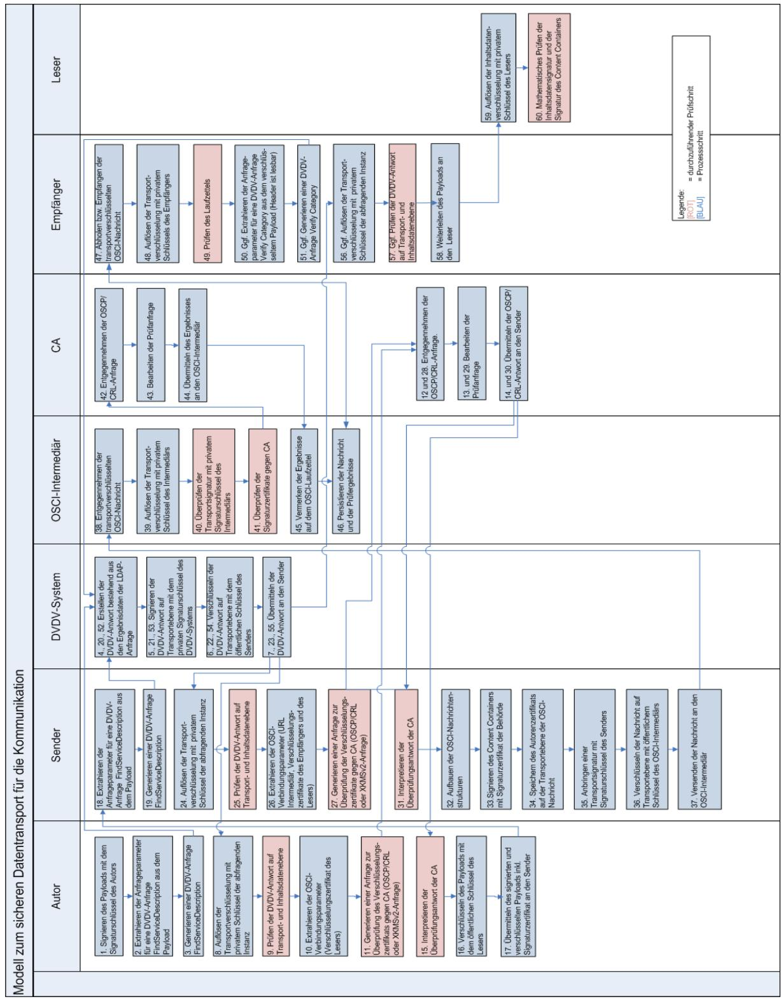
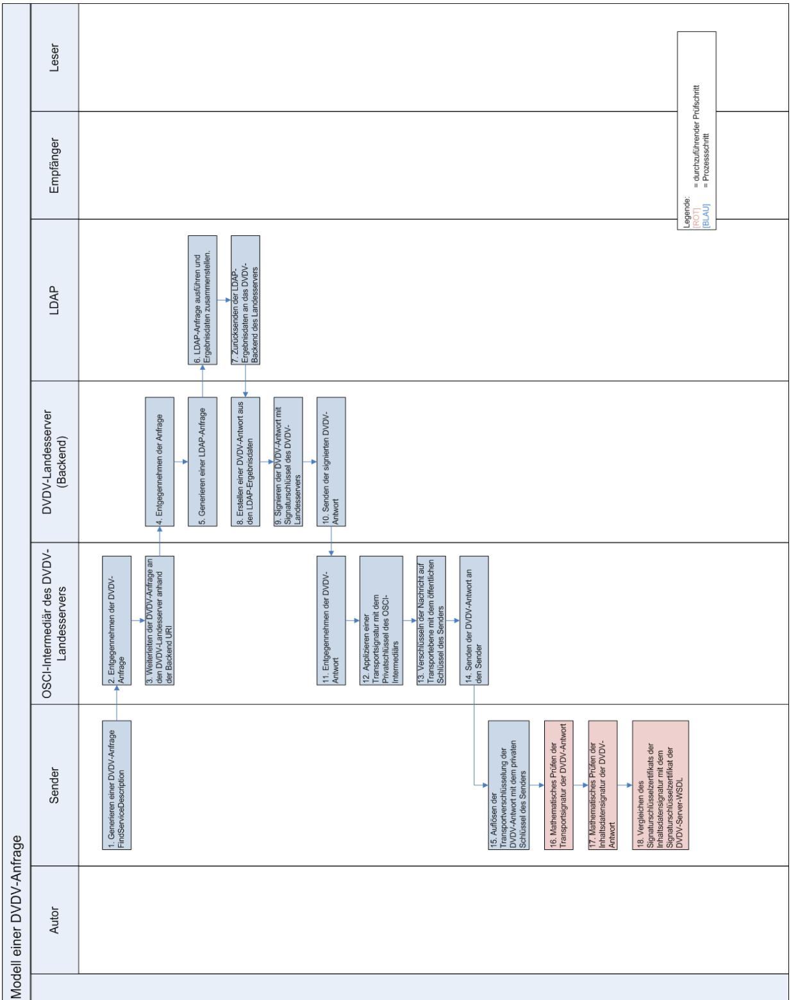
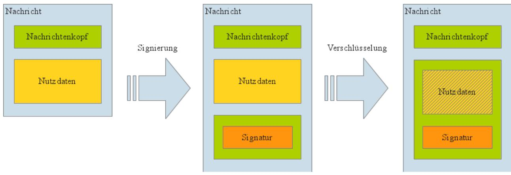

# Technische Richtlinie TR-03132: Sichere Szenarien für Kommunikationsprozesse im Bereich hoheitlicher Dokumente

Version 1.8.3 30. April 2024

## <span id="page-1-0"></span>Änderungshistorie

| Version | Datum      | Beschreibung                                                                                                                                                                                                      |
|---------|------------|-------------------------------------------------------------------------------------------------------------------------------------------------------------------------------------------------------------------|
| 1.4     | 02.06.2010 | Initiale Veröffentlichung für den Wirkbetrieb des ePA                                                                                                                                                             |
| 1.5     | 01.08.2011 | Anpassungen zur Bildung Behörden-ID/-Schlüssel, insbesondere für das<br>Auswärtige Amt; Empfehlung bei Gebietsreformen, Neugliederungen etc.;<br>Präzisierung des Begriffs Präfix (Doppelpunkt nicht Bestandteil) |
| 1.6     | 01.10.2012 | Anpassung an neue Schemaversion der TR XhD; Präzisierung zum Caching<br>von DVDV-Daten                                                                                                                            |
| 1.6.1   | 01.06.2013 | Definition der Rolle einer Personalausweisbehörde für den<br>Dokumentenhersteller im Rahmen der Erstellung von Musterkarten;<br>Fehlerkorrekturen                                                                 |
| 1.7     | 01.04.2014 | Verwendung von TR XhD (BSI TR-03123) Version 1.4, Überarbeitung der<br>Abbildung 1                                                                                                                                |
| 1.8     | 26.10.2018 | Verwendung von TR XhD (BSI TR-03123) Version 1.5<br>Erweiterung der Behörden um die eID-Kartebehörde                                                                                                              |
| 1.8.1   | 13.10.2018 | Verwendung von TR XhD (BSI TR-03123) Version 1.6                                                                                                                                                                  |
| 1.8.2‍  | 22.12.2023 | Verwendung von TR XhD (BSI TR-03123) Version 1.7                                                                                                                                                                  |
| 1.8.3‍  | 30.04.2024 | Verwendung von TR XhD (BSI TR-03123) Version 1.8                                                                                                                                                                  |

Bundesamt für Sicherheit in der Informationstechnik Postfach 20 03 63 53133 Bonn

E-Mail: xhd@bsi.bund.de Internet: https://www.bsi.bund.de © Bundesamt für Sicherheit in der Informationstechnik 2024

|                | Änderungshistorie 2                                                                                     |  |
|----------------|---------------------------------------------------------------------------------------------------------|--|
| 1              | Einleitung5                                                                                             |  |
| 2              | Allgemeine Anforderungen an die Kommunikationsmodelle6                                                  |  |
| 2.1            | Sicherheitskonzeption6                                                                                  |  |
| 2.2            | Rollen und Kommunikationsebenen6                                                                        |  |
| 2.2.1          | Delegation6                                                                                             |  |
| 2.3            | Sicherheitsmaßnahmen der einzelnen Nachrichtentypen7                                                    |  |
| 2.4            | Verwendete Zertifikate und PKI-Strukturen7                                                              |  |
| 2.4.1          | Vorgaben für alle verwendeten Zertifikate7                                                              |  |
| 2.4.2<br>2.4.3 | Vorgaben für die Zertifikate auf Transportebene7<br>Vorgaben für die Zertifikate auf Inhaltsdatenebene8 |  |
| 2.4.4          | Vorgaben für die PKI auf Inhaltsdatenebene8                                                             |  |
| 2.5            | Vorgaben für die Ausführung der Signatur und Verschlüsselung auf Inhaltsdatenebene8                     |  |
| 2.6            | Vorgaben für die Autorisierung der Nachrichten8                                                         |  |
| 2.7            | Fehlerbehandlung 9                                                                                      |  |
| 3              | Kommunikationsmodell unter Nutzung von OSCI-Transport 1.210                                             |  |
| 3.1            | Rollen 10                                                                                               |  |
| 3.2            | Weitere Zertifikate10                                                                                   |  |
| 3.3            | OSCI-Transport 1.2-Transportprofil12                                                                    |  |
| 3.4            | Das DVDV-System12                                                                                       |  |
| 3.4.1          | Struktur des DVDV-Systems12                                                                             |  |
| 3.4.2          | Abfragen gegen das DVDV-System12                                                                        |  |
| 3.5            | Delegation 14                                                                                           |  |
| 3.6            | Umsetzung der Autorisierung 14                                                                          |  |
| 4              | Kodierung der Inhaltsdatensignatur- und -verschlüsselung15                                              |  |
| 4.1            | Überblick zur kryptografischen Verarbeitung15                                                           |  |
| 4.1.1<br>4.1.2 | Autorenrolle15<br>Leserrolle 15                                                                         |  |
| 4.2            | Signatur 16                                                                                             |  |
| 4.3            | Verschlüsselung16                                                                                       |  |
| 4.4            | Beispiele 17                                                                                            |  |
| 4.4.1          | Signierte Nachricht 17                                                                                  |  |
| 4.4.2          | Signierte und verschlüsselte Nachricht18                                                                |  |
| 5              | OSCI 1.2-Nachrichtenstruktur und Transportprofil19                                                      |  |
| 5.1            | Dienst xhd18Beh2DhServiceOsci19                                                                         |  |
| 5.2            | Dienst xhd18Dh2BehServiceOsci20                                                                         |  |
| 5.3            | DVDV-Publikationsdaten22                                                                                |  |
| 5.3.1          | Diensteprovider 22                                                                                      |  |
| 5.3.2<br>5.3.3 | Verzeichnung der Behörden und Kategorien22<br>Dienstekonfiguration24                                    |  |
| 5.3.4          | Konfiguration der Intermediäre24                                                                        |  |
| 5.3.5          | Konfiguration der OSCI-Empfänger25                                                                      |  |
| 5.3.6          | WSDL-Templatedateien25                                                                                  |  |
|                | Literaturverzeichnis 26                                                                                 |  |

## Abbildungsverzeichnis

| Abbildung 1: Kommunikationsmodell unter Nutzung von OSCI11           |  |
|----------------------------------------------------------------------|--|
| Abbildung 2: Modell einer DVDV-Anfrage13                             |  |
|                                                                      |  |
| Abbildung 3: Schematische Darstellung der Nachrichten-Ausprägungen15 |  |

## Tabellenverzeichnis

| Tabelle 1: Sicherheitsmaßnahmen der einzelnen Nachrichtentypen7                                 |  |
|-------------------------------------------------------------------------------------------------|--|
| Tabelle 2: Prozessschritte im OSCI-Kommunikationsmodell 10                                      |  |
| Tabelle 3: Übersicht der Behördenbezeichnungen mit zugeordneter DVDV-Behördenkategorie und DVDV |  |
| Präfix 24                                                                                       |  |
| Tabelle 4: Elemente der DVDV-Dienstkonfiguration25                                              |  |
| Tabelle 5: Elemente eines OSCI-Intermediärs im DVDV 26                                          |  |
| Tabelle 6: Elemente des OSCI-Empfängers des Dokumentenherstellers26                             |  |
| Tabelle 7: Elemente des OSCI-Empfängers der Behörden 26                                         |  |

## <span id="page-4-0"></span>1 Einleitung

Diese technische Richtlinie legt Anforderungen an die Kommunikationsbeziehungen nach [TR PDÜ hD] fest. Das hierin beschriebene Kommunikationsmodell ist für alle Nachrichten zwischen Behörden und Dokumentenherstellern gemäß [TR PDÜ hD] zu verwenden.

Sie definiert den Ablauf der Kommunikation zwischen den genannten Stellen, macht aber keine Vorgaben bezüglich der zu übertragenden Nachrichten, welche in der [TR XhD] festgelegt werden.

Die in diesem Dokument gemachten Vorgaben sind prinzipiell auch auf andere Anwendungsszenarien anwendbar und in keiner Weise an die Inhalte der Nachrichten der [TR XhD] – mit Ausnahme der Vorgaben für Signatur und Verschlüsselung auf Inhaltsdatenebene der [TR XhD]-Nachrichten – gebunden.

## <span id="page-5-3"></span>2 Allgemeine Anforderungen an die Kommunikationsmodelle

### <span id="page-5-2"></span>2.1 Sicherheitskonzeption

Für die Verarbeitung von Nachrichten im Rahmen der [TR PDÜ hD] sind die entsprechenden Rahmensicherheitskonzepte anzuwenden.

Darüber hinaus ist bei allen verarbeitenden Stellen ein Sicherheitskonzept zu entwickeln, welches die im Folgenden dargestellten Sicherheitsanforderungen an die verschiedenen Prozesse umsetzt.

### <span id="page-5-1"></span>2.2 Rollen und Kommunikationsebenen

Es gibt die folgenden Kommunikationsebenen und Akteure:

- Inhaltsdatenebene
	- Autor Der Autor ist der Ersteller der fachlichen Nachricht. Autor im betrachteten Kommunikationsprozess ist – abhängig von der jeweiligen Nachricht – der Sachbearbeiter mit Unterstützung des Fachverfahrens der Behörde, das Fachverfahren selbst bzw. das Produktionssystem des Dokumentenherstellers.
	- Leser Der Leser ist der Konsument der fachlichen Nachricht. Leser im betrachteten Kommunikationsprozess ist – abhängig von der jeweiligen Nachricht – das Fachverfahren der Behörde oder das Produktionssystem des Herstellers.
- Transportebene
	- Sender Der Sender übernimmt den Transport der fachlichen Nachricht vom Autor über verschiedene mögliche Kommunikationswege hin zum Empfänger. Dies ist entweder das Sendeverfahren der Behörde oder das des Dokumentenherstellers.
	- Empfänger Der Empfänger empfängt die Nachricht des Senders und reicht sie an den Leser weiter. Dies ist entweder das Empfangsverfahren der Behörde oder das des Dokumentenherstellers.
- Certification Authorities (CA) Die Certification Authorities stellen die zur Kommunikation benötigten Zertifikate aus (vgl. Abschnitt [2.4\)](#page-6-2).

Alle Kommunikationsszenarien sind grundsätzlich vollständig symmetrisch, d.h. sowohl Behörden als auch die Dokumentenhersteller nehmen jeweils die Rollen Autor/Sender bzw. Empfänger/Leser ein.

### <span id="page-5-0"></span>2.2.1 Delegation

Die Behörde kann Aufgaben an Dritte (z. B. Vermittlungsstellen) im Rahmen der Auftragsdatenverarbeitung delegieren. Die technische Delegation erfolgt hier ausschließlich im Rahmen der Vorgaben der rechtlichen Delegation. Die mögliche technische Ausgestaltung wird in den einzelnen Kommunikationsszenarien dargestellt.

Der Dokumentenhersteller kann Aufgaben nicht an Dritte delegieren. Er kann lediglich existierende Infrastrukturdienste (Verzeichnisdienst, Sperrdienst der CA) nutzen.

## <span id="page-6-3"></span>2.3 Sicherheitsmaßnahmen der einzelnen Nachrichtentypen

| Nachricht               | Inhaltsdatenebene       |                              | Transportebene           |                                  |
|-------------------------|-------------------------|------------------------------|--------------------------|----------------------------------|
|                         | Signatur durch<br>Autor | Verschlüsselung<br>für Leser | Signatur durch<br>Sender | Verschlüsselung<br>für Empfänger |
| BestellungDokument      | ja                      | ja                           | ja                       | ja                               |
| BestellungPINBriefe     | optional                | ja                           | ja                       | ja                               |
| BestellungSeriennummer  | optional                | ja                           | ja                       | ja                               |
| Auftragsinformation     | ja                      | ja                           | ja                       | ja                               |
| Lieferinformation       | ja                      | ja                           | ja                       | ja                               |
| Quittierung             | optional                | ja                           | ja                       | ja                               |
| Reklamationsinformation | ja                      | ja                           | ja                       | ja                               |
| Fehlerinformation       | optional                | ja                           | ja                       | ja                               |
| Zustellinformation      | ja                      | ja                           | ja                       | ja                               |

Für die jeweiligen Nachrichten sind die folgenden Sicherheitsmaßnahmen durchzuführen:

Tabelle 1: Sicherheitsmaßnahmen der einzelnen Nachrichtentypen

### <span id="page-6-2"></span>2.4 Verwendete Zertifikate und PKI-Strukturen

Folgende Zertifikate werden im Rahmen der Kommunikationsszenarien benötigt:

- Auf der Inhaltsdatenebene
	- Signaturzertifikat des Autors
	- Verschlüsselungszertifikat des Lesers
- Auf der Transportebene
	- Signaturzertifikat des Senders
	- Verschlüsselungszertifikat des Empfängers

### <span id="page-6-1"></span>2.4.1 Vorgaben für alle verwendeten Zertifikate

Alle verwendeten Zertifikate sind auf ihre Gültigkeit hin zu verifizieren (d. h. Prüfung des Gültigkeitsdatums sowie Verzeichnisdienstabfragen per LDAP, OCSP oder XKMS auf zugehörige Sperrlisten). Die verschiedenen Kommunikationsmodelle führen die notwendigen Prüfschritte explizit auf.

Sämtliche Zertifikate müssen von CAs innerhalb der PKI-1-Verwaltung [V-PKI] ausgestellt werden. Die jeweils gültigen Anforderungen der PKI-1-Verwaltung sind hierbei einzuhalten.

### <span id="page-6-0"></span>2.4.2 Vorgaben für die Zertifikate auf Transportebene

Authentisierungs- und Verschlüsselungs-Zertifikate für die Transportebene können von beliebigen CA's innerhalb der PKI-1-Verwaltung [V-PKI] ausgestellt werden. Auf Transportebene dürfen nicht die jeweiligen Zertifikate der Inhaltsdatenebene genutzt werden.

### <span id="page-7-3"></span>2.4.3 Vorgaben für die Zertifikate auf Inhaltsdatenebene

Für die Inhaltsdatenebene sind Zertifikate aus der PKI gemäß Abschnitt [2.4.4](#page-7-2) zu nutzen.

Für Signatur- und Verschlüsselungsvorgänge sind jeweils eigene Schlüsselpaare zu verwenden (Prinzip der Schlüsseltrennung). Entsprechend muss je ein eigenes Zertifikat ausgestellt werden.

Für die Signatur auf Inhaltsdatenebene ist grundsätzlich die Nutzung von Hardware-PSE'n (Personal Security Environment, Smartcard) vorzusehen.

Folgende Ausnahmen sind hiervon im Anwendungsbereich der [TR PDÜ hD] erlaubt:

- Das Auswärtige Amt kann SW-Zertifikate verwenden. Diese müssen durch entsprechende organisatorische Maßnahmen ein zu den Hardware-PSE'n äquivalentes Schutzniveau erreichen.
- Die Dokumentenhersteller können SW-Zertifikate verwenden, sofern diese in einer nach Schutzbedarf "hoch" (Schutzbedarfskategorie gemäß [BSI100-2]) abgesicherten Betriebs-Umgebung eingesetzt werden.

Für die Verschlüsselung auf Inhaltsdatenebene ist prinzipiell die Nutzung von Software-PSE'n möglich. Hierbei ist durch entsprechende organisatorische Maßnahmen ein zu den Hardware-PSE'n äquivalentes Schutzniveau zu erreichen. Dies ist durch das entsprechende Sicherheitskonzept gemäß Abschnitt [2.1](#page-5-2) nachzuweisen.

Die Ausnahmen für das Auswärtige Amt und den Dokumentenproduzenten gelten entsprechend.

### <span id="page-7-2"></span>2.4.4 Vorgaben für die PKI auf Inhaltsdatenebene

Für alle Zertifikate auf Inhaltsdatenebene werden eigenständige CA oder Sub-CA der PKI-1-Verwaltung errichtet.

Für den Anwendungsbereich der [TR PDÜ hD] werden die zu nutzenden CA durch das Bundesministerium des Innern bekannt gegeben.

Die CA kann personengebundene Zertifikate oder Organisationszertifikate für die Inhaltsdatenebene ausgeben. Die Entscheidung über die Nutzung von Organisationszertifikaten oder personengebundenen Zertifikaten liegt in der alleinigen Verantwortung der Behörde. Im Falle von Organisationszertifikaten hat die Behörde für die Nutzung entsprechende organisatorische Maßnahmen zu definieren.

Der Realisierung der PKI mit ihren technischen Komponenten und organisatorischen Regelungen wird eine Konzeption zugrunde gelegt, die auf den Anforderungen der Policy der PKI-1-Verwaltung aufbaut. Der Betreiber verpflichtet sich zur Einhaltung und Erfüllung der in den Sicherheitsleitlinien der PKI-1- Verwaltung und evtl. weiterer getroffener Vereinbarungen gestellten Anforderungen.

Das BSI prüft, ob die Realisierung des Zertifizierungsbetriebs den Spezifikationen der Konzeption entspricht.

### <span id="page-7-1"></span>2.5 Vorgaben für die Ausführung der Signatur und Verschlüsselung auf Inhaltsdatenebene

Die Signatur und Verschlüsselung von Nachrichten auf Inhaltsdatenebene ist spezifisch in Abhängigkeit von der zu Grunde liegenden fachlichen Nachricht durchzuführen. Für den Anwendungsbereich der [TR PDÜ hD] enthält das Kapitel [4](#page-14-3) die notwendigen Vorgaben.

### <span id="page-7-0"></span>2.6 Vorgaben für die Autorisierung der Nachrichten

Der Dokumentenhersteller darf nur Nachrichten des Typs Bestellung und Reklamation verarbeiten, wenn sie autorisiert sind. Der Nachweis der Autorisierung erfolgt durch:

- Korrekte Signatur mit gültigem PSE nach Abschnitt [2.4.4](#page-7-2) auf Inhaltsdatenebene
- Nachweis der Behördeneigenschaft die genaue Ausgestaltung ist abhängig vom jeweiligen Kommunikationsszenario.

Der Dokumentenhersteller darf nur Nachrichten des Typs Bestellung von Seriennummern verarbeiten, wenn sie autorisiert sind. Der Nachweis der Autorisierung erfolgt durch:

– Nachweis der Behördeneigenschaft – die genaue Ausgestaltung ist abhängig vom jeweiligen Kommunikationsszenario.

### <span id="page-8-0"></span>2.7 Fehlerbehandlung

Im Rahmen der Kommunikationsszenarien auftretende Fehler sind zu behandeln und entsprechend den Vorgaben von [TR PDÜ hD] sind Antworten auf Transportebene und Fachverfahrensebene (XhD-Fehlerinformationen) zu generieren.

Der Dokumentenproduzent stellt jeweils eine Fehlercodeliste für die möglichen Fehler auf Transport- und Fachverfahrensebene zur Verfügung.

## <span id="page-9-2"></span>3 Kommunikationsmodell unter Nutzung von OSCI-Transport 1.2

Das im Folgenden beschriebene Kommunikationsmodell ist sowohl für alle innerdeutschen Behörden als auch für die Auslandsvertretungen der Bundesrepublik Deutschland und das Auswärtige Amt gültig. Die Vorgaben des Kapitels 2 gelten entsprechend mit. Es basiert auf der Spezifikation [OSCI1.2] und dem DVDV-System.

### <span id="page-9-1"></span>3.1 Rollen

Folgende Rollen treten zusätzlich in diesem Kommunikationsszenario auf:

- DVDV-System Das DVDV-System verzeichnet alle für die Kommunikation relevanten Daten der beteiligten Akteure
- OSCI-Intermediär Der Intermediär ist ein in der OSCI-Transport 1.2-Spezifikation vorgesehener Akteur

### <span id="page-9-0"></span>3.2 Weitere Zertifikate

Im Rahmen der Kommunikation mit dem DVDV-System und dem Intermediär des Empfängers (s.u.) werden weitere Zertifikate benötigt. Sie ergeben sich aus der Konzeption des DVDV-Systems.

Das Kommunikationsmodell ist in [Abbildung 1](#page-10-0) beschrieben. Bei der Umsetzung dieses Kommunikationsmodells müssen grundsätzlich alle vorgesehenen Schritte, insbesondere alle Prüfschritte, durchgeführt werden. Hierbei sind folgende Anmerkungen zu den einzelnen Schritten zu beachten:

| Schritt | Erläuterung                                                                                                                                                                                                                                                                                                                                                                  |
|---------|------------------------------------------------------------------------------------------------------------------------------------------------------------------------------------------------------------------------------------------------------------------------------------------------------------------------------------------------------------------------------|
| 11      | Das Caching des Ergebnisses der Anfrage zur Gültigkeit des Verschlüsselungszertifikats ist<br>zulässig. Das Ergebnis muss mindestens jeden zweiten Tag aktualisiert werden.                                                                                                                                                                                                  |
| 33-34   | Um im Falle der Versendung mittels OSCI-Transport die Prüfung implizit durch den OSCI<br>Intermediär durchführen zu lassen, muss das Autoren-Signaturzertifikat in die OSCI<br>Nachricht eingebunden werden. Dies wird für den Nachweis der Behördeneigenschaft<br>benötigt, vgl. Abschnitt 3.6.                                                                             |
|         | Dazu muss der OSCI-Nachricht bei ihrer Konstruktion durch den Sender ein OSCI-Author<br>Objekt mit dem X.509-Zertifikat des Autors hinzugefügt1<br>werden. Das Zertifikat kann der<br>Sender dem <X509Certificate>-Element aus der Nachricht direkt entnehmen. OSCI<br>Empfänger haben durch diese Maßnahme Zugriff auf die Zertifikatsprüfergebnisse im OSCI<br>Laufzettel. |
| 50-51   | Ggf. kann eine DVDV-VerifyCategory-Anfrage zum Nachweis der Behördeneigenschaft<br>durchgeführt werden, vgl. hierzu Abschnitt 3.6.                                                                                                                                                                                                                                           |

<span id="page-9-3"></span>Tabelle 2: Prozessschritte im OSCI-Kommunikationsmodell

<span id="page-9-4"></span>[1](#page-9-3) z.B bei Nutzung der OSCI-Bibliothek der OSCI-Leitstelle durch die Methode addRole() der abstrakten Klasse OSCIMessage



<span id="page-10-0"></span>*Abbildung 1: Kommunikationsmodell unter Nutzung von OSCI*

### <span id="page-11-3"></span>3.3 OSCI-Transport 1.2-Transportprofil

Das den Kommunikationsbeziehungen zu verwendende Transportprofil gemäß [OSCI1.2] wird in Kapitel [5](#page-18-1) spezifiziert.

### <span id="page-11-2"></span>3.4 Das DVDV-System

### <span id="page-11-1"></span>3.4.1 Struktur des DVDV-Systems

Das DVDV-System hält die für die Kommunikation notwendigen Verbindungsdaten vor. Die Implementierung und Nutzung des Systems erfolgt gemäß [5.3.](#page-21-2)

Die Kommunikation mit dem DVDV-System ist in [Abbildung 2](#page-12-0) dargestellt.

### <span id="page-11-0"></span>3.4.2 Abfragen gegen das DVDV-System

Für Abfragen gegen das DVDV-System gelten grundsätzlich die Vorgaben der DVDV-Verfahrensbeschreibung [DVDV].

Für Nachrichten im Anwendungsbereich der [TR PDÜ hD] gelten folgende Regelungen zur Abfrage gegen das DVDV-System:

1. Die benötigten Daten sind grundsätzlich immer aktuell aus dem DVDV-System zu beziehen.

2. Abweichend hiervon ist das Caching (temporäres Speichern von DVDV-Einträgen und Nutzung ohne Neuabfrage) mit folgenden Zeiten erlaubt:

- für Dokumentenproduzenten bis zu 4 Stunden,
- für Behörden maximal zwei Tage.

Sollte die Erneuerung der temporär gespeicherten Daten nach Ablauf der oben genannten Zeiten aus technischen Gründen nicht möglich sein, so können diese auch über den festgelegten Zeitraum hinaus genutzt werden. Eine Erneuerung muss umgehend zum nächstmöglichen Zeitpunkt erfolgen.

3. Ist eine Behörde technisch nicht zu einer DVDV-Abfrage in der Lage, kann der Zugriff auf das benötigte Inhaltsdaten-Verschlüsselungszertifikat des Dokumentenherstellers durch anderweitige organisatorische Maßnahmen sichergestellt werden. Hierbei ist stets die Aktualität der Zertifikatsprüfung sicherzustellen.



<span id="page-12-0"></span>*Abbildung 2: Modell einer DVDV-Anfrage*

### <span id="page-13-1"></span>3.5 Delegation

Delegiert eine Behörde Aufgaben durch Auftragsdatenverarbeitung an Dritte, so können hierfür die entsprechenden technischen Konstrukte des DVDV (Providermodell, Behördenstellvertreter) genutzt werden.

### <span id="page-13-0"></span>3.6 Umsetzung der Autorisierung

Der Nachweis der Behördeneigenschaft erfolgt durch

- <span id="page-13-2"></span>– Prüfung der Signatur des Senders auf OSCI-Inhaltsdatenebene[2](#page-13-3) und
- Überprüfung der Behördeneigenschaft durch DVDV-verifyCategory-Abfrage auf die jeweilige Behördenkategorie gemäß Abschnitt [5.3.2](#page-21-0).

Hierzu muss das OSCI-Sender-Zertifikat als Client-Zertifikat im DVDV abgelegt sein, vgl. hierzu Abschnitt [5.3.2.](#page-21-0)

<span id="page-13-3"></span>[<sup>2</sup>](#page-13-2) Hinweis: Der Begriff OSCI-Inhaltsdatenebene (gemäß der OSCI-Transport-Spezifikation) kann leicht mit dem Begriff Inhaltsdatenebene – so wie er in dieser Richtlinie verwendet wird – verwechselt werden. Die OSCI-Transport-Spezifikation wird im Rahmen dieser Richtlinie ausschließlich auf Transportebene verwendet.

## <span id="page-14-3"></span>4 Kodierung der Inhaltsdatensignatur- und verschlüsselung

Dieses Kapitel enthält die Vorgaben zur Inhaltsdatensignatur- und -verschlüsselung. Es ist spezifisch für Nachrichten der [TR PDÜ hD].

Ein schematischer Überblick über die Verarbeitung ist in [Abbildung 3](#page-14-4) gegeben.

### <span id="page-14-2"></span>4.1 Überblick zur kryptografischen Verarbeitung

#### <span id="page-14-1"></span>4.1.1 Autorenrolle

Der Prozess der Signierung durch den Autor erfordert den Zugriff auf den privaten Schlüssel (bzw. den Kartenleser/die Smartcard) des Autors. Das Anbringen der Signatur an die fachliche XML-Nachricht stellt den ersten Verarbeitungsschritt dar.

Die anschließende Verschlüsselung der (Teil-)Nachricht erfordert den Zugriff auf den öffentlichen Schlüssel (das öffentliche Zertifikat) des adressierten Lesers, wozu (abhängig vom Kommunikationsszenario) ggf. ein Verzeichniszugriff erforderlich ist. Die Durchführung der Verschlüsselung kann daher ohne direkte Interaktion eines Sachbearbeiters erfolgen.

#### <span id="page-14-0"></span>4.1.2 Leserrolle

Auf Seiten des Lesers ist als erster Verarbeitungsschritt die Entschlüsselung vorzunehmen. Hierzu ist der Zugriff auf den privaten Schlüssel des Verschlüsselungszertifikats erforderlich.

Erst nach der Entschlüsselung kann die Signatur verifiziert werden. Die Signatur muss zur fachlichen Verarbeitung der Nachricht nicht entfernt werden.

Die Gültigkeit des Signaturzertifikats kann zuvor bereits durch den Empfänger geprüft werden.



<span id="page-14-4"></span>*Abbildung 3: Schematische Darstellung der Nachrichten-Ausprägungen*

### <span id="page-15-1"></span>4.2 Signatur

Die auszutauschenden XML-Nachrichten nach [TR PDÜ hD] sind mittels XML Signature [XMLDSIG] durch den Autor mit dessen privatem Schlüssel zu signieren. Folgende Verarbeitungsregeln sind dabei einzuhalten:

- Die Signaturen sind eingebettet in der XML-Nachricht zu applizieren (enveloped-signature). Gemäß [XMLDSIG] ist entsprechend der Transform-Algorithmus für eingebettete Signaturen anzuwenden (Algorithmus-Kennzeichner: [http://www.w3.org/2000/09/xmldsig#enveloped](http://www.w3.org/2000/09/xmldsig#enveloped-signature)[signature\)](http://www.w3.org/2000/09/xmldsig#enveloped-signature).
- Das eingebettete <ds:Signature>-Element ist als letztes Element innerhalb des Elements <xhd:any> zu platzieren. Dadurch ist gewährleistet, dass auch signierte Nachrichten schemakonform und validierbar sind.
- Das <ds:Signature>-Element enthält genau ein <ds:Reference>-Element. Das URI-Attribut des <ds:Reference>-Elements besitzt als Wert den Leerstring (URI="") zur Kennzeichnung, dass das gesamte XML-Dokument signiert ist.
- <span id="page-15-4"></span><span id="page-15-2"></span>– Für die jeweils anzuwendenden Kryptoalgorithmen (hier für: SignatureMethod und Digest-Method) sind entsprechend den Veröffentlichungen des BSI[3](#page-15-3) zulässige Ausprägungen zu wählen[4](#page-15-5) .

### <span id="page-15-0"></span>4.3 Verschlüsselung

Die Verschlüsselung der XML-Nachrichten durch den Autor erfolgt mittels XML Encryption [XMLENC]. Es werden nur die Teile der Nachricht mit Vertraulichkeitscharakter verschlüsselt. Informationen für die Adressierung und Weiterleitung im Nachrichtenkopf bleiben unverschlüsselt und somit durch Sender- und Empfänger-Einheiten auswertbar.

Jede XML-Nachricht nach [TR PDÜ hD] enthält die Elemente <xhd:Nachrichtenkopf> und <xhd:Nutzdaten>. Nur die Nutzdaten (bzw. dessen Kindelemente) sind mit dem öffentlichen Schlüssel des Lesers zu verschlüsseln. Folgende Verarbeitungsregeln sind dabei einzuhalten:

- Zu verschlüsseln ist das Element <xhd:Nutzdaten> (gemäß dem XPath-Ausdruck /\*/Nutzdaten)
- Die XML-Encryption-Typ ist http://www.w3.org/2001/04/xmlenc#Element, d.h. das <xhd:Nutzdaten>-Element fällt weg und ein <xenc:EncryptedData>-Element wird in dem <xhd:any>-Element platziert.
- Die Verschlüsselung erfolgt mit einem symmetrischen Schlüssel, der mit dem öffentlichen Schlüssel des Lesers verschlüsselt wird (hybrides Verfahren mittels <xenc:EncryptedKey>). Hierbei ist der verwendete Schlüssel über ein KeyInfo-Element mit X509SubjectName (siehe auch Beispiel unten) anzugeben.
- <span id="page-15-6"></span>– Für die jeweils anzuwendenden Algorithmen für die Blockverschlüsselung und Schlüsselverschlüsselung sind entsprechend den Veröffentlichungen des BSI zulässige Ausprägungen zu wählen[5](#page-15-7) .
- <span id="page-15-3"></span>[3](#page-15-2) Vgl. https://www.bsi.bund.de/Algorithmenkatalog
- <span id="page-15-5"></span>[4](#page-15-4) Vgl. http://www.w3.org/TR/xmlsec-algorithms/
- <span id="page-15-7"></span>[5](#page-15-6) siehe http://www.w3.org/TR/xmlsec-algorithms/

### <span id="page-16-1"></span>4.4 Beispiele

### <span id="page-16-0"></span>4.4.1 Signierte Nachricht

Das folgende Beispiel zeigt, wie die Signatur an einer (verkürzt dargestellten) XhD-Nachricht angebracht wird.

```
<?xml version="1.0" encoding="UTF-8"?>
<xhd:BestellungDokument xmlns:xhd="http://www.bsi.de/trxhd/1.8" 
xmlns:ds="http://www.w3.org/2000/09/xmldsig#">
    <xhd:Nachrichtenkopf>
 ...
    </xhd:Nachrichtenkopf>
    <xhd:Nutzdaten>
    …
    </xhd:Nutzdaten>
    <xhd:any>
    <ds:Signature>
      <dS:SignedInfo>
         <ds:CanonicalizationMethod Algorithm="http://www.w3.org/TR/2001/REC-xml-c14n-20010315"
/>
         <ds:SignatureMethod Algorithm="http://www.w3.org/2001/04/xmldsig-more#rsa-sha256" />
         <ds:Reference URI="">
            <ds:Transforms>
               <ds:Transform Algorithm="http://www.w3.org/2000/09/xmldsig#enveloped-signature"
/>
            </ds:Transforms>
            <ds:DigestMethod Algorithm="http://www.w3.org/2001/04/xmlenc#sha256" />
            <ds:DigestValue>teEINzfwj4UwobXTy8sXPyJfwiI=</ds:DigestValue>
         </ds:Reference>
      </ds:SignedInfo>
      <ds:SignatureValue>CdeGiCCuN.........VNi3KNUAE4fsIHsF0Uw=</ds:SignatureValue>
      <ds:KeyInfo>
         <ds:X509Data>
            <ds:X509Certificate>MIIC3zCCAkigAwIBAgIE97xdZDANBgkqhkiG9w0B......
               …..OM4FTQJTpmOQwpg==</ds:X509Certificate>
         </ds:X509Data>
      </ds:KeyInfo>
    </ds:Signature>
    </xhd:any>
</xhd:BestellungDokument>
```
### <span id="page-17-0"></span>4.4.2 Signierte und verschlüsselte Nachricht

Das folgende Beispiel zeigt, wie eine XhD-Nachricht signiert und verschlüsselt wird.

```
<?xml version="1.0" encoding="UTF-8"?>
<xhd:BestellungDokument xmlns:xhd="http://www.bsi.de/trxhd/1.8" 
xmlns:xenc="http://www.w3.org/2001/04/xmlenc#" xmlns:ds="http://www.w3.org/2000/09/xmldsig#">
    <xhd:Nachrichtenkopf>
    ...
    </xhd:Nachrichtenkopf>
   <xhd:any>
   <xenc:EncryptedData
                   Type="http://www.w3.org/2001/04/xmlenc#Element">
        <xenc:EncryptionMethod Algorithm="http://www.w3.org/2009/xmlenc11#aes256-gcm" />
        <ds:KeyInfo >
           <xenc:EncryptedKey>
               <xenc:EncryptionMethod Algorithm="http://www.w3.org/2001/04/xmlenc#rsa-1_5" />
               <ds:KeyInfo>
                  <ds:X509Data>
                      <ds:X509SubjectName>CN=Cipher,OU=Sample,C=DE</ds:X509SubjectName>
                  </ds:X509Data>
               </ds:KeyInfo>
               <xenc:CipherData >
                  <xenc:CipherValue >lOvePiO86Xs............UGXMM7F08Xl4s=</xenc:CipherValue>
               </xenc:CipherData>
           </xenc:EncryptedKey>
        </ds:KeyInfo>
        <xenc:CipherData >
           <xenc:CipherValue >
               PfD5fWTNWQP3P2p5eZcRW9y....................
               …........…..........q+22BKu+9ntdrqJ54+katDA=
           </xenc:CipherValue>
        </xenc:CipherData>
   </xenc:EncryptedData>
    <ds:Signature>
      <ds:SignedInfo>
         <ds:CanonicalizationMethod Algorithm="http://www.w3.org/TR/2001/REC-xml-c14n-20010315"
/>
         <ds:SignatureMethod Algorithm="http://www.w3.org/2001/04/xmldsig-more#rsa-sha256" />
         <ds:Reference URI="">
            <ds:Transforms>
               <ds:Transform Algorithm="http://www.w3.org/2000/09/xmldsig#enveloped-signature"
/>
            </ds:Transforms>
            <ds:DigestMethod Algorithm="http://www.w3.org/2001/04/xmlenc#sha256" />
            <ds:DigestValue>teEINzfwj4UwobXTy8sXPyJfwiI=</ds:DigestValue>
         </ds:Reference>
      </ds:SignedInfo>
      <ds:SignatureValue>CdeGiCCuN.........VNi3KNUAE4fsIHsF0Uw=</ds:SignatureValue>
      <ds:KeyInfo>
         <ds:X509Data>
            <ds:X509Certificate>MIIC3zCCAkigAwIBAgIE97xdZDANBgkqhkiG9w0B......
               …..OM4FTQJTpmOQwpg==</ds:X509Certificate>
         </ds:X509Data>
      </ds:KeyInfo>
    </ds:Signature>
    </xhd:any>
</xhd:BestellungDokument>
```
## <span id="page-18-1"></span>5 OSCI 1.2-Nachrichtenstruktur und Transportprofil

Im Folgenden wird das detaillierte OSCI-Profil dargestellt. Alle Ausführungen zu konkreten Profillausprägungen korrespondieren mit Elementen aus den WSDL-Dokumenten zu den Diensten, die sich im Anhang befinden. Diese WSDL-Dokumente sind generische Template-Dokumente, wie sie im DVDV registriert werden. Sie definieren die Dienste bzw. ihre Profilausprägung unabhängig vom konkreten Dienstanbieter und enthalten somit keine Anbieter-spezifischen Daten wie Netzwerkadressen oder Zertifikate.

Die profilspezifischen WSDL-Elemente sowie deren Bedeutung hinsichtlich Applikationsentwicklung oder der Publikation von Diensten im DVDV werden im Einzelnen aufgeführt. Zum generellen Verständnis der Bedeutung von Elementen der WSDL-Spracherweiterung für OSCI-Transport sei auf [DVDVW] verwiesen.

### <span id="page-18-0"></span>5.1 **Dienst xhd18Beh2DhServiceOsci**

Der Dienst xhd18Beh2DhServiceOsci repräsentiert von Dokumentenherstellern angebotene Endpunkte für den Empfang von Nachrichten, die durch Behörden versendet werden.

#### – **Dienstname**

Der Name xhd18Beh2DhServiceOsci ist durch das XML Attribut /wsdl:definition/@name definiert. Der Name wird zur Kennzeichnung an mehreren Stellen im DVDV-Pflegeclient verwendet.

#### – **Identifizierender Namensraum**

Der generische Dienst ist durch den Namensraum

http://www.bsi.de/trxhd/1.8/wsdl/xhd18Beh2DhServiceOsci.wsdl des WSDL-Dokumentes im XML-Attribut /wsdl:definition/@targetNamespace eindeutig identifiziert. Die URI des Namensraumes wird u.a. als Parameter für find.service.description-Anfragen an das DVDV verwendet.

#### – **Inhaltsdaten**

Die Inhaltsdaten (obligatorische und optionale) sind durch die XML-Elemente /wsdl:definition/wsdl:message/wsdl:part definiert. Obligatorisch enthält die Request-Nachricht eines der in der [TR XhD] für diese Richtung der Kommunikationsbeziehung definierten Nachrichtenelemente. Optional kann ein Element vom Typ xs:anyType enthalten sein.

#### – **Kommunikationsszenario**

Das OSCI-Kommunikationsszenario ist "One-Way-Message, passiver Client" (Weiterleitungsauftrag) und ist im Attribut

/wsdl:definition/wsdl:binding/wsdl:operation/osci:operation/@communicationType durch den Wert "one-way-passive" definiert.

#### – **ContentContainer-Struktur**

Die Request-Nachricht enthält einen obligatorischen ContentContainer, der genau einen Content mit der XML-Nachricht enthält. Dem obligatorischen ContentContainer ist die OSCI-Ref-ID "XHD\_DATA" zugeordnet. Definiert ist die Zuordnung im WSDL-Template durch das XML-Attribut /wsdl:definition/wsdl:binding/wsdl:operation/wsdl:input/osci:container/@name.

Die OSCI-Request-Nachricht kann einen weiteren für XhD nicht relevanten ContentContainer enthalten, der das optionale Inhaltsdatum vom Typ xs:anyType trägt. Die Ref-ID für diesen optionalen ContentContainer ist frei.

#### – **Signatur der Inhaltsdaten**

Auf Ebene der ContentContainer (OSCI-Inhaltsdatenebene) wird eine Signatur des OSCI-Autors appliziert. Ausgedrückt ist dies durch das XML-Attribut osci[:Container/@signatureLevel](mailto:Container/@signatureLevel)="advanced".

#### – **Verschlüsselung der Inhaltsdaten**

Auf Ebene der ContentContainer (OSCI-Inhaltsdatenebene) wird keine Verschlüsselung für den OSCI-Leser vorgenommen. Ausgedrückt ist dies durch das XML-Attribut osci:Container/@encrypted="false".

Für die Inhaltsdatenverschlüsselung der Nachrichten auf der Ebene XML Encryption wird auf ein Leser-Zertifikat verwiesen. Das XML-Element

/wsdl:definition/wsdl:binding/osci:binding/osci:reader enthält in einer WSDL-Instanz das Zertifikat. Das XML-Attribut @name="Inhaltsdaten-Verschlüsselungszertifikat" definiert den Schlüsselnamen, mit dem das Zertifikat mittels DVDV-Bibliothek auslesbar ist.

#### – **Signatur der Nutzungsdaten**

Die Nutzungsdaten (äußerer Umschlag) sind mit einer fortgeschrittenen Signatur durch den OSCI-Sender zu versehen. Ausgedrückt ist dies durch das XML-Attribut /wsdl:definition/wsdl:binding/osci:binding/@signatureLevel="advanced".

#### – **Verschlüsselung der Nutzungsdaten**

Die Nutzungsdaten (äußerer Umschlag) sind zu verschlüsseln. Ausgedrückt ist dies durch das XML-Attribut /wsdl:definition/wsdl:binding/osci:binding/@encrypted="true". Es ist hierzu das Verschlüsselungszertifikat des Intermediärs bzw. des Empfängers zu nutzen.

#### – **Betreff**

Das Profil macht keine Vorgaben zum Betreff (OSCI-Subject) innerhalb der OSCI-Request-Nachricht. Ein Betreff ist optional.

#### – **Netzwerkendpunkte**

Das Profil definiert zwei adressierbare Dienst-Endpunkte unter /wsdl:definition/wsdl:service/wsdl:port. Der Internet-Endpunkt ist obligatorisch, der TESTA-Endpunkt ist optional. Als Transportprotokoll zum OSCI-Intermediär ist HTTP zu verwenden. Die vollständige URL zum Intermediär ist innerhalb einer WSDL-Instanz (nicht Template) im XML-Attribut /wsdl:definition/wsdl:service/osci:devices/osci:intemediary/@uri kodiert. Die URI zum passiven Empfänger ist innerhalb einer WSDL-Instanz im XML-Attribut /wsdl:definition/wsdl:service/osci:devices/osci:addressee/@uri kodiert.

### <span id="page-19-0"></span>5.2 Dienst **xhd18Dh2BehServiceOsci**

Der Dienst xhd18Dh2BehServiceOsci repräsentiert von Behörden angebotene Endpunkte für den Empfang von Nachrichten, die durch Dokumentenhersteller versendet werden (Nachrichtenfluss: Dokumentenhersteller → Behörden).

#### – **Dienstname**

Der Name xhd18Dh2BehServiceOsci ist durch das XML Attribut /wsdl:definition/@name definiert. Der Name wird zur Kennzeichnung an mehreren Stellen im DVDV-Pflegeclient verwendet.

#### – **Identifizierender Namensraum**

Der generische Dienst ist durch den Namensraum http://www.bsi.de/trxhd/1.8/wsdl/xhd18Dh2BehServiceOsci.wsdl des WSDL-Dokumentes im XML-Attribut /wsdl:definition/@targetNamespace eindeutig identifiziert. Die URI des Namensraumes wird u.a. als Parameter für find.service.description-Anfragen an das DVDV verwendet.

#### – **Inhaltsdaten**

Die Inhaltsdaten (obligatorische und optionale) sind durch die XML-Elemente /wsdl:definition/wsdl:message/wsdl:part definiert. Obligatorisch enthält die Request-Nachricht eines der in der [TR XhD] für diese Richtung der Kommunikationsbeziehung definierten Nachrichtenelemente. Optional kann ein Element vom Typ xs:anyType enthalten sein.

#### – **Kommunikationsszenario**

Das OSCI-Kommunikationsszenario ist "One-Way-Message, aktiver Client" (Zustellauftrag) und ist im Attribut /wsdl:definition/wsdl:binding/wsdl:operation/osci:operation/@communicationType durch den Wert "one-way-active" definiert.

#### – **ContentContainer-Struktur**

Die Request-Nachricht enthält einen obligatorischen ContentContainer, der genau einen Content mit der XML-Nachricht enthält. Dem obligatorischen ContentContainer ist die OSCI-Ref-ID "XHD\_DATA" zugeordnet. Definiert ist die Zuordnung im WSDL-Template durch das XML-Attribut /wsdl:definition/wsdl:binding/wsdl:operation/wsdl:input/osci:container/@name. Die OSCI-Request-Nachricht kann einen weiteren für XhD nicht relevanten ContentContainer enthalten, der das optionale Inhaltsdatum vom Typ xs:anType trägt. Die Ref-ID für diesen optionalen ContentContainer ist frei.

#### – **Signatur der Inhaltsdaten**

Auf Ebene der ContentContainer (OSCI-Inhaltsdatenebene) wird eine Signatur des OSCI-Autors appliziert. Ausgedrückt ist dies durch das XML-Attribut osci:Container/@signatureLevel="advanced".

#### – **Verschlüsselung der Inhaltsdaten**

Auf Ebene der ContentContainer (OSCI-Inhaltsdatenebene) wird keine Verschlüsselung für den OSCI-Leser vorgenommen. Ausgedrückt ist dies durch das XML-Attribut osci:Container/@encrypted="false".

Für die Inhaltsdatenverschlüsselung der Nachrichten auf der Ebene XML Encryption wird auf ein Leser-Zertifikat verwiesen. Das XML-Element

/wsdl:definition/wsdl:binding/osci:binding/osci:reader enthält in einer WSDL-Instanz das Zertifikat. Das XML-Attribut @name="Inhaltsdaten-Verschlüsselungszertifikat" definiert den Schlüsselnamen, mit dem das Zertifikat mittels DVDV-Bibliothek auslesbar ist.

#### – **Signatur der Nutzungsdaten**

Die Nutzungsdaten (äußerer Umschlag) sind mit einer fortgeschrittenen Signatur durch den OSCI-Sender zu versehen. Ausgedrückt ist dies durch das XML-Attribut /wsdl:definition/wsdl:binding/osci:binding/@signatureLevel="advanced".

#### – V**erschlüsselung der Nutzungsdaten**

Die Nutzungsdaten (äußerer Umschlag) sind zu verschlüsseln. Ausgedrückt ist dies durch das XML-Attribut /wsdl:definition/wsdl:binding/osci:binding/@encrypted="true". Es ist hierzu das Verschlüsselungszertifikat des Intermediärs bzw. des Empfängers zu nutzen.

#### – **Betreff**

Das Profil macht keine Vorgaben zum Betreff (OSCI-Subject) innerhalb der OSCI-Request-Nachricht. Ein Betreff ist optional.

#### – **Netzwerkendpunkte**

Das Profil definiert zwei adressierbare Dienst-Endpunkte unter

/wsdl:definition/wsdl:service/wsdl:port. **Der Internet-Endpunkt ist obligatorisch, der TESTA-Endpunkt ist optional.** Als Transportprotokoll zum OSCI-Intermediär ist HTTP zu verwenden. Die vollständige URL zum Intermediär ist innerhalb einer WSDL-Instanz (nicht Template) im XML-Attribut /wsdl:definition/wsdl:service/osci:devices/osci:intemediary/@uri kodiert. Die URI zum passiven Empfänger ist innerhalb einer WSDL-Instanz im XML-Attribut /wsdl:definition/wsdl:service/osci:devices/osci:addressee/@uri kodiert.

### <span id="page-21-2"></span>5.3 DVDV-Publikationsdaten

Die in diesem Dokument dargelegte Profilierung der Dienste zur TR-PDÜ mit OSCI-Transport-Binding ist durch die WSDL-Template-Dokumente im Anhang formal beschrieben. Im Falle einer Registrierung der WSDL-Templates im DVDV sind zur Veröffentlichung von konkreten Implementierungen durch Dienstanbieter (Behörden oder Dokumentenhersteller) die individuellen Dienste zu konfigurieren. Die Konfiguration schafft die Verknüpfung der Dienstimplementierungen zu anbieterspezifischen Informationen wie Netzwerkadressen und Zertifikaten des OSCI-Intermediärs und -Empfängers. Sie erfolgt durch Nutzung des DVDV-Pflegeclients.

### <span id="page-21-1"></span>5.3.1 Diensteprovider

Die Rolle des Diensteproviders übernimmt das Bundesamt für Sicherheit in der Informationstechnik.

### <span id="page-21-0"></span>5.3.2 Verzeichnung der Behörden und Kategorien

Es werden die vier folgenden Behördenkategorien für Pass-, Personalausweis-, Ausländer- und eID-Kartebehörden verzeichnet:

- 1. "Passbehörde" In dieser Behördenkategorie werden die Passbehörden verzeichnet.
- 2. "Personalausweisbehörde" In dieser Behördenkategorie werden die Personalausweisbehörden verzeichnet.
- 3. "Ausländerbehörde" In dieser Behördenkategorie werden die Ausländerbehörden verzeichnet.
- 4. "eID-Kartebehörde" In dieser Behördenkategorie werden die eID-Kartebehörden verzeichnet.

Die Zugehörigkeit einer Behörde zu der gegebenen Kategorie dient als Berechtigungsnachweis gegenüber dem Dokumentenhersteller.

Als **Behörden-ID** kommt für i**nnerdeutsche Pass-, Personalausweis- und eID-Kartebehörden** eine 11 stellige Zeichenkette zum Einsatz. Diese setzt sich aus dem Amtlichen Gemeindeschlüssel (AGS, achtstellig) und einer fortlaufenden, zweistelligen Nummer zusammen, wobei als Trennzeichen zwischen AGS und fortlaufender Nummer der Unterstrich "\_" vorgesehen ist. Zur Bildung der letzten drei Zeichen wird folgendes Vorgehen festgelegt:

- 1. Behörden ohne Außenstelle verwenden ausschließlich die laufende Nummer "\_00".
- 2. Behörden mit Außenstellen (z.B. bei eigenständigem OSCI-Empfang durch eine Außenstelle etc.), nummerieren die Außenstellen zusätzlich beginnend mit der Nummer fortlaufend, aufsteigend durch (also "\_01", "\_02", "\_03", ... "\_99"). Fallen zukünftig Außenstellen weg, ist keine Umnummerierung der existierenden Einträge notwendig.

Für Sonderfälle wie z.B. Verwaltungsgemeinschaften, Kragenämter oder Samtgemeinden, kann zur Bildung der Behörden-ID auch eine vom jeweiligen Bundesland festgelegte 8- bzw. 9-stellige Kennung verwendet werden, die ebenfalls nach der Struktur der offiziellen AGS gebildet ist.

#### Für **Pass-, Personalausweis- und eID-Kartebehörden des Auswärtigen Amtes in den Auslandsvertretungen der Bundesrepublik Deutschland** gilt folgende Festlegung:

**•** 11-stellige Zeichenkette bestehend aus "AA\_" gefolgt von einer 8-stelligen Ziffernfolge (Bsp.: AA\_00000999).

**•** Die Ziffernfolge wird durch das Auswärtige Amt auf Basis eines für die Auslandsvertretungen bestehenden Nummernschemas vergeben.

Für **Ausländerbehörden** ist der 6-stellige Schlüssel der Behörde (Ausländerbehördenkennziffer) im Ausländerzentralregister (AZR) Bestandteil der Behörden-ID. Aufgrund einer Festlegung der Koordinierenden Stelle des DVDV muss mit der Behörden-ID immer eine Landeszuordnung gemäß der Systematik des AGS möglich sein. Daher bildet sich die Behörden-ID für Ausländerbehörden aus dem entsprechenden Länderkürzel, einem Unterstrich sowie dem angehängten AZR-Schlüssel (Bsp.: 09\_022100). Eine Erweiterung mit fortlaufender Nummer ist nicht vorgesehen.

Der **Behördenschlüssel** wird für Pass-, Personalausweis- und eID-Kartebehörden aus dem jeweiligen Präfix, dem Doppelpunkt als Trennzeichen und der Behörden-ID gebildet. Für Ausländerbehörden ist an den Präfix lediglich die Ausländerbehördenkennziffer ohne Länderkennung anzuhängen.

| Behördenbezeichnung    | DVDV-Behördenkategorie | DVDV-Präfix |
|------------------------|------------------------|-------------|
| Passbehörde            | Passbehörde            | psb         |
| Personalausweisbehörde | Personalausweisbehörde | pab         |
| Ausländerbehörde       | Ausländerbehörde       | azr         |
| eID-Kartebehörde       | eID-Kartebehörde       | eid         |

Für jede Behördenkategorie ist das folgende Präfix zu verwenden:

*Tabelle 3: Übersicht der Behördenbezeichnungen mit zugeordneter DVDV-Behördenkategorie und DVDV-Präfix*

Beispiele für Behörden-ID / -Schlüssel:

| – | Personalausweisbehörde:    | 04011300_00 | / pab:04011300_00 |
|---|----------------------------|-------------|-------------------|
| – | Passbehörde:               | 04011300_00 | / psb:04011300_00 |
| – | eID-Kartebehörde:          | 04011300_00 | / eid:04011300_00 |
| – | Personalausweisbehörde AA: | AA_00000999 | / pab:AA_00000999 |
| – | Passbehörde AA:            | AA_00000999 | / psb:AA_00000999 |
| – | eID-Kartebehörde AA:       | AA_00000999 | / eid:AA_00000999 |
| – | Ausländerbehörde:          | 09_022100   | / azr:09_022100   |

Für die **Sonderfälle** der Verwaltungsgemeinschaften, Krägenämter, Samtgemeinden, etc. wird die Verzeichnung der Behördenschlüssel aller Mitgliedsgemeinden empfohlen. Die Behördenschlüssel sind dabei aus den AGSn der zugehörigen Gemeinden zu bilden.

Im Fall von **Gebietsreformen, Neugliederungen o. ä.** wird ebenfalls empfohlen, die Behördenschlüssel der alten Strukturen für eine Übergangszeit beizubehalten bzw. den neu zu verzeichnenden Behörden innerhalb des DVDV zuzuordnen, solange diese für die Abwicklung laufender Kommunikationsbeziehungen benötigt werden.

Die **Dokumentenhersteller** erhalten einen Behördenschlüssel mit dem Präfix dbs. Es gibt getrennte Einträge für den Hersteller des Personalausweises, des Reisepasses, des Aufenthaltstitels, des elektronischen Reiseausweises und eID-Karte für Unionsbürger. Die Einträge des Produktivsystems werden von der Koordinierenden Stelle des DVDV in Absprache mit dem Diensteprovider zugewiesen.

Folgende Daten werden bei der Behörde bzw. dem Dokumentenhersteller im DVDV verzeichnet:

- Identifier der Behörde
- Name und ggf. weitere Behördendaten
- Behördenschlüssel
- OSCI-Sender-Zertifikat als Client-Zertifikat (vgl. Abschnitt [3.6](#page-13-0))

Der **Dokumentenhersteller** erhält darüber hinaus einen **Eintrag als Personalausweisbehörde**. Dieser Eintrag wird gebildet aus dem Präfix pab und dem für die Personalausweisproduktion vergebenen Behördenschlüssel des Dokumentenherstellers ohne den Präfix dbs (Beispiel: pab:490030010000). Dieser darf ausschließlich für die Sperrung von bzw. die Statusabfrage bei Belegmusterkarten und damit für die Kommunikation zum Sperrdienst verwendet werden. Ein Versand von Bestellnachrichten ist nicht zulässig. Die durchgeführten Sperrungen sind zu protokollieren. Details zur Protokollierung werden zwischen Dokumentenhersteller und Auftraggeber festgelegt.

### <span id="page-23-1"></span>5.3.3 Dienstekonfiguration

Welche Elemente zu einem Dienst zu konfigurieren sind und wie sie bezeichnet werden, wird durch die WSDL-Templates vorgegeben. Für beide definierten Dienste sind die Konfigurationselemente identisch. Zu folgenden Elementen sind im DVDV-Pflegeclient Angaben zu machen:

| Typ                            | Schlüssel                                       | Angabe       | Erläuterung                                                                                                                                                                                             |
|--------------------------------|-------------------------------------------------|--------------|---------------------------------------------------------------------------------------------------------------------------------------------------------------------------------------------------------|
| OSCI-Intermediär               | InternetIntermediär                             | erforderlich | Es ist eine Referenz auf einen im DVDV<br>registrierten Intermediär anzugeben. Der<br>Intermediär kann bei einem Provider ode der<br>dienstanbietenden Stelle selbst hinterlegt<br>sein.                |
| OSCI-Empfänger                 | InternetEmpfänger                               | erforderlich | Es ist eine Referenz auf einen im DVDV<br>registrierten Empfänger anzugeben. Der<br>Empfänger kann bei einem Provider oder der<br>dienstanbietenden Stelle selbst hinterlegt<br>sein.                   |
| OSCI-Intermediär               | TESTAIntermediär                                | optional     | Es ist eine Referenz auf einen im DVDV<br>registrierten Intermediär im TESTA-Netz<br>anzugeben. Der Intermediär kann bei einem<br>Provider oder der dienstanbietenden Stelle<br>selbst hinterlegt sein. |
| OSCI-Empfänger                 | TESTAEmpfänger                                  | optional     | Es ist eine Referenz auf einen im DVDV<br>registrierten Empfänger im TESTA-Netz<br>anzugeben. Der Empfänger kann bei einem<br>Provider oder der dienstanbietenden Stelle<br>selbst hinterlegt sein.     |
| Verschlüsselungs<br>zertifikat | Inhaltsdaten-Ver<br>schlüsselungs<br>zertifikat | erforderlich | Öffentliches Zertifikat der Rolle Leser zur<br>Verschlüsselung der XML-Nachrichten auf<br>Ebene XML-Encryption (gemäß Kapitel 4)                                                                        |

Tabelle 4: Elemente der DVDV-Dienstkonfiguration

### <span id="page-23-0"></span>5.3.4 Konfiguration der Intermediäre

Im DVDV registrierte OSCI-Intermediäre erfordern generell Angaben zu folgenden Elementen:

| Typ                            | Angabe       | Erläuterung                                                                    |
|--------------------------------|--------------|--------------------------------------------------------------------------------|
| URI                            | erforderlich | http-basierte URL zum Intermediär                                              |
| Verschlüsselungs<br>zertifikat | erforderlich | Zur Verschlüsselung der OSCI-Nutzungsdaten                                     |
| Signaturzertifikat             | erforderlich | Zur Verifikation der Signatur der Nutzungsdaten im OSCI-Response<br>(Quittung) |

Tabelle 5: Elemente eines OSCI-Intermediärs im DVDV

### <span id="page-24-1"></span>5.3.5 Konfiguration der OSCI-Empfänger

Die logische Rolle eines OSCI-Empfängers wird im Falle des Dienstes xhd18Beh2DhServiceOsci durch ein reales Backendsystem realisiert (passiver Client), auf den die OSCI-Nachricht weitergeleitet wird. Daher ist für den im DVDV zu registrierenden OSCI-Empfänger des Dokumentenherstellers die Angabe einer URI obligatorisch:

| Typ                            | Angabe       | Erläuterung                                                          |
|--------------------------------|--------------|----------------------------------------------------------------------|
| URI                            | erforderlich | URI zur Weiterleitung an das Backendsystem (OSCI-Empfänger)          |
| Verschlüsselungs<br>zertifikat | erforderlich | zur Verschlüsselung der OSCI-Nutzungsdaten für den OSCI<br>Empfänger |

#### Tabelle 6: Elemente des OSCI-Empfängers des Dokumentenherstellers

Der OSCI-Empfänger des Dienstes xhd18Dh2BehServiceOsci wird aus Sicht des Senders durch das OSCI-Postfach auf dem Intermediär repräsentiert. Für den OSCI-Empfänger der Behörden ist daher die Angabe einer URI entbehrlich:

| Typ                            | Angabe       | Erläuterung                                                                                                       |
|--------------------------------|--------------|-------------------------------------------------------------------------------------------------------------------|
| URI                            | optional     | für aktiven Client nicht erforderlich(keine Weiterleitung)                                                        |
| Verschlüsselungs<br>zertifikat | erforderlich | zur Verschlüsselung der OSCI-Nutzungsdaten für den OSCI<br>Empfänger und zur logischen Adressierung des Postfachs |

Tabelle 7: Elemente des OSCI-Empfängers der Behörden

### <span id="page-24-0"></span>**5.3.6** WSDL-Templatedateien

Die WSDL-Templatedateien

- xhd<Versionsnr>Beh2DhServiceOsci.wsdl sowie

- xhd<Versionsnr>Dh2BehServiceOsci.wsdl

<span id="page-24-2"></span>finden Sie auf der Website der TR-03132[6](#page-24-3) bei der entsprechenden Version der TR zum Download.

<span id="page-24-3"></span>[6](#page-24-2) (https://www.bsi.bund.de/DE/Themen/Unternehmen-und-Organisationen/Standards-und-Zertifizierung/Technische-Richtlinien/TR-nach-Thema-sortiert/tr03132/TR-03132.html)

## <span id="page-25-0"></span>Literaturverzeichnis

| [BSI100-2]  | BSI: BSI-Standard 100-2: IT-Grundschutz Vorgehensweise                               |
|-------------|--------------------------------------------------------------------------------------|
| [DVDV]      | Deutsches Verwaltungsdiensteverzeichnis (DVDV): Verfahrensbeschreibung Version       |
|             | 1.3.100                                                                              |
| [DVDVW]     | DVDV-Konsortium: DVDV WSDL-Extension für OSCI-Transport 1.2, Version 1.0 – Stand     |
|             | 05.12.2007                                                                           |
| [OSCI1.2]   | OSCI-Leitstelle: OSCI-Transport 1.2 - Spezifikation                                  |
| [TR PDÜ hD] | BSI-TR 03104: Technische Richtlinie zur Produktionsdatenerfassung, -qualitätsprüfung |
|             | und -übermittlung für hoheitliche Dokumente                                          |
| [TR XhD]    | BSI TR-03123: TR XhD                                                                 |
| [V-PKI]     | BSI: PKI-1-Verwaltung                                                                |
| [XMLDSIG]   | W3C: http://www.w3.org/TR/xmldsig-core/                                              |
| [XMLENC]    | W3C: http://www.w3.org/TR/xmlenc-core/                                               |