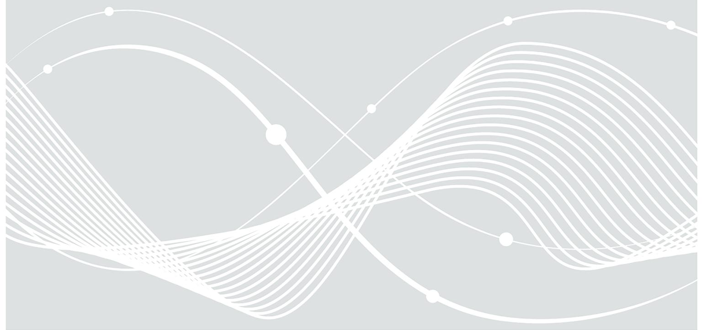
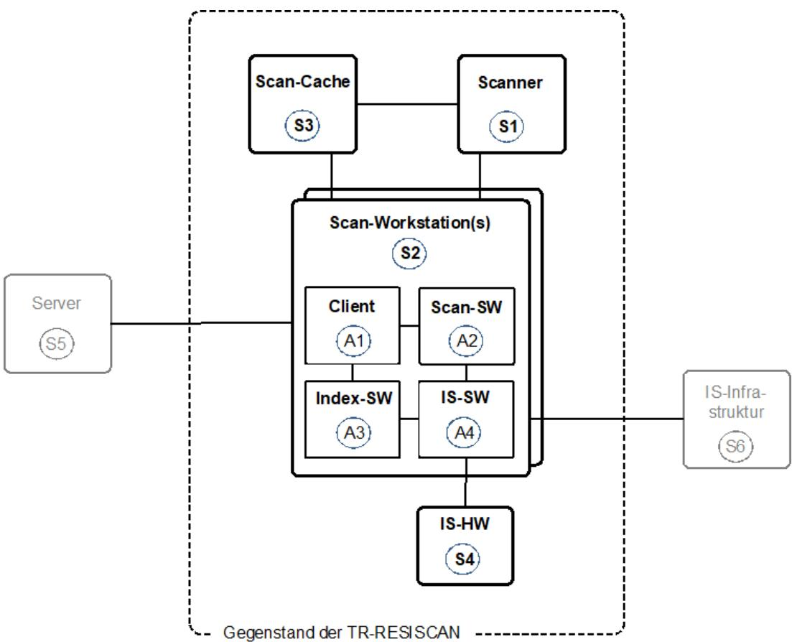
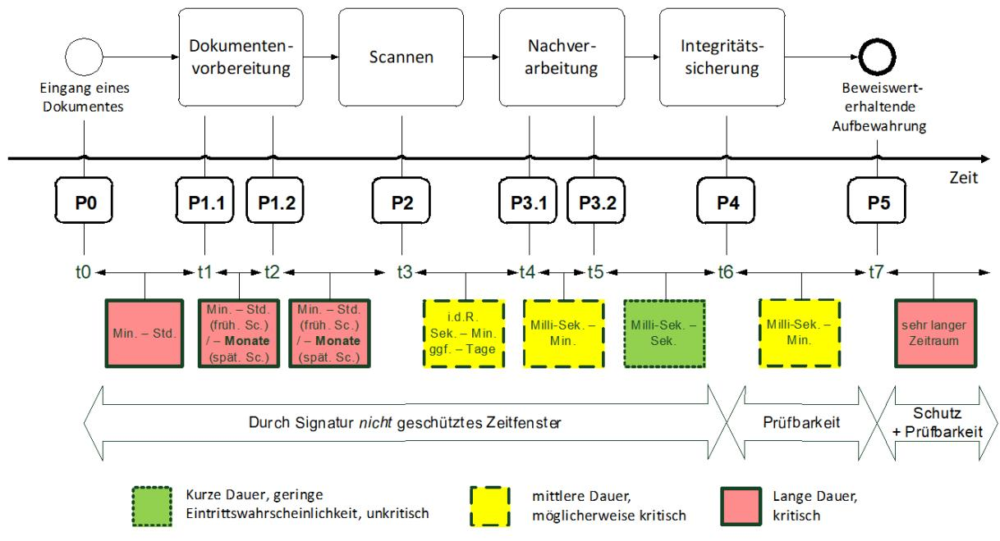
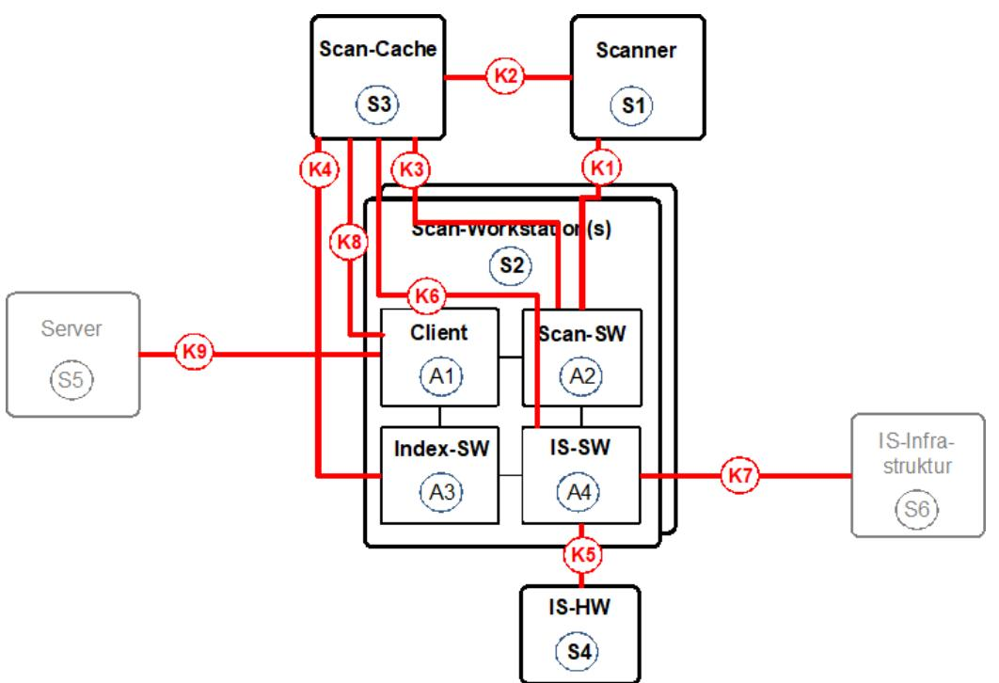

# BSI Technische Richtlinie 03138 Ersetzendes Scannen

Bezeichnung: Ersetzendes Scannen (RESISCAN) Anwendungshinweis A – Ergebnis der Risikoanalyse

Kürzel: BSI TR-03138-A

Version: 1.5

Datum: 05.02.2025

# Änderungshistorie

| Version | Datum      | Name | Beschreibung                                                                                     |
|---------|------------|------|--------------------------------------------------------------------------------------------------|
| 1.2     | 15.06.2018 | BSI  | LibreOffice Writer                                                                            |
| 1.3     | 09.09.2021 | BSI  | Umstellung auf MS Word, Aktualisierung auf IT Grundschutz Kompendium Edition 2021 |
| 1.5     | 05.02.2025 | BSI  | Aktualisierung auf IT Grundschutz Kompendium Edition 2023                               |

*Tabelle 1: Änderungshistorie*

Bundesamt für Sicherheit in der Informationstechnik Postfach 20 03 63 53133 Bonn Tel.: +49 22899 9582-0 E-Mail: resiscan@bsi.bund.de Internet: https://www.bsi.bund.de © Bundesamt für Sicherheit in der Informationstechnik 2025

| Anwendungshinweis A – Ergebnis der Risikoanalyse (informativ)        |   |
|-------------------------------------------------------------------------|---|
| A.1 Strukturanalyse                                                     | 6 |
| A.1.1 Konventionen                                                   | 6 |
| A.1.2 Datenobjekte                                                      | 6 |
| A.1.3 IT-Systeme und Anwendungen                                        | 7 |
| A.1.4 Der "generische Scanprozess"                                      | 9 |
| A.1.4.1 Eingang des Dokumentes10                                        |   |
| A.1.4.2 Dokumentenvorbereitung 10                                    |   |
| A.1.4.3 Scannen 11                                                   |   |
| A.1.4.4 Nachbearbeitung11                                               |   |
| A.1.4.5 Integritätssicherung11                                          |   |
| A.1.4.6 Geeignete Aufbewahrung 12                                    |   |
| A.1.4.7 Vernichtung des Originals12                                     |   |
| A.1.5 Kommunikationsverbindungen 12                                  |   |
| A.1.6 Informationsfluss der Datenobjekte 14                          |   |
| A.2 Schutzbedarfsanalyse15                                              |   |
| A.2.1 Überblick 15                                                   |   |
| A.2.2 Definition der Schutzbedarfskategorien und Sicherheitsziele 15 |   |
| A.2.3 Fachliche Schutzbedarfsanalyse17                                  |   |
| A.2.4 Schutzbedarf der Datenobjekte 17                               |   |
| A.2.4.1 Schutzbedarf des Originals17                                    |   |
| A.2.4.2 Schutzbedarf des Scanproduktes18                                |   |
| A.2.4.3 Schutzbedarf der Index- und Metadaten19                      |   |
| A.2.4.4 Schutzbedarf des Transfervermerkes19                            |   |
| A.2.4.5 Schutzbedarf der Sicherungsdaten20                              |   |
| A.2.4.6 Schutzbedarf der Protokolldaten 21                           |   |
| A.2.5 Schutzbedarf der IT-Systeme und Anwendungen 22                 |   |
| A.2.6 Schutzbedarf der Kommunikationsverbindungen22                     |   |
| A.3 Bedrohungsanalyse23                                                 |   |
| A.3.1 Gefährdungen in der Dokumentenvorbereitung 23                  |   |
| A.3.2 Gefährdungen beim Scannen24                                       |   |
| A.3.3 Gefährdungen bei der Nachbearbeitung26                            |   |
| A.3.4 Gefährdungen bei der Integritätssicherung27                       |   |
| A.4 Sicherheitsmaßnahmen29                                              |   |
| A.4.1 Allgemeine Sicherheitsmaßnahmen29                                 |   |
| A.4.2 Sicherheitsmaßnahmen bei der Dokumentenvorbereitung 32         |   |

| A.4.3 Sicherheitsmaßnahmen beim Scannen34                     |  |
|---------------------------------------------------------------|--|
| A.4.4 Sicherheitsmaßnahmen bei der Nachbearbeitung39          |  |
| A.4.5 Sicherheitsmaßnahmen bei der Integritätssicherung 40 |  |
| Referenzen 44                                              |  |

# Anwendungshinweis A – Ergebnis der Risikoanalyse (informativ)

Dieser Anwendungshinweis enthält das Ergebnis der Risikoanalyse, die im Zuge der Entwicklung der [BSI TR-03138] Grunde gelegt.

# A.1 Strukturanalyse

### A.1.1 Konventionen

Für die Benennung der relevanten Objekte werden die folgenden Konventionen verwendet:

- **•** Dxy bezeichnet ein Datenobjekt (siehe Abschnitt A.1.2)
- **•** Sxy bezeichnet ein IT-System (siehe Abschnitt A.1.3)
- **•** Axy bezeichnet eine Anwendung (siehe Abschnitt A.1.3), die auf einem IT-System läuft
- **•** Kxy bezeichnet eine Kommunikationsverbindung zwischen zwei IT-Systemen oder Anwendungen (siehe Abschnitt A.1.5)

Anders als sonst bei der Anwendung der IT-Grundschutz-Vorgehensweise üblich, wird hier auf die explizite Modellierung der involvierten Räumlichkeiten verzichtet. Stattdessen wird vorausgesetzt, dass geeignete Räumlichkeiten existieren, in denen ein geeigneter Zutrittskontrollmechanismus realisiert ist, so dass das Schriftgut sicher aufbewahrt werden kann und die relevanten IT-Systeme vor unbefugtem physikalischem Zugriff geschützt sind.

### A.1.2 Datenobjekte

Die nachfolgende Tabelle enthält die für das beweiskräftige und in diesem Sinne rechtssichere ersetzende Scannen relevanten Datenobjekte.

| ID | Datenobjekt                       | Beschreibung                                                                                                                                                                                                                                                                                                                                                                                                                                                               |
|----|-----------------------------------|----------------------------------------------------------------------------------------------------------------------------------------------------------------------------------------------------------------------------------------------------------------------------------------------------------------------------------------------------------------------------------------------------------------------------------------------------------------------------|
| D0 | Schriftgut aus dem Posteingang | Schriftgut, das per Post o. ä. eingegangen ist.                                                                                                                                                                                                                                                                                                                                                                                                                         |
| D1 | Scanrelevantes Original        | Papierdokument, das durch geeignete Vorbereitungsschritte (z. B. durch Entfernung des Kuverts1 , Umkopieren, Entklammern etc.) aus dem eingegangenen Schriftgut (D0) gewonnen und dem Scanprozess zugeführt wird.                                                                                                                                                                                                                                        |
| D2 | Scanprodukt                       | Elektronisches Abbild des Papierdokumentes (D1). Dieses wird durch den Scanner erzeugt und ggf. von der Scansoftware nachbearbeitet.                                                                                                                                                                                                                                                                                                                                    |
| D3 | Index- und Metadaten        | Daten, die das Auffinden und die Nutzung des später abgelegten Scanproduktes ermöglichen bzw. erleichtern. Durch die hier manuell oder automatisch durch eine Formularerkennungs-Software erfassten und ggf. im Rahmen der Sachbearbeitung überprüften oder ergänzten Index- und Metadaten wird die eindeutige Zuordnung von Dokumenten zu einem Geschäftsvorfall sichergestellt, wodurch ein wesentliches Element der Ordnungsmäßigkeit gegeben ist. |
| D4 | Transfervermerk2                  | Mit dem Transfervermerk wird dokumentiert, wann und durch wen die Übertragung des Papierdokumentes in ein elektronisches Dokument stattgefunden hat.                                                                                                                                                                                                                                                                                                                 |

1 Sofern das Kuvert relevante Inhalte umfasst und deshalb dem Scanprozess zugeführt wird, ist das Kuvert als ein Teil des "Scanrelevanten Originals" zu betrachten.

2 Form und Inhalt des Transfervermerks sind abhängig von den anwendbaren rechtlichen Rahmenbedingungen. Der Transfervermerk kann im Scanprodukt, zusammen mit dem Scanprodukt in einer Akte oder in den Metadaten abgelegt werden. Die Integrität und

| ID | Datenobjekt     | Beschreibung                                                                                                                                                                                                            |
|----|-----------------|-------------------------------------------------------------------------------------------------------------------------------------------------------------------------------------------------------------------------|
| D5 | Sicherungsdaten | Sicherungsdaten sind Datenobjekte3 , die dem Schutz der Integrität und ggf. Authentizität anderer Datenobjekte dienen.                                                                                            |
| D6 | Protokolldaten  | Die Protokolldaten dokumentieren zusätzliche sicherheitsrelevante Abläufe und Ereignisse. Sie unterstützen somit die Nachvollziehbarkeit der Abläufe und den Nachweis der Ordnungsmäßigkeit des Scanprozesses. |

*Tabelle 1: Liste der Datenobjekte*

### A.1.3 IT-Systeme und Anwendungen

Betrachtet man die verschiedenen in der Praxis genutzten Scansysteme, so erhält man durch Abstraktion das in Abbildung 1 und der hier vorliegenden Risikoanalyse zu Grunde gelegt wird.

*Abbildung 1: Das "typische Scansystem"*

Authentizität des Transfervermerks kann mit einer elektronischen Signatur geschützt werden. Rechtliche Betrachtungen zum Transfervermerk finden sich auch in [BSI-TR03138-R].

3 Hierbei kann es sich beispielsweise um Signaturen, Zertifikate, Zeitstempel, Message Authentication Codes, CRC-Prüfsummen etc. handeln.

| ID                     |                                           | IT-System                                     | Beschreibung                                                                                                                                                                                                                                                                                                                                                                                                                          |  |
|------------------------|-------------------------------------------|-----------------------------------------------|---------------------------------------------------------------------------------------------------------------------------------------------------------------------------------------------------------------------------------------------------------------------------------------------------------------------------------------------------------------------------------------------------------------------------------------|--|
| S1                     | Scanner                                   |                                               | Scanner für die Erzeugung eines Scanproduktes (D2) aus dem scanrelevanten Papierdokument (D1). Dieser Scanner kann lokal (z. B. über USB) oder über ein Netzwerk an die Scan-Workstation (S2) angeschlossen sein.                                                                                                                                                                                                         |  |
| S2 Scan-Workstation |                                           |                                               | Bildet die Ablaufumgebung für die Anwendungen (A1) – (A4) und produziert ggf. Protokolldaten (D6). In der Praxis kann die hier betrachtete "Scan-Workstation" auch durch mehrere Rechnersysteme realisiert sein, auf denen die nachfolgend betrachteten Anwendungen in verteilter Form ablaufen.                                                                                                                       |  |
|                        | A1                                        | Client                                        | Hierbei kann es sich um einen ECM-, DMS- oder VBS-Client handeln, in den ggf. die Anwendungen (A2) – (A4) integriert sind.                                                                                                                                                                                                                                                                                                   |  |
|                        | A2                                        | Scan-Software                                 | Softwarekomponente, die mit dem Scanner (S1) kommuniziert, um den technischen Erfassungsprozess zu steuern. Diese Komponente führt ggf. auch die Nachbearbeitung zur Qualitätsverbesserung durch und erzeugt bei Bedarf den Transfervermerk (D4).                                                                                                                                                                         |  |
|                        | A3                                        | Index-Software                                | Softwarekomponente für die automatische (z. B. durch OCR) oder manuelle Bereitstellung von zum Scanprodukt (D2) gehörigen Index- und Metadaten (D3). Diese Index-Software kann wie hier dargestellt auf der Scan-Workstation, einem eigenständigen Indexier-Arbeitsplatz oder innerhalb einer entsprechenden Fachanwendung betrieben werden.                                                                     |  |
|                        | A4                                        | Integritätssicher ungs-Software (IS-SW) | Erzeugt in Zusammenarbeit mit der Integritätssicherungshardware (S4) geeignete Sicherungsdaten4 (D5) für den Schutz der Integrität und ggf. Authentizität des Scanproduktes (D2) und ggf. der weiteren zugehörigen Daten.                                                                                                                                                                                                    |  |
| S3                     | Scan-Cache                                |                                               | Dient zur Ablage des Scanproduktes (D2). Dieser Zwischen speicher kann ggf. Teil von (S1), (S2) oder einem dritten System sein. Entsprechend kann der Zugriff auf den Scan-Cache beispielsweise über lokale Speichermechanismen oder über das Netz erfolgen.                                                                                                                                                              |  |
| S4                     | Integritätssicherungs Hardware (IS-HW) |                                               | Dient insbesondere der Speicherung und Anwendung von kryptographischem Schlüsselmaterial und wird von der Integritätssicherungssoftware (A4) für die Erzeugung von geeigneten Sicherungsdaten genutzt. Hierbei kann es sich beispielsweise um eine qualifizierte Signatur- oder Siegelerstellungseinheit gemäß [eIDAS-VO] handeln. Die IS-HW kann lokal an der Scan-Workstation angeschlossen sein oder |  |

4 Alternativ zur Verwendung von "Sicherungsdaten" kann die Integrität von Daten auch durch die Ablage derselben in einem geeigneten "Sicherungssystem" erfolgen, das die dort abgelegten Daten beispielsweise durch entsprechende Zugriffskontrollmechanismen vor unberechtigten Zugriffen schützt. In diesem Fall können sowohl die Integritätssicherungs-Software (IS-SW) als auch die Integritätssicherungs-Hardware (IS-HW) durch ein geeignetes Sicherungssystem ersetzt werden. Allerdings ist in diesem Fall zu bedenken, dass die Verkehrsfähigkeit der darin abgelegten Daten möglicherweise stark eingeschränkt sein könnte, so dass die vollständige Substitution der Sicherungsdaten durch Sicherungssysteme wohlüberlegt sein sollte.

| ID | IT-System        | Beschreibung                                                                                                                                                                                                                                                                                                                                                                                                                                                                                                                                                                |
|----|------------------|-----------------------------------------------------------------------------------------------------------------------------------------------------------------------------------------------------------------------------------------------------------------------------------------------------------------------------------------------------------------------------------------------------------------------------------------------------------------------------------------------------------------------------------------------------------------------------|
|    |                  | über entsprechend gesicherte Netzwerkverbindungen genutzt werden.                                                                                                                                                                                                                                                                                                                                                                                                                                                                                                        |
| S5 | Server           | Hierbei kann es sich um ein oder mehrere ECM-, DMS- oder Archivsysteme bzw. Fachverfahren handeln, in dem die Scanprodukte (D2) sowie die zusätzlichen Daten (Index- und Metadaten (D3), Transfervermerk (D4), Sicherungsdaten (D5) und Protokolldaten (D6)) zwischengespeichert oder über den Aufbewahrungszeitraum beweiskräftig aufbewahrt werden (vgl. z. B. [BSI-TR03125]). Die langfristige Aufbewahrung dieser Daten und die Realisierung dieses Server-Systems ist nicht Gegenstand der vorliegenden Technischen Richtlinie. |
| S6 | IS-Infrastruktur | Infrastruktur-Dienste, die die Integritätssicherung unterstützen und bei Bedarf - d. h. sofern elektronische Signaturen oder Siegel eingesetzt werden - Zertifikate, Zertifikatstatusinformationen und Zeitstempel bereitstellen. Diese Dienste können beispielsweise von einem Vertrauensdiensteanbieter gemäß [eIDAS-VO] bereitgestellt werden. Auch die Ausgestaltung der IS Infrastruktur ist nicht Gegenstand der vorliegenden Technischen Richtlinie.                                                                                |

*Tabelle 2: Liste der IT-Systeme und Anwendungen*

### A.1.4 Der "generische Scanprozess"

Hauptdokument) näher unter Berücksichtigung der Zeit5 , so ergibt sich der in Abbildung 2 dargestellte Ablauf, wobei Px die verschiedenen Phasen des Scanprozesses bezeichnet.

5 Die Eintrittswahrscheinlichkeit eines Angriffes und dadurch das entsprechende Risiko ist im Regelfall auch abhängig vom Zeitfenster, das einem potenziellen Angreifer zur Verfügung steht. Diese unterschiedliche Risikoexposition ist in Abbildung 2 mit den Farben grün, gelb und rot dargestellt.

*Abbildung 2: Zeitliche Betrachtung zum "generischen Scanprozess"*

#### A.1.4.1 Eingang des Dokumentes

In dieser ersten Phase (P0) wird das Schriftgut zum Zeitpunkt t0 empfangen. Wie in Abbildung 1 des Hauptdokumentes dargestellt, sind die detaillierten Abläufe hierbei nicht Gegenstand der vorliegenden TR.

#### A.1.4.2 Dokumentenvorbereitung

Die Phase der Dokumentenvorbereitung umfasst im Regelfall die folgenden beiden Schritte:

**•** P1.1 - Trennung Scan-relevantes und nicht-Scan-relevantes Schriftgut

In diesem ersten Schritt werden Kuverts geöffnet und das eingegangene Schriftgut (D0) von irrelevantem Beiwerk (z. B. Werbung) getrennt. t1 liegt typischerweise um Minuten oder Stunden nach t0.

**•** P1.2 - Vorbereitung Scan-relevantes Schriftgut

In dieser Phase werden bei Bedarf existierende Klammern oder Heftungen entfernt und es erfolgt insbesondere die Dokumenttrennung (ggf. unter Verwendung von Barcodes oder Patchcodes). Abhängig von den konkreten organisatorischen Abläufen kann dieser Schritt im Detail zahlreiche und sehr umfangreiche Schritte umfassen, die die Zusammensetzung und die physikalische Repräsentanz des Schriftguts ändern können. Beispielsweise kann sich das eingegangene Schriftgut (D0) durch Umkopieren6 , Ausschneiden, Reihenfolge ändern bei Wickelfalz etc. vom scan-relevanten 7 liegt der Zeitpunkt t2 um Minuten oder 8 können zwischen t1 und t2 unter Umständen jedoch mehrere Monate vergehen.

6 Beim Umkopieren erfolgt selbst eine Transformation, bei der die verschiedenen beim Scannen und der Nachbereitung aufgeführten Gefährdungen und Maßnahmen (siehe Abschnitte A.3.2, A.3.3, A.4.3 und A.4.4.) zu berücksichtigen sind.

7 Beim "frühen Scannen" erfolgt das Scannen vor der Sachbearbeitung.

8 Beim "späten Scannen" erfolgt das Scannen **nach** der Sachbearbeitung.

#### A.1.4.3 Scannen

In dieser Phase (P2) wird durch Zusammenwirken der Scan-Software (A2) mit dem Scanner (S1) aus dem Original Papierdokument (D1) das Scanprodukt (D2) erzeugt und in einem geeigneten - Scansystems kann dieser Schritt auch implizit erste Maßnahmen zur Qualitätsverbesserung und Bildo möglicherweise Wochen und Monate, weil Dokumente nun erst in der Sachbearbeitung verbleiben, bis alle Dokumente eines Vorganges komplett vorhanden sind oder die Sachbearbeitung abgeschlossen ist und dann gescannt werden können.

#### A.1.4.4 Nachbearbeitung

Die Phase der Nachbearbeitung umfasst unter Umständen die folgenden beiden Schritte:

**•** P3.1 - Bildoptimierung und Indexierung

In diesem Schritt kann bei Bedarf zum Zeitpunkt t4 durch die Scan-Software (A2) eine Nachbearbeitung des Scanproduktes zur Qualitätsverbesserung vorgenommen werden. Dies kann beispielsweise eine Bildoptimierung, Kontrastverbesserung, Leerseitenlöschung oder Maßnahmen für - Software (A3), in automatisierter (z. B. mittels OCR) oder manueller Weise, entsprechende Index- und Metadaten (D3) bereitgestellt und ggf. in das Scanprodukt (D2) integriert werden. Die Metadaten können, soweit notwendig und sinnvoll, auch Informationen über den Ort, der bis zur Vernichtung strukturiert abgelegten Originale enthalten. Für die Bildverbesserung liegt t4 im Bereich von Sekunden bis Minuten nach t3. Für die Indexierung kann der Zeitverzug größer sein; durch entsprechende Fehlersituationen (z. B. nicht zuordenbare Barcodes) kann sich der Zeitraum zwischen t3 und t4 auf mehrere Tage erstrecken.

**•** P3.2 - Qualitätskontrolle, Protokollierung und Transfervermerk

In diesem Schritt erfolgt typischerweise eine Qualitätskontrolle, die eine Nachjustierung der Scan-Parameter oder eine erneute Erfassung des Schriftguts nach sich ziehen kann. Außerdem können während des Scannens und der Nachbearbeitung bei Bedarf sicherheitsrelevante Ereignisse dokumentiert und entsprechende Protokolldaten (D6) erzeugt werden. Schließlich kann ein Transfervermerk (D4) erzeugt werden, welcher dokumentiert, wann (Zeitpunkt t3) und durch wen die Transformation des Papierdokumentes zum Scanprodukt stattgefunden hat. Der Zeitpunkt t5 kann im Bereich von Sekunden oder Minuten nach t4 liegen, aber durch die vorherigen Zeiträume können seit dem ursprünglichen Eingang des Originals bereits Stunden, Tage, Wochen oder sogar Monate vergangen sein.

#### A.1.4.5 Integritätssicherung

Sofern dies nicht bereits zu einem früheren Zeitpunkt (ab t3) geschehen ist, kann das Scanprodukt (D2) in dieser Phase (P4) ggf. einschließlich der Index- und Metadaten (D3), dem Transfervermerk (D4) und den Protokolldaten (D6) zum Zeitpunkt t6 mit einem geeigneten Integritätsschutz versehen werden. Hierfür können explizit Sicherungsdaten (D5) z. B. elektronische Signaturen oder Zeitstempel erzeugt werden oder die zu schützenden Daten können zur impliziten Integritätssicherung in einem entsprechenden Sicherungssystem (S5) abgelegt werden. Mit den auf kryptographischen Mechanismen basierenden Sicherungsdaten können Manipulationen in der Regel n

*Abbildung 3: Wesentliche Kommunikationsverbindungen*

#### A.1.4.6 Geeignete Aufbewahrung

In dieser Phase (P5) wird das Scanprodukt (D2) samt der weiteren damit zusammenhängenden Daten (D3-D6) zum Zeitpunkt t7 zur langfristigen Aufbewahrung an ein geeignetes Sicherungssystem (S5) übergeben. Abhängig von Implementierungsdetails (z. B. synchrone oder asynchrone Abläufe) und der Anzahl der verarbeiteten Dokumente können zwischen t6 und t7 Millisekunden bis Minuten vergehen. Neben dem Beweiswerterhalt können in einem solchen Ablagesystem auch Zugriffskontrolldargestellt, ist die Beweiswerterhaltende Aufbewahrung aber nicht Gegenstand der vorliegenden Technischen Richtlinie, sondern in [BSI-TR03125] geregelt.

#### A.1.4.7 Vernichtung des Originals

Schließlich kann das Original (D1) nach der zuverlässigen und entsprechend protokollierten Übergabe des Scanprodukts (D2) und der damit zusammenhängenden Daten (D3-D6) an das Beweiswerterhaltende Aufbewahrungssystem und ggf. dem Ablauf einer bestimmten zusätzlichen Frist und einer entsprechenden Protokollierung vernichtet werden, sofern die Voraussetzungen hierfür gegeben sind9 .

# A.1.5 Kommunikationsverbindungen

In 1 dargestellt.

9 Die Voraussetzungen, ob das Original vernichtet werden darf, sind vom Anwender selbständig zu prüfen. Für weiterführende Hinweise siehe [BSI-TR03138-R].

| ID | Von | Zu | Beschreibung                                                                                                                                                                                                                                                                                                                                                                                                                                                                                                                                                                                                                                                                                                                                                                                                                                                                                                                                                                                                                                                                                                                                                                                                                                                                                                                                                                                                                                                               |
|----|-----|----|----------------------------------------------------------------------------------------------------------------------------------------------------------------------------------------------------------------------------------------------------------------------------------------------------------------------------------------------------------------------------------------------------------------------------------------------------------------------------------------------------------------------------------------------------------------------------------------------------------------------------------------------------------------------------------------------------------------------------------------------------------------------------------------------------------------------------------------------------------------------------------------------------------------------------------------------------------------------------------------------------------------------------------------------------------------------------------------------------------------------------------------------------------------------------------------------------------------------------------------------------------------------------------------------------------------------------------------------------------------------------------------------------------------------------------------------------------------------------|
| K1 | S1  | A2 | Umfasst die Schnittstelle zwischen der Scansoftware (A2) und dem Scanner (S1), die beispielsweise gemäß [ISIS], [TWAIN] oder [SANE] ausgeprägt sein kann. Bei [TWAIN] stehen für die Datenübertragung vom Scanner (bzw. der zugehörigen "Data Source Software") zur Scansoftware ("Application") drei Übertragungsmodi zur Verfügung10 ("Native", "Disk File", "Buffered Memory", siehe [TWAIN]: Bei "Native" wird ein einzelner Speicherblock für die Übergabe der Bilddaten (bzw. bei MacOS ein Verweis auf diese) genutzt. Bei der "Disk File" -Variante, die nicht zwingend unterstützt werden muss, erzeugt die Scansoftware eine Datei, deren Inhalt vom Scanner (z. B.11 über die Kommunikationsverbindung K212) geschrieben wird. Sobald die Erfassung komplett erfolgt ist, signalisiert dies der Scanner der Scansoftware über eine MSG_XFERREADY-Nachricht, worauf hin diese die weitere Verarbeitung übernimmt. Bei der "Buffered Memory"-Variante erfolgt die Datenübergabe über mehrere Speicherblöcke, die jeweils von der Scansoftware allokiert und vom Scanner beschrieben werden. Wichtig ist, dass in keiner der drei bei [TWAIN] vorgesehenen Varianten (ähnlich wie bei anderen Scanner-Schnittstellen wie [ISIS] und [SANE]) spezifische Sicherheitsmechanismen für den Schutz der Vertraulichkeit, Integrität und Authentizität der übertragenen Daten vorgesehen sind. |
| K2 | S1  | S3 | Über diese Kommunikationsverbindung wird, beispielsweise bei der "Disk File" Variante der [TWAIN]-Schnittstelle, das Scanprodukt (D2) vom Scanner (S1) zum Scan-Cache (S3) übertragen.                                                                                                                                                                                                                                                                                                                                                                                                                                                                                                                                                                                                                                                                                                                                                                                                                                                                                                                                                                                                                                                                                                                                                                                                                                                                               |
| K3 | A2  | S3 | Über diese Schnittstelle wird von der Scansoftware (A2) auf den Scan-Cache (S3) zugegriffen. Beispielsweise kann über diese Schnittstelle die Ablage des Scanproduktes (D2) erfolgen.                                                                                                                                                                                                                                                                                                                                                                                                                                                                                                                                                                                                                                                                                                                                                                                                                                                                                                                                                                                                                                                                                                                                                                                                                                                                                |
| K4 | A3  | S3 | Über diese Kommunikationsverbindung werden beispielsweise die Index- und Metadaten (D3) übertragen, um sie im Scan-Cache (S3) abzulegen.                                                                                                                                                                                                                                                                                                                                                                                                                                                                                                                                                                                                                                                                                                                                                                                                                                                                                                                                                                                                                                                                                                                                                                                                                                                                                                                       |
| K5 | A4  | S4 | Über diese Schnittstelle kommuniziert die Integritätssicherungs-Software (A4) mit der Integritätssicherungs-Hardware (S4), um die Erstellung von Sicherungsdaten (D5) (z. B. von elektronischen Signaturen) zu erwirken.                                                                                                                                                                                                                                                                                                                                                                                                                                                                                                                                                                                                                                                                                                                                                                                                                                                                                                                                                                                                                                                                                                                                                                                                                                          |
| K6 | A4  | S3 | Über diese Kommunikationsverbindung kann die Integritätssicherungs Software (A4) auf die zu schützenden Daten (Scanprodukt, Metadaten etc.) zugreifen und später die erstellten Sicherungsdaten (D5) wieder ablegen.                                                                                                                                                                                                                                                                                                                                                                                                                                                                                                                                                                                                                                                                                                                                                                                                                                                                                                                                                                                                                                                                                                                                                                                                                                                 |
| K7 | A4  | S6 | Durch diese Kommunikationsverbindung kann die Integritätssicherungs Software (A4) mit einer möglicherweise vorhandenen                                                                                                                                                                                                                                                                                                                                                                                                                                                                                                                                                                                                                                                                                                                                                                                                                                                                                                                                                                                                                                                                                                                                                                                                                                                                                                                                                  |

10 Während die beiden Übertragungsmodi "Native" und "Buffered Memory" typischerweise bei lokal angeschlossenen Scannern verwendet werden, wird die "Disk File" Variante oft bei Netzwerkfähigen Scannern und Multifunktionsgeräten genutzt.

11 Alternativ könnte die Übertragung in diesem Fall über die Kommunikationsverbindungen K1 und K3 erfolgen, wobei die Scan-Workstation S2 als Kommunikationsproxy fungiert.

12 Alternativ könnte die Übertragung in diesem Fall über die Kommunikationsverbindungen K1 und K3 erfolgen, wobei die Scan-Workstation S2 als Kommunikationsproxy fungiert.

| ID | Von | Zu | Beschreibung                                                                                                                                                                                                                                                                                   |
|----|-----|----|------------------------------------------------------------------------------------------------------------------------------------------------------------------------------------------------------------------------------------------------------------------------------------------------|
|    |     |    | Integritätssicherungsinfrastruktur (S6) kommunizieren und beispielsweise einen Zeitstempel anfordern.                                                                                                                                                                                       |
| K8 | A1  | S3 | Über diese Kommunikationsverbindung kann das Scanprodukt (D2) inklusive der Metadaten (D3) und den Sicherungsdaten (D5) aus dem Scan-Cache (S3) ausgelesen werden.                                                                                                                       |
| K9 | A1  | S5 | Schließlich können die im Rahmen des Scanprozesses erzeugten und ggf. entsprechend zwischengespeicherten Datenobjekte (Scanprodukt, Index- und Metadaten, Transfervermerk, Sicherungsdaten, Protokolldaten) über diese Schnittstelle in dem oder den Servern (S5) abgelegt werden. |

*Tabelle 3: Liste der Kommunikationsverbindungen*

# A.1.6 Informationsfluss der Datenobjekte

In der nachfolgenden Tabelle wurde die Präsenz der Datenobjekte (Dx) in den verschiedenen Systemen (Sy) und der mögliche Informationsfluss über die jeweiligen Kommunikationsverbindungen (Kz) zusammengetragen.

| Datenobjekt | System     | Kommunikationsverbindung |
|-------------|------------|--------------------------|
| D1          | S1         | -                        |
| D2          | S1, S2, S3 | K1                       |
|             |            | K3                       |
|             |            | K2                       |
|             |            | K8                       |
|             |            | K9                       |
| D3          | S2, S3     | K4                       |
|             |            | K9                       |
| D4          | S2         | K9                       |
| D5          | S2, S3, S4 | K5                       |
|             |            | K6                       |
|             |            | K7                       |
|             |            | K9                       |
| D6          | S2         | K9                       |

*Tabelle 4: Informationsfluss der Datenobjekte*

# A.2 Schutzbedarfsanalyse

# A.2.1 Überblick

Die Schutzbedarfsanalyse umfasst folgende Schritte:

- 1. Definition der Schutzbedarfskategorien und Sicherheitsziele (siehe Abschnitt A.2.2)
- 2. Fachliche Schutzbedarfsanalyse (siehe Abschnitt A.2.3 und [BSI-TR03138-R])
- 3. Schutzbedarf der Datenobjekte (siehe Abschnitt A.2.4)
- 4. Schutzbedarf der IT-Systeme und Anwendungen (siehe Abschnitt A.2.5)
- 5. Schutzbedarf der Kommunikationsverbindungen (siehe Abschnitt A.2.6)

# A.2.2 Definition der Schutzbedarfskategorien und Sicherheitsziele

In diesem ersten Schritt werden die Schutzbedarfskategorien sowie die wesentlichen Sicherheitsziele definiert. Angelehnt an [BSI-200-2] (Abschnitt 8.2.1), werden im vorliegenden Dokument die Schu

| Schutzbedarfskategorie | Definition                                                                                                                                                                                                                                                                                    |
|------------------------|-----------------------------------------------------------------------------------------------------------------------------------------------------------------------------------------------------------------------------------------------------------------------------------------------|
| "normal"               | Die Schadensauswirkungen sind in der Regel begrenzt und überschaubar. Ein solcher Schaden induziert im Regelfall keine nennenswerten Konsequenzen für die am Geschäftsvorfall beteiligten Personen und Institutionen.                                                             |
| "hoch"                 | Die Schadensauswirkungen sind in der Regel beträchtlich. Ein solcher Schaden führt im Regelfall zu beträchtlichen Konsequenzen für die am Geschäftsvorfall beteiligten Personen und Institutionen.                                                                                   |
| "sehr hoch"            | Die Schadensauswirkungen können ein existenziell bedrohliches oder sogar katastrophales Ausmaß erreichen. Ein solcher Schaden kann zu existenziell bedrohlichen oder sogar katastrophalen Konsequenzen für die am Geschäftsvorfall beteiligten Personen und Institutionen führen. |

*Tabelle 5: Definition der Schutzbedarfskategorien*

Da es von den konkreten Gegebenheiten eines Geschäftsvorfalles abhängt, welche Konsequenzen fachliche Schutzbedarfsfeststellung (vgl. Abschnitt A.3.3) vor dem Hintergrund eines konkreten Anwendungsfalls überprüft und entsprechend angepasst werden.

auf [BSI-Glossar], [RoJa08], [RFJW08] , [RoPf03] und [HüKo06], wie folgt definiert:

| SZ13                | Sicherheitsziel         | Definition                                                                                                                                                                                                                                                                                                                                                                              |
|---------------------|-------------------------|-----------------------------------------------------------------------------------------------------------------------------------------------------------------------------------------------------------------------------------------------------------------------------------------------------------------------------------------------------------------------------------------|
|                     | Integrität              | Integrität bedeutet, dass die Daten oder Systeme nicht verändert wurden. Bei einem wirksamen Integritätsschutz werden zudem zumindest Veränderungen erkannt.                                                                                                                                                                                                                      |
|                     | Authentizität           | Unter der Authentizität von Daten14 versteht man, dass die Quelle der Daten eindeutig bestimmbar ist.                                                                                                                                                                                                                                                                                |
| Integrität          | Vollständigkeit         | Vollständigkeit bedeutet, dass der gegenseitige Bezug mehrerer aufgrund eines inneren Zusammenhangs zusammengehörigen Datenobjekte sichergestellt ist.                                                                                                                                                                                                                            |
|                     | Nachvollzieh barkeit | Unter der Nachvollziehbarkeit eines Vorgangs versteht man, dass alle wesentlichen Schritte des Vorgangs von einer unabhängigen Stelle nachgezeichnet werden können.                                                                                                                                                                                                               |
|                     | Verfügbarkeit           | Die Verfügbarkeit von Daten, Diensten, IT-Systemen, IT Anwendungen oder IT-Netzen ist vorhanden, wenn diese den Benutzern innerhalb akzeptabler Wartezeiten in der benötigten Form zur Verfügung stehen.                                                                                                                                                                       |
| Verfüg barkeit   | Lesbarkeit              | Lesbarkeit bedeutet, dass die in den Daten enthaltenen Informationen erkannt werden können.15                                                                                                                                                                                                                                                                                        |
|                     | Verkehrsfähig keit   | Verkehrsfähigkeit bezeichnet die Möglichkeit, Dokumente und Akten von einem System zu einem anderen übertragen zu können, bei der die "Qualität" des Dokuments sowie seine Integrität und Authentizität nachweisbar bleiben.16                                                                                                                                                 |
|                     | Vertraulichkeit         | Vertraulichkeit ist die Verhinderung einer unbefugten Kenntnisnahme.                                                                                                                                                                                                                                                                                                                 |
| Vertrau lichkeit | Löschbarkeit            | Unter Löschen von Daten ist das Unkenntlichmachen der gespeicherten Daten zu verstehen. Dies ist gegeben, wenn die Daten unwiderruflich so behandelt worden sind, dass eigene Informationen nicht aus gespeicherten Daten gewonnen werden können, wenn also der Rückgriff auf diese Daten nicht mehr möglich ist [ScWi12, § 3 Rn. 75], [Dammann in Simi11, § 3 Rn. 180]. |

*Tabelle 6: Definition der Sicherheitsziele*

13 Schutzziele der IT-Sicherheit (siehe z. B. [BSI-200-2])

14 Im Rahmen der vorliegenden Technischen Richtlinie werden insbesondere die in Tabelle 1 aufgeführten Datenobjekte D0 bis D6 betrachtet. Hierbei muss genau betrachtet werden, welches Datenobjekt von einer bestimmten Sicherheitsmaßnahme genau berührt wird. Beispielsweise könnte zwar die Integrität und Authentizität des Transfervermerks (D4) durch den Einsatz einer vom Scan-Operator erstellten qualifizierten elektronischen Signatur geschützt werden, aber die Integrität und Authentizität des papiergebundenen Originals (D0 oder D1) wäre von dieser Maßnahme völlig unberührt.

15 Ein elektronisches Dokument ist nur dann lesbar, wenn die notwendige Hard- und Software die Daten verarbeiten, ihre Informationen interpretieren und dem menschlichen Betrachter in lesbarer Weise präsentieren kann.

16 Es sei angemerkt, dass die Verkehrsfähigkeit von kryptographisch gesicherten Daten nur bei Verwendung von allgemein anerkannten (z. B. internationalen) Standards (siehe [BSI-TR03125] ) und interoperablen Systemen gewährleistet werden kann.

Abgesehen von der Nachvollziehbarkeit, die für Vorgänge definiert ist, beziehen sich alle anderen Sicherhe Abschnitt A.2.3 und [BSI-TR03138-R]) und der daraus abgeleiteten Schutzbedarfsanalyse für die weiteren Datenobjekte (Abschnitt A.2.4) betrachtet. Auf der anderen Seite sind für Systeme, Anwendungen und Kommunikationsbeziehungen im Einklang mit der IT-Grundschutz-Vorgehensweise des BSI [BSI-200-2] lediglich die Sicherheitsziele bzw. Grundwerte Integrität, Verfügbarkeit und Vertraulichkeit definiert. Deshalb werden ab Abschnitt A.2.5 lediglich diese Grundwerte der IT-Sicherheit herangezogen.

# A.2.3 Fachliche Schutzbedarfsanalyse

Der Schutzbedarf der verschiedenen in Tabelle 1 aufgeführten Datenobjekte hängt maßgeblich vom Schutzbedarf des Originals (D0 bzw. D1) ab. Dieser fachliche Schutzbedarf kann naturgemäß nicht pauschal angegeben werden. Vielmehr MUSS dieser von jedem Anwender der TR vor dem ersetzenden Scannen anhand der konkret verarbeiteten Dokumente individuell bestimmt werden.

Um diesen Prozess zu unterstützen, finden sich in [BSI-TR03138-R] einige beispielhafte fachliche Schutzbedarfsanalysen für ausgewählte Dokumenttypen, die zur Orientierung dienen können.

# A.2.4 Schutzbedarf der Datenobjekte

Der Schutzbedarf der verschiedenen Datenobjekte leitet sich Großteils aus dem Schutzbedarf des Originals ab, welcher im Rahmen der fachlichen Schutzbedarfsanalyse bestimmt werden MUSS (vgl. Abschnitt A.2.3 und [BSI-TR03138-R]).

| ID        | Datenobjekt         |                 |                                                                                                                                                                                                                                                                                                                                                                      |
|-----------|---------------------|-----------------|----------------------------------------------------------------------------------------------------------------------------------------------------------------------------------------------------------------------------------------------------------------------------------------------------------------------------------------------------------------------|
|           | Sicherheitsziel     | Schutzbedarf    | Begründung                                                                                                                                                                                                                                                                                                                                                           |
| D0        |                     |                 | Eingegangenes und scanrelevantes Original                                                                                                                                                                                                                                                                                                                            |
| und D1 | Integrität          | normal bis hoch | Der Schutzbedarf des eingegangenen (D0) oder scanrelevanten Originals (D1) hinsichtlich der verschiedenen Schutzziele ist abhängig von der Art des Dokumentes. Dieser Schutzbedarf MUSS im Rahmen der fachlichen Schutzbedarfsanalyse bestimmt werden. Exemplarische Schutzbedarfsanalysen finden sich in Anwendungshinweis [BSI TR03138-R]. |
|           | Authentizität       |                 |                                                                                                                                                                                                                                                                                                                                                                      |
|           | Vollständigkeit     |                 |                                                                                                                                                                                                                                                                                                                                                                      |
|           | Nachvollziehbarkeit |                 |                                                                                                                                                                                                                                                                                                                                                                      |
|           | Verfügbarkeit       |                 |                                                                                                                                                                                                                                                                                                                                                                      |
|           | Lesbarkeit          |                 |                                                                                                                                                                                                                                                                                                                                                                      |
|           | Verkehrsfähigkeit   |                 |                                                                                                                                                                                                                                                                                                                                                                      |
|           | Vertraulichkeit     |                 |                                                                                                                                                                                                                                                                                                                                                                      |
|           | Löschbarkeit        |                 |                                                                                                                                                                                                                                                                                                                                                                      |

#### A.2.4.1 Schutzbedarf des Originals

*Tabelle 7: Schutzbedarfsanalyse des eingegangenen (D0) und scanrelevanten Originals (D1)*

#### A.2.4.2 Schutzbedarf des Scanproduktes

| ID | Datenobjekt         |                              |                                                                                                                                                                                |
|----|---------------------|------------------------------|--------------------------------------------------------------------------------------------------------------------------------------------------------------------------------|
|    | Sicherheitsziel     | Schutzbedarf                 | Begründung                                                                                                                                                                     |
| D2 | Scanprodukt         |                              |                                                                                                                                                                                |
|    | Integrität          | wie D1                       | Mit dem Vernichten oder der Rückgabe17 des Originals wird der Schutzbedarf des Scanproduktes hinsichtlich der Integrität,                                                |
|    | Verfügbarkeit       |                              | Verfügbarkeit, Lesbarkeit und Verkehrsfähigkeit gleich dem Schutzbedarf des Originals und kann deshalb bis zu hoch sein.                                                 |
|    | Lesbarkeit          |                              |                                                                                                                                                                                |
|    | Verkehrsfähigkeit   |                              |                                                                                                                                                                                |
|    | Authentizität       | mindestens so hoch wie D1 | Beim Scannen und Vernichten des Originals werden die Möglichkeiten die Authentizität des Originals durch Schriftsachverständige nachzuweisen teilweise18 beschnitten. |
|    | Nachvollziehbarkeit |                              | Um diesen Verlust, soweit dies möglich ist, zu kompensieren, muss der Transformationsvorgang entsprechend nachvollziehbar gestaltet werden.                           |
|    | Vollständigkeit     | wie D1                       | Der Schutzbedarf für die Vollständigkeit, Vertraulichkeit und Löschbarkeit des                                                                                              |
|    | Vertraulichkeit     |                              | Scanproduktes ist gleich dem im Rahmen der fachlichen Schutzbedarfsanalyse (vgl. Abschnitt                                                                                  |
|    | Löschbarkeit19      |                              | A.2.3 und [BSI-TR03138-R]) zu bestimmenden Schutzbedarf für das Original (D1).                                                                                              |

*Tabelle 8: Schutzbedarfsanalyse des Scanproduktes (D2)*

17 Bei Rückgabe des Originals bleibt das Original zwar erhalten und könnte zu Beweiszwecken herangezogen werden, wodurch der Schutzbedarf des Scanproduktes lediglich mit "normal" eingestuft werden würde. Da das zurückgegebene Original aber der aktenführenden Stelle im Streitfall unter Umständen nicht mehr zur Verfügung steht, führt eine konservative Abschätzung zum Ergebnis, dass auch durch das Zurückgeben des Originals der Schutzbedarf des Scanproduktes gleich dem Schutzbedarf des Originals wird.

18 Während die Auswertung des Schriftzugs einer Unterschrift unter Umständen auch anhand einer Kopie möglich ist, können die physikalischen Merkmale des papiergebundenen Originals oder der Tinte nach der Vernichtung des Originals nicht mehr analysiert werden.

19 Der Vorgang des Löschens muss in geeigneter Weise protokolliert werden und statt dem Scanprodukt ist während der vorgesehenen Aufbewahrungsdauer das Löschprotokoll aufzubewahren. Der Schutzbedarf des hierbei entstehenden Löschprotokolls hat in der Regel den gleichen Schutzbedarf wie das Scanprodukt.

| ID | Datenobjekt          |                 |                                                                                                                                                                                                                                                                                                                                                                                                                                                                                                                                                                                                                                                                                                                                          |
|----|----------------------|-----------------|------------------------------------------------------------------------------------------------------------------------------------------------------------------------------------------------------------------------------------------------------------------------------------------------------------------------------------------------------------------------------------------------------------------------------------------------------------------------------------------------------------------------------------------------------------------------------------------------------------------------------------------------------------------------------------------------------------------------------------------|
|    | Sicherheitsziel      | Schutzbedarf    | Begründung                                                                                                                                                                                                                                                                                                                                                                                                                                                                                                                                                                                                                                                                                                                               |
| D3 | Index- und Metadaten |                 |                                                                                                                                                                                                                                                                                                                                                                                                                                                                                                                                                                                                                                                                                                                                          |
|    | Integrität           | normal bis hoch | Der Schutzbedarf der Index- und Metadaten ist abhängig von Art und Umfang derselben und                                                                                                                                                                                                                                                                                                                                                                                                                                                                                                                                                                                                                                            |
|    | Authentizität        |                 | kann deshalb "normal" oder "hoch" sein. Sofern Metadaten nur als administrative Begleitobjekte dienen, haben diese nur einen normalen Schutzbedarf. Auf der anderen Seite ist für Index- und Metadaten ein hoher Schutzbedarf hinsichtlich der Integrität, Authentizität, Vollständigkeit, Nachvollziehbarkeit, Lesbarkeit und Verkehrsfähigkeit anzunehmen, wenn die Index- und Metadaten selbst Beweisgegenstand werden können. Eine Beeinträchtigung der Integrität, Vollständigkeit, Verfügbarkeit und Lesbarkeit der Index- und Metadaten kann sich auch negativ auf die faktische Verfügbarkeit der Nutzdaten auswirken. Außerdem könnten Index- und Metadaten für das |
|    | Vollständigkeit      |                 |                                                                                                                                                                                                                                                                                                                                                                                                                                                                                                                                                                                                                                                                                                                                          |
|    | Nachvollziehbarkeit  |                 |                                                                                                                                                                                                                                                                                                                                                                                                                                                                                                                                                                                                                                                                                                                                          |
|    | Verfügbarkeit        |                 |                                                                                                                                                                                                                                                                                                                                                                                                                                                                                                                                                                                                                                                                                                                                          |
|    | Lesbarkeit           |                 |                                                                                                                                                                                                                                                                                                                                                                                                                                                                                                                                                                                                                                                                                                                                          |
|    | Verkehrsfähigkeit    |                 |                                                                                                                                                                                                                                                                                                                                                                                                                                                                                                                                                                                                                                                                                                                                          |
|    | Vertraulichkeit      |                 |                                                                                                                                                                                                                                                                                                                                                                                                                                                                                                                                                                                                                                                                                                                                          |
|    | Löschbarkeit         |                 |                                                                                                                                                                                                                                                                                                                                                                                                                                                                                                                                                                                                                                                                                                                                          |
|    |                      |                 | Rechtemanagement genutzt werden. So kann eine Veränderung der Daten zu einer                                                                                                                                                                                                                                                                                                                                                                                                                                                                                                                                                                                                                                                          |
|    |                      |                 | Veränderung des Personenkreises führen, der zum Zugriff berechtigt ist. Damit kann                                                                                                                                                                                                                                                                                                                                                                                                                                                                                                                                                                                                                                                    |
|    |                      |                 | Unbefugten der Zugriff ermöglicht werden. Die Vertraulichkeit und Löschbarkeit der Index                                                                                                                                                                                                                                                                                                                                                                                                                                                                                                                                                                                                                                              |
|    |                      |                 | und Metadaten hängen stark von Art und Umfang derselben ab. Enthalten die Index- und                                                                                                                                                                                                                                                                                                                                                                                                                                                                                                                                                                                                                                            |
|    |                      |                 | Metadaten alle per OCR aus dem Scanprodukt extrahierbaren Inhalte, so ist der Schutzbedarf                                                                                                                                                                                                                                                                                                                                                                                                                                                                                                                                                                                                                                            |
|    |                      |                 | hinsichtlich der Vertraulichkeit und Löschbarkeit gleich dem des Scanproduktes bzw. des Originals.                                                                                                                                                                                                                                                                                                                                                                                                                                                                                                                                                                                                                                 |

#### A.2.4.3 Schutzbedarf der Index- und Metadaten

*Tabelle 9: Schutzbedarfsanalyse der Index- und Metadaten (D3)*

#### A.2.4.4 Schutzbedarf des Transfervermerkes

| ID | Datenobjekt     |              |            |
|----|-----------------|--------------|------------|
|    | Sicherheitsziel | Schutzbedarf | Begründung |
| D4 | Transfervermerk |              |            |
|    | Integrität      |              |            |

| ID | Datenobjekt             |                                                                                 |                                                                                                                                                                                                                                                                                                                                                                                                                                                                                                                                                                              |
|----|-------------------------|---------------------------------------------------------------------------------|------------------------------------------------------------------------------------------------------------------------------------------------------------------------------------------------------------------------------------------------------------------------------------------------------------------------------------------------------------------------------------------------------------------------------------------------------------------------------------------------------------------------------------------------------------------------------|
|    | Sicherheitsziel         | Schutzbedarf                                                                    | Begründung                                                                                                                                                                                                                                                                                                                                                                                                                                                                                                                                                                   |
|    | Authentizität           | Maximum (Authentizität von D2, Nachvollziehbarkeit von D2)          | Der Transfervermerk dient der ordnungsgemäßen und nachvollziehbaren Dokumentation des Transformationsvorgangs. Mit dem Vernichten oder der Rückgabe des Originals wird der Schutzbedarf des Transfervermerkes hinsichtlich der angegebenen Sicherheitsziele gleich dem Schutzbedarf des Scanproduktes (D2) hinsichtlich der Authentizität bzw. der Nachvollziehbarkeit.                                                                                                                                                                           |
|    | Vollständigkeit         |                                                                                 |                                                                                                                                                                                                                                                                                                                                                                                                                                                                                                                                                                              |
|    | Nachvollziehbarkeit     |                                                                                 |                                                                                                                                                                                                                                                                                                                                                                                                                                                                                                                                                                              |
|    | Verfügbarkeit wie D1 | Mit dem Vernichten oder der Rückgabe des Originals wird der Schutzbedarf des |                                                                                                                                                                                                                                                                                                                                                                                                                                                                                                                                                                              |
|    | Lesbarkeit              |                                                                                 | Transfervermerks hinsichtlich der angegebenen Sicherheitsziele gleich dem Schutzbedarf des                                                                                                                                                                                                                                                                                                                                                                                                                                                                                |
|    | Verkehrsfähigkeit       |                                                                                 | Originals (D1).                                                                                                                                                                                                                                                                                                                                                                                                                                                                                                                                                              |
|    | Löschbarkeit            |                                                                                 |                                                                                                                                                                                                                                                                                                                                                                                                                                                                                                                                                                              |
|    | Vertraulichkeit         | normal bis hoch                                                                 | Der Transfervermerk enthält im Regelfall den Namen des Erstellers und damit personenbezogene Daten, die grundsätzlich schützenswert sind. Für einen einzelnen Transfervermerk ist der Schutzbedarf hinsichtlich der Vertraulichkeit im Regelfall nur normal. Liegen jedoch mehrere Transfervermerke vor, so besteht die Möglichkeit mit Hilfe der personenbezogenen Daten Nutzerprofile zu erstellen. Dieser Kumulationseffekt kann unter Umständen dazu führen, dass der Schutzbedarf hinsichtlich der Vertraulichkeit auf hoch steigt. |

*Tabelle 10: Schutzbedarfsanalyse des Transfervermerkes (D4)*

#### A.2.4.5 Schutzbedarf der Sicherungsdaten

| ID | Datenobjekt     |                             |                                                                                                 |
|----|-----------------|-----------------------------|-------------------------------------------------------------------------------------------------|
|    | Sicherheitsziel | Schutzbedarf                | Begründung                                                                                      |
| D5 | Sicherungsdaten |                             |                                                                                                 |
|    | Integrität      | höchstens wie geschützte | Der Schutzbedarf für die Sicherungsdaten hinsichtlich der angegebenen Sicherheitsziele       |
|    | Authentizität   | Datenobjekte                | ist höchstens so hoch wie der Schutzbedarf der davon geschützten Datenobjekte. Sie ist genau |
|    | Vollständigkeit |                             | so hoch, wenn die Beeinträchtigung des                                                          |

| ID | Datenobjekt         |                  |                                                                                                                                                                                                                                                                                                                                                                                                                                                                                                                                                                                  |
|----|---------------------|------------------|----------------------------------------------------------------------------------------------------------------------------------------------------------------------------------------------------------------------------------------------------------------------------------------------------------------------------------------------------------------------------------------------------------------------------------------------------------------------------------------------------------------------------------------------------------------------------------|
|    | Sicherheitsziel     | Schutzbedarf     | Begründung                                                                                                                                                                                                                                                                                                                                                                                                                                                                                                                                                                       |
|    | Nachvollziehbarkeit |                  | Sicherheitszieles der Sicherungsdaten auch das Sicherheitsziel für das geschützte Datenobjekt                                                                                                                                                                                                                                                                                                                                                                                                                                                                              |
|    | Verfügbarkeit       |                  | beeinträchtigt. Sicherungsdaten, welche das Scanprodukt D2 schützen, haben also den entsprechenden Schutzbedarf des Scanproduktes D2 selbst. Wie oben erläutert, ist dieser Schutzbedarf nach dem Vernichten des Originals gleich dem Schutzbedarf des Originals D1 selbst.                                                                                                                                                                                                                                                                                    |
|    | Lesbarkeit          |                  |                                                                                                                                                                                                                                                                                                                                                                                                                                                                                                                                                                                  |
|    | Verkehrsfähigkeit   |                  |                                                                                                                                                                                                                                                                                                                                                                                                                                                                                                                                                                                  |
|    | Vertraulichkeit     | normal bis hoch  | Sicherungsdaten können personenbezogene Daten (z. B. in einem Zertifikat) enthalten, die entsprechend zu schützen sind. Für ein einzelnes Sicherungsdatum ist der Schutzbedarf hinsichtlich der Vertraulichkeit im Regelfall nur normal. Liegen jedoch mehrere gleichartige Sicherungsdaten vor, so besteht die potenzielle Möglichkeit mit Hilfe der personenbezogenen Daten Nutzerprofile zu erstellen. Dieser Kumulationseffekt kann unter Umständen dazu führen, dass der Schutzbedarf hinsichtlich der Vertraulichkeit auf hoch steigt. |
|    | Löschbarkeit        | höchstens wie D1 | Der Schutzbedarf hinsichtlich der Löschbarkeit für die Sicherungsdaten ist im Regelfall höchstens so hoch wie der Schutzbedarf des Originals (D1).                                                                                                                                                                                                                                                                                                                                                                                                                      |

*Tabelle 11: Schutzbedarfsanalyse der Sicherungsdaten (D5)*

### A.2.4.6 Schutzbedarf der Protokolldaten

| ID | Datenobjekt         |                               |                                                                                             |
|----|---------------------|-------------------------------|---------------------------------------------------------------------------------------------|
|    | Sicherheitsziel     | Schutzbedarf                  | Begründung                                                                                  |
| D6 | Protokolldaten      |                               |                                                                                             |
|    | Integrität          | Maximum (Authentizität von | Mit dem Vernichten oder der Rückgabe des Originals wird der Schutzbedarf der             |
|    | Authentizität       | D2, Nachvollziehbarkeit    | Protokolldaten hinsichtlich der angegebenen Sicherheitsziele gleich dem Schutzbedarf des |
|    | Vollständigkeit     | von D2)                       | Scanproduktes (D2) hinsichtlich der Authentizität bzw. der Nachvollziehbarkeit, da       |
|    | Nachvollziehbarkeit |                               | die Protokolldaten der ordnungsgemäßen Dokumentation des Transformationsvorganges        |
|    | Verfügbarkeit       |                               | dienen.                                                                                     |
|    | Lesbarkeit          |                               |                                                                                             |

| ID | Datenobjekt       |                  |                                                                                                                                                  |  |
|----|-------------------|------------------|--------------------------------------------------------------------------------------------------------------------------------------------------|--|
|    | Sicherheitsziel   | Schutzbedarf     | Begründung                                                                                                                                       |  |
|    | Verkehrsfähigkeit |                  |                                                                                                                                                  |  |
|    | Vertraulichkeit   | höchstens wie D1 | Der Schutzbedarf hinsichtlich der Vertraulichkeit und der Löschbarkeit für die                                                                |  |
|    | Löschbarkeit      |                  | Protokolldaten muss je nach Art und Umfang bewertet werden und ist im Regelfall höchstens so hoch wie der Schutzbedarf des Originals (D1). |  |

*Tabelle 12: Schutzbedarfsanalyse der Protokolldaten (D6)*

# A.2.5 Schutzbedarf der IT-Systeme und Anwendungen

| ID     | IT-Systeme und Anwendungen |              |                                                                                              |
|--------|----------------------------|--------------|----------------------------------------------------------------------------------------------|
|        | Grundwert                  | Schutzbedarf | Begründung                                                                                   |
| {S,A}x | IT-System bzw. Anwendung   |              |                                                                                              |
|        | Vertraulichkeit            | wie Dx       | Der Schutzbedarf eines IT-Systems oder einer darauf laufenden Anwendung hinsichtlich der  |
|        | Integrität                 |              | Vertraulichkeit, Integrität oder Verfügbarkeit ist so hoch wie der Schutzbedarf der darin |
|        | Verfügbarkeit              |              | verarbeiteten Datenobjekte (Dx).                                                             |

*Tabelle 13: Exemplarische Schutzbedarfsanalyse der IT-Systeme und Anwendungen*

# A.2.6 Schutzbedarf der Kommunikationsverbindungen

| ID | Kommunikationsverbindung      |                               |                                                                                                                                                                                                                                   |
|----|-------------------------------|-------------------------------|-----------------------------------------------------------------------------------------------------------------------------------------------------------------------------------------------------------------------------------|
|    | Grundwert                     | Schutzbedarf                  | Begründung                                                                                                                                                                                                                        |
| Kx | Kommunikationsverbindung      |                               |                                                                                                                                                                                                                                   |
|    | Vertraulichkeit Integrität | wie Dx                        | Der Schutzbedarf einer Kommunikationsverbindung hinsichtlich der Vertraulichkeit oder Integrität ist so hoch wie der Schutzbedarf der darüber übermittelten Datenobjekte (Dx).                                        |
|    | Verfügbarkeit                 | Maximum (SBVf(S), SBVf(E)) | Der Schutzbedarf für die Verfügbarkeit einer Kommunikationsverbindung ist gegeben als das Maximum des Schutzbedarfs hinsichtlich der Verfügbarkeit des Start- (S) und Endpunktes (E) der Kommunikationsverbindung. |

*Tabelle 14: Schutzbedarfsanalyse der Kommunikationsverbindungen*

# A.3 Bedrohungsanalyse

Im Rahmen der Bedrohungsanalyse werden die verschiedenen Bedrohungen und potenziellen erfasst.

Im Folgenden werden benutzerdefinierte Gefährdungen mit BG x bezeichnet.

### A.3.1 Gefährdungen in der Dokumentenvorbereitung

| ID     | Gefährdung                                                            |                                                                                                                                                                                                                                             |  |
|--------|-----------------------------------------------------------------------|---------------------------------------------------------------------------------------------------------------------------------------------------------------------------------------------------------------------------------------------|--|
|        | Bedrohte Objekte                                                   | Beschreibung                                                                                                                                                                                                                                |  |
| BG 1.1 | Manipulation oder Fälschung des Originals                             |                                                                                                                                                                                                                                             |  |
|        | D1                                                                    | Das Original könnte (z. B. mit Tipp-Ex) vor der Erfassung20 manipuliert worden sein oder das Original könnte komplett gefälscht worden sein.                                                                                             |  |
| BG 1.2 | Austausch des Originals                                               |                                                                                                                                                                                                                                             |  |
|        | D1                                                                    | Das Original könnte versehentlich oder absichtlich vor der Erfassung gegen ein anderes Dokument ausgetauscht worden sein. Diese Bedrohung existiert auch vor dem Eingang des Dokuments zum Zeitpunkt P0 oder während des Scannens. |  |
| BG 1.3 | Manipulation am Umfang des Originals                                  |                                                                                                                                                                                                                                             |  |
|        | D1                                                                    | Dem Original könnten versehentlich oder absichtlich vor der Erfassung Seiten hinzugefügt oder entfernt worden sein. Diese Bedrohung existiert auch während des Scannens (vgl. BG 2.1).                                                |  |
| BG 1.4 | Versehentlich umgedrehte Blätter in Scan-Stapel                       |                                                                                                                                                                                                                                             |  |
|        | D1                                                                    | Es könnten sich versehentlich oder absichtlich umgedrehte Blätter im Scan Stapel befinden. Hierdurch würde, sofern nur einseitig gescannt wird, das Original nur unvollständig erfasst werden.                                        |  |
| BG 1.5 | Unautorisiertes Vernichten oder unautorisierte Rückgabe des Originals |                                                                                                                                                                                                                                             |  |
|        | D1                                                                    | Das Original könnte versehentlich oder absichtlich zu früh - insbesondere vor Abschluss der Qualitätssicherung des Scanprodukts - vernichtet oder zurückgegeben worden sein.                                                    |  |
| BG 1.6 | Unautorisierte Einsicht in vertrauliche Unterlagen                    |                                                                                                                                                                                                                                             |  |
|        | D1                                                                    | Eine Person könnte bei der Dokumentenvorbereitung unautorisierte Einsicht in vertrauliche Unterlagen erhalten. Diese Bedrohung existiert auch während des Scannens.                                                                   |  |
| BG 1.7 | Vertauschte Reihenfolge der Seiten des Originals                      |                                                                                                                                                                                                                                             |  |
|        | D1                                                                    | Während der Dokumentenvorbereitung könnte die Reihenfolge der Seiten des Originals vertauscht werden (z. B. beim Zusammenstellen nach Herunterfallen).                                                                                |  |

20 Diese Manipulation oder Fälschung könnte auch vor dem Eingang des Dokuments, z. B. durch den Absender, vorgenommen worden sein.

| ID     | Gefährdung                                          |                                                                                                                                                                                                                                 |  |
|--------|-----------------------------------------------------|---------------------------------------------------------------------------------------------------------------------------------------------------------------------------------------------------------------------------------|--|
|        | Bedrohte Objekte                                 | Beschreibung                                                                                                                                                                                                                    |  |
| BG 1.8 | Unsachgemäße Veränderung des Formates des Originals |                                                                                                                                                                                                                                 |  |
|        | D1                                                  | Durch Zerschneiden eines überformatigen Originaldokumentes könnten die Inhalte nicht mehr im Zusammenhang lesbar sein oder die Zuordnung zu einem Vorgang könnte dadurch nicht mehr zweifelsfrei gewährleistet werden. |  |

*Tabelle 15: Gefährdungen in der Dokumentenvorbereitung*

### A.3.2 Gefährdungen beim Scannen

| ID     | Gefährdung                             |                                                                                                                                                                                                                                                                                                            |  |
|--------|----------------------------------------|------------------------------------------------------------------------------------------------------------------------------------------------------------------------------------------------------------------------------------------------------------------------------------------------------------|--|
|        | Bedrohte Objekte                    | Beschreibung                                                                                                                                                                                                                                                                                               |  |
| BG 2.1 | Unvollständige Erfassung des Originals |                                                                                                                                                                                                                                                                                                            |  |
|        | D1, S1                                 | Der Scanner (S1) könnte beim Einzug eines mehrseitigen Originals (D1) mehrere Seiten gleichzeitig eingezogen haben. Somit würde das Original nur unvollständig erfasst werden.                                                                                                                       |  |
|        | D1, S1                                 | Beim Einzug könnten Seiten des Originals z. B. durch Heftklammern beim Einzug beschädigt (geknickt, angerissen, …) werden. Somit würde das Original nur unvollständig erfasst werden.                                                                                                                |  |
|        | D1, S1                                 | Explizit beschriebene Rückseiten könnten versehentlich oder absichtlich nicht erfasst werden.                                                                                                                                                                                                           |  |
|        | D1, S1                                 | Endlospapier könnte nicht oder nicht geeignet vorbereitet worden sein.                                                                                                                                                                                                                                     |  |
| BG 2.2 |                                        | Manipulation des Scanners                                                                                                                                                                                                                                                                                  |  |
|        | D2, S1                                 | Der Scanner (S1) könnte (z. B. mit einer veränderten Firmware) manipuliert worden sein. Integrität, Vertraulichkeit oder Verfügbarkeit des Scanproduktes (D2) könnte beeinträchtigt sein.                                                                                                            |  |
| BG 2.3 |                                        | Manipulation der Scan-Workstation (S2)                                                                                                                                                                                                                                                                     |  |
|        | D1, D2, S2                          | Die Scan-Workstation (S2) könnte manipuliert worden sein. Diese Manipulation könnte auf folgenden Wegen geschehen sein: - Angriffe über das Netzwerk, - Einspielen von Malware (z. B. nicht authentische Scan-Software oder Integritätssicherungs-Software) oder - lokaler Zugriff |  |
| BG 2.4 |                                        | Manipulation des Scanproduktes                                                                                                                                                                                                                                                                             |  |
|        | D2, K2                                 | Verändern von D2 bei der Datenübertragung vom Scanner (S1) zum Scan Cache (S3)                                                                                                                                                                                                                          |  |
|        | D2, K1                                 | Verändern von D2 bei der Datenübertragung vom Scanner (S1) zur Scan Software (A2)                                                                                                                                                                                                                       |  |

| ID      | Gefährdung          |                                                                                                                                                                                                                                                                                                                                                                                    |
|---------|---------------------|------------------------------------------------------------------------------------------------------------------------------------------------------------------------------------------------------------------------------------------------------------------------------------------------------------------------------------------------------------------------------------|
|         | Bedrohte Objekte | Beschreibung                                                                                                                                                                                                                                                                                                                                                                       |
|         | D2, K3              | Verändern von D2 bei der Datenübertragung von der Scan-SW (A2) zum Scan-Cache (S3)                                                                                                                                                                                                                                                                                              |
|         | D2, S3              | Verändern von D2 im Scan-Cache (S3)                                                                                                                                                                                                                                                                                                                                                |
| BG 2.5  |                     | Unautorisierte Einsicht in vertrauliche Unterlagen                                                                                                                                                                                                                                                                                                                                 |
|         | D1                  | Unautorisierte Personen könnten Einsicht in das Original (D1) oder das Scanprodukt (D2) erhalten, wenn dieses nach einem Scanvorgang im Scanner vergessen wurde bzw. in einer Phase des Scanprozesses nicht adäquat geschützt wird. Dieser Aspekt ist insbesondere bei Dokumenten relevant, die personenbezogene Daten enthalten oder dem Geheimnisschutz unterliegen. |
|         | D2                  | Personen mit Zugriff auf die Scan-Systeme könnten unautorisiert Einsicht in vertrauliche Scanprodukte (D2) erhalten.                                                                                                                                                                                                                                                            |
| BG 2.6  |                     | Mangelnde oder ungeeignete Scan-Qualität                                                                                                                                                                                                                                                                                                                                           |
|         | D2                  | Durch mangelnde oder ungeeignete Scan-Qualität wie z. B. Fehlfunktion der Scanneroptik, fehlerhafte Konfiguration der Scanner-Optik, zu gering gewählte Auflösung, schwarz-weiß Scannen von farbigen Dokumente, sofern der Farbinformation eine Bedeutung zukommt, oder                                                                                          |
|         |                     | Verschmutzung des Scanners Scannen von Durchlichtdokumenten (z. B. Röntgenbilder) mit ungeeigneter Hardware könnte die Vollständigkeit und Lesbarkeit eines Scanproduktes nur teilweise oder gar nicht gegeben sein.                                                                                                                                                |
| BG 2.7  |                     | Abhören von Scanprodukten durch Belauschen einer Kommunikationsverbindung                                                                                                                                                                                                                                                                                                          |
|         | D2, K1              | Abhören der Datenübertragung von D2 vom Scanner (S1) zur Scan-Software (A2)                                                                                                                                                                                                                                                                                                     |
|         | D2, K2              | Abhören der Datenübertragung von D2 vom Scanner (S1) zum Scan-Cache (S3)                                                                                                                                                                                                                                                                                                        |
|         | D2, K3              | Abhören der Datenübertragung von D2 von der Scan-SW (A2) zum Scan Cache (S3)                                                                                                                                                                                                                                                                                                    |
| BG 2.8  |                     | Einspielen von Scanprodukten                                                                                                                                                                                                                                                                                                                                                       |
|         | D2, S3              | Einspielen eines nicht authentischen D2 in den Scan-Cache (S3)                                                                                                                                                                                                                                                                                                                     |
| BG 2.9  |                     | Vortäuschen einer Identität                                                                                                                                                                                                                                                                                                                                                        |
|         | S3, K3              | Vortäuschen eines authentischen Scan-Cache (S3) über K3                                                                                                                                                                                                                                                                                                                            |
|         | S1, K1              | Vortäuschen eines authentischen Scanners (S1) über K1                                                                                                                                                                                                                                                                                                                              |
| BG 2.10 |                     | Auslesen eines zur Entsorgung bestimmten Betriebsmittels                                                                                                                                                                                                                                                                                                                           |
|         | S1, S2, S3, D2   | Durch Auslesen eines zur Entsorgung bestimmten Betriebsmittels (z. B. Festplatte) von S1, S2 oder S3 könnte die Vertraulichkeit von D2 nicht mehr gegeben sein.                                                                                                                                                                                                           |

*Tabelle 16: Gefährdungen beim Scannen*

# A.3.3 Gefährdungen bei der Nachbearbeitung

| ID     | Gefährdung                                       |                                                                                                                                                                                                                                                                                                                      |  |
|--------|--------------------------------------------------|----------------------------------------------------------------------------------------------------------------------------------------------------------------------------------------------------------------------------------------------------------------------------------------------------------------------|--|
|        | Bedrohte Objekte                              | Beschreibung                                                                                                                                                                                                                                                                                                         |  |
| BG 3.1 |                                                  | Zuordnung falscher Index- und Metadaten                                                                                                                                                                                                                                                                              |  |
|        | D2                                               | Dem Scanprodukt (D2) könnten falsche Index- und Metadaten zugeordnet worden sein. Somit würde das Auffinden des nachbearbeiteten Scanproduktes deutlich erschwert oder gar unmöglich werden.                                                                                                                |  |
| BG 3.2 | Manipulation von Index- und Metadaten            |                                                                                                                                                                                                                                                                                                                      |  |
|        | D3, D2, K4                                       | Verändern von D3 bei der Datenübertragung von der Index-SW (A3) zum Scan-Cache (S3). Hierdurch könnte das Auffinden des Scanproduktes (D2) deutlich erschwert oder gar unmöglich werden.                                                                                                                       |  |
|        | D3, D2, S3                                       | Verändern (Hinzufügen, Ändern oder Entfernen) von D3 auf dem Scan Cache (S3). Hierdurch könnte das Auffinden des Scanproduktes (D) deutlich erschwert oder gar unmöglich werden.                                                                                                                            |  |
| BG 3.3 | Unautorisiertes Löschen der Index- und Metadaten |                                                                                                                                                                                                                                                                                                                      |  |
|        | D2, K9                                           | Durch das unautorisierte Löschen der Index- und Metadaten bei der Übertragung zum Server (S5) könnte das Auffinden des Scanproduktes deutlich erschwert oder gar unmöglich werden.                                                                                                                          |  |
| BG 3.4 | Fehlende Indexierung                             |                                                                                                                                                                                                                                                                                                                      |  |
|        | D2                                               | Durch die fehlende Indexierung könnte das Auffinden des Scanproduktes deutlich erschwert oder gar unmöglich werden.                                                                                                                                                                                               |  |
| BG 3.5 |                                                  | Unautorisierte Einsicht in vertrauliche Index- und Metadaten                                                                                                                                                                                                                                                         |  |
|        | D3                                               | Die mit dem Scan-Vorgang beauftragte Person könnte unautorisierte Einsicht in vertrauliche Index- und Metadaten erhalten.                                                                                                                                                                                      |  |
| BG 3.6 | Abhören von Index- und Metadaten                 |                                                                                                                                                                                                                                                                                                                      |  |
|        | D3, K4                                           | Abhören der Datenübertragung von D3 von der Index-SW (A3) zum Scan Cache (S3).                                                                                                                                                                                                                                    |  |
| BG 3.7 |                                                  | Einspielen von Index- und Metadaten                                                                                                                                                                                                                                                                                  |  |
|        | D3, S3                                           | Einspielen eines nicht authentischen D3 in den Scan-Cache (S3).                                                                                                                                                                                                                                                      |  |
| BG 3.8 |                                                  | Ungeeignete Nachbearbeitung                                                                                                                                                                                                                                                                                          |  |
|        | D2                                               | Verlust der Lesbarkeit des Scanproduktes oder Verlust relevanter Informationen aus dem rohen Scanprodukt durch ungeeignete Nachbearbeitung, z. B. durch zu starke Rausch-Filter, Farbreduktion, zu starke Bildkompression, Reduktion von Layern bei Multi-Layer Bildformaten, zu starkes Beschneiden. |  |
| BG 3.9 |                                                  | Technisches Versagen der Speicherung                                                                                                                                                                                                                                                                                 |  |

| ID      | Gefährdung                                                          |                                                                                                                                                                             |  |
|---------|---------------------------------------------------------------------|-----------------------------------------------------------------------------------------------------------------------------------------------------------------------------|--|
|         | Bedrohte Objekte                                                 | Beschreibung                                                                                                                                                                |  |
|         | D2, D3                                                              | Verlust des Scanproduktes oder der Metadaten durch Fehler beim Abspeichern oder technisches Versagen des Speichermediums (z. B. Softwarefehler oder Hardware-Defekt). |  |
| BG 3.10 | Manipulation oder Löschung der Transfervermerke oder Protokolldaten |                                                                                                                                                                             |  |
|         | D4, D6                                                              | Die erzeugten Transfervermerke oder Protokolldaten könnten versehentlich oder absichtlich manipuliert oder gelöscht werden.                                              |  |

*Tabelle 17: Gefährdungen bei der Nachbearbeitung*

# A.3.4 Gefährdungen bei der Integritätssicherung

| ID     | Gefährdung                                           |                                                                                                                                                                                                                                                                                                                                                                   |  |
|--------|------------------------------------------------------|-------------------------------------------------------------------------------------------------------------------------------------------------------------------------------------------------------------------------------------------------------------------------------------------------------------------------------------------------------------------|--|
|        | Bedrohte Objekte                                  | Beschreibung                                                                                                                                                                                                                                                                                                                                                      |  |
| BG 4.1 | Verwendung ungeeigneter Sicherungsmittel             |                                                                                                                                                                                                                                                                                                                                                                   |  |
|        | D2                                                   | Das Scanprodukt (D2) könnte mit schwachen21 elektronischen Signaturen und/oder Zeitstempeln versehen werden oder durch leicht überwindbare Sicherungssysteme geschützt werden. Hierdurch kann die Integrität der verarbeiteten und aufbewahrten Datenobjekte nicht gewährleistet werden, was wiederum zu Problemen bei der Beweisführung führen kann. |  |
| BG 4.2 | Eingesetzte Algorithmen verlieren Sicherheitseignung |                                                                                                                                                                                                                                                                                                                                                                   |  |
|        | D2, D5                                               | Die zur Sicherung des Scanproduktes verwendeten kryptographischen Algorithmen könnten mit der Zeit ihre Sicherheitseignung verlieren, so dass die Integrität der durch die Sicherungsdaten D5 gesicherten Objekte (D2) nicht mehr gewährleistet werden kann.                                                                                             |  |
| BG 4.3 | Unautorisiertes Löschen der Sicherungsdaten          |                                                                                                                                                                                                                                                                                                                                                                   |  |
|        | D2, D5, K9                                           | Die Sicherungsdaten (D5) könnten z. B. bei der Übertragung zum Server (S5) durch unautorisierte Personen gelöscht worden sein. Hierdurch würden sämtliche Dokumente (D4) ihre Integrität verlieren.                                                                                                                                                      |  |
| BG 4.4 |                                                      | Kompromittierung kryptographischer Schlüssel                                                                                                                                                                                                                                                                                                                      |  |
|        | D2, D5                                               | Die zur Sicherung verwendeten kryptographischen Schlüssel in (D5) könnten kompromittiert worden sein. Hierdurch könnte die Integrität der Scanprodukt (D2) nicht mehr gewährleistet werden.                                                                                                                                                                 |  |
| BG 4.5 |                                                      | Infrastrukturdienste nicht verfügbar                                                                                                                                                                                                                                                                                                                              |  |

21 Eine elektronische Signatur ist "schwach", wenn sie mit ungeeigneten kryptographischen Algorithmen, unzureichend geschützten und deshalb möglicherweise kompromittierten Schlüsseln oder unter Verwendung ungeeigneter Infrastrukturdienste (IS) (z. B. unzureichend zuverlässige Zeitstempel, unzureichende Identifizierung beim Zertifizierungsdienst, unzureichende Aufbewahrung oder unzureichenden Prozesse) erstellt wurde.

| ID      | Gefährdung                                   |                                                                                                                                                                                                                                                                                                          |  |
|---------|----------------------------------------------|----------------------------------------------------------------------------------------------------------------------------------------------------------------------------------------------------------------------------------------------------------------------------------------------------------|--|
|         | Bedrohte Objekte                          | Beschreibung                                                                                                                                                                                                                                                                                             |  |
|         | D2, D5, K7                                   | Die Infrastrukturdienste (S6) könnten zeitweise nicht verfügbar sein. Während dieser Zeit wäre es ggf. nicht möglich die Integrität von bereits erfassten Dokumenten zu prüfen bzw. – z. B. sofern z. B. der Infrastrukturdienst Signaturen oder Zeitstempel erzeugt – zu schützen. |  |
| BG 4.6  | Vortäuschen eines Infrastrukturdienstes      |                                                                                                                                                                                                                                                                                                          |  |
|         | D2, K7                                       | Das Vortäuschen eines authentischen Infrastrukturdienstes (S6) könnte dazu führen, dass die Integrität oder Authentizität von Scanprodukten nicht gewährleistet ist.                                                                                                                               |  |
| BG 4.7  | Erzeugen nicht authentischer Sicherungsdaten |                                                                                                                                                                                                                                                                                                          |  |
|         | D2, D3, K5                                   | Manipulation von D2 und D3 durch die Integritätssicherungs-Hardware (IS-HW) oder Integritätssicherungs-Software (IS-SW). Damit wäre die Integrität der so geschützten Objekte (D3, D2) nicht gewährleistet.                                                                                        |  |
| BG 4.8  | Abhören von nachbearbeiteten Scanprodukten   |                                                                                                                                                                                                                                                                                                          |  |
|         | D2, K6, S3                                   | Abhören von D2 beim Transfer aus dem Scan-Cache (S3) zur Integritätssicherungs-Software (IS-SW).                                                                                                                                                                                                      |  |
| BG 4.9  |                                              | Manipulation von nachbearbeiteten Scanprodukten                                                                                                                                                                                                                                                          |  |
|         | D2, K6, S3                                   | Manipulation von D2 beim Transfer aus dem Scan-Cache (S3) zur Integritätssicherungs-Software (IS-SW).                                                                                                                                                                                                 |  |
| BG 4.10 |                                              | Unautorisierte Nutzung von Systemen                                                                                                                                                                                                                                                                      |  |
|         | S2, S4                                       | Durch unautorisierte Nutzung der Integritätssicherungs-Hardware oder der Integritätssicherungs-Software könnten unautorisierte Sicherungsdaten erzeugt werden.                                                                                                                                     |  |
| BG 4.11 |                                              | Technisches Versagen der Speicherung                                                                                                                                                                                                                                                                     |  |
|         | D2, D5                                       | Verlust des Scanproduktes oder der Sicherungsdaten durch technisches Versagen beim Abspeichern oder auf Grund eines technischen Problems des Speichermediums (z. B. Softwarefehler oder Hardware-Defekt).                                                                                       |  |

*Tabelle 18: Gefährdungen bei der Integritätssicherung*

# A.4 Sicherheitsmaßnahmen

Im Folgenden werden Maßnahmen beschrieben, welche den o. g. Gefährdungen direkt entgegenwirken sollen (vgl. [KSD+08], [BuKa08]). Neben den Maßnahmen des IT-Grundschutz-Kompendiums sind auch benutzerdefinierte Maßnahmen (BM) angegeben. Zusätzlich zu den nachfolgend genannten Maßnahmen sind die Maßnahmen aus den Bausteinen des IT-Grundschutzkataloges, die im Rahmen der Modellierung des Informationsverbundes den einzelnen Objekten zugeordnet wurden, zu berücksichtigen.

Welche Maßnahmen zum Schutz der Daten ergriffen werden müssen, hängt auch davon ab, ob die Daten (nur) im eigenen Interesse aufbewahrt werden oder ob dies auch im Interesse der Betroffenen oder Dritter erfolgt.

# A.4.1 Allgemeine Sicherheitsmaßnahmen

Allgemein sind folgende Bausteine speziell im Hinblick auf den Scanprozess und die dabei eingesetzten Systeme zu berücksichtigen:

- Sofern der Scanvorgang teilweise oder vollständig durch externe Dienstleister durchgeführt wird, die Bausteine OPS.2.3 (Nutzung von Outsourcing) und OPS.3.2 (Anbieten von Outsourcing).
- Für eine DSGVO-konforme Verarbeitung personenbezogener Daten beim Scannen von Dokumenten der Baustein CON.2 (Datenschutz).
- Für die Aufbewahrung der Dokumente der Baustein OPS.1.2.2 (Archivierung).
- Zur Absicherung eingesetzter IT-Systeme die anwendbaren SYS-Bausteine (SYS IT-Systeme). Diese umfassen sowohl Scan-Workstation, Scan-Cache und explizit auch den Dokumentenscanner (S1) anwendbar, den Baustein SYS.4.1 (Drucker, Kopierer und Multifunktionsgeräte).
- Zur Absicherung des Netzwerkes und des Netzzuganges der Systeme, einschließlich deren Kommunikation miteinander, die anwendbaren NET-Bausteine (NET Netze und Kommunikation).
- Zur Absicherung eingesetzter Anwendungen in Bezug auf den Scan-Vorgang, z.B. E-Mail oder Datenbanken, die anwendbaren APP-Bausteine (App Anwendungen).

Eine Ableitung erforderlicher Maßnahmen erfolgt anhand einer individuellen GS-Modellierung für den gewählten Informationsverbund innerhalb der Institution. Identifizierte GS-Bausteine, inklusive deren Anforderungen richten sich nach dem BSI IT-Grundschutz in der aktuellen Auflage.

#### ISMS.1 – Sicherheitsmanagement

In angemessenen zeitlichen Abständen ist die Einhaltung der getroffenen und festgelegten Sicherheitsmaßnahmen durch eine Stelle, welche der Institution, die das ersetzende Scannen durchführt, organisatorisch nicht angehört, unangekündigt zu kontrollieren (siehe Baustein ISMS.1 A11 Aufrechterhaltung der Informationssicherheit).

#### ORP.5 – Compliance Management (Anforderungsmanagement)

Für die Einhaltung der Informationssicherheit sowie einschlägiger Gesetze, Vorschriften und Regelungen zum Scanprozess sollten die Bausteine ORP.5 A2 (Beachtung der Rahmenbedingungen) und ORP.5 A8 (Regelmäßige Überprüfung des Compliance Managements) Anwendung finden. Das Compliance Managementsollte in der Organisationsstruktur implementiert sein. Sich daraus ergebene Anforderungen und Maßnahmen sowie deren Effizienz und Effektivität sollten regelmäßig überprüft werden (siehe auch DER.3.1 Audits und Revisionen).

#### ORP.1 – Organisation

Da der Scanvorgang immer auch manuelle Bedienhandlungen umfasst, bei denen die Gefahr von Fehlern oder unberechtigten Handlungen besteht, müssen für den Scanvorgang klare Verantwortlichkeiten und Regelungen definiert werden, um die Risiken zu minimieren. Innerhalb der Organisationstruktur müssen allen Mitarbeitenden diese Regelungen bekannt sein (siehe ORP.1 A1 Festlegung von Verantwortlichkeiten und Regelungen). Eine vollständige Eliminierung dieser Risiken ist jedoch in der Praxis nicht zu erreichen.

Innerhalb des Scanprozesses müssen alle erforderlichen Räumlichkeiten, IT-Systeme, Netze und Anwendungen definiert werden. Für die Umsetzung der Informationssicherheit, der Administration und Wartung eingesetzter IT-Systeme müssen Zuständigkeiten benannt, und Mitarbeitende über ihre Zuständigkeiten und damit verbundenen Aufgaben informiert werden (siehe ORP.1 A2 Zuweisung der Zuständigkeiten).

Um einen hohen Schutz in den Prozessen zu gewährleisten (z.B. beim Scannen besonders schutzbedürftiger Dokumente) kann es sinnvoll sein, die Verantwortung auf mehrere Mitarbeiterinnen und Mitarbeiter aufzuteilen (Vier-Augen-Prinzip). Insbesondere bei Nachkontrollen ist es sinnvoll, diese durch andere Mitarbeiterinnen und Mitarbeiter durchführen zu lassen, die nicht in der Durchführung der operativen Arbeitsschritte involviert sind. Weiterhin kann eine Aufgabenteilung sinnvoll sein, um Angriffe wie z.B. absichtliche Manipulation durch Mitarbeiterinnen und Mitarbeiter zu verhindern. Dies betrifft insbesondere den Zugriff auf die Komponenten, mit denen die Sicherungsdaten erstellt werden, z.B. die Signaturerstellungseinheiten. Im Zuge dieser Maßnahme sind vielfältige organisatorische Aspekte zu berücksichtigen, die im Rahmen einer individuellen Arbeitsanweisung für das ersetzende Scannen berücksichtigt werden müssen. Die Umsetzung sollte durch ein Rollenkonzept (siehe ORP.1 A4 Funktionstrennung zwischen unvereinbaren Aufgaben) erfolgen.

#### ORP.4 – Identitäts- und Berechtigungsmanagement

Die im Baustein ORP.1 (Organisation) definierten unvereinbaren Aufgaben und Funktionen der Institution müssen durch ein Identitäts- und Berechtigungsmanagement getrennt werden (siehe ORP.4 A4 Aufgabenverteilung und Funktionstrennung).

Des Weiteren wird empfohlen, eine Regelung zum Passwortgebrauch (siehe ORP.4 A8 Regelung des Passwortgebrauchs) eingesetzter IT-Systeme einzuführen und die IT-Nutzer diesbezüglich zu unterweisen

Eine Passwortrichtlinie sollte auf alle für das zten Server (siehe SYS.1.1. A2 Authentisierung an Servern) sowie mobilen Endgeräte wie Smartphones und Tablets (siehe SYS.3.2.1 A4 Verwendung eines Zugriffschutzes) angewandt werden.

#### ORP.2 – Personal

Der Baustein ORP.2 A1 (Geregelte Einarbeitung neuer Mitarbeiterinnen und Mitarbeiter) definiert Anforderungen an die Mitarbeiterinnen und Mitarbeiter. Hier ist darauf zu achten, dass die mit dem Scanvorgang betrauten Mitarbeiterinnen und Mitarbeiter zur Handhabung der zu scannenden Dokumente und der zu verwendeten IT-Systeme berechtigt sind sowie die erforderliche Qualifikation, Erfahrung und Zuverlässigkeit besitzen. Bei der Verarbeitung personenbezogener Dokumente müssen alle an die Verarbeitung beteiligten Personen zur Einhaltung der anzuwendenden Datenschutzgesetzte verpflichtet werden. Dies betrifft besonders die Mitarbeiterinnen und Mitarbeiter externer Dienstleister.

Der Baustein ORP.2 (siehe Personal Allgemein) beinhaltet weitere wichtige Inhalte, welche zur Qualifikation sowie Sensibilisierung der Mitarbeiterinnen und Mitarbeiter beitragen. So müssen alle Mitarbeiterinnen und Mitarbeiter, die den Scanvorgang durchführen oder administrativ und technisch begleiten, in regelmäßigen Abständen geschult und weitergebildet werden. Dies betrifft am Scanvorgang eingesetzte Geräte, Anwendungen und sonstige Abläufe sowie umzusetzende und implementierte Sicherheitsmaßnahmen. Um einen besonders hohen Schutz der Vertraulichkeit zu erreichen, kann zusätzlich eine Verpflichtung und ggf. Sicherheitsüberprüfung der Mitarbeiterinnen und Mitarbeiter vorgenommen werden.

#### ORP.3 – Sensibilisierung und Schulung zur Informationssicherheit

Besonders beim Scannen von hoch schutzbedürftigen Dokumenten und der anschließenden Verarbeitung des Scanproduktes bestehen beträchtliche Risiken durch mangelnde Sorgfalt, unbedachte Handlungen und unangemessenen Umgang mit Dokumenten, Daten und IT-Systemen. Aus diesen Grund müssen die Mitarbeiterinnen und Mitarbeiter bzgl. der Sicherheitsmaßnahmen und der sicherheitsbewussten Handhabung von Dokumenten, Daten und IT-Systemen und der zu ergreifenden Vorsichtsmaßnahmen sensibilisiert werden (siehe ORP.3 A3 Einweisung des Personals in den sicheren Umgang mit IT). Die Sensibilisierung ist insbesondere dann nötig, wenn Dokumente mit personenbezogenen Daten oder Verschlusssachen verarbeitet werden.

Um eine möglichst hohe Akzeptanz für die geplanten Schulungen und Sensibilisierungen innerhalb der Organisation zu erreichen, sollte der Auftrag für die Durchführung der Maßnahmen vom Management kommen. Während der Durchführung der Maßnahmen, sollte das Management aktiv einspringen (z.B. durch eigene Beiträge im Internet, Moderation von Veranstaltungen oder Bereitstellung von ausreichenden Ressourcen für Mitarbeiterinnen und Mitarbeiter). Hierdurch wird die Bedeutung dieser Maßnahmen unterstrichen und diese von den Mitarbeiterinnen und Mitarbeitern bereitwilliger akzeptiert. Die wesentlichen Schritte, von der Konzeptionierung und Planung, über die Durchführung bis hin zur Messung und Auswertung des Lernerfolgs von Sensibilisierungs- und Schulungsmaßnahmen sollte übergreifend auf die Bausteine ORP.2 (Personal - Allgemein) und ORP.3 (Sensibilisierung und Schulung zur Informationssicherheit - Allgemein) angewandt und auf die .

Um Vorgaben der Informationssicherheit beim n umsetzten zu können, sollte es Regelungen für Wartungs- und Reparaturarbeiten geben. Insbesondere die sicherere Konfiguration eingesetzter IT-Systeme und Anwendungen (siehe NET.3.3 A3 Sichere Konfiguration von VPN-Endgeräten) sowie dem Netzmanagement (siehe NET.1.2 A18 Schulungen für Management-Lösungen) erfordern eine regelmäßige Sensibilisierung und Schulung des Wartungs- und Administrationspersonals.

# A.4.2 Sicherheitsmaßnahmen bei der Dokumentenvorbereitung

#### Sorgfältige Vorbereitung der Papierdokumente

Eine der größten Fehlerquellen beim Scannen sind Mängel bei der Vorbereitung der Papierdokumente. Diesen kann durch eine angemessene Sorgfalt vorgebeugt werden. Beispiele hierfür sind:

Der logische Kontext der Dokumente wie Kuvert-Zusammenhang, Dokumentenstruktur- und Vollständigkeit etc. muss bewahrt bleiben. Ein Anschreiben, welches eindeutigen Bezug zu einem Dokument (z.B. einem Antrag) hat, besitzt unter Umständen eine höhere Aussagekraft, wenn der Nachweis erbracht werden kann, dass beide Dokumente als ein Vorgang (ein Kuvert) erfasst wurden. Ist dies bei der späteren Recherche nicht mehr möglich, weil der Briefzusammenhang ohne entsprechende Dokumentation aufgelöst wurde (es gibt dann nur noch zwei Dokumente mit gleichem Eingangsdatum, aber die Tatsache, dass sie im gleichen Kuvert ankamen, ist nicht mehr ersichtlich) fehlt unter Umständen ein wesentliches Element der Beweisbarkeit. Daher sollten Maßnahmen ergriffen werden, die später die Vollständigkeit der eingescannten Dokumente bzw. Akten erkennen lassen, wie z.B. Vorblätter zur Trennung und Indexierung der Dokumente und Kuverts22 .

Bei mehrseitigen Dokumenten ist auf eine einheitliche Orientierung und die korrekte Reihenfolge der Seiten sowie die korrekte Trennung und Indexierung der Dokumente zu achten. Falls Seiten verdreht sind, können z.B. bei einem einseitigen Scanvorgang ganze Seiten fehlen. Falls die Trennung der Dokumente fehlerhaft erfolgt, können eingescannte Dokumente unvollständig sein oder wegen falscher Meta- und Indexinformationen nicht mehr aufgefunden werden. Sofern Vorblätter zur Trennung und Indexierung der Dokumente, z.B. mit Patch- oder Barcodes, verwendet werden, müssen diese sehr sorgfältig den Dokumenten zugeordnet und eingefügt werden.

Knicke, Heftklammern, Büroklammern, Klebezettel können zu einem fehlerhaften automatischen Einzug der einzelnen Seiten führen, und dadurch das Auslassen einzelner Seiten oder sogar deren Zerstörung bewirken. Vor dem Einlegen in den Scan-Einzug müssen daher die Papierdokumente auf solche Merkmale überprüft werden. Sofern möglich, sollten diese Hindernisse entfernt oder gemildert (z.B. Glättung der Falten oder geeignete Befestigung von Klebezetteln) werden. In Fällen, wo dies nicht möglich ist (z.B. beschädigte Seiten, gebundene Dokumente) sowie bei Papiersorten, die nicht für den automatischen Einzug geeignet sind, müssen die Dokumente manuell aufgelegt werden.

kein unverändertes Erfassen erlaubt. Es muss auch dafür Sorge getragen werden, dass für die physikalischen Bedingungen ausgelegte Scan-Komponenten verwendet werden (Großformatscanner, Buchscanner etc.).

Die Papierdokumente sind vor Verschmutzung zu schützen.

Doppelseitige Dokumente müssen beim Scannen als solche klar erkennbar sein, damit die korrekten Scan-Einstellungen vorgenommen werden können. Insbesondere, wenn die ersten und letzten Seiten nur einseitig, die dazwischenliegenden Seiten aber doppelseitig bedruckt sind, besteht die Gefahr von Fehlern.

Sofern Passagen im Dokument spezielle Scan-Einstellungen erfordern (z.B. Kleingedrucktes, farbige oder kontrastarme Elemente) muss dies beim Scannen ersichtlich sein. Dazu kann es sinnvoll sein, diese Informationen den Dokumenten beizulegen, z.B. auf Vorblättern. Die Mitarbeiterinnen und Mitarbeiter werden hinsichtlich der potenziellen Fehlerursachen und der entsprechenden Vorsichtsmaßnahmen sensibilisiert (siehe ORP.3.A6 Durchführung von Sensibilisierungen und Schulungen zur Informationssicherheit).

22 Betrachtungen zu mehrseitigen, beglaubigten Dokumenten finden sich in [BSI-TR03138-R].

• Beim Umkopieren von Dokumenten, die nicht unmittelbar erfasst werden können, ist darauf zu achten, dass die Kopien alle für die Aufbewahrung wesentlichen Informationen enthalten. Welche Informationen dies genau umfasst ist ggf. in einer Verfahrensanweisung festzulegen.

#### Kennzeichnung der Dokumente bzgl. Sensibilität

Vertrauliche oder anderweitig hoch schutzbedürftige Dokumente sollten entsprechend gekennzeichnet werden. Die Kennzeichnung sollte deutlich sichtbar angebracht werden, damit die verarbeitenden Personen die Sensibilität des Dokumentes nicht übersehen und dieses nicht unangemessen handhaben. Diese Maßnahme ist insbesondere dann wichtig, wenn Dokumente mit personenbezogenen Daten oder Verschlusssachen verarbeitet werden.

#### Kennzeichnung der Dokumente bzgl. Sensibilität

Um einen hohen Schutz vor der Manipulation, Entwendung, Vernichtung oder unbefugter Einsichtnahme bei Dokumenten mit hohem Schutzbedarf zu gewährleisten, dürfen während der Vorbereitung und während des Scanvorgangs keine unbefugten Personen Zugriff auf die Papierdokumente erhalten. Dies erfordert eine Zugangsbeschränkung zu den Räumlichkeiten, in denen die Dokumente verarbeitet werden, eine Aufbewahrung, die Schutz vor unbefugtem Zugriff, Einsichtnahme oder Beschädigung bietet, sowie eine angemessen vorsichtige Handhabung (z.B. kein unbeaufsichtigtes Liegenlassen, keine Weitergabe ohne Prüfung der Autorisierung). Sofern nicht bereits generelle Regelungen für den Zugriff auf sensible Papierdokumente existieren, sollten im Rahmen des ersetzenden Scannens entsprechende Regelungen geschaffen werden (siehe auch ORP.1.A1 Festlegung von Verantwortlichkeiten und Regelungen).

| Gefähr dungen | Maßnahmen                                                                                                                     | Bemerkung                        |
|------------------|-------------------------------------------------------------------------------------------------------------------------------|----------------------------------|
| BG 1.1           |                                                                                                                               | verbleiben                       |
| BG 1.2           | Beschränkung des Zugriffs auf sensible Papierdokumente                                                                        | des                              |
| BG 1.3           |                                                                                                                               | Restrisiko23                     |
| BG 1.4           | Sorgfältige Vorbereitung der Papier-Dokumente Kennzeichnung der Dokumente bzgl. Sensibilität                               |                                  |
|                  | Kennzeichnung der Dokumente bzgl. Sensibilität                                                                                |                                  |
| BG 1.5           | ORP.1.A1 – Festlegung von Verantwortlichkeiten und Regelungen Beschränkung des Zugriffs auf sensible Papierdokumente | versehent lich absichtlich |
|                  | Beschränkung des Zugriffs auf sensible Papierdokumente                                                                        | absichtlich                      |
| BG 1.6           | Beschränkung des Zugriffs auf sensible Papierdokumente                                                                        |                                  |
| BG 1.7           |                                                                                                                               |                                  |
| BG 1.8           | Sorgfältige Vorbereitung der Papier-Dokumente                                                                                 |                                  |

23 An dieser Stelle sei darauf hingewiesen, dass durch die Maßnahme "Beschränkung des Zugriffs auf sensible Papierdokumente" den Bedrohungen BG 1.1 und BG 1.2 nicht komplett entgegengewirkt werden kann, da eine Manipulation oder Fälschung auch vor dem Eingang des Dokumentes erfolgen kann und dies nicht ohne weiteres durch Maßnahmen im Scanprozess erkannt werden kann. Weitere Betrachtungen zu verbleibenden rechtlichen Risiken finden sich auch in [BSI-TR03138-R]

*Tabelle 19: Gefährdungen und Maßnahmen in der Dokumentenvorbereitung*

#### A.4.3 Sicherheitsmaßnahmen beim Scannen

#### Sorgfalt beim Scannen

Beim Scannen muss typischen Ursachen für Probleme durch eine angemessene Sorgfalt entgegengewirkt werden:

- Der Scanner muss voll funktionsfähig und entsprechend der Vorgaben des Herstellers gepflegt sein.
- Die Dokumente müssen entsprechend der Vorgaben der Produkthandbücher und gemäß der physikalischen Struktur des Dokumentes dem Scanner übergeben werden. Dokumente, die nicht für den automatischen Einzug geeignet sind (z.B. ungeeignete Papiersorten, beschädigte Seiten, gebundene Dokumente), müssen manuell aufgelegt werden.
- Die Eignung der Scan-Einstellungen sollte jeweils vor dem Scannen geprüft werden.

#### Geeignete Scan-Einstellungen

Die Scan-Einstellungen (z.B. ein- oder doppelseitiger Scan, Auflösung, Kontrast, Helligkeit, Farbtiefe, automatische Dokumententrennung, Leerseitenerkennung, Blindfarbenfilter) müssen für die jeweiligen Dokumente geeignet gewählt werden. Um die Wahrscheinlichkeit von Fehlern zu reduzieren, sollten geeignete Profile definiert und verwendet werden, oder Scan-Einstellungen bereits in der Dokumentenvorbereitung ermittelt und (z.B. auf Vorblättern) angegeben werden.

#### Nutzung von Metainformationen aus der Dokumentenvorbereitung

Insbesondere bei hohem Scan-Durchsatz und wenn komplexe Kontexte (z.B. Kuvert-Zusammenhang) beachtet werden müssen, sind entsprechende, automatisiert erfassbare Vorblätter zur Dokumententrennung und Spezifikation von weiteren Meta-Informationen, wie z.B. Seitenzahl, Scan-Einstellungen, Dokumentenkontext, Indexinformationen sinnvoll. Der Scanner kann diese Informationen dann automatisiert auswerten, die Einstellungen anpassen, Scanprodukte entsprechend zusammenfassen und die Meta-Daten zum Scanprodukt hinzufügen. Prinzipiell sind auch Lösungen zum automatischen Auslesen von Indexinformationen zulässig. Voraussetzung ist eine zuverlässige Konfiguration der Applikation bezüglich der Erkennung und Gültigkeit der ausgelesenen Werte mit sorgfältiger manueller Qualitätssicherung und Nachbearbeitung.

#### Qualitätssicherung der Scanprodukte

Um mangelhafte Scanvorgänge (z.B. fehlende Seiten, mangelnde Lesbarkeit, fehlender Dokumentenzusammenhang) zu erkennen, muss eine geeignete Qualitätskontrolle stattfinden. Abhängig vom Scan-Durchsatz und dem Schutzbedarf des Dokumentes kann eine vollständige manuelle Kontrolle des Scan-Produktes (z.B. bei einem Notar) sinnvoll sein. Alternativ, insbesondere bei hohem Durchsatz kann die manuelle Kontrolle auf Stichproben reduziert werden, um systemische Fehler (z.B. ungeeignete Scan-Einstellungen, Fehlfunktionen des Scanners) zu erkennen. Die Größe der Stichprobe ist vor allem nach dem Schutzbedarf der gescannten Dokumente zu bestimmen. Eine hundertprozentige Sichtkontrolle ist nicht24 regelmäßig nötig. Zusätzlich können automatische Mechanismen zur Qualitätskontrolle eingesetzt werden, wie z.B. eine automatische Erkennung von Leerseiten, von unzureichender Bildqualität oder die Prüfung der Seitenzahl (z.B. gegen die auf Vorblättern angegebenen Meta-Daten). Da jedoch automatische Qualitätskontrollen grundsätzlich fehleranfällig sind (z.B. können Seiten mit ausschließlich handschriftlichen Vermerken, wie Paraphen,

24 Eine Ausnahme bildet das Scannen von Personalakten nach dem BBG.

u.U. schlecht von Leerseiten25 unterschieden werden), ist eine manuelle Prüfung der automatisch identifizierten Probleme zu empfehlen.

#### SYS.4.1 – Drucker, Kopierer und Multifunktionsgeräte

Der Baustein SYS.4.1 (Drucker, Kopierer und Multifunktionsgeräte) unterstützt die Organisation, eingesetzte IT-Geräte (hier: Scanner S1) von der Planung, über den Betrieb bis zur Außerbetriebnahme im geregelten Rahmen zu betreiben.

Eine geeignete Auswahl von Druckern, Kopierern und Multifunktionsgeräten sowie Kriterien für die Beschaffung können dem Baustein SYS.4.1 A1 (Planung des Einsatzes von Druckern, Kopierern und Multifunktionsgeräten) entnommen werden. Diese müssen auf das sinngemäß Anwendung finden.

Es muss sichergestellt werden, dass Personen, die keinen Zugriff auf die Originale und Scanprodukte haben dürfen, während des Scanvorganges keinen unbeaufsichtigten Zugang zum Scanner erhalten. Dies kann entweder durch Beaufsichtigung des Scanvorganges oder durch eine Zugangskontrolle zum Scanner erreicht werden. Um einen hohen Schutz gegen Manipulation des Scanners bzw. der Konfiguration (BG 2.2) und der Dokumente beim Scannen (BG 1.2, BG 1.3 und BG 1.4) oder gegen das nachträgliche Auslesen von Scanprodukten vom internen Datenträger des Scanners (vgl. BG 2.5) zu erreichen, sollte der Zugang zum Scanner generell (d.h. auch außerhalb des Scanvorganges) auf ein Minimum beschränkt werden. Geeignete Anforderungen, die zur Umsetzung dieser Maßnahmen erforderlich sind, werden im Baustein SYS.4.1 A2 (Geeignete Aufstellung und Zugriff auf Drucker, Kopierer und Multifunktionsgeräte) beschrieben.

Sofern der Scanner einen internen Datenträger besitzt und vertrauliche Dokumente gescannt werden, so sollte eine Sicherheitsrichtlinie regeln, welche Anforderungen und Vorgaben existieren und wie eine sichere Außerbetriebnahme (Lösch- und Entsorgungsverfahren) zu erfolgen hat (siehe SYS.4.1 A4 Erstellung einer Sicherheitsrichtlinie für den Einsatz von Druckern, Kopierern und Multifunktionsgeräten). Die Sicherheitsrichtlinie sollte innerhalb der Organisation als auch bei etwaigen Verträgen mit Dienstleistern bekannt sein.

Der Baustein SYS.4.1 (Beschränkung der administrativen Fernzugriffe auf Drucker, Kopierer und Multifunktionsgeräte) ist sinngemäß auf Scanner anzuwenden, welche über ein Netzwerk eingebunden sind.

Sofern hoch schutzbedürftige Dokumente gescannt werden, sollte der Scanner durch logische Trennung vor unbefugten Zugriffen über das Netzwerk geschützt werden (siehe SYS.4.1 A11 Einschränkung der Anbindung von Druckern, Kopierern und Multifunktionsgeräten). Generell empfiehlt sich eine Segmentierung des Netzwerkes, so dass sich die für das Scannen eingesetzten IT-Systeme in einem separatem Netzsegment befinden, und eine geeignete Abschottung dieses Netzsegmentes durch Paketfilter, Routing-Regeln, etc. stattfindet. Zumindest sollten die Systeme keinen Zugriff auf das Internet besitzen und von diesem auch nicht erreichbar sein. Die Abschottung vom Internet senkt bereits das Risiko einer Infektion durch Schadsoftware beträchtlich. Ein besonders hoher Schutz wird durch die vollständige physische Trennung der Scanumgebung erreicht, so dass die für das Scannen eingesetzten IT-Systeme nicht mit anderen Netzwerken verbunden sind. Eine maximale Trennung des Scanners von der Scanumgebung wird bereits durch einen lokalen Anschluss des Scanners an die Scan-Workstation, z.B. über USB, erreicht.

25 Eine Lösung für das Problem der falsch oder nicht erkannten Leerseiten besteht darin, diese nur zu markieren und dennoch im Speichersystem abzulegen. Die entsprechende Fachanwendung kann beim Anzeigen diese Information interpretieren und die Leerseiten ausblenden oder bei Bedarf anzeigen.

Ein hoher Schutz für die Datenübertragung vom und zum Scanner kann durch eine geeignete kryptographische Absicherung (Verschlüsselung, Authentifizierung und Integritätsschutz) erreicht werden (siehe SYS.4.1 A15 Verschlüsselung von Informationen bei Druckern, Kopierern und Multifunktionsgeräten). Diese Maßnahme ist sinngemäß auf über Netzwerk angesprochene Scanner anzuwenden und umfasst die Absicherung der Datenübertragung zwischen Scanner und Scan-Workstation oder Scan-Cache sowie die sichere Speicherung und Löschung von Daten auf einem internen Datenträger des Scanners.

#### CON.1 – Kryptokonzept

Sofern kryptografische Verfahren für die Absicherung der Datenübertragung zwischen Scanner, Scan-Workstation und Scan-Cache eingesetzt werden, so muss der Baustein CON.1 A1 (Auswahl geeigneter kryptografischer Verfahren) berücksichtigt werden.

Für die Verwendung von kryptografischen Verfahren sowie der Wahrung der Integrität und Authentizität eingesetzter Schlüssel muss der Baustein CON.1 A4 (Geeignetes Schlüsselmanagement) sinngemäß auf den Scanprozess angewendet werden. Bei Nicht-Nutzung eingesetzter Schlüssel muss sichergestellt werden, dass diese gemäß Baustein CON.1 A5 (Sicheres Löschen und Vernichten von kryptografischen Schlüsseln) nicht mehr verwendet werden können.

Bevor Hardware mit kryptografischen Funktionen eingesetzt wird, sollte eine Prüfung auf ordnungsgemäße Funktionalität durchgeführt werden. Dies sollte in regelmäßigen Abständen erfolgen oder bei Änderungen an IT-Systemen (siehe CON.1 A11 Test von Hardware mit kryptografischen Funktionen).

Um Protokollierungsdaten sicher übertragen zu können, sollten diese verschlüsselt werden (siehe OPS.1.1.5 A12 Verschlüsselung der Protokollierungsdaten).

#### OPS.1.1.3 – Patch- und Änderungsmanagement

Um Manipulation der zum Scannen verwendeten IT-Systeme zu verhindern, sollte der Baustein OPS.1.1.3 A9 (Test- und Abnahmeverfahren für neue Hardware) sowohl auf die Firmware des Scanners als auch auf die Software der Scan- Workstation und des Scan-Caches angewendet werden.

#### ORP.4 – Identitäts- und Berechtigungsmanagement

Die Administration des Scanners, insbesondere die Konfiguration der Kommunikationsschnittstellen bei netzwerkfähigen Scannern, kann bei vielen Produkten durch ein Passwort gesichert werden. Die voreingestellten Passwörter müssen nach Installation des Scanners geändert bzw. es sollte sofern möglich ein initiales Passwort gesetzt werden (siehe ORP.4 A9 Identifikation und Authentisierung). Basis für die Vergabe der Passwörter sollten explizit formulierte interne Sicherheitsrichtlinien (vgl. ORP.4 A8 Regelung des Passwortgebrauchs) sein.

Um die Sicherheit beim Identitäts- und Berechtigungsmanagement zu erhöhen, wäre es zudem sinnvoll, gemäß dem Baustein SYS.1.1 A6 (Deaktivierung nicht benötigter Dienste) nicht benötigte, außerhalb des Scanprozesses aktivierte Dienste, Features und Funktionen zu deaktivieren.

#### APP.2.1 – Allgemeiner Verzeichnisdienst

Der Baustein APP.2.1 A5 (Sicherere Konfiguration und Konfigurationsänderungen von Verzeichnisdiensten) muss insbesondere in Bezug auf den Scanner und die Scan-Software berücksichtigt werden.

Eine allgemeine Berücksichtigung des oben aufgeführten Bausteins muss auch im Kontext der Bausteine OPS.1.1.3 (Patch- und Änderungsmanagement), APP.3.1 (Webanwendungen und Webservices), APP.3.2 (Webserver), APP.3.6 (DNS-Server) sowie SYS.4.3 (Eingebettete Systeme) erfolgen.

#### SYS.1.8 – Speicherlösungen

Bei netzwerkfähigen Scannern kann in der Regel die Administration über das Netzwerk erfolgen, z.B. über eine Webschnittstelle. Diese muss gegen unbefugten Zugriff geschützt werden (siehe SYS.1.8 A4 Schutz der Administrationsschnittstellen). Dazu ist der Zugriff auf die Administrationsschnittstelle durch ein Passwort zu schützen (vgl. ORP.4 A9 Identifikation und Authentisierung) und durch eine geeignete Netzwerk-Konfiguration auf die notwendigen Systeme (z.B. Rechner der Administration) einzuschränken.

| Gefähr dungen | Maßnahmen                                                                                                                                                                                                                                                                                                                                                                                                                                                                                                                                                                                                                                                                           | Bemerkung                                       |
|------------------|-------------------------------------------------------------------------------------------------------------------------------------------------------------------------------------------------------------------------------------------------------------------------------------------------------------------------------------------------------------------------------------------------------------------------------------------------------------------------------------------------------------------------------------------------------------------------------------------------------------------------------------------------------------------------------------|-------------------------------------------------|
| BG 2.1           | SYS.4.1 A1 - Planung des Einsatzes von Druckern, Kopierern und Multifunktionsgeräten) Sorgfalt beim Scannen Qualitätssicherung der Scanprodukte                                                                                                                                                                                                                                                                                                                                                                                                                                                                                                                         | Zuverlässiger Einzug                         |
|                  | Sorgfalt beim Scannen                                                                                                                                                                                                                                                                                                                                                                                                                                                                                                                                                                                                                                                               |                                                 |
|                  | Qualitätssicherung der Scanprodukte                                                                                                                                                                                                                                                                                                                                                                                                                                                                                                                                                                                                                                                 |                                                 |
|                  | Sorgfältige Vorbereitung der Papier-Dokumente Sorgfalt beim Scannen                                                                                                                                                                                                                                                                                                                                                                                                                                                                                                                                                                                                              |                                                 |
|                  | Sorgfalt beim Scannen                                                                                                                                                                                                                                                                                                                                                                                                                                                                                                                                                                                                                                                               |                                                 |
| BG 2.2           | OPS.1.1.3.A9 – Test- und Abnahmeverfahren für neue Hardware                                                                                                                                                                                                                                                                                                                                                                                                                                                                                                                                                                                                                   |                                                 |
| BG 2.3           | OPS.1.1.5.A3 – Konfiguration der Protokollierung auf System- und Netzebene SYS.4.1.A11 – Einschränkung der Anbindung von Druckern, Kopierern und Multifunktionsgeräten SYS.4.1.A7 – Beschränkung der administrativen Fernzugriffe auf Drucker, Kopierer und Multifunktionsgeräte OPS.1.1.2.A6 – Schutz administrativer Tätigkeiten ORP.4.A9 – Identifikation und Authentisierung Baustein OPS.1.1.4 – Schutz vor Schadprogrammen SYS.4.1.A2 – Planung des Einsatzes von Druckern, Kopierern und Multifunktionsgeräten SYS.4.1.A11 – Einschränkung der Anbindung von Druckern, Kopierern und Multifunktionsgeräten | Netz Netz Netz Malware Lokal / Netz |
|                  | SYS.4.1.A7 – Beschränkung der administrativen Fernzugriffe auf Drucker, Kopierer und Multifunktionsgeräte                                                                                                                                                                                                                                                                                                                                                                                                                                                                                                                                                                  |                                                 |
|                  | OPS.1.1.2.A6 – Schutz administrativer Tätigkeiten                                                                                                                                                                                                                                                                                                                                                                                                                                                                                                                                                                                                                                |                                                 |
|                  | ORP.4.A9 – Identifikation und Authentisierung                                                                                                                                                                                                                                                                                                                                                                                                                                                                                                                                                                                                                                    |                                                 |
|                  | OPS.1.1.4 – Schutz vor Schadprogrammen                                                                                                                                                                                                                                                                                                                                                                                                                                                                                                                                                                                                                                        | Malware                                         |
|                  | SYS.4.1.A1 – Planung des Einsatzes von Druckern, Kopierern und Multifunktionsgeräten                                                                                                                                                                                                                                                                                                                                                                                                                                                                                                                                                                                       | Lokal/Netz                                      |
| BG 2.4           | SYS.4.1.A15 – Verschlüsselung von Informationen bei Druckern, Kopierern und Multifunktionsgeräten SYS.4.1.A18 – Konfiguration von Druckern, Kopierern und Multifunktionsgeräten                                                                                                                                                                                                                                                                                                                                                                                                                                                                                   |                                                 |

| Gefähr dungen | Maßnahmen                                                                                                                                                                                                                                                                                                                                                                                                                                                                                                                 | Bemerkung |
|------------------|---------------------------------------------------------------------------------------------------------------------------------------------------------------------------------------------------------------------------------------------------------------------------------------------------------------------------------------------------------------------------------------------------------------------------------------------------------------------------------------------------------------------------|-----------|
|                  | CON.1.A1 – Auswahl geeigneter kryptographischer Verfahren                                                                                                                                                                                                                                                                                                                                                                                                                                                        |           |
|                  | CON.1.A1 – Auswahl geeigneter kryptographischer Verfahren                                                                                                                                                                                                                                                                                                                                                                                                                                                        |           |
| BG 2.5           | Beschränkung des Zugriffs auf sensible Papierdokumente SYS.4.1.A18 – Konfiguration von Druckern, Kopierern und Multifunktionsgeräten OPS.1.1.5.A3 – Konfiguration der Protokollierung auf System- und Netzebene ORP.2.A14 – Aufgaben und Zuständigkeiten von Mitarbeiterinnen und Mitarbeitern ORP.2.A7 – Überprüfung der Vertrauenswürdigkeit von Mitarbeiterinnen und Mitarbeitern ORP.2.A14 - Aufgaben und Zuständigkeiten von Mitarbeiterinnen und Mitarbeitern |           |
|                  | ORP.2.A7 – Überprüfung der Vertrauenswürdigkeit von Mitarbeiterinnen und Mitarbeitern ORP.2.A13 – Sicherheitsüberprüfung                                                                                                                                                                                                                                                                                                                                                                                      |           |
| BG 2.6           | Geeignete Scan-Einstellungen Sorgfalt beim Scannen Qualitätssicherung der Scanprodukte                                                                                                                                                                                                                                                                                                                                                                                                                              |           |
|                  | Sorgfalt beim Scannen                                                                                                                                                                                                                                                                                                                                                                                                                                                                                                     |           |
|                  | Qualitätssicherung der Scanprodukte                                                                                                                                                                                                                                                                                                                                                                                                                                                                                       |           |
| BG 2.7           | CON.1.A1 – Auswahl geeigneter kryptographischer Verfahren CON.1.A4 – Geeignetes Schlüsselmanagement                                                                                                                                                                                                                                                                                                                                                                                                     |           |
|                  | CON.1.A1 – Auswahl geeigneter kryptographischer Verfahren CON.1.A4 – Geeignetes Schlüsselmanagement                                                                                                                                                                                                                                                                                                                                                                                                     |           |
| BG 2.8           | SYS.4.1.A15 – Verschlüsselung von Informationen bei Druckern, Kopierern und Multifunktionsgeräten CON.1.A1 – Auswahl geeigneter kryptographischer Verfahren                                                                                                                                                                                                                                                                                                                                             |           |
|                  | CON.1.A1 – Auswahl geeigneter kryptographischer Verfahren                                                                                                                                                                                                                                                                                                                                                                                                                                                        |           |
| BG 2.9           | SYS.4.1.A15 – Verschlüsselung von Informationen bei Druckern, Kopierern und Multifunktionsgeräten CON.1.A1 – Auswahl geeigneter kryptographischer Verfahren                                                                                                                                                                                                                                                                                                                                             |           |
|                  | CON.1.A1 – Auswahl geeigneter kryptographischer Verfahren                                                                                                                                                                                                                                                                                                                                                                                                                                                        |           |

*Tabelle 20: Gefährdungen und Maßnahmen beim Scannen*

# A.4.4 Sicherheitsmaßnahmen bei der Nachbearbeitung

#### Qualitätssicherung der nachbearbeiteten Scanprodukte

Eine geeignete Qualitätssicherung sollte insbesondere auch im Rahmen der Nachbearbeitung durchgeführt werden. Mit Anwendung der Maßnahme muss sichergestellt werden, dass durch die Nachbearbeitung keine relevanten Informationen verloren gehen.

#### Geeignete Nachbereitung

Eine ungeeignete Nachbearbeitung kann das Scanprodukt oder relevante Informationen dessen unwiederbringlich zerstören oder verändern. Beispielsweise kann bei einem Bedien- oder Softwarefehler die bearbeitete Datei irreparabel beschädigt werden. Weiterhin kann die Anwendung von Bildbearbeitungsfunktionen (z. B. Veränderung des Kontrastes/Helligkeit, Farbreduktion, Beschneiden, Rauschunterdrückung, Kompression oder Dateikonvertierung) Informationen vernichten (z. B schwer sichtbare Wasserzeichen, Prägungen oder Details von Unterschriften), die zu einem späteren Zeitpunkt hätten relevant werden können. Daher sollte sehr vorsichtig und sparsam mit solchen Bildbearbeitungsfunktionen umgegangen werden. Außerdem muss im Rahmen der durchgeführten Operationen immer eine Qualitätssicherung (vgl. Qualitätssicherung der nachbearbeiteten Scanprodukte) gewährleisten, dass durch die Nachbearbeitung keine relevanten Details verloren gehen. Bei Dokumenten mit hohem Schutzbedarf sollte überlegt werden auf die Bildbearbeitung völlig zu verzichten oder neben der nachbearbeiteten Version auch das ursprüngliche Scanprodukt aufzubewahren.

Außerdem scheidet eine Nachbearbeitungsmöglichkeit des Scanproduktes dann aus, wenn das Imagebild bzw. das Scanprodukt unmittelbar nach dem Scanvorgang mit einer fortgeschrittenen oder qualifizierten elektronischen Signatur oder einem entsprechenden Siegel oder Zeitstempel versehen wurde.

#### OPS.1.1.3 – Patch- und Änderungsmanagement

Siehe Abschnitt 4.3.

#### CON.3 – Datensicherungskonzept

Um die Datenobjekte D2 bis D6 berücksichtigen zu können, muss ein Datensicherungskonzept erstellt werden (siehe CON.3 A6 Entwicklung eines Datensicherungskonzepts).

| Gefähr dungen | Maßnahmen                                                                                                                                                                                                                                | Bemerkung |
|------------------|------------------------------------------------------------------------------------------------------------------------------------------------------------------------------------------------------------------------------------------|-----------|
| BG 3.1           | Nutzung von Metainformationen aus der Dokumentenvorbereitung Qualitätssicherung der nachbearbeiteten Scanprodukte                                                                                                                     |           |
| BG 3.2           | SYS.4.1.A15 – Verschlüsselung von Informationen bei Druckern, Kopierern und Multifunktionsgeräten CON.1.A1 – Auswahl geeigneter kryptographischer Verfahren Qualitätssicherung der nachbearbeiteten Scanprodukte |           |
|                  | CON.1.A1 – Auswahl geeigneter kryptographischer Verfahren                                                                                                                                                                    |           |
| BG 3.3           | SYS.4.1.A7 – Beschränkung der administrativen Fernzugriffe auf Drucker, Kopierer und Multifunktionsgeräte                                                                                                                       |           |
| BG 3.4           | Nutzung von Metainformationen aus der Dokumentenvorbereitung Qualitätssicherung der nachbearbeiteten Scanprodukte                                                                                                                     |           |

| Gefähr dungen | Maßnahmen                                                                                                                                                                                                                       | Bemerkung |
|------------------|---------------------------------------------------------------------------------------------------------------------------------------------------------------------------------------------------------------------------------|-----------|
| BG 3.5           | ORP.2.A14 – Aufgaben und Zuständigkeiten von Mitarbeiterinnen und Mitarbeitern ORP.2.A7 – Überprüfung der Vertrauenswürdigkeit von Mitarbeiterinnen und Mitarbeitern ORP.2.A13 – Sicherheitsüberprüfung |           |
|                  | ORP.2.A7 – Überprüfung der Vertrauenswürdigkeit von Mitarbeiterinnen und Mitarbeitern ORP.2.A13 – Sicherheitsüberprüfung                                                                                            |           |
| BG 3.6           | CON.1.A1 – Auswahl geeigneter kryptographischer Verfahren CON.1.A4 – Geeignetes Schlüsselmanagement                                                                                                        |           |
|                  | CON.1.A1 – Auswahl geeigneter kryptographischer Verfahren                                                                                                                                                           |           |
|                  | CON.1.A4 – Geeignetes Schlüsselmanagement                                                                                                                                                                                 |           |
| BG 3.7           | SYS.4.1.A15 – Verschlüsselung von Informationen bei Druckern, Kopierern und Multifunktionsgeräten CON.1.A1 – Auswahl geeigneter kryptographischer Verfahren                                                   |           |
|                  | CON.1.A1 – Auswahl geeigneter kryptographischer Verfahren                                                                                                                                                           |           |
| BG 3.8           | Geeignete Nachbearbeitung Qualitätssicherung der nachbearbeiteten Scanprodukte                                                                                                                                               |           |
| BG 3.9           | CON.3.A6 – Entwicklung eines Datensicherungskonzepts                                                                                                                                                                      |           |
| BG 3.10          | ORP.4.A7 – Vergabe von Zugriffsrechten                                                                                                                                                                                    |           |

*Tabelle 21: Gefährdungen und Maßnahmen bei der Nachbearbeitung*

### A.4.5 Sicherheitsmaßnahmen bei der Integritätssicherung

#### Einsatz kryptographischer Mechanismen zum Integritätsschutz

Die Maßnahmen zum Schutz der Integrität der Datenobjekte D2, D3, D4 und D6 sollen sich am ermitteltem Schutzbedarf der Datenobjekte orientieren. Bei Maßnahmen für den normalen Schutz kann auf den Einsatz von Kryptographie verzichtet werden. Zum Schutz der Datenobjekte gegen zufällige Änderungen oder aufgrund von Systemfehlern sollen diese jedoch mit einer Prüfsumme (CRC, ...) gesichert werden. Überall dort, wo ein höherer Schutz der Datenobjekte gefordert ist, sollen geeignete kryptographische Mechanismen (z.B. digitale Signaturen) zum Einsatz kommen. Hierbei kann danach unterschieden werden, ob der Signaturschlüssel in Software oder Hardware gespeichert ist. Mit einer fortgeschrittenen elektronischen Signatur gemäß Art.3 Nr.11 [eIDAS-VO] kann neben der Integrität der Datenobjekte auch nachgeprüft werden, wer diese erzeugt hat (Authentizität). Denn bei fortgeschrittenen elektronischen Signaturen muss der Signaturschlüssel unter der alleinigen Kontrolle des Signaturschlüsselinhabers sein. In ähnlicher Form können fortgeschrittene elektronische Siegel eingesetzt werden, wodurch die Herkunft eines Dokumentes hinsichtlich einer Organisation gewährleistet wird. Eine besondere Form der fortgeschrittenen elektronischen Signatur ist die qualifizierte elektronische Signatur gemäß Art. 3 Nr.12 [eIDAS-VO], die zusätzlich auf einem qualifizierten Zertifikat beruht und mit einer qualifizierten Signaturerstellungseinheit erzeugt wurde. Dokumente, die mit einer qualifizierten elektronischen Signatur versehen sind, kommen in den Genuss des Beweisvorteils gemäß § 371a ZPO. Für Fälle, in denen zusätzlich der Zeitpunkt der Signaturerstellung relevant ist, bieten sich Zeitstempel an, bei

denen eine Zeitinformation kryptographisch gesichert mit dem Datenobjekt verbunden wird. So kann im Nachhinein verifiziert werden, zu welchem Zeitpunkt das Datenobjekt integritätsgesichert wurde. Die mit einem Zeitstempel verbundene Beweiskraft hängt nicht zuletzt von den beim Aussteller des Zeitstempels implementierten Sicherheitsmaßnahmen ab. Eine besonders hohe Beweiskraft besitzen qualifizierte Zeitstempel gemäß Art.3 Nr.34 [eIDAS-VO]. Weitere Details finden sich in den Maßnahmen CON.1.A9 (Festlegung von Kriterien für die Auswahl von Hard- und Software mit kryptografischen Funktionen), CON.1.A2 (Datensicherung beim Einsatz kryptografischer Verfahren) und CON.1.A4 (Geeignetes Schlüsselmanagement).

#### Nutzung geeigneter Dienste und Systeme für den Integritätsschutz

Bei Einsatz von Sicherungsdaten werden in der Regel geeignete Infrastrukturdienste für die Ausstellung und Prüfung von Zertifikaten sowie ggf. für die Ausstellung von Zeitstempeln benötigt. Alternativ kann die Sicherstellung der Integrität durch systembezogene Sicherheitsmaßnahmen (z.B. durch geeignete Zugriffskontrollmechanismen im Speichersystem) erfolgen. Bei sehr hohem Schutzbedarf der Datenobjekte D2, D3, D4 und D6 soll die Sicherung der Integrität und Authentizität mit einer qualifizierten elektronischen Signatur und/oder einem qualifizierten Zeitstempel erfolgen. In diesem Fall müssen die Aspekte des Beweiskrafterhalts kryptographisch signierter Daten gemäß [BSI-TR03125] und ggf. branchenspezifische Anforderungen wie z. B. [ADV-BVA] oder [Berl08] berücksichtigt werden.

#### CON.1 - Kryptokonzept

Siehe Abschnitt 4.3.

#### CON.3 – Datensicherungskonzept

Siehe Abschnitt 4.4.

Sofern kryptografische Verfahren eingesetzt werden, soll die Eignung der eingesetzten Algorithmen und Parameter regelmäßig evaluiert werden. Rechtzeitig vor dem Ablauf der Eignung der kryptografischen Verfahren, sollte bei Bedarf eine Umschlüsselung und Übersignierung der Daten erfolgen (siehe CON.3 A13 Einsatz kryptografischer Verfahren bei der Datensicherung). Für den Erhalt der Beweiskraft kryptografisch signierter Daten empfiehlt sich der Einsatz der in [BSI-TR03125] spezifizierten Verfahren und Formate.

#### CON.6 – Löschen und Vernichten

Sofern der Scanner einen internen Datenträger besitzt und vertrauliche Dokumente gescannt werden, sollte der Baustein CON.6 A1 (Regelung für die Löschung und Vernichtung von Informationen) berücksichtigt werden.

Werden kryptografische Schlüssel in Software vorgehalten, so muss zusätzlich der Baustein CON.6 A2 (Ordnungsgemäßes Löschen und Vernichten von schützenswerten Betriebsmitteln und Informationen) hinzugezogen werden.

#### SYS.4.1 – Drucker, Kopierer und Multifunktionsgeräte

Siehe Abschnitt 4.3.

#### OPS.1.1.3 – Patch- und Änderungsmanagement

Siehe Abschnitt 4.3.

Diese Maßnahme ist sinngemäß auf den Scanner anzuwenden, insbesondere wenn dieser über ein Netzwerk angebunden ist.

| Gefähr dungen | Maßnahmen                                                                                                                                                                                                                                                                                                                                                                                                                         | Bemerkung |
|------------------|-----------------------------------------------------------------------------------------------------------------------------------------------------------------------------------------------------------------------------------------------------------------------------------------------------------------------------------------------------------------------------------------------------------------------------------|-----------|
| BG 4.1           | Einsatz kryptographischer Mechanismen zum Integritätsschutz Nutzung geeigneter Dienste und Systeme für den Integritätsschutz CON.1.A2 – Datensicherung beim Einsatz kryptografischer Verfahren                                                                                                                                                                                                                        |           |
|                  | Nutzung geeigneter Dienste und Systeme für den Integritätsschutz                                                                                                                                                                                                                                                                                                                                                                  |           |
|                  | CON.1.A2 – Datensicherung beim Einsatz kryptografischer Verfahren                                                                                                                                                                                                                                                                                                                                                           |           |
| BG 4.2           | CON.1.A2 – Datensicherung beim Einsatz kryptographischer Verfahren                                                                                                                                                                                                                                                                                                                                                       |           |
| BG 4.3           | SYS.4.1.A1 – Planung des Einsatzes von Druckern, Kopierern und Multifunktionsgeräten ORP.4.A9 – Identifikation und Authentisierung SYS.4.1.A7 – Beschränkung der administrativen Fernzugriffe auf Drucker, Kopierer und Multifunktionsgeräte OPS.1.1.2.A6 – Schutz administrativer Tätigkeiten SYS.4.1.A11 – Einschränkung der Anbindung von Druckern, Kopierern und Multifunktionsgeräten |           |
|                  | OPS.1.1.2.A6 – Schutz administrativer Tätigkeiten                                                                                                                                                                                                                                                                                                                                                                              |           |
|                  | SYS.4.1.A11 – Einschränkung der Anbindung von Druckern, Kopierern und Multifunktionsgeräten                                                                                                                                                                                                                                                                                                                                 |           |
|                  | ORP.4.A9 – Identifikation und Authentisierung                                                                                                                                                                                                                                                                                                                                                                                  |           |
|                  | SYS.4.1.A7 – Beschränkung der administrativen Fernzugriffe auf Drucker, Kopierer und Multifunktionsgeräte                                                                                                                                                                                                                                                                                                                |           |
|                  | SYS.4.1.A1 – Planung des Einsatzes von Druckern, Kopierern und Multifunktionsgeräten                                                                                                                                                                                                                                                                                                                                     |           |
| BG 4.4           | CON.1.A4 – Geeignetes Schlüsselmanagement CON.6.A2 – Ordnungsgemäßes Löschen und Vernichten von schützenswerten Betriebsmitteln und Informationen                                                                                                                                                                                                                                                                  |           |
| BG 4.5           | Nutzung geeigneter Dienste und Systeme für den Integritätsschutz                                                                                                                                                                                                                                                                                                                                                                  |           |
| BG 4.6           | CON.1.A9 – Festlegung von Kriterien für die Auswahl von Hard- oder Software mit kryptografischen Funktionen                                                                                                                                                                                                                                                                                                           |           |
| BG 4.7           | CON.1.A9 – Festlegung von Kriterien für die Auswahl von Hard- oder Software mit kryptografischen Funktionen OPS.1.1.3.A9 – Test- und Abnahmeverfahren für neue Hardware                                                                                                                                                                                                                                         |           |
|                  | OPS.1.1.3.A9 – Test- und Abnahmeverfahren für neue Hardware                                                                                                                                                                                                                                                                                                                                                                 |           |
| BG 4.8           | CON.1.A4 – Geeignetes Schlüsselmanagement CON.1.A1 – Auswahl geeigneter kryptografischer Verfahren                                                                                                                                                                                                                                                                                                                    |           |
|                  | CON.1.A4 – Geeignetes Schlüsselmanagement                                                                                                                                                                                                                                                                                                                                                                                   |           |
|                  | CON.1.A1 – Auswahl geeigneter kryptografischer Verfahren                                                                                                                                                                                                                                                                                                                                                                       |           |
| BG 4.9           | CON.1.A4 – Geeignetes Schlüsselmanagement CON.1.A1 – Auswahl geeigneter kryptografischer Verfahren                                                                                                                                                                                                                                                                                                                    |           |

| Gefähr dungen | Maßnahmen                                                                                                                                                                                                                           | Bemerkung |
|------------------|-------------------------------------------------------------------------------------------------------------------------------------------------------------------------------------------------------------------------------------|-----------|
|                  | CON.1.A4 – Geeignetes Schlüsselmanagement                                                                                                                                                                                     |           |
|                  | CON.1.A1 – Auswahl geeigneter kryptografischer Verfahren                                                                                                                                                                         |           |
| BG 4.10          | SYS.4.1.A7 – Beschränkung der administrativen Fernzugriffe auf Drucker, Kopierer und Multifunktionsgeräte CON.6.A2 – Ordnungsgemäßes Löschen und Vernichten von schützenswerten Betriebsmitteln und Informationen |           |
| BG 4.11          | CON.3.A6 – Entwicklung eines Datensicherungskonzepts                                                                                                                                                                          |           |

*Tabelle 22: Gefährdungen und Maßnahmen bei der Integritätssicherung*

# Referenzen

| [ADV-BVA]     | ADV-Arbeitsgemeinschaft der Prüfdienste des Bundes und der Länder / Bundesversicherungsamt: Langzeitspeicherung elektronischer Daten                                                                                                                                                                                                       |
|---------------|-----------------------------------------------------------------------------------------------------------------------------------------------------------------------------------------------------------------------------------------------------------------------------------------------------------------------------------------------|
| [BuKa08]      | Bundesärztekammer, Kassenärztliche Bundesvereinigung: Empfehlungen zur ärztlichen Schweigepflicht, Datenschutz und Datenverarbeitung in der Arztpraxis, Technische Anlage, Deutsches Ärzteblatt, Jg. 105, Heft 19, 9. Mai 2008                                                                                                       |
| [Berl08]      | U.-D. Berlit: Die elektronische Akte — rechtliche Rahmenbedingungen der elektronischen Gerichtsakte, JurPC Web-Dok. 157/2008, Abs. 1 – 132                                                                                                                                                                                           |
| [BSI-200-2]   | Bundesamt für Sicherheit in der Informationstechnik (BSI): BSI-Standard 200-2: IT Grundschutz-Vorgehensweise                                                                                                                                                                                                                               |
| [BSI-Glossar] | Bundesamt für Sicherheit in der Informationstechnik (BSI): Glossar, https://www.bsi.bund.de/DE/Themen/Oeffentliche-Verwaltung/Moderner Staat/ElektronischeSignatur/Glossar/glossar_node.html                                                                                                                                            |
| [BSI-GSK]     | Bundesamt für Sicherheit in der Informationstechnik (BSI): IT-Grundschutz Kompendium, https://www.bsi.bund.de/DE/Themen/Unternehmen-und Organisationen/Standards-und-Zertifizierung/IT-Grundschutz/IT-Grundschutz Kompendium/it-grundschutz-kompendium_node.html                                                                     |
|               | [BSI-TR03138] Bundesamt für Sicherheit in der Informationstechnik (BSI): Ersetzendes Scannen (RESISCAN)                                                                                                                                                                                                                                    |
|               | [BSI-TR03125] Bundesamt für Sicherheit in der Informationstechnik (BSI): Beweiswerterhaltung kryptographisch signierter Dokumente (TR-ESOR), Technische Richtlinie (TR) des BSI Nr. 03125                                                                                                                                               |
|               | [BSI-TR03138-R] Bundesamt für Sicherheit in der Informationstechnik (BSI): Ersetzendes Scannen (RESISCAN) - Anwendungshinweis R: Unverbindliche rechtliche Hinweise, Technische Richtlinie (TR) des BSI Nr. 03138-R                                                                                                               |
| [DSGVO]       | Verordnung (EU) 2016/679 des Europäischen Parlaments und des Rates vom 27. April 2016 zum Schutz natürlicher Personen bei der Verarbeitung personenbezogener Daten, zum freien Datenverkehr und zur Aufhebung der Richtlinie 95/46/EG. (27. April 2016). (Datenschutz-Grundverordnung). http://data.europa.eu/eli/reg/2016/679/oj |
| [eIDAS-VO]    | Verordnung (EU) Nr. 910/2014 des europäischen Parlaments und des Rates vom 23. Juli 2014 über elektronische Identifizierung und Vertrauensdienste für elektronische Transaktionen im Binnenmarkt und zur Aufhebung der Richtlinie 1999/93/EG, . (23. Juli 2014). http://data.europa.eu/eli/reg/2014/910/oj                           |
| [HüKo06]      | D. Hühnlein, U. Korte: Grundlagen der elektronischen Signatur, Bundesamt für Sicherheit in der Informationstechnik und SecuMedia Verlag, Bonn / Ingelheim, 2006, https://www.bsi.bund.de/eSig                                                                                                                                           |
| [ISIS]        | EMC Captiva: Image and Scanner Interface Specification                                                                                                                                                                                                                                                                                        |
| [KSD+08]      | H. Kuhlemann, P. Schmücker, C. Dujat, V. Eder, C. Seidel: Schlierseer Memorandum zum beweissicheren Scannen, v1.1, 2008                                                                                                                                                                                                                    |
| [RFJW08]      | A. Roßnagel, S. Fischer-Dieskau, S. Jandt, D. Wilke: Scannen von Papierdokumenten – Anforderungen, Trends und Empfehlungen, Band 18 der Reihe "Der elektronische Rechtsverkehr", Nomos, 2008                                                                                                                                            |

| [RoJa08] | A. Roßnagel, S. Jandt: Handlungsleitfaden zum Scannen von Papierdokumenten. Herausgegeben im Auftrag des Bundesministeriums für Wirtschaft und Technologie, Nr. 571, Berlin April 2008 |  |
|----------|----------------------------------------------------------------------------------------------------------------------------------------------------------------------------------------------|--|
| [RoPf03] | A. Roßnagel, A. Pfitzmann: Der Beweiswert von E-Mail, NJW (Neue Juristische Wochenschrift) 56/17 vom 22. April 2003, SS.1209-1214                                                      |  |
| [SANE]   | SANE Project: SANE - Scanner Access Now Easy, http://www.sane-project.org/                                                                                                                |  |
| [ScWi12] | H. J. Schaffland, N. Wiltfang: Bundesdatenschutzgesetz, Loseblattsammlung, Erich Schmidt 2010                                                                                          |  |
| [Simi11] | S. Simitis: Bundesdatenschutzgesetz, Kommentar, Nomos 2011                                                                                                                                   |  |
| [TWAIN]  | TWAIN Organization: TWAIN – Standard for image acquisition devices, http://www.twain.org                                                                                            |  |