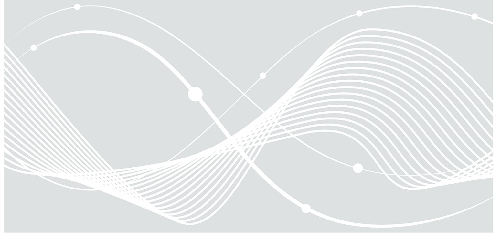

## BSI Technische Richtlinie 03138 Ersetzendes Scannen

Bezeichnung: Ersetzendes Scannen (RESISCAN) Häufig gestellte Fragen

Kürzel: BSI TR-03138-F

Version: 1.5

Datum: 05.02.2025

## Änderungshistorie

| Version | Datum      | Name | Beschreibung                                                                     |
|---------|------------|------|----------------------------------------------------------------------------------|
| 1.2     | 15.06.2018 | BSI  | LibreOffice Writer                                                               |
| 1.3     | 28.10.2021 | BSI  | Umstellung auf MS Word, Erweiterung FAQ                                       |
| 1.5     | 05.02.2025 | BSI  | Aktualisierung gemäß TR-03138, Version 1.5, Erweiterung mobiles Scannen |

Tabelle 1: Änderungshistorie

Bundesamt für Sicherheit in der Informationstechnik Postfach 20 03 63 53133 Bonn Tel.: +49 22899 9582-0 E-Mail: resiscan@bsi.bund.de Internet: https://www.bsi.bund.de © Bundesamt für Sicherheit in der Informationstechnik 2025

## Inhalt

| 1 |     | Generelle Fragen zur BSI TR-03138  6                                                                                                                                                                       |  |
|---|-----|------------------------------------------------------------------------------------------------------------------------------------------------------------------------------------------------------------|--|
|   | 1.1 | Was ist Gegenstand der BSI TR-03138? 6                                                                                                                                                                     |  |
|   | 1.2 | Was regelt die BSI TR-03138 nicht? 6                                                                                                                                                                       |  |
|   | 1.3 | Wer kann die BSI TR-03138 anwenden? 6                                                                                                                                                                      |  |
|   | 1.4 | Darf nach der BSI TR-03138 gescanntes Papier immer vernichtet werden? 6                                                                                                                                    |  |
| 2 |     | Fragen zur Zertifizierung 7                                                                                                                                                                                |  |
|   | 2.1 | Ist eine Zertifizierung verpflichtend? 7                                                                                                                                                                   |  |
|   | 2.2 | 7                                                                                                                                                                                                          |  |
|   | 2.3 | Wie läuft das Zertifizierungsverfahren ab? 7                                                                                                                                                               |  |
|   | 2.4 | Wo finde ich das Antragsformular für die Zertifizierung? 7                                                                                                                                                 |  |
|   | 2.5 | Welche Kosten sind mit der Zertifizierung verbunden? 7                                                                                                                                                     |  |
|   | 2.6 | Wo finde ich die Liste der zugelassenen RESISCAN Auditoren? Darf ich mir den Auditor / die Auditorin selbst aussuchen? 8                                                                                |  |
|   | 2.7 | Darf derselbe/dieselbe RESISCAN Auditor/Auditorin sowohl bei der Umsetzung der Anforderungen der BSI TR-03138 beraten und dann auch beim Zertifizierungsverfahren beauftragt werden? 8               |  |
|   | 2.8 | Kann ich meine Hard- und Software nach BSI TR-03138 zertifizieren lassen? 8                                                                                                                                |  |
| 3 |     | Fragen zur Verfahrensdokumentation 9                                                                                                                                                                       |  |
|   | 3.1 | Was muss bzw. soll die Verfahrensdokumentation enthalten? 9                                                                                                                                                |  |
|   | 3.2 | Gibt es formale Vorgaben für die Verfahrensdokumentation? 9                                                                                                                                                |  |
| 4 |     | Fragen zum Scannen10                                                                                                                                                                                       |  |
|   | 4.1 | Welche Auflösung ist beim Scannen ausreichend?10                                                                                                                                                           |  |
|   | 4.2 | Gibt es Vorgaben bzgl. der Stichprobenquote für die Qualitätssicherung der Scanprodukte?10                                                                                                                 |  |
|   | 4.3 | Ist die bildliche und inhaltliche Übereinstimmung bei farbigen Dokumenten auch beim schwarz weiß Scannen gegeben, sofern nur unwesentliche Inhalte (Logo im Briefkopf und ähnliches) farbig sind? 10 |  |
| 5 |     | Fragen zur Nachbearbeitung11                                                                                                                                                                               |  |
|   | 5.1 | Ist eine Umsetzung des Vier-Augen-Prinzips auch im nachgelagerten Bearbeitungsprozess möglich?11                                                                                                        |  |
|   | 5.2 | Welche Änderungen am Digitalisat (Leerseitenentfernung, Seitenausrichtung, Kontrastverstärkung etc.) sind zulässig?11                                                                                   |  |
|   | 5.3 | Ist die oftmals im Transfervermerk bestätigte bildliche Übereinstimmung auch beim schwarz weiß-Scannen gewährleistet?11                                                                                 |  |
|   | 5.4 | Welche Mindestangaben sind im Transfervermerk erforderlich?11                                                                                                                                              |  |
|   | 5.5 | Bezieht sich der Transfervermerk bei der Stapelverarbeitung auf ein einzelnes Dokument oder auf einen Stapel?11                                                                                         |  |
|   | 5.6 | Muss der Transfervermerk jeweils zusammen mit dem Dokument abgelegt oder in diesen integriert werden?11                                                                                                 |  |
| 6 |     | Fragen zur Integritätssicherung12                                                                                                                                                                          |  |

|   | 6.1  | Welchen Sinn und Zweck haben Signaturen, Siegel und Zeitstempel im Scanprozess?12                                                                                                                                 |  |
|---|------|-------------------------------------------------------------------------------------------------------------------------------------------------------------------------------------------------------------------|--|
|   | 6.2  | Welche Daten sollen Signaturen, Siegel und Zeitstempel umfassen?12                                                                                                                                                |  |
|   | 6.3  | Welche Formate sollen für Signaturen, Siegel, Zeitstempel etc. genutzt werden?12                                                                                                                                  |  |
|   | 6.4  | Ist ein Scanprozess mit fortgeschrittener oder qualifizierter elektronischer Signatur bzw. Siegel in einem separaten Netz möglich?12                                                                           |  |
|   | 6.5  | In welchen Fällen müssen bzw. sollen qualifizierte elektronische Signaturen, Siegel und Zeitstempel eingesetzt werden?12                                                                                       |  |
|   | 6.6  | Können elektronische Siegel statt elektronischer Signaturen eingesetzt werden?13                                                                                                                                  |  |
|   | 6.7  | Wie viele elektronische Signaturen, Siegel und/oder Zeitstempel sollen beim Scannen einer elektronischen Akte angebracht werden?13                                                                             |  |
|   | 6.8  | Wann sollte die Integritätssicherung erfolgen?13                                                                                                                                                                  |  |
| 7 |      | Sonstige Fragen14                                                                                                                                                                                                 |  |
|   | 7.1  | Was ist der Unterschied zwischen A.AM.IN.H.6 und A.AM.IN.SH.3?14                                                                                                                                                  |  |
|   | 7.2  | 14                                                                                                                                                                                                                |  |
| 8 |      | Fragen aus der Praxis15                                                                                                                                                                                           |  |
|   | 8.1  | Worauf basiert die Festlegung der Stichprobengröße in A.SC.8? Zielt diese auf die Gesamtzahl der eingescannten Blätter ab oder auf die Anzahl der eingescannten (mehrseitigen) Dokumente?15                    |  |
|   | 8.2  | Dürfen erstellte Scans von einer Software (egal welcher) lokal auf dem Client zwischengespeichert werden um danach signiert zu werden oder muss das technische Arbeitsverzeichnis auf einem Filler sein? 15 |  |
|   | 8.3  | Müssen die im Rahmen des Ersetzenden Scannens betriebenen Geräte in einem gesicherten VLAN stehen?16                                                                                                           |  |
|   | 8.4  | Was bedeutet im Zusammen 16                                                                                                                                                                                    |  |
|   | 8.5  | In A.O.5 werden zusätzliche Anforderungen bei einer Auslagerung des Scanprozesses gestellt. Was 16                                                                                                             |  |
|   | 8.6  | Woran bemisst sich, welche Bausteine des BSI Grundschutz in A.T.1 zu berücksichtigen sind und wie erfolgt die Auswahl durch den Auditor / die Auditorin im Rahmen der Konformitätsprüfung?17                   |  |
|   | 8.7  | Wie können unterschiedliche Dokumenttypen mit unterschiedlichem Schutzbedarf hinsichtlich der notwendigen Schutzmaßnahmen differenziert werden?17                                                              |  |
|   | 8.8  | Wie können Fehler, die durch Softwareupdates auftreten können (z.B. XEROX-Gate), vermieden werden?17                                                                                                           |  |
|   | 8.9  | Inwieweit sind Maßnahmen wie der Einsatz von KI-Analysen, Softwareabgleich o.ä. zur automatischen Dokumentenkontrolle bei der TR zu berücksichtigen?18                                                         |  |
|   | 8.10 | Wie kann eine effiziente Integritätssicherung mit Hilfe qualifizierter elektronischer Siegel in verteilten Organisationen durchgeführt werden?18                                                               |  |
|   | 8.11 | Welchen Zweck verfolgt die in der TR-RESISCAN vorgesehene Erhebung von Protokollinformationen?18                                                                                                               |  |
|   | 8.12 | Was ist bei der Aufbewahrung der Protokolldaten zu beachten?19                                                                                                                                                    |  |
|   | 8.13 | Sind elektronische Siegel und Zeitstempel parallel zu verwenden?19                                                                                                                                                |  |
|   | 8.14 | 19                                                                                                                                                                                                                |  |
|   |      | Literaturverzeichnis21                                                                                                                                                                                            |  |

## Vorbemerkung

Dieses Dokument enthält Antworten auf häufig gestellte Fragen im Umfeld der BSI TR-03138 (RESISCAN).

Weitere Fragen zu dieser Richtlinie oder Hinweise zu diesem Dokument sollten Sie bitte an das E-Mail-Postfach resiscan@bsi.bund.de senden.

## 1 Generelle Fragen zur BSI TR-03138

#### 1.1 Was ist Gegenstand der BSI TR-03138?

Die Technische Richtlinie TRzur möglichst rechtssicheren Gestaltung der Prozesse und Systeme für das Ersetzende Scannen. Dies [BSI TR-03138], Abschnitt 2.1).

#### 1.2 Was regelt die BSI TR-03138 nicht?

Die BSI TR-03138 regelt insbesondere nicht die Zulässigkeit des Ersetzenden Scannens als solches. Die Zulässigkeit des Ersetzenden Scannens ist von jedem Anwender in seinem Anwendungs- und Verantwortungsbereich auf der Grundlage der für diesen einschlägigen Rechtsvorschriften zu prüfen. Unverbindliche rechtliche Betrachtungen hierzu finden sich beispielsweise in [BSI TR-03138-R].

Außerdem ist die beweiskräftige Aufbewahrung nicht Gegenstand der BSI TR-03138. Der Beweiswerterhalt kryptographisch signierter Dokumente ist in [BSI TR-03125] geregelt.

Die notwendigen Rechtsgrundlagen sind beispielsweisedurch Bund und Länder zu treffen, respektive getroffen worden (Vgl. u.a. § 7 eGovGBund, E-Government-Gesetze der Länder).

#### 1.3 Wer kann die BSI TR-03138 anwenden?

Die BSI TR-03138 richtet sich an Betreiber von Scansystemen (Endanwender und Scandienstleister) und kann in den verschiedensten Branchen, wie z.B. Justiz, Verwaltung, Wirtschaft und Gesundheitswesen angewandt werden.

#### 1.4 Darf nach der BSI TR-03138 gescanntes Papier immer vernichtet werden?

Wie bereits in Frage 1.2 dargelegt, regelt die BSI TR-03138 nicht die Zulässigkeit des Ersetzenden Scannens. Ob überhaupt ersetzend gescannt werden darf, muss selbstständig für den eigenen Anwendungsbereich geprüft werden.

## 2 Fragen zur Zertifizierung

#### 2.1 Ist eine Zertifizierung verpflichtend?

Die Zertifizierung gemäß BSI TR-03138 ist freiwillig, aber grundsätzlich empfehlenswert. Im Rahmen der Zertifizierung wird die Erfüllung der Anforderungen von einer unabhängigen Stelle (Auditor / Auditorin) geprüft und von der Zertifizierungsstelle des BSI bestätigt.

Hierdurch kann nachgewiesen werden, dass der Scanprozess mit Sicherheitsmaßnahmen nach dem Stand der Technik geschützt wird und Scanprodukte mit den Papierdokumenten bildlich und inhaltlich übereinstimmen, wenn sie lesbar gemacht werden (vgl. § 7 [EGovG]). Ein solcher Nachweis belegt die Qualität des implementierten Scanprozesses gegenüber potenziellen Kunden und Aufsichtsorganen und kann sich im Streitfall vor Gericht als besonders bedeutsam erweisen.

### 2.2

Durch eine Zertifizierung gemäß BSI TR-03138 kann der qualifizierte Nachweis erbracht werden, dass ein Scanprozess konform zur TR implementiert wurde. Wie in Abschnitt 7 erläutert, ist die Zertifizierung freiwillig und ein Scanprozess kann selbstverständlich auch ohne ein formales Zertifizierungsverfahren konform zur TR gestaltet und betrieben werden.

Es spricht grundsätzlich auch nichts dagegen, dass die Prüfspezifikation [BSI TR-03138-P] unabhängig von einem formalen Zertifizierungsverfahren vom Verantwortlichen für den Scanprozess genutzt wird, um die Erfüllung der Anforderungen der TR systematisch zu überprüfen und zu dokumentieren. Da eine vom Verantwortlichen ausgefüllte Prüfspezifikation auch die Grundlage der Zertifizierung bildet, ist sie in jedem Fall empfehlenswert.

Für Scandienstleister wird die formale Zertifizierung gemäß BSI TR-03138 besonders nachdrücklich empfohlen.

#### 2.3 Wie läuft das Zertifizierungsverfahren ab?

Beim Zertifizierungsverfahren gemäß BSI TRnach Technis

Der generelle Ablauf einer solchen Zertifizierung ist auf der Webseite des BSI unter <https://www.bsi.bund.de/dok/6617928> beschrieben.

#### 2.4 Wo finde ich das Antragsformular für die Zertifizierung?

Das zur Eröffnung eines Zertifizierungsverfahrens gemäß BSI TR-03138 notwendige Antragsformular findet sich unter <https://www.bsi.bund.de/dok/6617952>.

#### 2.5 Welche Kosten sind mit der Zertifizierung verbunden?

Die Kosten für eine Zertifizierung setzen sich im Wesentlichen aus zwei Teilen zusammen:

1. Kosten für den Auditor / die Auditorin:

Da der Auditor / die Auditorin direkt vom Anwender beauftragt werden, sind diese Kosten auch selbstständig mit den Auditoren zu verhandeln.

2. Gebühren beim BSI:

Gemäß Anlage zu § 2 Absatz 1 der besonderen Gebührenverordnung des Bundesministeriums des Innern und für Heimat für individuell zurechenbare öffentliche Leistungen in dessen Zuständigkeitsbereich (Besondere Gebührenverordnung BMI BMIBGebV), werden Kosten für die Konformitätsprüfung erhoben.

Die jeweils geltenden Sätze für Erstzertifizierung, Re-Zertifizierung und Überwachungsaudit können im Abschnitt 7 den Ziffern 1.3.1, 1.3.2 und 1.3.3 entnommen werden.

#### 2.6 Wo finde ich die Liste der zugelassenen RESISCAN Auditoren? Darf ich mir den Auditor / die Auditorin selbst aussuchen?

Die Liste befindet sich unter: <https://www.bsi.bund.de/dok/6617788>.

Der Auditor / die Auditorin ist durch die Anwender selbstständig auszusuchen und zu beauftragen.

#### 2.7 Darf derselbe/dieselbe RESISCAN Auditor/Auditorin sowohl bei der Umsetzung der Anforderungen der BSI TR-03138 beraten und dann auch beim Zertifizierungsverfahren beauftragt werden?

Nein.

Grundsätzlich kann eine Kontaktaufnahme zum Auditor / zu der Auditorin im Vorfeld erfolgen. Es darf jedoch keine Beratungstätigkeit zur Umsetzung der Anforderungen der BSI TR-03138 erfolgen, da der Auditor / die Auditorin seine / ihre Unabhängigkeit nicht gefährden darf.

#### 2.8 Kann ich meine Hard- und Software nach BSI TR-03138 zertifizieren lassen?

Gegenstand der Zertifizierung ist der reine Scanprozess. Es werden keine Hard- oder Softwareprodukte gemäß BSI TR-03138 zertifiziert.

## 3 Fragen zur Verfahrensdokumentation

#### 3.1 Was muss bzw. soll die Verfahrensdokumentation enthalten?

Die Mindestanforderungen für die Verfahrensdokumentation sind in Anforderung A.G.1 (siehe [BSI TR-03138], Abschnitt 4.2.1.1) definiert.

#### 3.2 Gibt es formale Vorgaben für die Verfahrensdokumentation?

Nein. Es gibt keine formalen Vorgaben für die Erstellung und Pflege der Verfahrensdokumentation.

Eine generische Vorlage für eine Verfahrensanweisung, die regelmäßig Bestandteil der Verfahrensdokumentation ist, findet sich in [BSI TR-03138-V].

## 4 Fragen zum Scannen

#### 4.1 Welche Auflösung ist beim Scannen ausreichend?

Welche Auflösung beim Scannen notwendig ist, hängt von der Charakteristik der im Scanprozess ausreichend.

#### 4.2 Gibt es Vorgaben bzgl. der Stichprobenquote für die Qualitätssicherung der Scanprodukte?

Durch die Qualitätssicherung gemäß A.SC.8 (siehe [BSI TR-03138], Abschnitt 4.2.6.8) soll letztlich sichergestellt werden, dass alle im Scanprozess entstehenden elektronischen Dokumente (Scanprodukte), wenn sie lesbar gemacht werden, bildlich und inhaltlich mit den Papierdokumenten übereinstimmen.

Die Sichtprüfung kann abhängig vom Schutzbedarf auf regelmäßig durchgeführte Stichproben reduziert und so der Aufwand gesenkt werden, ist jedoch grundsätzlich notwendig.

Deshalb muss die Stichprobenquote so dimensioniert werden, dass eine fehlerhafte Erfassung im implementierten Scanprozess mit großer Wahrscheinlichkeit entdeckt wird.

A.SC.8 empfiehlt, dass sich die Stichprobenquote am Scan-Durchsatz, dem Schutzbedarf und nicht zuletzt der Zuverlässigkeit des Scansystems orientieren sollte.

Hierbei kann die Bandbreite von einer vollständigen Überprüfung der Scanprodukte, die unter Umständen im Rahmen der inhaltlichen Sachbearbeitung erfolgen kann, bis hin zu einer geringen Stichprobe von 2-4 % der eingescannten Dokumente reichen. Neben einer prozentualen Auswahl kann die Stichprobe beispielsweise auch jeden 10. Scanstapel, jede Personalakte, jeder Posteingang zu Vergaben etc. umfassen, Art und Umfang sind abhängig vom Anwendungsfall und vor allem Schutzbedarf des Scanguts.

Eine vollständige Sichtkontrolle ist grundsätzlich nur bei sehr hohem Schutzbedarf für das Schutzziel Integrität notwendig.

#### 4.3 Ist die bildliche und inhaltliche Übereinstimmung bei farbigen Dokumenten auch beim schwarz-weiß Scannen gegeben, sofern nur unwesentliche Inhalte (Logo im Briefkopf und ähnliches) farbig sind?

Die bildliche und inhaltliche Übereinstimmung ist bei farbigen Dokumenten erst dann gewährleistet, wenn auch mit einem Farbprofil nach BSI TR-03138 gescannt wird.

Damit wird ausgeschlossen, dass Farbinformationen beim Scannen verloren gehen. So ist es möglich, dass die Farbe des Papiers allein (und nicht zwingend auch der S/W-Inhalt des Dokuments) eine relevante Information darstellt, z.B. ein gelbes oder rotes Papier ein Dokument als Warnung oder Hinweis ausweist.

## 5 Fragen zur Nachbearbeitung

#### 5.1 Ist eine Umsetzung des Vier-Augen-Prinzips auch im nachgelagerten Bearbeitungsprozess möglich?

-Augen- [BSI TR-03138], Abschnitt 4.3.3.1) wird gefordert, dass die Erstellung und Qualitätssicherung von unterschiedlichen Personen durchgeführt werden.

Diese Anforderung kann auf vielfältige Weise umgesetzt werden. Eine mögliche Umsetzung ist, dass die Qualitätssicherung im Rahmen, der dem Erfassungsprozess nachgelagerten Sachbearbeitung erfolgt und das Scannen und die Sachbearbeitung von unterschiedlichen Personen durchgeführt wird. Allerdings ist in diesem Fall zu beachten, dass bildliche und inhaltliche Übereinstimmung erst im Rahmen der spät erfolgenden Qualitätssicherung festgestellt und erst dann im Transfervermerk dokumentiert werden kann.

#### 5.2 Welche Änderungen am Digitalisat (Leerseitenentfernung, Seitenausrichtung, Kontrastverstärkung etc.) sind zulässig?

Rechtlich maßgeblich ist häufig (vgl. § 7 [EGovG]) die bildliche und inhaltliche Übereinstimmung zwischen Scanprodukt und Papierdokument. Insofern sind Änderungen am Digitalisat nur dann zulässig, sofern die Lesbarkeit erhöht wird und die bildliche und inhaltliche Übereinstimmung gewährleistet bleibt. Sofern eine Nachbearbeitung erfolgt, sind die Anforderungen A.NB.1 ([BSI TR-03138], Abschnitt 4.2.7.1) und A.NB.2 ([BSI TR-03138], Abschnitt 4.2.7.2) zu beachten.

#### 5.3 Ist die oftmals im Transfervermerk bestätigte bildliche Übereinstimmung auch beim schwarz-weiß-Scannen gewährleistet?

Nein. Sofern die einschlägigen rechtlichen Rahmenbedingungen neben der inhaltlichen auch die bildliche Übereinstimmung zwischen Scanprodukt und Papierdokument fordern, muss die Erfassung in Farbe erfolgen.

Sofern vom Gesetzgeber lediglich die inhaltliche Übereinstimmung gefordert wäre, so könnte die Erfassung in schwarz-weiß bzw. Graustufen erfolgen, sofern den Farben im Papierdokument keine inhaltliche Bedeutung zukommt. Siehe auch [RFJW08] und [RoJa08].

#### 5.4 Welche Mindestangaben sind im Transfervermerk erforderlich?

Die Angaben, die der Transfervermerk mindestens enthalten soll, sind in A.NB.4 (siehe [BSI TR-03138], Abschnitt 4.2.7.4) dokumentiert.

#### 5.5 Bezieht sich der Transfervermerk bei der Stapelverarbeitung auf ein einzelnes Dokument oder auf einen Stapel?

Sofern regelmäßig eine Stapelverarbeitung erfolgt, kann der Transfervermerk für einen verarbeiteten Stapel erstellt und mit den einzelnen Dokumenten logisch verknüpft werden.

#### 5.6 Muss der Transfervermerk jeweils zusammen mit dem Dokument abgelegt oder in diesen integriert werden?

A.NB.4 (siehe [BSI TR-03138] logisch, untrennbar verkn

## 6 Fragen zur Integritätssicherung

#### 6.1 Welchen Sinn und Zweck haben Signaturen, Siegel und Zeitstempel im Scanprozess?

Die im Scanprozess erstellten Signaturen, Siegel und Zeitstempel dienen dem Integritätsschutz der Scanprodukte und der zugehörigen Transfervermerke. Mit Zeitstempeln kann zudem Nachweis der Existenz der entsprechenden Daten zu einem bestimmten Zeitpunkt erbracht werden. Durch die im Scanprozess erstellten Signaturen und Siegel kann im Regelfall nicht die Authentizität des ursprünglichen Papierdokumentes, sondern lediglich die Authentizität des daraus abgeleiteten Scanproduktes und des Transfervermerkes nachgewiesen werden. Insofern kommt beim Einsatz qualifizierter elektronischer Signaturen, wie in [BSI TR-03138-R] (Abschnitt R.2.7.2) näher erläutert, nur der Transfervermerk, aber nicht eine möglicherweise im ursprünglichen Papierdokument verfasste Erklärung, in den Genuss der Beweisregel des § 371a ZPO.

#### 6.2 Welche Daten sollen Signaturen, Siegel und Zeitstempel umfassen?

Grundsätzlich soll sich die Integritätssicherung auf die Verfahrensdokumentation und alle im Scanprozess entstehenden Daten beziehen, die später unter Umständen für Beweiszwecke herangezogen werden sollen. Dies umfasst insbesondere die Scanprodukte und Transfervermerke sowie möglicherweise auch die Indexund Metadaten sowie Protokolldaten.

#### 6.3 Welche Formate sollen für Signaturen, Siegel, Zeitstempel etc. genutzt werden?

In A.AM.IN.H.1 ([BSI TR-03138], Abschnitt 4.3.2.1) und beispielsweise auch [BSI TR-03125-F] (Abschnitt 5.1) wird hierfür der Einsatz von standardisierten Formaten, wie z.B. [CAdES], [PAdES], [XAdES], [ASiC], [RFC3161], [RFC4998] und [RFC6283], empfohlen.

#### 6.4 Ist ein Scanprozess mit fortgeschrittener oder qualifizierter elektronischer Signatur bzw. Siegel in einem separaten Netz möglich?

Für die Validierung von fortgeschrittenen oder qualifizierten elektronischen Signaturen und Siegeln wird regelmäßig das Online Certificate Status Protocol (OCSP) gemäß [RFC6960] genutzt, das im Regelfall eine ausgehende Verbindung über http (Port 80) oder https (Port 443) voraussetzt. In ähnlicher Form wird bei der Fernsignatur im Regelfall eine ausgehende https-Verbindung (Port 443) benötigt. Sofern diese Kommunikationsanforderungen in der Netzwerk- und Firewallkonfiguration entsprechend berücksichtigt werden, können fortgeschrittene oder qualifizierte elektronische Signaturen und Siegel auch in einem separaten Netz erstellt und validiert werden.

#### 6.5 In welchen Fällen müssen bzw. sollen qualifizierte elektronische Signaturen, Siegel und Zeitstempel eingesetzt werden?

Wie in A.AM.IN.SH.2 ([BSI TR-03138], Abschnitt 4.3.3.2) spezifiziert, sollen für die Integritätssicherung des Scanproduktes bzw. des Transfervermerkes qualifizierte elektronische Signaturen oder qualifizierte elektronische Siegel und qualifizierte Zeitstempel eingesetzt werden, sofern Datenobjekte

a

- b die Verkehrsfähigkeit gefordert ist und
- c die im Rahmen des Scanprozesses entstandenen Datenobjekte (Scanprodukt, Transfervermerk, Index- und Metadaten, Protokolldaten) voraussichtlich als Beweismittel genutzt werden.

Ob der Einsatz qualifizierter elektronischer Signaturen, Siegel und/oder Zeitstempel auch in anderen Fällen sinnvoll ist, hängt häufig nicht zuletzt von wirtschaftlichen Aspekten ab.

#### 6.6 Können elektronische Siegel statt elektronischer Signaturen eingesetzt werden?

Wie in Abschnitt 6.1 erläutert, dienen elektronische Signaturen, Siegel und Zeitstempel im Scanprozess vor allem der Integritätssicherung. Sofern z.B. anhand des Transfervermerk gemäß A.NB.4 (siehe [BSI TR-03138], Abschnitt 4.2.7.4) ermittelt werden kann, welche natürliche Person den Scanprozess verantwortet und das Scanprodukt erzeugt hat, können statt elektronischer Signaturen, die unmittelbar einer natürlichen Person zugeordnet sind, auch elektronische Siegel eingesetzt werden, die einer juristischen Person zugeordnet sind.

#### 6.7 Wie viele elektronische Signaturen, Siegel und/oder Zeitstempel sollen beim Scannen einer elektronischen Akte angebracht werden?

Wie viele elektronische Signaturen, Siegel oder Zeitstempel beim Scannen einer elektronischen Akte angebracht werden sollen, hängt nicht nur vom Schutzbedarf der verarbeiteten Daten1 , sondern auch von der detaillierten technischen und organisatorischen Ausgestaltung des Scanprozesses ab, so dass es hierzu leider keine einfache und pauschal gültige Antwort gibt.

Wie in Abschnitt 6.8 erläutert, sollte die Integritätssicherung zu einem möglichst frühen Zeitpunkt erfolgen. Außerdem sollte zur Gewährleistung der Verkehrsfähigkeit die Integrität einzelner Datenobjekte prüfbar sein. Auf der anderen Seite wird man schon allein aus ökonomischen Gründen bestrebt sein, möglichst wenige Signaturen, Siegel oder Zeitstempel zu verwenden.

Um einen verkehrsfähigen Integritätsschutz mit wenigen Zeitstempeln zu erreichen, kann der Einsatz von Merkle-Hashbäumen gemäß [RFC4998] bzw. [RFC6283] sinnvoll sein.

Beim Einsatz von XML-basierten Signaturen können in ähnlicher Weise mehrere Datenobjekte und Dokumente mit entsprechenden ds:Object- (siehe [XML-DSig], Abschnitt 8) und ds:Manifest-Elementen (siehe [XML-DSig], Abschnitt 9.1) mit einer Signatur geschützt werden.

#### 6.8 Wann sollte die Integritätssicherung erfolgen?

Grundsätzlich sollte die Integrität der im Scanprozess entstehenden Datenobjekte (Scanprodukt, Index- und Metadaten, Transfervermerk, Protokolldaten etc.) jeweils möglichst umgehend nach ihrer Erzeugung gesichert werden, damit ab diesem möglichst frühen Zeitpunkt unentdeckte Manipulationen ausgeschlossen werden können.

Wie streng diese generelle Empfehlung ausgelegt werden sollte, hängt vom Schutzbedarf der verarbeiteten Datenobjekte und den zum Schutz temporärer Zwischenspeicher implementierten Sicherheitsmaßnahmen ab.

1Vgl. A.IS.1 ([BSI TR-03138], Abschnitt 4.2.8.1), A.AM.IN.H.1 ([BSI TR-03138], Abschnitt 4.3.2.1) und A.AM.IN.SH.2 ([BSI TR-03138], Abschnitt 4.3.3.2)

## 7 Sonstige Fragen

#### 7.1 Was ist der Unterschied zwischen A.AM.IN.H.6 und A.AM.IN.SH.3?

In A.AM.IN.H.6 ([BSI TR-03138], Abschnitt 4.3.2.6) wird gefordert, dass das für den Scanprozess relevante Netzwerksegment durch ein Sicherheitsgateway (Firewall) geschützt ist, das nur Kommunikationsverbindungen zulässt, die von innen aufgebaut werden. Sofern der Schutzbedarf lediglich A.AM.IN.SH.3 ([BSI TR-03138], Abschnitt 4.3.3.3) jedoch, dass sich das Scansystem in einem eigenständigen Netz befindet, in dem nur die für den Scanprozess benötigten System eingebunden sind.

#### 7.2 .H.3 und A.AM.VT.SH.2?

In A.AM.VT.H.3 ([BSI TR-03138], Abschnitt 4.3.4.3) und A.AM.VT.SH.2 ([BSI TR-03138], Abschnitt 4.3.5.2) wird gefordert, dass temporär abgespeicherte Zwischenergebnis

Angriffspotenzial die gelöschten Daten nicht rekonstruieren kann. Welche Maßnahmen hierfür genau notwendig sind, hängt von der eingesetzten Speichertechnologie ab.

## 8 Fragen aus der Praxis

#### 8.1 Worauf basiert die Festlegung der Stichprobengröße in A.SC.8? Zielt diese auf die Gesamtzahl der eingescannten Blätter ab oder auf die Anzahl der eingescannten (mehrseitigen) Dokumente?

Grundsätzlich definiert die TR-RESISCAN keine, über die Vorgaben von A.SC.8 hinausgehenden Vorgaben zur Berechnung der Stichprobe für die manuelle Sichtkontrolle, weswegen es dem Anwender selbst überlassen ist sich bei der Berechnung der Stichprobe an der Seiten- oder Dokumentenzahl zu orientieren.

Eine Berechnung anhand der Anzahl eingescannter Dokumente erscheint jedoch als zweckmäßig, da gemäß Anlage P der TR-RESISCAN die Größe der Stichprobe abhängig ist vom Schutzbedarf der Dokumente, der Zuverlässigkeit des Scansystems und am Schutzbedarf der Dokumente.

Zudem fokussieren der generische Scanprozess, die Schutzbedarfsanalyse als auch die, basierend auf deren Ergebnissen zu definierenden Sicherheitsmaßnahmen auf Dokumente.

8.2 Dürfen erstellte Scans von einer Software (egal welcher) lokal auf dem Client zwischengespeichert werden um danach signiert zu werden oder muss das technische Arbeitsverzeichnis auf einem Filler sein?

Die TR-RESISCAN sieht zum Ersetzenden Scannen die Erstellung einer Strukturanalyse vor. Dabei wird das in der jeweiligen Institution eingesetzte oder geplante Scansystem betrachtet, definiert und beschrieben. Hierbei werden die folgenden Aspekte beschrieben: IT-Systeme und Anwendungen, Netze und Kommunikationsbeziehungen und Datenobjekte.

Einen Richtwert für die Strukturanalyse gibt Anlage A der TR-RESISCAN. Aufbauend auf den Ergebnissen der Schutzbedarfsanalyse werden die notwendigen Sicherheitsmaßnahmen zum Ersetzenden Scannen definiert. Im Rahmen der grundlegenden Technischen Maßnahmen nach TR-RESISCAN sollen gemäß A.T.1 Grundlegende Sicherheitsmaßnahmen für IT-Systeme im Scanprozess entsprechend dem definierten Schutzbedarf die relevanten Sicherheitsanforderungen (Bausteine) aus dem BSI-Grundschutz-Kompendium ausgewählt und umgesetzt werden. Dabei ist u.a. zu definieren, wo die Scanprodukte vor der Integritätssicherung zwischengespeichert werden. Der hierfür nach TR-RESISCAN verwendete Scancache kann dabei sowohl am Scanarbeitsplatz als auch z.B. auf einem Server in einem angebundenen Rechenzentrum verortet sein. Die konkrete Ausgestaltung des Scancache ist abhängig vom Schutzbedarf sowie nach den individuellen Gegebenheiten der das Ersetzende Scannen umsetzenden Institution zu definieren. In der Praxis sind dem BSI verschiedene Varianten wie z.B. Zwischenspeicherung am Scanarbeitsplatz oder auf einem Scanserver bekannt. In die Lösungsfindung sollte auch einbezogen werden, wie die Integritätssicherung erfolgt. Sofern, wie von Ihnen geplant, kryptographische Sicherungsmittel wie (qualifizierte) elektronische Signaturen und Siegel zum Einsatz kommen, wäre auch zu betrachten wo und wie die sichere Signatur-/Siegelerstellungseinheit bereitgestellt wird.

Ebenso ist A.T.4 Zuverlässige Speicherung der TR-RESISCAN einzubeziehen. Demgemäß müssen die für die beweiswerterhaltende Aufbewahrung der Scanprodukte und Metadaten verwendeten Speichermedien, Verfahren (z.B. TR-ESOR) und Konfigurationen für die notwendige Aufbewahrungsdauer bzw. bis zur zuverlässigen Übergabe an einen geeigneten Langzeitspeicher eine Verfügbarkeit gewährleisten, die dem Schutzbedarf der Datenobjekte angemessen ist.

#### 8.3 Müssen die im Rahmen des Ersetzenden Scannens betriebenen Geräte in einem gesicherten VLAN stehen?

Im Rahmen der Strukturanalyse nach TR-RESISCAN sind IT-Systeme und Anwendungen, Netze und Kommunikationsbeziehungen und Datenobjekte des konkret in der anwendenden Behörde eingesetzten oder geplanten Scansystem zu betrachten. Die Ergebnisse fließen in die Definition der notwendigen Sicherheitsmaßnahmen ein. So fordert A.T.2 Festlegung der zulässigen Kommunikationsverbindungen, dass, sofern die für das Scannen eingesetzten IT-Systeme über ein Netzwerk verbunden sind, in diesem Netzwerk sowie auf den IT-Systemen selbst die zulässigen Kommunikationsverbindungen effektiv vor Zugriffen von außerhalb des Netzwerks geschützt werden müssen. Dies kann beispielsweise dadurch erreicht werden, dass die zur Digitalisierung eingesetzten Scangeräte in einem VLAN gehalten werden. Je nach Ausprägung des Scansystems sowie der Infrastruktur in der anwendenden Behörde sind auch andere technische Maßnahmen denkbar.

## 8.4 Was bedeutet im Zusammenhang mit A.AM.IN.SH.3

Die TR-RESISCAN sieht gemäß A.AM.IN.SH.3 bei sehr hohem Schutzbedarf für die Schutzziele Integrität vor, dass die für das Scannen eingesetzten IT-Systeme in einem eigenständigen Netzsegment eingebunden sind. Der Zugriff auf dieses Netzsegment aus anderen Netzsegmenten muss ausgeschlossen werden, es sei denn die Kommunikation wird über einen Proxy oder ein Gateway vermittelt und der Verbindungsaufbau erfolgt von innen. Eine eigene Definition des Terminus Netzsegment nimmt die TR-RESISCAN nicht vor, vielmehr greift die TR-RESISCAN hier auf BSI Grundschutz zurück.

Nähere Ausführungen zum Netzsegmentierung finden Sie dementsprechend u.a. im IT-Grundschutzkompendium des BSI unter[: https://www.bsi.bund.de/DE/Themen/Unternehmen-und-](https://www.bsi.bund.de/DE/Themen/Unternehmen-und-Organisationen/Standards-und-Zertifizierung/IT-Grundschutz/IT-Grundschutz-Kompendium/it-grundschutz-kompendium_node.html)[Organisationen/Standards-und-Zertifizierung/IT-Grundschutz/IT-Grundschutz-Kompendium/it](https://www.bsi.bund.de/DE/Themen/Unternehmen-und-Organisationen/Standards-und-Zertifizierung/IT-Grundschutz/IT-Grundschutz-Kompendium/it-grundschutz-kompendium_node.html)[grundschutz-kompendium\\_node.html](https://www.bsi.bund.de/DE/Themen/Unternehmen-und-Organisationen/Standards-und-Zertifizierung/IT-Grundschutz/IT-Grundschutz-Kompendium/it-grundschutz-kompendium_node.html)

# 8.5 In A.O.5 werden zusätzliche Anforderungen bei einer Auslagerung des Scanprozesses gestellt. Was ist in dem

Sofern der Scanprozess komplett oder teilweise von spezialisierten Scandienstleistern durchgeführt wird, sind gemäß Anforderung A.O.5. der BSI TR-03138 die im vorliegenden Anforderungskatalog vorgesehenen Maßnahmen entsprechend umzusetzen. Des Weiteren gelten folgende Maßgaben:

- a) Die organisatorischen und technischen Schnittstellen zwischen Auftraggeber und Auftragnehmer (Übertragungswege, Datenablageorte, beteiligte Akteure, Rückfallverfahren, Maßnahmen zur Integritäts- und Vollständigkeitskontrolle etc.) MÜSSEN in der Verfahrensdokumentation (siehe A.G.1) explizit dargestellt werden.
- b) Der Auftragnehmer muss zur Einhaltung der vom Auftraggeber definierten Sicherheitsmaßnahmen verpflichtet werden.
- c) Es sollte eine Analyse, der durch die Aufgabenteilung zusätzlich entstehenden Risiken erfolgen.
- d) Zusätzlich zur regelmäßigen Auditierung (siehe A.O.4 und A.AM.G.3) sollten unangemeldete Stichprobenprüfungen durchgeführt werden.

Unter einem spezialisierten Scandienstleister kann ein solcher verstanden werden, der über fundierte Erfahrungen in der Planung, Einführung und Umsetzung des Ersetzenden Scannens gemäß TR-RESISCAN entsprechend den Anforderungen der den Scandienstleister nutzenden Behörde/Unternehmen verfügt. Hier wären beispielsweise Scandienstleister zu nennen, bei denen bereits Scanprozesse gemäß TR-RESISCAN zertifiziert wurden. Ob der Dienstleister eine öffentliche Institution oder ein privatwirtschaftliches Unternehmen darstellt, ist unerheblich.

8.6 Woran bemisst sich, welche Bausteine des BSI Grundschutz in A.T.1 zu berücksichtigen sind und wie erfolgt die Auswahl durch den Auditor / die Auditorin im Rahmen der Konformitätsprüfung?

Welche Bausteine des BSI Grundschutzes relevant sind, ist abhängig vom eingesetzten Scansystem. Dieses wird in der Strukturanalyse beschrieben. Beispiele hierfür enthält das Generische Scankonzept als Handlungshilfe für Anwender:

[https://www.bsi.bund.de/SharedDocs/Downloads/DE/BSI/Publikationen/TechnischeRichtlinien/TR03138](https://www.bsi.bund.de/SharedDocs/Downloads/DE/BSI/Publikationen/TechnischeRichtlinien/TR03138/TR-03138-generisches_Scankonzept.pdf?__blob=publicationFile&v=2) [/TR-03138-generisches\\_Scankonzept.pdf?\\_\\_blob=publicationFile&v=2](https://www.bsi.bund.de/SharedDocs/Downloads/DE/BSI/Publikationen/TechnischeRichtlinien/TR03138/TR-03138-generisches_Scankonzept.pdf?__blob=publicationFile&v=2)

Im Falle der Zertifizierung oder bei Re-Zertifizierung kann der Auditor / die Auditorin auch risikobasiert 5 Bausteine für die Prüfung auswählen. Diese können zwischen Zertifizierung und Re-Zertifizierung variieren.

8.7 Wie können unterschiedliche Dokumenttypen mit unterschiedlichem Schutzbedarf hinsichtlich der notwendigen Schutzmaßnahmen differenziert werden?

Der Schutzbedarf und die hieraus abgeleiteten Maßnahmen orientieren sich am Schriftgut. Unterschiedliche Maßnahmen je Schutzbedarf sowie Stapelbildung entsprechend Schutzbedarf wären demgemäß üblich. Organisatorisch, personell, technisch kann also je nach Schutzbedarf unterschiedlich gescannt werden

#### 8.8 Wie können Fehler, die durch Softwareupdates auftreten können (z.B. XEROX-Gate), vermieden werden?

Um das XEROX-Gate zu vermeiden, untersagt TR-RESISCAN die Verwendung von deren Ursache, der JBIG2-Komprimierung explizit (Vgl. A.SC.12 Fußnote 28). Um zum einen zu verhindern, dass Fehler nicht bei jedem Softwareupdate auftreten, sowie um grundsätzlich Fehler aus Softwareupdates zu vermeiden, sind Maßnahmen nach A.O.2., A.P.2, A.P.4 zu treffen. Weitere Sichtprüfungen sind in der Folge aus Sicht der TR nicht notwendig.

#### 8.9 Inwieweit sind Maßnahmen wie der Einsatz von KI-Analysen, Softwareabgleich o.ä. zur automatischen Dokumentenkontrolle bei der TR zu berücksichtigen?

Bis zum Schutzbedarf sehr hoch für das Schutzziel Verfügbarkeit sind automatische Dokumentenkontrollen grundsätzlich möglich, ergänzt durch eine stichprobenartige manuelle Kontrolle. Darüberhinausgehende Maßnahmen wie Softwareabgleich oder KI-Prüfungen etc. sind aus Sicht der TR nicht zwingend notwendig.

#### 8.10 Wie kann eine effiziente Integritätssicherung mit Hilfe qualifizierter elektronischer Siegel in verteilten Organisationen durchgeführt werden?

Die TR-RESISCAN sieht für den Integritätsschutz der beim Scanprozess entstehenden Datenobjekte die Nutzung geeigneter Dienste und Systeme für den Integritätsschutz vor. Dabei kann es sich nach A.IS.1 bei normalem Schutzbedarf auch um kryptographische Maßnahmen wie z.B. ein qualifiziertes elektronisches Siegel handeln. Ab einem erhöhten Schutzbedarf für das Schutzziel Integrität. Sinn und Zweck der kryptographischen Maßnahmen ist also der Integritätsschutz von Scanprodukt, Transfervermerk etc.

Die Anbringung qualifizierter elektronischer Siegel kann dabei auch durch eine zentrale Stelle erfolgen, ohne dass ein Kartenleser für die Siegelkarten an jedem Scanarbeitsplatz installiert werden. Hierzu werden Siegelserver & Hardware an dieser zentralen Stelle implementiert oder Kartenleser mit Siegelkarte per USB Over LAN verlängert. Auch der Einsatz eines Fernsiegels bei einem geeigneten qualifizierten Vertrauensdienst ist denkbar. Hierzu trifft die TR-RESISCAN keine Vorgaben. Es ist nur sicherzustellen, dass ein qualifiziertes elektronisches Siegel (oder Signatur) gemäß der eIDAS-Verordnung verwendet wird. Für nähere Informationen bietet sich die Leitlinie Signaturformate von Bundesnetzagentur und BSI an:

#### [https://www.bundesnetzagentur.de/EVD/SharedDocuments/Downloads/QES/BSI\\_TR\\_03125.pdf?\\_\\_blob=p](https://www.bundesnetzagentur.de/EVD/SharedDocuments/Downloads/QES/BSI_TR_03125.pdf?__blob=publicationFile&v=1) [ublicationFile&v=1](https://www.bundesnetzagentur.de/EVD/SharedDocuments/Downloads/QES/BSI_TR_03125.pdf?__blob=publicationFile&v=1)

Es muss jedoch sichergestellt sein, dass diese zentrale Siegelstelle im Scanprozess beschrieben sowie auch dort geeignete Maßnahmen zur Informationssicherheit, Sensibilisierung der Personen etc. entsprechend dem festgestellten Schutzbedarf der ersetzend zu scannenden Dokumente gemäß TR-RESISCAN getroffen und in der Verfahrensdokumentation vollständig dokumentiert werden. Ebenso ist die zum Siegeln notwendige Technik einschließlich etwaiger Server und Infrastruktur in die Strukturanalyse einzubeziehen.

Dieses Verfahren wird z.B. in verschiedenen Bundes- und Landesbehörden oder auch in der Privatwirtschaft angewendet.

#### 8.11 Welchen Zweck verfolgt die in der TR-RESISCAN vorgesehene Erhebung von Protokollinformationen?

Gemäß Anforderung A.SC.11 der TR-RESISCAN soll für eine zuverlässige Betriebsführung und Sicherstellung der Nachvollziehbarkeit des Scanprozesses eine geeignete und in der Verfahrensanweisung näher geregelte Protokollierung erfolgen, die insbesondere die folgenden Punkte umfasst:

- Die Änderung von kritischen Konfigurationsparametern sowie Authentisierungs- und Berechtigungsinformationen,
- die Information wer das Scansystem wann und in welcher Weise genutzt hat,
- die Information, ob eine manuelle Nachbearbeitung des Scanproduktes stattgefunden hat und
- fehlgeschlagene Authentisierungsvorgänge und sonstige aufgetretene Fehler.

Die Protokolldaten müssen gemäß den geltenden datenschutzrechtlichen Bestimmungen verarbeitet und insbesondere vor unautorisiertem Zugriff geschützt werden.

Im Kern fokussiert A.SC.11 auf die Erhebung und Dokumentation der notwendigen Protokolldaten, um die Nachvollziehbarkeit des Scanprozesses sowie damit verbundene kritische Änderungen, die erfolgten Schritte, die Bearbeitung des Scanprodukts als auch möglicher sicherheitsrelevanter Vorgänge und Fehler. Die Aufbewahrung richtet sich nach den datenschutzrechtlichen Bestimmungen im Anwendungsfall, wobei auch die geltenden Aufbewahrungsfristen zu berücksichtigen sind.

Die Protokollierungsinformationen sollen also Auskunft über die Umstände und Ablauf des Scanprozesses sowie das Umfeld der Digitalisierung innerhalb des Scansystems gemäß Strukturanalyse der TR-03138.

#### 8.12 Was ist bei der Aufbewahrung der Protokolldaten zu beachten?

Wie in A.SC.11 angegeben, sind die Protokollinformationen entsprechend den geltenden datenschutzrechtlichen Rahmenbedingungen zu erarbeiten und vor unautorisiertem Zugriff zu schützen. Gemäß den geltenden Datenschutzvorgaben erfordert die Erhebung personenbezogener Daten die Einwilligung des Betroffenen sowie deren Nachweis und folgt einer Zweckbindung. Sobald der Zweck der Erhebung nicht mehr gegeben ist, sind die personenbezogenen Daten datenschutzgerecht, also rückstandslos zu löschen. Unter dem datenschutzgerechten Löschen wird das Entfernen der gespeicherten Daten verstanden, was dann gegeben ist, wenn die betreffenden Daten unwiderruflich so behandelt worden sind, dass es niemandem mehr möglich ist, ohne unverhältnismäßig hohem Aufwand, die gelöschten Daten wahrzunehmen oder aus gespeicherten Informationen zu gewinnen, wenn also der Rückgriff auf die gelöschten Daten nicht mehr möglich ist.

Wesentliche Grundlage für eine datenschutzgerechte Verarbeitung sind insbesondere ein valides Datenschutzkonzept inklusive Datenschutzfolgeabschätzung und entsprechender Richtlinien sowie ein Löschkonzept. Im Löschkonzept ist die notwendige Aufbewahrungsdauer gemäß den im Anwendungsfall geltenden Datenschutz- und sonstigen Vorgaben zu definieren.

Hinsichtlich der beweiswerterhaltenden Aufbewahrung ist TR-03125 TR-ESOR des BSI in die Betrachtungen einzubeziehen.

#### 8.13 Sind elektronische Siegel und Zeitstempel parallel zu verwenden?

B entstehenden Daten fordert die TR-03138 in A.AM.IN.H.1 den Einsatz von fortgeschrittenen elektronischen Siegeln, Signaturen und/oder elektronischer Zeitstempel. Grundsätzlich besteht also die Wahlmöglichkeit eines der genannten kryptographischen Sicherungsmittel zu verwenden. (Qualifizierte) Siegel und Signaturen würden die Integrität und Authentizität der beim Scannen entstehenden Daten nachweisen. Der (qualifizierte) Zeitstempel würde nachweisen, dass die Daten zum bestätigten Zeitpunkt unverändert vorlagen. Es ist im Anwendungsfall zu prüfen, ob qualifizierte elektronische Siegel oder Signaturen ausreichend sind oder auch ein qualifizierter Zeitstempel benötigt wird. Die Verwendung beider kryptographischer Sicherungsmittel ist nicht zwingend notwendig.

#### 8.14 Was ist unter dem hen?

Unter mobilem ersetzendem Scannen wird die ersetzende Digitalisierung von Papieroriginalen unter Nutzung mobiler Endgeräte (beispielsweise Mobiltelefon oder Tablet) unter Nutzung einer ScanApp und Übertragung von Scanprodukt, Metadaten, Transfervermerk etc. an eine zentrale Infrastruktur verstanden. Stationäre Scanstellen an verschiedenen Orten oder solche, die mittels Fahrzeugen an verschiedene Orte verbracht werden können, werden vom mobilen Scannen nicht umfasst:

Mögliche Einsatzgebiete mobilen ersetzenden Scannens sind beispielsweise:

- Reisekostenbelege
- Verträge, Verwaltungsunterlagen, Rechnungen aus dem Home-Office
- Rezepte, ärztliche Überweisungen oder Arztbriefe
- Überweisungsträger

Die o.g. Liste ist nicht abschließend, sondern beispielhaft zu verstehen. Dabei ist zu beachten, dass der Schutzbedarf der zu scannenden Papieroriginale für alle Schutzziele nur bis Schutzstufe hoch gilt.

### Literaturverzeichnis

| [ASiC] | ETSI: Electronic Signatures and Infrastructures (ESI); Associated Signature Containers |
|--------|----------------------------------------------------------------------------------------|
|        | (ASiC); EN 319 162                                                                     |

- [BSI TR-03125] Bundesamt für Sicherheit in der Informationstechnik (BSI): Beweiswerterhaltung kryptographisch signierter Dokumente (TR-ESOR), BSI TR-03125
- [BSI TR-03125-F] Bundesamt für Sicherheit in der Informationstechnik (BSI): Beweiswerterhaltung kryptographisch signierter Dokumente (TR-ESOR), Anlage F Formate, BSI TR-03125-F
- [BSI TR-03138] Bundesamt für Sicherheit in der Informationstechnik (BSI): Ersetzendes Scannen, Technische Richtlinie (TR) des BSI Nr. 03138
- [BSI TR-03138-A] Bundesamt für Sicherheit in der Informationstechnik (BSI): Ersetzendes Scannen Anwendungshinweis A: Ergebnis der Risikoanalyse, BSI TR- 03138-A,
- [BSI TR-03138-P] Bundesamt für Sicherheit in der Informationstechnik (BSI): Ersetzendes Scannen Anlage P: Prüfspezifikation, BSI TR-03138-P
- [BSI TR-03138-R] Bundesamt für Sicherheit in der Informationstechnik (BSI): Ersetzendes Scannen Anwendungshinweis A: Unverbindliche rechtliche Hinweise, BSI TR-03138-R
- [BSI TR-03138-V] Bundesamt für Sicherheit in der Informationstechnik (BSI): Ersetzendes Scannen Anwendungshinweis V: Exemplarischen Verfahrensanweisung, BSI TR-03138-V
- [CAdES] ETSI: Electronic Signatures and Infrastructures (ESI); CAdES digital signatures, EN 319 122
- [EGovG] Gesetz zur Förderung der elektronischen Verwaltung (E-Government-Gesetz EGovG)
- [eIDAS-VO] Verordnung (EU) Nr. 910/2014 des Europäischen Parlaments und des Rates vom 23. Juli 2014 über elektronische Identifizierung und Vertrauensdienste für elektronische Transaktionen im Binnenmarkt und zur Aufhebung der Richtlinie 1999/93/EG, <http://data.europa.eu/eli/reg/2014/910/oj>

[ETSI TS 119 312] ETSI TS 119 312: Electronic Signatures and Infrasctructures (ESI); Cryptographic Suites

- [PAdES] ETSI: Electronic Signatures and Infrastructures (ESI), PAdES digital signatures; EN 319 142
- [RFC3161] C. Adams, P. Cain, D. Pinkas, R. Zuccherato: Internet X.509 Public Key Infrastructure Time- Stamp Protocol (TSP). IETF RFC 3161,<http://www.ietf.org/rfc/rfc3161.txt>
- [RFC4998] T. Gondrom, R. Brandner, U. Pordesch: Evidence Record Syntax (ERS), IETF RFC 4998, <http://www.ietf.org/rfc/rfc4998.txt>
- [RFC6283] A. J. Blazic, S. Saljic, T. Gondrom: Extensible Markup Language Evidence Record Syntax (XMLERS), IETF RFC 6283[, http://www.ietf.org/rfc/rfc6283.txt](http://www.ietf.org/rfc/rfc6283.txt)
- [RFC6960] S. Santesson, M. Myers, R. Ankney, A. Malpani, S. Galperin, C. Adams: X.509 Internet Public Key Infrastructure Online Certificate Status Protocol OCSP, IETF RFC 6960, [http://www.ietf.org/rfc/rfc6960.txt](http://www.ietf.org/rfc/rfc6283.txt)
- [RFJW08] A. Roßnagel, S. Fischer-Dieskau, S. Jandt, D. Wilke: Scannen von Papierdokumenten Anforderungen, Trends und Empfehlungen, Band
- [RoJa08] A. Roßnagel, S. Jandt: Handlungsleitfaden zum Scannen von Papierdokumenten. Herausgegeben im Auftrag des Bundesministeriums für Wirtschaft und Technologie, Nr. 571, Berlin April 2008
- [XAdES] ETSI: Electronic Signatures and Infrastructures (ESI); XAdES digital signatures; EN 319 132

[XML-DSig] W3C: XML Signature Syntax and Processing, Version 2.0, W3C Working Group Note 23 July 2015,<https://www.w3.org/TR/xmldsig-core2/>