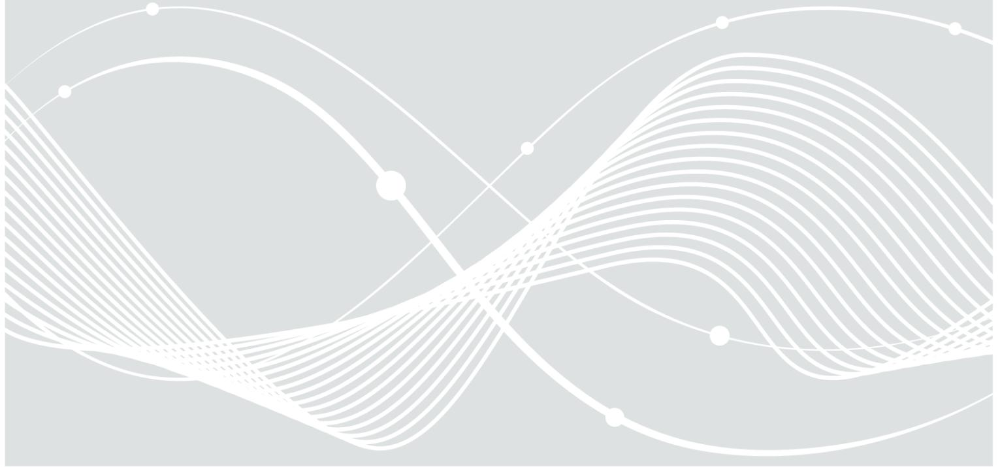
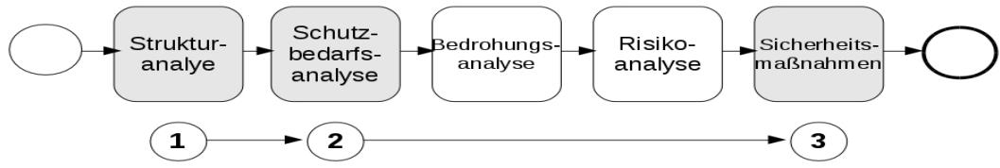
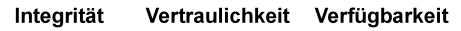
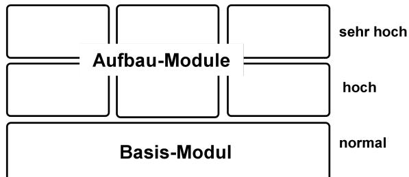

Bundesamt für Sicherheit in der Informationstechnik

# BSI TR-03138 (RESISCAN)

Ersetzendes Scannen – einfach und sicher

Bundesamt für Sicherheit in der Informationstechnik Postfach 20 03 63 53133 Bonn Tel.: +49 22899 9582-0 E-Mail: resiscan@bsi.bund.de Internet: https://www.bsi.bund.de © Bundesamt für Sicherheit in der Informationstechnik 2015

# Ordnungsgemäßes ersetzendes Scannen in drei einfachen Schritten

# *Abbildung 1: Ablauf des ersetzenden Scannens*

Soll ersetzend gescannt werden (z.B. nach § 7 EGovG und zur Erreichung des besonderen Urkundenbeweises nach § 371b ZPO), bieten sich die Empfehlungen des BSI an, um in einer geordneten Struktur die technischen, organisatorischen und personellen Maßnahmen zu ergreifen, die entsprechend dem konkreten Bedarf eine angemessen sichere Gestaltung des eigenen Scanprozesses ermöglichen.

#### Wie ist dabei vorzugehen?

- 1. **Strukturanalyse**  identifiziert die in den Scanprozess involvierten IT-Systeme, Anwendungen und Netze.
- 2. **Schutzbedarfsanalyse** ermittelt den Schutzbedarf anhand der verarbeiteten Papierdokumente.
- 3. **Sicherheitsmaßnahmen** ein modularer Maßnahmenkatalog mit einem grundlegenden Basismodul und spezifischen Aufbaumodulen sorgt für angemessene Sicherheit durch den Einsatz von bewährten Praktiken und Standardwerkzeugen.

**"Ersetzendes Scannen"** – bezeichnet den Vorgang des elektronischen Erfassens von Papierdokumenten zur elektronischen Weiterverarbeitung des hierbei entstehenden elektronischen Abbildes (Scanprodukt) und der späteren Vernichtung des papiergebundenen Originals.

**BSI TR-03138 "Ersetzendes Scannen (RESISCAN)"** – ist eine Technische Richtlinie des Bundesamtes für Sicherheit in der Informationstechnik, die Anwendern aus Verwaltung, Justiz, Wirtschaft und Gesundheitswesen einen praxisorientierten Handlungsleitfaden zur sicheren Gestaltung ihrer Prozesse für das ersetzende Scannen bietet. Diese Empfehlungen erleichtern zudem Ausschreibungen und Beschaffungen.

Während die ordnungsgemäße und sichere Gestaltung von Systemen und Prozessen für das ersetzende Scannen mangels standardisierter Vorgehensweise bislang relativ aufwändig war, führt die BSI TR-03138 hier zu einer spürbaren **Erleichterung für die Anwender:**

a) durch die generischen Betrachtungen und die im Rahmen der Entwicklung der Richtlinie geleisteten Vorarbeiten können Anwender **auf die individuelle Bedrohungs- und Risikoanalyse** 

#### **verzichten**,

b) für die Analyse des Schutzbedarfs ist die **Betrachtung der originären Papierdokumente ausreichend**, da sich der Schutzbedarf der weiteren Datenobjekte, IT-Systeme, Anwendungen und Netze aus dem Schutzbedarf der Papierdokumente ableitet.

Durch ein – optionales - Zertifizierungsverfahren können Anwender und Anbieter von Scandienstleistungen den Nachweis der Konformität ihrer Prozesse zu den Anforderungen der BSI TR-03138 erbringen. Durch diesen dokumentierten Nachweis entsteht ein messbares Leistungskriterium für Dienstleister, und es wird eine weitere Steigerung der Rechtssicherheit erreicht.

### **1. Strukturanalyse**

Im ersten Schritt werden die IT-Systeme, Anwendungen und Netzwerke im Scansystem auf Basis von IT-Grundschutz-Bausteinen modelliert.

*Abbildung 2: Strukturanalyse*

Synergien mit bestehenden oder geplanten Zertifizierungen gemäß ISO/IEC 27001 auf Basis von IT-Grundschutz sowie die Beschränkung auf fünf Grundschutz-Bausteine erleichtern die Umsetzung.

## **2. Schutzbedarfsanalyse**

Im zweiten Schritt wird der Schutzbedarf betrachtet:

men auch im Hinblick auf die datenschutzrechtlichen Anforderungen.

Der Schutzbedarf der im Scanprozess entstehenden Daten - wie Scanprodukte, Metadaten, Protokolldaten, Sicherungsdaten - leitet sich aus dem Schutzbedarf der ursprünglichen Papierdokumente ab. Da dieser bereits zur Absicherung der bisherigen analogen Verfahren ohnehin zu ermitteln ist, ist der Aufwand verhältnismäßig gering. Exemplarisch kann er für typische Dokumentenklassen festgelegt werden, individuelle Abweichungen werden in der jeweiligen Fachanwendung berücksichtigt. Die Schutzbedarfsbestimmung unterscheidet die Klassen "normal", "hoch" und "sehr hoch" hinsichtlich der drei Schutzziele "Integrität", "Vertraulichkeit" und "Verfügbarkeit". Sie schafft die Grundlage für ein dem Schutzbedarf angemessenes Bündel an technischen und organisatorischen Sicherheitsmaßnah-

### **3. Sicherheitsmaßnahmen**

### Viele Anwendungsbereiche – eine Richtlinie:

Um dem festgestellten Schutzbedarf zu genügen, definiert die BSI TR-03138 unterschiedliche technische, organisatorische und personelle Sicherheitsmaßnahmen, die in verschiedene Module gegliedert

sind. Neben dem Basismodul als Mindeststandard ermöglichen erweiterte Aufbaumodule auch bei erhöhtem Schutzbedarf einen angemessenen Schutz unter Beachtung des Kosten-Nutzen-Aufwands. Die Module sind einzeln integrierbar, um möglichst hohe Skalierbarkeit für den eigenen Bedarf zu bieten. Für die angestrebte Rechtssicherheit sind hier u.a. die verlässliche Dokumentation des Scanzeitpunkts (mittels Zeitstempel oder entsprechendem Dokumentenmanagementsystem) sowie die Verwendung kryptographischer Sicherungsmittel hervorzuheben, im sehr hohen Schutzbedarf sollen qualifizierte Signaturen eingesetzt werden.

*Abbildung 3: Das Modulkonzept der TR Resiscan*

Das **Basis-Modul** umfasst beispielsweise:

- Verfahrensdokumentation
- Schulung und Sensibilisierung
- Grundlegende IT-Sicherheitsmaßnahmen
- Sorgfältige Dokumentenvorbereitung
- Geeignete Erfassung der Dokumente und Metadaten
- Qualitätssicherung
- Transfervermerk.

Die **Aufbaumodule** umfassen beispielsweise:

- Protokollierung und Auditierung
- Empfehlung zum Einsatz kryptographischer Mechanismen
- Eigenständiges Netzsegment
- Besondere Kennzeichnung der Dokumente
- Erweiterte Qualitätssicherung.

#### **Konformitätserklärung durch Anwender**

Nach der Umsetzung der verschiedenen in der BSI TR-03138 vorgesehenen Maßnahmen kann der Anwender oder Scandienstleister selbst eine entsprechende Konformitätserklärung abgeben. Hierdurch verpflichtet er sich selbst, die definierten Anforderungen zu erfüllen.

### **Zertifizierung durch das BSI**

Um die Rechtssicherheit weiter zu erhöhen, bietet das BSI eine Zertifizierung gemäß BSI TR-03138 an.

Dazu sind folgende Schritte notwendig:

a) Antrag auf Zertifizierung In diesem ersten Schritt wird beim BSI ein Antrag auf Zertifizierung gestellt.

- b) Konformitätsprüfung durch anerkannten Auditor In diesem Schritt wird die Umsetzung der verschiedenen Maßnahmen der BSI TR-03138 durch einen vom BSI anerkannten Auditor geprüft und in einem Prüfbericht dokumentiert.
- c) Zertifizierung durch das BSI Auf Basis des Prüfberichtes erfolgt die Zertifizierung durch das BSI.

### **Weitere Informationen**

Weitere Informationen zur BSI TR-03138, bereits erteilte Zertifikate sowie praktische Umsetzungsbeispiele finden sich unter: www.bsi.bund.de/resiscan

Stand: Juni 2015