# Ersetzendes Scannen leichtgemacht – eine Handlungshilfe für Institutionen und Unternehmen

# Änderungshistorie

| Version | Datum      | Name                                      | Beschreibung         |
|---------|------------|-------------------------------------------|----------------------|
| 1.0     | 05.06.2020 | Derst, Ann-Kristin Cejvanovic, Jasmina | Erstveröffentlichung |

Bundesamt für Sicherheit in der Informationstechnik Postfach 20 03 63 53133 Bonn Tel.: +49 22899 9582-0 E-Mail: resiscan@bsi.bund.de Internet: https://www.bsi.bund.de © Bundesamt für Sicherheit in der Informationstechnik 2020

| 1 Grundlagen 6                                                                            |  |
|----------------------------------------------------------------------------------------------|--|
| 1.1 Rolle und Zweck der TR-RESISCAN  8                                                    |  |
| 2 Ersetzendes Scannen nach TR-RESISCAN leichtgemacht 10                                   |  |
| 2.1 Aufbau und Kernanforderungen der TR-RESISCAN 10                                       |  |
| 2.2 RESISCAN. Implementieren  13                                                          |  |
| 2.2.1 Vorgehensmodell  13                                                                 |  |
| 2.2.2 Dokumentation und Regelungsbedarfe  28                                              |  |
| 2.2.3 Zertifizierung  28                                                                  |  |
| 2.3 RESISCAN. Anwenden 29                                                                 |  |
| 2.3.1 Informationen und Praxisbeispiele für die Nutzung und Anwendung der TR-RESISCAN  29 |  |
| 2.4 RESISCAN. Verstehen 29                                                                |  |
| 2.4.1 Glossar 29                                                                          |  |
| Abkürzungsverzeichnis  32                                                                    |  |
| Literaturverzeichnis  33                                                                     |  |
| Ausgewählte Urteile  35                                                                      |  |
| Anlage 1: Beispielhafte Gründe kopierenden Scannens oder nichtscanbarer Dokumente  36        |  |
| Anlage 2: Ausgewählte Funktionen Scansoftware  37                                            |  |

# Abbildungsverzeichnis

| Abbildung 1: Regulatorischer Rahmen (Beispiel) 7                                          |  |
|-------------------------------------------------------------------------------------------|--|
| Abbildung 2: Zusammenspiel TR-RESISCAN und TR-ESOR 8                                      |  |
| Abbildung 3: Der "generische" Scanprozess  10                                             |  |
| Abbildung 4: Inhalte der RESISCAN Verfahrensdokumentation 13                              |  |
| Abbildung 5: Referenzumgebung des Scansystems  14                                         |  |
| Abbildung 6: Exemplarischer Netzplan eines Scansystems mit IT-Systemen und Anwendungen 15 |  |
| Abbildung 7: Netze und Kommunikationsbeziehungen in einem Scansystem 16                   |  |
| Abbildung 8:Basismodul der RESISCAN 20                                                    |  |
| Abbildung 9: Aufbaumodule der RESISCAN  21                                                |  |
| Abbildung 10: Fokus der Verfahrensdokumentation und Zertifizierung nach TR-RESISCAN 25    |  |
| Abbildung 11: Beispiele für praktische Maßnahmen im Scanprozess  25                       |  |

# Tabellenverzeichnis

| Tabelle 1: Zielgruppen der RESISCAN Dokumente  11                                       |  |
|-----------------------------------------------------------------------------------------|--|
| Tabelle 2: Dokument im Ersetzenden Scannen  13                                          |  |
| Tabelle 3: Beispiel für IT-Systeme und Anwendungen in Strukturanalyse 14                |  |
| Tabelle 4: Relevante Datenobjekte und Dokumenttypen im exemplarischen Scansystem  16    |  |
| Tabelle 5: Schutzziele  18                                                              |  |
| Tabelle 6: Schutzbedarfskategorien  19                                                  |  |
| Tabelle 7: Ausgewählte Kernfragen zum Scankonzept  21                                   |  |
| Tabelle 8: Prozessübergreifende Maßnahmen 23                                            |  |
| Tabelle 9: Beispiel für Maßnahmen AT.1 24                                               |  |
| Tabelle 10: Abkürzungsverzeichnis 32                                                    |  |
| Tabelle 11: Beispielhafte Gründe kopierenden Scannens oder nichtscanbarer Dokumente  36 |  |

# 1 Grundlagen

Für die Akzeptanz und Sicherheit der elektronischen Kommunikation zwischen Bürgern, Unternehmen und Institutionen ist Vertrauenswürdigkeit wichtig. Die Vertrauenswürdigkeit von digitalen Dokumenten hängt wiederum an der Stabilität der Sicherungsmittel. Die Sicherungsmittel für digitale Dokumente sind zunächst Hard- und Software. Nun ist aber nicht jede Hard- und Software zur Digitalisierung von Dokumenten geeignet. Sie unterliegen einem "Technischen Verfall" und können dadurch ihre Eignung verlieren. Ebenso können kryptographische Verfahren, also Verfahren zur Verschlüsselung von elektronischen Dateien, ihre Sicherheitseignung verlieren. Um diese Herausforderungen zu meistern, wurden EU-weite Regelungen vereinbart.

Seit September 2014 gilt die EU-Verordnung über elektronische Identifizierung und Vertrauensdienste für elektronische Transaktionen im Binnenmarkt, kurz eIDAS. Ziel der eIDAS-Verordnung ist eine Stärkung des Vertrauens für den elektronischen Geschäftsverkehr im europäischen Binnenmarkt. Als EU-Verordnung hat die eIDAS-Verordnung Anwendungsrecht vor nationalem Recht. Es stellt also in allen EU-Staaten ein einheitlich geltendes Recht dar und umfasst die Bereiche Vertrauensdienste und elektronische Identifizierung. Vertrauensdienste sind Elektronische Signaturen, Elektronische Siegel, Elektronische Zeitstempel, Website-Authentifizierungen, Elektronische Zustelldienste und Bewahrungsdienste. Die Elektronische Identifizierung umfasst Elektronische Identifizierungssysteme, wozu die Elektronischen Identifizierungsmittel zählen.

Seit April 2016 gilt die EU-Verordnung zum Schutz natürlicher Personen bei der Verarbeitung personenbezogener Daten und zum freien Datenverkehr. Ziel der Datenschutzgrundverordnung (DSGVO) ist der Schutz der Grundrechte und Grundfreiheiten von natürlichen Personen, besonders deren Recht auf Schutz von personenbezogenen Daten. Als Verordnung hat die DSGVO ebenso Anwendungsvorrang vor nationalem Recht und stellt ein in allen EU-Staaten geltendes Recht dar.

Mit dem Gesetz zur Förderung der elektronischen Verwaltung (dem E-Government-Gesetz, kurz EGovG) wurden bereits 2013 die Weichen gestellt, um das Ersetzende Scannen zu ermöglichen. Die Erlaubnis zum Ersetzenden Scannen ist mit dem Verweis auf die Technische Richtlinie TR-RESISCAN (BSI-TR 03138) versehen. Bei der Übertragung der Papierakte in eine elektronische Form ist dabei nach dem Stand der Technik, also der TR-RESISCAN sicherzustellen, dass das elektronische Dokument mit dem Papierdokument inhaltlich und bildlich übereinstimmt. Die inhaltliche und bildliche Übereinstimmung muss bei lesbar machen des elektronischen Dokuments vorliegen. Weiterhin sollen die Papierdokumente nach der Übertragung in die elektronische Form vernichtet oder zurückgegeben werden. Die Vernichtung oder Rückgabe erfolgt nur, wenn eine weitere Aufbewahrung nicht mehr aus rechtlichen Gründen oder zur Qualitätssicherung des Übertragungsvorganges notwendig ist. Es ist also im Kern ein sicheres Scannen wie in der TR-RESISCAN beschrieben umzusetzen.

Die regulatorischen Rahmenbedingungen werden durch den sog. Stand der Technik, also Standards und Normen verantwortlicher Standardisierungsgremien wie z. B. BSI, DIN, ETSI/CEN, ISO untersetzt. Der Stand der Technik beschreibt vereinfacht ausgedrückt Anforderungen an die technisch-organisatorische Umsetzung – state of the art.

Einen Überblick wesentlicher regulatorischer Rahmenbedingungen sowie beispielhafter Standards und Normen am Beispiel des Public Sector zeigt die folgende Abbildung:

Abbildung 1: Regulatorischer Rahmen (Beispiel)

Um einen vertrauenswürdigen, digitalen Geschäftsprozess zu gewährleisten, müssen zusammengefasst die folgenden Anforderungen für geschäftsrelevante Aufzeichnungen erfüllt sein:

- Integrität: Die Aufzeichnungen müssen unverändert und vollständig sein.
- Authentizität: Die Echtheit des Ausstellers oder Absenders muss unbestreitbar sein.
- Nachvollziehbarkeit: Der Entscheidungsprozess muss zuverlässig dokumentiert und für Dritte verständlich sein.
- Verfügbarkeit: Die Aufzeichnungen müssen in angemessener Zeit lesbar und verfügbar sein.
- Verkehrsfähigkeit: Die Aufzeichnungen müssen portabel zur Vorlage gegenüber Dritten sein. Zudem müssen die Aufzeichnungen von Dritten auf Ihre Eigenschaften hin geprüft werden können.
- Vertraulichkeit: Die Aufzeichnungen müssen vor unbefugter Kenntnisnahme geschützt sein.

Wesentliche Grundlage hierfür bilden wohldefinierte Prozesse, Rollen, Verantwortlichkeiten (Organisation) und Governance sowie geeignete IT-Unterstützung im Rahmen des Records Managements/elektronischen Verwaltungsarbeit.

Dabei unterstützen die Technische Richtlinie (TR 03138) des BSI, im Folgenden TR-RESISCAN genannt, und die Technische Richtlinie (TR 03125), im Folgenden TR-ESOR genannt.

Die TR-RESISCAN soll den Anwendern einen praxisorientierten Handlungsleitfaden zur sicheren Gestaltung des Ersetzenden Scannens geben – also einem wesentlichen Eingangskanal für digitale Prozesse.

Die TR-ESOR soll den Anwender dabei unterstützen, die Beweiswerterhaltung von kryptographisch signierten Daten und Dokumenten im Rahmen der gesetzlichen Aufbewahrungsfristen und damit die langfristige Nachweisfähigkeit digitaler Transaktionen zu gewährleisten.

Im Zusammenspiel mit den Geschäftsanwendungen wie z. B. der E-Akte oder elektronischen Rechnungsbearbeitung unterstützen die TR-RESISCAN und die TR-ESOR eine sichere wie vertrauenswürdige Digitalisierung. Die nachstehende Grafik illustriert dieses Zusammenwirken. Durch die Zertifizierungsverfahren für Scanprozesse und Produkte zur Beweiswerterhaltung, wird die Umsetzung des Stands der Technik transparent - für Anwender, Prüfbehörden und Dritte.

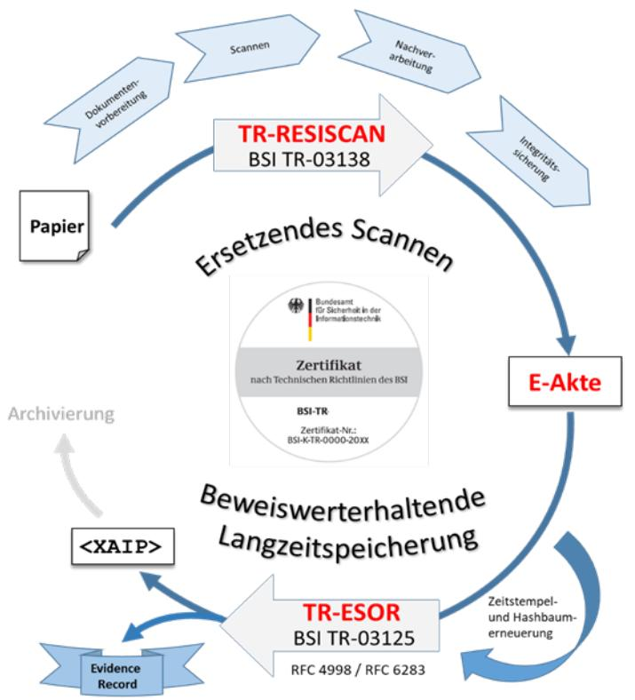

Abbildung 2: Zusammenspiel TR-RESISCAN und TR-ESOR

# 1.1 Rolle und Zweck der TR-RESISCAN

Zielsetzung der TR-RESISCAN ist die Steigerung der Rechtssicherung im Bereich des Ersetzenden Scannens. Die Richtlinie hat also einen empfehlenden Charakter. Sie soll Anwendern aus Verwaltung, Justiz, Wirtschaft und Gesundheitswesen einen praxisorientierten Handlungsleitfaden zur sicheren Gestaltung ihrer Prozesse für das Ersetzende Scannen bieten.

Kein Bestandteil der TR-RESISCAN ist die Regelung der Zulässigkeit des Ersetzenden Scannens. Dies ist von jedem Anwender in seinem Anwendungs- und Verantwortungsbereich auf Grundlage der entsprechenden Rechtsvorschriften zu prüfen. Die TR-RESISCAN definiert die Anforderung an Prozesse. Sie definiert nicht, welche Soft- oder Hardware genutzt werden soll.

Die TR-RESISCAN findet umfassend Anwendung im öffentlichen Bereich und Gesundheitswesen. In anderen Branchen wird sie bereits freiwillig verwendet.

Mit dem Urteil vom Verwaltungsgericht in Wiesbaden wurde auch gerichtlich bestätigt, dass elektronische Dokumente mit einer qualifizierten Signatur (QES) nach dem Signaturgesetz zu versehen sind. Einfache eingescannte Unterlagen haben den Wert einer einfachen Kopie.[1](#page-7-1)

1 Vgl[. https://openjur.de/u/765496.html](https://openjur.de/u/765496.html)

Weitere relevante Urteile sind:

Mit den Urteilen vom 28. Februar 2014 (vgl. Az. 6 K 152/14 WI.A), vom 26. September 2014 (vgl. Az. 6 K 691/14 WI.A) sowie vom 20. Januar 2015 (vgl. Az. 6 K 1567/14.WI) hat u.a. das Verwaltungsgericht Wiesbaden mehrmals zu den Themen Ersetzendes Scannen und Aktenführung Stellung bezogen. Als Grundlage für eine Anerkennung von Scanprodukten durch das Gericht wurden jeweils sowohl die Durchführung der Analysen und Maßnahmen nach BSI TR-RESISCA[N \[BSI-TR03138\]](#page-32-1) sowie die notwendige Verfahrensdokumentation durch die betreffenden Institutionen gefordert. Mit Blick darauf besonders hervorgehoben wurden:

- die Durchführung einer Qualitätskontrolle,
- die Gewährleistung der Sicherheit des Scanprozesses, einschließlich der gescannten Dokumente, der verwendeten Technik und Kommunikation,
- die Sicherstellung des Datenschutzes bei personenbezogenen Daten,
- die Dokumentation und Zertifizierung des Scanprozesses,
- die Lesbarkeit und optische Klarheit des Scanprodukts,
- der Nachweis der bildlichen und inhaltlichen Übereinstimmung von Scanprodukt und papiernem Original,
- die Bestätigung der bildlichen und inhaltlichen Übereinstimmung durch einen Transfervermerk mittels qualifizierter elektronischer Signatur (QES) (oder Siegel)

Neben der Beachtung der TR-RESISCAN zum Ersetzenden Scannen, wurde die Vollständigkeit und Nachvollziehbarkeit der elektronischen Akten gefordert. Deren Nichtvorhandensein wurde unmittelbar zuungunsten der Institutionen bewertet. Ebenso wurde die Beweiswerterhaltung gemäß BS[I \[BSI-TR03125\]](#page-32-2) explizit gefordert. Die Nichtbeachtung des Stands der Technik [\(\[BSI-TR03138\],](#page-32-1) [\[BSI-TR03125\]\)](#page-32-2) sowie der oben genannten Grundsätze führte in der Regel zu einem negativen Prozessergebnis für die Institutionen. Teilweise verlief bereits die formelle Beweiswürdigung kritisch, das bedeutet, die Dokumente wurden unabhängig von deren Inhalt nicht als Beweismittel anerkannt.

Auch das Oberverwaltungsgericht Mecklenburg-Vorpommern (OVG Mecklenburg-Vorpommern, 22.12.2000 - 2 L 38/99) hat im Grundsatzurteil vom 22. Dezember 2000 klargestellt, wie umfangreich die Pflicht zur Aktenführung in der öffentlichen Verwaltung ist. Hiernach muss die Institution alle wesentlichen Vorgänge zur Akte nehmen. Dieses bezieht sich auf alle schriftlichen Äußerungen von Beginn bis zum Ende des Verfahrens und zwar unabhängig von deren Bedeutung.

Die Institution hatte in diesem Fall Schriftsätze weder in die Hauptakte noch in die Sammelakte aufgenommen. Das Gericht ging daher von einer Unterdrückung zukünftiger Beweismittel aus und stellte eine gerechtfertigte Umkehr der Beweislast zuungunsten der Institution fest. Die Institution verlor folglich das Verfahren.

# 2 Ersetzendes Scannen nach TR-RESISCAN leichtgemacht

# 2.1 Aufbau und Kernanforderungen der TR-RESISCAN

#### Was beinhaltet welches Dokument oder wo finde ich was?

Die TR-RESISCAN umfasst das Hauptdokument mit den wesentlichen Inhalten bezüglich der Anforderungen an die Gestaltung der Prozesse und Systeme für ein rechtssicheres Ersetzendes Scannen. Das Hauptdokument beschreibt die Vorgehensweise, notwendigen Schritte und Ergebnisdokumente zum Aufbau des Ersetzenden Scannens. Daneben werden die notwendigen Sicherheitsmaßnahmen entsprechend dem Schutzbedarf der zu scannenden Dokumente ausgerichtet auf den generischen Scanprozess der Technischen Richtlinie - definiert.

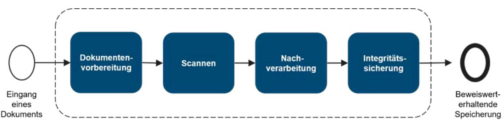

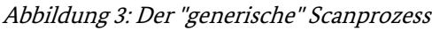

Die Anforderungen und Maßnahmen sind modular aufgebaut und bestehen aus grundlegenden Anforderungen innerhalb des Basismoduls und spezifischen, nur bei erhöhtem Schutzbedarf zu beachtenden, Anforderungen der Aufbaumodule.

Das Hauptdokument der TR-RESISCAN wird um folgende Anlagen ergänzt:

- Anlage P: Prüfspezifikationen für die Konformitätsprüfung
- Anwendungshinweis R: Unverbindliche rechtliche Hinweise
- Anwendungshinweis V: Exemplarische Gliederung einer Verfahrensanweisung
- Anwendungshinweis F: Häufig gestellte Fragen

Der Anwendungshinweis A: Das Ergebnis der Risikoanalyse ist nicht mehr gültig und dementsprechend historisiert.

### [Anlage P: Prüfspezifikation für die Konformitätsprüfung](https://www.bsi.bund.de/SharedDocs/Downloads/DE/BSI/Publikationen/TechnischeRichtlinien/TR03138/TR-03138-Anlage-P_V1_4.html) [\[BSI-TR03138-P\]](#page-32-3)

In diesem Dokument finden sich die Prüfkriterien für die Zertifizierung eines oder mehrerer Scanprozesse gegen die Vorgaben der TR-RESISCAN.

### [Anwendungshinweis R: Unverbindliche rechtliche Hinweise](https://www.bsi.bund.de/SharedDocs/Downloads/DE/BSI/Publikationen/TechnischeRichtlinien/TR03138/TR-03138-Anwendungshinweis-R.pdf?__blob=publicationFile&v=5) [\[BSI-TR03138-R\]](#page-33-0)

In diesem Dokument finden sich unverbindliche rechtliche Hinweise, die dem Anwender der TR-RESISCAN bei der Einordnung und Beantwortung von rechtlichen Fragen und Problemen informativ zur Seite stehen sollen. Das Dokument ist in zwei Teile aufgeteilt. Der erste Teil beinhaltet Hinweise zur

Schutzbedarfsanalyse verschiedener Dokumententypen und dient der Unterstützung bei der Bestimmung des jeweiligen Schutzbedarfs. Es werden verbindliche Vorschriften (z. B. bezüglich Aufbewahrungsform und -frist) und Interessen des Anwenders sowie Betroffener bei datenschutzrechtlichen Aspekten einbezogen. Der zweite Teil betrachtet rechtliche Fragestellungen u. a. zur Zulässigkeit des Scannens, der Einbeziehung von Scandienstleistern oder strafrechtlichen Aspekten zur Vernichtung von Originaldokumenten.

#### [Anwendungshinweis V: Exemplarische Gliederung einer Verfahrensanweisung](https://www.bsi.bund.de/SharedDocs/Downloads/DE/BSI/Publikationen/TechnischeRichtlinien/TR03138/TR-03138-Anwendungshinweis-V.pdf?__blob=publicationFile&v=4) [\[BSI-TR03138-V\]](#page-33-1)

Das Dokument enthält Textbausteine für die Erstellung einer Verfahrensdokumentation und -anweisung zum Ersetzenden Scannen. Es ist ein Template für die Umsetzung in der jeweiligen Institution, Unternehmen oder Organisation.

#### [Anwendungshinweis F: Häufig gestellte Fragen](https://www.bsi.bund.de/SharedDocs/Downloads/DE/BSI/Publikationen/TechnischeRichtlinien/TR03138/TR-03138-Anwendungshinweis-F.pdf?__blob=publicationFile&v=3) [\[BSI-TR03138-F\]](#page-33-2)

Das Dokument beantwortet häufig gestellte Fragen zu den Themen: Ersetzendes Scannen im Allgemeinen, der Verfahrensdokumentation oder dem Zertifizierungsverfahren.

#### [Anwendungshinweis A: Ergebnis der Risikoanalyse – historisch](https://www.bsi.bund.de/SharedDocs/Downloads/DE/BSI/Publikationen/TechnischeRichtlinien/TR03138/TR-03138-Anwendungshinweis-A.pdf?__blob=publicationFile&v=3) [\[BSI-TR03138-A\]](#page-32-4)

Das Dokument besitzt historischen Charakter und ist lediglich informativ. Es enthält das Ergebnis der Risikoanalyse, die im Zuge der Entwicklung der BSI TR-03138 durchgeführt wurde sowie Informationen zu Vorgehen und –Erstellung der zum Ersetzenden Scannen notwendigen Strukturanalyse.

Die Zielgruppen der einzelnen Dokumente zeigt nachstehende Tabelle:

| Tabelle 1: Zielgruppen der RESISCAN Dokumente |
|-----------------------------------------------|
|                                               |

| Dokument      | Zielgruppe                                    |
|---------------|-----------------------------------------------|
| Hauptdokument | • Entscheider,                             |
|               | Projektleiter, •                           |
|               | Fachexperten und Organisationsabteilung, • |
|               | • IT-Abteilung,                            |
|               | Anwender •                                 |
| Anlage P      | Projektleiter, •                           |
|               | • Fachexperten und Organisationsabteilung, |
|               | IT-Abteilung •                             |
| Anlage A      | Fachexperten und Organisationsabteilung, • |
|               | IT-Abteilung •                             |
| Anlage R      | • Entscheider,                             |
|               | Projektleiter, •                           |
|               | Fachexperten und Organisationsabteilung •  |
| Anlage V      | • Projektleiter,                           |
|               | Fachexperten und Organisationsabteilung, • |
|               | IT-Abteilung •                             |

| Dokument             | Zielgruppe                                    |
|----------------------|-----------------------------------------------|
| Anwendungshinweise F | Entscheider, •                             |
|                      | • Projektleiter,                           |
|                      | • Fachexperten und Organisationsabteilung, |
|                      | IT-Abteilung, •                            |
|                      | Anwender •                                 |

Um besser einschätzen zu können, welche Teile für wen relevant sind, erfolgt im Folgenden eine Aufteilung der Themen in die Bereiche:

#### • RESISCAN. Implementieren

Informationen zur Umsetzung der Technischen Richtlinie z. B. Projektablauf, Projektbeteiligte. Wesentliche Inhalte, unterstützende Dokumente etc.

#### • RESISCAN. Anwenden

Informationen und Praxisbeispiele für die Nutzung und Anwendung der Technischen Richtlinie. "Vorlagen und Beispiele"

• RESISCAN. Verstehen Glossar Literatur

## 2.2 RESISCAN. Implementieren

### 2.2.1 Vorgehensmodell

Für die Erreichung einer TR-RESISCAN-konformen Umsetzung des Ersetzenden Scannens kann auf ein klar strukturiertes Vorgehensmodell zurückgegriffen werden, welches in der TR verankert ist[2](#page-12-3) . Die dafür erforderlichen analytischen Schritte und konzeptionellen Bausteine sind in Abbildung 4 aufgeführt und werden nachfolgend überblicksartig und in den weiteren Kapiteln dann detailliert erläutert. Die Bedrohungs- und Risikoanalyse wurden in Anwendungshinweis A [\[BSI-TR03138-A\]](#page-32-4) exemplarisch durchgeführt und müssen daher nicht je Institution wiederholt werden.

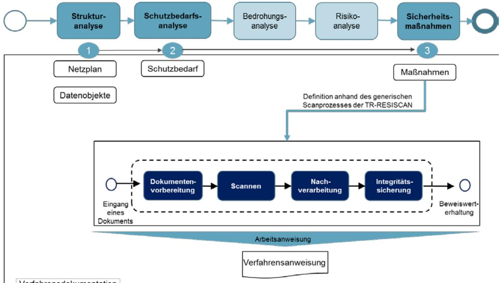

Abbildung 4: Inhalte der RESISCAN Verfahrensdokumentation

#### Demgemäß ist also zu erstellen:

Tabelle 2: Dokument im Ersetzenden Scannen

| Dokument            | Inhalt                                          |
|---------------------|-------------------------------------------------|
| Scankonzept         | Strukturanalyse (Netzplan inkl. IT-Systeme,     |
|                     | Anwendungen und Kommunikationsbeziehungen;      |
|                     | Identifikation der relevanten Datenobjekte)     |
|                     | Schutzbedarfsanalyse für relevante Datenobjekte |
|                     | Beschreibung der Sicherheitsmaßnahmen im        |
|                     | Scanprozess                                     |
|                     | Zusammenspiel mit weiteren Anwendungen z.B.     |
|                     | ECM, Langzeitarchiv, ERP, CRM                   |
| Verfahrensanweisung | Anweisung an Scanpersonal                       |

Scankonzept und Verfahrensanweisung ergeben zusammen die notwendige Verfahrensdokumentation.

2 Sieh[e \[BSI-TR03138\]](#page-32-1) (Abschnitt 3).

Bundesamt für Sicherheit in der Informationstechnik 13

### 2.2.1.1 Strukturanalyse

Bei einer eine solch systematischen Sicherheitsbetrachtung werden in einem ersten Schritt, der so genannten Strukturanalyse die sicherheitstechnisch relevanten Bestandteile des Scansystems identifiziert. Dies umfasst die involvierten IT-Systeme, Anwendungen und Kommunikationsbeziehungen, die in einem reduzierten Netzplan[3](#page-13-1) dokumentiert werden, der später auch die Grundlage für die Auswahl geeigneter Sicherheitsmaßnahmen bilden wird. Neben den strukturellen Bestandteilen des Scansystems sind in diesem Schritt auch die in den Scanprozess involvierten Datenobjekte (Papieroriginale, Scanprodukte, Index- und Metadaten, Protokolldaten, Sicherungsdaten etc.) zu identifizieren.

Die folgende Abbildung zeigt das generische Scansystem der TR als Referenzumgebung zur Definition des Scansystems der jeweiligen Institution im Überblick:

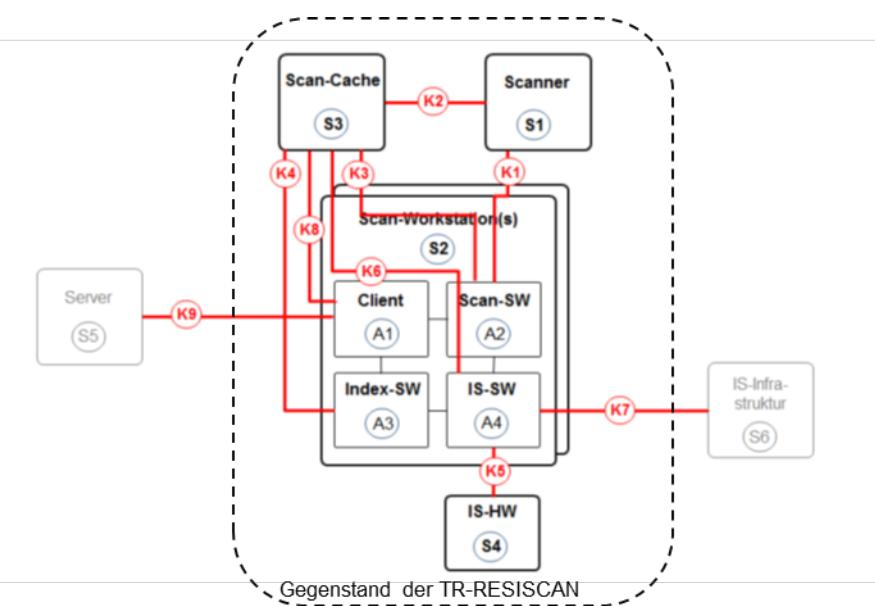

Abbildung 5: Referenzumgebung des Scansystems

Ein Beispiel für die Darstellung der IT-Systeme und Anwendungen zeigt folgende Tabelle:

| Hardware         |                                                   |
|------------------|---------------------------------------------------|
| 10 Scanclients   | Typ Superscan 350-4                               |
| 10 Stapelscanner | Maximum Scan                                      |
| 3 Kartenleser    | Scansiegel 460-4                                  |
| 4 Server         | Server B (davon 1 Server als Ausfall-/Testsystem) |
| 1 Testsystem     | 2 Clients                                         |
|                  | 2 Scanner                                         |
| Software         |                                                   |
| Scansoftware     | Scansoftware Z (incl. Indexsoftware)              |
| Siegelsoftware   | Siegelsoftware B                                  |

3 Sieh[e \[BSI-200-2\],](#page-32-5) Abschnitt 8.1.4 un[d \[BSI-TR03138-P\],](#page-32-3) Abschnitt P.2 (Basismodul)

Im Zuge der Identifikation der relevanten IT-Systeme und Anwendungen des Scansystems wird ein bereinigter Netzplan erstellt, der auch Ausgangspunkt für die mögliche Auditierung und Zertifizierung des Scanprozesses ist.

Ein Beispiel für einen solchen Netzplan zeigt die folgende Abbildung:

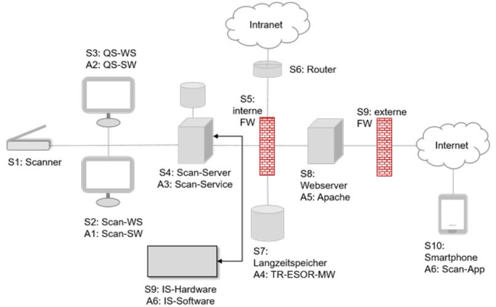

Abbildung 6: Exemplarischer Netzplan eines Scansystems mit IT-Systemen und Anwendungen

Wie i[n Abbildung 6](#page-14-0) ersichtlich, umfasst das exemplarische Scansystem eine Reihe von Systemen (Sx) und darauf laufenden Anwendungen (Ay), die zweckmäßiger Weise in entsprechenden Tabellen erfasst werden.

Die hierbei identifizierten Systeme und Anwendungen bilden die Grundlage für die Bestimmung der notwendigen Sicherheitsmaßnahmen bei der Umsetzung der Anforderung A.T.1, welche letztlich die Implementierung der relevanten Maßnahmen aus dem [Grundschutz-Kompendium des BSI](https://www.bsi.bund.de/DE/Themen/ITGrundschutz/ITGrundschutzKompendium/itgrundschutzKompendium_node.html) [\[BSI-GSK\]](#page-32-6) fordert.

Für die IT-Systeme und Anwendungen sollen[4](#page-14-1) Verantwortliche definiert werden.

#### Netze und Kommunikationsbeziehungen

Zusätzlich zur Identifikation der IT-Systeme und Anwendungen müssen[5](#page-14-2) im Rahmen der Strukturanalyse auch die Netze und Kommunikationsbeziehungen (siehe [Abbildung 6\)](#page-14-0) identifiziert werden, damit später adäquate Sicherheitsmaßnahmen[6](#page-14-3) ausgewählt und umgesetzt werden können. Hier bietet sich der Verweis auf das verfahrensbezogene Sicherheitskonzept des Scansystems an, in dem der erweiterte Netzplan ohnehin enthalten sein muss.

4 Sieh[e \[BSI-TR03138\]](#page-32-1) (A.O.1 f). Hinweis: Sofern beispielsweise eine bestimmte Organisationseinheit für alle IT-Systeme und Anwendungen verantwortlich ist, kann hier auf eine differenzierte Betrachtung in den Tabellen hier verzichtet werden. 5

Sieh[e \[BSI-TR03138\]](#page-32-1) (A.G.1, e)

6 Sieh[e \[BSI-TR03138\]](#page-32-1) (A.T.1).

Eine beispielhafte Darstellung der Netze und Kommunikationsbeziehungen in einem exemplarischen Scansystem findet sich in der folgenden Abbildung:

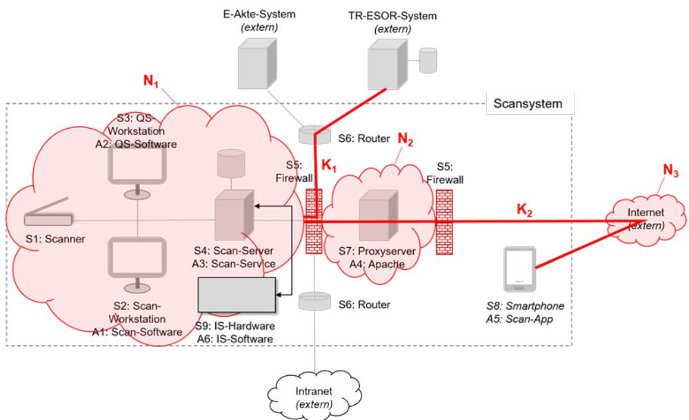

Abbildung 7: Netze und Kommunikationsbeziehungen in einem Scansystem

Der so ermittelte Netzplan und die erfassten Datenobjekte bilden zusammen eine erste Version des Scankonzeptes, das in den weiteren Schritten ergänzt wird und neben der Beschreibung des Gesamtverfahrens auch organisatorische und technische Aspekte zum prozessualen und technischen Zusammenspiel des Scansystems mit weiteren Bausteinen in der IT-Architektur (z.B. E-Poststelle, E-Akte, Aufbewahrung) in der Institution haben kann.

#### Datenobjekte

Wie in der TR-RESISCAN gefordert, müssen[7](#page-15-1) im Rahmen der Strukturanalyse die relevanten Dokumente und Datenobjekte identifiziert werden. Außerdem solle[n8](#page-15-2) Verantwortliche für die jeweiligen Datenobjekte festgelegt werden. Die nachfolgende Tabelle der Datenobjekte basiert au[f \[BSI-TR03138-A\]](#page-32-4) (Tabelle 1):

| ID                               | Datenobjekt                                                                                                                                                                                                              | Beschreibung                                                                                                                                                                                                                                      |
|----------------------------------|--------------------------------------------------------------------------------------------------------------------------------------------------------------------------------------------------------------------------|---------------------------------------------------------------------------------------------------------------------------------------------------------------------------------------------------------------------------------------------------|
| D0                               | Schriftgut aus dem                                                                                                                                                                                                       | Schriftgut, das per Post o. ä. eingegangen ist.                                                                                                                                                                                                   |
|                                  | Posteingang                                                                                                                                                                                                              |                                                                                                                                                                                                                                                   |
| D1 Scanrelevantes Original | Papierdokument, das durch geeignete Vorbereitungsschritte (z. B. durch Entfernung des Kuverts, Umkopieren, Entklammern etc.) aus dem eingegangenen Schriftgut (D0) gewonnen und dem Scanprozess zugeführt wird. |                                                                                                                                                                                                                                                   |
|                                  |                                                                                                                                                                                                                          | Hinweis: Die in einem konkreten Scansystem verarbeiteten und nicht verarbeitbaren Dokumenttypen9 müssen im Rahmen der Verfahrensdokumentation explizit aufgelistet werden. Die nachfolgende Liste ist hier als Beispiel zu verstehen. |

Tabelle 4: Relevante Datenobjekte und Dokumenttypen im exemplarischen Scansystem

8 Sieh[e \[BSI-TR03138\]](#page-32-1) (A.O.1 f).

9 Sieh[e \[BSI-TR03138\]](#page-32-1) (A.G.1 a).

7 Sieh[e \[BSI-TR03138\]](#page-32-1) (A.O.1 b) und [\[BSI-TR03138-P\]](#page-32-3) (Abschnitt P.2).

| ID | Datenobjekt          | Beschreibung                                                                                                                                                                                                                                                                                                                                              |
|----|----------------------|-----------------------------------------------------------------------------------------------------------------------------------------------------------------------------------------------------------------------------------------------------------------------------------------------------------------------------------------------------------|
|    | D.1.1                | Ärztliche Verordnung                                                                                                                                                                                                                                                                                                                                      |
|    | D.1.2                | Beglaubigte Kopie einer Ernennungsurkunde                                                                                                                                                                                                                                                                                                                 |
|    | D.1.3                | Beglaubigte Kopie einer Heirats-/Geburtsurkunde                                                                                                                                                                                                                                                                                                           |
|    | D.1.4                | Beglaubigte Kopie eines Prüfungszeugnisses                                                                                                                                                                                                                                                                                                                |
|    | D.1.5                | Ausbildungs- und Praktikantenverträge                                                                                                                                                                                                                                                                                                                     |
|    | D.1.6                | Prüfungsaufgaben der Studieninstitute                                                                                                                                                                                                                                                                                                                     |
|    | D.1.7                | Unterlagen der Familienkasse (z.B. für Kindergeld)                                                                                                                                                                                                                                                                                                        |
|    | D.1.8                | Unterlagen der Beihilfebearbeitung                                                                                                                                                                                                                                                                                                                        |
|    | D.1.9                | Sonstige Personalunterlagen und Personalakten                                                                                                                                                                                                                                                                                                             |
| D2 | Scanprodukt          | Elektronisches Abbild des Papierdokumentes (D1). Dieses wird durch den Scanner erzeugt und ggf. von der Scansoftware nachbearbeitet.                                                                                                                                                                                                                   |
| D3 | Index- und Metadaten | Daten, die das Auffinden und die Nutzung des später abgelegten Scanproduktes ermöglichen bzw. erleichtern.                                                                                                                                                                                                                                             |
|    |                      | Durch die hier manuell oder automatisch durch eine Formularerkennungs Software vorgeschlagenen und im Rahmen der Qualitätssicherung überprüften bzw. ergänzten Index- und Metadaten wird die eindeutige Zuordnung der Dokumente zu einem Geschäftsvorfall sichergestellt, wodurch ein wesentliches Element der Ordnungsmäßigkeit gegeben ist. |
| D4 | Transfervermerk      | Mit dem Transfervermerk10 wird dokumentiert, wann und durch wen die Übertragung des Papierdokumentes in ein elektronisches Dokument stattgefunden hat.                                                                                                                                                                                              |
| D5 | Sicherungsdaten      | Sicherungsdaten sind Datenobjekte, die dem Schutz der Integrität und ggf. Authentizität anderer Datenobjekte dienen.                                                                                                                                                                                                                                   |
|    |                      | Hinweis: Zur Sicherung der Integrität der Scanprodukte können (qualifizierte) elektronische Siegel/Signaturen eingesetzt werden.                                                                                                                                                                                                                       |
| D6 | Protokolldaten       | Die Protokolldaten dokumentieren zusätzliche sicherheitsrelevante Abläufe und Ereignisse. Sie unterstützen somit die Nachvollziehbarkeit der Abläufe und den Nachweis der Ordnungsmäßigkeit des Scanprozesses.                                                                                                                                      |

### 2.2.1.2 Schutzbedarfsanalyse

Die Schutzbedarfsanalyse erfolgt nur für das scanrelevante Papieroriginal. Die Schutzbedarfe der übrigen Datenobjekte leiten sich daraus ab. Die Analyse umfasst folgende Schritte:

- Definition Schutzziele und Schutzbedarfskategorien
- Kategorisierung der zu scannenden Dokumente
- Durchführung der Schutzbedarfsanalyse

#### Definition Schutzziele und Schutzbedarfskategorien

Hier empfiehlt sich die Orientierung an den Vorarbeiten aus [\[BSI-TR03138-A\]](#page-32-4) sowie [\[BSI-GSK\].](#page-32-6) 

10 Siehe auc[h \[BSI-TR03138\]](#page-32-1) (A.NB.4).

#### Vergleiche nachfolgende Tabellen:

#### Schutzziel:

Tabelle 5: Schutzziele

| Grundwert       | Schutzziel          | Definition                                                                                                                                                                                                                                                                                                               |
|-----------------|---------------------|--------------------------------------------------------------------------------------------------------------------------------------------------------------------------------------------------------------------------------------------------------------------------------------------------------------------------|
| Integrität      | Integrität          | Integrität bedeutet, dass die Daten oder Systeme nicht verändert wurden. Bei einem wirksamen Integritätsschutz werden zudem zumindest Veränderungen erkannt.                                                                                                                                                    |
|                 | Authentizität       | Unter der Authentizität von Daten versteht man, dass die Quelle der Daten eindeutig bestimmbar ist.                                                                                                                                                                                                                   |
|                 | Vollständigkeit     | Vollständigkeit bedeutet, dass der gegenseitige Bezug mehrerer, aufgrund eines inneren Zusammenhangs zusammengehöriger Datenobjekte sichergestellt ist.                                                                                                                                                            |
|                 | Nachvollziehbarkeit | Unter der Nachvollziehbarkeit eines Vorgangs versteht man, dass alle wesentlichen Schritte des Vorgangs von einer unabhängigen Stelle nachgezeichnet werden können.                                                                                                                                             |
| Verfügbarkeit   | Verfügbarkeit       | Die Verfügbarkeit von Daten, Diensten, IT-Systemen, IT Anwendungen oder IT-Netzen ist vorhanden, wenn diese den Benutzern innerhalb akzeptabler Wartezeiten in der benötigten Form zur Verfügung stehen.                                                                                                        |
|                 | Lesbarkeit          | Lesbarkeit bedeutet, dass die in den Daten enthaltenen Informationen erkannt werden können.                                                                                                                                                                                                                           |
|                 | Verkehrsfähigkeit   | Verkehrsfähigkeit bezeichnet die Möglichkeit, Dokumente und Akten von einem System zu einem anderen übertragen zu können, bei der die "Qualität" des Dokuments sowie seine Integrität und Authentizität nachweisbar bleiben.                                                                                 |
| Vertraulichkeit | Vertraulichkeit     | Vertraulichkeit ist die Verhinderung einer unbefugten Kenntnisnahme.                                                                                                                                                                                                                                                  |
|                 | Löschbarkeit        | Unter Löschen von Daten ist das Entfernen der gespeicherten Daten zu verstehen. Dies ist gegeben, wenn die Daten unwiderruflich so behandelt worden sind, dass eigene Informationen nicht aus gespeicherten Daten gewonnen werden können, wenn also der Rückgriff auf diese Daten nicht mehr möglich ist. |

#### Schutzbedarfskategorie:

Tabelle 6: Schutzbedarfskategorien

| Schutzbedarfskategorie | Definition                                                                                                                                                                                                                     |
|------------------------|--------------------------------------------------------------------------------------------------------------------------------------------------------------------------------------------------------------------------------|
| "normal"               | Die Schadensauswirkungen sind in der Regel begrenzt und überschaubar. Ein solcher Schaden induziert im Regelfall keine nennenswerten Konsequenzen für die am Geschäftsvorfall beteiligten Personen und Institutionen. |
| "hoch"                 | Die Schadensauswirkungen sind in der Regel beträchtlich. Ein solcher Schaden führt im Regelfall zu beträchtlichen Konsequenzen für die am Geschäftsvorfall beteiligten Personen und Institutionen.                       |
| "sehr hoch"            | Die Schadensauswirkungen können ein existenziell bedrohliches oder sogar katastrophales Ausmaß erreichen.                                                                                                                   |
|                        | Ein solcher Schaden kann zu existenziell bedrohlichen oder sogar katastrophalen Konsequenzen für die am Geschäftsvorfall beteiligten Personen und Institutionen führen.                                                  |

#### Kategorisierung der Dokumente

Die Kategorisierung dient einer inhaltlichen Gruppierung der zu scannenden Dokumente für die Schutzbedarfsanalyse, da für die Dokumententypkategorie und das Schutzziel genau eine Einschätzung (normal/hoch/sehr hoch) zu treffen ist. Hier empfiehlt sich eine pragmatische Kategorisierung bzw. Gruppierung beispielsweise nach Aktentypen (z.B. Personalakten, Bauakten, Planungsakten, Geräteakten, Vertragsakten, Patientenakten), Prozesstypen (z.B. Genehmigungsprozess, Planungsprozesse etc.), Anwendungsbereiche (z.B. Beschaffung, Rechnungswesen, Planfeststellung, Kreditwesen, IT-Projekt A, Konstruktion, Auslieferung, Patientenaufnahme etc.). Auch ist denkbar nach Posteingang und vertraulich zu behandelndem Posteingang zu unterscheiden. In jedem Fall sollte die Kategorisierung pragmatisch erfolgen, um den Aufwand zu begrenzen.

#### Durchführung der Schutzbedarfsanalyse

Das Vorgehen entspricht der bekannten Herangehensweise aus dem BSI-Grundschutz anhand der üblichen drei Schutzziele: Integrität, Vertraulichkeit und Verfügbarkeit. Für jede Dokumentenkategorie/-Gruppe wird für jedes Schutzziel der entsprechende Schutzbedarf definiert.

Es empfiehlt sich die Anwendung des aus dem BSI Grundschutz bekannten Maximumprinzips. Dabei wird der Fakt genutzt, dass ein höherer Schutzbedarf den niedrigeren Schutzbedarf einschließt.

Der Fokus liegt zunächst darauf, ob und wenn ja, wie viele Dokumententypen einem sehr hohen oder erhöhten Schutzbedarf für die Schutzziele Integrität, Verfügbarkeit, Vertraulichkeit unterliegen. Wenn beispielsweise mit Schutzbedarf "hoch" (je Schutzziel) das Gros des Scanguts abgedeckt ist, so empfiehlt es sich, alle Dokumente mit den Maßnahmen für Schutzbedarf "hoch" zu scannen, da diejenigen mit Schutzbedarf "normal" ohnehin eingeschlossen sind. Dies vermeidet den erheblichen Aufwand eines eigenen Vorgehens für diejenigen Dokumente mit niedrigerer Schutzbedarfskategorie.

Sofern nur sehr wenige Dokumente einem erhöhten oder sehr hohen Schutzbedarf für ein oder alle Schutzziele unterliegen, so ist es empfehlenswert, diese nur kopierend zu scannen und die Originale aufzubewahren, um den Aufwand für die Digitalisierung der Papierdokumente zu reduzieren.

Erfahrungsgemäß unterliegt die Mehrheit der zu scannenden Dokumente, je nach Anwendungsfall einem normalen oder erhöhten Schutzbedarf für eines oder alle Schutzziele. Der Schutzbedarf "sehr hoch" ist eher die Ausnahme.

Bis zum Schutzbedarf "hoch" begrenzt dieses Vorgehen erfahrungsgemäß den Aufwand zum Ersetzenden Scannen erheblich. Unabhängig vom Schutzbedarf können alle Dokumente gescannt werden, diejenigen die nicht vernichtet werden, können in der sog. Papierrestakte im Original verwahrt werden. Zwischen Papierrestakte und elektronischer Akte ist zu verweisen, so dass die Beziehung eindeutig wird. Bei der Papierrestakte kann es sich um eine einfache Sammlung der Papierdokumente einer E-Akte handeln beispielsweise geführt in einer Mappe, Karton etc.

Templates zur Durchführung der Schutzbedarfsanalyse sowie exemplarische Analysen zur Unterstützung finden sich hier:

- [Organisationskonzept elektronische Verwaltungsarbeit Baustein Scanprozess](https://www.verwaltung-innovativ.de/SharedDocs/Publikationen/Organisation/scanprozess.pdf?__blob=publicationFile&v=2) [\[BMI-SCAN\],](#page-32-7)
- [RESISCAN Anwendungshinweis R: Unverbindliche rechtliche Hinweise](https://www.bsi.bund.de/SharedDocs/Downloads/DE/BSI/Publikationen/TechnischeRichtlinien/TR03138/TR-03138-Anwendungshinweis-R.pdf?__blob=publicationFile&v=5) [\[BSI-TR03138-R\],](#page-33-0)
- [Schutzbedarfsfeststellung für das Ersetzende Scannen in justiziellen Verfahren](https://www.bsi.bund.de/SharedDocs/Downloads/DE/BSI/Publikationen/TechnischeRichtlinien/TR03138/Praxis_Schutzbed_BLK/Schutzbed_Justiziellen_Verfahren.html) [\[SB-BLK\]](#page-33-3) und
- [Leitlinie zum Ersetzenden Scannen in Kommunen](https://www.kgst.de/documents/20181/34177/Leitlinie+zum+ersetzenden+Scannen+in+Kommunen+nach+TR+RESISCAN/680122cc-43f1-9398-6b1b-3abb20642955) [\[VITAKO\]](#page-33-4)

### 2.2.1.3 Definition der Sicherheitsmaßnahmen

Auf Basis der Ergebnisse der Schutzbedarfsanalyse (Kapite[l 2.2.1.2\)](#page-16-1) werden die notwendigen Sicherheitsmaßnahmen definiert.

Dabei empfiehlt es sich im Scankonzept auch die Schnittstellen, also den Eingang des Dokuments als auch die Weiterverarbeitung in der Geschäftsanwendung einzubeziehen. Die Sicherheitsmaßnahmen selbst beziehen sich nur auf den Scanprozess, für die praktische Umsetzung sind die Schnittstellen jedoch erfolgskritisch.

Die Auswahl der Maßnahmen erfolgt auf Basis des Modulkonzepts der TR-RESISCAN anhand der Ergebnisse [Schutzbedarfsanalyse.](#page-16-1) Demnach sind die im Basismodul angegebenen Maßnahmen grundsätzlich, unabhängig vom bestimmten Schutzbedarf anzuwenden. Sofern ein erhöhter Schutzbedarf, also "hoch" oder "sehr hoch", für die einzelnen Schutzziele (Integrität, Vertraulichkeit, Verfügbarkeit) besteht, sind zusätzlich die Maßnahmen aus dem Aufbaumodul zu betrachten, wie die Abbildungen verdeutlichen.

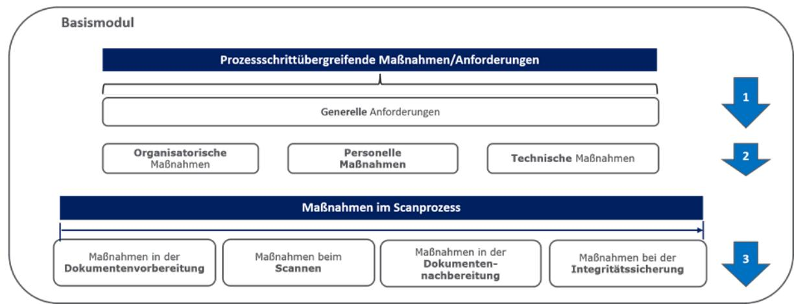

Abbildung 8: Basismodul der RESISCAN

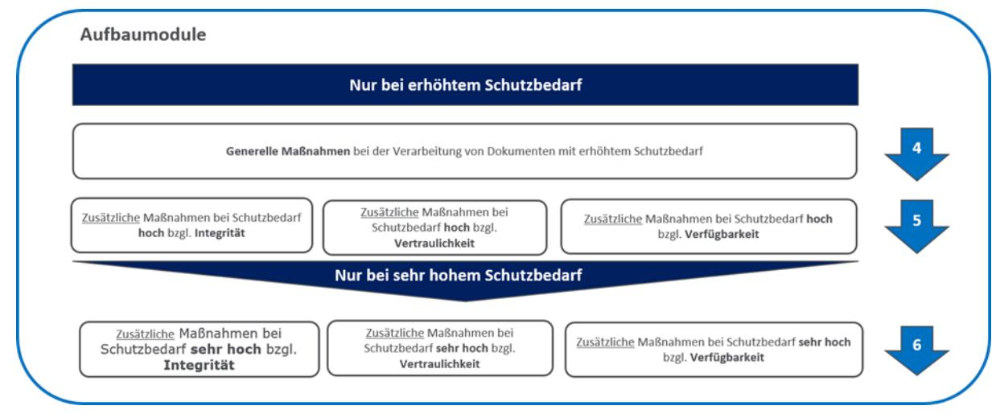

Abbildung 9: Aufbaumodule der RESISCAN

Die konkrete Ausgestaltung der Maßnahmen orientiert sich unmittelbar an dem in der Institution tatsächlich vorhandenen Scansystem sowie den konkreten organisatorischen, technischen und personellen Gegebenheiten vor Ort. Als Orientierung können folgenden ausgewählten typischen Fragen bei der Konzeption und der Umsetzung des Ersetzenden Scannens helfen.

Tabelle 7: Ausgewählte Kernfragen zum Scankonzept

| Frage              | Kerninhalt (Beispiele)                                                                                                                                 | Empfehlungen und Hinweise                                                                                                                                                                                                                                                                                                                                                        |
|--------------------|--------------------------------------------------------------------------------------------------------------------------------------------------------|----------------------------------------------------------------------------------------------------------------------------------------------------------------------------------------------------------------------------------------------------------------------------------------------------------------------------------------------------------------------------------|
| Wo wird gescannt?  | Scanort z.B. Ort des Eingangs der Dokumente, in der jeweiligen Niederlassung oder Regionalstelle, oder auch zentral in einem Hauptstandort | Alle Scanorte definieren und beschreiben                                                                                                                                                                                                                                                                                                                                      |
|                    |                                                                                                                                                        | Maßnahmen sind für jeden Scanort zu treffen                                                                                                                                                                                                                                                                                                                                   |
|                    |                                                                                                                                                        | Zentralisierung des Scannens kann Effizienz erhöhen durch Kompetenz- und Kostenbündelung                                                                                                                                                                                                                                                                                   |
| Was wird gescannt? | Posteingänge                                                                                                                                           | Posteingänge scannen ist ein typischer Anwendungsfall                                                                                                                                                                                                                                                                                                                         |
|                    | Bestandsakten                                                                                                                                          | Bestandsakten sollten nur bei hohen Zugriffsraten oder bei Bedarf (Zugriff) gescannt werden Ebenso ist zu prüfen, welche Dokumente nicht (z.B. aufgrund Überformaten) oder nicht Ersetzend gescannt werden (Kopierend gescannte Dokumente werden in Papierrestakte und ein beiderseitiger Verweis mit der korrespondierenden E-Akte angelegt)11 |
| Wieviel wird       | Dokumentenmenge in laufenden                                                                                                                           | Dokumentenmenge ist                                                                                                                                                                                                                                                                                                                                                              |
| gescannt?          | Metern, Blatt, Seiten                                                                                                                                  | insbesondere für Beschaffung                                                                                                                                                                                                                                                                                                                                                     |

11 Mögliche Gründe für kopierendes Scannen oder kein Scannen enthält Anlage 1

| Frage                  | Kerninhalt (Beispiele)                                                                                                                | Empfehlungen und Hinweise                                                                                                                                                                                                               |
|------------------------|---------------------------------------------------------------------------------------------------------------------------------------|-----------------------------------------------------------------------------------------------------------------------------------------------------------------------------------------------------------------------------------------|
|                        |                                                                                                                                       | hinreichend kapazitativer Scanner relevant                                                                                                                                                                                           |
|                        |                                                                                                                                       | Ein laufender Meter umfasst ca. 10- 12 Aktenordner                                                                                                                                                                                   |
| Wer scannt?            | Inhouse zentral/dezentral Outsourcing zentral/dezentral Outtasking zentral/dezentral                                            | Bei Inhouse & Outtasking ist innerhalb einer Institution der komplette Scanprozess in der Verfahrensdokumentation zu betrachten                                                                                             |
|                        |                                                                                                                                       | Bei Outsourcing muss die Institution nur die Schnittstellen zum Dienstleister betrachten, die übrigen Teile sind in der Verfahrensdokumentation des Dienstleisters zu dokumentieren und von der Institution zu prüfen |
|                        |                                                                                                                                       | In allen Fällen sind alle Scanorte eindeutig anzugeben                                                                                                                                                                               |
| Wie wird gescannt?     | Maßnahmen im Scanprozess                                                                                                              | Beschreibung im Detail, da Grundlage für Verfahrensanweisung an Scanmitarbeiter                                                                                                                                                |
|                        |                                                                                                                                       | Vgl. Literatur & Templates für Beispiele und Hilfen                                                                                                                                                                                  |
| Wann wird gescannt? | Frühes Scannen, also im Posteingang vor der eigentlichen Bearbeitung im Geschäftsprozess Spätes Scannen, also nach Abschluss | Regelfall und ermöglicht volldigitale Prozesse Ausnahmefall, da Bearbeitung papierbasiert erfolgt                                                                                                                              |
|                        | der Bearbeitung Scannen bei Bedarf, also beispielsweise bei Zugriff auf Dokumente                                            | Bietet sich für Scannen von Bestandsakten an                                                                                                                                                                                         |

Die Maßnahmen sind in einer geeigneten Verfahrensanweisung zu beschreiben. Templates finden sich hier:

- [RESISCAN Anwendungshinweis V](https://www.bsi.bund.de/SharedDocs/Downloads/DE/BSI/Publikationen/TechnischeRichtlinien/TR03138/TR-03138-Anwendungshinweis-V.pdf?__blob=publicationFile&v=4) [\[BSI-TR03138-V\]](#page-33-1)
- Beispiel für Umsetzung des Transfervermerks der Deutschen Rentenversicherung [https://www.bsi.bund.de/DE/Themen/Oeffentliche-Verwaltung/Moderner-Staat/Ersetzendes-](https://www.bsi.bund.de/DE/Themen/Oeffentliche-Verwaltung/Moderner-Staat/Ersetzendes-ScannenTR-Resiscan/ersetzendes-scannentr-resiscan_node.html#doc455930bodyText5)[ScannenTR-Resiscan/e](https://www.bsi.bund.de/DE/Publikationen/TechnischeRichtlinien/tr03138/tr03138_node.html#doc6617858bodyText5)rsetzendes-scannentr-resiscan\_node.html#doc455930bodyText5

Damit wird zum einen die Vollständigkeit der Maßnahmen gewährleistet, zum anderen wird so ein ordnungsgemäßer Scanprozess definiert. Zur Qualitätssicherung, ob auch alle relevanten Maßnahmen berücksichtigt wurden, bietet sich die Prüfung anhand de[r Anlage P der TR RESISCAN](https://www.bsi.bund.de/SharedDocs/Downloads/DE/BSI/Publikationen/TechnischeRichtlinien/TR03138/TR-03138-Anlage-P_V1_4.html) [\[BSI-TR03138-P\]](#page-32-3) an. Das praktische Vorgehen, bei der Festlegung Sicherheitsmaßnahmen, ergibt sich aus dem Basis- und Aufbaumodul. Hier empfehlen sich folgende Schritte:

1. Betrachtung der prozessschrittübergreifenden Maßnahmen

Tabelle 8: Prozessübergreifende Maßnahmen

| Maßnahmen/Anforderung      | Beispielinhalte                                                                                                                                                            |
|----------------------------|----------------------------------------------------------------------------------------------------------------------------------------------------------------------------|
| Generelle Anforderungen    | Nachweis Verfahrensdokumentation und Schutzbedarfsanalyse12 inkl. Festlegung Art und Umfang der zu scannenden Dokumente                                              |
| Organisatorische Maßnahmen | Grundsätzliche Verantwortlichkeiten, Abläufe Aufgaben sowie im Scanprozess (u.a. Angabe Scanort) Empfehlung: Benennung von • Organisationseinheiten/Stellen |
|                            | Regelungen zu Wartungsaufgaben                                                                                                                                             |
|                            | Aufrechterhaltung Informationssicherheit z. B. regelmäßige Audits, deren Perioden, Inhalte etc.                                                                      |
| Personelle Maßnahmen       | Sensibilisierung der Mitarbeiter für Informationssicherheit                                                                                                             |
|                            | Verpflichtung der Mitarbeiter auf Einhaltung einschlägiger Gesetze, Vorschriften, Regelungen und der Verfahrensanweisung                                             |
|                            | Einweisung zur ordnungsgemäßen Bedienung des Scansystems getrennt nach Scan sowie Wartungs-/ Admin-Personal                                                          |
| Technische Maßnahmen       | Grundlegende Sicherheitsmaßnahmen für IT Systeme im Scanprozess (entsprechend dem Netzplan aus der Strukturanalyse)                                                  |
|                            | Festlegung der zulässigen Kommunikationsverbindungen                                                                                                                    |
|                            | Schutz vor Schadprogrammen                                                                                                                                                 |

12 Diese ist in der Regel bei Definition der Maßnahmen bereits abgeschlossen

#### Besonderheiten bei Maßnahme A.T.1 der TR-RESISCAN:

Die Sicherheitsmaßnahmen ergeben sich aus den in de[r Strukturanalyse](#page-13-2) identifizierten IT-Systeme, Anwendungen, Netze und Kommunikationsbeziehungen des Scansystems der anwendenden Institution. Hier kann beispielsweise auf das verfahrensbezogene Sicherheitskonzept des Scansystems verwiesen werden, das in der Regel ohnehin zu erstellen ist.

Für die hierbei relevanten IT-Systeme, Anwendungen und Netze sind die einschlägigen Sicherheitsmaßnahmen aus dem Grundschutz-Kompendium [\[BSI-GSK\]](#page-32-6) zu berücksichtigen und umzusetzen. Bei dem exemplarischen Scansystem au[s Abbildung 6](#page-14-0) wären dies beispielsweise die folgenden Bausteine aus dem [\[BSI-GSK\],](#page-32-6) die zu berücksichtigen wären:

| ID     | IT-Systeme, Netze und Anwendungen    | Bausteine aus dem Grundschutz-Kompendium [BSI-GSK]                                                                                                                                                                      |
|--------|-----------------------------------------|-------------------------------------------------------------------------------------------------------------------------------------------------------------------------------------------------------------------------|
| S1     | Scanner                                 | SYS.4.1 – Drucker, Kopierer und Multifunktionsgeräte                                                                                                                                                                    |
| S2     | Scan-Workstation                        | Abhängig vom Betriebssystem sind möglicherweise folgende Bausteine zu berücksichtigen:                                                                                                                               |
|        |                                         | SYS.2.1 – Allgemeiner Client SYS.2.2 – Windows-Clients SYS.2.2.2 – Windows 8.1 SYS.2.2.3 – Windows 10 SYS.2.3 – Client unter Unix SYS.2.4 – Client unter macOS                                           |
| S3     | Qualitätssicherungs(QS)- Workstation | Siehe S2.                                                                                                                                                                                                               |
| S4     | Scan-Server                             | Abhängig vom Betriebssystem sind möglicherweise folgende Bausteine zu berücksichtigen: SYS.1.1 – Allgemeiner Server SYS.1.2 – Windows Server SYS.1.2.2 – Windows Server 2012 SYS.1.3 – Server unter Unix |
| S5     | Firewall                                | NET.3.2 – Firewall                                                                                                                                                                                                      |
| S6     | Router                                  | NET.3.1 – Router und Switches                                                                                                                                                                                           |
| S7     | Proxyserver                             | Siehe S2.                                                                                                                                                                                                               |
| S8     | Smartphone                              | SYS.3.2.1 – Allgemeine Smartphones und Tablets                                                                                                                                                                          |
| N x | Relevante Netze                         | NET.1.1 – Netzarchitektur und -design NET.1.2 – Netzmanagement                                                                                                                                                       |
| A1     | Scan-Software                           | APP.3.1 – Webanwendungen                                                                                                                                                                                                |
| A2     | QS-Software                             | Siehe A1.                                                                                                                                                                                                               |
| A3     | Scan-Service                            | APP.3.5 – Webservices APP.4.3 – Relationale Datenbanksysteme                                                                                                                                                         |
| A4     | Apache                                  | APP.3.2 – Webserver                                                                                                                                                                                                     |
| A5     | Scan-App                                | APP.1.4 – Mobile Anwendungen (Apps)                                                                                                                                                                                     |

#### Tabelle 9: Beispiel für Maßnahmen AT.1

#### 2. Maßnahmen im Scanprozess

Grundlage der Ausgestaltung der Maßnahmen im Scanprozess ist der in der jeweiligen Institution implementierte Scanprozess.

Die wesentlichen Anforderungen der TR-RESISCAN bestehen aus dem Basismodul. Das Basismodul kann um Aufbaumodule mit zusätzlichen Sicherheitsmerkmalen ergänzt werden. Sofern eine [Zertifizierung](#page-27-1) nach TR-RESISCAN angestrebt wird, ist zu beachten, dass nur die vier Kernschritte (Dokumentenvorbereitung, Scannen, Nachverarbeitung, Integritätssicherung) zertifizierungsrelevant sind. Gleichwohl muss ein valider Scanprozess auch die Schnittstellen zu vor- oder nachgelagerten Systemen und Prozessen betrachten und in der Verfahrensdokumentation und Scankonzept beschreiben.

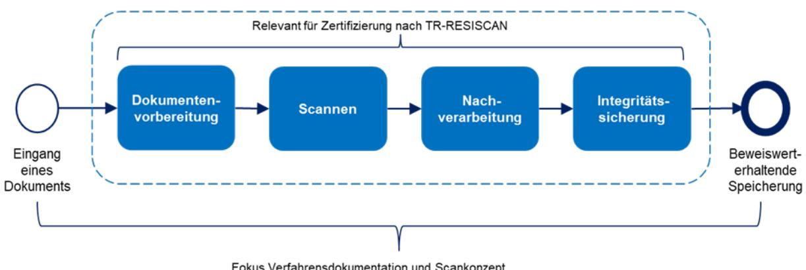

Abbildung 10: Fokus der Verfahrensdokumentation und Zertifizierung nach TR-RESISCAN

Zur Veranschaulichung zeig[t Abbildung 11](#page-24-0) einen beispielhaften Überblick über typische Maßnahmen. Bei der institutionsspezifischen Maßnahmendefinition sind alle relevanten Anforderungen der TR-RESICAN zu betrachten.

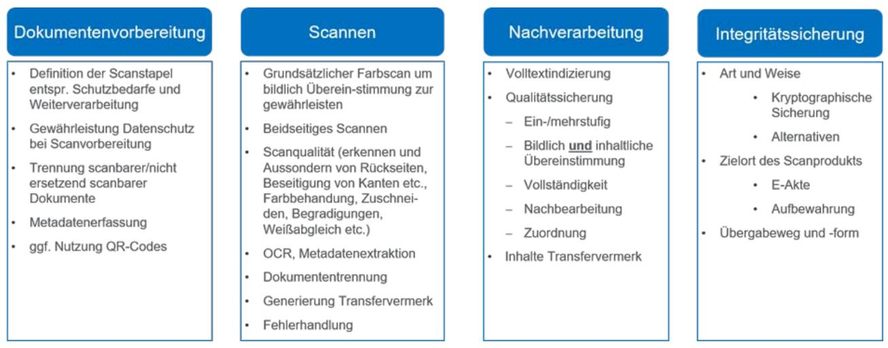

Abbildung 11: Beispiele für praktische Maßnahmen im Scanprozess

#### Technische Aspekte zur Hard- und Software

#### Scanhardware

Besondere Scanhardware ist zum Ersetzenden Scannen gem. TR-RESISCAN nicht notwendig. Es sollte lediglich sichergestellt sein, dass die Scanner die Vorgaben nach A.SC.1 der TR-03138 erfüllt. Also:

- Ausreichender Durchsatz (angepasst an da[s Mengengerüst\)](#page-20-2)
- Unterstützung geeigneter Datenformate z.B. PDF/A, TIFF
- Patch- und/oder Barcodes zur Dokumententrennung und Übergabe von Meta-Informationen
- Qualität der Scanprodukte (Auflösung, Bildkompressionsverfahren, Kontrast etc.)
- Scannen von Papierformaten von A6 bis A3
- Scannen von Mischgut (diverse Papierformate)
- Angemessene Flexibilität der Konfiguration
- Ausreichende Kapazität
- Ausreichend zuverlässiger und leistungsfähiger automatischer Seiteneinzug (auch für doppelseitige Erfassung und mit zuverlässiger Doppeleinzugskontrolle)
- Bei Bedarf Möglichkeit zum Scannen von gebundenen Dokumenten, Überlängen, zum Scannen von Farbe sowie von Durchlichtdokumenten (z. B. Röntgenbilder)
- Barcode-/QR-Codeerkennung (Barcode und QR-Code)
- Schnittstellen für die Übermittlung des Scanproduktes an das Zielsystem
- Möglichkeit der Absicherung der Administrationsschnittstelle (lokal und über Netz)
- Interner Datenspeicher
- Möglichkeit zum sicheren Löschen oder zur verschlüsselten Speicherung von Scanprodukten auf dem internen Datenträger
- Ausreichender Support

Eine Zertifizierung der Scanhardware nach TR-RESISCAN wird vom BSI nicht vorgenommen.

#### Scansoftware

Grundsätzlich kann jede handelsübliche Scansoftware eingesetzt werden, solange diese ein Scannen gemäß TR-RESISCAN nicht ausschließt. Einige Produkte am Markt besitzen bereits Konfigurationen orientiert am generischen Scanprozess der TR und erleichtern so die Anwendung. Eine Zertifizierung der Scanhardware nach TR-RESISCAN wird vom BSI nicht vorgenommen.

Eine beispielhafte, nicht abschließende Liste möglicher Funktionen einer Scansoftware enthält Anlage 2.

#### Besonderheiten beim Ersetzenden Scannen

Im Vergleich zur reinen Digitalisierung papierbasierter Dokumente umfasst das Ersetzende Scannen einige Besonderheiten. Die Wesentlichen werden im Folgenden kurz beschrieben:

#### Transfervermerk

Der Transfervermerk protokolliert faktisch das ordnungsgemäße Scannen gem. TR-RESISCAN. Er enthält typischerweise:

- Ersteller des Scanproduktes
- technisches und organisatorisches Umfeld des Erfassungsvorganges
- etwaige Auffälligkeiten während des Scanprozesses
- Zeitpunkt der Erfassung
- Ergebnis der Qualitätssicherung und
- die Tatsache, dass es sich um ein Scanprodukt handelt, das bildlich und inhaltlich mit dem Papierdokument übereinstimmt

Der Transfervermerk wird von der Scansoftware erzeugt, in der Regel als XML-Datei.

Beispiele für einen Transfervermerk finden sich hier:

- [DRV Transfervermerk für Scanprodukte](https://www.bsi.bund.de/SharedDocs/Downloads/DE/BSI/Publikationen/TechnischeRichtlinien/TR03138/Praxis_Transvermerk/Transfervermerk_Deutsche_RV_Inhalt.pdf?__blob=publicationFile&v=2) [\[DRV-TVa\]](#page-33-5) und
- [Beispiele für Transfervermerke der Deutschen Rentenversicherung](https://www.bsi.bund.de/SharedDocs/Downloads/DE/BSI/Publikationen/TechnischeRichtlinien/TR03138/Praxis_Transvermerk/Transfervermerk_Deutsche_RV_Beispiele.zip?__blob=publicationFile&v=2) [\[DRV-TVb\].](#page-33-6)

#### Integritätssicherung

Die Integritätssicherung dient zum einen der Bestätigung des ordnungsgemäßen Scannens gem. TR-RESISCAN, zum anderen dem Schutz vor Veränderungen und Nachweis der Integrität des Scanprodukts und Transfervermerks. Die Maßnahmen zur Integritätssicherung des Scanprodukts entsprechend denjenigen zur Integritätssicherung des Transfervermerks.

Im Zuge der eIDAS-Verordnung ist die Nutzung (qualifizierter) elektronischer Signaturen durch Fernsignaturen, Zeitstempel und vor allem Siegel deutlich vereinfacht worden.

Mit dem (qualifizierten) elektronischen Siegel gemäß eIDAS-Verordnung, das auf Organisationszertifikaten beruht, wurde der Aufwand für kryptographische Sicherungsmittel erheblich reduziert, bei gleichzeitiger Gewährleistung der Verkehrsfähigkeit und hohem Beweiswert der gesiegelten Scanprodukte und Transfervermerke. In der Praxis wird aus diesem Grund häufig, auch unabhängig vom konkreten Schutzbedarf, das (qualifizierte) elektronische Siegel verwendet. Dieses lässt sich zudem auch für weitere Zwecke, wie z.B. digitale Bescheide, Angebote, Anträge, Dokumentationen etc. verwenden. Insofern sollte die Integritätssicherung im Gesamtkontext der Digitalisierung der Geschäftsprozesse betrachtet werden.

Jede marktübliche Scansoftware lässt sich an handelsübliche Signatur/Siegellösungen anbinden, unabhängig ob Fernsignatur/-Siegel oder kartenbasierte Verfahren. Grundlegend sind folgende Komponenten notwendig:

- Auswahl geeigneter Vertrauensdiensteanbieter
	- Vgl. hierzu:<https://www.eid.as/tsp-map/#/>
- Auswahl Soft- und ggf. Hardware
- Anbindung und Integration

Für das Siegel ist im Grunde nur ein Zertifikat/Siegelkarte ausreichend. Je nach benötigter Performance/Redundanz sollte über mehrere Zertifikate/Siegelkarten entschieden werden. Diese werden vom Siegelinhaber in der Regel per PIN freigeschalten und können dann von den Scanworkstations angesteuert werden. Die Authentisierung der Scanworkstation kann durch Benutzerkennung + sicherem Token erfolgen. Eine Verlängerung per USB over LAN ermöglicht auch die Nutzung der Siegelkarte in Entfernung zum Server, so dass flexible Lösungen möglich sind.

Grundsätzlich ist bei normalem Schutzbedarf auch der Verzicht auf kryptographische Sicherungsmittel möglich, allerdings ist dann aufzuzeigen, dass eine entsprechende Widerstandsfähigkeit des Scansystems gegeben ist. Der Aufwand hierzu ist nicht unerheblich. Mit Blick auf die Vorteile des Siegels und Signaturen für durchgängig elektronische Prozesse, sollte der Einsatz der Signatur/Siegel und ggf. Zeitstempel im Gesamtkontext der Digitalisierung der betreffenden Institution betrachtet werden.

Der Aufwand zur anschließenden Beweiswerterhaltung nach dem Stand der Technik ist durch standardisierte Produkte gem. [TR-ESOR](https://www.bsi.bund.de/SharedDocs/Downloads/DE/BSI/Publikationen/TechnischeRichtlinien/TR03125/BSI_TR_03125_V1_2_2.pdf?__blob=publicationFile&v=3) [\[BSI-TR03125\]](#page-32-2) resp. (qualifizierten) Bewahrungsdiensten begrenzt.

Nähere Informationen zu Siegeln und Signaturen sowie Zeitstempeln finden sich hier:

- [Bundesnetzagentur: Elektronische Vertrauensdienste](https://www.bundesnetzagentur.de/EVD/DE/Verbraucher/Vertrauensdienste/Vertrauensdienste-start.html) [\[BNetzA-TSP\]](#page-32-8) und
- [BSI: Elektronische Signatur](https://www.bsi.bund.de/DE/Themen/DigitaleGesellschaft/ElektronischeSignatur/elektronischesignatur_node.html) [\[BSI-eSIG\].](#page-32-9)

### 2.2.2 Dokumentation und Regelungsbedarfe

Die Ausgestaltung der Maßnahmen ist in einer geeigneten Verfahrensdokumentation zu beschreiben. Damit wird zum einen die Vollständigkeit der Maßnahmen gewährleistet, zum anderen wird so ein ordnungsgemäßer Scanprozess sichergestellt. Zur Qualitätssicherung, ob auch alle relevanten Maßnahmen berücksichtigt wurden, bietet sich die Prüfung anhand de[r Anlage P der TR-RESISCAN](https://www.bsi.bund.de/SharedDocs/Downloads/DE/BSI/Publikationen/TechnischeRichtlinien/TR03138/TR-03138-Anlage-P_V1_4.html) [\[BSI-TR03138-P\]](#page-32-3) an.

Templates und Beispiele für die Verfahrensdokumentation finden sich hier:

[Beispiel des Deutschen Steuerberaterverbands und der Bundessteuerberaterkammer](http://www.dstv.de/download/gemeinsame-verfahrensbeschreibung) [\[DSTV-VD\].](#page-33-7) 

Zur organisatorischen als auch technischen Umsetzung der TR-RESISCAN sind die getroffenen Maßnahmen erfahrungsgemäß durch interne Regelungen zu untersetzen. Hier kommen beispielsweise in Frage:

- Verfahrensanweisung (Pflicht) bzw. Scanrichtlinie
- Signatur-/Siegelrichtlinie
- Richtlinien zum Postein-/ausgang
- Richtlinien zur Wartung, Abnahme, Freigabe
- Richtlinien zur Informationssicherheit

### 2.2.3 Zertifizierung

Zum Nachweis der Erfüllung des Stands der Technik beim Ersetzenden Scannen besteht die Möglichkeit, den in der jeweiligen Institution oder Dienstleister implementierten Scanprozess gegen die Vorgaben der TR-RESISCAN zu zertifizieren. Hierfür bietet das BSI ein Zertifizierungsverfahren an. Gegenstand des Zertifizierungsverfahrens ist ausschließlich der Scanprozess des Antragstellers zur Zertifizierung. Es wird keine Produktzertifizierung z. B. von Soft- oder Hardwareprodukten durchgeführt.

Die Prüfkriterien für die Konformitätsprüfung gegen die TR-03138 sind in Anlage P [\[BSI-TR03138-P\],](#page-32-3) der Prüfspezifikation der TR-RESISCAN definiert. Der praktische Ablauf gestaltet sich grundlegend wie folgt:

• Anmeldung der Institution zur Zertifizierung des betroffenen Scanprozesses beim BSI

- Beauftragung eines vom BSI zertifizierten Auditors zur Zertifizierung nach TR-RESISCAN durch die Institution
- Auditierung der Institution durch den Auditor
- Erstellung Auditierungsbericht durch den Auditor
- Prüfung des Auditierungsberichts und (bei erfolgreichem Abschneiden) Erteilung des Zertifikats durch das BSI.
- Sofern keine grundlegenden Änderungen am Scanprozess vorgenommen werden, ist die Zertifizierung für 3 Jahre gültig.

### 2.3 RESISCAN. Anwenden

### 2.3.1 Informationen und Praxisbeispiele für die Nutzung und Anwendung der TR-RESISCAN

Auf der Website des BSI stehen zahlreiche Dokumente zur Verfügung, die als Beispiele herangezogen werden können oder auch als Vorlagen für die Erstellung eigener Dokumente genutzt werden können.

Speziell zu nennen ist hier der [Anwendungshinweis V](https://www.bsi.bund.de/SharedDocs/Downloads/DE/BSI/Publikationen/TechnischeRichtlinien/TR03138/TR-03138-Anwendungshinweis-V.pdf;jsessionid=E3CDF27BBBA13C23993505D9FB09C17E.1_cid360?__blob=publicationFile&v=4) [\[BSI-TR03138-V\],](#page-33-1) der eine exemplarische Gliederung einer Verfahrensanweisung darstellt und als Template Bausteine mit Platzhaltern für eine einfache Erstellung einer angepassten Verfahrensanweisung liefert.

Praxisbeispiele umfassen Transfervermerke [\(Beispiele der Deutschen Rentenversicherung\)](https://www.bsi.bund.de/SharedDocs/Downloads/DE/BSI/Publikationen/TechnischeRichtlinien/TR03138/Praxis_Transvermerk/Transfervermerk_Deutsche_RV_Beispiele.zip?__blob=publicationFile&v=2) [\[DRV-TVa\],](#page-33-5)  Verfahrensdokumentation [\(Beispiel des Deutschen Steuerberaterverbands und der](http://www.dstv.de/download/gemeinsame-verfahrensbeschreibung)  [Bundessteuerberaterkammer\)](http://www.dstv.de/download/gemeinsame-verfahrensbeschreibung) [\[DSTV-VD\]](#page-33-7) und eine Schutzbedarfsanalyse [\(Beispiel der Bund-Länder-](https://www.bsi.bund.de/SharedDocs/Downloads/DE/BSI/Publikationen/TechnischeRichtlinien/TR03138/Praxis_Schutzbed_BLK/Schutzbed_Justiziellen_Verfahren.html)[Kommission für Informationstechnik in der Justiz\)](https://www.bsi.bund.de/SharedDocs/Downloads/DE/BSI/Publikationen/TechnischeRichtlinien/TR03138/Praxis_Schutzbed_BLK/Schutzbed_Justiziellen_Verfahren.html) [\[SB-BLK\].](#page-33-3) Weitere exemplarische Schutzbedarfsanalysen finden sich in Teil R.1 des Anwendungshinweises R [\(Anwendungshinweis R: Unverbindliche rechtliche](https://www.bsi.bund.de/SharedDocs/Downloads/DE/BSI/Publikationen/TechnischeRichtlinien/TR03138/TR-03138-Anwendungshinweis-R.pdf;jsessionid=E3CDF27BBBA13C23993505D9FB09C17E.1_cid360?__blob=publicationFile&v=5)  [Hinweise\)](https://www.bsi.bund.de/SharedDocs/Downloads/DE/BSI/Publikationen/TechnischeRichtlinien/TR03138/TR-03138-Anwendungshinweis-R.pdf;jsessionid=E3CDF27BBBA13C23993505D9FB09C17E.1_cid360?__blob=publicationFile&v=5) [\[BSI-TR03138-R\].](#page-33-0) Hier werden verschiedene Dokumententypen insbesondere bzgl. rechtlichen Aspekten und der Zulässigkeit des Ersetzenden Scannens betrachtet.

## 2.4 RESISCAN. Verstehen

### 2.4.1 Glossar

Authentifizierung

Bei der "Authentifizierung" wird eine "Behauptung" über eine elektronische Identität geprüft. Hierbei besteht eine "Behauptung" aus mindestens einem Identitätsattribut (z. B. dem Namen des Kommunikationspartners).

Authentisierung

Bei der "Authentisierung" wird eine "Behauptung" über eine elektronische Identität aufgestellt.

Authentizität

Unter der "Authentizität" von Daten versteht man, dass die Quelle der Daten eindeutig bestimmbar ist.

#### Bildliche Übereinstimmung

Von einer "bildlichen Übereinstimmung" zwischen einem Scanprodukt und einem Original wird gesprochen, wenn das Scanprodukt ein im Rahmen der gewählten Auflösung identisches Abbild des Originals ist.

#### Ergänzendes Scannen

Wird nach dem "Scannen" das papiergebundene Original weiterhin aufbewahrt, so wird vom "ergänzenden Scannen" gesprochen.

#### Ersetzendes Scannen

Wird nach dem "Scannen" das papiergebundene Original vernichtet, so wird vom "Ersetzenden Scannen" gesprochen.

#### informativ

Ein "informativer" Teil eines Dokumentes enthält keine verbindlichen Vorgaben und Anforderungen und dient lediglich der Information des Lesers.

#### Inhaltliche Übereinstimmung

Von einer "inhaltlichen Übereinstimmung" zwischen einem Scanprodukt und einem Original wird gesprochen, wenn das Scanprodukt und das Original in den wesentlichen Inhaltsdaten übereinstimmen, nicht aber unbedingt in der visuellen Darstellung.

#### Integrität

"Integrität" bedeutet, dass die Daten oder Systeme nicht verändert wurden. Bei einem wirksamen Integritätsschutz werden zudem zumindest Veränderungen erkannt.

#### IT-System

Der Begriff "IT-System" beschreibt ein aus Hardware und Software bestehendes System zur Informationsverarbeitung.

#### Lesbarkeit

Lesbarkeit bedeutet, dass die in den Daten enthaltenen Informationen erkannt werden können.[13](#page-29-0)

#### Löschbarkeit

Unter Löschen von Daten ist das Unkenntlich machen der gespeicherten Daten zu verstehen (§ 3 Abs. 4 Nr. 5 [ BDSG]). Dies ist gegeben, wenn die Daten unwiderruflich so behandelt worden sind, dass eigene Informationen nicht aus gespeicherten Daten gewonnen werden können, wenn also der Rückgriff auf diese Daten nicht mehr möglich ist [Dammann in [Simi11], § 3 Rn. 180].

#### Nachvollziehbarkeit

Unter der "Nachvollziehbarkeit" eines Vorgangs wird verstanden, dass alle wesentlichen Schritte des Vorgangs von einer unabhängigen Stelle nachgezeichnet werden können.

#### normativ

Ein "normativer" Teil eines Dokumentes enthält verbindliche Vorgaben und Empfehlungen, deren Umsetzung auch Gegenstand eines im Prüfungs- und Zertifizierungsverfahrens ist.

13 Ein elektronisches Dokument ist nur dann lesbar, wenn die notwendige Hard- und Software die Daten verarbeiten, ihre Informationen interpretieren und dem menschlichen Betrachter in lesbarer Weise präsentieren kann.

#### Patch Code

Darunter wird ein spezifischer, für die Automatisierung von Scanprozessen eingesetzter Strichcode verstanden, der sich aus unterschiedlich breiten, parallelen Strichen und Lücken zusammensetzt.

#### Scannen

"Scannen" bezeichnet das elektronische Erfassen von Papierdokumenten mit dem Ziel der elektronischen Weiterverarbeitung und Aufbewahrung des hierbei entstehenden elektronischen Abbildes (Scanprodukt).

#### Sicherungsdaten

"Sicherungsdaten" sind Datenobjekte, die dem Schutz der Integrität und gegebenenfalls Authentizität anderer Datenobjekte dienen. Dies umfasst insbesondere elektronische Signaturen, Zeitstempel, Zertifikate, Sperrinformationen und Evidence Records (vgl. "Credential" i[n \[BSI-](#page-32-2)[TR03125\]\)](#page-32-2).

#### Sicherungsmittel

Unter dem Begriff "Sicherungsmittel" werden in dieser Technischen Richtlinie Sicherungsdaten oder Sicherungssysteme verstanden.

#### Sicherungssysteme

"Sicherungssysteme" sind IT-Systeme und/oder Anwendungen, die dem Schutz der Integrität und gegebenenfalls Authentizität anderer Datenobjekte dienen.

#### Verfügbarkeit

Die "Verfügbarkeit" von Daten, Diensten, IT-Systemen, IT-Anwendungen oder IT-Netzen ist vorhanden, wenn diese den Benutzern innerhalb akzeptabler Wartezeiten in der benötigten Form zur Verfügung stehen.

#### Vertraulichkeit

"Vertraulichkeit" ist die Verhinderung einer unbefugten Kenntnisnahme.

#### Verkehrsfähigkeit

"Verkehrsfähigkeit" bezeichnet die Möglichkeit, Dokumente und Akten von einem System zu einem anderen übertragen zu können, bei der die "Qualität" des Dokuments sowie seine Integrität und Authentizität nachweisbar bleiben. [14](#page-30-0)

#### Vollständigkeit

"Vollständigkeit" bedeutet, dass der gegenseitige Bezug mehrerer aufgrund eines inneren Zusammenhangs zusammengehörigen Datenobjekte sichergestellt ist.

14 Es sei angemerkt, dass die Verkehrsfähigkeit von kryptographisch gesicherten Daten nur bei Verwendung von allgemein anerkannten (z.B. internationalen) Standards und interoperablen Systemen gewährleistet werden kann.

# Abkürzungsverzeichnis

Tabelle 10: Abkürzungsverzeichnis

| Akronym  | Bedeutung                                     |
|----------|-----------------------------------------------|
| DRV      | Deutsche Rentenversicherung Bund              |
| DSAnpUG  | Gesetz zur Anpassung des Datenschutzrechts an |
|          | die Verordnung (EU)                           |
| EGovG    | E-Government-Gesetz                           |
| eIDAS-DG | eIDAS-Durchführungsgesetz                     |
| EU-DSGVO | EU-Datenschutzgrundverordnung                 |
| OKeVA    | Organisationskonzept elektronische            |
|          | Verwaltungsarbeit                             |
| QES      | Qualifizierte elektronische Signatur          |
| QESI     | Qualifiziertes elektronisches Siegel          |
| QZS      | Qualifizierter Zeitstempel                    |
| TR       | Technische Richtlinie                         |
| TV       | Transfervermerk                               |
| VDG      | Vertrauensdienstegesetz                       |
| VDV      | Vertrauensdiensteverordnung                   |
| VwVfG    | Verwaltungsverfahrensgesetz                   |
| ZPO      | Zivilprozessordnung                           |

# Literaturverzeichnis

| [BMI-SCAN]      | Bundesministerium des Innern (BMI): Organisationskonzept elektronische Verwaltungsarbeit - Baustein Scanprozess https://www.verwaltung innovativ.de/SharedDocs/Publikationen/Organisation/scanprozess.pdf?__blob=publicati onFile&v=2                                                                                                                                           |  |
|-----------------|---------------------------------------------------------------------------------------------------------------------------------------------------------------------------------------------------------------------------------------------------------------------------------------------------------------------------------------------------------------------------------------------|--|
| [BNetzA-TSP]    | Bundesnetzagentur (BNetzA): Elektronische Vertrauensdienste. https://www.bundesnetzagentur.de/EVD/DE/Verbraucher/Vertrauensdienste/Vertraue nsdienste-start.html                                                                                                                                                                                                                      |  |
| [BSI-100-2]     | Bundesamt für Sicherheit in der Informationstechnik (BSI): IT-Grundschutz Vorgehensweise, BSI Standard 100-2 https://www.bsi.bund.de/SharedDocs/Downloads/DE/BSI/Publikationen/ITGrundschu tzstandards/BSI-Standard_1002.pdf?__blob=publicationFile                                                                                                                                |  |
| [BSI-200-2]     | Bundesamt für Sicherheit in der Informationstechnik (BSI): IT-Grundschutz-Methodik, BSI Standard 200-2, https://www.bsi.bund.de/SharedDocs/Downloads/DE/BSI/Grundschutz/Kompendium/ standard_200_2.pdf?__blob=publicationFile&v=7                                                                                                                                                  |  |
| [BSI-eSIG]      | Bundesamt für Sicherheit in der Informationstechnik (BSI): Elektronische Signatur. https://www.bsi.bund.de/DE/Themen/Oeffentliche-Verwaltung/Moderner-Staat/ ElektronischeSignatur/elektronischesignatur_node.html                                                                                                                                                                    |  |
| [BSI-GSK]       | Bundesamt für Sicherheit in der Informationstechnik (BSI): IT-Grundschutz Kompendium, https://www.bsi.bund.de/DE/Themen/Unternehmen-und-Organisationen/Standards und-Zertifizierung/IT-Grundschutz/IT-Grundschutz-Kompendium/it-grundschutz kompendium_node.html                                                                                                                |  |
| [BSIRilieSig]   | Bundesamt für Sicherheit in der Informationstechnik (BSI): Leitlinie für digitale Signatur-/ Siegel-, Zeitstempelformate sowie technische Beweisdaten (Evidence Record) https://www.bsi.bund.de/SharedDocs/Downloads/DE/BSI/Publikationen/TechnischeRi chtlinien/TR03125/BSI_TR_03125_Leitlinie_fuer_digitale_Signatur-Siegel Zeitstempelformate.pdf?__blob=publicationFile&v=3 |  |
| [BSI-TR03125]   | Bundesamt für Sicherheit in der Informationstechnik (BSI): Beweiswerterhaltung kryptographisch signierter Dokumente (TR-ESOR), BSI TR-03125 https://www.bsi.bund.de/DE/Themen/Unternehmen-und-Organisationen/Standards und-Zertifizierung/Technische-Richtlinien/TR-nach-Thema-sortiert/tr03125/ TR-03125_node.html                                                             |  |
| [BSI-TR03138]   | Bundesamt für Sicherheit in der Informationstechnik (BSI): Ersetzendes Scannen (RESISCAN), BSI TR-03138 https://www.bsi.bund.de/DE/Themen/Oeffentliche-Verwaltung/Moderner-Staat/ Ersetzendes-ScannenTR-Resiscan/ersetzendes-scannentr-resiscan_node.html                                                                                                                          |  |
| [BSI-TR03138-P] | Bundesamt für Sicherheit in der Informationstechnik (BSI): Ersetzendes Scannen – Anlage P: Prüfspezifikationen für die Konformitätsprüfung, BSI TR-03138-P https://www.bsi.bund.de/SharedDocs/Downloads/DE/BSI/Publikationen/TechnischeRi chtlinien/TR03138/TR-03138-Anlage-P_V1_4.html                                                                                            |  |
| [BSI-TR03138-A] | Bundesamt für Sicherheit in der Informationstechnik (BSI): Ersetzendes Scannen – Anwendungshinweis A: Ergebnis der Risikoanalyse, BSI TR-03138-A, https://www.bsi.bund.de/SharedDocs/Downloads/DE/BSI/Publikationen/TechnischeRi chtlinien/TR03138/TR-03138-Anwendungshinweis-A.pdf?__blob=publicationFile&v=3                                                                     |  |

| [BSI-TR03138-R] | Bundesamt für Sicherheit in der Informationstechnik (BSI): Ersetzendes Scannen – Anwendungshinweis R: Unverbindliche rechtliche Hinweise, BSI TR-03138-R, https://www.bsi.bund.de/SharedDocs/Downloads/DE/BSI/Publikationen/TechnischeRi chtlinien/TR03138/TR-03138-Anwendungshinweis-R.pdf?__blob=publicationFile&v=5                       |  |
|-----------------|-------------------------------------------------------------------------------------------------------------------------------------------------------------------------------------------------------------------------------------------------------------------------------------------------------------------------------------------------------|--|
| [BSI-TR03138-V] | Bundesamt für Sicherheit in der Informationstechnik (BSI): Ersetzendes Scannen – Anwendungshinweis V: Exemplarische Verfahrensanweisung, BSI TR-03138-V, Version 1.2, 2018 https://www.bsi.bund.de/SharedDocs/Downloads/DE/BSI/Publikationen/TechnischeRi chtlinien/TR03138/TR-03138-Anwendungshinweis-V.pdf?__blob=publicationFile&v=4   |  |
| [BSI-TR03138-F] | Bundesamt für Sicherheit in der Informationstechnik (BSI): Ersetzendes Scannen – Anwendungshinweis F: Häufig gestellte Fragen, BSI TR-03138-F, https://www.bsi.bund.de/SharedDocs/Downloads/DE/BSI/Publikationen/TechnischeRi chtlinien/TR03138/TR-03138-Anwendungshinweis-F.pdf?__blob=publicationFile&v=3                                  |  |
| [DSGVO]         | Verordnung (EU) 2016/679 des Europäischen Parlaments und des Rates vom 27. April 2016 zum Schutz natürlicher Personen bei der Verarbeitung personenbezogener Daten, zum freien Datenverkehr und zur Aufhebung der Richtlinie 95/46/EG (Datenschutz Grundverordnung), http://data.europa.eu/eli/reg/2016/679/oj                            |  |
| [DRV-TVa]       | Deutsche Rentenversicherung Bund (DRV): Transfervermerk für Scanprodukte. Berlin, 2016. https://www.bsi.bund.de/SharedDocs/Downloads/DE/BSI/Publikationen/TechnischeRi chtlinien/TR03138/Praxis_Transvermerk/Transfervermerk_Deutsche_RV_Inhalt.pdf?__b lob=publicationFile&v=2                                                           |  |
| [DRV-TVb]       | Deutsche Rentenversicherung Bund (DRV): Transfervermerk für Scanprodukte. Beispiele für Transfervermerke der Deutschen Rentenversicherung. ZIP https://www.bsi.bund.de/SharedDocs/Downloads/DE/BSI/Publikationen/TechnischeRi chtlinien/TR03138/Praxis_Transvermerk/Transfervermerk_Deutsche_RV_Beispiele.zip?_ _blob=publicationFile&v=2 |  |
| [DSTV-VD]       | Deutscher Steuerberaterverband e.V.: Muster-Verfahrensdokumentation zur Digitalisierung und elektronischen Aufbewahrung von Belegen inkl. Vernichtung der Papierbelege. http://www.dstv.de/download/gemeinsame-verfahrensbeschreibung                                                                                                        |  |
| [eIDAS-VO]      | Verordnung (EU) Nr. 910/2014 des Europäischen Parlaments und des Rates vom 23. Juli 2014 über elektronische Identifizierung und Vertrauensdienste für elektronische Transaktionen im Binnenmarkt und zur Aufhebung der Richtlinie 1999/93/EG, http://data.europa.eu/eli/reg/2014/910/oj                                                      |  |
| [eJusticG]      | Gesetz zur Förderung des elektronischen Rechtsverkehrs mit den Gerichten vom 10. Oktober 2013                                                                                                                                                                                                                                                      |  |
| [SB-BLK]        | Schutzbedarfsfeststellung für das Ersetzende Scannen in justiziellen Verfahren auf der Grundlage der TR RESISCAN https://www.bsi.bund.de/SharedDocs/Downloads/DE/BSI/Publikationen/TechnischeRi chtlinien/TR03138/Praxis_Schutzbed_BLK/Schutzbed_Justiziellen_Verfahren.html                                                                 |  |
| [Simi11]        | Simitis (Hrsg.), Bundesdatenschutzgesetz, Baden-Baden (Nomos) 7. Aufl. 2011                                                                                                                                                                                                                                                                           |  |
| [VITAKO]        | Landkreis Breisgau-Hochschwarzwald, KGSt, VITAKO: Leitlinie zum Ersetzenden Scannen in Kommunen nach TR RESISCAN. 2017. https://www.kgst.de/documents/20181/34177/Leitlinie+zum+Ersetzenden+Scannen+in +Kommunen+nach+TR+RESISCAN/680122cc-43f1-9398-6b1b-3abb20642955                                                                       |  |

# Ausgewählte Urteile

(1) FG Münster. Urteil vom 24.11.2015 Ersetzendes Scannen; 14 K 1542/15 AO (PKH); JurPC WebDok. 24/2016, Abs. 1 47.

(2) Hanseatisches OLG Hamburg. Urteil vom 27.07.2017 DIN-Normen; 3 U 220/15 Kart; JurPC Web-Dok. 137/2017, Abs. 1 - 217.

(3) VG Wiesbaden. Urteil vom 28.02.2014 - Zu Den Anforderungen an Elektronische Akten; 6 K 152/14.WI.A; JurPC WebDok. 56/2014, Abs. 1 40.

(4) VG Wiesbaden. Urteil vom 26. September 2014; 6 K 691/14.WI.A; openJur 2014, 25502.

(5) VG Wiesbaden. Urteil vom 20. Januar 2015; 6 K 1567/14.WI; openJur 2015, 6828.

(6) VG Wiesbaden. Urteil vom 28.12.2016 - Zu Fragen der Aktenführung von (Elektronischen) Akten; 6 K 332/16.WI; JurPC Web-Dok. 24/2017, Abs. 1 - 56.

(7) VG Wiesbaden. Urteil vom 09.08.2

(8) OVG Mecklenburg-Vorpommern, 22.12.2000 - 2 L 38/99017 - Elektronische Akten des BAMF; 6 K 808/17.WI.A; JurPC Web-Dok. 146/2017, Abs. 1 - 101.

# Anlage 1: Beispielhafte Gründe kopierenden Scannens oder nichtscanbarer Dokumente

Tabelle 11: Beispielhafte Gründe kopierenden Scannens oder nichtscanbarer Dokumente

| Nicht Ersetzendes Scannen                      | Kein Scannen                                    |
|------------------------------------------------|-------------------------------------------------|
| Dokumente, die Ausschluss elektronischer Form  | Überformate z. B. > A3                          |
| unterliegen z.B. notarielle Urkunden           |                                                 |
| Dokumente, die an den Aussteller zurückzugeben | Gebundene Eingänge                              |
| sind                                           |                                                 |
| z.B. Ernennungsurkunden                        |                                                 |
| Dokumente, die im Original aufzubewahren sind  | Augenscheinliches Werbematerial                 |
| z. B. Arbeitsverträge                          |                                                 |
|                                                | Karten, Pläne und Zeichnungen in großen         |
|                                                | Formaten (größer als DIN A3),                   |
|                                                | Zeitungen und Zeitschriften                     |
|                                                | Datenträger                                     |
|                                                | VS-klassifizierte Dokumente                     |
|                                                | personalaktenrelevante Unterlagen, sofern diese |
|                                                | Vorgänge nicht elektronisch geführt werden      |

# Anlage 2: Ausgewählte Funktionen Scansoftware

- Farb- und Graustufenscan
- Definition verschiedener Scanstapeln
- Mehrseitenscan
- Leerseitenerkennung
- Intelligentes Drehen
- Textorientiertes Ausrichten
- Beseitigung von Stanzlöchern und Kanten
- Erkennen und Aussondern von leeren Rückseiten
- Schräglagenkorrektur
- Farberkennung und -glättung
- Automatisches Zuschneiden und Begradigen
- Weißabgleich
- OCR-Erkennung von gedruckten Dokumenten
- Formularerkennung
- Abbildung der Prüfschritte nach TR-RESISCAN im Scanworkflow gem. der definierten Schutzbedarfe
- Konfigurierbarer Scanworkflow
- Hierarchisierung von Dokumententypen / Anlagen-Trennung
- Unterstützung 4-Augen-Prinzip
- Konfigurierbare Festlegung von Stichproben
- Indexierung, Datenextraktion, intelligentes Scannen (Erkennung, Zuordnung Schlüsselwörter o.ä.)
- Frei konfigurierbare Ergänzung bzw. Vergabe von Mindestmetadaten
- Übergabe der gescannten Dokumente sowie der dazugehörigen Metadaten an Zielsystem (z.B. XML, CSV, PDF/A)
- Erzeugung Transfervermerk
- Erzeugung PDF/A-2 einschl. Einbettung Transfervermerk und ggf. Metadaten
- Offene, wohl dokumentierte Schnittstellen
- Möglichkeit zur Zwischenspeicherung der gescannten Dokumente in definierter Ablage
- Scan to Filesystem, Scan to E-Mail
- Integration Zielsystem (ERP, E-Akte etc.)
- Anbindung TR-ESOR-konforme Middleware