# Generisches Scankonzept gemäß BSI TR-03138

Handlungshilfe für TR-RESISCAN Anwender

## Änderungshistorie

| Version | Datum      | Name | Beschreibung |
|---------|------------|------|--------------|
| 0.1     | 21.09.2021 | BSI  | Version 1.0  |

Tabelle 1: Änderungshistorie

Bundesamt für Sicherheit in der Informationstechnik Postfach 20 03 63 53133 Bonn Tel.: +49 22899 9582- 0 E-Mail: resiscan@bsi.bund.de Internet: https://www.bsi.bund.de © Bundesamt für Sicherheit in der Informationstechnik 2021

| 1 |       | Einleitung  5                                                                                 |  |
|---|-------|-----------------------------------------------------------------------------------------------|--|
|   | 1.1   | Zweck und Rahmen des Dokuments 5                                                              |  |
|   | 1.2   | Zielsetzung und Zielgruppen  5                                                                |  |
|   | 1.3   | Struktur und Nomenklatur des Dokuments 6                                                      |  |
| 2 |       | Regulatorische und organisatorische Rahmenbedingungen 7                                       |  |
|   | 2.1   | Regulatorische Rahmenbedingungen 7                                                            |  |
|   | 2.1.1 | eIDAS-Verordnung 7                                                                            |  |
|   | 2.1.2 | Europäische Datenschutzgrundverordnung 8                                                      |  |
|   | 2.1.3 | Beweiswert elektronischer Unterlagen und relevante Rechtsprechung 9                           |  |
|   | 2.2   | Öffentliche Verwaltung (Bund, Land, Kommunen, Körperschaften des öffentlichen Rechts etc.) 11 |  |
|   | 2.2.1 | Aktenführungspflicht11                                                                        |  |
|   | 2.2.2 | E-Government-Gesetz 11                                                                        |  |
|   | 2.3   | Unternehmen12                                                                                 |  |
|   | 2.3.1 | Abgabenordnung12                                                                              |  |
|   | 2.3.2 | Handelsgesetzbuch12                                                                           |  |
|   | 2.3.3 | Fachspezifische Regularien13                                                                  |  |
|   | 2.4   | Organisatorisches Umfeld 13                                                                   |  |
|   | 2.4.1 | Grundsatz 13                                                                                  |  |
|   | 2.4.2 | Inhouse-Scannen14                                                                             |  |
|   | 2.4.3 | Outsourcing16                                                                                 |  |
|   | 2.4.4 | Mischvariante16                                                                               |  |
| 3 |       | Ersetzendes Scannen17                                                                         |  |
|   | 3.1   | Grundlagen17                                                                                  |  |
|   | 3.1.1 | Beschreibung des zu scannenden Schriftguts17                                                  |  |
|   | 3.2   | Strukturanalyse (Scansystem)17                                                                |  |
|   | 3.2.1 | IT-Systeme und Anwendungen18                                                                  |  |
|   | 3.2.2 | Kommunikationsverbindungen19                                                                  |  |
|   | 3.2.3 | Datenobjekte19                                                                                |  |
|   | 3.3   | Schutzbedarfsanalyse20                                                                        |  |
|   | 3.3.1 | Schutzbedarfskategorien und Schutzziele20                                                     |  |
|   | 3.3.2 | Fachliche Schutzbedarfsanalyse21                                                              |  |
|   | 3.4   | Sicherheitsmaßnahmen 22                                                                       |  |
|   | 3.4.1 | Generelle Maßnahmen 22                                                                        |  |
|   | 3.4.2 | Maßnahmen im Scanprozess27                                                                    |  |
|   | 3.5   | Ablauf und praktische Durchführung des Scanprozesses33                                        |  |
|   | 3.5.1 | Durchführung bei eingehenden Dokumenten33                                                     |  |

|   | 3.6                    | Regelungsbedarfe44                               |  |
|---|------------------------|--------------------------------------------------|--|
| 4 |                        | Mitgeltende Unterlagen45                         |  |
| 5 |                        | Abkürzungsverzeichnis46                          |  |
|   | Literaturverzeichnis47 |                                                  |  |
|   | Anlagen49              |                                                  |  |
|   |                        | Anlage 1: Negativliste zum Scannen (Beispiel) 49 |  |

# 1 Einleitung

## 1.1 Zweck und Rahmen des Dokuments

Das Dokument beschreibt ein grundlegendes Vorgehen zum Ersetzenden Scannen gemäß [TR-RESISCAN] als Vorlage für die konkrete Umsetzung in Unternehmen und Behörden. Anhand von Beispielen werden mögliche Umsetzungsszenarien dargestellt und Hinweise für die Projektpraxis gegeben.

Die sich an das Ersetzende Scannen gemäß [TR-RESISCAN] anschließenden Verfahren wie z.B. Geschäftsanwendungen oder die beweiswerterhaltende Aufbewahrung gem. [TR-ESOR] sind nicht Gegenstand des vorliegenden Dokuments. Es werden lediglich die Schnittstellen zwischen dem Ersetzenden Scannen und angrenzenden Verfahren betrachtet.

## 1.2 Zielsetzung und Zielgruppen

Ziel des Dokuments ist es, die Einführung Ersetzenden Scannens nach [TR-RESICAN] durch konkrete Handlungshilfen und Beschreibung typischer Vorgehensweisen zur Konzeption und Einführung zu erleichtern. Das Dokument kann auch für das kopierende Scannen verwendet werden, allerdings ist vom Anwender eigenständig zu prüfen, welche Teile für das kopierende Scannen ggf. nicht relevant sind.

Hierzu wird zunächst ein kurzer Überblick über den regulatorischen Rahmen gegeben. Hierauf aufbauend werden die empfehlenswerten Betreibermodelle sowie die notwendigen Schritte und deren Ergebnisdokumente gemäß [TR-RESISCAN] beschrieben. Die Unterschiede zwischen den Betreibermodellen werden ebenso hervorgehoben wie Hinweise zur erleichterten Umsetzung und Vereinfachung. Basierend auf diesen Grundlagen erfolgt eine Darstellung der notwendigen Sicherheitsmaßnahmen sowie des hieraus abgeleiteten Scanprozesses.

Zielgruppe sind Entscheider, Projektleiter sowie Mitarbeitende in IT, Organisation und Fachbereichen. Die folgende Tabelle zeigt für die erleichterte Auswahl der relevanten Teile der Leserschaft die einzelnen Kapitel des Dokuments sowie deren Zielgruppe:

| Kapitel                             | Zielgruppe                                   |
|-------------------------------------|----------------------------------------------|
| Regulatorische Rahmenbedingungen    | Entscheider, Projektleiter, Organisation     |
| Organisatorisches Umfeld            | Projektleiter, Organisation                  |
| Fachlich-technisches Umfeld         | Projektleiter, Organisation, IT              |
| Grundlagen des Ersetzenden Scannens | Entscheider, Projektleiter, Organisation, IT |
| Strukturanalyse                     | Projektleiter, IT                            |
| Schutzbedarfsanalyse                | Projektleiter, Organisation, IT              |
| Sicherheitsmaßnahmen                | Projektleiter, Organisation, IT              |
| Ablauf Scanprozess                  | Projektleiter, Organisation, IT              |
| Regelungsbedarfe                    | Entscheider, Projektleiter, Organisation     |

Tabelle 2: Kapitel und Zielgruppen

### 1.3 Struktur und Nomenklatur des Dokuments

Im Kern folgt die Struktur des Dokuments der Anlage V der [TR-RESISCAN] des BSI, so dass eine leichte Übertragbarkeit durch den Anwender erfolgen kann. Aus Gründen der besseren Lesbarkeit werden zunächst die regulatorischen Rahmenbedingungen und im Folgenden das organisatorische Umfeld sowie die weiteren Kapitel gemäß Anlage V beschrieben.

Die Texte des Dokuments verstehen sich als Bausteine und können vom Anwender als Textbausteine, angepasst auf die eigenen Bedürfnisse, direkt in das konkrete Scankonzept/Verfahrensdokumentation übernommen werden.

Inhalte die mit gekennzeichnet sind, sind vom Anwender mit den eigenen Ausprägungen zu füllen. Bei Varianten oder Optionen sind vom Anwender diejenigen zu wählen, welche für ihre konkrete Praxis passend sind. Sofern Inhalte für den konkreten Anwendungsfall unrelevant sind, so können diese vom Anwender im eigenen Scankonzepts/Verfahrensdokumentation gestrichen werden.

## 2 Regulatorische und organisatorische Rahmenbedingungen

### 2.1 Regulatorische Rahmenbedingungen

Bei der Einführung des Ersetzenden Scannens müssen diverse Vorschriften und Regularien berücksichtigt werden. Die Wesentlichen werden in den folgenden Unterkapiteln prägnant beschrieben. Sofern einzelne Regelungen nur für Behörden oder Unternehmen zutreffen, so ist dies hervorgehoben. Ein detaillierter Überblick relevanter regulatorischer Vorgaben findet sich in Anlage R zur [TR-RESISCAN] 1 .

### 2.1.1 eIDAS-Verordnung

Die eIDAS-Verordnung2 , kurz eIDAS, schuf im Europäischen Wirtschaftsraum (EWR) einheitliche Vorgaben für vertrauenswürdige digitale Transaktionen auf Basis elektronischer Identifizierungsmittel sowie elektronischer Vertrauensdienste im Binnenmarkt. Als Identifizierungsmittel gilt hierbei z.B. der elektronische Personalausweis in Deutschland sowie dessen europäische Pendants. Die Vertrauensdienste umfassen elektronische Signaturen, Siegel, Zeitstempel, Verifikationsdienste (Prüfung von Signaturen, Siegeln etc.), Bewahrungsdienste (Beweiswerterhaltung), Einschreib- und Zustelldienste (z.B. De-Mail) sowie Websitezertifikate. Durch die Zulassung z.B. von Server- und Fernsignaturen ohne Signaturkarte sowie von Siegeln (Signaturen für Organisationen) wird die Nutzung dieser Mittel erheblich erleichtert. Zudem definiert die eIDAS-Verordnung die Pflicht zur Anerkennung jeder mindestens fortgeschrittenen elektronischen Signatur bzw. Siegel bzw. Zeitstempel (Art. 25, 35, 41 eIDAS) jedes qualifizierten europäischen Vertrauensdienstes durch öffentliche Stellen. Die eIDAS-Verordnung definiert für die Bewahrungsdienste gemäß Artikel 34 eIDAS auch spezielle Anforderungen für die beweiswerterhaltende Aufbewahrung.

Im Zuge der Umsetzung der eIDAS-Verordnung werden ein Erlass von delegierten Rechtsakten bzw. Durchführungsrechtsakten, die von europäischen und internationalen Normungsorganisationen und einrichtungen, insbesondere dem Europäischen Komitee für Normung (CEN), dem Europäischen Institut für Telekommunikationsnormen (ETSI), der Internationalen Normungsorganisation (ISO) und der Internationalen Fernmeldeunion (ITU), festgelegten Normen und technischen Spezifikationen gebührend berücksichtigt. Die genannten Standardisierungsgremien haben mit Mandat M416 der Europäischen Kommission die explizite Aufgabe, die rechtlichen Regelungen der eIDAS-Verordnung durch konkrete technische Standards zu untersetzen und so die Umsetzung durch Interoperabilität und Harmonisierung von Vertrauensdiensten und elektronischen Identifizierungsmitteln zu erleichtern. Die nachstehende Grafik zeigt das Zusammenwirken vom Rechtsrahmen mittels der eIDAS-Verordnung und den technischen Normen durch ETSI/CEN im Überblick.

1 https://www.bsi.bund.de/SharedDocs/Downloads/DE/BSI/Publikationen/TechnischeRichtlinien/ TR03138/TR-03138-Anwendungshinweis-R.pdf?\_\_blob=publicationFile&v=1

2 eIDAS Verordnung [\(https://eur-lex.europa.eu/legal-content/DE/TXT/?uri=CELEX:32014R0910\)](https://eur-lex.europa.eu/legal-content/DE/TXT/?uri=CELEX:32014R0910)

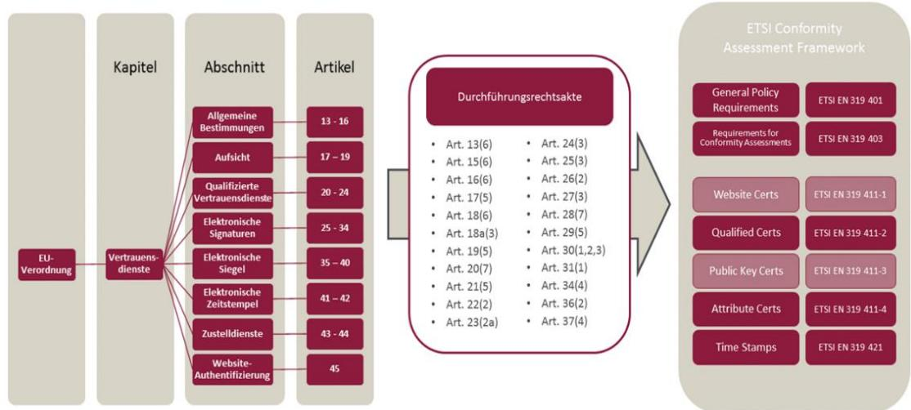

Abbildung 1: Beziehung eIDAS, Durchführungsrechtsakte und ETSI-Standardisierung

Für die Nutzung elektronischer Signaturen, Siegel und Zeitstempel in der Bundesverwaltung ist zudem die entsprechende Leitlinie der Bundesnetzagentur (BNetzA) maßgeblich3 .

In Deutschland wird die wirksame Durchführung von eIDAS durch das Vertrauensdienstegesetz (VDG) geregelt4 . Dieses sieht die Beweiswerterhaltung signierter Dokumente nach dem Stand der Technik in § 15 VDG vor. Als Stand der Technik gilt die [TR-ESOR5 ] des BSI.

### 2.1.2 Europäische Datenschutzgrundverordnung

Neben der eIDAS-Verordnung ist auf europäischer Ebene insbesondere seit Mai 2018 die Europäische Datenschutzgrundverordnung [EU-DSGVO6 ] zu nennen. Diese definiert EU-weit einheitliche Vorgaben zur Erhebung, Verarbeitung und Speicherung personenbezogener Daten. Im Kontext des Ersetzenden Scannens sind insbesondere die Rechte des Betroffenen sowie der Schutz der personenbezogenen Daten im gesamten Scanprozess von der Dokumentenvorbereitung bis zur Übergabe an das Zielsystem zu betrachten.

3 Vgl. Leitlinie für digitale Signatur-/Siegel-, Zeitstempel und Beweisdaten (Evidence Record) Formate. [\(https://www.bsi.bund.de/SharedDocs/Downloads/DE/BSI/Publikationen/TechnischeRichtlinien/TR03](https://www.bsi.bund.de/SharedDocs/Downloads/DE/BSI/Publikationen/TechnischeRichtlinien/TR03125/BSI_TR_03125_Leitlinie_fuer_digitale_Signatur-Siegel-Zeitstempelformate.pdf?__blob=publicationFile&v=1) [125/BSI\\_TR\\_03125\\_Leitlinie\\_fuer\\_digitale\\_Signatur-Siegel-](https://www.bsi.bund.de/SharedDocs/Downloads/DE/BSI/Publikationen/TechnischeRichtlinien/TR03125/BSI_TR_03125_Leitlinie_fuer_digitale_Signatur-Siegel-Zeitstempelformate.pdf?__blob=publicationFile&v=1)[Zeitstempelformate.pdf?\\_\\_blob=publicationFile&v=1\)](https://www.bsi.bund.de/SharedDocs/Downloads/DE/BSI/Publikationen/TechnischeRichtlinien/TR03125/BSI_TR_03125_Leitlinie_fuer_digitale_Signatur-Siegel-Zeitstempelformate.pdf?__blob=publicationFile&v=1)

4 Vgl. Vertrauensdienstegesetz vom 18. Juli 2017 (BGBl. I S. 2745), das durch Artikel 2 des Gesetzes vom 18. Juli 2017 (BGBl. I S. 2745) geändert worden ist

5 BSI TR-03125 Beweiswerterhaltung kryptographisch signierter Dokumente [\(https://www.bsi.bund.de/DE/Themen/Unternehmen-und-Organisationen/Standards-und-](https://www.bsi.bund.de/DE/Themen/Unternehmen-und-Organisationen/Standards-und-Zertifizierung/Technische-Richtlinien/TR-nach-Thema-sortiert/tr03125/TR-03125_node.html)[Zertifizierung/Technische-Richtlinien/TR-nach-Thema-sortiert/tr03125/TR-03125\\_node.html\)](https://www.bsi.bund.de/DE/Themen/Unternehmen-und-Organisationen/Standards-und-Zertifizierung/Technische-Richtlinien/TR-nach-Thema-sortiert/tr03125/TR-03125_node.html)

6 EU-DSGVO [\(https://eur-lex.europa.eu/legal-content/DE/TXT/?uri=CELEX:32016R0679\)](https://eur-lex.europa.eu/legal-content/DE/TXT/?uri=CELEX:32016R0679)

### 2.1.3 Beweiswert elektronischer Unterlagen und relevante Rechtsprechung

#### Beweiswert und Nachweisführung

Entsprechend der Forderungen nach Transparenz und Nachvollziehbarkeit des Verwaltungshandelns und zur Beweisfähigkeit muss die Verwaltung sicherstellen, Dokumente als Beweismittel vor Gericht verwenden zu können. Für eine formelle Anerkennung von Dokumenten ist deren Beweiswert entscheidend. Als Beweiswert wird dabei die Eignung eines Dokuments bezeichnet, die Überzeugung des Gerichts vom Vorliegen einer Tatsache, d. h. des Inhalts des Dokuments, zu beeinflussen (vgl. [DIN 31647]).

Der Beweiswert elektronischer Unterlagen ergibt sich aus den §§ 371 ff. Zivilprozessordnung (ZPO). Diese Regelungen gelten gemäß u. a. § 98 Verwaltungsgerichtsordnung (VwGO) auch für die Verfahren, die vor Verwaltungsgerichten geführt werden7 . Die nachfolgende Tabelle fasst den Beweiswert elektronischer Dokumente zusammen:

| Vom Bürger/Unternehmen                                                                                               |                                                                  | Von Behörden                                                            |                                                                         |
|----------------------------------------------------------------------------------------------------------------------|------------------------------------------------------------------|-------------------------------------------------------------------------|-------------------------------------------------------------------------|
| Private elektr. Dokumente ohne qualifizierte elektr. Signatur                                                  | Private elektr. Dokumente mit qualifizierter elektr. Signatur | Offentliche elektr. Dokumente ohne qualifizierte elektr. Signatur | Öffentliche elektr. Dokumente mit qualifizierter elektr. Signatur |
| Freie Beweiswürdigung des Richters                                                                                | Anschein für Fchtheit                                            | Freie Beweiswürdigung des Richters                                   | Vermutung für Echtheit                                                  |
| Beweiswert des qualif. Elektronischen Sich aus Art. 35 eIDAS: Authentizität und Integrität faktischer Anscheinsbewes |                                                                  |                                                                         |                                                                         |

#### Abbildung 2: Beweiswert elektronischer Unterlagen

Wesentlich ist, dass diese Vorgaben allein für originär elektronisch entstandene Unterlagen gelten. Sofern Dokumente durch öffentliche Stellen nach dem Stand der Technik (ersetzend) gescannt werden und mit einer qualifizierten elektronischen Signatur versehen sind, so gilt die Vermutung der Echtheit (§ 371b ZPO). Als Stand der Technik gilt auch hier die [TR-RESISCAN] des BSI.

Für die öffentliche Verwaltung ist darüber hinaus zu beachten, dass der Beweis anhand von Akten und den darin enthaltenen Dokumenten geführt wird (§ 99 VwGO). Es ist also notwendig, erst einmal Akten zu bilden und Dokumente im Aktenzusammenhang zu führen und aufzubewahren. Das einzelne Dokument ist also nicht ausreichend. Vielmehr führt, unabhängig vom Beweiswert der elektronischen oder papiernen Dokumente, eine unvollständige Aktenführung regelmäßig zu einer Beweislastumkehr zuungunsten der Verwaltung. Für die Verwaltung resultieren daraus hinsichtlich der Verwendung von Dokumenten vor Gericht zwei Anforderungen:

• Aktenvollständigkeit und

• Beweiswert der Dokumente.

Die Verwaltung muss sicherstellen, dass elektronische Unterlagen jederzeit verlustfrei als Beweismittel vor Gericht verwendet werden können. Hierzu gehört auch, dass ein einfaches Ausdrucken der elektronischen Akte als nicht gerichtsfest angesehen werden kann, was aktuell u.a. vom Verwaltungsgericht Wiesbaden bestätigt wird. Der Beweis muss also anhand einer E-Akte geführt werden, da auch das Ausdrucken regelmäßig eine Transformation, hier vom elektronischen Original zur papiernen Kopie, darstellt.

7 Nach dem E-Justice-Gesetz gelten diese Angaben auch für De-Mails mit einer vom De-Mail-Provider qualifiziert signierten Absenderbestätigung vgl. [E-JusticeG] [\(http://www.bgbl.de/xaver/bgbl/start.xav?startbk=Bundesanzeiger\\_BGBl&jumpTo=bgbl113s3786.pdf\)](http://www.bgbl.de/xaver/bgbl/start.xav?startbk=Bundesanzeiger_BGBl&jumpTo=bgbl113s3786.pdf).

#### Relevante Rechtsprechung

Mit den Urteilen vom 28. Februar 2014 (vgl. Az. 6 K 152/14 WI.A), vom 26. September 2014 (vgl. Az. 6 K 691/14 WI.A) sowie vom 20. Januar 2015 (vgl. Az. 6 K 1567/14.WI) hat u.a. das Verwaltungsgericht Wiesbaden mehrmals zu den Themen Ersetzendes Scannens und der Aktenführung Stellung bezogen. Als Grundlage für eine Anerkennung von Scanprodukten durch das Gericht wurden jeweils sowohl die Durchführung der Analysen und Maßnahmen nach der [TR-RESISCAN] des BSI sowie die notwendige Verfahrensdokumentation durch die betreffenden Behörden gefordert. Mit Blick darauf besonders hervorgehoben wurden:

- die Durchführung einer Qualitätskontrolle,
- die Gewährleistung der Sicherheit des Scanprozesses, einschließlich der gescannten Dokumente, der verwendeten Technik und Kommunikation,
- die Sicherstellung des Datenschutzes bei personenbezogenen Daten,
- die Dokumentation und Zertifizierung des Scanprozesses,
- die Lesbarkeit und optische Klarheit des Scanprodukts,
- der Nachweis der bildlichen und inhaltlichen Übereinstimmung von Scanprodukt und papiernem Original,
- die Bestätigung der bildlichen und inhaltlichen Übereinstimmung durch einen Transfervermerk mittels qualifizierter elektronischer Signatur (QES) (oder Siegel)

Neben der Beachtung der [TR-RESISCAN] zum Ersetzenden Scannen wurde die Vollständigkeit und Nachvollziehbarkeit der elektronischen Akten gefordert. Deren Nichtvorhandensein wurde unmittelbar zuungunsten der Behörden bewertet. Ebenso wurde die Beweiswerterhaltung gemäß [TR-ESOR] explizit gefordert. Die Nichtbeachtung des Stands der Technik [TR-RESISCAN, TR-ESOR] sowie der oben genannten Grundsätze führte in der Regel zu einem negativen Prozessergebnis für die Behörden. Teilweise verlief bereits die formelle Beweiswürdigung kritisch, das bedeutet, die Dokumente wurden unabhängig von deren Inhalt nicht als Beweismittel anerkannt.

Auch das Oberverwaltungsgericht Mecklenburg-Vorpommern hat im Grundsatzurteil vom 22. Dezember 2000 klargestellt, wie umfangreich die Pflicht zur Aktenführung in der öffentlichen Verwaltung ist. Hiernach muss die Behörde alle wesentlichen Vorgänge zur Akte nehmen. Dieses bezieht sich auf alle schriftlichen Äußerungen von Beginn bis zum Ende des Verfahrens, und zwar unabhängig von deren Bedeutung.

Die Behörde hatte in diesem Fall Schriftsätze weder in die Hauptakte noch in die Sammelakte aufgenommen. Das Gericht ging daher von einer Unterdrückung zukünftiger Beweismittel aus und stellte eine gerechtfertigte Umkehr der Beweislast zu Ungunsten der Behörde fest. Die Behörde verlor folglich das Verfahren.

Für Unternehmen ist die Simulationsstudie der Universität Kassel zu nennen, wonach ein Ersetzendes Scannen gemäß [TR-RESISCAN] und die Verwendung qualifizierter elektronischer Signaturen und Siegel einen signifikant höheren Beweiswert für Ersetzend gescannte Dokumente ermöglicht [Sim15]8 .

8 [https://www.uni-kassel.de/fb07/index.php?eID=dumpFile&t=f&f=824&token=b8d8700d471619](https://www.uni-kassel.de/fb07/index.php?eID=dumpFile&t=f&f=824&token=b8d8700d471619%20%09e58dd2c7c2784765e4d1ee0972) [e58dd2c7c2784765e4d1ee0972](https://www.uni-kassel.de/fb07/index.php?eID=dumpFile&t=f&f=824&token=b8d8700d471619%20%09e58dd2c7c2784765e4d1ee0972)

### 2.2 Öffentliche Verwaltung (Bund, Land, Kommunen, Körperschaften des öffentlichen Rechts etc.)

### 2.2.1 Aktenführungspflicht

Die öffentliche Verwaltung unterliegt als Teil der Exekutive gemäß Art. 20 Abs.3 Grundgesetz dem Rechtsstaatsprinzip. Aus dem Rechtsstaatsprinzip folgen die Grundprinzipien des Verwaltungshandelns. Im Kontext des Ersetzenden Scannens sind dabei besonders die nachstehenden zwei Prinzipien hervorzuheben:

- das Prinzip der Regelgebundenheit des Verwaltungshandelns sowie
- das Prinzip der Aktenmäßigkeit

Demgemäß ist die öffentliche Verwaltung in ihrem Handeln an Recht und Gesetz gebunden (Regelgebundenheit) und zur Nachvollziehbarkeit und Transparenz des Verwaltungshandelns also der behördlichen Prozesse und Entscheidungen gezwungen. Dies erfordert, dass der Stand eines Sachstands jederzeit aus den Akten erkennbar sein muss, was erfordert, dass die Akten entweder:

- vollständig in Papierform oder
- vollständig elektronisch

zu führen sind9 . Das Prinzip der Aktenmäßigkeit ist für die gesamte Dauer, in der die Unterlagen für die behördliche Aufgabenerfüllung benötigt werden, sicherzustellen. Dies ist die elementare Grundlage zur Prüfbarkeit und Kontrolle behördlicher Entscheidungen durch Prüfbehörden, Gerichte, Dritte und so auch zur Rechtssicherheit für die Verwaltung selbst. Dementsprechend muss eine ordnungsgemäße Schriftgutverwaltung, die dies sicherstellt, die

- Authentizität und Integrität,
- Verfügbarkeit,

- Nachvollziehbarkeit,
- Verkehrsfähigkeit,

und damit Vertrauenswürdigkeit des Schriftguts im Aktenzusammenhang bis hin zum Ablauf der geltenden Aufbewahrungsfrist gewährleisten. Dies umfasst regelmäßig neben der Erhaltung des Beweiswerts, auch die Aufbewahrung der Dokumente eines Vorgangs bzw. einer Akte in einem untrennbaren Zusammenhang. Eine lose Aufbewahrung einzelner Dokumente ohne Aktenzusammenhang ist also nicht zulässig.

### 2.2.2 E-Government-Gesetz

Das E-Government-Gesetz des Bundes10 ermöglicht in § 7 das Ersetzende Scannen für Bundesbehörden. Demgemäß ist das Ersetzende Scannen möglich, sofern das gewählte Scanverfahren dem Stand der Technik entspricht mit der Maßgabe der inhaltlichen wie bildlichen Übereinstimmung der digitalen Kopie. Als Stand der Technik gilt verbindlich die [TR-RESISCAN] des BSI im jeweils aktuellen Stand.

9 Das Führen einer zur vollständigen E-Akte korrespondierenden Papierrestakte für Dokumente, die nicht ausschließlich elektronisch geführt werden können oder dürfen, bleibt hiervon unberührt. Während der Zeit des Übergangs von der papiernen zur elektronischen Akte kann ein Hybridaktenbestand in Form der Bestandsakten bestehen, die zum Zeitpunkt der Einführung der E-Akte abgeschlossen und elektronisch weitergeführt werden.

10 E-Government-Gesetz [\(https://www.gesetze-im-internet.de/egovg/\)](https://www.gesetze-im-internet.de/egovg/)

Gemäß § 6 E-Government Gesetz sind Bundesbehörden verpflichtet, elektronische Akten zu führen. Ebenso definiert § 6 E-Government-Gesetz die Verpflichtung zur beweiswerterhaltenden Aufbewahrung nach dem Stand der Technik. Als solcher gilt verbindlich die [TR-ESOR] des BSI im jeweils aktuellen Stand.

Darüber hinaus verpflichtet § 2 Abs. 1 E-Government-Gesetz die Behörden, einen Zugang für qualifizierte elektronische Signaturen zu eröffnen.

### 2.3 Unternehmen

### 2.3.1 Abgabenordnung

Für Unternehmen, sowie für öffentliche Institutionen oder Teile dieser Institutionen, die als sogenannter Betrieb gewerblicher Art handeln, ist die Abgabenordnung anzuwenden.

Gemäß § 147 Abs.2 AO können für die Besteuerung relevante Unterlagen über die definierte Aufbewahrungsdauer unter Ausschluss der Jahresabschlüsse, der Eröffnungsbilanzen und der Unterlagen nach § 147 Abs.1 Nr.4a AO grundsätzlich auch als eine Wiedergabe auf einem Bildträger aufbewahrt werden (Ersetzendes Scannen). Es muss dabei gewährleistet werden, dass die bildliche und inhaltliche Übereinstimmung der Wiedergabe und der Urschrift sichergestellt ist und die Wiedergabe während der Aufbewahrungszeit jederzeit unverzüglich lesbar verfügbar ist und maschinell ausgewertet werden kann. Als Stand der Technik gilt hier u. a. gemäß der Simulationsstudie der DATEV die [TR-RESISCAN] des BSI [Sim15]11. Weiterhin gelten für die gescannten Unterlagen die Grundsätze zur ordnungsmäßigen Führung und Aufbewahrung von Büchern, Aufzeichnungen und Unterlagen in elektronischer Form sowie zum Datenzugriff.

Die wesentlichen Anforderungen an die Buchführung und in der Folge für die Digitalisierung buchführungsrelevanter Unterlagen sind zusammengefasst:

- Sicherung der Prüfbarkeit, Verfügbarkeit, Nachvollziehbarkeit, Lesbarkeit, Authentizität, Integrität und maschinelle Auswertbarkeit für die gesamte Dauer der Aufbewahrungsfrist
- Die maschinelle Auswertbarkeit gilt nicht für Aufzeichnungen in einem Textformat, die in einem DVgestützten Buchführungssystem (bspw. SAP) weiterverarbeitet werden können. Hinzu kommt die unveränderliche Speicherung der aufzubewahrenden Unterlagen.
- Ordnungsmäßigkeit, Vollständigkeit und Sicherheit des Gesamtverfahrens
- Zugriffskontrolle
- Schutz vor Manipulation

Bezogen auf elektronische Dokumente sind diese Maßgaben im Rahmen des Prinzips der Aktenmäßigkeit in der vollständigen E-Akte umzusetzen.

### 2.3.2 Handelsgesetzbuch

Für Unternehmen sowie den Fall, dass eine öffentliche Institution als Betrieb gewerblicher Art handelt, gilt für diese auch das Handelsgesetzbuch12. In den §§ 238 ff. HGB werden die Grundsätze ordnungsgemäßer Buchführung festgelegt. Gemäß § 239 Abs.4 und § 257 Abs.3 HGB können entsprechend die Handelsbücher

11 [https://www.uni](https://www.uni-kassel.de/fb07/index.php?eID=dumpFile&t=f&f=824&token=b8d8700d471619e58dd2c7c2784765e4d1ee0972)[kassel.de/fb07/index.php?eID=dumpFile&t=f&f=824&token=b8d8700d471619e58dd2c7c2784765e4d1ee0](https://www.uni-kassel.de/fb07/index.php?eID=dumpFile&t=f&f=824&token=b8d8700d471619e58dd2c7c2784765e4d1ee0972) [972](https://www.uni-kassel.de/fb07/index.php?eID=dumpFile&t=f&f=824&token=b8d8700d471619e58dd2c7c2784765e4d1ee0972)

12 Handelsgesetzbuch [\(https://www.gesetze-im-internet.de/hgb/\)](https://www.gesetze-im-internet.de/hgb/)

und sonstige kaufmännische Unterlagen i. d. R. (Ausnahmen beachten) in Form einer Wiedergabe auf einem Bildträger bzw. auf anderen Datenträger aufbewahrt werden.

### 2.3.3 Fachspezifische Regularien

Neben den o.g. Regelungen kommen zum regulatorischen Umfeld fachspezifische Regularien in Betracht. Diese wären im Einzelfall zu prüfen. Hierzu gehören beispielsweise:

| Branche                   | Beispielhafte Regularien                                                                                                                                                                                                                     |
|---------------------------|----------------------------------------------------------------------------------------------------------------------------------------------------------------------------------------------------------------------------------------------|
| Pharma                    | FDA 21 CFR Part 211 Subpart J Records and Report                                                                                                                                                                                          |
|                           | FDA 21 CFR Part 11 Electronic records; Electronic Signatures                                                                                                                                                                           |
|                           | Verordnung über die Anwendung der Guten Herstellungspraxis (GP) bei der Herstellung von Arzneimitteln und Wirkstoffen und über die Anwendung der guten fachlichen Praxis bei der Herstellung von Produkten menschlicher Herkunft |
| Luftfahrt                 | EASA Part. 21                                                                                                                                                                                                                                |
| Finanzwesen               | BAIT Vorgaben der BAFIN                                                                                                                                                                                                                   |
| Versicherungen            | Code of Conduct VAIT                                                                                                                                                                                                                      |
| Gesetzliche Krankenkassen | Leitfaden des Bundesversicherungsamts KRITIS                                                                                                                                                                                              |
| Energiewirtschaft         | Atomgesetz KRITIS                                                                                                                                                                                                                         |

Tabelle 3: Beispiele für branchenspezifische Regularien

### 2.4 Organisatorisches Umfeld

### 2.4.1 Grundsatz

Um den Anforderungen an Vertraulichkeit, Verfügbarkeit, Integrität sowie Nachvollziehbarkeit und damit der Nachweisbarkeit der zu scannenden Dokumente Genüge zu tun, erfolgt deren Digitalisierung gemäß den Vorgaben der [TR-RESISCAN] unter Berücksichtigung der in Kap. 2.3 benannten regulatorischen Rahmenbedingungen.

Je nach Wahl der organisatorischen Variante zum Ersetzenden Scannen (Inhouse, Outsourcing oder Mischvariante) sind entweder alle Kapitel des vorliegenden Dokuments durch die anwendende Organisation zu füllen oder auch nur einzelne Teile. So sind beim Inhouse-Scannen alle Kapitel relevant, beim Outsourcing nur die Schnittstellen zum Scandienstleister. Die Konzeption und Dokumentation des eigentlichen Scannens (Dokumentvorbereitung, Scannen, Nachbearbeitung, Integritätssicherung) und Übergabe an die Institution (digital und soweit notwendig Papieroriginale) obliegt dem Scandienstleister. Seitens der beauftragenden Institution sind nur die grundlegenden Anforderungen zu benennen, die Konzepte wie Verfahrensdokumentation abzunehmen respektive die Überwachung des Scandienstleisters im Sinne der Auftragsverarbeitung nach EU-DSGVO. Für den Scandienstleister gelten die gleichen Vorgaben der [TR-RESISCAN] wie beim Inhouse-Scannen, es sind auch die gleichen Nachweise zu erbringen (Strukturanalyse, Schutzbedarfsanalyse, Verfahrensdokumentation etc.).

Es ist empfehlenswert, durch die anwendende Institution, beim Outsourcing vom jeweiligen Scandienstleister die Zertifizierung des Scanprozesses gemäß [TR-RESISCAN] zu fordern und dies auch vertraglich festzuhalten. Dadurch wird der Nachweis der Konformität des Scannens zur TR-03138 erleichtert und der Aufwand zur Überwachung des Scandienstleisters durch den Auftraggeber begrenzt.

| Variante        | Relevante Teile generisches Scankonzept                        |
|-----------------|----------------------------------------------------------------|
| Inhouse-Scannen | Alle                                                           |
| Outsourcing     | Kap. 2.1-2.4 sowie bei 3.3, 3.4.1.1, 3.4.2.5, 3.4.2.6, 3.5 nur |
|                 | Schnittstellen zum Scandienstleister,                          |
| Mischvariante   | Inhouse-Teile: alle                                            |
|                 | Outsourcing-Teile: siehe Outsourcing                           |

Tabelle 4: Abgrenzung Fokus Scankonzept Inhouse vs. Outsourcing

Hinweis: Der Nachweis, dass ein Ersetzendes Scannen gemäß [TR-RESISCAN] erfolgte, kann durch Vorlage einer Verfahrensdokumentation nach den Vorgaben der TR-03138 oder durch Zertifizierung des Scanprozesses durch das BSI erfolgen. Im Falle des Outsourcings wäre bei Beschaffung des Scandienstleisters die spätere Zertifizierung des Scanprozesses gegen TR-03138 als MUSS-Kriterium durch die beschaffende Institution zu fordern. n zu fordern.

### 2.4.2 Inhouse-Scannen

#### 2.4.2.1 Grundsatz

Die zu scannenden Dokumente sowie die Differenzierung, welche Dokumenttypen Ersetzend, welche kopierend gescannt werden, enthalten Kap. 3.1 sowie Kap. 3.2.3.1.

Die Digitalisierung wird an jedem Arbeitstag Montag durchgeführt. Die Posteingänge werden gemäß folgender Regel gescannt

[z.B.:

- geringer Umfang
- keine besonderen Anforderungen an Papierqualität und Vielfalt der Formate
- Dringlichkeit
- •

#### 2.4.2.2 Varianten

Sofern beide Varianten zutreffen, sind beide Varianten zu beschreiben.

#### Variante 1:

Das Ersetzende sowie das kopierende Scannen erfolgt führend in der zentralen Scan-/Poststelle der [Muster-Institution]. Es wird frühes Scannen von zentral und dezentral eingehenden [Posteingängen]/[Bestandsakten] vorgenommen. Sofern Dokumente dezentral eingehen, werden diese gem. der [Richtlinie Posteingang] der zentralen Scanstelle zugeleitet und dort Ersetzend gescannt.

Die Aufbewah für eine Frist

#### Variante 2:

Das Ersetzende Scannen erfolgt an den Standorten:

| Standort    | Adresse         |
|-------------|-----------------|
| Musterstadt | Musterstraße 35 |
| Musterdorf  | Musterplatz 1   |
|             |                 |
|             |                 |

Tabelle 5: Scanstandorte

Hinweis: Die TR-RESISCAN definiert keine besondere Technik für das Ersetzende Scannen. Dieses kann also sowohl mit marktüblicher Scanhard-/-software als auch an Multifunktionsgeräten erfolgen. Es ist lediglich darauf zu achten, dass die notwendigen Sicherheitsmaßnahmen, aufbauend auf den Ergebnissen der Strukturanalyse (Vgl. Kap. 3.2) sowie der Schutzbedarfsanalyse (Vgl. Kap. 3.3) getroffen werden.

Die Aufbewahrung der Papierdokumente bis zu deren Vernichtung erfolgt an den o.g. Standort/am für eine Fri

### 2.4.3 Outsourcing

Das Scannen erfolgt beim Dienstleister [Musterscan] am Standort

[Scandienstleister]

Musterstraße 1

0000 Musterstadt

Die sachliche Zuständigkeit für das Scannen verbleibt bei der Organisationseinheit (OE) [X] der [Musterinstitution]. Diese OE ist verantwortlich, das ordnungsgemäße Scannen gemäß [TR-RESISCAN] beim Scandienstleister sicherzustellen und zu überwachen. Dies umfasst auch die Festlegung des korrekten Papiereingangs beim Scandienstleister sowie die Art und Weise der Übertragung der Digitalisate sowie der in Papierform aufzubewahrenden Originaldokumente an die [Musterinstitution].

### 2.4.4 Mischvariante

Im Falle der Mischvariante also z.B. Inhouse-Scannen von Posteingängen und Outsourcing des Scannens von Bestandsakten, wären die Kap. 2.4.2 und 2.4.2 auf das Scankonzept der anwendenden Behörde zu übertragen.

### 2.4.4.1 Scannen von Posteingängen

Als Postadresse der [Musterinstitution] für den zentralen Posteingang gilt ab Einführung des Ersetzenden Scannens:

[Musterinstitution] c/o [Scandienstleister]

Postfach 0815

Musterstraße 1

#### 0000 Musterstadt

Dezentral eingehende Posteingänge werden, sofern sie Ersetzend gescannt werden sollen, vom Empfänger über die Poststelle der [Musterinstitution], dem [Scandienstleister] zugeleitet. Die Ablage der papiernen Originale bis zu deren Vernichtung erfolgt durch

#### 2.4.4.2 Scannen von Bestandsakten

papiernen Originale wie folgt vom Scandienstleister in der [Musterinstitution] digitalisiert. Die Aufbereitung der Bestands Die Abholung erfolgt in nachstehenden Perioden

- •
- •
- •

## 3 Ersetzendes Scannen

### 3.1 Grundlagen

### 3.1.1 Beschreibung des zu scannenden Schriftguts

### 3.1.1.1 Variante 1: Posteingänge

Es werden zentral und dezentral eingehende Posteingänge gescannt. Zentrale Eingänge umfassen diejenigen, umfassen diejenigen, di mitgebracht werden.

Diese umfassen die Papierformate [ ]. Nicht gescannt werden alle Dokumente, die in der Negativliste in Anlage 1 enthalten sind. Posteingänge, die gemäß Anlage 1 einer Scanfreigabe durch den Empfänger bedürfen, werden durch die Poststelle zunächst dem Empfänger ungeöffnet zugeleitet. Der Empfänger entscheidet, ob eine Veraktung und Scannen notwendig sind. Sofern die Dokumente Ersetzend zu scannen sind leitet der Empfänger diese

- Inhouse-Scannen: der zentralen Scanstelle
- Outsourcing: der verantwortlichen [Organisationseinheit Musterinstitution] zur Weitergabe an den Scandienstleister zu

Die Dokumente umfassen üblicherweise die Formate [A3/A4/A5 t sich um farbige und s/w-Dokumente. Die Dokumente unterscheiden sich nachfolgenden Kriterien:

- Zielinstanz
- Empfänger
- Beschaffenheit
- Dokumenttyp
- •

#### 3.1.1.2 Variante 2: Scannen von Bestandsakten

Es werden in Papierform vorliegende [ sowie das Schriftgut aus bestehenden [ gescannt. Dabei handelt es sich um Schriftgut, das in Aktenordnern vorliegt und einen laufenden Metern/Aktenordnern umfasst. Diese Bestandsakten werden [in einem Zeitraum on demand] durch die zentrale Scanstelle digitalisiert.

### 3.2 Strukturanalyse (Scansystem)

Hinweis: Grundsätzlich ist die Strukturanalyse durch die verantwortliche Institution nur durchzuführen, sofern ein Inhouse-Scannen erfolgt. Im Falle des Outsourcings obliegt die Strukturanalyse dem Scandienstleister.

Hinsichtlich des Scanguts sowie der Scanorganisation bestehen in der Strukturanalyse grundsätzlich keine Unterschiede. Die folgenden Ausführungen sind als Beispiele zu verstehen und vom Anwender auf seine konkreten Bedarfe anzupassen13 .

13 Beispiele und Templates für die Strukturanalyse enthält: Leitfaden: E-Scannen für Bundesbehörden. Ersetzendes Scannen gemäß EGovG und TR RESISCAN. Bundesministerium des Innern (Hrsg.). Berlin 2020

### 3.2.1 IT-Systeme und Anwendungen

| Nr. | Hardware                | Typ                                                   | Anzahl |
|-----|-------------------------|-------------------------------------------------------|--------|
| S1  | Scanner (Stapelscanner) | Maximum Scan                                          | 10     |
| S2  | Scan-Workstation        | Typ Superscan 350-4                                   | 10     |
| S3  | QS-Workstation          | Typ Supercontrol 450-4                                | 5      |
| S4  | Scanserver              | Server A (davon 1 Server als Ausfall- /Testsystem) | 2      |
| S5  | Indexserver             | Server B (davon 1 Server als Ausfall- /Testsystem) | 2      |
| S6  | Siegelserver            | Server C (davon 1 Server als Ausfall- /Testsystem) | 2      |
| S7  | Siegelkartenleser+Karte | Scansiegel 460-4                                      | 2      |
| S8  | Firewall                | Firewall Superschutz                                  | 1      |
| S9  | Router                  | Router A                                              | 1      |
|     | Software                | Art                                                   |        |
| A1  | Scan-Software           | Scansoftware Z (Scanclient)                           |        |
| A2  | QS-Software             | Scansoftware Z (QS-Client)                            |        |
| A3  | Index-Software          | Indexsoftware Superindex                              |        |
| A4  | Siegelsoftware          | Siegelsoftware B                                      |        |

Das Ersetzende Scannen erfolgt innerhalb der folgenden Systemumgebung:

Tabelle 6: Beispielhaftes Scansystem

Es gilt folgender Netzplan. Der Übersicht halber wurde nur jeweils 1 Exemplar der jeweiligen Hardware dargestellt. Die angegebenen Maßgaben gelten für alle Hardwarekomponenten äquivalent.

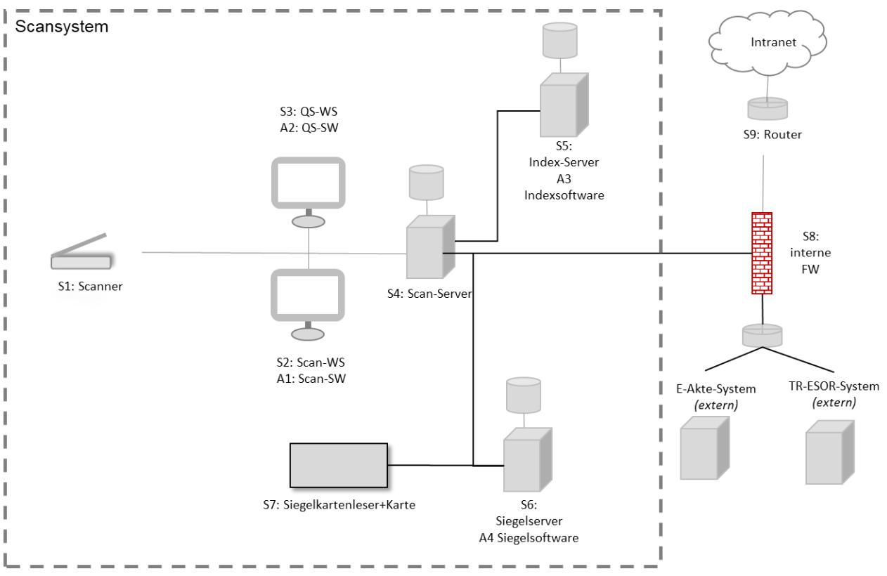

Abbildung 3: Einfacher Netzplan

### 3.2.2 Kommunikationsverbindungen

Tabelle 7: Kommunikationsverbindung

Es gelten folgende Kommunikationsverbindungen gemäß nachstehendem erweitertem Netzplan:

| Nr. | Von | Zu             | Beschreibung                                                  |
|-----|-----|----------------|---------------------------------------------------------------|
| K1  | S5  | E-Akte System  | Die Kommunikationsverbindung dient der Übertragung der        |
|     |     | (extern)       | Ersetzend gescannten Dokumente einschließlich Metadaten,      |
|     |     | TR-ESOR-System | Transfervermerk und Integritätssicherung in die Zielsysteme E |
|     |     | (extern)       | Akte und TR-ESOR. Die Dokumente werden dabei [redundant]/     |
|     |     |                | [nur Metadaten in E-Akte] / [                                 |

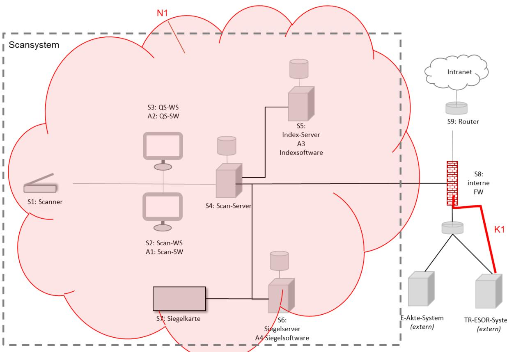

Abbildung 4: Erweiterter Netzplan

### 3.2.3 Datenobjekte

Es gelten die folgenden Datenobjekte

| ID  | Datenobjekt       | Beschreibung                                                         |
|-----|-------------------|----------------------------------------------------------------------|
| D0  | Papier-Schriftgut | Schriftgut [Posteingänge], [Bestandsakten]                           |
|     | aus dem           |                                                                      |
|     | Posteingang       |                                                                      |
| D1  | Scanrelevantes    | Papierdokumente, die durch geeignete Vorbereitung aus dem            |
|     | Original          | eingegangenen Schriftgut gewonnen werden konnten                     |
| D2  | Scanprodukt       | Elektronisches Abbild des Papierdokumentes (D1); dieses wird durch   |
|     |                   | den Scanner erzeugt und ggf. von der Scansoftware nachbearbeitet     |
| D.3 | Index- und        | Dem Scanprodukt manuell oder automatisch (über OCR-Software)         |
|     | Metadaten         | beigelegte Daten, die das Auffinden und Nutzen des später abgelegten |

| ID | Datenobjekt       | Beschreibung                                                       |
|----|-------------------|--------------------------------------------------------------------|
|    |                   | Scanproduktes ermöglichen bzw. erleichtern (z. B. eindeutige       |
|    |                   | Zuordnung zu einem Vorgang)                                        |
| D4 | Transfervermerk14 | Ein Transfervermerk dokumentiert, durch wen und wann die           |
|    |                   | Digitalisierung der Urschrift vollzogen wurde (vgl. [TR-RESISCAN], |
|    |                   | Anlage R, Kapitel R.2.7.4)                                         |
| D5 | Sicherungsdaten   | Datenobjekte, die dem Schutz der Integrität und ggf. Authentizität |
|    |                   | anderer Datenobjekte dienen                                        |
| D6 | Protokolldaten    | Dokumentation der zusätzlichen, sicherheitsrelevanten Abläufe und  |
|    |                   | Ereignisse (Unterstützung der Nachweisbarkeit und                  |
|    |                   | Ordnungsmäßigkeit des Scanprozesses)                               |

Tabelle 8: Datenobjekte

### 3.3 Schutzbedarfsanalyse

### 3.3.1 Schutzbedarfskategorien und Schutzziele

Es gelten die Schutzbedarfskategorien und Schutzziele gem. BSI Grundschutzkompendium15:

#### Schutzbedarfskategorien:

| Schutzbedarfskategorie | Definition                                                                                                                                                                                                                     |
|------------------------|--------------------------------------------------------------------------------------------------------------------------------------------------------------------------------------------------------------------------------|
|                        | Die Schadensauswirkungen sind in der Regel begrenzt und überschaubar. Ein solcher Schaden induziert im Regelfall keine nennenswerten Konsequenzen für die am Geschäftsvorfall beteiligten Personen und Institutionen. |
|                        | Die Schadensauswirkungen sind in der Regel beträchtlich. Ein solcher Schaden führt im Regelfall zu beträchtlichen Konsequenzen für die am Geschäftsvorfall beteiligten Personen und Institutionen.                       |
|                        | Die Schadensauswirkungen können ein existenziell bedrohliches oder sogar katastrophales Ausmaß erreichen.                                                                                                                   |
|                        | Ein solcher Schaden kann zu existenziell bedrohlichen oder sogar katastrophalen Konsequenzen für die am Geschäftsvorfall beteiligten Personen und Institutionen führen.                                                  |

Tabelle 9: Schutzbedarfskategorien

14 Abhängig vom anwendbaren rechtlichen Rahmen wird dem Transfervermerk eine größere Bedeutung beigemessen. Insbesondere die Integrität und Authentizität des Transfervermerks kann mit Hilfe von adäquaten kryptographischen Verfahren (z. B. einer QES) geschützt werden.

15 BSI IT-Grundschutz-Kompendium [\(https://www.bsi.bund.de/DE/Themen/Unternehmen-und-](https://www.bsi.bund.de/DE/Themen/Unternehmen-und-Organisationen/Standards-und-Zertifizierung/IT-Grundschutz/IT-Grundschutz-Kompendium/it-grundschutz-kompendium_node.html)[Organisationen/Standards-und-Zertifizierung/IT-Grundschutz/IT-Grundschutz-Kompendium/it](https://www.bsi.bund.de/DE/Themen/Unternehmen-und-Organisationen/Standards-und-Zertifizierung/IT-Grundschutz/IT-Grundschutz-Kompendium/it-grundschutz-kompendium_node.html)[grundschutz-kompendium\\_node.html\)](https://www.bsi.bund.de/DE/Themen/Unternehmen-und-Organisationen/Standards-und-Zertifizierung/IT-Grundschutz/IT-Grundschutz-Kompendium/it-grundschutz-kompendium_node.html)

#### Schutzziele

| Grundwert       | Sicherheitsziel     | Definition                                                  |
|-----------------|---------------------|-------------------------------------------------------------|
| Integrität      | Integrität          | Integrität bedeutet, dass die Daten oder Systeme nicht      |
|                 |                     | verändert wurden. Bei einem wirksamen Integritätsschutz     |
|                 |                     | werden zudem zumindest Veränderungen erkannt.               |
|                 | Authentizität       | Unter der Authentizität von Daten versteht man, dass die    |
|                 |                     | Quelle der Daten eindeutig bestimmbar ist.                  |
|                 | Vollständigkeit     | Vollständigkeit bedeutet, dass der gegenseitige Bezug       |
|                 |                     | mehrerer, aufgrund eines inneren Zusammenhangs              |
|                 |                     | zusammengehöriger Datenobjekte, sichergestellt ist.         |
|                 | Nachvollziehbarkeit | Unter der Nachvollziehbarkeit eines Vorgangs versteht       |
|                 |                     | man, dass alle wesentlichen Schritte des Vorgangs von einer |
|                 |                     | unabhängigen Stelle nachgezeichnet werden können.           |
| Verfügbarkeit   | Verfügbarkeit       | Die Verfügbarkeit von Daten, Diensten, IT-Systemen, IT      |
|                 |                     | Anwendungen oder IT-Netzen ist vorhanden, wenn diese        |
|                 |                     | den Benutzern innerhalb akzeptabler Wartezeiten in der      |
|                 |                     | benötigten Form zur Verfügung stehen.                       |
|                 | Lesbarkeit          | Lesbarkeit bedeutet, dass die in den Daten enthaltenen      |
|                 |                     | Informationen erkannt werden können.                        |
|                 | Verkehrsfähigkeit   | Verkehrsfähigkeit bezeichnet die Möglichkeit, Dokumente     |
|                 |                     | und Akten von einem System zu einem anderen übertragen      |
|                 |                     | zu können, bei                                              |
|                 |                     | seine Integrität und Authentizität nachweisbar bleiben.     |
| Vertraulichkeit | Vertraulichkeit     | Vertraulichkeit ist die Verhinderung einer unbefugten       |
|                 |                     | Kenntnisnahme.                                              |
|                 | Löschbarkeit        | Unter Löschen von Daten ist das Entfernen der               |
|                 |                     | gespeicherten Daten zu verstehen. Dies ist gegeben, wenn    |
|                 |                     | die Daten unwiderruflich so behandelt worden sind, dass     |
|                 |                     | eigene Informationen nicht aus gespeicherten Daten          |
|                 |                     | gewonnen werden können, wenn also der Rückgriff auf         |
|                 |                     | diese Daten nicht mehr möglich ist.                         |

Tabelle 10: Schutzziele

### 3.3.2 Fachliche Schutzbedarfsanalyse

#### 3.3.2.1 Dokumenttypen

Hinweis: Die Festlegung der Dokumenttypen ist von der Scanorganisation unabhängig. Die nachfolgende Aufstellung ist ein Beispiel und vom Anwender auf seine Bedürfnisse anzupassen16 .

Es werden folgende Dokumenttypen Ersetzend gescannt:

- Rechnungen und Rechnungseingangsdokumente
- Vergabeunterlagen

16 Eine beispielhafte Aufstellung von Dokumenttypen enthält Leitfaden: E-Scannen für Bundesbehörden. Ersetzendes Scannen gemäß EGovG und TR RESISCAN. Bundesministerium des Innern (Hrsg.). Berlin 2020.

- Verträge und vertragsbegleitende Unterlagen
- Technische Dokumentationen
- Zulassungsunterlagen
- Standard Operating Procedures (SOPs) und Richtlinien
- •

### 3.3.2.2 Schutzbedarfsfeststellung

Hinweis: Die Festlegung der Schutzbedarfe für die zu scannenden Dokumenttypen ist von der Scanorganisation unabhängig. Die nachfolgende Aufstellung ist ein Beispiel und vom Anwender auf seine Bedürfnisse anzupassen. Bei der Durchführung der Schutzbedarfsanalyse empfiehlt sich die Anwendung des aus dem BSI Grundschutz bekannten Maximumprinzips. Dabei bestimmt der Schaden bzw. die Summe der Schäden mit den schwerwiegendsten Auswirkungen den Schutzbedarf des Prozesses oder Verfahrens. Bei dem Ersetzenden Scannen wird der Schutzbedarf durch die zu scannenden Dokumenttypen definiert. Sofern nur aufweisen, empfiehlt es sich, diese nur kopierend oder gar nicht zu scannen, um den Aufwand für die Umsetzung zu begrenzen.

Für die in Kap. 3.3.2.1 genannten Dokumenttypen gilt, unter Anwendung des Maximumprinzips, der 17 .

### 3.4 Sicherheitsmaßnahmen

Hinweis: Die im Folgenden beschriebenen Maßnahmen sind als Beispiele zu verstehen und vom Anwender auf seine konkreten Bedürfnisse anzupassen.

### 3.4.1 Generelle Maßnahmen

3.4.1.1 Organisatorische Maßnahmen

#### 3.4.1.1.1 Verantwortlichkeiten im Scanprozess

Hinweis: Wesentliche Unterschiede bestehen zwischen Inhouse-Scannen und Outsourcing. Bei den hier genannten Inhalten handelt es sich um Beispiele, die vom Anwender auf seine Bedürfnisse anzupassen sind.

#### Variante 1: Inhouse-Scannen

Es bestehen folgende Verantwortlichkeiten in den einzelnen Schritten im Scanprozess. Die Gesamtsteuerung des Ersetzenden Scannens obliegt der Rolle [Scansupervisor] der zentralen Scanstelle. Eine Übersicht der in den Rollen Die Aufgaben in den einzelnen Schritten ergeben sich aus Kap. 3.5.

17 Eine Musterschutzbedarfsanalyse enthält Leitfaden: E-Scannen für Bundesbehörden. Ersetzendes Scannen gemäß EGovG und TR RESISCAN. Bundesministerium des Innern (Hrsg.). Berlin 2020.

| Prozessschritt            | Verantwortlichkeit in der zentralen Scanstelle |
|---------------------------|------------------------------------------------|
| Dokumentenvorbereitung    | Dokumentaufbereiter                            |
|                           |                                                |
|                           | Prüfung Dokumentenvorbereitung                 |
| Scannen                   | Scanoperator                                   |
| Dokumentennachbereitung18 | Qualitätssicherung                             |
| Integritätssicherung      | Qualitätssicherung                             |

Tabelle 11: Verantwortliche Rollen je Prozessschritt im Scanprozess (Inhouse-Scannen)

#### Variante 2: Outsourcing

#### Posteingang

Die Posteingänge gehen direkt beim [Dienstleister] ein, die vollständigen Prozessschritte obliegen dem [Dienstleister]. Die Steuerung des [Dienstleister] liegt in Verantwortung von [Scansupervisor/Informationssicherheitsbeauftragter]. Die Steuerung umfasst [Richtlinien/jährliche Audits durch unabhängige Prüfstelle/Prüfung der Verfahrensdokumentation des Dienstleisters/Nachweis der Zertifizierung des Scanprozesses gegen [TR-RESISCAN] und Überwachung der Re-

#### Bestandsakten

Die Ersetzend zu scannenden Bestandsakten werden durch die [Fachabteilung] der [zentralen Scanstelle] zugeleitet und von dieser an den [Dienstleister] weitergeleitet. Die Übergabe an den [Dienstleister] erfolgt in Übergabenachweis mit folgenden Angaben [Datum der Übergabe, Anzahl der den [Dienstleister] [per

#### 3.4.1.1.2 Regelungen für Wartungs- und Reparaturarbeiten

Wartungs- und Pflegearbeiten gemäß den Handbüchern der Scanhardware und Scansoftware erfolgen durch den verantwortlichen [Systembetreuer der IT-Abteilung/Dienstleister/...]. Die fachliche Einweisung der verantwortlichen Person und deren Stellvertretung obliegt der [Leitung Scanstelle] bzw. deren Stellvertretung.

Die Beauftragung, Durchführung und ggf. Kontrolle von Wartungs- und Reparaturaufgaben obliegt der [IT-Abteilung].

Es gilt der Freigabeprozess gemäß [geltendem Informations-Sicherheits-Management-Systems (ISMS) ].

Durch die ordnungsmäßige und ununterbrochene Nutzung der in Kap. 3.2 aufgeführten Hard- und Software gemäß der vorliegenden Verfahrensanweisung wird insbesondere sichergestellt, dass die in Kap. 2.1 - 2.3 aufgeführten rechtlichen Rahmenbedingungen eingehalten werden.

Gleichzeitig wird sichergestellt, dass das Scanprodukt gemäß [TR-RESISCAN] mit den ursprünglichen papiergebundenen Unterlagen bildlich und inhaltlich übereinstimmen. Die Scanprodukte sind während der Dauer der Aufbewahrungsfrist verfügbar und können jederzeit innerhalb angemessener Frist lesbar gemacht werden.

Bei einer Änderung des Scansystems wird neben der Dokumentation der Systemänderung sichergestellt,

18Je zentralisierter das Ersetzende Scannen in einer Organisation erfolgt, desto eher ist erfahrungsgemäß eine einstufige Qualitätssicherung ausreichend, je dezentraler (mehr Scanarbeitsplätze an verschiedenen Orten), desto eher wäre eine mehrstufige Qualitätssicherung empfehlenswert.

dass die Integrität, Vertraulichkeit und Verfügbarkeit der Scanprodukte einschl. des Transfervermerks der Dokumente gewährleistet bleibt.

#### 3.4.1.1.3 Aufrechterhaltung der Informationssicherheit

Für die Informationssicherheit im Scanprozess ist der [Informationssicherheitsbeauftragte der Musterinstitution] verantwortlich.

In angemessenen zeitlichen Abständen erfolgt durch den [Informationssicherheitsbeauftragten der Musterinstitution] eine Überprüfung der Wirksamkeit und Vollständigkeit der für die Informationssicherheit beim Ersetzenden Scannen vorgesehenen Maßnahmen.

Mindestens alle [X Jahre] werden Audits durchgeführt. Die fachliche Kompetenz und Unabhängigkeit für die qualifizierte Durchführung der Audits ist gewährleistet durch die Beauftragung einer vom BSI zertifizierten Stelle.

Die Ergebnisse dieses Audits werden schriftlich dokumentiert. Sofern Sicherheitslücken oder andere Probleme gefunden werden, werden entsprechende Korrekturmaßnahmen durchgeführt.

#### 3.4.1.1.4 Anforderungen an das Outsourcing

#### Variante 2: Outsourcing

Die Verantwortlichkeiten sind in Kap. 3.4.1.1 und 3.4.1.2 definiert, die Schnittstellen zwischen [Musterinstitution] und [Dienstleister] sind in Kap. 3.5 beschrieben. Der [Dienstleister] wird durch den [Informationssicherheitsbeauftragten der Musterinstitution] auf die im [Lastenheft] definierten Sicherheitsanforderungen verpflichtet. Die Analyse der Risiken der Aufgabenteilung zwischen

Mindestens [einmal jährlich/mon [Dienstleister]. Die Prüfung erfolgt auf Basis der [Anlage P der TR-RESISCAN/Checkliste des

3.4.1.2 Personelle Maßnahmen

#### 3.4.1.2.1 Grundlegende Maßnahmen

In den Scanprozess sind ausschließlich Beschäftigte der [zentralen Scanstelle] eingebunden. Die Beschäftigten der [zentralen Scanstelle] werden durch die/den zuständigen [Scansupervisor] unterstützt und angeleitet.

#### 3.4.1.2.2 Verpflichtung der Mitarbeitenden der Scanstelle

Die in Kap. 2.2 - 2.3 aufgeführten rechtlichen Rahmenbedingungen werden den in den Scanprozess involvierten Beschäftigten vor dem Start des Ersetzenden Scannens per Schulung zur Kenntnis gebracht. Änderungen werden in regelmäßigen Abständen [monatlich/jährlich] vermittelt.

Die Mitarbeitenden werden auf die Einhaltung der einschlägigen Gesetze, Vorschriften, Regelungen und der Verfahrensanweisung verpflichtet. Die Verpflichtung ist aktenkundig zu machen.

Diese Verpflichtung erfolgt durch den [Scansupervisor].

#### 3.4.1.2.3 Einweisung in ordnungsgemäße Bedienung des Scansystems

Die [Scanoperator] und [Qualitätssicherung 1] sowie [Qualitätssicherung 2/Freigabe] werden durch den hinsichtlich der eingesetzten Geräte, Anwendungen und sonstigen Abläufe im Rahmen einer Schulung aktenkundig eingewiesen. Dies umfasst insbesondere:

- die grundsätzlichen Abläufe im Scanprozess einschließlich der Dokumentenvorbereitung, dem Scannen, der zulässigen Nachbearbeitung und der Integritätssicherung,
- die geeignete Konfiguration und Nutzung des Scanners und der Scan-Workstation,
- Anforderungen hinsichtlich der Qualitätssicherung,
- die Abläufe und Anforderungen bei der Erstellung des Transfervermerks,
- das Verhalten im Fehlerfall.
- •

#### 3.4.1.2.4 Einweisung bezüglich der Sicherheitsmaßnahmen im Scanprozess

Die [Scanoperator] und [Qualitätssicherung 1] sowie [Qualitätssicherung 2/Freigabe], werden durch den [Scansupervisor/Systembetreuer der IT/ISB/DSB hinsichtlich der eingesetzten Geräte, Anwendungen und sonstigen Abläufe entsprechend der Sicherheitsmaßnahmen im Rahmen einer Schulung aktenkundig eingewiesen. Dies umfasst insbesondere:

- die grundsätzliche Sensibilisierung der Mitarbeiter für Informationssicherheit19 ,
- personenbezogene Sicherheitsmaßnahmen im Scanprozess,
- systembezogene Sicherheitsmaßnahmen im Scansystem,
- Verhalten bei Auftreten von Schadsoftware,
- Bedeutung der Datensicherung und deren Durchführung,
- Umgang mit personenbezogenen und anderen sensiblen Daten,
- Einweisung in Notfallmaßnahmen (Havarie),
- •

#### 3.4.1.2.5 Schulung des Wartungs- und Administrationspersonals

Die verantwortlichen Mitarbeiter für Wartungs- und Administrationsaufgaben, für die in den Scanprozess involvierten IT-Systeme und Anwendungen, wurden hinsichtlich der hierfür notwendigen Kenntnisse über die eingesetzten IT-Komponenten

- Systemaufbau
- Schnittstellen
- Architektur
- Administration
- Wartung und Pflege
- •

19 Vgl. 3.4.1.2.6

#### 3.4.1.2.6 Sensibilisierung der Beschäftigten zur Informationssicherheit

Die Einweisung und Sensibilisierung in bzw. für die Informationssicherheit erfolgt für die in Kap. 3.4.1.1.1 und 3.4.1.1.2 genannten Mitarbeitenden anhand der vorbereitenden, digitalisierenden, archivierenden, kontrollierenden, freigebenden und vernichtenden Aufgaben eine jährliche Unterweisung hinsichtlich der Sicherheitsfragen beim Ersetzenden Scannen in Verantwortung des [Informationssicherheitsbeauftragten]. Hierzu wird ein Protokoll angefertigt und aufbewahrt. Die Mitarbeiter verpflichten sich in dieser Schulung explizit zur Einhaltung dieser Verfahrensanweisung. Dieser Nachweis wird aufbewahrt.

Bei einem Wechsel des Personals [zentralen Scanstelle] erfolgt eine Unterweisung in das Ersetzende Scannen sowie eine Schulung zur ordnungsmäßigen Bedienung des Scansystems durch den [Scansupervisor] in Abstimmung mit dem [Informationssicherheitsbeauftragten]. Hierzu wird ein Protokoll angefertigt und aufbewahrt. Die Mitarbeiter verpflichten sich in dieser Schulung explizit zur Einhaltung dieser Verfahrensanweisung. Dieser Nachweis wird aufbewahrt.

#### 3.4.1.3 Technische Maßnahmen

Hinweis: Die Technischen Maßnahmen leiten sich aus den für das in Kap. 3.2.1 definierte Scansystem ab. Hierzu werden die entsprechenden Bausteine aus dem BSI-Grundschutzkompendium und basierend auf diesen die konkreten Maßnahmen definiert.

#### 3.4.1.3.1 Grundlegende Maßnahmen

Bezogen auf das in Kap. 3.1. beschriebene Scansystem sind folgende IT-Grundschutz-Bausteine (Edition 2021) relevant. Die konkreten Maßnahmen sind im [Sicherheitskonzept] zum Scansystem beschrieben:

| ID     | IT-Systeme, Netze und Anwendungen   | Bausteine aus dem Grundschutz-Kompendium                                                  |
|--------|----------------------------------------|-------------------------------------------------------------------------------------------|
| S1     | Scanner                                | SYS.4.1 Drucker, Kopierer und Multifunktionsgeräte                                     |
| S2     | Scan-Workstation                       | Abhängig vom Betriebssystem sind möglicherweise folgende Bausteine zu berücksichtigen: |
|        |                                        | SYS.2.1 Allgemeiner Client                                                                |
|        |                                        | SYS.2.2.2 Clients unter Windows 8.1                                                       |
|        |                                        | SYS.2.2.3 Clients unter Windows 10                                                        |
|        |                                        | SYS.2.3 Clients unter Linux und Unix                                                      |
|        |                                        | SYS.2.4 Clients unter macOS                                                               |
| S3     | Qualitätssicherung (QS)-Workstation | Siehe S2.                                                                                 |
| S4     | Scan-Server                            | Abhängig vom Betriebssystem sind möglicherweise folgende Bausteine zu berücksichtigen: |
|        |                                        | SYS.1.1 Allgemeiner Server                                                                |
|        |                                        | SYS.1.2.2 Windows Server 2012                                                             |
|        |                                        | SYS.1.3 Server unter Linux und Unix                                                       |
| S5     | Index-Server                           | Siehe S4.                                                                                 |
| S6     | Siegelserver                           | Siehe S4.                                                                                 |
|        |                                        | CON 1 Kryptokonzept                                                                    |
| S7     | Siegel-Kartenleser +                   | Benutzerdefinierter Baustein                                                              |
|        | Karte                                  |                                                                                           |
| S8     | Interne Firewall                       | NET.3.2 Firewall                                                                       |
| N x | Relevante Netze                        | NET.1.1 Netzarchitektur und -design                                                    |
|        |                                        | NET.1.2 Netzmanagement                                                                 |

| ID | IT-Systeme, Netze und | Bausteine aus dem Grundschutz-Kompendium |
|----|-----------------------|------------------------------------------|
|    | Anwendungen           |                                          |
| A1 | Scan-Software         | APP.3.1 Webanwendungen                |
|    |                       | APP.6 Allgemeine Software             |
| A2 | QS-Software           | Siehe A1.                                |
| A3 | Index-Software        | APP.3.1 Webanwendungen                |
|    |                       | APP.4.3 Relationale Datenbanksysteme  |
|    |                       | APP.6 Allgemeine Software             |
| A4 | Siegel-Software       | CON 1 Kryptokonzept                   |
|    |                       | APP.3.1 Webanwendungen                |
|    |                       | APP.6 Allgemeine Software             |

Tabelle 12: Relevante Grundschutzbausteine für grundlegende technische Maßnahmen

#### 3.4.1.3.2 Zugangskontrolle für die Scanräume

Die Scanräume sind so gesichert, dass der Zutritt für nicht berechtigte Mitarbeitende ausgeschlossen ist sowie unbefugte Personen keinen Zugriff auf die Hard-/Software erlangen können. Beim Verlassen des Scanraumes wird durch das Personal der [zentralen Scanstelle] der Raum verschlossen.

### 3.4.2 Maßnahmen im Scanprozess

#### 3.4.2.1 Dokumentenvorbereitung inkl. Eingang des Dokuments

#### 3.4.2.1.1 Vorsortierung und initiale Prüfung

Dokumente werden nach ihrem Eingang in der [zentralen Scanstelle] bearbeitet. Von der [zentralen Scanstelle] wird auf dem eingehenden Dokument ein tagesaktueller Posteingangsstempel angebracht20. Es erfolgt eine Vorsortierung und Vorbereitung.

Ist der Posteingang an eine bestimmte Person adressiert bzw. trägt der Eingang den Aufdruck v Verschlusssache (VS) o.ä. bleibt der Posteingang verschlossen und wird ungeöffnet an die jeweilig zuständige Organisationseinheit oder Person weitergeleitet. Die Vertraulichkeit derartiger Dokumente ist stets zu gewährleisten. Eine spätere Zuleitung zur [zentralen Scanstelle] erfolgt ausschließlich nach Freigabe wie in Kap[. 3.1.1.1](#page-16-4) beschrieben.

Die Eingänge werden durch die [zentrale Scanstelle] auf Echtheit und Unversehrtheit geprüft. Folgende Anzeichen können Zweifel an Unversehrtheit und Echtheit hervorrufen: Beschädigungen oder Risse, fehlende Seiten, beispielsweise erkennbar an durchbrochener fortlaufender Nummerierung, fehlende Form und das Fehlen von Stempeln oder Unterschriften auf Originalen. Bei Vorliegen solcher Anzeichen, werden die Dokumente aus dem Scanprozess exkludiert.

#### 3.4.2.1.2 Identifikation der zu scannenden Dokumente (fachliche Prüfung)

Anhand von Positiv- bzw. Negativlisten wird durch die für das Scannen zuständigen Beschäftigten ermittelt, welche Dokumente dem weiteren Scanprozess zugeführt werden. Die Negativliste findet sich in Anlage 1.

Die zu digitalisierenden Dokumente werden jeweils auf der ersten Seite mit einem [QR-Code/Barco gekennzeichnet. Es wird beachtet, dass mit dem Etikett keine Informationen auf dem Dokument überklebt werden. Für folgende [Dokumenttypen] werden Vorblätter mit einem [QR-Code] ausgedruckt. Anhand dieses QR-Codes werden im weiteren Verfahren die Dokumente im Scanstapel automatisch getrennt, mit

20 Dies kann auch durch eine Poststelle oder eine andere Organisationseinheit erfolgen. Die konkrete Ausprägung ist durch den Anwender entsprechend seiner Organisation zu beschreiben.

entsprechender Indizierung versehen und klassifiziert. Die Dokumente werden in [chronologischer Reihenfolge] gestapelt.

Dieses Vorgehen ist gültig sowohl für das Scannen von Posteingängen als auch das Scannen von Bestandsakten.

Die [QR-Codes ] werden [per Hand anhand von Druckvorlagen (PDF-Dateien) erstellt] / [automatisch generiert] . Druckvorlagen finden sich im [Verzeichnis der Druckvorlagen ] und .

Die Prüfung der Dokumentenzuordnung sämtlicher Unterlagen sowie weitere erforderliche Entscheidungen erfolgen während der [Dokumentenvorbereitung] / [Qualitätssicherung] / [der Weiterverarbeitung] und obliegen [dem Scanpersonal] / [der zuständigen Sachbearbeitung] / [der Organisationseinheit].

#### 3.4.2.1.3 Dokumentenvorbereitung und technische Prüfung

Um die Verarbeitung durch den Scanner technisch zu ermöglichen und ein originalgetreues Abbild der Dokumente zu erzeugen, prüft das Scanpersonal folgende Kriterien und die Notwendigkeit vorbereitender Maßnahmen an den Dokumenten:

Für das Scannen mittels Einzugs eignen sich nur lose, ungeheftete Papierdokumente von der Größe [Minimalgröße z. B. DIN A6] bis zur Größe [Maximalgröße z. B. DIN A3]. Dokumente außerhalb dieses Größenintervalls dürfen nicht in den automatischen Einzug eingelegt werden, sie können mittels Flachbettscannen digitalisiert werden. Das beim Flachbettscan mögliche Größenintervall erstreckt sich von [Minimalgröße] bis [Maximalgröße].

[Nicht relevante Notizen und Klebezettel sind zu entfernen .

Liegen die Papierdokumente in gebundener, geklammerter oder gehefteter Form vor, werden diese Bindungen, Klammerungen oder Heftungen vor dem Scannen entfernt. Hierbei ist zu beachten, dass weder Informationen des Dokuments unterdrückt oder entfernt werden noch ein Doppeleinzug der vorher zusammengehefteten Einzelseiten, z. B. durch Klammerperforierungen, begünstigt wird.

Mehrseitige Dokumente werden besonders sorgfältig bearbeitet, um die Zusammengehörigkeit der eingescannten Seiten eines jeden Dokuments sowie die korrekte Reihenfolge der Blätter zu bewahren.

Werden an einem zu digitalisierenden Dokument Besonderheiten oder Anomalien festgestellt (z. B. abgerissenen Blattecken), so sind diese Auffälligkeiten im Transfervermerk festzuhalten.

#### 3.4.2.2 Scannen

#### 3.4.2.2.1 Grundlegende Maßnahmen

Es werden nur Scangeräte eingesetzt, die einen Durchsatz gemäß dem Mengengerüst von ca. [500 Seiten / Tag] und folgende Grundeinstellungen erfüllen:

- Farbscan [24 Bit]
- Zielformat [PDF/A 2b]
- Auflösung [300 dpi]
- [Duplex-Einzug] / [Flachbettscan]

Diese Grundeinstellungen sind an den Scangeräten voreingestellt und können nur durch autorisiertes [IT-Personal] verändert werden. Diese Zugriffsbeschränkung der Konfiguration wird durch die [Abfrage von Admin-Benutzername und Passwort] gewährleistet.

Bei der Verarbeitung von Dokumenten (insbesondere mit hohem / sehr hohen Schutzbedarf bzgl. Vertraulichkeit) ist der unbeaufsichtigte Zugang zu den Scannern durch abschließbare Räume oder Zugangskontrollen eingeschränkt. Besuchern ist der Zugang zu den Geräten und den Scanräumen grundsätzlich untersagt.

Je nach zu verarbeitendem Dokumententyp werden die Grundeinstellungen durch geeignete Scanprofile ergänzt.

Es werden immer Vor- und Rückseite der Dokumente gescannt. Eventuelle Leerseiten können automatisch durch die Scansoftware entfernt werden.

Die gescannten Dokumente werden [einzeln, je Dokument eine PDF/A-2b-Datei] in dem [Zielverzeichnis] / [Zielsystem] gespeichert.

#### 3.4.2.2.2 Protokollierung

Um die Nachvollziehbarkeit des Scanprozesses und auch die Befüllung des Transfervermerks sicherzustellen, werden folgende Gegebenheiten, sofern diese stattgefunden haben, protokolliert:

- Änderung von Konfigurationsparametern sowie Authentisierungs- und Berechtigungsfunktionen
- Informationen über Bearbeiter / Nutzer, Nutzungszweck und Nutzungszeitpunkt
- Eventuell erfolgt eine manuelle Nachbereitung
- Aufgetretene Fehler
- Fehlgeschlagene Authentisierungsvorgänge

#### 3.4.2.3 Maßnahmen zur Nachbearbeitung

#### 3.4.2.3.1 Prüfen des Scanergebnisses / erste Qualitätskontrolle

Der [Mitarbeiter Qualitätssicherung 1] prüft unmittelbar nach der Digitalisierung sämtliche Seiten des Scanstapels bezüglich folgender Kriterien:

- bildlicher Qualität
- Erkennung des QR-Codes
- Dokumententrennung
- Erkennung Leerseiten
- Ausrichtung

Es ist zu prüfen, ob Nachbearbeitungsschritte oder ein erneuter Scan erforderlich sind.

Der [Mitarbeiter Qualitätssicherung 1] prüft stichprobenartig, ob [automatische Metadatenerfassung/Indexierung/Klassifizierung] erfolgt ist.

Für den Transfervermerk je Stapel sowie die Metadaten je Dokument, werden die Daten systemseitig ermittelt bzw. händisch für jedes Dokument/Seite gepflegt. Hierzu werden die in der Anlage [Transfernotiz des/der jeweiligen Dokuments(e)/Seite(n)] übertragen.

Eine ggf. erforderliche Nachbearbeitung (z.B. Veränderung des Kontrastes/Helligkeit bzw. Ausrichtung) der digitalen Dokumente erfolgt ausschließlich mit dem Ziel, die Lesbarkeit zu erhöhen. Dabei wird darauf geachtet, dass keine Informationen zerstört oder verändert werden. Die zulässige Veränderung eines Bildes wird im Transfervermerk dokumentiert. Die Nachbearbeitung wird protokolliert. Das

Nachbearbeitungsprotokoll ist gemeinsam mit dem nachzubearbeitenden Dokument in einem Scanstapel zu digitalisieren.

Bei Fehlern im Rahmen der Digitalisierung werden die Dokumente unmittelbar erneut gescannt. Nach der erfolgreichen Fertigstellung des Scan-Stapels werden die Dokumente an den [Scanserver] übertragen.

#### 3.4.2.3.2 Qualitätssicherung

Es werden 4% der Scanprodukte automatisiert per Zufallsprinzip durch die [Scansoftware] der Qualitätssicherung zugeleitet. Bei allen anderen werden die Ausführungen zum Transfervermerk und Metadaten als letzter Schritt im Scannen durchgeführt.

Der Mitarbeiter [Qualitätssicherung 2/Freigabe] prüft, dass jedes Papierdokument genau einmal digitalisiert wurde (Vollständigkeit und Existenz der digitalen Kopie). Dies ist insbesondere bei mehrseitigen Dokumenten von Bedeutung, wobei auch auf korrekte Reihenfolge der Seiten geachtet wird.

Ferner wird die bildliche und inhaltlich korrekte Übertragung des Inhalts des papierbasierten zum digitalen Dokument überprüft, um einem Informationsverlust oder Informationsveränderungen auszuschließen (Lesbarkeits- und Plausibilitätskontrolle). Fehlerhafte digitale Dokumente werden erneut der Digitalisierung zugeführt. Leerseiten, die nicht automatisch entfernt wurden, werden ersatzlos gelöscht:

Dokumente mit Sonderformaten oder einer für den Scanner problematischen Papier- und Druckqualität werden gesondert auf Lesbarkeit und Übereinstimmung mit dem Original überprüft.

Der Transfervermerk des [Dokuments/der Seite(n)] werden so geprüft, dass alle Auffälligkeiten und die zulässige abweichende Bearbeitung im Rahmen der Digitalisierung dokumentiert sind.

Die Sichtprüfung umfasst alle der Seiten des Stapels. Die/der zuständige Beschäftigte bestätigt, dass jede gescannte digitale Kopie mit dem jeweiligen papiergebundenen Original übereinstimmt.

Wird im Rahmen der Qualitätssicherung festgestellt, dass digitale Dokumente unvollständig sind, fehlen oder nicht lesbar sind, so wird der Stapel zurückgestellt und wieder an die [Scan-Workstation] zurückgegeben. Dort werden die fehlenden, unvollständigen bzw. nicht lesbaren Dokumente erneut der Digitalisierung zugeführt. Ggf. vorhandene Mehrfachdigitalisierungen werden bis auf eine Kopie gelöscht.

[Scan-Software] und [Index-Software] ermöglichen die Vergabe und Verwaltung von Benutzerrechten. Anhand dieser Benutzerrechte wird der Zugriff auf die Programmfunktionen und Programmvorlagen selektiv gesteuert und eingeschränkt. Eine unautorisierte bzw. unbeabsichtigte manuelle Veränderung des Scanproduktes wird damit weitestgehend ausgeschlossen.

Die nachstehenden Daten werden in der [Scan-Software/Index- erhoben und in einem Transfervermerk bzw. als Metadaten für jedes Dokument/Seite abgelegt:

- Transfervermerk
	- Scan-Datum
	- Scan-Workstation
	- Scan-User
	- Dokumentname
	- Seite
	- Verfahrensdokumentation incl. Version
	- •

Der Transfervermerk wird als in das gescannte Dokument eingebettet.

- Metadaten (XML) Datenfelder
	- •
	- Dokumentenjahr
	- Dokumententyp
	- Dateiname (des gescannten Dokuments)
	- Scan-Datum
	- Scan-User
	- •

Die Metadaten werden als [XML-Datei/CSV- ] dem gescannten Dokument beigefügt.

Hinweis: Die separate Erfassung der Metadaten dient der späteren Weiterverarbeitung des Scanprodukts im Zielsystem und dort insbesondere der Beschreibung und Wiederauffindung. Der Transfervermerk dient lediglich Nachweiszwecken, dass der Scanprozess korrekt ablief. Die Übergabe der Metadaten separiert vom Transfervermerk erleichtert die technische Umsetzung, da das Extrahieren von Metadaten aus dem Transfervermerk und so unnötige Komplexität vermieden wird.

### 3.4.2.4 Integritätssicherung

Hat der Mitarbeiter [Qualitätssicherung] bestätigt, dass die digitale Kopie mit dem jeweiligen papiergebundenen Original der 4 % zu händischen Qualitätssicherung ausgeleiteten Dokumentstapel übereinstimmt, wird mit Hilfe der [Siegel-Software] sowie des [Siegel-Server] das qualifizierte elektronische Siegel je Scanprodukt auf dieses aufgebracht und muss das Scanprodukt sowie den Transfervermerk des Scanprodukts umfassen. Alle übrigen Dokumente werden direkt nach dem Scannen automatisiert per [Stapelsignatur/Stapelsiegel] integritätsgesichert.

Die Integrität von Scanprodukt und Transfervermerk wird zusammenfassend durch die Anwendung folgender organisatorischer und technischer Maßnahmen abgesichert:

- Qualitätssicherung
- 4 % manuelle Qualitätssicherung: Aufbringen des qualifizierten elektronischen Siegels nach erfolgreichem Abschluss der Qualitätssicherung
- 96% übrige Dokumente: Aufbringen des qualifizierten elektronischen Siegels nach erfolgreichem Abschluss des Scannens per [Stapelsignatur/Stapelsiegel] je Dokumentstapel

Nach dem Aufbringen des qualifizierten elektronischen Siegels wird der digitalisierte Scanstapel/Scanergebnis vollständig an das [Zielsystem/TR-ESOR- ] übergeben.

### 3.4.2.5 Übergabe an Zielsystem und Beweiswerterhaltung

Hinweis: Es wird empfohlen, ersetzend gescannte Dokumente unmittelbar nach dem Ersetzenden Scannen an eine [Komponente zur Beweiswerterhaltung nach BSI TR-03125 TR-ESOR21/E-Akte] zu übergeben

#### Variante 1: Inhouse-Scannen

Nach der Integritätssicherung werden Scanprodukt, Transfervermerk und Metadaten in folgender Form eines:

• Scanprodukts als [PDF/A-2b ], Transfervermerks [eingebettet als XMP in PDF/A-2b des Scanprodukts] und Metadaten [XML]

an das [TR-ESOR-

#### Variante 2: Outsourcing

Vom [Dienstleister] werden Scanprodukt, Transfervermerk und Metadaten in folgender Form eines:

• Scanprodukts als [PDF/A-2b], Transfervermerks [eingebettet als XMP in PDF/A-2b des Scanprodukts] und Metadaten [XML]

über einen sicheren Kommunikationskanal [TLS- das [TR-ESOR-System/E-Akte übergeben.

#### 3.4.2.6 Vernichtung der Papieroriginale

#### Variante 1: Inhouse-Scannen

Die Vernichtung der Originale erfolgt durch [zentrale Scanstelle Qualitätssicherung 2/Freigabe] nach Durchlaufen aller angegebenen Schritte gemäß Verfahrensdokumentation und nach Ablauf von mindestens

21 BSI TR-03125 [\(https://www.bsi.bund.de/DE/Themen/Unternehmen-und-Organisationen/Standards](https://www.bsi.bund.de/DE/Themen/Unternehmen-und-Organisationen/Standards-und-Zertifizierung/Technische-Richtlinien/TR-nach-Thema-sortiert/tr03125/TR-03125_node.html)[und-Zertifizierung/Technische-Richtlinien/TR-nach-Thema-sortiert/tr03125/TR-03125\\_node.html\)](https://www.bsi.bund.de/DE/Themen/Unternehmen-und-Organisationen/Standards-und-Zertifizierung/Technische-Richtlinien/TR-nach-Thema-sortiert/tr03125/TR-03125_node.html)

[2 Monaten/ 3 Monaten/ 6 Monaten] und vorliegender Freigabe durch die [Fachabteilung]. Nicht zu 

#### Variante 2: Outsourcing

Die Vernichtung der Originale erfolgt durch den [Dienstleister] nach Ablauf von mindestens [2 Monaten/3 Monaten/6 Monaten] und vorliegender Freigabe durch die [Fachabteilung]. Nicht zu vernichtende Dokumente werden vom Dienstleister nach erfolgreichem Scannen an [Musterinstitution, Muster-Organisationseinheit] vollständig in der vereinbarten Struktur [Akten/Dok und in der Form von [Aktenordner/Boxen,

### 3.5 Ablauf und praktische Durchführung des Scanprozesses

### 3.5.1 Durchführung bei eingehenden Dokumenten

Der Ablauf bei eingehenden Dokumenten teilt sich in die folgenden Arbeitsschritte auf:

- 1. Dokumentenvorbereitung
- 2. Scannen
- 3. Nachbearbeitung
- 4. Integrationssicherung

Der Scanprozess lässt sich dabei in eine Inhouse- und eine Outsourcing-Variante teilen. Bei der Inhouse-Variante wird der Prozess von der [Musterinstitution] selbst durchgeführt. Bei der Outsourcing-Variante wird der Scanprozess oder Teile des Scanprozesses von einem oder mehreren [Dienstleistern] durchgeführt.

#### 3.5.1.1 Dokumentenvorbereitung incl. Eingang des Dokuments

#### Variante 1: Inhouse-Scannen

Die Dokumentenvorbereitung gliedert sich in die Arbeitsschritte:

- 1. Prüfung auf Scanwürdigkeit und Scanbarkeit
- 2. Separierung und Aufbereitung der Dokumente
- 3. Anbringen des [QR-Code]
- 4. Stapelbildung.

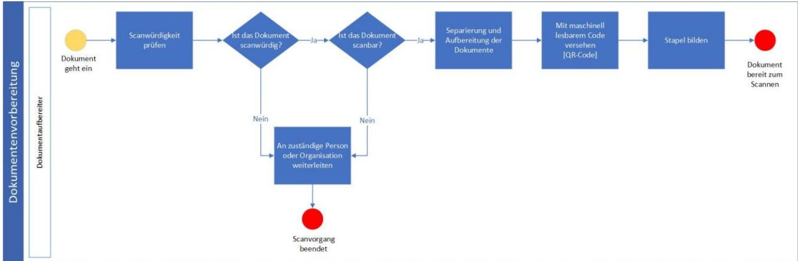

Abbildung 5: Prozess der Dokumentenvorbereitung

Die Dokumentenvorbereitung erfolgt durch Mitarbeitende der [zentralen Scanstelle].

| Nr.   | Aktivität                                     | Beschreibung                                                                                                                                                                                                                                                                                                                                                                |
|-------|-----------------------------------------------|-----------------------------------------------------------------------------------------------------------------------------------------------------------------------------------------------------------------------------------------------------------------------------------------------------------------------------------------------------------------------------|
| 1.1.1 | Prüfung auf Scanwürdigkeit und                | Anhand einer Negativliste wird geprüft, ob das eingegangene                                                                                                                                                                                                                                                                                                                 |
|       | Scanbarkeit                                   | Dokument scanwürdig ist.                                                                                                                                                                                                                                                                                                                                                    |
|       |                                               | Ist das Dokument scanwürdig, d. h. nicht in der Negativliste verzeichnet, erfolgt die weitere Bearbeitung im folgenden Arbeitsschritt. Ist ein Dokument lt. Negativliste nicht scanwürdig, wird es an die zuständige Person oder Organisation weitergeleitet und der Scanprozess ist beendet. Anschließend erfolgt die Prüfung auf vollständige Scanbarkeit. |
|       |                                               | Schlägt die Prüfung auf Scanbarkeit fehl, wird das Dokument ebenfalls an die zuständige Person oder Organisation weitergeleitet und der Scanprozess ist beendet.                                                                                                                                                                                                      |
|       |                                               | Dabei sollte gelten:                                                                                                                                                                                                                                                                                                                                                        |
|       |                                               | • Die Dokumente müssen in [scanbarem Format, z.B. Papierformat] vorliegen, so dass sie mittels Einzug oder Flachbettscan digitalisiert werden.                                                                                                                                                                                                                     |
|       |                                               | • Die Dokumente liegen in einem geeigneten Größenintervall von [Minimalgröße] bis [Maximalgröße] vor.                                                                                                                                                                                                                                                                 |
|       |                                               | Ist die Scanwürdigkeit und Scanbarkeit festgestellt, folgt Arbeitsschritt 1.1.2.                                                                                                                                                                                                                                                                                         |
| 1.1.2 | Separierung und Aufbereitung der Dokumente | Bei Dokumenten in gebundener, geklammerter oder gehefteter Form muss die jeweilige Bindung, Klammerung oder Heftung entfernt werden.                                                                                                                                                                                                                                  |
|       |                                               | Im Ergebnis dieses Arbeitsschrittes liegt das Dokument in Einzelblattform vor.                                                                                                                                                                                                                                                                                           |
| 1.1.3 | Anbringen des [QR-Code]                       | Für jedes zu scannende Dokument wird ein [QR-Code] auf die erste Seite des Dokuments angebracht.                                                                                                                                                                                                                                                                         |
| 1.1.4 | Stapelbildung                                 | Es werden Scanstapel gebildet. Die Trennung der einzelnen Dokumente erfolgt mittels [QR-Code].                                                                                                                                                                                                                                                                           |
|       |                                               | Nach der Stapelbildung sind die Eingangsdokumente für den Prozess des eigentlichen Scannens vorbereitet.                                                                                                                                                                                                                                                                 |

Tabelle 13: Prozessbeschreibung Dokumentenvorbereitung beim Inhouse-Scannen

#### Variante 2: Outsourcing

Die Dokumentenvorbereitung beim [Dienstleister] gliedert sich in die folgenden Arbeitsschritte:

- 1. Weiterleitung zum Dienstleister/ Eingang beim Dienstleister
- 2. Scanwürdigkeit und Scanbarkeit prüfen
- 3. Dokumentenvorbereitung

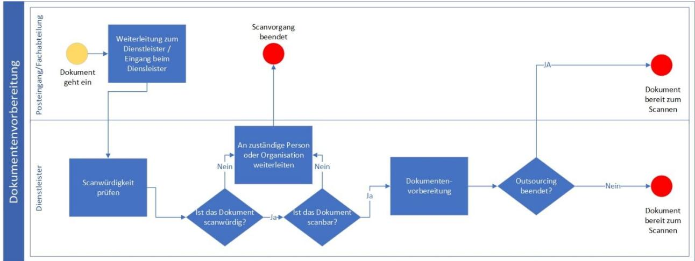

Abbildung 6: Prozess der Dokumentenvorbereitung beim Dienstleister

| Nr.   | Aktivität                        | Beschreibung                                                           |
|-------|----------------------------------|------------------------------------------------------------------------|
| 2.1.1 | Weiterleitung zum Dienstleister/ | Zu scannende Dokumente werden an den [Dienstleister] zur               |
|       | Eingang beim Dienstleister       | Dokumentenvorbereitung geleitet.                                       |
|       |                                  | Dokumente können auch direkt beim [Dienstleister] eingehen.            |
| 2.1.2 | Scanwürdigkeit und Scanbarkeit   | Stellt der [Dienstleister] keine Scanbarkeit oder Scanwürdigkeit fest, |
|       | prüfen                           | werden die Dokumente an die zuständige Person oder Organisation        |
|       |                                  | weitergeleitet und das Scannen ist beendet.                            |
| 2.1.3 | Dokumentenvorbereitung           | [Dienstleister] führt die Dokumentenvorbereitung durch und leitet      |
|       |                                  | die zum Scannen vorbereiteten Dokumente weiter.                        |
|       |                                  | Ist das Outsourcing beendet, werden die Dokumente an die               |
|       |                                  | Poststelle oder [Fachabteilung] der [Musterinstitution]                |
|       |                                  | zurückgeschickt und mit Arbeitsschritt 1.2.1 fortgefahren.             |
|       |                                  | Ansonsten wird der Arbeitsschritt 2.2.1 beim [Dienstleister]           |
|       |                                  | fortgeführt.                                                           |

Tabelle 14: Prozessbeschreibung Dokumentenvorbereitung beim Outsourcing

#### 3.5.1.2 Scannen

#### Variante 1: Inhouse-Scannen

Das Scannen gliedert sich in die folgenden Arbeitsschritte:

- 1. Dokumentenstapel scannen
- 2. Stichproben-Kontrolle
- 3. Scannen unterbrechen
- 4. Dokumentenstapel neu aufbereiten
- 5. Scanstapel nachbereiten

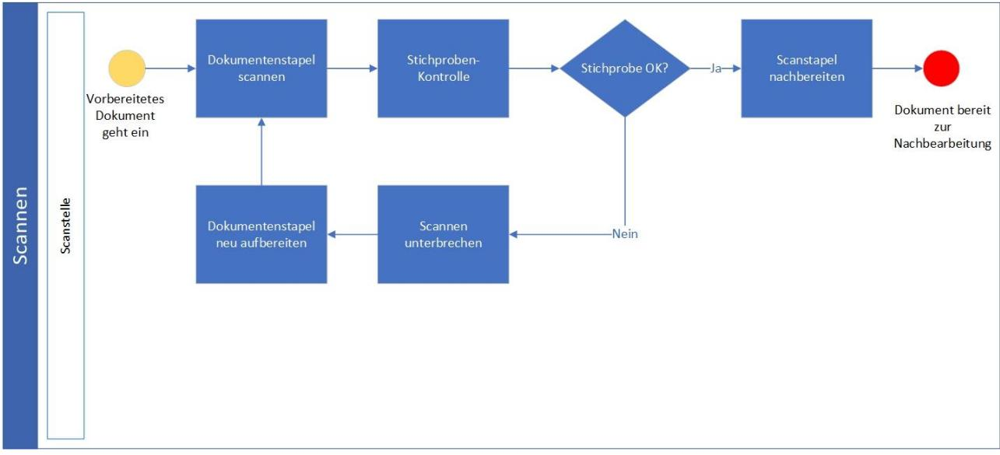

Abbildung 7: Prozess des Scannens

| Nr.   | Aktivität                           | Beschreibung                                                                                                                                                                                                                                                                                                                                                                                                                                                                                                    |
|-------|-------------------------------------|-----------------------------------------------------------------------------------------------------------------------------------------------------------------------------------------------------------------------------------------------------------------------------------------------------------------------------------------------------------------------------------------------------------------------------------------------------------------------------------------------------------------|
| 1.2.1 | Dokumentenstapel scannen            | Der Dokumentenstapel wird in den Dokumenteneinzug oder den Flachbettscanner eingelegt. Mittels der Scansoftware wird der Scanprozess gestartet. Der Scanstapel wir vollständig eingelesen, Leerblätter und leere Rückseiten können automatisch ausgeblendet werden.                                                                                                                                                                                                                                 |
| 1.2.2 | Stichproben-Kontrolle               | Während des Scanprozesses wird durch einen Mitarbeitenden stichprobenartig der ordnungsgemäße Scanvorgang der Dokumente überprüft. Die Stichprobenquote muss dabei so dimensioniert werden, dass eine fehlerhafte Erfassung im Scanprozess mit großer Wahrscheinlichkeit entdeckt wird. Die Stichprobenquote kann dabei von einer vollständigen Kontrolle bis hin zu einer Kontrollquote von [2%/4% ] reichen. Ist die Stichprobenkontrolle fehlerfrei, folgt der Arbeitsschritt 1.2.5, |
|       |                                     | andernfalls folgt Arbeitsschritt 1.2.3.                                                                                                                                                                                                                                                                                                                                                                                                                                                                         |
| 1.2.3 | Scannen unterbrechen                | Wurde im Rahmen der Stichprobenkontrolle ein fehlerhaftes Scannen festgestellt, ist das Scannen des Dokumentenstapels unverzüglich zu unterbrechen und es wird mit Arbeitsschritt 1.2.4 fortgefahren.                                                                                                                                                                                                                                                                                                  |
| 1.2.4 | Dokumentenstapel neu aufbereiten | Der noch zu scannende Dokumentenstapel wird von Mitarbeitenden der [Scanstelle] neu aufbereitet, indem z.B. Seiten geglättet werden. Anschließend ist der Rest-Stapel erneut dem Scanner zu zuführen. Die weitere Bearbeitung erfolgt im Arbeitsschritt 1.2.1.                                                                                                                                                                                                                                      |
| 1.2.5 | Scanstapel nachbereiten             | Der Scanstapel wird dem Scanner entnommen. Der Scanvorgang ist abgeschlossen und bereit zur Nachbearbeitung.                                                                                                                                                                                                                                                                                                                                                                                                 |

Tabelle 15: Prozessbeschreibung Scannen beim Inhouse-Scannen

#### Variante 2: Outsourcing

Das Scannen beim [Dienstleister] gliedert sich in den folgenden Arbeitsschritt:

- 1. Dokumente scannen
- 2. Stichproben-Kontrolle
- 3. Scannen unterbrechen
- 4. Dokumentenstapel neu aufbereiten
- 5. Scanstapel nachbereiten

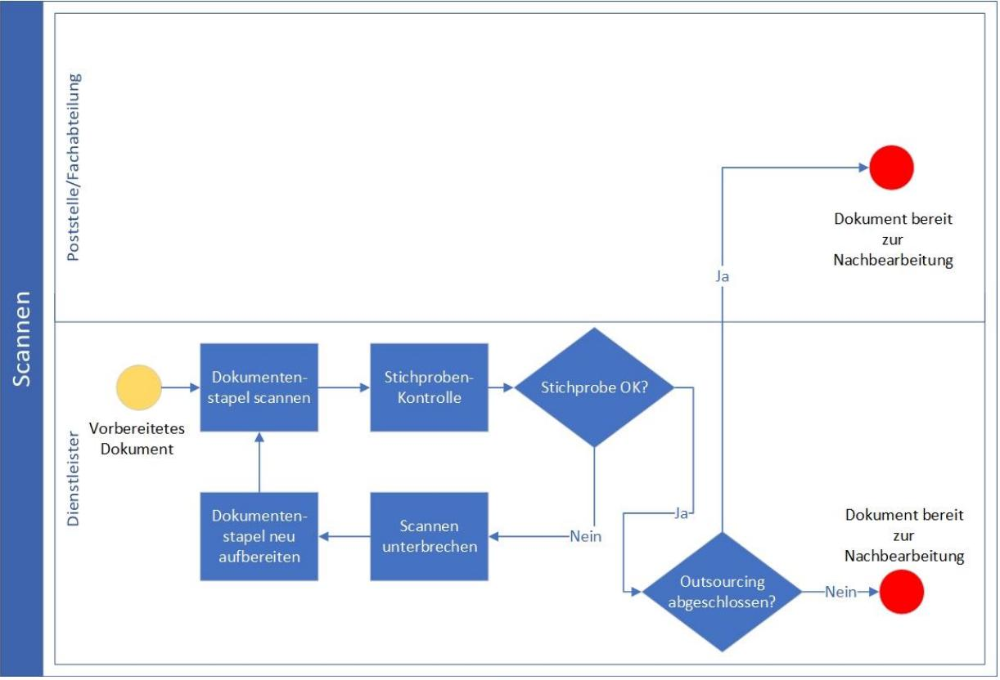

Abbildung 8: Prozess des Scannens beim Dienstleister

| Nr.   | Aktivität                | Beschreibung                                                                                                                                  |
|-------|--------------------------|-----------------------------------------------------------------------------------------------------------------------------------------------|
| 2.2.1 | Dokumentenstapel scannen | Vorbereitete Dokumente werden vom [Dienstleister] gescannt und sind zur Nachbearbeitung bereit.                                            |
|       |                          | Ist das Outsourcing beendet, werden die Scanprodukte und die papiernen Originale an die Poststelle/ an das [Fachgebiet] weitergeleitet. |
|       |                          | Ansonsten kommen die Scanprodukte zur Nachbearbeitung beim [Dienstleister] in Arbeitsschritt 2.3.1                                         |

| Nr.   | Aktivität                           | Beschreibung                                                                                                                                                                                                                                                                                                                                                                                                                          |
|-------|-------------------------------------|---------------------------------------------------------------------------------------------------------------------------------------------------------------------------------------------------------------------------------------------------------------------------------------------------------------------------------------------------------------------------------------------------------------------------------------|
| 2.2.2 | Stichproben-Kontrolle               | Der [Dienstleister] führt während des Scanprozesses eine Stichprobe durch, um den ordnungsgemäßen Scanvorgang der Dokumente zu überprüften. Die Stichprobenquote muss dabei so dimensioniert werden, dass eine fehlerhafte Erfassung im Scanprozess mit großer Wahrscheinlichkeit entdeckt wird. Die Stichprobenquote kann dabei von einer vollständigen Kontrolle bis hin zu einer Kontrollquote von [4%] reichen. |
|       |                                     | Ist die Stichprobenkontrolle fehlerfrei, folgt der Arbeitsschritt 2.2.5, andernfalls folgt Arbeitsschritt 2.2.3.                                                                                                                                                                                                                                                                                                                   |
| 2.2.3 | Scannen unterbrechen                | Stellt der [Dienstleister] Rahmen der Stichprobenkontrolle ein fehlerhaftes Scannen festgestellt, ist das Scannen des Dokumentenstapels unverzüglich zu unterbrechen und es wird mit Arbeitsschritt 2.2.4 fortgefahren.                                                                                                                                                                                                      |
| 2.2.4 | Dokumentenstapel neu aufbereiten | Der noch zu scannende Dokumentenstapel wird vom [Dienstleister] neu aufbereitet, indem z.B. Seiten geglättet werden. Anschließend ist der Rest-Stapel erneut dem Scanner zu zuführen. Die weitere Bearbeitung erfolgt im Arbeitsschritt 2.2.1.                                                                                                                                                                               |
| 2.2.5 | Scanstapel nachbereiten             | Der Scanstapel wird dem Scanner entnommen. Der Scanvorgang ist abgeschlossen und bereit zur Nachbearbeitung. Ist das Outsourcing beendet, werden die Scanprodukte und die papiernen Originale an die Poststelle/ an das [Fachgebiet] weitergeleitet.                                                                                                                                                                      |
|       |                                     | Ansonsten kommen die Scanprodukte zur Nachbearbeitung beim [Dienstleister] in Arbeitsschritt 2.3.1                                                                                                                                                                                                                                                                                                                                 |

Tabelle 16: Prozessbeschreibung Scannen beim Outsourcing

#### 3.5.1.3 Nachbearbeitung

#### Variante 1: Inhouse-Scannen

Die Nachbearbeitung der Dokumente gliedert sich in die folgenden Arbeitsschritte:

- 1. Qualitätssicherung & Metadatenvergabe
- 2. Volltext Indizierung
- 3. Formatumwandlung
- 4. Transfervermerk anbringen

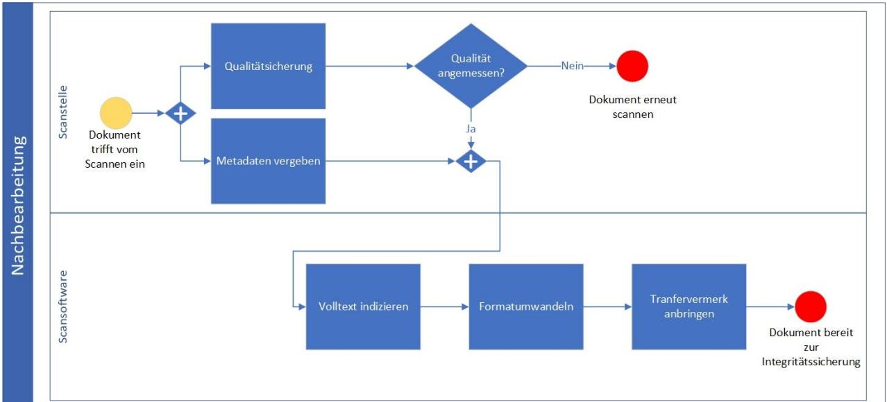

Abbildung 9: Prozess der Nachbearbeitung

| Nr.   | Aktivität                 | Beschreibung                                                                                                                                                                                                                                                                                                                                                                                                                                                                 |
|-------|---------------------------|------------------------------------------------------------------------------------------------------------------------------------------------------------------------------------------------------------------------------------------------------------------------------------------------------------------------------------------------------------------------------------------------------------------------------------------------------------------------------|
| 1.3.1 | Qualitätssicherung &   | Im Rahmen der Qualitätssicherung werden die Scanprodukte auf Mängel beim Scannen überprüft u.a. auf fehlende Seiten,                                                                                                                                                                                                                                                                                                                                                      |
|       | Metadaten-Vergabe         | mangelnde Lesbarkeit, korrekte Zuordnung, richtige Indizierung und Korrektheit der automatischen Vergabe der Metadaten                                                                                                                                                                                                                                                                                                                                                    |
|       |                           | Ist die Qualität des Scanproduktes nicht zufriedenstellend, werden die bemängelten Scanstapel oder Dokumente erneut gescannt und mit Arbeitsschritt 1.2.1 fortgefahren.                                                                                                                                                                                                                                                                                                |
|       |                           | Zusätzlich zu den bereits von der Scansoftware erkannten Metadaten können noch zusätzlich manuelle Metadaten für das Scanprodukt vergeben werden.                                                                                                                                                                                                                                                                                                                      |
|       |                           | Ist die Qualität und die Metadaten-Vergabe abgeschlossen, folgt Arbeitsschritt 1.3.2.                                                                                                                                                                                                                                                                                                                                                                                     |
| 1.3.2 | Volltext Indizierung      | Die Scansoftware führt eine Volltext Indizierung des Dokuments durch.                                                                                                                                                                                                                                                                                                                                                                                                     |
| 1.3.3 | Formatumwandlung          | Die Scanprodukte werden in das [PDF/A-2b] Format umgewandelt.                                                                                                                                                                                                                                                                                                                                                                                                                |
| 1.3.4 | Transfervermerk anbringen | Zur erfolgreichen Bestätigung der Qualitätssicherung wird ein Transfervermerk an das Scanprodukt angebracht.                                                                                                                                                                                                                                                                                                                                                              |
|       |                           | Der Transfervermerk protokolliert, wann und durch wen die Transformation des Papierdokuments zum Scanprodukt erfolgt ist und soll nachweisen, dass das Scanprodukt bildlich und inhaltlich mit dem Original übereinstimmt. Ziel des Transfervermerks ist es, dem Gericht gegenüber darzustellen, dass die Überprüfung der inhaltlichen und bildlichen Übereinstimmung durch eine neutrale Person ordnungsgemäß erfolgt ist. Das Scanprodukt ist bereit für |
|       |                           | die Integritätssicherung in Arbeitsschritt 1.4.1.                                                                                                                                                                                                                                                                                                                                                                                                                            |

Tabelle 17: Prozessbeschreibung Nachbearbeitung beim Inhouse-Scannen 

#### Variante 2: Outsourcing

Die Nachbearbeitung beim [Dienstleister] gliedert sich in den folgenden Arbeitsschritt:

- 1. Qualitätssicherung & Metadatenvergabe
- 2. Volltext Indizierung und Formatumwandlung
- 3. Transfervermerk anbringen

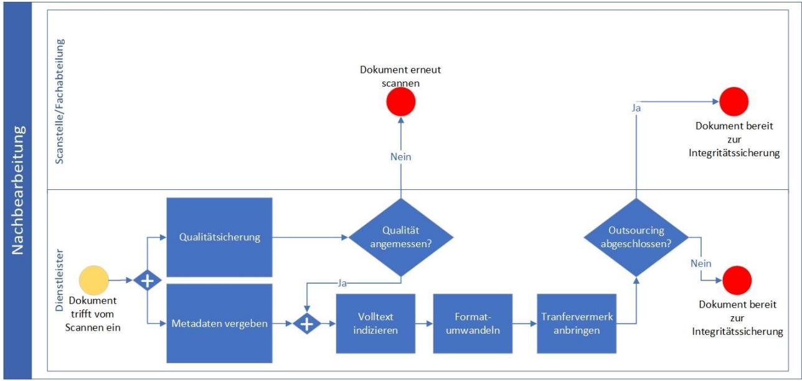

Abbildung 10: Prozess der Nachbearbeitung beim Dienstleister

| Nr.   | Aktivität            | Beschreibung                                                    |
|-------|----------------------|-----------------------------------------------------------------|
| 2.3.1 | Qualitätssicherung   | Der [Dienstleister] führt die Nachbearbeitung der Scanprodukte  |
|       | &                    | durch.                                                          |
|       | Metadaten-Vergabe    |                                                                 |
|       |                      | Ist die Qualität des Scanproduktes angemessen können zusätzlich |
|       |                      | zu den von der Scansoftware erstellten Metadaten noch manuelle  |
|       |                      | Metadaten vergeben werden. Im Anschluss wird mit Arbeitsschritt |
|       |                      | 2.3.2 fortgefahren.                                             |
|       |                      |                                                                 |
|       |                      | Ist die Qualität des Scanproduktes unzureichend, wird das       |
|       |                      | Dokument erneut gescannt                                        |
| 2.3.2 | Volltext Indizierung | Der [Dienstleister] führt dann eine Volltext Indizierung der    |
|       | &                    | Scanprodukte durch und wandelt die Scanprodukte in das [PDF/A   |
|       | Formatumwandlung     | 2b] Format um.                                                  |
|       |                      |                                                                 |
|       |                      | Danach wird mit Arbeitsschritt 2.3.3 fortgefahren.              |

| Nr.   | Aktivität                 | Beschreibung                                                                                                                                                                                                                                                                                                                                                                                                                                  |
|-------|---------------------------|-----------------------------------------------------------------------------------------------------------------------------------------------------------------------------------------------------------------------------------------------------------------------------------------------------------------------------------------------------------------------------------------------------------------------------------------------|
| 2.3.3 | Transfervermerk anbringen | Zur erfolgreichen Bestätigung der Qualitätssicherung wird ein Transfervermerk an das jeweilige Scanprodukt angebracht.                                                                                                                                                                                                                                                                                                                     |
|       |                           | Der Transfervermerk protokolliert, wann und durch wen die Transformation des Papierdokuments zum Scanprodukt erfolgt ist und soll nachweisen, dass das Scanprodukt bildlich und inhaltlich mit dem Original übereinstimmt. Ziel des Transfervermerks ist es, dem Gericht gegenüber darzustellen, dass die Überprüfung der inhaltlichen und bildlichen Übereinstimmung durch eine neutrale Person ordnungsgemäß erfolgt ist. |
|       |                           | Das Scanprodukt ist bereit für die Integritätssicherung.                                                                                                                                                                                                                                                                                                                                                                                      |
|       |                           | Ist das Outsourcing beendet, werden die Scanprodukte, Transfervermerk, Metadaten und papierne Originale zur Integrationssicherung an die [Fachabteilung] weitergeleitet.                                                                                                                                                                                                                                                                |
|       |                           | Ansonsten werden die Scanprodukte, Transfervermerk, Metadaten und papierne Originale zur Integrationssicherung in Arbeitsschritt 2.4.1 geleitet                                                                                                                                                                                                                                                                                         |

Tabelle 18: Prozessbeschreibung Nachverarbeitung beim Outsourcing

#### 3.5.1.4 Integritätssicherung

#### Variante 1: Inhouse-Scannen

Die Integrationssicherheit gliedert sich in die folgenden Arbeitsschritte:

- 1. Dokumente signieren
- 2. Daten an das Zielsystem übergeben
- 3. Papierenes Original lagern und vernichten
- 4. Papierenes Original aufbewahren

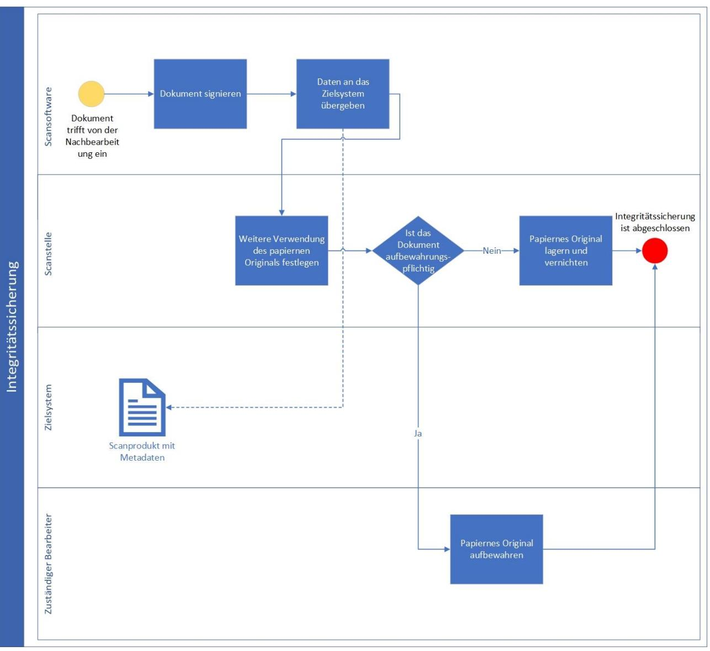

Abbildung 11: Prozess der Integritätssicherung

| Nr.   | Aktivität                     | Beschreibung                                                                                    |
|-------|-------------------------------|-------------------------------------------------------------------------------------------------|
| 1.4.1 | Dokument signieren            | Das Scanprodukt inkl. Transfervermerk und Metadaten wird mit                                    |
|       |                               | einer qualifizierten elektronischen [Signatur/Siegel] versehen.                                 |
| 1.4.2 | Daten an das Zielsystem       | Das Scanprodukt, der Transfervermerk und die Metadaten werden                                   |
|       | übertragen                    | an das dafür vorgesehene Zielsystem [TR-ESOR                                                    |
|       |                               | übergeben.                                                                                      |
| 1.4.3 | Weitere Verwendung des        | Die Scanstelle legt die weitere Verwendung der papierenen                                       |
|       | papiernen Originals festlegen | Originale fest.                                                                                 |
|       |                               |                                                                                                 |
|       |                               | Ist das papierne Original aufbewahrungspflichtig, wird mit                                      |
|       |                               | Arbeitsschritt 1.4.4 fortgefahren.                                                              |
|       |                               |                                                                                                 |
|       |                               | Ist das papierne Original nicht aufbewahrungspflichtig und soll                                 |
|       |                               | vernichtet werden, wird mit Arbeitsschritt 1.4.5 fortgefahren.                                  |
| 1.4.4 |                               | Papiernes Original aufbewahren Ist das papierne Original aufbewahrungspflichtig, wird es an den |
|       |                               | zuständigen Bearbeitenden zur Aufbewahrung weitergeleitet.                                      |

| Nr.   | Aktivität                     | Beschreibung                                                    |
|-------|-------------------------------|-----------------------------------------------------------------|
| 1.4.5 | Papiernes Original lagern und | Ist das papierne Original nicht aufbewahrungspflichtig, wird es |
|       | vernichten                    | nach Ablauf von mindestens [2 Monaten/ 3 Monaten/ 6 Monaten]    |
|       |                               | und durch die Freigabe der [Fachabteilung] vernichtet.          |

Tabelle 19: Prozessbeschreibung Integritätssicherung beim Inhouse-Scannen

#### Variante 2: Outsourcing

Die Integrationssicherung beim [Dienstleister] gliedert sich in die folgenden Arbeitsschritte:

- 1. Signieren und Übergabe an das Zielsystem
- 2. Papiernes Original lagern und vernichten
- 3. Papiernes Original aufbewahren

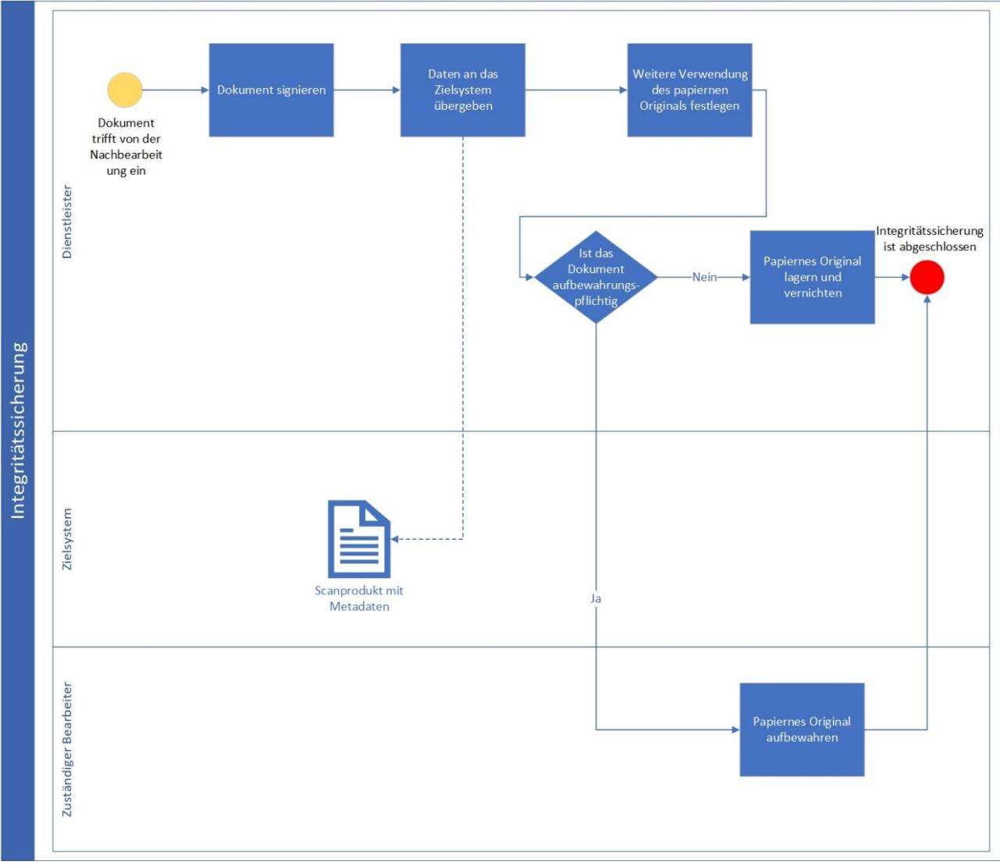

Abbildung 12: Prozess der Integrationssicherung beim Dienstleister

| Nr.   | Aktivität                     | Beschreibung                                                                                    |
|-------|-------------------------------|-------------------------------------------------------------------------------------------------|
| 2.4.1 | Signieren                     | Der [Dienstleister] sichert die Integrität der Scanprodukte und                                 |
|       | &                             | überträgt die Scanprodukte, Transfervermerke und Metadaten über                                 |
|       | Übergabe an das Zielsystem    | einen sicheren Kommunikationskanal an das dafür vorgesehene                                     |
|       |                               | Zielsystem [TR-ESOR                                                                             |
|       |                               | Sind die papiernen Originale aufbewahrungspflichtig, wird mit                                   |
|       |                               | Arbeitsschritt 2.4.2 fortgefahren.                                                              |
|       |                               | Sind die papiernen Originale nicht aufbewahrungspflichtig, werden                               |
|       |                               | sie an den zuständigen Bearbeitenden geleitet und es wird mit                                   |
|       |                               | Arbeitsschritt 2.4.3 fortgefahren.                                                              |
| 2.4.2 |                               | Papiernes Original aufbewahren Ist das papierne Original aufbewahrungspflichtig, wird es an den |
|       |                               | zuständigen Bearbeitenden zur Aufbewahrung weitergeleitet.                                      |
| 2.4.3 | Papiernes Original lagern und | Ist das papierne Original nicht aufbewahrungspflichtig, wird es                                 |
|       | vernichten                    | nach Ablauf von mindestens [2 Monaten/ 3 Monaten/ 6 Monaten]                                    |
|       |                               | und durch die Freigabe der [Fachabteilung] vernichtet.                                          |

Tabelle 20: Prozessbeschreibung Integritätssicherung beim Outsourcing

### 3.6 Regelungsbedarfe

Im Zuge der Einführung des Ersetzenden Scannens werden folgende Regelungen [erstellt/angepasst]

- [Scanrichtlinie]
- [Verfahrensanweisung]
- [Richtlinie zum Posteingang]
- [Aktenordnung/Records Management Policy/Do
- [Informationssicherheitsrichtlinie/Security Policy)
- [Datenschutzrichtlinie/Privacy Policy]
- •

## 4 Mitgeltende Unterlagen

Folgende Unterlagen gelten, neben dem Scankonzept/Verfahrensdokumentation als Bestandteile mit:

- [Informationssicherheitsmanagementsystem]
- [Datenschutzmanagementsystem]
- [Konzeptionen zur E-
- [Archivierungskonzepte/-
- •

## 5 Abkürzungsverzeichnis

| Akronym | Bedeutung                                 |
|---------|-------------------------------------------|
| DSB     | Datenschutzbeauftragter                   |
| ECM     | Enterprise-Content-Management (System)    |
| ISB     | Informationssicherheitsbeauftragter       |
| QES     | Qualifizierte elektronische Signatur      |
| QESI    | Qualifiziertes elektronisches Siegel      |
| QZS     | Qualifizierter elektronischer Zeitstempel |
| TR      | Technische Richtlinie                     |

Tabelle 21: Abkürzungsverzeichnis

## Literaturverzeichnis

| [2015/1506/EU]        | DURCHFÜHRUNGSBESCHLUSS (EU) 2015/1506 DER KOMMISSION zur Festlegung von Spezifikationen für Formate fortgeschrittener elektronischer Signaturen und fortgeschrittener Siegel, die von öffentlichen Stellen gemäß Artikel 27 Absatz 5 und Artikel 37 Absatz 5 der Verordnung (EU) Nr. 910/2014 des Europäischen Parlaments und des Rates über elektronische Identifizierung und Vertrauensdienste für elektronische Transaktionen im Binnenmarkt anerkannt werden, 8. September 2015 |
|-----------------------|-------------------------------------------------------------------------------------------------------------------------------------------------------------------------------------------------------------------------------------------------------------------------------------------------------------------------------------------------------------------------------------------------------------------------------------------------------------------------------------------------------|
| [Az. 6 K 691/14.WI.A] | VG Wiesbaden, 26.09.2014 - 6 K 691/14.WI.A                                                                                                                                                                                                                                                                                                                                                                                                                                                            |
| [Az. 6 K 808/17.WI.A] | VG Wiesbaden, 09.08.2017 - 6 K 808/17.WI.A                                                                                                                                                                                                                                                                                                                                                                                                                                                            |
| [BM20]                | Leitfaden: E-Scannen für Bundesbehörden. Ersetzendes Scannen gemäß EGovG und TR RESISCAN. Bundesministerium des Innern (Hrsg.). Berlin 2020.                                                                                                                                                                                                                                                                                                                                                       |
| [BSIGS]               | BSI-Grundschutzkompendium. Bundesamt für Sicherheit in der Informationstechnik. Bonn 2018                                                                                                                                                                                                                                                                                                                                                                                                          |
| [DIN31644]            | DIN 31644:2012 Information und Dokumentation Kriterien für vertrauenswürdige digitale Langzeitarchive. 2012                                                                                                                                                                                                                                                                                                                                                                                     |
| [DIN31647]            | DIN 31647:2015 Beweiswerterhalt kryptografisch signierter Dokumente, 2015.                                                                                                                                                                                                                                                                                                                                                                                                                            |
| [EGOVG]               | Gesetz zur Förderung der elektronischen Verwaltung (E-Government-Gesetz - EGovG) vom 25.07.2013                                                                                                                                                                                                                                                                                                                                                                                                    |
| [EIDAS]               | VERORDNUNG (EU) Nr. 910/2014 DES EUROPÄISCHEN PARLAMENTS UND DES RATES über elektronische Identifizierung und Vertrauensdienste für elektronische vom 23.07.2014                                                                                                                                                                                                                                                                                                                                |
| [eJusticG]            | Gesetz zur Förderung des elektronischen Rechtsverkehrs mit den Gerichten vom 10. Oktober 2013                                                                                                                                                                                                                                                                                                                                                                                                      |
| [EN319122]            | ETSI EN 319 122 {1,2,3}, Electronic Signatures and Infrastructers (ESI); CAdES digital signatures, ETSI V1.1.1, (2016-04)                                                                                                                                                                                                                                                                                                                                                                       |
| [EN319132]            | ETSI EN 319 132 {1,2}, Electronic Signatures and Infrastructures (ESI); XAdES digital signatures, ETSI V1.1.1, (2016-04)                                                                                                                                                                                                                                                                                                                                                                        |
| [EN319142]            | ETSI EN 319 142 {1,2}, Electronic Signatures and Infrastructeres (ESI); PAdES digital Signatures, ETSI V1.1.1 (2016-04)                                                                                                                                                                                                                                                                                                                                                                         |
| [EN319162]            | ETSI EN 319 162 {1,2}, Electronic Signatures and Infrastrucutres (ESI); Associated Signature Containers (ASiC), ETSI V1.1.1 (2016-04)                                                                                                                                                                                                                                                                                                                                                           |
| [Fi06]                | S. Fischer-Dieskau: Das elektronisch signierte Dokument als Mittel zur Beweissicherung, Baden-Baden, 2006.                                                                                                                                                                                                                                                                                                                                                                                         |
| [ISO13527]            | ISO 13527:2010, Space data and information transfer systems -- XML formatted data unit (XFDU) structure and construction rules, 2010                                                                                                                                                                                                                                                                                                                                                               |
| [ISO14533-1]          | ISO 14533-1:2014, Processes, data elements and documents in commerce, industry and administration -- Long term signature profiles -- Part 1: Long term signature profiles for CMS Advanced Electronic Signatures (CAdES)                                                                                                                                                                                                                                                                        |
| [ISO14533-2]          | ISO 14533-2:2012 Processes, data elements and documents in commerce, industry and administration -- Long term signature profiles -- Part 2: Long term signature profiles for XML Advanced Electronic Signatures (XAdES)                                                                                                                                                                                                                                                                         |

| [ISO14533-3]    | ISO 14533-3:2017 Processes, data elements and documents in commerce, industry and administration -- Long term signature profiles -- Part 3: Long term signature profiles for PDF Advanced Electronic Signatures (PAdES)                 |
|-----------------|-----------------------------------------------------------------------------------------------------------------------------------------------------------------------------------------------------------------------------------------------|
| [ISO14721]      | ISO 14721:2012, Space data and information transfer systems Open archival information system Reference model, 2nd Edition, 2012                                                                                                      |
| [Ko14]          | U. Korte, S. Schwalm, D. Hühnlein: Standards und Lösungen zur langfristigen Beweiswerterhaltung, DACH-Security 2014, S. 46-58, Frechen 2014                                                                                                |
| [Ko17]          | U. Korte. S.Schwalm. T. Kusber. D. Hühnlein, M. Prechtl, B. Wild: Datenpakete zur Informations- und Beweiswerterhaltung. Ein Vergleich. DACH-Security 2017. Frechen 2017 S. 291-303                                                     |
| [KSDV15]        | T. Kusber, S. Schwalm, A. Dörner, T. Vogt, Die Bedeutung der eIDAS-Verordnung für Unternehmen und Behörden. Neue Chancen und Herausforderungen für vertrauenswürdige elektronische Geschäftsprozesse in Europa, Berlin, 2015            |
| [KoScKu18]      | U. Korte, S. Schwalm, T. Kusber: Vertrauenswürdiges E-Government Anforderungen und Lösungen zur beweiswerterhaltenden Langzeitspeicherung. 23. Archivwissenschaftliches Kolloqium. Marburg 2018                                         |
| [Merk]          | R. Merkle: Protocols for Public Key Cryptosystems, Proceedings of the 1980 IEEE Symposium on Security and Privacy (Oakland, CA, USA), SS. 122-134, 1980                                                                                    |
| [MiniKGovG]     | Minikommentar zum Gesetz zur Förderung der elektronischen Verwaltung sowie zur Änderung weiterer Vorschriften. Bundesministerium des Innern. Berlin 2013                                                                                   |
| [OZG]           | Onlinezugangsgesetz vom 14. August 2017 (BGBl. I S. 3122, 3138)                                                                                                                                                                               |
| [RFC4998]       | T. Gondrom, R. Brandner, U. Pordesch: Evidence Record Syntax (ERS), IETF RFC 4998, http://www.ietf.org/rfc/rfc4998.txt, August 2007.                                                                                                       |
| [RFC6283]       | A. J. Blazic, S. Saljic, T. Gondrom: Extensible Markup Language Evidence Record Syntax (XMLERS), IETF RFC 6283, http://www.ietf.org/rfc/rfc6283.txt, Juli 2011                                                                             |
| [Ro07]          | A. Rossnagel: Langfristige Aufbewahrung elektronischer Dokumente, Anforderungen und Trends, Baden-Baden, 2007                                                                                                                              |
| [Sim15]         | A. Rossnagel, M. Nebel: Simulationsstudie Ersetzendes Scannen Ergebnisse. 2015                                                                                                                                                                |
| [SR019510]      | ETSI SR 019 510, Electronic Signatures and Infrastructures (ESI); Scoping Study and framework for standardization of long-term data preservation services, including preservation of/with digital signatures, ETSI V1.1.1 (2017-05)     |
| [TR-03125]      | BSI: Beweiswerterhaltung kryptographisch signierter Dokumente (TR-ESOR), TR 03125, https://www.bsi.bund.de/tr-esor.                                                                                                                        |
| [ETSI TS119511] | Policy and security requirements for trust service providers providing long-term preservation of digital signatures or general data using digital signature techniques                                                                     |
| [ETSI TS119512] | Protocols for trust service providers providing long-term data preservation services                                                                                                                                                          |
| [VDG]           | Vertrauensdienstegesetz vom 18. Juli 2017 (BGBl. I S. 2745), das durch Artikel 2 des Gesetzes vom 18. Juli 2017 (BGBl. I S. 2745) geändert worden ist                                                                                      |
| [We18]          | M. Weber, T Vogt, W. Krogel, S. Schwalm: Records Management nach ISO 15489. Einführung und Anleitung. Berlin 2018                                                                                                                          |
| [ZPO]           | Zivilprozessordnung in der Fassung der Bekanntmachung vom 5. Dezember 2005 (BGBl. I S. 3202; 2006 I S. 431; 2007 I S. 1781), die zuletzt durch Artikel 11 Absatz 15 des Gesetzes vom 18. Juli 2017 (BGB. I S. 2745) geändert worden ist |

## Anlagen

## Anlage 1: Negativliste zum Scannen (Beispiel)

#### Nicht gescannt werden

- Weglegesachen (nicht aktenrelevante Posteingänge)
- Einladungen ohne geschäftlichen Bezug
- Zeitungen, Zeitschriften, Zeitungsausschnitte, Amtsblätter
- unaufgefordert eingesandte Angebote für Bücher, CDs, Büromaterial und Ähnliches,
- Werbesendungen (Kataloge, Firmenprospekte, Preislisten),
- statistische Berichte allgemeiner Art,
- Veranstaltungshinweise,
- Telefon- und Gesprächsnotizen ohne Aktenrelevanz
- offensichtliche Irrläufer (Rückgabe an den Versanddienstleister oder Weiterleitung mit entsprechendem Vermerk)
- Post enthält Information, die nicht gespeichert werden darf (z.B., weil Dokumente an Dritte zurückzugeben sind)

#### Nicht ersetzend gescannt werden:

- Personalangelegenheiten
- Gebundene Dokumente
- Beurkundete oder notariell beglaubigte Dokumente z.B. Grundstücksverträge

#### Nur nach Freigabe durch Empfänger (zentral) gescannt werden

Posteingänge mit folgenden Eigenschaften:

- eindeutige Kennzeichnung "persönlich" oder "vertraulich"
- als "Verschlusssache" (VS) gekennzeichnete Post
- als Post an betriebliche Vertretungen und Beauftragte z.B. Betriebsrat, Personalrat, Schwerbehindertenvertretung, Gleichstellungsbeauftragte etc.
- Referenzschreiben von Firmen