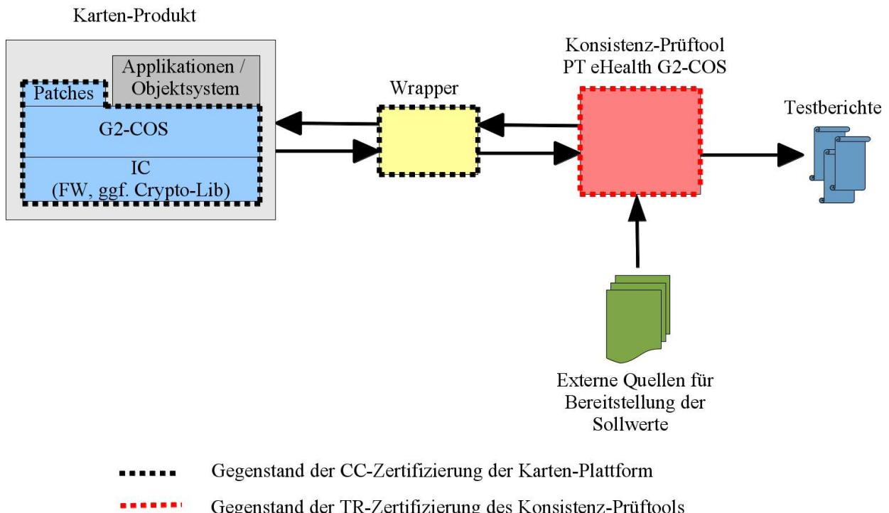

**Technische Richtlinie BSI TR-03144**

# **eHealth –**

# **Konformitätsnachweis für Karten-Produkte der Kartengeneration G2**

**Version 1.0 – 03.06.2014**

Bundesamt für Sicherheit in der Informationstechnik Postfach 20 03 63 53133 Bonn E-Mail: bsi@bsi.bund.de Internet: https://www.bsi.bund.de © Bundesamt für Sicherheit in der Informationstechnik 2014

# **Inhaltsverzeichnis**

| 1     | Einleitung4                                                                       |  |
|-------|-----------------------------------------------------------------------------------|--|
| 1.1   | Gegenstand, Zielsetzung und Übersicht der TR4                                     |  |
| 1.2   | Einordnung des Dokuments5                                                         |  |
| 1.3   | Terminologie5                                                                     |  |
| 1.4   | Abkürzungen5                                                                      |  |
| 1.5   | Änderungshistorie6                                                                |  |
| 2     | Zertifizierung von Karten-Produkten nach der Technischen Richtlinie BSI TR-031447 |  |
| 2.1   | Bezeichnungen, Voraussetzungen und Annahmen7                                      |  |
| 2.2   | TR-Prüfstelle8                                                                    |  |
| 2.3   | Sicherungsmechanismen9                                                            |  |
| 2.4   | TR-Konformitätsprüfung eines Karten-Produktes9                                    |  |
| 2.4.1 | Prüfwerkzeuge und ihre Verwendung9                                                |  |
| 2.4.2 | Prüfgegenstand11                                                                  |  |
| 2.4.3 | Konsistenz-Prüftool14                                                             |  |
| 2.4.4 | Prüfaspekte, -aufgaben und -schritte16                                            |  |
| 2.4.5 | Aus- und Bewertung der Prüfergebnisse und Ausfertigung des TR-Prüfberichtes19     |  |
| 2.5   | TR-Zertifikat und TR-Konformitätsreport eines Karten-Produktes21                  |  |
| 3     | TR-Prüfbericht zu einem Karten-Produkt23                                          |  |
| 3.1   | Allgemeine Vorgaben für den TR-Prüfbericht23                                      |  |
| 3.2   | Template für den TR-Prüfbericht23                                                 |  |
|       | Literaturverzeichnis33                                                            |  |

## **Abbildungsverzeichnis**

|  |  | Abbildung 1: Konsistenzabgleich mittels Konsistenz-Prüftool10 |  |
|--|--|---------------------------------------------------------------|--|
|  |  |                                                               |  |

## **Tabellenverzeichnis**

| Tabelle 1: Änderungshistorie6                                                      |
|------------------------------------------------------------------------------------|
| Tabelle 2: Anforderungen an den Prüfgegenstand11                                   |
| Tabelle 3: Prüfgegenstand13                                                        |
| Tabelle 4: Fingerprint der Karten-Plattform13                                      |
| Tabelle 5: Auslieferung des Prüfgegenstands14                                      |
| Tabelle 6: Handling des Prüfgegenstands14                                          |
| Tabelle 7: Konsistenz-Prüftool15                                                   |
| Tabelle 8: Auslieferung des Konsistenz-Prüftools16                                 |
| Tabelle 9: Handling des Konsistenz-Prüftools16                                     |
| Tabelle 10: Prüfaspekte, -aufgaben und -schritte19                                 |
| Tabelle 11: Aus- und Bewertung der Prüfergebnisse und TR-Prüfbericht21             |
| Tabelle 12: Beispiel für eine Tabelle zur Änderungshistorie des TR-Prüfberichtes24 |
|                                                                                    |

# **1 Einleitung**

# **1.1 Gegenstand, Zielsetzung und Übersicht der TR**

Gegenstand der vorliegenden Technischen Richtlinie BSI TR-03144 ist die TR-Zertifizierung von Karten-Produkten der eHealth Kartengeneration G2 im Rahmen des G2-Zertifizierungskonzepts wie in der Technischen Richtlinie BSI TR-03106 "eHealth – Zertifizierungskonzept für Karten der Generation G2" ([TR-03106]) dargestellt.

Das TR-Zertifikat für ein Karten-Produkt der Generation G2 (derzeit der Ausprägung eGK, HBA, SMC-B, gSMC-KT oder gSMC-K) liefert einen wesentlichen Beitrag zur Bewertung der sicherheitstechnischen Eignung des betreffenden Karten-Produktes hinsichtlich seines Einsatzes in der Telematik Infrastruktur im deutschen Gesundheitswesen. Ein solches TR-Zertifikat geht in die Zulassung des betreffenden Karten-Produktes durch die gematik für den Einsatz dieses Karten-Produktes in der Telematik Infrastruktur im deutschen Gesundheitswesen ein.

Eine detaillierte Beschreibung des Zertifizierungskonzepts für die G2-Karten ist der Technischen Richtlinie BSI TR-03106 "eHealth – Zertifizierungskonzept für Karten der Generation G2" ([TR-03106]) zu entnehmen. Insbesondere werden dort weitergehende Informationen zur Bedeutung und Einordnung von TR-Zertifikaten für Karten-Produkte der Generation G2 im Kontext des G2-Zertifizierungskonzepts sowie genauere Informationen zu den Inhalten, Prüfgegenständen, Prüfwerkzeugen und Prozessen der TR-Zertifizierung von Karten-Produkten der Generation G2 gegeben.

Die vorliegende Technische Richtlinie BSI TR-03144 richtet sich an TR-Prüfstellen, die die TR-Konformitätsprüfung von Karten-Produkten der Generation G2 im Rahmen des G2-Zertifizierungskonzepts ([TR-03106]) durchführen. Die vorliegende Technische Richtlinie BSI TR-03144 richtet sich weiterhin an Hersteller von Karten-Produkten der Generation G2, die ihre Karten-Produkte einer TR-Zertifizierung nach der vorliegenden Technischen Richtlinie BSI TR-03144 im Rahmen des G2-Zertifizierungskonzepts ([TR-03106]) mit dem Ziel einer Zulassung ihrer Karten-Produkte durch die gematik für einen Einsatz in der Telematik Infrastruktur im deutschen Gesundheitswesen unterziehen.

Das vorliegende Dokument beschreibt in Kap. [2](#page-6-0) die TR-Zertifizierung von Karten-Produkten der Generation G2 auf Basis der Technischen Richtlinie BSI TR-03144 und geht hierbei näher auf die Aspekte

- **•** der TR-Prüfstelle,
- **•** der TR-Konformitätsprüfung von Karten-Produkten durch die TR-Prüfstelle mit Angaben und Anforderungen zu
	- **◦** den Prüfgegenständen,
	- **◦** den Prüfwerkzeugen,
	- **◦** den relevanten Prüfaspekten, -aufgaben und -schritten und
	- **◦** dem TR-Prüfbericht sowie
- **•** des TR-Zertifikats mit zugehörigem TR-Konformitätsreport zum Karten-Produkt

ein. In Kap. [3](#page-22-0) und seinen Unterkapiteln schließlich ist ein Template für den TR-Prüfbericht der TR-Prüfstelle zur Dokumentation der TR-Konformitätsprüfung eines Karten-Produktes enthalten.

### **1.2 Einordnung des Dokuments**

Die vorliegende Technische Richtlinie BSI TR-03144 gliedert sich in das Zertifizierungskonzept für die eHealth-Karten der Kartengeneration G2 ein und ist als nachgelagerte Dokumentation zur Technischen Richtlinie BSI TR-03106 "eHealth – Zertifizierungskonzept für Karten der Generation G2" ([TR-03106]), die eine detaillierte Beschreibung dieses Zertifizierungskonzepts für die G2-Karten beinhaltet, zu betrachten.

Zur vorliegenden Technischen Richtlinie BSI TR-03144 gehört der Anhang [TR-03144 A], in dem Sicherungsmechanismen im Umfeld der TR-Zertifizierung von Karten-Produkten der G2 im Fokus stehen.

Diese Technische Richtlinie BSI TR-03144 referenziert weiterhin auf die Technische Richtlinie BSI TR-03143 "eHealth G2-COS Konsistenz-Prüftool" ([TR-03143]), die das für das G2-Zertifizierungskonzept bzw. für die TR-Konformitätsprüfung von Karten-Produkten nach der Technischen Richtlinie BSI TR-03144 erforderliche Konsistenz-Prüftool der gematik spezifiziert sowie die TR-Zertifizierung dieses Konsistenz-Prüftools selbst regelt. Die TR-Zertifizierung eines Karten-Produktes, die Gegenstand der vorliegenden Technischen Richtlinie BSI TR-03144 ist, macht von dem nach der Technischen Richtlinie BSI TR-03143 ([TR-03143]) zertifizierten Konsistenz-Prüftool der gematik wesentlich Gebrauch.

### **1.3 Terminologie**

Diese Technische Richtlinie BSI TR-03144 ist grundsätzlich als normativ anzusehen. Informative Teile werden explizit als solche gekennzeichnet (mit dem Vermerk "informativ" oder "Hinweis").

### **1.4 Abkürzungen**

In dieser Technischen Richtlinie BSI TR-03144 sowie in den Dokumenten [TR-03106], [TR-03144 A] und [TR-03143] werden folgende Abkürzungen verwendet:

| A   | Application                                         |
|-----|-----------------------------------------------------|
| ADF | Application Dedicated File                          |
| BMG | Bundesministerium für Gesundheit                    |
| BSI | Bundesamt für Sicherheit in der Informationstechnik |
| CC  | Common Criteria                                     |
| CMS | Card Management System                              |
| COS | Card Operating System                               |
| DF  | Dedicated File                                      |
| EF  | Elementary File                                     |
| eGK | elektronische Gesundheitskarte                      |
| FW  | Firmware                                            |
| G1  | eHealth Kartengeneration G1                         |
| G2  | eHealth Kartengeneration G2                         |
|     |                                                     |

| G2-COS  | G2 Card Operating System                          |
|---------|---------------------------------------------------|
| gSMC-K  | gerätespezifische Security Module Card Typ K      |
| gSMC-KT | gerätespezifische Security Module Card Typ KT     |
| HBA     | Heilberufsausweis                                 |
| IC      | Integrated Circuit                                |
| PIN     | Personal Identification Number                    |
| PKI     | Public Key Infrastructure                         |
| PP      | Protection Profile (Common Criteria)              |
| PT      | Prüftool                                          |
| PUK     | Personal Unblocking Key                           |
| QES     | Qualified Electronic Signature                    |
| SAK     | Signaturanwendungskomponente                      |
| SFR     | Security Functional Requirement (Common Criteria) |
| SGB     | Sozialgesetzbuch                                  |
| SigG    | Signaturgesetz                                    |
| SigV    | Signaturverordnung                                |
| SMC-B   | Security Module Card Typ B                        |
| SSCD    | Secure Signature Creation Device                  |
| SSEE    | Sichere Signaturerstellungseinheit                |
| TI      | Telematik Infrastruktur                           |
| TOE     | Target Of Evaluation (Common Criteria)            |
| TR      | Technische Richtlinie                             |
| VSDD    | Versichertenstammdatendienst                      |
| ZDA     | Zertifizierungsdiensteanbieter                    |

## **1.5 Änderungshistorie**

| Version | Datum      | Änderung                                          |
|---------|------------|---------------------------------------------------|
| v0.1    | 04.01.2014 | Erstausgabe                                       |
| v0.2    | 25.01.2014 | Kleine editorische Änderungen in Kap. 2.3.1 und 3 |
| v0.3    | 31.03.2014 | Anpassung an BSI TR-03106 und TR-03143            |
| v1.0    | 03.06.2014 | Veröffentlichung                                  |
|         |            |                                                   |

Tabelle 1: Änderungshistorie

# **2 Zertifizierung von Karten-Produkten nach der Technischen Richtlinie BSI TR-03144**

Zur Erlangung einer Aussage zur sicherheitstechnischen Eignung eines Karten-Produktes im Kontext der Zulassung von eHealth Karten-Produkten der Generation G2 durch die gematik wird das Karten-Produkt in *initialisiertem* Zustand einer Prüfung und Zertifizierung nach Technischer Richtlinie (TR) durch das BSI unterzogen. Hierzu wird die vorliegende Technische Richtlinie BSI TR-03144 "eHealth – Konformitätsnachweis für Karten-Produkte der Kartengeneration G2" herangezogen.

Die Prüfung und Zertifizierung eines Karten-Produktes nach der Technischen Richtlinie BSI TR-03144 erfolgt grundsätzlich nach den in der Verfahrensbeschreibung [TR-Zert] definierten Regularien sowie im Detail nach den in den folgenden Kapiteln der vorliegenden TR festgelegten ergänzenden Anforderungen.

Hinweis: Bei der Prüfung und Zertifizierung nach Technischer Richtlinie (TR) handelt es sich um ein seit vielen Jahren beim BSI etabliertes und allgemein anerkanntes Zertifizierungsverfahren (Konformitätsnachweis). Eine detaillierte Beschreibung des Zertifizierungsverfahrens nach TR kann dem Dokument [TR-Zert] entnommen werden.

### **2.1 Bezeichnungen, Voraussetzungen und Annahmen**

Die verschiedenen Kartentypen der Kartengeneration G2, d.h. (derzeit) in der Ausprägung eGK, HBA, SMC-B, gSMC-KT und gSMC-K, bauen auf einer gemeinsamen G2-Kartenbetriebssystem-Plattform (im folgenden kurz G2-COS für "G2 Card Operating System" genannt) auf, d.h. unabhängig von den verschiedenen Kartentypen gibt es für die Generation G2 eine gemeinsame Kartenbetriebssystem-Spezifikation (im weiteren G2-COS-Spezifikation genannt). Neben verpflichtenden Anteilen beinhaltet die G2-COS-Spezifikation optionale Funktionspakete wie z.B. (derzeit) Krypto-Box, Logische Kanäle, PACE-PCD, Kontaktlos-Schnittstelle und USB Schnittstelle, deren Vorhandensein in der Implementierung einer Karten-Plattform nicht für jeden darauf aufbauenden Kartentyp erforderlich ist.

Je Kartentyp gibt es jeweils eine eigene Spezifikation der Kartenkonfiguration, die sogenannte Objektsystem-Spezifikation. Diese beschreibt insbesondere das Objektsystem des jeweiligen Kartentyps mit den zugehörigen dedizierten Zugriffsregeln und dem zugehörigen dedizierten Keyund PIN-Management. Die Zugriffsregeln beinhalten insbesondere die Authentisierungsanforderungen für den jeweiligen Objekt-Zugriff. Ferner legt die Objektsystem-Spezifikation für einen Kartentyp fest, welche der optionalen Funktionspakete der G2-COS-Spezifikation in der Implementierung einer unterliegenden Karten-Plattform vorhanden sein müssen.

Im Folgenden wird zwischen den Begriffen "Karten-Plattform" und "Karten-Produkt" unterschieden, genauer wie folgt:

#### **• Karten-Plattform**:

Kombination aus Halbleiter und einem auf diesem Halbleiter implementierten G2-COS (inkl. ggf. vorhandener Patches)

#### **• Karten-Produkt**:

Karten-Plattform mit eHealth-Applikation(en)

Unterschieden werden hinsichtlich des Lebenszyklus des Karten-Produktes:

#### **◦ initialisiertes Karten-Produkt**:

initialisierte, noch nicht personalisierte Karte mit eHealth-Applikation(en) (derzeit in der Typausprägung eGK, HBA, SMC-B, gSMC-KT oder gSMC-K)

#### **◦ personalisiertes Karten-Produkt**:

initialisiertes Karten-Produkt, das im Rahmen der Personalisierung mit Personalisierungsdaten (ggf. Test-Personalisierungsdaten) befüllt wurde

Als **Initialisierung einer Karten-Plattform** wird im weiteren das Laden der zur Karten-Plattform ggf. vorhandenen Patches zur Komplettierung der Implementierung des COS bezeichnet.

Unter der **Initialisierung eines Karten-Produktes** wird das Laden der zugehörigen Kartentyp-spezifischen festen und personenunabhängigen Daten der jeweiligen eHealth-Applikationen auf die Karten-Plattform verstanden. Insbesondere werden bei der Initialisierung des Karten-Produktes die wesentlichen Sicherheitsstrukturen der jeweiligen eHealth-Applikationen aufgebracht. Relevant ist die betreffende Kartentyp-spezifische Objektsystem-Spezifikation, die genaue Informationen darüber beinhaltet, welche Objekte, Sicherheitsattribute und öffentliche Schlüsseldaten für den betreffenden Kartentyp zu initialisieren sind.

Je nach Ausgestaltung der Lebenszyklus-Phasen von Karten-Plattform und Karten-Produkt kann die Initialisierung der einem Karten-Produkt unterliegenden Karten-Plattform (also das Laden der zur Karten-Plattform ggf. vorhandenen Patches) in einem eigenen Initialisierungsprozess für die Karten-Plattform vor der Initialisierung eines Karten-Produktes erfolgen oder aber in die Initialisierung eines Karten-Produktes integriert sein (z.B. in Form des Ladens eines Initialisierungsfiles, das die Patches und die eHealth-Applikationen enthält).

Von der Initialisierung eines Karten-Produktes zu unterscheiden ist die **Personalisierung eines Karten-Produktes**, bei der zur Individualisierung eines initialisierten Karten-Produktes die personenbezogenen Daten in die jeweiligen eHealth-Applikationen des Karten-Produktes geladen werden.

Hinweis: Neben Karten-Produkten mit eHealth-Applikation(en) gibt es im Umfeld der Zulassung von Karten-Produkten durch die gematik auch Karten-Produkte vom Typ Testlaborkarte (nach den Vorgaben bzw. diesbzgl. Spezifikationen der gematik). Karten-Produkte vom Typ Testlaborkarte unterliegen keiner TR-Zertifizierung nach der vorliegenden Technischen Richtlinie BSI TR-03144 und werden daher im weiteren nicht betrachtet.

### **2.2 TR-Prüfstelle**

Für die TR-Zertifizierung eines Karten-Produktes nach der vorliegenden Technischen Richtlinie BSI TR-03144 stellt der Hersteller des Karten-Produktes einen entsprechenden Zertifizierungsantrag beim BSI (siehe [TR-Zert]) und beauftragt für die TR-Konformitätsprüfung des Karten-Produktes eine der im deutschen Zertifizierungsschema für Common Criteria anerkannten Prüfstellen, die in den Bereichen Smartcards & Similar Devices sowie eHealth (G2-Karten) entsprechendes Know How besitzen und dort aktiv tätig sind, als TR-Prüfstelle. Idealerweise ist die für die TR-Konformitätsprüfung des betreffenden Karten-Produktes vorgesehene TR-Prüfstelle diejenige Prüfstelle, die die CC-Evaluierung der dem betreffenden Karten-Produkt unterliegenden Karten-Plattform durchgeführt hat.

Diese Vorgehensweise bzgl. der TR-Prüfstelle für die TR-Konformitätsprüfung von Karten-Produkten nach der vorliegenden Technischen Richtlinie BSI TR-03144 ist in der übergreifenden Verfahrensbeschreibung des BSI zu Konformitätsprüfungen nach Technischer Richtlinie (siehe [TR-Zert]) verankert.

### **2.3 Sicherungsmechanismen**

Im Rahmen der TR-Konformitätsprüfung von Karten-Produkten nach der vorliegenden Technischen Richtlinie BSI TR-03144 werden aus Sicherheitsgründen heraus an verschiedenen Stellen Sicherungsmechanismen wie z.B. Signaturen verwendet. Die Details hierzu regelt der Anhang [TR-03144 A] zur vorliegenden Technischen Richtlinie.

### **2.4 TR-Konformitätsprüfung eines Karten-Produktes**

Die folgenden Unterkapitel beschreiben die für die TR-Konformitätsprüfung eines Karten-Produktes erforderlichen Prüfaspekte, -aufgaben und -schritte nebst den Anforderungen an den Prüfgegenstand und an die für die Prüfung erforderlichen Prüfwerkzeuge und deren Nutzung.

### **2.4.1 Prüfwerkzeuge und ihre Verwendung**

Im Rahmen der TR-Konformitätsprüfung von Karten-Produkten nach der vorliegenden Technischen Richtlinie BSI TR-03144 kommen insbesondere das sogenannte Konsistenz-Prüftool "PT eHealth G2-COS" der gematik sowie die Auslese-Schnittstelle der dem betreffenden Karten-Produkt unterliegenden Karten-Plattform zusammen mit dem zur Karten-Plattform gehörenden Hersteller-spezifischen Wrapper zur Datenaufbereitung für das Konsistenz-Prüftool zum Einsatz.

Detaillierte Informationen zum Konsistenz-Prüftool "PT eHealth G2-COS", zur Auslese-Schnittstelle und zum Wrapper der Karten-Plattform sowie zu deren Zusammenwirken können den Technischen Richtlinien BSI TR-03106 "eHealth – Zertifizierungskonzept für Karten der Generation G2" ([TR-03106]) und BSI TR-03143 "eHealth G2-COS Konsistenz-Prüftool" ([TR-03143]) entnommen werden. Im Dokument [TR-03106] finden sich insbesondere Informationen zur Zielsetzung des Konsistenz-Prüftools "PT eHealth G2-COS" und der Auslese-Schnittstelle und des Wrappers der Karten-Plattform, Informationen zu ihrer Einordnung in das G2-Zertifizierungskonzept, fachliche Beschreibungen des Konsistenz-Prüftools und der Auslese-Schnittstelle und des Wrappers der Karten-Plattform sowie Angaben zu ihrer grundsätzlichen Funktionsweise, ihren Schnittstellen und ihrer Nutzung. Im Dokument [TR-03143] werden die im Dokument [TR-03106] zum Konsistenz-Prüftool "PT eHealth G2-COS" gegebenen Informationen weiter auf die technische Ebene heruntergebrochen und insbesondere die Spezifikation des Konsistenz-Prüftools und seiner Schnittstellen sowie Annahmen und Auflagen an die Einsatzumgebung des Konsistenz-Prüftools formuliert.

Im Rahmen der TR-Zertifizierung eines Karten-Produktes erfolgt insbesondere ein Konsistenzabgleich des im *initialisierten* Karten-Produkt implementierten Objektsystems gegen die betreffende Objektsystem-Spezifikation, d.h. für ein *initialisiertes* Karten-Produkt wird eine Überprüfung der Vollständigkeit und Korrektheit der hierarchischen Struktur des implementierten Objektsystems sowie ein Abgleich der für die einzelnen Objekte des Objektsystems implementierten (statischen) Sicherheitsattribute und ein Abgleich der implementierten Schlüsseldaten von Public Key-Objekten gegen die Vorgaben der Objektsystem-Spezifikation durchgeführt. Hierbei wird die für das betreffende Karten-Produkt relevante Objektsystem-Spezifikation des entsprechenden Kartentyps herangezogen, die insbesondere Informationen zu den für ein Karten-Produkt zu initialisierenden Objekten, Attributen und Daten bereitstellt. Dieser Konsistenzabgleich des im *initialisierten* Karten-Produkt implementierten Objektsystems gegen die relevante Objektsystem-Spezifikation ist – neben der CC-Sicherheitszertifizierung und des Fingerprint-Abgleichs der unterliegenden Karten-Plattform – ein wesentlicher Teilschritt zur Erreichung einer Aussage zur sicherheitstechnischen Eignung des betreffenden Karten-Produktes für seinen Einsatz in der Telematik Infrastruktur im deutschen Gesundheitswesen.

Für den Konsistenzabgleich eines Karten-Produktes und den Fingerprint-Abgleich der dem Karten-Produkt unterliegenden Karten-Plattform im Rahmen der TR-Konformitätsprüfung des Karten-Produktes kommen spezielle, aufeinander abgestimmte Werkzeuge mit spezifischen Funktionalitäten und Schnittstellen wie folgt zum Einsatz. Der Konsistenzabgleich eines Karten-Produktes gegen die relevante Objektsystem-Spezifikation des betreffenden Kartentyps wird über eine Auslese-Schnittstelle der Karten-Plattform zusammen mit einem zur Karten-Plattform gehörenden Hersteller-spezifischen Wrapper zur Datenaufbereitung unter Verwendung des Konsistenz-Prüftools "PT eHealth G2-COS" realisiert. Weiterhin erfolgt über das sogenannte FINGERPRINT-Kartenkommando unter Verwendung des Konsistenz-Prüftools "PT eHealth G2-COS" eine Integritäts- und Authentizitätsprüfung der einem Karten-Produkt unterliegenden Karten-Plattform.

Folgende Abbildung veranschaulicht für den Konsistenzabgleich des in einem Karten-Produkt implementierten Objektsystems gegen die relevante Objektsystem-Spezifikation des betreffenden Kartentyps das Zusammenspiel zwischen dem zu prüfenden Karten-Produkt (mit seiner Auslese-Schnittstelle in der unterliegenden Karten-Plattform), dem zur unterliegenden Karten-Plattform gehörenden Wrapper und dem Konsistenz-Prüftool "PT eHealth G2-COS":

Abbildung 1: Konsistenzabgleich mittels Konsistenz-Prüftool

Für den Fingerprint-Abgleich der einem Karten-Produkt unterliegenden Karten-Plattform greift das Konsistenz-Prüftool "PT eHealth G2-COS" direkt über das FINGERPRINT-Kommando der Karten-Plattform, d.h. ohne Nutzung des Wrappers, auf das Karten-Produkt zu.

Der vom Konsistenz-Prüftool "PT eHealth G2-COS" für ein getestetes Karten-Produkt ausgegebene Testbericht wird von der TR-Prüfstelle im Rahmen ihrer TR-Konformitätsprüfung des betreffenden Karten-Produktes aus- und bewertet sowie dem von der TR-Prüfstelle ausgestellten TR-Prüfbericht beigefügt, siehe Kap. [2.4.5.](#page-18-0)

Die einem Karten-Produkt unterliegende Karten-Plattform mit ihrer Auslese-Schnittstelle und ihrem Wrapper unterliegt einer CC-Sicherheitszertifizierung.

Das Konsistenz-Prüftool "PT eHealth G2-COS" durchläuft eine TR-Zertifizierung nach der Technischen Richtlinie BSI TR-03143 ([TR-03143]).

### **2.4.2 Prüfgegenstand**

Für den Prüfgegenstand, der einer TR-Konformitätsprüfung nach der vorliegenden Technischen Richtlinie BSI TR-03144 durch die vom Hersteller des Karten-Produktes beauftragte TR-Prüfstelle unterzogen werden soll, gelten folgende Voraussetzungen und Anforderungen:

| (PG = Prüfgegenstand, AN = Anforderung) |  |
|-----------------------------------------|--|
|-----------------------------------------|--|

| Prüf-Tag | Beschreibung                                                                                                                                                                                                                                                                                                                                                                                                                                                                                                                                                                                                                                                                                                                                                                                           |
|----------|--------------------------------------------------------------------------------------------------------------------------------------------------------------------------------------------------------------------------------------------------------------------------------------------------------------------------------------------------------------------------------------------------------------------------------------------------------------------------------------------------------------------------------------------------------------------------------------------------------------------------------------------------------------------------------------------------------------------------------------------------------------------------------------------------------|
| PG_AN.01 | Prüfgegenstand für die Prüfung und Zertifizierung nach der vorliegenden Technischen Richtlinie BSI TR-03144 und damit insbesondere Prüfling für das Konsistenz-Prüftool "PT eHealth G2-COS" für den Konsistenzabgleich des implementierten Objektsystems des Karten-Produktes gegen die relevante Objekt system-Spezifikation des betreffenden Kartentyps sowie für den Fingerprint-Abgleich der G2-COS-Implementierung der unterliegenden Karten-Plattform bildet ein eHealth Karten-Produkt der Kartengeneration G2 (derzeit des Kartentyps eGK, HBA, SMC-B, gSMC-KT oder gSMC-K) in initialisiertem Zustand wie in Kap. 2.1 definiert. Hinweis: Testlaborkarten unterliegen keiner Zertifizierung nach der vorliegenden Technischen Richtlinie BSI TR-03144. |
| PG_AN.02 | Der Prüfgegenstand "initialisiertes Karten-Produkt" beinhaltet unveränderbare und auslesbare Identifikationsdaten, die eine eindeutige Identifikation eines solchen Karten-Produktes zulassen. Die Identifikationsdaten des initialisierten Karten-Produktes werden im Rahmen seiner Produktion bzw. Initialisierung aufgebracht.                                                                                                                                                                                                                                                                                                                                                                                                                                                          |
| PG_AN.03 | Für die dem Karten-Produkt unterliegende Karten-Plattform liegt ein gültiges CC-Zertifikat (ggf. Nachweise über nachfolgende Maintenance-Verfahren oder Re-Assessments der Karten-Plattform) vor.                                                                                                                                                                                                                                                                                                                                                                                                                                                                                                                                                                                                |

Tabelle 2: Anforderungen an den Prüfgegenstand

Für den Prüfgegenstand, der einer TR-Konformitätsprüfung nach der vorliegenden Technischen Richtlinie BSI TR-03144 durch die vom Hersteller des Karten-Produktes beauftragte TR-Prüfstelle unterzogen werden soll, sind der TR-Prüfstelle vom Hersteller des Karten-Produktes mindestens folgende Objekte und Dokumentation zur Verfügung zu stellen:

(PG = Prüfgegenstand, OB = Objekt, BD = Benutzerdokumentation, CC = Common Criteria-Zertifizierung, SO = Sonstiges)

| Prüf-Tag | Beschreibung                                                                                                                                                                                                                                                                                                                                                                                                                                                                                                                                                                                                                                                                                                                                                                                                                                                                                                                                                                                                       |
|----------|--------------------------------------------------------------------------------------------------------------------------------------------------------------------------------------------------------------------------------------------------------------------------------------------------------------------------------------------------------------------------------------------------------------------------------------------------------------------------------------------------------------------------------------------------------------------------------------------------------------------------------------------------------------------------------------------------------------------------------------------------------------------------------------------------------------------------------------------------------------------------------------------------------------------------------------------------------------------------------------------------------------------|
| PG_OB.01 | Prüfgegenstand (hier: initialisiertes eHealth Karten-Produkt).                                                                                                                                                                                                                                                                                                                                                                                                                                                                                                                                                                                                                                                                                                                                                                                                                                                                                                                                                     |
| PG_OB.02 | Wrapper zu der dem Karten-Produkt unterliegenden Karten-Plattform (Auslieferungsgegenstand aus der CC-Zertifizierung der Karten-Plattform).                                                                                                                                                                                                                                                                                                                                                                                                                                                                                                                                                                                                                                                                                                                                                                                                                                                                     |
| PG_BD.01 | Benutzerdokumentation zum Karten-Produkt.                                                                                                                                                                                                                                                                                                                                                                                                                                                                                                                                                                                                                                                                                                                                                                                                                                                                                                                                                                          |
|          | Die Benutzerdokumentation zum Karten-Produkt enthält eine Beschreibung des Karten-Produktes und stellt insbesondere Informationen zu den im Objektsystem des Karten-Produktes über die Objektsystem-Spezifikation und ihre verpflichtenden Anteile hinaus zusätzlich implementierten Strukturen, Objekte, Sicherheitsattribute, öffentlichen Schlüsseldaten usw. bereit.                                                                                                                                                                                                                                                                                                                                                                                                                                                                                                                                                                                                                               |
|          | Ferner werden in der Benutzerdokumentation (sicherheitsrelevante) Benutzungshin weise und Auflagen für den Benutzer des Karten-Produktes (wie z.B. für den Personalisierer des Karten-Produktes) gegeben.                                                                                                                                                                                                                                                                                                                                                                                                                                                                                                                                                                                                                                                                                                                                                                                                 |
| PG_BD.02 | Benutzerdokumentation zu der dem Karten-Produkt unterliegenden Karten-Plattform und ihres zugehörigen Wrappers (Auslieferungsgegenstand aus der CC-Zertifizierung der Karten-Plattform).                                                                                                                                                                                                                                                                                                                                                                                                                                                                                                                                                                                                                                                                                                                                                                                                                     |
|          | Die Benutzerdokumentation zur Karten-Plattform enthält neben Hinweisen und Auflagen zur Nutzung der Karten-Plattform und ihres Wrappers in darauf aufbauenden Karten-Produkten insbesondere auch Informationen über die ggf. vorhandenen zusätzlichen, über die G2-COS-Spezifikation und ihre verpflichtenden Anteile hinausgehenden in der Karten-Plattform implementierten Funktionalitäten und Strukturen (wie z.B. Informationen zu zusätzlichen Kommandos und Kommando-Varianten, weiteren Sicherheitsattributen der in der G2-COS-Spezifikation spezifizierten Objekttypen, weiteren Objekttypen, sonstigen weiteren Sicherheitsattributen der Karten-Plattform usw.). Die Benutzer dokumentation zur Karten-Plattform beinhaltet auch die ggf. aus der CC-Evaluierung der Karten-Plattform resultierenden, für die TR-Zertifizierung von auf dieser Karten-Plattform aufbauenden Karten-Produkten prüfungsrelevanten Restriktionen und/oder Sollwert-Vorgaben. |
| PG_CC.01 | CC-Zertifikat und Zertifizierungsreport zu der dem Karten-Produkt unterliegenden Karten-Plattform (ggf. Nachweise über nachfolgende Maintenance-Verfahren oder Re-Assessments der Karten-Plattform).                                                                                                                                                                                                                                                                                                                                                                                                                                                                                                                                                                                                                                                                                                                                                                                                         |
|          | Der Zertifizierungsreport zur Karten-Plattform enthält neben Hinweisen und Auflagen zur Nutzung der Karten-Plattform und ihres Wrappers in darauf aufbauenden Karten-Produkten insbesondere auch Informationen über die ggf. vorhandenen zusätzlichen, über die G2-COS-Spezifikation und ihre verpflichtenden                                                                                                                                                                                                                                                                                                                                                                                                                                                                                                                                                                                                                                                                                             |

| Prüf-Tag | Beschreibung                                                                                                                                                                                                                                                                                                                                                                                                                                                                                                                                                                                                      |
|----------|-------------------------------------------------------------------------------------------------------------------------------------------------------------------------------------------------------------------------------------------------------------------------------------------------------------------------------------------------------------------------------------------------------------------------------------------------------------------------------------------------------------------------------------------------------------------------------------------------------------------|
|          | Anteile hinausgehenden in der Karten-Plattform implementierten Funktionalitäten und Strukturen (wie z.B. Informationen zu zusätzlichen Kommandos und Kommando-Varianten, weiteren Sicherheitsattributen der in der G2-COS-Spezifikation spezifizierten Objekttypen, weiteren Objekttypen, sonstigen weiteren Sicherheitsattributen der Karten-Plattform usw.) inkl. der ggf. aus der Evaluierung der Karten-Plattform resultierenden, für die TR-Zertifizierung von auf dieser Karten-Plattform aufbauenden Karten-Produkten prüfungsrelevanten Restriktionen und/oder Sollwert-Vorgaben. |
| PG_SO.01 | Ggf.: Für die Nutzung der Karten-Plattform bzw. des Karten-Produktes erforderliches Hersteller-spezifisches Sicherungsmaterial (wie z.B. Schlüssel zur Freischaltung des Karten-Produktes, des FINGERPRINT-Kommandos, o.ä.).                                                                                                                                                                                                                                                                                                                                                                             |

Tabelle 3: Prüfgegenstand

Für den Prüfgegenstand, der einer TR-Konformitätsprüfung nach der vorliegenden Technischen Richtlinie BSI TR-03144 durch die vom Hersteller des Karten-Produktes beauftragte TR-Prüfstelle unterzogen werden soll, sind der TR-Prüfstelle vom Hersteller der dem Karten-Produkt unterliegenden Karten-Plattform mindestens folgende Objekte zur Verfügung zu stellen:

(PG = Prüfgegenstand, FP = Fingerprint, KD = Konfigurationsdatei)

| Prüf-Tag | Beschreibung                                                                                                                                                                                    |
|----------|-------------------------------------------------------------------------------------------------------------------------------------------------------------------------------------------------|
| PG_FP.01 | Challenge/Fingerprint-Referenzwert-Paar für den Fingerprint-Abgleich der dem Karten-Produkt unterliegenden Karten-Plattform.                                                                 |
| PG_KD.01 | Konfigurationsdatei mit der Signatur über das Challenge/Fingerprint-Referenz wert-Paar (gemäß Benutzerdokumentation zum Konsistenz-Prüftool).                                             |
| PG_KD.02 | Konfigurationsdatei mit dem Signaturprüfschlüssel für die Prüfung der Signatur über das Challenge/Fingerprint-Referenzwert-Paar (gemäß Benutzerdokumentation zum Konsistenz-Prüftool). |

Tabelle 4: Fingerprint der Karten-Plattform

Die in den Tabellen [3](#page-12-1) und [4](#page-12-0) genannten Objekte und Dokumentation sind der TR-Prüfstelle vom Hersteller des Karten-Produktes bzw. vom Hersteller der dem Karten-Produkt unterliegenden Karten-Plattform auf ausreichend sicherem Weg bereitzustellen. Dabei sind für die Auslieferung dieser Objekte und Dokumentation folgende Sicherheitsziele zu erreichen:

(PG = Prüfgegenstand, AL = Auslieferung)

| Prüf-Tag | Beschreibung                                                                                                                                                                                                                                 |
|----------|----------------------------------------------------------------------------------------------------------------------------------------------------------------------------------------------------------------------------------------------|
| PG_AL.01 | Für eine ausreichend sichere, d.h. integre, authentische und ggf. vertrauliche Auslieferung aller o.g. für den Prüfgegenstand benötigten Objekte und Dokumentation (Liefergegenstände des Herstellers des Karten-Produktes bzw. der |

| Prüf-Tag | Beschreibung                                                                                       |
|----------|----------------------------------------------------------------------------------------------------|
|          | Karten-Plattform wie in den Tabellen 3 und 4 aufgeführt) zur TR-Prüfstelle ist Sorge zu tragen. |

Tabelle 5: Auslieferung des Prüfgegenstands

Auf Seiten der TR-Prüfstelle ist ein ausreichend sicheres Handling der in den Tabellen [3](#page-12-1) und [4](#page-12-0) genannten, an die TR-Prüfstelle gelieferten Objekte und Dokumentation unter Berücksichtigung der an die Einsatzumgebung bestehenden Annahmen und Auflagen sowie der sonstigen Nutzungsbedingungen zu gewährleisten. Dabei sind für das Handling dieser Objekte und Dokumentation folgende Sicherheitsziele zu erreichen:

(PG = Prüfgegenstand, HA = Handling)

| Prüf-Tag | Beschreibung                                                                                                                                                                                                                                                                                                                                                                                                                                                                                  |
|----------|-----------------------------------------------------------------------------------------------------------------------------------------------------------------------------------------------------------------------------------------------------------------------------------------------------------------------------------------------------------------------------------------------------------------------------------------------------------------------------------------------|
| PG_HA.01 | Für ein ausreichend sicheres, d.h. integres, authentisches und ggf. vertrauliches Handling aller o.g. für den Prüfgegenstand benötigten Objekte und Dokumentation (Liefergegenstände des Herstellers des Karten-Produktes bzw. der Karten-Plattform wie in den Tabellen 3 und 4 aufgeführt) unter Berücksichtigung der an die Einsatz umgebung bestehenden Annahmen und Auflagen sowie der sonstigen Nutzungs bedingungen ist auf Seiten der TR-Prüfstelle Sorge zu tragen. |
| PG_HA.02 | Die Verwendung aller o.g. für den Prüfgegenstand benötigten Objekte und Dokumentation (Liefergegenstände des Herstellers des Karten-Produktes bzw. der Karten-Plattform wie in den Tabellen 3 und 4 aufgeführt) im Rahmen der TR-Konformitätsprüfung des Karten-Produktes nach der Technischen Richtlinie BSI TR-03144 setzt eine erfolgreiche Integritäts- und Authentizitätsprüfung der betreffenden Objekte und Dokumentation voraus.                                    |

Tabelle 6: Handling des Prüfgegenstands

#### **2.4.3 Konsistenz-Prüftool**

Für die TR-Konformitätsprüfung eines Karten-Produktes nach der vorliegenden Technischen Richtlinie BSI TR-03144 durch die vom Hersteller des Karten-Produktes beauftragte TR-Prüfstelle sind der TR-Prüfstelle von der gematik bzgl. des Konsistenz-Prüftools "PT eHealth G2-COS" mindestens folgende Objekte und Dokumentation zur Verfügung zu stellen:

(PT = Konsistenz-Prüftool, OB = Objekt, BD = Benutzerdokumentation, TR = TR-Zertifizierung, OS = Objektsystem-Spezifikation, KD = Konfigurationsdatei)

| Prüf-Tag | Beschreibung                                                             |
|----------|--------------------------------------------------------------------------|
| PT_OB.01 | Konsistenz-Prüftool "PT eHealth G2-COS" der gematik (siehe Kap. 2.4.1).  |
| PT_OB.02 | XML-Schema der G2-COS-Spezifikation (zugehörig zum Konsistenz-Prüftool). |

| Prüf-Tag | Beschreibung                                                                                                                                                                                                         |
|----------|----------------------------------------------------------------------------------------------------------------------------------------------------------------------------------------------------------------------|
| PT_OB.03 | XML-Schema der Challenge/Fingerprint-Referenzwert-Paare (zugehörig zum Konsistenz-Prüftool).                                                                                                                |
| PT_OB.04 | XML-Schema der Testberichte (zugehörig zum Konsistenz-Prüftool).                                                                                                                                                  |
| PT_BD.01 | Spezifikation des Konsistenz-Prüftools "PT eHealth G2-COS" (Technische Richtlinie BSI TR-03143 inklusive nachgelagerter Dokumentation, wie z.B. die sogenannte Wrapper-Spezifikation, siehe [TR-03143]).       |
| PT_BD.02 | Benutzerdokumentation zum Konsistenz-Prüftool "PT eHealth G2-COS" (Auslieferungsgegenstand aus der TR-Zertifizierung des Konsistenz-Prüftools nach der Technischen Richtlinie BSI TR-03143, siehe [TR-03143]). |
| PT_TR.01 | TR-Zertifikat und TR-Konformitätsreport zum Konsistenz-Prüftool "PT eHealth G2-COS".                                                                                                                              |
| PT_OS.01 | XML-Datei der für den Prüfgegenstand (initialisiertes Karten-Produkt) relevanten Objektsystem-Spezifikation des betreffenden Kartentyps.                                                                          |
| PT_KD.01 | Konfigurationsdatei mit der Signatur über das Konsistenz-Prüftool "PT eHealth G2-COS" (gemäß Benutzerdokumentation zum Konsistenz-Prüftool).                                                                      |
| PT_KD.02 | Konfigurationsdatei mit der Signatur über das XML-Schema der G2-COS-Spezifikation (gemäß Benutzerdokumentation zum Konsistenz-Prüftool).                                                                          |
| PT_KD.03 | Konfigurationsdatei mit der Signatur über das XML-Schema der Challenge/Finger print-Referenzwert-Paare (gemäß Benutzerdokumentation zum Konsistenz-Prüftool).                                                  |
| PT_KD.04 | Konfigurationsdatei mit der Signatur über das XML-Schema der Testberichte (gemäß Benutzerdokumentation zum Konsistenz-Prüftool).                                                                                  |
| PT_KD.05 | Konfigurationsdatei mit der Signatur über die XML-Datei der Objektsystem-Spezi fikation (gemäß Benutzerdokumentation zum Konsistenz-Prüftool).                                                                    |
| PT_KD.06 | Konfigurationsdatei mit dem Signaturprüfschlüssel für die Prüfung der Signatur über die XML-Datei der Objektsystem-Spezifikation (gemäß Benutzerdokumentation zum Konsistenz-Prüftool).                        |

Tabelle 7: Konsistenz-Prüftool

Die in Tabelle [7](#page-14-0) genannten Objekte und Dokumentation sind der TR-Prüfstelle von der gematik auf ausreichend sicherem Weg bereitzustellen. Dabei sind für die Auslieferung dieser Objekte und Dokumentation folgende Sicherheitsziele zu erreichen:

(PT = Prüftool, AL = Auslieferung)

| Prüf-Tag | Beschreibung                                                                   |
|----------|--------------------------------------------------------------------------------|
| PT_AL.01 | Für eine ausreichend sichere, d.h. integre, authentische und ggf. vertrauliche |

| Prüf-Tag | Beschreibung                                                                                                                                                                                            |
|----------|---------------------------------------------------------------------------------------------------------------------------------------------------------------------------------------------------------|
|          | Auslieferung aller o.g. für das Konsistenz-Prüftool benötigten Objekte und Dokumentation (Liefergegenstände der gematik wie in Tabelle 7 aufgeführt) zur TR-Prüfstelle ist Sorge zu tragen. |

Tabelle 8: Auslieferung des Konsistenz-Prüftools

Auf Seiten der TR-Prüfstelle ist ein ausreichend sicheres Handling der in Tabelle [7](#page-14-0) genannten Objekte und Dokumentation unter Berücksichtigung der an die Einsatzumgebung bestehenden Annahmen und Auflagen sowie der sonstigen Nutzungsbedingungen zu gewährleisten. Dabei sind für das Handling dieser Objekte und Dokumentation folgende Sicherheitsziele zu erreichen:

(PT = Prüftool, HA = Handling)

| Prüf-Tag | Beschreibung                                                                                                                                                                                                                                                                                                                                                                                                                       |
|----------|------------------------------------------------------------------------------------------------------------------------------------------------------------------------------------------------------------------------------------------------------------------------------------------------------------------------------------------------------------------------------------------------------------------------------------|
| PT_HA.01 | Für ein ausreichend sicheres, d.h. integres, authentisches und ggf. vertrauliches Handling aller o.g. für das Konsistenz-Prüftool benötigten Objekte und Dokumentation (Liefergegenstände der gematik wie in Tabelle 7 aufgeführt) unter Berücksichtigung der an die Einsatzumgebung bestehenden Annahmen und Auflagen sowie der sonstigen Nutzungsbedingungen ist auf Seiten der TR-Prüfstelle Sorge zu tragen. |
| PT_HA.02 | Die Verwendung aller o.g. für das Konsistenz-Prüftool benötigten Objekte und Dokumentation (Liefergegenstände der gematik wie in Tabelle 7 aufgeführt) im Rahmen der TR-Konformitätsprüfung eines Karten-Produktes nach der Technischen Richtlinie BSI TR-03144 setzt eine erfolgreiche Integritäts- und Authentizitäts prüfung der betreffenden Objekte und Dokumentation voraus.                                  |

Tabelle 9: Handling des Konsistenz-Prüftools

#### **2.4.4 Prüfaspekte, -aufgaben und -schritte**

Die Prüfung des *initialisierten* Karten-Produktes nach der vorliegenden Technischen Richtlinie BSI TR-03144 umfasst auf Seiten der TR-Prüfstelle die im Folgenden aufgeführten Prüfaspekte, -aufgaben und -schritte:

(PR = Prüfung, Prüfaspekte PG = Prüfgrundlage, AN = Anforderung, ID = Identifikation, PF = Karten-Plattform, PD = Karten-Produkt)

| Prüf-Tag | Beschreibung                                                                                                                                    |
|----------|-------------------------------------------------------------------------------------------------------------------------------------------------|
| PR_PG.01 | Für die TR-Konformitätsprüfung des Karten-Produktes durch die TR-Prüfstelle sind mindestens folgende generelle Prüfgrundlagen heranzuziehen: |
|          | vorliegende Technische Richtlinie BSI TR-03144 inklusive Anhang • [TR-03144 A]                                                            |
|          | Technische Richtlinie BSI TR-03106 zum G2-Zertifizierungskonzept •                                                                           |

| Prüf-Tag | Beschreibung                                                                                                                                                                                                                                                                                                                                                                                                                                                                                                                                          |
|----------|-------------------------------------------------------------------------------------------------------------------------------------------------------------------------------------------------------------------------------------------------------------------------------------------------------------------------------------------------------------------------------------------------------------------------------------------------------------------------------------------------------------------------------------------------------|
|          | ([TR-03106]) Technische Richtlinie BSI TR-03143 für das Konsistenz-Prüftool • ([TR-03143])                                                                                                                                                                                                                                                                                                                                                                                                                                                   |
| PR_AN.01 | Für den Konsistenzabgleich des Karten-Produktes gegen die relevante Objekt system-Spezifikation ist das nach der Technischen Richtlinie BSI TR-03143 ([TR-03143]) zertifizierte Konsistenz-Prüftool "PT eHealth G2-COS" (mit seinen Schema-Dateien) sowie der Wrapper der dem Karten-Produkt unterliegenden Karten-Plattform (Gegenstand der CC-Zertifizierung der Karten-Plattform) einzusetzen (siehe Kap. 2.4.1).                                                                                                                   |
| PR_AN.02 | Für den Fingerprint-Abgleich der dem Karten-Produkt unterliegenden Karten-Platt form ist das nach der Technischen Richtlinie BSI TR-03143 zertifizierte Konsistenz-Prüftool "PT eHealth G2-COS" (mit seinen Schema-Dateien) einzusetzen (siehe Kap. 2.4.1).                                                                                                                                                                                                                                                                                  |
| PR_AN.03 | Für die Zulieferung und das Handling der für die TR-Konformitätsprüfung des Karten-Produktes erforderlichen Objekte und Dokumentation siehe Kap. 2.4.2 und 2.4.3 und die dort angegebenen Anforderungen.                                                                                                                                                                                                                                                                                                                                        |
| PR_AN.04 | Eine Verwendung von Testergebnissen, die das Konsistenz-Prüftool "PT eHealth G2-COS" für ein Karten-Produkt ausgibt, zum Zwecke des Konformitätsnachweises des betreffenden Karten-Produktes im Sinne der vorliegenden Technischen Richtlinie BSI TR-03144 ist nur dann zulässig, wenn zuvor die Prüfung aller Signaturen über die in Kap. 2.4.2, Tabelle 4 und in Kap. 2.4.3, Tabelle 7 genannten Objekte PG_FP.01, PT_OB.01, PT_OB.02, PT_OB.03, PT_OB.04 und PT_OS.01 im Konsistenz-Prüftool erfolgreich abschließt. |
| PR_ID.01 | Identifikation des zu prüfenden Karten-Produktes und seiner unterliegenden Karten-Plattform.                                                                                                                                                                                                                                                                                                                                                                                                                                                       |
| PR_ID.02 | Identifikation der bei der TR-Prüfstelle für die TR-Konformitätsprüfung des Karten-Produktes vorliegenden Objekte und Dokumentation.                                                                                                                                                                                                                                                                                                                                                                                                               |
|          | Prüfung, ob die für die TR-Konformitätsprüfung des Karten-Produktes erforderlichen Objekte und Dokumentation sämtlich und vollständig bei der TR-Prüfstelle vorliegen.                                                                                                                                                                                                                                                                                                                                                                          |
|          | Es ist zu überprüfen, ob der TR-Prüfstelle der Prüfgegenstand (also das Karten-Produkt), die Prüfwerkzeuge (insbesondere das Konsistenz-Prüftool "PT eHealth G2-COS" mit seinen Schema-Dateien) sowie zugehörige Objekte und Dokumentation, wie als Liefergegenstände in Kap. 2.4.2 und 2.4.3 aufgeführt, sämtlich und jeweils vollständig vorliegen.                                                                                                                                                                               |
| PR_ID.03 | Formaler Konsistenzabgleich der für die Prüfung des Karten-Produktes verwendeten Objekte und Dokumentation (siehe Kap. 2.4.2, 2.4.3).                                                                                                                                                                                                                                                                                                                                                                                                              |
|          | Es ist zu überprüfen, ob der Prüfgegenstand (also das Karten-Produkt), die Prüfwerkzeuge sowie zugehörige Objekte und Dokumentation, wie als Liefergegen stände in Kap. 2.4.2 und 2.4.3 aufgeführt, formal konsistent zueinander sind, also die Metadaten der Objekte und Dokumentation (wie z.B. Versionen) zueinander passen.                                                                                                                                                                                                              |

| Prüf-Tag | Beschreibung                                                                                                                                                                                                                                                                                                                                                                                                                                                                                                                            |
|----------|-----------------------------------------------------------------------------------------------------------------------------------------------------------------------------------------------------------------------------------------------------------------------------------------------------------------------------------------------------------------------------------------------------------------------------------------------------------------------------------------------------------------------------------------|
| PR_PF.01 | Prüfung, ob die in die CC-Zertifizierung der Karten-Plattform eingegangenen optionalen Funktionspakete der G2-COS-Spezifikation den Erfordernissen des Karten-Produktes bzw. seines Kartentyps entsprechen.                                                                                                                                                                                                                                                                                                                       |
|          | Zu prüfen ist, ob die für die Implementierung des G2-COS ausgewählten und in die CC-Zertifizierung der Karten-Plattform eingegangenen optionalen Funktionspakete der G2-COS-Spezifikation die Anforderungen des Kartentyps des Karten-Produktes abdecken, d.h. alle Funktionspakete, die der betreffende Kartentyp des Karten-Produktes erfordert, in der Implementierung des G2-COS in der Karten-Platt form enthalten sind und im Rahmen der CC-Zertifizierung der Karten-Plattform evaluiert wurden.      |
| PR_PF.02 | Fingerprint-Abgleich der Karten-Plattform.                                                                                                                                                                                                                                                                                                                                                                                                                                                                                           |
|          | Die Prüfung erfolgt unter Verwendung des Konsistenz-Prüftools "PT eHealth G2-COS" (siehe Kap. 2.4.1).                                                                                                                                                                                                                                                                                                                                                                                                                                |
|          | Der Fingerprint-Abgleich erfolgt mit dem Ziel eines Integritäts- und Authentizitäts nachweises der dem Karten-Produkt unterliegenden CC-zertifizierten Karten-Platt form und ihrer G2-COS-Implementierung.                                                                                                                                                                                                                                                                                                                        |
|          | Das von der TR-Prüfstelle für den Fingerprint-Abgleich benötigte signierte Challenge/Fingerprint-Referenzwert-Paar wird vom Hersteller der Karten-Plattform bezogen (siehe Kap. 2.4.2).                                                                                                                                                                                                                                                                                                                                           |
| PR_PF.03 | Verifizierung der Sicherheit der dem Karten-Produkt unterliegenden Karten-Platt form auf Basis des CC-Zertifikats der Karten-Plattform (unter Berücksichtigung von Nachweisen über ggf. nachfolgende Maintenance-Verfahren oder Re-Assessments der Karten-Plattform).                                                                                                                                                                                                                                                          |
|          | Hier erfolgt nur eine formale Prüfung, dass für die dem Karten-Produkt unterliegende Karten-Plattform ein gültiges CC-Zertifikat vorliegt. Ggf. sind Nachweise über nachfolgende Maintenance-Verfahren oder Re-Assessments der Karten-Plattform einzubeziehen. Das CC-Zertifikat (ggf. nachfolgende Re-Assessments) der dem Karten-Produkt unterliegenden Karten-Plattform darf nicht länger als 12 Monate bezogen auf den Zeitpunkt der Abnahme des TR-Prüfberichtes durch das BSI zurückliegen (siehe Kap. 2.5). |
|          | Es erfolgt an dieser Stelle keine erneute Schwachstellenanalyse und -bewertung der Karten-Plattform.                                                                                                                                                                                                                                                                                                                                                                                                                                 |
| PR_PD.01 | Konsistenzabgleich des Karten-Produktes gegen die relevante Objektsystem-Spezi fikation des betreffenden Kartentyps.                                                                                                                                                                                                                                                                                                                                                                                                                 |
|          | Der Konsistenzabgleich erfolgt mit dem Ziel eines Nachweises einer spezifikations konformen Implementierung des Objektsystems im Karten-Produkt.                                                                                                                                                                                                                                                                                                                                                                                     |
|          | Der Konsistenzabgleich erfolgt mittels des Konsistenz-Prüftools "PT eHealth G2-COS" und der Auslese-Schnittstelle und des Wrappers der dem Karten-Produkt unterliegenden Karten-Plattform unter Nutzung der für das Konsistenz-Prüftool vorgesehenen Input-Quellen (siehe Kap. 2.4.1). Insbesondere findet die für das zu prüfende Karten-Produkt relevante Objektsystem-Spezifikation, die Informationen zu den für das Karten-Produkt zu initialisierenden Objekten, Attributen und                        |

| Prüf-Tag | Beschreibung                                                                                                                                                                                                                                                                                                                                                                                       |
|----------|----------------------------------------------------------------------------------------------------------------------------------------------------------------------------------------------------------------------------------------------------------------------------------------------------------------------------------------------------------------------------------------------------|
|          | Schlüsseldaten beinhaltet, als Input-Quelle für das Konsistenz-Prüftool Anwendung. Die G2-COS-Spezifikation ist (als Schema-Datei) Bestandteil des Konsistenz-Prüftools.                                                                                                                                                                                                                     |
|          | Dem Konsistenzabgleich soll die Integritäts- und Authentizitätsprüfung der unterliegenden Karten-Plattform (Fingerprint-Prüfung, siehe PR_PF.02) vorangehen.                                                                                                                                                                                                                                    |
| PR_PD.02 | Prüfung, ob im Karten-Produkt die Auflagen aus der Benutzerdokumentation und aus der CC-Sicherheitszertifizierung der dem Karten-Produkt unterliegenden Karten-Plattform erfüllt sind ("Composite-Aspekt").                                                                                                                                                                                  |
|          | Für die Prüfung werden die Benutzerdokumentation zur Karten-Plattform sowie das CC-Zertifikat zur Karten-Plattform mit zugehörigem Zertifizierungsreport (unter Berücksichtigung ggf. nachfolgender Maintenance-Verfahren oder Re-Assessments der Karten-Plattform) herangezogen.                                                                                                      |
| PR_PD.03 | Betrachtung des Karten-Produktes auf mögliche Schwachstellen hin, z.B. hinsichtlich für die dem Karten-Produkt unterliegende Karten-Plattform bzw. für das darauf aufbauende Karten-Produkt relevanter, in der Zeit seit der Erteilung des CC-Zerti fikats für die Karten-Plattform (ggf. nachfolgender Re-Assessments der Karten-Plattform) neu bekannt gewordener Angriffsszenarien. |
|          | Es erfolgt an dieser Stelle keine erneute Schwachstellenanalyse und -bewertung der Karten-Plattform.                                                                                                                                                                                                                                                                                            |
| PR_PD.04 | Prüfung der Benutzerdokumentation zum Karten-Produkt daraufhin, ob diese Dokumentation eine verständliche, konsistente und vollständige Beschreibung des Karten-Produktes beinhaltet sowie alle erforderlichen Benutzungshinweise und Auflagen für das Karten-Produkt (insbesondere für den Personalisierer des Karten-Produktes) benennt.                                             |

Tabelle 10: Prüfaspekte, -aufgaben und -schritte

### **2.4.5 Aus- und Bewertung der Prüfergebnisse und Ausfertigung des TR-Prüfberichtes**

Hinsichtlich der Aus- und Bewertung der im Rahmen der TR-Konformitätsprüfung des Karten-Produktes durch die TR-Prüfstelle erlangten Prüfergebnisse (siehe Kap. [2.4.4\)](#page-15-0) sind folgende Anforderungen zu berücksichtigen:

(PB = TR-Prüfbericht, AN = Anforderung)

| Prüf-Tag | Beschreibung                                                                                                                                                                                                                                                                                                                                                                                                          |
|----------|-----------------------------------------------------------------------------------------------------------------------------------------------------------------------------------------------------------------------------------------------------------------------------------------------------------------------------------------------------------------------------------------------------------------------|
| PB_AN.01 | Die TR-Konformitätsprüfung des initialisierten Karten-Produktes durch die TR-Prüfstelle wird mit einer Aus- und Bewertung der Prüfergebnisse der gemäß Kap. 2.4.4 durchgeführten Teilprüfungen und einer entsprechenden Dokumentation der durchgeführten Teilprüfungen, der zugehörigen Prüfergebnisse und der Aus- und Bewertung der Prüfergebnisse in Form eines TR-Prüfberichtes der TR-Prüfstelle zum |

| Prüf-Tag | Beschreibung                                                                                                                                                                                                                                                                                                                                                                                                                                                                                                                                                                                                                                                                                                                                                                                                                                                                                                                                                                                                                                                                                                                                                                                                                                                                                                                                                                                                                                                                                                                                |  |  |  |
|----------|---------------------------------------------------------------------------------------------------------------------------------------------------------------------------------------------------------------------------------------------------------------------------------------------------------------------------------------------------------------------------------------------------------------------------------------------------------------------------------------------------------------------------------------------------------------------------------------------------------------------------------------------------------------------------------------------------------------------------------------------------------------------------------------------------------------------------------------------------------------------------------------------------------------------------------------------------------------------------------------------------------------------------------------------------------------------------------------------------------------------------------------------------------------------------------------------------------------------------------------------------------------------------------------------------------------------------------------------------------------------------------------------------------------------------------------------------------------------------------------------------------------------------------------------|--|--|--|
|          | Karten-Produkt abgeschlossen.                                                                                                                                                                                                                                                                                                                                                                                                                                                                                                                                                                                                                                                                                                                                                                                                                                                                                                                                                                                                                                                                                                                                                                                                                                                                                                                                                                                                                                                                                                               |  |  |  |
| PB_AN.02 | Für die Aus- und Bewertung der zu einem Karten-Produkt erlangten Prüfergebnisse sind mindestens folgende generelle Prüfgrundlagen heranzuziehen:                                                                                                                                                                                                                                                                                                                                                                                                                                                                                                                                                                                                                                                                                                                                                                                                                                                                                                                                                                                                                                                                                                                                                                                                                                                                                                                                                                                         |  |  |  |
|          | vorliegende Technische Richtlinie BSI TR-03144 inklusive Anhang • [TR-03144 A]                                                                                                                                                                                                                                                                                                                                                                                                                                                                                                                                                                                                                                                                                                                                                                                                                                                                                                                                                                                                                                                                                                                                                                                                                                                                                                                                                                                                                                                        |  |  |  |
|          | Technische Richtlinie BSI TR-03106 zum G2-Zertifizierungskonzept • ([TR-03106])                                                                                                                                                                                                                                                                                                                                                                                                                                                                                                                                                                                                                                                                                                                                                                                                                                                                                                                                                                                                                                                                                                                                                                                                                                                                                                                                                                                                                                                       |  |  |  |
|          | Technische Richtlinie BSI TR-03143 für das Konsistenz-Prüftool • ([TR-03143])                                                                                                                                                                                                                                                                                                                                                                                                                                                                                                                                                                                                                                                                                                                                                                                                                                                                                                                                                                                                                                                                                                                                                                                                                                                                                                                                                                                                                                                         |  |  |  |
| PB_AN.03 | Für die Ausfertigung des TR-Prüfberichtes durch die TR-Prüfstelle wird das in Kap. 3.2 der vorliegenden Technischen Richtlinie BSI TR-03144 vorgegebene Template für den TR-Prüfbericht als Dokumentationsbasis verwendet.                                                                                                                                                                                                                                                                                                                                                                                                                                                                                                                                                                                                                                                                                                                                                                                                                                                                                                                                                                                                                                                                                                                                                                                                                                                                                                            |  |  |  |
| PB_AN.04 | Die Aus- und Bewertung der Prüfergebnisse durch die TR-Prüfstelle umfasst insbesondere eine Aus- und Bewertung des vom Konsistenz-Prüftool "PT eHealth G2-COS" zum geprüften Karten-Produkt ausgegebenen Testberichtes.                                                                                                                                                                                                                                                                                                                                                                                                                                                                                                                                                                                                                                                                                                                                                                                                                                                                                                                                                                                                                                                                                                                                                                                                                                                                                                               |  |  |  |
|          | Eine erfolgreiche Prüfung des Karten-Produktes erwartet in jedem Falle einen erfolgreichen Fingerprint-Abgleich der unterliegenden Karten-Plattform, d.h. der Fingerprint-Abgleich ergibt keine Abweichung vom Sollwert, der im Rahmen der CC-Evaluierung der Karten-Plattform ermittelt wurde.                                                                                                                                                                                                                                                                                                                                                                                                                                                                                                                                                                                                                                                                                                                                                                                                                                                                                                                                                                                                                                                                                                                                                                                                                                    |  |  |  |
|          | Im Prüfaspekt des Konsistenzabgleichs des im Karten-Produkt implementierten Objektsystems gegen die relevante Objektsystem-Spezifikation weist der Testbericht, der vom Konsistenz-Prüftool "PT eHealth G2-COS" zum geprüften initialisierten Karten-Produkt ausgegeben wurde, idealerweise kein Delta gegenüber den Sollwerten für den Konsistenzabgleich aus.                                                                                                                                                                                                                                                                                                                                                                                                                                                                                                                                                                                                                                                                                                                                                                                                                                                                                                                                                                                                                                                                                                                                                                 |  |  |  |
|          | Weist der vom Konsistenz-Prüftool "PT eHealth G2-COS" für das getestete initialisierte Karten-Produkt ausgegebene Testbericht hingegen ein Delta gegenüber den Sollwerten für den Konsistenzabgleich aus, so ist dieses Delta durch die TR-Prüfstelle unter sicherheitstechnischen Aspekten zu bewerten. Hierbei sind insbesondere die aus der CC-Zertifizierung der Karten-Plattform stammenden Informationen zu den zusätzlichen, über die G2-COS-Spezifikation hinausgehenden in der Karten-Plattform implementierten Funktionalitäten und Strukturen (wie z.B. weitere Kommandos oder Kommando-Varianten, weitere Sicherheitsattribute der in der G2-COS-Spezifikation spezifizierten Objekttypen, weitere Objekttypen, sonstige weitere sicherheitsrelevante Attribute der Karten-Plattform usw.) mit in die Bewertung einzubeziehen. Gleichermaßen sind auch die zusätzlichen, über die relevante Objektsystem-Spezifikation hinausgehenden im Karten-Produkt implementierten Strukturen (wie z.B. weitere Objekte im implementierten Objekt system) zu betrachten und bewerten. Heranzuziehen sind ggf. die Benutzer dokumentationen zur Karten-Plattform bzw. zum Karten-Produkt sowie ggf. der Zertifizierungsreport zur Karten-Plattform. Für die Bewertung des Deltas ist eine Abstimmung mit dem BSI herbeizuführen. Ggf. ist die gematik und/oder die CC-Prüfstelle, die die Evaluierung der Karten-Plattform durchgeführt hat, in diese Abstimmung einzubeziehen. |  |  |  |

| Prüf-Tag | Beschreibung                                                                                                                                                                                                                                                                                                                                                                                                                                                                                                                                                                              |  |
|----------|-------------------------------------------------------------------------------------------------------------------------------------------------------------------------------------------------------------------------------------------------------------------------------------------------------------------------------------------------------------------------------------------------------------------------------------------------------------------------------------------------------------------------------------------------------------------------------------------|--|
| PB_AN.05 | Dem TR-Prüfbericht der TR-Prüfstelle ist der komplette vom Konsistenz-Prüftool "PT eHealth G2-COS" für das Karten-Produkt ausgegebene Testbericht beigefügt.                                                                                                                                                                                                                                                                                                                                                                                                                           |  |
| PB_AN.06 | Eine erfolgreiche Prüfung des Karten-Produktes erwartet darüber hinaus in jedem Falle ein positives Prüfergebnis bzgl. der Erfüllung aller Auflagen aus der Benutzer dokumentation und aus der CC-Sicherheitszertifizierung der dem Karten-Produkt unterliegenden Karten-Plattform für das betreffende Karten-Produkt.                                                                                                                                                                                                                                                        |  |
|          | Dies betrifft insbesondere die Auflagen bzgl. der zusätzlichen, über die G2-COS-Spezifikation hinausgehenden in der Karten-Plattform implementierten Funktionalitäten und Strukturen (wie z.B. weitere Kommandos oder Kommando-Varianten, weitere Sicherheitsattribute der in der G2-COS-Spezifikation spezifizierten Objekttypen, weitere Objekttypen, sonstige weitere sicherheitsrelevante Attribute der Karten-Plattform usw.), soweit diese zusätzlichen Funktionalitäten und Strukturen in der Karten-Plattform für das zu prüfende Karten-Produkt relevant sind. |  |
|          | Ist für eine solche Prüfung bzgl. der Einhaltung von Auflagen z.B. das Karten-Produkt selbst und/oder der vom Konsistenz-Prüftool "PT eHealth G2-COS" für das Karten-Produkt ausgegebene Testbericht nicht ausreichend, so sind ggf. weitere Beistellungen zum Karten-Produkt (wie z.B. das Initialisierungsfile bzw. sein Quellcode) seitens des Herstellers des Karten-Produktes bzw. der Karten-Plattform für die TR-Prüfstelle erforderlich.                                                                                                                        |  |
| PB_AN.07 | Für eine erfolgreiche Prüfung des Karten-Produktes darf das CC-Zertifikat (ggf. nachfolgende Re-Assessments) der dem Karten-Produkt unterliegenden Karten-Plattform nicht länger als 12 Monate bezogen auf den Zeitpunkt der Abnahme des TR-Prüfberichtes durch das BSI (siehe Kap. 2.5) zurückliegen.                                                                                                                                                                                                                                                                           |  |
| PB_AN.08 | Der TR-Prüfbericht enthält ferner Hinweise der TR-Prüfstelle auf mögliche Schwachstellen des Karten-Produktes, z.B. hinsichtlich relevanter, in der Zeit seit der Erteilung des CC-Zertifikats (ggf. nachfolgender Re-Assessments) für die dem Karten-Produkt unterliegende Karten-Plattform neu bekannt gewordener Angriffs szenarien.                                                                                                                                                                                                                                       |  |

Tabelle 11: Aus- und Bewertung der Prüfergebnisse und TR-Prüfbericht

Der TR-Prüfbericht der TR-Prüfstelle zum geprüften Karten-Produkt geht im Rahmen der TR-Zertifizierung des Karten-Produktes nach der vorliegenden Technischen Richtlinie BSI TR-03144 dem BSI zur weiteren Prüfung und Bewertung zu.

### **2.5 TR-Zertifikat und TR-Konformitätsreport eines Karten-Produktes**

Bei positiver Bewertung des TR-Prüfberichtes der TR-Prüfstelle zum Karten-Produkt durch das BSI auf Basis der vorliegenden Technischen Richtlinie BSI TR-03144 wird für das Karten-Produkt ein TR-Zertifikat mit zugehörigem TR-Konformitätsreport ausgestellt. Es erfolgt eine Veröffentlichung des TR-Zertifikats mit zugehörigem TR-Konformitätsreport (ganz oder auszugsweise) auf den Webseiten des BSI.

Das TR-Zertifikat zum Karten-Produkt dient als Konformitätsnachweis für das Karten-Produkt gegenüber den für den betreffenden Kartentyp relevanten Spezifikationen der gematik und trägt zu einer Aussage zur sicherheitstechnischen Eignung dieses Karten-Produktes im Rahmen der Zulassung von Karten-Produkten durch die gematik bei. Das TR-Zertifikat des Karten-Produktes mit zugehörigem TR-Konformitätsreport geht als Nachweis in die gematik-Zulassung dieses Karten-Produktes für seinen Einsatz im deutschen Gesundheitswesen und dessen Telematik Infrastruktur ein.

# **3 TR-Prüfbericht zu einem Karten-Produkt**

# **3.1 Allgemeine Vorgaben für den TR-Prüfbericht**

Für den TR-Prüfbericht zu einem eHealth Karten-Produkt sind generell folgende Anforderungen zu berücksichtigen:

Gemäß Anforderung aus der Norm DIN/EN 17025 muss auf jeder Seite des TR-Prüfberichtes und seiner zugehörigen Anlagen eindeutig gekennzeichnet sein, zu welchem Dokument die Seite gehört. Dazu muss auf jeder Seite mindestens der Titel, die Version und das Datum des Dokuments sowie die Seitennummer aufgeführt werden.

Der TR-Prüfbericht zu einem eHealth Karten-Produkt muss in deutscher Sprache erstellt werden.

Zur Vereinheitlichung der Bearbeitung des TR-Prüfberichtes zu einem eHealth Karten-Produkt muss der Dateiname des TR-Prüfberichtes wie folgt aufgebaut sein:

<Verfahrensnummer(####)>\_TR-PB\_<Datum(JJMMTT)>\_v<Version>.<Datei-Endung>

(Bsp.: 1234\_TR-PB\_140630\_v1.3.pdf)

Zielsetzung des TR-Prüfberichtes ist es, den Verlauf, die Inhalte und die Ergebnisse der für ein Karten-Produkt durchgeführten TR-Konformitätsprüfung zusammenzufassen und transparent und nachvollziehbar zu dokumentieren. Im folgenden Kapitel [3.2](#page-22-1) wird erläutert, wie der TR-Prüfbericht zu einem eHealth Karten-Produkt gegliedert sein muss und welche Inhalte zu den einzelnen Gliederungspunkten des TR-Prüfberichtes erwartet werden.

## **3.2 Template für den TR-Prüfbericht**

#### **Firmenvertraulich**

#### **TR-Prüfbericht**

| Versions-Nr.:       | [Versionsnr.] [Datum] |  |
|---------------------|--------------------------|--|
| Erstellungsdatum:   |                          |  |
| Datei-Name:         | [Dateiname]              |  |
| Produkt:            | [Produktname]            |  |
| Antragsteller:      | [Antragsteller]          |  |
| TR-Prüfstelle:      | [TR-Prüfstelle]          |  |
| Zertifizierungs-ID: | [BSI-K-TR-####]          |  |
| Verfasser:          | [Name(n)]                |  |
| Qualitätssicherung: | [Name(n)]                |  |

#### **Änderungshistorie**

#### Erläuterung:

Eine Änderungshistorie des TR-Prüfberichtes ist zu erstellen und im TR-Prüfbericht zu pflegen. Diese Änderungshistorie muss insbesondere den Grund für die jeweiligen Änderung(en) im TR-Prüfbericht und ggf. eine Referenz auf eine zuvor erfolgte Kommentierung der Zertifizierungsstelle enthalten.

| Version | Datum | Abnahme (Wer?) | Änderungen | Bemerkungen (Begründung für Änderungen, Informationen zur Auswirkung der Änderungen auf Prüfschritte, ggf. Referenz auf Kommentare der Zerti fizierungsstelle, die die Änderungen bewirkt haben) |
|---------|-------|-------------------|------------|--------------------------------------------------------------------------------------------------------------------------------------------------------------------------------------------------------------------|
|         |       |                   |            |                                                                                                                                                                                                                    |

Tabelle 12: Beispiel für eine Tabelle zur Änderungshistorie des TR-Prüfberichtes

#### **Zusammenfassung des Verlaufs, der Inhalte und der Ergebnisse der TR-Konformitätsprüfung**

#### **1. Angaben zur TR-Konformitätsprüfung**

#### **1.1 Gegenstand der TR-Konformitätsprüfung (Prüfgegenstand)**

#### Erläuterung:

Angabe von Informationen zu:

- **•** Identifikationsdaten des Prüfgegenstands (d.h. genaue Bezeichnung und Version des Prüfgegenstands, hier also des initialisierten eHealth Karten-Produktes)
- **•** Typ des Prüfgegenstands (d.h. eHealth Kartentyp des Karten-Produktes, derzeit in der Ausprägung eGK, HBA, SMC-B, gSMC-KT oder gSMC-K)
- **•** Identifikationsdaten der dem Prüfgegenstand unterliegenden Karten-Plattform (d.h. genaue Bezeichnung und Version der Karten-Plattform, Hersteller)
- **•** Identifikationsdaten der für den Prüfgegenstand und seine unterliegende Karten-Plattform relevanten G2-COS-Spezifikation und Objektsystem-Spezifikation (d.h. Titel, Version und Datum der Spezifikationen)
- **•** Optionale Funktionspakete der G2-COS-Spezifikation, die in der dem Prüfgegenstand unterliegenden Karten-Plattform implementiert und Gegenstand der CC-Zertifizierung der Karten-Plattform sind
- **•** CC-Zertifizierungs-ID der dem Prüfgegenstand unterliegenden Karten-Plattform
- **•** ggf. nachfolgende Maintenance-Verfahren oder Re-Assessments der Karten-Plattform
- **•** Identifikationsdaten des für die dem Prüfgegenstand unterliegende Karten-Plattform relevanten G2-COS Protection Profiles (d.h. Titel, Version, Datum und CC-Zertifizierungs-ID des G2-COS Protection Profiles)
- **•** Kurzbeschreibung des Prüfgegenstands, die in den TR-Konformitätsreport und (in Teilen) auf die BSI-Webseite übernommen werden kann
- **•** Antragsteller (ggf. einschl. Hersteller und/oder Lizenzgeber) der TR-Zertifizierung des Karten-Produktes

#### **1.2 An der TR-Konformitätsprüfung beteiligte Stellen und Personen**

#### Erläuterung:

Angabe von Informationen zu:

- **•** Antragsteller
- **•** TR-Prüfer / TR-Prüfstelle
- **•** Prüfbegleiter (Zertifizierer)

Sonstige Mitwirkende der TR-Prüfstelle, die den TR-Prüfern zur Seite gestanden haben (wie z.B. bei der Durchführung des Konsistenzabgleichs des Karten-Produktes gegen die relevante Objektsystem-Spezifikation unter Verwendung des Konsistenz-Prüftools der gematik), müssen mit kurzer Erläuterung ihrer Tätigkeit aufgeführt werden.

Haben Mitarbeiter der TR-Prüfstelle den Hersteller des Prüfgegenstands (Karten-Produkt) oder der dem Karten-Produkt unterliegenden Karten-Plattform vor oder während der TR-Konformitätsprüfung beraten, an der Implementierung des Prüfgegenstands oder der dem Karten-Produkt unterliegenden Karten-Plattform oder an der Erstellung von Herstellernachweisen mitgewirkt, so sind diese ebenfalls als Mitarbeiter der TR-Prüfstelle mit kurzer Erläuterung, wo und wie sie mitgewirkt haben, zu benennen.

#### **1.3 Zeitlicher Ablauf der TR-Konformitätsprüfung**

#### E rläuterung:

Angabe von Informationen zu:

- **•** Beginn und Abschluss der TR-Konformitätsprüfung
- **•** wesentliche Meilensteine der TR-Konformitätsprüfung
- **•** ggf. im Verfahrensverlauf durchgeführte erforderliche Wiederholungsprüfungen (z.B. bedingt durch Nachbesserungen des Prüfgegenstands usw.)
- **•** ggf. Angaben zu durchgeführten Vor-Prüfungen

#### **1.4 Prüfgrundlagen für die TR-Konformitätsprüfung**

#### Erläuterung:

Angabe von Informationen zu:

- **•** angewendetes Kriterienwerk:
	- **◦** Verfahrensbeschreibung zur Zertifizierung nach TR ([TR-Zert])
	- **◦** Technische Richtlinie BSI TR-03144 (vorliegendes Dokument)
	- **◦** Anhang zur Technischen Richtlinie BSI TR-03144 ([TR-03144 A])
	- **◦** Technische Richtlinie BSI TR-03106 zum G2-Zertifizierungskonzept ([TR-03106])
	- **◦** Technische Richtlinie BSI TR-03143 für das Konsistenz-Prüftool ([TR-03143])

**◦** ggf. weitere Dokumente

Angaben zu den Dokumenten jeweils mit Titel, Version und Datum.

#### **2. Prüfgegenstand und -werkzeuge**

#### **2.1 Präzise Beschreibung des Prüfgegenstands**

#### Erläuterung:

Angabe von Informationen zu:

**•** alle im Kap. [2.4.2](#page-10-0) der vorliegenden Technischen Richtlinie BSI TR-03144 in den Tabellen [3](#page-12-1) und [4](#page-12-0) genannten Objekte und Dokumentation, die für die TR-Konformitätsprüfung des Karten-Produktes herangezogen wurden

Angaben zu den Objekten und zur Dokumentation jeweils mit Identifikationsdaten, Bezeichnungen, Titel, Version, Datum, usw.

#### **2.2 Präzise Beschreibung des Konsistenz-Prüftools**

#### Erläuterung:

Angabe von Informationen zu:

- **•** alle im Kap. [2.4.3](#page-13-0) der vorliegenden Technischen Richtlinie BSI TR-03144 in Tabelle [7](#page-14-0) genannten Objekte und Dokumentation zum Konsistenz-Prüftool, die für die TR-Konformitätsprüfung des Karten-Produktes herangezogen wurden
- **•** technische Einsatzumgebung des Konsistenz-Prüftools (verwendete HW, Java-Laufzeitumgebung, usw.)

Angaben zu den Objekten und zur Dokumentation jeweils mit Identifikationsdaten, Bezeichnungen, Titel, Version, Datum, usw.

#### **2.3 Präzise Beschreibung aller weiteren Prüfwerkzeuge**

#### Erläuterung:

Angabe von Informationen zu:

**•** alle im Rahmen der TR-Konformitätsprüfung des Karten-Produktes auf Seiten der TR-Prüfstelle über die in Kapitel 2.1 und 2.2 des TR-Prüfberichtes genannten Prüfwerkzeuge hinaus eingesetzten Prüfwerkzeuge (z.B. Kartenleser, Auswerte-SW, usw.)

Angaben zu den Objekten jeweils mit Identifikationsdaten, Bezeichnungen, Version, usw.

#### **3. Umfang des TR-Prüfberichtes und seiner Anlagen**

#### Erläuterung:

Dem TR-Prüfbericht auf Basis des vorliegenden Templates sind mindestens folgende Anlagen beizufügen und hier aufzulisten:

- **•** der komplette vom Konsistenz-Prüftool der gematik zu einem Karten-Produkt ausgegebene Testbericht
- **•** alle weitere im Rahmen der TR-Konformitätsprüfung des Karten-Produktes entstandene relevante Prüfdokumentation der Prüfstelle

**•** sämtliche im Rahmen der Prüfbegleitung entstandenen Kommentierungsdokumente der Zertifizierungsstelle (in finaler Version)

Angaben zu den Dokumenten jeweils mit Titel, Version und Datum.

#### **4. Durchführung, Aus- und Bewertung der TR-Konformitätsprüfung**

#### Erläuterung:

Angabe von Informationen zu:

- **•** alle im Kap. [2.4.4](#page-15-0) der vorliegenden Technischen Richtlinie BSI TR-03144 in Tabelle [10](#page-18-1) genannten im Rahmen der TR-Konformitätsprüfung des Karten-Produktes durchgeführten Prüfaspekte, -aufgaben und -schritte
- **•** alle im Kap. [2.4.5](#page-18-0) der vorliegenden Technischen Richtlinie BSI TR-03144 in Tabelle [11](#page-20-1) im Rahmen der TR-Konformitätsprüfung des Karten-Produktes zur Aus- und Bewertung der Prüfergebnisse durchgeführten Bewertungsaufgaben, -schritte und -ergebnisse

Es sind alle in Tabelle [10](#page-18-1) genannten Prüfaspekte, -aufgaben und -schritte durch die TR-Prüfstelle durchzuführen und gegliedert nach den in Tabelle [10](#page-18-1) angegebenen Prüf-Tags ausreichend detailliert zu dokumentieren. Besonderes Augenmerk ist hierbei

- **•** auf jedes im Testbericht, der für das getestete Karten-Produkt vom Konsistenz-Prüftool ausgegeben wird, ausgewiesene Delta zu den Sollwert-Vorgaben,
- **•** auf die in der dem Karten-Produkt unterliegenden Karten-Plattform zusätzlich implementierten Hersteller-spezifischen Funktionalitäten und Strukturen, die über die G2-COS-Spezifikation hinausgehen (wie z.B. weitere Kommandos oder Kommando-Varianten, weitere Sicherheitsattribute der in der G2-COS-Spezifikation spezifizierten Objekttypen, weitere Objekttypen, sonstige weitere sicherheitsrelevante Attribute der Karten-Plattform usw.), sowie
- **•** auf die im Karten-Produkt zusätzlich implementierten Strukturen, die über die relevante Objektsystem-Spezifikation hinausgehen (wie z.B. weitere Objekte im implementierten Objektsystem),

und für die über den Konsistenzabgleich des Karten-Produktes mittels des Konsistenz-Prüftools hinaus eine "händische" Aus- und Bewertung des vom Konsistenz-Prüftool für das Karten-Produkt ausgegebenen Testberichtes erforderlich wird, zu legen.

Die Aus- und Bewertung der im Rahmen der TR-Konformitätsprüfung des Karten-Produktes durchgeführten Prüfaspekte, -aufgaben und -schritte durch die TR-Prüfstelle erfolgt nach Maßgabe der im Kap. [2.4.5](#page-18-0) der vorliegenden Technischen Richtlinie BSI TR-03144 in Tabelle [11](#page-20-1) genannten Angaben. Die Bewertung der einzelnen Prüfaspekte, -aufgaben und -schritte erfolgt jeweils mit PASS, INCONCLUSIVE bzw. FAIL.

#### **5. Fehler und Inkonsistenzen**

#### Erläuterung:

Falls bei der TR-Konformitätsprüfung des Karten-Produktes keine Fehler und Inkonsistenzen auftreten und das Verfahren somit erfolgreich abgeschlossen wurde, so sollte dies hier im Sinne einer Zusammenfassung bestätigt werden.

Sind Fehler oder Inkonsistenzen in Konformitätsnachweisen enthalten und können demzufolge nicht alle Prüfaspekte, -aufgaben und -schritte im Verfahren mit PASS bewertet werden, so sollte hier eine entsprechende Zusammenstellung bzw. Übersicht über die im Verfahren erkannten Fehler und Inkonsistenzen gegeben werden (mit Referenzen auf Kapitel 4 des TR-Prüfberichtes). Jeder vorhandene Fehler und jede vorhandene Inkonsistenz ist hinsichtlich des Aufwands zur Behebung durch den Hersteller und/oder die TR-Prüfstelle nach Möglichkeit zu bewerten. Diese Angaben werden für den Prozess der Zertifizierungsstelle bei nicht erfolgreichem Abschluss eines Verfahrens benötigt.

#### **6. Schwachstellen**

#### Erläuterung:

Angabe von Informationen zu:

- **•** alle verbleibenden (residualen) Schwachstellen im Karten-Produkt
- **•** alle diejenigen Schwachstellen im Karten-Produkt, die zu Auflagen bei seiner Nutzung führen

#### **7. Auflagen und Hinweise für den Einsatz, die Herstellung und die Auslieferung des geprüften Karten-Produktes**

#### Erläuterung:

Hier werden Auflagen und Hinweise für den Einsatz des geprüften Karten-Produktes aufgeführt, die im Rahmen der TR-Konformitätsprüfung des Karten-Produktes aufgefallen sind. Besonders wichtige Auflagen und Hinweise aus der Benutzerdokumentation zum Karten-Produkt und zu der dem Karten-Produkt unterliegenden Karten-Plattform werden ebenfalls aufgeführt.

Weiterhin werden hier alle Auflagen und Hinweise aufgelistet, die der Hersteller des Karten-Produktes bei der Herstellung (Produktion) und Auslieferung des Karten-Produktes beachten muss.

#### **8. Abschließendes Votum der TR-Prüfstelle**

Sofern im Verlauf der TR-Konformitätsprüfung des Prüfgegenstands Erkenntnisse gewonnen wurden, die Auswirkungen auf die Aussagen schon fertiggestellter Teile des TR-Prüfberichtes und seiner Anlagen hatten, wurden diese Erkenntnisse in überarbeiteten Fassungen der betroffenen Teile des TR-Prüfberichtes und seiner Anlagen berücksichtigt. Es wurde von den TR-Prüfern abschließend geprüft, dass die Aussagen aller in Kapitel 4 des TR-Prüfberichtes aufgeführten Prüfaspekte, -aufgaben und -schritte mit der zugehörigen Aus- und Bewertung zutreffend sind.

Die im Rahmen der TR-Konformitätsprüfung des Prüfgegenstands durchgeführten Prüfaspekte, -aufgaben und -schritte mit der zugehörigen Aus- und Bewertung in Kapitel 4 des TR-Prüfberichtes, die Auflistung aller erkannten Fehler und Inkonsistenzen in Kapitel 5 des TR-Prüfberichtes, die Auflistung aller verbleibenden (residualen) Schwachstellen und sonstigen Schwachstellen, die zu Auflagen führen, in Kapitel 6 des TR-Prüfberichtes sowie die Auflistung der Auflagen und Hinweise in Kapitel 7 des TR-Prüfberichtes geben eine vollständige Zusammenfassung der entsprechenden Ergebnisse der durchgeführten TR-Konformitätsprüfung des Karten-Produktes und berücksichtigen insbesondere alle zum TR-Prüfbericht zugehörigen Anlagen.

Auf der Grundlage der im TR-Prüfbericht und seiner zugehörigen Anlagen dokumentierten Ergebnisse der TR-Konformitätsprüfung kommen die TR-Prüfer zu folgendem Prüfergebnis. Für den Prüfgegenstand (*initialisiertes* Karten-Produkt) gilt folgende, sich aus mehreren Teilaspekten zusammensetzende Aussage zur sicherheitstechnischen Eignung des Karten-Produktes für seinen Einsatz in der Telematik Infrastruktur im deutschen Gesundheitswesen:

1. Sicherheitsaussage zu der dem *initialisierten* Karten-Produkt unterliegenden Karten-Plattform:

Diese Sicherheitsaussage wird über das gültige CC-Zertifikat (und ggf. nachfolgende Maintenance-Verfahren oder Re-Assessments) für die Karten-Plattform sowie eine erfolgreiche Fingerprint-Prüfung des initialisierten Karten-Produktes mittels des Konsistenz-Prüftools der gematik im Rahmen der TR-Konformitätsprüfung des Karten-Produktes erreicht. Im Detail:

Die Karten-Plattform, auf der das im Rahmen der TR-Konformitätsprüfung getestete initialisierte Karten-Produkt aufbaut, unterliegt einer CC-Sicherheitszertifizierung auf Basis des zertifizierten Protection Profiles für das G2-COS (<*CC-Zertifizierungs-ID für das relevante G2-COS Protection Profile einfügen*>). Für die Karten-Plattform liegt ein gültiges CC-Zertifikat (und ggf. nachfolgende Maintenance-Verfahren oder Re-Assessments) vor. Das CC-Zertifikat für eine solche Karten-Plattform beinhaltet, dass diese Karten-Plattform in ihren Sicherheitseigenschaften den Anforderungen und Vorgaben des G2-COS Protection Profile entspricht. Im G2-COS Protection Profile wiederum, das selbst einer CC-Zertifizierung unterliegt, sind die sicherheitstechnischen Belange einer G2-COS basierten Karten-Plattform adäquat und ausreichend adressiert und modelliert.

Die Implementierung des G2-COS in der dem im Rahmen der TR-Konformitätsprüfung getesteten initialisierten Karten-Produkt unterliegenden Karten-Plattform (inklusive der im Rahmen der Initialisierung der Karten-Plattform ggf. eingebrachten Patches) ist integer und authentisch und entspricht unverändert den über das CC-Zertifikat der Karten-Plattform abgedeckten Evaluierungsbestandteilen. Dies wird über eine erfolgreiche Prüfung des initialisierten Karten-Produktes mittels des Konsistenz-Prüftools, genauer die Prüfung des Fingerprints über die Implementierung des G2-COS inklusive ggf. zugehöriger Patches in der Karten-Plattform, nachgewiesen. Die das initialisierte Karten-Produkt prüfende TR-Prüfstelle ist verantwortlich für die korrekte und sichere Nutzung des Konsistenz-Prüftools und seiner Input-Quellen gemäß der für das Prüftool und seine Input-Quellen bestehenden Annahmen und Auflagen an die Einsatzumgebung sowie sonstigen Nutzungsbedingungen. Das Konsistenz-Prüftool selbst unterliegt einer TR-Zertifizierung (Konformitätsnachweis) nach der Technischen Richtlinie BSI TR-03143 "eHealth G2-COS Konsistenz-Prüftool" (<*Referenz auf Technische Richtlinie BSI TR-03143 einfügen*>) und trägt damit inhärent als Sicherheitsanker auf prozessoraler Ebene zur Sicherheitsaussage zur Karten-Plattform bei. Die Fingerprint-Prüfung ist Gegenstand der TR-Konformitätsprüfung des initialisierten Karten-Produktes nach der Technischen Richtlinie BSI TR-03144 "eHealth – Konformitätsnachweis für Karten-Produkte der Kartengeneration G2" (<*Referenz auf Technische Richtlinie BSI TR-03144 einfügen*>).

2. Sicherheitsaussage zum Objektsystem des *initialisierten* Karten-Produktes:

Diese Sicherheitsaussage wird über eine erfolgreiche Prüfung des initialisierten Karten-Produktes mittels des Konsistenz-Prüftools der gematik im Rahmen der TR-Konformitätsprüfung des Karten-Produktes unter Verwendung der Auslese-Schnittstelle und des Hersteller-spezifischen Wrappers der unterliegenden Karten-Plattform und unter Nutzung der für das Konsistenz-Prüftool vorgesehenen Input-Quellen erreicht. Im Detail:

Das Objektsystem des getesteten initialisierten Karten-Produktes widerspricht nicht den Vorgaben der für das Karten-Produkt relevanten Objektsystem-Spezifikation für Karten-Produkte des betreffenden Kartentyps. Dies bezieht sich genauer auf folgende Aspekte: Vollständigkeit des implementierten Objektsystems (bezogen auf die in der Objektsystem-Spezifikation als verpflichtend vorgegebenen Objekte), Korrektheit der hierarchischen Struktur des implementierten Objektsystems (bezogen auf die in der Objektsystem-Spezifikation als verpflichtend vorgegebene hierarchische Struktur des Objektsystems), Korrektheit der Implementierung der zu initialisierenden Sicherheitsattribute aller verpflichtenden Objekte der Objektsystem-Spezifikation, Korrektheit der Implementierung der zu initialisierenden Schlüsseldaten aller gemäß der Objektsystem-Spezifikation verpflichtenden Public Key-Objekte. Dies wird über eine erfolgreiche Prüfung des initialisierten Karten-Produktes mittels des Konsistenz-Prüftools der gematik, genauer über den Konsistenzabgleich des initialisierten Karten-Produktes gegen die relevante Objektsystem-Spezifikation des betreffenden Kartentyps unter Nutzung der Auslese-Schnittstelle und des Hersteller-spezifischen Wrappers der Karten-Plattform zum Auslesen der Sicherheitsattribute und öffentlichen Schlüsseldaten aus dem initialisierten Karten-Produkt mit anschließender Aufbereitung für das Konsistenz-Prüftool nachgewiesen. Sollwert-Vorgaben bezieht das Konsistenz-Prüftool aus der G2-COS-Spezifikation sowie aus der für das zu prüfende Karten-Produkt relevanten Objektsystem-Spezifikation, die Vorgaben für *initialisierte* Karten-Produkte, genauer Vorgaben für die zu initialisierenden Objekte, Sicherheitsattribute und Schlüsseldaten beinhaltet. Die das initialisierte Karten-Produkt prüfende TR-Prüfstelle ist verantwortlich für die korrekte und sichere Nutzung des Konsistenz-Prüftools und seiner Input-Quellen, der Auslese-Schnittstelle und des Wrappers der Karten-Plattform gemäß der für das Konsistenz-Prüftool, die Input-Quellen, die Auslese-Schnittstelle und den Wrapper bestehenden Annahmen und Auflagen an die Einsatzumgebung sowie sonstigen Nutzungsbedingungen. Die Auslese-Schnittstelle und der Wrapper der Karten-Plattform selbst sind Gegenstand der CC-Sicherheitszertifizierung der Karten-Plattform, während das Konsistenz-Prüftool einer TR-Zertifizierung (Konformitätsnachweis) nach der Technischen Richtlinie BSI TR-03143 "eHealth G2-COS Konsistenz-Prüftool" (<*Referenz auf Technische Richtlinie BSI TR-03143 einfügen*>) unterliegt. Auslese-Schnittstelle und Wrapper der Karten-Plattform sowie das Konsistenz-Prüftool, deren Zusammenwirken nachgewiesen aufeinander abgestimmt ist, liefern damit inhärent als Sicherheitsanker auf prozessoraler Ebene die Sicherheitsaussage zum Objektsystem des initialisierten Karten-Produktes. Der Konsistenzabgleich des Objektsystems ist Gegenstand der TR-Konformitätsprüfung des initialisierten Karten-Produktes nach der Technischen Richtlinie BSI TR-03144 "eHealth – Konformitätsnachweis für Karten-Produkte der Kartengeneration G2" (<*Referenz auf Technische Richtlinie BSI TR-03144 einfügen*>).

3. Sicherheitsaussage zur Kombination aus Karten-Plattform und Objektsystem des *initialisierten* Karten-Produktes:

Im Rahmen der TR-Konformitätsprüfung des initialisierten Karten-Produktes nach der Technischen Richtlinie BSI TR-03144 "eHealth – Konformitätsnachweis für Karten-Produkte der Kartengeneration G2" (<*Referenz auf Technische Richtlinie BSI TR-03144 einfügen*>) erfolgt eine Prüfung, dass die in der dem Karten-Produkt unterliegenden Karten-Plattform implementierten optionalen Funktionspakete der G2-COS-Spezifikation für den Kartentyp des Karten-Produktes geeignet und Gegenstand der CC-Zertifizierung der Karten-Plattform sind. Weiterhin erfolgt eine Prüfung, dass die Eigenschaften des getesteten initialisierten Karten-Produktes nicht den Auflagen aus der CC-Sicherheitszertifizierung der dem Karten-Produkt unterliegenden Karten-Plattform widersprechen.

#### Erläuterung:

Die vorhergehenden Aussagen in den Punkten 1. bis 3. sind je nach Prüfergebnis entsprechend anzupassen oder zu entfernen.

Bzgl. der Prüfungen in Punkt 2. und 3. kann es evtl. Überschneidungen geben.

#### **Verfasser:**

<Unterschriften der Verfasser>

#### **TR-Prüfer:**

<Unterschriften der TR-Prüfer>

#### **Leiter der TR-Konformitätsprüfung:**

<Unterschrift des Leiters der TR-Konformitätsprüfung>

#### **Qualitätssicherung:**

<Unterschrift der Qualitätssicherung>

#### **Anhang**

#### **A.1 Abkürzungsverzeichnis**

### **A.2 Quellen (alternativ kann ein externes Literaturverzeichnis referenziert werden)**

#### Erläuterung:

Angabe von Informationen (Referenzen) zu:

- **•** Prüfgrundlagen:
	- **◦** Verfahrensbeschreibung zur Zertifizierung nach TR ([TR-Zert])
	- **◦** Technische Richtlinie BSI TR-03144 (vorliegendes Dokument)
	- **◦** Anhang zur Technischen Richtlinie BSI TR-03144 ([TR-03144 A])
	- **◦** Technische Richtlinie BSI TR-03106 zum G2-Zertifizierungskonzept ([TR-03106])
	- **◦** Technische Richtlinie BSI TR-03143 für das Konsistenz-Prüftool ([TR-03143])
	- **◦** ggf. weitere Dokumente
- **•** für die TR-Konformitätsprüfung des Karten-Produktes verwendete Dokumentation des Herstellers des Karten-Produktes bzw. der Karten-Plattform (siehe Kapitel 2.1 des TR-Prüfberichtes bzw. auch Tabelle [3](#page-12-1) im Kap. [2.4.2](#page-10-0) der vorliegenden Technischen Richtlinie BSI TR-03144)
- **•** für die TR-Konformitätsprüfung des Karten-Produktes verwendete Dokumentation zum Konsistenz-Prüftool der gematik (siehe Kapitel 2.2 des TR-Prüfberichtes bzw. auch Tabell[e](#page-14-0) [7](#page-14-0) in Kap. [2.4.3](#page-13-0) der vorliegenden Technischen Richtlinie BSI TR-03144)
- **•** für die TR-Konformitätsprüfung des Karten-Produktes verwendete Dokumentation zu weiteren Prüfwerkzeugen der TR-Prüfstelle (siehe Kapitel 2.3 des TR-Prüfberichtes)
- **•** im Rahmen der TR-Konformitätsprüfung des Karten-Produktes von der TR-Prüfstelle verwendete bzw. erstellte Prüfunterlagen
- **•** Kommentierungsdokumente der Zertifizierungsstelle
- **•** Normen, Standards, Literatur

Angaben zu den Dokumenten jeweils mit Titel, Version und Datum, ggf. Referenzen.

#### **A.3 Glossar**

#### **A.4 Anlagen zum TR-Prüfbericht**

Erläuterung:

Relevant sind hier die Zusatzdokumente zum TR-Prüfbericht wie in Kapitel 3 desselbigen aufgeführt.

Wenn der TR-Prüfbericht in gedruckter Form ausgeliefert wird, sind die gedruckten und unterschriebenen Zusatzdokumente zum TR-Prüfbericht Teil der Anlage des TR-Prüfberichtes und müssen daher dem TR-Prüfbericht beigelegt werden. Mit Anhang A.4 werden diese Dokumente formal in den TR-Prüfbericht integriert.

Bei elektronischer Auslieferung des TR-Prüfberichtes gehören die entsprechenden Dateien mit den Zusatzdokumenten zur Anlage des TR-Prüfberichtes und wurden entweder schon im Rahmen der Prüfbegleitung bei der Zertifizierungsstelle eingereicht oder werden zusammen mit der Auslieferung des TR-Prüfberichtes übergeben. In diesem Fall sorgt Anhang A.4 für die formale Integration der Dateien.

# **Literaturverzeichnis**

- [TR-03106] BSI TR-03106 eHealth Zertifizierungskonzept für Karten der Generation G2, aktuelle Fassung, BSI
- [TR-03143] BSI TR-03143 eHealth G2-COS Konsistenz-Prüftool, aktuelle Fassung, BSI
- [TR-03144 A] BSI TR-03144 Anhang eHealth Sicherungsmechanismen im Umfeld der TR-Zertifizierung von G2-Karten-Produkten, aktuelle Fassung, BSI
- [TR-Zert] Zertifizierung nach Technischen Richtlinien, Verfahrensbeschreibung, aktuelle Fassung, BSI