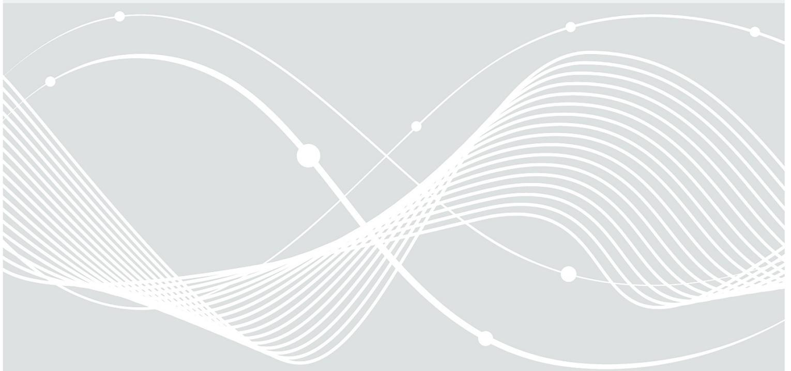

# Anforderungskatalog zur Prüfung von Identifikationsverfahren gemäß TR-03147 in Version 1.0.6

Version 1.0.1 01.12.2022

Bundesamt für Sicherheit in der Informationstechnik Postfach 20 03 63 53133 Bonn Tel.: +49 22899 9582-0 E-Mail: eid@bsi.bund.de Internet: https://www.bsi.bund.de © Bundesamt für Sicherheit in der Informationstechnik 2022

## Inhaltsverzeichnis

| 1      | Einleitung 5                                                                                 |  |
|--------|----------------------------------------------------------------------------------------------|--|
| 1.1    | Aufbau der Prüfkriterien 5                                                                   |  |
| 1.2    | Vertrauensniveau und Prüftiefe 5                                                             |  |
| 2      | Allgemeine Begriffe und Definitionen 7                                                       |  |
| 2.1    | Begriffsdefinitionen 7                                                                       |  |
| 2.2    | Kategorien von ID-Verfahren 7                                                                |  |
| 2.3    | Bewertung von Angriffspotentialen 8                                                          |  |
| 3      | Prüfanweisungen 10                                                                           |  |
| 3.1    | Vertrauenswürdige Dokumente 10                                                               |  |
| 3.1.1  | Mehrere zugelassene ID-Dokumente10                                                           |  |
| 3.1.2  | Gültiges ID-Dokument 10                                                                      |  |
| 3.1.3  | Verlässliche Quelle 11                                                                       |  |
| 3.1.4  | Enthält eine hinreichende Menge an ID-Attributen16                                           |  |
| 3.1.5  | Manipulations- und fälschungssicher16                                                        |  |
| 3.1.6  | Sicherheitsmerkmale sind bekannt und effektiv überprüfbar20                                  |  |
| 3.1.7  | Ermöglicht einen zuverlässigen Abgleich mit dem Verwender20                                  |  |
| 3.1.8  | ID-Attribute sind aktuell 22                                                                 |  |
| 3.1.9  | Verfügbare Sperrmeldungen werden überprüft22                                                 |  |
| 3.1.10 | Regelmäßige Prüfung der Menge der zulässigen ID-Dokumente23                                  |  |
| 3.2    | Sicherheit der Übertragungskanäle 24                                                         |  |
| 3.2.1  | Video-/Informationstechnische Manipulationen biometrischer Daten der zu identifizierenden    |  |
|        | Person werden erkannt 24                                                                     |  |
| 3.2.2  | Informationstechnische Manipulationen vom ID-Dokument übertragener Informationen             |  |
|        | werden erkannt 26                                                                            |  |
| 3.2.3  | Physikalische Manipulationen biometrischer Charakteristika der zu identifizierenden Person   |  |
|        | werden erkannt 28                                                                            |  |
| 3.2.4  | Physikalische Manipulationen am ID-Dokument werden erkannt30                                 |  |
| 3.2.5  | Liveübertragung sämtlicher Daten ist gewährleistet32                                         |  |
| 3.2.6  | Ein Austausch des präsentierten ID-Dokuments oder der zu identifizierenden Person während    |  |
|        | der Prüfung wird erkannt 34                                                                  |  |
| 3.2.7  | Gleichzeitige Manipulation biometrischer Charakteristika der zu identifizierenden Person und |  |
|        | entsprechende Referenzdaten auf dem ID-Dokument wird erkannt37                               |  |
| 3.3    | Prüfung der ID-Nachweise 37                                                                  |  |
| 3.3.1  | Mehrere ID-Nachweise 38                                                                      |  |
| 3.3.2  | Typ des verwendeten ID-Dokuments lässt sich ermitteln38                                      |  |
| 3.3.3  | ID-Dokument ist gültig 39                                                                    |  |
| 3.3.4  | Gefälschte Sicherheitsmerkmale werden erkannt39                                              |  |
| 3.3.5  | Fälschungen der personalisierten Daten werden erkannt43                                      |  |
|        |                                                                                              |  |
| 3.4    | Abgleich von Personen mit ID-Nachweisen47                                                    |  |
| 3.4.1  | Vertrauliche Wissensfaktoren werden ausschließlich dem legitimen Inhaber mitgeteilt47        |  |
| 3.4.2  | Sicherheit der verwendeten Authentisierungsmittel47                                          |  |
| 3.4.3  | Die tatsächliche Verfügungsgewalt der zu identifizierenden Person über das ID-Dokument wird  |  |
|        | sichergestellt 48                                                                            |  |
| 3.4.4  | Abzugleichende ID-Attribute werden in hinreichender Qualität erfasst49                       |  |
| 3.4.5  | Zuverlässiger Abgleich relevanter biometrischer ID-Attribute zwischen ID-Dokument und zu     |  |
|        | identifizierender Person 50                                                                  |  |
| 3.5    | Korrekte Erfassung der benötigten ID-Attribute50                                             |  |

| Zu erfassende ID-Attribute erlauben eine eindeutige Identifizierung50 Spezifische Sachkenntnis der Prüfer und ggf. zu verwendende Hilfsmittel sind vorhanden51 ID-Attribute werden vollständig und fehlerfrei in das Erfassungssystem übertragen51 Erfasste Daten werden auf Aktualität, Konsistenz und Plausibilität geprüft52 Sicherung der Integrität der Prozesse 53 Die Einhaltung der vorgeschriebenen Prüfkriterien ist sichergestellt53 ISMS 55 Globale Angriffsszenarien 56 Anhang: Prüfung optischer Merkmale mittels Videoübertragung57 Kopierschutz 58 Beugungsoptisch wirksame Strukturen (DOVIDs)58 Retro-reflektierende Merkmale 62 Personalisierungstechnik 62 Laserkippbilder (bspw. MLI, CLI) 62 Ausfüllschrift 63 Ausfüllschrift – Lasergravur, taktil63 Material 63 Fenster 63 Sicherheitsfaden in Vollkunststoffkarten64 Prägung 64 Optisch variable Farbe (OVI) 65 Sicherheitsdruck 65 Mikroschrift 66 Guillochen/Linienmuster 66 Iriseinfärbung 66 Fazit 67 Literaturverzeichnis 69 |
|------------------------------------------------------------------------------------------------------------------------------------------------------------------------------------------------------------------------------------------------------------------------------------------------------------------------------------------------------------------------------------------------------------------------------------------------------------------------------------------------------------------------------------------------------------------------------------------------------------------------------------------------------------------------------------------------------------------------------------------------------------------------------------------------------------------------------------------------------------------------------------------------------------------------------------------------------------------------------------------------------------------------------------------------------------------------------------------|

## 1 Einleitung

### 1.1 Aufbau der Prüfkriterien

Die Prüfkriterien in [PBV] sind nach einem festgelegten Schema aufgebaut. Dieses umfasst insbesondere die folgenden Punkte:

**Prüfkriterium-ID:** Hierbei handelt es sich um die Identifizierung des Prüfkriteriums mittels einer ID der Form Ax.y-z mit x, y und z fortlaufend nummeriert, beginnend jeweils mit 1, welche sowohl in der [PBV] als auch im vorliegenden Anforderungskatalog verwendet wird. Zusätzlich werden allgemein gültige Anforderungen eines Kapitels der TR mit dem Buchstaben "G" gekennzeichnet, z. B. [A1.G-1](#page-9-1) als Prüfkriterium-ID für das erste allgemeine Prüfkriterium zur Anforderung "Vertrauenswürdige ID-Dokumente". Die Form der ID orientiert sich an der Bezeichnung der Anforderungen in [TR-03147].

**Prüfkriterium-Beschreibung:** Dies ist die Beschreibung des Prüfkriteriums, welche ebenfalls wieder im vorliegenden Anforderungskatalog aufgegriffen wird. Dabei sind die einzelnen Anforderungen aus [TR-03147] im Bedarfsfall auf mehrere atomare Prüfkriterien aufgeteilt. Die Beschreibung gibt einen Überblick über das Prüfkriterium. Weiterführende Details oder Erläuterungen finden sich in den jeweiligen Abschnitten in diesem Dokument.

**Referenz**: Angabe einer Referenz zu [TR-03147] auf die sich das Prüfkriterium bezieht.

**Dokumentation:** Im Rahmen der Prüfaktivität hat der Prüfer auch die für das Prüfkriterium relevante Dokumentation zu berücksichtigen. Hierbei handelt es sich insbesondere um Herstellerdokumentation (bspw. Beschreibung des Verfahrens, Gebrauchsanweisungen, Schnittstellenspezifikationen, usw.). Anzugeben sind unter diesem Punkt die berücksichtigten Dokumente mit Referenz auf die relevanten Textstellen.

**Interviewpartner:** Im Rahmen seiner Prüfaktivitäten hat sich der Prüfer Sachverhalte erläutern oder zeigen zu lassen. Unter diesem Punkt sind die jeweiligen Gesprächspartner aufzuführen.

**Prüfaktivität:** An dieser Stelle beschreibt der Prüfer das Vorgehen bei der Prüfung des jeweiligen Prüfkriteriums. Die Beschreibung soll so umfangreich sein, dass ein an der Prüfung Unbeteiligter das Vorgehen unabhängig nachvollziehen kann.

**Analyse:** Unter diesem Punkt ist eine Begründung für das gewählte Vorgehen bei der Prüfung sowie die Bewertung zu dem Prüfkriterium zu geben. Diese basiert insbesondere auf den Erkenntnissen und Ergebnissen der ausgeführten Prüfaktivitäten. Die Beschreibung der Vorgehensweise sowie der Erkenntnisse und Ergebnisse dient insbesondere der Nachvollziehbarkeit der erzielten Bewertung.

**Bewertung:** Am Ende gibt der Prüfer eine Bewertung zu dem Prüfkriterium ab. Die Bewertung folgt als direktes Resultat aus der abgeschlossenen Analyse. Die zur Auswahl stehenden Bewertungsalternativen sind je nach Prüfkriterium eine Kombination aus:

- Normal, substantiell, hoch: Einstufung gemäß Vertrauensniveaus nach [TR-03147].
- N/A (nicht zutreffend): In diesem Fall hat der Prüfer eine Begründung für seine Bewertung zu geben.
- Nicht erfüllt: Das Verfahren erfüllt nicht die Mindestanforderungen für das Vertrauensniveau normal.

### 1.2 Vertrauensniveau und Prüftiefe

In [TR-03147] werden die drei Vertrauensniveaus *normal*, *substantiell* und *hoch* verwendet. Die erforderlichen Prüfaktivitäten leiten sich aus den jeweiligen Prüfkriterien sowie der Prüftiefe ab. Für die Anforderungen aus [TR-03147] sind die Prüfkriterien in Kapitel [3](#page-9-0) beschrieben. Die zugehörige Prüftiefe ist maßgeblich durch das höchste Vertrauensniveau bestimmt, dessen Einhaltung / Erreichen für ein Verfahren geprüft wird und wirkt sich gemäß [Tabelle 1](#page-5-0) auf das erreichbare Vertrauensniveau aus:

| Vertrauensniveau | Prüftiefe                                                                                                                                                                                                                                                                                                                                                                                                                                                                                                                                                                                                                                                                                                                                                                                                                                                                                                                                                                                                                                                     |
|------------------|---------------------------------------------------------------------------------------------------------------------------------------------------------------------------------------------------------------------------------------------------------------------------------------------------------------------------------------------------------------------------------------------------------------------------------------------------------------------------------------------------------------------------------------------------------------------------------------------------------------------------------------------------------------------------------------------------------------------------------------------------------------------------------------------------------------------------------------------------------------------------------------------------------------------------------------------------------------------------------------------------------------------------------------------------------------|
| normal           | Dokumentenprüfung – Alle Anforderungen werden auf Basis der verfügbaren Dokumentation geprüft. Im Prüfbericht sind Referenzen auf die inspizierten Dokumentenstellen aufzuführen. Beispiele für zu prüfende Dokumentation sind Sicherheitskonzept, Systembeschreibung, Schnittstellendefinition, Handbücher oder auch Arbeitsanweisungen. Bei Bedarf ist die Prüftiefe selektiv (d.h. für einzelne Anforderungen) um eine Umsetzungsprüfung zu erweitern. Dies ist insbesondere dann der Fall, wenn nach der Dokumentenprüfung von einem konkreten Verdacht ausgegangen werden muss, dass das Verfahren bereits mit einem "enhanced basic" Angriffspotential kompromittiert werden kann.                                                                                                                                                                                                                                                                                                          |
| substantiell     | Umsetzungsprüfung – Zusätzlich zur Dokumentenprüfung ist für jede Anforderung auch die Umsetzung in der Praxis zu prüfen. Dabei ist insbesondere auf die Übereinstimmung zwischen dokumentierter Information und konkreter Umsetzung zu achten. Die Umsetzungsprüfung soll in der "gelebten Praxis" (bspw. in der Produktivumgebung) erfolgen. Der Prüfer sollte sich die für eine Anforderung relevanten Aspekte beschreiben lassen und muss die jeweilige Umsetzung selbst in Augenschein nehmen. Im Prüfbericht sind sowohl Gesprächspartner und inspizierte Aspekte des Verfahrens aufzuführen als auch die Beobachtungen im Rahmen der Prüfaktivität zu beschreiben. Bei Bedarf ist die Prüftiefe selektiv (d.h. für einzelne Anforderungen) um unabhängige Tests zu erweitern. Dies ist insbesondere dann der Fall, wenn nach der Umsetzungsprüfung von einem konkreten Verdacht ausgegangen werden muss, dass das Verfahren bereits mit einem "moderate" Angriffspotential kompromittiert werden kann. |
| hoch             | Unabhängige Tests – Zusätzlich zur Dokumenten- und Umsetzungsprüfung sind unabhängige Tests (insbesondere auch bekannte oder entwickelte Angriffsszenarien) für das Verfahren durchzuführen. Hierzu ist dem Prüfer eine entsprechende Testmöglichkeit zur Verfügung zu stellen. Die durchgeführten Prüfaktivitäten sind im Prüfbericht zu dokumentieren. Die Art und Weise der unabhängigen Tests sollte sich zum Beispiel an den Common Criteria [CC] und insbesondere der Evaluation Methodology [CEM] orientieren.                                                                                                                                                                                                                                                                                                                                                                                                                                                                                                     |

Tabelle 1: Prüftiefe des Vertrauensniveaus

Diese in Abhängigkeit der Prüftiefe vorgenommenen Einstufungen in ein geprüftes Vertrauensniveau wird grundsätzlich für alle Prüfkriterien angewandt. Es gibt jedoch Prüfkriterien, für die eine stringente Anwendung dieser Einstufungen grundsätzlich nicht sinnvoll ist. Bei diesen Prüfkriterien werden spezifische Abweichungen dieser allgemeinen Regelung festgelegt. Beispielsweise kann die Entscheidung, ob ein ID-Dokument die Ausweispflicht im Inland erfüllt oder nicht (vgl. Prüfkriterium [A1.1-9](#page-14-0)), unabhängig von einer **Umsetzungsprüfung** und **Unabhängigen Tests** vorgenommen werden.

## 2 Allgemeine Begriffe und Definitionen

### 2.1 Begriffsdefinitionen

Im Folgenden werden für diesen Anforderungskatalog und die zugehörige Prüfberichtsvorlage [PBV] die nachfolgenden Begriffe definiert. Die Definitionen orientieren sich dabei an [ISO-HBV] und deren deutsche Übersetzung auf [\[CB-STD\].](http://www.christoph-busch.de/standards.html) Hierbei ist zu beachten, dass durchaus auch andere, abweichende Definitionen existieren.

- **Biometrisches Charakteristikum** ist ein biologisches oder verhaltensabhängiges Charakteristikum eines Individuums, welches zur Erhebung biometrischer Daten herangezogen wird, z. B. Gesichtstopografie oder Papillarleistenstruktur ("Fingerabdruck").
- **Biometrisches Sample** ist eine analoge oder digitale Repräsentation eines biometrischen Charakteristikums, z. B. der Datensatz eines Bildes eines Gesichts.
- **Biometrisches Merkmal** besteht aus Zahlen oder Kennzeichen, die aus einem biometrischen Sample extrahiert wurden und zum Vergleich verwendet werden.
- **Biometrische Daten** sind ein biometrisches Sample oder eine Ansammlung biometrischer Samples in jeder Verarbeitungsstufe (z. B. biometrische Merkmale).
- **Biometrische Falschübereinstimmungsrate** ist die Wahrscheinlichkeit, dass eine biometrische Übereinstimmungsprüfung erfolgreich verläuft, obwohl ein nicht registriertes biometrisches Charakteristikum verwendet wurde. Ein Beispiel wäre ein Falsch-positiv-Ereignis bei einer Fingerabdrucksprüfung, also eine erfolgreich verlaufende Prüfung eines Fingerabdrucks mit einem Fingerabdrucksensor, wobei ein anderer als der registrierte Finger benutzt wird.
- **Biometrische Falschakzeptanzrate** ist die Wahrscheinlichkeit, dass eine biometrischen Behauptung fälschlicherweise vom prüfenden Gesamtsystem akzeptiert wird. Sie errechnet sich aus der FMR, multipliziert mit der Anzahl der vom Gesamtsystem erlaubten Fehlversuche.

Die folgende Definition orientiert sich an der Technischen Richtlinie [TR-03107-1].

• **Authentisierungsmittel** sind technische Mittel, die es dem Inhaber erlauben, eine Identität (das heißt eine Menge von ID-Attributen) oder andere übermittelte Daten zu authentisieren. Beispiele für Authentisierungsmittel sind Passwörter, der Personalausweis oder eine Signaturkarte. Sind mehrere technische Mittel notwendig (etwa Chipkarte und PIN), so besteht das vollständige Authentisierungsmittel aus mehreren Authentisierungsfaktoren.

Sonstige Definition.

• **Verwender** nutzt ein ID-Dokument um sich zu identifizieren.

### 2.2 Kategorien von ID-Verfahren

Dieses Dokument definiert Leitlinien, um das erreichte Vertrauensniveau für ein möglichst breites Spektrum von unterschiedlichen ID-Verfahren zu bewerten. Um die Prüfkriterien trotzdem so klar und spezifisch wie möglich zu formulieren, werden alle ID-Verfahren in die folgenden drei Kategorien eingeteilt:

a) **direkt**: ID-Verfahren, bei denen der Verwender persönlich anwesend ist und der Prüfer das genutzte ID-Dokument sowie die zu überprüfende Person unmittelbar in Augenschein nehmen, sowie ggf. weitere Prüfungen vornehmen kann (z. B. das ID-Dokument vor Ort auslesen wie beim sog. "Vor-Ort-Auslesen" des PA bzw. eAT).

- b) **indirekt**: ID-Verfahren, bei denen der Verwender nicht persönlich anwesend ist, jedoch der Prüfer das ID-Dokument sowie die zu überprüfende Person über einen entfernten, üblicherweise audiovisuellen Kanal in Augenschein nehmen kann.
- c) **elektronisch**: ID-Verfahren, die auf einer kryptografisch abgesicherten elektronischen Authentifikation oder einer anderweitigen automatisierten, nicht persönlichen Prüfung beruhen.

Auf diese Kategorien wird in einigen Prüfkriterien und weiterführenden Erklärungen Bezug genommen. Vertrauensniveaus von ID-Dokumenten für unterschiedliche Kategorien von ID-Verfahren sind nicht unmittelbar miteinander vergleichbar. Es ist beispielsweise häufig einfacher, eine Fälschung eines bestimmten visuellen Sicherheitsmerkmals zu erstellen, welche einer Inspektion über einen entfernten visuellen Kanal standhält, als eine, die von der überprüfenden Person direkt in Augenschein genommen wird. Regelmäßig benötigen Fälschungen, die einer Prüfung mit einem Verfahren der Kategorie "indirekt" standhalten, ein geringeres Angriffspotential (z. B. geringeres Maß an Insiderkenntnissen) für ihre Erstellung als solche, die Prüfungen mit einem Verfahren der Kategorie "direkt" standhalten. Die Angriffsszenarien für die Fälschung elektronischer Authentifikationsmerkmale wiederum unterscheiden sich stark von denen für die Fälschung visueller oder haptischer Merkmale.

### 2.3 Bewertung von Angriffspotentialen

Das Potential eines Angreifers auf das geprüfte ID-Verfahren ist in diesem Dokument wiederholt von Belang. Das Angriffspotential wird gemäß der in Anhang B.4 der [CEM] definierten Vorgehensweise anhand folgender Kriterien bewertet:

- **•** die notwendige **Zeit** (elapsed time) für die Identifizierung, Vorbereitung und Durchführung eines Angriffs
- **•** die notwendige **Expertise** (specialist expertise) des Angreifers
- **•** das notwendige **Insiderwissen** (knowledge of the target of evaluation) des Angreifers
- **•** die notwendigen **Zugangs- / Zugriffsgelegenheiten** (window of opportunity) für einen Angriff
- **•** die notwendige **Ausrüstung** (equipment) für einen Angriff

Für die Bewertung des Aufwands ist in erster Linie die Durchführung des Angriffs zu betrachten. Der Aufwand für die Vorbereitung wird nur in Ausnahmefällen, wenn der hierzu erforderliche Aufwand im Vergleich zur Durchführung extrem hoch ist, berücksichtigt. Hierdurch wird der Eigenschaft Rechnung getragen, dass z. B. ein Angriff mehrmals in einer kurzen Zeit erfolgreich durchführbar ist, dessen Vorbereitung jedoch längere Zeit in Anspruch nimmt. Insbesondere in solchen Fällen soll sich das bewertete Angriffspotential an der Durchführung und nicht an der Vorbereitung des Angriffs orientieren.

Weiterhin betrachtet [CEM] hinsichtlich des Kriteriums **Zugangs- / Zugriffsgelegenheiten** (window of opportunity) die Zugangs- bzw. die Zugriffsmöglichkeit auf das zu prüfende Produkt. Bei der Prüfung von ID-Verfahren im Gegensatz zu Produkten ist die Möglichkeit zur Abgrenzung des zu prüfenden Gegenstands von seiner Umgebung nicht in der Weise gegeben, wie dies bei der Prüfung von Produkten üblich ist. Hierdurch ist es nicht immer möglich eine "scharfe Grenze" zwischen den Kriterien "**Zugangs- / Zugriffsgelegenheiten**" und "**Ausrüstung**" zu ziehen. So kann u. U. ein eingeschränkter Zugriff auf praktisch umgesetzte video- oder filialbasierte Verfahren dadurch kompensiert werden, dass ein praktisch umgesetztes Verfahren durch die Beschaffung entsprechender Ausrüstung ganz oder in Teilen nachgestellt wird. Diese "Simulationsumgebung" könnte dann zur Entwicklung und Erprobung von Angriffen anstelle des tatsächlichen Verfahrens genutzt werden.

Das Vertrauensniveaus eines ID-Verfahrens ergibt sich folgendermaßen aus dessen Widerstand gegen einen Angriff mit einem entsprechenden Angriffspotential:

| ID-Verfahren mit Vertrauensniveau |                           | Angriffspotential       |
|-----------------------------------|---------------------------|-------------------------|
| nicht erfüllt                     |                           | ggf. niedrig (basic)    |
| normal                            | widersteht Angriff mit | normal (enhanced basic) |
| substantiell                      |                           | substantiell (moderate) |
| hoch                              |                           | hoch (high)             |

## 3 Prüfanweisungen

### 3.1 Vertrauenswürdige Dokumente

### 3.1.1 Mehrere zugelassene ID-Dokumente

#### **A1.G-1**

**Prüfkriterium-Beschreibung:** Wie lautet das Vertrauensniveau desjenigen für das ID-Verfahren zugelassenen ID-Dokuments, welches das niedrigste Vertrauensniveau besitzt?

#### **Erläuterung / Hinweis:**

Grundlage für eine reguläre ID-Prüfung ist die Verfügbarkeit von mindestens einem vertrauenswürdigen ID-Dokument (als verlässliche Quelle nach der eIDAS Durchführungsverordnung 2015/1502 [eIDAS 2015/1502]). Sofern in einem ID-Verfahren die Verwendung mehrerer ID-Dokumente zugelassen ist, bestimmt nach dem Minimumprinzip dasjenige für eine ID-Prüfung zulässige ID-Dokument mit dem niedrigsten Vertrauensniveau das insgesamt maximal erreichbare Vertrauensniveau für das ID-Verfahren.

Die Prüfkriterien zur Anforderung "Vertrauenswürdige ID-Dokumente" sind für alle für das ID-Verfahren zugelassenen ID-Dokumente durch den Prüfer anzuwenden und das Gesamtergebnis der Anforderung gemäß dem oben genannten Minimumprinzip zu bestimmen.

Zur Prüfung eines ID-Dokuments sind das Prüfkriterium [A1.G-2](#page-9-2) sowie alle Prüfkriterien mit einer Prüfkriterium-ID der Form A1.y-z mit 1 ≤ y ≤ 8 und z fortlaufend nummeriert, beginnend mit 1, anzuwenden.

### 3.1.2 Gültiges ID-Dokument

### **A1.G-2**

**Prüfkriterium-Beschreibung:** Wird bei der Anwendung des ID-Verfahrens überprüft, ob das verwendete ID-Dokument zum Zeitpunkt der Prüfung gültig ist?

#### **Erläuterung / Hinweis:**

Es ist ein gültiges, d.h. insbesondere ein nicht abgelaufenes ID-Dokument notwendig. Nur wenn das ID-Verfahren prüft, ob das ID-Dokument zum Zeitpunkt der Prüfung gültig ist, kann mindestens das Vertrauensniveau "normal" erreicht werden. Das ID-Verfahren muss hierzu prüfen, ob das Datum "Gültig bis" noch nicht überschritten wurde und sofern vorhanden das Ausgabedatum in der Vergangenheit liegt. Ggf. sind äquivalente Prüfschritte vorzunehmen. Beispielsweise ist für ein Ablaufdatum zu prüfen, ob dieses erreicht oder bereits überschritten wurde. Grundsätzlich können auch ID-Dokumente ohne Gültigkeitsbegrenzung verwendet werden. Mit diesen sind jedoch die Vertrauensniveaus "substantiell" oder "hoch" nicht erreichbar.

Bei der Prüfung sind die folgenden verfahrensspezifischen Aspekte zu berücksichtigen (vgl. auch Kategorie der ID-Verfahren gemäß Erläuterung / Hinweis zu [A1.3-1\)](#page-16-0):

• VideoIdent, PhotoIdent: Die Attribute zur Gültigkeit müssen eindeutig identifizierbar und lesbar sein. Derjenige, der das ID-Dokument prüft, muss über die erforderliche Fachkenntnis (z. B. durch Schulung) verfügen, um die Prüfung der Attribute der ID-Dokumente mittels des ID-Verfahrens vorzunehmen.

Hierzu kann das ID-Verfahren ggf. auch technisch, z. B. in Form von Handlungsanweisungen, unterstützen.

- ID-Verfahren mit unmittelbarer Anwesenheit: Wie VideoIdent (siehe oben). Zusätzlich sollte durch den Prüfer z. B. auch eine haptische Prüfung des ID-Dokuments vorgenommen werden.
- ID-Verfahren mit Online-Ausweisfunktion des PA oder eAT: Es muss sichergestellt sein, dass das ID-Verfahren die Attribute zur Gültigkeit sicher ausliest und prüft.

Die Bewertung des Vertrauensniveaus ist wie folgt vorzunehmen:

- Nicht erfüllt: Bei Anwendung des ID-Verfahrens wird nicht überprüft, ob das verwendete ID-Dokument zum Zeitpunkt der Prüfung gültig ist.
- Normal: Bei Anwendung des ID-Verfahrens wird überprüft, ob das verwendete ID-Dokument zum Zeitpunkt der Prüfung gültig ist. Die Prüfung erfolgte mit der Prüftiefe **Dokumentenprüfung**.
- Substantiell: Bei Anwendung des ID-Verfahrens wird überprüft, ob das verwendete ID-Dokument zum Zeitpunkt der Prüfung gültig ist und über eine Gültigkeitsbegrenzung verfügt. Die Prüfung erfolgte mit der Prüftiefe **Umsetzungsprüfung**.
- Hoch: Bei Anwendung des ID-Verfahrens wird überprüft, ob das verwendete ID-Dokument zum Zeitpunkt der Prüfung gültig ist und über eine Gültigkeitsbegrenzung verfügt. Die Prüfung erfolgte mit der Prüftiefe **Unabhängige Tests**.

#### 3.1.3 Verlässliche Quelle

#### **A1.1-1**

**Prüfkriterium-Beschreibung:** Sind die für die Ausstellung des jeweiligen ID-Dokuments verantwortlichen Stellen bekannt?

**Erläuterung / Hinweis:** Beispiele für die Ausstellung des jeweiligen ID-Dokuments verantwortlichen Stellen sind:

- Die verantwortliche Stelle ist eine Behörde (z. B. für die Ausstellung von Personalausweis oder Reisepass).
- Das ID-Dokument ist anwendungsbezogen und wird im Rahmen eines gesetzlichen Kontextes ausgegeben (z. B. für die Ausstellung von Führerschein oder Gesundheitskarte)
- Die verantwortliche Stelle ist eine (privatwirtschaftliche) Organisation (z. B. für die Ausstellung eines Mitarbeiterausweises).
- Die verantwortliche Stelle ist ein (eingetragener) Verein oder eine vergleichbare Organisation (z. B. für die Ausstellung eines Mitgliedsausweises).

Die Bekanntheit einer Stelle ist durch den Prüfer mit geeigneten Methoden zu verifizieren. Dies kann variieren über die Annahme, dass die ausgebende Stelle hinreichend bekannt ist (z. B. im Falle von Personalausweis oder Reisepass) bis hin zu einer Recherche im Internet (z. B. Organisationen für die Lizenzierung oder das Training für berufsbezogene Lizenzen) um die Bekanntheit der verantwortlichen Stelle zu verifizieren. Eine hinreichende Bekanntheit kann auch für solche Stellen angenommen werden, die anwendungsbezogene ID-Dokumente auf einer gesetzlichen Grundlage (z. B. Führerschein, Gesundheitskarte, Heilberufsausweis) ausgeben. Im Zweifelsfall ist die Bekanntheit durch zusätzliche Maßnahmen (z. B. die Stelle wird in einer Liste einer Behörde geführt) zu prüfen. Die Bekanntheit privatwirtschaftlicher Organisationen kann z. B. unter Anwendung des Handelsregisters geprüft werden.

Die Bewertung des Vertrauensniveaus ist wie folgt vorzunehmen:

• Nicht erfüllt: Die verantwortlichen Stellen für die Ausstellung des jeweiligen ID-Dokuments sind nicht bekannt.

- Normal: Die verantwortlichen Stellen für die Ausstellung des jeweiligen ID-Dokuments sind bekannt. Die Prüfung erfolgte mit der Prüftiefe **Dokumentenprüfung**.
- Substantiell: Die verantwortlichen Stellen für die Ausstellung des jeweiligen ID-Dokuments sind bekannt. Die Prüfung erfolgte mit der Prüftiefe **Umsetzungsprüfung**.
- Hoch: Die verantwortlichen Stellen für die Ausstellung des jeweiligen ID-Dokuments sind bekannt. Die Prüfung erfolgte mit der Prüftiefe **Unabhängige Tests**.

#### **A1.1-2**

**Prüfkriterium-Beschreibung:** Werden über die verantwortlichen Stellen öffentlich verfügbare Informationen über Kompromittierungen (z. B. Medienberichte zur Kompromittierung von solchen Stellen) gesammelt?

**Erläuterung / Hinweis:** Für hoheitlich herausgegebene Dokumente, die die Ausweispflicht im Inland erfüllen, kann widerleglich vermutet werden, dass die für die Herausgabe verantwortlichen Stellen nicht kompromittiert sind.

Die Bewertung des Vertrauensniveaus ist wie folgt vorzunehmen:

- Nicht erfüllt: Öffentlich verfügbare Informationen über Kompromittierungen verantwortlicher Stellen werden nicht gesammelt.
- Normal: Öffentlich verfügbare Informationen über Kompromittierungen verantwortlicher Stellen werden gesammelt. Die Prüfung erfolgte mit der Prüftiefe **Dokumentenprüfung**.
- Substantiell/Hoch: Öffentlich verfügbare Informationen über Kompromittierungen verantwortlicher Stellen werden gesammelt. Das Vertrauensniveau wird an dieser Stelle nicht weiter unterschieden. Die Prüfung erfolgte mit der Prüftiefe **Umsetzungsprüfung** (abweichend zu dem Standardvorgehen gemäß Kapitel [1.2](#page-4-1) "[Vertrauensniveau und Prüftiefe](#page-4-1)").

#### **A1.1-3**

**Prüfkriterium-Beschreibung:** Werden die über die verantwortlichen Stellen gesammelten Informationen über Kompromittierungen (z. B. Medienberichte zur Kompromittierung von solchen Stellen) zeitnah berücksichtigt?

**Erläuterung / Hinweis:** Siehe [A1.1-2](#page-11-0). Eine zeitnahe Berücksichtigung solcher Informationen kann dadurch erfolgen, dass das ID-Verfahren selbst modifiziert wird (z. B. indem betroffene ID-Dokumente nicht mehr zugelassen werden) oder ein Prüfschritt des ID-Verfahrens diese zusätzlichen Informationen auswertet.

Bei der Prüfung sind die folgenden verfahrensspezifischen Aspekte zu berücksichtigen:

- VideoIdent, PhotoIdent, ID-Verfahren mit unmittelbarer Anwesenheit (z. B. Prüfung in einer Filiale): Es muss sichergestellt sein, dass derjenige, der das ID-Dokument prüft, über die Informationen über Kompromittierungen (bzw. über deren Konsequenzen) verfügt und diese korrekt berücksichtigt.
- ID-Verfahren mit Online-Ausweisfunktion des PA oder eAT: Es muss sichergestellt sein, dass die Informationen über Kompromittierungen (bzw. deren Konsequenzen) bei der (ggf. automatisierten) Durchführung des ID-Verfahrens berücksichtigt werden.

Die Bewertung des Vertrauensniveaus ist wie folgt vorzunehmen:

- Nicht erfüllt: Verfügbare Informationen über Kompromittierungen verantwortlicher Stellen werden nicht zeitnah berücksichtigt.
- Normal: Verfügbare Informationen über Kompromittierungen verantwortlicher Stellen werden zeitnah berücksichtigt. Die Prüfung erfolgte mit der Prüftiefe **Dokumentenprüfung**.

• Substantiell/Hoch: Verfügbare Informationen über Kompromittierungen verantwortlicher Stellen werden zeitnah berücksichtigt. Das Vertrauensniveau wird an dieser Stelle nicht weiter unterschieden. Die Prüfung erfolgte mit der Prüftiefe **Umsetzungsprüfung** (abweichend zu dem Standardvorgehen gemäß Kapitel [1.2](#page-4-1) ["Vertrauensniveau und Prüftiefe"](#page-4-1)).

### **A1.1-4**

**Prüfkriterium-Beschreibung:** Werden aktuelle Informationen über Manipulationen und Fälschungen bei ID-Dokumenten gesammelt?

**Erläuterung / Hinweis:** Die Bewertung des Vertrauensniveaus ist wie folgt vorzunehmen:

- Nicht erfüllt: Aktuelle Informationen über Manipulationen und Fälschungen bei ID-Dokumenten werden nicht gesammelt.
- Normal: Aktuelle Informationen über Manipulationen und Fälschungen bei ID-Dokumenten werden gesammelt. Die Prüfung erfolgte mit der Prüftiefe **Dokumentenprüfung**.
- Substantiell/Hoch: Aktuelle Informationen über Manipulationen und Fälschungen bei ID-Dokumenten werden gesammelt. Das Vertrauensniveau wird an dieser Stelle nicht weiter unterschieden. Die Prüfung erfolgte mit der Prüftiefe **Umsetzungsprüfung** (abweichend zu dem Standardvorgehen gemäß Kapitel [1.2](#page-4-1) "[Vertrauensniveau und Prüftiefe](#page-4-1)").

### **A1.1-5**

**Prüfkriterium-Beschreibung:** Werden die gesammelten Informationen über Manipulationen und Fälschungen bei ID-Dokumenten zeitnah berücksichtigt?

**Erläuterung / Hinweis:** Eine zeitnahe Berücksichtigung solcher Informationen kann dadurch erfolgen, dass das ID-Verfahren selbst modifiziert wird (z. B. indem betroffene ID-Dokumente nicht mehr zugelassen werden) oder ein Prüfschritt des ID-Verfahrens diese zusätzliche Informationen berücksichtigt.

Verfahrensspezifisch ist zu unterscheiden wie in Prüfkriterium [A1.1-3.](#page-11-1)

Die Bewertung des Vertrauensniveaus ist wie folgt vorzunehmen:

- Nicht erfüllt: Aktuelle Informationen über Manipulationen und Fälschungen bei ID-Dokumenten werden nicht zeitnah berücksichtigt.
- Normal: Aktuelle Informationen über Manipulationen und Fälschungen bei ID-Dokumenten werden zeitnah berücksichtigt. Die Prüfung erfolgte mit der Prüftiefe **Dokumentenprüfung**.
- Substantiell/Hoch: Aktuelle Informationen über Manipulationen und Fälschungen bei ID-Dokumenten werden zeitnah berücksichtigt. Das Vertrauensniveau wird an dieser Stelle nicht weiter unterschieden. Die Prüfung erfolgte mit der Prüftiefe **Umsetzungsprüfung** (abweichend zu dem Standardvorgehen gemäß Kapitel [1.2](#page-4-1) ["Vertrauensniveau und Prüftiefe"](#page-4-1)).

#### **A1.1-6**

**Prüfkriterium-Beschreibung:** Wird beim Prozess der Erstellung und Aushändigung des verwendeten ID-Dokuments die Berechtigung und Identität eines Antragstellers hinreichend sicher geprüft?

**Erläuterung / Hinweis:** Die Bewertung des Vertrauensniveaus ist wie folgt vorzunehmen:

- Nicht erfüllt: Beim Prozess der Erstellung und Aushändigung des verwendeten ID-Dokuments wird die Berechtigung und Identität eines Antragstellers nicht hinreichend sicher geprüft.
- Normal: Beim Prozess der Erstellung und Aushändigung des verwendeten ID-Dokuments wird die Berechtigung und Identität eines Antragstellers hinreichend sicher geprüft. Die Prüfung erfolgte mit der Prüftiefe **Dokumentenprüfung**. Die Dokumentenprüfung kann entfallen, falls das ID-Dokument

allgemein als vertrauenswürdig, wie z. B. der PA, anerkannt ist (abweichend zu dem Standardvorgehen gemäß Kapitel [1.2](#page-4-1) ["Vertrauensniveau und Prüftiefe"](#page-4-1)).

- Substantiell: Beim Prozess der Erstellung und Aushändigung des verwendeten ID-Dokuments wird die Berechtigung und Identität eines Antragstellers hinreichend sicher geprüft. Die Prüfung erfolgte mit der Prüftiefe **Umsetzungsprüfung**. Die Umsetzungsprüfung kann entfallen, falls das ID-Dokument allgemein als vertrauenswürdig, wie z. B. der PA, anerkannt ist (abweichend zu dem Standardvorgehen gemäß Kapitel [1.2](#page-4-1) ["Vertrauensniveau und Prüftiefe"](#page-4-1)).
- Hoch: Beim Prozess der Erstellung und Aushändigung des verwendeten ID-Dokuments wird die Berechtigung und Identität eines Antragstellers hinreichend sicher geprüft. Die Prüfung erfolgte mit der Prüftiefe **Unabhängige Tests**. Die Durchführung unabhängiger Tests kann entfallen, falls das ID-Dokument allgemein als vertrauenswürdig, wie z. B. der PA, anerkannt ist (abweichend zu dem Standardvorgehen gemäß Kapitel [1.2](#page-4-1) ["Vertrauensniveau und Prüftiefe](#page-4-1)").

#### **A1.1-7**

**Prüfkriterium-Beschreibung:** Prüft das ID-Verfahren, ob das verwendete ID-Dokument zu einer explizit begrenzten Menge an zugelassenen ID-Dokumenten gehört?

**Erläuterung / Hinweis:** Wird für ein bestimmtes ID-Verfahren beispielsweise ein amtlicher Lichtbildausweis aus einer bestimmten Staatenliste als zu verwendendes ID-Dokument gefordert, muss während der Durchführung des ID-Verfahrens überprüft werden, ob das verwendete ID-Dokument unter diese Kategorie fällt.

Es ist verfahrensspezifisch wie folgt zu unterscheiden:

- VideoIdent, PhotoIdent, ID-Verfahren mit unmittelbarer Anwesenheit (z. B. PostIdent): Es muss sichergestellt sein, dass derjenige, der das ID-Dokument prüft, über die zugelassene Menge an ID-Dokumenten informiert ist und diese Information korrekt anwendet.
- Elektronische Verfahren wie beispielsweise Verfahren mit Online-Ausweisfunktion des PA oder eAT: Aufgrund der gegenseitigen Authentisierung mit der Etablierung eines sicheren Kanals zwischen dem PA bzw. eAT und der auslesenden Stelle auf Basis der vorhandenen Sicherheitsmechanismen (z. B. Terminalauthentisierung) und dem hierzu verwendeten Keymanagement kann davon ausgegangen werden, dass ausschließlich PA- und eAT-Produkte durch dieses ID-Verfahren unterstützt werden. Analoges ist für elektronische Verfahren zu prüfen, die auf anderen ID-Dokumenten basieren.

Die Bewertung des Vertrauensniveaus ist wie folgt vorzunehmen:

- Nicht erfüllt: Für das ID-Verfahren ist keine explizit begrenzte Menge an zugelassenen ID-Dokumenten festgelegt. oder das ID-Verfahren prüft nicht, ob das verwendete ID-Dokument zu einer explizit begrenzten Menge an zugelassenen ID-Dokumenten gehört.
- Normal: Das ID-Verfahren prüft, ob das verwendete ID-Dokument zu einer explizit begrenzten Menge an zugelassenen ID-Dokumenten gehört. Die Prüfung erfolgte mit der Prüftiefe **Dokumentenprüfung**.
- Substantiell/Hoch: Das ID-Verfahren prüft, ob das verwendete ID-Dokument zu einer explizit begrenzten Menge an zugelassenen ID-Dokumenten gehört. Die Durchführung einer Umsetzungsprüfung kann entfallen (abweichend zu dem Standardvorgehen gemäß Kapitel [1.2](#page-4-1) "[Vertrauensniveau und Prüftiefe](#page-4-1)").

#### **A1.1-8**

**Prüfkriterium-Beschreibung:** Handelt es sich bei dem ID-Dokument um ein explizites ID-Dokument?

**Erläuterung / Hinweis:** Bei einem ID-Dokument handelt es sich um ein explizites ID-Dokument, wenn es zu dem Zweck herausgegeben wurde, die Identität des Inhabers nachzuweisen. Beispielsweise sind die ID-Dokumente PA und Reisepass explizite ID-Dokumente.

Im Gegensatz dazu besteht der Verwendungszweck des Führerscheins darin, nachzuweisen, dass der angegebene Inhaber eine Fahrerlaubnis besitzt. Mit Einschränkungen (z. B. Foto kann älter sein) ermöglicht ein Führerschein zwar auch eine Identifizierung, aber es ist kein explizites ID-Dokument. (z. B. wird auch bei einer Verkehrskontrolle neben dem Führerschein zusätzlich der Personalausweis verlangt). D.h. ein in Deutschland ausgestellter Führerschein ist im Sinne der TR zwar ein ID-Dokument, aber kein explizites ID-Dokument.

Wenn ein explizites ID-Dokument wiederum über zusätzliche Anwendungen wie z. B. Führerschein, Gesundheitskarte oder Bankkarte verfügt, hat dies keine Auswirkungen auf die Bewertung und das ID-Dokument bleibt ein explizites ID-Dokument.

Die Bewertung des Vertrauensniveaus ist wie folgt vorzunehmen:

- Nicht erfüllt: Eine Aussage, ob es sich um ein explizites ID-Dokument handelt oder nicht, ist nicht möglich.
- Normal: Bei dem ID-Dokument handelt es sich **nicht** um ein explizites ID-Dokument (bspw. Führerschein).
- Substantiell/Hoch: Das Vertrauensniveau wird an dieser Stelle nicht weiter unterschieden. Bei dem ID-Dokument handelt es sich um ein explizites ID-Dokument. Die Prüfung erfolgte mit der Prüftiefe **Dokumentenprüfung** (abweichend zu dem Standardvorgehen gemäß Kapitel [1.2 "Vertrauensniveau und](#page-4-1) [Prüftiefe](#page-4-1)").

#### **A1.1-9**

**Prüfkriterium-Beschreibung:** Erfüllt das ID-Dokument die Ausweispflicht im Inland?

**Erläuterung / Hinweis:** Definition Ausweispflicht im Inland gemäß [TR-03147], Tabelle 4 (Fußnote 8): D.h. nach der Rechtsordnung des jeweiligen Landes aufgrund derer ein ID-Nachweis benötigt wird bzw. gemäß der Rechtsordnung, die bei privatrechtlichen Verträgen explizit vereinbart wurde. Die ID-Dokumente Personalausweis und Reisepass erfüllen die nationale Ausweispflicht in Deutschland (Gesetz über Personalausweise und den elektronischen Identitätsnachweis, § 1; vgl. z. B. <http://www.juraforum.de/lexikon/ausweispflicht>).

Die Bewertung des Vertrauensniveaus ist wie folgt vorzunehmen:

- N/A: Es handelt sich um ein explizites Ausweisdokument, welches aber nicht die Ausweispflicht im Inland erfüllt.
- Normal/Substantiell: Das Vertrauensniveau wird an dieser Stelle nicht weiter unterschieden. Die Ausweispflicht wird (bei einem nicht expliziten Ausweisdokument) nicht erfüllt. Die Prüfung erfolgte mit der Prüftiefe **Dokumentenprüfung** (abweichend zu dem Standardvorgehen gemäß Kapitel [1.2](#page-4-1) "[Vertrauensniveau und Prüftiefe](#page-4-1)").
- Hoch: Die Ausweispflicht im Inland wird erfüllt. Die Prüfung erfolgte mit der Prüftiefe **Dokumentenprüfung** (abweichend zu dem Standardvorgehen gemäß Kapitel [1.2 "Vertrauensniveau und](#page-4-1) [Prüftiefe](#page-4-1)").

### **A1.1-10**

**Prüfkriterium-Beschreibung:** Verfügt das ID-Dokument über ein inländischen Ausweisdokumenten mindestens gleichwertiges Sicherheitsniveau von Merkmalen und deren Prüfbarkeit zum Schutz vor Fälschungen und Manipulationen?

**Erläuterung / Hinweis:** *Das ID-Dokument erfüllt nicht die Ausweispflicht im Inland;* Die Bewertung des Prüfers, dass das ID-Dokument über ein mindestens vergleichbares Sicherheitsniveau zu einem ID-Dokument, das die Ausweispflicht im Inland, verfügt muss hinreichend begründet werden.

Bei einem eAT kann von einem vergleichbaren Sicherheitsniveau zum PA ausgegangen werden.

Die Bewertung des Vertrauensniveaus ist wie folgt vorzunehmen:

- N/A: Es handelt sich um ein explizites Ausweisdokument, welches die Ausweispflicht im Inland erfüllt.
- Nicht erfüllt: Eine Aussage über ein mindestens gleichwertiges Sicherheitsniveau von Merkmalen und deren Prüfbarkeit ist nicht möglich.
- Normal/Substantiell: Das ID-Dokument verfügt nicht über ein inländischen Ausweisdokumenten mindestens gleichwertiges Sicherheitsniveau von Merkmalen und deren Prüfbarkeit zum Schutz vor Fälschungen und Manipulationen. Das Vertrauensniveau wird an dieser Stelle nicht weiter unterschieden. Die Prüfung erfolgte mit der Prüftiefe **Dokumentenprüfung**.
- Hoch: Das ID-Dokument verfügt über ein inländischen Ausweisdokumenten mindestens gleichwertiges Sicherheitsniveau von Merkmalen und deren Prüfbarkeit zum Schutz vor Fälschungen und Manipulationen. Die Prüfung erfolgte mit der Prüftiefe **Umsetzungsprüfung** (abweichend zu dem Standardvorgehen gemäß Kapitel [1.2](#page-4-1) ["Vertrauensniveau und Prüftiefe](#page-4-1)").

### 3.1.4 Enthält eine hinreichende Menge an ID-Attributen

#### **A1.2-1**

**Prüfkriterium-Beschreibung:** Ist eine hinreichende Menge von ID-Attributen vorhanden?

**Erläuterung / Hinweis:** Die Menge von benötigten ID-Attributen ergibt sich aus der jeweiligen Anwendung. Die ID-Attribute sind im Prüfbericht anzugeben.

- Nicht erfüllt: Die Menge an in der Anwendung benötigten ID-Attributen für den ID-Nachweis kann nicht angegeben werden oder sie läßt sich nicht aus jedem zugelassenen Dokument bestimmen.
- Normal/Substantiell/Hoch: Die Menge an in der Anwendung benötigten ID-Attributen für den ID-Nachweis kann angegeben werden. Das Vertrauensniveau wird an dieser Stelle nicht weiter unterschieden. Die Prüfung erfolgte mit der Prüftiefe **Dokumentenprüfung** (abweichend zu dem Standardvorgehen gemäß Kapitel [1.2](#page-4-1) ["Vertrauensniveau und Prüftiefe](#page-4-1)").

### **A1.2-2**

**Prüfkriterium-Beschreibung:** Ist eine eindeutige Identifizierung durch die gegebenen ID-Attribute möglich?

**Erläuterung / Hinweis:** Nur relevant, falls dies für die geprüfte Anwendung erforderlich ist.

- N/A: Die eindeutige Identifizierung durch die ID-Attribute ist für die Anwendung nicht erforderlich.
- Nicht erfüllt: Es erfolgt keine eindeutige Identifizierung durch die ID-Attribute, obwohl diese für die Anwendung erforderlich ist. Die Prüfung erfolgte mit der Prüftiefe **Dokumentenprüfung**.
- Normal/Substantiell/Hoch: Es erfolgt eine eindeutige Identifizierung durch die ID-Attribute. Das Vertrauensniveau wird an dieser Stelle nicht weiter unterschieden. Die Prüfung erfolgte mit der Prüftiefe **Dokumentenprüfung** (abweichend zu dem Standardvorgehen gemäß Kapitel [1.2 "Vertrauensniveau und](#page-4-1) [Prüftiefe](#page-4-1)").

### 3.1.5 Manipulations- und fälschungssicher

Hier wird das Vertrauensniveau festgelegt, welches das benutzte ID-Dokument gegenüber Fälschung und Manipulation hat. Maßgeblich für die Bewertung ist der aktuelle Stand der Forschung und Technik. Die Bewertung erfolgt gemäß [CEM], siehe Kapitel [2.3.](#page-7-0) Im Sinne einer "make or buy" Entscheidung ist die aus Sicht eines Angreifers einfachste bzw. kostengünstigste Beschaffung und Implementierung eines Angriffs zu bewerten.

Von der Kategorie des ID-Verfahrens hängt die Bewertung hinsichtlich des Vertrauensniveaus der Manipulations- und Fälschungssicherheit des betrachteten ID-Dokuments maßgeblich ab. Die Manipulations- und Fälschungssicherheit eines ID-Dokuments, das [A1.3-1](#page-16-0) nicht erfüllt, ist kein absolutes Kriterium, sondern hängt davon ab, in welche Kategorie (direkt, indirekt oder elektronisch) das geprüfte ID-Verfahren fällt. Also insbesondere davon, wie ID-Nachweise auf potentielle Manipulationen bzw. Fälschungen geprüft werden.

### **A1.3-1**

**Prüfkriterium-Beschreibung:** Ist das betrachtete ID-Dokument ein deutscher Personalausweis, ein EU-Aufenthaltstitel oder ein EU- oder EFTA-Reisepass und entspricht damit bezüglich der Manipulations- und Fälschungssicherheit dem Vertrauensniveau "hoch"?

**Erläuterung / Hinweis:** Für die genannten ID-Dokumente wird grundsätzlich das Vertrauensniveau "hoch" bezüglich der Manipulations- und Fälschungssicherheit angenommen. Liegen trotz dessen belastbare Hinweise dafür vor, dass diese Annahme für eines der oben genannten ID-Dokumente nicht zutrifft, so sind diese Gründe in der Analyse auszuführen, und [A1.3-1](#page-16-0) mit *N/A* zu bewerten. Ist [A1.3-1](#page-16-0) zutreffend, entfällt die Bewertung [A1.3-2.](#page-16-1)

Zu beachten ist, dass für nicht-deutsche Ausweisdokumente und Reisepässe aus Ländern, die nicht der EU oder der EFTA angehören, [A1.3-1](#page-16-0) nicht zutreffend ist und damit eine Bewertung nach [A1.3-2](#page-16-1) notwendig ist.

#### **A1.3-2**

**Prüfkriterium-Beschreibung:** Welches Vertrauensniveau besitzt das betrachtete ID-Dokument in Bezug auf das Angriffspotential, um dieses unter Berücksichtigung der Kategorie des Verfahrens zu fälschen oder zu manipulieren?

**Erläuterung/Hinweis:** Hier ist eine Bewertung wie in Kapitel [2.3](#page-7-0) beschrieben vorzunehmen.

N/A: Nur möglich, wenn [A1.3-1](#page-16-0) mit "hoch" bewertet wurde.

#### **Expertise**

Für ID-Verfahren der Kategorien "direkt" und "indirekt" ist die relevante Expertise vor allem im Bereich der physikalischen Reproduktion/Manipulation eines ID-Dokuments einschließlich des dazu notwendigen Wissens um die Funktions- bzw. Wirkungsweise, Herstellung und Implementierung der verwendeten Sicherheitsmerkmale zu erwarten.

Fälschungen, die einer Prüfung mit einem Verfahren der Kategorie "indirekt" standhalten, benötigen im Allgemeinen ein geringeres Maß an Expertise für ihre Erstellung als solche, die Prüfungen mit einem Verfahren der Kategorie "direkt" standhalten.

Für ID-Verfahren der Kategorie "elektronisch" ist hier unter anderem Expertise aus den Bereichen Kryptographie und IT-Sicherheit relevant.

- *Layman*: Das ID-Dokument kann von einem interessierten Laien ohne spezielle Kenntnisse gefälscht oder manipuliert werden. Darunter würde beispielsweise die Benutzung eines Photokopiergeräts oder eines handelsüblichen Standarddruckers fallen, ebenso die Benutzung von Bildbearbeitungssoftware, oder auch das händische Überschreiben oder Überkleben von Daten und Sicherheitsmerkmalen.
- *Proficient*: Die Fälschung oder Manipulation des ID-Dokuments erfordert spezielle Kenntnisse, die über die eines interessierten Laien deutlich hinausgehen. Kenntnisse über die Verarbeitung besonderer

Kunststoffe, Papiersorten oder anderer Bedruckstoffe bzw. Materialien, sowie unüblicher Farben und Tinten sind hier zu nennen. Auch Kenntnisse, einzelne Sicherheitsmerkmale, wie z. B. Hologramme zu fälschen sind hier einzuordnen.

- *Expert*: Die Fälschung oder Manipulation des ID-Dokuments erfordert Expertenkenntnisse, zum Beispiel für den Betrieb von speziell angefertigten Maschinen (Laser, spezielle Druckmaschinen), die für die Erstellung des ID-Dokuments notwendig sind.
- *Multiple experts*: Die Fälschung oder Manipulation des ID-Dokuments erfordert mehrfache, einander nicht oder nur wenig ergänzende Expertenkenntnisse, zum Beispiel für den Betrieb von mehreren speziell angefertigten Maschinen, die für die Erstellung des ID-Dokuments notwendig sind.

#### **Insiderkenntnisse**

Für ID-Verfahren der Kategorien "direkt" und "indirekt" sind Kenntnisse über die in der Produktion spezifischer ID-Dokumente verwendeten Prozessparameter von Produktionsmaschinen sowie Materialeigenschaften und -zusammensetzungen (z. B. von Kunststoffen, Papier, Melierfasern, Druckfarbe, Bindungen) Beispiele für relevante Insiderkenntnisse.

Fälschungen, die einer Prüfung mit einem Verfahren der Kategorie "indirekt" standhalten, benötigen im Allgemeinen ein geringeres Maß an Insiderkenntnissen für ihre Erstellung als solche, die Prüfungen mit einem Verfahren der Kategorie "direkt" standhalten.

Für ID-Verfahren der Kategorie "elektronisch" sind hier üblicherweise vor allem Insiderkenntnisse über die verwendete Hard- und Software relevant.

- *Public*: Die notwendigen Kenntnisse sind frei verfügbar, und/oder mit geringem Aufwand für einen interessierten Laien zu recherchieren (z. B. im Internet), z. B. Maße, Schriftgrößen und -arten von Aufdrucken. Dies kann u.U. auch für nicht offiziell bekanntgegebene Sicherheitsmerkmale gelten, wenn nicht gewährleistet werden kann, dass solche Merkmale nicht auf inoffiziellem Wege doch öffentlich bekannt werden.
- *Restricted*: Die notwendigen Kenntnisse sind nur einem definierten und eingeschränkten Personenkreis verfügbar. Beispiele sind die Art der Verwendung von besonderen Papiersorten oder anderer Bedruckstoffe sowie von unüblichen Farben und Tinten in Druckverfahren, oder die detaillierte, prinzipielle Funktionsweise einzelner Sicherheitsmerkmale.
- *Sensitive*: Die notwendigen Kenntnisse sind nur dem Personenkreis bekannt, der mit der direkten Produktion der Originaldokumente betraut ist, wie z. B. die genaue Zusammensetzung von einem verwendeten Material oder die genauen Betriebsparameter einer verwendeten speziell angefertigten Maschine.
- *Critical*: Die notwendigen Kenntnisse sind nur dem Personenkreis bekannt, der mit der direkten Entwicklung bzw. Produktion der Originaldokumente betraut ist, wie z. B. die genaue Zusammensetzung mehrerer verwendeter Materialien oder die genauen Betriebsparameter mehrerer verwendeter speziell angefertigter Maschine.

#### **Zugangs- / Zugriffsgelegenheiten**

Für ID-Verfahren der Kategorien "direkt" und "indirekt" sind der Zugriff auf im Verfahren eingesetzte Systemkomponenten (u.a. benötigte Fertigungs- und Personalisierungsmaschinen) oder der Zugriff auf benötigte Roh- und Hilfsmaterialien oder vorproduzierte Blanko-Dokumente Beispiele für relevante Zugangs- / Zugriffsgelegenheiten.

Fälschungen, die einer Prüfung mit einem Verfahren der Kategorie "indirekt" standhalten, benötigen im Allgemeinen weniger einschränkende Zugangs- / Zugriffsgelegenheiten für ihre Erstellung als solche, die Prüfungen mit einem Verfahren der Kategorie "direkt" standhalten.

Für ID-Verfahren der Kategorie "elektronisch" sind günstige Zugangs- / Zugriffsgelegenheiten im Falle von Software-Angriffen beispielsweise der Zugriff auf möglicherweise gestohlenes kryptografisches Schlüsselmaterial oder auf den Quellcode der verwendeten Software. Günstige Zugangs- / Zugriffsgelegenheiten bei Hardware-Angriffen sind beispielsweise der Zugriff personalisierte und nichtpersonalisierte Chipkartensamples, die bei dem Verfahren zur Identifizierung verwendet werden können.

- Unnecessary/unlimited access: Es sind keine besonderen Zugangs- / Zugriffsgelegenheiten nötig, um das ID-Dokument zu fälschen oder zu manipulieren, d.h. dies ist z. B. in normalen Räumlichkeiten ohne weiteres möglich. Der Zugriff auf benötigte Roh- und Hilfsmaterialien oder Blankodokumente unterliegt keinen besonderen Restriktionen.
- Easy: Es sind einschränkende Zugangs- / Zugriffsgelegenheiten nötig, um das ID-Dokument zu fälschen oder zu manipulieren. Der Zugriff auf benötigte Roh- und Hilfsmaterialien oder Blankodokumente ist nur einem eingeschränkten Personenkreis möglich.
- Moderate: Es sind stark einschränkende Zugangs- / Zugriffsgelegenheiten nötig, um das ID-Dokument zu fälschen oder zu manipulieren, zum Beispiel der Zugriff auf Maschinen, die für die Herstellung der Originaldokumente verwendet werden, oder viel und/oder hoch qualifiziertes Personal mit Insiderkenntnissen. Der Zugriff auf benötigte original Roh- und Hilfsmaterialien oder Blankodokumente ist nur einem eingeschränkten Personenkreis möglich, und deren Weitergabe an unbefugte Personen ist strafbar.
- *Difficult*: Es sind mehrfach stark einschränkende Zugangs- / Zugriffsgelegenheiten nötig, beispielsweise auf Maschinen, die für die Herstellung der Originaldokumente verwendet werden und gleichzeitig der Zugriff auf passende Blankodokumente.

#### **Ausrüstung**

Für ID-Verfahren der Kategorien "direkt" und "indirekt" sind hier vor allem Druck- und anderweitige Produktions- und Personalisierungsmaschinen zu nennen.

Fälschungen, die einer Prüfung mit einem Verfahren der Kategorie "indirekt" standhalten, benötigen im Allgemeinen weniger aufwändige Ausrüstung für ihre Erstellung als solche, die Prüfungen mit einem Verfahren der Kategorie "direkt" standhalten.

Für ID-Verfahren der Kategorie "elektronisch" sind Hardware-Schnittstellen zum ID-Dokument, Mess- und IT-Technik (Standard-PCs, möglicherweise mit spezieller Zusatzhardware, Oszilloskope, Spektrumanalysatoren, etc.) Beispiele für notwendige Ausrüstung.

- *Standard*: Die für die Fälschung oder Manipulation notwendige Ausrüstung kann speziell sein, ist im Fachhandel aber kurzfristig zu überschaubaren Kosten verfügbar, z. B. elektronische Standardbauteile, Standard-PCs und Standardsoftware, Stempel, Werkzeuge wie Messer, Skalpelle, spezielle Radierer, für jedermann frei erhältliche chemische Substanzen, wie verschiedene Kleber und Lösungsmittel.
- *Specialised*: Die für die Fälschung oder Manipulation notwendige Ausrüstung ist nur bei Spezialanbietern zu erhöhten Kosten verfügbar, z. B. optische und elektronische Messtechnik wie Oszilloskope, Spektrometer, spezielle PC-Hard und -Software oder nicht frei verfügbare chemische Substanzen wie z. B. Flusssäure.
- *Bespoke*: Die für die Fälschung oder Manipulation notwendige Ausrüstung ist hochspezialisiert, und enthält mindestens ein ggf. angepasstes, oft einzeln angefertigtes Gerät, wie z.B eine Spezialdruckmaschine, einen Laser für die optische Personalisierung oder eine Maschine zur Einbringung eines Kinegramms (optically variable device, OVD) in das ID-Dokument.
- *Multiple bespoke*: Die für die Fälschung oder Manipulation notwendige Ausrüstung ist mehrfach hochspezialisiert, und besteht aus mehreren ggf. angepassten, oft einzeln angefertigten Geräten, wie z. B. einer Spezialdruckmaschine in Kombination mit einem abgestimmten Laser für die optische Personalisierung.

Zu beachten ist an dieser Stelle, dass Vertrauensniveaus von ID-Dokumenten für unterschiedliche Kategorien von ID-Verfahren nach Kapitel [2.2](#page-6-1) nicht unmittelbar miteinander vergleichbar sind. Dies gilt auch, falls es sich um das gleiche ID-Dokument handelt. Ein ID-Dokument kann beispielsweise für ein ID-Verfahren, das auf persönlicher Überprüfung beruht (Kategorie "direkt") aufgrund zahlreicher, schwierig zu fälschender Sicherheitsmerkmale (z. B. Kinegramme, Guillochen, spezielle Druckfarbe), das Vertrauensniveau "hoch" erreichen, jedoch für ein Verfahren, das auf einer elektronischen Identifizierung beruht (Kategorie "elektronisch") aufgrund eines Implementierungsfehlers der kryptographischen Funktionalität nur das Vertrauensniveau "normal".Abweichungen von diesem Vorgehen sind möglich, diese sind dann in der Analyse auszuführen.

Ergänzende Informationen zu ID-Verfahren der Kategorie "indirekt", wie beispielsweise einem Identifizierungsverfahren mittels Videoübertragung, finden sich im Anhang (Abschnitt [4](#page-56-0)).

### 3.1.6 Sicherheitsmerkmale sind bekannt und effektiv überprüfbar

Hier wird das Vertrauensniveau bestimmt, das den Sicherheitsmerkmalen des benutzten ID-Dokuments hinsichtlich deren Bekanntheit und Überprüfbarkeit zuzuordnen ist. Es sind nur die Sicherheitsmerkmale zu betrachten, welche im ID-Verfahren auch tatsächlich zur Prüfung herangezogen werden.

#### **A1.4-1**

**Prüfkriterium-Beschreibung:** Sind alle im Rahmen des ID-Verfahren genutzten Sicherheitsmerkmale der zugelassenen ID-Dokumente bekannt und effektiv überprüfbar?

**Erläuterung/Hinweis:** Hier ist eine Liste aller vom ID-Verfahren berücksichtigter Sicherheitsmerkmale für alle zugelassenen ID-Dokumente aufzuführen, zusammen mit evtl. notwendigen Geräten oder anderweitigen Voraussetzungen, um die besagten Sicherheitsmerkmale effektiv überprüfen zu können. Das jeweilige Vertrauensniveau im Rahmen dieser Teilmenge an Sicherheitsmerkmalen basiert auf den Ergebnissen aus Kapitel [3.1.5](#page-15-0) ["Manipulations- und fälschungssicher](#page-15-0)".

- Nicht erfüllt: Ein vom ID-Verfahren genutztes Sicherheitsmerkmal ist nicht bekannt bzw. nicht effektiv überprüfbar.
- Normal/Substantiell/Hoch: Das Vertrauensniveau orientiert sich an den Ergebnissen aus Kapitel [3.1.5](#page-15-0).

Ergänzende Informationen zu ID-Verfahren der Kategorie "indirekt", wie beispielsweise einem Identifizierungsverfahren mittels Videoübertragung, finden sich im Anhang (Abschnitt [4](#page-56-0)).

### 3.1.7 Ermöglicht einen zuverlässigen Abgleich mit dem Verwender

Hier wird bewertet, wie zuverlässig das betrachtete ID-Dokument grundsätzlich seinem rechtmäßigen Inhaber zugeordnet werden kann. Dies geschieht i. d. R. durch Abgleich wissensbasierter oder auch biometrischer Daten, abhängig vom verwendeten ID-Dokument. Die Vertrauensniveaus von [A1.5-1](#page-19-0) und [A1.5-2](#page-20-0) bestimmen sich aus der maximalen Wahrscheinlichkeit, dass sich ein unbefugter Verwender mittels des ID-Dokuments erfolgreich falsch identifiziert.

#### **A1.5-1**

**Prüfkriterium-Beschreibung:** Wie hoch ist das Vertrauensniveau der auf dem ID-Dokument zur Verfügung stehenden wissensbasierten Daten zum Abgleich mit dem Verwender?

Wissensbasierte Abgleichsverfahren werden üblicherweise für elektronische ID-Verfahren verwendet, und basieren auf der Eingabe eines Wissensmerkmals (in den meisten Fällen eine PIN), wobei mit einem Fehlbedienungszähler sichergestellt wird, dass die Gesamtanzahl der aufeinanderfolgenden fehlerhaften Eingabeversuche beschränkt ist.

Für die Bewertung des Vertrauensniveaus werden für wissensbasierte Verfahren folgende Anforderungen an die Vertrauensniveaus zugrunde gelegt:

- Normal: Die Wahrscheinlichkeit, das Wissensmerkmal in den maximal zur Verfügung stehenden Versuchen zu erraten beträgt höchstens 3 x 10-4 (Drei aus Zehntausend), und das verwendete Wissensmerkmal (in der Regel eine PIN) ist lt. Verwendungsbestimmung geheim. Die Prüfung erfolgte mit der Prüftiefe **Dokumentenprüfung**.
- Substantiell: Die Wahrscheinlichkeit, das Wissensmerkmal in den maximal zur Verfügung stehenden Versuchen zu erraten beträgt höchstens 3 x 10-5 (Drei aus Hunderttausend), und das verwendete Wissensmerkmal (in der Regel eine PIN) ist lt. Verwendungsbestimmung geheim und vom rechtmäßigen Inhaber frei wählbar. Das Vertrauensniveau wird an dieser Stelle nicht weiter unterschieden. Die Prüfung erfolgte mit der Prüftiefe **Umsetzungsprüfung** (abweichend zu dem Standardvorgehen gemäß Kapitel [1.2](#page-4-1) "[Vertrauensniveau und Prüftiefe](#page-4-1)").
- Hoch: Die Wahrscheinlichkeit, das Wissensmerkmal in den maximal zur Verfügung stehenden Versuchen zu erraten beträgt höchstens 3 x 10-6 (Drei aus einer Million), und das verwendete Wissensmerkmal (in der Regel eine PIN) ist lt. Verwendungsbestimmung geheim und vom rechtmäßigen Inhaber frei wählbar. Das Vertrauensniveau wird an dieser Stelle nicht weiter unterschieden. Die Prüfung erfolgte mit der Prüftiefe **Umsetzungsprüfung** (abweichend zu dem Standardvorgehen gemäß Kapitel [1.2](#page-4-1) "[Vertrauensniveau und Prüftiefe](#page-4-1)").

Die wissensbasierten Daten des geprüften ID-Dokuments und Verfahren zum Abgleich mit dem Verwender sind in der Analyse zu beschreiben, und die Vergabe des entsprechenden Vertrauensniveaus ist nachvollziehbar zu machen.

Stellt das ID-Dokument keine wissensbasierten Daten zur Verfügung oder werden diese in dem betrachteten Verfahren nicht verwendet, ist [A1.5-2](#page-20-0) mit "N/A" zu bewerten.

#### **A1.5-2**

**Prüfkriterium-Beschreibung:** Wie hoch ist das Vertrauensniveau der auf dem ID-Dokument zur Verfügung stehenden biometrischen Daten zum Abgleich mit dem Verwender?

Biometrische Referenzdaten zum Abgleich mit dem Verwender sind bei allen Kategorien von ID-Verfahren verwendbar. Das häufigste Abgleichsverfahren ist die visuelle Inspektion eines Lichtbildes bei direkten und indirekten ID-Verfahren. Möglich ist jedoch auch der Abgleich mit elektronisch gespeicherten biometrischen Daten, wie z. B. Fingerabdrücke, Merkmale der Iris oder elektronischen Lichtbilddaten.

Für biometrische Verfahren gelten folgende Anforderungen an die Vertrauensniveaus:

- Normal: Die Falschakzeptanzrate des biometrischen Verfahrens ist nicht wesentlich schlechter als 3 x 10-4 (Drei aus Zehntausend). Ein Lichtbild des Verwenders erlaubt die Erkennung der wesentlichen Gesichtszüge des rechtmäßigen Inhabers. Die Prüfung erfolgte mit der Prüftiefe **Dokumentenprüfung**.
- Substantiell/Hoch: Die Falschakzeptanzrate des biometrischen Verfahrens ist nicht wesentlich schlechter als 3 x 10-5 (Drei aus Hunderttausend). Das Lichtbild des Verwenders entspricht bezüglich der reproduzierten Auflösung und der fotografischen Aufnahmequalität mindestens den Anforderungen beim PA. Das Vertrauensniveau wird an dieser Stelle nicht weiter unterschieden. Die Prüfung erfolgte mit der Prüftiefe **Umsetzungsprüfung** (abweichend zu dem Standardvorgehen gemäß Kapitel [1.2](#page-4-1) "[Vertrauensniveau und Prüftiefe](#page-4-1)").
- Die biometrischen Referenzdaten des geprüften ID-Dokuments zum Abgleich mit dem Verwender sind in der Analyse zu beschreiben, und das ermittelte Vertrauensniveau ist nachvollziehbar zu beschreiben.

Stellt das ID-Dokument keine biometrischen Referenzdaten zur Verfügung, ist [A1.5-2](#page-20-0) mit "N/A" zu bewerten.

### 3.1.8 ID-Attribute sind aktuell

### **A1.6-1**

**Prüfkriterium-Beschreibung:** Ist die Aktualität der ID-Attribute auf dem verwendeten ID-Dokument hinreichend gewährleistet?

**Erläuterung / Hinweis:** Es ist zu bewerten, inwieweit von einer hinreichenden Aktualität sämtlicher ID-Attribute auf dem verwendeten ID-Dokument ausgegangen werden kann. Die Berücksichtigung des maximalen Gültigkeitszeitraums ist nur sehr eingeschränkt aussagekräftig. Vielmehr sind die mit den ID-Dokumenten verbundenen administrativen Prozesse und Vorschriften zur Aktualisierung von ID-Attributen zu berücksichtigen. Beispielsweise könnten ID-Attribute mit einer Information zum Datum ihrer Erfassung bzw. letzten Aktualisierung versehen sein. So darf z. B. ein Lichtbild für die Verwendung in einem PA zum Zeitpunkt der Beantragung höchstens ein Jahr alt sein.

- Normal: Die Aktualität der ID-Attribute ist nicht gewährleistet.
- Substantiell/Hoch: Die Aktualität der ID-Attribute ist gewährleistet. Das Vertrauensniveau wird an dieser Stelle nicht weiter unterschieden. Die Prüfung erfolgte mit der Prüftiefe **Umsetzungsprüfung** (abweichend zu dem Standardvorgehen gemäß Kapitel [1.2](#page-4-1) "[Vertrauensniveau und Prüftiefe](#page-4-1)").

### 3.1.9 Verfügbare Sperrmeldungen werden überprüft

### **A1.7-1**

**Prüfkriterium-Beschreibung:** Wird die maximale Gültigkeitsdauer des ID-Dokuments geprüft?

**Erläuterung / Hinweis:** Die festgelegte maximale Gültigkeitsdauer des ID-Dokuments ist zu überprüfen. Sollte dies nicht direkt aus dem ID-Dokument ablesbar sein, ist sie im ID-Verfahren vorzuhalten.

- N/A: Für das ID-Dokument ist keine maximale Gültigkeitsdauer festgelegt und somit nicht prüfbar.
- Normal/Substantiell: Für das ID-Dokument ist eine maximale Gültigkeitsdauer festgelegt und prüfbar. Das Vertrauensniveau wird an dieser Stelle nicht weiter unterschieden. Die Prüfung erfolgte mit der Prüftiefe **Dokumentenprüfung** (abweichend zu dem Standardvorgehen gemäß Kapitel [1.2](#page-4-1) "[Vertrauensniveau und Prüftiefe](#page-4-1)").
- Hoch: Für das ID-Dokument ist eine maximale Gültigkeitsdauer festgelegt und prüfbar. Die Prüfung erfolgte mit der Prüftiefe **Umsetzungsprüfung** (abweichend zu dem Standardvorgehen gemäß Kapitel [1.2](#page-4-1) "[Vertrauensniveau und Prüftiefe](#page-4-1)").

### **A1.7-2**

**Prüfkriterium-Beschreibung:** Werden zur Feststellung der Gültigkeit Sperrmeldungen für das ID-Dokument abgefragt?

**Erläuterung / Hinweis:** Grundsätzliche Voraussetzung für die Überprüfbarkeit von Sperrmeldungen ist die Umsetzung eines Systems zum Erfassen und Abfragen von Sperrmeldungen. Unter dieser Voraussetzung hängt es weiterhin vom ID-Verfahren ab, ob eine Abfrage von Sperrmeldungen auch durchgeführt werden kann. Auch für die Vertrauensniveaus "substantiell" und "hoch" ist eine Abfrage von Sperrmeldungen nur dann verpflichtend, wenn diese im Rahmen des ID-Verfahrens umgesetzt werden kann.

• N/A: Für das ID-Dokument ist kein System zum Erfassen und Abfragen von Sperrmeldungen implementiert.

Oder: Eine Überprüfung von Sperrmeldungen kann im ID-Verfahren nicht umgesetzt werden. Hierzu ist eine Begründung anzugeben.

- Normal: Für das ID-Dokument ist ein System zum Erfassen und Abfragen von Sperrmeldungen implementiert. Trotz Umsetzbarkeit werden Sperrmeldungen im ID-Verfahren aber nicht überprüft. Die Prüfung erfolgte mit der Prüftiefe **Dokumentenprüfung**.
- Substantiell/Hoch: Für das ID-Dokument ist ein System zum Erfassen und Abfragen von Sperrmeldungen implementiert und verfügbare Sperrmeldungen werden im ID-Verfahren überprüft. Das Vertrauensniveau wird an dieser Stelle nicht weiter unterschieden. Die Prüfung erfolgte mit der Prüftiefe **Umsetzungsprüfung** (abweichend zu dem Standardvorgehen gemäß Kapitel [1.2](#page-4-1) "[Vertrauensniveau und Prüftiefe](#page-4-1)").

### 3.1.10 Regelmäßige Prüfung der Menge der zulässigen ID-Dokumente

#### **A1.8-1**

**Prüfkriterium-Beschreibung:** Wie oft werden die für das ID-Verfahren zugelassenen ID-Dokumente gemäß der Anforderungen [A1.7-1](#page-21-1) und [A1.7-2](#page-21-0) überprüft?

**Erläuterung / Hinweis:** In regelmäßigen Abständen muss die Menge der zulässigen ID-Dokumente geprüft und aktualisiert werden. Hierzu zählen zum Beispiel die Rechtmäßigkeit von Ausweisdokumenten, welche entfallen, oder deren Sicherheit, welche kompromittiert werden könnte. Das Zeitintervall der Prüfung ist anzugeben. Die Prüfung kann z. B. durch Abfrage geeigneter Quellen erfolgen.

- Nicht erfüllt: Es wird keine regelmäßige Prüfung durchgeführt.
- Normal: Es wird mindestens jährlich eine Prüfung der zulässigen ID-Dokumente durchgeführt. Die Prüfung des Kriteriums erfolgte mit der Prüftiefe **Dokumentenprüfung**.
- Substantiell: Es wird mindestens vierteljährlich eine Prüfung der zulässigen ID-Dokumente durchgeführt. Die Prüfung des Kriteriums erfolgte mit der Prüftiefe **Umsetzungsprüfung**.
- Hoch: Es wird mindestens monatlich eine Prüfung der zulässigen ID-Dokumente durchgeführt. Die Prüfung des Kriteriums erfolgte mit der Prüftiefe **Umsetzungsprüfung** (abweichend zu dem Standardvorgehen gemäß Kapitel [1.2](#page-4-1) ["Vertrauensniveau und Prüftiefe](#page-4-1)").

#### **A1.8-2**

**Prüfkriterium-Beschreibung:** Werden neue, aus den Anforderungen [A1.8-1](#page-22-0) gewonnene Erkenntnisse bei der Durchführung des ID-Verfahrens berücksichtigt?

**Erläuterung / Hinweis:** Bei den regelmäßigen Prüfungen der ID-Dokumente müssen neue Erkenntnisse (wie zum Beispiel bekanntgewordene Fälschungen und Manipulationen) im Prozess des ID-Verfahrens berücksichtigt werden. Beispielsweise muss einem bisher zugelassenen ID-Dokument die Zulassung für das ID-Verfahren entzogen werden, sobald dieses aufgrund eines erfolgreichen Angriffs als nicht mehr hinreichend vertrauenswürdig eingestuft werden muss. Die verwendeten Informationsquellen zur Erlangung dieser Erkenntnisse sind anzugeben.

- Nicht erfüllt: Neue Erkenntnisse werden bei der regelmäßigen Prüfung nicht berücksichtigt.
- Normal: Neue Erkenntnisse werden bei der regelmäßigen Prüfung berücksichtigt. Die Prüfung erfolgte mit der Prüftiefe **Dokumentenprüfung**.
- Substantiell: Neue Erkenntnisse werden bei der regelmäßigen Prüfung berücksichtigt. Die Prüfung erfolgte mit der Prüftiefe **Umsetzungsprüfung**.

• Hoch: Neue Erkenntnisse werden bei der regelmäßigen Prüfung berücksichtigt. Die Prüfung erfolgte mit der Prüftiefe **Unabhängiges Testen**.

### 3.2 Sicherheit der Übertragungskanäle

Gemäß [TR-03147] sind in Abhängigkeit des betrachteten Kanals weitere Technische Richtlinien des BSI zu berücksichtigen bzw. können diese als zusätzliche Grundlage für eine Bewertung des Verfahrens herangezogen werden. Im Einzelnen wird auf die folgenden Richtlinien verwiesen:

- [TR-03116-4] für eine Absicherung des Transportkanals mittels TLS,
- [TR-03107-1] und [TR-03116-4] für eine Absicherung der Transportebene und die Sicherheit dedizierter eID-Anwendungen und
- [TR-03127] , [TR-03124-1] und [TR-03130] für die eID Funktion des deutschen Personalausweises und elektronischen Aufenthaltstitels.

Von der Einordnung des ID-Verfahrens in die Kategorie indirekt oder elektronisch hängt die Bewertung des Vertrauensniveaus hinsichtlich der Sicherheit der Übertragungskanäle maßgeblich ab. Im Falle eines indirekten Verfahrens wird ein informationstechnisch gesicherter Übertragungskanal (ohne dediziertes eID-Verfahren) verwendet. Dabei ist sowohl auf die reduzierte Qualität bzw. den reduzierten Informationsgehalt als auch auf das Risiko einer informationstechnischen Signalmanipulation bei der Übertragung zu achten. Die Kategorie elektronische Verfahrens beinhaltet dedizierte eID-Verfahren.

### 3.2.1 Video-/Informationstechnische Manipulationen biometrischer Daten der zu identifizierenden Person werden erkannt

Hier wird das Vertrauensniveau des Übertragungskanals im ID-Verfahren festgelegt, das der Prävention und Detektion videotechnischer Manipulationen biometrischer Daten (bspw. die Aufnahme des Gesichtes einer zu identifizierenden Person wird verändert oder ausgetauscht) zuzuordnen ist. Maßgeblich für die Bewertung ist der aktuelle Stand der Forschung und Technik. Die Bewertung erfolgt gemäß der [CEM], siehe Kapitel [2.3.](#page-7-0)

Diese Bewertungen sind abhängig vom Angriffspotential, das erforderlich ist, um einen erfolgreichen Angriff durchzuführen. Hinsichtlich der Prävention und Detektion solcher videotechnischer Manipulationen haben gemäß [TR-03147], Abschnitt 5.2.1 unter anderem die folgenden Aspekte Auswirkungen auf das für die Bewertung zu berücksichtigende Angriffspotential:

- Basierend auf dem Stand der Forschung und Technik ist das Angriffspotential zu bewerten, welches ausreicht, um eine Falschakzeptanzrate oberhalb des zulässigen Maximums zu erreichen.
- Für die Bewertung des Aufwands eines Angriffs ist in erster Linie die Durchführung zu betrachten. Der Aufwand für die Vorbereitung wird nur in Ausnahmefällen berücksichtigt, vgl. Kapitel [2.3.](#page-7-0)

#### **A2.1-1**

**Prüfkriterium-Beschreibung:** Welches Vertrauensniveau besitzt das betrachtete ID-Verfahren in Bezug auf das Angriffspotential, um eine video-/informationstechnische Manipulation biometrischer Daten erfolgreich durchzuführen?

**Erläuterung/Hinweis:** Hier ist eine Bewertung wie in Kapitel [2.3](#page-7-0) beschrieben vorzunehmen.

N/A: Nur bei direkten oder elektronischen ID-Verfahren möglich.

#### **Expertise**

- *Layman*: Der Angreifer verfügt über grundlegende Kenntnisse zur Installation und Bedienung von Software und ggf. Hardware, z. B. zur Videomanipulation.
- *Proficient*: Der Angreifer benötigt fundierte Kenntnisse im fraglichen Bereich, z. B. über die Nutzung von Videobearbeitungssoftware oder das unbemerkte Einspeisen eines manipulierten Datenstroms für die Verwendung in der Software des ID-Verfahrens.
- *Expert*: Der Angreifer benötigt Expertenkenntnisse auf dem aktuellen Stand der Forschung und Technik, die über die Benutzung von verfügbarer Videobearbeitungssoftware hinausgehen.
- *Multiple experts*: Der Angreifer benötigt Expertenkenntnisse auf dem aktuellen Stand der Forschung und Technik in mehreren Bereichen, z. B. im Bereich der Echtzeit-Videobearbeitung und gleichzeitig im Bereich Software Reverse-Engineering um die Software des ID-Verfahrens zur Laufzeit manipulieren zu können.

#### **Insiderkenntnisse**

- *Public*: Die notwendigen Informationen sind öffentlich, z. B. im Internet frei zugänglich.
- *Restricted*: Die notwendigen Informationen liegen beim Hersteller und werden z. B. an Dritte nur unter einer Geheimhaltungsvereinbarung weitergegeben.
- *Sensitive*: Die notwendigen Informationen sind nur eingeschränkt spezifischen Teams und Mitarbeitern des Herstellers zugänglich.
- *Critical*: Die notwendigen Informationen sind ausschließlich einem sehr begrenzten und explizit autorisierten Personenkreis zugänglich.

#### **Zugangs- / Zugriffsgelegenheiten**

- *Unnecessary/unlimited access*: Eine einfache Videoaufnahme einer beliebigen Person wird benötigt.
- *Easy*: Eine einfache Videoaufnahme einer bestimmten Person wird benötigt.
- *Moderate*: Eine hochwertige, qualitativ zur professionellen Nachbearbeitung geeignete, Videoaufnahme einer bestimmten Person wird benötigt.
- *Difficult*: Mehrere unterschiedliche, qualitativ hochwertige, zur professionellen Nachbearbeitung geeignete biometrische Samples einer bestimmten Person werden benötigt, z. B. eine Videoaufnahme des Kopfes, Gesichts, und ein geeignetes Sample eines Fingerabdrucks.

#### **Ausrüstung**

- *Standard*: Die Ausrüstung ist direkt im Fachhandel verfügbar, z. B. PCs, Kameras, Standardsoftware, Adapter.
- *Specialised*: Die Ausrüstung ist zwar direkt im Fachhandel verfügbar, wurde aber fachkundig speziell angepasst, z. B. Arrays von Grafikkarten, fachkundige Integration und Konfiguration mehrerer Softwarekomponenten.
- *Bespoke*: Die Ausrüstung entspricht dem Stand der Forschung und Technik, ist kommerziell nur schwer erhältlich und besteht oft aus Sonderanfertigungen, z. B. Multikamerasetups mit speziell angefertigter Rechner-/Kamerahardware zur dreidimensionalen Erfassung und Manipulation einer Szene in Echtzeit.

• *Multiple bespoke*: Die Ausrüstung entspricht dem Stand der Forschung und Technik auf mehreren unterschiedlichen Gebieten, ist kommerziell nur schwer erhältlich und besteht oft aus Sonderanfertigungen, z. B. Multikamerasetups mit speziell angefertigter Rechner-/Kamerahardware zur dreidimensionalen Erfassung und Manipulation einer Szene in Echtzeit und Hardware zur Manipulation von Netzwerkverkehr.

Zu beachten ist an dieser Stelle, dass Vertrauensniveaus für unterschiedliche Kategorien von ID-Verfahren nicht unmittelbar miteinander vergleichbar sind, obwohl in diesen Verfahren das gleiche ID-Dokument verwendet wird. Ein VideoIdentverfahren kann beispielsweise aufgrund videotechnischer Manipulationsmöglichkeiten (z. B. das Gesicht einer zu identifizierenden Person kann manipuliert werden) nur das Vertrauensniveau "normal" erreichen, jedoch ein Verfahren, das auf einer elektronischen Identifizierung beruht (Kategorie "elektronisch") das Vertrauensniveau "hoch". In beiden Fällen kann das gleiche ID-Dokument zum Einsatz kommen.

Abweichungen von diesem Vorgehen sind möglich, diese sind dann in der Analyse auszuführen.

### 3.2.2 Informationstechnische Manipulationen vom ID-Dokument übertragener Informationen werden erkannt

Hierbei geht es um das Erkennen videotechnischer Manipulationen optisch personalisierter Daten auf einem ID-Dokument sowie allgemein Manipulationen elektronisch auf dem ID-Dokument gespeicherter Daten. Die Bewertung erfolgt gemäß der [CEM], siehe Kapitel [2.3.](#page-7-0)

Diese Bewertungen zu den Prüfkriterien [A2.2-1](#page-25-2) und [A2.2-2](#page-25-1) sind abhängig vom notwendigen Angriffspotential um einen erfolgreichen Angriff durchzuführen bzw. von dem Angriffspotential, dem das betrachtete ID-Verfahren standhält. Hinsichtlich der Prävention und Detektion solcher Manipulationen ist gemäß [TR-03147], Abschnitt 5.2.2 insbesondere zu berücksichtigen, ob die Falschakzeptanzrate oberhalb des für das betrachtete Vertrauensniveau zulässigen Maximums liegt.

#### **A2.2-1**

**Prüfkriterium-Beschreibung:** Wie lautet das Vertrauensniveau desjenigen für das ID-Verfahren verwendeten ID-Nachweises, für welchen das niedrigste Angriffspotential zur Kompromittierung ausreicht?

**Erläuterung / Hinweis:** Sofern in einem ID-Verfahren die Verwendung unterschiedlicher ID-Nachweise zugelassen ist, bestimmt nach dem Minimumprinzip derjenige für eine ID-Prüfung zulässige ID-Nachweis mit dem niedrigsten erforderlichen Angriffspotential das insgesamt notwendige Angriffspotential, um eine Falschakzeptanzrate oberhalb des zulässigen Maximums zu erreichen. Die Prüfkriterien zur in diesem Abschnitt betrachteten Anforderung "[Informationstechnische Manipulationen vom ID-Dokument](#page-25-0) [übertragener Informationen werden erkannt"](#page-25-0) sind für alle für das ID-Verfahren zugelassenen ID-Nachweise durch den Prüfer anzuwenden und das Gesamtergebnis der Anforderung gemäß dem oben genannten Minimumprinzip zu bestimmen. D.h. das notwendige Angriffspotential bestimmt sich aus dem niedrigsten Angriffspotential, das für einen ID-Nachweis erreicht wird. Hierdurch bestimmt sich auch das erreichte Vertrauensniveau über alle berücksichtigten ID-Nachweise.

Ergänzende Informationen zu ID-Verfahren der Kategorie "indirekt", wie beispielsweise einem Identifizierungsverfahren mittels Videoübertragung, finden sich im Anhang (Abschnitt [4](#page-56-0)).

#### **A2.2-2**

**Prüfkriterium-Beschreibung:** Welches Vertrauensniveau besitzt das betrachtete ID-Verfahren in Bezug auf das Angriffspotential, um eine informationstechnische Manipulation einer vom ID-Dokument übertragenen Information erfolgreich durchzuführen?

**Erläuterung/Hinweis:** Hier ist eine Bewertung wie in Kapitel [2.3](#page-7-0) beschrieben vorzunehmen.

N/A: Nur bei direkten oder elektronischen ID-Verfahren möglich.

#### **Expertise**

- *Layman*: Der Angreifer verfügt über grundlegende Kenntnisse zur Installation und Bedienung von Software, z. B. zur Videomanipulation.
- *Proficient*: Der Angreifer benötigt fundierte Kenntnisse im fraglichen Bereich, z. B. über die Nutzung von Videobearbeitungssoftware oder das unbemerkte Einspeisen eines manipulierten Datenstroms für die Verwendung in der Software des ID-Verfahrens.
- *Expert*: Der Angreifer benötigt Expertenkenntnisse auf dem aktuellen Stand der Forschung und Technik, die über die Benutzung von bereits verfügbarer Videobearbeitungssoftware hinausgehen.
- *Multiple experts*: Der Angreifer benötigt Expertenkenntnisse auf dem aktuellen Stand der Forschung und Technik in mehreren Bereichen, z. B. im Bereich der Echtzeit-Videobearbeitung und gleichzeitig im Bereich Software Reverse-Engineering um die Software des ID-Verfahrens zur Laufzeit manipulieren zu können.

#### **Insiderkenntnisse**

- *Public*: Die notwendigen Informationen sind öffentlich, z. B. im Internet frei zugänglich.
- *Restricted*: Die notwendigen Informationen liegen beim Hersteller und werden z. B. an Dritte nur unter einer Geheimhaltungsvereinbarung weitergegeben.
- *Sensitive*: Die notwendigen Informationen sind nur eingeschränkt spezifischen Teams und Mitarbeitern des Herstellers zugänglich.
- *Critical*: Die notwendigen Informationen sind ausschließlich einem sehr begrenzten und explizit autorisierten Personenkreis zugänglich.

#### **Zugangs- / Zugriffsgelegenheiten**

Allgemein sind hier informationstechnische Manipulationsmöglichkeiten einer vom ID-Dokument übertragenen Information zu betrachten. Im Folgenden wird diese Manipulation u.a. am Beispiel einer Videoaufnahme betrachtet.

- *Unnecessary/unlimited access*: Ein einfaches biometrisches Sample (z. B. Videoaufnahme) einer beliebigen Person wird benötigt.
- *Easy*: Ein einfaches biometrisches Sample (z. B. Videoaufnahme) einer bestimmten Person wird benötigt.
- *Moderate*: Ein qualitativ hochwertiges, zur professionellen Nachbearbeitung geeignetes, biometrisches Sample (z. B. Videoaufnahme) einer bestimmten Person wird benötigt.
- *Difficult*: Mehrere unterschiedliche, qualitativ hochwertige, zur professionellen Nachbearbeitung geeignete biometrische Samples einer bestimmten Person werden benötigt, z. B. eine Videoaufnahme des Kopfes, Gesichts, und ein gültiges Sample eines Fingerabdrucks.

#### **Ausrüstung**

• *Standard*: Die Ausrüstung ist direkt im Fachhandel verfügbar, z. B. PCs, Kameras, Standardsoftware, Adapter.

- *Specialised*: Die Ausrüstung ist zwar direkt im Fachhandel verfügbar, wurde aber fachkundig speziell angepasst, z. B. Arrays von Grafikkarten, fachkundige Integration und Konfiguration mehrerer Softwarekomponenten.
- *Bespoke*: Die Ausrüstung entspricht dem Stand der Forschung und Technik, ist kommerziell nur schwer erhältlich und besteht oft aus Sonderanfertigungen, z. B. Multikamerasetups mit speziell angefertigter Rechnerhardware zur dreidimensionalen Erfassung und Manipulation einer Szene in Echtzeit.
- *Multiple bespoke*: Die Ausrüstung entspricht dem Stand der Forschung und Technik auf mehreren unterschiedlichen Gebieten, ist kommerziell nur schwer erhältlich und besteht oft aus Sonderanfertigungen, z. B. Multikamerasetups mit speziell angefertigter Rechnerhardware zur dreidimensionalen Erfassung und Manipulation einer Szene in Echtzeit und Hardware zur Manipulation von Netzwerkverkehr.

Zu beachten ist an dieser Stelle, dass Vertrauensniveaus von ID-Dokumenten für unterschiedliche Kategorien von ID-Verfahren nicht unmittelbar miteinander vergleichbar sind. Dies gilt auch, falls es sich um das gleiche ID-Dokument handelt. Ein Ausweisdokument kann beispielsweise für ein ID-Verfahren der Kategorie "indirekt" aufgrund zahlreicher sehr hochwertiger Sicherheitsmerkmale (z. B. Kinegramme, Guillochen, spezielle Druckfarbe), das Vertrauensniveau "hoch" erreichen, da eine informationstechnische Manipulation sich als zu aufwändig erweist, jedoch für ein Verfahren, das auf einer elektronischen Identifizierung beruht (Kategorie "elektronisch") aufgrund eines bekannten Implementierungsfehlers der kryptographischen Funktionalität nur das Vertrauensniveau "normal".

Abweichungen von diesem Vorgehen sind möglich, diese sind dann in der Analyse auszuführen.

Ergänzende Informationen zu ID-Verfahren der Kategorie "indirekt", wie beispielsweise einem Identifizierungsverfahren mittels Videoübertragung, finden sich im Anhang (Abschnitt [4](#page-56-0)).

### 3.2.3 Physikalische Manipulationen biometrischer Charakteristika der zu identifizierenden Person werden erkannt

Hierbei werden insbesondere alle Arten von "presentation attacks" (zu identifizierende Person tritt mit manipulierten Charakteristika auf) betrachtet. Insbesondere spielen die Art und Weise der Erfassung der biometrischen Charakteristika in dem Verfahren eine wichtige Rolle bei der Bewertung des notwendigen Angriffspotentials. Die Bewertung erfolgt gemäß der [CEM], siehe Kapitel [2.3](#page-7-0).

Zu beachten ist, dass die hier erforderlichen Prüfungen unabhängig vom verwendeten ID-Dokument durchzuführen sind, um auch eine gleichzeitige Manipulation von biometrischen Charakteristika und ID-Dokumenten auszuschließen.

#### **A2.3-1**

**Prüfkriterium-Beschreibung:** Welches Vertrauensniveau besitzt das betrachtete ID-Verfahren in Bezug auf das Angriffspotential, um eine physikalische Manipulation biometrischer Charakteristika der zu identifizierenden Person erfolgreich durchzuführen?

**Erläuterung/Hinweis:** Hier ist eine Bewertung wie in Kapitel [2.3](#page-7-0) beschrieben vorzunehmen.

N/A: Nur bei direkten oder elektronischen ID-Verfahren möglich.

#### **Expertise**

- *Layman*: Eine erfolgreiche Manipulation der biometrischen Charakteristika erfordert fachspezifisches Laienwissen, z. B. über die Nachbildung von Attrappen zur Fälschung von Fingerabdrücken, welche durch einfache Fingerabdrucksensoren nicht als solche erkannt werden.
- *Proficient*: Eine erfolgreiche Manipulation der biometrischen Charakteristika erfordert einschlägige Spezialkenntnisse, z. B. eine Maskenbildnerausbildung.
- *Expert*: Eine erfolgreiche Manipulation der biometrischen Charakteristika erfordert Kenntnisse auf dem aktuellen Stand der Forschung und Technik, z. B. die über die Fertigung von Attrappen für Fingerabdrücke, die nicht durch eine Lebenderkennung als solche erkannt werden.
- *Multiple experts*: Eine erfolgreiche Manipulation der biometrischen Charakteristika erfordert Kenntnisse in mehreren Bereichen auf dem aktuellen Stand der Forschung und Technik, z. B. über die Nachbildung von mehreren biometrischen Merkmalen.

#### **Insiderkenntnisse**

- *Public*: Die notwendigen Informationen sind öffentlich, z. B. im Internet frei zugänglich.
- *Restricted*: Die notwendigen Informationen liegen beim Hersteller und werden z. B. an Dritte nur unter einer Geheimhaltungsvereinbarung weitergegeben.
- *Sensitive*: Die notwendigen Informationen sind nur eingeschränkt spezifischen Teams und Mitarbeitern des Herstellers zugänglich.
- *Critical*: Die notwendigen Informationen sind ausschließlich einem sehr begrenzten und explizit autorisierten Personenkreis zugänglich.

#### **Zugangs- / Zugriffsgelegenheiten**

- *Unnecessary/unlimited access*: Ein biometrisches Charakteristikum (z. B. ein Fingerabdruck) einer beliebigen Person wird benötigt.
- *Easy*: Ein biometrisches Charakteristikum (z. B. ein Fingerabdruck) einer bestimmten Person wird benötigt.
- *Moderate*: Ein biometrisches Charakteristikum einer bestimmten Person wird benötigt, dessen Beschaffung besonders aufwändig ist, z. B. das genaue 3D-Profil des Gesichts der Zielperson.
- *Difficult*: Mehrere unabhängige biometrisches Charakteristika einer bestimmten Person werden benötigt, deren Beschaffung besonders aufwändig ist, z. B. das genaue 3D-Profil des Gesichts und das Irismuster der Zielperson.

#### **Ausrüstung**

- *Standard*: Die Ausrüstung ist direkt im Fachhandel verfügbar, z. B. fertige Masken, Material zum Fertigen einfacher Fingerabdrücke.
- *Specialised*: Die Ausrüstung ist zwar direkt im Fachhandel verfügbar, muss aber fachkundig weiterverarbeitet werden, z. B. Maskenbildnerbedarf, spezielle Schminke, spezielle Pinsel, Latex als Grundmaterial von Masken oder Fingerabdrucksattrappen.
- *Bespoke*: Die Ausrüstung entspricht dem Stand der Forschung und Technik, ist kommerziell nur schwer erhältlich und besteht überwiegend aus Sonderanfertigungen, z. B. speziell angefertigte Kontaktlinsen mit einem bestimmten Irismuster.
- *Multiple bespoke*: Die Ausrüstung entspricht dem Stand der Forschung und Technik auf mehreren unterschiedlichen Gebieten, ist kommerziell nur schwer erhältlich und besteht oft aus Sonderanfertigungen, z. B. speziell angefertigte Kontaktlinsen mit einem bestimmten Irismuster, und einer Fingerabdrucksattrappe, die von einem Fingerabdruckssensor mit Lebenderkennung nicht erkannt wird.

Zu beachten ist an dieser Stelle, dass Vertrauensniveaus für unterschiedliche Kategorien von ID-Verfahren nicht unmittelbar miteinander vergleichbar sind (vgl. Kapitel [2.2\)](#page-6-1), obwohl in diesen Verfahren das gleiche ID-Dokument verwendet wird. Möglicherweise erreicht z. B. ein Video-Identverfahren, für das ein bestimmtes ID-Dokument herangezogen wird, ein anderes Vertrauensniveau als ein elektronisches Verfahren, welches das gleiche ID-Dokument benutzt.

Abweichungen von diesem Vorgehen sind möglich, diese sind dann in der Analyse auszuführen.

### 3.2.4 Physikalische Manipulationen am ID-Dokument werden erkannt

Dieser Abschnitt steht in enger Verbindung mit den Anforderungen zu "Manipulations- und fälschungssicher" in Kapitel [3.1.5](#page-15-0). Es ist insbesondere zu beachten, dass sich durch die tatsächlich vorhandenen Prüfmöglichkeiten in einem Verfahren Einschränkungen in der Erkennbarkeit von Manipulationen ergeben können. Die Bewertung erfolgt gemäß der [CEM], siehe Kapitel [2.3.](#page-7-0)

Zu beachten ist, dass die hier erforderlichen Prüfungen unabhängig vom betrachteten biometrischen Charakteristikum durchzuführen sind, um auch eine gleichzeitige Manipulation von biometrischen Charakteristika und ID-Dokumenten auszuschließen.

#### **A2.4-1**

**Prüfkriterium-Beschreibung:** Welches Vertrauensniveau besitzt das betrachtete ID-Verfahren in Bezug auf das Angriffspotential, um in diesem eine physikalische Manipulation am ID-Dokument erfolgreich durchzuführen?

**Erläuterung/Hinweis:** Hier ist eine Bewertung wie in Kapitel [2.3](#page-7-0) beschrieben vorzunehmen.

N/A: Nur bei direkten oder elektronischen ID-Verfahren möglich.

#### **Expertise**

Für ID-Verfahren der Kategorie "indirekt" ist die relevante Expertise vor allem im Bereich der physikalischen Reproduktion eines ID-Dokuments einschließlich des dazu notwendigen Wissens um die Funktionsweise, Herstellung und Integration der verwendeten Sicherheitsmerkmale zu erwarten.

Fälschungen, die einer Prüfung mit einem Verfahren der Kategorie "indirekt" standhalten, benötigen im Allgemeinen ein geringeres Maß an Expertise für ihre Erstellung als solche, die Prüfungen mit einem Verfahren der Kategorie "direkt" standhalten.

Für ID-Verfahren der Kategorie "elektronisch" ist hier unter anderem Expertise aus den Bereichen Kryptographie und IT-Sicherheit relevant.

Beispiele für die Einstufung sind:

- *Layman*: Eine erfolgreiche Manipulation des ID-Dokuments für einen bestimmten Übertragungskanal erfordert fachspezifisches Laienwissen, z. B. Kenntnisse über die Überprüfbarkeit drucktechnischer Sicherheitsmerkmale wie Guillochen durch Inaugenscheinname.
- *Proficient*: Eine erfolgreiche Manipulation des ID-Dokuments für einen bestimmten Übertragungskanal erfordert einschlägige Spezialkenntnisse, z. B. die Bestimmung der effektiven Übertragungsqualität eines Kamerabildes, abhängig von Auflösung, Kompression und Signal/Rauschverhältnis.
- *Expert*: Eine erfolgreiche Manipulation des ID-Dokuments für einen bestimmten Übertragungskanal erfordert Kenntnisse auf dem aktuellen Stand der Forschung und Technik, z. B. detaillierte Kenntnisse über die Möglichkeiten und Limitationen aktueller automatisierter Mustererkennungsalgorithmen.
- *Multiple experts*: Eine erfolgreiche Manipulation des ID-Dokuments für einen bestimmten Übertragungskanal erfordert Kenntnisse in mehreren Bereichen auf dem aktuellen Stand der Forschung und Technik, z. B. detaillierte Kenntnisse über die Möglichkeiten und Limitationen aktueller automatisierter Bilderkennungsalgorithmen, und detaillierte Kenntnisse über die Manipulation holografischer Sicherheitsmerkmale.

#### **Insiderkenntnisse**

Für ID-Verfahren der Kategorie "indirekt" sind Kenntnisse über Prozessparameter von Produktionsmaschinen sowie Materialeigenschaften und -zusammensetzungen (z. B. von Papier, Druckfarbe, Bindungen) Beispiele für relevante Insiderkenntnisse.

Fälschungen, die einer Prüfung mit einem Verfahren der Kategorie "indirekt" standhalten, benötigen im Allgemeinen ein geringeres Maß an Insiderkenntnissen für ihre Erstellung als solche, die Prüfungen mit einem Verfahren der Kategorie "direkt" standhalten.

Für ID-Verfahren der Kategorie "elektronisch" sind hier üblicherweise vor allem Insiderkenntnisse aus der Hard- und Softwareentwicklung relevant.

Beispiele für die Einstufung sind:

- *Public*: Die notwendigen Informationen sind öffentlich, z. B. im Internet frei zugänglich.
- *Restricted*: Die notwendigen Informationen liegen beim Hersteller und werden z. B. an Dritte nur unter einer Geheimhaltungsvereinbarung weitergegeben.
- *Sensitive*: Die notwendigen Informationen sind nur eingeschränkt spezifischen Teams und Mitarbeitern des Herstellers zugänglich.
- *Critical*: Die notwendigen Informationen sind ausschließlich einem sehr begrenzten und explizit autorisierten Personenkreis zugänglich.

#### **Zugangs- / Zugriffsgelegenheiten**

Für ID-Verfahren der Kategorie "indirekt" sind der Zugriff auf benötigte original Fertigungs- und Personalisierungsmaschinen oder der Zugriff auf benötigte Roh- und Hilfsmaterialien oder vorproduzierte (Blanko-)Dokumente Beispiele für relevante Zugangs- / Zugriffsgelegenheiten.

Fälschungen, die einer Prüfung mit einem Verfahren der Kategorie "indirekt" standhalten, benötigen im Allgemeinen weniger günstige Zugangs- / Zugriffsgelegenheiten für ihre Erstellung als solche, die Prüfungen mit einem Verfahren der Kategorie "direkt" standhalten.

Für ID-Verfahren der Kategorie "elektronisch" sind günstige Zugangs- / Zugriffsgelegenheiten im Falle von Software-Angriffen beispielsweise der Zugriff auf möglicherweise gestohlenes kryptografisches Schlüsselmaterial oder auf den Quellcode der verwendeten Software. Günstige Zugangs- / Zugriffsgelegenheiten bei Hardware-Angriffen sind beispielsweise der Zugriff auf personalisierte und nichtpersonalisierte Chipkartensamples, die bei dem Verfahren zur Identifizierung verwendet werden können (vgl. Kapitel [2.3\)](#page-7-0).

Beispiele für die Einstufung sind:

- *Unnecessary/unlimited access*: Ein ID-Dokument einer beliebigen Person wird benötigt.
- *Easy*: Ein ID-Dokument einer bestimmten Person wird benötigt.
- *Moderate*: Ein ID-Dokument einer bestimmten Person wird benötigt, dessen Beschaffung besonders aufwändig ist.
- *Difficult*: Ein ID-Dokument und ein biometrisches Sample einer bestimmten Person, werden benötigt, z. B. das genaue 3D-Profil des Gesichts und ein hoheitliches ID-Dokument der Person. Ein weiteres Beispiel ist der Bedarf eines original Blankodokuments.

#### **Ausrüstung**

Für ID-Verfahren der Kategorie "indirekt" sind hier vor allem Druck- und anderweitige Produktionsmaschinen zu nennen.

Fälschungen, die einer Prüfung mit einem Verfahren der Kategorie "indirekt" standhalten, benötigen im Allgemeinen weniger aufwändige Ausrüstung für ihre Erstellung als solche, die Prüfungen mit einem Verfahren der Kategorie "direkt" standhalten.

Für ID-Verfahren der Kategorie "elektronisch" sind Hardware-Schnittstellen zum ID-Dokument, Mess- und IT-Technik (Standard-PCs, möglicherweise mit spezieller Zusatzhardware, Oszilloskope, Spektrumanalysatoren, etc.) Beispiele für notwendige Ausrüstung.

Beispiele für die Einstufung sind:

- *Standard*: Die Ausrüstung ist direkt im Fachhandel verfügbar, z. B. Kleber, transparentes Klebeband, Folie, Drucker, auch Laminiermaschinen.
- *Specialised*: Die Ausrüstung ist zwar frei verfügbar, muss aber fachkundig weiterverarbeitet werden, z. B. spezielle Papiersorten, Plastikkartenrohlinge.
- *Bespoke*: Die Ausrüstung ist ist kommerziell nur schwer erhältlich und besteht oft aus Sonderanfertigungen, z. B. Laser zur Oberflächenbearbeitung, Wirebonder, Elektronenmikroskope, Focused-Ion-Beam-Geräte oder die Nutzung von Reinräumen.
- *Multiple bespoke*: Mehrere notwendige Ausrüstungsgegenstände sind kommerziell nur schwer erhältlich und bestehen oft aus Sonderanfertigungen, z. B. Laser zur Oberflächenbearbeitung oder optisch variable Elemente.

Zu beachten ist an dieser Stelle, dass Vertrauensniveaus von ID-Dokumenten für unterschiedliche Kategorien von ID-Verfahren nicht unmittelbar miteinander vergleichbar sind (vgl. Kapitel [2.2](#page-6-1)). Dies gilt auch, falls es sich um das gleiche ID-Dokument handelt. Ein ID-Dokument kann beispielsweise für ein ID-Verfahren der Kategorie "indirekt" aufgrund zahlreicher sehr hochwertiger Sicherheitsmerkmale (z. B. Kinegramme, Guillochen, spezielle Druckfarbe), das Vertrauensniveau "hoch" erreichen, jedoch für ein Verfahren, das auf einer elektronischen Identifizierung beruht (Kategorie "elektronisch") aufgrund eines bekannten Implementierungsfehlers der kryptographischen Funktionalität nur das Vertrauensniveau "normal".

Abweichungen von diesem Vorgehen sind möglich, diese sind dann in der Analyse auszuführen.

Ergänzende Informationen zu ID-Verfahren der Kategorie "indirekt", wie beispielsweise einem Identifizierungsverfahren mittels Videoübertragung, finden sich im Anhang (Abschnitt [4](#page-56-0)).

#### 3.2.5 Liveübertragung sämtlicher Daten ist gewährleistet

Hierbei sind insbesondere Angriffe mit aufgezeichneten Daten (bspw. zur Einspielung speziell vorbereitet oder in einem vorherigen Ablauf zum Wiedereinspielen gespeichert) und deren Gegenmaßnahmen (bspw. Zufallswerte oder dynamische Abläufe) zu berücksichtigen. Die Bewertung erfolgt gemäß der [CEM], siehe Kapitel [2.3.](#page-7-0)

#### **A2.5-1**

**Prüfkriterium-Beschreibung:** Welches Vertrauensniveau besitzt das betrachtete ID-Verfahren in Bezug auf das Angriffspotential, um in diesem eine Wiederverwendung von aufgezeichneten Daten erfolgreich durchzuführen?

**Erläuterung/Hinweis:** Hier ist eine Bewertung wie in Kapitel [2.3](#page-7-0) beschrieben vorzunehmen.

N/A: Nur bei direkten oder elektronischen ID-Verfahren möglich.

#### **Expertise**

Beispiele für die Einstufung sind:

- *Layman*: Der Angreifer verfügt über grundlegende Kenntnisse zur Installation und Bedienung von Software, z. B. zur Videomanipulation.
- *Proficient*: Der Angreifer benötigt fundierte Kenntnisse im fraglichen Bereich, z. B. über die Nutzung von Videobearbeitungssoftware oder das unbemerkte Einspeisen eines vorher aufgezeichneten Datenstroms für die Verwendung in der Software des ID-Verfahrens.
- *Expert*: Der Angreifer benötigt Expertenkenntnisse auf dem aktuellen Stand der Forschung und Technik, die über die Benutzung von verfügbarer Videobearbeitungssoftware hinausgehen, z. B. das Kombinieren von vorab aufgezeichnetem Videomaterial mit Live-Videomaterial zur gleichen Zeit in einem Datenstrom.
- *Multiple experts*: Der Angreifer benötigt Expertenkenntnisse auf dem aktuellen Stand der Forschung und Technik in mehreren Bereichen, z. B. das Kombinieren von vorab aufgezeichnetem Videomaterial mit Live-Videomaterial zur gleichen Zeit in einem Datenstrom und zugleich Kenntnisse im Bereich Software Reverse-Engineering um die Software des ID-Verfahrens zur Laufzeit manipulieren zu können.

#### **Insiderkenntnisse**

Es ist die Verfügbarkeit der Informationen zu bewerten, die in der Planung, Produktion und Verwendung vorab produzierten Materials verwendet werden. Weiterhin sind Insiderkenntnisse zur Umgehung von Schutzmechanismen, die das Einspielen vorab produzierter Daten verhindern, zu berücksichtigen.

Beispiele für die Einstufung sind:

- *Public*: Der notwendigen Informationen sind öffentlich, z. B. im Internet frei zugänglich.
- *Restricted*: Die notwendigen Informationen liegen beim Hersteller und werden z. B. an Dritte nur unter einer Geheimhaltungsvereinbarung weitergegeben.
- *Sensitive*: Die notwendigen Informationen sind nur eingeschränkt spezifischen Teams und Mitarbeitern des Herstellers zugänglich.
- *Critical*: Die notwendigen Informationen sind ausschließlich einem sehr begrenzten und explizit autorisierten Personenkreis zugänglich.

#### **Zugangs- / Zugriffsgelegenheiten**

Für die Vorbereitung eines Angriffs ist es ggf. notwendig, den Ablauf einer (erfolgreichen) ID-Prüfung möglichst genau zu kennen. Es ist deshalb zu bewerten, welcher Detaillierungsgrad an Aufzeichnungen oder anderen Informationen über mögliche Varianten und Abläufe erforderlich sind, um einen erfolgreichen Angriff durchzuführen.

Beispiele für die Einstufung sind:

- *Unnecessary/unlimited access*: Der Ablauf des ID-Verfahrens muss prinzipiell bekannt sein, z. B. um welche Kategorie (direkt, indirekt, elektronisch) handelt es sich, welche ID-Dokumente sind zugelassen.
- *Easy*: Der Ablauf des ID-Verfahrens und seiner Varianten muss in Grundzügen bekannt sein, z. B. welche Sicherheitsmerkmale werden überprüft.
- *Moderate*: Der Ablauf des ID-Verfahrens und seiner Varianten muss im Detail bekannt sein, z. B. welche Sicherheitsmerkmale werden überprüft und wie werden sie überprüft.

• *Difficult*: Der Ablauf des ID-Verfahrens muss vollumfänglich bekannt sein, z. B. der genaue Prozess der Entscheidungsfindung für alle möglichen Fälle und Varianten inklusive dem zeitlichen Ablauf ist bekannt. Die genauen Anweisungen an die prüfende Person sind bekannt.

#### **Ausrüstung**

Beispiele für die Einstufung sind:

- *Standard*: Die Ausrüstung ist direkt im Fachhandel verfügbar, z. B. PCs, Kameras, Standardsoftware, Adapter.
- *Specialised*: Die Ausrüstung ist zwar direkt im Fachhandel verfügbar, wurde aber fachkundig speziell angepasst, z. B. Arrays von Grafikkarten, fachkundige Integration und Konfiguration mehrerer Softwarekomponenten.
- *Bespoke*: Die Ausrüstung entspricht dem Stand der Forschung und Technik, ist kommerziell nur schwer erhältlich und besteht oft aus Sonderanfertigungen, z. B. Multikamerasetups mit speziell angefertigter Rechnerhardware zur dreidimensionalen Erfassung und Manipulation einer Szene in Echtzeit.
- *Multiple bespoke*: Die Ausrüstung entspricht dem Stand der Forschung und Technik auf mehreren unterschiedlichen Gebieten, ist kommerziell nur schwer erhältlich und besteht oft aus Sonderanfertigungen, z. B. Multikamerasetups mit speziell angefertigter Rechnerhardware zur dreidimensionalen Erfassung und Manipulation einer Szene in Echtzeit und Hardware zur Manipulation von Netzwerkverkehr.

Zu beachten ist an dieser Stelle, dass Vertrauensniveaus für unterschiedliche Kategorien von ID-Verfahren nicht unmittelbar miteinander vergleichbar sind obwohl das gleiche ID-Dokument verwendet wird. Ein VideoIdentverfahren kann beispielsweise aufgrund von Einspielungsmöglichkeiten vorab produzierten Materials nur das Vertrauensniveau "normal" erreichen, jedoch ein Verfahren, das auf einer elektronischen Identifizierung beruht (Kategorie "elektronisch") das Vertrauensniveau "hoch". In beiden Fällen kann das gleiche ID-Dokument zum Einsatz kommen.

Abweichungen von diesem Vorgehen sind möglich, diese sind dann in der Analyse auszuführen.

### 3.2.6 Ein Austausch des präsentierten ID-Dokuments oder der zu identifizierenden Person während der Prüfung wird erkannt

Dieser Abschnitt steht als eine Art von Sonderfall in enger Verbindung mit den Anforderungen zu physikalischen Manipulationen biometrischer Charakteristika der zu identifizierenden Person (Kapitel [3.2.3](#page-27-0)) bzw. am ID-Dokument (Kapitel [3.2.4\)](#page-29-0). Die Bewertung erfolgt gemäß der [CEM], siehe Kapitel [2.3](#page-7-0).

#### **A2.6-1**

**Prüfkriterium-Beschreibung:** Welches Vertrauensniveau besitzt das betrachtete ID-Verfahren in Bezug auf das Angriffspotential, um in diesem einen Austausch des präsentierten ID-Dokuments oder der zu identifizierenden Person während der Prüfung unerkannt durchzuführen?

**Erläuterung/Hinweis:** Hier ist eine Bewertung wie in Kapitel [2.3](#page-7-0) beschrieben vorzunehmen.

N/A: Nur bei direkten oder elektronischen ID-Verfahren möglich.

#### **Expertise**

Für ID-Verfahren der Kategorie "indirekt" ist die relevante Expertise vor allem im Bereich des notwendigen Wissens um die Funktionsweise, Herstellung und Integration der verwendeten Sicherheitsmerkmale zu erwarten sofern ein Austausch des präsentierten Dokuments in Betracht gezogen wird. Für den Austausch einer zu identifizierenden Person während der Prüfung können die Hinweise in den Kapiteln [3.2.3](#page-27-0) und [3.2.5](#page-31-0) genutzt werden. Für ID-Verfahren der Kategorie "elektronisch" ist unter anderem Expertise aus den Bereichen Kryptographie und IT-Sicherheit relevant.

Beispiele für die Einstufung bei der Nutzung audiovisueller Übertragungskanäle in ID-Verfahren der Kategorie "indirekt" sind:

- *Layman*: Der Angreifer verfügt über grundlegende Kenntnisse zur Installation und Bedienung von Software, z. B. zur Videomanipulation.
- *Proficent*: Der Angreifer benötigt fundierte Kenntnisse im fraglichen Bereich, z. B. über die Nutzung von Videobearbeitungssoftware oder das unbemerkte Einspeisen eines manipulierten Datenstroms für die Verwendung in der Software des ID-Verfahrens.
- *Expert*: Der Angreifer benötigt Expertenkenntnisse auf dem aktuellen Stand der Forschung und Technik, die über die Benutzung von verfügbarer Videobearbeitungssoftware hinausgehen.
- *Multiple experts*: Der Angreifer benötigt Expertenkenntnisse auf dem aktuellen Stand der Forschung und Technik in mehreren Bereichen, z. B. im Bereich der Echtzeit-Videobearbeitung und gleichzeitig im Bereich Software Reverse-Engineering um die Software des ID-Verfahrens zur Laufzeit manipulieren zu können.

#### **Insiderkenntnisse**

Für ID-Verfahren der Kategorie "indirekt" sind Kenntnisse über Prozessparameter von Produktionsmaschinen sowie Materialeigenschaften und -zusammensetzungen (z. B. von Papier, Druckfarbe, Bindungen) Beispiele für relevante Insiderkenntnisse sofern ein Austausch des präsentierten Dokuments in Betracht gezogen wird. Für den Austausch einer zu identifizierenden Person während der Prüfung können die Hinweise in den Kapiteln [3.2.3](#page-27-0) und [3.2.5](#page-31-0) genutzt werden. Für ID-Verfahren der Kategorie "elektronisch" sind üblicherweise vor allem Insiderkenntnisse aus der Hard- und Softwareentwicklung relevant.

Beispiele für die Einstufung bei der Nutzung audiovisueller Übertragungskanäle in ID-Verfahren der Kategorie "indirekt" sind:

- *Public*: Die notwendigen Informationen sind öffentlich, z. B. im Internet frei zugänglich.
- *Restricted*: Die notwendigen Informationen liegen beim Hersteller und werden z. B. an Dritte nur unter einer Geheimhaltungsvereinbarung weitergegeben.
- *Sensitive*: Die notwendigen Informationen sind nur eingeschränkt spezifischen Teams und Mitarbeitern des Herstellers zugänglich.
- *Critical*: Die notwendigen Informationen sind ausschließlich einem sehr begrenzten und explizit autorisierten Personenkreis zugänglich.

#### **Zugangs- / Zugriffsgelegenheiten**

Für ID-Verfahren der Kategorie "indirekt" sind der Zugriff auf benötigte Fertigungs- und Personalisierungsmaschinen oder der Zugriff auf benötigte Roh- und Hilfsmaterialien oder vorproduzierte Blanko-Dokumente Beispiele für relevante Zugangs- / Zugriffsgelegenheiten sofern ein Austausch des präsentierten Dokuments in Betracht gezogen wird. Alternativ dazu kann in Betracht gezogen werden, den Austausch des ID-Dokuments mittels eines (manipulierten) ID-Dokuments einer anderen Person zu bewerkstelligen. Für den Austausch einer zu identifizierenden Person während der Prüfung können die Hinweise in den Kapiteln [3.2.3](#page-27-0) und [3.2.5](#page-31-0) genutzt werden. Für ID-Verfahren der Kategorie "elektronisch" sind günstige Zugangs- / Zugriffsgelegenheiten im Falle von Software-Angriffen beispielsweise der Zugriff auf möglicherweise gestohlenes kryptografisches Schlüsselmaterial oder auf den Quellcode der verwendeten Software.

Beispiele für die Einstufung bei der Nutzung audiovisueller Übertragungskanäle in ID-Verfahren der Kategorie "indirekt" sind im Folgenden angegeben. Dabei wird bewertet, welcher Detaillierungsgrad an Aufzeichnungen oder andere Informationen über mögliche Varianten und Abläufe erforderlich sind, um einen erfolgreichen Angriff mittels Austausch der Person oder des ID-Dokuments durchzuführen.

- *Unnecessary/unlimited access*: Der Ablauf des ID-Verfahrens ist prinzipiell bekannt, z. B. um welche Kategorie (direkt, indirekt, elektronisch) handelt es sich, welche ID-Dokumente sind zugelassen.
- *Easy*: Der Ablauf des ID-Verfahrens ist in Grundzügen bekannt, z. B. welche Sicherheitsmerkmale es gibt.
- *Moderate:* Der Ablauf des ID-Verfahrens ist im Detail bekannt, z. B. welche Sicherheitsmerkmale werden überprüft.
- *Difficult*: Der Ablauf des ID-Verfahrens ist vollumfänglich bekannt, z. B. der genaue Prozess der Entscheidungsfindung für alle möglichen Fälle inklusive dem zeitlichen Ablauf ist bekannt. Die genauen Anweisungen an die prüfende Person sind bekannt.

#### **Ausrüstung**

Für ID-Verfahren der Kategorie "indirekt" sind z. B. Techniken zu berücksichtigen, die eine Manipulation des zum Austausch verwendeten ID-Dokuments über den Kommunikationskanal nicht erkennen lassen, sofern ein Austausch des präsentierten Dokuments in Betracht gezogen wird. Für den Austausch einer zu identifizierenden Person während der Prüfung können die Hinweise in den Kapiteln [3.2.3](#page-27-0) und [3.2.5](#page-31-0) genutzt werden. Für ID-Verfahren der Kategorie "elektronisch" ist z. B. der Austausch der verwendeten Ausweiskarte zu betrachten. Ein solcher Austausch könnte in diesem Fall auch dadurch vorgenommen werden, dass der Kommunikationsweg über einen anderen Kartenleser zu einer anderen Ausweiskarte umgeleitet wird.

Beispiele für die Einstufung bei der Nutzung audiovisueller Übertragungskanäle in ID-Verfahren der Kategorie "indirekt" sind:

- *Standard*: Die Ausrüstung ist direkt im Fachhandel verfügbar, z. B. PCs, Kameras, Standardsoftware, Adapter.
- *Specialised*: Die Ausrüstung ist zwar direkt im Fachhandel verfügbar, wurde aber fachkundig speziell angepasst, z. B. Arrays von Grafikkarten, fachkundige Integration und Konfiguration mehrerer Softwarekomponenten.
- *Bespoke*: Die Ausrüstung entspricht dem Stand der Forschung und Technik, ist kommerziell nur schwer erhältlich und besteht oft aus Sonderanfertigungen, z. B. Multikamerasetups mit speziell angefertigter Rechnerhardware zur dreidimensionalen Erfassung und Manipulation einer Szene in Echtzeit.
- *Multiple bespoke*: Die Ausrüstung entspricht dem Stand der Forschung und Technik auf mehreren unterschiedlichen Gebieten, ist kommerziell nur schwer erhältlich und besteht oft aus Sonderanfertigungen, z. B. Multikamerasetups mit speziell angefertigter Rechnerhardware zur dreidimensionalen Erfassung und Manipulation einer Szene in Echtzeit und Hardware zur Manipulation von Netzwerkverkehr.

Zu beachten ist an dieser Stelle, dass Vertrauensniveaus für unterschiedliche Kategorien von ID-Verfahren nicht unmittelbar miteinander vergleichbar sind, obwohl das gleiche ID-Dokument verwendet wird. Ein ID-Dokument kann beispielsweise für ein ID-Verfahren der Kategorie "indirekt" aufgrund zahlreicher und sehr hochwertiger Sicherheitsmerkmale (z. B. Kinegramme, Guillochen, spezielle Druckfarbe), das Vertrauensniveau "hoch" erreichen, da ein Austausch des ID-Dokuments während der Prüfung auch Angriffen mit dem Angriffspotential "high" widersteht, jedoch für ein Verfahren, das auf einer elektronischen Identifizierung beruht (Kategorie "elektronisch") aufgrund eines bekannten Implementierungsfehlers der kryptographischen Funktionalität nur das Vertrauensniveau "normal".

Abweichungen von diesem Vorgehen sind möglich, diese sind dann in der Analyse auszuführen.

### 3.2.7 Gleichzeitige Manipulation biometrischer Charakteristika der zu identifizierenden Person und entsprechende Referenzdaten auf dem ID-Dokument wird erkannt

Gemäß [TR-03147], Kap. 5.2.7 wird zusätzlich gefordert, dass die gleichzeitige Manipulation des biometrischen Merkmals der zu identifizierenden Person und entsprechender Referenzdaten auf dem ID-Dokument erkannt wird. Dies wird durch die Prüfung der Anforderungen in den Kapiteln [3.2.3](#page-27-0) und [3.2.4](#page-29-0) abgedeckt und ist deshalb kein eigenständiger Punkt in [PBV].

### 3.3 Prüfung der ID-Nachweise

Die nachfolgenden Anforderungen beziehen sich für das ID-Verfahren auf die für einen ID-Nachweis definierten Prüfmethoden, wobei neben der Echtheit auch die Gültigkeit zu prüfen ist. Dabei ist über alle relevanten Kombinationen aus ID-Nachweis und zugelassener Prüfmethode das Minimumprinzip anzuwenden. Grundsätzlich ist für eine Prüfung ein physikalisches oder digitales Sicherheitsmerkmal ausreichend. Regelmäßig erhöht jedoch die Prüfung mehrerer, möglichst komplementärer Merkmale den notwendigen Aufwand für einen erfolgreichen Angriff.

Durch den verbreiteten Einsatz von Dokumentenprüfgeräten bei Grenzkontrollen liegen umfangreiche Erfahrungen zu deren Eignung vor. Mit der bestimmungsgemäßen Verwendung geeigneter Dokumentenprüfgeräte ist es möglich, für diesen Teilaspekt der Identitätsprüfung das Vertrauensniveau "hoch" zu erreichen. Die Anfertigung von Fotoaufnahmen des Dokuments unter konstanten und kontrollierten Bedingungen stellt eine definierte Datendatenbasis für Algorithmen zur Bildverarbeitung und Dokumentenprüfung dar. So ist z.B. auch die Prüfung auf Abänderungen des Lichtbilds durch Prüfung entsprechender Sicherheitsmerkmale in diesen Bereichen möglich. Die Dokumentenprüfgeräte können zudem auch verborgene, d.h. im Weißlicht nicht sichtbare, Sicherheitsmerkmale für die Bewertung der Echtheit heranziehen. Jedoch sind auch mit Dokumentenprüfgeräten nicht alle gängigen Arten von Sicherheitsmerkmalen prüfbar: holografische Merkmale können bspw. bislang nicht inhaltlich verifiziert werden. Auch taktile Merkmale sind mittels Dokumentenprüfgerät nicht prüfbar und können dementsprechend nicht zur Bewertung herangezogen werden. Jedoch sind diese Merkmale einer manuellen Kontrolle vor Ort zugänglich. Auf der anderen Seite gibt es inzwischen eine stetig wachsende Anzahl an Ausweisdokumenten weltweit, die speziell für die Prüfung mittels Dokumentenprüfgerät entwickelte Sicherheitsmerkmale enthalten. Die Integration derartiger Merkmale in Ausweisdokumente ist auch in dem Standard [ICAO9303] zum Aufbau von Reisedokumenten aufgenommen worden.

Beim Einsatz von Dokumentenprüfgeräten für die Prüfung von Ausweisdokumenten sollten die einschlägigen Empfehlungen aus [TR-03135-1] und [TR-03135-2] berücksichtigt werden. Mindestanforderungen für eine Prüfung auf Vertrauensniveau "substantiell" oder "hoch" sind insbesondere die folgenden Schritte:

- **•** Automatisierte Erstellung von Fotoaufnahmen unter definierten Beleuchtungsbedingungen und -spektren. Zusätzlicher Einsatz von Lichtspektren, die einer visuellen Kontrolle im Weißlicht ohne technische Hilfsmittel nicht zugänglich sind.
- **•** Identifikation des aufliegenden Dokuments (d.h. Herausgeberland und Dokumenttyp) anhand einer geeigneten Referenzdatenbank.
- **•** Durchführung der in der Referenzdatenbank für das jeweilige Dokument individuell festgelegten optischen Prüfungen, z.B. Helligkeits- oder Musterprüfungen anhand der gemachten Aufnahmen durch Abgleich mit den Informationen aus einer geeigneten Referenzdatenbank.
- **•** Sofern vorhanden, Auslesen und Prüfen des elektronischen Chips im Dokument (inkl. der digitalen Signatur und der zugehörigen Zertifikate).

Sofern durch das Dokumentenprüfgerät keine geeignete kryptografische Prüfung der Echtheit und Unverfälschtheit des Dokuments durchgeführt wird, muss berücksichtigt werden, dass die Prüfung auf Basis optischer Sicherheitsmerkmale auch beim Einsatz von Dokumentenprüfgeräten in einigen Fällen kein klares Ergebnis liefert. In solchen Fällen kann teilweise durch Personen mit geeigneter Ausbildung und hinreichend Erfahrung als nachgelagerte Kontrollinstanz eine manuelle Beurteilung anhand der durch das Dokumentenprüfgerät erfassten Daten erfolgen. Sofern das Dokument dabei jedoch nicht auch physisch vorliegt oder die notwendigen technischen Hilfsmittel nicht zur Verfügung stehen, ist jedoch auch hier in einigen Fällen kein klares Prüfergebnis möglich. In solchen Fällen darf das Ausweisdokument hinsichtlich Vertrauensniveau "substantiell" oder "hoch" nicht als echt und unverfälscht bewertet werden.

### 3.3.1 Mehrere ID-Nachweise

### **A3.G-1**

**Prüfkriterium-Beschreibung:** Wie lautet das Vertrauensniveau desjenigen für das ID-Verfahren verwendeten ID-Nachweises, für welchen das niedrigste Angriffspotential zur Kompromittierung ausreicht?

**Erläuterung / Hinweis:** Sofern in einem ID-Verfahren die Verwendung mehrerer ID-Nachweise zugelassen ist, bestimmt nach dem Minimumprinzip derjenige für eine ID-Prüfung zulässige ID-Nachweis mit dem niedrigsten erforderlichen Angriffspotential das insgesamt notwendige Angriffspotential. Die Prüfkriterien zu den Anforderungen unter "Prüfung der ID-Nachweise" sind für alle für das ID-Verfahren zugelassenen ID-Nachweise durch den Prüfer anzuwenden und das Gesamtergebnis der Anforderung gemäß dem Minimumprinzip zu bestimmen. D.h. das Angriffspotential bestimmt sich aus dem niedrigsten Angriffspotential, das durch einen ID-Nachweis erreicht wird.

Sofern es möglich ist, diejenigen ID-Dokumente mit dem offenkundig niedrigsten Vertrauensniveau zu identifizieren, ist es ausreichend diese zu betrachten. Weiterhin kann die Prüfung einer neuen Generation eines ID-Dokuments, dessen Sicherheit offensichtlich in jeder Hinsicht mit der Vorgängerversion mindestens gleichwertig ist, auf die Prüfung der alten Generation abgestellt werden. Dies setzt zusätzlich voraus, dass beide Generationen im Verkehr und im Verfahren aktuell zugelassen sind.

Zur Prüfung eines ID-Nachweises sind alle Prüfkriterien mit einer Prüfkriterium-ID der Form A3.x-y mit x und y fortlaufend nummeriert, beginnend mit 1, anzuwenden.

### 3.3.2 Typ des verwendeten ID-Dokuments lässt sich ermitteln

### **A3.1-1**

**Prüfkriterium-Beschreibung:** Lässt sich der Typ des zur Prüfung vorgelegten ID-Dokuments feststellen und überprüfen?

**Erläuterung / Hinweis:** Der Typ eines Reisepasses ist beispielsweise durch das Tupel (CountryCode, Document Type, ID-Number, Year of first issuance) definiert. ID-Nachweise dürfen nur auf einem als zulässig definierten ID-Dokument basieren. Daher sind alle im Verfahren zugelassenen ID-Dokumente zusammen mit den Identifizierungsmerkmalen aufzuführen. Zu jedem ID-Dokument ist zudem zu prüfen und ebenfalls aufzuführen, welches Vertrauensniveau erreicht werden kann. Hierzu müssen hinreichend zuverlässige Kriterien zur Echtheitsprüfung und zum zuverlässigen Abgleich mit dem Inhaber definiert sein. Diese korrespondieren mit den Informationen in Kapitel [3.1.6 "Sicherheitsmerkmale sind bekannt und](#page-19-1) [effektiv überprüfbar](#page-19-1)".

- Nicht erfüllt: Der Typ des ID-Dokuments lässt sich nicht feststellen bzw. wird nicht überprüft.
- Normal: Der Typ des ID-Dokuments lässt sich feststellen und kann überprüft werden. Die Prüfung erfolgte mit der Prüftiefe **Dokumentenprüfung**.

• Substantiell/Hoch: Der Typ der ID-Dokuments lässt sich feststellen und kann überprüft werden. Das Vertrauensniveau wird an dieser Stelle nicht weiter unterschieden. Die Prüfung erfolgte mit der Prüftiefe **Umsetzungsprüfung** (abweichend zu dem Standardvorgehen gemäß Kapitel [1.2](#page-4-1) "[Vertrauensniveau und](#page-4-1) [Prüftiefe](#page-4-1)").

### 3.3.3 ID-Dokument ist gültig

#### **A3.2-1**

**Prüfkriterium-Beschreibung:** Lässt sich die Gültigkeitsdauer des vorgelegten ID-Dokuments feststellen und überprüfen?

**Erläuterung / Hinweis:** Die Gültigkeit des ID-Dokuments umfasst die maximale Gültigkeitsdauer sowie den Sperrstatus (bspw. aufgrund einer Verlust- oder Gestohlenmeldung). Neben der Prüfung des Gültigkeitsdatums ist somit ergänzend auch das Einholen einer Sperrmeldung erforderlich und damit die Prüfung der Aktualität der ID-Attribute. Dies korrespondiert mit den Informationen in Kapitel [3.1.9](#page-21-3) "[Verfügbare Sperrmeldungen werden überprüft](#page-21-3)" und Kapitel [3.1.8 "ID-Attribute sind aktuell](#page-21-2)". Für die Prüfung des Sperrstatus ist die Verfügbarkeit und ein Zugriff auf entsprechende Hintergrundsysteme bzw. Sperrlisten notwendig.

- Nicht erfüllt: Die Gültigkeit des ID-Dokuments lässt sich nicht feststellen bzw. wird nicht überprüft.
- Normal: Es wird das Gültigkeitsdatum des ID-Dokuments überprüft. Die Prüfung erfolgte mit der Prüftiefe **Dokumentenprüfung**.
- Substantiell: Es wird das Gültigkeitsdatum des ID-Dokuments überprüft. Die Prüfung erfolgte mit der Prüftiefe **Umsetzungsprüfung**.
- Hoch: Es werden sowohl Gültigkeitsdatum als auch Sperrstatus geprüft. Für die Prüfung des Sperrstatus ist die Verfügbarkeit und der Zugriff auf entsprechende Hintergrundsysteme bzw. Sperrlisten erforderlich.

#### 3.3.4 Gefälschte Sicherheitsmerkmale werden erkannt

Dieser Abschnitt steht in enger Verbindung mit den Anforderungen zu "[Manipulations- und](#page-15-0) [fälschungssicher](#page-15-0)" in Kapitel [3.1.5](#page-15-0) und darauf basierend sind die tatsächlich durchgeführten ID-Prüfungen der effektive Maßstab für den relevanten Fälschungsaufwand bzw. das notwendige Angriffspotential. Da bei der ID-Prüfung bereits eine detektierte Fälschung eines Sicherheitsmerkmals ausreicht, ist für die Ermittlung des tatsächlich notwendigen Angriffspotentials der kumulative Aufwand zu bewerten. Die Bewertung erfolgt gemäß der [CEM], siehe Kapitel [2.3](#page-7-0).

Die folgende Bewertung des Vertrauensniveaus der Sicherheitsmerkmale des betrachteten ID-Dokuments hinsichtlich deren Bekanntheit und Überprüfbarkeit hängt maßgeblich von der Kategorie des ID-Verfahrens ab.

#### **A3.3-1**

**Prüfkriterium-Beschreibung:** Welche verbindlichen Prüfvorgaben sind für die im ID-Verfahren zulässigen ID-Dokumente festgelegt?

**Erläuterung / Hinweis:** Die verbindlichen Prüfvorgaben zum Erkennen gefälschter Dokumente (insbesondere gefälschter Sicherheitsmerkmale) korrespondieren mit den Informationen in Kapitel [3.1.6](#page-19-1) "[Sicherheitsmerkmale sind bekannt und effektiv überprüfbar"](#page-19-1) und müssen für alle im ID-Verfahren zugelassenen ID-Dokumente festgelegt sowie dokumentiert sein. Diese umfassen insbesondere:

- eindeutige Kriterien, wann ein ID-Nachweis als echt und unverfälscht anerkannt wird,
- bei Bedarf einzusetzende Hilfsmittel, deren Verfügbarkeit und Funktionsfähigkeit sichergestellt sein müssen,
- Nachweis der Fachkenntnis der ID-Prüfer im Umgang mit allen zulässigen ID-Dokumenten und den jeweils einzusetzenden Hilfsmitteln,
- Kenntnis und Berücksichtigung existierender und dokumentierter "best practices" zur Erkennung von Fälschungen und Manipulationen,
- ausreichende Zeit für alle Prüfschritte.

Die Prüfvorgaben sind im Prüfbericht zu erfassen.

- Nicht erfüllt: Prüfvorgaben sind nicht oder nur unzureichend festgelegt und dokumentiert.
- Normal/Substantiell/Hoch: Verbindliche Prüfvorgaben sind für die im ID-Verfahren zulässigen ID-Dokumente festgelegt. In dieser Anforderung wird das Vertrauensniveau nicht weiter unterschieden. Die Prüfung erfolgte mit der Prüftiefe **Dokumentenprüfung** (abweichend zu dem Standardvorgehen gemäß Kapitel [1.2](#page-4-1) "[Vertrauensniveau und Prüftiefe](#page-4-1)").

Ergänzende Informationen zu ID-Verfahren der Kategorie "indirekt", wie beispielsweise einem Identifizierungsverfahren mittels Videoübertragung, finden sich im Anhang (Abschnitt [4](#page-56-0)).

#### **A3.3-2**

**Prüfkriterium-Beschreibung:** Welches Vertrauensniveau besitzt das betrachtete ID-Verfahren in Bezug auf das Angriffspotential, um in diesem Sicherheitsmerkmale erfolgreich zu fälschen?

**Erläuterung/Hinweis:** Hier ist eine Bewertung wie in Kapitel [2.3](#page-7-0) beschrieben vorzunehmen.

#### **Expertise**

Für ID-Verfahren der Kategorien "direkt" und "indirekt" ist die relevante Expertise vor allem im Bereich der physikalischen Reproduktion eines ID-Dokuments einschließlich des dazu notwendigen Wissens um die Funktionsweise, Herstellung und Implementierung der verwendeten Sicherheitsmerkmale zu erwarten.

Fälschungen, die einer Prüfung mit einem Verfahren der Kategorie "indirekt" standhalten, benötigen im Allgemeinen ein geringeres Maß an Expertise für ihre Erstellung als solche, die Prüfungen mit einem Verfahren der Kategorie "direkt" standhalten.

Für ID-Verfahren der Kategorie "elektronisch" ist hier unter anderem Expertise aus den Bereichen Kryptographie und IT-Sicherheit relevant.

- *Layman***:** Alle zu prüfenden Sicherheitsmerkmale des ID-Dokuments können von einem interessierten Laien ohne spezielle Kenntnisse gefälscht oder manipuliert werden. Darunter würde beispielsweise die Benutzung eines Photokopiergeräts oder eines handelsüblichen Standarddruckers fallen, ebenso die Benutzung von Bildbearbeitungssoftware, oder auch das händische Überschreiben oder Überkleben von Daten und Sicherheitsmerkmalen.
- *Proficient*: Die Fälschung oder Manipulation aller zu prüfenden Sicherheitsmerkmale des ID-Dokuments erfordert spezielle Kenntnisse, die über die eines interessierten Laien deutlich hinausgehen. Kenntnisse über die Verarbeitung besonderer Papiersorten oder anderer Bedruckstoffe sowie unüblicher Farben und Tinten sind hier zu nennen. Auch Kenntnisse, einzelne Sicherheitsmerkmale, wie z. B. Hologramme zu fälschen sind hier einzuordnen.
- *Expert***:** Die Fälschung oder Manipulation aller zu prüfenden Sicherheitsmerkmale des ID-Dokuments erfordert Expertenkenntnisse, zum Beispiel für den Betrieb von speziell angefertigten Maschinen (Laser,

spezielle Druckmaschinen), die für die Fälschung der Sicherheitsmerkmale und die Erstellung des ID-Dokuments notwendig sind.

• *Multiple experts***:** Die Fälschung oder Manipulation aller zu prüfenden Sicherheitsmerkmale des ID-Dokuments erfordert mehrfache, einander nicht oder nur wenig ergänzende Expertenkenntnisse, zum Beispiel für den Betrieb von mehreren speziell angefertigten Maschinen, die für die Fälschung der Sicherheitsmerkmale und die Erstellung des ID-Dokuments notwendig sind.

#### **Insiderkenntnisse**

Für ID-Verfahren der Kategorien "direkt" und "indirekt" sind Kenntnisse über Prozessparameter von Produktionsmaschinen sowie Materialeigenschaften und -zusammensetzungen (z. B. von Papier, Druckfarbe, Bindungen) Beispiele für relevante Insiderkenntnisse.

Fälschungen, die einer Prüfung mit einem Verfahren der Kategorie "indirekt" standhalten, benötigen im Allgemeinen ein geringeres Maß an Insiderkenntnissen für ihre Erstellung als solche, die Prüfungen mit einem Verfahren der Kategorie "direkt" standhalten.

Für ID-Verfahren der Kategorie "elektronisch" sind hier üblicherweise vor allem Insiderkenntnisse aus der Hard- und Softwareentwicklung relevant.

- *Public***:** Die notwendigen Kenntnisse, die sich auf die zu prüfenden Sicherheitsmerkmale beziehen, sind frei verfügbar, und/oder mit geringem Aufwand für einen interessierten Laien zu recherchieren (z. B. im Internet), z. B. Maße, Schriftgrößen und -arten von Aufdrucken. Kenntnisse über die auf einem ID-Dokument verwendeten Sicherheitsmerkmale sind keine beschränkten Insiderkenntnisse, sondern sind immer als öffentlich bekannt zu behandeln. Dies kann u.U. auch für nicht offiziell bekanntgegebene Sicherheitsmerkmale gelten, wenn nicht gewährleistet werden kann, dass solche Merkmale nicht auf inoffiziellem Wege doch öffentlich bekannt werden.
- *Restricted***:** Die notwendigen Kenntnisse, die sich auf die zu prüfenden Sicherheitsmerkmale beziehen, sind nur einem eingeschränkten Personenkreis verfügbar. Beispiele sind die Art der Verwendung von besonderen Papiersorten oder anderer Bedruckstoffe sowie von unüblichen Farben und Tinten in Druckverfahren, oder die detaillierte, prinzipielle Funktionsweise einzelner Sicherheitsmerkmale.
- *Sensitive***:** Die notwendigen Kenntnisse, die sich auf die zu prüfenden Sicherheitsmerkmale beziehen, sind nur dem Personenkreis bekannt, der mit der direkten Produktion der Originaldokumente betraut ist, wie z. B. die genaue Zusammensetzung eines verwendeten Materials oder die genauen Betriebsparameter einer verwendeten speziell angefertigten Maschine.
- *Critical***:** Die notwendigen Kenntnisse, die sich auf die zu prüfenden Sicherheitsmerkmale beziehen, sind nur dem Personenkreis bekannt, der mit der direkten Produktion der Originaldokumente betraut ist, wie z. B. die genaue Zusammensetzung mehrerer verwendeter Materialien oder die genauen Betriebsparameter mehrerer verwendeter speziell angefertigter Maschinen.

#### **Zugangs- / Zugriffsgelegenheiten**

Für ID-Verfahren der Kategorien "direkt" und "indirekt" sind der Zugriff auf benötigte original Fertigungsund Personalisierungsmaschinen oder der Zugriff auf (in der Produktionskette) verwendete Roh- und Hilfsmaterialien oder vorproduzierte Blanko-Dokumente Beispiele für relevante Zugangs- / Zugriffsgelegenheiten.

Fälschungen, die einer Prüfung mit einem Verfahren der Kategorie "indirekt" standhalten, benötigen im Allgemeinen weniger günstige Zugangs- / Zugriffsgelegenheiten für ihre Erstellung als solche, die Prüfungen mit einem Verfahren der Kategorie "direkt" standhalten.

Für ID-Verfahren der Kategorie "elektronisch" sind günstige Zugangs- / Zugriffsgelegenheiten im Falle von Software-Angriffen beispielsweise der Zugriff auf möglicherweise gestohlenes kryptografisches Schlüsselmaterial oder auf den Quellcode der verwendeten Software. Günstige Zugangs- / Zugriffsgelegenheiten bei Hardware-Angriffen sind beispielsweise der Zugriff auf personalisierte und nichtpersonalisierte Chipkartensamples, die bei dem Verfahren zur Identifizierung verwendet werden können.

- *Unnecessary/unlimited access***:** Es sind keine besonderen Zugangs- / Zugriffsgelegenheiten nötig, um die zu prüfenden Sicherheitsmerkmale des ID-Dokuments zu fälschen oder zu manipulieren, dies ist z. B. in normalen Räumlichkeiten ohne weiteres möglich. Der Zugriff auf benötigte original Roh- und Hilfsmaterialien zur Fälschung dieser Sicherheitsmerkmale oder Blankodokumente unterliegt keinen besonderen Restriktionen.
- *Easy***:** Es sind einschränkende Zugangs- / Zugriffsgelegenheiten nötig, um die zu prüfenden Sicherheitsmerkmale des ID-Dokuments zu fälschen oder zu manipulieren. Der Zugriff auf benötigte original Roh- und Hilfsmaterialien zur Fälschung dieser Sicherheitsmerkmale oder sogar auf Blankodokumente ist nur einem eingeschränkten Personenkreis möglich.
- *Moderate***:** Es sind stark einschränkende Zugangs- / Zugriffsgelegenheiten nötig, um die zu prüfenden Sicherheitsmerkmale des ID-Dokuments zu fälschen oder zu manipulieren, zum Beispiel der Zugriff auf Maschinen, die für die Herstellung der Originaldokumente verwendet werden, oder viel und/oder hoch qualifiziertes Personal mit Insiderkenntnissen. Der Zugriff auf benötigte Roh- und Hilfsmaterialien zur Fälschung dieser Sicherheitsmerkmale oder sogar auf Blankodokumente ist nur einem eingeschränkten Personenkreis möglich, und deren unbefugter Besitz strafbar.
- *Difficult***:** Es sind mehrfach stark einschränkende Zugangs- / Zugriffsgelegenheiten nötig, um die zu prüfenden Sicherheitsmerkmale des ID-Dokuments zu fälschen oder zu manipulieren, beispielsweise auf Maschinen, die für die Herstellung der Originaldokumente verwendet werden und gleichzeitig der Zugriff auf passende Blankodokumente.

#### **Ausrüstung**

Für ID-Verfahren der Kategorien "direkt" und "indirekt" sind hier vor allem Druck- und anderweitige Produktionsmaschinen zu nennen. Daneben können auch notwendige Roh- und Hilfsmaterialien (in beliebiger Verarbeitungsstufe) relevant sein.

Fälschungen, die einer Prüfung mit einem Verfahren der Kategorie "indirekt" standhalten, benötigen im Allgemeinen weniger aufwändige Ausrüstung für ihre Erstellung als solche, die Prüfungen mit einem Verfahren der Kategorie "direkt" standhalten.

Für ID-Verfahren der Kategorie "elektronisch" sind Hardware-Schnittstellen zum ID-Dokument, Mess- und IT-Technik (Standard-PCs, möglicherweise mit spezieller Zusatzhardware, Oszilloskope, Spektrumanalysatoren, etc.) Beispiele für notwendige Ausrüstung.

- *Standard***:** Die für die Fälschung oder Manipulation der zu prüfenden Sicherheitsmerkmale notwendige Ausrüstung kann speziell sein, ist im Fachhandel aber kurzfristig zu überschaubaren Kosten verfügbar, z. B. elektronische Standardbauteile, Standard-PCs und Standardsoftware, Stempel, Werkzeuge wie Messer, Skalpelle, spezielle Radierer, einfache chemische Substanzen, wie verschiedene Kleber und Lösungsmittel. Ein Beispiel für weitere Materialien sind Hologrammfolien, soweit sie frei und zu geringen Kosten verfügbar sind.
- *Specialised***:** Die für die Fälschung oder Manipulation der zu prüfenden Sicherheitsmerkmale notwendige Ausrüstung ist nur bei Spezialanbietern zu erhöhten Kosten verfügbar, z. B. optische und elektronische Messtechnik wie Oszilloskope, Spektrometer, spezielle PC-Hard- und -Software oder nicht frei verfügbare chemische Substanzen wie z. B. Flusssäure.
- *Bespoke***:** Die für die Fälschung oder Manipulation der zu prüfenden Sicherheitsmerkmale notwendige Ausrüstung ist hochspezialisiert, und enthält mindestens ein ggf. angepasstes, oft einzeln angefertigtes Gerät, wie z.B eine Spezialdruckmaschine, einen Laser für die optische Personalisierung oder eine Maschine zur Einbringung eines Kinegramms in das ID-Dokument.
- *Multiple bespoke***:** Die für die Fälschung oder Manipulation der zu prüfenden Sicherheitsmerkmale notwendige Ausrüstung ist mehrfach hochspezialisiert, und besteht aus mehreren ggf. angepassten, oft einzeln angefertigten Geräten, wie z. B. einer Spezialdruckmaschine und einem Laser für die optische Personalisierung.

Zu beachten ist an dieser Stelle, dass Vertrauensniveaus von ID-Dokumenten für unterschiedliche Kategorien von ID-Verfahren nicht unmittelbar miteinander vergleichbar sind (vgl. Kapitel [2.2](#page-6-1)). Dies gilt auch, falls es sich um das gleiche ID-Dokument handelt. Ein ID-Dokument kann beispielsweise für ein ID-Verfahren, das auf persönlicher Überprüfung beruht (Kategorie "direkt") aufgrund zahlreicher sehr hochwertiger Sicherheitsmerkmale (z. B. Kinegramme, Guillochen, spezielle Druckfarbe), das Vertrauensniveau "hoch" erreichen, jedoch für ein Verfahren, das auf einer elektronischen Identifizierung beruht (Kategorie "elektronisch") aufgrund eines bekannten Implementierungsfehlers der kryptographischen Funktionalität nur das Vertrauensniveau "normal".

Abweichungen von diesem Vorgehen sind möglich, diese sind dann in der Analyse auszuführen.

Ergänzende Informationen zu ID-Verfahren der Kategorie "indirekt", wie beispielsweise einem Identifizierungsverfahren mittels Videoübertragung, finden sich im Anhang (Abschnitt [4](#page-56-0)).

#### 3.3.5 Fälschungen der personalisierten Daten werden erkannt

Hierbei handelt es sich um einen Sonderfall zu Kapitel [3.5.3,](#page-50-0) wobei bezüglich der Ermittlung des notwendigen Angriffspotentials das Minimumprinzip bei der Erkennung von Fälschungen bzw. Verfälschung der ID-Attribute oder Kombinationen aus verschiedenen ID-Nachweisen angewendet wird. Für eine sichere Feststellung der ID-Attribute müssen alle erfassten und benötigten ID-Attribute unverfälscht sein. Die Bewertung erfolgt gemäß der [CEM], siehe Kapitel [2.3.](#page-7-0)

Diese nun folgende Bewertung des Vertrauensniveaus der Sicherheitsmerkmale des betrachteten ID-Dokuments hinsichtlich deren Bekanntheit und Überprüfbarkeit hängen maßgeblich von der Kategorie des ID-Verfahrens ab. Die Bekanntheit und Überprüfbarkeit von Sicherheitsmerkmalen eines ID-Dokuments hängt davon ab, in welche Kategorie (direkt, indirekt oder elektronisch) das ID-Verfahren fällt.

#### **A3.4-1**

**Prüfkriterium-Beschreibung:** Wird eine Konsistenzprüfung der verschiedenen ID-Attribute durchgeführt?

**Erläuterung / Hinweis:** Bei einer Konsistenzprüfung müssen zum Beispiel Gesichtsbild, Geburtsdatum und Ausstellungsdatum zusammenpassen oder die Daten aus einer Maschinenlesbaren Zone (MRZ) eines Ausweisdokuments konsistent sein und zu den sonstigen personalisierten Daten passen.

- Nicht erfüllt: Es wird keine oder nur eine unvollständige Konsistenzprüfung durchgeführt.
- Normal: Es wird eine Konsistenzprüfung durchgeführt. Die Prüfung erfolgte mit der Prüftiefe **Dokumentenprüfung**.
- Substantiell: Es wird eine Konsistenzprüfung durchgeführt. Die Prüfung erfolgte mit der Prüftiefe **Umsetzungsprüfung**.
- Hoch: Es wird eine Konsistenzprüfung durchgeführt. Die Prüfung erfolgte mit der Prüftiefe **Unabhängige Tests**.

### **A3.4-2**

**Prüfkriterium-Beschreibung:** Welches Vertrauensniveau besitzt das betrachtete ID-Verfahren in Bezug auf das Angriffspotential, um in diesem Fälschungen von personalisierten Daten erfolgreich durchzuführen?

**Erläuterung/Hinweis:** Hier ist eine Bewertung wie in Kapitel [2.3](#page-7-0) beschrieben vorzunehmen.

#### **Expertise**

Für ID-Verfahren der Kategorien "direkt" und "indirekt" ist die relevante Expertise vor allem im Bereich der physikalischen Reproduktion bzw. Manipulation eines ID-Dokuments einschließlich des dazu notwendigen Wissens um die Funktionsweise, Herstellung und Implementierung der verwendeten Sicherheitsmerkmale zu erwarten.

Fälschungen, die einer Prüfung mit einem Verfahren der Kategorie "indirekt" standhalten, benötigen im Allgemeinen ein geringeres Maß an Expertise für ihre Erstellung als solche, die Prüfungen mit einem Verfahren der Kategorie "direkt" standhalten.

Für ID-Verfahren der Kategorie "elektronisch" ist hier unter anderem Expertise aus den Bereichen Kryptographie und IT-Sicherheit relevant.

Für eine sichere Feststellung der ID-Attribute ist es erforderlich, dass jedes einzelne der erfassten und benötigten ID-Attribute unverfälscht ist. Ein Angriff ist bereits dann als erfolgreich zu bewerten, sobald eine relevante Menge an ID-Attributen erfolgreich manipuliert wurde. Das notwendige Angriffspotential ist deshalb unter Berücksichtigung aller ID-Attribute nach dem Minimumprinzip zu ermitteln.

- *Layman***:** Die personalisierten ID-Attribute können von einem interessierten Laien ohne spezielle Kenntnisse gefälscht oder manipuliert werden. Darunter würde beispielsweise die Benutzung eines Photokopiergeräts oder eines handelsüblichen Standarddruckers fallen, ebenso die Benutzung von Bildbearbeitungssoftware, oder auch das händische Überschreiben oder Überkleben von Daten.
- *Proficient*: Die Fälschung oder Manipulation personalisierter ID-Attribute erfordert spezielle Kenntnisse, die über die eines interessierten Laien deutlich hinausgehen. Kenntnisse über die Verarbeitung besonderer Papiersorten oder anderer Bedruckstoffe sowie unüblicher Farben und Tinten sind hier zu nennen. Auch Kenntnisse einzelner Sicherheitsmerkmale, die in einem direkten Bezug zu ID-Attributen stehen, wie z. B. Hologramme in Verbindung mit Passfotos zu fälschen sind hier einzuordnen.
- *Expert***:** Die Fälschung oder Manipulation personalisierter ID-Attribute erfordert Expertenkenntnisse, zum Beispiel für den Betrieb von speziell angefertigten Maschinen (Laser, spezielle Druckmaschinen). Für die Fälschung der Sicherheitsmerkmale, die in einem direkten Bezug zu ID-Attributen stehen, sind Kenntnisse für die Erstellung des ID-Dokuments notwendig.
- *Multiple experts***:** Die Fälschung oder Manipulation personalisierter ID-Attribute erfordert mehrfache, einander nicht oder nur wenig ergänzende Expertenkenntnisse, zum Beispiel für den Betrieb von mehreren speziell angefertigten Maschinen. Für die Fälschung der Sicherheitsmerkmale, die in einem direkten Bezug zu ID-Attributen stehen, sind Kenntnisse für die Erstellung des ID-Dokuments notwendig.

#### **Insiderkenntnisse**

Für ID-Verfahren der Kategorien "direkt" und "indirekt" sind Kenntnisse über Prozessparameter von Produktionsmaschinen sowie Materialeigenschaften und -zusammensetzungen (z. B. von Papier, Druckfarbe, Bindungen) Beispiele für relevante Insiderkenntnisse.

Fälschungen, die einer Prüfung mit einem Verfahren der Kategorie "indirekt" standhalten, benötigen im Allgemeinen ein geringeres Maß an Insiderkenntnissen für ihre Erstellung als solche, die Prüfungen mit einem Verfahren der Kategorie "direkt" standhalten.

Für ID-Verfahren der Kategorie "elektronisch" sind hier üblicherweise vor allem Insiderkenntnisse aus der Hard- und Softwareentwicklung der betrachteten ID-Dokumente bzw. Verfahren relevant.

Für eine sichere Feststellung der ID-Attribute ist es erforderlich, dass jedes einzelne der erfassten und benötigten ID-Attribute unverfälscht ist. Ein Angriff ist bereits dann als erfolgreich zu bewerten, sobald eine relevante Menge an ID-Attributen erfolgreich manipuliert wurde. Das notwendige Angriffspotential ist deshalb nach dem Minimumprinzip zu ermitteln.

- *Public***:** Die notwendigen Kenntnisse zur Fälschung oder Manipulation von ID-Attributen sind frei verfügbar, und/oder mit geringem Aufwand für einen interessierten Laien zu recherchieren (z. B. im Internet), z. B. Maße, Schriftgrößen und -arten von Aufdrucken. Kenntnisse über die auf einem ID-Dokument verwendeten ID-Attribute sind keine beschränkten Insiderkenntnisse, sondern sind immer als öffentlich bekannt zu behandeln.
- *Restricted***:** Die notwendigen Kenntnisse zur Fälschung oder Manipulation von ID-Attributen sind nur einem eingeschränkten Personenkreis verfügbar. Beispiele sind die Art der Verwendung von besonderen Papiersorten oder anderer Bedruckstoffe sowie von unüblichen Farben und Tinten in Druckverfahren.
- *Sensitive***:** Die notwendigen Kenntnisse zur Fälschung oder Manipulation von ID-Attributen sind nur dem Personenkreis bekannt, der mit der direkten Produktion der Originaldokumente betraut ist, wie z. B. die genaue Zusammensetzung eines verwendeten Materials oder die genauen Betriebsparameter einer verwendeten speziell angefertigten Maschine.
- *Critical***:** Die notwendigen Kenntnisse zur Fälschung oder Manipulation von ID-Attributen sind nur dem Personenkreis bekannt, der mit der direkten Produktion der Originaldokumente betraut ist, wie z. B. die genaue Zusammensetzung mehrerer verwendeter Materialien oder die genauen Betriebsparameter mehrerer verwendeter speziell angefertigter Maschinen.

#### **Zugangs- / Zugriffsgelegenheiten**

Für ID-Verfahren der Kategorien "direkt" und "indirekt" sind der Zugriff auf benötigte original Fertigungsund Personalisierungsmaschinen oder der Zugriff auf benötigte original Roh- und Hilfsmaterialien oder vorproduzierte Blanko-Dokumente Beispiele für relevante Zugangs- / Zugriffsgelegenheiten.

Fälschungen, die einer Prüfung mit einem Verfahren der Kategorie "indirekt" standhalten, benötigen im Allgemeinen weniger günstige Zugangs- / Zugriffsgelegenheiten für ihre Erstellung als solche, die Prüfungen mit einem Verfahren der Kategorie "direkt" standhalten.

Für ID-Verfahren der Kategorie "elektronisch" sind günstige Zugangs- / Zugriffsgelegenheiten im Falle von Software-Angriffen beispielsweise der Zugriff auf möglicherweise gestohlenes kryptografisches Schlüsselmaterial oder auf den Quellcode der verwendeten Software. Günstige Zugangs- / Zugriffsgelegenheiten bei Hardware-Angriffen sind beispielsweise der Zugriff auf personalisierte und nichtpersonalisierte Chipkartensamples, die bei dem Verfahren zur Identifizierung verwendet werden können.

Für eine sichere Feststellung der ID-Attribute ist es erforderlich, dass jedes einzelne der erfassten und benötigten ID-Attribute unverfälscht ist. Ein Angriff ist bereits dann als erfolgreich zu bewerten, sobald eine relevante Menge an ID-Attributen erfolgreich manipuliert wurde. Das notwendige Angriffspotential ist deshalb nach dem Minimumprinzip zu ermitteln.

- *Unnecessary/unlimited access***:** Es sind keine besonderen Zugangs- / Zugriffsgelegenheiten nötig, um die ID-Attribute zu fälschen oder zu manipulieren, dies ist z. B. in normalen Räumlichkeiten ohne weiteres möglich. Der Zugriff auf benötigte Roh- und Hilfsmaterialien oder Blankodokumente unterliegt keinen besonderen Restriktionen.
- *Easy***:** Es sind einschränkende Zugangs- / Zugriffsgelegenheiten nötig, um die ID-Attribute zu fälschen oder zu manipulieren. Der Zugriff auf benötigte Roh- und Hilfsmaterialien oder sogar auf Blankodokumente ist nur einem eingeschränkten Personenkreis möglich.
- *Moderate***:** Es sind stark einschränkende Zugangs- / Zugriffsgelegenheiten nötig, um die ID-Attribute zu fälschen oder zu manipulieren, zum Beispiel der Zugriff auf Maschinen, die für die Herstellung der Originaldokumente verwendet werden, oder viel und/oder hoch qualifiziertes Personal mit

Insiderkenntnissen. Der Zugriff auf benötigte Roh- und Hilfsmaterialien oder sogar auf Blankodokumente ist nur einem eingeschränkten Personenkreis möglich, und deren unbefugter Besitz strafbar.

• *Difficult***:** Es sind mehrfach stark einschränkende Zugangs- / Zugriffsgelegenheiten nötig, um die ID-Attribute zu fälschen oder zu manipulieren, beispielsweise auf Maschinen, die für die Herstellung der Originaldokumente verwendet werden und gleichzeitig der Zugriff auf passende Blankodokumente.

#### **Ausrüstung**

Für ID-Verfahren der Kategorien "direkt" und "indirekt" sind hier vor allem Druck- und anderweitige Produktionsmaschinen zu nennen.

Fälschungen, die einer Prüfung mit einem Verfahren der Kategorie "indirekt" standhalten, benötigen im Allgemeinen weniger aufwändige Ausrüstung für ihre Erstellung als solche, die Prüfungen mit einem Verfahren der Kategorie "direkt" standhalten.

Für ID-Verfahren der Kategorie "elektronisch" sind Hardware-Schnittstellen zum ID-Dokument, Mess- und IT-Technik (Standard-PCs, möglicherweise mit spezieller Zusatzhardware, Oszilloskope, Spektrumanalysatoren, etc.) Beispiele für notwendige Ausrüstung.

Für eine sichere Feststellung der ID-Attribute ist es erforderlich, dass jedes einzelne der erfassten und benötigten ID-Attribute unverfälscht ist. Ein Angriff ist bereits dann als erfolgreich zu bewerten, sobald eine relevante Menge an ID-Attributen erfolgreich manipuliert wurde. Das notwendige Angriffspotential ist deshalb nach dem Minimumprinzip zu ermitteln.

- *Standard***:** Die für die Fälschung oder Manipulation von ID-Attributen notwendige Ausrüstung kann speziell sein, ist im Fachhandel aber kurzfristig zu überschaubaren Kosten verfügbar, z. B. elektronische Standardbauteile, Standard-PCs und Standardsoftware, Stempel, Werkzeuge wie Messer, Skalpelle, spezielle Radierer, einfache chemische Substanzen, wie verschiedene Kleber und Lösungsmittel.
- *Specialised***:** Die für die Fälschung oder Manipulation von ID-Attributen notwendige Ausrüstung ist nur bei Spezialanbietern zu erhöhten Kosten verfügbar, z. B. optische und elektronische Messtechnik wie Oszilloskope, Spektrometer, spezielle PC-Hard- und -Software oder nicht frei verfügbare chemische Substanzen wie z. B. Flusssäure.
- *Bespoke***:** Die für die Fälschung oder Manipulation von ID-Attributen notwendige Ausrüstung ist hochspezialisiert, und enthält mindestens ein ggf. angepasstes, oft einzeln angefertigtes Gerät, wie z.B eine Spezialdruckmaschine oder einen Laser für die optische Personalisierung.
- *Multiple bespoke***:** Die für die Fälschung oder Manipulation von ID-Attributen notwendige Ausrüstung ist mehrfach hochspezialisiert, und besteht aus mehreren ggf. angepassten, oft einzeln angefertigten Geräten, wie z. B. einer Spezialdruckmaschine und einem Laser für die optische Personalisierung.

Zu beachten ist an dieser Stelle, dass Vertrauensniveaus von ID-Dokumenten für unterschiedliche Kategorien von ID-Verfahren nicht unmittelbar miteinander vergleichbar sind (vgl. Kapitel [2.2](#page-6-1)). Dies gilt auch, falls es sich um das gleiche ID-Dokument handelt. Ein ID-Dokument kann beispielsweise für ein ID-Verfahren, das auf persönlicher Überprüfung beruht (Kategorie "direkt") aufgrund zahlreicher sehr hochwertiger Sicherheitsmerkmale (z. B. Kinegramme, Guillochen, spezielle Druckfarbe), das Vertrauensniveau "hoch" erreichen, jedoch für ein Verfahren, das auf einer elektronischen Identifizierung beruht (Kategorie "elektronisch") aufgrund eines bekannten Implementierungsfehlers der kryptographischen Funktionalität nur das Vertrauensniveau "normal".

Abweichungen von diesem Vorgehen sind möglich, diese sind dann in der Analyse auszuführen.

### 3.4 Abgleich von Personen mit ID-Nachweisen

Hier wird die Übereinstimmung der ID-Attribute zwischen der zu identifizierenden Person und dem ID-Dokument bewertet. Die konkreten Bewertungskriterien unterscheiden sich je nach Attributsklasse (Besitz, Wissen, Biometrie), gemeinsamer Maßstab ist jedoch die maximal akzeptierte Falschakzeptanzrate (vgl. [TR-03147], Kapitel 2.3).

### 3.4.1 Vertrauliche Wissensfaktoren werden ausschließlich dem legitimen Inhaber mitgeteilt

#### **A4.1-1**

**Prüfkriterium-Beschreibung:** Welches Vertrauensniveau erreicht die Übertragung des vertraulichen Wissensfaktors an den legitimen Inhaber?

**Erläuterung/Hinweis:** Der Wissensfaktor muss dem legitimen Inhaber auf vertraulichen Wegen übermittelt werden. Dabei gelten folgende Bedingungen für das Erreichen des Vertrauensniveaus "normal**"**:

- 1) Zugriff durch unberechtigte Dritte wird wirksam verhindert ("tamper proof"), oder
- 2) Zugriff durch unberechtigte Dritte wird rechtzeitig und sicher erkannt ("tamper evident")

Ein Beispiel für die Erfüllung von Bedingung 1) ist die persönliche Übergabe des Wissensfaktors durch die ausgebende Stelle. Bedingung 2) kann beispielsweise durch den postalischen Versand eines Briefes erfüllt werden, der eine unberechtigte Kenntnisnahme eindeutig erkennen lässt ("PIN-Brief").

Für das Erreichen des Vertrauensniveaus **"**substantiell**"** muss die Übertragung des Wissensfaktors getrennt von weiteren ID-Nachweisfaktoren (z. B. Besitz) erfolgen.

Für das Erreichen des Vertrauensniveaus **"**hoch**"** muss der Wissensfaktor zusätzlich durch den Inhaber aktiviert werden. Ein Beispiel hierfür ist der Aktivierungsprozess für die eID Funktion des PA, wo dem legitimen Inhaber eine PIN für die Aktivierung zugesandt wird. Diese dient ausschließlich als Berechtigung, bei oder nach Ausstellung des ID-Dokuments eine weitere, selbst gewählte PIN festzulegen.

Wird vom betrachteten ID-Verfahren kein Wissensfaktor verwendet, ist [A4.1-1](#page-46-0) mit **"N/A"** zu bewerten.

### 3.4.2 Sicherheit der verwendeten Authentisierungsmittel

#### **A4.2-1**

**Prüfkriterium-Beschreibung:** Welches Vertrauensniveau erreichen die verwendeten Authentisierungsmittel?

**Erläuterung/Hinweis:** Alle Authentisierungsmittel werden in eine der Kategorien "Besitz", "Wissen" und "Biometrie" eingeordnet.

Um mindestens das Vertrauensniveau **"normal"** zu erreichen, genügt ein Authentisierungsmittel, welches von einem Angreifer mit dem Angriffspotential "enhanced basic" nicht kompromittiert werden kann. Außerdem sind die folgenden Voraussetzungen zu erfüllen:

- **• Besitz**: Das Authentisierungsmittel kann von einem entsprechenden Angreifer nicht kopiert werden.
- **• Wissen**: Die Wahrscheinlichkeit, das wissensbasierte Authentisierungsmittel in den maximal zur Verfügung stehenden Versuchen zu erraten darf höchstens 3 x 10-4 (Drei aus Zehntausend) betragen. Dies entspricht der Wahrscheinlichkeit, eine unbekannte vierstellige PIN in drei Versuchen zu

erraten. Zusätzlich soll sich der Prüfer an den Anforderungen der Maßnahme M 2.11 aus dem IT Grundschutz orientieren. Auf die dort vorgegebene Pflicht zur regelmäßigen Passwortänderung wird explizit verzichtet. Die grundsätzliche Möglichkeit zur Änderung des Passworts muss jedoch für den Nutzer gegeben sein.

**• Biometrie**: Die zu erwartende Falschakzeptanzrate des Authentisierungsmittels darf nicht wesentlich schlechter sein als 3 x 10-4 (Drei aus Zehntausend). Das Authentisierungsmittel darf bei indirekten und elektronischen ID-Verfahren nicht als alleiniger Faktor verwendet werden.

Um das Vertrauensniveau **"substantiell"** zu erreichen, müssen zwei unabhängige Faktoren aus zwei unterschiedlichen oben genannten Kategorien verwendet werden. Beide müssen einem Angreifer mit dem Angriffspotential "moderate" widerstehen. Dabei sind zusätzlich die folgenden Voraussetzungen zu erfüllen:

- **• Besitz:** Das Authentisierungsmittel kann von einem entsprechenden Angreifer nicht kopiert werden.
- **• Wissen:** Die Wahrscheinlichkeit, das wissensbasierte Authentisierungsmittel in den maximal zur Verfügung stehenden Versuchen zu erraten darf höchstens 3 x 10-5 (Drei aus Hunderttausend) betragen. Dies entspricht der Wahrscheinlichkeit, eine unbekannte fünfstellige PIN in drei Versuchen zu erraten. Falls der Faktor "Wissen" zusammen mit dem Faktor "Besitz" verwendet wird, müssen beide Sicherungsfaktoren miteinander verknüpft sein, beispielsweise bei der Benutzung einer PIN zur Freischaltung einer Chipkarte.
- **• Biometrie:** Die "false acceptance rate" des Authentisierungsmittels darf nicht wesentlich schlechter sein als 3 x 10-5 (Drei aus Hunderttausend).

Um das Vertrauensniveau **"hoch"** zu erreichen, müssen die beiden Faktoren einem Angreifer mit Angriffspotential "high" widerstehen. Dabei sind zusätzlich die folgenden Voraussetzungen zu erfüllen:

- **• Besitz:** Das Authentisierungsmittel kann von einem entsprechenden Angreifer nicht kopiert werden.
- **• Wissen:** Die Wahrscheinlichkeit, das wissensbasierte Authentisierungsmittel in den maximal zur Verfügung stehenden Versuchen zu erraten darf höchstens 3 x 10-6 (Drei aus einer Million) betragen. Dies entspricht der Wahrscheinlichkeit, eine unbekannte sechsstellige PIN in drei Versuchen zu erraten.
- **• Biometrie**: Die "false acceptance rate" des Authentisierungsmittels darf nicht wesentlich schlechter sein als 3 x 10-6 (Drei aus einer Million).

Werden bei einem ID-Verfahren mehrere Authentisierungsmittel verwendet, so ist zunächst für jedes einzelne Authentisierungsmittel das Vertrauensniveau zu bestimmen. Kriterium [A4.2-1](#page-46-1) ist dann entsprechend dem niedrigsten dieser Einzelvertrauensniveaus zu bewerten. Diese Bewertung ist in der Analyse darzulegen.

#### 3.4.3 Die tatsächliche Verfügungsgewalt der zu identifizierenden Person über das ID-Dokument wird sichergestellt

#### **A4.3-1**

**Prüfkriterium-Beschreibung:** Besitzt die zu identifizierende Person während des ID-Verfahrens die tatsächliche Verfügungsgewalt über ihr ID-Dokument?

**Erläuterung/Hinweis:** Für die Vertrauensniveaus **"**substantiell**"** und **"**hoch**"** ist dieses Kriterium zu erfüllen, für das Vertrauensniveau **"**normal**"** ist dies nicht notwendig.

Die Prüfung erfolgte mit der Prüftiefe **Umsetzungsprüfung**.

Kriterium [A4.3-1](#page-47-0) ist beispielsweise erfüllt, wenn die zu identifizierende Person das ID-Dokument persönlich und selbstständig vorlegt. Auch wenn z. B. eine PIN (Wissenfaktor) auf einer Chipkarte selbst (Besitzfaktor) überprüft wird, gilt [A4.3-1](#page-47-0) als erfüllt.

### 3.4.4 Abzugleichende ID-Attribute werden in hinreichender Qualität erfasst

Es wird in den nachfolgenden Anforderungen zwischen dem Enrolment und dem Erfassungsprozess im ID-Verfahren unterschieden, da bei der erstmaligen Registrierung einer Person am biometrischen System die erfassten ID-Attribute für die Erzeugung der zugehörigen Referenzdaten verwendet werden. Insbesondere wirkt sich eine niedrige Qualität im Enrolment negativ auf die FMR in späteren Erfassungsprozessen aus, obwohl die Qualität der Erfassung im ID-Verfahren selbst hinreichend gut ist.

#### **A4.4-1**

**Prüfkriterium-Beschreibung:** Welches Vertrauensniveau hat die Qualität der Erfassung der abzugleichenden biometrischen oder verhaltensbasierten ID-Attribute beim Enrolment (erstmalige Registrierung einer Person am biometrischen System), bei dem die Erfassung der ID-Attribute für die Erzeugung der Referenzdaten erfolgt?

**Erläuterung/Hinweis:** Die Datenmenge und damit die mögliche Qualität der Erfassung biometrischer ID-Attribute ist prinzipbedingt begrenzt. Dies resultiert bei einem nachfolgendem Abgleich mit den Inhabern der ID-Dokumente üblicherweise in einer Falschakzeptanzrate für das entsprechende Merkmal. Aus dieser Falschakzeptanzrate ergibt sich das Vertrauensniveau des Kriteriums [A4.4-1](#page-48-0) entsprechend der quantitativen Vorgaben aus Kriterium [A4.2-1.](#page-46-1)

Die Qualität der Erfassung ist hier beim Enrolment zu prüfen. D.h. es ist das System zu prüfen, das zur Erfassung der ID-Attribute genutzt wird, um die Referenzdaten zu erzeugen.

Die Quantifizierung der Falschakzeptanzrate in der Analyse sollte auf statistischen Auswertungen beruhen, mindestens aber plausibel gemacht werden.

#### **A4.4-2**

**Prüfkriterium-Beschreibung:** Welches Vertrauensniveau hat die Qualität der Erfassung der abzugleichenden biometrischen oder verhaltensbasierten ID-Attribute beim Erfassungsprozess, bei dem die Erfassung der ID-Attribute im Rahmen des ID-Verfahrens erfolgt?

**Erläuterung/Hinweis:** Die Datenmenge und damit die mögliche Qualität der Erfassung biometrischer ID-Attribute ist prinzipbedingt begrenzt. Dies resultiert bei einem nachfolgendem Abgleich mit den Inhabern der ID-Dokumente üblicherweise in einer Falschakzeptanzrate für das entsprechende Merkmal. Aus dieser Falschakzeptanzrate ergibt sich das Vertrauensniveau des Kriteriums [A4.4-1](#page-48-0) entsprechend der quantitativen Vorgaben aus Kriterium [A4.2-1.](#page-46-1)

Die Qualität der Erfassung ist hier beim Erfassungsprozess zu prüfen. D.h. es ist das System zu prüfen, das zur Erfassung der ID-Attribute im Rahmen des ID-Verfahrens genutzt wird.

Die Quantifizierung der Falschakzeptanzrate in der Analyse sollte auf statistischen Daten beruhen, mindestens aber plausibel gemacht werden.

### 3.4.5 Zuverlässiger Abgleich relevanter biometrischer ID-Attribute zwischen ID-Dokument und zu identifizierender Person

### **A4.5-1**

**Prüfkriterium-Beschreibung:** Welches Vertrauensniveau erreichen die vom ID-Verfahren verwendeten biometrischen Verfahren?

**Erläuterung/Hinweis:** Das Vertrauensniveau von Kriterium [A4.5-1](#page-49-0) bestimmt sich aus der erwarteten Falschakzeptanzrate entsprechend der quantitativen Vorgaben aus Kriterium [A4.2-1,](#page-46-1) sowie dem Schutz des Abgleichsprozesses des ID-Verfahren vor Angreifern mit entsprechendem Angriffspotential, ebenfalls entsprechend den Vorgaben aus Kriterium [A4.2-1.](#page-46-1)

Bei verschiedenen biometrischen Verfahren sowie bei unterschiedlich erreichten Vertrauensniveaus aufgrund der zugehörigen Falschakzeptanzrate und dem Schutz vor Angriffen ist das niedrigste erreichte Vertrauensniveau für die Bewertung von Kriterium [A4.5-1](#page-49-0) maßgeblich.

Werden beim ID-Verfahren keine biometrischen ID-Attribute verwendet, so ist Kriterium [A4.5-1](#page-49-0) mit **"N/A"** zu bewerten.

### 3.5 Korrekte Erfassung der benötigten ID-Attribute

Die nachfolgenden Anforderungen decken primär den internen Qualitätsaspekt ab. Hierbei können auch zusätzliche ID-Attribute herangezogen werden, welche für den eigentlichen ID-Prüfprozess nicht relevant sind (bspw. E-Mailadresse, Telefonnummer, IBAN, ...).

### 3.5.1 Zu erfassende ID-Attribute erlauben eine eindeutige Identifizierung

### **A5.1-1**

**Prüfkriterium-Beschreibung:** Ist mit den erfassten ID-Attributen eine eindeutige Identifizierung möglich?

**Erläuterung / Hinweis:** Wenn im Rahmen der Anwendung eine eindeutige Identifizierung erforderlich ist, dann muss das Erfassungssystem verhindern, dass eine neue Identität angelegt werden kann, obwohl bereits ein Eintrag mit identischen ID-Attributen existiert.

Innerhalb des relevanten Kontextes ist häufig eine eindeutige Repräsentanz jeder registrierten Person gefordert. Dies kann eine strikte Forderung sein, d. h. jede Identität, definiert durch das Tupel aller erfassten ID-Attribute, muss eindeutig sein oder, in abgeschwächter Form, die Kombination aus ID-Attributen soll höchstwahrscheinlich Eindeutigkeit gewährleisten. Je nach Anwendung sollen die ID-Attribute die referenzierte Person auch außerhalb des jeweiligen Anwendungskontextes eindeutig identifizieren.

Während die Muster biometrischer Charakteristika, die in der Regel unveränderlich sind (bspw. Fingerabdrücke, Venenmuster, Irismuster) oder sich zumindest nur sehr langsam ändern (bspw. Gesichtsbild), gut zur Unterscheidung von verschiedenen Personen sowie zum Abgleich von Personen und ID-Nachweisen geeignet sind, sind sie für eine "sprechende" Beschreibung einer eindeutigen Identität häufig wenig geeignet. Als Menge von ID-Attributen für eine global eindeutige Identifizierung eignet sich beispielsweise "Commission Implementing Regulation (EU) 2015/1501, Annex 'Requirements concerning the minimum set of person identification data uniquely representing a natural or legal person'".

- N/A: Die Anwendung erfordert keine Eindeutigkeit
- Nicht erfüllt: Die Anwendung erfordert zwar Eindeutigkeit, diese ist aber nicht oder nur unzureichend gewährleistet.
- Normal: Mit den erfassten ID-Attributen ist eine eindeutige Identifizierung möglich. Die Prüfung erfolgte mit der Prüftiefe **Dokumentenprüfung**.
- Substantiell/Hoch: Mit den erfassten ID-Attributen ist eine eindeutige Identifizierung möglich. In dieser Anforderung wird das Vertrauensniveau nicht weiter unterschieden. Die Prüfung erfolgte mit der Prüftiefe **Umsetzungsprüfung** (abweichend zu dem Standardvorgehen gemäß Kapitel [1.2](#page-4-1) "[Vertrauensniveau und Prüftiefe](#page-4-1)").

### 3.5.2 Spezifische Sachkenntnis der Prüfer und ggf. zu verwendende Hilfsmittel sind vorhanden

#### **A5.2-1**

**Prüfkriterium-Beschreibung:** Liegt für das an der Interpretation und Erfassung der ID-Attribute beteiligte Personal für alle ID-Nachweise ein Nachweis der Sachkunde vor?

**Erläuterung / Hinweis:** Zu dem für diese Anforderung relevanten Personal gehören insbesondere ID-Prüfer als auch an der Interpretation und Erfassung der ID-Attribute beteiligte Personen.

- Normal: Für das Erreichen des Vertrauensniveaus "normal" werden gemäß [TR-03147], Abschnitt 8.2.2 keine spezifischen Anforderungen gestellt. Beispielsweise liegt nicht für alle an der Interpretation und Erfassung der ID-Attribute beteiligten Personen bzw. ID-Nachweise ein Nachweis der Sachkunde vor. Möglicherweise handelt es sich auch nur um "unzureichende" Nachweise. Die Prüfung erfolgte mit der Prüftiefe **Dokumentenprüfung**.
- Substantiell/Hoch: Für das an der Interpretation und Erfassung der ID-Attribute beteiligte Personal liegen ausreichende Nachweise der Sachkunde vor. Dies umfasst alle in Frage kommenden ID-Attribute. In dieser Anforderung wird nicht zwischen "substantiell" und "hoch" unterschieden. Die Prüfung erfolgte mit der Prüftiefe **Umsetzungsprüfung** (abweichend zu dem Standardvorgehen gemäß Kapitel [1.2](#page-4-1) "[Vertrauensniveau und Prüftiefe](#page-4-1)").

### **A5.2-2**

**Prüfkriterium-Beschreibung:** Stehen die vorgesehenen Hilfsmittel stets für den Erfassungsvorgang der ID-Attribute zur Verfügung?

**Erläuterung / Hinweis:** Vorgesehene Hilfsmittel müssen für Erfassungsvorgänge stets verfügbar sein. Die Gewährleistung hierfür ist zu beschreiben. Für die Vertrauensniveaus **"**substantiell**"** und **"**hoch**"** ist dieses Kriterium zu erfüllen, für das Vertrauensniveau **"**normal**"** ist dies nicht notwendig.

• Substantiell/Hoch: Vorgesehene Hilfsmittel stehen stets zur Verfügung. In dieser Anforderung wird nicht zwischen "substantiell" und "hoch" unterschieden. Die Prüfung erfolgte mit der Prüftiefe **Umsetzungsprüfung** (abweichend zu dem Standardvorgehen gemäß Kapitel [1.2](#page-4-1) "[Vertrauensniveau und](#page-4-1) [Prüftiefe](#page-4-1)").

### 3.5.3 ID-Attribute werden vollständig und fehlerfrei in das Erfassungssystem übertragen

#### **A5.3-1**

**Prüfkriterium-Beschreibung:** Welche Maßnahmen existieren zur vollständigen und fehlerfreien Übernahme von ID-Attributen in das Erfassungssystem (System zur Erfassung von ID-Attributen)?

**Erläuterung / Hinweis:** Um versehentliche Fehler bei der Erfassung von ID-Attributen zu vermeiden, insbesondere Schreib- bzw. Tippfehler, kann beispielsweise die Mehrfacheingabe der Daten oder die Prüfung und Bestätigung der erfassten Daten durch eine zweite Person (ggf. auch durch die zu identifizierende Person selbst) erfolgen.

- Nicht erfüllt: Das Erfassungssystem ist technisch nicht geeignet, die ID-Attribute vollständig oder exakt aufzunehmen.
- Normal: Das Erfassungssystem ist technisch geeignet, die ID-Attribute vollständig und fehlerfrei aufzunehmen. Die Prüfung erfolgte mit der Prüftiefe **Dokumentenprüfung**.
- Substantiell: Das Erfassungssystem ist technisch geeignet, die ID-Attribute vollständig und fehlerfrei aufzunehmen. Die Prüfung erfolgte mit der Prüftiefe **Umsetzungsprüfung**.
- Hoch: Das Erfassungssystem ist technisch geeignet, die ID-Attribute vollständig und fehlerfrei aufzunehmen. Die Prüfung erfolgte mit der Prüftiefe **Unabhängige Tests**.

#### **A5.3-2**

**Prüfkriterium-Beschreibung:** Ist das Erfassungssystem technisch geeignet, alle relevanten ID-Attribute vollständig und exakt aufzunehmen?

**Erläuterung / Hinweis:** Das System zur Erfassung der ID-Attribute muss diese vollständig und in exakter Form aufnehmen und verwalten können. Mit dem Prüfkriterium wird bewertet, ob das Erfassungssystem technisch geeignet ist alle relevanten Attribute vollständig und exakt aufzunehmen. Im Gegensatz dazu, wird im Prüfkriterium bewertet, inwieweit eine fehlerfreie Übernahme der Daten in das Erfassungssystem durch technische und organisatorische Maßnahmen unterstützt wird.

- Nicht erfüllt: Das Erfassungssystem kann die ID-Attribute nicht vollständig oder nicht exakt aufnehmen.
- Normal: Das Erfassungssystem kann die ID-Attribute vollständig und exakt aufnehmen. Die Prüfung erfolgte mit der Prüftiefe **Dokumentenprüfung**.
- Substantiell: Das Erfassungssystem kann die ID-Attribute vollständig und exakt aufnehmen. Die Prüfung erfolgte mit der Prüftiefe **Umsetzungsprüfung**.
- Hoch: Das Erfassungssystem kann die ID-Attribute vollständig und exakt aufnehmen. Die Prüfung erfolgte mit der Prüftiefe **Unabhängige Tests**.

### 3.5.4 Erfasste Daten werden auf Aktualität, Konsistenz und Plausibilität geprüft

### **A5.4-1**

**Prüfkriterium-Beschreibung:** Erfolgt eine Prüfung der ID-Attribute auf Konsistenz und Plausibilität?

**Erläuterung / Hinweis:** Konsistenz- und Plausibilitätsprüfungen können bspw. das Überprüfen der angegebenen Adresse oder der Plausibilität des Geburtsdatums (ggf. im Zusammenhang mit verfügbaren biometrischen Daten) umfassen. Für die Vertrauensniveaus **"**substantiell**"** und **"**hoch**"** ist dieses Kriterium zu erfüllen, für das Vertrauensniveau **"**normal**"** ist dies nicht notwendig.

- Substantiell: Es erfolgt eine umfassende Konsistenz- und Plausibilitätsprüfung. Die Prüfung erfolgte mit der Prüftiefe **Umsetzungsprüfung**.
- Hoch: Es erfolgt eine umfassende Konsistenz- und Plausibilitätsprüfung. Die Prüfung erfolgte mit der Prüftiefe **Unabhängige Tests**.

### **A5.4-2**

**Prüfkriterium-Beschreibung:** Wird die ID-Prüfung bei offenen Pflichtfeldern während der Erfassung abgebrochen?

**Erläuterung / Hinweis:** Die ID-Prüfung soll nicht als erfolgreich bewertet werden, wenn nicht alle vordefinierten Pflichtfelder für die ID-Attribute erfasst werden können. Für die Vertrauensniveaus **"**substantiell**"** und **"**hoch**"** ist dieses Kriterium zu erfüllen, für das Vertrauensniveau **"**normal**"** ist dies nicht notwendig.

- Substantiell: Die ID-Prüfung wird bei offenen Pflichtfeldern während der Erfassung abgebrochen. Die Prüfung erfolgte mit der Prüftiefe **Umsetzungsprüfung**.
- Hoch: Die ID-Prüfung wird bei offenen Pflichtfeldern während der Erfassung abgebrochen. Die Prüfung erfolgte mit der Prüftiefe **Unabhängige Tests**.

#### **A5.4-3**

**Prüfkriterium-Beschreibung:** Wie lautet das Vertrauensniveau der Prüfung der ID-Attribute auf Aktualität, Konsistenz und Plausibilität bei Erfassung dieser Attribute?

**Erläuterung / Hinweis:** Soweit möglich sind die ID-Attribute bei der Erfassung auf Aktualität zu prüfen. Dies korrespondiert mit den Informationen in Kapitel [3.1.8](#page-21-2) ["ID-Attribute sind aktuell"](#page-21-2). Für die Vertrauensniveaus **"**substantiell**"** und **"**hoch**"** ist dieses Kriterium zu erfüllen, für das Vertrauensniveau **"**normal**"** ist dies nicht notwendig.

- N/A: Eine Prüfung auf Aktualität ist nicht möglich.
- Substantiell: ID-Attribute werden bei der Erfassung auf Aktualität geprüft. Die Prüfung erfolgte mit der Prüftiefe **Umsetzungsprüfung**.
- Hoch: ID-Attribute werden bei der Erfassung auf Aktualität geprüft. Die Prüfung erfolgte mit der Prüftiefe **Unabhängige Tests**.

### 3.6 Sicherung der Integrität der Prozesse

Gemäß [TR-03147] betrachtet dieser Abschnitt die übergreifende Querschnittsaufgabe der organisatorischen Gewährleistung, dass die jeweils definierten Maßnahmen auch durchgehend eingehalten werden. Weiterhin werden Anforderungen definiert, die dem Schutz vor vorsätzlichen Manipulationen durch Innen- und Außentäter dienen sollen und die nicht auf manipulierten oder missbräuchlich verwendeten ID-Nachweisen beruhen. Die hierzu notwendigen technischen und organisatorischen Maßnahmen müssen jeweils dem Vertrauensniveau, auf dem ID-Prüfungen stattfinden, angemessen sein.

### 3.6.1 Die Einhaltung der vorgeschriebenen Prüfkriterien ist sichergestellt

#### **A6.1-1**

**Prüfkriterium-Beschreibung:** Ist die Einhaltung der ID-Prüfkriterien durch technische und organisatorische Maßnahmen bzw. einer Kombination daraus sichergestellt?

**Erläuterung / Hinweis:** Beispiele für technische und organisatorische Maßnahmen sind:

- Umsetzung einer Zutrittskontrolle zu Gebäuden, ggf. Räumen und Liegenschaften.
- Realisierung einer Zugangskontrolle zu technischen Systemen.
- Anwendung einer geeigneten Zugriffskontrolle und Definition von Zugriffsrechten.
- Definition von Rollen, deren Berechtigungen und Festlegung sich ausschließender Rollen sowie geeignete Zuordnung zu handelnden Personen.
- Maßnahmen zur Protokollierung und Archivierung.

Die Maßnahmen können auch die Anforderung beinhalten, dass sämtliche erfolgreich durchgeführte ID-Prüfungen nachvollziehbar dokumentiert werden.

Die Bewertung des Vertrauensniveaus orientiert sich an den Möglichkeiten eines Innen- oder Außentäters, einen nicht rechtzeitig erkannten, erfolgreichen Angriff durchzuführen, ohne dabei einen ID-Nachweis zu manipulieren oder zu missbrauchen. Die Bewertung kann anhand der technisch organisatorischen Maßnahmen in Anlehnung an die Anforderungen an ein ISMS erfolgen, siehe dazu auch [A6.2-1.](#page-54-0) Ebenso können die Angaben in Abschnitt [2.3](#page-7-0) zu den Kriterien Expertise, Insiderwissen, Zugangs- / Zugriffsgelegenheiten und Ausrüstung für die Bewertung angewendet werden.

#### **A6.1-2**

**Prüfkriterium-Beschreibung:** Werden die für jedes ID-Dokument zu prüfenden Sicherheitsmerkmale definiert?

**Erläuterung / Hinweis:** Basis ist die Definition von Sicherheitsmerkmalen gemäß der Anforderung "Vertrauenswürdige ID-Dokumente". Mit der Definition der für jedes ID-Dokument zu prüfenden Sicherheitsmerkmale ist auch deren Verifikation festzulegen. Hierbei ist **nicht** zu prüfen, ob die zu prüfenden Sicherheitsmerkmale alle Sicherheitsmerkmale eines ID-Dokuments umfassen.

- Nicht erfüllt: Die für jedes ID-Dokument zu prüfenden Sicherheitsmerkmale sowie deren Verifikation werden nicht ausreichend definiert.
- Normal: Die für jedes ID-Dokument zu prüfenden Sicherheitsmerkmale werden eindeutig definiert. Die Festlegungen zur Verifikation werden mindestens durch Beispiele angegeben.
- Substantiell/Hoch: Die für jedes ID-Dokument zu prüfenden Sicherheitsmerkmale werden eindeutig definiert. Die Angaben zur Verifikation legen für alle Sicherheitsmerkmale wohldefinierte Kriterien fest, wann die Prüfung eines Sicherheitsmerkmals als erfolgreich gelten kann bzw. wann diese abzulehnen ist.

#### **A6.1-3**

**Prüfkriterium-Beschreibung:** Wie lautet das Vertrauensniveau für die Aktualisierung der Definitionen der zu prüfender Sicherheitsmerkmale?

**Erläuterung / Hinweis:** In regelmäßigen Abständen muss die Definition zu prüfender Sicherheitsmerkmale verifiziert und, sofern erforderlich, aktualisiert werden. Das Zeitintervall der Prüfung ist anzugeben.

- Nicht erfüllt: Es wird keine bzw. eine regelmäßige Prüfung durchgeführt, deren Zyklus drei Jahre übersteigt.
- Normal: Es wird anlassbezogen, jedoch mindestens alle drei Jahre eine Prüfung durchgeführt.
- Substantiell: Es wird anlassbezogen, jedoch mindestens jährlich eine Prüfung durchgeführt.
- Hoch: Es wird anlassbezogen, jedoch mindestens alle 6 Monate eine Prüfung durchgeführt.

#### **A6.1-4**

**Prüfkriterium-Beschreibung:** Wie lautet das Vertrauensniveau der Fachkunde und Vertrauenswürdigkeit des für manuell durchgeführte Prüfschritte eingesetzten Personals?

**Erläuterung / Hinweis:** Eine angemessene Fachkunde und Vertrauenswürdigkeit des eingesetzten Personals ist beim Betrieb eines ID-Verfahrens sicherzustellen. Folgende Einstufung werden hierbei vorgenommen:

- Nicht erfüllt: Das Kriterium für das Vertrauensniveau normal wird nicht erfüllt.
- Normal: Das eingesetzte Personal verfügt über eine schriftliche Dokumentation bzw. Arbeitsanweisung und es findet mindestens eine einführende Schulung statt.
- Substantiell: Das eingesetzte Personal verfügt über eine schriftliche Dokumentation bzw. Arbeitsanweisung und es finden eine einführende Schulung sowie wiederholende Schulungen statt, die anlassbezogen, jedoch mindestens einmal im Jahr vorzunehmen sind. Als Nachweis über die Vertrauenswürdigkeit des eingesetzten Personals liegt ein Führungszeugnis oder ein gleichwertiger Nachweis vor.
- Hoch: Das eingesetzte Personal verfügt über eine schriftliche Dokumentation bzw. Arbeitsanweisung und es finden eine einführende Schulung sowie wiederholende Schulungen statt, die anlassbezogen, jedoch mindestens alle sechs Monate sowie bei aktuellem Bedarf vorzunehmen sind. Als Nachweis über die Vertrauenswürdigkeit des eingesetzten Personals liegt ein Führungszeugnis und Bonitätsnachweis (z. B. "Schufa-Auskunft") oder gleichwertige Nachweise vor.

#### **A6.1-5**

**Prüfkriterium-Beschreibung:** Welches Gesamtvertrauensniveau besitzt das betrachtete ID-Verfahren in Bezug darauf, ob die Einhaltung der vorgeschriebenen Prüfkriterien sichergestellt ist, unter Berücksichtigung der Punkte [A6.1-1](#page-52-0) bis [A6.1-4?](#page-53-0)

**Erläuterung / Hinweis:** Das Gesamtvertrauensniveau bestimmt sich aus dem niedrigsten Vertrauensniveau, das in den Prüfkriterien [A6.1-1](#page-52-0) bis [A6.1-4](#page-53-0) vergeben wurde.

#### 3.6.2 ISMS

#### **A6.2-1**

**Prüfkriterium-Beschreibung:** Ist zur generischen Sicherung der Integrität der Prozesse ein ISMS nach ISO / IEC 27001 *[ISO 27001]* oder gleichwertig implementiert, das alle IT-Komponenten und IT-Prozesse umfasst, die für die Identitätsprüfung bzw. Speicherung oder Übertragung hierbei erfasster Daten verwendet werden?

**Erläuterung / Hinweis:** Es ist zu prüfen, ob ein den Anforderungen genügendes ISMS definiert ist und die dort enthaltenen Vorgaben auch eingehalten werden. Für die Einhaltung der Vorgaben sind ggf. angemessene Stichproben zu wählen. Weiterhin ist zu prüfen, ob das ISMS vollständig ist, in dem Sinne, dass alle IT-Komponenten und alle IT-Prozesse erfasst werden, die auch für die Identitätsprüfung bzw. Speicherung oder Übertragung hierbei erfasster Daten verwendet werden.

Die Bewertung des Vertrauensniveaus orientiert sich an den folgenden Angaben:

- Nicht erfüllt: Das Kriterium für das Vertrauensniveau "normal" wird nicht erfüllt.
- Normal:
	- Das ISMS genügt den Vorgaben der zitierten Standards oder ist diesem gleichwertig und
	- es werden alle IT-Komponenten und IT-Prozesse erfasst, die für die Identitätsprüfung bzw. Speicherung oder Übertragung hierbei erfasster Daten verwendet werden.
- Substantiell:
	- Das ISMS genügt den Vorgaben der zitierten Standards oder ist diesem gleichwertig und
	- es werden alle IT-Komponenten und IT-Prozesse erfasst, die für die Identitätsprüfung bzw. Speicherung oder Übertragung hierbei erfasster Daten verwendet werden und
- die Wirksamkeit der definierten und umgesetzten Sicherheitsmaßnahmen entsprechen dem Vertrauensniveau "substantiell".
- Hoch:
	- Das ISMS genügt den Vorgaben der zitierten Standards oder ist diesem gleichwertig und
	- es werden alle IT-Komponenten und IT-Prozesse erfasst, die für die Identitätsprüfung bzw. Speicherung oder Übertragung hierbei erfasster Daten verwendet werden und
	- die Wirksamkeit der definierten und umgesetzten Sicherheitsmaßnahmen entsprechen dem Vertrauensniveau "hoch".

### 3.7 Globale Angriffsszenarien

#### **A7.G-1**

**Prüfkriterium-Beschreibung:** Wie lautet das minimale Vertrauensniveau für das gesamte ID-Verfahren, welches sich aus der Bewertung der Angriffspotentiale globaler Angriffsszenarien ergibt?

#### **Erläuterung / Hinweis:**

In den vorangehenden Abschnitten wurden Angriffsszenarien für verschiedene Aspekte des ID-Verfahrens betrachtet und das entsprechende Angriffspotential bzw. Vertrauensniveau ermittelt. Hierdurch wird zunächst nur eine Bewertung für einen speziellen Bereich bzw. Aspekt des ID-Verfahrens erreicht. Dies ermöglicht eine grundlegende Einstufung des Vertrauensniveaus. In Ergänzung zu diesen Teilbetrachtungen werden sogenannte "globale" Angriffsszenarien für das ID-Verfahren in seiner Gesamtheit, d.h. unter Einbeziehung mehrerer oder sogar aller Prozesse und Systemkomponenten, entwickelt. Dabei können die bereits vorliegenden Erkenntnisse und Bewertungen für die Teilaspekte als Grundlage genutzt werden. Beispielsweise können Komponenten mit dem geringsten Vertrauensniveau bei den Teilbetrachtungen bei der Entwicklung eines globalen Angriffsszenarios besonders in den Fokus genommen werden.

Für jedes entwickelte globale Angriffsszenario wird das Angriffspotential gemäß Anhang B.4 der [CEM] und nach Abschnitt [2.3](#page-7-0) das Vertrauensniveau bestimmt. Das Angriffsszenario ist zu beschreiben sowie die Bewertung zu dokumentieren.

Das Ergebnis für dieses Prüfkriterium ist das Minimum aller für die globalen Angriffsszenarien festgestellten Vertrauensniveaus.

Zu beachten ist, dass die Erkenntnisse aus der Betrachtung der globalen Angriffsszenarien unter Umständen auch Rückwirkungen auf die Teilbetrachtungen in den vorangehenden Abschnitten haben können.

## 4 Anhang: Prüfung optischer Merkmale mittels Videoübertragung

Bei ID-Verfahren der Kategorie "indirekt", wie beispielsweise VideoIdent, kann die effektive Prüfbarkeit optischer Sicherheitsmerkmale hoheitlicher ID-Dokumente, und damit auch das erreichbare Vertrauensniveau des ID-Verfahrens, erheblichen Schwankungen unterliegen. Dieser Anhang beschreibt die Möglichkeiten und Einschränkungen, inwieweit gefälschte oder verfälschte ID-Dokumente grundsätzlich bei einer Videoübertragung erkannt werden können. Weitere für die Gesamtbewertung eines VideoIdent Verfahrens relevante Angriffsvektoren oder auch ein Abgleich des ID-Dokuments mit der zu identifizierenden Person werden in diesem Anhang nicht betrachtet.

Für die auf einem ID-Dokument vorhandenen optischen Sicherheitsmerkmale bestehen insbesondere die folgenden Einflussfaktoren für ihre effektive Prüfbarkeit:

- Aufnahmebedingungen (Lichtquellen, Beleuchtungs- und Betrachtungsgeometrie) in der Umgebung der zu identifizierenden Person bzw. des zu prüfenden ID-Dokuments
- Eigenschaften des bei der Identifizierung genutzten Geräts (Auflösung, Kameraqualität)
- Ausreichende Fokussierung der Kamera der Video- bzw. Fotoaufnahmen
- Verfügbarkeit von Referenzmaterial für die Prüfinstanz zum Abgleich mit dem zur Identifizierung vorgelegten ID-Dokument.
- Bandbreite zur Übertragung des Live-Streams (und dadurch ggfs. Reduktion der Auflösung)
- Die zur Prüfung zur Verfügung stehende Zeit

Bei einer Prüfung mittels Videoübertragung sind aufgrund der technischen Einschränkungen nicht alle in einem ID-Dokument integrierten Sicherheitsmerkmale prüfbar. Daher beschränkt sich dieser Anhang auf die in [BaFin3/2017] benannten Sicherheitsmerkmale sowie weitere, die im visuellen Spektralbereich prüfbar sind und daher für eine Prüfung per Videoübertragung grundsätzlich zugänglich sind. Dies sind im Einzelnen, geordnet in Anlehnung an die in [BaFin3/2017] benannten Kategorien:

- 1. Kopierschutz:
	- beugungsoptisch wirksame Strukturen (auch als "DOVID" oder "Hologramm" bezeichnet):
		- Sekundärlichtbild
		- 3D-Hologramm
		- Kinematische Strukturen
		- Asymmetrische Effekte
		- 3D-Linsen- oder Reliefeffekt
		- Achromatische Strukturen
		- Zero-Order-Strukturen
	- Retroreflektierende Elemente
- 2. Personalisierungstechnik:
	- Laserkippbild
	- Ausfüllschrift
	- Lasergravur, taktil
- 3. Material:
	- Fenster
	- Sicherheitsfaden in Vollkunststoffkarten
	- Prägung
	- Optisch variable Farbe (OVI)
- 4. Sicherheitsdruck:
	- Mikroschrift
	- Guillochen/Linienmuster
	- Iriseinfärbung

Da Prüfungen auf Echtheit grundsätzlich auf einem Vergleich zwischen Referenzmaterial und fraglichem Dokument basieren, müssen sowohl Referenzmaterial als auch Foto- bzw. Videoaufnahmen von adäquater Auflösung und Qualität sein. An das Referenzmaterial werden dabei folgende Anforderungen gestellt:

- Adäquate Beschreibung der im Dokument vorhandenen Sicherheitsmerkmale. Dies sollte die verschiedenen DOVID-Effekte sowie ggfs. Benennung der Positionen der Sicherheitsmerkmale beinhalten
- Ausreichende Anzahl an Aufnahmen/Bildern bei unterschiedlichen Kippwinkeln, um ein vollständiges Bild der im DOVID enthaltenen dynamischen Effekte zu erhalten
- Ausreichend hohe Auflösung der Bilder, um relevante, statische Details wie Mikroschriften, Motivnuancen und relative Positionen einzelner Bildelemente zueinander zuverlässig erkennen zu können

### 4.1 Kopierschutz

### 4.1.1 Beugungsoptisch wirksame Strukturen (DOVIDs)

Grundsätzlich lassen sich beugungsoptisch wirksame Strukturen (engl.: **D**iffractive **O**ptically **V**ariable **I**mage **D**evices, kurz: **DOVID**) in verschiedenen Ausprägungen in ID-Dokumente einbringen. Neben verschiedenartigen Merkmalstypen, die in der Regel auf die spezifischen Eigenschaften des verwendeten optischen Beugungsgitters zurückzuführen sind, lassen sich darüber hinaus weitere Unterscheidungen im Hinblick auf die Umsetzung und Integration des DOVIDs in das Dokument treffen. Im Wesentlichen sind hierfür die Unterscheidungen zwischen metallisierten und transparenten DOVIDs relevant.

- **Metallisierte DOVIDs:** Dies umfasst DOVID-Stukturen, die eine dünne, undurchsichtige Metallschicht als Basis haben und dadurch intensitätsstarke Farbeffekte aufweisen.
- **Transparente DOVIDs:** Durch die fehlende Metallschicht sind sie unter bestimmten Kippwinkeln transparent und lassen das darunterliegende Druckbild erkennen. Die Intensität der zu beobachtenden Effekte ist gegenüber metallisierten DOVIDs typischerweise etwas schwächer. Das **Identigram** in deutschen ID-Dokumenten stellt eine besondere Form des transparenten DOVIDs dar, da sich hier für jedes gestalterische Element nur eine Farbe beobachten lässt.

Im Folgenden werden allgemeine Eigenschaften und Charakteristika von DOVID-Merkmalen diskutiert, die grundsätzlich bei allen Effekten und Merkmalstypen sowie allen Umsetzungsarten zu berücksichtigen sind. Anschließend werden die einzelnen Effekte näher betrachtet.

#### 4.1.1.1 Allgemeine Eigenschaften (unabhängig vom jeweiligen Element/Merkmal)

Die wesentlichen übergeordneten Eigenschaften von DOVIDs sind:

• Bei den häufig vorzufindenden chromatischen Effekten durchlaufen die Motive den visuellen Spektralbereich (d.h. regenbogenfarben) beim Kippen des Dokuments mit Ausnahme des Identigrams (deutsche ID-Dokumente). Hier liegt die stärkste Intensität der Rekonstruktion bei exakt einer Farbe (grün, rot oder blau, je nach Motiv).

- Die Motive werden in der 1. Beugungsordnung beobachtet (d.h. nicht in direkter Reflexion der Lichtquelle).
- Das DOVID zeigt ein diskretes An-/Aus-Verhalten, d.h. durch Kippen des Dokuments können Motive einund ausgeblendet werden.
- Teilmetallisierte DOVIDs: Die de-metallisierten Bereiche sind häufig als eigenständiges (nichtrekonstruierendes) Motiv gestaltet, das sich anhand geeigneten Referenzmaterials auf Übereinstimmung prüfen lässt.

Die Motive sind in der 1. Beugungsordnung beobachtbar, das heißt, dass das ID-Dokument etwas gegenüber der Konfiguration für eine direkte Reflektion der Lichtquelle im ID-Dokument verkippt werden muss. Bei Verwendung einer diffusen Lichtquelle lässt sich grundsätzlich nicht sicher überprüfen, dass es sich tatsächlich um die 1. Beugungsordnung handelt, da keine Information darüber vorliegt, aus welcher Richtung das Licht einfällt. Bei VideoIdent kann die Verwendung einer geräteeigenen Lichtquelle jedoch grundsätzlich definierte Zustände schaffen, die eine Bewertung dieser Eigenschaft ermöglichen können.

Das An-/Aus-Verhalten sowie die Prüfung auf Rekonstruktion in der 1. Beugungsordnung lassen sich grundsätzlich am besten anhand von Videoaufnahmen bewerten, da hier das Erscheinen bzw. Verschwinden der Merkmale direkt beobachtet werden kann. Zumindest das An/Aus-Verhalten kann ggfs. jedoch auch durch die Aufnahme mind. zweier verschiedener Fotos bei geeigneten Beleuchtungs- und Betrachtungskonfigurationen dargestellt werden.

Metallisierte DOVIDs zeichnen sich durch eine hohe Rekonstruktionsintensität aus, weshalb die Effekte unter den meisten Beleuchtungsbedingungen erkennbar sind. Bei teilmetallisierten DOVIDs kann neben den in den folgenden Abschnitten beschriebenen DOVID-Effekten selbst auch ein (detaillierter) Motivabgleich des de-metallisierten Bereichs durchgeführt werden. Um einen solchen Abgleich sachgerecht durchführen zu können, sind grundsätzlich hoch aufgelöste und gut fokussierte Fotoaufnahmen sowie ausreichend detaillierte Referenzabbildungen der de-metallisierten Bereiche erforderlich.

Für transparente DOVIDs ist zu beachten, dass die Prüfung bei diffusen Beleuchtungsbedingungen aufgrund der niedrigen Rekonstruktionsintensität erschwert bzw. unmöglich sein kann.

Im Gegensatz zu den anderen Umsetzungsarten, lassen die Beugungsbedingungen des Identigrams für jedes seiner gestalterischen Elemente nur eine einzelne Farbe zu, d.h. dass bspw. das Sekundärlichtbild ausschließlich in der Farbe grün zu sehen ist. In der Praxis lassen sich jedoch – je nach Konfiguration von Einstrahl- und Betrachtungswinkel insbesondere bei Punktlichtquellen wie Spots und geräteeigenen Lichtquellen sowie Faktoren wie Entfernung, Divergenz und Einstrahlintensität der Lichtquelle – auch bei Echtdokumenten teilweise Regenbogenfarben statt einer einzelnen Farbe beobachten. Durch hohe Intensitäten des einfallenden Lichts kann das Beugungsbild zudem stark überstrahlt sein und das Erkennen einer definierten Farbe erschweren. Daher erfordert eine sachgerechte Prüfung auf diese Eigenschaft des Identigrams ausreichend Sachkunde hinsichtlich der Prüfung dieses Merkmals.

### 4.1.1.2 Identigram: Sekundärlichtbild

Das Sekundärlichtbild im Identigram stellt ein besonderes Merkmal unter den beugungsoptisch wirksamen Merkmalen dar, da in holografischen Sicherheitsmerkmalen in der Regel nur generische und keine individuellen Informationen des Dokumentinhabers enthalten sind. Die Rekonstruktionsintensität des Sekundärlichtbildes ist im grünen Spektralbereich am höchsten.

Durch die Integration des Sekundärlichtbilds direkt neben dem drucktechnisch eingebrachten Lichtbild, ist ein Abgleich der beiden Bilder auf dem ID-Dokument möglich. Dafür muss die Lichtquelle weit genug entfernt vom ID-Dokument sein bzw. die Lichtquelle entsprechend ausgedehnt sein, um eine gleichzeitige Rekonstruktion des kompletten Lichtbildes statt nur eines begrenzten Bereichs vergleichen zu können. Insbesondere bei alleiniger Nutzung der Smartphone- oder Webcam-eigenen Lichtquelle kann der Abgleich aufgrund des teils sehr kleinen Rekonstruktionsbereichs deutlich erschwert sein. Zudem kann das Lichtbild

bei intensiver Lichtquelle so stark überstrahlt sein, dass für das Aufdecken von Fälschungen wichtige Details des Sekundärlichtbilds nicht erkennbar sind.

#### 4.1.1.3 Identigram: 3D-Hologramm (Adler)

Das Identigram enthält eine holografische Darstellung eines 3D-Modells des Bundesadlers, der in rot als intensitätsstärkster Farbe zu beobachten ist. Das Hologramm des Adlers erscheint dabei als leicht über dem Dokument schwebend.

Mit Ausnahme diffuser Beleuchtungsbedingungen lässt sich der 3D-Effekt des Motivs insbesondere anhand von Videoaufnahmen gut erkennen. Für einen detaillierten Motivabgleich sind sowohl ausreichend detailliertes Referenzmaterial als auch hochaufgelöste und fokussierte Snapshots bzw. Fotoaufnahmen des Adlermotivs während des Prüfprozesses erforderlich.

#### 4.1.1.4 Kinematische Strukturen

Dies sind DOVID-Strukturen, die beim Durchlaufen verschiedener Kippwinkel dynamische Motive zeigen. Folgende Ausprägungen lassen sich auf zahlreichen ID-Dokumenten finden:

- "Pump"-Effekte (bspw. Vergrößern/Verkleinern eines Buchstabens oder Motivs während des Kippens)
- Transformationen (bspw. Übergang eines Buchstabens hin zu einem Sechseck mit typischerweise 4 10 Zwischenstufen)
- "Bewegungen" eines Motivs von einer Position auf dem Dokument zu einer anderen
- Abfolge verschiedener Motive unter definierten Kippwinkeln relativ zu einer ortsfesten Lichtquelle

Für eine sachgerechte Echtheitsprüfung kinematischer DOVID-Motive ist die Kenntnis der auf einem Echtdokument vorhandenen Motive zwingend erforderlich. Dies bezieht sich zum einen auf die Rekonstruktionsreihenfolge entlang einer bestimmten Kipprichtung, zum anderen aber insbesondere auf die Motivdetails hinsichtlich Konturverlauf, gefüllter Flächen, Schriftzüge sowie relativer Positionen der einzelnen DOVID-Motive zueinander. Daher ist die Prüfbarkeit der kinematischen Merkmale im Wesentlichen durch das Vorliegen von adäquat detailliertem Referenzmaterial bestimmt. Für die Prüfung dieser Merkmale – insbesondere der dynamischen Eigenschaften – sind daher gerichtete Lichtquellen wie Spots oder geräteeigene Lichtquellen gut geeignet, diffuse Beleuchtungsbedingungen erschweren dagegen die Prüfung. Für einen Detailabgleich der Motive sind zudem gut fokussierte, hochaufgelöste Fotoaufnahmen erforderlich, die Auflösung von Videoaufnahmen ist hier meist nicht ausreichend.

#### 4.1.1.5 Asymmetrische Effekte

Dies sind DOVID-Strukturen, die bei einer Rotation um 180° in der Ebene des Dokuments unterschiedliche Motive zeigen. Bei den bisher betrachteten Effekten ist bei diesem Rotationswinkel das identische Motiv zu beobachten. Aufgrund der technologisch hohen Aufwandsschwelle zur Herstellung asymmetrischer Effekte bieten diese Merkmale bei sachgerechter Prüfung eine hohe Aussagekraft in Bezug auf die Echtheit des Dokuments.

Für eine sachgerechte Prüfung dieses Effektes – unter der Annahme einer einzelnen Lichtquelle im Raum – muss das ID-Dokument zunächst so platziert werden, dass eines der zu erwartenden DOVID-Motive des asymmetrischen Effektes sichtbar ist. Anschließend wird das ID-Dokument um 180° rotiert. Hierbei ist wichtig, dass die relative Position zwischen Kamera und Lichtquelle beibehalten wird. Empfehlenswert ist es daher, das ID-Dokument von Beginn an auf eine feste Unterlage zu platzieren und auf dieser um 180° zu rotieren. Das Merkmal wird dann verifiziert, indem auf das Vorhandensein des bei 180° zu erwartenden Motivs geprüft wird. Dies kann zum einen als Kontrastumkehr umgesetzt sein, zum anderen können für jede Konfiguration gänzlich unterschiedliche Motiv sichtbar werden. Eine sachgerechte Prüfung muss in

diesem Fall nicht nur die Anwesenheit des jeweils zu erwartenden Motivs, sondern auch die Abwesenheit des nicht zu erwartenden Motivs berücksichtigen.

Grundsätzlich ist zu beachten, dass das Vorhandensein mehrerer Lichtquellen im Raum gravierenden Einfluss auf die Prüfbarkeit dieses Merkmals haben kann. In der ungünstigsten Anordnung der Lichtquellen können sich die Rekonstruktionen der zu erwartenden Motive beider Konfigurationen (Rotation 0° und 180°) überlagern und gleichzeitig sichtbar sein. Dies könnte den Schluss nahelegen, dass es sich um ein symmetrisches Merkmal handelt, was ein Indiz für eine Abweichung darstellen würde. Daher setzt die Prüfung dieses Merkmals entsprechende Erfahrung des Prüfers und die Kenntnis der Anzahl und Positionen der Lichtquellen im Raum relativ zum Dokument voraus. Hinzu kommt, dass dieser Effekt und die zu erwartenden Motive in den Referenzdatenbanken häufig nicht beschrieben sind.

### 4.1.1.6 3D-Linsen- oder Reliefeffekt

3D-Linsen- oder Reliefeffekte sind planare DOVID-Elemente, die jedoch eine dreidimensionale Tiefe bzw. Erhabenheit suggerieren. Dies kann zum Einen auf Motive angewandt werden, zum anderen können damit Fresnel-Linsenstrukturen erzielt werden, die den Effekt einer im Dokument integrierten Lupe erzeugen. Aufgrund der technologisch hohen Aufwandsschwelle bieten diese Effekte bei sachgerechter Prüfung eine hohe Aussagekraft in Bezug auf die Echtheit eines Dokuments.

3D-Linsen- oder Reliefeffekte zeichnen sich dadurch aus, dass sie in der Regel unter nahezu allen Beleuchtungs- und Betrachtungsgeometrien (ggfs. mit der oben beschriebenen Ausnahme diffuser Beleuchtung) beobachtbar sind. Es ist daher kein diskretes An-/Aus-Verhalten zu erwarten, sondern lediglich eine kontinuierliche Änderung der beobachtbaren lokalen Intensitätsverteilung während der Bewegung bzw. des Kippens des Dokuments. Zudem fördert die Existenz mehrerer Lichtquellen im Raum eine verbesserte Erkennbarkeit dieses Effekts. Aufgrund dieser Eigenschaften ist das Merkmal grundsätzlich auch per VideoIdent-Verfahren einfach zu prüfen, da kein spezieller Bewegungsablauf erforderlich ist. Um jedoch ausschließen zu können, dass es sich um eine statische Nachahmung handelt, sollte die Prüfung im VideoIdent-Verfahren anhand eines Videos oder mind. zwei bei unterschiedlichen Betrachtungswinkeln aufgenommenen Fotoaufnahmen erfolgen, die auf unterschiedliche lokale Intensitätsverteilungen und einen entsprechenden 3D-Relief- bzw. Linseneffekt hin geprüft werden.

### 4.1.1.7 Achromatische Effekte

Achromatische Merkmale sind im Gegensatz zu chromatischen Effekten (regenbogenfarben) durch farblose Hell-/Dunkel-Kontraste sowie einen größeren Rekonstruktionswinkelbereich charakterisiert und auch unter diffusen Beleuchtungsbedingungen erkennbar. Um einfache Fälschungen zu erkennen, sollte das An-/Aus-Verhalten des DOVIDs stets verifiziert werden.

Achromatische Merkmale bieten einen erhöhten Sicherheitswert im Feld der DOVID-Merkmale, da diese Merkmale nicht mit einfach zugänglichen Mitteln nachgeahmt werden können. Die Informationen, welche Motive farblos zu erwarten sind, sind in den Referenzdatenbanken häufig nicht explizit aufgeführt. Für eine sachgerechte Prüfung der Merkmale sind diese Kenntnisse jedoch erforderlich.

### 4.1.1.8 Zero-Order-Strukturen

Zero-Order-Strukturen sind hochwertige Sicherheitsmerkmale, die einen signifikanten Sicherheitsmehrwert gegenüber Standard-Effekten erster Beugungsordnung (insbesondere chromatische Effekte) bieten. Sie sind durch einen definierten und diskreten Farbwechsel bei Rotation des Dokuments um 90° in der Ebene des Dokuments charakterisiert. In der Regel findet dieser Farbwechsel zwischen Rot und Grün statt – bei entsprechend veränderter Kombination von Betrachtungs- und Beleuchtungsgeometrie lassen sich jedoch bei den gleichen für Rot-Grün-Wechsel definierten Strukturen auch Wechsel zwischen blau und einem goldähnlichen Farbton erkennen. Der Farbübergang ist dabei diskret, d.h. es lässt sich kein

Durchlaufen der Regenbogenfarben bei Variation des Kippwinkels beobachten. Das Verhalten des Elements ist zudem symmetrisch, d.h. der gleiche Farbwechsel ist auch bei Rotation um -90° zu beobachten.

Zero-Order-Strukturen kommen in transparenten DOVIDs zum Einsatz und zeigen ein deutliches An-/Aus-Verhalten, wenn das Dokument gedreht wird. Im Gegensatz zu den meisten bisher diskutierten holographischen Merkmalen lassen sich Zero-Order-Strukturen in der Nähe der direkten Reflexion (0. Beugungsordnung) der Lichtquelle am besten prüfen. Zu beachten ist hierbei jedoch, dass für diese Prüfung die geräteeigene Lichtquelle ausgeschaltet ist, da diese die Prüfbarkeit des Merkmals so stark einschränken kann, dass eine zuverlässige Aussage zur Echtheit nicht mehr möglich ist.

### 4.1.2 Retro-reflektierende Merkmale

Retro-reflektierende Merkmale erfordern für eine erfolgreiche Prüfung quasi-koaxiale Beleuchtungsbedingungen, d.h. die Lichtquelle muss sich in unmittelbarer Nähe zum Betrachter bzw. zur Kamera befinden. Zu beobachten sind in der Regel hell-/dunkel-Kontraste, wobei es inzwischen auch sogenannte retro-chrome Merkmale gibt, die entsprechende farbliche Reflexionen bei quasi-koaxialen Bedingungen zeigen.

Retro-reflektive Merkmale lassen sich grundsätzlich mittels Mobilgerät und eingeschalteter geräteeigener Lichtquelle dann zuverlässig prüfen, wenn Kamerasensor und -licht direkt nebeneinander verbaut sind. Bei Verwendung einer Webcam ist das Merkmal regelmäßig nur schwach zu erkennen und dann nicht zuverlässig prüfbar. Entsprechendes gilt auch für die Prüfung auf Motivübereinstimmung mit entsprechendem Referenzmaterial. Aufgrund der geringen Verbreitung bietet dieses Merkmal jedoch nur für wenige ID-Dokumente einen potentiellen Mehrwert für die Prüfung.

### 4.2 Personalisierungstechnik

### 4.2.1 Laserkippbilder (bspw. MLI, CLI)

Laserkippbilder sind Merkmale, die mithilfe einer integrierten Streifenlinsenstruktur zwei verschiedene, mittels Lasergravur eingebrachte Motive oder individuelle Informationen (bspw. Wappen, Sekundärlichtbild, Geburts- oder Ablaufdatum) unter verschiedenen Kippwinkeln sichtbar machen bzw. hervorheben. Daher sollte ein Abgleich der individuellen Informationen im Kippbild mit den gedruckten Informationen bzw. mit den im Referenzmaterial beschriebenen Motiven erfolgen. Auch eine Prüfung der verwendeten Schriftart ist möglich. Falls das Laserkippbild ein Sekundärlichtbild enthält, sollte ein detaillierter Abgleich mit dem Primärlichtbild erfolgen, da hier häufig feine Detailunterschiede auf das Vorliegen einer Fälschung hindeuten. Insbesondere für ID-Dokumente, bei denen sich das Laserkippbild auf einer anderen Seite als das Primärlichtbild befindet, sollte ein Abgleich anhand einer Fotoaufnahme des Primärlichtbildes vorgenommen werden.

Darüber hinaus kann als weiteres Prüfkriterium anhand geeigneten Referenzmaterials die Übereinstimmung der Linsenstruktur geprüft werden. Das beinhaltet zum einen übereinstimmende Kipprichtungen für Motivwechsel sowie die Eigenschaften der Linsenstruktur selbst (Breite der einzelnen Linsenstreifen) und zum anderen die Kontur der Streifenlinsenstruktur, welche ebenfalls als Motiv umgesetzt werden kann. Einige dieser Eigenschaften sind dabei jedoch nur bei entsprechend hohen Auflösungen und Vergrößerungen zuverlässig prüfbar.

Die Nutzung der geräteeigenen Lichtquelle kann zur Prüfung auf das Vorhandensein einer Linsenstruktur beitragen (erhöhte Basishelligkeit gegenüber benachbartem Untergrunddruck) und damit Nachahmungen ohne Linsenstruktur aufdecken. Die Orientierung des Dokuments im Verhältnis zur Einstrahlrichtung der Lichtquelle kann hierbei die Erkennbarkeit der Streifenlinsenstruktur erhöhen, wenn die Streifenlinsen parallel zur Projektion der Einfallsrichtung des Lichts in der Dokumentebene ausgerichtet sind.

Weitere Ansätze zur Bewertung sind möglich, erfordern jedoch entsprechend detailliertes Referenzmaterial, sachkundiges Personal, ausreichend Zeit zur Detailprüfung sowie hinreichende Bild-/Videoqualität zur Beurteilung der Detailaspekte.

### 4.2.2 Ausfüllschrift

Die Feststellung des Druck-/Integrationsverfahrens der textlichen Individualinformationen (Name, Geburtsdatum, etc.) ist ein essentieller Bestandteil der Echtheitsprüfung von ID-Dokumenten und erfolgt anhand der (mikroskopischen) Untersuchung der Ablagerungscharakteristik.

Das Erkennen von Ablagerungscharakteristika erfordert in der Regel Aufnahmen bei hohen Vergrößerungen der entsprechenden Bereiche im ID-Dokument. Hierfür sind Fotoaufnahmen mittels Zoom-Funktion und optimaler Fokussierung mit High-End-Mobilgerätekameras erforderlich. Insbesondere der letztgenannte Aspekt der Fokussierung ist zudem im Rahmen eines VideoIdent-Verfahrens nicht kontrollierbar und kann zusätzlich von den vorherrschenden Lichtbedingungen beeinflusst werden. Ablagerungscharakteristika sind daher grundsätzlich nicht für Prüfungen per Videoübertragung geeignet.

Als weiteres anwendbares Kriterium kann auch die im Dokument verwendete Schriftart überprüft werden. Hierfür ist entsprechend detailliertes Referenzmaterial sowie nach Möglichkeit das Vorhandensein gleicher Zeichen bei Referenzmaterial und fraglichem Dokument erforderlich. Während die Schriftart ein relevantes Kriterium bei der Bewertung zentral ausgestellter Dokumente sein kann, ist bei dezentral ausgestellten Dokumenten jedoch zu beachten, dass hier in der Praxis auch Abweichungen bei amtlichen Ausstellungen vorkommen können.

### 4.2.3 Ausfüllschrift – Lasergravur, taktil

Das taktile Lasergravurverfahren ermöglicht gegenüber dem Standard-Lasergravurverfahren zusätzliche Prüfkriterien. Bei diesem Verfahren entsteht neben der Schwärzung des Kartenmaterials zusätzlich eine erhabene taktile Struktur auf der Oberfläche an der gleichen Position. Für den Fall, dass die Personalisierung in Fälschungen mit einfacheren Druckverfahren wie bspw. Tinten- oder Laserdruckverfahren hergestellt wurde und keine zusätzliche Nachahmung der taktilen Schrift eingebracht wurde, lassen sich anhand der optischen Prüfung taktiler Lasergravurelemente durch entsprechende Beleuchtungs- und Betrachtungsgeometrie Abweichungen grundsätzlich auch leicht per Videokanal feststellen. Voraussetzung hierfür ist jedoch die Kenntnis darüber, welche Eintragungen im Echtdokument mittels taktiler Lasergravur ausgeführt sind. Bei den meisten ID-Dokumenten, die taktile Eintragungen beinhalten, kommt in anderen Bereichen auch das nicht-taktile Lasergravurverfahren zum Einsatz, so dass ein direkter Vergleich zwischen verschiedenen Eintragungen auf dem gleichen Dokument möglich ist.

### 4.3 Material

### 4.3.1 Fenster

Bei diesem Sicherheitsmerkmal ist der Kartenkörper in einem definierten Bereich transparent, so dass an dieser Stelle durch das Dokument hindurchgesehen werden kann. In der Regel sind in diesem Bereich zusätzliche Sicherheitsmerkmale eingebettet.

Das intuitive Prüfkriterium des Fensters ist die Prüfung auf Transparenz. Durch Bewegen eines Fingers hinter dem Fenster oder Bewegen des Dokuments vor einem statischen, kontrastreichen Hintergrund lässt sich einfach erkennen, ob das Fenstermerkmal tatsächlich durch den gesamten Kartenkörper hindurch transparent ist oder nicht. Am besten eignet sich hierfür die Prüfung per Videoaufnahme. Für die Prüfung

sollte zuvor entsprechendes Referenzmaterial konsultiert werden, da evtl. auch nur Teile des Fenstermerkmals transparent gehalten sein können.

Da dieses Kriterium für Fälschungen keine hohe Aufwandsschwelle darstellt, sollte zusätzlich die Kontur des Fensters auf Übereinstimmung mit Referenzmaterial geprüft werden. Auch der Übergang zwischen Kartenkörper und Fensterbereich lässt sich auf Abweichungen zu Referenzmaterial hin überprüfen, da authentische Dokumente hier häufig nahtlose Übergänge aufweisen, Fälschungen hier hingegen häufig deutliche Konturen um den Fensterbereich herum aufzeigen, die aufgrund einer nachträglichen Integration in den Kartenkörper entstehen.

Das Fenster selbst kann zudem weitere Sicherheitsmerkmale wie bspw. Streifenlinsen oder Laserkippbildelemente enthalten oder mit benachbarten Merkmalen (bspw. Untergrunddruck oder holografische Merkmale) überlappen bzw. verflochten sein. Die Prüfung dieser Merkmale im Bereich des Fensters ist aufgrund der technologisch höheren Aufwandsschwelle aussagekräftiger bzgl. der Echtheitsbewertung des Dokuments als die Prüfung der jeweiligen Einzelelemente alleine.

### 4.3.2 Sicherheitsfaden in Vollkunststoffkarten

Bei diesem Sicherheitsmerkmal wird ein Sicherheitsfaden in einem definierten Bereich des Kartenkörpers eingebracht. Der Sicherheitsfaden kann zudem mit individuellen Informationen personalisiert sein.

Als erstes Kriterium kann der Verlauf eines Sicherheitsfadens im Kartenkörper zur Prüfung herangezogen werden. Da der Faden im Material eingebracht ist, schließt dieser stets exakt mit der Kante der Karte ab. Da der Faden häufig durch oberflächliche Nachahmungen imitiert wird, ist dies bei Fälschungen oft nicht der Fall.

Im Falle eines personalisierten Sicherheitsfadens kann zudem die Art der Personalisierung des Sicherheitsfadens sowie deren Erscheinungsbild (u.a. Schriftart) mit den im Referenzmaterial dargestellten Informationen verglichen werden. Darüber hinaus kann der Inhalt der Personalisierung mit den an anderer Position im Dokument eingebrachten Personaldaten abgeglichen werden. Zu beachten ist hierbei, dass die Prüfung dieser Charakteristika mittels Videokanal aufgrund evtl. begrenzter Auflösung nur eingeschränkt oder evtl. sogar unmöglich sein kann. Ferner ist bei einem Datenabgleich mit Eintragungen auf einer anderen Seite des Dokuments der Abgleich zwischen Video (oder eines "Snapshots" davon) und einer bereits vorher erstellten Aufnahme der entsprechenden Datenseite erforderlich.

Anhand geeigneten Referenzmaterials lässt sich darüber hinaus auch die motivliche Gestaltung des Fadens überprüfen. Jedoch steht die Ausprägung des Sicherheitsfadens häufig nicht im Fokus der Referenzdatenbanken, wodurch Vergleichsinformationen fehlen können, die für einen detaillierten Motivabgleich benötigt werden. Durch Betrachtung der Kante im Querschnitt des Kartenverbundes kann zusätzlich geprüft werden, ob der Sicherheitsfaden innenliegend im Schichtenverbund eingebracht wurde, oder ob dieser auf der Oberfläche des Verbundes aufliegt. Aufgrund der schmalen Kante kann hierbei jedoch die Fokussierung der Kamera auf diese Kante ein Problem darstellen, was je nach Kamera und Kenntnis des Nutzers zur Verwendung dieser, eine Hürde für eine sachgerechte Prüfung dieser Eigenschaft sein kann. Darüber hinaus können weitere Sicherheitsmerkmale wie beispielsweise DOVID-Effekte in den Sicherheitsfaden integriert sein, die ebenfalls entsprechend der in Abschnitt [4.1](#page-57-0) beschriebenen Kriterien prüfbar sind.

### 4.3.3 Prägung

Für dieses Sicherheitsmerkmal wird das Trägermaterial bzw. der Bedruckstoff des ID-Dokuments unter hohem Druck bspw. zwischen zwei Metallplatten zusammengepresst und dabei ein Motiv in die Karte eingebracht, welches nach dem Prägeprozess als Erhöhung oder Vertiefung gegenüber dem restlichen Kartenkörper auch taktil erfassbar ist. Je nach Gestaltung lassen sich neben dem Höhenprofil weitere Effekte oder Merkmale wie bspw. Kippbilder mit integrieren.

Für die Prüfung von Prägemerkmalen auf Vollkunststoffkarten muss das Dokument relativ zur Kamera so ausgerichtet werden, dass sich die Lichtquelle in der Oberfläche der Kunststoffkarte spiegelt. Für eine gute Erkennbarkeit der Prägung ist zudem die Intensität der Lichtquelle wichtig. Sie sollte nicht zu hoch sein, um ein Überstrahlen der Oberfläche im Verhältnis zum Prägemotiv zu verhindern. Für eine fundierte Echtheitsbewertung ist neben der Prüfung auf das reine Vorhandensein erhabener/vertiefter Strukturen auch ein Detailabgleich der Prägemotive mit entsprechendem Referenzmaterial erforderlich. Je nach Prägemotiv kann hierfür – neben entsprechend detailliertem Referenzmaterial – eine hochauflösende Aufnahme (Mikroschriften) und eine geeignete Lichtquelle (ausgedehnt, mittlere Intensität) erforderlich sein. Auch wenn in vielen Fällen eine Prüfung grundsätzlich möglich sein sollte, können diese Voraussetzungen aufgrund der individuellen und nicht kontrollierbaren Raumbeleuchtung im VideoIdent-Verfahren nicht als stets gegeben angenommen werden.

### 4.3.4 Optisch variable Farbe (OVI)

Bei dieser speziellen Druckfarbe ändert sich die zu beobachtende Farbe in Abhängigkeit des Beleuchtungsund Betrachtungswinkels des Dokuments.Typisch für die meisten optisch variablen Farben sind metallisch glänzend erscheinende Pigmente, die sich mit Ausnahme diffuser Lichtbedingungen in der Regel per Videoübertragung erkennen lassen. Vor der Prüfung dieses Kriteriums ist das Vorhandensein dieser Pigmente allerdings anhand von Referenzmaterial zu bestätigen.Das Hauptcharakteristikum optisch variabler Farbe stellt die kontinuierliche Veränderung des Farbeindruckes beim Verkippen des Dokuments dar, wobei für jedes Pigment ein bestimmter Farbübergang zwischen zwei Zielfarben definiert ist. Der Farbeindruck und dessen Veränderung sind jedoch nicht nur vom Kippwinkel des Dokuments abhängig, sondern zusätzlich auch von der Anordnung der Lichtquelle(n) relativ zum Dokument sowie vom Betrachtungswinkel relativ zum Lichteinfall. Die Verwendung mehrerer Lichtquellen im Raum ist dabei für die Prüfbarkeit des Merkmals förderlich. Daher sollte für die Prüfung zusätzlich die geräteeigene Lichtquelle eingeschaltet sein, da diese zu weiteren Lichtquellen im Raum komplementär wirken kann und die beabsichtigten Farben der OVI einfacher sichtbar machen. Eine Prüfung alleine anhand der geräteeigenen Lichtquelle kann jedoch nur eine der beiden Zielfarben abbilden. Je nach Anordnung der Lichtquellen im Raum kann nichtsdestotrotz ein Bewegen des Dokuments bei gleichzeitiger Veränderung der Kameraposition für eine erfolgreiche Prüfung erforderlich sein, was im Rahmen eines VideoIdent-Verfahrens jedoch nur indirekt über Anweisungen an den Benutzer möglich ist. Aufgrund dieser Komplexität sollte die Prüfung der OVI nur bestätigenden Charakter für die Echtheit besitzen und nicht als ein eindeutiges Kriterium für eine Bewertung angesehen werden.

Voraussetzung für eine sachgerechte Verifizierung des OVI-Merkmals ist zudem, dass die zu erwartenden Zielfarben im Referenzmaterial beschrieben sind. Dies gilt auch für eine Prüfung auf Übereinstimmung des mittels OVI eingebrachten Motivs mit entsprechend ausreichend detailliertem Referenzmaterial. Dabei kann für eine solche sachgerechte Detailprüfung eine mittels Zoom-Funktion und hoher Auflösung erstellte Fotoaufnahme erforderlich sein.

## 4.4 Sicherheitsdruck

Die hier beschriebenen Sicherheitsmerkmale des Sicherheitsdrucks werden typischerweise mittels Sonderfarben eingebracht. Dadurch lassen sich diese nicht mittels gewöhnlichem Vier-Farb-Rasterdruck reproduzieren, wodurch eine höhere Aufwandsschwelle für Nachahmungen erreicht wird.

Die Unterschiede zwischen Sicherheitsdruck und herkömmlichen Vier-Farb-Rasterdruckverfahren sind hauptsächlich im Mikroskopischen anhand der Prüfung auf kontinuierliche Linienführung gegenüber einem Rasterdruck sowie auf Sonderfarben gegenüber herkömmlichem Vier-Farb-Aufbau feststellbar. Dementsprechend erfordert eine Überprüfung dieses Merkmals hochaufgelöste Aufnahmen um eine entsprechende Detailschärfe zu erzielen, was sich in der Praxis nur mittels hochauflösender Fotoaufnahmen realisieren lässt.Grundsätzlich ist bei der Prüfung dieses Merkmals eine vorherige Bestätigung des

verwendeten Druckverfahrens anhand geeigneten Referenzmaterials erforderlich, da es durchaus authentische ID-Dokumente gibt, die durch Rasterdruckverfahren realisiert werden.

Eine Prüfung im Hinblick auf die Ablagerungscharakteristik des eingesetzten Druckverfahrens ist – wie bereits im Abschnitt zur Ausfüllschrift diskutiert – aufgrund der begrenzten Auflösung und Vergrößerungsmöglichkeiten selbst von High-End-Mobilgerätekameras für VideoIdent-Verfahren nicht möglich.

### 4.4.1 Mikroschrift

Mikroschriften sind Texte von sehr geringer Schriftgröße, die in Form von Positiv- oder im Untergrundruck in das Dokument eingebracht werden. Häufig werden Mikroschriften in Elemente des Untergrunddruckbildes integriert, die mit bloßem Auge wie einfache Linien erscheinen. Eine sachgerechte Integration setzt entsprechend hochauflösende Druckverfahren voraus.

Aufgrund der geringen Größe sind entsprechend hochaufgelöste Aufnahmen erforderlich, um Mikroschriften zu prüfen, was meist nur anhand von Fotoaufnahmen, nicht jedoch anhand von Videoaufnahmen möglich ist. Eine solch detaillierte Prüfung der Mikroschrift ist zudem recht zeitaufwändig. Zu beachten ist dabei auch, dass trotz vorhandener technischer Voraussetzungen (hohe Kameraauflösung, Zoom-Funktion) Mikroschriften aufgrund von fehlerhafter Fokussierung im VideoIdent-Verfahren trotzdem unleserlich erscheinen können. Deshalb kann die Feststellung einer lesbaren Mikroschrift maximal bestätigenden Charakter für die Echtheit haben, die Feststellung einer unlesbaren jedoch nicht unmittelbar einen Beweis für das Vorliegen einer Fälschung darstellen.

Es ist daher davon auszugehen, dass in der Praxis per VideoIdent-Verfahren nur in den wenigsten Fällen eine zuverlässige Aussage hinsichtlich der Echtheit dieses Merkmals möglich ist.

### 4.4.2 Guillochen/Linienmuster

Kontinuierlich verlaufende Guillochen/Linienmuster sind typische, in Sonderfarben realisierte Elemente des Sicherheitsdrucks, die sich im Untergrunddruck von ID-Dokumenten finden lassen. Die Motivdetails der Linien- oder Guillochenmuster können anhand entsprechend detaillierten Vergleichsmaterials auf Übereinstimmung hin geprüft werden. Inwieweit eine solche Prüfung jedoch tatsächlich fundierte Erkenntnisse liefern kann hängt auch von der Größe der Motive selbst ab. In den meisten Fällen sind hierfür sehr hohe Auflösungen erforderlich, die auch bei maximaler Fotoqualität von High-End-Mobilgerätekameras nicht erreicht werden können. Zu beachten ist auch, dass eine solch detaillierte Prüfung dieser Untergrunddruckmuster zeitlich recht aufwändig ist.

Aufgrund der hohen Anforderungen für eine fundierte Prüfung von Guillochen/Linienmustern im Untergrunddruck an Auflösung, Vergrößerung (Zoom-Funktion) und insbesondere Fokussierung, ist davon auszugehen, dass für dieses Merkmal in der Praxis per VideoIdent-Verfahren nur in den wenigsten Fällen eine zuverlässige Aussage hinsichtlich der Echtheit dieses Merkmals möglich ist.

### 4.4.3 Iriseinfärbung

Die Iriseinfärbung bezeichnet einen kontinuierlichen Farbübergang zwischen zwei Druckfarben im Untergrunddruckbild, das heißt, dass kein diskreter Farbwechsel von der einen zur anderen Farbe erkennbar ist. Die beiden Ziel-Druckfarben befinden sich dabei im gleichen Farbkasten des Druckwerks. Typischerweise wird im Bereich der Iriseinfärbung ein Linien- oder Guillochenmuster ohne Unterbrechungen aufgedruckt, um das Merkmal der Iriseinfärbung einfacher prüfbar zu machen.

Zunächst lässt sich bereits makroskopisch erkennen, ob eine Farbänderung im Untergrunddruck abrupt oder kontinuierlich umgesetzt wurde. Hierfür ist grundsätzlich keine hohe Vergrößerung bzw. Auflösung erforderlich.Um jedoch zuverlässig feststellen zu können, ob der Farbwechsel mithilfe einer Iriseinfärbung statt bspw. mithilfe eines Rasters realisiert wurde, ist eine hohe Vergrößerung und Auflösung erforderlich, um eventuelle Nachahmungen mittels gerasterter Farbübergänge sichtbar machen zu können. Die bei dem in Abschnitt [4.4.2](#page-65-0) diskutierten Sicherheitsmerkmal der Guillochen/Linienmuster benannten Erkenntnisse und Problemstellungen zu Auflösung und Fokus sind auch hier zu berücksichtigen.Darüber hinaus lassen sich grundsätzlich noch Position und Breite des Farbübergangs bzw. der jeweiligen Farbzonen prüfen. Hierbei ist jedoch zu beachten, dass die produktionsbedingten Varianzen bzgl. Position und Breite der Iriseinfärbungszonen in der Praxis recht hoch sein können, weshalb dieser Prüfung keine signifikante Aussagekraft beigemessen werden sollte. Das Merkmal kann daher für VideoIdent-Verfahren nicht zur Prüfung empfohlen werden.

### 4.5 Fazit

Per Videoübertragung ist die Prüfung vieler der hier beschriebenen Merkmale grundsätzlich möglich. Für eine Vertrauensniveaubewertung konkreter "VideoIdent"-Verfahren müssen jedoch neben der in diesem Anhang beschriebenen Dokumentenprüfung weitere praxisrelevante Angriffsvektoren betrachtet werden, beispielsweise Manipulationen der übertragenen Videos oder Fotos. Hier ist mit dem Begriff "Videoübertragung" bzw. "VideoIdent" ausdrücklich auch das Erstellen und Hochladen einzelner Fotoaufnahmen gemeint. Für viele der hier dargestellten Sicherheitsmerkmale sind hohe Auflösungen und/oder Vergrößerungen der Aufnahmen des Merkmals erforderlich, die sich auch bei High-End-Mobilgerätekameras nur mittels Fotoaufnahmen, nicht jedoch mittels Videoaufnahmen realisieren lassen. Dies gilt umso mehr, da bei Live-Videoübertragungen auch die für die Übertragung zur Verfügung stehende Bandbreite und die damit einhergehende Kompression einen großen Einfluss auf die Bildqualität und somit auf die noch erkennbaren Details des Sicherheitsmerkmals haben kann, während dies für das Hochladen eines im Vorfeld erstellten Fotos nicht der Fall ist.

Eine weitere Schwierigkeit bei der Prüfung einiger Sicherheitsmerkmale mittels Videoübertragung ist die Fokussierung der Kamera, da hierdurch die Erkennbarkeit von Motivdetails und Merkmalscharakteristika weiter eingeschränkt werden kann, so dass ggfs. eine sachgerechte Prüfung nicht mehr möglich ist. Die Qualität der Fokussierung ist durch das VideoIdent-Verfahren selbst jedoch nicht steuerbar, sondern hängt von der verwendeten Kamera und den Kenntnissen des Nutzers über den Umgang mit dieser ab.

Ein weiterer wichtiger Aspekt ist die Verfügbarkeit geeigneten Referenzmaterials. Um vor dem Missbrauch der Bilder und Informationen zu schützen, werden in öffentlich zugänglichen Referenzdatenbanken häufig keine hochauflösenden Detailaufnahmen preisgegeben, sondern lediglich Aufnahmen geringerer Auflösung und Detaillierung zur Verfügung gestellt. Daher beschreiben die öffentlich zugänglichen Referenzinformationen häufig nicht alle hier diskutierten Sicherheitsmerkmale in der für eine sachgerechte Prüfung erforderlichen Tiefe. Insbesondere bei DOVID-Strukturen werden zudem meist unspezifische Bilder zu den Rekonstruktionseigenschaften bei verschiedenen Kippwinkeln dargestellt, ohne dabei zwischen den hier beschriebenen Effekten zu unterscheiden oder diese konkret zu benennen oder abzubilden.

Eine Herausforderung bei der Prüfung von ID-Dokumenten per Videoübertragung sind auch die Beleuchtungsbedingungen vor Ort. Für eine sachgerechte Prüfung erfordern einige der Sicherheitsmerkmale definierte Bedingungen sowohl hinsichtlich Beleuchtung als auch hinsichtlich Bewegung des Dokuments. Bei weiteren Sicherheitsmerkmalen ist zumindest die Kenntnis über die Positionen der Lichtquellen im Raum notwendig, um die Beobachtungen im Videostream richtig bewerten zu können.

Neben der Bewertung der Echtheit von Sicherheitsmerkmalen, muss eine sachgerechte Echtheitsbewertung auch das Angriffsszenario einer Verfälschung berücksichtigen. Da hierbei viele der echten Sicherheitsmerkmale von der Manipulation des Dokuments unberührt bleiben, muss ebenfalls eine gezielte Prüfung des ID-Dokuments auf Manipulationsspuren hin erfolgen. Hierfür sind insbesondere solche Sicherheitsmerkmale geeignet, die individuelle Informationen enthalten, so dass ein Abgleich dieser Daten mit anderen Bereichen des Dokuments erfolgen kann, welche dieselben Informationen enthalten. Darüber hinaus können anhand von lokalen Veränderungen, Artefakten oder Abschwächungen bis hin zum Fehlen

von Sicherheitsmerkmalen – insbesondere im Bereich wichtiger Personendaten – Hinweise auf Verfälschungen gewonnen werden.

Insgesamt zeigen diese verschiedenen Aspekte die Komplexität der Bewertung von Sicherheitsmerkmalen anhand von Videoübertragungen, die hohe Anforderungen an Sachverstand, Kenntnisse und Erfahrungen des Prüfenden stellen. Darüber hinaus kann eine Echtheitsprüfung nur dann erfolgreich Fälschungen aufdecken, wenn dem Prüfenden ausreichend Zeit zur Durchführung der einzelnen, erforderlichen Prüfungen im jeweils erforderlich Detailgrad zur Verfügung steht.

## Literaturverzeichnis

| PBV             | Bundesamt für Sicherheit in der Informationstechnik: Prüfberichtsvorlage zur Prüfung von Identifikationsverfahren gemäß TR-03147 in Version 1.0.6                                                                                                                                                                                                                                                                                                                   |
|-----------------|------------------------------------------------------------------------------------------------------------------------------------------------------------------------------------------------------------------------------------------------------------------------------------------------------------------------------------------------------------------------------------------------------------------------------------------------------------------------|
| TR-03147        | Bundesamt für Sicherheit in der Informationstechnik: Technische Richtlinie TR-03147 Vertrauensniveaubewertung von Verfahren zur Identitätsprüfung natürlicher Personen, Version 1.0.6                                                                                                                                                                                                                                                                            |
| CC              | Common Criteria: Common Criteria for Information Technology Security Evaluation, Version 3.1, Revision 4, September 2012                                                                                                                                                                                                                                                                                                                                            |
| CEM             | Common Criteria: Common Methodology for Information Technology Security Evaluation                                                                                                                                                                                                                                                                                                                                                                                  |
| ISO-HBV         | International Organization for Standardization: ISO/IEC 2382-37:2017 Information technology -- Vocabulary -- Part 37: Biometrics                                                                                                                                                                                                                                                                                                                                    |
| CB-STD          | Christoph Busch: Harmonized Biometric Vocabulary; https://christoph-busch.de/standards.html                                                                                                                                                                                                                                                                                                                                                                         |
| TR-03107-1      | BSI: Technische Richtlinie TR-03107 Elektronische Identitäten und Vertrauensdienste im E-Government; Teil 1: Vertrauensdienste und Mechanismen                                                                                                                                                                                                                                                                                                                      |
| eIDAS 2015/1502 | EU Kommission: Durchführungsverordnung (EU) 2015/1502 der Kommission vom 8. September 2015 zur Festlegung von Mindestanforderungen an technische Spezifikationen und Verfahren für Sicherheitsniveaus elektronischer Identifizierungsmittel gemäß Artikel 8 Absatz 3 der Verordnung (EU) Nr. 910/2014 des Europäischen Parlaments und des Rates über elektronische Identifizierung und Vertrauensdienste für elektronische Transaktionen im Binnenmarkt |
| TR-03116-4      | BSI: Technische Richtlinie TR-03116, Kryptographische Vorgaben für Projekte der Bundesregierung                                                                                                                                                                                                                                                                                                                                                                     |
| TR-03127        | BSI: Technische Richtlinie TR-03127 eID-Karten mit eID- und eSign-Anwendung basierend auf Extended Access Control                                                                                                                                                                                                                                                                                                                                                   |
| TR-03124-1      | BSI: Technische Richtlinie TR-03124 eID-Client                                                                                                                                                                                                                                                                                                                                                                                                                         |
| TR-03130        | BSI: Technische Richtlinie TR-03130 eID-Server                                                                                                                                                                                                                                                                                                                                                                                                                         |
| ICAO9303        | ICAO: International Civil Aviation Organization (ICAO): Doc9303 – Machine ReadableTravel Documents, Parts 1 – 13                                                                                                                                                                                                                                                                                                                                                    |
| TR-03135-1      | BSI: Technische Richtlinie TR-03135-1 Machine Authentication of MRTDs for Public Sector Applications Part 1: Overview and Functional Requirements                                                                                                                                                                                                                                                                                                                   |
| TR-03135-2      | BSI: Technische Richtlinie TR-03135-2 Machine Authentication of MRTDs for Public Sector Applications Part 2: Application profiles for official document inspection systems                                                                                                                                                                                                                                                                                          |
| ISO 27001       | DIN ISO/IEC 27001:2015-03: Informationstechnik - IT-Sicherheitsverfahren - Informationssicherheits-Managementsysteme - Anforderungen (ISO/IEC 27001:2013 + Cor. 1:2014)                                                                                                                                                                                                                                                                                          |
| BaFin3/2017     | Bundesanstalt für Finanzdienstleistungen: Rundschreiben 3/2017 (GW) - Videoidentifizierungsverfahren                                                                                                                                                                                                                                                                                                                                                                |