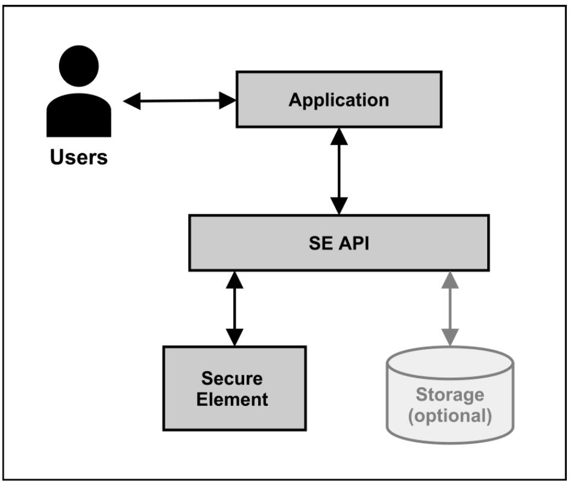
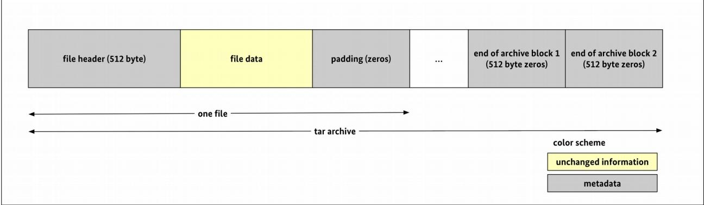

# Technical Guideline BSI TR-03151 Secure Element API (SE API)

Version 1.0.1 20. December 2018


<span id="page-1-0"></span>Federal Office for Information Security Post Box 20 03 63 D-53133 Bonn

E-Mail: [registrierkassen@bsi.bund.de](mailto:registrierkassen@bsi.bund.de?subject=Technical%20Guideline%20BSI%20TR-03151) Internet: [https://www.bsi.bund.de](https://www.bsi.bund.de/) © Federal Office for Information Security 2018

| GetCurrentNumberOfTransactions45<br>GetSupportedTransactionUpdateVariants46 |                                                                                                                                                                                                                                                                                                                                                                                                                                                                                                                                                                                                                                                                                                                                                                                                                                                                                                                                                                                                                                                                                                                                                                                                                   |
|-----------------------------------------------------------------------------|-------------------------------------------------------------------------------------------------------------------------------------------------------------------------------------------------------------------------------------------------------------------------------------------------------------------------------------------------------------------------------------------------------------------------------------------------------------------------------------------------------------------------------------------------------------------------------------------------------------------------------------------------------------------------------------------------------------------------------------------------------------------------------------------------------------------------------------------------------------------------------------------------------------------------------------------------------------------------------------------------------------------------------------------------------------------------------------------------------------------------------------------------------------------------------------------------------------------|
|                                                                             | Introduction 7<br>Motivation 7<br>Purpose and general functionality of the SE API7<br>Content and scope 8<br>Key words 8<br>Log messages and their creation 10<br>Common Log Message Structure 10<br>Contents of Log Message 11<br>Types of log messages 12<br>Transaction logs 12<br>System logs 13<br>Audit logs 13<br>Signature Computation and Verification14<br>Creation of Transaction Logs 14<br>Start a transaction 14<br>Update a transaction 14<br>Finish a transaction 15<br>Visualisation of the signature computation and verification (informative)16<br>Secure Element Functionality 18<br>Time Formats 18<br>Secure Element API Functionality 19<br>Error handling 20<br>Common Exceptions 20<br>Restricted usage of functions 21<br>Maintenance and Time Synchronization22<br>Initialize 22<br>UpdateTime 24<br>DisableSecureElement 26<br>Input Functions 27<br>StartTransaction 27<br>UpdateTransaction 29<br>FinishTransaction 32<br>Export Functions 33<br>ExportData 33<br>ExportCertificates 38<br>RestoreFromBackup 38<br>ReadLogMessage 41<br>ExportSerialNumbers 42<br>Utility Functions 42<br>GetMaxNumberOfClients 42<br>GetCurrentNumberOfClients 43<br>GetMaxNumberOfTransactions44 |

| 4.7            | Authentication 48                                              |  |
|----------------|----------------------------------------------------------------|--|
| 4.7.1          | AuthenticateUser 48                                            |  |
| 4.7.2<br>4.7.3 | LogOut 51<br>UnblockUser 52                                    |  |
|                |                                                                |  |
| 5              | Export Formats 55                                              |  |
| 5.1            | TAR and TLV Export 55                                          |  |
| 5.1.1<br>5.1.2 | Initialization Information File 55<br>Log Messages Files 55    |  |
| 5.1.3          | Certificate files 60                                           |  |
| 6              | Appendix A: System log messages 61                             |  |
| 6.1            | Initialize 61                                                  |  |
| 6.2            | UpdateTime 61                                                  |  |
| 6.3            | DisableSecureElement 61                                        |  |
| 6.4            | AuthenticateUser 61                                            |  |
| 6.5            | LogOut 62                                                      |  |
| 6.6            | UnblockUser 62                                                 |  |
| 7              | Appendix B: Mapping of OMG IDL constructs to ANSI C and Java63 |  |
| 7.1            | Introduction 63                                                |  |
| 7.2            | Mapping of basic types 64                                      |  |
| 7.3            | Definition of strings 66                                       |  |
| 7.4            | Enumerations 66                                                |  |
| 7.5            | Arrays 67                                                      |  |
| 7.6            | Definition context 67                                          |  |
| 7.7            | Exceptions 67                                                  |  |
| 7.8            | Optional function parameters 69                                |  |
| 7.9            | Function input parameters 69                                   |  |
| 7.10           | Function output parameters 71                                  |  |
| 7.11           | Return value 73                                                |  |
| 8              | Appendix C: The TAR file format 74                             |  |
| 9              | Appendix D: TLV structure for the return of serial numbers77   |  |
| 10             | Appendix E: ASN.1 definition of log messages79                 |  |
|                | References 81                                                  |  |

| Figure 1: General system architecture in the context of the SE API7 |  |
|---------------------------------------------------------------------|--|
| Figure 2: TAR file format 74                                        |  |

| Table 1: Key words 9                                                             |  |
|----------------------------------------------------------------------------------|--|
| Table 2: Common structure of a log message 10                                    |  |
| Table 3: Description of the elements of the log message11                        |  |
| Table 4: Structure of the certifiedData of a transaction log12                   |  |
| Table 5: Description of the elements of the certifiedData for transaction logs13 |  |
|                                                                                  |  |

| Table 6: Structure of the certifiedData of a system log13                              |  |
|----------------------------------------------------------------------------------------|--|
| Table 7: Description of the elements of the certifiedData for system logs13            |  |
| Table 8: Functionality of the Secure Element 18                                        |  |
| Table 9: Formats for date/time values 18                                               |  |
| Table 10: Functions with restricted usage 21                                           |  |
| Table 11: Input parameters initialize function22                                       |  |
| Table 12: Exceptions for the initialize function 23                                    |  |
| Table 13: Input parameters for the updateTime function24                               |  |
| Table 14: Exceptions for updateTime function 25                                        |  |
| Table 15: Exceptions for disableSecureElement function27                               |  |
| Table 16: Input parameters for startTransaction function28                             |  |
| Table 17: Output parameters for startTransaction function28                            |  |
| Table 18: Exceptions of the startTransaction function29                                |  |
| Table 19: Input parameters for updateTransaction function30                            |  |
| Table 20: Output parameters for updateTransaction function30                           |  |
| Table 21: Exceptions of the updateTransaction function31                               |  |
| Table 22: Input parameter of the finishTransaction function32                          |  |
| Table 23: Output parameter for finishTransaction function32                            |  |
| Table 24: Exceptions for finishTransaction function33                                  |  |
| Table 25: Input parameters for exportData function35                                   |  |
| Table 26: Output parameters for exportData function35                                  |  |
| Table 27: Exceptions for exportData function36                                         |  |
| Table 28: Output parameters for exportCertificates function38                          |  |
| Table 29: Exceptions for exportCertificates function38                                 |  |
| Table 30: Input parameters restoreFromBackup function39                                |  |
| Table 31: Exceptions of restoreFromBackup function39                                   |  |
| Table 32: Output parameters for the readLogMessage function41                          |  |
| Table 33: Exceptions for readLogMessage function41                                     |  |
| Table 34: Output parameters for exportSerialNumbers function42                         |  |
| Table 35: Exceptions for exportSerialNumbers function42                                |  |
| Table 36: Output parameters for getMaxNumberOfClients function43                       |  |
| Table 37: Exceptions for the getMaxNumberOfClientsg function43                         |  |
| Table 38: Output parameters for getCurrentNumberOfClients function44                   |  |
| Table 39: Exceptions for getCurrentNumberOfClients function44                          |  |
| Table 40: Output parameters for getMaxNumberOfTransactions function44                  |  |
| Table 41: Exceptions for getMaxNumberOfTransactions function45                         |  |
| Table 42: Output parameters for getCurrentNumberOfTransactions function45              |  |
| Table 43: Exceptions for getCurrentNumberOfTransactions function46                     |  |
| Table 44: Output parameters for getSupportedTransactionUpdateVariants function47       |  |
| Table 45: Exceptions for getSupportedTransactionUpdateVariants function47              |  |
| Table 46: Exceptions for deleteStoredData function 48                                  |  |
| Table 47: Input parameters authenticateUser function49                                 |  |
| Table 48: Output parameters authenticateUser function49                                |  |
| Table 49: Exceptions for authenticateUser function49                                   |  |
| Table 50: Input parameters logOut function 51                                          |  |
| Table 51: Exceptions for logOut function 51                                            |  |
| Table 52: Input parameters unblockUser function52                                      |  |
| Table 53: Output parameters unblockUser function52                                     |  |
| Table 54: Exceptions for unblockUser function53                                        |  |
| Table 55: Parts of the file names for transaction log messages in export tar archive57 |  |
| Table 56: Parts of the file names of system log messages in export tar archive58       |  |
| Table 57: Parts of the file names of audit log messages in export tar archive59        |  |
| Table 58: Parts of the file names of certificates in export tar archive60              |  |
|                                                                                        |  |

| Table 59: Relevant building blocks in [OMG2017a]63                                            |  |
|-----------------------------------------------------------------------------------------------|--|
| Table 60: Overview of the following chapters 64                                               |  |
| Table 61: Mapping of data types 66                                                            |  |
| Table 62: Tar file members header 76                                                          |  |
| Table 63: Structure for the return of serial numbers77                                        |  |
| Table 64: Description of the elements of the TLV structure for the return of serial numbers78 |  |

# <span id="page-6-2"></span>1 Introduction

### <span id="page-6-1"></span>1.1 Motivation

In the course of digitalisation, many applications nowadays rely on digital signatures in order to protect the authenticity and integrity of information. Due to legal or organisational requirements, such applications need a certain level of protection of their signature keys, i.e. private signature keys must be protected from unauthorized usage and disclosure via a suitable secure component. Such a level of protection can be achieved by the usage of a Secure Element (SE).

This document specifies the *Secure Element API* (*SE API*). The SE API is a digital interface that wraps functionality of a Secure Element and allows access to security functionalities by an application in a standardized way regardless of the specific type of Secure Element in use (see [Figure 1\)](#page-6-3). In the context of particular use cases, it can also be necessary to include a storage medium.

The main purpose of this interface is to secure authenticity and integrity of information by creating digital signatures over them.



<span id="page-6-3"></span>*Figure 1: General system architecture in the context of the SE API*

### <span id="page-6-0"></span>1.2 Purpose and general functionality of the SE API

A more specific purpose is the protection of externally provided process data with a unique transaction number and a time-stamp. Both additional parameters, time and counter, as well as the process data, are covered by the signature. The time-stamp provides information about the point in time when the signature creation was performed. Furthermore, a signature counter, that is increased with every signature, allows to easily detect the absence of a signature.

The SE API works in the following way:

- 1. Process data flow into the SE API.
- 2. In the SE API, the process data are forwarded to the Secure Element.
- 3. If required, the Secure Element creates a new transaction number for the current transaction.
- 4. The Secure Element creates a signature over the process data and the additional self-provided data (a time-stamp, a signature counter and other information).
- 5. Then, the SE API composes and returns a log message; the Secure Element is invoked for parts of the log message. The log message contains the signature and all additional data, that was used in the signature creation process (and is needed to verify the signature).

The set of log messages can be used to verify the completeness of transactions. Furthermore, it is ensured that the contained process data was signed at a certain time (and has not been altered since) and that the signature creation happened in succession to a signature creation over data containing a smaller signature counter value.

Besides, the SE-API also creates log messages of particular system operations (system logs) and auditable events inside the Secure Element (audit logs)

### <span id="page-7-1"></span>1.3 Content and scope

This Technical Guideline focuses on the creation and structure of the log messages, their export, and the specification of the integration interfaces to the application.

The integration interface is defined in the OMG Interface Definition Language (IDL) - a generic interface description language. The OMG IDL [OMG2017a] is a text based, language independent definition language for interfaces.

The descriptions in this document are designed to be independent of any concrete implementation. Possible implementations of an API as described in this document include (but are not limited to) a SOAP-API or the direct exposition of a classical API from the programming language that the API is developed in.

Neither the physical interface, by which the SE API is exposed, nor any other layers in terms of the ISO/OSI reference model are defined by this Technical Guideline. This allows a maximum degree of flexibility for a Secure Element application developer.

The functions of the SE API are described regarding their function parameters, their behavior, and the exceptions. The interaction between the SE API and the Secure Element is only considered in an abstract, technologically independent way.

This document is accompanied by a ZIP archive [SPECZIP] that contains:

- the definitions of the SE API in form of its OMG IDL definition,
- the translation of the OMG IDL definitions to Java,
- the translation of the OMG IDL definitions to ANSI C.

#### <span id="page-7-0"></span>1.4 Key words

The key words "MUST", "MUST NOT", "REQUIRED", "SHALL", "SHALL NOT", "SHOULD", "SHOULD NOT", "RECOMMENDED", "MAY", and "OPTIONAL" in this document SHALL be interpreted as described in [RFC2119].

The key word "CONDITIONAL" is to be interpreted as follows: The usage of an item is dependent on the usage of other items. It is therefore further qualified under which conditions the item is REQUIRED or RECOMMENDED.

When used in tables (profiles), the key words are abbreviated as shown in Table [1.](#page-8-0)

| Key word             |             | Abbrev. |
|----------------------|-------------|---------|
| MUST / SHALL         | REQUIRED    | m       |
| MUST NOT / SHALL NOT | –           | x       |
| SHOULD               | RECOMMENDED | r       |
| MAY                  | OPTIONAL    | o       |
| –                    | CONDITIONAL | c       |

<span id="page-8-0"></span>

| Table 1: Key words |  |  |
|--------------------|--|--|
|--------------------|--|--|

# <span id="page-9-1"></span>2 Log messages and their creation

Log messages contain data to be protected, protocol data that is generated by a Secure Element during the logging process, and a signature protecting this data.

The following types of log messages and types of data are distinguished within this Technical Guideline:

- *Transaction logs*
	- MUST be used to protect external data (*transaction data) t*hat is passed to the Secure Element via the SE API.
- *System logs*
	- MUST be used to protect information (*system operation data*) of the invocation of a system operation of the SEAPI.
- *Audit logs*:
	- MUST be used to protect data of auditable events (*audit data*) created by the Secure Element.

This chapter defines the common structure for all types of log messages as well as the specific data fields of the different log types including their contents.

### <span id="page-9-0"></span>2.1 Common Log Message Structure

The log message MUST be structured in the following way:

| Data field         | Tag  | Data type                        | Mandatory? |
|--------------------|------|----------------------------------|------------|
| Log Message        | 0x30 | SEQUENCE                         | m          |
| version            | 0x02 | INTEGER                          | m          |
| certifiedDataType  | 0x06 | OBJECT IDENTIFIER                | m          |
| certifiedData      |      | ANY DEFINED BY certifiedDataType | o          |
| serialNumber       | 0x04 | OCTET STRING                     | m          |
| signatureAlgorithm | 0x30 | SEQUENCE                         | m          |
| algorithm          | 0x06 | OBJECT IDENTIFIER                | m          |
| parameters         |      | ANY DEFINED BY algorithm         | o          |
| seAuditData        | 0x04 | OCTET STRING                     | c          |
| signatureCounter   | 0x02 | INTEGER                          | c          |
| logTime            |      | CHOICE                           | m          |
| utcTime            | 0x17 | UTCTime                          |            |
| generalizedTime    | 0x18 | GeneralizedTime                  |            |
| unixTime           | 0x02 | INTEGER                          |            |
| signatureValue     | 0x04 | OCTET STRING                     | m          |

<span id="page-9-2"></span>*Table 2: Common structure of a log message*

## <span id="page-10-0"></span>2.2 Contents of Log Message

| Data               | Description                                                                                                                                                                                                                                                           | Origin of data                                               |
|--------------------|-----------------------------------------------------------------------------------------------------------------------------------------------------------------------------------------------------------------------------------------------------------------------|--------------------------------------------------------------|
| version            | MUST always be present.<br>MUST contain the version of the log message format,<br>provided by the Secure Element.<br>The value SHALL be set to "2".                                                                                                                   | Provided by the Secure<br>Element.                           |
| certifiedDataType  | MUST always be present.<br>MUST identify the type of log message and the type of the<br>certified data (if any) provided by the Secure Element.<br>The possible values are defined in sections 2.3.                                                                   | Provided by the Secure<br>Element.                           |
| certifiedData      | MUST be present for a transaction log and a system log.<br>In this case, MUST contain concatenation of certified data1<br>defined by the corresponding certifiedDataType.<br>Details of the certified data structure and their values are<br>defined in sections 2.3. | Provided by the<br>application and/or the<br>Secure Element. |
| serialNumber       | MUST always be present.<br>MUST identify the serial number of the Secure Element<br>consisting of the hash value of the public key of the certificate<br>used to verify transaction logs encoded as an octet string.                                                  | Provided by the Secure<br>Element.                           |
| signatureAlgorithm | MUST always be present.<br>MUST contain information about the signature creation.                                                                                                                                                                                     | Provided by the Secure<br>Element.                           |
| algorithm          | MUST always be present.<br>MUST identify the signature algorithm used by the Secure<br>Element to generate the signature of the log message.<br>The value MUST be configured in the Secure Element<br>according to [BSI TR-03116].                                    | Provided by the Secure<br>Element.                           |
| parameters         | MAY be present.<br>If present, the log message MUST contain the associated<br>parameters of the signature algorithm employed.<br>The structure and the value of the parameters depend on the<br>particular algorithm employed.                                        | Provided by the Secure<br>Element.                           |
| seAuditData        | MUST be present for an audit log.<br>In this case, the log message MUST contain audit data created<br>by the Secure Element.                                                                                                                                          | Created by the Secure<br>Element.                            |
| signatureCounter   | MUST always be present.<br>MUST contain a signature counter.<br>The value SHALL contain the current count of signatures as<br>created by the Secure Element.                                                                                                          | Created by the Secure<br>Element.                            |
| logTime            | MUST always be present.<br>MUST contain the point in time of the Secure Element when<br>the log message was created.                                                                                                                                                  | Created by the Secure<br>Element.                            |
| signatureValue     | MUST always be present.<br>MUST contain the result of the signature computation as<br>defined by section 2.4 encoded as octet string.                                                                                                                                 | Created by the Secure<br>Element.                            |

The elements of the log message structure MUST contain the following information:

<span id="page-10-2"></span>*Table 3: Description of the elements of the log message*

<span id="page-10-1"></span>1 The concatenation MUST NOT be embedded into an additional SEQUENCE structure.

### <span id="page-11-1"></span>2.3 Types of log messages

This section specifies the structure and the content of different log types.

#### <span id="page-11-0"></span>2.3.1 Transaction logs

A transaction log MUST be identified by the following object identifier (id-SE-API-transaction-log):

• bsi-de (0.4.0.127.0.7.0) applications (3) sE-API (7) sE-API-dataformats(1) 1

The certifiedData MUST be structured as follows:

| Data field             | Tag  | Data type       | Mandatory? |
|------------------------|------|-----------------|------------|
| operationType          | 0x80 | PrintableString | m          |
| clientId               | 0x81 | PrintableString | m          |
| processData            | 0x82 | OCTET STRING    | m          |
| processType            | 0x83 | PrintableString | c          |
| additionalExternalData | 0x84 | OCTET STRING    | o          |
| transactionNumber      | 0x85 | INTEGER         | m          |
| additionalInternalData | 0x86 | OCTET STRING    | o          |

<span id="page-11-2"></span>*Table 4: Structure of the certifiedData of a transaction log*

The length encoding of the element processData is CONDITIONAL.

- If the process data is transmitted to the Secure Element in more than one step (cf. Section [2.5](#page-13-2) for details), indefinite length encoding according to [ITU2015b], MUST be used. This has the advantage that the length of the process data being signed need not be known in advance of the signature generation process.
- Otherwise, definite length encoding according to [ITU2015b] MUST be used.

The elements of a transaction log MUST contain the following information:

| Data                   | Description                                                                                                                                                                                                                                                                            |
|------------------------|----------------------------------------------------------------------------------------------------------------------------------------------------------------------------------------------------------------------------------------------------------------------------------------|
| operationType          | MUST always be present.<br>MUST contain the name of the SE API function, according to this specification,<br>whose execution is recorded by the log message. E.g. "StartTransaction"                                                                                                   |
| clientId               | MUST always be present.<br>MUST represent the ID of the application that has initiated the logging of a<br>transaction phase.                                                                                                                                                          |
| processData            | MUST always be present.<br>MUST contain the process data.<br>The value is defined by the external application.                                                                                                                                                                         |
| processType            | MAY be present.<br>The field MUST be present in case of the start, a signed update or the finalization of<br>a transaction (cf. Section 2.5 for details).<br>In this case, it MUST contain information about the type of process.<br>The value is defined by the external application. |
| additionalExternalData | MAY be present.<br>If present, MUST contain additional (TLV encoded) data encoded as an octet string.<br>The value is defined by the external application.                                                                                                                             |

| Data                   | Description                                                                                                                        |
|------------------------|------------------------------------------------------------------------------------------------------------------------------------|
| transactionNumber      | MUST always be present.<br>MUST contain the transaction number generated by the Secure Element at the<br>start of the transaction. |
| additionalInternalData | MAY be present.<br>If present, MUST contain additional TLV encoded protocol data encoded as an<br>octet string.                    |

*Table 5: Description of the elements of the certifiedData for transaction logs*

#### <span id="page-12-1"></span>2.3.2 System logs

A system log MUST be identified by the following object identifier (id-SE-API-system-log):

• bsi-de (0.4.0.127.0.7.0) applications (3) sE-API (7) sE-API-dataformats(1) 2

The certifiedData MUST be structured as follows:

| Data field             | Tag  | Data type       | Mandatory? |
|------------------------|------|-----------------|------------|
| operationType          | 0x80 | PrintableString | m          |
| systemOperationData    | 0x81 | OCTET STRING    | m          |
| additionalInternalData | 0x82 | OCTET STRING    | o          |

<span id="page-12-2"></span>*Table 6: Structure of the certifiedData of a system log*

The elements MUST contain the following information:

| Data                   | Description                                                                                                                                                                                   |
|------------------------|-----------------------------------------------------------------------------------------------------------------------------------------------------------------------------------------------|
| operationType          | MUST always be present.<br>MUST contain the name of the system operation, according to this specification,<br>whose execution is recorded by the log message. E.g. "UpdateTime"               |
| systemOperationData    | MUST always be present.<br>MUST contain information about the system operation. A list of system operations<br>and the corresponding systemOperationData is given in Appendix A in chapter 6. |
| additionalInternalData | MAY be present.<br>If present, MUST contain additional BER-TLV encoded protocol data encoded as an<br>octet string.                                                                           |

*Table 7: Description of the elements of the certifiedData for system logs*

The certified data of specific system operations is specified in Appendix A in chapter [6.](#page-60-4)

#### <span id="page-12-0"></span>2.3.3 Audit logs

An audit log MUST be identified by the following object identifier (id-SE-API-SE-audit-log):

• bsi-de (0.4.0.127.0.7.0) applications (3) sE-API (7) sE-API-dataformats(1) 3

Audit log MUST NOT contain any certified data. Instead, the corresponding audit data is defined by the Secure Element and MUST be contained in the data field seAuditData (cf. Table [3\)](#page-10-2).

The specification of auditable events and the corresponding seAuditData depends on the particular Secure Element used and is out of scope of this Technical Guideline. See for example [BSI PP-CSP] for further details.

### <span id="page-13-3"></span>2.4 Signature Computation and Verification

The input to the signature generation and verification process consists of the concatenation of all preceding log message elements, i.e. the following elements (if present):

- version
- certifiedDataType
- certifiedData
- serialNumber
- signatureAlgorithm
- seAuditData
- signatureCounter
- logTime

For signature calculation, all elements MUST be DER encoded except for the field processData in the certifiedData structure of a transaction log, when indefinite length encoding applies (cf. Section [2.3.1\)](#page-11-0).

The signature MUST be computed using the private key that belongs to the certificate to be used for the verification of the corresponding log message type. The key pair MUST be managed by the Secure Element.

The details of the signature computation depend on the particular signature algorithm employed.

After the affiliation and the correctness of the certificate belonging to the log messages has been verified, the log message signature verification SHALL be performed analogue to the signature creation using the public key of the certificate for the verification of g log message type.

### <span id="page-13-2"></span>2.5 Creation of Transaction Logs

Every transaction SHALL be started and finished by calling the corresponding API functions. Additionally, every transaction MAY be updated between start and finish.

#### <span id="page-13-1"></span>2.5.1 Start a transaction

The result of a started transaction SHALL be a log message. The structure of this log message SHALL follow the definitions from table [2](#page-9-2) and [4.](#page-11-2)

#### <span id="page-13-0"></span>2.5.2 Update a transaction

During the first execution of the transaction update, the process data SHALL be managed by the Secure Element. On every subsequent call the passed process data SHALL be added to the value of concatenated process data from previous calls of the function to update the transaction.

Note: The process data already signed by the transaction start log message are not included in the update process data.

[Text 1](#page-14-1) shows the concatenation of process data during a transaction update:

| Input:                        |                                                                                                                                                     |
|-------------------------------|-----------------------------------------------------------------------------------------------------------------------------------------------------|
| From application:             | clientId<br>processDatainput                                                                                                                        |
| From Secure Element:          | initialization of processDataupdate i-1 with an empty value during the first<br>call of updateTransaction, otherwise previous processDataupdate i-1 |
| Action: processDataupdate i = | processDataupdate i-1    processDatainput                                                                                                           |
| Output                        | nothing / status message                                                                                                                            |

<span id="page-14-1"></span>*Text 1: Concatenation of process data in the context of a transaction update*

Due to the limited memory capacity of some Secure Elements, the process data passed with every update MAY already be fed into the hash function of the signature algorithm. After this, the Secure Element can discard the passed process data from its internal memory. Only the hash function of the signature algorithm SHALL be used for this. The signature hash function SHALL remain open to add additional data in subsequent updates. The hash function SHALL be closed during the finish of the transaction.

If necessary, the Secure Element MAY sign not yet secured process data received during the update process. In this case, the signature SHALL be calculated over all process data that has been received so far and that has not yet been secured.

#### 2.5.2.1 Log Message Signature Creation with Signed Updates

Due to limited capacities of a Secure Element, it might be required to not only create log messages for the start and finish of a transaction, but also for process data updates. By implementing this technique, no intermediate data needs to be stored on the Secure Element, as every input is directly fed into a signature. The result of a signed update of a transaction SHALL be a log message. The structure of this log message SHALL follow the definitions from table [2](#page-9-2) and [4.](#page-11-2)

#### <span id="page-14-0"></span>2.5.3 Finish a transaction

To finish a transaction, a signature over all process data sent to the Secure Element after the start of the transaction and the data that is provided by the Secure Element SHALL be created. This SHALL cause the creation of a log message. The structure of this log message SHALL follow the scheme defined in table [2](#page-9-2) and table [4.](#page-11-2)

The following cases SHALL be considered:

- 1. If the process data has been concatenated during updates *without* being already fed into the hash function of the signature algorithm, the signature SHALL be calculated over the whole array of stored process data and the data that is provided by the Secure Element.
- 2. If the process data of updates has already been fed into the hash function of signature algorithm, the hash SHALL be updated with the function call of the transaction finish, and the data that is provided by the Secure Element. Subsequently, the hash function SHALL be closed and the signature SHALL be created.

#### <span id="page-15-0"></span>2.5.4 Visualisation of the signature computation and verification (informative)

Text [2](#page-15-1) provides an informative overview on how the log message signature of a transaction log is created.

First the message M is created. M is the input data of the signature function. The message is built by the concatenation of the values of the application data, provided by the application, and the values of the data that is created and provided by the Secure Element.

Essential for the creation of a signature over the various data elements is a private key. This private key, here called keyprivate, belongs to the key pair for creating signatures for transaction log messages. The key pair is managed by the Secure Element. This key is used for the creation of signature sig over M.

Note: The symbol "||" depicts a concatenation of data.

| Input:               |                                                                                                                                                                   |
|----------------------|-------------------------------------------------------------------------------------------------------------------------------------------------------------------|
| From application:    | clientIdD<br>processData2<br>processType<br>additionalExternalData                                                                                                |
| From Secure Element: | version<br>certifiedDataType<br>operationType<br>transactionNumber<br>additionalInternalData<br>serialNumber<br>signatureAlgorithm<br>signatureCounter<br>logTime |
| Action: message M := | version  certifiedDataType  certifiedData  serialNumber  <br>signatureAlgorithm  seAuditData  signatureCounter  logTime                                           |
| signature sig :=     | SignatureFunction (keyprivate, M)                                                                                                                                 |
| Output:              | sig                                                                                                                                                               |

<span id="page-15-1"></span>*Text 2: Visualisation of the signature computation of transaction log*

The log message signatures is verified with the public key of the certificate whose public key corresponds to the serial number that is included in the log message.

<span id="page-15-2"></span>2 The process data might be the concatenation of data transmitted during several updates and the finish of a transaction, cf. [2.5.2](#page-13-0)

| message M :=          | version  certifiedDataType  certifiedData  serialNumber  signatureAlgorithm  <br>seAuditData  signatureCounter  logTime |
|-----------------------|-------------------------------------------------------------------------------------------------------------------------|
| verificationResult := | VerifySignatureFunction (keypublic, sig, M, signatureAlgorithm)                                                         |

*Text 3: General verification of protocol data*

# <span id="page-17-1"></span>3 Secure Element Functionality

The SE API serves as a wrapper around the functionality of a Secure Element. However, the specification of the SE API assumes that the Secure Element provides a certain set of functionality.

Table [8](#page-17-4) provides a generic overview over this functionality. The Secure Element SHALL provide these functionalities. However, concrete aspects as the names of the functions should not be understood as normative requirements with respect to the Secure Element. Furthermore, the specification does not state any particular requirements regarding the practical implementation of this functionality.

| Functionality              | Description                                                                                          |
|----------------------------|------------------------------------------------------------------------------------------------------|
| Authenticate user          | This function serves to authenticate the user and to establish a trusted<br>channel.                 |
| Start a transaction        | This function starts an external transaction with the Secure Element.                                |
| Update a transaction       | This function updates an external transaction with the Secure Element.                               |
| Finish a transaction       | This function finishes an external transaction with the Secure Element.                              |
| Sign a transaction         | This function allows to secure process information by the use of a log message<br>(which is signed). |
| Sign system operation data | This function allows to protect system operation data by the use of a log<br>message.                |
| Retrieve a log message     | This function retrieves the last log message parts from the Secure Element.                          |
| Set time                   | This function sets the time that is maintained by the Secure Element.                                |
| Disable Secure Element     | This function disables the functionalities of the Secure Element                                     |

<span id="page-17-4"></span>*Table 8: Functionality of the Secure Element*

### <span id="page-17-0"></span>3.1 Time Formats

The Secure Element manages the date/time that is used for the creation of time-stamps in log messages. This time SHALL be represented by one of the formats in table [9:](#page-17-3)

| Type                  | Description                                                                                                                  |  |  |
|-----------------------|------------------------------------------------------------------------------------------------------------------------------|--|--|
| ASN.1 UTCTime         | UTCTime according to [ITU2015] SHALL be used in UTC±0 / zulu                                                                 |  |  |
| (see [ITU2015])       | time. Format: YYMMDDhhmm[ss]Z3                                                                                               |  |  |
| ASN.1 GeneralizedTime | GeneralizedTime according to [ITU2015] SHALL be used in UTC±0 /                                                              |  |  |
| (see [ITU2015])       | zulu time. Format: YYYYMMDDhhmmss[.fff]Z3                                                                                    |  |  |
| Unix Time             | Unix Time SHALL conform to the definition in [IEEECS2018]. The<br>Unix Time SHALL be represented by a 64-bit integer number. |  |  |

<span id="page-17-3"></span>*Table 9: Formats for date/time values*

#### <span id="page-17-2"></span>3 The specifications in the square brackets are OPTIONAL

# <span id="page-18-0"></span>4 Secure Element API Functionality

This section specifies the following API functions:

- Maintenance functions
	- Initialize
	- UpdateTime
	- DisableSecureElement
- Input functions
	- StartTransaction
	- UpdateTransaction
	- FinishTransaction
- Export functions
	- ExportData
	- ExportCertificates
	- RestoreFromBackup
	- ReadLogMessage
	- ExportSerialNumber
- Utility functions
	- GetMaxNumberOfClients
	- GetCurrentNumberOfClients
	- GetMaxNumberOfTransactions
	- GetCurrentNumberOfTransations
	- GetSupportedTransactionUpdateVariants
	- DeleteStoredData
- Authentication functions
	- AuthenticateUser
	- LogOut
	- UnblockUser

To be conformant to this Technical Guideline, all functions of the SE API SHALL be implemented, with exception of the functions restoreFromBackup (see chapter [4.5.3\)](#page-37-0) and deleteStoredData (see chapter [4.6.6\)](#page-46-0). The function restoreFromBackup MAY be implemented. The function deleteStoredData SHOULD be implemented. This function is especially important if a storage of small size is used.

### <span id="page-19-1"></span>4.1 Error handling

If an application receives any kind of error from the SE API, it falls into the responsibility of the application to handle the situation. Depending on the concrete function that threw the error and depending on the concrete error, the application may:

- decide to do nothing at all,
- simply repeat the last function call,
- repeat a larger amount of steps.

#### <span id="page-19-0"></span>4.1.1 Common Exceptions

The following chapters [4.1.1.1](#page-19-2) to [4.1.1.4](#page-20-1) define exceptions that are relevant for several of the SE API functions.

#### <span id="page-19-2"></span>4.1.1.1 ErrorSeApiNotInitialized

The exception ErrorSeApiNotInitialized SHALL be implemented by all functions of the SE API, except the functions initialize, authenticateUser, logOut and unblockUser. This exception SHALL be raised if an SE API function is invoked although the SE API has not been initialized.

#### 4.1.1.2 ErrorTimeNotSet

The exception ErrorTimeNotSet SHALL be implemented by the following functions of the SE API:

- startTransaction
- updateTransaction
- finishTransaction
- disableSecureElement

This exception SHALL be raised if one of these SE API functions is invoked although the time managed by the Secure Element has no defined value.

#### 4.1.1.3 ErrorCertificateExpired

The exception ErrorCertificateExpired SHALL be implemented by the following SE API functions:

- initialize
- disableSecureElement
- updateTime
- startTransaction
- updateTransaction
- finishTransaction

The exception SHALL be raised if these functions are invoked and the certificate expired. Even if a certificate is expired, the log message parts SHALL be created by the Secure Element and stored by the SE API. In this case, the exception ErrorCertificateExpired SHALL be raised only after the data of the log message has been stored.

#### <span id="page-20-1"></span>4.1.1.4 ErrorSecureElementDisabled

The exception ErrorSecureElementDisabled SHALL be realized by the following functions of the SE API:

- initialize
- updateTime
- startTransaction
- updateTransaction
- finishTransaction
- readLogMessage
- disableSecureElement
- getMaxNumberOfClients
- getCurrentNumberOfClients
- getMaxNumberOfTransactions
- getCurrentNumberOfTransactions
- getSupportedTransactionUpdateVariants
- authenticateUser
- logOut
- unblockUser

This exception SHALL be raised during the execution of these functions if the Secure Element has been disabled.

### <span id="page-20-0"></span>4.2 Restricted usage of functions

The usage of the SE API functions in table [10](#page-20-2) SHALL be restricted to authorized users (e.g. an administrator). In the following the term user is used synonymously for human users and applications.

| Functions with restricted usage |  |  |  |  |
|---------------------------------|--|--|--|--|
| initialize                      |  |  |  |  |
| updateTime                      |  |  |  |  |
| deleteStoredData                |  |  |  |  |
| disableSecureElement            |  |  |  |  |
| restoreFromBackup               |  |  |  |  |

#### <span id="page-20-2"></span>*Table 10: Functions with restricted usage*

For the implementation of this restriction, **at least** the following security mechanisms SHALL be implemented.

If a function listed in table [10](#page-20-2) is invoked, the SE API SHALL check if the invoking user is authorized to use the function.

The SE API SHALL implement the following roles for authorized users with the corresponding rights:

– Admin: This role SHALL allow the usage of all restricted functions in table [10.](#page-20-2)

– TimeAdmin: This role SHALL allow the usage of the function updateTime.

An authorized user SHALL be identified by the SE API by a unique identifier (UserID). The SE API SHALL authenticate an authorized user by a PIN. The SE API SHALL manage the status of the authentication of authorized users. Additionally, the SE API SHALL manage the assignment of either the role Admin or TimeAdmin to authorized users. The authentication of authorized users by the SE API is implemented by the function authenticateUser (see chapter [4.7.1\)](#page-47-0).

A limit for successive entries of a wrong PIN by a user SHALL be defined. In this context, the SE API SHALL manage a PIN retry counter for every authorized user. If the limit for the successive entries of incorrect PINs for a user is reached, the SE API SHALL block the user PIN entry.

In addition to the PIN, a user SHALL have a Personal Unblocking Key (PUK) that enables an unblocking of the PIN entry. Countermeasures against passwort guessing attacks SHALL be implemented. If a correct PUK has been entered, the user SHALL be unblocked and the user SHALL be able to change the PIN. The unblocking of a user is implemented by the function unblockUser (see chapter [4.7.3\)](#page-51-0).

The combinations of UserID, PIN, PUK and role for the authorized users SHALL be managed by the SE API.

After authorized users have finished their current usage of the restricted functions, they SHALL log out from the SE API. This log-out is implemented by the function logOut (see chapter [4.7.2\)](#page-50-0). If an authenticated user does not invoke a function for an appropriate period of time, the SE API SHALL log out the user automatically. After the log out of an authenticated user, the SE API SHALL set the corresponding status for the user to not authenticated.

### <span id="page-21-1"></span>4.3 Maintenance and Time Synchronization

#### <span id="page-21-0"></span>4.3.1 Initialize

The function initialize MUST be used to start the initialization of the SE API.

#### 4.3.1.1 Initialize – Input parameters

| Name                            | Type (OMG IDL) | Required?   | Meaning                                                                                                                               |
|---------------------------------|----------------|-------------|---------------------------------------------------------------------------------------------------------------------------------------|
| description                     | string         | CONDITIONAL | This parameter presents a short<br>description of the SE API.                                                                         |
|                                 |                |             | The parameter SHALL only be used if<br>the description of the SE API has not<br>been set by the manufacturer.                         |
| no input parameter is<br>passed | none           | CONDITIONAL | The function SHALL be invoked without<br>any parameter value if the description of<br>the SE API has been set by the<br>manufacturer. |

*Table 11: Input parameters initialize function*

#### 4.3.1.2 Initialize – Output parameters

None.

#### 4.3.1.3 Initialize – Exceptions

| Exception                             | Meaning                                                                                                                                                                                 |  |  |
|---------------------------------------|-----------------------------------------------------------------------------------------------------------------------------------------------------------------------------------------|--|--|
| ErrorSigningSystemOperationDataFailed | The determination of the log message parts for the system<br>operation data by the Secure Element failed.                                                                               |  |  |
| ErrorStoringInitDataFailed            | Storing of the initialization data failed.                                                                                                                                              |  |  |
| ErrorRetrieveLogMessageFailed         | The execution of the Secure Element functionality to<br>retrieve log message parts has failed.                                                                                          |  |  |
| ErrorStorageFailure                   | Storing of data of the log message has failed.                                                                                                                                          |  |  |
| ErrorCertificateExpired               | The certificate corresponding to key signing the log<br>message expired. The exception ErrorCertificateExpired<br>SHALL be raised after the data of the log message has been<br>stored. |  |  |
| ErrorSecureElementDisabled            | The Secure Element has been disabled.                                                                                                                                                   |  |  |
| ErrorUserNotAuthorized                | The user who has invoked the function initialize is not<br>authorized to execute this function.                                                                                         |  |  |
| ErrorUserNotAuthenticated             | The user who has invoked the function initialize has not<br>the status authenticated.                                                                                                   |  |  |
| ErrorDescriptionNotSetByManufacturer  | The function initialize has been invoked without a value<br>for the input parameter description although the<br>description of the SE API has not been set by the<br>manufacturer.      |  |  |
| ErrorDescriptionSetByManufacturer     | The function initialize has been invoked with a value for<br>the input parameter description although the description<br>of the SE API has been set by the manufacturer.                |  |  |

*Table 12: Exceptions for the initialize function*

#### 4.3.1.4 Initialize – Detailed description

The following description specifies the behavior of the initialize function in detail:

- 1. The function SHALL check if the user that has invoked the function has the status authenticated (cf. chapter [4.2\)](#page-20-0). If the status is not authenticated, the function SHALL raise the exception ErrorUserNotAuthenticated and exit the function.
- 2. If the user has the status authenticated, the function SHALL check in the corresponding role (cf. chapter [4.2\)](#page-20-0) if the user is authorized to execute the function. If the user is not authorized, the function SHALL raise the exception ErrorUserNotAuthorized and exit the function.
- 3. If the function initialize is invoked
	- 1. without an input parameter, the function SHALL check if the data for the description of the SE API has been set by the manufacturer. If the description has not been set, the function SHALL raise the exception ErrorDescriptionNotSetByManufacturer and exit the function.
	- 2. with a value for the input parameter description, the function SHALL execute the following tasks:
		- 1. The function SHALL check if the data for description of the SE API has been set by the manufacturer. If the description has been set by the manufacturer, the function SHALL raise the exception ErrorDescriptionSetByManufacturer and exit the function.
- 2. If the description is not set, the function SHALL store the passed description data. If the description data is not stored successfully, the SE API SHALL set back the description of the SE API to the state before storing the provided description data. Furthermore, the function SHALL raise the exception ErrorStoringInitDataFailed and exit the function.
- 4. The function SHALL invoke the functionality of the Secure Element to create the log message parts for the initialization. In this context, the function SHALL pass the data for the description of the SE API to the Secure Element. If the execution of this Secure Element functionality fails, the function initialize SHALL raise the exception ErrorSigningSystemOperationDataFailed.
- 5. The function SHALL retrieve the parts of the log message determined by the Secure Element. If the retrieval of the log message parts fails, the function SHALL raise the exception ErrorRetrieveLogMessageFailed and exit the function.
- 6. The function SHALL store the data of the previously retrieved log message parts on the storage medium. If the data has not been stored successfully, the function SHALL raise the exception ErrorStorageFailure.
- 7. The function SHALL return the value EXECUTION\_OK to indicate that the execution of the function initialize has been successful.

### <span id="page-23-0"></span>4.3.2 UpdateTime

The function updateTime can be used to update the current date/time that is maintained by the Secure Element.

| Name                            | Type (OMG IDL) | Required?   | Meaning                                                                                                                               |
|---------------------------------|----------------|-------------|---------------------------------------------------------------------------------------------------------------------------------------|
| newDateTime                     | DateTime       | CONDITIONAL | The new time value for the date/time<br>maintained by the Secure Element. The<br>value SHALL conform to a format from<br>chapter 3.1. |
| no input parameter is<br>passed | none           | CONDITIONAL | If the underlying Secure Element<br>supports time synchronization, this<br>feature is utilized.                                       |

#### 4.3.2.1 UpdateTime – Input parameters

*Table 13: Input parameters for the updateTime function*

#### 4.3.2.2 UpdateTime – Output parameters

None.

#### 4.3.2.3 UpdateTime – Exceptions

| Exception                     | Meaning                                                                                                                                                                                 |
|-------------------------------|-----------------------------------------------------------------------------------------------------------------------------------------------------------------------------------------|
| ErrorUpdateTimeFailed         | The execution of the Secure Element functionality to<br>set the time failed.                                                                                                            |
| ErrorRetrieveLogMessageFailed | The execution of the Secure Element functionality to<br>retrieve log message parts has failed.                                                                                          |
| ErrorStorageFailure           | Storing of data of the log message has failed.                                                                                                                                          |
| ErrorSeApiNotInitialized      | The function updateTime is invoked although the SE API<br>has not been initialized.                                                                                                     |
| ErrorCertificateExpired       | The certificate corresponding to key signing the log<br>message expired. The exception ErrorCertificateExpired<br>SHALL be raised after the data of the log message has been<br>stored. |
| ErrorSecureElementDisabled    | The Secure Element has been disabled.                                                                                                                                                   |
| ErrorUserNotAuthorized        | The user who has invoked the function updateTime is not<br>authorized to execute this function.                                                                                         |
| ErrorUserNotAuthenticated     | The user who has invoked the function updateTime has<br>not the status authenticated.                                                                                                   |

*Table 14: Exceptions for updateTime function*

#### <span id="page-25-1"></span>4.3.2.4 UpdateTime – Detailed description

The following description specifies the behavior of the updateTime function in detail:

- 1. The function SHALL check if the user that has invoked the function has the status authenticated (cf. chapter [4.2\)](#page-20-0). If the status is not authenticated, the function SHALL raise the exception ErrorUserNotAuthenticated and exit the function.
- 2. If the user has the status authenticated, the function SHALL check in the corresponding role (cf. chapter [4.2\)](#page-20-0) if the user is authorized to execute the function. If the user is not authorized, the function SHALL raise the exception ErrorUserNotAuthorized and exit the function.
- 3. If the function updateTime is invoked
	- 1 without an input parameter, the function SHALL instruct the Secure Element to use its time synchronization mechanism to update the local time. If the execution fails, the function SHALL raise the exception ErrorUpdateTimeFailed.
	- 2 with a value for the input parameter newDateTime, the function SHALL invoke the functionality of the Secure Element to set the time with the provided newDateTime. If the execution fails, the function SHALL raise the exception ErrorUpdateTimeFailed.
- 4. The function SHALL retrieve the parts of the log message determined by the Secure Element. If the retrieval of the log message parts fails, the function SHALL raise the exception ErrorRetrieveLogMessageFailed.
- 5. The function SHALL store the data of the previously retrieved log message parts on the storage medium. If the data has not been stored successfully, the function SHALL raise the exception ErrorStorageFailure.
- 6. The function SHALL return the value EXECUTION\_OK to indicate that the execution of the function updateTime has been successful.

#### <span id="page-25-0"></span>4.3.3 DisableSecureElement

This function SHALL disable the Secure Element in a way that none of its functionality can be used anymore.

#### 4.3.3.1 DisableSecureElement – Input parameters

None.

#### 4.3.3.2 DisableSecureElement– Output parameters

None.

#### 4.3.3.3 DisableSecureElement – Exceptions

| Exception                       | Meaning                                                                                                                     |
|---------------------------------|-----------------------------------------------------------------------------------------------------------------------------|
| ErrorDisableSecureElementFailed | The deactivation of the Secure Element failed.                                                                              |
| ErrorTimeNotSet                 | The function disableSecureElement<br>is invoked although<br>the time managed by the Secure Element has no defined<br>value. |

| Exception                     | Meaning                                                                                                                                                                                 |
|-------------------------------|-----------------------------------------------------------------------------------------------------------------------------------------------------------------------------------------|
| ErrorRetrieveLogMessageFailed | The execution of the Secure Element functionality to<br>retrieve log message parts has failed.                                                                                          |
| ErrorStorageFailure           | Storing of the data of the log message failed.                                                                                                                                          |
| ErrorCertificateExpired       | The certificate corresponding to key signing the log<br>message expired. The exception ErrorCertificateExpired<br>SHALL be raised after the data of the log message has been<br>stored. |
| ErrorSecureElementDisabled    | The Secure Element has been disabled.                                                                                                                                                   |
| ErrorUserNotAuthorized        | The user who has invoked the function<br>disableSecureElement is not authorized to execute this<br>function.                                                                            |
| ErrorUserNotAuthenticated     | The user who has invoked the function<br>disableSecureElement has not the status authenticated.                                                                                         |

|  |  | Table 15: Exceptions for disableSecureElement function |
|--|--|--------------------------------------------------------|
|  |  |                                                        |

#### 4.3.3.4 DisableSecureElement – Detailed description

The following description specifies the behavior of the function disableSecureElement in detail:

- 1. The function SHALL check if the user that has invoked the function has the status authenticated (cf. chapter [4.2\)](#page-20-0). If the status is not authenticated, the function SHALL raise the exception ErrorUserNotAuthenticated and exit the function.
- 2. If the user has the status authenticated, the function SHALL check in the corresponding role (cf. chapter [4.2\)](#page-20-0) if the user is authorized to execute the function. If the user is not authorized, the function SHALL raise the exception ErrorUserNotAuthorized and exit the function.
- 3. The function SHALL invoke the functionality of the Secure Element to create the log message parts to log its deactivation.
- 4. The function SHALL retrieve the parts of the log message determined by the Secure Element. If the retrieval of the log message parts fails, the function SHALL raise the exception ErrorRetrieveLogMessageFailed and exit the function.
- 5. The function SHALL invoke the functionality of the Secure Element for its deactivation. If the deactivation of the Secure Element fails, the function SHALL raise the exception ErrorDisableSecureElementFailed and exit the function.
- 6. If the deactivation of the Secure Element has been successful, the data of the retrieved log message parts SHALL be stored. If the data has not been stored successfully, the function SHALL raise the exception ErrorStorageFailure.
- 7. If the data has been stored successfully, the function SHALL return the return value EXECUTION\_OK to indicate that the execution of the function disableSecureElement has been successful.

### <span id="page-26-1"></span>4.4 Input Functions

#### <span id="page-26-0"></span>4.4.1 StartTransaction

This function provides the functionality to start a new transaction.

#### 4.4.1.1 StartTransaction – Input parameters

| Name           | Type (OMG IDL) | Required? | Meaning                                                                                                   |
|----------------|----------------|-----------|-----------------------------------------------------------------------------------------------------------|
| clientId       | string         | REQUIRED  | Represents the ID of the application that<br>has invoked the function.                                    |
| processData    | octet []       | REQUIRED  | This parameter represents all the<br>necessary information regarding the<br>initial state of the process. |
| processType    | string<100>    | OPTIONAL  | This parameter is used to identify the<br>type of the transaction as defined by the<br>application.       |
| additionalData | octet []       | OPTIONAL  | Reserved for future use.                                                                                  |

*Table 16: Input parameters for startTransaction function*

#### 4.4.1.2 StartTransaction – Output parameters

| Name              | Type (OMG IDL) | Required? | Meaning                                                                                                                           |
|-------------------|----------------|-----------|-----------------------------------------------------------------------------------------------------------------------------------|
| transactionNumber | unsigned long  | REQUIRED  | The value of this parameter represents a<br>transaction number that has been<br>assigned by the Secure Element to the<br>process. |
| logTime           | DateTime       | REQUIRED  | The value represents the point in time<br>of the Secure Element when the log<br>message was created.                              |
| serialNumber      | octet[]        | REQUIRED  | This field contains the hash value over<br>the public key that is used for the<br>signature creation for transaction logs.        |
| signatureCounter  | unsigned long  | REQUIRED  | The current value of the signature<br>counter.                                                                                    |
| signatureValue    | octet[]        | OPTIONAL  | The value represents the signature<br>value.                                                                                      |

*Table 17: Output parameters for startTransaction function*

#### 4.4.1.3 StartTransaction – Exceptions

| Exceptions                    | Meaning                                                                                                              |
|-------------------------------|----------------------------------------------------------------------------------------------------------------------|
| ErrorStartTransactionFailed   | The execution of the Secure Element functionality to start<br>a transaction failed.                                  |
| ErrorRetrieveLogMessageFailed | The execution of the Secure Element functionality to<br>retrieve log message parts has failed.                       |
| ErrorStorageFailure           | Storing of the data of the log message failed.                                                                       |
| ErrorSeApiNotInitialized      | The function startTransaction is invoked although the SE<br>API has not been initialized.                            |
| ErrorTimeNotSet               | The function startTransaction<br>is invoked although the<br>time managed by the Secure Element has no defined value. |

| Exceptions                 | Meaning                                                                                                                                                                                 |
|----------------------------|-----------------------------------------------------------------------------------------------------------------------------------------------------------------------------------------|
| ErrorCertificateExpired    | The certificate corresponding to key signing the log<br>message expired. The exception ErrorCertificateExpired<br>SHALL be raised after the data of the log message has been<br>stored. |
| ErrorSecureElementDisabled | The Secure Element has been disabled.                                                                                                                                                   |

*Table 18: Exceptions of the startTransaction function*

#### 4.4.1.4 StartTransaction – Detailed description

The following description specifies the behavior of the *startTransaction* function in detail:

- 1. The function SHALL invoke the function to start a transaction of the Secure Element and pass on the clientId (, processType) and processData. In this step, the Secure Element will generate a transaction number for the transaction. If the execution of the Secure Element function fails, the function SHALL raise the exception ErrorStartTransactionFailed.
- 2. Next, the function SHALL retrieve the parts of the log message determined by the Secure Element. If the execution of this function fails, the exception ErrorRetrieveLogMessageFailed SHALL be raised.
- 3. The input data and the data of the retrieved log message parts SHALL be stored. If the data has not been stored successfully, the function SHALL raise the exception ErrorStorageFailure.
- 4. After the data has been stored successfully, the function SHALL return the current transaction number (as an output parameter) by transactionNumber, the current signature counter by signatureCounter, the time of the log message creation by logTime, the hash value over the used public key by serialNumber and MAY return the created signature value by signatureValue. Additionally, the function SHALL return the return value EXECUTION\_OK to indicate that the execution of the function startTransaction has been successful.

#### <span id="page-28-0"></span>4.4.2 UpdateTransaction

This function updates an existing transaction.

#### 4.4.2.1 UpdateTransaction – Input parameters

| Name              | Type (OMG IDL) | Required? | Meaning                                                                                                                                       |
|-------------------|----------------|-----------|-----------------------------------------------------------------------------------------------------------------------------------------------|
| clientId          | string         | REQUIRED  | Represents the ID of the application that<br>has invoked the function.                                                                        |
| transactionNumber | unsigned long  | REQUIRED  | This parameter is used to<br>unambiguously identify the current<br>transaction.                                                               |
| processData       | octet []       | REQUIRED  | This parameter represents all the<br>necessary information about the process<br>since the initial state of the process or its<br>last update. |
| processType       | string<100>    | OPTIONAL  | This parameter is used to identify the<br>type of the transaction as defined by the<br>application.                                           |

*Table 19: Input parameters for updateTransaction function*

#### 4.4.2.2 UpdateTransaction – Output parameters

| Name             | Type (OMG IDL) | Required?   | Meaning                                                                                              |
|------------------|----------------|-------------|------------------------------------------------------------------------------------------------------|
| logTime          | DateTime       | CONDITIONAL | The value represents the point in time<br>of the Secure Element when the log<br>message was created. |
| signatureValue   | octet[]        | CONDITIONAL | The value represents the signature value.                                                            |
| signatureCounter | unsigned long  | CONDITIONAL | The current value of the signature<br>counter.                                                       |

*Table 20: Output parameters for updateTransaction function*

#### 4.4.2.3 UpdateTransaction – Exceptions

| Exception                      | Meaning                                                                                                                                                                                 |
|--------------------------------|-----------------------------------------------------------------------------------------------------------------------------------------------------------------------------------------|
| ErrorUpdateTransactionFailed   | The execution of the Secure Element functionality to<br>update a transaction failed.                                                                                                    |
| ErrorStorageFailure            | Storing of the data of the log message has failed.                                                                                                                                      |
| ErrorLogMessageRetrievalFailed | Retrieval of the parts of the log message from the Secure<br>Element failed.                                                                                                            |
| ErrorNoTransaction             | No transaction is known to be open under the provided<br>transaction number.                                                                                                            |
| ErrorSeApiNotInitialized       | The function updateTransaction<br>is invoked although the<br>SE API has not been initialized.                                                                                           |
| ErrorTimeNotSet                | The function updateTransaction is invoked although the<br>time managed by the Secure Element has no defined value.                                                                      |
| ErrorCertificateExpired        | The certificate corresponding to key signing the log<br>message expired. The exception ErrorCertificateExpired<br>SHALL be raised after the data of the log message has been<br>stored. |
| ErrorSecureElementDisabled     | The Secure Element has been disabled.                                                                                                                                                   |

*Table 21: Exceptions of the updateTransaction function*

#### 4.4.2.4 UpdateTransaction – Detailed description

The following description specifies the behavior of the *updateTransaction* (without signed updates) function in detail:

- 1. The function SHALL invoke the functionality of the Secure Element to update a transaction and pass on the clientId, processData (, processType) and the transactionNumber. If the execution of the function fails, the exception ErrorUpdateExternalTransactionFailed SHALL be raised.
- 2. The Secure Element SHALL check whether the transactionNumber belongs to an open transaction. If this is not the case, the function SHALL return the error ErrorNoTransaction and exit.
- 3. In case of updateTransaction without signed updates:
	- 1. The function SHALL return the return value EXECUTION\_OK to indicate that the execution of the function updateTransaction has been successful.
- 4. In case of updateTransaction with signed updates:
	- 1. Next, the function SHALL retrieve the parts of the log message determined by the Secure Element. If the execution of this function fails, the exception ErrorLogMessageRetrievalFailed SHALL be raised.
	- 2. The input data and the data of the retrieved log message parts SHALL be stored. If the data has not been stored successfully, the function SHALL raise the exception ErrorStorageFailure.
	- 3. After the data has been stored successfully, the function SHALL return the time of the log message creation by logTime and the signature counter by signatureCounter and MAY return the signature value by signatureValue. Additionally, the function SHALL return the return value EXECUTION\_OK to indicate that the execution of the function updateTransaction has been successful.

#### <span id="page-31-0"></span>4.4.3 FinishTransaction

This function finalizes an existing transaction.

#### 4.4.3.1 FinishTransaction – Input parameters

| Name              | Type (OMG IDL) | Required? | Meaning                                                                                                 |
|-------------------|----------------|-----------|---------------------------------------------------------------------------------------------------------|
| clientId          | string         | REQUIRED  | Represents the ID of the application that<br>has invoked the function.                                  |
| transactionNumber | unsigned long  | REQUIRED  | This parameter is used to<br>unambiguously identify the current<br>transaction.                         |
| processData       | octet []       | REQUIRED  | This parameter represents all the<br>necessary information regarding the<br>final state of the process. |
| processType       | string<100>    | OPTIONAL  | This parameter is used to identify the<br>type of the transaction as defined by the<br>application.     |
| additionalData    | octet []       | OPTIONAL  | Reserved for future use.                                                                                |

*Table 22: Input parameter of the finishTransaction function*

#### 4.4.3.2 FinishTransaction – Output Parameters

| Name             | Type (OMG IDL) | Required? | Meaning                                                                                              |
|------------------|----------------|-----------|------------------------------------------------------------------------------------------------------|
| logTime          | DateTime       | REQUIRED  | The value represents the point in time<br>of the Secure Element when the log<br>message was created. |
| signatureValue   | octet[]        | OPTIONAL  | The value represents the signature<br>value.                                                         |
| signatureCounter | unsigned long  | REQUIRED  | The current value of the signature<br>counter.                                                       |

*Table 23: Output parameter for finishTransaction function*

#### 4.4.3.3 FinishTransaction – Exceptions

| Exception                     | Meaning                                                                                                                                                                                 |
|-------------------------------|-----------------------------------------------------------------------------------------------------------------------------------------------------------------------------------------|
| ErrorFinishTransactionFailed  | The execution of the Secure Element functionality to<br>finish a transaction failed.                                                                                                    |
| ErrorRetrieveLogMessageFailed | The execution of the Secure Element functionality to<br>retrieve the parts of the log message has failed.                                                                               |
| ErrorStorageFailure           | Storing of the log message failed.                                                                                                                                                      |
| ErrorSeApiNotInitialized      | The function finishTransaction is invoked although the SE<br>API has not been initialized.                                                                                              |
| ErrorTimeNotSet               | The function finishTransaction is invoked although the<br>time managed by the Secure Element has no defined value.                                                                      |
| ErrorCertificateExpired       | The certificate corresponding to key signing the log<br>message expired. The exception ErrorCertificateExpired<br>SHALL be raised after the data of the log message has been<br>stored. |
| ErrorSecureElementDisabled    | The Secure Element has been disabled.                                                                                                                                                   |

*Table 24: Exceptions for finishTransaction function*

#### 4.4.3.4 FinishTransaction – Detailed description

The following description specifies the behavior of the *finishTransaction* function in detail:

- 1. The function SHALL invoke the functionality of the Secure Element to finish a transaction and pass on the clientId, the transactionNumber of the process to finish (, the processType) and the processData. If the execution of the function fails, the exception ErrorFinishTransactionFailed SHALL be raised.
- 2. Next, the function SHALL retrieve the parts of the log message determined by the Secure Element. If the execution of this function fails, the exception ErrorRetrieveLogMessageFailed SHALL be raised.
- 3. The process data, created since the start or the last signed update (cf. chapter [4.3.2.4\)](#page-25-1) of the transaction and the data of the retrieved log message parts SHALL be stored. If the data has not been stored successfully, the function SHALL raise the exception ErrorStorageFailure.
- 4. The function SHALL return the time of the log message creation by logTime, the signature counter by signatureCounter and MAY return the signature value by signatureValue. Additionally, the SE API SHALL return the return value EXECUTION\_OK to indicate that the execution of the function finishTransaction has been successful.

### <span id="page-32-1"></span>4.5 Export Functions

### <span id="page-32-0"></span>4.5.1 ExportData

This function is used to export the

- log messages, containing the certified data and protocol data,
- certificates that are necessary for the verification of the log messages and
- initialization information.

#### 4.5.1.1 ExportData – Input parameters

| Name                       | Type (OMG<br>IDL) | Required? | Meaning                                                                                                                                                                                                                                                                                                                                                                                                                                                                                                                                                                                                                                                                                                    |
|----------------------------|-------------------|-----------|------------------------------------------------------------------------------------------------------------------------------------------------------------------------------------------------------------------------------------------------------------------------------------------------------------------------------------------------------------------------------------------------------------------------------------------------------------------------------------------------------------------------------------------------------------------------------------------------------------------------------------------------------------------------------------------------------------|
| clientId                   | string            | OPTIONAL  | ID of a client application that has used the API to log<br>transactions. This filter parameter can be useful if the<br>Secure Element is used by more than one client<br>application. If clientId is present, the function SHALL<br>only return transaction log messages associated with<br>the given clientId and transactionNumber. Additionally,<br>the function SHALL return all system log messages and<br>audit log messages whose signature counters are<br>contained in the following interval:<br>Signature counter of the transaction log message for<br>the start of the transaction and the signature counter<br>of the transaction log message for the end of the<br>transaction (inclusive). |
| transactionNumber          | unsigned long     | OPTIONAL  | If present, the function SHALL only return the<br>transaction log messages associated with the given<br>transaction number and, if present, clientId.<br>Additionally, the function SHALL return all system log<br>messages and audit log messages whose signature<br>counters are contained in the following interval:<br>Signature counter of the transaction log message for<br>the start of the transaction and the signature<br>counter of the transaction log message for the end<br>of the transaction (inclusive).                                                                                                                                                                                 |
| startTransactionNu<br>mber | unsigned long4    | OPTIONAL  | If present, the function SHALL only return the log<br>messages associated within the interval of the smallest<br>signature counter for startTransactionNumber to the<br>greatest signature counter for endTransactionNumber<br>(inclusive). If the parameter clientId is also provided, the<br>transaction log messages to be returned SHALL<br>additionally correspond to the clientId.                                                                                                                                                                                                                                                                                                                   |
| endTransactionNum<br>ber   | unsigned long4    | OPTIONAL  | If present, the function SHALL only return the log<br>messages associated within the interval of the smallest<br>signature counter for startTransactionNumber to the<br>greatest signature counter for endTransactionNumber<br>(inclusive). If the parameter clientId is also provided, the<br>transaction log messages to be returned SHALL<br>additionally correspond to the clientId.                                                                                                                                                                                                                                                                                                                   |
| startDate                  | DateTime4         | OPTIONAL  | If present, the function SHALL only return the log<br>messages between<br>startDate and, if present, endDate (inclusive) or<br>–<br>startDate and the most current date (inclusive).<br>–<br>If the parameter clientId is also provided, the<br>transaction log messages to be returned SHALL<br>additionally correspond to the clientId.<br>DateTime SHALL be encoded in a format conforming to<br>chapter 3.1.                                                                                                                                                                                                                                                                                           |

| Name                     | Type (OMG<br>IDL) | Required? | Meaning                                                                                                                                                                                                                                                                                                                                                                                                                    |
|--------------------------|-------------------|-----------|----------------------------------------------------------------------------------------------------------------------------------------------------------------------------------------------------------------------------------------------------------------------------------------------------------------------------------------------------------------------------------------------------------------------------|
| endDate                  | DateTime4         | OPTIONAL  | If this parameter is provided, the function SHALL only<br>return the log messages between<br>if present, startDate and endDate (inclusive) or<br>–<br>the oldest date and endDate (inclusive).<br>–<br>If the parameter clientId is also provided, the<br>transaction log messages to be returned SHALL<br>additionally correspond to the clientId.<br>DateTime SHALL be encoded in a format conforming to<br>chapter 3.1. |
| maximumNumberR<br>ecords | long              | OPTIONAL  | If this parameter is provided, and its value is not 0, the<br>function SHALL only return the log messages if the<br>number of relevant records is less or equal to the<br>number of maximum records. Else, an error SHALL be<br>returned4<br>If this parameter is provided and its value is 0, the<br>function SHALL return all stored log messages.                                                                       |

*Table 25: Input parameters for exportData function*

#### 4.5.1.2 ExportData – Output parameters

| Name         | Type (OMG IDL)                                                                                                                                                                                                                                                                                                                                                                                                                                                                                                                                                                                                                                                                                              | Required? | Meaning                                                                                                                                                                                                                                        |
|--------------|-------------------------------------------------------------------------------------------------------------------------------------------------------------------------------------------------------------------------------------------------------------------------------------------------------------------------------------------------------------------------------------------------------------------------------------------------------------------------------------------------------------------------------------------------------------------------------------------------------------------------------------------------------------------------------------------------------------|-----------|------------------------------------------------------------------------------------------------------------------------------------------------------------------------------------------------------------------------------------------------|
| exportedData | octet []<br>The content of the octet array SHALL<br>represent a TAR archive conforming to<br>chapter 5.1. This TAR archive SHALL contain<br>the following data:<br>certified data and corresponding protocol<br>–<br>data in form of TLV encoded log messages<br>(see chapter 5.1.2)<br>initialization information encoded in a<br>–<br>comma-separated values (CSV) file format<br>(see chapter 5.1.1)<br>certificates of the certificate chains that<br>–<br>belong to the public keys of key pairs that<br>are currently used or have been used for<br>the creation of signature values in log<br>messages. The encoding of the certificates<br>SHALL conform to the specifications in<br>chapter 5.1.3. | REQUIRED  | TAR archive that contains the<br>selected log messages as well as<br>the certificates that are needed<br>for the verification of the log<br>messages. Additionally, the TAR<br>archive contains a CSV file with<br>initialization information. |

*Table 26: Output parameters for exportData function*

<span id="page-34-0"></span>4 This optional value allows the client to ensure that only a specific number of log messages is returned by the export function. If the function returns an error, the calling application can restructure the call and e.g. only ask for a smaller number of data records next time.

#### 4.5.1.3 ExportData – Exceptions

| Exception                      | Meaning                                                                             |
|--------------------------------|-------------------------------------------------------------------------------------|
| ErrorIdNotFound                | No data found for the provided clientId.                                            |
| ErrorTransactionNumberNotFound | No data found for the provided transactionNumber.                                   |
| ErrorNoDataAvailable           | No data found for the provided selection.                                           |
| ErrorTooManyRecords            | The amount of requested records exceeds the parameter<br>maximumNumberRecords.      |
| ErrorParameterMismatch         | Mismatch in parameters of function.                                                 |
| ErrorSeApiNotInitialized       | The function exportData is invoked although the SE API has<br>not been initialized. |

Table 27: Exceptions for exportData function

#### 4.5.1.4 ExportData – Detailed Description

The following description specifies the behavior of the exportData function in detail.

- 1. The function SHALL check the input parameters for validity. If any of the checks fails, the function SHALL raise the exception ErrorParameterMismatch. This specifically includes the following checks:
	- 1. If transactionNumber has been provided, neither startDate nor endDate SHALL be provided.
	- 2. If startTransactionNumber and endTransactionNumber have been provided, neither startDate nor endDate SHALL be provided.
	- 3. If provided, startDate and/or endDate MUST be valid date/time values.
	- 4. If startDate and endDate have been provided, endDate MUST lay after startDate.
	- 5. If a startDate and/or endDate have been provided, transactionNumber MUST NOT be provided.
- 2. If transactionNumber has been provided, the function SHALL check whether any data has been stored regarding this transactionNumber and, if present, clientId.
	- 1. If no data is available for the transactionNumber, the function SHALL raise the exception ErrorTransactionNumberNotFound. If no data is available for the clientId, the function SHALL raise the exception ErrorIdNotFound.
	- 2. Else, the function SHALL return the data that corresponds to the provided transactionNumber and, if provided, clientId (as an output parameter by exportedData). Additionally, the function SHALL return all system log messages and audit log messages whose signature counters are contained in the following interval:

Signature counter of the transaction log message for the start of the transaction and the signature counter of the transaction log message for the end of the transaction (inclusive).

The function SHALL also return the return value EXECUTION\_OK to indicate that the execution of the function has been successful.

3. If startTransactionNumber and endTransactionNumber have been provided, the function SHALL check whether any data has been stored for the interval of these two transaction numbers and, if present, clientId.

- 1. If no data is available for the interval of startTransactionNumber and endTransactionNumber, the function SHALL raise the exception ErrorTransactionNumberNotFound. If no data is available for the clientId, the function SHALL raise the exception ErrorIdNotFound.
- 2. If maximumNumberRecords has been provided and its value is not 0, the function SHALL check whether the amount of records that have been found is less than or equal to maximumNumberRecords. If this is not the case, the function SHALL raise the exception ErrorTooManyRecords.
- 3. Else, the function SHALL return the data that is associated within the interval of the smallest signature counter for startTransaction and the greatest signature counter for endTransaction (as an output parameter) by exportedData. If the clientId is provided, the returned transaction log messages SHALL correspond to the clientId. Additionally, the function SHALL return the return value EXECUTION\_OK to indicate that the execution of the function has been successful.
- 4. If startDate and/or endDate have been provided, the function SHALL check whether any data has been stored for the resulting period and, if present, clientId. Depending on the provision of startDate and/or endDate, one of the following periods SHALL be considered:
	- If a startDate and endDate have been provided, the period between startDate and endDate (inclusive) SHALL be considered.
	- If only startDate has been provided, the period between startDate and the most current date (inclusive) SHALL be considered.
	- If only endDate has been provided, the period between endDate and the oldest date (inclusive) SHALL be considered.
	- 1. If no data is available for the provided period of time, the function SHALL raise the exception ErrorNoDataAvailable. If no data is available for the clientId, the function SHALL raise the exception ErrorIdNotFound.
	- 2. If maximumNumberRecords has been provided and its value is not 0, the function SHALL check whether the amount of records that have been found is less than or equal to maximumNumberRecords. If this is not the case, the function SHALL raise ErrorTooManyRecords.
	- 3. Else, the function SHALL return the data that corresponds to the provided period of time (as an output parameter) by exportedData. If the clientId is provided, the returned transaction log messages SHALL correspond to the clientId. Additionally, the function SHALL return the return value EXECUTION\_OK to indicate that the execution of the function has been successful.
- 5. If NEITHER, a transactionNumber nor startDate and endDate have been provided, the function SHALL check if any data has been stored.
	- 1. If no data is available, the function SHALL return an empty output parameter exportedData. Additionally, the function SHALL return the return value EXECUTION\_OK to indicate that the execution of the function has been successful.
	- 2. If maximumNumberRecords has been provided and its value is not 0, the function SHALL check whether the amount of records that have been found is less than or equal to maximumNumberRecords. If this is not the case, the function SHALL raise ErrorTooManyRecords.
	- 3. Else, the function SHALL return all the stored data (as an output parameter) by exportedData. Additionally, the function SHALL return the return value EXECUTION\_OK to indicate that the execution of the function has been successful.

#### <span id="page-37-1"></span>4.5.2 ExportCertificates

The function exportCertificates exports the certificates of the certificate chains. These certificates belong to the public keys of the key pairs that are used for the creation of signature values in log messages.

#### 4.5.2.1 ExportCertificates – Input parameters

None

#### 4.5.2.2 ExportCertificates – Output parameters

| Name         | Type (OMG IDL)                                                                                                                                                                                                                                                                                                                                                                                         | Required? | Meaning                                                                                                                                       |
|--------------|--------------------------------------------------------------------------------------------------------------------------------------------------------------------------------------------------------------------------------------------------------------------------------------------------------------------------------------------------------------------------------------------------------|-----------|-----------------------------------------------------------------------------------------------------------------------------------------------|
| certificates | octet[]<br>The content of the octet array SHALL<br>represent a TAR archive that SHALL<br>conform to chapter 5.1. This TAR archive<br>SHALL contain the certificates of the<br>certificate chains. These certificates belong<br>to the public keys that are needed for the<br>verification of log messages. The encoding<br>of the certificates SHALL conform to the<br>specifications in chapter 5.1.3 | REQUIRED  | This parameter SHALL represent a TAR<br>archive that contains all certificates that<br>are necessary for the verification of log<br>messages. |

*Table 28: Output parameters for exportCertificates function*

#### 4.5.2.3 ExportCertificates – Exceptions

| Exception                | Meaning                                                                                        |
|--------------------------|------------------------------------------------------------------------------------------------|
| ErrorExportCertFailed    | The collection of the certificates for the export failed.                                      |
| ErrorSeApiNotInitialized | The function exportCertificates<br>is invoked although the<br>SE API has not been initialized. |

*Table 29: Exceptions for exportCertificates function*

#### 4.5.2.4 Detailed description

- 1. This function SHALL collect the certificates of the certificate chains. These certificates belong to the key pairs that are used to create signature values contained in log messages. If the collection of the certificates fails, the function SHALL raise the exception ErrorExportCertFailed and exit the function.
- 2. The function SHALL return the collected certificates in a TAR archive by the output parameter certificates. Additionally, the function SHALL return the return value EXECUTION\_OK to indicate that the execution of the function exportCertificates has been successful.

#### <span id="page-37-0"></span>4.5.3 RestoreFromBackup

This function enables the restoring of backup data in the SE API and storage. The backup data includes log messages and certificates that have been exported by using the exportData function (see chapter [4.5.1\)](#page-32-0). Log messages and certificates SHALL be passed to the restoreFromBackup function contained in the TAR archive that has been returned during the export of the log messages and certificates. The initialization data that is also contained in such a TAR archive SHALL NOT be considered in the restoring process.

#### 4.5.3.1 RestoreFromBackup – Input parameters

| Name        | Type (OMG IDL)                                                                                                                                                                                                                                                                                                                                                                                        | Required? | Meaning                                                                                    |
|-------------|-------------------------------------------------------------------------------------------------------------------------------------------------------------------------------------------------------------------------------------------------------------------------------------------------------------------------------------------------------------------------------------------------------|-----------|--------------------------------------------------------------------------------------------|
| restoreData | octet []<br>The content of the octet array SHALL<br>represent a TAR archive that has been<br>exported by the exportData function.<br>Thus, the TAR archive SHALL<br>conform to the specifications in<br>chapter 5.1. The contained log<br>messages SHALL conform to the<br>specifications in chapter 5.1.2. The<br>contained certificates SHALL<br>conform to the specifications in<br>chapter 5.1.3. | REQUIRED  | TAR archive that contains the log<br>messages and certificates for the restore<br>process. |

*Table 30: Input parameters restoreFromBackup function*

#### 4.5.3.2 RestoreFromBackup – Output parameters

None.

#### 4.5.3.3 RestoreFromBackup – Exceptions

| Exception                 | Meaning                                                                                                   |
|---------------------------|-----------------------------------------------------------------------------------------------------------|
| ErrorRestoreFailed        | The restore process has failed.                                                                           |
| ErrorSeApiNotInitialized  | The function restoreFromBackup is invoked although the<br>SE API has not been initialized.                |
| ErrorUserNotAuthorized    | The user who has invoked the function<br>restoreFromBackup is not authorized to execute this<br>function. |
| ErrorUserNotAuthenticated | The user who has invoked the function<br>restoreFromBackup has not the status authenticated.              |

*Table 31: Exceptions of restoreFromBackup function*

#### 4.5.3.4 RestoreFromBackup – Detailed description

The following description specifies the behavior of the restoreFromBackup function in detail:

- 1. The function SHALL check if the user that has invoked the function has the status authenticated (cf. chapter [4.2\)](#page-20-0). If the status is not authenticated, the function SHALL raise the exception ErrorUserNotAuthenticated and exit the function.
- 2. If the user has the status authenticated, the function SHALL check in the corresponding role (cf. chapter [4.2\)](#page-20-0) if the user is authorized to execute the function. If the user is not authorized, the function SHALL raise the exception ErrorUserNotAuthorized and exit the function.
- 3. The function SHALL store the data of the passed log messages in the storage. If an imported log message has a file name that already exists in the storage, a counter SHALL be appended to the file name of the imported log message (see chapter [5.1.2\)](#page-54-0). If the storing of the passed log message data fails, the function SHALL raise the exception ErrorRestoreFailed and exit the function. In this case, it SHALL be ensured that the storage is left in a consistent state.
- 4. If no certificate of the same file name already exists, the function SHALL store the passed certificates. If a certificate has not been stored successfully, the function SHALL raise the exception ErrorRestoreFailed and exit the function. In this case, it SHALL be ensured that the SE API is left in a consistent state.
- 5. If the restoring has been successful, the function SHALL return EXECUTION\_OK.

#### <span id="page-40-0"></span>4.5.4 ReadLogMessage

This function enables the reading of a log message that bases on the last log message parts that have been produced and processed by the Secure Element.

#### 4.5.4.1 ReadLogMessage – Input parameters

None

#### 4.5.4.2 ReadLogMessage – Output parameters

| Name       | Type (OMG IDL) | Required? | Meaning                                                                  |
|------------|----------------|-----------|--------------------------------------------------------------------------|
| logMessage | octet []       | REQUIRED  | Contains the last log message that the<br>Secure Element has determined. |

*Table 32: Output parameters for the readLogMessage function*

#### 4.5.4.3 ReadLogMessage – Exceptions

| Exception                  | Meaning                                                                                 |  |
|----------------------------|-----------------------------------------------------------------------------------------|--|
| ErrorNoLogMessage          | No log message parts found.                                                             |  |
| ErrorReadingLogMessage     | Error while retrieving the parts of the log message.                                    |  |
| ErrorSeApiNotInitialized   | The function readLogMessage is invoked although the SE<br>API has not been initialized. |  |
| ErrorSecureElementDisabled | The Secure Element has been disabled.                                                   |  |

*Table 33: Exceptions for readLogMessage function*

#### 4.5.4.4 ReadLogMessage – Detailed description

The following description specifies the behavior of the readLogMessage function in detail:

- 1. The function SHALL retrieve the parts of the log message determined by the Secure Element most recently. If no log message parts are found in the Secure Element, the exception ErrorNoLogMessage SHALL be raised and the function SHALL be exited. If the retrieving of the log message parts fails, the exception ErrorReadingLogMessage SHALL be raised and the function SHALL be exited.
- 2. The retrieved log message parts SHALL be combined into a complete log message. This log message SHALL be returned to the application over the output parameter logMessage. Additionally, the SE API SHALL return the return value EXECUTION\_OK to indicate that the execution of the function readLogMessage has been successful.

### <span id="page-41-2"></span>4.5.5 ExportSerialNumbers

The function exportSerialNumbers exports the serial number(s) of the SE API. A serial number is a hash value of a public key that belongs to a key pair, whose private key is used to create signature values of log messages.

#### 4.5.5.1 ExportSerialNumbers – Input parameters

None.

#### 4.5.5.2 ExportSerialNumbers – Output parameters

| Name          | Type (OMG IDL)                                                                                            | Required? | Meaning                         |
|---------------|-----------------------------------------------------------------------------------------------------------|-----------|---------------------------------|
| serialNumbers | octet []<br>The data of the octet<br>array SHALL conform<br>to the TLV structure<br>defined in chapter 9. | REQUIRED  | Serial number(s) of the SE API. |

*Table 34: Output parameters for exportSerialNumbers function*

#### 4.5.5.3 ExportSerialNumbers – Exceptions

| Exception                      | Meaning                                                                                         |
|--------------------------------|-------------------------------------------------------------------------------------------------|
| ErrorExportSerialNumbersFailed | The collection of the serial number(s) failed.                                                  |
| ErrorSeApiNotInitialized       | The function exportSerialNumbers<br>is invoked although<br>the SE API has not been initialized. |

*Table 35: Exceptions for exportSerialNumbers function*

#### 4.5.5.4 ExportSerialNumbers – Detailed description

The following description specifies the behavior of the function exportSerialNumbers in detail:

- 1. The function exportSerialNumbers SHALL collect the serial number(s) of the SE API. If the collection of serial numbers fails, the function SHALL raise the exception ErrorExportSerialNumbersFailed and exit the function.
- 2. If the collection of the serial number(s) has been successful, the function SHALL return the determined serial number(s) over the output parameter serialNumbers. Additionally, the function SHALL return the return value EXECUTION\_OK to indicate that the execution of the function has been successful.

### <span id="page-41-1"></span>4.6 Utility Functions

#### <span id="page-41-0"></span>4.6.1 GetMaxNumberOfClients

The function getMaxNumberOfClients can be used to get the maximal number of clients that can use the functionality for logging transactions of the SE API simultaneously.

#### 4.6.1.1 GetMaxNumberOfClients – Input parameters

None.

#### 4.6.1.2 GetMaxNumberOfClients – Output parameters

| Name             | Type (OMG IDL) | Required? | Meaning                                                                                                     |
|------------------|----------------|-----------|-------------------------------------------------------------------------------------------------------------|
| maxNumberClients | unsigned long  | REQUIRED  | Represents the maximum number of<br>clients that can use the functionality of<br>the SE API simultaneously. |

*Table 36: Output parameters for getMaxNumberOfClients function*

#### 4.6.1.3 GetMaxNumberOfClients – Exceptions

| Exception                        | Meaning                                                                                                |
|----------------------------------|--------------------------------------------------------------------------------------------------------|
| ErrorGetMaxNumberOfClientsFailed | The determination of the maximum number of clients<br>that could use the SE API simultaneously failed. |
| ErrorSEAPINotInitialized         | The function getMaxNumberOfClientsg<br>is invoked<br>although the SE API has not been initialized.     |
| ErrorSecureElementDisabled       | The Secure Element has already been disabled.                                                          |

*Table 37: Exceptions for the getMaxNumberOfClientsg function*

#### 4.6.1.4 GetMaxNumberOfClients – Detailed description

The following description specifies the behavior of the function getMaxNumberOfClients in detail:

- 1. The function SHALL determine the maximum number of clients that could use the SE API simultaneously. If the determination of the number of clients fails, the function SHALL raise the exception ErrorGetMaxNumberOfClientsFailed and exit the function.
- 2. If the determination of the number of clients has been successful, the function SHALL return the number by usage of the output parameter maxNumberClients. Additionally, the function SHALL return the return value EXECUTION\_OK to indicate that the execution of the function has been successful.

#### <span id="page-42-0"></span>4.6.2 GetCurrentNumberOfClients

The function getCurrentNumberOfClients can be used to get the number of clients that are currently using the functionality for logging transactions of the SE API.

#### 4.6.2.1 GetCurrentNumberOfClients – Input parameters

None.

#### 4.6.2.2 GetCurrentNumberOfClients – Output parameters

| Name                 | Type (OMG IDL) | Required? | Meaning                                                                                          |
|----------------------|----------------|-----------|--------------------------------------------------------------------------------------------------|
| currentNumberClients | unsigned long  | REQUIRED  | Represents the number of clients that<br>are currently using the functionality of<br>the SE API. |

*Table 38: Output parameters for getCurrentNumberOfClients function*

#### 4.6.2.3 GetCurrentNumberOfClients – Exceptions

| Exception                            | Meaning                                                                                               |
|--------------------------------------|-------------------------------------------------------------------------------------------------------|
| ErrorGetCurrentNumberOfClientsFailed | The determination of the current number of clients using<br>the SE API failed.                        |
| ErrorSEAPINotInitialized             | The function getCurrentNumberOfClients<br>is invoked<br>although the SE API has not been initialized. |
| ErrorSecureElementDisabled           | The Secure Element has already been disabled.                                                         |

*Table 39: Exceptions for getCurrentNumberOfClients function*

#### 4.6.2.4 GetCurrentNumberOfClients – Detailed description

The following description specifies the behavior of the function getCurrentNumberOfClients in detail:

- 1. The function SHALL determine the number of clients that are currently using the SE API. If the determination of the current number of clients fails, the function SHALL raise the exception ErrorGetCurrentNumberOfClientsFailed and exit the function.
- 2. If the determination of the current number of clients has been successful, the function SHALL return the number by usage of the output parameter currentNumberClients. Additionally, the function SHALL return the return value EXECUTION\_OK to indicate that the execution of the function has been successful.

#### <span id="page-43-0"></span>4.6.3 GetMaxNumberOfTransactions

The function getMaxNumberOfTransactions can be used to obtain the maximal number of simultaneously opened transactions that can be managed by the SE API.

#### 4.6.3.1 GetMaxNumberOfTransactions – Input parameters

None.

#### 4.6.3.2 GetMaxNumberOfTransactions – Output parameters

| Name                  | Type (OMG IDL) | Required? | Meaning                                                                                       |
|-----------------------|----------------|-----------|-----------------------------------------------------------------------------------------------|
| maxNumberTransactions | unsigned long  | REQUIRED  | Maximum number of simultaneously<br>opened transactions that can be<br>managed by the SE API. |

*Table 40: Output parameters for getMaxNumberOfTransactions function*

| Exception                           | Meaning                                                                                                |
|-------------------------------------|--------------------------------------------------------------------------------------------------------|
| ErrorGetMaxNumberTransactionsFailed | The determination of the maximum number of<br>transactions that can be managed simultaneously failed.  |
| ErrorSeApiNotInitialized            | The function getMaxNumberOfTransactions<br>is invoked<br>although the SE API has not been initialized. |
| ErrorSecureElementDisabled          | The Secure Element has already been disabled.                                                          |

#### 4.6.3.3 GetMaxNumberOfTransactions – Exceptions

*Table 41: Exceptions for getMaxNumberOfTransactions function*

#### 4.6.3.4 GetMaxNumberOfTransactions – Detailed description

The following description specifies the behavior of the function getMaxNumberOfTransactions in detail:

- 1. The function SHALL determine the maximal number of transactions that can be managed by the SE API simultaneously. If the determination of the maximal number of transactions fails, the function SHALL raise the exception ErrorGetMaxNumberTransactionsFailed and exit the function.
- 2. If the determination of the maximal number of transaction is successful, the function SHALL return the number over the output parameter maxNumberTransactions. Additionally, the function SHALL return the return value EXECUTION\_OK to indicate that the execution of the function has been successful.

#### <span id="page-44-0"></span>4.6.4 GetCurrentNumberOfTransactions

The function getCurrentNumberOfTransactions can be used to obtain the number of open transactions that are currently managed by the SE API.

#### 4.6.4.1 GetCurrentNumberOfTransactions – Input parameters

None.

#### 4.6.4.2 GetCurrentNumberOfTransactions – Output parameters

| Name                      | Type (OMG IDL) | Required? | Meaning                                                                                    |
|---------------------------|----------------|-----------|--------------------------------------------------------------------------------------------|
| currentNumberTransactions | unsigned long  | REQUIRED  | Represents the number of open<br>transactions that are currently managed<br>by the SE API. |

*Table 42: Output parameters for getCurrentNumberOfTransactions function*

#### 4.6.4.3 GetCurrentNumberOfTransactions – Exceptions

| Exception                                 | Meaning                                                                                                    |
|-------------------------------------------|------------------------------------------------------------------------------------------------------------|
| ErrorGetCurrentNumberOfTransactionsFailed | The determination of the number of open transactions<br>that are currently managed by the SE API failed.   |
| ErrorSeApiNotInitialized                  | The function getCurrentNumberOfTransactions<br>is<br>invoked although the SE API has not been initialized. |
| ErrorSecureElementDisabled                | The Secure Element has already been disabled.                                                              |

*Table 43: Exceptions for getCurrentNumberOfTransactions function*

#### 4.6.4.4 GetCurrentNumberOfTransactions – Detailed description

The following description specifies the behavior of the function getCurrentNumberOfTransactions in detail:

- 1. The function SHALL determine the number of transactions that are currently opened. If the determination of this number fails, the function SHALL raise the exception ErrorGetCurrentNumberOfTransactionsFailed and exit the function.
- 2. If the determination of the number of currently opened transactions is successful, the function SHALL return the number by usage of the output parameter currentNumberTransactions. Additionally, the function SHALL return the return value EXECUTION\_OK to indicate that the execution of the function has been successful.

#### <span id="page-45-0"></span>4.6.5 GetSupportedTransactionUpdateVariants

The function getSupportedTransactionUpdateVariants can be used to obtain information how updates of transactions are performed. In this context, the following variants for updating transactions can be supported:

- 1. Creation of a signature value for the application data and protocol data during every update of a transaction.
- 2. No creation of a signature value for the application data and protocol data during an update of a transaction. The data of the process is concatenated during the updates and the signature value is created during the finalization of the transaction.
- 3. Support of both update variants, mentioned above.

#### 4.6.5.1 GetSupportedTransactionUpdateVariants – Input parameters

None.

#### 4.6.5.2 GetSupportedTransactionUpdateVariants – Output parameters

| Name                    | Type (OMG IDL)                                                         | Required? | Meaning                                                             |
|-------------------------|------------------------------------------------------------------------|-----------|---------------------------------------------------------------------|
| supportedUpdateVariants | enum UpdateVariants{<br>signed,<br>unsigned,<br>signedAndUnsigned<br>} | REQUIRED  | Represents the supported variant (s) for<br>updating a transaction. |

*Table 44: Output parameters for getSupportedTransactionUpdateVariants function*

#### 4.6.5.3 GetSupportedTransactionUpdateVariants – Exceptions

| Exception                             | Meaning                                                                                                           |
|---------------------------------------|-------------------------------------------------------------------------------------------------------------------|
| ErrorGetSupportedUpdateVariantsFailed | The identification of the supported variant(s) for updating<br>transactions failed.                               |
| ErrorSeApiNotInitialized              | The function getSupportedTransactionUpdateVariants<br>is<br>invoked although the SE API has not been initialized. |
| ErrorSecureElementDisabled            | The Secure Element has been disabled.                                                                             |

*Table 45: Exceptions for getSupportedTransactionUpdateVariants function*

#### 4.6.5.4 GetSupportedTransactionUpdateVariants – Detailed description

The function getSupportedTransactionUpdateVariants SHALL identify the supported variants to update transactions. The following description specifies the behavior of the function getSupportedTransactionUpdateVariants in detail:

- 1. If the identification of the supported update variant(s) fails, the function SHALL raise the exception ErrorGetSupportedUpdateVariantsFailed and exit the function.
- 2. If the identification of the supported update variant(s) has been successful, the function SHALL return the information regarding the supported update variants over the output parameter supportedUpdateVariants. Additionally, the function SHALL return the return value EXECUTION\_OK to indicate that the execution of the function has been successful.

#### <span id="page-46-0"></span>4.6.6 DeleteStoredData

The function deleteStoredData deletes all data that is stored in the storage.

#### 4.6.6.1 DeleteStoredData – Input parameters

None.

#### 4.6.6.2 DeleteStoredData – Output parameters

None.

#### 4.6.6.3 DeleteStoredData – Exceptions

| Exception                   | Meaning                                                                                                       |
|-----------------------------|---------------------------------------------------------------------------------------------------------------|
| ErrorDeleteStoredDataFailed | The deletion of the data from the storage failed.                                                             |
| ErrorUnexportedStoredData   | The deletion of data from the storage failed because the<br>storage contains data that has not been exported. |
| ErrorSeApiNotInitialized    | The function deleteStoredData<br>is invoked although the SE<br>API has not been initialized.                  |
| ErrorUserNotAuthorized      | The user who has invoked the function deleteStoredData<br>is not authorized to execute this function.         |
| ErrorUserNotAuthenticated   | The user who has invoked the function deleteStoredData<br>has not the status authenticated.                   |

*Table 46: Exceptions for deleteStoredData function*

#### 4.6.6.4 DeleteStoredData – Detailed description

The following description specifies the behavior of the function deleteStoredData in detail:

- 1. The function SHALL check if the user that has invoked the function has the status authenticated (cf. chapter [4.2\)](#page-20-0). If the status is not authenticated, the function SHALL raise the exception ErrorUserNotAuthenticated and exit the function.
- 2. If the user has the status authenticated, the function SHALL check in the corresponding role (cf. chapter [4.2\)](#page-20-0) if the user is authorized to execute the function. If the user is not authorized, the function SHALL raise the exception ErrorUserNotAuthorized and exit the function.
- 3. The function SHALL delete all stored data from the storage. The function SHALL ensure that only such data is deleted that has already been exported. If the deletion of the complete secured data fails because
	- 1. the storage contains data that has not been exported, the function SHALL raise the exception ErrorUnexportedStoredData and exit the function.
	- 2. of any other cause, the function SHALL raise the exception ErrorDeleteStoredDataFailed and exit the function.

For both of the above mentioned cases of failure it SHALL be ensured that the storage is left in a consistent state.

4. If the complete stored data has been deleted, the function SHALL return the value EXECUTION\_OK to indicate that the execution of the function has been successful.

### <span id="page-47-1"></span>4.7 Authentication

#### <span id="page-47-0"></span>4.7.1 AuthenticateUser

The function authenticateUser enables an authorized user or system to authenticate to the SE API for the usage of restricted SE API functions (see chapter [4.2\)](#page-20-0).

#### 4.7.1.1 AuthenticateUser – Input parameters

| Name   | Type (OMG IDL) | Required? | Meaning                                                                                |
|--------|----------------|-----------|----------------------------------------------------------------------------------------|
| userId | string         | REQUIRED  | Represents the ID of the user who or<br>application that wants to be<br>authenticated. |
| pin    | octet [ ]      | REQUIRED  | Represents the PIN for the<br>authentication.                                          |

*Table 47: Input parameters authenticateUser function*

#### 4.7.1.2 AuthenticateUser – Output parameters

| Name                 | Type (OMG IDL)                                                                         | Required? | Meaning                                                                                                                                                                                                                                                                                                                                                                                                                                |
|----------------------|----------------------------------------------------------------------------------------|-----------|----------------------------------------------------------------------------------------------------------------------------------------------------------------------------------------------------------------------------------------------------------------------------------------------------------------------------------------------------------------------------------------------------------------------------------------|
| authenticationResult | enum<br>AuthenticationResult{<br>ok,<br>failed,<br>pinIsBlocked,<br>unknownUserId<br>} | REQUIRED  | Represents the result of the<br>authentication.<br>The value ok<br>SHALL indicate that the<br>authentication has been successful.<br>The value failed SHALL indicate that the<br>authentication has failed.<br>The value pinIsBlocked SHALL indicate<br>that the userId was already blocked<br>before the authentication attempt.<br>The value unknownUserId SHALL<br>indicate that the passed userId is not<br>managed by the SE API. |
| remainingRetries     | short                                                                                  | REQUIRED  | Represents the number of remaining<br>retries for entering a PIN.                                                                                                                                                                                                                                                                                                                                                                      |

*Table 48: Output parameters authenticateUser function*

#### 4.7.1.3 AuthenticateUser – Exceptions

| Exception                             | Meaning                                                                                                   |
|---------------------------------------|-----------------------------------------------------------------------------------------------------------|
| ErrorSigningSystemOperationDataFailed | The determination of the log message parts for the system<br>operation data by the Secure Element failed. |
| ErrorRetrieveLogMessageFailed         | The execution of the Secure Element functionality to<br>retrieve log message parts has failed.            |
| ErrorStorageFailure                   | Storing of the data of the log message failed.                                                            |
| ErrorSecureElementDisabled            | The Secure Element has already been disabled.                                                             |

*Table 49: Exceptions for authenticateUser function*

#### 4.7.1.4 AuthenticateUser – Detailed description

The following description specifies the behavior of the function authenticateUser in detail:

1. The function SHALL set the value of the output parameter authenticationResult to the value failed.

- 2. The function SHALL check if the value for the passed userId is managed by the SE API. If the userId does not exist, the function SHALL set the value of the output parameter authenticationResult to the value unknownUserId. Additionally, the function SHALL set the value of the output parameter remainingRetries to the value -1. The function SHALL perform the tasks defined in chapter [4.7.1.4.1](#page-49-0) to log the failed authentication attempt. These tasks include the termination of the function authenticateUser.
- 3. The function SHALL check for the userId if the corresponding PIN retry counter has a value greater than 0. The PIN retry counter SHALL represent the number of remaining attempts for entering a wrong PIN. If the value is not greater than 0, the function SHALL set the value for the output parameter authenticationResult to pinIsBlocked. Additionally, the value for the output parameter remainingRetries SHALL be set to the value of the PIN retry counter. The function SHALL perform the tasks defined in chapter [4.7.1.4.1](#page-49-0) to log the failed authentication attempt. These tasks include the termination of the function authenticateUser.
- 4. If the PIN retry counter is greater than 0, the function SHALL decrement the value of the PIN retry counter.
- 5. The function SHALL check the passed PIN. If the PIN is not correct, the function SHALL set the value of the output parameter remainingRetries to the value of the PIN retry counter. Subsequently, the function SHALL perform the tasks defined in chapter [4.7.1.4.1](#page-49-0) to log the failed authentication attempt. These tasks include the termination of the function authenticateUser.
- 6. If the PIN is correct, the function SHALL set the authentication status for the userId to authenticated. Additionally, the function SHALL set the value for the PIN retry counter to the defined maximum value for retries. The function SHALL set the value of the output parameter remainingRetries to the value of the PIN retry counter. The value of the output parameter authenticationResult SHALL be set to ok.
- 7. The function SHALL invoke the functionality of the Secure Element to determine the log message parts for the system operation data of the successful authentication attempt. If the execution of this Secure Element functionality fails, the function authenticateUser SHALL raise the exception ErrorSigningSystemOperationDataFailed and exit the function.
- 8. The function SHALL retrieve the parts of the log message determined by the Secure Element. If the retrieval of the log message parts fails, the function SHALL raise the exception ErrorRetrieveLogMessageFailed and exit the function.
- 9. The function SHALL store the data of the previously retrieved log message parts on the storage medium. If the data has not been stored successfully, the function SHALL raise the exception ErrorStorageFailure and exit the function.
- 10. The function SHALL return the return value EXECUTION\_OK to indicate that the execution of the function authenticateUser has been executed successful.

#### <span id="page-49-0"></span>4.7.1.4.1 Detailed description of actions to log a failed authentication attempt

The following tasks SHALL be performed by the function authenticateUser to log a failed authentication attempt:

- 1. The function SHALL invoke the functionality of the Secure Element to determine the log message parts for the system operation data for the failed authentication attempt. If the execution of this Secure Element functionality fails, the function authenticateUser SHALL raise the exception ErrorSigningSystemOperationDataFailed and exit the function.
- 2. The function SHALL retrieve the parts of the log message determined by the Secure Element. If the retrieval of the log message parts fails, the function SHALL raise the exception ErrorRetrieveLogMessageFailed.
- 3. The function SHALL store the data of the previously retrieved log message parts on the storage medium. If the data has not been stored successfully, the function SHALL raise the exception ErrorStorageFailure and exit the function.
- 4. The function SHALL return the return value AUTHENTICATION\_FAILED to indicate that the authentication has not been successful.

#### <span id="page-50-0"></span>4.7.2 LogOut

The function logOut enables the log out of an authenticated user or application from the SE API.

#### 4.7.2.1 LogOut – Input parameters

| Name   | Type (OMG IDL) | Required? | Meaning                                                                                       |
|--------|----------------|-----------|-----------------------------------------------------------------------------------------------|
| userId | string         | REQUIRED  | Represents the ID of the user who or<br>application that wants to log out from<br>the SE API. |

*Table 50: Input parameters logOut function*

#### 4.7.2.2 LogOut – Output parameters

None.

#### 4.7.2.3 LogOut– Exceptions

| Exception                             | Meaning                                                                                                   |
|---------------------------------------|-----------------------------------------------------------------------------------------------------------|
| ErrorUserIdNotManaged                 | The passed userId is not managed by the SE API.                                                           |
| ErrorSigningSystemOperationDataFailed | The determination of the log message parts for the system<br>operation data by the Secure Element failed. |
| ErrorUserIdNotAuthenticated           | The passed userId has not the status authenticated.                                                       |
| ErrorRetrieveLogMessageFailed         | The execution of the Secure Element functionality to<br>retrieve log message parts has failed.            |
| ErrorStorageFailure                   | Storing of the data of the log message failed.                                                            |
| ErrorSecureElementDisabled            | The Secure Element has already been disabled.                                                             |

*Table 51: Exceptions for logOut function*

#### 4.7.2.4 LogOut – Detailed description

The following description specifies the behavior of the function logOut in detail:

- 1. The function SHALL check if the value for the passed userId is managed by the SE API. If the userId does not exist, the function SHALL raise the exception ErrorUserIdNotManaged and exit the function.
- 2. The function SHALL check if the passed userId has the status "authenticated". If the status is not authenticated, the function SHALL raise the exception ErrorUserIdNotAuthenticated and exit the function.
- 3. Else, the function SHALL set the status for the userId to "not authenticated".
- 4. The function SHALL invoke the functionality of the Secure Element to determine the log message parts for the system operation data regarding the log-out. If the execution of this Secure Element functionality fails, the function SHALL raise the exception ErrorSigningSystemOperationDataFailed and exit the function.
- 5. The function SHALL retrieve the parts of the log message determined by the Secure Element. If the retrieval of the log message parts fails, the function SHALL raise the exception ErrorRetrieveLogMessageFailed and exit the function.
- 6. The function SHALL store the data of the previously retrieved log message parts on the storage medium. If the data has not been stored successfully, the function SHALL raise the exception ErrorStorageFailure and exit the function.
- 7. The function SHALL return the return value EXECUTION\_OK to indicate that the function logOut has been executed successful.

#### <span id="page-51-0"></span>4.7.3 UnblockUser

The function unblockUser enables an unblocking of a PIN for the authentication of authorized users (see chapter [4.2\)](#page-20-0). Before the start of the unblocking process, users SHALL be authenticated by the SE API by their PUK. After a successful authentication, users SHALL be able to change their PIN.

| Name   | Type (OMG IDL) | Required? | Meaning                                                                                             |
|--------|----------------|-----------|-----------------------------------------------------------------------------------------------------|
| userId | string         | REQUIRED  | Represents the ID of the user who or<br>application that wants to unblock the<br>corresponding PIN. |
| puk    | octet [ ]      | REQUIRED  | Represents the PUK of the<br>user/application.                                                      |
| newPin | octet [ ]      | REQUIRED  | Represents the new PIN for the<br>user/application.                                                 |

#### 4.7.3.1 UnblockUser – Input parameters

*Table 52: Input parameters unblockUser function*

#### 4.7.3.2 UnblockUser – Output parameters

| Name          | Type (OMG IDL)                        | Required? | Meaning                                                                                                                                                                                                                                                                                             |
|---------------|---------------------------------------|-----------|-----------------------------------------------------------------------------------------------------------------------------------------------------------------------------------------------------------------------------------------------------------------------------------------------------|
| unblockResult | enum UnblockResult{<br>ok,<br>failed, | REQUIRED  | Represents the result of the<br>authentication.                                                                                                                                                                                                                                                     |
|               | unknownUserId,<br>error<br>}          |           | The value ok<br>SHALL indicate that the<br>authentication has been successful.<br>The value failed SHALL indicate that the<br>unblocking has failed.<br>The value unknownUserId SHALL<br>indicate that the passed userId is not<br>managed by the SE API.<br>The value error SHALL indicate that an |
|               |                                       |           | error has occurred during the execution<br>of the function unblockUser.                                                                                                                                                                                                                             |

*Table 53: Output parameters unblockUser function*

#### 4.7.3.3 UnblockUser– Exceptions

| Exception                             | Meaning                                                                                                       |  |
|---------------------------------------|---------------------------------------------------------------------------------------------------------------|--|
| ErrorSigningSystemOperationDataFailed | The determination of the log message parts for the system<br>operation data by the Secure Element has failed. |  |
| ErrorRetrieveLogMessageFailed         | The execution of the Secure Element functionality to<br>retrieve log message parts has failed.                |  |
| ErrorStorageFailure                   | Storing of the data of the log message failed.                                                                |  |
| ErrorSecureElementDisabled            | The Secure Element has already been disabled.                                                                 |  |

*Table 54: Exceptions for unblockUser function*

#### 4.7.3.4 UnblockUser – Detailed description

The following description specifies the behavior of the function unblockUser in detail:

- 1. The function SHALL set the value of the output parameter unblockResult to the value failed.
- 2. The function SHALL check if the value for the passed userId is managed by the SE API. If the userId does not exist, the function SHALL set the value of the output parameter unblockResult to the value unknownUserId. Additionally, the function SHALL perform the tasks defined in chapter [4.7.3.4.1](#page-53-0) to log the failed unblocking attempt. These actions include the termination of the function unblockUser.
- 3. The function SHALL perform countermeasures to password guessing attacks.
- 4. The function SHALL check if the PUK is correct for the userId. If the PUK is not correct, the function SHALL perform the actions defined in chapter [4.7.3.4.1](#page-53-0) to log the failed unblocking attempt. These tasks include the termination of the function unblockUser.
- 5. If the PUK is correct, the function SHALL perform the following tasks within one atomic transaction:
	- 1. The function SHALL substitute the current PIN for the userId by the newPin. If this substitution fails, the function SHALL set the value of the output parameter unblockResult to error. Additionally, the function SHALL perform the tasks defined in chapter [4.7.3.4.1](#page-53-0) to log the failed unblocking attempt.

These tasks include the termination of the function unblockUser. It SHALL be ensured that the SE API is left in a consistent state.

- 2. The function SHALL set the PIN retry counter to the defined maximum value for retries. If the setting of this value fails, the function SHALL set the value of the output parameter unblockResult to error. Additionally, the function SHALL perform the tasks defined in chapter [4.7.3.4.1](#page-53-0) to log the failed unblocking attempt. These tasks include the termination of the function unblockUser. It SHALL be ensured that the SE API is left in a consistent state.
- 6. The function SHALL set the value of the output parameter unblockResult to the value ok.
- 7. The function SHALL invoke the functionality of the Secure Element to create the log message parts for the system operation data for the successful unblocking attempt. If the execution of this Secure Element functionality fails, the function unlockUser SHALL raise the exception ErrorSigningSystemOperationDataFailed and exit the function.
- 8. The function SHALL retrieve the parts of the log message determined by the Secure Element. If the retrieval of the log message parts fails, the function SHALL raise the exception ErrorRetrieveLogMessageFailed and exit the function.
- 9. The function SHALL store the data of the previously retrieved log message parts on the storage medium. If the data has not been stored successfully, the function SHALL raise the exception ErrorStorageFailure and exit the function.
- 10. The function SHALL return the return value EXECUTION\_OK to indicate that the execution of the function unblockUser has been executed successful.

#### <span id="page-53-0"></span>4.7.3.4.1 Detailed description of actions for logging a failed unblocking attempt

The following actions SHALL be performed by the function unblockUser to log a failed unblocking attempt:

- 1. The function SHALL invoke the functionality of the Secure Element for creating the log message parts for the system operation data regarding a failed unblocking attempt.
- 2. The function SHALL retrieve the parts of the log message determined by the Secure Element. If the retrieval of the log message parts fails, the function SHALL raise the exception ErrorRetrieveLogMessageFailed.
- 3. The function SHALL store the data of the previously retrieved log message parts on the storage medium. If the data has not been stored successfully, the function SHALL raise the exception ErrorStorageFailure and exit the function.
- 4. The function SHALL return the return value UNBLOCK\_FAILED to indicate that the unblocking of the user PIN has not been successful.

# <span id="page-54-3"></span>5 Export Formats

### <span id="page-54-2"></span>5.1 TAR and TLV Export

If the export information is requested, the requested information SHALL be exported into a [POSIX.1-1988] compliant TAR archive that in turn contains the following files:

- the initialization information
- the log messages
- the certificate(s) that are needed to verify the log messages

These different types of files are considered in the chapters [5.1.1](#page-54-1) to [5.1.3.](#page-59-0)

Further definitions regarding the TAR archive are contained in Appendix C in chapter [8.](#page-73-0)

### <span id="page-54-1"></span>5.1.1 Initialization Information File

The TAR file SHALL contain a file named info.csv. This coma separated value (CSV) text file SHALL follow the structure shown in [Text 4.](#page-54-4)

```
"description:", $1, "manufacturer:", $2, "version:", $3
```
<span id="page-54-4"></span>Text 4: content of info.csv

The variables \$1 to \$3 shall be replaced with the following values:

- \$1 to be replaced by the description of the SE API, set during the manufacturing process or by the initialization function.
- \$2 to be replaced by the manufacturer information, set during the manufacturing process of the Secure Element,
- \$3 to be replaced by the version information, set during the manufacturing process of the Secure Element.

Line endings in the text file SHALL be encoded in UNIX style (i.e. Line feed, '\n', 0x0A) and the delimiter SHALL be ',' (a comma).

#### <span id="page-54-0"></span>5.1.2 Log Messages Files

Log messages files can be separated into the following types:

- Transaction log messages to log different phases of transactions
- System log messages to log the execution of particular system operations
- Audit log messages to log audit data of auditable events that is created by the Secure Element

The files for transaction log messages are described in chapter [5.1.2.1.](#page-55-0) System log message files are considered in chapter [5.1.2.2.](#page-56-0) The files for audit log messages are described in chapter [5.1.2.3.](#page-58-0)

#### <span id="page-55-0"></span>5.1.2.1 Transaction Log Message Files

In a TAR archive, the names of transaction log message files SHALL conform to the structure defined in text [5.](#page-55-1)

DATE-FORMAT\_DATE\_*Sig-*SIGNATURE-COUNTER\_LOG\_*No-*TRANSACTION\_TYPE\_*Client-*CLIENT-ID\_*Fc-*FILE-COUNTER.log

<span id="page-55-1"></span>

The capitalized parts of the file name that are separated by an underscore represent particular information of a log message (see text [5\)](#page-55-1). Theses parts SHALL be replaced by the corresponding values according to table [55.](#page-56-1) If the name for a file name part or a predefined value consists of several terms, these terms are connected by a minus sign. To facilitate the identification of the values for the signature counter, transaction number, client id and an optional file counter in the file name, this information SHALL be marked by an explaining prefix (see italic content in text [5\)](#page-55-1). A prefix SHALL be connected by a minus sign to the corresponding information. A transaction log message file SHALL have the file extension log. The file extension SHALL be separated by a point from the rest of the file name.

| Part of file name | Description                                                                                                                                                                                                                                                                                                                                                                                                                                                                                                                                                                                                  |
|-------------------|--------------------------------------------------------------------------------------------------------------------------------------------------------------------------------------------------------------------------------------------------------------------------------------------------------------------------------------------------------------------------------------------------------------------------------------------------------------------------------------------------------------------------------------------------------------------------------------------------------------|
| DATE-FORMAT       | SHALL represent the type of the value for DATE conforming to the formats<br>defined in chapter 3.1. These time formats SHALL be represented by the<br>following values:<br>Gent: ASN. 1 GeneralizedTime<br>–<br>Utc: ASN.1 UTCTime<br>–<br>Unixt: Unix Time<br>–                                                                                                                                                                                                                                                                                                                                             |
| DATE              | SHALL represent the creation date/time of the log message file. The format<br>SHALL be conform a format from chapter 3.1.                                                                                                                                                                                                                                                                                                                                                                                                                                                                                    |
| SIGNATURE-COUNTER | SHALL represent the value of the signature counter when the signature value<br>of the log message has been created. The signature counter value SHALL be<br>(see text 5). This prefix SHALL be connected to the<br>marked by the prefix Sig<br>signature counter value by a minus sign.                                                                                                                                                                                                                                                                                                                      |
| LOG               | SHALL constitute the information that the log message has been created for<br>logging a phase of a transaction. This information SHALL be represented by<br>the predefined value Log-Tra.                                                                                                                                                                                                                                                                                                                                                                                                                    |
| TRANSACTION       | SHALL represent the number of the transaction that has been assigned by the<br>Secure Element. The transaction number value SHALL be marked by the<br>prefix No<br>(see text 5). This prefix SHALL be connected to the transaction<br>number value by a minus sign.                                                                                                                                                                                                                                                                                                                                          |
| TYPE              | This part of the file name SHALL indicate by predefined values whether the<br>log message in the file is of type Start, Update<br>or Finish.<br>Start SHALL be used if the file corresponds to the start of a transaction<br>–<br>(logging in the context of the function startTransaction)<br>Update<br>SHALL be used if the file corresponds to a signed update of a<br>–<br>transaction (logging in the context of the function updateTransaction)<br>Finish SHALL be used if the file corresponds to the finalization of a<br>–<br>transaction (logged in the context of the function finishTransaction) |

| Part of file name | Description                                                                                                                                                                                                                                                                                                                                                                                                                                                                                                                                                              |
|-------------------|--------------------------------------------------------------------------------------------------------------------------------------------------------------------------------------------------------------------------------------------------------------------------------------------------------------------------------------------------------------------------------------------------------------------------------------------------------------------------------------------------------------------------------------------------------------------------|
| CLIENT-ID         | This part of the file name SHALL identify the client that has initiated the<br>logging of a transaction phase. The value for the clientId SHALL be marked by<br>the prefix Client. This prefix SHALL be connected to the CLIENT-ID value by<br>a minus sign (see text 5).                                                                                                                                                                                                                                                                                                |
| FILE-COUNTER      | This part of the file name MAY be present. It MUST only be present, if one or<br>more files of the same name already exist. In this context, file names are<br>compared without considering values for FILE-COUNTER. In the case of<br>equal file names, a value for FILE-COUNTER SHALL be contained in the file<br>name. This value SHALL represent the number of already existing files of the<br>same name. The value for FILE-COUNTER SHALL be marked by the prefix Fc.<br>This prefix SHALL be connected to the FILE-COUNTER value by a minus sign<br>(see text 5). |

<span id="page-56-1"></span>*Table 55: Parts of the file names for transaction log messages in export tar archive*

The contents of the file SHALL be structured as defined in table [2](#page-9-2) and [4.](#page-11-2)

Text [6](#page-56-3) provides an example for the file name of a transaction log message for the start of a transaction. Thus, the file name part LOG has been replaced by the predefined value Log-Tra (see table [55\)](#page-56-1). TYPE has been substituted by the predefined value Start. The creation date/time of the log message is represented by the value 181109153045Z. The value Utc for DATE\_FORMAT indicates that the format of this date/time value conforms to the type UTCTime from ASN.1 (see chapter [3.1\)](#page-17-0). The value 1572 for the signature counter is marked by the prefix Sig. The transaction number has the value 713 that is marked by the prefix No. The client id has the value 03. It is marked by the prefix Client. The absence of a value for FILE-COUNTER indicates that no files of the same name are existing.

Utc\_181109153045Z\_Sig-1572\_Log-Tra\_No-713\_Start\_Client-03.log

<span id="page-56-3"></span>Text 6: Example for a file name of a transaction log message

#### <span id="page-56-0"></span>5.1.2.2 System Log Message Files

System log message files in a TAR archive SHALL have file names that conform to the structure defined in text [7.](#page-56-2) The capitalized parts of the file name that are separated by an underscore represent particular information of a system log message (see text [7\)](#page-56-2). Theses parts SHALL be replaced by the corresponding values according to table [56.](#page-57-0) If the name for a file name part or a predefined value consists of several terms, these terms are connected by a minus sign. To facilitate the identification of the values for the signature counter and an optional file counter in the file name, this information SHALL be marked by the prefix Sig (see italic content in text [7\)](#page-56-2). A prefix SHALL be connected by a minus sign to the corresponding value. A system log message file SHALL have the file extension log. The file extension SHALL be separated by a point from the rest of the file name.

DATE-FORMAT\_DATE\_*Sig-*SIGNATURE-COUNTER\_LOG\_TYPE\_*Fc-*FILE-COUNTER.log

#### <span id="page-56-2"></span>Text 7: Structure of file names for system log messages

| Part of file name | Description                                                                                                                                                                                                                                                                                                                                                                                                                                                                                                                                                                                                                                                                                                                              |  |  |
|-------------------|------------------------------------------------------------------------------------------------------------------------------------------------------------------------------------------------------------------------------------------------------------------------------------------------------------------------------------------------------------------------------------------------------------------------------------------------------------------------------------------------------------------------------------------------------------------------------------------------------------------------------------------------------------------------------------------------------------------------------------------|--|--|
| DATE-FORMAT       | SHALL represent the type of the value for DATE conforming to the formats<br>defined in chapter 3.1. These time formats SHALL be represented by the<br>following values:<br>Gent: ASN. 1 GeneralizedTime<br>–<br>Utc: ASN.1 UTCTime<br>–<br>Unixt: Unix Time<br>–                                                                                                                                                                                                                                                                                                                                                                                                                                                                         |  |  |
| DATE              | SHALL represent the date/time of the creation of the log message file. The<br>format SHALL be conform to a format from chapter 3.1.                                                                                                                                                                                                                                                                                                                                                                                                                                                                                                                                                                                                      |  |  |
| SIGNATURE-COUNTER | SHALL represent the value of the signature counter when the signature value<br>of the log message has been created. The signature counter value SHALL be<br>marked by the prefix Sig<br>(see text 7). This prefix SHALL be connected to the<br>signature counter value by a minus sign.                                                                                                                                                                                                                                                                                                                                                                                                                                                  |  |  |
| LOG               | SHALL constitute the information that the log message has been created for<br>logging the execution of a system operation. This information SHALL be<br>represented by the predefined value Log-Sys.                                                                                                                                                                                                                                                                                                                                                                                                                                                                                                                                     |  |  |
| TYPE              | This part of the file name SHALL identify the system operation that has been<br>logged. If a log message corresponds to the functionality for<br>the initialization of the SE API, the value of TYPE SHALL be Initialize.<br>–<br>updating the time that is managed by the Secure Element, the value of<br>–<br>TYPE SHALL be UpdateTime.<br>the deactivation of the Secure Element, the value of TYPE SHALL be<br>–<br>DisableSecureElement.<br>the authentication of a user/application to the SE API, the value of TYPE<br>–<br>SHALL be AuthenticateUser.<br>for the log out of an authenticated user/application, the value of TYPE<br>–<br>SHALL be LogOut.<br>for unblocking a user, the value of TYPE SHALL be UnblockUser.<br>– |  |  |
| FILE-COUNTER      | This part of the file name MAY be present. It MUST be present, if one or more<br>files of the same name already exist. In this context, file names are compared<br>without considering values for FILE-COUNTER. In the case of equal file<br>names, a value for FILE-COUNTER SHALL be contained in the file name. This<br>value SHALL represent the number of already existing files of the same name.<br>The value for FILE-COUNTER SHALL be marked by the prefix Fc. This prefix<br>SHALL be connected to the FILE-COUNTER value by a minus sign (see text 7).                                                                                                                                                                         |  |  |

<span id="page-57-0"></span>*Table 56: Parts of the file names of system log messages in export tar archive*

The contents of the file SHALL be structured as defined in table [2](#page-9-2) and [6.](#page-12-2)

Text [8](#page-57-1) shows an example for the name of a system log message file. Thus, the file name part LOG has been replaced by the value Log-Sys. The value UpdateTime for the file name part TYPE indicates that the system log message corresponds to an update of the time managed by the Secure Element. It can be seen that the value 1743 for the signature counter is market by the prefix Sig. The prefix is connected to the signature counter value by a minus sign. The value 20181109084236Z represents the time value for the creation of the system log message that replaced DATE. In the example, the value Gent for DATE-FORMAT indicates that the date/time value is formatted in the ANS.1 type GeneralizedTime (see chapter [3.1\)](#page-17-0).

Gent\_20181109084236Z\_Sig-1743\_Log-Sys\_UpdateTime.log

<span id="page-57-1"></span>Text 8: Example for a file name of a system log message

#### <span id="page-58-0"></span>5.1.2.3 Audit Log Message Files

In a TAR archive, audit log message files SHALL have file names that conform to the structure defined in text [9.](#page-58-1) The capitalized parts of the file name that are separated by an underscore represent particular information of an audit log message (see text [9\)](#page-58-1). Theses parts SHALL be replaced by the corresponding values according to table [57.](#page-58-2) To facilitate the identification of the values for the signature counter and an optional file counter in the file name, these values SHALL be marked by a prefix (see italic content in text [9\)](#page-58-1). A prefix SHALL be connected by a minus sign to the corresponding value. An audit log message file SHALL have the file extension log. The file extension SHALL be separated by a point from the rest of the file name.

#### DATE-FORMAT\_DATE\_*Sig-*SIGNATURE-COUNTER\_LOG\_*Fc-*FILE-COUNTER.log

| Part of file name | Description                                                                                                                                                                                                                                                                                                                                                                                                                                                                                                                                                      |
|-------------------|------------------------------------------------------------------------------------------------------------------------------------------------------------------------------------------------------------------------------------------------------------------------------------------------------------------------------------------------------------------------------------------------------------------------------------------------------------------------------------------------------------------------------------------------------------------|
| DATE-FORMAT       | SHALL represent the type of the value for DATE conforming to the formats<br>defined in chapter 3.1. These time formats SHALL be represented by the<br>following values:<br>Gent: ASN. 1 GenerelizedTime<br>–<br>Utc: ASN.1 UTCTime<br>–<br>Unixt: Unix Time<br>–                                                                                                                                                                                                                                                                                                 |
| DATE              | SHALL represent the date/time of the creation of the log message file. The<br>format SHALL be conform to a format from chapter 3.1.                                                                                                                                                                                                                                                                                                                                                                                                                              |
| SIGNATURE-COUNTER | SHALL represent the value of the signature counter when the signature value<br>of the log message has been created. The signature counter value SHALL be<br>marked by the prefix Sig<br>(see text 9). This prefix SHALL be connected to the<br>signature counter value by a minus sign.                                                                                                                                                                                                                                                                          |
| LOG               | SHALL indicate that the log message has been created for logging audit data.<br>This information SHALL be represented by the predefined value Log-Aud.                                                                                                                                                                                                                                                                                                                                                                                                           |
| FILE-COUNTER      | This part of the file name MAY be present. It MUST be present, if one or more<br>files of the same name already exist. In this context, file names are compared<br>without considering values for FILE-COUNTER. In the case of equal file<br>names, a value for FILE-COUNTER SHALL be contained in the file name. This<br>value SHALL represent the number of already existing files of the same name.<br>The value for FILE-COUNTER SHALL be marked by the prefix Fc. This prefix<br>SHALL be connected to the FILE-COUNTER value by a minus sign (see text 9). |

#### <span id="page-58-1"></span>Text 9: Structure of file names for audit log messages

<span id="page-58-2"></span>*Table 57: Parts of the file names of audit log messages in export tar archive*

The contents of the file SHALL be structured as defined in table [2.](#page-9-2)

In text [10](#page-59-1) an example for the name of an audit log message file is shown. The audit log message file can be identified by the value Log-Aud that has replaced LOG. It can be seen that the value 1853 for the signature counter is market by the prefix Sig. The prefix is connected to the signature counter value by a minus sign. The value 1543565694 represents the time value for the creation of the audit log message that replaced DATE. In the example, the value Unixt for DATE-FORMAT indicates that the date/time value is formatted in Unix Time (see chapter [3.1\)](#page-17-0). The value represents the date/time 9 hours, 14 minutes and 54 seconds at the 30th of November in the year 2018. The value for the FILE-COUNTER indicates that one file of the same name is already existing. The value for FILE-COUNTER is marked by the prefix Fc.

Unix\_1543565694\_Sig-1853\_Log-Aud\_Fc-1.log

<span id="page-59-1"></span>Text 10: Example for a file name of an audit log message

#### <span id="page-59-0"></span>5.1.3 Certificate files

The TAR archive SHALL contain all certificates needed to verify the exported log messages. These certificates SHALL be encoded as Card-Verifiable-Certificates (CVC) according to [ISO7816-8] or as X.509 certificates according to [X509]. The structure of file names of certificates SHALL conform to the definition in text [11.](#page-59-4) The capitalized parts of the file name structure SHALL be replaced by values defined in table [58.](#page-59-3)

SERIAL\_TYPE.EXTENSION

<span id="page-59-4"></span>

|  | Text 11: Structure of file name for certificates |
|--|--------------------------------------------------|
|--|--------------------------------------------------|

| Part of file name | Description                                                                                                                                                                                                                                                                                                                                                              |
|-------------------|--------------------------------------------------------------------------------------------------------------------------------------------------------------------------------------------------------------------------------------------------------------------------------------------------------------------------------------------------------------------------|
| SERIAL            | This part of the file name SHALL be the hash of the public key used in the<br>certificate.                                                                                                                                                                                                                                                                               |
| TYPE              | SHALL represent the type of a certificate. The different certificate types are<br>indicated by the following values:<br>CVC corresponds to Card Verifiable Certificates (CVC)<br>–<br>X509<br>corresponds to X.509 certificates<br>–                                                                                                                                     |
| EXTENSION         | SHALL represents the file extensions for the different certificate types. The file<br>extensions SHALL conform to the following values:<br>CVC: The extension SHALL be der or DER<br>–<br>X.509: The extension SHALL be cer, CER, crt, CRT, pem, PEM, der or DER<br>–<br>The extension of the file name SHALL be separated by a point from the rest of<br>the file name. |

<span id="page-59-3"></span>*Table 58: Parts of the file names of certificates in export tar archive*

Text [12](#page-59-2) shows an example for the file name of a certificate. The value X509 for TYPE indicates that the certificate is an X.509 certificate. The serial number is represented by the value ca54f563941228305fa4c772fa9427b31464f439d7b2907fb0fdca9571fde1ed that replaced SERIAL. The file extension is cer.

ca54f563941228305fa4c772fa9427b31464f439d7b2907fb0fdca9571fde1ed\_X509.cer

<span id="page-59-2"></span>Text 12: Example for a file name of an X.509 certificate

# <span id="page-60-4"></span>6 Appendix A: System log messages

This chapter contains the definitions of TLV structures to represent system operation data of SE API functions that MUST be logged with help of system log messages.

### <span id="page-60-3"></span>6.1 Initialize

The systemOperationData octet string MUST contain the following information:

| Data field  | Tag  | Data type       | Mandatory? | Description                                                     |
|-------------|------|-----------------|------------|-----------------------------------------------------------------|
| description | 0x81 | PrintableString | m          | MUST contain the description of the initialize<br>function call |

### <span id="page-60-2"></span>6.2 UpdateTime

The systemOperationData octet string MUST contain the following information:

| Data field       | Tag  | Data type                                                | Mandatory? | Description                                                                                                                                                                                                                                                     |
|------------------|------|----------------------------------------------------------|------------|-----------------------------------------------------------------------------------------------------------------------------------------------------------------------------------------------------------------------------------------------------------------|
| timeBeforeUpdate | 0x81 | SHALL<br>conform to a<br>type defined in<br>chapter 3.1. | m          | MUST contain the current time of the Secure<br>Element (before the update). If the time of the<br>Secure Element has not been set, timeBeforeUpdate<br>is set to the last time value that has been secured in<br>the non-volatile memory of the Secure Element. |
| timeAfterUpdate  | 0x82 | SHALL<br>conform to a<br>type defined in<br>chapter 3.1. | m          | MUST contain the new reference time of the Secure<br>Element.                                                                                                                                                                                                   |

### <span id="page-60-1"></span>6.3 DisableSecureElement

The systemOperationData octet string MUST contain the following information:

| Data field         | Tag  | Data type                                                | Mandatory? | Description                                                                              |
|--------------------|------|----------------------------------------------------------|------------|------------------------------------------------------------------------------------------|
| timeOfDeactivation | 0x81 | SHALL<br>conform to a<br>type defined in<br>chapter 3.1. | m          | MUST contain the current time of the Secure<br>Element when its deactivation is started. |

### <span id="page-60-0"></span>6.4 AuthenticateUser

The systemOperationData octet string MUST contain the following information:

| Data field | Tag  | Data type       | Mandatory? | Description                                                                                            |
|------------|------|-----------------|------------|--------------------------------------------------------------------------------------------------------|
| userId     | 0x81 | PrintableString | m          | MUST contain the ID of the user who or<br>application that has invoked the<br>authentication function. |

| Data field           | Tag  | Data type                               | Mandatory? | Description                                                                                                                                                                                                               |
|----------------------|------|-----------------------------------------|------------|---------------------------------------------------------------------------------------------------------------------------------------------------------------------------------------------------------------------------|
| role                 | 0x82 | ENUMERATED{<br>admin,<br>timeAdmin<br>} | m          | MUST represent the role of the<br>user/application. Must contain the value<br>"admin" for the Admin role or<br>–<br>"timeAdmin" for the role TimeAdmin (see<br>–<br>chapter 4.2).                                         |
| authenticationResult | 0x83 | BOOLEAN                                 | m          | MUST contain the result of the authentication<br>procedure.<br>The value "TRUE" SHALL indicate that the<br>authentication has been successful.<br>The value "FALSE" SHALL indicate that the<br>authentication has failed. |

### <span id="page-61-1"></span>6.5 LogOut

The systemOperationData octet string MUST contain the following information:

| Data field  | Tag  | Data type                            | Mandatory? | Description                                                                                                                                                                                                                                                                                             |
|-------------|------|--------------------------------------|------------|---------------------------------------------------------------------------------------------------------------------------------------------------------------------------------------------------------------------------------------------------------------------------------------------------------|
| userId      | 0x81 | PrintableString                      | m          | MUST contain the ID of the authenticated user<br>who or the application that triggered the log<br>out.                                                                                                                                                                                                  |
| logOutCause | 0x82 | ENUMERATED{<br>user,<br>timeout<br>} | m          | MUST represent the cause for the log out.<br>The data field Must contain the value<br>"user" if the log out has been triggered by<br>–<br>an authenticated user/application or<br>"timeout" if the log out has been triggered<br>–<br>automatically by the SE API after a timeout<br>(see chapter 4.2). |

### <span id="page-61-0"></span>6.6 UnblockUser

The systemOperationData octet string MUST contain the following information:

| Data field    | Tag  | Data type                                                                      | Mandatory? | Description                                                                                                                                                                                                                                                                                                                                                                                                                            |
|---------------|------|--------------------------------------------------------------------------------|------------|----------------------------------------------------------------------------------------------------------------------------------------------------------------------------------------------------------------------------------------------------------------------------------------------------------------------------------------------------------------------------------------------------------------------------------------|
| userId        | 0x81 | PrintableString                                                                | m          | MUST contain the ID of the user who or<br>the application that wants to unblock the<br>corresponding PIN.                                                                                                                                                                                                                                                                                                                              |
| unblockResult | 0x82 | ENUMERATED<br>UnblockResult{<br>ok,<br>failed,<br>unknownUserId,<br>error<br>} | m          | MUST contain the result of the unblock<br>procedure.<br>The value ok<br>SHALL indicate that the<br>authentication has been successful.<br>The value failed SHALL indicate that the<br>unblocking has failed.<br>The value unknownUserId SHALL indicate<br>that the passed userId is not managed by<br>the SE API.<br>The value error SHALL indicate that an<br>error has occurred during the execution of<br>the function unblockUser. |

# <span id="page-62-1"></span>7 Appendix B: Mapping of OMG IDL constructs to ANSI C and Java

### <span id="page-62-0"></span>7.1 Introduction

This annex describes the OMG IDL constructs that have been used in the context of the SE API and how the OMG IDL definitions of the functions in Chapter [4](#page-18-0)have been translated into their respective translations in ANSI C and Java.

The approach is based on the OMG IDL mappings to ANSI C and Java that are provided in [OMG2017a], [OMGx] and [OMG1999]. These descriptions are adopted in various places as they focus on a translation into CORBA constructs (which is not the objective for the interface defined in this document).

The chapters of [OMG2017a] that are listed in Table [59](#page-62-2) can be used without any modification, except for the usage of OMG IDL arrays (see Chap. [7.5\)](#page-66-2). These chapters describe the specification of the OMG IDL language constructs that have been used to define the SE API.

| Building block                    | Chapter | Description                               |
|-----------------------------------|---------|-------------------------------------------|
| Building Block Core Data Types    | 7.4.1   | Specification of language constructs for: |
|                                   |         | •<br>IDL specifications                   |
|                                   |         | •<br>modules                              |
|                                   |         |                                           |
|                                   |         | constants<br>•                            |
|                                   |         | data types<br>•                           |
| Building Block Interfaces – Basic | 7.4.3   | Specification of language constructs for: |
|                                   |         | •<br>exceptions                           |
|                                   |         | •<br>interfaces                           |
|                                   |         | •<br>operations                           |
|                                   |         | •<br>attributes                           |

<span id="page-62-2"></span>*Table 59: Relevant building blocks in [OMG2017a]* 

Table [60](#page-63-1) provides an overview over the following sub chapters and shows, which parts of the OMG IDL standard needed adoption.

| Section | Description                                                                           |
|---------|---------------------------------------------------------------------------------------|
| 7.2     | This chapter shows the representation of OMG IDL basis data types in ANSI C and JAVA. |
| 7.3     | This chapter shows the representation of OMG IDL strings in ANSI C and JAVA.          |
| 7.4     | This chapter shows the representation of OMG IDL enumerations in ANSI C and JAVA.     |
| 7.5     | This chapter considers the representation of OMG IDL arrays in ANSI C and JAVA.       |
| 7.6     | General aspects of the representation of an OMG IDL specification in ANSI C and JAVA. |

| 7.7  | This chapter shows how OMG IDL exceptions are specified in ANSI C and JAVA.                      |
|------|--------------------------------------------------------------------------------------------------|
| 7.8  | This chapter shows how OMG IDL optional function parameters are specified in ANSI C and<br>JAVA. |
| 7.9  | This chapter shows how OMG IDL input parameters are specified in ANSI C and JAVA.                |
| 7.10 | This chapter shows how OMG IDL output parameters are specified in ANSI C and JAVA.               |
| 7.11 | This chapter shows how OMG IDL return values are defined in ANSI C and JAVA.                     |

<span id="page-63-1"></span>*Table 60: Overview of the following chapters*

### <span id="page-63-0"></span>7.2 Mapping of basic types

Table [61](#page-65-2) contains information regarding the basic data types that have been used to define the SE API. This table has been specified under consideration of the following aspects:

- OMG IDL standard definition for the syntax of basic types in [OMG2017a], Chap. 7.4.1.4.4.1.1, p. 25 f.
- The value ranges for the integer types in OMG IDL as defined in [OMG2017a], Chap. 7.4.1.4.4.1.1.1, p. 26.
- The mapping of the OMG IDL integer types to the corresponding Java types as defined in [OMGx], Table 4.1, p. 6. The definition of the value ranges regarding the relevant Java types occurs in [ORACLE2017] (see Chap. 4.2.1, p. 43).
- The mapping of the OMG IDL integer types to the corresponding C types as defined in [OMG1999], Chap. 1.7, p. 1-10. As [OMG1999] does not consider ANSI C, the definitions of integer types in [ANSI99] have to be taken into account. Here, the limit values for the ranges of the different integer types are defined in [ANSI99], Chap. 5.2.4.2.1. Regarding signed integer values, the limit values define that the
	- minimal limit value in a concrete implementation has to be equal or smaller than the corresponding minimal limit value defined in [ANSI99].
	- maximal limit value in a concrete implementation has to be equal or greater than the corresponding maximal limit value defined in [ANSI99].

For an unsigned integer type, the maximal limit value in a concrete implementation has to be equal or greater than the corresponding maximal limit value defined in [ANSI99].

| OMG IDL                     | ANSI C                                  | Java                 | Comment                                                                          |
|-----------------------------|-----------------------------------------|----------------------|----------------------------------------------------------------------------------|
| short (-215… 215- 1)        | short int<br>(-(215 - 1) … 215 - 1)     | short (-215… 215- 1) | ANSI C: Common<br>implementations provide a value<br>range of(-(215 ) … 215 - 1) |
| long (-231… 231- 1)         | long int<br>(-(231 - 1) … 231 - 1)      | int (-231… 231- 1)   | ANSI C: Common<br>implementations provide a value<br>range of(-(231 ) … 231 - 1) |
| long long<br>(-263… 263- 1) | long long int<br>(-(263 - 1) … 263 - 1) | long (-263… 263- 1)  | ANSI C: Common<br>implementations provide a value<br>range of(-(263 ) … 263- 1)  |

| OMG IDL                             | ANSI C                                  | Java                                      | Comment                                                                                                                                                                                                                                                                                       |
|-------------------------------------|-----------------------------------------|-------------------------------------------|-----------------------------------------------------------------------------------------------------------------------------------------------------------------------------------------------------------------------------------------------------------------------------------------------|
| unsigned short<br>(0 … 216-1)       | unsigned short int<br>(0 … 216-1)       | int (-231… 231- 1)                        | ANSI C: Common<br>implementations provide a value<br>range of 0 … 216-1                                                                                                                                                                                                                       |
|                                     |                                         |                                           | Java: The range of the<br>corresponding Java type does not<br>match because Java does not<br>support unsigned types.<br>The Java type int SHALL be used.<br>The developers SHALL examine<br>that relevant parameter values<br>belong to the correct range.                                    |
| unsigned long<br>(0 … 232-1)        | unsigned long int<br>(0 … 232-1)        | long (-263… 263- 1)                       | ANSI C: Common<br>implementations provide a value<br>range of 0 … 232-1                                                                                                                                                                                                                       |
|                                     |                                         |                                           | Java: The range of the<br>corresponding Java type does not<br>match because Java does not<br>support unsigned types.                                                                                                                                                                          |
|                                     |                                         |                                           | Therefore, the Java type long<br>SHALL be used. Here, the<br>developers SHALL examine that<br>relevant parameter values belong<br>to the correct range.                                                                                                                                       |
| unsigned long long<br>(0 … 264 -1 ) | unsigned long long int<br>(0 … 264 - 1) | long (-263… 263- 1)                       | ANSI C: Common<br>implementations provide a value<br>range of 0 … 264 – 1                                                                                                                                                                                                                     |
|                                     |                                         |                                           | Java: The range of the<br>corresponding Java type does not<br>match because Java does not<br>support unsigned types.                                                                                                                                                                          |
|                                     |                                         |                                           | The Java type long SHALL be used<br>for the mapping. In this context,<br>the value range from 0 to 263- 1<br>SHALL be relevant for the<br>mapping. Accordingly, the<br>maximal value of the used Java<br>type long is smaller than the<br>maximal value of the<br>corresponding OMG IDL type. |
| octet<br>(see [OMG2017a], Chap.     | unsigned char                           | byte                                      | OMG IDL: "The octet type is an<br>opaque 8-bit quantity"<br>([OMG2017a], Chap.7.4.1.4.4.1.1.6,                                                                                                                                                                                                |
| 7.4.1.4.4.1.1.6, p. 27)             |                                         | (see [ORACLE2017],<br>Chap. 4.2.1, p. 43) | p. 27)                                                                                                                                                                                                                                                                                        |

#### 7 Appendix B: Mapping of OMG IDL constructs to ANSI C and Java

| OMG IDL                                                      | ANSI C                                                                                                         | Java                                                                       | Comment                                                                                                                                               |
|--------------------------------------------------------------|----------------------------------------------------------------------------------------------------------------|----------------------------------------------------------------------------|-------------------------------------------------------------------------------------------------------------------------------------------------------|
| boolean<br>(see [OMG2017a], Chap.<br>7.4.1.4.4.1.1.5, p. 27) | _Bool<br>(see [ANSI99], Chap. 6.2.5, p.<br>33).                                                                | boolean<br>(see [ORACLE2017],<br>Chap. 4.2, p. 43)                         | OMG IDL: The boolean data type<br>can only take the values TRUE and<br>FALSE.<br>ANSI C: ANSI C provides the<br>header file <stdbool.h> (, Chap.      |
|                                                              |                                                                                                                |                                                                            | 7.16, p. 252) that enables the use of<br>the identifier bool for the type<br>_Bool. In the context of the SE API<br>the specifier bool is used.       |
| Presentation of<br>date/time by the native<br>type DateType. | Presentation by the<br>structure tm from the<br>header file time.h. (cf.<br>[ANSI99], Chap. 7.23.1, p.<br>337) | Presentation by using<br>the Java class<br>java.util.Gregorian<br>Calendar | OMG IDL: An OMG IDL native<br>type allows a mapping to a type of<br>a specific programming language.<br>The date/time SHALL be<br>represented in UTC. |

<span id="page-65-2"></span>*Table 61: Mapping of data types*

## <span id="page-65-1"></span>7.3 Definition of strings

Regarding the definition of strings, the OMG IDL distinguishes between non-wide strings and wide strings. As no wide strings have been used to define the SE API, the following discussion refers only to non-wide strings.

In the context of the OMG IDL, non-wide strings are represented by the type string (see [OMG2017a], Chap. 7.4.1.4.4.1.2.2, p. 27). Optionally, it is possible to define the maximum size of a string. The size of a string is represented by a positive integer value that is surrounded by the signs < and >.

In Java OMG IDL strings are mapped to the data type java.lang.String (see [OMG2017a], Chap. 4.3.3, p. 56)

In ANSI C OMG IDL, strings are implemented by string literals (see [ANSI99], Chap. 6.4.5, p. 62 f.). A string literal is represented by an array of elements of the type char. String literals are terminated by a null character (see [ANSI99], Chap. 7.1.1, p. 164).

If an input parameter of a function is of the type char array, an additional input parameter representing the length of the char array is passed (see Chap. [7.9\)](#page-68-0). If an output parameter of a function is of the type char array, an additional output parameter representing the length of the char array is returned (see Chap. [7.10\)](#page-70-0).

### <span id="page-65-0"></span>7.4 Enumerations

The OMG IDL provides the language construct enumeration (see [OMG2017a], Chap. 7.4.1.4.4.2.3) that enables the definition of data types with a finite set of values. Enumerations are defined by the keyword enum that is followed by the name of the enumeration. The set of values is contained in braces. The values are separated by commas.

In the context of the SE API definition, OMG IDL enumerations are represented by enum types in Java and (see [ORACLE2017], Chap. 8.9) and enumerations in ANSI C (see [ANSI99], Chap. 6.7.2.2).

Text [13](#page-66-3) shows an example for the mapping of an OMG IDL enumeration to ANSI C and Java.

```
OMG IDL
enum color {red, green, blue, orange};
Corresponding ANSI C code
enum color{red, green, blue, orange};
Corresponding Java code
enum color{red, green, blue, orange}
```
<span id="page-66-3"></span>*Text 13: Example for mapping of OMG IDL enumeration to ANSI C and Java*

### <span id="page-66-2"></span>7.5 Arrays

The OMG IDL provides the language construct array (see [OMG2017a], Chap. 7.4.1.4.4.3) that represents the data structure array. These arrays can be one-dimensional or multi-dimensional. In deviation from [OMG2017a]the use of arrays of variable length is allowed.

In the context of the SE API definition, only one-dimensional arrays are used as types of function parameters. At this, an array is represented by its type, its name and a following opening and closing squared bracket. If the array is of fixed length, the squared brackets contain the definition for the size of the array in form of a positive integer value. If an array has no fixed size, the squared brackets contain no integer number. This notation for the use of arrays with no fixed size represents an extension to [OMG2017a].

OMG IDL arrays are represented by the particular array constructs in Java (see [ORACLE2017], Chap. 10, p. 347) and ANSI C (see [ANSI99], Chap. 6.7.5.2, p. 116 f.) respectively.

### <span id="page-66-1"></span>7.6 Definition context

OMG IDL specifications are contained in IDL-files. An IDL specification can contain the definitions for interfaces, exceptions, types, and constants. These definitions can be grouped by modules (see [OMG2017a], 7.4.1.4.2, p. 20). Regarding the OMG IDL definition of the SE API, the above mentioned constructs are grouped by a module.

For the definition of interfaces, the OMG IDL provides the language construct interface (see [OMG2017a], 7.4.3.4.3, p. 37).

OMG IDL modules are implemented in Java by the construct package (cf. [ORACLE2017], Chap. 7.4, p. 181) of the same name. OMG IDL interfaces are mapped to the Java construct interface (see [ORACLE2017], Chap. 9, p. 293 ff.). Java interfaces contain the signature definitions of functions. OMG IDL interfaces are mapped to a public Java interface of the same name that is contained in a Java-file of the same name.

It is not possible to implement OMG IDL modules in ANSI C. For the implementation of OMG IDL interfaces ANSI C does not provide an explicit language construct. Accordingly, OMG IDL interfaces are implemented in ANSI C by defining the relevant function signatures in header files. Here, a header file has the same name as the corresponding OMG IDL interface.

### <span id="page-66-0"></span>7.7 Exceptions

Exceptions are a means of error handling. In the context of the OMG IDL, exceptions are supported by the language construct exception (see [OMG2017a], Chap. 7.4.3.4.2, p. 37). Defined exceptions are assigned to interface functions by using the keyword raises.

There are two basic ways to implement the exceptions that have been specified for the functions in this chapter:

- Some programming languages support exceptions as an explicit construct of the language. In erroneous situations, a function raises an exception at the point where an error is detected. Here, the program flow of the function is interrupted immediately and the exception is caught in the program code or by the code of the calling application. Therefore, the function does not return a return value.
- If no specialized language constructs are provided, exception handling is implemented by error codes. Here, the function exits its program flow when an error is detected by returning an appropriate error code as the return value.

For the translation of the SE API into ANSI C and Java this means:

In Java the concept of exceptions is implemented. OMG IDL exceptions are mapped to checked Java exceptions (see [ORACLE2017], Chap. 11.1, p 360). An OMG IDL exception is implemented by a Java class of the same name that extends the class java.lang.Exception. Java exceptions are assigned to an interface function by the key word throws. The following example shows the mapping of the exceptions ErrorIllegalDayValue and ErrorIllegalMonthValue defined in OMG IDL to Java*.* Regarding the Java code the corresponding exception classes have been defined (the definition itself is not shown in the code) and assigned to the relevant function.

#### **OMG IDL**

```
exception ErrorIllegalDayValue{};
exception ErrorIllegalMonthValue{};
 short saveTheDate(in short day, in short month, in short year)
           raises (ErrorIllegalDayValue, ErrorIllegalMonthValue);
```
#### **Corresponding Java code**

```
short saveTheDate(short day, short month, short year)
           throws ErrorIllegalDayValue, ErrorIllegalMonthValue;
```
*Text 14: Example for mapping of OMG IDL exception to Java*

In ANSI C the concept of exceptions is not supported explicitly. Rather, it allows the implementation of an error handling. In this context, the functions return error codes as a return value to indicate that the execution of a function failed.

Error codes are implemented as constants in form of a pre-processor-directive. The name of a constant corresponds to the name of the relevant OMG IDL exception. Here, the UpperCamelCase notation of the OMG IDL exception name is transformed into a UPPER\_CHARACTER\_WITH\_UNDERSCORES notation.

The following text shows an example of this translation into ANSI C.

#### **OMG IDL**

```
exception ErrorIllegalDayValue{};
exception ErrorIllegalMonthValue{};
short saveTheDate(in short day, in short month, in short year)
 raises (ErrorIllegalDayValue, ErrorIllegalMonthValue);
Corresponding ANSI C code
#define EXECUTION_OK 
#define ERROR_ILLEGAL_DAY_VALUE -20000
#define ERROR_ILLEGAL_MONTH_VALUE -20001
short saveTheDate(short int day, short int month, 
                  short int year);
```
*Text 15: Example for mapping of OMG IDL exception to ANSI C*

### <span id="page-68-1"></span>7.8 Optional function parameters

```
short exportData (in unsigned long transactionNumber,
                  in unsigned long clientId, 
                  in unsigned long maximumNumberRecords,
                  out octet exportedData []);
short exportData (in unsigned long startTransactionNumber, 
                  in unsigned long endTransactionNumber,
                  in unsigned long maximumNumberRecords,
                  out octet exportedData []);
short exportData (in DateTime startDate, 
                  in DateTime endDate,
                  in unsigned long maximumNumberRecords,
                  out octet exportedData []);
short exportData (in unsigned long maximumNumberRecords,
                  out octet exportedData []);
```
<span id="page-68-2"></span>*Text 16: Example for representing different expressions of a function* 

OMG IDL does not provide any construct for representing optional and conditional input and output parameters of a function. Regarding this information a developer SHALL consider the appropriate definitions for the input and/or output parameters of the different functions of the SE API in chapter [4.](#page-18-0) If it is predictable that a function is called with certain combinations of input and/or output parameters, particular expressions of the function with appropriate parameter combinations are defined.

Text [16](#page-68-2) shows the definition of the different expressions of the function export in OMG IDL (the exceptions are not represented).

### <span id="page-68-0"></span>7.9 Function input parameters

In OMG IDL function input parameters are defined by the keyword *in* (see [OMG2017a] , Chap. 7.4.3.4.3.3.1, p. 39 f.).

In ANSI C and Java input parameters of a primitive type are defined directly by replacing the appropriate OMG IDL types by the corresponding ANSI C and Java type respectively.

The following text shows an example of this translation.

```
OMG IDL specification
long calculateSum (in short summandOne, in short summandTwo, 
                   in boolean fastCalculation);
Corresponding Java code
int calculateSum (short summandOne, short summandTwo, 
                   boolean fastCalculation);
Corresponding ANSI C code
long int calculateSum (short int summandOne, 
                         short int summandTwo, 
                         bool fastCalculation);
```
*Text 17: Example for representing OMG IDL input parameters in ANSI C and Java*

OMG IDL input parameters in form of arrays are mapped to the particular array constructs in Java and ANSI C.

Regarding to Java, the definition of an appropriate input parameter follows the ordinary declaration of an array.

In the context of ANSI C, the length of the array is defined as an additional input parameter. The definition of this additional input parameter

- follows directly after the definition of the input parameter for the corresponding array,
- is of the ANSI C type unsigned long int and
- has the same name as the corresponding array plus the extension Length.

In ANSI C strings are represented in form of char arrays. Accordingly, the corresponding array length is also passed.

The Text [18](#page-70-1) shows an example for the mapping of input parameters with the types of a byte array and a string respectively.

```
OMG IDL specification
  short saveData (in octet inputData[], in string comment);
  Corresponding Java code
 short saveData (byte inputData[], String comment);
 Corresponding ANSI C code
  short int saveData(unsigned char *inputData, 
                        unsigned long int inputDataLength,
                        unsigned char *comment, 
                        unsigned long int commentLength);
```
<span id="page-70-1"></span>*Text 18: Example for input parameters in form of arrays and strings*

### <span id="page-70-0"></span>7.10 Function output parameters

In OMG IDL function output parameters are defined by the keyword *out* (see [OMG2017a] , Chap. 7.4.3.4.3.3.1, p. 39 f.).

To represent output parameters in Java, the data for the relevant function parameters must be passed in form of a call-by-reference. Accordingly, changes to a parameter value inside the function affect the original data. In Java only parameters of types that are specified by Java classes or interfaces can be passed as call-byreference.

In Java parameter values of primitive number types (e. g. int), the primitive type *boolean,* the type *String and* enumeration types can only be passed in form of call-by-value. In the context of call-by-value a copy of the parameter value is passed to a function. Accordingly, changes to a parameter value are only relevant in the context of the function and do not affect the original data.

To allow the definition of output parameters in Java for the above mentioned types, appropriate holders in form of final[5](#page-70-2) Java classes are specified. The name of such a holder class consists of the name of the type and the extension Holder. It has one private property named value that is of the particular type. The holder class provides a constructor with an input parameter for setting the value of the value property. To get the property value, the function getValue is defined. The function setValue is defined to set the property.

The example in Text [19](#page-71-0) shows the definition regarding a holder class for the primitive Java type int.

In ANSI C output parameters can be specified by using appropriate pointers to the types of the corresponding parameters.

<span id="page-70-2"></span>5 A final Java class can not be extended by inheritance.

```
final public class IntHolder{
      public IntHolder(int newValue){
       value=newValue;
      }
      private int value;
      public int getValue(){
       return value;
      }
      public void setValue(int newValue){
       value=newValue;
      }
}
```
<span id="page-71-0"></span>*Text 19: Definition of a holder class for the primitive Java type int*

[Text 20](#page-71-1) shows an example for the representation of OMG IDL output parameters of a primitive type in ANSI C and Java. Regarding the Java representation of the output parameter the holder class IntHolder from the previous example (see Text [19\)](#page-71-0) is used.

```
OMG IDL specification
short calculateSum (in short summandOne, in short summandTwo, 
                  out long sum);
Corresponding Java code
short calculateSum (short summandOne, short summandTwo,
                       IntHolder sum);
Corresponding ANSI C code
short int calculateSum (short summandOne, short summandTwo, 
                        long int *sum);
```
<span id="page-71-1"></span>*Text 20: Example for representing an output parameter of a primitive type in Java and ANSI C*

In Java, arrays can *not* be passed by reference. Accordingly, an appropriate holder class is needed. The name of this class consists of the name of relevant type and the extension ArrayHolder. The property value of this class represents an array of the particular type.

In ANSI C, output parameters in form of arrays are defined by a double pointer of the relevant type. The additional output parameter regarding the length of the returned array is defined by a pointer of the type unsigned long int.

The Text [21](#page-72-1) represents an example for the mapping of an OMG IDL output parameter in form of a byte array to Java and ANSI C.

```
OMG IDL specification
short getData(out octet outputData[]);
```
**Corresponding Java code short** getData(ByteArrayHolder outputData); **Corresponding ANSI C code short int** getData(**unsigned char** \*\*outputData, **unsigned long int** \*outputDataLength);

<span id="page-72-1"></span><span id="page-72-0"></span>*Text 21: Example for representing an OMG IDL output parameter in form of a byte array in Java and ANSI C*

### 7.11 Return value

In OMG IDL the return value of a function is represented by the type of the function.

In ANSI C and Java return values are defined directly by replacing the appropriate OMG IDL types by the corresponding ANSI C and Java type respectively.

# <span id="page-73-0"></span>8 Appendix C: The TAR file format

The TAR file format allows it to combine multiple files into one. It also allows the analysis of the TAR file on all common Operating Systems (i.e. the TAR file can be easily unpacked and the content can be viewed).

This document references the format specified in [POSIX.1-1988].

A tar archive consists of a series of file objects. [Figure 2](#page-73-1) shows that the original information of each file that is contained in the tar archive stays unchanged.



<span id="page-73-1"></span>*Figure 2: TAR file format*

Each file object included in the tar archive is preceded by a 512-byte header record. The file data is written unaltered directly following the header, but is rounded up to a multiple of 512 bytes (denoted as padding in [Figure 2\)](#page-73-1). As most modern implementations use a padding of zeros, implementations following this document SHALL also use zeros for this padding.

The end of an archive is marked by at least two consecutive zero-filled records of 512 byte. The final block of an archive is padded out to full length with zeros.

The TAR standard as defined in [POSIX.1-1988] allows certain options for the headers that are explained and restricted in this chapter as follows:

- 1. In addition to entries describing archive members, an archive MAY contain entries which tar itself uses to store information. The implementation MAY use such entries but their use is not mandatory.
- 2. The file header of each file in the tar file SHALL be filled as explained in Table [62.](#page-75-0)
- 3. *All characters in the header logical record SHALL be represented by ASCII characters that are contained in the coded character set of [ISO646]* (cf. [OpenGroup2004]).

| Header part | Data type | Description                                                                                                                                                                                                                                                        |  |
|-------------|-----------|--------------------------------------------------------------------------------------------------------------------------------------------------------------------------------------------------------------------------------------------------------------------|--|
| name        | char[100] | This field contains the name of the file, with directory names (if any)<br>preceding the file name, separated by slashes.<br>The implementation MUST not use any directory names, all files<br>SHALL be stored in the root of the tar file.                        |  |
| mode        | char[8]   | The mode field provides nine bits specifying file permissions and three<br>bits to specify the Set UID, Set GID, and Save Text (sticky) modes.<br>This field MAY be used at the discretion of the developer.                                                       |  |
| uid         | char[8]   | The uid and gid fields are the numeric user and group ID of the file<br>owners, respectively. If the operating system does not support numeric<br>user or group IDs, these fields should be ignored.<br>This field MAY be used at the discretion of the developer. |  |
| gid         | char[8]   |                                                                                                                                                                                                                                                                    |  |

| Header part | Data type | Description                                                                                                                                                                                                                                                                                                                                                                                         |  |
|-------------|-----------|-----------------------------------------------------------------------------------------------------------------------------------------------------------------------------------------------------------------------------------------------------------------------------------------------------------------------------------------------------------------------------------------------------|--|
|             |           | If the developer does not use these fields for a certain purpose, the field<br>SHOULD be set to '0'.                                                                                                                                                                                                                                                                                                |  |
| size        | char[12]  | The size field SHALL indicate the amount of data that follows the<br>header. This value SHALL be represented by a decimal number that is<br>encoded as an octal number in ASCII.                                                                                                                                                                                                                    |  |
| mtime       | char[12]  | The mtime field is the data modification time of the file at the time it<br>was archived. It is the ASCII representation of the octal value of the last<br>time the file's contents were modified, represented as an integer<br>number of seconds since January 1, 1970, 00:00 Coordinated Universal<br>Time.<br>The API SHALL use the date and time of the tar archive creation for this<br>entry. |  |
| chksum      | char[8]   | The chksum field is the ASCII representation of the octal value of the<br>simple sum of all bytes in the header block. Each 8-bit byte in the<br>header is added to an unsigned integer, initialized to zero, the precision<br>of which shall be no less than seventeen bits. When calculating the<br>checksum, the chksum field is treated as if it were all blanks.                               |  |
| typeflag    | char      | The typeflag field specifies the type of file archived. If a particular<br>implementation does not recognize or permit the specified type, the file<br>will be extracted as if it were a regular file.<br>The implementation SHALL set this character to '0' which represents a<br>regular file. The implementation MUST not use any other file types.                                              |  |
| linkname    | char[100] | This entry is used if the typeflag is set to '1' (link). As the<br>implementation MUST not use links, this entry SHALL remain empty.                                                                                                                                                                                                                                                                |  |
| magic       | char[6]   | The magic field indicates whether this archive was output in the P1003<br>([POSIX.1-1988]) archive format.<br>To indicate that the generated tar file shall be compliant to [POSIX.1-<br>1988], the implementation SHALL set this field to the character string<br>'ustar' that SHALL be terminated by a NUL character.                                                                             |  |
| version     | char[2]   | This field SHALLbe set to the value '00' (indicating a standard POSIX<br>archive). The value '00' SHALL be represented by two ASCII digits for<br>zero. Accordingly, the data field SHALL contain the value "0x30 0x30".                                                                                                                                                                            |  |
| uname       | char[32]  | This field can be used to set the user name of the file. Please note that<br>this value might be ignored if this functionality is not supported by the<br>Operating System under which the tar file is unpacked.                                                                                                                                                                                    |  |
| gname       | char[32]  | This field can be used to set the group name of the file. Please note that<br>this value might be ignored if this functionality is not supported by the<br>Operating System under which the tar file is unpacked.                                                                                                                                                                                   |  |
| devmajor    | char[8]   | As the implementation shall only use regular files within the tar file,<br>this field SHALL stay empty.                                                                                                                                                                                                                                                                                             |  |
| devminor    | char[8]   | As the implementation shall only use regular files within the tar file,<br>this field SHALL stay empty.                                                                                                                                                                                                                                                                                             |  |

| Header part | Data type | Description                                                                                                                                                                                                                                                                                                                                                                                                                                                                  |
|-------------|-----------|------------------------------------------------------------------------------------------------------------------------------------------------------------------------------------------------------------------------------------------------------------------------------------------------------------------------------------------------------------------------------------------------------------------------------------------------------------------------------|
| prefix      | char[155] | First part of pathname. If the pathname is too long to fit in the 100<br>bytes provided by the standard format, it can be split at any / character<br>with the first portion going here. If the prefix field is not empty, the<br>reader will prepend the prefix value and a / character to the regular<br>name field to obtain the full path- name.<br>As the implementation MUST NOT use any path names for the files in<br>the tar archive, this field MUST remain empty. |
| pad         | char[12]  | This field SHALL represent the padding. It SHALL contain Nul bytes<br>encoded by the ASCII character for NUL.                                                                                                                                                                                                                                                                                                                                                                |

<span id="page-75-0"></span>*Table 62: Tar file members header*

# <span id="page-76-0"></span>9 Appendix D: TLV structure for the return of serial numbers

A serial number is represented by a hash value over a public key. This public key belongs to a key pair that is used for creating signature values in log messages. It MAY be possible that different key pairs are used for the signature creation regarding different types of log messages. These different types include transaction logs, system logs and audit logs (see chapter [2\)](#page-9-1). The set of serial number can be obtained with help of the SE API function exportSerialNumbers (see chapter [4.5.5\)](#page-41-2). The value for the output parameter of this function is an octet string. This octet string SHALL represent the BER-TLV encoded structure defined in table [63.](#page-76-1) This structure SHALL contain one or more serial numbers and the types of log messages whose signature values are created by using the corresponding key pair.

| Data field           | Tag  | Data type    | Mandatory? |
|----------------------|------|--------------|------------|
| SetSerialNumbers     | 0x30 | SEQUENCE OF  | m          |
| serialNumberRecord   | 0x30 | SEQUENCE     | m          |
| serialNumber         | 0x04 | OCTET STRING | m          |
| signedLogMessageType | 0x30 | SEQUENCE     | m          |
| transactionLog       | 0x80 | BOOLEAN      | m          |
| sytemLog             | 0x81 | BOOLEAN      | m          |
| auditLog             | 0x82 | BOOLEAN      | m          |

<span id="page-76-1"></span>*Table 63: Structure for the return of serial numbers*

The elements MUST contain the information defined in table [64.](#page-77-0)

| Data                 | Description                                                                                                                                                                                                                                                                                                                                                                                |
|----------------------|--------------------------------------------------------------------------------------------------------------------------------------------------------------------------------------------------------------------------------------------------------------------------------------------------------------------------------------------------------------------------------------------|
| serialNumberRecord   | MUST contain one or more pairs of a serial number and the types of log messages<br>whose signature values are created by using the corresponding key pair.                                                                                                                                                                                                                                 |
| serialNumber         | MUST represented a serial number.                                                                                                                                                                                                                                                                                                                                                          |
| signedLogMessageType | MUST contain the information for which types of log messages the signatures are<br>created by using the key pair that corresponds to the serialNumber.                                                                                                                                                                                                                                     |
| transactionLog       | MUST contain the information that indicates if the key pair that corresponds to<br>the serialNumber is used for the signature creation in transaction logs.<br>The value TRUE SHALL indicate that this key pair is used for the signature creation<br>in transaction logs.<br>The value FALSE SHALL indicate that this key pair is not used for signature<br>creation in transaction logs. |
| sytemLog             | MUST contain the information that indicates if the key pair that corresponds to<br>the serialNumber is used for the signature creation in system logs.<br>The value TRUE SHALL indicate that this key pair is used for the signature creation<br>in system logs.<br>The value FALSE SHALL indicate that this key pair is not used for signature<br>creation in system logs.                |

| Data     | Description                                                                                                                                                                                                                                                                                                                                                              |
|----------|--------------------------------------------------------------------------------------------------------------------------------------------------------------------------------------------------------------------------------------------------------------------------------------------------------------------------------------------------------------------------|
| auditLog | MUST contain the information that indicates if the key pair that corresponds to<br>the serialNumber is used for the signature creation in audit logs.<br>The value TRUE SHALL indicate that this key pair is used for the signature creation<br>in audit logs.<br>The value FALSE SHALL indicate that this key pair is not used for signature<br>creation in audit logs. |

<span id="page-77-0"></span>*Table 64: Description of the elements of the TLV structure for the return of serial numbers*

## <span id="page-78-0"></span>10 Appendix E: ASN.1 definition of log messages

```
LogMessage ::= SEQUENCE {
 version INTEGER (2),
 certifiedDataType OBJECT IDENTIFIER ( 
                      id-SE-API-transaction-log |
                      id-SE-API-system-log |
                      id-SE-API-SE-audit-log),
 certifiedData ANY DEFINED BY certifiedDataType,
 serialNumber OCTET STRING,
 signatureAlgorithm AlgorithmIdentifier,
 seAuditData OCTET STRING OPTIONAL,
 signatureCounter INTEGER OPTIONAL,
 logTime Time,
 signatureValue OCTET STRING }
-----------------------------------
-- Certified data for transaction logs
operationType [0] IMPLICIT PrintableString, 
clientId [1] IMPLICIT PrintableString,
processData [2] IMPLICIT OCTET STRING,
processType [3] IMPLICIT PrintableString OPTIONAL,
additionalExternalData [4] IMPLICIT OCTET STRING OPTIONAL,
transactionNumber [5] IMPLICIT INTEGER,
additionalInternalData [6] IMPLICIT OCTET STRING OPTIONAL,
-----------------------------------
-- Certified data for system logs
operationType [0] IMPLICIT PrintableString, 
systemOperationData [1] IMPLICIT OCTET STRING
additionalInternalData [2] IMPLICIT OCTET STRING OPTIONAL,
Time ::= CHOICE {
 utcTime UTCTime, -- "YYMMDDhhmm[ss]Z"
 generalizedTime GeneralizedTime, -- "YYYYMMDDHH[MM[SS[.fff]]]Z"
 unixTime INTEGER } -- 64 bit / 8 Byte "1541688722"
AlgorithmIdentifier ::= SEQUENCE {
 algorithm OBJECT IDENTIFIER(
                 ecdsa-plain-SHA224 |
                 ecdsa-plain-SHA256 |
                 ecdsa-plain-SHA384 |
                 ecdsa-plain-SHA512 |
                 ecdsa-plain-SHA3-224 |
                 ecdsa-plain-SHA3-256 |
                 ecdsa-plain-SHA3-384 |
                 ecdsa-plain-SHA3-512 |
                 ecsdsa-plain-SHA224 |
                 ecsdsa-plain-SHA256 |
                 ecsdsa-plain-SHA384 |
                 ecsdsa-plain-SHA512 |
                 ecsdsa-plain-SHA3-224 |
                 ecsdsa-plain-SHA3-256 |
                 ecsdsa-plain-SHA3-384 |
                 ecsdsa-plain-SHA3-512 ),
 parameters ANY DEFINED BY algorithm OPTIONAL }
```
#### 10 Appendix E: ASN.1 definition of log messages

```
-----------------------------------
-- Object Identifier
bsi-de OBJECT IDENTIFIER ::= { 
 itu-t(0) identified-organization(4) etsi(0) 
 reserved(127) etsi-identified-organization(0) 7}
sE-API OBJECT IDENTIFIER ::= {bsi-de applications (3) 7}
sE-API-dataformats OBJECT IDENTIFIER ::= {sE-API 1}
id-SE-API-transaction-log OBJECT IDENTIFIER ::= {sE-API-dataformats 1}
id-SE-API-system-log OBJECT IDENTIFIER ::= {sE-API-dataformats 2 }
id-SE-API-SE-audit-log OBJECT IDENTIFIER ::= {sE-API-dataformats 3 }
-- ECC
id-ecc OBJECT IDENTIFIER ::= { bsi-de algorithms(1) 1 }
-- ECDSA
ecdsa-plain-signatures OBJECT IDENTIFIER ::= { id-ecc signatures(4) 1 }
ecdsa-plain-SHA224 OBJECT IDENTIFIER ::= { ecdsa-plain-signatures 2 }
ecdsa-plain-SHA256 OBJECT IDENTIFIER ::= { ecdsa-plain-signatures 3 }
ecdsa-plain-SHA384 OBJECT IDENTIFIER ::= { ecdsa-plain-signatures 4 }
ecdsa-plain-SHA512 OBJECT IDENTIFIER ::= { ecdsa-plain-signatures 5 }
ecdsa-plain-SHA3-224 OBJECT IDENTIFIER ::= { ecdsa-plain-signatures 8 }
ecdsa-plain-SHA3-256 OBJECT IDENTIFIER ::= { ecdsa-plain-signatures 9 }
ecdsa-plain-SHA3-384 OBJECT IDENTIFIER ::= { ecdsa-plain-signatures 10 }
ecdsa-plain-SHA3-512 OBJECT IDENTIFIER ::= { ecdsa-plain-signatures 11 }
-- ECSDSA
ecsdsa-plain-signatures OBJECT IDENTIFIER ::= { id-ecc signatures(4) 4 }
ecsdsa-plain-SHA224 OBJECT IDENTIFIER ::= { ecsdsa-plain-signatures 1 }
ecsdsa-plain-SHA256 OBJECT IDENTIFIER ::= { ecsdsa-plain-signatures 2 }
ecsdsa-plain-SHA384 OBJECT IDENTIFIER ::= { ecsdsa-plain-signatures 3 }
ecsdsa-plain-SHA512 OBJECT IDENTIFIER ::= { ecsdsa-plain-signatures 4 }
ecsdsa-plain-SHA3-224 OBJECT IDENTIFIER ::= { ecsdsa-plain-signatures 5 }
ecsdsa-plain-SHA3-256 OBJECT IDENTIFIER ::= { ecsdsa-plain-signatures 6 }
ecsdsa-plain-SHA3-384 OBJECT IDENTIFIER ::= { ecsdsa-plain-signatures 7 }
ecsdsa-plain-SHA3-512 OBJECT IDENTIFIER ::= { ecsdsa-plain-signatures 8 }
```
# <span id="page-80-0"></span>References

| OMG: Interface Definition Language, Version 4.1, 2017                                          |
|------------------------------------------------------------------------------------------------|
| BSI: SE API definition in OMG IDL, ANSI C and Java                                             |
| S. Bradner: Key words for use in RFCs to Indicate Requirement Levels                           |
| BSI: Technische Richtlinie TR-03116 Kryptographische Vorgaben für Projekte der                 |
| Bundesregierung - Teil 5: Anwendungen der Secure Element API                                   |
| International Telecomunication Union: X.690 - Information technology – ASN.1                   |
| encoding rules:Specification of Basic Encoding Rules (BER),Canonical Encoding Rules            |
| (CER) andDistinguished Encoding Rules (DER), 2015                                              |
| BSI PP-CSP: BSI, Protection Profile Cryptographic Service Provider,                            |
| International Telecomunication Union: X.680 - Information technology – Abstract                |
| SyntaxNotation One (ASN.1): Specification of basic notation, 2015                              |
| IEEE Computer Society: The Open Group Base Specifications Issue 7, 2018 edition , 2018         |
| The Open Group: POSIX.1-1988 -Portable Operating System Interface, 1988                        |
| ISO: ISO 7816-8 Identification cards — Integrated circuit cards —Part 8: Commands for          |
| security operations, Part 8, 2016                                                              |
| D. Cooper, S. Santesson, S. Farrell, S. Boeyen, R. Housley, T. Polk: RFC 5280 - Internet X.509 |
| Public Key Infrastructure Certificate and Certificate Revocation List (CRL) Profile, 2008      |
| OMG: IDL to Java Language Mapping, Version 1.3, 2008                                           |
| OMG: C Language Mapping Specification, 1999                                                    |
| James Gosling, Bill Joy, Guy Steele, Gilad Bracha, Alex Buckley, Daniel Smith: The Java®       |
| LanguageSpecificationJava SE, 9 Edition, 2017                                                  |
| ANSI, ISO: ISO/IEC 9899:1999, ANSI C, 1999                                                     |
| ISO/ICE: Information technology -- ISO 7-bit coded character set for information               |
| interchange, , 1991                                                                            |
| OpenGroup: The Open Group Base Specifications Issue 6, 2004,                                   |
| https://pubs.opengroup.org/onlinepubs/009695399/utilities/pax.html#tagtcjh_15                  |
|                                                                                                |