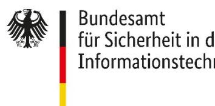

BSI TR-03153-1 Anhang A

# Technische Richtlinie BSI TR-03153 Technische Sicherheitseinrichtung für elektronische Aufzeichnungssysteme

Teil 1: Anforderungen an die Technische Sicherheitseinrichtung Anhang A - Zertifizierungsanforderungen

Version 1.1.1 2023-12-19

## Änderungshistorie

| Version | Datum      | Beschreibung                                      |
|---------|------------|---------------------------------------------------|
| 1.1.0   | 2023-05-30 | Initiale Version                                  |
| 1.1.1   | 2023-12-19 | Anpassung der Fristen, klarstellende Definitionen |

Tabelle 1: Änderungshistorie

Bundesamt für Sicherheit in der Informationstechnik Postfach 20 03 63 53133 Bonn

E-Mail: registrierkassen@bsi.bund.de Internet: https://www.bsi.bund.de © Bundesamt für Sicherheit in der Informationstechnik 2023

### Inhalt

| 1        | EINLEITUNG 4                                                 |   |
|----------|--------------------------------------------------------------|---|
| 1.1 2 | SCHLÜSSELWORTE KONFORMITÄTSZERTIFIZIERUNG DER TSE  5      | 4 |
| 2.1      | ÜBERGANGSFRIST ZUR VERWENDUNG DER TR-03153 IN VERSION 1.0.1  | 5 |
| 2.1.1    | LETZTMÖGLICHE INITIALE ZERTIFIZIERUNG                        | 5 |
| 2.1.2    | LETZTMÖGLICHE REZERTIFIZIERUNG MIT FUNKTIONALEN ÄNDERUNGEN   | 5 |
| 2.1.3    | REZERTIFIZIERUNGEN SICHERHEITSRELEVANTER UND FORMELLER NATUR | 5 |
| 2.1.4    | MAINTENANCE                                                  | 5 |
| 2.1.5    | BESCHRÄNKUNG DER LAUFZEIT DER ZERTIFIKATE                    | 6 |
| 3        | SICHERHEITSZERTIFIZIERUNGEN DER TSE 7                        |   |
| 3.1      | ZU ERBRINGENDE KONZEPTE                                      | 7 |
| 4        | ZERTIFIZIERUNG DER PKI 8                                     |   |
| 4.1      | VERWENDBARKEITSZEITRAUM DER ÜBERGANGS-PKI                    | 8 |
|          | LITERATURVERZEICHNIS  9                                      |   |

## 1 Einleitung

Dieses Dokument ist ein Anhang der Technischen Richtlinie [\[BSI TR-03153-1\]](#page-8-1) und konkretisiert deren Zertifizierungsanforderungen an Technische Sicherheitseinrichtungen.

#### 1.1 Schlüsselworte

Anforderungen als Ausdruck normativer Festlegungen werden durch die in Großbuchstaben geschriebenen deutschen Schlüsselworte MUSS/MÜSSEN, DARF/DÜRFEN NICHT/KEINE, VERPFLICHTEND, SOLLTE/SOLLTEN, EMPFOHLEN, SOLLTE/SOLLTEN NICHT/KEINE, KANN/KÖNNEN/DARF/DÜRFEN, und OPTIONAL gekennzeichnet.

Die verwendeten Schlüsselworte sind auf Basis der folgenden Übersetzungstabelle gemäß [\[RFC 2119\]](#page-8-2) zu interpretieren:

| Deutsch                       | Englisch    |
|-------------------------------|-------------|
| MUSS / MÜSSEN                 | MUST        |
| DARF/DÜRFEN NICHT/KEINE       | MUST NOT    |
| VERPFLICHTEND                 | REQUIRED    |
| SOLLTE / SOLLTEN              | SHOULD      |
| SOLLTE/SOLLTEN NICHT/KEINE    | SHOULD NOT  |
| EMPFOHLEN                     | RECOMMENDED |
| KANN / KÖNNEN / DARF / DÜRFEN | MAY         |
| OPTIONAL                      | OPTIONAL    |

Tabelle 2 Schlüsselworte

## 2 Konformitätszertifizierung der TSE

#### 2.1 Übergangsfrist zur Verwendung der TR-03153 in Version 1.0.1

#### 2.1.1 Letztmögliche initiale Zertifizierung

Technische Sicherheitseinrichtung KÖNNEN grundsätzlich noch initial nach der Richtlinie [\[BSI TR-03153\]](#page-8-3) in der Version 1.0.1, inklusive zugehöriger Ergänzungen, zertifiziert werden, wenn folgende Bedingungen erfüllt sind:

- Der Antrag auf Zertifizierung MUSS vor dem 30.04.2024 erfolgreich durch das BSI angenommen worden sein.
- • Der Zeitpunkt des Abschlusses der Zertifizierung DARF NICHT nach dem 30.04.2025 liegen.[1](#page-4-6)

#### 2.1.2 Letztmögliche Rezertifizierung mit funktionalen Änderungen

Technische Sicherheitseinrichtung mit funktionalen Änderungen gegenüber dem vorausgehenden Zertifizierungsverfahren KÖNNEN grundsätzlich noch nach der Richtlinie [\[BSI TR-03153\]](#page-8-3) in der Version 1.0.1, inklusive zugehöriger Ergänzungen, rezertifiziert werden, wenn folgende Bedingungen erfüllt sind:

• Der Zeitpunkt des Abschlusses der Zertifizierung DARF NICHT nach dem 30.04.2025 liegen. [2](#page-4-7)

#### 2.1.3 Rezertifizierungen sicherheitsrelevanter und formeller Natur

Technische Sicherheitseinrichtung mit reinen sicherheitsrelevanten und/oder formellen Änderungen gegenüber dem vorausgehenden Zertifizierungsverfahren KÖNNEN auch nach dem 30.04.2025 noch nach der Richtlinie [\[BSI TR-03153\]](#page-8-3) in der Version 1.0.1, inklusive zugehöriger Ergänzungen, rezertifiziert werden, wenn folgende Bedingung erfüllt ist:

• Im Vergleich zum vorherigen Zertifizierungsstand DÜRFEN KEINE Veränderungen durchgeführt worden sein, die nicht reine sicherheitsrelevante Verbesserungen oder rein formelle Änderungen darstellen.

Sicherheitsrelevante Änderungen sind Änderungen, die rein dazu dienen, einen nicht tragbaren und zertifizierungsschädlichen bzw. zertifizierungsrelevanten Sicherheitsmangel zu beheben.

Formelle Änderungen sind alle Änderungen, die Eigenschaften und Funktionalitäten der TSE im Gesamten und Einzelnen nicht abändern. Ein Beispiel wäre die Korrektur eines Tippfehlers.

Im Zweifelsfall sollte sich der Hersteller frühzeitig an das BSI zu wenden, um gemeinschaftlich zu erörtern, ob es sich bei den angestrebten Änderungen um solche sicherheitsrelevanter oder formeller Natur handelt.

#### 2.1.4 Maintenance

Alle zeitlichen Limitierungen gelten analog zu den vorgenannten Einschränkungen der Rezertifizierungsvorgaben.

1 In begründeten Ausnahmefällen kann das BSI Ausnahmen von dieser zeitlichen Frist erlauben

2 In begründeten Ausnahmefällen kann das BSI Ausnahmen von dieser zeitlichen Frist erlauben

#### 2.1.5 Beschränkung der Laufzeit der Zertifikate

Ab dem 30.04.2025 sind keine Laufzeitverlängerungen durch Rezertifizierungs-Verfahren für nach der Technischen Richtlinie [\[BSI TR-03153\]](#page-8-3) in der Version 1.0.1 zertifizierte Technische Sicherheitseinrichtungen mehr möglich.

Mit jedem Rezertifizierungs-Verfahren nach der Richtlinie [\[BSI TR-03153\]](#page-8-3) in der Version 1.0.1 wird das Gültigkeitsende des Zertifikats der Rezertifizierung höchstens auf das Laufzeitende des vorhergehenden Zertifikats terminiert.

### 3 Sicherheitszertifizierungen der TSE

Die folgenden Anforderungen gelten für Technische Sicherheitseinrichtungen die nach der Technischen Richtlinie [\[BSI TR-03153-1\]](#page-8-1) zertifiziert werden sollen.

Das Sicherheitsmodul der Technischen Sicherheitseinrichtung MUSS nach den folgend genannten Common Criteria (CC) Schutzprofilen evaluiert und zertifiziert sein.

- Die Sicherheitsmodulanwendung, welche von der Technischen Sicherheitseinrichtung genutzt wird, MUSS nach dem Schutzprofil [\[BSI-CC-PP-0105-V2\]](#page-8-4) durch eine anerkannte Common-Criteria-Zertifizierungsstelle gemäß SOGIS-MRA / CCRA[3](#page-6-2) zertifiziert sein.
- Der Krypto-Kern (CSP), welcher von der Technischen Sicherheitseinrichtung genutzt wird, muss nach dem Schutzprofil [\[BSI-CC-PP-0104\]](#page-8-5) in der Konfiguration nach dem Schutzprofil [\[BSI-CC-PP-0107\]](#page-8-6) (Time Stamp Service and Audit) oder dem Schutzprofil [\[BSI-CC-PP-0108\]](#page-8-7) (Time Stamp Service, Audit and Clustering) durch eine anerkannte Common-Criteria-Zertifizierungsstelle gemäß SOGIS-MRA zertifiziert sein.

Wird der Krypto-Kern (CSP-Einheit) in einem zentralen Rechenzentrum betrieben und kann der Betreiber des Rechenzentrums durch eine ISO/IEC 27001-Zertifizierung physikalisches und organisatorisches Sicherheitsniveau für das Rechenzentrum nachweisen, dann DARF das Sicherheitsmodul der Technischen Sicherheitseinrichtung abweichend von obigen Vorgaben nach den folgenden Common Criteria Schutzprofilen evaluiert und zertifiziert sein:

- Der Krypto-Kern (CSP), welcher in diesem Fall von der Technischen Sicherheitseinrichtung genutzt wird, MUSS nach dem Schutzprofil [\[BSI-CC-PP-0111\]](#page-8-8) (CSP Light) in der Konfiguration nach dem Schutzprofil [\[BSI-CC-PP-0113\]](#page-8-9) (Time Stamp Service, Audit and Clustering) zertifiziert sein.
- In diesem Fall MUSS die Sicherheitsmodulanwendung (SMAERS) nach dem Schutzprofil [\[BSI-CC-PP-](#page-8-4)[0105-V2\]](#page-8-4) zertifiziert sein.

Die Plattform, auf der ein CSPL betrieben wird, MUSS über eines der folgenden Zertifikate verfügen:

- Ein Zertifikat nach ISO/IEC 19790 Level 3, oder alternativ,
- für den Fall, dass sich der CSP-L gemäß der Definition nach dem Schutzprofil [\[CEN EN 419221-5\]](#page-8-10) als lokale Client-Applikation innerhalb der Hardware-Appliance des CEN 419221-5-TOE befindet, ein Zertifikat nach dem Schutzprofil [\[CEN EN 419221-5\]](#page-8-10) oder
- • ein vergleichbares Zertifikat in Abstimmung mit dem BSI.

#### 3.1 Zu erbringende Konzepte

Die Eignung der folgend aufgeführten Konzepte der Schutzprofile MUSS nach dem Supporting Document [\[BSI-CC-SUP-SMA\]](#page-8-11) durch die jeweilige Common Criteria-Prüfstelle, oder übergangsweise/ersatzweise durch das BSI, bestätigt worden sein:

- Provisionierungskonzept
- Umgebungsschutzkonzept
- Updatekonzept
- CSP-Konfigurationskonzept

 3 zukünftig [\[CSA\]](#page-8-12)

Bundesamt für Sicherheit in der Informationstechnik 7

## 4 Zertifizierung der PKI

#### 4.1 Verwendbarkeitszeitraum der Übergangs-PKI

Entsprechend der Technischen Richtlinie [\[BSI TR-03153-1\]](#page-8-1) KÖNNEN, unter den in der Richtlinie genannten Voraussetzungen, für einen begrenzten Zeitraum Zertifikate über öffentliche Schlüssel der Technischen Sicherheitseinrichtungen durch eine Übergangs-PKI ausgestellt werden.

Das Ende des Übergangszeitraums wird auf den Ablauf des Jahres 2025 festgelegt.

Ab diesem Zeitpunkt DÜRFEN durch eine Übergangs-PKI KEINE neuen Zertifikate über öffentliche Schlüssel von Technischen Sicherheitseinrichtungen ausgestellt werden.

#### Literaturverzeichnis

| BSI-CC-PP-0104  | BSI: BSI-CC-PP-0104-2019 Protection Profile Cryptographic Service Provider (CSP)                                                                                                                                                                                                                                                                  |
|-----------------|---------------------------------------------------------------------------------------------------------------------------------------------------------------------------------------------------------------------------------------------------------------------------------------------------------------------------------------------------|
|                 | BSI-CC-PP-0105-V2 BSI: BSI-CC-PP-0105-V2-2020 Protection Profile Security Module Application for Electronic Record-keeping Systems V2 (SMAERS)                                                                                                                                                                                                 |
| BSI-CC-PP-0107  | BSI: BSI-CC-PP-0107-2019 Protection Profile Configuration Cryptographic Service Provider – Time Stamp Service and Audit                                                                                                                                                                                                                        |
| BSI-CC-PP-0108  | BSI: BSI-CC-PP-0108-2019 Protection Profile Configuration Cryptographic Service Provider – Time Stamp Service, Audit and Clustering                                                                                                                                                                                                            |
| BSI-CC-PP-0111  | BSI: BSI-CC-PP-0111-2019 Protection Profile Cryptographic Service Provider Light (CSPL)                                                                                                                                                                                                                                                        |
| BSI-CC-PP-0113  | BSI: BSI-CC-PP-0113-2020 Protection Profile Time Stamp Service, Audit and Clustering                                                                                                                                                                                                                                                              |
| BSI-CC-SUP-SMA  | BSI: Supporting Document for Common Criteria Protection Profile SMAERS, Version 1.0                                                                                                                                                                                                                                                            |
| BSI TR-03145-1  | BSI: Technical Guideline TR-03145 Secure CA Operation - Part 1: Generic requirements for Trust Centers instantiating as Certification Authority (CA) in a Public-Key Infrastructure (PKI) with security level 'high'                                                                                                                        |
| BSI TR-03153    | BSI: Technische Richtlinie TR-03153 Technische Sicherheitseinrichtung für elektronische Aufzeichnungssysteme, Version 1.0.1, 20. Dezember 2018                                                                                                                                                                               |
| BSI TR-03153-1  | BSI: Technische Richtlinie BSI TR-03153 Technische Sicherheitseinrichtung für elektronische Aufzeichnungssysteme - Teil 1: Anforderungen an die Technische Sicherheitseinrichtung                                                                                                                                                        |
| CEN EN 419221-5 | CEN: Protection Profiles for TSP Cryptographic Modules - Part 5: Cryptographic Module for Trust Services, 2018                                                                                                                                                                                                                                 |
| CSA             | Verordnung (EU) 2019/881 des Europäischen Parlaments und des Rates vom 17. April 2019 über die ENISA (Agentur der Europäischen Union für Cybersicherheit) und über die Zertifizierung der Cybersicherheit von Informations- und Kommunikationstechnik und zur Aufhebung der Verordnung (EU) Nr. 526/2013 (Rechtsakt zur Cybersicherheit) |
| RFC 2119        | Bradner, S.: Key words for use in RFCs to indicate requirement levels                                                                                                                                                                                                                                                                             |