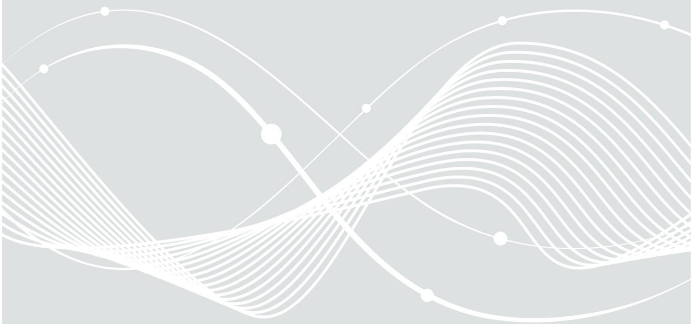

# Ergänzung der Technischen Richtlinie TR-03153

Testspezifikation (TS)

02.12.2019

Bundesamt für Sicherheit in der Informationstechnik Postfach 20 03 63 53133 Bonn

E-Mail: registrierkassen@bsi.bund.de Internet: https://www.bsi.bund.de © Bundesamt für Sicherheit in der Informationstechnik 2019

| 1   | Einleitung 5                           |  |
|-----|----------------------------------------|--|
| 1.1 | Terminologie 5                         |  |
| 2   | Klarstellungen 6                       |  |
|     | Implementation Conformance Statement 8 |  |
|     | Literaturverzeichnis 12                |  |

## 1 Einleitung

Die Technische Richtlinie BSI TR-03153 [TR-03153] spezifiziert verbindliche Vorgaben an die Technische Sicherheitseinrichtung, mit denen die digitalen Grundaufzeichnungen eines elektronischen Aufzeichnungssystems gemäß § 146a (1) der Abgabenordnung geschützt werden müssen.

Die Technische Richtlinie BSI TR-03153-TS [TR-03153-TS] enthält verbindliche Anforderungen an die Prüfung von Technischen Sicherheitseinrichtungen (TSE) für Aufzeichnungssysteme gemäß der Technischen Richtlinie BSI TR-03153 [TR-03153].

Dieses Dokument enthält Klarstellungen zur Version 1.0.1 der Technischen Richtlinie BSI TR-03153-TS [TR-03153-TS] und eine korrigierte Version des Implementation Conformance Statements.

### 1.1 Terminologie

Um die Erkennbarkeit von Änderungen in diesem Dokument zu verbessern, werden an einigen Stellen farbliche Markierungen genutzt. Um die Lesbarkeit des Dokumentes beizubehalten, wird dies nur an Stellen genutzt, an denen dies für die Erkennung der Klarstellungen förderlich ist.

In diesem Dokument wird gelb markierter Text verwendet um anzuzeigen, dass die markierten Wörter oder Zeichen neu sind. Rot markierte Wörter oder Zeichen zeigen an, dass das markierte Wort oder Zeichen falsch ist. Grün markierte Wörter oder Zeichen zeigen an, dass das markierte Wort oder Zeichen richtig ist.

### 2 Klarstellungen

Dieses Kapitel enthält Klarstellungen zur aktuellen Version BSI TR-03153-TS [TR-03153-TS].

Nachfolgend wird aufgezählt, welche Satzteile, Aufzählungen oder andere Inhalte ersetzt oder ergänzt werden.

#### **Kapitel 4.1, Seite 17:**

Der Hersteller MUSS mindestens 1 Zeitformat unterstützen und seine unterstützen Zeitformate deklarieren. Das ICS wurde überarbeitet und liegt als gesonderte Datei vor.

Konkret wird zwischen Tabelle 8 und Tabelle 9 die folgende Tabelle ergänzt:

| Gegenstand                                                           | Angaben des Antragstellers                      |
|----------------------------------------------------------------------|-------------------------------------------------|
| Welche Zeitformate werden von der TSE unterstützt (mindestens 1)? | ☐ UTC Time ☐ Generalized Time ☐ Unix Time |

Zusätzliche Angaben zum verwendeten Zeitformat

#### **Kapitel 4.1, Seite 19:**

Das ICS wird um die folgende Erklärung des Herstellers ergänzt:

Der Antragsteller versichert zusätzlich , dass die TSE

- **keine** Funktionalität bereitstellt um zukünftige, aktuelle oder abgeschlossene Aufzeichnungen zu manipulieren, zu löschen oder eine ordnungsgemäße Verarbeitung zu verhindern,
- und dass das eingereichte Testobjekt funktionell dem finalen Stand einspricht und höchstens ein anderer Formfaktor gewählt wurde.

#### **Kapitel 5.2.2, Seite 26:**

Änderung des (zugehörigen) XML-Testfalls SM\_TME\_10:

Authentisierung des Benutzers als Testschritt hinzugefügt.

#### **Kapitel 5.2.5, Seite 29:**

Die Prüfung mit der ID "SM\_KRY\_03" wird als nicht durchzuführen angesehen. Der zugehörigen XML-Testfall kann ausgelassen werden.

#### **Kapitel 5.2.7, Seite 30:**

Änderung des (zugehörigen) XML-Testfalls SM\_REM\_01:

Ersetze

"<Title>Test case STO\_REM\_01</Title>"

mit

"<Title>Test case SM\_REM\_01</Title>".

#### **Kapitel 5.2.2, Seite 26:**

Die Prüfungen mit der IDs "SM\_TME\_10" und "SM\_TME\_11" werden als nicht verpflichtend durchzuführen angesehen. Die zugehörigen XML-Testfälle können ausgelassen werden.

### Implementation Conformance Statement

Das Implementation Conformance Statement (ICS) enthält die für die Durchführung der Konformitätsprüfung benötigten Informationen zur Technischen Sicherheitseinrichtung.

In diesem ICS gibt der Antragsteller an, zu welchen Teilen der Testspezifikation der Technischen Richtlinie die betreffende Technische Sicherheitseinrichtung konform sein soll. Darunter fällt auch die Angabe der unterstützen Kryptographie und die Auswahl von den von Kapitel 3 definierten Profilen.

#### Herstellererklärung

In der folgenden Auflistung gibt der Antragsteller für die Zertifizierung an, welche Eigenschaften die zu prüfende Technische Sicherheitseinrichtung hat.

|   |   | Die TSE …                                                                                                                                               | Daraus folgende Profile          |
|---|---|---------------------------------------------------------------------------------------------------------------------------------------------------------|----------------------------------|
| ☑ |   | verfügt über ein Speichermedium.                                                                                                                        | STORAGE_BASIC                    |
|   | ☐ | hat ein fernverbundenes Speichermedium.                                                                                                                 | STORAGE_REMOTE                   |
| ☑ |   | verfügt über ein Sicherheitsmodul.                                                                                                                      | SM_BASIC                         |
|   | ☐ | hat ein fernverbundenes Sicherheitsmodul.                                                                                                               | SM_REMOTE                        |
|   | ☐ | signiert Aktualisierungen (Updates) direkt und aggregiert diese nicht.                                                                               | SM_NOAGG                         |
|   | ☐ | UND/ODER aggregiert Aktualisierungen (Updates) und sichert diese zusammengefasst ab (signiert).                                                   | SM_AGG                           |
|   |   |                                                                                                                                                         |                                  |
|   | ☐ | kann mehrere Transaktionen parallel verwalten                                                                                                           | SM_MULTI                         |
|   |   | Anzahl der maximal parallel offenen Transaktionen:                                                                                                      |                                  |
|   |   |                                                                                                                                                         |                                  |
| ☐ |   | besitzt eine herstellerspezifische Einbindungsschnittstelle und setzt den Export-Teil der Einheitlichen Digitalen Schnittstelle um.               | CUSTOM_INTEGRATI ON_INTERFACE |
| ☐ |   | ODER implementiert alle verpflichtenden Funktionen der Einheitlichen Digitalen Schnittstelle gemäß der Technischen Richtlinie BSI TR-03153.    | SDI                              |
|   |   |                                                                                                                                                         |                                  |
|   | ☐ | implementiert die optionale Funktion restoreFromBackup der Einheitlichen Digitalen Schnittstelle gemäß der Technischen Richtlinie BSI TR-03153 | SDI_RESTORE                      |

|   |   | Die TSE …                                                                                                                                                | Daraus folgende Profile |
|---|---|----------------------------------------------------------------------------------------------------------------------------------------------------------|-------------------------|
|   | ☐ | implementiert die empfohlene Funktion deleteStoredData der Einheitlichen Digitalen Schnittstelle gemäß der Technischen Richtlinie BSI TR-03153. | SDI_DELETE              |
| ☐ |   | verfügt über einen Mechanismus, zum eigenständigen Stellen der Zeit des Sicherheitsmoduls.                                                         | TIME_SYNC               |
|   |   | ODER                                                                                                                                                     |                         |
| ☐ |   | verfügt über keinen Mechanismus, zum eigenständigen Stellen der Zeit des Sicherheitsmoduls.                                                        | NO_TIME_SYNC            |
|   |   |                                                                                                                                                          |                         |
| ☐ |   | kann von mehreren Clients gleichzeitig für die Protokollierung von Transaktionen verwendet werden.                                                 | MULTI_CLIENT            |
|   |   | ODER                                                                                                                                                     |                         |
| ☐ |   | kann zu einem Zeitpunkt nur von einem Client für die Protokollierung von Transaktionen verwendet werden.                                           | NO_MULTI_CLIENT         |

Tabelle 1: ICS - Profile der Technischen Sicherheitseinrichtung

In Tabelle [2](#page-8-0) macht der Antragssteller Angaben zum Signaturalgorithmus, der vom Sicherheitsmodul der Technischen Sicherheitseinrichtung bei Absicherungsschritten verwendet wird.

| Verwendete Kryptofunktionen       | Angaben des Antragstellers |
|-----------------------------------|----------------------------|
| Signaturalgorithmus               |                            |
|                                   |                            |
| Parameter zum                     |                            |
| Signaturalgorithmus (inkl.        |                            |
| Hashfunktion und Schlüssellängen) |                            |
|                                   |                            |
|                                   |                            |
|                                   |                            |
|                                   |                            |
|                                   |                            |
|                                   |                            |
|                                   |                            |
|                                   |                            |
|                                   |                            |
|                                   |                            |
|                                   |                            |
|                                   |                            |
|                                   |                            |
|                                   |                            |
|                                   |                            |
|                                   |                            |
|                                   |                            |
|                                   |                            |
|                                   |                            |
|                                   |                            |
|                                   |                            |
|                                   |                            |
|                                   |                            |
|                                   |                            |
|                                   |                            |

Tabelle 2: Angaben zur verwendeten Kryptographie

Zusätzliche Angaben:

| Gegenstand                                            | Angaben des Antragstellers |
|-------------------------------------------------------|----------------------------|
| Größe des internen Speichers des Sicherheitsmoduls |                            |

Tabelle 3: Zusätzliche Angaben zu den Komponenten der Technischen Sicherheitseinrichtung

| Gegenstand                                                                                                                  | Angaben des Antragstellers |
|-----------------------------------------------------------------------------------------------------------------------------|----------------------------|
| Zeitlicher Abstand in dem das Sicherheitsmodul die intern verwaltete Zeit in seinem nichtflüchtigen Speicher sichert. |                            |

Tabelle 4: Zusätzliche Angaben zum Zeitabstand, in dem das Sicherheitsmodul die intern verwaltete Zeit sichert

| Gegenstand                                                            | Angaben des Antragstellers                      |
|-----------------------------------------------------------------------|-------------------------------------------------|
| Welche Zeitformate werden von der TSE unterstützt (mindestens 1) ? | ☐ UTC Time ☐ Generalized Time ☐ Unix Time |

Tabelle 5: Zusätzliche Angaben zum verwendeten Zeitformat

| Gegenstand                                                                                                   | Angaben des Antragstellers |
|--------------------------------------------------------------------------------------------------------------|----------------------------|
| Maximale Anzahl von Clients, die die TSE gleichzeitig zur Absicherung von Transaktionen nutzen können. |                            |

Tabelle 6: Zusätzliche Angaben zu der Anzahl von gleichzeitigen Clients der TSE

| Gegenstand                                                                                            | Angaben des Antragstellers |
|-------------------------------------------------------------------------------------------------------|----------------------------|
| Maximale Anzahl der parallel geöffneten Transaktionen, die das Sicherheitsmodul verwalten kann. |                            |

Tabelle 7: Zusätzliche Angaben zu der maximalen Anzahl von parallel geöffneten Transaktionen

Der Antragsteller versichert zusätzlich , dass die TSE

- **keine** Funktionalität bereitstellt um zukünftige, aktuelle oder abgeschlossene Aufzeichnungen zu manipulieren, zu löschen oder eine ordnungsgemäße Verarbeitung zu verhindern,
- und dass das eingereichte Testobjekt funktionell dem finalen Stand einspricht und höchstens ein anderer Formfaktor gewählt wurde.

Datum / Name / Unterschrift Antragsteller

\_\_\_\_\_\_\_\_\_\_\_\_\_\_\_\_\_\_\_\_\_\_\_\_\_\_\_\_\_\_\_\_\_\_\_\_\_

### Literaturverzeichnis

| [TR-03153]    | BSI: Technische Richtlinie BSI TR-03153 "Technische Sicherheitseinrichtung für |
|---------------|--------------------------------------------------------------------------------|
|               | elektronische Aufzeichnungssysteme", Version 1.0.1, 20.12.2018                 |
| [TR-03153-TS] | BSI: TR-03153 Technische Sicherheitseinrichtung für elektronische              |
|               | Aufzeichnungssysteme Testspezifikation (TS), Version 1.0.1, 05.02.2019         |