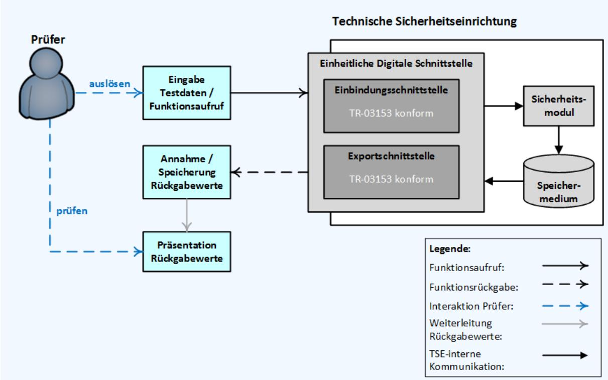
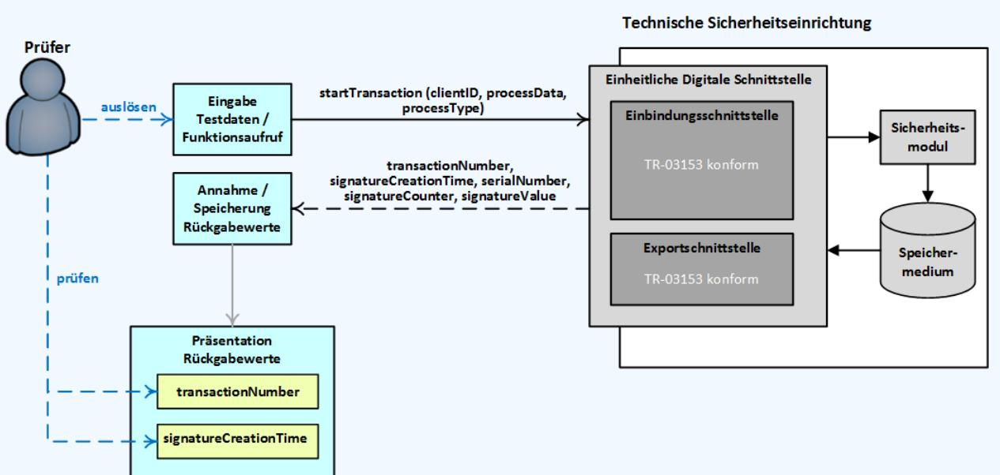
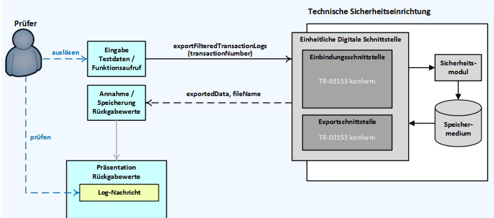

BSI TR-03153-1-TS

# Technische Richtlinie BSI TR-03153 Technische Sicherheitseinrichtung für elektronische Aufzeichnungssysteme

Teil 1: Anforderungen an die Technische Sicherheitseinrichtung Testspezifikation (TS)

Version 1.1.1 2024-08-30


## Änderungshistorie

| Version | Datum             | Beschreibung                                                                                            |
|---------|-------------------|---------------------------------------------------------------------------------------------------------|
| 1.0.1   | 5. Februar 2019   | Initiale Version                                                                                        |
| 1.1.0   | 19. Dezember 2023 | Spezifikation entsprechend TR-03153-1 Version 1.1.0                                                     |
| 1.1.1   | 30. August 2024   | Entfernung der Wahlmöglichkeit des Profils configureLogging im<br>ICS. Barrierefreiheitsverbesserungen. |

Bundesamt für Sicherheit in der Informationstechnik Postfach 20 03 63 53133 Bonn

E-Mail: registrierkassen@bsi.bund.de Internet: https://www.bsi.bund.de © Bundesamt für Sicherheit in der Informationstechnik 2024

## Inhaltsverzeichnis

| 1     | EINLEITUNG10                                                                  |    |
|-------|-------------------------------------------------------------------------------|----|
|       |                                                                               |    |
| 1.1   | MOTIVATION UND ZIELE                                                          | 10 |
| 1.2   | INHALT UND ABGRENZUNG                                                         | 10 |
| 2     | GENERELLE ANFORDERUNGEN AN DIE DURCHFÜHRUNG VON PRÜFUNGEN UND DEN PRÜFBERICHT |    |
|       | 11                                                                            |    |
|       |                                                                               |    |
| 3     | WEITERE ANFORDERUNGEN AN DIE DURCHFÜHRUNG VON PRÜFUNGEN VON TECHNISCHEN       |    |
|       | SICHERHEITSEINRICHTUNGEN 12                                                   |    |
| 3.1   | AUFBAU UND ABLAUF DER PRAKTISCHEN TESTDURCHFÜHRUNG BEI EINER TSE              | 12 |
| 3.2   | BEISPIEL EINER TESTDURCHFÜHRUNG                                               | 13 |
|       |                                                                               |    |
| 4     | PROFILE16                                                                     |    |
|       |                                                                               |    |
| 4.1   | SPEICHERMEDIUM-PROFILE                                                        | 16 |
| 4.2   | SICHERHEITSMODUL-PROFILE                                                      | 16 |
| 4.3   | SCHNITTSTELLEN-PROFILE                                                        | 17 |
| 4.4   | ALLGEMEINE PROFILE                                                            | 19 |
|       |                                                                               |    |
| 5     | IMPLEMENTATION CONFORMANCE STATEMENT21                                        |    |
| 5.1   | HERSTELLERERKLÄRUNG                                                           | 21 |
| 5.2   | VERSICHERUNG ZU GEMACHTEN ANGABEN                                             | 32 |
| 5.3   | ZUSTIMMUNG ZUR VERÖFFENTLICHUNG DER BESCHRÄNKUNGEN                            | 32 |
|       |                                                                               |    |
| 6     | MODULE33                                                                      |    |
|       |                                                                               |    |
| 6.1   | MODUL STORAGE – SPEICHERMEDIUM (STO)                                          | 33 |
| 6.1.1 | FUNKTIONALE PRÜFUNGEN VON SPEICHERMEDIEN (STO_FUN)                            | 33 |
| 6.1.2 | PRÜFUNGEN DER SPEICHERKAPAZITÄT VON SPEICHERMEDIEN (STO_CAP)                  | 35 |
| 6.1.3 | PRÜFUNGEN DER ZUVERLÄSSIGKEIT VON SPEICHERMEDIEN (STO_REL)                    | 35 |
| 6.1.4 | PRÜFUNGEN FÜR FERNVERBUNDENE SPEICHERMEDIEN (STO_REM)                         | 35 |
| 6.2   | MODUL SECURITY MODULE – SICHERHEITSMODUL (SM)                                 | 35 |
| 6.2.1 | PRÜFUNG ZU DER GENUTZTEN ARCHITEKTUR DES SICHERHEITSMODULS (SM_ARCH)          | 35 |
| 6.2.2 | PRÜFUNGEN ZUR KONKATENATION UND SIGNATURERSTELLUNG (SM_CON)                   | 37 |
| 6.2.3 | PRÜFUNGEN ZUR ZEITFÜHRUNG IM SICHERHEITSMODUL (SM_TME)                        | 39 |
|       |                                                                               |    |

| 6.2.4    | PRÜFUNGEN ZUM SIGNATURZÄHLER IM SICHERHEITSMODUL (SM_SIG)                                  | 42 |
|----------|--------------------------------------------------------------------------------------------|----|
| 6.2.5    | PRÜFUNGEN ZUR TRANSAKTIONSNUMMER IM SICHERHEITSMODUL (SM_TRA)                              | 43 |
| 6.2.6    | PRÜFUNGEN ZUR KRYPTOGRAPHIEANWENDUNG IM SICHERHEITSMODUL (SM_KRY)                          | 44 |
| 6.2.7    | PRÜFUNGEN DER PUBLIC-KEY-INFRASTRUKTUR VON SICHERHEITSMODULEN (SM_PKI)                     | 45 |
| 6.2.8    | PRÜFUNGEN FÜR FERNVERBUNDENE SICHERHEITSMODULE (SM_REM)                                    | 45 |
| 6.2.9    | PRÜFUNGEN FÜR DIE SICHERHEITSMODULANWENDUNG (SM_LOG)                                       | 46 |
| 6.2.10   | DEAKTIVIERUNG DES SICHERHEITSMODULS (SM_AUD)                                               | 47 |
|          |                                                                                            |    |
| 6.3      | MODUL INTEGRATION INTERFACE – EINBINDUNGSSCHNITTSTELLE                                     | 47 |
| 6.3.1    | BASISPRÜFUNGEN DER EINBINDUNGSSCHNITTSTELLE (II)                                           | 47 |
| 6.3.1.1  | Authentifizierung von Nutzern der Technischen Sicherheitseinrichtung (II_AUT)  47          |    |
| 6.3.1.2  | Abmeldung von Nutzern der Technischen Sicherheitseinrichtung (II_LGO) 60                   |    |
| 6.3.1.3  | Entsperren von Nutzern (II_UBP)  61                                                        |    |
| 6.3.1.4  | Initialisierung der Technischen Sicherheitseinrichtung (II_INI) 62                         |    |
| 6.3.1.5  | Setzen von Beschreibungen in der TSE (II_SDE) 62                                           |    |
| 6.3.1.6  | Abfrage der TSE Beschreibung (II_GDE)  62                                                  |    |
| 6.3.1.7  | Auslösen eines Selbsttests (II_STE)  63                                                    |    |
| 6.3.1.8  | Geräte-Update (II_UDD) 64                                                                  |    |
| 6.3.1.9  | Außerbetriebnahme des Sicherheitsmoduls der Technischen Sicherheitseinrichtung (II_DSE) 65 |    |
| 6.3.1.10 | Abfrage zur Gesamtkapazität des Speichermediums (II_GTM)  65                               |    |
| 6.3.1.11 | Abfrage zur aktuell verwendeten Speicherkapazität (II_GUM)  66                             |    |
| 6.3.1.12 | Abfrage zur freien Speicherkapazität (II_GFM) 66                                           |    |
| 6.3.1.13 | Abfrage zum Gesundheitszustand aller Komponenten der TSE (II_GDH) 66                       |    |
| 6.3.1.14 | Abfrage der TSE Version (II_GCV) 67                                                        |    |
| 6.3.1.15 | Abfrage zum Datum des voraussichtlichen Nutzungsendes (II_GEU) 68                          |    |
| 6.3.1.16 | Aktualisierung der Uhrzeit (II_UDT)  68                                                    |    |
| 6.3.1.17 | Abfrage der unterstützten Variante zur Aktualisierung der Zeit (II_TSV)  69                |    |
| 6.3.1.18 | Abfrage der aktuellen eingestellten Zeit (II_GCT) 70                                       |    |
| 6.3.1.19 | Konfiguration der Protokollierung von Ereignissen (II_CLG) 70                              |    |
| 6.3.1.20 | Export des TAR-Containers (II_EXP)  70                                                     |    |
| 6.3.1.21 | Zertifikatsexport (II_EXC) 72                                                              |    |
| 6.3.1.22 | Löschen von gespeicherten Daten im Speichermedium (II_DLM)  72                             |    |
| 6.3.1.23 | Export von Seriennummern (II_ESN) 73                                                       |    |
| 6.3.1.24 | Prüfungen zum aktuellen Stand der Signaturzähler (II_CSC)  73                              |    |
| 6.3.1.25 | Wiederherstellung durch ein Backup (II_RFB)  74                                            |    |
|          |                                                                                            |    |
| 6.3.1.26 | Lesen der letzten Log-Nachricht (II_GLL)  75                                               |    |
| 6.3.1.27 | Registrieren von Aufzeichnungssystemen (II_REC) 76                                         |    |
| 6.3.1.28 | Deregistrieren von Aufzeichnungssystemen (II_DRC) 77                                       |    |
| 6.3.1.29 | Starten einer Transaktion (II_STA)  78                                                     |    |
| 6.3.1.30 | Aktualisierung einer Transaktion (II_UPD) 79                                               |    |
| 6.3.1.31 | Beenden einer Transaktion (II_FIN) 81                                                      |    |
| 6.3.1.32 | Export von Transaktions-Log-Nachrichten (II_EXF) 83                                        |    |
| 6.3.1.33 | Abfrage der unterstützten Varianten für die Aktualisierung von Transaktionen (II_UTV)  95  |    |
| 6.3.1.34 | Abfrage der aktuellen Anzahl von Aufzeichnungssystemen der Technischen                     |    |
|          | Sicherheitseinrichtung (II_CNC) 95                                                         |    |
| 6.3.1.35 | Abfrage der maximalen Anzahl von simultanen Aufzeichnungssystemen der Technischen          |    |
|          | Sicherheitseinrichtung (II_MNC)  97                                                        |    |

| 6.3.1.36                                                                           | Abfrage zu registrierten Aufzeichnungssystemen (II_GRC)  98                                           |     |
|------------------------------------------------------------------------------------|-------------------------------------------------------------------------------------------------------|-----|
| 6.3.1.37                                                                           | Abfrage der aktuellen Anzahl von parallel geöffneten Transaktionen (II_CNT)  99                       |     |
| 6.3.1.38<br>Abfrage der maximalen Anzahl von parallelen Transaktionen (II_MNT) 100 |                                                                                                       |     |
| 6.3.1.39<br>Abfrage zum Stadium einer Transaktion (II_GTS)  100                    |                                                                                                       |     |
| 6.3.1.40                                                                           | Abfrage der Transaktionsnummern aller nicht beendeten Transaktionen (II_GOT)  101                     |     |
| 6.3.1.41                                                                           | Abfrage zum aktuellen Transaktionszählers (II_CTC) 102                                                |     |
| 6.3.1.42                                                                           | Ausgabe der letzten Transaktions-Log-Nachricht (II_GLT) 103                                           |     |
| 6.3.1.43                                                                           | Sperren von Log-Nachrichten von Transaktionen (II_LTL)  104                                           |     |
| 6.3.1.44                                                                           | Entsperren von Log-Nachrichten von Transaktionen (II_UTL)  105                                        |     |
| 6.3.1.45                                                                           | Verwendung der Technischen Sicherheitseinrichtung durch mehrere Aufzeichnungssysteme                  |     |
| (II_MCU)                                                                           | 105                                                                                                   |     |
| 6.3.1.46                                                                           | Allgemeine Fehlermeldungen (II_ERR) 106                                                               |     |
| 6.3.1.47                                                                           | Unterstützung von herstellerspezifische Funktionalitäten der Einbindungsschnittstelle (II_ADD)<br>124 |     |
| 6.3.2                                                                              | PRÜFUNGEN DER STANDARDSCHNITTSTELLEN GEMÄß BSI TR-03151-2 (SDI)                                       | 124 |
| 6.3.2.1                                                                            | Verwendete Varianten der Einbindungsschnittstelle (SDI_IMP)  124                                      |     |
| 6.3.2.2                                                                            | Funktionsnamen der Standardschnittstelle (SDI_FUN) 124                                                |     |
| 6.3.2.3                                                                            | Fehlermeldungen der Standardschnittstelle (SDI_ERR) 128                                               |     |
| 6.3.2.4                                                                            | Parameter der Standardschnittstelle (SDI_PAR) 128                                                     |     |
| 6.3.3                                                                              | PRÜFUNGEN FÜR HERSTELLERSPEZIFISCHE FUNKTIONALITÄTEN DER EINBINDUNGSSCHNITTSTELLE (ADD)               | 130 |
| 6.3.3.1                                                                            | Beschreibung der Funktionalitäten (ADD_DOC)  130                                                      |     |
| 6.3.3.2                                                                            | Unterscheidbarkeit herstellerspezifische Funktionalitäten zur Standardschnittstelle (ADD_DIF) 131     |     |
| 6.3.3.3                                                                            | Abwandlungen von Standardfunktionen (ADD_ABW) 131                                                     |     |
| 6.4                                                                                | PRÜFUNGEN DER EXPORTDATEN GEMÄß BSI TR-03153-1 (EXP)                                                  | 131 |
| 6.4.1                                                                              | TAR-FORMAT (EXP_TAR)                                                                                  | 131 |
| 6.4.2                                                                              | DATEI INFO.CSV (EXP_INF)                                                                              | 132 |
| 6.4.3                                                                              | LOG-NACHRICHTEN (EXP_LOG)                                                                             | 132 |
| 6.5                                                                                | ERGÄNZUNG ZU PRÜFUNGEN ZUR HERSTELLERDOKUMENTATION (DOC)                                              | 138 |
| 7                                                                                  | TESTFÄLLE 141                                                                                         |     |
| 7.1                                                                                | NOTATION VON TESTFÄLLEN                                                                               | 141 |
| 7.1.1                                                                              | VERWENDUNG VON VARIABLEN                                                                              | 142 |
| 7.2                                                                                | XML SCHEMA                                                                                            | 142 |
|                                                                                    |                                                                                                       |     |
|                                                                                    | LITERATURVERZEICHNIS144                                                                               |     |
|                                                                                    | ANHANG145                                                                                             |     |
|                                                                                    |                                                                                                       |     |
| A.1                                                                                | XML SCHEMA FÜR DIE XML-TESTFÄLLE DER BSI TR-03153-1-TS                                                | 145 |
| A.2                                                                                | XML BEISPIELE                                                                                         | 147 |
| A.3                                                                                | DARSTELLUNG VON XML-TESTFÄLLEN IN EINEM WEBBROWSER                                                    | 151 |

Bundesamt für Sicherheit in der Informationstechnik 5

|  | ABKÜRZUNGSVERZEICHNIS 152 |
|--|---------------------------|
|--|---------------------------|

## Abbildungsverzeichnis

| Abbildung 1: Testdurchführung für eine TSE mit Einbindungsschnittstelle nach [BSI TR-03153-1]13 |  |
|-------------------------------------------------------------------------------------------------|--|
| Abbildung 2: Erste Phase in Bezug auf das Testen der Funktion startTransaction 14               |  |
| Abbildung 3: Zweite Phase in Bezug auf das Testen der Funktion startTransaction15               |  |
| Abbildung 4: Darstellung eines XML-Testfalls in einem Webbrowser 151                            |  |
|                                                                                                 |  |

## Tabellenverzeichnis

| Tabelle 1: Profil für das Speichermedium der Technischen Sicherheitseinrichtung16                            |            |
|--------------------------------------------------------------------------------------------------------------|------------|
| Tabelle 2: Profile für das Sicherheitsmodul17                                                                |            |
| Tabelle 3: Profile der Einbindungsschnittstelle gemäß [BSI TR-03153-1]18                                     |            |
| Tabelle 4: Profil für herstellerspezifische Funktionalitäten der Einbindungsschnittstelle 18                 |            |
| Tabelle 5: Profile für optionale Funktionen19                                                                |            |
| Tabelle 6: Profile zu allgemeinen Eigenschaften einer TSE20                                                  |            |
| Tabelle 7: ICS - Profile der Eigenschaften der Technischen Sicherheitseinrichtung 24                         |            |
| Tabelle 8: ICS - Profile der verfügbaren Funktionen der Technischen Sicherheitseinrichtung 26                |            |
| Tabelle 9: Angaben zu verwendeten Kryptofunktionen für die Absicherungsschritte der TSE 27                   |            |
| Tabelle 10: Angaben zu verwendeten Kryptofunktionen der PKI27                                                |            |
| Tabelle 11: Zusätzliche Angaben zu den Komponenten der Technischen Sicherheitseinrichtung 28                 |            |
| Tabelle 12: Zusätzliche Angaben zum verwendeten Zeitformat28                                                 |            |
| Tabelle 13: Zusätzliche Angaben zu der Anzahl von gleichzeitigen Aufzeichnungssystemen der TSE28             |            |
| Tabelle 14: Zusätzliche Angaben zu der maximalen Anzahl von parallel geöffneten Transaktionen28              |            |
| Tabelle<br>15:<br>Zusätzliche<br>Angaben<br>zu<br>der<br>maximalen<br>Anzahl<br>von<br>parallel<br>genutzten | Technische |
| Sicherheitseinrichtungen29                                                                                   |            |
| Tabelle 16: Weitere Angaben zur TSE32                                                                        |            |
| Tabelle 17: Testfälle zur Funktionalität des Speichermediums35                                               |            |
| Tabelle 18: Prüfungen der Speicherkapazität von Speichermedien35                                             |            |
| Tabelle 19: Prüfungen der Zuverlässigkeit von Speichermedien35                                               |            |
| Tabelle 20: Prüfungen für fernverbundene Speichermedien35                                                    |            |
| Tabelle 21: Prüfung zu der genutzten Architektur des Sicherheitsmoduls37                                     |            |
| Tabelle 22: Testfälle zur Konkatenation und Signaturerstellung39                                             |            |
| Tabelle 23: Testfälle zur Zeitführung im Sicherheitsmodul42                                                  |            |
| Tabelle 24: Auf Testfälle SM_TME_08_Template, SM_SIG_08_Template anzuwendende Verfeinerungen42               |            |
| Tabelle 25: Testfälle für Signaturzähler43                                                                   |            |
| Tabelle 26: Testfälle zur Transaktionsnummer im Sicherheitsmodul 44                                          |            |
| Tabelle 27: Testfälle der Kryptographieanwendung des Sicherheitsmoduls45                                     |            |
| Tabelle 28: Testfälle der Public-Key-Infrastruktur von Sicherheitsmodulen45                                  |            |
| Tabelle 29: Testfälle für fernverbundene Sicherheitsmodule46                                                 |            |
| Tabelle 30: Testfälle für die Sicherheitsmodulanwendung46                                                    |            |
| Tabelle 31: Testfälle zur Deaktivierung des Sicherheitsmoduls47                                              |            |
| Tabelle 32: Testfälle für die Einbindungsschnittstelle<br>Authentifizierung von Nutzern 51                   |            |

| Tabelle             | 33: | Auf | Testfälle | II_AUT_01_Template,                                                                                      | II_AUT_03_Template,                                     | II_AUT_04_Template,                     |     |
|---------------------|-----|-----|-----------|----------------------------------------------------------------------------------------------------------|---------------------------------------------------------|-----------------------------------------|-----|
| II_AUT_05_Template, |     |     |           | II_LGO_01_Template,                                                                                      | II_LGO_02_Template,                                     | II_UBP_01_Template                      | und |
|                     |     |     |           | II_UBP_02_Template anzuwendende Verfeinerungen51                                                         |                                                         |                                         |     |
|                     |     |     |           | Tabelle 34: Auf Testfall II_AUT_06_Template anzuwendende Verfeinerungen 52                               |                                                         |                                         |     |
|                     |     |     |           | Tabelle 35: Auf Testfall II_AUT_07_Template anzuwendende Verfeinerungen52                                |                                                         |                                         |     |
|                     |     |     |           | Tabelle 36: Auf Testfall II_AUT_08_Template anzuwendende Verfeinerungen 53                               |                                                         |                                         |     |
|                     |     |     |           | Tabelle 37: Auf Testfall II_AUT_09_Template anzuwendende Verfeinerungen 54                               |                                                         |                                         |     |
|                     |     |     |           | Tabelle 38: Auf Testfälle II_AUT_10_Template und II_AUT_12_Template anzuwendende Verfeinerungen 56       |                                                         |                                         |     |
|                     |     |     |           | Tabelle 39: Auf Testfall II_AUT_11_Template anzuwendende Verfeinerungen 56                               |                                                         |                                         |     |
|                     |     |     |           | Tabelle 40: Auf Testfall II_AUT_13_Template anzuwendende Verfeinerungen 56                               |                                                         |                                         |     |
|                     |     |     |           | Tabelle 41: Auf Testfall II_AUT_14_Template anzuwendende Verfeinerungen58                                |                                                         |                                         |     |
|                     |     |     |           | Tabelle 42: Auf Testfall II_AUT_15_Template anzuwendende Verfeinerungen58                                |                                                         |                                         |     |
|                     |     |     |           | Tabelle 43: Auf Testfall II_AUT_16_Template anzuwendende Verfeinerungen 59                               |                                                         |                                         |     |
|                     |     |     |           | Tabelle 44: Auf Testfall II_AUT_17_Template anzuwendende Verfeinerungen 59                               |                                                         |                                         |     |
|                     |     |     |           | Tabelle 45: Auf Testfall II_AUT_18_Template anzuwendende Verfeinerungen 60                               |                                                         |                                         |     |
|                     |     |     |           |                                                                                                          |                                                         |                                         |     |
|                     |     |     |           | Tabelle 46: Testfälle für die Einbindungsschnittstelle                                                   | Abmelden von Nutzern60                                  |                                         |     |
|                     |     |     |           | Tabelle 47: Testfälle für die Einbindungsschnittstelle                                                   | Entsperren der PIN eines autorisierten Nutzers61        |                                         |     |
|                     |     |     |           | Tabelle 48: Testfälle für die Einbindungsschnittstelle                                                   | Initialisierung der Technischen Sicherheitseinrichtung  |                                         |     |
|                     |     |     |           | 62                                                                                                       |                                                         |                                         |     |
|                     |     |     |           | Tabelle 49: Testfälle für die Einbindungsschnittstelle                                                   | Setzten von Beschreibungen in der TSE 62                |                                         |     |
|                     |     |     |           | Tabelle 50: Testfälle für die Einbindungsschnittstelle                                                   | Abfrage der Beschreibung der TSE 63                     |                                         |     |
|                     |     |     |           | Tabelle 51: Testfälle für die Einbindungsschnittstelle                                                   | Auslösen eines Selbsttests63                            |                                         |     |
|                     |     |     |           | Tabelle 52: Testfälle für die Einbindungsschnittstelle                                                   | Geräte-Update 65                                        |                                         |     |
|                     |     |     |           | Tabelle 53: Testfälle für die Einbindungsschnittstelle                                                   | Außerbetriebnahme des Sicherheitsmoduls65               |                                         |     |
|                     |     |     |           | Tabelle 54: Testfälle für die Einbindungsschnittstelle                                                   | Abfrage der Gesamtkapazität des Speichermediums         |                                         |     |
|                     |     |     |           | 66                                                                                                       |                                                         |                                         |     |
|                     |     |     |           | Tabelle 55: Testfälle für die Einbindungsschnittstelle                                                   | Abfrage der aktuell verwendeten Speicherkapazität66     |                                         |     |
|                     |     |     |           | Tabelle 56: Testfälle für die Einbindungsschnittstelle                                                   | Abfrage der freien Speicherkapazität 66                 |                                         |     |
|                     |     |     |           | Tabelle 57: Testfälle für die Einbindungsschnittstelle                                                   | Abfrage zum Gesundheitszustand aller Komponenten        |                                         |     |
|                     |     |     |           | der TSE67                                                                                                |                                                         |                                         |     |
|                     |     |     |           | Tabelle 58: Testfälle für die Einbindungsschnittstelle                                                   | Abfrage der TSE Version67                               |                                         |     |
|                     |     |     |           | Tabelle 59: Testfälle für die Einbindungsschnittstelle                                                   |                                                         | Abfrage zum Datum des voraussichtlichen |     |
|                     |     |     |           | Nutzungsendes68                                                                                          |                                                         |                                         |     |
|                     |     |     |           | Tabelle 60: Testfälle für die Einbindungsschnittstelle - Aktualisierung der Zeit im Sicherheitsmodul69   |                                                         |                                         |     |
|                     |     |     |           | Tabelle 61: Testfälle für die Einbindungsschnittstelle                                                   | Ausgabe der Möglichkeit über die Schnittstelle die Zeit |                                         |     |
|                     |     |     |           | zu stellen 69                                                                                            |                                                         |                                         |     |
|                     |     |     |           | Tabelle 62: Testfälle für die Einbindungsschnittstelle                                                   | Abfrage der aktuellen eingestellten Zeit70              |                                         |     |
|                     |     |     |           | Tabelle 63: Testfälle zu Protokolldateien für die Konfiguration von Ereignissen 70                       |                                                         |                                         |     |
|                     |     |     |           | Tabelle 64: Testfälle für die Einbindungsschnittstelle                                                   | Export aller Log-Nachrichten, zur Verifikation          |                                         |     |
|                     |     |     |           | benötigten Zertifikate und Zusatzdateien71                                                               |                                                         |                                         |     |
|                     |     |     |           | Tabelle 65: Testfälle für die Einbindungsschnittstelle - Ausgabe der Zertifikate der Zertifikatskette 72 |                                                         |                                         |     |
|                     |     |     |           | Tabelle 66: Testfälle für die Einbindungsschnittstelle                                                   | Löschen der Log-Nachrichten 72                          |                                         |     |
|                     |     |     |           | Tabelle 67: Testfälle für die Einbindungsschnittstelle                                                   | Ausgabe der Seriennummern 73                            |                                         |     |
|                     |     |     |           | Tabelle 68: Testfälle für die Einbindungsschnittstelle                                                   | Ausgabe des aktuellen Stands des Signaturzählers74      |                                         |     |
|                     |     |     |           | Tabelle 69: Testfälle für die Einbindungsschnittstelle                                                   | Wiedereinspielung von Backups von Log-Nachrichten       |                                         |     |
|                     |     |     |           | 75                                                                                                       |                                                         |                                         |     |
|                     |     |     |           | Tabelle 70: Testfälle für die Einbindungsschnittstelle                                                   | Ausgabe der zuletzt erzeugten Log-Nachricht75           |                                         |     |
|                     |     |     |           | Tabelle 71: Testfälle für die Einbindungsschnittstelle                                                   | Registrieren von Aufzeichnungssystemen 76               |                                         |     |
|                     |     |     |           |                                                                                                          |                                                         |                                         |     |

| Tabelle 72: Testfälle für die Einbindungsschnittstelle<br>Deregistrierung von Aufzeichnungssystemen77                                                                    |
|--------------------------------------------------------------------------------------------------------------------------------------------------------------------------|
| Tabelle 73: Testfälle für die Einbindungsschnittstelle<br>Starten einer Transaktion 78                                                                                   |
| Tabelle 74: Testfälle für die Einbindungsschnittstelle<br>Aktualisieren einer Transaktion 80                                                                             |
| Tabelle 75: Testfälle für die Einbindungsschnittstelle<br>Beenden einer Transaktion83                                                                                    |
| Tabelle 76: Testfälle für die Einbindungsschnittstelle<br>gefilterter Export von Transaktions-Log-Nachrichten<br>94                                                      |
| Tabelle 77: Testfälle für die Einbindungsschnittstelle<br>Ausgabe der möglichen Varianten, wie Updates für<br>Transaktionen durchgeführt werden können95                 |
| Tabelle 78: Testfälle für die Einbindungsschnittstelle<br>Ausgabe der Anzahl von Aufzeichnungssystemen, die<br>aktuell an nicht beendeten Transaktionen beteiligt sind97 |
| Tabelle<br>79:<br>Testfälle<br>für<br>die<br>Einbindungsschnittstelle<br>Ausgabe<br>der<br>maximalen<br>Anzahl<br>von                                                    |
| Aufzeichnungssystemen, die gleichzeitig Transaktionen protokollieren können97                                                                                            |
| Tabelle 80: Testfälle für die Einbindungsschnittstelle<br>Abfrage zu registrierten Aufzeichnungssystemen 98                                                              |
| Tabelle 81: Testfälle für die Einbindungsschnittstelle<br>Ausgabe der Anzahl von offenen Transaktionen 100                                                               |
| Tabelle 82: Testfälle für die Einbindungsschnittstelle<br>Ausgabe der maximalen Anzahl von offenen                                                                       |
| Transaktionen, die gleichzeitig verwaltet werden können 100                                                                                                              |
| Tabelle 83: Testfälle für die Einbindungsschnittstelle<br>Ausgabe des Stadiums in welchem sich eine                                                                      |
| Transaktion befindet 101                                                                                                                                                 |
| Tabelle 84: Testfälle für die Einbindungsschnittstelle<br>Ausgabe der Transaktionsnummern aller nicht                                                                    |
| beendeten Transaktionen 102                                                                                                                                              |
| Tabelle 85: Testfälle für die Einbindungsschnittstelle<br>Ausgabe des aktuellen Stands des Transaktionszählers                                                           |
| 102                                                                                                                                                                      |
| Tabelle 86: Testfälle für die Einbindungsschnittstelle<br>Ausgabe der zuletzt erzeugten Transaktions-Log                                                                 |
| Nachricht 104                                                                                                                                                            |
| Tabelle 87: Testfälle für die Einbindungsschnittstelle<br>Unterbindung der Aufzeichnung von Transaktionen                                                                |
| 104                                                                                                                                                                      |
| Tabelle 88: Testfälle zum Entsperren von Log-Nachrichten von Transaktionen 105                                                                                           |
| Tabelle 89: Testfälle für die Einbindungsschnittstelle<br>Verwendung der Technischen Sicherheitseinrichtung                                                              |
| durch mehrere Aufzeichnungssysteme  106                                                                                                                                  |
| Tabelle 90: Testfälle für Allgemeine Fehlermeldungen von Funktionen  110                                                                                                 |
| Tabelle 91: Auf Testfall II_ERR_01_Template anzuwendende Verfeinerungen 112                                                                                              |
| Tabelle 92: Auf Testfälle II_ERR_02_Template und II_ERR_03_Template anzuwendende Verfeinerungen 113                                                                      |
| Tabelle 93: Auf Testfall II_ERR_04_Template anzuwendende Verfeinerungen 113                                                                                              |
| Tabelle 94: Auf Testfall II_ERR_05_Template anzuwendende Verfeinerungen 115                                                                                              |
| Tabelle 95: Auf Testfall II_ERR_06_Template anzuwendende Verfeinerungen 115                                                                                              |
| Tabelle 96: Auf Testfall II_ERR_07_Template anzuwendende Verfeinerungen 117                                                                                              |
| Tabelle<br>97:<br>Auf<br>Testfälle<br>II_ERR_08_Template,<br>II_ERR_09_Template,<br>II_ERR_11_Template,                                                                  |
| II_ERR_12_Template und II_ERR_13_Template anzuwendende Verfeinerungen 118                                                                                                |
| Tabelle 98: Auf Testfall II_ERR_10_Template anzuwendende Verfeinerungen 119                                                                                              |
| Tabelle 99: Auf Testfall II_ERR_14_Template anzuwendende Verfeinerungen 121                                                                                              |
| Tabelle 100: Auf Testfall II_ERR_15_Template anzuwendende Verfeinerungen  122                                                                                            |
| Tabelle 101: Auf Testfall II_ERR_16_Template anzuwendende Verfeinerungen  123                                                                                            |
| Tabelle 102 Auf Testfall II_ERR_17_Template anzuwendende Verfeinerungen 124                                                                                              |
| Tabelle<br>103:<br>Testfälle<br>für<br>die<br>Einbindungsschnittstelle<br>Unterstützung<br>von<br>herstellerspezifische                                                  |
| Funktionalitäten der Einbindungsschnittstelle  124                                                                                                                       |
| Tabelle 104: Testfälle zu verwendeten Variante der Einbindungsschnittstelle 124                                                                                          |
| Tabelle<br>105:<br>Prüfungen<br>der<br>Beschreibung<br>der<br>herstellerspezifische<br>Funktionalitäten<br>der<br>Einbindungsschnittstelle  124                          |

[Tabelle 106: Auf Testfälle SDI\\_FUN\\_01\\_Template und SDI\\_ERR\\_01\\_Template anzuwendende Verfeinerungen](#page-126-0)

| 127                                                                                                         |     |
|-------------------------------------------------------------------------------------------------------------|-----|
| Tabelle 107: Prüfungen der Parameter der Standardschnittstelle 128                                          |     |
| Tabelle 108: Prüfungen der Parameter der Standardschnittstelle 128                                          |     |
| Tabelle 109: Auf Testfall SDI_PAR_01_Template anzuwendende Verfeinerungen 130                               |     |
| Tabelle<br>110:<br>Prüfungen<br>der<br>Beschreibung<br>der<br>herstellerspezifische<br>Funktionalitäten     | der |
| Einbindungsschnittstelle  130                                                                               |     |
| Tabelle<br>111:<br>Prüfungen<br>der<br>Unterscheidbarkeit<br>herstellerspezifische<br>Funktionalitäten      | zur |
| Einbindungsschnittstelle gemäß BSI TR-03151-1 131                                                           |     |
| Tabelle<br>112:<br>Prüfungen<br>der<br>herstellerspezifische<br>Funktionalitäten<br>die<br>Abwandlungen     | von |
| Standardfunktionen sind 131                                                                                 |     |
| Tabelle 113: Prüfungen der Exportschnittstelle gemäß BSI TR-03153-1<br>TAR-Format 131                       |     |
| Tabelle 114: Prüfungen der Exportschnittstelle gemäß BSI TR-03153-1<br>Initialisierungsdaten 132            |     |
| Tabelle 115: Prüfungen der Exportschnittstelle gemäß BSI TR-03153-1<br>Log-Nachrichten 136                  |     |
| Tabelle<br>116:<br>Auf<br>Testfälle<br>EXP_LOG_01_Template,<br>EXP_LOG_02_Template,<br>EXP_LOG_03_Template, |     |
| EXP_LOG_04_Template und und EXP_LOG_26_Template anzuwendende Verfeinerungen 138                             |     |
| Tabelle 117: Prüfungen zur Herstellerdokumentation 140                                                      |     |
| Tabelle 118: Definition der Informationen für einen Testfall 142                                            |     |
| Tabelle 119: Definition der Informationen für einen Testschritt 143                                         |     |

## <span id="page-9-0"></span>1 Einleitung

## <span id="page-9-1"></span>1.1 Motivation und Ziele

Die Technische Richtlinie [\[BSI TR-03153-1\]](#page-143-1) definiert Anforderungen an Technische Sicherheitseinrichtungen für elektronische Aufzeichnungssysteme.

Diese Anforderungen müssen von Herstellern einer Technischen Sicherheitseinrichtung in den Produkten umgesetzt werden. Die vorliegende Testspezifikation zur [\[BSI TR-03153-1\]](#page-143-1) definiert Anforderungen an Konformitätsprüfungen einer Technischen Sicherheitseinrichtung.

Anhand des Prüfungsergebnisses kann eine Aussage getroffen werden, ob das Verhalten und die Funktionalität einer Technischen Sicherheitseinrichtung konform zur [\[BSI TR-03153-1\]](#page-143-1) sind.

Diese Prüfvorschriften ermöglichen eine einheitliche und konsistente Prüfung unterschiedlicher Implementierungen der Technischen Sicherheitseinrichtung durch verschiedene Prüfstellen mit vergleichbaren Prüfergebnissen.

#### Hinweis:

#### Es gelten weiterhin alle Anforderungen der Technischen Richtlinie [\[BSI TR-03153-1\]](#page-143-1), welche von Herstellern erfüllt werden müssen, auch dann, falls es keinen zu der Anforderung gehörenden Testfall gibt.

## <span id="page-9-2"></span>1.2 Inhalt und Abgrenzung

Das vorliegende Dokument enthält verbindliche Anforderungen an die Prüfung von Technischen Sicherheitseinrichtungen (TSE) für Aufzeichnungssysteme gemäß [\[BSI TR-03153-1\]](#page-143-1).

Anhand einer Konformitätsprüfung soll festgestellt werden, ob die bereitgestellte Funktionalität einer Technischen Sicherheitseinrichtung konform zu den entsprechenden Anforderungen in der Technischen Richtlinie [\[BSI TR-03153-1\]](#page-143-1) und deren nachgelagerten Richtlinien und Anforderungen ist.

Diese Technische Richtlinie definiert in der Hauptsache Anforderungen für die folgenden Prüfungen:

- Prüfung der Funktionalität für die Sicherung von Anwendungsdaten und den vom Sicherheitsmodul erzeugten Protokolldaten.
- Prüfung der Exportfunktion für abgesicherte Daten.
- Prüfung der Einbindungsschnittstelle.
- Prüfung der Vollständigkeit der Funktionalität von herstellerspezifischen Einbindungsschnittstellen.

Bedingt durch weitere verbindliche Anforderungen der [\[BSI TR-03153-1\]](#page-143-1) sind im Rahmen einer Zertifizierung/Konformitätsprüfung von Technischen Sicherheitseinrichtungen ergänzende formelle Prüfungen notwendig. Die hierzu zu erstellenden Herstellererklärungen werden auf Vollständigkeit und Plausibilität geprüft.

Folgenden Prüfaspekte werden von dieser Technischen Richtlinie beispielsweise nicht betrachtet:

- Prüfung der elektronischen Aufzeichnungssysteme (Registrierkassen, Taxameter, etc.),
- Prüfung der durch die Common Criteria-Zertifizierung abgedeckten Sicherheitseigenschaften der Technischen Sicherheitseinrichtung.

## <span id="page-10-0"></span>2 Generelle Anforderungen an die Durchführung von Prüfungen und den Prüfbericht

Anforderungen an die Prüfung und den Prüfbericht werden im Rahmen des Produktzertifizierungsprogramm für Technische Sicherheitseinrichtungen gemäß BSI TR-03153 sowie im Produktzertifizierungssystem festgelegt. Das Produktzertifizierungssystem sowie das zu TR-03153 gehörende Produktzertifizierungsprogramm werden auf der Webseite des BSI unter folgenden Link veröffentlicht:

https://www.bsi.bund.de/DE/Themen/Unternehmen-und-Organisationen/Standards-und-Zertifizierung/Zertifizierung-und-Anerkennung/Zertifizierung-von-Produkten/Zertifizierung-nach-TR/Allgemeine-Informationen/allgemeine-informationen\_node.html

## <span id="page-11-0"></span>3 Weitere Anforderungen an die Durchführung von Prüfungen von Technischen Sicherheitseinrichtungen

Die Einbindungsschnittelle dient zur Anbindung der Technischen Sicherheitseinrichtung an das elektronische Aufzeichnungssystem. Über die Einbindungsschnittstelle wird ein Großteil der Tests der Technischen Sicherheitseinrichtung durchgeführt. Die Validierung der Aufzeichnungen und Funktionalitäten findet größtenteils unter Verwendung von exportierten (abgesicherten) Daten an der Exportschnittstelle statt.

Die Einbindungsschnittstellen müssen den in der Technischen Richtlinie [\[BSI TR-03151-1\]](#page-143-2) genannten Anforderungen genügen. Genaueres regelt die Technischen Richtlinie [\[BSI TR-03153-1\]](#page-143-1).

Alle Implementierungen der Einbindungsschnittstellen, unabhängig davon ob sie herstellerspezifisch sind oder den Vorgaben der Technischen Richtlinie [\[BSI TR-03151-2\]](#page-143-3) folgen, müssen vom Hersteller für die Prüfung bereitgestellt und erfolgreich überprüft werden. Genaueres regelt die Technischen Richtlinie [\[BSI TR-](#page-143-1)[03153-1\]](#page-143-1).

Eine manuelle Ablaufsteuerung an den Schnittstellen und eine Parameterveränderung müssen möglich sein. Zusätzlich muss der Hersteller die notwendigen Mittel für das Aufrufen der einzelnen Funktionalitäten der Einbindungsschnittstelle und das Empfangen der zurückgegebenen Werte zur Verfügung stellen.

## <span id="page-11-1"></span>3.1 Aufbau und Ablauf der praktischen Testdurchführung bei einer TSE

Di[e Abbildung 1](#page-12-1) zeigt den allgemeinen Aufbau der Testdurchführung.

Hierbei repräsentiert die [Abbildung 1](#page-12-1) den allgemeinen Aufbau für eine Technische Sicherheitseinrichtung, die eine Einbindungsschnittstelle gemäß [\[BSI TR-03153-1\]](#page-143-1) bereitstellt.

Im Rahmen dieser Technischen Richtlinie erfolgen konkreten Angaben zum Aufbau der Testdurchführung. Je nach Implementierung können Komponenten der TSE lokal oder fernverbunden implementiert sein.

Der Ablauf der praktischen Testdurchführung erfolgt meistens durch einen Aufruf von Funktionen über die Einbindungsschnittstelle sowie der Auswertung von Rückgabewerten und Ausgaben über die Exportschnittstelle.

Die Funktionsaufrufe begründen sich aus den Anforderungen der in diesem Dokument beschriebenen Testfälle. Hierzu notwendige Prüfschritte und weitere Details zu erwarteten Ergebnissen sind in den XML Beschreibungen der Testfälle (s. Kapitel [7.2\)](#page-141-1) zu finden.



<span id="page-12-1"></span>Abbildung 1: Testdurchführung für eine TSE mit Einbindungsschnittstelle nach [[BSI TR-03153-1](#page-143-1)] 

### <span id="page-12-0"></span>3.2 Beispiel einer Testdurchführung

Im Folgenden wird die allgemeine Ausführung von Konformitätstests für die erforderliche Einbindungsschnittstelle nach [\[BSI TR-03151-2\]](#page-143-3) anhand eines Tests in Bezug auf die Funktionalität zum Starten einer Transaktion skizziert. Die entsprechende Funktionalität wird hierbei in Form der Funktion startTransaction bereitgestellt.

Di[e Abbildung 2](#page-13-0) stellt beispielhaft die erste Phase des Tests für die Funktion startTransaction dar. Der Prüfer löst den Aufruf der Funktion startTransaction aus. Hierbei werden der Funktion die Seriennummer des Aufzeichnungssystems, die Daten des Vorgangs und die Art des Vorgangs über die entsprechenden Eingabeparameter der Funktion übergeben. Innerhalb der Technischen Sicherheitseinrichtung erfolgt nun die Absicherung der übergebenen Daten und der entsprechenden Protokolldaten, wobei die abgesicherten Daten im Speichermedium der Technischen Sicherheitseinrichtung gespeichert werden. Anschließend gibt die Funktion startTransaction die folgenden Werte als Rückgabeparameter zurück:

- Transaktionsnummer,
- Zeitpunkt der Protokollierung,
- Seriennummer der Technischen Sicherheitseinrichtung,
- Signaturzähler,
- Prüfwert (Signatur).



Anschließend kann der Prüfer die Korrektheit dieser Rückgabeparameter überprüfen.

<span id="page-13-0"></span>Abbildung 2: Erste Phase in Bezug auf das Testen der Funktion startTransaction

Di[e Abbildung 3](#page-14-0) zeigt die zweite Phase des Tests, in der überprüft werden soll, ob die entsprechenden abgesicherten Daten im Rahmen der Ausführung der Funktion startTransaction korrekt gespeichert wurden. Hierzu löst der Prüfer den Aufruf der Funktion exportLogMessages der Einbindungsschnittstelle gemäß [\[BSI](#page-143-1)  [TR-03153-1\]](#page-143-1) aus, um die entsprechenden abgesicherten Daten in Form einer Log-Nachricht über die Exportschnittstelle zu exportieren. Eine Ausprägung der Export-Funktion, exportFilteredTransactionLogs, ermöglicht den gezielten Export der Log-Nachrichten für einen bestimmten Vorgang anhand der betreffenden Transaktionsnummer. Die exportierten Daten werden von der Exportschnittstelle in dem vorgegebenen Format exportiert. Anschließend kann eine Prüfung erfolgen, ob

- 1. eine entsprechende Log-Nachricht exportiert wurde.
- 2. die folgenden Daten korrekt in der entsprechenden Log-Nachricht abgebildet werden:
	- Anwendungsdaten (Seriennummer des Aufzeichnungssystems, die Daten des Vorgangs und der Typ des Vorgangs), die beim Aufruf der Funktion startTransaction in Phase 1 des Tests (siehe [Abbildung](#page-13-0)  [2\)](#page-13-0) übergeben wurden.
	- Protokolldaten (Transaktionsnummer, Zeitpunkt der Absicherung, Seriennummer der Technischen Sicherheitseinrichtung, Signaturzähler, Prüfwert), die im Rahmen der Ausführung der Funktion

startTransaction vom Sicherheitsmodul erzeugt und als Rückgabeparameter von startTransaction zurückgegeben wurden (sieh[e Abbildung 2\)](#page-13-0).



<span id="page-14-0"></span>Abbildung 3: Zweite Phase in Bezug auf das Testen der Funktion startTransaction

## <span id="page-15-0"></span>4 Profile

Die Technische Sicherheitseinrichtung besteht aus den folgenden Komponenten:

- Speichermedium,
- Sicherheitsmodul,
- Exportschnittstelle,
- Einbindungsschnittstelle.

Die folgenden Profile dienen zur Auswahl von Testfällen bei unterschiedlichen Ausprägungen der Komponenten der Technischen Sicherheitseinrichtungen. Beispiel: Eine Technische Sicherheitseinrichtung kann über fernverbundene Komponenten des Sicherheitsmoduls verfügen. Somit gilt für diese TSE das Profil SM\_REMOTE. Damit sind alle Tests mit dem Profil SM\_REMOTE auszuwählen und zu bestehen.

Eine Kombination von mehreren Profilen führt zur Auswahl der Schnittmenge der beiden Profile.

Beispiel: Einem Testfall sind die Profile SM\_MULTI und SM\_NOAGG zugeordnet. Somit ist der Test nur zu bestehen, wenn es sich um ein Sicherheitsmodul handelt, welches mehrere parallele Transaktionen verwalten kann und keine Aggregierung von Aktualisierungen vornimmt.

### <span id="page-15-1"></span>4.1 Speichermedium-Profile

| Profil ID      | Beschreibung                                                                                                                        |
|----------------|-------------------------------------------------------------------------------------------------------------------------------------|
| STORAGE_BASIC  | Tests und formelle Prüfungen, die von allen Speicher-me<br>dien von Technischen Sicherheitseinrichtungen er-füllt<br>werden müssen. |
| STORAGE_REMOTE | Formelle Prüfungen, die sich ausschließlich auf fernver<br>bundene Speichermedien beziehen.                                         |

<span id="page-15-3"></span>Tabelle 1: Profil für das Speichermedium der Technischen Sicherheitseinrichtung

## <span id="page-15-2"></span>4.2 Sicherheitsmodul-Profile

| Profil ID | Beschreibung                                                                                                                          |
|-----------|---------------------------------------------------------------------------------------------------------------------------------------|
| SM_BASIC  | Tests und formelle Prüfungen, die von allen Sicherheitsmo<br>dulen von Technischen Sicherheitseinrichtungen erfüllt<br>werden müssen. |
| SM_NOAGG  | Tests für Sicherheitsmodule welche Aktualisierungen (Up<br>dates) immer direkt signieren und nicht aggregieren.                       |
| SM_AGG    | Tests für Sicherheitsmodule, welche Aktualisierungen (Up<br>dates) aggregieren und zusammengefasst absichern (signie<br>ren) können.  |

| Profil ID            | Beschreibung                                                                                                                                      |  |
|----------------------|---------------------------------------------------------------------------------------------------------------------------------------------------|--|
| SM_INDEF             | Tests für TSEn, welche Log-Nachrichten für aggregierte Ak<br>tualisierungen erzeugen kann, in denen indefinite length<br>encoding verwendet wird. |  |
| SM_NO_INDEF          | Tests für TSEn, welche keine Log-Nachrichten erzeugen<br>kann, in denen indefinite length encoding verwendet wird.                                |  |
| SM_MULTI             | Tests für Sicherheitsmodule, welche mehrere Transaktio<br>nen parallel verwalten können.1                                                         |  |
| SM_REMOTE            | Tests für fernverbundene Sicherheitsmodule.                                                                                                       |  |
| SM_REMOTE_COMPONENTS | Tests für Sicherheitsmodule mit fernverbundenen Kompo<br>nenten.                                                                                  |  |
| CSP_ENTITY           | Tests für TSEn deren CSP-Einheiten zu einem sicherheits<br>einrichtungsübergreifenden CSP<br>zusammengefasst wer<br>den.                          |  |
| CSP_CLUSTER          | Tests für TSEn deren Krypto-Kern als Cluster betrieben<br>wird.                                                                                   |  |
| CSP_LIGHT            | Tests für TSEn die einen CSP-Light als Krypto-Kern ver<br>wenden.                                                                                 |  |
| SMAADMIN_AVAILABLE   | Test, wenn ein Administrator an der Sicherheitsmodulan<br>wendung angemeldet werden kann.                                                         |  |

<span id="page-16-1"></span>Tabelle 2: Profile für das Sicherheitsmodul

### <span id="page-16-0"></span>4.3 Schnittstellen-Profile

| Profil ID    | Beschreibung                                                                                                                                        |  |
|--------------|-----------------------------------------------------------------------------------------------------------------------------------------------------|--|
| II           | Tests für alle Einbindungsschnittstellen.                                                                                                           |  |
|              | Die Tests umfassen alle Funktionen und Eigenschaften der<br>Einbindungsschnittstelle gemäß [BSI TR-03153-1] und [BSI<br>TR-03151-1].                |  |
| SDI          | Tests für Implementierungen der Einbindungsschnittstelle<br>nach [BSI TR-03151-2].                                                                  |  |
| AUDIT_MODIFY | Tests, wenn die Einstellungen der Audit-Funktionalität der<br>Sicherheitsmodulanwendung nach der initialen Einstel<br>lung verändert werden können. |  |

<sup>1</sup> Die maximale Anzahl der parallelen Transaktionen ist auf dem ICS zu nennen.

Bundesamt für Sicherheit in der Informationstechnik 17

Profile

| Profil ID                     | Beschreibung                                                                                                                                                       |
|-------------------------------|--------------------------------------------------------------------------------------------------------------------------------------------------------------------|
| MULTI_CLIENT                  | Tests für Technische Sicherheitseinrichtungen, die eine<br>gleichzeitige Protokollierung von Transaktionen durch<br>mehrere Aufzeichnungssysteme ermöglichen.      |
| NO_MULTI_CLIENT               | Tests für Technische Sicherheitseinrichtungen, die nur eine<br>Protokollierung von Transaktionen durch ein Aufzeich<br>nungssystem ermöglichen.                    |
| LIMITED_CLIENTS_TRACKED       | Tests, wenn die TSE eine begrenzte Anzahl an Aufzeich<br>nungssystemen unterstützt und die aktuelle Anzahl der<br>Aufzeichnungssysteme nachgehalten wird.          |
| UNLIMITED_CLIENTS_NOT_TRACKED | Tests, wenn die TSE eine unbegrenzte Anzahl an Aufzeich<br>nungssystemen unterstützt aber die aktuelle Anzahl der<br>Aufzeichnungssysteme nicht nachgehalten wird. |

<span id="page-17-0"></span>Tabelle 3: Profile der Einbindungsschnittstelle gemäß [[BSI TR-03153-1](#page-143-1)]

| Profil ID                     | Beschreibung                                                                                                                              |
|-------------------------------|-------------------------------------------------------------------------------------------------------------------------------------------|
| ADDITIONAL_FUNCTIONALITIES    | Tests, wenn die Einbindungsschnittstelle Funktionalitäten<br>bereitstellt, die nicht in der [BSI TR-03153-1] beschrieben<br>sind.         |
| NO_ADDITIONAL_FUNCTIONALITIES | Tests, wenn die Einbindungsschnittstelle keine Funktiona<br>litäten bereitstellt, die nicht in der [BSI TR-03153-1] be<br>schrieben sind. |

<span id="page-17-1"></span>Tabelle 4: Profil für herstellerspezifische Funktionalitäten der Einbindungsschnittstelle

| Name der optionalen Funktion | Profil ID wenn die Funktion un<br>terstützt wird | Profil ID wenn die Funktion<br>nicht unterstützt wird |
|------------------------------|--------------------------------------------------|-------------------------------------------------------|
| updateDevice                 | II_UPDATEDEVICE                                  | II_NO_UPDATEDEVICE                                    |
| getTotalMemory               | II_TOTALMEMORY                                   | II_NO_TOTALMEMORY                                     |
| getUsedMemory                | II_USEDMEMORY                                    | II_NO_USEDMEMORY                                      |
| getFreeMemory                | II_FREEMEMORY                                    | II_NO_FREEMEMORY                                      |
| getDeviceHealth              | II_DEVICEHEALTH                                  | II_NO_DEVICEHEALTH                                    |
| getComponentVersions         | II_GETVERSIONS                                   | II_NO_GETVERSIONS                                     |
| getEndOfUsageDate            | II_ENDOFUSAGEDATE                                | II_NO_ENDOFUSAGEDATE                                  |
| updateTime                   | II_UPDATETIME                                    | II_NO_UPDATETIME                                      |

| Name der optionalen Funktion       | Profil ID wenn die Funktion un<br>terstützt wird | Profil ID wenn die Funktion<br>nicht unterstützt wird |
|------------------------------------|--------------------------------------------------|-------------------------------------------------------|
| getCurrentSeTime                   | II_CURRENTTIME                                   | II_NO_CURRENTTIME                                     |
| configureLogging                   | II_CONFIGLOGGING                                 | II_NO_CONFIGLOGGING                                   |
| deleteLogMessages                  | II_DELETELOGS                                    | II_NO_DELETELOGS                                      |
| restoreLogsFromBackup              | II_RESTOREBACKUP                                 | II_NO_RESTOREBACKUP                                   |
| exportFilteredTransactionLogs      | II_EXPORTFILTERED                                | II_NO_EXPORTFILTERED                                  |
| getCurrentNumberOfClients          | II_CURNOCLIENTS                                  | II_NO_CURNOCLIENTS                                    |
| getMaxNumberOfClients              | II_MAXNOCLIENTS                                  | II_NO_MAXNOCLIENTS                                    |
| getRegisteredClients               | II_REGISTEREDCLIENTS                             | II_NO_REGISTEREDCLIENTS                               |
| getCurrentNumberOfTransac<br>tions | II_CURNOTRANSACTIONS                             | II_NO_CURNOTRANSACTIONS                               |
| getMaxNumberOfTransactions         | II_MAXNOTRANSACTIONS                             | II_NO_MAXNOTRANSACTIONS                               |
| getTransactionState                | II_TRANSACTIONSTATE                              | II_NO_TRANSACTIONSTATE                                |
| getOpenTransactions                | II_OPENTRANSACTIONS                              | II_NO_OPENTRANSACTIONS                                |
| getLastTransactionLogMessage       | II_LASTTRANSLOG                                  | II_NO_LASTTRANSLOG                                    |
| lockTransactionLogging             | II_LOCKTRANSLOGGING                              | II_NO_LOCKTRANSLOGGING                                |
| unlockTransactionLogging           | II_UNLOCKTRANSLOGGING                            | II_NO_UNLOCKTRANSLOGGING                              |

<span id="page-18-1"></span>Tabelle 5: Profile für optionale Funktionen

### <span id="page-18-0"></span>4.4 Allgemeine Profile

| Profil ID       | Beschreibung                                                                                                                                                                              |
|-----------------|-------------------------------------------------------------------------------------------------------------------------------------------------------------------------------------------|
| TIME_SYNC       | Tests für Technische Sicherheitseinrichtungen, die über einen<br>Mechanismus, zum eigenständigen Stellen der Zeit<br>des Sicher<br>heitsmoduls (ohne Übergabe eines Zeitwerts), verfügen. |
| NO_TIME_SYNC    | Tests für Technische Sicherheitseinrichtungen, die über keinen<br>Mechanismus, zum eigenständigen Stellen der Zeit des Sicher<br>heitsmoduls (ohne Übergabe eines Zeitwerts), verfügen.   |
| CENTRAL_TIME    | Tests, wenn die Zeit zentral im fernverbundenen Sicherheitsmo<br>dul eingestellt wird.                                                                                                    |
| NO_CENTRAL_TIME | Tests, wenn die Zeit nicht zentral im fernverbundenen Sicher<br>heitsmodul eingestellt wird.                                                                                              |

Profile

| Profil ID                  | Beschreibung                                                                                                                                                                                                                                                    |
|----------------------------|-----------------------------------------------------------------------------------------------------------------------------------------------------------------------------------------------------------------------------------------------------------------|
| DESCRIPTION_SET            | Tests, wenn bei der Produktion eine Beschreibung eingebracht<br>wurde.                                                                                                                                                                                          |
| DESCRIPTION_NOT_SET        | Tests, wenn bei der Produktion keine Beschreibung eingebracht<br>wurde.                                                                                                                                                                                         |
| RECERT                     | Tests, wenn eine neue Version einer bereits zertifizierten TSE ge<br>prüft wird und die Beibehaltung der bereits verwendeten Signa<br>turschlüssel geplant ist .                                                                                                |
| INTERIM_PKI_RULING         | Test, wenn die TSE bereits nach Version 1.0.1 der [BSI TR-03153<br>1.0.1] zertifiziert wurde, wobei das PKI-Konzept mit dem BSI ab<br>gestimmt wurde und eine PKI verwendet wird, die über eine Zer<br>tifizierung nach Teil 1 der [BSI TR-03145] verfügt.      |
| NO_ INTERIM_PKI_RULING     | Test, wenn die TSE nicht bereits nach Version 1.0.1 der [BSI TR<br>03153 1.0.1] zertifiziert wurde, wobei das PKI-Konzept mit dem<br>BSI abgestimmt wurde und keine PKI verwendet wird, die über<br>eine Zertifizierung nach Teil 1 der [BSI TR-03145] verfügt. |
| DIRECTORY_SERVICES         | Tests, wenn ein Verzeichnisdienst implementiert ist, über den die<br>Zertifikate der TSE abgerufen werden können.                                                                                                                                               |
| UPDATE_EXTERNAL            | Tests, wenn die TSE durch ein externes Programm aktualisiert<br>werden kann.                                                                                                                                                                                    |
| UPDATE_EXTERNAL_LOGGED     | Tests, wenn eine Log-Nachricht für den Start einer Aktualisierung<br>erstellt wird, wenn die Aktualisierung nicht über die Einbindungs<br>schnittstelle ausgelöst wurde.                                                                                        |
| UPDATE_EXTERNAL_NOT_LOGGED | Tests, wenn keine Log-Nachricht für den Start einer Aktualisie<br>rung erstellt wird, wenn die Aktualisierung nicht über die Einbin<br>dungsschnittstelle ausgelöst wurde.                                                                                      |
| EXPORTTOOL                 | Tests, wenn für den Export der abgesicherten Daten, in Form des<br>TAR-Containers, ohne Hilfe des Aufzeichnungssystems, zusätzli<br>che Hilfstools benötigt werden.                                                                                             |
| NO_EXPORTTOOL              | Tests, wenn für den Export der abgesicherten Daten, in Form des<br>TAR-Containers, ohne Hilfe des Aufzeichnungssystems, keine zu<br>sätzlichen Hilfstools benötigt werden.                                                                                      |
| PUK_BLOCKABLE              | Tests, wenn als Gegenmaßnahmen gegen Angriffe in Bezug auf<br>das Erraten der PUK dieser zeitweise gesperrt wird.                                                                                                                                               |

<span id="page-19-0"></span>Tabelle 6: Profile zu allgemeinen Eigenschaften einer TSE

## <span id="page-20-0"></span>5 Implementation Conformance Statement

Ein Implementation Conformance Statement (ICS) enthält die für die Durchführung der Konformitätsprüfung benötigten Informationen zur Technischen Sicherheitseinrichtung.

In diesem ICS gibt der Antragsteller an, zu welchen Teilen der Testspezifikation der Technischen Richtlinie die betreffende Technische Sicherheitseinrichtung konform sein soll. Darunter fällt auch die Angabe der unterstützen Kryptographie und die Auswahl von den in Kapitel 3 definierten Profilen.

### <span id="page-20-1"></span>5.1 Herstellererklärung

In der folgenden Auflistung gibt der Antragsteller für die Zertifizierung an, welche Eigenschaften die zu prüfende Technische Sicherheitseinrichtung hat.

|   |   | Gegenstand                                                                                                                               | Daraus folgende Profile  |
|---|---|------------------------------------------------------------------------------------------------------------------------------------------|--------------------------|
| ☑ |   | Die TSE verfügt über ein Speichermedium.                                                                                                 | STORAGE_BASIC            |
|   | ☐ | Die TSE hat ein fernverbundenes Speichermedium.                                                                                          | STORAGE_REMOTE           |
| ☑ |   | Die TSE verfügt über ein Sicherheitsmodul.                                                                                               | SM_BASIC                 |
|   | ☐ | Die TSE hat ein fernverbundenes Sicherheitsmodul                                                                                         | SM_REMOTE                |
|   | ☐ | Die TSE hat ein Sicherheitsmodul mit fernverbundenen Kom<br>ponenten.                                                                    | SM_REMOTE_COMPO<br>NENTS |
| ☐ |   | CSP-Einheiten der TSE werden mit anderen logischen Einhei<br>ten zu einem sicherheitseinrichtungsübergreifenden CSP zu<br>sammengefasst. | CSP_ENTITY               |
| ☐ |   | Die TSE enthält einen Krypto-Kern der als Cluster betrieben<br>wird.                                                                     | CSP_CLUSTER              |
| ☐ |   | Die TSE verwendet einen CSP-Light als Krypto-Kern.                                                                                       | CSP_LIGHT                |
| ☐ |   | Es ist ein Verzeichnisdienst implementiert, über den die Zerti<br>fikate der TSE abgerufen werden können.                                | DIRECTORY_SERVICES       |
| ☐ |   | Die TSE signiert Aktualisierungen (Updates) direkt und aggre<br>giert diese nicht.                                                       | SM_NOAGG                 |
|   |   | UND/ODER                                                                                                                                 |                          |
| ☐ |   | aggregiert Aktualisierungen (Updates) und sichert diese zu<br>sammengefasst ab (signiert).                                               | SM_AGG                   |

|   |   | Gegenstand                                                                                                                                                 | Daraus folgende Profile           |
|---|---|------------------------------------------------------------------------------------------------------------------------------------------------------------|-----------------------------------|
| ☐ |   | Die TSE kann Log-Nachrichten für aggregierte Aktualisierun<br>gen erzeugen, in denen indefinite length encoding verwendet<br>wird.                         | SM_INDEF                          |
|   |   | ODER                                                                                                                                                       |                                   |
| ☐ |   | Die TSE kann keine Log-Nachrichten erzeugen in denen inde<br>finite length encoding verwendet wird.                                                        | SM_NO_INDEF                       |
| ☐ |   | Die TSE kann mehrere Transaktionen parallel verwalten.                                                                                                     | SM_MULTI                          |
| ☐ |   | Es kann ein Administrator an der Sicherheitsmodulanwen<br>dung angemeldet werden.                                                                          | SMAADMIN_AVAILABLE                |
| ☑ |   | Alle Schnittstellen der TSE implementieren alle verpflichten<br>den Funktionen und Eigenschaften gemäß [BSI TR-03153-1]<br>und [BSI TR-03151-1]            | II                                |
|   |   | UND                                                                                                                                                        |                                   |
| ☑ |   | die TSE implementiert mindestens eine Schnittstelle gemäß<br>[BSI TR-03151-2]                                                                              | SDI                               |
|   |   | UND                                                                                                                                                        |                                   |
|   | ☐ | die Schnittstellen implementieren neben den Funktionen der<br>Einheitlichen Digitalen Schnittstelle gemäß der [BSI TR<br>03153-1] keine weitere Funktionen | NO_ADDITIO<br>NAL_FUNCTIONALITIES |
|   |   | ODER                                                                                                                                                       |                                   |
|   | ☐ | die Schnittstellen implementieren neben den Funktionen der<br>Einheitlichen Digitalen Schnittstelle gemäß der [BSI TR<br>03153-1] weitere Funktionen.      | ADDITIONAL_FUNCTIO<br>NALITIES    |
| ☐ |   | Die TSE verfügt über einen Mechanismus, zum eigenständi<br>gen Stellen der Zeit des Sicherheitsmoduls.                                                     | TIME_SYNC                         |
|   |   | ODER                                                                                                                                                       |                                   |
| ☐ |   | verfügt über keinen Mechanismus, zum eigenständigen Stel<br>len der Zeit des Sicherheitsmoduls.                                                            | NO_TIME_SYNC                      |

|   |   | Gegenstand                                                                                                                                         | Daraus folgende Profile           |
|---|---|----------------------------------------------------------------------------------------------------------------------------------------------------|-----------------------------------|
| ☐ |   | Die TSE kann zu einem Zeitpunkt nur von einem Aufzeich<br>nungssystem für die Protokollierung von Transaktionen ver<br>wendet werden.              | NO_MULTI_CLIENT                   |
|   |   | ODER                                                                                                                                               |                                   |
| ☐ |   | kann von mehreren Aufzeichnungssystemen gleichzeitig für<br>die Protokollierung von Transaktionen verwendet werden.                                | MULTI_CLIENT                      |
|   | ☐ | Die TSE unterstützt eine begrenzte Anzahl an Aufzeichnungs<br>systemen                                                                             | LIMITED_CLIENTS_TRA<br>CKED       |
|   |   | ODER                                                                                                                                               |                                   |
|   | ☐ | unterstützt eine unbegrenzte Anzahl an Aufzeichnungssyste<br>men und die aktuelle Anzahl der Aufzeichnungssysteme wird<br>nicht nachgehalten.      | UNLIMITED_CLI<br>ENTS_NOT_TRACKED |
| ☐ |   | Die TSE verfügt über eine Beschreibung für die TSE die bei der<br>Produktion eingebracht wurde                                                     | DESCRIPTION_SET                   |
|   |   | ODER                                                                                                                                               |                                   |
| ☐ |   | verfügt nicht über eine Beschreibung für die TSE die bei der<br>Produktion eingebracht wurde                                                       | DESCRIPTION_NOT_SET               |
| ☐ |   | Die Einstellungen der Audit-Funktionalität der Sicherheits<br>modulanwendung können nach der initialen Einstellung ver<br>ändert werden.           | AUDIT_MODIFY                      |
| ☐ |   | Die Zeit wird zentral im fernverbundenen Sicherheitsmodul<br>eingestellt                                                                           | CENTRAL_TIME                      |
|   |   | ODER                                                                                                                                               |                                   |
| ☐ |   | die Zeit wird nicht zentral im fernverbundenen Sicherheits<br>modul eingestellt                                                                    | NO_ CENTRAL_TIME                  |
| ☐ |   | Eine neue Version einer bereits zertifizierten TSE wird geprüft<br>und die Beibehaltung der bereits verwendeten Signatur<br>schlüssel ist geplant. | RECERT                            |

|   |   | Gegenstand                                                                                                                                                                                                                   | Daraus folgende Profile       |
|---|---|------------------------------------------------------------------------------------------------------------------------------------------------------------------------------------------------------------------------------|-------------------------------|
| ☐ |   | Die TSE wurde bereits nach [BSI TR-03153 1.0.1] zertifiziert,<br>wobei das PKI-Konzept mit dem BSI abgestimmt wurde und<br>eine PKI verwendet wurde, die über eine Zertifizierung nach<br>Teil 1 der [BSI TR-03145] verfügt. | INTERIM_PKI_RULING            |
|   |   | ODER                                                                                                                                                                                                                         |                               |
| ☐ |   | wurde nicht nach [BSI TR-03153 1.0.1] zertifiziert oder ver<br>wendet eine PKI die nicht über eine Zertifizierung nach Teil 1<br>der [BSI TR-03145] verfügt.                                                                 | NO_INTERIM_PKI_RU<br>LING     |
| ☐ |   | Die TSE kann über eine andere Schnittstelle als die Einheitli<br>che Digitale Schnittstelle gemäß der [BSI TR-03153-1] aktuali<br>siert werden.                                                                              | UPDATE_EXTERNAL               |
|   | ☐ | Bei einer Aktualisierung wird die Log-Nachricht zum Start des<br>Updates erzeugt.                                                                                                                                            | UPDATE_EX<br>TERNA_LOGGED     |
|   | ☐ | Bei einer Aktualisierung wird die Log-Nachricht zum Start des<br>Updates nicht erzeugt.                                                                                                                                      | UPDATE_EX<br>TERNA_NOT_LOGGED |
| ☐ |   | Für den Export der abgesicherten Daten, in Form des TAR<br>Containers, ohne Hilfe des Aufzeichnungssystems, werden zu<br>sätzliche Hilfstools benötigt                                                                       | EXPORTTOOL                    |
|   |   | ODER                                                                                                                                                                                                                         |                               |
| ☐ |   | für den Export der abgesicherten Daten, in Form des TAR<br>Containers, ohne Hilfe des Aufzeichnungssystems, werden<br>keine zusätzlichen Hilfstools benötigt.                                                                | NO_EXPORTTOOL                 |
| ☐ |   | Als Gegenmaßnahmen gegen Angriffe in Bezug auf das Erra<br>ten der PUK wird dieser zeitweise gesperrt.                                                                                                                       | PUK_BLOCKABLE                 |

<span id="page-23-0"></span>Tabelle 7: ICS - Profile der Eigenschaften der Technischen Sicherheitseinrichtung

|   | Gegenstand                                           | Daraus folgende Profile |
|---|------------------------------------------------------|-------------------------|
| ☐ | Die TSE unterstützt die Funktion updateDevice ODER   | II_UPDATEDEVICE         |
| ☐ | unterstützt die Funktion updateDevice nicht.         | II_NO_UPDATEDEVICE      |
| ☐ | Die TSE unterstützt die Funktion getTotalMemory ODER | II_TOTALMEMORY          |

|   | Gegenstand                                                             | Daraus folgende Profile |
|---|------------------------------------------------------------------------|-------------------------|
| ☐ | unterstützt die Funktion getTotalMemory nicht.                         | II_NO_TOTALMEMORY       |
| ☐ | Die TSE unterstützt die Funktion getUsedMemory ODER                    | II_USEDMEMORY           |
| ☐ | unterstützt die Funktion getUsedMemory nicht.                          | II_NO_USEDMEMORY        |
| ☐ | Die TSE unterstützt die Funktion getFreeMemory ODER                    | II_FREEMEMORY           |
| ☐ | unterstützt die Funktion getFreeMemory nicht.                          | II_NO_FREEMEMORY        |
| ☐ | Die TSE unterstützt die Funktion getDeviceHealth ODER                  | II_DEVICEHEALTH         |
| ☐ | unterstützt die Funktion getDeviceHealth nicht.                        | II_NO_DEVICEHEALTH      |
| ☐ | Die TSE unterstützt die Funktion getComponentVersions ODER             | II_GETVERSIONS          |
| ☐ | unterstützt die Funktion getComponentVersions nicht.                   | II_NO_GETVERSIONS       |
| ☐ | Die TSE unterstützt die Funktion getEndOfUsageDate ODER                | II_ENDOFUSAGEDATE       |
| ☐ | unterstützt die Funktion getEndOfUsageDate nicht.                      | II_NO_ENDOFUSAGEDATE    |
| ☐ | Die TSE unterstützt die Funktion updateTime ODER                       | II_UPDATETIME           |
| ☐ | unterstützt die Funktion updateTime nicht.                             | II_NO_UPDATETIME        |
| ☐ | Die TSE unterstützt die Funktion getCurrentSeTime ODER                 | II_CURRENTTIME          |
| ☐ | unterstützt die Funktion getCurrentSeTime nicht.                       | II_NO_CURRENTTIME       |
|   | Die TSE unterstützt die Funktion configureLogging ODER                 | II_CONFIGLOGGING        |
| ☐ | unterstützt die Funktion configureLogging nicht.                       | II_NO_CONFIGLOGGING     |
| ☐ | Die TSE unterstützt die Funktion deleteLogMessages ODER                | II_DELETELOGS           |
| ☐ | unterstützt die Funktion deleteLogMessages nicht.                      | II_NO_DELETELOGS        |
| ☐ | Die TSE unterstützt die Funktion restoreLogsFromBackup ODER            | II_RESTOREBACKUP        |
| ☐ | unterstützt die Funktion restoreLogsFromBackup nicht.                  | II_NO_RESTOREBACKUP     |
| ☐ | Die TSE unterstützt die Funktion exportFilteredTransactionLogs<br>ODER | II_EXPORTFILTERED       |
| ☐ | unterstützt die Funktion exportFilteredTransactionLogs nicht.          | II_NO_EXPORTFILTERED    |
| ☐ | Die TSE unterstützt die Funktion getCurrentNumberOfClients ODER        | II_CURNOCLIENTS         |
| ☐ | unterstützt die Funktion getCurrentNumberOfClients nicht.              | II_NO_CURNOCLIENTS      |
| ☐ | Die TSE unterstützt die Funktion getMaxNumberOfClients ODER            | II_MAXNOCLIENTS         |
| ☐ | unterstützt die Funktion getMaxNumberOfClients nicht.                  | II_NO_MAXNOCLIENTS      |

|   | Gegenstand                                                              | Daraus folgende Profile      |
|---|-------------------------------------------------------------------------|------------------------------|
| ☐ | Die TSE unterstützt die Funktion getRegisteredClients ODER              | II_REGISTEREDCLIENTS         |
| ☐ | unterstützt die Funktion getRegisteredClients nicht.                    | II_NO_REGISTEREDCLIENTS      |
| ☐ | Die TSE unterstützt die Funktion getCurrentNumberOfTransactions<br>ODER | II_CURNOTRANSACTIONS         |
| ☐ | unterstützt die Funktion getCurrentNumberOfTransactions nicht.          | II_NO_CURNOTRANSAC<br>TIONS  |
| ☐ | Die TSE unterstützt die Funktion getMaxNumberOfTransactions<br>ODER     | II_MAXNOTRANSACTIONS         |
| ☐ | unterstützt die Funktion getMaxNumberOfTransactions nicht.              | II_NO_MAXNOTRANSAC<br>TIONS  |
| ☐ | Die TSE unterstützt die Funktion getTransactionState ODER               | II_TRANSACTIONSTATE          |
| ☐ | unterstützt die Funktion getTransactionState nicht.                     | II_NO_TRANSACTIONSTATE       |
| ☐ | Die TSE unterstützt die Funktion getOpenTransactions ODER               | II_OPENTRANSACTIONS          |
| ☐ | unterstützt die Funktion getOpenTransactions nicht.                     | II_NO_OPENTRANSAC<br>TIONS   |
| ☐ | Die TSE unterstützt die Funktion getLastTransactionLogMessage<br>ODER   | II_LASTTRANSLOG              |
| ☐ | unterstützt die Funktion getLastTransactionLogMessage nicht.            | II_NO_LASTTRANSLOG           |
| ☐ | Die TSE unterstützt die Funktion lockTransactionLogging ODER            | II_LOCKTRANSLOGGING          |
| ☐ | unterstützt die Funktion lockTransactionLogging nicht.                  | II_NO_LOCKTRANSLOG<br>GING   |
| ☐ | Die TSE unterstützt die Funktion unlockTransactionLogging ODER          | II_UNLOCKTRANSLOGGING        |
| ☐ | unterstützt die Funktion unlockTransactionLogging nicht.                | II_NO_UNLOCKTRANSLOG<br>GING |

<span id="page-25-0"></span>Tabelle 8: ICS - Profile der verfügbaren Funktionen der Technischen Sicherheitseinrichtung

In Tabelle [9](#page-26-2) macht der Antragssteller Angaben zu kryptographischen Algorithmen, die vom Sicherheitsmodul der Technischen Sicherheitseinrichtung bei Absicherungsschritten verwendet werden.

| Verwendete Kryptofunktionen | Angaben des Antragstellers |
|-----------------------------|----------------------------|
| Signaturverfahren           |                            |
| Signaturformat              |                            |
| Hashfunktion                |                            |

| Verwendete Kryptofunktionen        | Angaben des Antragstellers |
|------------------------------------|----------------------------|
| Länge des Hashwertes               |                            |
| EC-Domain-Parameter                |                            |
| Klasse des Zufallszahlengenerators |                            |

<span id="page-26-2"></span><span id="page-26-0"></span>Tabelle 9: Angaben zu verwendeten Kryptofunktionen für die Absicherungsschritte der TSE

In [Tabelle 10](#page-26-1) macht der Antragssteller Angaben zu verwendeten kryptographischen Algorithmen, der eingesetzten Public-Key-Infrastruktur (PKI) zur Erzeugung der Signatur von Zertifikaten

| Verwendete Kryptofunktionen | Angaben des Antragstellers |
|-----------------------------|----------------------------|
| Signaturverfahren           |                            |
| Signaturformate             |                            |
| Hashfunktionen              |                            |
| Länge der Hashwerte         |                            |
| EC-Domain-Parameter         |                            |

<span id="page-26-1"></span>Tabelle 10: Angaben zu verwendeten Kryptofunktionen der PKI

#### Zusätzliche Angaben:

| Gegenstand                                                                                                    | Angaben des Antragstellers                                                                           |
|---------------------------------------------------------------------------------------------------------------|------------------------------------------------------------------------------------------------------|
| Größe des für das Speichern von Log-Nachrichten nutz<br>baren Speichers                                       |                                                                                                      |
| Anzahl der Transaktions-Log-Nachrichten, die erwartet<br>gespeichert werden können.                           |                                                                                                      |
| Methode zur Schätzung der Anzahl der Transaktions-Log<br>Nachrichten, die erwartet gespeichert werden können. | Details in gesonderter Dokumentation.<br>Namen und Version (und ggf. Kapitel) der Doku<br>mentation: |
| Maximale Anzahl an Lösch-/Schreibzyklen des für Trans<br>aktionen nutzbaren Speichers                         |                                                                                                      |
| Maximale Größe des Transaktionszählers                                                                        |                                                                                                      |
| Maximale Anzahl an Lösch-/Schreibzyklen des Transakti<br>onszählers                                           |                                                                                                      |
| Maximale Größe des Signaturzählers                                                                            |                                                                                                      |

| Gegenstand                                                      | Angaben des Antragstellers |
|-----------------------------------------------------------------|----------------------------|
| Maximale Anzahl an Lösch-/Schreibzyklen des Signaturz<br>ählers |                            |

<span id="page-27-0"></span>Tabelle 11: Zusätzliche Angaben zu den Komponenten der Technischen Sicherheitseinrichtung

| Gegenstand                                                                                                                                                                                                                                         | Angaben des Antragstellers                               |
|----------------------------------------------------------------------------------------------------------------------------------------------------------------------------------------------------------------------------------------------------|----------------------------------------------------------|
| Welches Zeitformat wird in Lognachrichten verwendet<br>(genau eins)?                                                                                                                                                                               | ☐<br>UTC Time<br>☐<br>Generalized Time<br>☐<br>Unix Time |
| Welches Zeitformat kann als Input für die Funktion up<br>dateTime verwendet werden, falls diese implementiert ist<br>und die TSE über keinen Mechanismus zum eigenständi<br>gen Stellen der Zeit des Sicherheitsmoduls verfügt (min<br>destens 1)? | ☐<br>UTC Time<br>☐<br>Generalized Time<br>☐<br>Unix Time |
| Welcher ist der frühste von der Zeitführung der TSE ver<br>arbeitbare Zeitpunkt?                                                                                                                                                                   |                                                          |
| Welcher ist der späteste von der Zeitführung der TSE ver<br>arbeitbare Zeitpunkt?                                                                                                                                                                  |                                                          |

<span id="page-27-1"></span>Tabelle 12: Zusätzliche Angaben zum verwendeten Zeitformat

| Gegenstand                                                                                                                  | Angaben des Antragstellers |
|-----------------------------------------------------------------------------------------------------------------------------|----------------------------|
| Maximale Anzahl von Aufzeichnungssystemen, die die<br>TSE gleichzeitig zur Absicherung von Transaktionen nut<br>zen können. |                            |

<span id="page-27-2"></span>Tabelle 13: Zusätzliche Angaben zu der Anzahl von gleichzeitigen Aufzeichnungssystemen der TSE

| Gegenstand                                                                                         | Angaben des Antragstellers |
|----------------------------------------------------------------------------------------------------|----------------------------|
| Maximale Anzahl der parallel geöffneten Transaktionen,<br>die das Sicherheitsmodul verwalten kann. |                            |

<span id="page-27-3"></span>Tabelle 14: Zusätzliche Angaben zu der maximalen Anzahl von parallel geöffneten Transaktionen

| Gegenstand                                                                                                                                                          | Angaben des Antragstellers |
|---------------------------------------------------------------------------------------------------------------------------------------------------------------------|----------------------------|
| Maximale Anzahl der Technische Sicherheitseinrichtun<br>gen, die mit einem Krypto-Kern verbunden sein können,<br>ohne dass mit Performanceeinbußen gerechnet werden |                            |
| muss.                                                                                                                                                               |                            |

<span id="page-28-0"></span>Tabelle 15: Zusätzliche Angaben zu der maximalen Anzahl von parallel genutzten Technische Sicherheitseinrichtungen

In der nachfolgenden Tabelle macht der Antragssteller weitere Angaben zur TSE. Dort wird auch angezeigt, ob detaillierte Angaben in einer gesonderten Dokumentation zu erfolgen haben.

| Gegenstand                                                                                                    | Angaben des Antragstellers |
|---------------------------------------------------------------------------------------------------------------|----------------------------|
| Benennen Sie Hersteller, Modell, Version und Zertifizie<br>rungs-ID(s) der gesamten TSE                       |                            |
| Benennen Sie Hersteller, Modell und Version des Spei<br>chermediums                                           |                            |
| Benennen Sie Hersteller, Modell und Version der Einbin<br>dungsschnittstelle                                  |                            |
| Benennen Sie Hersteller, Modell, Version und Zertifizie<br>rungs-ID(s) des Krypto-Kerns (CSP)                 |                            |
| Benennen Sie Hersteller, Modell, Version und Zertifizie<br>rungs-ID(s) der Sicherheitsmodulanwendung (SMAERS) |                            |

| Gegenstand                                                                                                                                                                                                                                                                                                                                                                               | Angaben des Antragstellers                                                                           |  |
|------------------------------------------------------------------------------------------------------------------------------------------------------------------------------------------------------------------------------------------------------------------------------------------------------------------------------------------------------------------------------------------|------------------------------------------------------------------------------------------------------|--|
| Beschreiben Sie welche Längen für Inputs bei den Funk<br>tionen authenticateUser, unblockPin, setDescription, up<br>dateDevice, restoreLogsFromBackup, registerClient, de<br>registerClient, startTransaction, updateTransaction, fi<br>nishTransaction, exportFilteredTransactionLogs unter<br>stützt werden. Listen Sie hier Namen und Version (und<br>ggf. Kapitel) dieser Übersicht. | Details in gesonderter Dokumentation.<br>Namen und Version (und ggf. Kapitel) der Do<br>kumentation: |  |
| Beschreiben Sie, wie der Fehler ErrorParameterSyntax für<br>jede Funktion provoziert werden kann. Sollte der Fehler<br>nicht provoziert werden können, erläutern Sie warum<br>dies nicht möglich ist. Listen Sie hier Namen und Version<br>(und ggf. Kapitel) dieser Beschreibung.                                                                                                       | Details in gesonderter Dokumentation.<br>Namen und Version (und ggf. Kapitel) der Do<br>kumentation: |  |
| Reichen Sie eine Übersicht ein welche Funktion welche<br>Fehlermeldungen in welchen Situationen werfen kann.<br>Listen Sie hier Namen und Version (und ggf. Kapitel) die<br>ser Übersicht.                                                                                                                                                                                               | Details in gesonderter Dokumentation<br>Namen und Version (und ggf. Kapitel) der Do<br>kumentation:  |  |
| Verwendet die TSE neben dem Verfahren zur Berechnung<br>von Prüfwerten, weitere kryptographische Verfahren?                                                                                                                                                                                                                                                                              | ☐<br>Ja<br>☐<br>Nein                                                                                 |  |
| Bei der Verwendung weiterer kryptographischer Verfah<br>ren TSE neben der Berechnung von Prüfwerten werden<br>die allgemeinen Empfehlungen der [BSI TR-02102] einge<br>halten?                                                                                                                                                                                                           | ☐<br>Ja<br>☐<br>Nein                                                                                 |  |
| Können in den exportierten TAR-Containern noch an<br>dere als von der BSI TR-03153-1 definierte Dateien ent<br>halten sein?                                                                                                                                                                                                                                                              | ☐<br>Ja<br>☐<br>Nein                                                                                 |  |
| Die TSE unterstützt die folgenden Funktionen:                                                                                                                                                                                                                                                                                                                                            | Details in gesonderter Dokumentation.<br>Namen und Version (und ggf. Kapitel) der Do<br>kumentation: |  |
| Die TSE verfügt über die folgenden Nutzer:                                                                                                                                                                                                                                                                                                                                               | ☐<br>unauthenticated<br>☐<br>logger<br>☐<br>admin<br>☐<br>timeadmin                                  |  |

| Gegenstand                                                                                                                                                                       | Angaben des Antragstellers                                                                                                   |  |
|----------------------------------------------------------------------------------------------------------------------------------------------------------------------------------|------------------------------------------------------------------------------------------------------------------------------|--|
| Die TSE verfügt über mindestens einen weiteren Nutzer -<br>wenn ja, welche?:                                                                                                     | ☐<br>Nein<br>☐<br>Ja<br>Details in gesonderter Dokumentation.<br>Namen und Version (und ggf. Kapitel) der Do<br>kumentation: |  |
| Wie lauten die Passwörter/PINs für die verschiedenen<br>Rollen?                                                                                                                  | Details in gesonderter Dokumentation.<br>Namen und Version (und ggf. Kapitel) der Do<br>kumentation:                         |  |
| In welcher Komponente wird der PIN Fehlbedienungs<br>zähler geführt?                                                                                                             |                                                                                                                              |  |
| Auf welchen Wert wird der PIN Fehlbedienungszähler ge<br>setzt, wenn eine Authentifizierung erfolgreich war?                                                                     |                                                                                                                              |  |
| In welcher Komponente werden für die verschiedenen<br>Nutzer PIN und PUK gespeichert?                                                                                            |                                                                                                                              |  |
| Welche Gegenmaßnahmen gegen Angriffe in Bezug auf<br>das Erraten der PUK sind implementiert?                                                                                     | Details in gesonderter Dokumentation.<br>Namen und Version (und ggf. Kapitel) der Do<br>kumentation:                         |  |
| Unter welchen Bedingungen wird eine Transaktion als<br>verwaist angesehen?                                                                                                       | Details in gesonderter Dokumentation<br>Namen und Version (und ggf. Kapitel) der Do<br>kumentation:                          |  |
| Beschreiben Sie, in welchen Fällen die TSE indefinite<br>length encoding und welchen nicht verwendet und wie<br>diese Zustände durch die Prüfstelle provoziert werden<br>können. | Details in gesonderter Dokumentation<br>Namen und Version (und ggf. Kapitel) der Do<br>kumentation:                          |  |

| Gegenstand                                                        | Angaben des Antragstellers                                                                          |
|-------------------------------------------------------------------|-----------------------------------------------------------------------------------------------------|
| restoreLogsFromBackup: Woran werden Logs anderer<br>TSEn erkannt? | Details in gesonderter Dokumentation<br>Namen und Version (und ggf. Kapitel) der Do<br>kumentation: |
| Beschreiben Sie, welche Audit Logs von der TSE erzeugt            | Details in gesonderter Dokumentation                                                                |
| werden. Diese Übersicht muss die genaue Spezifikation             | Namen und Version (und ggf. Kapitel) der Do                                                         |
| (ASN.1-Definition) der Logs enthalten.                            | kumentation:                                                                                        |
| Beschreiben Sie, wie sichergestellt wird, dass die TSE nach       | Details in gesonderter Dokumentation.                                                               |
| einer Aktualisierung von einzelnen Komponenten nur in             | Namen und Version (und ggf. Kapitel) der Do                                                         |
| zertifizierter Form verwendet wird.                               | kumentation:                                                                                        |

<span id="page-31-2"></span>Tabelle 16: Weitere Angaben zur TSE

### <span id="page-31-0"></span>5.2 Versicherung zu gemachten Angaben

#### Der Antragsteller versichert, dass die gemachten Angaben vollständig und wahr sind.

#### Der Antragsteller versichert zusätzlich, dass die TSE

- keine Funktionalität bereitstellt um zukünftige, aktuelle oder abgeschlossene Aufzeichnungen zu manipulieren oder eine ordnungsgemäße Verarbeitung zu verhindern,
- und dass das eingereichte Testobjekt funktionell dem finalen Stand einspricht und höchstens ein anderer Formfaktor gewählt wurde.

Datum / Name / Unterschrift Antragsteller

\_\_\_\_\_\_\_\_\_\_\_\_\_\_\_\_\_\_\_\_\_\_\_\_\_\_\_\_\_\_\_\_\_\_\_

## <span id="page-31-1"></span>5.3 Zustimmung zur Veröffentlichung der Beschränkungen

Der Antragsteller stimmt der Veröffentlichung aller Beschränkungen, insbesondere der Angaben im ICS, der Technischen Sicherheitseinrichtung durch das BSI und das Bundesministerium der Finanzen zu.

\_\_\_\_\_\_\_\_\_\_\_\_\_\_\_\_\_\_\_\_\_\_\_\_\_\_\_\_\_\_\_\_\_\_\_

Datum / Name / Unterschrift Antragsteller

## <span id="page-32-0"></span>6 Module

Innerhalb dieser Technischen Richtlinie erfolgt eine Gruppierung von Testfällen durch Module. Hierbei gruppiert ein Modul Testfälle für eine Komponente der Technischen Sicherheitseinrichtung. Die einzelnen Module sind bei Bedarf durch weitere Untermodule strukturiert.

Diese Technische Richtlinie definiert die folgenden Module:

| Modul                 | Komponente               |  |
|-----------------------|--------------------------|--|
| Storage               | Speichermedium           |  |
| Security Module       | Sicherheitsmodul         |  |
| Export                | Exportschnittstelle      |  |
| Integration Interface | Einbindungsschnittstelle |  |

Testfälle können Positivtests (PT) oder Negativtests (NT) repräsentieren.

Herstellererklärungen erfordern eine formale Prüfung (FP) der Plausibilität.

In den folgenden Unterkapiteln erfolgen Kurzbeschreibungen der Testfälle einzelner Module.

## <span id="page-32-1"></span>6.1 Modul Storage – Speichermedium (STO)

Das Speichermedium der Technischen Sicherheitseinrichtung kann verschieden ausgeprägt/konfiguriert sein. Es kann sich um ein

- lokales Speichermedium oder
- fernverbundenes Speichermedium handeln.

Beide Ausprägungen durchlaufen grundlegende Basisprüfungen. Bei einem fernverbundenen Speichermedium wird ergänzend die spezifikationskonforme Verwendung eines abgesicherten Kanals für die Kommunikation geprüft.

| ID         | Zielsetzung                                                                                                                                                                                                                                                                                          | Profile  | Typ |
|------------|------------------------------------------------------------------------------------------------------------------------------------------------------------------------------------------------------------------------------------------------------------------------------------------------------|----------|-----|
| STO_FUN_01 | Prüfung, ob Log-Nachrichten auf dem Speichermedium<br>gespeichert werden. Der Test betrachtet Absicherungs<br>schritte einer Transaktion mit den Phasen:<br>•<br>Start der Transaktion<br>•<br>einmalige Aktualisierung einer Transaktion<br>•<br>Beenden der Transaktion                            | SM_AGG   | PT  |
| STO_FUN_02 | Prüfung, ob Log-Nachrichten auf dem Speichermedium<br>gespeichert werden. Der Test betrachtet Absicherungs<br>schritte einer Transaktion mit den Phasen:<br>•<br>Start der Transaktion<br>•<br>einmalige Aktualisierung einer Transaktion mit<br>Absicherungsschritt<br>•<br>Beenden der Transaktion | SM_NOAGG | PT  |

<span id="page-32-2"></span>6.1.1 Funktionale Prüfungen von Speichermedien (STO\_FUN)

Module

| ID         | Zielsetzung                                                                                                                                                                                                                                                                                                                                 | Profile                        | Typ |
|------------|---------------------------------------------------------------------------------------------------------------------------------------------------------------------------------------------------------------------------------------------------------------------------------------------------------------------------------------------|--------------------------------|-----|
| STO_FUN_03 | Prüfung, ob Log-Nachrichten auf dem Speichermedium<br>gespeichert werden. Der Test betrachtet Absicherungs<br>schritte einer Transaktion mit den Phasen:<br>•<br>Start der Transaktion<br>•<br>mehrere Aktualisierungen der Transaktion                                                                                                     | SM_AGG                         | PT  |
| STO_FUN_04 | •<br>Beenden der Transaktion<br>Prüfung, ob Log-Nachrichten auf dem Speichermedium<br>gespeichert werden. Der Test betrachtet Absicherungs<br>schritte einer Transaktion mit den Phasen:<br>•<br>Start der Transaktion<br>•<br>mehrere<br>Aktualisierungen<br>der Transaktion mit<br>Absicherungsschritt<br>•<br>Beenden der Transaktion    | SM_NOAGG                       | PT  |
| STO_FUN_05 | Prüfung, ob Log-Nachrichten auf dem Speichermedium<br>gespeichert werden. Der Test betrachtet Absicherungs<br>schritte für mehrere parallele Transaktionen mit den<br>zeitlich versetzten Phasen:<br>•<br>Start der Transaktion<br>•<br>mehrere Aktualisierungen der Transaktion<br>•<br>Beenden der Transaktion                            | SM_AGG<br>SM_MULTI             | PT  |
| STO_FUN_06 | Prüfung, ob Log-Nachrichten auf dem Speichermedium<br>gespeichert werden. Der Test betrachtet Absicherungs<br>schritte für mehrere parallele Transaktionen mit den<br>zeitlich versetzten Phasen:<br>•<br>Start der Transaktion<br>•<br>mehrere Aktualisierungen der Transaktion mit<br>Absicherungsschritt<br>•<br>Beenden der Transaktion | SM_NOAGG<br>SM_MULTI           | PT  |
| STO_FUN_07 | Prüfung, ob Log-Nachrichten auf dem Speichermedium<br>gespeichert werden. Der Test betrachtet einen Absiche<br>rungsschritt nach einer Aktualisierung der Zeitführung<br>innerhalb des Sicherheitsmoduls.                                                                                                                                   | STORAGE_BASIC                  | PT  |
| STO_FUN_08 | Prüfung, ob Log-Nachrichten auf dem Speichermedium<br>gespeichert werden. Der Test betrachtet Absicherungs<br>schritte, nach mehreren Aktualisierungen der Zeitfüh<br>rung im Sicherheitsmodul, während einer Transaktion.                                                                                                                  | STORAGE_BASIC<br>II_UPDATETIME | PT  |
| STO_FUN_09 | Prüfung, ob Log-Nachrichten auf dem Speichermedium<br>gespeichert werden. Der Test betrachtet den Absiche<br>rungsschritt für die Initialisierung der Technischen Si<br>cherheitseinrichtung.                                                                                                                                               | STORAGE_BASIC                  | PT  |
| STO_FUN_10 | Prüfung, ob Log-Nachrichten auf dem Speichermedium<br>gespeichert werden. Der Test betrachtet den Absiche<br>rungsschritt für die Außerbetriebnahme<br>des Sicher<br>heitsmoduls.                                                                                                                                                           | STORAGE_BASIC                  | PT  |

| ID         | Zielsetzung                                                                                                                                                                            | Profile       | Typ |
|------------|----------------------------------------------------------------------------------------------------------------------------------------------------------------------------------------|---------------|-----|
| STO_FUN_11 | Prüfung, ob Log-Nachrichten auf dem Speichermedium<br>gespeichert werden. Der Test betrachtet den Absiche<br>rungsschritt für Audit-Daten, die vom Sicherheitsmodul<br>erzeugt wurden. | STORAGE_BASIC | PT  |

<span id="page-34-5"></span>Tabelle 17: Testfälle zur Funktionalität des Speichermediums

#### <span id="page-34-0"></span>6.1.2 Prüfungen der Speicherkapazität von Speichermedien (STO\_CAP)

| ID         | Zielsetzung                                                                                                          | Profile       | Typ |
|------------|----------------------------------------------------------------------------------------------------------------------|---------------|-----|
| STO_CAP_01 | Prüfen der Speicherkapazität des Speichermediums. Die<br>Prüfung erfolgt auf Grundlage von Herstellerdokumen<br>ten. | STORAGE_BASIC | FP  |

<span id="page-34-6"></span>Tabelle 18: Prüfungen der Speicherkapazität von Speichermedien

#### <span id="page-34-1"></span>6.1.3 Prüfungen der Zuverlässigkeit von Speichermedien (STO\_REL)

| ID         | Zielsetzung                                                                                                    | Profile       | Typ |
|------------|----------------------------------------------------------------------------------------------------------------|---------------|-----|
| STO_REL_01 | Prüfen der Zuverlässigkeit des Speichermediums. Die Prüfung<br>erfolgt auf Grundlage von Herstellerdokumenten. | STORAGE_BASIC | FP  |

<span id="page-34-7"></span>Tabelle 19: Prüfungen der Zuverlässigkeit von Speichermedien

### <span id="page-34-2"></span>6.1.4 Prüfungen für fernverbundene Speichermedien (STO\_REM)

Bei der Verwendung eines fernverbundenen Speichermediums sind zusätzlich nachfolgend aufgelistete Prüfungen erforderlich.:

| ID         | Zielsetzung                                                                                                                                                                                                                                        | Profile        | Typ |
|------------|----------------------------------------------------------------------------------------------------------------------------------------------------------------------------------------------------------------------------------------------------|----------------|-----|
| STO_REM_01 | Prüfung, ob die Kommunikation zwischen der Einbindungs<br>schnittstelle und dem fernverbundenen Speichermedium über<br>einen abgesicherten Kanal (Secure Channel) stattfindet. Die<br>Prüfung erfolgt auf Grundlage einer Herstellerdokumentation. | STORAGE_REMOTE | FP  |

<span id="page-34-8"></span>Tabelle 20: Prüfungen für fernverbundene Speichermedien

## <span id="page-34-3"></span>6.2 Modul Security Module – Sicherheitsmodul (SM)

Dieses Modul enthält Prüfungen des Sicherheitsmoduls der Technischen Sicherheitseinrichtung.

#### <span id="page-34-4"></span>6.2.1 Prüfung zu der genutzten Architektur des Sicherheitsmoduls (SM\_ARCH)

Die folgenden zusätzlichen Prüfungen MÜSSEN von der Prüfstelle durchgeführt werden:

Module

| ID         | Zielsetzung                                                                                                                                                                                                                                                                                                                                                                   | Profile    | Typ |
|------------|-------------------------------------------------------------------------------------------------------------------------------------------------------------------------------------------------------------------------------------------------------------------------------------------------------------------------------------------------------------------------------|------------|-----|
| SM_ARCH_01 | Prüfung, ob die Technische Sicherheitseinrichtung ge<br>nau einen eindeutigen Signaturschlüssel besitzt, welcher<br>im Sicherheitsmodul gespeichert ist.                                                                                                                                                                                                                      | SM_BASIC   | PT  |
| SM_ARCH_02 | Prüfung, ob jede Technische Sicherheitseinrichtung ge<br>nau ein Sicherheitsmodul enthält.                                                                                                                                                                                                                                                                                    | SM_BASIC   | FP  |
| SM_ARCH_03 | Prüfung, ob das Sicherheitsmodul jeder Technischen Si<br>cherheitseinrichtung aus genau einer Sicherheitsmodu<br>lanwendung und genau einem Krypto-Kern besteht.                                                                                                                                                                                                              | SM_BASIC   | FP  |
| SM_ARCH_04 | Prüfung, ob die Sicherheitsmodulanwendung des Si<br>cherheitsmoduls einer Technischen Sicherheitseinrich<br>tung aus genau einer SMAERS-Einheit besteht, welche<br>über genau einen eindeutigen Transaktionszähler ver<br>fügt.                                                                                                                                               | SM_BASIC   | FP  |
| SM_ARCH_05 | Prüfung, ob der Krypto-Kern des Sicherheitsmoduls ei<br>ner Technischen Sicherheitseinrichtung aus genau einer<br>CSP-Einheit besteht, welche über genau einen Signa<br>tur-Schlüssel (inkl. zugehörigem Signaturzähler) ver<br>fügt.                                                                                                                                         | SM_BASIC   | FP  |
| SM_ARCH_06 | Prüfung, ob die SMAERS-Einheit einer Technischen Si<br>cherheitseinrichtung immer eineindeutig der CSP-Ein<br>heit der jeweiligen Technischen Sicherheitseinrichtung<br>zugeordnet ist und umgekehrt. Insbesondere ist jedem<br>Signaturschlüssel einer CSP-Einheit eines CSPs genau<br>ein Transaktionszähler einer SMAERS-Einheit eines<br>SMAERS zugeordnet und umgekehrt. | SM_BASIC   | FP  |
| SM_ARCH_07 | Prüfung, ob jedes Aufzeichnungssystem genau einem<br>Signaturschlüssel genau einer CSP-Einheit und genau ei<br>nem Transaktionszähler genau einer SMAERS-Einheit<br>zugeordnet wird.                                                                                                                                                                                          | SM_BASIC   | FP  |
| SM_ARCH_08 | Prüfung, ob ein Aufzeichnungssystem immer nur genau<br>einer TSE zugeordnet wird, wenn die CSP-Einheit der<br>TSE mit anderen logischen Einheiten zu einem sicher<br>heitseinrichtungsübergreifenden CSP zusammengefasst<br>wird.                                                                                                                                             | CSP_ENTITY | PT  |
| SM_ARCH_09 | Prüfung, ob zeitnah aufgezeichnet wird, wenn die maxi<br>male Anzahl an Technische Sicherheitseinrichtungen<br>mit dem (sicherheitseinrichtungsübergreifenden) CSP<br>verbunden ist und jede dieser TSE mit der maximalen<br>Anzahl an Aufzeichnungssystemen und Transaktionen<br>parallel angesprochen wird.                                                                 | SM_BASIC   | PT  |

| ID         | Zielsetzung                                                                                                                                                                                                                                     | Profile     | Typ |
|------------|-------------------------------------------------------------------------------------------------------------------------------------------------------------------------------------------------------------------------------------------------|-------------|-----|
| SM_ARCH_10 | Prüfung, ob bei Verwendung eines CSP-Light im gesi<br>cherten Rechenzentrum ein CSP-Light-Cluster verwen<br>det wird.                                                                                                                           | CSP_LIGHT   | FP  |
| SM_ARCH_11 | Prüfung, ob zu jeder Zeit genau eine CSP-Einheit im<br>Cluster als Master den Signaturschlüssel aktiv verwendet<br>und ob die anderen CSP-Einheiten den Signaturzähler<br>des jeweiligen Masters für den Signaturschlüssel syn<br>chronisieren. | CSP_CLUSTER | FP  |

<span id="page-36-1"></span>Tabelle 21: Prüfung zu der genutzten Architektur des Sicherheitsmoduls

### <span id="page-36-0"></span>6.2.2 Prüfungen zur Konkatenation und Signaturerstellung (SM\_CON)

Die folgenden Testfälle prüfen die Konkatenation und Signaturerstellung. Bei den Prüfungen für die Protokollierung von Transaktionen werden bei allen Testfällen Anwendungsdaten bei Beginn und Ende der Transaktion übergeben.

| ID        | Zielsetzung                                                                                                                           | Profile  | Typ |
|-----------|---------------------------------------------------------------------------------------------------------------------------------------|----------|-----|
| SM_CON_01 | Prüfung, ob die Protokolldaten korrekt erstellt und die<br>zu signierenden Elemente der Log-Nachricht korrekt<br>konkateniert werden. | SM_NOAGG | PT  |
|           | Der Test betrachtet jeweils die folgende Situation:                                                                                   |          |     |
|           | •<br>eine Transaktion                                                                                                                 |          |     |
|           | •<br>eine Aktualisierung                                                                                                              |          |     |
|           | •<br>Aktualisierung erzeugt Absicherung                                                                                               |          |     |
| SM_CON_02 | Prüfung, ob die Protokolldaten korrekt erstellt und die                                                                               | SM_AGG   | PT  |
|           | zu signierenden Elemente der Log-Nachricht korrekt                                                                                    |          |     |
|           | konkateniert werden.                                                                                                                  |          |     |
|           |                                                                                                                                       |          |     |
|           | Der Test betrachtet jeweils die folgende Situation:                                                                                   |          |     |
|           | •<br>eine Transaktion                                                                                                                 |          |     |
|           | •<br>eine Aktualisierung                                                                                                              |          |     |
|           | •<br>ohne Absicherung                                                                                                                 |          |     |
| SM_CON_03 | Prüfung, ob die Protokolldaten korrekt erstellt und die                                                                               | SM_NOAGG | PT  |
|           | zu signierenden Elemente der Log-Nachricht korrekt                                                                                    |          |     |
|           | konkateniert werden.                                                                                                                  |          |     |
|           |                                                                                                                                       |          |     |
|           | Der Test betrachtet jeweils die folgende Situation:                                                                                   |          |     |
|           | •<br>eine Transaktion<br>•                                                                                                            |          |     |
|           | mehrere Aktualisierungen<br>•<br>Aktualisierung erzeugt Absicherung                                                                   |          |     |
|           |                                                                                                                                       |          |     |

Module

| ID        | Zielsetzung                                                                                                                                                                                      | Profile              | Typ |
|-----------|--------------------------------------------------------------------------------------------------------------------------------------------------------------------------------------------------|----------------------|-----|
| SM_CON_04 | Prüfung, ob die Protokolldaten korrekt erstellt und die<br>zu signierenden Elemente der Log-Nachricht korrekt<br>konkateniert werden.                                                            | SM_AGG               | PT  |
|           | Der Test betrachtet jeweils die folgende Situation:<br>•<br>eine Transaktion<br>•<br>mehrere Aktualisierungen<br>•<br>ohne Absicherung                                                           |                      |     |
| SM_CON_05 | Prüfung, ob die Protokolldaten korrekt erstellt und die<br>zu signierenden Elemente der Log-Nachricht korrekt<br>konkateniert werden.                                                            | SM_AGG               | PT  |
|           | Der Test betrachtet jeweils die folgende Situation:<br>•<br>eine Transaktion<br>•<br>mehrere Aktualisierungen<br>•<br>Aktualisierung bis eine Absicherung erfolgt                                |                      |     |
| SM_CON_06 | Prüfung, ob die Protokolldaten korrekt erstellt und die<br>zu signierenden Elemente der Log-Nachricht korrekt<br>konkateniert werden.                                                            | SM_NOAGG<br>SM_MULTI | PT  |
|           | Der Test betrachtet jeweils die folgende Situation:<br>•<br>mehrere Transaktionen parallel, versetzt<br>•<br>eine Aktualisierung pro Transaktion<br>•<br>Aktualisierung erzeugt Absicherung      |                      |     |
| SM_CON_07 | Prüfung, ob die Protokolldaten korrekt erstellt und die<br>zu signierenden Elemente der Log-Nachricht korrekt<br>konkateniert werden.                                                            | SM_AGG<br>SM_MULTI   | PT  |
|           | Der Test betrachtet jeweils die folgende Situation:<br>•<br>mehrere Transaktionen parallel, versetzt<br>•<br>eine Aktualisierung pro Transaktion<br>•<br>ohne Absicherung                        |                      |     |
| SM_CON_08 | Prüfung, ob die Protokolldaten korrekt erstellt und die<br>zu signierenden Elemente der Log-Nachricht korrekt<br>konkateniert werden.                                                            | SM_NOAGG<br>SM_MULTI | PT  |
|           | Der Test betrachtet jeweils die folgende Situation:<br>•<br>mehrere Transaktionen parallel, versetzt<br>•<br>mehrere Aktualisierungen pro Transaktion<br>•<br>Aktualisierung erzeugt Absicherung |                      |     |

| ID        | Zielsetzung                                                                                                                                                                                                                                                                                                   | Profile              | Typ |
|-----------|---------------------------------------------------------------------------------------------------------------------------------------------------------------------------------------------------------------------------------------------------------------------------------------------------------------|----------------------|-----|
| SM_CON09  | Prüfung, ob die Protokolldaten korrekt erstellt und die<br>zu signierenden Elemente der Log-Nachricht korrekt<br>konkateniert werden.                                                                                                                                                                         | SM_AGG<br>SM_MULTI   | PT  |
|           | Der Test betrachtet jeweils die folgende Situation:<br>•<br>mehrere Transaktionen parallel, versetzt<br>•<br>mehrere Aktualisierungen pro Transaktion<br>•<br>ohne Absicherung                                                                                                                                |                      |     |
| SM_CON_10 | Prüfung, ob die Protokolldaten korrekt erstellt und die<br>zu signierenden Elemente der Log-Nachricht korrekt<br>konkateniert werden.                                                                                                                                                                         | SM_AGG<br>SM_MULTI   | PT  |
|           | Der Test betrachtet jeweils die folgende Situation:<br>•<br>mehrere Transaktionen parallel, versetzt<br>•<br>mehrere Aktualisierungen pro Transaktion<br>•<br>Aktualisierung bis eine Absicherung erfolgt                                                                                                     |                      |     |
| SM_CON_11 | Prüfung, ob die Protokolldaten korrekt erstellt und die<br>zu signierenden Elemente der Log-Nachricht korrekt<br>konkateniert werden, wenn zwischen den verschiede<br>nen Phasen zur Absicherung von Transaktionen ver<br>einzelte Aktualisierungen der Zeit innerhalb des Si<br>cherheitsmoduls stattfinden. | SM_MULTI<br>SM_AGG   | PT  |
|           | Es werden die Absicherungen von mehreren parallelen<br>Transaktionen betrachtet, wobei die Aktualisierungen<br>der Transaktionen ohne Absicherungsschritte erfol<br>gen.                                                                                                                                      |                      |     |
| SM_CON_12 | Prüfung, ob die Protokolldaten korrekt erstellt und die<br>zu signierenden Elemente der Log-Nachricht korrekt<br>konkateniert werden, wenn zwischen den verschiede<br>nen Phasen zur Absicherung von Transaktionen ver<br>einzelte Aktualisierungen der Zeit innerhalb des Si<br>cherheitsmoduls stattfinden. | SM_MULTI<br>SM_NOAGG | PT  |
|           | Es werden die Absicherungen von mehreren parallelen<br>Transaktionen betrachtet, wobei die Aktualisierungen<br>der Transaktionen mit Absicherungsschritten erfol<br>gen.                                                                                                                                      |                      |     |

<span id="page-38-1"></span>Tabelle 22: Testfälle zur Konkatenation und Signaturerstellung 

#### <span id="page-38-0"></span>6.2.3 Prüfungen zur Zeitführung im Sicherheitsmodul (SM\_TME)

Module

| ID        | Zielsetzung                                                                                                                                                                                                                                                                                                                                                                                                                                                                                                                                                 | Profile                  | Typ |
|-----------|-------------------------------------------------------------------------------------------------------------------------------------------------------------------------------------------------------------------------------------------------------------------------------------------------------------------------------------------------------------------------------------------------------------------------------------------------------------------------------------------------------------------------------------------------------------|--------------------------|-----|
| SM_TME_01 | Prüfung, ob bei einem Aufruf der Zeitaktualisie<br>rungsfunktion die Zeit im Sicherheitsmodul aktua<br>lisiert wird.                                                                                                                                                                                                                                                                                                                                                                                                                                        | SM_BASIC                 | PT  |
| SM_TME_02 | Prüfung, ob das Sicherheitsmodul den Signaturzäh<br>ler bei mehreren Aktualisierungen der Zeit im Si<br>cherheitsmodul fortlaufend inkrementiert.                                                                                                                                                                                                                                                                                                                                                                                                           | SM_BASIC                 | PT  |
| SM_TME_03 | Prüfung, ob das Sicherheitsmodul bei einer Aktuali<br>sierung der internen Zeit mit einem fehlerhaften<br>Zeitwert<br>•<br>eine gültige Fehlermeldung auslöst und<br>•<br>den Wert für die interne Zeit nicht aktualisiert<br>Das Format des neuen Zeitwerts ist nicht korrekt.                                                                                                                                                                                                                                                                             | SM_BASIC<br>NO_TIME_SYNC | NT  |
| SM_TME_04 | Prüfung, ob die vom Sicherheitsmodul bereitge<br>stellte Zeit fortlaufend ist.<br>Der Test betrachtet jeweils die folgenden Aktionen<br>für mehrere parallele Transaktionen:<br>•<br>Starten der Transaktion<br>•<br>mehrere Aktualisierungen der Transaktion<br>•<br>Beenden der Transaktion<br>Die Aktionen werden versetzt durchgeführt.                                                                                                                                                                                                                 | SM_MULTI<br>SM_AGG       | PT  |
| SM_TME_05 | Prüfung, ob die vom Sicherheitsmodul bereitge<br>stellte Zeit fortlaufend ist.<br>Der Test betrachtet jeweils die folgenden Aktionen<br>für mehrere parallele Transaktionen:<br>•<br>Starten der Transaktion<br>•<br>mehrere Aktualisierungen der Transaktion<br>mit Absicherungsschritt<br>•<br>Beenden der Transaktion<br>Die Aktionen werden versetzt durchgeführt.                                                                                                                                                                                      | SM_MULTI<br>SM_NOAGG     | PT  |
| SM_TME_06 | Prüfung, ob die vom Sicherheitsmodul bereitge<br>stellte Zeit fortlaufend ist.<br>Der Test betrachtet jeweils die folgenden Aktionen:<br>•<br>Initialisierung der Technischen Sicherheitsein<br>richtung<br>•<br>mehrmalige Aktualisierung der Zeit innerhalb<br>des Sicherheitsmoduls<br>•<br>Protokollierung einer Transaktion, mit einer<br>Aktualisierung mit Absicherungsschritt<br>•<br>Absicherung von Audit-Daten, die vom Sicher<br>heitsmodul erzeugt wurden<br>Außerbetriebnahme des Sicherheitsmoduls der<br>Technischen Sicherheitseinrichtung | SM_NOAGG                 | PT  |

<span id="page-40-0"></span>

| ID                     | Zielsetzung                                                                                                                                                                                                                                                                                                                                                | Profile                     | Typ |
|------------------------|------------------------------------------------------------------------------------------------------------------------------------------------------------------------------------------------------------------------------------------------------------------------------------------------------------------------------------------------------------|-----------------------------|-----|
| SM_TME_07              | Prüfung, ob die vom Sicherheitsmodul bereitge<br>stellte Zeit fortlaufend ist.                                                                                                                                                                                                                                                                             | SM_AGG                      | PT  |
|                        | Der Test betrachtet jeweils die folgenden Aktionen:                                                                                                                                                                                                                                                                                                        |                             |     |
|                        | •<br>Initialisierung der Technischen Sicherheitsein<br>richtung<br>•<br>mehrmalige Aktualisierung der Zeit innerhalb                                                                                                                                                                                                                                       |                             |     |
|                        | des Sicherheitsmoduls<br>•<br>Protokollierung einer Transaktion, mit einer<br>Aktualisierung ohne Absicherungsschritt<br>•<br>Absicherung von Audit-Daten, die vom Sicher                                                                                                                                                                                  |                             |     |
|                        | heitsmodul erzeugt wurden<br>Außerbetriebnahme des Sicherheitsmoduls der<br>Technischen Sicherheitseinrichtung                                                                                                                                                                                                                                             |                             |     |
| SM_TME_08<br>_Template | Prüfung, ob die vom Sicherheitsmodul bereitge<br>stellte Zeit fortlaufend ist.                                                                                                                                                                                                                                                                             | Siehe Tabelle 24            | PT  |
|                        | Der Test betrachtet jeweils die folgenden Aktionen:                                                                                                                                                                                                                                                                                                        |                             |     |
|                        | •<br>erfolgreiche Entsperrung der PIN-Eingabe für<br>einen autorisierten Nutzer                                                                                                                                                                                                                                                                            |                             |     |
|                        | •<br>erfolgreiche Authentifizierung eines autorisier<br>ten Nutzers<br>•<br>erfolgreiche Abmeldung eines authentifizierten                                                                                                                                                                                                                                 |                             |     |
|                        | Nutzers<br>Es werden die Nutzer aus Tabelle 24 getestet.                                                                                                                                                                                                                                                                                                   |                             |     |
| SM_TME_09              | Prüfung, ob als Reaktion auf jedes Stellen der Zeit<br>führung einer CSP-Einheit bzw. des CSPs unmit<br>telbar korrekte System-Log-Nachrichten des Typs<br>updateTime nach [BSI TR-03151-1]erstellt werden<br>und diese mit den jeweiligen privaten Schlüsseln<br>der Technischen Sicherheitseinrichtungen signiert<br>und durch diese gespeichert werden. | SM_BASIC<br>CENTRAL_TIME    | PT  |
| SM_TME_10              | Prüfung, ob die interne Zeit im Sicherheitsmodul<br>nach einer Phase der Stromlosigkeit der Techni<br>schen Sicherheitseinrichtung, bei der eine korrekt<br>laufende Zeitführung nicht aufrechterhalten wer<br>den konnte, mit einem definierten Wert neu startet,<br>-<br>erkennbar macht.                                                                | SM_BASIC<br>NO_CENTRAL_TIME | PT  |
| SM_TME_11              | Prüfung, ob in allen Aufzeichnungen und Logs, die<br>im Rahmen der Konformitätsprüfung erstellt wur<br>den, nicht mehr als eines der zulässigen Zeitformate<br>verwendet.                                                                                                                                                                                  | SM_BASIC                    | PT  |

Module

| ID        | Zielsetzung                                                                   | Profile  | Typ |
|-----------|-------------------------------------------------------------------------------|----------|-----|
| SM_TME_12 | Prüfung, ob die Zeitführung im Krypto-Kern des Si<br>cherheitsmoduls erfolgt. | SM_BASIC | FP  |

<span id="page-41-1"></span>Tabelle 23: Testfälle zur Zeitführung im Sicherheitsmodul

| ID Suffix | Zu verwendende Nutzer               | Profile       |
|-----------|-------------------------------------|---------------|
| _A        | Ein Nutzer mit der Rolle logger.    | SM_BASIC      |
| _B        | Ein Nutzer mit der Rolle admin.     | SM_BASIC      |
| _C        | Ein Nutzer mit der Rolle timeadmin. | II_UPDATETIME |

<span id="page-41-2"></span>Tabelle 24: Auf Testfälle [SM\\_TME\\_08\\_](#page-40-0)Template, [SM\\_SIG\\_08\\_](#page-42-2)Template anzuwendende Verfeinerungen

#### <span id="page-41-0"></span>6.2.4 Prüfungen zum Signaturzähler im Sicherheitsmodul (SM\_SIG)

| ID        | Zielsetzung                                                                                                                                                 | Profile              | Typ |
|-----------|-------------------------------------------------------------------------------------------------------------------------------------------------------------|----------------------|-----|
| SM_SIG_01 | Prüfung, ob das Sicherheitsmodul einen fortlaufenden Sig<br>naturzähler bereitstellt, für                                                                   | SM_NOAGG             | PT  |
|           | •<br>sequentielle Transaktionen<br>•<br>mit mehreren Aktualisierungen<br>•                                                                                  |                      |     |
| SM_SIG_02 | mit Absicherungsschritten<br>Prüfung, ob das Sicherheitsmodul einen fortlaufenden Sig<br>naturzähler bereitstellt, für                                      | SM_AGG               | PT  |
|           | •<br>sequentielle Transaktionen<br>•<br>mit mehreren Aktualisierungen<br>•<br>ohne Absicherungsschritte                                                     |                      |     |
| SM_SIG_03 | Prüfung, ob das Sicherheitsmodul einen fortlaufenden Sig<br>naturzähler bereitstellt, für                                                                   | SM_NOAGG<br>SM_MULTI | PT  |
|           | •<br>mehrere parallele Transaktionen<br>•<br>mit mehreren Aktualisierungen<br>•<br>mit Absicherungsschritten                                                |                      |     |
| SM_SIG_04 | Prüfung, ob das Sicherheitsmodul einen fortlaufenden Sig<br>naturzähler bereitstellt, für                                                                   | SM_AGG<br>SM_MULTI   | PT  |
|           | •<br>mehrere parallele Transaktionen<br>•<br>mit mehreren Aktualisierungen<br>•<br>ohne Absicherungsschritte                                                |                      |     |
| SM_SIG_05 | Prüfung, ob das Sicherheitsmodul einen Überlauf des Signa<br>turzählers verhindert und mit Ausgabe eines Fehlers weitere<br>Signaturerstellungen blockiert. | SM_BASIC             | PT  |

| ID                     | Zielsetzung                                                                                                                                                                                                                                                                                                                                                                                                                                                                                                                   | Profile          | Typ |
|------------------------|-------------------------------------------------------------------------------------------------------------------------------------------------------------------------------------------------------------------------------------------------------------------------------------------------------------------------------------------------------------------------------------------------------------------------------------------------------------------------------------------------------------------------------|------------------|-----|
| SM_SIG_06              | Prüfung, ob das Sicherheitsmodul einen fortlaufenden Sig<br>naturzähler bereitstellt, für die                                                                                                                                                                                                                                                                                                                                                                                                                                 | SM_NOAGG         | PT  |
|                        | •<br>Initialisierung der Technischen Sicherheitseinrich<br>tung<br>•<br>mehrmalige Aktualisierung der Zeit innerhalb des Si<br>cherheitsmoduls<br>•<br>Protokollierung einer Transaktion, mit einmaliger Aktu<br>alisierung mit Absicherungsschritt<br>•<br>Absicherung von Audit-Daten, die vom Sicherheitsmo                                                                                                                                                                                                                |                  |     |
|                        | dul erzeugt wurden<br>•<br>Außerbetriebnahme des Sicherheitsmoduls der Techni<br>schen Sicherheitseinrichtung                                                                                                                                                                                                                                                                                                                                                                                                                 |                  |     |
| SM_SIG_07              | Prüfung, ob das Sicherheitsmodul einen fortlaufenden Sig<br>naturzähler bereitstellt, für die<br>•<br>Initialisierung der Technischen Sicherheitseinrichtung<br>•<br>mehrmalige Aktualisierung der Zeit innerhalb des Si<br>cherheitsmoduls<br>•<br>Protokollierung einer Transaktion, mit einmaliger Aktu<br>alisierung ohne Absicherungsschritt<br>•<br>Absicherung von Audit-Daten, die vom Sicherheitsmo<br>dul erzeugt wurden<br>•<br>Außerbetriebnahme des Sicherheitsmoduls der Techni<br>schen Sicherheitseinrichtung | SM_AGG           | PT  |
| SM_SIG_08<br>_Template | Prüfung, ob das Sicherheitsmodul einen fortlaufenden Sig<br>naturzähler bereitstellt, für die<br>•<br>erfolgreiche Entsperrung der PIN-Eingabe für einen<br>autorisierten Nutzer<br>•<br>erfolgreiche Authentifizierung eines autorisierten Nut<br>zers<br>•<br>erfolgreiche Abmeldung eines authentifizierten Nutzers                                                                                                                                                                                                        | Siehe Tabelle 24 | PT  |

<span id="page-42-2"></span><span id="page-42-1"></span>Tabelle 25: Testfälle für Signaturzähler

#### <span id="page-42-0"></span>6.2.5 Prüfungen zur Transaktionsnummer im Sicherheitsmodul (SM\_TRA)

| ID        | Zielsetzung                                                                                                           | Profile  | Typ |
|-----------|-----------------------------------------------------------------------------------------------------------------------|----------|-----|
| SM_TRA_01 | Prüfung, ob die Transaktionsnummern fortlaufend und lü<br>ckenlos sind.<br>Alle Transaktionen verlaufen nacheinander. | SM_BASIC | PT  |

Module

| ID        | Zielsetzung                                                             | Profile  | Typ |
|-----------|-------------------------------------------------------------------------|----------|-----|
| SM_TRA_02 | Prüfung, ob die Transaktionsnummern fortlaufend und lü<br>ckenlos sind. | SM_MULTI | PT  |
|           | Die Transaktionen starten nacheinander und ohne Beendi                  |          |     |
|           | gung der Transaktionen, bis die maximale Anzahl von offe                |          |     |
|           | nen Transaktionen (siehe ICS) erreicht ist.                             |          |     |
| SM_TRA_03 | Prüfung, ob eine Fehlermeldung ausgelöst wird, beim Start               | SM_BASIC | NT  |
|           | einer neuen Transaktion, wenn die maximale Anzahl von pa                |          |     |
|           | rallelen Transaktionen bereits erreicht ist.                            |          |     |
| SM_TRA_04 | Prüfung, ob eine Fehlermeldung ausgelöst wird, bei Aktuali              | SM_BASIC | NT  |
|           | sierung einer Transaktion mit einer Transaktionsnummer                  |          |     |
|           | für die keine Transaktion gestartet wurde.                              |          |     |
| SM_TRA_05 | Prüfung, ob eine Fehlermeldung ausgelöst wird, bei Aktuali              | SM_BASIC | NT  |
|           | sierung einer Transaktion mit einer Transaktionsnummer,                 |          |     |
|           | deren zugehörige Transaktion bereits beendet wurde.                     |          |     |
| SM_TRA_06 | Prüfung, ob eine Fehlermeldung ausgelöst wird, bei Beenden              | SM_BASIC | NT  |
|           | einer Transaktion mit einer Transaktionsnummer, deren zu                |          |     |
|           | gehörige Transaktion bereits beendet wurde.                             |          |     |
| SM_TRA_07 | Prüfung, ob ein Überlauf der Transaktionsnummer nicht                   | SM_BASIC | PT  |
|           | möglich ist und das Sicherheitsmodul mit einer Fehleraus                |          |     |
|           | gabe weitere Anfragen blockiert.                                        |          |     |

<span id="page-43-1"></span>Tabelle 26: Testfälle zur Transaktionsnummer im Sicherheitsmodul

#### <span id="page-43-0"></span>6.2.6 Prüfungen zur Kryptographieanwendung im Sicherheitsmodul (SM\_KRY)

Prüfungen, ob das Sicherheitsmodul die Vorgaben der [\[BSI TR-03116-5\]](#page-143-6) erfüllt.

| ID        | Zielsetzung                                                                                                                                                                                                                                                                                                                                                                          | Profile  | Typ |
|-----------|--------------------------------------------------------------------------------------------------------------------------------------------------------------------------------------------------------------------------------------------------------------------------------------------------------------------------------------------------------------------------------------|----------|-----|
| SM_KRY_01 | Prüfung, ob die kryptographischen Angaben aus der Herstel<br>lererklärung und dem ICS den Vorgaben der [BSI TR-03116-<br>5] entsprechen bzgl.:<br>•<br>Signaturverfahren,<br>•<br>Signaturformat,<br>•<br>Verwendung elliptischer Kurven,<br>•<br>Schlüssellänge<br>•<br>Hashfunktion,<br>•<br>Hashwertlänge,<br>•<br>EC-Domainparameter,<br>•<br>Klasse des Zufallzahlengenerators. | SM_BASIC | FP  |
| SM_KRY_02 | Prüfung des Signaturverfahrens der Aufzeichnung durch ex<br>terne Verifizierung der Signatur mit dem angegebenen Sig<br>naturverfahren.                                                                                                                                                                                                                                              | SM_BASIC | PT  |
| SM_KRY_03 | Prüfung der Seriennummer der TSE durch externe<br>Hashwertbildung über den öffentlichen Schlüssel dessen zu<br>gehöriger private Schlüssel für die Absicherung von Transak<br>tions-Log-Nachrichten verwendet wird.                                                                                                                                                                  | SM_BASIC | PT  |

<span id="page-44-2"></span>Tabelle 27: Testfälle der Kryptographieanwendung des Sicherheitsmoduls

#### <span id="page-44-0"></span>6.2.7 Prüfungen der Public-Key-Infrastruktur von Sicherheitsmodulen (SM\_PKI)

| ID        | Zielsetzung                                                                                                                                                                                                                                                                                                                           | Profile                   | Typ |
|-----------|---------------------------------------------------------------------------------------------------------------------------------------------------------------------------------------------------------------------------------------------------------------------------------------------------------------------------------------|---------------------------|-----|
| SM_PKI_01 | Prüfung, ob die Zertifikate der gesamten Zertifikatskette<br>(einschließlich des Vertrauensankers) der TSE von einer<br>Public Key Infrastruktur ausgestellt werden, welche über<br>eine gültige Zertifizierung nach Teil 5 der Technischen<br>Richtlinie [BSI TR-03145] verfügt.                                                     | NO_INTE<br>RIM_PKI_RULING | PT  |
| SM_PKI_02 | Prüfung, ob die verwendeten Zertifikate aus dem Sicher<br>heitsmodul den Vorgaben der [BSI TR-03116-5] entsprechen<br>bzgl.:<br>•<br>Signaturverfahren,<br>•<br>Verwendung elliptischer Kurven,<br>•<br>Schlüssellänge,<br>•<br>Hashfunktion,<br>•<br>Hashwertlänge,<br>•<br>EC-Domainparameter.                                      | SM_BASIC                  | FP  |
| SM_PKI_03 | Prüfung der Zertifikate durch externe Verifizierung bzgl.:<br>•<br>Aussteller (Issuer) ist korrekt,<br>•<br>Zertifikatskette bis zur Root-CA ist korrekt,<br>•<br>Gültigkeit (Validity) ist plausibel,<br>•<br>Zertifikat ist nicht zurückgezogen (Revocation List),<br>•<br>Signaturverfahren korrekt,<br>•<br>Signatur valide.      | SM_BASIC                  | PT  |
| SM_PKI_04 | Prüfung, ob der Hersteller eine schlüssige Anleitung bereit<br>stellt, wie über den Verzeichnisdienst Zertifikate von Techni<br>schen Sicherheitseinrichtungen gesucht und heruntergeladen<br>werden können.                                                                                                                          | DIRECTORY_SER<br>VICES    | FP  |
| SM_PKI_05 | Prüfung, ob der Hersteller eine korrekte Anleitung bereit<br>stellt, wie über den Verzeichnisdienst Zertifikaten von Tech<br>nischen Sicherheitseinrichtungen gesucht und heruntergela<br>den werden können. Insbesondere wird geprüft, ob Techni<br>schen Sicherheitseinrichtungen über ihre Seriennummern<br>gesucht werden können. | DIRECTORY_SER<br>VICES    | PT  |
| SM_PKI_06 | Prüfung, ob die Anforderung und Empfehlungen im Rah<br>men der PKI-Übergangsregelung an den Verzeichnisdienst<br>eingehalten werden.                                                                                                                                                                                                  | INTERIM_PKI_RU<br>LING    | FP  |
| SM_PKI_07 | Prüfung, ob die Voraussetzungen für die Inanspruchnahme<br>der PKI-Übergangsregelung vorliegen.                                                                                                                                                                                                                                       | INTERIM_PKI_RU<br>LING    | FP  |

<span id="page-44-3"></span>Tabelle 28: Testfälle der Public-Key-Infrastruktur von Sicherheitsmodulen

#### <span id="page-44-1"></span>6.2.8 Prüfungen für fernverbundene Sicherheitsmodule (SM\_REM)

Dieses Modul enthält Prüfungen für fernverbundene Sicherheitsmodule.

| ID        | Zielsetzung                                               | Profile   | Typ |
|-----------|-----------------------------------------------------------|-----------|-----|
| SM_REM_01 | Prüfung, ob die Kommunikation zwischen der jeweiligen     | SM_REMOTE | FP  |
|           | Einbindungsschnittstelle und dem Sicherheitsmodul über ei |           |     |
|           | nen abgesicherten Kanal (Secure Channel) erfolgt.         |           |     |

<span id="page-45-1"></span>Tabelle 29: Testfälle für fernverbundene Sicherheitsmodule

### <span id="page-45-0"></span>6.2.9 Prüfungen für die Sicherheitsmodulanwendung (SM\_LOG)

|  |  | Dieses Modul enthält Prüfungen für die Sicherheitsmodulanwendung. |
|--|--|-------------------------------------------------------------------|
|  |  |                                                                   |

| ID        | Zielsetzung                                                                                                                                                                                                                                                                                                       | Profile                | Typ |
|-----------|-------------------------------------------------------------------------------------------------------------------------------------------------------------------------------------------------------------------------------------------------------------------------------------------------------------------|------------------------|-----|
| SM_LOG_01 | Prüfung, ob die Datenfelder/Elemente role, authentication<br>Result und remainingRetries korrekt in der Log-Nachricht<br>befüllt sind, wenn eine (produktspezifische) Anmeldung des<br>Administrators der Sicherheitsmodulanwendung (smaad<br>min) an der Sicherheitsmodulanwendung (SMAERS) erfolg<br>reich ist. | SMAADMIN_AVAIL<br>ABLE | PT  |
| SM_LOG_02 | Prüfung, ob die Datenfelder/Elemente role, authentication<br>Result und remainingRetries korrekt in der Log-Nachricht<br>befüllt sind, wenn eine (produktspezifische) Anmeldung des<br>Administrators der Sicherheitsmodulanwendung (smaad<br>min) an der Sicherheitsmodulanwendung (SMAERS) fehl<br>schlägt.     | SMAADMIN_AVAIL<br>ABLE | NT  |
| SM_LOG_03 | Prüfung, ob die Log-Nachricht, die erstellt wird, wenn die Si<br>cherheitsmodulanwendung die Audit-Funktionalität startet,<br>als eventData eine leere ASN.1-Sequenz enthält.                                                                                                                                     | SM_BASIC               | PT  |
| SM_LOG_04 | Prüfung, ob die Log-Nachricht, die erstellt wird, wenn die Si<br>cherheitsmodulanwendung beim Vorherrschen von Fehlern<br>in einen sicheren Zustand eintritt, die korrekte Zeit enthält,<br>wenn diese Log-Nachricht nicht beim Auftreten des Events<br>erstellt wird.                                            | SM_BASIC               | PT  |
| SM_LOG_05 | Prüfung, ob die Log-Nachricht, die erstellt wird, wenn die Si<br>cherheitsmodulanwendung beim Vorherrschen von Fehlern<br>in einen sicheren Zustand eintritt, die korrekte Zeit enthält,<br>wenn diese Log-Nachricht beim Auftreten des Events erstellt<br>wird.                                                  | SM_BASIC               | PT  |
| SM_LOG_06 | Prüfung, ob die Log-Nachricht, die erstellt wird, wenn der si<br>chere Zustand verlassen wird, als eventData eine leere<br>ASN.1-Sequenz enthält.                                                                                                                                                                 | SM_BASIC               | PT  |

<span id="page-45-2"></span>Tabelle 30: Testfälle für die Sicherheitsmodulanwendung

#### <span id="page-46-0"></span>6.2.10 Deaktivierung des Sicherheitsmoduls (SM\_AUD)

| ID        | Zielsetzung                                                                                                                                                                                                                                                                | Profile      | Typ |
|-----------|----------------------------------------------------------------------------------------------------------------------------------------------------------------------------------------------------------------------------------------------------------------------------|--------------|-----|
| SM_AUD_01 | Prüfung, ob das Sicherheitsmodul deaktiviert wird, wenn die<br>Einstellungen der Audit-Funktionalität der Sicherheitsmo<br>dulanwendung nach der initialen Einstellung verändert<br>werden.                                                                                | AUDIT_MODIFY | PT  |
| SM_AUD_02 | Prüfung, ob bei Stoppen der Audit-Funktionalität in der Si<br>cherheitsmodulanwendung eine permanente Deaktivierung<br>des Sicherheitsmoduls erfolgt. Prüfung, ob diese permanente<br>Deaktivierung durch ein System-Log des Typs disab<br>leSecureElement quittiert wird. | SM_BASIC     | PT  |

<span id="page-46-4"></span>Tabelle 31: Testfälle zur Deaktivierung des Sicherheitsmoduls

## <span id="page-46-1"></span>6.3 Modul Integration Interface – Einbindungsschnittstelle

Alle Einbindungsschnittstellen müssen alle verpflichtenden Funktionen der Einheitlichen Digitalen Schnittstelle gemäß der [[BSI TR-03153-1](#page-143-1)] mit allen in der [[BSI TR-03151-1](#page-143-2)] definierten Schnittstelleneigenschaften unterstützen. Daher müssen für alle Implementierungen der Einbindungsschnittstelle die nachfolgenden Basisprüfungen durchgeführt werden (s. Kapitel [6.3.1\)](#page-46-2)

Die Einbindungsschnittstelle muss in mindestens einer Implementierung der Einbindungsschnittstelle nach [[BSI TR-03151-2](#page-143-3)] vorliegen. Für diese Schnittstellen müssen zusätzlich geführt werden (s. Kapitel [6.3.2\)](#page-123-1).

Die Einbindungsschnittstelle kann zusätzlich, sofern konform zu den Vorgaben der [[BSI TR-03151-1](#page-143-2)], als von der [[BSI TR-03151-2](#page-143-3)] abweichende Implementierung vorliegen.

Die Einbindungsschnittstelle kann zusätzlich weitere Funktionalitäten bereitstellen, die nicht in der [[BSI TR-](#page-143-2)[03151-1](#page-143-2) (s. Kapitel [6.3.3\)](#page-129-0).

#### <span id="page-46-2"></span>6.3.1 Basisprüfungen der Einbindungsschnittstelle (II)

Dieses Modul enthält Basisprüfungen für alle Einbindungsschnittstellen. Alle Tests sind über die Einheitliche Digitale Schnittstelle oder die entsprechende Funktionalität der herstellerspezifischen Schnittstelle aufzurufen.

<span id="page-46-5"></span>

| ID        | Zielsetzung                                                  | Profile          | Typ |
|-----------|--------------------------------------------------------------|------------------|-----|
| II_AUT_01 | Prüfung, ob die Authentifizierung eines Nutzers erfolgreich  | Siehe Tabelle 33 | PT  |
| _Template | ist, wenn beim Aufruf der Funktion                           |                  |     |
|           | •<br>eine gültige User-ID und                                |                  |     |
|           | •<br>eine korrekte zugehörige PIN                            |                  |     |
|           | übergeben werden.                                            |                  |     |
|           | Zusätzlich erfolgt eine Prüfung der erstellten Log-Nachricht |                  |     |
|           | und, ob die Ausführung ohne Fehlermeldung beendet wird.      |                  |     |
|           | Es werden die Nutzer aus Tabelle 33 getestet.                |                  |     |

#### <span id="page-46-3"></span>6.3.1.1 Authentifizierung von Nutzern der Technischen Sicherheitseinrichtung (II\_AUT)

<span id="page-47-4"></span><span id="page-47-3"></span><span id="page-47-2"></span><span id="page-47-1"></span><span id="page-47-0"></span>

| ID        | Zielsetzung                                                  | Profile          | Typ |
|-----------|--------------------------------------------------------------|------------------|-----|
| II_AUT_02 | Prüfung, ob die Authentifizierung eines Nutzers fehlschlägt, | II               | NT  |
|           | wenn beim Aufruf der Funktion eine ungültige User-ID         |                  |     |
|           | übergeben wird.                                              |                  |     |
| II_AUT_03 | Prüfung, ob die Authentifizierung eines Nutzers fehlschlägt, | Siehe Tabelle 33 | NT  |
| _Template | wenn beim Aufruf der Funktion                                |                  |     |
|           | •<br>eine gültige User-ID und                                |                  |     |
|           | •<br>eine ungültige PIN                                      |                  |     |
|           | übergeben werden.                                            |                  |     |
|           | Vor dem Funktionsaufruf ist der Wert des Fehlbedienungs      |                  |     |
|           | zählers für die PIN-Eingabe größer 1.                        |                  |     |
|           | Es werden die Nutzer aus Tabelle 33 getestet.                |                  |     |
| II_AUT_04 | Prüfung, ob die Authentifizierung eines Nutzers fehlschlägt, | Siehe Tabelle 33 | NT  |
| _Template | wenn beim Aufruf der Funktion                                |                  |     |
|           | •<br>eine gültige User-ID und                                |                  |     |
|           | •<br>eine ungültige PIN                                      |                  |     |
|           | übergeben werden.                                            |                  |     |
|           | Vor dem Funktionsaufruf hat der Fehlbedienungszähler für     |                  |     |
|           | die PIN-Eingabe den Wert 1.                                  |                  |     |
|           | Es werden die Nutzer aus Tabelle 33 getestet.                |                  |     |
| II_AUT_05 | Prüfung, ob die Authentifizierung eines Nutzers fehlschlägt, | Siehe Tabelle 33 | NT  |
| _Template | wenn die PIN-Eingabe zu einer User-ID gesperrt ist, obwohl   |                  |     |
|           | beim Aufruf der Funktion                                     |                  |     |
|           | •<br>eine gültige User-ID und                                |                  |     |
|           | •<br>eine korrekte zugehörige PIN                            |                  |     |
|           | übergeben werden.                                            |                  |     |
|           | Es werden die Nutzer aus Tabelle 33 getestet.                |                  |     |
| II_AUT_06 | Prüfung, ob ein nicht angemeldeter Nutzer Funktionen         | Siehe Tabelle 34 | NT  |
| _Template | aufrufen kann, die nur von angemeldeten Nutzern verwen       |                  |     |
|           | det werden dürfen.                                           |                  |     |
|           | Es werden Parameter in der Form übergeben, dass ein be       |                  |     |
|           | rechtigter Nutzer die Funktion erfolgreich durchführen       |                  |     |
|           | könnte.                                                      |                  |     |
|           | Es werden die Funktionalitäten aus Tabelle 34 getestet und   |                  |     |
|           | es wird ErrorUserNotAuthenticated erwartet.                  |                  |     |
| II_AUT_07 | Prüfung, ob der Nutzer "logger" Funktionen aufrufen kann,    | Siehe Tabelle 35 | NT  |
| _Template | die von ihm nicht verwendet werden dürfen.                   |                  |     |
|           | Es werden Parameter in der Form übergeben, dass ein be       |                  |     |
|           | rechtigter Nutzer die Funktion erfolgreich durchführen       |                  |     |
|           | könnte.                                                      |                  |     |
|           | Es werden die Funktionalitäten aus Tabelle 35 getestet und   |                  |     |
|           | es wird ErrorUserNotAuthorized erwartet.                     |                  |     |

<span id="page-48-5"></span><span id="page-48-4"></span><span id="page-48-3"></span><span id="page-48-2"></span><span id="page-48-1"></span><span id="page-48-0"></span>

| ID                     | Zielsetzung                                                                                                                                                                                                                                                                                                                                                                                                                                                  | Profile          | Typ |
|------------------------|--------------------------------------------------------------------------------------------------------------------------------------------------------------------------------------------------------------------------------------------------------------------------------------------------------------------------------------------------------------------------------------------------------------------------------------------------------------|------------------|-----|
| II_AUT_08<br>_Template | Prüfung, ob der Nutzer "admin" Funktionen aufrufen kann,<br>die von ihm nicht verwendet werden dürfen.<br>Es werden Parameter in der Form übergeben, dass ein be<br>rechtigter Nutzer die Funktion erfolgreich durchführen<br>könnte.                                                                                                                                                                                                                        | Siehe Tabelle 36 | NT  |
|                        | Es werden die Funktionalitäten aus Tabelle 36 getestet und<br>es wird ErrorUserNotAuthorized erwartet.                                                                                                                                                                                                                                                                                                                                                       |                  |     |
| II_AUT_09<br>_Template | Prüfung, ob der Nutzer "timeadmin" Funktionen aufrufen<br>kann, die von ihm nicht verwendet werden dürfen.<br>Es werden Parameter in der Form übergeben, dass ein be<br>rechtigter Nutzer die Funktion erfolgreich durchführen                                                                                                                                                                                                                               | Siehe Tabelle 37 | NT  |
|                        | könnte.<br>Es werden die Funktionalitäten aus Tabelle 37 getestet und<br>es wird ErrorUserNotAuthorized erwartet.                                                                                                                                                                                                                                                                                                                                            |                  |     |
| II_AUT_10<br>_Template | Prüfung, ob ein nicht angemeldeter Nutzer Funktionen<br>aufrufen kann, die von nicht angemeldeten Nutzern ver<br>wendet werden dürfen.<br>Es werden Parameter in der Form übergeben, dass ein be<br>rechtigter Nutzer die Funktion erfolgreich durchführen<br>könnte.<br>Es werden die Funktionalitäten aus Tabelle 38 getestet.                                                                                                                             | Siehe Tabelle 38 | PT  |
| II_AUT_11<br>_Template | Prüfung, ob ein nicht angemeldeter Nutzer Funktionen auf<br>rufen kann, die von nicht angemeldeten Nutzern verwendet<br>werden dürfen.<br>Es werden Parameter in der Form übergeben, dass ein be<br>rechtigter Nutzer die Funktion erfolgreich durchführen<br>könnte.<br>Zusätzlich wird geprüft, ob in der dabei entstandenen Log<br>Nachricht der korrekte Nutzer als Auslöser eingetragen ist.<br>Es werden die Funktionalitäten aus Tabelle 39 getestet. | Siehe Tabelle 39 | PT  |
| II_AUT_12<br>_Template | Prüfung, ob der Nutzer "logger" Funktionen aufrufen kann,<br>die von ihm verwendet werden dürfen.<br>Es werden Parameter in der Form übergeben, dass ein be<br>rechtigter Nutzer die Funktion erfolgreich durchführen<br>könnte.<br>Es werden die Funktionalitäten aus Tabelle 38 getestet.                                                                                                                                                                  | Siehe Tabelle 38 | PT  |
| II_AUT_13<br>_Template | Prüfung, ob der Nutzer "logger" Funktionen aufrufen kann,<br>die von ihm verwendet werden dürfen.<br>Es werden Parameter in der Form übergeben, dass ein be<br>rechtigter Nutzer die Funktion erfolgreich durchführen<br>könnte.<br>Zusätzlich wird geprüft, ob in der dabei entstandenen Log<br>Nachricht der korrekte Nutzer als Auslöser eingetragen ist.<br>Es werden die Funktionalitäten aus Tabelle 40 getestet.                                      | Siehe Tabelle 40 | PT  |

<span id="page-49-4"></span><span id="page-49-3"></span><span id="page-49-2"></span><span id="page-49-1"></span><span id="page-49-0"></span>

| ID        | Zielsetzung                                                 | Profile          | Typ |
|-----------|-------------------------------------------------------------|------------------|-----|
| II_AUT_14 | Prüfung, ob der Nutzer "admin" Funktionen aufrufen kann,    | Siehe Tabelle 41 | PT  |
| _Template | die von ihm verwendet werden dürfen.                        |                  |     |
|           | Es werden Parameter in der Form übergeben, dass ein be      |                  |     |
|           | rechtigter Nutzer die Funktion erfolgreich durchführen      |                  |     |
|           | könnte.                                                     |                  |     |
|           | Es werden die Funktionalitäten aus Tabelle 41 getestet.     |                  |     |
| II_AUT_15 | Prüfung, ob der Nutzer "admin" Funktionen aufrufen kann,    | Siehe Tabelle 42 | PT  |
| _Template | die von ihm verwendet werden dürfen.                        |                  |     |
|           | Es werden Parameter in der Form übergeben, dass ein be      |                  |     |
|           | rechtigter Nutzer die Funktion erfolgreich durchführen      |                  |     |
|           | könnte.                                                     |                  |     |
|           | Zusätzlich wird geprüft, ob in der dabei entstandenen Log   |                  |     |
|           | Nachricht der korrekte Nutzer als Auslöser eingetragen ist. |                  |     |
|           | Es werden die Funktionalitäten aus Tabelle 42 getestet.     |                  |     |
| II_AUT_16 | Prüfung, ob der Nutzer "timeadmin" Funktionen aufrufen      | Siehe Tabelle 43 | PT  |
| _Template | kann, die von ihm verwendet werden dürfen.                  |                  |     |
|           | Es werden Parameter in der Form übergeben, dass ein be      |                  |     |
|           | rechtigter Nutzer die Funktion erfolgreich durchführen      |                  |     |
|           | könnte.                                                     |                  |     |
|           | Es werden die Funktionalitäten aus Tabelle 43 getestet.     |                  |     |
| II_AUT_17 | Prüfung, ob der Nutzer "timeadmin" Funktionen aufrufen      | Siehe Tabelle 44 | PT  |
| _Template | kann, die von ihm verwendet werden dürfen.                  |                  |     |
|           | Es werden Parameter in der Form übergeben, dass ein be      |                  |     |
|           | rechtigter Nutzer die Funktion erfolgreich durchführen      |                  |     |
|           | könnte.                                                     |                  |     |
|           | Zusätzlich wird geprüft, ob in der dabei entstandenen Log   |                  |     |
|           | Nachricht der korrekte Nutzer als Auslöser eingetragen ist. |                  |     |
|           | Es werden die Funktionalitäten aus Tabelle 44 getestet.     |                  |     |
| II_AUT_18 | Prüfung, ob zuvor angemeldete Nutzer abgemeldet werden,     | Siehe Tabelle 45 | PT  |
| _Template | wenn sich ein anderer Nutzer über die Funktionalität zur    |                  |     |
|           | Authentifizierung von Nutzern anmeldet.                     |                  |     |
|           | Es werden die Ereignisse aus Tabelle 45 getestet.           |                  |     |
| II_AUT_19 | Prüfung, ob Fehlermeldungen der Funktionalität zum Ab       | II               | FP  |
|           | melden von Nutzern an die aufrufende Funktionalität zur     |                  |     |
|           | Authentifizierung von Nutzern weitergereicht werden,        |                  |     |
|           | wenn erstere durch zweitere ausgelöst wird.                 |                  |     |
| II_AUT_20 | Prüfung, ob der PIN Fehlbedienungszähler auf dem im ICS     | Siehe Tabelle 33 | PT  |
| _Template | definierten Wert zurückgesetzt wird, wenn sich ein Nutzer   |                  |     |
|           | erfolgreich authentifiziert hat.                            |                  |     |
|           | Es werden die Nutzer aus Tabelle 33 getestet.               |                  |     |
| II_AUT_21 | Prüfung, ob die TSE über die Einbindungsstelle von keinen   | II               | PT  |
|           | weiteren Nutzern neben unauthenticated, logger, admin       |                  |     |
|           | und timeadmin genutzt werden kann.                          |                  |     |

| ID        | Zielsetzung                                                                                                                                     | Profile      | Typ |
|-----------|-------------------------------------------------------------------------------------------------------------------------------------------------|--------------|-----|
| II_AUT_22 | Prüfung, ob bei zentraler Zeitstellung der Nutzer central<br>timeadmin nicht über die Einbindungsschnittstelle ange<br>meldet werden kann.      | CENTRAL_TIME | NT  |
| II_AUT_23 | Prüfung, ob bei zentraler Zeitstellung der Nutzer central<br>timeadmin keine weiteren Funktionalitäten als die Zeit<br>stellung ausführen kann. | CENTRAL_TIME | FP  |
| II_AUT_24 | Prüfung, ob der Nutzer smaadmin nicht über die Einbin<br>dungsschnittstelle angemeldet werden kann.                                             | II           | NT  |

<span id="page-50-0"></span>Tabelle 32: Testfälle für die Einbindungsschnittstelle Authentifizierung von Nutzern

| ID Suffix | Zu verwendende Nutzer | Profile       |
|-----------|-----------------------|---------------|
| _A        | logger                | II            |
| _B        | admin                 | II            |
| _C        | timeadmin             | II_UPDATETIME |

<span id="page-50-1"></span>Tabelle 33: Auf Testfälle [II\\_AUT\\_01\\_](#page-46-5)Template, [II\\_AUT\\_03\\_](#page-47-0)Template, [II\\_AUT\\_04\\_](#page-47-1)Template, [II\\_AUT\\_05\\_](#page-47-2)Template, [II\\_LGO\\_01\\_](#page-59-3)Templat[e, II\\_LGO\\_02\\_](#page-59-4)Templat[e, II\\_UBP\\_01\\_](#page-60-2)Template un[d II\\_UBP\\_02\\_](#page-60-3)Template anzuwendende Verfeinerungen

| ID Suffix |                                                              | Profile          |
|-----------|--------------------------------------------------------------|------------------|
| _A        | zum Abmelden von Nutzern.                                    | II               |
| _B        | zur Initialisierung der TSE.                                 | II               |
| _C        | zum Erstellen oder Ändern der Beschreibung der TSE.          | II               |
| _D        | zum Auslesen der Beschreibung der TSE.                       | II               |
| _E        | zur Installation von Updates für die TSE.                    | II_UPDATEDEVICE  |
| _F        | zur Außerbetriebnahme des Sicherheitsmoduls der TSE.         | II               |
| _G        | zur Aktualisierung der Zeit innerhalb des Sicherheitsmoduls. | II_UPDATETIME    |
| _H        | zur Konfiguration der Logging-Einstellungen der TSE.         | II_CONFIGLOGGING |
| _I        | zum Löschen der Log-Nachrichten.                             | II_DELETELOGS    |
| _J        | zur Wiedereinspielung von Backups von Log-Nachrichten        | II_RESTOREBACKUP |
| _K        | zur Registrierung von Aufzeichnungssystemen.                 | II               |
| _L        | zur Deregistrierung von Aufzeichnungssystemen.               | II               |

| ID Suffix |                                                                                                     | Profile                   |
|-----------|-----------------------------------------------------------------------------------------------------|---------------------------|
| _M        | für das Starten einer Transaktion.                                                                  | II                        |
| _N        | für die Aktualisierung einer Transaktion.                                                           | II                        |
| _O        | zum Beenden einer Transaktion.                                                                      | II                        |
| _P        | zur Unterbindung der Aufzeichnung von Transaktionen.                                                | II_LOCKTRANSLOGGING       |
| _Q        | zur Ermöglichung der Aufzeichnung von Transaktionen<br>nach einer vorherigen Unterbindung selbiger. | II_UNLOCKTRANSLOG<br>GING |

<span id="page-51-0"></span>Tabelle 34: Auf Testfal[l II\\_AUT\\_06\\_](#page-47-3)Template anzuwendende Verfeinerungen

| ID Suffix |                                                                                                     | Profile                   |
|-----------|-----------------------------------------------------------------------------------------------------|---------------------------|
| _A        | zur Initialisierung der TSE.                                                                        | II                        |
| _B        | zum Erstellen oder Ändern der Beschreibung der TSE.                                                 | II                        |
| _C        | zum Auslesen der Beschreibung der TSE.                                                              | II                        |
| _D        | zur Installation von Updates für die TSE.                                                           | II_UPDATEDEVICE           |
| _E        | zur Außerbetriebnahme des Sicherheitsmoduls der TSE.                                                | II                        |
| _F        | zur Aktualisierung der Zeit innerhalb des Sicherheitsmoduls.                                        | II_UPDATETIME             |
| _G        | zur Konfiguration der Logging-Einstellungen der TSE.                                                | II_CONFIGLOGGING          |
| _H        | zum Löschen der Log-Nachrichten.                                                                    | II_DELETELOGS             |
| _I        | zur Wiedereinspielung von Backups von Log-Nachrichten                                               | II_RESTOREBACKUP          |
| _J        | zur Unterbindung der Aufzeichnung von Transaktionen.                                                | II_LOCKTRANSLOGGING       |
| _K        | zur Ermöglichung der Aufzeichnung von Transaktionen<br>nach einer vorherigen Unterbindung selbiger. | II_UNLOCKTRANSLOG<br>GING |

<span id="page-51-1"></span>Tabelle 35: Auf Testfal[l II\\_AUT\\_07\\_](#page-47-4)Template anzuwendende Verfeinerungen

| ID Suffix |                                                      | Profile          |
|-----------|------------------------------------------------------|------------------|
| _A        | zur Konfiguration der Logging-Einstellungen der TSE. | II_CONFIGLOGGING |
| _B        | für das Starten einer Transaktion.                   | II               |
| _C        | für die Aktualisierung einer Transaktion.            | II               |
| _D        | zum Beenden einer Transaktion.                       | II               |

| ID Suffix |                                                                                                                                            | Profile                            |
|-----------|--------------------------------------------------------------------------------------------------------------------------------------------|------------------------------------|
| _A        | zur Initialisierung der TSE.                                                                                                               | II_UPDATETIME                      |
| _B        | zum Erstellen oder Ändern der Beschreibung der TSE.                                                                                        | II_UPDATETIME                      |
| _C        | zum Auslesen der Beschreibung der TSE.                                                                                                     | II_UPDATETIME                      |
| _D        | zur Auslösung eines Selbsttests.                                                                                                           | II_UPDATETIME                      |
| _E        | zur Installation von Updates für die TSE.                                                                                                  | II_UPDATETIME<br>II_UPDATEDEVICE   |
| _F        | zur Außerbetriebnahme des Sicherheitsmoduls der TSE.                                                                                       | II_UPDATETIME                      |
| _G        | zur Konfiguration der Logging-Einstellungen der TSE.                                                                                       | II_UPDATETIME<br>II_CONFIGLOGGING  |
| _H        | für den Export aller Log-Nachrichten, zur Verifikation benö<br>tigten Zertifikate und Zusatzdateien.                                       | II_UPDATETIME                      |
| _I        | zur Ausgabe der Zertifikate der Zertifikatskette.                                                                                          | II_UPDATETIME                      |
| _J        | zum Löschen der Log-Nachrichten.                                                                                                           | II_UPDATETIME<br>II_DELETELOGS     |
| _K        | zur Ausgabe der Seriennummern.                                                                                                             | II_UPDATETIME                      |
| _L        | zur Ausgabe des aktuellen Stands des Signaturzählers.                                                                                      | II_UPDATETIME                      |
| _M        | zur Wiedereinspielung von Backups von Log-Nachrichten.                                                                                     | II_UPDATETIME<br>II_RESTOREBACKUP  |
| _N        | zur Ausgabe der zuletzt erzeugten Log-Nachricht.                                                                                           | II_UPDATETIME                      |
| _O        | zur Registrierung von Aufzeichnungssystemen.                                                                                               | II_UPDATETIME                      |
| _P        | zur Deregistrierung von Aufzeichnungssystemen.                                                                                             | II_UPDATETIME                      |
| _Q        | für das Starten einer Transaktion.                                                                                                         | II_UPDATETIME                      |
| _R        | für die Aktualisierung einer Transaktion.                                                                                                  | II_UPDATETIME                      |
| _S        | zum Beenden einer Transaktion.                                                                                                             | II_UPDATETIME                      |
| _T        | zum Export von Transaktions-Log-Nachrichten mit Filter<br>Funktion sowie der zur Verifikation benötigten Zertifikate<br>und Zusatzdateien. | II_UPDATETIME<br>II_EXPORTFILTERED |

<span id="page-52-0"></span>Tabelle 36: Auf Testfal[l II\\_AUT\\_08\\_](#page-48-0)Template anzuwendende Verfeinerungen

| ID Suffix |                                                                                                                                                          | Profile                                    |
|-----------|----------------------------------------------------------------------------------------------------------------------------------------------------------|--------------------------------------------|
| _U        | zur Ausgabe der möglichen Varianten, wie Updates für<br>Transaktionen durchgeführt werden können.                                                        | II_UPDATETIME                              |
| _V        | zur Ausgabe der Anzahl von Aufzeichnungssystemen, die ak<br>tuell an nicht beendeten Transaktionen beteiligt sind.                                       | II_UPDATETIME<br>II_CURNOCLIENTS           |
| _W        | zur Ausgabe der maximalen Anzahl von Aufzeichnungssys<br>temen, die gleichzeitig Transaktionen protokollieren kön<br>nen.                                | II_UPDATETIME<br>II_MAXNOCLIENTS           |
| _X        | zur Ausgabe der aktuell registrierten Aufzeichnungssysteme.                                                                                              | II_UPDATETIME<br>II_REGISTEREDCLIENTS      |
| _Y        | zur Ausgabe der Anzahl von offenen Transaktionen.                                                                                                        | II_UPDATETIME<br>II_CURNOTRANSACTIONS      |
| _Z        | zur Ausgabe der maximalen Anzahl von offenen Transaktio<br>nen, die gleichzeitig von der Technischen Sicherheitseinrich<br>tung verwaltet werden können. | II_UPDATETIME<br>II_MAXNOTRANSACTIONS      |
| _AA       | zur Ausgabe des Stadiums in welchem sich eine Transaktion<br>befindet.                                                                                   | II_UPDATETIME<br>II_TRANSACTIONSTATE       |
| _AB       | zur Ausgabe der Transaktionsnummern aller nicht beende<br>ten Transaktionen.                                                                             | II_UPDATETIME<br>II_OPENTRANSACTIONS       |
| _AC       | zur Ausgabe des aktuellen Stands des Transaktionszählers.                                                                                                | II_UPDATETIME                              |
| _AD       | zur Ausgabe der zuletzt erzeugten Transaktions-Log-Nach<br>richt.                                                                                        | II_UPDATETIME<br>II_LASTTRANSLOG           |
| _AE       | zur Unterbindung der Aufzeichnung von Transaktionen.                                                                                                     | II_UPDATETIME<br>II_LOCKTRANSLOGGING       |
| _AF       | zur Ermöglichung der Aufzeichnung von Transaktionen<br>nach einer vorherigen Unterbindung selbiger.                                                      | II_UPDATETIME<br>II_UNLOCKTRANSLOG<br>GING |

<span id="page-53-0"></span>Tabelle 37: Auf Testfal[l II\\_AUT\\_09\\_](#page-48-1)Template anzuwendende Verfeinerungen

| ID Suffix |                                                                  | Profile        |
|-----------|------------------------------------------------------------------|----------------|
| _A        | zur Ausgabe der Gesamtkapazität des Speichermediums.             | II_TOTALMEMORY |
| _B        | zur Ausgabe der aktuell verwendeten Speicherkapazität.           | II_USEDMEMORY  |
| _C        | zur Ausgabe der aktuell nicht verwendeten Speicherkapazi<br>tät. | II_FREEMEMORY  |

| ID Suffix |                                                                                                                                                          | Profile              |
|-----------|----------------------------------------------------------------------------------------------------------------------------------------------------------|----------------------|
| _D        | zur Ausgabe von Zustandsdaten der TSE.                                                                                                                   | II_DEVICEHEALTH      |
| _E        | zur Ausgabe von Versionsinformationen über die TSE.                                                                                                      | II_GETVERSIONS       |
| _F        | zur Ausgabe des Datums ab dem die Technische Sicherheits<br>einrichtung planmäßig nicht mehr zur Sicherung von Trans<br>aktionen verwendet werden kann.  | II_ENDOFUSAGEDATE    |
| _G        | zur Ausgabe der Möglichkeit über die Schnittstelle die Zeit zu<br>stellen.                                                                               | II                   |
| _H        | zur Ausgabe der aktuell im Krypto-Kern gestellten Zeit.                                                                                                  | II_CURRENTTIME       |
| _I        | für den Export aller Log-Nachrichten, zur Verifikation benö<br>tigten Zertifikate und Zusatzdateien.                                                     | II                   |
| _J        | zur Ausgabe der Zertifikate der Zertifikatskette.                                                                                                        | II                   |
| _K        | zur Ausgabe der Seriennummern.                                                                                                                           | II                   |
| _L        | zur Ausgabe des aktuellen Stands des Signaturzählers.                                                                                                    | II                   |
| _M        | zur Ausgabe der zuletzt erzeugten Log-Nachricht.                                                                                                         | II                   |
| _N        | zum Export von Transaktions-Log-Nachrichten mit Filter<br>Funktion sowie der zur Verifikation benötigten Zertifikate<br>und Zusatzdateien.               | II_EXPORTFILTERED    |
| _O        | zur Ausgabe der möglichen Varianten, wie Updates für<br>Transaktionen durchgeführt werden können.                                                        | II                   |
| _P        | zur Ausgabe der Anzahl von Aufzeichnungssystemen, die ak<br>tuell an nicht beendeten Transaktionen beteiligt sind.                                       | II_CURNOCLIENTS      |
| _Q        | zur Ausgabe der maximalen Anzahl von Aufzeichnungssys<br>temen, die gleichzeitig Transaktionen protokollieren kön<br>nen.                                | II_MAXNOCLIENTS      |
| _R        | zur Ausgabe der aktuell registrierten Aufzeichnungssysteme.                                                                                              | II_REGISTEREDCLIENTS |
| _S        | zur Ausgabe der Anzahl von offenen Transaktionen.                                                                                                        | II_CURNOTRANSACTIONS |
| _T        | zur Ausgabe der maximalen Anzahl von offenen Transaktio<br>nen, die gleichzeitig von der Technischen Sicherheitseinrich<br>tung verwaltet werden können. | II_MAXNOTRANSACTIONS |
| _U        | zur Ausgabe des Stadiums in welchem sich eine Transaktion<br>befindet.                                                                                   | II_TRANSACTIONSTATE  |

| ID Suffix |                                                                              | Profile             |
|-----------|------------------------------------------------------------------------------|---------------------|
| _V        | zur Ausgabe der Transaktionsnummern aller nicht beende<br>ten Transaktionen. | II_OPENTRANSACTIONS |
| _W        | zur Ausgabe des aktuellen Stands des Transaktionszählers.                    | II                  |
| _X        | zur Ausgabe der zuletzt erzeugten Transaktions-Log-Nach<br>richt.            | II_LASTTRANSLOG     |

<span id="page-55-0"></span>Tabelle 38: Auf Testfälle [II\\_AUT\\_10\\_](#page-48-2)Template un[d II\\_AUT\\_12\\_](#page-48-3)Template anzuwendende Verfeinerungen

| ID Suffix |                                    | Profile |
|-----------|------------------------------------|---------|
| _A        | zur Authentifizierung von Nutzern. | II      |
| _B        | zur Auslösung eines Selbsttests    | II      |

<span id="page-55-1"></span>Tabelle 39: Auf Testfal[l II\\_AUT\\_11\\_](#page-48-4)Template anzuwendende Verfeinerungen

| ID Suffix |                                                     | Profile |
|-----------|-----------------------------------------------------|---------|
| _A        | zur Authentifizierung von Nutzern.                  | II      |
| _B        | zum Abmelden von Nutzern.                           | II      |
| _C        | zum Entsperren der PIN eines autorisierten Nutzers. | II      |
| _D        | zur Auslösung eines Selbsttests.                    | II      |
| _E        | zur Registrierung von Aufzeichnungssystemen.        | II      |
| _F        | zur Deregistrierung von Aufzeichnungssystemen.      | II      |
| _G        | für das Starten einer Transaktion.                  | II      |
| _H        | für die Aktualisierung einer Transaktion.           | II      |
| _I        | zum Beenden einer Transaktion.                      | II      |

<span id="page-55-2"></span>Tabelle 40: Auf Testfal[l II\\_AUT\\_13\\_](#page-48-5)Template anzuwendende Verfeinerungen

| ID Suffix |                                                        | Profile        |
|-----------|--------------------------------------------------------|----------------|
| _A        | zum Auslesen der Beschreibung der TSE.                 | II             |
| _B        | zur Ausgabe der Gesamtkapazität des Speichermediums.   | II_TOTALMEMORY |
| _C        | zur Ausgabe der aktuell verwendeten Speicherkapazität. | II_USEDMEMORY  |

| ID Suffix |                                                                                                                                                          | Profile              |
|-----------|----------------------------------------------------------------------------------------------------------------------------------------------------------|----------------------|
| _D        | zur Ausgabe der aktuell nicht verwendeten Speicherkapazi<br>tät.                                                                                         | II_FREEMEMORY        |
| _E        | zur Ausgabe von Zustandsdaten der TSE.                                                                                                                   | II_DEVICEHEALTH      |
| _F        | zur Ausgabe von Versionsinformationen über die TSE.                                                                                                      | II_GETVERSIONS       |
| _G        | zur Ausgabe des Datums ab dem die Technische Sicherheits<br>einrichtung planmäßig nicht mehr zur Sicherung von Trans<br>aktionen verwendet werden kann.  | II_ENDOFUSAGEDATE    |
| _H        | zur Ausgabe der Möglichkeit über die Schnittstelle die Zeit zu<br>stellen.                                                                               | II                   |
| _I        | zur Ausgabe der aktuell im Krypto-Kern gestellten Zeit.                                                                                                  | II_CURRENTTIME       |
| _J        | für den Export aller Log-Nachrichten, zur Verifikation benö<br>tigten Zertifikate und Zusatzdateien.                                                     | II                   |
| _K        | zur Ausgabe der Zertifikate der Zertifikatskette.                                                                                                        | II                   |
| _L        | zur Ausgabe der Seriennummern.                                                                                                                           | II                   |
| _M        | zur Ausgabe des aktuellen Stands des Signaturzählers.                                                                                                    | II                   |
| _N        | zur Wiedereinspielung von Backups von Log-Nachrichten.                                                                                                   | II_RESTOREBACKUP     |
| _O        | zur Ausgabe der zuletzt erzeugten Log-Nachricht.                                                                                                         | II                   |
| _P        | zum Export von Transaktions-Log-Nachrichten mit Filter<br>Funktion sowie der zur Verifikation benötigten Zertifikate<br>und Zusatzdateien.               | II_EXPORTFILTERED    |
| _Q        | zur Ausgabe der möglichen Varianten, wie Updates für<br>Transaktionen durchgeführt werden können.                                                        | II                   |
| _R        | zur Ausgabe der Anzahl von Aufzeichnungssystemen, die ak<br>tuell an nicht beendeten Transaktionen beteiligt sind.                                       | II_CURNOCLIENTS      |
| _S        | zur Ausgabe der maximalen Anzahl von Aufzeichnungssys<br>temen, die gleichzeitig Transaktionen protokollieren kön<br>nen.                                | II_MAXNOCLIENTS      |
| _T        | zur Ausgabe der aktuell registrierten Aufzeichnungssysteme.                                                                                              | II_REGISTEREDCLIENTS |
| _U        | zur Ausgabe der Anzahl von offenen Transaktionen.                                                                                                        | II_CURNOTRANSACTIONS |
| _V        | zur Ausgabe der maximalen Anzahl von offenen Transaktio<br>nen, die gleichzeitig von der Technischen Sicherheitseinrich<br>tung verwaltet werden können. | II_MAXNOTRANSACTIONS |

| ID Suffix |                                                                              | Profile             |
|-----------|------------------------------------------------------------------------------|---------------------|
| _W        | zur Ausgabe des Stadiums in welchem sich eine Transaktion<br>befindet.       | II_TRANSACTIONSTATE |
| _X        | zur Ausgabe der Transaktionsnummern aller nicht beende<br>ten Transaktionen. | II_OPENTRANSACTIONS |
| _Y        | zur Ausgabe des aktuellen Stands des Transaktionszählers.                    | II                  |
| _Z        | zur Ausgabe der zuletzt erzeugten Transaktions-Log-Nach<br>richt.            | II_LASTTRANSLOG     |

<span id="page-57-0"></span>Tabelle 41: Auf Testfal[l II\\_AUT\\_14\\_](#page-49-0)Template anzuwendende Verfeinerungen

| ID Suffix |                                                                                                     | Profile                   |
|-----------|-----------------------------------------------------------------------------------------------------|---------------------------|
| _A        | zur Authentifizierung von Nutzern.                                                                  | II                        |
| _B        | zum Abmelden von Nutzern.                                                                           | II                        |
| _C        | zum Entsperren der PIN eines autorisierten Nutzers.                                                 | II                        |
| _D        | zur Initialisierung der TSE.                                                                        | II                        |
| _E        | zum Erstellen oder Ändern der Beschreibung der TSE.                                                 | II                        |
| _F        | zur Auslösung eines Selbsttests.                                                                    | II                        |
| _G        | zur Installation von Updates für die TSE.                                                           | II_UPDATEDEVICE           |
| _H        | zur Außerbetriebnahme des Sicherheitsmoduls der TSE.                                                | II                        |
| _I        | zur Aktualisierung der Zeit innerhalb des Sicherheitsmoduls.                                        | II_UPDATETIME             |
| _J        | zum Löschen der Log-Nachrichten.                                                                    | II_DELETELOGS             |
| _K        | zur Registrierung von Aufzeichnungssystemen.                                                        | II                        |
| _L        | zur Deregistrierung von Aufzeichnungssystemen.                                                      | II                        |
| _M        | zur Unterbindung der Aufzeichnung von Transaktionen.                                                | II_LOCKTRANSLOGGING       |
| _N        | zur Ermöglichung der Aufzeichnung von Transaktionen<br>nach einer vorherigen Unterbindung selbiger. | II_UNLOCKTRANSLOG<br>GING |

<span id="page-57-1"></span>Tabelle 42: Auf Testfal[l II\\_AUT\\_15\\_](#page-49-1)Template anzuwendende Verfeinerungen

| ID Suffix |                                                                                                                                                         | Profile                            |
|-----------|---------------------------------------------------------------------------------------------------------------------------------------------------------|------------------------------------|
| _A        | zur Ausgabe der Gesamtkapazität des Speichermediums                                                                                                     | II_UPDATETIME<br>II_TOTALMEMORY    |
| _B        | zur Ausgabe der aktuell verwendeten Speicherkapazität                                                                                                   | II_UPDATETIME<br>II_USEDMEMORY     |
| _C        | zur Ausgabe der aktuell nicht verwendeten Speicherkapazität                                                                                             | II_UPDATETIME<br>II_FREEMEMORY     |
| _D        | zur Ausgabe von Zustandsdaten der TSE.                                                                                                                  | II_UPDATETIME<br>II_DEVICEHEALTH   |
| _E        | zur Ausgabe von Versionsinformationen über die TSE.                                                                                                     | II_UPDATETIME<br>II_GETVERSIONS    |
| _F        | zur Ausgabe des Datums ab dem die Technische Sicherheits<br>einrichtung planmäßig nicht mehr zur Sicherung von Trans<br>aktionen verwendet werden kann. | II_UPDATETIME<br>II_ENDOFUSAGEDATE |
| _G        | zur Ausgabe der Möglichkeit über die Schnittstelle die Zeit zu<br>stellen.                                                                              | II_UPDATETIME                      |
| _H        | zur Ausgabe der aktuell im Krypto-Kern gestellten Zeit.                                                                                                 | II_UPDATETIME<br>II_CURRENTTIME    |

<span id="page-58-0"></span>Tabelle 43: Auf Testfal[l II\\_AUT\\_16\\_](#page-49-2)Template anzuwendende Verfeinerungen

| ID Suffix |                                                              | Profile       |
|-----------|--------------------------------------------------------------|---------------|
| _A        | zur Authentifizierung von Nutzern.                           | II_UPDATETIME |
| _B        | zum Abmelden von Nutzern.                                    | II_UPDATETIME |
| _C        | zum Entsperren der PIN eines autorisierten Nutzers.          | II_UPDATETIME |
| _D        | zur Aktualisierung der Zeit innerhalb des Sicherheitsmoduls. | II_UPDATETIME |

<span id="page-58-1"></span>Tabelle 44: Auf Testfal[l II\\_AUT\\_17\\_](#page-49-3)Template anzuwendende Verfeinerungen

| ID Suffix | Ereignis                                                       | Profile       |
|-----------|----------------------------------------------------------------|---------------|
| _A        | Nachdem admin angemeldet war, meldet sich ein logger an.       | II            |
| _B        | Nachdem logger angemeldet war, meldet sich ein admin an.       | II            |
| _C        | Nachdem admin angemeldet war, meldet sich ein timeadmin<br>an. | II_UPDATETIME |

| ID Suffix | Ereignis                                                        | Profile       |
|-----------|-----------------------------------------------------------------|---------------|
| _D        | Nachdem logger angemeldet war, meldet sich ein timeadmin<br>an. | II_UPDATETIME |
| _E        | Nachdem timeadmin angemeldet war, meldet sich ein admin<br>an.  | II_UPDATETIME |
| _F        | Nachdem timeadmin angemeldet war, meldet sich ein logger<br>an. | II_UPDATETIME |
| _G        | Ein admin meldet sich wiederholt an.                            | II            |
| _H        | Ein logger meldet sich wiederholt an.                           | II            |
| _I        | Ein timeadmin meldet sich wiederholt an.                        | II_UPDATETIME |

<span id="page-59-1"></span>Tabelle 45: Auf Testfal[l II\\_AUT\\_18\\_](#page-49-4)Template anzuwendende Verfeinerungen

#### <span id="page-59-0"></span>6.3.1.2 Abmeldung von Nutzern der Technischen Sicherheitseinrichtung (II\_LGO)

<span id="page-59-3"></span>

| ID        | Zielsetzung                                                                                                                                                                                                                                                                                                                        | Profile          | Typ |
|-----------|------------------------------------------------------------------------------------------------------------------------------------------------------------------------------------------------------------------------------------------------------------------------------------------------------------------------------------|------------------|-----|
| II_LGO_01 | Prüfung, ob die Abmeldung für einen authentifizierten Nut<br>zer erfolgreich ist, wenn die Funktionalität zum Abmelden<br>von Nutzern aufgerufen wird.<br>Zusätzlich erfolgt eine Prüfung der erstellten Log-Nachricht<br>und, ob die Ausführung ohne Fehlermeldung beendet wird.<br>Es werden die Nutzer aus Tabelle 33 getestet. | Siehe Tabelle 33 | PT  |
| II_LGO_02 | Prüfung, ob die TSE authentifizierte Nutzer automatisch ab<br>meldet, wenn über einen definierten Zeitraum keine Funkti<br>onen aufrufen werden, für die eine Authentifizierung erfor<br>derlich ist.<br>Zusätzlich erfolgt eine Prüfung der erstellten Log-Nachricht.<br>Es werden die Nutzer aus Tabelle 33 getestet.            | Siehe Tabelle 33 | PT  |

<span id="page-59-4"></span><span id="page-59-2"></span>Tabelle 46: Testfälle für die Einbindungsschnittstelle Abmelden von Nutzern

#### <span id="page-60-0"></span>6.3.1.3 Entsperren von Nutzern (II\_UBP)

<span id="page-60-3"></span><span id="page-60-2"></span>

| ID                     | Zielsetzung                                                                                                                                                                                                                                                                                                                                            | Profile             | Typ |
|------------------------|--------------------------------------------------------------------------------------------------------------------------------------------------------------------------------------------------------------------------------------------------------------------------------------------------------------------------------------------------------|---------------------|-----|
| II_UBP_01<br>_Template | Prüfung, ob das Entsperren der PIN-Eingabe für einen Nut<br>zer erfolgreich ist, wenn die Funktionalität zum Entsperren<br>der PIN eines autorisierten Nutzers mit<br>•<br>einer gültigen User-ID,<br>•<br>der korrekten zugehörigen PUK und<br>•<br>einem neuen Wert für die PIN<br>aufgerufen wird.<br>Es werden die Nutzer aus Tabelle 33 getestet. | Siehe Tabelle 33    | PT  |
| II_UBP_02<br>_Template | Prüfung, ob das Entsperren der PIN-Eingabe eines autori<br>sierten Nutzers fehlschlägt, wenn die<br>Funktionalität zum<br>Entsperren der PIN eines autorisierten Nutzers mit<br>•<br>einer gültigen User-ID und<br>•<br>der falschen PUK<br>aufgerufen wird.<br>Es werden die Nutzer aus Tabelle 33 getestet.                                          | Siehe Tabelle 33    | NT  |
| II_UBP_03              | Prüfung, ob die Funktionalität zum Entsperren der PIN ei<br>nes autorisierten Nutzers Gegenmaßnahmen gegen Angriffe<br>in Bezug auf das Erraten der PUK implementiert.                                                                                                                                                                                 | II                  | PT  |
| II_UBP_04              | Prüfung, ob die Funktionalität zum Entsperren der PIN ei<br>nes autorisierten Nutzers die Fehlermeldung ErrorPu<br>kIsTemporarilyBlocked auslöst und damit die wiederholte<br>Ausführung zeitweise blockiert wird, wenn ein Password<br>Guessing Attack erkannt wird.                                                                                  | II<br>PUK_BLOCKABLE | NT  |
| II_UBP_05              | Prüfung, ob die Funktionalität zum Entsperren der PIN ei<br>nes autorisierten Nutzers für den Nutzer admin keinen lee<br>ren String als neuen PIN akzeptiert.                                                                                                                                                                                          | II                  | NT  |
| II_UBP_06              | Prüfung, ob die Funktionalität zum Entsperren der PIN ei<br>nes autorisierten Nutzers für den Nutzer timeadmin keinen<br>leeren String als neuen PIN akzeptiert.                                                                                                                                                                                       | II_UPDATETIME       | NT  |

<span id="page-60-1"></span>Tabelle 47: Testfälle für die Einbindungsschnittstelle Entsperren der PIN eines autorisierten Nutzers

| ID        | Zielsetzung                                                                                                                                                                                                                                                                                                                                                | Profile | Typ |
|-----------|------------------------------------------------------------------------------------------------------------------------------------------------------------------------------------------------------------------------------------------------------------------------------------------------------------------------------------------------------------|---------|-----|
| II_INI_01 | Prüfung, ob die Funktionalität zur Initialisierung der TSE die<br>folgenden Aktionen durchführt:<br>•<br>Abfragen der Log-Nachricht-Teile vom Sicherheitsmo<br>dul<br>•<br>Speichern der Log-Nachricht-Teile im Speichermedium.<br>Zusätzlich erfolgt eine Prüfung der erstellten Log-Nachricht<br>und, ob die Ausführung ohne Fehlermeldung beendet wird. | II      | PT  |
| II_INI_02 | Prüfung, ob bei einer wiederholten Initialisierung der Tech<br>nischen Sicherheitseinrichtung eine gültige Fehlermeldung<br>ausgegeben wird.                                                                                                                                                                                                               | II      | NT  |

#### <span id="page-61-0"></span>6.3.1.4 Initialisierung der Technischen Sicherheitseinrichtung (II\_INI)

<span id="page-61-3"></span>Tabelle 48: Testfälle für die Einbindungsschnittstelle Initialisierung der Technischen Sicherheitseinrichtung

#### <span id="page-61-1"></span>6.3.1.5 Setzen von Beschreibungen in der TSE (II\_SDE)

| ID        | Zielsetzung                                                                                                                                                                                                                                                                                                                                                       | Profile | Typ |
|-----------|-------------------------------------------------------------------------------------------------------------------------------------------------------------------------------------------------------------------------------------------------------------------------------------------------------------------------------------------------------------------|---------|-----|
| II_SDE_01 | Prüfung, ob die Funktionalität zum Erstellen oder Ändern<br>der Beschreibung der TSE verschiedene Längen (bis zu 64<br>Zeichen) als Eingabeparameter akzeptiert. Zusätzlich wird<br>geprüft, ob die neu gesetzt Beschreibung in der TSE verwen<br>det wird, ob die Ausführung ohne Fehlermeldung beendet<br>wird und, ob die Log-Nachricht korrekt erstellt wird. | II      | PT  |
| II_SDE_02 | Prüfung, ob die Funktionalität zum Erstellen oder Ändern<br>der Beschreibung der TSE die Fehlermeldung ErrorStoring<br>DataFailed auslöst, wenn die neue Beschreibung nicht auf<br>dem Speicher abgelegt werden kann.                                                                                                                                             | II      | NT  |

<span id="page-61-4"></span>Tabelle 49: Testfälle für die Einbindungsschnittstelle Setzten von Beschreibungen in der TSE

#### <span id="page-61-2"></span>6.3.1.6 Abfrage der TSE Beschreibung (II\_GDE)

| ID        | Zielsetzung                                                                                                                                                                                                                                                             | Profile | Typ |
|-----------|-------------------------------------------------------------------------------------------------------------------------------------------------------------------------------------------------------------------------------------------------------------------------|---------|-----|
| II_GDE_01 | Prüfung, ob die Funktionalität zum Auslesen der Beschrei<br>bung der TSE eine bis zu 64 Zeichen lange Beschreibung zu<br>rückgibt. Zusätzlich wird geprüft, ob die Ausführung ohne<br>Fehlermeldung beendet wird.<br>Die Beschreibung wurde durch einen Nutzer gesetzt. | II      | PT  |

| ID        | Zielsetzung                                                                                                                                                                                                                                                                                                      | Profile                 | Typ |
|-----------|------------------------------------------------------------------------------------------------------------------------------------------------------------------------------------------------------------------------------------------------------------------------------------------------------------------|-------------------------|-----|
| II_GDE_02 | Prüfung, ob die Funktionalität zum Auslesen der Beschrei<br>bung der TSE eine bis zu 64 Zeichen lange Beschreibung zu<br>rückgibt. Zusätzlich wird geprüft, ob die Ausführung ohne<br>Fehlermeldung beendet wird.<br>Die Beschreibung wurde durch den Hersteller gesetzt und<br>durch den Nutzer nicht geändert. | DESCRIPTION_SET         | PT  |
| II_GDE_03 | Prüfung, ob die Funktionalität zum Auslesen der Beschrei<br>bung der TSE einen leeren String zurückgibt, wenn die Be<br>schreibung nicht durch den Hersteller oder den Nutzer ge<br>setzt wurde.                                                                                                                 | DESCRIP<br>TION_NOT_SET | PT  |
| II_GDE_04 | Prüfung, ob die Funktionalität zum Auslesen der Beschrei<br>bung der TSE die Fehlermeldung ErrorGetDescriptionFailed<br>ausgibt, wenn die gesetzte Beschreibung nicht ermittelt wer<br>den kann.                                                                                                                 | II                      | NT  |

<span id="page-62-1"></span>Tabelle 50: Testfälle für die Einbindungsschnittstelle Abfrage der Beschreibung der TSE

#### <span id="page-62-0"></span>6.3.1.7 Auslösen eines Selbsttests (II\_STE)

| ID        | Zielsetzung                                                                                                                                                                                                                                                                                          | Profile | Typ |
|-----------|------------------------------------------------------------------------------------------------------------------------------------------------------------------------------------------------------------------------------------------------------------------------------------------------------|---------|-----|
| II_STE_01 | Prüfung, ob die Funktionalität zur Auslösung eines Selbst<br>tests einen Selbsttest auslöst und ob eine Log-Message er<br>zeugt wird. Zusätzlich erfolgt eine Prüfung des Rückgabe<br>werts selfTestResults, der erstellten Log-Nachricht und, ob<br>die Ausführung ohne Fehlermeldung beendet wird. | II      | PT  |
| II_STE_02 | Prüfung, ob Warnungen, die im Falle eines fehlgeschlagenen<br>Selbsttests ausgegeben werden können, allgemein verständ<br>lich verfasst sind.                                                                                                                                                        | II      | PT  |
| II_STE_03 | Prüfung, ob die Funktionalität zur Auslösung eines Selbst<br>tests die Fehlermeldung ErrorSelfTestFailed ausgibt, wenn<br>bei der Durchführung des Selbsttest ein Fehler auftritt.                                                                                                                   | II      | NT  |

<span id="page-62-2"></span>Tabelle 51: Testfälle für die Einbindungsschnittstelle Auslösen eines Selbsttests

#### <span id="page-63-0"></span>6.3.1.8 Geräte-Update (II\_UDD)

| ID        | Zielsetzung                                                                                                                                                                                                                                                                                                                                                                                                                                                                                                            | Profile                                       | Typ |
|-----------|------------------------------------------------------------------------------------------------------------------------------------------------------------------------------------------------------------------------------------------------------------------------------------------------------------------------------------------------------------------------------------------------------------------------------------------------------------------------------------------------------------------------|-----------------------------------------------|-----|
| II_UDD_01 | Prüfung, ob ein Update mit der Funktionalität zur Installa<br>tion von Updates für die TSE durchgeführt werden kann.<br>Zusätzlich werden die beiden zu erstellenden Log-Nachrich<br>ten und der Rückgabewert geprüft. Es wird geprüft, ob die<br>Log-Nachricht updateDevice die geforderten Informationen<br>über den aktuellen Versionsstand jeder Komponente enthält<br>und ob die Log-Nachricht updateDeviceCompleted die ge<br>forderten Informationen über den neuen Versionsstand je<br>der Komponente enthält. | II_UPDATEDEVICE                               | PT  |
| II_UDD_02 | Prüfung, ob bei einem Update einer fernverbundenen<br>Komponente des Sicherheitsmoduls, während die TSE<br>nicht in Betrieb ist, direkt beim ersten Start nach dem Up<br>date eine entsprechende Meldung protokolliert wird.                                                                                                                                                                                                                                                                                           | SM_REMOTE_COM<br>PONENTS<br>UPDATE_EXTERNAL   | PT  |
| II_UDD_03 | Prüfung, ob bei einem Update des fernverbundenen Spei<br>chermediums, während die TSE nicht in Betrieb ist, direkt<br>beim ersten Start nach dem Update eine entsprechende Mel<br>dung protokolliert wird.                                                                                                                                                                                                                                                                                                             | STORAGE_REMOTE<br>UPDATE_EXTERNAL             | PT  |
| II_UDD_04 | Prüfung, ob die Funktionalität zur Installation von Updates<br>für die TSE eine Log-Nachricht erstellt, wenn das Update<br>vollständig fehlschlägt. Zusätzlich wird der Inhalt der zu er<br>stellende Log-Nachrichte updateDeviceCompleted auf Kor<br>rektheit geprüft.                                                                                                                                                                                                                                                | II_UPDATEDEVICE                               | NT  |
| II_UDD_05 | Prüfung, ob die Funktionalität zur Installation von Updates<br>für die TSE eine Log-Nachricht erstellt, wenn das Update<br>teilweise fehlschlägt. Zusätzlich wird der Inhalt der zu er<br>stellende Log-Nachrichte updateDeviceCompleted auf Kor<br>rektheit geprüft.                                                                                                                                                                                                                                                  | II_UPDATEDEVICE                               | NT  |
| II_UDD_06 | Prüfung, ob die Funktionalität zur Installation von Updates<br>für die TSE die Fehlermeldung ErrorOpenTransactionFound<br>ausgibt, wenn es offene, nicht als verwaist eingestufte Trans<br>aktionen gibt, die derzeit vom Secure Element verwaltet<br>werden.                                                                                                                                                                                                                                                          | II_UPDATEDEVICE                               | NT  |
| II_UDD_07 | Prüfung, ob ein Update durch eine externe Funktionalität<br>angestoßen werden kann. Zusätzlich werden die beiden zu<br>erstellenden Log-Nachrichten geprüft. Es wird geprüft, ob<br>die Log-Nachricht updateDevice die geforderten Informati<br>onen über den aktuellen Versionsstand jeder Komponente<br>enthält und ob die Log-Nachricht updateDeviceCompleted<br>die geforderten Informationen über den neuen Versions<br>stand jeder Komponente enthält.                                                           | UPDATE_EXTERNAL<br>UPDATE_EXTER<br>NAL_LOGGED |     |

| ID        | Zielsetzung                                                                                                                                                                                                                                                                                                                                                                          | Profile                                           | Typ |
|-----------|--------------------------------------------------------------------------------------------------------------------------------------------------------------------------------------------------------------------------------------------------------------------------------------------------------------------------------------------------------------------------------------|---------------------------------------------------|-----|
| II_UDD_08 | Prüfung, ob ein Update durch eine externe Funktionalität<br>angestoßen werden kann. Zusätzlich wird die zu erstellende<br>Log-Nachricht geprüft. Es wird geprüft, ob die Log-Nach<br>richt updateDeviceCompleted die geforderten Informatio<br>nen über den neuen Versionsstand jeder Komponente<br>(componentName, manufacturer, model, version, ggf. certi<br>ficationID) enthält. | UPDATE_EXTERNAL<br>UPDATE_EXTER<br>NAL_NOT_LOGGED |     |

<span id="page-64-2"></span>Tabelle 52: Testfälle für die Einbindungsschnittstelle Geräte-Update

#### <span id="page-64-0"></span>6.3.1.9 Außerbetriebnahme des Sicherheitsmoduls der Technischen Sicherheitseinrichtung (II\_DSE)

| ID        | Zielsetzung                                                                                                                                                                                                                                                                                | Profile | Typ |
|-----------|--------------------------------------------------------------------------------------------------------------------------------------------------------------------------------------------------------------------------------------------------------------------------------------------|---------|-----|
| II_DSE_01 | Prüfung, ob das Sicherheitsmodul nach einem Aufruf der<br>Funktionalität zur Außerbetriebnahme des Sicherheitsmo<br>duls der TSE deaktiviert wurde.<br>Zusätzlich wird geprüft, ob die Ausführung ohne Fehlermel<br>dung beendet wird und, ob die Log-Nachricht korrekt er<br>stellt wird. | II      | PT  |
| II_DSE_02 | Prüfung, ob bei Deaktivierung des Sicherheitsmoduls durch<br>die Funktionalität zur Außerbetriebnahme des Sicherheits<br>moduls der TSE die Audit-Funktionalität im Sicherheits<br>modul gestoppt wird.                                                                                    | II      | PT  |
| II_DSE_03 | Prüfung, ob die Funktionalität zur Außerbetriebnahme des<br>Sicherheitsmoduls der TSE die Fehlermeldung ErrorDisab<br>leSecureElementFailed auslöst, wenn die Deaktivierung des<br>Sicherheitsmoduls fehlschlägt.                                                                          | II      | NT  |

<span id="page-64-3"></span>Tabelle 53: Testfälle für die Einbindungsschnittstelle Außerbetriebnahme des Sicherheitsmoduls

#### <span id="page-64-1"></span>6.3.1.10 Abfrage zur Gesamtkapazität des Speichermediums (II\_GTM)

| ID        | Zielsetzung                                                                                                                                                                                                                                                                                             | Profile        | Typ |
|-----------|---------------------------------------------------------------------------------------------------------------------------------------------------------------------------------------------------------------------------------------------------------------------------------------------------------|----------------|-----|
| II_GTM_01 | Prüfung, ob die Funktionalität zur Ausgabe der Gesamtkapa<br>zität des Speichermediums die zurückgegebene Gesamtka<br>pazität des Speichermediums in Bytes (im Parameter total<br>Memory) der Angabe im ICS entspricht. Zusätzlich wird ge<br>prüft, ob die Ausführung ohne Fehlermeldung beendet wird. | II_TOTALMEMORY | PT  |

| ID        | Zielsetzung                                                                                                                                                                                                                | Profile        | Typ |
|-----------|----------------------------------------------------------------------------------------------------------------------------------------------------------------------------------------------------------------------------|----------------|-----|
| II_GTM_02 | Prüfung, ob die Funktionalität zur Ausgabe der Gesamtkapa<br>zität des Speichermediums die Fehlermeldung ErrorGetTo<br>talMemoryFailed ausgibt, wenn die Kapazität des Speicher<br>mediums nicht festgestellt werden kann. | II_TOTALMEMORY | NT  |

<span id="page-65-3"></span>Tabelle 54: Testfälle für die Einbindungsschnittstelle Abfrage der Gesamtkapazität des Speichermediums

#### <span id="page-65-0"></span>6.3.1.11 Abfrage zur aktuell verwendeten Speicherkapazität (II\_GUM)

| ID        | Zielsetzung                                                                                                                                                                                                                               | Profile       | Typ |
|-----------|-------------------------------------------------------------------------------------------------------------------------------------------------------------------------------------------------------------------------------------------|---------------|-----|
| II_GUM_01 | Prüfung, ob die Funktionalität zur Ausgabe der aktuell ver<br>wendeten Speicherkapazität die aktuell verwendete Spei<br>cherkapazität in Bytes zurückgibt. Zusätzlich wird geprüft,<br>ob die Ausführung ohne Fehlermeldung beendet wird. | II_USEDMEMORY | PT  |
| II_GUM_02 | Prüfung, ob die Funktionalität zur Ausgabe der aktuell ver<br>wendeten Speicherkapazität die Fehlermeldung ErrorGetU<br>sedMemoryFailed ausgibt, wenn die aktuell verwendete<br>Speicherkapazität nicht festgestellt werden kann.         | II_USEDMEMORY | NT  |

<span id="page-65-4"></span>Tabelle 55: Testfälle für die Einbindungsschnittstelle Abfrage der aktuell verwendeten Speicherkapazität

#### <span id="page-65-1"></span>6.3.1.12 Abfrage zur freien Speicherkapazität (II\_GFM)

| ID        | Zielsetzung                                                                                                                                                                                                                                          | Profile       | Typ |
|-----------|------------------------------------------------------------------------------------------------------------------------------------------------------------------------------------------------------------------------------------------------------|---------------|-----|
| II_GFM_01 | Prüfung, ob die Funktionalität zur Ausgabe der aktuell nicht<br>verwendeten Speicherkapazität die aktuell nicht verwendete<br>Speicherkapazität in Bytes zurückgibt. Zusätzlich wird ge<br>prüft, ob die Ausführung ohne Fehlermeldung beendet wird. | II_FREEMEMORY | PT  |
| II_GFM_02 | Prüfung, ob die Funktionalität zur Ausgabe der aktuell nicht<br>verwendeten Speicherkapazität die Fehlermeldung Error<br>GetFreeMemoryFailed ausgibt, wenn die aktuell nicht ver<br>wendete Speicherkapazität nicht festgestellt werden kann.        | II_FREEMEMORY | NT  |

<span id="page-65-5"></span>Tabelle 56: Testfälle für die Einbindungsschnittstelle Abfrage der freien Speicherkapazität

#### <span id="page-65-2"></span>6.3.1.13 Abfrage zum Gesundheitszustand aller Komponenten der TSE (II\_GDH)

| ID        | Zielsetzung                                                                                                                                                                   | Profile         | Typ |
|-----------|-------------------------------------------------------------------------------------------------------------------------------------------------------------------------------|-----------------|-----|
| II_GDH_01 | Prüfung, ob der Parameter healthInformationSet, den die<br>Funktionalität zur Ausgabe von Zustandsdaten der TSE zu<br>rückgibt, der vorgegebenen ASN.1 Definition entspricht. | II_DEVICEHEALTH | PT  |

| ID        | Zielsetzung                                                                                                                                                                                                                                                                                                               | Profile         | Typ |
|-----------|---------------------------------------------------------------------------------------------------------------------------------------------------------------------------------------------------------------------------------------------------------------------------------------------------------------------------|-----------------|-----|
| II_GDH_02 | Prüfung, ob der Parameter healthInformationSet, den die<br>Funktionalität zur Ausgabe von Zustandsdaten der TSE zu<br>rückgibt, eine ASN.1 DER Kodierung aufweist.                                                                                                                                                        | II_DEVICEHEALTH | PT  |
| II_GDH_03 | Prüfung, ob die Funktionalität zur Ausgabe von Zustandsda<br>ten der TSE den aktuellen Gesundheitszustand aller Kompo<br>nenten zurückgibt und ob das Element additionalDescrip<br>tion eine für Menschen lesbare Begründung enthält. Zu<br>sätzlich wird geprüft, ob die Ausführung ohne Fehlermel<br>dung beendet wird. | II_DEVICEHEALTH | PT  |
| II_GDH_04 | Prüfung, ob die Funktionalität zur Ausgabe von Zustandsda<br>ten der TSE die Fehlermeldung ErrorGetDeviceHealthFailed<br>ausgibt, wenn der aktuelle Gesundheitszustand aller Kom<br>ponenten nicht festgestellt werden kann.                                                                                              | II_DEVICEHEALTH | NT  |

<span id="page-66-1"></span>Tabelle 57: Testfälle für die Einbindungsschnittstelle Abfrage zum Gesundheitszustand aller Komponenten der TSE

#### <span id="page-66-0"></span>6.3.1.14 Abfrage der TSE Version (II\_GCV)

| ID        | Zielsetzung                                                                                                                                                                                                                                                                      | Profile        | Typ |
|-----------|----------------------------------------------------------------------------------------------------------------------------------------------------------------------------------------------------------------------------------------------------------------------------------|----------------|-----|
| II_GCV_01 | Prüfung, ob die Funktionalität zur Ausgabe von Versionsin<br>formationen über die TSE die gleichen Informationen über<br>das Gerät zurückgibt, wie sie in der Datei info.csv enthalten<br>sind. Zusätzlich wird geprüft, ob die Ausführung ohne Feh<br>lermeldung beendet wird.  | II_GETVERSIONS | PT  |
| II_GCV_02 | Prüfung, ob der Parameter deviceInformationSet, den die<br>Funktionalität zur Ausgabe von Versionsinformationen über<br>die TSE zurückgibt, der vorgegebenen ASN.1 Definition<br>entspricht.                                                                                     | II_GETVERSIONS | PT  |
| II_GCV_03 | Prüfung, ob der Parameter deviceInformationSet, den die<br>Funktionalität zur Ausgabe von Versionsinformationen über<br>die TSE zurückgibt, eine ASN.1 DER Kodierung aufweist.                                                                                                   | II_GETVERSIONS | PT  |
| II_GCV_04 | Prüfung, ob die Funktionalität zur Ausgabe von Versionsin<br>formationen über die TSE die Fehlermeldung ErrorGetCom<br>ponentVersionsFailed ausgibt, wenn die Informationen über<br>das Gerät, wie sie in der Datei info.csv enthalten sind nicht<br>festgestellt werden können. | II_GETVERSIONS | NT  |

<span id="page-66-2"></span>Tabelle 58: Testfälle für die Einbindungsschnittstelle Abfrage der TSE Version

#### <span id="page-67-0"></span>6.3.1.15 Abfrage zum Datum des voraussichtlichen Nutzungsendes (II\_GEU)

| ID        | Zielsetzung                                                                                                                                                                                                                                                                      | Profile               | Typ |
|-----------|----------------------------------------------------------------------------------------------------------------------------------------------------------------------------------------------------------------------------------------------------------------------------------|-----------------------|-----|
| II_GEU_01 | Prüfung, ob die Funktionalität zur Ausgabe des Datums, ab<br>dem die TSE planmäßig nicht mehr zur Sicherung von<br>Transaktionen verwendet werden kann, ein solches Datum<br>zurückgibt. Zusätzlich erfolgt eine Prüfung, ob die Ausfüh<br>rung ohne Fehlermeldung beendet wird. | II_ENDOFUSAGE<br>DATE | PT  |
| II_GEU_02 | Prüfung, ob die Funktionalität zur Ausgabe des Datums, ab<br>dem die TSE planmäßig nicht mehr zur Sicherung von<br>Transaktionen verwendet werden kann, die Fehlermeldung<br>ErrorGetEndOfUsageDateFailed ausgibt, wenn ein solches<br>Datum nicht festgestellt werden kann.     | II_ENDOFUSAGE<br>DATE | NT  |

<span id="page-67-2"></span>Tabelle 59: Testfälle für die Einbindungsschnittstelle Abfrage zum Datum des voraussichtlichen Nutzungsendes

#### <span id="page-67-1"></span>6.3.1.16 Aktualisierung der Uhrzeit (II\_UDT)

| ID        | Zielsetzung                                                                                                                                                                                                                                                                                                                                                                                                   | Profile                       | Typ |
|-----------|---------------------------------------------------------------------------------------------------------------------------------------------------------------------------------------------------------------------------------------------------------------------------------------------------------------------------------------------------------------------------------------------------------------|-------------------------------|-----|
| II_UDT_01 | Prüfung, ob die Funktionalität zur Aktualisierung der Zeit<br>innerhalb des Sicherheitsmoduls die Zeit mit übergebenen<br>Werten (newDateTime) aktualisiert und ob eine Log-Mes<br>sage erzeugt wird.<br>Zusätzlich wird geprüft, ob die Ausführung ohne Fehlermel<br>dung beendet wird und, ob die Log-Nachricht korrekt er<br>stellt wird.                                                                  | II_UPDATETIME<br>NO_TIME_SYNC | PT  |
| II_UDT_02 | Prüfung, ob die Funktionalität zur Aktualisierung der Zeit<br>innerhalb des Sicherheitsmoduls die Zeit bei einem Sicher<br>heitsmodul mit eigenem Zeitsynchronisationsmechanismus<br>(ohne übergebene Zeitwerte) aktualisiert und ob eine Log<br>Message erzeugt wird.<br>Zusätzlich wird geprüft, ob die Ausführung ohne Fehlermel<br>dung beendet wird und, ob die Log-Nachricht korrekt er<br>stellt wird. | II_UPDATETIME<br>TIME_SYNC    | PT  |
| II_UDT_03 | Prüfung, ob die Funktionalität zur Aktualisierung der Zeit<br>innerhalb des Sicherheitsmoduls die Zeit mit übergebenen<br>falschen Werten nicht aktualisiert und ob keine Log-Mes<br>sage erzeugt wird. Zusätzlich wird geprüft, ob eine gültige<br>Fehlermeldung zurückgegeben wird.                                                                                                                         | II_UPDATETIME<br>NO_TIME_SYNC | NT  |

| ID        | Zielsetzung                                                                                                                                                                                                                                                                                                                                                                                                                              | Profile                       | Typ |
|-----------|------------------------------------------------------------------------------------------------------------------------------------------------------------------------------------------------------------------------------------------------------------------------------------------------------------------------------------------------------------------------------------------------------------------------------------------|-------------------------------|-----|
| II_UDT_04 | Prüfung, ob die Funktionalität zur Aktualisierung der Zeit<br>innerhalb des Sicherheitsmoduls die Zeit nicht aktualisiert<br>und ob keine Log-Message erzeugt wird, wenn die Funktio<br>nalität mit einem Parameter, in einem laut ICS nicht unter<br>stützten Format, aufgerufen wird. Zusätzlich wird geprüft,<br>ob eine gültige Fehlermeldung zurückgegeben wird.                                                                    | II_UPDATETIME<br>NO_TIME_SYNC | NT  |
| II_UDT_05 | Prüfung, ob die Funktionalität zur Aktualisierung der Zeit<br>innerhalb des Sicherheitsmoduls beendet und die Fehler<br>meldung ErrorUnsupportedTimeSyncVariant ausgelöst<br>wird, wenn die Funktionalität ohne Parameter aufgerufen<br>wird und die API-Implementierung der Funktionalität einen<br>solchen Aufruf ermöglicht, obwohl keine Zeitsynchronisie<br>rungsfunktion implementiert ist.                                        | II_UPDATETIME<br>NO_TIME_SYNC | NT  |
| II_UDT_06 | Prüfung, ob die Funktionalität zur Aktualisierung der Zeit<br>innerhalb des Sicherheitsmoduls beendet und die Fehler<br>meldung ErrorUnsupportedTimeSyncVariant ausgelöst<br>wird, wenn die Funktionalität mit Parameter aufgerufen<br>wird und die API-Implementierung der Funktionalität einen<br>solchen Aufruf ermöglicht, obwohl die direkte Aktualisie<br>rung der Zeit durch Übergabe von Parametern nicht imple<br>mentiert ist. | II_UPDATETIME<br>TIME_SYNC    | NT  |
| II_UDT_07 | Prüfung, ob bei zentraler Zeitstellung der Nutzer central<br>timeadmin als auslösende Rolle in Log-Nachrichten für die<br>Aktualisierung der Zeit genannt wird.                                                                                                                                                                                                                                                                          | CENTRAL_TIME                  | PT  |

<span id="page-68-1"></span>Tabelle 60: Testfälle für die Einbindungsschnittstelle - Aktualisierung der Zeit im Sicherheitsmodul

#### <span id="page-68-0"></span>6.3.1.17 Abfrage der unterstützten Variante zur Aktualisierung der Zeit (II\_TSV)

| ID        | Zielsetzung                                                                                                                                                                                                                                                                    | Profile | Typ |
|-----------|--------------------------------------------------------------------------------------------------------------------------------------------------------------------------------------------------------------------------------------------------------------------------------|---------|-----|
| II_TSV_01 | Prüfung, ob die Funktionalität zur Ausgabe der Möglichkeit<br>über die Schnittstelle die Zeit zu stellen die unterstützte Va<br>riante zur Aktualisierung der Zeit korrekt ausgibt. Zusätzlich<br>erfolgt eine Prüfung, ob die Ausführung ohne Fehlermel<br>dung beendet wird. | II      | PT  |
| II_TSV_02 | Prüfung, ob die Funktionalität zur Ausgabe der Möglichkeit<br>über die Schnittstelle die Zeit zu stellen die Fehlermeldung<br>ErrorGetTimeSyncVariantFailed ausgibt, wenn die unter<br>stützte Variante zur Aktualisierung der Zeit nicht festgestellt<br>werden kann.         | II      | NT  |

<span id="page-68-2"></span>Tabelle 61: Testfälle für die Einbindungsschnittstelle Ausgabe der Möglichkeit über die Schnittstelle die Zeit zu stellen

Bundesamt für Sicherheit in der Informationstechnik 69

#### <span id="page-69-0"></span>6.3.1.18 Abfrage der aktuellen eingestellten Zeit (II\_GCT)

| ID        | Zielsetzung                                                                                                                                                                                                                                                                                        | Profile        | Typ |
|-----------|----------------------------------------------------------------------------------------------------------------------------------------------------------------------------------------------------------------------------------------------------------------------------------------------------|----------------|-----|
| II_GCT_01 | Prüfung, ob die Funktionalität zur Ausgabe der aktuell im<br>Krypto-Kern gestellten Zeit die aktuell eingestellte Zeit aus<br>gibt, die auch für die Zeitstempelung der Log-Nachrichten<br>verwendet wird. Zusätzlich erfolgt eine Prüfung, ob die Aus<br>führung ohne Fehlermeldung beendet wird. | II_CURRENTTIME | PT  |
| II_GCT_02 | Prüfung, ob die Fehlermeldung ErrorGetCurrentSeTimeFai<br>led ausgelöst wird, wenn die Funktionalität zur Ausgabe der<br>aktuell im Krypto-Kern gestellten Zeit die aktuelle Zeit nicht<br>vom Sicherheitsmodul beziehen kann.                                                                     | II_CURRENTTIME | NT  |

<span id="page-69-3"></span>Tabelle 62: Testfälle für die Einbindungsschnittstelle Abfrage der aktuellen eingestellten Zeit

#### <span id="page-69-1"></span>6.3.1.19 Konfiguration der Protokollierung von Ereignissen (II\_CLG)

| ID        | Zielsetzung                                                 | Profile      | Typ |
|-----------|-------------------------------------------------------------|--------------|-----|
| II_CLG_01 | Prüfung, ob die Protokolldaten für die Konfiguration von Er | II_CONFIGLOG | PT  |
|           | eignissen korrekt erstellt werden.                          | GING         |     |

<span id="page-69-4"></span>Tabelle 63: Testfälle zu Protokolldateien für die Konfiguration von Ereignissen

#### <span id="page-69-2"></span>6.3.1.20 Export des TAR-Containers (II\_EXP)

| ID        | Zielsetzung                                                                                                                                                                                                                                                                | Profile              | Typ |
|-----------|----------------------------------------------------------------------------------------------------------------------------------------------------------------------------------------------------------------------------------------------------------------------------|----------------------|-----|
| II_EXP_01 | Prüfung, ob Funktionalität für den Export aller Log-Nach<br>richten und der zur Verifikation benötigten Zertifikate und<br>Zusatzdateien einen Datenexport über die Exportschnitt<br>stelle anstößt.<br>Es wird geprüft, ob die Rückgabe eines TAR-Containers er<br>folgt. | II                   | PT  |
| II_EXP_02 | Prüfung, ob die Funktion für den Datenexport die Fehler<br>meldung ErrorStorageMediumDisconnected ausgibt, wenn<br>der folgende Zustand gilt:<br>Die Verbindung zwischen der Einbindungsschnittstelle und<br>dem Speichermedium ist unterbrochen.                          | II<br>STORAGE_REMOTE | NT  |
| II_EXP_03 | Prüfung, ob die Funktionalität für den Export aller Log<br>Nachrichten und der zur Verifikation benötigten Zertifikate<br>und Zusatzdateien erfolgreich aufgerufen werden kann,<br>wenn die Zeit nicht gestellt ist.                                                       | II_UPDATETIME        | PT  |

| ID        | Zielsetzung                                                                                                                                                                                                                                                                                                                                                     | Profile                        | Typ |
|-----------|-----------------------------------------------------------------------------------------------------------------------------------------------------------------------------------------------------------------------------------------------------------------------------------------------------------------------------------------------------------------|--------------------------------|-----|
| II_EXP_04 | Prüfung, ob die Funktionalität für den Export aller Log<br>Nachrichten und der zur Verifikation benötigten Zertifikate<br>und Zusatzdateien erfolgreich aufgerufen werden kann,<br>wenn die Verbindung zu Teilen des Sicherheitsmoduls ge<br>trennt ist.                                                                                                        | II<br>SM_REMOTE_COM<br>PONENTS | PT  |
| II_EXP_05 | Prüfung, ob die Funktionalität für den Export aller Log<br>Nachrichten und der zur Verifikation benötigten Zertifikate<br>und Zusatzdateien alle gespeicherten Daten und einen<br>korrekten Namen für den TAR-Container ausgibt. Zusätz<br>lich erfolgt eine Prüfung, ob die Ausführung ohne Fehler<br>meldung beendet wird.                                    | II                             | PT  |
| II_EXP_06 | Prüfung, ob die Funktionalität für den Export aller Log<br>Nachrichten und der zur Verifikation benötigten Zertifikate<br>und Zusatzdateien erfolgreich aufgerufen werden kann,<br>wenn das Sicherheitsmodul deaktiviert ist.                                                                                                                                   | II                             | PT  |
| II_EXP_07 | Prüfung, ob die Funktionalität für den Export aller Log<br>Nachrichten und der zur Verifikation benötigten Zertifikate<br>und Zusatzdateien alle gespeicherten Daten und einen kor<br>rekten Namen für den TAR-Container ausgibt, wenn der fol<br>gende Zustand gilt:<br>•<br>Nach der Initialisierung der TSE wurden keine weite<br>ren Funktionen aufgerufen. | II                             | PT  |
| II_EXP_08 | Prüfung, ob die Funktionalität für den Export aller Log<br>Nachrichten und der zur Verifikation benötigten Zertifikate<br>und Zusatzdateien alle gespeicherten Daten und einen kor<br>rekten Namen für den TAR-Container ausgibt, wenn der fol<br>gende Zustand gilt:<br>•<br>Der verfügbare Speicher des Speichermediums ist zur<br>Hälfte belegt.             | II                             | PT  |
| II_EXP_09 | Prüfung, ob die Funktionalität für den Export aller Log<br>Nachrichten und der zur Verifikation benötigten Zertifikate<br>und Zusatzdateien alle gespeicherten Daten und einen kor<br>rekten Namen für den TAR-Container ausgibt, wenn der fol<br>gende Zustand gilt:<br>•<br>Der verfügbare Speicher des Speichermediums ist kom<br>plett belegt.              | II                             | PT  |

<span id="page-70-0"></span>Tabelle 64: Testfälle für die Einbindungsschnittstelle Export aller Log-Nachrichten, zur Verifikation benötigten Zertifikate und Zusatzdateien

#### <span id="page-71-0"></span>6.3.1.21 Zertifikatsexport (II\_EXC)

| ID        | Zielsetzung                                                                                                                                                                                                                                                      | Profile | Typ |
|-----------|------------------------------------------------------------------------------------------------------------------------------------------------------------------------------------------------------------------------------------------------------------------|---------|-----|
| II_EXC_01 | Prüfung, ob nach einem Aufruf der Funktionalität zur Aus<br>gabe der Zertifikate der Zertifikatskette einen TAR-Contai<br>ner mit den korrekten Zertifikaten exportiert wird.<br>Zusätzlich wird geprüft, ob die Ausführung ohne Fehlermel<br>dung beendet wird. | II      | PT  |
| II_EXC_02 | Prüfung, ob die Fehlermeldung ErrorExportLoggingCertifi<br>cateFailed ausgelöst wird, wenn die Funktionalität zur Aus<br>gabe der Zertifikate der Zertifikatskette die benötigten Zerti<br>fikate nicht ausgeben kann.                                           | II      | NT  |

<span id="page-71-2"></span>Tabelle 65: Testfälle für die Einbindungsschnittstelle - Ausgabe der Zertifikate der Zertifikatskette

#### <span id="page-71-1"></span>6.3.1.22 Löschen von gespeicherten Daten im Speichermedium (II\_DLM)

| ID        | Zielsetzung                                                                                                                                                                                                                                                                                                                  | Profile                         | Typ |
|-----------|------------------------------------------------------------------------------------------------------------------------------------------------------------------------------------------------------------------------------------------------------------------------------------------------------------------------------|---------------------------------|-----|
| II_DLM_01 | Prüfung, ob nach dem Aufruf der Funktionalität zum Lö<br>schen der Log-Nachrichten alle Daten im Speichermedium<br>gelöscht werden,<br>wenn alle Daten im Speichermedium bereits exportiert<br>wurden.<br>Zusätzlich wird geprüft, ob die Ausführung ohne Fehlermel<br>dung beendet wird.                                    | II_DELETELOGS                   | PT  |
| II_DLM_02 | Prüfung, ob nach dem Aufruf der Funktionalität zum Lö<br>schen der Log-Nachrichten<br>•<br>keine Daten gelöscht werden, die noch nicht exportiert<br>wurden und<br>•<br>die Fehlermeldung ErrorUnexportedLogMessages aus<br>gelöst wird,<br>wenn sich Daten im Speichermedium befinden, die noch<br>nicht exportiert wurden. | II_DELETELOGS                   | NT  |
| II_DLM_03 | Prüfung, ob die Funktionalität zum Löschen der Log-Nach<br>richten die Fehlermeldung ErrorDeleteLogMessagesFailed<br>auslöst, wenn die Kommunikationsverbindung zwischen<br>der Einbindungsschnittstelle und dem Speichermedium<br>unterbrochen ist.                                                                         | II_DELETELOGS<br>STORAGE_REMOTE | NT  |
| II_DLM_04 | Prüfung, ob die Fehlermeldung ErrorDeleteLogMessagesFai<br>led ausgelöst wird, wenn die Funktionalität zum Löschen<br>der Log-Nachrichten die zu löschenden Log-Nachrichten<br>nicht löschen kann.                                                                                                                           | II_DELETELOGS                   | NT  |

<span id="page-71-3"></span>Tabelle 66: Testfälle für die Einbindungsschnittstelle Löschen der Log-Nachrichten

<span id="page-72-3"></span>

| ID        | Zielsetzung                                                                                                                                                                                                                                                                           | Profile | Typ |
|-----------|---------------------------------------------------------------------------------------------------------------------------------------------------------------------------------------------------------------------------------------------------------------------------------------|---------|-----|
| II_ESN_01 | Prüfung, ob nach einem Aufruf der Funktionalität zur Aus<br>gabe der Seriennummern die Seriennummer2<br>in der ASN.1-<br>Struktur zurückgegeben wird, die in [BSI TR-03151-1] vor<br>gegeben wird.<br>Zusätzlich wird geprüft, ob die Ausführung ohne Fehlermel<br>dung beendet wird. | II      | PT  |
| II_ESN_02 | Prüfung, ob nach einem Aufruf der Funktionalität zur Aus<br>gabe der Seriennummer genau eine Seriennummer2<br>zurück<br>gegeben wird.<br>Zusätzlich wird geprüft, ob die Ausführung ohne Fehlermel<br>dung beendet wird.                                                              | II      | PT  |
| II_ESN_03 | Prüfung, ob nach einem Aufruf der Funktionalität zur Aus<br>gabe der Seriennummern der Hashwert, der die Seriennum<br>mer2<br>repräsentiert, korrekt ist.<br>Zusätzlich wird geprüft, ob die Ausführung ohne Fehlermel<br>dung beendet wird.                                          | II      | PT  |
| II_ESN_04 | Prüfung, ob die Fehlermeldung ErrorExportSerialNumbers<br>Failed ausgelöst wird, wenn die Funktionalität zur Ausgabe<br>der Seriennummern die zu exportierende Seriennummer2<br>nicht ausgeben kann.                                                                                  | II      | NT  |

#### <span id="page-72-0"></span>6.3.1.23 Export von Seriennummern (II\_ESN)

<span id="page-72-2"></span>Tabelle 67: Testfälle für die Einbindungsschnittstelle Ausgabe der Seriennummern

#### <span id="page-72-1"></span>6.3.1.24 Prüfungen zum aktuellen Stand der Signaturzähler (II\_CSC)

| ID        | Zielsetzung                                                                                                                                                                                                                                                                                              | Profile | Typ |
|-----------|----------------------------------------------------------------------------------------------------------------------------------------------------------------------------------------------------------------------------------------------------------------------------------------------------------|---------|-----|
| II_CSC_01 | Prüfung, ob die Funktionalität zur Ausgabe des aktuellen<br>Stands des Signaturzählers den aktuellen Stand der Signa<br>turzähler ausgibt. Zusätzlich erfolgen Prüfungen, ob die Aus<br>führung ohne Fehlermeldung beendet wird und ob das rich<br>tige Format für den Rückgabeparameter verwendet wird. | II      | PT  |
| II_CSC_02 | Prüfung, ob die Funktionalität zur Ausgabe des aktuellen<br>Stands des Signaturzählers die Fehlermeldung ErrorGetCur<br>rentSignatureCounterFailed ausgibt, wenn der aktuelle<br>Stand des Signaturzählers nicht festgestellt werden kann.                                                               | II      | NT  |

<sup>2</sup> Der Begriff Seriennummer bezeichnet in diesem Zusammenhang den Hashwert über den öffentlichen Schlüssel, der zur Verifikation von Log-Nachrichten notwendig ist.

Bundesamt für Sicherheit in der Informationstechnik 73

<span id="page-73-1"></span>Tabelle 68: Testfälle für die Einbindungsschnittstelle Ausgabe des aktuellen Stands des Signaturzählers

| ID        | Zielsetzung                                                                                                                                                                                                                                                                                                                                                                                                                                                                                                                                                                                               | Profile                            | Typ |
|-----------|-----------------------------------------------------------------------------------------------------------------------------------------------------------------------------------------------------------------------------------------------------------------------------------------------------------------------------------------------------------------------------------------------------------------------------------------------------------------------------------------------------------------------------------------------------------------------------------------------------------|------------------------------------|-----|
| II_RFB_01 | Prüfung, ob nach einem Aufruf der Funktionalität zur Wie<br>dereinspielung von Backups von Log-Nachrichten die Daten<br>aus dem übergebenen TAR-Container nach den vorgegebe<br>nen Regeln wiederhergestellt werden.<br>Der TAR-Container enthält keine Log-Nachrichten, zu de<br>nen bereits Log-Nachrichten mit gleichem Dateinamen im<br>Speichermedium gespeichert sind.<br>Der TAR-Container enthält keine Zertifikate, zu denen be<br>reits Zertifikate mit gleichem Dateinamen in der TSE ver<br>waltet werden.<br>Zusätzlich wird geprüft, ob die Ausführung ohne Fehlermel<br>dung beendet wird. | II_RESTOREBACKUP                   | PT  |
| II_RFB_02 | Prüfung, ob nach einem Aufruf der Funktionalität zur Wie<br>dereinspielung von Backups von Log-Nachrichten die Daten<br>aus dem übergebenen TAR-Container nach den vorgegebe<br>nen Regeln wiederhergestellt werden.<br>Der TAR-Container enthält Log-Nachrichten, zu denen be<br>reits Log-Nachrichten mit gleichem Dateinamen im Spei<br>chermedium gespeichert sind.<br>Das Backup enthält Zertifikate, zu denen bereits Zertifikate<br>mit gleichem Dateinamen in der TSE verwaltet werden.<br>Zusätzlich wird geprüft, ob die Ausführung ohne Fehlermel<br>dung beendet wird.                        | II_RESTOREBACKUP                   | PT  |
| II_RFB_03 | Prüfung, ob nach einem Aufruf der Funktionalität zur Wie<br>dereinspielung von Backups von Log-Nachrichten bei einer<br>fehlenden Verbindung von der Einbindungsschnittstelle<br>zum Speichermedium eine gültige Fehlermeldung er<br>folgt.                                                                                                                                                                                                                                                                                                                                                               | II_RESTOREBACKUP<br>STORAGE_REMOTE | NT  |
| II_RFB_04 | Prüfung, ob die Funktionalität zur Wiedereinspielung von<br>Backups von Log-Nachrichten die Fehlermeldung ErrorRes<br>toreFailed auslöst, wenn die übergebenen Log-Nachrichten<br>nicht fehlerfrei gespeichert werden können.                                                                                                                                                                                                                                                                                                                                                                             | II_RESTOREBACKUP                   | NT  |
| II_RFB_05 | Prüfung, ob die Funktionalität zur Wiedereinspielung von<br>Backups von Log-Nachrichten die Fehlermeldung ErrorRes<br>toreFailed auslöst, wenn die übergebenen Zertifikate nicht<br>fehlerfrei gespeichert werden können.                                                                                                                                                                                                                                                                                                                                                                                 | II_RESTOREBACKUP                   | NT  |

#### <span id="page-73-0"></span>6.3.1.25 Wiederherstellung durch ein Backup (II\_RFB)

| ID        | Zielsetzung                                                                                                                                                                                                                                                                                     | Profile          | Typ |
|-----------|-------------------------------------------------------------------------------------------------------------------------------------------------------------------------------------------------------------------------------------------------------------------------------------------------|------------------|-----|
| II_RFB_06 | Prüfung, ob die Funktionalität zur Wiedereinspielung von<br>Backups von Log-Nachrichten bei Übergabe von Log-Nach<br>richten, die nicht von dieser TSE erstellt wurden, den Import<br>der Log-Nachrichten ablehnt, die Fehlermeldung ErrorRes<br>toreFailed auslöst und die Ausführung beendet. | II_RESTOREBACKUP |     |

<span id="page-74-1"></span>Tabelle 69: Testfälle für die Einbindungsschnittstelle Wiedereinspielung von Backups von Log-Nachrichten

#### <span id="page-74-0"></span>6.3.1.26 Lesen der letzten Log-Nachricht (II\_GLL)

| ID        | Zielsetzung                                                                                                                                                                                                                                                                                                                                                                                                                          | Profile        | Typ |
|-----------|--------------------------------------------------------------------------------------------------------------------------------------------------------------------------------------------------------------------------------------------------------------------------------------------------------------------------------------------------------------------------------------------------------------------------------------|----------------|-----|
| II_GLL_01 | Prüfung, ob die Funktionalität zur Ausgabe der zuletzt er<br>zeugten Log-Nachricht die zuletzt erstellte Log-Nachricht<br>und einen korrekten Namen diese Log-Nachricht ausgibt. Zu<br>sätzlich erfolgt eine Prüfung, ob die Ausführung ohne Fehler<br>meldung beendet wird.<br>Das Sicherheitsmodul der Technischen Sicherheitseinrich<br>tung kann Daten des Vorgangs bei Aktualisierungen einer<br>Transaktion nicht aggregieren. | II<br>SM_NOAGG | PT  |
| II_GLL_02 | Prüfung, ob die Funktionalität zur Ausgabe der zuletzt er<br>zeugten Log-Nachricht die zuletzt erstellte Log-Nachricht<br>und einen korrekten Namen diese Log-Nachricht ausgibt. Zu<br>sätzlich erfolgt eine Prüfung, ob die Ausführung ohne Fehler<br>meldung beendet wird.<br>Das Sicherheitsmodul der Technischen Sicherheitseinrich<br>tung kann Daten des Vorgangs bei Aktualisierungen einer<br>Transaktion aggregieren.       | II<br>SM_AGG   | PT  |
| II_GLL_03 | Prüfung, ob die Funktionalität zur Ausgabe der zuletzt er<br>zeugten Log-Nachricht die Fehlermeldung ErrorReadingLog<br>Message auslöst, wenn die zuletzt erstellte Log-Nachricht<br>nicht ausgegeben werden kann.                                                                                                                                                                                                                   | II             | NT  |

<span id="page-74-2"></span>Tabelle 70: Testfälle für die Einbindungsschnittstelle Ausgabe der zuletzt erzeugten Log-Nachricht

| ID        | Zielsetzung                                                                                                                                                                                                                                                                                                                                                                                                                        | Profile                     | Typ |
|-----------|------------------------------------------------------------------------------------------------------------------------------------------------------------------------------------------------------------------------------------------------------------------------------------------------------------------------------------------------------------------------------------------------------------------------------------|-----------------------------|-----|
| II_REC_01 | Prüfung, ob es nach Ausführung der Funktionalität zur Re<br>gistrierung von Aufzeichnungssystemen möglich ist, die<br>Funktionalitäten für das Starten, für die Aktualisierung und<br>für die Beendigung von Transaktion mit einer speziellen Se<br>riennummer eines Aufzeichnungssystems auszuführen. Zu<br>sätzlich erfolgt eine Prüfung der erstellten Log-Nachricht<br>und, ob die Ausführung ohne Fehlermeldung beendet wird. | II                          | PT  |
| II_REC_02 | Prüfung, ob die Funktionalität zur Registrierung von Auf<br>zeichnungssystemen alle zugelassenen Zeichen als Serien<br>nummer eines Aufzeichnungssystems akzeptiert. Zusätzlich<br>erfolgt eine Prüfung der erstellten Log-Nachricht und, ob die<br>Ausführung ohne Fehlermeldung beendet wird.                                                                                                                                    | II                          | PT  |
| II_REC_03 | Prüfung, ob die Funktionalität zur Registrierung von Auf<br>zeichnungssystemen beendet wird und die Fehlermeldung<br>ErrorClientLimitReached ausgelöst wird, wenn die maximale<br>Anzahl an Aufzeichnungssystemen bereits registriert ist.                                                                                                                                                                                         | LIMITED_CLI<br>ENTS_TRACKED | NT  |
| II_REC_04 | Prüfung, ob die Funktionalität zur Registrierung von Auf<br>zeichnungssystemen beendet wird und die Fehlermeldung<br>ErrorInvalidClientIdCharacter ausgelöst wird, wenn die über<br>gebene Seriennummer eines Aufzeichnungssystems ungül<br>tige Zeichen enthält.                                                                                                                                                                  | II                          | NT  |
| II_REC_05 | Prüfung, ob die Funktionalität zur Registrierung von Auf<br>zeichnungssystemen beendet wird und die Fehlermeldung<br>ErrorClientAlreadyRegistered ausgelöst wird, wenn die über<br>gebene Seriennummer eines Aufzeichnungssystems bereits<br>registriert ist.                                                                                                                                                                      | II                          | NT  |
| II_REC_06 | Prüfung, ob die Funktionalität zur Registrierung von Auf<br>zeichnungssystemen beendet wird und die Fehlermeldung<br>ErrorRegisterClientFailed ausgelöst wird, wenn das Auf<br>zeichnungssystem nicht registriert werden kann.                                                                                                                                                                                                     | II                          | NT  |

#### <span id="page-75-0"></span>6.3.1.27 Registrieren von Aufzeichnungssystemen (II\_REC)

<span id="page-75-1"></span>Tabelle 71: Testfälle für die Einbindungsschnittstelle Registrieren von Aufzeichnungssystemen

| ID        | Zielsetzung                                                                                                                                                                                                                                                                                                                                                                                                             | Profile | Typ |
|-----------|-------------------------------------------------------------------------------------------------------------------------------------------------------------------------------------------------------------------------------------------------------------------------------------------------------------------------------------------------------------------------------------------------------------------------|---------|-----|
| II_DRC_01 | Prüfung, ob die Funktionalität zur Deregistrierung von Auf<br>zeichnungssystemen es verhindert die Funktionalitäten für<br>das Starten, für die Aktualisierung und zum Beenden von<br>Transaktionen mit einer speziellen Seriennummer eines<br>Aufzeichnungssystems erfolgreich auszuführen.<br>Zusätzlich erfolgt eine Prüfung der erstellten Log-Nachricht<br>und, ob die Ausführung ohne Fehlermeldung beendet wird. | II      | PT  |
| II_DRC_02 | Prüfung, ob die Funktionalität zur Deregistrierung von Auf<br>zeichnungssystemen beendet wird und die Fehlermeldung<br>ErrorClientNotRegistered ausgelöst wird, wenn die überge<br>bene Seriennummer eines Aufzeichnungssystems nicht re<br>gistriert ist.                                                                                                                                                              | II      | NT  |
| II_DRC_03 | Prüfung, ob die Funktionalität zur Deregistrierung von Auf<br>zeichnungssystemen beendet wird und die Fehlermeldung<br>ErrorDeregisterClientFailed ausgelöst wird, wenn die erfolg<br>reiche Ausführung der Funktionalitäten für das Starten, für<br>die Aktualisierung und zum Beenden von Transaktion mit<br>der übergebenen Seriennummer eines Aufzeichnungssys<br>tems nicht verhindert werden kann.                | II      | NT  |

#### <span id="page-76-0"></span>6.3.1.28 Deregistrieren von Aufzeichnungssystemen (II\_DRC)

<span id="page-76-1"></span>Tabelle 72: Testfälle für die Einbindungsschnittstelle Deregistrierung von Aufzeichnungssystemen

#### <span id="page-77-0"></span>6.3.1.29 Starten einer Transaktion (II\_STA)

| ID        | Zielsetzung                                                                                                                                                                                                                                                                                                                                                                                                                                                                                                                                                                                                                                                                                                                                                                                                                                      | Profile | Typ |
|-----------|--------------------------------------------------------------------------------------------------------------------------------------------------------------------------------------------------------------------------------------------------------------------------------------------------------------------------------------------------------------------------------------------------------------------------------------------------------------------------------------------------------------------------------------------------------------------------------------------------------------------------------------------------------------------------------------------------------------------------------------------------------------------------------------------------------------------------------------------------|---------|-----|
| II_STA_01 | Prüfung, ob die Funktionalität für das Starten einer Transak<br>tion die folgenden Aktionen durchführt:<br>•<br>Abfragen der Log-Nachricht-Teile vom Sicherheitsmo<br>dul<br>•<br>Speichern der Log-Nachricht-Teile im Speichermedium<br>•<br>Rückgabe der folgenden Daten:<br>o<br>Transaktionsnummer<br>o<br>Zeitpunkt der Signaturerstellung<br>o<br>Hashwert über den öffentlichen Schlüssel des Schlüs<br>selpaares, das für die Prüfwerterzeugung in Transak<br>tions-Log-Nachrichten verwendet wird<br>o<br>Signaturzähler<br>o<br>Prüfwert.<br>Der Test übergibt beim Aufruf der Funktion<br>•<br>die Seriennummer des Aufzeichnungssystems,<br>•<br>die Daten des Vorgangs und<br>•<br>die Art des Vorgangs.<br>Zusätzlich erfolgt eine Prüfung der erstellten Log-Nachricht<br>und, ob die Ausführung ohne Fehlermeldung beendet wird. | II      | PT  |
| II_STA_02 | Prüfung, ob die Funktionalität für das Starten einer Transak<br>tion bis zu 100 Zeichen für die Art des Vorgangs akzeptiert.<br>Zusätzlich erfolgt eine Prüfung der erstellten Log-Nachricht<br>und, ob die Ausführung ohne Fehlermeldung beendet wird.                                                                                                                                                                                                                                                                                                                                                                                                                                                                                                                                                                                          | II      | PT  |
| II_STA_03 | Prüfung, ob die Funktionalität für das Starten einer Transak<br>tion beendet wird und die Fehlermeldung ErrorLimitOfSi<br>multaneousOpenTransactionsReached ausgelöst wird, wenn<br>die Anzahl der offene Transaktionen, die im Sicherheitsmo<br>dul verwaltet werden, der maximalen Anzahl von Transakti<br>onen entspricht, die im ICS angegeben wird.                                                                                                                                                                                                                                                                                                                                                                                                                                                                                         | II      | NT  |
| II_STA_04 | Prüfung, ob die Funktionalität für das Starten einer Transak<br>tion überprüft, ob die übergebene Seriennummer des Auf<br>zeichnungssystems registriert ist, damit diese für die Auf<br>zeichnung von Transaktionen verwendet werden kann.<br>Die übergebene Seriennummer des Aufzeichnungssystems<br>wurde zuvor noch nie registriert.                                                                                                                                                                                                                                                                                                                                                                                                                                                                                                          | II      | NT  |

<span id="page-77-1"></span>Tabelle 73: Testfälle für die Einbindungsschnittstelle Starten einer Transaktion

#### <span id="page-78-0"></span>6.3.1.30 Aktualisierung einer Transaktion (II\_UPD)

| ID        | Zielsetzung                                                                                                                                                                                                                                                                                                                                                                                                                                                                                                                                                                                                                                                                                                                    | Profile        | Typ |
|-----------|--------------------------------------------------------------------------------------------------------------------------------------------------------------------------------------------------------------------------------------------------------------------------------------------------------------------------------------------------------------------------------------------------------------------------------------------------------------------------------------------------------------------------------------------------------------------------------------------------------------------------------------------------------------------------------------------------------------------------------|----------------|-----|
| II_UPD_01 | Prüfung, ob die Funktionalität für die Aktualisierung einer<br>Transaktion für eine Aktualisierung mit Absicherungs<br>schritt die folgenden Aktionen durchführt:<br>•<br>Abfragen der Log-Nachricht-Teile vom Sicherheitsmo<br>dul<br>•<br>Speichern der Log-Nachricht-Teile im Speichermedium<br>•<br>Rückgabe der folgenden Daten<br>o<br>Zeitpunkt der Aktualisierung<br>o<br>Prüfwert<br>o<br>Signaturzähler<br>Der Test übergibt beim Funktionsaufruf die<br>•<br>Seriennummer des Aufzeichnungssystems,<br>•<br>Transaktionsnummer,<br>•<br>Art des Vorgangs und<br>•<br>Daten des Vorgangs.<br>Zusätzlich erfolgt eine Prüfung der erstellten Log-Nachricht<br>und, ob die Ausführung ohne Fehlermeldung beendet wird. | SM_NOAGG       | PT  |
| II_UPD_02 | Prüfung, ob die Funktionalität für die Aktualisierung einer<br>Transaktion bei einer Aktualisierung ohne Absicherungs<br>schritt keine Werte für<br>•<br>den Zeitpunkt der Aktualisierung<br>•<br>den Signaturzähler und<br>•<br>den Prüfwert<br>zurückgibt.<br>Zusätzlich erfolgt eine Prüfung, ob die Ausführung ohne<br>Fehlermeldung beendet wird.<br>Der Test übergibt beim Funktionsaufruf die Seriennummer<br>des Aufzeichnungssystems, die Transaktionsnummer, die<br>Art des Vorgangs und die Daten des Vorgangs.                                                                                                                                                                                                     | SM_AGG         | PT  |
| II_UPD_03 | Prüfung, ob der Parameter forceSignature von der Funktio<br>nalität für die Aktualisierung einer Transaktion ignoriert<br>wird, wenn Aktualisierungen (Updates) direkt signiert und<br>nicht aggregiert werden.                                                                                                                                                                                                                                                                                                                                                                                                                                                                                                                | SM_NOAGG<br>II | PT  |
| II_UPD_04 | Prüfung, ob die Funktionalität für die Aktualisierung einer<br>Transaktion Aktualisierungen mit erzwungenen Absiche<br>rungsschritt ohne weitere Aggregation sichert. Zusätzlich<br>werden die Rückgabeparameter und die erstellte Log-Nach<br>richt auf Format und Inhalt geprüft.                                                                                                                                                                                                                                                                                                                                                                                                                                            | SM_AGG<br>II   | PT  |

| ID        | Zielsetzung                                                                                                                                                                                                                                                                                                                                 | Profile | Typ |
|-----------|---------------------------------------------------------------------------------------------------------------------------------------------------------------------------------------------------------------------------------------------------------------------------------------------------------------------------------------------|---------|-----|
| II_UPD_05 | Prüfung, ob die Funktionalität für die Aktualisierung einer<br>Transaktion bis zu 100 Zeichen für die Art des Vorgangs ak<br>zeptiert.<br>Zusätzlich erfolgt eine Prüfung der erstellten Log-Nachricht<br>und, ob die Ausführung ohne Fehlermeldung beendet wird.                                                                           | II      | PT  |
| II_UPD_06 | Prüfung, ob die Funktionalität für die Aktualisierung einer<br>Transaktion vorherige Aktualisierungen sichert, wenn eine<br>Aktualisierung mit einer anderen Seriennummer des Auf<br>zeichnungssystems erfolgt. Zusätzlich wird die erstellte<br>Log-Nachricht auf Format und Inhalt geprüft.                                               | SM_AGG  | PT  |
| II_UPD_07 | Prüfung, ob die Funktionalität für die Aktualisierung einer<br>Transaktion vorherige Aktualisierungen sichert, wenn eine<br>Aktualisierung mit einer anderen Art des Vorgangs erfolgt.<br>Zusätzlich wird die erstellte Log-Nachricht auf Format und<br>Inhalt geprüft.                                                                     | SM_AGG  | PT  |
| II_UPD_08 | Prüfung, ob die Funktionalität für die Aktualisierung einer<br>Transaktion eine Aktualisierung einer Transaktion sichert,<br>wenn nach längerer Zeit (MAX_PROTECTION_DELAY)<br>keine weitere Aktualisierung vorgenommen wurde. Zusätz<br>lich wird die erstellte Log-Nachricht auf Format und Inhalt<br>geprüft.                            | SM_AGG  | PT  |
| II_UPD_09 | Prüfung, ob die Funktionalität für die Aktualisierung einer<br>Transaktion überprüft, ob die übergebene Seriennummer<br>des Aufzeichnungssystems registriert ist, damit diese für die<br>Aufzeichnung von Transaktionen verwendet werden kann.<br>Die übergebene Seriennummer des Aufzeichnungssystems<br>wurde zuvor noch nie registriert. | II      | NT  |
| II_UPD_10 | Prüfung, ob die Fehlermeldung ErrorUpdateTransactionFai<br>led ausgelöst wird, wenn die Funktionalität für die Aktuali<br>sierung einer Transaktion ohne direkte Erstellung einer<br>Log-Nachricht fehlschlägt.                                                                                                                             | SM_AGG  | NT  |

<span id="page-79-0"></span>Tabelle 74: Testfälle für die Einbindungsschnittstelle Aktualisieren einer Transaktion

#### <span id="page-80-0"></span>6.3.1.31 Beenden einer Transaktion (II\_FIN)

| ID        | Zielsetzung                                                                                                                                                                                                                                                                                                                                                                                                                                                                            | Profile | Typ |
|-----------|----------------------------------------------------------------------------------------------------------------------------------------------------------------------------------------------------------------------------------------------------------------------------------------------------------------------------------------------------------------------------------------------------------------------------------------------------------------------------------------|---------|-----|
| II_FIN_01 | Prüfung, ob die Funktionalität zum Beenden einer Transak<br>tion die folgenden Aktionen durchführt:<br>•<br>Abfragen der Log-Nachricht-Teile vom Sicherheitsmo<br>dul<br>•<br>Speicherung der Log-Nachricht-Teile im Speicherme<br>dium<br>•<br>Rückgabe der folgenden Daten:<br>o<br>Information, dass keine Log-Nachricht für eine vor<br>herige Aktualisierung erstellt wurde<br>o<br>Zeitpunkt der Beendigung<br>o<br>Prüfwert<br>o<br>Signaturzähler<br>o<br>Keine weiteren Daten | II      | PT  |
|           | Der Test übergibt beim Aufruf der Funktion die<br>•<br>Seriennummer des Aufzeichnungssystems,<br>•<br>Transaktionsnummer,<br>•<br>Daten des Vorgangs und<br>•<br>Art des Vorgangs.<br>Zusätzlich erfolgt eine Prüfung der erstellten Log-Nachricht<br>für die Beendigung der Transaktion und, ob die Ausführung<br>ohne Fehlermeldung beendet wird.                                                                                                                                    |         |     |

| ID        | Zielsetzung                                                                                                                                                                                                                                                                                                                                                                                                                                                                                                                                                                                                                                                                                                                                                                                                                                                                                                                                                                                                                                                                                                                                                                                                                    | Profile      | Typ |
|-----------|--------------------------------------------------------------------------------------------------------------------------------------------------------------------------------------------------------------------------------------------------------------------------------------------------------------------------------------------------------------------------------------------------------------------------------------------------------------------------------------------------------------------------------------------------------------------------------------------------------------------------------------------------------------------------------------------------------------------------------------------------------------------------------------------------------------------------------------------------------------------------------------------------------------------------------------------------------------------------------------------------------------------------------------------------------------------------------------------------------------------------------------------------------------------------------------------------------------------------------|--------------|-----|
| II_FIN_02 | Prüfung, ob die Funktionalität zum Beenden einer Transak<br>tion die folgenden Aktionen durchführt:<br>•<br>Sicherung von vorherigen bisher ungesicherten Aktu<br>alisierungen der Transaktion<br>•<br>Abfragen der Log-Nachricht-Teile vom Sicherheitsmo<br>dul<br>•<br>Speicherung der Log-Nachricht-Teile im Speicherme<br>dium<br>•<br>Rückgabe der folgenden Daten:<br>o<br>Information, dass eine Log-Nachricht für eine vor<br>herige Aktualisierung erstellt wurde<br>o<br>Zeitpunkt der Aktualisierung<br>o<br>Prüfwert der Log-Nachricht für die Aktualisierung<br>o<br>Signaturzählerstand nach Erstellung der Log-Nach<br>richt für die Aktualisierung<br>o<br>Zeitpunkt der Beendigung<br>o<br>Prüfwert der Log-Nachricht für die Beendigung<br>o<br>Signaturzähler nach Erstellung der Log-Nachricht für<br>die Beendigung<br>Der Test übergibt beim Aufruf der Funktion die<br>•<br>Seriennummer des Aufzeichnungssystems,<br>•<br>Transaktionsnummer,<br>•<br>Daten des Vorgangs und<br>•<br>Art des Vorgangs.<br>Zusätzlich erfolgt eine Prüfung der erstellten Log-Nachrich<br>ten für die Aktualisierung und die Beendigung der Trans<br>aktion und, ob die Ausführung ohne Fehlermeldung been<br>det wird. | II<br>SM_AGG | PT  |
| II_FIN_03 | Prüfung, ob die Funktionalität zum Beenden einer Transak<br>tion bis zu 100 Zeichen für die Art des Vorgangs akzeptiert.<br>Zusätzlich erfolgt eine Prüfung der erstellten Log-Nachricht<br>und, ob die Ausführung ohne Fehlermeldung beendet wird.                                                                                                                                                                                                                                                                                                                                                                                                                                                                                                                                                                                                                                                                                                                                                                                                                                                                                                                                                                            | II           | PT  |
| II_FIN_04 | Prüfung, ob die Funktionalität zum Beenden einer Transak<br>tion eine Fehlermeldung auslöst, wenn eine Transaktions<br>nummer übergeben wird, die noch nicht vergeben wurde.                                                                                                                                                                                                                                                                                                                                                                                                                                                                                                                                                                                                                                                                                                                                                                                                                                                                                                                                                                                                                                                   | II           | NT  |
| II_FIN_05 | Prüfung, ob die Funktionalität zum Beenden einer Transak<br>tion eine Fehlermeldung auslöst, wenn eine Transaktions<br>nummer übergeben wird, die zu einer bereits beendeten<br>Transaktion gehört.                                                                                                                                                                                                                                                                                                                                                                                                                                                                                                                                                                                                                                                                                                                                                                                                                                                                                                                                                                                                                            | II           | NT  |

| ID        | Zielsetzung                                                                                                                                                                                                                                                                                                                       | Profile | Typ |
|-----------|-----------------------------------------------------------------------------------------------------------------------------------------------------------------------------------------------------------------------------------------------------------------------------------------------------------------------------------|---------|-----|
| II_FIN_06 | Prüfung, ob die Funktionalität zum Beenden einer Transak<br>tion überprüft, ob die übergebene Seriennummer des Auf<br>zeichnungssystems registriert ist, und somit für die Auf<br>zeichnung von Transaktionen verwendet werden kann.<br>Die übergebene Seriennummer des Aufzeichnungssystems<br>wurde zuvor noch nie registriert. | II      | NT  |

<span id="page-82-1"></span>Tabelle 75: Testfälle für die Einbindungsschnittstelle Beenden einer Transaktion

#### <span id="page-82-0"></span>6.3.1.32 Export von Transaktions-Log-Nachrichten (II\_EXF)

| ID        | Zielsetzung                                                                                                                                                                                                                                                                                                                                                                                                                                                                                | Profile               | Typ |
|-----------|--------------------------------------------------------------------------------------------------------------------------------------------------------------------------------------------------------------------------------------------------------------------------------------------------------------------------------------------------------------------------------------------------------------------------------------------------------------------------------------------|-----------------------|-----|
| II_EXF_01 | Prüfung, ob die Funktionalität zum gefilterten Export von<br>Transaktions-Log-Nachrichten bei einem Aufruf mit dem<br>Eingabeparameter transactionNumber die folgende Aktion<br>durchführt:<br>•<br>Export von Log-Nachrichten, für die übergebene Trans<br>aktionsnummer.<br>In dem Intervall von der Log-Nachricht für den Start der<br>Transaktion und der Log-Nachricht für die Beendigung der<br>Transaktion sind ausschließlich Transaktions-Log-Nach<br>richten enthalten.          | II_EXPORTFIL<br>TERED | PT  |
| II_EXF_02 | Prüfung, ob die Funktionalität zum gefilterten Export von<br>Transaktions-Log-Nachrichten bei einem Aufruf mit dem<br>Eingabeparameter transactionNumber die folgende Aktion<br>durchführt:<br>•<br>Export von Log-Nachrichten für die übergebene Trans<br>aktionsnummer.<br>In dem Intervall von der Log-Nachricht für den Start der<br>Transaktion und der Log-Nachricht für die Beendigung der<br>Transaktion sind auch System-Log-Nachrichten und Au<br>dit-Log-Nachrichten enthalten. | II_EXPORTFIL<br>TERED | PT  |
| II_EXF_03 | Der Test betrachtet einen Aufruf der Funktionalität zum ge<br>filterten Export von Transaktions-Log-Nachrichten mit dem<br>Eingabeparameter transactionNumber.<br>Es wird geprüft, ob die Fehlermeldung ErrorTransaction<br>NumberNotFound ausgelöst wird, wenn im Speicherme<br>dium keine Log-Nachrichten für die Transaktionsnummer<br>gefunden werden.                                                                                                                                 | II_EXPORTFIL<br>TERED | NT  |

| ID        | Zielsetzung                                                                                                                                                                                                                                                                                                                                                                                                         | Profile               | Typ |
|-----------|---------------------------------------------------------------------------------------------------------------------------------------------------------------------------------------------------------------------------------------------------------------------------------------------------------------------------------------------------------------------------------------------------------------------|-----------------------|-----|
| II_EXF_04 | Prüfung, ob die Funktionalität zum gefilterten Export von<br>Transaktions-Log-Nachrichten bei einem Aufruf mit den<br>Eingabeparametern transactionNumber und clientId die fol<br>gende Aktion durchführt:<br>•<br>Export von Log-Nachrichten für die Transaktionsnum<br>mer und Client-ID.<br>In dem Intervall von der Log-Nachricht für den Start der<br>Transaktion und der Log-Nachricht für die Beendigung der | II_EXPORTFIL<br>TERED | PT  |
|           | Transaktion sind ausschließlich Transaktions-Log-Nach<br>richten enthalten.                                                                                                                                                                                                                                                                                                                                         |                       |     |
| II_EXF_05 | Prüfung, ob die Funktionalität zum gefilterten Export von<br>Transaktions-Log-Nachrichten bei einem Aufruf mit den<br>Eingabeparametern transactionNumber und clientId die fol<br>gende Aktion durchführt:<br>•<br>Export von Log-Nachrichten für die übergebene Trans<br>aktionsnummer und Client-ID.                                                                                                              | II_EXPORTFIL<br>TERED | PT  |
|           | In dem Intervall von der Log-Nachricht für den Start der<br>Transaktion und der Log-Nachricht für die Beendigung der<br>Transaktion sind auch System-Log-Nachrichten und Au<br>dit-Log-Nachrichten enthalten.                                                                                                                                                                                                       |                       |     |
| II_EXF_06 | Der Test betrachtet einen Aufruf der Funktionalität zum ge<br>filterten Export von Transaktions-Log-Nachrichten mit den<br>Eingabeparametern transactionNumber und clientId.                                                                                                                                                                                                                                        | II_EXPORTFIL<br>TERED | NT  |
|           | Es wird geprüft, ob die Funktion die Fehlermeldung Error<br>TransactionNumberNotFound auslöst, wenn keine Log<br>Nachrichten für die Transaktionsnummer gefunden werden.                                                                                                                                                                                                                                            |                       |     |
| II_EXF_07 | Der Test betrachtet einen Aufruf der Funktionalität zum ge<br>filterten Export von Transaktions-Log-Nachrichten mit den<br>Eingabeparametern transactionNumber und clientId.<br>Es wird geprüft, ob die Funktion die Fehlermeldung Er                                                                                                                                                                               | II_EXPORTFIL<br>TERED | NT  |
|           | rorClientIdNotFound auslöst, wenn keine Log-Nachrichten<br>für die Client-ID gefunden werden.                                                                                                                                                                                                                                                                                                                       |                       |     |

| ID        | Zielsetzung                                                                                                                                                                                                                                                                                                                                                                                                                                                                                                                                                                                                                                                           | Profile               | Typ |
|-----------|-----------------------------------------------------------------------------------------------------------------------------------------------------------------------------------------------------------------------------------------------------------------------------------------------------------------------------------------------------------------------------------------------------------------------------------------------------------------------------------------------------------------------------------------------------------------------------------------------------------------------------------------------------------------------|-----------------------|-----|
| II_EXF_08 | Der Test betrachtet einen Aufruf der Funktionalität zum ge<br>filterten Export von Transaktions-Log-Nachrichten mit den<br>Eingabeparametern<br>•<br>firstTransactionNumber<br>•<br>lastTransactionNumber und<br>•<br>maximumNumberRecords mit dem Wert 0.<br>Es wird geprüft, ob die Funktion nur Log-Nachrichten ex<br>portiert, die im Intervall von firstTransactionNumber und<br>lastTransactionNumber liegen.<br>In dem Intervall sind ausschließlich Transaktions-Log<br>Nachrichten enthalten.                                                                                                                                                                | II_EXPORTFIL<br>TERED | PT  |
| II_EXF_09 | Der Test betrachtet einen Aufruf der Funktionalität zum ge<br>filterten Export von Transaktions-Log-Nachrichten mit den<br>Eingabeparametern<br>•<br>firstTransactionNumber<br>•<br>lastTransactionNumber und<br>•<br>maximumNumberRecords mit dem Wert 0.<br>Es wird geprüft, ob die Funktion nur Log-Nachrichten ex<br>portiert, die im Intervall von firstTransactionNumber und<br>lastTransactionNumber liegen.<br>In dem Intervall sind neben den Transaktions-Log-Nach<br>richten zusätzlich System-Log-Nachrichten und Audit<br>Log-Nachrichten enthalten.                                                                                                     | II_EXPORTFIL<br>TERED | PT  |
| II_EXF_10 | Der Test betrachtet einen Aufruf der Funktionalität zum ge<br>filterten Export von Transaktions-Log-Nachrichten mit den<br>Eingabeparametern<br>•<br>firstTransactionNumber<br>•<br>lastTransactionNumber<br>•<br>clientId und<br>•<br>maximumNumberRecords mit dem Wert 0.<br>Es wird geprüft, ob die Funktion nur Log-Nachrichten ex<br>portiert, die im Intervall von firstTransactionNumber und<br>lastTransactionNumber liegen. In Bezug auf exportierte<br>Transaktions-Log-Nachrichten wird zusätzlich geprüft, ob<br>diese zu der übergebenen clientId<br>korrespondieren.<br>In dem Intervall sind ausschließlich Transaktions-Log<br>Nachrichten enthalten. | II_EXPORTFIL<br>TERED | PT  |

| ID        | Zielsetzung                                                                                                                                                                                                                                                                                                                                                                                                                                                                                                                                                                                                                                                                                                                  | Profile               | Typ |
|-----------|------------------------------------------------------------------------------------------------------------------------------------------------------------------------------------------------------------------------------------------------------------------------------------------------------------------------------------------------------------------------------------------------------------------------------------------------------------------------------------------------------------------------------------------------------------------------------------------------------------------------------------------------------------------------------------------------------------------------------|-----------------------|-----|
| II_EXF_11 | Der Test betrachtet einen Aufruf der Funktionalität zum ge<br>filterten Export von Transaktions-Log-Nachrichten mit den<br>Eingabeparametern<br>•<br>firstTransactionNumber<br>•<br>lastTransactionNumber<br>•<br>clientId und<br>•<br>maximumNumberRecords mit dem Wert 0.<br>Es wird geprüft, ob die Funktion nur Log-Nachrichten ex<br>portiert, die im Intervall von firstTransactionNumber und<br>lastTransactionNumber liegen. In Bezug auf exportierte<br>Transaktions-Log-Nachrichten wird zusätzlich geprüft, ob<br>diese zu der übergebenen clientId<br>korrespondieren.<br>In dem Intervall sind neben Transaktions-Log-Nachrichten<br>zusätzlich System-Log-Nachrichten und Audit-Log-Nach<br>richten enthalten. | II_EXPORTFIL<br>TERED | PT  |
| II_EXF_12 | Der Test betrachtet einen Aufruf der Funktionalität zum ge<br>filterten Export von Transaktions-Log-Nachrichten mit den<br>Eingabeparametern<br>•<br>firstTransactionNumber<br>•<br>lastTransactionNumber und<br>•<br>maximumNumberRecords mit dem Wert 0.<br>Es wird geprüft, ob die Fehlermeldung ErrorTransaction<br>NumberNotFound ausgelöst wird, wenn keine Log-Nach<br>richt gefunden wird, die im Intervall aus firstTransaction<br>Number und lastTransactionNumber enthalten ist.                                                                                                                                                                                                                                  | II_EXPORTFIL<br>TERED | NT  |
| II_EXF_13 | Der Test betrachtet einen Aufruf der Funktionalität zum ge<br>filterten Export von Transaktions-Log-Nachrichten mit den<br>Eingabeparametern<br>•<br>firstTransactionNumber<br>•<br>lastTransactionNumber<br>•<br>clientId und<br>•<br>maximumNumberRecords mit dem Wert 0.<br>Es wird geprüft, ob die Fehlermeldung ErrorClientIdNot<br>Found ausgelöst wird, wenn keine Log-Nachricht zu der<br>übergebenen Client-ID gefunden wird, die im Intervall aus<br>firstTransactionNumber und lastTransactionNumber ent<br>halten ist.                                                                                                                                                                                           | II_EXPORTFIL<br>TERED | NT  |

| ID        | Zielsetzung                                                                                                                                                                                                                                                                                                                                                                                                                                                                                                                    | Profile               | Typ |
|-----------|--------------------------------------------------------------------------------------------------------------------------------------------------------------------------------------------------------------------------------------------------------------------------------------------------------------------------------------------------------------------------------------------------------------------------------------------------------------------------------------------------------------------------------|-----------------------|-----|
| II_EXF_14 | Der Test betrachtet einen Aufruf der Funktionalität zum ge<br>filterten Export von Transaktions-Log-Nachrichten mit den<br>Eingabeparametern<br>•<br>firstTransactionNumber<br>•<br>lastTransactionNumber<br>•<br>maximumNumberRecords mit einem Wert größer 0.<br>Die Anzahl der angeforderten Log-Nachrichten ist kleiner<br>als der Wert von maximumNumberRecords.<br>Es wird geprüft, ob die Funktion Log-Nachrichten expor<br>tiert, die in dem Intervall von firstTransactionNumber und<br>lastTransactionNumber liegen. | II_EXPORTFIL<br>TERED | PT  |
| II_EXF_15 | Der Test betrachtet einen Aufruf der Funktionalität zum ge<br>filterten Export von Transaktions-Log-Nachrichten mit den<br>Eingabeparametern<br>•<br>firstTransactionNumber<br>•<br>lastTransactionNumber<br>•<br>maximumNumberRecords mit einem Wert größer 0.<br>Die Anzahl der angeforderten Log-Nachrichten ist gleich<br>dem Wert von maximumNumberRecords.<br>Es wird geprüft, ob die Funktion Log-Nachrichten expor<br>tiert, die in dem Intervall von firstTransactionNumber und<br>lastTransactionNumber liegen.      | II_EXPORTFIL<br>TERED | PT  |
| II_EXF_16 | Der Test betrachtet einen Aufruf der Funktionalität zum ge<br>filterten Export von Transaktions-Log-Nachrichten mit<br>Werten für die Eingabeparameter<br>•<br>firstTransactionNumber<br>•<br>lastTransactionNumber<br>•<br>maximumNumberRecords mit einem Wert größer 0.<br>Es wird geprüft, ob die Fehlermeldung ErrorTooManyRe<br>cords ausgelöst wird, wenn die Anzahl der angeforderten<br>Log-Nachrichten größer als der Wert von maximumNum<br>berRecords ist.                                                          | II_EXPORTFIL<br>TERED | NT  |

| ID        | Zielsetzung                                                                                                                                                                                                                                                                                                                                                                                                                                                                                                                   | Profile               | Typ |
|-----------|-------------------------------------------------------------------------------------------------------------------------------------------------------------------------------------------------------------------------------------------------------------------------------------------------------------------------------------------------------------------------------------------------------------------------------------------------------------------------------------------------------------------------------|-----------------------|-----|
| II_EXF_17 | Der Test betrachtet einen Aufruf der Funktionalität zum ge<br>filterten Export von Transaktions-Log-Nachrichten mit<br>Werten für die Eingabeparameter:<br>•<br>startDate<br>•<br>endDate<br>•<br>maximumNumberRecords mit dem Wert 0.<br>Es wird geprüft, ob nur die Log-Nachrichten exportiert wer<br>den, die in dem Zeitraum zwischen startDate und endDate<br>liegen.<br>In dem Zeitraum liegen ausschließlich Transaktions-Log<br>Nachrichten.                                                                          | II_EXPORTFIL<br>TERED | PT  |
| II_EXF_18 | Der Test betrachtet einen Aufruf der Funktionalität zum ge<br>filterten Export von Transaktions-Log-Nachrichten mit<br>Werten für die Eingabeparameter<br>•<br>startDate<br>•<br>endDate<br>•<br>maximumNumberRecords mit dem Wert 0.<br>Es wird geprüft, ob nur die Log-Nachrichten exportiert wer<br>den, die in dem Zeitraum zwischen startDate und endDate<br>liegen.<br>In dem Zeitraum liegen zusätzlich zu Transaktions-Log<br>Nachrichten auch System-Log-Nachrichten und Audit-Log<br>Nachrichten.                   | II_EXPORTFIL<br>TERED | PT  |
| II_EXF_19 | Der Test betrachtet einen Aufruf der Funktionalität zum ge<br>filterten Export von Transaktions-Log-Nachrichten mit<br>Werten für die Eingabeparameter<br>•<br>startDate<br>•<br>endDate<br>•<br>clientId<br>•<br>maximumNumberRecords mit dem Wert 0.<br>Es wird geprüft, ob nur die Log-Nachrichten exportiert wer<br>den, die in dem Zeitraum zwischen startDate und endDate<br>liegen. Für exportierte Transaktions-Log-Nachrichten wird<br>zusätzlich geprüft, ob diese zu der übergebenen clientId kor<br>respondieren. | II_EXPORTFIL<br>TERED | PT  |

| ID        | Zielsetzung                                                                                                                                                                                                                                                                                                                                                                                                                                                                                                                                                      | Profile               | Typ |
|-----------|------------------------------------------------------------------------------------------------------------------------------------------------------------------------------------------------------------------------------------------------------------------------------------------------------------------------------------------------------------------------------------------------------------------------------------------------------------------------------------------------------------------------------------------------------------------|-----------------------|-----|
| II_EXF_20 | Der Test betrachtet einen Aufruf der Funktionalität zum ge<br>filterten Export von Transaktions-Log-Nachrichten mit<br>Werten für die Eingabeparameter<br>•<br>startDate<br>•<br>maximumNumberRecords mit dem Wert 0.<br>Es wird geprüft, ob nur die Log-Nachrichten exportiert wer<br>den, die in dem Zeitraum zwischen startDate und dem aktu<br>ellsten Erstellungsdatum einer Log-Nachricht liegen.                                                                                                                                                          | II_EXPORTFIL<br>TERED | PT  |
| II_EXF_21 | Der Test betrachtet einen Aufruf der Funktionalität zum ge<br>filterten Export von Transaktions-Log-Nachrichten mit<br>Werten für die Eingabeparameter<br>•<br>startDate<br>•<br>clientId<br>•<br>maximumNumberRecords mit dem Wert 0.<br>Es wird geprüft, ob nur die Log-Nachrichten exportiert wer<br>den, die in dem Zeitraum zwischen startDate und dem aktu<br>ellsten Erstellungsdatum einer Log-Nachricht liegen. Für ex<br>portierte Transaktions-Log-Nachrichten wird zusätzlich ge<br>prüft, ob diese zu der übergebenen clientId korrespondie<br>ren. | II_EXPORTFIL<br>TERED | PT  |
| II_EXF_22 | Der Test betrachtet einen Aufruf der Funktionalität zum ge<br>filterten Export von Transaktions-Log-Nachrichten mit<br>Werten für die Eingabeparameter<br>•<br>endDate<br>•<br>maximumNumberRecords mit dem Wert 0.<br>Es wird geprüft, ob nur die Log-Nachrichten exportiert wer<br>den, die in dem Zeitraum zwischen dem ältesten Erstel<br>lungsdatum einer Log-Nachricht und endDate liegen.                                                                                                                                                                 | II_EXPORTFIL<br>TERED | PT  |

| ID        | Zielsetzung                                                                                                                                                                                                                                                                                                                                                                                                                                                                                                                                             | Profile               | Typ |
|-----------|---------------------------------------------------------------------------------------------------------------------------------------------------------------------------------------------------------------------------------------------------------------------------------------------------------------------------------------------------------------------------------------------------------------------------------------------------------------------------------------------------------------------------------------------------------|-----------------------|-----|
| II_EXF_23 | Der Test betrachtet einen Aufruf der Funktionalität zum ge<br>filterten Export von Transaktions-Log-Nachrichten mit<br>Werten für die Eingabeparameter<br>•<br>endDate<br>•<br>clientId<br>•<br>maximumNumberRecords mit dem Wert 0.<br>Es wird geprüft, ob nur die Log-Nachrichten exportiert wer<br>den, die in dem Zeitraum zwischen dem ältesten Erstel<br>lungsdatum einer Log-Nachricht und endDate liegen. Für<br>exportierte Transaktions-Log-Nachrichten wird zusätzlich<br>geprüft, ob diese zu der übergebenen clientId korrespon<br>dieren. | II_EXPORTFIL<br>TERED | PT  |
| II_EXF_24 | Der Test betrachtet einen Aufruf der Funktionalität zum ge<br>filterten Export von Transaktions-Log-Nachrichten mit<br>Werten für die Eingabeparameter<br>•<br>startDate<br>•<br>endDate<br>•<br>maximumNumberRecords mit einem Wert größer 0.<br>Es wird geprüft, ob nur die Log-Nachrichten exportiert wer<br>den, die in dem Zeitraum zwischen startDate und endDate<br>liegen. Die Anzahl der angeforderten Log-Nachrichten soll<br>kleiner als der Wert für maximumNumberRecords sein.                                                             | II_EXPORTFIL<br>TERED | PT  |
| II_EXF_25 | Der Test betrachtet einen Aufruf der Funktionalität zum ge<br>filterten Export von Transaktions-Log-Nachrichten mit<br>Werten für die Eingabeparameter<br>•<br>startDate<br>•<br>endDate<br>•<br>maximumNumberRecords mit einem Wert größer 0<br>Es wird geprüft, ob nur die Log-Nachrichten exportiert wer<br>den, die in dem Zeitraum zwischen startDate und endDate<br>liegen. Die Anzahl der angeforderten Log-Nachrichten soll<br>gleich dem Wert für maximumNumberRecords sein.                                                                   | II_EXPORTFIL<br>TERED | PT  |

| ID        | Zielsetzung                                                                                                                                                                                                                                                                                                                                                                                                                                                                                 | Profile               | Typ |
|-----------|---------------------------------------------------------------------------------------------------------------------------------------------------------------------------------------------------------------------------------------------------------------------------------------------------------------------------------------------------------------------------------------------------------------------------------------------------------------------------------------------|-----------------------|-----|
| II_EXF_26 | Der Test betrachtet einen Aufruf der Funktionalität zum ge<br>filterten Export von Transaktions-Log-Nachrichten mit<br>Werten für die Eingabeparameter:<br>•<br>startDate<br>•<br>endDate<br>•<br>maximumNumberRecords mit dem Wert 0.<br>Es wird geprüft, ob die Fehlermeldung ErrorNo<br>DataAvailable ausgelöst wird, wenn keine Log-Nachricht ge<br>funden wird, die in dem Zeitraum zwischen startDate und<br>endDate liegt.                                                           | II_EXPORTFIL<br>TERED | NT  |
| II_EXF_27 | Der Test betrachtet einen Aufruf der Funktionalität zum ge<br>filterten Export von Transaktions-Log-Nachrichten mit<br>Werten für die Eingabeparameter:<br>•<br>startDate<br>•<br>endDate<br>•<br>clientId<br>•<br>maximumNumberRecords mit dem Wert 0<br>Es wird geprüft, ob die Fehlermeldung ErrorClientIdNot<br>Found ausgelöst wird, wenn keine Transaktions-Log-Nach<br>richt zu der übergebenen clientId gefunden wird, die in dem<br>Zeitraum zwischen startDate und endDate liegt. | II_EXPORTFIL<br>TERED | NT  |
| II_EXF_28 | Der Test betrachtet einen Aufruf der Funktionalität zum ge<br>filterten Export von Transaktions-Log-Nachrichten mit<br>Werten für die Eingabeparameter:<br>•<br>startDate,<br>•<br>endDate,<br>•<br>maximumNumberRecords mit einem Wert größer 0.<br>Es wird geprüft, ob die Fehlermeldung ErrorTooManyRe<br>cords ausgelöst wird, wenn die Anzahl der angeforderten<br>Log-Nachrichten größer ist, als der Wert von maximum<br>NumberRecords.                                              | II_EXPORTFIL<br>TERED | NT  |

| ID        | Zielsetzung                                                                                                                                                                                                                                                                                                                                                                                           | Profile               | Typ |
|-----------|-------------------------------------------------------------------------------------------------------------------------------------------------------------------------------------------------------------------------------------------------------------------------------------------------------------------------------------------------------------------------------------------------------|-----------------------|-----|
| II_EXF_29 | Der Test betrachtet einen Aufruf der Funktionalität zum ge<br>filterten Export von Transaktions-Log-Nachrichten mit<br>Werten für die Eingabeparameter:<br>•<br>startDate,<br>•<br>endDate,<br>•<br>maximumNumberRecords mit dem Wert 0.<br>Der Wert für startDate liegt zeitlich hinter dem Wert für<br>endDate.<br>Es wird geprüft, ob die Fehlermeldung ErrorParameterMis<br>match ausgelöst wird. | II_EXPORTFIL<br>TERED | NT  |
| II_EXF_30 | Der Test betrachtet einen Aufruf der Funktionalität zum ge<br>filterten Export von Transaktions-Log-Nachrichten mit<br>Werten für die Eingabeparameter:<br>•<br>startDate,<br>•<br>endDate,<br>•<br>maximumNumberRecords.<br>Der Wert für endDate enthält keinen gültigen Zeitpunkt.<br>Es wird geprüft, ob die Fehlermeldung ErrorParameterMis<br>match ausgelöst wird.                              | II_EXPORTFIL<br>TERED | NT  |
| II_EXF_31 | Der Test betrachtet einen Aufruf der Funktionalität zum ge<br>filterten Export von Transaktions-Log-Nachrichten mit<br>Werten für die Eingabeparameter:<br>•<br>startDate,<br>•<br>endDate,<br>•<br>maximumNumberRecords.<br>Der Wert für startDate enthält keinen gültigen Zeitpunkt.<br>Es wird geprüft, ob die Fehlermeldung ErrorParameterMis<br>match ausgelöst wird.                            | II_EXPORTFIL<br>TERED | NT  |
| II_EXF_32 | Der Test betrachtet einen Aufruf der Funktionalität zum ge<br>filterten Export von Transaktions-Log-Nachrichten mit dem<br>Wert 0 für den Eingabeparameter maximumNumberRe<br>cords.<br>Es ist eine Transaktions-Log-Nachricht im Speichermedium<br>enthalten.<br>Es wird geprüft, ob alle Log-Nachrichten, die sich im Spei<br>chermedium befinden, exportiert werden.                               | II_EXPORTFIL<br>TERED | PT  |

| ID        | Zielsetzung                                                                                                                                                                                                                                                           | Profile               | Typ |
|-----------|-----------------------------------------------------------------------------------------------------------------------------------------------------------------------------------------------------------------------------------------------------------------------|-----------------------|-----|
| II_EXF_33 | Der Test betrachtet einen Aufruf der Funktionalität zum ge<br>filterten Export von Transaktions-Log-Nachrichten mit dem<br>Wert 0 für den Eingabeparameter maximumNumberRe<br>cords.<br>Es sind mehrere Transaktions-Log-Nachrichten im Spei<br>chermedium enthalten. | II_EXPORTFIL<br>TERED | PT  |
|           | Es wird geprüft, ob alle Log-Nachrichten, die sich im Spei<br>chermedium befinden, exportiert werden.                                                                                                                                                                 |                       |     |
| II_EXF_34 | Der Test betrachtet einen Aufruf der Funktionalität zum ge<br>filterten Export von Transaktions-Log-Nachrichten mit ei<br>nem Wert größer 0 für den Eingabeparameter maximum<br>NumberRecords.<br>Die Anzahl der angeforderten Log-Nachrichten ist kleiner            | II_EXPORTFIL<br>TERED | PT  |
|           | als der Wert für maximumNumberRecords.<br>Es wird geprüft, ob alle Log-Nachrichten, die sich im Spei<br>chermedium befinden, exportiert werden.                                                                                                                       |                       |     |
| II_EXF_35 | Der Test betrachtet einen Aufruf der Funktionalität zum ge<br>filterten Export von Transaktions-Log-Nachrichten mit ei<br>nem Wert größer 0 für den Eingabeparameter maximum<br>NumberRecords.                                                                        | II_EXPORTFIL<br>TERED | PT  |
|           | Die Anzahl der angeforderten Log-Nachrichten ist gleich<br>dem Wert für maximumNumberRecords.                                                                                                                                                                         |                       |     |
|           | Es wird geprüft, ob alle Log-Nachrichten, die sich im Spei<br>chermedium befinden, exportiert werden.                                                                                                                                                                 |                       |     |
| II_EXF_36 | Der Test betrachtet einen Aufruf der Funktionalität zum ge<br>filterten Export von Transaktions-Log-Nachrichten mit ei<br>nem Wert größer 0 für den Eingabeparameter maximum<br>NumberRecords.                                                                        | II_EXPORTFIL<br>TERED | NT  |
|           | Es wird geprüft, ob die Fehlermeldung ErrorTooManyRe<br>cords ausgelöst wird, wenn die Anzahl der angeforderten<br>Log-Nachrichten größer ist, als der Wert für maximum<br>NumberRecords.                                                                             |                       |     |
| II_EXF_37 | Prüfung, ob die Funktionalität zum gefilterten Export von<br>Transaktions-Log-Nachrichten eine Fehlermeldung ausgibt,<br>wenn nur ein Parameter von firstTransactionNumber und<br>lastTransactionNumber übergeben wird.                                               | II_EXPORTFIL<br>TERED | NT  |

| ID        | Zielsetzung                                                                                                                                                                                                                                                       | Profile                                                   | Typ |
|-----------|-------------------------------------------------------------------------------------------------------------------------------------------------------------------------------------------------------------------------------------------------------------------|-----------------------------------------------------------|-----|
| II_EXF_38 | Prüfung, ob die Funktionalität zum gefilterten Export von<br>Transaktions-Log-Nachrichten einen korrekten Namen für<br>den TAR-Container ausgibt. Zusätzlich erfolgt eine Prüfung,<br>ob die Ausführung ohne Fehlermeldung beendet wird.                          | II_EXPORTFIL<br>TERED                                     | PT  |
| II_EXF_39 | Prüfung, ob die Funktionalität zum gefilterten Export von<br>Transaktions-Log-Nachrichten eine Fehlermeldung ausgibt,<br>wenn zusätzlich zum Parameter transactionNumber auch<br>startDate oder endDate übergeben werden.                                         | II_EXPORTFIL<br>TERED                                     | PT  |
| II_EXF_40 | Prüfung, ob die Funktionalität zum gefilterten Export von<br>Transaktions-Log-Nachrichten eine Fehlermeldung ausgibt,<br>wenn zusätzlich zu den Parametern firstTransactionNum<br>ber und lastTransactionNumber auch startDate oder end<br>Date übergeben werden. | II_EXPORTFIL<br>TERED                                     | PT  |
| II_EXF_41 | Prüfung, ob die Funktionalität zum gefilterten Export von<br>Transaktions-Log-Nachrichten für einen gefilterten Export<br>erfolgreich aufgerufen werden kann, wenn die Zeit nicht<br>gestellt ist.                                                                | II_EXPORTFIL<br>TERED<br>II_UPDATETIME<br>NO_CENTRAL_TIME | PT  |
| II_EXF_42 | Prüfung, ob die Funktionalität zum gefilterten Export von<br>Transaktions-Log-Nachrichten für einen gefilterten Export<br>erfolgreich aufgerufen werden kann, wenn die Verbindung<br>zu einem Teil des Sicherheitsmoduls getrennt ist.                            | II_EXPORTFILTERED<br>SM_REMOTE_COM<br>PONENTS             | PT  |
| II_EXF_43 | Prüfung, ob die Funktionalität zum gefilterten Export von<br>Transaktions-Log-Nachrichten für einen gefilterten Export<br>erfolgreich aufgerufen werden kann, wenn das Sicherheits<br>modul deaktiviert ist.                                                      | II_EXPORTFIL<br>TERED                                     | PT  |

<span id="page-93-0"></span>Tabelle 76: Testfälle für die Einbindungsschnittstelle gefilterter Export von Transaktions-Log-Nachrichten

#### <span id="page-94-0"></span>6.3.1.33 Abfrage der unterstützten Varianten für die Aktualisierung von Transaktionen (II\_UTV)

| ID        | Zielsetzung                                                                                                                                                                                                                                                                                                                                                                                                                                                                                                                                                   | Profile | Typ |
|-----------|---------------------------------------------------------------------------------------------------------------------------------------------------------------------------------------------------------------------------------------------------------------------------------------------------------------------------------------------------------------------------------------------------------------------------------------------------------------------------------------------------------------------------------------------------------------|---------|-----|
| II_UTV_01 | Prüfung, ob der Wert, den die Funktionalität zur Ausgabe<br>der möglichen Varianten, wie Updates für Transaktionen<br>durchgeführt werden können, zurückgibt, die unterstützten<br>Varianten für die Aktualisierung von Transaktionen im Si<br>cherheitsmodul repräsentiert.<br>Die Prüfung des zurückgegebenen Wertes erfolgt gegen die<br>angegebenen Varianten im ICS und das tatsächliche Verhal<br>ten der Funktionalität für die Aktualisierung der Transak<br>tion.<br>Zusätzlich wird geprüft, ob die Ausführung ohne Fehlermel<br>dung beendet wird. | II      | PT  |
| II_UTV_01 | Prüfung, ob die Funktionalität zur Ausgabe der möglichen<br>Varianten, wie Updates für Transaktionen durchgeführt<br>werden können, die Fehlermeldung ErrorGetSup<br>portedUpdateVariantsFailed ausgibt, wenn die unterstützten<br>Varianten für die Aktualisierung von Transaktionen im Si<br>cherheitsmodul nicht festgestellt werden können.                                                                                                                                                                                                               | II      | NT  |

<span id="page-94-2"></span>Tabelle 77: Testfälle für die Einbindungsschnittstelle Ausgabe der möglichen Varianten, wie Updates für Transaktionen durchgeführt werden können

#### <span id="page-94-1"></span>6.3.1.34 Abfrage der aktuellen Anzahl von Aufzeichnungssystemen der Technischen Sicherheitseinrichtung (II\_CNC)

| ID        | Zielsetzung                                                                                                                                                                                                                                                                                    | Profile         | Typ |
|-----------|------------------------------------------------------------------------------------------------------------------------------------------------------------------------------------------------------------------------------------------------------------------------------------------------|-----------------|-----|
| II_CNC_01 | Prüfung, ob der Wert, den die Funktionalität zur Ausgabe<br>der Anzahl von Aufzeichnungssystemen zurückgibt, dem<br>Wert für die aktuelle Anzahl von Aufzeichnungssystemen<br>der TSE entspricht. Die Aufzeichnungssysteme sind hierbei<br>aktuell an nicht beendeten Transaktionen beteiligt. | II_CURNOCLIENTS | PT  |
|           | Die TSE wird von keinem Aufzeichnungssystem für die Pro<br>tokollierung von Transaktionen verwendet.                                                                                                                                                                                           |                 |     |
|           | Zusätzlich wird geprüft, ob die Ausführung ohne Fehlermel<br>dung beendet wird.                                                                                                                                                                                                                |                 |     |

| ID        | Zielsetzung                                                                                                                                                                                                                                                                                                                                                                                                                                                                                                                                                                                                                                | Profile                                                        | Typ |
|-----------|--------------------------------------------------------------------------------------------------------------------------------------------------------------------------------------------------------------------------------------------------------------------------------------------------------------------------------------------------------------------------------------------------------------------------------------------------------------------------------------------------------------------------------------------------------------------------------------------------------------------------------------------|----------------------------------------------------------------|-----|
| II_CNC_02 | Prüfung, ob der Wert, den die Funktionalität zur Ausgabe<br>der Anzahl von Aufzeichnungssystemen zurückgibt, dem<br>Wert für die aktuelle Anzahl von Aufzeichnungssystemen<br>der TSE entspricht. Die Aufzeichnungssysteme sind hierbei<br>aktuell an nicht beendeten Transaktionen beteiligt.<br>Die TSE wird von einem Aufzeichnungssystem für die Pro<br>tokollierung von Transaktionen verwendet.                                                                                                                                                                                                                                      | II_CURNOCLIENTS                                                | PT  |
|           | Zusätzlich wird geprüft, ob die Ausführung ohne Fehlermel<br>dung beendet wird.                                                                                                                                                                                                                                                                                                                                                                                                                                                                                                                                                            |                                                                |     |
| II_CNC_03 | Prüfung, ob der Wert, den die Funktionalität zur Ausgabe<br>der Anzahl von Aufzeichnungssystemen zurückgibt, dem<br>Wert für die aktuelle Anzahl von Aufzeichnungssystemen<br>der TSE entspricht. Die Aufzeichnungssysteme sind hierbei<br>aktuell an nicht beendeten Transaktionen beteiligt.<br>Die TSE wird von mehreren Aufzeichnungssystemen für die<br>Protokollierung von Transaktionen genutzt. Die Anzahl von<br>Aufzeichnungssystemen ist hierbei kleiner als die maximale<br>Anzahl von Aufzeichnungssystemen, die im ICS angegeben<br>wird.<br>Zusätzlich wird geprüft, ob die Ausführung ohne Fehlermel<br>dung beendet wird. | II_CURNOCLIENTS<br>MULTI_CLIENT                                | PT  |
| II_CNC_04 | Prüfung, ob der Wert, den die Funktionalität zur Ausgabe<br>der Anzahl von Aufzeichnungssystemen zurückgibt, dem<br>Wert für die aktuelle Anzahl von Aufzeichnungssystemen<br>der TSE entspricht. Die Aufzeichnungssysteme sind hierbei<br>aktuell an nicht beendeten Transaktionen beteiligt.<br>Die TSE wird von der maximalen Anzahl von Aufzeich<br>nungssystemen, die im ICS angegeben wird, für die Proto<br>kollierung von Transaktionen verwendet. Zusätzlich wird<br>geprüft, ob die Ausführung ohne Fehlermeldung beendet<br>wird.                                                                                               | II_CURNOCLIENTS<br>MULTI_CLIENT<br>LIMITED_CLI<br>ENTS_TRACKED | PT  |

| ID        | Zielsetzung                                                                                                                                                                                                                                                                                                                                                                     | Profile                                                                  | Typ |
|-----------|---------------------------------------------------------------------------------------------------------------------------------------------------------------------------------------------------------------------------------------------------------------------------------------------------------------------------------------------------------------------------------|--------------------------------------------------------------------------|-----|
| II_CNC_05 | Prüfung, ob die Funktionalität zur Ausgabe der Anzahl von<br>Aufzeichnungssystemen, die aktuell an nicht beendeten<br>Transaktionen beteiligt sind, die Fehlermeldung ErrorCur<br>rentNumberOfClientsNotTracked ausgibt, wenn eine un<br>begrenzte Anzahl an Aufzeichnungssystemen unterstützt<br>aber die aktuelle Anzahl der Aufzeichnungssysteme nicht<br>nachgehalten wird. | II_CURNOCLIENTS<br>MULTI_CLIENT<br>UNLIMITED_CLI<br>ENTS<br>_NOT_TRACKED | NT  |
| II_CNC_06 | Prüfung, ob die Funktionalität zur Ausgabe der Anzahl von<br>Aufzeichnungssystemen, die aktuell an nicht beendeten<br>Transaktionen beteiligt sind, die Fehlermeldung Error<br>GetCurrentNumberOfClientsFailed ausgibt, wenn der Wert<br>für die aktuelle Anzahl von Aufzeichnungssystemen der TSE<br>nicht festgestellt werden kann.                                           | II_CURNOCLIENTS                                                          |     |

<span id="page-96-1"></span>Tabelle 78: Testfälle für die Einbindungsschnittstelle Ausgabe der Anzahl von Aufzeichnungssystemen, die aktuell an nicht beendeten Transaktionen beteiligt sind

#### <span id="page-96-0"></span>6.3.1.35 Abfrage der maximalen Anzahl von simultanen Aufzeichnungssystemen der Technischen Sicherheitseinrichtung (II\_MNC)

| ID        | Zielsetzung                                                                                                                                                                                                                                                                                                                                                                              | Profile         | Typ |
|-----------|------------------------------------------------------------------------------------------------------------------------------------------------------------------------------------------------------------------------------------------------------------------------------------------------------------------------------------------------------------------------------------------|-----------------|-----|
| II_MNC_01 | Prüfung, ob der Wert, den die Funktionalität zur Ausgabe der<br>maximalen Anzahl von Aufzeichnungssystemen, die gleich<br>zeitig Transaktionen protokollieren können, zurückgibt, dem<br>Wert für die maximale Anzahl von simultanen Aufzeich<br>nungssystemen entspricht, der im ICS angegeben wird.<br>Zusätzlich wird geprüft, ob die Ausführung ohne Fehlermel<br>dung beendet wird. | II_MAXNOCLIENTS | PT  |
| II_MNC_02 | Prüfung, ob die Funktionalität zur Ausgabe der maximalen<br>Anzahl von Aufzeichnungssystemen, die gleichzeitig Trans<br>aktionen protokollieren können, die Fehlermeldung Error<br>GetMaxNumberOfClientsFailed ausgibt, wenn der Wert für<br>die maximale Anzahl von simultanen Aufzeichnungssyste<br>men nicht festgestellt werden kann.                                                | II_MAXNOCLIENTS | PT  |

<span id="page-96-2"></span>Tabelle 79: Testfälle für die Einbindungsschnittstelle Ausgabe der maximalen Anzahl von Aufzeichnungssystemen, die gleichzeitig Transaktionen protokollieren können

#### <span id="page-97-0"></span>6.3.1.36 Abfrage zu registrierten Aufzeichnungssystemen (II\_GRC)

| ID        | Zielsetzung                                                                                                                                                                                                                                                                                                                                                                             | Profile                  | Typ |
|-----------|-----------------------------------------------------------------------------------------------------------------------------------------------------------------------------------------------------------------------------------------------------------------------------------------------------------------------------------------------------------------------------------------|--------------------------|-----|
| II_GRC_01 | Prüfung, ob die Funktionalität zur Ausgabe der aktuell re<br>gistrierten Aufzeichnungssysteme die Seriennummern der<br>aktuell registrierten Aufzeichnungssysteme im richtigen For<br>mat ausgibt. Zusätzlich wird geprüft ob die Ausführung ohne<br>Fehlermeldung beendet wird.                                                                                                        | II_REGISTEREDCLI<br>ENTS | PT  |
| II_GRC_02 | Prüfung, ob die Funktionalität zur Ausgabe der aktuell re<br>gistrierten Aufzeichnungssysteme die Seriennummern der<br>aktuell registrierten Aufzeichnungssysteme ausgibt, wenn die<br>maximale Anzahl an möglichen Aufzeichnungssystemen<br>gleichzeitig registriert ist. Zusätzlich wird geprüft ob die Aus<br>führung ohne Fehlermeldung beendet wird.                               | II_REGISTEREDCLI<br>ENTS | PT  |
| II_GRC_03 | Prüfung, ob die Funktionalität zur Ausgabe der aktuell re<br>gistrierten Aufzeichnungssysteme die Seriennummern der<br>aktuell registrierten Aufzeichnungssysteme ausgibt, wenn<br>kein Aufzeichnungssystem registriert ist. Zusätzlich wird ge<br>prüft ob die Ausführung ohne Fehlermeldung beendet wird.                                                                             | II_REGISTEREDCLI<br>ENTS | PT  |
| II_GRC_04 | Prüfung, ob die Funktionalität zur Ausgabe der aktuell re<br>gistrierten Aufzeichnungssysteme die Seriennummern der<br>aktuell registrierten Aufzeichnungssysteme ausgibt, wenn<br>weniger als die maximale Anzahl an möglichen Aufzeich<br>nungssystemen (mehr als 0) gleichzeitig registriert ist. Zusätz<br>lich wird geprüft ob die Ausführung ohne Fehlermeldung be<br>endet wird. | II_REGISTEREDCLI<br>ENTS | PT  |
| II_GRC_05 | Prüfung, ob die Funktionalität zur Ausgabe der aktuell re<br>gistrierten Aufzeichnungssysteme die Fehlermeldung Error<br>GetRegisteredClientsFailed<br>ausgibt, wenn<br>die Seriennum<br>mern der aktuell registrierten Aufzeichnungssysteme nicht<br>festgestellt werden können.                                                                                                       | II_REGISTEREDCLI<br>ENTS | NT  |

<span id="page-97-1"></span>Tabelle 80: Testfälle für die Einbindungsschnittstelle Abfrage zu registrierten Aufzeichnungssystemen

| ID        | Zielsetzung                                                     | Profile         | Typ |
|-----------|-----------------------------------------------------------------|-----------------|-----|
| II_CNT_01 | Prüfung, ob der Wert, den die Funktionalität zur Ausgabe der    | II_CURNOTRANSAC | PT  |
|           | Anzahl von offenen Transaktionen zurückgibt, der aktuellen      | TIONS           |     |
|           | Anzahl von parallel geöffneten Transaktionen entspricht, die    |                 |     |
|           | im Sicherheitsmodul verwaltet werden.                           |                 |     |
|           | Zusätzlich erfolgt eine Prüfung, ob die Ausführung ohne Feh     |                 |     |
|           | lermeldung beendet wird.                                        |                 |     |
|           |                                                                 |                 |     |
|           | Es wird keine Transaktion im Sicherheitsmodul verwaltet.        |                 |     |
| II_CNT_02 | Prüfung, ob der Wert, den die Funktionalität zur Ausgabe der    | II_CURNOTRANSAC | PT  |
|           | Anzahl von offenen Transaktionen zurückgibt, der aktuellen      | TIONS           |     |
|           | Anzahl von parallel geöffneten Transaktionen entspricht, die    |                 |     |
|           | im Sicherheitsmodul verwaltet werden.                           |                 |     |
|           | Zusätzlich erfolgt eine Prüfung, ob die Ausführung ohne Feh     |                 |     |
|           | lermeldung beendet wird.                                        |                 |     |
|           |                                                                 |                 |     |
|           | Es wird eine offene Transaktion im Sicherheitsmodul ver         |                 |     |
|           | waltet.                                                         |                 |     |
| II_CNT_03 | Prüfung, ob der Wert, den die Funktionalität zur Ausgabe der    | II_CURNOTRANSAC | PT  |
|           | Anzahl von offenen Transaktionen zurückgibt, der aktuellen      | TIONS           |     |
|           | Anzahl von parallel geöffneten Transaktionen entspricht, die    |                 |     |
|           | im Sicherheitsmodul verwaltet werden.                           | SM_MULTI        |     |
|           | Zusätzlich erfolgt eine Prüfung, ob die Ausführung ohne Feh     |                 |     |
|           | lermeldung beendet wird.                                        |                 |     |
|           |                                                                 |                 |     |
|           |                                                                 |                 |     |
|           | Es werden mehrere offene Transaktionen im Sicherheitsmo         |                 |     |
|           | dul verwaltet. Die Anzahl der Transaktionen ist kleiner als die |                 |     |
|           | maximale Anzahl von Transaktionen, die im ICS angegeben         |                 |     |
|           | wird.                                                           |                 |     |
| II_CNT_04 | Prüfung, ob der Wert, den die Funktionalität zur Ausgabe der    | II_CURNOTRANSAC | PT  |
|           | Anzahl von offenen Transaktionen zurückgibt, der aktuellen      | TIONS           |     |
|           | Anzahl von parallel geöffneten Transaktionen entspricht, die    | SM_MULTI        |     |
|           | im Sicherheitsmodul verwaltet werden.                           |                 |     |
|           | Zusätzlich erfolgt eine Prüfung, ob die Ausführung ohne Feh     |                 |     |
|           |                                                                 |                 |     |
|           | lermeldung beendet wird.                                        |                 |     |
|           | Die Anzahl der offene Transaktionen, die im Sicherheitsmo       |                 |     |
|           | dul verwaltet werden, entspricht der maximalen Anzahl von       |                 |     |
|           |                                                                 |                 |     |
|           | Transaktionen, die im ICS angegeben wird.                       |                 |     |

#### <span id="page-98-0"></span>6.3.1.37 Abfrage der aktuellen Anzahl von parallel geöffneten Transaktionen (II\_CNT)

| ID        | Zielsetzung                                                  | Profile         | Typ |
|-----------|--------------------------------------------------------------|-----------------|-----|
| II_CNT_05 | Prüfung, ob die Funktionalität zur Ausgabe der Anzahl von    | II_CURNOTRANSAC | NT  |
|           | offenen Transaktionen die Fehlermeldung ErrorGetCurrent      | TIONS           |     |
|           | NumberOfTransactionsFailed ausgibt, wenn die aktuelle An     |                 |     |
|           | zahl von parallel geöffneten Transaktionen, die im Sicher    |                 |     |
|           | heitsmodul verwaltet werden, nicht festgestellt werden kann. |                 |     |

<span id="page-99-2"></span>Tabelle 81: Testfälle für die Einbindungsschnittstelle Ausgabe der Anzahl von offenen Transaktionen

#### <span id="page-99-0"></span>6.3.1.38 Abfrage der maximalen Anzahl von parallelen Transaktionen (II\_MNT)

| ID        | Zielsetzung                                                                                                                                                                                                                                                                                                                                                                                                                                                                                                                                         | Profile                  | Typ |
|-----------|-----------------------------------------------------------------------------------------------------------------------------------------------------------------------------------------------------------------------------------------------------------------------------------------------------------------------------------------------------------------------------------------------------------------------------------------------------------------------------------------------------------------------------------------------------|--------------------------|-----|
| II_MNT_01 | Prüfung, ob der Wert, den die Funktionalität zur Ausgabe der<br>maximalen Anzahl von offenen Transaktionen, die gleichzei<br>tig von der Technischen Sicherheitseinrichtung verwaltet<br>werden können, zurückgibt, dem Wert für die maximale An<br>zahl von parallelen Transaktionen entspricht, die im Sicher<br>heitsmodul verwaltet werden können. Die Prüfung des zu<br>rückgegebenen Wertes erfolgt gegen den Wert, der im ICS an<br>gegeben wird.<br>Zusätzlich erfolgt eine Prüfung, ob die Ausführung ohne Feh<br>lermeldung beendet wird. | II_MAXNOT<br>RANSACTIONS | PT  |
| II_MNT_02 | Prüfung, ob die Funktionalität zur Ausgabe der maximalen<br>Anzahl von offenen Transaktionen, die gleichzeitig von der<br>Technischen Sicherheitseinrichtung verwaltet werden kön<br>nen, die Fehlermeldung ErrorGetMaxNumberTransactions<br>Failed ausgibt, wenn die maximalen Anzahl von parallel ge<br>öffneten Transaktionen, die im Sicherheitsmodul verwaltet<br>werden, nicht festgestellt werden kann.                                                                                                                                      | II_MAXNOT<br>RANSACTIONS | NT  |

<span id="page-99-3"></span>Tabelle 82: Testfälle für die Einbindungsschnittstelle Ausgabe der maximalen Anzahl von offenen Transaktionen, die gleichzeitig verwaltet werden können

#### <span id="page-99-1"></span>6.3.1.39 Abfrage zum Stadium einer Transaktion (II\_GTS)

| ID        | Zielsetzung                                                                                                                                                                                                                                       | Profile                 | Typ |
|-----------|---------------------------------------------------------------------------------------------------------------------------------------------------------------------------------------------------------------------------------------------------|-------------------------|-----|
| II_GTS_01 | Prüfung, ob die Funktionalität zur Ausgabe des Stadiums in<br>welchem sich eine Transaktion befindet den korrekten Zu<br>stand von Transaktionen ausgibt. Zusätzlich erfolgt eine Prü<br>fung, ob die Ausführung ohne Fehlermeldung beendet wird. | II_TRANSACTIONS<br>TATE | PT  |

| ID        | Zielsetzung                                                                                                                                                                                                                                                                                                                                                                                 | Profile                 | Typ |
|-----------|---------------------------------------------------------------------------------------------------------------------------------------------------------------------------------------------------------------------------------------------------------------------------------------------------------------------------------------------------------------------------------------------|-------------------------|-----|
| II_GTS_02 | Prüfung, ob die Funktionalität zur Ausgabe des Stadiums in<br>welchem sich eine Transaktion befindet überprüft, ob eine<br>Transaktion mit der übergebenen Transaktionsnummer exis<br>tiert. Wenn keine Transaktion mit der übergebenen Transak<br>tionsnummer verwaltet wird, muss die Funktion die Fehler<br>meldung ErrorTransactionNumberNotFound auslösen und<br>die Funktion beenden. | II_TRANSACTIONS<br>TATE | NT  |
| II_GTS_03 | Prüfung, ob die Funktionalität zur Ausgabe des Stadiums in<br>welchem sich eine Transaktion befindet die Fehlermeldung<br>ErrorGetTransactionStateFailed ausgibt, wenn das Stadium<br>der angefragten Transaktion nicht festgestellt werden kann.                                                                                                                                           | II_TRANSACTIONS<br>TATE | NT  |

<span id="page-100-1"></span>Tabelle 83: Testfälle für die Einbindungsschnittstelle Ausgabe des Stadiums in welchem sich eine Transaktion befindet

#### <span id="page-100-0"></span>6.3.1.40 Abfrage der Transaktionsnummern aller nicht beendeten Transaktionen (II\_GOT)

| ID        | Zielsetzung                                                                                                                                                                                                                                                                                                                                                                                                                       | Profile                 | Typ |
|-----------|-----------------------------------------------------------------------------------------------------------------------------------------------------------------------------------------------------------------------------------------------------------------------------------------------------------------------------------------------------------------------------------------------------------------------------------|-------------------------|-----|
| II_GOT_01 | Prüfung, ob die Funktionalität zur Ausgabe der Transakti<br>onsnummern aller nicht beendeten Transaktionen die<br>Transaktionsnummern aller offenen Transaktionen im<br>richtigen Format ausgibt. Zusätzlich wird geprüft ob die<br>Ausführung ohne Fehlermeldung beendet wird.                                                                                                                                                   | II_OPENTRANSAC<br>TIONS | PT  |
| II_GOT_02 | Prüfung, ob die Funktionalität zur Ausgabe der Transakti<br>onsnummern aller nicht beendeten Transaktionen die<br>Transaktionsnummern aller offenen Transaktionen ausgibt,<br>wenn aktuell eine Transaktion offen ist. Zusätzlich wird<br>geprüft ob die Ausführung ohne Fehlermeldung beendet<br>wird.                                                                                                                           | II_OPENTRANSAC<br>TIONS | PT  |
| II_GOT_03 | Prüfung, ob die Funktionalität zur Ausgabe der Transakti<br>onsnummern aller nicht beendeten Transaktionen die<br>Transaktionsnummern aller offenen Transaktionen ausgibt,<br>wenn die Anzahl der offenen Transaktionen der maxima<br>len Anzahl der parallel geöffneten Transaktionen ent<br>spricht, die das Sicherheitsmodul verwalten kann. Zusätz<br>lich wird geprüft ob die Ausführung ohne Fehlermeldung<br>beendet wird. | II_OPENTRANSAC<br>TIONS | PT  |

| ID        | Zielsetzung                                                                                                                                                                                                                                                                                                 | Profile                 | Typ |
|-----------|-------------------------------------------------------------------------------------------------------------------------------------------------------------------------------------------------------------------------------------------------------------------------------------------------------------|-------------------------|-----|
| II_GOT_04 | Prüfung, ob die Funktionalität zur Ausgabe der Transakti<br>onsnummern aller nicht beendeten Transaktionen die<br>Transaktionsnummern aller offenen Transaktionen ausgibt,<br>wenn aktuell keine Transaktion offenen ist. Zusätzlich<br>wird geprüft ob die Ausführung ohne Fehlermeldung been<br>det wird. | II_OPENTRANSAC<br>TIONS | PT  |
| II_GOT_05 | Prüfung, ob die Funktionalität zur Ausgabe der Transakti<br>onsnummern aller nicht beendeten Transaktionen die Feh<br>lermeldung ErrorGetOpenTransactionsFailed ausgibt, wenn<br>die Transaktionsnummern aller offenen Transaktionen<br>nicht festgestellt werden können.                                   | II_OPENTRANSAC<br>TIONS | NT  |

<span id="page-101-1"></span>Tabelle 84: Testfälle für die Einbindungsschnittstelle Ausgabe der Transaktionsnummern aller nicht beendeten Transaktionen

#### <span id="page-101-0"></span>6.3.1.41 Abfrage zum aktuellen Transaktionszählers (II\_CTC)

| ID        | Zielsetzung                                                                                                                                                                                                                                                                                              | Profile | Typ |
|-----------|----------------------------------------------------------------------------------------------------------------------------------------------------------------------------------------------------------------------------------------------------------------------------------------------------------|---------|-----|
| II_CTC_01 | Prüfung, ob die Funktionalität zur Ausgabe des aktuellen<br>Stands des Transaktionszählers eine korrekte Ausgabe lie<br>fert, wenn noch keine Transaktion gestartet wurde. Zusätz<br>lich wird geprüft ob die Ausführung ohne Fehlermeldung<br>beendet wird.                                             | II      | PT  |
| II_CTC_02 | Prüfung, ob die Funktionalität zur Ausgabe des aktuellen<br>Stands des Transaktionszählers die Transaktionsnummer<br>der zuletzt gestarteten Transaktion ausgibt, wenn schon<br>mehrere Transaktionen gestartet wurden. Zusätzlich wird<br>geprüft ob die Ausführung ohne Fehlermeldung beendet<br>wird. | II      | PT  |
| II_CTC_03 | Prüfung, ob die Funktionalität zur Ausgabe des aktuellen<br>Stands des Transaktionszählers die Fehlermeldung Error<br>GetCurrentTransactionCounterFailed ausgibt, wenn die<br>Transaktionsnummer der zuletzt gestarteten Transaktion<br>nicht festgestellt werden kann.                                  | II      | NT  |

<span id="page-101-2"></span>Tabelle 85: Testfälle für die Einbindungsschnittstelle Ausgabe des aktuellen Stands des Transaktionszählers

#### <span id="page-102-0"></span>6.3.1.42 Ausgabe der letzten Transaktions-Log-Nachricht (II\_GLT)

| ID        | Zielsetzung                                                                                                                                                                                                                                                                                                                                                                                                                                                                                                      | Profile                     | Typ |
|-----------|------------------------------------------------------------------------------------------------------------------------------------------------------------------------------------------------------------------------------------------------------------------------------------------------------------------------------------------------------------------------------------------------------------------------------------------------------------------------------------------------------------------|-----------------------------|-----|
| II_GLT_01 | Prüfung, ob die Funktionalität zur Ausgabe der zuletzt erzeug<br>ten Transaktions-Log-Nachricht die zuletzt erstellte Transak<br>tions-Log-Nachricht und einen korrekten Namen für diese<br>Log-Nachricht ausgibt. Zusätzlich erfolgt eine Prüfung, ob die<br>Ausführung ohne Fehlermeldung beendet wird.<br>Es wird keine Transaktionsnummer übergeben.<br>Das Sicherheitsmodul der Technischen Sicherheitseinrich<br>tung kann Daten des Vorgangs bei Aktualisierungen einer<br>Transaktion nicht aggregieren. | II_LASTTRANSLOG<br>SM_NOAGG | PT  |
| II_GLT_02 | Prüfung, ob die Funktionalität zur Ausgabe der zuletzt erzeug<br>ten Transaktions-Log-Nachricht die zuletzt erstellte Transak<br>tions-Log-Nachricht und einen korrekten Namen für diese<br>Log-Nachricht ausgibt. Zusätzlich erfolgt eine Prüfung, ob die<br>Ausführung ohne Fehlermeldung beendet wird.<br>Es wird keine Transaktionsnummer übergeben.<br>Das Sicherheitsmodul der Technischen Sicherheitseinrich<br>tung kann Daten des Vorgangs bei Aktualisierungen einer<br>Transaktion aggregieren.       | II_LASTTRANSLOG<br>SM_AGG   | PT  |
| II_GLT_03 | Prüfung, ob die Funktionalität zur Ausgabe der zuletzt erzeug<br>ten Transaktions-Log-Nachricht die zuletzt erstellte Transak<br>tions-Log-Nachricht und einen korrekten Namen für diese<br>Log-Nachricht ausgibt. Zusätzlich erfolgt eine Prüfung, ob die<br>Ausführung ohne Fehlermeldung beendet wird.<br>Es wird eine Transaktionsnummer übergeben.<br>Das Sicherheitsmodul der Technischen Sicherheitseinrich<br>tung kann Daten des Vorgangs bei Aktualisierungen einer<br>Transaktion nicht aggregieren.  | II_LASTTRANSLOG<br>SM_NOAGG | PT  |
| II_GLT_04 | Prüfung, ob die Funktionalität zur Ausgabe der zuletzt erzeug<br>ten Transaktions-Log-Nachricht die zuletzt erstellte Transak<br>tions-Log-Nachricht und einen korrekten Namen für diese<br>Log-Nachricht ausgibt. Zusätzlich erfolgt eine Prüfung, ob die<br>Ausführung ohne Fehlermeldung beendet wird.<br>Es wird eine Transaktionsnummer übergeben.<br>Das Sicherheitsmodul der Technischen Sicherheitseinrich<br>tung kann Daten des Vorgangs bei Aktualisierungen einer<br>Transaktion aggregieren.        | II_LASTTRANSLOG<br>SM_AGG   | PT  |
| II_GLT_05 | Prüfung, ob die Funktionalität zur Ausgabe der zuletzt erzeug<br>ten Transaktions-Log-Nachricht beendet wird und die Fehler<br>meldung ErrorNoLogMessageFound ausgibt, wenn für die<br>übergebene Transaktionsnummer keine Log-Nachrichten<br>vorliegen.                                                                                                                                                                                                                                                         | II_LASTTRANSLOG             | NT  |

| ID        | Zielsetzung                                                                                                                                                                                                                                                      | Profile         | Typ |
|-----------|------------------------------------------------------------------------------------------------------------------------------------------------------------------------------------------------------------------------------------------------------------------|-----------------|-----|
| II_GLT_06 | Prüfung, ob die Funktionalität zur Ausgabe der zuletzt erzeug<br>ten Transaktions-Log-Nachricht beendet wird und die Fehler<br>meldung ErrorNoLogMessageFound ausgibt, wenn keine<br>Transaktionsnummer übergeben wird und keine Log-Nach<br>richten vorliegen.  | II_LASTTRANSLOG | NT  |
| II_GLT_07 | Prüfung, ob die Funktionalität zur Ausgabe der zuletzt erzeug<br>ten Transaktions-Log-Nachricht beendet wird und die Fehler<br>meldung ErrorReadingLogMessage ausgibt, wenn die zuletzt<br>erzeugte Transaktions-Log-Nachricht nicht ausgegeben wer<br>den kann. | II_LASTTRANSLOG | NT  |

<span id="page-103-1"></span>Tabelle 86: Testfälle für die Einbindungsschnittstelle Ausgabe der zuletzt erzeugten Transaktions-Log-Nachricht

#### <span id="page-103-0"></span>6.3.1.43 Sperren von Log-Nachrichten von Transaktionen (II\_LTL)

| ID        | Zielsetzung                                                                                                                                                                                                                                                                                                                                       | Profile                 | Typ |
|-----------|---------------------------------------------------------------------------------------------------------------------------------------------------------------------------------------------------------------------------------------------------------------------------------------------------------------------------------------------------|-------------------------|-----|
| II_LTL_01 | Prüfung, ob die Funktionalität zur Unterbindung der Auf<br>zeichnung von Transaktionen das Ausführen der Funktio<br>nalitäten für das Starten, für die Aktualisierung und zum Be<br>enden von Transaktion unterbindet Zusätzlich erfolgt eine<br>Prüfung der erstellten Log-Nachricht und, ob die Ausfüh<br>rung ohne Fehlermeldung beendet wird. | II_LOCKTRANSLOG<br>GING | PT  |
| II_LTL_02 | Prüfung, ob die Funktionalität zur Unterbindung der Auf<br>zeichnung von Transaktionen mit einem Fehler beendet<br>wird, wenn offene, noch nicht verwaiste Transaktionen im<br>Speicher liegen.                                                                                                                                                   | II_LOCKTRANSLOG<br>GING | NT  |
| II_LTL_03 | Prüfung, ob die Funktionalität zur Unterbindung der Auf<br>zeichnung von Transaktionen beendet wird und die Fehler<br>meldung<br>ErrorLockTransactionLoggingFailed<br>ausgibt,<br>wenn das Ausführen der Funktionalitäten für das Starten,<br>für die Aktualisierung und zum Beenden von Transaktion<br>nicht unterbunden werden kann.            | II_LOCKTRANSLOG<br>GING | NT  |

<span id="page-103-2"></span>Tabelle 87: Testfälle für die Einbindungsschnittstelle Unterbindung der Aufzeichnung von Transaktionen

| ID        | Zielsetzung                                                                                                                                                                                                                                                                                                                                                                                       | Profile                   | Typ |
|-----------|---------------------------------------------------------------------------------------------------------------------------------------------------------------------------------------------------------------------------------------------------------------------------------------------------------------------------------------------------------------------------------------------------|---------------------------|-----|
| II_UTL_01 | Prüfung, ob die Funktionalität zur Ermöglichung der Auf<br>zeichnung von Transaktionen nach einer vorherigen Unter<br>bindung selbiger das Ausführen der Funktionalitäten für das<br>Starten, für die Aktualisierung und zum Beenden von Trans<br>aktion ermöglicht. Zusätzlich erfolgt eine Prüfung der erstell<br>ten Log-Nachricht und, ob die Ausführung ohne Fehlermel<br>dung beendet wird. | II_UNLOCK<br>TRANSLOGGING | PT  |
| II_UTL_02 | Prüfung, ob die Funktionalität zur Ermöglichung der Auf<br>zeichnung von Transaktionen nach einer vorherigen Unter<br>bindung selbiger mit einem Fehler beendet wird, wenn die<br>Protokollierung von Transaktionen aktuell nicht gesperrt ist.                                                                                                                                                   | II_UNLOCK<br>TRANSLOGGING | NT  |
| II_UTL_03 | Prüfung, ob die Funktionalität zur Ermöglichung der Auf<br>zeichnung von Transaktionen beendet wird und die Fehler<br>meldung<br>ErrorUnlockTransactionLoggingFailed<br>ausgibt,<br>wenn das Ausführen der Funktionalitäten für das Starten, für<br>die Aktualisierung und zum Beenden von Transaktion nicht<br>ermöglicht werden kann.                                                           | II_UNLOCK<br>TRANSLOGGING | NT  |

#### <span id="page-104-0"></span>6.3.1.44 Entsperren von Log-Nachrichten von Transaktionen (II\_UTL)

<span id="page-104-2"></span>Tabelle 88: Testfälle zum Entsperren von Log-Nachrichten von Transaktionen

#### <span id="page-104-1"></span>6.3.1.45 Verwendung der Technischen Sicherheitseinrichtung durch mehrere Aufzeichnungssysteme (II\_MCU)

| ID        | Zielsetzung                                                                                                                                                                    | Profile                  | Typ |
|-----------|--------------------------------------------------------------------------------------------------------------------------------------------------------------------------------|--------------------------|-----|
| II_MCU_01 | Prüfung, ob mehrere Aufzeichnungssysteme parallel jeweils<br>eine Transaktion starten, einmalig mit Absicherungsschritt<br>aktualisieren und beenden können.                   | MULTI_CLIENT<br>SM_NOAGG | PT  |
|           |                                                                                                                                                                                | SM_MULTI                 |     |
| II_MCU_02 | Prüfung, ob mehrere Aufzeichnungssysteme parallel jeweils<br>eine Transaktion starten, einmalig ohne Absicherungsschritt<br>aktualisieren und beenden können.                  | MULTI_CLIENT             | PT  |
|           |                                                                                                                                                                                | SM_AGG                   |     |
|           |                                                                                                                                                                                | SM_MULTI                 |     |
| II_MCU_03 | Prüfung, ob die maximale Anzahl von Aufzeichnungssyste<br>men parallel jeweils eine Transaktion starten, einmalig mit<br>Absicherungsschritt aktualisieren und beenden können. | MULTI_CLIENT             | PT  |
|           |                                                                                                                                                                                | SM_NOAGG                 |     |
|           |                                                                                                                                                                                | SM_MULTI                 |     |

| Zielsetzung                                                                                                                                                                | Profile                    | Typ |
|----------------------------------------------------------------------------------------------------------------------------------------------------------------------------|----------------------------|-----|
| Prüfung, ob die maximale Anzahl von Aufzeichnungssyste<br>men jeweils eine Transaktion starten, einmalig ohne Absiche<br>rungsschritt aktualisieren und beenden können.    | MULTI_CLIENT               | PT  |
|                                                                                                                                                                            | SM_AGG                     |     |
|                                                                                                                                                                            | SM_MULTI                   |     |
| Prüfung, ob und welche Verzögerungen und Probleme bei<br>dem Betrieb der TSE mit mehreren Aufzeichnungssystemen<br>auftreten und ob diese den dokumentierten Verzögerungen | MULTI_CLIENT               | PT  |
|                                                                                                                                                                            | SM_MULTI                   |     |
|                                                                                                                                                                            | und Problemen entsprechen. |     |

<span id="page-105-1"></span>Tabelle 89: Testfälle für die Einbindungsschnittstelle Verwendung der Technischen Sicherheitseinrichtung durch mehrere Aufzeichnungssysteme

#### <span id="page-105-0"></span>6.3.1.46 Allgemeine Fehlermeldungen (II\_ERR)

<span id="page-105-4"></span><span id="page-105-3"></span><span id="page-105-2"></span>

| ID                     | Zielsetzung                                                                                                                                                                                                                                                                                                                                                                                                                                                            | Profile          | Typ |
|------------------------|------------------------------------------------------------------------------------------------------------------------------------------------------------------------------------------------------------------------------------------------------------------------------------------------------------------------------------------------------------------------------------------------------------------------------------------------------------------------|------------------|-----|
| II_ERR_01<br>_Template | Prüfung, ob die Funktionalitäten aus Tabelle 91 been<br>det werden und je die Fehlermeldung ErrorDevice<br>NotInitialized ausgeben, wenn die Technische Si<br>cherheitseinrichtung nicht initialisiert wurde.<br>Es werden Parameter in der Form übergeben, dass die<br>Funktionalitäten bei einer initialisierten TSE ohne<br>Fehlermeldung beendet werden würden.                                                                                                    | Siehe Tabelle 91 | PT  |
| II_ERR_02<br>_Template | Prüfung, ob die Funktionalitäten aus Tabelle 92 been<br>det werden und je die Fehlermeldung ErrorTime<br>NotSet ausgeben, wenn der folgende Zustand gilt:<br>Nach der Inbetriebnahme der Technischen Sicher<br>heitseinrichtung, wurde die Zeit innerhalb des Si<br>cherheitsmoduls nicht aktualisiert.<br>Es werden Parameter in der Form übergeben, dass die<br>Funktionalitäten bei aktualisierter Zeit ohne Fehler<br>meldung beendet werden würden.               | Siehe Tabelle 92 | NT  |
| II_ERR_03<br>_Template | Prüfung, ob die Funktionalitäten aus Tabelle 92 been<br>det werden und je die Fehlermeldung ErrorTime<br>NotSet ausgeben, wenn der folgende Zustand gilt:<br>Nach einer Phase der Stromlosigkeit für die Techni<br>sche Sicherheitseinrichtung, wurde die Zeit innerhalb<br>des Sicherheitsmoduls nicht aktualisiert.<br>Es werden Parameter in der Form übergeben, dass die<br>Funktionalitäten bei aktualisierter Zeit ohne Fehler<br>meldung beendet werden würden. | Siehe Tabelle 92 | NT  |

<span id="page-106-3"></span><span id="page-106-2"></span><span id="page-106-1"></span><span id="page-106-0"></span>

| ID                     | Zielsetzung                                                                                                                                                                                                                                                                                                                                                                                                                                                                                                                                                                                                                                                         | Profile          | Typ |
|------------------------|---------------------------------------------------------------------------------------------------------------------------------------------------------------------------------------------------------------------------------------------------------------------------------------------------------------------------------------------------------------------------------------------------------------------------------------------------------------------------------------------------------------------------------------------------------------------------------------------------------------------------------------------------------------------|------------------|-----|
| II_ERR_04<br>_Template | Prüfung, ob die Funktionalitäten aus Tabelle 93 been<br>det werden nachdem die entsprechende Log-Nach<br>richt abgelegt wurde und je die Fehlermeldung Er<br>rorCertificateExpired ausgeben, wenn der folgende<br>Zustand gilt: Das Zertifikat zu dem öffentlichen<br>Schlüssel des Schlüsselpaares für die Prüfwerterzeu<br>gung in System-Log-Nachrichten ist abgelaufen.<br>Es werden Parameter in der Form übergeben, dass die<br>Funktionalitäten ohne Fehlermeldung beendet wer<br>den würden, wenn das Zertifikat zu dem öffentlichen<br>Schlüssel des Schlüsselpaares für die Prüfwerterzeu<br>gung in System-Log-Nachrichten ist nicht abgelaufen<br>wäre. | Siehe Tabelle 93 | PT  |
| II_ERR_05<br>_Template | Prüfung, ob die Funktionalitäten aus Tabelle 94 been<br>det werden und je die Fehlermeldung Error<br>SecureElementDisabled ausgeben, wenn das Sicher<br>heitsmodul der Technischen Sicherheitseinrichtung<br>deaktiviert wurde.<br>Es werden Parameter in der Form übergeben, dass die<br>Funktionalitäten bei nicht deaktivierten Sicherheits<br>modul ohne Fehlermeldung beendet werden würden.                                                                                                                                                                                                                                                                   | Siehe Tabelle 94 | NT  |
| II_ERR_06<br>_Template | Prüfung, ob die Funktionalitäten aus Tabelle 95 been<br>det werden und die Fehlermeldung ErrorParame<br>terTooLong ausgeben, wenn beim Aufruf der Funkti<br>onalitäten die maximale Inputlänge überschritten<br>wird.<br>Es werden Parameter in der Form übergeben, dass die<br>Funktionalitäten ohne Fehlermeldung beendet wer<br>den würden, wenn beim Aufruf der Funktionalitäten<br>die maximale Inputlänge nicht überschritten wäre.<br>Die maximale Inputlänge ist dem ICS zu entnehmen.                                                                                                                                                                      | Siehe Tabelle 95 |     |
| II_ERR_07<br>_Template | Prüfung, ob die Funktionalitäten aus Tabelle 96 been<br>det werden und die Fehlermeldung ErrorParameter<br>Syntax ausgeben, wenn beim Aufruf der Funktionali<br>täten eine falsche Syntax für Parameter verwendet<br>wird.<br>Es werden Parameter in der Form übergeben, dass die<br>Funktionalitäten ohne Fehlermeldung beendet wer<br>den würden, wenn beim Aufruf der Funktionalitäten<br>keine falsche Syntax verwendet worden wäre.                                                                                                                                                                                                                            | Siehe Tabelle 96 | NT  |

<span id="page-107-3"></span><span id="page-107-2"></span><span id="page-107-1"></span><span id="page-107-0"></span>

| ID                     | Zielsetzung                                                                                                                                                                                                                                                                                                                                                                                                                                                                                                                                                             | Profile          | Typ |
|------------------------|-------------------------------------------------------------------------------------------------------------------------------------------------------------------------------------------------------------------------------------------------------------------------------------------------------------------------------------------------------------------------------------------------------------------------------------------------------------------------------------------------------------------------------------------------------------------------|------------------|-----|
| II_ERR_08<br>_Template | Prüfung, ob die Funktionalitäten aus Tabelle 97 been<br>det werden und je die Fehlermeldung ErrorSigna<br>tureCounterOverflow ausgeben, wenn der Signa<br>turzähler seinen maximalen Wert erreicht hat und<br>eine weitere Signatur erstellt werden soll.<br>Es werden Parameter in der Form übergeben, dass die<br>Funktionalitäten ohne Fehlermeldung beendet wer<br>den würden, wenn der Signaturzähler niedriger wäre.                                                                                                                                              | Siehe Tabelle 97 | NT  |
| II_ERR_09<br>_Template | Prüfung, ob die Funktionalitäten aus Tabelle 97 been<br>det werden und je die Fehlermeldung ErrorSigna<br>tureCounterExhausted ausgeben, wenn der Verdacht<br>besteht, dass der physische Speicher des Signaturzäh<br>lers nicht mehr fehlerfrei funktioniert und eine wei<br>tere Signatur erstellt werden soll.<br>Es werden Parameter in der Form übergeben, dass die<br>Funktionalitäten ohne Fehlermeldung beendet wer<br>den würden, wenn kein Verdacht bestehen würde,<br>dass der physische Speicher des Signaturzählers nicht<br>mehr fehlerfrei funktioniert. | Siehe Tabelle 97 | NT  |
| II_ERR_10<br>_Template | Prüfung, ob die Fehlermeldung ErrorFunctionNot<br>Supported ausgelöst wird, wenn die nicht unter<br>stützte Funktionalitäten aus Tabelle 98 aufgerufen<br>wird.<br>Es werden Parameter in der Form übergeben, dass die<br>Funktionalitäten ohne Fehlermeldung beendet wer<br>den würden, wenn sieunterstützt werden würden.                                                                                                                                                                                                                                             | Siehe Tabelle 98 | NT  |
| II_ERR_11<br>_Template | Prüfung, ob die Funktionalitäten aus Tabelle 97 been<br>det werden und je die Fehlermeldung ErrorSignin<br>gEventDataFailed ausgeben, wenn die Funktionalität<br>des Sicherheitsmoduls fehlschlägt, die die notwendi<br>gen Bestandteile der Log-Nachricht bestimmen soll.<br>Es werden Parameter in der Form übergeben, dass die<br>Funktionalitäten ohne Fehlermeldung beendet wer<br>den würden, wenn die Funktionalität des Sicherheits<br>moduls nicht fehlschlagen würde, die die notwendi<br>gen Bestandteile der Log-Nachricht bestimmen soll.                  | Siehe Tabelle 97 | NT  |

<span id="page-108-3"></span><span id="page-108-2"></span><span id="page-108-1"></span><span id="page-108-0"></span>

| ID                     | Zielsetzung                                                                                                                                                                                                                                                                                                                                                                                                                                         | Profile           | Typ |
|------------------------|-----------------------------------------------------------------------------------------------------------------------------------------------------------------------------------------------------------------------------------------------------------------------------------------------------------------------------------------------------------------------------------------------------------------------------------------------------|-------------------|-----|
| II_ERR_12<br>_Template | Prüfung, ob die Funktionalitäten aus Tabelle 97 been<br>det werden und je die Fehlermeldung ErrorRetrie<br>veLogMessageFailed ausgeben, wenn die Antwort<br>des Sicherheitsmoduls nicht empfangen wird.<br>Es werden Parameter in der Form übergeben, dass die<br>Funktionalitäten ohne Fehlermeldung beendet wer<br>den würden, wenn die Antwort des Sicherheitsmo<br>duls empfangen worden wäre.                                                  | Siehe Tabelle 97  | NT  |
| II_ERR_13<br>_Template | Prüfung, ob die Funktionalitäten aus Tabelle 97 been<br>det werden und je die Fehlermeldung ErrorSto<br>ringLogMessageFailed ausgeben, wenn eine Log<br>Nachricht nicht auf dem Speicher abgelegt werden<br>kann.<br>Es werden Parameter in der Form übergeben, dass die<br>Funktionalitäten ohne Fehlermeldung beendet wer<br>den würden, wenn die Log-Nachricht auf dem Spei<br>cher abgelegt werden könnte.                                      | Siehe Tabelle 97  | NT  |
| II_ERR_14<br>_Template | Prüfung, ob die Funktionalitäten aus Tabelle 99 been<br>det werden und je die Fehlermeldung Error<br>SecureElementPartsDisconnected ausgeben, wenn<br>logische oder physische Teile des Sicherheitsmoduls<br>nicht mehr verbunden sind.<br>Es werden Parameter in der Form übergeben, dass die<br>Funktionalitäten ohne Fehlermeldung beendet wer<br>den würden, wenn alle logischen und physischen<br>Teile des Sicherheitsmoduls verbunden wären. | Siehe Tabelle 99  | NT  |
| II_ERR_15<br>_Template | Prüfung, ob die Funktionalitäten aus Tabelle 100 be<br>endet werden und je die Fehlermeldung ErrorSto<br>rageMediumDisconnected ausgeben, wenn der fern<br>verbundene Speicher nicht mehr verbunden ist.<br>Es werden Parameter in der Form übergeben, dass die<br>Funktionalitäten ohne Fehlermeldung beendet wer<br>den würden, wenn der fernverbundene Speicher ver<br>bunden wäre.                                                              | Siehe Tabelle 100 | NT  |

<span id="page-109-1"></span>

| ID                     | Zielsetzung                                                                                                                                                                                                                                                                                                                                                                                                                                                                                         | Profile           | Typ |
|------------------------|-----------------------------------------------------------------------------------------------------------------------------------------------------------------------------------------------------------------------------------------------------------------------------------------------------------------------------------------------------------------------------------------------------------------------------------------------------------------------------------------------------|-------------------|-----|
| II_ERR_16<br>_Template | Prüfung, ob die Funktionalitäten aus Tabelle 101 be<br>endet werden und je die Fehlermeldung ErrorSto<br>rageMemoryFull ausgeben, wenn die aktuell nicht<br>verwendete Speicherkapazität nicht ausreicht, um die<br>abzulegenden Daten zu speichern.<br>Es werden Parameter in der Form übergeben, dass die<br>Funktionalitäten ohne Fehlermeldung beendet wer<br>den würden, wenn die aktuell nicht verwendete Spei<br>cherkapazität ausreichen würde, um die abzulegen<br>den Daten zu speichern. | Siehe Tabelle 101 | NT  |
| II_ERR_17<br>_Template | Prüfung, ob die Funktionalitäten aus Tabelle 102 be<br>endet werden und je die Fehlermeldung ErrorSto<br>rageMemoryFull ausgeben, wenn die aktuell nicht<br>verwendete Speicherkapazität nicht ausreicht, um die<br>abzulegenden Daten zu speichern.                                                                                                                                                                                                                                                | Siehe Tabelle 102 | NT  |
|                        | Es werden Parameter in der Form übergeben, dass die<br>Funktionalitäten ohne Fehlermeldung beendet wer<br>den würden, wenn die aktuell nicht verwendete Spei<br>cherkapazität ausreichen würde, um die abzulegen<br>den Daten zu speichern.<br>Es werden die Funktionalitäten getestet, bei denen<br>die Fehlermeldung erst nach der regulären Ausfüh<br>rung der der Funktionalität ausgelöst wird.                                                                                                |                   |     |

<span id="page-109-2"></span><span id="page-109-0"></span>Tabelle 90: Testfälle für Allgemeine Fehlermeldungen von Funktionen

| ID Suffix |                                                                  | Profile         |
|-----------|------------------------------------------------------------------|-----------------|
| _A        | zum Erstellen oder Ändern der Beschreibung der TSE.              | II              |
| _B        | zum Auslesen der Beschreibung der TSE.                           | II              |
| _C        | zur Auslösung eines Selbsttests.                                 | II              |
| _D        | zur Installation von Updates für die TSE.                        | II_UPDATEDEVICE |
| _E        | zur Außerbetriebnahme des Sicherheitsmoduls der TSE.             | II              |
| _F        | zur Ausgabe der Gesamtkapazität des Speichermediums.             | II_TOTALMEMORY  |
| _G        | zur Ausgabe der aktuell verwendeten Speicherkapazität.           | II_USEDMEMORY   |
| _H        | zur Ausgabe der aktuell nicht verwendeten Speicherkapazi<br>tät. | II_FREEMEMORY   |
| _I        | zur Ausgabe von Zustandsdaten der TSE.                           | II_DEVICEHEALTH |

| ID Suffix |                                                                                                                                                         | Profile              |
|-----------|---------------------------------------------------------------------------------------------------------------------------------------------------------|----------------------|
| _J        | zur Ausgabe von Versionsinformationen über die TSE.                                                                                                     | II_GETVERSIONS       |
| _K        | zur Ausgabe des Datums ab dem die Technische Sicherheits<br>einrichtung planmäßig nicht mehr zur Sicherung von Trans<br>aktionen verwendet werden kann. | II_ENDOFUSAGEDATE    |
| _L        | zur Aktualisierung der Zeit innerhalb des Sicherheitsmoduls.                                                                                            | II_UPDATETIME        |
| _M        | zur Ausgabe der Möglichkeit über die Schnittstelle die Zeit zu<br>stellen.                                                                              | II                   |
| _N        | für den Export aller Log-Nachrichten, zur Verifikation benö<br>tigten Zertifikate und Zusatzdateien.                                                    | II                   |
| _O        | zur Ausgabe der Zertifikate der Zertifikatskette.                                                                                                       | II                   |
| _P        | zum Löschen der Log-Nachrichten.                                                                                                                        | II_DELETELOGS        |
| _Q        | zur Ausgabe der Seriennummern.                                                                                                                          | II                   |
| _R        | zur Ausgabe des aktuellen Stands des Signaturzählers.                                                                                                   | II                   |
| _S        | zur Wiedereinspielung von Backups von Log-Nachrichten.                                                                                                  | II_RESTOREBACKUP     |
| _T        | zur Ausgabe der zuletzt erzeugten Log-Nachricht.                                                                                                        | II                   |
| _U        | zur Registrierung von Aufzeichnungssystemen.                                                                                                            | II                   |
| _V        | zur Deregistrierung von Aufzeichnungssystemen.                                                                                                          | II                   |
| _W        | für das Starten einer Transaktion.                                                                                                                      | II                   |
| _X        | für die Aktualisierung der Transaktion.                                                                                                                 | II                   |
| _Y        | zum Beenden einer Transaktion.                                                                                                                          | II                   |
| _Z        | zum Export von Transaktions-Log-Nachrichten mit Filter<br>Funktion sowie der zur Verifikation benötigten Zertifikate<br>und Zusatzdateien.              | II_EXPORTFILTERED    |
| _AA       | zur Ausgabe der möglichen Varianten, wie Updates für<br>Transaktionen durchgeführt werden können.                                                       | II                   |
| _AB       | zur Ausgabe der Anzahl von Aufzeichnungssystemen, die ak<br>tuell an nicht beendeten Transaktionen beteiligt sind.                                      | II_CURNOCLIENTS      |
| _AC       | zur Ausgabe der maximalen Anzahl von Aufzeichnungssys<br>temen, die gleichzeitig Transaktionen protokollieren kön<br>nen.                               | II_MAXNOCLIENTS      |
| _AD       | zur Ausgabe der aktuell registrierten Aufzeichnungssysteme.                                                                                             | II_REGISTEREDCLIENTS |

| ID Suffix |                                                                                                                                                          | Profile                   |
|-----------|----------------------------------------------------------------------------------------------------------------------------------------------------------|---------------------------|
| _AE       | zur Ausgabe der Anzahl von offenen Transaktionen.                                                                                                        | II_CURNOTRANSACTIONS      |
| _AF       | zur Ausgabe der maximalen Anzahl von offenen Transaktio<br>nen, die gleichzeitig von der Technischen Sicherheitseinrich<br>tung verwaltet werden können. | II_MAXNOTRANSACTIONS      |
| _AG       | zur Ausgabe des Stadiums in welchem sich eine Transaktion<br>befindet.                                                                                   | II_TRANSACTIONSTATE       |
| _AH       | zur Ausgabe der Transaktionsnummern aller nicht beende<br>ten Transaktionen.                                                                             | II_OPENTRANSACTIONS       |
| _AI       | zur Ausgabe des aktuellen Stands des Transaktionszählers.                                                                                                | II                        |
| _AJ       | zur Ausgabe der zuletzt erzeugten Transaktions-Log-Nach<br>richt.                                                                                        | II_LASTTRANSLOG           |
| _AK       | zur Unterbindung der Aufzeichnung von Transaktionen.                                                                                                     | II_LOCKTRANSLOGGING       |
| _AL       | zur Ermöglichung der Aufzeichnung von Transaktionen<br>nach einer vorherigen Unterbindung selbiger.                                                      | II_UNLOCKTRANSLOG<br>GING |

#### <span id="page-111-0"></span>Tabelle 91: Auf Testfal[l II\\_ERR\\_01\\_](#page-105-2)Template anzuwendende Verfeinerungen

| ID Suffix |                                                                                                     | Profile                   |
|-----------|-----------------------------------------------------------------------------------------------------|---------------------------|
| _A        | zum Erstellen oder Ändern der Beschreibung der TSE.                                                 | II                        |
| _B        | zur Installation von Updates für die TSE.                                                           | II_UPDATEDEVICE           |
| _C        | zur Außerbetriebnahme des Sicherheitsmoduls der TSE.                                                | II                        |
| _D        | zur Ausgabe der aktuell im Krypto-Kern gestellten Zeit.                                             | II_CURRENTTIME            |
| _E        | zum Löschen der Log-Nachrichten.                                                                    | II_DELETELOGS             |
| _F        | zur Registrierung von Aufzeichnungssystemen.                                                        | II                        |
| _G        | zur Deregistrierung von Aufzeichnungssystemen.                                                      | II                        |
| _H        | für das Starten einer Transaktion.                                                                  | II                        |
| _I        | für die Aktualisierung der Transaktion.                                                             | II                        |
| _J        | zum Beenden einer Transaktion.                                                                      | II                        |
| _K        | zur Unterbindung der Aufzeichnung von Transaktionen.                                                | II_LOCKTRANSLOGGING       |
| _L        | zur Ermöglichung der Aufzeichnung von Transaktionen<br>nach einer vorherigen Unterbindung selbiger. | II_UNLOCKTRANSLOG<br>GING |

| ID Suffix |                                                                                                     | Profile                   |
|-----------|-----------------------------------------------------------------------------------------------------|---------------------------|
| _A        | zur Initialisierung der TSE.                                                                        | II                        |
| _B        | zum Erstellen oder Ändern der Beschreibung der TSE.                                                 | II                        |
| _C        | zur Auslösung eines Selbsttests.                                                                    | II                        |
| _D        | zur Installation von Updates für die TSE.                                                           | II_UPDATEDEVICE           |
| _E        | zur Aktualisierung der Zeit innerhalb des Sicherheitsmoduls.                                        | II_UPDATETIME             |
| _F        | zur Registrierung von Aufzeichnungssystemen.                                                        | II                        |
| _G        | zur Deregistrierung von Aufzeichnungssystemen.                                                      | II                        |
| _H        | für das Starten einer Transaktion.                                                                  | II                        |
| _I        | für die Aktualisierung der Transaktion.                                                             | II                        |
| _J        | zum Beenden einer Transaktion.                                                                      | II                        |
| _K        | zur Unterbindung der Aufzeichnung von Transaktionen.                                                | II_LOCKTRANSLOGGING       |
| _L        | zur Ermöglichung der Aufzeichnung von Transaktionen<br>nach einer vorherigen Unterbindung selbiger. | II_UNLOCKTRANSLOG<br>GING |

<span id="page-112-0"></span>Tabelle 92: Auf Testfälle [II\\_ERR\\_02\\_](#page-105-3)Template un[d II\\_ERR\\_03\\_](#page-105-4)Template anzuwendende Verfeinerungen

<span id="page-112-1"></span>Tabelle 93: Auf Testfal[l II\\_ERR\\_04\\_](#page-106-0)Template anzuwendende Verfeinerungen

| ID Suffix |                                                      | Profile         |
|-----------|------------------------------------------------------|-----------------|
| _A        | zur Authentifizierung von Nutzern.                   | II              |
| _B        | zum Abmelden von Nutzern.                            | II              |
| _C        | zum Entsperren der PIN eines autorisierten Nutzers.  | II              |
| _D        | zur Initialisierung der TSE.                         | II              |
| _E        | zum Erstellen oder Ändern der Beschreibung der TSE.  | II              |
| _F        | zur Auslösung eines Selbsttests.                     | II              |
| _G        | zur Installation von Updates für die TSE.            | II_UPDATEDEVICE |
| _H        | zur Außerbetriebnahme des Sicherheitsmoduls der TSE. | II              |
| _I        | zur Ausgabe von Versionsinformationen über die TSE.  | II_GETVERSIONS  |

| ID Suffix |                                                                                                                                                          | Profile              |
|-----------|----------------------------------------------------------------------------------------------------------------------------------------------------------|----------------------|
| _J        | zur Ausgabe des Datums ab dem die Technische Sicherheits<br>einrichtung planmäßig nicht mehr zur Sicherung von Trans<br>aktionen verwendet werden kann.  | II_ENDOFUSAGEDATE    |
| _K        | zur Aktualisierung der Zeit innerhalb des Sicherheitsmoduls.                                                                                             | II_UPDATETIME        |
| _L        | zur Ausgabe der Möglichkeit über die Schnittstelle die Zeit zu<br>stellen.                                                                               | II                   |
| _M        | zur Ausgabe der aktuell im Krypto-Kern gestellten Zeit.                                                                                                  | II_CURRENTTIME       |
| _N        | zum Löschen der Log-Nachrichten.                                                                                                                         | II_DELETELOGS        |
| _O        | zur Ausgabe des aktuellen Stands des Signaturzählers.                                                                                                    | II                   |
| _P        | zur Ausgabe der zuletzt erzeugten Log-Nachricht.                                                                                                         | II                   |
| _Q        | zur Registrierung von Aufzeichnungssystemen.                                                                                                             | II                   |
| _R        | zur Deregistrierung von Aufzeichnungssystemen.                                                                                                           | II                   |
| _S        | für das Starten einer Transaktion.                                                                                                                       | II                   |
| _T        | für die Aktualisierung der Transaktion.                                                                                                                  | II                   |
| _U        | zum Beenden einer Transaktion.                                                                                                                           | II                   |
| _V        | zur Ausgabe der möglichen Varianten, wie Updates für<br>Transaktionen durchgeführt werden können.                                                        | II                   |
| _W        | zur Ausgabe der Anzahl von Aufzeichnungssystemen, die ak<br>tuell an nicht beendeten Transaktionen beteiligt sind.                                       | II_CURNOCLIENTS      |
| _X        | zur Ausgabe der maximalen Anzahl von Aufzeichnungssys<br>temen, die gleichzeitig Transaktionen protokollieren kön<br>nen.                                | II_MAXNOCLIENTS      |
| _Y        | zur Ausgabe der aktuell registrierten Aufzeichnungssysteme.                                                                                              | II_REGISTEREDCLIENTS |
| _Z        | zur Ausgabe der Anzahl von offenen Transaktionen.                                                                                                        | II_CURNOTRANSACTIONS |
| _AA       | zur Ausgabe der maximalen Anzahl von offenen Transaktio<br>nen, die gleichzeitig von der Technischen Sicherheitseinrich<br>tung verwaltet werden können. | II_MAXNOTRANSACTIONS |
| _AB       | zur Ausgabe des Stadiums in welchem sich eine Transaktion<br>befindet.                                                                                   | II_TRANSACTIONSTATE  |
| _AC       | zur Ausgabe der Transaktionsnummern aller nicht beende<br>ten Transaktionen.                                                                             | II_OPENTRANSACTIONS  |

| ID Suffix |                                                                                                     | Profile                   |
|-----------|-----------------------------------------------------------------------------------------------------|---------------------------|
| _AD       | zur Ausgabe des aktuellen Stands des Transaktionszählers.                                           | II                        |
| _AE       | zur Ausgabe der zuletzt erzeugten Transaktions-Log-Nach<br>richt.                                   | II_LASTTRANSLOG           |
| _AF       | zur Unterbindung der Aufzeichnung von Transaktionen.                                                | II_LOCKTRANSLOGGING       |
| _AG       | zur Ermöglichung der Aufzeichnung von Transaktionen<br>nach einer vorherigen Unterbindung selbiger. | II_UNLOCKTRANSLOG<br>GING |

<span id="page-114-0"></span>Tabelle 94: Auf Testfal[l II\\_ERR\\_05\\_](#page-106-1)Template anzuwendende Verfeinerungen

| ID Suffix |                                                                                                                                            | Profile           |
|-----------|--------------------------------------------------------------------------------------------------------------------------------------------|-------------------|
| _A        | zur Authentifizierung von Nutzern.                                                                                                         | II                |
| _B        | zum Entsperren der PIN eines autorisierten Nutzers.                                                                                        | II                |
| _C        | zum Erstellen oder Ändern der Beschreibung der TSE.                                                                                        | II                |
| _D        | zur Installation von Updates für die TSE.                                                                                                  | II_UPDATEDEVICE   |
| _E        | zur Wiedereinspielung von Backups von Log-Nachrichten.                                                                                     | II_RESTOREBACKUP  |
| _F        | zur Registrierung von Aufzeichnungssystemen.                                                                                               | II                |
| _G        | zur Deregistrierung von Aufzeichnungssystemen.                                                                                             | II                |
| _H        | für das Starten einer Transaktion.                                                                                                         | II                |
| _I        | für die Aktualisierung der Transaktion.                                                                                                    | II                |
| _J        | zum Beenden einer Transaktion.                                                                                                             | II                |
| _K        | zum Export von Transaktions-Log-Nachrichten mit Filter<br>Funktion sowie der zur Verifikation benötigten Zertifikate<br>und Zusatzdateien. | II_EXPORTFILTERED |

<span id="page-114-1"></span>Tabelle 95: Auf Testfal[l II\\_ERR\\_06\\_](#page-106-2)Template anzuwendende Verfeinerungen

| ID Suffix |                                                     | Profile |
|-----------|-----------------------------------------------------|---------|
| _A        | zur Authentifizierung von Nutzern.                  | II      |
| _B        | zum Entsperren der PIN eines autorisierten Nutzers. | II      |
| _C        | zum Erstellen oder Ändern der Beschreibung der TSE. | II      |
| _D        | zum Auslesen der Beschreibung der TSE.              | II      |

Bundesamt für Sicherheit in der Informationstechnik 115

| ID Suffix |                                                                                                                                                         | Profile           |
|-----------|---------------------------------------------------------------------------------------------------------------------------------------------------------|-------------------|
| _E        | zur Auslösung eines Selbsttests.                                                                                                                        | II                |
| _F        | zur Installation von Updates für die TSE.                                                                                                               | II_UPDATEDEVICE   |
| _G        | zur Ausgabe der Gesamtkapazität des Speichermediums.                                                                                                    | II_TOTALMEMORY    |
| _H        | zur Ausgabe der aktuell verwendeten Speicherkapazität.                                                                                                  | II_USEDMEMORY     |
| _I        | zur Ausgabe der aktuell nicht verwendeten Speicherkapazi<br>tät.                                                                                        | II_FREEMEMORY     |
| _J        | zur Ausgabe von Zustandsdaten der TSE.                                                                                                                  | II_DEVICEHEALTH   |
| _K        | zur Ausgabe von Versionsinformationen über die TSE.                                                                                                     | II_GETVERSIONS    |
| _L        | zur Ausgabe des Datums ab dem die Technische Sicherheits<br>einrichtung planmäßig nicht mehr zur Sicherung von Trans<br>aktionen verwendet werden kann. | II_ENDOFUSAGEDATE |
| _M        | zur Aktualisierung der Zeit innerhalb des Sicherheitsmoduls.                                                                                            | II_UPDATETIME     |
| _N        | zur Ausgabe der Möglichkeit über die Schnittstelle die Zeit zu<br>stellen.                                                                              | II                |
| _O        | zur Ausgabe der aktuell im Krypto-Kern gestellten Zeit.                                                                                                 | II_CURRENTTIME    |
| _P        | für den Export aller Log-Nachrichten, zur Verifikation benö<br>tigten Zertifikate und Zusatzdateien.                                                    | II                |
| _Q        | zur Ausgabe der Zertifikate der Zertifikatskette.                                                                                                       | II                |
| _R        | zur Ausgabe der Seriennummern.                                                                                                                          | II                |
| _S        | zur Ausgabe des aktuellen Stands des Signaturzählers.                                                                                                   | II                |
| _T        | zur Wiedereinspielung von Backups von Log-Nachrichten.                                                                                                  | II_RESTOREBACKUP  |
| _U        | zur Ausgabe der zuletzt erzeugten Log-Nachricht.                                                                                                        | II                |
| _V        | zur Registrierung von Aufzeichnungssystemen.                                                                                                            | II                |
| _W        | zur Deregistrierung von Aufzeichnungssystemen.                                                                                                          | II                |
| _X        | für das Starten einer Transaktion.                                                                                                                      | II                |
| _Y        | für die Aktualisierung der Transaktion.                                                                                                                 | II                |
| _Z        | zum Beenden einer Transaktion.                                                                                                                          | II                |

| ID Suffix |                                                                                                                                                          | Profile              |
|-----------|----------------------------------------------------------------------------------------------------------------------------------------------------------|----------------------|
| _AA       | zum Export von Transaktions-Log-Nachrichten mit Filter<br>Funktion sowie der zur Verifikation benötigten Zertifikate<br>und Zusatzdateien.               | II_EXPORTFILTERED    |
| _AB       | zur Ausgabe der möglichen Varianten, wie Updates für<br>Transaktionen durchgeführt werden können.                                                        | II                   |
| _AC       | zur Ausgabe der Anzahl von Aufzeichnungssystemen, die ak<br>tuell an nicht beendeten Transaktionen beteiligt sind.                                       | II_CURNOCLIENTS      |
| _AD       | zur Ausgabe der maximalen Anzahl von Aufzeichnungssys<br>temen, die gleichzeitig Transaktionen protokollieren kön<br>nen.                                | II_MAXNOCLIENTS      |
| _AE       | zur Ausgabe der aktuell registrierten Aufzeichnungssysteme.                                                                                              | II_REGISTEREDCLIENTS |
| _AF       | zur Ausgabe der Anzahl von offenen Transaktionen.                                                                                                        | II_CURNOTRANSACTIONS |
| _AG       | zur Ausgabe der maximalen Anzahl von offenen Transaktio<br>nen, die gleichzeitig von der Technischen Sicherheitseinrich<br>tung verwaltet werden können. | II_MAXNOTRANSACTIONS |
| _AH       | zur Ausgabe des Stadiums in welchem sich eine Transaktion<br>befindet.                                                                                   | II_TRANSACTIONSTATE  |
| _AI       | zur Ausgabe der Transaktionsnummern aller nicht beende<br>ten Transaktionen.                                                                             | II_OPENTRANSACTIONS  |
| _AJ       | zur Ausgabe des aktuellen Stands des Transaktionszählers.                                                                                                | II                   |
| _AK       | zur Ausgabe der zuletzt erzeugten Transaktions-Log-Nach<br>richt.                                                                                        | II_LASTTRANSLOG      |

<span id="page-116-0"></span>Tabelle 96: Auf Testfal[l II\\_ERR\\_07\\_](#page-106-3)Template anzuwendende Verfeinerungen

| ID Suffix |                                                     | Profile |
|-----------|-----------------------------------------------------|---------|
| _A        | zur Authentifizierung von Nutzern.                  | II      |
| _B        | zum Abmelden von Nutzern.                           | II      |
| _C        | zum Entsperren der PIN eines autorisierten Nutzers. | II      |
| _D        | zur Initialisierung der TSE.                        | II      |
| _E        | zum Erstellen oder Ändern der Beschreibung der TSE. | II      |
| _F        | zur Auslösung eines Selbsttests.                    | II      |

| ID Suffix |                                                                                                     | Profile                   |
|-----------|-----------------------------------------------------------------------------------------------------|---------------------------|
| _G        | zur Installation von Updates für die TSE.                                                           | II_UPDATEDEVICE           |
| _H        | zur Außerbetriebnahme des Sicherheitsmoduls der TSE.                                                | II                        |
| _I        | zur Aktualisierung der Zeit innerhalb des Sicherheitsmoduls.                                        | II_UPDATETIME             |
| _J        | zum Löschen der Log-Nachrichten.                                                                    | II_DELETELOGS             |
| _K        | zur Registrierung von Aufzeichnungssystemen.                                                        | II                        |
| _L        | zur Deregistrierung von Aufzeichnungssystemen.                                                      | II                        |
| _M        | für das Starten einer Transaktion.                                                                  | II                        |
| _N        | für die Aktualisierung der Transaktion.                                                             | II                        |
| _O        | zum Beenden einer Transaktion.                                                                      | II                        |
| _P        | zur Unterbindung der Aufzeichnung von Transaktionen.                                                | II_LOCKTRANSLOGGING       |
| _Q        | zur Ermöglichung der Aufzeichnung von Transaktionen<br>nach einer vorherigen Unterbindung selbiger. | II_UNLOCKTRANSLOG<br>GING |

<span id="page-117-0"></span>Tabelle 97: Auf Testfälle [II\\_ERR\\_08\\_](#page-107-0)Template, [II\\_ERR\\_09\\_](#page-107-1)Template, [II\\_ERR\\_11\\_](#page-107-2)Template, [II\\_ERR\\_12\\_](#page-108-0)Template un[d II\\_ERR\\_13\\_](#page-108-1)Template anzuwendende Verfeinerungen

| ID Suffix |                                                                                                                                                         | Profile              |
|-----------|---------------------------------------------------------------------------------------------------------------------------------------------------------|----------------------|
| _A        | zur Installation von Updates für die TSE.                                                                                                               | II_NO_UPDATEDEVICE   |
| _B        | zur Ausgabe der Gesamtkapazität des Speichermediums.                                                                                                    | II_NO_TOTALMEMORY    |
| _C        | zur Ausgabe der aktuell verwendeten Speicherkapazität.                                                                                                  | II_NO_USEDMEMORY     |
| _D        | zur Ausgabe der aktuell nicht verwendeten Speicherkapazi<br>tät.                                                                                        | II_NO_FREEMEMORY     |
| _E        | zur Ausgabe von Zustandsdaten der TSE.                                                                                                                  | II_NO_DEVICEHEALTH   |
| _F        | zur Ausgabe von Versionsinformationen über die TSE.                                                                                                     | II_NO_GETVERSIONS    |
| _G        | zur Ausgabe des Datums ab dem die Technische Sicherheits<br>einrichtung planmäßig nicht mehr zur Sicherung von Trans<br>aktionen verwendet werden kann. | II_NO_ENDOFUSAGEDATE |
| _H        | zur Aktualisierung der Zeit innerhalb des Sicherheitsmoduls.                                                                                            | II_NO_UPDATETIME     |
| _I        | zur Ausgabe der aktuell im Krypto-Kern gestellten Zeit.                                                                                                 | II_NO_CURRENTTIME    |
| _J        | zum Löschen der Log-Nachrichten.                                                                                                                        | II_NO_DELETELOGS     |

| ID Suffix |                                                                                                                                                          | Profile                      |
|-----------|----------------------------------------------------------------------------------------------------------------------------------------------------------|------------------------------|
| _K        | zur Wiedereinspielung von Backups von Log-Nachrichten.                                                                                                   | II_NO_RESTOREBACKUP          |
| _L        | zum Export von Transaktions-Log-Nachrichten mit Filter<br>Funktion sowie der zur Verifikation benötigten Zertifikate<br>und Zusatzdateien.               | II_NO_EXPORTFILTERED         |
| _M        | zur Ausgabe der Anzahl von Aufzeichnungssystemen, die ak<br>tuell an nicht beendeten Transaktionen beteiligt sind.                                       | II_NO_CURNOCLIENTS           |
| _N        | zur Ausgabe der maximalen Anzahl von Aufzeichnungssys<br>temen, die gleichzeitig Transaktionen protokollieren kön<br>nen.                                | II_NO_MAXNOCLIENTS           |
| _O        | zur Ausgabe der aktuell registrierten Aufzeichnungssysteme.                                                                                              | II_NO_REGISTEREDCLI<br>ENTS  |
| _P        | zur Ausgabe der Anzahl von offenen Transaktionen.                                                                                                        | II_NO_CURNOTRANSAC<br>TIONS  |
| _Q        | zur Ausgabe der maximalen Anzahl von offenen Transaktio<br>nen, die gleichzeitig von der Technischen Sicherheitseinrich<br>tung verwaltet werden können. | II_NO_MAXNOTRANSAC<br>TIONS  |
| _R        | zur Ausgabe des Stadiums in welchem sich eine Transaktion<br>befindet.                                                                                   | II_NO_TRANSACTIONS<br>TATE   |
| _S        | zur Ausgabe der Transaktionsnummern aller nicht beende<br>ten Transaktionen.                                                                             | II_NO_OPENTRANSAC<br>TIONS   |
| _T        | zur Ausgabe der zuletzt erzeugten Transaktions-Log-Nach<br>richt.                                                                                        | II_NO_LASTTRANSLOG           |
| _U        | zur Unterbindung der Aufzeichnung von Transaktionen.                                                                                                     | II_NO_LOCKTRANSLOG<br>GING   |
| _V        | zur Ermöglichung der Aufzeichnung von Transaktionen<br>nach einer vorherigen Unterbindung selbiger.                                                      | II_NO_UNLOCK<br>TRANSLOGGING |

<span id="page-118-0"></span>Tabelle 98: Auf Testfal[l II\\_ERR\\_10\\_](#page-107-3)Template anzuwendende Verfeinerungen

| ID Suffix |                                    | Profile                  |
|-----------|------------------------------------|--------------------------|
| _A        | zur Authentifizierung von Nutzern. | SM_REMOTE_COMPO<br>NENTS |

| ID Suffix |                                                              | Profile                                         |
|-----------|--------------------------------------------------------------|-------------------------------------------------|
| _B        | zum Abmelden von Nutzern.                                    | SM_REMOTE_COMPO<br>NENTS                        |
| _C        | zum Entsperren der PIN eines autorisierten Nutzers.          | SM_REMOTE_COMPO<br>NENTS                        |
| _D        | zur Initialisierung der TSE.                                 | SM_REMOTE_COMPO<br>NENTS                        |
| _E        | zum Erstellen oder Ändern der Beschreibung der TSE.          | SM_REMOTE_COMPO<br>NENTS                        |
| _F        | zur Auslösung eines Selbsttests.                             | SM_REMOTE_COMPO<br>NENTS                        |
| _G        | zur Installation von Updates für die TSE.                    | SM_REMOTE_COMPO<br>NENTS<br>II_UPDATEDEVICE     |
| _H        | zur Außerbetriebnahme des Sicherheitsmoduls der TSE.         | SM_REMOTE_COMPO<br>NENTS                        |
| _I        | zur Aktualisierung der Zeit innerhalb des Sicherheitsmoduls. | SM_REMOTE_COMPO<br>NENTS<br>II_UPDATETIME       |
| _J        | zum Löschen der Log-Nachrichten.                             | SM_REMOTE_COMPO<br>NENTS<br>II_DELETELOGS       |
| _K        | zur Registrierung von Aufzeichnungssystemen.                 | SM_REMOTE_COMPO<br>NENTS                        |
| _L        | zur Deregistrierung von Aufzeichnungssystemen.               | SM_REMOTE_COMPO<br>NENTS                        |
| _M        | für das Starten einer Transaktion.                           | SM_REMOTE_COMPO<br>NENTS                        |
| _N        | für die Aktualisierung der Transaktion.                      | SM_REMOTE_COMPO<br>NENTS                        |
| _O        | zum Beenden einer Transaktion.                               | SM_REMOTE_COMPO<br>NENTS                        |
| _P        | zur Unterbindung der Aufzeichnung von Transaktionen.         | SM_REMOTE_COMPO<br>NENTS<br>II_LOCKTRANSLOGGING |

| ID Suffix |                                                                                                     | Profile                                               |
|-----------|-----------------------------------------------------------------------------------------------------|-------------------------------------------------------|
| _Q        | zur Ermöglichung der Aufzeichnung von Transaktionen<br>nach einer vorherigen Unterbindung selbiger. | SM_REMOTE_COMPO<br>NENTS<br>II_UNLOCKTRANSLOG<br>GING |

<span id="page-120-0"></span>Tabelle 99: Auf Testfal[l II\\_ERR\\_14\\_](#page-108-2)Template anzuwendende Verfeinerungen

| ID Suffix |                                                                                                      | Profile                           |
|-----------|------------------------------------------------------------------------------------------------------|-----------------------------------|
| _A        | zur Authentifizierung von Nutzern.                                                                   | STORAGE_REMOTE                    |
| _B        | zum Abmelden von Nutzern.                                                                            | STORAGE_REMOTE                    |
| _C        | zum Entsperren der PIN eines autorisierten Nutzers.                                                  | STORAGE_REMOTE                    |
| _D        | zur Initialisierung der TSE.                                                                         | STORAGE_REMOTE                    |
| _E        | zum Erstellen oder Ändern der Beschreibung der TSE.                                                  | STORAGE_REMOTE                    |
| _F        | zum Auslesen der Beschreibung der TSE.                                                               | STORAGE_REMOTE                    |
| _G        | zur Auslösung eines Selbsttests.                                                                     | STORAGE_REMOTE                    |
| _H        | zur Installation von Updates für die TSE.                                                            | STORAGE_REMOTE<br>II_UPDATEDEVICE |
| _I        | zur Außerbetriebnahme des Sicherheitsmoduls der TSE.                                                 | STORAGE_REMOTE                    |
| _J        | zur Ausgabe der Gesamtkapazität des Speichermediums.                                                 | STORAGE_REMOTE<br>II_TOTALMEMORY  |
| _K        | zur Ausgabe der aktuell verwendeten Speicherkapazität.                                               | STORAGE_REMOTE<br>II_USEDMEMORY   |
| _L        | zur Ausgabe der aktuell nicht verwendeten Speicherkapazi<br>tät.                                     | STORAGE_REMOTE<br>II_FREEMEMORY   |
| _M        | zur Ausgabe von Zustandsdaten der TSE.                                                               | STORAGE_REMOTE<br>II_DEVICEHEALTH |
| _N        | zur Ausgabe von Versionsinformationen über die TSE.                                                  | STORAGE_REMOTE<br>II_GETVERSIONS  |
| _O        | zur Aktualisierung der Zeit innerhalb des Sicherheitsmoduls.                                         | STORAGE_REMOTE<br>II_UPDATETIME   |
| _P        | für den Export aller Log-Nachrichten, zur Verifikation benö<br>tigten Zertifikate und Zusatzdateien. | STORAGE_REMOTE                    |

| ID Suffix |                                                                                                                                            | Profile                                     |
|-----------|--------------------------------------------------------------------------------------------------------------------------------------------|---------------------------------------------|
| _Q        | zur Ausgabe der Zertifikate der Zertifikatskette.                                                                                          | STORAGE_REMOTE                              |
| _R        | zum Löschen der Log-Nachrichten.                                                                                                           | STORAGE_REMOTE<br>II_DELETELOGS             |
| _S        | zur Ausgabe der Seriennummern.                                                                                                             | STORAGE_REMOTE                              |
| _T        | zur Wiedereinspielung von Backups von Log-Nachrichten.                                                                                     | STORAGE_REMOTE<br>II_RESTOREBACKUP          |
| _U        | zur Ausgabe der zuletzt erzeugten Log-Nachricht.                                                                                           | STORAGE_REMOTE                              |
| _V        | zur Registrierung von Aufzeichnungssystemen.                                                                                               | STORAGE_REMOTE                              |
| _W        | zur Deregistrierung von Aufzeichnungssystemen.                                                                                             | STORAGE_REMOTE                              |
| _X        | für das Starten einer Transaktion.                                                                                                         | STORAGE_REMOTE                              |
| _Y        | für die Aktualisierung der Transaktion.                                                                                                    | STORAGE_REMOTE                              |
| _Z        | zum Beenden einer Transaktion.                                                                                                             | STORAGE_REMOTE                              |
| _AA       | zum Export von Transaktions-Log-Nachrichten mit Filter<br>Funktion sowie der zur Verifikation benötigten Zertifikate<br>und Zusatzdateien. | STORAGE_REMOTE<br>II_EXPORTFILTERED         |
| _AB       | zur Ausgabe der zuletzt erzeugten Transaktions-Log-Nach<br>richt.                                                                          | STORAGE_REMOTE<br>II_LASTTRANSLOG           |
| _AC       | zur Ausgabe der Transaktionsnummern aller nicht beende<br>ten Transaktionen.                                                               | STORAGE_REMOTE<br>II_OPENTRANSACTIONS       |
| _AD       | zur Ausgabe der zuletzt erzeugten Transaktions-Log-Nach<br>richt.                                                                          | STORAGE_REMOTE<br>II_LASTTRANSLOG           |
| _AE       | zur Unterbindung der Aufzeichnung von Transaktionen.                                                                                       | STORAGE_REMOTE<br>II_LOCKTRANSLOGGING       |
| _AF       | zur Ermöglichung der Aufzeichnung von Transaktionen<br>nach einer vorherigen Unterbindung selbiger.                                        | STORAGE_REMOTE<br>II_UNLOCKTRANSLOG<br>GING |

<span id="page-121-0"></span>Tabelle 100: Auf Testfal[l II\\_ERR\\_15\\_](#page-108-3)Template anzuwendende Verfeinerungen

| ID Suffix |                                                     | Profile |
|-----------|-----------------------------------------------------|---------|
| _A        | zum Erstellen oder Ändern der Beschreibung der TSE. | II      |

| ID Suffix |                                                                                                     | Profile                         |
|-----------|-----------------------------------------------------------------------------------------------------|---------------------------------|
| _B        | zur Installation von Updates für die TSE.                                                           | II<br>II_UPDATEDEVICE           |
| _C        | zur Außerbetriebnahme des Sicherheitsmoduls der TSE.                                                | II                              |
| _D        | zur Aktualisierung der Zeit innerhalb des Sicherheitsmoduls.                                        | II<br>II_UPDATETIME             |
| _E        | zur Wiedereinspielung von Backups von Log-Nachrichten.                                              | II<br>II_RESTOREBACKUP          |
| _F        | zur Registrierung von Aufzeichnungssystemen.                                                        | II                              |
| _G        | zur Deregistrierung von Aufzeichnungssystemen.                                                      | II                              |
| _H        | für das Starten einer Transaktion.                                                                  | II                              |
| _I        | für die Aktualisierung der Transaktion.                                                             | II                              |
| _J        | zum Beenden einer Transaktion.                                                                      | II                              |
| _K        | zur Unterbindung der Aufzeichnung von Transaktionen.                                                | II<br>II_LOCKTRANSLOGGING       |
| _L        | zur Ermöglichung der Aufzeichnung von Transaktionen<br>nach einer vorherigen Unterbindung selbiger. | II<br>II_UNLOCKTRANSLOG<br>GING |
| _M        | zum Erstellen oder Ändern der Beschreibung der TSE.                                                 | II                              |

<span id="page-122-0"></span>Tabelle 101: Auf Testfal[l II\\_ERR\\_16\\_](#page-109-1)Template anzuwendende Verfeinerungen

|                                                             | Profile                       |
|-------------------------------------------------------------|-------------------------------|
| zur Authentifizierung von Nutzern                           | II                            |
| zur Abmeldung von Nutzern                                   | II                            |
| zum Entsperren der PIN eines autorisierten Nutzers          | II                            |
| zur Initialisierung der TSE                                 | II                            |
| zur Auslösung eines Selbsttests.                            | II                            |
| zur Aktualisierung der Zeit innerhalb des Sicherheitsmoduls | II_UPDATETIME<br>NO_TIME_SYNC |
|                                                             |                               |

| ID Suffix |                                                             | Profile       |
|-----------|-------------------------------------------------------------|---------------|
| _G        | zur Aktualisierung der Zeit innerhalb des Sicherheitsmoduls | II_UPDATETIME |
|           |                                                             | TIME_SYNC     |

<span id="page-123-4"></span>Tabelle 102 Auf Testfall [II\\_ERR\\_17\\_](#page-109-2)Template anzuwendende Verfeinerungen

#### <span id="page-123-0"></span>6.3.1.47 Unterstützung von herstellerspezifische Funktionalitäten der Einbindungsschnittstelle (II\_ADD)

| ID        | Zielsetzung                                                                                                                                                                   | Profile                               | Typ |
|-----------|-------------------------------------------------------------------------------------------------------------------------------------------------------------------------------|---------------------------------------|-----|
| II_ADD_01 | Prüfung, ob die Einbindungsschnittstelle neben den<br>Funktionen der Einheitlichen Digitalen Schnittstelle ge<br>mäß der [BSI TR-03153-1] weitere Funktionen unter<br>stützt. | NO_ADDITIO<br>NAL_FUNCTIONA<br>LITIES | FP  |

<span id="page-123-5"></span>Tabelle 103: Testfälle für die Einbindungsschnittstelle Unterstützung von herstellerspezifische Funktionalitäten der Einbindungsschnittstelle

#### <span id="page-123-1"></span>6.3.2 Prüfungen der Standardschnittstellen gemäß [BSI TR-03151-2](#page-143-3) (SDI)

Dieses Modul enthält Tests für die Implementierung der Einbindungsschnittstelle nach [[BSI TR-03151-2](#page-143-3)].

#### <span id="page-123-2"></span>6.3.2.1 Verwendete Varianten der Einbindungsschnittstelle (SDI\_IMP)

| ID         | Zielsetzung                                                                                                                         | Profile | Typ |
|------------|-------------------------------------------------------------------------------------------------------------------------------------|---------|-----|
| SDI_IMP_01 | Prüfung, ob die Einbindungsschnittstelle in mindestens einer<br>durch die [BSI TR-03151-2] vorgegebene Implementierung<br>vorliegt. | SDI     | FP  |

<span id="page-123-6"></span>Tabelle 104: Testfälle zu verwendeten Variante der Einbindungsschnittstelle

#### <span id="page-123-3"></span>6.3.2.2 Funktionsnamen der Standardschnittstelle (SDI\_FUN)

| ID                      | Zielsetzung                                                                                                         | Profile           | Typ |
|-------------------------|---------------------------------------------------------------------------------------------------------------------|-------------------|-----|
| SDI_FUN_01<br>_Template | Prüfung, ob die Funktionalitäten aus Tabelle 106 unter den<br>Funktionsnamen aus Tabelle 106 bereitgestellt werden. | Siehe Tabelle 106 | PT  |

<span id="page-123-7"></span>Tabelle 105: Prüfungen der Beschreibung der herstellerspezifische Funktionalitäten der Einbindungsschnittstelle

| ID Suffix | Funktionalität                     | Funktionsname    | Profile |
|-----------|------------------------------------|------------------|---------|
| _A        | zur Authentifizierung von Nutzern. | authenticateUser | SDI     |

| ID Suffix | Funktionalität                                                                                                                                             | Funktionsname            | Profile                  |
|-----------|------------------------------------------------------------------------------------------------------------------------------------------------------------|--------------------------|--------------------------|
| _B        | zum Abmelden von Nutzern.                                                                                                                                  | logOut                   | SDI                      |
| _C        | zum Entsperren der PIN eines autorisierten<br>Nutzers.                                                                                                     | unblockPin               | SDI                      |
| _D        | zur Initialisierung der TSE.                                                                                                                               | initialize               | SDI                      |
| _E        | zum Erstellen oder Ändern der Beschreibung<br>der TSE.                                                                                                     | setDescription           | SDI                      |
| _F        | zum Auslesen der Beschreibung der TSE.                                                                                                                     | getDescription           | SDI                      |
| _G        | zur Auslösung eines Selbsttests.                                                                                                                           | selfTest                 | SDI                      |
| _H        | zur Installation von Updates für die TSE.                                                                                                                  | updateDevice             | SDI<br>II_UPDATEDEVICE   |
| _I        | zur Außerbetriebnahme des Sicherheitsmo<br>duls der TSE.                                                                                                   | disableSecureEle<br>ment | SDI                      |
| _J        | zur Ausgabe der Gesamtkapazität des Spei<br>chermediums.                                                                                                   | getTotalMemory           | SDI<br>II_TOTALMEMORY    |
| _K        | zur Ausgabe der aktuell verwendeten Spei<br>cherkapazität.                                                                                                 | getUsedMemory            | SDI<br>II_USEDMEMORY     |
| _L        | zur Ausgabe der aktuell nicht verwendeten<br>Speicherkapazität.                                                                                            | getFreeMemory            | SDI<br>II_FREEMEMORY     |
| _M        | zur Ausgabe von Zustandsdaten der TSE.                                                                                                                     | getDeviceHealth          | SDI<br>II_DEVICEHEALTH   |
| _N        | zur Ausgabe von Versionsinformationen über<br>die TSE.                                                                                                     | getComponent<br>Versions | SDI<br>II_GETVERSIONS    |
| _O        | zur Ausgabe des Datums ab dem die Techni<br>sche Sicherheitseinrichtung planmäßig nicht<br>mehr zur Sicherung von Transaktionen ver<br>wendet werden kann. | getEndOfUsage<br>Date    | SDI<br>II_ENDOFUSAGEDATE |
| _P        | zur Aktualisierung der Zeit innerhalb des Si<br>cherheitsmoduls.                                                                                           | updateTime               | SDI<br>II_UPDATETIME     |
| _Q        | zur Ausgabe der Möglichkeit über die Schnitt<br>stelle die Zeit zu stellen.                                                                                | getTimeSyncVa<br>riant   | SDI                      |
| _R        | zur Ausgabe der aktuell im Krypto-Kern ge<br>stellten Zeit.                                                                                                | getCur<br>rentSeTime     | SDI<br>II_CURRENTTIME    |

| ID Suffix | Funktionalität                                                                                                                               | Funktionsname                                     | Profile                  |
|-----------|----------------------------------------------------------------------------------------------------------------------------------------------|---------------------------------------------------|--------------------------|
| _S        | zur Konfiguration der Logging-Einstellungen<br>der TSE.                                                                                      | configureLogging                                  | SDI<br>II_CONFIGLOGGING  |
| _T        | für den Export aller Log-Nachrichten, zur Ve<br>rifikation benötigten Zertifikate und Zusatz<br>dateien.                                     | exportLogMessa<br>ges                             | SDI                      |
| _U        | zur Ausgabe der Zertifikate der Zertifikats<br>kette.                                                                                        | exportLogging<br>Certificates                     | SDI                      |
| _V        | zum Löschen der Log-Nachrichten.                                                                                                             | deleteLogMessa<br>ges                             | SDI<br>II_DELETELOGS     |
| _W        | zur Ausgabe der Seriennummern.                                                                                                               | exportSerial<br>Numbers                           | SDI                      |
| _X        | zur Ausgabe des aktuellen Stands des Signa<br>turzählers.                                                                                    | getCurrentLog<br>gingSigna<br>tureCounters        | SDI                      |
| _Y        | zur Wiedereinspielung von Backups von Log<br>Nachrichten                                                                                     | restoreLogs<br>FromBackup                         | SDI<br>II_RESTOREBACKUP  |
| _Z        | zur Ausgabe der zuletzt erzeugten Log-Nach<br>richt.                                                                                         | getLastLogMes<br>sage                             | SDI                      |
| _AA       | zur Registrierung von Aufzeichnungssyste<br>men.                                                                                             | registerClient                                    | SDI                      |
| _AB       | zur Deregistrierung von Aufzeichnungssyste<br>men.                                                                                           | deregisterClient                                  | SDI                      |
| _AC       | für das Starten einer Transaktion.                                                                                                           | startTransaction                                  | SDI                      |
| _AD       | für die Aktualisierung einer Transaktion.                                                                                                    | updateTransac<br>tion                             | SDI                      |
| _AE       | zum Beenden einer Transaktion.                                                                                                               | finishTransaction                                 | SDI                      |
| _AF       | zum Export von Transaktions-Log-Nachrich<br>ten mit Filter-Funktion sowie der zur Verifika<br>tion benötigten Zertifikate und Zusatzdateien. | exportFil<br>teredTransac<br>tionLogs             | SDI<br>II_EXPORTFILTERED |
| _AG       | zur Ausgabe der möglichen Varianten, wie Up<br>dates für Transaktionen durchgeführt werden<br>können.                                        | getSup<br>portedTransac<br>tionUpdateVari<br>ants | SDI                      |

| ID Suffix | Funktionalität                                                                                                                                             | Funktionsname                          | Profile                          |
|-----------|------------------------------------------------------------------------------------------------------------------------------------------------------------|----------------------------------------|----------------------------------|
| _AH       | zur Ausgabe der Anzahl von Aufzeichnungs<br>systemen,<br>die aktuell an nicht beendeten<br>Transaktionen beteiligt sind.                                   | getCurrentNum<br>berOfClients          | SDI<br>II_CURNOCLIENTS           |
| _AI       | zur Ausgabe der maximalen Anzahl von Auf<br>zeichnungssystemen, die gleichzeitig Transak<br>tionen protokollieren können.                                  | getMaxNumber<br>OfClients              | SDI<br>II_MAXNOCLIENTS           |
| _AJ       | zur Ausgabe der aktuell registrierten Aufzeich<br>nungssysteme.                                                                                            | getRegisteredCli<br>ents               | SDI<br>II_REGISTEREDCLI<br>ENTS  |
| _AK       | zur Ausgabe der Anzahl von offenen Transak<br>tionen.                                                                                                      | getCurrentNum<br>berOfTransac<br>tions | SDI<br>II_CURNOTRANSAC<br>TIONS  |
| _AL       | zur Ausgabe der maximalen Anzahl von offe<br>nen Transaktionen, die gleichzeitig von der<br>Technischen Sicherheitseinrichtung verwaltet<br>werden können. | getMaxNumber<br>OfTransactions         | SDI<br>II_MAXNOTRANSAC<br>TIONS  |
| _AM       | zur Ausgabe des Stadiums in welchem sich<br>eine Transaktion befindet.                                                                                     | getTransactionS<br>tate                | SDI<br>II_TRANSACTIONS<br>TATE   |
| _AN       | zur Ausgabe der Transaktionsnummern aller<br>nicht beendeten Transaktionen.                                                                                | getOpenTransac<br>tions                | SDI<br>II_OPENTRANSAC<br>TIONS   |
| _AO       | zur Ausgabe des aktuellen Stands des Transak<br>tionszählers.                                                                                              | getCurrent<br>Transaction<br>Counter   | SDI                              |
| _AP       | zur Ausgabe der zuletzt erzeugten Transakti<br>ons-Log-Nachricht.                                                                                          | getLastTransac<br>tionLogMessage       | SDI<br>II_LASTTRANSLOG           |
| _AQ       | zur Unterbindung der Aufzeichnung von<br>Transaktionen.                                                                                                    | lockTransaction<br>Logging             | SDI<br>II_LOCKTRANSLOG<br>GING   |
| _AR       | zur Ermöglichung der Aufzeichnung von<br>Transaktionen nach einer vorherigen Unter<br>bindung selbiger.                                                    | unlockTransac<br>tionLogging           | SDI<br>II_UNLOCK<br>TRANSLOGGING |

<span id="page-126-0"></span>Tabelle 106: Auf Testfälle SDI\_FUN\_01\_Template und SDI\_ERR\_01\_Template anzuwendende Verfeinerungen

#### <span id="page-127-0"></span>6.3.2.3 Fehlermeldungen der Standardschnittstelle (SDI\_ERR)

| ID                      | Zielsetzung                                                                                                                                                 | Profile           | Typ |
|-------------------------|-------------------------------------------------------------------------------------------------------------------------------------------------------------|-------------------|-----|
| SDI_ERR_01<br>_Template | Prüfung, ob die Fehlermeldungen der Funktionen aus Ta<br>belle 106 nicht von den in der [BSI TR-03151-1] vorgegebe<br>nen Bezeichnern und Werten abweichen. | Siehe Tabelle 106 | PT  |

<span id="page-127-2"></span>Tabelle 107: Prüfungen der Parameter der Standardschnittstelle

#### <span id="page-127-1"></span>6.3.2.4 Parameter der Standardschnittstelle (SDI\_PAR)

| ID                      | Zielsetzung                                                                                                                                                                                                                          | Profile           | Typ |
|-------------------------|--------------------------------------------------------------------------------------------------------------------------------------------------------------------------------------------------------------------------------------|-------------------|-----|
| SDI_PAR_01<br>_Template | Prüfung, ob die Funktionen aus Tabelle 109 die in der [BSI<br>TR-03151-1] definierte Reihenfolge und Anzahl für Eingabe<br>und Ausgabeparameter einhalten und ob die in [BSI TR<br>03151-2] definierten Datentypen verwendet werden. | Siehe Tabelle 109 | PT  |

<span id="page-127-3"></span>Tabelle 108: Prüfungen der Parameter der Standardschnittstelle

| ID Suffix | Funktionsname    | Profile                |
|-----------|------------------|------------------------|
| _A        | authenticateUser | SDI                    |
| _B        | unblockPin       | SDI                    |
| _C        | setDescription   | SDI                    |
| _D        | getDescription   | SDI                    |
| _E        | selfTest         | SDI                    |
| _F        | updateDevice     | SDI<br>II_UPDATEDEVICE |
| _G        | getTotalMemory   | SDI<br>II_TOTALMEMORY  |
| _H        | getUsedMemory    | SDI<br>II_USEDMEMORY   |
| _I        | getFreeMemory    | SDI<br>II_FREEMEMORY   |
| _J        | getDeviceHealth  | SDI<br>II_DEVICEHEALTH |

| ID Suffix | Funktionsname                         | Profile                  |
|-----------|---------------------------------------|--------------------------|
| _K        | getComponentVersions                  | SDI<br>II_GETVERSIONS    |
| _L        | getEndOfUsageDate                     | SDI<br>II_ENDOFUSAGEDATE |
| _M        | updateTime                            | SDI<br>II_UPDATETIME     |
| _N        | getTimeSyncVariant                    | SDI                      |
| _O        | getCurrentSeTime                      | SDI<br>II_CURRENTTIME    |
| _P        | configureLogging                      | SDI<br>II_CONFIGLOGGING  |
| _Q        | exportLogMessages                     | SDI                      |
| _R        | exportLoggingCertificates             | SDI                      |
| _S        | exportSerialNumbers                   | SDI                      |
| _T        | getCurrentLoggingSignatureCounters    | SDI                      |
| _U        | restoreLogsFromBackup                 | SDI<br>II_RESTOREBACKUP  |
| _V        | getLastLogMessage                     | SDI                      |
| _W        | registerClient                        | SDI                      |
| _X        | deregisterClient                      | SDI                      |
| _Y        | startTransaction                      | SDI                      |
| _Z        | updateTransaction                     | SDI                      |
| _AA       | finishTransaction                     | SDI                      |
| _AB       | exportFilteredTransactionLogs         | SDI<br>II_EXPORTFILTERED |
| _AC       | getSupportedTransactionUpdateVariants | SDI                      |
| _AD       | getCurrentNumberOfClients             | SDI<br>II_CURNOCLIENTS   |
| _AE       | getMaxNumberOfClients                 | SDI<br>II_MAXNOCLIENTS   |

| ID Suffix | Funktionsname                  | Profile                     |
|-----------|--------------------------------|-----------------------------|
| _AF       | getRegisteredClients           | SDI<br>II_REGISTEREDCLIENTS |
| _AG       | getCurrentNumberOfTransactions | SDI<br>II_CURNOTRANSACTIONS |
| _AH       | getMaxNumberOfTransactions     | SDI<br>II_MAXNOTRANSACTIONS |
| _AI       | getTransactionState            | SDI<br>II_TRANSACTIONSTATE  |
| _AJ       | getOpenTransactions            | SDI<br>II_OPENTRANSACTIONS  |
| _AK       | getCurrentTransactionCounter   | SDI                         |
| _AL       | getLastTransactionLogMessage   | SDI<br>II_LASTTRANSLOG      |

<span id="page-129-2"></span>Tabelle 109: Auf Testfall SDI\_PAR\_01\_Template anzuwendende Verfeinerungen

#### <span id="page-129-0"></span>6.3.3 Prüfungen für herstellerspezifische Funktionalitäten der Einbindungsschnittstelle (ADD)

Dieses Modul enthält Tests für herstellerspezifische Funktionalitäten der Einbindungsschnittstelle, die nicht in [\[BSI TR-03151-1\]](#page-143-2) beschrieben sind.

#### <span id="page-129-1"></span>6.3.3.1 Beschreibung der Funktionalitäten (ADD\_DOC)

| ID         | Zielsetzung                                                                                                                                                                                                               | Profile                            | Typ |
|------------|---------------------------------------------------------------------------------------------------------------------------------------------------------------------------------------------------------------------------|------------------------------------|-----|
| ADD_DOC_01 | Prüfung, ob der Hersteller eine detaillierte Beschreibung der<br>zusätzlichen Funktionalitäten der Einbindungsschnittstelle<br>bereitstellt.                                                                              | ADDITIO<br>NAL_FUNCTIONALI<br>TIES | FP  |
| ADD_DOC_02 | Prüfung, ob die zusätzlichen Funktionalitäten der Einbin<br>dungsschnittstelle den in den Technischen Richtlinien und<br>Schutzprofilen vorgegeben Methoden, Abläufen, Grundideen<br>und Sicherheitsvorgaben entsprechen. | ADDITIO<br>NAL_FUNCTIONALI<br>TIES | FP  |
| ADD_DOC_03 | Prüfung, ob die zusätzlichen Funktionalitäten der Einbin<br>dungsschnittstelle mit dem zuständigen Referat des BSI abge<br>stimmt sind und freigegeben wurden.                                                            | ADDITIO<br>NAL_FUNCTIONALI<br>TIES | FP  |

<span id="page-129-3"></span>Tabelle 110: Prüfungen der Beschreibung der herstellerspezifische Funktionalitäten der Einbindungsschnittstelle

#### <span id="page-130-0"></span>6.3.3.2 Unterscheidbarkeit herstellerspezifische Funktionalitäten zur Standardschnittstelle (ADD\_DIF)

| ID         | Zielsetzung                                                                                                                                            | Profile                            | Typ |
|------------|--------------------------------------------------------------------------------------------------------------------------------------------------------|------------------------------------|-----|
| ADD_DIF_01 | Prüfung, ob die zusätzlichen Funktionalitäten der Einbin<br>dungsschnittstelle klar erkennbar abgeteilt und als Zusatz<br>funktionen ersichtlich sind. | ADDITIO<br>NAL_FUNCTIONALI<br>TIES | FP  |

<span id="page-130-4"></span>Tabelle 111: Prüfungen der Unterscheidbarkeit herstellerspezifische Funktionalitäten zur Einbindungsschnittstelle gemä[ß BSI TR-03151-1](#page-143-2)

#### <span id="page-130-1"></span>6.3.3.3 Abwandlungen von Standardfunktionen (ADD\_ABW)

| ID         | Zielsetzung                                                                                                                                                                                                                                            | Profile                            | Typ |
|------------|--------------------------------------------------------------------------------------------------------------------------------------------------------------------------------------------------------------------------------------------------------|------------------------------------|-----|
| ADD_ABW_01 | Prüfung, ob zusätzlichen Funktionalitäten der Einbindungs<br>schnittstelle, die eine Abwandlungen von Standardfunktio<br>nen darstellen gleich den Standardfunktionen funktionie<br>ren. Insbesondere wird das Verhalten im Fehlerfall unter<br>sucht. | ADDITIO<br>NAL_FUNCTIONALI<br>TIES | PT  |

<span id="page-130-5"></span>Tabelle 112: Prüfungen der herstellerspezifische Funktionalitäten die Abwandlungen von Standardfunktionen sind

### <span id="page-130-2"></span>6.4 Prüfungen der Exportdaten gemäß [BSI TR-03153-1](#page-143-1) (EXP)

Die Testfälle dieses Moduls beziehen sich auf die exportierten Daten der Exportschnittstelle.

#### <span id="page-130-3"></span>6.4.1 TAR-Format (EXP\_TAR)

| ID         | Zielsetzung                                                                                                                                                                                                                   | Profile  | Typ |
|------------|-------------------------------------------------------------------------------------------------------------------------------------------------------------------------------------------------------------------------------|----------|-----|
| EXP_TAR_01 | Prüfung, ob die Datei, die die Exportschnittstelle bei einem Ex<br>port zurückgibt, das definierte TAR-Format hat.                                                                                                            | SM_BASIC | PT  |
| EXP_TAR_02 | Prüfung, ob die Datei, die die Exportschnittstelle bei einem Ex<br>port zurückgibt, das definierte TAR-Format hat, wenn der fol<br>gende Zustand gilt:<br>Der verfügbare Speicher des Speichermediums ist komplett<br>belegt. | SM_BASIC | PT  |
| EXP_TAR_03 | Prüfung, ob in den TAR-Containern, die während der Prüfung<br>erstellt wurden, Dateien enthalten sind, die nicht von der BSI<br>TR-03153-1 oder einer referenzierten TR vorgegeben werden.                                    | SM_BASIC | PT  |

<span id="page-130-6"></span>Tabelle 113: Prüfungen der Exportschnittstelle gemäß [BSI TR-03153-1](#page-143-1) TAR-Format

#### <span id="page-131-0"></span>6.4.2 Datei info.csv (EXP\_INF)

| ID         | Zielsetzung                                                                                                                                                                           | Profile         | Typ |
|------------|---------------------------------------------------------------------------------------------------------------------------------------------------------------------------------------|-----------------|-----|
| EXP_INF_01 | Prüfung der exportierten Datei info.csv.                                                                                                                                              | SM_BASIC        | PT  |
|            | Der Test prüft den Dateinamen.                                                                                                                                                        |                 |     |
| EXP_INF_02 | Prüfung der exportierten Datei info.csv. Der Test prüft die<br>enthaltenen Daten. Die Beschreibung der TSE wurden nicht<br>durch den Hersteller oder den Nutzer gesetzt.              | DESCRIP         | PT  |
|            |                                                                                                                                                                                       | TION_NOT_SET    |     |
|            |                                                                                                                                                                                       | SM_BASIC        |     |
| EXP_INF_03 | Prüfung der exportierten Datei info.csv. Der Test prüft die<br>enthaltenen Daten. Die Beschreibung der TSE wurde durch<br>den Hersteller gesetzt und durch den Nutzer nicht geändert. | SM_BASIC        | PT  |
|            |                                                                                                                                                                                       | DESCRIPTION_SET |     |
| EXP_INF_04 | Prüfung der exportierten Datei info.csv. Der Test prüft die<br>enthaltenen Daten. Die Beschreibung der TSE wurde durch<br>den Nutzer geändert.                                        | SM_BASIC        | PT  |
| EXP_INF_05 | Prüfung der exportierten Datei info.csv. Der Test prüft das<br>Format der Datei. Die Beschreibung der TSE wurde nicht<br>durch den Hersteller oder den Nutzer gesetzt.                | DESCRIP         | PT  |
|            |                                                                                                                                                                                       | TION_NOT_SET    |     |
|            |                                                                                                                                                                                       | SM_BASIC        |     |
| EXP_INF_06 | Prüfung der exportierten Datei info.csv. Der Test prüft das<br>Format der Datei. Die Beschreibung der TSE wurde durch<br>den Hersteller gesetzt und durch den Nutzer nicht geändert.  | SM_BASIC        | PT  |
|            |                                                                                                                                                                                       | DESCRIPTION_SET |     |
| EXP_INF_07 | Prüfung der exportierten Datei info.csv. Der Test prüft das<br>Format der Datei. Die Beschreibung der TSE wurde durch<br>den Nutzer geändert.                                         | SM_BASIC        | PT  |

<span id="page-131-2"></span>Tabelle 114: Prüfungen der Exportschnittstelle gemäß [BSI TR-03153-1](#page-143-1) Initialisierungsdaten

#### <span id="page-131-1"></span>6.4.3 Log-Nachrichten (EXP\_LOG)

<span id="page-131-3"></span>

| ID                      | Zielsetzung                                                                                                                                                                                                                           | Profile           | Typ |
|-------------------------|---------------------------------------------------------------------------------------------------------------------------------------------------------------------------------------------------------------------------------------|-------------------|-----|
| EXP_LOG_01<br>_Template | Prüfung, ob eine Log-Nachricht für die Protokollierung<br>einer Systemfunktionalität erstellt wird.<br>Es werden die Ereignisse aus Tabelle 116 betrachtet.                                                                           | Siehe Tabelle 116 | PT  |
| EXP_LOG_02<br>_Template | Prüfung, ob die nicht funktionsspezifischen Inhalte3 der<br>Log-Nachricht für die Protokollierung einer Systemfunk<br>tionalität den Vorgaben der BSI TR-03151-1 entsprechen.<br>Es werden die Ereignisse aus Tabelle 116 betrachtet. | Siehe Tabelle 116 | PT  |

<span id="page-131-4"></span><sup>3</sup> Siehe Kapitel "Contents of system log messages" der [\[BSI TR-03151-1\]](#page-143-2)

<span id="page-132-1"></span><span id="page-132-0"></span>

| ID                      | Zielsetzung                                                                                                                                                                                                                                                                                                                                                                                                             | Profile           | Typ |
|-------------------------|-------------------------------------------------------------------------------------------------------------------------------------------------------------------------------------------------------------------------------------------------------------------------------------------------------------------------------------------------------------------------------------------------------------------------|-------------------|-----|
| EXP_LOG_03<br>_Template | Prüfung, ob der Dateiname der Log-Nachricht für die<br>Protokollierung einer Systemfunktionalität den Vorga<br>ben der BSI TR-03151-1 entsprechen.                                                                                                                                                                                                                                                                      | Siehe Tabelle 116 | PT  |
|                         | Es werden die Ereignisse aus Tabelle 116 betrachtet.                                                                                                                                                                                                                                                                                                                                                                    |                   |     |
| EXP_LOG_04<br>_Template | Prüfung, ob die ASN.1-Struktur nicht funktionsspezifi<br>scher Anteile4 der Log-Nachrichten für die Protokollie<br>rung von Systemfunktionalitäten, den Vorgaben der BSI<br>TR-03151-1 entspricht.<br>Es dürfen nur die vorgegebenen Elemente in den Log<br>Nachrichten enthalten sein.                                                                                                                                 | Siehe Tabelle 116 | PT  |
|                         | Es werden die Ereignisse aus Tabelle 116 betrachtet.                                                                                                                                                                                                                                                                                                                                                                    |                   |     |
| EXP_LOG_05              | Prüfung, ob die nicht funktionsspezifischen Inhalte5 der<br>Log-Nachricht für die Protokollierung von Audit-Daten<br>den Vorgaben der BSI TR-03151-1 entsprechen.<br>Es werden alle Log-Nachrichten für die Protokollierung<br>von Audit-Daten betrachtet, die vom Sicherheitsmodul<br>erzeugt werden können.                                                                                                           | SM_BASIC          | PT  |
| EXP_LOG_06              | Prüfung, ob der Dateiname der Log-Nachricht für die<br>Protokollierung von Audit-Daten, die vom Sicherheits<br>modul erzeugt werden, den Vorgaben der BSI TR-03151-1<br>entsprechen.<br>Es werden alle Log-Nachrichten für die Protokollierung<br>von Audit-Daten betrachtet, die vom Sicherheitsmodul<br>erzeugt werden können.                                                                                        | SM_BASIC          | PT  |
| EXP_LOG_07              | Prüfung, ob die ASN.1-Struktur nicht funktionsspezifi<br>scher Anteile6 der Log-Nachrichten für die Protokollie<br>rung von Audit-Daten den Vorgaben der BSI TR-03151-1<br>entspricht.<br>Es dürfen nur die vorgegebenen Elemente in den Log<br>Nachrichten enthalten sein.<br>Es werden alle Log-Nachrichten für die Protokollierung<br>von Audit-Daten betrachtet, die vom Sicherheitsmodul<br>erzeugt werden können. | SM_BASIC          | PT  |
| EXP_LOG_08              | Prüfung, ob die nicht funktionsspezifischen Inhalte7 der<br>Log-Nachricht für die Protokollierung von Transaktio<br>nen den Vorgaben der BSI TR-03151-1 entsprechen.                                                                                                                                                                                                                                                    | SM_BASIC          | PT  |

<sup>4</sup> Siehe Kapitel "System log ASN.1 Definition" der [\[BSI TR-03151-1\]](#page-143-2)

<sup>5</sup> Siehe Kapitel "Contents of audit log messages" der [\[BSI TR-03151-1\]](#page-143-2)

<sup>6</sup> Siehe Kapitel "Audit log ASN.1 Definition" der [\[BSI TR-03151-1\]](#page-143-2)

<sup>7</sup> Siehe Kapitel "Contents of transaction log messages" der [\[BSI TR-03151-1\]](#page-143-2)

Bundesamt für Sicherheit in der Informationstechnik 133

| ID         | Zielsetzung                                             | Profile         | Typ |
|------------|---------------------------------------------------------|-----------------|-----|
| EXP_LOG_09 | Prüfung, ob der Dateiname der Log-Nachricht für die     | SM_NOAGG        | PT  |
|            | Protokollierung von Transaktionen den Vorgaben der      |                 |     |
|            | BSI TR-03151-1 entsprechen.                             |                 |     |
|            | Das Sicherheitsmodul der Technischen Sicherheitsein     |                 |     |
|            | richtung kann Daten des Vorgangs bei Aktualisierungen   |                 |     |
|            | einer Transaktion nicht aggregieren.                    |                 |     |
| EXP_LOG_10 | Prüfung der ASN.1-Struktur der Log-Nachrichten für die  | SM_NOAGG        | PT  |
|            | Protokollierung von Transaktionen.                      |                 |     |
|            | Das Sicherheitsmodul der Technischen Sicherheitsein     |                 |     |
|            | richtung kann Daten des Vorgangs bei Aktualisierungen   |                 |     |
|            | einer Transaktion nicht aggregieren.                    |                 |     |
| EXP_LOG_11 | Prüfung, ob der Dateiname der Log-Nachricht für die     | SM_AGG          | PT  |
|            | Protokollierung von Transaktionen den Vorgaben der      |                 |     |
|            | BSI TR-03151-1 entsprechen.                             |                 |     |
|            | Das Sicherheitsmodul der Technischen Sicherheitsein     |                 |     |
|            | richtung kann Daten des Vorgangs bei Aktualisierungen   |                 |     |
|            | einer Transaktion aggregieren.                          |                 |     |
| EXP_LOG_12 | Prüfung der ASN.1-Struktur der Log-Nachrichten für die  | SM_AGG          | PT  |
|            | Protokollierung von Transaktionen.                      |                 |     |
|            | Das Sicherheitsmodul der Technischen Sicherheitsein     |                 |     |
|            | richtung kann Daten des Vorgangs bei Aktualisierungen   |                 |     |
|            | einer Transaktion aggregieren.                          |                 |     |
| EXP_LOG_13 | Prüfung, ob bei der Protokollierung von Transaktionen,  | SM_NOAGG        | PT  |
|            | die zu sichernden Daten den zugehörigen Datenfeldern in | NO_MULTI_CLIENT |     |
|            | den Transaktions-Log-Nachrichten zugeordnet werden.     |                 |     |
|            | Das Sicherheitsmodul der Technischen Sicherheitsein     |                 |     |
|            | richtung kann Daten des Vorgangs bei Aktualisierungen   |                 |     |
|            | einer Transaktion nicht aggregieren.                    |                 |     |
|            | Die TSE kann zu einem Zeitpunkt nur von einem Auf       |                 |     |
|            | zeichnungssystem für die Protokollierung von Transak    |                 |     |
|            | tionen verwendet werden.                                |                 |     |
| EXP_LOG_14 | Prüfung, ob bei der Protokollierung von Transaktionen,  | SM_AGG          | PT  |
|            | die zu sichernden Daten den zugehörigen Datenfeldern in | NO_MULTI_CLIENT |     |
|            | den Transaktions-Log-Nachrichten zugeordnet werden.     |                 |     |
|            | Das Sicherheitsmodul der Technischen Sicherheitsein     |                 |     |
|            | richtung kann Daten des Vorgangs bei Aktualisierungen   |                 |     |
|            | einer Transaktion aggregieren.                          |                 |     |
|            | Die TSE kann zu einem Zeitpunkt nur von einem Auf       |                 |     |
|            | zeichnungssystem für die Protokollierung von Transak    |                 |     |
|            | tionen verwendet werden.                                |                 |     |

| ID         | Zielsetzung                                                                                                                                                                                                                                                                                                                                                                                                                                                        | Profile                  | Typ |
|------------|--------------------------------------------------------------------------------------------------------------------------------------------------------------------------------------------------------------------------------------------------------------------------------------------------------------------------------------------------------------------------------------------------------------------------------------------------------------------|--------------------------|-----|
| EXP_LOG_15 | Prüfung, ob bei der Protokollierung von Transaktionen,<br>die zu sichernden Daten den zugehörigen Datenfeldern in<br>den Transaktions-Log-Nachrichten zugeordnet werden.<br>Das Sicherheitsmodul der Technischen Sicherheitsein<br>richtung kann Daten des Vorgangs bei Aktualisierungen<br>einer Transaktion nicht aggregieren.<br>Die TSE kann von mehreren Aufzeichnungssystemen<br>gleichzeitig für die Protokollierung von Transaktionen<br>verwendet werden. | SM_NOAGG<br>MULTI_CLIENT | PT  |
| EXP_LOG_16 | Prüfung, ob bei der Protokollierung von Transaktionen,<br>die zu sichernden Daten den zugehörigen Datenfeldern in<br>den Transaktions-Log-Nachrichten zugeordnet werden.<br>Das Sicherheitsmodul der Technischen Sicherheitsein<br>richtung kann Daten des Vorgangs bei Aktualisierungen<br>einer Transaktion aggregieren.<br>Die TSE kann von mehreren Aufzeichnungssystemen<br>gleichzeitig für die Protokollierung von Transaktionen<br>verwendet werden.       | SM_AGG<br>MULTI_CLIENT   | PT  |
| EXP_LOG_17 | Prüfung, ob die funktionsspezifischen Inhalte für die<br>Protokollierung von Audit-Daten, die vom Sicherheits<br>modul erzeugt werden, im Datenfeld seAuditData proto<br>kolliert werden und den Vorgaben der Herstellerdoku<br>mentation entsprechen.<br>Es werden alle Log-Nachrichten für die Protokollierung<br>von Audit-Daten betrachtet, die vom Sicherheitsmodul<br>erzeugt werden können.                                                                 | SM_BASIC                 | PT  |
| EXP_LOG_18 | Prüfung, ob die TSE ausschließlich solche Log-Nachrich<br>ten produziert, die in der [BSI TR-03153-1] und dort refe<br>renzierten Technischen Richtlinien definiert sind. Die<br>Prüfung erfolgt durch Durchsicht aller während der Tests<br>exportierten Log-Nachrichten.                                                                                                                                                                                         | SM_BASIC                 | PT  |
| EXP_LOG_19 | Prüfung, ob bei Auftritt eines Audit-Events der CSP-Ein<br>heit beziehungsweise des CSPs für jede angeschlossene<br>TSE unverzüglich eine zugehörige Audit-Log-Nachricht<br>erstellt wird und diese mit den jeweiligen privaten<br>Schlüsseln der Technischen Sicherheitseinrichtungen sig<br>niert und durch diese gespeichert werden.                                                                                                                            | SM_REMOTE_COMPO<br>NENTS | PT  |
| EXP_LOG_20 | Prüfung, ob bei einer Unterbrechung der oder Fehler in<br>der Verbindung zwischen den CSP-Einheit und SMA<br>ERS-Einheit keine Log-Nachrichtenteile verloren gehen<br>können.                                                                                                                                                                                                                                                                                      | SM_REMOTE_COMPO<br>NENTS | FP  |
| EXP_LOG_21 | Prüfung, ob sich die TSE bei einer unterbrochenen Ver<br>bindung korrekt verhält.                                                                                                                                                                                                                                                                                                                                                                                  | SM_REMOTE_COMPO<br>NENTS | PT  |

<span id="page-135-1"></span>

| ID                      | Zielsetzung                                                                                                                                                                                                                                                                                                                                        | Profile                  | Typ |
|-------------------------|----------------------------------------------------------------------------------------------------------------------------------------------------------------------------------------------------------------------------------------------------------------------------------------------------------------------------------------------------|--------------------------|-----|
| EXP_LOG_22              | Prüfung, ob durch Fehler bei der Übertragung zwischen<br>SMAERS-Einheit und CSP-Einheit keine Lücken in der<br>Sequenz der Transaktions- und Signaturzählerstände ent<br>stehen können.                                                                                                                                                            | SM_REMOTE_COMPO<br>NENTS | PT  |
| EXP_LOG_23              | Prüfung, ob bei Erstellung aller Transaktions-Log-Vari<br>anten das Feld additionalInternalData nicht belegt wird.                                                                                                                                                                                                                                 | SM_BASIC                 | PT  |
| EXP_LOG_24              | Prüfung, ob bei Erstellung aller Transaktions-Log-Varian<br>ten das Feld additionalExternalData nicht belegt wird,<br>wenn keine zusätzlichen Daten (additionalData/additio<br>nalExternalData oder andere) vom Aufzeichnungssystem<br>an die TSE übergeben wurden.                                                                                | SM_BASIC                 | PT  |
| EXP_LOG_25              | Prüfung, ob die TSE alle Transaktions-Log-Varianten kor<br>rekt erstellt, wenn das Aufzeichnungssystem, den Vorga<br>ben zuwider, zusätzliche Daten für das Feld additio<br>nalExternalData übergibt.                                                                                                                                              | SM_BASIC                 | PT  |
| EXP_LOG_26<br>_Template | Prüfung, ob die Log-Nachricht für die Protokollierung ei<br>ner Systemfunktionalität das Feld additionalInternal<br>Data enthält.                                                                                                                                                                                                                  | Siehe Tabelle 116        | PT  |
| EXP_LOG_27              | Es werden die Ereignisse aus Tabelle 116 betrachtet.<br>Prüfung, ob sich bei einer Rezertifizierung, die durch eine<br>Aktualisierung der TSE notwendig ist, die Art und Weise<br>von den Aufzeichnungen vor und nach der Aktualisie<br>rung nicht unterscheiden, wenn die Beibehaltung der be<br>reits verwendeten Signaturschlüssel geplant ist. | RECERT                   | PT  |
| EXP_LOG_28              | Prüfung, ob in allen Aufzeichnungen und Logs, die im<br>Rahmen der Konformitätsprüfung erstellt wurden, kein<br>indefinite length encoding verwendet wird.                                                                                                                                                                                         | SM_NO_INDEF              | PT  |
| EXP_LOG_29              | Prüfung, ob in allen Transaktions-Log-Nachrichten, die<br>im Rahmen der Konformitätsprüfung erstellt wurden, das<br>korrekte Tag für das Log-Nachrichten-Element process<br>Data verwendet wird.                                                                                                                                                   | SM_NO_INDEF              | PT  |
| EXP_LOG_30              | Prüfung, ob die TSE in Aufzeichnungen indefinite length<br>encoding nur für das Element processData von Aktuali<br>sierungen von Transaktionen verwendet.                                                                                                                                                                                          | SM_INDEF                 | PT  |
| EXP_LOG_31              | Prüfung, ob das korrekte Tag für das Element processData<br>und deren Unterelemente verwendet wird, wenn indefi<br>nite length encoding verwendet wird.                                                                                                                                                                                            | SM_INDEF                 | PT  |
| EXP_LOG_32              | Prüfung, ob das korrekte Tag für das Element processData<br>verwendet wird, wenn kein indefinite length encoding<br>verwendet wird.                                                                                                                                                                                                                | SM_INDEF                 | PT  |

<span id="page-135-0"></span>Tabelle 115: Prüfungen der Exportschnittstelle gemäß [BSI TR-03153-1](#page-143-1) Log-Nachrichten

| ID Suffix | Ereignis                                                                                                                                                   | Profile                               |
|-----------|------------------------------------------------------------------------------------------------------------------------------------------------------------|---------------------------------------|
| _A        | Authentifizierung von Nutzern                                                                                                                              | SM_BASIC                              |
| _B        | Abmelden von Nutzern                                                                                                                                       | SM_BASIC                              |
| _C        | Entsperren der PIN eines autorisierten Nutzers                                                                                                             | SM_BASIC                              |
| _D        | Initialisierung der TSE                                                                                                                                    | SM_BASIC                              |
| _E        | Erstellen oder Ändern der Beschreibung der TSE                                                                                                             | SM_BASIC                              |
| _F        | Auslösung eines Selbsttests                                                                                                                                | SM_BASIC                              |
| _G        | Installation von Updates für die TSE                                                                                                                       | SM_BASIC<br>II_UPDATEDEVICE           |
| _H        | Außerbetriebnahme des Sicherheitsmoduls der TSE                                                                                                            | SM_BASIC                              |
| _I        | Aktualisierung der Zeit innerhalb des Sicherheitsmoduls                                                                                                    | SM_BASIC<br>II_UPDATETIME             |
| _J        | Konfiguration der Logging-Einstellungen der TSE                                                                                                            | SM_BASIC<br>II_CONFIGLOGGING          |
| _K        | Löschen der Log-Nachrichten                                                                                                                                | SM_BASIC<br>II_DELETELOGS             |
| _L        | Registrierung von Aufzeichnungssystemen                                                                                                                    | SM_BASIC                              |
| _M        | Deregistrierung von Aufzeichnungssystemen                                                                                                                  | SM_BASIC                              |
| _N        | Unterbindung der Aufzeichnung von Transaktionen                                                                                                            | SM_BASIC<br>II_LOCKTRANSLOGGING       |
| _O        | Ermöglichung der Aufzeichnung von Transaktionen nach ei<br>ner vorherigen Unterbindung selbiger                                                            | SM_BASIC<br>II_UNLOCKTRANSLOG<br>GING |
| _P        | Authentifizierung eines Administrators der Sicherheitsmo<br>dulanwendung                                                                                   | SMAADMIN_AVAILABLE                    |
| _Q        | Sicherheitsmodulanwendung startet die Audit-Funktionali<br>tät                                                                                             | SM_BASIC                              |
| _R        | Sicherheitsmodulanwendung tritt beim Vorherrschen von<br>Fehlern in einen sicheren Zustand ein                                                             | SM_BASIC                              |
| _S        | Fehler, die zum Eintritt der Sicherheitsmodulanwendung in<br>den sicheren Zustand führten, liegen nicht mehr vor und der<br>sichere Zustand wird verlassen | SM_BASIC                              |

| ID Suffix | Ereignis                                                                | Profile  |
|-----------|-------------------------------------------------------------------------|----------|
| _T        | Selbsttest des Sicherheitsmodul schlägt fehl                            | SM_BASIC |
| _U        | Audit-Funktionalität der Sicherheitsmodulanwendung wird<br>konfiguriert | SM_BASIC |

<span id="page-137-1"></span>Tabelle 116: Auf Testfälle [EXP\\_LOG\\_01\\_](#page-131-3)Template, [EXP\\_LOG\\_02\\_](#page-131-4)Template, [EXP\\_LOG\\_03\\_](#page-132-0)Template, [EXP\\_LOG\\_04\\_](#page-132-1)Template und un[d EXP\\_LOG\\_26\\_](#page-135-1)Template anzuwendende Verfeinerungen

## <span id="page-137-0"></span>6.5 Ergänzung zu Prüfungen zur Herstellerdokumentation (DOC)

Der folgenden Testfälle prüfen die Eignung der Herstellerdokumentation zur Sicherstellung der unmittelbaren Aufzeichnung durch die TSE.

| ID         | Zielsetzung                                                                                                                                                                                                                                                                                                                                                                     | Profile  | Typ |
|------------|---------------------------------------------------------------------------------------------------------------------------------------------------------------------------------------------------------------------------------------------------------------------------------------------------------------------------------------------------------------------------------|----------|-----|
| DOC_PAR_01 | Prüfung, ob der Hersteller den Anwender / Nutzer (Steuer<br>pflichtigen) in einer Herstellerdokumentation zum Produkt<br>darüber informiert, inwieweit die Nutzung mehrerer Auf<br>zeichnungssysteme oder Eingabegeräte mit der TSE zuläs<br>sig ist und welche Verzögerungen und Probleme bei dem Be<br>trieb der TSE mit mehreren Aufzeichnungssystemen zu er<br>warten sind. | SM_BASIC | FP  |
| DOC_DLY_01 | Prüfung, ob der Hersteller den Anwender / Nutzer (Steuer<br>pflichtigen) in einer Herstellerdokumentation über die<br>Durchführungszeiten und mögliche Verzögerungen bei der<br>Absicherung paralleler Transaktionen aufklärt, insbeson<br>dere in Bezug auf die Dauer der Signaturerstellung in Abhän<br>gigkeit gleichzeitig zu bearbeitender Absicherungen.                  | SM_BASIC | FP  |
| DOC_FUN_01 | Prüfung, ob die TSE zusätzliche Funktionen unterstützt, die<br>nicht in der [BSI TR-03153-1] oder einer dort referenzierten<br>Technischen Richtlinie beschrieben sind.                                                                                                                                                                                                         | SM_BASIC | FP  |
| DOC_INS_01 | Prüfung, ob der Hersteller in einer Herstellerdokumentation<br>Außenprüfer, sowie eine Kassen-Nachschau Durchführende<br>über die notwendigen Schritte aufklärt, die notwendig sind,<br>um die Korrektheit des Einsatzes der Technischen Sicher<br>heitseinrichtung nachzuvollziehen.                                                                                           | SM_BASIC | FP  |
| DOC_SM_01  | Prüfung, ob die Bestandteile des Sicherheitsmoduls nach den<br>erforderlichen Schutzprofilen nach Common Criteria zertifi<br>ziert sind.                                                                                                                                                                                                                                        | SM_BASIC | FP  |

| ID         | Zielsetzung                                                                                                                                                                                                                                                                                                                                                            | Profile                              | Typ |
|------------|------------------------------------------------------------------------------------------------------------------------------------------------------------------------------------------------------------------------------------------------------------------------------------------------------------------------------------------------------------------------|--------------------------------------|-----|
| DOC_SM_02  | Prüfung, ob Provisionierungs-, Umgebungsschutz-, Update<br>und CSP-Konfigurationskonzept vorliegen und durch eine<br>Common Criteria-Prüfstelle, oder übergangsweise/ersatz<br>weise durch das BSI bestätigt worden sind.                                                                                                                                              | SM_BASIC                             | FP  |
| DOC_KRY_01 | Prüfung, ob die allgemeinen Empfehlungen der [BSI TR<br>02102] eingehalten werden, wenn in der Technischen Sicher<br>heitseinrichtung bzw. der Verarbeitung der aufzuzeichnen<br>den Daten, neben der Berechnung von Prüfwerten, weitere<br>kryptographische Verfahren zum Einsatz kommen, zu denen<br>keine konkreten Vorgaben in [BSI TR-03116-5] enthalten<br>sind. | SM_BASIC                             | FP  |
| DOC_USR_01 | Prüfung, ob der Hersteller im ICS erklärt, dass an der Einbin<br>dungsschnittstelle der Technischen Sicherheitseinrichtung,<br>neben den Nutzern unauthenticated, logger, admin und ggf.<br>timeadmin, keine weiteren Nutzer implementiert sind.                                                                                                                       | SM_BASIC                             | FP  |
| DOC_USR_02 | Prüfung, ob der Hersteller den Anwender / Nutzer (Steuer<br>pflichtigen) in einer Herstellerdokumentation darüber infor<br>miert, dass Nutzer sich ausloggen sollen, wenn keine weite<br>ren Aufrufe von Funktionen geplant sind, welche nur von au<br>torisierten Nutzern aufgerufen werden dürfen.                                                                   | SM_BASIC                             | FP  |
| DOC_PRC_01 | Prüfung, ob der Hersteller im ICS erklärt, dass der PIN Fehl<br>bedienungszähler im Sicherheitsmodul geführt wird.                                                                                                                                                                                                                                                     | SM_BASIC                             | FP  |
| DOC_TME_01 | Prüfung, ob genau eins der definierten Zeitformate laut ICS<br>von der TSE unterstützt wird.                                                                                                                                                                                                                                                                           | II_UPDATETIME                        | FP  |
| DOC_TME_02 | Prüfung, ob der Hersteller im Handbuch für den Anwender<br>beschreibt, wie oft die Funktion updateTime aufgerufen wer<br>den muss, um eine unverhältnismäßige Abweichung von der<br>offiziellen Zeit zu vermeiden.                                                                                                                                                     | II_UPDATETIME<br>NO_CEN<br>TRAL_TIME | FP  |
| DOC_DSE_01 | Prüfung, ob der Hersteller den Anwender / Nutzer (Steuer<br>pflichtigen) in einer Herstellerdokumentation über die<br>Pflicht zur Sperrung des Zertifikats aufklärt, wenn die Ver<br>mutung naheliegt, dass die Vertrauenswürdigkeit der TSE<br>nicht mehr gegeben ist.                                                                                                | SM_BASIC                             | FP  |
| DOC_DSE_02 | Prüfung, ob der Hersteller den Anwender / Nutzer (Steuer<br>pflichtigen) in einer Herstellerdokumentation darüber auf<br>klärt, dass wenn die TSE außer Betrieb gesetzt wird, ohne dass<br>ein sicherheitsrelevanter Vorfall vorliegt, das Zertifikat der<br>TSE nicht gesperrt werden darf.                                                                           | SM_BASIC                             | FP  |

| ID          | Zielsetzung                                                                                                                                                                                                                                                            | Profile       | Typ |
|-------------|------------------------------------------------------------------------------------------------------------------------------------------------------------------------------------------------------------------------------------------------------------------------|---------------|-----|
| DOC_DSE_03  | Prüfung, ob der Hersteller den Anwender / Nutzer (Steuer<br>pflichtigen) in einer Herstellerdokumentation über die Emp<br>fehlung zur Deaktivierung des Sicherheitsmoduls aufklärt,<br>wenn die TSE auf Ansinnen des Steuerpflichtigen außer Be<br>trieb gesetzt wird. | SM_BASIC      | FP  |
| DOC_DSE_04  | Prüfung, ob der Hersteller den Anwender / Nutzer (Steuer<br>pflichtigen) in einer Herstellerdokumentation darüber auf<br>klärt, wie und unter welcher Kontaktadresse das Zertifikat<br>der TSE in der PKI gesperrt werden kann.                                        | SM_BASIC      | FP  |
| DOC_ARCH_01 | Prüfung, ob der Hersteller den Anwender / Nutzer (Steuer<br>pflichtigen) in einer Herstellerdokumentation über die An<br>forderungen für einen stabilen und störungsfreien Betrieb<br>der TSE aufklärt.                                                                | SM_BASIC      | FP  |
| DOC_AUD_01  | Prüfung, ob alle spezifischen Inhalte, die für das Element se<br>AuditData verwendet werden, dokumentiert sind. Diese Do<br>kumentation muss eine Feinspezifikation des Datenformats<br>der Daten des Elements seAuditData enthalten.                                  | SM_BASIC      | FP  |
| DOC_EXP_01  | Prüfung, ob der Hersteller eine schlüssige Anleitung bereit<br>stellt, wie die abgesicherten Daten, in Form des TAR-Contai<br>ners, ohne Hilfe des Aufzeichnungssystems aus der TSE ex<br>portiert werden können.                                                      | SM_BASIC      | FP  |
| DOC_EXP_02  | Prüfung, ob der Hersteller eine korrekte Anleitung bereit<br>stellt, wie die abgesicherten Daten, in Form des TAR-Contai<br>ners, ohne Hilfe des Aufzeichnungssystems, aus der TSE ex<br>portiert werden können.                                                       | NO_EXPORTTOOL | PT  |
| DOC_EXP_03  | Prüfung, ob der Hersteller Hilfstools bereitstellt, die benötigt<br>werden, um die abgesicherten Daten, in Form des TAR-Con<br>tainers, ohne Hilfe des Aufzeichnungssystems aus der TSE zu<br>exportieren.                                                             | EXPORTTOOL    | FP  |
| DOC_EXP_04  | Prüfung, ob der Hersteller eine korrekte Anleitung bereit<br>stellt, wie die abgesicherten Daten, in Form des TAR-Contai<br>ners, ohne Hilfe des Aufzeichnungssystems, mit den bereit<br>gestellten Hilfstools aus der TSE exportiert werden können.                   | EXPORTTOOL    | PT  |

<span id="page-139-0"></span>Tabelle 117: Prüfungen zur Herstellerdokumentation

## <span id="page-140-0"></span>7 Testfälle

### <span id="page-140-1"></span>7.1 Notation von Testfällen

Diese Technischen Richtlinie enthält eine Auflistung der verschiedenen Testfälle. Hierbei wird für einen Testfall die folgende Information dargestellt:

- eindeutiger Bezeichner,
- kurze Beschreibung der Zielsetzung für den Test,
- relevante Profile,
- Typ des Tests.

Die konkreten Testfälle werden in XML-Dokumenten definiert. Die Spezifikation der logischen Struktur dieser XML-Dokumente erfolgt anhand eines XML Schemas, das in Kapite[l 7.2](#page-141-1) näher erläutert wird. Der Anhang dieses Dokumentes enthält Testfallbeispiele (siehe Kapitel [A.2\)](#page-146-0).

Es folgt eine kurze Erläuterung der Informationen, die einen Testfall repräsentieren.

Ein konkreter Testfall enthält die folgenden Informationen:

- eindeutiger Bezeichner des Testfalls,
- Titel des Testfalls,
- Version des Testfalls,
- Zweck des Testfalls,
- zugeordnete Profile,
- Testschritte, die für den Testfall durchgeführt werden.

Optional kann ein Testfall die folgenden Informationen enthalten:

- Referenzen auf Technische Richtlinien und andere Spezifikationen auf denen der Testfall basiert,
- Vorbedingungen für den Test,
- Alternative Testverfahren.

Innerhalb eines Testschritts erfolgen die folgenden Definitionen:

- Die Aktion, die für einen Testschritt durchgeführt wird. Im Rahmen dieser Technischen Richtlinie kann eine Aktion einen Aufruf einer Funktion der jeweiligen Einbindungsschnittstelle darstellen. In diesem Zusammenhang erfolgt eine textuelle Beschreibung des Funktionsaufrufs, wie z. B. Invoke the function to start a transaction and pass the process data. Weiterhin kann eine Aktion eine manuelle Aktion beim Prüfen von exportieren Daten darstellen, wie z. B. Check, if the file names of the exported log messages comply with the requirements in [BSI TR-03151-1.](#page-143-2)
- ein oder mehrere erwartete Resultate für den Testschritt.

Die XML-Testfälle werden jeweils durch eine separate Datei zu dieser Technischen Richtlinie bereitgestellt.

Auf Grundlage der XML-Testfälle wird ein PDF-Dokument generiert, das die Informationen für die verschiedenen Testfälle beinhaltet.

#### <span id="page-141-0"></span>7.1.1 Verwendung von Variablen

Innerhalb mancher XML-Testfälle werden Variablen für den Testablauf genutzt. Diese speichern etwa Zwischenergebnisse oder dienen als Platzhalter für Eingabeparameter. Variablen innerhalb der XML-Testfälle haben die Form \$nameDerVariableN, wobei N eine optional vorhandene Zahl ist.

Variablen mit unterschiedlichen Bezeichnern, d.h. unterschiedliche Namen und Zahlen, sind unterschiedlich. Dies bedeutet, dass sie im Normalfall unterschiedliche Werte enthalten. Dies ist insbesondere der Fall, wenn es sich um Eingabeparameter handelt, beispielsweise \$update01 und \$update02.

### <span id="page-141-1"></span>7.2 XML Schema

Die konkreten Testfälle werden mit Hilfe von XML-Beschreibungen [[BSI TR-03153-XML](#page-143-8)] definiert. Die logische Struktur dieser XML-Dokumente wird durch das XML Schema im Anhang dieses Dokumentes (siehe Kapitel [A.1\)](#page-144-1) spezifiziert. Es folgt eine Erläuterung der Elementtypen, die für die Definition der Testfälle bereitgestellt werden.

Der Elementtyp TestCase spezifiziert die Struktur von Testfällen. Das TestCase-Element ist das Wurzel-Element in XML-Dokumenten für Testfälle. Ein Testfall kann eindeutig über den Wert des id-Attributs von Test-Case identifiziert werden. Dieser Wert repräsentiert den eindeutigen Bezeichner eines Testfalls. [Tabelle 118](#page-141-2) zeigt die Elementtypen, die die Informationen für einen Testfall innerhalb von TestCase definieren.

| Elementtyp                    | Beschreibung                                                                               | Notwendigkeit |
|-------------------------------|--------------------------------------------------------------------------------------------|---------------|
| Title                         | Titel des Testfalls                                                                        | Gefordert     |
| Version                       | Version des Testfalls                                                                      | Gefordert     |
| Purpose                       | Zweck des Testfalls                                                                        | Gefordert     |
| Profile                       | Ein oder mehrere zugeordnete Profile                                                       | Gefordert     |
| Reference                     | Eine oder mehrere Referenzen auf Technische Richt<br>linien und andere Spezifikationen     | Optional      |
| Precondition                  | Eine oder mehrere Vorbedingungen für den Testfall                                          | Optional      |
| TestStep                      | Ein oder mehrere Schritte des Testfalls                                                    | Gefordert     |
| AlternativeTestProce<br>dures | Eine oder mehrere alternative Testverfahren für den<br>Testfall oder einzelne Testschritte | Optional      |

<span id="page-141-2"></span>Tabelle 118: Definition der Informationen für einen Testfall

In der [Tabelle 119](#page-142-0) werden die Elementtypen aufgeführt, die die Informationen für einen Testschritt innerhalb von TestStep spezifizieren.

| Elementtyp | Beschreibung               | Notwendigkeit |
|------------|----------------------------|---------------|
| Command    | Aktion für den Textschritt | Gefordert     |

| Elementtyp     | Beschreibung                                                 | Notwendigkeit |
|----------------|--------------------------------------------------------------|---------------|
| Expectedresult | Ein oder mehrere erwartete Resultate für den Test<br>schritt | Gefordert     |

<span id="page-142-0"></span>Tabelle 119: Definition der Informationen für einen Testschritt

## <span id="page-143-0"></span>Literaturverzeichnis

<span id="page-143-9"></span><span id="page-143-8"></span><span id="page-143-7"></span><span id="page-143-6"></span><span id="page-143-5"></span><span id="page-143-4"></span><span id="page-143-3"></span><span id="page-143-2"></span><span id="page-143-1"></span>

| BSI TR-02102       | BSI: Technische Richtlinie Kryptographische Verfahren: Empfehlungen und Schlüssel<br>längen                                                                                               |
|--------------------|-------------------------------------------------------------------------------------------------------------------------------------------------------------------------------------------|
| BSI TR-03153-1     | BSI: Technische Richtlinie BSI TR-03153 Technische Sicherheitseinrichtung für elektro<br>nische Aufzeichnungssysteme - Teil 1: Anforderungen an die Technische Sicherheits<br>einrichtung |
| BSI TR-03153 1.0.1 | BSI: Technische Richtlinie TR-03153Technische Sicherheitseinrichtung für elektroni<br>sche Aufzeichnungssysteme, Version 1.0.1, 20. Dezember 2018                                         |
| BSI TR-03153-1-TS  | BSI: Technische Richtlinie BSI TR-03153 Technische Sicherheitseinrichtung für elektro<br>nische Aufzeichnungssysteme<br>Testspezifikation (TS) zu Teil 1                                  |
| BSI TR-03116-5     | BSI: Technische Richtlinie TR-03116 Kryptographische Vorgaben für Projekte der Bun<br>desregierung - Teil 5: Anwendungen der Secure Element API.                                          |
| BSI TR-03145       | BSI: Technical Guideline TR-03145 Secure CA Operation                                                                                                                                     |
| BSI TR-03151-1     | BSI: Technical Guideline TR-03151 Secure Element API (SE API) - Part 1: Interface Defi<br>nition                                                                                          |
| BSI TR-03151-2     | BSI: Technical Guideline TR-03151 Secure Element API (SE API)<br>Part 2: Interface Map<br>ping                                                                                            |
| BSI TR-03153-XML   | BSI: Testfälle mit Prüfschritten und erwarteten Ergebnisse im XML Format                                                                                                                  |

## <span id="page-144-0"></span>Anhang

### <span id="page-144-1"></span>A.1 XML Schema für die XML-Testfälle der [BSI TR-03153-1-TS](#page-143-9)

Text [1](#page-145-0) zeigt das XML Schema, das die Struktur der XML-Testfälle definiert.

```
<?xml version="1.0" encoding="utf-8"?>
<xs:schema xmlns:xsi="http://www.w3.org/2001/XMLSchea-instance" attributeFormDefault="unqualified" 
elementFormDefault="qualified" targetNamespace="http://bsi.bund.de/TR03153"
xmlns:xs="http://www.w3.org/2001/XMLSchema">
 <xs:element name="TestCase">
   <xs:complexType>
     <xs:sequence>
       <xs:element name="Title" type="xs:string" />
       <xs:element name="Version" type="xs:string"/>
       <xs:element name="Purpose" type="xs:string"/>
       <xs:element name="Profiles">
        <xs:complexType>
          <xs:sequence>
            <xs:element name="Profile" type="xs:string" maxOccurs="unbounded" />
          </xs:sequence>
        </xs:complexType>
       </xs:element>
       <xs:element name="References">
        <xs:complexType>
          <xs:sequence>
            <xs:element name="Reference" type="xs:string" maxOccurs="unbounded" />
          </xs:sequence>
        </xs:complexType>
       </xs:element>
       <xs:element name="Preconditions" minOccurs="0">
        <xs:complexType>
          <xs:sequence>
            <xs:element name="Precondition" type="xs:string" maxOccurs="unbounded" />
          </xs:sequence>
        </xs:complexType>
       </xs:element>
       <xs:element name="TestSteps">
```
Bundesamt für Sicherheit in der Informationstechnik 145

```
<xs:complexType>
          <xs:sequence>
            <xs:element name="TestStep" maxOccurs="unbounded">
              <xs:complexType>
               <xs:sequence>
                 <xs:element name="Command" type="xs:string" />
                 <xs:element name="ExpectedResults">
                   <xs:complexType>
                     <xs:sequence>
                      <xs:element name="ExpectedResult" maxOccurs="unbounded" type="xs:string" />
                     </xs:sequence>
                   </xs:complexType>
                 </xs:element>
               </xs:sequence>
              </xs:complexType>
            </xs:element>
          </xs:sequence>
        </xs:complexType>
       </xs:element>
       <xs:element name="AlternativeTestProcedures" minOccurs="0">
        <xs:complexType>
          <xs:sequence>
            <xs:element name="AlternativeTestProcedure" type="xs:string" maxOccurs="unbounded" />
          </xs:sequence>
        </xs:complexType>
       </xs:element>
     </xs:sequence>
     <xs:attribute name="id" type="xs:string" use="required" />
   </xs:complexType>
 </xs:element>
</xs:schema>
```
<span id="page-145-0"></span>Text 1: XML-Schema, das die Struktur der XML-Testfälle definiert

#### <span id="page-146-0"></span>A.2 XML Beispiele

Der Text [2](#page-147-0) zeigt die XML-Darstellung des Testfalls STO\_FUN\_07, der in der [Tabelle 17](#page-34-5) in Kapite[l 6.1.1](#page-32-2) definiert wird.

<?xml version="1.0" encoding="utf-8"?>

<?xml-stylesheet type="text/css" href="../../schema/TR-03153-1-TS.css"?>

<TestCase id="STO\_FUN\_07" xmlns="http://bsi.bund.de/TR03153" xmlns:xsi="http://www.w3.org/2001/XMLSchemainstance" xsi:schemaLocation="http://bsi.bund.de/TR03153 ../../schema/TR-03153-1-TS\_version-1-1-0.xsd">

<Title>Test case STO\_FUN\_07</Title>

<Version>1.1.0</Version>

<Purpose>Prüfung, ob Log-Nachrichten auf dem Speichermedium gespeichert werden. Der Test betrachtet einen Absicherungsschritt nach einer Aktualisierung der Zeitführung innerhalb des Sicherheitsmoduls.</Purpose>

<Profiles>

<Profile>STORAGE\_BASIC</Profile>

</Profiles>

<References>

<Reference>BSI TR-03153-1</Reference>

<Reference>BSI TR-03151-1</Reference>

</References>

<Preconditions>

<Precondition>Die Technische Sicherheitseinrichtung wurde initialisiert.</Precondition>

<Precondition>Der Nutzer timeadmin wurde von der Technischen Sicherheitseinrichtung authentifiziert.</Precondition>

</Preconditions>

<TestSteps>

<TestStep>

<Command>Aufruf der Funktionalität zur Aktualisierung der Zeit innerhalb des Sicherheitsmoduls.</Command>

<ExpectedResults>

<ExpectedResult>Die Ausführung wird ohne Fehlermeldung beendet.</ExpectedResult>

</ExpectedResults>

</TestStep>

<TestStep>

<Command>Aufruf der Funktionalität für den Export aller Log-Nachrichten sowie Zertifikaten und Zusatzdateien.</Command>

<ExpectedResults>

<ExpectedResult>Die Ausführung wird ohne Fehlermeldung beendet.</ExpectedResult>

<ExpectedResult>Die TSE-Schnittstelle gibt einen TAR-Container zurück.</ExpectedResult>

</ExpectedResults>

</TestStep>

Bundesamt für Sicherheit in der Informationstechnik 147

Anhang

#### <TestStep>

<Command>Identifikation der Log-Nachricht für die Aktualisierung der Zeit innerhalb des Sicherheitsmoduls in dem TAR-Container. Die Identifikation erfolgt anhand des Dateinamens.</Command>

<ExpectedResults>

<ExpectedResult>Der TAR-Container enthält eine Log-Nachricht für die Aktualisierung der Zeit innerhalb des Sicherheitsmoduls.</ExpectedResult>

</ExpectedResults> </TestStep>

</TestSteps>

</TestCase>

<span id="page-147-0"></span>Text 2: XML-Darstellung des Testfalls STO\_FUN\_07

Der Text [3](#page-149-0) repräsentiert die Spezifikation des Testfalls II\_INI\_02 in XML, der in [Tabelle 48](#page-61-3) in Kapitel [6.3.1.4](#page-61-0) definiert wird.

<?xml version="1.0" encoding="utf-8"?> <?xml-stylesheet type="text/css" href="../../schema/TR-03153-1-TS.css"?> <TestCase id="II\_INI\_02" xmlns="http://bsi.bund.de/TR03153" xmlns:xsi="http://www.w3.org/2001/XMLSchema-instance" xsi:schemaLocation="http://bsi.bund.de/TR03153 ../../schema/TR-03153-1-TS\_version-1-1-0.xsd"> <Title>Test case II\_INI\_02</Title> <Version>1.1.0</Version> <Purpose>Prüfung, ob bei einer wiederholten Initialisierung der Technischen Sicherheitseinrichtung eine gültige Fehlermeldung ausgegeben wird.</Purpose> <Profiles> <Profile>II</Profile> </Profiles> <References> <Reference>BSI TR-03153-1</Reference> <Reference>BSI TR-03151-1</Reference> </References> <Preconditions> <Precondition>Die Technische Sicherheitseinrichtung wurde nicht initialisiert.</Precondition> <Precondition>Der Nutzer admin wurde von der Technischen Sicherheitseinrichtung authentifiziert.</Precondition> </Preconditions> <TestSteps> <TestStep> <Command>Aufruf der Funktionalität zur Initialisierung der TSE.</Command> <ExpectedResults>

<ExpectedResult>Die Ausführung wird ohne Fehlermeldung beendet.</ExpectedResult>

</ExpectedResults>

</TestStep>

<TestStep>

<Command>Aufruf der Funktionalität für den Export aller Log-Nachrichten sowie Zertifikaten und Zusatzdateien.</Command>

<ExpectedResults>

<ExpectedResult>Die Ausführung wird ohne Fehlermeldung beendet.</ExpectedResult>

<ExpectedResult>Die TSE-Schnittstelle gibt einen TAR-Container zurück.</ExpectedResult>

</ExpectedResults>

</TestStep>

<TestStep>

<Command>Identifikation der Log-Nachricht für die Initialisierung der TSE in dem TAR-Container. Die Identifikation erfolgt anhand des Dateinamens. </Command>

<ExpectedResults>

<ExpectedResult>Der TAR-Container enthält eine Log-Nachricht für die Initialisierung der TSE.</ExpectedResult>

</ExpectedResults>

</TestStep>

<TestStep>

<Command>Aufruf der Funktionalität zur Initialisierung der TSE.</Command>

<ExpectedResults>

<ExpectedResult>Die Ausführung wird beendet und es wird die Fehlermeldung ErrorDeviceIsInitialized ausgelöst.</ExpectedResult>

</ExpectedResults>

</TestStep>

<TestStep>

<Command>Aufruf der Funktionalität für den Export aller Log-Nachrichten sowie Zertifikaten und Zusatzdateien.</Command>

<ExpectedResults>

<ExpectedResult>Die Ausführung wird ohne Fehlermeldung beendet.</ExpectedResult>

<ExpectedResult>Die TSE-Schnittstelle gibt einen TAR-Container zurück.</ExpectedResult>

</ExpectedResults>

</TestStep>

<TestStep>

<Command>Identifikation der Log-Nachricht für die zweite Initialisierung der TSE in dem TAR-Container. Die Identifikation erfolgt anhand des Dateinamens.</Command>

<ExpectedResults>

Bundesamt für Sicherheit in der Informationstechnik 149

<ExpectedResult>Der TAR-Container enthält neben der in Testschritt 3 identifizierten Log-Nachricht keine weitere Log-Nachricht für die Initialisierung der TSE.</ExpectedResult>

</ExpectedResults>

</TestStep>

</TestSteps>

</TestCase>

<span id="page-149-0"></span>Text 3: XML-Darstellung des Testfalls II\_INI\_02

Der Tex[t 4](#page-150-2) repräsentiert die XML-Darstellung des Testfalls II\_ERR\_02\_A, der in [Tabelle 90](#page-109-0) definiert wird.

<?xml version="1.0" encoding="utf-8"?>

<?xml-stylesheet type="text/css" href="../../schema/TR-03153-1-TS.css"?>

<TestCase id="II\_ERR\_02\_A" xmlns="http://bsi.bund.de/TR03153" xmlns:xsi="http://www.w3.org/2001/XMLSchemainstance" xsi:schemaLocation="http://bsi.bund.de/TR03153 ../../schema/TR-03153-1-TS\_version-1-1-0.xsd">

<Title>Test case II\_ERR\_02\_A</Title>

<Version>1.1.0</Version>

<Purpose>Prüfung, ob Funktionalitäten beendet werden und die Fehlermeldung ErrorTimeNotSet ausgeben, wenn der folgende Zustand gilt: Nach der Inbetriebnahme der Technischen Sicherheitseinrichtung, wurde die Zeit innerhalb des Sicherheitsmoduls nicht aktualisiert. Es werden Parameter in der Form übergeben, dass die Funktionalitäten bei aktualisierter Zeit ohne Fehlermeldung beendet werden würden. Es wird die Funktionalität zum Erstellen oder Ändern der Beschreibung der TSE getestet.</Purpose>

<Profiles>

<Profile>II </Profile>

</Profiles>

<References>

<Reference>BSI TR-03153-1</Reference>

<Reference>BSI TR-03151-1</Reference>

</References>

<Preconditions>

<Precondition>Die Technische Sicherheitseinrichtung wurde initialisiert.</Precondition>

<Precondition>Die Zeit innerhalb des Sicherheitsmoduls wurde nicht aktualisiert.</Precondition>

<Precondition>Der Nutzer admin wurde von der Technischen Sicherheitseinrichtung authentifiziert.</Precondition>

</Preconditions>

<TestSteps>

<TestStep>

<Command>Aufruf der Funktionalität zum Erstellen oder Ändern der Beschreibung der TSE.</Command>

<ExpectedResults>

<ExpectedResult>Die Ausführung wird beendet und es wird die Fehlermeldung ErrorTimeNotSet ausgelöst.</ExpectedResult>

</ExpectedResults>

</TestStep> </TestSteps> </TestCase>

```
Text 4: XML-Darstellung des Testfalls II_ERR_02_A
```
### <span id="page-150-0"></span>A.3 Darstellung von XML-Testfällen in einem Webbrowser

Die XML-Testfälle können mit Hilfe des XSLT-Webbrowser angezeigt werden. Die [Abbildung 4](#page-150-1) zeigt die HTML-Darstellung des XML-Testfalls STO\_FUN\_07 aus dem Text [2](#page-147-0) in einem Webbrowser.

<span id="page-150-1"></span>Abbildung 4: Darstellung eines XML-Testfalls in einem Webbrowser

## <span id="page-151-0"></span>Abkürzungsverzeichnis

| BSI  | Bundesamt für Sicherheit in der Informationstechnik |  |
|------|-----------------------------------------------------|--|
| CSP  | Crypto Service Provider                             |  |
| HTML | Hypertext Markup Language                           |  |
| ICS  | Implementation Conformance Statement                |  |
| PKI  | Public-Key-Infrastructure                           |  |
| SDI  | Standardized Digital Interface                      |  |
| TAR  | Datencontainer (Tape Archiver)                      |  |
| TR   | Technische Richtlinie                               |  |
| TSE  | Technische Sicherheitseinrichtung                   |  |
| XSL  | Extensible Stylesheet Language                      |  |
| XSLT | XSL Transformation                                  |  |
| XML  | eXtensible Markup Language                          |  |