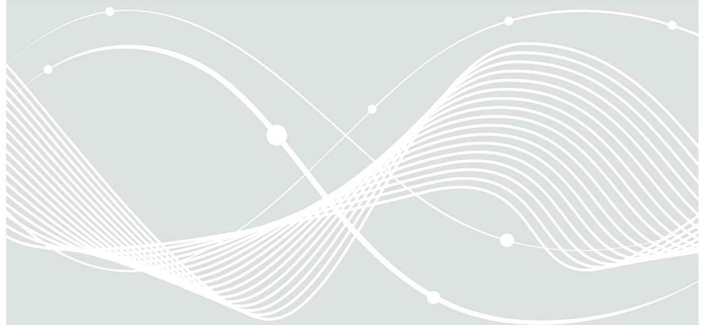

# Technische Richtlinie BSI TR-03153-2

Regelung zur übergangsweisen Aufrechterhaltung der gesetzlich erforderlichen Zertifizierung von Technischen Sicherheitseinrichtungen in begründeten Ausnahmefällen

Version 1.0.0

## Änderungshistorie

| Version | Datum      | Beschreibung     |
|---------|------------|------------------|
| 1.0.0   | 2021-07-02 | Initiale Version |

Tabelle 1: Änderungshistorie

Bundesamt für Sicherheit in der Informationstechnik Postfach 20 03 63 53133 Bonn

E-Mail: registrierkassen@bsi.bund.de Internet: https://www.bsi.bund.de © Bundesamt für Sicherheit in der Informationstechnik 2021

| 1                      |                |                           | EINLEITUNG4                                                                       |  |
|------------------------|----------------|---------------------------|-----------------------------------------------------------------------------------|--|
|                        |                |                           |                                                                                   |  |
|                        |                |                           |                                                                                   |  |
| 1.1                    | HISTORIE       | 4                         |                                                                                   |  |
| 1.2                    | NEUERUNG4      |                           |                                                                                   |  |
| 1.3                    | SCHLÜSSELWORTE | 4                         |                                                                                   |  |
|                        |                |                           |                                                                                   |  |
|                        |                |                           |                                                                                   |  |
| 2                      |                |                           | REGELUNG ZUR ÜBERGANGSWEISEN AUFRECHTERHALTUNG DER ZERTIFIZIERUNG VON TECHNISCHEN |  |
|                        |                |                           | SICHERHEITSEINRICHTUNGEN6                                                         |  |
|                        |                |                           |                                                                                   |  |
| 2.1                    |                | GENERELLE VORAUSSETZUNG 6 |                                                                                   |  |
|                        |                |                           |                                                                                   |  |
| 2.2                    | REGELUNGEN     | 6                         |                                                                                   |  |
| 2.2.1                  | REGELUNG 1     |                           |  6                                                                             |  |
| 2.2.2                  | REGELUNG 2     |                           |  7                                                                             |  |
|                        |                |                           |                                                                                   |  |
|                        |                |                           |                                                                                   |  |
| LITERATURVERZEICHNIS 8 |                |                           |                                                                                   |  |

## 1 Einleitung

## 1.1 Historie

Technische Sicherheitseinrichtungen (TSE) müssen gemäß BSI-Vorgaben über folgende Zertifizierungen verfügen:

- Zertifizierung nach der Technischen Richtlinie BSI TR-03153
- Common Criteria-Zertifizierung nach dem Schutzprofil BSI-CC-PP-0105 (PP-SMAERS) für die Sicherheitsmodulanwendung
- Common Criteria-Zertifizierung nach dem Schutzprofil BSI-CC-PP-0104 (PP-CSP) für die CSP-Komponente des Sicherheitsmoduls

Diese Technische Richtlinie beschreibt die Regelungen zur übergangsweisen Aufrechterhaltung der gesetzlich erforderlichen Zertifizierung von Technischen Sicherheitseinrichtungen in begründeten Ausnahmefällen. Ziel der Regelungen ist es, im Feld befindliche Technischen Sicherheitseinrichtungen, bei denen eine vollumfängliche Zertifizierung konform zu den o.g. Schutzprofilen nicht mehr gegeben ist (beispielsweise durch das Bekanntwerden von Schwachstellen oder bei im Rahmen der Einführungsphase unter der Übergangsregelung für die Zertifizierung ins Feld gebrachten Technische Sicherheitseinrichtungen), ersatzweise nach dieser Technischen Richtlinie zu zertifizieren, um entweder in einen hinreichend zertifizierten Regelbetrieb zurückzukehren oder eine geordnete Außerbetriebnahme der im Feld befindlichen Technischen Sicherheitseinrichtungen zu ermöglichen.

## 1.2 Neuerung

Das BSI erweitert seine Anforderungen dahingehend, dass durch Zertifizierung nach dieser Technischen Richtlinie für unter o.g. Regel fallende Produkte zur übergangsweisen Aufrechterhaltung der Zertifizierung

- einmalig ein Zertifikat in Anlehnung an das Schutzprofil PP-SMAERS und ein Gutachten des BSI über den CSP als Ersatz für die Common Criteria-Zertifizierungen konform zu den o.g. Schutzprofilen
- und Zertifikate in Anlehnung an die o.g. Schutzprofile als Ersatz für die Common Criteria Zertifizierungen konform zu den o.g. Schutzprofilen

verwendet werden können.

## 1.3 Schlüsselworte

Anforderungen als Ausdruck normativer Festlegungen werden durch die in Großbuchstaben geschriebenen deutschen Schlüsselworte MUSS/MÜSSEN, DARF/DÜRFEN NICHT/KEINE, VERPFLICHTEND, SOLLTE/SOLLTEN, EMPFOHLEN, SOLLTE/SOLLTEN NICHT/KEINE, KANN/KÖNNEN/DARF/DÜRFEN, und OPTIONAL gekennzeichnet.

Die verwendeten Schlüsselworte sind auf Basis der folgenden Übersetzungstabelle gemäß [\[RFC 2119\]](#page-7-1) zu interpretieren:

| Deutsch                    | Englisch   |
|----------------------------|------------|
| MUSS / MÜSSEN              | MUST       |
| DARF/DÜRFEN NICHT/KEINE    | MUST NOT   |
| VERPFLICHTEND              | REQUIRED   |
| SOLLTE / SOLLTEN           | SHOULD     |
| SOLLTE/SOLLTEN NICHT/KEINE | SHOULD NOT |

| Deutsch                       | Englisch    |
|-------------------------------|-------------|
| EMPFOHLEN                     | RECOMMENDED |
| KANN / KÖNNEN / DARF / DÜRFEN | MAY         |
| OPTIONAL                      | OPTIONAL    |

Tabelle 2 Schlüsselworte

## 2 Regelung zur übergangsweisen Aufrechterhaltung der Zertifizierung von Technischen Sicherheitseinrichtungen

Im Folgenden werden die verpflichtenden Regelungen zur übergangsweisen Aufrechterhaltung der gesetzlich erforderlichen Zertifizierung von Technischen Sicherheitseinrichtungen in begründeten Ausnahmefällen beschrieben.

#### 2.1 Generelle Voraussetzung

Damit die nachfolgenden Regelungen dieser Technischen Richtlinie für die TSE-Zertifizierung in Anspruch genommen werden können, MUSS die folgende Bedingung erfüllt sein:

• Die Technische Sicherheitseinrichtung MUSS in der Vergangenheit vollständig oder nach der Übergangsregelung zertifiziert worden sein.

Damit die unter Regelung 1 und Regelung 2 geschilderten Regelungen Anwendung finden können, MUSS die folgende Bedingung erfüllt sein:

• Das Security Target in Anlehnung an das Schutzprofil PP-SMAERS- bzw. PP-CSP MUSS zu Beginn der Untersuchung mit dem BSI abgestimmt werden. Zu diesem Zwecke MÜSSEN alle Abweichungen des Security Targets vom Schutzprofil PP-SMAERS bzw. PP-CSP explizit kenntlich gemacht werden. Die Common Criteria-Zertifizierungsstelle bestätigt mit dem Security Targetbasierten Zertifikat, dass das Security Target im Vergleich zum PP nur die abgestimmten Abweichungen beinhaltet.

Die Abstimmung des Security Targets erfolgt auf Basis einer Risikobewertung in Bezug auf Angriffs- und Schadenspotential.

## 2.2 Regelungen

#### 2.2.1 Regelung 1

Ein vormals zertifiziertes Produkt KANN unter folgenden Bedingungen einmalig nach der Technischen Richtlinie BSI TR-03153-2 zertifiziert werden:

- 1. Die Konformität zur BSI TR-03153 MUSS durch ein gültiges Zertifikat nach BSI TR-03153 nachgewiesen werden.
- 2. Es MUSS ein gültiges Common Criteria-Zertifikat in Anlehnung an das Schutzprofil PP-SMAERS vorliegen.
- 3. Es MUSS ein aktuelles, positives Gutachten des BSI über die zulässige Verwendbarkeit des CSP vorliegen. Die Gültigkeit des Gutachtens SOLLTE NICHT länger als 18 Monate betragen.
- 4. Der Hersteller MUSS sich per Herstellererklärung gegenüber dem BSI verpflichtet haben, alle Nutzer über die unausweichlich eintretende Nichterfüllung der gesetzlichen Vorgaben zu informieren, sobald eine anschließende Zertifizierung nach Regelung 2 nicht mehr angestrebt wird oder auf Grund der Vorrausetzungen aus Regelungen 2 unmöglich ist. Spätestens wenn 6 Monate vor Ablauf der TR-Zertifizierung nach BSI TR-03153-2 keine TR-Zertifizierung nach Regelung 2 abgeschlossen ist, muss der Hersteller die direkten Kunden, Steuerpflichtige und Finanzbehörden umgehend informieren. Die Herstellererklärung MUSS ebenfalls die Zustimmung des Herstellers zur uneingeschränkten Verbreitung dieser Information durch das BSI enthalten.

Das auf der Grundlage der Regelung 1 dieses Dokumentes erstellte BSI TR-03153-2-Zertifikat ist befristet. Die Gültigkeit des auf Grundlage von Regelung 1 erteilten BSI TR-03153-2 Zertifikats MUSS die folgenden Bedingungen erfüllen:

- Die Dauer der Gültigkeit DARF NICHT länger als 18 Monate betragen.
- Die Gültigkeit DARF NICHT länger als die Gültigkeit des Gutachtens sein.
- Die Gültigkeit DARF NICHT länger als die Gültigkeit des Common Criteria-Zertifikats in Anlehnung an das Schutzprofil PP-SMAERS betragen.
- Die Gültigkeit DARF NICHT länger als die Gültigkeit des initialen Zertifikats nach BSI TR-03153 sein.

#### 2.2.2 Regelung 2

Ein vormals zertifiziertes oder nach Regelung 1 bzw. Regelung 2 der Technischen Richtlinie BSI TR-03153-2 zertifiziertes Produkt KANN im begründeten Ausnahmefall mehrmals nach Regelung 2 der Technischen Richtlinie BSI TR-03153-2 zertifiziert werden. Dafür MÜSSEN die folgenden Bedingungen eingehalten werden:

- 1. Die Konformität zur BSI TR-03153 MUSS durch ein gültiges TR-Zertifikat nach BSI TR-03153 nachgewiesen werden.
- 2. Es MÜSSEN gültige Common Criteria-Zertifikate in Anlehnung an die o.g. Schutzprofile vorliegen.
- 3. Bei einem direkt vorhergehenden Zertifikat auf Grundlage der BSI TR-03153-2 Regelung 1 MUSS die Gültigkeit des BSI TR-03153-2 Zertifikats noch mindestens 6 Monate betragen.
- 4. Bei einem direkt vorhergehenden Zertifikat auf Grundlage der BSI TR-03153-2 Regelung 2 MUSS die Gültigkeit des BSI TR-03153-2-Zertifikats noch mindestens 9 Monate betragen.
- 5. Der Hersteller MUSS sich per Herstellererklärung gegenüber dem BSI verpflichtet haben, alle Nutzer über die unausweichlich eintretende Nichterfüllung der gesetzlichen Vorgaben zu informieren, sobald eine anschließende Zertifizierung nach Regelung 2 nicht mehr angestrebt wird oder auf Grund der Vorrausetzungen aus Regelungen 2 unmöglich ist. Spätestens wenn 9 Monate vor Ablauf der TR-Zertifizierung nach BSI TR-03153-2 keine TR-Zertifizierung nach Regelung 2 abgeschlossen ist, muss der Hersteller die direkten Kunden, Steuerpflichtige und Finanzbehörden umgehend informieren. Die Herstellererklärung MUSS ebenfalls die Zustimmung des Herstellers zur uneingeschränkten Verbreitung dieser Information durch das BSI enthalten.

Das auf der Grundlage der Regelung 2 erstellte BSI TR-03153-2-Zertifikat ist befristet. Die Gültigkeit des auf Grundlage von Regelung 2 erteilten BSI TR-03153-2 Zertifikats MUSS die folgenden Bedingungen erfüllen:

- Die Dauer der Gültigkeit DARF NICHT länger als 30 Monate betragen.
- Die Gültigkeit DARF NICHT länger als die Gültigkeit der Zertifikate in Anlehnung an die o.g. Schutzprofile sein.
- Die Gültigkeit DARF NICHT länger als die Gültigkeit des initialen Zertifikats nach BSI TR-03153 sein.

Das TR-Zertifikat nach Regelung 2 kann auf Antrag und unter Einhaltung der obigen Voraussetzungen für jeweils bis zu 30 weitere Monate re-zertifiziert werden.

Eine Re-Zertifizierung nach Regelung 2 MUSS mindestens 9 Monate vor Ablauf der Gültigkeit des Zertifikats nach dieser Regelung abgeschlossen sein.

## Literaturverzeichnis

| AO              | Abgabenordnung in der Fassung der Bekanntmachung vom 1. Oktober 2002 (BGBl. I S. 3866; 2003 I S. 61), die zuletzt durch Artikel 6 des Gesetzes vom 18. Juli 2017 (BGBl. I S. 2745) geändert worden ist |
|-----------------|--------------------------------------------------------------------------------------------------------------------------------------------------------------------------------------------------------------|
| BSI-CC-PP-0104  | BSI: Protection Profile Cryptographic Service Provider (CSP)                                                                                                                                                 |
| BSI-CC-PP-0105  | BSI: Protection Profile Security Module Application for Electronic Record-keeping Systems (SMAERS)                                                                                                        |
|                 | BSI-CC-PP-0105-V2 BSI: Protection Profile Security Module Application for Electronic Record-keeping Systems V2 (SMAERS)                                                                                   |
| BSI-CC-PP-0107  | BSI: Protection Profile Configuration Cryptographic Service Provider – Time Stamp Service and Audit                                                                                                       |
| BSI-CC-PP-0108  | BSI: Protection Profile Configuration Cryptographic Service Provider – Time Stamp Service, Audit and Clustering                                                                                           |
| BSI-CC-PP-0111  | BSI: Protection Profile Cryptographic Service Provider Light (CSPL)                                                                                                                                          |
| BSI-CC-PP-0113  | BSI: Protection Profile Time Stamp Service, Audit and Clustering                                                                                                                                             |
| BSI TR-03151    | BSI: Technical Guideline TR-03151 Secure Element Integration API                                                                                                                                             |
| BSI TR-03153-TS | BSI: Technische Sicherheitseinrichtung für elektronische Aufzeichnungssysteme - Testspezifikation (TS)                                                                                                    |
| KassenSichV     | Kassensicherungsverordnung vom 26. September 2017 (BGBl. I S. 3515)                                                                                                                                          |
| RFC 2119        | Bradner, S.: Key words for use in RFCs to indicate requirement levels                                                                                                                                        |