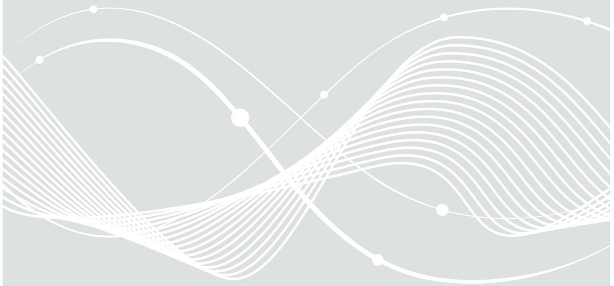
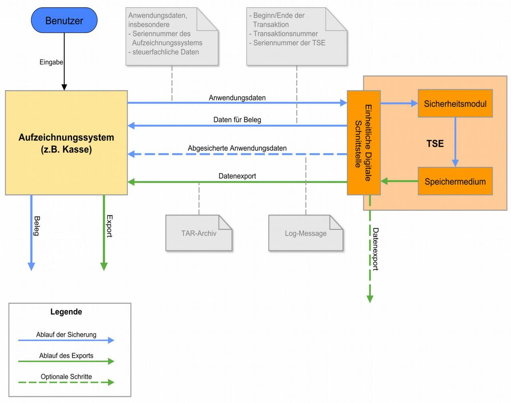

# Ergänzung der Technischen Richtlinie TR-03153

02.12.2019

Bundesamt für Sicherheit in der Informationstechnik Postfach 20 03 63 53133 Bonn

E-Mail: registrierkassen@bsi.bund.de Internet: https://www.bsi.bund.de © Bundesamt für Sicherheit in der Informationstechnik 2019

| 1   | Einleitung 5           |  |
|-----|------------------------|--|
| 1.1 | Terminologie 5         |  |
| 2   | Klarstellungen 6       |  |
|     | Literaturverzeichnis 8 |  |

### 1 Einleitung

Die Technische Richtlinie BSI TR-03153 [TR-03153] spezifiziert verbindliche Vorgaben an die Technische Sicherheitseinrichtung, mit denen die digitalen Grundaufzeichnungen eines elektronischen Aufzeichnungssystems gemäß § 146a (1) der Abgabenordnung geschützt werden müssen.

Der Fokus der Technischen Richtlinie BSI TR-03153 [TR-03153] liegt auf der Definition von Mindestanforderungen an die Interoperabilität.

Dieses Dokument enthält Klarstellungen zur Version 1.0.1 der Technischen Richtlinie BSI TR-03153 [TR-03153].

### 1.1 Terminologie

Um die Erkennbarkeit von Änderungen in diesem Dokument zu verbessern, werden an einigen Stellen farbliche Markierungen genutzt. Um die Lesbarkeit des Dokumentes beizubehalten, wird dies nur an Stellen genutzt, an denen dies für die Erkennung der Klarstellungen förderlich ist.

In diesem Dokument wird gelb markierter Text verwendet um anzuzeigen, dass die markierten Wörter oder Zeichen neu sind. Rot markierte Wörter oder Zeichen zeigen an, dass das markierte Wort oder Zeichen falsch ist. Grün markierte Wörter oder Zeichen zeigen an, dass das markierte Wort oder Zeichen richtig ist.

## 2 Klarstellungen

Dieses Kapitel enthält Klarstellungen zur aktuellen Version BSI TR-03153 [TR-03153].

Nachfolgend wird aufgezählt, welche Satzteile, Aufzählungen oder Tabellen ersetzt oder ergänzt werden.

### **Abbildung 4, Seite 16:**

Ersetzen der Abbildung 4. In der originalen Abbildung 4 führte die gestrichelte Linie des oberen rechten grauen Feldes zum falschen Pfeil.

*Abbildung 4: Datenfluss bei der Verwendung der TSE*

#### **Kapitel 4.1, Seite 25**

Ergänzung zu Punkt 5:

"Das Sicherheitsmodul MUSS ein Zurücksetzen des Signaturzählers für einen Schlüssel verhindern"

#### **Kapitel 5.2, Seite 29, Tabelle 6:**

In Tabelle 6 wird in der elften Zeile und ersten Spalte "deleteSecuredData" durch "deleteStoredData" ersetzt.

| Name                | Zweck                                                                                                                                                                                                     |
|---------------------|-----------------------------------------------------------------------------------------------------------------------------------------------------------------------------------------------------------|
|                     |                                                                                                                                                                                                           |
| exportSerialNumbers | Ausgabe der Hashwerte über die öffentlichen Schlüssel der Schlüsselpaare, deren geheime Schlüssel für die Erzeugung von Prüfwerten in den verschiedenen Typen von Log-Nachrichten verwendet werden. |
| deleteStoredData    | Löschen der gesicherten Anwendungsdaten, Systemnachrichten und Audit-Daten sowie den korrespondierenden Protokolldaten im Speicher der Technischen Sicherheitseinrichtung.                          |
| readLogMessage      | Ausgabe der zuletzt erzeugten Log-Nachricht.                                                                                                                                                              |
|                     |                                                                                                                                                                                                           |

*Tabelle 6: Übersicht über die Funktionen der Einbindungsschnittstelle*

#### **Kapitel 7.5, Seite 34:**

Ergänzung zum Absatz 2:

"Wie in der Technischen Richtlinie BSI TR-03111 [TR-03111], Kapitel 3.2.1 weiter ausgeführt, MUSS der Schlüssel im "Uncompressed encoding" für die Hashwertberechnung verwendet werden. Konkret MUSS auf ein vorgestelltes 0x04 erst die x-Koordinate und dann die y-Koordinate des Schlüssels als Oktettstring folgen."

#### **Kapitel 7.6, Seite 34:**

Präzisierung zum Absatz 3, Satz 1:

"Im Rahmen der erforderlichen CC-Zertifizierung MUSS die Konformität zu den folgenden Schutzprofilen nachgewiesen werden:

- **•** Anwendung: [BSI-CC-PP-0105 \(SMAERS\)](https://www.bsi.bund.de/SharedDocs/Zertifikate_CC/PP/aktuell/PP_0105.html)
- **•** Hardware und Betriebssystem: [BSI-CC-PP-0104 \(CSP\)](https://www.bsi.bund.de/SharedDocs/Zertifikate_CC/PP/aktuell/PP_0104.html) in der Konfiguration nach [BSI-CC-PP-0107](https://www.bsi.bund.de/SharedDocs/Zertifikate_CC/PP/aktuell/PP_0107.html) [\(Time Stamp Service and Audit\)](https://www.bsi.bund.de/SharedDocs/Zertifikate_CC/PP/aktuell/PP_0107.html) oder [BSI-CC-PP-0108 \(Time Stamp Service, Audit and Clustering\)](https://www.bsi.bund.de/SharedDocs/Zertifikate_CC/PP/aktuell/PP_0108.html)

Bei "Cloud"-basierten Lösungen kann die Komponente CSP in einem sicheren Rechenzentrum zentral betrieben werden. Wird ein hinreichend hohes physikalisches und organisatorisches Sicherheitsniveau für das Rechenzentrum nachgewiesen, kann alternativ eine Sicherheitszertifizierung nach folgenden Schutzprofilen erfolgen:

- **•** Anwendung: [BSI-CC-PP-0105 \(SMAERS\)](https://www.bsi.bund.de/DE/Themen/ZertifizierungundAnerkennung/Produktzertifizierung/ZertifizierungnachCC/SchutzprofileProtectionProfiles/SchutzprofileProtectionProfiles_in_Zertifizierung/schutzprofile_PPs_InZertifizierung_node.html)
- **•** Hardware und Betriebssystem: [BSI-CC-PP-0111 \(CSP Light\)](https://www.bsi.bund.de/DE/Themen/ZertifizierungundAnerkennung/Produktzertifizierung/ZertifizierungnachCC/SchutzprofileProtectionProfiles/SchutzprofileProtectionProfiles_in_Zertifizierung/schutzprofile_PPs_InZertifizierung_node.html) in der Konfiguration nach BSI-CC-PP-0113 (Time Stamp Service, Audit and Clustering)."

### Literaturverzeichnis

[TR-03111] BSI: Technical Guideline BSI TR-03111 "Elliptic Curve Cryptography", Version 2.10, 2018- 06-01