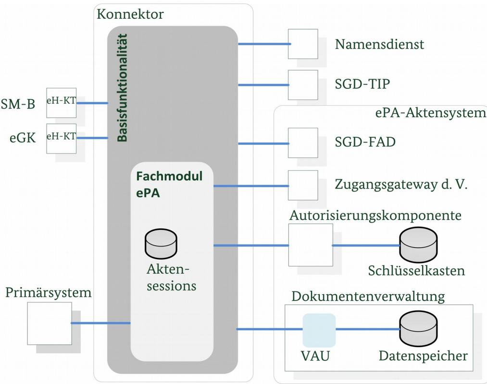
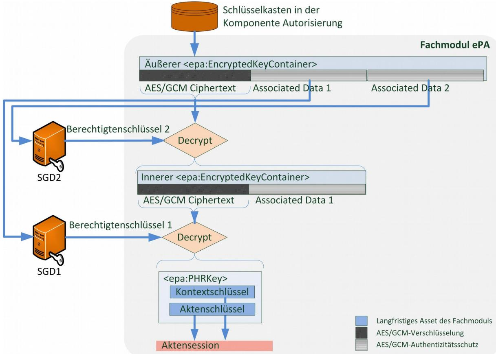
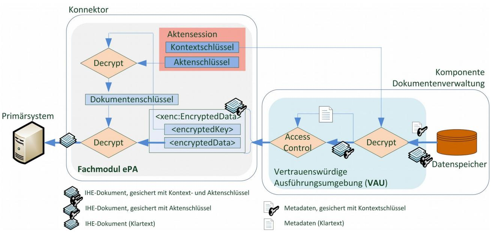
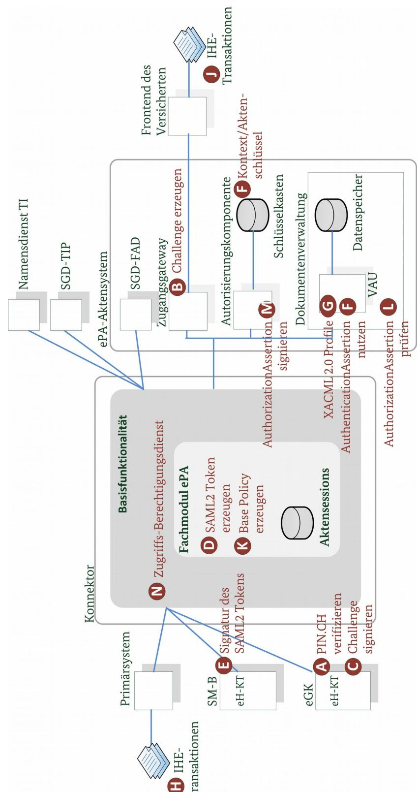

# Konnektor – Prüfspezifikation für das Fachmodul ePA

Technische Richtlinie BSI TR-03157

Trial Use[1](#page-0-0)

1 Erläuterung siehe Abschnitt [1.5](#page-8-0)

# Änderungshistorie

| Version | Datum      | Name                                          | Beschreibung                                                     |
|---------|------------|-----------------------------------------------|------------------------------------------------------------------|
| 1.0     | 20.12.2018 | SRC Security Research & Consulting GmbH | Zu OPB Release 3.0.0                                             |
| 1.1     | 19.06.2019 | SRC Security Research & Consulting GmbH | Zu OPB Release 3.1.0 Nutzung der Schlüsselgenerierungsdienste |
| 1.2     | 24.07.2019 | SRC Security Research & Consulting GmbH | Zu OPB Release 3.1.1                                             |

Bundesamt für Sicherheit in der Informationstechnik Postfach 20 03 63 53133 Bonn E-Mail: zertifizierung@bsi.bund.de Internet: https://www.bsi.bund.de © Bundesamt für Sicherheit in der Informationstechnik 2019

|                | Änderungshistorie 2                                                    |  |
|----------------|------------------------------------------------------------------------|--|
|                | Danksagung 3                                                           |  |
| 1              | Einleitung 7                                                           |  |
| 1.1            | Gegenstand der Technischen Richtlinie 7                                |  |
| 1.2            | Sicherheitsleistungen des Fachmoduls elektronische Patientenakte7      |  |
| 1.3            | Zielsetzung der Technischen Richtlinie 8                               |  |
| 1.4            | Übersicht der Technischen Richtlinie 9                                 |  |
| 1.4.1          | Methodik 9                                                             |  |
| 1.4.2          | Begriffe 9                                                             |  |
| 1.5            | Offene Punkte 10                                                       |  |
| 2              | Überblick Fachmodul elektronische Patientenakte11                      |  |
| 2.1            | Spezifische Konzepte 11                                                |  |
| 2.1.1          | Verschlüsselte Datenhaltung 11                                         |  |
| 2.1.2 2.1.3 | Berechtigungsmanagement 14 Informationsflusskontrolle 17            |  |
| 2.2            | Verarbeitete Assets 20                                                 |  |
| 2.3            | Abläufe und Benutzungsszenarien 23                                     |  |
| 2.3.1          | Wiederverwendung von Aktensessions23                                   |  |
| 2.3.2          | Grundsätzlicher Ablauf eines Aktenzugriffs24                           |  |
| 2.3.3          | Verwaltung des Aktenkontos 25                                          |  |
| 2.3.4          | Schlüsselableitung der Berechtigtenschlüssel26                         |  |
| 2.4            | Security Problem Definition 29                                         |  |
| 2.4.1 2.4.2 | Bedrohungen 29 Organisatorische Sicherheitspolitiken30              |  |
| 2.4.3          | Annahmen 30                                                            |  |
| 2.4.4          | Annahmen zu betrieblichen Restrisiken30                                |  |
| 3              | Zertifizierung des FM ePA nach Technischer Richtlinie32                |  |
| 3.1            | Prüfgegenstand und –werkzeuge 32                                       |  |
| 3.2            | Prüfaufgaben 32                                                        |  |
| 3.2.1          | Funktionale Spezifikations-Tests33                                     |  |
| 3.2.2          | Common Criteria Zertifizierung des Konnektors33                        |  |
| 3.2.3          | Sicherheitsziele für das Fachmodul und dessen Umgebung36               |  |
| 3.3 3.3.1   | Rationale 44 Berücksichtigung typischer Webservice-Schwachstellen47 |  |
| 3.4            | Prüfschritte 49                                                        |  |
| 3.4.1          | Protokollierung der Prüfergebnisse50                                   |  |
| 3.4.2          | Test-Charakteristiken 51                                               |  |
| 4              | TR-Prüfbericht 60                                                      |  |
| 4.1            | Verfahrensschritte 60                                                  |  |
| 4.2            | Prüfaussagen 60                                                        |  |
| 4.3            | Konfiguration 60                                                       |  |
|                | Literaturverzeichnis 62                                                |  |
|                | Stichwortverzeichnis 64                                                |  |

| Abkürzungsverzeichnis 69 |
|--------------------------|
|--------------------------|

# Abbildungsverzeichnis

| Abbildung 1: Beziehungen des FM ePA mit externen Komponenten7 Abbildung 2: Ablauf der Schlüsselableitung 12 |  |
|----------------------------------------------------------------------------------------------------------------|--|
|                                                                                                                |  |
|                                                                                                                |  |
| Abbildung 3: Ablauf des Zugriffs auf Patientenakten-Dokumente13                                                |  |
| Abbildung 4: Verschiedene Berechtigungen mit Bezug zum FM ePA15                                                |  |

# Tabellenverzeichnis

| Tabelle 1: Beteiligte Komponenten mit eingesetzten Sicherheitsmerkmalen8                         |  |
|--------------------------------------------------------------------------------------------------|--|
| Tabelle 2: Sicherheitsfunktionen des Fachmoduls ePA8                                             |  |
| Tabelle 3: Prüfungen im Umfeld des Fachmoduls ePA9                                               |  |
| Tabelle 4: Speicherorte von Schlüsselmaterial im ePA-Aktensystem12                               |  |
| Tabelle 5: Attribute der Base Policy einer LEI in der Dokumentenverwaltung16                     |  |
| Tabelle 6: Beteiligung des Fachmoduls am Schutz von Transportkanälen17                           |  |
| Tabelle 7: Informationsfluss und Anforderungen an die Transportsicherung (abstrakt)19            |  |
| Tabelle 8: Assets im Fachmodul ePA 22                                                            |  |
| Tabelle 9: Mehrere Aktensessions zu einer Patientenakte (Beispiel)23                             |  |
| Tabelle 10: Abläufe für die LEI aus den Perspektiven von Primärsystem und Fachmodul25            |  |
| Tabelle 11: Abläufe aus den Perspektiven von Leistungserbringer und Fachmodul26                  |  |
| Tabelle 12: Ablauf der Vorbereitung SGD-Berechtigtenschlüssel26                                  |  |
| Tabelle 13: Ablauf bei wiederkehrendem Zugriff auf Schlüsselmaterial28                           |  |
| Tabelle 14: Initiale Schüsselableitung für den Versicherten28                                    |  |
| Tabelle 15: Initiale Schüsselableitung für einen LEI28                                           |  |
| Tabelle 16: Gemeinsamer Ablauf bei der initialen Schlüsselableitung29                            |  |
| Tabelle 17: Vom Fachmodul genutzte und sicherheitsrelevante Basisfunktionalität des Konnektors35 |  |
| Tabelle 18: Berücksichtigung der Kartengeneration in der SAML2 Signatur39                        |  |
| Tabelle 19: Ausgehende Informationsflüsse und Anforderungen an die Transportsicherung42          |  |
| Tabelle 20: Parameter für die Zertifikatsprüfung an TLS-Dienst43                                 |  |
| Tabelle 21: Rationale SPD-Sicherheitsziele des Fachmoduls und der Umgebung, sowie Restrisiken47  |  |
| Tabelle 22: Rationale OWASP-Sicherheitsziele des Fachmoduls sowie der Umgebung49                 |  |
| Tabelle 23: Definition der Prüftiefen 50                                                         |  |
| Tabelle 24: Definition der Verdicts 51                                                           |  |
| Tabelle 25: Test Charakteristika für das Fachmodul ePA59                                         |  |

# 1 Einleitung

# 1.1 Gegenstand der Technischen Richtlinie

Das Fachmodul elektronische Patientenakte, kurz ePA, ist ein integraler Bestandteil des Konnektors und nutzt die Basisfunktionalitäten des Konnektors zur Umsetzung der Fachanwendung ePA. Weiterhin greift es auf Fachdienste der Telematikinfrastruktur (TI), insbesondere das ePA-Aktensystem zu. [Abbildung 1](#page-5-1) zeigt die wesentlichen Beziehungen zu den Fachdiensten und dem Primärsystem.

*Abbildung 1: Beziehungen des FM ePA mit externen Komponenten*

# 1.2 Sicherheitsleistungen des Fachmoduls elektronische Patientenakte

Das Primärsystem greift auf die Patientenakte zu. Die Kommunikation zum Fachmodul erfolgt mit Protokollen angelehnt an Spezifikationen der Initiative 'Integrating the Healthcare Enterprise'. Im Hintergrund etablieren Konnektor und Fachdienste eine Reihe von Sicherheitsmerkmalen, vgl. [Tabelle 1.](#page-6-0)

| Beteiligte Komponente                                  | Eingesetzte Sicherheitsmerkmale                                                               |
|--------------------------------------------------------|-----------------------------------------------------------------------------------------------|
| Primärsystem                                           | (optional) TLS-Authentisierung des Konnektors                                                 |
| Installierter Konnektor mit eHealth Kartenterminals | Authentisierung mittels SM-B und eGK                                                          |
| Zugangsgateway des Versicherten (ZGdV)              | Challenge / Response Verfahren mit der eGK                                                    |
| Autorisierungskomponente                               | Identifizierung mittels AuthenticationAssertion, Kontrollierter Zugang zum Schlüsselkasten |

| Beteiligte Komponente                 | Eingesetzte Sicherheitsmerkmale                                                               |
|---------------------------------------|-----------------------------------------------------------------------------------------------|
| Schlüsselgenerierungsdienst ePA (SGD) | Ableitung von Berechtigtenschlüsseln                                                          |
| Dokumentenverwaltung                  | Zugangsberechtigung mittels AuthorizationAssertion Kontrollierter Zugang zum Datenspeicher |

#### Tabelle 1: Beteiligte Komponenten mit eingesetzten Sicherheitsmerkmalen

Die vorliegende Technische Richtlinie definiert die Sicherheitsprüfung der im Fachmodul ePA realisierten Sicherheitsleistungen. Diese sind in [Tabelle 2](#page-6-1) auf abstrakter Ebene skizziert. Neben dem Fachmodul sind Sicherheitsleistungen des Konnektors sowie der Fachdienste der Telematikinfrastruktur miteinbezogen.

| Sicherheitsaspekt              | Sicherheitsfunktion                                                                                                                                                                                                                                                                                                                                                                                                                                                                                                                                                                                                            |  |
|--------------------------------|--------------------------------------------------------------------------------------------------------------------------------------------------------------------------------------------------------------------------------------------------------------------------------------------------------------------------------------------------------------------------------------------------------------------------------------------------------------------------------------------------------------------------------------------------------------------------------------------------------------------------------|--|
| Verschlüsselte Datenhaltung | Die Dokumentenablage erfolgt in verschlüsselter Form im Datenspeicher der Komponente Dokumentenverwaltung. Das Fachmodul erzeugt dafür je Patientenakte einen Akten- und Kontextschlüssel, sichert diese mit Hilfe der Schlüsselgenerierungsdienste und legt die gesicherten Schlüssel im Schlüsselkasten der Komponente Autorisierung ab. Aufgabe des Fachmoduls ist das Ver-/Entschlüsseln von Dokumenten unter Nutzung des Aktenschlüssels. Weiter verarbeitet das Fachmodul Transaktionen und Klartext-Dokumenten gegenüber dem Primärsystem.                                                         |  |
| Berechtigungs management    | Die Dokumentenverwaltung gewährt dem Fachmodul erst Zugriff, nachdem die Komponente Autorisierung die Authentizität des Anfragenden geprüft hat. Hierfür erzeugt das Fachmodul für den LEI eine AuthenticationAssertion, wohingegen die AuthenticationAssertion für einen Versicherten / Vertreter vom ZGdV erstellt wird. Wird eine Adhoc-Berechtigung neu für einen LEI eingerichtet, erstellt das Fachmodul die BasePolicy mit der Identifikation der Akte, des Berechtigten sowie Berechtigungsart und -dauer. Die BasePolicy wird an die VAU übermittelt und dort für die Zugriffskontrolle genutzt. |  |
| Informationsfluss kontrolle | Patienten besitzen die freie Wahl zwischen Aktensystemanbietern. Daher können bei jeder Patientenakte andere Komponenten der Telematikinfrastruktur (TI) beteiligt sein. Das Fachmodul stellt über die TI-Zertifikat mit rollenspezifisch vergebenen Zertifikatseigenschaften sicher, dass diese Dienste von der gematik geprüft worden sind. Die Weitergabe von klarer bzw. gesicherten Informationen wird durch das Fachmodul reglementiert. Die Verarbeitung von der eGK eingelesenen Daten wird gegenüber bekannten Angriffen gehärtet.                                                                  |  |

Tabelle 2: Sicherheitsfunktionen des Fachmoduls ePA

# 1.3 Zielsetzung der Technischen Richtlinie

Die Technische Richtlinie beschreibt und begründet die Testanforderungen an Fachmodule elektronische Patientenakte (ePA). Zielsetzung dieser Prüfvorschrift ist die Beschreibung von Prüfaktivitäten basierend auf explizit formulierten Sicherheitseigenschaften des Fachmoduls, die die Sichtung des Quelltextes sowie gegebenenfalls automatisierte Tests umfasst.

Im Umfeld des Fachmoduls ePA sind die in [Tabelle 3](#page-7-0) aufgeführten Prüfungen vorgesehen. Die verschiedenen Verfahren sind in [gemKPT\_Feldtest\_Kon\_ePA#Abbildung 1] dargestellt. Die vorliegende TR bezieht sich lediglich auf Zeile 4.

| #                           | Bezeichnung | Erläuterung                                                        |
|-----------------------------|-------------|--------------------------------------------------------------------|
| 1. gematik Zulassung des |             | Der Netz- und Anwendungskonnektor unterliegt einer Common Criteria |

| #   | Bezeichnung                                                                                  | Erläuterung                                                                                                                                                                                                                                                                                                                                                                                                                                |  |
|-----|----------------------------------------------------------------------------------------------|--------------------------------------------------------------------------------------------------------------------------------------------------------------------------------------------------------------------------------------------------------------------------------------------------------------------------------------------------------------------------------------------------------------------------------------------|--|
|     | Konnektors CC-Zertifizierung des Konnektors                                            | Evaluation nach Schutzprofilen. Zusätzlich MUSS das Zertifikat über das Schutzprofil des Konnektors hinausgehende Fähigkeiten der Basisfunktionalitäten gemäß [gemProdT_Kon#3.2.1 bestätigen.                                                                                                                                                                                                                                        |  |
| 2.  | Prüfung des Fachmoduls auf Konformität zur Spezifikation durch den Hersteller       | Die Konformitätsprüfung durch den Hersteller wird als funktionaler Test an den Schnittstellen durchgeführt. Sie stellt das spezifikationskonforme des Fachmoduls nach [gemSpec_FM_ ePA] sicher.                                                                                                                                                                                                                                      |  |
| 3.  | Prüfung des Fachmoduls auf Konformität zur Spezifikation durch die gematik          | Die Berichte und Zusammenfassung der herstellerspezifischen Tests (Zeile 2) sind die Voraussetzung für die Zulassung durch die gematik . Dazu erfolgen zusätzlich funktionale Test als reiner Blackbox Test, d.h. ohne Zugriff auf Implementierungsdetails. Die gematik validiert damit die Erfüllung wesentlicher Aspekte der Spezifikation. Details zum Testumfang durch die gematik sind in Abschnitt 3.2.1 dargestellt. |  |
| ´4. | Technische Richtlinie zur Sicherheitsprüfung des Fachmoduls (vorliegendes Dokument) | Fokus ist die Erbringung der Sicherheitsfunktionalität durch das Fachmodul; schließt die Quelltextprüfung mit ein, falls erforderlich. Die TR-Zertifizierung kann nur abgeschlossen werden mit dem Verweis auf einen zertifizierten Konnektor (Zeile 1).                                                                                                                                                                          |  |

Tabelle 3: Prüfungen im Umfeld des Fachmoduls ePA

# 1.4 Übersicht der Technischen Richtlinie

#### 1.4.1 Methodik

Im Folgenden bezeichnet der Begriff TOE Security Functionality (TSF) die Funktionalität des Fachmoduls, die für die Umsetzung der Sicherheit verantwortlich ist. Der TOE umfasst eine konvexe Hülle dieser Funktionen, d.h. für die Umsetzung notwendige unterstützende Funktionen sind eingeschlossen. Der TOE nutzt die Basisfunktionalität des Konnektors, deren Sicherheit bereits in einer vorausgehenden Common Criteria (CC)-Zertifizierung bestätigt wurde. Diese sind daher von der TR-Prüfung für das Fachmodul ausgeschlossen.

Die Technische Richtlinie formuliert im Sinne der CC eine Security Problem Definition (SPD), die den Evaluator in der Test-Abdeckung und Wahl der Testtiefe für die TSF unterstützt. Aus der SPD werden Sicherheitsziele für den TOE und dessen Umgebung abgeleitet. Für die Sicherheitsziele des TOE wird anhand der Test-Charakteristiken eine fachliche Struktur für die zu erstellenden Prüfberichte vorgegeben.

#### 1.4.2 Begriffe

Diese Technische Richtlinie verwendet folgende Begriffe:

| MUSS                         | der TOE muss eine bestimmte Eigenschaft zwingend aufweisen bzw. der Evaluator muss eine bestimmte Prüfung durchführen                                                                                                                                                                                            |  |
|------------------------------|---------------------------------------------------------------------------------------------------------------------------------------------------------------------------------------------------------------------------------------------------------------------------------------------------------------------|--|
| DARF NICHT / DÜRFEN NICHT | der TOE darf eine bestimmte Eigenschaft unter keinen Umständen aufweisen und der Evaluator soll dies nachvollziehen.                                                                                                                                                                                             |  |
| SOLL                         | der TOE soll eine bestimmte Eigenschaft aufweisen, außer es wird dargelegt, dass durch ein Nicht—Umsetzen kein Risiko für den sicheren Betrieb besteht bzw. der Evaluator soll eine Prüfung durchführen, außer er legt dar, dass durch Auslassen der Prüfung kein Risiko für den sicheren Betrieb besteht. |  |
| KANN                         | der TOE kann eine bestimmte Eigenschaft aufweisen, wobei ein Umsetzen dieser                                                                                                                                                                                                                                        |  |

Eigenschaft vom Lösungsanbieter anzuzeigen ist.

Die Abläufe sind informativ dargestellt und sind nachrangig zu der durch Spezifikationen der gematik geforderten Sequenz zu betrachten. *Kursive Definitionen* und *Rationales* sind außerhalb der Betrachtung durch die TR FM ePA. Die Restrisiken für den Betrieb und durch umgebenden Komponenten sind in Abschnitt [2.4.4](#page-28-0) zusammengefasst.

## 1.5 Offene Punkte

Die Anwendung der vorliegenden Technischen Richtlinie (TR) ist für die TR-Zertifizierung eines Fachmoduls ePA in der gematik verbindlich. Die TR ist im Status "trial -use", d.h. dass Sicherheitsziele festgelegt sind, aber noch Erfahrungen mit der Anwendung der TR-Prüfanforderungen während der Evaluierung gesammelt werden sollen. In der "trial-use" Phase unterstützt die TR-Zertifizierungsstelle (in Abstimmung mit der gematik) mittels Interpretation der TR den Evaluator bei konkret auftretenden Fragestellungen. Die so identifizierten Interpretationen fließen in die nächste Version der TR ein.

Diese Fassung der TR berücksichtigt die Anforderungen für ePA aus dem OPB-Release 3.1.1.

# 2 Überblick Fachmodul elektronische Patientenakte

Die gematik nutzt die Spezifikationen von Integrating the Healthcare Enterprise (IHE) für die Standardisierung aller fachlichen Schnittstellen für die Patientenakte. Die Patientenakte wird im Kontext der TR vereinfacht als Menge von IHE Dokumenten angesehen. Operationsaufrufe vom Primärsystem gelangen als IHE Transaktionen an die SOAP-Schnittstelle des Fachmoduls.

Die Systemlösung sieht neben dem Zugang des Leistungserbringers einen Zugang für den Versicherten vor [gemSysL\_Fachanwendung\_ePA#Abbildung 2]. Dort greift das ePA Frontend des Versicherten (FdV) über das ePA Zugangsgateway des Versicherten (abgekürzt ZGdV) auf das ePA Aktensystem zu.

Das Fachmodul ePA realisiert Sicherheitsfunktionen, die sich aus einzelnen Aspekten der gematik Spezifikation ableiten und im Folgenden erläutertet werden. Abschnitt [2.1](#page-9-2) erläutert die Haupt-Sicherheitsfunktionen; Abschnitt [2.2](#page-18-0) definiert die dafür verarbeiteten Assets und Abschnitt [2.3](#page-20-0) illustriert die Abläufe im Fachmodul. Der Abschnitt [2.4](#page-27-0) fasst die Sicherheitsperspektive in Form einer Security Problem Definition zusammen.

# 2.1 Spezifische Konzepte

Die Sensibilität der medizinischen Daten in der Patientenakte stellt hohe Anforderungen an die Berechtigungs- und Verschlüsselungskonzepte [gemSysL\_ePA#2.5]. Grundsätzlich bestimmt der Versicherte die Zugriffsberechtigungen von Dritten auf seine Patientenakte.

Das Fachmodul unterscheidet zwischen medizinischen Dokumenten und deren Metadaten, wobei letztere die Dokumente kategorisieren und beschreiben. Nur die medizinischen Dokumente selbst werden vor ihrer Übertragung an ein externes Aktensystem durch das Fachmodul verschlüsselt. Die Metadaten liegen dem Aktensystem im Klartext vor, etwa um Suchfragen zu verarbeiten. Die Patientenakte wird vom Aktensystem ausschließlich innerhalb einer vertrauenswürdigen Ausführungsumgebung (VAU) verarbeitet und mit dem Kontextschlüssel gesichert persistiert. Der sogenannte Kontext enthält neben den Metadaten auch Protokolldaten nach SGB V §291a sowie Berechtigungen auf Anwendungsebene. Das Fachmodul ist hierbei für die Sicherung von Dokumentenschlüsseln zuständig und an der Einrichtung von Adhoc-Berechtigungen beteiligt.

Die folgenden Abschnitte beschreiben die Konzepte zur Ver- und Entschlüsselung der Dokumente (Abschnitt [2.1.1](#page-9-1)), zum Berechtigungsmanagement (Abschnitt [2.1.2\)](#page-12-0) sowie zur Kontrolle des Informationsflusses Richtung Primärsysteme und Richtung TI bzw. Aktensystem (Abschnitt [2.1.3](#page-15-0)) aus Perspektive des Fachmoduls ePA. Das Fachmodul beugt Angriffen über seine Außenschnittstellen vor (Abschnitt [2.1.3.4\)](#page-17-1) und führt eine Datensparsame Protokollierung durch (Abschnitt [2.1.3.5](#page-17-0)).

## 2.1.1 Verschlüsselte Datenhaltung

Die Patientenakte wird in verschlüsselter Form persistent abgelegt. Aufgabe des Fachmoduls ist IHE-Dokumente zu ver-/entschlüsseln und sie an das Primärsystem weiterzugeben.

Das Schlüsselmanagement und die Schlüsselhierarchie werden in der Systemlösung vorgegeben [gemSysL\_ePA#2.5.6]. Die Akten- und Kontextschlüssel sind in der Komponente Autorisierung persistent gespeichert und werden im Fachmodul sowie weiterhin *im Fachmodul des KTR-Consumers und dem Frontend des Versicherten* entschlüsselt. Andere Komponenten besitzen keine Zugriff auf die Klartext-Schlüssel.

Den Kontextschlüssel einer Patientenakte übergibt das Fachmodul an die VAU und versetzt diese damit in die Lage, auf die in Ihrem Datenspeicher gesichert abgelegten Kontextdaten zuzugreifen. Für den Zugriff auf Dokumente nutzt das Fachmodul den Aktenschlüssel, um auf die individuellen Dokumentenschlüssel für die Ver-/Entschlüsselung der Dokumente zuzugreifen. Die gesicherten Dokumentenschlüssel werden im

Datenspeicher der VAU abgelegt, während die gesicherten Akten-/Kontextschlüssel im Schlüsselspeicher der Komponente Autorisierung aufbewahrt werden. Auf die gesicherten Akten- und Kontextschlüssel greift das Fachmodul über die Berechtigtenschlüssel zu, die es mit Hilfe der Schlüsselableitung erhält ([Tabelle 4](#page-10-0)).

| Asset                 | Speicherort                                                       | Verarbeitung                                                                                                                                                                             |
|-----------------------|-------------------------------------------------------------------|------------------------------------------------------------------------------------------------------------------------------------------------------------------------------------------|
| Berechtigtenschlüssel | Schlüsselgenerierungsdienst (deterministisch adhoc erzeugt) | Das Fachmodul übermittelt das Authentisierungszertifikat von eGK bzw. SM-B an SGD1 und SGD2, übergibt die sogenannten Associated Data und erhält zwei Berechtigtenschlüssel. |
| Aktenschlüssel        | Schlüsselspeicher der                                             | Das Fachmodul verschlüsselt Akten- und                                                                                                                                                   |
| Kontextschlüssel      | Komponente Autorisierung                                          | Kontextschlüssel im Zwiebelschalenprinzip mit den beiden Berechtigtenschlüsseln.                                                                                                      |
| Dokumentenschlüssel   | Datenspeicher der VAU / Komponente Dokumenten verwaltung    | Das Fachmodul verschlüsselt den Dokumentenschlüssel symmetrisch mit dem Aktenschlüssel.                                                                                            |

|  | Tabelle 4: Speicherorte von Schlüsselmaterial im ePA-Aktensystem |
|--|------------------------------------------------------------------|
|  |                                                                  |

#### *Abbildung 2: Ablauf der Schlüsselableitung*

Das Fachmodul organisiert die zu einer Patientenakte zugehörigen Informationen in der sogenannten Aktensession, die im Arbeitsspeicher liegt, d.h. nicht persistent gespeichert wird. Zu den Aufgaben des Fachmoduls gehört die Erzeugung neuer Schlüssel mit Hilfe von Zufall aus dem Konnektor, die Sicherung der Kontext-/Akten-/Dokumentenschlüssel vor dem Speichern bzw. Laden sowie das sichere Löschen. *Die Realisierung kryptographischer Funktionen erfolgt stets durch zertifizierte Eigenschaften des Konnektors.* 

Für die Schlüsselableitung werden zwei von unterschiedlichen Anbietern betriebene Schlüsselgenerierungsdiensten (SGD) genutzt, SGD 1 und SGD 2. Von diesen bezieht das Fachmodul die Berechtigtenschlüssel und sichert damit die Akten-/Kontextschlüssel einer Patientenakte. Ein Berechtigtenschlüssel ist jeweils einzigartig für eine Patientenakte, den jeweiligen Zugriffsbefugten (der Versicherte, seine Vertreter, Leistungserbringer und Kassen) und SGD 1 / SGD 2. Akten- und Kontextschlüssel werden klar zusammengefasst als <epa:PHRKey>. Diese Datenstruktur wird dann in mit dem jeweiligen Berechtigtenschlüssel verschlüsselt in der Komponente Autorisierung aufbewahrt. [Abbildung 2](#page-10-1) skizziert die Verschlüsslung nach dem Zwiebelschalenprinzip in der XML-Datenstruktur <epa:EncryptedKeyContainer>.

Zur Schlüsselableitung werden im SGD-HSM lediglich diejenigen Informationen aufbewahrt, die zur Ableitung der Berechtigtenschlüssel genutzt werden. Während der erstmaligen Ableitung erzeugt das SGD-HSM individuell für den Berechtigten zusätzliche Daten [gemSpec\_SGD\_ePA#2], die von der gematik unter dem Begriff Associated Data zusammengefasst werden. Diese Associated Data müssen für jede folgenden Anforderung des Berechtigtenschlüssels durch das Fachmodul übermittelt werden. Liegen diese nicht für die zugreifende Rolle (Versicherter, Vertreter oder Leistungserbringer) vor, wird vom Fachmodul eine initiale Schlüsselableitung durchgeführt. Die persistente Speicherung der Associated Data erfolgt im Schlüsselkasten der Komponente Autorisierung. Das Fachmodul legt die bei der initialen Schlüsselableitung erhaltenen Associated Data dort ab und ruft diese für wiederkehrende Aufrufe dort ab.

In dem genutzten Authentisierungsverfahren bezieht sich **Associated Data** auf die Eigenschaft, dass diese unverschlüsselt, aber authentisiert an einen verschlüsselt hinterlegten Ciphertext angehängt werden. *Die kryptographische Sicherung wird per Authenticated Encryption with Associated Data (AEAD) Blockmodus (TUC\_KON\_075/076) durchgeführt.*

Die IHE-Dokumente einer Patientenakte werden über die VAU im Datenspeicher in der Komponente Dokumentenverwaltung abgelegt. *Die VAU nutzt den Kontextschlüssel, um die Metadaten der Patientenakte zu verarbeiten und um die erste Verschlüsselungsschicht der IHE-Dokumente abzustreifen (vgl. [Abbildung 3](#page-11-0)).*

*Abbildung 3: Ablauf des Zugriffs auf Patientenakten-Dokumente*

Das Fachmodul greift zunächst mit dem Aktenschlüssel auf den gesicherten Dokumentenschlüssel zu und entschlüsselt damit das von der VAU erhaltene IHE-Dokument, um es an das Primärsystem weiterzugeben.

Der Datenpfad wird für neu zu speicherende IHE-Dokumente in umgekehrter Reihenfolge durchlaufen. Die Dokumentenverschlüsselung wird von der Basisfunktionalität durchgeführt, die hierfür einen neuen Dokumentenschlüssel erzeugt und mit dem Aktenschlüssel sichert. Der gesicherte Dokumentenschlüssel zusammen mit dem gesicherten Dokument werden an die VAU gesendet, wo eine Sicherung mit dem

Kontextschlüsselung stattfindet, bevor <xenc:EncryptedData> im Datenspeicher persistiert wird (umgekehrter Ablauf zu [Abbildung 3\)](#page-11-0). Wird eine Patientenakte neu eingerichtet, werden Akten- und Kontextschlüssel mit den Berechtigtenschlüsseln der SGD gesichert und im Schlüsselkasten der Komponente Autorisierung persistent gespeichert (umgekehrter Ablauf zu [Abbildung 2](#page-10-1)).

#### 2.1.2 Berechtigungsmanagement

Die elektronischen Patientenakte setzt an verschiedenen Stellen Zugriffskontrollen ein. Neben verwandten Konzepten wird auch der Begriff "Berechtigung" selbst in verschiedenen Kontexten verwendet. Es wird jeweils herausgestellt, welche Aufgabe das Fachmodul dabei trägt. Als Referenz zwischen den Textstellen und der entsprechenden Komponente in [Abbildung 4](#page-13-0) fungieren die Buchstaben (x).

Die Schlüsselableitung erfolgt unabhängig von Berechtigungen und Authentisierung.

#### 2.1.2.1 Versicherte und Vertreter

Die Operationen I\_PHRManagementService::ActivateAccount und I\_PHRManagementService::RequestFacilityAuthentication bedürfen des **Einverständnis des Versicherten**. In der Erteilung dieser Berechtigung ist jeweils die eGK miteingebunden, vgl. (A) in [Abbildung 4](#page-13-0). Aufgabe des Fachmoduls ist es, über das eHealth-Kartenterminal den Versicherten auf die bevorstehende Operation hinzuweisen, bzw. die zukünftigen Berechtigungen der LEI anzuzeigen. Der Versicherte bestätigt dies durch PIN-Eingabe. Danach bittet das Fachmodul das ZgdV um die Erstellung einer AuthenticationAssertion [gemSysL\_Fachanwendung\_ePA#3.4.1]. *Das ZgdV erzeugt eine Challenge, vgl.* (B), die das Fachmodul über den Signaturdienst und die eGK signieren lässt (C). *Das ZGdV prüft die Signatur der Challenge und erzeugt daraufhin eine AuthenticationAssertion über die eGK.*

#### 2.1.2.2 Leistungserbringer

Der Konnektor besitzt Zugriff auf ein oder mehrere SM-B, die ebenfalls für Berechtigungen miteinbezogen werden. Im Aufrufkontext einer SOAP-Anfrage referenziert das Primärsystem das zu nutzende SM-B, nachdem es dieses beim Konnektor freigeschaltet hat. Für bestimmte Operationen erstellt das Fachmodul eine **AuthenticationAssertion** gemäß [gemSpec\_FM\_ePA#6.5.2]. Das Fachmodul erstellt diese als SAML2 Token nach IHE-Profil XUA angereichert mit Angaben aus dem Aufrufkontext und Informationen aus dem SM-B, vgl. (D). Anschließend wird der Datensatz über den Signaturdienst mit der Signatur des SM-B versehen, vgl. (E) und enthält dann alle Informationen zur eindeutigen Identifikation des Aktenkontos, vgl. (F).

#### 2.1.2.3 Dokumentenverwaltung

In der Vertrauenswürdigen Ausführungsumgebung (VAU) der Dokumentenverwaltung werden **XACML 2.0 Profile** für die Zugriffsberechtigung auf Patientenakten genutzt [gemSpec\_Dokumentenverwaltung#5.3], vgl. (G). Diese Berechtigungen werden als Teil der Patientenakte für die VAU nutzbar im Datenspeicher verwahrt.

*Abbildung 4: Verschiedene Berechtigungen mit Bezug zum FM ePA*

[gemSpec\_Dokumentenverwaltung #8] unterscheidet für die Policy Dokumente vier Berechtigte: den Versicherten, einen Vertreter, Leistungserbringerinstitutionen und Kassen. *Berechtigungen für den Versicherten werden innerhalb der VAU selbstständig, Berechtigungen für den Vertreter und die Kasse im* 

*Frontend des Versicherten erstellt. Einträge in die Patientenakte werden von Leistungserbringern erstellt, vgl. (H) und Kassen, jedoch kann der Versicherte auch selbst eigene Dokumente hinzufügen, vgl. (J).* Richtet das Primärsystem eine Ad-Hoc Berechtigungsvergabe für einen LEI auf eine Patientenakte ein, stellt das Fachmodul die Base Policy zusammen ([Tabelle 5](#page-14-0) und vgl. (K) ). Die Permission Policy ist im Fachdienst Dokumentenverwaltung fest vorgegeben.

| Base Policy Attribut                                                                                  | Erläuterung                                                                                                                                                                                                                           |  |  |  |
|-------------------------------------------------------------------------------------------------------|---------------------------------------------------------------------------------------------------------------------------------------------------------------------------------------------------------------------------------------|--|--|--|
| Telematik ID urn:gematik:subject:organization-id                                                   | Das Fachmodul erhält die Telematik-ID und den Namen der Leistungserbringerinstitution vom Konnektor.                                                                                                                               |  |  |  |
| Name der LEI urn:oasis:names:tc:xspa:1.0:subject:organization                                      |                                                                                                                                                                                                                                       |  |  |  |
| Record Identifier urn:ihe:iti:ser:2016:patient-id                                                  | Die KVNR wird von der eGK ausgelesen und in der Aktensession aufbewahrt. In die Base Policy wird nur dessen unveränderbarer Teil überführt.                                                                                     |  |  |  |
| Gültigkeitszeitraum @MatchId urn:oasis:names:tc:xacml:1.0: function:dateTime-less-than-or-equal | Das Primärsystem setzt beim Aufruf von RequestFacilityAuthorization den Gültigkeitszeitraum und die Zugriffsrechte. Das Fachmodul veranlasst deren Bestätigung über das Kartenterminal und überträgt die Daten danach in die |  |  |  |
| Zugriffsrechte urn:gematik:policy-set-id                                                           | Base Policy. Die Zugriffsrechte legen für diese LEI fest, auf welche Dokumentengruppen (Dokumente eingestellt vom Versicherten/Vertreter, von Ärzten, von der Kasse) Zugriff gewährt wird.                                |  |  |  |

Tabelle 5: Attribute der Base Policy einer LEI in der Dokumentenverwaltung

#### 2.1.2.4 Weitere Berechtigungen

Die Komponente Autorisierung bezieht den Begriff Berechtigung auf das **Vorhalten von Schlüsselmaterial**. Ein Versicherter oder eine Leistungserbringerinstitution gilt als 'berechtigt', sofern für diesen Schlüsselmaterial hinterlegt ist, vgl. (F). Das Fachmodul führt dann zwei Schritte aus. Zuerst fordert es die Berechtigtenschlüssel an, indem es die AuthenticationAssertion an die Komponente Autorisierung sendet. Danach nutzt das Fachmodul die Basisfunktionalität um Akten- und Kontextschlüssel zu entschlüsseln.

Innerhalb eines ePA-Aktensystems wird ein weiteres Token, die AutorizationAssertion, verwendet. Diese wird in einer VAU verwendet, um die Zugriffsberechtigung auf ein Aktenkonto nachzuweisen, vgl. (L). Das Token wird von der Komponente Autorisierung **als Nachweis der vorangegangenen Prüfungen** der AuthenticationAssertion ausgestellt und signiert, vgl. (M).

Die **Zugriffsberechtigung abhängig von Mandant, Arbeitsplatz und Client System ID** einer Anfrage *wird über das Informationsmodell des Konnektors bestimmt*. Das Fachmodul erfragt diese über den Zugriffsberechtigungsdienst, vgl. (N), bevor es eine vom Primärsystem eingehenden IHE Transaktion durchführt.

Für AuthenticationAssertion und AuthorizationAssertion sowie das Informationsmodell des Konnektors trägt das Fachmodul funktional bei, allerdings liegt die Erbringung der Sicherheitsleistung außerhalb des Fachmoduls.

## 2.1.3 Informationsflusskontrolle

#### 2.1.3.1 Transportkanäle

Das Fachmodul unterhält gesicherte Transportkanäle mit den direkt kontaktierten Fachdiensten und deren Komponenten. Dazu übermittelt das Fachmodul beispielsweise die erwartete Rolle im Zertifikat des genutzten Dienstes im Aufruf des TLS-Dienstes (TUC\_KON\_110), der Funktionalität für eine leichtgewichtige Sicherungsschicht bzw. der ECIES-Schlüsselaushandlung mit einem SGD. *Die Konnektor-Funktionalität wertet während des Verbindungsaufbaus das Zertifikat des Kommunikationspartners aus.* Nur für die TI ausgestellte Zertifikate mit dem korrekten Zertifikatsprofil (TLS einschl. Verbindungen zu SGD: C.FD.TLS-S, Kanal zur VAU: C.FD.AUT) sind zugelassen. *Die Verbindung wird durch die Basisfunktionalität abgebrochen, falls die im Zertifikat festgehaltene Rolle von der Vorgabe im Verbindungsaufbau durch das Fachmodul abweicht.* [Tabelle 6](#page-15-1) führt den Sicherheitsbeitrag des Fachmoduls inklusive der zu übergebenen Rollen OID auf, der in der TR-Evaluation zu untersuchen ist.

| Kommunikationspartner                                                                                                                                              | Beitrag des Fachmoduls zur Sicherheit des Transportkanals                                                                                                                           |  |  |
|--------------------------------------------------------------------------------------------------------------------------------------------------------------------|-------------------------------------------------------------------------------------------------------------------------------------------------------------------------------------|--|--|
| Namensdienst der TI                                                                                                                                                | Keiner. Das Fachmodul nutzt den Namensdienst und Dienstlokalisierung des Konnektors                                                                                              |  |  |
| TLS-basierte Fachdienste: ePA Zugangsgateway des Versicherten, ePA-Autorisierungskomponente, ePA-Dokumentenverwaltung, Schlüsselgenerierungsdienst ePA | Das Fachmodul spezifiziert die erwartete Rolle anhand der OID, und der TLS-Dienst bricht die Verbindung ab, falls das vorgelegte Zertifikat abweicht (Details in Tabelle 20). |  |  |
| Vertrauenswürdige Ausführungsumgebung (VAU)                                                                                                                     | Keiner. Das Fachmodul nutzt die Basisfunktionalität. Diese prüft die Rolle oid_epa_vau implizit während dem Verbindungsaufbau der leichtgewichtigen Sicherungsschicht2        |  |  |

Tabelle 6: Beteiligung des Fachmoduls am Schutz von Transportkanälen

#### 2.1.3.2 Nachrichtensicherung zum Schlüsselgenerierungsdienst

Ein Schlüsselgenerierungsdienst enthält ein Hardware Sicherheits Modul (SGD-HSM), eine Request Verarbeitenden Einheit (RVE) sowie einen TLS-Endpunkt [gemSpec\_SGD\_ePA#Abbildung 9]. Während der Übertragung zwischen dem Fachmodul als Client und dem SGD-HSM muss die Vertraulichkeit und Authentizität aller sicherheitsrelevanten Assets geschützt werden. Die Kommunikation mit einem SGD wird dafür zweifach geschützt: *der TLS-Dienst etabliert eine einseitig authentisierte TLS-Verbindung bis zum TLS-Endpunkt* und *innerhalb der Anwendungsschicht realisiert die Basisfunktionalität einen beidseitig authentisierten Datenkanal*. *Die Vertraulichkeit der Nachrichteninhalte und Authentizität der Kommunikationspartner wird dabei mittels 'Elliptic Curve Integrated Encryption Scheme' (ECIES) geschützt*  [gemSpec\_SGD\_ePA#5.2]. Aufgabe des Fachmoduls ist lediglich das Kommando zur initialen Schlüsselableitung zusammenzustellen, bzw. bei wiederkehrende Anfragen die Associated Data aus der Komponente Autorisierung zu beziehen.

#### 2.1.3.3 Weitergabe von sicherheitsrelevanten Informationen

Das Fachmodul schützt die Patientenakte, indem es die Weitergabe von Assets kontrolliert. Einen vollständigen Überblick über die sicherheitsrelevanten Assets im Fachmodul bietet [Tabelle 8](#page-20-1) in Abschnitt [2.2.](#page-18-0) Die folgende [Tabelle 7](#page-17-2) definiert für einzelne Empfänger, welche Maßnahmen im Fachmodul übertragene Informationen schützen.

Sicherheitsrelevante Informationen wie IHE-Dokumente, Akten- und Kontextschlüssel werden vor der Speicherung beim Aktensystem-Anbieter auf Anwendungsebene gesichert (vgl. Abschnitt [2.1.1](#page-9-1)). Das Fachmodul kommuniziert mit den Komponenten immer über transport-gesicherte Kanäle. Die

2 A\_15210 - FM ePA: Dokumentenverwaltung - sichere Verbindung zur VAU mit Zertifikats- und Rollenprüfung

Transportsicherung erfolgt dabei durch TLS, Protokolle auf Anwendungsebene und ggf. den organisatorischen Schutz des LAN in der Leistungserbringerinstitution, falls dort kein TLS genutzt wird (Überblick in [Tabelle 6](#page-15-1)).

|                                                       | Erlaubte Informationsweitergabe |                           |                                                      |                                              |                                                                                                    |  |
|-------------------------------------------------------|---------------------------------|---------------------------|------------------------------------------------------|----------------------------------------------|----------------------------------------------------------------------------------------------------|--|
|                                                       | al n a S-K L T   | al n a U-K VA | achrichten g n -sicheru N D G S | Übertragungs form innerhalb des Kanals | Kommunikationspartner3                                                                             |  |
| Benutzerdaten                                         |                                 |                           |                                                      |                                              |                                                                                                    |  |
| IHE Dokumente                                         | (x)                             |                           |                                                      | Klartext4                                    | Primärsystem alternativ durch Umgebung gesichert                                                |  |
|                                                       | x                               | x                         |                                                      | Gesichert5                                   | VAU                                                                                                |  |
| IHE Metadaten, Suchkriterien und -                 | (x)                             |                           |                                                      | Klartext6                                    | Primärsystem alternativ durch Umgebung gesichert                                                |  |
| ergebnisse                                            | x                               | x                         |                                                      | Klartext7                                    | VAU                                                                                                |  |
| Spezifische Daten für die verschlüsselte Datenhaltung |                                 |                           |                                                      |                                              |                                                                                                    |  |
| Aktenschlüssel                                        | x                               |                           |                                                      | Gesichert8                                   | Komponente Autorisierung (eingehend in <ePA:PHRKey>)                                            |  |
| Dokumentenschlüssel                                   | x                               |                           |                                                      | Gesichert9                                   | Komponente Autorisierung (eingehend in <ePA:PHRKey>)                                            |  |
|                                                       | x                               | x                         |                                                      | Gesichert10                                  | VAU (in <xenc:encryptedData>)                                                                      |  |
| Associated Data                                       | x                               |                           | x                                                    | Klartext                                     | SGD über Basisfunktionalität                                                                       |  |
|                                                       | x                               |                           |                                                      | Klartext                                     | (als Bestandteil im <AuthorizationKey>) Komponente Autorisierung mittels Basisfunktionalität |  |
| Berechtigtenschlüssel                                 | x                               |                           | x                                                    | Klartext                                     | SGD (nur Empfang mittels Basisfunktionalität)                                                   |  |
| Spezifische Daten für das Berechtigungsmanagement     |                                 |                           |                                                      |                                              |                                                                                                    |  |
| Kontextschlüssel                                      | x                               | x                         |                                                      | Klartext                                     | VAU11                                                                                              |  |
|                                                       | x                               |                           |                                                      | Gesichert                                    | Komponente Autorisierung                                                                           |  |
| BasePolicy                                            | x                               | x                         |                                                      | Klartext                                     | VAU (nur ausgehend)                                                                                |  |
| GatewayChallenge                                      | x                               |                           |                                                      | Klartext                                     | Komponente Versichertengateway12                                                                   |  |
| AuthenticationAssertion                               | x                               |                           |                                                      | Klartext                                     | Komponente ZGdV (nur Empfang)                                                                      |  |

3 Kursive Schrift : die Verarbeitung findet außerhalb des Fachmoduls, etwa durch die Basisfunktionalität, statt

4 [gemSpec\_FM\_ePA#5.2.2] Provide & Register Document Set-b [ITI-41] und Retrieve Document Set [ITI-43]

5 [gemSpec\_FM\_ePA#5.2.2] Cross-Gateway Document Provide [ITI-80] und Cross-Gateway Retrieve [ITI-39]

6 [gemSpec\_FM\_ePA#5.2.2] Registry Stored Query [ITI-18]

7 [gemSpec\_FM\_ePA#5.2.2] Cross-Gateway Query [ITI-38]

8 A\_17869 - FM ePA: Schlüsselableitung bei Entschlüsselung - Entschlüsselung mit Verschlüsselungsdienst

9 A\_17869 - FM ePA: Schlüsselableitung bei Entschlüsselung - Entschlüsselung mit Verschlüsselungsdienst

10 A\_13907 - FM ePA: putDocuments - Verschlüsselung der Dokumente

11 A\_14649 - FM ePA: Dokumentenverwaltung - Verwendung des Kontextschlüsse

12 A\_14838 - FM ePA: Authentisierung mit eGK - Authentifizierungsbestätigung erstellen

|                        | Erlaubte Informationsweitergabe |                           |                                                      |                                              |                                                              |
|------------------------|---------------------------------|---------------------------|------------------------------------------------------|----------------------------------------------|--------------------------------------------------------------|
|                        | al n a S-K L T   | al n a U-K VA | achrichten g n -sicheru N D G S | Übertragungs form innerhalb des Kanals | Kommunikationspartner                                        |
|                        | x                               |                           |                                                      | Klartext                                     | Komponente Autorisierung (nur ausgehend)                  |
|                        | x                               | x                         |                                                      | Klartext                                     | VAU (nur ausgehend)                                          |
| AuthorizationAssertion | x                               |                           |                                                      | Klartext                                     | Komponente Autorisierung (nur Empfang)                    |
|                        | x                               |                           |                                                      | Klartext                                     | VAU13 (während dem Kanalaufbau durch Basisfunktionalität) |

Tabelle 7: Informationsfluss und Anforderungen an die Transportsicherung (abstrakt)

#### 2.1.3.4 Schutz der Schnittstellen

Dritte könnten insbesondere Eingaben auf der Schnittstelle zur eGK manipulieren. Für das Fachmodul MUSS die Schnittstelle zur eGK gegenüber typischen Schwachstellen (Buffer Overflows, etc.) gehärtet werden.

Für den Betrieb eines Konnektors wird eine sichere Umgebung angenommen. Dies betrifft die beiden Webservice Schnittstellen PHRService und PHRManagementService und die Basisfunktionalitäten des Konnektors, einschließlich des Datenaustauschs über den TLS-Dienst, Client für den leichtgewichtigen Sicherungskanal in die VAU bzw. Datenaustausch mit den Signaturerstellungsdiensten. In Übereinstimmung mit den Annahmen an den Konnektor wird angenommen, dass auf diesen Schnittstellen eingehende Nachrichten keinen Angriff gegen das Fachmodul enthalten.

#### 2.1.3.5 Protokollierung

Im Umfeld der Patientenakte werden verschiedene Protokollierungen geführt. Für die Sicherheitsbetrachtung des FM ePA ist lediglich das fachmodulspezifische Protokoll relevant [gemSpec\_FM\_ePA#6.9]. Es nutzt den Protokollierungsdienst des Konnektors für die Aufzeichnung von Ereignissen im Fachmodul. Sensible Informationen und Assets dürfen nicht Bestandteil von Protokolleinträgen sein.

Während der spezifizierten eGK-Zugriffe durch das Fachmodul ePA wird keine Protokollierung in der eGK verursacht. *In der Dokumentenverwaltung führt die VAU ein umfangreiches Protokoll als Nachweis der Datenverwendung für den Versicherten nach §291a im aktenkontospezifischen Protokoll, siehe [gemSpec\_DM\_ePA#2.3] und [gemSpec\_Dokumentenverwaltung#4.6].*

13 A\_15200 - FM ePA: Dokumentenverwaltung - sichere Verbindung zur VAU – Aufrufparameter [gemSpec\_Dokumentenverwaltung] A\_14633 - Komponente ePA-Dokumentenverwaltung – Vermittlung der Verbindung zwischen Client und Verarbeitungskontext

# 2.2 Verarbeitete Assets

Die Sicherheitsbetrachtung unterscheidet zwischen primären Assets, den ursprünglichen Daten der Patientenakte die durch das Fachmodul verarbeitet werden, sowie den sekundären Assets, die im Zusammenhang mit der erbrachten Schutzleistung stehen. Alternativ können diese Assets auch im Frontend des Versicherten (FdV) verarbeitet werden. [Tabelle 8](#page-20-1) stellt die im Fachmodul verarbeiteten, sicherheitsrelevanten Assets dar. *Zusätzlich sind vom Fachmodul verwendete* S*chlüssel, die in eGK bzw. SM-B hinterlegt sind, in der Übersicht mitaufgeführt.* Nach Auswahl nutzt das Fachmodul diese indirekt über den Verschlüsselungsdienst. Für einen schnellen Überblick erläutert die Tabelle auch die jeweilige Komponente für eine persistente Speicherung und die Rolle des Fachmoduls in der Verarbeitung.

| # | Asset Dauerhafte Aufbewahrung                    |                                 | Sicherheitsrelevante Aufgaben für Fachmodul ePA                                                                                                                                                                                                                                                                                              | Erläuterung                                                                                                                                                                                                      |  |  |  |  |
|---|--------------------------------------------------------|---------------------------------|----------------------------------------------------------------------------------------------------------------------------------------------------------------------------------------------------------------------------------------------------------------------------------------------------------------------------------------------------|------------------------------------------------------------------------------------------------------------------------------------------------------------------------------------------------------------------|--|--|--|--|
|   | Primäre Assets                                         |                                 |                                                                                                                                                                                                                                                                                                                                                    |                                                                                                                                                                                                                  |  |  |  |  |
| 1 | IHE Dokument                                           | VAU (und Primärsystem)       | Speicherung in Dokumentenverwaltung: Primärsystem sendet IHE Dokument an FM; FM verschlüsselt das Dokument und gibt die transformierte Form an VAU weiter; Abruf aus Dokumentenverwaltung: Authentizitätsprüfung und Entschlüsselung des IHE Dokuments; Weitergabe transformierter Daten an Primärsystem | Das FM prüft nicht die Schema Konformität.                                                                                                                                                                    |  |  |  |  |
| 2 | Metadaten zu einem Dokument                         | VAU (und Primärsystem)       | Keine                                                                                                                                                                                                                                                                                                                                              | Fachmodul leitet die neuen Metadaten vom Primärsystem an die VAU weiter (Restricted Update Document Set [ITI-92]). Die Metadaten können personenbezogene/medizinische Informationen enthalten. |  |  |  |  |
| 3 | IHE Suchanfrage                                        | Durch Primärsystem generiert | Keine                                                                                                                                                                                                                                                                                                                                              | Fachmodul leitet Suchanfrage (Registry Stored Query [ITI-18]) an VAU weiter (Cross-Gateway Query [ITI-38])                                                                                              |  |  |  |  |
| 4 | IHE Suchergebnis                                       | Von VAU dynamisch ermittelt  | Keine                                                                                                                                                                                                                                                                                                                                              | Fachmodul leitet Suchergebnis an Primärsystem weiter                                                                                                                                                          |  |  |  |  |
|   | Sekundäre Assets für die verschlüsselte Datenhaltung   |                                 |                                                                                                                                                                                                                                                                                                                                                    |                                                                                                                                                                                                                  |  |  |  |  |
| 5 | (Sicherheitsrelevan te Aspekte der) Aktensession | im Fachmodul (temporär)      | FM führt sicheres Löschen durch                                                                                                                                                                                                                                                                                                                 | Die Aktensession bewahrt zwischen Interaktionen mit dem Primärsystem zuvor erhaltene Assets auf                                                                                                         |  |  |  |  |
| 6 | Aktenschlüssel                                         | Komponente Autorisierung     | Initial: FM bezieht Zufallszahl für                                                                                                                                                                                                                                                                                                             | Erzeugung im Zufallszahlengenerator der                                                                                                                                                                       |  |  |  |  |

| #  | Asset                           | Dauerhafte Aufbewahrung                                           | Sicherheitsrelevante Aufgaben für Fachmodul ePA                                                                                                                                                                     | Erläuterung                                                                                                                                                                                                          |
|----|---------------------------------|----------------------------------------------------------------------|---------------------------------------------------------------------------------------------------------------------------------------------------------------------------------------------------------------------------|----------------------------------------------------------------------------------------------------------------------------------------------------------------------------------------------------------------------|
|    |                                 |                                                                      | Aktenschlüssel; Verschlüsselung mittels SGD; Speicherung in Autorisierung Wiederkehrend: Entschlüsseln mittels SGD                                                                                      | Basisfunktionalität; FM nutzt den Verschlüsselungsdienst und SGD zur Ver-/Entschlüsselung                                                                                                                      |
| 7  | Dokumenten schlüssel         | Dokumenten verwaltung                                             | Speicherung in Dokumentenverwaltung: FM lässt Dokument vom Verschlüsselungsdienst mit neu erzeugtem Schlüssel verschlüsseln; Abruf aus Dokumentenverwaltung: Entschlüsselung des IHE Dokuments | Erzeugung des Dokumentenschlüssels durch Basisfunktionalität; wird mit dem Aktenschlüssel verschlüsselt und gemeinsam mit dem verschlüsselten Dokument in der Dokumentenverwaltung gespeichert. |
| 8  | Associated Data (AD) Komponente | Autorisierung                                                        | Initial: FM sendet Regel und initialen Parameter an SGD; Wiederkehrend: FM prüft Authentizität der von Autorisierung erhaltene AD, bevor AD an SGD weitergegeben werden                              | Schlüsselableitung siehe Abbildung 2 und Abschnitt 2.3.4                                                                                                                                                          |
| 9  | Berechtigten schlüssel       | Keine; wird stets durch SGD mit Associated Data hergeleitet | FM prüft Authentizität des Berechtigtenschlüssels neue Berechtigung: Verschlüsselung von Kontext-/Aktenschlüssel; bestehende Berechtigung: Entschlüsselung von Kontext-/Aktenschlüssel               | Schlüsselableitung siehe Abbildung 2 und Abschnitt 2.3.4                                                                                                                                                          |
|    |                                 | Sekundäre Assets für das Berechtigungsmanagement                     |                                                                                                                                                                                                                           |                                                                                                                                                                                                                      |
| 10 | Kontextschlüssel                | Komponente Autorisierung                                          | Weitergabe an VAU Initial: FM bezieht Zufallszahl für Kontextschlüssel; Verschlüsselung mittels SGD; Speicherung in Autorisierung Wiederkehrend: Entschlüsseln mittels SGD                     | Erzeugung als Zufallszahl durch Basisfunktionalität; Nutzung des Kontextschlüssels während Zugriff des Dokumentenspeichers in der VAU                                                                    |
| 11 | BasePolicy                      | Komponente Dokumentenverwalt ung                               | FM erstellt Base Policy für neue LEIs; Weitergabe an VAU                                                                                                                                                            | Die Base Policy ist an der Zugriffskontrolle innerhalb der Komponente Dokumentenverwaltung beteiligt.                                                                                                    |

| #  | Asset                                                                  | Dauerhafte Aufbewahrung                        | Sicherheitsrelevante Aufgaben für Fachmodul ePA                                                                                                                                           | Erläuterung                                                                                                                                                                                                                                                               |
|----|------------------------------------------------------------------------|---------------------------------------------------|-------------------------------------------------------------------------------------------------------------------------------------------------------------------------------------------------|---------------------------------------------------------------------------------------------------------------------------------------------------------------------------------------------------------------------------------------------------------------------------|
| 12 | GatewayChallenge                                                       | Komponente ZGdV (nur kurzfristig)              | FM lässt GatewayChallenge von eGK mit Authentisierungsschlüssel signieren                                                                                                           | Erzeugung der AuthenticationAssertion durch ZGdV                                                                                                                                                                                                                    |
| 13 | Authentisierungs schlüssel von Versicherten / Vertreter / LEI | Auf eGK und SM-B14                                | -                                                                                                                                                                                               | Verwendet für die Authentisierung gegenüber dem Aktensystem; eGK signiert GatewayChallenge bzw. SM-B signiert SAML2 Token das durch das Fachmodul erstellt wurde; privater Schlüssel verlässt die Karte nicht.                                          |
| 14 | Authentication Assertion                                            | In der Aktensession (temporär)                 | Fachmodul löscht AuthenticationAssertion nach Ablauf der Gültigkeit. Für SM-B: FM erstellt SAML2-Token und lässt es mit SM-B OSIG-Zertifikat signieren Für eGK: Weitergabe | Für den Authentizitätsnachweis gegenüber den Komponenten Autorisierung und Dokumentenverwaltung;                                                                                                                                                                 |
| 15 | Authorization Assertion                                             | In der Aktensession sowie in VAU (temporär) | Keine                                                                                                                                                                                           | Die AuthorizationAssertion wird für die Zuordnung einer VAU zur Patientenakte benötigt; base64-kodiert; FM erhält diese von der Komponente Autorisierung und übermittelt sie an Komponente Dokumentenverwaltung; FM wertet deren Inhalt nicht aus |

Tabelle 8: Assets im Fachmodul ePA

Die KVNR wird im Primärsystem und in den Fachdiensten als einzelnes Datum eingesetzt und ist Bestandteil des Record Identifier, der Base Policy und der AuthenticationAssertion. Der unveränderliche Teil der KVNR MUSS aus Sicht des Datenschutzes als persönliches Merkmal gesehen werden, allerdings kann aufgrund der notwendigen Verteilung auf alle beteiligten Komponenten eine sparsame Datenverwendung nicht mit den Mitteln des Informationsflusses reguliert werden. Dies gilt analog für die IHE Metadaten wie beschreibende Attribute eines IHE-Dokuments, Suchanfragen und -ergebnisse.

HomeCommunityID und URL des Aktendienstes besitzen im Rahmen dieser Sicherheitsbetrachtung keine Relevanz.

# 2.3 Abläufe und Benutzungsszenarien

Die Abstraktionsschicht des Fachmoduls ePA bietet dem Primärsystem Zugriff auf die Dokumente der Patientenakte. Abschnitt [2.3.1](#page-21-0) diskutiert die temporäre Ablage von Assets in Aktensessions. Die folgenden

14 In Generation 2 liegt der Authentisierungsschlüssel als PrK.CH.AUT.R2048 (eGK) bzw. PrK.HCI.ENC.R2048 (SM-B) vor. Auf Smartcards von Generation 2.1 und höher wählt das Fachmodul PrK.CH.AUT.E256 (eGK) bzw. PrK.HCI.ENC.E256 (SM-B) als Authentisierungsschlüssel aus.

Abschnitte illustrieren typische Benutzungsszenarien des Fachmoduls: Abschnitt [2.3.2](#page-22-0) beschreibt den grundsätzlichen Ablauf eines Aktenzugriffs, Abschnitt [2.3.3](#page-23-0) die Verwaltung eines Aktenkontos und Abschnitt [2.3.4](#page-24-0) den Bezug der Berechtigtenschlüssel. Zugunsten verringerter Komplexität wird der kryptographische Schutz hier nur soweit erläutert, wie er für das Verständnis der Abläufe notwendig ist.

#### 2.3.1 Wiederverwendung von Aktensessions

Das Fachmodul muss sicherstellen, dass Zugriffe über das Primärsystem jeweils mit ihren eigenen Berechtigungen versorgt werden und Aktensessions nur dann wiederverwenden, falls zum Zeitpunkt der Einrichtung identische Versicherten-ID bzw. Telematik-ID vorgelegen haben. Ob eine Person oder ein Leistungserbringer Zugriff zu einer Patientenakte besitzt, wird aufgrund des Schlüsselmaterials in der Komponente Autorisierung und der Berechtigungen in der Dokumentenverwaltung geregelt. Im Fachmodul werden überprüfte Berechtigungen in Form einer Aktensession organisiert.

Sofern zu einer Patientenakte bereits eine Aktensession existiert, muss das Fachmodul überprüfen, ob diese vom Anfragenden mitverwendet werden darf. Die Aktensessions unterscheiden sich anhand der erteilten Berechtigungen [gemSpec\_Dokumentenverwaltung#8], d.h. Berechtigungsart und -dauer sowie für die Rollen Versicherter, Vertreter und Leistungserbringerinstitution. Das Fachmodul muss daher unabhängige Aktensessions für ein und dieselbe Patientenakte unterhalten, die sich aufgrund der Merkmale Versicherten-ID bzw. Telematik-ID voneinander abgrenzen. Die Abgrenzung wird eingehalten sofern das Fachmodul jeder KVNR und RecordIdentifier der Patientenakte (für Zugriffe per eGK) sowie jeder Telematik-ID und RecordIdentifier (für Zugriffe per SM-B) eine eigene Aktensession zuordnet.

|                                                                                                    | Zugriffskriterien auf die Aktensession im Fachmodul |                   |
|----------------------------------------------------------------------------------------------------|--------------------------------------------------------|-------------------|
| Verschiedene Aktensessions                                                                         | Versicherten-ID der eGK Record Identifier              |                   |
| 1. Versicherte Musterfrau greift mit ihrer eGK auf eigene Patientenakte zu                      | 0123456789                                             | 0123456789        |
| 2. Vertreterin Mustervertreterin greift mittels eigener eGK auf Patientenakte von Musterfrau zu | 5678901234                                             | 0123456789        |
| Verschiedene Aktensessions                                                                         | Telematik-ID15 der SM-B                                | Record Identifier |
| 3. Ärztin1 und Ärztin2 von Leistungserbringer LEI1 greifen auf Patientenakte von Musterfrau zu  | 1-1a25sd-d529                                          | 0123456789        |
| 4. Ärztin3 von Leistungserbringer LEI2 greift auf Patientenakte von Musterfrau zu               | 1-1b31sd-d100                                          | 0123456789        |

Tabelle 9: Mehrere Aktensessions zu einer Patientenakte (Beispiel)

Im Beispiel von [Tabelle 9](#page-21-1) ermöglichen alle vier Aktensessions den Zugriff auf die gleiche Patientenakte. Greift *Ärztin1* über das Primärsystem auf die Patientenakte von *Musterfrau* zu, wird eine eigene Aktensession etabliert (Zeile 3, [Tabelle 9](#page-21-1)), selbst wenn über die eGK der Versicherten (Zeile 1, [Tabelle 9\)](#page-21-1) oder eines Vertreters (Zeile 2, [Tabelle 9](#page-21-1)) bereits eine Aktensession existiert. Das Fachmodul wertet dann die Telematik-ID in der SM-B des behandelnden Arztes aus. Bei Zugriff einer weiteren Ärztin (Zeilen 3 und 4, [Tabelle 9\)](#page-21-1) wird aufgrund der Telematik-ID bestimmt, ob eine Aktensession wiederverwendet werden darf.

Die Aktensessions beschleunigen Zugriffe des Primärsystems, indem Sie u.a. Kontext-/Aktenschlüssel, Zugänge in die Vertrauenswürdige Ausführungsumgebung (VAU) sowie AuthenticationAssertion und AuthorizationAssertion in einem flüchtigen Speicher vorrätig halten. Einen Missbrauch muss das Fachmodul dabei zuverlässig unterbinden, da sonst die Berechtigungen Dritter in der VAU ausgenutzt werden könnten.

15 [gemSpec\_PKI#4.7]

## 2.3.2 Grundsätzlicher Ablauf eines Aktenzugriffs

Die Abläufe zwischen Primärsystem und ePA Aktensystem ergeben sich aus [gemSysL\_Fachanwendung\_ ePA#3]. Im Folgenden werden aus diesen Abläufen spezifisch die Sicherheitsleistung des Fachmoduls ePA benannt. Tabelle [10](#page-23-1) schildert in der linken Spalte die Aktion des Primärsystems. Die rechte Spalte stellt die Sicherheitsleistungen des FM ePA für transaktionsübergreifend Abläufe einer LEI dar.

| Ablauf aus Sicht des Primärsystems                                                                                              | Ablauf aus Sicht des Fachmoduls ePA                                                                                                                                                                                                                                                                                                                                                                                                                                                                                                                                  |
|---------------------------------------------------------------------------------------------------------------------------------|----------------------------------------------------------------------------------------------------------------------------------------------------------------------------------------------------------------------------------------------------------------------------------------------------------------------------------------------------------------------------------------------------------------------------------------------------------------------------------------------------------------------------------------------------------------------|
| Das Primärsystem bereitet den Zugriff auf eine Patientenakte vor und übermittelt dazu dem Fachmodul die betreffende KVNR. | Das Fachmodul wird implizit oder mittels GetHomeCommunityID() beauftragt, die zuständige Dokumentenverwaltung zu suchen. Die Abfragen bearbeitet der Namensdienst des Konnektors, der alle ePA-Aktensysteme nach dem Record Identifier absucht.                                                                                                                                                                                                                                                                                                       |
| Der Konnektor sorgt für eine Autorisierung des Primärsystem des Leistungserbringers.                                         | Im Aufrufkontext referenziert das Primärsystem ein freigeschaltetes SM-B. Über den Signaturdienst des Konnektors erhält das Fachmodul eine signierte AuthenticationAssertion, nachdem es die Inhalte zuvor aus den SOAP-Parametern zusammengestellt hat. Mit Hilfe der AuthenticationAssertion kann das Fachmodul den <AuthorizationKey> und die AuthorizationAssertion bei der Komponente Autorisierung anfragen. Mittels der Schlüsselableitung (vgl. Abschnitt 2.3.4) erhält das Fachmodul Zugriff auf Akten- und Kontextschlüssel. |
| -                                                                                                                               | Zum Öffnen einer Patientenakte sendet das Fachmodul die AuthorizationAssertion an die Komponente Dokumentenverwaltung. Diese erzeugt einen Verarbeitungskontext in einer neuen VAU, mit dem das Fachmodul mit Hilfe der Basisfunktionalität des Konnektors einen Kanal mit Transportsicherung erstellt. Anschließend sendet das Fachmodul den Kontextschlüssel an die VAU.                                                                                                                                                                      |
| Das Primärsystem sendet IHE Anfragen über den Konnektor an das Fachmodul (Beispiel getDocuments).                            | Für [ITI-41] Retrieve Document Set realisiert das Fachmodul ein XCDR Initiating Gateway zwischen Primärsystem und Dokumentenverwaltung. Das Fachmodul erhält die IHE-Anfragen als SOAP Nachricht und übersetzt diese in eine IHE-Anfrage an die VAU der betroffenen Patientenakte. Im Fall von getDocuments() erhält das Fachmodul verschlüsselte Dokumente von der Komponente Dokumentenverwaltung zurück.                                                                                                                                  |
| Das Primärsystem erhält vom Fachmodul die IHE Response.                                                                      | Dafür entschlüsselt das Fachmodul zunächst den Dokumentenschlüssel über den Verschlüsselungsdienst und danach das Dokument selbst (vgl. Abbildung 3). Abschließend erstellt das Fachmodul die IHE-Response an das Primärsystem                                                                                                                                                                                                                                                                                                                           |

| Ablauf aus Sicht des Primärsystems | Ablauf aus Sicht des Fachmoduls ePA                 |  |
|------------------------------------|-----------------------------------------------------|--|
|                                    | und bettet die entschlüsselten Dokumente darin ein. |  |

Tabelle 10: Abläufe für die LEI aus den Perspektiven von Primärsystem und Fachmodul

#### 2.3.3 Verwaltung des Aktenkontos

Tabelle [11](#page-24-2) stellt die Aktivitäten des Fachmoduls für die Verwaltung des Aktenkontos dar. Jeder Ablauf kann Teile aus [Tabelle 10](#page-23-1) umfassen.

| Abläufe aus Sicht eines Leistungserbringers                                                                                                                                                                                     | Zusätzliche Abläufe aus Sicht des Fachmodul ePA                                                                                                                                                                                                                                                                                                                                                                                                                                                                                                                                                                                                                                                                                                                                                                                                                                                                                                                                          |
|---------------------------------------------------------------------------------------------------------------------------------------------------------------------------------------------------------------------------------|------------------------------------------------------------------------------------------------------------------------------------------------------------------------------------------------------------------------------------------------------------------------------------------------------------------------------------------------------------------------------------------------------------------------------------------------------------------------------------------------------------------------------------------------------------------------------------------------------------------------------------------------------------------------------------------------------------------------------------------------------------------------------------------------------------------------------------------------------------------------------------------------------------------------------------------------------------------------------------------|
| Aktenkonto aktivieren: Primärsystem veranlasst die erstmalige Einrichtung eines Aktenkontos (ActivateAccount).                                                                                                            | Das Fachmodul sendet zunächst 'Karte anfordern' über den Kartenterminaldienst an das eHealth Kartenterminal. Danach ermittelt der Konnektor den Sperrstatus des eGK-Zertifikats. Das Fachmodul erhält die Information zurück, ob die Zertifikatsgültigkeit erfolgreich geprüft worden ist. Das Fachmodul beginnt die Schlüsselableitung für den Versicherten gemäß Tabelle 12. Im nächsten Schritt fordert es beim Kartendienst 'PIN verifizieren' an und erstellt Akten- und Kontextschlüssel gemäß Tabelle 14. Als Ergebnis hat das FM den Akten-/Kontextschlüssel für den Versicherten in der Komponente Autorisierung abgelegt (Tabelle 16, Schritt 16).                                                                                                                                                                                                                                                                                         |
| Adhoc Berechtigung erstellen: Das Primärsystem sendet die Anfrage RequestFacility Authorization an das Fachmodul.                                                                                                         | Das Fachmodul sendet zunächst 'Karte anfordern' mit relevanten Berechtigungsparametern über den Kartenterminaldienst an das eHealth Kartenterminal. Danach ermittelt der Konnektor den Sperrstatus des eGK-Zertifikats. Das Fachmodul erhält die Information zurück, ob die Zertifikatsgültigkeit erfolgreich geprüft worden ist. Das Fachmodul beginnt die Schlüsselableitung für den LEI gemäß Tabelle 12. Dann bereitet es die Parameter Gültigkeitszeitraum und Zugriffsrechte für die Anzeige auf dem Kartenterminal auf. Der Versicherte / Vertreter bestätigt die Einrichtung der Berechtigung, indem das Fachmodul über den Kartendienst 'PIN verifizieren' abfragt (Tabelle 15, Schritt 5) und persistiert den Schlüssel (Tabelle 16, Schritt 16). Bei Erfolg erstellt eine Base Policy für die betreffende Telematik ID und übermittelt diese an die VAU, wo sie durch die entsprechende Permission Policy ergänzt wird. |
| Abruf bestehender Berechtigungen: Das Primärsystem fordert die bestehenden Berechtigungen per GetAuthorizationList() an. Im Aufrufkontext wählt das Primärsystem die Telematik-ID anhand des selektierten SM-B aus. | Das Fachmodul iteriert durch die beim Konnektor bekannten ePA Aktensysteme durch. Das Fachmodul authentisiert sich beim jeweiligen Aktensysteman bieter und erhält über I_Authorization_Management::getAuthorizationList() eine Liste der Patientenakten mit dem jeweiligen Ablaufdatum                                                                                                                                                                                                                                                                                                                                                                                                                                                                                                                                                                                                                                                                                   |

| Abläufe aus Sicht eines Leistungserbringers                                | Zusätzliche Abläufe aus Sicht des Fachmodul ePA                                                                                 |
|----------------------------------------------------------------------------|---------------------------------------------------------------------------------------------------------------------------------|
|                                                                            | der Berechtigung [gemSpec_FM_ePA#7.2.1.5].                                                                                      |
| Karte gezogen: Eine eGK Karte wird aus dem Kartenterminal entnommen. | Der Konnektor informiert das FM über ein TUC_KON_256 'Card/Removed'. Das Fachmodul terminiert daraufhin die Aktensession. |

Tabelle 11: Abläufe aus den Perspektiven von Leistungserbringer und Fachmodul

#### 2.3.4 Schlüsselableitung der Berechtigtenschlüssel

Für den Bezug eines Berechtigtenschlüssel interagiert die Basisfunktionalität im Auftrag des Fachmoduls mit dem Schlüsselgenerierungsdienst. *Das Fachmodul delegiert den Schutz des Protokolls an die Basisfunktionalität mittels entsprechender Aufrufe.* Die folgenden Tabellen differenzieren zwischen den Sicherheitsleistungen des Fachmoduls und den *Leistungen der Basisfunktionalität bzw. dritter Komponenten*[16](#page-24-4) .

Abschnitt [2.3.4.1](#page-24-3) führt den Basisablauf für den Verbindungsaufbau mit den SGD ein. Im Weiteren wird zwischen der initialen (erstmaligen) Schlüsselableitung für einen Berechtigten (Abschnitt [2.3.4.3\)](#page-26-2) und der wiederkehrenden Schlüsselableitung (Abschnitt [2.3.4.2](#page-25-0)) unterschieden.

#### 2.3.4.1 Basisablauf

Der Basisablauf findet zu Beginn jeder Schlüsselableitung statt.

| # 17             | Ablauf                                                                                                                                                                                                                                                                         |  |  |
|------------------|--------------------------------------------------------------------------------------------------------------------------------------------------------------------------------------------------------------------------------------------------------------------------------|--|--|
|                  | Basisablauf                                                                                                                                                                                                                                                                    |  |  |
| 1.               | FM identifiziert mittels DNS Service Discovery das SGD1 abhängig vom RecordIdentifier des Aufrufkontextes. Der SGD2 in der Telematikinfrastruktur Platform (SGD-TIP) ist unabhängig von der angefragten Patientenakte [gemSpec_ePA_SGD#2.1].                             |  |  |
| 2.               | FM beauftragt die Basisfunktionalität die Schlüsselableitung vorzubereiten. Parameter sind u.a. • die in 1. ermittelten Schlüsselgenerierungsdienste SGD1 und SGD2, sowie • die cardSession zur eGK des Versicherten, eines Vertreters oder das SM-B eines LEI. |  |  |
| Schritte 1- 8 | Basisfunktionalität erstellt ein kurzlebiges ECIES Client-Schlüsselpaar und etabliert zwei beidseitig authentisierte Kanäle jeweils mit SGD1 und SGD2. Dabei wird das AUT-Zertifikat der cardSession zur Authentisierung gegenüber dem SGDx genutzt.                     |  |  |
| 3.               | FM bricht ab, falls mit SGD1 oder SGD2 kein gesicherter Kanal aufgebaut werden konnte.                                                                                                                                                                                         |  |  |

Tabelle 12: Ablauf der Vorbereitung SGD-Berechtigtenschlüssel

17 Die nummerierten Schritte beziehen sich auf [gemSpec\_SGD\_ePA#2.3].

16 Verbindlich ist jeweils die Zuordnung der Afos in [gemProdT\_Kon].

## 2.3.4.2 Wiederkehrende Schlüsselableitung

Um einmal hinterlegte Akten- und Kontextschlüssel erneut zu beziehen, kann das Fachmodul bei SGD1/SGD2 die Ableitung eines Berechtigtenschlüssel anfragen. [Tabelle 12](#page-24-1) und [13](#page-26-3) stellen den Bezug des Schlüsselmaterials sowie dessen Entschlüsselung durch das Fachmodul dar. Es wird zunächst der äußere Schlüsselcontainer (vgl. [Abbildung 2](#page-10-1)), danach der innere entschlüsselt. Danach sind Akten- und Kontextschlüssel im Klartext in der Aktensession vorrätig.

| #                            | Ablauf                                                                                                                                                                                                         |  |  |
|------------------------------|----------------------------------------------------------------------------------------------------------------------------------------------------------------------------------------------------------------|--|--|
|                              | Schlüsselmaterial laden                                                                                                                                                                                        |  |  |
| 4.                           | FM holt mittels I_Authorization::getAuthorizationKey() u.a. den <AuthorizationKey> für den Versicherten, dessen Vertreter bzw. eine LEI von der Komponente Autorisierung ab.                                |  |  |
| 5.                           | Bei fehlerfreier Übertragung extrahiert das FM aus dem äußeren <epa:EncryptedKeyContainer> die gesamten Associated Data.                                                                                    |  |  |
| 6.                           | FM zerlegt die Associated Data in <Associated Data 1> und <Associated Data 2>.                                                                                                                                 |  |  |
|                              | Schlüsselableitung beauftragen                                                                                                                                                                                 |  |  |
| 7.                           | FM beauftragt Basisfunktionalität, bei SGD2 die Schlüsselableitung mit <Associated Data 2> anzufordern. Das Parameterformat [gemSpec_SGD_ePA#2.5, 2.7, 2.9] wird durch die Basisfunktionalität erstellt. |  |  |
| Schritt 15                   | Basisfunktionalität sendet den KeyDerivation Request an SGD2.                                                                                                                                                  |  |  |
| 8.                           | FM beauftragt Basisfunktionalität, bei SGD1 die Schlüsselableitung mit <Associated Data 1> anzufordern. Das Parameterformat [gemSpec_SGD_ePA#2.5, 2.7, 2.9] wird durch die Basisfunktionalität erstellt. |  |  |
| Schritt 9                    | Basisfunktionalität sendet den KeyDerivation Request an SGD1.                                                                                                                                                  |  |  |
|                              | Äußeren Verschlüsselungscontainer auspacken                                                                                                                                                                    |  |  |
| Schritte 17, 18 und 20 | Basisfunktionalität erhält KeyDerivation Response von SGD 2, prüft den Erfolg der Schlüsselableitung sowie die Authentizität des Nachrichtensenders.                                                        |  |  |
| 9.                           | FM bricht ab, falls der <Berechtigtenschlüssel 2> nicht fehlerfrei und authentisch empfangen wurde.                                                                                                         |  |  |
| 10.                          | Basisfunktionalität entschlüsselt den äußeren <epa:EncryptedKeyContainer> mit dem <Berechtigtenschlüssel 2> und ermittelt Authentizität des inneren <epa:EncryptedKeyContainer>.                         |  |  |
| 11.                          | FM bricht bei verletzter Authentizität der eingebetteten Daten ab.                                                                                                                                             |  |  |
|                              | Inneren Verschlüsselungscontainer auspacken                                                                                                                                                                    |  |  |
| Schritte 11, 12 und 14 | Basisfunktionalität erhält KeyDerivation Response von SGD 1, prüft den Erfolg der Schlüsselableitung sowie die Authentizität des Nachrichtensenders.                                                        |  |  |
| 12.                          | FM bricht ab, falls der <Berechtigtenschlüssel 1> nicht fehlerfrei und authentisch empfangen wurde.                                                                                                         |  |  |
| 13.                          | Basisfunktionalität entschlüsselt den inneren <epa:EncryptedKeyContainer> mit dem <Berechtigtenschlüssel 1> und ermittelt Authentizität von <epa:PHRKey>.                                                   |  |  |
| 14.                          | FM bricht bei verletzter Authentizität der eingebetteten Daten ab.                                                                                                                                             |  |  |
|                              | Zugriff auf Schlüsselmaterial                                                                                                                                                                                  |  |  |

| #   | Ablauf                                                                              |  |
|-----|-------------------------------------------------------------------------------------|--|
| 15. | FM extrahiert die Akten- und Kontextschlüssel aus <epa:PHRKey> in die Aktensession. |  |

Tabelle 13: Ablauf bei wiederkehrendem Zugriff auf Schlüsselmaterial

#### 2.3.4.3 Initiale Schlüsselableitung

Wird die Schlüsselableitung erstmalig durchgeführt, übergibt das Fachmodul im KeyDerivation Request Regel-spezifische Parameter [gemSpec\_SGD\_ePA#2]. Zunächst werden die vorbereitenden Schritte nach [Tabelle 12](#page-24-1) durchgeführt. Wird die Patientenakte eingerichtet, müssen zunächst neue Schlüssel erzeugt werden (ActivateAccount in [Tabelle 14](#page-26-1)), wohingegen für eine Adhoc-Berechtigung eines LEI (RequestFacilityAuthorization in [Tabelle 15](#page-26-0)) vorhandene Schlüssel mit der Berechtigung des Versicherten/Vertreters abgerufen werden. Anschließend erfolgt wieder ein gemeinsamer Ablauf ([Tabelle](#page-27-1)  [16](#page-27-1)).

| #    | Ablauf                                                                                                                                                                                                       |  |
|------|--------------------------------------------------------------------------------------------------------------------------------------------------------------------------------------------------------------|--|
|      | Initiale Schlüsselableitung für Versicherten                                                                                                                                                                 |  |
| 4.   | FM erhält den Aufruf ActivateAccount() vom Primärsystem.                                                                                                                                                     |  |
| 5.18 | Die Basisfunktionalität erstellt einen Akten- und Kontextschlüssel für die neue Patientenakte aus dem Zufallszahlengenerator des Konnektors (Abschnitt 2.1.1)                                             |  |
| 6.   | FM beauftragt Basisfunktionalität, bei SGD1/2 die Schlüsselableitung anzufordern. Die Basisfunktionalität erkennt, dass "r1" gesetzt werden muss und erstellt die Anfrage gemäß [gemSpec_SGD_ePA#2.4]. |  |

Tabelle 14: Initiale Schüsselableitung für den Versicherten

| #  | Ablauf für den Versicherten                                                                                                                                                   | Ablauf für den Vertreter                                                                                                                                                                                 |  |
|----|-------------------------------------------------------------------------------------------------------------------------------------------------------------------------------|----------------------------------------------------------------------------------------------------------------------------------------------------------------------------------------------------------|--|
|    | Initiale Schlüsselableitung für LEI                                                                                                                                           |                                                                                                                                                                                                          |  |
| 4. | FM erhält den Aufruf RequestFacilityAuthorization() vom Primärsystem.                                                                                                         |                                                                                                                                                                                                          |  |
| 5. | FM holt das Einverständnis des Versicherten ab (RequestFacilityAuthorization in Tabelle 11)                                                                                | FM holt das Einverständnis des Vertreters ab (RequestFacilityAuthorization in Tabelle 11)                                                                                                             |  |
| 6. | FM bezieht den Akten- und Kontextschlüssel für den Versicherten gemäß Tabellen 12 und 13.                                                                               | FM bezieht den Akten- und Kontextschlüssel für den Vertreter gemäß Tabellen 12 und 13.                                                                                                                |  |
| 7. | FM erstellt eine BasePolicy für den LEI (Abschnitt 2.1.2.3) und legt diese in der VAU ab.                                                                                     |                                                                                                                                                                                                          |  |
| 8. | FM beauftragt Basisfunktionalität, bei SGD1/2 die Schlüsselableitung für <Telematik-ID> anzufordern. Die Basisfunktionalität erkennt, dass "r2" gesetzt werden muss. | FM beauftragt Basisfunktionalität, bei SGD1/2 die Schlüsselableitung für <Telematik-ID> und <KVNR-Kontoinhaber> anzufordern. Die Basisfunktionalität erkennt, dass "r3" gesetzt werden muss. |  |
|    | Das Format der Anfrage gemäß [gemSpec_SGD_ePA#2.6, 2.8] wird durch die Basisfunktionalität gesetzt.                                                                        |                                                                                                                                                                                                          |  |

Tabelle 15: Initiale Schüsselableitung für einen LEI

18 A\_14742 - FM ePA: ActivateAccount - Akten- und Kontextschlüssel erzeugen

| #                            | Ablauf                                                                                                                                                                                                                                                                                                                                   |
|------------------------------|------------------------------------------------------------------------------------------------------------------------------------------------------------------------------------------------------------------------------------------------------------------------------------------------------------------------------------------|
|                              | Schlüsselableitung beauftragen                                                                                                                                                                                                                                                                                                           |
| Schritte 9 und 15         | Basisfunktionalität sendet jeweils einen KeyDerivation Request an SGD1 und SGD2.                                                                                                                                                                                                                                                         |
|                              | Inneren Verschlüsselungscontainer bauen                                                                                                                                                                                                                                                                                                  |
| Schritte 11, 12 und 14 | Basisfunktionalität erhält KeyDerivation Response von SGD 1, prüft den Erfolg der Schlüsselableitung sowie die Authentizität des Nachrichtensenders.                                                                                                                                                                                  |
| 9.                           | FM bricht ab, falls die Nachricht nicht fehlerfrei und authentisch empfangen wurde.                                                                                                                                                                                                                                                      |
| 10.                          | FM zerlegt Nachricht in <Berechtigtenschlüssel 1> und <Associated Data 1>                                                                                                                                                                                                                                                                |
| 11.                          | Basisfunktionalität verschlüsselt und authentisiert den <epa:PHRKey> sowie <Associated Data 1> mit <Berechtigtenschlüssel 1> . Ciphertext und <Associated Data 1> werden Bestandteile des inneren <epa:EncryptedKeyContainer>.                                                                                                     |
|                              | Äußeren Verschlüsselungscontainer bauen                                                                                                                                                                                                                                                                                                  |
| Schritte 17, 18 und 20 | Basisfunktionalität erhält KeyDerivation Response von SGD 2, prüft den Erfolg der Schlüsselableitung sowie die Authentizität des Nachrichtensenders.                                                                                                                                                                                  |
| 12.                          | FM bricht ab, falls die Nachricht nicht fehlerfrei und authentisch empfangen wurde.                                                                                                                                                                                                                                                      |
| 13.                          | FM zerlegt Nachricht in <Berechtigtenschlüssel 2> und <Associated Data 2>                                                                                                                                                                                                                                                                |
| 14.                          | Basisfunktionalität verschlüsselt und authentisiert den inneren <epa:EncryptedKeyContainer> sowie <Associated Data 1> + " " + <Associated Data 2> mit <Berechtigtenschlüssel 2> . Ciphertext und Konkatenierung aus <Associated Data 1> + " " + <Associated Data 2> werden Bestandteile des äußeren<epa:EncryptedKeyContainer>. |
|                              | Schlüsselmaterial hinterlegen                                                                                                                                                                                                                                                                                                            |
| 15.                          | FM erstellt <AuthorizationKey> und bettet den äußeren <epa:EncryptedKeyContainer> darin ein.                                                                                                                                                                                                                                          |
| 16.                          | FM legt mittels I_Authorization::putAuthorizationKey() den <AuthorizationKey> in der Komponente Autorisierung ab.                                                                                                                                                                                                                     |

Tabelle 16: Gemeinsamer Ablauf bei der initialen Schlüsselableitung

# 2.4 Security Problem Definition

Die Security Problem Definition beschreibt Annahmen, Bedrohungen und organisatorische Sicherheitspolitiken, die für das Fachmodul zur Erbringung der Sicherheitsleistung relevant sind. Die TR-Prüfung soll Stellung dazu nehmen, ob die Implementierung des begutachteten Fachmoduls die hier genannten Anforderungen ausreichend abdeckt.

#### 2.4.1 Bedrohungen

| T.Asset         | Das Fachmodul wird missbraucht, um von einem Primärsystem unberechtigterweise auf Assets einer Patientenakte zuzugreifen.                     |
|-----------------|--------------------------------------------------------------------------------------------------------------------------------------------------|
| T.Eavesdropping | Es wird eine Transportverbindung zu einer unberechtigten Komponente aufgebaut, z.B. aufgrund mangelnder Prüfung von Zertifikatseigenschaften. |

| T.eGK.Auth      | Es wird eine gefälschte eGK verwendet, die eGK wurde über OCSP bereits gesperrt oder die OCSP-Prüfung konnte nicht durchgeführt werden.  |
|-----------------|---------------------------------------------------------------------------------------------------------------------------------------------|
| T.eGK.ExploitIF | Zwischen eGK und Kartenleser werden Angriffe auf das Fachmodul oder dessen Eingabeverarbeitung etwa durch Buffer-Overflows durchgeführt. |
| T.LEI.Auth      | Das Fachmodul gewährt einem unberechtigten Leistungserbringerinstitut Zugriff auf eine Patientenakte.                                    |
| T.Residual      | Zwischengespeicherte sensible Informationen sind nach dem Ablauf des Timeouts oder nach Entfernen der eGK zugreifbar.                    |

#### 2.4.2 Organisatorische Sicherheitspolitiken

| OSP.Conformance    | Das Fachmodul nutzt die Basisfunktionen und integriert sich konform zur Security Guidance in den Konnektor.                                         |
|--------------------|--------------------------------------------------------------------------------------------------------------------------------------------------------|
| OSP.eGK.Generation | Das Fachmodul wählt Schlüsselmaterial entsprechend der Smartcard Generation aus.                                                                    |
| OSP.KeyTransform   | Bevor das Fachmodul Akten-/Kontextschlüssel in der Komponente Autorisierung persistieren lässt, werden diese über die Schlüsselableitung gesichert. |
| OSP.LEI.Permit     | Das Fachmodul unterstützt die Einrichtung einer Adhoc-Berechtigungen für den LEI.                                                                   |
| OSP.PHRTransform   | Bevor das Fachmodul Dokumente der Patientenakte an die Komponente Dokumentenverwaltung übermittelt, werden diese kryptographisch gesichert.         |
| OSP.Privacy        | Assets (Tabelle 8) werden nicht protokolliert oder persistent gespeichert.                                                                             |
| OSP.Protocol       | Sicherheitsereignisse werden protokolliert.                                                                                                            |
| OSP.ServiceIF      | Nur in der Spezifikation [gemSpec_FM_ePA] definierte Dienste sind vom Primärsystem erreichbar, andere Schnittstellen existieren nicht.              |
| OSP.StaticCode     | Das Fachmodul wird systematisch auf Programmierfehler wie Buffer Overflows untersucht, beispielsweise per statischer Code Analyse.                  |

#### 2.4.3 Annahmen

| A.FairUse   | Das Fachmodul wird konform zur Schnittstellenbeschreibung angesprochen, d.h. aus dem Netz des Primärsystems werden keine Angriffe erwartet.                                                                          |
|-------------|-------------------------------------------------------------------------------------------------------------------------------------------------------------------------------------------------------------------------|
| A.Konnektor | Der Konnektor stellt CC-zertifizierte Basisfunktionalität für die Erbringung sicherheitskritischer Leistungen wie kryptographische Primitive, Algorithmen, Protokolle und die Erzeugung von Zufallszahlen bereit. |

#### 2.4.4 Annahmen zu betrieblichen Restrisiken

Für die Benennung der Restrisiken sind folgende Annahmen getroffen, die über den Sicherheitsnachweis anderer Komponenten und den sicheren Betrieb der Telematikinfrastruktur (TI) abgedeckt werden. Die kursive Einrückung zeigt an, dass deren Prüfung nicht durch diese TR abgedeckt wird.

• *Die Umgebung des Leistungserbringers und der Fachdienste MÜSSEN sicherstellen, dass nur spezifikationskonforme SOAP-Nachrichten zu den Webservice-Schnittstellen des Fachmoduls erfolgen. Eingehende IHE Dokumente vom Primärsystem oder der VAU enthalten keine Angriffe auf das XML-Parsing des Fachmoduls. Die VAU erzeugt IHE Responses an das Fachmodul selbst,*  *so dass auf der vom Fachmodul mit einem Parser interpretierten Ebene keine XML-Angriffe enthalten sein können[19](#page-29-0) .*

*Die LEI Umgebung MUSS alle Forderungen des Schutzprofils [PP0098], Kapitel 3 erfüllen, u.a. den physischen Schutz und ein vertrauenswürdiges Primärsystem und -Netzwerk.* 

*Primärsystem und die Komponenten der Fachdienste berücksichtigen den Datenschutz bei der Nutzung des unveränderlichen Anteils der KVNR sowie der abgeleiteten Attribute, u.a. Record Identifier und AuthenticationAssertion. Das Primärsystem separiert vertrauliche Inhalte von den Metadaten. Liefert das Primärsystem Metadaten, speichert das Fachmodul diese unverschlüsselt in der VAU.* 

*Hat das Primärsystem versäumt, ein genutztes SM-B im Konnektor vor der Nutzung im Aufrufkontext freizuschalten, schlägt die Signatur einer AuthenticationAssertion fehl und der Kartendienst informiert das Fachmodul über den Fehler.* 

- *Eine VAU unterbindet, dass Informationen verschiedener Patienten innerhalb der Dokumentenverwaltung vermischt werden. Die VAU wird von der Dokumentenverwaltung an eine AuthorizationAssertion gebunden. Nach der Schlüsselaushandlung wird der VAU direkt die AuthenticationAssertion übergeben, woraus eine feste Bindung zwischen Telematik-ID, Record Identifier und VAU Kanal etabliert wird. Die VAU verweigert Zugriffe, falls die Gültigkeit der AuthenticationAssertion abgelaufen ist.*
- *FdV: Wird ActivateAccount oder PutDocuments auf dem ePA Frontend des Versicherten (FdV) durchgeführt, werden dort Kontext-, Akten- und Dokumentenschlüssel erzeugt. Die Vertraulichkeit und Authentizität der Patientenakte hängt nimmt eine ausreichende Qualität der verwendeten Zufallsdaten an. Auf der Seite des Fachmoduls wird dafür CC-zertifizierter Zufall aus dem Konnektor eingesetzt. Vergleichbar wäre die Nutzung des eGK Zufallszahlengenerators im FdV oder eine CC-Zertfizierung nach [TR-03116-1#3.9].*

*Schwache FdV Implementierungen stellen ein Risiko dar, das jedoch nur die Patientenakte eines Versicherten betrifft, für den eine fehlerhafte ePA FdV Implementierung genutzt wurde. Grundsätzlich sind alle im Fachmodul erörterten Sicherheitsmechanismen auszuhebeln, indem ein Angreifer nicht über Konnektor und Fachmodul sondern über ein ggf. schadhaftes Frontend des Versicherten geführt werden kann. Aufgrund der Verschlüsselung kann der Angreifer hier jedoch nur das Aktenkonto unter Zugriff der jeweiligen eGK erreichen. Berechtigungen für LEI können am FdV nicht missbraucht werden.* 

• *eGK / SM-B: Die Smartcards prüfen vor Durchführung kritischer Operationen die jeweilige Benutzerverifikation (PIN-Eingabe). Die betreffenden Operationen sind das Signieren einer Challenge bzw. eines SAML2 Tokens sowie der asymmetrische Teil des hybriden und symmetrischen Ver- / Entschlüsselns durch den Verschlüsselungsdienst. Das SM-B führt dies nur durch, nachdem es per PIN-Eingabe (ausgelöst vom Leistungserbringer selbst über das Primärsystem und den Konnektor) freigeschaltet wurde. Die eGK führt solche Operationen nur durch, nachdem das Fachmodul eine Card2Card Authentication durchgeführt hat und die Operationen 'PIN Verifizieren' des Kartendienstes aufgerufen hat.* 

# 3 Zertifizierung des FM ePA nach Technischer Richtlinie

## 3.1 Prüfgegenstand und –werkzeuge

Der TR-Prüfgegenstand ist das Fachmodul ePA sowie dessen Security Guidance. Die Prüfung bezieht sich auf die erbrachte Sicherheitsleistung des Fachmoduls an den Schnittstellen gemäß [gemSpec\_FM\_ePA#7.1, 7.2]. Auf diese wird von einem Primärsystem zugegriffen.

Die TR-Prüfung des Fachmoduls erfolgt unter zu Hilfenahme folgender Objekte und Dokumente.

- Gesamtes Fachmodul in kompilierter Form (Binärcode bzw. Bytecode) und im Quelltext;
- Benutzbare Entwicklungsumgebung des Fachmoduls zum Debuggen einschließlich eventueller Testfälle;
- angeschlossene eHealth-Kartenterminals zur Aufnahme von SM-B und eGK;
- Security Guidance des Fachmoduls;
- Erfüllung der Voraussetzungen zum Nachvollziehen der funktionalen Tests und Durchführen der TR-Tests, u.a. mindestens Simulationen der Fachdienste, der VAU, der SGD sowie eH-KT, einschließlich transportgesicherter Kanäle; instanziierte Zertifikate sowie Zertifikate für die Negativfälle der beteiligten Komponenten
- eGK und SMC-B der Test-Umgebung entsprechend der Anforderungen der Testfälle;

**Anwendungshinweis**: Für die Zertifikats- und Rollenprüfung soll der Hersteller eine hinreichende Abdeckung von Karten und Zertifikaten der Testumgebung bereitstellen. Alternativ muss dem Evaluator die Möglichkeit gegeben werden, entsprechende Zertifikate anzufordern bzw. selbst zu erstellen.

Der Konnektor-Hersteller stellt für die Prüfung bereit:

• Security Guidance des Konnektors

Die vorgenannten Objekte und Dokumente werden der TR-Prüfstelle vom Hersteller des Fachmoduls, ggf. mit Unterstützung des Konnektor Herstellers, bereitgestellt.

## 3.2 Prüfaufgaben

Die Prüfung nach Technischer Richtlinie deckt die Sicherheitseigenschaften des Fachmodul ePA ab. Die zu prüfende Sicherheitsfunktionalität des FM ePA lässt sich in folgende Prüfaspekte gliedern:

(1) Konsistenz zwischen ausgeliefertem Fachmodul und dessen Quelltext;

(2) Abwesenheit von nicht-spezifizierten Diensten und Schnittstellenfunktionen (O.ServiceIF);

(3) korrekte Funktionalität der Schnittstelle zur eGK, insbesondere Aufdeckung von Implementierungsfehlern bei der Datenübernahme der eGK sowie Vorbeugung vor Angriffen auf eingesetzte Fremdbibliotheken (O.RobustIF);

(4) Protokollierung von Sicherheitsereignissen und Definition von Sicherheitsprotokoll-Meldungen in der Security Guidance (O.Protocol, OE.SecureUse);

(5) Schutz der Assets (O.ClearSession, O.MultiTenancy, O.Privacy);

(6) verschlüsselte Datenhaltung (O.PHR.KeyGen, O.PHR.KeyUse, O.PHR.Transform, O.SGD.Transform);

(7) Berechtigungsmanagement (O.PHR.AuthLEI, O.PHR.AuthEGK, O.VAU.GrantPermit)

- (8) Informationsflusskontrolle (O.PHR.Flow, O.TLS);
- (9) Nutzung der Basisfunktionalität und Erfüllung der Security Guidance des Konnektors (O.Conformance, O.Konnektor, OE.Konnektor);
- (10) Ermittlung der Fachmodul Versionierung (OE.Versioning)

Der Hersteller dokumentiert für jeden Prüfaspekt, wie dessen Anforderung durch die Implementierung sichergestellt wird.

#### *3.2.1 Funktionale Spezifikations-Tests*

Gemäß [Tabelle 3](#page-7-0), Zeile 2 wird das ePA-Fachmodul funktionaler Tests nach der Spezifikation durch die gematik unterworfen. Diese validieren die durch den Hersteller bereits durchgeführten funktionalen Tests [\(Tabelle 3](#page-7-0), Zeile 1). Einzelne Aspekte, die prinzipiell relevant für diese TR sind, wurden von der TR-Prüfung ausgeschlossen, da bereits eine funktionale Prüfung durch die Tests der gematik erfolgt ist. Von einer erneuten Prüfung wird kein Beitrag zu den definierten Sicherheitszielen erwartet.

Die folgende Liste fasst Anforderungen von [gemSpec\_FM\_ePA] zusammen, deren Umsetzung die Sicherheitsleistung unterstützt und daher vorausgesetzt wird. Die funktionalen Tests der gematik umfassen mindestens folgende Benutzungsszenarien:

- Bei der Bearbeitung von RequestFacilityAuthorization MUSS das Fachmodul Angaben über die vom Primärsystem angeforderte Zugriffsberechtigung auf dem eHealthcard-Terminal darstellen[20](#page-31-1);
- Terminalanzeige bei ActivateAccount[21](#page-31-2);
- Zugriff für gesperrte eGK[22](#page-31-3) / mit nicht ermittelbaren Sperrstatus[23](#page-31-4) verweigern;

#### *3.2.2 Common Criteria Zertifizierung des Konnektors*

Die TR-Prüfung des Fachmoduls basiert auf einem zuvor zertifizierten Konnektor, d.h. sie beruht auf den während der Konnektor-Evaluation festgestellten Sicherheitseigenschaften der Basisfunktionalität. Die Anforderungen an die Basisfunktionalität sind über das Schutzprofil [PP0098] sowie [gemProdT\_Kon#3.2.1] festgelegt. Die Anforderungen aus dem Produkttypsteckbrief müssen daher zusätzlich zum PP im Konnektor-ST aufgenommen und mitzertifiziert werden.

Das Konnektor Security Guidance Dokument (als eines der Ergebnisdokumente der Common Criteria Evaluation des Konnektors) führt sämtliche Schnittstellen für Basisfunktionen des Konnektors auf, deren Sicherheitseigenschaften in der TR-Zertifizierung des Fachmoduls enthalten sind. [Tabelle 17](#page-33-0) unterscheidet in der letzten Spalte den Einsatzzweck der aufgeführten Konnektor-Basisfunktionen: Schnittstellen die eine Sicherheitsleistung für das Fachmodul erbringen, müssen im Rahmen der CC-Zertifizierung mit geprüft werden. Die funktionalen Anforderungen werden durch die gematik Funktionstests abgedeckt, allerdings muss die Security Guidance des Konnektors deren Nutzung durch das Fachmodul erlauben.

| Basisfunktionalität           | Schnittstelle / Beschreibung             | Einsatzzweck |
|-------------------------------|------------------------------------------|--------------|
| Zugriffsberechtigungsdienst24 | TUC_KON_000 "Prüfe Zugriffsberechtigung" | Sicherheit25 |

20 A\_16212 - FM ePA: RequestFacilityAuthorization - Anzeige am Kartenterminal – Anzeigetext

- A\_16214 - FM ePA: RequestFacilityAuthorization - Anzeige am Kartenterminal - Bestätigung
- A\_16215 FM ePA: RequestFacilityAuthorization Anzeige am Kartenterminal Abbruch
- A\_16216 FM ePA: RequestFacilityAuthorization Terminalanzeige für PIN-Eingaben der Operation

A\_16218 - FM ePA: RequestFacilityAuthorization - Anzeige am Kartenterminal - Nutzerinteraktion

A\_16219 - RequestFacilityAuthorization - Anzeige am Kartenterminal – Optimierung

- 21 A\_14271 FM ePA: ActivateAccount Terminalanzeige für PIN-Eingaben der Operation
- 22 (informativ) A\_14767 - FM ePA: Übergreifende Anforderung - Gesperrtes Zertifikat auf der eGK
- 23 (informativ) A\_16211 - FM ePA: Übergreifende Anforderung - Zertifikat auf der eGK nicht prüfbar
- 24 A\_15136 - FM ePA: Übergreifende Anforderung - Verwendung des Zugriffsberechtigungsdienstes 25 A\_13941 - FM ePA: Login - Zugriffsberechtigung auf vom Konnektor verwaltete Ressourcen

| Basisfunktionalität                                                            | Schnittstelle / Beschreibung                                                                                                                              | Einsatzzweck |
|--------------------------------------------------------------------------------|-----------------------------------------------------------------------------------------------------------------------------------------------------------|--------------|
| Kartenterminaldienst                                                           | TUC_KON_051 "Mit Anwender über Kartenterminal inter agieren"                                                                                           | Funktional   |
| Kartendienst26                                                                 | TUC_KON_026 "Liefere CardSession"                                                                                                                         | Funktional   |
|                                                                                | TUC_KON_012 "PIN verifizieren"                                                                                                                            | Sicherheit   |
|                                                                                | TUC_KON_022 "Liefere PIN-Status"                                                                                                                          | Sicherheit   |
|                                                                                | TUC_KON_023 "Karte reservieren"                                                                                                                           | Sicherheit   |
|                                                                                | TUC_KON_005 "Card-to-Card authentisieren"                                                                                                                 | Sicherheit   |
|                                                                                | TUC_KON_018 "eGK-Sperrung prüfen"                                                                                                                         | Sicherheit27 |
| Systeminformationsdienst                                                       | TUC_KON_254 "Liefere Ressourcendetails" (zur Bestimmung der eGK-Version)                                                                               | Sicherheit   |
| Verschlüsselungsdienst                                                         | TUC_KON_075 "Symmetrisch verschlüsseln"                                                                                                                   | Sicherheit   |
|                                                                                | TUC_KON_076 "Symmetrisch entschlüsseln"                                                                                                                   | Sicherheit   |
| Signaturdienst28                                                               | TUC_KON_160 "Dokumente nonQES signieren"                                                                                                                  | Sicherheit   |
| Zertifikatsdienst29                                                            | TUC_KON_037 "Zertifikat prüfen"                                                                                                                           | Sicherheit   |
|                                                                                | TUC_KON_034 "Zertifikatsinformationen extrahieren"                                                                                                        | Sicherheit   |
| Protokollierungsdienst30                                                       | TUC_KON_271 "Schreibe Protokolleintrag"                                                                                                                   | Sicherheit   |
| TLS-Dienst31                                                                   | TUC_KON_110 "Kartenbasierte TLS-Verbindung aufbauen"                                                                                                   | Sicherheit   |
|                                                                                | TUC_KON_111 "Kartenbasierte TLS-Verbindung abbauen"                                                                                                       | Sicherheit   |
| Zeitdienst32                                                                   | TUC_KON_351 "Liefere Systemzeit"                                                                                                                          | Sicherheit   |
| Namensdienst33                                                                 | TUC_KON_361 "DNS-Namen auflösen"                                                                                                                          | Funktional   |
|                                                                                | TUC_KON_362 "Liste der Dienste abrufen"                                                                                                                   | Funktional   |
|                                                                                | TUC_KON_363 "Dienstdetails abrufen"                                                                                                                       | Funktional   |
| Für Schlüsselerzeugung34                                                       | TUC_KON_072 "Daten symmetrisch verschlüsseln" oder alternativ interne Schnittstelle für Erzeu gung eines Akten-, Kontext-, Dokumenten-Schlüssels | Sicherheit   |
| Für leichtgewichtige Sicherungsschicht35                                    | Interne Schnittstellen zum Client für leichtgewichtige Sicherungsschicht auf Anwendungsebene                                                           | Sicherheit   |
| Client für beidseitig authentisierten Ende-zu Ende-verschlüsselten Kanal | Interne Schnittstellen für die ECIES-basierte Kommunikation zwischen Konnektor Basisfunktionalität und zwei SGD-HSMs gemäß                          | Sicherheit   |

26 A\_15194 - FM ePA: Übergreifende Anforderung - Verwendung des Kartendienstes

27 (informativ) A\_14767 - FM ePA: Übergreifende Anforderung - Gesperrtes Zertifikat auf der eGK

28 A\_15892 - FM ePA: Übergreifende Anforderung - Verwendung des Signaturdienstes

29 A\_15891 - FM ePA: Übergreifende Anforderung - Verwendung des Zertifikatsdienstes

30 A\_14710 - FM ePA: Übergreifende Anforderung - Verwendung des Protokollierungsdienstes

31 A\_15535 - FM ePA: Übergreifende Anforderung - Verwendung des TLS-Dienstes des Konnektors

32 A\_15677 - FM ePA: Übergreifende Anforderung - Verwendung des Zeitdienstes des Konnektors

33 A\_15135 - FM ePA: Übergreifende Anforderung - Verwendung des Namensdienstes

34 A\_15867 - FM ePA: Übergreifende Anforderung - Verwendung der Basisfunktionalität des Konnektors zur Schlüsselerzeugung

35 A\_15894 - Übergreifende Anforderung - Verwendung der Basisfunktionalität des Konnektors zur Kommunikation mit der VAU bei Schlüsselaushandlung

A\_14223 - FM ePA: Autorisierung - Verbindung mit Zertifikats- und Rollenprüfung

| Basisfunktionalität | Schnittstelle / Beschreibung | Einsatzzweck |
|---------------------|------------------------------|--------------|
| mit SGD-HSDM36      |                              |              |

Tabelle 17: Vom Fachmodul genutzte und sicherheitsrelevante Basisfunktionalität des Konnektors

Das Common Criteria Zertifizierung des Konnektors MUSS weiterhin folgende Eigenschaften der Basisfunktionalität umfassen:

- Rollenprüfung im TLS-Dienst: Das Fachmodul definiert beim Verbindungsaufbau für das TLS-Zertifikat der Gegenstelle eine zulässige Rolle*[37](#page-33-2)*. Werden die Anforderungen des Fachmoduls an das Zertifikat der Gegenstelle nicht erfüllt, MUSS der Konnektor die Verbindung abbrechen.
- Rollenprüfung in der Basisfunktionalität 'leichtgewichtige Sicherungsschicht zur VAU': Weist das Zertifikat der VAU nicht die Rolle *oid\_epa\_vau[38](#page-33-3)* auf, MUSS der Konnektor die Verbindung abbrechen.

#### 3.2.3 Sicherheitsziele für das Fachmodul und dessen Umgebung

#### 3.2.3.1 Prüfaspekt (2): Abwesenheit anderer Schnittstellen

O.ServiceIF Das Fachmodul bietet PHRService und PHRManagementService gemäß [gemSpec\_FM\_ePA#7.1.1] und [gemSpec\_FM\_ePA#7.2.1] an. Das Fachmodul DARF andere Schnittstellen NICHT anbieten. Das Fachmodul MUSS Interaktion mit anderen Fachmodulen vorbeugen.

#### 3.2.3.2 Prüfaspekt (3): korrekte Funktionalität der Schnittstelle zur eGK

O.RobustIF Das Fachmodul MUSS

• einer Ausnutzung mittels bekannter Angriffe aktiv vorbeugen, u.a. bei eingesetzten Fremdbibliotheken. Sind Funktionen einer Fremdbibliothek über die Außenschnittstelle des Fachmoduls erreichbar, DARF eine überholte Version NICHT eingesetzt werden.

**Anwendungshinweis**: Unter dem Begriff Fremdbibliotheken sind Code-Sammlungen für Protokollimplementierungen gemeint. Die OWASP Bedrohung 'A9:2017-Using Components with Known Vulnerabilities' bezieht sich auf die fehlerhafte Nutzung / Konfiguration von Bibliotheken mit bekannten Schwachstellen. Eine Version gilt als überholt, falls eine neuere, um Schwachstellen bereinigte Version verfügbar ist.

• von der eGK Schnittstelle eingehende Informationen daraufhin untersuchen, dass Angriffe wie das Herbeiführen von Buffer Overflows nicht ausnutzbar sind;

**Anwendungshinweis**: Die Prüfung beschränkt sich auf Interaktionen mit einer eGK, da die anderen Schnittstellen über eine Forderung nach einer vertrauenswürdigen Umgebung abgedeckt werden. Dritte könnten die Verbindung zum eHealth-Kartenterminal manipulieren und dabei schadhafte Daten einfügen. Abhängig von der Datenverarbeitung im Fachmodul könnte z.B. Pufferüberschreitungen verursacht werden.

- 37 A\_14930 - FM ePA: Authentisierung mit eGK - TLS mit Zertifikats- und Rollenprüfung A\_14223 - FM ePA: Autorisierung - Verbindung mit Zertifikats- und Rollenprüfung
- A\_15532 - FM ePA: Dokumentenverwaltung - TLS mit Zertifikats- und Rollenprüfung

36 A\_18165 - FM ePA: Übergreifende Anforderung - Verwendung der Basisfunktionalität des Konnektors zur Kommunikation mit einem SGD

Eine Untersuchung mittels Fuzzing wird nicht explizit gefordert und kann vom Evaluator im Zweifelsfall zusätzlich nach der statischen Codeuntersuchung hinzugezogen werden.

#### 3.2.3.3 Prüfaspekt (4): Protokollierung

- O.Protocol Das Fachmodul MUSS auftretende Sicherheitsereignisse im Protokollierungsdienst des Konnektors aufzeichnen[39](#page-34-0) .
- OE.SecureUse Die Security Guidance des Fachmoduls MUSS mögliche sicherheitsrelevante Meldungen im Sicherheitsprotokoll definieren.

**Anwendungshinweis**: Die Dokumentation soll alle Fehlerursachen, die im Sicherheitsprotokoll gemeldet werden, darstellen. Damit kann TR-Prüfung diese über Tests abdecken.

#### 3.2.3.4 Prüfaspekt (5): Schutz der Assets

O.ClearSession Auslöser für das Beenden einer Aktensession sind u.a.:

- der Terminaldienst informiert das Fachmodul, dass die eGK aus dem Kartenterminal entfernt wurde[40](#page-34-1);
- 20 Minuten Inaktivität[41](#page-34-2) .

In diesem Fall MUSS das Fachmodul folgende Operationen ausführen:

- die Komponente Dokumentenverwaltung auffordern, die zugeordnete VAU zu schließen[42](#page-34-3);
- die Komponente Autorisierung auffordern, das Erneuern der AuthenticationAssertion zu unterbinden[43](#page-34-4); ein dabei auftretender Fehler MUSS im Sicherheitsprotokoll erfasst werden[44](#page-34-5);
- sämtliche zur Patientenakte gehörigen Daten sicher löschen;
- O.MultiTenancy Das Fachmodul MUSS Aktensessions nach den Tupeln ( Telematik-ID, Record Identifier ) sowie ( Versicherten-ID, Record Identifier ) strikt voneinander trennen[45](#page-34-6) .

**Anwendungshinweis**: Insbesondere DÜRFEN Informationen einer Aktensession NICHT eingesetzt werden, falls das Primärsystem im Aufrufkontext ein SM-B mit abweichender Telematik-ID vorliegt. Aktensessions DÜRFEN NICHT zwischen Aufrufkontexten mit verschiedenen Versicherten-IDs oder verschiedenen Telematik-IDs wiederverwendet werden.

O.Privacy Das Fachmodul MUSS medizinische und personenbezogene Daten sowie Schlüsselmaterial schützen, indem es:

- Zwischengespeicherte Assets außerhalb von Aktensessions frühestmöglich löscht. Das Fachmodul MUSS Dokumentenschlüssel sofort nach der
- 39 A\_14710 - FM ePA: Übergreifende Anforderung - Verwendung des Protokollierungsdienstes (informativ) A\_17230 - FM ePA: Sicherheitsprotokoll (informativ) A\_17451 - FM ePA: Logout Aktensession - Unterbindung der Erneuerung der AuthenticationAssertion – Fehler (informativ) A\_17142 - FM ePA: Logout Aktensession - Löschung der Verbindung zur VAU – Fehler 40 A\_17949 - FM ePA: Aktensession - Löschen der Aktensession bei Entfernen der eGK; Vorbedingung
- 41 A\_14651 - FM ePA: Logout Aktensession - Löschen der Aktensession
- 42 (informativ) A\_14169 - FM ePA: Logout Aktensession - Löschung der Verbindung zur VAU
- 43 A\_17450 - FM ePA: Logout Aktensession - Unterbindung der Erneuerung der AuthenticationAssertion
- 44 A\_17451 - FM ePA: Logout Aktensession - Unterbindung der Erneuerung der AuthenticationAssertion – Fehler
- 45 A\_13677 - FM ePA: Trennung von Operation

Ver-/Entschlüsselung eines Dokuments löschen[46](#page-35-1). Das Fachmodul MUSS AuthenticationAssertions spätestens nach Ablauf der Gültigkeit löschen[47](#page-35-2);

- Assets nicht persistent speichert[48](#page-35-3);
- Assets nicht in Protokolleinträgen verwendet[49](#page-35-4) .

#### 3.2.3.5 Prüfaspekt (6): verschlüsselte Datenhaltung

O.PHR.KeyGen Für die Erzeugung von Dokumentenschlüssel[50](#page-35-5), Akten-/und Kontextschlüssel[51](#page-35-6) MUSS das Fachmodul Zufallszahlen der Länge 256 Bit von der Basisfunktionalität verwenden[52](#page-35-7). Diese DÜRFEN NICHT im Fachmodul nachbearbeitet werden.

#### O.PHR.KeyUse Das Fachmodul MUSS

• vor der Nutzung von kryptographischen Assets deren Bitlänge auf Plausibilität prüfen. Für AES Schlüsselcontainer prüft das Fachmodul die erwartete Länge von 256 Bit[53](#page-35-8). Bei festgestellter Abweichung gegenüber [gemSpec\_Krypt#A\_15705] MUSS das Fachmodul die Operation abbrechen[54](#page-35-9);

**Anwendungshinweis**: Über eine fehlerhafte FdV-Implementierung könnten nicht-konforme Kontext-/Akten-/Dokumentenschlüssels Teil einer Patientenakte werden. Das Fachmodul dekodiert diese Assets aus der hexadezimalen Kodierung (u.a. [Tabelle 13,](#page-26-3) 17.).

- sicherstellen, das Akten-/Kontextschlüssel nur mit AES/GCM und zufälligen Initialisierungsvektoren (IV) genutzt werden[55](#page-35-10);
- für die Signatur des SAML2-Tokens die Kartengeneration bei der Schlüsselauswahl berücksichtigen[56](#page-35-11) ([Tabelle 18](#page-35-0)):

| Ermittelte Generation | Verwendeter Schlüssel der SMC-B |
|-----------------------|---------------------------------|
| G2                    | PrK.HCI.OSIG.R2048              |
| Ab G2.1               | PrK.HCI.OSIG.E256               |

Tabelle 18: Berücksichtigung der Kartengeneration in der SAML2 Signatur

O.PHR.Transform Vor Übermittlung eines IHE Dokuments in die VAU MUSS das Fachmodul das verschlüsselte Dokument und den verschlüsselten Dokumentenschlüssel in die XML-Datenstruktur einbetten[57](#page-35-12) . Das Fachmodul nutzt den

- 46 A\_13903 - FM ePA: putDocuments - Löschen der Dokumentenschlüssel
- A\_14959 FM ePA: getDocuments Löschen der Dokumentenschlüssel
- 47 (informativ) A\_15203 - FM ePA: Authentisierung mit SM-B - Löschen der AuthenticationAssertion
- 48 A\_14173 - FM ePA: Sicherheit - Keine persistente Speicherung von personenbezogenen Daten A\_14722 - FM ePA: Sicherheit - Keine persistente Speicherung von Dokumenten und Metadaten
- A\_14174 - FM ePA: Sicherheit - Keine Speicherung von privaten Schlüsseln
- 49 A\_14154 FM ePA: Verbot des Logging von Schlüsselmaterial
- A\_14155 FM ePA: Verbot des Logging von medizinischen und personenbezogenen Daten
- 50 [gemSpec\_DM\_ePA] A\_14975 - Verschlüsselung des Dokuments mit dem DocumentKey; Aspekt Schlüsselerzeugung
- 51 A\_14742 - FM ePA: ActivateAccount - Akten- und Kontextschlüssel erzeugen [gemSpec\_Krypt] A\_15705 - Vorgaben Aktenschlüssel (RecordKey) und Kontextschlüssel (ContextKey) Bullet 1
- 
- 52 A\_15867 - FM ePA: Übergreifende Anforderung - Verwendung der Basisfunktionalität des Konnektors zur Schlüsselerzeugung
- 53 [gemSpec\_Krypt] A\_15705 - Vorgaben Aktenschlüssel (RecordKey) und Kontextschlüssel (ContextKey) Bullet 3
- 54 A\_16193 - FM ePA: Übergreifende Anforderung - Vorgaben Aktenschlüssel und Kontextschlüssel – Fehler 55 [gemSpec\_Krypt] A\_15705 - Vorgaben Aktenschlüssel (RecordKey) und Kontextschlüssel (ContextKey) Bullet 2
- 56 (informativ) A\_17483 - FM ePA: Übergreifende Anforderung - Kryptographische Verfahren für Smartcards der Generation 2 A\_17484 - FM ePA: Übergreifende Anforderung - Kryptographische Verfahren für Smartcards ab Generation 2.1
- 57 A\_13907 - FM ePA: putDocuments - Verschlüsselung der Dokumente (informativ) A\_14977 - Dokumentenverschlüsselung gemäß XML Encryption

Verschlüsselungsdienst[58](#page-36-0) für die Ver- und Entschlüsselung / Authentisierung von IHE-Dokumenten[59](#page-36-1) sowie Dokumentenschlüsseln[60](#page-36-2) .

O.SGD.Transform Bei der wiederkehrenden Schlüsselableitung DARF das Fachmodul den Inhalt der Associated Data NICHT parsen.

> **Anwendungshinweis**: Das Fachmodul erhält die Associated Data aus dem Schlüsselspeicher der Komponente Autorisierung. Das Fachmodul unterscheidet die Rollen nicht. Nachdem das Fachmodul Berechtigtenschlüssel erhalten hat, nutzt es die Basisfunktionalität um Akten-/Kontextschlüssel im Zwiebelschalenprinzip zu entschlüsseln[61](#page-36-3). Eingesetzt wird AES/GCM mit 256 Bit Authentication Tag[62](#page-36-4). Schlägt die Authentizitätsprüfung auf einer Ebene fehl, bricht die Entschlüsselung ab.

Um Akten-/Kontextschlüssel für einen neuen Berechtigten persistent in der Komponente Autorisierung zu hinterlegen, MUSS das Fachmodul:

• KVNR und Telematik-ID der SM-B aus dem Aufrufkontext (abhängig von der Regel) für die Schlüsselableitung nutzen[63](#page-36-5);

**Anwendungshinweis**: Die Telematik-ID[64](#page-36-6) wird durch die Basisfunktionalität kodiert.

- Akten-/Kontextschlüssel im Zwiebelschalenprinzip mit den Berechtigtenschlüsseln sichern und authentisieren[65](#page-36-7);
- nur gesicherte Daten in der XML-Struktur <ePA:EncryptedKeyContainer> übermitteln[66](#page-36-8);

#### 3.2.3.6 Prüfaspekt (7): Berechtigungsmanagement

#### O.PHR.AuthEGK Das Fachmodul MUSS

- eine gegenseitige Card2Card-Authentication zwischen SM-B und eGK initiieren[67](#page-36-9);
- die gleichzeitige Nutzung der eGK in anderen Operationen unterbinden[68](#page-36-10);

#### O.PHR.AuthLEI Das Fachmodul MUSS

- 58 A\_14748 - FM ePA: Übergreifende Anforderung - Verwendung des Verschlüsselungsdienstes
- 59 A\_18008 - FM ePA: putDocuments - Verschlüsselung der Dokumente mit Signaturdienst; Zeile 1 [gemSpec\_DM\_ePA] A\_14975 - Verschlüsselung des Dokuments mit dem DocumentKey; Aspekt Dokument verschlüsseln A\_18009 - FM ePA: getDocuments - Entschlüsselung der Dokumente mit Signaturdienst; Zeile 2
- 60 A\_18008 - FM ePA: putDocuments - Verschlüsselung der Dokumente mit Signaturdienst; Zeile 2 [gemSpec\_DM\_ePA] A\_14976 - Verschlüsselung des DocumentKey mit dem RecordKey A\_18009 - FM ePA: getDocuments - Entschlüsselung der Dokumente mit Signaturdienst; Zeile 1
- 
- 61 A\_17869 - FM ePA: Schlüsselableitung bei Entschlüsselung - Entschlüsselung mit Verschlüsselungsdienst
- [gemSpec\_Krypt] A\_17872 Ver- und Entschlüsselung der Akten und Kontextschlüssel (Schlüsselableitungsfunktionalität ePA) 62 [gemSpec\_Krypt] A\_18004 - Vorgaben für die Kodierung von Chiffraten (innerhalb von ePA)
- 63 (informativ) A\_17992 - FM ePA: Schlüsselableitung - Ermittlung von AssociatedData
- 64 (informativ) A\_14749 - FM ePA: ActivateAccount - Hinterlegen des verschlüsselten Schlüsselmaterials
- 65 A\_17868 - FM ePA: RequestFacilityAuthorization - Akten- und Kontextschlüssel mit eGK verschlüsseln A\_18007 - Schlüsselableitung bei Verschlüsselung - Verschlüsselung mit Verschlüsselungsdienst (informativ) A\_17743 - FM ePA: ActivateAccount - Akten- und Kontextschlüssel für den Versicherten verschlüsseln [gemSpec\_Krypt] A\_17872 - Ver- und Entschlüsselung der Akten und Kontextschlüssel (Schlüsselableitungsfunktionalität ePA)
- 66 A\_14749 - FM ePA: ActivateAccount - Hinterlegen des verschlüsselten Schlüsselmaterials A\_14829 - FM ePA: RequestFacilityAuthorization - Ablage der Schlüssel in der Komponente Autorisierung
- 67 (informativ) A\_15215 - FM ePA: Übergreifende Anforderung - Prüfung von Authentizität und Echtheit der beteiligten Smartcards (C2C)
- 68 (informativ) A\_15137 - FM ePA: Übergreifende Anforderung - Unterbindung paralleler Zugriffe auf die eGK
- vor der Dienstnutzung die Zugriffsberechtigung des aufrufenden Primärsystems *(durch die Basisfunktionalität per TUC\_KON\_000)*[69](#page-37-1) prüfen;
- beim Erstellen der AuthenticationAssertion eine SM-B auswählen, deren Zertifikat eine zulässigen Autorisierungsempfänger-Rolle (ProfessionOID) ausweist UND die der gleichen Telematik-ID wie der Aufrufkontext angehört[70](#page-37-2);
- die Telematik-ID aus dem SM-B des Aufrufkontext es in die AuthenticationAssertion einbringen[71](#page-37-3);

#### O.PHR.Permission Für die Erteilung einer Adhoc-Berechtigung MUSS das Fachmodul:

• die Bestätigung in der eGK als PIN.CH verifizieren lassen[72](#page-37-4);

**Anwendungshinweis**: Für den Verbindungsaufbau zur VAU signiert die eGK eine GatewayChallenge. Hierfür wird der Versicherte / Vertreter aufgefordert, die per TUC\_KON\_051 angezeigten Details der Berechtigung durch PIN-Eingabe am eH-KT zu bestätigen (f*unktionaler Test siehe Abschnitt [Fehler: Verweis nicht](#page-37-0)  [gefunden](#page-37-0)).* Die PIN-Eingabe muss unabhängig von vorherigen Eingaben erfolgen.

- die gesamte Operation abbrechen, sofern die Komponente Autorisierung putAuthorizationKey() aufgrund eines technischen Fehlers abweist;
- die BasePolicy als XACML 2.0 Profil entsprechend [gemSpec\_Dokumentenverwaltung# Tab\_FM\_ePA\_023][73](#page-37-5) zusammensetzen;

**Anwendungshinweis**: Zunächst werden Akten- und Kontextschlüssel verschlüsselt im Schlüsselkasten der Dokumentenverwaltung abgelegt. Die Spezifikation beabsichtigt, dass die BasePolicy erst an die VAU übermittelt wird, nachdem die Aufnahme der Schlüssel durch die Dokumentenverwaltung bestätigt wurde.

#### 3.2.3.7 Prüfaspekt (8): Informationsflusskontrolle

O.PHR.Flow [Tabelle 18](#page-35-0) definiert die zulässige Informationsweitergabe abhängig von der Art eines Assets und dessen Verschlüsselung.

| Asset         | Selektion anhand der Verschlüsselung | Empfänger    | Beispiele für Operationen           |
|---------------|-----------------------------------------|--------------|-------------------------------------|
| IHE Dokument  | Klar74                                  | Primärsystem | I_PHR_Management::getDocuments      |
|               | Dokumentenschlüssel75                   | VAU          | I_PHR_Management::putDocuments      |
| IHE Metadaten | Klar                                    | VAU          | I_PHR_Management::updateDocumentSet |
| BasePolicy    | Klar76                                  | VAU          | Nach                                |

69 (informativ) A\_13941 - FM ePA: Login - Zugriffsberechtigung auf vom Konnektor verwaltete Ressourcen

70 (informativ) A\_17928 - FM ePA: Übergreifende Anforderung - Ermittlung eines SM-B - Prüfung OID

- 71 A\_14927 - FM ePA: Authentisierung mit SM-B - Erstellung des SAML-Token
- A\_15638 FM ePA: Authentisierung mit SM-B Behauptungen im SAML-Token
- 72 A\_14271 - FM ePA: ActivateAccount - Terminalanzeige für PIN-Eingaben der Operation
- A\_14769 - FM ePA: RequestFacilityAuthorization - Bestätigung der Berechtigung 73 A\_15693 - FM ePA: RequestFacilityAuhtorization – Erstellung von Policy Document
- (informativ) [gemSpec\_Dokumentenverwaltung] A\_15442 Komponente ePA-Dokumentenverwaltung Nutzungsvorgaben zum Inhalt eines Policy Documents zur Berechtigung einer Leistungserbringerinstitution

74 A\_13907 - FM ePA: putDocuments - Verschlüsselung der Dokumente

(informativ) A\_14700 - FM ePA:getDocuments - Entschlüsselung der Dokumente

75 [gemSpec\_DM\_ePA] A\_14975 - Verschlüsselung des Dokuments mit dem DocumentKey

| Asset                                     | Selektion anhand der Verschlüsselung | Empfänger                                        | Beispiele für Operationen                                                                                                      |
|-------------------------------------------|-----------------------------------------|--------------------------------------------------|--------------------------------------------------------------------------------------------------------------------------------|
|                                           |                                         |                                                  | I_PHR_ManagementService::requestFacili tyAuthorisation                                                                      |
| IHE Suchanfrage                           | Klar77                                  | VAU                                              | I_PHR_Management::find                                                                                                         |
| IHE Suchergebnisse                        | Klar78                                  | Primärsystem                                     | Resultate aus I_PHR_Management::find                                                                                        |
| Kontextschlüssel                          | Klar79                                  | VAU                                              | Notwendig zur Verarbeitung von Metadaten                                                                                    |
|                                           | Berechtigtenschlüssel80                 | Komponente Autorisierung                      | I_Authorization_Management ::putAuthorizationKey ::replaceAuthorizationKey                                               |
| Aktenschlüssel                            | Berechtigtenschlüssel81                 | Komponente Autorisierung                      | I_Authorization_Management ::putAuthorizationKey                                                                            |
| Dokumentenschlüssel Aktenschlüssel82      |                                         | VAU                                              | Speicherung im Datenspeicher                                                                                                   |
| Von der eGK signierte GatewayChallenge | Klar83                                  | Komponente Zugangsgateway des Versicherten | AuthInsurantService ::LoginCreateToken Abschluss der AuthenticationAssertion für eGK durch das Versichertengateway |
| Authentication Assertion               | Klar84                                  | Komponente Autorisierung                      | I_Authorization_Management ::putAuthorizationKey                                                                            |
|                                           | Klar                                    | VAU                                              | Während der VAU-Nutzung                                                                                                        |
| Authorization Assertion                | Klar85                                  | VAU                                              | Während Einrichtung einer neuen VAU                                                                                         |

Tabelle 19: Ausgehende Informationsflüsse und Anforderungen an die Transportsicherung

Das Fachmodul MUSS jede sonstige Informationsweitergabe von Assets unterbinden[86](#page-38-9), etwa wenn anderweitige IHE ITI-Akteure oder Operationen angefordert werden[87](#page-38-10) .

O.TLS Das Fachmodul MUSS

- 76 (informativ) A\_14833 FM ePA: RequestFacilityAuthorization Ablage der Policy-Dokumente in der Dokumentenverwaltung
- 77 (informativ) A\_15765 - FM ePA: PHR\_Service: Weiterleiten einer find-Anfrage
- 78 (informativ) A\_15766 - FM ePA: PHR\_Service: Weiterleiten von find-Antworten
- 79 (informativ) A\_14649 - FM ePA: Dokumentenverwaltung - Verwendung des Kontextschlüssels (informativ) A\_14647 - FM ePA: Dokumentenverwaltung - Initialisierung des Aktenkontexts
- 80 A\_17868 - FM ePA: RequestFacilityAuthorization - Akten- und Kontextschlüssel mit 2267 eGK verschlüsseln A\_18007 - Schlüsselableitung bei Verschlüsselung - Verschlüsselung mit Verschlüsselungsdienst
- 81 A\_17868 - FM ePA: RequestFacilityAuthorization - Akten- und Kontextschlüssel mit 2267 eGK verschlüsseln
- A\_18007 Schlüsselableitung bei Verschlüsselung Verschlüsselung mit Verschlüsselungsdienst
- 82 [gemSpec\_DM\_ePA] A\_14976 - Verschlüsselung des DocumentKey mit dem RecordKey A\_18008 - FM ePA: putDocuments - Verschlüsselung der Dokumente mit Signaturdienst

83 (informativ) A\_14838 - FM ePA: Authentisierung mit eGK - Authentifizierungsbestätigung erstellen; Tab\_FM\_ePA\_030 Authentifizierungsbestätigung erstellen; Zeile 2

84 (informativ) A\_14014 - FM ePA: Autorisierung Aktensession - Request SAML

- (informativ) A\_14838 FM ePA: Authentisierung mit eGK Authentifizierungsbestätigung erstellen
- 85 (informativ) A\_15200 - FM ePA: Dokumentenverwaltung - sichere Verbindung zur VAU - Aufrufparameter
- 86 A\_14175 - FM ePA: Sicherheit - Keine Weitergabe vertraulicher Informationsobjekte an das PS
- 87 A\_17879 - FM ePA: Übergreifende Anforderung IHE - Außenverhalten der IHE ITI-Implementierung
- Basisfunktionalität des Konnektors für gesicherte Kommunikation mit externen Komponenten den TLS-Dienst[88](#page-39-1) nutzen;
- die erwartete Rolle (TLS-Dienst Parameter roleToMatch) im Zertifikat der Gegenseite spezifizieren[89](#page-39-2) (siehe [Tabelle 20](#page-39-0));

| Kommunikationspartner                      | Durch FM spezifizierte Rollen-OID |
|--------------------------------------------|--------------------------------------|
| ePA Zugangsgateway des Versicherten (ZGdV) | oid_epa_authn90                      |
| ePA-Autorisierungskomponente               | oid_epa_authz91                      |
| ePA-Dokumentenverwaltung                   | oid_epa_dvw92                        |
| Schlüsselgenerierungsdienst                | oid_sgd93                            |

Tabelle 20: Parameter für die Zertifikatsprüfung an TLS-Dienst

• eine Operation mit Fehlercode abbrechen, falls der Verbindungsaufbau scheitert[94](#page-39-7);

#### 3.2.3.8 Prüfaspekt (9): Nutzung der Basisfunktionalität und Security Guidance des Fachmoduls

O.Conformance Das Fachmodul MUSS

- ausschließlich auf CC-zertifizierte Schnittstellen und für das Fachmodul freigegebene Basisfunktionalität des Konnektors zugreifen;
- sämtliche Auflagen der Security Guidance des Konnektors einhalten;

O.Konnektor Das Fachmodul MUSS für die Erbringung von Sicherheitsleistungen CCzertifizierte Basisfunktionalitäten des Konnektors verwenden:

- Verschlüsselungsdienst[95](#page-39-8);
- Namensdienst[96](#page-39-9);
- Zugriffsberechtigungsdienst[97](#page-39-10);
- Kartendienst[98](#page-39-11);
- TLS-Dienst[99](#page-39-12);
- Zeitdienst[100](#page-39-13);
- Schlüsselableitung und Nachrichtensicherung mit SGD[101](#page-39-14);
- 88 A\_15535 - FM ePA: Übergreifende Anforderung - Verwendung des TLS-Dienstes des Konnektors (informativ) [gemSpec\_SGD] A\_17889 - HTTPS-Schnittstelle SGD

*Der TLS-Dienst prüft implizit, dass das Zertifikat der Gegenseite das Profil C.FD.TLS-S erfüllt [gemSpec\_Kon#TIP1−A\_4720].* 

- 89 A\_18012 FM ePA: Schlüsselableitung- TLS mit Zertifikats- und Rollenprüfung
- 90 A\_14930 - FM ePA: Authentisierung mit eGK - TLS mit Zertifikats- und Rollenprüfung
- 91 A\_14223 - FM ePA: Autorisierung - Verbindung mit Zertifikats- und Rollenprüfung
- 92 A\_15532 - FM ePA: Dokumentenverwaltung - TLS mit Zertifikats- und Rollenprüfung 93 A\_18012 - FM ePA: Schlüsselableitung- TLS mit Zertifikats- und Rollenprüfung
- A\_18011 - FM ePA: Schlüsselableitung - TLS-Verbindung zu SGD 1 und 2 aufbauen
- 94 A\_17948 - FM ePA: Authentisierung mit eGK - TLS-Verbindung - Fehler
- 95 A\_14748 - FM ePA: Übergreifende Anforderung - Verwendung des Verschlüsselungsdienstes
- 96 A\_15135 - FM ePA: Übergreifende Anforderung - Verwendung des Namensdienstes
- 97 A\_15136 - FM ePA: Übergreifende Anforderung - Verwendung des Zugriffsberechtigungsdienstes
- 98 A\_15194 - FM ePA: Übergreifende Anforderung - Verwendung des Kartendienstes
- 99 A\_15535 - FM ePA: Übergreifende Anforderung - Verwendung des TLS-Dienstes des Konnektors
- 100 A\_15677 - FM ePA: Übergreifende Anforderung - Verwendung des Zeitdienstes des Konnektors
- 101 A\_18165 - FM ePA: Übergreifende Anforderung - Verwendung der Basisfunktionalität des Konnektors zur Kommunikation mit einem SGD
- Zertifikatsdienstes[102](#page-40-0);
- Signaturdienst[103](#page-40-1);
- Kommunikation mit der VAU[104](#page-40-2); **Anwendungshinweis**: Die Basisfunktionalität prüft das Zertifikatsprofil C.FD.VAU und die Rolle oid\_epa\_vau. Weiter forciert die se spätestens nach 24h eine Neuaushandlung des Sitzungsschlüssels[105](#page-40-3) . • Schlüsselerzeugung[106](#page-40-4)

Das Fachmodul DARF solche Funktionalität NICHT selbst realisieren, die über die in [Tabelle 17](#page-33-0) genannten Schnittstellen erreichbar ist.

OE.Konnektor Die Basisfunktionalität des Konnektors gemäß [gemProdT\_Kon#Tab 7][107](#page-40-5) hat eine erfolgreiche Common Criteria Zertifizierung durchlaufen.

#### 3.2.3.9 Prüfaspekt (10): Versionierung

OE.Versioning Hersteller von Konnektor oder Fachmodul erläutert, wie der Administrator die Version des Fachmoduls ermitteln kann. Der sichere Betrieb wird an die Versionsprüfung des Fachmoduls gegenüber dem TR-Zertifikat gebunden.

## 3.3 Rationale

| SPD                            | Sicherheitsziel                              | Rationale                                                                                                                                                                                                                                                                                                                                                                                                                                                                                                                                                            |
|--------------------------------|----------------------------------------------|----------------------------------------------------------------------------------------------------------------------------------------------------------------------------------------------------------------------------------------------------------------------------------------------------------------------------------------------------------------------------------------------------------------------------------------------------------------------------------------------------------------------------------------------------------------------|
| T.Residual OSP.Privacy      | O.ClearSession O.Privacy                  | Die Aktensession wird zeitlich begrenzt bis zum Entfernen der eGK oder nach erreichen des Timeouts zwischengespeichert. Das Fachmodul schließt dann die Verbindung zur VAU, beendet die AuthenticationAssertion und löscht die Daten sicher (O.ClearSession). Assets werden baldmöglichst gelöscht. Spätestens wenn die Gültigkeit einer AuthenticationAssertion abläuft (darf übergreifend zu Aktensessions benutzt werden), löscht das Fachmodul diese. Das Fachmodul speichert und protokolliert Assets prinzipiell nicht (O.Privacy). |
| OSP.Conformance A.Konnektor | O.Conformance O.Konnektor OE.Konnektor | Die konforme Integration eines Fachmoduls in den Konnektor stellt sicher, dass nur dokumentierte, CC zertifizierte Schnittstellen zugegriffen werden und die Security Guidance erfüllt (O.Conformance, OE.Konnektor).                                                                                                                                                                                                                                                                                                                                       |

102 A\_15891 - FM ePA: Übergreifende Anforderung - Verwendung des Zertifikatsdienstes

103 A\_15892 - FM ePA: Übergreifende Anforderung - Verwendung des Signaturdienstes

104 A\_15894 - FM ePA: Übergreifende Anforderung - Verwendung der Basisfunktionalität des Konnektors zur Kommunikation mit derVAU bei Schlüsselaushandlung

A\_15895 - FM ePA: Übergreifende Anforderung - Verwendung der Basisfunktionalität des Konnektors zur Kommunikation mit der VAU bei Schlüsselableitung

105 [gemSpec\_Krypt] A\_15549 - FM ePA: Kommunikation zwischen FM ePA und VAU

106 A\_15867 - FM ePA: Übergreifende Anforderung - Verwendung der Basisfunktionalität des Konnektors zur Schlüsselerzeugung 107 u.a. A\_18165 - FM ePA: Übergreifende Anforderung - Verwendung der Basisfunktionalität des Konnektors zur Kommunikation mit einem SGD

[gemSpec\_Kon] A\_17225 - Aufbau einer sicheren Verbindung zur Vertrauenswürdige Ausführungsumgebung (VAU)

| SPD                                     | Sicherheitsziel            | Rationale                                                                                                                                                                                                                                                                                                                                                                                                                                                                                                                                                                                       |  |  |  |
|-----------------------------------------|----------------------------|-------------------------------------------------------------------------------------------------------------------------------------------------------------------------------------------------------------------------------------------------------------------------------------------------------------------------------------------------------------------------------------------------------------------------------------------------------------------------------------------------------------------------------------------------------------------------------------------------|--|--|--|
|                                         | OE.Versioning              | Sicherheitsleistungen erbringt das Fachmodul alleine durch Basisfunktionen des Konnektors (O.Konnektor).                                                                                                                                                                                                                                                                                                                                                                                                                                                                                     |  |  |  |
|                                         |                            | Die CC-Zertifizierung des Konnektors umfasst die in [gemProdT_Kon#Tab 7] erfassten Basisfunktionalitäten (OE.Konnektor).                                                                                                                                                                                                                                                                                                                                                                                                                                                                  |  |  |  |
|                                         |                            | Die Security Guidance des Konnektors informiert den Betreiber, wie die Version des Fachmoduls zu prüfen ist (OE.Versioning).                                                                                                                                                                                                                                                                                                                                                                                                                                                              |  |  |  |
|                                         | O.PHR.KeyGen               | Sicheres Schlüsselmaterial wird durch die zertifizierte Basisfunktionalität des Konnektors erzeugt und nicht im Fachmodul nachbearbeitet (O.PHR.KeyGen).                                                                                                                                                                                                                                                                                                                                                                                                                                  |  |  |  |
| T.Asset                                 | O.PHR.Flow                 | Die Weitergabe von Informationen ist nur gemäß der Angaben aus der Whitelist zulässig. Bestimmte Assets erfordern eine zusätzliche Verschlüsselung auf Anwendungsschicht (O.PHR.Flow).                                                                                                                                                                                                                                                                                                                                                                                                 |  |  |  |
|                                         | O.MultiTenancy             | Die im Fachmodul verarbeiteten Informationen werden strikt anhand von ( Telematik ID, Record Identifier ) bzw. ( Versicherten ID, Record Identifier ) getrennt. Eine Wiederverwendung darüber hinaus wird ausgeschlossen (O.MultiTenancy).                                                                                                                                                                                                                                                                                                                                          |  |  |  |
|                                         | Restrisko VAU              | Die VAU kann nur einmalig an eine AuthorizationAssertion gebunden werden, wodurch es innerhalb einer VAU nicht zu einer Vermischung kommen kann. Der Kanalauf-/abbau zur VAU wird in der CC-Zertifizierung untersucht. Die VAU unterliegt einer Sicherheitsbegutachtung, die sicherstellt dass Informationen nur beabsichtigt und an das berechtigte Fachmodul abfließen (Restrisiko).                                                                                                                                                                                        |  |  |  |
|                                         | Restrisiko Primärsystem | Das Primärsystem liefert Metadaten und Dokumente an das Fachmodul. Aufgabe des Fachmoduls ist es, die Inhalte der Dokumente vor der VAU mittels Verschlüsselung zu verbergen (O.PHR.Flow). Leitet das Primärsystem vertrauliche Informationen innerhalb von Metadaten an das Fachmodul, werden diese im Klartext an die VAU übermittelt.                                                                                                                                                                                                                                         |  |  |  |
| T.LEI.Auth T.Asset OSP.LEI.Permit | O.PHR.Permission           | Das Fachmodul veranlasst, dass bei der C2C Authentication zwischen SM-B und eGK stets eine gegenseitige Prüfung erfolgt, die SM-B im Konnektor also die Authentizität der eGK validiert. Fehler führen zum Abbruch und werden an das aufrufende System zurückgemeldet. Vor dem Durchführen einer RequestFacilityAuthorization erfragt das Fachmodul die Berechtigung über die PIN-Eingabe des Karteninhabers am eH-KT. Für die Erstellung einer Adhoc Berechtigung eines LEI kreiert das Fachmodul eine Base Policy für die Dokumentenverwaltung (O.PHR.Permission). |  |  |  |
|                                         | O.PHR.AuthLEI              | Vor unbefugten Zugriffen durch eine LEI schützt die                                                                                                                                                                                                                                                                                                                                                                                                                                                                                                                                             |  |  |  |

| SPD                               | Sicherheitsziel            | Rationale                                                                                                                                                                                                                                                                                                                                                                                                                        |
|-----------------------------------|----------------------------|----------------------------------------------------------------------------------------------------------------------------------------------------------------------------------------------------------------------------------------------------------------------------------------------------------------------------------------------------------------------------------------------------------------------------------|
|                                   |                            | Prüfung der X.509 Zertifikatseigenschaften der SM-B sowie die der Zugriffsberechtigung über das Informationsmodell des Konnektors. Die Prüfung wird durch das FM angestoßen (O.PHR.AuthLEI), die Entscheidung erfolgt teils durch die Basisfunktionalität und teils durch die Komponente Autorisierung.                                                                                                           |
| T.eGK.Auth                        | O.PHR.AuthEGK              | Das Fachmodul prüft vor jeder Verwendung der Patientenakte durch den Versicherten / Vertreter den Sperrstatus des eGK Zertifikats. Das Fachmodul fordert einen exklusiven Zugriff auf die eGK an (O.PHR.AuthEGK).                                                                                                                                                                                                       |
| OSP.eGK.Generation                | O.PHR.KeyUse               | Vor der Nutzung importierter symmetrischer Schlüssel wird die Länge des Schlüsselcontainers auf Plausibilität geprüft. Das Fachmodul schützt Akten-/Kontextschlüssel, indem dieser nur mit AES/GCM mit frischen IVs genutzt wird. Das Fachmodul berücksichtigt abhängig von der Generation der eGK/SM-B RSA/EC-basiertes Schlüsselmaterial und steuert den Verschlüsselungsdienst entsprechend (O.PHR.KeyUse). |
| OSP.PHRTransform                  | O.PHR.Transform            | Das Fachmodul lässt IHE-Dokumente verschlüsseln und hinterlegt den Dokumentenschlüssel verschlüsselt mit dem Aktenschlüssel. <xenc:EncryptedData> wird dann in der Komponente Dokumentensystem persistiert und beim Abruf wieder entschlüsselt (O.PHR.Transform).                                                                                                                                                    |
| OSP.Protocol                      | O.Protocol OE.SecureUse | Das Fachmodul nutzt den Protokollierungsdienst der Basisfunktionalität. Sicherheitsrelevante Ereignisse werden in [gemSpec_FM_ePA] vorgegeben (O.Protocol). Darüber hinausgehende Sicherheitsereignisse werden in der Security Guidance definiert (OE.SecureUse).                                                                                                                                                    |
| T.eGK.ExploitIF OSP.StaticCode | O.RobustIF                 | Die eGK könnte für Angriffe gegen das Fachmodul oder gegen eingesetzte Fremdbibliotheken genutzt werden. Die Schnittstelle zur eGK wird als potentielles Einfallstor für Buffer Overflows betrachtet. Die TR-Evaluation berücksichtigt Ergebnisse von statischen Code Analyse um prinzipielle Risiken an der eGK-Schnittstelle auszuschließen (O.RobustIF).                                                    |
| OSP.ServiceIF                     | O.ServiceIF                | Webdienste jenseits der Spezifikation darf das Fachmodul nicht anbieten. Das Fachmodul besitzt keine Schnittstellen zu anderen Fachmodulen (O.ServiceIF).                                                                                                                                                                                                                                                                  |
| OSP.KeyTransform                  | O.SGD.Transform            | Berechtigtenschlüssel bezieht die Basisfunktionalität von den Schlüsselgenerierungsdiensten. Das Fachmodul nutzt die Basisfunktionalität um Akten-/Kontextschlüssel im Zwiebelschalenprinzip zu sichern, bevor es verschlüsselte Daten an die Komponente Autorisierung übermittelt (O.SGD.Transform).                                                                                                             |
| T.Eavesdropping                   | O.TLS                      | Das Fachmodul spezifiziert von einem Verbindungsaufbau                                                                                                                                                                                                                                                                                                                                                                           |

| SPD       | Sicherheitsziel | Rationale                                                                                                                                                                                                                                                                                                            |
|-----------|-----------------|----------------------------------------------------------------------------------------------------------------------------------------------------------------------------------------------------------------------------------------------------------------------------------------------------------------------|
|           |                 | zu TLS-basierten Fachdiensten Anforderungen an Zertifikatsprofil und OID Rolle des Gegenübers. Stellt der TLS-Dienst des Konnektors beim Verbindungsaufbau fest, dass diese nicht erfüllt sind, bricht es die Verbindung ab und das Fachmodul meldet einen Fehler an das Primärsystem zurück (O.TLS). |
|           | O.Konnektor     | Das Fachmodul nutzt die Basisfunktionalität für den Verbindungsaufbau zur VAU. Diese stellt sicher, dass das Zertifikatsprofil und Rolle der VAU korrekt sind. Das Fachmodul nutzt die Basisfunktionalität für die Abwicklung der Schlüsselableitung (O.Konnektor).                                      |
| A.FairUse | Restrisiko      | Der Konnektor wird beim Leistungserbringer in einer gesicherten Umgebung betrieben, was ebenfalls für die Fachdienste gilt. Daher sind Angriffe aus der LEI Umgebung und den Fachdiensten als Restrisiko zu betrachten.                                                                                     |

Tabelle 21: Rationale SPD-Sicherheitsziele des Fachmoduls und der Umgebung, sowie Restrisiken

## 3.3.1 Berücksichtigung typischer Webservice-Schwachstellen

Angelehnt an die OWASP Top 10 [OWASP:2017] MUSS die TR-Prüfung typische Schwachstellen von Webservices berücksichtigen. [Tabelle 22](#page-45-0) stellt die Prüfaktivitäten für die Top 10 bezogen auf das Fachmodul ePA dar.

| OSWASP ID                        | Einordnung für die Begutachtung des Fachmodul ePA                                                                                                                                                                                                                                                                                                                                                   |             | Abdeckung mittels Sicherheitsziele und verbleibende Restrisiken                                                                                                                                                        |
|----------------------------------|--------------------------------------------------------------------------------------------------------------------------------------------------------------------------------------------------------------------------------------------------------------------------------------------------------------------------------------------------------------------------------------------------------|-------------|---------------------------------------------------------------------------------------------------------------------------------------------------------------------------------------------------------------------------|
| A1:2017-Injection                | PHRService und PHRManagementService besitzen eine WSDL Beschreibung, die vom aufrufenden System eingehalten wird. Das Primärsystem ist vertrauenswürdig und die Nachricht wird vom Konnektor und dessen Betriebsumgebung gesichert.                                                                                                                                               | • • • | Fehlerbehandlung bei von der eGK importierten Daten (O.RobustIF) SOAP-Nachrichten vom Primärsystem enthalten keine Angriffe (Restrisiko) IHE-Anfragen und -Responses enthalten keine Angriffe (Restrisiko) |
| A2:2017-Broken Authentication | Das Fachmodul erstellt die AuthenticationAssertion bei LEI Anmeldung, prüft deren Vollständigkeit. Der Aufruf des Signaturdienstes wird durch Prüfungen in der Komponente Autorisierung sichergestellt. Greift die Operation auf eine eGK zu, stellt das Fachmodul zuvor eine gegenseitige C2C Authentication mit dem SM-B sicher und fordert eine PIN-Eingabe an. | • • • | Erstellung AuthenticationAssertion für LEI (O.PHR.AuthLEI) Authentisierung des eGK Karteninhabers (O.InsurantAuth) exklusiver Zugriff auf eGK (O.InsurantAuth)                                                |

| OSWASP ID                              | Einordnung für die Begutachtung des Fachmodul ePA                                                                                                                                                                                                                                                                                                                                                                                                                                                                                                          |                       | Abdeckung mittels Sicherheitsziele und verbleibende Restrisiken                                                                                                                                                                                                                                             |
|----------------------------------------|---------------------------------------------------------------------------------------------------------------------------------------------------------------------------------------------------------------------------------------------------------------------------------------------------------------------------------------------------------------------------------------------------------------------------------------------------------------------------------------------------------------------------------------------------------------|-----------------------|----------------------------------------------------------------------------------------------------------------------------------------------------------------------------------------------------------------------------------------------------------------------------------------------------------------|
| A3:2017-Sensitive Data Exposure     | Detailliert in [gemSpec_FM_ePA] gefordert. Es ist sicherzustellen, dass                                                                                                                                                                                                                                                                                                                                                                                                                                                                                    |                       | Verbot der Protokollierung von Assets (O.Privacy)                                                                                                                                                                                                                                                           |
|                                        | Daten nicht über nicht-spezifizierte Schnittstellen abfließen können. Das Fachmodul kontrolliert den Informationsfluss der Assets.                                                                                                                                                                                                                                                                                                                                                                                                                   | •                     | Verbot der Persistierung von Assets (O.Privacy)                                                                                                                                                                                                                                                             |
|                                        |                                                                                                                                                                                                                                                                                                                                                                                                                                                                                                                                                               | •                     | Löschen inaktiver Aktensessions (O.ClearSession)                                                                                                                                                                                                                                                            |
|                                        |                                                                                                                                                                                                                                                                                                                                                                                                                                                                                                                                                               |                       | Frühestmögliches Löschen von Dokumentenschlüsseln und anderen Assets nach Nutzung (O.Privacy)                                                                                                                                                                                                            |
|                                        |                                                                                                                                                                                                                                                                                                                                                                                                                                                                                                                                                               | •                     | Abwesenheit von nicht-spezifizierten Schnittstellen (O.ServiceIF)                                                                                                                                                                                                                                           |
|                                        |                                                                                                                                                                                                                                                                                                                                                                                                                                                                                                                                                               | •                     | Informationsflusskontrolle (O.PHR.Flow)                                                                                                                                                                                                                                                                        |
| A4:2017-XML External Entities (XXE) | Über die eGK Schnittstellen des Fachmoduls werden keine XML basierten Daten ausgewertet (Zertifikate liegen im ASN.1 Format vor). Andere Schnittstellen werden als vertrauenswürdig betrachtet. Daher sind keine Maßnahmen durch das Fachmodul als notwendig erachtet.                                                                                                                                                                                                                                                                | -                     |                                                                                                                                                                                                                                                                                                                |
| A5:2017-Broken Access Control       | Das Fachmodul muss sicherstellen, dass alle diesbezügliche Prüfungen durch den Konnektor über die Parametrisierung von Aufrufen der Basisdienste und Basisfunktionalität erfolgen können. Bevor das Primärsystem das Fachmodul anspricht, hat es zuvor mit dem Konnektor das genutzte SM-B freigeschaltet.                                                                                                                                                                                                                         | • •                | Zugriffskontrolle eines LEI mittels Aufruf des Zugriffsberechtigungsdienstes (O.PHR.AuthLEI) Zugriffskontrolle auf eGK mittels Validierung der PIN.CH (O.PHR.Permission)                                                                                                                           |
| A6:2017-Security Misconfiguration   | Das Fachmodul fordert Sicherheitsleistungen an, die durch die Basisdienste und Basisfunktionalitäten des Konnektors erbracht werden. Die korrekte Ausführung wird über die Parametrisierung und die Auswertung von Rückgabewerten erreicht. Eine fehlerhafte Konfiguration soll auch durch die strikte Trennung der Aktensession sichergestellt werden. Mögliche Fehler der Konfiguration können über das fachmodulspezifische Sicherheitsprotokoll im Konnektor Protokollierungsdienst aufgedeckt werden. | • • • • • | Zertifikats-/Rollen-Prüfung für TLS Verbindungen (O.TLS) Sichere Verbindung zu VAU und SGD mit Zertifikats-/Rollen-Prüfung (O.Konnektor) Prüfung auf Schlüssellänge importierter AES-Schlüssel (O.PHR.KeyUse) Trennung der Aktensessions (O.MultiTenancy) Protokollierung (O.Protocol) |

| OSWASP ID                                                 | Einordnung für die Begutachtung des Fachmodul ePA                                                                                                                                                                                                                                                                                                            | Abdeckung mittels Sicherheitsziele und verbleibende Restrisiken                                                                                                                                                                |
|-----------------------------------------------------------|-----------------------------------------------------------------------------------------------------------------------------------------------------------------------------------------------------------------------------------------------------------------------------------------------------------------------------------------------------------------|-----------------------------------------------------------------------------------------------------------------------------------------------------------------------------------------------------------------------------------|
|                                                           | Beispiele: Beidseitige Authentisierung während C2C108 und Rollenprüfung109                                                                                                                                                                                                                                                                                |                                                                                                                                                                                                                                   |
| A7:2017-Cross-Site Scripting (XSS)                     | Das Fachmodul wird nicht per Browser angesprochen, daher ist diese Klasse von Implementierungsschwächen nicht relevant.                                                                                                                                                                                                                             | -                                                                                                                                                                                                                                 |
| A8:2017-Insecure Deserialization                       | Die Protokolle sind wohldefiniert. AuthenticationAssertion und AuthorizationAssertion werden nicht durch einen Parser des Fachmoduls untersucht, und das Fachmodul ist nicht für die Abwesenheit von Angriffsvektoren verantwortlich. Nachrichten von Primärsystem und anderen Komponenten werden als vertrauenswürdig angesehen. | • Die Komponenten senden lediglich valide SOAP Nachrichten (Restrisiko) • IHE-Requests und -Reponses enthalten keine Angriffe (Restrisiko) • Deserialisierung für den Transportkanal zur VAU (Restrisiko) |
| A9:2017-Using Components with Known Vulnerabilities | Das Fachmodul greift für die Erbringung von Sicherheitsleistungen auf CC zertifizierte Basisfunktionalitäten des Konnektors zu. Die TR-Prüfung erfasst, ob darüber hinaus verwundbare Bibliotheken genutzt werden.                                                                                                                         | • Nutzung von CC-zertifizierter Basisfunktionalität des Konnektors (OE.Konnektor) • Schutz vor Ausnutzung von Schwachstellen in Fremdbibliotheken (O.RobustIF)                                                  |
| A10:2017-Insufficient Logging & Monitoring             | Die Spezifikation definiert sicherheitsrelevante Ereignisse anhand ErrorType = Security in [gemSpec_ FM_ePA#Tab_FM_ePA_011]. Können durch die Implementierung des Fachmoduls weitere Sicherheitsereignisse auftreten, sind diese vom Hersteller in der Security Guidance offenzulegen.                                               | • Protokollierung von Sicherheitsereignissen im Protokollierungsdienst (O.Protocol) • Definition von sicherheitsrelevanten Fehlern über die Spezifikation hinaus in der Security Guidance (OE.SecureUse)        |

Tabelle 22: Rationale OWASP-Sicherheitsziele des Fachmoduls sowie der Umgebung

# 3.4 Prüfschritte

Die Prüfung nach TR MUSS mit Einsicht in den Quelltext des Fachmoduls durchgeführt werden. Dies ermöglicht den Evaluator und Zertifizierer, die Erfüllung geforderter Eigenschaften anhand seines Einblicks in die konkrete Implementierung zu belegen bzw. zu prüfen. Dazu benennt der Evaluator im Prüfbericht die relevanten Ausschnitte aus dem Quelltext (mit Referenz und geeignetem Zitat) im Prüfbericht. Der Hersteller stellt den Quelltext für die Prüfung in der Prüfstelle zur Verfügung.

108 A\_15215 - FM ePA: Übergreifende Anforderung - Prüfung von Authentizität und Echtheit der beteiligten Smartcards (C2C) 109 A\_14223 - FM ePA: Autorisierung - Verbindung mit Zertifikats- und Rollenprüfung

Die Analyse des Quelltextes MUSS mitberücksichtigen, welche Vorbedingungen erfüllt sein müssen, damit der Prüfgegenstand sich in der vorgeschriebenen Weise verhält, und der Evaluator MUSS deren Plausibilität bewerten. Der Hersteller unterstützt dies, indem er – beispielsweise im Quelltext oder einem zugelieferten Dokument – begründet, in welchen Ausnahmefällen bestimmte Schritte einer Implementierung des Sicherheitsmechanismus nicht eingefordert werden.

Zulässig zur TR-Prüfung sind ebenfalls automatisierte Testfälle, sofern der Evaluator ein gutes Verständnis zur Mächtigkeit des Tools und der Testfälle besitzt und sie durch eine manuelle Analyse ergänzt werden. Die Anlagen eines TR-Prüfberichtes MÜSSEN darlegen, wie die korrekte Verhaltensweise der Implementierung ermittelt wurde: beispielsweise durch Protokollmitschnitte, Nachrichten an die Fachdienst-Komponenten, die VAU oder die Beschreibung von internen Zustandsänderungen.

Der Evaluator definiert die Prüfschritte selbstständig mit dem Ziel der Abdeckung der Test-Charakteristika in Abschnitt [3.4.2](#page-47-0) für die in Abschnitt [3.2](#page-30-1) definierten Prüfaufgaben.

## 3.4.1 Protokollierung der Prüfergebnisse

Die TR-Prüfung orientiert sich an den Test-Charakteristika (TC) im folgenden Abschnitt. Der Hersteller kann dazu Aussagen bereitstellen, in denen er die betreffende Umsetzung skizziert und eine Referenz auf die jeweilige Implementierung (Identifikation des Funktionsmoduls im Quelltext mit Zeilennummer) angibt. Bei komplexen TC stellt der Hersteller eine umfassende Liste der Vorkommen, etwa der Umgang mit sensitiven Daten in ePA-TR-Privacy-\*. Abhängig von der umgesetzten Prüftiefe unterstützen diese Herstelleraussagen die TR-Prüfung des Evaluators. Tabelle [23](#page-46-0) legt dar, welche Prüfschritte mindestens für die jeweilige Prüftiefen gefordert sind.

Anmerkung: Leitgedanke bei der Klassifikation der Testcharakteristika ist, dass sicherheitsrelevante Testfälle alleine durch eine Herstellererklärung belegt werden dürfen, sofern sie bereits im Rahmen der funktionalen gematik Spezifikationstests des TOE validiert worden sind.

| Prüftiefe | Mindestanforderungen an die Prüfung                                                                                                                                                                                                                                                                                                                                                                                                                                                                                          |  |  |  |
|-----------|------------------------------------------------------------------------------------------------------------------------------------------------------------------------------------------------------------------------------------------------------------------------------------------------------------------------------------------------------------------------------------------------------------------------------------------------------------------------------------------------------------------------------|--|--|--|
| Check     | Der Evaluator validiert (englisch check, entsprechend dem Begriff in der Common Criteria Evaluation Methodology) die vom Hersteller beschriebene Maßnahme im Hinblick auf Ihre Wirksamkeit und räumt bestehende Zweifel (Plausibilitätsprüfung) aus, ob die Sicherheitsproblematik umfassend durch die beschriebene Maßnahme verhindert wird. Die Validierung KANN weitergehende Schritte umfassen, wie z.B. eine Quelltextanalyse, falls der Evaluator diese für eine umfassende Einschätzung benötigt.   |  |  |  |
| Examine   | Der Evaluator untersucht (englisch examine, entsprechend dem Begriff in der Common Criteria Evaluation Methodology) die betreffende Test-Charakteristik. Der Evaluator MUSS in seiner Prüfung über die Mindestanforderungen für "Check" hinausgehen: in der Regel wird dies durch umfassende Quelltextanalyse der relevanten Implementierungsanteile geschehen. Die Unterstützung durch den Hersteller kann genutzt werden. "Examine" erfordert jedoch eine eigenständige Beurteilung durch den Evaluator. |  |  |  |

#### Tabelle 23: Definition der Prüftiefen

Aus den Prüftiefen folgt auch der Einsatz von Quelltextanalyse bei der Begutachtung. Bei "Check" wählt der Evaluator aus, wie hoch die Abdeckung der Analyse für seine Einschätzung notwendig ist. Für "Examine" MUSS der TR-Prüfer erläutern, inwiefern sämtliche relevante Codezeilen in Betracht gezogen wurden. Besitzt beispielsweise eine Funktion keinen Zugriff auf sensitive Daten, könnte diese aus der Betrachtung von ePA-TR-Privacy-\* ausgeschlossen werden.

Der Evaluator MUSS für jede Test-Charakteristik darstellen, wie er sein Prüfurteil begründet.

Der Prüfbericht soll die Test-Charakteristiken in der nummerierten Abfolge aufführen.

| Verdict      | Notwendige Angaben                                                                                                                                                                                                                                                                                                                                                                                                                                                                                                                         |  |  |
|--------------|--------------------------------------------------------------------------------------------------------------------------------------------------------------------------------------------------------------------------------------------------------------------------------------------------------------------------------------------------------------------------------------------------------------------------------------------------------------------------------------------------------------------------------------------|--|--|
| PASS         | Der Evaluator erläutert sein Verständnis, warum die Hersteller-Implementierung das geforderte Sicherheitsziel erfüllt. Der Prüfbericht führt die durchgeführten Prüfschritte sowie das Prüfergebnis aus.                                                                                                                                                                                                                                                                                                                             |  |  |
| INCONCLUSIVE | Der Prüfbericht spezifiziert/referenziert die fehlenden oder inkonsistenten Informationen, damit der Hersteller die Nicht-Konformität zu dem betreffenden Aspekt des Sicherheitsziel beseitigen kann.                                                                                                                                                                                                                                                                                                                                |  |  |
| FAIL         | Das geprüfte Fachmodul verfehlt das betreffende Sicherheitsziel. Der Evaluator SOLL dokumentieren, inwiefern Angriffe durch Sicherheitsmaßnahmen in der Umgebung des TOE (z.B. operative Maßnahmen) verhindert werden. Die Erwartung der TR ist, dass die Sicherheitsziele durch den TOE selbst erbracht werden. Auch die Abweichung von Vorgaben (ePA-TR-robustIF-deprecated) oder unzureichende Maßnahmen (ePA TR-RobustIF-Parser) können dazu führen. Ein FAIL gefährdet grundsätzlich die TR Zertifizierung des TOE. |  |  |

Jedes Test-Charakteristikum soll der Evaluator abschließend in einem Verdict zusammenfassen:

Tabelle 24: Definition der Verdicts

#### 3.4.2 Test-Charakteristiken

Die Test-Charakteristiken in [Tabelle 25](#page-55-0) brechen die Sicherheitsziele in elementare Prüfschritte auf. Der Evaluator SOLL über die einzelnen Prüfschritte hinaus sicherstellen, dass das betreffende Sicherheitsziel bzw. der jeweilige Prüfaspekt aus Abschnitt [3.2](#page-30-1) insgesamt erfüllt wird. Dies umfasst möglicherweise weitere, hier nicht aufgeführte Test-Charakteristika.

| # | Test-Charakteristika ID                         | Kurzfassung Prüfaspekt110           | Prüftiefe | Bemerkungen, Referenz                                                                                                                                                                                                                                                                                                                                                                                                                                                                                                                                                                                                                                           |
|---|----------------------------------------------------|----------------------------------------|-----------|-----------------------------------------------------------------------------------------------------------------------------------------------------------------------------------------------------------------------------------------------------------------------------------------------------------------------------------------------------------------------------------------------------------------------------------------------------------------------------------------------------------------------------------------------------------------------------------------------------------------------------------------------------------------|
|   | Prüfaspekt (1): Build                              |                                        |           |                                                                                                                                                                                                                                                                                                                                                                                                                                                                                                                                                                                                                                                                 |
| 1 | ePA-TR-Build                                       | Übereinstimmung Fachmodul/Quelltext | Examine   | Der Hersteller bietet dem Evaluator einen Weg an, die Übereinstimmung zwischen ausführbarem Fachmodul und Quelltext zu prüfen. 1) Der Evaluator kann dies beispielsweise prüfen, in dem er das Binary bzw. Bytecode selbst in der Entwicklungsumgebung erstellt und mit dem ausgelieferten Fachmodul vergleicht. 2) Alternativ kann der Evaluator beim Hersteller den Build Prozess protokollieren, hierbei sind die Quelltexte sowie die Binärdatei/Bytecode mit kryptographischen Mitteln (z.B. SHA-2) zu identifizieren. Der Evaluator prüft damit, ob die ihm vorliegenden Quelltexte damit übereinstimmen. |
|   | Prüfaspekt (2): Abwesenheit anderer Schnittstellen |                                        |           |                                                                                                                                                                                                                                                                                                                                                                                                                                                                                                                                                                                                                                                                 |
|   | O.ServiceIF                                        |                                        |           |                                                                                                                                                                                                                                                                                                                                                                                                                                                                                                                                                                                                                                                                 |
| 2 | ePA-TR-serviceIF-                                  | Die öffentlich                         | Examine   | Prüfung u.a. anhand der WSDL Vorgaben                                                                                                                                                                                                                                                                                                                                                                                                                                                                                                                                                                                                                           |

110 Abgeleitet aus dem Sicherheitsziel der linken Spalte

| # | Test-Charakteristika ID                                        | Kurzfassung Prüfaspekt                                                        | Prüftiefe | Bemerkungen, Referenz                                                                                                                                                                                                                                                                                                                                                                     |
|---|-------------------------------------------------------------------|----------------------------------------------------------------------------------|-----------|-------------------------------------------------------------------------------------------------------------------------------------------------------------------------------------------------------------------------------------------------------------------------------------------------------------------------------------------------------------------------------------------|
|   | unspecIF                                                          | bereitgestellte SOAP Schnittstelle stimmt mit [gemSpec_ FM_ePA] überein |           |                                                                                                                                                                                                                                                                                                                                                                                           |
| 3 | ePA-TR-serviceIF undocumented                                  | Undocumented Functions                                                        | Examine   | Der Hersteller erläutert, wie der SOAP Responder im Konnektor eingerichtet wird. Der Evaluator stellt sicher, dass im Fachmodul keine undokumentierten Services und Funktionen und Update Funktionalität existierten.                                                                                                                                                   |
| 4 | ePA-TR-serviceIF interFM                                       | Keine Interaktion mit anderen Fachmodulen                                     | Check     | Mögliche Interaktionen schließen jeglichen Datenaustausch, etwa über gemeinsame Ressourcen im Filesystem, mit ein. Die Herstellererklärung stellt dar, wie einer Interaktion vorgebeugt wird.                                                                                                                                                                                 |
|   | Prüfaspekt (3): korrekte Funktionalität der Schnittstelle zur eGK |                                                                                  |           |                                                                                                                                                                                                                                                                                                                                                                                           |
|   | O.RobustIF                                                        |                                                                                  |           |                                                                                                                                                                                                                                                                                                                                                                                           |
| 5 | ePA-TR-robustIF-Static                                            | Static Code Analysis                                                             | Check     | Der Hersteller führt eine statische Source Code Analyse durch. Grundannahme für die Evaluation ist eine durchgängig hohe Codequalität (einschließlich der eingesetzten Fremdbibliotheken).                                                                                                                                                                                    |
| 6 | ePA-TR-robustIF-lib                                               | Eingesetzte Fremdbibliotheken                                                 | Examine   | Die Herstellererklärung stellt dar, welche Bibliotheken eingesetzt werden und inwiefern diese über die Schnittstellen des Fachmoduls erreichbar sind. Der Evaluator stellt die Vollständigkeit der Liste sicher.                                                                                                                                                           |
| 7 | ePA-TR-robustIF hardening                                      | Härtung                                                                          | Examine   | Die Herstellererklärung erläutert wie Code der Input von Außen verarbeitet (einschließlich Fremdbibliotheken) und die Ausnutzbarkeit potentieller Schwachstellen ausräumt. Dabei werden die Ergebnisse der statischen Code Analyse berücksichtigt. U.a. wird der eingesetzte XML Parser und dessen Einsatz / Konfiguration durch das Fachmodul berücksichtigt. |
| 8 | ePA-TR-robustIF deprecated                                     | Überholte Versionen                                                              | Check     | Die Herstellererklärung stellt dar, welche Codebasis für Fremdbibliotheken verwendet wird, einschließlich deren Versionierung.                                                                                                                                                                                                                                                   |
| 9 | ePA-TR-RobustIF ParseEGK                                       | Robustheit der Schnittstellen                                                 | Examine   | Beim Import von der eGK: Schutz vor Angriffen, z.B. Buffer Overflow und keine Ausnutzbarkeit beim Interpretieren von Daten. Hierbei werden Ergebnisse der statischen Code Analyse hinzugezogen.                                                                                                                                                                               |

|    | Prüfaspekt (4): Protokollierung      |                                                                                                       |         |                                                            |  |                                                                                                                                                                                                                                                                                                                         |  |
|----|--------------------------------------|-------------------------------------------------------------------------------------------------------|---------|------------------------------------------------------------|--|-------------------------------------------------------------------------------------------------------------------------------------------------------------------------------------------------------------------------------------------------------------------------------------------------------------------------|--|
|    | O.Protocol                           |                                                                                                       |         |                                                            |  |                                                                                                                                                                                                                                                                                                                         |  |
| 10 | ePA-TR-protocol-Entry                | Protokollierungs funktion für sicherheitsrelevante Ereignisse                                |         | Check                                                      |  | Wie stellt das Fachmodul Protokollierungseinträge zusammen?                                                                                                                                                                                                                                                          |  |
| 11 | ePA-TR-protocol SecEvent          | Alle auftretenden Sicherheitsereignisse des Fachmoduls werden protokolliert                  |         | Examine                                                    |  | Herstellererklärung erläutert Abdeckung aller möglichen Sicherheitsereignisse. [gemSpec_FM_ePA#Tab_FM_ePA_011] mit ErrorType = Security                                                                                                                                                                        |  |
|    | OE.SecureUse                         |                                                                                                       |         |                                                            |  |                                                                                                                                                                                                                                                                                                                         |  |
| 12 | ePA-TR-protocol-Spec                 | Security Guidance beschreibt Meldungen des Fachmoduls im Sicherheitsprotokoll vollständig |         | Examine                                                    |  | Die Security Guidance skizziert, wodurch die betreffenden Meldungen im Sicherheitsprotokoll entstehen. Die Herstellererklärung setzt Referenzen in den Quelltext, wo Fehlerzustände erkannt / gemeldet werden. Der Evaluator prüft die Plausibilität und Vollständigkeit der beschriebenen Fehler. |  |
| 13 | ePA-TR-protocol SeccurityNote     | Nachverfolgung von Fehlerfällen                                                                    |         | Check                                                      |  | Der Evaluator ergänzt anhand der möglichen Meldungen die Teststrategie.                                                                                                                                                                                                                                              |  |
|    | Prüfaspekt (5): Schutz der Assets    |                                                                                                       |         |                                                            |  |                                                                                                                                                                                                                                                                                                                         |  |
|    | O.ClearSession                       |                                                                                                       |         |                                                            |  |                                                                                                                                                                                                                                                                                                                         |  |
| 14 | ePA-TR-ClearSession removal       | Das Fachmodul erkennt, dass die eGK der Aktensession entfernt wurde                       |         | Check                                                      |  | TUC_KON_256 mit topic = "CARD/REMOVED"                                                                                                                                                                                                                                                                               |  |
| 15 | ePA-TR-ClearSession timeout       | Das Fachmodul erkennt, das eine Aktensession für 20 Minuten inaktiv war.                  | Examine |                                                            |  | Herstellererläuterung stellt dar, wodurch Clear aufgerufen wird, einbezogen u.a. TUC_KON_351 "Liefere Systemzeit"                                                                                                                                                                                                 |  |
| 16 | ePA-TR-ClearSession VAU           | Beenden der VAU                                                                                       |         | I_Document_Management_Connect Check ::CloseContext() |  |                                                                                                                                                                                                                                                                                                                         |  |
| 17 | ePA-TR-ClearSession Autorisierung | AuthenticationAsser tion Token terminieren                                                      |         | Check                                                      |  | AuthInsurantService::LogoutToken()                                                                                                                                                                                                                                                                                      |  |
| 18 | ePA-TR-ClearSession Residual      | Löschen aller sensiblen Assets, die zu einer Aktensession gehören                         |         | Examine                                                    |  | Herstellererklärung zum Vorgehen u.a. Cache der Aktensession                                                                                                                                                                                                                                                         |  |
|    | O.MultiTenancy                       |                                                                                                       |         |                                                            |  |                                                                                                                                                                                                                                                                                                                         |  |

|    | Prüfaspekt (5): Schutz der Assets           |                                                                                                                                                           |         |                                                                                                                                                                                                                           |  |
|----|---------------------------------------------|-----------------------------------------------------------------------------------------------------------------------------------------------------------|---------|---------------------------------------------------------------------------------------------------------------------------------------------------------------------------------------------------------------------------|--|
| 19 | ePA-TR-MultiTenancy sourcing             | Bezug von Schlüsselmaterial aus der Komponente Autorisierung sind strikt getrennt                                                          | Examine | nach Tupel ( Versicherten-ID, Record Identifier ) bzw. ( Telematik-ID, Record Identifier)                                                                                                                           |  |
| 20 | ePA-TR-MultiTenancy permissions          | Berechtigungen in der VAU sind ausschließlich der betreffenen Gruppe111 zugänglich                                                         | Examine | Der Hersteller erläutert die Trennung bzw. unter welchen Bedingungen Aktensessions wiederverwendet werden können; u.a. Trennung zwischen Aktensessions, die initial über eine eGK bzw. SM-B erzeugt wurden |  |
| 21 | ePA-TR-MultiTenancy key                  | Schlüssel in einer Aktensession sind ausschließlich der Gruppe112 zugänglich, für die diese Berechtigtenschlüss el abgeleitet wurden | Examine | Akten-/Kontextschlüssel                                                                                                                                                                                                   |  |
| 22 | ePA-TR-MultiTenancy reuse                | Wiederverwendung en von Informationen aus einer Aktensession wird vorgebeugt, falls nicht explizit zulässig                             | Examine | Trennung anhand Tupel ( Versicherten-ID, Record Identifier ) bzw. ( Telematik-ID, Record Identifier) Umfasst u.a. AuthenticationAssertion, AuthorizationAssertion und Handle des VAU Kanals                |  |
|    | O.Privacy                                   |                                                                                                                                                           |         |                                                                                                                                                                                                                           |  |
| 23 | ePA-TR-privacy-expiry                       | Erkennen, wann eine AuthenticationAsser tion abgelaufen ist                                                                                      | Check   | Herstellererklärung zum Vorgehen                                                                                                                                                                                          |  |
| 24 | ePA-TR-privacy-RIP                          | Löschen zwischengespeicher ter Daten                                                                                                                | Examine | u.a. AuthenticationAssertion Der Hersteller stellt den gewählten Zeitpunkt bzw. Auslöser der Löschung dar. Der Evaluator bestätigt anhand Tabelle 8, dass Assets frühestmöglich gelöscht werden.              |  |
| 25 | ePA-TR-privacy Persistent                | Keine persistente Speicherung von Assets durch das Fachmodul                                                                                     | Examine | Alle persistenten Speicheroperationen des Fachmoduls müssen betrachtet werden.                                                                                                                                         |  |
| 26 | ePA-TR-privacy-Protocol                     | Protokollierte Daten enthalten keine Assets                                                                                                         | Examine | Anhand der Herstellererklärung prüft der Evaluator nach, dass Assets nicht protokolliert werden.                                                                                                                    |  |
|    | Prüfaspekt (6): verschlüsselte Datenhaltung |                                                                                                                                                           |         |                                                                                                                                                                                                                           |  |
|    | O.PHR.KeyGen                                |                                                                                                                                                           |         |                                                                                                                                                                                                                           |  |

111 Als Gruppen sind hier bezeichnet: die/der Versicherte/r, Gruppe der Vertreter, Gruppen von Leistungserbringern anhand ihrer Telematik-ID

112 Als Gruppen sind hier bezeichnet: die/der Versicherte/r, Gruppe der Vertreter, Gruppen von Leistungserbringern anhand ihrer Telematik-ID

|    | Prüfaspekt (6): verschlüsselte Datenhaltung |                                                                                                         |         |                                                                                                                                                                                                                                                                  |  |
|----|---------------------------------------------|---------------------------------------------------------------------------------------------------------|---------|------------------------------------------------------------------------------------------------------------------------------------------------------------------------------------------------------------------------------------------------------------------|--|
| 27 | ePA-TR-PHR-KeyGen rnd                    | Bezug von Zufallszahlen                                                                              | Check   | Interne Schnittstelle zur Basisfunktionalität und teilweise Nutzung von TUC_KON_075                                                                                                                                                                        |  |
| 28 | EPA-TR-PHR-KeyGen rndPostprocessing      | Das Fachmodul führt keine Nachbearbeitung durch                                                   | Examine | Der Evaluator stellt sicher, dass die vom Konnektor bereit gestellte Entropie in reiner Form für die Schlüsselerzeugung genutzt wird.                                                                                                                   |  |
| 29 | ePA-TR-PHR-KeyGen doc                    | Dokumentenschlüssel                                                                                     | Check   | PutDocument() 256 Bit (ähnlich ePA-TR-PHR-transform-Put-doc)                                                                                                                                                                                               |  |
| 30 | ePA-TR-PHR-KeyGen doc                    | Aktenschlüssel                                                                                          | Check   | ActivateAccount() 256 Bit                                                                                                                                                                                                                                     |  |
| 31 | ePA-TR-PHR-KeyGen doc                    | Kontextschlüssel                                                                                        | Check   | ActivateAccount() 256 Bit                                                                                                                                                                                                                                     |  |
|    | O.PHR.KeyUse                                |                                                                                                         |         |                                                                                                                                                                                                                                                                  |  |
| 32 | ePA-TR-PHR-KeyUse length                 | Plausiblitätsprüfung der Länge, ggf. Abbruch                                                         | Examine | <epa:EncryptedKeyContainer> u.a. während der Dekodierung von Hexadezimaldarstellung                                                                                                                                                                        |  |
| 33 | ePA-TR-PHR-KeyUse-IV                        | Die Akten- / Kontextschlüssel werden nur mit AES/GCM und zufälligem IV verwendet         | Examine | Die Herstellererklärung stellt dar, wie die Verwendung des Aktenschlüssels mit anderen Algorithmen und ohne frischen IV vorgebeugt wird.                                                                                                                |  |
| 34 | ePA-TR-PHR-KeyUse GenSelect              | Auslesen der Smartcard Generation und Auswahl des Berechtigten-/Authenti sierungsschlüssels | Check   | Herstellererklärung, wie die Schlüsselauswahl anhand der Generation der SM-B Karte durchgeführt wird.                                                                                                                                                      |  |
|    | O.PHR.Transform                             |                                                                                                         |         |                                                                                                                                                                                                                                                                  |  |
| 35 | ePA-TR-PHR-transform basefunc            | Nutzung der Basisfunktionalität für alle kryptographischen Operationen                         | Check   | Herstellererklärung zu den Operationen Dokument verschlüsseln, Dokumentenschlüssel verschlüsseln (TUC_KON_075) sowie Dokumentenschlüssel entschlüsseln, Dokument entschlüsseln (TUC_KON_076)                                                      |  |
| 36 | ePA-TR-PHR-transform put-XML             | XML-Struktur <epa:EncryptedData>ba uen                                                            | Examine | [gemSpec_DM_ePA#2.4]                                                                                                                                                                                                                                             |  |
|    | O.SGD.Transform                             |                                                                                                         |         |                                                                                                                                                                                                                                                                  |  |
| 37 | ePA-TR-SGD-transform noparsing           | Kein Parsing von Associated Data                                                                     | Check   | Parsing der Associated Data würde eine potentielle Schwachstelle darstellen, es ist fachlich aber nicht notwendig. Herstellererklärung stellt dar, dass die Associated Data nur als ganzes genutzt werden oder wie Missbrauch abgewendet wird. |  |

|    | Prüfaspekt (6): verschlüsselte Datenhaltung   |                                                                                          |         |                                                                                                                                                                                            |  |
|----|-----------------------------------------------|------------------------------------------------------------------------------------------|---------|--------------------------------------------------------------------------------------------------------------------------------------------------------------------------------------------|--|
| 38 | ePA-TR-SGD-transform initialrule           | Associated Data rollenbezogen erstellen                                               | Examine | [gemSpec_SGD_ePA#2.4, 2.6, 2.8]                                                                                                                                                            |  |
| 39 | ePA-TR-SGD-transform onion                 | Akten-/ Kontextschlüssel im Zwiebelschalenprinzip verschlüsseln                 | Check   | TUC_KON_075                                                                                                                                                                                |  |
| 40 | ePA-TR-SGD-transform EncryptedKeyContainer | Nur gesicherte Anteile werden übermittelt                                             | Examine | <ePA:EncryptedKeyContainer> I_Authorization_Management::putAuthorizationKe y()                                                                                                       |  |
|    | Prüfaspekt (7): Berechtigungsmanagement       |                                                                                          |         |                                                                                                                                                                                            |  |
|    | O.PHR.AuthEGK                                 |                                                                                          |         |                                                                                                                                                                                            |  |
| 41 | ePA-TR-PHR AuthInsurant-mutual             | gegenseitige Authentizitätsprüfung erwirken                                        | Examine | TUC_KON_005 "Card-to-Card authentisieren" mit authmode = gegenseitig                                                                                                                    |  |
| 42 | ePA-TR-PHR AuthInsurant validateCert    | Zugehörigkeit zur TI festzustellen                                                    | Check   | Resultat der Basisfunktionalität auswerten                                                                                                                                                 |  |
| 43 | ePA-TR-PHR AuthInsurant-exclusive          | Jeweils exklusive Nutzung der eGK                                                     | Examine | TUC_KON_023 Notwendig für Operationen ActivateAccount und RequestFacilityAuthorization                                                                                               |  |
|    | O.PHR.AuthLEI                                 |                                                                                          |         |                                                                                                                                                                                            |  |
| 44 | ePA-TR-PHR-AuthLEI infomodel               | Berechtigung des Primärsystems im Informationsmodell des Konnektors abfragen | Check   | Aufruf von TUC_KON_000                                                                                                                                                                     |  |
| 45 | ePA-TR-PHR-AuthLEI ProfessionOID           | Zulässige ProfessionOID prüfen                                                        | Check   | Notwendigerweise vor weiteren Operationen prüfen                                                                                                                                        |  |
| 46 | ePA-TR-PHR-AuthLEI createToken             | Erstellung des SAML2 Tokens für die AuthenticationAssertio n eines SM-B         | Examine | u.a. Telematik-ID und Record Identifier einfügen                                                                                                                                        |  |
|    | O.PHR.Permission                              |                                                                                          |         |                                                                                                                                                                                            |  |
| 47 | ePA-TR-PHR Permission-PIN.CH               | PIN.CH wird verifiziert                                                                  | Check   | TUC_KON_012 Es darf keine andere PIN verifiziert werden.                                                                                                                             |  |
| 48 | ePA-TR-PHR Permission-putError             | Verhalten, nachdem Schlüssel von Komponente Autorisierung abgelehnt wurde    | Examine | I_Authorization::putAuthorizationKey() FM muss beiu Fehler die Erstellung einer neuen Berechtigung zurückabwickeln, d.h. VAU-Berechtigung und abgeleitete Schlüssel verwerfen. |  |

| 49 | ePA-TR-PHR Permission-orgID             | Einsetzen der Telematik-ID in die Base Policy                                                                                                                | Examine | Hersteller erläutert Konzept zur Mandantenfähigkeit des FM/Konnektors; InstanceIdentifier "1.2.276.0.76.4.188" urn:gematik:subject:organization-id Telematik-ID wird dem Aufrufkontext entnommen                                                                                                             |
|----|--------------------------------------------|--------------------------------------------------------------------------------------------------------------------------------------------------------------------|---------|-----------------------------------------------------------------------------------------------------------------------------------------------------------------------------------------------------------------------------------------------------------------------------------------------------------------------------|
| 50 | ePA-TR-PHR Permission-attrib            | Einsetzen des Namens der LEI, des unveränderlichen Teils der KVNR, sowie vom PS definiertem Enddatum, Zugriffsberechtigung in die Base Policy | Check   | Name der LEI kann dem SM-B Zertifikat entnommen werden urn:oasis:names:tc:xspa:1.0:subject:organization urn:ihe:iti:ser:2016:patient-id Datum gemäß ISO 8601:2004 Aufrufparameter AuthorizationConfiguration                                                                                                 |
| 51 | ePA-TR-PHR Permission-confuse           | Fachmodul richtet die richtige Patientenakte ein                                                                                                             | Examine | Die Herstellererklärung stellt dar, wie das Fachmodul sicherstellt das die erzeugte Base Policy mit Mandant, Aktensession und dem Transportkanal in die VAU zusammenpasst.                                                                                                                                      |
|    | Prüfaspekt (8): Informationsflusskontrolle |                                                                                                                                                                    |         |                                                                                                                                                                                                                                                                                                                             |
|    | O.PHR.Flow                                 |                                                                                                                                                                    |         |                                                                                                                                                                                                                                                                                                                             |
| 52 | ePA-TR-PHR-Flow-Clear                      | Weitergabe unverschlüsselter Assets                                                                                                                          | Check   | entsprechend Tabelle 19                                                                                                                                                                                                                                                                                                     |
| 53 | ePA-TR-PHR-Flow Crypted                 | Weitergabe verschlüsselter Assets                                                                                                                               | Examine | u.a. Abbruch bei Fehlern bei der Verschlüsselung                                                                                                                                                                                                                                                                         |
| 54 | ePA-TR-PHR-Flow-Deny                       | Verbot anderer Exporte                                                                                                                                             | Examine | Der Hersteller erklärt, wie sonstige Informationsweitergabe unterbunden wird. Der Evaluator prüft, ob die Implementierung des Fachmoduls die Assets hinreichend schützt. Evaluator bestätigt, dass Schlüssel nicht an das Primärsystem und Klartext-Dokumente nicht an Fachdienste gelangen können. |
| 55 | ePA-TR-PHR-Flow-Deny                       | Verbot anderer Operationen                                                                                                                                      | Check   | Der Hersteller erklärt, dass ausschließlich zulässige Operationen vom Fachmodul angeboten werden. Hierfür erkennt das FM andere Operationen und weist diese ab.                                                                                                                                                 |
|    | O.TLS                                      |                                                                                                                                                                    |         |                                                                                                                                                                                                                                                                                                                             |
| 56 | ePA-TR-TLS-Com general                  | TLS-Dienst                                                                                                                                                         | Examine | Der Hersteller skizziert das Verbindungsmanagement unter Nutzung des TLS-Dienst                                                                                                                                                                                                                                       |
| 57 | ePA-TR-TLS-Com-roles                       | FM setzt erwartete Rolle abhängig von Fachdienst Komponente                                                                                               | Check   | OID gemäß Tabelle 20 Übergabe der zu prüfenden Rolle an den TLS-Dienst (roleToMatch)                                                                                                                                                                                                                                  |

|    | Prüfaspekt (8): Informationsflusskontrolle                                           |                                                                              |         |                                                                                                                                                                                                                   |  |  |
|----|--------------------------------------------------------------------------------------|------------------------------------------------------------------------------|---------|-------------------------------------------------------------------------------------------------------------------------------------------------------------------------------------------------------------------|--|--|
| 58 | ePA-TR-TLS-Com-error                                                                 | Behandlung von Fehlern im TLS Verbindungsaufbau                        | Check   | u.a. Übergabe passender Fehlercodes                                                                                                                                                                               |  |  |
|    | Prüfaspekt (9): Nutzung der Basisfunktionalität und Security Guidance des Konnektors |                                                                              |         |                                                                                                                                                                                                                   |  |  |
|    | O.Conformance                                                                        |                                                                              |         |                                                                                                                                                                                                                   |  |  |
| 59 | ePA-TR Conformance-Interface                                                      | Ausschließlich Nutzung zertifizierter Schnittstellen des Konnektors | Examine | Zu prüfen sind alle Aufrufe von Basisfunktionalitäten; Abgleich mit den Angaben in der Konnektor Security Guidance                                                                                       |  |  |
| 60 | ePA-TR-Conformance COMP                                                           | Prüfung der Konnektor Composite Requirements                           | Examine | Der Hersteller erläutert, wie die Composition Requirements der Konnektor Security Guidance erfüllt wurden. Der Evaluator stellt sicher, dass diese Auflagen durch das Fachmodul erfüllt werden. |  |  |
|    | O.Konnektor                                                                          |                                                                              |         |                                                                                                                                                                                                                   |  |  |
| 61 | ePA-TR-Konnektor Verschlüsselung                                                  | An allen relevanten Stellen wird die                                      | Check   | Verschlüsselungsdienst                                                                                                                                                                                            |  |  |
| 62 | ePA-TR-Konnektor Name                                                             | Basisfunktionalität über die in der Konnektor Security                 | Check   | Namensdienst                                                                                                                                                                                                      |  |  |
| 63 | ePA-TR-Konnektor Zugriffsberechtigung                                             | Guidance113 dokumentierte                                                 | Check   | Zugriffsberechtigungsdienst                                                                                                                                                                                       |  |  |
| 64 | ePA-TR-Konnektor-Karte                                                               | Schnittstelle aufgerufen; korrekte                                        | Check   | Kartendienst                                                                                                                                                                                                      |  |  |
| 65 | ePA-TR-Konnektor-TLS                                                                 | Auswertung von                                                               | Examine | TLS-Dienst                                                                                                                                                                                                        |  |  |
| 66 | ePA-TR-Konnektor-Zeit                                                                | sicherheitsrelevanter Rückgabewerten                                      | Check   | Zeitdienst                                                                                                                                                                                                        |  |  |
| 67 | ePA-TR-Konnektor-SGD                                                                 |                                                                              | Examine | Schlüsselableitung und Nachrichtensicherung mit SGD                                                                                                                                                            |  |  |
| 68 | ePA-TR-Konnektor Zertifikat                                                       |                                                                              | Check   | Zertifikatsdienst                                                                                                                                                                                                 |  |  |
| 69 | ePA-TR-Konnektor Signatur                                                         |                                                                              | Check   | Signaturdienst                                                                                                                                                                                                    |  |  |
| 70 | ePA-TR-Konnektor-VAU                                                                 |                                                                              | Examine | Client für leichtgewichtige Sicherungsschicht in die VAU                                                                                                                                                       |  |  |
| 71 | ePA-TR-Konnektor Protokoll                                                        |                                                                              | Check   | Protokollierungsdienst                                                                                                                                                                                            |  |  |
| 72 | EPA-TR-Konnektor Systeminfo                                                       |                                                                              | Check   | Systeminformationsdienst                                                                                                                                                                                          |  |  |
| 73 | ePA-TR-Konnektor Kartenterminal                                                   |                                                                              | Check   | Kartenterminaldienst                                                                                                                                                                                              |  |  |
|    | OE.Konnektor                                                                         |                                                                              |         |                                                                                                                                                                                                                   |  |  |
| 74 | ePA-TR-Konnektor base                                                             | Basisfunktionalität                                                          | Check   | Alle durch das Fachmodul genutzten Basisfunktionalitäten sind CC-zertifiziert                                                                                                                                  |  |  |

113 Es wird dabei die Fassung des Konnektor Security Guidance verwendet, die auch Grundlage der Common Criteria Zertifizierung ist.

|    |                                |                                                                                                                                                                     |         | und ihre Nutzung erfolgt konform zur Konnektor Security Guidance. Vgl. Tabelle 17                                                                                                                  |  |
|----|--------------------------------|---------------------------------------------------------------------------------------------------------------------------------------------------------------------|---------|----------------------------------------------------------------------------------------------------------------------------------------------------------------------------------------------------------|--|
| 75 | ePA-TR-Konnektor erode      | Umgehen des Konnektors                                                                                                                                           | Examine | Der Hersteller stellt dar, das die Basisfunktionalität wie die in Tabelle 20 aufgeführten Schnittstellen nicht vom Fachmodul umgangen werden.                                                   |  |
|    | Prüfaspekt (10): Versionierung |                                                                                                                                                                     |         |                                                                                                                                                                                                          |  |
|    | OE.Versioning                  |                                                                                                                                                                     |         |                                                                                                                                                                                                          |  |
| 76 | ePA-TR-Versioning determine | Aus der Konnektor Security Guidance geht hervor, dass das Fachmodul und seine Versionierung im Konnektor Lebenszyklus mit berücksichtigt wird. | Check   | Dokumentation z.B. im Konnektor zur Identifikation der Versionen von Konnektor und Fachmodul. Der Evaluator validiert, dass die Versionsprüfung in dieser Weise durchgeführt werden kann. |  |
| 77 | ePA-TR-Versioning check     | Abgleich der Fachmodulversion vor Einsatz notwendig                                                                                                           | Examine | Security Guidance des Fachmoduls enthält Anleitung für den Administrator, die den Abgleich mit den Angaben im TR Zertifikat vorschreibt                                                         |  |

Tabelle 25: Test Charakteristika für das Fachmodul ePA

# 4 TR-Prüfbericht

# 4.1 Verfahrensschritte

Die Durchführung von Zertifzierungsverfahren für Fachmodule ePA erfolgt auf Antrag gemäß dem BSI-Schema zur Zertifzierung von Produkten nach Technischen Richtlinien. Das Verfahren ist im Dokument "Anforderungen für Antragsteller zur Zertifzierung von Produkten nach Technischen Richtlinien, TR-Produkte" festgelegt. Die jeweils aktuell gütlige Fassung dieses Dokuments wird auf der Internetsetie des BSI veröffentlicht:

[https://www.bsi.bund.de/DE/Themen/ZertifizierungundAnerkennung/Produktzertifizierung/](https://www.bsi.bund.de/DE/Themen/ZertifizierungundAnerkennung/Produktzertifizierung/Produktzertifizierung_node.html) [Produktzertifizierung\\_node.html](https://www.bsi.bund.de/DE/Themen/ZertifizierungundAnerkennung/Produktzertifizierung/Produktzertifizierung_node.html)

Zusätzliche Anforderungen für Zertifzierungsverfahren von Fachmodulen ePA sind:

- Bei der Durchführung von Zertifzierungsverfahren nach BSI-TR-03156 kann bei einem von BSI festgestellten Bedarf die gematik inhaltlich eingebunden werden. Vom Antragsteller ist diesbezüglich im Rahmen der Antragstgellung eine Einverstädniserklärung zu unterzeichnen. Eine entsprechende Vorlage ist auf der Internetseite des BSI veröffentlicht: [https://www.bsi.bund.de/DE/Themen/ZertifizierungundAnerkennung/Produktzertifizierung/](https://www.bsi.bund.de/DE/Themen/ZertifizierungundAnerkennung/Produktzertifizierung/ZertifizierungnachTR/Antraege_Kontakt/antraege_kontakt_node.html) [ZertifizierungnachTR/Antraege\\_Kontakt/antraege\\_kontakt\\_node.html.](https://www.bsi.bund.de/DE/Themen/ZertifizierungundAnerkennung/Produktzertifizierung/ZertifizierungnachTR/Antraege_Kontakt/antraege_kontakt_node.html)
- Dem Zertifizierungsantrag ist ein Verweis auf das führende gematik Zulassungsverfahren beizulegen.
- Die von der Prüfstelle für die Konformitätsprüfung eines Fachmoduls ePA geplanten Prüfschritte/- Aktivitäten sind mit dem BSI vor deren Durchführung abzustimmen.

## 4.2 Prüfaussagen

Der TR-Prüfbericht gliedert sich in

- Prüfaspekte nach Abschnitt [3.2,](#page-30-1) hierin fasst der Evaluator die Ergebnisse aus den Sicherheitszielen und Prüfschritten zu Verdicts zusammen. Die TR-Prüfung bewertet letztlich, inwiefern die in der Security Problem Definition (Abschnitt [2.4\)](#page-27-0) aufgeführten Szenarien durch die Implementierung hinreichend behandelt werden;
- Sicherheitsziele nach Abschnitt [3.2](#page-30-1) mit den Prüfschritten nach Abschnitt [3.4.2](#page-47-0);
- ein umfassendes Urteil zu den in der OWASP:2017 adressierten Bedrohungen (Abschnitt [3.3.1\)](#page-43-0).

Final bewertet der Evaluator in einem einzigen Verdict, ob das untersuchte Fachmodul die Prüfungen bestanden hat.

Die Prüfergebnisse mit Anlagen werden dem BSI zur Prüfung und Zertifizierung übermittelt.

## 4.3 Konfiguration

Der TR-Prüfbericht MUSS die begutachtete Version des Fachmoduls identifizieren sowie die Fachmodul Security Guidance, weitere Handbücher und gegebenenfalls genutzte Komponenten außerhalb des Fachmoduls. Weiter identifiziert der Prüfbericht den Konnektor, der zur Prüfung vorlag (anhand eindeutiger Versionierung).

Die TR-Zertifizierung betrifft alleine den Betrieb des Fachmoduls in der untersuchten Version des Konnektors. Der Einsatz des Fachmoduls mit einer abweichenden Version des Konnektors ist mit dem BSI abzustimmen. Bei Änderungen an den Schnittstellen zwischen FM und Konnektor ist der Umfang der TR-Prüfung vorab mit dem BSI abzustimmen.

# Literaturverzeichnis

|                                | Stand R3.1.1 (Stand 28.06.2019)                                                                                                                                                                                                                                                         |  |
|--------------------------------|-----------------------------------------------------------------------------------------------------------------------------------------------------------------------------------------------------------------------------------------------------------------------------------------|--|
| [AIS20V1]                      | Funktionalitätsklassen und Evaluationsmethodologie für deterministische Zufallszahlengeneratoren, Version 1.0, 02.12.1999                                                                                                                                                            |  |
| [RNGEV]                        | Evaluation of random number generators, Version 0.10                                                                                                                                                                                                                                    |  |
| [KS2011]                       | W. Killmann, W. Schindler, "A proposal for: Functionality classes for random number generators", Version 2.0, September 18, 2011                                                                                                                                                     |  |
| [gemGlossar]                   | Glossar der Telematikinfrastruktur, Einführung der Gesundheitskarte, v4.0.0, 10.10.2014                                                                                                                                                                                              |  |
| [gemILF_PS_ePA]                | Implementierungsleitfaden Primärsysteme, Elektronische Patientenakte (ePA), Elektronische Gesundheitskarte und Telematikinfrastruktur, Version 1.2.0, rev 127142, 28.06.2019, gematik Gesellschaft für Telematikanwendungen der Gesundheitskarte mbH                           |  |
| [gemProdT_Kon]                 | Produkttypsteckbrief Konnektor, Produkttyp v4.2.0-0, Version 1.0.0, rev 128527, 28.06.2019, gematik Gesellschaft für Telematikanwendungen der Gesundheitskarte mbH                                                                                                                |  |
| [gemSpec_DM_ePA]               | Datenmodell ePA, Elektronische Gesundheitskarte und Telematikinfrastruktur, Version 1.2.0, rev 127084, 28.06.2019, gematik Gesellschaft für Telematikanwendungen der Gesundheitskarte mbH                                                                                         |  |
| [gemSpec_Dokumentenverwaltung] | Spezifikation ePA-Dokumentenverwaltung, Elektronische Gesundheitskarte und Telematikinfrastruktur, Version 1.2.0, rev 127085, 28.06.2019, gematik Gesellschaft für Telematikanwendungen der Gesundheitskarte mbH                                                                  |  |
| [gemSpec_FM_ePA]               | Spezifikation Fachmodul ePA, Elektronische Gesundheitskarte und Telematikinfrastruktur, Version 1.2.0, rev 127100, 28.06.2019, gematik Gesellschaft für Telematikanwendungen der Gesundheitskarte mbH                                                                             |  |
| [gemSpec_Kon]                  | Einführung der Gesundheitskarte: Konnektorspezifikation, Version 5.7.0, Rev 127129, 28.06.2019, gematik Gesellschaft für Telematikanwendungen der Gesundheitskarte mbH                                                                                                            |  |
| [gemSpec_Krypt]                | Verwendung kryptographischer Algorithmen in der Telematikinfrasturktur, Übergreifende Spezifiaktion, Elektronische Gesundheitskarte und Telematikinfrastruktur, Version 2.14.0, rev 127061, 28.06.2019, gematik Gesellschaft für Telematikanwendungen der Gesundheitskarte mbH |  |
| [gemSpec_OID]                  | Festlegung von OIDs, Spezifikation, Elektronische Gesundheitskarte und Telematikinfrastruktur, Version 3.5.0 rev 127071, 28.06.2019, gematik Gesellschaft für Telematikanwendungen der Gesundheitskarte mbH                                                                       |  |
| [gemSpec_SGD_ePA]              | Spezifikation Schlüsselgenerierungsdienst ePA, v1.1.0, rev 127091, 28.06.2019, gematik Gesellschaft für Telematikanwendungen der Gesundheitskarte mbH                                                                                                                                |  |
| [gemSpec_Zugangsgateway_Vers]  | Spezifikation Zugangsgateway des Versicherten ePA, Elektronische Gesundheitskarte und Telematikinfrastruktur, Version 1.2.0, rev 127122, 28.06.2019, gematik Gesellschaft für Telematikanwendungen der Gesundheitskarte mbH                                                       |  |
| [gemSysL_ePA]                  | Systemspezifisches Konzept ePA, Elektronische Gesundheitskarte und Telematikinfrastruktur, Version 1.2.0, rev 128216, 28.06.2019, gematik Gesellschaft für Telematikanwendungen der Gesundheitskarte mbH                                                                          |  |
| [OWASP:2017]                   | OWASP 2017 Top 10, retrieved from https://www.owasp.org/index.php/Top_10- 2017_Top_10, 27.03.2018, The OWASP Foundation                                                                                                                                                              |  |

| [OWASP-XXE]  | XML External Entity (XXE) Prevention Cheat Sheet, retrieved from https://www.owasp.org/index.php/XML_External_Entity_(XXE)_Prevention_Cheat_S heet, 03.12.2018, The OWASP Foundation                                           |
|--------------|--------------------------------------------------------------------------------------------------------------------------------------------------------------------------------------------------------------------------------------|
| [PP-0098]    | Anforderungen an den Konnektor, Schutzprofil 2, BSI-CC-PP-0098-2018, 17.09.2018, Bundesamt für Sicherheit in der Informationstechnik                                                                                              |
| [TR-03116-1] | Telematikinfrastruktur, Kryptographische Vorgaben für Projekte der Bundesregierung, Technische Richtlinie 03116, Teil 1, Dokument ID TR-03116-1, Version 3.20, 21.09.2018, Bundesamt für Sicherheit in der Informationstechnik |

# Stichwortverzeichnis

| Aktensession                                            | Im Fachmodul zwischengespeicherte Informationen, die über mehreren IHE-Requests/-Responses bestehende Interaktion aufrecht erhalten werden darf. Ob eine Aktensession zwischen verschiedenen Berechtigten geteilt werden darf, entscheidet das Fachmodul (vgl. Abschnitt 2.3.1). Dazu werden Aktensessions anhand der Versicherten-ID der eGK bzw. Telematik-ID des SM-B strikt separiert. |
|---------------------------------------------------------|--------------------------------------------------------------------------------------------------------------------------------------------------------------------------------------------------------------------------------------------------------------------------------------------------------------------------------------------------------------------------------------------------------------|
| Aktenschlüssel                                          | Dokumentenschlüssel werden mit dem Aktenschlüssel verschlüsselt. Der Aktenschlüssel darf in der Aktensessions zwischengespeichert werden.                                                                                                                                                                                                                                                              |
| Asset                                                   | Informationen, die durch das Fachmodul verarbeitet werden und die einen Schutzbedarf (bps. Vertraulichkeit, Integrität) besitzen                                                                                                                                                                                                                                                                          |
| Associated Data (AD)                                    | Im Kontext AEAD: authentisierte, nicht verschlüsselte Daten                                                                                                                                                                                                                                                                                                                                                  |
|                                                         | Im Kontext SGD: die Associated Data enthalten Berechtigten- und Aktenkontospezifische Angaben die zur Schlüsselableitung notwendig sind                                                                                                                                                                                                                                                                |
| Authenticated Encryption with Associated Data (AEAD) | Allgemein: Kategorie von Blockmodi, die sowohl Authentizität als auch Vertraulichkeit umfassen. Während die Authentizität die gesamten Daten einschließt, kann die Vertraulichkeit nur für einen begrenzten Teil genutzt werden.                                                                                                                                                                    |
|                                                         | In der Basisfunktionalität eingesetzt mit AES/GCM 256 in TUC_KON_075/076                                                                                                                                                                                                                                                                                                                                  |
| AuthenticationAssertion                                 | Für Versichertern/Vertreter: Enthält u.a Record Identifier, KVNR, Signatur der Komponente ePA Zugangsgateway des Versicherten                                                                                                                                                                                                                                                                             |
|                                                         | für LEI: Enthält u.a. Record Identifier, TelematikID, Signatur durch SM B                                                                                                                                                                                                                                                                                                                                 |
|                                                         | [gemSpec_Authentisierung_Vers]                                                                                                                                                                                                                                                                                                                                                                               |
| AuthorizationAssertion                                  | Berechtigung auf eine Patientenakte zuzugreifen; signiert durch Komponente Autorisierung                                                                                                                                                                                                                                                                                                                  |
|                                                         | [gemSpec_Autorisierung]                                                                                                                                                                                                                                                                                                                                                                                      |
| <AuthorizationKey>                                      | Berechtigten- und Akten-spezifischer Datensatz, der die verschlüsselten Akten- und Kontextschlüssel enthält.                                                                                                                                                                                                                                                                                              |
| BasePolicy                                              | Das Regelwerk für die VAU besteht aus der BasePolicy und der PermissionPolicy. Die BasePolicy identifiziert Aktenkonto, zugreifende Partei sowie Art und Dauer der Zugriffsberechtigung.                                                                                                                                                                                                               |
| Basisdienst des Konnektors                              | Hier: dem Fachdienst zugängliche Schnittstellen gemäß [gemSpec_Kon]                                                                                                                                                                                                                                                                                                                                          |
| Basisfunktionalität des                                 | umfasst die Basisdienste sowie weitere Aufgaben gemäß                                                                                                                                                                                                                                                                                                                                                        |

| Konnektors                           | [gemProdT_Kon#Tab 7]                                                                                                                                                                                                                                                                                                                                                                                                                                                                               |
|--------------------------------------|----------------------------------------------------------------------------------------------------------------------------------------------------------------------------------------------------------------------------------------------------------------------------------------------------------------------------------------------------------------------------------------------------------------------------------------------------------------------------------------------------|
| Berechtigtenschlüssel                | Für jeden <AuthorizationKey> werden zwei Berechtigtenschlüssel von SGD1 und SGD2 zur Entschlüsselung genutzt. Das Fachmodul ruft einen Berechtigtenschlüssel vom SGD ab, wobei sich die Aufrufparameter zwischen initialer und wiederkehrender Schlüsselableitung unterscheiden.                                                                                                                                                                                                       |
| CardSession                          | Kartensitzung                                                                                                                                                                                                                                                                                                                                                                                                                                                                                      |
| Deserialisierung, sichere            | Ein Transportkanal stellt einen Bitdatenstrom dar. Um hierüber struktruierte Daten zu übertragen, ist eine Serialisierung / Deserialisierung notwendig, etwa um Header- und Bodydaten voneinander zu trennen. Als sicher wird diese betrachtet, falls durch den Datenstrom in keinem Fall die Deserialisierung gestört werden kann. Es handelt sich dabei um eine Eigenschaft des Protokolls. Ein Positivbeispiel sind Base64-kodierte Datenfelder.                              |
| Dokumentenschlüssel                  | Das Fachmodul nutzt den Dokumentenschlüssel, um das Dokument zu ver-/entschlüsseln. Der Dokumentenschlüssel wird seinerseits mit dem Aktenschlüssel verschlüsselt und gemeinsam mit dem Dokument im Aktensystem abgelegt.                                                                                                                                                                                                                                                                 |
| eHealth-Kartenterminal (eH-KT)       | ein separat mit dem Konnektor verbundenes Terminal über die der Versicherte Anzeigen erhält, seine eGK einführt und eine PIN-Eingabe vornehmen kann                                                                                                                                                                                                                                                                                                                                          |
| Hersteller                           | hier: Anbieter des Fachmoduls                                                                                                                                                                                                                                                                                                                                                                                                                                                                      |
| Herstellererklärung                  | Schriftlich niedergelegte Aussagen des Herstellers zur Erfüllung der Testcharakteristiken nach Abschnitt 3.4.2. Der Evaluator kann sich in der Prüfung "check" auf die Aussagen der Herstellererklärung beziehen.                                                                                                                                                                                                                                                                            |
| IHE                                  | hier: die Spezifikationen des Integrating the Healthcare Enterprise Comittee                                                                                                                                                                                                                                                                                                                                                                                                                    |
| Kanal, gesicherter                   | Transportkanal mit gegenseitiger Authentifzierung der Kommunikationsteilnehmer und Verschlüsselung                                                                                                                                                                                                                                                                                                                                                                                              |
| KeyDerivationRequest                 | Eine ASN.1-Sequenz von Parametern für die Schlüsselableitung u.a. die Zeichenkette "KeyDerivation" und die Associated Data enthält. Für die initiale Schlüsselableitung erzeugt die Basisfunktionalität dies aus Parametern des Fachmoduls. Für die wiederkehrende Schlüsselableitung werden die Associated Data aus dem Schlüsselspeicher genutzt. Der KeyDerivationRequest unterscheidet sich für SGD1/2, da die Associated Data unterschiedlich von SGD1/2 gesetzt werden. |
| Kontextschlüssel                     | Der Kontextschlüssel wird in der VAU für die Verschlüsselung der Patientenakte (IHE-Dokumente und Metadaten) verwendet. Der Kontextschlüssel darf in der Aktensessions zwischengespeichert werden.                                                                                                                                                                                                                                                                                        |
| Krankenversichertennummer (KVNR), | Im Kontext des FM ePA wird als KVNR nur der unveränderliche Teil bezeichnet, die den Versicherten eindeutig bezeichnet. Vgl. auch RecordIdentifier.                                                                                                                                                                                                                                                                                                                                          |

| auch: Versicherten-ID                  |                                                                                                                                                                                                                                                                                                                                                                                                                                                                                                                        |
|----------------------------------------|------------------------------------------------------------------------------------------------------------------------------------------------------------------------------------------------------------------------------------------------------------------------------------------------------------------------------------------------------------------------------------------------------------------------------------------------------------------------------------------------------------------------|
| Leistungserbringerinstitution (LEI) | Erbringt eine Leistung im Auftrag der GKV                                                                                                                                                                                                                                                                                                                                                                                                                                                                              |
| Primärsystem                           | Ein System in der LEI-Umgebung mit Zugriff auf den Konnektor und das Fachmodul                                                                                                                                                                                                                                                                                                                                                                                                                                      |
| Privacy                                | Konzept zum Datenschutz u.a. Schutz medizinischer und persönlicher Daten; hier: die Dokumente der Patientenakte weisen höchsten Schutzbedarf auf                                                                                                                                                                                                                                                                                                                                                                 |
| Protokoll                              | Die Protokollierung von Informationen und Fehlermeldung durch das FM ePA im Protokollierungsdienst des Konnektors                                                                                                                                                                                                                                                                                                                                                                                                   |
| Residual Data                          | nach einen Funktionsablauf verbleibende Daten; sofern es sich um Assets handelt, sollen diese aktiv gelöscht werden, z.B. durch Überschreiben                                                                                                                                                                                                                                                                                                                                                                    |
| RecordIdentifier                       | Kennzeichen einer Patientenakte, enthält den unveränderlichen Teil der KVNR. Eine eindeutige Referenz auf die Patientenakte benötigt auch eine HomeCommunityID                                                                                                                                                                                                                                                                                                                                                   |
| Schlüsselableitung                     | Konzept für den Schutz des <AuthorizationKey>, wobei aus einem Masterkey und den Associated Data ein individueller Schlüssel für einen Berechtigten und eine Patientenakte abgeleitet wird. Den Prozeß der Schlüsselableitung stößt die Basisfunktionalität im SGD-HSM an, indem es im KeyDerivationRequest die jeweiligen Associated Data übermittelt. Das Fachmodul erhält darauf den Berechtigtenschlüssel SGD1 bzw. SGD2 mit denen der <epa:EncryptedKeyContainer> entschlüsselt werden kann. |
| Schlüsselableitung, initial            | Bei der initialen Schlüsselableitung sendet das Fachmodul nur Information abhängig von der zugreifenden Rolle an das SGD-HSM                                                                                                                                                                                                                                                                                                                                                                                        |
| Schlüsselableitung, wiederkehrend   | Bei der wiederkehrenden Schlüsselableitung bezieht das Fachmodul die Associated Data 1 / 2 aus dem <AuthorizationKey>.                                                                                                                                                                                                                                                                                                                                                                                              |
| Schlüsselmaterial                      | hier eingesetzt als Oberbegriff für die verschlüsselten Kontext-/Aktenschlüssel                                                                                                                                                                                                                                                                                                                                                                                                                                     |
| Schlüsselgenerierungsdienst (SGD)   | Zwei HSM-basierte Dienste über die das Fachmodul Aktenbezogene Berechtigtenschlüssel erhält                                                                                                                                                                                                                                                                                                                                                                                                                         |
| Security Guidance                      | Anforderungen an den sicheren Betrieb des Konnektors oder eines Fachmoduls                                                                                                                                                                                                                                                                                                                                                                                                                                          |
| Security Problem Definition (SPD)   | Begriff aus der Common Criteria [CCPART1], Anhang A.6; Formuliert trennscharf, vor welchen Bedrohungen der TOE schützen soll, welche Annahmen dem TOE zugrunde liegen und welche Organisatorischen Maßnahmen der TOE umsetzten soll                                                                                                                                                                                                                                                                           |

| Telematik-ID                              | Identifikationsmerkmal eines Telematik Teilnehmers; im Kontext FM ePA: identifiziert die Leistungserbringerinstitution                                                                                                                                                                                                                                                                                                                                                                                                                                          |
|-------------------------------------------|--------------------------------------------------------------------------------------------------------------------------------------------------------------------------------------------------------------------------------------------------------------------------------------------------------------------------------------------------------------------------------------------------------------------------------------------------------------------------------------------------------------------------------------------------------------------|
| Telematikinfrastruktur (TI)               | Internes Netz für Abwicklung von Geschäftsprozessen der Telematik; abstrakt auch umfassender Begriff für alle an der Telematik Funktion beteiligten Geräte und Prozesse                                                                                                                                                                                                                                                                                                                                                                                      |
| Test-Charakteristik (TC)                  | ein Testfall, der einen einzelnen Aspekt einer Sicherheitsfunktion oder Sicherheitsaspekt nachweist                                                                                                                                                                                                                                                                                                                                                                                                                                                             |
| 'Transform'                               | Das Fachmodul führt eine Transformation von IHE-Anfragen durch. Dies umfasst die Umkodierung (diese besitzen unterschiedliche Codes zwischen Primärsystem und Fachmodul sowie Fachmodul und Aktensystem) und die Verschlüsselung (vgl. Abschnitt 2.1.1).                                                                                                                                                                                                                                                                                                  |
| Transport Layer Security (TLS)            | Standard für die verschlüsselte, authentisierte Client-Server Kommunikation                                                                                                                                                                                                                                                                                                                                                                                                                                                                                     |
| Transportsicherung zur VAU                | Der Konnektor realisiert eine leichtgewichtige Sicherungsschicht auf Anwendungsebene gemäß [gemSpec_Krypt#6]. Dies umfasst den Schutz der Vertraulichkeit, Integrität, Authentizität, vor Replay Angriffen sowie Rollen- und Zertifikatsprüfung. Das Fachmodul nutzt diese Sicherungsschicht vergleichbar mit TLS-Verbindungen über Aufrufe der Basisfunktionalität.                                                                                                                                                                                |
| Verdict                                   | Prüfergebnis: PASS   INCONCLUSIVE   FAIL                                                                                                                                                                                                                                                                                                                                                                                                                                                                                                                           |
| Verschlüsselung                           | Die Verschlüsselung kryptographischer Schlüssel dient der Gewaltenteilung: der Schlüsselspeicher enthält zwar Schlüsselmaterial, kann dies jedoch nicht missbrauchen, da es in überschlüsselter Form gespeichert ist. Der Dokumentenspeicher enthält Dokumentenschlüssel, kann diese jedoch nicht nutzen, da sie in überschlüsselter Form vorliegen. Der Berechtigtenschlüssel liegt nur in einer SM-B oder eGK vor und wird nicht exportiert. Das Fachmodul hält die entschlüsselten Assets während es für die Bearbeitung notwendig ist. |
| Versicherten-ID                           | Siehe KVNR                                                                                                                                                                                                                                                                                                                                                                                                                                                                                                                                                         |
| Vertrauenswürdige Ablaufumgebung (VAU) | VAUs werden von der Komponente Dokumentenverwaltung betrieben und eine VAU verwaltet die Metadaten und Dokumente einer Patientienakte.                                                                                                                                                                                                                                                                                                                                                                                                                       |
| XML External Entities (XXE)               | Ein typische Schwachstelle von XML Protokollparsern, bei der ein Angreifer an der Importschnittstelle die Sematik über die vorgesehenen Möglichkeiten hinaus bösartig verändern kann [OWASP-XXE]                                                                                                                                                                                                                                                                                                                                                             |
| Zufallszahlengenerator                    | ein Baustein, der Zufallszahlen einer nachgewiesenen Güte bereitstellt; das vom BSI betriebene Common Criteria Schema beschreibt deren Prüfung in [AIS20V1], [KS2011] und [RNGEV]. Im Kontext des Fachmoduls ePA werden Zufallszahlen über Basisfunktionalität des Konnektors bezogen                                                                                                                                                                                                                                                                  |

| Zugangsgateway des Versicherten (ZGdV) | (im Kontext FM ePA:) zuständig für die Authentisierung des Versicherten gegenüber den Komponenten des Aktensystems [gemSpec_Zugangsgateway_Vers] |
|-------------------------------------------|--------------------------------------------------------------------------------------------------------------------------------------------------------|
|-------------------------------------------|--------------------------------------------------------------------------------------------------------------------------------------------------------|

# Abkürzungsverzeichnis

| AD    | Associated Data                                             |
|-------|-------------------------------------------------------------|
| AEAD  | Authenticated Encryption with Associated Data Schema Schema |
| CC    | Common Criteria                                             |
| ECIES | Elliptic Curve Integrated Encryption Scheme                 |
| eH-KT | eHealth-Kartenterminal                                      |
| eGK   | Elektronische Gesundheitskarte                              |
| FM    | Fachmodul                                                   |
| FdV   | Frontend des Versicherten                                   |
| GKV   | Gesetzliche Krankenversicherung                             |
| ePA   | Elektronische Patientenakte                                 |
| IHE   | Initiative 'Integrating the Healthcare Enterprise'          |
| KVNR  | Krankenversichertennummer                                   |
| LEI   | Leistungserbringerinstitution                               |
| PP    | Schutzprofil / eng. Protection Profile                      |
| SM-B  | Security Module Typ B [gemGlossar]                          |
| SPD   | Security Problem Definition                                 |
| TC    | Test Charakteristika                                        |
| TI    | Telematikinfrastruktur                                      |
| TLS   | Transport Layer Security                                    |
| TOE   | Target of Evaluation                                        |
| VAU   | Vertrauenswürdige Ausführungsumgebung                       |
| XEE   | XML External Entities                                       |
| ZGdV  | Zugangsgateway des Versicherten                             |