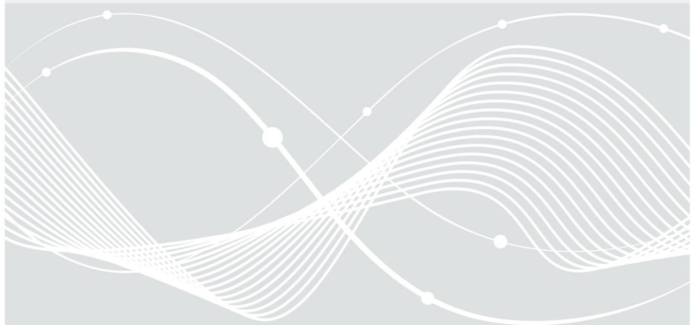
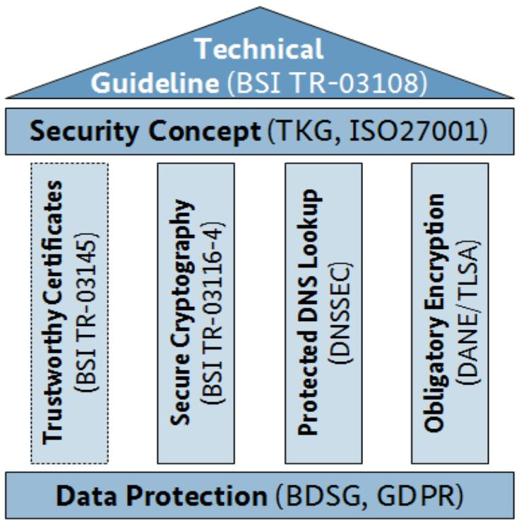
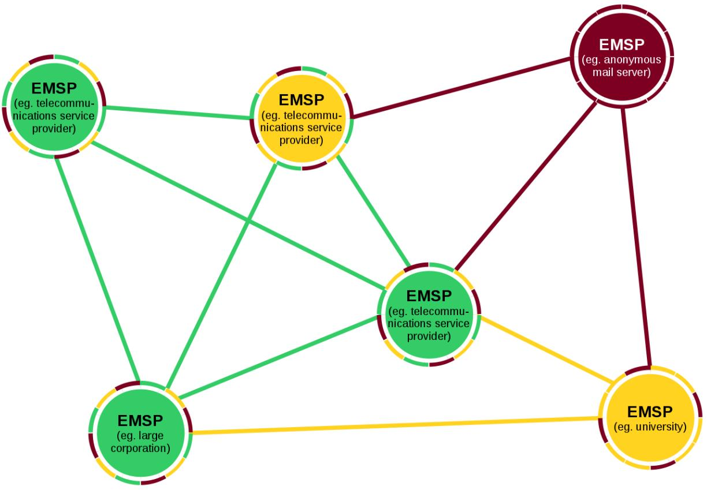
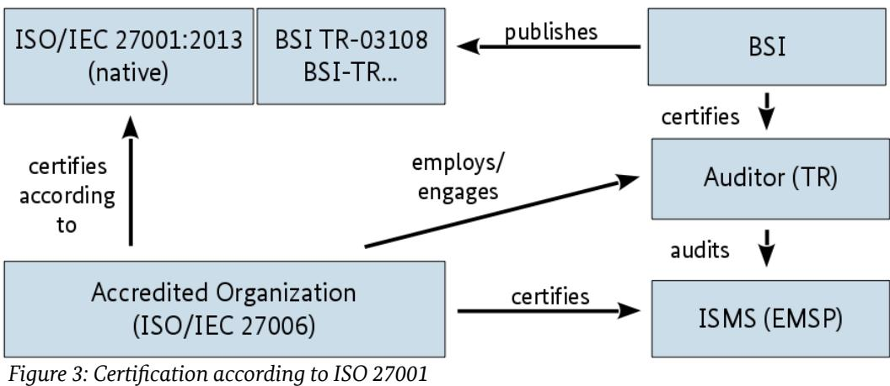
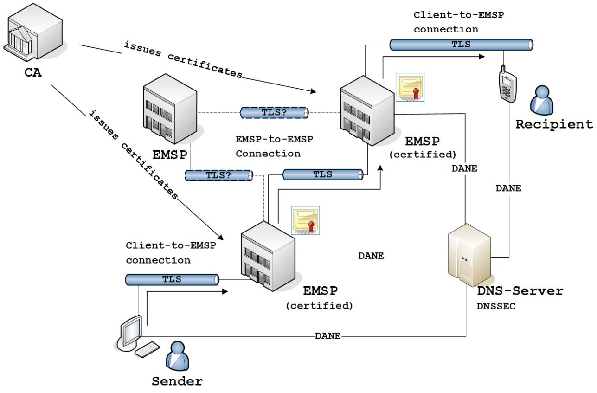

# BSI TR-03108-1: Secure E-Mail Transport

Requirements for E-Mail Service Providers (EMSP) regarding a secure Transport of E-Mails

Version: 1.0.2 Date: 02/17/2022

## Document history

| Version | Date       | Editor | Description                                                                                                                 |
|---------|------------|--------|-----------------------------------------------------------------------------------------------------------------------------|
| 0.9     | 08/20/2015 | BSI    | Initial public draft                                                                                                        |
| 1.0     | 05/12/2016 | BSI    | Final version                                                                                                               |
| 1.0.1   | 11/09/2016 | BSI    | Added Section 3.4: Deviations from referenced Specifications                                                             |
| 1.0.2   | 02/17/2022 | BSI    | Updated Section 3.4: Deviations from referenced Specifications; Renamed EMLREQ_6 "PKI certificates" to "Certified CA" |

Federal Office for Information Security Post Box 20 03 63 D-53133 Bonn Phone: +49 22899 9582-0 E-Mail: e-mail-trsp@bsi.bund.de Internet: https://www.bsi.bund.de © Federal Office for Information Security 2022

|                                | Document history 2                                                                                                                                           |  |
|--------------------------------|--------------------------------------------------------------------------------------------------------------------------------------------------------------|--|
| 1                              | Introduction 5                                                                                                                                               |  |
| 1.1                            | Concept 5                                                                                                                                                    |  |
| 1.2 1.2.1                   | Certification 7 Certification according to this Technical Guideline7                                                                                      |  |
| 1.2.2                          | Certification according to ISO 27001 7                                                                                                                       |  |
| 1.3                            | Key Words 7                                                                                                                                                  |  |
| 2                              | Infrastructure 8                                                                                                                                             |  |
| 2.1 2.1.1 2.1.2 2.1.3 | Participants and associated Components8 User (Sender and Recipient) 9 Certified E-Mail Service Providers 9 Non-Certified E-Mail Service Providers10 |  |
| 2.2 2.2.1 2.2.2          | General Responsibilities 10 Trustworthy Certificate Exchange10 Transparency 10                                                                         |  |
| 3                              | Requirements 11                                                                                                                                              |  |
| 3.1                            | Security Concept 11                                                                                                                                          |  |
| 3.2                            | Technical Requirements 11                                                                                                                                    |  |
| 3.3                            | Additional Requirements 12                                                                                                                                   |  |
| 3.4 3.4.1                   | Deviations from referenced Specifications12 Deviations from [BSI TR-03116-4]13                                                                            |  |
|                                | Reference Documentation 14                                                                                                                                   |  |
|                                | Keywords and Abbreviations 15                                                                                                                                |  |
|                                | Abbreviations 15                                                                                                                                             |  |
|                                | Keywords 15                                                                                                                                                  |  |

| Figure 1: Conceptual Overview of the Requirements5 |  |
|----------------------------------------------------|--|
| Figure 2: Excerpt of the Inter-EMSP Communication6 |  |
| Figure 3: Certification according to ISO 27001 7   |  |
| Figure 4: Participating Infrastructure Components8 |  |

| Table 1: Regulations for the Technical Requirements11 |  |
|-------------------------------------------------------|--|
| Table 2: Deviations from [BSI TR-03116-4] 13          |  |

## 1 Introduction

Nowadays, most of our communication takes place digitally. E-mails have become one of the primary mediums for exchanging digital messages. However, these messages are often sent without the application of IT security measures such as encryption and signatures. One reason for this is that measures such as endto-end encryption have not encountered general user acceptance because key management appears complex and time-consuming.

In this context, the technical guideline addresses e-mail service providers (EMSP). It describes an option to provide a standardized higher level of security regardless of the IT capabilities of the user of the e-mail service. Among the EMSPs who comply with this technical guideline this higher security level is implemented in a way that shall be transparent to the user.

### 1.1 Concept

The basis for the requirements in this technical guideline is a security concept which the EMSP shall create and implement in accordance with the specifications in *Section [3.1: Security Concept](#page-9-2)*. In addition, the technical guideline contains specific technical and general requirements the EMSP must implement in accordance with *Section [3.2: Technical Requirements](#page-9-1)* and *Section [3.3: Additional Requirements](#page-10-1)*. The following *[Figure 1:](#page-3-1)  [Conceptual Overview of the Requirements](#page-3-1)* contains an overview of the basic concept.

*Figure 1: Conceptual Overview of the Requirements*

The requirements to be implemented by the EMSP optionally are encircled with dashes in *[Figure 1:](#page-3-1)  [Conceptual Overview of the Requirements](#page-3-1)*.

The requirements in this technical guideline are solely targeted to individual EMSPs. An association or group of EMSPs is not considered. The requirements for individual EMSPs and their interfaces were formulated to

achieve comparability among EMSPs. Furthermore, they shall encourage a greater pervasiveness of secure communication connections and securely operated e-mail services in order to ultimately increase the security of the e-mail infrastructure as a whole.

An overview of the scenario of communication between EMSPs this technical guidelines aspires to is shown in *[Figure 2: Excerpt of the Inter-EMSP Communication](#page-4-0)*.

*Figure 2: Excerpt of the Inter-EMSP Communication*

In addition to communicating with other certified EMSPs that provide their services in accordance to this technical guideline, a certified EMSP for example also communicates with other:

- EMSPs that are not certified but do have a security concept and provide interfaces with high-quality cryptography (yellow circle, green interface),
- EMSPs that have a security concept and provide poor-quality cryptography (yellow circle, yellow interface) and
- EMSPs that have not implemented any security at all (red circle, red interface).

The *[Figure 2: Excerpt of the Inter-EMSP Communication](#page-4-0)* and the list above do not cover all the possible constellations, but do indicate the complexity of the communication relationships. They also show that alongside interfaces to other certified EMSPs, certified EMSPs have parallel interfaces to EMSPs that implement fewer or no security measures at all. The complexity of this relationships was taken into account while formulating the requirements of this technical guideline. This ensures that the certified EMSPs always chose the highest possible security level.

### 1.2 Certification

An EMSP has the option to prove its conformity to the requirements of this technical guideline as part of a certification. With a certification, the EMSP can prove it is especially trustworthy and therefore, able to fulfill the role of a certified EMSP. There are basically two scenarios for a certification in accordance with this technical guideline which are described in the following.

#### 1.2.1 Certification according to this Technical Guideline

If the applicant (EMSP) wants to prove its conformance to this technical guideline he MUST contact an auditor certified by the BSI. The requirements from *Section [3](#page-9-0): [Requirements](#page-9-0)* with the obligations described there apply in this case and the auditor shall perform a certification procedure according to [BSI TR-03108-2]. In addition to the requirements of this technical guideline, the applicant also MUST provide a security concept in accordance with the German Telecommunications Act [TKG 109] or a similar law applicable in the country in which he is operating his infrastructure. The security concept MUST be updated in the intervals specified by the applicable national law.

#### 1.2.2 Certification according to ISO 27001

In addition to a certification according to this guideline, it is RECOMMENDED for the applicant to be certified by an accredited organization according to [ISO/IEC 27001]. The requirement for an information security management system (ISMS) is replaced by the implementation of a security concept in accordance with [TKG 109] or a national, equivalent law. The [ISO/IEC 27001] certificate is issued separately from the certificate for a successful evaluation in accordance with this technical guideline. The following *[Figure 3:](#page-5-0)  [Certification according to ISO 27001](#page-5-0)* shows the participating parties of the certification process.

### 1.3 Key Words

The key words "MUST", "MUST NOT", "REQUIRED", "SHALL", "SHALL NOT", "SHOULD", "SHOULD NOT", "RECOMMENDED", "MAY", and "OPTIONAL" in this document are to be interpreted as described in [IETF RFC 2119]. The key word "CONDITIONAL" is to be interpreted as follows:

CONDITIONAL: The usage of an item is dependent on the usage of other items. It is therefore further qualified under which conditions the item is REQUIRED or RECOMMENDED.

## 2 Infrastructure

This chapter defines the participants in the e-mail infrastructure, their interfaces with each other and the tasks of the EMSP according to this technical guideline.

### 2.1 Participants and associated Components

The following *[Figure 4: Participating Infrastructure Components](#page-6-1)* shows the components that participate in the infrastructure and their communication relationships to each other.

*Figure 4: Participating Infrastructure Components*

The goal of the requirements described here is to create an infrastructure in which secure connections between certified EMSPs and their users are established ordinarily. Through secure communication from component to component, point-to-point security from the e-mail sender to the recipient shall be achieved.

The assumption here is that the systems of the individual EMSP communicate via an open network (Internet) and also include communication with non-certified EMSPs. In the communication with non-certified EMSPs, the requirements formulated here are intended to create a condition under which connections generally are as secure as possible.

The individual components that participate in the communication and their roles within the infrastructure will be considered in the following sections. In the context of this technical guideline, a security state[ment](#page-8-0)  can only be made for the exchange of e-mails between certified EMSPs and their users. In *Section [2.2.2](#page-8-0): [Transparency](#page-8-0)*, the regulations required for this type of security statement are set.

#### 2.1.1 User (Sender and Recipient)

The user is to be understood as the end user of the infrastructure described here. He uses the services of one or several EMSPs to send and receive his e-mails. At this point, it is not differentiated between sender and recipient role, because from the EMSP's perspective, the same security measures MUST be applied to both roles. The EMSP MUST ensure that the user sends and receives his e-mails in compliance with "[EMLREQ\\_1](#page-9-4): TLS (user to EMSP)". Furthermore, the EMSP MUST inform the user of security-relevant incidents in accordance with the [IT-Sicherheitsgesetz]. The EMSP MUST also provide assistance with regard to IT-securityrelevant topics in accordance with ["ADDREQ\\_2:](#page-10-3) Obligation to provide information" to the user.

#### 2.1.2 Certified E-Mail Service Providers

This EMSP has been certified according to this technical guideline and is the operator of a mail transfer agent (MTA). The EMSP offers his service to one or more users. In the role of a sender, it accepts the e-mails of its users and forwards them to a receiving EMSP. In its role as recipient, it accepts the e-mails from a sending EMSP and provides them to its users, who can retrieve them. The requirements of this technical guideline apply to an EMSP and his interfaces to other EMSPs and his users.

#### 2.1.2.1 Sending E-Mail Service Provider

Before an e-mail from the sending EMSP is sent on behalf of the sender, the EMSP MUST check whether or not cryptographic information (e.g. public key or hash over public key or certificate) from the receiving EMSP in accordance with *Section [2.2.1: Trustworthy Certificate Exchange](#page-8-1)* is already present or can automatically be retrieved. Next, the EMSP MUST attempt to create a connection in accordance with "[EMLREQ\\_3:](#page-10-2) TLS (outgoing)".

If a secure connection cannot be created, although cryptographic information is present, the e-mail MUST NOT be sent. If a secure connection can be created, the e-mail MUST be sent to the receiving EMSP via this secure connection.

If security-relevant errors arise while the connection is being created or during the connection, the connection shall be canceled. It is RECOMMENDED to also log the event. Furthermore, the certified EMSP SHOULD contact the receiving EMSP via a third channel in order to remedy the error as quickly as possible. At the same time, the parties MUST adhere to the reporting obligations according to the [IT-Sicherheitsgesetz] IF the EMSP is operates in Germany. If certificate information from an EMSP is present but does not support the command to create a secure connection, this MUST be classified as an error.

#### 2.1.2.2 Receiving E-Mail Service Provider

The receiving EMSP provides an interface for receiving e-mails from other (sending) EMSPs in accordance to "[EMLREQ\\_2](#page-9-3): TLS (incoming)". Via this interface, the certified EMSP accepts the e-mails from the sending EMSP and handles the email according to its local delivery guidelines. The recipient MAY reject the incoming Email when the sending party is known to improper abuse handling or if the email is identified to contain malware, spam or similar content.

If security-relevant errors arise while the connection is being created or during the connection, the connection shall be cancelled. Again, it is RECOMMENDED to log this event. Furthermore, the EMSP SHOULD contact the sending EMSP via a third channel in order to remedy the error as quickly as possible. At the same time, the parties MUST adhere to the reporting obligations according to the [IT-Sicherheitsgesetz] IF the EMSP operates in Germany.

#### 2.1.3 Non-Certified E-Mail Service Providers

Unfortunately this technical guideline cannot directly consider e-mail service provider (EMSP) without certification. They presumably do not match the requirements described in this technical guideline. For this reason, they can not be subject to any requirements. Since a certified EMSP is per se unable to differentiate between certified and non-certified EMSPs, the interfaces are subject to the same requirements and hence, secure connections with non-certified EMSPs SHOULD also generally be created.

#### 2.2 General Responsibilities

This chapter describes general responsibilities of the EMSP that are not directly connected to the interfaces of the EMSP's e-mail service or the service itself.

#### 2.2.1 Trustworthy Certificate Exchange

The exchange of public keys contained in the certificates of the EMSP is required for trustworthy communication with an EMSP. In the medium term, this exchange of information SHOULD be automated by using DANE/TLSA in accordance with [IETF RFC 6698] via a connection secured by DNSSEC in accordance with [IETF RFC 6781] and retrieved by the EMSP's DNS server.

For certified EMSPs, the use of DANE is mandatory. However, the EMSP may provide or populate the certificates via alternative procedures like manual exchange or pinning for communication with EMSPs that are not certified.

#### 2.2.2 Transparency

An EMSP's user MUST be able to find out which of their e-mails are sent to certified EMSPs or received from certified EMSPs. This shall give the user a higher level of transparency on the security measure applied to the e-mails he sends and receives.

At the moment, there is no internationally harmonized or widely practiced procedure for function like this. For this reason, the requirement in accordance with ["ADDREQ\\_3:](#page-10-4) Transparency" MUST initially be met by referring to the list of EMSPs certified in accordance with this technical guideline on the BSI website[1](#page-8-2) . If however a matching technology becomes available it will be checked if it fulfills the requirements and MAY be taken into account in this technical guideline.

## 3 Requirements

This chapter summarizes all verifiable requirements of the EMSP. In particular, they are intended to support the auditors when conducting an audit according to this technical guideline. In addition to the basic requirement of establishing an information security management system or at least creating a resilient security concept, technical and additional basic requirements are described here.

### 3.1 Security Concept

The EMSP MUST provide a security concept in accordance with [TKG 109] or a similar law applicable in the country in which its infrastructure is located. If the EMSP is operating on a multi-national basis, an applicable security concept MUST be provided for each country in which the servers are located. The security concept MUST encompass all relevant systems and components used for receiving, processing, saving, sending and delivering data of the user.

Additionally, it is RECOMMENDED to operate an ISMS in accordance with [ISO/IEC 27001]. The ISMS MUST also encompass all relevant systems and components used for receiving, processing, saving, sending and delivering data of the user. The ISMS MUST contain the requirements listed in *Section [3.2: Technical](#page-9-1)  [Requirements](#page-9-1)*.

### 3.2 Technical Requirements

The following technical requirements are a supplement to the requirements of *Section [3.1: Security Concept](#page-9-2)* that the EMSP MUST implement and are specifically related to the functional operation of an e-mail service. If the EMSP certification is conducted on the basis of a previous certification in accordance with [ISO/IEC 27001], this technical requirements are to be seen as additional controls.

The technical requirements listed here, which MUST be audited as part of a certification, are displayed in the following *[Table 1: Regulations for the Technical Requirements](#page-9-5)*.

| Requirement                  | Regulation  |
|------------------------------|-------------|
| EMLREQ_1: TLS (user to EMSP) | Required    |
| EMLREQ_2: TLS (incoming)     | Required    |
| EMLREQ_3: TLS (outgoing)     | Required    |
| EMLREQ_4: DANE (incoming)    | Required    |
| EMLREQ_5: DANE (outgoing)    | Required    |
| EMLREQ_6: Certified CA       | Recommended |

Table 1: Regulations for the Technical Requirements

**EMLREQ\_1: TLS (user to EMSP):** The communication between the EMSP systems and the users for sending and receiving e-mails, for user identification and all other communication linked to the procedure MUST proceed via TLS in accordance with [BSI TR-03116-4]. For this reason, the EMSP MUST preferably offer high quality algorithms in accordance with the technical guideline listed above. If the EMSP allows its users to access their e-mails via a webmail interface, this access MUST be protected by using HTTPS in accordance with [IETF RFC 2818]. Furthermore, the EMSP MUST provide access to the e-mails with the support of STARTTLS in accordance with [IETF RFC 3207]. If no secured communication is possible, a meaningful error message MUST be displayed before canceling the communication from the EMSP to the user – even users with no technical experience SHOULD be able to understand the reason for breaking off communication.

**EMLREQ\_2: TLS (incoming):** The EMSP MUST permit connections from other EMSPs via TLS in accordance with [BSI TR-03116-4]. For all incoming connections, algorithms that provide so-called forward secrecy (also

called perfect forward secrecy; PFS for short) MUST preferably be used. They MUST correspond to the recommendations from [BSI TR-03116-4]. In order to permit secure TLS connections, the EMSP MUST implement STARTTLS in accordance with [IETF RFC 3207].

**EMLREQ\_3: TLS (outgoing):** For connections to other EMSPs, the EMSP MUST use STARTTLS in accordance with [IETF RFC 3207] if the receiving EMSP offers this command. If STARTTLS is supported by the receiving EMSP, they SHOULD preferably negotiate algorithms that provide so-called forward secrecy (also called perfect forward secrecy; PFS for short) and correspond to the recommendations from [BSI TR-03116-4].

**EMLREQ\_4: DANE (incoming):** In compliance with the regulations of the Internet Assigned Number Authority (IANA[2](#page-10-8) ), the domain(s) used by the EMSP MUST be protected by DNSSEC in accordance with [IETF RFC 6781]. Furthermore, the EMSP MUST publish information of his certificate in the DNS record by using DANE /TLSA in accordance with [IETF RFC 6698].

**EMLREQ\_5: DANE (outgoing):** Using DNSSEC in accordance with [IETF RFC 6781], the EMSP MUST check all connections to other EMSPs to determine whether or not the information on using DANE/TLSA has been published in the DNS record of the receiving EMSP in accordance with [IETF RFC 6698]. If the relevant information is present, the authenticity of the connection MUST be verified based on this information and canceled if the certificate information does not match the cryptographic information presented by the receiving EMSP or if no transport security (e.g. STARTTLS) is presented at all.

**EMLREQ\_6: Certified CA:** All the certificates that the EMSP uses for communication with other EMSPs and the user SHOULD be issued by a certificate authority (CA) that was certified according to [BSI TR-03145].

#### 3.3 Additional Requirements

The following requirements supplement the technical requirements listed above. They contain general conditions the EMSP SHALL create to ensure a secure operation.

**ADDREQ\_1: Data privacy:** The EMSP's systems SHOULD be operated in Germany; therefore the German Data Protection Act [BDSG] is applicable. In exceptional cases, operation in the rest of the EU under equivalent or stricter data protection requirements is allowed. In this cases the General Data Protection Regulation [GDPR] with the corresponding national regulation MUST be fulfilled by the EMSP.

**ADDREQ\_2: Obligation to provide information:** The EMSP pledges to inform its users about IT security incidents related to its IT infrastructure, according to the [IT-Sicherheitsgesetz] or a similar law applicable in the country in which its infrastructure is located. Such incidents can for example include cases where the databases of the EMSP have been compromised and user data was obtained by an attacker. Furthermore, it pledges to explain IT-security-relevant topics to its users. The EMSP MAY fulfill this duty by referring to the relevant information offered by the German federal government[3](#page-10-9) .

**ADDREQ\_3: Transparency:** The EMSP MUST inform its users in the best manner possible if e-mails have been sent or received from certified EMSPs. The minimum method for doing so is to refer to the list of certified providers at the BSI[4](#page-10-10) . The EMSP MAY also display information on the security level of single e-mails.

### 3.4 Deviations from referenced Specifications

This chapter contains intended deviations from requirements of specifications referenced throughout this document. The deviations include a reference, a description and an identifier of the deviation.

- 2 <https://www.iana.org/dnssec>
- 3 [https://www.bsi-fuer-buerger.de](https://www.bsi-fuer-buerger.de/)
- 4 <https://www.bsi.bund.de/ZertifizierungProduktenachTR>

#### 3.4.1 Deviations from [BSI TR-03116-4]

| Regarding                                 | Reference     | Description                                                                                                                                                                                                                                                                                                                                                                                                                                                                                                                                                          |
|-------------------------------------------|---------------|----------------------------------------------------------------------------------------------------------------------------------------------------------------------------------------------------------------------------------------------------------------------------------------------------------------------------------------------------------------------------------------------------------------------------------------------------------------------------------------------------------------------------------------------------------------------|
| Deprecated TLS versions and ciphers | Section 2.1.1 | This document describes opportunistic encryption. This means co nnections may still be established unencrypted, if the counterpart entity does not support encryption. Thus it is currently also allowed to offer and use deprecated TLS versions and ciphers, which are not recommended or even forbidden according to [BSI TR-03116-4]. However, as required by EMLREQ_1: TLS (user to EMSP), EMLREQ_2: TLS (incoming), EMLREQ_3: TLS (outgoing) and the TLS specification itself, their usage must be avoided by assigning a lower priority. |
| Timeouts                                  | Section 2.1.1 | TLS sessions may not be used for more than two days in total (in cluding Session Resumption). However, due to the nature of IMAP (Internet Message Access Protocol) sessions frequently used in the context of this Technical Guideline, it is not recommended to im plement a policy compliant to this requirement.                                                                                                                                                                                                                                     |

Table 2: Deviations from [BSI TR-03116-4]

## Reference Documentation

| BDSG BSI TR-03108-2 | BfDI: Bundesdatenschutzgesetz BSI: Testspecification; Conformance Tests for Secure E-Mail Transport in compliance to BSI TR-03108-1 |
|------------------------|-------------------------------------------------------------------------------------------------------------------------------------------|
| BSI TR-03116-4         | BSI: Kryptographische Vorgaben für Projekte der Bundesregierung Teil 4                                                                    |
| BSI TR-03145           | BSI: Secure Certification Authority operation                                                                                             |
| GDPR                   | EU: General Data Protection Regulation                                                                                                    |
| IETF RFC 2119          | IETF: Key words for use in RFCs to Indicate Requirement Levels                                                                            |
| IETF RFC 2818          | IETF: HTTP Over TLS                                                                                                                       |
| IETF RFC 3207          | IETF: SMTP Service Extension for Secure SMTP over Transport Layer Security                                                                |
| IETF RFC 6698          | IETF: The DNS-Based Authentication of Named Entities (DANE) Transport Layer Security (TLS) Protocol: TLSA                              |
| IETF RFC 6781          | IETF: DNSSEC Operational Practices, Version 2                                                                                             |
| ISO/IEC 27001          | ISO/IEC: 27001:2013 Information technology; Security techniques; Information security management systems; Requirements                 |
| IT-Sicherheitsgesetz   | BMI: Gesetz zur Erhöhung der Sicherheit informationstechnischer Systeme (IT Sicherheitsgesetz)                                         |
| TKG 109                | Bundesnetzagentur: Katalog von Sicherheitsnaforderungen nach § 109 Absatz 6 Telekommunikationsgesetz (TKG)                             |

| Abbreviation | Meaning                                    |
|--------------|--------------------------------------------|
| CA           | Certificate Authority                      |
| DANE         | DNS-based Authentication of Named Entities |
| DNS          | Domain Name System                         |
| DNSSEC       | Domain Name System Security Extensions     |
| EMSP         | E-Mail Service Providers                   |
| IMAP         | Internet Message Access Protocol           |
| ISMS         | Information Security Management System     |
| MTA          | Mail Transfer Agent                        |
| PFS          | Perfect Forward Secrecy                    |
| TLS          | Transport Layer Security                   |

| DANE 10, 12                 |  |
|-----------------------------|--|
| Data Protection 12          |  |
| DNSSEC 12                   |  |
| EMSP 5                      |  |
| IMAP 13                     |  |
| ISMS 7                      |  |
| mail transfer agent (MTA) 9 |  |
| security concept 11         |  |
| STARTTLS 12                 |  |
| TLS 11                      |  |
|                             |  |