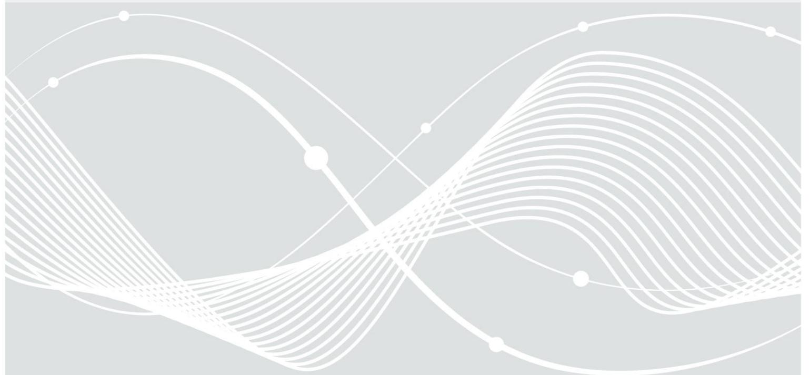
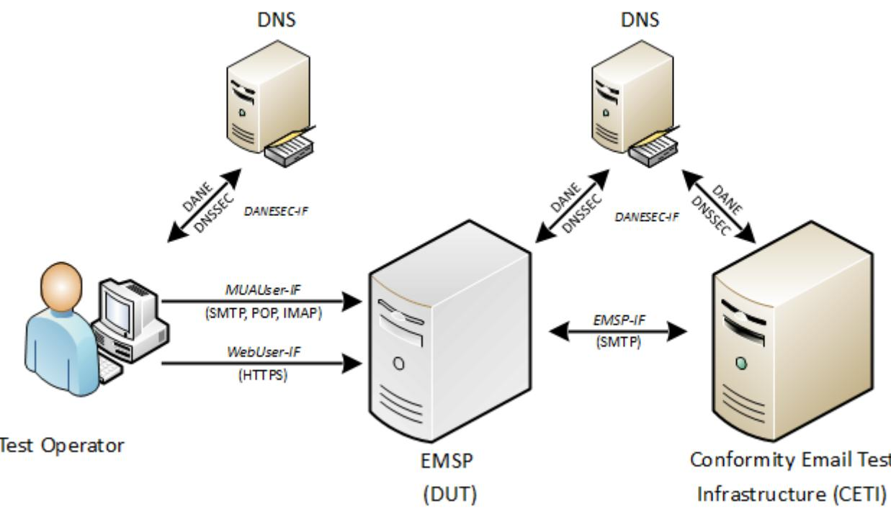
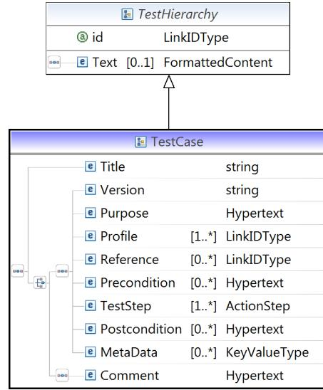

# BSI TR-03108-2: Testspecification

Conformance Tests for Secure E-Mail Transport in compliance to BSI TR-03108-1

Version: 1.0.1 Date: 11/09/2016

# Document history

| Version     | Date       | Editor | Description          |
|-------------|------------|--------|----------------------|
| 1.0 Draft 1 | 05/12/2016 | BSI    | Initial public draft |
| 1.0.1       | 11/09/2016 | BSI    | Final version        |

Federal Office for Information Security Post Box 20 03 63 D-53133 Bonn Phone: +49 22899 9582-0 E-Mail: e-mail-trsp@bsi.bund.de Internet: https://www.bsi.bund.de © Federal Office for Information Security 2016

# Table of Contents

|                                                                                                                                                                                         | Document history                       |  |
|-----------------------------------------------------------------------------------------------------------------------------------------------------------------------------------------|----------------------------------------|--|
|                                                                                                                                                                                         | 1                                      |  |
|                                                                                                                                                                                         | 1.1                                    |  |
|                                                                                                                                                                                         | 1.2                                    |  |
|                                                                                                                                                                                         | 1.3                                    |  |
|                                                                                                                                                                                         | Test Environment and Elements          |  |
|                                                                                                                                                                                         | 2.1                                    |  |
| 2.2                                                                                                                                                                                     | DUT                                    |  |
|                                                                                                                                                                                         | 2.3                                    |  |
|                                                                                                                                                                                         | Test Tools 2.3.1 - - -              |  |
| 2.3.2                                                                                                                                                                                   | Test E-Mail                            |  |
| 2.3.3 ------------------------------------------------------------------------------------------------------------------------------------------------------------------------          | DNS Caching Problem                    |  |
|                                                                                                                                                                                         | 2.4                                    |  |
| 2.5                                                                                                                                                                                     | Test Operator                          |  |
| 2.6                                                                                                                                                                                     | Test Profiles.                         |  |
| 2.6.1 ------------------------------------------------------------------------------------------------------------------------------------------------------------------------ 2.6.2 | Basic Profiles Recommended Profiles |  |
| က                                                                                                                                                                                       | Implementation Conformance Statement   |  |
|                                                                                                                                                                                         | 3.1                                    |  |
|                                                                                                                                                                                         | 3.2 Online Interfaces                  |  |
|                                                                                                                                                                                         | 3.3 Operational Information            |  |
|                                                                                                                                                                                         | 3.4                                    |  |
|                                                                                                                                                                                         | 3.5 Supported Cryptography             |  |
| 3.5.1                                                                                                                                                                                   | TLS: Browser -> Test Object            |  |
| 3.5.2                                                                                                                                                                                   | TLS: User MUA -> Test Object (SMTP)    |  |
| 3.5.3                                                                                                                                                                                   | TLS: User MUA -> Test Object (IMAP)    |  |
| 3.5.4                                                                                                                                                                                   | TLS: User MUA -> Test Object (POP3)    |  |
| 3.5.5                                                                                                                                                                                   | TLS: CETI -> Test Object               |  |
|                                                                                                                                                                                         | 3.5.6 3.5.7                         |  |
|                                                                                                                                                                                         | 3.6                                    |  |
| 3.7                                                                                                                                                                                     | Location                               |  |
| 3.8                                                                                                                                                                                     | [TR-03145] Certificate Information     |  |
| বা                                                                                                                                                                                      | Definition of Configuration Data       |  |
| 4.1                                                                                                                                                                                     | Test Setup                             |  |
| 4.2                                                                                                                                                                                     | DNS Zones Specification                |  |
| 4.3                                                                                                                                                                                     | Certificate Specification              |  |
| ဟ                                                                                                                                                                                       | Definitions for Test Cases             |  |
| 5.1                                                                                                                                                                                     | Test Case Notation                     |  |
| 6                                                                                                                                                                                       | Test Cases                             |  |
|                                                                                                                                                                                         | 6.1                                    |  |
|                                                                                                                                                                                         | 6.2                                    |  |

| 6.3                                  |  |
|--------------------------------------|--|
| 6.4                                  |  |
| 6.5                                  |  |
| Reference Documentation              |  |
| Keywords and Abbreviations           |  |
| Abbreviations                        |  |
| Keywords                             |  |
| Annex A - Security Concept Checklist |  |
|                                      |  |

# Figures

| Figure 1: Outline of a Generic Test Setup |  |
|-------------------------------------------|--|
| Figure 2: XML Schema Test Case            |  |
| Figure 3: XML Schema ActionStep           |  |
|                                           |  |

# Tables

| Table 1: User information                          |  |
|----------------------------------------------------|--|
| Table 2: Online interfaces                         |  |
| Table 3: Operational information                   |  |
| Table 4: Basic profiles                            |  |
| Table 5: Recommended profiles                      |  |
| Table 6: Supported TLS versions and Cipher Suites  |  |
| Table 7: Supported Key Lengths                     |  |
| Table 8: Supported Elliptic Curves                 |  |
| Table 9: Supported Signature Algorithms            |  |
| Table 10: Supported TLS versions and Cipher Suites |  |
| Table 11: Supported Key Lengths                    |  |
| Table 12: Supported Elliptic Curves                |  |
| Table 13: Supported Signature Algorithms           |  |
| Table 14: Supported TLS versions and Cipher Suites |  |
| Table 15: Supported Key lengths                    |  |
| Table 16: Supported Elliptic Curves                |  |
| Table 17: Supported Signature Algorithms           |  |
| Table 18: Supported TLS versions and Cipher Suites |  |
| Table 19: Supported Key Lengths                    |  |
| Table 20: Supported Elliptic Curves                |  |
| Table 21: Supported Signature Algorithms           |  |
| Table 22: Supported TLS versions and Cipher Suites |  |
| Table 23: Supported Key Lengths                    |  |
| Table 24: Supported Elliptic Curves                |  |
| Table 25: Supported Signature Algorithms           |  |
| Table 26: Supported TLS versions and Cipher Suites |  |
| Table 27: Supported Key Lengths                    |  |
| Table 28: Supported Elliptic Curves                |  |
| Table 29: Supported Signature Algorithms           |  |
| Table 30: Supported TLS versions and Cipher Suites |  |
| Table 31: Supported Key Llengths                   |  |
| Table 32: Supported Elliptic Curves                |  |
| Table 3: Supported Signature Algorithms            |  |
| Table 34: DNSSC Algorithms                         |  |
|                                                    |  |

| Table 35: Supported Key Lengths for DNSSEC Signatures |  |
|-------------------------------------------------------|--|
| Table 36: TLSA RR values                              |  |
| Table 37: Locations                                   |  |
| Table 38: [TR-03145] Certificate Information          |  |
| Table 39: Testing environment parameters              |  |
| Table 40: DNS zones of the testing environment        |  |
| Table 41: Certificates required for the TLS tests     |  |
| Table 42: List of test cases in Module A              |  |
| Table 43: List of test cases in Module B              |  |
| Table 44: List of test cases in Module C              |  |
| Table 45: List of test cases in Module D              |  |
| Table 46: List of test cases in Module E              |  |
| Table 47: Checklist for the security concept          |  |
|                                                       |  |

# 1 Introduction

The Technical Guideline [TR-03108-1] specifies the requirements for a secure transport of e-mails. The current document extends [TR-03108-1] by defining conformity criteria for e-mail service providers (EMSP) and specifying tests which verify that the provided interfaces fulfil the requirements defined in the Technical Guideline. The tests cover the interfaces to the end user as well as from and to other EMSPs.

# 1.1 Motivation and Objectives

Since the objective of [TR-03108-1] and the tests is the improvement of security, the tests focus on a secure DNS lookup using DANE/DNSSEC and on the subsequent TLS connection. The protocols in the TLS-protected tunnel (like IMAP, SMTP or POP), as well as functional tests, are not in the scope of this document. Even though it is primarily focused on security, this guideline takes interoperability issues into account as well.

Generally speaking, the specification and therewith the tests are strict with respect to the configurations towards the end users. The rationale behind this is that the user can be informed in case of any issue. He is enabled to decide about further proceeding. For example, if the TLS certificate of the web interface cannot be verified, the browser will display an alert and ask for further actions. The decision on how to proceed further is up to the users.

This, however, does not hold for the communication between two distinct EMSPs. Once the e-mail has been transferred to the users EMSP, it will be automatically forwarded to the recipients server. If any issue arises, the user will usually not be able to take actions. In the most cases details of the transmission are hidden. This implies that the user completely relies on decisions made by the EMSP. Therefore, a uniform certification is required to encourage the trust in these decisions.

A variety of aspects has to be covered during the evaluation procedure in order to take into consideration the complexity of the solutions to be tested. Therefore, following aspects must be taken into account:

- The requirements from the [TR-03108-1] are fulfilled.
- Including the configuration of TLS according to [TR-03116-4]
- The DNSSEC requirements as defined in [RFC4033], [RFC4034] and [RFC4035].
- The utilization of DANE as described in [RFC6698].
- The STARTTLS protocol is utilised [RFC2595] resp. [RFC3207].
- The tests defined in this document only focus on conformance to the respective requirements. They do not validate security, functionality or availability.
- This document does not define any particular tools to be used by the auditor. He or she is not restricted in the choice and can utilise any tool which seems appropriate (see Section [2.3.1\)](#page-8-0).

# 1.2 Structure of this Document

The document is structured as follows: In the first section, the motivation and scope of the test specification is given. In Section 2 the required test environment and the test profiles are described. Section 3 defines the implementation conformance statement (ICS). In the ICS, the information that an EMSP has to provide in order to apply for a certificate is specified. The parameters and certificates that are required for the tests are given in Section 4. Section 5 describes the XML format that is used for the test cases. Section 6 contains the list of test cases.

# 1.3 Key Words

The key words "MUST", "MUST NOT", "REQUIRED", "SHALL", "SHALL NOT", "SHOULD", "SHOULD NOT", "RECOMMENDED", "MAY", and "OPTIONAL" in this document are to be interpreted as described in [RFC2119]. The key word "CONDITIONAL" is to be interpreted as follows:

CONDITIONAL: The usage of an item is dependent on the usage of other items. It is therefore further qualified under which conditions the item is REQUIRED or RECOMMENDED.

# 2 Test Environment and Elements

The test series described in this document consider the e-mail service providers (EMSP) already offering their services via the Internet. Therefore, the testing laboratory will have to take the existing infrastructure into account. This chapter describes the aspects to be regarded.

*Figure 1: Outline of a Generic Test Setup*

## 2.1 Overview Interfaces

The test setup assumes that an EMSP handles several network interfaces (see Figure [1\)](#page-7-1). Those network interfaces are used to communicate with end users, DNS servers and other EMSPs. In the following, a short description and definition of those interfaces is given:

- Interface for EMSPs *EMSP-IF*: This interface is used for e-mail exchange between EMSPs and will be denoted as *EMSP-IF* in this test specification.
- Interface for DANE/DNSSEC resolvers *DANESEC-IF*: This interface is used for the execution of the DNS, DANE and DNSSEC protocols and will be denoted as *DANESEC-IF* in this test specification.
- Interface for end users *WebUser-IF* and *MUAUser-IF*: This interface is used by end users to access the services of an EMSP and thus to exchange e-mails. Because this interface can be accessed over HTTPS (using a webfrontend) and StartTLS/TLS (using a Mail User Agent, short MUA such as Thunderbird), this interface includes two respective interfaces that will be denoted as *WebUser-IF* and *MUAUser-IF* in this test specification.

Each interface can consist of several ports dedicated to specific protocols. The specific underlying protocol data is not part of this document and is therefore not covered by test cases. Nevertheless, all interfaces are expected to establish a TLS connection before exchanging data of the protocol. STARTTLS may be utilised. An exception is the connection towards the name resolvers, as DNSSEC does not enforce data encryption.

The tests specified for an interface have to be performed for each port that is offered by the EMSP relevant in the context of [TR-03108-1]. A generic setup is outlined in [Figure 1.](#page-7-1) Note that the two interfaces sketched for the user TLS and HTTPS communication are covered by the same cryptographic tests.

Based on [Figure 1](#page-7-1) it has to be verified that:

- A correct TLSA record for DANE/DNSSEC is available for all interfaces.
- The user interface is protected using TLS in accordance with [TR-03116-4], in particular, the defined and only the defined ciphers are supported.
- STARTTLS is used whenever a non-TLS port is contacted.
- An incoming connection for other e-mail-servers via TLS is possible; the ciphers required in [TR-03116-4] are supported.
- An outgoing connection to other e-mail-servers is using TLS whenever possible, the ciphers required in [TR-03116-4] are supported.
- Furthermore, the respective negative tests are defined.

# 2.2 DUT

In this test specification, the e-mail server to be tested is called Device Under Test (DUT).

The DUT is depicted in gray in Figure [1](#page-7-1) to emphasize that it is merely a placeholder rather than an integral part of the test environment. The tests defined in this document do not require any preparation of a dedicated test e-mail infrastructure. This implies that the DUT represents all components and interfaces already used operationally. Taking this into account, the tests are intentionally designed not to perform any "destructive" steps or to require any DUT configuration leading to possible down time of its services. In addition to the test interfaces mentioned in Section [2.1,](#page-7-2) the behaviour of the DUT has to be tested for both *incoming* and *outgoing connections*. The connection is always looked at from the perspective of the DUT.

Incoming connections imply queries received and processed by the DUT, but also queries sent by the user or another EMSP in order to contact the DUT (e.g. DNS queries).

• Outgoing connections imply queries sent by the DUT (e.g. DNS query, E-mail delivery, etc.).

# 2.3 Conformity E-Mail Test Infrastructure

The complete infrastructure required for the test series is enclosed in the Conformity E-mail Test Infrastructure, abbreviated CETI. It includes all components required to interact with the DUT. The CETI also includes a Test-DNS-Zone (see Section [2.4\)](#page-9-0) used to analyse the behaviour of the DUT when testing *outgoing connections*. It exemplary comprises target e-mail servers hosting the respective accounts. It may also comprise further tools and services required for conformity tests.

#### 2.3.1 Test Tools

The current test specification does not restrict the operator in his or her choice of tools. This means that the operator theoretically can use any tool he or she finds the most suitable. However, it has to be assured that the results achieved by a particular tool of choice are legitimate and verifiable (reproducible) by any other possible tester.

## 2.3.2 Test E-Mail

Several test cases require the tester to send an e-mail via the DUT to the testing infrastructure. In order to be able to uniquely identify each e-mail sent in a particular test case, it is RECOMMENDED to include the test case ID in the subject field of the test e-mail. Additionally, it may be necessary to include a sequence number in cases where multiple test cases with the same ID are run (templates).

The naming convention could be:

• EMAIL\_TSP\_<module>\_<test case ID>\_<sequence number>

## 2.3.3 DNS Caching Problem

Some tests require the DUT to retrieve the DNS information of a particular zone and to process it. Several of them must be performed repeatedly. This especially holds for the template test cases, but also for not-templates test cases that need to be re-run for some reason.

This could potentially lead to the DUT utilizing its DNS cache entries instead of retrieving the information of the zone again. Even if the DUT does not operate any DNS caching mechanisms itself, it is still possible that it uses the DNS server which does. Therefore, the test laboratory MUST implement mechanisms preventing the re-usage of cached DNS entries. It is essential that for any test concentrating on the DANE/DNSSEC capability of the DUT (cf. Section [6.2\)](#page-24-1) the DNS resolution takes place *each time*.

Unfortunately, it is not sufficient to only rely on the time to live value (TTL) for that. Each DUT or an intermediate DNS server may disregard or overwrite these values. Therefore, it is RECOMMENDED to use a random ID in the name of the DNS zones used for tests. In this case, each run is performed with its own unique zone name/URL which is only utilised once. The next run of a test case is then performed using an URL with another random ID. The characteristics are, however, the same as required for the scenario of the test case. Consequently, the DUT is forced to freshly resolve the new URL each time.

# 2.4 DNS

One of the topics discussed in the [TR-03108-1] is the ability of the EMSP to utilise the DNSSEC resource records (RRs) by resolving the remote domain name. The DUT MUST be able to process the TLSA resource record and validate the presented TLS server certificate. Therefore, it is essential that the testing laboratory prepares the respective DNS resource records.

On the other side, the DUT MUST maintain the respective DNSSEC resource records itself. This is necessary to enable the respective users' e-mail clients to connect to it. The availability and correctness of such resource records MUST also be verified in the respective test cases.

# 2.5 Test Operator

The operator is responsible for initiating and supervising the test series. He or she plays the role of an e-mail user. Any test unit which cannot be run automatically MUST be performed manually. This, for example, holds for the test cases regarding the webfrontend. The operator MUST further observe the behaviour and messages presented by the DUT and decide about conformity.

# 2.6 Test Profiles

Test profiles are used to assess the functionalities and capabilities of the DUT. Test profiles determine the applicability of concrete test cases. There are two kinds of profiles: basic and recommended. The basic profiles represent mandatory requirements which MUST be met by the DUT in order to successfully accomplish the certification.

Recommended profiles represent the requirements which should be met, but the applicant may for some reason decide otherwise. This decision does not necessary lead to non-conformity.

A distinction is made between *incoming* and *outgoing* connections. This distinction is made from the perspective of the DUT. Incoming connections are connections or connection attempts made by other communication partners (e.g EMSPs, end users) towards the DUT. Outgoing connections are connections or connection attempts made by the DUT towards communication partners. The identifiers *SERVER* and *CLIENT* are respectively used for incoming (i.e. server accepts) and outgoing (i.e. client sends) connections.

The following test profiles could be identified.

## 2.6.1 Basic Profiles

- CRYPTO\_SERVER: Any DUT should provide interfaces serving incoming network connections. This profile assesses the capabilities and proper implementation of the interfaces required to ensure secure communication for incoming connections. In this case, the interface may be accessed by another EMSP or an end user using a mail user agent. This profile therefore covers the EMSP-, WebUser- and MUA-IF defined in Section [2.1.](#page-7-2) All incoming connections MUST be protected by TLS and fulfil the requirements of [TR-03116-4].
- CRYPTO\_CLIENT: Analogously to the CRYPTO\_SERVER profile, the DUT MUST support the parameters of [TR-03116-4] for outgoing connections. Therefore, this profile assesses the capabilities and proper implementation of the required interfaces for outgoing connections. This profile also covers the same interfaces as CRYPTO\_SERVER.
- DANE\_SERVER: This profile assesses the DANE capabilities of the DUT for incoming connections. This profile covers the DANESEC-IF defined in Section [2.1,](#page-7-2) whereby the focus lies on DANE.
- DANE\_CLIENT: This profile assesses the DANE capabilities of the DUT for outgoing connections. This profile covers the DANESEC-IF defined in Section [2.1,](#page-7-2) whereby the focus lies on DANE.
- DNSSEC\_SERVER: This profile assesses the (DNS) resolving capabilities of the DUT for incoming connections. Prior to connection establishment to the DUT, another EMSP MUST acquire its DNS information protected by DNSSEC. Therefore, a correct implementation of the respective functionalities is required. This profile covers the DANESEC-IF defined in Section [2.1,](#page-7-2) whereby the focus lies on DNSSEC.
- DNSSEC\_CLIENT: This profile assesses the (DNS) resolving capabilities of the DUT for outgoing connections. Prior to connection establishment to another EMSP, the DUT MUST acquire its DNS information protected by DNSSEC. Therefore, a correct implementation of the respective functionalities is required. This profile covers the DANESEC-IF defined in Section [2.1,](#page-7-2) whereby the focus lies on DNSSEC.
- USER\_INFO: [TR-03108-1] requires EMSP to inform its users about security incidents. Furthermore, it MUST inform them about security relevant topics. The tests assigned to this profile evaluate the availability and suitability of such information.
- TLS\_1.2: TLS tests specific to TLS 1.2.
- CRYPTO\_ECC: Support of ECC ciphersuites for TLS connections.
- STARTTLS: Essentially, all communication MUST take place via TLS protected channels. If the connection establishment starts on a non-TLS port, STARTTLS MUST be employed to signalize the TLS support.

## 2.6.2 Recommended Profiles

- CERTIFIED\_CA: All the certificates that the EMSP uses for communication with other EMSPs have been issued by a certificate authority (CA) that was certified according to [TR-03145].
- ENCRYPT\_THEN\_MAC: This profile assesses the capabilities of the DUT to support Encrypt-then-MAC for TLS protected communication channels.
- EXTENDED\_MASTER\_SECRET: This profile assesses the capabilities of the DUT to support the Extended-Master-Secret extension for TLS protected communication channels.

# 3 Implementation Conformance Statement

The purpose of the Implementation Conformance Statement (ICS) is the declaration of supported functionalities of the EMSP to be approved by the testing laboratory. The declarations of the applicant are used for the determination of test cases to be performed.

The Implementation Conformance Statement MUST be filled completely by the applicant. The information of the filled ICS MUST be documented in the test report.

## 3.1 User Information Source

According to [TR-03108-1] the EMSP has to inform the user about the IT security issues and educate on this topic. The applicant MUST provide in Table [1](#page-11-2) the sources that can be used by a user to access this information.

| Topic                 | Source Address |
|-----------------------|----------------|
| IT security issues    |                |
| IT security education |                |

Table 1: User information

## 3.2 Online Interfaces

An applicant SHALL provide a declaration containing the list of ALL interfaces served online. Those interfaces will be used to carry out the test cases defined in this document. Table [2](#page-11-1) describes the required fields.

| Element                                                                       | Address |
|-------------------------------------------------------------------------------|---------|
| Webinterface for the user                                                  |         |
| SMTP interface for the users of e-mail clients                             |         |
| IMAP interface for the users of e-mail clients                             |         |
| POP3 interface for the users of e-mail clients                             |         |
| Network interface(s) available for incoming messages from other EMSP |         |
| Port for connections that use STARTTLS [STARTTLS_PORT]                  |         |

Table 2: Online interfaces

# 3.3 Operational Information

In order to define a clear test frame, an applicant SHALL provide information related to the operation of the underlying infrastructure. This information is mainly given in the form of parameters which will serve as input for specific test cases.

| Parameters | Description                                                                                                                                                         | Value (in seconds) |
|------------|---------------------------------------------------------------------------------------------------------------------------------------------------------------------|--------------------|
| TIMEOUT    | Expected time limit for e-mail delivery. This specifies the maximum time expected between sending an e-mail using the DUT services and receiving this e-mail. |                    |

Table 3: Operational information

## 3.4 Profiles

An applicant SHALL provide a declaration containing information of the supported profiles. Table [4](#page-12-0) describes required basic test profiles (cf. Section [2.6.1\)](#page-10-0).

| Profile ID    | Description                                                                                                          | Yes / No |
|---------------|----------------------------------------------------------------------------------------------------------------------|----------|
| CRYPTO_SERVER | Cryptographic tests for incoming connections.                                                                        |          |
| CRYPTO_CLIENT | Cryptographic tests for outgoing connections.                                                                        |          |
| USER_INFO     | The EMSP informs the user about security incidents. Furthermore, it informs users about relevant security topics. |          |
| DANE_SERVER   | Support of DANE for incoming connections. This particularly means the connections towards the DUT.                |          |
| DANE_CLIENT   | Support of DANE for outgoing connections. This particularly means the connections towards other EMSPs.            |          |
| DNSSEC_CLIENT | Support of DNSSEC for outgoing connections. This particularly means the connections towards other EMSPs.          |          |
| DNSSEC_SERVER | Support of DNSSEC for incoming connections. This particularly means the connections towards the DUT.              |          |
| STARTTLS      | Utilisation of STARTTLS for non-TLS ports.                                                                           |          |
| TLS_1.2       | TLS tests specific to TLS 1.2.                                                                                       |          |
| CRYPTO_ECC    | Support of ECC ciphersuites for TLS connections.                                                                     |          |

#### Table 4: Basic profiles

| Profile ID                                                                                                                                                                      | Description                                                                                                                                                                   | Yes / No |
|---------------------------------------------------------------------------------------------------------------------------------------------------------------------------------|-------------------------------------------------------------------------------------------------------------------------------------------------------------------------------|----------|
| CERTIFIED_CA                                                                                                                                                                    | All the certificates that the EMSP uses for communication with other EMSPs have been issued by a certificate authority (CA) that was certified according to [TR-03145]. |          |
| ENCRYPT_THEN_MA C                                                                                                                                                            | This profile assesses the capabilities of the DUT to support Encrypt-then-MAC for TLS protected communication channels.                                                    |          |
| EXTENDED_MASTER This profile assesses the capabilities of the DUT to support the _SECRET Extended Master Secret handshake for TLS protected communication channels. |                                                                                                                                                                               |          |

#### Table 5: Recommended profiles

# 3.5 Supported Cryptography

The EMSP or rather the DUT under test maintains several network interfaces available online. All connections (except for DNSSEC) MUST be protected by TLS. Each of it can support different algorithms and parameters. For example, the TLS channel for accessing the webfrontend does deviate from the one towards a target e-mail server. Therefore, all channels MUST be declared separately.

An applicant SHALL provide a declaration containing information on the supported cryptography. The declaration MUST be filled with all cryptographic parameters that are supported by the test object, i.e. other cryptographic parameters than the ones listed in the ICS SHALL NOT be supported. If the test laboratory is able to determine further parameters or algorithms not declared here, a respective note MUST be delivered in the test report.

## 3.5.1 TLS: Browser -> Test Object

This channel is used by the user to connect to the webfrontend of his EMSP. It is protected by TLS.

Table [6](#page-13-2) MUST contain the supported cipher suites for each supported TLS version.

| TLS version | Cipher Suite |
|-------------|--------------|
|             |              |
|             |              |
|             |              |
|             |              |

Table 6: Supported TLS versions and Cipher Suites

Further, the applicant MUST provide the list of the supported TLS parameters in the tables [7](#page-13-1) to [9](#page-13-0) below.

| TLS versions | Algorithm | Minimal Supported Key Length |
|--------------|-----------|------------------------------|
|              |           |                              |
|              |           |                              |

Table 7: Supported Key Lengths

| TLS versions | Supported Elliptic Curves |
|--------------|---------------------------|
|              |                           |
|              |                           |

Table 8: Supported Elliptic Curves

| TLS versions | Supported Signature Algorithms |  |
|--------------|--------------------------------|--|
|              |                                |  |
|              |                                |  |

Table 9: Supported Signature Algorithms

The test laboratory MUST verify that the declaration of the applicant is conform to the requirements of [TR-03116-4]. The result of the verification MUST be documented in the test report.

## 3.5.2 TLS: User MUA -> Test Object (SMTP)

The user is most likely to use a dedicated e-mail client to manage his e-mails. This client connects to the test object to send e-mails. The connection has to be protected by TLS.

Table [10](#page-14-3) MUST contain the supported cipher suites for each supported TLS version.

| TLS version | Cipher Suite |  |
|-------------|--------------|--|
|             |              |  |
|             |              |  |
|             |              |  |
|             |              |  |

Table 10: Supported TLS versions and Cipher Suites

Further, the applicant MUST provide the list of the supported TLS parameters in the tables [11](#page-14-2) to [13](#page-14-1) below.

| TLS versions | Algorithm | Minimal Supported Key Length |
|--------------|-----------|------------------------------|
|              |           |                              |
|              |           |                              |

Table 11: Supported Key Lengths

| TLS versions | Supported Elliptic Curves |
|--------------|---------------------------|
|              |                           |
|              |                           |

Table 12: Supported Elliptic Curves

| TLS versions | Supported signature algorithms |
|--------------|--------------------------------|
|              |                                |
|              |                                |

Table 13: Supported Signature Algorithms

The test laboratory MUST verify that the declaration of the applicant is conform to the requirements of [TR-03116-4]. The result of the verification MUST be documented in the test report.

#### 3.5.3 TLS: User MUA -> Test Object (IMAP)

The user is most likely to use a dedicated e-mail client to manage his e-mails. This client connects to the test object to retrieve new e-mails via IMAP. The connection has to be protected by TLS.

Table [14](#page-14-0) MUST contain the supported cipher suites for each supported TLS version.

| TLS version | Cipher Suite |
|-------------|--------------|
|             |              |
|             |              |
|             |              |
|             |              |

Table 14: Supported TLS versions and Cipher Suites

Further, the applicant MUST provide the list of the supported TLS parameters in the tables [15](#page-15-3) to [17](#page-15-2) below.

| TLS versions | Algorithm | Minimal Supported Key Length |
|--------------|-----------|------------------------------|
|              |           |                              |
|              |           |                              |

Table 15: Supported Key lengths

| TLS versions | Supported Elliptic Curves |
|--------------|---------------------------|
|              |                           |
|              |                           |

Table 16: Supported Elliptic Curves

| TLS versions | Supported Signature Algorithms |
|--------------|--------------------------------|
|              |                                |
|              |                                |

Table 17: Supported Signature Algorithms

The test laboratory MUST verify that the declaration of the applicant is conform to the requirements of [TR-03116-4]. The result of the verification MUST be documented in the test report.

#### 3.5.4 TLS: User MUA -> Test Object (POP3)

The user is most likely to use a dedicated e-mail client to manage his e-mails. This client connects to the test object to retrieve new e-mails via POP3. The connection has to be protected by TLS.

Table [18](#page-15-1) MUST contain the supported cipher suites for each supported TLS version.

| TLS version | Cipher Suite |
|-------------|--------------|
|             |              |
|             |              |
|             |              |
|             |              |

Table 18: Supported TLS versions and Cipher Suites

Further, the applicant MUST provide the list of the supported TLS parameters in the tables [19](#page-15-0) to [21](#page-16-0) below.

| TLS versions | Algorithm | Minimal Supported Key Length |
|--------------|-----------|------------------------------|
|              |           |                              |
|              |           |                              |

Table 19: Supported Key Lengths

| TLS versions | Supported Elliptic Curves |  |
|--------------|---------------------------|--|
|              |                           |  |
|              |                           |  |

Table 20: Supported Elliptic Curves

| TLS versions | Supported Signature Algorithms |  |
|--------------|--------------------------------|--|
|              |                                |  |
|              |                                |  |

Table 21: Supported Signature Algorithms

The test laboratory MUST verify that the declaration of the applicant is conform to the requirements of [TR-03116-4]. The result of the verification MUST be documented in the test report.

#### 3.5.5 TLS: CETI -> Test Object

Users who have e-mail accounts at the test object server MUST be enabled to receive e-mails from senders registered on other servers. Therefore, the DUT MUST be able to accept incoming connections protected by TLS.

Table [22](#page-16-3) MUST contain the supported cipher suites for each supported TLS version.

| TLS version | Cipher Suite |  |
|-------------|--------------|--|
|             |              |  |
|             |              |  |
|             |              |  |
|             |              |  |

Table 22: Supported TLS versions and Cipher Suites

Further, the applicant MUST provide the list of the supported TLS parameters in the tables [23](#page-16-2) to [25](#page-16-1) below.

| TLS versions | Algorithm | Minimal Supported Key Length |
|--------------|-----------|------------------------------|
|              |           |                              |
|              |           |                              |

Table 23: Supported Key Lengths

| TLS versions | Supported Elliptic Curves |  |
|--------------|---------------------------|--|
|              |                           |  |
|              |                           |  |

Table 24: Supported Elliptic Curves

| TLS versions | Supported Signature Algorithms |  |
|--------------|--------------------------------|--|
|              |                                |  |
|              |                                |  |

Table 25: Supported Signature Algorithms

#### 3.5.6 TLS: Test Object -> CETI (without DANE)

Once the user has uploaded his e-mails to the test object, the DUT automatically forwards these to the target servers. A connection between these both servers MUST be protected by TLS. However, the DUT may support different TLS versions and cipher suites depending on the DANE capabilities of the communication partner. In this section, the parameters for a connection without DANE MUST be declared.

| TLS version | Cipher Suite |
|-------------|--------------|
|             |              |
|             |              |
|             |              |
|             |              |

Table [26](#page-17-3) MUST contain the supported cipher suites for each supported TLS version.

Table 26: Supported TLS versions and Cipher Suites

Further, the applicant MUST provide the list of the supported TLS parameters in the tables [27](#page-17-2) to [29](#page-17-1) below.

| TLS versions | Algorithm | Minimal Supported Key Length |
|--------------|-----------|------------------------------|
|              |           |                              |
|              |           |                              |

Table 27: Supported Key Lengths

| TLS versions | Supported Elliptic Curves |
|--------------|---------------------------|
|              |                           |
|              |                           |

#### Table 28: Supported Elliptic Curves

| TLS versions | Supported Signature Algorithms |  |
|--------------|--------------------------------|--|
|              |                                |  |
|              |                                |  |

Table 29: Supported Signature Algorithms

#### 3.5.7 TLS: Test Object -> CETI (with DANE)

Once the user has uploaded his e-mails to the test object, the DUT automatically forwards these to the target servers. A connection between these both servers MUST be protected by the TLS. However, the DUT may support different TLS versions and cipher suites depending on the DANE capabilities of the communication partner. In this section, the parameters for a connection with a server that uses DANE MUST be declared.

Table [30](#page-17-0) MUST contain the supported cipher suites for each supported TLS version.

| TLS version | Cipher Suite |
|-------------|--------------|
|             |              |
|             |              |
|             |              |
|             |              |

Table 30: Supported TLS versions and Cipher Suites

Further, the applicant MUST provide the list of the supported TLS parameters in the tables [31](#page-18-1) to [33](#page-18-0) below.

| TLS versions | Algorithm | Minimal Ssupported Kkey lLength |
|--------------|-----------|------------------------------------|
|              |           |                                    |
|              |           |                                    |

#### Table 31: Supported Key Llengths

| TLS versions | Supported eElliptic cCurves |
|--------------|-----------------------------|
|              |                             |
|              |                             |

#### Table 32: Supported Elliptic Curves

| TLS versions | Supported sSignature Algorithms |
|--------------|---------------------------------|
|              |                                 |
|              |                                 |

#### Table 33: Supported Signature Algorithms

DNSSEC

The DNSSEC Resource Records are protected by a digital signature. In order for the DUT to be able to verify the DNSSEC records, it MUST support the respective cryptographic algorithms. The applicant MUST provide in Table [34](#page-18-3) the complete range of algorithm combinations the test object is able to support.

#### **DNSSEC Algorithms**

#### Table 34: DNSSEC Algorithms

The test laboratory MUST verify that the declaration of the applicant is conform to the requirements of [TR-03116-4] and can actually be processed. The result of the verification MUST be documented in the test report.

Further, the applicant MUST provide the list of the supported key lengths in the Table [35.](#page-18-2) The declaration MUST also be filled for each TLS channel separately.

| Signature Algorithm | Minimal Supported Key Length |
|---------------------|------------------------------|
|                     |                              |
|                     |                              |

Table 35: Supported Key Lengths for DNSSEC Signatures

## 3.6 Supported TLSA RRs

According to the [RFC6698], the TLSA Resource Record can be configured in several ways. It can have different certificate usages, selectors or matching types. In case the DUT does support the DANE\_\* profiles, it MUST support at least one combination of these values to be able to successfully validate the presented TLS

server certificate. In order for the test laboratory to verify the correct implementation of DANE, the applicant MUST provide all supported TLSA values in Table [36.](#page-19-0)

| Certificate Usage | Selector | Matching Type |
|-------------------|----------|---------------|
|                   |          |               |
|                   |          |               |

Table 36: TLSA RR values

## 3.7 Location

The applicant MUST submit all locations where the e-mail servers are physically operated. This information MUST at least contain the country of the e-mail server. The test operator has to verify that the locations respect the requirements from [TR-03108-1].

# **Physical Locations of E-mail Servers**

Table 37: Locations

# 3.8 [TR-03145] Certificate Information

If the EMSP uses the certificate authority that was certified according to [TR-03145] and has marked the recommended profile CERTIFIED\_CA, he MUST provide the information on this CA. The testing laboratory MUST verify that all certificates used for communication with other EMSPs are issued only by this CA. Other certificates MUST NOT be used.

| Required Information      | Value |
|---------------------------|-------|
| Name of the [TR-03145] CA |       |
| BSI certificate number    |       |
| Subject                   |       |
| Validity notBefore        |       |
| Validity notAfter         |       |
| Subject Key Identifier    |       |

Table 38: [TR-03145] Certificate Information

# 4 Definition of Configuration Data

According to the test setup outlined in [Figure 1,](#page-7-1) several interfaces for different protocols have to be tested. This implies that different test parameters and data MUST be prepared prior to starting the test series. Such necessary parameters and data are described in this chapter.

# 4.1 Test Setup

The tests require specific parameters to be prepared by the test operator and may deviate from test laboratory to test laboratory. Therefore, they are only referred in test cases as variables. All required parameters are defined in Table [39.](#page-20-1)

| Variable      | Description                                                                                                                                                                                                                                                                                                                                    |
|---------------|------------------------------------------------------------------------------------------------------------------------------------------------------------------------------------------------------------------------------------------------------------------------------------------------------------------------------------------------|
| CETI_URL      | A URL which must be used by the DUT to connect to the CETI test server. The DUT has to resolve this address beforehand.                                                                                                                                                                                                                     |
| TIMEOUT       | Expected time limit for e-mail delivery. This value is given in seconds and specifies the maximum time expected between sending an e-mail using the DUT services, and receiving this e-mail on another mail server. This value has to be given by the applicant in the ICS and will be used as parameters in the affected test cases. |
| TLS_VERSION   | A variable that specifies the used TLS version in TLS template test cases that iterate the version.                                                                                                                                                                                                                                         |
| CIPHERSUITE   | A variable that specifies the used ciphersuite in TLS template test cases that iterate the ciphersuites.                                                                                                                                                                                                                                    |
| ECDHE_GROUP   | A variable that specifies the used ECC domain parameters in TLS template test cases that iterate the domain parameters.                                                                                                                                                                                                                     |
| SIG_ALGORITHM | A variable that specifies the used signature algorithm in TLS template test cases that iterate the supported signature algorithms.                                                                                                                                                                                                          |
| STARTTLS_PORT | A variable that defines the port connections that use STARTTLS as specified in Section 3.2.                                                                                                                                                                                                                                                 |

Table 39: Testing environment parameters

# 4.2 DNS Zones Specification

For the purpose of the test cases multiple DNS zones must be prepared and available to the DUT. Each zone has specific parameters relevant to the particular test case it is used in. Further, a zone described here may be understood as a set of zones with a required property. For example, if the zone [DNSSEC\_DEFAULT] is referenced in a test case, it can be necessary to prepare several zones with the properties described for [DNSSEC\_DEFAULT] below. This is due to the DNS caching problem described in Section [2.3.3.](#page-9-1)

| Zone Reference | Description                                                                                                                                                                                                |  |
|----------------|------------------------------------------------------------------------------------------------------------------------------------------------------------------------------------------------------------|--|
| TLSA_RECORD    | A set of TLSA records according to [RFC6698] used by the CETI to specify its TLS server certificate. Please note that it must be prepared according to the declaration in the ICS (cf. Section 3.6). |  |
| ZONE_DANE      | A set of DNS records of the CETI soundly protected by the DNSSEC where a valid TLSA RR is present. Different field values of the TLSA RR are applied according to the respective test case scenario. |  |
| ZONE_DNSSEC    | A set of DNS records of the CETI soundly protected by the DNSSEC                                                                                                                                           |  |

| Zone Reference    | Description                                                                                                                                                                                                       |  |  |
|-------------------|-------------------------------------------------------------------------------------------------------------------------------------------------------------------------------------------------------------------|--|--|
|                   | where different DNSSEC parameters are applied according to the respective test case.                                                                                                                           |  |  |
| ZONE_EXPIRED_KSK  | A set of DNS records of the CETI protected by DNSSEC where the DNSKEY used as SEP is outdated.                                                                                                                 |  |  |
| ZONE_KSK_BAD_SIG  | A set of DNS records of the CETI protected by DNSSEC where the signature of the DNSKEY used as SEP is manipulated.                                                                                             |  |  |
| ZONE_SF_NMATCH    | A set of DNS records of the CETI protected by DNSSEC where the value of the Selector Field does not match the content of Certificate Association Data Field.                                                |  |  |
| ZONE_TLSA_BAD_SIG | A set of DNS records of the CETI protected by DNSSEC where the signature of the TLSA RR is manipulated.                                                                                                        |  |  |
| ZONE_TLSA_EXP     | A set of DNS records of the CETI protected by DNSSEC where the signature of the TLSA RR is expired.                                                                                                            |  |  |
| ZONE_TLSA_CA_CERT | A set of DNS records of the CETI protected by DNSSEC where a valid TLSA RR with certificate usage set to "2" is present. However, the TLS server certificate used by the CETI was issued by a different CA. |  |  |
| ZONE_TLSAS_OK     | A set of DNS records of the CETI protected by DNSSEC where multiple TLSA RRs are present. Only one of these RRs corresponds to the TLS server certificate used by the CETI.                                 |  |  |

Table 40: DNS zones of the testing environment

## 4.3 Certificate Specification

In order to test the behaviour of outgoing TLS connections of the DUT, a valid certificate is required for most tests. The required certificates and their content is described in Table [41.](#page-21-0)

| Certificate Reference | Description                                                                                                                                                                                           |  |
|-----------------------|-------------------------------------------------------------------------------------------------------------------------------------------------------------------------------------------------------|--|
| CERT_DEFAULT          | A correct and valid certificate chain that matches the test domain that is used in the tests. Depending on the use case, it may require a DSA, RSA or a ECDSA key and different hash functions. |  |

Table 41: Certificates required for the TLS tests

# 5 Definitions for Test Cases

This chapter explains the test case notation and commonly used elements.

## 5.1 Test Case Notation

All test cases are described within a set of XML files. An overview over the corresponding XML scheme is given in the following.

As depicted in Figure [2,](#page-22-1) each test is an object of the type TestCase. All test cases are organized hierarchically which is realized in XML using the abstract base type called TestHierarchy.

*Figure 2: XML Schema Test Case*

Each TestCase object has a unique *id* attribute and contains the following elements:

- Title title of the test case.
- Version current version of the test case.
- Purpose a short description of the intention of the test.
- Profile links to all relevant profiles.
- Reference optional reference to any kind of specification this test case is based on.
- Precondition all requirements which need to be fulfilled before running the test.
- TestStep this XML element is a complex type and consists of the different sub-elements addressed below.
- Postcondition the description of conditions which may be met after the test completion

• MetaData

optional elements in form of key-value pairs containing meta information.

If a test has been moved or deleted, the body of TestCase only contains a Title and a respective description in the Comment element.

The TestStep object of type ActionStep is used at least once and contains the elements from Figure [3.](#page-23-0)

| ActionStep |                              |      |                    |  |
|------------|------------------------------|------|--------------------|--|
|            | el Command                   |      | Command            |  |
|            | TechnicalCommand [01] string |      |                    |  |
| 0-0-0      | e TestDataReference          |      | [0  * ] LinkIDType |  |
|            | @ Description                | [0*] | Hypertext          |  |
|            | e ExpectedResult             | 1*   | Result             |  |

*Figure 3: XML Schema ActionStep*

In particular, it consists of:

- Command
	- represents the actual action that is performed within a single step.
- TechnicalCommand can optionally be used to specify a technical representation of the command to be able to process the step

automatically by some testing suite.

• TestDataReference

If the step refers to some predefined test data, such as certificates, the data element is referred using this element.

- Description adds further information about the command that is performed in the step.
- ExpectedResult denotes the behaviour of the test object in order to pass the test.

# 6 Test Cases

This chapter provides an overview of all tests conducted during the certification process. In order to improve the readability, the tests are aggregated into modules. These modules group each test by the interface and the technology it is using. Modules do not add any additional semantic meaning to the tests.

Test cases can belong to one of two categories. Positive tests evaluate the correct behaviour of the test object during conform and expected interactions. Negative tests evaluate the correct behaviour of the test object in case it is presented with incorrect or fraudulent inputs. Each test case which is not explicitly marked as positive test is considered to be a negative test case.

# 6.1 Module A – User Interface

[TR-03108-1] requires from the EMSP to inform the user in several ways. The compliance to these requirements is evaluated in this module.

| ID                 | Description                                                                                                                         | Profiles  |
|--------------------|-------------------------------------------------------------------------------------------------------------------------------------|-----------|
| EMAIL_T SP_A_01 | Positive test evaluating the ability of the EMSP to educate the user on IT security issues (using the source stated in the ICS). | USER_INFO |

Table 42: List of test cases in Module A

# 6.2 Module B – DANE/DNSSEC - Outgoing Connections

The DUT is assumed to prepare and maintain a correct DANE/DNSSEC record for incoming connections and furthermore to use DANE/DNSSEC for outgoing connections whenever supported by the other endpoint.

| ID                   | Description                                                                                                                                                                                                                                                                            | Profiles                      |
|----------------------|----------------------------------------------------------------------------------------------------------------------------------------------------------------------------------------------------------------------------------------------------------------------------------------|-------------------------------|
| EMAIL_TS P_B_01_T | Positive test evaluating the ability of the test object to successfully resolve and authenticate the address of a remote EMSP using DNSSEC.                                                                                                                                         | DNSSEC_CLIENT                 |
| EMAIL_TS P_B_02   | This test case checks the behaviour of the test object in case the signature of the DNSKEY used as SEP is manipulated.                                                                                                                                                              | DNSSEC_CLIENT                 |
| EMAIL_TS P_B_03   | This test case checks the behaviour of the test object in case the signature of the DNSKEY used as SEP is outdated.                                                                                                                                                                 | DNSSEC_CLIENT                 |
| EMAIL_TS P_B_04_T | Positive test evaluating the ability of the test object to establish a TLS connection to a remote EMSP by utilising TLSA Resource Records for validating the presented TLS server certificate. The test verifies that the DUT supports all TLSA parameters listed in the ICS. | DNSSEC_CLIENT, DANE_CLIENT |
| EMAIL_TS P_B_05   | This test case checks the behaviour of the test object in case the signature of the TLSA Resource Record is manipulated.                                                                                                                                                            | DNSSEC_CLIENT, DANE_CLIENT |
| EMAIL_TS P_B_06   | This test case checks the behaviour of the test object in case the signature of the TLSA Resource Record is outdated.                                                                                                                                                               | DNSSEC_CLIENT, DANE_CLIENT |
| EMAIL_TS P_B_7    | Positive test evaluating the ability of the TLSA to successfully identify the matching TLSA Resource Record, if the zone contains several of such records.                                                                                                                       | DNSSEC_CLIENT, DANE_CLIENT |
| EMAIL_TS P_B_08   | This test case checks the behaviour of the test object in case the DNS zone contains a TLSA Resource Record with Certificate Usage Field set to "2" and the provided TLS certificate was issued by a different CA than                                                           | DNSSEC_CLIENT, DANE_CLIENT |

| ID       | Description                                                                                                                          | Profiles       |
|----------|--------------------------------------------------------------------------------------------------------------------------------------|----------------|
|          | supplied by the TLSA record.                                                                                                         |                |
| EMAIL_TS | This test case checks the behaviour of the test object in case the TLSA                                                              | DNSSEC_CLIENT, |
| P_B_09   | Resource Record indicates value of Selector Field which does not correspond to the content of Certificate Association Data Field. | DANE_CLIENT    |

Table 43: List of test cases in Module B

The test case EMAIL\_TSP\_B\_01\_T MUST be repeated for each algorithm combination supported by the DUT for DNSSEC signature validation.

The test case EMAIL\_TSP\_B\_04\_T is dedicated to the ability of the test object to actually process the TLSA Resource Record with all declared parameters from Section [3.6.](#page-18-4) Therefore, it MUST be repeated for any parameter listed there.

# 6.3 Module C – DANE/DNSSEC – Incoming Connections

The DUT provides several online interfaces serving incoming connections. The availability and correct functionality will be covered in this module.

| ID                 | Description                                                                                                                                       | Profiles                      |
|--------------------|---------------------------------------------------------------------------------------------------------------------------------------------------|-------------------------------|
| EMAIL_TS P_C_01 | Positive test evaluating the correct resolution and authentication of the DUT IP address using DNSSEC.                                         | DNSSEC_SERVER                 |
| EMAIL_TS P_C_02 | Positive test evaluating the presence and correctness of the TLSA Resource Record in the DNSSEC resolution of the service name of the EMSP. | DNSSEC_SERVER, DANE_SERVER |

Table 44: List of test cases in Module C

## 6.4 Module D – TLS for Incoming Connections to the DUT

All network communication interfaces of the DUT MUST support TLS. For connections to the interfaces WebUser-IF and MUAUser-IF, the use of TLS is mandatory. There are variable requirements for the TLS behaviour to be tested. This module covers the TLS connections established from remote partners towards the DUT. Here the DUT plays the role of a TLS server. All tests MUST be carried out for each incoming interface of the DUT.

| ID                   | Description                                                                                                                               | Profiles                               |
|----------------------|-------------------------------------------------------------------------------------------------------------------------------------------|----------------------------------------|
| EMAIL_TS P_D_01_T | This positive test evaluates the ability of the DUT to establish a TLS connection with valid parameters.                               | CRYPTO_SERVER                          |
| EMAIL_TS P_D_02_T | This positive test evaluates the ability of the DUT to establish a TLS connection with valid parameters using elliptic curves and PFS. | CRYPTO_SERVER                          |
| EMAIL_TS P_D_03_T | This test cases verifies that the Encrypt then MAC extension is used if the clients offers it.                                         | CRYPTO_SERVER, ENCRYPT_THEN_ MAC |
| EMAIL_TS P_D_04_T | This test case checks that the Truncated HMAC extension is not selected by the server.                                                 | CRYPTO_SERVER                          |
| EMAIL_TS P_D_05   | This test case checks the server certificate used by the DUT. In particular, the domain name and the signature is verified.            | CRYPTO_SERVER                          |

| ID                   | Description                                                                                                                                                           | Profiles                                     |
|----------------------|-----------------------------------------------------------------------------------------------------------------------------------------------------------------------|----------------------------------------------|
| EMAIL_TS P_D_06   | This test case checks the server certificate used by the DUT. The server certificate must be signed by a CA certified according to [TR-03145].                     | CRYPTO_SERVER, CERTIFIED_CA               |
| EMAIL_TS P_D_07   | This tests verifies that the DUT properly supports the Extended Master Secret extension.                                                                           | CRYPTO_SERVER, EXTENDED_MAST ER_SECRET |
| EMAIL_TS P_D_08   | This test verifies that the connection is not established if the client offers only ciphersuites that are not listed in the ICS.                                   | CRYPTO_SERVER                                |
| EMAIL_TS P_D_09_T | This positive test verifies that the DUT supports the signature algorithms extension.                                                                              | CRYPTO_SERVER, TLS_1.2                    |
| EMAIL_TS P_D_10   | This test ensures that the connection is not established if the client offers only elliptic curve cipher suites and unsupported curves according to the ICS .   | CRYPTO_SERVER                                |
| EMAIL_TS P_D_11   | This test verifies that no downgrade to a TLS version that is not supported according to the ICS is possible.                                                      | CRYPTO_SERVER                                |
| EMAIL_TS P_D_12   | This test case verifies that a STARTTLS command is sent when a client establishes a connection to a non-TLS port. Furthermore, a TLS connection is established. | STARTTLS, CRYPTO_SERVER                   |

Table 45: List of test cases in Module D

The test case EMAIL\_TSP\_D\_1\_T and EMAIL\_TSP\_D\_4\_T MUST be repeated for each TLS version [*TLS\_VERSION]* and non-ECC algorithm [*CIPHERSUITE]* combination supported by the DUT for incoming TLS connections.

The test case EMAIL\_TSP\_D\_2\_T MUST be repeated for each combination of TLS version [*TLS\_VERSION]*, PFS algorithm [*CIPHERSUITE]* and elliptic curve domain parameters [*ECDHE\_GROUP]* supported by the DUT for incoming TLS connections.

The test case EMAIL\_TSP\_D\_3\_T MUST be repeated for each combination of TLS version [*TLS\_VERSION]* and CBC-based cipher suites [*CIPHERSUITE]* supported by the DUT for incoming TLS connections.

The test case EMAIL\_TSP\_D\_9\_T MUST be repeated for each signature algorithm [*SIG\_ALGORITHM]* supported by the DUT according to the ICS.

# 6.5 Module E – TLS for Outgoing Connections from the DUT

All network communication performed on the DUT interfaces MUST support TLS. There are variable requirements for the TLS behaviour to be tested. This module covers the TLS connections established from the DUT towards remote partners. Here the DUT plays the role of a TLS client.

| ID                   | Description                                                                                                                                                                    | Profiles                  |
|----------------------|--------------------------------------------------------------------------------------------------------------------------------------------------------------------------------|---------------------------|
| EMAIL_TS P_E_01_T | This positive test verifies that the offered TLS version, ciphersuites, the order of the suites and extensions match the ICS. Furthermore, a TLS connection is possible. | CRYPTO_CLIENT             |
| EMAIL_TS P_E_02_T | This test verifies that the offered signature_algorithm extension matches the declaration in the ICS. Furthermore, a TLS connection is possible.                            | CRYPTO_CLIENT, TLS_1.2 |
| EMAIL_TS P_E_03_T | This test verifies that the offered Supported Elliptic Curves extension matches the declaration in the ICS. Furthermore, a TLS connection is possible.                   | CRYPTO_CLIENT             |

| ID                 | Description                                                                                                                              | Profiles      |
|--------------------|------------------------------------------------------------------------------------------------------------------------------------------|---------------|
| EMAIL_TS P_E_04 | This test checks the correct behaviour of the TLS client in case the server selects an unsupported cipher suite according to the ICS. | CRYPTO_CLIENT |
| EMAIL_TS P_E_05 | This test verifies that no downgrade to a TLS version that is not supported according to the ICS is possible.                         | CRYPTO_CLIENT |

Table 46: List of test cases in Module E

The test case EMAIL\_TSP\_E\_01\_T MUST be performed for all TLS versions [TLS\_*VERSION]* and non-ECC cipher suites [*CIPHERSUITE]* listed in the ICS of the DUT.

The test case EMAIL\_TSP\_E\_02\_T MUST be repeated for all supported signature algorithms [*SIG\_ALGORITHM]*.

The test case EMAIL\_TSP\_E\_03\_T MUST be carried out for all supported elliptic curves [*ECDHE\_GROUP]*.

# Reference Documentation

| TR-03108-1 | BSI: Sicherer E-Mail-Transport                                                           |  |
|------------|------------------------------------------------------------------------------------------|--|
| TR-03116-4 | BSI: Kryptographische Vorgaben für Projekte der Bundesregierung; Teil 4 –                |  |
|            | Kommunikationsverfahren in Anwendungen                                                   |  |
| RFC4033    | R. Arends, R. Austein, M. Larson, D. Massey and S. Rose: DNS Security Introduction and   |  |
|            | Requirements                                                                             |  |
| RFC4034    | R. Arends, R. Austein, M. Larson, D. Massey, S. Rose: Resource Records for the DNS       |  |
|            | Security Extensions                                                                      |  |
| RFC4035    | R. Arends, R. Austein, M. Larson, D. Massey, S. Rose: Protocol Modifications for the DNS |  |
|            | Security Extensions                                                                      |  |
| RFC6698    | P. Hoffman, J. Schlyter: The DNS-Based Authentication of Named Entities (DANE)           |  |
|            | Transport Layer Security (TLS) Protocol: TLSA                                            |  |
| RFC2595    | C. Newman: Using TLS with IMAP, POP3 and ACAP                                            |  |
| RFC3207    | P. Hoffman: SMTP Service Extension for Secure SMTP over Transport Layer Security         |  |
| RFC2119    | S. Bradner: Key words for use in RFCs to Indicate Requirement Levels                     |  |
| TR-03145   | BSI: BSI TR-03145 Secure Certification Authority operation                               |  |
|            |                                                                                          |  |

# Keywords and Abbreviations

# Abbreviations

| Abbreviation | Meaning                                    |  |
|--------------|--------------------------------------------|--|
| CA           | Certificate Authority                      |  |
| CETI         | Conformity E-mail Test Infrastructure      |  |
| DANE         | DNS-based Authentication of Named Entities |  |
| DNS          | Domain Name System                         |  |
| DNSSEC       | Domain Name System Security Extensions     |  |
| DUT          | Device Under Test                          |  |
| EMSP         | E-Mail Service Providers                   |  |
| ICS          | Implementation Conformance Statement       |  |
| IMAP         | Internet Message Access Protocol           |  |
| KSK          | Key Signing Key                            |  |
| MUA          | Mail User Agent                            |  |
| MX           | Mail Exchanger Record                      |  |
| PES          | Perfect Forward Secrecy                    |  |
| POP          | Post Office Protocol                       |  |
| RR           | Resource Record                            |  |
| SEP          | Secure Entry Point                         |  |
| SMTP         | Simple Mail Transfer Protocol              |  |
| TIS          | Transport Layer Security                   |  |
| TTL          | Time To Live                               |  |
| ZSK          | Zone Signing Key                           |  |

# Keywords

| CET -------------------------------------------------------------------------------------------------------------------------------------------------------------------------- |
|--------------------------------------------------------------------------------------------------------------------------------------------------------------------------------|
| Conformity E-Mail Test Infrastructure                                                                                                                                          |
| DNSSEC                                                                                                                                                                         |
| DUT                                                                                                                                                                            |
| Device Under Test                                                                                                                                                              |
| EMSP                                                                                                                                                                           |
| e-mail service provider                                                                                                                                                        |
| EMSP-IF                                                                                                                                                                        |
| ICC                                                                                                                                                                            |
| Implementation Conformance Statement                                                                                                                                           |
| Interfaces                                                                                                                                                                     |
| operator                                                                                                                                                                       |
| STARTTLS.                                                                                                                                                                      |
| Test Profiles                                                                                                                                                                  |
|                                                                                                                                                                                |

| Test Tools                                                                                                                                                                     |  |
|--------------------------------------------------------------------------------------------------------------------------------------------------------------------------------|--|
| Test-DNS-Zone…………………………………………………………………………………………………………………………………………………………………………………………………………………………………………………………………………………………………………………………………………………………………………………………………………………………………………… |  |
| TLSA                                                                                                                                                                           |  |
| XML scheme                                                                                                                                                                     |  |
|                                                                                                                                                                                |  |

# Annex A – Security Concept Checklist

The auditor must verify that all systems and services involved in receiving, sending or storing mails are within the scope of the security concept. If the applicant is certified according to ISO 27001, the auditor must verify the scope of the certificate. In particular, all questions in Table [47](#page-31-1) must be answered with yes for the applicant to pass the certification.

| Question                                                                                                                                                                            | Yes / No |
|-------------------------------------------------------------------------------------------------------------------------------------------------------------------------------------|----------|
| Are all systems involved in receiving, sending or storing mails in the scope of the certificate?                                                                                 |          |
| Does the scope contain all systems that are involved in the management of the mail users and their credentials?                                                                  |          |
| Are all services involved in the mail transport in the scope of the certificate? This comprises in particular POP3, IMAP and SMTP in case they are provided by the applicant. |          |
| Are all servers that receive, store or process mail data located in Europe?                                                                                                         |          |

Table 47: Checklist for the security concept