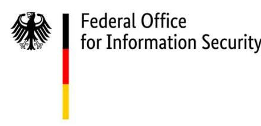
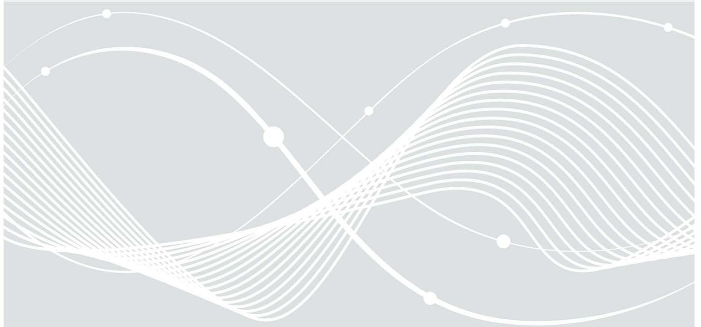
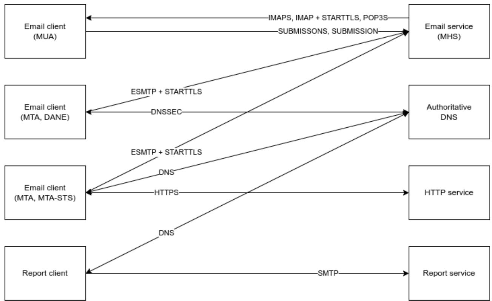

# TR-03108 Secure Email Transport

Requirements for Email Service Providers Regarding Secure Email Transport

Version: 2.0 Date: 1st June 2023

## Document history

#### Table 1 Document history

| Version | Date               | Editor | Description                                                                                                                       |  |
|---------|--------------------|--------|-----------------------------------------------------------------------------------------------------------------------------------|--|
| 0.9     | 20th August 2015   | BSI    | Initial public draft                                                                                                              |  |
| 1.0     | 12th May 2016      | BSI    | Final version                                                                                                                     |  |
| 1.0.1   | 09th November 2016 | BSI    | Added Section 3.4: Deviations from referenced Specifications                                                                |  |
| 1.0.2   | 17th February 2022 | BSI    | Updated Section 3.4: Deviations from referenced Specifications; Renamed EMLREQ_6 "PKI certificates" to "Certified CA" |  |
| 2.0     | 1st June 2023      | BSI    | Updated cryptography (according to BSI TR-03116-4); added TLS-RPT and MTA-STS; Renamed "Certified CA" to "Secure CA"  |  |

Federal Office for Information Security P.O. Box 20 03 63 53133 Bonn Tel.: +49 22899 9582-0 E-Mail: e-mail-trsp@bsi.bund.de Internet: https://www.bsi.bund.de © Federal Office for Information Security 2023

| 1 | Introduction 4 |                                                                      |  |  |  |  |
|---|----------------|----------------------------------------------------------------------|--|--|--|--|
| 2 |                | Email Transport Encryption  5                                        |  |  |  |  |
|   | 2.1            | Deficiencies of opportunistic TLS  5                                 |  |  |  |  |
|   | 2.2            | Use Cases and Technologies 6                                         |  |  |  |  |
|   | 2.2.1          | Email Submission and Retrieval  7                                    |  |  |  |  |
|   | 2.2.2          | DANE-secured Email Transport 7                                       |  |  |  |  |
|   | 2.2.3          | MTA-STS-secured Email Transport 7                                    |  |  |  |  |
|   | 2.2.4          | TLS-Reports for Email Transport  7                                   |  |  |  |  |
| 3 |                | Objectives  8                                                        |  |  |  |  |
| 4 |                | Requirements 9                                                       |  |  |  |  |
|   | 4.1            | Functional Requirements 10                                           |  |  |  |  |
|   | 4.1.1          | (TR-03108-01-M) MUA to MHS Communication  10                         |  |  |  |  |
|   | 4.1.2          | (TR-03108-02-R) MUA to MHS Communication Backwards Compatibility  11 |  |  |  |  |
|   | 4.1.3          | (TR-03108-03-M) MTA to MTA Inbound Transport Encryption 11           |  |  |  |  |
|   | 4.1.4          | (TR-03108-04-M) MTA to MTA Outbound Transport Encryption 11          |  |  |  |  |
|   | 4.1.5          | (TR-03108-05-M) Inbound DANE Transport Encryption  11                |  |  |  |  |
|   | 4.1.6          | (TR-03108-06-M) Outbound DANE Transport Encryption 12                |  |  |  |  |
|   | 4.1.7          | (TR-03108-07-R) Inbound MTA-STS Transport Encryption  12             |  |  |  |  |
|   | 4.1.8          | (TR-03108-08-R) Outbound MTA-STS Transport Encryption  12            |  |  |  |  |
|   | 4.1.9          | (TR-03108-09-M) Sending TLSRPT Reports  12                           |  |  |  |  |
|   | 4.1.10         | (TR-03108-10-M) Receiving TLSRPT Reports  13                         |  |  |  |  |
|   | 4.1.11         | (TR-03108-11-R) Evaluating TLSRPT Reports 13                         |  |  |  |  |
|   | 4.1.12         | (TR-03108-12-R) Secure CA  13                                        |  |  |  |  |
|   | 4.2            | Non-Functional Requirements  13                                      |  |  |  |  |
|   | 4.2.1          | (TR-03108-13-M) Security Concept 13                                  |  |  |  |  |
|   | 4.2.2          | (TR-03108-14-M) Data Protection 14                                   |  |  |  |  |
|   | 4.2.3          | (TR-03108-15-M) Mandatory Reporting  14                              |  |  |  |  |
|   | 4.2.4          | (TR-03108-16-M) Transparency 14                                      |  |  |  |  |
|   | 4.3            | Exceptions 14                                                        |  |  |  |  |
|   | 4.3.1          | Lifetime of TLS sessions 14                                          |  |  |  |  |
|   | 4.3.2          | Discontinued TLS Versions and Ciphers  14                            |  |  |  |  |
| 5 |                | Proof of Compliance 15                                               |  |  |  |  |
|   | 5.1            | IT Security Label Compliance  15                                     |  |  |  |  |
|   | 5.2            | Certification to Technical Guidelines 15                             |  |  |  |  |
| 6 |                | Key Words for Requirement Levels 16                                  |  |  |  |  |
| 7 | Glossary 17    |                                                                      |  |  |  |  |
|   |                | Bibliography  21                                                     |  |  |  |  |

## 1 Introduction

Today, communication takes place predominantly digitally. Email is one of the most widely used communication services, but the exchange of email does not always take into account IT security methods such as end-to-end or transport layer encryption. This Technical Guideline (BSI TR) addresses transport layer security for those providing email services. It describes a means, based on standards, to raise the level of security without effort for the users and transparently for them.

## 2 Email Transport Encryption

Email transport encryption refers to the exchange of email between an email client and an email server over an encrypted connection, as described in RFC 3207 (1). An email client can be either an application program (Mail User Agent, MUA) or a sending email server (Mail Transfer Agent, MTA).

Encrypted email exchange serves to maintain data integrity, ensure the identity of the communication parties, and create privacy, given that during encrypted transport an unencrypted email cannot be read by third parties.

## 2.1 Deficiencies of opportunistic TLS

Traditional transport encryption exhibits the following deficiencies:

TLS policy unknown

Traditional transport encryption has no mechanism for determining, before communication begins, whether or not the communicative counterpart provides encryption. If the counterpart does not offer transport encryption, an email client usually sends its email unencrypted. An attacker can exploit this and deliberately create a situation in which the server seems to be unable to perform transport encryption (downgrade attack). The transport then usually takes place unencrypted and, if the email content itself has not been encrypted, the attacker can read it as plain text.

The IETF standards DNS-based Authentication of Named Entities (DANE) (2) and Mail Transfer Agent-Strict Transport Security (MTA-STS) (3) enable an email client to ascertain, before communication begins, whether or not the receiving email server supports encrypted communication. Suitable email clients can, if transport encryption is announced but not offered in the Simple Mail Transfer Protocol (SMTP) session, thus make a deliberate decision to either send an email unencrypted or refrain from transporting it at all. In this way, both standards can prevent possible abuse through a downgrade attack.

### Identity unknown

Traditional transport encryption can verify the identity of the counterpart, but it does not provide a way to determine identity before communication over a secure channel begins, nor does the email transport have mechanisms to perform identity verification automatically. Attackers can therefore position their own email system between the client and the true email server, impersonate the true email server, and cause the client to transmit the email to the false email server (Man-in-the-middle attack - MITM).

The IETF standard DANE (2) puts an email client in the position of being able to retrieve information over a trusted channel with which it can verify the identity of the receiving email server. If verification is successful, the email client can send – if it fails, it can refrain from transporting the email at all.

### Operational problems unknown

Traditional transport encryption does not provide a way to signal operational problems associated with transport encryption. Mail server operators who provide transport encryption, and want to ensure that it is used, are therefore usually unaware of such problems and cannot work to resolve them so that data integrity, the identity of communication partners, and privacy can again be guaranteed.

The IETF standard SMTP TLS Reporting (TLSRPT) (3) describes a procedure for reporting successful and unsuccessful attempts to send an email via transport encryption in a structured and automated manner. Receiving and evaluating such reports helps the operator of Message Handling Services (MHS) to identify problems and remedy them.

The supplementary IETF standards mentioned above, with the deficiencies they respectively address, remedy these security vulnerabilities in transport encryption. They enable a high level of transport encryption in everyday use and they support the maintenance of this level of security.

Email transport encryption as set out in this BSI TR-03108 ensures, at both the technical and procedural levels, that the SMTP transport encryption capability is unambiguously detected, that the connection is established with the correct communication partner, that encrypted transport is performed according to the state of the art, and that successes or failures in performing transport encryption are reported and these reports are received.

As a result, the implementation of the additional procedures mentioned is a binding prerequisite for a successful proof of compliance according to this BSI TR-03108.

## 2.2 Use Cases and Technologies

The following figure shows the entities and protocols that are part of the use cases in the context of an MHS which are addressed by the functional requirements of the present document. The use cases are described in the subsections below the figure.

Figure 1 MHS - Entities and protocols

## 2.2.1 Email Submission and Retrieval

When a MUA delivers an email to an MHS, the MHS retrieves the email via SMTP on the preferred SUBMISSONS port (465/tcp) or alternatively on the SUBMISSION port (587/tcp). If a MUA retrieves emails from an MHS, it preferably uses the IMAPS port (993/tcp) respectively the IMAP port (143/tcp) if the MHS uses the Internet Message Access Protocol (IMAP), or the POP3S port (995/tcp) respectively the POP port (110/tcp) if the MHS uses the Post Office Protocol (POP).

## 2.2.2 DANE-secured Email Transport

An MTA using DANE first determines whether the destination domain of the Mail Exchange (MX) service of the receiver domain is DNSSEC-signed, and if it is, then checks whether a TLSA resource record exists for the MHS. If this is the case, the MTA knows that the MHS must offer encryption and the latter is in possession of a digital fingerprint, with the help of which the MTA can verify the email service when establishing the encrypted SMTP session. If this succeeds, the sending MTA transports the email via the Extended Simple Mail Transfer Protocol (ESMTP) to the receiving MHS. If the verification fails, the sending MTA refrains from transporting it; the email then remains on the sending side for the time being.

## 2.2.3 MTA-STS-secured Email Transport

An MTA using MTA-STS first determines, via a Domain Name Service (DNS) query, whether the target domain provides a MTA-STS policy. If this is the case, the sending MTA uses a Hypertext Transfer Protocol Secure (HTTPS) request to determine the content of the MTA-STS policy. When connecting to a MX service of the receiving domain, the MTA then determines whether this MX is part of the MTA-STS policy. If this is the case and the valid certificate of the receiving server used for the encrypted connection comes from a CA that is trusted by the sending MTA, an encrypted SMTP session can be established and the email is transported to the receiving MHS.

## 2.2.4 TLS-Reports for Email Transport

A report client determines via DNS query whether the receiving domains to which encrypted SMTP connections have succeeded or failed to accept TLS reports. If this is the case, the report client prepares a report and sends it to the report service. The operator of the service can record all inbound reports in a monitoring solution, evaluate them, detect errors, and derive resulting requirements for further action.

## 3 Objectives

This BSI TR-03108 is a Technical Guideline (BSI TR) issued by the Federal Office for Information Security (BSI) and defines concrete requirements for email service providers concerning the secure transport of emails. The goal of this BSI TR is to increase the comparability and adoption of secure email communication, and thus to provide the best possible protection of citizens in digital communications.

The requirements described here aim to ensure the highest possible level of confidentiality and integrity when sending emails. This is intended to prevent spying and manipulation, e.g., in the case of what are known as Man-in-the-middle (MITM) attacks. This is to be achieved without any additional effort on the part of the sender or recipient.

At the same time, by using this BSI TR as a basis for their work, email service providers should gain greater planning reliability and be able to demonstrate compliance with the requirements for secure email transport and prove this to third parties, e.g., as part of a proof of compliance or certification process.

Another advantage of securing the transport is the good interplay with other security measures, such as end-to-end encryption and measures for Email Authentication (4).

## 4 Requirements

This section of the document identifies all the MUST, SHOULD, and MAY requirements relevant to a BSI TR-03108 proof of compliance (see also: [6](#page-15-0) [Key Words for Requirement Levels\)](#page-15-0). For a better overview, the requirements are divided into functional and non-functional requirements. Further on requirements are labeled with the suffix "M" in the case they are considered to be mandatory or "R" when considered to be recommended. The following table lists all requirements and the corresponding requirement levels for the BSI TR-03108 proof of compliance.

| Requirement                                                       | Type           | Requirement level |
|-------------------------------------------------------------------|----------------|-------------------|
| TR-03108-01-M MUA to MHS Communication                         | Functional     | MUST              |
| TR-03108-02-R MUA to MHS Communication Backwards Compatibility | Functional     | SHOULD            |
| TR-03108-03-M MTA to MTA Inbound Transport Encryption          | Functional     | MUST              |
| TR-03108-04-M MTA to MTA Outbound Transport Encryption         | Functional     | MUST              |
| TR-03108-05-M Inbound DANE Transport Encryption                | Functional     | MUST              |
| TR-03108-06-M Outbound DANE Transport Encryption               | Functional     | MUST              |
| TR-03108-07-R Inbound MTA-STS Transport Encryption             | Functional     | SHOULD            |
| TR-03108-08-R Outbound MTA-STS Transport Encryption            | Functional     | SHOULD            |
| TR-03108-09-M Sending TLSRPT Reports                           | Functional     | MUST              |
| TR-03108-10-M Receiving TLSRPT Reports                         | Functional     | MUST              |
| TR-03108-11-R Evaluating TLSRPT Reports                        | Functional     | SHOULD            |
| TR-03108-12-R Secure CA                                        | Functional     | SHOULD            |
| TR-03108-13-M Security Concept                                 | Non-functional | MUST              |
| TR-03108-14-M Data Protection                                  | Non-functional | MUST              |
| TR-03108-15-M Mandatory Reporting                              | Non-functional | MUST              |
| TR-03108-16-M Transparency                                     | Non-functional | MUST              |

| Table 1 Requirements and Associated Requirement Levels |  |
|--------------------------------------------------------|--|
|                                                        |  |

## 4.1 Functional Requirements

Remarks on policy design:

### DNSSEC

Email receiver domains publish their DANE, MTA-STS, and TLSRPT policies in their DNS zone using DNS records. Mail sending servers query these and align their actions with these policies. Attackers could forge these policies, e.g., by means of an MITM attack or DNS cache poisoning, and thus cause damage to the sender and recipient.

To avert this, the sending side must use DNSSEC-validating resolvers, because if the recipient domain has DNSSEC-signed its DNS zone, such attacks will be detected and the (forged) DNS responses will be suppressed by the DNSSEC-validating resolver.

### Encrypted email transport

Encrypted email transport without authentication is vulnerable to MITM. The IETF standard DANE provides effective and scalable protection against this threat and is therefore mandatory for compliance with this BSI TR. MTA-STS does not provide more robust identification of the communication partner than the encryption and regular resolution of the recipient domain. It is therefore only an optional part of this BSI TR.

### Reporting

Those communication partners who encrypt want to ensure the confidentiality and integrity of the communication. If encryption fails, the communication cannot be secured at all. Therefore, it must be ascertained whether and when encrypted communication has failed. TLS reporting is therefore a must.

### 4.1.1 (TR-03108-01-M) MUA to MHS Communication

Remarks on TR-03108-01-M:

With Autoconfig, Autodiscover and SRV records, as described in RFC 6186 (5), methods and standards exist that allow an almost fully automated setup of an email account.

This not only reduces the burden on support, but also allows the user's MUA to be set up fully automatically with suitable settings for encrypted data transmission, thus providing a convenient way of achieving a consistently high level of email transport encryption.

Any communication between an MUA and its MHS that is for the purpose of receiving or sending email MUST be encrypted using Transport Layer Security as specified in RFC 8314 (6). The configuration of TLS MUST meet the requirements of BSI TR-03116-4 (7). [1](#page-9-2)

MHS systems MUST offer usage of Mandatory TLS (SUBMISSIONS, IMAPS, POP3S). The use of Mandatory TLS MUST be encouraged via DNS SRV records, Autodiscover and / or Autoconfig mechanisms and proper documentation. Any services offering Autodiscover and / or Autoconfig MUST be run on premises.

If the provider additionally allows users to access email via a webmail application, the access MUST be encrypted by using a HTTPS connection in accordance with RFC 2818 (8).

If an encrypted connection cannot be established, the MHS MUST issue an error via an email that SHOULD be understandable to non-technical users. In doing so, the error codes must correspond to the error codes provided in RFC 3463 (9).

 1 The referenced BSI TR-03116-4 is updated annually, so the most recent version must be taken into account when determining the requirements.

### 4.1.2 (TR-03108-02-R) MUA to MHS Communication Backwards Compatibility

For backwards compatibility of the encryption the MHS system SHOULD offer Opportunistic TLS (SUBMISSION, IMAP, POP3). The configuration of TLS MUST meet the requirements of BSI TR-03116-4 (7).

## 4.1.3 (TR-03108-03-M) MTA to MTA Inbound Transport Encryption

An MHS MUST enable inbound transport encryption from other MHS. The MHS MUST implement the STARTTLS command from RFC 3207 (1) for this purpose.

The configuration of TLS MUST meet the requirements of BSI TR-03116-4 (7). If transport encryption is used, preference MUST be given to those algorithms that enable Perfect Forward Secrecy (PFS) as specified in BSI TR-03116-4 (7).

## 4.1.4 (TR-03108-04-M) MTA to MTA Outbound Transport Encryption

The MHS MUST use a DNSSEC-validating DNS resolver compliant with RFC 4033 (10) for DNS queries.

The MHS of an email service provider MUST implement outbound transport encryption ("Opportunistic TLS") if the MHS of another email service provider offers it. To do so, the outbound MHS MUST implement the STARTTLS command as specified in RFC 3207 (1).

If the receiving MHS offers algorithms that enable PFS as part of the establishment of transport encryption, the sending MHS SHOULD prefer them and in so doing MUST comply with the requirements of BSI TR-03116-4 (7).

## 4.1.5 (TR-03108-05-M) Inbound DANE Transport Encryption

Remarks on TR-03108-05-M:

The DANE standard enables multiple TLSA resource records to be published. A client must read all TLSA resource records and determine whether at least one of the resource records is suitable for verifying the identification of the receiving system.

In everyday operation, it is recommended to publish at least two TLSA resource records in the domain where the receiving MHS is located. One of these publishes the fingerprint of the MHS's certificate, specified by a TLSA resource record with "certificate usage" of type "3". The other publishes the fingerprint of the CA that signed the MHS certificate, specified by a TLSA resource record with "certificate usage" of type "2".

With this procedure, a validating client can still successfully verify the receiving MHS even if its certificate has been exchanged without updating the associated TLSA resource record, as long as the certificate has been signed by the same CA's signing certificate.

Regardless of the number of TLSA resource records, all TLSA resource records should have a short Time to Live (TTL) (e.g. 600 seconds) so that any necessary policy changes can be deployed within a short period of time.

The MHS MUST DNSSEC-sign the DNS zone of the receiving domain and also the DNS zone of the domain in which the MHS is located, in accordance with RFC 6781 (11).

In the DNSSEC-signed DNS zone, the MHS MUST provide one or more TLSA resource records that an MHS wishing to send can use to verify the receiving MHS, as specified in RFC 7671 (12).

## 4.1.6 (TR-03108-06-M) Outbound DANE Transport Encryption

The MHS MUST use a DNSSEC-validating DNS resolver in accordance with RFC 4033 (10) for DNS queries.

An MHS that wants to send in a DANE compliant manner as described in RFC 7672 (2) MUST determine whether the DNS zone of the recipient domain and also the DNS zone of the recipient domain's MHS are DNSSEC-signed as specified in RFC 6781 (11).

If this is the case, the sending MHS MUST determine whether TLSA resource records, as specified in RFC 7671 (12), exist that prove that the receiving MHS provides transport encryption and that its identity can be verified.

If a valid TLSA resource record exists, but the (receiving) MHS described by it does not offer transport encryption, the MHS wishing to send MUST abort the establishment of the connection and MUST NOT send the email.

If a valid TLSA resource record exists, but the sending MHS is unable to verify the identity of the (receiving) MHS described by the record, the sending MHS MUST abort the establishment of the connection and MUST NOT send the email.

## 4.1.7 (TR-03108-07-R) Inbound MTA-STS Transport Encryption

An MHS SHOULD provide inbound MTA-STS to other email services as specified in RFC 8461 (3).

### 4.1.8 (TR-03108-08-R) Outbound MTA-STS Transport Encryption

The MHS MUST use a DNSSEC-validating DNS resolver compliant with RFC 4033 (10) for DNS queries.

An MHS SHOULD use outbound MTA-STS to other email services as specified in RFC 8461 (3).

If the MHS uses MTA-STS, then, contrary to RFC 8461 (3), it SHOULD NOT accept wildcard certificates during "HTTPS Policy Fetching".

### 4.1.9 (TR-03108-09-M) Sending TLSRPT Reports

Remarks on TR-03108-09-M:

Scope of the TLSRPT "Reporting Schema" implementation

The objective of using TLSRPT is to identify the need for action when the security level has deteriorated.

However, reporting on the status of TLS sessions is still quite new and many MTAs and the program libraries that they use are not yet able to provide the full scope of information that should be included in a TLSRPT report.

A complete implementation of the TLSRPT "Reporting Schema" is, however, not necessary to meet requirement TR-03108-09-M. Even a partial implementation is sufficient if it is ensured that current versions of the DNS resolver, the DNS library and the MTA are used in routine operation. Of course, a report only needs to contain statements regarding the technologies (e.g. MTA-STS) that are used.

What can be reported should be reported. A TLSRPT report that is only partially filled is better than no report at all, because the general statement "a number of TLS sessions did not succeed" is all that is needed to determine that the level of protection has deteriorated and that it is now necessary to identify the root cause of the failure.

Fault-tolerant transport

An SMTP client sending TLSRPT reports should be fault-tolerant, especially with regard to transport encryption. This is important, because if a TLSRPT report needs to be delivered, it is likely that the SMTP service responsible for TLSRPT reports, the policy domain to be notified, is experiencing the same or similar problems as those that are to be indicated in the TLS report.

To avoid a feedback loop here, the TLSRPT report client should refrain from enforcing DANE and/or MTA-STS policies and also accept certificates that have expired, or accept TLS versions and ciphers that have been discontinued or deemed no longer acceptable by the BSI (see also: [Discontinued TLS Versions and Ciphers\)](#page-13-5).

The MHS MUST use a DNSSEC-validating DNS resolver compliant with RFC 4033 (10) for DNS queries.

An MHS MUST determine whether the recipient domains to which it successfully or unsuccessfully transmitted encrypted emails request TLSRPT reports as described in RFC 8460 (3). If this is the case, the MHS MUST generate and attempt to deliver reports according to RFC 8460 (3).

If the recipient domain specifies transmission in the form of an HTTPS POST as described in RFC 7231 (13), the HTTPS connection MUST be in accordance with RFC 2818 (8). The configuration of TLS MUST meet the requirements of BSI TR-03116-4 (7).

### 4.1.10 (TR-03108-10-M) Receiving TLSRPT Reports

Remarks on TR-03108-10-M:

Mail servers that are to receive TLSRPT reports may provide STARTTLS, but they should not enforce TLS using a DANE or MTA-STS policy, because these policies may be faulty and may be the very reason why a TLSRPT report needs to be delivered. If TLS is enforced, the delivery of the report will most likely fail for the same reason the report itself was generated.

An MHS MUST publish a TLSRPT policy in the DNS zone of the "Policy Domain" as specified in RFC 8460 (3). The TLSRPT policy MUST request transmission via SMTP. It MUST NOT request transmission via HTTPS as this method lacks verification of those who send TLSRPT reports.

The MHS receiving reports SHOULD NOT enforce transport encryption using a TLSA resource record or an MTA-STS policy.

### 4.1.11 (TR-03108-11-R) Evaluating TLSRPT Reports

An MHS SHOULD also evaluate reports. If the MHS provider also operates an ISMS – e.g. according to ISO 27001 (14), – this evaluation process SHOULD be part of the continuous improvement process.

### 4.1.12 (TR-03108-12-R) Secure CA

All certificates used by the MHS for transport encryption SHOULD be issued by a CA that complies with the requirements of BSI TR-03116-4 (7).

## 4.2 Non-Functional Requirements

### 4.2.1 (TR-03108-13-M) Security Concept

The email service provider MUST have a security concept in accordance with the requirements of § 165 in conjunction with §§ 166 and 167 of the German Telecommunications Act (TKG) (15) or a similar law of the country in which the MHS is operated. If the email service provider operates its MHS across multiple countries, it MUST demonstrate the compliance of its security concept with the requirements in each country in which the MHS is operated. At any rate, the security concept MUST be updated on a regular basis according to the requirements of the respective country.

The email service provider SHOULD additionally operate an ISMS in accordance with the requirements of ISO/IEC 27001 (14). Thereby the ISMS MUST cover all systems and components that receive, process, store, send and deliver email relevant data and user data. It MUST cover all requirements of section [4.1](#page-9-0) [Functional](#page-9-0)  [Requirements.](#page-9-0)

## 4.2.2 (TR-03108-14-M) Data Protection

If located in Germany, the MHS MUST be operated in accordance with the requirements of the Telecommunications Telemedia Data Protection Act (TTDSG) (16) and the EU General Data Protection Regulation (EU GDPR) (17). It MAY, in exceptional cases, be operated elsewhere within the EU under the same or stricter conditions, in which case the MHS MUST comply with the requirements of the EU GDPR.

## 4.2.3 (TR-03108-15-M) Mandatory Reporting

An email service provider MUST notify its customers of security incidents in accordance with the requirements of § 169 of the German Telecommunications Act (TKG) (15) or in accordance with a similar law in the country in which the MHS is operated.

In addition, the email service provider undertakes to inform its customers on topics related to information security. It SHOULD fulfill this obligation by referring to relevant information provided by the German federal government.

## 4.2.4 (TR-03108-16-M) Transparency

The email service provider MUST inform its customers to the best of its ability regarding other email service providers that meet the requirements of this TR with which it exchanges emails. In the simplest case, the email service provider can indicate a list of service providers that have declared their compliance with the TR or have demonstrated this compliance in a certification procedure. In addition, the email service provider MAY inform its customers about the security level of individual communication processes.

## 4.3 Exceptions

## 4.3.1 Lifetime of TLS sessions

Section 2.1.1 "TLS versions and sessions" of BSI TR-03116-4 (7) specifies:

A TLS session shall not exceed a lifetime of 48 hours. This also applies when using session resumption.

This requirement MUST NOT be implemented. Moreover, it cannot in principle be met by the IDLE command (18), which is desirable and frequently used in the IMAP protocol.

## 4.3.2 Discontinued TLS Versions and Ciphers

This BSI TR addresses opportunistic encryption, i.e., emails SHOULD be transmitted in encrypted form when possible. However, it is also permitted to transmit emails unencrypted if the receiving MHS does not provide transport encryption.

Consequently, in the case of opportunistic encryption, it is therefore also permissible to offer and use TLS versions and ciphers that are not recommended for use in BSI TR-03116-4 (7) or whose use is even prohibited according to BSI TR-03116-4 (7).

However, if used, their use MUST be avoided by assigning them a low priority of use, as also required by Section [4.1.1](#page-9-1) [\(TR-03108-01-M\) MUA to MHS Communication](#page-9-1) of this BSI TR, Sectio[n 4.1.3](#page-10-1) [\(TR-03108-03-M\)](#page-10-1)  [MTA to MTA Inbound](#page-10-1) Transport Encryption of this BSI TR and the TLS specification itself.

## 5 Proof of Compliance

An email service provider can use this BSI TR to demonstrate the particular trustworthiness of its MHS and to serve as a BSI TR-compliant MHS to others. The provider can therefore demonstrate compliance with this BSI TR in several ways.

The BSI envisages two methods of proof of compliance within the scope of this BSI TR. These are described in more detail in the following sections.

## 5.1 IT Security Label Compliance

Email service providers can declare compliance within the framework of the IT Security Label (19) based on § 9c of the BSI Act (20) by proving compliance with the requirements in this BSI TR. The BSI website explains the steps required to obtain an IT Security Label.

## 5.2 Certification to Technical Guidelines

Operators of an MHS may seek an independent proof of compliance through a third party certification. Such a certification consists of an evaluation performed by a BSI accredited testing lab using BSI TR-03108- P (21). Based on the evaluation results the BSI will issue a certificate that confirms compliance to the present document. The BSI website explains the steps required to obtain a certification to Technical Guidelines.

## 6 Key Words for Requirement Levels

The key words "MUST", "MUST NOT", "REQUIRED", "SHALL", "SHALL NOT", "SHOULD", "SHOULD NOT", "RECOMMENDED", "MAY", and "OPTIONAL" in this document are to be interpreted as described in RFC 2119 (Bradner, 1997). The key word "CONDITIONAL" is to be interpreted as follows:

### CONDITIONAL

"The usage of an item is dependent on the usage of other items. It is therefore further qualified under which conditions the item is REQUIRED or RECOMMENDED."

## 7 Glossary

### ADMD

An ADministrative Management Domain (ADMD) denotes one of three basic types of actors in Internet Mail (22).

### Author

Author means a person, organization, or process as described in section 2.1.1. of RFC 5598 (22):

"The Author is responsible for creating the message, its contents, and its list of Recipient addresses. (...)" 

### Boundary MTA

A Boundary MTA is located at the boundary of an ADMD's network. It either accepts inbound email from boundary MTAs of another ADMD or transports email on behalf of its own ADMD to boundary MTAs of other ADMDs as described in section 4.3.2. of RFC 5598 (22):

"An MTA that is part of an ADMD and interacts with MTAs in other ADMDs. This is also called a Border MTA. There can be different Boundary MTAs, according to the direction of mail-flow." 

### CA

A Certification Authority or Certificate Authority (CA) issues Digital Certificates which identify a person or a service and are the basis for digital encryption.

### DANE

DNS-based Authentication of Named Entities (DANE) is a protocol that allows certificates to be bound to DNS names. A typical case is the installation of a TLS certificate. For this purpose, a DNS entry with the name TLSA is created. DNSSEC is required to protect these entries from manipulation. See also: (2)

### DNS

The Domain Name System (DNS) assigns the associated IP address to addresses and names used on the Internet, such as www.bsi.bund.de. This system was originally used only for name resolution on the Internet. It is now also used to distribute policies, e.g. in the form of TLSA RR. See also: RFC 1034 (23)

### DNSSEC

DNSSEC is a security extension for the Domain Name System (DNS). DNSSEC can be used to sign entries in the DNS cryptographically. This makes it possible to detect manipulations of these entries. See also: RFC 4033 (10)

### Email service provider

An email service provider is a service provider that offers email services in the form of products on a commercial basis.

### HTTP

"The Hypertext Transfer Protocol (HTTP) is an application layer protocol in the Internet protocol suite model for distributed, collaborative, hypermedia information systems." (24)

### HTTPS

Hypertext Transfer Protocol Secure (HTTPS) is an extension of the Hypertext Transfer Protocol (HTTP). It uses encryption for secure communication over a computer network, and is widely used on the Internet.[1][2] In HTTPS, the communication protocol is encrypted using Transport Layer Security (TLS) or, formerly, Secure Sockets Layer (SSL). The protocol is therefore also referred to as HTTP over TLS,[3] or HTTP over SSL." (25)

### IMAP

IMAP or " Internet Message Access Protocol" is the IETF standard documented in RFC 3501 (26), which describes a procedure for receiving email.

### ISMS

An ISMS or "Information Security Management System" describes a control cycle and procedure within an organization that defines, controls and maintains IT security and aims to improve it continuously.

### MHS

A "Message Handling Service" refers to the overall structure of an email service. It usually consists of various individual services, such as an SMTP, IMAP and Webmail service, as well as auxiliary services that store user data and/or filter messages. This service is defined in section 2.2 of RFC 5598 (22) as follows:

"The Message Handling Service (MHS) performs a single end-to-end transfer on behalf of the Author to reach the Recipient addresses specified in the original RFC5321.RcptTo commands."

### Mail Submission Agent

A Mail Submission Agent (MSA) accepts messages from an email program (to be precise: aMUA) and starts transporting them closer to their destination. The term MSA is defined in section 4.3.1 of RFC 5598 (22)as follows:

"A Mail Submission Agent (MSA) accepts the message submitted by the aMUA and enforces the policies of the hosting ADMD and the requirements of Internet standards."

### MTA

The term MTA refers to a "Mail Transfer Agent" as described in section 4.3.2. of RFC 5598 (22):

"A Message Transfer Agent (MTA) relays mail for one application-level "hop". (...) Relaying is performed by a sequence of MTAs until the message reaches a destination MDA. Hence, an MTA implements both client and server MTA functionality; (...)"

### MUA

### The term MUA refers to a "Mail User Agent" (as in: "the email program") as described in section 4.2.1. of RFC 5598 (22). The RFC further distinguishes between "aMUA" and "rMUA":

"A Message User Agent (MUA) works on behalf of User Actors and User applications. It is their representative within the email service. (...) The Author MUA (aMUA) creates a message and performs initial submission into the transfer infrastructure via a Mail Submission Agent (MSA). (...) The Recipient MUA (rMUA) works on behalf of the Recipient to process received mail."

#### MX

A Mail Exchanger (MX) denotes a service exchanging Internet Mail messages between remote senders and remote receivers. In context of DNS a MX resource record is used to indicate a Mail Exchanger responsible for receiving messages on behalf of that DNS zone.

### Operator of an MHS

An operator of an MHS provides an email service privately or for their organization. The email service is not part of a product that the operator provides to others on a commercial basis.

### PFS

The term PFS is an abbreviation for "Perfect Forward Secrecy", which describes a property of key exchange protocols. PFS means that a connection cannot be subsequently decrypted even if the long-term keys of the communication partners are known.

### Policy domain

The DNS zone of the domain to which SMTP TLS reports should be sent. This can be the "envelope recipient domain" (27) or the domain in which the MHS that provides email services for the domain is located.

### Recipient

Recipient means a person, organization, or process as described in section 2.1.2. of RFC 5598 (22):

"The Recipient is a consumer of the delivered message." 

### SMTP / ESMTP

"The Simple Mail Transfer Protocol (SMTP) is an Internet standard communication protocol for electronic mail transmission. Mail servers and other message transfer agents use SMTP to send and receive mail messages. (…) In November 1995, RFC 1869 defined Extended Simple Mail Transfer Protocol (ESMTP), which established a general structure for all existing and future extensions which aimed to add-in the features missing from the original SMTP. ESMTP defines consistent and manageable means by which ESMTP clients and servers can be identified and servers can indicate supported extensions." (28)

### TLS

Transport Layer Security (TLS) is a hybrid encryption protocol for secure data transmission in the Internet. It was formerly known as Secure Socket Layer (SSL) and after version 3.0 was further developed under its new name of TLS. TLS establishes a secure "tunnel" between sender and recipient on the transport layer, through which the transported data is protected from being read or manipulated. Here, there is no additional securing of the data on the application layer. Opportunistic TLS attempts to use TLS when offered and it may fall back to unencrypted transport, whereas Mandatory TLS expects to encrypt the transport layer between two parties and it will not proceed of establishing TLS fails.

### TLSA

TLS Authentication (TSLA) refers to a specific record type within the DNS system. It is used to indicate that a resource supports encryption and how this resource can be identified and verified.

### TTL

In general Time to Live (TTL) "is a mechanism which limits the lifespan or lifetime of data in a computer or network. (…) TTLs also occur in the Domain Name System (DNS), where they are set by an authoritative name server for a particular resource record. When a caching (recursive) nameserver queries the authoritative nameserver for a resource record, it will cache that record for the time (in seconds) specified by the TTL" (29).

# Bibliography

1. Hoffman, P. E. SMTP Service Extension for Secure SMTP over Transport Layer Security. [Online] 2002. RFC3207.

2. Dukhovni, Viktor und Hardaker, Wes. SMTP Security via Opportunistic DNS-Based Authentication of Named Entities. [Online] 2015. RFC7672.

3. Margolis, D., et al. SMTP TLS Reporting. [Online] 2018. RFC8460.

4. Bundesamt für Sicherheit in der Informationstechnik (BSI). Email Authentication. [Online] 2022. BSI TR-03182.

5. Daboo, C. Use of SRV Records for Locating Email Submission/Access Services. [Online] Issue 6186, 2011. RFC6186.

6. Moore, K. und Newman, C. Cleartext Considered Obsolete: Use of Transport Layer Security (TLS) for Email Submission and Access. [Online] 2018. RFC8314.

7. BSI. Kryptographische Vorgaben für Projekte der Bundesregierung, Teil 4: Kommunikationsverfahren. [Online] 2021.

https://www.bsi.bund.de/SharedDocs/Downloads/DE/BSI/Publikationen/TechnischeRichtlinien/TR03116 /BSI-TR-03116-4.pdf.

8. Rescorla, E. HTTP Over TLS. [Online] 2000. RFC2818.

9. Vaudreuil, G. Enhanced Mail System Status Codes. [Online] 2003. RFC3463.

10. Rose, S., et al. DNS Security Introduction and Requirements. [Online] 2005. RFC4033.

11. Kolkman, O., Mekking, M. und Gieben, R. M. DNSSEC Operational Practices, Version 2. [Online] 2012. RFC6781.

12. Dukhovni, Viktor und Hardaker, Wes. RFC 7671. [Hrsg.] RFC Editor. The DNS-Based Authentication of Named Entities (DANE) Protocol: Updates and Operational Guidance. Oct 2015. Bd. Request for Comments.

13. Fielding, R.T. und Reschke, J. Hypertext Transfer Protocol (HTTP/1.1): Semantics and Content. [Online] 2014. RFC7231.

14. ISO. ISO/IEC 27001:2022 Information security management systems. [Online] October 2022. https://www.iso.org/standard/54534.html.

15. Telekommunikationsgesetz. Telekommunikationsgesetz (TKG). [Online] 2021. https://www.gesetzeim-internet.de/tkg\_2021/TKG.pdf.

16. Bundesministerium der Justiz. Telekommunikation-Telemedien-Datenschutz-Gesetz - TTDSG. Gesetze im Internet. [Online] 23. June 2021. https://www.gesetze-im-internet.de/ttdsg/.

17. Europäische Union. Verordnung zum Schutz natürlicher Personen bei der Verarbeitung personenbezogener Daten, zum freien Datenverkehr und zur Aufhebung der Richtlinie 95/46/EG (Datenschutz-Grundverordnung). [Online] 2016. https://eur-lex.europa.eu/legalcontent/DE/TXT/PDF/?uri=CELEX:32016R0679&from=DE.

18. Leiba, B. IMAP4 IDLE command. [Online] 1997. RFC2177.

19. BSI. Informationen für Hersteller. ITSicherheitskennzeichen. [Online] 2022. https://www.bsi.bund.de/DE/Themen/Unternehmen-und-Organisationen/IT-Sicherheitskennzeichen/fuer-Hersteller/IT-SiK-fuer-hersteller\_node.html.

20. Bundesministerium für Justiz. Gesetz über das Bundesamt für Sicherheit in der Informationstechnik (BSI-Gesetz - BSIG). Gesetze im Internet. [Online] 23. June 2021. https://www.gesetze-iminternet.de/bsig\_2009/.

21. Bundesamt für Sicherheit in der Informationstechnik (BSI). Testspecification - Conformance Tests for Secure Email Transport in compliance to BSI TR-03108. [Online] 2.0, 2022. BSI TR-03108-P.

22. Crocker, D. Internet Mail Architecture. [Online] 2009. RFC5598.

23. Mockapetris, P. Domain names - concepts and facilities. [Online] 1987. https://doi.org/10.17487/. Issue 1034.

24. Wikipedia. HTTP. Wikipedia. [Online] 13. April 2023. https://en.wikipedia.org/wiki/HTTP.

25. —. HTTPS. Wikipedia. [Online] 10. April 2023. https://en.wikipedia.org/wiki/HTTPS.

26. Crispin, M. INTERNET MESSAGE ACCESS PROTOCOL - VERSION 4rev1. [Online] Issue 3501, 2003. RFC3501.

27. Klensin, D. J. C. Simple Mail Transfer Protocol. [Online] 2008. RFC5321.

28. Wikipedia. Simple Mail Transfer Protocol. Wikipedia. [Online] 14. April 2023. https://en.wikipedia.org/wiki/Simple\_Mail\_Transfer\_Protocol.

29. —. Time to live. Wikipedia. [Online] 5. February 2023. https://en.wikipedia.org/wiki/Time\_to\_live.

30. Bradner, S. O. Key words for use in RFCs to Indicate Requirement Levels. [Online] 1997. RFC2119.