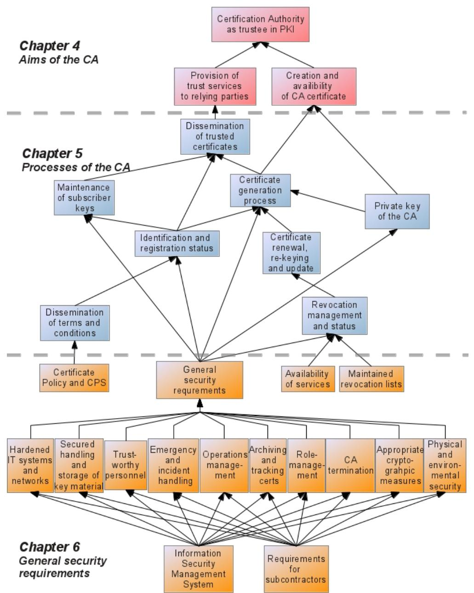

# Inspection Specification BSI TR-03145-TS

Requirements for Trust Center instantiating as Certification Authority in a Public-Key Infrastructure with security level 'high'

According to BSI TR-03145

Version 1.4.1 2023-06-05

Federal Office for Information Security P.O. Box 20 03 63 53133 Bonn E-Mail: eid@bsi.bund.de Internet: https://www.bsi.bund.de © Federal Office for Information Security 2023

| 1 |       | Introduction 5                                                                 |  |
|---|-------|--------------------------------------------------------------------------------|--|
|   | 1.1   | Scope and structure of this document 5                                         |  |
|   | 1.2   | Definitions, abbreviations and notation 6                                      |  |
|   | 1.3   | Concept and approach of the Inspection Specification 8                         |  |
|   | 1.4   | Notation 11                                                                    |  |
|   | 1.4.1 | Selections and Assignments11                                                   |  |
|   | 1.4.2 | Notations11                                                                    |  |
| 2 |       | Description of the Scope of the Audit12                                        |  |
| 3 |       | Certificate Management Processes13                                             |  |
|   | 3.1   | Private key of the CA13                                                        |  |
|   | 3.2   | Dissemination of 'Terms and Conditions'17                                      |  |
|   | 3.3   | Identification and registration 18                                             |  |
|   | 3.3.1 | Identification and Registration of TSS Manufacturer ([BSI TR-03145-5] only) 23 |  |
|   | 3.4   | Maintenance of subscriber keys26                                               |  |
|   | 3.4.1 | (optional) Public Key provided by the subscriber27                             |  |
|   | 3.4.2 | (optional) Subscriber's key pair generation and dissemination30                |  |
|   | 3.4.3 | (optional) Token management and dissemination 34                               |  |
|   | 3.5   | Certificate generation process38                                               |  |
|   | 3.5.1 | Certificate Request Procedure for TSS ([BSI TR-03145-5] only) 44               |  |
|   | 3.6   | Dissemination of trustable certificates (public keys) 45                       |  |
|   | 3.7   | Revocation and suspension47                                                    |  |
|   | 3.8   | Certificate renewal, re-keying and update55                                    |  |
|   | 3.9   | CA Changeover ([BSI TR-03145-5] only)59                                        |  |
| 4 |       | General security requirements62                                                |  |
|   | 4.1   | Information Security Management System62                                       |  |
|   | 4.2   | Certificate Policy and Certification Practice Statement64                      |  |
|   | 4.3   | Emergency management and incident handling68                                   |  |
|   | 4.4   | Process organization 70                                                        |  |
|   | 4.5   | Appropriate cryptographic measures71                                           |  |
|   | 4.6   | Secured handling and storage of key material73                                 |  |
|   | 4.7   | Role-management75                                                              |  |
|   | 4.8   | Trustworthy personnel 78                                                       |  |
|   | 4.9   | Hardened IT systems and networks supporting logging and monitoring 80          |  |
|   | 4.10  | Archiving and tracking84                                                       |  |
|   | 4.11  | Maintained revocation status89                                                 |  |
|   | 4.12  | Physical and environmental security91                                          |  |

| Additional Requirements for Interoperability ([BSI TR-03145-5] only) 101 |                                                                                                                                                                                                                            |  |  |  |
|--------------------------------------------------------------------------|----------------------------------------------------------------------------------------------------------------------------------------------------------------------------------------------------------------------------|--|--|--|
|                                                                          |                                                                                                                                                                                                                            |  |  |  |
|                                                                          |                                                                                                                                                                                                                            |  |  |  |
|                                                                          |                                                                                                                                                                                                                            |  |  |  |
| Bibliography 107                                                         |                                                                                                                                                                                                                            |  |  |  |
|                                                                          | Availability of services94 CA termination 96 Requirements for subcontractors 98 Test and Productive PKI99 Application Context 100 Validation Model 101 Certificate Profiles 101 Directory Service 105 |  |  |  |

# 1 Introduction

The document at hand serves as the inspection specification for an auditor concerning a Certification Authority (CA) in a Public Key Infrastructure (PKI) with security level 'high'. This document contains lists for coordinating checks and actions to be undertaken by an auditor and thus, provides a structured approach to check if a Certification Authority in a Public Key Infrastructure fulfills all requirements for a secure CA operation.

#### 1.1 Scope and structure of this document

The document at hand represents the inspection specification for the Secure CA Operation series [BSI TR-03145]. The Secure CA Operation series [BSI TR-03145] consists of the following Technical Guidelines:

- [BSI TR-03145-1] compiles "Generic Requirements for Trust Centers instantiating as Certification Authoritiy (CA) in a Public-Key Infrastructure (PKI) with a security level 'high'".
- [BSI TR-03145-4] profiles "Special requirements for Trust Centers instantiating as Certification Authority (CA) in a Public-Key Infrastructure (PKI) for the Extended Access Control of the German Official Travel Documents according to [TR-03110]".
- [BSI TR-03145-5] defines "Specific requirements for a Public Key Infrastructure for Technical Security Systems".

If necessary, the generic requirements of [BSI TR-03145-1] are adapted to a specific application context in a separate Technical Guideline but as part of the superior Secure CA Operation series. Thereby, an application specific Technical Guideline of the Secure CA Operation series defines only the differences between the generic and the application specific requirements. That means that for a requirement of an application specific Technical Guideline the following three cases exist:

- a) the application specific requirement is a refinement of the corresponding, generic requirement from [BSI TR-03145-1]. This correspondence is explicitly marked by re-using the name of the generic requirement from [BSI TR-03145-1] in the application specific Technical Guideline.
- b) the application specific requirement is a supplement to the generic requirements of [BSI TR-03145- 1]. That means that the application specific requirement is a 'new' requirement and that it is not addressed by [BSI TR-03145-1].
- c) the application specific requirement declares a generic requirement from [BSI TR-03145-1] not applicable for that specific application context.

In order to be compliant with such an application specific part, a CA shall completely fulfill all application specific requirements as well as all requirements from [BSI TR-03145-1] – unless explicitly declared not applicable in the application specific part. This means that in this case the CA must fulfill

- all refined requirements according to a),
- all new requirements according to b),
- all generic requirements from [BSI TR-03145-1] except those explicitly declared not applicable according to c) or already superseded according to a).

In order to allow the parallel usage of the document at hand and the corresponding Technical Guideline/Guidelines, this document mainly follows the structure of [BSI TR-03145-1] which is shown in Figure 1. Furthermore, the notation of the requirements from [BSI TR-03145-1] and from the application specific Technical Guideline/Guidelines is re-used here.

Figure 1: Structure of the aims, procedures and processes of a CA

The detailed description of the usage of the inspection specification and the used notation is described in chapter 1.3.

### 1.2 Definitions, abbreviations and notation

The abbreviations that are relevant for this document are given below.

| Abbreviation | Definition                                                                                               |
|--------------|----------------------------------------------------------------------------------------------------------|
| BMF          | Federal Ministry of Finance (German: Bundesministerium der Finanzen)                                  |
| BSI          | Federal Office for Information Security (German: Bundesamt für Sicherheit in der Informationstechnik) |
| CA           | Certification Authority                                                                                  |

| Abbreviation | Definition                         |
|--------------|------------------------------------|
| CP           | Certificate Policy                 |
| CPS          | Certification Practice Statement   |
| CRL          | Certificate Revocation List        |
| CSR          | Certificate Signing Request        |
| OCSP         | Online Certificate Status Protocol |
| PKI          | Public Key Infrastructure          |
| RA           | Registration Authority             |
| TSS          | Technical Security System          |

Table 1: Abbreviations and their definition

The definitions of terms that are relevant for this document are given below. If applicable, the definitions are based on standards such as for example [ETSI TS 102 042] or [RFC3647].

| Term                                         | Definition                                                                                                                                                                                                                                                          |
|----------------------------------------------|---------------------------------------------------------------------------------------------------------------------------------------------------------------------------------------------------------------------------------------------------------------------|
| attribute                                    | Information bound to an entity that specifies a characteristic of an entity, such as a group membership or a role, or other information associated with that entity.                                                                                          |
| certificate                                  | The public key of an entity together with information that the entity has been identified, and some other information, rendered unforgeable by a cryptographic signature with the private key of the Certification Authority which issued the certificate. |
| Certificate Policy (CP)                      | A named set of rules that indicates the applicability of a certificate to a particular community and/or class application with common security requirement.                                                                                                   |
| Certificate Revocation List (CRL)            | Cryptographically signed list indicating a set of certificates that are no longer considered valid by the certificate issuer.                                                                                                                                    |
| Certification Authority (CA)                 | Authority trusted by one or more entities to create and assign certificates.                                                                                                                                                                                     |
| Certification Practice Statement (CPS)    | Statement of the practices which a Certification Authority employs in issuing, managing, revoking and renewing or re-keying certificates                                                                                                                         |
| electronic signature                         | Cryptographically generated attachment to electronic data which allows to verify the integrity and authenticity of the data using a corresponding digital key.                                                                                                |
| encryption                                   | Process of encoding messages (or information) in such a way that only parties knowing the associated secret can decode and understand the message.                                                                                                            |
| Online Certificate Status Protocol (OCSP) | An Internet protocol, which can be used for retrieving the revocation status of a certificate following the X.509 standard.                                                                                                                                      |

| Term                            | Definition                                                                                                                                                                                                                                                                                                            |
|---------------------------------|-----------------------------------------------------------------------------------------------------------------------------------------------------------------------------------------------------------------------------------------------------------------------------------------------------------------------|
| Public-Key Infrastructure (PKI) | Set of hardware, software, people, policies, and procedures needed to create, manage, distribute, use, store, and revoke digital certificates.                                                                                                                                                                     |
| Registration Authority (RA)     | The Registration Authority (RA) or registrar is an entity conducting the identification and authentication processes in the key- and certificate management life-cycle for certificate subjects. Therefore an RA provides these services on behalf of the CA. The RA does not issue or sign certificates. |
| relying party                   | Recipient of a certificate who acts in reliance on that certificate and/or digital signatures verified using that certificate.                                                                                                                                                                                     |
| rogue certificate               | A certificate which contains incorrect information or is issued wrongfully and might be used by an attacker for crime such as identity theft or manipulated signatures.                                                                                                                                         |
| subject                         | Entity identified in a certificate as the holder of the private key associated with the public key given in the certificate (e.g. a person, a network device, a client or server process, etc.).                                                                                                                |
| subscriber                      | Entity subscribing with a Certification Authority on behalf of one or more subjects.                                                                                                                                                                                                                               |
| token                           | Signature-creation module; generating and handling cryptographic keys in a secure manner                                                                                                                                                                                                                           |

Table 2: Definitions, abbreviations and notation

#### 1.3 Concept and approach of the Inspection Specification

This chapter describes the usage and notations of the document at hand in detail.

The inspection specification is presented in table form. These tables are divided into 2 parts which are highlighted in cyan and gray, respectively (cf. table below).

The first part of the table is highlighted in cyan. This part describes and structures the actions that shall be performed by an auditor in order to check compliance of a CA with [BSI TR-03145-1] and the corresponding application-specific part, if applicable. This first part of the table includes the following columns from left to right which cover all requirements for the secure CA operation according to the corresponding Technical Guideline/Guidelines:

- 1st column ("No."): defines the notation of one particular action an auditor shall perform. Each auditor action is represented by one row in the table.
- 2nd column ("Requirement"): refers to the requirement/requirements which is/are covered by this action.
- 3rd column ("Document"): specifies the part of the Secure CA Operation series the referred requirement/requirements stem from. If the entry is "1", this requirement stems from [BSI TR-03145- 1]. In this case, this action has to be performed by an auditor in any case. Other values correspond to application specific parts, e.g. "5" refers to [BSI TR-03145-5]. If the entry corresponds to an application specific part, e.g. [BSI TR-03145-5], this action has to be performed only if the CA has to be checked according to that particular application specific Technical Guideline.
- 4th column ("Inspection"): describes the action that shall be performed by an auditor.

The second part of the table is highlighted in gray and shall be filled in by the auditor to ensure and document a structured inspection of a CA. These last 3 columns correspond to the actions, which an auditor shall perform during the inspection of a CA. The order of the actions by the auditor correspond to the order of the columns from left to right:

- 5th column ("CA Documentation"): The auditor shall identify the parts of documentation provided by the CA, which deal with the requirements and the inspection actions defined in the underlying row. All documents used by the auditor for the specific action shall be listed.
- 6th column ("Measures identified by the auditor"): Based on the CA's documentation from the previous column, the auditor shall identify and document the measures which are provided by the CA in order to implement the requirements that are addressed by the second column ("Requirement") of the underlying row. Those documented measures have to be inspected and evaluated during the inspection at the CA's site.
- 7th column ("Verdict and Explanations by the Auditor"): This column shall contain the verdict of the auditor concerning the completeness and effectiveness of the measures that are implemented by the CA in order to fulfill the requirements that are addressed by the second column ("Requirement") of the underlying row. For the sake of transparency and accountability, the auditor shall give reasons for the verdict as follows: While identifying the measures of the CA based on the CA's documentation (cf. column 5 and 6), the auditor shall note questions and remarks which showed up during this step in this column. These questions and remarks shall be checked by the auditor during the inspection at the CA's site. Of course, if additional questions occur during the inspection at the CA's site, they shall be noted and checked by the auditor as well. Only if all questions and remarks of one row are checked (completeness) and are evaluated with a positive result by the auditor (effectiveness), all requirements (cf. 3rd column) are covered and the auditor can give a positive verdict.

| No.    | Require ment                                          | Docu ment | Inspection                                                                                                                                                                                                                                                                                                                                                  | CA Documentation                                                               | Measures identified by auditor Verdict and explanations by                                                                                                                                                                                                                             | the auditor                                                                                                                                                                                      |
|--------|----------------------------------------------------------|--------------|-------------------------------------------------------------------------------------------------------------------------------------------------------------------------------------------------------------------------------------------------------------------------------------------------------------------------------------------------------------|--------------------------------------------------------------------------------|----------------------------------------------------------------------------------------------------------------------------------------------------------------------------------------------------------------------------------------------------------------------------------------|--------------------------------------------------------------------------------------------------------------------------------------------------------------------------------------------------|
| IM.C.1 | IM.Req.1 IM.Req.5 IM.Req.7 IM.Req.8 IM.Req.9 | 1            | Check the proposed reactions by the CA in the case of incidents including the following aspects: i. timeliness ii. minimize risk and damage iii. reactivation after an incident iv. appropriate back-up of data, keys and working aids (hard and software) v. timely restart in case of back-up data needed | • CPS, chapter 2.1[11] IT-System_Incident • Handling [12] •  | In case of an incident (fire), all computers have to be locked. The PKI building A-1 have to be evacuated following a defined evacuation plan. The shut-down and restart procedure of the IT infrastructure is defined in [12]. In case of an incident (flood) …. | Check the redundant parts of the IT-infrastructure. Check the time schedule of the shut-down procedure. Check the preparations for the evacuation plan provided at the CA.  |

An exemplary usage of the inspection specification is given in the following table:

### 1.4 Notation

### 1.4.1 Selections and Assignments

Several requirements contain either selections or assignments. For these selections and assignments, the CA must clearly define which specific security measures, information or time periods are applicable and used to fulfill the requirement. Selections denote cases in which only a choice between several given options is to be made. Assignments represent cases in which own solutions may be added. In the document at hand those requirements contain the remark "→ assignment/selection to be filled in by the CA".

#### 1.4.2 Notations

The following notation is used in this document:

The enumeration (i), (ii), (iii), … is used for a list with different aspects where each aspect has to be inspected by the auditor.

A list indexed with a), b), c), … indicates different cases. The auditor has to expound which case is relevant for the underlying evaluation. Subsequently the auditor has to check the selected case.

Further, nested notation are also used. For example:

a) case A

- (i) aspect A1
- (ii) aspect A2
- (iii) aspect A3

b) case B

> aspect B1

If case A is valid, the auditor has to check the aspects A1, A2, and A3. Otherwise B1 has to be checked.

# 2 Description of the Scope of the Audit

Note that [BSI TR-03145-1] applies to a single CA in a PKI and [BSI TR-03145-5] applies to the PKI as a whole. However, in practice an audit according to [BSI TR-03145-1] (or other application specific parts) may be applied to more than one single CA or a PKI as a whole as well.

If more than one single CA is in the scope of the audit, the audit report shall contain a brief description of the audit's scope. This description shall

- explain the PKI hierarchy,
- specify all CAs the PKI consists of,
- specify all CAs of the PKI which are subject to the audit, and
- briefly describe relevant PKI components or services such as for example Registration Authority, Directory Service or CRL Signer.

If more than one CA is in the scope of the audit, an auditor shall evaluate all these CAs (and their relationships) and document the audit results in the inspection specification. For example, "Measures identified by the Auditor" (6th column) may apply to all CAs in the scope of the audit or may differ. The same holds for "Verdict and Explanations by the Auditor" (7th column). An auditor's verdict may be apply to all CAs in the scope of the audit or may differ. The audit report shall clearly reflect these differences or similarities.

# 3 Certificate Management Processes

#### 3.1 Private key of the CA

Note that according to [BSI TR-03145-1] a CA may use separate key pairs for signing certificates and certificate revocation lists. However, a CA shall ensure that all key pairs of the CA are maintained securely in compliance with the requirements of the Secure CA operation series. Therefore, if a CA has more than one key pair, an auditor shall apply the following requirements to all existing key pairs of the CA.

| No.     | Require ment                     | Docu ment | Inspection                                                                                                                                                                                                                                                                                                                                                          | CA Documentation | Measures identified by auditor | Verdict and Explanations by the Auditor |
|---------|-------------------------------------|--------------|---------------------------------------------------------------------------------------------------------------------------------------------------------------------------------------------------------------------------------------------------------------------------------------------------------------------------------------------------------------------|------------------|-----------------------------------|-----------------------------------------------|
| PRC.C.1 | PRC.Req.1 PRC.Req.3 PRC.Req.5 | 1            | Check that the key ceremony for generating the key pair of the CA is performed: (i) in a four-eyes principle, (ii) under attendance of the key responsible officer/officers, (iii) in a radiant emission protected environment, and (iv) in compliance with 'Secured handling and storage of key material' of [BSI-03145-1]. |                  |                                   |                                               |
|         |                                     | 5            | Check within step (iv) that Root CA and Sub CA/CAs within a TSS PKI ensure compliance with Secured Handling and Storage of Key ' Material' of [BSI TR-03145-5].                                                                                                                                                                                   |                  |                                   |                                               |
| PRC.C.2 | PRC.Req.2                           | 1            | Check that the generation of a new key pair and the corresponding CA certificate is done a defined number of days before the private key usage period of the previous CA certificate                                                                                                                                                                       |                  |                                   |                                               |

| No.     | Require ment                                   | Docu ment | Inspection                                                                                                                                                                                                                                                                                                                                                                                                                                                                                                  | CA Documentation | Measures identified by auditor | Verdict and Explanations by the Auditor |
|---------|---------------------------------------------------|--------------|-------------------------------------------------------------------------------------------------------------------------------------------------------------------------------------------------------------------------------------------------------------------------------------------------------------------------------------------------------------------------------------------------------------------------------------------------------------------------------------------------------------|------------------|-----------------------------------|-----------------------------------------------|
|         |                                                   |              | expires. be filled by the assignment in CA → to whereas number of days least days is 3 at                                                                                                                                                                                                                                                                                                                                                             |                  |                                   |                                               |
|         |                                                   | 5            | Check that the Root CA in a TSS PKI ensures that the generation of a new key pair and the corresponding Root CA certificate is done in compliance with 'CA Changeover' of [BSI TR 03145-5].                                                                                                                                                                                                                                                                                                  |                  |                                   |                                               |
| PRC.C.3 | PRC.Req.4                                         | 1            | Check that the key length and cryptographic algorithms of the CA key pair is in compliance with 'Appropriate cryptographic measures' of [BSI TR-03145-1].                                                                                                                                                                                                                                                                                                                                 |                  |                                   |                                               |
|         |                                                   | 5            | Check that Root CA and Sub CA/CAs within a TSS PKI ensure compliance with Appropriate ' Cryptographic Measures' of [BSI TR-03145-5].                                                                                                                                                                                                                                                                                                                                                         |                  |                                   |                                               |
| PRC.C.4 | PRC.Req.5 PRC.Req.6 PRC.Req.7 PRC.Req.13 | 1            | Check that the storage and handling of the private CA key: (i) complies with 'Secured handling and storage of key material' of [BSI TR-03145- 1]. (ii) complies with 'Hardened IT systems and networks supporting logging and monitoring' of [BSI TR-03145-1]. (iii) ensures that the private CA key cannot be exported unencrypted or unauthorized. (iv) ensures that the private CA key cannot be used for cryptographic operations by an attacker. |                  |                                   |                                               |

| No.     | Require ment         | Docu ment | Inspection                                                                                                                                                                                                                     | CA Documentation | Measures identified by auditor | Verdict and Explanations by the Auditor |
|---------|-------------------------|--------------|--------------------------------------------------------------------------------------------------------------------------------------------------------------------------------------------------------------------------------|------------------|-----------------------------------|-----------------------------------------------|
|         |                         |              | (v) ensures that only trustworthy and authorized personnel has access to the critical infrastructure.                                                                                                                 |                  |                                   |                                               |
|         |                         | 5            | Check within step (i) that Root CA and Sub CA/CAs within a TSS PKI ensure compliance with 'Secured Handling and Storage of Key Material' of [BSI TR-03145-5].                                                      |                  |                                   |                                               |
| PRC.C.5 | PRC.Req.8               | 1            | Check that the CA's private key is only set active for the period necessary. Check that the CA's private key is deactivated if one of following cases occurs:                                                         |                  |                                   |                                               |
|         |                         |              | (i) the key is not intended to be used until a fixed date, e.g. for disseminating the new certificate before it will be used; (ii) the key is no longer in use because a new private key has been activated; |                  |                                   |                                               |
|         |                         |              | (iii) it is foreseeable that the key will not be used for a defined period due to a special use case. be filled by the assignments in CA → to                                                 |                  |                                   |                                               |
|         |                         |              | Check that for the activation of the key material, smart card technology is used.                                                                                                                                           |                  |                                   |                                               |
| PRC.C.6 | PRC.Req.9 PRC.Req.10 | 1            | Check that the generation, storage and handling of the backup of the CA's private key:                                                                                                                                      |                  |                                   |                                               |
|         | PRC.Req.11              |              | (i) complies with 'Secured handling and storage of key material' of [BSI TR-03145- 1],                                                                                                                             |                  |                                   |                                               |

| No.     | Require ment          | Docu ment | Inspection                                                                                                                                                                                                                                                                                                                                                                                | CA Documentation | Measures identified by auditor | Verdict and Explanations by the Auditor |
|---------|--------------------------|--------------|-------------------------------------------------------------------------------------------------------------------------------------------------------------------------------------------------------------------------------------------------------------------------------------------------------------------------------------------------------------------------------------------|------------------|-----------------------------------|-----------------------------------------------|
|         | PRC.Req.12 PRC.Req.13 |              | (ii) is performed during a key ceremony following the four-eyes principle, (iii) is performed during a key ceremony under attendance of the responsible key officer/officers, (iv) is handled, in case of an import of the key backup, in a secured manner and (v) ensures that only trustworthy personnel has access to the critical infrastructure. |                  |                                   |                                               |
|         |                          | 5            | Check within step (i) that Root CA and Sub CA/CAs within a TSS PKI ensure compliance with 'Secured Handling and Storage of Key Material' of [BSI TR-03145-5].                                                                                                                                                                                                                 |                  |                                   |                                               |
| PRC.C.7 | PRC.Req.14               | 1            | Check that the CA's key pair is deleted in a ceremony ensuring (i) the four-eyes principle, (ii) the attendance of the responsible key officer/officers and (iii) the complete deletion including all backup data.                                                                                                                                             |                  |                                   |                                               |

#### 3.2 Dissemination of 'Terms and Conditions'

| No.            | Require -ment                     | Docu ment | Inspection                                                                                                                                                                                                                                                                                                                            | CA Documentation | Measures identified by auditor | Verdict and Explanations by the Auditor |
|----------------|--------------------------------------|--------------|---------------------------------------------------------------------------------------------------------------------------------------------------------------------------------------------------------------------------------------------------------------------------------------------------------------------------------------|------------------|-----------------------------------|-----------------------------------------------|
| DissTC. C.1 | DissTC. Req.1 DissTC. Req.6 | 1            | Check that the CA provides its 'Terms and Conditions' (i) to all subscribers and relying parties (ii) in a durable way of communication (iii) which is protected from manipulation appropriately filled selection be in by the CA → to                                                |                  |                                   |                                               |
| DissTC. C.2 | DissTC. Req.2 DissTC. Req.3 | 1            | Check that the changes of the CA's structures and processes (i) are followed by an update of the 'Terms and Conditions', (ii) this update will be provided to the subscribers and relying parties in an appropriate way, and (iii) each version of the 'Terms and Conditions' is identifiable uniquely. |                  |                                   |                                               |
| DissTC. C.3 | DissTC. Req.4                     | 1            | Check that the acceptance of the 'Terms and Conditions' (i) is checked during the registration process of the subscriber, and (ii) is checked each time a new version is published.                                                                                                                                 |                  |                                   |                                               |
| DissTC. C.4 | DissTC. Req.5                     | 1            | Check that 'Terms and Conditions' include regulations for acceptance of updates of the 'Terms and Conditions' by subscribers in conformance with applicable laws.                                                                                                                                                            |                  |                                   |                                               |

#### 3.3 Identification and registration

| No.    | Require ment      | Docu ment | Inspection                                                                                                                                                                                                                                                                                                                                                                                                         | CA Documentation | Measures identified by auditor | Verdict and Explanations by the Auditor |
|--------|----------------------|--------------|--------------------------------------------------------------------------------------------------------------------------------------------------------------------------------------------------------------------------------------------------------------------------------------------------------------------------------------------------------------------------------------------------------------------|------------------|-----------------------------------|-----------------------------------------------|
| IR.C.1 | IR.Req.1 IR.Req.2 | 1            | Check that the process of identification and registration (i) is clearly defined and verified by the CA including the interfaces for requesting the registration and/or providing information by the applicant. (ii) ensures the integrity and correctness of the complete process by trustworthy personnel in compliance with 'Trustworthy personnel' of [BSI TR-03145-1]. |                  |                                   |                                               |
| IR.C.2 | IR.Req.3             | 1            | Check that the CA (i) ensures that the identification and registration process is appropriately hardened against eavesdropping and manipulation, (ii) defines within its 'Terms and Conditions' how the subscriber may transfer the registration data, and (iii) secures every transfer of registration and identification data within or outside the CA.                   |                  |                                   |                                               |

| No.    | Require ment      | Docu ment | Inspection                                                                                                                                                                                                                                                                                                                                                                                                                                                                                                                                  | CA Documentation | Measures identified by auditor | Verdict and Explanations by the Auditor |
|--------|----------------------|--------------|---------------------------------------------------------------------------------------------------------------------------------------------------------------------------------------------------------------------------------------------------------------------------------------------------------------------------------------------------------------------------------------------------------------------------------------------------------------------------------------------------------------------------------------------|------------------|-----------------------------------|-----------------------------------------------|
| IR.C.3 | IR.Req.4 IR.Req.5 | 1            | Check that the CA obliges subscribers (i) to provide accurate and complete information to sufficiently verify validity and authenticity of the subscription at time of identification and registration in accordance with the requirements of its 'Terms and conditions', (ii) to provide updates of their registration data each time data has changed, and (iii) to periodically confirm the registration data still being valid. selection be filled in by → to the CA |                  |                                   |                                               |
| IR.C.4 | IR.Req.6             | 1            | Check that the CA defines clearly different possible roles ( selection be filled in by the → to ) in its CPS, e.g. for designated applicants ( CA → ) or for the case selection be filled in by the CA to that subscriber and subject may be different.                                                                                                                                                                                                                   |                  |                                   |                                               |
| IR.C.5 | IR.Req.7             | 1            | Check that the CA verifies the information identifying the applicants (and their existence) using appropriate measures in accordance with national law. This includes checking that the CA verifies (i) the postal address or other appropriate attributes for contact, (ii) the name of the applicant at time of registration and further attributes which are used for identification ( selection be → to                                                                                    |                  |                                   |                                               |

| No.    | Require ment | Docu ment | Inspection                                                                                                                                                                                                                                                                                                                                                                                             | CA Documentation | Measures identified by auditor | Verdict and Explanations by the Auditor |
|--------|-----------------|--------------|--------------------------------------------------------------------------------------------------------------------------------------------------------------------------------------------------------------------------------------------------------------------------------------------------------------------------------------------------------------------------------------------------------|------------------|-----------------------------------|-----------------------------------------------|
|        |                 |              | ) and which are defined in filled in by the CA the CA's CPS, (iii) additional information if subject and subscriber differs, and (iv) the association between a legal person and a physical person if applicable.                                                                                                                                                  |                  |                                   |                                               |
| IR.C.6 | IR.Req.8        | 1            | Check that the CA defines in the CPS the minimum set of information gathered from an applicant and check that this information ensures sufficient evidence for the identification of the applicant.                                                                                                                                                                                     |                  |                                   |                                               |
| IR.C.7 | IR.Req.9        | 1            | Check that only trustworthy personnel is involved in the identification and registration process as follows: (i) the non-IT and IT-based actions for identification and registration is only conducted by 'Trustworthy personnel' according to [BSI TR-03145-1], and (ii) the same requirements are fulfilled by subcontractors if applicable (see [BSI TR 03145-1]). |                  |                                   |                                               |
| IR.C.8 | IR.Req.10       | 1            | If subcontractors provide services to the CA in the identification and registration process check that (i) the CA ensures security level 'high' for all subcontractors and thus, has agreement/agreements between CA and                                                                                                                                                             |                  |                                   |                                               |

| No.    | Require ment        | Docu ment | Inspection                                                                                                                                                                                                                                                                                                                                                                                                                                                                                                                                                                                            | CA Documentation | Measures identified by auditor | Verdict and Explanations by the Auditor |
|--------|------------------------|--------------|-------------------------------------------------------------------------------------------------------------------------------------------------------------------------------------------------------------------------------------------------------------------------------------------------------------------------------------------------------------------------------------------------------------------------------------------------------------------------------------------------------------------------------------------------------------------------------------------------------|------------------|-----------------------------------|-----------------------------------------------|
|        |                        |              | subcontractors to maintain the claimed security level, (ii) the signed agreement/agreements includes/include evidence ( selection be → to ) for the fulfillment by the filled in by the CA subcontractor, and (iii) the outline of such an agreement is defined in the CPS.                                                                                                                                                                                                                                                                     |                  |                                   |                                               |
| IR.C.9 | IR.Req.11 IR.Req.12 | 1            | Check that the CA (i) records and archives the defined information to identify the applicant (cf. IR.Req.7) in compliance with 'Archiving and tracking' of [BSI TR-03145-1], (ii) reliably ensures the maintenance and integrity of the information, (iii) checks (the database to determine) if a subscriber has been registered before. Multiple identities of one subscriber have to be either linked within the registration database and can be suspended together or have to be prevented entirely if required by 'Terms and Conditions'. |                  |                                   |                                               |
|        |                        | 5            | Check within step (i) that Root CA and Sub CA/CAs within a TSS PKI ensure compliance with 'Archiving and Tracking' of [BSI-TR 03145-5].                                                                                                                                                                                                                                                                                                                                                                                                                                                   |                  |                                   |                                               |

| No.     | Require ment | Docu ment | Inspection                                                                                                                                                                                                                                                                                                                                                                                                                                                                                                                                                                                                                                                                                                                                                                                                                                                                                                                                       | CA Documentation | Measures identified by auditor | Verdict and Explanations by the Auditor |
|---------|-----------------|--------------|--------------------------------------------------------------------------------------------------------------------------------------------------------------------------------------------------------------------------------------------------------------------------------------------------------------------------------------------------------------------------------------------------------------------------------------------------------------------------------------------------------------------------------------------------------------------------------------------------------------------------------------------------------------------------------------------------------------------------------------------------------------------------------------------------------------------------------------------------------------------------------------------------------------------------------------------------|------------------|-----------------------------------|-----------------------------------------------|
| IR.C.10 | IR.Req.13       | 1            | Check that the registration information contains all relevant information ( selection → to ). be filled in by the CA                                                                                                                                                                                                                                                                                                                                                                                                                                                                                                                                                                                                                                                                                                                                                                                            |                  |                                   |                                               |
| IR.C.11 | IR.Req.14       | 5            | Check that a Root CA within a TSS PKI ensures at its initial registration that (i) the Root CA certificate and all Sub CA certificates, that are issued by this Root CA at time of registration of the Root CA certificate, are registered at the BMF or at a party designated by the BMF, (ii) the Root CA certificate and the Sub CA certificates are delivered via physical presence of an authorized representative of the Root CA to the BMF or a designated party. If an alternative transmission method is used check that the transmission method provides an equivalent level of assurance as delivery via physical presence and is agreed upon by the BSI, (iii) the Root CA's representative provides an official ID document as proof of identity, and (iv) the Root CA's representative provides evidence for authorization as Root CA's representative. |                  |                                   |                                               |
| IR.C.12 | IR.Req.15       | 5            | If the Root CA issues a Sub CA certificate after the Root CA certificate has already been registered, check that the Root CA ensures that                                                                                                                                                                                                                                                                                                                                                                                                                                                                                                                                                                                                                                                                                                                                                                                                  |                  |                                   |                                               |

| No. | Require ment | Docu ment | Inspection                                                                                                                                                                                                                           | CA Documentation | Measures identified by auditor | Verdict and Explanations by the Auditor |
|-----|-----------------|--------------|--------------------------------------------------------------------------------------------------------------------------------------------------------------------------------------------------------------------------------------|------------------|-----------------------------------|-----------------------------------------------|
|     |                 |              | (i) the Root CA transmits this Sub CA certificate without delay electronically to the BMF or a party designated by the BMF, and (ii) the transmission method is agreed upon by the BMF or the designated party. |                  |                                   |                                               |

#### 3.3.1 Identification and Registration of TSS Manufacturer ([BSI TR-03145-5] only)

The requirements of this chapter apply to [BSI TR-03145-5] only. Furthermore, the requirements of this chapter apply only to Sub CAs that are intended to issue TSS certificates.

| No.     | Require ment | Docu - ment | Inspection                                                                                                                                                                                                                                                                                                                                                                                                                                                                          | CA Documentation | Measures identified by auditor | Verdict and Explanations by the Auditor |
|---------|-----------------|-------------------|-------------------------------------------------------------------------------------------------------------------------------------------------------------------------------------------------------------------------------------------------------------------------------------------------------------------------------------------------------------------------------------------------------------------------------------------------------------------------------------|------------------|-----------------------------------|--------------------------------------------|
| IRM.C.1 | IRM.Req.1       | 5                 | Check that at initial registration of a TSS manufacturer at the Sub CA, the Sub CA ensures that the registration information is delivered via physical presence of an authorized representative of the TSS manufacturer to the Sub CA. If an alternative transmission method is used, check that this transmission method (i) provides an equivalent level of assurance as delivery via physical presence , and (ii) is agreed upon by the BSI. |                  |                                   |                                            |
| IRM.C.2 | IRM.Req.2       | 5                 | Check that at initial registration of a TSS manufacturer at the Sub CA, the Sub CA ensures                                                                                                                                                                                                                                                                                                                                                                                       |                  |                                   |                                            |

| No.     | Require ment | Docu - ment | Inspection                                                                                                                                                                                                                                                                                                                                                                                                   | CA Documentation | Measures identified by auditor | Verdict and Explanations by the Auditor |
|---------|-----------------|-------------------|--------------------------------------------------------------------------------------------------------------------------------------------------------------------------------------------------------------------------------------------------------------------------------------------------------------------------------------------------------------------------------------------------------------|------------------|-----------------------------------|--------------------------------------------|
|         |                 |                   | that the TSS manufacturer's representative is unambiguously identified. Therefore, check that the Sub CA ensures to verify the identity of the TSS manufacturer's representative in compliance with the criteria for assurance level 'high' of [BSI TR-03147] by means of an official ID document.                                                                                         |                  |                                   |                                            |
| IRM.C.3 | IRM.Req.3       | 5                 | Check that at initial registration of a TSS manufacturer at the Sub CA, the Sub CA ensures (i) that the TSS manufacturer's representative provides evidence for the authorization as TSS manufacturer's representative to the Sub CA, (ii) that the evidence of authorization is verified appropriately.                                                                          |                  |                                   |                                            |
| IRM.C.4 | IRM.Req.4       | 5                 | Check that the Sub CA ensures that the information for registration of the TSS at the Sub CA at least includes (i) the TSS manufacturer's name and its postal address, (ii) further contact information, e.g. e-mail address, phone number, (iii) identifying information on the authorized representative in compliance with requirement IRM.Req.2 of [BSI TR-03145-5], |                  |                                   |                                            |

| No.     | Require ment | Docu - ment | Inspection                                                                                                                                                                                                                                                                                                                                                                                                                                                                                             | CA Documentation | Measures identified by auditor | Verdict and Explanations by the Auditor |
|---------|-----------------|-------------------|--------------------------------------------------------------------------------------------------------------------------------------------------------------------------------------------------------------------------------------------------------------------------------------------------------------------------------------------------------------------------------------------------------------------------------------------------------------------------------------------------------|------------------|-----------------------------------|--------------------------------------------|
|         |                 |                   | (iv) proof of authorization of the representative in compliance with IRM.Req.3 of [BSI TR 03145-5], (v) public attestation key in compliance withh IRM.Req.5 – IRM.Req.7 of [BSI TR-03145-5], and (vi) declaration of the TSS manufacturer to oblige oneself to exclusively request TSS certificates for TSSs that are certified according to [BSI TR-03153-1].                                                                                                    |                  |                                   |                                            |
| IRM.C.5 | IRM.Req.5       | 5                 | Check that the Sub CA ensures that the current public attestation key/keys that is/are used by the TSS manufacturer is/are delivered via physical presence to the Sub CA by the TSS manufacturer as part of the registration information.                                                                                                                                                                                                                                               |                  |                                   |                                            |
|         |                 |                   | If an alternative transmission method is used, check that the Sub CA ensures that (i) information for the secure transmission of the public attestation key/keys from TSS manufacturer to the Sub CA is contained in the registration information, (ii) this transmission method provides an equivalent level of assurance as delivery via physical presence, and (iii) is agreed upon by the BSI in this individual case and for this individual transmission. |                  |                                   |                                            |

| No.     | Require ment | Docu - ment | Inspection                                                                                                                                                                                                                                                                                                                                                                             | CA Documentation | Measures identified by auditor | Verdict and Explanations by the Auditor |
|---------|-----------------|-------------------|----------------------------------------------------------------------------------------------------------------------------------------------------------------------------------------------------------------------------------------------------------------------------------------------------------------------------------------------------------------------------------------|------------------|-----------------------------------|--------------------------------------------|
| IRM.C.6 | IRM.Req.6       | 5                 | If the usage of the attestation key/keys is/are limited in time, check that the Sub CA ensures that this limitation is completely included in the information for registration of the TSS manufacturer at the Sub CA.                                                                                                                                                      |                  |                                   |                                            |
| IRM.C.7 | IRM.Req.7       | 5                 | Check that the Sub CA ensures by appropriate means (i) that TSSs are registered only with valid attestation key/keys that is/are securely handled in compliance with 'Secure Handling and Storage of Key Material' of [TR-03145-1] and [TR-03145-5]), and (ii) that the attestation key/keys is/are exclusively used for the registration of TSSs. |                  |                                   |                                            |
| IRM.C.9 | IRM.Req.9       | 5                 | Check that each Sub CA within a TSS PKI ensures that only one TSS manufacturer is registered at this Sub CA, i.e. that different TSS manufacturer do not share a Sub CA.                                                                                                                                                                                                      |                  |                                   |                                            |

#### 3.4 Maintenance of subscriber keys

[BSI TR-03145-1] allows three alternative options how the subscriber's public and private key can be provided:

- A. the key pair is generated on the subscriber's premises and the public key is provided by the subscriber during the identification process together with the required identity data to the CA (see chapter 5.4.1 of [BSI TR-03145-1]),
- B. the CA generates a key pair on behalf of the subscriber before certificate generation and delivers the key pair to the subscriber in a secure manner (see chapter 5.4.2 of [BSI TR-03145-1]), or

C. the CA generates a key pair on behalf of the subscriber before certificate generation, stores the key pair and the certificate on a personalized token and disseminates the personalized token to the subscriber in a secure manner (see chapter 5.4.3 of [BSI TR-03145-1]).

In the context of [BSI TR-03145-5] not all of the three alternative options from above are permitted for all entities of a TSS PKI. The requirements of this chapter apply to [BSI TR-03145-5] only. For an audit of a TSS PKI according to [BSI TR-03145-5] the following holds:

| No.     | Require ment | Docu - | Inspection                                                                                                                                                                                                                                                                                                                                                                                                                                                                                           | CA Documentation | Measures identified by auditor | Verdict and Explanations by the Auditor |
|---------|-----------------|-----------|------------------------------------------------------------------------------------------------------------------------------------------------------------------------------------------------------------------------------------------------------------------------------------------------------------------------------------------------------------------------------------------------------------------------------------------------------------------------------------------------------|------------------|-----------------------------------|--------------------------------------------|
|         |                 | ment      |                                                                                                                                                                                                                                                                                                                                                                                                                                                                                                      |                  |                                   |                                            |
| MSK.C.1 | ---             | 5         | For a Root CA in a TSS PKI only Option A is permitted and Options B and C are prohibited. Check that the Root CA ensures the maintenance of subscriber keys in compliance with 'Public Key provided by the subscriber' of [BSI TR 03145-1]. For the TSS only Option A is permitted and Options B and C are prohibited. Check that the Sub CA ensures the maintenance of TSS keys in compliance with 'Public Key provided by the subscriber' of [BSI TR-03145-1]. |                  |                                   |                                            |

#### 3.4.1 (optional[1](#page-26-1) ) Public Key provided by the subscriber

| No.     | Require ment | Docu - ment | Inspection                                                                                                                | CA Documentation | Measures identified by auditor | Verdict and Explanations by the Auditor |
|---------|-----------------|-------------------|---------------------------------------------------------------------------------------------------------------------------|------------------|-----------------------------------|-----------------------------------------------|
| PKS.C.1 | PKS.Req.1       | 1                 | Check that (i) the certificate enrollment data contain all attributes necessary for the registration process, |                  |                                   |                                               |

1 Within a TSS PKI, the requirements of this chapter are not optional but mandatory for Root CA and TSS as subscriber.

| No.     | Require ment                                  | Docu - ment | Inspection                                                                                                                                                                                                                                                                                                                                                                                                                                                                                                               | CA Documentation | Measures identified by auditor | Verdict and Explanations by the Auditor |
|---------|--------------------------------------------------|-------------------|--------------------------------------------------------------------------------------------------------------------------------------------------------------------------------------------------------------------------------------------------------------------------------------------------------------------------------------------------------------------------------------------------------------------------------------------------------------------------------------------------------------------------|------------------|-----------------------------------|-----------------------------------------------|
|         |                                                  |                   | (ii) at least the public key and the subscriber attributes are signed with the subscriber's private key, and (iii) the CA verifies the signature.                                                                                                                                                                                                                                                                                                                                                         |                  |                                   |                                               |
| PKS.C.2 | PKS.Req.2                                        | 1                 | Check that the CA (i) stores the certificate enrollment data in a database, and (ii) protects the database against unauthorized access, alteration and deletion.                                                                                                                                                                                                                                                                                                                                       |                  |                                   |                                               |
| PKS.C.3 | PKS.Req.3                                        | 1                 | Check that the CA defines in its 'Terms and Conditions' obligations concerning the subscriber's operational environment to prevent unauthorized access to or alteration of subscriber keys.                                                                                                                                                                                                                                                                                                                  |                  |                                   |                                               |
| PKS.C.4 | PKS.Req.4 PKS.Req.5 PKS.Req.6 PKS.Req.7 | 1                 | Check that the CA (i) verifies compliance of the subscriber key pair with the cryptographic requirements in 'Appropriate cryptographic measures' of [BSI TR-03145-1], (ii) refuses the certificate generation if these cryptographic requirements are not fulfilled, (iii) defines subscriber obligations concerning key generation and key storage in its 'Terms and Conditions', (iv) uses cryptographic modules (HSM or tokens) for key generation and key storage |                  |                                   |                                               |

| No.     | Require ment | Docu - ment | Inspection                                                                                                                                                                                                                                                                                                                                                                                                                                            | CA Documentation | Measures identified by auditor | Verdict and Explanations by the Auditor |
|---------|-----------------|-------------------|-------------------------------------------------------------------------------------------------------------------------------------------------------------------------------------------------------------------------------------------------------------------------------------------------------------------------------------------------------------------------------------------------------------------------------------------------------|------------------|-----------------------------------|-----------------------------------------------|
|         |                 |                   | in compliance with 'Secured handling and storage of key material' of [BSI TR-03145- 1], (v) specifies requirements for security certification of the tokens and requirements for applied middle-ware (e.g. card readers) in its 'Terms and Conditions', and (vi) defines requirements on hard- and/or software to be used for key generation and storage of subscriber keys within its 'Terms and Conditions'. |                  |                                   |                                               |
|         |                 | 5                 | Check in step (i) that the CA within a TSS PKI ensures compliance with 'Appropriate cryptographic measures' of [BSI TR-03145-5]. Check in step (iv) that the CA within a TSS PKI ensures compliance with 'Secured Handling and Storage of Key Material' of [BSI TR-03145- 5].                                                                                                                                              |                  |                                   |                                               |
| PKS.C.5 | PKS.Req.8       | 1                 | For the case that cryptographic tokens are required check that the CA has technical mechanisms to correctly assign the received subscriber's public key to the token and the registration data.                                                                                                                                                                                                                                           |                  |                                   |                                               |

#### 3.4.2 (optional[2](#page-28-0) ) Subscriber's key pair generation and dissemination

| No.      | Require ment                        | Docu - ment | Inspection                                                                                                                                                                                                                                                                                                                                                                                                                                                                                                                 | CA Documentation | Measures identified by auditor | Verdict and Explanations by the Auditor |
|----------|----------------------------------------|-------------------|----------------------------------------------------------------------------------------------------------------------------------------------------------------------------------------------------------------------------------------------------------------------------------------------------------------------------------------------------------------------------------------------------------------------------------------------------------------------------------------------------------------------------|------------------|-----------------------------------|-----------------------------------------------|
| KGD. C.1 | KGD. Req.1                             | 1                 | Check that the IT systems and networks of the CA comply with 'Hardened IT systems and networks supporting logging and monitoring' of [BSI TR-03145-1].                                                                                                                                                                                                                                                                                                                                                         |                  |                                   |                                               |
| KGD. C.2 | KGD. Req.2                             | 1 5            | Check that the cryptographic measures used for subscriber key generation (i) comply with Appropriate cryptographic ' measures' of [BSI TR-03145-1], and (ii) are stated in the CA's 'Terms and Conditions'. If a Root CA within a TSS PKI follows Option B 'Subscriber's key pair generation and dissemination' for a Sub CA as subscriber, check within step (i) that the Root CA ensures compliance with 'Appropriate Cryptographic Measures' of [BSI TR-03145-5]. |                  |                                   |                                               |
| KGD. C.3 | KGD. Req.3 KGD. Req.4 KGD. Req.5 | 1                 | Check that the CA ensures (i) that the subscriber's public key will be inserted correctly in the subscriber certificate during the certificate generation process,                                                                                                                                                                                                                                                                                                                                          |                  |                                   |                                               |
|          |                                        |                   | (ii) that the key pair is disseminated to the correct subscriber using the subscriber                                                                                                                                                                                                                                                                                                                                                                                                                                |                  |                                   |                                               |

2 Within a TSS PKI, the requirements of this chapter are not permitted for Root CA and TSS as subscriber.

| No.      | Require ment          | Docu - ment | Inspection                                                                                                                                                                                                                                                                                                                                                                                                                                                | CA Documentation | Measures identified by auditor | Verdict and Explanations by the Auditor |
|----------|--------------------------|-------------------|-----------------------------------------------------------------------------------------------------------------------------------------------------------------------------------------------------------------------------------------------------------------------------------------------------------------------------------------------------------------------------------------------------------------------------------------------------------|------------------|-----------------------------------|-----------------------------------------------|
|          |                          |                   | registration data determined during the identification and registration process, and (iii) that the confidentiality of the key pair is secured during dissemination ( selection → ) be filled in by the CA to                                                                                                                                                                                                   |                  |                                   |                                               |
| KGD. C.4 | KGD. Req.6               | 1                 | Check that the CA describes the key dissemination procedure in its 'Terms and Conditions'.                                                                                                                                                                                                                                                                                                                                                          |                  |                                   |                                               |
| KGD. C.5 | KGD. Req.7               | 1                 | Check that the CA ensures (i) that the generated private keys are handled correctly as long as on premise of the CA. (ii) that access or manipulation of subscriber private keys is not possible before, during and after the dissemination process in compliance with 'Secure handling and storage of key material' and 'Hardened IT systems and networks supporting logging and monitoring' of [BSI TR-03145-1]. |                  |                                   |                                               |
|          |                          | 5                 | If a Root CA within a TSS PKI follows Option B 'Subscriber's key pair generation and dissemination' for a Sub CA as subscriber, check within step (i) that the Root CA ensures compliance with 'Secure Handling and Storage of Key Material' of [BSI TR-03145-5].                                                                                                                                                                       |                  |                                   |                                               |
| KGD. C.6 | KGD. Req.8 KGD. Req.9 | 1                 | a) If the CA does not provide a subscriber key backup service: Check that the CA deletes the subscriber private key including all                                                                                                                                                                                                                                                                                                                |                  |                                   |                                               |

| No.      | Require ment | Docu - ment | Inspection                                                                                                                                                                                                                                                                                                                                                                                                             | CA Documentation | Measures identified by auditor | Verdict and Explanations by the Auditor |
|----------|-----------------|-------------------|------------------------------------------------------------------------------------------------------------------------------------------------------------------------------------------------------------------------------------------------------------------------------------------------------------------------------------------------------------------------------------------------------------------------|------------------|-----------------------------------|-----------------------------------------------|
|          |                 |                   | copies immediately after key pair dissemination.                                                                                                                                                                                                                                                                                                                                                                    |                  |                                   |                                               |
|          |                 |                   | b) If the CA provides a subscriber key backup service: Check that                                                                                                                                                                                                                                                                                                                                                |                  |                                   |                                               |
|          |                 |                   | (i) the CA stores the key pair always protected by a secret individually generated by the CA for that specific key pair, (ii) the secret itself is encoded appropriately and stored separately from the key pair in compliance with 'Secure handling and storage of key material' and 'Hardened IT systems and networks supporting logging and monitoring' of [BSI TR-03145-1]. |                  |                                   |                                               |
|          |                 | 5                 | If a Root CA within a TSS PKI follows Option B 'Subscriber's key pair generation and dissemination' for a Sub CA as subscriber, check for case b), step (ii) that the Root CA ensures compliance with 'Secure Handling and Storage of Key Material' of [BSI TR-03145-5].                                                                                                                          |                  |                                   |                                               |
| KGD. C.7 | KGD. Req.10  | 1                 | Check that the CA ensures to identify the correct subscriber unambiguously in case of a requested subscriber key backup in compliance with 'Identification and registration' of [BSI TR 03145-1].                                                                                                                                                                                                       |                  |                                   |                                               |

| No.      | Require ment                  | Docu - ment | Inspection                                                                                                                                                                                                                                                                                                                                                                            | CA Documentation | Measures identified by auditor | Verdict and Explanations by the Auditor |
|----------|----------------------------------|-------------------|---------------------------------------------------------------------------------------------------------------------------------------------------------------------------------------------------------------------------------------------------------------------------------------------------------------------------------------------------------------------------------------|------------------|-----------------------------------|-----------------------------------------------|
|          |                                  | 5                 | If a Root CA within a TSS PKI follows Option B 'Subscriber's key pair generation and dissemination' for a Sub CA as subscriber, check that the Root CA ensures compliance with 'Identification and Registration' of [BSI TR 03145-5].                                                                                                                            |                  |                                   |                                               |
| KGD. C.8 | KGD. Req.11                   | 1                 | Check that the CA disseminates the subscriber backup key pair following the same requirements as for the dissemination of the original key pair.                                                                                                                                                                                                                             |                  |                                   |                                               |
| KGD.C.9  | KGD. Req.12 KGD. Req.13 | 1                 | Check that the CA defines in its 'Terms and Conditions' subscriber obligations concerning (i) the subscriber's operation environment to prevent unauthorized access to or alteration of subscriber keys. selection be filled in → to , by the CA (ii) key storage selection be filled by the in → to CA |                  |                                   |                                               |

#### 3.4.3 (optional[3](#page-32-0) ) Token management and dissemination

| No.    | Require ment | Docu - ment | Inspection                                                                                                                                                                                                                                                          | CA Documentation | Measures identified by auditor | Verdict and Explanations by the Auditor |
|--------|-----------------|-------------------|---------------------------------------------------------------------------------------------------------------------------------------------------------------------------------------------------------------------------------------------------------------------|------------------|-----------------------------------|-----------------------------------------------|
| TM.C.1 | TM.Req.1        | 1                 | Check that the CA defines cryptographic requirements for the subscriber keys in its CP in compliance with 'Appropriate cryptographic measures' of [BSI TR-03145-1].                                                                                     |                  |                                   |                                               |
|        |                 | 5                 | If a Root CA within a TSS PKI follows Option C 'Token management and dissemination' for a Sub CA as subscriber, check that the Root CA ensures compliance with 'Appropriate Cryptographic Measures' of [BSI TR-03145-5].                             |                  |                                   |                                               |
| TM.C.2 | TM.Req.2        | 1                 | Check that the CA ensures that the cryptographic hardware, which is used as a token, is appropriate to the security requirements of the certificate throughout its life-cycle and as defined in the CP.                                                    |                  |                                   |                                               |
| TM.C.3 | TM.Req.3        | 1                 | Check that the CA's IT systems and networks comply with 'Hardened IT systems and networks supporting logging and monitoring' of [BSI TR-03145-1] to ensure that the token is prepared in a secured IT infrastructure.                                   |                  |                                   |                                               |
| TM.C.4 | TM.Req.4        | 1                 | Check in which way the key pair is generated. → selection be filled in by the CA to Check if the key pair is generated by the token. If the key pair is not generated by the token but loaded to the token by the CA, check the |                  |                                   |                                               |

3 Within a TSS PKI, the requirements of this chapter are not permitted for Root CA and TSS as subscriber.

| No.    | Require ment      | Docu - ment | Inspection                                                                                                                                                                                                                                                                                                                                                                                                                                                                                                                                                                                                                | CA Documentation | Measures identified by auditor | Verdict and Explanations by the Auditor |
|--------|----------------------|-------------------|---------------------------------------------------------------------------------------------------------------------------------------------------------------------------------------------------------------------------------------------------------------------------------------------------------------------------------------------------------------------------------------------------------------------------------------------------------------------------------------------------------------------------------------------------------------------------------------------------------------------------|------------------|-----------------------------------|-----------------------------------------------|
|        |                      |                   | justification of the CA to not generate the key pair by the token.                                                                                                                                                                                                                                                                                                                                                                                                                                                                                                                                                  |                  |                                   |                                               |
| TM.C.5 | TM.Req.5             | 1                 | If the key pair is generated and loaded to the token by the CA, check that the CA ensures (i) that the generated private key is handled correctly as long as on premise of the CA, concerning liability of the CA for its operation in key and certificate life-cycle, and (ii) that access or manipulation of the subscriber's private keys are not possible before, during and after the dissemination process following 'Secure handling and storage of key material' and 'Hardened IT systems and networks supporting logging and monitoring' of [BSI TR-03145-1]. |                  |                                   |                                               |
|        |                      | 5                 | If a Root CA within a TSS PKI follows Option C 'Token management and dissemination' for a Sub CA as subscriber, check in step (ii) that the Root CA ensures compliance with 'Secure handling and storage of key material' of [BSI TR-03145-5].                                                                                                                                                                                                                                                                                                                                                          |                  |                                   |                                               |
| TM.C.6 | TM.Req.6 TM.Req.7 | 1                 | If the CA provides a subscriber key backup service, check (i) that the CA stores the key pair always protected by a secret individually generated by the CA for that specific key pair, and                                                                                                                                                                                                                                                                                                                                                                                                                |                  |                                   |                                               |

| No.    | Require ment         | Docu - ment | Inspection                                                                                                                                                                                                                                                                                                                                                                                                                                                                           | CA Documentation | Measures identified by auditor | Verdict and Explanations by the Auditor |
|--------|-------------------------|-------------------|--------------------------------------------------------------------------------------------------------------------------------------------------------------------------------------------------------------------------------------------------------------------------------------------------------------------------------------------------------------------------------------------------------------------------------------------------------------------------------------|------------------|-----------------------------------|-----------------------------------------------|
|        |                         |                   | (ii) that the secret itself is encoded appropriately and stored separately from the key pair in compliance with 'Secured handling and storage of key material' and 'Hardened IT systems and networks supporting logging and monitoring' of [BSI TR-03145-1]. If the CA does not provide a subscriber key backup service check that the CA deletes the private key (including all copies) immediately after storing the key pair on the token. |                  |                                   |                                               |
|        |                         | 5                 | If a Root CA within a TSS PKI follows Option C 'Token management and dissemination' for a Sub CA as subscriber, check in step (ii) that the Root CA ensures compliance with 'Secure Handling and Storage of Key Material' of [BSI TR-03145-5].                                                                                                                                                                                                                  |                  |                                   |                                               |
| TM.C.7 | TM. Req.8 TM. Req.15 | 1                 | Check that the CA (i) correlates the token and the public key from the token with the subscriber's identification and registration data determined during the identification and registration process. (ii) implements technical mechanisms to correctly assign the subscriber's public key to the token and registration data.                                                                                                                     |                  |                                   |                                               |
| TM.C.8 | TM.Req.9                | 1                 | Check that the CA ensures                                                                                                                                                                                                                                                                                                                                                                                                                                                            |                  |                                   |                                               |

| No.     | Require ment                        | Docu - ment | Inspection                                                                                                                                                                                                                                                                                                                                                                                                                                                                     | CA Documentation | Measures identified by auditor | Verdict and Explanations by the Auditor |
|---------|----------------------------------------|-------------------|--------------------------------------------------------------------------------------------------------------------------------------------------------------------------------------------------------------------------------------------------------------------------------------------------------------------------------------------------------------------------------------------------------------------------------------------------------------------------------|------------------|-----------------------------------|-----------------------------------------------|
|         |                                        |                   | (i) that the public key is inserted in the subscriber certificate during the 'Certificate generation' (see [BSI TR-03145-1]) using the subscriber registration data determined during the 'Identification and registration' (see [BSI TR-03145-1]). (ii) that the certificate is stored on the token.                                                                                                                                               |                  |                                   |                                               |
|         |                                        | 5                 | If a Root CA within a TSS PKI follows Option C 'Token management and dissemination' for a Sub CA as subscriber, check in step (i) that the Root CA ensures compliance with 'Certificate Generation' and 'Identification and Registration' of [BSI TR-3145-5].                                                                                                                                                                                             |                  |                                   |                                               |
| TM.C.9  | TM. Req.10 TM. Req.11 TM. Req.12 | 1                 | Check that the CA (i) describes the token dissemination procedure in its 'Terms and Conditions', (ii) ensures that the token is disseminated to the correct subscriber using the subscriber registration data determined during the identification and registration process, and (iii) prevents a token from being intercepted by an attacker, e.g. by requiring an activation procedure which can only be performed by the subscriber. |                  |                                   |                                               |
| TM.C.10 | TM. Req.13 TM. Req.14               | 1                 | If the token requires an activation by the subscriber (e.g. via a PIN code) check that                                                                                                                                                                                                                                                                                                                                                                                      |                  |                                   |                                               |

| No. | Require ment | Docu - ment | Inspection                                                                                                                                                                                                                                                                                                                                                                                                                                                                                                                                                                                                                                       | CA Documentation | Measures identified by auditor | Verdict and Explanations by the Auditor |
|-----|-----------------|-------------------|--------------------------------------------------------------------------------------------------------------------------------------------------------------------------------------------------------------------------------------------------------------------------------------------------------------------------------------------------------------------------------------------------------------------------------------------------------------------------------------------------------------------------------------------------------------------------------------------------------------------------------------------------|------------------|-----------------------------------|-----------------------------------------------|
|     |                 |                   | (i) the information for activation is disseminated separately from the token, i.e. that the information for activation is delivered via a different route than the token, (ii) the subscriber is enabled to detect a compromise of information for activation (e.g. by a seal on the PIN envelope), (iii) the subscriber is obliged by the CA's 'Terms and conditions' to inform the CA when detecting a compromise of the information for activation, and (iv) the information about compromised delivery of the information for activation leads to revocation of affected certificates. |                  |                                   |                                               |

#### 3.5 Certificate generation process

| No.    | Require ment | Docu - ment | Inspection                                                                                                                                                                                                                                                                                  | CA Documentation | Measures identified by auditor | Verdict and Explanations by the Auditor |
|--------|-----------------|-------------------|---------------------------------------------------------------------------------------------------------------------------------------------------------------------------------------------------------------------------------------------------------------------------------------------|------------------|-----------------------------------|-----------------------------------------------|
| CG.C.1 | CG.Req.1        | 1                 | Check that the CA verifies the following information before starting the certificate generation process: (i) the subscriber is authorized to request the certificate, (ii) the previous certificate of the subscriber is not on the certificate revocation list, |                  |                                   |                                               |

| No.    | Require ment      | Docu - ment | Inspection                                                                                                                                                                                                                                                                                                                     | CA Documentation | Measures identified by auditor | Verdict and Explanations by the Auditor |
|--------|----------------------|-------------------|--------------------------------------------------------------------------------------------------------------------------------------------------------------------------------------------------------------------------------------------------------------------------------------------------------------------------------|------------------|-----------------------------------|-----------------------------------------------|
|        |                      |                   | (iii) in case that 'Terms and Conditions' have been changed that this change was disseminated to the subscriber appropriately, and (iv) if attributes (e.g. the name) of the subscriber or attributes defined by the CA have changed assignment be filled in by the → to CA |                  |                                   |                                               |
| CG.C.2 | CG.Req.1 CG.Req.2 | 1                 | Check that the CA verifies if the requesting subscriber is suspended before issuing a certificate and that the CA issues no certificates to suspended subscribers.                                                                                                                                                    |                  |                                   |                                               |
|        |                      | 5                 | This requirement does not apply to an audit according to [BSI TR-03145-5] because suspension is not allowed within a TSS PKI.                                                                                                                                                                                            |                  |                                   |                                               |
| CG.C.3 | CG.Req.3             | 1                 | Check that the CA ensures, that the requesting subscriber is identified unambiguously before starting the certificate generation process. This includes that the CA checks the following information, which shall be included as attributes in the certificate:                                                 |                  |                                   |                                               |
|        |                      |                   | (i) identification of the issuing CA, (ii) name of the subscriber or the identifiable subject. (iii) specific attribute for the signatory if relevant,                                                                                                                                                    |                  |                                   |                                               |

| No.    | Require ment | Docu - ment | Inspection                                                                                                                                                                                                                                                                                                                                                                                                                                                                                                           | CA Documentation | Measures identified by auditor | Verdict and Explanations by the Auditor |
|--------|-----------------|-------------------|----------------------------------------------------------------------------------------------------------------------------------------------------------------------------------------------------------------------------------------------------------------------------------------------------------------------------------------------------------------------------------------------------------------------------------------------------------------------------------------------------------------------|------------------|-----------------------------------|-----------------------------------------------|
|        |                 |                   | (iv) public key corresponding to the private key under the subscriber's control, (v) period of validity, (vi) the certificate serial number, (vii) the electronic signature of the issuing authority, (viii) limitation of the scope of the certificate if applicable, (ix) limitations on transactions if applicable, and (x) information about the cryptographic algorithms of the issuing authority's signature and of the public key of the subscriber. |                  |                                   |                                               |
|        |                 | 5                 | Concerning step (ii) check that a Sub CA/CAs within a TSS PKI ensure that a TSS certificate does not contain a 'name' of the subscriber but an identifier instead (the serial number of the TSS as specified in [BSI TR-03153-1]).                                                                                                                                                                                                                                                                       |                  |                                   |                                               |
| CG.C.4 | CG.Req.4        | 1                 | Check that the CA determines the validity period to be applied to a certificate. Check if a differentiation between private key usage and validity period of the public key is possible. In case of a positive result, check that the CA uses this opportunity. Check that the CA considers the following issues for each different validity/usage period: (i) need of business case (minimum period),                                                                                    |                  |                                   |                                               |

| No.    | Require ment | Docu - ment | Inspection                                                                                                                                                                                                                                                                                                                                                                                  | CA Documentation | Measures identified by auditor | Verdict and Explanations by the Auditor |
|--------|-----------------|-------------------|---------------------------------------------------------------------------------------------------------------------------------------------------------------------------------------------------------------------------------------------------------------------------------------------------------------------------------------------------------------------------------------------|------------------|-----------------------------------|-----------------------------------------------|
|        |                 |                   | (ii) legal and regulatory requirements, (iii) security measures required for the keys (token or software storage), (iv) risk of getting compromised, (v) amount of damage in case of compromise, (vi) strength of algorithm and key length used, and (vii)date until the algorithm/key length is recommended to be secure.                           |                  |                                   |                                               |
|        |                 | 5                 | Check that Root CA and Sub CA/CAs within a TSS PKI ensure that for each certificate the private key usage and validity period of the public key is chosen in compliance with 'Validation Model' and 'Certificate Generation' of [BSI TR-03145-5].                                                                                                                         |                  |                                   |                                               |
| CG.C.5 | CG.Req.5        | 1                 | Check that the software running on the CA servers does not allow issuance of identical certificate attributes for two different key pairs.                                                                                                                                                                                                                                            |                  |                                   |                                               |
| CG.C.6 | CG.Req.6        | 1                 | Check that the private key of the CA is only active for the necessary period and is otherwise deactivated, in particular in the following cases: (i) the key is not intended to be used until a fixed date, e.g. for disseminating the new certificate before it will be used, (ii) the key is no longer in use because a new private key has been activated, or |                  |                                   |                                               |

| No.    | Require ment      | Docu - ment | Inspection                                                                                                                                                                                                                                                                                                                                                                                                                                                                                                                                                                      | CA Documentation | Measures identified by auditor | Verdict and Explanations by the Auditor |
|--------|----------------------|-------------------|---------------------------------------------------------------------------------------------------------------------------------------------------------------------------------------------------------------------------------------------------------------------------------------------------------------------------------------------------------------------------------------------------------------------------------------------------------------------------------------------------------------------------------------------------------------------------------|------------------|-----------------------------------|-----------------------------------------------|
|        |                      |                   | the key will not be used4 for a period (iii) defined by the CA due to the special use case. assignment be filled in by the CA → to Check that smart card technology is used for the activation of the key material.                                                                                                                                                                                                                                                                                                                   |                  |                                   |                                               |
| CG.C.7 | CG.Req.7 CG.Req.8 | 1                 | Check that the complete process chain is reliable and that the integrity of the information is checked before starting the generation of the certificate in compliance with 'Hardened IT systems and networks logging and monitoring', 'Process organization' and 'Trustworthy personnel' of [BSI TR-03145-1]. Check that the CA ensures that all generated certificates or parts of them are stored securely and/or passed to the dissemination service in a secure way before the process of the certificate generation is terminated. |                  |                                   |                                               |
| CG.C.8 | CG.Req.9             | 1                 | Check that the cryptographic measures used for certificate generation comply with 'Appropriate cryptographic measures' of [BSI TR-03145-1].                                                                                                                                                                                                                                                                                                                                                                                                                            |                  |                                   |                                               |
|        |                      | 5                 | Check that Root CA and Sub CA/CAs within a TSS PKI ensure compliance with 'Appropriate Cryptographic Measures' of [BSI TR-03145-5].                                                                                                                                                                                                                                                                                                                                                                                                                                    |                  |                                   |                                               |

4 except for incidents, then the private key shall be activated for revocation management

| No.     | Require ment                                      | Docu - ment | Inspection                                                                                                                                                                                                                                                                                                                                                                                                                                                                                                                                                                                                                                                                                                     | CA Documentation | Measures identified by auditor | Verdict and Explanations by the Auditor |
|---------|------------------------------------------------------|-------------------|----------------------------------------------------------------------------------------------------------------------------------------------------------------------------------------------------------------------------------------------------------------------------------------------------------------------------------------------------------------------------------------------------------------------------------------------------------------------------------------------------------------------------------------------------------------------------------------------------------------------------------------------------------------------------------------------------------------|------------------|-----------------------------------|-----------------------------------------------|
| CG.C.9  | CG. Req.10                                           | 1                 | Check that the generation of certificates is processed in a secure environment and on secure IT systems and networks in compliance with 'Physical and environmental security', 'Process organization' and 'Trustworthy personnel' of [BSI TR-03145-1].                                                                                                                                                                                                                                                                                                                                                                                                                                    |                  |                                   |                                               |
| CG.C.10 | CG. Req.11 CG. Req.12 CG. Req.13 CG. Req.14 | 5                 | Check that Root CA and Sub CA/CAs within a TSS PKI ensure that the private key usage periods of certificates fulfill the following constraints: (i) The private key usage period of Root CA and Sub CA for issuing certificates is up to 5 years at most. (ii) The private key usage period of TSSs for signing digital records is up to 8 years at most. (iii) The sum of the private key usage periods of Root CA and Sub CA for issuing certificates does not exceed 8 years in total. (iv) The sum of private key usage periods of Root CA, Sub CA and TSS for issuing certificates or signing digital records does not exceed 15 years in total. |                  |                                   |                                               |
| CG.C.11 | CG. Req.15                                           | 5                 | If there is more than one Sub CA under a Root CA within a TSS PKI, check that Root CA and Sub CA/CAs ensure that the private key usage periods and validity periods of all certificates under this Root CA are aligned such that the expiration of                                                                                                                                                                                                                                                                                                                                                                                                                                                 |                  |                                   |                                               |

| No. | Require ment | Docu - ment | Inspection                                                                                          | CA Documentation | Measures identified by auditor | Verdict and Explanations by the Auditor |
|-----|-----------------|-------------------|-----------------------------------------------------------------------------------------------------|------------------|-----------------------------------|-----------------------------------------------|
|     |                 |                   | private key usage periods and validity periods of all subordinate certificates are synchronized. |                  |                                   |                                               |

#### 3.5.1 Certificate Request Procedure for TSS ([BSI TR-03145-5] only)

The following requirements apply only to Sub CAs within a TSS PKI that issue TSS certificates.

| No.       | Require ment | Docu - ment | Inspection                                                                                                                                                                                                                                                                                                                                                                                                                                 | CA Documentation | Measures identified by auditor | Verdict and Explanations by the Auditor |
|-----------|-----------------|-------------------|--------------------------------------------------------------------------------------------------------------------------------------------------------------------------------------------------------------------------------------------------------------------------------------------------------------------------------------------------------------------------------------------------------------------------------------------|------------------|-----------------------------------|-----------------------------------------------|
| CReq. C.1 | CReq. Req.1     | 5                 | Check that the Sub CA ensures to                                                                                                                                                                                                                                                                                                                                                                                                           |                  |                                   |                                               |
|           | CReq. Req.2     |                   | (i) obtain Certificate Signing Requests (CSR) via                                                                                                                                                                                                                                                                                                                                                                                       |                  |                                   |                                               |
|           | CReq. Req.3     |                   | a secure communication channel, (ii) issue a TSS certificate only if the (outer) signature of the CSR is successfully verified with the public attestation key that is associated with the corresponding TSS manufacturer and that has been previously registered at the Sub CA (see MR.Req.4 of [BSI TR-03145-5]). (iii) issue a TSS certificate only if the requesting TSS manufacturer is not revoked. |                  |                                   |                                               |
|           |                 |                   | Check                                                                                                                                                                                                                                                                                                                                                                                                                                      |                  |                                   |                                               |
|           |                 |                   | a) if the CSR is executed with proof of possession. In that case, check that the Sub CA ensures to issue a TSS certificate only if the (inner) signature of the Certificate Signing Request is successfully verified with                                                                                                                                                                                                   |                  |                                   |                                               |

| No. | Require ment | Docu - ment | Inspection                                                                                                                                                                                                                                                                                                                           | CA Documentation | Measures identified by auditor | Verdict and Explanations by the Auditor |
|-----|-----------------|-------------------|--------------------------------------------------------------------------------------------------------------------------------------------------------------------------------------------------------------------------------------------------------------------------------------------------------------------------------------|------------------|-----------------------------------|-----------------------------------------------|
|     |                 |                   | the public key which is contained in the Certificate Signing Request. b) if the CSR is executed without proof of possession. In that case, check (i) the justification of the CA to perform the Certificate Signing Request without proof of possession, and (ii) that this is agreed upon by the BSI. |                  |                                   |                                               |

#### 3.6 Dissemination of trustable certificates (public keys)

| No.              | Require ment    | Docu - ment | Inspection                                                                                                                                                                                                                                      | CA Documentation | Measures identified by auditor | Verdict and Explanations by the Auditor |
|------------------|--------------------|-------------------|-------------------------------------------------------------------------------------------------------------------------------------------------------------------------------------------------------------------------------------------------|------------------|-----------------------------------|-----------------------------------------------|
| DissCert. C.1 | DissCert. Req.1 | 1                 | Check that (i) the CA provides the complete and accurate certificate to the subscriber it was generated for, (ii) the dissemination process is supported by the 'General security requirements' of [BSI TR-03145-1]. |                  |                                   |                                               |
|                  |                    | 5                 | Check in step (ii) that Root CA and Sub CA/CAs within a TSS PKI ensure compliance with 'General Requirements for a TSS PKI' of [BSI TR-03145-5].                                                                                       |                  |                                   |                                               |

| No.              | Require ment    | Docu - ment | Inspection                                                                                                                                                                                                                                                                                                          | CA Documentation | Measures identified by auditor | Verdict and Explanations by the Auditor |
|------------------|--------------------|-------------------|---------------------------------------------------------------------------------------------------------------------------------------------------------------------------------------------------------------------------------------------------------------------------------------------------------------------|------------------|-----------------------------------|-----------------------------------------------|
| DissCert. C.2 | DissCert. Req.2 | 1                 | Check that the CA ensures that certificates are only retrieved with consent of an authenticated subscriber.                                                                                                                                                                                                   |                  |                                   |                                               |
| DissCert. C.3 | DissCert. Req.3 | 1                 | Check that the CA ensures that all certificates are disseminated in compliance with 'Certificate generation process' and 'Maintenance of subscriber keys' of [BSI TR-03145-1].                                                                                                              |                  |                                   |                                               |
|                  |                    | 5                 | Check that Root CA and Sub CA/CAs within a TSS PKI ensure compliance with 'Certificate Generation Process' of [BSI TR-03145-5].                                                                                                                                                                            |                  |                                   |                                               |
| DissCert. C.4 | DissCert. Req.4 | 1                 | Check that the CA ensures that the public key fingerprint of a CA certificate (i) is generated in compliance with 'Appropriate cryptographic measures' of [BSI TR-03145-1]. (ii) is disseminated to the relying parties on a different channel than the corresponding CA certificate. |                  |                                   |                                               |
|                  |                    | 5                 | Check in step (i) that Root CA and Sub CA/CAs within a TSS PKI ensure compliance with 'Appropriate Cryptographic Measures' of [BSI TR-0345-5].                                                                                                                                                             |                  |                                   |                                               |
| DissCert. C.5 | DissCert. Req.5 | 1                 | Check that the CA obliges the subscribers and advises the relying parties within the Certificate                                                                                                                                                                                                                 |                  |                                   |                                               |

| No. | Require ment | Docu - ment | Inspection                                                                | CA Documentation | Measures identified by auditor | Verdict and Explanations by the Auditor |
|-----|-----------------|-------------------|---------------------------------------------------------------------------|------------------|-----------------------------------|-----------------------------------------------|
|     |                 |                   | Policy to validate the CA certificate and the subscriber certificates. |                  |                                   |                                               |

#### 3.7 Revocation and suspension

| No.    | Require ment | Docu ment | Inspection                                                                                                                                                                                                                                                                                                        | CA Documentation | Measures identified by auditor | Verdict and Explanations by the Auditor |
|--------|-----------------|--------------|-------------------------------------------------------------------------------------------------------------------------------------------------------------------------------------------------------------------------------------------------------------------------------------------------------------------|------------------|-----------------------------------|--------------------------------------------|
| RM.C.1 | ---             | 5            | Check that Root CA and Sub CA/CAs within a TSS PKI ensure that suspension is not allowed within a TSS PKI. For an audit according to [BSI TR-03145-5] ignore 'suspension' in all requirements in this chapter.                                                                                     |                  |                                   |                                            |
| RM.C.2 | RM.Req.1        | 1            | Check that (i) the CA provides a service for receiving revocation or suspension requests from subscribers or third parties. (ii) the availability of the service is clearly defined and guaranteed as defined by the CA assignment be filled in by the CA → to |                  |                                   |                                            |
|        |                 | 5            | Check that Root CA and Sub CA/CAs within a TSS PKI provide this revocation service (i) with an appropriate availability ensuring no negative consequences for the taxpayer / owner of the TSE due to                                                                                               |                  |                                   |                                            |

| No.    | Require ment | Docu ment | Inspection                                                                                                                                                                                                                                                                                                                                                                                                                                                                                                                                                                                                                                                                                                                                                                                         | CA Documentation | Measures identified by auditor | Verdict and Explanations by the Auditor |
|--------|-----------------|--------------|----------------------------------------------------------------------------------------------------------------------------------------------------------------------------------------------------------------------------------------------------------------------------------------------------------------------------------------------------------------------------------------------------------------------------------------------------------------------------------------------------------------------------------------------------------------------------------------------------------------------------------------------------------------------------------------------------------------------------------------------------------------------------------------------------|------------------|-----------------------------------|--------------------------------------------|
|        |                 |              | limited availability / temporary unavailability of this service and (ii) for at least 10 years as of the end of the fiscal year beyond the validity period of the last TSS certificate issued within the TSS PKI.                                                                                                                                                                                                                                                                                                                                                                                                                                                                                                                                                             |                  |                                   |                                            |
| RM.C.3 | RM.Req.2        | 1            | Check that the CA implements an appropriate procedure for the revocation and suspension, which is started by an authorized certificate revocation or subscriber suspension.                                                                                                                                                                                                                                                                                                                                                                                                                                                                                                                                                                                                               |                  |                                   |                                            |
|        |                 |              | Check that the CA (i) clearly defines the parties (persons or institutions) with legitimate claim to apply for revocation of a certificate or suspension of a subscriber: the subscriber/certificate holder, or further persons/institutions as defined in RM.Req.2. assignment be → to , filled in by the CA (ii) clearly defines reasons for a revocation: private key of certificate compromised, incorrect information on certificate, security incident on the IT systems of the certificate holder/subscriber, subscriber not fulfilling 'Terms and Conditions' of the CA, or other reasons for revocation as defined in RM.Req.2 be filled by the assignment in → to , CA |                  |                                   |                                            |

| No.    | Require ment | Docu ment | Inspection                                                                                                                                                                                                                                                                                                                                                                                                                                                                                                                                                            | CA Documentation | Measures identified by auditor | Verdict and Explanations by the Auditor |
|--------|-----------------|--------------|-----------------------------------------------------------------------------------------------------------------------------------------------------------------------------------------------------------------------------------------------------------------------------------------------------------------------------------------------------------------------------------------------------------------------------------------------------------------------------------------------------------------------------------------------------------------------|------------------|-----------------------------------|--------------------------------------------|
|        |                 |              | (iii) ensures the defined transmission path and record of the revocation assignment be → to , filled by the in CA (iv) ensures the defined additional requirements for a revocation assignment be filled in → to , by the CA (v) ensures that the revocation of a certificate is irreversible and thus, certificates can not be reinstated, and (vi) ensures the suspension of a subscriber may only be canceled, if the cause for the suspension has been solved. |                  |                                   |                                            |
|        |                 | 5            | Check in step (ii) that Root CA and Sub CA/CAs within a TSS PKI ensure compliance with 'Revocation' of [BSI TR-03145-5]. Check that Root CA and Sub CA/CAs ensure to appropriately verify the legitimacy of the revoking party and the plausibility of the revocation request.                                                                                                                                                                                                                                                                   |                  |                                   |                                            |
| RM.C.4 | RM.Req.3        | 1            | Check that the CA ensures that the revocation status information is updated in a period ( → ), which is assignment be filled in by the CA to defined within the 'Terms and Conditions' of the CA, even if no new revocations are processeded.                                                                                                                                                                                                                                                                               |                  |                                   |                                            |
|        |                 | 5            | Check that the CAs within a TSS PKI ensure to update the revocation status information within a period of at most one month.                                                                                                                                                                                                                                                                                                                                                                                                                                    |                  |                                   |                                            |

| No.    | Require ment | Docu ment | Inspection                                                                                                                                                                                                                                                                                                                                                                                              | CA Documentation | Measures identified by auditor | Verdict and Explanations by the Auditor |
|--------|-----------------|--------------|---------------------------------------------------------------------------------------------------------------------------------------------------------------------------------------------------------------------------------------------------------------------------------------------------------------------------------------------------------------------------------------------------------|------------------|-----------------------------------|--------------------------------------------|
| RM.C.5 | RM.Req.4        | 1            | Check that the revocation status information (i) is provided to all relying parties in an available and dependable manner ensuring the integrity and authenticity of the revocation status information. (ii) is provided via the defined method(s). → selection be filled by the in CA to                                                               |                  |                                   |                                            |
|        |                 | 5            | Check in step (ii) that Root CA and Sub CA/ CAs within a TSS PKI provide the revocation status information via Certificate Revocation Lists.                                                                                                                                                                                                                                                      |                  |                                   |                                            |
|        |                 |              | If additional methods are implemented by a CA within a TSS PKI check that this/these method/methods complies/comply with the requirements of [BSI TR-03145-1] and [BSI TR 03145-5].                                                                                                                                                                                                         |                  |                                   |                                            |
| RM.C.6 | RM.Req.5        | 1            | Check that the CA ensures that the revocation status information: (i) is available for a defined number of hours per day of a defined number of days per week. selections be filled in by the CA → to (ii) is accessible only to a defined list of parties or publicly accessible. selections be → to filled by the in CA |                  |                                   |                                            |
|        |                 | 5            | Check that Root CA and Sub CA/CAs within a TSS PKI ensure that the revocation status information (i) have an availability of at least 99,99 %,                                                                                                                                                                                                                                              |                  |                                   |                                            |

| No.    | Require ment | Docu ment | Inspection                                                                                                                                                                                                                                                                                                                                                                                                                                                                  | CA Documentation | Measures identified by auditor | Verdict and Explanations by the Auditor |
|--------|-----------------|--------------|-----------------------------------------------------------------------------------------------------------------------------------------------------------------------------------------------------------------------------------------------------------------------------------------------------------------------------------------------------------------------------------------------------------------------------------------------------------------------------|------------------|-----------------------------------|--------------------------------------------|
|        |                 |              | (ii) are publicly accessible, (iii) is provided for at least 10 years as of the end of the fiscal year beyond the validity period of the last TSS certificate issued within the TSS PKI, and (iv) comply with the requirement RM.Req.13 of 'Revocation' of [BSI TR-03145-5].                                                                                                                                                            |                  |                                   |                                            |
| RM.C.7 | RM.Req.6        | 1            | Check that the CA (i) maintains the revocation list in a timely manner (see 'Maintained Revocation Status' of [BSI TR-03145-1]). (ii) ensures that the complete revocation process (i.e. the delay between a revocation request or report and the availability of the revocation status information to all relying parties) is finished in the defined time interval. filled assignment be in by the → to CA |                  |                                   |                                            |
|        |                 | 5            | Check in step (ii) that the Root CA ensures that the complete revocation process is finished within at most 24 hours for Root CA certificates and within at most 72 hours for Sub CA certificates. Check in step (ii) that Sub CA/CAs ensures/ensure that the complete revocation process is finished within at most 72 hours.                                                                                                                      |                  |                                   |                                            |
| RM.C.8 | RM.Req.7        | 1            | Check that the certificate revocation lists or revocation status information are signed with                                                                                                                                                                                                                                                                                                                                                                             |                  |                                   |                                            |

| No.      | Require ment | Docu ment | Inspection                                                                                                                                                                                                                                                                                          | CA Documentation | Measures identified by auditor | Verdict and Explanations by the Auditor |
|----------|-----------------|--------------|-----------------------------------------------------------------------------------------------------------------------------------------------------------------------------------------------------------------------------------------------------------------------------------------------------|------------------|-----------------------------------|--------------------------------------------|
|          |                 |              | the CA's private key corresponding to the currently valid CA certificate.                                                                                                                                                                                                                        |                  |                                   |                                            |
| RM.C.9   | RM.Req.8        | 5            | Check that if Root CA or Sub CA/CAs revoke a certificate the revocation is triggered by justified circumstances affecting the security of the TSS PKI, e.g. security incident like a key compromise. Check that Root CA and Sub CA/CAs do not                                        |                  |                                   |                                            |
|          |                 |              | revoke a certificate for economic reasons, e.g. the termination of a contractual relationship.                                                                                                                                                                                                   |                  |                                   |                                            |
| RM.C.10. | RM.Req.9        | 5            | Check that Root CA and Sub CA/CAs distinguish between the revocation date and the invalidity date of a revoked certificate according to [RFC5280] while maintaining the revocation status information.                                                                                  |                  |                                   |                                            |
| RM.C.11  | RM. Req.10   | 5            | Check that Root CA and Sub CA/CAs ensure to document and archive each revocation request and actually performed revocation in a comprehensible way. This documentation and archiving by Root CA and Sub CA/CAs must include at least:                                             |                  |                                   |                                            |
|          |                 |              | (i) person/institution who/that applied for revocation of a certificate, (ii) reasonable evidence for the legitimacy of the revoking party, (iii) reasonable evidence for the plausbility of the revocation request, (iv) date and time of revocation (see RM.Req.9), |                  |                                   |                                            |

| No.     | Require ment | Docu ment | Inspection                                                                                                                                                                                                                                                                                              | CA Documentation | Measures identified by auditor | Verdict and Explanations by the Auditor |
|---------|-----------------|--------------|---------------------------------------------------------------------------------------------------------------------------------------------------------------------------------------------------------------------------------------------------------------------------------------------------------|------------------|-----------------------------------|--------------------------------------------|
|         |                 |              | (v) date and time of invalidity (see RM.Req.9), (vi) signature counter of the TSS at time of revocation in case of TSS certificates (if possible), and (vii) revocation reason.                                                                                                    |                  |                                   |                                            |
|         |                 |              | Check that Root CA and Sub CA/CAs have implemented an effective process to provide this information - upon request by a fiscal authority - without delay, completely and in a comprehensible way to the requesting fiscal authority.                                                     |                  |                                   |                                            |
|         |                 |              | Check that Root CA and Sub CA/CAs have implemented an effective process to provide this information - upon request by the BSI - without delay, completely and in a comprehensible way but in anonymized form to the BSI.                                                                 |                  |                                   |                                            |
| RM.C.12 | RM. Req.11   | 5            | Check that Root CA and Sub CA/CAs encode the following in the corresponding CRL for each performed revocation of a certificate                                                                                                                                                                    |                  |                                   |                                            |
|         |                 |              | (i) date and time of revocation as specified in [RFC 5280], (ii) date and time of invalidity as specified in [RFC 5280], (iii) revoking party as specified in [BSI TR 03145-5], (iv) signature counter of the TSS at time of revocation in case of revocation of a TSS |                  |                                   |                                            |

| No.     | Require ment | Docu ment | Inspection                                                                                                                                                                                                                                                                                                                                                            | CA Documentation | Measures identified by auditor | Verdict and Explanations by the Auditor |
|---------|-----------------|--------------|-----------------------------------------------------------------------------------------------------------------------------------------------------------------------------------------------------------------------------------------------------------------------------------------------------------------------------------------------------------------------|------------------|-----------------------------------|--------------------------------------------|
|         |                 |              | certificates as specified in [BSI TR-03145-5] (if possible), and (v) revocation reason as specified in [BSI TR 3145-5].                                                                                                                                                                                                                                   |                  |                                   |                                            |
| RM.C.13 | RM. Req.12   | 5            | Check that the Root CA within a TSS PKI ensures that, if a Root CA certificate has to be revoked, the corresponding Root CA issues a CRL containing itself before the Root CA is revoked in compliance with 'Revocation' of [BSI TR-03145-1] and [BSI TR-03145-5].                                                                                     |                  |                                   |                                            |
| RM.C.14 | RM. Req.13   | 5            | Check that the Root CA ensures that, if a Root CA certificate has to be revoked, the revocation is reported by the Root CA without undue delay to the BMF and the BSI.                                                                                                                                                                                       |                  |                                   |                                            |
| RM.C.15 | RM. Req.14   | 5            | Check that Root CA and Sub CA/CAs ensure that expired certificates are not removed from the certificate revocation list. Check that Root CA and Sub CA/CAs within a TSS PKI ensure that the revocation status information are available for at least 10 years as of the end of the fiscal year beyond the validity period of the certificate. |                  |                                   |                                            |
| RM.C.16 | RM. Req.15   | 5            | Check that Root CA and Sub CA/CAs ensure, that in the case that the certificate holder wants a new certificate after revocation of its old certificate, (i) the new certificate has to be requested following the process of initial application                                                                                                    |                  |                                   |                                            |

| No. | Require ment | Docu ment | Inspection                                                                                                                                                                                                                                                                | CA Documentation | Measures identified by auditor | Verdict and Explanations by the Auditor |
|-----|-----------------|--------------|---------------------------------------------------------------------------------------------------------------------------------------------------------------------------------------------------------------------------------------------------------------------------|------------------|-----------------------------------|--------------------------------------------|
|     |                 |              | (ii) the new certificate is created with a new key pair (iii) other subject attributes remain the same if and only if the new certificate is a CA certificate in compliance with 'Certificate Renewal, Re-Keying and Update' of [BSI TR-03145-5]. |                  |                                   |                                            |

#### 3.8 Certificate renewal, re-keying and update

| No.           | Require ment | Docu ment | Inspection                                                                                                                                                                                                                                                                                                                                                                                                                                                                           | CA Documentation | Measures identified by auditor | Verdict and Explanations by the Auditor |
|---------------|-----------------|--------------|--------------------------------------------------------------------------------------------------------------------------------------------------------------------------------------------------------------------------------------------------------------------------------------------------------------------------------------------------------------------------------------------------------------------------------------------------------------------------------------|------------------|-----------------------------------|--------------------------------------------|
| Renew. C.1 | ---             | 5            | Check that Root CA and Sub CA/CAs within a TSS PKI ensure that certificates are not renewed. For an audit according to [BSI TR-03145-5] ignore 'renewal' in all requirements of this chapter. Check that Sub CAs that issue TSS certificates ensure that TSS certificates are not re-keyed or updated. For an audit according to [BSI TR-03145-5] ignore 're-keying' and 'update' in all requirements of this chapter for corresponding Sub CAs. |                  |                                   |                                            |
| Renew. C.2 | Renew. Req.1 | 1            | Check that the CA (i) defines for the case of expiring certificates in its Certificate Policy that a request for re keying or update of a certificate shall be                                                                                                                                                                                                                                                                                                           |                  |                                   |                                            |

| No.           | Require ment | Docu ment | Inspection                                                                                                                                                                                                                                                                                                                                                                                                                                               | CA Documentation | Measures identified by auditor | Verdict and Explanations by the Auditor |
|---------------|-----------------|--------------|----------------------------------------------------------------------------------------------------------------------------------------------------------------------------------------------------------------------------------------------------------------------------------------------------------------------------------------------------------------------------------------------------------------------------------------------------------|------------------|-----------------------------------|--------------------------------------------|
|               |                 |              | submitted at least in a period of time defined by the CA before the predecessor certificate expires. assignment be filled → to in by the CA (ii) is able to generate the new certificate within the defined time frame in compliance with 'Certificate generation process of [BSI TR ' 03145-1]. (iii) disables the corresponding private key for further usage if a certificate expires. |                  |                                   |                                            |
|               |                 | 5            | Check in step (i) that Root CA and Sub CA/CAs within a TSS PKI ensure compliance with 'CA Changeover' of [BSI TR-03154-5]. Check in step (ii) that Root CA and Sub CA/CAs within a TSS PKI ensure compliance with 'Certificate Generation Process' of [BSI TR 03145-5].                                                                                                                                                          |                  |                                   |                                            |
| Renew. C.3 | Renew. Req.2 | 1            | In case of re-keying or update, check that the use of a newly generated key pair is enforced.                                                                                                                                                                                                                                                                                                                                                         |                  |                                   |                                            |
| Renew. C.4 | Renew. Req.3 | 1            | Check that the CA (i) checks whether cryptographic algorithms and key lengths used for the newly generated key pair are still appropriate in compliance with 'Appropriate cryptographic measures' of [BSI TR-03145- 1], (ii) ensures that a key-pair is generated newly with appropriate algorithms and key                                                                                                             |                  |                                   |                                            |

| No.           | Require ment | Docu ment | Inspection                                                                                                                                                                                      | CA Documentation | Measures identified by auditor | Verdict and Explanations by the Auditor |
|---------------|-----------------|--------------|-------------------------------------------------------------------------------------------------------------------------------------------------------------------------------------------------|------------------|-----------------------------------|--------------------------------------------|
|               |                 |              | lengths, if the cryptographic algorithms or key lengths are outdated.                                                                                                                        |                  |                                   |                                            |
|               |                 | 5            | Check in step (i) that Root CA and Sub CA/CAs within a TSS PKI ensure compliance with 'Appropriate Cryptographic Measures' of [BSI TR-03145-5].                                     |                  |                                   |                                            |
| Renew. C.5 | Renew. Req.4 | 1            | Check if the renewal of a certificate is appropriate. In case of doubt, re-keying of the certificate shall be done.                                                                       |                  |                                   |                                            |
|               |                 | 5            | This requirement does not apply to Root CA and Sub CA/CAs within a TSS PKI because renewal of a certificate is not allowed within a TSS PKI.                                              |                  |                                   |                                            |
| Renew. C.6 | Renew. Req.5 | 1            | If renewal of a certificate is allowed, check that the CA considers the extended validity of the key-pair period when determining the required cryptographic algorithm and key length. |                  |                                   |                                            |
|               |                 | 5            | This requirement does not apply to Root CA and Sub CA/CAs within a TSS PKI because renewal of a certificate is not allowed within a TSS PKI.                                              |                  |                                   |                                            |
| Renew. C.7 | Renew. Req.6 | 1            | Check that the CA verifies the existence and validity of the requested/ revoked/ expiring certificate.                                                                                    |                  |                                   |                                            |
| Renew. C.8 | Renew. Req.7 | 1            | Check that the CA (i) verifies that the information used for the renewal, re-keying or update of the                                                                                   |                  |                                   |                                            |

| No.            | Require ment | Docu ment | Inspection                                                                                                                                                                                                                                                                                                                                                                                                                                                        | CA Documentation | Measures identified by auditor | Verdict and Explanations by the Auditor |
|----------------|-----------------|--------------|-------------------------------------------------------------------------------------------------------------------------------------------------------------------------------------------------------------------------------------------------------------------------------------------------------------------------------------------------------------------------------------------------------------------------------------------------------------------|------------------|-----------------------------------|--------------------------------------------|
|                |                 |              | certificate has not been manipulated and is up-to-date, (ii) refuses the renewal, re-keying or update if the integrity of the information of the requested certificate is compromised or the certificate has been revoked or the subscriber is suspended, (iii) defines and implements processes for cases where the validity of a certificate was compromised. selection be filled in by → to the CA |                  |                                   |                                            |
| Renew. C.9  | Renew. Req.8 | 1            | Check that the CA ensures that the re-keying and/or update of the CA certificate is processed in a timely manner, so that the creation of a link certificate between old and new CA certificate is possible and the ability to issue revocation information signed by the CA is always guaranteed.                                                                                                                                              |                  |                                   |                                            |
| Renew. C.10 | Renew. Req.9 | 1            | Check that the CA ensures that a new CA certificate is disseminated securing the authenticity of the certificate by an authentication method defined by the CA. → selection be filled in by the CA to Check that the CA defines the dissemination method clearly within the 'Terms and Conditions' of the CA.                                                                                                     |                  |                                   |                                            |

| No.            | Require ment  | Docu ment | Inspection                                                                                                                        | CA Documentation | Measures identified by auditor | Verdict and Explanations by the Auditor |
|----------------|------------------|--------------|-----------------------------------------------------------------------------------------------------------------------------------|------------------|-----------------------------------|--------------------------------------------|
| Renew. C.11 | Renew. Req.10 | 1            | Check that the CA defines clearly in its 'Terms and Conditions' in which cases renewal, re keying and/or update is allowed. |                  |                                   |                                            |
| Renew. C.12 | Renew. Req.11 | 5            | Check that Root CA and Sub CA/CAs within a TSS PKI ensure to not change their name in case of re-keying or update.       |                  |                                   |                                            |

#### 3.9 CA Changeover ([BSI TR-03145-5] only)

| No.            | Require ment  | Docu ment | Inspection                                                                                                                                                                                                                                                                                                                                                                                                                                                                                                                                                                                                          | CA Documentation | Measures identified by auditor | Verdict and Explanations by the Auditor |
|----------------|------------------|--------------|---------------------------------------------------------------------------------------------------------------------------------------------------------------------------------------------------------------------------------------------------------------------------------------------------------------------------------------------------------------------------------------------------------------------------------------------------------------------------------------------------------------------------------------------------------------------------------------------------------------------|------------------|-----------------------------------|-----------------------------------------------|
| Change. C.1 | Change. Req.1 | 5            | Check that the Root CA ensure that its certificate changeover is performed in compliance with [BSI TR-03145-5] by means of link certificates. Particularly check that the Root CA ensures the following: (i) the link certificate contains the public key and the attributes of the successor certificate, (ii) the link certificate is signed with the private key of the currently valid Root CA certificate, (iii) the successor Root CA certificate and the link certificate are electronically transmitted to the BMF or a party designated by the BMF, and |                  |                                   |                                               |

| No.            | Require ment  | Docu ment | Inspection                                                                                                                                                                                                                                                                                                                                                                                                                                                                                                               | CA Documentation | Measures identified by auditor | Verdict and Explanations by the Auditor |
|----------------|------------------|--------------|--------------------------------------------------------------------------------------------------------------------------------------------------------------------------------------------------------------------------------------------------------------------------------------------------------------------------------------------------------------------------------------------------------------------------------------------------------------------------------------------------------------------------|------------------|-----------------------------------|-----------------------------------------------|
|                |                  |              | (iv) the successor Root CA certificate and the link certificate are published on the Root CA's directory service.                                                                                                                                                                                                                                                                                                                                                                                               |                  |                                   |                                               |
| Change. C.2 | Change. Req.2 | 5            | Check that the Root CA ensures that a Root CA changeover is performed with a preloading phase of at least 3 months. Therefore, check that the Root CA ensures the following: (i) the successor certificate of the Root CA is generated at least 3 months before its validity starts. (ii) during this preloading phase the successor certificate and the link certificate are securely distributed to all relying parties in compliance with Change.Req.1 of [BSI TR 03145-5]. |                  |                                   |                                               |
| Change. C.3 | Change. Req.3 | 5            | Check that the Root CA ensures the following: (i) the Root CA changeover is performed with an overlap time of at least 1 month up to at most 3 months (ii) the overlap time starts at the same time as the validity of the successor certificate starts.                                                                                                                                                                                                                                         |                  |                                   |                                               |
| Change. C.4 | Change. Req.4 | 5            | Check that the Root CA ensures in case of a Root CA certificate changeover that (i) during the overlap time the current Root CA certificate is not used for issuing certificates,                                                                                                                                                                                                                                                                                                                            |                  |                                   |                                               |

| No.            | Require ment  | Docu ment | Inspection                                                                                                                                                                                                                                                                                                                                                                                               | CA Documentation | Measures identified by auditor | Verdict and Explanations by the Auditor |
|----------------|------------------|--------------|----------------------------------------------------------------------------------------------------------------------------------------------------------------------------------------------------------------------------------------------------------------------------------------------------------------------------------------------------------------------------------------------------------|------------------|-----------------------------------|-----------------------------------------------|
|                |                  |              | (ii) new Sub CA certificates are issued with the successor Root CA certificate, and (iii) after expiration of the overlap time, the private key (including backup keys) of the current Root CA certificate is /are securely deleted.                                                                                                                                                |                  |                                   |                                               |
| Change. C.5 | Change. Req.5 | 5            | Check that Root CA and Sub CA/CAs ensure the following: (i) Root CA and Sub CA/CAs use its newest                                                                                                                                                                                                                                                                                               |                  |                                   |                                               |
|                |                  |              | private key for issuing certificates, (ii) a CA's private key is not used anymore for issuing certificates, once a successor certificate and – in case of the Root CA certificate – the link certificate is generated, (iii) at any point in time there is exactly one private key in usage for issuing Sub CA or TSS certificates.                                        |                  |                                   |                                               |
| Change. C.6 | Change. Req.6 | 5            | Check that Root CA and Sub CA/CAs ensure the following: (i) Root CA and Sub CA/CAs use its newest private key for signing its CRLs, (ii) a CA's private key is not used anymore for signing CRLs, once a successor certificate is generated, and (iii) at any point in time there is only one private key in usage for signing the Root CA's or Sub CA's CRLs. |                  |                                   |                                               |

# 4 General security requirements

#### 4.1 Information Security Management System

| No.             | Require ment   | Docu ment | Inspection                                                                                                                                                                                                                                                                                                                                                                         | CA Documentation | Measures identified by auditor | Verdict and Explanations by the Auditor |
|-----------------|-------------------|--------------|------------------------------------------------------------------------------------------------------------------------------------------------------------------------------------------------------------------------------------------------------------------------------------------------------------------------------------------------------------------------------------|------------------|-----------------------------------|-----------------------------------------------|
| SecMgmt. C.1 | SecMgmt. Req.1 | 1            | Check (i) that the CA implements a system for quality and information security management, (ii) that this system is appropriate for the provided certification services.                                                                                                                                                                                         |                  |                                   |                                               |
| SecMgmt. C.2 | SecMgmt. Req.2 | 1            | Check that the CA (i) ensures that the information security infrastructure necessary to manage security within the CA is maintained at all times, (ii) ensures that any changes (e.g. on IT systems, hardware, organization, etc.), that will have impact on security level 'high', are evaluated and approved by the security management of the CA. |                  |                                   |                                               |
| SecMgmt. C.3 | SecMgmt. Req.3 | 1            | Check that the CA (i) checks the relevant sources ( assignment → ) for news on be filled in by the CA to security risks that are applicable for the CA, (ii) performs these checks in the defined time intervals ( filled assignment be in by the → to ) CA                                          |                  |                                   |                                               |

| No.             | Require ment   | Docu ment | Inspection                                                                                                                                                                                                                                                                                                                                                                    | CA Documentation | Measures identified by auditor | Verdict and Explanations by the Auditor |
|-----------------|-------------------|--------------|-------------------------------------------------------------------------------------------------------------------------------------------------------------------------------------------------------------------------------------------------------------------------------------------------------------------------------------------------------------------------------|------------------|-----------------------------------|-----------------------------------------------|
|                 |                   |              | (iii) incorporate the findings from these sources within the ISMS and the CA's operations.                                                                                                                                                                                                                                                                              |                  |                                   |                                               |
| SecMgmt. C.4 | SecMgmt. Req.4 | 1            | Check that (i) the CA is certified by an independent external ISO27001 auditor, (ii) that this audit is performed/repeated on a regular basis which is clearly defined by the CA. , selection be filled by the in CA → to (iii) that the scope of this audit also covers the requirements of [BSI TR-03145-1]. |                  |                                   |                                               |
| SecMgmt. C.5 | SecMgmt. Req.5 | 1            | Check that the CA provides appropriate measures for the case of an incident particularly considering the compromise of the private key of the CA, the compromise of an algorithm or the breakdown of the system.                                                                                                                                                  |                  |                                   |                                               |
| SecMgmt. C.6 | SecMgmt. Req.6 | 1            | Check that (i) the CA carries out a risk assessment regularly ( filled selection be in by the → to ) to evaluate business and technical risks CA and determine recent security requirements and operational procedures, (ii) the risk analysis is revised if necessary.                                                    |                  |                                   |                                               |
| SecMgmt. C.7 | SecMgmt. Req.7 | 1            | Check that the Certificate Policy and Certification Practice Statement are part of the documentation which is maintained within the ISMS.                                                                                                                                                                                                                            |                  |                                   |                                               |

### 4.2 Certificate Policy and Certification Practice Statement

| No.    | Require ment | Docu ment | Inspection                                                                                                                                                                                                                                                                                                                                                                | CA Documentation | Measures identified by auditor | Verdict and Explanations by the Auditor |
|--------|-----------------|--------------|---------------------------------------------------------------------------------------------------------------------------------------------------------------------------------------------------------------------------------------------------------------------------------------------------------------------------------------------------------------------------|------------------|-----------------------------------|--------------------------------------------|
| CP.C.1 | CP.Req.1        | 1            | Check that the CP includes a reference to a document owner and contact person for document related issues.                                                                                                                                                                                                                                                          |                  |                                   |                                            |
| CP.C.2 | CP.Req.2        | 1            | Check that                                                                                                                                                                                                                                                                                                                                                                |                  |                                   |                                            |
|        | CP.Req.4        |              | (i) the CP includes a document identifier (i.e. by exact document title, version and unique policy identifier), (ii) this document identification is usable for further reference in certificates issued by the CA, and (iii) each new version of the CP is identified uniquely (e.g. by a unique version number contained in the text). |                  |                                   |                                            |
| CP.C.3 | CP.Req.3        | 1            | Check that the CA supports the 'certificate policies' extension in X.509 subscriber certificates. This extension identifies the CP via the unique policy identifier (object identifier) and optionally provides a URL pointing to the CP document.                                                                                                         |                  |                                   |                                            |
| CP.C.4 | CP.Req.5        | 1            | Check that the CP is updated and provided appropriately to subscribers/relying parties if relevant changes of the CA structures or processes are executed.                                                                                                                                                                                                       |                  |                                   |                                            |
| CP.C.5 | CP.Req.6        | 1            | Check that the CP specifies the scope and applicability of the PKI as well as the key- and certificate management life-cycle processes of                                                                                                                                                                                                                           |                  |                                   |                                            |

| No. | Require ment | Docu ment | Inspection                                                                                                                                                                                                  | CA Documentation | Measures identified by auditor | Verdict and Explanations by the Auditor |
|-----|-----------------|--------------|-------------------------------------------------------------------------------------------------------------------------------------------------------------------------------------------------------------|------------------|-----------------------------------|--------------------------------------------|
|     |                 |              | the CA completely, comprehensively and adequate to the security level 'high'. Check that the following aspects are covered at a minimum:                                                           |                  |                                   |                                            |
|     |                 |              | (i) reference to a document owner and contact person for document related issues                                                                                                                |                  |                                   |                                            |
|     |                 |              | (ii) document identifier for further reference, i.e. by exact document title, version and unique policy identifier for reference in certificates issued by the CA                               |                  |                                   |                                            |
|     |                 |              | (iii) limitations concerning subscribers of the PKI (e.g. company or administration specific PKIs)                                                                                                 |                  |                                   |                                            |
|     |                 |              | (iv) application context of the PKI                                                                                                                                                                      |                  |                                   |                                            |
|     |                 |              | (v) description of subscriber registration procedures including specification of registration data, requirements for data transmission, and description of verification procedures of the RA |                  |                                   |                                            |
|     |                 |              | (vi) subscriber obligations (e.g. requirements on subscriber key stores and application environment)                                                                                               |                  |                                   |                                            |
|     |                 |              | (vii) specification of certificate profiles                                                                                                                                                              |                  |                                   |                                            |
|     |                 |              | (viii) validation model of the PKI, need of certificate validation                                                                                                                                    |                  |                                   |                                            |

| No. | Require ment | Docu ment | Inspection                                                                                                                                                                                                                                                                                                                                     | CA Documentation | Measures identified by auditor | Verdict and Explanations by the Auditor |
|-----|-----------------|--------------|------------------------------------------------------------------------------------------------------------------------------------------------------------------------------------------------------------------------------------------------------------------------------------------------------------------------------------------------|------------------|-----------------------------------|--------------------------------------------|
|     |                 |              | (ix) certificate enrollment protocols and data formats (if required)                                                                                                                                                                                                                                                                     |                  |                                   |                                            |
|     |                 |              | (x) certificate status information services (if available)                                                                                                                                                                                                                                                                               |                  |                                   |                                            |
|     |                 |              | (xi) directory services (if available)                                                                                                                                                                                                                                                                                                      |                  |                                   |                                            |
|     |                 |              | (xii) procedures in case of a key compromise or suspected key compromise                                                                                                                                                                                                                                                                 |                  |                                   |                                            |
|     |                 |              | (xiii) certificate revocation procedures including revocation reasons, revocation authorization, revocation application mechanisms (if available)                                                                                                                                                                               |                  |                                   |                                            |
|     |                 |              | (xiv) certificate revocation lists (if available)                                                                                                                                                                                                                                                                                           |                  |                                   |                                            |
|     |                 |              | (xv) certificate renewal procedures                                                                                                                                                                                                                                                                                                         |                  |                                   |                                            |
|     |                 |              | (xvi) CA termination                                                                                                                                                                                                                                                                                                                        |                  |                                   |                                            |
|     |                 |              | (xvii) CP update procedures                                                                                                                                                                                                                                                                                                                 |                  |                                   |                                            |
|     |                 | 5            | Check within step vii) that Root CA and Sub CA/CAs within a TSS PKI ensure compliance with 'Certificate Profiles' of [BSI TR-03145-5]. Check within step viii) that Root CA and Sub CA/CAs within a TSS PKI ensure compliance with 'Validation Model' of [BSI TR-03145-5]. Check within step xiv) that Root CA and Sub |                  |                                   |                                            |
|     |                 |              | CA/CAs within a TSS PKI provide Certificate revocation lists.                                                                                                                                                                                                                                                                               |                  |                                   |                                            |

| No.    | Require ment      | Docu ment | Inspection                                                                                                                                                                                                                                                                                                                                                                                                                                                                      | CA Documentation | Measures identified by auditor | Verdict and Explanations by the Auditor |
|--------|----------------------|--------------|---------------------------------------------------------------------------------------------------------------------------------------------------------------------------------------------------------------------------------------------------------------------------------------------------------------------------------------------------------------------------------------------------------------------------------------------------------------------------------|------------------|-----------------------------------|--------------------------------------------|
|        |                      |              | Check within step xv) that Root CA and Sub CA/CAs within a TSS PKI do not allow certificate renewal.                                                                                                                                                                                                                                                                                                                                                                      |                  |                                   |                                            |
| CP.C.6 | CP.Req.7             | 1            | Check that the CPS includes a reference to a document owner and contact person for document management related issues.                                                                                                                                                                                                                                                                                                                                                    |                  |                                   |                                            |
| CP.C.7 | CP.Req.8 CP.Req.9 | 1            | Check that (i) the CPS includes a chapter with document identification of the CPS for further reference (i.e. by exact document title, version and unique policy identifier of the CP which the CPS is corresponding to). (ii) each new version of the CPS is identified uniquely (e.g. by a unique version number contained in the text).                                                                                                        |                  |                                   |                                            |
| CP.C.8 | CP. Req.10           | 1            | Check that the CPS (i) reflects all aspects and processes which are specified in the CP, particularly the description on a technical level, how the requirements from the CP are satisfied on security level 'high'. (ii) references further security related documents of the CA operation (e. g. emergency management concept, operation organization concept, role allocation concept, etc.) which are maintained within the ISMS. |                  |                                   |                                            |

| No.    | Require ment | Docu ment | Inspection                                                                                                                                                                           | CA Documentation | Measures identified by auditor | Verdict and Explanations by the Auditor |
|--------|-----------------|--------------|--------------------------------------------------------------------------------------------------------------------------------------------------------------------------------------|------------------|-----------------------------------|--------------------------------------------|
| CP.C.9 | CP.Req.11       | 1            | Check that in case of any changes in the CP or other (e. g. pure technical) changes in the processes described within the CP, the CPS is checked and updated– if necessary. |                  |                                   |                                            |

#### 4.3 Emergency management and incident handling

| No.    | Require ment | Docu ment | Inspection                                                                                                                                                                                                                                                                                                   | CA Documentation | Measures identified by auditor | Verdict and Explanations by the Auditor |
|--------|-----------------|--------------|--------------------------------------------------------------------------------------------------------------------------------------------------------------------------------------------------------------------------------------------------------------------------------------------------------------|------------------|-----------------------------------|--------------------------------------------|
| IM.C.1 | IM.Req.1        | 1            | Check that the reactions/measures by the CA to incidents are (i) timely, (ii) appropriate (to limit the damage to its                                                                                                                                                                         |                  |                                   |                                            |
|        |                 |              | business operations), and (iii) ensure continuous liability and obligation towards subscribers.                                                                                                                                                                                                     |                  |                                   |                                            |
| IM.C.2 | IM.Req.2        | 1            | Check that the CA realizes reactions/measures in the case that security relevant algorithms or processes are broken/insecure, including a migration plan, using key generation hard- and software prepared for further algorithms. Check that these reactions/measures are appropriate. |                  |                                   |                                            |
| IM.C.3 | IM.Req.3        | 1            | Check that the CA does not continue to utilize key material if the key material is suspected to be compromised.                                                                                                                                                                                        |                  |                                   |                                            |
| IM.C.4 | IM.Req.4        | 1            | Check                                                                                                                                                                                                                                                                                                        |                  |                                   |                                            |

| No.    | Require ment | Docu ment | Inspection                                                                                                                                                                                                                                                                                                                                                                                                                 | CA Documentation | Measures identified by auditor | Verdict and Explanations by the Auditor |
|--------|-----------------|--------------|----------------------------------------------------------------------------------------------------------------------------------------------------------------------------------------------------------------------------------------------------------------------------------------------------------------------------------------------------------------------------------------------------------------------------|------------------|-----------------------------------|--------------------------------------------|
|        |                 |              | (i) that the CA implements reactions/measures ( ) to assignment be filled in by the CA → to minimize risk and damage, (ii) the appropriateness of these reactions/measures.                                                                                                                                                                                                |                  |                                   |                                            |
| IM.C.5 | IM.Req.5        | 1            | Check (i) that the CA implements measures ( → ) to be filled by the assignment in CA to determine reasons for emergencies or incidents, (ii) that the CA implements measures ( → ) to filled assignments be in by the CA to prevent these emergencies or incidents in future cases, (iii) the appropriateness of these measures. |                  |                                   |                                            |
| IM.C.6 | IM.Req.6        | 1            | Check that the CA has emergency plans to reactivate itself after emergency or incident handling, considering the following processes ( ). assignment be filled in by the CA → to                                                                                                                                                                                                       |                  |                                   |                                            |
| IM.C.7 | IM.Req.7        | 1            | Check that the CA has backups of data, its keys and working aids (hard- and software), including registration information, issued certificates, revocation information → filled assignment be in by the CA to                                                                                                                                                                          |                  |                                   |                                            |
| IM.C.8 | IM.Req.8        | 1            | Check that after a severe incident the first measure taken by the CA is to close the security vulnerability that caused the incident.                                                                                                                                                                                                                                                                                |                  |                                   |                                            |

| No. | Require ment | Docu ment | Inspection                                                                                                                                      | CA Documentation | Measures identified by auditor | Verdict and Explanations by the Auditor |
|-----|-----------------|--------------|-------------------------------------------------------------------------------------------------------------------------------------------------|------------------|-----------------------------------|--------------------------------------------|
|     |                 |              | Check that then a timely restart of the services is performed for the case that the CA systems data need to be recovered from the backup. |                  |                                   |                                            |

#### 4.4 Process organization

| No.     | Require ment | Docu ment | Inspection                                                                                                                                                                                                                                                                                                                                                                                                                                                   | CA Documentation | Measures identified by auditor | Verdict and Explanations by the Auditor |
|---------|-----------------|--------------|--------------------------------------------------------------------------------------------------------------------------------------------------------------------------------------------------------------------------------------------------------------------------------------------------------------------------------------------------------------------------------------------------------------------------------------------------------------|------------------|-----------------------------------|--------------------------------------------|
| PrO.C.1 | PrO. Req.1      | 1            | Check that                                                                                                                                                                                                                                                                                                                                                                                                                                                   |                  |                                   |                                            |
|         |                 |              | (i) every (partly) manual process within CA operations is explicitly defined, and (ii) for every single task, interfaces to IT processes are determined and that all necessary roles are stated.                                                                                                                                                                                                                                           |                  |                                   |                                            |
| PrO.C.2 | PrO.Req.2       | 1            | Check that (i) the CA implements audit trails with the intend to identify evidence of malicious activity. (ii) the CA defines responsible roles ( → ) for be filled by the assignment in CA to monitoring and reviewing these audit logs. (iii) the audit logs are monitored and reviewed regularly in a defined time interval → filled assignment be in by the CA to |                  |                                   |                                            |
| PrO.C.3 | PrO.Req.3       | 1            | Check that the CA separates security operations relating to the process for the certificate management (as described in chapter 5 of [BSI                                                                                                                                                                                                                                                                                                              |                  |                                   |                                            |

| No.     | Require ment | Docu ment | Inspection                                                                                                                                                                                                                                                   | CA Documentation | Measures identified by auditor | Verdict and Explanations by the Auditor |
|---------|-----------------|--------------|--------------------------------------------------------------------------------------------------------------------------------------------------------------------------------------------------------------------------------------------------------------|------------------|-----------------------------------|--------------------------------------------|
|         |                 |              | TR-03145-1]) from all other business related activity of the CA.                                                                                                                                                                                          |                  |                                   |                                            |
|         |                 | 5            | Check that Root CA and Sub CA/CAs within a TSS PKI ensure this separation also for certificate management processes as described in chapters 3 and 4 of [BSI TR-03145-5].                                                                           |                  |                                   |                                            |
| PrO.C.4 | PrO.Req.4       | 1            | Check that the CA ensures that any security breach is responded by an appropriate countermeasure to limit the impact of the corresponding security breach in a timely and coordinated manner. Check that responsible roles are enabled to act |                  |                                   |                                            |
|         |                 |              | quickly on the respective issue.                                                                                                                                                                                                                             |                  |                                   |                                            |
| PrO.C.5 | PrO.Req.5       | 1            | Check that the process organization provides a contingency plan for the PKI in case of the termination of the CA.                                                                                                                                      |                  |                                   |                                            |
|         |                 |              | Check that the CA provides agreements with successor instances prior to its termination.                                                                                                                                                                  |                  |                                   |                                            |

#### 4.5 Appropriate cryptographic measures

| No.      | Require ment | Docu ment | Inspection                                                                                                                                                                        | CA Documentation | Measures identified by auditor | Verdict and Explanations by the Auditor |
|----------|-----------------|--------------|-----------------------------------------------------------------------------------------------------------------------------------------------------------------------------------|------------------|-----------------------------------|--------------------------------------------|
| ACM. C.1 | ACM. Req.1      | 1            | Check that the CA refers for the cryptographic algorithms and their parameters to the newest edition of document/documents such as technical guidelines or standards for |                  |                                   |                                            |

| No. | Require ment | Docu ment | Inspection                                                                                                                                                                                                                                                       | CA Documentation | Measures identified by auditor | Verdict and Explanations by the Auditor |
|-----|-----------------|--------------|------------------------------------------------------------------------------------------------------------------------------------------------------------------------------------------------------------------------------------------------------------------|------------------|-----------------------------------|--------------------------------------------|
|     |                 |              | cryptographic algorithms and recommended key lengths ( assignment be filled in by the → to ). CA                                                                                                                                |                  |                                   |                                            |
|     |                 |              | Check that the CA checks the cryptographic algorithms and their parameters referring to the newest editions of this/these document/documents:                                                                                                           |                  |                                   |                                            |
|     |                 |              | (i) Each time a cryptographic algorithm is newly implemented. (ii) When an incident of a used algorithm becomes public. (iii) Regularly, in a period defined by the CA. (→ CA) assignment be filled in by the to |                  |                                   |                                            |
|     |                 | 5            | Check that Root CA and Sub CA/CAs ensure to refer to the newest edition of [BSI TR-03116-5] for the cryptographic algorithms and their parameters.                                                                                                      |                  |                                   |                                            |
|     |                 |              | Check within step (iii) that Root CA and Sub CA/CAs ensure to check the cryptographic algorithms and their parameters regularly, at least every 12 months.                                                                                              |                  |                                   |                                            |

#### 4.6 Secured handling and storage of key material

| No.          | Require ment | Docu - ment | Inspection                                                                                                                                                                                                                                                                                                                                                                                                                                                                                              | CA Documentation | Measures identified by auditor | Verdict and Explanations by the Auditor |
|--------------|-----------------|-------------------|---------------------------------------------------------------------------------------------------------------------------------------------------------------------------------------------------------------------------------------------------------------------------------------------------------------------------------------------------------------------------------------------------------------------------------------------------------------------------------------------------------|------------------|-----------------------------------|--------------------------------------------|
| SHKM. C.1 | SHKM. Req.1  | 1                 | Check that the private key of the CA and, if applicable of subscribers is generated, hold, and/or used ( selection be filled in by the → to ) in a security device that follows the CA standards FIPS PUB 140-2, ISO/IEC 15408 or other appropriate standards ( selection be → to ) with a defined security level filled by the in CA ( ) or be filled by the assignment in CA → to higher. |                  |                                   |                                            |
|              |                 | 5                 | Check that the private key of Root CA and Sub CA/CAs within a TSS PKI are generated, held, used and deleted in a security device fulfilling the requirements of [KLCR] with security level 2. If a CA does not fullfill this requirement, check that (i) the exception is justified, (ii) the security device provides an appropriate level of security, and (iii) is agreed upon by the BSI.                                                                       |                  |                                   |                                            |
| SHKM.C.2     | SHKM.Req.2      | 1                 | If private keys of the CA and, if applicable, of subscribers are stored outside the security device (e.g. as backup), check that the private keys are processed with at least the same security level as provided during the signature generation using physical and organisational                                                                                                                                                                                                   |                  |                                   |                                            |

| No.      | Require ment                  | Docu - ment | Inspection                                                                                                                                                                                                                                                                                                                                                                                                                                                                       | CA Documentation | Measures identified by auditor | Verdict and Explanations by the Auditor |
|----------|----------------------------------|-------------------|----------------------------------------------------------------------------------------------------------------------------------------------------------------------------------------------------------------------------------------------------------------------------------------------------------------------------------------------------------------------------------------------------------------------------------------------------------------------------------|------------------|-----------------------------------|--------------------------------------------|
|          |                                  |                   | security measures and/or an appropriate encryption. If the security device is realized as a hardware module, check that an appropriate access control ensures that the keys are not accessible from outside.                                                                                                                                                                                                                                                      |                  |                                   |                                            |
| SHKM.C.3 | SHKM. Req.3 SHKM. Req.4 | 1                 | Check that the storage media is (i) secured against non-authorized usage, damage by persons and further threats (e.g. fire) (ii) located in a physically and logically appropriately secured area. (iii) protected by means of access control mechanisms such that access is restricted to an appropriate group of persons which is clearly defined by their functions in compliance with 'Role-management' of [BSI TR-03145-1]. |                  |                                   |                                            |
| SHKM.C.4 | SHKM.Req.5                       | 1                 | Check that the private key of the CA is generated, stored, used for signatures and/or recovered only by 'Trustworthy personnel' as specified in [BSI TR-03145-1] acting in trusted roles ( ) filled assignment be in by the CA → to and in compliance with the practices in 'Role management' of [BSI TR-03145-1].                                                                                                      |                  |                                   |                                            |
| SHKM.C.5 | SHKM.Req.6                       | 1                 | Check that the CA implements a treatment for the waste management to prevent the waste                                                                                                                                                                                                                                                                                                                                                                                        |                  |                                   |                                            |

| No.      | Require ment | Docu - ment | Inspection                                                                                                                                                                                                                                            | CA Documentation | Measures identified by auditor | Verdict and Explanations by the Auditor |
|----------|-----------------|-------------------|-------------------------------------------------------------------------------------------------------------------------------------------------------------------------------------------------------------------------------------------------------|------------------|-----------------------------------|--------------------------------------------|
|          |                 |                   | from unauthorized use, access or release of confidential data in compliance with 'Physical and environmental security' of [BSI TR-03145- 1].                                                                                              |                  |                                   |                                            |
| SHKM.C.6 | SHKM.Req.7      | 1                 | Check that the CA complies with 'Hardened IT systems and networks supporting logging and monitoring' and 'Physical and environmental security' of [BSI TR-03145-1] particularly with respect to the storage of the key material. |                  |                                   |                                            |

#### 4.7 Role-management

| No.       | Require ment | Docu ment | Inspection                                                                                                                                                                                   | CA Documentation | Measures identified by auditor | Verdict and Explanations by the Auditor |
|-----------|-----------------|--------------|----------------------------------------------------------------------------------------------------------------------------------------------------------------------------------------------|------------------|-----------------------------------|--------------------------------------------|
| Role. C.1 | Role. Req.1     | 1            | Check that the CA operation has a robust organization supporting the critical processes in a secure CA operational environment.                                                        |                  |                                   |                                            |
| Role.C.2  | Role.Req.2      | 1            | Check that all responsibilities for all relevant aspects in the CA process-flow are conducted by individuals according to the statement of the CA considering its secure operation. |                  |                                   |                                            |
| Role. C.3 | Role. Req.3     | 1            | Check that according to the aspects supported by different roles, the individuals consider the respective obligations in their roles.                                                  |                  |                                   |                                            |
| Role. C.4 | Role. Req.4     | 1            | Check that                                                                                                                                                                                   |                  |                                   |                                            |

| No.       | Require ment | Docu ment | Inspection                                                                                                                                                                                                                                                            | CA Documentation | Measures identified by auditor | Verdict and Explanations by the Auditor |
|-----------|-----------------|--------------|-----------------------------------------------------------------------------------------------------------------------------------------------------------------------------------------------------------------------------------------------------------------------|------------------|-----------------------------------|--------------------------------------------|
|           |                 |              | (i) for each defined role there is at least one substitute, (ii) there is an escalation procedure for any incident to provide formal reports towards the (department) management, (iii) this is balanced with the requirement Role.Req.10. |                  |                                   |                                            |
| Role. C.5 | Role. Req.5     | 1            | Check that the boundaries to responsibilities of the individuals conducting the roles at the CA are well-defined in order to provide clear structure in personnel organization at the CA and RA.                                                          |                  |                                   |                                            |
| Role. C.6 | Role. Req.6     | 1            | Check that for any role in the certificate management life-cycle non-disclosure agreements obligate the individuals to handle the involved assets confidential.                                                                                              |                  |                                   |                                            |
| Role. C.7 | Role. Req.7     | 1            | Check that the CA requires four-eye principle for access to critical assets.                                                                                                                                                                                    |                  |                                   |                                            |
| Role. C.8 | Role. Req.8     | 1            | Check that the following roles are maintained and staffed in compliance with 'Role management' of [BSI TR-03145-1]: 1. Head of CA operations 2. CA Operator 3. RA Operator 4. IT Security Officer 5. System Administrator                     |                  |                                   |                                            |

| No.        | Require ment | Docu ment | Inspection                                                                                                                                                                                                                                                                                                                                                                                                                                                                                        | CA Documentation | Measures identified by auditor | Verdict and Explanations by the Auditor |
|------------|-----------------|--------------|---------------------------------------------------------------------------------------------------------------------------------------------------------------------------------------------------------------------------------------------------------------------------------------------------------------------------------------------------------------------------------------------------------------------------------------------------------------------------------------------------|------------------|-----------------------------------|--------------------------------------------|
|            |                 |              | 6. Access Manager 7. Revisor                                                                                                                                                                                                                                                                                                                                                                                                                                                                   |                  |                                   |                                            |
| Role. C.9  | Role. Req.9     | 1            | Check that the CA/RA identifies roles that have particular importance for the processes in the certificate-management process-flow in its Certificate Policy towards the relying parties.                                                                                                                                                                                                                                                                                                |                  |                                   |                                            |
| Role. C.10 | Role. Req.10 | 1            | Check that the number of personnel authorized to carry out security relevant or critical functions is minimized. Check that this is balanced with requirement Role.Req.4.                                                                                                                                                                                                                                                                                                             |                  |                                   |                                            |
| Role. C.11 | Role. Req.11 | 1            | Check that (i) the set of roles defined for CA operation is separated from the set of roles defined for RA operation. (ii) the persons who are responsible for maintaining the registration information of applicants do not additionally handle the certificate generation process, and vice versa. (iii) this role separation is extended towards all cases of roles that do result in creation of databases as trusted base for the CA operation. |                  |                                   |                                            |
| Role. C.12 | Role. Req.12 | 1            | Check that the CA follows the principle of separation of roles. Therefore, check that the                                                                                                                                                                                                                                                                                                                                                                                                      |                  |                                   |                                            |

| No.        | Require ment | Docu ment | Inspection                                                                                                                                                                                                                                                                                                                                                                                                                                                                                                                                                      | CA Documentation | Measures identified by auditor | Verdict and Explanations by the Auditor |
|------------|-----------------|--------------|-----------------------------------------------------------------------------------------------------------------------------------------------------------------------------------------------------------------------------------------------------------------------------------------------------------------------------------------------------------------------------------------------------------------------------------------------------------------------------------------------------------------------------------------------------------------|------------------|-----------------------------------|--------------------------------------------|
|            |                 |              | following roles are separated from each other and are not executed by the same person: (i) RA operator from CA operator, System Administrator, Access Manager and Revisor; (ii) CA operator from RA operator, System Administrator, Access Manager and Revisor; (iii) System Administrator from RA and CA Operator, Access Manager and Revisor; (iv) Access Manager from RA and CA Operator, System Administrator and Revisor; (v) Revisor from Access Manager, System Administrator and RA and CA Operator. |                  |                                   |                                            |
| Role. C.13 | Role. Req.13 | 1            | Check that the CA/RA identifies roles that have particular importance for the processes in the certificate-management process-flow in its Term and Conditions towards the relying parties.                                                                                                                                                                                                                                                                                                                                                          |                  |                                   |                                            |
| Role. C.14 | Role. Req.14 | 1            | Check that the CA implements well defined and unambiguous escalation management.                                                                                                                                                                                                                                                                                                                                                                                                                                                                             |                  |                                   |                                            |

#### 4.8 Trustworthy personnel

| No.     | Require ment | Docu ment | Inspection                                  | CA Documentation | Measures identified by auditor | Verdict and Explanations by the Auditor |
|---------|-----------------|--------------|---------------------------------------------|------------------|-----------------------------------|--------------------------------------------|
| TwP.C.1 | TwP.Req.1       | 1            | Check that                                  |                  |                                   |                                            |
|         |                 |              | (i) the CA employs sufficient personnel; |                  |                                   |                                            |

| No.     | Require ment        | Docu ment | Inspection                                                                                                                                                                                                                                                                                      | CA Documentation | Measures identified by auditor | Verdict and Explanations by the Auditor |
|---------|------------------------|--------------|-------------------------------------------------------------------------------------------------------------------------------------------------------------------------------------------------------------------------------------------------------------------------------------------------|------------------|-----------------------------------|--------------------------------------------|
|         |                        |              | (ii) these employees possess expert knowledge, experience and other qualifications necessary for the job function.                                                                                                                                                                     |                  |                                   |                                            |
| TwP.C.2 | TwP.Req.2              | 1            | Check that (i) the CA applies appropriate disciplinary sanctions to personnel violating CA policies or procedures; (ii) that personnel of the CA are not convicted for a crime or offense affecting his/her suitability for the position.                               |                  |                                   |                                            |
| TwP.C.3 | TwP.Req.2 TwP.Req.3 | 1            | Check that the CA ensures that personnel, which are employed for working at critical and/or security relevant processes, have passed a security check successfully prior to appointments.                                                                                           |                  |                                   |                                            |
| TwP.C.4 | TwP.Req.4              | 1            | Check that (i) security roles and responsibilities are documented and described in compliance with 'Role-management' of [BSI TR-03145- 1]. (ii) the CA defines clearly responsibilities for each process relating to key- and certificate management life-cycle . |                  |                                   |                                            |
| TwP.C.5 | TwP.Req.5              | 1            | Check that CA personnel (both temporary and permanent) have job descriptions defined from the viewpoint of separation of duties and least privileges, determining position sensitivity based on the duties and access levels,                                                       |                  |                                   |                                            |

| No.     | Require ment | Docu ment | Inspection                                                                                                                                                                                    | CA Documentation | Measures identified by auditor | Verdict and Explanations by the Auditor |
|---------|-----------------|--------------|-----------------------------------------------------------------------------------------------------------------------------------------------------------------------------------------------|------------------|-----------------------------------|--------------------------------------------|
|         |                 |              | background screening and employee training and awareness. Check that these job descriptions differentiate between general functions and CA specific functions, where appropriate. |                  |                                   |                                            |
| TwP.C.6 | TwP.Req.6       | 1            | Check that personnel exercises administrative and management processes that are in line with the ISMS of the CA.                                                                        |                  |                                   |                                            |

#### 4.9 Hardened IT systems and networks supporting logging and monitoring

| No.    | Require ment | Docu ment | Inspection                                                                                                                                                                                                                                                                                                                                                                         | CA Documentation | Measures identified by auditor | Verdict and Explanations by the Auditor |
|--------|-----------------|--------------|------------------------------------------------------------------------------------------------------------------------------------------------------------------------------------------------------------------------------------------------------------------------------------------------------------------------------------------------------------------------------------|------------------|-----------------------------------|--------------------------------------------|
| IT.C.1 | IT.Req.1        | 1            | Check that the CA implements controls (e.g. firewall) to protect and separate the CA's internal network domains from unauthorized access.                                                                                                                                                                                                                                 |                  |                                   |                                            |
| IT.C.2 | IT.Req.2        | 1            | Check if an intrusion-detection-system (IDS) is implemented. If no IDS is implemented check the justification of the CA to not use one. If an IDS is used, check that the log files recorded by the IDS are monitored for each incident but at least in a period of time defined by the CA. assignment be filled in by the → to CA |                  |                                   |                                            |
| IT.C.3 | IT.Req.3        | 1            | Check that                                                                                                                                                                                                                                                                                                                                                                         |                  |                                   |                                            |

| No.    | Require ment | Docu ment | Inspection                                                                                                                                                                                                                                                                                                                                                               | CA Documentation | Measures identified by auditor | Verdict and Explanations by the Auditor |
|--------|-----------------|--------------|--------------------------------------------------------------------------------------------------------------------------------------------------------------------------------------------------------------------------------------------------------------------------------------------------------------------------------------------------------------------------|------------------|-----------------------------------|--------------------------------------------|
|        |                 |              | (i) the secure network of the CA is reviewed regularly ( filled assignment be in by the → to ) concerning settings and configuration CA options. (ii) penetration testing is conducted regularly ( ) by assignment be filled in by the CA → to changing external teams.                 |                  |                                   |                                            |
| IT.C.4 | IT.Req.4        | 1            | Check that (i) the servers of the CA used for certificate generation are hardened. (ii) that this covers configuration and setting of utilized hardware and software components (i.e. operating systems, CA server software or firewall components).                                                                                             |                  |                                   |                                            |
| IT.C.5 | IT.Req.5        | 1            | Check that the configuration options and settings are individually reviewed considering minimal set of allowed functionality as needed for CA operation.                                                                                                                                                                                                        |                  |                                   |                                            |
| IT.C.6 | IT.Req.6        | 1            | Check that (i) the CA servers provide only a limited set of services as needed for their proposed operation. (ii) unintended installations of unnecessary proxy or web server functionality are prevented. (iii) installation of proxy or web server functionality are prohibited if not regarded as necessary for the operation. |                  |                                   |                                            |

| No.    | Require ment | Docu ment | Inspection                                                                                                                                                                                                                                                                                                                                                                                                                            | CA Documentation | Measures identified by auditor | Verdict and Explanations by the Auditor |
|--------|-----------------|--------------|---------------------------------------------------------------------------------------------------------------------------------------------------------------------------------------------------------------------------------------------------------------------------------------------------------------------------------------------------------------------------------------------------------------------------------------|------------------|-----------------------------------|--------------------------------------------|
| IT.C.7 | IT.Req.7        | 1            | Check that (i) the network, in which the CA servers are located, is secured with respect to network separation. (ii) the separation of the network is based on an appropriate physical and/or logical separation from untrusted networks (i.e. the Internet). For example, appropriate firewall, switch and routing capability are utilized.                                                            |                  |                                   |                                            |
| IT.C.8 | IT.Req.8        | 1            | Check that (i) the CA server software is updated regularly ( ) onto assignment be filled in by the CA → to the state-of-the-art level. (ii) this comprises all software components used for certificate generation and the certificates life-cycle.                                                                                                                                |                  |                                   |                                            |
| IT.C.9 | IT.Req.9        | 1            | Check that (i) the CA protects sensitive data against unauthorized access or modification (encryption and integrity measures), specifically when connected to non-secure networks. (ii) this also covers the audit trail as specified in 'Archiving and tracking' of [BSI TR-03145- 1]). (iii) the log files for the audit are stored on a server different from the system under audit. |                  |                                   |                                            |

| No.      | Require ment | Docu ment | Inspection                                                                                                                                                                                                                                                                                                                                                                                                                                                                                                                                   | CA Documentation | Measures identified by auditor | Verdict and Explanations by the Auditor |
|----------|-----------------|--------------|----------------------------------------------------------------------------------------------------------------------------------------------------------------------------------------------------------------------------------------------------------------------------------------------------------------------------------------------------------------------------------------------------------------------------------------------------------------------------------------------------------------------------------------------|------------------|-----------------------------------|--------------------------------------------|
|          |                 |              | (iv) the deletion of log file storage is defined by the CA. selection be filled in by the CA → to                                                                                                                                                                                                                                                                                                                                                                                                           |                  |                                   |                                            |
|          |                 | 5            | Check in step (ii) that Root CA and Sub CA/CAs within a TSS PKI ensure compliance with 'Archiving and Tracking' of [BSI TR-03145-5]).                                                                                                                                                                                                                                                                                                                                                                                                  |                  |                                   |                                            |
| IT.C.10  | IT.Req.10       | 1            | Check that (i) the log files and audit trail as specified by the CA ( be filled by the assignment in → to ) are reviewed regularly ( assignment CA → to ). be filled in by the CA (ii) automated measures trigger notifications when a deviation from intended operation is determined. (iii) the audit trail is not stored on the server the audit is conducted for. (iv) the capacity for the log files and audit trails is sufficient. |                  |                                   |                                            |
| IT. C.11 | IT. Req.11      | 1            | Check that (i) the log files and audit trail are not stored on the CA servers used for the management of the certificates. (ii) log files and audit trail are exported via a secured connection on servers dedicated for storage of log files. (iii) the database for the log files and audit trail is append-only.                                                                                                                                                                                         |                  |                                   |                                            |
| IT. C.12 | IT. Req.12      | 1            | Check that the CA implements                                                                                                                                                                                                                                                                                                                                                                                                                                                                                                                 |                  |                                   |                                            |

| No.      | Require ment | Docu ment | Inspection                                                                                                                                                                                                                                                              | CA Documentation | Measures identified by auditor | Verdict and Explanations by the Auditor |
|----------|-----------------|--------------|-------------------------------------------------------------------------------------------------------------------------------------------------------------------------------------------------------------------------------------------------------------------------|------------------|-----------------------------------|--------------------------------------------|
|          |                 |              | (i) proper user administration and account management. (ii) proper authentication measures for all applications.                                                                                                                                         |                  |                                   |                                            |
| IT. C.13 | IT. Req.13      | 1            | Check that (i) the CA limits access to system functions and utility programs as necessary. (ii) the set of software, particularly running on the servers with CA software, is limited to the needs of their operation and is listed in the CPS. |                  |                                   |                                            |
| IT. C.14 | IT. Req.14      | 1            | Check that the integrity of CA system components and information is protected against viruses, malicious and unauthorized software. This specifically holds for the servers running CA software.                                                            |                  |                                   |                                            |
| IT. C.15 | IT. Req.15      | 1            | Check that all security measures and server and network configurations are documented properly within the CPS.                                                                                                                                                    |                  |                                   |                                            |

#### 4.10 Archiving and tracking

| No. | Require ment | Docu ment | Inspection | CA Documentation | Measures identified by auditor | Verdict and Explanations by the Auditor |
|-----|-----------------|--------------|------------|------------------|-----------------------------------|--------------------------------------------|
|     | ArchC.Req.1     | 1            | Check that |                  |                                   |                                            |

| No.           | Require ment | Docu ment | Inspection                                                                                                                                                                                                                                                                      | CA Documentation | Measures identified by auditor | Verdict and Explanations by the Auditor |
|---------------|-----------------|--------------|---------------------------------------------------------------------------------------------------------------------------------------------------------------------------------------------------------------------------------------------------------------------------------|------------------|-----------------------------------|--------------------------------------------|
| ArchC. C.1 |                 |              | (i) the CA ensures that a complete set of information concerning a certificate is archived. (ii) this set is clearly and a priori defined, containing the information relevant for the certificate (iii) this set is stored for an appropriate time. |                  |                                   |                                            |
|               |                 | 5            | Check in step (ii) that Root CA and Sub CA/CAs within a TSS PKI ensure that the set of relevant information includes at least the following:                                                                                                                           |                  |                                   |                                            |
|               |                 |              | • Check that the Sub CA ensure to archive                                                                                                                                                                                                                                    |                  |                                   |                                            |
|               |                 |              | all certificates that are issued by this Sub o CA,                                                                                                                                                                                                                        |                  |                                   |                                            |
|               |                 |              | all revocation requests which are o documented in compliance with 'Revocation' of [BSI TR-03145-5], and                                                                                                                                                             |                  |                                   |                                            |
|               |                 |              | all Certificate Revocation Lists that are o issued by this Sub CA.                                                                                                                                                                                                        |                  |                                   |                                            |
|               |                 |              | • Check that the Root CA ensures to archive                                                                                                                                                                                                                                  |                  |                                   |                                            |
|               |                 |              | all certificates that are issued by this Root o CA, i.e. Sub CA certificates, Root CA certificates and link certificates,                                                                                                                                              |                  |                                   |                                            |
|               |                 |              | all revocation requests which are o documented in compliance with 'Revocation' of [BSI TR-03145-5], and                                                                                                                                                             |                  |                                   |                                            |

| No.           | Require ment | Docu ment | Inspection                                                                                                                                                                                                                                                                                                                                                                                                               | CA Documentation | Measures identified by auditor | Verdict and Explanations by the Auditor |
|---------------|-----------------|--------------|--------------------------------------------------------------------------------------------------------------------------------------------------------------------------------------------------------------------------------------------------------------------------------------------------------------------------------------------------------------------------------------------------------------------------|------------------|-----------------------------------|--------------------------------------------|
|               |                 |              | all Certificate Revocation Lists that are o issued by this Root CA.                                                                                                                                                                                                                                                                                                                                                |                  |                                   |                                            |
|               |                 |              | Check in step (iii) that Root CA and Sub CA/CAs within a TSS PKI ensure compliance with requirement Arch.Req.9 in Archiving and ' Tracking' of [BSI TR-03145-5].                                                                                                                                                                                                                                       |                  |                                   |                                            |
| ArchC. C.2 | ArchC.Req.2     | 1            | Check that the CA is able to associate unambiguously all disseminated certificates to the registered applicant the respective certificate has been disseminated to as a subject.                                                                                                                                                                                                                                |                  |                                   |                                            |
| ArchC. C.3 | ArchC.Req.3     | 1            | Check that (i) the CA archives clearly defined data of the disseminated certificates. (ii) the availability of services is ensured by the complete recovery from this archived data.                                                                                                                                                                                                                   |                  |                                   |                                            |
| ArchC. C.4 | ArchC.Req.4     | 1            | Check that the CA ensures (i) that the database for the certificate dissemination (CA) and the database for the registered applicants (RA) are always consistent. (ii) the integrity and confidentiality of the databases by following Physical and ' environmental security' and 'Hardened IT systems and networks supporting logging and monitoring' in [BSI TR-03145-1]. |                  |                                   |                                            |

| No.           | Require ment | Docu ment | Inspection                                                                                                                                                                                                                                                                                                                                                                                                                                                                                                                                                                                                                                  | CA Documentation | Measures identified by auditor | Verdict and Explanations by the Auditor |
|---------------|-----------------|--------------|---------------------------------------------------------------------------------------------------------------------------------------------------------------------------------------------------------------------------------------------------------------------------------------------------------------------------------------------------------------------------------------------------------------------------------------------------------------------------------------------------------------------------------------------------------------------------------------------------------------------------------------------|------------------|-----------------------------------|--------------------------------------------|
| ArchC. C.5 | ArchC.Req.5     | 1            | Check that (i) the information, which is archived with respect to the tracking and recovery of disseminated certificates, is clearly defined and refers unambiguously to a certificate. (ii) the backup in terms of IT-services is appropriate following the requirements in 'Hardened IT systems and networks supporting logging and monitoring' of [BSI TR-03145-1].                                                                                                                                                                                                                                  |                  |                                   |                                            |
| ArchC. C.6 | ArchC.Req.6     | 1            | Check that (i) the set of information to be archived is complete concerning the selection by the CA. selection be filled in by the CA → to , (ii) for each event, the CA precisely records date and time, (iii) the CA defines for each distinct certificate/classes of certificates/all certificates ( selection be filled in by the → to ) in its 'Terms and Conditions' the period CA of time for keeping the archived information, and (iv) that the defined set of information is archived for the defined period of time. |                  |                                   |                                            |
|               |                 | 5            | Check in step (iii) that Root CA and Sub CA/CAs within a TSS PKI ensure that the period of time complies with the required validation period of at least 10 years as of the end of the fiscal year at which a digital record was generated and signed                                                                                                                                                                                                                                                                                                                                                                           |                  |                                   |                                            |

| No.           | Require ment | Docu ment | Inspection                                                                                                                                                                                                                                                                                                                                                                                                                                                                                                                                                                                                                  | CA Documentation | Measures identified by auditor | Verdict and Explanations by the Auditor |
|---------------|-----------------|--------------|-----------------------------------------------------------------------------------------------------------------------------------------------------------------------------------------------------------------------------------------------------------------------------------------------------------------------------------------------------------------------------------------------------------------------------------------------------------------------------------------------------------------------------------------------------------------------------------------------------------------------------|------------------|-----------------------------------|--------------------------------------------|
|               |                 |              | in compliance with Arch.Req.9 in 'Archiving and Tracking' of [BSI TR-03145-5].                                                                                                                                                                                                                                                                                                                                                                                                                                                                                                                                        |                  |                                   |                                            |
| ArchC. C.7 | ArchC.Req.7     | 1            | Check that the essential CA events, which are archived, are clearly defined. selection be → to filled in by the CA                                                                                                                                                                                                                                                                                                                                                                                                                                                                            |                  |                                   |                                            |
| ArchC. C.8 | ArchC.Req.8     | 1            | Check that (i) in the case that data relevant for disseminated certificates has to be recovered, the archived set of information, the mapping onto certificates and to the registered subscribers is sufficient for the certificate renewal, re-keying or update process. (ii) the archiving and tracking ensures that no rogue or manipulated certificate is disseminated. (iii) the proper implementation of the data storage is ensured by the requirements following 'Hardened IT systems and networks supporting logging and monitoring' of [BSI TR-03145-1]. |                  |                                   |                                            |
|               |                 | 5            | Ignore in step (i) the option of renewal, re keying and update for Sub CA/CAs because renewal, re-keying and update of a TSS certificate is not allowed within a TSS PKI.                                                                                                                                                                                                                                                                                                                                                                                                                                          |                  |                                   |                                            |
| ArchC. C.9 | Arch.Req.9      | 5            | Check that Root CA and Sub CA/CAs within a TSS PKI ensure to archive all relevant information in compliance with Arch.Req.1 in                                                                                                                                                                                                                                                                                                                                                                                                                                                                                        |                  |                                   |                                            |

| No.            | Require ment | Docu ment | Inspection                                                                                                                                                                                                                                                                                                                                                                                                                                                          | CA Documentation | Measures identified by auditor | Verdict and Explanations by the Auditor |
|----------------|-----------------|--------------|---------------------------------------------------------------------------------------------------------------------------------------------------------------------------------------------------------------------------------------------------------------------------------------------------------------------------------------------------------------------------------------------------------------------------------------------------------------------|------------------|-----------------------------------|--------------------------------------------|
|                |                 |              | 'Archiving and Tracking' of [BSI TR-03145-5], in compliance with 'Validation Model' of [BSI TR-03145-5], such that for each digital record that is signed with a private key corresponding to a TSS certificate the integrity and authenticity of the digital record can be validated for the required validation period of at least 10 years as of the end of the fiscal year at which a digital record was generated and signed. |                  |                                   |                                            |
| ArchC. C.10 | Arch.Req.10     | 5            | Check that Root CA and Sub CA/CAs ensure that (i) all relevant information for the validation of digital records, in compliance with Arch.Req.1 in 'Archiving and Tracking' of [BSI TR-03145-5], is made available to the responsible fiscal authority. (ii) upon request by the BSI, all relevant information is provided in anonymized form to the BSI.                                                                       |                  |                                   |                                            |

#### 4.11 Maintained revocation status

| No.         | Require ment | Docu ment | Inspection                                                                                                                                                                                           | CA Documentation | Measures identified by auditor | Verdict and Explanations by the Auditor |
|-------------|-----------------|--------------|------------------------------------------------------------------------------------------------------------------------------------------------------------------------------------------------------|------------------|-----------------------------------|--------------------------------------------|
| MRS. C.1 | MRS. Req.1      | 1            | Check that (i) the CA ensures that the revocation status information is maintained, secured against data loss, hardened against manipulation and updated in a period of time (hours), |                  |                                   |                                            |

| No.         | Require ment | Docu ment | Inspection                                                                                                                                                                                                                                                                                                                                                  | CA Documentation | Measures identified by auditor | Verdict and Explanations by the Auditor |
|-------------|-----------------|--------------|-------------------------------------------------------------------------------------------------------------------------------------------------------------------------------------------------------------------------------------------------------------------------------------------------------------------------------------------------------------|------------------|-----------------------------------|--------------------------------------------|
|             |                 |              | defined by the CA. assignment be filled → to in by the CA (ii) the revocation status information is backed                                                                                                                                                                                                                 |                  |                                   |                                            |
|             |                 |              | up to a physically separated server to prevent the loss of sensible data (cf. 'Hardened IT systems and networks supporting logging and monitoring' of [BSI TR-03145-1]).                                                                                                                                                                     |                  |                                   |                                            |
|             |                 |              | (iii) the integrity of the revocation status information is secured by Appropriate ' cryptographic measures' as specified in [BSI TR-03145-1]).                                                                                                                                                                                        |                  |                                   |                                            |
| MRS. C.2 | MRS. Req.2      | 1            | Check that the CA ensures that the revocation status information is accessible continuously to the relying parties and that it is up to date.                                                                                                                                                                                                         |                  |                                   |                                            |
| MRS. C.3 | MRS. Req.3      | 1            | Check that (i) the server hosting the revocation status information is hardened against failure and attacks. (ii) the CA analyzes the risk of a server failure and attacks against the server, taking the assumed traffic to the server into account. (iii) the IT infrastructure is constructed redundantly if necessary. |                  |                                   |                                            |
| MRS. C.4 | MRS. Req.4      | 1            | Check that the revocation status information                                                                                                                                                                                                                                                                                                                |                  |                                   |                                            |

| No. | Require ment | Docu ment | Inspection                                                                                                                                                                                                                   | CA Documentation | Measures identified by auditor | Verdict and Explanations by the Auditor |
|-----|-----------------|--------------|------------------------------------------------------------------------------------------------------------------------------------------------------------------------------------------------------------------------------|------------------|-----------------------------------|--------------------------------------------|
|     |                 |              | (i) is renewed and made available to the relying parties in regular intervals, which are known to the relying parties; (ii) is associated with an expiration date which can be checked by relying parties. |                  |                                   |                                            |

#### 4.12 Physical and environmental security

| No.      | Require ment | Docu ment | Inspection                                                                                                                                                                                                                                                                                    | CA Documentation | Measures identified by auditor | Verdict and Explanations by the Auditor |
|----------|-----------------|--------------|-----------------------------------------------------------------------------------------------------------------------------------------------------------------------------------------------------------------------------------------------------------------------------------------------|------------------|-----------------------------------|--------------------------------------------|
| PhyE.C.1 | PhyE. Req.1     | 1            | Check that                                                                                                                                                                                                                                                                                    |                  |                                   |                                            |
|          |                 |              | (i) the CA runs in a physically secured environment with physical access control.                                                                                                                                                                                                       |                  |                                   |                                            |
|          |                 |              | (ii) the physical access to facilities concerned with sensitive services (key- and certificate management life-cycle) is limited to properly authorized persons.                                                                                                                  |                  |                                   |                                            |
|          |                 |              | (iii) the premises of the CA, CA facilities, supplying facilities and/or parts of them are assigned to different security levels → assignment be filled in by the CA to                                                                                   |                  |                                   |                                            |
|          |                 |              | (iv) the access to the most critical security levels ( ) is assignment be filled in by the CA → to clearly defined by an access list that is reviewed in a regular period ( assignment → ). be filled by the in CA to |                  |                                   |                                            |
|          |                 |              | (v) the information ( assignment be filled → to ) included in the access list. in by the CA                                                                                                                                                                  |                  |                                   |                                            |

| No.      | Require ment | Docu ment | Inspection                                                                                                                                                                                                          | CA Documentation | Measures identified by auditor | Verdict and Explanations by the Auditor |
|----------|-----------------|--------------|---------------------------------------------------------------------------------------------------------------------------------------------------------------------------------------------------------------------|------------------|-----------------------------------|--------------------------------------------|
| PhyE.C.2 | PhyE. Req.2     | 1            | Check that                                                                                                                                                                                                          |                  |                                   |                                            |
|          |                 |              | (i) the physical protection is ensured for the defined critical security levels by security perimeters clearly defined by the CA ( → ). filled assignment be in by the CA to |                  |                                   |                                            |
|          |                 |              | (ii) all premises, that are shared with external organizations, are outside of the defined perimeter.                                                                                                      |                  |                                   |                                            |
| PhyE.C.3 | PhyE. Req.3     | 1            | Check that                                                                                                                                                                                                          |                  |                                   |                                            |
|          |                 |              | (i) the CA implements controls and countermeasures to prevent loss, damage or compromise of assets and interruption to business activities.                                                             |                  |                                   |                                            |
|          |                 |              | (ii) a continuous power supply is ensured by an uninterruptible power supply system.                                                                                                                       |                  |                                   |                                            |
|          |                 |              | (iii) the time ( filled assignment be in by the → to ) can be bridged by the uninterruptible CA power supply system for the defined critical security levels.                |                  |                                   |                                            |
| PhyE.C.4 | PhyE. Req.4     | 1            | Check that the CA                                                                                                                                                                                                   |                  |                                   |                                            |
|          |                 |              | (i) addresses environmental threats ( → ) by assignment be filled in by the CA to appropriate countermeasures.                                                                  |                  |                                   |                                            |
|          |                 |              | (ii) performs a threat analysis for the defined critical security levels.                                                                                                                                     |                  |                                   |                                            |
| PhyE.C.5 | PhyE. Req.5     | 1            | Check that the CA                                                                                                                                                                                                   |                  |                                   |                                            |

| No.      | Require ment | Docu ment | Inspection                                                                                                                                                                                                      | CA Documentation | Measures identified by auditor | Verdict and Explanations by the Auditor |
|----------|-----------------|--------------|-----------------------------------------------------------------------------------------------------------------------------------------------------------------------------------------------------------------|------------------|-----------------------------------|--------------------------------------------|
|          |                 |              | (i) has performed a risk analysis for the failure of supporting entities ( assignment be → to ). filled in by the CA                                                        |                  |                                   |                                            |
|          |                 |              | (ii) implements appropriate countermeasures, if necessary.                                                                                                                                                |                  |                                   |                                            |
| PhyE.C.6 | PhyE. Req.6     | 1            | Check that the CA (i) implements restrictions, controls and countermeasures to prevent compromise or theft of information and information processing facilities.                                 |                  |                                   |                                            |
|          |                 |              | (ii) addresses threats by intentional misuse ( → ) by selection be filled in by the CA to appropriate countermeasures.                                                      |                  |                                   |                                            |
|          |                 |              | (iii) has performed a risk analysis for the defined critical security levels.                                                                                                                             |                  |                                   |                                            |
| PhyE.C.7 | PhyE. Req.7     | 1            | Check that (i) the CA implements controls to prevent unintended usage of CA relevant media ( → ) outside selection be filled in by the CA to the secured environment. |                  |                                   |                                            |
|          |                 |              | (ii) these controls/measures consider the retention period of the media, if applicable.                                                                                                                   |                  |                                   |                                            |
|          |                 |              | (iii) all media are handled securely in accordance with the requirements of the information classification scheme.                                                                                     |                  |                                   |                                            |

| No.      | Require ment | Docu ment | Inspection                                                                                                                                                                                                                                                                                                                                                                                                                                                                            | CA Documentation | Measures identified by auditor | Verdict and Explanations by the Auditor |
|----------|-----------------|--------------|---------------------------------------------------------------------------------------------------------------------------------------------------------------------------------------------------------------------------------------------------------------------------------------------------------------------------------------------------------------------------------------------------------------------------------------------------------------------------------------|------------------|-----------------------------------|--------------------------------------------|
|          |                 |              | (iv) media containing sensitive data are securely disposed when no longer needed.                                                                                                                                                                                                                                                                                                                                                                                               |                  |                                   |                                            |
| PhyE.C.8 | PhyE. Req.8     | 1            | Check that (i) media used within the CA is securely handled to protect this media from damage, theft, unauthorized access and obsolescence. (ii) these controls/measures consider the retention period of the media, if applicable. (iii) all media shall be handled securely in accordance with requirements of the information classification scheme. (iv) media containing sensitive data is securely disposed of when no longer needed. |                  |                                   |                                            |

#### 4.13 Availability of services

| No.    | Require ment | Docu ment | Inspection                                                                                                                                                                                                                                                                                                                                                          | CA Documentation | Measures identified by auditor | Verdict and Explanations by the Auditor |
|--------|-----------------|--------------|---------------------------------------------------------------------------------------------------------------------------------------------------------------------------------------------------------------------------------------------------------------------------------------------------------------------------------------------------------------------|------------------|-----------------------------------|--------------------------------------------|
| AS.C.1 | AS.Req.1        | 1            | Check that (i) the CA defines the maximum acceptable down time of each service and tailors the services appropriately. (ii) the service, that treats the revocation of certificates, ensures to process inquiries and updates within a defined number of hours ( ). assignment be filled in by the CA → to |                  |                                   |                                            |

| No.    | Require ment | Docu ment | Inspection                                                                                                                                                                                                                                                                 | CA Documentation | Measures identified by auditor | Verdict and Explanations by the Auditor |
|--------|-----------------|--------------|----------------------------------------------------------------------------------------------------------------------------------------------------------------------------------------------------------------------------------------------------------------------------|------------------|-----------------------------------|--------------------------------------------|
|        |                 |              | (iii) the revocation status information, that are provided to the relying parties, are available continuously.                                                                                                                                                    |                  |                                   |                                            |
| AS.C.2 | AS.Req.2        | 1            | Check that the CA implements the measures defined in 'Hardened IT Systems of [BSI TR ' 03145-1] to minimize the risk of an outage of the services.                                                                                                          |                  |                                   |                                            |
| AS.C.3 | AS.Req.3        | 1            | Check that (i) the performance of the technical infrastructure is sufficient for the requirements and scalable without interrupting the continuous operation.                                                                                               |                  |                                   |                                            |
|        |                 |              | (ii) an analysis of service usage was performed to estimate the traffic before setting-up the technical infrastructure.                                                                                                                                           |                  |                                   |                                            |
| AS.C.4 | AS.Req.4        | 1            | Check that the performance of the cryptographic modules of the CA is sufficient for the predestined traffic. Relevant parameters include the number of subscribers, the lifecycle of subscriptions and the cost of cryptographic operations per subscriber. |                  |                                   |                                            |
| AS.C.5 | AS.Req.5        | 1            | Check that the CA implements appropriate measures against a failure or breakdown of the continuous operation.                                                                                                                                                        |                  |                                   |                                            |
| AS.C.6 | AS.Req.6        | 1            | Check that sensitive technical infrastructure of the operational systems that processes services necessary for CA operation (→ assignment be to                                                                                                             |                  |                                   |                                            |

| No.    | Require ment | Docu ment | Inspection                                                                                                                                                                                                                                                                                                                                                                                                                                                                                                                                                       | CA Documentation | Measures identified by auditor | Verdict and Explanations by the Auditor |
|--------|-----------------|--------------|------------------------------------------------------------------------------------------------------------------------------------------------------------------------------------------------------------------------------------------------------------------------------------------------------------------------------------------------------------------------------------------------------------------------------------------------------------------------------------------------------------------------------------------------------------------|------------------|-----------------------------------|--------------------------------------------|
|        |                 |              | ) are implemented filled by the in CA redundantly taking into account the potential damage.                                                                                                                                                                                                                                                                                                                                                                                                                                                 |                  |                                   |                                            |
| AS.C.7 | AS.Req.7        | 1            | Check that (i) the CA implements a backup of data ( → ). filled assignment be in by the CA to (ii) this backup enables the CA's recovery and ensures the CA's operation in case of an emergency. (iii) the backup and recovery of the CA are operated by 'Trustworthy personnel' as specified in [BSI TR-03145-1]). (iv) the backup is stored physically separated in compliance with 'Hardened IT systems and networks supporting logging and monitoring' of [BSI TR-03145-1]. |                  |                                   |                                            |

#### 4.14 CA termination

| No.    | Require ment | Docu ment | Inspection                                                                                                                                                                                                                                   | CA Documentation | Measures identified by auditor | Verdict and Explanations by the Auditor |
|--------|-----------------|--------------|----------------------------------------------------------------------------------------------------------------------------------------------------------------------------------------------------------------------------------------------|------------------|-----------------------------------|--------------------------------------------|
| CT.C.1 | CT.Req.1        | 1            | Check that for the case of a CA termination, a) required obligations and liabilities of the CA are guaranteed by a successor instance for a transition period or b) a secure termination of all services is guaranteed. |                  |                                   |                                            |

| No.    | Require ment | Docu ment | Inspection                                                                                                                                                                                                                                                                 | CA Documentation | Measures identified by auditor | Verdict and Explanations by the Auditor |
|--------|-----------------|--------------|----------------------------------------------------------------------------------------------------------------------------------------------------------------------------------------------------------------------------------------------------------------------------|------------------|-----------------------------------|--------------------------------------------|
| CT.C.2 | CT.Req.2        | 1            | Check that the CA                                                                                                                                                                                                                                                          |                  |                                   |                                            |
|        |                 |              | (i) informs subscribers, subjects and relying parties as well as other entities the CA has agreements with about its successor instances (i.e. third party service providers) prior to its termination.                                                     |                  |                                   |                                            |
|        |                 |              | (ii) describes the process of the CA termination in its 'Terms and Conditions'.                                                                                                                                                                                      |                  |                                   |                                            |
| CT.C.3 | CT.Req.3        | 1            | Check that                                                                                                                                                                                                                                                                 |                  |                                   |                                            |
|        |                 |              | (i) the CA transfers obligations to a reliable party for maintaining all information necessary to provide evidence of the operation of the CA for a reasonable retention time after termination of the CA. (ii) the revocation status information are |                  |                                   |                                            |
|        |                 |              | provisioned for the remaining lifetime of issued certificates.                                                                                                                                                                                                          |                  |                                   |                                            |
|        |                 | 5            | Check in step (ii) that Root CA and Sub CA/CAs within a TSS PKI ensure that the revocation status information are provisioned in compliance with 'Revocation' and 'Archiving and Tracking' of [BSI TR-03145-5].                                          |                  |                                   |                                            |
| CT.C.4 | CT.Req.4        | 1            | Check that the CA has arrangements to cover all costs to fulfill the requirements in case the CA operator becomes bankrupt or for any other reason is unable to cover the costs by itself within constraints of applicable legislation.                     |                  |                                   |                                            |

| No.    | Require ment | Docu ment | Inspection                                                                                                                                                                                                                                                                    | CA Documentation | Measures identified by auditor | Verdict and Explanations by the Auditor |
|--------|-----------------|--------------|-------------------------------------------------------------------------------------------------------------------------------------------------------------------------------------------------------------------------------------------------------------------------------|------------------|-----------------------------------|--------------------------------------------|
| CT.C.5 | CT.Req.5        | 1            | Check that the CA (i) deletes any private keys, including backup copies on its premise, or that they are withdrawn in such a manner that private keys cannot be retrieved. (ii) deletes certification key material or certificates and customer data. |                  |                                   |                                            |

#### 4.15 Requirements for subcontractors

| No.          | Require ment | Docu ment | Inspection                                                                                                                                                                                                                               | CA Documentation | Measures identified by auditor | Verdict and Explanations by the Auditor |
|--------------|-----------------|--------------|------------------------------------------------------------------------------------------------------------------------------------------------------------------------------------------------------------------------------------------|------------------|-----------------------------------|--------------------------------------------|
| SubC.        | SubC. Req.1     | 1            | Check that the CA retains responsibility for                                                                                                                                                                                             |                  |                                   |                                            |
| C.1          | SubC. Req.3     |              | (i) all aspects of the provision of services within the scope of its service policy, whether or not functions are outsourced to subcontractors. (ii) the disclosure of relevant practices to all subcontractors. |                  |                                   |                                            |
| SubC. C.2 | SubC. Req.2     | 1            | Check that (i) responsibilities of third parties are clearly defined by the CA. (ii) appropriate arrangements are made to ensure that subcontractors are bound to implement any controls required by the CA.        |                  |                                   |                                            |

| No.      | Require ment | Docu ment | Inspection                                                                                                                                                                                                                                                                                            | CA Documentation | Measures identified by auditor | Verdict and Explanations by the Auditor |
|----------|-----------------|--------------|-------------------------------------------------------------------------------------------------------------------------------------------------------------------------------------------------------------------------------------------------------------------------------------------------------|------------------|-----------------------------------|--------------------------------------------|
| SubC.C.3 | SubC.Req.4      | 1            | Check that the operations of the subcontractor are subject to an audit against the requirements from [BSI TR-03145-1] to the same extend as they would be if they would be provided by the CA itself. Check that this requirement is a contractual obligation of the subcontractor. |                  |                                   |                                            |
|          |                 | 5            | Check that in that case the operation of a subcontractor is subject to an audit against the requirements from [BSI TR-03145-5] as well.                                                                                                                                                         |                  |                                   |                                            |

#### 4.16 Test and Productive PKI

| No.      | Require ment     | Docu ment | Inspection                                                                                                                                                                                                                                                                                                        | CA Documentation | Measures identified by auditor | Verdict and Explanations by the Auditor |
|----------|---------------------|--------------|-------------------------------------------------------------------------------------------------------------------------------------------------------------------------------------------------------------------------------------------------------------------------------------------------------------------|------------------|-----------------------------------|-----------------------------------------------|
| Test.C.1 | Test.Req.1          | 5            | If the PKI operator runs a Test PKI check that the PKI operator ensures that Test PKI and Productive PKI are operated strictly separated.                                                                                                                                                          |                  |                                   |                                               |
|          | Test.C.2 Test.Req.2 | 5            | If the PKI operator runs a Test PKI check that the PKI operator ensures that Root CA and Sub CA/CAs of the Productive PKI do not issue test certificates but only issue certificates for TSS that are certified according to [BSI TR-03153-1] and intended to be placed on the market. |                  |                                   |                                               |

#### 4.17 Application Context

| No.     | Require ment | Docu ment | Inspection                                                                                                                                                                                                                                                                                                                                                                                                                                | CA Documentation | Measures identified by auditor | Verdict and Explanations by the Auditor |
|---------|-----------------|--------------|-------------------------------------------------------------------------------------------------------------------------------------------------------------------------------------------------------------------------------------------------------------------------------------------------------------------------------------------------------------------------------------------------------------------------------------------|------------------|-----------------------------------|-----------------------------------------------|
| App.C.1 | App.Req.1       | 5            | Check if the PKI operator runs a PKI/PKIs for different application/applications. In that case, check that the PKI operator ensures that (i) the PKI for TSS is operated strictly separated from these other PKIs. (ii) Root CA and Sub CA/CAs within a TSS PKI are only used for TSS. (iii) Root CA and Sub CA/CAs within a TSS PKI do not issue certificates for different application contexts. |                  |                                   |                                               |

# 5 Additional Requirements for Interoperability ([BSI TR-03145-5] only)

### 5.1 Validation Model

| No.    | Require ment | Docu ment | Inspection                                                                                                                                                                                                                                                                                                       | CA Documentation | Measures identified by auditor | Verdict and Explanations by the Auditor |
|--------|-----------------|--------------|------------------------------------------------------------------------------------------------------------------------------------------------------------------------------------------------------------------------------------------------------------------------------------------------------------------|------------------|-----------------------------------|-----------------------------------------------|
| VM.C.1 | VM.Req.1        | 5            | Check that Root CA and Sub CA/CAs within a TSS PKI ensure that for the validation of digital records the Hybrid Model is used within the TSS PKI.                                                                                                                                                       |                  |                                   |                                               |
| VM.C.2 | VM.Req.2        | 5            | Check that Root CA and Sub CA/CAs within a TSS PKI ensure that the validation model is consistently applied within the TSS PKI. That means that the TSS PKI is designed such that the validity periods of all certificates in a certificate chain are chosen according to the Hybrid Model. |                  |                                   |                                               |

#### 5.2 Certificate Profiles

| No.              | Require ment    | Docu ment | Inspection                                                                                                                                                             | CA Documentation | Measures identified by auditor | Verdict and Explanations by the Auditor |
|------------------|--------------------|--------------|------------------------------------------------------------------------------------------------------------------------------------------------------------------------|------------------|-----------------------------------|-----------------------------------------------|
| CertProf .C.1 | CertProf. Req.1 | 5            | Check that Root CA and Sub CA/CAs within a TSS PKI ensure that the certificates of Root CA, Sub CA and TSS include information on • Signature Algorithm ID |                  |                                   |                                               |

| No. | Require ment | Docu ment | Inspection                                                                                                                    | CA Documentation | Measures identified by auditor | Verdict and Explanations by the Auditor |
|-----|-----------------|--------------|-------------------------------------------------------------------------------------------------------------------------------|------------------|-----------------------------------|-----------------------------------------------|
|     |                 |              | that is chosen in compliance with o 'Appropriate Cryptographic Measures' of [BSI TR-03145-5]                         |                  |                                   |                                               |
|     |                 |              | • Issuer Name                                                                                                              |                  |                                   |                                               |
|     |                 |              | For the Root CA certificate check that it is o self-signed and thus, the issuer equals the subject of the Root CA    |                  |                                   |                                               |
|     |                 |              | • Validity Period                                                                                                          |                  |                                   |                                               |
|     |                 |              | that is chosen in compliance with o 'Certificate Generation Process' of [BSI TR-03145-5]                          |                  |                                   |                                               |
|     |                 |              | • Subject Name                                                                                                             |                  |                                   |                                               |
|     |                 |              | For TSS certificates check that the subject o is specified as follows:                                                  |                  |                                   |                                               |
|     |                 |              |  C = <DE>                                                                                                                 |                  |                                   |                                               |
|     |                 |              | CN = <serial number of the TSS> as  defined in [BSI TR-03153-1]                                                     |                  |                                   |                                               |
|     |                 |              | • Subject Public Key Info                                                                                                  |                  |                                   |                                               |
|     |                 |              | Public key of the certificate •                                                                                            |                  |                                   |                                               |
|     |                 |              | Check that the key length is chosen in o compliance with 'Appropriate Cryptographic Measures' of [BSI TR 03145-5] |                  |                                   |                                               |
|     |                 |              | • Extensions                                                                                                               |                  |                                   |                                               |

| No. | Require ment | Docu ment | Inspection                                                                                                                                          | CA Documentation | Measures identified by auditor | Verdict and Explanations by the Auditor |
|-----|-----------------|--------------|-----------------------------------------------------------------------------------------------------------------------------------------------------|------------------|-----------------------------------|-----------------------------------------------|
|     |                 |              | Authority Key Identifier: Check that this o extension is used in Sub CA and TSS certificates as follows:                                   |                  |                                   |                                               |
|     |                 |              | keyIdentifier is included o                                                                                                                      |                  |                                   |                                               |
|     |                 |              | authorityCertIssuer and o authorityCertSerialNumber may be included                                                                        |                  |                                   |                                               |
|     |                 |              | critical = <false> o                                                                                                                             |                  |                                   |                                               |
|     |                 |              | • Private Key Usage Period: Check that this extension is used in compliance wih 'Certificate Generation Process' of [BSI TR 03145-5] |                  |                                   |                                               |
|     |                 |              | • Basic Constraints: Check that the following 'Basic Constraints' are used as specified:                                                      |                  |                                   |                                               |
|     |                 |              | SubjectType = <CA> for CA certificates o                                                                                                         |                  |                                   |                                               |
|     |                 |              | SubjectType = <End Entity> for TSS o certificates                                                                                             |                  |                                   |                                               |
|     |                 |              | critical = <true> o                                                                                                                              |                  |                                   |                                               |
|     |                 |              | • Key Usage Extension: Check that this extension is used as follows:                                                                          |                  |                                   |                                               |
|     |                 |              | Key Usage = <keyCertSign, crlSign> for CA o certificates                                                                                      |                  |                                   |                                               |
|     |                 |              | Key Usage = <digitalSignature> for TSS o certificates                                                                                         |                  |                                   |                                               |
|     |                 |              | critical = <true> o                                                                                                                              |                  |                                   |                                               |

| No. | Require ment | Docu ment | Inspection                                                                                                                   | CA Documentation | Measures identified by auditor | Verdict and Explanations by the Auditor |
|-----|-----------------|--------------|------------------------------------------------------------------------------------------------------------------------------|------------------|-----------------------------------|-----------------------------------------------|
|     |                 |              | • CRL Distribution Point: Check that                                                                                      |                  |                                   |                                               |
|     |                 |              | the TSS certificate contains the CRL o Distribution Point where the CRL of the issuing Sub CA is published          |                  |                                   |                                               |
|     |                 |              | the Sub CA certificate contains the CRL o Distribution Point where the CRL of the issuing Root CA is published      |                  |                                   |                                               |
|     |                 |              | the Root CA certificate contains the CRL o Distribution Point where the Root CA publishes its own CRLs.          |                  |                                   |                                               |
|     |                 |              | the CRL Distribution Point is not changed o when re-keying a certificate                                               |                  |                                   |                                               |
|     |                 |              | CP Distribution Point: Check that TSS and o Sub CA certificates contain the CP Distribution Point of the issuing CA |                  |                                   |                                               |
|     |                 |              | Certificate Signature Algorithm •                                                                                         |                  |                                   |                                               |
|     |                 |              | that is chosen in compliance with o 'Appropriate Cryptographic Measures' of [BSI TR-03145-5]                     |                  |                                   |                                               |
|     |                 |              | • Certificate Signature                                                                                                   |                  |                                   |                                               |

#### 5.3 Directory Service

| No.    | Require ment | Docu ment | Inspection                                                                                                                                                                                                                                                                                                             | CA Documentation | Measures identified by auditor | Verdict and Explanations by the Auditor |
|--------|-----------------|--------------|------------------------------------------------------------------------------------------------------------------------------------------------------------------------------------------------------------------------------------------------------------------------------------------------------------------------|------------------|-----------------------------------|-----------------------------------------------|
| DS.C.1 | DS.Req.1        | 5            | Check that the CA operates a Directory Service.                                                                                                                                                                                                                                                                        |                  |                                   |                                               |
| DS.C.2 | DS.Req.2        | 5            | If the CA delegates operation of the Directory Service to a subcontractor, e.g. the TSS manufacturer, check that the subcontractor ensures the same security level as the CA and is audited against [BSI TR-03145-5]. For further details see 'Requirements for subcontractors' of [BSI TR-03145-1]. |                  |                                   |                                               |
| DS.C.3 | DS.Req.3        | 5            | Check that the Directory Service provides a searchable repository that contains all certificates that are issued by this CA and the Certificate Revocation List of this CA.                                                                                                                                   |                  |                                   |                                               |
| DS.C.4 | DS.Req.4        | 5            | Check that Root CA and Sub CA/CAs within a TSS PKI ensure that the publication of a certificate (i.e. the delay between issuance of a certificate and its availability on the Directory Service to all relying parties) is performed within at most three days.                                         |                  |                                   |                                               |
| DS.C.5 | DS.Req.5        | 5            | Check that the Directory Service enables access to all relevant information via Hypertext Transfer Protocol Secure (HTTPS).                                                                                                                                                                                      |                  |                                   |                                               |
| DS.C.6 | DS.Req.6        | 5            | Check that (i) the Directory Service provides secure communication and adequate controls in                                                                                                                                                                                                                   |                  |                                   |                                               |

| No.    | Require ment | Docu ment | Inspection                                                                                                                                                            | CA Documentation | Measures identified by auditor | Verdict and Explanations by the Auditor |
|--------|-----------------|--------------|-----------------------------------------------------------------------------------------------------------------------------------------------------------------------|------------------|-----------------------------------|-----------------------------------------------|
|        |                 |              | order to prevent unauthorized entities from adding, modifying, or deleting repository entries. (ii) the exact control mechanisms are part of the CPS.  |                  |                                   |                                               |
| DS.C.7 | DS.Req.7        | 5            | Check that the Directory Service grants access to all relevant information in compliance with Arch.Req.1 in 'Archiving and Tracking' of [BSI TR-03145-5]. |                  |                                   |                                               |
| DS.C.8 | DS.Req.8        | 5            | Check that the Directory Service of a Sub CA ensures that TSS certificates are identifiable by the serial number of the TSS.                                    |                  |                                   |                                               |

# Bibliography

| [BSI TR-03116-5] | BSI: Technische Richtlinie BSI TR-03116, Kryptographische Vorgaben für Projekte der Bundesregierung, Teil 5: Anwendungen der Secure Element API                                                            |
|------------------|---------------------------------------------------------------------------------------------------------------------------------------------------------------------------------------------------------------|
| [BSI TR-03145-1] | BSI: TR-03145, Secure CA operation, Part 1: Generic requirements considering Trust Center (TC) instantiating as Certification Authority (CA) in Public-Key Infrastructure (PKI) with security level 'high' |
| [BSI TR-03145-5] | BSI: TR-03145, Secure CA operation, Part 5: Specific requirements for a Public Key Infrastructure for Technical Security Systems                                                                           |
| [BSI TR-03147]   | BSI: Technische Richtlinie BSI TR-03147, Vertrauensniveaubewertung von Verfahren zur Identitätsprüfung natürlicher Personen                                                                                   |
| [BSI TR-03153-1] | BSI: Technische Richtlinie BSI TR-03153, Technische Sicherheitseinrichtung für elektronische Aufzeichnungssystem, Teil 1: Anforderungen an die Technische Sicherheitseinrichtung                           |
| [KLCR]           | BSI: Key Lifecycle Security Requirements                                                                                                                                                                      |
| [RFC5280]        | Cooper, D., Santesson, S., Farrell, S., Boeyen, S., Housley, R., and W. Polk: Internet X.509 Public Key Infrastructure Certificate and Certificate                                                            |

Revocation List (CRL) Profile, RFC 5280, May 2008