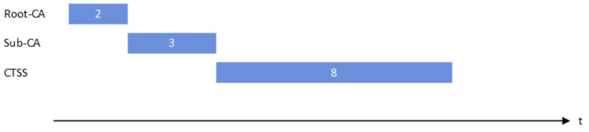
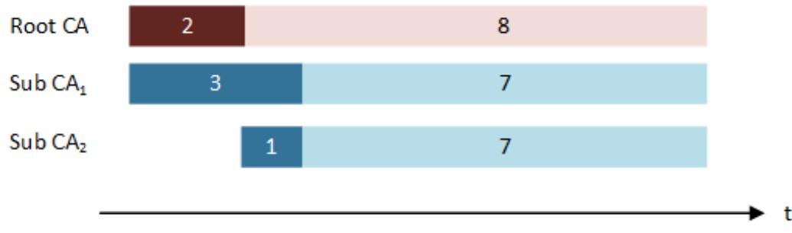

# Technical Guideline BSI TR-03145 Secure CA Operation

Part 5: Specific requirements for a Public Key Infrastructure for Technical Security Systems

Version 1.0.1 2023-06-05

### Document history

| Version | Date       | Description     |
|---------|------------|-----------------|
| 1.0.0   | 2023-03-09 | Initial Version |
| 1.0.1   | 2023-06-05 | Minor Update    |

Table 1: Version history

Federal Office for Information Security P.O. Box 20 03 63 53133 Bonn

E-Mail: registrierkassen@bsi.bund.de Internet: https://www.bsi.bund.de © Federal Office for Information Security 2023

| 1<br>Introduction 4                                        |     |                                                                                            |  |
|------------------------------------------------------------|-----|--------------------------------------------------------------------------------------------|--|
|                                                            | 1.1 | Scope and structure of this document  4                                                    |  |
|                                                            | 1.2 | Keywords 5                                                                                 |  |
|                                                            | 1.3 | Abbreviations 5                                                                            |  |
| 2                                                          |     | Public-Key Infrastructures for TSS (informative)  6                                        |  |
| 3                                                          |     | Requirements for TSS in a TSS PKI  7                                                       |  |
|                                                            | 3.1 | Identification and Registration of TSS Manufacturer 7                                      |  |
|                                                            | 3.2 | Certificate Request Procedure for TSS 8                                                    |  |
| 4                                                          |     | Specific Requirements for Certificate Management Processes in a TSS PKI 9                  |  |
|                                                            | 4.1 | Identification and Registration (section 5.3 of [BSI TR-03145-1]) 9                        |  |
|                                                            | 4.2 | Certificate Generation Process (section 5.5 of [BSI TR-03145-1]) 9                         |  |
|                                                            | 4.3 | Revocation (section 5.7 of [BSI TR-03145-1])10                                             |  |
|                                                            | 4.4 | Certificate Renewal, Re-Keying and Update (section 5.8 of [BSI TR-03145-1])12              |  |
|                                                            | 4.5 | CA Changeover13                                                                            |  |
| 5                                                          |     | General Requirements for a TSS PKI15                                                       |  |
|                                                            | 5.1 | Certificate Policy and Certificate Practice Statement (section 6.2 of [BSI TR-03145-1]) 15 |  |
|                                                            | 5.2 | Appropriate Cryptographic Measures (section 6.5 of [BSI TR-03145-1]) 15                    |  |
|                                                            | 5.3 | Secure Handling and Storage of Key Material (section 6.6 of [BSI TR-03145-1])16            |  |
|                                                            | 5.4 | Archiving and Tracking (section 6.10 of [BSI TR-03145-1])16                                |  |
|                                                            | 5.5 | Test and Productive PKI17                                                                  |  |
|                                                            | 5.6 | Application Context17                                                                      |  |
| 6                                                          |     | Additional Requirements for Interoperability 18                                            |  |
|                                                            | 6.1 | Validation Model18                                                                         |  |
|                                                            | 6.2 | Certificate Profiles18                                                                     |  |
|                                                            | 6.3 | Directory Service19                                                                        |  |
|                                                            |     | Appendix A (informative)20                                                                 |  |
|                                                            |     | Example for Instantiation of Private Key Usage Period and Public Key Validity Period20     |  |
|                                                            |     | Example for Alignment of CA Certificates within a TSS PKI21                                |  |
| Appendix B23                                               |     |                                                                                            |  |
| TSS CRL Entry Extension - Encoding of revocation details23 |     |                                                                                            |  |
| Appendix C26                                               |     |                                                                                            |  |
| Encoding of the certificationID in a TSS certificate26     |     |                                                                                            |  |
| Bibliography 28                                            |     |                                                                                            |  |

### <span id="page-3-0"></span>1 Introduction

With the digital transformation of business processes and the increasing use of Electronic Record-keeping Systems, business transactions are increasingly represented and recorded digitally. In order to prevent subsequent manipulation of these digital records, their integrity, authenticity and completeness must be ensured. This is achieved by using a Technical Security System (TSS). The TSS manages the recording and securing of these digital records. Fiscal authorities can request these records and check them with respect to completeness, correctness, and authenticity.

Integrity and authenticity are implemented by means of digital signatures and a Public Key Infrastructure (PKI). I.e. the TSS signs the digital records with its private key. The corresponding public key is bound to the signing TSS by means of a certificate which is issued by a Certification Authority (CA). In general, PKIs are hierarchically organized as follows: The Root CA is the topmost instance of a PKI and the trust anchor within a PKI. The Root CA defines rules and checks the compliance with these rules. Additionally, the Root CA signs and issues Sub CA certificates and thus, expresses its trust in these Sub CAs. Within a TSS PKI, a Sub CA signs and distributes certificates for end entities. In the given application context, the end entities are TSS.

This document is part 5 of the Secure CA operation series of [BSI TR-03145]. Part 1 [BSI TR-03145-1] of the document series compiles "Generic Requirements for Trust Centers instantiating as Certification Authoritiy (CA) in a Public-Key Infrastructure (PKI) with a security level 'high'". The present part 5 of [BSI TR-03145] defines secure operation requirements for Certification Authorities within a Public Key Infrastructure for TSS.

Requirements for TSS are defined in [TR-03153] and are not part of this document.

#### <span id="page-3-1"></span>1.1 Scope and structure of this document

This document concerns all Certification Authorities within a PKI for TSS and defines specific requirements for PKIs in the given application context. The requirements in this document [BSI TR-03145-5] supplement the general requirements defined in [BSI TR-03145-1]. Therefore all requirements defined in [BSI TR-03145- 1] SHALL be completely fulfilled by all Certification Authorities in a PKI for TSS, unless explicitly stated otherwise in this document.

In the context of the implementation of a TSS Public Key Infrastructure, the following documents are relevant:

- [BSI TR-03153-1] This Technical Guideline defines binding requirements for securing digital records by means of a TSS.
- [BSI TR-03151-1] This Technical Guideline specifies the Secure Element Application Programming Interface (SE API) that allows standardized access to security functionalitiesin order to secure authenticity and integrity of information by creating digital signatures over them.
- [BSI TR-03145-1] This Technical Guideline denotes general requirements for a secure CA operation and is refined and supplemented by the Technical Guideline at hand.
- [BSI TR-03116-5] This Technical Guideline profiles the cryptographic requirements reflecting the algorithms and key lengths recommend for TSS.

The present document refines and or extends the requirements of [BSI TR-03145-1] and, if relevant for TSS PKI operators, accordingly references [BSI TR-03153-1], [BSI TR-03151-1] or [BSI TR-03116-5].

This document is structured as follows:

• Chapte[r 2](#page-5-0) provides a general overview of the entities of a Public-Key Infrastructure for TSS and the relying parties.

- Chapter [3](#page-6-0) details requirements concerning the identification and registration of TSS manufacturer and the personalization of TSS.
- Chapter [4](#page-8-0) describes requirements specific to Certification Authorities in a TSS Public-Key Infrastructure and mainly follows the structure of [BSI TR-03145-1].
- Chapter [5 d](#page-14-0)escribes general requirements for a TSS Public-Key Infrastructure and also mainly follows the structure of [BSI TR-03145-1].
- Chapter [6](#page-17-0) determines requirements for the interoperability, especially with respect to the fiscal inspection of digital records.

#### <span id="page-4-0"></span>1.2 Keywords

Within this document, the key words "MUST", "MUST NOT", "REQUIRED", "SHALL", "SHALL NOT", "SHOULD", "SHOULD NOT", "RECOMMENDED", "MAY", and "OPTIONAL" are to be interpreted as described in [RFC 2119] when, and only when, they appear in all capitals, as shown here.

#### <span id="page-4-1"></span>1.3 Abbreviations

The abbreviations and definition of terms that are relevant in this document are given below.

| Abbreviation | Definition                                                                                                  |
|--------------|-------------------------------------------------------------------------------------------------------------|
| BMF          | Federal Ministry of Finance (German:<br>Bundesministerium der Finanzen)                                     |
| BSI          | Federal Office for Information Security (German:<br>Bundesamt für Sicherheit in der<br>Informationstechnik) |
| CA           | Certification Authority                                                                                     |
| CP           | Certificate Policy                                                                                          |
| CRL          | Certificate Revocation Lists                                                                                |
| CSR          | Certificate Signing Request                                                                                 |
| TSS          | Technical Security System                                                                                   |
| PKI          | Public Key Infrastructure                                                                                   |

Tabelle 2 Abbreviations that are relevant in this document

### <span id="page-5-0"></span>2 Public-Key Infrastructures for TSS (informative)

A Public-Key Infrastructure for Technical Security Systems (TSS) consists of

- Root CA
	- is the trust anchor of the PKI,
	- registers Sub CAs,
	- issues and publishes Sub CA certificates and
	- publishes Certificate Revocation Lists (CRL)[1](#page-5-1)
- Sub CA
	- registers TSS devices,
	- issues and publishes TSS certificates and
	- publishes Certificate Revocation Lists (CRL)[2](#page-5-2)[3](#page-5-3)
- TSS
	- owns a TSS certificate,
	- protects digital transactions from electronic record-keeping systems with a digital signature in correspondence with its TSS certificate and stores the signed transactions on a storage medium

The following participants interact with the entities of the TSS PKI

#### • TSS Manufacturer

- produces TSS and personalizes them with keys and certificates.
- Taxpayer (German: Steuerpflichtiger)
	- all TSS which are used by the taxpayer must be registered according to Fiscal Code of Germany[4](#page-5-4) at the corresponding fiscal authority.
- Fiscal Authority (German: Finanzbehörden)
	- commissioned to check the correctness and completeness of the digital records of the TSS. The validation of digital records, e.g. by a fiscal authority, shall be performed according to [BSI TR-03153- 1].

On the one hand the taxpayer shall be registered with its used TSS at the fiscal authority and on the other hand the TSS itself shall be registered by the TSS manufacturer at a Sub CA in order to be personalized with cryptographic keys and certificates. While the former is not part of this document, the latter is further addressed in the subsequent chapters of this Technical Guideline.

<span id="page-5-1"></span> <sup>1</sup> In principle, the Root CA may additionally provide an OCSP service. Note that the usage of OCSP should be carefully weighted against potential risks considering data protection.

<span id="page-5-2"></span><sup>2</sup> In principle, a Sub CA may additionally provide an OCSP service. Note that the usage of OCSP should be carefully weighted against potential risks considering data protection.

<span id="page-5-3"></span><sup>3</sup> A Sub CA within a TSS PKI may use different key pairs for issuing certifcates and signing CRLs. Note that according to [BSI TR-03145-1] in this case all key pairs of the Sub CA MUST fullfill the same requirements specified in [BSI TR-03145-1] and [BSI TR-03145-5].

<span id="page-5-4"></span><sup>4</sup> See §146a Abgabenordnung

### <span id="page-6-0"></span>3 Requirements for TSS in a TSS PKI

#### <span id="page-6-1"></span>3.1 Identification and Registration of TSS Manufacturer

Before a TSS manufacturer can request registration on behalf of TSSs at a Sub CA, the TSS manufacturer must be registered and unambiguously identified at that Sub CA. Therefore, the requirements of [BSI TR-03145-1] are supplemented for such a Sub CA with respect to the identification and registration of the TSS manufacturer as follows:

- MR.Req.1. At initial registration of a TSS manufacturer at the Sub CA, registration information SHALL be delivered via physical presence of an authorised representative of the TSS manufacturer to the Sub CA. In justified cases, another transmission method MAY be used. In that case, the transmission method MUST provide an equivalent level of assurance as delivery via physical presence and MUST be agreed upon by the Federal Office for Information Security (BSI).
- <span id="page-6-2"></span>MR.Req.2. At initial registration the TSS manufacturer's representative SHALL be unambiguously identified. Therefore, the Sub CA SHALL verify the identity of the TSS manufacturer's representative in compliance with the criteria for assurance level 'high' according to [BSI TR-03147] by means of an official ID document.
- <span id="page-6-3"></span>MR.Req.3. At initial registration the TSS manufacturer's representative SHALL provide evidence for the authorization as TSS manufacturer's representative to the Sub CA.

The information for registration of the TSS manufacturer at the Sub CA SHALL at least include

- the TSS manufacturer's name and its postal address,
- further contact information, e.g. e-mail address, phone number,
- identifying information on the authorized representative according to requirement [MR.Req.2](#page-6-2) of this Technical Guideline,
- proof of authorization of the representative according to requirement [MR.Req.3](#page-6-3) of this Technical Guideline,
- public attestation key according to requirement [MR.Req.4](#page-6-4)[-MR.Req.6](#page-6-5) of this Technical Guideline,
- declaration of the TSS manufacturer to oblige oneself to exclusively request TSS certificates for TSSs that are certified according to [BSI TR-03153-1].
- <span id="page-6-4"></span>MR.Req.4. As part of the registration information, the current public attestation key/keys that is/are used by the TSS manufacturer for the TSS certificate request SHOULD be delivered via physical presence to the Sub CA by the TSS manufacturer. Alternatively, the registration information MAY contain information for the secure transmission of the public attestation key/keys from TSS manufacturer to the Sub CA. In that case, the transmission method MUST provide an equivalent level of assurance as delivery via physical presence and MUST be agreed upon by the BSI in each individual case and before each individual transmission.
- MR.Req.5. The usage of the attestation key/keys MAY be limited in time. In that case, this limitation MUST be completely included in the information for registration of the TSS manufacturer at the Sub CA.

<span id="page-6-5"></span>MR.Req.6. The Sub CA SHALL ensure by appropriate means that

- TSS are registered only with valid attestation key/keys that is/are securely handled in compliance to 'Secure Handling and Storage of Key Material' as specified in section 6.6 of [TR-03145-1] and sectio[n 5.3](#page-15-0) of this document, and
- the attestation key/keys is/are exclusively used for the registration of TSSs.

This MAY be guaranteed by non-IT based and/or organisational measures such as for example contractual arrangements.

MR.Req.7. It is RECOMMENDED that for each Sub CA only one TSS manufacturer is registered. I.e. it is RECOMMENDED that different TSS manufacturer do not share a Sub CA.

#### <span id="page-7-0"></span>3.2 Certificate Request Procedure for TSS

During the certificate request procedure for TSS, the key material and the certificate are created and stored. TSS certificates are requested by the TSS manufacturer at the Sub CA. Therefore, the requirements of [BSI TR-03145-1] concerning the certificate request for TSS are supplemented as follows:

- Perso.Req.1 In order to obtain a TSS certificate, a Certificate Signing Request (CSR) SHALL be created. This Certificate Signing Request SHOULD be signed twice: As proof of possession it SHOULD be signed with the TSS's private key which corresponds to the requested TSS certificate (inner signature as proof of possession) and SHALL be signed with a private attestation key that is used by the TSS manufacturer for TSS certificate requests and has been previously registered at the Sub CA as specified by [MR.Req.4](#page-6-4) (outer signature). In justified cases, a CSR may be executed without proof of possession. In this case, this MUST be agreed upon by the BSI. That means that the inner signature is optional, the outer signature is mandatory. The signed Certificate Signing Request SHALL be sent via a secure communication channel to the Sub CA.
- Perso.Req.2 The Sub CA SHALL verify the (outer) signature of a Certificate Signing Request with the public attestation key[5](#page-7-1) that is used by the corresponding TSS manufacturer for TSS certificate requests. The Sub CA SHALL issue a TSS certificate only if the attestation signature is successfully validated.
- Perso.Req.3 If a Certificate Signing Request is executed with proof of possession, the Sub CA SHALL verify the (inner) signature of the Certificate Signing Request with the public key which is contained in the Certificate Signing Request and SHALL issue a TSS certificate only if the inner signature is successfully verified.

<span id="page-7-1"></span> <sup>5</sup> The public attestation key is known to the Sub CA as demanded in section 3.1.

### <span id="page-8-0"></span>4 Specific Requirements for Certificate Management Processes in a TSS PKI

#### <span id="page-8-1"></span>4.1 Identification and Registration (section 5.3 of [BSI TR-03145-1])

For the Root CA within a TSS PKI the requirements of [BSI TR-03145-1] concerning the authentication of CAs are supplemented as follows. The following requirements apply to Root CAs only.

- IR.Req.14 A Root CA certificate and all Sub CA certificates, that are issued by this Root CA at time of registration of the Root CA certificate, MUST be registered at the Federal Ministry of Finance (BMF) or at a party designated by the BMF. Therefore, at initial registration the Root CA certificate and the Sub CA certificates SHOULD be delivered via physical presence of an authorised representative of the Root CA to the BMF or a designated party. Alternatively, another transmission method MAY be used. In that case, the transmission method MUST provide an equivalent level of assurance as physical delivery and MUST be agreed upon by the BSI. At this initial registration the Root CA's authorized representative SHALL provide an official ID document as proof of identity and SHALL provide evidence for authorization as Root CA's representative.
- IR.Req.15 If a Root CA issues a Sub CA certificate after the Root CA certificate has already been registered at the BMF or at a party designated by the BMF, this Sub CA certificate MUST be without delay electronically transmitted to the BMF or a party designated by the BMF. The transmission method MUST be agreed upon by the BMF or the designated party.

#### <span id="page-8-2"></span>4.2 Certificate Generation Process (section 5.5 of [BSI TR-03145-1])

Within the certificate generation process certificates are generated by signing the public key and additional information of the subscriber with the private key of the issuing CA.

For Root CA and Sub CA/CAs within a TSS PKI the following subset of requirements from [BSI TR-03145-1] are refined as stated below:

- CG.Req.4 Root CA and Sub CA/CAs SHALL determine the validity period to be applied to a certificate. For each certificate, the private key usage and validity period of the public key SHALL be chosen according to the validation model as specified in section [6.2](#page-17-2) of this document and by the requirements [CG.Req.11](#page-8-3) - [CG.Req.14](#page-9-1) below. Root CA and Sub CA/CAs SHALL consider the following issues for each different validity/usage period:
	- 1) need of business case (minimum period),
	- 2) legal requirements,
	- 3) security measures required for the keys (token or software storage),
	- 4) risk of getting compromised,
	- 5) amount of damage in case of compromise,
	- 6) strength of algorithm and key length used,
	- 7) date until the algorithm/key length is recommended to be secure.

For Root CA and Sub CA/CAs within a TSS PKI the requirements of [BSI TR-03145-1] concerning the certificate generation process are supplemented as follows:

<span id="page-8-3"></span>CG.Req.11 The private key usage period of Root CA and Sub CA for issuing certificates SHALL be up to 5 years at most.

| CG.Req.12 | The private key usage period of TSSs for signing digital records SHALL be up to 8 years at<br>most.                                                                                                                                                                                                                        |
|-----------|----------------------------------------------------------------------------------------------------------------------------------------------------------------------------------------------------------------------------------------------------------------------------------------------------------------------------|
| CG.Req.13 | The sum of the private key usage periods of Root CA and Sub CA for issuing certificates<br>SHALL not exceed 8 years in total.                                                                                                                                                                                              |
| CG.Req.14 | The sum of private key usage periods of Root CA, Sub CA and TSS for issuing certificates<br>or signing digital records SHALL not exceed 15 years in total.                                                                                                                                                                 |
| CG.Req.15 | If there is more than one Sub CA under one Root CA within a TSS PKI, then the private<br>key usage periods and validity periods of all certificates under this Root CA SHALL be<br>aligned such that the expiration of private key usage periods and validity periods of all<br>subordinate certificates are synchronized. |

<span id="page-9-1"></span>For further explanation on private key usage periods and validity periods of the certificates as well as on alignment of expiration of certificates se[e Appendix A \(informative\).](#page-19-0)

#### <span id="page-9-0"></span>4.3 Revocation (section 5.7 of [BSI TR-03145-1])

Suspension of certificates MUST NOT be allowed within a TSS PKI. Therefore, the option of 'suspension' in all objectives and requirements of section 5.7 of [BSI TR-03145-1] SHALL be ignored by CAs within a TSS PKI.For Root CA and Sub CA/CAs within a TSS PKI the following requirements of [BSI TR-03145-1] concerning the revocation of certificates are refined as follows:

| RM.Req.1 | Root CA and Sub CA/CAs SHALL provide a service receiving the revocation requests.<br>Root CA and Sub CA/CAs SHALL provide this service with an appropriate availability<br>ensuring no negative consequences for the taxpayer / owner of the TSE due to limited<br>availability / temporary unavailability of this service. Root CA and Sub CA/CAs SHALL<br>provide this service for at least 10 years as of the end of the fiscal year beyond the validity<br>period of the last TSS certificate issued within the TSS PKI. |  |
|----------|------------------------------------------------------------------------------------------------------------------------------------------------------------------------------------------------------------------------------------------------------------------------------------------------------------------------------------------------------------------------------------------------------------------------------------------------------------------------------------------------------------------------------|--|
| RM.Req.2 | Root CA and Sub CA/CAs SHALL define an appropriate procedure for the revocation<br>started by an authorized certificate revocation. Root CA and Sub CA/CAs SHALL ensure:                                                                                                                                                                                                                                                                                                                                                     |  |
|          | 1)<br>the identification of persons/institutions with a legitimate claim to apply for<br>revocation of a certificate: [assignment: list of persons/institutions],                                                                                                                                                                                                                                                                                                                                                            |  |
|          | 2)<br>the identification of reasons for a revocation according to RM.Req.8, RM.Req.9 and<br>RM.Req.11,                                                                                                                                                                                                                                                                                                                                                                                                                       |  |
|          | 3)<br>[assignment: the transmission path and record of the revocation],                                                                                                                                                                                                                                                                                                                                                                                                                                                      |  |
|          | 4)<br>[assignment: additional requirements for a successful revocation],                                                                                                                                                                                                                                                                                                                                                                                                                                                     |  |
|          | 5)<br>that revocation is irreversible. After the revocation of a certificate it is not trustable<br>anymore and thus, it SHALL NOT be reinstated.                                                                                                                                                                                                                                                                                                                                                                            |  |
|          | Root CA and Sub CA/CAs SHALL check the legitimacy of the revoking party and the<br>plausbility of the revocation request.                                                                                                                                                                                                                                                                                                                                                                                                    |  |
| RM.Req.3 | Additional to updates of the revocation list in case of revocation requests or incidents,<br>Root CA and Sub CA/CAs SHALL ensure that the revocation status information is<br>republished with a new timestamp and signature within a period of at most one month.<br>This period SHALL be defined within the Terms and Conditions of the corresponding<br>CA, so the relying parties are able to discover at least at the end of this time frame if an<br>attacker provides outdated revocation information.                |  |
| RM.Req.4 | Root CA and Sub CA/CAs SHALL provide the revocation status information to all relying<br>parties in an available and dependable manner protecting the integrity and authenticity<br>of the status information. Revocation status information of Root CA and Sub CA/CAs                                                                                                                                                                                                                                                       |  |
|          |                                                                                                                                                                                                                                                                                                                                                                                                                                                                                                                              |  |

SHALL be reachable via Certificate Revocation Lists. Additional methods MAY be implemented, e.g. OCSP.

RM.Req.5 Root CA and Sub CA/CAs SHALL ensure that the revocation status information

- 1) is available with an availability of at least 99,99 %,
- 2) is publicly accessible,
- 3) is provided for at least 10 years as of the end of the fiscal year beyond the validity period of the last TSS certificate issued within the TSS PKI, and
- <span id="page-10-2"></span>4) complies with RM.Req.13

RM.Req.6 Root CA and Sub CA/CAs SHALL maintain the revocation list in a timely manner (see section 6.11 of [BSI TR-03145-1]). The complete revocation process (i.e. the delay between a revocation request or report and the availability of the revocation status information to all relying parties) SHOULD be at most 24 hours for Root CA certificates and at most 72 hours for Sub CA and TSS certificates.

For Root CA and Sub CA/CAs within a TSS PKI the requirements of [BSI TR-03145-1] concerning the revocation of certificates are supplemented as follows:

<span id="page-10-0"></span>RM.Req.8 If a CA revokes a certificate, the certificate revocation SHALL be triggered by justified circumstances affecting the security of the TSS PKI, e.g. security incident or a key compromise. Root CA and Sub CA/CAs SHALL NOT revoke a certificate for economic reasons, e.g. the termination of a contractual relationship.

RM.Req.9 While maintaining the revocation status information Root CA and Sub CA/CAs SHALL distinguish between the revocation date and the invalidity date of a revoked certificate according to [RFC5280]. The revocation date denotes the date at which a revocation is processed by the corresponding CA. The invalidity date denotes the date at which the private key corresponding the certificate to be revoked was compromised or at which the certificate became otherwise invalid. Thus, the invalidity date may be prior to the revocation date.

- <span id="page-10-1"></span>RM.Req.10 Root CA and Sub CA/CAs SHALL document and archive each revocation request and actually performed revocation in a comprehensible way. This means that Root CA and Sub CA/CAs SHALL document and archive at least the following information:
	- 1) person/institution who/that applied for revocation of a certificate,
	- 2) reasonable evidence for the legitimacy of the revoking party,
	- 3) reasonable evidence for the plausbility of the revocation request,
	- 4) date and time of revocation (see [RM.Req.8\)](#page-10-2),
	- 5) date and time of invalidity (see [RM.Req.8\)](#page-10-2),
	- 6) signature counter of the TSS at time of revocation in case of revocation of a TSS certificates (if possible), and
	- 7) revocation reason.

Upon request by a fiscal authority, the Root CA and Sub CA/CAs SHALL provide this information without delay, completely and in a comprehensible way to the requesting fiscal authority.

Upon request by the BSI, the Root CA and Sub CA/CAs SHALL provide this information without delay, completely and in a comprehensible way but in anonymized form to the BSI.

<span id="page-11-1"></span>

| RM.Req.11 | For each performed revocation of a certificate, Root CA and Sub CA/CAs SHALL encode<br>in the corresponding CRL                                                                                                                                                                                                                                                                                                                                    |  |
|-----------|----------------------------------------------------------------------------------------------------------------------------------------------------------------------------------------------------------------------------------------------------------------------------------------------------------------------------------------------------------------------------------------------------------------------------------------------------|--|
|           | 1)<br>date and time of revocation as specified in [RFC 5280],                                                                                                                                                                                                                                                                                                                                                                                      |  |
|           | 2)<br>date and time of invalidity as specified in [RFC 5280],                                                                                                                                                                                                                                                                                                                                                                                      |  |
|           | 3)<br>revoking party as specified in Appendix B,                                                                                                                                                                                                                                                                                                                                                                                                   |  |
|           | 4)<br>signature counter of the TSS at time of revocation in case of revocation of a TSS<br>certificates as specified in Appendix B (if possible), and                                                                                                                                                                                                                                                                                              |  |
|           | 5)<br>revocation reason as specified in Appendix B.                                                                                                                                                                                                                                                                                                                                                                                                |  |
| RM.Req.12 | If a Root CA certificate has to be revoked, the corresponding Root CA SHALL issue a CRL<br>containing itself. Afterwards the Root CA SHALL be revoked according to the<br>requirements of section 5.7 of [BSI TR-03145-1] and section 4.3 of this document.                                                                                                                                                                                        |  |
| RM.Req.13 | If a Root CA certificate has to be revoked, the revocation has to be reported by the Root<br>CA without undue delay to the Federal Ministry of Finance (BMF) and the Federal Office<br>for Information Security (BSI).                                                                                                                                                                                                                             |  |
| RM.Req.14 | Expired certificates SHALL NOT be removed from the certificate revocation list and the<br>revocation status information SHALL be available for at least 10 years as of the end of the<br>fiscal year beyond the validity period of the certificate.                                                                                                                                                                                                |  |
| RM.Req.15 | If the certificate holder wants a new certificate after revocation of its old certificate, Root<br>CA and Sub CA/CAs SHALL ensure that in this case the new certificate SHALL be<br>requested following the process of inital application. This new certificate MUST be<br>created with a new key pair. If and only if the new certificate is a CA certificate other<br>subject attributes MAY remain the same (cf. section 4.4 of this document). |  |

#### <span id="page-11-0"></span>4.4 Certificate Renewal, Re-Keying and Update (section 5.8 of [BSI TR-03145-1])

A CA within a TSS PKI MAY re-ke[y6](#page-11-2) or update[7](#page-11-3) a CA certificate, but SHALL NOT renew[8](#page-11-4) a CA certificate. Therefore within a TSS PKI, the option of 'renewal' in all objectives and requirements of section 5.8 of [BSI TR-01345-1] SHALL be ignored by the Root CA of a TSS PKI. A Sub CA within a TSS PKI SHALL NOT renew, re-key, or update TSS certificates. Therefore, the requirements of section 5.8 of [BSI TR-03145-1] concerning renewal, re-keying or update of certificates SHALL NOT apply to Sub CAs within a TSS PKI.

For Root CA and Sub CA/CAs within a TSS PKI the requirements of [BSI TR-03145-1] concerning certificate re-keying and update of CA certificates are supplemented as follows:

Renew.Req.11 CAs SHOULD NOT change their name.

As renewal of certificates SHALL NOT be allowed, the following requirements of [TR-03145-1] SHALL NOT apply to Root CA and Sub CA/CAs affected by this document:

• Renew.Req.4

<span id="page-11-2"></span><sup>6</sup> *Re-Keying* of a certificate denotes that a new certificate is issued with a new key pair and a new validity period while the subject attributes stay unchanged.

<span id="page-11-3"></span><sup>7</sup> *Update* of a certificate describes that a new certificate is issued with updated subject attributes and a new key pair.

<span id="page-11-4"></span><sup>8</sup> *Renewal* of a certificate is defined as extending the validity period of a certificate while the public key and the attributes of the certificate are not modified

#### • Renew.Req.5

#### <span id="page-12-0"></span>4.5 CA Changeover

The initial request of a Root CA certificate SHALL be performed according to section 5.3 of [BSI TR-03145-1] and sectio[n 4.1](#page-8-1) of this document. Root CAs and only Root CAs SHALL use link certificates in order to ensure a secure transition from the current to the successor Root CA certificate.

For the Root CA within a TSS PKI the requirements of [BSI TR-03145-1] concerning the secure transition from a Root CA certificate to the succeeding Root CA certificate are supplemented as follows:

- <span id="page-12-1"></span>Change.Req.1 For a Root CA changeover, the Root CA SHALL generate two certificates: a self-signed successor certificate and a link certificate. The link certificate SHALL contain the public key and the attributes of the successor certificate and SHALL be signed with the private key of the currently valid Root CA certificate. Both certificates, the successor Root CA certificate and the link certificate, SHALL be electronically transmitted to the Federal Ministry of Finance (BMF) or a party designated by the BMF. Additionally, if the Root CA implements a Directory Service, these two certificates SHALL be published on the Root CA's directory service as specified in section [6.3](#page-18-0) of this document to enable the verification of the integrity and authenticity of the successor Root CA certificate.
- Change.Req.2 The Root CA changeover SHALL be performed with a preloading phase of at least 3 months. Therefore, the successor certificate of the Root CA SHALL be generated at least 3 months before its validity starts. During this preloading phase the successor certificate and the link certificate SHALL be securely distributed to all relying parties as specified in [Change.Req.1.](#page-12-1) The preloading phase ensures that from the beginning of the validity of the successor certificate all relying parties are able to verify certificates and CRLs that are issued with the newly generated successor certificate.
- Change.Req.3 The Root CA changeover SHALL be performed with an overlap time of at least 1 month up to at most 3 months in order to ensure a secure transition from the current to the successor Root CA certificate. The overlap time starts at the same time as the validity of the successor certificate starts.
- Change.Req.4 During the overlap time the current Root CA certificate SHALL not be used for issuing certificates. New Sub CA certificates SHALL be issued with the successor Root CA certificate. After expiration of the overlap time, the private key including backup keys of the current Root CA certificate SHALL be securely deleted.

For Root CA and Sub CA/CAs within a TSS PKI the following requirements concerning the secure transition from a CA certificate to the succeeding CA certificate are supplemented for both, Root CA and Sub CA, as follows:

- Change.Req.5 Root CA and Sub CA/CAs SHALL use its newest private key for issuing certificates. That means that a CA's private key SHALL NOT be used anymore for issuing certificates, once a successor certificate and – in case of the Root CA certificate – the link certificate is generated. Thus, at any point in time there is exactly one private key in usage for issuing Sub CA or TSS certificates.
- Change.Req.6 Root CA and Sub CA/CAs SHALL use its newest private key for signing its Certificate Revocation List. That means that a CA's private key SHALL NOT be used anymore for signing CRLs, once a successor certificate is generated. Thus, at any point in time there

SHALL be only one private key in usage for signing the Root CA's or Sub CA's Certificate Revocation List.[9](#page-13-0)

<span id="page-13-0"></span><sup>9</sup> Note that although the CRL is always signed with the newest private key of Root CA or Sub CA, the CRL can include revoked certificates that are issued by this CA with its newest private key as well as revoked certificates that are issued by this CA with one of its earlier private keys.

### <span id="page-14-0"></span>5 General Requirements for a TSS PKI

#### <span id="page-14-1"></span>5.1 Certificate Policy and Certificate Practice Statement (section 6.2 of [BSI TR-03145-1])

The following requirement of [BSI TR-03145-1] concerning an adequate 'Certificate Policy and Certification Practice Statement' for a TSS PKI is refined as follows:

- CP.Req.1 The CP SHALL specify the scope and applicability of the PKI as well as the key- and certificate management life-cycle processes of each CA within the TSS PKI completely, comprehensively and adequate to the security level 'high'. The following aspects SHALL be covered at a minimum:
	- reference to a document owner and contact person for document management related issues
	- document identification for further reference, i.e. by exact document title, version and unique policy identifier for reference in certificates issued by the CAs within the TSS PKI
	- limitations concerning subscribers of the PKI
	- application context of the PKI
	- description of subscriber registration procedures including specification of registration data, requirements for data transmission, and description of verification procedures of the RA
	- subscriber obligations (e.g. requirements on subscriber key stores and application environment)
	- specification of certificate profiles in compliance with sectio[n 6.2](#page-17-2) of this document
	- validation model of the PKI as specified in section [6.1](#page-17-1) of this document
	- certificate enrollment protocols and data formats (if required)
	- certificate status information services
	- directory services (if applicable)
	- procedures in case of a key compromise
	- certificate revocation procedures including revocation reasons, revocation authorization, revocation application mechanisms (if available)
	- certificate revocation lists
	- CA termination
	- CP update procedures

#### <span id="page-14-2"></span>5.2 Appropriate Cryptographic Measures (section 6.5 of [BSI TR-03145-1])

For Root CA and Sub CA/CAs within a TSS PKI the following requirement of [BSI TR-03145-1] concerning the use of appropriate cryptographic measures is refined as follows:

ACM.Req.1 For the cryptographic algorithms and their parameters used Root CA and Sub CA/CAs MUST comply with the newest edition of [BSI TR-03116-5]. Root CA and Sub CA/CAs SHALL check the cryptographic algorithms and their parameters referring to the newest editions:

- 1) Each time a cryptographic algorithm is newly implemented.
- 2) When an incident of a used algorithm becomes public.
- 3) Regularly, every 12 months.

#### <span id="page-15-0"></span>5.3 Secure Handling and Storage of Key Material (section 6.6 of [BSI TR-03145-1])

For Root CA and Sub CA/CAs within a TSS PKI the requirement of [BSI TR-03145-1] concerning secure handling and storage of key material listed below is refined as follows:

SHKM.Req.1 Private keys of Root CA and Sub CA/CAs within a TSS PKI SHALL be generated, held, used and deleted in a security device fulfilling the requirements of [KLCR] with security level 2 ensuring the claimed security features, including tamper resistance, side channel freeness, suitable access control, random number generator and security of cryptographic operations[10](#page-15-2).

#### <span id="page-15-1"></span>5.4 Archiving and Tracking (section 6.10 of [BSI TR-03145-1])

As renewal of certificates SHALL NOT be allowed within a TSS PKI, the option of 'renewal' in all objectives and requirements of section 6.10 of [BSI TR-01345-1] SHALL be ignored by Root CA and Sub CA(s) within a TSS PKI.

For Root CA and Sub CA/CAs within a TSS PKI the following requirement of [BSI TR-03145-1] concerning archiving and tracking are refined as follows:

#### <span id="page-15-3"></span>Arch.Req.1. Root CA and Sub CA/CAs SHALL ensure that all relevant information concerning a certificate is archived. These information SHALL be clearly defined beforehand and MUST at least include the following:

- Sub CAs MUST archive
	- all certificates that are issued by this Sub CA,
	- all revocation requests which are documented according to section [4.3](#page-9-0) of this document, and
	- all Certificate Revocation Lists that are issued by this Sub CA.
- The Root CA MUST archive
	- all certificates that are issued by this Root CA, i.e. Sub CA certificates, Root CA certificates and link certificates,
	- all revocation requests which are documented according to section [4.3](#page-9-0) of this document, and
	- all Certificate Revocation Lists that are issued by this Root CA.

For Root CA and Sub CA/CAs within a TSS PKI the requirements of [BSI TR-03145-1] concerning archiving and tracking are supplemented as follows:

<span id="page-15-2"></span> <sup>10</sup> In justified cases, exceptions MAY be granted by the BSI in order to ease migration within a transition phase. In that case, the security device MUST provide an appropriate level of security and MUST be agreed upon by the BSI.

| Arch.Req.9.  | Root CA and Sub CA/CAs SHALL archive all relevant information, as specified in                                                                                                                                                                                       |
|--------------|----------------------------------------------------------------------------------------------------------------------------------------------------------------------------------------------------------------------------------------------------------------------|
|              | Arch.Req.1, according to the validation model, as specified in section 6.1 of this                                                                                                                                                                                   |
|              | document, such that for each digital record that is signed with a private key                                                                                                                                                                                        |
|              | corresponding to a TSS certificate the integrity and authenticity of the digital record can                                                                                                                                                                          |
|              | be validated for the required validation period of at least 10 years as of the end of the<br>fiscal year at which a digital record was generated and signed.                                                                                                         |
| Arch.Req.10. | Root CA and Sub CA/CAs SHALL make all relevant information for the validation of<br>digital records, as specified in Arch.Req.1, available to the responsible fiscal authority.<br>Upon request by the BSI, Root CA and Sub CA/CAs SHALL provide this information in |

#### <span id="page-16-0"></span>5.5 Test and Productive PKI

anonymized form to the BSI.

For Root CA and Sub CA/CAs within a TSS PKI the requirements of [BSI TR-03145-1] are supplemented as follows:

- Test.Req.1. If the PKI operator runs a Test PKI, Test PKI and Productive PKI SHALL be operated strictly separated. This MAY be guaranteed by IT-based and/or organisational measures.
- Test.Req.2. Root CA and Sub CA/CAs of the Productive PKI SHALL NOT issue test certificates[11.](#page-16-2) This MAY be guaranteed by IT-based and/or organisational measures.

#### <span id="page-16-1"></span>5.6 Application Context

For Root CA and Sub CA/CAs within a TSS PKI the requirements of [BSI TR-03145-1] are supplemented as follows:

App.Req.1. If the PKI operator runs PKIs for different applications, the PKI for TSS SHALL be operated strictly separated. Thus, the Root CA and the Sub CA/CAs within a TSS PKI SHALL only be used for TSS and SHALL NOT issue certificates for different application contexts.

<span id="page-16-2"></span> <sup>11</sup> This means that Root CA and Sub CA/CAs of the Productive PKI must not issue certificates for any test purposes. This includes amongst others testing of the TSS production as well as testing of PKI operation. Thus, Sub CA/CAs of the Productive PKI shall only issue certificates for TSS that are certified according to [BSI TR-03153-1] and intended to be placed on the market.

### <span id="page-17-0"></span>6 Additional Requirements for Interoperability

#### <span id="page-17-1"></span>6.1 Validation Model

The requirements of [BSI TR-03145-1] are supplemented as follows:

- VM.Req.1 For the validation of digital records the Hybrid Model[12](#page-17-3) MUST be used within a TSS PKI.
- VM.Req.2 The validation model SHALL be consistently applied within a TSS PKI. That means that a TSS PKI SHALL be designed such that the validity periods of all certificates in a certificate chain are chosen according to the Hybrid Model.

#### <span id="page-17-2"></span>6.2 Certificate Profiles

CertProf.Req.1 The requirements of [BSI TR-03145-1] are supplemented as follows: The certificates of Root CA, Sub CA/CAs and TSS SHALL include information on

- Signature Algorithm ID that SHALL be chosen according to sectio[n 5.2](#page-14-2)
- Issuer Name
	- The certificate of the Root CA SHALL be self-signed and in this case the issuer equals the subject of the Root CA
- Validity Period that SHALL be chosen according to section [4.2](#page-8-2)
- Subject Name
	- For TSS certificates the subject SHALL be specified as follows:
		- C = <DE>
		- CN = <serial number of the TSS> as defined in [BSI TR-03153-1]
		- certificationID = <ID of the TSS's certification against [BSI TR-03153-1]> as specified in [Appendix C](#page-25-0)
- Subject Public Key Info
	- Public key of the certificate. Thereby, the key length SHALL be chosen according to section [5.2](#page-14-2)
- Extensions
	- Authority Key Identifier SHALL be used in certificates of Sub CAs and TSS
		- keyIdentifier MUST be included
		- authorityCertIssuer and authorityCertSerialNumber are OPTIONAL
		- critical = <false>
	- Private Key Usage Period that SHALL be chosen according to section [4.2](#page-8-2)
	- Basic Constraints
		- SubjectType = <CA> for CAs

<span id="page-17-3"></span> <sup>12</sup> Hybrid Model and Modified Shell Model are often used synonymously. The Hybrid Model denotes that a signature is valid if all certificates in the certificate chain are valid at the time of signing. A certificate is valid if the time of signing is within the validity period of the certificate, the certificate is not revoked (revocationDate according to [RFC5280]) at time of signing and it is not invalid (invalidityDate according to [RFC5280]) at time of signing. Note that a certificate can be declared invalid in retrospective.

- SubjectType = <End Entity> for TSS
- critical = <true>
- Key Usage Extension
	- Key Usage = <keyCertSign, crlSign> for CAs
	- Key Usage = <digitalSignature> for TSS
	- critical = <true>
- CRL Distribution Point as follows:
	- The TSS and Sub CA certificates SHALL contain the CRL Distribution Point where the CRLs of the issuing CA are published.
	- The Root CA certificate SHALL contain the CRL Distribution Point where the Root CA publishes its own CRLs.
	- As per definition of re-keying as specified in section [4.4](#page-11-0) of this document the CRL Distribution Point SHALL NOT be changed when re-keying a certificate
- CP Distribution Point of issuer for Sub CA and TSS certificates
- Certificate Signature Algorithm that SHALL be chosen according to sectio[n 5.2](#page-14-2)
- Certificate Signature

#### <span id="page-18-0"></span>6.3 Directory Service

The requirements of [BSI TR-03145-1] are supplemented as follows:

- DS.Req.1 Each CA within a TSS PKI SHOULD operate a Directory Service.
- DS.Req.2 If a Directory service is implemented, the CA MAY delegate operation of the Directory Service to a subcontractor, e.g. the TSS manufacturer. In this case, the subcontractor SHALL ensure the same security level as the CA and SHALL be audited. This is further specified in section 6.15 of [BSI TR-03145-1].
- DS.Req.3 If a Directory service is implemented, the Directory Service SHALL provide a searchable repository that contains all certificates that are issued by this CA and the Certificate Revocation List of this CA.
- DS.Req.4 If a Directory service is implemented, the publication of a certificate i.e. the delay between issuance of a certificate and its availability on the Directory Service to all relying parties - SHOULD be at most three days.
- DS.Req.5 If a Directory service is implemented, the Directory Servie SHALL enable access to all relevant information via Hypertext Transfer Protocol Secure (HTTPS).
- DS.Req.6 If a Directory service is implemented, the Directory Service SHALL provide secure communication and adequate controls in order to prevent unauthorized entities from adding, modifying, or deleting repository entries. The exact control mechanisms SHALL be part of the respective CPS.
- DS.Req.7 If a Directory service is implemented, the Directory Service SHALL grant access to all relevant information as specified in sectio[n 5.4](#page-15-1) of this document.
- DS.Req.8 If a Directory Service is implemented,the Directory Service of a Sub CA SHALL ensure that TSS certificates are searchable by the serial number of the TSS.

## <span id="page-19-0"></span>Appendix A (informative)

#### <span id="page-19-1"></span>Example for Instantiation of Private Key Usage Period and Public Key Validity Period

As required in sectio[n 4.2,](#page-8-2) the maximum private key usage period for Root CA and Sub CA shall be at most 8 years in sum and at most 5 years for one of these CAs, i.e. either Root CA or Sub CA. For example, if the private key usage period for a Sub CA is 5 years, this in turn implies that the private key usage period for the Root CA does not exceed 3 years but may be shorter. Shortening the private key usage period of either Root CA or Sub CA allows for a longer private key usage period of the other and vice versa. For example, a private key usage period for the Root CA of 3.5 years shortens the private key usage period of the Sub CA to a maximum of 4.5 years. Additionally, the maximum private key usage period for TSS for signing digital records shall not exceed 8 years. The sum of all maximum private key usage periods – for Root CA, Sub CA and TSS – shall not exceed 15 years in total. That means if the maximum private key usage period for TSS is exhausted, the private key usage period for Root CA and Sub CA can be no longer than 7 years in total. However, all combinations fullfilling the requirement from sectio[n 4.2](#page-8-2) are permitted.

In the following an example for the determination of the validity period of the public keys is given such that the validation of digital records is enabled for at least 10 years as of the end of the fiscal year beyond the lifecycle of the TSS certificate. Assume that the private key usage periods for issuing certificates and signing digital records are instantiated such as depicted in [Figure 1.](#page-19-2) Thereby, the dark blue bars represent the private key usage periods for issuing certificates for Root CA and Sub CA and for signing digital records for TSS.



<span id="page-19-2"></span>Figure 1 Exemplary private key usage periods in years, when certificates are issued as late as possible

Then for the given example the validity period of the public key shall meet the requirements of the following table:

| Entity  | Validity period of public key Private key usage period |         |
|---------|--------------------------------------------------------|---------|
| Root CA | 13 years                                               | 2 years |
| Sub CA  | 11 years                                               | 3 years |
| TSS     | 8 years                                                | 8 years |

Tabelle 3 Validity period of the public keys and private key usage periods for the given example

This is depicted in [Figure 2](#page-20-1) below where the dark blue bars represent the private key usage periods. Within the private key usage period Root CAand Sub CA can use the corresponding private key for issuing certificates and signing CRLs. Within the private key usage period the TSS can use its private key for signing digital records. The light blue bars in [Figure 2](#page-20-1) represent the inactive phases of the certificates, i.e. the corresponding private key usage period is expired but the certificate and the corresponding public key are still valid. During these inactive phases, the CRLs of Root CA and Sub CA are issued with the newest key of Root CA or Sub CA, respectively (see sectio[n 4.5\).](#page-12-0)

Note that in this example certificates and CRLs shall be archived in order to enable validation of digital records for additional 10 years as of the end of the fiscal year. This is represented by the grey bars in th[e Figure 2.](#page-20-1) 

<span id="page-20-1"></span>Figure 2 Exemplary private key usage periods and validity periods of public keys (in years), when certificates are issued as late as possible and the Modified Shell Model is applied

#### <span id="page-20-0"></span>Example for Alignment of CA Certificates within a TSS PKI

Within a TSS PKI it can be the case that there is more than one Sub CA underneath the Root CA, e.g. the PKI operates one separate Sub CA for each different TSS manufacturers and/or for each different TSS type/model. In that case, the validity periods of all Sub CA certificates under this Root CA shall be aligned such that all subordinate certificates expire synchronously. This may necessitate one certificate lifecycle with adjusted validity periods.

In the following the alignment of the validity periods of Sub CA certificates is explained by means of an example. Assume a TSS PKI with one Sub CA – named Sub CA1 – underneath the Root CA becomes operative with the following validity periods:

| Entity  | Validity period of public key Private key usage period |         |
|---------|--------------------------------------------------------|---------|
| Root CA | 10 years                                               | 2 years |
| Sub CA1 | 7 years                                                | 3 years |

Tabelle 4 Validity Periods of the public keys and private key usage periods for the example for alignment of CA certificates

Let another Sub CA – Sub CA2 – become operative two years after the start of Root CA and Sub CA1. Then the validity periods of the Sub CA certificates need to be adjusted in order to synchronize the expiration of certificates within the TSS PKI. One possible solution for such an alignment[13](#page-20-2) is given in the following table:

| Entity  | Validity period of public key Private key usage period |         |
|---------|--------------------------------------------------------|---------|
| Sub CA2 | 7 years                                                | 1 years |

Tabelle 5 Examplary validity period of public key and private key usage period for alignment of CA certificates in the given example

<span id="page-20-2"></span><sup>13</sup> This solution allows the usage of a fixed validity period for all TSS certificates issued by Sub CA2.

This is also depicted in figure below where the dark bars represent the private key usage periods and the light bars the validity periods of the public keys.



Figure 3 Example for alignment of validity periods

### <span id="page-22-0"></span>Appendix B

### <span id="page-22-1"></span>TSS CRL Entry Extension - Encoding of revocation details

To record and encode TSS specific revocation details in CRLs conforming to [RFC5280] this guideline defines a CRL entry extension. The extension SHALL be used to record revocation details on each individual revocation.

The revocation details can contain information on the revoking party, the revocation reason, the signature counter at the point in time when the certificate is revoked or declared invalid and a string for additional information that can't be expressed by the other elements of the extension.

Adhering to the definition of [RFC5280] the TSS CRL entry extension is defined as follows:

```
TssCrlEntryExtension DEFINITIONS ::= BEGIN
Extensions ::= SEQUENCE SIZE (1..MAX) OF Extension
Extension ::= SEQUENCE {
     extnID OBJECT IDENTIFIER,
     critical BOOLEAN DEFAULT FALSE,
     extnValue OCTET STRING -- contains the DER encoding of an
                                   -- ASN.1 value corresponding to the
                                   -- extension type identified by extnID
}
TssCrlEntryExtension ::= SEQUENCE {
     extnID OBJECT IDENTIFIER (id-TSS-CRL-entry-extension),
     critical BOOLEAN (FALSE),
     extnValue RevocationDetails
}
bsi-de OBJECT IDENTIFIER ::= {
                         itu-t(0) identified-organization(4) etsi(0) reserved(127)
                         etsi-identified-organization(0) 7
                         }
id-TSS-CRL-entry-extension OBJECT IDENTIFIER ::= {
                         bsi-de applications (3) id-TSS (10) id-TSS-PKI (1)
                         id-TSS-revocation (1) 1
                         }
RevocationDetails ::= SEQUENCE {
     version Version,
     revokingParty RevokingParty,
     revocationReason RevocationReason,
     signatureCounter SignatureCounter OPTIONAL,
     additionalInfo AdditionalInfo OPTIONAL
}
Version ::= INTEGER (1)
RevokingParty ::= ENUMERATED {
```

| }                     | taxpayer<br>tssManufacturer<br>tssOperator<br>tssIntegrator<br>pkiOperator<br>federalOffice<br>federalMinistry |     | (0),<br>(1),<br>(2),<br>(3),<br>(4),<br>(5),<br>(6) | -- revoked by the taxpayer<br>-- revoked by the manufacturer of the TSS<br>-- revoked by the TSS operator<br>-- revoked by the integrator of the TSS<br>-- revoked by the operator of the CA<br>-- that issued that TSS certificate<br>-- revoked by federal office<br>-- revoked by federal ministry |  |  |
|-----------------------|----------------------------------------------------------------------------------------------------------------|-----|-----------------------------------------------------|-------------------------------------------------------------------------------------------------------------------------------------------------------------------------------------------------------------------------------------------------------------------------------------------------------|--|--|
|                       | RevocationReason                                                                                               | ::= | ENUMERATED {                                        |                                                                                                                                                                                                                                                                                                       |  |  |
|                       | unspecified                                                                                                    |     | (0),                                                | -- if and only if the security of a certificate<br>-- is affected and if none of the other revocation<br>-- reasons is suitable                                                                                                                                                                       |  |  |
|                       | tssMissing                                                                                                     |     | (1),                                                | -- if the TSS is missing or stolen (this revocation                                                                                                                                                                                                                                                   |  |  |
|                       | tssCompromise                                                                                                  |     | (2),                                                | -- reason is only applicable to hardware-based TSS)<br>-- if a credential (e.g. private key of the TSS or<br>-- login data for a local or remote component of<br>-- the TSS) has been compromised or there is<br>-- reasonable suspicion that it is compromised                                       |  |  |
|                       | tssInsecure                                                                                                    |     | (3),                                                | -- if the security of the TSS is no longer given,<br>-- e.g. because a vulnerability or threat emerged                                                                                                                                                                                                |  |  |
|                       | certificationExpired                                                                                           |     | (4),                                                | -- if the certification of the TSS expired and the<br>-- TSS has no valid certification as specified in<br>-- [BSI TR-03153-1]                                                                                                                                                                        |  |  |
|                       | certificationWithdrawn                                                                                         |     | (5),                                                | -- if the certification of the TSS is withdrawn and<br>-- the TSS has no valid certification as specified<br>-- in [BSI TR-03153-1]                                                                                                                                                                   |  |  |
|                       | caCompromise                                                                                                   |     | (6),                                                | -- if the private key of a CA has been compromised<br>-- or there is reasonable suspicion that it is                                                                                                                                                                                                  |  |  |
|                       | tssProductionDefect                                                                                            |     | (7)                                                 | -- compromised<br>-- if a hardware-based TSS with a defect was<br>-- produced and is discarded during production                                                                                                                                                                                      |  |  |
| }                     |                                                                                                                |     |                                                     |                                                                                                                                                                                                                                                                                                       |  |  |
|                       | SignatureCounter                                                                                               | ::= | INTEGER                                             |                                                                                                                                                                                                                                                                                                       |  |  |
| AdditionalInfo<br>::= |                                                                                                                |     |                                                     | PrintableString                                                                                                                                                                                                                                                                                       |  |  |
| END                   |                                                                                                                |     |                                                     |                                                                                                                                                                                                                                                                                                       |  |  |

The values for RevokingParty SHALL be used according to [Table 6.](#page-24-0)

| RevokingParty   | Description                                                                                                                                  |  |
|-----------------|----------------------------------------------------------------------------------------------------------------------------------------------|--|
| taxpayer        | MUST be used if the TSS is revoked by the taxpayer.                                                                                          |  |
| tssManufacturer | MUST be used if the TSS is revoked by the manufacturer of the TSS.                                                                           |  |
| tssOperator     | MUST be used if the TSS is revoked by the operator oft he TSS.                                                                               |  |
|                 | Note that the manufacturer and operator can be the same instance being<br>responsible for the TSS in different stages of the TSS life cycle. |  |
| tssIntegrator   | MUST be used if the TSS is revoked by the integrator of the TSS.                                                                             |  |
| pkiOperator     | MUST be used if the TSS is revoked by the operator of the CA that issued<br>that TSS certificate.                                            |  |

| RevokingParty   | Description                                                                                                                                                                                  |
|-----------------|----------------------------------------------------------------------------------------------------------------------------------------------------------------------------------------------|
| federalOffice   | MUST be used if the TSS is revoked by a federal Office, e.g. the certification<br>body that issued the required security and conformance certifications as<br>specified in [BSI TR-03153-1]. |
| federalMinistry | MUST be used if the TSS is revoked by a federal Ministry, e.g. the Federal<br>Ministry of Finance                                                                                            |

<span id="page-24-0"></span>Table 6 Description of the revoking party

The value for RevocationReason SHALL be used according t[o Table 7.](#page-24-1) Furthermore, in [Table 7](#page-24-1) it is defined which revoking party can revoke a certificate due to which revocation reason.

| RevocationReason       | Description                                                                                                                                                                                                  | RevokingParty                                                                                        |
|------------------------|--------------------------------------------------------------------------------------------------------------------------------------------------------------------------------------------------------------|------------------------------------------------------------------------------------------------------|
| unspecified            | MUST be used if and only if the security of<br>a certificate is affected and if none of the<br>other revocation reasons is suitable                                                                          | taxpayer,<br>tssManufacturer,<br>tssOperator,<br>tssIntegrator,<br>pkiOperator,<br>certificationBody |
| tssMissing             | MUST be used if the TSS is missing or<br>stolen (this revocation reason is only<br>applicable to hardware-based TSS)                                                                                         | taxpayer                                                                                             |
| tssCompromise          | MUST be used if a credential (e.g. private<br>key of the TSS or login data for a local or<br>remote component of the TSS) has been<br>compromised or there is reasonable<br>suspicion that it is compromised | taxpayer,<br>tssOperator                                                                             |
| tssInsecure            | MUST be used if the security of the TSS is<br>no longer given, e.g. because a vulnerability<br>or threat emerged                                                                                             | tssManufacturer,<br>tssOperator,<br>pkiOperator,<br>certificationBody                                |
| certificationExpired   | MUST be used if the certification of the TSS<br>expired and the TSS has no valid<br>certification as specified in [BSI TR-03153-<br>1]                                                                       | tssManufacturer,<br>tssOperator,<br>pkiOperator,<br>certificationBody                                |
| certificationWithdrawn | MUST be used if the certification of the TSS<br>is withdrawn and the TSS has no valid<br>certification as specified in [BSI TR-03153-<br>1]                                                                  | tssManufacturer,<br>tssOperator,<br>pkiOperator,<br>certificationBody                                |
| caCompromise           | MUST be used if the private key of a CA has<br>been compromised or there is reasonable<br>suspicion that it is compromised                                                                                   | pkiOperator,<br>certificationBody                                                                    |
| tssProductionDefect    | MUST be used if a hardware-based TSS was<br>produced with a defect and is discarded<br>during production                                                                                                     | tssManufacturer                                                                                      |

<span id="page-24-1"></span>Table 7 Description of the revocation reasons and the relation to the revoking party

### <span id="page-25-0"></span>Appendix C

### <span id="page-25-1"></span>Encoding of the certificationID in a TSS certificate

Following definitions are given in [RFC5280]:

| TBSCertificate                                                                                                                                   | ::= | SEQUENCE {                                                                                                                                                                                                                                                                                                                                                                              |
|--------------------------------------------------------------------------------------------------------------------------------------------------|-----|-----------------------------------------------------------------------------------------------------------------------------------------------------------------------------------------------------------------------------------------------------------------------------------------------------------------------------------------------------------------------------------------|
| version<br>serialNumber<br>signature<br>issuer<br>validity<br>subject<br>subjectPublicKeyInfo<br>issuerUniqueID<br>subjectUniqueID<br>extensions |     | [0] Version DEFAULT v1,<br>CertificateSerialNumber,<br>AlgorithmIdentifier,<br>Name,<br>Validity,<br>Name,<br>SubjectPublicKeyInfo,<br>[1] IMPLICIT UniqueIdentifier OPTIONAL,<br>-- If present, version MUST be v2 or v3<br>[2] IMPLICIT UniqueIdentifier OPTIONAL,<br>-- If present, version MUST be v2 or v3<br>[3] Extensions OPTIONAL<br>-- If present, version MUST be v3 --<br>} |
| Name<br>rdnSequence                                                                                                                              | ::= | CHOICE { -- only one possibility for now --<br>RDNSequence<br>}                                                                                                                                                                                                                                                                                                                         |
| RDNSequence                                                                                                                                      | ::= | SEQUENCE OF RelativeDistinguishedName                                                                                                                                                                                                                                                                                                                                                   |
| RelativeDistinguishedName                                                                                                                        | ::= | SET SIZE (1MAX) OF AttributeTypeAndValue                                                                                                                                                                                                                                                                                                                                                |
| AttributeTypeAndValue                                                                                                                            | ::= | SEQUENCE {                                                                                                                                                                                                                                                                                                                                                                              |
| type<br>value                                                                                                                                    |     | AttributeType,<br>AttributeValue<br>}                                                                                                                                                                                                                                                                                                                                                   |
| AttributeType                                                                                                                                    | ::= | OBJECT IDENTIFIER                                                                                                                                                                                                                                                                                                                                                                       |
| AttributeValue                                                                                                                                   | ::= | ANY<br>-- DEFINED BY AttributeType                                                                                                                                                                                                                                                                                                                                                      |

Adhering to the definition of [RFC5280] the subject attribute for the encoding of the certification ID of the TSS's certification against [BSI TR-03153-1] is defined as follows:

| --AttributeType<br>id-TSS-certification-infos |     | AttributeType ::= {<br>bsi-de applications (3) id-TSS (10) id-TSS-PKI (1) 2<br>} |
|-----------------------------------------------|-----|----------------------------------------------------------------------------------|
| --AttributeValue<br>certification-infos       | ::= | SEQUENCE {                                                                       |
| version<br>certificationID                    |     | INTEGER (1),<br>CertificationID<br>}                                             |
| CertificationID                               | ::= | PrintableString (SIZE(18))                                                       |

Note that the certification ID is issued by the certification authority and has the following notation:

BSI-K-TR-"four digit number"-"year as four digit".

The final certification ID is only allocated to the TSS once the certification is completed succesfully. Other IDs than the final certification ID, like the ID provided at beginning of the certififaction process, SHALL NOT be used.

### <span id="page-27-0"></span>Bibliography

- [BSI TR-03116-5] BSI: Technische Richtlinie BSI TR-03116, Kryptographische Vorgaben für Projekte der Bundesregierung, Teil 5: Anwendungen der Secure Element API
- [BSI TR-03145-1] BSI: Secure CA operation, Part 1: Generic requirements considering Trust Center (TC) instantiating as Certification Authority (CA) in Public-Key Infrastructure (PKI) with security level 'high'
- [BSI TR-03147] BSI: Technische Richtlinie BSI TR-03147, Vertrauensniveaubewertung von Verfahren zur Identitätsprüfung natürlicher Personen
- [BSI TR-03151-1] BSI: Technical Guideline BSI TR-03151, Secure Element API (SE API), Part 1: Interface Definition
- [BSI TR-03153-1] BSI: Technische Richtlinie BSI TR-03153, Technische Sicherheitseinrichtung für elektronische Aufzeichnungssystem, Teil 1: Anforderungen an die Technische Sicherheitseinrichtung
- [KLCR] BSI: Key Lifecycle Security Requirements
- [RFC2119] Bradner, S.: Key words for use in RFCs to Indicate Requirement Levels, RFC 2119, March 1997
- [RFC5280] Cooper, D., Santesson, S., Farrell, S., Boeyen, S., Housley, R., and W. Polk: Internet X.509 Public Key Infrastructure Certificate and Certificate Revocation List (CRL) Profile, RFC 5280, May 2008