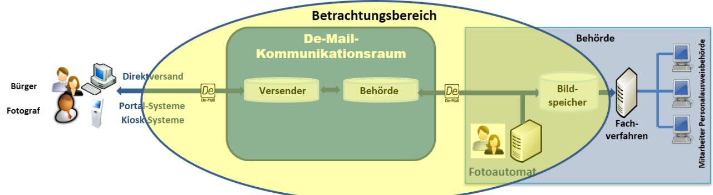
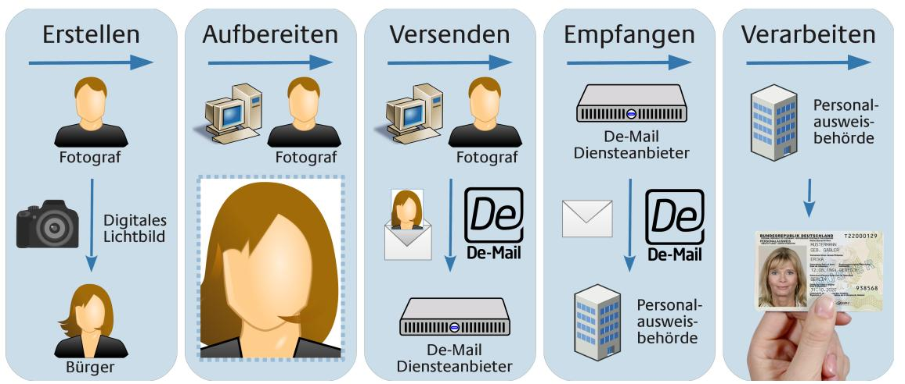

# Technische Richtlinie 03146 Elektronische Bildübermittlung zur Beantragung hoheitlicher Dokumente (E-Bild hD)

Version 1.0 01.11.2014

Bundesamt für Sicherheit in der Informationstechnik Postfach 20 03 63 53133 Bonn Tel.: +49 22899 9582-0 E-Mail: hd-bild-pilot@bsi.bund.de Internet: https://www.bsi.bund.de © Bundesamt für Sicherheit in der Informationstechnik 2014

| 1       | Einleitung 4                                                           |  |
|---------|------------------------------------------------------------------------|--|
| 2       | Bildübermittlung mittels De-Mail 5                                     |  |
| 2.1     | Prozessbeschreibung 5                                                  |  |
| 2.2     | Rechtliche Rahmenbedingungen 6                                         |  |
| 2.3     | Funktionale Anforderungen 7                                            |  |
| 2.3.1   | Verarbeitung von Rück- bzw. Fehlermeldungen8                           |  |
| 2.3.2   | Prüfung der De-Mail und deren Inhalte beim Empfang8                    |  |
| 2.3.3   | Löschen der Lichtbilder durch Dritte 8                                 |  |
| 2.3.4   | Löschen der Lichtbilder durch die PAB8                                 |  |
| 2.4     | Interoperabilität / technische Standards 9                             |  |
| 2.4.1   | Bildformat und Bildkennung 9                                           |  |
| 2.4.2   | De-Mail-Format und Adressierung 9                                      |  |
| 2.5     | Sicherheitsanforderungen 10                                            |  |
| 2.5.1   | Potenzielle Bedrohungen 11                                             |  |
| 2.5.1.1 | Verlust der Vertraulichkeit 11                                         |  |
| 2.5.1.2 | Verlust der Integrität 11                                              |  |
| 2.5.1.3 | Verlust der Verfügbarkeit 12                                           |  |
| 2.5.2   | Definition des Schutzbedarfes 12                                       |  |
| 2.5.2.1 | Schutzbedarf der Daten und Informationen12                             |  |
| 2.5.2.2 | Schutzbedarf der IT-Systeme und Anwendungen14                          |  |
| 2.5.3   | IT-Sicherheitsanforderungen 14                                         |  |
| 2.5.4   | Mindest-Maßnahmen zur Abbildung der IT-Sicherheit15                    |  |
| 2.5.5   | Abgeleitete IT-Sicherheitsmaßnahmen aus Datenschutzanforderungen16     |  |
| 2.5.5.1 | Löschen der Daten 17                                                   |  |
| 2.5.5.2 | Löschen von verarbeiteten De-Mails17                                   |  |
| 2.5.5.3 | Sicheres Löschen 17                                                    |  |
| 2.5.5.4 | Datenvermeidung und Datensparsamkeit17                                 |  |
| 2.5.5.5 | Zweckgebundenheit 17                                                   |  |
| 2.5.6   | Datenschutz-Sensibilisierung 17                                        |  |
| 2.5.7   | IT-Sicherheitskonzept bei hohem Schutzbedarf18                         |  |
| 2.5.8   | Zu betrachtende Sicherheitsziele beim Betrieb eines De-Mail-Gateways18 |  |
|         | Literaturverzeichnis 19                                                |  |
|         | Stichwort- und Abkürzungsverzeichnis (Glossar)20                       |  |

| Abbildung 1: Betrachtungsbereich der TR 4         |  |
|---------------------------------------------------|--|
| Abbildung 2: Überblick über die Prozessschritte 5 |  |

| Tabelle 1: Beteiligte Rollen 5                              |  |
|-------------------------------------------------------------|--|
| Tabelle 2: Technische Parameter Bildformat und Bildkennung9 |  |
| Tabelle 3: Schutzziele 11                                   |  |
| Tabelle 4: Schutzbedarfsfeststellung 13                     |  |

## 1 Einleitung

Der bisherige Prozess zur Erzeugung, Übergabe und Verarbeitung von Lichtbildern im Rahmen der Beantragung hoheitlicher Dokumente (hD) wie Personalausweis-, Reisepass oder Führerschein ist durch Medienbrüche gekennzeichnet. So erzeugt in der Regel ein Fotograf das Lichtbild und händigt es dem Antragsteller auf Fotopapier aus. Der Antragsteller wiederum legt es im Rahmen der Beantragung eines Personalausweises der Personalausweisbehörde (PAB) vor, die es einscannt und in elektronischer Form an den Dokumentenhersteller überträgt. Beim Dokumentenhersteller wird das Lichtbild schließlich auf das hoheitliche Dokument gedruckt bzw. auf dem Chip des Dokuments elektronisch gespeichert. Dieser Prozess ist teilweise ineffektiv und verschlechtert die Qualität des Lichtbildes, das im Personalausweisregister gespeichert bzw. auf den Personalausweis - bzw. Reisepass aufgebracht wird.

Durch die Neuregelung des Personalausweisgesetzes (PAuswG) und der Personalausweisverordnung (PauswV) ist es grundsätzlich möglich, dass Lichtbilder durch Dritte an die PAB übermittelt werden. Voraussetzung dafür ist die Datenübermittlung in einer Form, die durch das Bundesamt für Sicherheit in der Informationstechnik (BSI) in einer Technischen Richtlinie (TR) verbindlich vorgesehen ist. Die vorliegende Version der TR regelt die Übermittlung von Lichtbildern als Anhang einer De-Mail. In einer Folgeversion soll auch die Bildübermittlung mittels Fotoautomaten in der Behörde behandelt werden.

Die Erzeugung der Lichtbilder ist nicht Gegenstand der TR, da hier die Regelungen der [BSI TR-03121] gelten. Auch die Übergabe und Verarbeitung der Bilder in den Fachverfahren der PAB werden im Rahmen dieser TR nicht betrachtet.

Zur Verdeutlichung der Abgrenzung soll folgende Grafik dienen:

#### *Abbildung 1: Betrachtungsbereich der TR*

Der Betrachtungsbereich der TR erstreckt sich

- bei der Bildübermittlung per De-Mail auf das Format und die Kennung der Lichtbild-Datei sowie auf die zu versendenden De-Mail und
- bei der Bildbereitstellung durch einen Fotoautomaten auf das Format und die Kennung der Lichtbild-Datei (im folgenden kurz Bildformat und Bildkennung).

Der Bildspeicher (z.B. Dateisystem, Datenbank), aus dem die Lichtbilder durch die PAB manuell oder automatisiert abgerufen und an die entsprechenden Fachverfahren übergeben werden können, begrenzt den Betrachtungsbereich.

## 2 Bildübermittlung mittels De-Mail

### 2.1 Prozessbeschreibung

Bei der Bildübermittlung mittels De-Mail wird ein Lichtbild erstellt, aufbereitet und eine Lichtbild-Datei erstellt. Danach wird diese einer De-Mail als Anhang beigefügt und an die De-Mail-Adresse der PAB versandt. Dort wird die Lichtbild-Datei empfangen und in einem Bildspeicher abgelegt, um anschließend verarbeitet zu werden.

| Rollenbezeichnung                | Beschreibung                                                                                                                                                                                                                                                                                                                                                                          |  |
|----------------------------------|---------------------------------------------------------------------------------------------------------------------------------------------------------------------------------------------------------------------------------------------------------------------------------------------------------------------------------------------------------------------------------------|--|
| Bürger                           | Antragsteller, der von einem Fotografen ein digitales Lichtbild für einen neuen Personalausweis erstellen und an die Personalausweis behörde (PAB) übermitteln lässt.                                                                                                                                                                                                           |  |
| Fotograf                         | Dienstleister des Bürgers, der das digitale Lichtbild erstellt, aufbereitet und die Lichtbild-Datei über einen De-Mail Diensteanbieter (DMDA) direkt und indirekt an die PAB versendet bzw. versenden lässt. Im Falle des indirekten Versandes ist ein Portal-System an der Übermittlung an den DMDA beteiligt. Der Versandt kann auch über ein Kiosk-System erfolgen. |  |
| De-Mail Diensteanbieter (DMDA)   | Akkreditierter Diensteanbieter, der De-Mail-Dienste gemäß De-Mail-Gesetz erbringt.                                                                                                                                                                                                                                                                                                 |  |
| Personalausweisbehörde (PAB)     | Von den Ländern bestimmte für Ausweisangelegenheiten in Deutschland zuständige Behörde.                                                                                                                                                                                                                                                                                            |  |
| Betreiber/Anbieter Portal-System | Der Betreiber bzw. Anbieter eines Portal-Systems stellt eine IT-Plattform bereit, über die Lichtbild-Dateien mittels De-Mail Gateway an die zuständige PAB weitergeleitet werden.                                                                                                                                                                                               |  |
| Betreiber/Anbieter Kiosk-System  | Der Betreiber bzw. Anbieter eines Kiosk-Systems stellt für Fotografen eine Plattform bereit, über die Lichtbilder aufbereitet und mittels De-Mail-Gateway an die zuständige PAB weitergeleitet werden.                                                                                                                                                                          |  |

An dem Prozess können die in der folgenden *[Tabelle 1: Beteiligte Rollen](#page-4-1)* aufgeführten Rollen beteiligt sein.

Tabelle 1: Beteiligte Rollen

Aus Gründen der Lesbarkeit wird auf die gleichzeitige Verwendung männlicher und weiblicher Sprachformen verzichtet. Sämtliche Rollenbezeichnungen gelten gleichwohl für beiderlei Geschlecht.

Die folgende *[Abbildung 2: Überblick über die Prozessschritte](#page-5-0)* zeigt die einzelnen Prozessschritte in einem Überblick, wobei die Variante "Direkter Versand durch den Fotografen" (siehe die darauf folgende Liste vorstellbarer Versandvarianten) an die PAB dargestellt wird.

*Abbildung 2: Überblick über die Prozessschritte*

Insbesondere sind folgende Varianten, mit denen der De-Mail-Versand initiiert wird, möglich (weitere Varianten sind denkbar):

• **Versand über Portal-Systeme**

Hier stellt ein Anbieter (z.B. eine Fotografenvereinigung oder ein IT-Dienstleister) ein Portal-System bereit, über das Fotografen das Lichtbild an die zuständige PAB senden können. Das Portal-System bietet alle erforderlichen Funktionalitäten zur Erzeugung der Bildkennung, ggf. zur biometrischen Prüfung des Lichtbildes und zum Hochladen der Lichtbild-Datei zwecks Versand per De-Mail. Zu berücksichtigen ist, dass in dieser Variante zwei grundsätzliche Szenarien denkbar sind.

- Nicht der Fotograf, sondern der Anbieter oder Betreiber des Portal-Systems verschickt das Lichtbild von seinem De-Mail-Konto aus (als "Dritter") an die PAB. Der Portal-System-Betreiber besitzt zu diesem Zweck ein De-Mail-Konto, über das die Lichtbild-Dateien an die zuständigen Behörden verschickt werden. Der Fotograf nutzt in dieser Variante nicht seine eigene De-Mail-Adresse.
- Der Fotograf besitzt eine eigene De-Mail-Adresse und nutzt ein Portal-System mit seinem eigenen De-Mail-Konto zum Versand der De-Mail an die PAB. Eine zentrale Speicherung oder Verarbeitung des Lichtbilds durch einen Anbieter oder Betreiber findet nicht statt.
- **Versand über Kiosk-Systeme**

In dieser Variante stellt ein Anbieter (z.B. eine Fotografenvereinigung oder ein IT-Dienstleister) ein Kiosk-System bereit, über das Fotografen das Lichtbild an die zuständige PAB senden können. Das Kiosk-System bietet ebenfalls alle erforderlichen Funktionalitäten zur Erzeugung von Bildkennung, ggf. zur biometrischen Prüfung des Lichtbildes und zum Hochladen der Lichtbild-Datei zwecks Versand per De-Mail. Zu berücksichtigen ist auch in diesem Fall, dass in dieser Variante zwei grundsätzliche Szenarien denkbar sind.

- Nicht der Fotograf, sondern der Inhaber des De-Mail-Kontos (z.B. der Anbieter oder Betreiber des Kiosk-Systems) verschickt von seinem De-Mail-Konto aus (als "Dritter") das Lichtbild.
- Der Fotograf besitzt eine eigene De-Mail-Adresse und nutzt ein Kiosk-System mit seinem eigenen De-Mail-Konto zum Versand der De-Mail an die PAB. Eine zentrale Speicherung oder Verarbeitung des Lichtbilds durch einen Anbieter oder Betreiber findet nicht statt.

Der Unterschied zum Portal-System besteht darin, dass dem Fotografen vom Anbieter ein spezielles IT-System zur Verfügung gestellt wird, während der Fotograf beim Versand über ein Portal-System ein eigenes IT-System als Zugang zum Verfahren verwendet.

#### • **Direkter Versand durch Fotografen**

Hier erstellt ein Fotograf ein Lichtbild seines Kunden, bereitet dieses auf und erzeugt die erforderliche

Bildkennung. Optional überprüft er die (biometrische) Qualität des Bildes. Die Lichtbild-Datei versendet er im Auftrag des Kunden von seinem eigenen De-Mail-Konto aus an das De-Mail-Postfach der PAB.

#### 2.2 Rechtliche Rahmenbedingungen

#### **De-Mail-Gesetz und Technische Richtlinie De-Mail**

Das De-Mail-Gesetz definiert und regelt die De-Mail-Dienste. Die spezifische Ausgestaltung der einzelnen Dienste erfolgt durch die entsprechende Technischen Richtlinie des BSI [BSI TR-01201].

In Bezug auf die Bildübermittlung per De-Mail sind insbesondere die folgenden Punkte von Belang:

- De-Mail-Gesetz, § 5 Postfach- und Versanddienst, Abs. 3: "Der Postfach- und Versanddienst hat die Vertraulichkeit, die Integrität und die Authentizität der Nachrichten zu gewährleisten. [...]"
- Gemäß De-Mail-Gesetz, § 3 Eröffnung eines De-Mail-Kontos können sowohl natürliche Personen als auch juristische Personen, Personengesellschaften oder öffentliche Stellen ein De-Mail-Konto erhalten. Damit können Lichtbilder per De-Mail grundsätzlich vom Fotografen, von Fotografen-Vereinigungen sowie anderen Dienstleistern (z.B. Portal- oder Kiosk-Betreibern) übermittelt werden.
- Gemäß De-Mail-Gesetz, § 5 Postfach- und Versanddienst, Abs. 7 und 8 kann der Absender einer De-Mail eine Versand- und/oder Eingangsbestätigung erhalten. Die Eingangsbestätigung bestätigt, dass die zugehörige De-Mail zu einem bestimmten Zeitpunkt in das De-Mail-Konto des Empfängers eingegangen ist.
- De-Mail-Gesetz, § 4 Anmeldung zu einem De-Mail-Konto regelt unter anderem, dass dem Nutzer der Zugang zu seinem De-Mail-Konto mit einer sicheren Anmeldung (sog. "hohes Authentisierungsniveau") ermöglicht werden muss. Bestimmte De-Mail-Optionen und -Einstellungen erfordern diese sichere Anmeldung. Ferner lassen sich damit "absenderbestätigte" De-Mails versenden, bei denen der DMDA mittels qualifizierter elektronischer Signatur bestätigt, dass sich der Nutzer sicher an seinem De-Mail-Konto angemeldet hat, und die Unverfälschtheit der Bestätigung jederzeit nachprüfbar ist.
- Gemäß De-Mail-Gesetz, § 7 Verzeichnisdienst, Abs. 1 hat der DMDA auf ausdrückliches Verlangen des Nutzers die De-Mail-Adressen in einem Verzeichnisdienst zu veröffentlichen.

#### **Personalausweisverordnung (PAuswV)**

Die PAuswV erlaubt es grundsätzlich, Lichtbilder elektronisch an die PAB zu übermitteln. In "§ 7 Qualitätssicherung des Lichtbildes und der Fingerabdrücke" heißt es dazu: "(1) [...] Wenn die Personalausweisbehörde die technischen Voraussetzungen geschaffen hat, kann das Lichtbild auch

- 1. von Dritten elektronisch verschlüsselt und signiert an die Personalausweisbehörde übermittelt werden, soweit diese Form der Übermittlung durch eine Technische Richtlinie des Bundesamtes für Sicherheit in der Informationstechnik vorgesehen ist, oder
- 2. durch die Personalausweisbehörde gefertigt werden."

Dabei ist "signiert" nicht im Sinne von "qualifiziert elektronisch signiert" zu verstehen, sondern in dem Sinne, dass Authentizität des Absenders und Integritätsschutz der Nachricht gewährleistet sein müssen. Dies ist bei De-Mail aufgrund der zuverlässigen Erstidentifizierung des Account-Inhabers und der Vertrauenswürdigkeit der De-Mail-Infrastruktur gegeben. Damit ist eine De-Mail auch ohne Absenderbestätigung zur Bildübermittlung ausreichend.

Darüber hinaus erfüllt De-Mail die Verschlüsselungs-Anforderung aus der PauswV.

#### **Zugangseröffnung**

Um eine De-Mail mit Lichtbild an eine PAB senden zu dürfen, muss diese zunächst den elektronischen Zugang für De-Mail eröffnen (gemäß der § 3a des Verwaltungsverfahrensgesetzes des Bundes entsprechenden Regelungen der Verwaltungsverfahrensgesetze der Länder). Dies kann beispielsweise durch Veröffentlichung der De-Mail-Adresse auf der Webpage der Behörde erfolgen.

#### **Adressierung der PAB**

Eine Behörde, die den elektronischen Zugang für De-Mail eröffnet hat, ist gemäß De-Mail-Gesetz nicht verpflichtet, ihre De-Mail-Adresse im öffentlichen Verzeichnisdienst ihres DMDA zu veröffentlichen. Daher ist eine Suche nach der De-Mail-Adresse einer PAB über diesen Verzeichnisdienst nicht immer erfolgreich. Auch existiert keine anderweitige Verpflichtung für die Behörde, ihre De-Mail-Adresse in einem anderen Verzeichnis bekannt zu geben.

### 2.3 Funktionale Anforderungen

Für die Lichtbildübermittlung ist eine "einfache" De-Mail (d.h. eine De-Mail, bei der keine Versandoptionen gewählt wurden) ausreichend. Es müssen somit weder die Versandoption "Absenderbestätigt" , die eine Anmeldung am De-Mail-Konto mit dem Authentisierungsniveau "hoch" voraussetzen würde, noch die Versandoption "Eingangsbestätigung" gewählt werden. Die Versandoptionen sind in Abschnitt [2.4.2](#page-9-0) erläutert.

#### 2.3.1 Verarbeitung von Rück- bzw. Fehlermeldungen

Beim Versand der De-Mails kann es zu unterschiedlichen Rück- bzw. Fehlermeldungen des DMDA bzw. der PAB kommen, die in den einzelnen Versandvarianten ggf. unterschiedlich behandelt werden müssen. Der Absender der De-Mail soll dafür Sorge tragen, dass Rück- und Fehlermeldungen entsprechend verarbeitet werden.

Folgende Fälle sollen berücksichtigt werden:

- 1. Versand der De-Mail wird vom DMDA aufgrund Malware-Befall verhindert
- 2. Rückfragen der empfangenden PAB per De-Mail (z.B. bei fehlerhafter Bildkennung usw.)
- 3. Fehlernachricht, dass angegebene De-Mail-Empfänger-Adresse nicht existiert
- 4. Versand- und Eingangsbestätigungen

#### 2.3.2 Prüfung der De-Mail und deren Inhalte beim Empfang

Bevor die Anhänge zur weiteren Verarbeitung geeignet zwischengespeichert werden, muss die De-Mail geprüft werden:

- Prüfung auf Vollständigkeit Es wird geprüft, ob ein Lichtbild enthalten ist.
- Prüfung der Lichtbild-Datei auf Korrektheit (Bildformat, Bildkennung) Es wird geprüft, ob das Bild und die Bildkennung dem korrekten Format entsprechen, s. a. Abschnitt [2.4.1.](#page-8-0) Eine inhaltliche Prüfung (z.B. Biometrietauglichkeit) findet zu diesem Zeitpunkt jedoch noch nicht zwangsläufig statt.

#### 2.3.3 Löschen der Lichtbilder durch Dritte

Werden die Lichtbilder von Dritten (Fotografen, Betreiber von Portal- und Kiosk-Systemen) per De-Mail an die PAB verschickt, so müssen sie von den Dritten zwischengespeichert werden. Sie müssen von diesen gelöscht werden, wenn der Zweck ihrer Speicherung erreicht wurde.

Die Anforderungen an das Löschen von zwischengespeicherten Lichtbildern betreffen zum einen die Ablage der Daten in den Portal- oder Kiosk-Systemen. Zum anderen müssen auch die versendeten De-Mails (Ordner "Gesendete Objekte") gelöscht werden (s. a. Abschnitte [2.5.5.1](#page-16-1) bis [2.5.5.3\)](#page-16-0).

Wenn nicht anders mit dem Antragsteller vereinbart, müssen die Lichtbilder spätestens nach 6 Wochen gelöscht werden. Unabhängig davon kann zwischen Fotograf und Kunde vereinbart werden, dass die Lichtbilder für einen längeren Zeitraum beim Fotografen gespeichert werden, um sie ggf. zu einem späteren Zeitpunkt noch einmal für das Verfahren verwenden zu können. Eine entsprechende Vereinbarung zwischen einem Fotografen oder einem Portal- oder Kiosk-System sind nicht Bestandteil der Regelungen dieser Technischen Richtlinie.

#### 2.3.4 Löschen der Lichtbilder durch die PAB

Auch die PAB muss dafür Sorge tragen, dass die Lichtbilder aus Zwischenspeichern gelöscht werden, wenn der Zweck der Speicherung erreicht wurde. Die Anforderungen an das Löschen von zwischengespeicherten Lichtbildern betreffen zum einen die Ablage im Bildspeicher. Zum anderen müssen auch die empfangenen De-Mails (Ordner "Empfangene Objekte") gelöscht werden.

Die Lichtbilder müssen spätestens 6 Wochen nach Eingang beim DMDA aus den Zwischenspeichern gelöscht werden. Mindestens sollte das Lichtbild einen Monat vorgehalten werden, um dem Antragsteller ausreichend Zeit zu geben bei der Behörde zu erscheinen.

## 2.4 Interoperabilität / technische Standards

#### 2.4.1 Bildformat und Bildkennung

| Für das Bildformat und die Bildkennung werden die folgenden Parameter vorgegeben: |  |
|-----------------------------------------------------------------------------------|--|
|-----------------------------------------------------------------------------------|--|

| Parameter   | Spezifikation                                                                             |
|-------------|-------------------------------------------------------------------------------------------|
| Dateiformat | JPEG-2000                                                                                 |
| Dateigröße  | ca. 15 kB                                                                                 |
| Farbtiefe   | 24-Bit RGB oder 8-Bit Graustufen                                                          |
| Auflösung   | 413 Pixel (Breite) x 531 Pixel (Höhe)                                                     |
| Bildkennung | 14-stellig, Kleinbuchstaben und Ziffern; entsprechend der unten folgenden Beschreibung |
| Dateiendung | .jp2                                                                                      |
| Dateiname   | Bildkennung + Dateiendung                                                                 |

Tabelle 2: Technische Parameter Bildformat und Bildkennung

Als Dateigröße sind 15 bB vorgesehen, gemäß [BSI TR-03121], Teil 3, Abschnitt 7.4. Erlaubt ist eine Abweichung von +/- 5 % entsprechende [BSI TR-03122], Teil 3, Abschnitt 7.4. Es ist zu beachten, dass für die Komprimierung der Bilddaten eine bestätigte Implementierung von JPEG 2000 verwendet werden muss, z.B. JASPER, LuraWave, Aware. Darüber hinaus ist zu beachten, dass die Bilddaten nur einmal komprimiert werden darf, d. h. mehrere verlustbehaftete Komprimierungen nacheinander sind verboten.

Die Bildkennung setzt sich wie folgt zusammen:

- Stelle 1-8: Hashwert, der über das Bild gebildet wird (siehe unterer Absatz)
- Stelle 9,10: Initialen des Antragstellers (Ersatzwert: "00")
- Stelle 11,12: Geburtstag des Antragstellers (Ersatzwert: "00")
- Stelle 13,14: Geburtsmonat des Antragstellers (Ersatzwert: "00")

Der Ersatzwert "00" wird jeweils dann verwendet, falls der Antragsteller keine Daten angibt. Der Ersatzwert kann an einer (z.B. "a873bz89003112.jp2") oder mehreren Stellen (z.B. "a873bz89003100.jp2") auftauchen. Ein Beispiel für einen gültigen Dateinamen ohne Ersatzwerte wäre dementsprechend:

a873bz89ig3112.jp2

Zur Berechnung des 8-stelligen Hashwertes sollte der weit verbreitete CRC-32 Algorithmus verwendet werden, welcher in [ITU-Tv42] Kapitel 8.1.1.6.2 und [ISO 3309] beschrieben wird. Der Auswahl des Algorithmus kommt keinerlei Sicherheitsfunktionalität zu. Es handelt sich hierbei lediglich um einen Mechanismus zur Vermeidung der doppelten Vergabe von Bildkennungen. Ein solches System ist notwendig, da die Bildkennungen dezentral gebildet werden. Entgegen der Standardeinstellung vieler Implementierungen bei der Generierung von Hashwerten ist darauf zu achten, dass die Bildkennung ausschließlich aus Kleinbuchstaben besteht und somit ggf. eine Umwandlung (Groß- zu Kleinbuchstaben) notwendig ist.

#### 2.4.2 De-Mail-Format und Adressierung

Im Folgenden werden allgemeine Hinweise zur Nutzung von De-Mail gegeben. Auf die De-Mail-Spezifikationen, die in [BSI TR-01201] beschrieben sind, wird verwiesen. Wichtig für den konkreten Anwendungsfall ist, dass der Betreff der De-Mail vom Versender mit der Bildkennung des als Anhang beigefügten Bildes befüllt wird. Der Inhalt der De-Mail ist beliebig, jedoch kann der Versender nicht davon ausgehen, dass der Inhalt automatisiert von der Behörde ausgewertet wird. Dem Beispiel aus dem vorherigen Kapitel folgend, müsste der gültige Betreff

a873bz89ig3112

#### lauten.

Bei der Erstellung einer De-Mail können Versandoptionen ausgewählt werden, auch wenn eine eine "einfache" De-Mail ausreicht (s. a. Abschnitt [2.3\)](#page-7-0). Für die elektronische Bildübermittlung kommen insbesondere die Versandoptionen "Absenderbestätigt" und "Eingangsbestätigung" in Betracht.

Wählt der Nutzer die Versandoption "Absenderbestätigt", so versieht der DMDA die De-Mail mit einer qualifizierten elektronischen Signatur nach Signaturgesetz, der eine besonders hohe Beweiskraft beigemessen wird. Durch die Versandoption wird zum Ausdruck gebracht, dass der Nutzer an seinem De-Mail-Konto mit dem Authentisierungsniveau "hoch" angemeldet war, als er die Nachricht versendet hat, z. B. durch Verwendung der Online-Ausweisfunktion seines Personalausweises bei der Anmeldung. Der Empfänger erhält damit einen Nachweis der Authentizität des Absenders und der Integrität der Nachricht. Bei einer Anmeldung unter Verwendung von Nutzername und Passwort steht diese Versandoption nicht zur Verfügung.

Wählt der Nutzer die Versandoption "Eingangsbestätigung", so erhält er vom DMDA des Empfängers eine mit einer qualifizierten elektronischen Signatur versehenen Bestätigungsnachricht als Nachweis, dass die De-Mail im Postfach des Empfängers abgelegt wurde. Der Absender der De-Mail kann mit der Einangsbestätigung gegenüber Dritten nachweisen, dass der Empfänger ab einem bestimmten Zeitpunkt Zugang zu der De-Mail hatte. Eine Eingangsbestätigung ist aber nicht erforderlich, um den Löschzeitpunkt für die versendete De-Mail zu bestimmen, da es sich bei De-Mail um einen Dienst mit zugesicherten Transportzeiten handelt, wonach jede De-Mail spätestens acht Stunden nach Absendung beim DMDA des Empfängers im Postfach liegen und durch den Empfänger abgerufen werden können muss.

Um eine De-Mail an die PAB versenden zu können, muss der Absender deren De-Mail-Adresse kennen.

Die Behörde veröffentlicht die explizit für die Bildübermittlung definierte De-Mail-Adresse auf geeignete Weise. Dies soll durch die Eintragung der De-Mail-Adresse in den öffentlichen Verzeichnisdienst der De-Mail-Infrastruktur erfolgen. Als Alternative kommt aber z. B. auch die Veröffentlichung der De-Mail Adresse auf der eigenen Internetseite der Behörde oder die Weitergabe der De-Mail-Adresse an die Fotografen in Betracht. Es ist zu beachten, dass alleine die Existenz einer De-Mail-Adresse für eine PAB nicht zwangsläufig die Teilnahme am hier beschriebenen Verfahren bedeutet. Die Teilnahme an dem Verfahren muss von der Behörde explizit erklärt werden.

### 2.5 Sicherheitsanforderungen

Bei der Bildübermittlung mittels De-Mail sind insbesondere die in folgender folgenden Tabelle aufgeführten Schutzziele (Grundwerte der IT-Sicherheit[1](#page-10-0) ) zu gewährleisten:

| Schutzziel (Grundwert der IT-Sicherheit) | Beschreibung                                                                                                                                                                                                                                                                                                                                                                                                                                                                                                                                                                                                                                                                                                                                                                    |
|---------------------------------------------|---------------------------------------------------------------------------------------------------------------------------------------------------------------------------------------------------------------------------------------------------------------------------------------------------------------------------------------------------------------------------------------------------------------------------------------------------------------------------------------------------------------------------------------------------------------------------------------------------------------------------------------------------------------------------------------------------------------------------------------------------------------------------------|
| Verfügbarkeit                               | … von Dienstleistungen, Funktionen eines IT-Systems, IT-Anwendungen oder IT-Netzen oder auch von Informationen ist vorhanden, wenn diese den Benutzern jederzeit stets wie gewünscht (mit Ausnahme zumutbarer Ausfallzeiten) zur Verfügung stehen.                                                                                                                                                                                                                                                                                                                                                                                                                                                                                                                     |
| Vertraulichkeit                             | … ist der Schutz vor unbefugter Preisgabe von Informationen. Vertrauliche Daten und Informationen dürfen ausschließlich Befugten in der zulässigen Weise (zweckgebunden) zugänglich gemacht werden.                                                                                                                                                                                                                                                                                                                                                                                                                                                                                                                                                                       |
| Integrität                                  | … im engeren Sinne bezeichnet die Sicherstellung der Korrektheit (Unversehrtheit) von Daten und der korrekten Funktionsweise von Systemen. Wenn der Begriff Integrität auf "Daten" angewendet wird, drückt er aus, dass die Daten vollständig und unverändert sind. In der Informationstechnik wird er in der Regel aber weiter gefasst und auf "Informationen" angewendet. Der Begriff "Informationen" wird dabei für Daten verwendet, denen je nach Zusammenhang bestimmte Attribute wie z. B. Autor oder Zeitpunkt der Erstellung zugeordnet werden können. Der Verlust der Integrität von Informationen kann daher bedeuten, dass diese unerlaubt verändert, Angaben zum Autor verfälscht oder Zeitangaben zur Erstellung manipuliert wurden. |

Tabelle 3: Schutzziele

#### 2.5.1 Potenzielle Bedrohungen

Die in den folgenden Kapiteln aufgeführten generischen Bedrohungen der IT-Sicherheit werden für das Gesamtverfahren der Bildübermittlung mittels De-Mail angenommen.

Darüber hinausgehende Schutzziele des Datenschutzes, wie gesicherte Nichtverkettbarkeit bei befugtem Zugriff (Zweckbindung), gesicherte Transparenz des Verfahrens für Betroffene, gesicherte Intervenierbarkeit in das verfahren, werden hier nicht weiter betrachtet.

#### 2.5.1.1 Verlust der Vertraulichkeit

Verlust der Vertraulichkeit bedeutet, dass Unbefugte Kenntnis von schützenswerten Informationen erlangen. Gründe dafür können sein:

1 Grundwerte der IT-Sicherheit (siehe [BSI-Glossar])

- Unbefugter Zutritt zu den Betriebsräumen der Verfahrensbeteiligten
- Unbefugter Zugang zu den Systemen der Verfahrensbeteiligten
- Unbefugter Zugriff auf Daten
- Einsatz unsicherer kryptografischer Funktionen und Verfahren
- Nicht bestimmungsgemäßer Einsatz kryptografischer Komponenten
- Abhören der Kommunikation inner- oder außerhalb der Verfahrensbeteiligten
- Einsatz von unsicheren Methoden zum Löschen von Daten

#### 2.5.1.2 Verlust der Integrität

Verlust der Integrität bedeutet, dass Daten unbefugt verändert werden. Gründe dafür können sein:

- Technisches Versagen
- Unbefugter Zugriff auf Daten

Integrität im Sinne des IT-Grundschutzes umfasst auch die Meta-Daten, die zusätzliche Informationen enthalten, wie z.B. die Information, wer die Daten verfasst hat. Ein Verlust der Integrität ist somit auch dadurch denkbar, dass die Urheberschaft nicht mehr sicher festgestellt werden kann.

Der Verlust der der Integrität der Daten betrifft in diesem Sinne lediglich die Bild-Datei.

#### 2.5.1.3 Verlust der Verfügbarkeit

Geht die Verfügbarkeit der Systeme verloren, ist der bestimmungsgemäße Betrieb und der damit verbundenen Dienst nicht mehr möglich. Gründe dafür können sein:

- Technisches Versagen
- Bewusste Manipulation (z. B. Löschung)
- Unbefugte Eingriffe (z. B. durch Schadsoftware oder unautorisierte Zugriffe)
- Katastrophale Ereignisse
- Terroristische Angriffe

In diesem Fall sind die Nutzer während des Ausfalls nicht mehr in der Lage, das Verfahren bestimmungsgemäß zu nutzen.

#### 2.5.2 Definition des Schutzbedarfes

Die Bewertung des Schutzbedarfs erfolgt anhand einer qualitativen Abschätzung des Schadens und dessen Einordnung in eine der drei Kategorien:

- Normal (die Schadensauswirkungen sind begrenzt und überschaubar)
- Hoch (die Schadensauswirkungen können beträchtlich sein)
- Sehr Hoch (die Schadensauswirkungen können ein existentiell bedrohliches, katastrophales Ausmaß erreichen)

Wie im [BSI-Standard 100-2], Abschnitt 4.3.1 (Definition der Schutzbedarfskategorien) dargestellt werden bei der Definition des Schutzbedarfs folgende Schadensszenarien betrachtet:

• Verstoß gegen Gesetze/Vorschriften/Verträge,

- Beeinträchtigung des informationellen Selbstbestimmungsrechts,
- Beeinträchtigung der persönlichen Unversehrtheit,
- Beeinträchtigung der Aufgabenerfüllung,
- negative Innen- oder Außenwirkung und
- finanzielle Auswirkungen.

Zur Abgrenzung der Schutzbedarfskategorien "normal", "hoch" und "sehr hoch" werden die Tabellen verwendet, die in [BSI-Standard 100-2], Abschnitt 4.3.1 (Definition der Schutzbedarfskategorien) enthalten sind.

#### 2.5.2.1 Schutzbedarf der Daten und Informationen

Der Schutzbedarf ist primär für die Lichtbilder festzustellen. Die Schutzbedarfsfeststellung erstreckt sich darüber hinaus auf weitere sekundäre Daten, wie z.B. Sicherungsdaten oder Protokolldaten. Sicherungsdaten sind Datenobjekte, die dem Schutz der Integrität und ggf. Authentizität anderer Datenobjekte dienen. Durch Protokolldaten werden sicherheitsrelevante Abläufe und Ereignisse dokumentiert.

| Schutzziel      | Schutzbedarf    | Begründung                                                                                                                                                                                                                                                                                                                                                                                                                                                                                                                                                                                                                                                                                                                                                                                                                                                                                                                                                                                                                                                                                                                                                                                                                                                                                                                      |
|-----------------|-----------------|---------------------------------------------------------------------------------------------------------------------------------------------------------------------------------------------------------------------------------------------------------------------------------------------------------------------------------------------------------------------------------------------------------------------------------------------------------------------------------------------------------------------------------------------------------------------------------------------------------------------------------------------------------------------------------------------------------------------------------------------------------------------------------------------------------------------------------------------------------------------------------------------------------------------------------------------------------------------------------------------------------------------------------------------------------------------------------------------------------------------------------------------------------------------------------------------------------------------------------------------------------------------------------------------------------------------------------|
| Vertraulichkeit | Normal bis Hoch | Ein Gesetzesverstoß hätte in der Regel nur geringfügige Konsequenzen2 . Eine Beeinträchtigung des informationellen Selbstbestimmungsrechts ist denkbar, würde den Betroffenen jedoch nicht in seiner gesellschaftlichen Stellung oder in seinen wirtschaftlichen Verhältnissen beeinträchtigen. Eine Beeinträchtigung der persönlichen Unversehrtheit erscheint nicht möglich. Ein Verlust der Vertraulichkeit hätte nur unbedeutende Auswirkungen auf die Aufgabenerfüllung. Es wären in der Regel nur geringe Ansehens- oder Vertrauensbeeinträchtigung zu erwarten. Die finanziellen Auswirkungen wären gering Es kann aber ausnahmsweise ein hoher Schutzbedarf bestehen, falls Lichtbilder in erheblichem Umfang gespeichert werden, da in diesem Fall ein erhöhtes Angriffspotenzial in Bezug auf die Vertraulichkeit der Daten bestehen kann. Dies kann z.B. bei Beteiligten außerhalb der De-Mail-Infrastruktur der Fall sein, die als zentrale Bildsammelstelle für Lichtbilder fungieren. Hier sind in erster Linie Betreiber von Portal-und Kiosk-Systemen zu nennen, über die Bürger oder Fotografen Lichtbilder an die zuständige PAB senden können. Ob der Schutzbedarf noch normal oder bereits hoch ist, kann nur im Einzelfall entschieden werden. |
| Integrität      | Normal          | Ein Gesetzesverstoß hätte in der Regel nur geringfügige Konsequenzen3 . Eine Beeinträchtigung des informationellen Selbstbestimmungsrechts ist denkbar, würde den Betroffenen jedoch nicht in seiner gesellschaftlichen Stellung oder in seinen wirtschaftlichen Verhältnissen beeinträchtigen. Eine Beeinträchtigung der persönlichen Unversehrtheit erscheint nicht                                                                                                                                                                                                                                                                                                                                                                                                                                                                                                                                                                                                                                                                                                                                                                                                                                                                                                                                         |

Der Schutzbedarf wird für die Lichtbilder wie folgt festgelegt und begründet.

2 Verstöße gegen den Datenschutz können nach §§ 43 oder 44 BDSG geahndet werden. Zwar sind verstöße gegen den Datenschutz sogar mit Freiheitsstrafe bedroht, allerdings nur unter der Voraussetzung, dass die Handlung gegen Entgelt oder in der Absicht behangen wird, sich oder einen anderen zu bereichern oder einen anderen zu schädigen. Bei der elektronischen Bildübermittlung sind diese Motive eher fernliegend.

3 Denkbar sind Verstöße gegen Verträge, interne Vorschriften und Anweisungen.

| Schutzziel    | Schutzbedarf | Begründung                                                                                                                                                                                                                                                                                                                                                                                                                                                                                                                                                           |
|---------------|--------------|----------------------------------------------------------------------------------------------------------------------------------------------------------------------------------------------------------------------------------------------------------------------------------------------------------------------------------------------------------------------------------------------------------------------------------------------------------------------------------------------------------------------------------------------------------------------|
|               |              | möglich. Ein Integritätsverlust hätte nur unbedeutende Auswirkungen auf die Aufgabenerfüllung4 . Es wären nur geringe Ansehens- oder Vertrauensbeeinträchtigung zu erwarten. Die finanziellen Auswirkungen wären gering.                                                                                                                                                                                                                                                                                                                                 |
| Verfügbarkeit | Normal       | Ein Gesetzesverstoß hätte in der Regel nur geringfügige Konsequenzen5 . Eine Beeinträchtigung des informationellen Selbstbestimmungsrechts ist in der Regel auszuschließen, da die Betroffenen keinen Zugriff auf ihre Daten haben.Eine Beeinträchtigung der persönlichen Unversehrtheit erscheint nicht möglich. Ein Verfügbarkeitsverlust hätte nur unbedeutende Auswirkungen auf die Aufgabenerfüllung6 . Es wären nur geringe Ansehens- oder Vertrauensbeeinträchtigungen zu erwarten. Die finanziellen Auswirkungen wären gering. |

Tabelle 4: Schutzbedarfsfeststellung

Der Schutzbedarf der sekundären Daten ist höchstens so hoch wie der Schutzbedarf der Lichtbilder. Auch für diese Daten ist der Schutzbedarf "Normal".

#### 2.5.2.2 Schutzbedarf der IT-Systeme und Anwendungen

Wie in [BSI-Standard 100-2], Abschnitt 4.3.3. (Schutzbedarfsfeststellung für IT-Systeme) dargestellt, müssen nun die möglichen Schäden der relevanten Anwendungen in ihrer Gesamtheit betrachtet werden, um den Schutzbedarf der IT-Systeme zu ermitteln. Im Wesentlichen bestimmt der Schaden bzw. die Summe der Schäden mit den schwerwiegendsten Auswirkungen den Schutzbedarf eines IT-Systems.

Werden mehrere Anwendungen bzw. Informationen auf einem IT-System verarbeitet, so kann durch Kumulation mehrerer (z. B. kleinerer) Schäden auf einem IT-System ein insgesamt höherer Gesamtschaden entstehen (Kumulationseffekt). Es ist darüber hinaus zu überlegen, ob sich der Schutzbedarf erhöht, wenn Bildmaterial in größerem Umfang verarbeitet wird.

Solange die elektronische Bildübermittlung nicht mit anderen Verfahren kombiniert wird, die auf den gleichen IT-Systemen betrieben werden, kann der Kumulationseffekt vernachlässigt werden. Sollen mehrere Verfahren auf dem gleichen IT-System betrieben werden, ist der Schutzbedarf speziell für das konkrete IT-System zu betrachten. Im Zweifel sollte auf eine Kombination mit anderen Verfahren verzichtet werden.

#### 2.5.3 IT-Sicherheitsanforderungen

Aus den oben genannten Bedrohungen und den definierten Schutzbedarf ergeben sich folgende allgemeine Anforderungen:

- Verhinderung des Einsatzes manipulierter Soft- und Hardware
- Verhinderung der Offenlegung schützenswerter Informationen durch Verwendung sicherer Übertragungskanäle
- Schutz der Speichermedien bei der Zwischenspeicherung schützenswerter Informationen

4 Eine Integritätsverletzung der Lichtbilder könnte zu einer Verzögerung des Prozesses führen. Ist das Lichtbild nicht korrekt, ist dieses noch nicht zur Erstellung eines hoheitlichen Dokuments genutzt worden und kann entsprechend gegen ein korrektes Lichtbild ausgetauscht werden

5 Denkbar sind Verstöße gegen Verträge, interne Vorschriften und Anweisungen.

6 Gesetzliche Fristen bestehen nicht.

- Einsatz sicherer Verschlüsselungstechnologie beim Transport schützenswerter Informationen über unsichere Netze
- Etablierung und Aufrechterhaltung eines sicheren Betriebs der Dienste und Komponenten durch die Verfahrensbeteiligten, um z.B. Sicherheitslücken durch Software-Schwachstellen zu vermeiden
- Verhinderung von unbefugtem Zutritt in Räumlichkeiten, in denen die Datenverarbeitung stattfindet
- Verhinderung des unbefugten Zugangs zu den datenverarbeitenden Komponenten
- Verhinderung des unbefugten Zugriffs auf Geräte und IT-Systeme
- Verhinderung des Missbrauchs durch Sicherstellung der korrekten Empfänger der zu übermittelnden personenbezogenen Daten
- Sicherstellung der Nutzung der übermittelten personenbezogenen Daten durch korrekte Zuordnung und Übermittlung von Rückmeldungen / Benachrichtigungen an den Absender
- Vermeidung von Fehlfunktionen von Geräten oder IT-Systemen durch korrekte Implementierung von Anwendungen zur Prozessabbildung
- Verhinderung eines Vertraulichkeitsverlustes schutzbedürftiger Daten des zu schützenden Netzes

#### 2.5.4 Mindest-Maßnahmen zur Abbildung der IT-Sicherheit

Aus den IT-Sicherheitsanforderungen ergeben sich folgende umzusetzende Mindest-Maßnahmen zur Etablierung angemessener IT-Sicherheit:

- Sicherstellung der Integrität der Software-Systeme auf Servern als auch auf Client-Systemen (siehe Maßnahme M 2.86 [IT-GS-Kataloge]), z.B. durch
	- Bezug der Software von vertrauenswürdigen Quellen
	- Verwendung von gegen unbefugten Zugriff geschützten Originaldatenträgern
	- Verifikation der Integrität eingesetzten Software unter Verwendung von Checksummen
- Sicherung der Server- bzw. Clientsysteme vor einem Befall durch Schadprogramme (siehe Maßnahme M 2.224 [IT-GS-Kataloge]), z.B. durch
	- Einsatz von regelmäßig aktualisierten Viren-Schutzprogrammen
	- möglichst starke Einschränkung von Benutzerrechten auf Clients und anderen Endgeräten
	- ggf. Bildung sicherer Teilnetze, die möglichst gut gegen andere Netzbereiche abgeschottet sind
- Die Absicherung der Kommunikation auch außerhalb von De-Mail durch Verwendung sicherer Übertragungskanäle mit folgenden Eigenschaften
	- Gegenseitige Authentisierung, Authentifizierung und Autorisierung
	- Nutzung verschlüsselter Kommunikation
	- Nutzung von integritätsgeschützter Kommunikation
- Schutz für die Lichtbilder während der Zwischenspeicherung auf verwendeten Speichermedien, z.B. durch
	- Schutz vor unbefugtem Zugriff auf die Speichermedien
	- Verschlüsselte Speicherung
- Nutzung sicherer kryptografischer Verfahren beim Transport schützenswerter Informationen über unsichere Netze (siehe z.B. Maßnahme M 5.66 [IT-GS-Kataloge]), insbesondere auch durch
	- Umsetzung der Empfehlungen [BSI TR-02102-1] bzw. [BSI TR-02102-2] und
	- [BSI TR-03116-4] Vorgaben für Kommunikationsverfahren im E-Government
- Das Ergreifen von Maßnahmen gegen bekannt gewordene und durch Veröffentlichungen zugänglich gemachte Sicherheitslücken (siehe Maßnahme 3.35 [IT-GS-Kataloge]), z.B. durch
	- Regelmäßige Sichtung geeigneter Informationsquellen
	- Zeitnahes Einspielen sicherheitsrelevanter Patches
	- Ggf. Verwendung von Zusatzsoftware bzw. -hardware
- Etablierung von Einschränkungen zum Zutritt zu den Systemen (siehe z.B. Maßnahme M 1.19 [IT-GS-Kataloge]), z.B. durch
	- einbruchhemmende Türen und Fenster
	- besondere Schließzylinder, Zusatzschlösser und Riegel
	- Verschluss von nicht benutzten Nebeneingängen
- Korrekte Verwendung von Passworten oder anderen Zugangsschutzmechanismen (siehe z.B. Maßnahme M 2.11 [IT-GS-Kataloge], Regelung des Passwortgebrauchs), insbesondere
	- Vorgaben zur Länge und Komplexität
	- Sperrung nach Fehlversuchen
	- regelmäßiger Passwortwechsel
- Restriktive Vergabe von Zugriffsrechten (siehe z.B. Maßnahme M 2.8 [IT-GS-Kataloge]), insbesondere
	- Zugriffsrechte müssen für die Aufgabenwahrnehmung notwendig sein ("Need-to-know-Prinzip")
	- Ggf. Aufteilung von Administratortätigkeiten auf mehrere Rollen
	- Beachtung von Unvereinbarkeiten der Aufgabenwahrnehmung (Funktionstrennung)
- Sicherstellung der korrekten Empfänger der zu übermittelnden personenbezogenen Daten, insbesondere
	- Nutzung von De-Mail für die Übertragung der Lichtbilder
	- Sicherstellung der korrekten Adressierung von übertragenden Daten
- Sicherstellung der Verarbeitung von Rück-Meldungen und Benachrichtigungen durch den Absender, insbesondere
	- Korrekte Zuordnung zum Absender der Bildübermittlung
	- Versand an den Absender
	- Verarbeitbarkeit durch den Absender
- Prüfung von Implementierungen von Anwendungen zur korrekten Prozessabbildung, insbesondere
	- Testen (vergl. Maßnahme M 2.83 [IT-GS-Kataloge])
	- Freigabe (vergl. Maßnahme M 2.85 [IT-GS-Kataloge])
	- Installation nach Anweisung (vergl. Maßnahme M 2.87 [IT-GS-Kataloge])
- Ggf. Härtung der Systeme und Anwendungen
- Verwendung eines Sicherheitsgateways zur Schaffung und Nutzung sicherer Netzübergänge (vgl. Maßnahme M 4.100 [IT-GS-Kataloge] zum Schutz gegen aktive Inhalte)
- Einsatz von Personal Firewalls für Clients (vgl. Maßnahme M 5.91 [IT-GS-Kataloge])
- Bereitstellung eines Single-Point-Of-Contact (SPOC) für die jeweiligen Nutzer zur Klärung von Störungen und Fehlfunktionen.

Fotografen sollten diese Mindest-Maßnahmen umsetzen. Alle anderen Anwender und IT-Betreiber sind zur Umsetzung dieser Mindest-Anforderungen verpflichtet. Soweit ein hoher Schutzbedarf besteht ist darüber hinaus eine ergänzende Sicherheitsanalyse gemäß [BSI-Standard 100-2] und ggf. eine Risikoanalyse gemäß [BSI-Standard 100-3] erforderlich (s. a. Abschnitt [2.5.7\)](#page-17-0).

#### 2.5.5 Abgeleitete IT-Sicherheitsmaßnahmen aus Datenschutzanforderungen

Die [IT-GS-Kataloge] enthalten den Baustein B 1.5 Datenschutz. Die in anderen Bausteinen der Kataloge enthaltenen Maßnahmen dienen der Informationssicherheit und damit auch dem Schutz von personenbezogenen Daten. Im Baustein B 1.5 Datenschutz sind IT-Sicherheitsmaßnahmen enthalten, die spezifische Aspekte aus Sicht des Datenschutzes behandeln. Es sind insbesondere folgende Anforderungen zu erfüllen.

#### 2.5.5.1 Löschen der Daten

Personenbezogene Daten müssen gelöscht werden, wenn der Zweck ihrer Speicherung erreicht wurde. Gespeicherte Daten müssen daher unverzüglich nach der korrekten abgeschlossenen Verarbeitung bzw. nach Ablauf der unter Abschnitt [2.3.3](#page-8-2) und [2.3.4](#page-8-1) definierten Fristen in den Speichern der jeweiligen Komponenten und Dienste gelöscht werden. Die Löschung obliegt dem jeweiligen Verantwortlichen für die Dienste und Komponenten.

Dies schließt auch die Daten in Zwischenspeichern ein.

#### 2.5.5.2 Löschen von verarbeiteten De-Mails

Verarbeitete De-Mails werden beim Absender im Ordner gesendeter Objekte und beim Empfänger im Ordner Posteingang gespeichert. Nach erfolgreicher Übermittlung an den Empfänger bzw. nach Ablauf der unter Abschnitt [2.3.3](#page-8-2) definierten Frist und der erfolgreichen Übernahme aus dem Posteingang bzw. nach Ablauf der unter [2.3.4](#page-8-1) definierten Frist sind die De-Mail-Nachrichten mit den personenbezogenen Inhaltsdaten unverzüglich zu löschen.

#### 2.5.5.3 Sicheres Löschen

Das Löschen hat auf gesichertem Wege zu erfolgen, sodass eine Wiederherstellung der personenbezogenen Daten nicht möglich ist. Verfahren zum sicheren Löschen sind in [IT-GS-Kataloge], Maßnahmen M 2.167 und M 2.515, beschrieben.

Bei der Löschung von De-Mails auf Seiten des DMDAs erfolgt dies durch den DMDA selbst, wenn durch den Nutzer die Löschung initiiert wird. Dabei ist zu berücksichtigen, dass der Ordner "Papierkorb" (zweistufiges Löschverfahren) ebenfalls geleert werden muss.

Auf der Seite des Versenders, der Behörde und des Portal-Anbieters ist das sichere Löschen stets durch den jeweiligen Betreiber der Anwendung zu gewährleisten.

#### 2.5.5.4 Datenvermeidung und Datensparsamkeit

Die Forderung hinsichtlich der notwendigen Datensparsamkeit wurde bei der Definition der Bildkennung berücksichtigt (s. a. Abschnitt [2.4.1\)](#page-8-0) Es ist explizit keine Verpflichtung zur Angabe vollständiger personenbezogener Daten (z. B. Vor- und Nachname) in der De-Mail gefordert. Eine Erweiterung um weitere freiwillige Angaben ist explizit nicht gestattet.

#### 2.5.5.5 Zweckgebundenheit

Die Lichtbilder dürfen nur zum Zweck der Übermittlung an die PABn verarbeitet werden. Zweckänderung sind nur auf gesetzlicher Grundlage oder mit Einwilligung des Betroffenen zulässig. Eine Zweckänderung liegt z.B. vor, wenn ein Fotograf die Daten in seine Kundendatei aufnehmen will.

#### 2.5.6 Datenschutz-Sensibilisierung

Im Rahmen der De-Mail-Account-Nutzung ist der DMDA verpflichtet, seine Kunden zu sensibilisieren bzw. zu beraten. Dabei ist gemäß § 9 De-Mail-G dem Nutzer darzulegen, welche Risiken bestehen und wie er diese Risiken vermeiden kann.

Portal- und Kioskbetreiber müssen eine Sensibilisierung und Beratung ähnlich eines DMDA für ihre Nutzer anbieten, sodass ein entsprechendes Sicherheitsbewusstsein bei den Endanwendern – in dem Fall den Fotografen – erzielt werden kann.

Anbietern und Betreibern von Verfahrenskomponenten mit hohem Schutzbedarf wird empfohlen sich zur Erfüllung der hohen Anforderungen an die Vertraulichkeit auch mit dem für sie zuständigen Datenschutz-Beauftragten abzustimmen. Im Falle der DMDAs ist dies bereits durch die Erfüllung der Forderungen aus § 18 (1) 4 De-Mail-G nachgewiesen.

#### 2.5.7 IT-Sicherheitskonzept bei hohem Schutzbedarf

Systeme zur automatisierten Massenverarbeitung von Daten mit hohem Schutzbedarf sind in besonderer Weise zu schützen. Im Fall einer Schwachstelle der elektronischen Datenübermittlung könnten personenbezogene bzw. personenbeziehbare Daten in größerem Umfang in unberechtigte Hände gelangen oder aber auch in größerem Umfang Bildmaterial verändert bzw. Nachrichtenübermittlungen gestört werden .

Aufgrund des erhöhten Schutzbedarfs sind daher neben der Umsetzung der oben genannten IT-Sicherheitsanforderungen weitere Maßnahmen zu ergreifen.

Der Betreiber eines entsprechenden Systems soll

- ein Informationssicherheitsmanagementsystem (ISMS) und
- ein Risikomanagement

etablieren, dass dem erhöhten Schutzbedarf entspricht und

• ein entsprechendes IT-Sicherheitskonzept erstellen und umsetzen.

#### 2.5.8 Zu betrachtende Sicherheitsziele beim Betrieb eines De-Mail-Gateways

Zusätzlich sind beim Betrieb eines De-Mail-Gateways die Anforderungen gemäß [BSI TR-01201] zu beachten. Insbesondere ist erforderlich, dass

• eine Prüfung des Nutzers auf eine Berechtigung zur Nutzung der De-Mail-Dienste in Verbindung mit dem Zugriff über das Gateway stattfindet,

- bei mehreren Mandanten, die gemeinsam ein Gateway nutzen, sichergestellt wird, dass eine korrekte Zuordnung der einzelnen Nutzer zu dem jeweiligen De-Mail-Konto erfolgt,
- das Authentisierungstoken bei Missbrauch unverzüglich gesperrt wird und
- der Gateway-Betreiber einen Nachweis u.a. in Form eines Sicherheitskonzeptes zum sicheren Betrieb der Infrastruktur und Anbindung der Mandanten an das De-Mail-Gateway erstellt.

## Literaturverzeichnis

| BSI TR-01201       | BSI: Technische Richtlinie De-Mail                                                  |
|--------------------|-------------------------------------------------------------------------------------|
| BSI TR-02102-1     | BSI: Kryptographische Verfahren: Emfpehlungen und Schlüssellängen                   |
| BSI TR-02102-2     | BSI: Kryptographische Verfahren: Empfehlungen und Schlüssellängen, Teil 2 -         |
|                    | Verwendung von Transport Layer Security (TLS)                                       |
| BSI TR-03116-4     | BSI: Kryptographische Vorgaben für Projekte der Bundesregierung, Teil 4             |
| BSI TR-03121       | BSI: Biometrie in hoheitlichen Anwendungen                                          |
| BSI TR-03122       | BSI: Konformitätsspezifikation zur Technischen Richtlinie BSI TR-03121              |
| BSI-Glossar        | BSI: Glossar,                                                                       |
|                    | https://www.bsi.bund.de/DE/Themen/Cyber-Sicherheit/Glossar/cs_Glossar_node.html     |
| BSI-Standard 100-2 | BSI: BSI-Standard 100-2, IT-Grundschutz-Vorgehensweise, Version 2.0                 |
| BSI-Standard 100-3 | BSI: BSI-Standard 100-3, Risikoanalyse auf der Basis von IT-Grundschutz             |
| ISO 3309           | ISO/IEC: 3309:1993, Information technology, Telecommunications and information      |
|                    | exchange between systems, High-level data link control (HDLC) procedures, Frame     |
|                    | structure                                                                           |
| IT-GS-Kataloge     | BSI: IT-Grundschutz-Kataloge                                                        |
| ITU-Tv42           | ITU-T: V.42, Error-correcting procedures for DCEs using asynchronous-to-synchronous |
|                    | conversion                                                                          |
|                    |                                                                                     |

## Stichwort- und Abkürzungsverzeichnis (Glossar)

- BSI Bundesamt für Sicherheit in der Informationstechnik
- DMDA De-Mail-Diensteanbieter
- hD Hoheitliche Dokumente
- ISMS Informationssicherheitsmanagementsystem
- PAB Personalausweisbehörde
- TR Technische Richtlinie