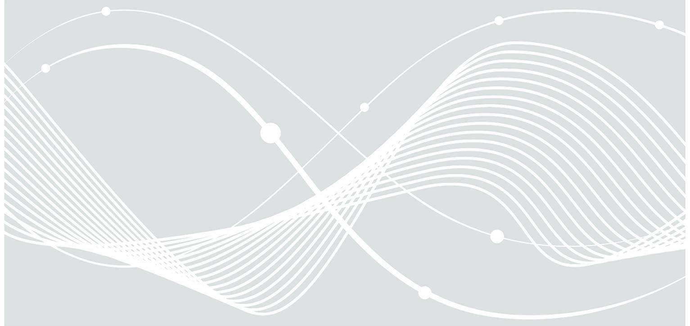
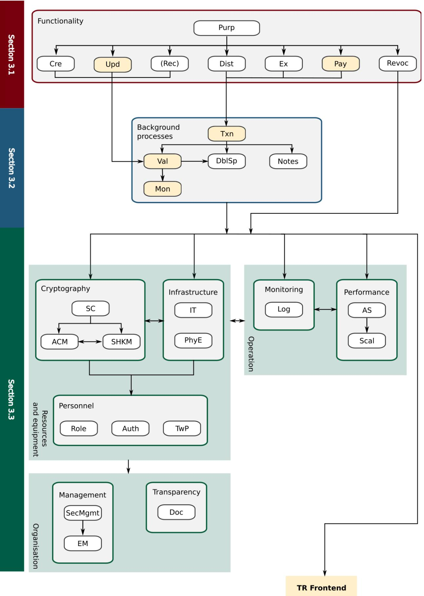
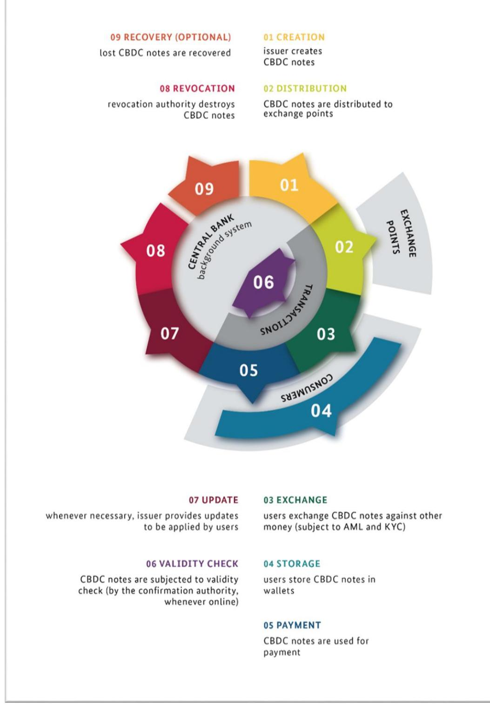

# Technical Guideline BSI TR-03179-1: Central Bank Digital Currency

Part 1: Requirements on backend systems

## Document history

| Version | Date             | Editor   | Description                                |
|---------|------------------|----------|--------------------------------------------|
| 0.1     | December 2022 | DI 11 | First complete draft                       |
| 0.2     | February 2023    | DI 11 | Second draft based on comments received |
| 0.3     | June 2023        | DI 11 | Third draft based on comments received  |
| 1.0     | January 2024     | DI 11 | Finalisiation; first public version     |

*Table 1: Document history*

Federal Office for Information Security P.O. Box 20 03 63 53133 Bonn, Germany Tel.: +49 22899 9582-0 E-Mail: cbdc@bsi.bund.de Internet: https://www.bsi.bund.de © Federal Office for Information Security 2024

| 1 |       | Introduction                                       | 6 |
|---|-------|----------------------------------------------------|---|
|   | 1.1   | Subject and Purpose of the Technical Guideline  | 6 |
|   | 1.2   | Scope of the Technical Guideline                | 6 |
|   | 1.3   | Overview of the Technical Guideline             | 6 |
|   | 1.4   | Terms                                              | 7 |
| 2 |       | Overview of security requirements                  | 9 |
|   | 2.1   | Life cycle, entities and components                | 9 |
|   | 2.2   | General considerations11                           |   |
|   | 2.2.1 | Delegation of responsibility11                     |   |
|   | 2.2.2 | Higher-level functionality11                       |   |
|   | 2.2.3 | Crypto-agility11                                   |   |
|   | 2.2.4 | Technical design choices12                         |   |
|   | 2.3   | High-level security analysis15                     |   |
| 3 |       | Requirements17                                     |   |
|   | 3.1   | Functional requirements17                          |   |
|   | 3.1.1 | Primary intended purpose 17                     |   |
|   | 3.1.2 | Creation19                                         |   |
|   | 3.1.3 | Distribution 21                                 |   |
|   | 3.1.4 | Revocation 23                                   |   |
|   | 3.1.5 | Exchange25                                         |   |
|   | 3.1.6 | Update28                                           |   |
|   | 3.1.7 | Recovery (OPTIONAL)32                              |   |
|   | 3.1.8 | Payment34                                          |   |
|   | 3.2   | Transaction-related security requirements37        |   |
|   | 3.2.1 | CBDC notes in general 37                        |   |
|   | 3.2.2 | Validity check for CBDC notes39                    |   |
|   | 3.2.3 | Double Spending43                                  |   |
|   | 3.2.4 | Transferring CBDC notes45                          |   |
|   | 3.2.5 | Monitoring failed validity checks50                |   |
|   | 3.3   | General security requirements53                    |   |
|   | 3.3.1 | Information Security Management System53           |   |
|   | 3.3.2 | Emergency management and incident handling 54   |   |
|   | 3.3.3 | Appropriate cryptographic measures57               |   |
|   | 3.3.4 | Secure handling and storage of key material 59  |   |
|   | 3.3.5 | Secure Communication63                             |   |

| 3.3.6        | Authentication of personnel 64                                    |  |
|--------------|----------------------------------------------------------------------|--|
| 3.3.7        | Role management66                                                    |  |
| 3.3.8        | Trustworthy personnel68                                              |  |
| 3.3.9        | Hardened IT systems and networks supporting logging and monitoring69 |  |
| 3.3.10       | Application-level logging and archiving72                            |  |
| 3.3.11       | Physical and environmental security 74                            |  |
| 3.3.12       | Availability of services76                                           |  |
| 3.3.13       | Scalability78                                                        |  |
| 3.3.14       | Documentation80                                                      |  |
|              | Annex A: Comparison of CBDC and cash83                               |  |
|              | Glossary85                                                           |  |
|              | List of abbreviations87                                              |  |
| Bibliography | 88                                                                   |  |
|              |                                                                      |  |

## 1 Introduction

## 1.1 Subject and Purpose of the Technical Guideline

The subject of this Technical Guideline (Technische Richtlinie, TR) are Central Bank Digital Currencies (CBDCs). CBDCs are electronic forms of money that are issued and managed by an official body (e. g. a central bank) in the same way as cash. They are not to be mistaken with so-called 'cryptocurrencies'.

A CBDC cannot replace all characteristics of cash, but can complement it in places where it provides additional functionality and facilitates further use cases. [Annex A](#page-82-0) 'Comparison of CBDC and cash' provides a juxtaposition of CBDC and cash. The aim of this TR is to lay IT security foundations for CBDCs to exhibit the advantages of cash as closely as possible while leaving open the possibility of introducing additional functionality.

The purpose of this TR is to describe requirements that ensure a high level of IT security for the backend systems that support the operation of the CBDC ecosystem. The CBDC ecosystem consists of the backend systems operated by the central bank, the frontend functionality made available to end users by wallet providers, exchange points, which may be operated by third parties other than the central bank, and, potentially, additional service providers. If implemented, the CBDC ecosystem constitutes a critical infrastructure, and this TR ensures that it is made resilient to a wide range of attacks. In addition to implementing the goal of security-by-design, this TR also considers some privacy aspects.

## 1.2 Scope of the Technical Guideline

This TR consists of two parts, which cover different components and processes of the CBDC ecosystem. The present document constitutes the first part of this TR and focuses on the backend systems operated by the central bank to support the CBDC ecosystem. The processes for which requirements are drawn up cover the whole life cycle of CBDC notes (for a detailed discussion of the term cf[. 2.2.4.2](#page-11-1) '[Token-based approach versus](#page-11-1)  [account-based approach](#page-11-1)'). Some processes, in particular payments, are strongly user-driven, and corresponding requirements are to be found in TR Frontend [1]. A more detailed differentiation of the two parts of the TR can be found in [2.1](#page-8-1) 'Life cycle, entities [and components](#page-8-1)'.

The scope of this part of this TR is limited to the core system of the CBDC backend and does not consider additional functionality built on top of the core system (cf. [2.2.2](#page-10-2) '[Higher-level functionality](#page-10-2)'). Furthermore, cryptocurrencies, which are not issued and managed by an official body, are not in the scope of this TR. In addition, this TR does not contain an exhaustive treatment of data protection requirements, and conformity with this TR does not necessarily imply conformity with the General Data Protection Regulation (GDPR) [2]. Similarly, this TR contains some references to Know Your Customer (KYC) and Anti-Money Laundering (AML) regulation, but explicit provisions to this effect are not in the scope of this TR.

## 1.3 Overview of the Technical Guideline

The structure of this part of this TR is as follows: The general design approach for the CBDC life cycle is introduced in [2.1](#page-8-1) 'Life cycle, entities [and components](#page-8-1)'. [2.2](#page-10-0) '[General considerations](#page-10-0)' discusses various overarching topics, such as the implications of specific design choices (cf. [2.2.4](#page-11-0) '[Technical design choices](#page-11-0)'), in particular with regard to IT security. [2.3](#page-14-0) '[High-level security analysis](#page-14-0)' provides a security analysis from a high-level perspective.

The actual requirements are contained i[n 3](#page-16-0) '[Requirements](#page-16-0)' and are split into three categories (cf[. Figure 1\)](#page-7-0). First, requirements on the different processes supporting the general CBDC functionality along the CBDC life cycle are provided in [3.1](#page-16-1) '[Functional requirements](#page-16-1)'. These are complemented by overarching requirements that hold to different degrees for the background processes of all types of transactions of CBDC notes, which are listed in [3.2](#page-36-0) '[Transaction-related security requirements](#page-36-0)'[. 3.3](#page-52-0) '[General security](#page-52-0)  [requirements](#page-52-0)' contains requirements for ensuring a high level of security of the IT systems and supporting processes which are necessary to implement the CBDC backend functionality. These requirements are not specific to any of the processes from the life cycle, but are general in scope. Among other things, this section provides requirements on organisational measures, e. g. on information security management systems, requirements on resources and equipment, in particular on cryptography, personnel, IT systems and physical security, and requirements on the operational workflow.

In all sections, this TR uses a three-step approach. This approach consists in first drawing up general objectives that need to be fulfilled and identifying threats to the process or security property in question. More specific requirements are then provided to address the objectives and mitigate the threats. A rationale providing a matching between objectives, threats and requirements has the purpose of ensuring the completeness and adequacy of the requirements. Requirements with the suffix "Off" only apply to CBDC systems that include functionality for offline payments.

A juxtaposition of CBDC and cash with respect to technical properties and specific actions is contained [Annex A](#page-82-0) 'Comparison of CBDC and cash'.

## 1.4 Terms

This Technical Guideline uses the modal verbs defined in [Table 2](#page-6-1) to differentiate the extent to which requirements are compulsory.

| Modal verb | Description                                                                                                                                                                                                                                                                 |
|------------|-----------------------------------------------------------------------------------------------------------------------------------------------------------------------------------------------------------------------------------------------------------------------------|
| SHALL      | This word means that the implementation is an absolute requirement.                                                                                                                                                                                                         |
| SHALL NOT  | This phrase means that the implementation is an absolute prohibition.                                                                                                                                                                                                       |
| SHOULD     | This word means that the implementation is an absolute requirement unless it is demonstrated that there is no risk to secure operation by not implementing it, or implementation, due to technical limitations, is not currently feasible.                         |
| SHOULD NOT | This phrase means that the implementation is an absolute prohibition unless it is demonstrated that there is no risk to secure operation by implementing it, or, due to technical limitations, prevention of the prohibited practice is not currently feasible. |
| MAY        | This word means that the implementation is optional.                                                                                                                                                                                                                        |

*Table 2: Modal verbs and their meaning in this document*

*Figure 1: Overview of the requirements (cf. [3](#page-16-0) '[Requirements](#page-16-0)') and their most relevant interdependencies*

## 2 Overview of security requirements

## 2.1 Life cycle, entities and components

The life cycle of CBDC notes consists of different stages. Throughout the life cycle, different entities perform actions and different technical components are used. In principle, several design approaches for the life cycle are conceivable. For a detailed discussion, the reader is referred t[o 2.2.4](#page-11-0) '[Technical design choices](#page-11-0)'.

*Figure 2: Life cycle of CBDC notes and involved entities*

This Technical Guideline is based on the design and the set of entities presented below. Based on the necessary life cycle phases, it introduces appropriate roles for performing the respective functionality. The Technical Guideline requires all critical processes in the CBDC life cycle to be controlled and operated by the central bank.

In the beginning, a CBDC note of a certain value is created (1) by the central bank. The CBDC note is then distributed (2) to one or more exchange points. The two processes of creation and distribution are also jointly referred to as issuance and are performed by an authorised entity, the issuer, controlled and operated by the central bank.

Users may interact with exchange points to exchange (3) other forms of money against CBDC notes. Note that this TR does not prescribe the precise nature of the exchange points. For example, they may be hosted by an intermediary such as a commercial bank or they may take the form of top-up terminals provided by a private company. Likewise, they may be a service located within the central bank itself if a CBDC life cycle without intermediaries is desired. Exchange points need not be controlled and operated by the central bank, but they need to comply with KYC and AML regulation. On the technical level, exchanging CBDC notes against another form of money consists of a CBDC payment and a transaction in the respective form of money.

When users receive CBDC notes they store (4) them in hardware components. These components (including corresponding firmware or software) are called wallets. Wallets may take the form of hardware tokens (e. g. smartcards), be run on consumer devices (e. g. smartphones) or be embedded in other hardware or larger IT systems exhibiting additional functionality (e. g. point of sale terminals). Different implementations for wallets may be used to fulfil different functionalities and security levels. Wallets allow making payments (5) using CBDC notes that have been received in previous payments.

Distribution (2), exchange (3) and payment (5) are transactions, i. e., processes in which a certain amount of value is transferred from one user to another. In all of these transactions, the validity of involved CBDC notes is checked and confirmed (6) by a background system operated and controlled by the central bank, the confirmation authority.

If the CBDC solution includes functionality for offline transactions, it is also possible to omit this online validity check under appropriate circumstances to allow offline payments, in which it is replaced by an offline validity check using information stored locally. However, certain information about such offline payments is recorded, and they must eventually undergo an online validity check.

CBDC notes can be updated (7) to account for technological progress, in particular with respect to the underlying cryptographic algorithms. Updates are provided by the issuer and applied by the users. Note that such updates cannot implement major design changes as those will not rest within the issuer's competence.

The central bank can revoke (8) CBDC notes, e. g. as an instrument of monetary control. Revocation of CBDC notes is performed by an authorised entity, the revocation authority, controlled and operated by the central bank.

As an optional feature, it may be possible to recover (9) lost or inaccessible CBDC notes. Recovery is performed by an entity controlled and operated by the central bank.

[Figure 2](#page-8-2) gives an overview of the CBDC life cycle and the entities involved.

This part of the Technical Guideline considers the backend systems controlled and operated by the central bank, which support the processes of issuance (1 & 2), confirmation (6), the provision of updates (7), revocation (8) and potentially recovery (9), and also contains requirements on the aspects of exchanges (3) and payments (5) which fall into the responsibility of the central bank. In contrast, TR Frontend [1] covers the processes of storage (4), payment (5) and application of updates (7) on the user side, in particular by setting requirements for wallets and wallet providers.

## 2.2 General considerations

## 2.2.1 **Delegation of responsibility**

When assigning responsible entities for the requirements laid down i[n 3](#page-16-0) '[Requirements](#page-16-0)', this Technical Guideline uses the term 'the central bank' to clarify that ultimate responsibility for the IT security of the CBDC system lies with the corresponding central bank. That notwithstanding, in practice it is reasonable to expect that the central bank may delegate its responsibilities partly or entirely to other supporting entities operating the IT infrastructure and instructed by the central bank. Clear legal and organisational processes will be necessary to guarantee that the supporting entities satisfy all requirements delegated to them by the central bank, but such processes are not in the scope of this Technical Guideline.

## 2.2.2 **Higher-level functionality**

The requirements contained in the present document concern the core system of the CBDC backend that provides the technical backbone for the use of CBDC notes. When implemented in practice, the CBDC ecosystem may contain further functionality and offer further services built on top of the core system as an additional application layer. For instance, this may include the support for automatically triggering payments when predefined conditions are met (often called programmability) or prohibiting payments when a wallet that has been issued for specific purposes only is used outside its permitted scope, as well as custody services offered to end users.

The technical requirements listed below are limited to the purpose of ensuring security of the core system and thus providing a reliable foundation for potential higher-level services. In particular, the present document does not preclude higher-level services unless they directly conflict with the core security requirements. Whether or not certain higher-level services might be restricted or precluded by the competent regulatory authorities due to other considerations, is outside of the scope of the present document.

## 2.2.3 **Crypto-agility**

Regardless of its concrete implementation, the CBDC system will make heavy use of cryptographic protocols and algorithms to ensure the IT security of all processes. In particular, the CBDC notes themselves will involve cryptographic algorithms for protecting their integrity and authenticity, thus preventing use of counterfeit money.

The level of security which specific cryptographic protocols and algorithms can provide against attacks is not static but decreases over time. This is due to the gradual increase in computing power, to algorithmic and technical improvements, and to unexpected security breaches. Overall, this leads to an arms race similar to the one which exists for traditional central bank money (i. e. physical cash). Physical cash contains a certain set of security features, which attackers must replicate to be able to use counterfeit money without being detected. Over time, attackers' skills and equipment evolve, and from time to time existing security features must be modified or new ones added to maintain the desired level of security against counterfeit money.

The same requirement arises for CBDC notes, for which it is necessary to update the cryptographic protocols and algorithms before they lose their security guarantees. A security update can consist in a change of parameters, but also in the replacement of algorithms or protocols by different ones with higher security guarantees. A process must be in place to carry out these updates in an efficient way. Predictions on the exact time when the security guarantee of algorithms will expire are impossible, and the degree of uncertainty of predictions becomes substantial when looking more than a few years ahead, while surprises and rapid deterioration of the security level are in principle always possible. For this reason, following the principle of security by design, an update process must be an integral part of the CBDC backend system from the start to ensure the CBDC can still be securely used in the future.

## 2.2.4 **Technical design choices**

This section provides comments and explanations on several crucial aspects of the life cycle, the involved entities and components. In particular, in several places fundamental design choices must be made which have very far-reaching implications. Many of these design choices are general decisions on the trade-off between excessive surveillance and legitimate monitoring functions for AML and KYC purposes in conjunction with measures for mitigating fraud and misconduct. These decisions are extremely sensitive in nature and can strongly influence the level of trust that users place into the CBDC. In addition, they do not directly influence the IT security of the system, although they may have an impact on the ability to manage some fraud scenarios. However, such choices do have strong consequences for the design of the system and must hence be considered from the start. For this reason, the present section describes the respective issues and the trade-offs involved and provides some alternative implementations on the technical level. With one notable exception, where security is strongly at stake, it does not, however, mandate any design choices. Such choices are entirely left to the competent parties, in particular the legislator who must ensure conformity to existing legislation such as the GDPR [2] and furthermore should make these choices based on the consideration of the legitimate interests of all affected parties and the implications for users' trust in the CBDC.

## 2.2.4.1 Anonymity of payments and wallets

The first trade-off concerns the level of anonymity associated to payments and wallets held by private users. One of the hallmarks of cash as existing central bank money is the near-total anonymity it provides users with. This is also one of the biggest differences between cash and most existing electronic payment solutions, which in principle provide full visibility of all payments. It is clear that users may have a legitimate interest to perform payments without being subject to total surveillance. It is likewise clear that fully anonymous CBDC may be in conflict with existing KYC rules and AML regulation and could be abused for illegal purposes.

One general approach to address this dilemma is to use different types of wallets with different functionality. Depending on the amount of personal information they require, wallets may only allow making payments subject to certain restrictions (e. g., amount of money stored, number of payments per day, amount of money per transaction or per day) or without any such restrictions (apart from general restrictions should the central bank see fit to impose them). This approach can give rise to (at least) two types of wallets: Fully anonymous wallets requiring no personal information and facing restrictions and personalised wallets that are completely traceable but do not face restrictions.

This Technical Guideline lists technical requirements for the two types of wallets in TR Frontend [1]. In any case, the final choice and the technical implementation must be clearly documented and all wallets must have a unique identifier to be able to participate in a transaction. In the case of completely anonymous wallets, this could be an ephemeral ID which changes for each transaction.

## 2.2.4.2 Token-based approach versus account-based approach

Secondly, there are two different approaches to organising CBDC notes in a wallet. The token-based approach treats each CBDC note as an individual token that can be stored or transferred and is as such similar to a classical bank note. On the other hand, in the account-based approach, the wallet only stores the total balance of a user's account but no individual CBDC notes. So as not to give the perception of favouring one approach over the other, this part of the TR will not use the terms 'account' and 'token' and will speak of 'CBDC notes' instead. That is, 'CBDC note' will refer to a piece of data representing a certain amount of CBDC. In particular, in the account-based approach, an account will be treated as one single CBDC note, parts of which may be spent in a transaction and into which all incoming CBDC notes are automatically aggregated (cf. [3.2.1](#page-36-1) '[CBDC notes in general](#page-36-1)' and [3.2.4](#page-44-0) '[Transferring CBDC notes](#page-44-0)').

While viewing an account as a CBDC note of its own may be convenient for certain technical aspects, there are still differences between the account-based and the token-based approach that must be considered.

One advantage usually ascribed to the account-based approach is that it is considered to be more easily compatible with AML regulation: For example, if the CBDC note representing a user's total balance has reached a certain amount, the wallet may refuse to receive any further payments, thus enforcing a limit on the CBDC amount a user is allowed to hold. In a token-based approach, however, there is no explicit information about a user's total balance. Enforcing a limit would therefore require some additional measures on the wallet-side allowing it to keep up with the total amount of CBDC notes it stores.

As seen i[n 2.2.4.1](#page-11-2) '[Anonymity of payments](#page-11-2)', wallets may come with different degrees of anonymity. CBDC notes, on the other hand, are not supposed to reveal any information about their owner. In the token-based approach, this seeming conflict may easily be resolved, as there is a natural distinction between CBDC notes and the wallet. Implementations that take the account-based approach, however, must take care to preserve a strict separation between the possibly personalised wallet and the account stored on it so as not to leak personal information in the transactions.

While this separation is important to maintain privacy, it poses problems to security: In order to authenticate payments and to avoid double spending, all transactions and the involved CBDC notes will need to pass some background validity check (se[e 3.2.2](#page-38-0) '[Validity check for CBDC notes](#page-38-0)'). In the token-based approach, this validity check can be performed on the individual CBDC notes themselves. In the accountbased approach, however, all received CBDC notes are merged into the total balance, so that, without further arrangements, the original CBDC notes can no longer be traced nor preserve a proof of their validity. Instead, in this approach, trust in a transaction's validity is often replaced by trust in the correct authentication of the wallet owner. This, however, is in conflict with the privacy considerations above, which implementations must resolve. In any case, implementations must ensure that merging a CBDC note into the total balance does not discard any information that is necessary to perform the validity check, even if the check has to be postponed until an online connection can be established.

#### 2.2.4.3 Revocation of CBDC notes

The third issue concerns the process for the revocation of CBDC notes. Revocation in the sense of this TR is the counterpart of the creation process and means the final invalidation and physical destruction of CBDC notes. As an instrument for controlling the value of CBDC in circulation, it must only be performed by a special entity, the revocation authority, controlled and operated by the central bank as described above. Still, the question remains how far the power of the revocation authority to revoke CBDC notes extends. In particular, one could decide that under appropriate circumstances and based on court decisions the revocation authority should be able to revoke CBDC notes in the wallets of users. It would be possible to implement such a functionality. Triggering the functionality for a specific CBDC note would then take effect as soon as the wallet storing the CBDC note established an internet connection to the revocation authority.

However, implementing the functionality in this way would have grave consequences. Firstly, it would strongly undermine users' trust in the CBDC if they had to fear at any moment that the CBDC notes they possess are revoked within their wallet. Linking the functionality to court decisions will likely not be enough to remediate this loss of trust to any substantial effect. Secondly, there is a compelling argument from the security perspective against this implementation. If the functionality were implemented in this way, the revocation authority run by the central bank would become a prime target for sophisticated attackers. Controlling the revocation authority would allow revoking substantial amounts of money from innumerable users' wallets. This would likely provoke at least a partial collapse of the financial system. A successful attack may be unlikely if the revocation authority is well protected, but it is not impossible and is too great a risk to take from a security point of view, violating the principle of 'security by design'.

For this reason, the present Technical Guideline mandates that the revocation authority can only revoke CBDC notes that it possesses itself. Should the central bank wish to revoke CBDC notes, it must see to it that these CBDC notes are first transferred to the revocation authority before being revoked. If necessary, legal action (e. g. seizure, attachment) must be taken to enforce the transfer; the CBDC system itself does not provide any technical means for confiscating CBDC notes from a user without his or her consent or even notice.

Note that on the frontend side, upon request of the central bank, specific wallets may be blocked from participating in the CBDC ecosystem and the CBDC notes residing in them may be frozen. Nevertheless, if such functionality existed and were used, the CBDC notes residing in blocked wallets would not become revoked or invalid this way, and their owner would not change.

### 2.2.4.4 Offline payments

Fourth, it must be decided to what extent and under what conditions offline payments should be possible. From a security point of view, offline payments do not allow performing a comprehensive validity check as described in the life cycle and thus face a somewhat higher risk of manipulated payments. This risk can be strongly mitigated by using robust cryptographic protocols and algorithms and appropriate hardware protection. Offline payments also preclude monitoring for AML purposes. On the other hand, the possibility for offline payments increases usability and availability of the system by allowing for instant payments, since they only need electricity to work, and still do so in the event of benign or malign failures of the background systems or of internet connection issues. Allowing offline payments thus provides a fall-back position in the case of adverse events. A convincing way to benefit from the advantages while mitigating the problems is to allow offline payments, but subject to certain restrictions (e. g. amount of money, number of payments, amount of time).

The present document considers a CBDC system without offline payments as a baseline. At the same time, it provides additional requirements that need to be fulfilled by CBDC systems that include functionality for offline payments. These requirements are listed at the end of the respective requirements sections and are clearly marked by the suffix "Off".

#### 2.2.4.5 Update mechanisms

The fifth design choice concerns the implementation of update functionality. Updated CBDC notes must conform with the same requirements as the original CBDC notes, in particular, it must be verifiable that they originate from the issuer. There are several possible ways of accomplishing this:

One approach would be that users are asked to exchange their legacy CBDC notes against new ones that have been freshly created by the issuer according to a specification update. Such an exchange could be organised as an ordinary exchange transaction between a user and an exchange point which is securely bound to a second transaction in which the user delivers the legacy CBDC notes to the revocation authority. As the updated CBDC notes follow the same life cycle as all other CBDC notes, they will also satisfy the same requirements. However, a crucial point in this approach is the preservation of privacy. Naively, the user would need to disclose the value of his or her CBDC notes before being entitled to a replacement of the same value. From a privacy perspective, this is highly undesirable. Implementations taking this approach must therefore implement additional measures to ensure that the update process does not leak any information about the CBDC notes a user wishes to update.

A different approach could put the wallets in charge of the updates. All wallets would be informed about the new specification by the issuer. Afterwards, whenever a wallet detected any legacy CBDC note, it could apply the update with little or no interaction by the user. Note that applying an update to CBDC notes would not a priori involve the issuer nor require an online connection, which could be seen as an advantage. However, in this approach it would be necessary to give the wallets the permission to modify existing CBDC notes. Such a permission poses serious security risks to the CBDC system not only from malicious or buggy implementations of the update process itself but also because it may open a gateway for further attacks. Implementations taking this approach must securely encapsulate the update process and must ensure that all modifications are provably in conformity with the issuer's update specification. It is to be expected that

this cannot be achieved without an involvement of the CBDC background system, which would negate any seeming advantage of offline update capabilities.

#### 2.2.4.6 Recovery process

Lastly, the optional recovery process for lost CBDC notes needs to be discussed. This process would allow restoring CBDC notes in case access to them has been irrevocably lost. This can happen if the hardware they were stored on is destroyed, is lost or stolen without the corresponding authentication factors (so a potential finder or the thief cannot access it) or the authentication factors themselves are destroyed, irrecoverably lost or stolen. This would correspond to reclaiming physically destroyed cash (if cash is lost or stolen, it can still be used by the finder or thief) and would thus offer a benefit of CBDC compared to cash.

However, whether such a functionality can be securely implemented is not clear. Obviously, it would be necessary to make sure that access to the respective CBDC notes was actually lost and that the user demanding recovery was their rightful owner. While this might be feasible in principle, it would probably require strong surveillance of all payment flows and the retention of this data, conflicting with the desire for anonymity for (some) transactions, and only be possible for fully personalised wallets.

The present Technical Guideline does not take any decision whether a recovery process should be available. If the decision is taken to include such a process, it must, however, meet the requirements set out in section [3.1.7](#page-31-0) 'Recovery [\(OPTIONAL\)](#page-31-0)'.

## 2.3 High-level security analysis

This high-level analysis of the security of the CBDC system follows the life cycle as described in [2.1](#page-8-1) '[Life](#page-8-1) cycle, entities [and components](#page-8-1)'. The processes in the life cycle substantially differ in their security requirements. In particular, this concerns the importance of the security goals, the consequences of successful attacks and the relevant types of attackers to be considered. The following analysis only provides an overview of important aspects and gives some intuition about the general situation. It is not to be understood as an exhaustive list.

When CBDC notes are created, their integrity and authenticity are of utmost importance for the system. If these properties were violated by adversaries, this would allow them to create significant quantities of counterfeit money for personal gain. In an extreme case, very large quantities of counterfeit money could be used to destabilise a significant fraction of the financial system at the time of geopolitical tensions. As a result, strong technical and organisational countermeasures must be taken to thwart attacks that break the integrity or authenticity of CBDC notes, in particular by compromising cryptographic key material. Due to the expertise required for mounting such complex attacks, nation-state adversaries are the most relevant attackers for this process.

When CBDC notes are distributed, the authenticity of all communication partners must be ensured by technical and organisational measures. Successful attacks in this process may allow attackers to steal large amounts of money. Attackers whose capabilities must be taken into account are nation-state adversaries and potentially organised crime.

The update process constitutes an important security measure in itself by allowing the replacement of CBDC notes that are going to lose their security guarantees by more secure substitutes. The authenticity and integrity of updates is fundamental to the system. Compromising them would allow the large-scale creation of counterfeit money or the deliberate introduction of security holes and subsequent attacks on other processes. Nation-state adversaries or potentially organised crime are most relevant for this process.

The system design for the revocation of CBDC notes, which requires the revocation authority to own CBDC notes in order to invalidate them as discussed in [2.2.4.3](#page-12-0) 'Revocation [of CBDC notes](#page-12-0)', strongly limits the attack surface. Subverting the revocation authority would still allow unwarranted action and changes to the money supply, which nation-state adversaries might aim for. However, this would not allow large-scale attacks unless further processes (e. g. payment) were subverted.

In an exchange transaction, the integrity and authenticity of the interacting parties is highly important. Successful attacks would allow stealing possibly substantial amounts of money. It is likely that exchange transactions will be an interesting target for organised crime to facilitate money laundering. The confidentiality of information about the transaction is also important to protect the users' privacy and prevent tracking.

The recovery process is in itself optional. In addition, it is unclear whether it can be implemented in a way that fulfils all security requirements while preserving an appropriate level of privacy. The integrity and authenticity of the data provided by the recovery authority are highly important. If the amount of money that can be recovered using this process is unlimited, compromising the recovery authority would allow stealing large amounts of money. Integrity and authenticity are likewise important for the user claiming recovery of lost CBDC notes. Successful attacks would allow the unauthorised recovery of CBDC notes an adversary has never possessed.

The payment process is the only one that users will frequently use to directly interact with the CBDC backend system. As a result, the availability of the process is fundamental and must be ensured in a wide variety of circumstances. Denial-of-service attacks must be taken into account since they can degrade the throughput of the payment process or bring it to a standstill. The existence of an offline payment functionality may help decrease the criticality rating of the availability of the payment process. The integrity and authenticity of exchanged information are also highly important, as well as the confidentiality of payment data. Attacks on the integrity and authenticity of the payment process can allow the theft of possibly substantial amounts of money. Organised crime or petty criminals may use social engineering to trick users into confirming payments they did not intend to make; countermeasures must seek to prevent this by displaying concise information to users. The cryptographic protocols and algorithms underpinning the payment process as well as the hardware environment they are run on and the associated protection mechanisms must be secure, since otherwise capable adversaries such as organised crime could steal or create large amounts of money (by copying CBDC notes and using them several times, i. e. performing double spending attacks). Petty criminals and dishonest users may try to abuse offline functionality and bypass restrictions for stealing or laundering money; organised crime may also try to do the latter using money mules.

## 3 Requirements

## 3.1 Functional requirements

## 3.1.1 Primary intended purpose

The primary purpose of a CBDC is to offer users a digital complement to cash. Therefore, the scope of the CBDC system shall include sufficient functionality to settle all relevant transaction types (such as payments and exchanging CBDC notes against other forms of money) as well as additional background processes to be performed by the central bank (such as creating, distributing, updating and revoking CBDC notes). To minimise the complexity of the system and hence the possibility for attacks, any further functionality should be avoided.

One exception is the optional recovery process for lost or inaccessible CBDC notes. This Technical Guideline gives no recommendation as to whether or not such a recovery process should be implemented. However, it should be noted that its implementation would very likely lead to a severe impact on the users' anonymity, and conflicts with existing laws (e. g. Art. 7 and 8 of the CFR [3]) could arise. For details, see sectio[n 3.1.7](#page-31-0) 'Recovery [\(OPTIONAL\)](#page-31-0)'.

To provide a comprehensive overview on the scope of the core functionality, this section will, by way of exception, consider the entire CBDC system, i. e. backend and frontend. Explicit requirements for different functionality will then be treated in subsequent sections of this document if they concern the CBDC backend system or in TR Frontend [1] otherwise.

#### 3.1.1.1 Objectives

Purp.Obj.1 .The functionality of the CBDC system SHALL be clear, concise and well documented.

- Purp.Obj.2 The CBDC system SHALL provide functionality that allows the central bank to issue and revoke CBDC notes.
- Purp.Obj.3 The CBDC system SHALL provide functionality that allows the central bank to provide updates for existing CBDC notes, for example if security updates become necessary.
- Purp.Obj.4 The CBDC system SHALL provide functionality that allows users to exchange money, such as deposit money, against CBDC notes and vice versa.
- Purp.Obj.5 The CBDC system SHALL provide functionality that allows users to store and manage their CBDC notes in their wallet.
- Purp.Obj.6 The CBDC system SHALL provide functionality that allows users to settle payments with other users.
- Purp.Obj.7 The CBDC system MAY provide functionality that allows the central bank to recover CBDC notes when their owner lost the corresponding hardware or authentication factor.

#### 3.1.1.2 Threats

- Purp.Threat.1 There are undocumented transaction types, hidden functionality or unnecessary features possibly posing a security risk
- Purp.Threat.2 The central bank does not have full control over the CBDC money supply due to missing functionality.
- Purp.Threat.3 The central bank cannot deploy security updates for CBDC notes due to missing functionality.
- Purp.Threat.4 The user cannot use the CBDC due to missing functionality.

#### 3.1.1.3 Requirements

Purp.Req.1 The central bank SHALL define and document all possible kinds of transactions and processes that are available for the use of the CBDC. It SHALL further specify all data structures and

interfaces that external parties, such as wallets, need to comply with in order to communicate with the CBDC backend system. The documentation SHALL conform with the requirements in [3.3.14](#page-79-0) '[Documentation](#page-79-0)'.

- Purp.Req.2 The functionality of the CBDC backend system SHOULD be kept to a minimum. That is, functionality that is not necessary for the implementation of the primary intended purpose as laid down in this section SHOULD NOT be incorporated in the CBDC backend system.
- Purp.Req.3 The CBDC system SHALL provide functionality that allows the issuer and only the issuer to create CBDC notes, i. e. to generate data representing a valid CBDC note of a certain value, thus increasing the overall money supply. The creation of CBDC notes SHALL conform with the requirements i[n 3.1.2](#page-18-0) '[Creation](#page-18-0)'.
- Purp.Req.4 The CBDC system SHALL provide functionality that allows the issuer and only the issuer to distribute CBDC notes. The distribution of CBDC notes SHALL conform with the requirements in [3.1.3](#page-20-0) '[Distribution](#page-20-0)'
- Purp.Req.5 The CBDC system SHALL provide functionality that allows the revocation authority and only the revocation authority to revoke CBDC notes, i. e. to invalidate existing CBDC notes permanently, thus decreasing the overall money supply. The revocation of CBDC notes SHALL conform with the requirements i[n 3.1.4](#page-22-0) '[Revocation](#page-22-0)'. Other processes SHALL NOT be available for the revocation authority. In particular, it SHALL NOT be possible for the revocation authority to initiate any transactions.
- Purp.Req.6 The CBDC system SHALL provide functionality that allows the issuer and only the issuer to provide updates for existing CBDC notes. The update process SHALL conform with the requirements i[n 3.1.6](#page-27-0) '[Update](#page-27-0)'.
- Purp.Req.7 The CBDC system SHALL provide functionality that allows users to exchange money, such as deposit money, against CBDC notes and vice versa. Exchange transactions SHALL conform with the requirements i[n 3.1.5](#page-24-0) '[Exchange](#page-24-0)'.
- Purp.Req.8 The CBDC system SHALL provide functionality that allows users to store and manage their CBDC notes in their wallet. Storage SHALL conform with the requirements in TR Frontend [1].
- Purp.Req.9 The CBDC system SHALL provide functionality that allows users to settle payments with other users. Payment transactions SHALL conform with the requirements in [3.1.8](#page-33-0) '[Payment](#page-33-0)'.
- Purp.Req.10 The CBDC system MAY provide functionality that allows the recovery authority to recover CBDC notes when their owner lost the corresponding hardware or authentication factor. The recovery process, if implemented, SHALL conform with the requirements in [3.1.7](#page-31-0) '[Recovery](#page-31-0) [\(OPTIONAL\)](#page-31-0)'.

#### 3.1.1.4 Rationale

| Objective  | Covered by | Rationale                                                                     |
|------------|------------|-------------------------------------------------------------------------------|
| Purp.Obj.1 | Purp.Req.1 | Purp.Obj.1 requires the implemented functionality to be clear and          |
|            | Purp.Req.2 | concise. Purp.Req.1 ensures the transparency of the functionality. Its     |
|            |            | conciseness is covered by Purp.Req.2.                                         |
| Purp.Obj.2 | Purp.Req.3 | Purp.Obj.2 requires functionality to issue and revoke CBDC notes.          |
|            | Purp.Req.4 | Purp.Req.3 and Purp.Req.4 ensure the provision of functionality for the |
|            | Purp.Req.5 | issuance of CBDC notes. Purp.Req.5 ensures the provision of                |
|            |            | functionality for the revocation of CBDC notes.                               |
| Purp.Obj.3 | Purp.Req.6 | Purp.Obj.3 requires functionality for providing updates. This is directly  |
|            |            | covered by Purp.Req.6.                                                        |
| Purp.Obj.4 | Purp.Req.7 | Purp.Obj.4 requires functionality for exchanging CBDC notes against        |
|            |            | other types of money. This is directly covered by Purp.Req.7.              |
| Purp.Obj.5 | Purp.Req.8 | Purp.Obj.5 requires functionality for storing and managing CBDC notes.     |
|            |            | This is directly covered by Purp.Req.8.                                       |
| Purp.Obj.6 | Purp.Req.9 | Purp.Obj.6 requires functionality for settling payments. This is directly  |
|            |            | covered by Purp.Req.9.                                                        |

| Objective  | Covered by  | Rationale                                                                |
|------------|-------------|--------------------------------------------------------------------------|
| Purp.Obj.7 | Purp.Req.10 | Purp.Obj.7 considers functionality for recovering CBDC notes. This is |
|            |             | directly covered by Purp.Req.10.                                         |

*Table 3: Rationale for the objectives of [3.1.1](#page-16-2) '[Primary intended purpose](#page-16-2)'*

| Threat        | Covered by | Rationale                                                                   |
|---------------|------------|-----------------------------------------------------------------------------|
| Purp.Threat.1 | Purp.Req.1 | Purp.Threat.1 concerns the threat arising from undocumented, hidden or   |
|               | Purp.Req.2 | unnecessary functionality. Purp.Req.1 ensures that the scope of          |
|               |            | functionality is transparent, and Purp.Req.2 ensures that it contains no |
|               |            | unnecessary features.                                                       |
| Purp.Threat.2 | Purp.Req.3 | Purp.Threat.2 concerns the threat of insufficient control of the central |
|               | Purp.Req.4 | bank over the money supply. This is addressed by the processes for          |
|               | Purp.Req.5 | issuance from Purp.Req.3, distribution from Purp.Req.4 and revocation |
|               |            | from Purp.Req.5.                                                            |
| Purp.Threat.3 | Purp.Req.6 | Purp.Threat.3 concerns the threat that security updates for CBDC notes   |
|               |            | cannot be provided in case of need. This is directly addressed by the       |
|               |            | update process from Purp.Req.6.                                             |
| Purp.Threat.4 | Purp.Req.1 | Purp.Threat.4 concerns the threat of missing user functionality. This is |
|               | Purp.Req.7 | addressed by Purp.Req.7, Purp.Req.8 and Purp.Req.9 ensuring that      |
|               | Purp.Req.8 | processes for money exchange, storage and payments are supported by   |
|               | Purp.Req.9 | the CBDC backend system, and by Purp.Req.1 enabling wallet providers  |
|               |            | to include this functionality in their wallets.                             |

*Table 4: Rationale for the threats of [3.1.1](#page-16-2) '[Primary intended purpose](#page-16-2)'*

#### 3.1.2 **Creation**

Sovereignty over the supply of CBDC notes shall at all times reside with the central bank.

Therefore, the central bank is the only entity to control and perform the creation of CBDC notes (see also [3.1.4](#page-22-0) '[Revocation](#page-22-0)'), which leads to an increase in the overall value of CBDC notes in circulation.

The generation of CBDC notes that may be necessary within transactions (cf. [3.2.4](#page-44-0) '[Transferring CBDC](#page-44-0)  [notes](#page-44-0)') is by no means equivalent, since the value of CBDC notes in circulation is kept constant in this case.

The cumulative value of created CBDC notes is information controlled by the central bank, which is treated as a priori sensitive information in this TR as it may allow insights on the CBDC notes in circulation. Note that this does not rule out the possibility that regulatory requirements or management decisions may still mandate the disclosure of this information.

#### 3.1.2.1 Objectives

- Cre.Obj.1 The issuer SHALL be able to create valid CBDC notes.
- Cre.Obj.2 It SHALL NOT be possible for any third party to create valid CBDC notes.
- Cre.Obj.3 A logging process SHALL be in place to document the creation of CBDC notes.

#### 3.1.2.2 Threats

- Cre.Threat.1 A third party can create valid CBDC notes or manipulate the creation process. Cre.Threat.2 Created CBDC notes are not valid, cannot be used in payments or are not compliant
- with the latest version.
- Cre.Threat.3 A third party obtains information on the overall value of CBDC notes created during a call of the creation process.

Cre.Threat.4 CBDC notes cannot be created since the respective process is not available.

#### 3.1.2.3 Requirements

- Cre.Req.1 There SHALL exist a process that allows the issuer to create CBDC notes. The CBDC notes created by this process SHALL be valid in the sense of [3.2.2](#page-38-0) '[Validity check for CBDC notes](#page-38-0)' and it SHALL be possible to use them in transactions. If, e. g. during an update period (see [Upd.Obj.5\)](#page-28-0), several versions of CBDC notes are accepted in transactions, the creation process SHOULD create CBDC notes in accordance with the most recent version.
- Cre.Req.2 It SHALL NOT be possible for any third party to create valid CBDC notes.
- Cre.Req.3 It SHALL NOT be possible to manipulate the creation process in such a way that the created CBDC note, in particular regarding its owner and value, differs from what has been intended by the issuer and still passes the validity check.
- Cre.Req.4 There SHALL exist an automatic logging and archiving process that documents the creation of CBDC notes. The logging and archiving process SHALL be in conformity with [3.3.10](#page-71-0) '[Application-level logging and archiving](#page-71-0)'. It SHALL cover at least the date and time and initiator of each creation process and, if it finishes successfully, the overall value of the created CBDC notes, or a failure report otherwise.
- Cre.Req.5 The creation of CBDC notes SHALL be executed in an environment that is secured against unauthorised access by the measures that are laid down i[n 3.3.4](#page-58-0) '[Secure handling and storage of](#page-58-0)  [key material](#page-58-0)', [3.3.9](#page-68-0) '[Hardened IT systems and networks supporting logging and monitoring](#page-68-0)' and [3.3.11](#page-73-0) '[Physical and environmental security](#page-73-0)'. In particular, the environment SHALL be airgapped.
- Cre.Req.6 The creation process and the underlying cryptographic mechanisms SHALL be resistant to attacks. In particular, they SHALL follow the requirements fro[m 3.3.3](#page-56-0) '[Appropriate cryptographic](#page-56-0)  [measures](#page-56-0)'.
- Cre.Req.7 The process for creating CBDC notes SHALL NOT be unavailable for more than a time period to be defined by the central bank, but at most 1 week per year. This SHALL be ensured by complying with the requirements from [3.3.12](#page-75-0) '[Availability of services](#page-75-0)'.

#### *Objective Covered by Rationale* [Cre.Obj.1](#page-18-1) [Cre.Req.1](#page-19-0) [Cre.Obj.1](#page-18-1) requires that the issuer can create valid CBDC notes, which is covered b[y Cre.Req.1.](#page-19-0) [Cre.Obj.2](#page-18-2) [Cre.Req.2](#page-19-1) [Cre.Obj.2](#page-18-2) requires that only the issuer can create valid CBDC notes, which is directly covered by [Cre.Req.2.](#page-19-1) [Cre.Obj.3](#page-18-3) [Cre.Req.4](#page-19-2) [Cre.Obj.3](#page-18-3) requires the existence of a logging process, which is directly covered b[y Cre.Req.4.](#page-19-2)

#### 3.1.2.4 Rationale

*Table 5: Rationale for the objectives of [3.1.2](#page-18-0) '[Creation](#page-18-0)'*

| Threat       | Covered by | Rationale                                                                     |
|--------------|------------|-------------------------------------------------------------------------------|
| Cre.Threat.1 | Cre.Req.2  | Cre.Threat.1 concerns the threat that other parties than the issuer can    |
|              | Cre.Req.3  | create valid CBDC notes or manipulate their properties during creation.    |
|              | Cre.Req.6  | This is covered by Cre.Req.2, Cre.Req.3 and Cre.Req.6.                  |
| Cre.Threat.2 | Cre.Req.1  | Cre.Threat.2 concerns the threat that the creation process does not        |
|              |            | produce valid CBDC notes. This is covered by Cre.Req.1.                       |
| Cre.Threat.3 | Cre.Req.5  | Cre.Threat.3 concerns the threat of unintended information leakage to a |
|              |            | third party, which is prevented by the protection measures in Cre.Req.5.      |
| Cre.Threat.4 | Cre.Req.7  | Cre.Threat.4 concerns the threat that the process is unavailable. This is  |
|              |            | addressed by Cre.Req.7.                                                       |

*Table 6: Rationale for the threats o[f 3.1.2](#page-18-0) '[Creation](#page-18-0)'*

## 3.1.3 **Distribution**

For security reasons, a separation of roles shall be introduced that prohibits a direct communication between the issuer and the users. Instead, newly created CBDC notes will be put into circulation by first transferring them to dedicated exchange points by means of a distribution transaction. A straightforward approach to carry out this process would be to transfer CBDC notes from the central bank to an exchange point at a commercial credit institution. However, internal transfer of CBDC notes from the issuer to an exchange point located at another part of the central bank would likewise be an option.

From a technical perspective, the distribution of CBDC notes can be viewed as a payment transaction. However, due to the prominent position of the involved parties and the possibly significant value of transferred CBDC notes, the distribution process is a likely target for attacks, especially by highly skilled attackers with large resources. From a security perspective, it is therefore reasonable to treat distribution and ordinary payment transactions separately. In particular, the identification and authentication of the involved exchange points on a sufficient level is of utmost importance to thwart high-impact attacks.

Furthermore, a separation of distribution and payment also enables the implementation of stronger data protection measures for payment transactions such as anonymous money transfers or (where applicable) offline transactions (cf. [3.1.8](#page-33-0) '[Payment](#page-33-0)'), which would not be possible for distribution transactions due to higher security and logging requirements.

In addition to the security requirements laid down in this section, banking laws and regulations may impose further requirements on the distribution process, in particular on the identification and authentication of the participating parties and the transparency of the transactions.

#### 3.1.3.1 Objectives

- Dist.Obj.1 The issuer SHALL be able to distribute newly created CBDC notes.
- Dist.Obj.2 It SHALL NOT be possible for any third party to distribute previously created CBDC notes.
- Dist.Obj.3 A logging process SHALL be in place to document the distribution of CBDC notes.
- Dist.Obj.4 The distribution of CBDC notes SHALL NOT be possible if there is no online connection to the confirmation authority (offline scenario).

#### 3.1.3.2 Threats

- Dist.Threat.1 The central bank loses its full control over the money supply if a third party distributes newly created CBDC notes.
- Dist.Threat.2 A distribution transaction is executed without being properly documented. It eludes logging processes, in particular such as are required b[y Dist.Req.5](#page-21-0) or by AML regulations.
- Dist.Threat.3 An attacker receives a CBDC note although he or she is not the intended receiver of the distribution process involving this CBDC note. An attacker receives a CBDC note of different value than intended in the distribution process.
- Dist.Threat.4 CBDC notes cannot be distributed since the respective process is not available.

#### 3.1.3.3 Requirements

- Dist.Req.1 There SHALL exist a process that allows the issuer to distribute previously created CBDC notes.
- Dist.Req.2 Distribution transactions SHALL conform with the requirements for online transactions as laid down in [3.2.4](#page-44-0) '[Transferring CBDC notes](#page-44-0)'.
- Dist.Req.3 Distribution transactions SHALL be reserved for newly created CBDC notes, i. e., CBDC notes that are not owned by the issuer SHALL NOT be distributed. To this end, the sender initiating a distribution transaction SHALL be identified on assurance level 'high' according to TR-03147 [4]. The transaction SHALL fail if the identification fails or if the sender is not the issuer.
- Dist.Req.4 Exchange points receiving CBDC notes in a distribution transaction SHALL be identified on assurance level 'high' according to TR-03147 [4] to ensure that CBDC notes are only distributed

to the intended receivers. In particular, if the distributed CBDC notes are exchanged against a transaction made in other forms of money, the distribution and the respective transaction including the monetary value involved SHALL be securely bound to each other.

- Dist.Req.5 There SHALL exist an automatic logging and archiving process that documents the distribution of CBDC notes. The logging and archiving process SHALL be in conformity wit[h 3.3.10](#page-71-0) '[Application-level logging and archiving](#page-71-0)' and applicable AML regulations. It SHALL cover at least the date and time and initiator of each distribution process and, if it finishes successfully, the value and receiver of the distributed CBDC notes, or a failure report otherwise.
- Dist.Req.6 The process for distributing CBDC notes SHALL NOT be unavailable for more than a time period to be defined by the central bank, but at most 1 week per year. This SHALL be ensured by complying with the requirements from [3.3.12](#page-75-0) '[Availability of services](#page-75-0)'.
- Dist.Req.7.Off Distribution transactions SHALL NOT be allowed in an offline scenario, i. e., if there is no connection to the confirmation authority.

| Objective  | Covered by     | Rationale                                                                      |
|------------|----------------|--------------------------------------------------------------------------------|
| Dist.Obj.1 | Dist.Req.1     | Dist.Obj.1 states that the issuer shall be able to distribute created CBDC  |
|            |                | notes, which is directly covered by Dist.Req.1.                                |
| Dist.Obj.2 | Dist.Req.3     | Dist.Obj.2 restricts the ability to distribute CBDC notes to the issuer, |
|            |                | which is ensured by Dist.Req.3.                                             |
| Dist.Obj.3 | Dist.Req.5     | Dist.Obj.3 requires the existence of a logging process, which is directly   |
|            |                | covered by Dist.Req.5.                                                         |
| Dist.Obj.4 | Dist.Req.7.Off | Dist.Obj.4 prohibits the distribution of CBDC notes if there is no online   |
|            |                | connection to the confirmation authority.                                      |
|            |                | If offline transactions are not possible, this is automatically fulfilled.     |
|            |                | Otherwise, it is directly covered by Dist.Req.7.Off.                           |

#### 3.1.3.4 Rationale

*Table 7: Rationale for the objectives of [3.1.3](#page-20-0) '[Distribution](#page-20-0)'*

| Threat        | Covered by     | Rationale                                                                          |
|---------------|----------------|------------------------------------------------------------------------------------|
| Dist.Threat.1 | Dist.Req.3     | Dist.Threat.1 concerns the threat to the central bank's control over the        |
|               |                | money supply that arises from valid CBDC notes being distributed by an             |
|               |                | unauthorised party. This is prevented by Dist.Req.3.                      |
| Dist.Threat.2 | Dist.Req.3     | Dist.Threat.2 concerns the threat that a distribution transaction bypasses      |
|               | Dist.Req.5     | the logging process. This threat is mitigated by Dist.Req.3 requiring that      |
|               |                | only the issuer shall be allowed to initiate the distribution, and by           |
|               |                | Dist.Req.5 requiring that the logging process shall be run automatically. |
| Dist.Threat.3 | Dist.Req.2     | Dist.Threat.3 concerns the threat that CBDC notes are transferred to the        |
|               | Dist.Req.4     | wrong receiver or the wrong amount of money is transferred. This is       |
|               | Dist.Req.7.Off | prevented by the safeguards referred to in Dist.Req.2, by the                   |
|               |                | identification of receivers required by Dist.Req.4, and by Dist.Req.7.Off          |
|               |                | explicitly prohibiting offline distributions even if the CBDC system               |
|               |                | generally supports offline transactions.                                           |
| Dist.Threat.4 | Dist.Req.6     | Dist.Threat.4 concerns the threat that the process is unavailable. This is      |
|               |                | addressed by Dist.Req.6.                                                           |

*Table 8: Rationale for the threats o[f 3.1.3](#page-20-0) '[Distribution](#page-20-0)'*

## 3.1.4 **Revocation**

Whenever a CBDC note is to be withdrawn from circulation, it is the revocation authority's responsibility to initiate the revocation process by invalidating the CBDC note permanently. If an attack on the revocation authority is successful, revoked CBDC notes may get back into circulation. To mitigate this threat, the functionality for paymentsshall not be supported for the revocation authority to prevent any outgoing transactions (cf. [Purp.Req.5\)](#page-17-3). Furthermore, revoked CBDC notes shall be physically destroyed within a reasonable time.

Following the discussion in [2.2.4.3](#page-12-0) 'Revocation [of CBDC notes](#page-12-0)', CBDC notes residing in a user wallet shall not be revoked. In particular, it shall be prevented that CBDC notes are inadvertently invalidated as a result of operating errors or attacks against the wallet. To mitigate these risks, it is required that CBDC notes be transferred to the revocation authority before they can be revoked. Such a transfer can only be performed with the user's consent.

As revocation affects the supply of CBDC notes in circulation, the revocation authority as part of the central bank, which is the competent authority for the money supply, shall be the only entity to control and perform the revocation process. Information about revoked CBDC notes could be used to gain insights on the overall value of CBDC notes in circulation and will therefore be treated as sensitive information (see also [3.1.2](#page-18-0) '[Creation](#page-18-0)') in this TR. Whether or not this information should be disclosed is again outside the scope of this TR.

In the course of a transaction, CBDC notes may be aggregated to form CBDC notes of higher value (cf[. 3.2.4](#page-44-0) '[Transferring CBDC notes](#page-44-0)'). Although this process would discard the small-valued CBDC notes and reduce their total number, it is by no means equivalent to the revocation process as defined in this section. Revocation reduces the overall value of the CBDC notes, while discarding keeps it constant.

On the frontend side, upon request by the central bank, specific wallets may be blocked from participating in the CBDC ecosystem and the CBDC notes residing in them may thus be frozen (cf. TR Frontend [1]). Nevertheless, if such functionality is implemented and used, the CBDC notes residing in blocked wallets do not become revoked or invalid this way, and their owner does not change.

#### 3.1.4.1 Objectives

| Revoc.Obj.1 | A CBDC note that has been transferred to the revocation authority SHALL be revoked, |
|-------------|----------------------------------------------------------------------------------------|
| i. e.    | permanently invalidated and eventually destroyed.                                   |
| Revoc.Obj.2 | CBDC notes SHALL NOT be revoked unless they are owned by the revocation authority.     |
| Revoc.Obj.3 | A logging process SHALL be in place to document the revocation of CBDC notes.          |
|             |                                                                                        |

#### 3.1.4.2 Threats

- Revoc.Threat.1 A CBDC note still passes the validity check although it has been revoked.
- Revoc.Threat.2 There exists a copy of a CBDC note that passes the validity check although the CBDC note itself has been revoked.
- Revoc.Threat.3 An attacker gets access to a revoked CBDC note and can modify it in such a way that it results in a valid CBDC note.
- Revoc.Threat.4 An attacker gets access to a CBDC note owned by the revocation authority and puts it back into circulation.
- Revoc.Threat.5 A CBDC note residing in a user's wallet is invalidated by an attacker or by accident.

Revoc.Threat.6 A third party obtains information on the overall value of CBDC notes that are revoked.

Revoc.Threat.7 CBDC notes cannot be revoked since the respective processes of invalidation or destruction are not available.

### 3.1.4.3 Requirements

- Revoc.Req.1 If a CBDC note is to be invalidated, the confirmation authority SHALL verify that its owner is the revocation authority. If not, the process SHALL be aborted.
- Revoc.Req.2 If a CBDC note has been revoked, it SHALL NOT pass the validity check. This SHALL also hold for any copies of the CBDC note. Information about the CBDC note's revocation status MAY be stored locally in the CBDC note or at the confirmation authority.
- Revoc.Req.3 It SHALL NOT be possible to modify a revoked CBDC note in such a way that it passes the validity check.
- Revoc.Req.4 In conformity wit[h Purp.Req.5,](#page-17-3) the functionality for the payment process SHALL NOT be supported for the revocation authority.
- Revoc.Req.5 If a CBDC note has been invalidated, it SHALL eventually be physically destroyed by an effective and irrevocable deletion of the CBDC note's data on the storage medium. This SHOULD be achieved either by using the mechanisms for secure deletion provided by the storage medium or by physically and irrevocably destroying the storage medium. The revocation authority SHALL perform the deletion within 1 week.
- Revoc.Req.6 It SHALL NOT be possible to invalidate a CBDC note that is owned by an entity other than the revocation authority by deleting or physically destroying the memory or device on which it is stored. If the memory or device on which a CBDC note is stored is physically destroyed, the CBDC note MAY still be recovered by the recovery process, if implemented (cf. [3.1.7](#page-31-0) 'Recovery [\(OPTIONAL\)](#page-31-0)').
- Revoc.Req.7 There SHALL exist an automatic logging and archiving process that documents the revocation of CBDC notes. The logging and archiving process SHALL be in conformity with [3.3.10](#page-71-0) '[Application-level logging and archiving](#page-71-0)'. For each CBDC note that is sent to the revocation authority for the purpose of invalidation, it SHALL cover at least the date and time and its value. It SHALL further cover the date and time and initiator of each invalidation or deletion process and, if it finishes successfully, the overall value of the invalidated or destroyed CBDC notes, or a failure report otherwise.
- Revoc.Req.8 The invalidation and deletion of CBDC notes SHALL be executed in an environment that is secured against unauthorised access by the measures that are laid down in [3.3.4](#page-58-0) '[Secure](#page-58-0)  [handling and storage of key material](#page-58-0)', [3.3.9](#page-68-0) '[Hardened IT systems and networks supporting](#page-68-0)  [logging and monitoring](#page-68-0)' and [3.3.11](#page-73-0) '[Physical and environmental security](#page-73-0)'.
- Revoc.Req.9 The revocation process and the underlying cryptographic mechanisms SHALL be resistant to attacks. In particular, they SHALL follow the requirements fro[m 3.3.3](#page-56-0) '[Appropriate](#page-56-0)  [cryptographic measures](#page-56-0)'.
- Revoc.Req.10 The processes for invalidating and destroying CBDC notes SHALL NOT be unavailable for more than a time period to be defined by the central bank, but at most 1 week per year. This SHALL be ensured by complying with the requirements fro[m 3.3.12](#page-75-0) '[Availability of services](#page-75-0)'.

#### 3.1.4.4 Rationale

| Objective   | Covered by  | Rationale                                                                        |
|-------------|-------------|----------------------------------------------------------------------------------|
| Revoc.Obj.1 | Revoc.Req.2 | Revoc.Obj.1 requires revocation of CBDC notes to be effective and             |
|             | Revoc.Req.3 | irreversible. This is covered by Revoc.Req.2, Revoc.Req.3 and Revoc.Req.5. |
|             | Revoc.Req.5 |                                                                                  |
| Revoc.Obj.2 | Revoc.Req.1 | Revoc.Obj.2 restricts the right to revoke CBDC notes to the revocation        |
|             | Revoc.Req.6 | authority. This is ensured by Revoc.Req.1 and Revoc.Req.6.                    |
| Revoc.Obj.3 | Revoc.Req.7 | Revoc.Obj.3 requires the existence of a logging process, which is directly    |
|             |             | covered by Revoc.Req.7.                                                          |

*Table 9: Rationale for the objectives of [3.1.4](#page-22-0) '[Revocation](#page-22-0)'*

| Threat         | Covered by   | Rationale                                                                        |
|----------------|--------------|----------------------------------------------------------------------------------|
| Revoc.Threat.1 | Revoc.Req.2  | Revoc.Threat.1 considers the threat that an instance of revocation is         |
|                |              | ineffective, which is covered by Revoc.Req.2.                                    |
| Revoc.Threat.2 | Revoc.Req.2  | Revoc.Threat.2 considers the threat that effective revocation can be          |
|                |              | circumvented by copying a CBDC note, which is prevented by                       |
|                |              | Revoc.Req.2.                                                                     |
| Revoc.Threat.3 | Revoc.Req.3  | Revoc.Threat.3 concerns the threat that a revoked CBDC note is modified    |
|                | Revoc.Req.5  | to reverse the revocation process. This is prevented by Revoc.Req.3 and       |
|                | Revoc.Req.9  | Revoc.Req.9 and by Revoc.Req.5, which requires the eventual deletion of       |
|                |              | invalidated CBDC notes.                                                          |
| Revoc.Threat.4 | Revoc.Req.4  | Revoc.Threat.4 concerns the threat that a CBDC note owned by the              |
|                | Revoc.Req.5  | revocation authority gets back into circulation. This is directly addressed      |
|                |              | by Revoc.Req.4 and also prevented by Revoc.Req.5, which requires the          |
|                |              | eventual deletion of invalidated CBDC notes.                                     |
| Revoc.Threat.5 | Revoc.Req.1  | Revoc.Threat.5 concerns the invalidation of a CBDC note in a user's           |
|                | Revoc.Req.6  | wallet. Revoc.Req.1 prevents the invalidation process to be executed on a     |
|                |              | user-owned CBDC note. Invalidation by means of physical destruction is        |
|                |              | prevented by Revoc.Req.6.                                                        |
| Revoc.Threat.6 | Revoc.Req.8  | Revoc.Threat.6 concerns the threat of unintended information leakage to |
|                |              | a third party, which is prevented by the protection measures in               |
|                |              | Revoc.Req.8.                                                                     |
| Revoc.Threat.7 | Revoc.Req.10 | Revoc.Threat.7 concerns the threat that the processes are unavailable.  |
|                |              | This is addressed by Revoc.Req.10.                                               |

*Table 10: Rationale for the threats o[f 3.1.4](#page-22-0) '[Revocation](#page-22-0)'*

#### 3.1.5 **Exchange**

An exchange is a transaction between a user and an exchange point for the purpose of converting CBDC notes into other types of money or vice versa. Exchange points are operated by professional actors. In contrast, if a user converts CBDC notes in a transaction with another private user, this transaction will not be classified as exchange but as payment (cf. [3.1.8](#page-33-0) '[Payment](#page-33-0)').

This section primarily considers the conversion between CBDC notes and other types of money representing the same currency. Nevertheless, the requirements in this section can likewise be applied to an exchange of CBDC notes representing one currency against CBDC notes or other types of money representing a different currency, but additional measures for linking the two currency systems will likely be necessary in this case.

Exchange points may take different forms. For example, they may be hosted by an intermediary such as a commercial bank or they may take the form of top-up terminals provided by a private company. Likewise, they may be a service located within the central bank itself if a CBDC life cycle without intermediaries is desired.

As an exchange point may be a prominent target for attacks, it is reasonable to impose additional requirements for exchanges compared to ordinary payment transactions. However, as the operators of exchange points do not necessarily form part of the CBDC backend system themselves (e. g. if exchanges are operated by commercial banks), this document does not list specific requirements for them that go beyond the exchange process itself. Instead, operators of exchange points should comply with existing IT security and AML regulation in the banking sector. Unless the central bank chooses to operate exchange points itself, its responsibilities with respect to exchanges are thus limited to facilitating exchanges by providing functionality for transferring CBDC notes, operating the necessary backend services, in particular the confirmation authority, and verifying the trustworthiness of exchange points.

If invalid CBDC notes are successfully used in an exchange, this poses a security problem. In particular, this threat can materialise if offline transactions are possible and an exchange is performed in an offline scenario. An exchange may either convert CBDC notes into other types of money or vice versa.

In the first case, if an attacker can trick an exchange point into accepting invalid CBDC notes, e. g. CBDC notes that have already been spent, he or she will in return receive money that resides outside the CBDC ecosystem and may thus elude detection by the backend system. Requiring that the confirmation authority shall always perform an online validity check in an exchange transaction converting CBDC notes into other types of money will mitigate the risk of such fraudulent exchanges.

In the second case, the use of other types of counterfeit money by users is a possible attack, but it is not in the scope of this TR and must be prevented by the exchange point using appropriate measures. Users, in turn, face the risk of receiving invalid CBDC notes from an exchange point in this scenario. However, this attack can be mitigated using appropriate organisational measures, in particular assuring the trustworthiness of exchange points. As a result, the requirement for an online validity check may be relaxed in this case, which also serves to improve the availability of the process and thus to promote financial inclusion of end users.

While regulatory requirements regarding user identification and transparency may be applicable, the privacy of the user towards third parties shall at all times be guaranteed.

#### 3.1.5.1 Objectives

- Ex.Obj.1 It SHALL be possible to exchange CBDC notes against other types of money using exchange points.
- Ex.Obj.2 A logging process SHOULD be in place to document exchange transactions in accordance with AML or KYC regulations.
- Ex.Obj.3 Exchange transactions converting a user's CBDC notes into other types of money SHALL NOT be possible if there is no connection to the confirmation authority (offline scenario).
- Ex.Obj.4 Exchanges converting other types of money owned by a user into CBDC notes SHOULD NOT be executed in an offline scenario.

#### 3.1.5.2 Threats

- Ex.Threat.1 An attacker receives other types of money in exchange for an invalid CBDC note, which is not detected because a connection to the confirmation authority is temporarily not available.
- Ex.Threat.2An attacker impersonates an exchange point and tricks the user into revealing sensitive personal data or authentication means, e. g. under the pretence of following AML regulations.

Ex.Threat.3An attacker compromises an exchange point to manipulate exchange transactions.

- Ex.Threat.4A third party obtains information on the person exchanging CBDC notes against other types of money and on the value involved in the transaction.
- Ex.Threat.5An exchange transaction is executed without being properly documented. It eludes logging processes, in particular such as are required by [Ex.Req.4](#page-26-0) or AML regulations.

Ex.Threat.6Exchange transactions cannot be performed since the respective process is not available.

#### 3.1.5.3 Requirements

- Ex.Req.1 There SHALL exist a process to exchange CBDC notes against other types of money at exchange points that MAY be run by third parties other than the central bank. The central bank SHALL ensure that a sufficient number of exchange points is operative.
- Ex.Req.2 Exchange transactions SHALL conform with the requirements for transactions as laid down in [3.2.4](#page-44-0) '[Transferring CBDC notes](#page-44-0)'.
- Ex.Req.3 The trustworthiness of operators of exchange points SHALL be established by the central bank or the competent financial authority, and operators SHALL be bound by law or by contractual

obligations to comply with the specific and generic security requirements involved in the exchange process.

- Ex.Req.4 If the central bank operates an exchange point, it SHALL perform automated logging and archiving to document the exchange of CBDC notes in accordance with AML and KYC regulations. The logging and archiving process SHALL be in conformity wit[h 3.3.10](#page-71-0) '[Application](#page-71-0)[level logging and archiving](#page-71-0)'.
- Ex.Req.5 If the central bank operates an exchange point, it SHALL ensure high availability of the service by complying with the requirements from [3.3.12](#page-75-0) '[Availability of services](#page-75-0)'.
- Ex.Req.6 If the central bank operates an exchange point, it SHALL ensure security by the measures that are laid down in [3.3.9](#page-68-0) '[Hardened IT systems and networks supporting logging and monitoring](#page-68-0)' and [3.3.11](#page-73-0) '[Physical and environmental security](#page-73-0)'.
- Ex.Req.7 If third parties other than the central bank operate an exchange point, they SHOULD comply with the requirements imposed on the central bank in [Ex.Req.4](#page-26-0) t[o Ex.Req.6.](#page-26-1)
- Ex.Req.8.Off Exchanges converting a user's CBDC notes into other types of money SHALL NOT be executed in an offline scenario, i. e., if there is no connection to the confirmation authority. Exchanges converting other types of money owned by a user into CBDC notes SHOULD NOT be executed in an offline scenario.

#### 3.1.5.4 Rationale

| Objective | Covered by   | Rationale                                                                        |
|-----------|--------------|----------------------------------------------------------------------------------|
| Ex.Obj.1  | Ex.Req.1     | Ex.Obj.1 requires a process to officially exchange CBDC notes to other        |
|           |              | types of money and vice versa, which is covered by Ex.Req.1.                  |
| Ex.Obj.2  | Ex.Req.4     | Ex.Obj.2 requires the existence of a logging process in order to observe      |
|           | Ex.Req.7     | applicable AML or KYC regulations. This is directly covered by Ex.Req.4 |
|           |              | and Ex.Req.7.                                                                    |
| Ex.Obj.3  | Ex.Req.8.Off | Ex.Obj.3 prohibits the exchange of CBDC notes owned by a user into            |
|           |              | other types of money if there is no online connection to the                     |
|           |              | confirmation authority.                                                          |
|           |              | If offline transactions are not possible, this is automatically fulfilled.       |
|           |              | Otherwise, it is directly covered by Ex.Req.8.Off.                               |
| Ex.Obj.4  | Ex.Req.8.Off | Ex.Obj.4 requires that the exchange of other types of money owned by a        |
|           |              | user into CBDC notes should not be possible if there is no online                |
|           |              | connection to the confirmation authority.                                     |
|           |              | If offline transactions are not possible, this is automatically fulfilled.       |
|           |              | Otherwise, it is directly covered by Ex.Req.8.Off.                               |

*Table 11: Rationale for the objectives of [3.1.5](#page-24-0) '[Exchange](#page-24-0)'*

| Threat      | Covered by   | Rationale                                                                    |
|-------------|--------------|------------------------------------------------------------------------------|
| Ex.Threat.1 | Ex.Req.3     | Ex.Threat.1 considers the threat that invalid CBDC notes are not detected |
|             | Ex.Req.8.Off | in an offline scenario.                                                      |
|             |              | If offline transactions are not possible, this threat does not arise.        |
|             |              | Otherwise, it is covered by Ex.Req.8.Off requiring that exchanges      |
|             |              | converting CBDC notes into other types of money shall only take place if     |
|             |              | there is a connection to the confirmation authority and by Ex.Req.3,      |
|             |              | which ensures the trustworthiness of exchange points.                        |
| Ex.Threat.2 | Ex.Req.3     | Ex.Threat.2 concerns the threat of rogue exchange points. This is         |
|             |              | prevented by the processes and legal obligations listed in Ex.Req.3.         |

| Threat      | Covered by | Rationale                                                                       |
|-------------|------------|---------------------------------------------------------------------------------|
| Ex.Threat.3 | Ex.Req.2   | Ex.Threat.3 concerns the threat that an exchange point is compromised        |
|             | Ex.Req.6   | and exchange transactions are manipulated. This is covered by general           |
|             | Ex.Req.7   | requirements on transactions referred to in Ex.Req.2, and by Ex.Req.6 and |
|             |            | Ex.Req.7 containing security measures for the operation of exchange          |
|             |            | points.                                                                         |
| Ex.Threat.4 | Ex.Req.2   | Ex.Threat.4 concerns the privacy of the involved parties and CBDC notes.     |
|             | Ex.Req.3   | Technical requirements concerning the transaction as such are referred          |
|             | Ex.Req.4   | to in Ex.Req.2. The trustworthiness of the exchange points that handle    |
|             | Ex.Req.7   | sensitive data is covered by Ex.Req.3. The secure storage of logging         |
|             |            | information is covered in section 3.3.10 'Application-level logging and      |
|             |            | archiving' referred to in Ex.Req.4 and by Ex.Req.7.                          |
| Ex.Threat.5 | Ex.Req.3   | Ex.Threat.5 concerns the threat that an exchange transaction bypasses        |
|             | Ex.Req.4   | the logging process. This threat is mitigated by Ex.Req.3 requiring that     |
|             | Ex.Req.7   | only trustworthy parties shall be allowed to run exchange points, and by        |
|             |            | Ex.Req.4 and Ex.Req.7 requiring that the logging process should be run |
|             |            | automatically.                                                                  |
| Ex.Threat.6 | Ex.Req.1   | Ex.Threat.6 concerns the threat that the process is unavailable. This is     |
|             | Ex.Req.5   | addressed by Ex.Req.1, Ex.Req.5 and Ex.Req.7.                                |
|             | Ex.Req.7   |                                                                                 |

*Table 12: Rationale for the threats o[f 3.1.5](#page-24-0) '[Exchange](#page-24-0)'*

## 3.1.6 **Update**

CBDC notes will lose their security guarantees over time. The reasons are diverse and reach from a gradual increase in the attackers' computing power to algorithmic and technical improvements and unexpected security breaches. To stay ahead of security incidents, the central bank shall proactively monitor the security guarantees of the used cryptographic protocols, algorithms and parameters and, whenever necessary, provide security updates to CBDC notes as soon as possible.

Users shall be enabled and encouraged to apply the updates to their CBDC notes. How the process of appliying updates is modelled is a design choice (see [2.2.4.5](#page-13-0) '[Update mechanisms](#page-13-0)') and will either mean that existing CBDC notes will be transformed by the wallet to match the new specification or that users can return their CBDC notes to the central bank in exchange for updated versions.

An appropriate update period must be defined during which both legacy and new CBDC notes are accepted in transactions. However, there must be a deadline after which legacy CBDC notes can no longer be used in transactions. Although this measure causes users inconveniences, it is necessary in order to prevent attackers from manipulating insecure legacy CBDC notes and afterwards using the update mechanism to exchange them against valid new ones. In addition, wallet providers cannot be expected to support legacy CBDC notes indefinitely, even if the respective update does not have an impact on their security. For political reasons, a final deadline after which CBDC notes become not only de facto but also de jure invalid may be undesirable or even a violation of existing law. In this case, since the aforementioned attack cannot be detected from within the CBDC system, organisational measures outside the CBDC backend system could be put in place to compensate users for expired CBDC notes. It must be clear, however, that for security-critical updates it is not possible to reliably verify the authenticity of a CBDC note and its owner once the update period is over. Therefore, the risk of misuse of such a compensation mechanism must be carefully assessed.

There are various situations in which the issuer may provide updates, for example for minor changes in the CBDC notes' specification with little or no impact on the general CBDC processes, or for time-critical security patches. Major design changes, including changing the set of entities and their responsibilities in

the CBDC life cycle, or those related to the discussions in [2.2.4](#page-11-0) '[Technical design choices](#page-11-0)', need to be backed by political decisions and do not fall into the competence of the issuer. They all need different treatment according to their criticality and scope and to the effort that their implementation will take. Moreover, to ensure compatibility with the current version of CBDC notes, wallets and similar infrastructure must be able to respond in a timely manner to any changes that the central bank enforces on the CBDC notes. Other update processes concerning the wallet infrastructure in general, e. g. bug fixes in wallet applications, are treated in more detail in TR Frontend [1].

#### 3.1.6.1 Objectives

- Upd.Obj.1 Whenever necessary, CBDC notes SHALL be updated in a timely fashion to maintain their security functionality. In particular, this relates to the cryptographic algorithms and protocols used to this effect.
- Upd.Obj.2 Only the issuer SHALL be able to provide updates. Only the owner of a CBDC note SHALL be able to apply updates.
- Upd.Obj.3 A logging process SHALL be in place to document the provision of updates for CBDC notes.
- Upd.Obj.4 Provision and application of updates SHALL NOT disrupt or unduly delay the regular operation of transactions or other CBDC processes.
- Upd.Obj.5 Within the update period, transactions involving legacy and updated CBDC notes SHALL generally be possible.
- Upd.Obj.6 Whenever necessary, wallets and other infrastructure SHALL be updated in a timely fashion to ensure compatibility with all currently accepted versions of CBDC notes.

#### 3.1.6.2 Threats

- Upd.Threat.1 CBDC notes cannot be updated since no processes to do so exist.
- Upd.Threat.2 CBDC notes can be tampered with after losing their security guarantees because they are not updated in a timely fashion.
- Upd.Threat.3 A third party can provide updates. In particular, an attacker can provide malicious updates that allow attacking the updated CBDC notes.
- Upd.Threat.4 The total value of the CBDC notes a user owns changes during the update process.
- Upd.Threat.5 The legacy version of an updated CBDC note remains valid.
- Upd.Threat.6 Transactions involving legacy or updated CBDC notes do not work as intended.
- Upd.Threat.7 Transactions involving legacy CBDC notes remain possible after the update period has expired.
- Upd.Threat.8 Not all users are given the opportunity to update their CBDC notes in time.
- Upd.Threat.9 Updates cannot be provided since the respective process is not available.
- Upd.Threat.10 The CBDC payment system is disrupted or unduly delayed during update processing.
- Upd.Threat.11 A third party obtains information on the value or owner of CBDC notes that are being updated.

#### 3.1.6.3 Requirements

Upd.Req.1 There SHALL exist a process that allows the issuer to provide updates for CBDC notes. There SHALL exist a process that allows users to apply the provided updates to their CBDC notes.

- Upd.Req.2 It SHALL NOT be possible for any third party apart from the issuer to provide updates for CBDC notes. It SHALL NOT be possible for any third party except the owner to apply updates to a CBDC note. The application process SHALL be in conformity with TR Frontend [1].
- Upd.Req.3 The issuer SHALL perform a regular monitoring process to check for the need to update the CBDC notes by complying with the requirements from [3.3.2](#page-53-0) '[Emergency management and](#page-53-0)  [incident handling](#page-53-0)' for incident handling and the requirements fro[m 3.3.3](#page-56-0) '[Appropriate](#page-56-0)  [cryptographic measures](#page-56-0)' for the cryptographic protocols, algorithms and parameters. In case the

CBDC notes are going to lose their security guarantees in the foreseeable future, the issuer SHALL provide an update for the CBDC notes in a timely manner.

- Upd.Req.4 The issuer SHALL provide information about new updates to the wallet providers as fast as possible. Users SHALL be informed by wallet providers when new updates are ready for application (cf. TR Frontend [1]).
- Upd.Req.5 For each update, the central bank SHALL define the update period after which legacy CBDC notes will no longer be valid. The length of the update period SHALL be fixed by the central bank, in conformity with the update policy referred to in [Doc.Obj.7,](#page-79-1) by carefully balancing the security impact of the update and the corresponding security risks from legacy CBDC notes with the feasibility of a short update period. For updates with high security impact, e. g. updates to maintain the security guarantees of CBDC notes, the update period SHOULD NOT exceed 6 months. The update period SHOULD start once the issuer has provided information about an update to the wallet providers. The update period SHALL be made transparent to users.
- Upd.Req.6 For each update, the central bank MAY define a minimum support period for legacy CBDC notes. The minimum support period SHALL NOT exceed the update period. Transactions involving legacy CBDC notes SHALL be possible and work as intended in the time frame from the start of the update process until the end of the minimum support period or until the end of the update period if no minimum support period is specified. They SHOULD be possible and work as intended until the end of the update period.
- Upd.Req.7 For each update, the central bank MAY define rules for backward compatibility, by which certain wallets may be exempt from accepting updated CBDC notes. From the start of the update process, transactions involving updated CBDC notes SHALL be possible and work as intended on all wallets unless explicitly stated otherwise in the compatibility rules. The central bank SHALL ensure that these rules do not unduly exclude users from participating in the CBDC payment system.
- Upd.Req.8 Both the provision and the application of updates SHALL preserve the total value of valid CBDC notes each user owns.
- Upd.Req.9 Depending on the implementation, applying an update MAY require two or more transactions between the user and a responsible exchange point. In this case, all involved transactions SHALL be bound to each other in an all-or-nothing protocol, i. e. it SHALL NOT be possible that only some of the transactions are successfully executed while others are not. In case of interruption or abortion of the protocol, the state as it was prior to its start SHALL be restored on all involved wallets as soon as the situation allows, and subsequent transactions involving the respective CBDC notes SHALL NOT be possible before the state is fully restored.
- Upd.Req.10CBDC notes that have been updated by the end of the update period SHALL be valid in the sense of [3.2.2](#page-38-0) '[Validity check for CBDC notes](#page-38-0)'. CBDC notes that have not been updated by the end of this period SHALL NOT pass the validity check. Once an update has been applied to a CBDC note, its legacy version SHALL lose its validity.
- Upd.Req.11The CBDC system SHALL be able to apply a sufficient number of updates per second and to apply the update to all CBDC notes in circulation by the end of the update period. In addition, the provision and application of updates SHALL NOT disrupt or unduly delay the regular operation of transactions or other CBDC processes. This SHALL be ensured by complying with [Scal.Req.6.](#page-78-0)
- Upd.Req.12Providers of wallets and other CBDC-related infrastructure SHALL implement an update process in conformity with TR Frontend [1] in order to respond to the updating of CBDC notes.
- Upd.Req.13There SHALL exist an automated logging and archiving process that documents the provision of updates for CBDC notes. The logging and archiving process SHALL be in conformity with [3.3.10](#page-71-0) '[Application-level logging and archiving](#page-71-0)'. It SHALL cover at least the version number and release date of the update, major changes, the update and minimum support periods and the compatibility rules, or a failure report if the update cannot be made ready for provision. In addition, the logging and archiving process SHALL cover the date and time of each update that is applied, and, if the update finishes successfully, the value of the updated CBDC notes, or a failure

report otherwise. It SHALL NOT contain any data by which the owner of a successfully updated CBDC note can be identified.

- Upd.Req.14The updating process for CBDC notes SHALL be executed using secure communication in conformity with [3.3.5](#page-62-0) '[Secure Communication](#page-62-0)'.
- Upd.Req.15The process for providing updates for CBDC notes according t[o Upd.Req.3](#page-28-1) to users, which allows them to update their CBDC notes to the new version, SHALL NOT be unavailable for more than a time period to be defined by the central bank, but at most 1 week per year. This SHALL be ensured by complying with the requirements fro[m 3.3.12](#page-75-0) '[Availability of services](#page-75-0)'.

#### 3.1.6.4 Rationale

| Objective | Covered by | Rationale                                                                          |
|-----------|------------|------------------------------------------------------------------------------------|
| Upd.Obj.1 | Upd.Req.1  | Upd.Obj.1 requires that in case of need CBDC notes be updated in due            |
|           | Upd.Req.3  | time to maintain their security. This is ensured by the updating process           |
|           | Upd.Req.5  | in Upd.Req.1, the monitoring process in Upd.Req.3, the definition of the           |
|           | Upd.Req.10 | update period in Upd.Req.5 and the enforcement mechanism in Upd.Req.10.      |
| Upd.Obj.2 | Upd.Req.2  | Upd.Obj.2 restricts the right to provide updates to the issuer and the right |
|           |            | to apply updates to CBDC notes to their owners, which is directly                  |
|           |            | covered by Upd.Req.2.                                                           |
| Upd.Obj.3 | Upd.Req.13 | Upd.Obj.3 requires the existence of a logging process, which is directly        |
|           |            | covered by Upd.Req.13.                                                             |
| Upd.Obj.4 | Upd.Req.11 | Upd.Obj.4 requires uninterrupted operation of the CBDC payment                  |
|           |            | system during update processing. This is covered by Upd.Req.11.                 |
| Upd.Obj.5 | Upd.Req.5  | Upd.Obj.5 requires that payments involving updated and not yet updated          |
|           | Upd.Req.6  | CBDC notes remain generally possible during the update period. This is             |
|           | Upd.Req.7  | covered by Upd.Req.6 and Upd.Req.7, which also clarify possible              |
|           |            | exceptions. Upd.Req.5 contains information on fixing the update period.   |
| Upd.Obj.6 | Upd.Req.12 | Upd.Obj.6 requires that wallets and infrastructure be updated along with     |
|           |            | the CBDC notes. This is covered by Upd.Req.12.                                     |

*Table 13: Rationale for the objectives of [3.1.6](#page-27-0) '[Update](#page-27-0)'*

| Threat       | Covered by | Rationale                                                                    |
|--------------|------------|------------------------------------------------------------------------------|
| Upd.Threat.1 | Upd.Req.1  | Upd.Threat.1 concerns the inability to provide updates, which is covered  |
|              |            | by Upd.Req.1.                                                                |
| Upd.Threat.2 | Upd.Req.1  | Upd.Threat.2 concerns the threat that CBDC notes are not updated in       |
|              | Upd.Req.3  | time to prevent attacks. This is prevented by the updating process in     |
|              | Upd.Req.5  | Upd.Req.1, the monitoring process in Upd.Req.3, the definition of the     |
|              | Upd.Req.10 | update period in Upd.Req.5 and the enforcement mechanism in               |
|              |            | Upd.Req.10.                                                                  |
| Upd.Threat.3 | Upd.Req.2  | Upd.Threat.3 concerns the threat that a third party can provide updates.  |
|              |            | This is directly covered by Upd.Req.2.                                    |
| Upd.Threat.4 | Upd.Req.8  | Upd.Threat.4 considers the threat that the update process changes the     |
|              | Upd.Req.9  | total value of the CBDC notes a user owns. This is directly addressed by  |
|              |            | Upd.Req.8 and also by Upd.Req.9 in the case that the update process    |
|              |            | involves several transactions.                                               |
| Upd.Threat.5 | Upd.Req.8  | Upd.Threat.5 concerns double spending using the updated and the legacy |
|              | Upd.Req.10 | version of a CBDC note. This is prevented by Upd.Req.8 and Upd.Req.10. |
| Upd.Threat.6 | Upd.Req.6  | Upd.Threat.6 concerns the lack of interoperability between updated and    |
|              | Upd.Req.7  | legacy CBDC notes during the update period. This is addressed by       |
|              |            | Upd.Req.6 and Upd.Req.7.                                               |

| Threat        | Covered by | Rationale                                                                      |
|---------------|------------|--------------------------------------------------------------------------------|
| Upd.Threat.7  | Upd.Req.5  | Upd.Threat.7 concerns the threat that legacy CBDC notes remain valid        |
|               | Upd.Req.10 | longer than intended. This is covered byUpd.Req.5 and Upd.Req.10.           |
| Upd.Threat.8  | Upd.Req.4  | Upd.Threat.8 concerns the threat that the updates do not reach all users    |
|               | Upd.Req.5  | before the end of the update period. Upd.Req.4 prevents that users       |
|               | Upd.Req.11 | remain unaware of new updates. Upd.Req.5 ensures the length of the |
|               |            | update period is chosen appropriately. Upd.Req.11 requires the           |
|               |            | throughput of the update process to be sufficiently high.                      |
| Upd.Threat.9  | Upd.Req.15 | Upd.Threat.9 concerns the threat that the process is unavailable. This is   |
|               |            | addressed by Upd.Req.15.                                                       |
| Upd.Threat.10 | Upd.Req.11 | Upd.Threat.10 concerns the threat that the payment system is                |
|               |            | unavailable during update processing. This is covered by Upd.Req.11.           |
| Upd.Threat.11 | Upd.Req.13 | Upd.Threat.11 concerns the threat of unintended information leakage to      |
|               | Upd.Req.14 | a third party, which is prevented by Upd.Req.14, which requires secure   |
|               |            | communication, and by Upd.Req.13, which prohibits the logging of               |
|               |            | private user data.                                                             |

*Table 14: Rationale for the threats o[f 3.1.6](#page-27-0) '[Update](#page-27-0)'*

## 3.1.7 **Recovery (OPTIONAL)**

Optionally, the CBDC backend services may include a process that allows users to recover CBDC notes to which the possibility of access has been irrevocably lost. This can happen if the hardware that these CBDC notes were stored on is destroyed, is lost or stolen without the corresponding authentication factors (so a potential finder or the thief cannot access it), or if the authentication factors themselves are destroyed, lost or stolen. Out-of-band-processes may exist, e. g. on the side of the hardware vendor, to reissue destroyed, lost or stolen authentication factors or to facilitate access to CBDC notes stored on partially destroyed hardware. In these cases, however, the possibility of access to the respective CBDC notes would not be irrevocably lost, and they would not fall into the scope of the recovery process. In the recovery process, users would obtain a substitute of the same value as the original copies of the respective CBDC notes.

To ensure that such an (optional) process cannot be exploited, it must be guaranteed that the user requesting recovery of a CBDC note is actually its owner. A reliable proof of ownership without access to the CBDC note can most likely only be provided if all payment flows are monitored to a substantial degree and the respective data can be accessed by the party performing the recovery procedure. This strongly conflicts with the desire for anonymity (at least for a subset of transactions) of the CBDC ecosystem, and a trade-off between ensuring anonymity for (some) transactions and providing an effective recovery process is hard to conceive. Another issue arises in connection with offline payments (if applicable), where the procedure might be exploited by recovering a CBDC note that is still accessible to the user. The original copy could then be used in an offline payment without hampering the use of the recovered copy, which would result in a double spending attack. These issues and their implications, in particular on user privacy, should be diligently considered when deciding whether to include a recovery process (cf. also the discussion in [2.2.4.6](#page-14-1) '[Recovery process](#page-14-1)').

#### 3.1.7.1 Objectives

- Rec.Obj.1 Users MAY be enabled to recover CBDC notes to which the possibility of access has been lost.
- Rec.Obj.2 If a CBDC note is recovered, the original copy SHALL NOT be valid any longer.
- Rec.Obj.3 If a recovery process is implemented, a logging process SHALL be in place to document the recovery of CBDC notes.

#### 3.1.7.2 Threats

| Rec.Threat.1 | A CBDC note to which the possibility of access has not been lost is successfully |
|--------------|-------------------------------------------------------------------------------------|
|              | recovered and is valid alongside the original copy.                                 |

Rec.Threat.2 A CBDC note is recovered although the original copy is not valid.

Rec.Threat.3 An attacker recovers a CBDC note although he or she is not the owner of the original copy.

- Rec.Threat.4 The value of a recovered CBDC note does not equal that of the original copy.
- Rec.Threat.5 CBDC notes cannot be recovered since the respective process is not available.
- Rec.Threat.6 A third party obtains information on the value or owner of recovered CBDC notes.

#### 3.1.7.3 Requirements

- Rec.Req.1 There MAY exist a process that allows the recovery authority to recover, upon the owner's request, such CBDC notes to which the possibility of access has been lost.
- Rec.Req.2 If a CBDC note is recovered, the original copy SHALL NOT pass the validity check (cf. [3.2.2](#page-38-0) '[Validity check for CBDC notes](#page-38-0)') any more.
- Rec.Req.3 It SHALL NOT be possible to recover invalid CBDC notes. In particular, it SHALL NOT be possible to recover legacy CBDC notes after the end of the respective update period.
- Rec.Req.4 The user requesting recovery of a CBDC note SHALL be identified to ensure he or she is the owner of the respective CBDC note. The identification procedure SHALL be resistant to attacks. All parts of the identification procedure that are not performed in situ SHALL ensure a security level which a thorough technical assessment shows to be equivalent to the one which can be ensured by an identification in situ.
- Rec.Req.5 In the recovery process, a recovered CBDC note SHALL NOT be transferred to any other entity than the owner of the original copy.
- Rec.Req.6 The value of a recovered CBDC note SHALL equal that of the original copy.
- Rec.Req.7 If a recovery process for CBDC notes is implemented, there SHALL exist an automatic logging and archiving process that documents the recovery of CBDC notes. The logging and archiving process SHALL be in conformity with [3.3.10](#page-71-0) '[Application-level logging and archiving](#page-71-0)'. It SHALL cover at least the date and time and initiator of each recovery event and, if it finishes successfully, the value of the recovered CBDC notes, or a failure report otherwise.
- Rec.Req.8 The recovery of CBDC notes SHALL be executed in an environment that is secured against unauthorised access by the measures that are laid down i[n 3.3.4](#page-58-0) '[Secure handling and storage of](#page-58-0)  [key material](#page-58-0)', [3.3.9](#page-68-0) '[Hardened IT systems and networks supporting logging and monitoring](#page-68-0)' and [3.3.11](#page-73-0) '[Physical and environmental security](#page-73-0)' and by performing communication in conformity wit[h 3.3.5](#page-62-0) '[Secure Communication](#page-62-0)'.
- Rec.Req.9 If a recovery process for CBDC notes is implemented, it SHALL NOT be unavailable for more than a time period to be defined by the central bank, but at most 1 week per year. This SHALL be ensured by complying with the requirements fro[m 3.3.12](#page-75-0) '[Availability of services](#page-75-0)'.

## 3.1.7.4 Rationale

| Objective | Covered by | Rationale                                                                     |
|-----------|---------------|-------------------------------------------------------------------------------|
| Rec.Obj.1 | Rec.Req.1     | Rec.Obj.1 considers the optional existence of a recovery process, which is |
|           |               | directly addressed by Rec.Req.1.                                           |
| Rec.Obj.2 | Rec.Req.2     | Rec.Obj.2 requires that the original copy of a recovered CBDC note be no   |
|           |               | longer valid. This is directly covered by Rec.Req.2.                          |
| Rec.Obj.3 | Rec.Req.7     | Rec.Obj.3 requires the existence of a logging process, which is covered by |
|           |               | Rec.Req.7.                                                                    |

*Table 15: Rationale for the objectives of [3.1.7](#page-31-0) '[Recovery](#page-31-0)'*

| Threat       | Covered by | Rationale                                                                                                                                              |  |
|--------------|------------|--------------------------------------------------------------------------------------------------------------------------------------------------------|--|
| Rec.Threat.1 | Rec.Req.2  | Rec.Threat.1 considers the possibility of double-spending attacks if the original copy of a recovered CBDC note remains valid. This is addressed |  |
|              |            | by Rec.Req.2.                                                                                                                                          |  |
| Rec.Threat.2 | Rec.Req.3  | Rec.Threat.2 considers the threat that invalid CBDC notes are recovered and thus converted into valid ones. This is prevented by Rec.Req.3.      |  |
| Rec.Threat.3 | Rec.Req.4  | Rec.Threat.3 concerns attacks for recovering and thus stealing other                                                                                |  |
|              | Rec.Req.5  | people's CBDC notes. This is prevented by an appropriate user                                                                                       |  |
|              |            | identification as required by Rec.Req.4, and by Rec.Req.5, which states                                                                       |  |
|              |            | that the substitute CBDC note must be transferred to the owner of the                                                                               |  |
|              |            | original copy.                                                                                                                                         |  |
| Rec.Threat.4 | Rec.Req.6  | Rec.Threat.4 considers a change of value during the recovery process.                                                                               |  |
|              |            | This is directly addressed by Rec.Req.6.                                                                                                               |  |
| Rec.Threat.5 | Rec.Req.9  | Rec.Threat.5 concerns the threat that the process is unavailable. This is                                                                           |  |
|              |            | addressed by Rec.Req.9.                                                                                                                                |  |
| Rec.Threat.6 | Rec.Req.8  | Rec.Threat.6 concerns the threat of unintended information leakage to a                                                                             |  |
|              |            | third party, which is prevented by the protection measures in Rec.Req.8.                                                                               |  |

*Table 16: Rationale for the threats o[f 3.1.7](#page-31-0) '[Recovery](#page-31-0)'*

## 3.1.8 **Payment**

For a widespread usage and high practicality throughout different use cases, the CBDC payment functionality must support payments between all relevant devices. For this part of the Technical Guideline, it is sufficient to assume that all of these devices must be equipped with a suitable CBDC wallet. Details on the necessary requirements for the interoperability of devices and wallets can be found in TR Frontend [1].

Whenever CBDC notes are to be transferred from one entity to another, they are subjected to a validity check that aims at detecting counterfeit, stolen or manipulated CBDC notes. To achieve a high level of security, this check will generally involve an online interaction with the confirmation authority (cf[. 3.2.2](#page-38-0) '[Validity check for CBDC notes](#page-38-0)' and [3.2.4](#page-44-0) '[Transferring CBDC notes](#page-44-0)') even if the CBDC solution provides functionality for offline payments.

In contrast to the other transaction types (i. e. distributions and exchanges), it is to be expected that there will be a demand for payments that can be settled instantly or without an online connection. If functionality for offline payments exists, this does not only impose requirements on the achievable throughput and scalability, but also entails the necessity for offline validity checks based only on locally stored information. However, such offline payments—in particular consecutive offline payments—pose a high risk of double-spending attacks. This Technical Guideline introduces several measures to mitigate this risk, which are treated in [3.2.3](#page-42-0) '[Double Spending](#page-42-0)'. In particular, as an organisational defence measure, offline transactions may be limited to a certain maximum number or value.

User acceptance will also depend on the possibility to make anonymous payments. This issue is treated in more detail in TR Frontend [1].

#### 3.1.8.1 Objectives

- Pay.Obj.1 The payment functionality SHALL allow for transactions between all relevant wallets.
- Pay.Obj.2 Under normal circumstances, payment transactions SHALL be settled instantly.
- Pay.Obj.3 The payment functionality MAY allow for offline payments. If this is the case, payment transactions SHALL generally be possible even if there is no online connection to the confirmation authority (offline scenario). However, such offline payments MAY be disabled under certain well-defined conditions.

#### 3.1.8.2 Threats

Pay.Threat.1 Payment functionality is temporarily unavailable or takes too long.

Pay.Threat.2 Payments cannot be made since the respective process is not available.

- Pay.Threat.3 An attacker receives a CBDC note although he or she is not the intended receiver of the payment involving this CBDC note. An attacker receives a CBDC note of different value than intended in the payment.
- Pay.Threat.4 An attacker can abuse the offline functionality to make illegitimate payments.

#### 3.1.8.3 Requirements

- Pay.Req.1 There SHALL exist a process that allows users to make payments with CBDC notes. This payment functionality SHALL generally be available to all entities holding a CBDC wallet in conformity with TR Frontend [1].
- Pay.Req.2 Payments SHALL conform with the requirements laid down in [3.2.4](#page-44-0) '[Transferring CBDC notes](#page-44-0)'.
- Pay.Req.3 The process of settling payments SHALL meet the requirements i[n 3.3.13](#page-77-0) '[Scalability](#page-77-0)'.
- Pay.Req.4 The process for making online payments in CBDC currency SHALL NOT be unavailable for more than a time period to be defined by the central bank, but at most 15 minutes per month (cf. [Val.Req.14\)](#page-40-0). This SHALL be ensured by complying with the requirements fro[m 3.3.12](#page-75-0) '[Availability of services](#page-75-0)'.
- Pay.Req.5.Off Except for the cases covered b[y Pay.Req.6.Off](#page-34-0) and [Pay.Req.7.Off,](#page-34-1) payments SHALL be possible even if there is no online connection to the confirmation authority (offline scenario).
- Pay.Req.6.Off The settlement of offline payments SHALL be disabled if there is reasonable cause to suspect that the security of any of the hardware measures is compromised (cf. [Mon.Req.8.Off\)](#page-50-0).
- Pay.Req.7.Off The settlement of offline payments MAY be temporarily disabled, e. g., if the offline scenario persists for a longer period of time or if the number or overall amount of a user's offline payments reaches a certain threshold in absolute terms or within a fixed time frame. The exact conditions under which payments can temporarily be disabled SHALL be defined by the central bank based on a risk assessment as required by [DblSp.Req.6.Off.](#page-43-0) They SHALL be made transparent to the user.
- Pay.Req.8.Off If the settlement of offline payments is temporarily disabled, e. g. due to the reasons sketched in [Pay.Req.7.Off,](#page-34-1) then the user SHALL be informed about this before he or she is asked to confirm an intended payment, thus giving him or her the opportunity to cancel the payment process.
- Pay.Req.9.Off Payments that have been confirmed by the user but are postponed, e. g. due to the reasons sketched in [Pay.Req.7.Off,](#page-34-1) SHALL be executed without undue delay as soon as the technical conditions allow.

| Objective | Covered by    | Rationale                                                                            |
|-----------|---------------|--------------------------------------------------------------------------------------|
| Pay.Obj.1 | Pay.Req.1     | Pay.Obj.1 requires a payment process available to all relevant wallets,        |
|           |               | which is directly covered by Pay.Req.1 and the reference therein.                 |
| Pay.Obj.2 | Pay.Req.3     | Pay.Obj.2 considers instant payments. The risk of delays caused by traffic        |
|           | Pay.Req.5.Off | overload is reduced by Pay.Req.3.                                                 |
|           |               | If offline payments are possible, delays that could be caused by                     |
|           |               | connection errors are prevented by Pay.Req.5.Off.                                    |
| Pay.Obj.3 | Pay.Req.5.Off | Pay.Obj.3 considers the possibility for offline payments. This is addressed |
|           | Pay.Req.6.Off | by the requirement from Pay.Req.5.Off and the processes from                      |
|           | Pay.Req.7.Off | Pay.Req.6.Off, Pay.Req.7.Off, Pay.Req.8.Off and Pay.Req.9.Off.                    |
|           | Pay.Req.8.Off |                                                                                      |
|           | Pay.Req.9.Off |                                                                                      |

#### 3.1.8.4 Rationale

*Table 17: Rationale for the objectives of [3.1.8](#page-33-0) '[Payment](#page-33-0)'*

| Threat       | Covered by    | Rationale                                                                        |
|--------------|---------------|----------------------------------------------------------------------------------|
| Pay.Threat.1 | Pay.Req.3     | Pay.Threat.1 considers the threat of temporary unavailability of the          |
|              | Pay.Req.5.Off | payment process, which is prevented by providing sufficient                   |
|              |               | scalability as required by Pay.Req.3, and, if offline payments are         |
|              |               | possible, by the option to fall back on offline payments as required by |
|              |               | Pay.Req.5.Off.                                                                   |
| Pay.Threat.2 | Pay.Req.4     | Pay.Threat.2 concerns the threat that the process is unavailable. This        |
|              | Pay.Req.5.Off | is addressed by Pay.Req.4.                                                    |
|              |               | If offline payments are possible, these are allowed for by                 |
|              |               | Pay.Req.5.Off, which induces resistance to short-time connectivity         |
|              |               | issues.                                                                          |
| Pay.Threat.3 | Pay.Req.2     | Pay.Threat.3 concerns the threat that CBDC notes are transferred to           |
|              |               | the wrong receiver or the wrong amount of money is transferred.                  |
|              |               | This is prevented by the safeguards referred to in Pay.Req.2.                    |
| Pay.Threat.4 | Pay.Req.6.Off | Pay.Threat.4 considers abuse of the offline functionality.                    |
|              | Pay.Req.7.Off | If offline payments are not possible, this is automatically prevented.           |
|              | Pay.Req.8.Off | Otherwise, it is addressed by the organisational and technical                   |
|              |               | measures from Pay.Req.6.Off, Pay.Req.7.Off and Pay.Req.8.Off.                 |

*Table 18: Rationale for the threats o[f 3.1.8](#page-33-0) '[Payment](#page-33-0)'*

## 3.2 Transaction-related security requirements

## 3.2.1 **CBDC notes in general**

A CBDC note is a piece of information that carries a certain value and is cryptographically bound to a certain owner. The binding between a CBDC note and its owner may be achieved by storing the CBDC note on secure hardware (e. g. in a secure element) and granting access only after a successful cryptographic authentication. However, this Technical Guideline does not explicitly exclude other implementation approaches if they achieve the same level of security.

Recall fro[m 2.2.4.2](#page-11-1) '[Token-based approach versus account-based approach](#page-11-1)' that a CBDC note in the account-based approach will be understood, depending on the context, as being either the total of a user's account or a fraction of it that is to be transferred to some other wallet during a transaction.

#### 3.2.1.1 Objectives

- Notes.Obj.1 The central bank SHALL define the granularity and possible upper or lower limits of CBDC denominations.
- Notes.Obj.2 In the absence of attacks, a CBDC note SHALL NOT lose its validity in the course of its life cycle. In particular, it SHALL have a well-defined value and owner and SHALL contain evidence of its correct origination.
- Notes.Obj.3 Without further context or metadata, a CBDC note SHALL NOT leak information about its owner without the owner's consent.

#### 3.2.1.2 Threats

- Notes.Threat.1 The numerical representation of a CBDC note's denomination may lead to unexpected or inconsistent behaviour (e. g. overflows; rounding errors if a representation other than an integer representation is used), in particular, when the CBDC note is transferred between wallets providing different computational functionality.
- Notes.Threat.2 If a CBDC note can be tracked over several transactions, this violates the unlinkability of transactions and may leak information about the owner's identity.
- Notes.Threat.3 By coincidence, there are two identical CBDC notes in circulation.

#### 3.2.1.3 Requirements

- Notes.Req.1 The central bank SHALL define and make transparent the set of possible denominations for CBDC notes according to [3.3.14](#page-79-0) '[Documentation](#page-79-0)'.
- Notes.Req.2 A CBDC note SHALL be securely bound to cryptographic material, e. g. a public key, that is associated with its owner. More precisely, whoever proves possession of the corresponding private information, e. g. secret key, SHALL be assumed to be the CBDC note's owner (cf. [3.2.4](#page-44-0) '[Transferring CBDC notes](#page-44-0)'). The cryptographic material used to this effect SHALL be in accordance wit[h 3.3.3](#page-56-0) '[Appropriate cryptographic measures](#page-56-0)'. The secure binding SHALL be implemented by hardware measures or other measures that provably achieve the same level of security.
- Notes.Req.3 A CBDC note SHALL NOT be edited except by the processes defined according to [Purp.Req.1](#page-16-4) and their necessary subroutines. These processes SHALL ensure that CBDC notes do not enter an invalid state.
- Notes.Req.4 A CBDC note SHALL be recognisable as originating directly or indirectly from CBDC notes issued by the central bank. Cryptographic material used to this effect SHALL be in accordance with [3.3.3](#page-56-0) '[Appropriate cryptographic measures](#page-56-0)' and [3.3.4](#page-58-0) '[Secure handling and](#page-58-0)  [storage of key material](#page-58-0)'.
- Notes.Req.5 A CBDC note SHALL NOT contain a unique persistent identifier that outlasts a change of the CBDC note's ownership. Further, it SHALL NOT contain details about its origin nor about

any other CBDC notes apart from those required b[y Notes.Req.4](#page-36-2) and, if applicable, [Notes.Req.8.Off.](#page-37-0)

- Notes.Req.6 A CBDC note SHALL NOT contain any information by which its current owner can be identified without his or her cooperation, nor keep a history of its previous owners.
- Notes.Req.7 A CBDC note SHALL contain information with sufficient entropy such that the risk of accidentally creating or generating two identical CBDC notes is negligible. This information MAY be one of the aforementioned, e. g. the cryptographic material mentioned i[n Notes.Req.2](#page-36-3) or [Notes.Req.4,](#page-36-2) if the entropy requirements are satisfied.
- Notes.Req.8.Off A CBDC note that has been transferred in an offline transaction SHALL contain information that proves or can be used to prove the existence and validity of its most recent online ancestors, i. e. of the most recent CBDC notes that it was derived from and that were involved in an online transaction. The integrity and authenticity of such information SHALL be ensured.

| Objective   | Covered by      | Rationale                                                                      |
|-------------|-----------------|--------------------------------------------------------------------------------|
| Notes.Obj.1 | Notes.Req.1     | Notes.Obj.1 requires the central bank to define the set of possible      |
|             |                 | denominations for CBDC notes. This is directly covered by Notes.Req.1.         |
| Notes.Obj.2 | Notes.Req.2     | Notes.Obj.2 requires that a CBDC note shall always be valid, which is       |
|             | Notes.Req.3     | generally covered by Notes.Req.3. More specifically, Notes.Req.2 ensures |
|             | Notes.Req.4     | the existence of cryptographic material that defines the CBDC note's        |
|             | Notes.Req.8.Off | owner and Notes.Req.4 ensures that the CBDC note originates, at least |
|             |                 | indirectly, from the central bank.                                             |
|             |                 | In addition, if offline transactions are possible, Notes.Req.8.Off ensures  |
|             |                 | that the CBDC note can be traced back to a CBDC note that has been             |
|             |                 | subjected to an online validity check.                                         |
| Notes.Obj.3 | Notes.Req.5     | Notes.Obj.3 concerns the users' privacy. Notes.Req.6 prevents that an    |
|             | Notes.Req.6     | owner can be identified by the data stored in the CBDC note. Notes.Req.5       |
|             |                 | limits the possibilities for tracking to the minimum required to allow         |
|             |                 | detecting double-spending attacks.                                             |

#### 3.2.1.4 Rationale

*Table 19: Rationale for the objectives of [3.2.1](#page-36-1) '[CBDC notes in general](#page-36-1)'*

| Threat         | Covered by  | Rationale                                                                    |
|----------------|-------------|------------------------------------------------------------------------------|
| Notes.Threat.1 | Notes.Req.1 | Notes.Threat.1 concerns computational problems when handling CBDC         |
|                |             | notes. These problems are prevented by Notes.Req.1, which requires that   |
|                |             | denominations and their numerical representation be clearly defined.         |
| Notes.Threat.2 | Notes.Req.5 | Notes.Threat.2 concerns the threat that CBDC notes may be tracked over    |
|                | Notes.Req.6 | several transactions. Notes.Req.5 ensures that CBDC notes contain no   |
|                |             | information by which they can be identified and limits the possibilities  |
|                |             | for tracking to the minimum required to allow detecting double            |
|                |             | spending attacks. Notes.Req.6 prevents that the CBDC note itself leaks |
|                |             | information about its owner.                                                 |
| Notes.Threat.3 | Notes.Req.7 | Notes.Threat.3 considers the threat that two CBDC notes cannot be         |
|                |             | distinguished because they are identical by coincidence. This risk is     |
|                |             | minimised by Notes.Req.7.                                                 |

*Table 20: Rationale for the threats of [3.2.1](#page-36-1) '[CBDC notes in general](#page-36-1)'*

## 3.2.2 **Validity check for CBDC notes**

The validity check is a fundamental component for ensuring the correctness of transactions and preventing attacks. Before a transaction becomes effective, the receiving wallet triggers a validity check for the sender's wallet and the CBDC notes involved. The validity check comprises several subroutines, which verify that the sender's wallet is authentic and has not been blocked, that the involved CBDC notes are syntactically correct and genuine, that their version is currently supported, that their owner has initiated the transaction, that the CBDC notes have not been revoked, and that the CBDC notes have not been spent before. The proof of non-revocation is generally covered by the requirements in [3.1.4](#page-22-0) '[Revocation](#page-22-0)', which prohibit that a user regains access to a CBDC note or a copy of it once it has been transferred to the revocation authority. However, depending on the implementation of the revocation process, it is conceivable that a CBDC note itself or the confirmation authority store additional information that prove whether or not a CBDC note has been invalidated. The validity check should include such information where applicable.

The validity check can be performed both in an online and an offline version, provided the CBDC system includes functionality for offline transactions. The online validity check queries the confirmation authority for relevant information, whereas the offline validity check (if applicable) is based on information that is stored locally in the wallet and that is updated when the wallet establishes an online connection. While such a check based on local information is sufficient for mitigating the risk of compatibility or syntax errors or similar, it will not withstand an attacker who is in full control of the wallet. Offline validity checks must therefore be supported by appropriate hardware measures in order to counter double spending attacks (cf. [3.2.3](#page-42-0) '[Double Spending](#page-42-0)').

As a result, the online validity check provides a higher level of security, while the offline validity check allows offline payments when an internet connection cannot be established.

#### 3.2.2.1 Objectives

- Val.Obj.1 Transactions from unauthenticated or blocked wallets SHALL NOT pass the validity check.
- Val.Obj.2 Malformed CBDC notes SHALL NOT pass the validity check.
- Val.Obj.3 If the sender initiating the transaction cannot prove ownership of all involved CBDC notes, the transaction SHALL be aborted.
- Val.Obj.4 Copies of CBDC notes that have already been spent SHALL NOT pass the validity check.
- Val.Obj.5 Revoked CBDC notes SHALL NOT pass the validity check. Legacy CBDC notes that have not been updated within the assigned update period SHALL NOT pass the validity check.
- Val.Obj.6 CBDC notes issued or modified by processes other than the intended operations or by unauthorised third parties SHALL NOT pass the validity check.
- Val.Obj.7 Genuine CBDC notes SHALL pass the validity check if they have not been revoked or spent before nor need to be updated and their owner has initiated the transaction.
- Val.Obj.8 A logging process SHALL be in place to document all failed validity checks.
- Val.Obj.9 Failed validity checks SHALL trigger an appropriate reaction.
- Val.Obj.10 If the payment functionality allows for offline payments, it SHALL be possible to perform a validity check either with interaction with the confirmation authority (online validity check) or locally without such interaction (offline validity check). The offline validity check MAY cover fewer aspects than the online validity check.

#### 3.2.2.2 Threats

- Val.Threat.1 If syntactically incorrect CBDC notes or CBDC notes that contain out-of-range values pass the validity check, they may cause exceptions in transaction protocols.
- Val.Threat.2 CBDC notes issued or modified by processes other than the intended operations or by unauthorised third parties are considered genuine and pass the validity check.
- Val.Threat.3 Revoked CBDC notes pass the validity check.
- Val.Threat.4 An attacker initiates a transaction involving a CBDC note that he or she does not own.

Val.Threat.5 An attacker can spend the same CBDC note more than once.

Val.Threat.6 An attacker manipulates the result of the validity check. This may be achieved by manipulating the confirmation authority itself or the communication with it.

Val.Threat.7 An attacker brings down the confirmation authority in a denial-of-service attack by flooding the validity check with invalid CBDC notes.

Val.Threat.8 An attacker is not hindered in repeating attack attempts until eventual success.

Val.Threat.9 The online validity check cannot be performed since the respective process is not available.

#### 3.2.2.3 Requirements

- Val.Req.1 The validity check SHALL verify that the sender's wallet is authentic and has not been blocked, and SHALL fail otherwise. The check SHALL be in conformity with TR Frontend [1].
- Val.Req.2 The validity check SHALL verify that the CBDC note is syntactically correct and that all data fields lie within their respective range, in particular that the CBDC note has a valid denomination as specified b[y Notes.Req.1.](#page-36-5) The validity check SHALL fail if this is not the case. This part of the check SHOULD NOT require an online connection to the confirmation authority.
- Val.Req.3 The validity check SHALL verify that the CBDC note is a CBDC note issued by the issuer or is derived from such a CBDC note by the defined processes and authorised entities. The validity check SHALL fail if this is not the case.
- Val.Req.4 For the cryptographic verification in [Val.Req.3,](#page-39-0) the check SHALL use appropriate key material of the issuer (cf. [Table 36\)](#page-59-0). In an online scenario, the check SHALL consult the confirmation authority to retrieve and store the relevant key material or it SHALL verify that locally stored key material is still up to date and has not been revoked, and it SHALL use this key material for verifying the authenticity of the CBDC note. The check SHALL fail if the cryptographic verification fails, or if the available key material has expired.
- Val.Req.5 The validity check SHALL verify that the CBDC note's version is currently supported, i. e. that all necessary updates have been applied within the assigned update period (cf. [Upd.Req.5\)](#page-29-10). The validity check SHALL fail if this is not the case.
- Val.Req.6 To perform the check in [Val.Req.5,](#page-39-1) the list of currently supported versions SHALL be queried from the confirmation authority.
- Val.Req.7 If the transaction contains a proof of ownership for the involved CBDC notes (cf. [Txn.Req.4\)](#page-46-0), the validity check SHALL verify its correctness. If additional information is necessary for the verification, the check SHALL, in an online scenario, consult the confirmation authority for any such information.The check SHALL fail if the correctness of the proof of ownership cannot be verified.
- Val.Req.8 In an online scenario, the validity check SHALL examine the CBDC note for double spending in conformity with [DblSp.Req.1.](#page-43-1) The check SHALL fail if it cannot establish existence or validity of the ancestors.
- Val.Req.9 If information about a CBDC note's revocation status is stored locally, e. g. in the CBDC note itself, or at the confirmation authority (cf[. Revoc.Req.2\)](#page-23-0), the validity check SHALL use this information to check if the CBDC note has been invalidated by the revocation authority. The check SHALL fail if this is the case or if it is not possible to retrieve the necessary information during the validity check.
- Val.Req.10 It SHALL NOT be possible for an attacker to manipulate or overload the confirmation authority or to render it unreachable or unresponsive in any way. To ensure this, the CBDC backend system SHALL in particular comply with the requirements from [3.3.8](#page-67-0) '[Trustworthy personnel](#page-67-0)' and [3.3.9](#page-68-0) '[Hardened IT systems and networks supporting logging and monitoring](#page-68-0)'.
- Val.Req.11 It SHALL NOT be possible to manipulate the communication with the confirmation authority. To ensure this, the communication SHALL in particular comply with the requirements from [3.3.3](#page-56-0) '[Appropriate cryptographic measures](#page-56-0)' and [3.3.5](#page-62-0) '[Secure Communication](#page-62-0)'.
- Val.Req.12 Wallets SHALL maintain a log of all failed validity checks. The log file SHALL cover at least the sender of the transaction according to [Txn.Req.5,](#page-46-1) date and time of the check and the reason for its failure. Wallets SHALL regularly report the logged information to the confirmation authority as required in TR Frontend [1]. The confirmation authority SHALL keep the logged information in conformity with the requirements in [3.3.10](#page-71-0) '[Application-level logging and archiving](#page-71-0)'.
- Val.Req.13 The confirmation authority SHALL react appropriately to failed validity checks as laid down in [3.2.5](#page-49-0) '[Monitoring failed validity checks](#page-49-0)'.
- Val.Req.14 The process for the online validity check SHALL NOT be unavailable for more than a time period to be defined by the central bank but at most 15 minutes per month. This SHALL be ensured by complying with the requirements from [3.3.12](#page-75-0) '[Availability of services](#page-75-0)'.
- Val.Req.15.Off In an offline scenario, the check in [Val.Req.3](#page-39-0) SHOULD verify that locally stored key material has not expired and SHOULD use this key material for verifying the authenticity of the CBDC note. The check SHALL fail if the cryptographic verification fails, or if the available key material has expired.
- Val.Req.16.Off In an offline scenario, the check in [Val.Req.5](#page-39-1) SHALL use the information stored locally in the wallet. If this information is not sufficient to determine whether the CBDC note's version is still supported e. g. if the information is outdated, the validity check SHALL fail.
- Val.Req.17.Off In an offline scenario, a check for double spending according to [Val.Req.8](#page-39-2) MAY be performed.

| Objective | Covered by     | Rationale                                                                  |
|-----------|----------------|----------------------------------------------------------------------------|
| Val.Obj.1 | Val.Req.1      | Val.Obj.1 requires that transactions initiated by unauthenticated       |
|           |                | or blocked wallets shall not be executed. This is covered by               |
|           |                | Val.Req.1.                                                                 |
| Val.Obj.2 | Val.Req.2      | Val.Obj.2requires that CBDC notes be well formed. This means            |
|           |                | that the CBDC notes shall be syntactically correct and that all data |
|           |                | fields lie within their respective range, which is covered by              |
|           |                | Val.Req.2.                                                                 |
| Val.Obj.3 | Val.Req.7      | Val.Obj.3 requires that only owners of CBDC notes can initiate          |
|           |                | transactions involving these CBDC notes. This is addressed by the          |
|           |                | check required by Val.Req.7.                                            |
| Val.Obj.4 | Val.Req.8      | Val.Obj.4 requires double spending to be detected by the validity       |
|           | Val.Req.17.Off | check. This is covered by Val.Req.8.                                       |
|           |                | If offline transactions are possible, Val.Req.17.Off provides the       |
|           |                | option of performing the check also in an offline scenario.             |
| Val.Obj.5 | Val.Req.5      | Val.Obj.5 requires that revoked CBDC notes and legacy CBDC              |
|           | Val.Req.6      | notes that have not been updated in due time cannot be used in             |
|           | Val.Req.9      | transactions. This is ensured by the validity checks required by           |
|           | Val.Req.16.Off | Val.Req.5 and Val.Req.6 with respect to legacy CBDC notes and by  |
|           |                | Val.Req.9 with respect to revoked CBDC notes.                           |
|           |                | If offline transactions are possible, Val.Req.6 is complemented by      |
|           |                | Val.Req.16.Off for an offline scenario.                                 |
| Val.Obj.6 | Val.Req.3      | Val.Obj.6 requires that wrongly or maliciously issued or modified    |
|           | Val.Req.4      | CBDC notes cannot be used in transactions. This is directly                |
|           | Val.Req.15.Off | covered by the check required by Val.Req.3 and Val.Req.4.               |
|           |                | If offline transactions are possible, Val.Req.4 is complemented by      |
|           |                | Val.Req.15.Off for an offline scenario.                                 |

3.2.2.4 Rationale

| Objective  | Covered by     | Rationale                                                                |
|------------|----------------|--------------------------------------------------------------------------|
| Val.Obj.7  | Val.Req.1      | Val.Obj.7 requires that genuine CBDC notes that do not meet any       |
|            | Val.Req.2      | exclusion criteria can be used in transactions. This is ensured by       |
|            | Val.Req.3      | the joint and exclusive application of the checks required by            |
|            | Val.Req.4      | Val.Req.1, Val.Req.2, Val.Req.3, Val.Req.4, Val.Req.5, Val.Req.6,        |
|            | Val.Req.5      | Val.Req.7, Val.Req.8 and Val.Req.9.                                |
|            | Val.Req.6      | If offline transactions are possible, these checks are                   |
|            | Val.Req.7      | complemented by Val.Req.15.Off, Val.Req.16.Off and                    |
|            | Val.Req.8      | Val.Req.17.Off for an offline scenario.                               |
|            | Val.Req.9      |                                                                          |
|            | Val.Req.15.Off |                                                                          |
|            | Val.Req.16.Off |                                                                          |
|            | Val.Req.17.Off |                                                                          |
| Val.Obj.8  | Val.Req.12     | Val.Obj.8 requires logging of failed validity checks. This is covered |
|            |                | by Val.Req.12.                                                           |
| Val.Obj.9  | Val.Req.13     | Val.Obj.9 requires appropriate reactions to failed validity checks,   |
|            |                | which are covered by Val.Req.13 and the reference therein.         |
| Val.Obj.10 | Val.Req.2      | Provided offline transactions are possible in the first place,           |
|            | Val.Req.4      | Val.Obj.10requires that validity checks shall generally be possible      |
|            | Val.Req.6      | in both online and offline settings. This is ensured by Val.Req.2        |
|            | Val.Req.8      | and the pairwise correspondence of Val.Req.4 and Val.Req.15.Off,      |
|            | Val.Req.15.Off | Val.Req.6 and Val.Req.16.Off, as well as Val.Req.8 and             |
|            | Val.Req.16.Off | Val.Req.17.Off, which define validity checks for online as well as       |
|            | Val.Req.17.Off | offline scenarios.                                                       |

*Table 21: Rationale for the objectives of [3.2.2](#page-38-0) '[Validity check for CBDC notes](#page-38-0)'*

| Threat       | Covered by     | Rationale                                                                      |
|--------------|----------------|--------------------------------------------------------------------------------|
| Val.Threat.1 | Val.Req.2      | Val.Threat.1 concerns the threat that syntactically incorrect CBDC notes    |
|              |                | pass the validity check. This is directly covered by Val.Req.2.                |
|              |                |                                                                                |
| Val.Threat.2 | Val.Req.3      | Val.Threat.2 concerns the threat that wrongly or maliciously issued or      |
|              | Val.Req.4      | modified CBDC notes can be used in transactions. This is prevented by       |
|              | Val.Req.15.Off | the check required by Val.Req.3 and Val.Req.4.                              |
|              |                | If offline transactions are possible, Val.Req.4 is complemented by          |
|              |                | Val.Req.15.Off for an offline scenario.                                     |
| Val.Threat.3 | Val.Req.9      | Val.Threat.3 concerns the threat that revoked CBDC notes can be used in  |
|              |                | transactions. This is directly covered by the check required in Val.Req.9.  |
| Val.Threat.4 | Val.Req.7      | Val.Threat.4 concerns the theft of money by initiating transactions         |
|              |                | involving other parties' CBDC notes. This is prevented by the check            |
|              |                | required by Val.Req.7.                                                      |
| Val.Threat.5 | Val.Req.8      | Val.Threat.5 concerns the threat of double spending, which is mitigated     |
|              | Val.Req.17.Off | by Val.Req.8.                                                                  |
|              |                | If offline transactions are possible, Val.Req.17.Off provides the option of |
|              |                | performing the check also in an offline scenario.                              |
| Val.Threat.6 | Val.Req.10     | Val.Threat.6 concerns the threat that the result of the validity check is   |
|              | Val.Req.11     | manipulated. This is prevented by the organisational and technical             |
|              |                | requirements from Val.Req.10 and Val.Req.11.                                |

| Threat       | Covered by | Rationale                                                                            |
|--------------|------------|--------------------------------------------------------------------------------------|
| Val.Threat.7 | Val.Req.10 | Val.Threat.7 concerns the threat of a denial-of-service attack. In order to |
|              | Val.Req.12 | detect suspicious behaviour and block an attacker, it is necessary to keep           |
|              |            | a log file of all failed validity checks as required in Val.Req.12. Such       |
|              |            | attacks are also addressed by Val.Req.10.                                            |
| Val.Threat.8 | Val.Req.12 | Val.Threat.8 concerns the threat that an attacker may repeat an attack            |
|              | Val.Req.13 | attempt until it is eventually successful. This is prevented by Val.Req.12           |
|              |            | requiring that all failed validity checks be logged and by Val.Req.13                |
|              |            | requiring an appropriate reaction.                                                   |
| Val.Threat.9 | Val.Req.14 | Val.Threat.9 concerns the threat that the process is unavailable. This is         |
|              |            | addressed by Val.Req.14.                                                             |

*Table 22: Rationale for the threats o[f 3.2.2](#page-38-0) '[Validity check for CBDC notes](#page-38-0)'*

## 3.2.3 **Double Spending**

Double spending of CBDC notes means that several copies of the same CBDC note are used in transactions and all of them pass the validity check. This is equivalent to saying that one CBDC note can be spent multiple times without the fraud being detected. It is of the utmost importance to prevent double spending as it would not only allow attackers to multiply their own financial property but would also lead to an uncontrolled change in the overall amount of money in circulation and, if performed at a large scale, to a destabilisation of the financial system.

While there may be various approaches to implement the detection and prevention of double spending, i. e. whether a CBDC note has already been spent, in an online scenario, it is not easily compatible with the support for offline payments (cf. [2.2.4.4](#page-13-1) '[Offline payments](#page-13-1)'). If an attacker copies the data representing a CBDC note in his or her wallet and spends those copies in several independent offline payments, the respective receivers cannot be aware of the contradicting transactions and will have no possibility of detecting the fraud.

This Technical Guideline introduces three tiers of measures to mitigate the risk of double spending in systems that support offline payments:

First, by prescribing the implementation of hardware measures, it aims at strictly preventing the copying of CBDC notes.

Second, each CBDC note shall refer back to the last CBDC notes that it was derived from and that have been used in an online transaction (cf. [3.2.1](#page-36-1) '[CBDC notes in general](#page-36-1)'). By this requirement, possible fraud, which may become feasible in case of security breaches in the hardware measures of the first tier, may still be detected in an online validity check. For example, consider an attacker who manages to make several copies of a CBDC note that he or she has acquired in an online transaction. All copies may be spent in offline transactions without detection as they will all refer back to the same valid online ancestor. The offline validity check will not be able to detect that the references to the ancestor are in conflict with each other. However, as soon as one of the copies is used in an online transaction, the confirmation authority will be notified and will consider its ancestor as spent. The other copies can no longer pass the online validity check as they are now lacking a valid online ancestor.

Third, limiting the number of consecutive offline transactions aims at preventing that CBDC notes repeatedly evade the online validity check in the second tier.

#### 3.2.3.1 Objectives

DblSp.Obj.1 It SHALL NOT be possible to make or keep a copy of a CBDC note such that both, original and copy, are valid.

- DblSp.Obj.2 Relevant information about a CBDC note, e. g. its most recent online ancestor, SHALL be used to detect double spending attacks.
- DblSp.Obj.3 A regular online validity check SHOULD be enforced upon the CBDC notes by setting appropriate limitations on consecutive offline payments.

#### 3.2.3.2 Threats

- DblSp.Threat.1 Several copies of the same CBDC note get into circulation all of which pass the validity check.
- DblSp.Threat.2 If an attacker manages to obtain several conflicting CBDC notes, e. g. copies of the same CBDC note, he or she may use an offline scenario to trick others into accepting all of them.

#### 3.2.3.3 Requirements

- DblSp.Req.1 Whenever the validity check i[n Val.Req.8](#page-39-9) is performed, it SHALL be verified that the CBDC note has not been spent. To this end, the check SHALL use relevant information about the CBDC note. The relevant information to be used depends on the concrete implementation. The check SHALL fail if double spending is detected.
- DblSp.Req.2.Off In order to perform the check in [DblSp.Req.1,](#page-43-1) it SHALL be verified that the CBDC note has been derived from one or several valid ancestors, i. e. from valid CBDC notes that have been successfully transferred in an online transaction. In an online scenario, the confirmation authority SHALL be consulted about further information concerning the correctness of the ancestors. The check SHALL fail if it cannot establish existence or validity of the ancestors.
- DblSp.Req.3.Off In order to prevent that a user keeps a copy of a CBDC note he or she has spent, hardware measures SHALL be in place to support the atomicity of the change of ownership as laid down in [Txn.Req.8](#page-46-2) and [Txn.Req.9](#page-46-3) and to prevent any deviation from the intended transaction protocol.
- DblSp.Req.4.Off The wallet and the device it is stored on SHALL NOT provide any functionality for copying CBDC notes (see TR Frontend [1]). In particular, there SHALL NOT exist any back-up functionality for lost CBDC notes that is based on keeping copies of CBDC notes on separate storage media.
- DblSp.Req.5.Off Hardware measures SHALL be in place to prevent any (internal or external) access to the memory where the CBDC note data is stored except for the predefined wallet processes.
- DblSp.Req.6.Off The conditions for offline payments in requiremen[t Pay.Req.7.Off](#page-34-1) SHALL be based on a risk assessment in conformity with [3.3.1](#page-52-1) '[Information Security Management System](#page-52-1)' taking into account the security level that can be attained by the protection measures from [DblSp.Req.3.Off,](#page-43-2) [DblSp.Req.4.Off](#page-43-3) and [DblSp.Req.5.Off.](#page-43-4) If the conditions are not met, offline payments SHALL NOT be possible.

#### 3.2.3.4 Rationale

| Objective   | Covered by      | Rationale                                                                    |
|-------------|-----------------|------------------------------------------------------------------------------|
| DblSp.Obj.1 | DblSp.Req.1     | DblSp.Obj.1 requires that several copies of CBDC notes shall not get into |
|             | DblSp.Req.3.Off | circulation and pass the validity check.                                  |
|             | DblSp.Req.4.Off | If offline transactions are possible, DblSp.Req.4.Off and DblSp.Req.5.Off |
|             | DblSp.Req.5.Off | provide software and hardware measures to prevent CBDC notes from            |
|             |                 | being copied. In addition, DblSp.Req.3.Off prevents that an owner keeps a |
|             |                 | valid copy after a CBDC note has been transferred.                           |
|             |                 | If offline transactions are not possible, copies may be made but any         |
|             |                 | attempt to spend them will be detected by the check referred to in           |
|             |                 | DblSp.Req.1.                                                                 |

| Objective   | Covered by      | Rationale                                                                  |
|-------------|-----------------|----------------------------------------------------------------------------|
| DblSp.Obj.2 | DblSp.Req.1     | DblSp.Obj.2 requires that CBDC notes shall be examined for double    |
|             | DblSp.Req.2.Off | spending. This is covered by DblSp.Req.1.                               |
|             |                 | If offline transactions are possible, this requirement is complemented by  |
|             |                 | DblSp.Req.2.Off, which requires examining the validity of the ancestors    |
|             |                 | of CBDC notes.                                                             |
| DblSp.Obj.3 | DblSp.Req.6.Off | DblSp.Obj.3 considers limitations to consecutive offline payments.      |
|             |                 | If offline transactions are not possible, this is automatically fulfilled. |
|             |                 | Otherwise, it is covered by the payment conditions referred to in    |
|             |                 | DblSp.Req.6.Off.                                                           |

*Table 23: Rationale for the objectives of [3.2.3](#page-42-0) '[Double Spending](#page-42-0)'*

| Threat         | Covered by      | Rationale                                                                    |
|----------------|-----------------|------------------------------------------------------------------------------|
| DblSp.Threat.1 | DblSp.Req.1     | DblSp.Threat.1 concerns the threat that several copies of a CBDC note get |
|                | DblSp.Req.2.Off | into circulation and pass the validity check. This is covered by       |
|                | DblSp.Req.3.Off | DblSp.Req.1.                                                                 |
|                | DblSp.Req.4.Off | If offline transactions are possible, DblSp.Req.4.Off and DblSp.Req.5.Off |
|                | DblSp.Req.5.Off | provide software and hardware measures to prevent CBDC notes from            |
|                |                 | being copied, and DblSp.Req.3.Off prevents that an owner keeps a valid    |
|                |                 | copy after a CBDC note has been transferred. In addition, DblSp.Req.1 is  |
|                |                 | complemented by DblSp.Req.2.Off, which mitigates the risk that            |
|                |                 | maliciously acquired copies may be used without being detected.              |
| DblSp.Threat.2 | DblSp.Req.6.Off | DblSp.Threat.2 concerns the threat that maliciously acquired copies may   |
|                |                 | be spent in offline payments.                                                |
|                |                 | If offline transactions are not possible, this threat does not arise.        |
|                |                 | Otherwise, it can only be mitigated by organisational measures         |
|                |                 | minimising the occurrence and possible damage of such an attack. This is     |
|                |                 | covered by DblSp.Req.6.Off.                                                  |

*Table 24: Rationale for the threats o[f 3.2.3](#page-42-0) '[Double Spending](#page-42-0)'*

## 3.2.4 **Transferring CBDC notes**

Of the processes defined in [3.1](#page-16-1) '[Functional requirements](#page-16-1)', distribution, exchange and payment involve a transfer of CBDC notes from one entity to another. This section will treat general requirements that apply to all of these transactions.

The entities involved in the transactions can be private or business users, credit institutions or the central bank, but also any other entity holding a suitable CBDC wallet. To cover all possibilities, this section uses the generic terms 'sender' and 'receiver'. In order to execute a transaction, the sender and receiver must be specified by some kind of ID. The ID will also be shown in the transaction details to provide sender and receiver with the necessary transparency about the intended or confirmed transaction. However, for the requirements in this section, it is of no importance whether the ID is ephemeral or persistent or even associated with a user's real name. For a discussion of the different types of ID, cf. TR Frontend [1].

Users will generally make payments for amounts that do not match the value of any of their CBDC notes exactly. To achieve this, it may be necessary to split CBDC notes up to match the amount of money required in a transaction. In such a case, the total number of CBDC notes involved on the sender's and the receiver's side may differ, and new CBDC notes may be generated within the transaction. Similarly, to avoid that user wallets fill up with a multitude of CBDC notes of small value, the transaction process may automatically reaggregate such fragments into larger CBDC notes when a transaction involves more than one of them. The

small-valued CBDC notes will then be discarded in favour of the aggregated CBDC note, so that the total number of CBDC notes is reduced. However, such a generation or discarding of CBDC notes is by no means equivalent to the creation or revocation of CBDC notes according t[o 3.1.2](#page-18-0) '[Creation](#page-18-0)' an[d 3.1.4](#page-22-0) '[Revocation](#page-22-0)', respectively. Generation or discarding of CBDC notes does not change the total value of CBDC notes in circulation, but only redistributes it.

Although the CBDC backend system will be involved in most or even all transactions, it is clear that the implementation of the requirements will at least partly be in the responsibility of the wallets. In particular, if a transaction is executed in an offline scenario, the CBDC backend system will not be able to intervene before the transaction has been settled. In this case, it is crucial that the involved wallets see to it that the security requirements are met. A particularly challenging situation arises in the case of interruptions, in which it may become necessary that all involved wallets restore a partly executed offline transaction in a consistent way. The following requirements are to be understood as transaction-specific requirements that need to be enforced by a trusted cooperation between wallets and CBDC backend system. They are a complement to the general requirements on the role and the responsibilities of wallets and wallet providers, which are detailed in TR Frontend [1].

#### 3.2.4.1 Objectives

- Txn.Obj.1 Transactions that are not allowed in an offline scenario SHALL NOT be initiated or settled if the online connection to the confirmation authority is interrupted. In particular, this SHALL apply to all transactions if the CBDC system does not support offline transactions.
- Txn.Obj.2 The overall value of CBDC notes SHALL NOT change during any transaction other than creation and revocation. In particular, transactions SHALL prevent double spending.
- Txn.Obj.3 Invalid CBDC notes SHALL NOT be used in transactions. CBDC notes resulting from transactions SHALL be valid.
- Txn.Obj.4 The sender SHALL NOT be able to use CBDC notes in a transaction that he or she does not own.
- Txn.Obj.5 The sender SHALL be able to spend CBDC notes either completely or only partly. If the sender owns several CBDC notes, he or she SHOULD be able to use more than one of them in a single transaction.
- Txn.Obj.6 The details of each transaction SHALL be made transparent to the sender and the receiver. Transactions SHALL be confirmed by the sender before they are executed.
- Txn.Obj.7 An unauthorised third party SHALL NOT gain any information about the sender or receiver of a transaction, nor about the CBDC notes that are transferred, nor about their value.

#### 3.2.4.2 Threats

- Txn.Threat.1 The sender cannot perform a transaction because none of his or her CBDC notes exactly match the value of the intended transaction.
- Txn.Threat.2 A transaction is executed without confirmation by the sender. A user is tricked into confirming modified transactions.
- Txn.Threat.3 An attacker initiates a transaction involving a CBDC note that he or she does not own.
- Txn.Threat.4 An attacker receives a CBDC note although he or she was not the receiver of the transaction confirmed by the sender. For instance, the attacker might attack the payment protocol or the underlying cryptographic mechanisms.
- Txn.Threat.5 The sender remains in possession of a valid copy of the CBDC notes he or she has transferred.
- Txn.Threat.6 A transaction bypasses certain security checks because of an inappropriate transaction type. A malicious sender may thus evade an online validity check or, more generally, trick the receiver into accepting a transaction type of lower security requirements. The transaction may also elude AML-specific documentation requirements.
- Txn.Threat.7 A transaction and, in particular, the CBDC notes' ownership enters an undefined or unintended state, e. g. if the transaction protocol fails, is interrupted in some unexpected stage or is attacked.
- Txn.Threat.8 An unauthorised third party obtains information on the sender, receiver or value of a transaction.
- Txn.Threat.9 An attacker can abuse an offline situation to avoid an online validity check.

#### 3.2.4.3 Requirements

- Txn.Req.1 Transactions that are not allowed in an offline scenario SHALL NOT be initiated if there is no connection to the confirmation authority. They SHALL perform an online validity check. If the online connection is lost during their execution, they SHALL be aborted and the state as it was prior to the start of the transaction SHALL be restored on all involved wallets (cf[. Txn.Req.8\)](#page-46-2).
- Txn.Req.2 The transaction type, i. e. distribution, exchange, payment, SHALL be determined at the beginning of the transaction process. The transaction type SHALL NOT change afterwards.
- Txn.Req.3 Before a transaction is executed, the sender SHALL prove ownership of all CBDC notes to be used in the transaction. To this end, the sender's wallet SHALL retrieve the cryptographic material (e. g. public key) that is bound to the respective CBDC note as described in [Notes.Req.2](#page-36-3) and the sender SHALL prove possession of the corresponding private information. If the cryptographic material cannot be retrieved or if the sender fails to prove possession of the private information, the transaction SHALL NOT be executed.
- Txn.Req.4 The proof of ownership MAY be designed in such a way that the receiving wallet can verify the proof by itself or possibly with the aid of information that can be retrieved from the confirmation authority. In this case, the proof of ownership SHALL be included in the transaction data that is sent to the receiver.
- Txn.Req.5 Before a transaction is executed, its details, including
	- 1. the sender,
	- 2. the receiver,
	- 3. the exact amount to be transferred,
	- 4. the date and time of execution,
	- 5. the transaction type,
	- 6. the connection status (online or offline scenario)

SHALL be made transparent to the sender. The sender SHALL then be given the opportunity to confirm or to cancel the transaction (see TR Frontend [1]).

- Txn.Req.6 Before a transaction becomes effective, the receiver SHALL subject the sender's wallet and all CBDC notes that are to be used in this transaction to the validity check as laid down in [3.2.2](#page-38-0) '[Validity check for CBDC notes](#page-38-0)'. The transaction SHALL be aborted if one or more CBDC notes fail the validity check.
- Txn.Req.7 All transactions SHALL prevent double spending by complying with the requirements laid down in [3.2.3](#page-42-0) '[Double Spending](#page-42-0)'.
- Txn.Req.8 All transactions SHALL be eventually atomic operations in the following sense: It SHALL NOT be possible to interrupt a transaction in such a way that it is only partly executed and remains in an unresolved undefined state. In case of interruption or abortion, the state as it was prior to the start of the transaction SHALL be restored on all involved wallets as soon as the situation allows, and subsequent transactions SHALL NOT be possible before the state is fully restored.
- Txn.Req.9 Eventual atomicity as referred to i[n Txn.Req.8](#page-46-2) SHALL in particular hold for the change of ownership. When a CBDC note is transferred to a new owner, the previous owner SHALL immediately lose ownership and SHALL NOT be able any longer to successfully authenticate as the owner of this CBDC note.
- Txn.Req.10The number of CBDC notes sent by one user MAY differ from the number of CBDC notes received by the other, in particular if it becomes necessary to split CBDC notes up or combine them to CBDC notes of higher value. As a consequence, new CBDC notes MAY be generated (cf.

[Table 36\)](#page-59-0) or existing ones discarded within a transaction. However, a transaction SHALL NOT create or revoke any value in the sense of [3.1.2](#page-18-0) '[Creation](#page-18-0)' or [3.1.4](#page-22-0) '[Revocation](#page-22-0)'.

- Txn.Req.11All CBDC notes resulting from a transaction SHALL be valid. They SHALL conform with the requirements i[n 3.2.1](#page-36-1) '[CBDC notes in general](#page-36-1)'. In particular, they SHALL have a valid denomination. The transaction SHALL ensure that all resulting CBDC notes are recognisable as originating from the central bank as required b[y Notes.Req.4.](#page-36-2) The transaction SHALL be aborted if the conformity of the resulting CBDC notes wit[h 3.2.1](#page-36-1) '[CBDC notes in general](#page-36-1)' cannot be achieved.
- Txn.Req.12The outcome of a transaction SHALL equal the outcome confirmed by the sender according to [Txn.Req.5.](#page-46-1)
- Txn.Req.13After a transaction has been executed, its details as specified in [Txn.Req.5](#page-46-1) SHALL be made transparent to the receiver (see TR Frontend [1]). The details SHALL reflect the actual execution, in particular with respect to the connection status.
- Txn.Req.14The transaction protocol and the underlying cryptographic mechanisms SHALL be resistant to attacks. In particular, they SHALL follow the requirements fro[m 3.3.3](#page-56-0) '[Appropriate cryptographic](#page-56-0)  [measures](#page-56-0)'.
- Txn.Req.15Transactions SHALL only use secure communication as laid down in [3.3.5](#page-62-0) '[Secure](#page-62-0)  [Communication](#page-62-0)' and TR Frontend [1]. The communication partners SHALL be authenticated on an appropriate trust level.
- Txn.Req.16An unauthorised third party SHALL NOT be able to use information that is known to it from certain transactions (in particular, sender, receiver, value of transferred CBDC notes) to infer information on another transaction. This SHALL be ensured by complying with the requirements from [Notes.Req.5](#page-36-9) and [Notes.Req.6.](#page-37-1)
- Txn.Req.17.Off Transactions that are allowed in an offline scenario SHOULD perform an online validity check whenever a connection to the confirmation authority can be established.
- Txn.Req.18.Off In the course of its execution, a successful online transaction SHALL update in all resulting CBDC notes the information about their most recent online ancestors as required by [Notes.Req.8.Off;](#page-37-0) it MAY be necessary to take into account that CBDC notes or their ancestors have only been spent partly.

| Objective | Covered by | Rationale                                                                              |
|-----------|------------|----------------------------------------------------------------------------------------|
| Txn.Obj.1 | Txn.Req.1  | Txn.Obj.1 requires a permanent online connection to the confirmation                |
|           | Txn.Req.8  | authority and an online validity check for any transaction that is not                 |
|           |            | allowed in an offline scenario. This is covered by Txn.Req.1 and                    |
|           |            | Txn.Req.8.                                                                             |
| Txn.Obj.2 | Txn.Req.7  | Txn.Obj.2concerns the prevention of double spending, i. e. the situation            |
|           | Txn.Req.10 | in which the same CBDC note can be used in multiple transactions. This                 |
|           |            | is covered directly by Txn.Req.7 and also by Txn.Req.10, which prevents |
|           |            | an increase of the overall value.                                                      |
| Txn.Obj.3 | Txn.Req.6  | Txn.Obj.3 requires that only valid CBDC notes can be used in                        |
|           | Txn.Req.11 | transactions, which is covered by Txn.Req.6, and that the CBDC notes             |
|           |            | resulting from transactions are also valid, which is covered by                     |
|           |            | Txn.Req.11.                                                                            |
| Txn.Obj.4 | Txn.Req.3  | Txn.Obj.4 requires that the sender prove ownership of the CBDC notes                |
|           | Txn.Req.4  | used in a transaction, which is covered by Txn.Req.3 and, where                     |
|           | Txn.Req.6  | applicable, by Txn.Req.4 in connection with the validity check in                   |
|           |            | Txn.Req.6.                                                                             |
| Txn.Obj.5 | Txn.Req.10 | Txn.Obj.5 illustrates that some concept to deal with change is necessary.           |
|           |            | This is covered by Txn.Req.10.                                                         |

#### 3.2.4.4 Rationale

| Objective | Covered by | Rationale                                                                    |
|-----------|------------|------------------------------------------------------------------------------|
| Txn.Obj.6 | Txn.Req.5  | Txn.Obj.6 requires that the transaction details be made transparent to    |
|           | Txn.Req.13 | the participating parties and be confirmed by the sender before the          |
|           |            | transaction is executed. This is covered by Txn.Req.5 and Txn.Req.13.  |
| Txn.Obj.7 | Txn.Req.15 | Txn.Obj.7 concerns the confidentiality of transaction details. Txn.Req.15 |
|           | Txn.Req.16 | prevents the leakage of such information due to insecure                     |
|           |            | communication. Txn.Req.16 ensures an unauthorised third party cannot   |
|           |            | infer such information from other transactions.                              |

*Table 25: Rationale for the objectives of [3.2.4](#page-44-0) '[Transferring CBDC notes](#page-44-0)'*

| Threat       | Covered by     | Rationale                                                                             |
|--------------|----------------|---------------------------------------------------------------------------------------|
| Txn.Threat.1 | Txn.Req.10     | Txn.Threat.1 concerns the threat that no concept to deal with change            |
|              |                | exists. This is covered by Txn.Req.10.                                                |
| Txn.Threat.2 | Txn.Req.5      | Txn.Threat.2 concerns the threat that the sender may be unaware of the             |
|              | Txn.Req.12     | content of a transaction. Txn.Req.5 requires that the sender confirm the           |
|              |                | details, and Txn.Req.12 ensures that these match the true outcome.                 |
| Txn.Threat.3 | Txn.Req.3      | Txn.Threat.3 concerns the theft of CBDC notes by an illegitimate sender.     |
|              | Txn.Req.4      | This is prevented by the proof of ownership required by Txn.Req.3 and,             |
|              | Txn.Req.6      | where applicable, by Txn.Req.4 together with the validity check referred        |
|              |                | to in Txn.Req.6 making sure that the sender coincides with the CBDC                |
|              |                | notes' owner.                                                                         |
| Txn.Threat.4 | Txn.Req.12     | Txn.Threat.4 concerns the theft of CBDC notes by redirecting them to an            |
|              | Txn.Req.14     | illegitimate receiver. Txn.Req.15 prevents attacks on the communication,     |
|              | Txn.Req.15     | in particular manipulation of the receiver's address, which is also                   |
|              |                | covered by the more general Txn.Req.12. Txn.Req.14 mitigates the risk of           |
|              |                | attacks on the underlying cryptographic protocols.                                    |
| Txn.Threat.5 | Txn.Req.7      | Txn.Threat.5 concerns the threat that the owner of a CBDC note does not            |
|              | Txn.Req.9      | change correctly during a transaction, which is directly covered by                   |
|              | Txn.Req.18.Off | Txn.Req.9. This threat is a special case of double spending, which is                 |
|              |                | covered by Txn.Req.7.                                                              |
|              |                | If offline transactions are possible, Txn.Req.18.Off ensures that accurate      |
|              |                | information to detect double spending is kept.                                        |
| Txn.Threat.6 | Txn.Req.2      | Txn.Threat.6 concerns the threat that an incorrect transaction type may            |
|              | Txn.Req.5      | lead to insufficient security checks. Txn.Req.2requires that the correct        |
|              | Txn.Req.12     | type shall be specified. Txn.Req.5, Txn.Req.12 and Txn.Req.13 ensure that |
|              | Txn.Req.13     | the sender and the receiver are informed about the type, so they may         |
|              |                | immediately perceive any inconsistencies.                                             |
| Txn.Threat.7 | Txn.Req.8      | Txn.Threat.7 considers unexpected deviations from the transaction                  |
|              | Txn.Req.14     | protocol. Txn.Req.14 mitigates the risk of attacks against the protocol.           |
|              |                | Txn.Req.8 makes sure that an interruption does not lead to undesired               |
|              |                | results.                                                                              |
| Txn.Threat.8 | Txn.Req.15     | Txn.Threat.8 concerns the threat of unintended information leakage to              |
|              | Txn.Req.16     | an unauthorised third party, which is prevented by Txn.Req.15 and               |
|              |                | Txn.Req.16.                                                                           |

| Threat       | Covered by     | Rationale                                                                    |
|--------------|----------------|------------------------------------------------------------------------------|
| Txn.Threat.9 | Txn.Req.1      | Txn.Threat.9 concerns the threat that an attacker can avoid an online     |
|              | Txn.Req.13     | validity check on purpose.                                                   |
|              | Txn.Req.17.Off | If offline transactions are not possible, this is prevented by Txn.Req.1. |
|              |                | Otherwise, this is addressed by Txn.Req.17.Off, which minimises the       |
|              |                | situations in which an offline validity check is allowed.                    |
|              |                | Txn.Req.13 gives the receiver the opportunity to verify that the          |
|              |                | transaction has indeed been based on an online validity check.            |

*Table 26: Rationale for the threats of [3.2.4](#page-44-0) '[Transferring CBDC notes](#page-44-0)'*

## 3.2.5 **Monitoring failed validity checks**

By [Val.Req.12,](#page-40-4) wallet providers are required to submit regular reports on logged information about failed validity checks to the confirmation authority. While this does not relieve wallet providers from their responsibility to maintain the security of their wallet applications (cf. TR Frontend [1]), it does imply that, within the CBDC system, the confirmation authority is the entity with the most comprehensive overview over security-relevant activities. Any suspicious behaviour or significant increase of failures should trigger a close examination of the causes.

In order to protect the security and robustness of the CBDC payment system, it may become necessary to block potentially insecure wallets or malicious users from further participation. The blocking may be temporary until a detected security threat has been mitigated; it may be permanent if targeted against a malicious actor; or it may concern only certain functionality such as offline payments. Note that, while the central bank should coordinate the necessary measures, they will usually involve the cooperation of other entities, in particular if wallets are asked to disable offline payments or if a certain wallet certificate is to be revoked within a PKI.

While security is of highest priority, the central bank should take care not to unduly restrict the availability of the CBDC payment system.

#### 3.2.5.1 Objectives

- Mon.Obj.1 The central bank SHALL prepare and realise a timely and appropriate reaction to suspicious findings in the validity checks.
- Mon.Obj.2 Other entities, in particular wallet providers, SHALL cooperate with the central bank in the mitigation of detected security threats.

Mon.Obj.3 The reaction SHALL NOT unduly restrict the availability of the CBDC payment system.

#### 3.2.5.2 Threats

| Mon.Threat.1 | Honest users are unnecessarily blocked from the CBDC payment system.            |
|--------------|---------------------------------------------------------------------------------|
| Mon.Threat.2 | Findings from the logged information are withheld and not used, e. g. for an |
|              | improvement of the wallets' security.                                           |

#### 3.2.5.3 Requirements

- Mon.Req.1 The central bank SHALL prepare and realise an appropriate reaction plan to failed validity checks. The reaction plan SHALL be documented in conformity wit[h 3.3.14](#page-79-0) '[Documentation](#page-79-0)'. It SHALL contain clear conditions for the actions to be taken in at least the situations of [Mon.Req.2,](#page-49-1) [Mon.Req.3](#page-50-1) an[d Mon.Req.8.Off.](#page-50-0)
- Mon.Req.2 If analysis of the logged information about failed validity checks according t[o Val.Req.12](#page-40-4) gives reasonable cause to suspect that certain users or their respective wallets are responsible for a

significant increase of failed validity checks, the central bank SHOULD take the necessary steps to block the respective users or wallets from participating in further payments.

- Mon.Req.3 If analysis of the logged information about failed validity checks gives reasonable cause to suspect that certain wallet implementations are responsible for a significant increase of failed validity checks, the central bank SHOULD take the necessary steps to block wallets of the respective providers from participating in further payments.
- Mon.Req.4 The central bank SHALL, without undue delay, provide the involved entities, in particular the wallet providers, with all information necessary for reacting to any detected security threats and mitigating them. This SHALL apply in particular to the situations o[f Mon.Req.2,](#page-49-1) [Mon.Req.3](#page-50-1) and [Mon.Req.8.Off](#page-50-0) (if applicable). Depending on the criticality of the incident, the central bank SHOULD take further measures.
- Mon.Req.5 Wallet providers and other involved entitites SHALL support the central bank in implementing its reaction to detected security threats to the fullest possible extent. In particular, wallet providers SHALL follow requests by the central bank for blocking certain wallets or functionality. If security flaws in their wallet implementations are detected, they SHALL provide security updates as soon as possible (cf. TR Frontend [1]).
- Mon.Req.6 Measures SHALL NOT unduly restrict the availability of the CBDC payment system for individual users or in general. If the reason for blocking users, wallets or providers from the CBDC payment system is eliminated, they SHALL be given the opportunity to resume their participation. This MAY require further steps on behalf of the blocked entities.
- Mon.Req.7 Findings from analysis of the logged information about failed validity checks SHALL be incorporated into the risk assessment referred to in [DblSp.Req.6.Off](#page-43-0) in order to prevent malicious behaviour in the future.
- Mon.Req.8.Off If analysis of the logged information gives reasonable cause to suspect that the security of any of the hardware measures referred to i[n 3.2.1](#page-36-1) '[CBDC notes in general](#page-36-1)' or [3.2.3](#page-42-0) '[Double](#page-42-0)  [Spending](#page-42-0)' is compromised, offline payments SHALL be disabled as soon as possible and SHALL NOT be re-enabled before the security threats are mitigated (cf. TR Frontend [1]).

#### 3.2.5.4 Rationale

| Objective | Covered by    | Rationale                                                         |
|-----------|---------------|-------------------------------------------------------------------|
| Mon.Obj.1 | Mon.Req.1     | Mon.Obj.1 requires timely and appropriate reaction to          |
|           | Mon.Req.2     | suspicious findings in the validity checks. This is directly      |
|           | Mon.Req.3     | addressed by Mon.Req.1. Further, Mon.Req.2, Mon.Req.3 and      |
|           | Mon.Req.8.Off | Mon.Req.8.Off specify the reaction to particularly relevant    |
|           |               | observations.                                                     |
| Mon.Obj.2 | Mon.Req.4     | Mon.Obj.2 requires the cooperation of other parties, which is  |
|           | Mon.Req.5     | covered by Mon.Req.5. Mon.Req.4 prevents that the central      |
|           |               | bank withholds necessary information for a timely reaction.       |
| Mon.Obj.3 | Mon.Req.6     | Mon.Obj.3 requires that the reaction shall not unduly restrict |
|           |               | the availability of the CBDC payment system, which is             |
|           |               | directly covered by Mon.Req.6.                                    |

*Table 27: Rationale for the objectives of [3.2.5](#page-49-0) '[Monitoring failed validity checks](#page-49-0)'*

| Threat       | Covered by | Rationale                                                 |
|--------------|------------|-----------------------------------------------------------|
| Mon.Threat.1 | Mon.Req.6  | Mon.Threat.1 concerns the threat that honest users are |
|              |            | blocked from the CBDC payment system. This is countered   |
|              |            | by Mon.Req.6 requiring that any blocking shall be well |
|              |            | founded.                                                  |

| Threat       | Covered by | Rationale                                                        |
|--------------|------------|------------------------------------------------------------------|
| Mon.Threat.2 | Mon.Req.4  | Mon.Threat.2 concerns the threat that suspicious findings are |
|              | Mon.Req.7  | withheld. Mon.Req.4 requires that necessary information is    |
|              |            | provided to all entities that need to react to incidents.        |
|              |            | Mon.Req.7 requires such information to be also used in the |
|              |            | prevention of future incidents.                                  |

*Table 28: Rationale for the threats o[f 3.2.5](#page-49-0) '[Monitoring failed validity checks](#page-49-0)'*

## 3.3 General security requirements

## 3.3.1 **Information Security Management System**

The central bank shall implement an information security management system (ISMS) according to ISO/IEC 27001 [5]. In ISO/IEC 27001 [5], information security is defined as 'preservation of confidentiality, integrity and availability of information; in addition, other properties such as authenticity, accountability, non-repudiation and reliability can also be involved'. Further, ISMS are defined as 'that part of the overall management system, based on a business risk approach, to establish, implement, operate, monitor, review, maintain and improve information security'.

The ISMS maintains all general security requirements by requiring and supporting their design to be well defined and secure, and demanding the regularly performed review of the implementation.

Some of the requirements listed in some subsections of [3.3](#page-52-0) '[General security requirements](#page-52-0)' (e. g. [3.3.8](#page-67-0) '[Trustworthy personnel](#page-67-0)' or [3.3.9](#page-68-0) '[Hardened IT systems and networks supporting logging and monitoring](#page-68-0)') are typically contained in an ISMS. They are nevertheless included in the respective sections of this Technical Guideline to provide a more complete picture, but it is to be expected that after having implemented an ISMS according to the present section, limited additional effort will be needed to fulfil these requirements. Conversely, the following sections should not be considered a comprehensive substitute for an ISMS that contains all relevant requirements. Instead, it is probably necessary to consider additional documents such as standards and modules under the methodology of IT-Grundschutz [6].

The following sections assign various responsibilities to the central bank. Here again, the term 'the central bank' is to be understood in the sense of [2.2.1](#page-10-1) '[Delegation of responsibility](#page-10-1)' leaving open the option of delegating certain tasks to supporting entities that may, e. g., operate parts of the IT infrastructure on behalf of the central bank.

#### 3.3.1.1 Objectives

SecMgmt.Obj.1 The central bank SHALL implement systems for quality and information security management appropriate for the provided CBDC backend services.

SecMgmt.Obj.2 The ISMS SHALL cover all aspects necessary for the secure operation of the CBDC backend services.

#### 3.3.1.2 Threats

- SecMgmt.Threat.1 If the ISMS is not maintained continuously, the infrastructure may not be secured against new security risks in a proper form or changes on, e. g., software may result in security gaps.
- SecMgmt.Threat.2 If the ISMS is incomplete concerning the provided CBDC backend services, security gaps may remain undetected and may be abused by an attacker.

#### 3.3.1.3 Requirements

- SecMgmt.Req.1 The central bank SHALL implement and continuously maintain an information security management system (ISMS) according to ISO/IEC 27001 [5] for a high security level.
- SecMgmt.Req.2 The information security infrastructure necessary to manage security within the central bank SHALL be maintained at all times. Any changes (e. g. on IT systems, hardware, organisation, etc.) that will have an impact on the security level SHALL be approved by the security management of the central bank and SHALL be documented.
- SecMgmt.Req.3 The central bank SHALL continuously gather information on security vulnerabilities applicable for the CBDC backend services. To this effect, it SHOULD leverage information sharing with other organisations and it SHOULD check relevant sources, e. g. the security advisories of the German Federal Office for Information Security (BSI) and the National

Vulnerability Database of the National Institute for Standards and Technology (NIST), at least once per day. Obtained information on security vulnerabilities SHALL be incorporated into the ISMS and the CBDC backend operations. New vulnerabilities discovered from these sources SHALL be patched as soon as possible. If no patch is available yet, other appropriate measures to protect the affected system components SHALL be taken. If this is not possible, it SHALL be ensured that the affected system components are no longer used until the situation changes.

- SecMgmt.Req.4 The processes of the central bank related to the operation of the CBDC backend services SHALL be certified by an independent external ISO/IEC 27001 auditor once per year. The audit process SHALL include the ISMS and the further requirements of the secure operation of the CBDC backend services.
- SecMgmt.Req.5 The central bank SHALL provide appropriate measures for the case of incidents and emergencies according to [3.3.2](#page-53-0) '[Emergency management and incident handling](#page-53-0)'.
- SecMgmt.Req.6 The central bank SHALL carry out a risk assessment continuously or at least once per year to evaluate technical and operational risks and determine up-to-date security requirements and operational procedures.

#### 3.3.1.4 Rationale

| Objective     | Covered by    | Rationale                                                                    |
|---------------|---------------|------------------------------------------------------------------------------|
| SecMgmt.Obj.1 | SecMgmt.Req.1 | SecMgmt.Obj.1 requires the implementation and maintenance of an           |
|               |               | appropriate ISMS. This is ensured by SecMgmt.Req.1.                       |
| SecMgmt.Obj.2 | SecMgmt.Req.4 | SecMgmt.Obj.2 requires the ISMS to cover all aspects for secure operation |
|               | SecMgmt.Req.5 | of the CBDC backend services. This is ensured by SecMgmt.Req.5. In           |
|               |               | particular, SecMgmt.Req.4 ensures trustworthiness by external reviews.    |

*Table 29: Rationale for the objectives of [3.3.1](#page-52-1) '[Information Security Management System](#page-52-1)'*

| Threat                            | Covered by    | Rationale                                                             |
|-----------------------------------|---------------|-----------------------------------------------------------------------|
| SecMgmt.Threat.1                  | SecMgmt.Req.2 | SecMgmt.Threat.1 concerns security gaps that may arise if the ISMS |
|                                   |               | is not continuously maintained. This is directly addressed by      |
|                                   |               | SecMgmt.Req.2.                                                        |
| SecMgmt.Threat.2 SecMgmt.Req.3 |               | SecMgmt.Threat.2 concerns security gaps that may arise if the ISMS |
|                                   | SecMgmt.Req.6 | is incomplete. This is prevented by SecMgmt.Req.3 and              |
|                                   |               | SecMgmt.Req.6, which ensure that the ISMS is not incomplete and    |
|                                   |               | that no security gaps remain undetected.                              |

*Table 30: Rationale for the threats o[f 3.3.1](#page-52-1) '[Information Security Management System](#page-52-1)'*

## 3.3.2 **Emergency management and incident handling**

This section covers the service responsible for incidents, such as a state of emergency or a compromise of the CBDC backend services. Therefore, requirements for business continuity and incident handling are the focus of this section.

#### 3.3.2.1 Objectives

- EM.Obj.1 The central bank SHALL ensure timely, appropriate reaction to incidents to limit the damage to the operation of the CBDC backend services.
- EM.Obj.2 After a severe incident, the central bank SHALL ensure a timely restart of the CBDC backend services. In particular, this SHALL include the recovery of data that is necessary for their operation from a backup.

EM.Obj.3 The central bank SHALL prepare and realise an appropriate reaction to breaches of securityrelevant algorithms or processes.

#### 3.3.2.2 Threats

- EM.Threat.1 Confidential cryptographic material used in the CBDC backend services for the purposes listed in [Table 36](#page-59-0) is still used after being compromised. In particular, if the private key of the central bank which is used for ensuring the authenticity of CBDC notes is compromised, the damage can be maximal.
- EM.Threat.2 A security incident may not be appropriately countered and an attacker may subsequently obtain access to other critical systems. Specifically, in case of misuse of the CBDC backend services, if reports towards responsible roles are insufficient or are not promptly provided, an attacker may issue rogue CBDC notes in the meantime.
- EM.Threat.3 An emergency (e. g. fire, flood) or incident (e. g. compromise of private key) occurs that jeopardises data, central bank keys and working aids (hardware or software) or makes them unusable.

#### 3.3.2.3 Requirements

- EM.Req.1 The central bank SHALL ensure a timely and appropriate reaction to emergencies and incidents to minimise risk and damage to the operation of the CBDC backend services. Emergencies and incidents as well as corresponding mitigation measures SHALL be prioritised based on a risk analysis.
- EM.Req.2 The central bank SHALL continuously maintain backups of data, its key material and software, including the log files according to [3.3.9](#page-68-0) '[Hardened IT systems and networks supporting logging](#page-68-0)  [and monitoring](#page-68-0)' and [3.3.10](#page-71-0) '[Application-level logging and archiving](#page-71-0)' on geo-redundant hardware equipment. Both backups and hardware equipment SHALL fulfil the requirements fro[m 3.3.12](#page-75-0) '[Availability of services](#page-75-0)'.
- EM.Req.3 The central bank SHALL prepare appropriate measures to determine reasons for emergencies or incidents and to prevent them from the outset. These measures SHALL include the logging of information and regular reviews of the log files according t[o 3.3.9](#page-68-0) '[Hardened IT systems and](#page-68-0)  [networks supporting logging and monitoring](#page-68-0)' and [3.3.10](#page-71-0) '[Application-level logging and](#page-71-0)  [archiving](#page-71-0)', and the resolution of the identified problems. Findings from the analysis of actual emergencies or security incidents SHALL be incorporated into the protection measures to prevent similar events in the future.
- EM.Req.4 The central bank SHALL prepare an appropriate reaction to breaches of security-relevant algorithms or processes and to cryptographic material being compromised. The preparation SHALL take the potential damage into account and SHALL include a migration plan that considers how to replace insecure cryptographic material, algorithms or processes, in particular if frontend users are also affected. The preparation SHOULD include the usage of hardware and software that is able to support alternative algorithms.
- EM.Req.5 The central bank SHALL prepare emergency plans and SHALL establish and regularly train an incident response team. The plans SHALL take the process-specific requirements on availability into account, which are detailed in [3.1](#page-16-1) '[Functional requirements](#page-16-1)'. The validity check and payment processes have the strictest requirements on availability, and the plans SHOULD prioritise their restart.
- EM.Req.6 In case of an incident, the incident response team SHALL first ensure that the security vulnerability which caused the incident is closed and SHALL subsequently restart the CBDC backend services in a timely manner according to the emergency plans. In particular, this SHALL include the recovery of data that is necessary for their operation from a backup. Each emergency or incident SHALL be documented and analysed.
- EM.Req.7 For security incidents that affect the creation process of CBDC notes, an appropriate handling of the CBDC notes that have been created during the period of the incident SHALL be defined by the central bank (e. g. revocation of CBDC notes that have not yet been distributed).
- EM.Req.8 If a security incident affects the cryptographic material used in the CBDC backend services for the purposes listed in [Table 36,](#page-59-0) the cryptographic material SHALL be changed immediately. If the authenticity of information or data objects, in particular of CBDC notes, is affected, it SHALL be secured by new cryptographic material, and the corresponding new cryptographic information for verifying the authenticity SHALL be provided to affected parties, including frontend users if applicable, as fast as possible. The key held by the issuer as a root of trust as described in [Table 36](#page-59-0) SHOULD be used for this purpose. In particular, this SHALL apply if the authenticity of the online validity check, of CBDC notes generated during transactions (cf. [Txn.Req.10\)](#page-46-6) or of the update process is affected.
- EM.Req.9 In case of security incidents as discussed i[n EM.Req.7](#page-55-0) an[d EM.Req.8,](#page-55-1) affected parties, including frontend users if applicable, SHALL be informed about the time frame in which the incident persisted, provided this time frame can be reconstructed with reasonable confidence. Ad-hoc measures MAY be taken to reduce the damage caused by the security incident in this time frame.

#### 3.3.2.4 Rationale

| Objective                        | Covered by | Rationale                                                                                |  |
|----------------------------------|------------|------------------------------------------------------------------------------------------|--|
| EM.Obj.1 EM.Req.1 EM.Req.7 |            | EM.Obj.1 requires timely, appropriate reaction to incidents. EM.Req.1 directly     |  |
|                                  |            | addresses that objective. EM.Req.7, EM.Req.8 and EM.Req.9 require specific   |  |
| EM.Req.8                         |            | reactions for highly critical incidents.                                                 |  |
| EM.Req.9                         |            |                                                                                          |  |
| EM.Obj.2 EM.Req.2 EM.Obj.2 |            | makes it necessary that after a severe incident, the CBDC backend                        |  |
|                                  | EM.Req.5   | services are restarted in a timely manner. EM.Req.2 and EM.Req.5 ensure that |  |
|                                  | EM.Req.6   | the necessary backups and emergency plans, respectively, are available for that          |  |
|                                  | EM.Req.8   | purpose. EM.Req.6 ensures that any vulnerability causing the need for a restart       |  |
|                                  |            | is fixed before the restart is performed. EM.Req.8 ensures that compromised        |  |
|                                  |            | cryptographic material is replaced as fast as possible.                            |  |
| EM.Obj.3                         | EM.Req.4   | EM.Obj.3 requires appropriate reactions to breaches of security-relevant           |  |
|                                  |            | algorithms or processes to be prepared and realised. EM.Req.4 stipulates the          |  |
|                                  |            | necessary provisions for a migration plan.                                               |  |

*Table 31: Rationale for the objectives of [3.3.2](#page-53-0) '[Emergency management and incident handling](#page-53-0)'*

| Threat      | Covered by | Rationale                                                                                     |
|-------------|------------|-----------------------------------------------------------------------------------------------|
| EM.Threat.1 | EM.Req.4   | EM.Threat.1 regards the incident when compromised key material is still used.        |
| EM.Req.8    |            | In particular, the compromise of the central bank private key used to ensure the              |
|             | EM.Req.9   | authenticity of CBDC notes is of concern. A timely reaction to such security            |
|             |            | breaches is facilitated by EM.Req.4. EM.Req.8 and EM.Req.9 ensure that               |
|             |            | compromised key material is replaced as fast as possible and affected parties are |
|             |            | informed about the incident.                                                                  |
| EM.Threat.2 | EM.Req.1   | EM.Threat.2 considers a security incident where an attacker obtains access to           |
|             | EM.Req.3   | more critical systems than initially gained. This threat is countered by EM.Req.1          |
|             |            | and EM.Req.3. These requirements ensure that appropriate measures are taken                   |
|             |            | to handle incidents and prevent them in the future.                                     |

| Threat      | Covered by | Rationale                                                                                  |
|-------------|------------|--------------------------------------------------------------------------------------------|
| EM.Threat.3 | EM.Req.1   | EM.Threat.3 considers the threat that data, central bank keys and working aids    |
|             | EM.Req.2   | (hardware or software) are jeopardised and rendered unusable. EM.Req.1 covers     |
|             | EM.Req.3   | this threat in general. EM.Req.2 ensures that backups of critical information     |
|             | EM.Req.7   | exist. EM.Req.3 ensures that measures are implemented for preventing                 |
|             | EM.Req.8   | incidents. EM.Req.8 and EM.Req.9 counter the compromise of key material, |
|             | EM.Req.9   | whereas EM.Req.7 addresses a specific incident.                                      |

*Table 32: Rationale for the threats o[f 3.3.2](#page-53-0) '[Emergency management and incident handling](#page-53-0)'*

## 3.3.3 **Appropriate cryptographic measures**

The integrity, authenticity and confidentiality of the CBDC backend services depend on the usage of stateof-the-art cryptography. This comprises appropriate hardware components, key material and key lifecycle management (cf[. 3.3.4](#page-58-0) '[Secure handling and storage of key material](#page-58-0)'), cryptographic algorithms and protocols, and their parametrization and implementation. These cryptographic measures need regular maintenance to take scientific progress into account. State-of-the-art recommendations can be found in technical guidelines and standards.

#### 3.3.3.1 Objectives

ACM.Obj.1 The cryptographic protocols, algorithms and parameters SHALL comply with state-of-the-art recommendations.

- ACM.Obj.2 The cryptographic protocols, algorithms and parameters SHALL be updated in case of need.
- ACM.Obj.3 The cryptographic protocols and algorithms SHALL be run on secure hardware.
- ACM.Obj.4 The interoperability of the cryptographic protocols, algorithms and parameters used SHALL be ensured.

#### 3.3.3.2 Threats

- ACM.Threat.1 Insecure cryptographic protocols, algorithms or parameters are used due to insufficient awareness of known threats and mitigations.
- ACM.Threat.2 Appropriate arrangements for updating the cryptographic protocols, algorithms and their parameters are not made. This complicates updates in case the cryptographic routines lose their security guarantees, which can give rise to attacks.
- ACM.Threat.3 The cryptographic protocols, algorithms and parameters used in different CBDC backend services do not provide the necessary level of security.
- ACM.Threat.4 The cryptographic protocols, algorithms and parameters used are not interoperable.

#### 3.3.3.3 Requirements

ACM.Req.1 The central bank SHALL check the cryptographic protocols, algorithms and their parameters that are in use in the following cases:

1.) Each time a cryptographic protocol or algorithm is newly implemented or its implementation is changed or updated.

2.) Each time an incident involving a used cryptographic protocol or algorithm becomes public. 3.) Periodically, at least every 12 months.

The central bank SHALL refer to the newest editions of the documents listed in [Table 33](#page-57-0) to carry out these checks.

| Cryptographic routine                    | Reference                              |
|------------------------------------------|----------------------------------------|
| Random number generation                 | AIS 20/31 [7], class DRG.4 or PTG.3 |
| Signature generation and verification | TR-03111 [8]                        |

| Cryptographic routine                                     | Reference          |
|-----------------------------------------------------------|--------------------|
| Secure communication and public key infrastructures (PKI) | TR-03116-4 [9]  |
| All other cryptographic routines                          | TR-02102-1 [10] |

*Table 33: References for cryptographic routines*

- ACM.Req.2 The central bank SHALL implement processes and make technical arrangements for cryptoagility that allow updating the cryptographic protocols, algorithms and parameters before they lose their security guarantees. The central bank SHALL set up test infrastructure and conduct tests before performing large-scale updates. The processes SHALL take into account the time period required to perform and complete the updates. The central bank SHOULD use software and hardware that supports updates.
- ACM.Req.3 The cryptographic protocols, algorithms and parameters SHALL be chosen according to the security requirements of the different CBDC backend services based on risk analysis. The risk analysis SHALL take into account the time period for which the confidentiality, integrity, authenticity and non-repudiation of data needs to be guaranteed, and SHOULD consider the scenario of intercepted communication being compromised in the future ('store now, decrypt later').
- ACM.Req.4 The interoperability of the cryptographic protocols, algorithms and parameters SHALL be ensured. To achieve this, interoperability SHALL be taken into account both in the initial choice of cryptographic routines and whenever changes are made (e. g. for reasons of crypto-agility).
- ACM.Req.5 Secure hardware according t[o 3.3.4](#page-58-0) '[Secure handling and storage of key material](#page-58-0)' SHALL be used to run the cryptographic protocols and algorithms that are used for the operation of the CBDC backend services and manage their keys.

| Objective | Covered by | Rationale                                                                   |
|-----------|------------|-----------------------------------------------------------------------------|
| ACM.Obj.1 | ACM.Req.1  | ACM.Obj.1 requires cryptographic protocols, algorithms and parameters to |
|           |            | comply with the state of the art, which is ensured by ACM.Req.1.         |
| ACM.Obj.2 | ACM.Req.1  | ACM.Obj.2 requires updating the cryptographic routines whenever       |
|           | ACM.Req.2  | necessary. This is ensured by the monitoring required by ACM.Req.1 and   |
|           |            | the processes required by ACM.Req.2.                                        |
| ACM.Obj.3 | ACM.Req.5  | ACM.Obj.3 requires the cryptographic routines to be run on secure        |
|           |            | hardware, which is directly ensured by ACM.Req.5.                           |
| ACM.Obj.4 | ACM.Req.4  | ACM.Obj.4 requires the cryptographic routines to be interoperable, which |
|           |            | is addressed by ACM.Req.4.                                               |

#### 3.3.3.4 Rationale

*Table 34: Rationale for the objectives of [3.3.3](#page-56-0) '[Appropriate cryptographic measures](#page-56-0)'*

| Threat       | Covered by | Rationale                                                                 |
|--------------|------------|---------------------------------------------------------------------------|
| ACM.Threat.1 | ACM.Req.1  | ACM.Threat.1 concerns the threat that insecure cryptographic           |
|              |            | protocols, algorithms or parameters are used, which is precluded by |
|              |            | ACM.Req.1.                                                                |
| ACM.Threat.2 | ACM.Req.1  | ACM.Threat.2 concerns the threat that appropriate arrangements for     |
|              | ACM.Req.2  | updates of cryptographic routines are not made. This is prevented by   |
|              |            | ACM.Req.2. Appropriate arrangements include that the necessity for     |
|              |            | updates is detected, which is ensured by ACM.Req.1.                       |
| ACM.Threat.3 | ACM.Req.1  | ACM.Threat.3 concerns the threat that the cryptographic routines       |
|              | ACM.Req.3  | used do not provide the required level of security, which is addressed    |
|              |            | by ACM.Req.3. ACM.Req.1 ensures that the appropriateness of the     |
|              |            | cryptographic routines is regularly reviewed.                             |

| Threat       | Covered by | Rationale                                                           |
|--------------|------------|---------------------------------------------------------------------|
| ACM.Threat.4 | ACM.Req.4  | ACM.Threat.4 concerns the threat that the cryptographic routines |
|              |            | are not interoperable, which is prevented by ACM.Req.4.             |

*Table 35: Rationale for the threats o[f 3.3.3](#page-56-0) '[Appropriate cryptographic measures](#page-56-0)'*

### 3.3.4 **Secure handling and storage of key material**

The secure storage of key material is essential to maintain the confidentiality of information and the integrity and authenticity of information and data objects, in particular CBDC notes. By enforcing the secure storage, the central bank maintains the confidentiality and integrity of the key material.

#### 3.3.4.1 Objectives

- SHKM.Obj.1 The confidentiality and integrity of key material SHALL be ensured during its whole life cycle. In particular, this SHALL hold for key material that is used to ensure the confidentiality of information and the integrity and authenticity of information or data objects, in particular CBDC notes.
- SHKM.Obj.2 The central bank SHALL use appropriate keys for performing the cryptographic functions necessary for the secure operation of the CBDC backend services. The keys SHALL be owned by appropriate roles according to [3.3.7](#page-65-0) '[Role management](#page-65-0)'.

#### 3.3.4.2 Threats

- SHKM.Threat.1 A private key is eavesdropped by an attacker during the key generation process or handling of the key, e. g. via side channels. A private key is not securely destroyed at the end of its life cycle and can be recovered by an attacker.
- SHKM.Threat.2 An attacker exploits insufficient entropy of individual private keys or small differences in entropy between different private keys to recover keys using brute-force or related-key attacks, respectively.
- SHKM.Threat.3 An attacker gets access to the key storage device.
- SHKM.Threat.4 More than one key is in use for a specific purpose, which can give rise to attacks.
- SHKM.Threat.5 A key is used for more than one purpose, which can give rise to attacks.
- SHKM.Threat.6 A key is lost.

#### 3.3.4.3 Requirements

- SHKM.Req.1 The private keys of the central bank SHALL only be handled by personnel in trusted roles consistent with the practices defined in [3.3.7](#page-65-0) '[Role management](#page-65-0)' and [3.3.8](#page-67-0) '[Trustworthy](#page-67-0)  [personnel](#page-67-0)'. This includes the generation, storage and recovery of keys as well as their usage for maintaining the confidentiality of information and the integrity and authenticity of information and data objects, in particular CBDC notes.
- SHKM.Req.2 The central bank SHALL specify a list of keys for performing the necessary cryptographic functions for the secure operation of the CBDC backend services. This SHOULD include at least the keys listed i[n Table 36.](#page-59-0) The owner and purpose of the keys SHOULD conform to [Table 36.](#page-59-0) Where applicable, a public key infrastructure (PKI) SHOULD be used to ensure the authenticity of keys.

| Key identifier | Owner  | Purpose              | Threat from key compromise                |
|----------------|--------|----------------------|-------------------------------------------|
| Kcreate        | Issuer | Authenticity of CBDC | Counterfeit CBDC notes can be created  |
|                |        | notes                | and it cannot be detected that they do |
|                |        |                      | not originate from the central bank.      |

| Key identifier | Owner                  | Purpose                   | Threat from key compromise                     |
|----------------|------------------------|---------------------------|------------------------------------------------|
| KRoT           | Issuer                 | Root of trust to replace  | Authenticity of other keys can be              |
|                |                        | compromised keys (cf.  | compromised and the associated                 |
|                |                        | EM.Req.8)                 | processes can be subverted.                    |
| Kgenerate      | Issuer                 | Authenticity of CBDC      | Counterfeit CBDC notes can be                  |
|                |                        | notes (cf. Txn.Req.10) | generated within transactions and it           |
|                |                        |                           | cannot be detected that they do not            |
|                |                        |                           | originate from the central bank.               |
| Kupdate        | Issuer                 | Authenticity of updates   | Provision of bogus updates (which may          |
|                |                        |                           | contain security holes on purpose) that        |
|                |                        |                           | cannot be detected.                            |
| Kvalidity      | Confirmation Authority | Authenticity of online    | Manipulation of results of the validity     |
|                |                        | validity check result     | check (at least concerning aspects that        |
|                |                        |                           | cannot be checked offline (if               |
|                |                        |                           | applicable)).                                  |
| Kissuer        | Issuer                 | Authenticity of party     | Entities interacting with the issuer (e. g. |
|                |                        |                           | commercial credit institutions) can be         |
|                |                        |                           | fooled and given counterfeit CBDC              |
|                |                        |                           | notes.                                         |
| Krevoc         | Revocation Authority   | Authenticity of party     | Unauthorised destruction of CBDC               |
|                |                        |                           | notes by other party provided it has           |
|                |                        |                           | obtained possession of them.                   |
| Krecov         | Recovery Authority     | Authenticity of party     | Unauthorised transfer of substitute            |
|                |                        |                           | CBDC notes.                                    |
| Various        | Respective party       | Confidentiality of        | Leakage of confidential information            |
|                |                        | messages                  |                                                |

*Table 36: List of important cryptographic keys, their purpose and the threats arising if they are compromised.*

- SHKM.Req.3 Keys SHALL be generated by the entity holding the key according t[o Table 36.](#page-59-0) They SHALL be generated in a cryptographic module according to [SHKM.Req.6](#page-59-1) using state-of-the-art algorithms and parameters and sufficient entropy according to [3.3.3](#page-56-0) '[Appropriate cryptographic](#page-56-0)  [measures](#page-56-0)', in particular according to AIS 20/31 [7], as referenced in [Table 33.](#page-57-0) Fresh entropy SHALL be used every time a key is generated.
- SHKM.Req.4 The cryptographic module SHALL be hosted on the premises of the central bank in a physically and logically highly secured area in conformity with [3.3.11](#page-73-0) '[Physical and](#page-73-0)  [environmental security](#page-73-0)'. Access SHALL be restricted to an appropriate set of persons who are necessary for the operation and clearly defined by their functions as defined in [3.3.7](#page-65-0) '[Role](#page-65-0)  [management](#page-65-0)'.
- SHKM.Req.5 The central bank SHALL ensure that all relevant requirements made i[n 3.3.9](#page-68-0) '[Hardened](#page-68-0)  [IT systems and networks supporting logging and monitoring](#page-68-0)' an[d 3.3.11](#page-73-0) '[Physical and](#page-73-0)  [environmental security](#page-73-0)' are fulfilled particularly with respect to the storage of the key material.
- SHKM.Req.6 Cryptographic modules fulfillin[g SHKM.Req.7,](#page-59-2) [SHKM.Req.8](#page-59-3) and [SHKM.Req.9](#page-60-0) SHALL be used for the complete life cycle of private keys.
- SHKM.Req.7 Access to the cryptographic module SHALL require at least two separately authenticated operators according to [3.3.6](#page-63-0) '[Authentication of personnel](#page-63-0)'.
- SHKM.Req.8 The number of operators having access to the cryptographic module SHALL be restricted to the minimum necessary for sustained operation of the respective process, taking into account specific requirements on its availability as laid down i[n 3.1](#page-16-1) '[Functional](#page-16-1)  [requirements](#page-16-1)' an[d 3.3.12](#page-75-0) '[Availability of services](#page-75-0)'. The cryptographic modules used for the keys Kcreate and KRoT SHALL NOT be connected to any network.

#### SHKM.Req.9 The cryptographic module SHALL be Common Criteria certified according to one of the following Protection Profiles:

- Hardware Security Modules (HSMs):
	- EN 419221-2 [11] (devices with key backup);
	- EN 419221-4 [12] (devices without key backup);
	- EN 419221-5 [13], if the device is operated in a physically separated secure environment. The secure environment, including necessary hardware and software, as well as personal and organisational measures, SHALL be certified according to ISO/IEC 27001 [5]. Access to the secure environment SHALL be restricted to the personnel necessary for the operation.
- Secure Element / Smart Card:
	- EN 419211-2 [14] (modules including key generation);
	- EN 419211-3 [15] (modules including key import).
- Cryptographic Service Provider (CSP) Components:
	- BSI PP 0108 [16] (Cryptographic Service Provider);
	- BSI PP 0113 [17] (Cryptographic Service Provider Light) in combination with a suitable execution platform (EN 419221-5 [13] when executed as a local client application within the hardware boundary of the target of evaluation (TOE), or ISO/IEC 19790 [16] Level 3+). In this case, the device SHALL be operated in a physically separated secure environment. The secure environment, including necessary hardware and software, as well as personal and organisational measures, SHALL be certified according to ISO/IEC 27001 [5]. Access to the secure environment SHALL be restricted to the personnel necessary for the operation.

The certification SHALL encompass all security functionalities of the cryptographic module required for its operational use in the CBDC backend services. This implies that all used cryptographic protocols, algorithms and key lengths, including their side-channel-resistant implementation, SHALL be covered by the certification, as well as functionalities for key backup and key export, if present.

#### SHKM.Req.10 Private keys MAY be exported from the cryptographic module for the following purposes:

- backup of a private key for recovery after loss of availability of the key (e. g. due to malfunctioning cryptographic module);
- duplication of a key, which means use of the same key in several cryptographic modules which are operated as a single unit in order to facilitate resilience or for the purpose of load balancing;
- updates of the hardware or software of the cryptographic module.

Private keys SHALL NOT be exported from the cryptographic module for any other purpose. Before deciding whether private keys may be copied, the central bank SHOULD carefully weigh the advantages and disadvantages of such action, in particular by taking into account the consequences of a lost key that cannot be recovered because of missing backups. Private keys SHALL NOT be archived or escrowed.

SHKM.Req.11 Private keys exported according to [SHKM.Req.10](#page-60-1) SHALL be handled in compliance with at least the same security level and security requirements as the source key. In particular, exported private keys SHALL be securely encrypted and their plaintext SHALL NOT be displayed by the cryptographic module when exporting or re-importing such keys. The mechanism for exporting private keys from cryptographic modules SHALL be covered by the certification of the cryptographic module. Importing a private key manually into a cryptographic module, e. g. when re-importing the backup key after a hardware update, SHALL require two independently authenticated operators.

SHKM.Req.12 The central bank SHALL NOT have more than one activated key per purpose unless this is strictly necessary for technical reasons during a limited period for the purpose of changing key material. A private key is activated when it is first used for a specific purpose, e. g. signing data. In the case of duplication of a key, e. g. for the purpose of load balancing, the original key and its duplicates count as one key. The central bank SHALL NOT use keys for purposes other than those foreseen in the documentation according t[o 3.3.14](#page-79-0) '[Documentation](#page-79-0)'.

SHKM.Req.13 Keys generated for a purpose fro[m Table 36](#page-59-0) SHALL NOT be used for any other purpose. SHKM.Req.14 Private keys, including all copies and backups, SHALL be securely destroyed if their validity period has expired or a new key is activated. The cases and dates when private keys used for encryption, decryption, signature creation or key agreement shall be securely destroyed SHOULD be defined by the central bank in the documentation according t[o 3.3.14](#page-79-0) '[Documentation](#page-79-0)'. Private keys SHALL be destroyed either using the secure mechanism of the cryptographic module according to the applicable requirements from the Protection Profile, or by physically and irrevocably destroying the cryptographic module.

SHKM.Req.15 The central bank SHALL prepare emergency plans according to [3.3.2](#page-53-0) '[Emergency](#page-53-0)  [management and incident handling](#page-53-0)' that contain the actions to be taken in case a private key is compromised.

| Objective  | Covered by  | Rationale                                                                   |
|------------|-------------|-----------------------------------------------------------------------------|
| SHKM.Obj.1 | SHKM.Req.1  | SHKM.Obj.1 requires the protection of the integrity and confidentiality  |
|            | SHKM.Req.3  | of key material during its whole life cycle. This is addressed by the cited |
|            | SHKM.Req.4  | requirements.                                                               |
|            | SHKM.Req.5  |                                                                             |
|            | SHKM.Req.6  |                                                                             |
|            | SHKM.Req.7  |                                                                             |
|            | SHKM.Req.8  |                                                                             |
|            | SHKM.Req.9  |                                                                             |
|            | SHKM.Req.10 |                                                                             |
|            | SHKM.Req.11 |                                                                             |
|            | SHKM.Req.14 |                                                                             |
|            | SHKM.Req.15 |                                                                             |
| SHKM.Obj.2 | SHKM.Req.2  | SHKM.Obj.2 requires the central bank to use appropriate keys for         |
|            |             | performing the necessary cryptographic functions in the CBDC backend        |
|            |             | services. This is covered by SHKM.Req.2.                                    |

#### 3.3.4.4 Rationale

*Table 37: Rationale for the objectives of [3.3.4](#page-58-0) '[Secure handling and storage of key material](#page-58-0)'*

| Threat        | Covered by  | Rationale                                                                        |
|---------------|-------------|----------------------------------------------------------------------------------|
| SHKM.Threat.1 | SHKM.Req.1  | SHKM.Threat.1 concerns attacks on the confidentiality of key material,        |
|               | SHKM.Req.3  | which must be ensured during the complete life cycle of the key. The cited |
|               | SHKM.Req.4  | requirements cover the life cycle from key generation to the destruction of   |
|               | SHKM.Req.5  | security devices.                                                                |
|               | SHKM.Req.6  |                                                                                  |
|               | SHKM.Req.7  |                                                                                  |
|               | SHKM.Req.8  |                                                                                  |
|               | SHKM.Req.9  |                                                                                  |
|               | SHKM.Req.10 |                                                                                  |
|               | SHKM.Req.11 |                                                                                  |
|               | SHKM.Req.14 |                                                                                  |
|               | SHKM.Req.15 |                                                                                  |

| Threat        | Covered by  | Rationale                                                                          |
|---------------|-------------|------------------------------------------------------------------------------------|
| SHKM.Threat.2 | SHKM.Req.3  | SHKM.Threat.2 concerns the threat of attacks that exploit shortcomings in |
|               | SHKM.Req.6  | the entropy of private keys. This is prevented by using fresh entropy              |
|               | SHKM.Req.15 | following the state-of-the-art requirements for every key generation step          |
|               |             | as required by SHKM.Req.3 and by using secure hardware as required by           |
|               |             | SHKM.Req.6. SHKM.Req.15 requires emergency plans in case an attacker         |
|               |             | does compromise a private key.                                                     |
| SHKM.Threat.3 | SHKM.Req.1  | SHKM.Threat.3 concerns attacks based on physical access to the key        |
|               | SHKM.Req.4  | storage devices. The cited requirements prevent this throughout the             |
|               | SHKM.Req.5  | complete life cycle of the key storage devices.                                 |
|               | SHKM.Req.7  |                                                                                    |
|               | SHKM.Req.9  |                                                                                    |
|               | SHKM.Req.14 |                                                                                    |
|               | SHKM.Req.15 |                                                                                    |
| SHKM.Threat.4 | SHKM.Req.12 | SHKM.Threat.4 describes the threat that more than one key is used for a         |
|               |             | specific purpose, which is prevented by SHKM.Req.12.                               |
| SHKM.Threat.5 | SHKM.Req.3  | SHKM.Threat.5 concerns the threat that a key is used for several purposes.      |
|               | SHKM.Req.13 | This is prevented by using fresh entropy every time a key is generated as          |
|               |             | required by SHKM.Req.3 and by restricting the purpose of keys as required       |
|               |             | by SHKM.Req.13.                                                                    |
| SHKM.Threat.6 | SHKM.Req.10 | SHKM.Threat.6 concerns the threat that a key is lost. This is mitigated by      |
|               |             | the possibility to export keys for backup purposes as stated by                    |
|               |             | SHKM.Req.10.                                                                       |

*Table 38: Rationale for the threats o[f 3.3.4](#page-58-0) '[Secure handling and storage of key material](#page-58-0)'*

## 3.3.5 **Secure Communication**

Secure communication is indispensable for protecting messages (e. g. transaction data) from being compromised, which allows various kinds of attacks. Secure communication relies on secure protocols and algorithms according t[o 3.3.3](#page-56-0) '[Appropriate cryptographic measures](#page-56-0)' and the secure handling of the corresponding keys according t[o 3.3.4](#page-58-0) '[Secure handling and storage of key material](#page-58-0)'.

- 3.3.5.1 Objectives
- SC.Obj.1 Messages SHALL be securely transmitted between different components of the CBDC backend services and between components of the CBDC backend services and other entities from the CBDC ecosystem (CBDC frontend), such as user wallets.
- 3.3.5.2 Threats
- SC.Threat.1Messages are not protected or the algorithms and protocols used for protection can be efficiently attacked. As a result, the confidentiality, integrity or authenticity of messages can be compromised.
- SC.Threat.2The keys used for protecting messages can be recovered by an attacker. As a result, the confidentiality, integrity or authenticity of messages can be compromised.
- SC.Threat.3The communication parties are not properly authenticated and messages are not bound to an authenticated communication channel. As a result, the authenticity of messages can be compromised.

#### 3.3.5.3 Requirements

- SC.Req.1 Messages between different components of the CBDC backend services and between their components and other entities from the CBDC ecosystem SHALL NOT be transmitted without protection. Instead, the messages SHALL be cryptographically secured. They SHOULD use endto-end encryption.
- SC.Req.2 The communication parties SHALL be cryptographically authenticated at the beginning of an exchange of messages. To this end, an appropriate level of assurance for the authentication SHALL be determined. The infrastructure and procedures, including identification, registration and authentication means, SHALL comply with the requirements of this level of assurance. An authenticated channel SHALL then be established based on the authentication of the parties and all subsequent messages SHALL be transmitted through this channel.
- SC.Req.3 The cryptographic algorithms and protocols protecting the messages and communication channels and authenticating the communication parties SHALL conform to the requirements fro[m 3.3.3](#page-56-0) '[Appropriate cryptographic measures](#page-56-0)'. In particular, the cryptographic algorithms and protocols used and their parameters SHALL be in accordance with the state of the art and SHALL be updated before they lose their security guarantees.
- SC.Req.4 The cryptographic keys used for protecting the messages and communication channels and authenticating the communication parties SHALL be securely generated, stored, used and destroyed. Appropriate protection measures SHALL be taken to ensure that an attacker cannot recover these keys. For cryptographic keys used by the central bank for protecting or authenticating messages from CBDC backend services, appropriate protection SHALL be ensured by complying with the requirements fro[m 3.3.4](#page-58-0) '[Secure handling and storage of key](#page-58-0)  [material](#page-58-0)'.

#### 3.3.5.4 Rationale

| Objective | Covered by | Rationale                                                                                                                    |
|-----------|------------|------------------------------------------------------------------------------------------------------------------------------|
| SC.Obj.1  | SC.Req.1   | SC.Obj.1 requires secure transmission of information. This is covered by                                               |
|           | SC.Req.2   | SC.Req.1, which ensures the protection of messages, and SC.Req.2, which establishes authenticated communication channels. |

*Table 39: Rationale for the objectives of [3.3.5](#page-62-0) '[Secure Communication](#page-62-0)'*

| Threat      | Covered by | Rationale                                                                  |
|-------------|------------|----------------------------------------------------------------------------|
| SC.Threat.1 | SC.Req.1   | SC.Threat.1 considers the compromise of information due to missing      |
|             | SC.Req.2   | protection or attacks on the communication protocols or the underlying     |
|             | SC.Req.3   | algorithms. This is prevented by SC.Req.1, SC.Req.2 and SC.Req.3.       |
| SC.Threat.2 | SC.Req.4   | SC.Threat.2 considers the compromise of information by extracting       |
|             |            | cryptographic keys. This is prevented by SC.Req.4.                         |
| SC.Threat.3 | SC.Req.2   | SC.Threat.3 considers the compromise of information due to insufficient |
|             |            | authentication. This is prevented by SC.Req.2.                          |

*Table 40: Rationale for the threats o[f 3.3.5](#page-62-0) '[Secure Communication](#page-62-0)'*

## 3.3.6 **Authentication of personnel**

Authentication plays a vital role when personnel access the CBDC backend services (e. g. for processes related to key material). The identification process used to securely bind authentication means to a person is an important component.

#### 3.3.6.1 Objectives

Auth.Obj.1 When personnel access the CBDC backend services, they SHALL be properly authenticated.

#### 3.3.6.2 Threats

- Auth.Threat.1 If weak authentication means are used for authenticating personnel or if personnel are not properly identified when receiving authentication means, an attacker can gain access to critical system components.
- Auth.Threat.2 If the authentication means of personnel are lost or stolen or become known to a third party, this may allow an attacker to access the system.

#### 3.3.6.3 Requirements

- Auth.Req.1 Personnel that are provided with authentication means for accessing the CBDC backend services SHALL be identified according to the requirements for assurance level 'high' from TR-03147 [4]. Personnel SHALL NOT pass on or make known their authentication means to a third party. More than one person SHALL NOT use the same authentication means.
- Auth.Req.2 Personnel accessing the CBDC backend services SHALL use authentication means that meet the requirements for assurance level 'high' from TR-03107-1 [19] and TR-03147 [4]. In particular, two-factor authentication SHALL be used.
- Auth.Req.3 Personnel SHALL make an immediate report to the access manager (cf[. 3.3.7](#page-65-0) '[Role management](#page-65-0)') if their authentication means has been partially or completely lost, stolen or become known to a third party.
- Auth.Req.4 A process SHALL exist to revoke authentication means if an employee has reported that his or her authentication means has been partially or completely lost, stolen or become known to a third party or if the trustworthiness of an employee is no longer ensured. When a report is made, appropriate action SHALL be taken immediately, but at the latest within 15 minutes of the report, e. g. the authentication means can be revoked or quarantined and monitored. If the employee's trustworthiness is not the reason for the action taken, he or she SHALL be provided with new authentication means, which SHALL require a new identification according to the requirements for assurance level 'high' from TR-03147 [4].

#### 3.3.6.4 Rationale

| Objective  | Covered by | Rationale                                                                  |
|------------|------------|----------------------------------------------------------------------------|
| Auth.Obj.1 | Auth.Req.1 | Auth.Obj.1 requires proper authentication of personnel that access CBDC |
|            | Auth.Req.2 | backend services. This is ensured by the technical and organisational      |
|            |            | measures defined in Auth.Req.1 and Auth.Req.2.                          |

*Table 41: Rationale for the objectives of [3.3.6](#page-63-0) '[Authentication of personnel](#page-63-0)'*

| Threat        | Covered by | Rationale                                                                       |
|---------------|------------|---------------------------------------------------------------------------------|
| Auth.Threat.1 | Auth.Req.1 | Auth.Threat.1 concerns the threat that weak authentication means are         |
|               | Auth.Req.2 | used or an attacker can impersonate employees, which is prevented by the        |
|               |            | requirements from Auth.Req.1 and Auth.Req.2.                                 |
| Auth.Threat.2 | Auth.Req.3 | Auth.Threat.2 lists problems that arise from authentication means being      |
|               | Auth.Req.4 | lost or compromised. Auth.Req.3 and Auth.Req.4 define processes to detect |
|               |            | and counter these problems.                                                     |

*Table 42: Rationale for the threats o[f 3.3.6](#page-63-0) '[Authentication of personnel](#page-63-0)'*

## 3.3.7 **Role management**

The central bank shall ensure that the relevant aspects in the CBDC backend services are duly covered by establishing a role management framework and designing corresponding processes that allocate clear responsibilities, can robustly handle the absence of part of the personnel, and mitigate the risk of attacks by inside offenders.

#### 3.3.7.1 Objectives

- Role.Obj.1 The responsibilities for all relevant aspects in the CBDC backend services SHALL be assigned to individuals according to the role description.
- Role.Obj.2 According to the aspects supported by different roles, the individuals SHALL fulfil the respective obligations in their roles.
- Role.Obj.3 Critical permissions and access rights SHALL be granted to personnel in a control-effective manner.

#### 3.3.7.2 Threats

- Role.Threat.1 If responsibilities for the CBDC backend services are not properly distributed between the roles or if a clear substitution arrangement is missing, critical situations may arise that depend on the availability of a single individual.
- Role.Threat.2 If the boundaries for the tasks in the CBDC backend services are not effectively clarified and the tasks, including incident response, are not associated with individual roles, this could lead to situations where the responsibilities are unclear for the involved persons. This could effectively weaken the central bank's ability to react in case of incidents or emergency.
- Role.Threat.3 If there is no escalation procedure for cases not covered by the standard procedures of a role, incidents may not be countered effectively or critical tasks of the central bank may not be fulfilled.
- Role.Threat.4 If permissions and access rights of personnel are not regularly reviewed, this may be exploited by inside offenders.
- Role.Threat.5 Individuals handling critical assets may be exposed to bribery attempts or threats, which may lead to attacks on critical assets in the secure operation of the CBDC backend services.

#### 3.3.7.3 Requirements

- Role.Req.1 The operation of the CBDC backend services SHALL rely on a robust organisation supporting the critical processes in a secure operational environment.
- Role.Req.2 The responsibilities for all relevant aspects of the CBDC backend services SHALL be assigned to individuals according to the role descriptions that have been set up and documented as required by [3.3.14](#page-79-0) '[Documentation](#page-79-0)'.
- Role.Req.3 According to the aspects supported by different roles, the individuals SHALL fulfil the respective obligations in their roles.
- Role.Req.4 For each defined role and every shift, there SHALL be at least one substitute to limit negative effects on the CBDC backend services if an individual is unavailable to fulfil his or her role. Each role related to geo-redundant hardware according to [3.3.12](#page-75-0) '[Availability of services](#page-75-0)' SHALL be available at the respective locations. This SHALL be balanced with [Role.Req.5.](#page-65-1) There SHALL also be escalation procedures for any occurring incident to formalise reporting towards higher hierarchy levels.
- Role.Req.5 The number of personnel authorised to carry out security-relevant or critical functions SHALL be minimised. This SHALL be balanced with [Role.Req.4.](#page-65-2)
- Role.Req.6 The boundaries of the responsibilities of the individuals conducting the roles at the central bank SHALL be well defined in a manner providing clear structure in personnel organisation. The

principle of least privilege SHALL be implemented to ensure that no individual is granted critical competing permissions and access rights. To each task in the secure operation of the CBDC backend services, at least one role SHALL be assigned.

- Role.Req.7 Access to critical assets SHALL require the multiple-eye principle to distribute the responsibilities towards at least two responsible persons for the respective asset.
- Role.Req.8 As the basis for a role management considering a secure operation of the CBDC backend services, at least the roles listed in [Table 43](#page-66-0) SHALL be considered necessary:

| Roles                            | Responsibilities                                                                                                                                                                                                                                                                                                                                                                                               |
|----------------------------------|----------------------------------------------------------------------------------------------------------------------------------------------------------------------------------------------------------------------------------------------------------------------------------------------------------------------------------------------------------------------------------------------------------------|
| Head of CBDC                     | Fully responsible for the whole CBDC backend services and operation.                                                                                                                                                                                                                                                                                                                                           |
| operations                       |                                                                                                                                                                                                                                                                                                                                                                                                                |
| Issuer                           | Responsible for all steps of the processes for creating and distributing CBDC notes and providing updates for CBDC notes.                                                                                                                                                                                                                                                                                   |
| Revocation Authority             | Responsible for all steps of the process for revoking CBDC notes.                                                                                                                                                                                                                                                                                                                                              |
| Confirmation Authority           | Responsible for all steps of the online validity check for transactions.                                                                                                                                                                                                                                                                                                                                       |
| Recovery Authority (OPTIONAL) | Responsible for all steps of the process for recovering CBDC notes if such a process exists.                                                                                                                                                                                                                                                                                                                |
| IT Security Officer              | Responsible for planning and monitoring the implementation of security measures concerning the whole CBDC backend services, including technical, organisational and physical measures.                                                                                                                                                                                                                   |
| System Administrator             | Responsible for the configuration and maintenance of the IT infrastructure, including networks, databases and servers.                                                                                                                                                                                                                                                                                      |
| Access Manager                   | Responsible for assigning roles, permissions and access rights (technical and organisational) to persons.                                                                                                                                                                                                                                                                                             |
| Auditor                          | Internal auditor checking log data, databases and paper-based documentation of the CBDC backend services and operation for irregularities periodically, according to the requirements from 3.3.9 'Hardened IT systems and networks supporting logging and monitoring', 3.3.10 'Application-level logging and archiving' and 3.3.14 'Documentation', but at least every 2 months. |

*Table 43: List of necessary roles*

Role.Req.9 The central bank SHALL strictly follow the principle of pairwise separation of the roles listed in [Table 43.](#page-66-0) That is, any two of the roles SHALL NOT be fulfilled by the same individual.

Role.Req.10 For any role listed i[n Table 43,](#page-66-0) non-disclosure agreements SHALL oblige the individuals to observe secrecy with regard to the information involved.

Role.Req.11 There SHALL be a well-defined and unambiguous escalation management.

Role.Req.12 Actions carried out using critical permissions and access rights SHALL be appropriately logged and monitored.

Role.Req.13 There SHALL exist a process for reviewing permissions and access rights associated to roles and granted to personnel fulfilling these roles. Within the process, it SHALL be checked whether the prerequisites for granted permissions and access rights are still valid. The process SHALL be performed by the access manager periodically based on risk assessment, but at least every 6 months, and each time the tasks assigned to an individual change.

#### 3.3.7.4 Rationale

| Objective  | Covered by | Rationale                                                                           |
|------------|------------|-------------------------------------------------------------------------------------|
| Role.Obj.1 | Role.Req.2 | Role.Obj.1 requires all aspects relevant in the CBDC backend services to be      |
|            |            | conducted by individuals according to 3.3.14 'Documentation'. This objective  |
|            |            | is directly covered by Role.Req.2.                                                  |
| Role.Obj.2 | Role.Req.3 | Role.Obj.2 requires individuals to fulfil the respective obligations in their |
|            |            | roles. This objective is directly covered by Role.Req.3.                            |

| Objective  | Covered by  | Rationale                                                                      |
|------------|-------------|--------------------------------------------------------------------------------|
| Role.Obj.3 | Role.Req.12 | Role.Obj.3 requires adequate controls for permissions and access rights     |
|            | Role.Req.13 | granted to personnel. This is ensured by logging as required by Role.Req.12 |
|            |             | and a regular review of permissions and access rights as required by           |
|            |             | Role.Req.13.                                                                   |

*Table 44: Rationale for the objectives of [3.3.7](#page-65-0) '[Role management](#page-65-0)'*

| Threat        | Covered by  | Rationale                                                                               |
|---------------|-------------|-----------------------------------------------------------------------------------------|
| Role.Threat.1 | Role.Req.1  | Role.Threat.1 concerns the threat to the CBDC backend services due to       |
|               | Role.Req.4  | unclear assignment of duties or unclear substitution arrangements. This              |
|               |             | threat is in general addressed by Role.Req.1 and specifically by Role.Req.4.         |
| Role.Threat.2 | Role.Req.3  | Role.Threat.2 concerns the threat to the CBDC backend services due to an       |
|               | Role.Req.6  | ineffective, incomplete or unclear definition of task boundaries. This threat is     |
|               | Role.Req.8  | directly countered by Role.Req.6 in combination with essential roles defined         |
|               | Role.Req.11 | by Role.Req.8. In addition, Role.Req.3 ensures that the defined roles are         |
|               |             | properly fulfilled. Role.Req.11 provides for procedures in case of any               |
|               |             | remaining need for ad-hoc clarifications.                                               |
| Role.Threat.3 | Role.Req.11 | Role.Threat.3 concerns the threat that no escalation procedure for non               |
|               |             | standard situations exists. This is directly addressed by Role.Req.11.                  |
| Role.Threat.4 | Role.Req.13 | Role.Threat.4 concerns the threat that permissions and access rights are not         |
|               |             | regularly reviewed. This is directly covered by Role.Req.13.                            |
| Role.Threat.5 | Role.Req.5  | Role.Threat.5 concerns the threat to assets critical to the CBDC backend             |
|               | Role.Req.7  | services through bribing or threatening personnel. Role.Req.10 ensures that          |
|               | Role.Req.9  | any individual is bound to a non-disclosure agreement. Further, Role.Req.5           |
|               | Role.Req.10 | ensures that only a minimum number of individuals carries out each critical             |
|               | Role.Req.12 | task, and Role.Req.7 ensures that critical tasks are carried out according to the |
|               |             | multiple-eye principle. Role.Req.9 ensures the pairwise separation of critical |
|               |             | roles. Role.Req.12 ensures that actions carried out using critical permissions    |
|               |             | or access rights are logged.                                                            |

*Table 45: Rationale for the threats o[f 3.3.7](#page-65-0) '[Role management](#page-65-0)'*

## 3.3.8 **Trustworthy personnel**

The central bank shall ensure that all employees are appropriately qualified and trustworthy, in particular if working at critical processes in the CBDC backend services.

#### 3.3.8.1 Objectives

- TwP.Obj.1 The central bank SHALL employ sufficient and appropriate personnel. The trustworthiness of personnel SHALL be ensured.
- TwP.Obj.2 Personnel SHALL be aware of new developments concerning their jobs.
- TwP.Obj.3 Personnel SHALL exercise administrative and management procedures and processes that are in line with the ISMS of the central bank.

#### 3.3.8.2 Threats

TwP.Threat.1 Personnel violate policies or procedures concerning the CBDC backend services. Personnel may have been convicted for a crime or offense affecting their suitability for the position.

#### 3.3.8.3 Requirements

- TwP.Req.1 The central bank SHALL employ sufficient personnel that possess the expert knowledge, experience and qualifications necessary for the offered services and appropriate to the job function.
- TwP.Req.2 The central bank SHALL ensure that personnel that are employed for working at critical and security-relevant processes have successfully passed a security screening. Prior to appointment, it SHALL be checked that personnel have not been convicted for a crime or offence affecting their suitability for the position.
- TwP.Req.3 Personnel SHALL undergo employee training and awareness procedures. Where appropriate, these measures SHALL differentiate between general functions and specific functions in the CBDC backend services.
- TwP.Req.4 Personnel SHALL exercise administrative and management procedures and processes that are in line with the ISMS of the central bank.
- TwP.Req.5 Appropriate disciplinary sanctions SHALL be applied to personnel violating central bank policies or procedures.

| Objective | Covered by | Rationale                                                                         |
|-----------|------------|-----------------------------------------------------------------------------------|
| TwP.Obj.1 | TwP.Req.1  | TwP.Obj.1 requires the central bank to employ sufficient and adequate    |
|           | TwP.Req.2  | personnel and to ensure their trustworthiness. This is covered by              |
|           |            | TwP.Req.1 and TwP.Req.2.                                                       |
| TwP.Obj.2 | TwP.Req.3  | TwP.Obj.2 requires personnel's awareness of new developments                   |
|           |            | concerning their jobs. This is directly covered by TwP.Req.3.                  |
| TwP.Obj.3 | TwP.Req.4  | TwP.Obj.3 requires personnel to exercise administrative and management      |
|           | TwP.Req.5  | procedures and processes in line with the ISMS of the central bank. This is |
|           |            | directly covered by TwP.Req.4. In addition, TwP.Req.5 provides              |
|           |            | disciplinary sanctions in case of violations.                                     |

#### 3.3.8.4 Rationale

*Table 46: Rationale for the objectives of [3.3.8](#page-67-0) '[Trustworthy personnel](#page-67-0)'*

| Threat       | Covered by | Rationale                                                                             |
|--------------|------------|---------------------------------------------------------------------------------------|
| TwP.Threat.1 | TwP.Req.2  | TwP.Threat.1 concerns the threat that operation of the CBDC backend services |
|              | TwP.Req.5  | is jeopardised by personnel violating policies or procedures. TwP.Req.2 and     |
|              |            | TwP.Req.5 ensure that personnel is submitted to a security screening and that   |
|              |            | sanctions are applied to counter TwP.Threat.1.                                     |

*Table 47: Rationale for the threats of [3.3.8](#page-67-0) '[Trustworthy personnel](#page-67-0)'*

## 3.3.9 **Hardened IT systems and networks supporting logging and monitoring**

If the IT systems used for critical processes in CBDC backend services are not secured, an attacker may obtain access to them. This could lead to a compromise of critical cryptographic keys and could result, e. g., in a compromise of the process for creating CBDC notes and in the worst case in undetected rogue CBDC notes. Attackers that gain access to critical IT systems could likewise severely hamper the availability of the CBDC backend services. If an attacker succeeds in manipulating system or application-level log files, then such an attack might not be traceable at all. This would result in loss of trust in the CBDC. The central bank is responsible for ensuring the necessary measures for the services under its control including the subcontractors.

#### 3.3.9.1 Objectives

- IT.Obj.1 The IT systems SHALL be separated into levels of lower and higher security demands. In particular, the servers used to create CBDC notes and updates for compromised keys according to [EM.Req.8](#page-55-1) SHALL be physically and logically separated from other parts of the network.
- IT.Obj.2 The functionality of all IT system components SHALL be tailored exactly to the demands of the operation of the CBDC backend services and SHALL be highly secured against malware and other unauthorised software.
- IT.Obj.3 The IT systems and networks that process critical information SHALL be especially hardened against attacks.
- IT.Obj.4 Security-relevant information SHALL be logged and periodically reviewed.

#### 3.3.9.2 Threats

- IT.Threat.1 If the logging of security-relevant information is not implemented properly, an attacker can succeed in manipulating system or application-level log files. Therefore, an attack may not be traceable.
- IT.Threat.2 If the log files are not processed in real time or reviewed regularly, a manipulation by an attacker may not be detected.
- IT.Threat.3 If the security measures for the IT system or the network configurations are not reviewed regularly, vulnerabilities of software components will not be fixed in a timely manner and may be exploited by an attacker.
- IT.Threat.4 If the user and account management is not implemented properly, an attacker could use incorrectly configured accounts with a low security level to access highly sensitive areas.
- IT.Threat.5 If the security measures for the IT systems or network configurations are not documented properly, security gaps may stay unnoticed or it may not be possible to implement necessary configuration changes.

#### 3.3.9.3 Requirements

- IT.Req.1 The network in which the central bank servers are located SHALL be secured by network separation both internally and with respect to external networks. The separation of the network SHALL rely on an appropriate physical or logical separation from untrusted networks (in particular, the internet). This SHALL include appropriate firewall, switch and routing capabilities. In particular, the servers used to create CBDC notes and updates for compromised keys using the issuer's root of trust (cf. [Table 36\)](#page-59-0) SHALL be separated physically and logically from any other parts of the network. In addition, the servers used for performing the online validity check and for providing updates SHALL be separated logically from other parts of the network.
- IT.Req.2 The secure network of the central bank SHALL be reviewed periodically, at least every week with respect to settings and configuration options. In addition, penetration testing SHALL be conducted periodically, at least every 6 months.
- IT.Req.3 The central bank servers SHALL be hardened. This SHALL cover configuration options and settings of utilised hardware and software components (i. e. operating systems, central bank server software or firewall components). Configuration options and settings SHALL be reviewed periodically, at least every 6 months. Changes SHALL be logged.
- IT.Req.4 An intrusion detection system (IDS) covering the secure network segment SHALL be implemented. The log files recorded by the IDS SHALL be monitored in case of an incident.
- IT.Req.5 The integrity of central bank system components and information SHALL be protected against viruses, malicious and unauthorised software.
- IT.Req.6 The central bank servers SHOULD only provide a limited set of software as needed for their proposed operation. Specifically, unintended installation of unnecessary proxy or web server

functionality SHALL be avoided. Installation of such functionality SHOULD be prohibited if not regarded as necessary for the operation.

- IT.Req.7 The central bank SHALL limit access to system functions and software as necessary according to [3.3.7](#page-65-0) '[Role management](#page-65-0)'.
- IT.Req.8 The central bank SHALL implement proper user administration and account management. All applications SHALL use proper authentication measures implemented according to [3.3.6](#page-63-0) '[Authentication of personnel](#page-63-0)'.
- IT.Req.9 Security patches fixing vulnerabilities of central bank server software that is used for the CBDC backend services SHALL be installed as fast as possible. For software on systems that are not physically separated from the internet, patches SHALL be identified and installed at least once per day.
- IT.Req.10 The central bank SHALL protect sensitive data against unauthorised access or modification using encryption and integrity protection in conformity with [3.3.3](#page-56-0) '[Appropriate cryptographic](#page-56-0)  [measures](#page-56-0)', specifically when connected to non-secure networks. This SHALL also cover system log files according t[o IT.Req.3](#page-69-0) and [IT.Req.4](#page-69-1) and application-level log files according to [3.3.10](#page-71-0) '[Application-level logging and archiving](#page-71-0)'.
- IT.Req.11 All system log files according to [IT.Req.3a](#page-69-0)nd [IT.Req.4](#page-69-1) SHALL be processed in real time or reviewed periodically, at least every week, and automated measures SHALL trigger notifications when a deviation from intended operation is detected.
- IT.Req.12 The integrity and confidentiality of all system log files according t[o IT.Req.3a](#page-69-0)n[d IT.Req.4](#page-69-1) SHALL be protected, in particular using cryptographic measures. The protection for existing log files SHALL remain in force even if the system they refer to is compromised. The availability of log files SHALL be ensured by the measures provided by [3.3.12](#page-75-0) '[Availability of services](#page-75-0)'. It SHOULD NOT be possible to delete log files within 365 days of their creation.
- IT.Req.13 Security measures for the IT systems, network configurations and the set of installed software SHALL be documented properly in the documentation according to [3.3.14](#page-79-0) '[Documentation](#page-79-0)'.

#### 3.3.9.4 Rationale

| Objective | Covered by | Rationale                                                                                 |
|-----------|------------|-------------------------------------------------------------------------------------------|
| IT.Obj.1  | IT.Req.1   | IT.Obj.1 requires the separation of IT systems with different security demands.        |
|           |            | This is addressed by IT.Req.1, which ensures the separation of the central bank     |
|           |            | servers from the internet and intranet parts with lower security measures.                |
| IT.Obj.2  | IT.Req.5   | IT.Obj.2 requires the functionality of the system to be tailored to its immediate      |
|           | IT.Req.6   | purpose and to be secured against malware and viruses. This is addressed by,              |
|           | IT.Req.7   | IT.Req.6 and IT.Req.7, which ensure that only a limited set of functionality and |
|           |            | services that are explicitly needed for operation of the CBDC backend services are  |
|           |            | allowed on the IT systems and network. IT.Req.5 ensures an appropriate                 |
|           |            | protection against malware and viruses.                                                   |
| IT.Obj.3  | IT.Req.3   | IT.Obj.3 requires special security measures for IT systems and networks that           |
|           |            | process critical information. This is directly covered by IT.Req.3.                       |
| IT.Obj.4  | IT.Req.3   | IT.Obj.4 requires security-relevant information to be logged. This is covered by       |
|           | IT.Req.4   | IT.Req.3 for configuration options and settings and by IT.Req.4 for the IDS.        |
|           | IT.Req.10  | General requirements are covered by IT.Req.10, IT.Req.11 and IT.Req.12.                |
|           | IT.Req.11  |                                                                                           |
|           | IT.Req.12  |                                                                                           |

*Table 48: Rationale for the objectives of [3.3.9](#page-68-0) '[Hardened IT systems and networks supporting logging and monitoring](#page-68-0)'*

| Threat      | Covered by | Rationale                                                                               |
|-------------|------------|-----------------------------------------------------------------------------------------|
| IT.Threat.1 | IT.Req.10  | IT.Threat.1 concerns the manipulation of log files. This is prevented byIT.Req.10 |
|             | IT.Req.12  | and IT.Req.12, which ensure the proper implementation and protection of the          |
|             |            | logging processes.                                                                   |
| IT.Threat.2 | IT.Req.11  | IT.Threat.2 concerns the threat that log files are not processed in real time or     |
|             |            | regularly reviewed. This is directly addressed by IT.Req.11.                            |
| IT.Threat.3 | IT.Req.2   | IT.Threat.3 concerns attacks on the system due to outdated security measures.        |
|             | IT.Req.9   | This is addressed by IT.Req.2, which ensures that network security is reviewed       |
|             |            | regularly, and IT.Req.9, which ensures that the software of the central bank      |
|             |            | server is updated regularly.                                                            |
| IT.Threat.4 | IT.Req.8   | IT.Threat.4 considers attacks due to incorrect user and account management.          |
|             |            | This is directly addressed by IT.Req.8.                                                 |
| IT.Threat.5 | IT.Req.13  | IT.Threat.5 concerns attacks due to insufficient documentation of security           |
|             |            | measures, which is directly addressed by IT.Req.13.                                     |

*Table 49: Rationale for the threats o[f 3.3.9](#page-68-0) '[Hardened IT systems and networks supporting logging and monitoring](#page-68-0)'*

## 3.3.10 **Application-level logging and archiving**

In order to control and monitor the cumulative value of CBDC notes that are in circulation or were so in the past, the central bank shall implement a logging and archiving system. In addition, the logging and archiving system helps to detect and investigate process failures and security incidents, e. g. attacks by rogue employees.

In contrast to the general logging procedures described i[n 3.3.9](#page-68-0) '[Hardened IT systems and networks](#page-68-0)  [supporting logging and monitoring](#page-68-0)', which are performed on the network and operating system level, this section covers logging on the application level for the CBDC backend services.

The set of information that needs to be logged and archived shall be defined by the central bank and shall conform with regulatory requirements, e. g. Art. 5 and 6 of the GDPR [2], and the applicable financial data retention policies.

#### 3.3.10.1 Objectives

- Log.Obj.1 The central bank SHALL implement the logging and archiving of a history of all created and revoked CBDC notes to monitor the value of CBDC notes in circulation and to detect and investigate process failures and security incidents.
- Log.Obj.2 The central bank SHALL implement the logging and archiving of a history of all distributed CBDC notes to monitor the value of CBDC notes in circulation and to detect and investigate process failures and security incidents.
- Log.Obj.3 The central bank SHALL implement the logging and archiving of a history of all provided updates for CBDC notes to detect and investigate process failures and security incidents.
- Log.Obj.4 If a recovery process exists, the central bank SHALL implement the logging and archiving of a history of all recovered CBDC notes to monitor the value of CBDC notes in circulation and to detect and investigate process failures and security incidents.
- Log.Obj.5 For any of the processes that require logging and archiving, the set of information SHALL be clearly defined and allow an unambiguous mapping to the respective process event.
- Log.Obj.6 The set of information SHALL contain all information relevant for the intended purpose but SHALL NOT contain information not relevant for this purpose.

#### 3 Requirements

#### 3.3.10.2 Threats

Log.Threat.1 The logged information for any of the processes that require logging or archiving does not allow an unambiguous mapping to the respective process events.

Log.Threat.2 If the logged or archived data can be manipulated, it does neither constitute a reliable source for the central bank concerning the value of CBDC notes in circulation nor does it allow detecting and investigating process failures or security incidents.

Log.Threat.3 Unauthorised third parties obtain knowledge of the logged or archived data.

Log.Threat.4 The logged or archived data are lost or cannot be accessed when required.

#### 3.3.10.3 Requirements

- Log.Req.1 The central bank SHALL ensure that a history of all created and revoked CBDC notes is logged and archived to monitor the value of CBDC notes in circulation and to detect and investigate process failures and security incidents.
- Log.Req.2 The central bank SHALL ensure that a history of all distributed CBDC notes is logged and archived to monitor the value of CBDC notes in circulation and to detect and investigate process failures and security incidents.
- Log.Req.3 The central bank SHALL ensure that a history of all updates provided for CBDC notes is logged and archived to detect and investigate process failures and security incidents.
- Log.Req.4 If a recovery process exists, the central bank SHALL ensure that a history of all recovered CBDC notes is logged and archived to monitor the value of CBDC notes in circulation and to detect and investigate process failures and security incidents.
- Log.Req.5 The set of information for any of the processes that require logging and archiving SHALL be clearly defined by the central bank and SHALL comply with regulatory requirements. For each event of the respective process, the precise time SHALL be recorded.
- Log.Req.6 The set of information stored for any of the processes that require logging and archiving SHALL allow an unambiguous mapping to the respective process events. The logged information SHALL be archived for a time period in conformity with relevant regulations, but at least for 365 days.
- Log.Req.7 The set of information stored for any of the processes that require logging and archiving SHALL contain all information relevant for the intended purpose but SHALL NOT contain information not relevant for this purpose.
- Log.Req.8 The integrity and confidentiality of the logged and archived data SHALL be ensured by the measures provided by [3.3.11](#page-73-0) '[Physical and environmental security](#page-73-0)' an[d 3.3.9](#page-68-0) '[Hardened IT](#page-68-0)  [systems and networks supporting logging and monitoring](#page-68-0)'. The availability of the data SHALL be ensured by the measures provided by [3.3.12](#page-75-0) '[Availability of services](#page-75-0)'.
- Log.Req.9 The log files SHALL be reviewed periodically, at least every week, e. g. using an automated process. Any irregularities discovered during review SHALL be investigated. Notifications SHALL be triggered automatically when the number of process failures exceeds a threshold to be defined by the central bank.
- 3.3.10.4 Rationale

| Objective | Covered by | Rationale                                                                        |
|-----------|------------|----------------------------------------------------------------------------------|
| Log.Obj.1 | Log.Req.1  | Log.Obj.1 requires logging and archiving for the creation and revocation      |
|           | Log.Req.9  | processes, which is directly covered by Log.Req.1. Log.Req.9 ensures the   |
|           |            | information in the log files is regularly reviewed.                              |
| Log.Obj.2 | Log.Req.2  | Log.Obj.2 requires logging and archiving for the distribution process, which  |
|           | Log.Req.9  | is directly covered by Log.Req.2. Log.Req.9 ensures the information in the |
|           |            | log files is regularly reviewed.                                                 |

| Objective | Covered by | Rationale                                                                            |
|-----------|------------|--------------------------------------------------------------------------------------|
| Log.Obj.3 | Log.Req.3  | Log.Obj.3 requires logging and archiving for the update process, which is         |
|           | Log.Req.9  | directly covered by Log.Req.3. Log.Req.9 ensures the information in the log    |
|           |            | files is regularly reviewed.                                                         |
| Log.Obj.4 | Log.Req.4  | Log.Obj.4 requires logging and archiving for the recovery process (if such a      |
|           | Log.Req.9  | process exists), which is directly covered by Log.Req.4. Log.Req.9 ensures the |
|           |            | information in the log files is regularly reviewed.                                  |
| Log.Obj.5 | Log.Req.5  | Log.Obj.5 requires the logged and archived information to be clearly defined   |
|           | Log.Req.6  | and to allow identifying the respective process event. This is covered by the     |
|           |            | general requirements described by Log.Req.6 and the requirement from              |
|           |            | Log.Req.5 to record the time point of process events.                             |
| Log.Obj.6 | Log.Req.5  | Log.Obj.6 requires the logged and archived information to contain all             |
|           | Log.Req.7  | relevant information but no other information. This is directly addressed by         |
|           |            | Log.Req.7 and made slightly more precise by Log.Req.5.                            |

*Table 50: Rationale for the objectives of [3.3.10](#page-71-0) '[Application-level logging and archiving](#page-71-0)'*

| Threat       | Covered by | Rationale                                                                        |
|--------------|------------|----------------------------------------------------------------------------------|
| Log.Threat.1 | Log.Req.6  | Log.Threat.1 considers the threat that the stored information does not        |
|              |            | allow identifying the respective process events. This is directly addressed      |
|              |            | by Log.Req.6.                                                                    |
| Log.Threat.2 | Log.Req.8  | Log.Threat.2 considers the threat that the stored data can be manipulated. |
|              |            | This is prevented by the measures for integrity protection from Log.Req.8.       |
| Log.Threat.3 | Log.Req.8  | Log.Threat.3 considers the threat that the stored data is exposed to          |
|              |            | unauthorised third parties. This is prevented by the measures for                |
|              |            | confidentiality protection from Log.Req.8.                                       |
| Log.Threat.4 | Log.Req.8  | Log.Threat.4 considers problems with the availability of the stored data.     |
|              |            | This is addressed by the measures required by Log.Req.8.                         |

*Table 51: Rationale for the threats o[f 3.3.10](#page-71-0) '[Application-level logging and archiving](#page-71-0)'*

## 3.3.11 **Physical and environmental security**

To ensure an uninterrupted service of the CBDC backend system and the protection of sensitive data, critical infrastructure and storage media must be physically secured against, e. g., breakdown, damage, loss and misuse – both intentional or unintentional. In particular, the central bank shall ensure restricted access to its premises, specifically those areas where critical servers or hardware for storing and using critical cryptographic keys are located.

#### 3.3.11.1 Objectives

- PhyE.Obj.1 The central bank SHALL ensure physically separated areas by implementing different security levels, defining security perimeters, authorizing persons according to the different levels and controlling the physical access properly.
- PhyE.Obj.2 The central bank SHALL implement measures against breakdown of services and against the misuse of sensitive information or storage media.

#### 3.3.11.2 Threats

PhyE.Threat.1 If critical services are not available, the security and operation of the CBDC backend services is jeopardised.

PhyE.Threat.2 If sensitive information or storage media is used without proper care, handled without protection against damage, loss, unauthorised access or obsolescence, or used outside the secure environment, a possible leakage could be used by an attacker to compromise the CBDC backend services.

#### 3.3.11.3 Requirements

- PhyE.Req.1The hardware operating the CBDC backend services SHALL be located in a physically secured environment with physical security perimeters and physical access control. The premises of the central bank, central bank facilities, supplying facilities or parts of them SHALL be assigned to the following security levels:
	- Level 1. Creation of CBDC notes and updates
	- Level 2. Online validity check, distribution of CBDC notes and application of updates in the sense of [Upd.Req.9](#page-29-8)
	- Level 3. Revocation authority, recovery authority, exchange points operated by the central bank (if applicable)
	- Level 4. Further supporting processes
- PhyE.Req.2Physical protection SHALL be ensured by security perimeters for each security level. All premises shared with external organizations SHALL be outside of the defined perimeters for the security levels 1–3. Access to the security levels 1–3 SHALL require two-factor authentication to an access control system. The access rights SHALL be clearly defined by an access list that is regularly reviewed periodically, at least every week. The access list SHALL include the personal data, the access rights and information about the respective authentication procedure.
- PhyE.Req.3Controls and countermeasures SHALL be implemented to avoid loss, damage or compromise of assets and interruption to business activities. A continuous power supply SHALL be ensured by an uninterruptible power supply system and an emergency power system. In particular, the time frame for maintaining power supply SHALL conform with the requirements on the availability of the respective process in [3.1](#page-16-1) '[Functional requirements](#page-16-1)'.
- PhyE.Req.4The central bank SHALL address environmental threats such as fire, water, explosions and natural disasters by appropriate countermeasures. These countermeasures SHALL include georedundant data centres. The requirements from [20] SHOULD be followed to achieve this. In particular, the data centres SHOULD be located at a distance of at least 200 km from each other. A threat analysis SHALL be performed for the defined critical security levels.
- PhyE.Req.5A threat analysis SHALL be performed for rating the failure of supporting entities including but not limited to the providers of the CBDC system, of additional specialised software or hardware (e. g. cryptographic modules) or of relevant services. If necessary, appropriate countermeasures SHALL be implemented.
- PhyE.Req.6Restrictions, controls and countermeasures SHALL be implemented to avoid compromise of the secured environment, or compromise or theft of information or storage media. The central bank SHALL address threats by intentional misuse (e. g. theft, damage, unauthorised access and obsolescence) of information or storage media by appropriate countermeasures.
- PhyE.Req.7Controls SHALL be implemented to protect against unintended usage of information or storage media relevant for the CBDC backend services outside the secured environment.
- PhyE.Req.8The measures fro[m PhyE.Req.6](#page-74-0) an[d PhyE.Req.7](#page-74-1) SHALL take the retention period of the information and storage media into account if applicable. A threat analysis SHALL be performed for the defined critical security levels and all information and storage media SHALL be handled securely in accordance with the resulting requirements. Storage media containing sensitive data SHALL be securely disposed of when no longer needed.

| Objective  | Covered by | Rationale                                                                       |
|------------|------------|---------------------------------------------------------------------------------|
| PhyE.Obj.1 | PhyE.Req.1 | PhyE.Obj.1 requires that only authorised personnel have access to sensitive  |
|            | PhyE.Req.2 | areas. This is covered by PhyE.Req.1 and PhyE.Req.2.                         |
| PhyE.Obj.2 | PhyE.Req.3 | PhyE.Obj.2 requires measures against the breakdown of services and against   |
|            | PhyE.Req.4 | misuse of information. PhyE.Req.3, PhyE.Req.4 and PhyE.Req.5 ensure that  |
|            | PhyE.Req.5 | controls and countermeasures to maintain operation of the CBDC backend          |
|            | PhyE.Req.6 | services are implemented.                                                    |
|            | PhyE.Req.7 | PhyE.Req.6, PhyE.Req.7 and PhyE.Req.8 prevent the leakage or misuse of |
|            | PhyE.Req.8 | sensitive information and storage media.                                        |

## 3.3.11.4 Rationale

*Table 52: Rationale for the objectives of [3.3.11](#page-73-0) '[Physical and environmental security](#page-73-0)'*

| Threat        | Covered by | Rationale                                                                         |
|---------------|------------|-----------------------------------------------------------------------------------|
| PhyE.Threat.1 | PhyE.Req.3 | PhyE.Threat.1 concerns the threat to the security and operation of the         |
|               | PhyE.Req.4 | CBDC backend services if critical services are not available. PhyE.Req.3,         |
|               | PhyE.Req.5 | PhyE.Req.4 and PhyE.Req.5 prevent this by ensuring that the central bank |
|               |            | implements appropriate controls and countermeasures.                              |
| PhyE.Threat.2 | PhyE.Req.6 | PhyE.Threat.2 concerns the leakage of sensitive information. This is           |
|               | PhyE.Req.7 | prevented by PhyE.Req.6, PhyE.Req.7 and PhyE.Req.8.                            |
|               | PhyE.Req.8 |                                                                                   |

*Table 53: Rationale for the threats o[f 3.3.11](#page-73-0) '[Physical and environmental security](#page-73-0)'*

## 3.3.12 **Availability of services**

A high degree of availability is central to the correct operation of the CBDC backend services. The availability of the services shall be provided towards the other parties in the CBDC ecosystem. Precise requirements on the availability are specific to the processes and are defined i[n 3.1](#page-16-1) '[Functional](#page-16-1)  [requirements](#page-16-1)'.

3.3.12.1 Objectives

- AS.Obj.1 The central bank SHALL provide a high degree of availability of the CBDC backend services towards the other parties in the CBDC ecosystem.
- 3.3.12.2 Threats
- AS.Threat.1 If the central bank does not provide a high degree of availability of the CBDC backend services towards the other parties in the CBDC ecosystem, this leads to a lack of trust in the CBDC and, ultimately, in the central bank and the entire financial system.
- 3.3.12.3 Requirements
- AS.Req.1 The central bank SHALL take into account the maximum down time as required for each process i[n 3.1](#page-16-1) '[Functional requirements](#page-16-1)' and tailor the processes appropriately.
- AS.Req.2 The measures defined in [3.3.11](#page-73-0) '[Physical and environmental security](#page-73-0)' SHALL be implemented to minimise the risk of an outage of the services.
- AS.Req.3 The performance of the technical infrastructure SHALL be sufficiently tailored for the requirements and SHALL be scalable to address changes in the requirements from [3.3.13](#page-77-0)

'[Scalability](#page-77-0)' without interrupting the continuous operation. Therefore, an analysis of service usage SHALL be performed to estimate the traffic before setting up the technical infrastructure.

- AS.Req.4 The performance of the cryptographic modules SHALL be tailored for the anticipated traffic. Relevant parameters include the expected maximum number of transactions to confirm per second, the expected maximum number of updates performed per second and the computational cost of cryptographic operations.
- AS.Req.5 The central bank SHALL implement appropriate measures against a failure or breakdown of continuous operation. These measures SHALL ensure graceful degradation, i. e. the preservation of functionality if parts of the CBDC backend services break down.
- AS.Req.6 Critical technical infrastructure necessary for the operation of the CBDC backend services SHALL be implemented redundantly in dependency of potential damage in case of failures and the requirements on availability as defined for each process i[n 3.1](#page-16-1) '[Functional requirements](#page-16-1)'. The redundant implementation SHALL include the use of geo-redundant data centres which SHOULD be located at a distance of a least 200 km from each other. The data stored in different data centres SHALL be consistent.
- AS.Req.7 A backup of data, keys, hardware and software and log files according to [3.3.9](#page-68-0) '[Hardened IT](#page-68-0)  [systems and networks supporting logging and monitoring](#page-68-0)' and [3.3.10](#page-71-0) '[Application-level logging](#page-71-0)  [and archiving](#page-71-0)' necessary for the CBDC backend services SHALL be implemented. This backup SHALL ensure the operation of the CBDC backend services in case of an emergency. For transaction data and log files, the backup process SHOULD ensure the recovery point objective RPO=0, i. e. that no such data is lost in case of an emergeny. The backup of critical data SHALL be stored on separate hardware in conformity with the requirements stated i[n 3.3.9](#page-68-0) '[Hardened IT](#page-68-0)  [systems and networks supporting logging and monitoring](#page-68-0)'. The backup and recovery of the CBDC backend services SHALL be operated by trustworthy personnel fulfilling the requirements stated in sectio[n 3.3.8](#page-67-0) '[Trustworthy personnel](#page-67-0)'.
- AS.Req.8.Off The measures from [AS.Req.5](#page-76-0) SHOULD include the possibility for the payment system to fall back to offline payments conforming to the requirements defined in this document (in particular, i[n 3.2](#page-36-0) '[Transaction-related security requirements](#page-36-0)') in case the confirmation authority is unavailable.

| Objective | Covered by   | Rationale                                                                           |
|-----------|--------------|-------------------------------------------------------------------------------------|
| AS.Obj.1  | AS.Req.1     | AS.Obj.1 requires a high degree of availability of the CBDC backend              |
|           | AS.Req.2     | services. This is addressed by AS.Req.1, AS.Req.2, AS.Req.3, AS.Req.4,              |
|           | AS.Req.3     | AS.Req.5, AS.Req.6 and AS.Req.7 through tailoring of processes, estimation |
|           | AS.Req.4     | of maximum traffic, breakdown procedures, performance of cryptographic              |
|           | AS.Req.5     | modules, appropriate measures against failure or breakdown, redundant            |
|           | AS.Req.6     | implementation of critical services and backup of data needed for the            |
|           | AS.Req.7     | operation of the CBDC backend services.                                          |
|           | AS.Req.8.Off | If offline transactions are possible, they can be relied upon to complement         |
|           |              | other measures against failure or breakdown according to AS.Req.8.Off.           |

#### 3.3.12.4 Rationale

*Table 54: Rationale for the objectives of [3.3.12](#page-75-0) '[Availability of services](#page-75-0)'*

| Threat      | Covered by   | Rationale                                                                       |
|-------------|--------------|---------------------------------------------------------------------------------|
| AS.Threat.1 | AS.Req.1     | AS.Threat.1 concerns the threat that the availability of the CBDC backend    |
|             | AS.Req.2     | services is insufficient. This is prevented by AS.Req.1, AS.Req.2, AS.Req.3,    |
|             | AS.Req.3     | AS.Req.4, AS.Req.5, AS.Req.6 and AS.Req.7 through tailoring of processes, |
|             | AS.Req.4     | estimation of maximum traffic, breakdown procedures, performance of             |
|             | AS.Req.5     | cryptographic modules, appropriate measures against failure or                  |
|             | AS.Req.6     | breakdown, redundant implementation of critical services and backup of    |
|             | AS.Req.7     | data needed for the operation of the CBDC backend services.                  |
|             | AS.Req.8.Off | If offline transactions are possible, they can help to improve the              |
|             |              | availability, which is addressed by AS.Req.8.Off.                               |

*Table 55: Rationale for the threats o[f 3.3.12](#page-75-0) '[Availability of services](#page-75-0)'*

## 3.3.13 **Scalability**

For the CBDC to be used on a large scale, it is necessary that it can provide sufficiently high throughput and low latency and can deal with a sufficient number of users and transactions. In case these features of the CBDC are (temporarily) insufficient due to exceptional circumstances or wrong assumptions about usage patterns, the system must still remain secure and, if applicable, adjustments to the features must be possible without undue delay.

- 3.3.13.1 Objectives
- Scal.Obj.1 The amount of transactions per second (throughput) which the CBDC backend services can process SHALL be sufficiently high. The throughput SHALL be documented.
- Scal.Obj.2 The maximum time to settle a transaction (latency) SHALL be sufficiently low. The latency SHALL be documented.
- Scal.Obj.3 The behaviour of the CBDC backend services SHALL be clearly defined for the case that the number of pending transactions temporarily exceeds the maximum throughput. In particular, the latency of transactions SHALL NOT increase unreasonably. Users SHALL be informed of the consequences of such a congestion event.
- Scal.Obj.4 The CBDC backend services SHALL support a sufficient number of users for the intended purpose.
- Scal.Obj.5 The CBDC backend services SHALL be able to support the application of a sufficient number of updates per second (throughput). The throughput SHALL be documented. Providing or applying updates SHALL NOT unduly delay or disrupt the processing of transactions or other CBDC processes.
- 3.3.13.2 Threats
- Scal.Threat.1 The CBDC cannot be used as intended since the maximum throughput is too low or the latency is too high.
- Scal.Threat.2 The CBDC backend services are congested due to exceptional circumstances and their behaviour is no longer clearly defined, is not transparent to users or allows attacks.
- Scal.Threat.3 The CBDC cannot be used as intended since the maximum number of supported users is too low.

#### 3.3.13.3 Requirements

Scal.Req.1 The amount of transactions per second (throughput) which the CBDC backend services can process SHALL allow for purposeful use of the CBDC under circumstances that can reasonably be expected. It SHOULD include a reasonable safety margin to allow for unforeseen events.

Statements on the throughput SHALL be based on adequate stress tests. The throughput, the results of the stress tests and the corresponding assumptions SHALL be documented.

- Scal.Req.2 The maximum time to settle a transaction (latency) SHALL be sufficiently low to allow for purposeful use of the CBDC under circumstances that can reasonably be expected. Statements on the latency SHALL be based on adequate stress tests. The latency, the results of the stress tests and the corresponding assumptions SHALL be documented.
- Scal.Req.3 The behaviour of the CBDC backend services in case the number of pending transactions temporarily exceeds the maximum throughput SHALL be clearly defined. Congestion of the system SHALL NOT entail a reduction of security for the transactions that can still be processed, both regarding individual transactions taken by themselves and regarding logical interdependencies between transactions. The latency of these transactions SHALL NOT increase unreasonably.
- Scal.Req.4 Whenever a congestion event happens, the consequences SHALL be made transparent to the users initiating transactions.
- Scal.Req.5 The CBDC backend services SHALL support a sufficient number of users for the intended purpose of the CBDC. In case of insufficient support (e. g. on the hardware side), it SHALL be possible to scale the CBDC backend services accordingly without undue delay.
- Scal.Req.6 The number of updates which the CBDC backend services can support per second (throughput) SHALL be sufficiently high to serve the updates that users can be expected to apply. It SHOULD include a reasonable safety margin. In particular, the throughput SHALL be high enough to allow completing the update process for all CBDC notes in circulation by the end of an update period. In addition, the processing of updates SHALL NOT unduly delay or disrupt the processing of transactions or other CBDC processes. Statements on the throughput for updates and the impact on transactions or other CBDC processes SHALL be based on adequate stress tests. The throughput, the results of the stress tests and the corresponding assumptions SHALL be documented.

| Objective  | Covered by | Rationale                                                                        |
|------------|------------|----------------------------------------------------------------------------------|
| Scal.Obj.1 | Scal.Req.1 | Scal.Obj.1 requires a sufficient throughput of the CBDC backend services      |
|            |            | and corresponding documentation. This is addressed by Scal.Req.1.                |
| Scal.Obj.2 | Scal.Req.2 | Scal.Obj.2 requires transaction latency to be sufficiently low and            |
|            |            | documented. This is addressed by Scal.Req.2.                                     |
| Scal.Obj.3 | Scal.Req.3 | In case the throughput is temporarily not sufficient, Scal.Obj.3 requires the |
|            | Scal.Req.4 | system behaviour to be clearly defined and made transparent to users. It      |
|            |            | also requires the latency not to rise unreasonably. This is covered by        |
|            |            | Scal.Req.3 and Scal.Req.4.                                                    |
| Scal.Obj.4 | Scal.Req.5 | Scal.Obj.4 requires supporting a sufficient number of CBDC users. This is  |
|            |            | addressed by Scal.Req.5.                                                         |
| Scal.Obj.5 | Scal.Req.6 | Scal.Obj.5 requires a sufficient throughput of the CBDC backend services      |
|            |            | with respect to updates and corresponding documentation. In addition, it      |
|            |            | requires that the processing of updates shall not unduly affect other            |
|            |            | transactions. This is addressed by Scal.Req.6.                                |

#### 3.3.13.4 Rationale

*Table 56: Rationale for the objectives of [3.3.13](#page-77-0) '[Scalability](#page-77-0)'*

| Threat        | Covered by | Rationale                                                                         |
|---------------|------------|-----------------------------------------------------------------------------------|
| Scal.Threat.1 | Scal.Req.1 | Scal.Threat.1 considers the problem of insufficient throughput or excessive |
|               | Scal.Req.2 | latency, which is addressed by Scal.Req.1 and Scal.Req.2.                      |

| Threat        | Covered by | Rationale                                                                                                                           |
|---------------|------------|-------------------------------------------------------------------------------------------------------------------------------------|
| Scal.Threat.2 | Scal.Req.3 | Scal.Threat.2 considers unclear or non-transparent behaviour or                                                               |
|               | Scal.Req.4 | possibilities for attacks in case of congestion. This is prevented by the requirements mandated by Scal.Req.3 and Scal.Req.4. |
| Scal.Threat.3 | Scal.Req.5 | Scal.Threat.3 considers the threat of insufficient user support, which is prevented by Scal.Req.5.                            |

*Table 57: Rationale for the threats o[f 3.3.13](#page-77-0) '[Scalability](#page-77-0)'*

## 3.3.14 **Documentation**

A clear and concise documentation of the relevant aspects of the CBDC backend services is necessary to avoid inconsistencies and ambiguities in their implementation and operation. The documentation shall be updated regularly to ensure it reflects the current state of affairs.

#### 3.3.14.1 Objectives

- Doc.Obj.1 The central bank SHALL define and document all possible kinds of transactions and processes that are available for the use of the CBDC.
- Doc.Obj.2 The central bank SHALL define and document the set of possible denominations for CBDC notes.
- Doc.Obj.3 The central bank SHALL define and document data structures and interfaces that are to be used when communicating with the CBDC backend system.
- Doc.Obj.4 The central bank SHALL define and document the admissible purposes of cryptographic keys and additional requirements on the key life cycle.
- Doc.Obj.5 The central bank SHALL define and document the precise responsibilities for all the roles defined i[n 3.3.7](#page-65-0) '[Role management](#page-65-0)'.
- Doc.Obj.6 The central bank SHALL define and document the set of software running on its servers and its security measures, server and network configurations.
- Doc.Obj.7 The central bank SHALL define and document an update policy.
- Doc.Obj.8 The central bank SHALL define and document measures to be taken in response to failed validity checks.
- Doc.Obj.9 The documentation SHALL be clear and concise for all aspects it contains.
- Doc.Obj.10 Security-critical parts of the documentation SHALL NOT be accessible to unauthorised third parties. The respective parts SHALL be accessible to authorised parties that require information on a documented aspect.

Doc.Obj.11 The documentation SHALL be updated in case of changes of any of the aspects it contains.

#### 3.3.14.2 Threats

- Doc.Threat.1 Important aspects are not defined or not documented, or the documentation is unclear.
- Doc.Threat.2 The documentation on a specific aspect cannot be accessed by a party that requires information on this aspect.
- Doc.Threat.3 The documentation does not reflect the current state of affairs for any of the aspects.

Doc.Threat.4 Unauthorised parties obtain access to a security-critical part of the documentation and can use this information to develop successful attacks.

#### 3.3.14.3 Requirements

- Doc.Req.1 The central bank SHALL define and document all possible kinds of transactions and processes that are available for the use of the CBDC.
- Doc.Req.2 The central bank SHALL define and document the set of possible denominations for CBDC notes. This definition SHALL include the specification of
- 1. the currency's granularity, i. e. the smallest possible value a CBDC note can have (which is identical to the smallest possible difference between any two different CBDC denominations, so that the value of any valid CBDC note is necessarily a multiple of the currency's granularity),
- 2. the maximum value that a single CBDC note can have, if such a maximum exists.
- Doc.Req.3 The central bank SHALL define and document the specification for all data structures and interfaces that external parties need to comply with in order to communicate with the CBDC backend system. The specification SHALL include an exact definition of the numerical representation of CBDC denominations. The central bank SHALL provide the specification to entities with legitimate interest, in particular to wallet providers.
- Doc.Req.4 The central bank SHALL define and document the admissible purposes of cryptographic keys, the roles that use these keys and additional requirements on the key life cycle. For instance, this SHOULD include the cases or dates when private keys used for any of the admissible purposes shall be securely destroyed.
- Doc.Req.5 The central bank SHALL define and document the concrete responsibilities for all the roles defined in [3.3.7](#page-65-0) '[Role management](#page-65-0)'.
- Doc.Req.6 The central bank SHALL define and document the set of software running on its servers and its security measures, server and network configurations.
- Doc.Req.7 The central bank SHALL define and document an update policy. This policy SHALL define the communication channels by which wallet providers are informed about updates. It SHALL in particular make transparent how
	- 1. the time frame by which the wallets must be able to handle the updates,
	- 2. the update period by which users must have applied the updates

are determined. To this end, the policy SHOULD differentiate several categories of updates according to their criticality, scope and complexity.

- Doc.Req.8 The central bank SHALL define and document clear instructions on how to respond to failed validity checks. The documentation SHALL cover at least the aspects mentioned i[n 3.2.5](#page-49-0) '[Monitoring failed validity checks](#page-49-0)'.
- Doc.Req.9 The documentation MAY cover further aspects not mentioned i[n Doc.Req.1](#page-79-2) to [Doc.Req.8.](#page-80-0) It SHALL be clear and concise for any aspect it contains. The documentation SHALL have a sensible structure and SHOULD use examples where appropriate.
- Doc.Req.10Before accessing security-critical parts of the documentation, authentication of the user SHALL be carried out on a level corresponding to the need for protection of the respective information. The authentication procedure SHALL enable authorised parties that require information on a documented aspect to access the respective part of the documentation. The documentation SHOULD have a glossary that helps finding relevant information in a direct way.
- Doc.Req.11 In case of changes of any of the aspects it contains, the documentation SHALL be updated in a timely manner. For critical information concerning cryptographic keys or security measures, the documentation SHALL be updated within 1 day in case of changes.

#### 3.3.14.4 Rationale

| Objective | Covered by | Rationale                                                                   |  |
|-----------|------------|-----------------------------------------------------------------------------|--|
| Doc.Obj.1 | Doc.Req.1  | Doc.Obj.1 requires defining and documenting information on the possible  |  |
|           |            | CBDC transactions and processes. This is directly covered by Doc.Req.1.     |  |
| Doc.Obj.2 | Doc.Req.2  | Doc.Obj.2 requires defining and documenting information on the possible  |  |
|           |            | CBDC denominations. This is directly covered by Doc.Req.2.                  |  |
| Doc.Obj.3 | Doc.Req.3  | Doc.Obj.3 requires defining and documenting relevant data structures and |  |
|           |            | interfaces. This is covered by Doc.Req.3.                                   |  |
| Doc.Obj.4 | Doc.Req.4  | Doc.Obj.4 requires defining and documenting information on the use of    |  |
|           |            | cryptographic keys and their life cycle. This is directly covered by        |  |
|           |            | Doc.Req.4.                                                                  |  |

| Objective  | Covered by | Rationale                                                                      |
|------------|------------|--------------------------------------------------------------------------------|
| Doc.Obj.5  | Doc.Req.5  | Doc.Obj.5 requires defining and documenting information on the roles in     |
|            |            | the CBDC backend services. This is directly covered by Doc.Req.5.              |
| Doc.Obj.6  | Doc.Req.6  | Doc.Obj.6 requires defining and documenting information on the used         |
|            |            | software and security measures. This is directly covered by Doc.Req.6.         |
| Doc.Obj.7  | Doc.Req.7  | Doc.Obj.7 requires an update policy. This is directly covered by Doc.Req.7. |
| Doc.Obj.8  | Doc.Req.8  | Doc.Obj.8 requires defining and documenting measures in response to         |
|            |            | failed validity checks, which is covered by Doc.Req.8.                         |
| Doc.Obj.9  | Doc.Req.9  | Doc.Obj.9 requires the documentation to be clear and concise. This is       |
|            |            | ensured by Doc.Req.9.                                                          |
| Doc.Obj.10 | Doc.Req.10 | Doc.Obj.10 requires that security-critical information cannot be accessed   |
|            |            | by unauthorised parties and that the necessary information in the              |
|            |            | documentation can be accessed by authorised parties. This is ensured by     |
|            |            | Doc.Req.10.                                                                    |
| Doc.Obj.11 | Doc.Req.11 | Doc.Obj.11 requires the documentation to reflect the current state of    |
|            |            | affairs. This is covered by Doc.Req.11.                                        |

*Table 58: Rationale for the objectives of [3.3.14](#page-79-0) '[Documentation](#page-79-0)'*

| Threat       | Covered by | Rationale                                                                            |
|--------------|------------|--------------------------------------------------------------------------------------|
| Doc.Threat.1 | Doc.Req.1  | Doc.Threat.1 considers the threat that important aspects are not defined,         |
|              | Doc.Req.2  | not documented or that the documentation is unclear. Doc.Req.1,                      |
|              | Doc.Req.3  | Doc.Req.2, Doc.Req.3, Doc.Req.4, Doc.Req.5, Doc.Req.6, Doc.Req.7,                 |
|              | Doc.Req.4  | Doc.Req.8 in conjunction with Doc.Req.9 ensure that all important aspects      |
|              | Doc.Req.5  | are documented. Doc.Req.9 ensures the documentation is clear.                     |
|              | Doc.Req.6  |                                                                                      |
|              | Doc.Req.7  |                                                                                      |
|              | Doc.Req.8  |                                                                                      |
|              | Doc.Req.9  |                                                                                      |
| Doc.Threat.2 | Doc.Req.10 | Doc.Threat.2considers the threat that relevant information cannot be                 |
|              |            | accessed. This threat is prevented by Doc.Req.10.                                    |
| Doc.Threat.3 | Doc.Req.11 | Doc.Threat.3 considers the threat that the documentation is not up to date. |
|              |            | This is prevented by the requirement from Doc.Req.11 that the                     |
|              |            | documentation shall be updated in case of changes.                                   |
| Doc.Threat.4 | Doc.Req.10 | Doc.Threat.4 considers the threat that unauthorised parties obtain                |
|              |            | security-critical information from the documentation. This is prevented by     |
|              |            | Doc.Req.10.                                                                          |

*Table 59: Rationale for the threats o[f 3.3.14](#page-79-0) '[Documentation](#page-79-0)*

## Annex A: Comparison of CBDC and cash

| Property                           | Cash                                  | CBDC                                    |
|------------------------------------|---------------------------------------|-----------------------------------------|
| Required hardware for end users    | Robust and durable banknotes and      | IT hardware with certain security       |
|                                    | coins provided by the central bank;   | properties (cf. TR Frontend [1])  |
|                                    | IT hardware in possession of users    |                                         |
|                                    | not required                       |                                         |
| Required hardware for financial | Secure ATMs, sorting and              | Highly secure IT hardware for           |
| backend                            | verification machines                 | operating the CBDC backend              |
|                                    |                                       | system (cf. this TR)                    |
| Requirements on electricity,       | None                                  | Requires electricity, requires          |
| connectivity for transactions   |                                       | internet connection on a regular        |
|                                    |                                       | basis                                   |
| Possibility of anonymous           | Yes                                   | Depends on implementation. May          |
| transactions                       |                                       | be provided up to certain amount        |
|                                    |                                       | of money if associated fraud risk is |
|                                    |                                       | accepted.                               |
| Copy protection                    | Several layers of physical security   | Technical and organisational            |
|                                    | features                              | measures                                |
| Robustness to damaging             | May be accepted even if soiled, | For security reasons cannot be          |
|                                    | damaged or technically past its       | accepted if integrity is violated or    |
|                                    | validity period                       | validity period has expired. May        |
|                                    |                                       | become inaccessible and thus            |
|                                    |                                       | unusable if storage hardware is         |
|                                    |                                       | damaged or malfunctioning.              |
| Verification of genuineness        | Using physical security features;     | Instantaneous if connection to          |
|                                    | ultimate confirmation can only be     | confirmation authority is available.    |
|                                    | granted by central bank upon          |                                         |
|                                    | request.                              |                                         |
| Scope of individual transactions   | Only local                            | Worldwide (may be subject to         |
|                                    |                                       | political restrictions)                 |

*Table 60: Comparison of technical properties of cash and CBDC*

| Cash                                     | CBDC                                | Comments on CBDC equivalent           |
|------------------------------------------|-------------------------------------|------------------------------------------|
| Changing money                           | Notes of appropriate denomination   | Technical process, can be                |
|                                          | are generated during a transaction. | abstracted in user interface             |
| Issuance of updated banknotes and        | Update process for changing         | Update period must be relatively         |
| coins containing new security            | cryptographic protection            | short to prevent scalable attacks.    |
| features                                 |                                     | Unlike cash, new security features       |
|                                          |                                     | will not be transparent to users.        |
| Physical destruction                     | Hardware destroyed, lost or stolen  | Recovery might optionally be             |
|                                          | without corresponding               | possible in this case.                |
|                                          | authentication factor OR            |                                          |
|                                          | authentication factor destroyed, |                                          |
|                                          | lost or stolen                      |                                          |
| Attachment of debtor's purse can         | Debtor needs to perform transfer of | CBDC does not exist physically.          |
| be enforced physically.                  | funds.                              | Storage medium can be seized, but        |
|                                          |                                     | stored CBDC cannot be used unless        |
|                                          |                                     | debtor cooperates.                       |
| Entrusting cash to third party (e. g. | Transfer of appropriate amount of   | Entrusting CBDC wallet including         |
| children) for errands                    | CBDC to other wallet and            | authentication factors to third          |
|                                          | entrusting this to third party      | party is technically possible, but       |
|                                          |                                     | gives unlimited power on stored          |
|                                          |                                     | CBDC funds, which carries risk of        |
|                                          |                                     | abuse even in the future.                |
| Carrying reduced amount of cash          | Transfer of appropriate amount of   | Carrying hardware containing          |
| when attending places with               | CBDC to wallet on separate          | one's total CBDC funds increases      |
| increased risk of theft                  | hardware and carrying this          | potential loss from theft (regardless |
|                                          |                                     | of whether thief can actually use        |
|                                          |                                     | CBDC funds stored on this                |
|                                          |                                     | hardware).                               |

*Table 61: Comparison of specific actions for cash and CBDC*

## Glossary

**Ancestor(s) (of a CBDC note):** Most recent *CBDC note(s)* that the CBDC note was derived from and that were involved in an online *transaction*.

**Creation:** Process of creating *CBDC notes* performed by the *issuer*, which leads to a corresponding increase in the overall value of existing CBDC notes. Not to be confused with *generation*.

**Central bank:** Ultimate responsibility for the IT security of the CBDC system lies with the corresponding central bank. That notwithstanding, in the present document this term may also cover supporting entities to which the central bank delegates responsibility (cf. [2.2.1](#page-10-1) '[Delegation of responsibility](#page-10-1)').

**CBDC note:** Piece of data representing a certain amount of CBDC, applicable to both token-based and account-based approach (cf[. 2.2.4.2](#page-11-1) '[Token-based approach versus account-based approach](#page-11-1)'). In the accountbased approach, an account is treated as one single CBDC note.

**Confirmation authority:** Entity controlled by the *central bank* which is responsible for online *validity checks* for *transactions*.

**Discarding:** In the course of a *transaction*, *CBDC notes* may be aggregated to CBDC notes of higher value. In this process, small-valued CBDC notes may be discarded without changing the overall value of CBDC notes in circulation. Not to be confused with *revocation*.

**Distribution:** Initial step of putting *CBDC notes* into circulation. CBDC notes created by the *issuer* are transferred to *exchange points* in a distribution *transaction*.

**Exchange:** *Transaction* between a user and an *exchange point* for the purpose of converting *CBDC notes* into other types of money or vice versa.

**Exchange point:** Service operated by a professional actor that allows *exchanging CBDC notes* into other types of money or vice versa. May be hosted by commercial banks, be located within the *central bank* or take the form of top-up terminal provided by a private company.

**Generation:** In the course of a *transaction*, *CBDC notes* may be generated if CBDC notes of smaller value are aggregated. The generation of CBDC notes does not change the overall value of CBDC notes in circulation. Not to be confused with *creation*.

**Issuance:** Umbrella term covering *creation* and *distribution*.

**Issuer:** Entity controlled by the *central bank* which is responsible for *creating* and *distributing* CBDC notes and providing *updates* for CBDC notes.

**Offline scenario:** Scenario for the *validity check* in which a connection to the *confirmation authority* does not exist. Offline validity checks can only use information that is stored locally or in the *CBDC notes*.

**Online scenario:** Scenario for the *validity check* in which a connection to the *confirmation authority* exists and it can be queried for information.

**Payment:** Transfer of *CBDC notes* between two users.

**Recovery:** Optional functionality allowing users to recover *CBDC notes* to which the possibility of access has been irrevocably lost. Recovery is performed by the *recovery authority*.

**Recovery authority:** Optional entity controlled by the *central bank* which is responsible for the *recovery process*.

**Revocation:** Process of withdrawing a *CBDC note* from circulation by permanently invalidating it. Revocation is performed by the *revocation authority* and decreases the overall value of *CBDC notes* in circulation. Not to be confused with *discarding*.

**Revocation authority:** Entity controlled by the *central bank* which is responsible for revoking *CBDC notes*.

**Transaction:** Umbrella term covering *payment*, *distribution* and *exchange*.

**Update:** To prevent *CBDC notes* from losing their security guarantees, it is necessary to update the security functionality in due time. To this end, an update process exists, in which the *issuer* provides updates for CBDC notes that are applied by the users.

**Validity check:** Before a *transaction* is executed, the validity of the involved *CBDC notes* is checked with respect to various aspects. The validity check is performed by querying the *confirmation authority* in an *online scenario* or (if applicable) based on information stored locally or in the CBDC notes in an *offline scenario*.

## List of abbreviations

| AML  | Anti-Money Laundering                       |
|------|---------------------------------------------|
| CBDC | Central Bank Digital Currency               |
| GDPR | General Data Protection Regulation          |
| IDS  | Intrusion Detection System                  |
| ISMS | Information Security Management System      |
| KYC  | Know Your Customer                          |
| TR   | Technische Richtlinie (Technical Guideline) |
|      |                                             |

## Bibliography

- [1] Bundesamt für Sicherheit in der Informationstechnik, Technical Guideline BSI TR-03179-2: Central Bank Digital Currency – Part 2: Requirements on frontend systems, in preparation.
- [2] Regulation (EU) 2016/679 of the European Parliament and of the Council of 27 April 2016 on the protection of natural persons with regard to the processing of personal data and on the free movement of such data, and repealing Directive 95/46/EC, (General Data Protection Regulation), https://eurlex.europa.eu/eli/reg/2016/679/oj, 27.04.2016.
- [3] Charter of Fundamental Rights of the European Union (CFR), https://eurlex.europa.eu/eli/treaty/char\_2012/oj, 26.10.2012.
- [4] Bundesamt für Sicherheit in der Informationstechnik, Technische Richtlinie BSI TR-03147: Vertrauensniveaubewertung von Verfahren zur Identitätsprüfung natürlicher Personen, available at https://www.bsi.bund.de/TR.
- [5] ISO/IEC JTC1/SC27, ISO/IEC 27001:2022 Information technology Security techniques Information security management systems requirements specification.
- [6] Bundesamt für Sicherheit in der Informationstechnik, IT-Grundschutz, available at https://www.bsi.bund.de/dok/it-grundschutz-en.
- [7] Bundesamt für Sicherheit in der Informationstechnik, AIS20/31. A proposal for: Functionality classes for random number generators, Version 2.0.
- [8] Bundesamt für Sicherheit in der Informationstechnik, Technical Guideline BSI TR-03111: Elliptic Curve Cryptography, available at https://www.bsi.bund.de/TR.
- [9] Bundesamt für Sicherheit in der Informationstechnik, Technische Richtlinie BSI TR-03116: Kryptographische Vorgaben für Projekte der Bundesregierung – Teil 4: Kommunikationsverfahren in Anwendungen, available at https://www.bsi.bund.de/TR.
- [10] Bundesamt für Sicherheit in der Informationstechnik, Technische Richtlinie BSI TR-02102-1: Kryptographische Verfahren: Empfehlungen und Schlüssellängen, available at https://www.bsi.bund.de/TR.
- [11] CEN, EN 419221-2 Protection profiles for Trust Service Provider Cryptographic modules Part 2: Cryptographic Module for CSP signing operations with backup – Protection profile (CMCSOB-PP).
- [12] CEN, EN 419221-4 Protection profiles for Trust Service Provider Cryptographic modules Part 4: Cryptographic module for CSP signing operations – Protection profile (CMCSOPP).
- [13] CEN, EN 419221-5: Protection profiles for Trust Service Provider Cryptographic modules Part 5: Cryptographic Module for Trust Services.
- [14] CEN, EN 419211-2 Protection profiles for secure signature creation device Part 2: Device with key generation.
- [15] CEN, EN 419211-3: Protection profiles for secure signature creation device Part 3: Device with key import.
- [16] Bundesamt für Sicherheit in der Informationstechnik, BSI-CC-PP-0108-2019: Protection Profile Configuration Cryptographic Service Provider – Time Stamp Service and Audit – Clustering, https://www.bsi.bund.de/SharedDocs/Zertifikate\_CC/PP/aktuell/PP\_0108.html.
- [17] Bundesamt für Sicherheit in der Informationstechnik, BSI-CC-PP-0113-2020: Protection Profile Cryptographic Service Provider Light – Time Stamp Service and Audit – Clustering, https://www.bsi.bund.de/SharedDocs/Zertifikate\_CC/PP/aktuell/PP\_0113.html.
- [18] ISO/IEC JTC1/SC27, ISO/IEC 19790: Information technology Security techniques Security requirements for cryptographic modules.
- [19] Bundesamt für Sicherheit in der Informationstechnik, Technische Richtlinie BSI TR-03107-1: Elektronische Identitäten und Vertrauensdienste im E-Government – Teil 1: Vertrauensniveaus und Mechanismen, available at https://www.bsi.bund.de/TR.
- [20] Bundesamt für Sicherheit in der Informationstechnik, Kriterien für die Standortwahl von Rechenzentren, available at https://www.bsi.bund.de/SharedDocs/Downloads/DE/BSI/RZ-Sicherheit/Standort-Kriterien\_Rechenzentren.pdf.