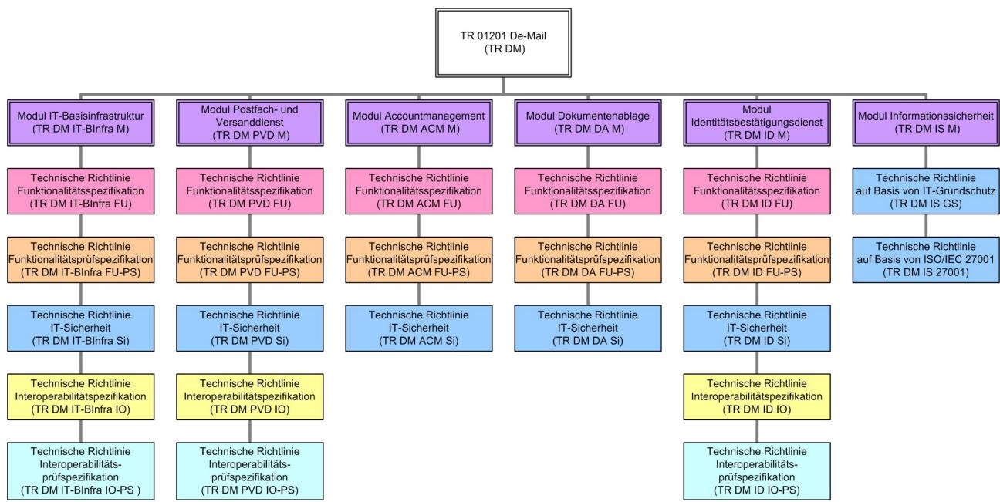

## BSI – Technische Richtlinie

| Bezeichnung:       | De-Mail      |  |
|--------------------|--------------|--|
| Anwendungsbereich: | De-Mail      |  |
| Kürzel:            | BSI TR 01201 |  |
| Version:           | 1.8          |  |

Bundesamt für Sicherheit in der Informationstechnik Postfach 20 03 63 53133 Bonn Tel.: +49 22899 9582-0 E-Mail: [de-mail@bsi.bund.de](mailto:de-mail@bsi.bund.de) Internet: [https://www.bsi.bund.de](https://www.bsi.bund.de/) © Bundesamt für Sicherheit in der Informationstechnik 2024

| 1   | Einleitung5                                        |  |
|-----|----------------------------------------------------|--|
| 2   | Aufbau der Technischen Richtlinie De-Mail6         |  |
| 3   | De-Mail-Dienste7                                   |  |
| 3.1 | Postfach- und Versanddienst (PVD)7                 |  |
| 3.2 | Dokumentenablage (DA)7                             |  |
| 3.3 | Identitätsbestätigungsdienst (ID)7                 |  |
| 3.4 | Accountmanagement7                                 |  |
| 3.5 | IT-Basisinfrastruktur7                             |  |
| 4   | Interoperabilität der De-Mail-Dienste8             |  |
| 5   | Informationssicherheit9                            |  |
| 6   | Prüfung der De-Mail-Dienste10                      |  |
| 6.1 | Funktionsprüfung der De-Mail-Dienste10             |  |
| 6.2 | Interoperabilitätsprüfung der De-Mail-Dienste10    |  |
| 7   | Rahmenbedingungen11                                |  |
| 7.1 | Clientseitige Sicherheit11                         |  |
| 7.2 | Unterstützung von Standard-Software11              |  |
| 7.3 | Graphische Benutzeroberflächen12                   |  |
| 7.4 | Speicheranforderungen12                            |  |
| 7.5 | Allgemeine Verfügbarkeit der Anwendung und Daten12 |  |
| 8   | Abkürzungsverzeichnis13                            |  |
| 9   | Übersicht TR-Dokumente15                           |  |
| 10  | Literaturverzeichnis17                             |  |

| Tabelle 1: Übersicht der Speicheranforderungen12 |  |
|--------------------------------------------------|--|
| Tabelle 2: Abkürzungen14                         |  |
| Tabelle 3: Übersicht TR-Dokumente16              |  |
| Tabelle 4: Literaturverzeichnis20                |  |

# **1 Einleitung**

Die Technische Richtlinie (TR) des Bundesamtes für Sicherheit in der Informationstechnik (BSI) mit dem Titel "Technische Richtlinie De-Mail" stellt das Rahmenwerk der Testierung dar und beschreibt die Anforderungen an die Funktionalität, Interoperabilität und Sicherheit, die die De-Mail-Dienste erfüllen müssen, sowie zur Prüfung dieser Eigenschaften.

Die TR ist modular aufgebaut entsprechend der in De-Mail enthaltenen Dienste und das vorliegende Dokument referenziert auf dienstspezifische Module.

## **2 Aufbau der Technischen Richtlinie De-Mail**

Die TR De-Mail des BSI umfasst die Anforderungen an die Funktionalität, Interoperabilität und Sicherheit, die die De-Mail-Diensteanbieter (DMDA) erfüllen müssen, sowie die Anforderungen zur Prüfung dieser Eigenschaften.

*Abbildung 1: Dokumentenstruktur Technische Richtlinie De-Mail (TR DM) (vgl. Zuordnung der Bezeichnungen und der Modulnummern in Abschnitt 9)*

Die TR De-Mail hat einen modularen Aufbau entsprechend der De-Mail-Dienste, die angeboten werden. Zu jedem De-Mail-Dienst gibt es ein Modul mit der Beschreibung der Anforderungen an die Funktionalität, Interoperabilität (soweit gegeben) und Sicherheit des De-Mail-Dienstes. Die Spezifikationen zur Interoperabilität beschränken sich auf die Kommunikation zwischen den DMDA und die Metadaten der Nachrichten. Bei der Implementierung der Dienste können Mehrwertdienste in den Ablauf der Verarbeitung integriert werden, insofern die Sicherheit und die Funktion nicht beeinträchtigt werden.

Weiterhin enthält jedes Modul Prüffälle (bis auf das Modul Informationssicherheit) zur Funktionalität, sowie teilweise zur Interoperabilität. Für die De-Mail-Dienste, die eine Kommunikation zwischen verschiedenen De-Mail-Diensten umfassen, sind zu verwendende Datenstrukturen und Übertragungsprotokolle definiert.

## **3 De-Mail-Dienste**

#### **3.1 Postfach- und Versanddienst (PVD)**

Der PVD stellt Funktionen für das Erstellen, Versenden, Empfangen und Abrufen von Nachrichten zur Verfügung und wird im Modul [TR DM PVD M] beschrieben.

#### **3.2 Dokumentenablage (DA)**

Die DA stellt Funktionen für Upload, Download sowie zur Verwaltung und Suche von Dokumenten und Dateien zur Verfügung und wird im Modul [TR DM DA M] beschrieben.

Der Dienst ist optional und muss nicht angeboten werden.

#### **3.3 Identitätsbestätigungsdienst (ID)**

Der ID stellt Funktionen von der Erstellung eines Ident-Auftrages durch einen Nutzer bis zum Versenden einer Ident-Bestätigung an einen Service Provider über den Postfach- und Versanddienst von De-Mail zur Verfügung. Der Dienst wird im Modul [TR DM ID M] beschrieben.

Der Dienst ist optional und muss nicht angeboten werden.

#### **3.4 Accountmanagement**

Der zuverlässige Nachweis der Identität ist in der De-Mail-Konzeption unmittelbar mit dem Nutzerkonto verbunden. Das De-Mail-Konto ermöglicht den Zugang zu den De-Mail-Diensten. Sämtliches Handeln eines Nutzers in De-Mail ist unmittelbar mit dem De-Mail-Konto verbunden und lässt sich immer auf ihn zurück führen.

Das Konto Management (ACM) definiert, unter welchen Bedingungen das De-Mail-Konto eines Nutzers vom DMDA neu angelegt, freigeschaltet, gesperrt oder gelöscht werden darf. Weiterhin definiert das Konto Management, unter welchen Rahmenbedingungen ein Nutzer seine im De-Mail-Konto hinterlegten Identitätsdaten ergänzen oder ändern darf. Der Dienst wird im Modul [TR DM ACM M] beschrieben.

#### **3.5 IT-Basisinfrastruktur**

ÖVD, persönliches Adressbuch sowie IT-Basis-Dienste (Log-Informationen, Nutzung authentischer Zeitquellen und DNS) werden durch die sogenannte IT-Basisinfrastruktur den De-Mail-Diensten zur Verfügung gestellt. Der Dienst wird im Modul [TR DM IT-BInfra M] beschrieben.

## **4 Interoperabilität der De-Mail-Dienste**

Die Spezifikation der notwendigen Datenstrukturen, Datenformate und Transportprotokolle erfolgt für die Dienste PVD [TR DM PVD M], ID [TR DM ID M] und IT-Basisinfrastruktur [TR DM IT-BInfra M].

## **5 Informationssicherheit**

Ziel des Moduls "Informationssicherheit" der TR De-Mail [TR DM IS M] ist es, die Basis für eine adäquate Absicherung der Einsatzumgebungen zu schaffen.

# **6 Prüfung der De-Mail-Dienste**

### **6.1 Funktionsprüfung der De-Mail-Dienste**

Nachfolgend sind Prüffälle spezifiziert, mit denen die Funktionalität von De-Mail geprüft werden kann.

Die Spezifikation der notwendigen Prüffälle erfolgt in den Modulen

- **•** Post- und Versanddienst [TR DM PVD FU-PS],
- **•** Identifizierungsdienst [TR DM ID FU-PS],
- **•** IT-Basisinfrastruktur [TR DM IT-BInfra FU-PS],
- **•** Accountmanagement [TR DM ACM FU-PS],
- **•** Dokumentenablage [TR DM DA FU-PS].

#### **6.2 Interoperabilitätsprüfung der De-Mail-Dienste**

Die Spezifikation der notwendigen Prüffälle erfolgt in den Modulen

- **•** Post- und Versanddienst [TR DM PVD IO-PS],
- **•** Identifizierungsdienst [TR DM ID IO-PS],
- **•** IT-Basisinfrastruktur [TR DM IT-BInfra IO-PS].

## **7 Rahmenbedingungen**

In diesem Kapitel sind die Rahmenbedingungen beschrieben, die für alle Funktionen aller De-Mail-Dienste gelten.

## **7.1 Clientseitige Sicherheit**

Im Allgemeinen kann De-Mail nur wenig Einfluss auf die Nutzerumgebung nehmen, da diese nicht im unmittelbaren Einflussbereich von De-Mail liegt. Der DMDA hat jedoch die Aufgabe, den Nutzer durch die folgenden beiden Bereichen zu unterstützen:

- **•** Sensibilisierung und Beratung: Der Nutzer ist über bestehende Cybersicherheitsrisiken zur infomieren und wie diese vermieden werden können. Es sind sowohl technische als auch organisatorische Maßnahmen zu nennen und Hilfestellungen zur Umsetzung anzubieten.
- **•** Technische Produktlösungen: Der DMDA hat für seine Nutzer entsprechende technische Komponenten zu empfehlen. Hierzu wären mindestens folgende Komponenten für eine sichere Client-Lösungen zu betrachten:
	- **◦** Virenscanner-Produkte,
	- **◦** Personal-Firewall-Produkte,
	- **◦** Signaturerstellungs- bzw. -verifikationslösungen,
	- **◦** Ver-/Entschlüsselungslösungen,
	- **◦** Hardware-Token,
	- **◦** Chipkartenlesegeräte.

Die Nutzung der De-Mail-Dienste sollten derart gestaltet sein, dass

- **•** eine Manipulation,
- **•** eine Nutzung durch unberechtigte Personen oder Anwendungen,
- **•** ein Einsehen, Löschen oder Manipulation der Daten durch unberechtigte Personen oder
- **•** das Ausführen von Schadcode über die Anwendung,

auch vom Client des Nutzers aus, möglichst nicht erfolgen oder durch den Nutzer selbst verhindert und bemerkt werden kann.

#### **7.2 Unterstützung von Standard-Software**

Der Zugriff auf die De-Mail soll für den Nutzer mit Standardsoftware möglich sein. Als Anwendungen bieten sich Web-Browser und E-Mail-Clients für den Postfach- und Versanddienst an. Eine Anbindung mittels einer Standardsoftware muss durch den DMDA unterstützt werden. Die Umsetzung einer Webanwendung muss erfolgen.

### **7.3 Graphische Benutzeroberflächen**

Die graphische Oberfläche von De-Mail-Webanwendungen ist so zu gestalten, dass sie sich durch eine einfache Bedienung auszeichnen und die Darstellung der Daten und Funktionen übersichtlich ist. Die Basisfunktionalität muss innerhalb der Darstellung der Anwendung deutlich erkennbar sein.

Die Gestaltung der Web-Oberflächen von De-Mail sollte entsprechend den Gesetzgebungen zur Barrierefreiheit (Verordnung zur Schaffung barrierefreier Informationstechnik nach dem Behindertengleichstellungsgesetz (BITV)) vorgenommen werden.

### **7.4 Speicheranforderungen**

Der DMDA hat jedem Nutzer für alle Dienste zusammen einen minimalen Speicherplatz zu gewährleisten. Welche Funktionalität trotz erschöpften Speicherplatzes unterstützt werden muss, ist in [TR DM PVD M] und [TR DM DA M] beschrieben.

| Konto               | Minimaler Speicherplatz |
|---------------------|-------------------------|
| Natürliche Personen | 100 MB                  |
| Institutionen       | 100 MB                  |

*Tabelle 1: Übersicht der Speicheranforderungen*

## **7.5 Allgemeine Verfügbarkeit der Anwendung und Daten**

Es ist ein Regelbetrieb von 7x24 Stunden mit hoher Verfügbarkeit vorzusehen. Die Verfügbarkeit aller Dienste darf den im Rahmen-Sicherheitskonzept (vgl. [TR DM IS M]) festgelegten Wert nicht unterschreiten.

## **8 Abkürzungsverzeichnis**

Es wird an dieser Stelle ein zentrales Abkürzungsverzeichnis geführt.

| Abkürzung    | Beschreibung                                        |
|--------------|-----------------------------------------------------|
| ACM          | Accountmanagement                                   |
| ALG          | Application Level Gateway                           |
| BSI          | Bundesamt für Sicherheit in der Informationstechnik |
| CSP          | Crypto Service Provider                             |
| DA           | Dokumentenablage                                    |
| DBMS         | Datenbankmanagementsystem                           |
| DM           | De-Mail                                             |
| DMDA         | De-Mail-Diensteanbieter                             |
| DMZ          | Demilitarisierte Zone                               |
| DN           | Distinguished Name                                  |
| DNS          | Domain Name Service                                 |
| Ende-zu-Ende | Ende-zu-Ende                                        |
| HTTPS        | Hypertext Transfer Protocol Secure                  |
| ID           | Identitätsbestätigungsdienst                        |
| IT           | Informationstechnik                                 |
| LDAP         | Lightweight Directory Access Protocol               |
| MESZ         | Mitteleuropäische Sommerzeit                        |
| MEZ          | Mitteleuropäische Zeit                              |
| nPA          | neuer Personalausweis                               |
| NTP          | Network Time Protocol                               |
| OCSP         | Online Certificate Status Protocoll                 |
| ÖVD          | Öffentlicher Verzeichnisdienst des DMDA             |
| PDF          | Portable Document Format                            |
| PVD          | Postfach- und Versanddienst                         |

#### 8 Abkürzungsverzeichnis

| Abkürzung | Beschreibung                                 |
|-----------|----------------------------------------------|
| RZ        | Rechenzentrum                                |
| SAK       | (qualifizierte) Signaturanwendungskomponente |
| SMTP      | Simple Mail Transfer Protocol                |
| SP        | Service Provider                             |
| SSEE      | Sichere Signaturerstellungseinheit           |
| SSL       | Secure Socket Layer                          |
| TLS       | Transport Layer Security                     |
| TR        | Technische Richtlinie                        |
| URI       | Universal Resource Identifier                |
| UTC       | Coordinated Universal Time                   |
| W3C       | World Wide Web Consortium                    |
| XML       | eXtensible Markup Language                   |

*Tabelle 2: Abkürzungen*

# **9 Übersicht TR-Dokumente**

| Nummer                | Bezeichnung              | Titel                                                                                 |
|-----------------------|--------------------------|---------------------------------------------------------------------------------------|
| BSI-TR 01201 Teil 1   | TR DM IT-BInfra M        | Technische Richtlinie IT-Basisinfrastruktur Modul                                  |
| BSI-TR 01201 Teil 1.1 | TR DM IT-BInfra FU       | Technische Richtlinie IT-Basisinfrastruktur Funktionalitätsspezifikation           |
| BSI-TR 01201 Teil 1.2 | TR DM IT-BInfra FU PS | Technische Richtlinie IT-Basisinfrastruktur Funktionalitätsprüfspezifikation       |
| BSI-TR 01201 Teil 1.3 | TR DM IT-BInfra Si       | Technische Richtlinie IT-Basisinfrastruktur IT Sicherheit                          |
| BSI-TR 01201 Teil 1.4 | TR DM IT-BInfra IO       | Technische Richtlinie IT-Basisinfrastruktur Interoperabilitätsspezifikation        |
| BSI-TR 01201 Teil 1.5 | TR DM IT-BInfra IO-PS    | Technische Richtlinie IT-Basisinfrastruktur Interoperabilitätsprüfspezifikation    |
| BSI-TR 01201 Teil 2   | TR DM ACM M              | Technische Richtlinie Accountmanagement Modul                                      |
| BSI-TR 01201 Teil 2.1 | TR DM ACM FU             | Technische Richtlinie Accountmanagement Funktionalitätsspezifikation               |
| BSI-TR 01201 Teil 2.2 | TR DM ACM FU-PS          | Technische Richtlinie Accountmanagement Funktionalitätsprüfspezifikation           |
| BSI-TR 01201 Teil 2.3 | TR DM ACM Si             | Technische Richtlinie Accountmanagement IT Sicherheit                              |
| BSI-TR 01201 Teil 3   | TR DM PVD M              | Technische Richtlinie Postfach- und Versanddienst Modul                            |
| BSI-TR 01201 Teil 3.1 | TR DM PVD FU             | Technische Richtlinie Postfach- und Versanddienst Funktionalitätsspezifikation     |
| BSI-TR 01201 Teil 3.2 | TR DM PVD FU-PS          | Technische Richtlinie Postfach- und Versanddienst Funktionalitätsprüfspezifikation |
| BSI-TR 01201 Teil 3.3 | TR DM PVD Si             | Technische Richtlinie Postfach- und Versanddienst IT-Sicherheit                    |
| BSI-TR 01201 Teil 3.4 | TR DM PVD IO             | Technische Richtlinie Postfach- und Versanddienst Interoperabilitätsspezifikation  |

#### 9 Übersicht TR-Dokumente

| Nummer                | Bezeichnung     | Titel                                                                                             |
|-----------------------|-----------------|---------------------------------------------------------------------------------------------------|
| BSI-TR 01201 Teil 3.5 | TR DM PVD IO-PS | Technische Richtlinie Postfach- und Versanddienst Interoperabilitätsprüfspezifikation       |
| BSI-TR 01201 Teil 4   | TR DM ID M      | Technische Richtlinie Identitätsbestätigungsdienst Modul                                       |
| BSI-TR 01201 Teil 4.1 | TR DM ID FU     | Technische Richtlinie Identitätsbestätigungsdienst Funktionalitätsspezifikation             |
| BSI-TR 01201 Teil 4.2 | TR DM ID FU-PS  | Technische Richtlinie Identitätsbestätigungsdienst Funktionalitätsprüfspezifikation         |
| BSI-TR 01201 Teil 4.3 | TR DM ID Si     | Technische Richtlinie Identitätsbestätigungsdienst IT-Sicherheit                               |
| BSI-TR 01201 Teil 4.4 | TR DM ID IO     | Technische Richtlinie Identitätsbestätigungsdienst Interoperabilitätsspezifikation          |
| BSI-TR 01201 Teil 4.5 | TR DM ID IO-PS  | Technische Richtlinie Identitätsbestätigungsdienst Interoperabilitätsprüfspezifikation      |
| BSI-TR 01201 Teil 5   | TR DM DA M      | Technische Richtlinie Dokumentenablage Modul                                                   |
| BSI-TR 01201 Teil 5.1 | TR DM DA FU     | Technische Richtlinie Dokumentenablage Funktionalitätsspezifikation                            |
| BSI-TR 01201 Teil 5.2 | TR DM DA FU-PS  | Technische Richtlinie Dokumentenablage Funktionalitätsprüfspezifikation                        |
| BSI-TR 01201 Teil 5.3 | TR DM DA Si     | Technische Richtlinie Dokumentenablage IT Sicherheit                                           |
| BSI-TR 01201 Teil 6   | TR DM IS M      | Technische Richtlinie Informationssicherheit                                                      |
| BSI-TR 01201 Teil 6.1 | TR DM IS GS     | Technische Richtlinie Informationssicherheit nach ISO27001 auf der Basis von IT Grundschutz |
| BSI-TR 01201 Teil 6.2 | TR DM IS 27001  | Technische Richtlinie Informationssicherheit auf Basis von ISO/IEC 27001                       |

*Tabelle 3: Übersicht TR-Dokumente*

## **10 Literaturverzeichnis**

Es wird an dieser Stelle ein zentrales Literaturverzeichnis geführt.

| Bezeichnung        | Titel                                                                                                                                                                                                                                |  |
|--------------------|--------------------------------------------------------------------------------------------------------------------------------------------------------------------------------------------------------------------------------------|--|
| [BSI 100-1]        | BSI-Standard 100-1: Managementsysteme für Informationssicherheit (ISMS)                                                                                                                                                           |  |
| [BSI 100-2]        | BSI-Standard 100-2: IT-Grundschutz-Vorgehensweise                                                                                                                                                                                    |  |
| [BSI 100-3]        | BSI-Standard 100-3: Risikoanalyse auf der Basis von IT Grundschutz                                                                                                                                                                   |  |
| [DSKritKat]        | BfDI, Kriterienkatalog für den Datenschutznachweis, https://www.bfdi.bund.de/DE/Datenschutz/Themen/Brief_Paket/DeMailIn fosAnbieterArtikel/KriterienkatalogNachweis.html                                                       |  |
| [ETSI TS 102 231]  | Electronic Signatures and Infrastructures (ESI) – Provision of harmonized Trust-service status information (Ref: RTS/ESI-000083)                                                                                                  |  |
| [ICAO-MRTD]        | ICAO – Doc 9303 Machine readable Travel Documents- Appendix 2 to Section IV 1 to Section III, Appendix 3 to Section III                                                                                                           |  |
| [IS-Rev]           | BSI, Informationssicherheitsrevision – Ein Leitfaden für die IS-Revision auf Basis von IT-Grundschutz, https://www.bsi.bund.de/DE/Themen/Oeffentliche-Verwaltung/Sicherheit spruefungen/ISRevision/Leitfaden/leitfaden.html |  |
| [IT-GS-Kompendium] | BSI, IT-Grundschutz Katalog-Kompendium, https://www.bsi.bund.de/DE/Themen/Unternehmen-und-Organisationen/S tandards-und-Zertifizierung/IT-Grundschutz/IT-Grundschutz Kompendium/it-grundschutz-kompendium_node.html         |  |
| [PenTest]          | BSI, Durchführungskonzept für Penetrationstests, Studie, November 2003, https://www.bsi.bund.de/SharedDocs/Downloads/DE/BSI/Publikationen/ Studien/Penetrationstest/penetrationstest.html                                   |  |
| [Prog_Personen]    | BSI, Programm zur Kompetenzfeststellung und Zertifizierung von Personen, https://www.bsi.bund.de/SharedDocs/Downloads/DE/BSI/Zertifizierung/ Prog-Personen.html                                                             |  |
| [Prog_Stellen]     | BSI, Programm zur Anerkennung von Prüfstellen und Zertifizierung von IT-Sicherheitsdienstleistern, https://www.bsi.bund.de/SharedDocs/Downloads/DE/BSI/Zertifizierung/ Prog-Stellen.html                                    |  |

| Bezeichnung | Titel                                                                                                                                            |
|-------------|--------------------------------------------------------------------------------------------------------------------------------------------------|
| [RFC 1034]  | P. Mockapetris RFC 1034: DOMAIN NAMES - CONCEPTS AND FACILITIES                                                                               |
| [RFC 1035]  | P. Mockapetris RFC 1035: DOMAIN NAMES - IMPLEMENTATION AND SPECIFICATION                                                                      |
| [RFC 2119]  | S. Bradner, Key words for use in RFCs to Indicate Requirement Levels, 1997                                                                    |
| [RFC 2487]  | SMTP Service Extension for Secure SMTP over TLS                                                                                                  |
| [RFC 2782]  | A. Gulbrandsen, P. Vixie, L. Esibov RFC 2782: A DNS RR for specifying the location of services (DNS SRV)                                      |
| [RFC 2822]  | RFC 2822 Internet Message Format                                                                                                                 |
| [RFC 3401]  | M. Mealling RFC 3401: Dynamic Delegation Discovery System (DDDS) Part One: The Comprehensive DDDS                                             |
| [RFC 3402]  | M. Mealling RCF 3402: Dynamic Delegation Discovery System (DDDS) Part Two: The Algorithm                                                      |
| [RFC 3403]  | M. Mealling RFC 3403: Dynamic Delegation Discovery System (DDDS) Part Three: The Domain Name System (DNS) Database                            |
| [RFC 3404]  | M. Mealling RFC 3404: Dynamic Delegation Discovery System (DDDS) Part Four: The Uniform Resource Identifiers (URI) Resolution Application  |
| [RFC 3405]  | M. Mealling RFC 3405: Dynamic Delegation Discovery System (DDDS) Part Five: URI.ARPA Assignment Procedures                                    |
| [RFC 3851]  | Secure/Multipurpose Internet Mail Extensions (S/MIME) Version 3.1, RFC 3851                                                                   |
| [RFC 3958]  | L. Daigle, A. Newton RFC 3958: Domain-Based Application Service Location Using SRV RRs and the Dynamic Delegation Discovery Service (DDDS) |
| [RFC 4033]  | DNSSEC Intro RFC (http://tools.ietf.org/html/rfc4033)                                                                                            |
| [RFC 4056]  | RFC 4056 "Use of the RSASSA-PSS Signature Algorithm in Cryptographic Message Syntax (CMS)"                                                    |
| [RFC 4398]  | RFC 4398 "Storing Certificates in the Domain Name System (DNS)"                                                                                  |

| Bezeichnung       | Titel                                                                                                                                                                                                                                                                                                                              |
|-------------------|------------------------------------------------------------------------------------------------------------------------------------------------------------------------------------------------------------------------------------------------------------------------------------------------------------------------------------|
| [RFC 5280]        | Internet X.509 Public Key Infrastructure Certificate and CRL Profile, RFC 5280                                                                                                                                                                                                                                                  |
| [RFC 5754]        | RFC 5754 "Using SHA2 Algorithms with Cryptographic Message Syntax"                                                                                                                                                                                                                                                              |
| [RFC 6376]        | RFC 6376 "DomainKeys Identified Mail (DKIM) Signatures"                                                                                                                                                                                                                                                                            |
| [RFC 8551]        | Secure/Multipurpose Internet Mail Extensions (S/MIME) Version 4.0, RFC 8551                                                                                                                                                                                                                                                     |
| [SAML-CORE20]     | Assertions and Protocols for the OASIS Security Assertion Markup Language (SAML) V2.0, OASIS Standard, 15 March 2005                                                                                                                                                                                                            |
| [TR 02102]        | BSI TR-02102 Kryptographische Verfahren: Empfehlungen und Schlüssellängen, https://www.bsi.bund.de/DE/Themen/Unternehmen-und Organisationen/Standards-und-Zertifizierung/Technische-Richtlinien/TR nach-Thema-sortiert/tr02102/tr02102_node.html                                                                          |
| [TR 03116-4]      | Technische Richtlinie BSI TR-03116 Kryptographische Vorgaben für Projekte der Bundesregierung – Teil 4: Kommunikationsverfahren in Anwendungen, https://www.bsi.bund.de/DE/Themen/Unternehmen-und Organisationen/Standards-und-Zertifizierung/Technische-Richtlinien/TR nach-Thema-sortiert/tr03116/TR-03116_node.html |
| [VB_Akkr_De-Mail] | BSI, Verfahrensbeschreibung zur Akkreditierung von De-Mail Diensteanbietern, https://www.bsi.bund.de/SharedDocs/Downloads/DE/BSI/De_Mail/Verfa hrensbeschreibung-zur-Akkreditierung-De-Mail-Dienstanbieter.html                                                                                                           |
| [VB_Personen]     | BSI, Verfahrensbeschreibung zur Kompetenzfeststellung und Zertifizierung von Personen, https://www.bsi.bund.de/SharedDocs/Downloads/DE/BSI/Zertifizierung/ VB-Personen.html                                                                                                                                               |
| [VB_Produkte]     | BSI, Verfahrensbeschreibung zur Zertifizierung von Produkten, https://www.bsi.bund.de/SharedDocs/Downloads/DE/BSI/Zertifizierung/ VB-Produkte.html                                                                                                                                                                           |
| [VB_Stellen]      | BSI, Verfahrensbeschreibung zur Anerkennung von Prüstellen und Zertifizierung von IT-Sicherheitsdienstleistern, https://www.bsi.bund.de/SharedDocs/Downloads/DE/BSI/Zertifizierung/ VB-Stellen.html                                                                                                                       |

#### 10 Literaturverzeichnis

| Bezeichnung      | Titel                                                                                                                                                                                      |
|------------------|--------------------------------------------------------------------------------------------------------------------------------------------------------------------------------------------|
| [WebAppSec]      | BSI, Sicherheit von Webanwendungen, Maßnahmenkatalog und Best Practices, https://www.bsi.bund.de/SharedDocs/Downloads/DE/BSI/Publikationen/ Studien/WebSec/WebSec.html            |
| [XAdES]          | ETSI TS 101 903 XAdES                                                                                                                                                                      |
| [XML Signatur]   | XML-Signature Syntax and Processing, W3C, 2002, http://www.w3.org/TR/2002/REC-xmldsig-core-20020212/ sowie RFC3275                                                                   |
| [Zert ISO 27001] | Zertifizierung nach ISO 27001 auf der Basis von IT-Grundschutz – Prüfschema für ISO 27001-Audits                                                                                        |
| [27001]          | DIN ISO/IEC 27001:2015-03, Informationstechnik - IT Sicherheitsverfahren - Informationssicherheits-Managementsysteme – Anforderungen, März 2015, DIN                                 |
| [27002]          | Entwurf DIN ISO/IEC 27002:2014-02, Informationstechnik - IT Sicherheitsverfahren - Leitfaden für das Informationssicherheits Management (ISO/IEC FDIS 27002:2013), Februar 2014, DIN |

*Tabelle 4: Literaturverzeichnis*