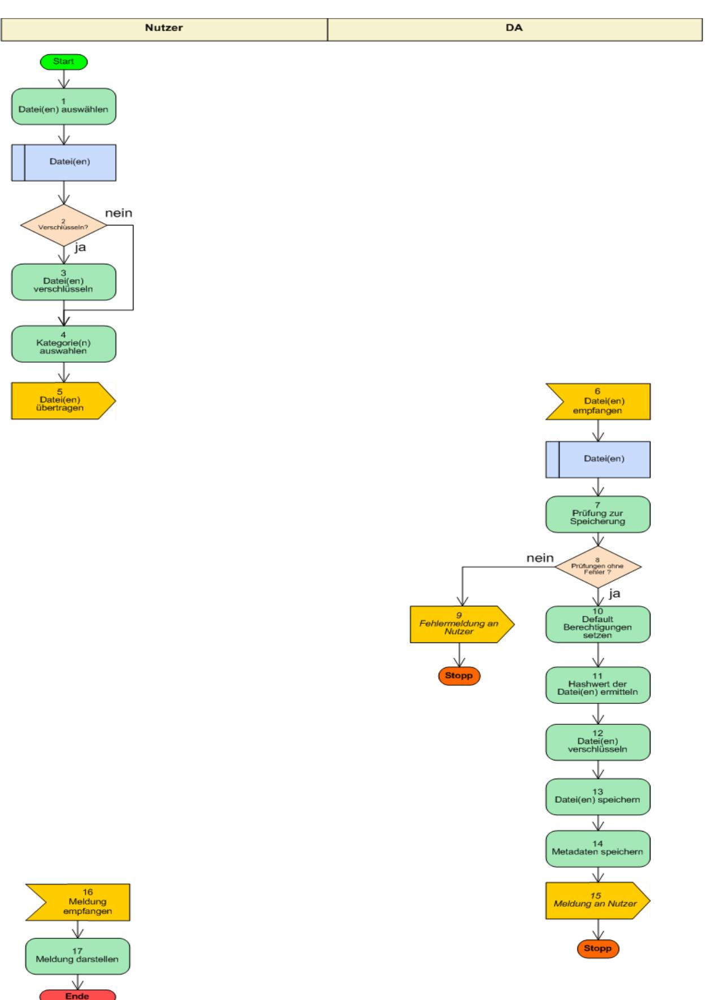
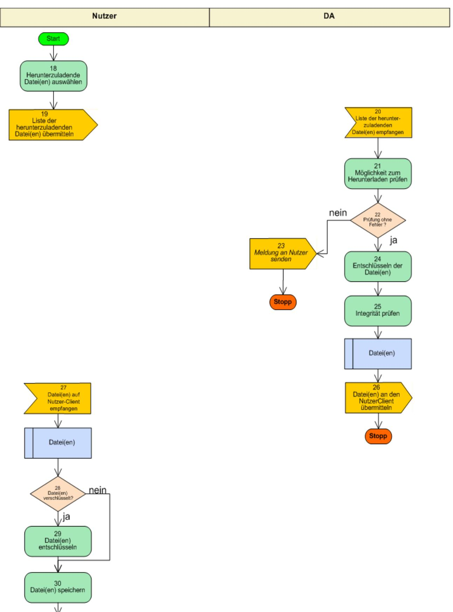
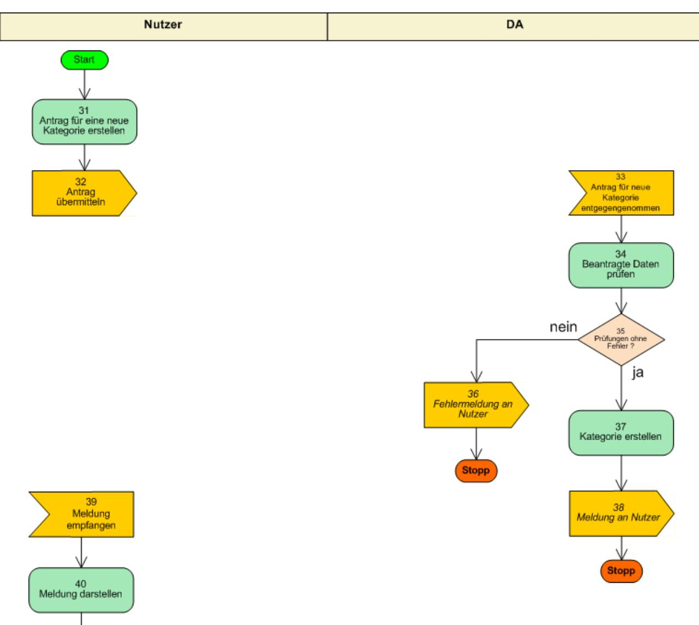
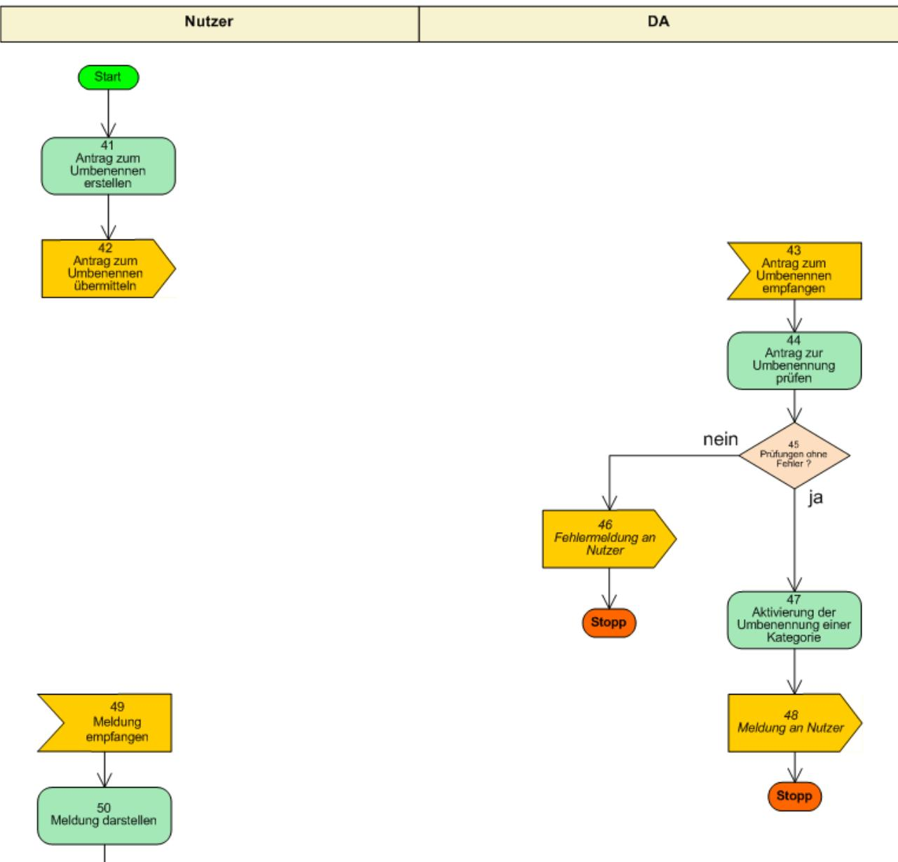
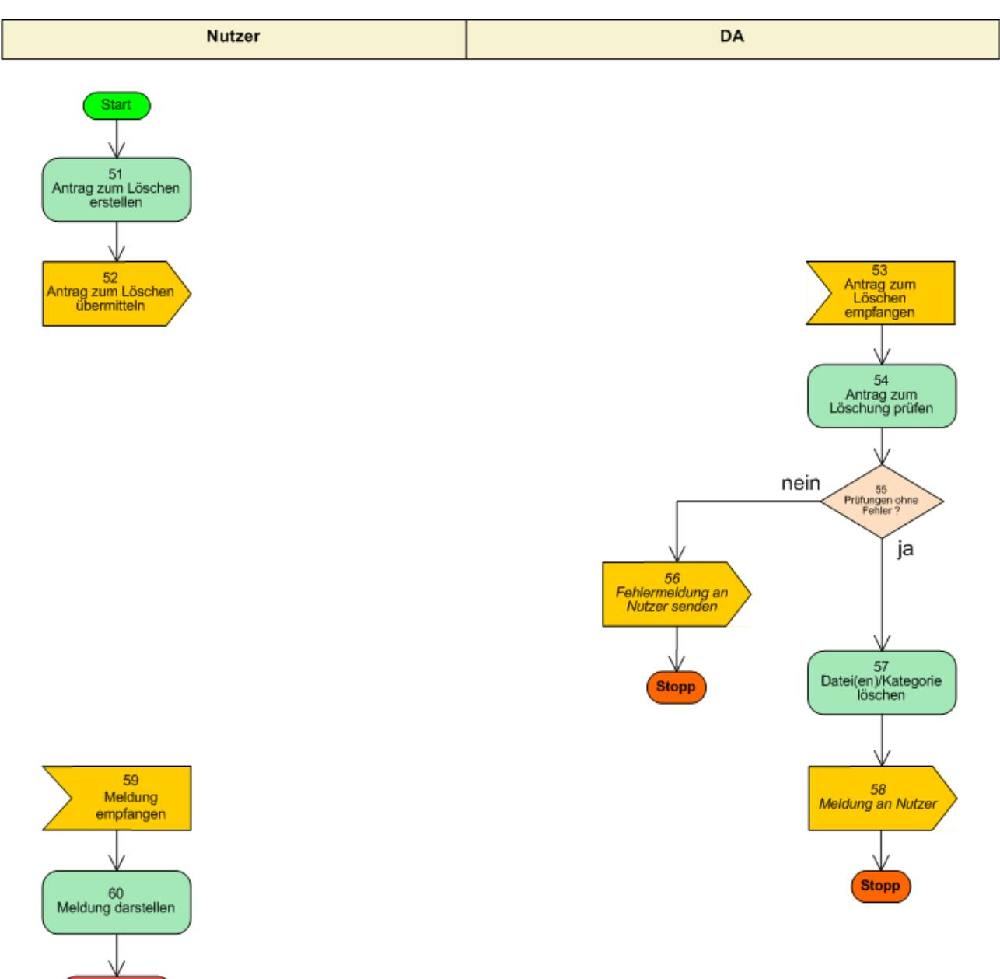
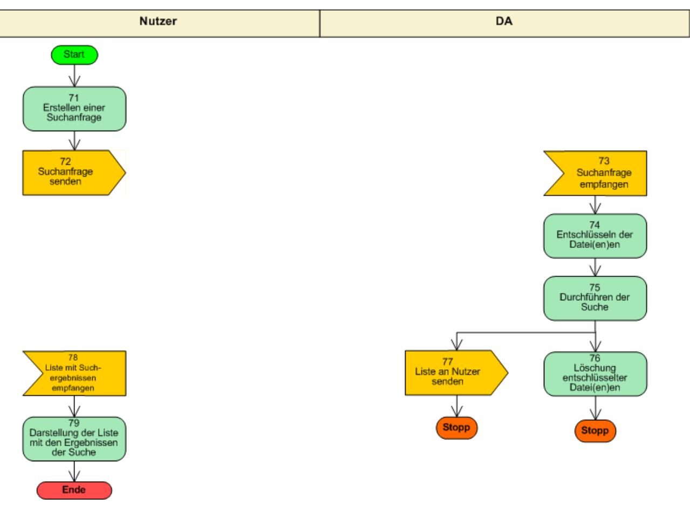

### BSI – Technische Richtlinie

| Bezeichnung:       | Dokumentenablage Funktionalitätsspezifikation |  |  |  |
|--------------------|--------------------------------------------------|--|--|--|
| Anwendungsbereich: | De-Mail                                          |  |  |  |
| Kürzel:            | BSI TR 01201 Teil 5.1                            |  |  |  |
| Version:           | 1.8                                              |  |  |  |

Bundesamt für Sicherheit in der Informationstechnik Postfach 20 03 63 53133 Bonn Tel.: +49 22899 9582-0 E-Mail: [de-mail@bsi.bund.de](mailto:de-mail@bsi.bund.de) Internet: [https://www.bsi.bund.de](https://www.bsi.bund.de/) © Bundesamt für Sicherheit in der Informationstechnik 2024

| 1                                                                                                       | Einleitung5                                                                                                                                                                                                                                                                                                                                                                                              |  |
|---------------------------------------------------------------------------------------------------------|----------------------------------------------------------------------------------------------------------------------------------------------------------------------------------------------------------------------------------------------------------------------------------------------------------------------------------------------------------------------------------------------------------|--|
| 2                                                                                                       | Funktionale Anforderungen6                                                                                                                                                                                                                                                                                                                                                                               |  |
| 2.1 2.1.1 2.1.2                                                                                   | Zugriff auf Dokumente in der DA6 Authentisierung und Autorisierung6 Zugriffsoperationen6                                                                                                                                                                                                                                                                                                           |  |
| 2.2 2.2.1 2.2.2 2.2.3 2.2.4 2.2.5 2.2.6 2.2.7 2.2.8 2.3 2.4 2.5 2.6 | Ablage von Dokumenten7 Kategorien7 Erstellung neuer Kategorien7 Einstellen neuer Dokumente7 Herunterladen von Dokumenten8 Umbenennen von Dokumenten und Kategorien8 Löschen von Dokumenten8 Löschen von Kategorien8 Änderung der Berechtigungen für Dokumente und Kategorien9 Suchen und Finden9 Protokollierung der Aktivitäten10 Verschlüsselung11 Konfiguration11 |  |
| 3                                                                                                       | Nicht-funktionale Anforderungen12                                                                                                                                                                                                                                                                                                                                                                        |  |
| 4 4.1 4.2 4.3                                                                                  | Datenstrukturen13 Datei13 Kategorien14 Meldungen14                                                                                                                                                                                                                                                                                                                                              |  |
| 5                                                                                                       | Aktivitätsdiagramm16                                                                                                                                                                                                                                                                                                                                                                                     |  |
| 6 6.1 6.1.1 6.1.2                                                                              | Funktionale Beschreibung23 Upload und Download von Dateien23 Upload einer Datei in die DA23 Download von Dateien30                                                                                                                                                                                                                                                                              |  |
| 6.2 6.2.1 6.2.2 6.2.3 6.2.4                                                                 | Verwaltung von Dateien/Kategorien35 Erstellen einer Kategorie35 Umbenennen von Dateien/Kategorien39 Löschen von Dateien/Kategorien43 Ändern der Berechtigungen für Dokumente und Kategorien47                                                                                                                                                                                                |  |
| 6.3                                                                                                     | Suche und Anzeige von Dokumenten und Kategorien51                                                                                                                                                                                                                                                                                                                                                        |  |
| 7 7.1 7.2                                                                                         | Weitere Funktionen56 Durch das System ausgeführte Funktionen56 Durch den Nutzer initiierte Funktionen57                                                                                                                                                                                                                                                                                            |  |
| 8                                                                                                       | Legende zum Aktivitätsdiagramm59                                                                                                                                                                                                                                                                                                                                                                         |  |
| 9                                                                                                       | Legende zu Schritten der Ablaufbeschreibung61                                                                                                                                                                                                                                                                                                                                                            |  |

### **Tabellenverzeichnis**

| Tabelle 1: Metadaten einer Datei13                                   |  |
|----------------------------------------------------------------------|--|
| Tabelle 2: Daten der Kategorie (Teil 1)14                            |  |
| Tabelle 3: Metadaten der Kategorie (Teil 2)14                        |  |
| Tabelle 4: Schritte zum Upload von Dateien28                         |  |
| Tabelle 5: Schritte zum Download von Dateien33                       |  |
| Tabelle 6: Schritte zum Erstellen einer Kategorie37                  |  |
| Tabelle 7: Schritte zum Umbenennen41                                 |  |
| Tabelle 8: Schritte zum Löschen45                                    |  |
| Tabelle 9: Schritte zur Änderung von Berechtigungen49                |  |
| Tabelle 10: Schritte zur Suche und Anzeige von Kategorien/ Dateien53 |  |
| Tabelle 11: Durch das System ausgeführte Funktionen55                |  |
| Tabelle 12: Durch den Nutzer initiierte Funktionen56                 |  |
| Tabelle 13: Legende zum Aktivitätsdiagramm58                         |  |
| Tabelle 14: Legende zu Schritten59                                   |  |

# **1 Einleitung**

Dieses Modul beinhaltet die funktionalen Spezifikationen der Dokumentenablage und ist Bestandteil von [TR DM DA M].

# **2 Funktionale Anforderungen**

Nachfolgend werden die funktionalen Anforderungen beschrieben, die erfüllt werden müssen, damit ein Dienst zur Ablage und Verwaltung von elektronischen Dokumenten und anderen Dateien als De-Mail-Dienst anerkannt werden kann.

Über den De-Mail-Versanddienst empfangene Dokumente kann der Nutzer von seinem De-Mail-Postfach in seine DA kopieren. Weiterhin kann der Nutzer Dokumente aus seiner DA über den PVD an Dritte verschicken (vgl. [TR DM PVD FU]).

Alle Aktionen sind in geeigneter Weise zu protokollieren.

### **2.1 Zugriff auf Dokumente in der DA**

Ein Nutzer darf auf Dokumente in seiner DA nur Zugriff erhalten, wenn er sich vorher erfolgreich an seinem De-Mail-Konto angemeldet hat.

#### **2.1.1 Authentisierung und Autorisierung**

Nach erfolgreicher Anmeldung am De-Mail-Konto hat der Nutzer Zugriff auf alle Dokumente und Kategorien in der seinem Konto zugeordneten DA (vgl. Abschnitt [2.2.1\)](#page-6-0).

Um auf den Inhalt und die Metadaten eines Dokumentes oder einer Kategorie zugreifen zu können, muss der Nutzer beim Einstellen festlegen können, für welche Zugriffsoperationen welches Authentisierungsniveau notwendig sein soll. Legt der Nutzer die Berechtigungen nicht fest, so wird automatisch das Authentisierungsniveau verwendet, mit dem der Nutzer zu diesem Zeitpunkt angemeldet ist. Ein Zugriff auf das Dokument erfordert sodann eine Anmeldung des Nutzers mit mindestens diesem Authentisierungsniveau.

Das Authentisierungsniveau für einen Zugriff auf ein Dokument kann durch den Nutzer herabgestuft werden, wenn sein aktuelles Authentisierungsniveau einen Zugriff auf das Dokument erlaubt. Das minimale Authentisierungsniveau eines Dokuments kann durch den Nutzer bis auf das Niveau erhöht werden, das seinem aktuellen Authentisierungsniveau entspricht.

### **2.1.2 Zugriffsoperationen**

Folgende Zugriffsoperationen auf Dokumente müssen in Abhängigkeit von den jeweiligen Authentisierungsniveaus von der DA unterstützt werden:

- **•** Lesen
- **•** Schreiben (und Löschen) Unter "Schreiben" fallen das Einstellen von neuen Dokumenten und das Ändern von vorhandenen Dokumenten.

### **2.2 Ablage von Dokumenten**

#### **2.2.1 Kategorien**

Um das spätere Suchen und Auffinden von Dokumenten zu erleichtern, muss es in der DA möglich sein, Dokumente bestimmten Kategorien zuzuordnen, die bspw. als Ordner in einer Hierarchie abgebildet werden können. Es müssen mindestens zwei vordefinierte Kategorien existieren. Eine Standardkategorie, der Dokumente zugeordnet werden, z.B. wenn vom Nutzer noch keine Kategorie erstellt wurde, sowie die Kategorie "Papierkorb", der Dokumente zugeordnet werden, die gelöscht werden sollen.

Kategorien können hierarchisch in mehreren Ebenen gestaffelt werden.

#### **2.2.2 Erstellung neuer Kategorien**

Bei der Erstellung einer neuen Kategorie muss geprüft werden, ob in der übergeordneten Kategorie bereits eine Kategorie mit dem selben Namen existiert und ob für den Nutzer Schreibrechte bestehen.

Das Authentisierungsniveau für die neue Kategorie muss mindestens dem der übergeordneten Kategorie entsprechen. In Unterkategorien kann das geforderte Authentisierungsniveau nur erhöht werden.

#### **2.2.3 Einstellen neuer Dokumente**

Der Nutzer kann neue Dokumente

- **•** von seinem Rechnersystem in die DA hochladen,
- **•** eine Nachricht aus seinem Postfach in die DA speichern oder,
- **•** einen Anhang einer Nachricht aus dem Postfach in der DA ablegen.

Die Dokumente können einer oder mehreren Kategorien zugeordnet werden. Wird für ein Dokument keine Kategorie ausgewählt, so wird es der Standardkategorie zugeordnet. Der Nutzer muss die notwendige Zugriffsberechtigung für die Kategorie(n) besitzen.

Das Dokument wird durch den DMDA einer Prüfung auf Schadsoftware unterzogen. Bei einer positiven Prüfung wird das Dokument nicht gespeichert, der Nutzer erhält eine entsprechende Meldung.

Wenn nicht genügend freier Speicherplatz verfügbar ist, muss der Nutzer per Meldung informiert werden.

Für das Dokument wird standardmäßig folgende Berechtigung gesetzt:

**•** Lesen: Dies ist gestattet für den angemeldeten Nutzer mit dem aktuellen Authentisierungsniveau,

**•** Schreiben: Dies ist gestattet für den angemeldeten Nutzer mit dem aktuellen Authentisierungsniveau. Die Berechtigung des Dokuments muss mindestens dem geforderten Authentisierungsniveau der Kategorie entsprechen, der das Dokument zugeordnet wird.

Es wird für jede eingestellte Datei ein Hashwert berechnet und gespeichert.

#### **2.2.4 Herunterladen von Dokumenten**

Der Nutzer darf nur Dokumente herunterladen können, für die er die Zugriffsberechtigung zum Lesen besitzt.

Vor dem Herunterladen muss der DMDA das Dokument auf Schadsoftware prüfen. Bei einer positiven Prüfung ist der Nutzer per Meldung zu informieren.

Der DMDA muss den Hashwert des Dokumentes prüfen. Stimmt der neu berechnete Hashwert nicht mit dem ursprünglichen Wert überein, so ist der Nutzer per Meldung zu informieren.

Danach ist das Herunterladen des Dokuments möglich.

#### **2.2.5 Umbenennen von Dokumenten und Kategorien**

Dokumente und Kategorien müssen umbenannt werden können.

Die Umbenennung findet statt, wenn der Nutzer schreibend auf das Dokument oder die Kategorie zugriffsberechtigt ist und der neue Name in der übergeordneten Kategorie noch nicht vorhanden ist.

Der Nutzer kann Dokumente und Kategorien nur umbenennen, wenn er die notwendige Berechtigung besitzt.

#### **2.2.6 Löschen von Dokumenten**

Der Nutzer kann Dokumente nur löschen, wenn er die notwendige Berechtigung besitzt.

Für die Löschung von Dokumenten ist ein zweistufiges Verfahren vorzusehen. Im ersten Schritt werden die Dokumente in die Kategorie "Papierkorb" verschoben. Alle Zuordnungen zu anderen Kategorien werden entfernt. Im zweiten Schritt können die Dokumente aus der Kategorie "Papierkorb" endgültig gelöscht werden.

Bei der endgültigen Löschung müssen die Dokumente sicher gelöscht werden. Alle Informationen zu den Dokumenten sind vollständig zu entfernen. Dies betrifft auch die Metadaten der Dokumente.

Der Nutzer muss ein oder mehrere Dokumente löschen können.

#### **2.2.7 Löschen von Kategorien**

Zur Löschung einer Kategorie muss der Nutzer die notwendige Berechtigung haben.

Die zu löschende Kategorie darf keine untergeordneten Kategorien oder zugeordnete Dateien enthalten.

Die vordefinierten Kategorien (Standardkategorie und"Papierkorb") können nicht gelöscht werden.

#### **2.2.8 Änderung der Berechtigungen für Dokumente und Kategorien**

Bei der Änderung einer Berechtigung muss geprüft werden, ob

- **•** das Authentisierungsniveau des Nutzers ausreichend ist, um die Dokumente oder Kategorie zu ändern.
- **•** das aktuelle Authentisierungsniveau des Nutzers mindestens dem Authentisierungsniveau entspricht, das gesetzt werden soll.

Wenn die Bedingungen erfüllt sind, werden die Berechtigungen innerhalb der Metadaten entsprechend geändert.

Bei der rekursiven Änderung von Berechtigungen (wenn eine Kategorie geändert wird, die weitere Kategorien oder Dateien enthält) gelten folgende Regeln:

- **•** Wird das Authentisierungsniveau einer Kategorie erhöht, so werden die Berechtigungen aller darin enthaltenen Dokumenten und Kategorien erhöht, für die das Authentisierungsniveau "normal" benötigt wird. Die Berechtigungen aller anderen Dokumenten und Kategorien bleiben bestehen.
- **•** Wenn das Authentisierungsniveau herabgesetzt wird, können die Berechtigungen aller enthaltenen Dokumente und Kategorien bestehen bleiben oder auf Wunsch ebenfalls herabgesetzt werden.

### **2.3 Suchen und Finden**

Die Suchfunktion muss sowohl die Suche nach Kriterien wie Dateinamen und Kategorien als auch nach Dokumentinhalten von Standard-Dateiformaten in nicht durch den Nutzer zusätzlich verschlüsselten Dokumenten ermöglichen.

Suchkriterien können sein:

- **•** Teile des Namens oder vollständiger Name der Datei, einschließlich Datei-Endung
- **•** Teile des Namens oder vollständiger Name der Kategorie
- **•** Datei-MIME-Typ (Format)
- **•** Inhalt der Datei (Text)
- **•** Einschränkungen hinsichtlich der Kategorien
- **•** Datum und Zeit der letzten Änderung in der DA

Der Suchindex muss verschlüsselt gespeichert werden.

Die Ergebnisliste muss beinhalten:

- **•** bei Kategorien:
	- **◦** Kategorie-Pfad inkl. aller Kategoriebezeichnungen
	- **◦** URL
- **•** bei Dokumenten
	- **◦** Kategorie-Pfad inkl. aller Kategoriebezeichnungen
	- **◦** Dateiname
	- **◦** Datum der letzten Änderung in der DA
	- **◦** URL

Bei der Suche wird beachtet, dass ausschließlich die Dokumente oder Kategorien berücksichtigt werden, die für den Nutzer und seinem derzeitigen Authentisierungsniveau lesbar sind.

Die Ergebnisliste muss nach Abschluss der Suche durch den DMDA sicher gelöscht werden.

### **2.4 Protokollierung der Aktivitäten**

Um Anwendungsfehler oder Missbrauch feststellen zu können, müssen alle Aktionen protokolliert werden, die Dokumente und Kategorien betreffen.

Bei der Protokollierung der Aktionen ist sicher festzuhalten:

- **•** Nutzerkennung
- **•** Authentisierungsniveau des Nutzers
- **•** Neue Metadaten
- **•** Datum und Uhrzeit.

Der Nutzer kann auf Wunsch ein Protokoll über die Aktivitäten in der DA anfordern, das mit einer qualifizierten Signatur des DMDA versehen ist. Das Protokoll kann dem Nutzer mittels Anhang einer De-Mail oder als Download zur Verfügung gestellt werden.

Das Protokoll muss beinhalten:

- **•** eine Liste der eingestellten Dokumente mit dem jeweiligen Hashwert und dem Namen des Hashalgorithmus,
- **•** das aktuelle Authentisierungsniveau,
- **•** eine Änderungshistorie der Dokumente.

Das Protokoll kann anhand folgender Merkmale eingeschränkt werden:

- **•** Kategorie,
- **•** Dateinamen,
- **•** Zeitraum.

### **2.5 Verschlüsselung**

Alle in der DA von De-Mail abgelegten Dokumente müssen durch den DMDA verschlüsselt abgelegt werden. Der DMDA hat zudem Sorge dafür zu tragen, dass vom Nutzer aus der DA angeforderten Dokumente entschlüsselt werden.

Darüber hinaus muss der Nutzer bei Bedarf auch seinerseits zusätzlich verschlüsselte Dokumente ablegen können. Der DMDA sollte hierzu geeignete Software empfehlen oder kann diese selbst zur Verfügung stellen.

### **2.6 Konfiguration**

Die Konfiguration der DA sollte der Nutzer über eine Web-Oberfläche durchführen können.

Folgende Merkmale müssen je Dokument bzw. je Kategorie konfigurierbar sein:

- **•** Erlaubte Zugriffsoperationen (vgl. Abschnitt [2.1.2](#page-5-2))
- **•** Minimales Authentisierungsniveau für die jeweilige Zugriffsoperation (vgl. Abschnitt [2.1.1](#page-5-1))

# **3 Nicht-funktionale Anforderungen**

Die in der DA eingestellten Dokumente müssen dem Nutzer vollständig und unverändert zur Verfügung gestellt werden, bis der Nutzer die betreffenden Dokumente selbst löscht oder das zugehörige De-Mail-Konto aufgelöst worden ist.

Jeder Nutzer eines De-Mail-Kontos hat einen minimalen Speicherplatz pro Konto zur Verfügung. Ist dieser Speicher noch nicht durch Daten des Nutzers belegt, muss ein Dokument in der DA abgelegt werden können. Der Nutzer muss gewarnt werden, falls seine DA nur noch über 10% freien Speicher verfügt, gemessen am maximal vorgesehenen Speicherplatz des De-Mail-Kontos.

# **4 Datenstrukturen**

In diesem Abschnitt werden die in der DA verwendeten Datenstrukturen beschrieben. Es werden die Elemente der Datenstrukturen bestimmt und abstrakt definiert.

Die formale Definition der Datenstrukturen darf jeder DMDA selbst vornehmen.

### **4.1 Datei**

In der DA eines Nutzers können beliebige Dateien gespeichert werden.

|  |  |  |  |  |  |  | Zu jeder Datei werden die nachfolgend definierten Metadaten in der DA des Nutzers abgelegt. |  |
|--|--|--|--|--|--|--|---------------------------------------------------------------------------------------------|--|
|  |  |  |  |  |  |  |                                                                                             |  |
|  |  |  |  |  |  |  |                                                                                             |  |
|  |  |  |  |  |  |  |                                                                                             |  |

| Nr | Bezeichnung                                      | Werte                                         | Bemerkung                                                      |  |  |  |
|----|--------------------------------------------------|-----------------------------------------------|----------------------------------------------------------------|--|--|--|
| 1  | Nutzerkennung                                    | Kennung und zugehörige De Mail-Adresse  | Kennzeichnung des Besitzers der Datei                       |  |  |  |
| 2  | Verweis auf Datei                                | Dateiname                                     | Dateiname ist in der zugehörigen Kategorie eindeutig        |  |  |  |
| 3  | Authentisierungs-Niveau                          | Normal/Hoch                                   | Authentisierungsniveau des Nutzers bei der letzten Änderung |  |  |  |
| 4  | Datum und Zeit der letzten Änderung in der DA | Datum & Zeit                                  | sekundengenau                                                  |  |  |  |
| 5  | Kategorie-Zuordnung                              | Numerische Schlüsselwerte (siehe 4.2)   | Optional, Mehrfachbelegung                                     |  |  |  |
| 6  | Hashwert der Datei                               | Message-Digest                                |                                                                |  |  |  |
| 7  | Größe der Datei                                  | Numerischer Wert                              |                                                                |  |  |  |
| 8  | Autorisierter Nutzer                             | Kennung oder zugehörige De Mail-Adresse |                                                                |  |  |  |
| 9  | Mindest-Auth.-Niveau - Lesen                     | Normal/Hoch                                   |                                                                |  |  |  |
| 10 | Mindest-Auth.-Niveau – Schreiben/Löschen      | Normal/Hoch                                   |                                                                |  |  |  |

*Tabelle 1: Metadaten einer Datei*

Der autorisierte Nutzer ist immer identisch mit der Nutzerkennung aus [Tabelle 1.](#page-12-1) Die Metadaten werden von der DA des Nutzers erzeugt. Für jede einzelne Datei werden neue Metadaten definiert. Bei Änderungen oder Löschung der Datei oder der zugehörigen Zugriffsrechte werden die Metadaten ebenfalls geändert bzw. gelöscht.

### **4.2 Kategorien**

Kategorien sind eigene Objekte, die hierarchisch angeordnet werden können. Sie können beispielsweise als Ordner oder Verzeichnisse abgebildet werden.

Jede Kategorie wird mindestens durch folgende Daten beschrieben:

| Nr | Bezeichnung                      | Wert      | Bemerkung                                                                  |
|----|----------------------------------|-----------|----------------------------------------------------------------------------|
| 1  | Schlüsselwert                    | Numerisch | Eindeutiger Wert in der DA des Nutzers (für die Zuordnung zur Datei) |
| 2  | Bezeichnung                      | Text      |                                                                            |
| 3  | Übergeordnete Kategorie Ebene | Numerisch | Optional: Referenz zu Nr.1                                                 |

*Tabelle 2: Daten der Kategorie (Teil 1)*

Zusätzlich muss zu jedem Kategorie-Objekt folgende Ausprägung von Metadaten existieren:

| Nr | Bezeichnung                              | Wert                                          | Bemerkung                                                                |
|----|------------------------------------------|-----------------------------------------------|--------------------------------------------------------------------------|
| 1  | Nutzerkennung                            | Kennung und zugehörige De Mail-Adresse  | Kennzeichnung des Besitzers der Kategorie                             |
| 2  | Authentisierungs-Niveau                  | Normal/Hoch                                   | Authentisierungsniveau des Nutzers bei der letzten Änderung           |
| 3  | Datum und Zeit der letzten Änderung   | Datum & Zeit                                  | Sekundengenau für jede Kategorie (unabhängig von Dateizuordnungen) |
| 4  | Autorisierter Nutzer                     | Kennung oder zugehörige De Mail-Adresse |                                                                          |
| 5  | Mindest-Auth.-Niveau - Lesen             | Normal/Hoch                                   |                                                                          |
| 6  | Mindest-Auth.-Niveau – Ändern/Löschen | Normal/Hoch                                   |                                                                          |

*Tabelle 3: Metadaten der Kategorie (Teil 2)*

Der autorisierte Nutzer ist immer identisch mit der Nutzerkennung aus Tabelle [3.](#page-13-1)

### **4.3 Meldungen**

Meldungen sind Informationen der DA an den Nutzer und können in Abhängigkeit der Benutzerschnittstelle, die der Nutzer verwendet, unterschiedlich dargestellt und bekannt gemacht werden. Bspw. können sie im Webbrowser dargestellt oder auch als Meldungs-Nachricht (siehe [TR DM FU PVD]) in das Postfach des Nutzers übermittelt werden.

In diesem Abschnitt wird der funktionale Ablauf der DA für Upload, Download sowie zur Verwaltung und Suche von Dateien (in diesem Zusammenhang die Dokumente) in einem Aktivitätsdiagramm dargestellt. Eine Legende zu den Symbolen des Aktivitätsdiagramms findet sich in Abschnitt [8](#page-58-0). Eine detaillierte technisch-funktionale Beschreibung der einzelnen Aktionen bzw. Schritte des Aktivitätsdiagramms erfolgt im Abschnitt [6](#page-22-0).

Im Folgenden werden die einzelnen Schritte des Aktivitätsdiagramms aus Abschnitt [5](#page-15-0) für Upload, Download sowie zur Verwaltung und Suche von Dokumenten und Dateien beschrieben. Eine Beschreibung, wie die einzelnen Schritte strukturiert sind, findet sich in Abschnitt [9.](#page-60-0) Alternativ zu der unten dargestellten Schrittfolge kann eine Anmeldung auch vor Schritt 1 erfolgen, z.B. bei Web-basierten Anwendungen. Funktionen, die vom System wiederholt ausgeführt werden oder vom Nutzer interaktiv aufgerufen werden können, wenn er an seiner DA angemeldet ist, werden in Abschnitt [7](#page-55-0) dargestellt. Die referenzierten Funktionen des Account-, Schadsoftware- und Zeitdienstes werden in [TR DM ACM FU] und [TR DM IT-BInfra FU] erläutert.

### **6.1 Upload und Download von Dateien**

| Schritt 1        | Datei(en) auswählen                                                                                           |
|------------------|---------------------------------------------------------------------------------------------------------------|
| Kurzbeschreibung | Der Nutzer wählt die Datei(en) im lokalen System, die er in der DA speichern möchte.                       |
| Akteure          | Nutzer                                                                                                        |
| Auslöser         | Nutzer                                                                                                        |
| Vorbedingung     |                                                                                                               |
| Input            | Datei(en)                                                                                                     |
|                  | (Die ausgewählten Dateien können bereits durch den Nutzer verschlüsselt worden sein)                       |
| Ergebnis         | Datei(en) ausgewählt                                                                                          |
| Nachbedingung    |                                                                                                               |
| Ablauf           | Auswahl der Datei(en) in einem lokal verfügbaren Speicherbereich                                              |
| Fehlerfälle      | FC-01: Keine Auswahl getroffen                                                                                |
| Schritt 2        | Entscheidungsknoten: Soll die Datei(en) verschlüsselt werden, bevor sie auf dem Server gespeichert wird |
| Kurzbeschreibung | Durch den Nutzer wird entschieden, ob die Datei(en) verschlüsselt werden soll.                             |
| ja               | Schritt 3                                                                                                     |
| nein             | Schritt 4                                                                                                     |
| Schritt 3        | Datei(en) auf Nutzer-Seite verschlüsseln                                                                      |
| Kurzbeschreibung | Die Datei(en) werden auf Seite des Nutzers verschlüsselt.                                                     |

#### **6.1.1 Upload einer Datei in die DA**

| Akteure                             | Nutzer                                                                                                                  |  |
|-------------------------------------|-------------------------------------------------------------------------------------------------------------------------|--|
| Auslöser                            | Nutzer                                                                                                                  |  |
| Vorbedingung                        |                                                                                                                         |  |
| Input                               | Verschlüsselungsmethode                                                                                                 |  |
|                                     | Verschlüsselungsschlüssel des Nutzers                                                                                   |  |
|                                     | Datei(en)                                                                                                               |  |
| Ergebnis                            | Verschlüsselte Datei(en)                                                                                                |  |
| Nachbedingung                       |                                                                                                                         |  |
| Ablauf                              | Es wird mit einem auf dem Nutzer-System verfügbaren Verschlüsselungstool eine Verschlüsselung der Datei vorgenommen. |  |
| Fehlerfälle                         | FC-01: kein geeigneter Verschlüsselungsschlüssel vorhanden                                                              |  |
|                                     | FC-02: Verschlüsselungsmethode wird nicht unterstützt                                                                   |  |
| Schritt 4 Kategorie(n) auswählen |                                                                                                                         |  |
| Kurzbeschreibung                    | Es wird definiert, zu welchen Kategorie(n) und welcher Kategorie Ebene die Datei(en) zugeordnet werden sollen.       |  |
|                                     | Hinweis: Welche Kategorien existieren, kann über die Suche-Funktion in Abschnitt 6.3 erfahren werden.                |  |
| Akteure                             | DA-Dienst                                                                                                               |  |
| Auslöser                            | Nutzer                                                                                                                  |  |
| Vorbedingung                        |                                                                                                                         |  |
| Input                               | Kategorie-Ebene                                                                                                         |  |
|                                     | Kategorie(n)                                                                                                            |  |
| Ergebnis                            | Zuordnung der Kategorie(n) bzw. der Kategorie-Ebene(n) getroffen.                                                       |  |
| Nachbedingung                       |                                                                                                                         |  |
| Ablauf                              | Der Nutzer wählt die Kategorie(n) aus, die der heraufzuladenden Datei(en) zugeordnet werden sollen.                  |  |
| Fehlerfälle                         | FC-01: Keine Kategorie(n) ausgewählt.                                                                                   |  |
|                                     | FC-02: Kategorie vom Typ Papierkorb kann nicht gewählt werden.                                                          |  |
| Schritt 5                           | Datei(en) auf den De-Mail-Server übertragen                                                                             |  |
| Kurzbeschreibung                    | Die Datei(en) werden an den DA-Dienst übertragen, der diese entgegennimmt.                                           |  |
| Akteure                             | Nutzer, DA-Dienst                                                                                                       |  |
| Auslöser                            | Nutzer                                                                                                                  |  |
| Vorbedingung                        | Sicherer Kanal zwischen Kommunikationspartnern aufgebaut                                                                |  |

|                  | Kategorie(n) und Datei(en) ausgewählt.                                            |
|------------------|-----------------------------------------------------------------------------------|
| Input            | Kategorie(n) und jeweilige Kategorie-Ebenen                                       |
|                  | Datei(en)                                                                         |
| Ergebnis         | Datei(en) auf Seite des Nutzers versendet.                                        |
| Nachbedingung    |                                                                                   |
| Ablauf           | Der Nutzer initiiert den Upload der Datei(en).                                    |
|                  | Der DA-Dienst nimmt die Daten entgegen.                                           |
| Fehlerfälle      | FC-01: DA hat die Datei(en) nicht angenommen.                                     |
| Schritt 6        | Datei(en) auf dem De-Mail-Server empfangen                                        |
| Kurzbeschreibung | Die Datei(en) werden durch den DA-Dienst empfangen.                               |
| Akteure          | DA-Dienst                                                                         |
| Auslöser         | Nutzer                                                                            |
| Vorbedingung     | Sicherer Kanal zwischen Kommunikationspartnern aufgebaut.                         |
| Input            | Kategorie(n) und jeweilige Kategorie-Ebene                                        |
|                  | Datei(en)                                                                         |
| Ergebnis         | Datei(en) sind auf Seiten des DA-Dienstes entgegengenommen worden.                |
| Nachbedingung    |                                                                                   |
| Ablauf           | Der DA-Dienst nimmt die Daten entgegen.                                           |
| Fehlerfälle      | FC-01: Nutzer nicht am De-Mail-Konto angemeldet.                                  |
| Schritt 7        | Prüfung zur Speicherung                                                           |
| Kurzbeschreibung | Der Upload wird hinsichtlich der Berechtigungen geprüft.                          |
| Akteure          | DA-Dienst, Account-Dienst                                                         |
| Auslöser         | Nutzer                                                                            |
| Vorbedingung     |                                                                                   |
| Input            | Kategorie(n) und zugehörige Kategorie-Ebenen                                      |
|                  | Datei(en)                                                                         |
|                  | Authentisierungsniveau des Nutzers                                                |
| Ergebnis         | Prüfungen sind abgeschlossen                                                      |
| Nachbedingung    |                                                                                   |
| Ablauf           | Prüfung, ob die Kategorien in der jeweiligen Kategorie-Ebenen • existieren, |
|                  | Prüfung, ob die Berechtigungen zum Schreiben gegeben sind, •                   |
|                  | Prüfung, ob die Datei(en) nicht bereits mit dem gleichen •                     |

|                  | Dateinamen in den Kategorien existieren,                                              |  |
|------------------|---------------------------------------------------------------------------------------|--|
|                  | Prüfung, ob ausreichend Speicher in der DA verfügbar ist, •                        |  |
|                  | Aufruf der Funktion 2. •                                                           |  |
| Fehlerfälle      | FC-01: Kategorien nicht existent                                                      |  |
|                  | FC-02: Berechtigungen reichen nicht aus                                               |  |
|                  | FC-03: Dateiname ist bereits in einer der angegebenen Kategorien existent          |  |
|                  | FC-04: Zu wenig Speicherplatz                                                         |  |
|                  | FC-05: Datei(en) enthalten Malware                                                    |  |
| Schritt 8        | Entscheidungsknoten: positiv abgeschlossene Prüfung                                |  |
| Kurzbeschreibung | Existieren aus Schritt 7 keine Fehler, gilt die Prüfung als positiv abgeschlossen. |  |
| ja               | Schritt 10                                                                            |  |
| nein             | Schritt 9                                                                             |  |
| Schritt 9        | Fehlermeldung erstellen                                                               |  |
| Kurzbeschreibung | Es wird eine Fehlermeldung erstellt und an den Nutzer übermittelt.                    |  |
| Akteure          | DA-Dienst                                                                             |  |
| Auslöser         | DA-Dienst                                                                             |  |
| Vorbedingung     | Sicherer Kanal zwischen Kommunikationspartnern aufgebaut                              |  |
| Input            | Fehlercode                                                                            |  |
| Ergebnis         | Fehlermeldung ist erstellt und an den Nutzer gesandt.                                 |  |
| Nachbedingung    | Stopp                                                                                 |  |
| Ablauf           | Der Fehlermeldung wird aus dem Fehlercode abgeleitet. •                            |  |
|                  | Die Fehlermeldung wird an den Nutzer gesandt. •                                    |  |
| Fehlerfälle      |                                                                                       |  |
| Schritt 10       | Default-Berechtigungen setzen                                                         |  |
| Kurzbeschreibung | Für die Datei(en) werden die Default-Berechtigungen gesetzt.                          |  |
| Akteure          | DA-Dienst, Account-Dienst                                                             |  |
| Auslöser         | Nutzer                                                                                |  |
| Vorbedingung     |                                                                                       |  |
| Input            | Datei(en)                                                                             |  |
|                  | Authentisierungsniveau                                                                |  |
| Ergebnis         | Default-Berechtigungen sind gesetzt.                                                  |  |

| Nachbedingung    |                                                                                                                                                                |
|------------------|----------------------------------------------------------------------------------------------------------------------------------------------------------------|
| Ablauf           | Durch das System werden die Standard-Werte für die Berechtigungen gesetzt:                                                                                  |
|                  | Lesen – gestattet für angemeldeten Nutzer mit aktuellen • Authentisierungsniveau,                                                                        |
|                  | Schreiben – gestattet für angemeldeten Nutzer mit aktuellen • Authentisierungsniveau                                                                     |
|                  | Die Berechtigung des Dokuments muss mindestens dem • geforderten Authentisierungniveau der Kategorie entsprechen, in die das Dokument eingefügt wird. |
| Fehlerfälle      |                                                                                                                                                                |
| Schritt 11       | Hashwerte der Datei ermitteln                                                                                                                                  |
| Kurzbeschreibung | Es werden die Hashwerte der Datei(en) ermittelt.                                                                                                               |
| Akteure          | DA-Dienst                                                                                                                                                      |
| Auslöser         | Nutzer                                                                                                                                                         |
| Vorbedingung     |                                                                                                                                                                |
| Input            | Datei(en)                                                                                                                                                      |
| Ergebnis         | Ein Hashwert für die Metadaten wurde pro Datei ermittelt.                                                                                                      |
| Nachbedingung    |                                                                                                                                                                |
| Ablauf           | Es werden Hashwerte der Datei(en) ermittelt, der in den Metadaten der jeweiligen Datei gespeichert wird.                                                    |
| Fehlerfälle      |                                                                                                                                                                |
| Schritt 12       | Datei(en) durch den DMDA verschlüsseln                                                                                                                         |
| Kurzbeschreibung | Die Datei(en) werden mittels einem DMDA-Schlüssel verschlüsselt                                                                                                |
| Akteure          | DA-Dienst                                                                                                                                                      |
| Auslöser         | Nutzer                                                                                                                                                         |
| Vorbedingung     |                                                                                                                                                                |
| Input            | Unverschlüsselte Datei(en), Verschlüsselungsschlüssel (DMDA)                                                                                                   |
| Ergebnis         | Die Datei(en) liegen nur noch als verschlüsselte Datei auf Seite des DMDA vor.                                                                              |
| Nachbedingung    |                                                                                                                                                                |
| Ablauf           | Verschlüsselung der Datei(en) •                                                                                                                             |
|                  | Unverschlüsselte Datei(en) im Speicher löschen •                                                                                                            |
| Fehlerfälle      | FC-01: kein DMDA-bezogenere Verschlüsselungsschlüssel vorhanden                                                                                                |

| Schritt 13       | Datei(en) speichern                                                                                                          |
|------------------|------------------------------------------------------------------------------------------------------------------------------|
| Kurzbeschreibung | Die verschlüsselten Datei(en) werden in der DA gespeichert.                                                                  |
| Akteure          | DA-Dienst                                                                                                                    |
| Auslöser         | Nutzer                                                                                                                       |
| Vorbedingung     |                                                                                                                              |
| Input            | Kategorie-Ebene, Kategorie(n)                                                                                                |
|                  | Verschlüsselte Datei(en)                                                                                                     |
| Ergebnis         | Verschlüsselte Datei(en) im DA des Nutzers gespeichert.                                                                      |
| Nachbedingung    |                                                                                                                              |
| Ablauf           | Die Datei(en) werden im DA gespeichert. •                                                                                 |
|                  | Ist nur noch <10 % des Speicherplatzes innerhalb der DA frei, • ist eine Meldung an den Nutzer zu senden (Funktion 3). |
| Fehlerfälle      |                                                                                                                              |
| Schritt 14       | Meta-Daten speichern                                                                                                         |
| Kurzbeschreibung | Die Metadaten zu den Datei(en) werden gespeichert.                                                                           |
| Akteure          | DA-Dienst                                                                                                                    |
| Auslöser         | Nutzer                                                                                                                       |
| Vorbedingung     |                                                                                                                              |
| Input            | Dateizuordnung                                                                                                               |
|                  | Authentisierungsniveau                                                                                                       |
|                  | Berechtigungen                                                                                                               |
|                  | Datum und Zeit zum Zeitpunkt der Speicherung im De-Safe                                                                      |
|                  | Hashwerte der Datei(en)                                                                                                      |
| Ergebnis         | Die Metadaten wurden in der DA des Nutzers gespeichert und der jeweiligen Datei(en) zugeordnet.                           |
| Nachbedingung    | Funktion 1                                                                                                                   |
| Ablauf           | Die einzelnen Attribute der Metadaten werden genommen und • als Metadatensatz gespeichert.                             |
|                  | Es erfolgt eine Meldung an den Nutzer. •                                                                                  |
| Fehlerfälle      |                                                                                                                              |
| Schritt 15       | Meldung an den Nutzer                                                                                                        |
| Kurzbeschreibung | Es wird eine Erfolgsmeldung an den Nutzer geschickt.                                                                         |
| Akteure          | DA-Dienst                                                                                                                    |

| Auslöser         | DA-Dienst                                                                               |
|------------------|-----------------------------------------------------------------------------------------|
| Vorbedingung     | Sicherer Kanal zwischen Kommunikationspartnern aufgebaut                                |
| Input            | Erfolgsmeldung                                                                          |
| Ergebnis         | Eine Erfolgsmeldung wurde erstellt und an den Nutzer übermittelt.                       |
| Nachbedingung    |                                                                                         |
| Ablauf           | Es wird eine Meldung erstellt. •                                                     |
|                  | Diese Meldung wird an den Nutzer übermittelt. •                                      |
| Fehlerfälle      |                                                                                         |
| Schritt 16       | Meldung empfangen                                                                       |
| Kurzbeschreibung | Eine Meldung wird auf Nutzerseite empfangen.                                            |
| Akteure          | Nutzer                                                                                  |
| Auslöser         | DA-Dienst                                                                               |
| Vorbedingung     | Sicherer Kanal zwischen Kommunikationspartnern aufgebaut                                |
| Input            | Meldung                                                                                 |
| Ergebnis         | Die Meldung wurde auf Nutzerseite empfangen.                                            |
| Nachbedingung    |                                                                                         |
| Ablauf           | Die Meldung wird vom Nutzer entgegengenommen.                                           |
| Fehlerfälle      |                                                                                         |
| Schritt 17       | Meldung darstellen                                                                      |
| Kurzbeschreibung | Die Meldung wird auf Seite des Nutzers dargestellt.                                     |
| Akteure          | Nutzer                                                                                  |
| Auslöser         | Nutzer                                                                                  |
| Vorbedingung     |                                                                                         |
| Input            | Meldung                                                                                 |
| Ergebnis         | Die Darstellung der Meldung erfolgte.                                                   |
| Nachbedingung    |                                                                                         |
| Ablauf           | Die Meldungsinformationen werden durch die Client • Komponente interpretiert.     |
|                  | Die Darstellung erfolgt entsprechend den Inhalten der Meldung • (Fehler, Erfolg). |
| Fehlerfälle      |                                                                                         |

*Tabelle 4: Schritte zum Upload von Dateien*

#### **6.1.2 Download von Dateien**

| Schritt 18       | Herunterzuladende Datei(en) auswählen                                                                                          |
|------------------|--------------------------------------------------------------------------------------------------------------------------------|
| Kurzbeschreibung | Der Nutzer wählt die Dateien, die aus seiner DA auf den Speicher des Nutzersystems als Kopie heruntergeladen werden sollen. |
| Akteure          | Nutzer                                                                                                                         |
| Auslöser         | Nutzer                                                                                                                         |
| Vorbedingung     | Zusammenstellung der Liste, ggf. über die Suche-Funktion (siehe 6.3)                                                           |
| Input            | Datei(en) und die zugehörigen Kategorie-Ebenen und Kategorien                                                                  |
| Ergebnis         | Liste der herunterzuladenden Dateien                                                                                           |
| Nachbedingung    |                                                                                                                                |
| Ablauf           | Erstellung der Liste der herunterzuladenden Dateien mit Adressierung (Kategorie)                                            |
| Fehlerfälle      | FC-01: Liste ist leer                                                                                                          |
| Schritt 19       | Liste der herunterzuladenden Dateien übermitteln                                                                               |
| Kurzbeschreibung | Die Liste wird durch den Nutzer an den DA-Dienst übergeben.                                                                    |
| Akteure          | Nutzer, DA-Dienst                                                                                                              |
| Auslöser         | Nutzer                                                                                                                         |
| Vorbedingung     | Sicherer Kanal zwischen Kommunikationspartnern aufgebaut                                                                       |
| Input            | Liste der herunterzuladenden Dateien mit Adressierung (Kategorie)                                                              |
| Ergebnis         | Die Liste der herunterzuladenden Dateien wurde an den DA-Dienst übergeben.                                                  |
| Nachbedingung    |                                                                                                                                |
| Ablauf           | Der Nutzer übergibt die Liste an den DA-Dienst.                                                                                |
| Fehlerfälle      | FC-01: keine Liste übermittelt                                                                                                 |
|                  | FC-02: Liste ist leer                                                                                                          |
|                  |                                                                                                                                |
| Schritt 20       | Liste der herunterzuladenden Dateien empfangen                                                                                 |
| Kurzbeschreibung | Die Liste wird durch den DA-Dienst empfangen.                                                                                  |
| Akteure          | DA-Dienst                                                                                                                      |
| Auslöser         | Nutzer                                                                                                                         |
| Vorbedingung     | Sicherer Kanal zwischen Kommunikationspartnern aufgebaut                                                                       |
| Input            | Liste der herunterzuladenden Dateien mit Adressierung (Kategorie)                                                              |
| Ergebnis         | Die Liste der herunterzuladenden Dateien wurde vom DA-Dienst                                                                   |

|                  | empfangen.                                                                                                         |
|------------------|--------------------------------------------------------------------------------------------------------------------|
| Nachbedingung    |                                                                                                                    |
| Ablauf           | Die Liste wird durch den DA-Dienst zur weiteren Verarbeitung empfangen.                                         |
| Fehlerfälle      | FC-01: keine Liste übermittelt                                                                                     |
|                  | FC-02: Liste ist leer                                                                                              |
|                  | FC-03: Nutzer am De-Mail-Konto nicht angemeldet                                                                    |
| Schritt 21       | Möglichkeit zum Herunterladen prüfen                                                                               |
| Kurzbeschreibung | Die Liste zum Herunterladen von Dateien wird hinsichtlich der Berechtigungen geprüft.                           |
| Akteure          | DA-Dienst, Account-Dienst                                                                                          |
| Auslöser         | Nutzer                                                                                                             |
| Vorbedingung     | Liste der herunterzuladenden Dateien wurde an den DA-Dienst übertragen.                                         |
| Input            | Liste der herunterzuladenden Dateien                                                                               |
|                  | Authentisierungsniveau                                                                                             |
| Ergebnis         | Prüfungen sind abgeschlossen.                                                                                      |
| Nachbedingung    |                                                                                                                    |
| Ablauf           | Prüfung, ob die Dateien in den jeweiligen angegebenen • Kategorie-Ebene existieren                           |
|                  | Prüfung, ob die Berechtigung zum Lesen mit dem • Authentisierungsniveau des angemeldeten Nutzers gegeben ist |
|                  | Aufruf von Funktion 2 •                                                                                         |
| Fehlerfälle      | FC-01: Datei nicht existent                                                                                        |
|                  | FC-02: Berechtigungen reichen nicht aus                                                                            |
|                  | FC-03: Datei enthält Malware                                                                                       |
| Schritt 22       | Entscheidungsknoten: positiv abgeschlossene Prüfung                                                             |
| Kurzbeschreibung | Existieren aus Schritt 21 keine Fehler, gilt die Prüfung als positiv abgeschlossen.                             |
| ja               | Schritt 24                                                                                                         |
| nein             | Schritt 23                                                                                                         |
| Schritt 23       | Fehler- bzw. Warnmeldung an den Nutzer                                                                             |
| Kurzbeschreibung | Im Fall von FC-01 und FC-02 wird eine Fehlermeldung erstellt und an den Nutzer übermittelt.                     |
|                  | Im Fall von FC-03 Warnmeldung mit Auswahl für den Nutzer, ob die                                                   |

|                  | Malware-infizierte Datei trotz der Gefahren heruntergeladen werden soll.                                                            |
|------------------|----------------------------------------------------------------------------------------------------------------------------------------|
| Akteure          | DA-Dienst                                                                                                                              |
| Auslöser         | DA-Dienst                                                                                                                              |
| Vorbedingung     | Sicherer Kanal zwischen Kommunikationspartnern aufgebaut                                                                               |
| Input            | Fehlercode                                                                                                                             |
| Ergebnis         | Eine Meldung mit der Fehlerbeschreibung wurde erstellt.                                                                                |
| Nachbedingung    | Bei FC-01, FC-02 und bei Nutzer-bestätigten Abbruch bei FC-03: Stopp                                                                |
|                  | Bei Nutzer-bestätigten Fortführung des Downloads: Schritt 24                                                                           |
| Ablauf           | Bei FC01-, FC-02: •                                                                                                                 |
|                  | Das System erstellt eine Fehlermeldung. ◦                                                                                           |
|                  | Das System übermittelt diese Fehlermeldung an den Nutzer. ◦                                                                         |
|                  | Bei FC-03: •                                                                                                                        |
|                  | Das System erstellt eine Warnmeldung mit der Wahl zur ◦ Fortführung des Downloads oder Abbruch des Downloads durch den Nutzer |
|                  | Das System übermittelt diese Warnmeldung an den Nutzer. ◦                                                                           |
|                  | Das System wertet die Entscheidung des Nutzers aus. ◦                                                                               |
|                  | Das System führt die entsprechende Nachbedingung aus. ◦                                                                             |
| Fehlerfälle      | FC-01: Fehlermeldung wird vom Nutzer-System nicht angenommen.                                                                          |
| Schritt 24       | Entschlüsseln der Datei durch den DMDA                                                                                                 |
| Kurzbeschreibung | Die durch den DMDA verschlüsselte Datei wird durch den DMDA entschlüsselt.                                                          |
| Akteure          | DA-Dienst                                                                                                                              |
| Auslöser         | Nutzer                                                                                                                                 |
| Vorbedingung     | Positiv abgeschlossene Prüfung in Schritt 22                                                                                           |
| Input            | Verschlüsselte Datei, Entschlüsselungsschlüssel des DMDA                                                                               |
| Ergebnis         | Entschlüsselte Datei für die Übermittlung an den Nutzer, die in der DA gespeicherte Datei bleibt verschlüsselt                      |
| Nachbedingung    |                                                                                                                                        |
| Ablauf           | Entschlüsselung der Datei                                                                                                              |
| Fehlerfälle      | FC-01: Kein DMDA-bezogener Entschlüsselungsschlüssel vorhanden                                                                         |
| Schritt 25       | Integrität prüfen                                                                                                                      |

| Kurzbeschreibung | Es wird geprüft, ob die Dateien dem Zustand entsprechen, in dem sie bei der Speicherung durch den Nutzer übergeben wurden.                                                 |
|------------------|-------------------------------------------------------------------------------------------------------------------------------------------------------------------------------|
| Akteure          | DA-Dienst                                                                                                                                                                     |
| Auslöser         | Nutzer                                                                                                                                                                        |
| Vorbedingung     |                                                                                                                                                                               |
| Input            | Herunterzuladende Dateien und zugehörige Metadaten                                                                                                                            |
| Ergebnis         | Abgeschlossene Verifikation hinsichtlich der Integrität der Dateien                                                                                                           |
| Nachbedingung    |                                                                                                                                                                               |
| Ablauf           | Das System erstellt den Hashwert der herunterzuladenden Datei und vergleicht diesen mit dem Hashwert, der bei der Speicherung der Datei in den Metadaten erfasst wurde. |
| Fehlerfälle      | FC-01: Integrität nicht gegeben, Datei oder Metadaten-Eintrag wurde geändert                                                                                               |
| Schritt 26       | Dateien an den Nutzer-Client übermitteln                                                                                                                                      |
| Kurzbeschreibung | Die Dateien, die zum Herunterladen angefragt sind, werden an den Nutzer-Client übertragen.                                                                                 |
| Akteure          | DA-Dienst, Nutzer                                                                                                                                                             |
| Auslöser         | Nutzer                                                                                                                                                                        |
| Vorbedingung     | Sicherer Kanal zwischen Kommunikationspartnern aufgebaut                                                                                                                      |
| Input            | Dateien und zugehörige Kategorie                                                                                                                                              |
| Ergebnis         | Dateien wurden an das Client-System transferiert.                                                                                                                             |
| Nachbedingung    |                                                                                                                                                                               |
| Ablauf           | Es werden die Dateien inkl. der Kategorien an das Client-System transferiert.                                                                                              |
| Fehlerfälle      | FC-01: Daten werden vom Client nicht angenommen                                                                                                                               |
| Schritt 27       | Dateien auf dem Nutzer-Client empfangen                                                                                                                                       |
| Kurzbeschreibung | Die Dateien, die zum Herunterladen angefragt sind, werden auf Seite des Nutzer-Client empfangen.                                                                           |
| Akteure          | Nutzer                                                                                                                                                                        |
| Auslöser         | Nutzer                                                                                                                                                                        |
| Vorbedingung     | Sicherer Kanal zwischen Kommunikationspartnern aufgebaut                                                                                                                      |
| Input            | Dateien und zugehörige Kategorie                                                                                                                                              |
| Ergebnis         | Dateien wurden auf dem Client-System gespeichert                                                                                                                              |
| Nachbedingung    |                                                                                                                                                                               |

| Ablauf           | Das Client-System übernimmt die Daten oder Meldungen in den Speicher.                                                                |
|------------------|-----------------------------------------------------------------------------------------------------------------------------------------|
| Fehlerfälle      |                                                                                                                                         |
| Schritt 28       | Entscheidungsknoten: Ist die Datei auf dem Nutzer-Client verschlüsselt worden                                                     |
| Kurzbeschreibung | Prüfung, ob die Datei durch den Nutzer vor der Übermittlung an den DA-Dienst verschlüsselt wurde.                                    |
| ja               | Schritt 29                                                                                                                              |
| nein             | Schritt 30                                                                                                                              |
| Schritt 29       | Dateien auf dem Nutzer-Client entschlüsseln                                                                                             |
| Kurzbeschreibung | Die Dateien, die durch den Nutzer verschlüsselt an den DA-Dienst übertragen worden sind, werden auf dem Client wieder entschlüsselt. |
| Akteure          | Nutzer                                                                                                                                  |
| Auslöser         | Nutzer                                                                                                                                  |
| Vorbedingung     | Die Daten waren vor der Speicherung in der DA verschlüsselt.                                                                            |
| Input            | Zu entschlüsselnde Datei                                                                                                                |
|                  | Entschlüsselungsmethode                                                                                                                 |
|                  | Entschlüsselungsschlüssel des Nutzers                                                                                                   |
| Ergebnis         | Dateien wurden wieder entschlüsselt und liegen unverschlüsselt vor                                                                      |
| Nachbedingung    |                                                                                                                                         |
| Ablauf           | Entschlüsselung der verschlüsselten Datei •                                                                                          |
|                  | Löschen der verschlüsselten Datei •                                                                                                  |
| Fehlerfälle      | FC-01: Ungültiger Nutzer-bezogener Entschlüsselungsschlüssel                                                                            |
|                  | FC-02: Nicht unterstützte Entschlüsselungsmethode                                                                                       |
| Schritt 30       | Dateien auf dem Datenträger des Nutzers speichern                                                                                       |
| Kurzbeschreibung | Die heruntergeladenen und unverschlüsselten Dateien werden auf dem Datenträger des Nutzers gespeichert.                              |
| Akteure          | Nutzer                                                                                                                                  |
| Auslöser         | Nutzer                                                                                                                                  |
| Vorbedingung     | Schritt 29 (bei verschlüsselten Dateien) oder Schritt 28 (bei unverschlüsselten Dateien)                                             |
| Input            | Heruntergeladene Dateien und zugehörige Kategorien                                                                                      |
|                  | Datenträger des Nutzers und Download-Verzeichnisses                                                                                     |
| Ergebnis         | Dateien sind auf dem Datenträger innerhalb des Download Verzeichnisses des Nutzers gespeichert. (Wenn die Datei durch den            |

|               | Nutzer vor dem Hochladen bereits verschlüsselt wurde, muss der Nutzer die Datei noch entschlüsseln)                                                           |
|---------------|------------------------------------------------------------------------------------------------------------------------------------------------------------------|
| Nachbedingung |                                                                                                                                                                  |
| Ablauf        | Der Nutzer gibt den Datenträger und das Download-Verzeichnis • an.                                                                                         |
|               | Das Client-System speichert die Dateien im Download • Verzeichnis ab.                                                                                      |
| Fehlerfälle   | FC-01: Datenträger existiert nicht FC-02: Download-Verzeichnis existiert nicht FC-03: Datei existiert bereits im entsprechenden Datenträger Verzeichnis |

*Tabelle 5: Schritte zum Download von Dateien*

### **6.2 Verwaltung von Dateien/Kategorien**

#### **6.2.1 Erstellen einer Kategorie**

| Schritt 31       | Antrag für eine neue Kategorie erstellen                         |
|------------------|------------------------------------------------------------------|
| Kurzbeschreibung | Der Nutzer beantragt eine beliebige neue Kategorie in seiner DA. |
| Akteure          | Nutzer                                                           |
| Auslöser         | Nutzer                                                           |
| Vorbedingung     |                                                                  |
| Input            | Kategorie-Bezeichnung                                            |
|                  | Kategorie-Ebene (Default: Wurzel im DA des Nutzers)              |
| Ergebnis         | Antrag für eine neue Kategorie wurde erstellt                    |
| Nachbedingung    |                                                                  |
| Ablauf           | Aufruf der Funktion zum Erstellen von Kategorien im DA •      |
|                  | Angabe der Bezeichnung und weiterer Daten zur Kategorie •     |
| Fehlerfälle      | FC-01: Keine Bezeichnung angegeben                               |
|                  | FC-02: Ungültige Bezeichnung                                     |
| Schritt 32       | Antrag für neue Kategorie übermitteln                            |
| Kurzbeschreibung | Der Antrag für neue Kategorie wurde übermittelt.                 |
| Akteure          | Nutzer                                                           |
| Auslöser         | Nutzer                                                           |

| Vorbedingung     | Sicherer Kanal zwischen Kommunikationspartnern aufgebaut                                                            |
|------------------|---------------------------------------------------------------------------------------------------------------------|
| Input            | Antrag (Kategorie-Bezeichnung, Kategorie-Ebene)                                                                     |
| Ergebnis         | Antrag wurde an den DA-Dienst übergeben                                                                             |
| Nachbedingung    |                                                                                                                     |
| Ablauf           | Antrag wurde an den DA-Dienst übermittelt                                                                           |
| Fehlerfälle      | FC-01: Antrag wird vom DA-Dienst nicht angenommen                                                                   |
| Schritt 33       | Antrag für neue Kategorie entgegengenommen                                                                          |
| Kurzbeschreibung | Der DA-Dienst nimmt den Antrag für eine neue Kategorie entgegen.                                                    |
| Akteure          | DA-Dienst                                                                                                           |
| Auslöser         | Nutzer                                                                                                              |
| Vorbedingung     | Sicherer Kanal zwischen Kommunikationspartnern aufgebaut                                                            |
| Input            | Antrag (Kategorie-Bezeichnung, Kategorie-Ebene)                                                                     |
| Ergebnis         | Antrag wurde durch den DA-Dienst entgegengenommen.                                                                  |
| Nachbedingung    |                                                                                                                     |
| Ablauf           | Antrag wird durch den DA-Dienst entgegengenommen.                                                                   |
| Fehlerfälle      | FC-01: Nutzer nicht am De-Mail-Konto angemeldet                                                                     |
|                  |                                                                                                                     |
| Schritt 34       | Beantragte Daten prüfen                                                                                             |
| Kurzbeschreibung | Der DA-Dienst prüft den Antrag.                                                                                     |
| Akteure          | DA-Dienst, Account-Dienst                                                                                           |
| Auslöser         | Nutzer                                                                                                              |
| Vorbedingung     |                                                                                                                     |
| Input            | Kategorie-Bezeichnung                                                                                               |
|                  | Kategorie-Ebene                                                                                                     |
|                  | Authentisierungsniveau des Nutzers                                                                                  |
|                  | Weitere Metadaten zur eigenen Berechtigung                                                                          |
| Ergebnis         | Kategorie verifiziert                                                                                               |
| Nachbedingung    |                                                                                                                     |
| Ablauf           | Entgegennahme der Antragsdaten •                                                                                 |
|                  | Prüfung, ob die Kategorie-Ebene existiert •                                                                      |
|                  | Prüfung, ob die Schreibrechte innerhalb der Kategorie-Ebene • bei genutztem Authentisierungsniveau ausreichen |

| Fehlerfälle      | FC-01: Kategorie-Bezeichnung in der Kategorie-Ebene schon vorhanden                 |
|------------------|----------------------------------------------------------------------------------------|
|                  | FC-02: angegebene Kategorie-Ebene existiert nicht                                      |
|                  | FC-03: Keine Schreibberechtigung bei genutztem Authentisierungsniveau               |
| Schritt 35       | Entscheidungsknoten: positiv abgeschlossene Prüfung                                 |
| Kurzbeschreibung | Existieren aus Schritt 34 keine Fehler, gilt die Prüfung als positiv abgeschlossen. |
| ja               | Schritt 37                                                                             |
| nein             | Schritt 36                                                                             |
| Schritt 36       | Fehlermeldung an den Nutzer senden                                                     |
| Kurzbeschreibung | Es wird eine Fehlermeldung erstellt und an den Nutzer übermittelt.                     |
| Akteure          | DA-Dienst                                                                              |
| Auslöser         | DA-Dienst                                                                              |
| Vorbedingung     | Sicherer Kanal zwischen Kommunikationspartnern aufgebaut                               |
| Input            | Fehlercode                                                                             |
| Ergebnis         | Eine Meldung mit der Fehlerbeschreibung wurde erstellt.                                |
| Nachbedingung    | Stopp                                                                                  |
| Ablauf           | Das System erstellt eine Fehlermeldung. •                                           |
|                  | Das System übermittelt diese Fehlermeldung an den Nutzer. •                         |
| Fehlerfälle      |                                                                                        |
| Schritt 37       | Kategorie erstellen                                                                    |
| Kurzbeschreibung | Im DA wird eine neue Kategorie erstellt.                                               |
| Akteure          | DA-Dienst                                                                              |
| Auslöser         | Nutzer                                                                                 |
| Vorbedingung     | Schritt 34 ohne Fehlermeldung                                                          |
| Input            | Kategorie-Bezeichnung                                                                  |
|                  | Kategorie-Ebene                                                                        |
|                  | Authentisierungsniveau                                                                 |
|                  | Weitere Metadaten zur eigenen Berechtigung                                             |
| Ergebnis         | Kategorie existiert                                                                    |
| Nachbedingung    | Funktion 1                                                                             |
| Ablauf           | Erstellung der Meta-Daten •                                                         |

|                  | Anlegen der Kategorie •                                                                                                                                                           |
|------------------|--------------------------------------------------------------------------------------------------------------------------------------------------------------------------------------|
|                  | Das Authentisierungsniveau muss mindestens dem der • übergeordneten Kategorie entsprechen. In Unterkategorien kann das geforderte Authentisierungsniveau nur erhöht werden. |
|                  | Meldung an den Nutzer •                                                                                                                                                           |
| Fehlerfälle      |                                                                                                                                                                                      |
| Schritt 38       | Meldung an den Nutzer                                                                                                                                                                |
| Kurzbeschreibung | Es wird eine Meldung erstellt und an den Nutzer übermittelt.                                                                                                                         |
| Akteure          | DA-Dienst                                                                                                                                                                            |
| Auslöser         | DA-Dienst                                                                                                                                                                            |
| Vorbedingung     | Sicherer Kanal zwischen Kommunikationspartnern aufgebaut                                                                                                                             |
| Input            | Erfolgsmeldung                                                                                                                                                                       |
| Ergebnis         | Eine Meldung wurde erstellt.                                                                                                                                                         |
| Nachbedingung    |                                                                                                                                                                                      |
| Ablauf           | Das System erstellt eine Meldung. •                                                                                                                                               |
|                  | Das System übermittelt diese Meldung an den Nutzer. •                                                                                                                             |
| Fehlerfälle      |                                                                                                                                                                                      |
| Schritt 39       | Meldung empfangen                                                                                                                                                                    |
| Kurzbeschreibung | Es wird eine Meldung durch den Nutzer empfangen.                                                                                                                                     |
| Akteure          | Nutzer                                                                                                                                                                               |
| Auslöser         | Nutzer                                                                                                                                                                               |
| Vorbedingung     | Sicherer Kanal zwischen Kommunikationspartnern aufgebaut                                                                                                                             |
| Input            |                                                                                                                                                                                      |
| Ergebnis         | Meldung wurde auf Seite des Nutzers empfangen.                                                                                                                                       |
| Nachbedingung    |                                                                                                                                                                                      |
| Ablauf           | Empfang der Meldung des DA-Dienstes durch den Nutzer                                                                                                                                 |
| Fehlerfälle      |                                                                                                                                                                                      |
| Schritt 40       |                                                                                                                                                                                      |
|                  | Meldung darstellen                                                                                                                                                                   |
| Kurzbeschreibung | Die Inhalte der Meldung                                                                                                                                                              |
| Akteure          | Nutzer                                                                                                                                                                               |
| Auslöser         | Nutzer                                                                                                                                                                               |
| Vorbedingung     |                                                                                                                                                                                      |

| Ergebnis      | Die Meldung wurde dem Nutzer dargestellt.                                                  |
|---------------|--------------------------------------------------------------------------------------------|
| Nachbedingung |                                                                                            |
| Ablauf        | Die vom DA-Dienst empfangene Nachricht wird dem Benutzer nach Aufarbeitung dargestellt. |
| Fehlerfälle   |                                                                                            |

*Tabelle 6: Schritte zum Erstellen einer Kategorie*

#### **6.2.2 Umbenennen von Dateien/Kategorien**

| Schritt 41       | Antrag zum Umbenennen einer Datei/Kategorie erstellen                                                             |
|------------------|-------------------------------------------------------------------------------------------------------------------|
| Kurzbeschreibung | Der Nutzer beantragt eine Umbenennung einer in seiner DA existierenden Datei/Kategorie                         |
| Akteure          | Nutzer                                                                                                            |
| Auslöser         | Nutzer                                                                                                            |
| Vorbedingung     | Kenntnis der umzubenennenden Datei/Kategorie und der Kategorie Ebene, ggf. über die Suche-Funktion (siehe 6.3) |
| Input            | Datei/Kategorie-Bezeichnung_alt                                                                                   |
|                  | Kategorie-Ebene                                                                                                   |
|                  | Datei/Kategorie-Bezeichnung_neu                                                                                   |
| Ergebnis         | Antrag für die Umbenennung einer Datei/Kategorie wurde erstellt                                                   |
| Nachbedingung    |                                                                                                                   |
| Ablauf           | Angabe der umzubenennenden Datei/Kategorie und der • Kategorie-Ebene                                        |
|                  | Angabe der neuen Bezeichnung •                                                                                 |
| Fehlerfälle      | FC-01: Fehlende neue Bezeichnung                                                                                  |
|                  | FC-02: Fehlende Bezeichnung der umzubenennenden Datei/Kategorie                                                   |
| Schritt 42       | Antrag zum Umbenennen einer Datei/Kategorie übermitteln                                                           |
| Kurzbeschreibung | Antrag zum Umbenennen einer Datei/Kategorie an den DA-Dienst übermitteln                                       |
| Akteure          | Nutzer                                                                                                            |
| Auslöser         | Nutzer                                                                                                            |
| Vorbedingung     | Sicherer Kanal zwischen Kommunikationspartnern aufgebaut                                                          |
| Input            | Antrag                                                                                                            |
| Ergebnis         | Antrag wurde an den DA-Dienst übergeben.                                                                          |

| Nachbedingung    |                                                                                               |
|------------------|-----------------------------------------------------------------------------------------------|
| Ablauf           | Antrag wurde an den DA-Dienst übermittelt.                                                    |
| Fehlerfälle      |                                                                                               |
| Schritt 43       | Antrag zum Umbenennen einer Datei/Kategorie empfangen                                         |
| Kurzbeschreibung | Der Antrag zum Umbenennen einer Datei/Kategorie wird vom DA Dienst empfangen.              |
| Akteure          | DA-Dienst                                                                                     |
| Auslöser         | Nutzer                                                                                        |
| Vorbedingung     | Sicherer Kanal zwischen Kommunikationspartnern aufgebaut                                      |
| Input            | Antrag                                                                                        |
| Ergebnis         | Antrag ist entgegengenommen.                                                                  |
| Nachbedingung    |                                                                                               |
| Ablauf           | Der Antrag wird vom DA-Dienst entgegengenommen.                                               |
| Fehlerfälle      | FC-01: Nutzer nicht am De-Mail-Konto angemeldet                                               |
| Schritt 44       | Antrag zur Umbenennung einer Datei/Kategorie prüfen                                           |
| Kurzbeschreibung | Es wird geprüft, ob der Antrag zur Umbenennung der Datei/Kategorie angenommen werden kann. |
| Akteure          | DA-Dienst, Account-Dienst                                                                     |
| Auslöser         | Nutzer                                                                                        |
| Vorbedingung     |                                                                                               |
| Input            | Datei/Kategorie-Bezeichnung_alt                                                               |
|                  | Kategorie-Ebene                                                                               |
|                  | Datei/Kategorie-Bezeichnung_neu                                                               |
|                  | Authentisierungsniveau                                                                        |
| Ergebnis         | Antrag wurde geprüft                                                                          |
| Nachbedingung    |                                                                                               |
| Ablauf           | Prüfung der Berechtigung zur Umbenennung •                                                 |
|                  | Prüfung, ob die umzubenennende Datei/Kategorie existiert •                                 |
|                  | Prüfung, ob die neue Datei/Kategorie bereits existiert •                                   |
|                  | Prüfung, ob die umzubenennende Kategorie vom Typ • Papierkorb ist                       |
| Fehlerfälle      | FC-01: die umzubenennende Datei/Kategorie existiert nicht                                     |
|                  | FC-02: der gewünschte Datei-/Kategoriename existiert bereits in der Kategorieebene         |

|                  | FC-03: Funktion ist bei dem genutzten Authentisierungsniveau nicht gestattet        |
|------------------|----------------------------------------------------------------------------------------|
|                  | FC-04: Kategorie vom Typ Papierkorb kann nicht umbenannt werden                        |
| Schritt 45       | Entscheidungsknoten: positiv abgeschlossene Prüfung                                 |
| Kurzbeschreibung | Existieren aus Schritt 44 keine Fehler, gilt die Prüfung als positiv abgeschlossen. |
| ja               | Schritt 47                                                                             |
| nein             | Schritt 46                                                                             |
| Schritt 46       | Fehlermeldung an den Nutzer                                                            |
| Kurzbeschreibung | Es wird eine Fehlermeldung erstellt und an den Nutzer übermittelt.                     |
| Akteure          | DA-Dienst                                                                              |
| Auslöser         | DA-Dienst                                                                              |
| Vorbedingung     | Sicherer Kanal zwischen Kommunikationspartnern aufgebaut                               |
| Input            | Fehlercode                                                                             |
| Ergebnis         | Eine Meldung mit der Fehlerbeschreibung wurde erstellt.                                |
| Nachbedingung    | Stopp                                                                                  |
| Ablauf           | Das System erstellt eine Fehlermeldung. •                                           |
|                  | Das System übermittelt diese Fehlermeldung an den Nutzer. •                         |
| Fehlerfälle      |                                                                                        |
| Schritt 47       | Aktivierung der Umbenennung einer Datei/Kategorie                                      |
| Kurzbeschreibung | Die Datei / Kategorie wird umbenannt.                                                  |
| Akteure          | DA-Dienst                                                                              |
| Auslöser         | Nutzer                                                                                 |
| Vorbedingung     | Positiv abgeschlossenen Prüfung in Schritt 45                                          |
| Input            | Datei/Kategorie-Bezeichnung_alt                                                        |
|                  | Kategorie-Ebene                                                                        |
|                  | Datei/Kategorie-Bezeichnung_neu                                                        |
|                  | Authentisierungsniveau                                                                 |
| Ergebnis         | Datei/Kategorie existiert mit neuem Namen                                              |
| Nachbedingung    | Funktion 1                                                                             |
| Ablauf           | Die Metadaten zur Datei/Kategorie werden geändert.                                     |
|                  | Es erfolgt eine Meldung an den Nutzer.                                                 |
|                  | Hinweis: Sollte der Dateiname der gespeicherten Datei nicht über Meta                  |

|                  | Daten, sondern direkt an der gespeicherten Datei geändert werden, ist vor der Umbenennung eine DMDA-bezogenen Entschlüsselung der Datei und nach der Umbenennung eine DMDA-bezogene Verschlüsselung der Datei mit anschließender Löschung der entschlüsselten Datei zu realisieren. |
|------------------|-------------------------------------------------------------------------------------------------------------------------------------------------------------------------------------------------------------------------------------------------------------------------------------------------|
| Fehlerfälle      |                                                                                                                                                                                                                                                                                                 |
| Schritt 48       | Meldung an den Nutzer                                                                                                                                                                                                                                                                           |
| Kurzbeschreibung | Es wird eine Meldung erstellt und an den Nutzer übermittelt.                                                                                                                                                                                                                                    |
| Akteure          | DA-Dienst                                                                                                                                                                                                                                                                                       |
| Auslöser         | DA-Dienst                                                                                                                                                                                                                                                                                       |
| Vorbedingung     | Sicherer Kanal zwischen Kommunikationspartnern aufgebaut                                                                                                                                                                                                                                        |
| Input            | Erfolgsmeldung                                                                                                                                                                                                                                                                                  |
| Ergebnis         | Eine Meldung wurde erstellt.                                                                                                                                                                                                                                                                    |
| Nachbedingung    |                                                                                                                                                                                                                                                                                                 |
| Ablauf           | Das System erstellt eine Meldung. •                                                                                                                                                                                                                                                          |
|                  | Das System übermittelt diese Meldung an den Nutzer. •                                                                                                                                                                                                                                        |
| Fehlerfälle      |                                                                                                                                                                                                                                                                                                 |
|                  |                                                                                                                                                                                                                                                                                                 |
| Schritt 49       | Meldung empfangen                                                                                                                                                                                                                                                                               |
| Kurzbeschreibung | Es wird eine Meldung durch den Nutzer empfangen.                                                                                                                                                                                                                                                |
| Akteure          | Nutzer                                                                                                                                                                                                                                                                                          |
| Auslöser         | Nutzer                                                                                                                                                                                                                                                                                          |
| Vorbedingung     | Sicherer Kanal zwischen Kommunikationspartnern aufgebaut                                                                                                                                                                                                                                        |
| Input            |                                                                                                                                                                                                                                                                                                 |
| Ergebnis         | Meldung wurde auf Seite des Nutzers empfangen.                                                                                                                                                                                                                                                  |
| Nachbedingung    |                                                                                                                                                                                                                                                                                                 |
| Ablauf           | Empfang der Meldung des DA-Dienstes durch den Nutzer                                                                                                                                                                                                                                            |
| Fehlerfälle      |                                                                                                                                                                                                                                                                                                 |
| Schritt 50       | Meldung darstellen                                                                                                                                                                                                                                                                              |
| Kurzbeschreibung | Die Inhalte der Meldung werden dem Nutzer dargestellt.                                                                                                                                                                                                                                          |
| Akteure          | Nutzer                                                                                                                                                                                                                                                                                          |
| Auslöser         | Nutzer                                                                                                                                                                                                                                                                                          |
| Vorbedingung     |                                                                                                                                                                                                                                                                                                 |

| Ergebnis      | Die Meldung wurde dem Nutzer dargestellt.                                                  |
|---------------|--------------------------------------------------------------------------------------------|
| Nachbedingung |                                                                                            |
| Ablauf        | Die vom DA-Dienst empfangene Nachricht wird dem Benutzer nach Aufarbeitung dargestellt. |
| Fehlerfälle   |                                                                                            |

*Tabelle 7: Schritte zum Umbenennen*

#### **6.2.3 Löschen von Dateien/Kategorien**

| Schritt 51       | Antrag auf Löschung einer Datei/Kategorie erstellen                                                                          |
|------------------|------------------------------------------------------------------------------------------------------------------------------|
| Kurzbeschreibung | Der Nutzer wählt die Dateien/Kategorien, die in seiner DA gelöscht werden sollen.                                         |
| Akteure          | Nutzer                                                                                                                       |
| Auslöser         | Nutzer                                                                                                                       |
| Vorbedingung     | Zusammenstellung der Liste, ggf. über die Suche-Funktion (siehe 6.3)                                                         |
| Input            | Bei Dateien: Datei(en) und die zugehörigen Kategorie-Ebenen und Bei Kategorien: Kategorie-Bezeichnung und Kategorie-Ebene |
| Ergebnis         | Liste der zu löschenden Dateien/Kategorien                                                                                   |
| Nachbedingung    |                                                                                                                              |
| Ablauf           | Erstellung der Liste der zu löschenden Dateien bzw. Kategorien                                                               |
| Fehlerfälle      | FC-01: Liste ist leer                                                                                                        |
|                  | FC-02: Keine Bezeichnung angegeben                                                                                           |
|                  | FC-03: Ungültige Bezeichnung                                                                                                 |
| Schritt 52       | Liste der zu löschenden Dateien/Kategorien übermitteln                                                                       |
| Kurzbeschreibung | Antrag zum Löschen einer Kategorie an den DA-Dienst übermitteln                                                              |
| Akteure          | Nutzer, DA-Dienst                                                                                                            |
| Auslöser         | Nutzer                                                                                                                       |
| Vorbedingung     | Gegenseitig authentisierter und verschlüsselter Kommunikationskanal aufgebaut                                             |
| Input            | Liste der zu löschenden Dateien/Kategorien                                                                                   |
| Ergebnis         | Die Liste der zu löschenden Dateien/Kategorien wurde an den DA Dienst übergeben                                           |
| Nachbedingung    |                                                                                                                              |
| Ablauf           | Liste wurde an den DA-Dienst übermittelt.                                                                                    |

| Fehlerfälle      |                                                                                                                |
|------------------|----------------------------------------------------------------------------------------------------------------|
| Schritt 53       | Liste der zu löschenden Dateien/Kategorien empfangen                                                           |
| Kurzbeschreibung | Die Liste wird vom DA-Dienst empfangen.                                                                        |
| Akteure          | DA-Dienst                                                                                                      |
| Auslöser         | Nutzer                                                                                                         |
| Vorbedingung     | Sicherer Kanal zwischen Kommunikationspartnern aufgebaut                                                       |
| Input            | Liste der zu löschenden Dateien/Kategorien                                                                     |
| Ergebnis         | Die Liste der zu löschenden Dateien/Kategorien wurde von dem DA Dienst empfangen.                           |
| Nachbedingung    |                                                                                                                |
| Ablauf           | Die Liste wird vom DA-Dienst entgegengenommen.                                                                 |
| Fehlerfälle      | FC-01: Nutzer nicht am De-Mail-Konto angemeldet                                                                |
|                  | FC-02: Liste ist leer                                                                                          |
| Schritt 54       | Antrag zum Löschen prüfen                                                                                      |
| Kurzbeschreibung | Die in der Liste angegebenen Dateien/Kategorien werden hinsichtlich der Berechtigungen zum Löschen geprüft. |
| Akteure          | DA-Dienst, Account-Dienst                                                                                      |
| Auslöser         | Nutzer                                                                                                         |
| Vorbedingung     |                                                                                                                |
| Input            | Liste der zu löschenden Dateien/Kategorien                                                                     |
|                  | Authentisierungsniveau des Nutzers                                                                             |
| Ergebnis         | Prüfungen sind abgeschlossen.                                                                                  |
| Nachbedingung    |                                                                                                                |
| Ablauf           | Für Dateien                                                                                                    |
|                  | Prüfung, ob die Datei(en) in der jeweiligen angegebenen • Kategorie-Ebene existiert.                     |
|                  | Prüfung, ob die Berechtigung zum Löschen mit dem • Authentisierungsniveau des Nutzers gegeben ist.       |
|                  | Für Kategorien                                                                                                 |
|                  | Prüfung, ob die zu löschende Kategorie existiert. •                                                         |
|                  | Prüfung, ob die Löschung bei dem Authentisierungsniveau • gestattet ist.                                 |
|                  | Prüfung, ob keine weiteren Kategorien in der Kategorie • existieren.                                     |

|                  | Prüfung, ob der Kategorie keine Dateien zugeordnet sind. •                                                                                                                                                                                                              |
|------------------|----------------------------------------------------------------------------------------------------------------------------------------------------------------------------------------------------------------------------------------------------------------------------|
|                  | Prüfung, ob die zu löschende Kategorie vom Typ Papierkorb ist. •                                                                                                                                                                                                        |
| Fehlerfälle      | FC-01: Berechtigungen reichen nicht aus                                                                                                                                                                                                                                    |
|                  | FC-02: Kategorie/Datei existiert nicht                                                                                                                                                                                                                                     |
|                  | FC-03: Dateien sind der Kategorie zugeordnet                                                                                                                                                                                                                               |
|                  | FC-04: Es gibt Kategorien in dieser Kategorie                                                                                                                                                                                                                              |
|                  | FC-05: Kategorie vom Typ Papierkorb kann nicht gelöscht werden                                                                                                                                                                                                             |
| Schritt 55       | Entscheidungsknoten: positiv abgeschlossene Prüfung                                                                                                                                                                                                                     |
| Kurzbeschreibung | Existieren aus Schritt 54 keine Fehler, gilt die Prüfung als positiv abgeschlossen.                                                                                                                                                                                     |
| ja               | Schritt 57                                                                                                                                                                                                                                                                 |
| nein             | Schritt 56                                                                                                                                                                                                                                                                 |
| Schritt 56       | Fehlermeldung an den Nutzer                                                                                                                                                                                                                                                |
| Kurzbeschreibung | Es wird eine Fehlermeldung erstellt und an den Nutzer übermittelt.                                                                                                                                                                                                         |
| Akteure          | DA-Dienst                                                                                                                                                                                                                                                                  |
| Auslöser         | DA-Dienst                                                                                                                                                                                                                                                                  |
| Vorbedingung     | Sicherer Kanal zwischen Kommunikationspartnern aufgebaut                                                                                                                                                                                                                   |
| Input            | Fehlercode                                                                                                                                                                                                                                                                 |
| Ergebnis         | Eine Meldung mit der Fehlerbeschreibung wurde erstellt.                                                                                                                                                                                                                    |
| Nachbedingung    | Stopp                                                                                                                                                                                                                                                                      |
| Ablauf           | Das System erstellt eine Fehlermeldung. •                                                                                                                                                                                                                               |
|                  | Das System übermittelt diese Fehlermeldung an den Nutzer. •                                                                                                                                                                                                             |
| Fehlerfälle      |                                                                                                                                                                                                                                                                            |
| Schritt 57       | Dateien/Kategorien löschen                                                                                                                                                                                                                                                 |
| Kurzbeschreibung | Die Dateien, die in der Liste der zu löschenden Dateien enthalten sind, und die zugehörigen Metadaten werden in die Kategorie Papierkorb verschoben. Dateien der Kategorie Papierkorb werden unwiederbringlich gelöscht. Zu löschende Kategorien werden entfernt. |
| Akteure          | DA-Dienst                                                                                                                                                                                                                                                                  |
| Auslöser         | Nutzer                                                                                                                                                                                                                                                                     |
| Vorbedingung     |                                                                                                                                                                                                                                                                            |
| Input            | Liste zu löschender Dateien/Kategorien                                                                                                                                                                                                                                     |
| Ergebnis         | Für Dateien: Dateien sind der Kategorie Papierkorb zugeordnet, oder gelöscht und lassen sich nicht wiederherstellen.                                                                                                                                                    |

|                  | Für Kategorien: Kategorie existiert nicht mehr.                                                                                                                                                                                                                                                                                                                                                                                                                                        |
|------------------|----------------------------------------------------------------------------------------------------------------------------------------------------------------------------------------------------------------------------------------------------------------------------------------------------------------------------------------------------------------------------------------------------------------------------------------------------------------------------------------|
| Nachbedingung    | Funktion 1                                                                                                                                                                                                                                                                                                                                                                                                                                                                             |
| Ablauf           | Für Dateien: Das System löscht die in der Liste angegebenen Dateien • innerhalb des DA des angemeldeten Benutzers, wenn diese der Kategorie Papierkorb zugeordnet waren. Die zugehörigen Metadaten der Dateien werden ebenfalls gelöscht. oder Das System setzt für die zu löschenden Dateien, die bisher nicht • der Kategorie Papierkorb zugeordnet waren, die Kategorie Papierkorb und entfernt Zuordnungen zu anderen Kategorien. Für Kategorien: |
| Fehlerfälle      | Die Kategorie wird mit den zugehörigen Metadaten gelöscht. •                                                                                                                                                                                                                                                                                                                                                                                                                        |
| Schritt 58       | Meldung an den Nutzer                                                                                                                                                                                                                                                                                                                                                                                                                                                                  |
| Kurzbeschreibung | Es wird eine Meldung erstellt und an den Nutzer übermittelt.                                                                                                                                                                                                                                                                                                                                                                                                                           |
| Akteure          | DA-Dienst                                                                                                                                                                                                                                                                                                                                                                                                                                                                              |
| Auslöser         | DA-Dienst                                                                                                                                                                                                                                                                                                                                                                                                                                                                              |
| Vorbedingung     | Sicherer Kanal zwischen Kommunikationspartnern aufgebaut                                                                                                                                                                                                                                                                                                                                                                                                                               |
| Input            | Erfolgsmeldung                                                                                                                                                                                                                                                                                                                                                                                                                                                                         |
| Ergebnis         | Eine Meldung wurde erstellt.                                                                                                                                                                                                                                                                                                                                                                                                                                                           |
| Nachbedingung    |                                                                                                                                                                                                                                                                                                                                                                                                                                                                                        |
| Ablauf           | Das System erstellt eine Meldung. •                                                                                                                                                                                                                                                                                                                                                                                                                                                 |
|                  | Das System übermittelt diese Meldung an den Nutzer. •                                                                                                                                                                                                                                                                                                                                                                                                                               |
| Fehlerfälle      | FC-01: Meldung wird vom Nutzer-System nicht angenommen.                                                                                                                                                                                                                                                                                                                                                                                                                                |
| Schritt 59       | Meldung empfangen                                                                                                                                                                                                                                                                                                                                                                                                                                                                      |
| Kurzbeschreibung | Es wird eine Meldung durch den Nutzer empfangen.                                                                                                                                                                                                                                                                                                                                                                                                                                       |
| Akteure          | Nutzer                                                                                                                                                                                                                                                                                                                                                                                                                                                                                 |
| Auslöser         | Nutzer                                                                                                                                                                                                                                                                                                                                                                                                                                                                                 |
| Vorbedingung     | Sicherer Kanal zwischen Kommunikationspartnern aufgebaut                                                                                                                                                                                                                                                                                                                                                                                                                               |
| Input            |                                                                                                                                                                                                                                                                                                                                                                                                                                                                                        |
| Ergebnis         | Meldung wurde auf Seite des Nutzers empfangen.                                                                                                                                                                                                                                                                                                                                                                                                                                         |
| Nachbedingung    |                                                                                                                                                                                                                                                                                                                                                                                                                                                                                        |
| Ablauf           | Empfang der Meldung des DA-Dienstes durch den Nutzer.                                                                                                                                                                                                                                                                                                                                                                                                                                  |

| Fehlerfälle      |                                                                                            |
|------------------|--------------------------------------------------------------------------------------------|
| Schritt 60       | Meldung darstellen                                                                         |
| Kurzbeschreibung | Die Inhalte der Meldung werden dem Nutzer dargestellt.                                     |
| Akteure          | Nutzer                                                                                     |
| Auslöser         | Nutzer                                                                                     |
| Vorbedingung     |                                                                                            |
| Input            | Meldungsinhalte                                                                            |
| Ergebnis         | Die Meldung wurde dem Nutzer dargestellt.                                                  |
| Nachbedingung    |                                                                                            |
| Ablauf           | Die vom DA-Dienst empfangene Nachricht wird dem Benutzer nach Aufarbeitung dargestellt. |
| Fehlerfälle      |                                                                                            |

*Tabelle 8: Schritte zum Löschen*

#### **6.2.4 Ändern der Berechtigungen für Dokumente und Kategorien**

| Schritt 61       | Antrag auf Änderung der Berechtigung erstellen                                                                              |
|------------------|-----------------------------------------------------------------------------------------------------------------------------|
| Kurzbeschreibung | Der Nutzer beantragt eine Änderung einer Berechtigung von Dateien/ Kategorien in seiner DA.                              |
| Akteure          | Nutzer                                                                                                                      |
| Auslöser         | Nutzer                                                                                                                      |
| Vorbedingung     | Kenntnis der Dateien/Kategorien, für die die Änderung durchgeführt werden soll, ggf. über die Suche-Funktion (siehe 6.3) |
| Input            | Kategorie-Ebene                                                                                                             |
|                  | Kategorie-Bezeichnung                                                                                                       |
|                  | Unterkategorien rekursiv ändern                                                                                             |
|                  | Datei (optional)                                                                                                            |
|                  | Neue Berechtigungsdaten                                                                                                     |
| Ergebnis         | Antrag auf Änderung der Berechtigung wurde erstellt                                                                         |
| Nachbedingung    |                                                                                                                             |
| Ablauf           | Angabe der Änderungen                                                                                                       |
| Fehlerfälle      | FC-01: Keine Änderung angegeben                                                                                             |
| Schritt 62       | Antrag zur Änderung von Berechtigungen übermitteln                                                                          |
| Kurzbeschreibung | Antrag zur Änderung von Berechtigungen an den DA-Dienst übermitteln                                                      |

| Akteure          | Nutzer                                                                  |
|------------------|-------------------------------------------------------------------------|
| Auslöser         | Nutzer                                                                  |
| Vorbedingung     | Sicherer Kanal zwischen Kommunikationspartnern aufgebaut                |
| Input            | Antrag                                                                  |
| Ergebnis         | Antrag wurde an den DA-Dienst übergeben.                                |
| Nachbedingung    |                                                                         |
| Ablauf           | Antrag wurde an den DA-Dienst übermittelt.                              |
| Fehlerfälle      |                                                                         |
| Schritt 63       | Antrag zur Änderung von Berechtigungen empfangen                        |
| Kurzbeschreibung | Antrag zur Änderung von Berechtigungen durch den DA-Dienst empfangen |
| Akteure          | Nutzer                                                                  |
| Auslöser         | Nutzer                                                                  |
| Vorbedingung     | Sicherer Kanal zwischen Kommunikationspartnern aufgebaut                |
| Input            | Antrag                                                                  |
| Ergebnis         | Antrag wurde durch den DA-Dienst empfangen.                             |
| Nachbedingung    |                                                                         |
| Ablauf           | Empfang des Antrages                                                    |
| Fehlerfälle      | FC-01: Nutzer am De-Mail-Konto nicht angemeldet                         |
| Schritt 64       | Antrag prüfen                                                           |
| Kurzbeschreibung | Der DA-Dienst prüft den Antrag zur Änderung der Berechtigungen.         |
| Akteure          | DA-Dienst, Account-Dienst                                               |
| Auslöser         | Nutzer                                                                  |
| Vorbedingung     |                                                                         |
| Input            | Kategorie-Ebene                                                         |
|                  | Kategorie-Bezeichnung                                                   |
|                  | Unterkategorien rekursiv ändern                                         |
|                  | Datei (optional)                                                        |
|                  | Neue Berechtigungsdaten                                                 |
|                  | Für die Anmeldung genutztes Authentisierungsniveau                      |
| Ergebnis         | Der Antrag wurde geprüft.                                               |
| Nachbedingung    |                                                                         |
| Ablauf           | Prüfung, ob die Kategorie bzw. die Datei innerhalb der •             |

| Kurzbeschreibung | Die beantragten Berechtigungen werden in der DA geändert.                                                                                                |
|------------------|----------------------------------------------------------------------------------------------------------------------------------------------------------|
| Schritt 67       | Berechtigungen ändern                                                                                                                                    |
| Fehlerfälle      |                                                                                                                                                          |
|                  | Das System übermittelt diese Fehlermeldung an den Nutzer •                                                                                            |
| Ablauf           | Das System erstellt eine Fehlermeldung •                                                                                                              |
| Nachbedingung    | Stopp                                                                                                                                                    |
| Ergebnis         | Eine Meldung mit der Fehlerbeschreibung wurde erstellt.                                                                                                  |
| Input            | Fehlercode                                                                                                                                               |
| Vorbedingung     | Sicherer Kanal zwischen Kommunikationspartnern aufgebaut                                                                                                 |
| Auslöser         | DA-Dienst                                                                                                                                                |
| Akteure          | DA-Dienst                                                                                                                                                |
| Kurzbeschreibung | Es wird eine Fehlermeldung erstellt und an den Nutzer übermittelt.                                                                                       |
| Schritt 66       | Fehlermeldung an den Nutzer                                                                                                                              |
| nein             | Schritt 66                                                                                                                                               |
| ja               | Schritt 67                                                                                                                                               |
| Kurzbeschreibung | Existieren aus Schritt 64 keine Fehler, gilt die Prüfung als positiv abgeschlossen.                                                                   |
| Schritt 65       | Entscheidungsknoten: positiv abgeschlossene Prüfung                                                                                                   |
|                  | FC-06: Authentisierungsniveau kann nicht zugeordnet werden                                                                                               |
|                  | FC-05: Berechtigungen in sich nicht stimmig                                                                                                              |
|                  | FC-04: Authentisierungsniveau zu niedrig                                                                                                                 |
|                  | FC-03: Keine Berechtigungen zur Änderung                                                                                                                 |
|                  | FC-02: Kategorie existiert nicht                                                                                                                         |
| Fehlerfälle      | mindestens der übergeordneten Kategorie entsprechen. FC-01: Datei existiert nicht                                                                     |
|                  | Prüfung, ob die Berechtigung in sich stimmig ist. Das • Authentisierungsniveau für die Datei/Kategorie muss                                        |
|                  | Prüfung, ob die Berechtigung zum Ändern der Kategorie oder • Datei vorhanden ist.                                                                  |
|                  | Prüfung, ob das Authentisierungsniveau der Anmeldung gleich • oder höher dem zu setzenden Authentisierungsniveau in den Berechtigungsdaten ist. |
|                  | Prüfung, ob das genutzte Authentisierungsniveau ausreicht. •                                                                                          |
|                  | Kategorie existiert.                                                                                                                                     |

| Akteure          | DA-Dienst                                                                                                                |
|------------------|--------------------------------------------------------------------------------------------------------------------------|
| Auslöser         | Nutzer                                                                                                                   |
| Vorbedingung     |                                                                                                                          |
| Input            | Kategorie-Ebene                                                                                                          |
|                  | Kategorie-Bezeichnung                                                                                                    |
|                  | Unterkategorien rekursiv ändern                                                                                          |
|                  | Datei (optional)                                                                                                         |
|                  | Neue Berechtigungsdaten                                                                                                  |
|                  | Für die Anmeldung genutztes Authentisierungsniveau                                                                       |
| Ergebnis         | Die Berechtigungen sind neu gesetzt.                                                                                     |
| Nachbedingung    | Funktion 1                                                                                                               |
| Ablauf           | Die Berechtigungen werden innerhalb der Metadaten neu • erfasst.                                                   |
|                  | Bei der rekursiven Änderung gelten folgende Regeln: •                                                                 |
|                  | Wenn das Authentisierungsniveau erhöht wird, bleiben ◦ höhere Anforderungen bestehen                               |
|                  | Wenn das Authentisierungsniveau erniedrigt wird, werden ◦ die Rechte komplett überschrieben.                       |
|                  | Die Datei/Kategorie hat das Mindest-Auth.-Niveau gleich ◦ oder höher als seine Kategorie in der sie sich befindet. |
| Fehlerfälle      |                                                                                                                          |
| Schritt 68       | Meldung an den Nutzer                                                                                                    |
| Kurzbeschreibung | Es wird eine Meldung erstellt und an den Nutzer übermittelt.                                                             |
| Akteure          | DA-Dienst                                                                                                                |
| Auslöser         | DA-Dienst                                                                                                                |
| Vorbedingung     | Sicherer Kanal zwischen Kommunikationspartnern aufgebaut                                                                 |
| Input            | Erfolgsmeldung                                                                                                           |
| Ergebnis         | Eine Meldung wurde erstellt.                                                                                             |
| Nachbedingung    |                                                                                                                          |
| Ablauf           | Das System erstellt eine Meldung. •                                                                                   |
|                  | Das System übermittelt diese Meldung an den Nutzer. •                                                                 |
| Fehlerfälle      |                                                                                                                          |
| Schritt 69       | Meldung empfangen                                                                                                        |
| Kurzbeschreibung | Es wird eine Meldung durch den Nutzer empfangen.                                                                         |

| Akteure          | Nutzer                                                                                     |
|------------------|--------------------------------------------------------------------------------------------|
| Auslöser         | Nutzer                                                                                     |
| Vorbedingung     | Sicherer Kanal zwischen Kommunikationspartnern aufgebaut                                   |
| Input            |                                                                                            |
| Ergebnis         | Meldung wurde auf Seite des Nutzers empfangen.                                             |
| Nachbedingung    |                                                                                            |
| Ablauf           | Empfang der Meldung des DA-Dienstes durch den Nutzer                                       |
| Fehlerfälle      |                                                                                            |
| Schritt 70       | Meldung darstellen                                                                         |
| Kurzbeschreibung | Die Inhalte der Meldung werden dem Nutzer dargestellt.                                     |
| Akteure          | Nutzer                                                                                     |
| Auslöser         | Nutzer                                                                                     |
| Vorbedingung     |                                                                                            |
| Input            | Meldungsinhalte                                                                            |
|                  |                                                                                            |
| Ergebnis         | Die Meldung wurde dem Nutzer dargestellt.                                                  |
| Nachbedingung    |                                                                                            |
| Ablauf           | Die vom DA-Dienst empfangene Nachricht wird dem Benutzer nach Aufarbeitung dargestellt. |
| Fehlerfälle      |                                                                                            |

*Tabelle 9: Schritte zur Änderung von Berechtigungen*

### **6.3 Suche und Anzeige von Dokumenten und Kategorien**

| Schritt 71       | Erstellen einer Suchanfrage                                                             |
|------------------|-----------------------------------------------------------------------------------------|
| Kurzbeschreibung | Der Nutzer erstellt eine Suchanfrage, in der die Suchkriterien enthalten sind.       |
| Akteure          | Nutzer                                                                                  |
| Auslöser         | Nutzer                                                                                  |
| Vorbedingung     |                                                                                         |
| Input            | Suchkriterien können sein:                                                              |
|                  | Teile des Namens oder vollständiger Name der Datei, • einschließlich Datei-Endung |
|                  | Teile des Namens oder vollständige Bezeichnung der Kategorie •                       |

|                  | Datei-MIME-Typ (Format) • Inhalt der Datei (Text) • Einschränkungen hinsichtlich der Kategorien • Letztes Änderungsddatum der Datei • • |
|------------------|-----------------------------------------------------------------------------------------------------------------------------------------------------------------|
| Ergebnis         | Anfrage erstellt                                                                                                                                                |
| Nachbedingung    |                                                                                                                                                                 |
| Ablauf           | Angabe der Suchkriterien                                                                                                                                        |
| Fehlerfälle      | FC-01: Keine Suchkriterien erfasst                                                                                                                              |
| Schritt 72       | Suchanfrage übermitteln                                                                                                                                         |
| Kurzbeschreibung | Suchanfrage an den DA-Dienst übermitteln                                                                                                                        |
| Akteure          | Nutzer                                                                                                                                                          |
| Auslöser         | Nutzer                                                                                                                                                          |
| Vorbedingung     | Sicherer Kanal zwischen Kommunikationspartnern aufgebaut                                                                                                        |
| Input            | Suchanfrage                                                                                                                                                     |
| Ergebnis         | Suchanfrage wurde an den DA-Dienst übergeben.                                                                                                                   |
| Nachbedingung    |                                                                                                                                                                 |
| Ablauf           | Suchanfrage wird an den DA-Dienst übermittelt.                                                                                                                  |
| Fehlerfälle      | FC-01: Suchanfrage wurde vom DA-Dienst nicht angenommen.                                                                                                        |
| Schritt 73       | Suchanfrage empfangen                                                                                                                                           |
| Kurzbeschreibung | Suchanfrage wird vom DA-Dienst empfangen.                                                                                                                       |
| Akteure          | DA-Dienst                                                                                                                                                       |
| Auslöser         | Nutzer                                                                                                                                                          |
| Vorbedingung     | Sicherer Kanal zwischen Kommunikationspartnern aufgebaut                                                                                                        |
| Input            | Suchanfrage                                                                                                                                                     |
| Ergebnis         | Suchanfrage ist entgegengenommen                                                                                                                                |
| Nachbedingung    |                                                                                                                                                                 |
| Ablauf           | Suchanfrage wird vom DA-Dienst entgegengenommen.                                                                                                                |
| Fehlerfälle      | FC-01: Nutzer am De-Mail-Konto nicht angemeldet                                                                                                                 |
| Schritt 74       | Entschlüsseln der Dateien                                                                                                                                       |
| Kurzbeschreibung | Die durch den DMDA verschlüsselten Dateien bzw. die nutzerbezogenen Suchindex-Dateien werden durch den DMDA entschlüsselt.                                |

| Akteure          | DA-Dienst                                                                                                                                                                                                                                                   |
|------------------|-------------------------------------------------------------------------------------------------------------------------------------------------------------------------------------------------------------------------------------------------------------|
| Auslöser         | Nutzer                                                                                                                                                                                                                                                      |
| Vorbedingung     |                                                                                                                                                                                                                                                             |
| Input            | Verschlüsselte Dateien / Suchindex-Dateien, Entschlüsselungsschlüssel des DMDA                                                                                                                                                                           |
| Ergebnis         | Entschlüsselte Dateien / Suchindex-Dateien für die Durchführung der Suche, die im DA gespeicherte Dateien/Suchindex-Dateien bleibt verschlüsselt.                                                                                                     |
| Nachbedingung    |                                                                                                                                                                                                                                                             |
| Ablauf           | Entschlüsselung der Dateien / Suchindex-Dateien                                                                                                                                                                                                             |
| Fehlerfälle      | FC-01: Kein DMDA-bezogener Entschlüsselungsschlüssel vorhanden                                                                                                                                                                                              |
| Schritt 75       | Suche durchführen                                                                                                                                                                                                                                           |
| Kurzbeschreibung | Die Suche wird innerhalb der DA des angemeldeten Nutzers ausgeführt. Eine Ergebnisliste wird erstellt.                                                                                                                                                   |
| Akteure          | DA-Dienst                                                                                                                                                                                                                                                   |
| Auslöser         | Nutzer                                                                                                                                                                                                                                                      |
| Vorbedingung     |                                                                                                                                                                                                                                                             |
| Input            | Suchkriterien                                                                                                                                                                                                                                               |
|                  | Authentisierungsniveau                                                                                                                                                                                                                                      |
| Ergebnis         | Es wurde eine Liste mit den Ergebnissen der Suche erstellt und dem Nutzer übermittelt.                                                                                                                                                                   |
|                  | Liste beinhaltet                                                                                                                                                                                                                                            |
|                  | bei Kategorie: •                                                                                                                                                                                                                                         |
|                  | Kategorie-Pfad inkl. aller Kategoriebezeichnungen ◦                                                                                                                                                                                                      |
|                  | URL ◦                                                                                                                                                                                                                                                    |
|                  | bei Dateien •                                                                                                                                                                                                                                            |
|                  | Kategorie-Pfad inkl. aller Kategoriebezeichnungen ◦                                                                                                                                                                                                      |
|                  | Dateiname ◦                                                                                                                                                                                                                                              |
|                  | Datum der letzten Änderung in der DA ◦                                                                                                                                                                                                                   |
|                  | URL ◦                                                                                                                                                                                                                                                    |
| Nachbedingung    |                                                                                                                                                                                                                                                             |
| Ablauf           | Die auf der Basis der Suchkriterien definierte Suche wird ausgeführt. Dabei wird beachtet, dass die Suche ausschließlich die Kategorien bzw. Dateien berücksichtigt, die für den Nutzer und seinem derzeitigen Authentisierungsniveau lesbar sind. |

| Fehlerfälle      |                                                                                                           |
|------------------|-----------------------------------------------------------------------------------------------------------|
| Schritt 76       | Löschung entschlüsselter Dateien                                                                          |
| Kurzbeschreibung | Die für die Suchanfrage entschlüsselten Dateien /Suchindex-Dateien werden sicher gelöscht.             |
| Akteure          | DA-Dienst                                                                                                 |
| Auslöser         | DA-Dienst                                                                                                 |
| Vorbedingung     |                                                                                                           |
| Input            | Entschlüsselte Dateien / Suchindex-Dateien                                                                |
| Ergebnis         | Entschlüsselte Dateien / Suchindex-Dateien sind gelöscht                                                  |
| Nachbedingung    |                                                                                                           |
| Ablauf           | Der DA-Dienst löscht die durch den DMDA entschlüsselten Dateien / Suchindex-Dateien unwiederbringlich. |
| Fehlerfälle      |                                                                                                           |
| Schritt 77       | Liste an den Nutzer senden                                                                                |
| Kurzbeschreibung | Es wird die Liste mit den Suchergebnissen an den Nutzer übermittelt.                                      |
| Akteure          | DA-Dienst, Nutzer                                                                                         |
| Auslöser         | DA-Dienst                                                                                                 |
| Vorbedingung     | Sicherer Kanal zwischen Kommunikationspartnern aufgebaut                                                  |
| Input            | Liste mit Suchergebnissen                                                                                 |
| Ergebnis         | Eine Liste wurde an den Nutzer gesandt.                                                                   |
| Nachbedingung    | Die Ergebnisliste wird durch den DMDA sicher gelöscht.                                                    |
| Ablauf           | Das System übermittelt die Liste an den Nutzer.                                                           |
| Fehlerfälle      | FC-01: Suchergebnisse werden vom Nutzer-System nicht angenommen                                           |
| Schritt 78       | Liste mit Suchergebnissen empfangen                                                                       |
| Kurzbeschreibung | Es wird eine Liste durch den Nutzer empfangen.                                                            |
| Akteure          | Nutzer                                                                                                    |
| Auslöser         | Nutzer, DA-Dienst                                                                                         |
| Vorbedingung     | Sicherer Kanal zwischen Kommunikationspartnern aufgebaut                                                  |
| Input            | Liste                                                                                                     |
| Ergebnis         | Liste wurde auf Seite des Nutzers empfangen.                                                              |
| Nachbedingung    |                                                                                                           |
| Ablauf           | Empfang der Liste des DA-Dienstes durch den Nutzer                                                        |
| Fehlerfälle      |                                                                                                           |

| Schritt 79       | Darstellung der Liste mit den Ergebnissen der Suche            |
|------------------|----------------------------------------------------------------|
| Kurzbeschreibung | Der Nutzer sieht die List der Suchergebnisse ein.              |
| Akteure          | Nutzer                                                         |
| Auslöser         | Nutzer                                                         |
| Vorbedingung     |                                                                |
| Input            |                                                                |
| Ergebnis         | Es wurde eine Liste mit den Ergebnissen der Suche dargestellt. |
| Nachbedingung    |                                                                |
| Ablauf           | Die Ergebnisliste wird für den Nutzer dargestellt.             |
| Fehlerfälle      |                                                                |

*Tabelle 10: Schritte zur Suche und Anzeige von Kategorien/ Dateien*

# **7 Weitere Funktionen**

Die in diesem Abschnitt beschriebenen Funktionen werden entweder vom System ausgeführt oder können vom Nutzer interaktiv aufgerufen werden, während er an seiner DA angemeldet ist. Eine Beschreibung, wie die einzelnen Funktionen dargestellt werden, findet sich in Abschnitt [9](#page-60-0).

### **7.1 Durch das System ausgeführte Funktionen**

| Funktion 1       | Protokollierung von Änderung                                                    |
|------------------|---------------------------------------------------------------------------------|
| Kurzbeschreibung | Aktionen, die zur Änderung der Metadaten führen, werden protokolliert.       |
| Akteure          | DA-Dienst                                                                       |
| Auslöser         | jede Änderung der Metadaten zu einer Kategorie bzw. einer Datei                 |
| Vorbedingung     | Änderung eines Meta-Datums                                                      |
| Input            | Nutzerkennung •                                                              |
|                  | Authentisierungsniveau •                                                     |
|                  | neue Metadaten •                                                             |
|                  | Datum und Zeit •                                                             |
| Ergebnis         | Revisionssichere Speicherung der Änderung von Metadaten                         |
| Nachbedingung    | Auswertbarkeit der Protokolldaten muss zu jeder Zeit gegeben sein.              |
| Ablauf           | Erstellung des Logs •                                                        |
|                  | Revisionssichere Speicherung und Archivierung •                              |
| Fehlerfälle      |                                                                                 |
| Funktion 2       | Prüfung Schadsoftware                                                           |
| Kurzbeschreibung | Es wird eine Prüfung von zu speichernden Dateien hinsichtlich Schadsoftware: |
|                  | Viren, •                                                                     |
|                  | Trojanern, •                                                                 |
|                  | Würmer •                                                                     |
|                  | vorgenommen.                                                                    |
| Akteure          | DA-Dienst, Schadsoftware-Dienst                                                 |
| Auslöser         | Upload und Download von Dateien (siehe Abschnitt 6.1)                           |
| Vorbedingung     | Prüfprogramme mit aktuellen Prüfkonfigurationen                                 |
| Input            | Datei                                                                           |
| Ergebnis         | Information, falls in der Datei Schadsoftware gefunden wird                     |

| Nachbedingung    |                                                                                                                                       |
|------------------|---------------------------------------------------------------------------------------------------------------------------------------|
| Ablauf           | Datei wird zum Schadsoftware-Scanner übergeben. •                                                                                  |
|                  | Datei wird vom Schadsoftware-Scanner entgegengenommen. •                                                                           |
|                  | Datei wird an die Schadsoftware-Prüfung übergeben. •                                                                               |
| Fehlerfälle      | FC-01: Dateiformat unbekannt und kann nicht auf Schadsoftware geprüft werden.                                                      |
| Funktion 3       | Benachrichtigung bei hohem verbrauchten Speicher                                                                                      |
| Kurzbeschreibung | Wenn der Nutzer nur noch 10 % seines Speichers in seinem DA frei hat, meldet das System bei Übergang dieser Grenze diesen Zustand. |
| Akteure          | DA-Dienst                                                                                                                             |
| Auslöser         | Speicherung von Dateien (siehe Abschnitt 6.1.1)                                                                                       |
| Vorbedingung     | 10 % des zugeordnetes Speichers frei                                                                                                  |
| Input            |                                                                                                                                       |
| Ergebnis         | Meldung erfolgte an den Nutzer.                                                                                                       |
| Nachbedingung    |                                                                                                                                       |
| Ablauf           | DA-Dienst misst freien Speicher. •                                                                                                 |
|                  | Bei Unterschreiten der Grenze von 11 nach 10 % des noch • verfügbaren freien Speicherplatzes wird eine Meldung erstellt.        |
|                  | Die Meldung wird an den Nutzer übermittelt. •                                                                                      |
| Fehlerfälle      |                                                                                                                                       |

*Tabelle 11: Durch das System ausgeführte Funktionen*

### **7.2 Durch den Nutzer initiierte Funktionen**

| Funktion 4       | Einsicht in das Protokoll                                                                                                               |
|------------------|-----------------------------------------------------------------------------------------------------------------------------------------|
| Kurzbeschreibung | Einsicht in das Protokoll der DA                                                                                                        |
|                  | Hinweis: Es werden nur Kategorien bzw. Dateien berücksichtigt, die mit dem aktuellen Authentisierungsniveau des Nutzers lesbar sind. |
| Akteure          | Nutzer                                                                                                                                  |
| Auslöser         | Nutzer                                                                                                                                  |
| Vorbedingung     | Anmeldung am De-Mail-Konto                                                                                                              |
| Input            | Kategorie-Ebene                                                                                                                         |
|                  | Kategoriebezeichnung                                                                                                                    |
|                  | Optional: [Dateiname] oder [Liste über alle in der Kategorie vorhanden                                                                  |

#### 7 Weitere Funktionen

|               | Dateien]                                                                                                                                                                                                                                                                    |
|---------------|-----------------------------------------------------------------------------------------------------------------------------------------------------------------------------------------------------------------------------------------------------------------------------|
|               | Zeitraum                                                                                                                                                                                                                                                                    |
|               | Einschluss aller Sub-Kategorien                                                                                                                                                                                                                                             |
|               | Bei der Anmeldung genutztes Authentisierungsniveau                                                                                                                                                                                                                          |
| Ergebnis      | Logging-Protokoll                                                                                                                                                                                                                                                           |
| Nachbedingung |                                                                                                                                                                                                                                                                             |
| Ablauf        | Der Nutzer stellt eine Anfrage für die Einsicht in das Protokoll. •                                                                                                                                                                                                      |
|               | In der Anfrage gibt er an: Kategorie-Ebene, • Kategoriebezeichnung, optional ein Dateiname, einen Zeitraum.                                                                                                                                                           |
|               | Der Antrag wird vom DA-Dienst entgegengenommen. •                                                                                                                                                                                                                        |
|               | Der DA-Dienst erstellt über den Filter der im Antrag • angegebenen Daten und dem angemeldeten Nutzer inkl. dessen genutztes Authentisierungsniveau ein Protokoll.                                                                                                  |
|               | Der DA-Dienst signiert dieses Protokoll mit einer dauerhaft • überprüfbaren qualifizierten Signatur und stellt dem Nutzer das Protokoll zur Verfügung (Download oder per Meldungsnachricht)sendet dieses über den Versanddienst an das Postfach des Nutzers. |
|               | Hinweis: Es werden nur Kategorien bzw. Dateien berücksichtigt, die mit dem Authentisierungsniveau bei der Anmeldung lesbar sind.                                                                                                                                         |
| Fehlerfälle   | FC-01: Kein Protokoll für die Datei / Kategorie gefunden                                                                                                                                                                                                                    |
|               | FC-02: angegebene Kategorie nicht gefunden                                                                                                                                                                                                                                  |
|               | FC-03: angegebene Datei nicht gefunden                                                                                                                                                                                                                                      |

*Tabelle 12: Durch den Nutzer initiierte Funktionen*

## **8 Legende zum Aktivitätsdiagramm**

|                           | Startknoten                                                                                                                                                                                                                                                                                                                                                                                                                  |
|---------------------------|------------------------------------------------------------------------------------------------------------------------------------------------------------------------------------------------------------------------------------------------------------------------------------------------------------------------------------------------------------------------------------------------------------------------------|
| Startknoten               | Der Startknoten ist der Startpunkt eines Prozesses. Ein Prozess darf mehrere Startknoten haben, in diesem Fall beginnen beim Start des Prozesses mehrere Abläufe. Es ist möglich, dass ein Prozess keinen Startknoten besitzt, sondern von einem Ereignis angestoßen wird.                                                                                                                                          |
| Endknoten                 | Endknoten                                                                                                                                                                                                                                                                                                                                                                                                                    |
|                           | Der Endknoten gibt an, dass die Ausführung des Prozesses abgeschlossen ist. Es kann in einem Prozessdiagramm mehrere Ausgänge in Form dieser Endknoten geben. Gibt es zum Zeitpunkt des Erreichens des Endknoten mehrere parallele Abläufe innerhalb des Prozesses, werden beim Erreichen eines Endknoten alle Abläufe gestoppt.                                                                              |
| Stopp                     | Ablaufende                                                                                                                                                                                                                                                                                                                                                                                                                   |
|                           | Das Ablaufende terminiert einen Ablauf. Im Unterschied zum Endknoten, der einen ganzen Prozess beendet, hat das Erreichen des Ablaufenden keinen Effekt auf andere parallele Abläufe, die zu diesem Zeitpunkt innerhalb des Prozesses abgearbeitet werden. Auf diese Weise lassen sich parallele Abläufe gezielt und einzeln beenden.                                                                            |
|                           | Kante                                                                                                                                                                                                                                                                                                                                                                                                                        |
|                           | Die als Pfeile dargestellten Kanten verbinden die einzelnen Komponenten des Diagramms und stellen den Kontrollfluss dar.                                                                                                                                                                                                                                                                                                  |
| Aktion                    | Aktion                                                                                                                                                                                                                                                                                                                                                                                                                       |
|                           | Eine Aktion ist ein einzelner Schritt innerhalb eines Prozesses, der nicht mehr weiter zerlegt wird. Das bedeutet nicht unbedingt, dass die Aktion in der realen Welt nicht mehr weiter zerlegbar wäre, sondern dass die Aktion in diesem Diagramm nicht mehr weiter verfeinert wird. Die Aktion kann Ein- und Ausgabeinformationen besitzen. Der Output einer Aktion kann der Input einer Folge-Aktion sein. |
| Aufruf einer Aktivität | Aufruf einer Aktivität                                                                                                                                                                                                                                                                                                                                                                                                       |
|                           | Mit diesem Symbol kann aus einer Aktivität (Prozess) heraus eine weitere Aktivität aufgerufen werden. Der Aufruf selbst ist eine Aktion, der aufgerufene Ablauf eine weitere Aktivität.                                                                                                                                                                                                                                |
| Ereignis empfangen     | Empfang eines Ereignisses                                                                                                                                                                                                                                                                                                                                                                                                    |
|                           | Diese Aktion wartet auf das Eintreten eines Ereignisses. Nach dem Empfang des Ereignisses wird der im Aktivitätsdiagramm definierte, von dieser Aktion ausgehende Ablauf abgearbeitet.                                                                                                                                                                                                                                 |

| Signal senden       | Senden von Signalen Das Senden von Signalen bedeutet, dass ein Signal an eine empfangende Aktivität gesendet wird. Die empfangende Aktivität nimmt das Signal mit der Aktion "Ereignis empfangen" entgegen und                                                                                                       |
|---------------------|-------------------------------------------------------------------------------------------------------------------------------------------------------------------------------------------------------------------------------------------------------------------------------------------------------------------------------|
| Entscheidungsknoten | kann entsprechend darauf reagieren. Entscheidungsknoten Die Raute stellt eine Verzweigung im Kontrollfluss dar. Eine Verzweigung hat einen Eingang und zwei oder mehrere Ausgänge. Jeder Ausgang wird mit einer Bedingung versehen. Trifft eine Bedingung zu, wird am entsprechenden Ausgang weiter verfahren. |
| Datenobjekt         | Datenobjekt Datenobjekte gehören üblicherweise nicht zum Symbolumfang in UML-Aktivitätsdiagrammen. Sie sind hier jedoch eingeführt worden, um an entscheidender Stelle zu verdeutlichen, welche Datenobjekte, insbesondere im Fokus der Schutzbedarfsanalyse, vorliegen.                                          |

*Tabelle 13: Legende zum Aktivitätsdiagramm*

# **9 Legende zu Schritten der Ablaufbeschreibung**

Schritte im Aktivitätsdiagramm bezeichnen im Kontrollfluss eingebundene einmalig ablaufende Aktionen.

Schritte werden in diesem Modul als Aktionen auf folgende Art und Weise beschrieben:

| Schritt <Nr.>    | Eindeutiger Name der Aktion                                                                                                                                                                                                                                                                                                                                                                                                                                                                                                                                                       |
|------------------|-----------------------------------------------------------------------------------------------------------------------------------------------------------------------------------------------------------------------------------------------------------------------------------------------------------------------------------------------------------------------------------------------------------------------------------------------------------------------------------------------------------------------------------------------------------------------------------|
| Kurzbeschreibung | Innerhalb der Kurzbeschreibung erfolgt eine verbale Beschreibung der wesentlichen Funktionalität der Aktion.                                                                                                                                                                                                                                                                                                                                                                                                                                                                   |
| Akteure          | Alle Rollen bzw. Dienste, die innerhalb der Aktion in irgendeiner Weise beteiligt sind, werden aufgezählt.                                                                                                                                                                                                                                                                                                                                                                                                                                                                     |
| Auslöser         | Der Auslöser ist ein Akteur, durch den die Aktion aufgerufen bzw. initialisiert wird.                                                                                                                                                                                                                                                                                                                                                                                                                                                                                          |
| Vorbedingung     | Unter Vorbedingungen werden die Bedingungen verstanden, die nicht aus einer unmittelbar vorhergehenden Aktion folgen, sondern asynchron erzielt werden müssen. Diese Aktivitäten sind nicht unbedingt in diesem Dokument beschrieben, die Ergebnisse sind jedoch als Vorbedingungen für die Ausführung der hier beschriebenen Aktion notwendig. Auf die Erfüllung dieser Vorbedingungen muss sich die nutzende Aktion verlassen können.                                                                                                                            |
| Input            | Der Auslöser muss bei Initialisierung der Aktion die entsprechenden Informationen an diese übergeben oder durch die Aktion abfragen lassen, so dass eine Verarbeitung der Informationen innerhalb der Aktion erfolgen kann.                                                                                                                                                                                                                                                                                                                                              |
| Ergebnis         | Nach Beendigung der Aktion muss eine bestimmte Information als Resultat erarbeitet bzw. bereitgestellt werden.                                                                                                                                                                                                                                                                                                                                                                                                                                                                 |
| Nachbedingung    | Unter Nachbedingungen werden Bedingungen verstanden, die innerhalb dieser Aktion nicht betrachtet werden und durch unmittelbar nachfolgende Aktionen aufgegriffen und dort behandelt werden müssen.                                                                                                                                                                                                                                                                                                                                                                         |
| Ablauf           | Für die innerhalb der Aktion definierte Logik wird ein konkreter Ablauf beschrieben. Die definierte Abfolge muss innerhalb der Aktion durchgeführt und abgeschlossen werden.                                                                                                                                                                                                                                                                                                                                                                                                |
| Fehlerfälle      | Als Fehlerfall wird ein Ergebnis einer Funktion bezeichnet, der innerhalb der Funktionsspezifikation liegt, aber kein Standard-Ergebnis darstellt.                                                                                                                                                                                                                                                                                                                                                                                                                             |
|                  | Die konkrete Behandlung eines Fehlerfalls ist implementierungsabhängig. Je nach Fall können unterschiedliche Lösungsstrategien verwendet werden, bspw. kann eine Aktion zu einem späteren Zeitpunkt wiederholt oder die Aktion abgebrochen werden. Bei Abbruch einer Aktion ist der Nutzer mindestens darüber zu informieren und alle bis zu diesem Schritt generierten temporären Daten müssen gelöscht werden. In den Beschreibungen der Fehlerfälle der Aktionen werden nur mögliche Fehler beschrieben, die innerhalb der Funktionsspezifikation liegen. |

*Tabelle 14: Legende zu Schritten*