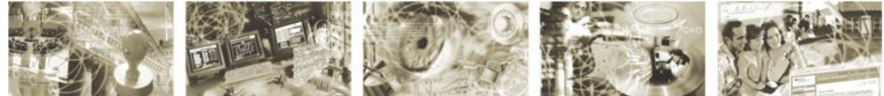

## BSI – Technische Richtlinie

| Bezeichnung:       | Identitätsbestätigungsdienst IT-Sicherheit |
|--------------------|--------------------------------------------|
| Anwendungsbereich: | De-Mail                                    |
| Kürzel:            | BSI TR 01201 Teil 4.3                      |
| Version:           | 1.8                                        |

Bundesamt für Sicherheit in der Informationstechnik Postfach 20 03 63 53133 Bonn +49 (0)228 99 9582-0 E-Mail: [de-mail@bsi.bund.de](mailto:de-mail@bsi.bund.de) Internet: [https://www.bsi.bund.de](https://www.bsi.bund.de/) © Bundesamt für Sicherheit in der Informationstechnik 2024

| Einleitung4                                       |                                     |
|---------------------------------------------------|-------------------------------------|
|                                                   |                                     |
| Erfassung des IT-Verbundes5                       |                                     |
|                                                   |                                     |
| Falsche Versendung von Identitätsbestätigungen6   |                                     |
| Manipulierte Inhalte der Identitätsbestätigungen6 |                                     |
| Sicherheitsziele7                                 |                                     |
| Schutz der Systemadresse7                         |                                     |
| Schutz vor Manipulation der Daten7                |                                     |
| Anforderungen8                                    |                                     |
| Verwendung der Systemadressen nur durch den DMDA8 |                                     |
| Signatur der Identitätsbestätigungen8             |                                     |
|                                                   | IT-Strukturanalyse5 Bedrohungen6 |

# **1 Einleitung**

Dieses Modul beinhaltet die IT-Sicherheitsanforderungen, die über die generellen Anforderungen aus dem Modul [TR DM IS M] hinausgehen und speziell für den ID anzuwenden sind, und ist Bestandteil von [TR DM ID M]. Dies gilt, sofern der ID angeboten wird.

# **2 IT-Strukturanalyse**

Die Grundlage für die Erarbeitung dieses Moduls bildet die in [TR DM IS GS] angenommene Netzinfrastruktur eines DMDA.

Bei der Erstellung des realen IT-Sicherheitskonzepts sind die hier enthaltenen Bedrohungen, Sicherheitsziele, zwingenden Anforderungen und Empfehlungen zu berücksichtigen. Näheres regelt [TR DM IS M].

## **2.1 Erfassung des IT-Verbundes**

In diesem Modul wird auf den IT-Verbund verwiesen, der bereits in der [TR DM IS GS] skizziert ist.

# **3 Bedrohungen**

Es gelten die im Modul [TR DM IS M] formulierten Bedrohungen, sowie weitere speziell für den ID geltenden Aspekte.

#### **3.1 Falsche Versendung von Identitätsbestätigungen**

Durch technisches Versagen oder bewusste Manipulation (beispielsweise von Innentätern) können Identitätsbestätigungen mit falschem Inhalt unter der spezifischen Adresse versendet werden.

## **3.2 Manipulierte Inhalte der Identitätsbestätigungen**

Durch technisches Versagen oder bewusste Manipulation (beispielsweise von Innentätern) können Identitätsbestätigungen manipuliert und versendet werden oder der Inhalt der Identitätsbestätigungen kann bei der Übertragung unbefugt verändert werden.

## **4 Sicherheitsziele**

Es gelten die Sicherheitsziele, die im Modul [TR DM IS GS] formuliert wurden.

### **4.1 Schutz der Systemadresse**

Es müssen geeignete Maßnahmen getroffen werden, um ein unberechtigtes Versenden unter der spezifischen Adresse zu verhindern. Damit soll unterbunden werden, dass Identitätsbestätigungen mit manipulierten Inhalten ausgestellt und versendet werden.

#### **4.2 Schutz vor Manipulation der Daten**

Die Identitätsbestätigungen müssen vor unbefugter Änderung geschützt werden.

# **5 Anforderungen**

#### **5.1 Verwendung der Systemadressen nur durch den DMDA**

Durch geeignete technische und organisatorische Maßnahmen ist sicherzustellen, dass die Systemadressen nicht missbräuchlich verwendet werden können.

## **5.2 Signatur der Identitätsbestätigungen**

Die Identitätsbestätigungen müssen durch den DMDA qualifiziert signiert (vgl. [TR DM ID FU]) werden.