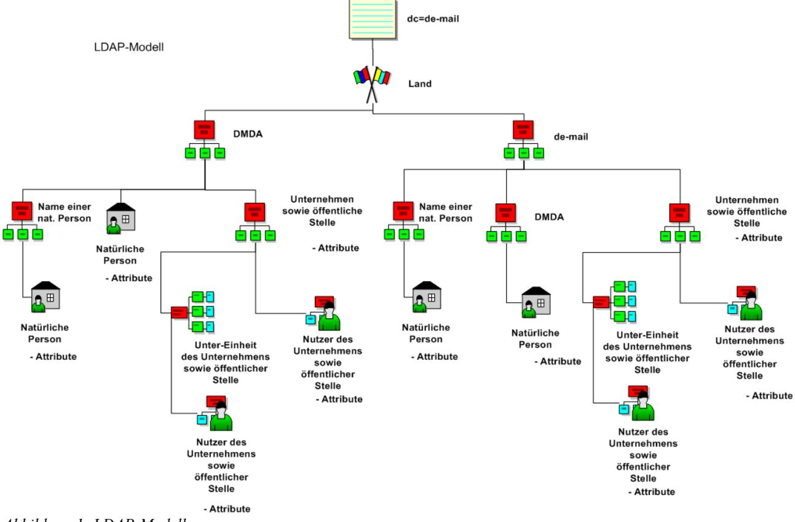
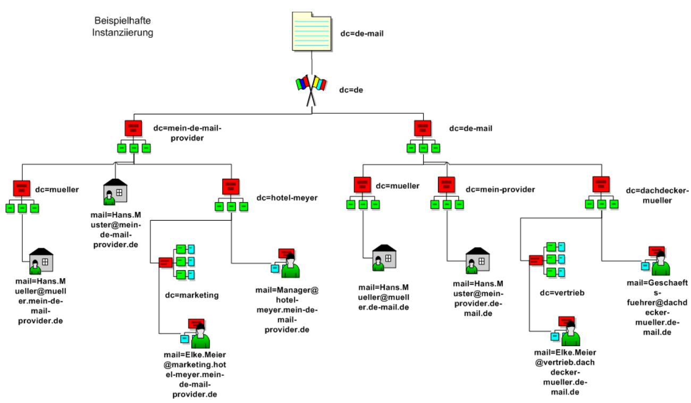

## BSI – Technische Richtlinie

| Bezeichnung:       | IT-Basisinfrastruktur<br>Interoperabilitätsspezifikation |  |  |
|--------------------|----------------------------------------------------------|--|--|
| Anwendungsbereich: | De-Mail                                                  |  |  |
| Kürzel:            | BSI TR 01201 Teil 1.4                                    |  |  |
| Version:           | 1.8                                                      |  |  |

Bundesamt für Sicherheit in der Informationstechnik Postfach 20 03 63 53133 Bonn Tel.: +49 22899 9582-0 E-Mail: [de-mail@bsi.bund.de](mailto:de-mail@bsi.bund.de) Internet: [https://www.bsi.bund.de](https://www.bsi.bund.de/) © Bundesamt für Sicherheit in der Informationstechnik 2024

## **Inhaltsverzeichnis**

| 1   | Einleitung4                                   |  |
|-----|-----------------------------------------------|--|
| 2   | Transportverschlüsselung5                     |  |
| 3   | Domänenverschlüsselung6                       |  |
| 4   | Zertifikate für die Inter-DMDA-Kommunikation7 |  |
| 5   | Domain Name Service8                          |  |
| 6   | Verzeichnisdienst10                           |  |
| 6.1 | LDAP-Schema10                                 |  |
| 6.2 | De-Mail-Schema15                              |  |
| 6.3 | Verzeichnisdienstabfragen19                   |  |
| 7   | Liste der vertrauenswürdigen DMDA-Domains21   |  |

## **Abbildungsverzeichnis**

| Abbildung 1: LDAP-Modell18                                   |  |
|--------------------------------------------------------------|--|
| Abbildung 2: Beispielhafte Instanziierung des LDAP-Modells19 |  |

### **Tabellenverzeichnis**

| Tabelle 1: Übersicht der Verbindungen, Protokolle sowie der Clientauthentisierung5          |  |
|---------------------------------------------------------------------------------------------|--|
| Tabelle 2: Inhalte der Zertifikate7                                                         |  |
| Tabelle 3: LDAP-Attribute natürlicher Personen11                                            |  |
| Tabelle 4: LDAP-Attribute von Institutionen12                                               |  |
| Tabelle 5: LDAP-Attribute von Nutzern bei einer Institution: Beschäftigte13                 |  |
| Tabelle 6: LDAP-Attribute von Nutzern bei einer Institution: Rollen / Funktionspostfächer14 |  |
| Tabelle 7: LDAP-Attribute von Nutzern bei einer Institution: Organisationseinheiten14       |  |
|                                                                                             |  |

# <span id="page-3-0"></span>**1 Einleitung**

Dieses Modul ist Bestandteil von [TR DM IT-BInfra M]. Hier werden Datenstrukturen und Datenformate der IT-Basisinfrastruktur spezifiziert.

# <span id="page-4-0"></span>**2 Transportverschlüsselung**

Alle Verbindungen zu einem DMDA müssen mittels Transport Layer Security (TLS) verschlüsselt erfolgen.

Es sind die Anforderungen aus der aktuellen Version der [TR 03116-4] zu erfüllen.

Wenn eine Clientauthentisierung für die Verbindung gefordert wird, gelten die folgenden Anforderungen:

- **•** Bei der Prüfung der verwendeten Zertifikate muss eine Prüfung auf Zertifikatwiderruf erfolgen. Dies kann durch einen OCSP-Zugriff oder gegen eine lokal gespeicherte Zertifikatsperrliste (CRL) erfolgen. Eine CRL kann via HTTP oder LDAP aus dem Verzeichnisdienst des PKI-Betreibers beschafft werden. Die Prüfung des Zertifikats, welches zur Authentisierung der Gegenseite verwendet wird, muss mindestens alle 24 Stunden erfolgen und kann bis zur nächsten Prüfung zwischengespeichert werden.
- **•** Wenn die Prüfung des Zertifikats fehlschlägt, darf die Verbindung nicht aufgebaut werden.
- **•** Die Verbindung kann nach der Übertragung offengehalten werden. Dies verhindert, dass bei häufiger Übertragung von Daten von einem DMDA zu einem anderen der aufwändige Verbindungsaufbau wiederholt stattfindet. Bei der nächsten Gültigkeitsprüfung muss ein erneuter Verbindungsaufbau erfolgen.

| In der folgenden Tabelle werden alle möglichen Verbindungen, das dabei zu verwendende          |  |
|------------------------------------------------------------------------------------------------|--|
| Protokoll und eine Kennzeichnung, ob eine Clientauthentisierung erforderlich ist, aufgelistet. |  |

| Quelle        | Ziel          | Protokoll                              | Port | Clientauthentisierung |
|---------------|---------------|----------------------------------------|------|-----------------------|
| Nutzer        | DMDA          | HTTPS                                  | 443  | kann                  |
| Nutzer        | DMDA          | Alle weiteren Protokolle zur Anbindung |      | kann                  |
| PVD<br>DMDA 1 | PVD<br>DMDA 2 | SMTP über TLS                          | 1465 | muss                  |
| ÖVD<br>DMDA 1 | ÖVD<br>DMDA 2 | LDAPS                                  | 636  | muss                  |

*Tabelle 1: Übersicht der Verbindungen, Protokolle sowie der Clientauthentisierung*

Im Falle der Übertragung einer De-Mail-Nachricht von einem DMDA zu einem anderen wird die Verschlüsselung des Kanals mittels TLS initiiert (implizites TLS). Die Übertragung der Nachrichten muss dabei via SMTP über TLS auf Port 1465 stattfinden.

# <span id="page-5-0"></span>**3 Domänenverschlüsselung**

Die Domänenverschlüsselung dient dem Schutz jeder einzelnen De-Mail-Nachricht auf dem Transportweg von einem DMDA zu einem anderen. Dazu muss die De-Mail-Nachricht vor dem Versand verschlüsselt und beim Empfang entschlüsselt werden.

Die Verschlüsselung der De-Mail-Nachrichten muss mittels S/MIME nach den Vorgaben der [TR 03116-4] realisiert werden, wobei S/MIME Version 4.0 [RFC 8551] gemäß [TR 03116-4] verwendet und unterstützt werden muss und zusätzlich Version 3.1 [RFC 3851] unterstützt werden muss.

Bei der Domänenverschlüsselung müssen Verschlüsselungs- und Hash-Algorithmen aus [TR 03116-4] verwendet werden.

## <span id="page-6-0"></span>**4 Zertifikate für die Inter-DMDA-Kommunikation**

Im Folgenden werden die Inhalte der Zertifikate definiert, die für die Transport- und die Domänenverschlüsselung zwischen den DMDA verwendet werden. Sofern nicht explizit erwähnt, sind die Inhalte der Zertifikate für die Transport- und die Domänenverschlüsselung gleich.

| Attribut                |                                                                                                                                        |
|-------------------------|----------------------------------------------------------------------------------------------------------------------------------------|
|                         |                                                                                                                                        |
| CN                      | [DMDA-Domain]                                                                                                                          |
| OU                      | De-Mail                                                                                                                                |
| O                       | Bund                                                                                                                                   |
| C                       | de                                                                                                                                     |
| Schlüssel<br>verwendung | keyEncipherment<br>digitalSignature                                                                                                    |
| Extended Key<br>Usage   | Serverauthentifizierung (Webserver) 1.3.6.1.5.5.7.3.1<br>Client authentication 1.3.6.1.5.5.7.3.2<br>Email Protection 1.3.6.1.5.5.7.3.4 |

*Tabelle 2: Inhalte der Zertifikate*

Die Qualität der verwendeten Schlüssel muss mindestens den Anforderungen aus [TR 03116-4] genügen.

Die Beantragung der Zertifikate erfolgt bei der zuständigen Behörde. Die Behörde, die die PKI verwaltet, sorgt für die Einhaltung der Namensgebung in den ausgestellten Zertifikaten.

Die von dem DMDA aktuell verwendeten Zertifikate für die Domänenverschlüsselung müssen im DNS-Record gemäß [RFC 4398] als PKIX-Typ hinterlegt werden.

Der Abruf der Zertifikate muss über den Eintrag im DNS-Record des DMDA erfolgen.

Ein Zertifikat muss direkt nach dem Abruf auf seine Authentizität und Gültigkeit hin überprüft werden. Die Prüfung beinhaltet eine Prüfung gegen eine Sperrliste oder einen OCSP-Responder. Erst danach darf es für maximal 24 Stunden zwischengespeichert werden.

# <span id="page-7-0"></span>**5 Domain Name Service**

Jeder DMDA muss für seine, ausschließlich für De-Mail verwendeten Domain(s) einen eigenen Name-Server (Domain Name System, [RFC 1034], [RFC 1035]) betreiben.

Die Auskünfte des DNS-Servers sollten mittels DNSSEC (siehe [RFC 4033]) gesichert werden. Die Sicherung sollte für alle Domänen des DMDA genutzt werden.

Es muss ein autoritativer DNS-Server für die Domäne definiert werden (NS). Außerdem müssen die Einträge für die vom DMDA angebotenen De-Mail-Dienste definiert werden, damit diese gefunden werden können.

Für alle DMDA-Domains und -Subdomains muss ein SRV-Record "\_ldaps.\_tcp" existieren, der auf den ÖVD des DMDA verweist.

Für alle DMDA-Domains und -Subdomains muss ein SRV-Record "\_smtp.\_tcp" existieren, der auf den PVD des DMDA verweist.

Für DMDA-Domains und -Subdomains dürfen MX Resource Records oder A Resource Records nur dann existieren, wenn technisch sichergestellt ist, dass der Zustellversuch einer Nachricht vom E-Mail-Server des Absenders zum De-Mail Server aktiv beim Verbindungsaufbau abgelehnt wird.

Beispiel-Zonefile für den DNS-Server eines DMDA:

```
;zonefile for <De-Mail-Domäne>
$TTL 1D
@ IN SOA ns.<dmda>. hostmaster.<dmda>. (
     1 ; Serial
     8H ; Refresh
     2H ; Retry
     1W ; Expire
     1D) ; Minimum TTL
     NS ns ;the authoritative name server
_smtp._tcp IN SRV 10 0 1465 mail ;the SRV RR for the mail server
_ldaps._tcp IN SRV 10 0 636 dir ; the SRV RR for the directory service
ns A X.Y.Z.A
mail A X.Y.Z.B
dir A X.Y.Z.C
;Zertifikat für Domänenverschlüsselung
IN CERT PKIX [Zertifikat gemäß RFC 4398]
```
Beispiel-Zonefile für den DNS-Server. In diesem Beispiel wird die Institution Firma beim DMDA gehostet:

;zonefile for <Institution>.<De-Mail-Domäne> \$TTL 1D

| @<br>IN<br>SOA<br>ns.<Institution>.<De-Mail-Domäne>.<br>hostmaster.<Institution>.<De-Mail-Domäne>. ( |     |    |           |    |                        |              |   |      |      |     |
|------------------------------------------------------------------------------------------------------|-----|----|-----------|----|------------------------|--------------|---|------|------|-----|
|                                                                                                      | 1   |    | ; Serial  |    |                        |              |   |      |      |     |
|                                                                                                      | 8H  |    | ; Refresh |    |                        |              |   |      |      |     |
|                                                                                                      | 2H  |    | ; Retry   |    |                        |              |   |      |      |     |
|                                                                                                      | 1W  |    | ; Expire  |    |                        |              |   |      |      |     |
|                                                                                                      | 1D) |    |           |    | ; Minimum TTL          |              |   |      |      |     |
|                                                                                                      |     | IN |           | NS |                        | ns.<dmda>.de |   |      |      |     |
|                                                                                                      |     |    |           |    |                        |              |   |      |      |     |
|                                                                                                      |     |    |           |    |                        |              |   |      |      |     |
| _smtp._tcp                                                                                           |     |    |           |    | IN SRV                 | 0            | 0 | 1465 | mail |     |
| _ldaps._tcp                                                                                          |     |    |           |    | IN SRV                 | 0            | 0 | 636  |      | dir |
|                                                                                                      |     |    |           |    |                        |              |   |      |      |     |
| dns                                                                                                  |     |    |           |    | A <ns.DMDA-IP-Adresse> |              |   |      |      |     |

- mail A <mail.DMDA -IP-Adresse>
- dir A <dir.DMDA -IP-Adresse>
- de-mail A <de-mail.DMDA -IP-Adresse>

# <span id="page-9-0"></span>**6 Verzeichnisdienst**

## **6.1 LDAP-Schema**

Als Objektklasse ("objectclass") muss für natürliche Personen inetOrgPerson verwendet werden. Neu definierte Attribute für De-Mail müssen demail als Präfix erhalten. Die benötigten neuen Objektklassen müssen zudem Object als Postfix erhalten.

Für die Identitätsattribute und die vorgegebenen ergänzenden Attribute werden die zwei Objektklassen demailPersonObject und demailLegalPersonObject definiert. Diese nehmen die neu definierten Attribute sowie einige bereits vorhandene auf, aber keine der in inetOrgPerson enthaltenen Attribute (da es sich bei dem Attribut mail um ein Identitätsattribut handeln soll, reicht inetOrgPerson hier nicht aus). Beide Objektklassen sind Hilfsklassen (Typ AUXILIARY). In den folgenden Tabellen zu natürlichen Personen und Institutionen werden die möglichen Angaben in Auflistungen zusammengefasst und das jeweils zu verwendende LDAP-Attribut definiert. Hierbei ist ebenfalls angegeben, ob es sich im LDAP um ein MUST- oder MAY-Attribut (Pflicht vs. Optional) handelt.

Die aufgeführten Attribute umfassen:

- **•** Identitätsattribute bzgl. der Erfassung, die durch den DMDA verifiziert sein müssen
- **•** Zusätzliche Angaben, die nicht durch den DMDA verifiziert sein müssen.

Dem DMDA ist freigestellt, die zusätzlichen, nicht verifizierten Attribute zu erfassen. Sofern ein DMDA zusätzliche, nicht verifizierte Attribute führt, müssen diese bei Erfassung und Darstellung im ÖVD eindeutig als nicht durch den DMDA verifizierte Angaben in Form eines Hinweissatzes gekennzeichnet werden. Der Hinweissatz ist durch den DMDA mit BMI und BfDI abzustimmen.

### **6.1.1 Attribute**

Sofern nicht anders angegeben, darf ein Attribut nur einmal verwendet werden, selbst wenn der entsprechende Attributtyp ("attributetype") im LDAP-Schema eine mehrfache Verwendung zulässt. Die Ausnahme hinsichtlich der Verzeichnisdienst-Einträge ist das Verschlüsselungs-Zertifikat ("userCertificate").

### **6.1.2 Natürliche Personen**

Folgende Attribute können veröffentlicht werden. Es handelt sich bei den aufgeführten Attributen um Identitätsattribute, die durch den DMDA verifiziert sein müssen. Es dürfen nur die genannten Attribute veröffentlicht werden.

| Attribut                  | Attribut                     | LDAP-Attribut   | Objektklasse  |  |
|---------------------------|------------------------------|-----------------|---------------|--|
| Primär De-Mail<br>Adresse | Pseudonym De<br>Mail-Adresse |                 |               |  |
| Vorname                   | [kein Eintrag]1              | givenName (MAY) | inetOrgPerson |  |

<span id="page-9-1"></span>1 "[kein Eintrag]" stellt dar, dass das Feld nicht befüllt wird.

| Attribut                           | Attribut                           | LDAP-Attribut                 | Objektklasse         |  |
|------------------------------------|------------------------------------|-------------------------------|----------------------|--|
| Primär De-Mail<br>Adresse          | Pseudonym De<br>Mail-Adresse       |                               |                      |  |
| Nachname                           | Pseudonym-Bezeichner               | sn (MUST)                     | person               |  |
| Name2                              | Pseudonym-Bezeichner               | cn (MUST)                     | person               |  |
| Displayname3                       | Pseudonym-Bezeichner               | displayName (MUST)            | inetOrgPerson        |  |
| Titel                              | [kein Eintrag]                     | personalTitle<br>(MAY)        | demailPersonObject   |  |
| Hauptwohnsitz_Straße               | [kein Eintrag]                     |                               | organizationalPerson |  |
| Hauptwohnsitz_Hausnummer           | [kein Eintrag]                     | street (MAY)                  |                      |  |
| Hauptwohnsitz_Postleitzahl         | [kein Eintrag]                     | postalCode (MAY)              | organizationalPerson |  |
| Hauptwohnsitz_Ort                  | [kein Eintrag]                     | l (MAY)                       | organizationalPerson |  |
| Hauptwohnsitz_Staat                | [kein Eintrag]                     | c (MAY)                       | demailPersonObject   |  |
| Primär De-Mail-Adresse             | Pseudonym De-Mail<br>Adresse       | mail (MUST)                   | demailPersonObject   |  |
| Höchstes<br>Authentisierungsniveau | Höchstes<br>Authentisierungsniveau | demailMaxAuthLevel<br>(MUST)  | demailPersonObject   |  |
| Verschlüsselungs-Zertifikat        | Verschlüsselungs<br>Zertifikat     | userCertificate<br>(MAY)      | inetOrgPerson        |  |
| Zugangseröffnung4                  | [kein Eintrag]                     | deMailAccessOpening<br>(MAY)5 | demailPersonObject   |  |
| PGP                                | [kein Eintrag]6                    | pgpKeyInfo (MAY)              | pgpkeyserver         |  |

*Tabelle 3: LDAP-Attribute natürlicher Personen*

Für die eindeutige Abbildung kann das Attribut mail verwendet werden.

- <span id="page-10-0"></span>2 Der Name besteht aus der Zusammensetzung von [Vorname Nachname] oder bei Künstler-/Ordens-Name aus dem angegebenen Bezeichner.
- <span id="page-10-1"></span>3 Der Displayname besteht aus der Zusammensetzung von [Nachname, Vorname], wenn der Vorname freigegeben wurde, ansonsten nur aus dem Nachname oder bei Künstler-/Ordens-Name aus dem angegebenen Bezeichner.
- <span id="page-10-2"></span>4 Kennzeichnung gem. §7 Abs. 3 De-Mail-Gesetz: TRUE, falls die Zugangseröffnung im Sinne von §3a Verwaltungsverfahrensgesetz, §36a Absatz 1 des Ersten Buches Sozialgesetzbuch und des §87a Absatz 1 Satz 1 der Abgabenordnung durch den Nutzer erteilt wurde, ansonsten FALSE.
- <span id="page-10-3"></span>5 Falls das Attribut bei bestehenden Einträgen fehlt, muss davon ausgegangen werden, dass keine Zugangseröffnung erteilt wurde. Bei künftigen Einträgen ist dieses Attribut verpflichtend zu füllen.
- <span id="page-10-4"></span>6 "[kein Eintrag]" stellt dar, dass das Feld nicht befüllt wird.

Das Attribut c muss mit dem zweistelligen Country Code gemäß ISO 3166 gefüllt werden.

Bei Eintrag eines Künstler- oder Ordensnamens in der primären De-Mail-Adresse darf anstelle von Vor- und Nachnamen nur der entsprechende Künstler- bzw. Ordensname veröffentlicht werden.

Bei Pseudonym-Adressen dürfen nur technische Informationen veröffentlicht werden:

- **•** De-Mail-Adresse (MUSS),
- **•** maximales Authentisierungsniveaus (MUSS) und
- **•** Verschlüsselungszertifikat (KANN)
- **•** das Pseudonym als "Nachname" eingetragen.

Informationen, die eine Möglichkeit zur Auflösung des Pseudonyms bieten, d. h. Vor- und Nachname sowie Wohnsitz-Daten, dürfen somit in diesem Fall nicht veröffentlicht werden. Für die Inhalte des Verschlüsselungszertifikats (z.B. Common Name im Zertifikat) ist der Nutzer verantwortlich.

Folgende Attribute können veröffentlicht werden. Es handelt sich bei den aufgeführten Attributen um Identitätsattribute, die nicht durch den DMDA verifiziert werden müssen. Die Attribute dürfen nur dann veröffentlicht werden, wenn ebenfalls eine Veröffentlichung der verifizierten Adresse erfolgt. Hierbei darf die verifizierte Adresse unbefüllt sein. Unverifizierte Attribute müssen bei Erfassung und Darstellung im ÖVD durch die Anzeige eines Hinweissatzes als solche kenntlich gemacht werden. Der Hinweissatz ist durch den DMDA mit BMI und BfDI abzustimmen.

| Attribut                   | Attribut                     | LDAP-Attribut       | Objektklasse         |
|----------------------------|------------------------------|---------------------|----------------------|
| Primär De-Mail<br>Adresse  | Pseudonym De<br>Mail-Adresse |                     |                      |
| Unverifizierte Adresse     | [kein Eintrag]7              | postalAddress (MAY) | organizationalPerson |
| Unverifizierte Information | [kein Eintrag]               | description (MAY)   | person               |

*Tabelle 4: Unverifizierte LDAP-Attribute natürlicher Personen*

### **6.1.3 Institution**

Das Feld sn ist ein Pflichtfeld, das bei Accounts von Institutionen genauso wie cn zu belegen ist.

Hinweis: das Attribut c in der Klasse demailBaseObject ist wegen der Nationalität einer Institution erforderlich.

Bei den Feldern postalAddress und description handelt es sich um nicht durch den DMDA verifizierte Informationen, die durch die Institution eigenverantwortlich gepflegt werden können. Die Attribute dürfen nur dann veröffentlicht werden, wenn ebenfalls eine Veröffentlichung der verifizierten Adresse erfolgt. Hierbei darf die verifizierte Adresse unbefüllt sein. Unverifizierte Attribute müssen bei Erfassung und Darstellung im ÖVD durch die Anzeige eines Hinweissatzes als solche kenntlich gemacht werden. Der Hinweissatz ist durch den DMDA mit BMI und BfDI abzustimmen.

<span id="page-11-0"></span>7 "[kein Eintrag]" stellt dar, dass das Feld nicht befüllt wird.

| Attribut                           | LDAP-Attribut                        | Objektklasse            |  |
|------------------------------------|--------------------------------------|-------------------------|--|
| De-Mail-Domain der<br>Institution  | dc (MUST; Alias für domainComponent) | dcObject                |  |
| Name - Langform                    | o (MUST)                             | Organization            |  |
|                                    | displayname (MUST)                   | demailLegalPersonObject |  |
| Anschrift - Straße                 |                                      | organization            |  |
| Anschrift - Hausnummer             | street (MAY)                         |                         |  |
| Anschrift - Postleitzahl           | postalCode (MAY)                     | organization            |  |
| Anschrift - Ort                    | l (MAY)                              | organization            |  |
| Anschrift - Staat                  | c (MAY)                              | demailLegalPersonObject |  |
| De-Mail-Adresse                    | mail (MUST)                          | demailLegalPersonObject |  |
| Höchstes<br>Authentisierungsniveau | demailMaxAuthLevel<br>(MUST)         | demailLegalPersonObject |  |
| Verschlüsselungs-Zertifikat        | userCertificate (MAY)                | pkiUser                 |  |
| PGP                                | pgpKeyInfo (MAY)                     | pgpkeyserver            |  |
| Unverifizierte Adresse             | postalAddress (MAY)                  | organizationalPerson    |  |
| Unverifizierte Information         | description (MAY)                    | person                  |  |

#### *Tabelle 5: LDAP-Attribute von Institutionen*

Nutzer der Institution können sowohl als Person als auch als Rolle abgebildet werden. Werden Anschriftsdaten oder Daten zu Geschäftsfeld/Gegenstand der Institution bei Rollen oder Personen eingetragen, sind die Daten der entsprechenden Institution zu verwenden. Ausnahmen bilden hier Angaben zu nicht verifizierten Adressdaten sowie nicht verifizierten Informationen, die sowohl für "Beschäftigte", als auch "Rollen / Funktionspostfächer" abweichend erfasst werden können. Unverifizierte Attribute dürfen nur dann veröffentlicht werden, wenn ebenfalls eine Veröffentlichung der verifizierten Adresse erfolgt. Hierbei darf die verifizierte Adresse unbefüllt sein. Unverifizierte Attribute müssen bei Erfassung und Darstellung im ÖVD durch die Anzeige eines Hinweissatzes als solche kenntlich gemacht werden. Der Hinweissatz ist durch den DMDA mit BMI und BfDI abzustimmen.

| Attribut       | LDAP-Attribut   | Objektklasse  |
|----------------|-----------------|---------------|
| Vorname        | givenName (MAY) | inetOrgPerson |
| Nachname       | sn (MUST)       | person        |
| Name[= Vorname | cn (MUST)       | person        |

#### 6 Verzeichnisdienst

| Attribut                           | LDAP-Attribut                | Objektklasse                |
|------------------------------------|------------------------------|-----------------------------|
| Nachname]                          |                              |                             |
|                                    |                              |                             |
| Displayname [Nachname,<br>Vorname] | displayName (MUST)           | inetOrgPerson               |
| Name – Langform der<br>Institution | o (MUST)                     | demailLegalPersonUserObject |
| Anschrift - Straße                 | street (MAY)                 | inetOrgPerson               |
| Anschrift - Hausnummer             |                              |                             |
| Anschrift - Postleitzahl           | postalCode (MAY)             | inetOrgPerson               |
| Anschrift - Ort                    | l (MAY)                      | inetOrgPerson               |
| Anschrift - Staat                  | c (MAY)                      | demailLegalPersonUserObject |
| De-Mail-Adresse                    | mail (MUST)                  | demailLegalPersonUserObject |
| Verschlüsselungszertifikat         | userCertificate (MAY)        | inetOrgPerson               |
| Höchstes<br>Authentisierungsniveau | demailMaxAuthLevel<br>(MUST) | demailLegalPersonUserObject |
| PGP                                | pgpKeyInfo (MAY)             | pgpkeyserver                |
| Unverifizierte Adresse             | postalAddress (MAY)          | organizationalPerson        |
| Unverifizierte Information         | description (MAY)            | person                      |

*Tabelle 6: LDAP-Attribute von Nutzern bei einer Institution: Beschäftigte*

| Attribut                                         | LDAP-Attribut      | Objektklasse                |
|--------------------------------------------------|--------------------|-----------------------------|
| Bezeichner [= local-part<br>der De-Mail-Adresse] | cn (MUST)          | organizationalRole          |
|                                                  | displayName (MUST) | demailLegalPersonUserObject |
| Anschrift - Straße                               |                    |                             |
| Anschrift - Hausnummer                           | street (MAY)       | organizationalRole          |
| Anschrift - Postleitzahl                         | postalCode (MAY)   | organizationalRole          |
| Anschrift - Ort                                  | l (MAY)            | organizationalRole          |
| Anschrift - Staat                                | c (MAY)            | demailLegalPersonUserObject |

| Attribut                           | LDAP-Attribut                | Objektklasse                |
|------------------------------------|------------------------------|-----------------------------|
| Name – Langform der<br>Institution | o (MUST)                     | demailLegalPersonUserObject |
| De-Mail-Adresse                    | mail (MUST)                  | demailLegalPersonUserObject |
| Verschlüsselungszertifikat         | userCertificate (MAY)        | pkiUser                     |
| Höchstes<br>Authentisierungsniveau | demailMaxAuthLevel<br>(MUST) | demailLegalPersonUserObject |
| PGP                                | pgpKeyInfo (MAY)             | pgpkeyserver                |
| Unverifizierte Adresse             | postalAddress (MAY)          | organizationalPerson        |
| Unverifizierte Information         | description (MAY)            | person                      |

*Tabelle 7: LDAP-Attribute von Nutzern bei einer Institution: Rollen / Funktionspostfächer*

Zur Strukturierung einer Institution in Organisationseinheiten kann der in der nachfolgenden Tabelle dargestellte Knoten verwendet werden. Werden Anschriftsdaten oder Daten zu Geschäftsfeld/Gegenstand der Institution bei Rollen / Funktionen oder Beschäftigten eingetragen, sind die Daten der entsprechenden Institution zu verwenden.

| Attribut                                         | LDAP-Attribut                | Objektklasse                |
|--------------------------------------------------|------------------------------|-----------------------------|
| Sub-Domain der De-Mail<br>Domain der Institution | dc (MUST)                    | dcObject                    |
| Name - Langform                                  | ou (MUST)                    | organizationalUnit          |
|                                                  | displayname (MUST)           | demailLegalPersonUserObject |
| Anschrift - Straße                               | street (MAY)                 | organizationalUnit          |
| Anschrift - Hausnummer                           |                              |                             |
| Anschrift - Postleitzahl                         | postalCode (MAY)             | organizationalUnit          |
| Anschrift - Ort                                  | l (MAY)                      | organizationalUnit          |
| Anschrift - Staat                                | c (MAY)                      | demailLegalPersonUserObject |
| Name – Langform der<br>Institution               | o (MUST)                     | demailLegalPersonUserObject |
| De-Mail-Adresse                                  | mail (MUST)                  | demailLegalPersonUserObject |
| Verschlüsselungs-Zertifikat                      | userCertificate (MAY)        | pkiUser                     |
| Höchstes                                         | demailMaxAuthLevel<br>(MUST) | demailLegalPersonObject     |

| Attribut               | LDAP-Attribut    | Objektklasse |
|------------------------|------------------|--------------|
| Authentisierungsniveau |                  |              |
| PGP                    | pgpKeyInfo (MAY) | pgpkeyserver |

*Tabelle 8: LDAP-Attribute von Nutzern bei einer Institution: Organisationseinheiten*

Es muss durch den DMDA sichergestellt sein, dass jede De-Mail-Adresse im Attribut mail nur einmal im Verzeichnisdienst eingetragen wird.

Das Attribut c muss mit dem zweistelligen Country Code gemäß ISO 3166 gefüllt werden.

### **6.2 De-Mail-Schema**

#### Das u.a. Schema muss verwendet werden.

```
# LDAP schema extension for citizen portal
# Prefix for OIDs: 1.3.6.1.4.1.7924.2.1
# Prefix for names: demail
# Postfix for object classes: Object
attributetype ( 1.3.6.1.4.1.7924.2.1.1.1
      NAME 'demailMaxAuthLevel'
      DESC 'describes the maximum authentification the person is capable of 
(NORMAL/HIGH)'
      EQUALITY caseignoreMatch
      SYNTAX 1.3.6.1.4.1.1466.115.121.1.15
      SINGLE VALUE
attributetype ( 1.3.6.1.4.1.7924.2.1.1.2
      NAME 'demailAccessOpening'
      DESC 'person has granted access opening'
       EQUALITY booleanMatch
      SYNTAX 1.3.6.1.4.1.1466.115.121.1.7
      SINGLE-VALUE 
attributetype ( 1.3.6.1.4.1.7924.2.1.1.3
      NAME 'pgpKey'
      DESC 'public PGP key as string'
      EQUALITY caseIgnoreIA5Match
      SYNTAX 1.3.6.1.4.1.1466.115.121.1.26
      SINGLE-VALUE
```

```
attributetype ( 1.3.6.1.4.1.7924.2.1.1.4
      NAME 'pgpKeyID'
      DESC 'pgpKeyID attribute for PGP'
      EQUALITY caseIgnoreMatch
      SUBSTR caseIgnoreSubstringsMatch
      SYNTAX 1.3.6.1.4.1.1466.115.121.1.15
      SINGLE-VALUE
 )
### objects ###
objectclass ( 1.3.6.1.4.1.7924.2.1.2.1 
      NAME 'demailBaseObject'
      SUP top
      AUXILIARY
      MUST ( mail )
      MAY ( c ) )
objectclass ( 1.3.6.1.4.1.7924.2.1.2.2 
      NAME 'demailSecurityObject'
      SUP (demailBaseObject)
      AUXILIARY
      MUST ( demailMaxAuthLevel )
      MAY ( demailAccessOpening ) )
objectclass ( 1.3.6.1.4.1.7924.2.1.2.3 
      NAME 'demailPersonObject'
      SUP ( demailSecurityObject)
      AUXILIARY
      MAY ( personalTitle ) )
objectclass ( 1.3.6.1.4.1.7924.2.1.2.4 
      NAME 'demailLegalPersonObject'
      SUP ( demailSecurityObject)
      AUXILIARY
      MUST (displayName))
```
)

#### 6 Verzeichnisdienst

```
objectclass ( 1.3.6.1.4.1.7924.2.1.2.5 
      NAME 'demailLegalPersonUserObject'
      SUP ( demailSecurityObject)
      AUXILIARY 
      MUST (displayName $ o))
objectClass ( 1.3.6.1.4.1.7924.2.1.2.6
      NAME 'pgpKeyInfo'
      DESC 'PGP defined objectclass to maintain information about a PGP key'
      SUP demailBaseObject
      AUXILIARY
      MUST ( pgpKey )
      MAY ( pgpKeyID )
 )
# end of schema
personalTitle ist im COSINE LDAP/X.500 Schema-Schema definiert (siehe RFC 4524).
```
### **6.2.1 De-Mail-LDAP-Modell**

In der Abbildung [1](#page-18-0) ist das Modell der Verzeichnisdienst-Struktur für einen DMDA dargestellt.



<span id="page-18-0"></span>*Abbildung 1: LDAP-Modell*

In der Abbildung [2](#page-19-0) ist eine beispielhafte Instanziierung des De-Mail-LDAP-Modells dargestellt.

#### 6 Verzeichnisdienst



<span id="page-19-0"></span>*Abbildung 2: Beispielhafte Instanziierung des LDAP-Modells*

## **6.3 Verzeichnisdienstabfragen**

Für die Kommunikation der ÖVD untereinander (DMDA zu DMDA) muss LDAPv3 verwendet werden. Zur Übertragung muss der ÖVD implizites TLS (also LDAPS) über Port 636/tcp einsetzen (siehe Abschnitt [2](#page-4-0)).

Die Authentisierung zwischen den DMDA muss mittels TLS-ClientAuthentication erfolgen.

Der Zugriff auf den ÖVD eines DMDA muss allen anderen DMDA ermöglicht werden.

Die Suchbasis muss direkt aus der De-Mail-Adresse abgeleitet werden können. Jedem Level der Domain muss ein Verzeichnis der Suchbasis in entsprechender Reihenfolge gleichkommen.

Ein ÖVD muss einen namingContext "cn=de-mail" bereitstellen. Die Suchbasis bei Suchoperationen muss cn=de-mail oder spezifischer sein.

Beispiel:

De-Mail-Adresse: info@institution.de-mail.de

Suchbasis: dc=institution, dc=de-mail, dc=de, cn=de-mail

Bei allen DM-Domains und Subdomains kann der zugehörige Verzeichnisdienst anhand von SRV-Records ("\_ldaps.\_tcp") der entsprechenden Domain ausfindig gemacht werden.

Beispiel:

DM-Domain: institution.de-mail.de

SRV-Record des ÖVD: \_ldaps.\_tcp.institution.de-mail.de

# <span id="page-21-0"></span>**7 Liste der vertrauenswürdigen DMDA-Domains**

Um den DMDAs und auch den Nutzern eine Liste der vertrauenswürdigen De-Mail-Domains der DMDAs für das Routing von De-Mails zur Verfügung zu stellen, wird eine Trusted Service List (gemäß [ETSI TS 102 231] in der jeweils aktuellen Version) durch die zuständige Behörde erstellt und für alle Abfragenden zur Verfügung gestellt. Diese enthält die Domains aller akkreditierten DMDA.

Das Dokument muss durch den DMDA ausgewertet werden, um die gültigen De-Mail-Domains zu ermitteln.

Für jeden akkreditierten DMDA ist ein <tsl:TrustServiceProviderList>-Eintrag vorhanden.

Für jede Domäne des DMDAs gibt es einen <tsl:TSPService>-Eintrag.

Dort ist unter <tsl:ServiceName> die Domäne des DMDA hinterlegt.

Es ist jeweils der Status für einen DMDA zu prüfen, ob dieser aktiv ist.

Der Zeitpunkt für das nächste Update ist im Eintrag <tsl:NextUpdate> enthalten.

Die URL zum Abruf teilt die zuständige Behörde auf ihrer Webseite mit.