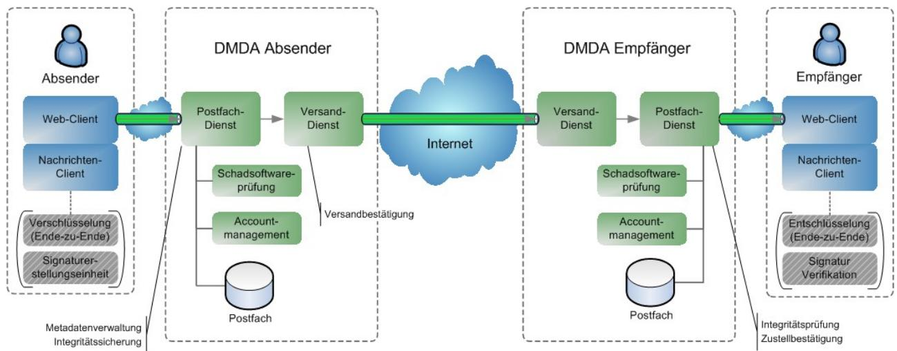
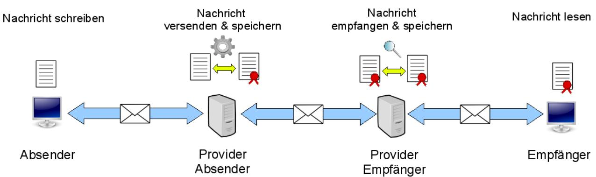

# BSI – Technische Richtlinie

| Bezeichnung:       | Postfach- und Versanddienst Funktionalitätsspezifikation |
|--------------------|-------------------------------------------------------------|
| Anwendungsbereich: | De-Mail                                                     |
| Kürzel:            | BSI TR 01201 Teil 3.1                                       |
| Version:           | 1.8                                                         |

Bundesamt für Sicherheit in der Informationstechnik Postfach 20 03 63 53133 Bonn Tel.: +49 22899 9582-0 E-Mail: [de-mail@bsi.bund.de](mailto:de-mail@bsi.bund.de) Internet: [https://www.bsi.bund.de](https://www.bsi.bund.de/) © Bundesamt für Sicherheit in der Informationstechnik 2024

# **Inhaltsverzeichnis**

| 1   | Einleitung5                                                        |  |
|-----|--------------------------------------------------------------------|--|
| 2   | Gesamtüberblick6                                                   |  |
| 3   | Funktionale Anforderungen8                                         |  |
| 3.1 | Postfachdienst und Postfach8                                       |  |
| 3.2 | Versanddienst12                                                    |  |
| 3.3 | Versandoptionen13                                                  |  |
| 4   | Besondere nicht-funktionale Anforderungen16                        |  |
| 4.1 | Speicherplatz16                                                    |  |
| 4.2 | Transportzeiten16                                                  |  |
| 4.3 | System-Adressen16                                                  |  |
| 5   | Datenstrukturen17                                                  |  |
| 5.1 | Nachrichten17                                                      |  |
| 5.2 | Bestätigungen und Bestätigungsnachrichten21                        |  |
| 5.3 | Meldungen und Meldungsnachrichten21                                |  |
| 6   | Funktionale Beschreibung23                                         |  |
| 6.1 | Erstellen von Nachrichten durch den Absender23                     |  |
| 6.2 | Entgegennahme von Nachrichten durch Postfachdienst des Absenders28 |  |
| 6.3 | Transport von Nachrichten durch Versanddienst des Absenders37      |  |
| 6.4 | Transport von Nachrichten durch Versanddienst des Empfängers40     |  |
| 6.5 | Empfangen der Nachrichten durch Postfachdienst des Empfängers44    |  |
| 6.6 | Abrufen der Nachrichten durch Empfänger57                          |  |
| 6.7 | Empfang und Lesen der Nachricht durch Empfänger61                  |  |
| 7   | Weitere Funktionen64                                               |  |
| 7.1 | Durch das System ausgeführte Funktionen64                          |  |
| 7.2 | Durch den Nutzer initiierte Funktionen65                           |  |
| 8   | Obligatorische und optionale Funktionalität76                      |  |

### **Abbildungsverzeichnis**

| Abbildung 1: Architekturüberblick über den PVD6                |  |
|----------------------------------------------------------------|--|
| Abbildung 2: Transport von Nachrichten innerhalb von De-Mail13 |  |

### **Tabellenverzeichnis**

| Tabelle 1: Liste der in dem PVD verwendeten System-Adressen16                          |  |
|----------------------------------------------------------------------------------------|--|
| Tabelle 2: Metadaten einer Nachricht21                                                 |  |
| Tabelle 3: Schritte zum Erstellen von Nachrichten28                                    |  |
| Tabelle 4: Schritte zum Versenden von Nachrichten37                                    |  |
| Tabelle 5: Schritte zum Transport von Nachrichten durch Versanddienst des Absenders40  |  |
| Tabelle 6: Schritte zum Transport von Nachrichten durch Versanddienst des Empfängers43 |  |
| Tabelle 7: Schritte zum Empfangen der Nachrichten56                                    |  |

| Tabelle 8: Schritte zum Abrufen und Lesen der Nachrichten61 |  |
|-------------------------------------------------------------|--|
|                                                             |  |
| Tabelle 9: Durch das System ausgeführte Funktionen65        |  |
| Tabelle 10: Durch den Nutzer initiierte Funktionen75        |  |
| Tabelle 11: Obligatorische und optionale Funktionalität76   |  |

# **1 Einleitung**

Dieses Modul beinhaltet die funktionalen Spezifikationen des Postfach- und Versanddienstes und ist Bestandteil von [TR DM PVD M].

In diesem Modul werden die zwingenden Anforderungen an den PVD von De-Mail technikneutral beschrieben. Eine Spezifikation von Protokollen und zugehörigen Parametern erfolgt nur dort, wo dies aus funktionaler Sicht explizit erforderlich ist.

# **2 Gesamtüberblick**

Der Postfachdienst von De-Mail ermöglicht dem Nutzer als elektronischer Briefkasten, elektronische Nachrichten sowohl zu versenden als auch zu empfangen. Der Versanddienst ist für das verbindliche Versenden der Nachrichten verantwortlich. Beide Dienste sind eng miteinander verknüpft. Einerseits kann ein Nutzer ohne Postfachdienst keine an ihn adressierten Nachrichten empfangen, und andererseits wird der Versanddienst benötigt, um Nachrichten von einem Nutzer an einen anderen zu versenden. Die [Abbildung 1](#page-5-1) gibt einen Überblick über die Architektur des PVD. Die Bestandteile der Architektur und deren Zusammenwirken werden in den nachfolgenden Abschnitten beschrieben.

*Abbildung 1: Architekturüberblick über den PVD*

Absender und Empfänger von Nachrichten greifen über einen lokalen Web- oder Nachrichten-Client auf ihren Postfachdienst zu.

Der Postfachdienst erlaubt dem Nutzer, elektronische Nachrichten sowohl zu versenden als auch zu empfangen (siehe Abschnitt [3.1](#page-7-0)). Er sichert vor dem Versand von Nachrichten deren Integrität und schützt die Nachrichten durch Verschlüsselung vor dem Einblick unberechtigter Dritter. Beim Empfang entschlüsselt der Dienst die Nachrichten und prüft deren Integrität vor Abruf durch den Empfänger.

Empfangene und versendete Nachrichten werden im Postfach des Nutzers gespeichert und können dort von diesem verwaltet werden. Mit dem Postfach werden die De-Mail-Adressen des De-Mail-Kontos des Nutzers verbunden (primäre und pseudonyme Adressen, vgl. [TR DM ACM FU]). Unter dieser Adresse ist er einerseits als Empfänger erreichbar, andererseits kann er Nachrichten darunter als Absender versenden.

Zugriff erhält ein Nutzer auf sein Postfach über den Postfachdienst, wenn er sich an seinem De-Mail-Konto erfolgreich angemeldet hat (s. a. [TR DM ACM FU]). Das Authentisierungsniveau, mit dem der Nutzer sich am De-Mail-Konto anmeldet, wird sowohl beim Versand einer Nachricht als auch beim Lesen von empfangenen Nachrichten berücksichtigt.

Möchte der Absender die Nachricht zusätzlich elektronisch signieren und/oder Ende-zu-Endeverschlüsseln, so kann er dies mit einer lokalen Signaturanwendungskomponente (SAK) bzw. mit einer lokalen Verschlüsselungskomponente durchführen. Diese Komponenten können auch in dem lokalen Web- oder Nachrichten-Client, mit dem er die Nachrichten erstellt, integriert sein und können auch unabhängig von De-Mail genutzt werden. Auf diese Weise signierte und/oder verschlüsselte Nachrichten kann der Empfänger ebenfalls mit lokalen Komponenten entschlüsseln und vorhandene Signaturen prüfen. Der DMDA gewährleistet die transparente Weiterleitung von bereits auf Nutzerseite verschlüsselten und/oder signierten Nachrichten.

Für das zuverlässige Versenden von elektronischen Nachrichten steht dem Nutzer der Versanddienst zur Verfügung (siehe Abschnitt [3.2](#page-11-0)). Dieser ermöglicht es, Nachrichten zu versenden und vom DMDA entsprechende Bestätigungen darüber zu erlangen, ob die Nachrichten versendet oder im Postfach des Empfängers eingegangen sind.

Nachrichten, die innerhalb des De-Mail-Verbundes versendet oder empfangen werden, werden obligatorisch auf Schadsoftware geprüft. Für qualifiziert signierte Nachrichtenanhänge kann der DMDA des Empfängers optional eine Signaturprüfung durchführen.

# **3 Funktionale Anforderungen**

Die funktionalen Anforderungen an den PVD von De-Mail werden in diesem Abschnitt beschrieben.

# **3.1 Postfachdienst und Postfach**

Jeder Nutzer von De-Mail besitzt mindestens ein Postfach. Auf dieses erhält er über den Postfachdienst Zugriff, wenn er sich an seinem De-Mail-Konto erfolgreich angemeldet hat (vgl. [TR DM ACM FU]). Das Authentisierungsniveau, mit dem der Nutzer sich am De-Mail-Konto angemeldet hat, wird sowohl beim Versand einer Nachricht als auch beim Abruf von Nachrichten (siehe Abschnitt [3.1.2.3](#page-9-0)) berücksichtigt.

In dem Postfach werden vom Nutzer versendete und an ihn übermittelte Nachrichten abgelegt. Zusätzlich können in dem Postfach z. B. Entwürfe von Nachrichten gespeichert werden.

Nachrichten werden an den Versanddienst für den zuverlässigen Transport an den oder die Empfänger übergeben und, wenn gefordert, Bestätigungen für den Versand, Eingang oder Abholung ausgestellt.

### **3.1.1 Erstellen und Versenden von Nachrichten**

Bei der Erstellung der Nachrichten kann der Nutzer mindestens auswählen

- **•** Versandoptionen (vgl. Abschnitt [3.3\)](#page-12-0)
- **•** Absenderadresse

Der Nutzer hat die Auswahl zwischen der primären und einer ggf. gewählten pseudonymen De-Mail-Adresse, die dem De-Mail-Konto zugeordnet ist. Andere Adressen können nicht genutzt werden.

- **•** Empfängeradresse Die Adressen können aus dem persönlichen Adressbuch, dem ÖVD oder manuell eingegeben werden. Es werden die Adressierungsarten "To:" (Primärer Adressat), "CC:" (*Carbon Copy*, Kopie) und "BCC:" (*Blind Carbon Copy*, Blindkopie) unterstützt.
- **•** Nachrichtentext
- **•** Anhänge

Die Anhänge können von dem lokalen Dateisystem des Nutzers oder aus der DA (optional) ausgewählt werden.

Des Weiteren kann die Nachricht optional durch den Nutzer mit einer (qualifizierten) Signatur versehen oder zusätzlich Ende-zu-Ende-verschlüsselt werden. Dies hat der DMDA in geeigneter Weise zu ermöglichen.

### **3.1.1.1 Übergabe einer Nachricht an den Postfachdienst zum Versand**

Die erstellte Nachricht wird vom lokalen Web- oder Nachrichten-Client mitsamt den ausgewählten Versandoptionen an den Postfachdienst des DMDA des Absenders übergeben.

Hat der Absender sich mit dem Authentisierungsniveau "normal" am Postfachdienst angemeldet, so darf dieser pro Tag höchstens 100 Nachrichten versenden, wobei insgesamt (d.h. für alle 100 Nachrichten zusammen) höchstens 300 Empfänger adressiert werden dürfen. Dies soll verhindern, dass über eine kompromittierte De-Mail-Adresse Massensendungen verteilt werden.

Nach Entgegennahme der Nachricht durch den Postfachdienst prüft dieser die Nachricht auf Schadsoftware (vgl. Abschnitt [3.1.3.1](#page-9-1)), sofern die Nachricht nicht Ende-zu-Ende verschlüsselt ist. Wenn keine Schadsoftware gefunden worden ist, werden notwendige Metadaten der Nachricht, wie z. B. die korrekte Absender-Adresse oder die aktuelle Zeit, kontrolliert und ggf. ergänzt. Falls Schadsoftware gefunden worden ist, wird der Nutzer über das weitere Vorgehen informiert.

Der Postfachdienst versieht die Nachricht unter Einbeziehung der Metadaten mit einer Integritätssicherung. Die Nachricht wird über einen sicheren Kommunikationskanal an den Versanddienst übertragen und verschlüsselt im Postfach abgelegt (s. a. Abschnitt [3.2.2](#page-11-1)). Falls vom Absender eine Versandbestätigung angefordert wurde, wird ihm diese von seinem Versanddienst ausgestellt und in Form einer Nachricht in sein Postfach abgelegt.

### **3.1.2 Empfang und Abruf von Nachrichten**

### **3.1.2.1 Ablage von Nachrichten im Postfach des Empfängers**

Der Postfachdienst des Empfängers nimmt von seinem Versanddienst die übermittelten Nachrichten entgegen, legt diese im Postfach des Empfängers ab und erstellt eine Eingangsbestätigung, falls dies der Absender der Nachricht angefordert hat. Diese wird in einer separaten Nachricht an den Absender übermittelt. Der Empfänger der ursprünglichen Nachricht erhält eine Kopie der Eingangsbestätigung.

#### **3.1.2.2 Darstellung der Nachrichten im Postfach**

Im Postfach des Nutzers gespeicherte Nachrichten werden durch den Postfachdienst zu einer Liste zusammengefasst und entsprechend im lokalen Web- oder Nachrichten-Client dargestellt. Neu empfangene und noch nicht gelesene Nachrichten werden besonders gekennzeichnet. Weiterhin werden verschiedene Merkmale der Nachricht kenntlich gemacht. Der Nutzer hat die Möglichkeit, die Nachrichten nach diesen Merkmalen zu sortieren oder anzeigen zu lassen.

Nach folgenden Merkmalen muss in der Übersicht der eingegangenen Nachrichten mindestens differenziert werden können:

- **•** Betreff der Nachricht,
- **•** Absendezeitpunkt der Nachricht,
- **•** Name des Absenders bzw. seine Adresse,
- **•** Vorhandensein von Nachrichtenanhängen,
- **•** Hinweis, ob vom Absender die Versandoptionen "Persönlich" und/oder "Absenderbestätigt" gewählt worden sind.

Folgende Informationen können optional in der Übersichtsansicht, müssen obligatorisch jedenfalls in der Einzelansicht einer Nachricht ersichtlich sein:

- **•** Name des Empfängers bzw. seine Adresse,
- **•** Authentisierungsniveau des Absenders,
- **•** Vorhandensein einer Verschlüsselung,
- **•** Vorhandensein von Signaturen (ggf. inkl. Prüfergebnisse),
- **•** Hinweis, ob vom Absender eine Versand-, Eingangs- und/oder Abholbestätigung angefordert worden ist.

### **3.1.2.3 Abruf der Nachrichten**

Der Postfachdienst muss sicherstellen, dass der Nutzer mit Authentisierungsniveau "normal" nicht auf Nachrichten zugreifen kann, falls für die Nachricht die Versandoption "persönlich" oder die Versandoption "Abholbestätigung" gewählt wurde.

Sofern ein ausreichendes Authentisierungsniveau gegeben ist, entschlüsselt der Postfachdienst die Nachricht und überträgt diese an den Nutzer.

### **3.1.2.4 Entschlüsselung der Nachrichten und Überprüfung von Signaturen**

Bei Ende-zu-Ende verschlüsselten Nachrichten oder Nachrichtenanhängen kann eine lokale Entschlüsselungskomponente dem Nutzer ermöglichen, diese auf seinem System zu entschlüsseln. Unabhängig von einer Signaturprüfung (s. a. Abschnitt [3.2.2\)](#page-11-1) durch den DMDA, die optional durchgeführt werden kann, kann der Empfänger auch eine eigene, auf seinem lokalen System installierte Verifikationskomponente zur Prüfung der Signaturen nutzen.

Der DMDA hat den Einsatz derartiger Komponenten in geeigneter Weise zu unterstützen.

### **3.1.3 Weitere Funktionen des Postfachdienstes und des Postfaches**

Neben Erstellung, Versand und Empfang von Nachrichten unterstützt der Postfachdienst von De-Mail in diesem Zusammenhang relevante Funktionen, die in den nachfolgenden Abschnitten aufgeführt werden.

#### **3.1.3.1 Prüfung auf Schadsoftware**

Der Postfachdienst überprüft Nachrichten vom Absender, die er an diesen für den Versand übergeben hat, auf Schadsoftware. Nachrichten, in denen Schadsoftware festgestellt wurde, dürfen nicht weiterversendet werden, der Absender ist entsprechend zu informieren und die Nachricht in einen dafür vorgesehenen Ordner zu verschieben oder zu löschen.

Nachrichten, die der Postfachdienst des Empfängers entgegen nimmt, werden ebenfalls auf Schadsoftware geprüft. Nachrichten, in denen Schadsoftware festgestellt wurde, dürfen dem Empfänger nicht übermittelt werden. Sowohl der Absender als auch der Empfänger der Nachricht erhalten eine entsprechende Information.

Wurde vom DMDA des Empfängers keine Schadsoftware gefunden, wird die Nachricht zugestellt. Beim Abruf der Nachricht darf der Nutzer diese erneut auf Schadsoftware untersuchen lassen. Wird nun eine solche gefunden, darf der Nutzer erst nach einem expliziten Warnhinweis auf diese Nachricht zugreifen, die sich dann in einem dafür vorgesehenen Ordner befinden muss.

### **3.1.3.2 Automatisierte Weiterleitung an eine andere De-Mail-Adresse**

Der Nutzer muss die Möglichkeit haben an sein De-Mail-Konto gesendete Nachrichten automatisch an eine andere De-Mail-Adresse weiterleiten zu lassen. Bei der automatisierten Weiterleitung wird

die Nachricht im Postfach des Nutzers abgelegt, bevor eine Kopie an die Weiterleitungs-Adresse gesendet wird. Die Weiterleitung an eine Adresse, die keine De-Mail-Adresse ist, ist unzulässig. Eine ggf. angeforderte Eingangsbestätigung wird bei Ablage der Nachricht nur im Postfach des ursprünglichen Empfängers erzeugt.

Für Nachrichten mit der Versandoption "persönlich" kann der Nutzer eine Weiterleitung ausschließen. In diesem Fall erfolgt keine Weiterleitung, sondern nur eine Benachrichtigung an die Weiterleitungsadresse über den Eingang einer Nachricht (vgl §5 Absatz 11"De-Mail-G). Andernfalls wird eine Kopie der Nachricht ebenfalls mit Versandoption "persönlich" an die Weiterleitungsadresse weitergeleitet.

Für Nachrichten mit der Versandoption "Abholbestätigung" erfolgt keine Weiterleitung, sondern eine Benachrichtigung an die Weiterleitungsadresse.

### **3.1.3.3 Nachsendeauftrag an eine andere De-Mail-Adresse**

Von der automatisierten Weiterleitung ist der Nachsendeauftrag an eine andere De-Mail-Adresse abzugrenzen. Innerhalb eines Auflösungsantrags zu seinem De-Mail-Konto (vgl. [TR DM ACM FU]) muss der DMDA dem Nutzer die Möglichkeit anbieten, einen Nachsendeauftrag an eine andere De-Mail-Adresse zu stellen. Alle empfangenen Nachrichten werden während einer festgelegten Übergangszeit an diese weitergeleitet. Bei einem Nachsendeauftrag wird keine Kopie im Postfach des Nutzers abgelegt. Eine ggf. angeforderte Eingangsbestätigung oder Abholbestätigung wird erst durch den Postfachdienst erzeugt, an den die Nachricht nachgesendet worden ist.

### **3.1.3.4 Export von Nachrichten**

Der Nutzer muss die Möglichkeit haben, empfangene und versendete Nachrichten und deren Anhänge auf sein lokales System zu exportieren. Der Export erfolgt durch den Postfachdienst auf Anforderung des Nutzers, inkl. des Integritätsschutzes (vgl. Abschnitt [3.2.2](#page-11-1)).

#### **3.1.3.5 Zugriff auf Adressbuch und ÖVD**

Über den Postfachdienst kann der Nutzer auf die Kontaktdaten zugreifen, die in dem Adressbuch seines De-Mail-Kontos hinterlegt sind.

Zusätzlich zu dem persönlichen Adressbuch kann der Nutzer auch den ÖVD von De-Mail (siehe [TR DM IT-BInfra FU]) nutzen, in dem die freigegebenen Kontaktdaten der De-Mail-Nutzer veröffentlicht sind.

### **3.1.3.6 Weiterleiten und Beantworten von Nachrichten**

Der Nutzer hat die Möglichkeit, eine Nachricht an andere De-Mail-Empfänger weiterzuleiten und diese zu beantworten. Standardmäßig wird die ursprüngliche Nachricht als Anhang einer neuen Nachricht weitergeleitet, sodass die Metadaten der ursprünglichen Nachricht erhalten bleiben. Andere Weiterleitungsformate (z. B. ein ">" vor jeder Zeile der ursprünglichen Nachricht) kann der Nutzer konfigurieren. Es ergeben sich die gleichen Anforderungen wie für eine neue Nachricht (vgl. Abschnitt [3.1.1](#page-7-2)).

### **3.1.3.7 Ablage von Nachrichten in Kategorien**

Nachrichten können vom Nutzer in eigene Kategorien sortiert werden. Eine Kategorie entspricht einem Ordner, in dem die Nachricht abgelegt werden kann. Die Möglichkeit einer Zuordnung zu mehreren Kategorien kann optional durch den DMDA angeboten werden.

Es ist optional auch möglich, Nachrichten automatisch bei Empfang im Postfach entsprechenden Kategorien zuzuordnen. Eine Administration dieser Regeln erfolgt durch den Nutzer selbst.

### **3.1.3.8 Suchfunktionen für Nachrichten**

Der Nutzer muss eine Suchfunktion des Postfachdienstes nutzen können, um Nachrichten innerhalb seines Postfaches aufzufinden. Optional können Anhänge von Nachrichten mit Office- und PDF-Dokumenten durchsucht werden, sofern diese nicht Ende-zu-Ende-verschlüsselt sind.

### **3.1.3.9 Löschen von Nachrichten**

Nachrichten dürfen durch den Nutzer nur in einem 2-Stufen-Prozess gelöscht werden können:

- 1. Stufe: Verschieben der zu löschenden Nachricht in einen Papierkorb, in dem zu löschende Dokumente abgelegt werden.
- 2. Stufe: Endgültiges und unwiederbringliches Löschen von allen bzw. einzelnen Nachrichten aus dem Papierkorb.

Nachrichten, bei denen sich der Empfänger mit Authentisierungsniveau "hoch" anmelden muss, um auf die Nachrichten zugreifen zu können, dürfen nur gelöscht werden, wenn sich der Empfänger auf diesem Authentisierungsniveau angemeldet hat. Dies gilt auch für Abholbestätigungen, da sie mit der Versandoption "persönlich" gekennzeichnet sind, sowie für Nachrichten, für die eine Abholbestätigung ausgestellt wurde/werden soll. Eine Nachricht, für die eine Versand- oder Eingangsbestätigung erteilt worden ist, darf durch den Empfänger mit Authentisierungsniveau "normal" erst 90 Tage nach ihrem Eingang gelöscht werden können.

# **3.2 Versanddienst**

Der Versanddienst stellt zusammen mit dem Postfachdienst sicher, dass Nachrichten von einem De-Mail-Nutzer zu einem anderen De-Mail-Nutzer vertraulich und verbindlich übermittelt werden. Weiterhin ermöglichen beide Dienste, Bestätigungen darüber zu erlangen, ob die Nachricht versendet wurde oder im Postfach des Empfängers eingegangen ist (siehe Abschnitte [3.2.2\)](#page-11-1).

### **3.2.1 Benachrichtigung bei falscher Adressierung oder vollständiger Sperrung**

Bei Empfang einer Nachricht an

- **•** eine nicht existierende De-Mail-Adresse oder
- **•** an ein vollständig gesperrtes De-Mail-Konto (vgl. [TR DM ACM FU]),

sendet der Versanddienst eine Fehlermeldung an den Absender. Es darf keine Eingangsbestätigung ausgestellt werden.

### **3.2.2 Transport von Nachrichten innerhalb von De-Mail**

Die Übermittlung der Nachrichten vom Postfachdienst des Absenders zum Postfachdienst des Empfängers erfolgt innerhalb von De-Mail ausschließlich über sichere Transportkanäle (vgl. [TR DM IS GS] bzw. [TR DM IS 27001]).

*Abbildung 2: Transport von Nachrichten innerhalb von De-Mail*

Unmittelbar nach Entgegennahme der Nachricht vom Sender überprüft der Postfachdienst die Nachricht auf Schadsoftware und die übermittelten Metadaten auf Validität. Der DMDA ergänzt weitere Metadaten wie z. B. die aktuelle Zeit und versieht die Nachricht inklusive der Metadaten mit einer Integritätssicherung. Die Metadaten sind der Nachricht eindeutig zugeordnet. Anschließend wird die Nachricht sowohl für den Postfachdienst des Empfängers als auch für den Postfachdienst des Absenders verschlüsselt. Die so gesicherte Nachricht wird vom Postfachdienst sowohl in das Postfach des Absenders als auch an den Versanddienst des Absenders übertragen.

Der Versanddienst des Absenders übermittelt die gesicherte Nachricht anschließend an den Versanddienst des Empfängers, der prüft, ob er die Nachricht zustellen kann. Im positiven Fall leitet er die Nachricht an den Postfachdienst weiter. Nach Entgegennahme durch den Postfachdienst wird die Nachricht wiederum temporär entschlüsselt und auf Schadsoftware geprüft. Die Nachricht wird im Postfach des Empfängers verschlüsselt abgelegt.

Ein Abruf von Nachrichten durch den Empfänger erfolgt über einen sicheren Transportkanal. Der Postfachdienst prüft hierbei, ob das aktuelle Authentisierungsniveau des Empfängers für den Zugriff auf die konkrete Nachricht ausreicht. Nachfolgend entschlüsselt der Postfachdienst die abgerufene Nachricht, kontrolliert die Integritätssicherung und übermittelt sie an den lokalen Weboder Nachrichten-Client.

## **3.3 Versandoptionen**

Die Einführung elektronischer Versandoptionen mit einer definierten und standardisierten Anzahl von Produktausprägungen ist eine wesentliche Aufgabe von De-Mail.

Bei dem Versand von Nachrichten innerhalb von De-Mail sind die folgenden Merkmale von wesentlicher Bedeutung:

- Authentizität des Empfängers einer Nachricht
- Authentizität des Absenders einer Nachricht
- Bestätigungen über den jeweiligen Zustand einer Nachricht
- Integritätssicherung von Nachrichten

Die oben aufgeführten Merkmale sind in den nachfolgend beschriebenen Versandoptionen abgebildet.

Alle Versandoptionen müssen vom DMDA angeboten werden. Die Versandoptionen können einzeln auswählbar sein. Der DMDA kann Kombinationen der Versandoptionen anbieten.

In der Bezeichnung muss sichergestellt sein, dass alle Versandoptionen für den Nutzer klar erkennbar sind. Der Nutzer ist bei Kombinationen darüber zu informieren, welche Versandoptionen in diesen enthalten sind.

## **3.3.1 Persönlich**

Hiermit kann der Absender zum Ausdruck bringen, dass er besonderen Wert auf den sicheren Zugang seiner Nachricht beim Empfänger selbst legt. Hier muss das erforderliche Authentisierungsniveau des Empfängers "hoch" sein, um die Nachricht lesen zu können. Um diese Option wählen zu können, muss das Authentisierungsniveau des Absenders ebenfalls "hoch" sein. Verfügt der Empfänger nicht über das Authentisierungsniveau "hoch", wird die Nachricht von seinem Postfachdienst mit einer Fehlermeldung an den Absender zurückgeschickt.

### **3.3.2 Absenderbestätigt**

Hiermit kann der Absender gegenüber dem Empfänger zum Ausdruck bringen, dass er sich zum Absenden der Nachricht sicher angemeldet hat. Um diese Option wählen zu können, muss das Authentisierungsniveau des Absenders "hoch" sein. Der DMDA des Absenders versieht die Nachricht und die Metadaten mit einer qualifizierten Signatur.

Die Versandoption darf nicht von natürlichen Personen in Kombination mit einer Pseudonym-Adresse verwendet werden können.

### **3.3.3 Versandbestätigung**

Hiermit erhält der Absender einen Nachweis über den ordnungsgemäßen Versand seiner Nachricht. Die Versandbestätigung wird vom Versanddienst des Absenders erzeugt und diesem per Nachricht übermittelt.

### **3.3.4 Eingangsbestätigung**

Hiermit erhalten Absender und Empfänger einen Nachweis darüber, wann der DMDA des Empfängers die Nachricht im Postfach des Empfängers abgelegt hat. Die Eingangsbestätigung wird vom Postfachdienst des Empfängers erzeugt und dem Absender sowie dem Empfänger der ursprünglichen Nachricht per Nachricht übermittelt.

### **3.3.5 Abholbestätigung**

Hiermit erhalten Absender und Empfänger einen Nachweis darüber, wann der DMDA die Nachricht im Postfach des Empfängers abgelegt hat und dass sich der Empfänger nach dem Eingang der Nachricht an seinem De-Mail-Konto mit Authentisierungsniveau "hoch" angemeldet hat. Die Abholbestätigung wird vom Postfachdienst des Empfängers erzeugt, wenn sich der Empfänger das erste Mal nach dem Ablegen der Nachricht in seinem Postfach mit Authentisierungsniveau "hoch" anmeldet. Es ist die Nachrichtenoption "persönlich" zu setzen.

Die Abholbestätigung wird dem Absender sowie dem Empfänger der ursprünglichen Nachricht per Nachricht übermittelt.

Diese Option steht beim Versand nur berechtigten öffentlichen Stellen zur Verfügung. Für den Versand muss der Versender mit dem Authentisierungsniveau "hoch" angemeldet sein.

Verfügt der Empfänger nicht über die Möglichkeit sich mit dem Authentisierungsniveau "hoch" anzumelden, wird eine entsprechende Meldungsnachricht erzeugt.

# **4 Besondere nicht-funktionale Anforderungen**

# **4.1 Speicherplatz**

Jeder Nutzer eines De-Mail-Kontos hat einen Mindest-Speicherplatz (vgl. [TR DM]) zur Verfügung. Die Größenbegrenzung einer Nachricht darf in der Inter-DMDA-Kommunikation nicht unter 45 MiB (brutto) liegen. Dem Nutzer werden damit Nachrichten mit einer Maximalgröße von 20 MiB (netto) ermöglicht.

Der Nutzer muss gewarnt werden, sobald der freie Speicherplatz seines Postfaches nur noch über weniger als 10% des maximalen Speicherplatzes verfügt.

Wenn der Speicherplatz belegt ist, kann der DMDA den Versand weiterer Nachrichten unterbinden. Der Empfang von Nachrichten muss weiterhin möglich sein.

# **4.2 Transportzeiten**

Nachrichten, die über den PVD versendet werden, müssen spätestens acht Stunden nach Absendung beim DMDA des Empfängers im Postfach liegen und durch den Empfänger abgerufen werden können. Erfolgt der Versand von Nachrichten an einen Empfänger eines anderen DMDAs, muss der DMDA des Absenders die Nachricht spätestens nach 4 Stunden dem DMDA des Empfängers übermittelt haben.

## **4.3 System-Adressen**

In der nachfolgenden Tabelle werden die System-Adressen (siehe [TR DM ACM FU]) aufgelistet, die innerhalb des PVD verwendet werden müssen.

| Verwendungszweck          | De-Mail-Adresse              |
|---------------------------|------------------------------|
| Versandbestätigung        | Versandbestaetigung@<DMDA>   |
| Eingangsbestätigung       | Eingangsbestaetigung@<DMDA>  |
| Abholbestätigung          | Abholbestaetigung@<DMDA>     |
| Warnung vor Schadsoftware | Schadsoftware-Warnung@<DMDA> |
| Meldung                   | Meldung@<DMDA>               |

*Tabelle 1: Liste der in dem PVD verwendeten System-Adressen*

Weitere Adressen können durch den DMDA für eigene Verwendungszwecke selbst definiert werden.

Im PVD sind insbesondere "Nachrichten", "Bestätigungsnachrichten" und "Meldungsnachrichten" zu unterscheiden.

# **5.1 Nachrichten**

Konzeptuell ist von einer Nachricht ein Nachrichtenentwurf als Vorstufe zu einer Nachricht zu unterscheiden. Eine Nachricht, die noch nicht vom Postfachdienst vollständig entgegengenommen und für den Versand vorbereitet worden ist, gilt als Nachrichtenentwurf. Eine Nachricht ist für den Versand vorbereitet, wenn die Metadaten in der Nachricht durch den Postfachdienst (siehe Abschnitt [6](#page-22-1), [Schritt 29](#page-33-0)) gesetzt worden sind.

Nachrichten bestehen aus Metadaten und dem Nachrichtentext.

Die Metadaten werden zusammen mit der Nachricht übermittelt und an entsprechender Stelle im Kontrollfluss des PVD ausgewertet. In Abhängigkeit der eingestellten Werte werden die dazu vorgesehenen Aktivitäten ausgeführt. Die Metadaten einer Nachricht sind im folgenden aufgeführt:

| Nr. | Bezeichnung         | Werte           | Beschreibung                                                                                                                                                                                                                                                                                                                                                                                                                                |
|-----|---------------------|-----------------|---------------------------------------------------------------------------------------------------------------------------------------------------------------------------------------------------------------------------------------------------------------------------------------------------------------------------------------------------------------------------------------------------------------------------------------------|
| 1   | Versandbestätigung  | ja / nein | Dieses Feld entspricht der Versandoption "Versandbestätigung". Es ist auf "ja" gesetzt, falls diese Option in Schritt 1 ausgewählt wurde. In diesem Fall generiert der PVD des Absenders eine Versandbestätigung, sobald diese Nachricht versendet worden ist (Schritt 36 ff.).                                                                                                                                              |
| 2   | Eingangsbestätigung | ja / nein | Dieses Feld entspricht der Versandoption "Eingangsbestätigung". Es ist auf "ja" gesetzt, falls diese Option in Schritt 1 ausgewählt wurde. In diesem Fall generiert der PVD des Empfängers eine Eingangsbestätigung, sobald diese Nachricht im Postfach des Empfängers abgelegt worden ist (Schritt 67 ff.).                                                                                                              |
| 3   | Abholbestätigung    | ja / nein | Dieses Feld entspricht der Versandoption "Abholbestätigung". Es ist auf "ja" gesetzt, falls diese Option in Schritt 1 ausgewählt wurde. Der Absender muss zum Zeitpunkt des Versendens mit Authentisierungsniveau "hoch" am De-Mail Konto angemeldet sein (Prüfung erfolgt in Schritt 19). Eine Abholbestätigung darf nur durch berechtigte öffentliche Stellen angefordert werden (Prüfung erfolgt in Schritt 24). |

| Nr. | Bezeichnung                                   | Werte              | Beschreibung                                                                                                                                                                                                                                                                                                                                                                                                                                       |
|-----|-----------------------------------------------|--------------------|----------------------------------------------------------------------------------------------------------------------------------------------------------------------------------------------------------------------------------------------------------------------------------------------------------------------------------------------------------------------------------------------------------------------------------------------------|
|     |                                               |                    | Ist diese Versandoption gesetzt, generiert der PVD des Empfängers eine Abholbestätigung, nachdem diese Nachricht in dessen Postfach abgelegt worden ist und der Nutzer sich das nächste Mal an seinem De-Mail-Konto mit Authentisierungsniveau "hoch" anmeldet.                                                                                                                                                                     |
| 4   | Absenderbestätigt                             | ja / nein    | Dieses Feld entspricht der Versandoption "Absenderbestätigt". Es ist auf "ja" gesetzt, falls diese Option ausgewählt wurde. Der Absender muss zum Zeitpunkt des Versendens mit Authentisierungsniveau "hoch" am De-Mail Konto angemeldet sein (Prüfung erfolgt in Schritt 19).                                                                                                                                                   |
| 5   | Persönlich                                    | ja / nein    | Dieses Feld entspricht der Versandoption "Persönlich". Es ist auf "ja" gesetzt, falls diese Option ausgewählt wurde. Der Empfänger muss zum Zeitpunkt des Abrufs mit Authentisierungsniveau "hoch" am De-Mail Konto angemeldet sein (Prüfung erfolgt in Schritt 78). Der Absender muss zum Zeitpunkt des Versendens mit Authentisierungsniveau "hoch" am De-Mail-Konto angemeldet sein (Prüfung erfolgt in Schritt 19). |
| 6   | Absender-Adresse                              | De-Mail Adresse | Die vom Absender in Schritt 2 gewählte De-Mail Adresse, unter der die Nachricht versendet werden soll (Prüfung der Gültigkeit erfolgt in Schritt 12).                                                                                                                                                                                                                                                                                        |
| 7   | Empfänger Adresse(n) (auch für CC, BCC) | De-Mail Adresse | Die vom Absender in Schritt 3 gewählten Empfänger-Adressen, an die die Nachricht versendet werden soll (Prüfung auf Validität in Schritt 15). Hinweis: Nur die eigene BCC-Adresse wird für den jeweiligen BCC-Empfänger innerhalb der Metadaten auf der Empfänger-Seite belassen.                                                                                                                                                |
| 8   | Betreff                                       | Text               | Der vom Absender in Schritt 4 angegebene "Betreff" zur Nachricht.                                                                                                                                                                                                                                                                                                                                                                               |
| 9   | Nachrichten Kennung des Absenders       | Text               | Die vom Absender in Schritt 4 angegebene "Nachrichten-Kennung" ermöglicht dem Absender, einer Nachricht zusätzlich zum Betreff eine Information mitzugeben. Anhand dieser                                                                                                                                                                                                                                                                 |

| Nr. | Bezeichnung                     | Werte                                  | Beschreibung                                                                                                                                                                                                                                                                                                                                                                                                                                 |
|-----|---------------------------------|----------------------------------------|----------------------------------------------------------------------------------------------------------------------------------------------------------------------------------------------------------------------------------------------------------------------------------------------------------------------------------------------------------------------------------------------------------------------------------------------|
|     |                                 |                                        | Kennung kann er andere Nachrichten, die die Nachrichten-Kennung referenzieren, wie z. B. Bestätigungsnachrichten, einem internen Vorgang zuordnen.                                                                                                                                                                                                                                                                               |
| 10  | Antwort-Adresse                 | De-Mail Adresse                     | Optionale Angabe, an welche De-Mail-Adresse eine Antwort auf diese Nachricht adressiert werden soll (wird in Schritt 3 gesetzt). An diese Adresse werden auch eventuell angeforderte Bestätigungsnachrichten gesendet (Prüfung auf Validität in Schritt 12).                                                                                                                                                                  |
| 11  | Authentisierungs niveau      | normal/hoch                            | Das Authentisierungsniveau, mit dem der Absender zum Zeitpunkt des Versendens der Nachricht am De-Mail-Konto angemeldet war (wird in Schritt 29 gesetzt).                                                                                                                                                                                                                                                                           |
| 12  | Authentisierungs Mechanismus | Text                                   | Bezeichnung des Authentisierungsmechanismus, mit dem der Absender sich zum Zeitpunkt des Versendens der Nachricht am De-Mail-Konto angemeldet hatte (wird in Schritt 29 gesetzt). Hinweis: Dieses Feld wird im PVD nicht weiter ausgewertet. Es soll jedoch Absendern und Empfängern ermöglichen, sich bilateral auf einen für ein bestimmtes Fachverfahren notwendigen Authentisierungsmechanismus zu verständigen. |
| 13  | Versanddatum und - zeit      | Datum & Zeit                           | Datum und sekundengenaue Zeitangabe für den Zeitpunkt, an dem der Postfachdienst die Nachricht an den Versanddienst weiterleitet (wird in Schritt 29 gesetzt).                                                                                                                                                                                                                                                                      |
| 14  | Message-ID                      | Text                                   | Eindeutige Kennung der Nachricht, die vom Postfachdienst generiert wird. Mit dieser Kennung soll es möglich sein, Nachrichten im Rahmen einer Postfach-internen Verwaltung schnell zu referenzieren (wird in Schritt 29 gesetzt).                                                                                                                                                                                                |
| 15  | De-Mail-Server                  | Text                                   | Eindeutige Bezeichnung des DMDA-Servers, der diese Metadaten erstellt (wird in Schritt 29 gesetzt).                                                                                                                                                                                                                                                                                                                                    |
| 16  | Nachrichten-Typ                 | Bestätigungs nachricht/ Meldungs | In diesem Feld können spezielle Nachrichten, die automatisiert vom Empfänger-System behandelt werden sollen, als solche gekennzeichnet werden                                                                                                                                                                                                                                                                                          |

| Nr. | Bezeichnung                             | Werte                                                               | Beschreibung                                                                                                                                                                                                                                                                                                                                                                                                    |
|-----|-----------------------------------------|---------------------------------------------------------------------|-----------------------------------------------------------------------------------------------------------------------------------------------------------------------------------------------------------------------------------------------------------------------------------------------------------------------------------------------------------------------------------------------------------------|
|     |                                         | nachricht/ nicht weiter spezifizierte De-Mail Nachricht | (siehe z. B. Schritt 29, Schritt 38, Schritt 56 und Schritt 69). Damit soll verhindert werden, dass der Inhalt aller Nachrichten aufwändig analysiert werden muss, um die entsprechenden Nachrichten zu identifizieren.                                                                                                                                                                          |
|     |                                         |                                                                     | Innerhalb des PVD sind als spezielle Nachrichten Bestätigungs- und Meldungsnachrichten vorgesehen.                                                                                                                                                                                                                                                                                                        |
| 17  | Hash-Wert / Signatur                    | Message Digest / Signatur                                     | Message Digest, der über die Metadaten-Felder 1 bis 16, sowie über alle Abschnitte des Nachrichtentexts berechnet wird. Der Message Digest wird vom Postfachdienst des Absenders in Schritt 29 erstellt. Falls die Versandoption "Absenderbestätigt" vom Nutzer gewählt wurde und dieser auch mit Authentisierungsniveau "hoch" am De-Mail Konto zum Zeitpunkt des Nachrichtenversandes |
|     |                                         |                                                                     | angemeldet war, wird in Schritt 31 eine qualifizierte Signatur erzeugt und in dem Feld gespeichert. Die Metadaten werden nach Versand durch den Postfachdienst des Absenders im Kontrollfluss des PVD nicht verändert.                                                                                                                                                                           |
| 18  | Signaturzertifikat des DMDA          | Signatur                                                            | Dieses Feld wird durch den DMDA nur gesetzt (Schritt 31), falls die Versandoption "Absenderbestätigt" vom Nutzer gewählt wurde und dieser auch mit Authentisierungsniveau "hoch" am De-Mail-Konto zum Zeitpunkt des Nachrichtenversandes angemeldet war. Dieses Feld enthält das für die Signatur verwendete Zertifikat des DMDA.                                                          |
| 19  | Empfänger-Adressen für den Transport | De-Mail Adresse                                                  | Hinweis: Beim Transport können die Empfänger Adressen bei Weiterleitungen umgeschrieben werden (vgl. Schritt 50 und Schritt 72). Im Initial Zustand müssen diese Adressen denen von Nr. 7 entsprechen (erfolgt in Schritt 29).                                                                                                                                                                      |
| 20  | Weiterleitungs Absender              | De-Mail Adresse                                                  | Dieses Feld wird durch den Postfachdienst des Empfängers nur gesetzt (Schritt 72), falls eine                                                                                                                                                                                                                                                                                                                |

| Nr. | Bezeichnung                             | Werte                                                                              | Beschreibung                                                                                                                                                                                |
|-----|-----------------------------------------|------------------------------------------------------------------------------------|---------------------------------------------------------------------------------------------------------------------------------------------------------------------------------------------|
|     |                                         |                                                                                    | automatische Weiterleitung eingerichtet wurde. Das Feld wird auf die De-Mail-Adresse gesetzt, von der die Nachricht weitergeleitet wird.                                              |
| 21  | Vollständiger Name des Kontoinhabers | Nat.Pers.: vollständiger Vor- und Nachname / PseudonymIn stitution: | Das Feld enthält bei nat. Personen den Namen und die Vornamen bzw. nur das Pseudonym bei Pseudonymadressen und bei Institutionen den Namen oder die Bezeichnung des Kontoinhabers. |
|     |                                         | vollständiger Name / Bezeichnung der Institution                          |                                                                                                                                                                                             |

*Tabelle 2: Metadaten einer Nachricht*

Die Metadaten [1](#page-16-2) bis [5](#page-17-2) ("Versandoptionen") entsprechen den vom Absender einer Nachricht ausgewählten Versandoptionen (vgl. Abschnitt [3.3](#page-12-0)). Falls ein Nutzer eine Nachricht oder Nachrichtenanhänge (qualifiziert) signiert oder Ende-zu-Ende-verschlüsselt, so werden in diesem Fall die ausgewählten Nachrichten-Teile direkt signiert und/oder verschlüsselt, ohne dies in den Metadaten explizit zu speichern.

Die Metadaten [6](#page-17-1) bis [10](#page-18-2) ("Adressen und Betreff") werden bei der Erstellung des Nachrichtenentwurfs (vgl. Abschnitt [6.1](#page-22-0)) durch den Nutzer spezifiziert. Die Metadaten [11](#page-18-1) bis [19](#page-19-1) ("interne Verwaltungsdaten") werden vom Postfachdienst des Absenders erstellt bzw. vordefiniert, wenn aus dem Nachrichtenentwurf eine Nachricht geworden ist [\(Schritt 29](#page-33-0) und [Schritt 31](#page-35-0)). Das Metadatum "Weiterleitungs-Absender" (Feld [20](#page-19-0)) wird erst vom PVD des jeweiligen Empfängers gesetzt, von dem die Nachricht weitergeleitet wird.

## **5.2 Bestätigungen und Bestätigungsnachrichten**

Bestätigungsnachrichten sind Nachrichten, die vom PVD generiert werden, wenn eine Versand-, Eingangs- oder Abholbestätigung angefordert wurde.

Die Inhalte der Bestätigungsnachrichten sind in [TR DM PVD IO] beschrieben.

# **5.3 Meldungen und Meldungsnachrichten**

Meldungen sind Informationen des DMDA an den Nutzer, um ihn über bestimmte Ereignisse zu informieren.

Wenn in diesem Dokument von einer "Meldungsnachricht" gesprochen wird, so ist die Meldung in Form einer Meldungsnachricht zu verschicken. Ist hingegen nur von "Meldung" die Rede, so kann diese in Abhängigkeit von der Benutzerschnittstelle auch anders verschickt bzw. dargestellt werden.

Die Inhalte einer Meldungsnachricht sind in [TR DM PVD IO] spezifiziert.

Im Folgenden werden die einzelnen Schritte für das Erstellen, Versenden, Empfangen und Abrufen von Nachrichten mit dem PVD von De-Mail beschrieben. Funktionen, die der Nutzer interaktiv aufrufen kann, wenn er an seinem Postfach angemeldet ist, werden in Abschnitt [7](#page-63-1) dargestellt. Die referenzierten Funktionen des Accountmanagements, der Schadsoftwareprüfung und des Zeitdienstes werden in [TR DM ACM FU] und [TR DM IT-BInfra FU] erläutert.

Im Kontrollfluss des PVD werden an verschiedenen Stellen neue Nachrichten, wie z. B. Bestätigungsnachrichten, automatisch erzeugt und an den Empfänger versendet. In diesen Fällen werden die in diesem Abschnitt beschriebenen Schritte für das Erstellen und Versenden von Nachrichten rekursiv durchlaufen. Die die Nachricht erzeugende Stelle wird damit zum Absender einer Nachricht.

Es werden in den nachfolgenden Tabellen die wichtigsten Fehlerfälle dargestellt, die vom DMDA bei dem von ihm angebotenen PVD mindestens zu berücksichtigen sind. Weitere können durch den DMDA hinzugefügt werden. Die Darstellung der Fehlerfälle für den Nutzer kann durch den DMDA gewählt werden.

# **6.1 Erstellen von Nachrichten durch den Absender**

| Schritt 1        | Versandoption festlegen                                                                                                           |  |  |
|------------------|-----------------------------------------------------------------------------------------------------------------------------------|--|--|
| Kurzbeschreibung | Der Absender erstellt einen neuen Nachrichtenentwurf und legt die Versandoptionen der Nachricht fest (vgl. Abschnitt 3.3).     |  |  |
| Akteure          | Absender                                                                                                                          |  |  |
| Auslöser         | Absender                                                                                                                          |  |  |
| Vorbedingung     | Fall a) Der Absender ist am De-Mail-Konto über Web-Schnittstelle angemeldet.                                                |  |  |
|                  | Fall b) Der Absender verwendet einen lokalen Nachrichten-Client.                                                               |  |  |
| Input            | Werte der Versandoptionen (ja/nein)                                                                                               |  |  |
|                  | Versand-, Eingangs- und/oder Abholbestätigungen •                                                                              |  |  |
|                  | Persönlich •                                                                                                                   |  |  |
|                  | Absenderbestätigt •                                                                                                            |  |  |
| Ergebnis         | Versandoptionen für den entsprechenden Nachrichtenentwurf festgelegt                                                              |  |  |
| Nachbedingung    |                                                                                                                                   |  |  |
| Ablauf           | Absender erstellt einen neuen Nachrichtenentwurf durch die • Funktionen "Neue Nachricht", "Beantworten" oder "Weiterleiten" |  |  |

Die vorgegebene Reihenfolge für das Erstellen einer Nachricht ([Schritt 1](#page-22-2) bis [Schritt 4](#page-24-0)) ist beispielhaft zu verstehen.

|                  | Absender legt die Versandoptionen fest •                                                                                                                                                                                                       |
|------------------|---------------------------------------------------------------------------------------------------------------------------------------------------------------------------------------------------------------------------------------------------|
| Fehlerfälle      |                                                                                                                                                                                                                                                   |
| Schritt 2        | Absender-Adresse auswählen                                                                                                                                                                                                                        |
| Kurzbeschreibung | Der Absender wählt aus, unter welcher zur Verfügung stehenden Absender Adresse die Nachricht versendet werden soll.                                                                                                                            |
| Akteure          | Absender                                                                                                                                                                                                                                          |
| Auslöser         | Absender                                                                                                                                                                                                                                          |
| Vorbedingung     | Fall a) Der Absender ist am De-Mail-Konto über Web-Schnittstelle angemeldet.                                                                                                                                                                |
|                  | Fall b) Der Absender verwendet einen lokalen Nachrichten-Client.                                                                                                                                                                               |
| Input            | Default-Absender-Adresse oder Auswahl der ihm zur Verfügung stehenden Absender-Adressen (primäre De-Mail-Adresse bzw. zum De-Mail-Konto zugehörige und gültige Pseudonym-Adressen).                                                         |
| Ergebnis         | Absender-Adresse festgelegt                                                                                                                                                                                                                       |
| Nachbedingung    |                                                                                                                                                                                                                                                   |
| Ablauf           | Für Fall a)                                                                                                                                                                                                                                       |
|                  | Absender übernimmt die durch die Applikation angezeigte Default • Absender-Adresse ohne Änderung, oder                                                                                                                                      |
|                  | Absender wählt aus den zur Verfügung stehenden Kennungen eine • Absender-Adresse aus.                                                                                                                                                       |
|                  | Für Fall b)                                                                                                                                                                                                                                       |
|                  | Absender übernimmt die durch die Applikation angezeigte Default • Absender-Adresse ohne Änderung, oder                                                                                                                                      |
|                  | Absender wählt aus den zur Verfügung stehenden Kennungen eine • Absender-Adresse aus, oder                                                                                                                                                  |
|                  | Absender editiert die Absender-Adresse frei. • Hinweis: Nutzt der Absender einen lokalen Nachrichten-Client, hängt es von diesem ab, ob die Absender-Adresse frei editiert werden kann oder nur vorgegebene ausgewählt werden können. |
|                  | Die ausgewählte Absender-Adresse wird in den Metadaten des • Nachrichtenentwurfs gespeichert.                                                                                                                                               |
| Fehlerfälle      | FC-01: Ungültiges Adressformat                                                                                                                                                                                                                    |
|                  | FC-02: Keine De-Mail-Adresse                                                                                                                                                                                                                      |
| Schritt 3        | Empfänger-Adressen und optionale Antwort-Adresse angeben                                                                                                                                                                                          |
| Kurzbeschreibung | Der Absender legt die Empfänger der Nachricht durch Angabe der Empfänger-Adressen fest. Weiterhin kann er optional auch eine Antwort Adresse angeben.                                                                                       |

| Akteure          | Absender                                                                                                                                                  |
|------------------|-----------------------------------------------------------------------------------------------------------------------------------------------------------|
| Auslöser         | Absender                                                                                                                                                  |
| Vorbedingung     |                                                                                                                                                           |
| Input            | Empfänger-Adressen (De-Mail-Adresse) und Antwort-Adresse (De-Mail Adresse)                                                                             |
| Ergebnis         | Empfänger-Adressen angegeben                                                                                                                              |
| Nachbedingung    |                                                                                                                                                           |
| Ablauf           | Absender editiert die Empfängeradressen frei oder wählt sie aus • seinem persönlichen Adressbuch oder dem ÖVD (vgl. Funktion 7, Abschnitt 7) aus |
|                  | Empfänger-Adressen und Antwort-Adresse werden in den • Metadaten des Nachrichtenentwurfes gespeichert.                                              |
| Fehlerfälle      | FC-01: Ungültiges Adressformat                                                                                                                            |
| Schritt 4        | Nachrichteninhalt editieren und Anhänge hinzufügen                                                                                                        |
| Kurzbeschreibung | Der Absender editiert den Betreff der Nachricht, den Nachrichteninhalt und fügt ggf. Dateianhänge hinzu.                                               |
| Akteure          | Absender, DA (optional)                                                                                                                                   |
| Auslöser         | Absender                                                                                                                                                  |
| Vorbedingung     |                                                                                                                                                           |
| Input            | Nachrichtentext, Dateianhänge                                                                                                                             |
| Ergebnis         | Nachricht editiert und ggf. Dateianhänge hinzugefügt                                                                                                      |
| Nachbedingung    |                                                                                                                                                           |
| Ablauf           | Absender editiert •                                                                                                                                    |
|                  | den Betreff ◦                                                                                                                                          |
|                  | Nachrichten-Kennung (optional) ◦                                                                                                                       |
|                  | Nachrichtentext ◦                                                                                                                                      |
|                  | Absender fügt Anhänge hinzu •                                                                                                                          |
|                  | von lokaler Festplatte ◦                                                                                                                               |
|                  | aus der DA (optional) ◦                                                                                                                                |
|                  | Daten in Nachrichtenentwurf speichern •                                                                                                                |
| Fehlerfälle      |                                                                                                                                                           |
| Schritt 5        | Entscheidungsknoten: Ende-zu-Ende Signatur erwünscht?                                                                                                     |
| Kurzbeschreibung | Auswertung, ob der Absender den Nachrichtenentwurf elektronisch signieren möchte.                                                                      |

| ja               | Schritt 6                                                                                                                                              |
|------------------|--------------------------------------------------------------------------------------------------------------------------------------------------------|
| nein             | Schritt 7                                                                                                                                              |
| Schritt 6        | Elektronisch signieren                                                                                                                                 |
| Kurzbeschreibung | Der Absender signiert den Nachrichtenentwurf und/oder Anhänge des Nachrichtenentwurfs.                                                              |
| Akteure          | Signaturanwendungskomponente (SAK)                                                                                                                     |
| Auslöser         | Absender                                                                                                                                               |
| Vorbedingung     |                                                                                                                                                        |
| Input            | Nachrichtenentwurf                                                                                                                                     |
| Ergebnis         | Signierter Nachrichtenentwurf                                                                                                                          |
| Nachbedingung    |                                                                                                                                                        |
| Ablauf           | Übergabe der zu signierenden Informationen an eine SAK •                                                                                            |
|                  | Signieren des Nachrichtenentwurfs innerhalb der SAK •                                                                                               |
|                  | Integration der signierten Nachrichtenbestandteile und der Signatur • in den Nachrichtenentwurf                                                  |
| Fehlerfälle      | FC-01: Warnung: Versenden der Adresse unter einer Pseudonym-Adresse, Zertifikatsinformationen können weitere Informationen zur Person enthalten. |
|                  | FC-02: Keine SAK gefunden                                                                                                                              |
|                  | FC-03: Keine gültige SSEE gefunden                                                                                                                     |
| Schritt 7        | Entscheidungsknoten: Ende-zu-Ende-Verschlüsselung erwünscht?                                                                                           |
| Kurzbeschreibung | Auswertung, ob der Absender den Nachrichtenentwurf Ende-zu-Ende verschlüsseln möchte.                                                               |
| ja               | Schritt 8                                                                                                                                              |
| nein             | Schritt 9                                                                                                                                              |
| Schritt 8        | Nachrichtenentwurf verschlüsseln                                                                                                                       |
| Kurzbeschreibung | Der Absender verschlüsselt den Nachrichtenentwurf für die Empfänger.                                                                                   |
| Akteure          | Absender                                                                                                                                               |
| Auslöser         | Absender                                                                                                                                               |
| Vorbedingung     | Der Absender hat die Empfänger-Adressen angegeben und den Nachrichtenentwurf ggf. signiert.                                                         |
|                  | Die Zertifikate der Empfänger liegen dem Absender über das persönliche Adressbuch oder den ÖVD vor.                                                 |
| Input            | Nachrichtenentwurf                                                                                                                                     |
| Ergebnis         | Verschlüsselter Nachrichtenentwurf                                                                                                                     |

| Nachbedingung    |                                                                                                                                                                                                                                                                            |
|------------------|----------------------------------------------------------------------------------------------------------------------------------------------------------------------------------------------------------------------------------------------------------------------------|
| Ablauf           | Der zu verschlüsselnde Nachrichtenentwurf inklusive der • Dateianhänge wird an eine Verschlüsselungsfunktion übergeben.                                                                                                                                              |
|                  | Die Verschlüsselungsfunktion sucht die Zertifikate der Empfänger • im persönlichen Adressbuch und/oder dem ÖVD.                                                                                                                                                      |
|                  | Die Zertifikate werden hinsichtlich der Vertrauenswürdigkeit und • der Gültigkeit verifiziert.                                                                                                                                                                       |
|                  | Es werden die symmetrischen Verschlüsselungsschlüssel generiert. •                                                                                                                                                                                                      |
|                  | Der Nachrichtentext des Nachrichtenentwurfs wird mit dem • Verschlüsselungsschlüssel verschlüsselt.                                                                                                                                                                  |
|                  | Der Verschlüsselungsschlüssel wird mit den öffentlichen Schlüsseln • des Absenders und der Empfänger verschlüsselt.                                                                                                                                                  |
|                  | Der symmetrische Verschlüsselungsschlüssel wird sicher gelöscht. •                                                                                                                                                                                                      |
|                  | Die Verschlüsslungsinformationen und die verschlüsselten • Nachrichtenbestandteile werden in den Nachrichtenentwurf eingebettet.                                                                                                                                  |
|                  | Der zu verschlüsselnde Inhalt wird verworfen. •                                                                                                                                                                                                                         |
|                  | Hinweis: Die Generierung des Verschlüsselungsschlüssels und die Verschlüsselung des Nachrichtenentwurfs müssen auf dem System des Nutzers erfolgen. Der zu verschlüsselnde Nachrichtenentwurf darf nicht auf dem DMDA-Server temporär zwischengespeichert werden. |
| Fehlerfälle      | FC-01:Kein Zertifikat gefunden                                                                                                                                                                                                                                             |
|                  | FC-02:Zertifikat nicht vertrauenswürdig                                                                                                                                                                                                                                    |
|                  | FC-03:Zertifikat ungültig                                                                                                                                                                                                                                                  |
| Schritt 9        | Nachrichtenentwurf an Postfachdienst Absender versenden                                                                                                                                                                                                                    |
| Kurzbeschreibung | Der Nachrichtenentwurf wird vom Web- oder Nachrichten-Client des Absenders zu dessen Postfachdienst gesendet.                                                                                                                                                           |
| Akteure          | Absender, Postfachdienst Absender                                                                                                                                                                                                                                          |
| Auslöser         | Absender                                                                                                                                                                                                                                                                   |
| Vorbedingung     | Absender an seinem De-Mail-Konto angemeldet •                                                                                                                                                                                                                           |
|                  | Sicherer Kanal zwischen Client des Nutzers und dem Postfachdienst • des Absenders aufgebaut                                                                                                                                                                          |
| Input            | Nachrichtenentwurf                                                                                                                                                                                                                                                         |
| Ergebnis         | Nachrichtenentwurf ist zum Postfachdienst des Absenders abgeschickt                                                                                                                                                                                                        |
| Nachbedingung    |                                                                                                                                                                                                                                                                            |
| Ablauf           | Nachrichtenentwurf wird vom zum Postfachdienst übermittelt                                                                                                                                                                                                                 |

| Fehlerfälle | FC-01: Nutzer nicht am De-Mail-Konto angemeldet                                                |
|-------------|------------------------------------------------------------------------------------------------|
|             | FC-02: Absender nicht autorisiert, Nachrichten zu verschicken (z.B. De Mail-Konto gesperrt) |
|             | FC-03: Postfachdienst hat Nachrichtenentwurf nicht vollständig angenommen                   |

*Tabelle 3: Schritte zum Erstellen von Nachrichten*

# **6.2 Entgegennahme von Nachrichten durch Postfachdienst des Absenders**

| Schritt 10       | Nachrichtenentwurf vom Absender empfangen                                                          |
|------------------|----------------------------------------------------------------------------------------------------|
| Kurzbeschreibung | Der Postfachdienst des Absenders empfängt den Nachrichtenentwurf vom System des Absenders.      |
| Akteure          | Postfachdienst Absender                                                                            |
| Auslöser         | Absender                                                                                           |
| Vorbedingung     |                                                                                                    |
| Input            | Nachrichtenentwurf                                                                                 |
| Ergebnis         | Nachrichtenentwurf vom Postfachdienst angenommen                                                   |
| Nachbedingung    |                                                                                                    |
| Ablauf           | Nachrichtenentwurf wird vom Postfachdienst empfangen •                                          |
|                  | Prüfen, ob Nachricht syntaktisch korrekt ist •                                                  |
| Fehlerfälle      | FC-01: Nachrichtenentwurf nicht vollständig übertragen                                             |
|                  | FC-02: Nachricht enthält syntaktische Fehler                                                       |
| Schritt 11       | Nachrichtenentwurf im Postausgang ablegen                                                          |
| Kurzbeschreibung | Der Nachrichtenentwurf wird vom Postfachdienst im Postausgang des Absender-Postfaches abgelegt. |
| Akteure          | Postfachdienst Absender                                                                            |
| Auslöser         | Postfachdienst Absender                                                                            |
| Vorbedingung     |                                                                                                    |
| Input            | Nachrichtenentwurf                                                                                 |
| Ergebnis         | Nachrichtenentwurf im Postausgang                                                                  |
| Nachbedingung    |                                                                                                    |
| Ablauf           | Nachrichtenentwurf wird im Postausgang des Absender-Postfaches abgelegt.                        |

| Fehlerfälle      | FC-01: Kapazitätsgrenze des Absender-Postfaches erreicht                                                                                                      |
|------------------|---------------------------------------------------------------------------------------------------------------------------------------------------------------|
| Schritt 12       | Prüfung Absender-Adresse                                                                                                                                      |
| Kurzbeschreibung | Prüfung, ob die im Nachrichtenentwurf angegebene Absender-Adresse dem De-Mail-Konto zugeordnet ist.                                                        |
| Akteure          | Postfachdienst Absender, Account-Dienst                                                                                                                       |
| Auslöser         | Postfachdienst Absender                                                                                                                                       |
| Vorbedingung     |                                                                                                                                                               |
| Input            | Nachrichtenentwurf                                                                                                                                            |
| Ergebnis         | Ergebnis der Prüfung (ok / nicht ok)                                                                                                                          |
| Nachbedingung    |                                                                                                                                                               |
| Ablauf           | Unter Zuhilfenahme des De-Mail-Kontos, an dem der Absender • angemeldet ist, werden die dem De-Mail-Konto zugeordneten De Mail-Adresse ermittelt.    |
|                  | Absender-Adresse (Nr. 6) des Nachrichtenentwurfs prüfen, ob diese • dem De-Mail-Konto zugeordnet ist.                                                   |
|                  | Prüfung, ob die optionale Antwort-Adresse (Nr. 10) eine De-Mail • Adresse ist.                                                                          |
| Fehlerfälle      | FC-01: Antwort-Adresse ist keine De-Mail-Adresse                                                                                                              |
| Schritt 13       | Entscheidungsknoten: Prüfung OK?                                                                                                                              |
| Kurzbeschreibung | Ergebnis der Prüfung, ob Absender-Adresse dem De-Mail-Konto des Absenders zugeordnet ist.                                                                  |
| ja               | Schritt 15                                                                                                                                                    |
| nein             | Schritt 14                                                                                                                                                    |
| Schritt 14       | Meldung an Absender                                                                                                                                           |
| Kurzbeschreibung | Der Postfachdienst erzeugt eine Meldung für den Absender, dass in seinem Nachrichtenentwurf eine ihm nicht zugeordnete Absender-Adresse gefunden wurde. |
| Akteure          | Postfachdienst Absender                                                                                                                                       |
| Auslöser         | Postfachdienst Absender                                                                                                                                       |
| Vorbedingung     |                                                                                                                                                               |
| Input            | Prüfergebnis aus Schritt 12                                                                                                                                   |
| Ergebnis         | Meldung                                                                                                                                                       |
| Nachbedingung    | Anhalten                                                                                                                                                      |
| Ablauf           | Meldung an den Nutzer •                                                                                                                                    |
|                  |                                                                                                                                                               |

| Fehlerfälle      | FC-01: Meldung konnte nicht abgesendet/dargestellt werden.                                                                                      |
|------------------|-------------------------------------------------------------------------------------------------------------------------------------------------|
| Schritt 15       | Prüfung der Empfänger-Adressen                                                                                                                  |
| Kurzbeschreibung | Prüfung des Nachrichtenentwurfs, ob die dort eingetragenen Empfänger Adressen De-Mail-Adressen sind.                                         |
| Akteure          | Postfachdienst Absender                                                                                                                         |
| Auslöser         | Postfachdienst Absender                                                                                                                         |
| Vorbedingung     | Es sind Empfänger im Nachrichtenentwurf angegeben.                                                                                              |
| Input            | Nachrichtenentwurf                                                                                                                              |
| Ergebnis         | Ergebnis der Prüfung (ok / nicht ok)                                                                                                            |
| Nachbedingung    |                                                                                                                                                 |
| Ablauf           | Prüfen, ob jede Empfänger-Adresse eine De-Mail-Adresse ist                                                                                      |
| Fehlerfälle      |                                                                                                                                                 |
| Schritt 16       | Entscheidungsknoten: Prüfung OK?                                                                                                                |
| Kurzbeschreibung | Ergebnis der Empfänger-Adressen-Prüfung auswerten                                                                                               |
| ja               | Schritt 18                                                                                                                                      |
| nein             | Schritt 17                                                                                                                                      |
| Schritt 17       | Meldung an Absender                                                                                                                             |
| Kurzbeschreibung | Der Postfachdienst erzeugt eine Meldung für den Absender, dass in seinem Nachrichtenentwurf Empfänger außerhalb von De-Mail adressiert sind. |
| Akteure          | Postfachdienst Absender                                                                                                                         |
| Auslöser         | Postfachdienst Absender                                                                                                                         |
| Vorbedingung     |                                                                                                                                                 |
| Input            | Prüfergebnis aus Schritt 15                                                                                                                     |
| Ergebnis         | Meldung                                                                                                                                         |
| Nachbedingung    | Anhalten                                                                                                                                        |
| Ablauf           | Meldung an den Nutzer •                                                                                                                      |
|                  | Nachrichtenentwurf löschen und aus Postausgang entfernen •                                                                                   |
| Fehlerfälle      | FC-01: Meldung konnte nicht abgesendet/dargestellt werden                                                                                       |
| Schritt 18       | Aktuelles Authentisierungsniveau des Absenders ermitteln                                                                                        |
| Kurzbeschreibung | Das aktuelle Authentisierungsniveau des Absenders wird ermittelt.                                                                               |
| Akteure          | Postfachdienst Absender, Account-Dienst                                                                                                         |
| Auslöser         | Postfachdienst Absender                                                                                                                         |
| Vorbedingung     |                                                                                                                                                 |

| Input            | Nutzer-Kennung des De-Mail-Kontos, Nachrichtenentwurf                                                                                                                                                            |
|------------------|------------------------------------------------------------------------------------------------------------------------------------------------------------------------------------------------------------------|
| Ergebnis         | Aktuelles Authentisierungsniveau des Absenders                                                                                                                                                                   |
| Nachbedingung    |                                                                                                                                                                                                                  |
| Ablauf           | De-Mail-Konto ermitteln •                                                                                                                                                                                     |
|                  | Anfrage an Account-Dienst, welches aktuelle • Authentisierungsniveau der Absender besitzt                                                                                                                  |
| Fehlerfälle      |                                                                                                                                                                                                                  |
| Schritt 19       | Entscheidungsknoten: Authentisierungsniveau für Versandoptionen OK?                                                                                                                                              |
| Kurzbeschreibung | Wert für Versandoption "Absenderbestätigt" aus Metadaten des Nachrichtenentwurfs ermitteln                                                                                                                    |
|                  | Wert für Versandoption "Persönlich" aus Metadaten des Nachrichtenentwurfs ermitteln                                                                                                                           |
|                  | Wert für Versandoption "Abholbestätigung" aus Metadaten des Nachrichtenentwurfs ermitteln                                                                                                                     |
|                  | Prüfung, ob die Versandoption "Abholbestätigung", "Absenderbestätigt" und/oder "Persönlich" im Nachrichtenentwurf gewählt wurde und ob in diesem Fall das Authentisierungsniveau des Absenders "hoch" ist. |
| ja               | Schritt 21                                                                                                                                                                                                       |
| nein             | Schritt 20                                                                                                                                                                                                       |
| Schritt 20       | Meldung an Absender: "Versandoptionen 'Abholbestätigung', 'Absenderbestätigt' und 'Persönlich' erfordern Authentisierungsniveau 'hoch'"                                                                    |
| Kurzbeschreibung | Der Postfachdienst erzeugt eine Meldung für den Absender mit der Aufforderung, sich mit Authentisierungsniveau "hoch" am De-Mail-Konto anzumelden.                                                         |
| Akteure          | Postfachdienst Absender                                                                                                                                                                                          |
| Auslöser         | Postfachdienst Absender                                                                                                                                                                                          |
| Vorbedingung     | Prüfung Versandoption "Abholbestätigung", "Absenderbestätigt" / "Persönlich" nicht ok                                                                                                                         |
| Input            | Nachrichtenentwurf                                                                                                                                                                                               |
| Ergebnis         | Meldung                                                                                                                                                                                                          |
| Nachbedingung    | Anhalten                                                                                                                                                                                                         |
| Ablauf           | Meldung an den Nutzer •                                                                                                                                                                                       |
|                  | Nachrichtenentwurf löschen und aus Postausgang entfernen •                                                                                                                                                    |
| Fehlerfälle      | FC-01: Meldung konnte nicht abgesendet/dargestellt werden                                                                                                                                                        |
| Schritt 21       | Entscheidungsknoten: Prüfung, ob Pseudonym-Adresse als Absender                                                                                                                                                  |

|                  | gewählt und Versandoption "Absenderbestätigt"?                                                                                                                                                    |
|------------------|---------------------------------------------------------------------------------------------------------------------------------------------------------------------------------------------------|
| Kurzbeschreibung | Wert für Versandoption "Absenderbestätigt" aus Metadaten des Nachrichtenentwurfs ermitteln                                                                                                     |
|                  | Wert für Absenderadresse aus Metadaten des Nachrichtenentwurfs ermitteln                                                                                                                       |
|                  | Prüfung, ob Pseudonym-Adresse als Absender gewählt und Versandoption "Absenderbestätigt"?                                                                                                      |
| ja               | Schritt 22                                                                                                                                                                                        |
| nein             | Schritt 23                                                                                                                                                                                        |
| Schritt 22       | Meldung an Absender: Versandoption "Absenderbestätigt" kann nicht in Kombination mit einer Pseudonymadresse verwendet werden.                                                                  |
| Kurzbeschreibung | Der Postfachdienst erzeugt eine Meldung für den Absender mit dem Hinweis, dass die Versandoption "Absenderbestätigt" nicht in Kombination mit einer Pseudonymadresse verwendet werden kann. |
| Akteure          | Postfachdienst Absender                                                                                                                                                                           |
| Auslöser         | Postfachdienst Absender                                                                                                                                                                           |
| Vorbedingung     | Pseudonym-Adresse als Absender gewählt und Versandoption "Absenderbestätigt"                                                                                                                   |
| Input            | Nachrichtenentwurf                                                                                                                                                                                |
| Ergebnis         | Meldung                                                                                                                                                                                           |
| Nachbedingung    | Anhalten                                                                                                                                                                                          |
| Ablauf           | Meldung an den Nutzer •                                                                                                                                                                        |
|                  | Nachrichtenentwurf löschen und aus Postausgang entfernen •                                                                                                                                     |
| Fehlerfälle      | FC-01: Meldung konnte nicht abgesendet/dargestellt werden                                                                                                                                         |
| Schritt 23       | Prüfung der Berechtigung zur Nutzung Versandoption "Abholbestätigung"                                                                                                                          |
| Kurzbeschreibung | Prüfung des Nachrichtenentwurfs, ob eine Berechtigung zur Nutzung der Versandoption Abholbestätigung für den Nutzer besteht                                                                    |
| Akteure          | Postfachdienst Absender, Account-Dienst                                                                                                                                                           |
| Auslöser         | Postfachdienst Absender                                                                                                                                                                           |
| Vorbedingung     | Es ist die Versandoption "Abholbestätigung" im Nachrichtenentwurf angegeben.                                                                                                                   |
| Input            | Nachrichtenentwurf                                                                                                                                                                                |
| Ergebnis         | Ergebnis der Prüfung (ok / nicht ok)                                                                                                                                                              |
| Nachbedingung    |                                                                                                                                                                                                   |

| Ablauf           | Prüfen, ob die Nutzung der Versandoption "Abholbestätigung" durch den Nutzer möglich ist (vgl. [TR DM ACM FU])                                                                                                                                                  |
|------------------|--------------------------------------------------------------------------------------------------------------------------------------------------------------------------------------------------------------------------------------------------------------------|
| Fehlerfälle      |                                                                                                                                                                                                                                                                    |
| Schritt 24       | Entscheidungsknoten: Berechtigung zur Nutzung der Versandoption "Abholbestätigung" OK?                                                                                                                                                                          |
| Kurzbeschreibung | Ergebnis der Berechtigung zur Nutzung der Versandoption "Abholbestätigung" auswerten.                                                                                                                                                                           |
| ja               | Schritt 26                                                                                                                                                                                                                                                         |
| nein             | Schritt 25                                                                                                                                                                                                                                                         |
| Schritt 25       | Meldung an Absender: "Versandoption 'Abholbestätigung' nicht gestattet                                                                                                                                                                                          |
| Kurzbeschreibung | Der Postfachdienst erzeugt eine Meldung für den Absender, dass die Nutzung der Versandoption "Abholbestätigung" aufgrund der Berechtigungen nicht möglich ist                                                                                                |
| Akteure          | Postfachdienst Absender                                                                                                                                                                                                                                            |
| Auslöser         | Postfachdienst Absender                                                                                                                                                                                                                                            |
| Vorbedingung     | Berechtigung zur Nutzung der Versandoption "Abholbestätigung" nicht OK                                                                                                                                                                                             |
| Input            | Nachrichtenentwurf                                                                                                                                                                                                                                                 |
| Ergebnis         | Meldung                                                                                                                                                                                                                                                            |
| Nachbedingung    | Anhalten                                                                                                                                                                                                                                                           |
| Ablauf           | Meldung an den Nutzer •                                                                                                                                                                                                                                         |
|                  | Nachrichtenentwurf löschen und aus Postausgang entfernen •                                                                                                                                                                                                      |
| Fehlerfälle      | FC-01: Meldung konnte nicht abgesendet/dargestellt werden                                                                                                                                                                                                          |
| Schritt 26       | Auf Nachrichtenbegrenzung und Schadsoftware prüfen                                                                                                                                                                                                                 |
| Kurzbeschreibung | Hat der Absender sich nur mit dem Authentisierungsniveau "normal" am Postfachdienst angemeldet, so kann er nur eine begrenzte Anzahl von Nachrichten in einem bestimmten Zeitraum versenden (vgl. 3.1.1.1) Danach erfolgt eine Prüfung auf Schadsoftware. |
| Akteure          | Postfachdienst Absender, Account-Dienst, Schadsoftware-Dienst                                                                                                                                                                                                      |
| Auslöser         | Postfachdienst Absender                                                                                                                                                                                                                                            |
| Vorbedingung     | Prüfung der Berechtigung bei Nutzung der Versandoption "Abholbestätigung" OK                                                                                                                                                                                    |
| Input            | Nachrichtenentwurf                                                                                                                                                                                                                                                 |
| Ergebnis         | Ergebnis der Schadsoftware-Prüfung                                                                                                                                                                                                                                 |
| Nachbedingung    |                                                                                                                                                                                                                                                                    |

| Ablauf           | Falls Authentisierungsniveau des Absenders "normal", dann •                                                                                                                                                                                 |
|------------------|------------------------------------------------------------------------------------------------------------------------------------------------------------------------------------------------------------------------------------------------|
|                  | Anzahl der versendeten Nachrichten für den vergangenen ◦ Zeitraum bestimmen,                                                                                                                                                             |
|                  | Prüfen, ob noch weitere Nachrichten mit ◦ Authentisierungsniveau "normal" verschickt werden können (vgl. Abschnitt 3.1.1.1).                                                                                                          |
|                  | Nachrichtenentwurf an Schadsoftware-Dienst übergeben (s. a. • Funktion 2, Abschnitt 7).                                                                                                                                               |
| Fehlerfälle      | FC-01: Nachrichtenentwurf nicht prüfbar                                                                                                                                                                                                        |
| Schritt 27       | Entscheidungsknoten: Prüfung OK?                                                                                                                                                                                                               |
| Kurzbeschreibung | Ergebnis der Schadsoftware-Prüfung auswerten                                                                                                                                                                                                   |
| ja               | Schritt 29                                                                                                                                                                                                                                     |
| nein             | Schritt 28                                                                                                                                                                                                                                     |
| Schritt 28       | Meldung an Absender                                                                                                                                                                                                                            |
| Kurzbeschreibung | Der Postfachdienst erzeugt eine Meldung dass                                                                                                                                                                                                   |
|                  | zum aktuellen Zeitpunkt keine Nachrichten mit • Authentisierungsniveau "normal" versenden darf oder                                                                                                                                      |
|                  | in seinem Nachrichtenentwurf Schadsoftware gefunden wurde. •                                                                                                                                                                                |
| Akteure          | Postfachdienst Absender                                                                                                                                                                                                                        |
| Auslöser         | Postfachdienst Absender                                                                                                                                                                                                                        |
| Vorbedingung     | Schadsoftware-Prüfung durchgeführt                                                                                                                                                                                                             |
| Input            | Ergebnis der Schadsoftware-Prüfung                                                                                                                                                                                                             |
| Ergebnis         | Meldung                                                                                                                                                                                                                                        |
| Nachbedingung    | Anhalten                                                                                                                                                                                                                                       |
| Ablauf           | Meldung an den Nutzer •                                                                                                                                                                                                                     |
|                  | Die Nachricht ist in einen dafür vorgesehenen Ordner zu • verschieben oder der Nachrichtenentwurf ist zu löschen und aus dem Postausgang zu entfernen                                                                                 |
| Fehlerfälle      | FC-01: Meldung konnte nicht abgesendet/dargestellt werden                                                                                                                                                                                      |
| Schritt 29       | Metadaten setzen und Integrität sichern                                                                                                                                                                                                        |
| Kurzbeschreibung | Die Metadaten in dem Nachrichtenentwurf, die nicht durch den Nutzer vorgegeben werden, werden durch den Postfachdienst ausgefüllt. Anschließend wird der Hash-Wert zum Nachrichtenentwurf berechnet und in den Metadaten gespeichert. |
| Akteure          | Postfachdienst Absender, Zeitdienst, Account-Dienst                                                                                                                                                                                            |
| Auslöser         | Postfachdienst Absender                                                                                                                                                                                                                        |

| Vorbedingung     |                                                                                                                                                                                                                               |
|------------------|-------------------------------------------------------------------------------------------------------------------------------------------------------------------------------------------------------------------------------|
| Input            | Nachrichtentwurf                                                                                                                                                                                                              |
| Ergebnis         | Aktuelle Metadaten in der Nachricht gesetzt                                                                                                                                                                                   |
| Nachbedingung    |                                                                                                                                                                                                                               |
| Ablauf           | Falls Empfänger mit BCC adressiert werden, müssen in diesem Schritt                                                                                                                                                           |
|                  | a) die BCC-Empfänger-Adressen aus Element <Empfänger Adresse(n)> (Nr. 7) und Element <Empfänger-Adressen für den Transport> (Nr. 19) entfernt werden, sowie                                                          |
|                  | b) für die BCC-Empfänger-Adressen jeweils eigene Nachrichten mit eigener eindeutiger Message-ID in Element <Message-ID> (Nr. 14) generiert werden (siehe nachfolgende Beschreibung).                                 |
|                  | Hinweis: Dieses Vorgehen ermöglicht, dass die BCC-Empfänger für die über TO und CC adressierten Empfänger nicht erkennbar sind, und trotzdem die Hash-Werte für jeden Nachrichten-Empfänger korrekt erstellt werden. |
|                  | Folgende Metadaten werden vom Postfachdienst in der Nachricht gesetzt:                                                                                                                                                        |
|                  | Zeit in Element <Versanddatum und –Zeit> (Nr. 13) der Metadaten • schreiben.                                                                                                                                            |
|                  | Aktuelles Authentisierungsniveau in Element • <Authentisierungsniveau> (Nr. 11) schreiben.                                                                                                                              |
|                  | Aktuellen Authentisierungs-Mechanismus in Element • <Authentisierungs-Mechanismus> (Nr. 12) schreiben.                                                                                                                  |
|                  | Name des aktuellen Servers in Element <De-Mail-Server> (Nr. 15) • schreiben.                                                                                                                                            |
|                  | Empfänger-Adressen aus dem Element <Empfänger-Adresse(n)> • (Nr. 7) in das Element <Empfänger-Adressen für den Transport> (Nr. 19) schreiben.                                                                        |
|                  | In Element <Nachrichten-Typ> (Nr. 16) den Typ der Nachricht • setzen.                                                                                                                                                   |
|                  | Eindeutige Message-ID generieren und in Element <Message-ID> • (Nr. 14) schreiben.                                                                                                                                      |
|                  | Hash-Wert über Metadaten Nr. 1 bis Nr. 16 und Nachrichtentext • berechnen und in Element <Hash-Wert> (Nr. 17) schreiben.                                                                                                |
|                  | Hinweis: Mit dem Setzen der Metadaten innerhalb des Nachrichtenentwurfes wird aus diesem eine Nachricht.                                                                                                                   |
| Fehlerfälle      | FC-01: Keine De-Mail-Zeit ermittelbar                                                                                                                                                                                         |
| Schritt 30       | Entscheidungsknoten: Nachricht signieren?                                                                                                                                                                                     |
| Kurzbeschreibung | Prüfung, ob die Nachricht signiert verschickt werden soll. Dies ist der Fall,                                                                                                                                                 |

|                  | wenn                                                                                                                                                                                                                                                                                         |
|------------------|----------------------------------------------------------------------------------------------------------------------------------------------------------------------------------------------------------------------------------------------------------------------------------------------|
|                  | die Versandoption "absenderbestätigt" gesetzt ist oder •                                                                                                                                                                                                                                  |
|                  | es sich um eine Bestätigungsnachricht handelt •                                                                                                                                                                                                                                           |
| ja               | Schritt 31                                                                                                                                                                                                                                                                                   |
| nein             | Schritt 32                                                                                                                                                                                                                                                                                   |
| Schritt 31       | Signatur durch DMDA                                                                                                                                                                                                                                                                          |
| Kurzbeschreibung | Der DMDA signiert den Hash-Wert (Nr. 17) in den Metadaten. der Nachricht, dass er diese Nachricht vom Absender unverändert entgegengenommen hat, dieser mit Authentisierungsniveau "hoch" am De Mail-Konto angemeldet war und die Versandoption "Absenderbestätigt" gewählt hat. |
| Akteure          | Postfachdienst Absender                                                                                                                                                                                                                                                                      |
| Auslöser         | Postfachdienst Absender                                                                                                                                                                                                                                                                      |
| Vorbedingung     | Versandoption "Absenderbestätigte" Nachricht vom Absender gewählt oder es handelt sich um eine Bestätigungsnachricht                                                                                                                                                                      |
| Input            | Nachricht                                                                                                                                                                                                                                                                                    |
| Ergebnis         | Qualifizierte elektronische Signatur über Hash-Wert (Nr. 17) in Element <Signatur des DMDA> (Nr. 18) der Metadaten der Nachricht gespeichert.                                                                                                                                             |
| Nachbedingung    |                                                                                                                                                                                                                                                                                              |
| Ablauf           | Hash-Wert aus Metadaten (Nr. 17) der Nachricht mit einer • qualifizierten elektronischen Signatur signieren.                                                                                                                                                                           |
|                  | Signatur in Feld <Signatur des DMDA> (Nr. 18) der Metadaten der • Nachricht speichern.                                                                                                                                                                                                 |
| Fehlerfälle      | FC-01: Signatur konnte nicht erstellt werden.                                                                                                                                                                                                                                                |
| Schritt 32       | Nachrichteninhalt verschlüsseln                                                                                                                                                                                                                                                              |
| Kurzbeschreibung | Die Nachricht wird ohne Metadaten an den eigenen (sendenden) und den empfangenden DMDA verschlüsselt.                                                                                                                                                                                     |
| Akteure          | Postfachdienst Absender                                                                                                                                                                                                                                                                      |
| Auslöser         | Postfachdienst Absender                                                                                                                                                                                                                                                                      |
| Vorbedingung     |                                                                                                                                                                                                                                                                                              |
| Input            | Nachricht, Verschlüsselungsschlüssel des eigenen und des empfangenden DMDA                                                                                                                                                                                                                |
| Ergebnis         | Verschlüsselte Nachricht                                                                                                                                                                                                                                                                     |
| Nachbedingung    |                                                                                                                                                                                                                                                                                              |
| Ablauf           | Nachricht mit Verschlüsselungsschlüssel des Empfänger-DMDA • und des Absender-DMDA verschlüsseln                                                                                                                                                                                       |

|                  | Nicht-verschlüsselte Nachricht wird durch verschlüsselte Nachricht • ersetzt                                                                       |
|------------------|----------------------------------------------------------------------------------------------------------------------------------------------------------|
|                  | Löschen der nicht-verschlüsselten Nachricht •                                                                                                         |
| Fehlerfälle      | FC-01: Verschlüsselung nicht durchführbar                                                                                                                |
| Schritt 33       | Nachricht an Versanddienst Absender übermitteln                                                                                                          |
| Kurzbeschreibung | Die (verschlüsselte) Nachricht wird vom Postfachdienst des Absenders zum Versanddienst des Absenders übermittelt.                                     |
| Akteure          | Postfachdienst Absender, Versanddienst Absender                                                                                                          |
| Auslöser         | Postfachdienst Absender                                                                                                                                  |
| Vorbedingung     | Sicherer Kommunikationskanal zwischen Postfachdienst und Versanddienst                                                                                   |
| Input            | Nachricht                                                                                                                                                |
| Ergebnis         | Nachricht zum Versanddienst gesendet                                                                                                                     |
| Nachbedingung    | Anhalten                                                                                                                                                 |
| Ablauf           | Nachricht wird vom Postfachdienst des Absenders zum Versanddienst des Absenders übermittelt.                                                          |
| Fehlerfälle      | FC-01: Versanddienst hat Nachricht nicht vollständig angenommen.                                                                                         |
| Schritt 34       | Nachricht als gesendet kennzeichnen                                                                                                                      |
| Kurzbeschreibung | Nach erfolgreicher Übermittlung der Nachricht vom Postfachdienst zum Versanddienst wird sie im Postfach des Senders als "gesendet" gekennzeichnet. |
| Akteure          | Postfachdienst Absender                                                                                                                                  |
| Auslöser         | Postfachdienst Absender                                                                                                                                  |
| Vorbedingung     | Erfolgreiche Übermittlung der Nachricht vom Postfachdienst zum Versanddienst.                                                                         |
| Input            | Nachricht                                                                                                                                                |
| Ergebnis         | Nachricht als gesendet gekennzeichnet                                                                                                                    |
| Nachbedingung    | Anhalten                                                                                                                                                 |
| Ablauf           | Nachricht als "gesendet" kennzeichnen                                                                                                                    |
| Fehlerfälle      |                                                                                                                                                          |

*Tabelle 4: Schritte zum Versenden von Nachrichten*

## **6.3 Transport von Nachrichten durch Versanddienst des Absenders**

| Schritt 35       | Nachricht vom Postfachdienst des Absenders entgegennehmen         |
|------------------|-------------------------------------------------------------------|
| Kurzbeschreibung | Nachricht wird vom Postfachdienst des Absenders entgegengenommen. |

| Akteure          | Versanddienst Absender, Postfachdienst Absender                                                                                                                                                                                                                                                              |
|------------------|--------------------------------------------------------------------------------------------------------------------------------------------------------------------------------------------------------------------------------------------------------------------------------------------------------------|
| Auslöser         | Postfachdienst Absender                                                                                                                                                                                                                                                                                      |
| Vorbedingung     | Schritt 33                                                                                                                                                                                                                                                                                                   |
|                  | sicherer Kommunikationskanal zwischen Postfachdienst und Versanddienst                                                                                                                                                                                                                                       |
| Input            | Nachricht                                                                                                                                                                                                                                                                                                    |
| Ergebnis         | Nachricht vom Postfachdienst des Absenders entgegennehmen                                                                                                                                                                                                                                                    |
| Nachbedingung    |                                                                                                                                                                                                                                                                                                              |
| Ablauf           | Nachricht wird entgegengenommen                                                                                                                                                                                                                                                                              |
| Fehlerfälle      | FC-01: Nachricht nicht vollständig übertragen                                                                                                                                                                                                                                                                |
| Schritt 36       | Prüfung, ob Versandbestätigung erstellt werden soll                                                                                                                                                                                                                                                          |
| Kurzbeschreibung | Metadaten der Nachricht auswerten, ob eine Versandbestätigung angefordert wurde. Im Rahmen von automatisierten Weiterleitungen und Nachsendeaufträgen darf keine erneute Versandbestätigung erstellt werden, da eine Versandbestätigung nur vom ursprünglichen Absender angefordert werden soll. |
| Akteure          | Versanddienst Absender                                                                                                                                                                                                                                                                                       |
| Auslöser         | Versanddienst Absender                                                                                                                                                                                                                                                                                       |
| Vorbedingung     |                                                                                                                                                                                                                                                                                                              |
| Input            | Nachricht                                                                                                                                                                                                                                                                                                    |
| Ergebnis         | Versandbestätigung erstellen / nicht erstellen                                                                                                                                                                                                                                                               |
| Nachbedingung    |                                                                                                                                                                                                                                                                                                              |
| Ablauf           | Wert für Versandoption "Versandbestätigung" ermitteln •                                                                                                                                                                                                                                                   |
|                  | Prüfung, ob Empfänger-Adresse in den Elementen <Empfänger • Adresse(n)> (Nr. ) und <Empfänger-Adressen für den Transport> (Nr. ) unterschiedlich sind,                                                                                                                                              |
|                  | dann ist Nachricht ein Nachsendeauftrag oder Weiterleitung und es • wird keine Versandbestätigung erstellt                                                                                                                                                                                             |
| Fehlerfall       |                                                                                                                                                                                                                                                                                                              |
| Schritt 37       | Entscheidungsknoten: Versandbestätigung?                                                                                                                                                                                                                                                                     |
| Kurzbeschreibung | Metadaten der Nachricht auswerten, ob eine Versandbestätigung angefordert wurde.                                                                                                                                                                                                                          |
|                  | Hinweis: Im Rahmen von automatisierten Weiterleitungen (siehe Schritt 70) und Nachsendeaufträgen (siehe Schritt 50) darf keine erneute Versandbestätigung erstellt werden, da eine Versandbestätigung nur vom ursprünglichen Absender angefordert werden soll.                                      |
| ja               | Schritt 38                                                                                                                                                                                                                                                                                                   |

| nein             | Schritt 40                                                                                                                                                                                                                     |
|------------------|--------------------------------------------------------------------------------------------------------------------------------------------------------------------------------------------------------------------------------|
| Schritt 38       | Versandbestätigung erstellen                                                                                                                                                                                                   |
| Kurzbeschreibung | Vom Versanddienst des Absenders wird eine Versandbestätigung erstellt.                                                                                                                                                         |
| Akteure          | Versanddienst Absender                                                                                                                                                                                                         |
| Auslöser         | Versanddienst Absender                                                                                                                                                                                                         |
| Vorbedingung     |                                                                                                                                                                                                                                |
| Input            | Nachricht                                                                                                                                                                                                                      |
| Ergebnis         | Bestätigungsnachricht                                                                                                                                                                                                          |
| Nachbedingung    |                                                                                                                                                                                                                                |
| Ablauf           | Versandbestätigung erzeugen (siehe Abschnitt 5) •                                                                                                                                                                           |
|                  | Bestätigungsnachricht auf Grundlage der Versandbestätigung • erstellen                                                                                                                                                   |
|                  | Es werden keine Versandoptionen gesetzt, nur falls in der • ursprünglichen Nachricht die Versandoption "Persönlich" gesetzt war, wird auch die Bestätigungsnachricht mit der Versandoption "Persönlich" versendet. |
|                  | Empfänger-Adresse ist auf die Absender-Adresse bzw. falls • angegeben, auf die Antwort-Adresse, der ursprünglichen Nachricht zu setzen                                                                                |
|                  | Element <Nachrichten-Kennung des Absenders> (Nr. 9) von der • ursprünglichen Nachricht in die Bestätigungsnachricht übernehmen.                                                                                          |
|                  | Absender-Adresse ist auf die System-Adresse des DMDA für • Versandbestätigungen zu setzen                                                                                                                                |
|                  | Die Bestätigung ist mit einer qualifizierten elektronischen Signatur • zu signieren                                                                                                                                      |
| Fehlerfälle      | FC-01: keine Signaturerstellung möglich                                                                                                                                                                                        |
| Schritt 39       | Bestätigungsnachricht an Absender versenden                                                                                                                                                                                    |
| Kurzbeschreibung | Eine Bestätigungsnachricht mit der Versandbestätigung wird zum Absender versendet.                                                                                                                                          |
| Akteure          | Versanddienst Absender, Postfachdienst Absender                                                                                                                                                                                |
| Auslöser         | Versanddienst Absender                                                                                                                                                                                                         |
| Vorbedingung     |                                                                                                                                                                                                                                |
| Input            | Versandbestätigung                                                                                                                                                                                                             |
| Ergebnis         | Bestätigungsnachricht versendet                                                                                                                                                                                                |
| Nachbedingung    |                                                                                                                                                                                                                                |
| Ablauf           | Die Bestätigungsnachricht versenden                                                                                                                                                                                            |

| Fehlerfälle      | FC-01: Nachricht kann nicht versendet werden                                                              |
|------------------|-----------------------------------------------------------------------------------------------------------|
| Schritt 40       | Nachricht an Versanddienst Empfänger übermitteln                                                          |
| Kurzbeschreibung | Die Nachricht wird, für Empfänger innerhalb von De-Mail, zum Versanddienst des Empfängers übermittelt. |
| Akteure          | Versanddienst Absender, Versanddienst Empfänger                                                           |
| Auslöser         | Versanddienst Absender                                                                                    |
| Vorbedingung     | Sicherer Kanal zwischen Versanddiensten von Absender und Empfänger aufgebaut                           |
| Input            | Transportgesicherte Nachricht                                                                             |
| Ergebnis         | Nachricht zum Versanddienst Empfänger übermittelt                                                         |
| Nachbedingung    | Anhalten                                                                                                  |
| Ablauf           | Die Adresse des Versanddienst Empfänger aus Empfänger-Adresse • ermitteln                           |
|                  | Nachricht zum Versanddienst Empfänger übermitteln •                                                    |
| Fehlerfälle      | FC-01: Nachricht vom Versanddienst Empfänger nicht vollständig angenommen                              |

*Tabelle 5: Schritte zum Transport von Nachrichten durch Versanddienst des Absenders*

# **6.4 Transport von Nachrichten durch Versanddienst des Empfängers**

| Schritt 41       | Nachricht vom Versanddienst des Absenders entgegennehmen                                          |
|------------------|---------------------------------------------------------------------------------------------------|
| Kurzbeschreibung | Der Versanddienst des Empfängers nimmt die Nachricht vom Versanddienst des Absenders entgegen. |
| Akteure          | Versanddienst Empfänger, Versanddienst Absender                                                   |
| Auslöser         | Versanddienst Absender                                                                            |
| Vorbedingung     | Sicherer Kanal zwischen Versanddiensten des Absenders und Empfängers aufgebaut                 |
| Input            | Nachricht                                                                                         |
| Ergebnis         | Nachricht vom Versanddienst des Empfängers entgegengenommen                                       |
| Nachbedingung    |                                                                                                   |
| Ablauf           | Nachricht wird entgegengenommen. •                                                             |
|                  | Prüfen, ob Nachricht syntaktisch korrekt ist. •                                                |
| Fehlerfälle      | FC-01: Nachricht nicht vollständig übertragen                                                     |
|                  | FC-02: Nachricht enthält syntaktische Fehler                                                      |
|                  | Meldungsnachrichten sind auch bei Auftreten syntaktischer Fehler                                  |

|                  | zuzustellen, sofern die folgenden Header syntaktisch korrekt befüllt sind:                                                                                               |
|------------------|--------------------------------------------------------------------------------------------------------------------------------------------------------------------------|
|                  | X-de-mail-sender •                                                                                                                                                    |
|                  | X-de-mail-chosen-recipient •                                                                                                                                          |
|                  | Subject •                                                                                                                                                             |
|                  | X-de-mail-originator-provider •                                                                                                                                       |
|                  | X-de-mail-message-type •                                                                                                                                              |
|                  | X-de-mail-actual-recipient •                                                                                                                                          |
|                  | Für den Typ der Meldungsnachricht "X-de-mail-notification-type" kann "other" angenommen werden, sofern kein anderer gültiger Meldungsnachrichtentyp angegeben ist. |
| Schritt 42       | Zustellbarkeit prüfen                                                                                                                                                    |
| Kurzbeschreibung | Der Versanddienst des Empfängers überprüft, ob die Nachricht zustellbar ist:                                                                                          |
|                  | Der Empfänger muss existieren. •                                                                                                                                      |
|                  | Bei Nachrichten mit gewählter Versandoption "Persönlich": •                                                                                                           |
|                  | der Empfänger muss sich mit Authentisierungsniveau "hoch" ◦ am De-Mail-Konto anmelden können.                                                                      |
|                  | Bei Nachrichten mit gewählter Versandoption "Abholbestätigung": •                                                                                                     |
|                  | der Empfänger muss sich mit Authentisierungsniveau "hoch" ◦ am De-Mail-Konto anmelden können.                                                                      |
|                  | Das De-Mail-Konto des Empfängers darf nicht vollständig gesperrt • sein.                                                                                           |
| Akteure          | Versanddienst Empfänger, Account-Dienst Empfänger, Postfachdienst Empfänger                                                                                           |
| Auslöser         | Versanddienst Empfänger, Account-Dienst Empfänger                                                                                                                        |
| Vorbedingung     |                                                                                                                                                                          |
| Input            | Nachricht                                                                                                                                                                |
| Ergebnis         | Prüfergebnis: Nachricht ist zustellbar oder nicht                                                                                                                        |
| Nachbedingung    |                                                                                                                                                                          |
| Ablauf           | Empfänger-Adresse aus Nachricht ermitteln •                                                                                                                           |
|                  | Anfrage beim Accountmanagement, ob Empfänger existiert •                                                                                                              |
|                  | Falls nein: nicht zustellbar ◦                                                                                                                                        |
|                  | Anfrage beim Postfachdienst, ob Nachsendeauftrag aktiv •                                                                                                              |
|                  | falls nein, zusätzlich prüfen: ◦                                                                                                                                      |
|                  | Bei Versandoption "Persönlich": Anfrage beim Account ▪                                                                                                                |

|                  | Dienst, ob Empfänger "persönliche" Nachrichten abrufen kann                                                                                                                         |
|------------------|----------------------------------------------------------------------------------------------------------------------------------------------------------------------------------------|
|                  | Falls nein: nicht zustellbar •                                                                                                                                                      |
|                  | Anfrage beim Account-Dienst, ob das De-Mail-Konto vollständig • gesperrt ist                                                                                                     |
|                  | Falls ja: nicht zustellbar ◦                                                                                                                                                        |
|                  | Anfragen auswerten •                                                                                                                                                                |
| Fehlerfälle      | FC-01: Account-Dienst nicht erreichbar                                                                                                                                                 |
|                  | FC-02: Postfachdienst nicht erreichbar                                                                                                                                                 |
|                  | FC-03: Versanddienst für Empfänger-Adresse nicht zuständig (weil z.B. falscher DMDA)                                                                                                |
| Schritt 43       | Entscheidungsknoten: Zustellbarkeit OK?                                                                                                                                                |
| Kurzbeschreibung | Das Ergebnis der Prüfung der Zustellbarkeit wird ausgewertet.                                                                                                                          |
|                  | ja: bei Ergebnis "OK" •                                                                                                                                                             |
|                  | nein: bei Ergebnissen: "Empfänger unbekannt", "Empfänger kann • keine Nachrichten mit Versandoption 'Persönlich' abrufen" oder "Empfänger-De-Mail-Konto vollständig gesperrt" |
| ja               | Schritt 44                                                                                                                                                                             |
| nein             | Schritt 45                                                                                                                                                                             |
|                  |                                                                                                                                                                                        |
| Schritt 44       | Nachricht an den Postfachdienst Empfänger übermitteln                                                                                                                                  |
| Kurzbeschreibung | Die Nachricht wird vom Versanddienst des Empfängers zum Postfachdienst des Empfängers übermittelt.                                                                                  |
| Akteure          | Versanddienst Empfänger, Postfachdienst Empfänger                                                                                                                                      |
| Auslöser         | Versanddienst Empfänger                                                                                                                                                                |
| Vorbedingung     | Sicherer Kommunikationskanal zwischen Versanddienst und Postfachdienst                                                                                                              |
| Input            | Nachricht                                                                                                                                                                              |
| Ergebnis         | Nachricht an den Postfachdienst des Empfängers übermittelt                                                                                                                             |
| Nachbedingung    | Anhalten                                                                                                                                                                               |
| Ablauf           | Nachricht wird zum Postfachdienst des Empfängers übermittelt                                                                                                                           |
| Fehlerfälle      | FC-01: Nachricht vom Postfachdienst des Empfängers nicht vollständig angenommen.                                                                                                    |
| Schritt 45       | Meldungsnachricht an ursprünglichen Absender versenden                                                                                                                                 |
| Kurzbeschreibung |                                                                                                                                                                                        |

| Auslöser      | Versanddienst Empfänger                                                                                                                                                               |
|---------------|---------------------------------------------------------------------------------------------------------------------------------------------------------------------------------------|
| Vorbedingung  |                                                                                                                                                                                       |
| Input         | Prüfergebnis, (ursprüngliche) Nachricht                                                                                                                                               |
| Ergebnis      | Meldungsnachricht an den Absender versendet                                                                                                                                           |
| Nachbedingung | Anhalten                                                                                                                                                                              |
| Ablauf        | Absender-Adresse aus der ursprünglichen Nachricht ermitteln •                                                                                                                      |
|               | Falls Absender-Adresse eine System-Adresse ist (d.h. die • ursprüngliche Nachricht ist i.d.R. eine Meldungs- oder Bestätigungsnachricht), dann                               |
|               | die ursprüngliche Nachricht löschen ◦                                                                                                                                              |
|               | Anhalten ◦                                                                                                                                                                         |
|               | ansonsten: •                                                                                                                                                                       |
|               | Meldungstext muss das Prüfergebnis und die entsprechende ◦ Empfänger-Adresse beinhalten und der Meldungstext muss ermöglichen, die ursprüngliche Nachricht zu referenzieren. |
|               | Meldungsnachricht erstellen. ◦                                                                                                                                                     |
|               | Keine Versandoptionen werden gesetzt. ◦                                                                                                                                            |
|               | Element <Nachrichten-Kennung des Absenders> (Nr. 9) von der ◦ ursprünglichen Nachricht in die Meldungsnachricht übernehmen.                                                  |
|               | Prüfung, ob ein Element <Weiterleitungs-Absender> (Nr. 20) ◦ gesetzt ist.                                                                                                       |
|               | Falls ja: Empfänger-Adresse ist auf Weiterleitungs ▪ Absender zu setzen.                                                                                                        |
|               | Falls nein: Empfänger-Adresse ist auf die Absender- bzw. ▪ falls angegeben, auf die Antwort-Adresse, der ursprünglichen Nachricht zu setzen.                                 |
|               | Absender-Adresse ist auf die System-Adresse für • Meldungsnachrichten zu setzen.                                                                                                |
|               | Die Meldungsnachricht wird an den Versanddienst des Absenders • übermittelt                                                                                                     |
|               | Ursprüngliche Nachricht, die nicht im Postfach des Empfängers • abgelegt werden kann, löschen                                                                                   |
| Fehlerfälle   | FC-01: Meldungsnachricht kann nicht versendet werden.                                                                                                                                 |

*Tabelle 6: Schritte zum Transport von Nachrichten durch Versanddienst des Empfängers*

# **6.5 Empfangen der Nachrichten durch Postfachdienst des Empfängers**

| Schritt 46       | Nachricht vom Versanddienst Empfänger entgegennehmen                                                                                                                                     |
|------------------|------------------------------------------------------------------------------------------------------------------------------------------------------------------------------------------|
| Kurzbeschreibung | Die vom Versanddienst des Empfängers übermittelte Nachricht wird vom Postfachdienst des Empfängers entgegengenommen.                                                                  |
| Akteure          | Versanddienst Empfänger, Postfachdienst Empfänger                                                                                                                                        |
| Auslöser         | Versanddienst Empfänger                                                                                                                                                                  |
| Vorbedingung     | Sicherer Kommunikationskanal zwischen Versanddienst und Postfachdienst des Empfängers                                                                                                 |
| Input            | Nachricht                                                                                                                                                                                |
| Ergebnis         | Nachricht vom Postfachdienst des Empfängers entgegengenommen                                                                                                                             |
| Nachbedingung    |                                                                                                                                                                                          |
| Ablauf           | Nachricht wird vom Postfachdienst Empfänger entgegengenommen.                                                                                                                            |
| Fehlerfälle      | FC-01: Nachricht nicht vollständig übertragen.                                                                                                                                           |
| Schritt 47       | Von Kopie der Nachrichten Domänen-Verschlüsselung entfernen                                                                                                                              |
| Kurzbeschreibung | Der Postfachdienst des Empfängers erstellt eine Kopie der empfangenen Nachricht und entfernt von dieser die Domänen-Verschlüsselung.                                                  |
| Akteure          | Postfachdienst Empfänger                                                                                                                                                                 |
| Auslöser         | Postfachdienst Empfänger                                                                                                                                                                 |
| Vorbedingung     |                                                                                                                                                                                          |
| Input            | Nachricht                                                                                                                                                                                |
| Ergebnis         | Entschlüsselte Nachrichten-Kopie                                                                                                                                                         |
| Nachbedingung    | Spätestens nach Beendigung / Abbruch der Schritte zum "Empfang von Nachrichten durch den Postfachdienst des Empfängers" muss die entschlüsselte Nachrichten-Kopie gelöscht werden. |
| Ablauf           | Kopie der verschlüsselten Nachrichten erstellen und diese entschlüsseln.                                                                                                                 |
|                  | Hinweis: Im weiteren Verlauf wird bis zur Ablage der Nachricht in das Postfach des Empfänger mit der entschlüsselten Kopie weitergearbeitet (sofern nicht anders angegeben).       |
| Fehlerfälle      | FC-01: Entschlüsselung konnte nicht durchgeführt werden.                                                                                                                                 |
| Schritt 48       | Integritätssicherung prüfen                                                                                                                                                              |
| Kurzbeschreibung | Die Integritätsicherung der Nachricht wird geprüft.                                                                                                                                      |
|                  | Bei normalen Nachrichten handelt es sich um einen Hash-Wert.                                                                                                                             |
|                  | Bei Nachrichten mit der Versandoption "Absenderbestätigt" und                                                                                                                            |

|                  | Bestätigungsnachrichten handelt es sich um eine Signatur.                                                                                    |
|------------------|----------------------------------------------------------------------------------------------------------------------------------------------|
| Akteure          | Postfachdienst Empfänger                                                                                                                     |
| Auslöser         | Postfachdienst Empfänger                                                                                                                     |
| Vorbedingung     |                                                                                                                                              |
| Input            | Nachricht, Signatur, Zertifikat (von DMDA des Absender)                                                                                      |
| Ergebnis         | Prüfergebnis                                                                                                                                 |
| Nachbedingung    |                                                                                                                                              |
| Ablauf           | Berechnung des Hash-Wertes und Vergleich mit dem in den • Metadaten der Nachricht gespeicherten Hash (Metadaten Nr. 17).               |
|                  | Bei Signatur durch DMDA (Metadaten Nr. 17) •                                                                                              |
|                  | Mathematische Prüfung der Signatur mit Signaturprüfschlüssel ◦ aus Zertifikat                                                          |
|                  | Prüfung der Gültigkeit des Zertifikates ◦                                                                                                 |
|                  | Prüfung Zertifikatskette ◦                                                                                                                |
|                  | Prüfung Status des Zertifikates ◦                                                                                                         |
|                  | Aggregation der Prüfergebnisse •                                                                                                          |
| Fehlerfälle      | FC-01: Integritätsverletzung                                                                                                                 |
|                  | FC-02: Zertifikat ungültig                                                                                                                   |
|                  | FC-03: Der Status des Zertifikates konnte nicht online geprüft werden                                                                        |
|                  | FC-04: Keine Signatur bei einer Nachricht mit Versandoption "Absenderbestätigt"                                                           |
| Schritt 49       | Entscheidungsknoten: Nachsendeauftrag aktiv?                                                                                                 |
| Kurzbeschreibung | Überprüfung, ob vom Empfänger ein Nachsendeauftrag1 (an eine andere De-Mail-Adresse) verlangt wurde (siehe Funktion 3 in Abschnitt 7). |
| ja               | Schritt 50                                                                                                                                   |
| nein             | Schritt 54                                                                                                                                   |
| Schritt 50       | Nachricht als Nachsendeauftrag aufbereiten                                                                                                   |
| Kurzbeschreibung | Der Empfänger der Nachricht wird an die im Nachsendeauftrag angegebene Adresse umgeschrieben.                                             |
| Akteure          | Postfachdienst Empfänger                                                                                                                     |
| Auslöser         | Postfachdienst Empfänger                                                                                                                     |
| Vorbedingung     | Nachsendeauftrag ist aktiv                                                                                                                   |

1 Von einem Nachsendeauftrag ist eine Weiterleitung (siehe [Schritt 71](#page-54-1)) zu unterscheiden. Bei einem Nachsendeauftrag werden Eingangsbestätigungen erst durch den Postfachdienst ausgestellt, an den der Nachsendeauftrag gerichtet war.

| Input            | Nachricht, Nachsendeauftrag                                                                                              |
|------------------|--------------------------------------------------------------------------------------------------------------------------|
| Ergebnis         | Nachricht mit geänderter Empfänger-Adresse                                                                               |
| Nachbedingung    |                                                                                                                          |
| Ablauf           | Prüfung auf Nachrichten-Schleife (forwarding loop) •                                                                  |
|                  | Empfänger-Adresse aus Nachsendeauftrag ermitteln •                                                                    |
|                  | Empfänger-Adresse aus Nachsendeauftrag in Element <Empfänger • Adressen für den Transport> (Feld 19) schreiben.    |
| Fehlerfälle      | FC-01: Nachrichten-Schleife entdeckt                                                                                     |
| Schritt 51       | Nachrichteninhalt an neuen Empfänger verschlüsseln                                                                       |
| Kurzbeschreibung | Die Nachricht wird ohne Metadaten an den eigenen und den neuen empfangenden DMDA verschlüsselt (s. a. Schritt 32). |
| Akteure          | Postfachdienst Empfänger                                                                                                 |
| Auslöser         | Postfachdienst Empfänger                                                                                                 |
| Vorbedingung     |                                                                                                                          |
| Input            | Nachricht, Verschlüsselungsschlüssel des eigenen und des neuen empfangenden DMDA                                      |
| Ergebnis         | Verschlüsselte Nachricht                                                                                                 |
| Nachbedingung    |                                                                                                                          |
| Ablauf           | Nachricht mit Verschlüsselungsschlüssel des eigenen DMDA und des neuen Empfänger-DMDA verschlüsseln.                  |
| Fehlerfälle      | FC-01: Verschlüsselung nicht durchführbar                                                                                |
| Schritt 52       | Nachrichten-Kopie ohne Domänen-Verschlüsselung löschen                                                                   |
| Kurzbeschreibung | Der Postfachdienst löscht die entschlüsselte Kopie der Nachricht.                                                        |
| Akteure          | Postfachdienst Empfänger                                                                                                 |
| Auslöser         | Postfachdienst Empfänger                                                                                                 |
| Vorbedingung     |                                                                                                                          |
| Input            | Nachricht ohne Domänen-Verschlüsselung                                                                                   |
| Ergebnis         | Entschlüsselte Nachricht ist gelöscht                                                                                    |
| Nachbedingung    |                                                                                                                          |
| Ablauf           | Entschlüsselte Nachrichten löschen                                                                                       |
| Fehlerfälle      |                                                                                                                          |
| Schritt 53       | Nachricht an neuen Empfänger versenden                                                                                   |
| Kurzbeschreibung | Die Nachricht wird über eigenen Versanddienst zum neuen Empfänger versendet.                                          |

| Akteure          | Postfachdienst Empfänger, Versanddienst Empfänger                                                                                                                                                                      |
|------------------|------------------------------------------------------------------------------------------------------------------------------------------------------------------------------------------------------------------------|
| Auslöser         | Postfachdienst Empfänger                                                                                                                                                                                               |
| Vorbedingung     | Sicherer Kommunikationskanal zwischen Postfachdienst Empfänger und Versanddienst Empfänger                                                                                                                          |
| Input            | Nachricht                                                                                                                                                                                                              |
| Ergebnis         | Nachricht an Versanddienst Empfänger versendet                                                                                                                                                                         |
| Nachbedingung    | Aufgrund des Nachsendeauftrags darf der Versanddienst keine • Versandbestätigung ausstellen.                                                                                                                     |
|                  | Anhalten •                                                                                                                                                                                                          |
| Ablauf           | Nachricht an den neuen Empfänger ohne weitere Änderungen in den Metadaten versenden                                                                                                                                 |
|                  | Hinweis: Eine ggf. angeforderte Versandbestätigung des ursprünglichen Absenders wird an dieser Stelle nicht ausgestellt.                                                                                            |
| Fehlerfälle      | FC-01: Versanddienst hat Nachricht nicht vollständig angenommen.                                                                                                                                                       |
| Schritt 54       | Auf Schadsoftware prüfen                                                                                                                                                                                               |
| Kurzbeschreibung | Nachricht wird auf Schadsoftware geprüft.                                                                                                                                                                              |
| Akteure          | Postfachdienst Empfänger, Schadsoftware-Dienst Empfänger                                                                                                                                                               |
| Auslöser         | Postfachdienst Empfänger                                                                                                                                                                                               |
| Vorbedingung     |                                                                                                                                                                                                                        |
| Input            | Nachricht                                                                                                                                                                                                              |
| Ergebnis         | Nachricht auf Schadsoftware geprüft                                                                                                                                                                                    |
| Nachbedingung    |                                                                                                                                                                                                                        |
| Ablauf           | Wenn Nachricht nicht Ende-zu-Ende-verschlüsselt, Nachricht an Schadsoftware-Dienst übergeben (s. a. Funktion 2, Abschnitt 7)                                                                                     |
| Fehlerfälle      | FC-01: Schadsoftware-Prüfung konnte nicht durchgeführt werden.                                                                                                                                                         |
|                  | FC-02: Nachricht für Empfänger verschlüsselt, nicht prüfbar.                                                                                                                                                           |
| Schritt 55       | Entscheidungsknoten: Schadsoftware-Prüfung OK?                                                                                                                                                                         |
| Kurzbeschreibung | Ergebnis der Schadsoftware-Prüfung auswerten                                                                                                                                                                           |
| ja               | Schritt 58                                                                                                                                                                                                             |
| nein             | Schritt 56                                                                                                                                                                                                             |
| Schritt 56       | Meldungs-/Bestätigungnachricht über gefundene Schadsoftware versenden                                                                                                                                               |
| Kurzbeschreibung | Der Postfachdienst versendet eine Meldungsnachricht über gefundene Schadsoftware an den Absender und Empfänger. Bei Nachrichten, die eine Versand- und/oder Eingangsbestätigung angefordert haben, wird anstelle |

| Akteure Auslöser Vorbedingung | der einfachen Meldungsnachricht eine Schadsoftware Bestätigungsnachricht an den Absender und Empfänger gesendet. In der Schadsoftware-Meldungs- oder Bestätigungsnachricht wird zum Ausdruck gebracht, dass eine Kenntnisnahme aufgrund der enthaltenen Schadsoftware ggf. nicht möglich ist. Postfachdienst Empfänger Postfachdienst Empfänger                                                                                                                                                                                                                                                                                                                                                                                                                                            |
|-------------------------------------|--------------------------------------------------------------------------------------------------------------------------------------------------------------------------------------------------------------------------------------------------------------------------------------------------------------------------------------------------------------------------------------------------------------------------------------------------------------------------------------------------------------------------------------------------------------------------------------------------------------------------------------------------------------------------------------------------------------------------------------------------------------------------------------------------------------|
| Input                               | Nachricht, Ergebnis                                                                                                                                                                                                                                                                                                                                                                                                                                                                                                                                                                                                                                                                                                                                                                                          |
| Ergebnis                            | Meldung und/oder Bestätigung über gefundene Schadsoftware erstellt und versendet                                                                                                                                                                                                                                                                                                                                                                                                                                                                                                                                                                                                                                                                                                                          |
| Nachbedingung                       |                                                                                                                                                                                                                                                                                                                                                                                                                                                                                                                                                                                                                                                                                                                                                                                                              |
| Ablauf                              | Prüfung, ob Nachricht eine Versand-, Eingangs- und/oder • Abholbestätigung erfordert                                                                                                                                                                                                                                                                                                                                                                                                                                                                                                                                                                                                                                                                                                                   |
|                                     | Falls nein: • Eine Meldungsnachricht an den Absender (oder falls angegeben ◦ an dessen Antwort-Adresse) und den Empfänger der ursprünglichen Nachricht erzeugen, dass die empfangene Nachricht Schadsoftware enthält. Element <Nachrichten-Kennung des Absenders> (Nr. 9) von der ◦ ursprünglichen Nachricht in die Meldungsnachricht übernehmen Meldung versenden/darstellen ◦                                                                                                                                                                                                                                                                                                                                                                                             |
|                                     | Falls ja: • Schadsoftware-Bestätigung erzeugen mit dem expliziten ◦ Hinweis, dass für die betreffende Nachricht eine Versand-, Eingangs-und/oder Abholbestätigung angefordert worden ist. Schadsoftware-Bestätigung um den Hinweis ergänzen, dass ◦ aufgrund der gefundenen Schadsoftware nicht von einer Kenntnisnahme der Nachricht durch den Empfänger ausgegangen werden kann. Die Bestätigung ist mit einer qualifizierten elektronischen ◦ Signatur zu signieren. Bestätigungsnachricht auf Grundlage der Schadsoftware ◦ Bestätigung erstellen Keine Versandoptionen werden gesetzt ◦ Element <Nachrichten-Kennung des Absenders> (Nr. 9) von der ◦ ursprünglichen Nachricht in die Schadsoftware Bestätigungsnachricht übernehmen. |

|                  | Empfänger-Adresse ist auf den Absender der ursprünglichen ◦ Nachricht zu setzen (mit Absender- oder falls angegeben mit seiner Antwort-Adresse)                                                                                                                                                                                                                                         |
|------------------|--------------------------------------------------------------------------------------------------------------------------------------------------------------------------------------------------------------------------------------------------------------------------------------------------------------------------------------------------------------------------------------------------|
|                  | In Kopie (Carbon Copy, CC) ist der Empfänger der ◦ ursprünglichen Nachricht zu setzen                                                                                                                                                                                                                                                                                                      |
|                  | Absender-Adresse ist auf die System-Adresse des DMDA für ◦ Schadsoftware-Warnung zu setzen                                                                                                                                                                                                                                                                                                 |
|                  | Die Bestätigungsnachricht versenden •                                                                                                                                                                                                                                                                                                                                                         |
| Fehlerfälle      | FC-01: Meldung konnte nicht abgesendet/dargestellt werden.                                                                                                                                                                                                                                                                                                                                       |
|                  | FC-02: Signatur konnte nicht erstellt werden.                                                                                                                                                                                                                                                                                                                                                    |
|                  | FC-03: Bestätigungsnachricht konnte nicht versendet werden.                                                                                                                                                                                                                                                                                                                                      |
| Schritt 57       | Nachricht mit Schadsoftware löschen                                                                                                                                                                                                                                                                                                                                                              |
| Kurzbeschreibung | Der Postfachdienst löscht die Nachricht mit der gefundenen Schadsoftware.                                                                                                                                                                                                                                                                                                                        |
| Akteure          | Postfachdienst Empfänger                                                                                                                                                                                                                                                                                                                                                                         |
| Auslöser         | Postfachdienst Empfänger                                                                                                                                                                                                                                                                                                                                                                         |
| Vorbedingung     |                                                                                                                                                                                                                                                                                                                                                                                                  |
| Input            | Nachricht mit Schadsoftware                                                                                                                                                                                                                                                                                                                                                                      |
| Ergebnis         | Nachricht ist gelöscht                                                                                                                                                                                                                                                                                                                                                                           |
| Nachbedingung    | Anhalten                                                                                                                                                                                                                                                                                                                                                                                         |
| Ablauf           | Der Postfachdienst löscht die Nachricht mit der gefundenen Schadsoftware.                                                                                                                                                                                                                                                                                                                        |
| Fehlerfälle      |                                                                                                                                                                                                                                                                                                                                                                                                  |
| Schritt 58       | Entscheidungsknoten: Versandoption "Persönlich" oder Abholbestätigung?                                                                                                                                                                                                                                                                                                                        |
| Kurzbeschreibung | Metadaten der Nachricht auswerten, ob die Versandoption "Persönlich" oder "Abholbestätigung" gewählt wurde.                                                                                                                                                                                                                                                                                   |
| ja               | Schritt 59                                                                                                                                                                                                                                                                                                                                                                                       |
| nein             | Schritt 60                                                                                                                                                                                                                                                                                                                                                                                       |
| Schritt 59       | Meldung an Empfänger versenden                                                                                                                                                                                                                                                                                                                                                                   |
| Kurzbeschreibung | Der Postfachdienst des Empfängers kann eine Meldung mit der Information für den Empfänger erstellen, dass für ihn eine (andere) Nachricht mit der Versandoption "Persönlich" oder "Abholbestätigung" vorliegt, die zum Abruf und zum Lesen das Authentisierungsniveau "hoch" erfordert. Die Abholbestätigung hat die höhere Priorität, wenn beide Versandoptionen gewählt wurden. |
| Akteure          | Postfachdienst Empfänger                                                                                                                                                                                                                                                                                                                                                                         |
| Auslöser         | Postfachdienst Empfänger                                                                                                                                                                                                                                                                                                                                                                         |

| Vorbedingung     |                                                                                                                                                                                                                                                                             |
|------------------|-----------------------------------------------------------------------------------------------------------------------------------------------------------------------------------------------------------------------------------------------------------------------------|
| Input            |                                                                                                                                                                                                                                                                             |
| Ergebnis         | Meldung an den Empfänger versendet                                                                                                                                                                                                                                          |
| Nachbedingung    | Anhalten                                                                                                                                                                                                                                                                    |
| Ablauf           | Meldung erstellen. •                                                                                                                                                                                                                                                     |
|                  | Informationstext einfügen, dass eine Nachricht vorliegt und mit dem • Authentisierungsniveau "hoch" abgerufen werden muss. Bei Nachrichten, für die eine Versand- und/oder eine Eingangsbestätigung angefordert worden ist, ist explizit darauf hinzuweisen. |
|                  | Die Meldung an den Empfänger versenden. •                                                                                                                                                                                                                                |
| Fehlerfälle      | FC-01: Meldung kann nicht versendet werden.                                                                                                                                                                                                                                 |
| Schritt 60       | Entscheidungsknoten: Spezieller Nachrichten-Typ?                                                                                                                                                                                                                            |
| Kurzbeschreibung | Feststellen, ob Nachricht ein spezieller Nachrichten-Typ (Metadaten Nr. 16) ist, um Validitätsprüfungen durchzuführen.                                                                                                                                                   |
|                  | Hinweis: Dieser Schritt, Schritt 61 und Schritt 62 sind optional und können – müssen jedoch nicht – vom DMDA angeboten werden.                                                                                                                                           |
| ja               | Schritt 61                                                                                                                                                                                                                                                                  |
| nein             | Schritt 63                                                                                                                                                                                                                                                                  |
| Schritt 61       | Validitätsprüfung für spezielle Nachrichten-Typen durchführen                                                                                                                                                                                                               |
| Kurzbeschreibung | Der Postfachdienst führt für spezielle Nachrichten-Typen2 eine Validitätsprüfung durch. Der Nachrichten-Typ ist in den Metadaten (Nr. 16) einer Nachricht definiert.                                                                                               |
| Akteure          | Postfachdienst Empfänger                                                                                                                                                                                                                                                    |
| Auslöser         | Postfachdienst Empfänger                                                                                                                                                                                                                                                    |
| Vorbedingung     | Spezieller Nachrichten-Typ                                                                                                                                                                                                                                                  |
| Input            | Nachricht                                                                                                                                                                                                                                                                   |
| Ergebnis         | Prüfprotokoll der Validitätsprüfung                                                                                                                                                                                                                                         |
| Nachbedingung    |                                                                                                                                                                                                                                                                             |
| Ablauf           | Bei Bestätigungsnachrichten: •                                                                                                                                                                                                                                           |
|                  | Prüfung, ob Nachrichten-spezifische Absender-Adresse des ◦ DMDA für Versand-, Eingangs- und Abholbestätigung verwendet wurde.                                                                                                                                      |
|                  | Prüfung, ob Aussteller der Bestätigung auch zum Absender der ◦                                                                                                                                                                                                           |

2 Andere De-Mail-Dienste können neue Nachrichten-Typen definieren und damit auch neue spezifische Validitätsprüfungen für diesen Schritt erfordern.

|                  | Nachricht passt.                                                                                                                       |
|------------------|----------------------------------------------------------------------------------------------------------------------------------------|
|                  | Bei Meldungsnachrichten: •                                                                                                          |
|                  | Prüfung, ob Nachrichten-spezifische Absender-Adresse ◦ verwendet wurde.                                                          |
|                  | Prüfung, ob Aussteller der Meldung auch zum Absender der ◦ Nachricht passt.                                                      |
| Fehlerfälle      |                                                                                                                                        |
| Schritt 62       | Ergebnis der Prüfung als Meldung versenden                                                                                             |
| Kurzbeschreibung | Das Ergebnis (Prüfprotokoll) der Validitätsprüfung wird als Meldung an den Empfänger versendet.                                     |
| Akteure          | Postfachdienst Empfänger                                                                                                               |
| Auslöser         | Postfachdienst Empfänger                                                                                                               |
| Vorbedingung     |                                                                                                                                        |
| Input            | Nachricht, Prüfprotokoll der Validitätsprüfung                                                                                         |
| Ergebnis         | Prüfprotokoll als Meldung an Empfänger versendet                                                                                       |
| Nachbedingung    |                                                                                                                                        |
| Ablauf           | Aus dem Protokoll der Validitätsprüfung eine Meldung erzeugen.                                                                         |
| Fehlerfälle      | FC-01: Die Meldung konnte nicht versendet werden.                                                                                      |
| Schritt 63       | Nachricht signiert und nicht verschlüsselt?                                                                                            |
| Kurzbeschreibung | Feststellen, ob die Nachricht oder Nachrichtenanhänge durch den Absender qualifiziert signiert wurden und nicht verschlüsselt sind. |
|                  | Hinweis:Dieser Schritt, Schritt 64 und Schritt 65 sind optional und können aber vom DMDA angeboten werden.                          |
| ja               | Schritt 64                                                                                                                             |
| nein             | Schritt 66                                                                                                                             |
| Schritt 64       | Signatur- und Zertifikatsprüfung für Anhänge durchführen                                                                               |
| Kurzbeschreibung | Der Postfachdienst führt eine Prüfung der qualifizierten Signatur(en) sowie des Zertifikates für Nachrichtenanhänge durch.          |
| Akteure          | Postfachdienst Empfänger                                                                                                               |
| Auslöser         | Postfachdienst Empfänger                                                                                                               |
| Vorbedingung     | Nachricht qualifiziert signiert und nicht verschlüsselt                                                                                |
| Input            | Nachricht                                                                                                                              |
| Ergebnis         | Prüfprotokoll der Signatur- und Zertifikatsprüfung                                                                                     |
| Nachbedingung    |                                                                                                                                        |

| Ablauf           | Mathematische Prüfung der qualifizierten Signatur(en) mit • Signaturprüfschlüssel aus Zertifikat            |
|------------------|-------------------------------------------------------------------------------------------------------------------|
|                  | Prüfung der Gültigkeit des Zertifikates •                                                                      |
|                  | Prüfung Zertifikatskette •                                                                                     |
|                  | Prüfung Status des Zertifikates •                                                                              |
|                  | Prüfergebnisse zusammenfassen in Prüfprotokoll •                                                               |
| Fehlerfälle      | FC-01: Integritätsverletzung                                                                                      |
|                  | FC-02: Zertifikat ungültig                                                                                        |
|                  | FC-03: Der Status des Zertifikates konnte nicht online geprüft werden                                             |
| Schritt 65       | Ergebnis der Prüfung als Meldung versenden                                                                        |
| Kurzbeschreibung | Das Ergebnis (Prüfprotokoll) der Signatur- und Zertifikatsprüfung wird als Meldung an den Empfänger versendet. |
| Akteure          | Postfachdienst Empfänger                                                                                          |
| Auslöser         | Postfachdienst Empfänger                                                                                          |
| Vorbedingung     |                                                                                                                   |
| Input            | Nachricht, Prüfprotokoll                                                                                          |
| Ergebnis         | Prüfprotokoll als Meldung versendet.                                                                              |
| Nachbedingung    |                                                                                                                   |
| Ablauf           | Aus dem Protokoll der Signatur- und Zertifikatsprüfung eine Meldung erzeugen.                                  |
| Fehlerfälle      | FC-01: Meldung kann nicht versendet werden.                                                                       |
| Schritt 66       | Nachricht mit Domänen-Sicherung ins Postfach des Empfängers ablegen                                               |
| Kurzbeschreibung | Der Postfachdienst des Empfängers legt die empfangene Nachricht verschlüsselt ins Postfach des Empfängers ab.  |
|                  | Hinweis: Ab diesem Schritt ist die Nachricht im Eingangsbereich des Empfängers.                                |
| Akteure          | Postfachdienst Empfänger                                                                                          |
| Auslöser         | Postfachdienst Empfänger                                                                                          |
| Vorbedingung     |                                                                                                                   |
| Input            | Nachricht mit Domänen-Sicherung                                                                                   |
| Ergebnis         | Nachricht im Postfach des Empfängers abgelegt                                                                     |
| Nachbedingung    |                                                                                                                   |
| Ablauf           | Nachricht mit der nicht entfernten Domänen-Verschlüsselung im • Postfach des Empfängers ablegen             |

|                  | Aufruf Funktion 11 (siehe Abschnitt 7) zur automatischen • Sortierung von Nachrichten                                                                                                                                                                                                                 |
|------------------|-------------------------------------------------------------------------------------------------------------------------------------------------------------------------------------------------------------------------------------------------------------------------------------------------------------|
|                  | Optional: Meldung versenden, dass eine neue Nachricht eingetroffen • ist3                                                                                                                                                                                                                             |
| Fehlerfälle      | FC-01: Nachricht kann nicht ins Postfach des Empfängers abgelegt werden                                                                                                                                                                                                                                     |
| Schritt 67       | Prüfung, ob Eingangsbestätigung erstellt werden soll                                                                                                                                                                                                                                                        |
| Kurzbeschreibung | Metadaten der Nachricht auswerten, ob eine Eingangsbestätigung angefordert wurde. Im Rahmen von automatisierten Weiterleitungen (siehe Schritt 70) darf keine erneute Eingangsbestätigung erstellt werden, da eine Eingangsbestätigung nur vom ursprünglichen Empfänger verschickt werden soll. |
| Akteure          | Postfachdienst Empfänger                                                                                                                                                                                                                                                                                    |
| Auslöser         | Postfachdienst Empfänger                                                                                                                                                                                                                                                                                    |
| Vorbedingung     |                                                                                                                                                                                                                                                                                                             |
| Input            | Nachricht                                                                                                                                                                                                                                                                                                   |
| Ergebnis         | Eingangsbestätigung erstellen / nicht erstellen                                                                                                                                                                                                                                                             |
| Nachbedingung    |                                                                                                                                                                                                                                                                                                             |
| Ablauf           | Wert für Versandoption "Eingangsbestätigung" ermitteln •                                                                                                                                                                                                                                                 |
|                  | Prüfung, ob das Elemente <Weiterleitungs-Absender)> (Nr. ) und • gesetzt ist, dann handelt es sich um eine weitergeleitete Nachricht und es wird keine Eingangsbestätigung erstellen                                                                                                               |
| Fehlerfälle      |                                                                                                                                                                                                                                                                                                             |
| Schritt 68       | Entscheidungsknoten: Eingangsbestätigung?                                                                                                                                                                                                                                                                   |
| Kurzbeschreibung | Metadaten der Nachricht auswerten, ob eine Eingangsbestätigung gewünscht wird.                                                                                                                                                                                                                           |
| Ja               | Schritt 69                                                                                                                                                                                                                                                                                                  |
| Nein             | Schritt 71                                                                                                                                                                                                                                                                                                  |
| Schritt 69       | Eingangsbestätigung erstellen                                                                                                                                                                                                                                                                               |
| Kurzbeschreibung | Vom Postfachdienst des Empfängers wird eine Eingangsbestätigung erstellt.                                                                                                                                                                                                                                   |
| Akteure          | Postfachdienst Empfänger                                                                                                                                                                                                                                                                                    |
| Auslöser         | Postfachdienst Empfänger                                                                                                                                                                                                                                                                                    |
| Vorbedingung     |                                                                                                                                                                                                                                                                                                             |
| Input            | Nachricht ohne Domänen-Verschlüsselung                                                                                                                                                                                                                                                                      |
| Ergebnis         | Eingangsbestätigung                                                                                                                                                                                                                                                                                         |

3 Diese Meldung kann bspw. genutzt werden, um den Nutzer auf seinen Wunsch hin über den Eingang neuer Nachrichten mittels SMS zu informieren.

| Nachbedingung    |                                                                                                                                                                                                                                |
|------------------|--------------------------------------------------------------------------------------------------------------------------------------------------------------------------------------------------------------------------------|
| Ablauf           | Berechnung des Hash-Wertes und Vergleich mit dem in den • 4 Metadaten der Nachricht gespeicherten (Metadatum Nr. 17)                                                                                                  |
|                  | Falls Vergleich der Hash-Werte OK: •                                                                                                                                                                                        |
|                  | Eingangsbestätigung erstellen (siehe Abschnitt 5.2). ◦                                                                                                                                                                      |
|                  | Die Bestätigung ist mit einer qualifizierten elektronischen ◦ Signatur zu signieren.                                                                                                                                     |
|                  | Falls Vergleich der Hash-Werte nicht OK: •                                                                                                                                                                                  |
|                  | Es ist eine Meldung an den Empfänger und Absender der ◦ Nachricht zu übermitteln.                                                                                                                                        |
|                  | Die Meldung ist mit einer qualifizierten elektronischen Signatur ◦ zu signieren.                                                                                                                                         |
|                  | Bestätigungsnachricht auf Grundlage der Eingangsbestätigung ◦ erstellen.                                                                                                                                                 |
|                  | Es werden keine Versandoptionen gesetzt, nur falls in der • ursprünglichen Nachricht die Versandoption "Persönlich" gesetzt war, wird auch die Bestätigungsnachricht mit der Versandoption "Persönlich" versendet. |
|                  | Element <Nachrichten-Kennung des Absenders> (Nr. 9) von der • ursprünglichen Nachricht in die Bestätigungsnachricht übernehmen.                                                                                          |
|                  | Die Empfänger-Adresse ist auf die Absender- bzw. falls angegeben, • auf die Antwort-Adresse, der ursprünglichen Nachricht zu setzen.                                                                                     |
|                  | In Kopie (Carbon Copy, CC) ist der Empfänger der ursprünglichen • Nachricht zu setzen.                                                                                                                                   |
|                  | Absender-Adresse ist auf die System-Adresse des DMDA für • Eingangsbestätigungen zu setzen.                                                                                                                              |
| Fehlerfälle      | FC-01: Berechneter Hash-Wert stimmt nicht mit dem in den Metadaten gespeicherten Hash-Wert überein.                                                                                                                         |
|                  | FC-02: Keine Signaturerstellung möglich.                                                                                                                                                                                       |
| Schritt 70       | Bestätigungsnachricht an Absender und Empfänger versenden                                                                                                                                                                      |
| Kurzbeschreibung | Die Bestätigungsnachricht wird an den Absender und den Empfänger der Nachricht versendet.                                                                                                                                   |
| Akteure          | Postfachdienst Empfänger                                                                                                                                                                                                       |
| Auslöser         | Postfachdienst Empfänger                                                                                                                                                                                                       |
| Vorbedingung     |                                                                                                                                                                                                                                |

4 Eine Prüfung des Hash-Wertes erfolgt auch bereits in [Schritt 48](#page-43-1). Das Ergebnis dieser Berechnung kann verwendet werden.

| Input            | Eingangsbestätigung                                                                                                       |
|------------------|---------------------------------------------------------------------------------------------------------------------------|
| Ergebnis         | Bestätigungsnachricht versendet                                                                                           |
| Nachbedingung    |                                                                                                                           |
| Ablauf           | Die Bestätigungsnachricht versenden.                                                                                      |
| Fehlerfälle      | FC-01: Nachricht kann nicht versendet werden.                                                                             |
| Schritt 71       | Entscheidungsknoten: Weiterleitung aktiv?                                                                                 |
| Kurzbeschreibung | Überprüfung, ob vom Empfänger eine automatische Weiterleitung5 aktiviert wurde (siehe Funktion 8 in Abschnitt 7).   |
| Ja               | Schritt 72                                                                                                                |
| Nein             | Schritt 75                                                                                                                |
| Schritt 72       | Nachricht zur Weiterleitung aufbereiten                                                                                   |
| Kurzbeschreibung | Der Empfänger der Nachricht wird an die im Weiterleitungsauftrag angegebene Adresse umgeschrieben.                     |
| Akteure          | Postfachdienst Empfänger                                                                                                  |
| Auslöser         | Postfachdienst Empfänger                                                                                                  |
| Vorbedingung     | Weiterleitung ist aktiv                                                                                                   |
| Input            | Nachricht, Weiterleitungsauftrag                                                                                          |
| Ergebnis         | Nachricht mit geänderter Empfänger-Adresse                                                                                |
| Nachbedingung    |                                                                                                                           |
| Ablauf           | Prüfung auf Nachrichten-Schleife (forwarding loop). •                                                                  |
|                  | Wird eine Nachrichtenschleife festgestellt, wird die Nachricht ◦ nicht weitergeleitet.                              |
|                  | Empfänger-Adresse aus Weiterleitungsauftrag in Element • <Empfänger-Adressen für den Transport> (Nr. 19) schreiben. |
|                  | In Element <Weiterleitungs-Absender> (Nr. 20) die aktuelle De • Mail-Adresse des Empfängers schreiben.              |
|                  | Hinweis: Alle anderen Metadaten bleiben erhalten. Insbesondere erfolgt keine erneute Integritätssicherung.             |
| Fehlerfälle      | FC-01: Nachrichten-Schleife entdeckt.                                                                                     |
| Schritt 73       | Nachrichteninhalt an neuen Empfänger verschlüsseln                                                                        |
| Kurzbeschreibung | Die Nachricht wird ohne Metadaten an den neuen Empfänger-DMDA verschlüsselt (s. a. Schritt 32).                     |
| Akteure          | Postfachdienst Empfänger                                                                                                  |
| Auslöser         | Postfachdienst Empfänger                                                                                                  |

5 Weiterleitungen sind von Nachsendeaufträgen zu unterscheiden (siehe [6.5](#page-44-2)).

| Vorbedingung     |                                                                                                         |
|------------------|---------------------------------------------------------------------------------------------------------|
| Input            | Nachricht, Verschlüsselungsschlüssel des neuen Empfänger-DMDA                                           |
| Ergebnis         | Verschlüsselte Nachricht                                                                                |
| Nachbedingung    |                                                                                                         |
| Ablauf           | Nachricht mit Verschlüsselungsschlüssel des eigenen DMDA und des neuen Empfänger-DMDA verschlüsseln  |
| Fehlerfälle      | FC-01: Verschlüsselung nicht durchführbar                                                               |
| Schritt 74       | Nachricht an neuen Empfänger versenden                                                                  |
| Kurzbeschreibung | Die Nachricht wird über eigenen Versanddienst an neuen Empfänger versendet.                          |
| Akteure          | Postfachdienst Empfänger, Versanddienst Empfänger                                                       |
| Auslöser         | Postfachdienst Empfänger                                                                                |
| Vorbedingung     | Sicherer Kommunikationskanal zwischen Postfachdienst Empfänger und Versanddienst Empfänger aufgebaut |
| Input            | Nachricht                                                                                               |
| Ergebnis         | Nachricht an Versanddienst Empfänger versendet                                                          |
| Nachbedingung    | Aufgrund der Weiterleitung darf der Versanddienst keine neue Versandbestätigung ausstellen.          |
| Ablauf           | Nachricht an den neuen Empfänger versenden.                                                             |
| Fehlerfälle      | FC-01: Versanddienst hat Nachricht nicht vollständig angenommen.                                        |
| Schritt 75       | Nachrichten-Kopie ohne Domänen-Verschlüsselung löschen                                                  |
| Kurzbeschreibung | Der Postfachdienst löscht die entschlüsselte Kopie der Nachricht.                                       |
| Akteure          | Postfachdienst Empfänger                                                                                |
| Auslöser         | Postfachdienst Empfänger                                                                                |
| Vorbedingung     |                                                                                                         |
| Input            | Nachricht ohne Domänen-Verschlüsselung                                                                  |
| Ergebnis         | Entschlüsselte Nachricht ist gelöscht                                                                   |
| Nachbedingung    | Anhalten                                                                                                |
| Ablauf           | Entschlüsselte Nachrichten löschen.                                                                     |
| Fehlerfälle      |                                                                                                         |

*Tabelle 7: Schritte zum Empfangen der Nachrichten*

# **6.6 Abrufen der Nachrichten durch Empfänger**

| Schritt 76       | Empfänger greift auf Postfachdienst zu                                                       |
|------------------|----------------------------------------------------------------------------------------------|
| Kurzbeschreibung | Der Empfänger greift auf den Postfachdienst zu, um eingegangene Nachrichten abzurufen.    |
| Akteure          | Empfänger, Postfachdienst Empfänger                                                          |
| Auslöser         | Empfänger                                                                                    |
| Vorbedingung     | Empfänger an seinem De-Mail-Konto angemeldet                                                 |
|                  | Sicherer Kommunikationskanal aufgebaut                                                       |
| Input            |                                                                                              |
| Ergebnis         | Postfachdienst geöffnet                                                                      |
| Nachbedingung    |                                                                                              |
| Ablauf           | - Autorisierung des Empfängers prüfen.                                                    |
| Fehlerfälle      | FC-01: Nutzer nicht am De-Mail-Konto angemeldet.                                             |
|                  | FC-02: Empfänger nicht autorisiert, Nachrichten abzurufen.                                   |
| Schritt 77       | Aktuelles Authentisierungsniveau des Empfängers ermitteln                                    |
| Kurzbeschreibung | Das aktuelle Authentisierungsniveau des Empfängers wird ermittelt.                           |
| Akteure          | Postfachdienst Empfänger, Account-Dienst Empfänger                                           |
| Auslöser         | Postfachdienst Empfänger                                                                     |
| Vorbedingung     |                                                                                              |
| Input            | Nutzer-Kennung des De-Mail-Kontos                                                            |
| Ergebnis         | Aktuelles Authentisierungsniveau                                                             |
| Nachbedingung    |                                                                                              |
| Ablauf           | De-Mail-Konto ermitteln.                                                                     |
|                  | Anfrage an Account-Dienst, welches aktuelle Authentisierungsniveau der Empfänger besitzt. |
| Fehlerfälle      | FC-01: Account-Dienst nicht erreichbar.                                                      |
| Schritt 78       | Entscheidungsknoten: Aktuelles Authentisierungsniveau "hoch"                                 |
| Kurzbeschreibung | Prüfen, ob das aktuelle Authentisierungsniveau des Empfängers "hoch" ist.                    |
| ja               | Schritt 79                                                                                   |
| nein             | Schritt 80                                                                                   |
| Schritt 79       | Alle Nachrichten zum Abruf anbieten                                                          |
| Kurzbeschreibung | Alle Nachrichten werden zum Abruf angeboten.                                                 |

| Akteure          | Postfachdienst Empfänger                                                                                                                                                                             |
|------------------|------------------------------------------------------------------------------------------------------------------------------------------------------------------------------------------------------|
| Auslöser         | Postfachdienst Empfänger                                                                                                                                                                             |
| Vorbedingung     |                                                                                                                                                                                                      |
| Input            | Liste aller Nachrichten                                                                                                                                                                              |
| Ergebnis         | Alle vorhandenen Nachrichten aufgelistet.                                                                                                                                                            |
| Nachbedingung    | Schritt 81                                                                                                                                                                                           |
| Ablauf           | Nachrichten auflisten                                                                                                                                                                                |
| Fehlerfälle      |                                                                                                                                                                                                      |
| Schritt 80       | Nur Nachrichten mit Authentisierungsniveau-Empfänger < "hoch" zum Abruf anbieten                                                                                                                  |
| Kurzbeschreibung | Nur Nachrichten, die mit Authentisierungsniveau "normal" gelesen werden dürfen, werden zum Abruf angeboten (d.h. keine Nachrichten mit der Versandoption "Persönlich" und "Abholbestätigung"). |
| Akteure          | Postfachdienst Empfänger                                                                                                                                                                             |
| Auslöser         | Postfachdienst Empfänger                                                                                                                                                                             |
| Vorbedingung     |                                                                                                                                                                                                      |
| Input            | Liste aller Nachrichten                                                                                                                                                                              |
| Ergebnis         | Alle vorhandenen Nachrichten mit Authentisierungsniveau-Empfänger < "hoch" aufgelistet                                                                                                            |
| Nachbedingung    |                                                                                                                                                                                                      |
| Ablauf           | Nur Nachrichten anzeigen, für die die Versandoption "Persönlich" • und Abholbestätigung" nicht gewählt wurden-                                                                                 |
|                  | Falls Nachrichten vorhanden sind, die nur mit • Authentifizierungsniveau "hoch" einsehbar sind, wird mit einer Meldung auf diese Tatsache hingewiesen.                                      |
| Fehlerfälle      |                                                                                                                                                                                                      |
| Schritt 81       | Nachrichten auswählen                                                                                                                                                                                |
| Kurzbeschreibung | Der Empfänger wählt eine oder mehrere Nachrichten zum Abruf aus.                                                                                                                                     |
| Akteure          | Empfänger, Postfachdienst Empfänger                                                                                                                                                                  |
| Auslöser         | Empfänger                                                                                                                                                                                            |
| Vorbedingung     | Liste von auswählbaren Nachrichten                                                                                                                                                                   |
| Input            | Nachrichtenliste                                                                                                                                                                                     |
| Ergebnis         | Ausgewählte Nachrichten                                                                                                                                                                              |
| Nachbedingung    |                                                                                                                                                                                                      |

| Ablauf           | Empfänger wählt Nachrichten aus Nachrichtenliste aus.                                                                                                                                                                            |
|------------------|----------------------------------------------------------------------------------------------------------------------------------------------------------------------------------------------------------------------------------|
| Fehlerfälle      |                                                                                                                                                                                                                                  |
| Schritt 82       | Nachrichteninhalt entschlüsseln                                                                                                                                                                                                  |
| Kurzbeschreibung | Zum Abruf oder zum Lesen der Nachrichten entschlüsselt der Postfachdienst die Nachrichten (s. a. Schritt 47).                                                                                                              |
| Akteure          | Postfachdienst Empfänger                                                                                                                                                                                                         |
| Auslöser         | Postfachdienst Empfänger                                                                                                                                                                                                         |
| Vorbedingung     |                                                                                                                                                                                                                                  |
| Input            | Nachricht(en), Entschlüsselungsschlüssel                                                                                                                                                                                         |
| Ergebnis         | Entschlüsselte Nachrichten-Kopie                                                                                                                                                                                                 |
| Nachbedingung    |                                                                                                                                                                                                                                  |
| Ablauf           | Ursprünglich verschlüsselte Nachrichten verbleiben in Postfach des • Empfängers.                                                                                                                                           |
|                  | Kopie der verschlüsselten Nachrichten erstellen und diese • entschlüsseln.                                                                                                                                                 |
|                  | Hinweis: Im weiteren Verlauf wird bis zum vollständigen Abruf der Nachrichten durch den Empfänger mit den entschlüsselten Kopien weitergearbeitet (sofern nicht anders angegeben).                                         |
| Fehlerfälle      | FC-01: Entschlüsselung konnte nicht durchgeführt werden.                                                                                                                                                                         |
| Schritt 83       | Integritätssicherung prüfen                                                                                                                                                                                                      |
| Kurzbeschreibung | Eine durch den Postfachdienst des Absenders angebrachte Integritätssicherung (Hash-Wert und – sofern Versandoption "Absenderbestätigt" gewählt – die Signatur des DMDA) wird vom Postfachdienst des Empfängers geprüft. |
| Akteure          | Postfachdienst Empfänger                                                                                                                                                                                                         |
| Auslöser         | Postfachdienst Empfänger                                                                                                                                                                                                         |
| Vorbedingung     |                                                                                                                                                                                                                                  |
| Input            | Nachricht, Signatur, Zertifikat (DMDA Absender)                                                                                                                                                                                  |
| Ergebnis         | Prüfergebnis                                                                                                                                                                                                                     |
| Nachbedingung    |                                                                                                                                                                                                                                  |
| Ablauf           | Berechnung des Hash-Wertes und Vergleich mit dem in den • Metadaten der Nachricht gespeicherten Hash-Wertes (Metadatum Nr. 17).                                                                                         |
|                  | Bei Signatur durch DMDA (Metadatum Nr. 18) •                                                                                                                                                                                  |
|                  | Mathematische Prüfung der Signatur mit Signaturprüfschlüssel ◦                                                                                                                                                                |

|                  | Prüfung der Gültigkeit des Zertifikates (sofern vorhanden) ◦                                                                                                                                                                                                                                                                                                                                                      |
|------------------|----------------------------------------------------------------------------------------------------------------------------------------------------------------------------------------------------------------------------------------------------------------------------------------------------------------------------------------------------------------------------------------------------------------------|
|                  | Prüfung Zertifikatskette (sofern vorhanden) ◦                                                                                                                                                                                                                                                                                                                                                                     |
|                  | Prüfung Status des Zertifikates (sofern vorhanden) ◦                                                                                                                                                                                                                                                                                                                                                              |
|                  | Aggregation der Prüfergebnisse •                                                                                                                                                                                                                                                                                                                                                                                  |
|                  | Hinweis: Eine Prüfung der Integritätssicherung erfolgte bereits bei der Annahme der Nachricht durch den Versanddienst des Empfängers in Schritt 48. In Schritt 83 muss zumindest die Berechnung des Hash-Wertes inkl. Vergleich mit dem Wert aus den Metadaten und die mathematische Prüfung der Signatur des DMDA neu erfolgen, um zwischenzeitliche Änderungen an der Nachricht erkennen zu können. |
| Fehlerfälle      | FC-01: Integritätsverletzung                                                                                                                                                                                                                                                                                                                                                                                         |
|                  | FC-02: Zertifikat ungültig                                                                                                                                                                                                                                                                                                                                                                                           |
|                  | FC-03: Der Status des Zertifikates konnte nicht online geprüft werden                                                                                                                                                                                                                                                                                                                                                |
|                  | FC-04: Keine Signatur bei einer Nachricht mit Versandoption "Absenderbestätigt"                                                                                                                                                                                                                                                                                                                                   |
| Schritt 84       | Nachricht zum Empfänger übertragen                                                                                                                                                                                                                                                                                                                                                                                   |
| Kurzbeschreibung | Die Nachricht wird vom Postfachdienst des Empfängers zum Client des Empfängers übertragen.                                                                                                                                                                                                                                                                                                                        |
| Akteure          | Empfänger, Postfachdienst Empfänger                                                                                                                                                                                                                                                                                                                                                                                  |
| Auslöser         | Postfachdienst Empfänger                                                                                                                                                                                                                                                                                                                                                                                             |
| Vorbedingung     | Sicherer Kanal zwischen Postfachdienst Empfänger und Client                                                                                                                                                                                                                                                                                                                                                          |
| Input            | Nachricht •                                                                                                                                                                                                                                                                                                                                                                                                       |
|                  | Parameter, ob Integritätssicherung zusammen mit der Nachricht • übertragen werden soll (vgl. Funktion 14 in Abschnitt 7)                                                                                                                                                                                                                                                                                       |
| Ergebnis         | Nachricht übertragen                                                                                                                                                                                                                                                                                                                                                                                                 |
| Nachbedingung    |                                                                                                                                                                                                                                                                                                                                                                                                                      |
| Ablauf           | Ermittlung, ob die Integritätssicherung zusammen mit der Nachricht • übertragen werden soll.                                                                                                                                                                                                                                                                                                                   |
|                  | Übertragung der Nachricht vom Postfachdienst zum Client des • Empfängers.                                                                                                                                                                                                                                                                                                                                      |
| Fehlerfälle      | FC-01: Client hat Nachricht nicht entgegengenommen.                                                                                                                                                                                                                                                                                                                                                                  |
| Schritt 85       | Nachrichten-Kopie ohne Domänen-Verschlüsselung löschen                                                                                                                                                                                                                                                                                                                                                               |
| Kurzbeschreibung | Der Postfachdienst löscht die entschlüsselte Kopie der Nachricht.                                                                                                                                                                                                                                                                                                                                                    |
| Akteure          | Postfachdienst Empfänger                                                                                                                                                                                                                                                                                                                                                                                             |
| Auslöser         | Postfachdienst Empfänger                                                                                                                                                                                                                                                                                                                                                                                             |
| Vorbedingung     |                                                                                                                                                                                                                                                                                                                                                                                                                      |

| Input         | Nachricht ohne Domänen-Verschlüsselung |
|---------------|----------------------------------------|
| Ergebnis      | Entschlüsselte Nachricht ist gelöscht  |
| Nachbedingung | Anhalten                               |
| Ablauf        | Entschlüsselte Nachricht löschen.      |
| Fehlerfälle   |                                        |

*Tabelle 8: Schritte zum Abrufen und Lesen der Nachrichten*

# **6.7 Empfang und Lesen der Nachricht durch Empfänger**

| Schritt 86       | Nachricht vom Postfachdienst entgegennehmen                                                       |
|------------------|---------------------------------------------------------------------------------------------------|
| Kurzbeschreibung | Der Client des Empfängers nimmt die Nachricht vom Postfachdienst des Empfängers entgegen.      |
| Akteure          | Empfänger, Postfachdienst Empfänger                                                               |
| Auslöser         | Postfachdienst Empfänger                                                                          |
| Vorbedingung     | Sicherer Kanal zwischen Kommunikationspartnern aufgebaut                                          |
| Input            | Nachricht                                                                                         |
| Ergebnis         | Nachricht vom Client des Empfängers entgegengenommen                                              |
| Nachbedingung    |                                                                                                   |
| Ablauf           | Der Client des Empfängers nimmt die Nachricht vom Postfachdienst entgegen.                     |
|                  | Prüfen, ob Nachricht syntaktisch korrekt ist.                                                     |
| Fehlerfälle      | FC-01: Nachricht nicht vollständig übertragen.                                                    |
|                  | FC-02: Nachricht enthält syntaktische Fehler.                                                     |
|                  | Meldungsnachrichten sind gemäß Schritt 41 auch bei Auftreten syntaktischer Fehler zuzustellen. |
| Schritt 87       | Entscheidungsknoten: Nachricht -verschlüsselt?                                                    |
| Kurzbeschreibung | Feststellen, ob die Nachricht Ende-zu-Ende-verschlüsselt ist.                                     |
| ja               | Schritt 88                                                                                        |
| nein             | Schritt 89                                                                                        |
| Schritt 88       | Nachricht entschlüsseln                                                                           |
| Kurzbeschreibung | Die Nachricht wird lokal beim Empfänger entschlüsselt.                                            |
| Akteure          | Empfänger                                                                                         |
| Auslöser         | Empfänger                                                                                         |
| Vorbedingung     | Nachricht ist verschlüsselt                                                                       |

| Input            | Nachricht, Entschlüsselungsschlüssel von Empfänger                                                                                                                                               |
|------------------|--------------------------------------------------------------------------------------------------------------------------------------------------------------------------------------------------|
| Ergebnis         | Entschlüsselte Nachricht                                                                                                                                                                         |
| Nachbedingung    |                                                                                                                                                                                                  |
| Ablauf           | Die zu entschlüsselnde Nachricht inklusive der Anhänge wird an die • Entschlüsselungsfunktion übergeben.                                                                                   |
|                  | Die Entschlüsselungsfunktion greift auf den privaten Schlüssel des • Empfängers zu.                                                                                                        |
|                  | Die Entschlüsselungsfunktion entschlüsselt mit dem privaten • Schlüssel des Empfängers den symmetrischen Verschlüsselungsschlüssel der Nachricht.                                       |
|                  | Der Nachrichtentext der Nachricht inklusive der Dateianhänge wird • mit dem symmetrischen Verschlüsselungschlüssel entschlüsselt.                                                          |
|                  | Hinweis: Die Entschlüsselung der Nachricht muss auf dem System des Nutzers erfolgen. Die entschlüsselte Nachricht darf auf dem DMDA-Server auch nicht temporär zwischengespeichert werden. |
| Fehlerfälle      | FC-01: Nachricht konnte nicht entschlüsselt werden.                                                                                                                                              |
| Schritt 89       | Entscheidungsknoten: Signatur prüfen?                                                                                                                                                            |
| Kurzbeschreibung | Feststellen, ob eine Signatur vorhanden ist und der Empfänger die Signatur prüfen möchte.                                                                                                     |
| ja               | Schritt 90                                                                                                                                                                                       |
| nein             | Schritt 91                                                                                                                                                                                       |
| Schritt 90       | Signatur- und Zertifikatsprüfung durchführen                                                                                                                                                     |
| Kurzbeschreibung | Der Client des Empfängers führt eine Prüfung der Signatur sowie des Zertifikates durch.                                                                                                       |
| Akteure          | Empfänger                                                                                                                                                                                        |
| Auslöser         | Empfänger                                                                                                                                                                                        |
| Vorbedingung     | Nachricht signiert                                                                                                                                                                               |
| Input            | Nachricht                                                                                                                                                                                        |
| Ergebnis         | Ergebnis der Prüfung                                                                                                                                                                             |
| Nachbedingung    |                                                                                                                                                                                                  |
| Ablauf           | Mathematische Prüfung der Signatur mit Signaturprüfschlüssel aus • Zertifikat                                                                                                              |
|                  | Prüfung der Gültigkeit des Zertifikates •                                                                                                                                                     |
|                  | Prüfung Zertifikatskette •                                                                                                                                                                    |
|                  | Prüfung Status des Zertifikates •                                                                                                                                                             |
|                  | Prüfergebnisse zusammenfassen in Prüfprotokoll •                                                                                                                                              |

| Fehlerfälle      | FC-01: Integritätsverletzung                                                                                                                             |
|------------------|----------------------------------------------------------------------------------------------------------------------------------------------------------|
|                  | FC-02: Zertifikat ungültig                                                                                                                               |
|                  | FC-03: Der Status des Zertifikates konnte nicht online geprüft werden.                                                                                   |
| Schritt 91       | Nachricht darstellen                                                                                                                                     |
| Kurzbeschreibung | Die Nachricht, die Ergebnisse der Signatur- und Zertifikatsprüfung des Clients, sowie die Prüfprotokolle vom Postfachdienst werden dargestellt.       |
| Akteure          | Empfänger                                                                                                                                                |
| Auslöser         | Empfänger                                                                                                                                                |
| Vorbedingung     |                                                                                                                                                          |
| Input            | Nachricht                                                                                                                                                |
| Ergebnis         | Nachricht dargestellt                                                                                                                                    |
| Nachbedingung    | Anhalten                                                                                                                                                 |
| Ablauf           | Die Nachricht, die Ergebnisse der Signatur- und Zertifikatsprüfung des Clients sowie ggf. vorhandene Prüfprotokolle vom Postfachdienst darstellen. |
| Fehlerfälle      |                                                                                                                                                          |

Die in diesem Abschnitt beschriebenen Funktionen werden entweder vom System ausgeführt oder können vom Nutzer interaktiv aufgerufen werden, während dieser am De-Mail-Konto angemeldet ist.

## **7.1 Durch das System ausgeführte Funktionen**

| Funktion 1       | Abholbestätigungen versenden                                                                                                                                                                                     |
|------------------|------------------------------------------------------------------------------------------------------------------------------------------------------------------------------------------------------------------|
| Kurzbeschreibung | Für alle Nachrichten in dem Postfach, die eine Abholbestätigung erfordern und für die noch keine Abholbestätigung erstellt und versendet wurde, wird jeweils eine Abholbestätigung erstellt und versendet. |
| Akteure          | Postfachdienst Empfänger                                                                                                                                                                                         |
| Auslöser         | Empfänger                                                                                                                                                                                                        |
| Vorbedingung     | Anmeldung am De-Mail-Konto mit Authentisierungsniveau "hoch".                                                                                                                                                 |
|                  | Nachrichten, die eine Abholbestätigung erfordern und für die noch keine Abholbestätigung erstellt und versendet wurde                                                                                         |
| Input            | Nachrichten, die eine Abholbestätigung erfordern                                                                                                                                                                 |
| Ergebnis         | Erfolgter Versand der Abholbestätigungen für Nachrichten, die mit • dieser Versandoption erstellt wurden                                                                                                   |
|                  | Nachrichten wurden gekennzeichnet, dass die Abholbestätigung • versendet wurde                                                                                                                             |
| Nachbedingung    |                                                                                                                                                                                                                  |
| Ablauf           | Selektion der Nachrichten mit der Versandoption • "Abholbestätigung", mit folgenden Bedingung:                                                                                                             |
|                  | noch keine Abholbestätigung erstellt und versendet ◦                                                                                                                                                          |
|                  | keine automatisch weitergeleiteten Nachrichten sind ◦                                                                                                                                                         |
|                  | Bestätigungsnachrichten auf Grundlage der Abholbestätigung • erstellen.                                                                                                                                    |
|                  | Es wird jeweils die Versandoption "Persönlich" gesetzt. •                                                                                                                                                     |
|                  | Element <Nachrichten-Kennung des Absenders> (Nr. 9) von der • ursprünglichen Nachricht in die jeweilige Bestätigungsnachricht übernehmen.                                                               |
|                  | Die Empfänger-Adresse ist auf die Absender- bzw. falls angegeben, • auf die Antwort-Adresse, der jeweiligen ursprünglichen Nachricht zu setzen.                                                         |
|                  | In Kopie (Carbon Copy, CC) ist der Empfänger der jeweiligen • ursprünglichen Nachricht zu setzen.                                                                                                          |

|             | Absender-Adresse ist auf die System-Adresse des DMDA für • Abholbestätigungen zu setzen. |
|-------------|------------------------------------------------------------------------------------------------|
|             | Die Bestätigungsnachrichten versenden. •                                                    |
|             | Kennzeichnung der Nachrichten, für die eine Abholbestätigung • erstellt wurden           |
| Fehlerfälle | FC-01: Nachricht kann nicht versendet werden                                                   |

*Tabelle 9: Durch das System ausgeführte Funktionen*

# **7.2 Durch den Nutzer initiierte Funktionen**

| Funktion 2       | Schadsoftware-Dienst: Prüfung auf Schadsoftware                                                                                                                                                                  |
|------------------|------------------------------------------------------------------------------------------------------------------------------------------------------------------------------------------------------------------|
| Kurzbeschreibung | Es erfolgt eine Prüfung der vom Nutzer ausgewählten Nachrichten auf Schadsoftware (z.B. Viren, Würmer und Trojaner)                                                                                           |
| Akteure          | Nutzer, Postfachdienst                                                                                                                                                                                           |
| Auslöser         | Nutzer                                                                                                                                                                                                           |
| Vorbedingung     | Prüfprogramme mit aktuellen Prüfkonfigurationen                                                                                                                                                                  |
| Input            | Nachricht                                                                                                                                                                                                        |
| Ergebnis         | Warnung, wenn Inhalt Schadsoftware enthält                                                                                                                                                                       |
| Nachbedingung    | Auf Nachrichten mit Schadsoftware darf ein Nutzer nur nach expliziter Warnung zugreifen, dass das Öffnen der Nachricht auf eigene Gefahr erfolgt und er sich mit dem Absender in Verbindung setzen sollte. |
| Ablauf           | Nachrichten werden zum Schadsoftware-Scanner übergeben •                                                                                                                                                      |
|                  | Bei Erkennung von Schadsoftware werden die Nachrichten • entsprechend gekennzeichnet. Auf Nachrichten mit Schadsoftware darf der Nutzer nur nach expliziter Warnung zugreifen.                          |
| Fehlerfälle      | FC-01: Dateianhang unbekannt und kann nicht auf Schadsoftware geprüft werden.                                                                                                                                 |
| Funktion 3       | Nachsendeauftrag an eine andere De-Mail-Adresse einrichten                                                                                                                                                       |
| Kurzbeschreibung | Der Nutzer stellt einen Nachsendeauftrag an eine andere De-Mail-Adresse. Alle empfangenen Nachrichten werden während einer festgelegten Übergangszeit an diese weitergeleitet.                             |
|                  | (siehe Abschnitt 3.1.3.2).                                                                                                                                                                                       |
| Akteure          | Nutzer, Postfachdienst                                                                                                                                                                                           |
| Auslöser         | Nutzer                                                                                                                                                                                                           |
| Vorbedingung     | Anmeldung am De-Mail-Konto mit Authentisierungsniveau "hoch",                                                                                                                                                    |
|                  | Antrag auf Vertragbeendigung des De-Mail-Kontos liegt vor (vgl. [TR DM                                                                                                                                           |

|                  | ACM FU]).                                                                                                                                                         |
|------------------|-------------------------------------------------------------------------------------------------------------------------------------------------------------------|
| Input            | Nachsendeauftrag                                                                                                                                                  |
| Ergebnis         | Nachsendeauftrag aktiviert                                                                                                                                        |
| Nachbedingung    |                                                                                                                                                                   |
| Ablauf           | Nutzer stellt einen Nachsendeauftrag. •                                                                                                                        |
|                  | DMDA prüft, ob eine Vertragsbeendigung des De-Mail-Kontos • beantragt wurde.                                                                                |
|                  | Nachsendeauftrag wird mit der Vertragsbeendigung des De-Mail • Kontos aktiviert.                                                                            |
|                  | •                                                                                                                                                                 |
|                  | Nach einem vorgegebenem Zeitraum wird der Nachsendeauftrag • automatisch deaktiviert.                                                                       |
| Fehlerfälle      | FC-01: Keine Änderung möglich, da nicht hinreichendes Authentisierungsniveau bei der Anmeldung genutzt.                                                        |
|                  | FC-02: De-Mail-Konto-Vertragsbeendigung nicht beantragt                                                                                                           |
|                  | FC-03: Keine gültige De-Mail-Adresse.                                                                                                                             |
|                  | FC-04: Zeitraum der Aktivierung nicht zulässig.                                                                                                                   |
|                  | FC-05: Angegebene De-Mail-Adresse für den Nachsendeauftrag entspricht der aktuellen De-Mail-Adresse                                                            |
| Funktion 4       | Export von Nachrichten                                                                                                                                            |
| Kurzbeschreibung | Der Nutzer exportiert Nachrichten aus seinem Postfach zu seinem lokalen IT-System.                                                                             |
| Akteure          | Nutzer, Postfachdienst                                                                                                                                            |
| Auslöser         | Nutzer                                                                                                                                                            |
| Vorbedingung     | Anmeldung am De-Mail-Konto                                                                                                                                        |
| Input            | Kennung(en) der zu exportierenden Nachricht(en)                                                                                                                   |
| Ergebnis         | Nachricht(en) inkl. Anhänge und Metadaten; Bestätigungen; Signatur Prüfprotokolle sind in ein für Im- und Export standardisiertes De-Mail Format exportiert |
| Nachbedingung    |                                                                                                                                                                   |
| Ablauf           | Nachrichten werden durch entsprechende Kennungen (bspw. • Message-ID) ausgewählt.                                                                           |
|                  | Der Nutzer wählt einen Speicherort auf seinem lokalen IT-System • für die zu exportierenden Nachricht(en).                                                  |
|                  | Die Nachricht(en) wird in ein für Im- und Export standardisiertes • De-Mail-Format konvertiert.                                                             |

|                  | Die Nachricht mitsamt den Metadaten und der Integritätssicherung • wird zum lokalen IT-System des Nutzers übertragen und dort gespeichert.               |
|------------------|-------------------------------------------------------------------------------------------------------------------------------------------------------------------|
| Fehlerfälle      | FC-01: Authentisierungsniveau des Anfragenden ist kleiner als das Authentisierungsniveau (Versandoption "Persönlich" oder "Abholbestätigung") der Nachricht |
|                  | FC-02: Keine Nachricht ausgewählt.                                                                                                                                |
| Funktion 5       | Import von Nachrichten (optional)                                                                                                                                 |
| Kurzbeschreibung | Der Nutzer importiert Nachrichten von seinem lokalen IT-System zu seinem Postfach.                                                                             |
| Akteure          | Nutzer, Postfachdienst                                                                                                                                            |
| Auslöser         | Nutzer                                                                                                                                                            |
| Vorbedingung     | Anmeldung am De-Mail-Konto mit hinreichendem Authentisierungsniveau                                                                                               |
| Input            | Importdatei in einem für Im- und Export standardisiertem De-Mail-Format                                                                                           |
| Ergebnis         | Nachricht(en) (Nachricht(en) inkl. Anhänge und Metadaten; Bestätigungen; Signatur-Prüfprotokolle) sind im Postfach.                                            |
| Nachbedingung    |                                                                                                                                                                   |
| Ablauf           | Importdatei wird für den Import ausgewählt. •                                                                                                                  |
|                  | Die Datei wird zum DMDA versandt. •                                                                                                                            |
|                  | Die Nachrichten werden in das Postfach abgelegt, zuvor sollte eine • Schadsoftwareprüfung durchgeführt werden                                               |
| Fehlerfälle      | FC-01: Keine Nachricht gefunden.                                                                                                                                  |
|                  | FC-02: Nachricht existiert bereits im Postfach.                                                                                                                   |
| Funktion 6       | Zugriff auf persönliches Adressbuch                                                                                                                               |
| Kurzbeschreibung | Der Nutzer greift auf sein persönliches Adressbuch zu, um Kontakte einzusehen, zu erfassen, zu ändern oder zu löschen (vgl. [TR DM IT-BInfra FU]).          |
| Akteure          | Nutzer, Postfachdienst                                                                                                                                            |
| Auslöser         | Nutzer                                                                                                                                                            |
| Vorbedingung     | Anmeldung am De-Mail-Konto                                                                                                                                        |
| Input            | Folgende Möglichkeiten zum Auffinden eines Kontakts existieren:                                                                                                   |
|                  | Liste der vorhandenen Kontakte •                                                                                                                               |
|                  | Suche über Bestandteile der Kontaktdaten •                                                                                                                     |
|                  | Lesen der Kontaktdaten                                                                                                                                            |
|                  | Darstellung mit Kopier- bzw. Übernahmemöglichkeit der • Kontaktdaten                                                                                        |

|                  | Editieren der Kontaktdaten                                                                 |
|------------------|--------------------------------------------------------------------------------------------|
|                  | Erfassung von neuen oder geänderten Daten zum Kontakt •                                 |
|                  | Löschung des Kontaktes                                                                     |
|                  | Auswahl bzw. Angabe des zu löschenden Kontaktes •                                       |
| Ergebnis         | Kontakt angelegt, geändert, gelöscht, gelesen                                              |
| Nachbedingung    |                                                                                            |
| Ablauf           | Adressbuch wird geöffnet •                                                              |
|                  | Bei Einsicht, Löschung oder Änderung eines Kontakts: •                                  |
|                  | Auffinden des entsprechenden Kontakts ◦                                                 |
|                  | Darstellung des Kontakts ◦                                                              |
|                  | Änderung oder Löschung des Kontakts ◦                                                   |
|                  | Bei Erfassung eines neuen Kontaktes: •                                                  |
|                  | neu anlegen ◦                                                                           |
|                  | manuelle Erfassung ◦                                                                    |
|                  | Kontaktinformationen aus Nachricht entnehmen ▪                                          |
|                  | Kontaktinformationen vom ÖVD übernehmen ▪                                               |
|                  | Speicherung •                                                                           |
| Fehlerfälle      | FC-01: Kontakt enthält keine Daten                                                         |
|                  | FC-02: Übernahme von Empfängeradresse und Zertifikat nicht möglich                         |
| Funktion 7       | Anfrage an ÖVD                                                                             |
| Kurzbeschreibung | Der Nutzer greift auf den ÖVD seines DMDAs zu                                              |
| Akteure          | Nutzer, ÖVD                                                                                |
| Auslöser         | Nutzer                                                                                     |
| Vorbedingung     | Anmeldung am De-Mail-Konto                                                                 |
| Input            | Suchbegriffe (Kombination [Vorname, Name, [Ort oder Unternehmen]] oder De-Mail-Adresse) |
| Ergebnis         | Informationen aus ÖVD (De-Mail-Adresse, Zertifikate, etc.)                                 |
| Nachbedingung    |                                                                                            |
| Ablauf           | ÖVD aufrufen •                                                                          |
|                  | Suchbegriff(e) eingeben •                                                               |
|                  | Suchergebnisse des ÖVD auswerten •                                                      |
|                  | Suchergebnisse in Nachrichtenentwurf oder persönliches • Adressbuch übernehmen       |

| Fehlerfälle      | FC-01: Zu wenig Merkmal zur Suche                                                                                                                                                  |
|------------------|------------------------------------------------------------------------------------------------------------------------------------------------------------------------------------|
|                  | FC-02: Über 200 Treffer. Schränken Sie die Suche weiter ein.                                                                                                                       |
| Funktion 8       | Automatisierte Weiterleitungen von Nachrichten verwalten (Erstellen, Löschen, Ändern)                                                                                           |
| Kurzbeschreibung | Der Nutzer verwaltet eine Weiterleitung von Nachrichten. Hierbei kann die automatisierte Weiterleitung erstellt, geändert oder auch gelöscht werden.                            |
|                  | (siehe Abschnitt 3.1.3.2).                                                                                                                                                         |
| Akteure          | Nutzer, Postfachdienst                                                                                                                                                             |
| Auslöser         | Nutzer                                                                                                                                                                             |
| Vorbedingung     | Anmeldung am De-Mail-Konto mit Authentisierungsniveau "hoch".                                                                                                                      |
|                  | Nur bei Änderung oder Löschung: Weiterleitung existiert bereits                                                                                                                    |
| Input            | a) Bei Erstellung: Angabe einer Weiterleitungsadresse (De-Mail Adresse)                                                                                                      |
|                  | b) Bei Änderung: andere Weiterleitungsadresse (De-Mail-Adresse)                                                                                                                 |
|                  | c) Bei Löschung: Markierung der zu löschenden Weiterleitungsadresse                                                                                                             |
| Ergebnis         | a+b) Weiterleitungsfunktion definiert bzw. geändert                                                                                                                                |
|                  | c) Angaben zur Weiterleitungsfunktion gelöscht                                                                                                                                     |
| Nachbedingung    | Ist eine Weiterleitungsfunktion aktiviert, muss der Nutzer bei jedem Zugriff auf sein Postfach darauf hingewiesen werden                                                        |
| Ablauf           | Bei Erstellung und Änderung: •                                                                                                                                                  |
|                  | Nutzer definiert die Weiterleitungsadresse ◦                                                                                                                                    |
|                  | Nutzer bestätigt die editierte Adresse ◦                                                                                                                                        |
|                  | Bei Löschung: •                                                                                                                                                                 |
|                  | Nutzer löscht die Angaben zur Weiterleitungsfunktion ◦                                                                                                                          |
|                  | Nutzer bestätigt die Löschung ◦                                                                                                                                                 |
| Fehlerfälle      | FC-01: Weiterleitungsadresse ist keine De-Mail-Adresse                                                                                                                             |
|                  | FC-02: Keine De-Mail-Adresse angegeben                                                                                                                                             |
|                  | FC-03: Weiterleitungsadresse entspricht der aktuellen De-Mail-Adresse                                                                                                              |
| Funktion 9       | Verwaltung von Kategorien                                                                                                                                                          |
| Kurzbeschreibung | Der Nutzer legt beliebige eigene Kategorien in seinem Postfach an bzw. benennt diese um oder löscht diese. Eine hierarchische Anordnung der Kategorien ist optional möglich. |
| Akteure          | Nutzer, Postfachdienst                                                                                                                                                             |
| Auslöser         | Nutzer                                                                                                                                                                             |
|                  |                                                                                                                                                                                    |

| Vorbedingung     | Anmeldung am De-Mail-Konto                                                                            |
|------------------|-------------------------------------------------------------------------------------------------------|
|                  | Bei Umbenennen oder Löschung: Vorhandensein von zu behandelnden Kategorien                         |
| Input            | a) Funktion Erstellen: Kategorie-Bezeichnung                                                       |
|                  | b) Funktion Löschen: Kategorie-Bezeichnung                                                         |
|                  | c) Funktion Umbenennung: Kategorie-Bezeichnung_alt, Kategorie Bezeichnung_neu                   |
| Ergebnis         | a) Kategorie existiert                                                                             |
|                  | b) Kategorie existiert nicht mehr                                                                  |
|                  | c) Kategorie existiert mit neuem Namen (vorherige Zuordnungen von Nachrichten bleiben bestehen) |
| Nachbedingung    |                                                                                                       |
| Ablauf           | a) Funktion Erstellen                                                                              |
|                  |  Aufruf der Funktion zum Erstellen von Kategorien im Postfach                                  |
|                  |  Angabe der Bezeichnung (ggf. inklusive der übergeordneten Kategorien)                         |
|                  |  Bestätigung und Anlegen der Kategorie                                                            |
|                  | b) Funktion Löschen                                                                                |
|                  |  Aufruf der Funktion zum Löschen von Kategorien im Postfach                                    |
|                  |  Angabe der Bezeichnung (ggf. inklusive der übergeordneten Kategorien)                         |
|                  |  Bestätigung und Löschen der Kategorie                                                            |
|                  | c) Funktion Umbenennung                                                                            |
|                  |  Aufruf der Funktion zum Umbenennen von Kategorien im Postfach                                 |
|                  |  Auswahl der umzubenennenden Kategorie                                                            |
|                  |  Angabe der neuen Bezeichnung                                                                     |
|                  |  Bestätigung und Umbenennung der Kategorie                                                        |
| Fehlerfälle      | FC-01: Kategorie kann nicht gelöscht werden, da noch Nachrichten zugeordnet sind                   |
|                  | FC-02: Kategorie-Bezeichnung schon vorhanden                                                          |
| Funktion 10      | Manuelle Zuordnung von Nachrichten zu Kategorien                                                      |
| Kurzbeschreibung | Der Nutzer ordnet manuell Nachrichten den im Postfach angelegten                                      |

|                  | Kategorien zu.                                                                                                                                                              |
|------------------|-----------------------------------------------------------------------------------------------------------------------------------------------------------------------------|
| Akteure          | Nutzer, Postfachdienst                                                                                                                                                      |
| Auslöser         | Nutzer                                                                                                                                                                      |
| Vorbedingung     | Anmeldung am De-Mail-Konto mit hinreichendem Authentisierungsniveau                                                                                                         |
| Input            | Nachrichten, Kategorien                                                                                                                                                     |
| Ergebnis         | Nachrichten sind in Kategorien auffindbar                                                                                                                                   |
| Nachbedingung    |                                                                                                                                                                             |
| Ablauf           | Markierung der entsprechenden Nachrichten •                                                                                                                              |
|                  | Aufruf der Funktion zur Zuordnung zu einer Kategorie •                                                                                                                   |
|                  | Wahl bzw. Anlegen der Kategorie •                                                                                                                                        |
|                  | Bestätigung zum Verschieben (optional) •                                                                                                                                 |
| Fehlerfälle      | FC-01: Keine Nachrichten zum Verschieben vorhanden/gewählt                                                                                                                  |
|                  | FC-02: Kategorie nicht definiert                                                                                                                                            |
| Funktion 11      | Verwaltung von Regeln zur automatische Zuordnung von Nachrichten zu                                                                                                         |
|                  | Kategorien                                                                                                                                                                  |
| Kurzbeschreibung | Der Nutzer definiert, ändert oder löscht Regeln, nach denen Nachrichten automatisch nach dem Empfang im Postfach vom Nutzer angegebenen Kategorien zugeordnet werden. |
| Akteure          | Nutzer, Postfachdienst                                                                                                                                                      |
| Auslöser         | Nutzer                                                                                                                                                                      |
| Vorbedingung     | Anmeldung am De-Mail-Konto                                                                                                                                                  |
|                  | Bei Löschung, Änderung: Vorhandensein einer Regel                                                                                                                           |
| Input            | a) Erstellung                                                                                                                                                            |
|                  |  Definition zur Parametrisierung eines Regelwerkes zum automatisierten Zuordnen von Nachrichten                                                                      |
|                  | Parameter sind dabei mindestens:                                                                                                                                            |
|                  | - Zeichenkette im Betreff der Nachricht                                                                                                                                  |
|                  | - Absender-Adresse bzw. Domäne des Absenders                                                                                                                             |
|                  | - Versandoption "Absenderbestätigt" ja/nein                                                                                                                              |
|                  | - Versandoption "Persönlich" ja/nein                                                                                                                                     |
|                  | - Versandoption "Versandbestätigung ja/nein                                                                                                                              |
|                  | - Versandoption "Eingangsbestätigung ja/nein                                                                                                                             |
|                  | - Versandoption "Abholbestätigung ja/nein                                                                                                                                |
|                  | - Ende-zu-Ende-Verschlüsselung ja/nein                                                                                                                                   |

|                  | - Signatur der Nachricht ja/nein                                                                                              |
|------------------|----------------------------------------------------------------------------------------------------------------------------------|
|                  | - Dateianhänge (ja/nein, Speichergröße)                                                                                       |
|                  | - Nachrichten-Typ                                                                                                             |
|                  |  Bezeichnung der Regel                                                                                                       |
|                  |  Angabe der Abarbeitungsreihenfolge hinsichtlich bereits existierender Regeln                                             |
|                  | b) Änderung                                                                                                                   |
|                  |  Angabe der Änderungen hinsichtlich Bezeichnung und/oder Parameter der Regel                                              |
|                  | c) Löschung                                                                                                                   |
|                  |  Angabe der zu löschenden Regel                                                                                              |
| Ergebnis         | a) Neue Regel erstellt                                                                                                        |
|                  | b) Definierte Regel geändert                                                                                                  |
|                  | c) Definierte Regel gelöscht                                                                                                  |
| Nachbedingung    |                                                                                                                                  |
| Ablauf           | a) Regel erstellen                                                                                                            |
|                  |  Angabe eines Bezeichners                                                                                                    |
|                  |  Angabe der Parameter                                                                                                        |
|                  |  Angabe der Abarbeitungsreihenfolge                                                                                          |
|                  |  Bestätigung der Regeldefinition (Bezeichnung und Parameter)                                                                 |
|                  | b) Regel ändern                                                                                                               |
|                  |  Auswahl der Zu ändernden Regel                                                                                              |
|                  |  Angabe der zu ändernden Parameter                                                                                           |
|                  |  Bestätigung der Regeldefinition                                                                                             |
|                  | c) Regel löschen                                                                                                              |
|                  |  Auswahl der zu löschenden Regel                                                                                             |
|                  |  Bestätigung zum Löschen                                                                                                     |
| Fehlerfälle      | FC-01: Parameter der Regel nicht nutzbar                                                                                         |
|                  | FC-02: Bezeichnung existiert bereits                                                                                             |
| Funktion 12      | Such- bzw. Filter-/Sortierfunktionen für Nachrichten                                                                             |
| Kurzbeschreibung | Der Nutzer sucht anhand von Suchkriterien bzw. Filterdefinitionen oder über Sortierungen nach Nachrichten in seinem Postfach. |
|                  | Hinweis: Die Suche in Anhängen von Nachrichten ist optional.                                                                     |

| Akteure          | Nutzer, Postfachdienst                                                                                                                                                                                                         |  |  |
|------------------|--------------------------------------------------------------------------------------------------------------------------------------------------------------------------------------------------------------------------------|--|--|
| Auslöser         | Nutzer                                                                                                                                                                                                                         |  |  |
| Vorbedingung     | Anmeldung am De-Mail-Konto mit hinreichendem Authentisierungsniveau                                                                                                                                                            |  |  |
| Input            | Filter- bzw. Sortierkriterien (Absender-/ Empfänger-Adresse, • Subjekt, Versanddatum, Versandoption, Signatur/Verschlüsselung, Bestätigungen/Meldung)                                                                 |  |  |
|                  | und/oder                                                                                                                                                                                                                       |  |  |
|                  | Suchkriterien (Wort bzw. Wortgruppen in Verbindung mit einer • Definition, über welche Felder/Attribute (Nachrichtentext, Dateianhänge, Metadaten-Attribute) die Suchfunktion angewandt wird                       |  |  |
|                  | Hinweis: Es werden nur Nachrichten angezeigt, für die ein ausreichendes Authentisierungsniveau vorliegt.                                                                                                                    |  |  |
| Ergebnis         | Liste der gefundenen Nachrichten                                                                                                                                                                                               |  |  |
| Nachbedingung    |                                                                                                                                                                                                                                |  |  |
| Ablauf           | Such- bzw. Filter-/Sortierkriterien angeben •                                                                                                                                                                               |  |  |
|                  | Suche/Filterung bzw. Sortierung starten •                                                                                                                                                                                   |  |  |
|                  | Suchergebnisse darstellen •                                                                                                                                                                                                 |  |  |
|                  |                                                                                                                                                                                                                                |  |  |
| Fehlerfälle      |                                                                                                                                                                                                                                |  |  |
| Funktion 13      | Löschen von Nachrichten                                                                                                                                                                                                        |  |  |
| Kurzbeschreibung | Der Nutzer löscht Nachrichten aus seinen Postfach-Kategorien. Dabei ist zu unterscheiden:                                                                                                                                   |  |  |
|                  | a) Löschen durch Zuordnung zu der Kategorie "Papierkorb" und                                                                                                                                                                |  |  |
|                  | b) Endgültiges und unwiederbringliches Löschen aus der Kategorie "Papierkorb"                                                                                                                                            |  |  |
|                  | Versand- und Eingangsbestätigungen und Nachrichten für die eine Versand- oder Eingangsbestätigung ausgestellt wurde, müssen mindestens mit Authentisierungsniveau "hoch" gelöscht werden oder älter als 90 Tage sein. |  |  |
|                  | Nachrichten mit der Versandoption "persönlich" können nur mit dem Authentisierungsniveau "hoch" gelöscht werden.                                                                                                            |  |  |
|                  | Abholbestätigungen und Nachrichten, für die eine Abholbestätigung ausgestellt wurde, können nur mit Authentisierungsniveau "hoch" gelöscht werden.                                                                       |  |  |
| Akteure          | Nutzer, Postfachdienst                                                                                                                                                                                                         |  |  |
| Auslöser         | Nutzer                                                                                                                                                                                                                         |  |  |

| Input            | Nachricht                                                                                                                                                                                                                                                          |  |
|------------------|--------------------------------------------------------------------------------------------------------------------------------------------------------------------------------------------------------------------------------------------------------------------|--|
| Ergebnis         | a) Nachricht in Papierkorb-Kategorie                                                                                                                                                                                                                            |  |
|                  | b) Nachricht gelöscht                                                                                                                                                                                                                                           |  |
| Nachbedingung    |                                                                                                                                                                                                                                                                    |  |
| Ablauf           | Zu löschende Nachricht(en) auswählen                                                                                                                                                                                                                               |  |
|                  | a) Zuordnung der zu löschenden Nachricht zu der Kategorie Papierkorb                                                                                                                                                                                         |  |
|                  | b) endgültiges und unwiederbringliches Löschen aus dem Papierkorb nach einer Bestätigung durch den Nutzer                                                                                                                                                    |  |
|                  | Hinweis: Es können nur Nachrichten ausgewählt werden, für die ein ausreichendes Authentisierungsniveau vorliegt.                                                                                                                                                |  |
| Fehlerfälle      | FC-01: Nicht löschbar, da aktuelles Authentisierungsniveau niedriger ist als für ein Lesen der Nachricht benötigt wird (Versandoption "Persönlich").                                                                                                         |  |
|                  | FC-02: Nicht löschbar, da Nachricht mit Eingangs- bzw. Abholbestätigung nur mit Authentisierungsniveau "hoch" gelöscht werden kann oder älter als 90 Tage sein muss.                                                                                         |  |
|                  | FC-03: Nicht löschbar, da Nachricht eine Bestätigungsnachricht ist und nur mit Authentisierungsniveau "hoch" gelöscht werden kann oder älter als 90 Tage sein muss.                                                                                          |  |
| Funktion 14      | Konfiguration der Übermittlung der Integritätssicherung                                                                                                                                                                                                            |  |
| Kurzbeschreibung | Der Nutzer konfiguriert, bei welchen Protokollen die Integritätssicherung der Nachrichten mit auf den lokalen PC des Nutzers übertragen werden soll, da ggf. bei einigen Clients Probleme bei der Verarbeitung der Integritätssicherung auftreten können. |  |
| Akteure          | Nutzer, Postfachdienst                                                                                                                                                                                                                                             |  |
| Auslöser         | Nutzer                                                                                                                                                                                                                                                             |  |
| Vorbedingung     | Anmeldung am De-Mail-Konto                                                                                                                                                                                                                                         |  |
| Input            | Angabe des Protokolls •                                                                                                                                                                                                                                         |  |
|                  | Angabe ob Integritätssicherung übermittelt werden soll (Ja/Nein) •                                                                                                                                                                                              |  |
| Ergebnis         | Konfiguration der Übermittlung der Integritätssicherung bei ausgewählten Protokoll                                                                                                                                                                              |  |
| Nachbedingung    |                                                                                                                                                                                                                                                                    |  |
| Ablauf           | Nutzer öffnet entsprechenden Dialog •                                                                                                                                                                                                                           |  |
|                  | Nutzer wählt Aktivierung/Deaktivierung für Protokoll •                                                                                                                                                                                                          |  |
|                  | Nutzer speichert die Änderung •                                                                                                                                                                                                                                 |  |
|                  |                                                                                                                                                                                                                                                                    |  |

*Tabelle 10: Durch den Nutzer initiierte Funktionen*

# **8 Obligatorische und optionale Funktionalität**

Die hier beschriebene Funktionalität des PVD ist obligatorisch, sofern sie in den vorherigen Abschnitten oder in der nachfolgenden Tabelle nicht explizit als optional gekennzeichnet ist.

| Funktionalität                                                                                 | Referenz     | Status6 |
|------------------------------------------------------------------------------------------------|--------------|---------|
| Erstellen und Versenden von Nachrichten                                                        | Kap. 3.1.1   | +       |
| Empfang von Nachrichten                                                                        | Kap. 3.1.2   | +       |
| Prüfung auf Schadsoftware                                                                      | Kap. 3.1.3.1 | +       |
| Automatisierte Weiterleitung an eine andere De-Mail-Adresse                                    | Kap. 3.1.3.2 | +       |
| Nachsendeauftrag an eine andere De-Mail-Adresse                                                | Kap. 3.1.3.3 | +       |
| Export von Nachrichten und -inhalten                                                           | Kap. 3.1.3.4 | +       |
| Zugriff auf persönliches Adressbuch                                                            | Kap. 3.1.3.5 | +       |
| Zugriff auf ÖVD                                                                                | Kap. 3.1.3.5 | +       |
| Weiterleiten und Beantworten von Nachrichten                                                   | Kap. 3.1.3.6 | +       |
| Ablage von Nachrichten in Kategorien                                                           | Kap. 3.1.3.7 | +       |
| Suchfunktionen für Nachrichten                                                                 | Kap. 3.1.3.8 | +       |
| Löschen von Nachrichten                                                                        | Kap. 3.1.3.9 | +       |
| Benachrichtigung bei falscher Adressierung                                                     | Kap. 3.2.1   | +       |
| Transport von Nachrichten innerhalb von De-Mail                                                | Kap. 3.2.2   | +       |
| Durchleitung von Ende-zu-Ende gesicherten (signierten und/oder verschlüsselten) Nachrichten | Kap. 3.2.2   | +       |
| Versandoptionen                                                                                | Kap. 3.3     | +       |

*Tabelle 11: Obligatorische und optionale Funktionalität*

6 "+" Funktionalität ist obligatorisch, "–" Funktionalität ist optional