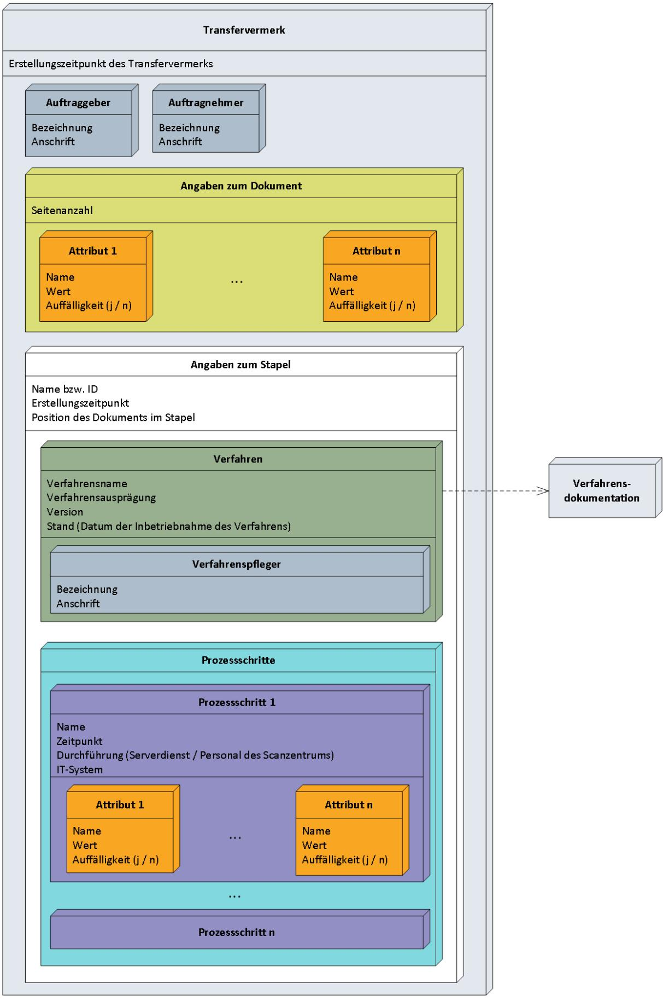
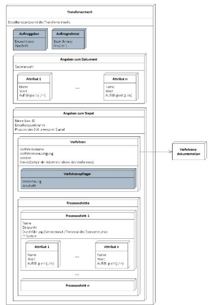
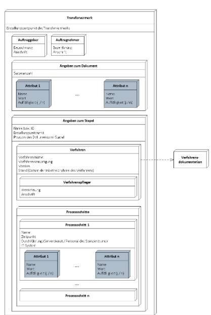
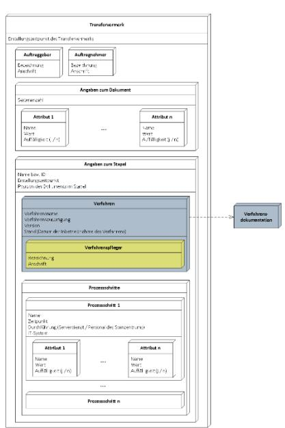
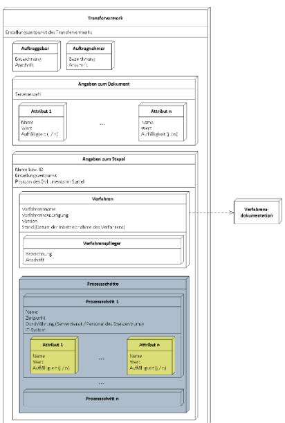
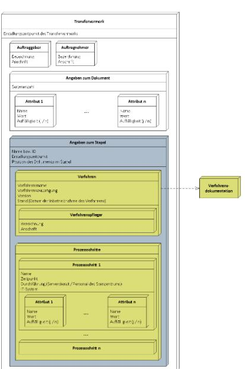
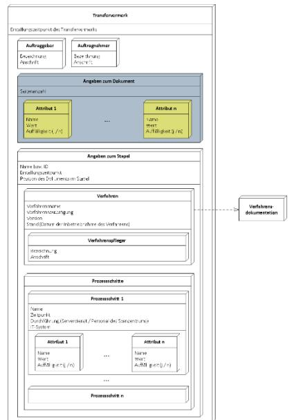
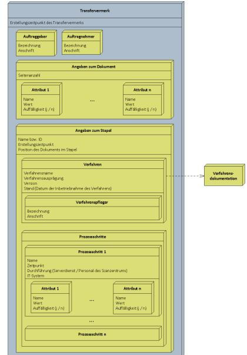

# Transfervermerk für Scanprodukte

Umsetzung der Maßnahme A.NB.4 der BSI TR 03138 Resiscan Version 1.0

Martin Gapa

Deutsche Rentenversicherung Bund

Ruhrstraße 2 10709 Berlin

Abteilung 11 Organisation und IT-Services Fachbereich 1160 Entwicklung - Allgemeine Fachanwendungen Bereich 1163 Zentrale Dienste Team 37 Inputmanagement der DRV Bund

| Version: | 1.0 |            |
|----------|-----|------------|
| Stand:   |     | 2016-07-29 |

| Inhalt des Transfervermerks1                                     |  |
|------------------------------------------------------------------|--|
| Kurzbeschreibung1                                                |  |
| Inhaltliche Ausgestaltung1                                       |  |
| Ersteller des Scanprodukts1                                      |  |
| Technisches und organisatorisches Umfeld des Erfassungsvorgangs2 |  |
| Etwaige Auffälligkeiten während des Scanprozesses4               |  |
| Zeitpunkt der Erfassung4                                         |  |
| Ergebnis der Qualitätssicherung4                                 |  |
| Zusammenfassung des Inhalts4                                     |  |
| Technische Umsetzung des Transfervermerks6                       |  |
| Abbildung der Datenstruktur6                                     |  |
| Organisationseinheit6                                            |  |
| Attribut und Attributliste7                                      |  |
| Verfahren8                                                       |  |
| Prozessschritt und Prozessschrittliste10                         |  |
| Stapel12                                                         |  |
| Dokument13                                                       |  |
| Transfervermerk14                                                |  |
| Verknüpfung mit von Scanprodukt und Transfervermerk15            |  |
| logischer Aufbau und Ablauf15                                    |  |
| Technische Umsetzung15                                           |  |
|                                                                  |  |

## <span id="page-3-0"></span>Inhalt des Transfervermerks

#### <span id="page-3-3"></span>Kurzbeschreibung

Der Transfervermerk soll es einem Richter ermöglichen, im Streitfall den Ablauf des Medienbruchs sowie der weiteren Prozessschritte entlang des Scanprozesses bis zur beweiswertsichernden Aufbewahrung nachzuvollziehen, um hieraus eine Schlussfolgerung zum Beweiswert des elektronischen Abbilds eines Papierdokuments (Scanprodukt) zu ziehen. Diese Seite behandelt die inhaltliche Ausgestaltung des Transfervermerks.

Der Transfervermerk ist in der technischen Richtlinie zum Ersetzenden Scannen des BSI (BSI TR-03138 RESISCAN, Version 1.0 vom 20.03.2013) als Maßnahme A.NB.4 Transfervermerk wie folgt beschrieben:

Für jedes Scanprodukt SOLL ein zugehöriger Transfervermerk erstellt werden, der insbesondere folgende Aspekte dokumentiert:

- a) Ersteller des Scanproduktes,
- b) technisches und organisatorisches Umfeld des Erfassungsvorganges,
- c) etwaige Auffälligkeiten während des Scanprozesses,
- d) Zeitpunkt der Erfassung und
- e) Ergebnis der Qualitätssicherung.

Der Transfervermerk MUSS mit dem Scanprodukt logisch verknüpft oder in das Scanprodukt integriert werden. Die Integrität des Transfervermerks MUSS entsprechend dem Schutzbedarf der verarbeiteten Dokumente geschützt werden. Für die Dokumentation des technischen und organisatorischen Umfelds KANN der Transfervermerk auf die zu diesem Zeitpunkt gültige Verfahrensanweisung verweisen.

Die inhaltliche und technische Ausgestaltung des Transfervermerks wurde dem jeweiligen Anwender der TR RESISCAN überlassen.

Für den behördenübergreifenden Einsatz eines Transfervermerks ist es erforderlich, diesen hinsichtlich Format und inhaltlicher Ausgestaltung zu vereinheitlichen, um beispielsweise den Austausch elektronischer Akten zu gewährleisten. Dieses Dokument zeigt eine mögliche inhaltliche Ausgestaltung des Transfervermerks auf.

### <span id="page-3-2"></span>Inhaltliche Ausgestaltung

Die nachfolgenden Abschnitte stellen die inhaltliche Auseinandersetzung mit Ausgestaltung des Transfervermerks entsprechend der vom BSI spezifizierten Inhalte dar.

#### <span id="page-3-1"></span>Ersteller des Scanprodukts

Als Ersteller des Scanprodukts kann zum einen eine technische Vorrichtung (Scanner, Importer) und zum anderen auch eine ausführende Person oder Organisationseinheit betrachtet werden. Der zweite Punkt "technisches und organisatorisches Umfeld des Erfassungsvorgangs" zeigt, dass beide Sichtweisen im Transfervermerk enthalten sein müssen.

Die dauerhafte Vorhaltung von personenbezogenen Daten im Transfervermerk könnte im Sinne des Datenschutzes dadurch gelöst werden, dass eine

Pseudonymisierung (z. B. Personalnummer der entsprechenden Person) erfolgt. Darüber hinaus ist eine Reduzierung der Angaben auf die ausführende Organisationseinheit denkbar.

Eine Organisationseinheit ist neben der eigentlichen Bezeichnung auch mit Firma und Anschrift zu dokumentieren. Sofern eine eindeutige Zuordnung der Organisationseinheit ohne Angabe der Adresse dauerhaft möglich ist, kann auf diese Angabe verzichtet werden.

Die technische Komponente, die das Scanprodukt erstellt, untergliedert sich wiederum in Hard- und Software. Als Hardware sind Scanner sowie der dazugehörige Arbeitsplatz-PC festzuhalten. Zur Dokumentation der Software kann im Transfervermerk entweder auf die Verfahrensdokumentation verwiesen werden oder der gesamte Scanprozess muss im Transfervermerk dokumentiert werden. Wird auf die Verfahrensdokumentation verwiesen, muss diese so lange vorgehalten werden, bis die Aufbewahrungsfrist des letzten mit diesem Verfahren gescannten Dokuments endet. Es empfiehlt sich daher, die Verfahrensdokumentation in einem langzeitarchivierungswürdigen Dateiformat wie PDF/A vorzuhalten. Der Verweis auf die Verfahrensdokumentation erfolgt über die Verfahrensbezeichnung sowie die Version des Verfahrens. Zusätzlich kann eine Verfahrensausprägung angegeben werden. Dies ist relevant, wenn beispielsweise zu einem Verfahren "Posteingang" gesonderte Prozesskonfigurationen zur Verarbeitung von einblättrigen und mehrblättrigen Dokumenten eingesetzt werden.

Üblicherweise wird in den Scansystemen stapelorientiert gearbeitet. Um die Erstellung des Scanprodukts nachvollziehbar zu gestalten, sind neben dem Scanverfahren, der Verfahrensausprägung und der Version zusätzlich Angaben zum Stapel im Transfervermerk festzuhalten. Hierzu zählen der Stapelname, respektive eine Stapel-ID sowie die Position des Dokuments innerhalb des Stapels. Bei der Positionsangabe sind häufig missverständlich gebrauchte Begriffe wie "Seite" oder "Blatt" zu vermeiden und stattdessen die Angabe "Abbild" zu verwenden.

Daher werden im Transfervermerk folgende Angaben zum Ersteller geführt:

- Organisationseinheit, die das Scanprodukt erstellt hat (inkl. Träger und Anschrift),
- ggf. Angabe zum Scanbediener (Name oder Pseudonym),
- Angaben zum Scanner (z. B. Inventarnummer, Produktbezeichnung),
- Angaben zum Scanarbeitsplatz (z. B. Inventarnummer),
- Angaben zum Scanverfahren (z. B. Verfahrensbezeichnung, Verfahrensausprägung, Version des zugrundeliegenden Scanprozesses),
- Stapelname und
- Position im Stapel (z. B. Abbild 2 oder Abbild 4 bis 7).

<span id="page-4-0"></span>Technisches und organisatorisches Umfeld des Erfassungsvorgangs Zum organisatorischen Umfeld des Erfassungsvorgangs kann neben der ausführenden Organisationseinheit auch die Auftrag gebende Organisationseinheit sowie die das Verfahren pflegende und betreuende Organisationseinheit gehören. Die drei Rollen Auftraggeber, Auftragnehmer und Verfahrenspfleger können durch unterschiedliche Organisationseinheiten besetzt sein. So kann beispielsweise Abteilung A die Digitalisierung bei Abteilung B

durchführen lassen oder diese Dienstleistung sogar outsourcen. Selbiges gilt für die Pflege und Betreuung des Scanverfahrens, die beispielsweise durch die IT-Abteilung oder auch einen externen Dienstleister erfolgt. Aus diesem Grund umfasst der Transfervermerk folgende Angaben zum organisatorischen Umfeld:

- Organisationseinheit des Auftraggebers und
- Organisationseinheit des Verfahrenspflegers.

Die Organisationseinheit des Aufragnehmers ist bereits als Ersteller des Scanprodukts im Transfervermerk dokumentiert.

Zum technischen Umfeld des Erfassungsvorgangs zählen neben dem eingesetzten Scanner und Angaben zum Verfahren auch Informationen über relevante Prozessschritte, die Einfluss auf das Scanprodukt haben. Hierzu können beispielsweise Prozessschritte wie eine Bildaufbereitung (Entfernen von Mustern oder Sprenkeln, Zuschnitt, Begradigung), Leerseitenlöschung oder die Zusammenstellung des Dokuments (Zusammenfassung einzelner Bilder zu einem mehrseitigen Dokument) aber auch der Prozessschritt des Scannens zählen. Da es sich hierbei um Verfahrensspezifika handelt, die abhängig vom jeweiligen Scansystem unterschiedlich ausgestaltet werden können, ist eine Abstraktion erforderlich, damit der Transfervermerk universell anwendbar ist.

Zur Dokumentation relevanter Prozessschritte als Teilaspekt des technischen Umfelds des Erfassungsvorgangs wird im Transfervermerk eine Liste mit Prozessschritten geführt. Als relevant ist ein Prozessschritt einzustufen, wenn er eine Manipulation an den Bildern oder am Dokument vornimmt, er den Umfang des Dokuments durch Ergänzung oder Löschung von Bildern verändert, er das Scanprodukt (z. B. Multipage TIFF oder mehrseitiges PDF/A) erstellt oder die Indexdaten des Scanprodukts festlegt.

Die Prozessschritte des jeweiligen Verfahrens müssen in einer Verfahrensdokumentation dargelegt sein. Die Verfahrensdokumentation muss solange verfügbar sein, wie Dokumente aus dem Verfahren aufbewahrt werden. Es empfiehlt sich daher, die Verfahrensdokumentation in einem langzeitarchivierungswürdigen Dateiformat wie PDF/A vorzuhalten. Der Zugriff auf die Verfahrensdokumentation muss anhand der Angaben aus dem Transfervermerk (Verfahrensname, Ausprägung und Version) möglich sein.

In der Prozessschrittliste des Transfervermerks werden die relevanten Prozessschritte anhand des mit der Verfahrensdokumentation korrespondierenden Namens referenziert. Zu jedem Prozessschritt ist der Zeitpunkt der Erledigung festzuhalten. Auf diese Weise ist die zeitliche Abfolge der einzelnen Prozessschritte nachvollziehbar und ggf. kritische Zeiträume zwischen Prozessschritten können erkannt werden. Insbesondere bei Veränderungen des Stapels oder der Bilder des Stapels im Scansystem ist zur Nachvollziehbarkeit festzuhalten, wie dieser Prozessschritt ausgeführt wurde. Hierzu ist festzuhalten, ob die Aufgabe durch einen auf einem Server laufenden Dienst (z. B. Begradigen der Bilder) oder durch das Scanzentrumspersonal ausgeführt wurde. In beiden Fällen ist als technisches Umfeld das zum Einsatz kommende IT-System zu spezifizieren. Hierbei kann ebenfalls auf Angaben aus der Verfahrensdokumentation zurückgegriffen und der korrespondierende Name des IT-Systems angegeben werden. Sollte ein Prozessschritt durch Personal des Scanzentrums ausgeführt werden, ist zusätzlich die ausführende Person (ggf. pseudonymisiert) anzugeben. Auf diese Weise kann nachgewiesen werden, dass entsprechend der Verfahrensanweisung und den darin definierten Rollen gehandelt wurde.

Zur Dokumentation relevanter Manipulationen im Stapel oder der Ermittlung für den Prozessablauf relevanter Werte kann zu jedem Prozessschritt eine Liste frei definierbarer Attribute ergänzt werden. Ein Attribut wird hierfür als ein Tupel aus Attributname und Attributwert verstanden.

Hieraus ergibt sich zunächst die Dokumentation folgender Daten je Prozessschritt:

- Name des Prozessschritts gem. Verfahrensdokumentation,
- Erledigungszeitpunkt,
- Durchführungsart (Serverdienst/Personal des Scanzentrums evtl. pseudonymisiert),
- IT-System, das zur Bearbeitung des Prozessschritts zum Einsatz kam und
- eine Liste von Attributen (z. B. Auflösung beim Scannen = 300 dpi, Duplex = ja, Farbtiefe = 1Bit).

#### <span id="page-6-1"></span>Etwaige Auffälligkeiten während des Scanprozesses

Das BSI führt diesbezüglich in der TR RESISCAN aus, dass hierzu beispielsweise die Unvollständigkeit des Papierdokuments oder das Vorliegen einer Kopie dokumentiert werden kann. Da diese beiden Auffälligkeiten nicht als abschließend angesehen werden können, wird zum Dokument eine beliebig erweiterbare Liste von Attributen geführt. In der Attributliste können Auffälligkeiten, aber z. B. auch die Attributierung des Scanprodukts, wie sie für die Übergabe an die beweiswerterhaltende Aufbewahrung vorgesehen ist, dokumentiert werden. Jedes Attribut ist, analog zu den Attributen der Prozessschritte ein Tupel bestehend aus Attributnamen und Attributwert. Auffälligkeiten können über eine Kennzeichnung des Attributs kenntlich gemacht werden. Diese Kennzeichnung wird zur Vollständigkeit auf die Attribute der Prozessschritte übertragen. Somit können auch Auffälligkeiten in Prozessschritten dokumentiert werden.

Je Attribut werden folgende Angaben im Transfervermerk dokumentiert:

- Name des Attributs,
- Wert des Attributs und
- ggf. eine Kennzeichnung des Attributs als Auffälligkeit.

#### <span id="page-6-0"></span>Zeitpunkt der Erfassung

Der Zeitpunkt der Erfassung wird entsprechend den vorherigen Ausführungen mit dem zum Prozessschritt Scan respektive Import, festgehaltenen Zeitpunkt dokumentiert. Da die Digitalisierung üblicherweise stapelorientiert erfolgt, ist die Aufgabe des Scannens erst mit der Digitalisierung des letzten Belegs des Stapels abgeschlossen. Dieser Zeitpunkt kann abhängig von der Arbeitsorganisation mehr oder weniger stark vom Zeitpunkt der Erfassung der dem Scanprodukt zuordenbaren Belege abweichen. Als Zeitpunkt der Erfassung wird daher der Zeitpunkt der Digitalisierung des letzten Belegs, der dem Scanprodukt zugeordnet wird, festgehalten.

Es ist denkbar, dass im Zuge der Verarbeitung des Stapels Auffälligkeiten bemerkt werden, die eine erneute Digitalisierung einzelner Belege des Scanprodukts zur Folge haben (sog. Rescan innerhalb des Verfahrens). In diesem Fall sind die ersetzten Seiten als Auffälligkeiten im Transfervermerk zu dokumentieren.

#### <span id="page-7-1"></span>Ergebnis der Qualitätssicherung

Das Ergebnis der Qualitätssicherung kann ebenfalls, wie der Zeitpunkt der Erfassung, als Prozessschritt dokumentiert werden. Das Ergebnis dieser Kontrolle wird als Attribut im entsprechenden Prozessschritt dokumentiert.

#### <span id="page-7-0"></span>Zusammenfassung des Inhalts

Aus den vorherigen Abschnitten ergibt sich die in [Abbildung 1](#page-8-0) dargestellte inhaltliche Struktur des Transfervermerks.



<span id="page-8-0"></span>Abbildung 1: Inhaltliche Struktur des Transfervermerks

#### Transfervermerk für Scanprodukte

# <span id="page-9-2"></span>Technische Umsetzung des Transfervermerks

Basierend auf der inhaltlichen Ausgestaltung des vorherigen Kapitels widmet sich dieses Kapitel der technischen Umsetzung des Transfervermerks

#### <span id="page-9-1"></span>Abbildung der Datenstruktur

Ausgehend von der inhaltlichen Ausgestaltung des Transfervermerks wird in diesem Abschnitt die technische Umsetzung betrachtet. Hierzu wurden die Inhalte des Transfervermerks in Klassen abstrahiert. So können beispielsweise Auftragnehmer, Auftraggeber und Verfahrenspfleger als Organisationseinheit betrachtet werden. Die nachfolgenden Abschnitte betrachten die gebildeten Klassen.

Zur technischen Beschreibung der Datenstruktur sowie der Datenobjekte werden XML-Schema und XML verwendet. Sie basieren auf offenen Standards und gewährleisten die Interoperabilität.

Das resultierende XML-Schema steht als gesondertes Dokument zur Verfügung.

#### <span id="page-9-0"></span>Organisationseinheit

Der Datentyp zur Abbildung einer Organisationseinheit, wie zum Beispiel für den Auftraggeber und Auftragnehmer einer Digitalisierungsdienstleistung, wird als OrganisationTyp bezeichnet. Obligatorisch sind der Name (Firma), Ort und die Bezeichnung der Organisationseinheit entsprechend der Hierarchie des Unternehmens. Optional sind die Angabe der Straße und Postleitzahl.

Die nebenstehende Grafik veranschaulicht den Einsatz der Klasse entsprechend der Datenstruktur aus [Abbildung 1.](#page-8-0)



#### Hieraus ergibt sich die nachfolgende XML-Typdefinition für die Klasse OrganisationTyp:

```
<xs:complexType name="OrganisationTyp">
 <xs:annotation>
   <xs:documentation>
 Der Typ OrganisationTyp definiert eine beteiligte
 Organisation, die verantwortliche Organsisationseinheit sowie den
 Standort der Orgnisationseinheit.
   </xs:documentation>
 </xs:annotation>
 <xs:sequence>
   <xs:element name="Name" type="xs:string" nillable="false">
     <xs:annotation>
       <xs:documentation>
```

```
 Das obligatorische Element Name gibt die Firma
 respektive die Bezeichnung der betreffenden Organisation an.
       </xs:documentation>
     </xs:annotation>
   </xs:element>
   <xs:element name="Strasse" type="xs:string" nillable="false" 
 minOccurs="0">
     <xs:annotation>
       <xs:documentation>
 Das optionale Element Strasse ist Teil der Standortangabe der
 Organisationseinheit.
       </xs:documentation>
     </xs:annotation>
   </xs:element>
   <xs:element name="PLZ" type="xs:string" nillable="false" minOccurs="0">
     <xs:annotation>
       <xs:documentation>
 Das optionale Element PLZ spezifiziert die Postleitzahl als
 Teil der Standortangabe der Organisationseinheit.
       </xs:documentation>
     </xs:annotation>
   </xs:element>
   <xs:element name="Ort" type="xs:string" nillable="false">
     <xs:annotation>
       <xs:documentation>
 Das obligatorische Element Ort ist Teil der
 Standortangabe der Organisationseinheit.
       </xs:documentation>
     </xs:annotation>
   </xs:element>
   <xs:element name="Organisationseinheit" type="xs:string" 
 nillable="false">
     <xs:annotation>
       <xs:documentation>
 Das obligatorische Element Organisationseinheit
 definiert die relevante Einheit innerhalb der Organisation.
       </xs:documentation>
     </xs:annotation>
   </xs:element>
 </xs:sequence>
</xs:complexType>
```
#### <span id="page-11-0"></span>Attribut und Attributliste

Der als AttributTyp bezeichnete Datentyp lässt die Dokumentation von beliebigen benannten Werten zu. Diese können optional als Auffälligkeit definiert werden.

Attribute werden sowohl zur Beschreibung des Dokuments als auch der Prozessschritte benötigt. Der als AttributListeTyp bezeichnete Datentyp stellt eine unbegrenzte Liste von Attributen zur Verfügung. Eine Attributliste darf nicht leer sein, sondern muss mindestens ein Attribut beinhalten.

Die nebenstehende Grafik veranschaulicht den Einsatz des AttributTyp sowie des AttributListeTyp entsprechend der Datenstruktur aus [Abbildung 1.](#page-8-0)



Die Datenstruktur kann wie folgt im XML-Schema definiert werden:

```
<xs:complexType name="AttributTyp">
  <xs:annotation>
    <xs:documentation>Definition eines Attributs</xs:documentation>
  </xs:annotation>
  <xs:simpleContent>
    <xs:extension base="xs:string">
      <xs:attribute name="name" type="xs:string" use="required"/>
      <xs:attribute name="auffaelligkeit" type="xs:boolean" use="optional"
 default="false" />
    </xs:extension>
  </xs:simpleContent>
</xs:complexType>
<xs:complexType name="AttributListeTyp">
  <xs:annotation>
    <xs:documentation>
 Definition einer Liste von Attributen, die einem Dokument
 oder Prozessschritt zugeordnet werden kann.
    </xs:documentation>
  </xs:annotation>
  <xs:sequence>
    <xs:element name="Attribut" type="AttributTyp" nillable="false"
     maxOccurs="unbounded"/>
  </xs:sequence>
</xs:complexType>
```
#### <span id="page-12-0"></span>Verfahren

Der Datentyp zur Dokumentation der Verfahrensangaben wird als VerfahrenTyp bezeichnet. Alle Angaben zum Verfahren sind obligatorisch. Die Angabe zum Pfleger erfolgt entsprechend der Definition des Datentyp für Organisationseinheiten.

Die nebenstehende Grafik veranschaulicht den Einsatz der Klasse VerfahrenTyp sowie der darin eingebetteten Angabe des Verfahrenspflegers basierend auf der in [Abbildung 1](#page-8-0) dargestellten Datenstruktur.



#### Zur Dokumentation des Verfahrens ergibt sich die nachfolgende XML-Typdefinion:

```
<xs:complexType name="VerfahrenTyp">
 <xs:annotation>
   <xs:documentation>
 Der Typ VerfahrenTyp definiert die Datenstruktur zur Beschreibung
 des zur Digitalisierung eingesetzten Verfahrens.
 Anhand der Angaben zum Verfahren muss ein Rückschluss auf die
 Verfahrensdokumentation möglich sein. Daher beinhaltet dieser
 Datensatz neben der Bezeichnung auch Versionsangaben sowie die
 Angabe der verfahrenspflegenden Organisationseinheit zum Zeitpunkt
 der Erstellung des Transfervermerks.
   </xs:documentation>
 </xs:annotation>
 <xs:sequence>
   <xs:element name="Bezeichnung" type="xs:string" nillable="false">
     <xs:annotation>
       <xs:documentation>
 Das Element Bezeichnung gibt die allgemeine
 Verfahrensbezeichnung an. Als Beispiele für Verfahrens-
 bezeichnungen können 'Posteingang' oder 'Digitalisierung von
 Bestandsakten' angesehen werden.
       </xs:documentation>
     </xs:annotation>
   </xs:element>
   <xs:element name="Auspraegung" type="xs:string" nillable="false">
     <xs:annotation>
       <xs:documentation>
 Das Element Ausprägung ermöglicht die Differenzierung
 unterschiedlicher Konfigurationen eines Verfahrens. So ist es
 beispielsweise möglich zu einem Verfahren 'Posteingang'
 zwischen den Ausprägungen 'Monochrom' und 'Farbe' zu
 differenzieren.
 Gibt es zu einem Verfahren nur eine einzige Ausprägung, ist das
 Attribut mit dem Wert 'Standard' zu belegen.
       </xs:documentation>
     </xs:annotation>
   </xs:element>
   <xs:element name="Version" type="xs:string" nillable="false">
```

```
 Die Angabe der Version trägt der Weiterentwicklung eines
 Verfahrens Rechnung und ermöglicht den Verweis aus dem
 Transfervermerk auf die Verfahrensdokumentation eines
 definierten Entwicklungsstands.
   <xs:element name="Stand" type="xs:date" nillable="false">
```

```
<xs:annotation>
       <xs:documentation>
 Im Element Stand wird das Freigabedatum eines
```

```
 Entwicklungsstands angegeben.
```

```
</xs:documentation>
```

```
</xs:annotation>
```
<xs:annotation>

</xs:annotation>

<xs:documentation>

</xs:documentation>

```
</xs:element>
```
</xs:element>

```
<xs:element name="Pfleger" type="OrganisationTyp" nillable="false">
  <xs:annotation>
```

```
<xs:documentation>
```

```
 Das Element Pfleger gibt den zum Zeitpunkt der Erstellung des
 Transfervermerks verantwortlichen Pfleger in Form einer
 Organisationseinheit an. Der Pfleger des Verfahrens muss die
 Verfahrensdokumentation vorhalten. Die Änderung der Bezeichnung
 der Organisationseinheit oder die Änderung der zuständigen
 Organisationsheit muss aus der Organisationsdokumentation
 hervorgehen und über die Zeit der Aufbewahrung des
 Transfervermerks nachvollziehbar sein.
      </xs:documentation>
     </xs:annotation>
   </xs:element>
```

```
</xs:sequence>
</xs:complexType>
```
#### <span id="page-14-0"></span>Prozessschritt und Prozessschrittliste

Der nachfolgend als ProzessschrittTyp bezeichnete Datentyp ermöglicht die Dokumentation der Durchführungsart, des beteiligten IT-Systems, des Ausführungszeitpunkts sowie beliebiger Attribute und Auffälligkeiten. Über den Namen des Prozessschritts muss es möglich sein, eine Verbindung zur Verfahrensdokumentation herzustellen. Die Prozessschrittliste ermöglicht die Auflistung eines oder mehrerer Prozessschritte im Transfervermerk. Die Liste darf nicht leer sein.

Die nebenstehende Grafik visualisiert den Einsatz der ProzessschrittListe, der Prozessschritte sowie der darin eingebetteten Attributliste basierend auf der in [Abbildung 1](#page-8-0) dargestellten Datenstruktur.



Die Klassen ProzessschrittTyp sowie ProzessschritListeTyp können der nachstehenden XML-Typdefinition entnommen werden:

```
<xs:complexType name="ProzessschrittTyp">
 <xs:annotation>
   <xs:documentation>
 Der ProzessschrittTyp definiert eine Datenstruktur zur
 Dokumentation eines Prozessschrittes, der von dem im
 Transfervermerk referenzierten Scanprodukt durchlaufen
 wurde.
   </xs:documentation>
 </xs:annotation>
 <xs:sequence>
   <xs:element name="Durchfuehrung" type="xs:string" nillable="false">
     <xs:annotation>
       <xs:documentation>
 Das Element Durchfuehrung spezifiziert durch wen oder was der
 Prozessschritt ausgeführt wurde. Dies kann beispielsweise eine
 Person, eine Organisationseinheit aber auch für maschinell
 ausgeführte Prozessschritte die Angabe 'Serverdienst' sein.
       </xs:documentation>
     </xs:annotation>
   </xs:element>
   <xs:element name="ITSystem" type="xs:string" nillable="false">
     <xs:annotation>
       <xs:documentation>
 Durch die Angabe des genutzten IT-Systems kann aus dem
 Transfervermerk auf die Dokumentation sowie Protokollierung des
 entsprechenden IT-Systems verwiesen werden. Die Angabe von
 Inventarnummern kann hierbei als zweckmäßig angesehen werden.
 Alternativ kann in diesem Attribut die Spezifizierung eines
 Gerätetyps oder einer bestimmten Softwarekomponente erfolgen.
       </xs:documentation>
     </xs:annotation>
   </xs:element>
   <xs:element name="Attribute" type="AttributListeTyp" nillable="false"
 minOccurs="0">
     <xs:annotation>
       <xs:documentation>
 Zur Dokumentation weiterer Details, wie beispielsweise
 Scannereinstellungen, prozessablaufrelevanter Werte,
```

```
 Auffälligkeiten oder extrahierten Metadaten
 kann eine Liste von Attributen zu jedem Prozessschritt geführt
 werden. Die Attributliste ist Optional. Wird eine Attributliste
 dem Prozessschritt beigefügt, muss diese mindestens ein
 Attribut enthalten.
       </xs:documentation>
     </xs:annotation>
   </xs:element>
 </xs:sequence>
 <xs:attribute name="name" type="xs:string" use="required">
   <xs:annotation>
     <xs:documentation>
 Um eine Zuordung des Prozessschritts zur Verfahrensdokumentation
 zu ermöglichen, muss zu jedem Prozessschritt der Name des
 Prozessschritts analog zur Verfahrensdokumentation angegeben
 werden.
     </xs:documentation>
   </xs:annotation>
 </xs:attribute>
 <xs:attribute name="zeitpunkt" type="xs:dateTime" use="required">
   <xs:annotation>
     <xs:documentation>
 Zur Dokumentation des zeitlichen Ablaufs des Prozesses, muss zu
 jedem Prozessschritt der Zeitpunkt der Ausführung angegeben
 werden. Relevant ist hierbei die Erledigung des Prozessschritts
 für das Scanprodukt.
     </xs:documentation>
   </xs:annotation>
 </xs:attribute>
</xs:complexType>
<xs:complexType name="ProzessschrittListeTyp">
 <xs:annotation>
   <xs:documentation>
 Die Dokumentation der für das Dokument relevanten Prozessschritte
 wird in Form einer Prozessschrittliste geführt. Die Liste enthält
 eine beliebige Menge von benannten Prozessschritten.
   </xs:documentation>
 </xs:annotation>
 <xs:sequence>
   <xs:element name="Prozessschritt" type="ProzessschrittTyp"
 nillable="false" maxOccurs="unbounded">
     <xs:annotation>
       <xs:documentation>
 Unbegrenzte Liste der Prozessschritte.
       </xs:documentation>
     </xs:annotation>
   </xs:element>
 </xs:sequence>
</xs:complexType>
```
#### <span id="page-16-0"></span>Stapel

Die Angaben zu einem Stapel werden in dem als Stapeltyp bezeichneten Datentyp dokumentiert. Er ordnet einem benannten Stapel das zugrundeliegende Verfahren zu und dokumentiert die Prozessschritte in Form einer Liste. Die Angabe des Stapels beinhaltet den Namen des Stapels sowie dessen Erstellungszeitpunkt.

Die nebenstehende Grafik visualisiert den Einsatz der Klasse StapelTyp sowie dem darin eingebetteten Verweis auf das Verfahren sowie die Dokumentation der Prozessschritte basierend auf der in [Abbildung 1](#page-8-0) dargestellten Datenstruktur.



#### Zur Dokumentation des Stapels ergibt sich die nachfolgende XML-Typdefinion:

```
<xs:complexType name="StapelTyp">
 <xs:annotation>
   <xs:documentation>
 Der StapelTyp stellt eine Datenstruktur zur Beschreibung des
 Stapels, Zuordnung des Stapels zu einem Verfahren, Zuordnung der
 Position des Dokuments innerhalb des Stapels sowie zur
 Dokumentation der für das Dokument relevanten Prozessschritte in
 Form einer Prozessschrittliste dar.
   </xs:documentation>
 </xs:annotation>
 <xs:sequence>
   <xs:element name="Verfahren" type="VerfahrenTyp" nillable="false">
     <xs:annotation>
       <xs:documentation>
 Dem Stapel wird über das obligatorische Element Verfahren ein
 Verfahrensspezifikation zugeordnet.
       </xs:documentation>
     </xs:annotation>
   </xs:element>
   <xs:element name="PositionDesDokuments" type="xs:string"
 nillable="false">
     <xs:annotation>
       <xs:documentation>
 Zur Abgrenzung des Dokuments von weiteren Dokumenten im Stapel
 ist die Angabe der Position des Dokuments innerhalb des Stapels
 erforderlich. Die Angabe muss das erste und letzte dem Dokument
 zuzuordnende Abbild des Stapels enthalten. Beispiel:
 'Abbild 5 bis 9 von 201'
       </xs:documentation>
     </xs:annotation>
   </xs:element>
   <xs:element name="Prozessschritte" type="ProzessschrittListeTyp"
     nillable="false" minOccurs="0">
     <xs:annotation>
       <xs:documentation>
 Die Dokumentation der Prozessschritte erfolgt optional in der
 Prozessschrittliste.
```

```
</xs:documentation>
     </xs:annotation>
   </xs:element>
 </xs:sequence>
 <xs:attribute name="name" type="xs:string" use="required">
   <xs:annotation>
     <xs:documentation>
 Zur Indentifikation des Stapels, ist die Angabe des Stapelnamens
 respektive einer Stapel-ID erforderlich.
     </xs:documentation>
   </xs:annotation>
 </xs:attribute>
 <xs:attribute name="erstellt" type="xs:dateTime" use="required">
   <xs:annotation>
     <xs:documentation>
 Zur zeitlichen Einordnung der Verarbeitung ist die Angabe des
 Zeitpunkts der Erstellung des Stapels erforderlich.
     </xs:documentation>
   </xs:annotation>
 </xs:attribute>
</xs:complexType>
```
#### <span id="page-17-0"></span>Dokument

Die Angaben zum Dokument im Transfervermerk werden durch den als DokumentTyp bezeichneten Datentyp ermöglicht. Dieser Datentyp umfasst die Anzahl der Seiten sowie eine Liste von beschreibenden Attributen und Auffälligkeiten.

Die nebenstehende Grafik visualisiert den Einsatz der Klasse DokumentTyp sowie die darin eingebettete Attributliste basierend auf der i[n](#page-8-0) [Abbildung 1](#page-8-0) dargestellten Datenstruktur.



Für die Klasse DokumentTyp ergibt sich die folgende XML-Typdefinition:

```
<xs:complexType name="DokumentTyp">
 <xs:annotation>
   <xs:documentation>
     Der DokumentTyp definiert eine Datenstruktur, die das resultierende 
     Scanprodukt beschreibt.
   </xs:documentation>
 </xs:annotation>
 <xs:sequence>
   <xs:element name="Seiten" type="xs:unsignedLong" default="1"
     nillable="false">
     <xs:annotation>
       <xs:documentation>
 Zur Beschreibung des Dokuments muss die Anzahl der Seiten des
 resultierenden Scanprodukts erfasst werden.
       </xs:documentation>
```

```
</xs:annotation>
   </xs:element>
   <xs:element name="Attribute" type="AttributListeTyp" nillable="false"
     minOccurs="0">
     <xs:annotation>
       <xs:documentation>
 Weitere das Scanprodukt beschreibende Attribute, wie z. B. die
 Indexdaten des Scanprodukts sowie Auffälligkeiten können in der
 optionalen Liste von Attributen dokumentiert werden.
       </xs:documentation>
     </xs:annotation>
   </xs:element>
 </xs:sequence>
</xs:complexType>
```
#### <span id="page-18-0"></span>Transfervermerk

Der inhaltliche Rahmen eines Transfervermerks wird durch den als TransfervermerkTyp bezeichneten Datentyp bestimmt. Er verbindet die Angaben zum Auftragnehmer, Auftraggeber, die Dokumentation der Verarbeitung des Stapels sowie die Angaben zum Dokument.

Ein XML-Dokument benötigt ein Wurzelelement. Dieses ist im Falle des Transfervermerks ein Element des TransfervermerkTyps.

Die nebenstehende Grafik visualisiert den Einsatz der Klasse TransfervermerkTyp sowie die darin eingebetteten Elemente basierend auf der i[n](#page-8-0) [Abbildung 1](#page-8-0) dargestellten Datenstruktur.



#### Für die Klasse TransfervermerkTyp ergibt sich die folgende XML-Typdefinition:

```
<xs:complexType name="TransfervermerkTyp">
  <xs:annotation>
    <xs:documentation> Defintion eines Transfervermerks</xs:documentation>
  </xs:annotation>
  <xs:sequence>
    <xs:element name="Auftragnehmer" type="OrganisationTyp"
    nillable="false"/>
    <xs:element name="Auftraggeber" type="OrganisationTyp" nillable="false"
    minOccurs="0"/>
    <xs:element name="Dokument" type="DokumentTyp" nillable="false"/>
    <xs:element name="Stapel" type="StapelTyp" nillable="false"/>
  </xs:sequence>
  <xs:attribute name="erstellt" type="xs:dateTime" use="required"/>
</xs:complexType>
<xs:element name="Transfervermerk" type="TransfervermerkTyp" 
 nillable="false"/>
```
#### <span id="page-19-1"></span>Verknüpfung von Scanprodukt und Transfervermerk

Der Transfervermerk muss gemäß der BSI TR-03138 RESISCAN mit dem Scanprodukt logisch verknüpft oder in das Scanprodukt integriert sein. Mit dem PDF/A 3-Standard nach ISO 19005-3 ist die Einbettung beliebiger Attachments in ein langzeitarchivierungswürdiges PDF/A-Dokument möglich. Dies bildet die Grundlage zur Integration des Transfervermerks in das Scanprodukt.

#### <span id="page-19-0"></span>logischer Aufbau und Ablauf

Im Rahmen der Verarbeitung eines Digitalisats im Scansystem fallen Prozess- als auch Indexinformationen an, aus denen später der Transfervermerk gebildet werden kann. Konkret muss das Scansystem beispielsweise Informationen zum Medienbruch (Wann und durch wen wurde das Original gescannt?) je Dokument bereitstellen (Siehe auch: [Inhaltliche Ausgestaltung\)](#page-3-2). Diese Informationen können als XML-Dokument oder als Konkrete Datenobjekte zur Erstellung des Transfervermerks bereitgestellt werden.

Aus den Inhaltsangaben für den Transfervermerk wird entsprechend einer Konfiguration ein ASCII-, XML- oder PDF/A-Dokument generiert. Diese drei Formate sind als langzeitarchivierungswürdige Formate einzustufen und ermöglichen so eine langfristige Verkehrsfähigkeit des Transfervermerks. Anschließend wird ein später zu signierendes und in die beweiswerterhaltende Langzeitaufbewahrung zu überführendes Scanprodukt entsprechend dem Standard PDF/A 3B erzeugt. In dieses neue Dokument werden alle Seiten des vom Scansystem bereitgestellten Scanprodukts importiert. Hierbei ist das Vorgehen zur Integration von TIFF- und PDF-Scanprodukten zu unterscheiden.

TIFF-Dokumente werden seitenweise in das neue Scanprodukt nach PDF/A 3B-Standard importiert. Die einzelnen Seiten werden hierbei verlustfrei beispielsweise entsprechend dem Komprimierungsverfahren CCITT Group 4 in das neue Scanprodukt eingebettet. Auflösung und Format der Abbilder werden nicht verändert. Weiterführende, ggf. proprietäre Metadaten aus dem TIFF-Dokument werden nicht in das neue Scanprodukt übernommen. Da TIFF-Dokumente lediglich eine bildliche Darstellung des Originalbelegs beinhalten, kann das resultierende PDF/A-Dokument nicht durchsucht werden. Die Zusammenführung der Bildinformationen mit OCR-Ergebnissen muss vorgelagert erfolgen.

Im Falle der Bereitstellung von PDF/A-Scanprodukten werden sowohl Bild- als auch Textinformationen, sowie Metadaten wie z. B. Dokumenttitel in das neu gebildete Dokument übernommen. Der PDF/A-Standard sieht vor, dass alle zur Reproduktion erforderlichen Informationen innerhalb des PDF-Dokuments enthalten sein müssen. Dies schließt beispielsweise Angaben zum verwendeten Farbraum sowie die verwendeten Schriften ein. Im Rahmen des Imports der Seiten eines PDF-Dokuments werden diese Informationen übernommen. Schriften werden hierbei automatisch auf den Umfang des genutzten Zeichensatzes reduziert, wodurch lediglich die in den Textinformationen der Seiten enthaltenen Zeichen der entsprechenden Schriften berücksichtigt werden. Hierdurch kann ggf. eine Reduzierung des Speicherbedarfs erreicht werden.

Nach dem Import aller Seiten des vom Scansystem bereitgestellten Scanprodukts in das neue Scanprodukt, wird abschließend das zuvor generierte ASCII-, XMLoder PDF/A-Dokument als Anhang in das neu gebildete PDF/A 3B Dokument eingebettet.

Transfervermerk für Scanprodukte

#### <span id="page-20-0"></span>Technische Umsetzung

Die technische Umsetzung des zuvor dargestellten logischen Ablaufs wurde erprobt (Proof of Concept), wird jedoch nicht öffentlich oder kommerziell zur Verfügung gestellt.

Die Umsetzung ist beispielsweise unter Verwendung von Itext oder ItextSharp möglich. ITextSharp ist eine unter AGPL als Open Source veröffentlichte .Net-Programmbibliothek, die Funktionsgleich mit der Open Source Java-Bibliothek IText ist. Die Erzeugung des zuvor beschriebenen logischen Ablaufs ist somit als .Net- als auch als Java-Anwendung unter Verwendung von Open Source Software möglich. Darüber hinaus sind Implementierungen auf Basis von Closed Source Produkten denkbar.